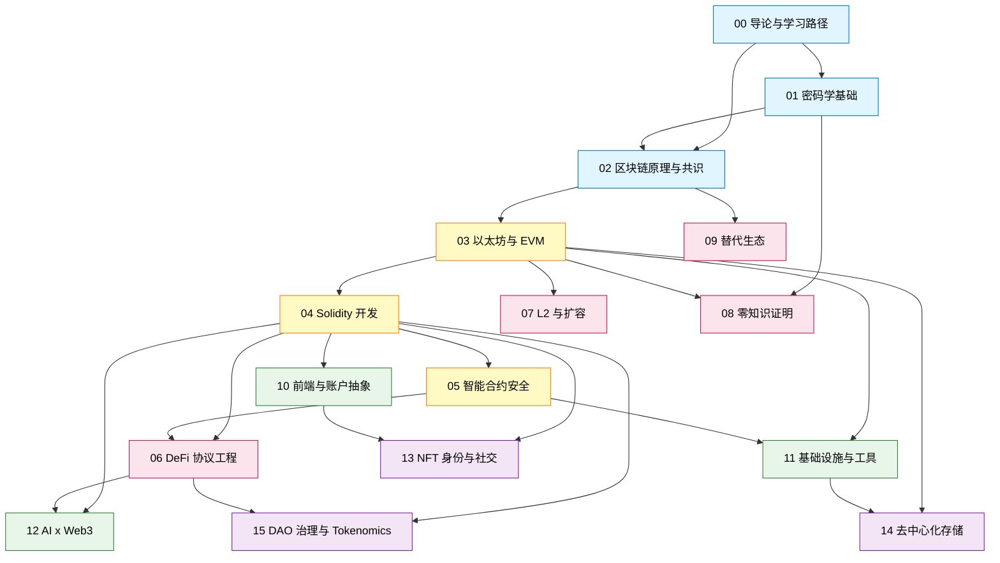

# 模块 00：导论与学习路径

> TL;DR：从哪里开始？先装好环境（§3），对照 Mermaid 依赖图（§1）选定一条路径，按 12 周入门表（§2）推进，遇到障碍查附录。

面向已有 1+ 年软件工程经验、第一次系统进入 Web3 的工程师。

### 读者画像扩展：中文圈现实

> TL;DR：本文不替代律师意见。Web3 在中文圈是合规高敏区，**身份分流**和**司法辖区选择**和你写哪行代码同等重要。

**大陆境内 dev**（截至 2026-04）：2021-09-24 央行十部委通知（"924 通知"）把"虚拟货币相关业务活动"定性为非法金融活动，但**写代码、做开源贡献、领工资**本身在司法实践中未被列为禁止行为。红线在三处：（1）**不发币**——任何指向境内用户的 token launch 都踩 ICO 禁令；（2）**不做面向 C 端的 token economic 设计**——白皮书署名、TGE 操盘等留痕极重；（3）**接外包要谨慎**——为境外项目方写"上线即发币"的合约，按帮助信息网络犯罪活动罪（帮信罪）和非法经营罪都有判例。建议：贡献开源协议、给基础设施公司远程打工（薪资走 USDC + 香港/新加坡持牌 OTC 出金）相对安全；自己起项目优先注册海外实体。

**香港持牌路径**：*稳定币条例*由 HKMA 主导，**2025-05 通过 / 2025-08-01 生效（公众咨询期 2024-08，2024-12 立法会一读）**；SFC 1/4/7/9 号牌覆盖证券交易/资管，VATP（虚拟资产交易平台）牌照独立发放。HashKey、OSL 是首批持牌 CEX；StanChart、京东币链科技、圆币科技是首批入沙盒的稳定币发行人候选。香港护照/居留权 + 持牌机构 employment 是合规含金量最高的中文圈路径。

**出海路径**：Singapore PSA（MAS DPT 牌照，2024 起 retail 接入收紧，机构端仍开放）、Dubai VARA（2022 设立，对 DeFi/RWA 较友好，OKX/Bybit/Binance 多家拿牌）、Bali / Chiang Mai / Lisbon 远程节点（数字游民签证 + 海外实体雇佣，无牌照负担但需自管 KYC 和报税）。

**华人海外 dev**：KYC 走海外身份（美/加/欧/港/新护照或绿卡），Coinbase/Kraken 等出入金通道才稳定；token 发行实体优先 Cayman Foundation（DAO 主流）、BVI（Layer-1 偏好）、瑞士 Stiftung（Ethereum Foundation 同款），避免在受限辖区签 SAFT。详细法律结构见 §15。

---

## 0. 前置知识

> **TL;DR**：这本书像盖二楼，地基（Git/Shell/JS/Python/HTTP/SQL）由你自带。任一项空白回去补，**别在 Web3 教程里学 Git rebase**。

2022 年 Nomad Bridge 被 1.9 亿美元抽干，事后社区复盘里有一条留言："攻击者第一笔交易上链后，竟然有 300 多个地址 copy-paste 同一笔 calldata 跟单抢。"——这些人连 `ethers.utils.hexlify` 和 `parseInt` 的差别都没搞清，就敢直接对着 mainnet 喊"我也来一份"。**前置知识空白 + Web3 资金路径 = 现成的反面教材**。

后续章节默认你已掌握以下能力，任一项空白先回去补：

- **Git**：能处理 merge conflict、懂 `rebase` 与 `merge` 差别。
- **Linux / macOS shell**：会读 `man`、写 `bash` 脚本、理解 `PATH`。
- **JS / TS**：写过生产应用，熟悉 npm/pnpm 与事件循环。
- **Python**：会用 `venv` / `pyenv`。
- **HTTP**：懂 JSON-RPC 与 REST 差别。
- **SQL**：会写 `JOIN`、懂索引与事务。

> 💡 把这 6 条想象成"驾照"：没驾照能不能开车？能，但出事就是大事。Web3 是公链广场，撞了车（资金被掏空）没有保险公司赔你。

> ⚠️ 没有这些底子直接学 Solidity，最常见的卡点是：看不懂 stack trace、不会用 `forge test -vvvv`、抓不到 RPC 报错、改不动 Hardhat config。这些都不是 Solidity 问题，是工程基本功。

### 章末

- 3 句速记：①前置不补，每步变两步；②6 项基本功缺哪补哪，别混学；③出事靠工程师本能，不是教程。
- 钩子：§1 看依赖图，对照方向挑路径。

---

## 1. 16 模块概览与依赖图

> **TL;DR**：蓝色 3 模块必学，黄色 3 模块吃饭，粉/绿/紫按方向选。图中箭头 = 硬依赖，跳过必踩坑。

2022 年 Wormhole 被盗 3.26 亿美元，根因是签名校验跳了一步——开发者跳过的，正是 §1 密码学里讲过的 ECDSA recovery 校验。**模块依赖不是教学顺序问题，是工程事故的预防图**。下面这张依赖图请像看地铁线路图一样看：跳站，会迷路。

> 💡 类比：依赖图像盖楼。蓝色是地基（混凝土），跳了楼会塌；黄色是承重墙（梁柱），决定你能盖多高；粉/绿/紫是装修，按户型选。

### 1.1 依赖图



### 1.2 五色分层

| 颜色 | 模块 | 定位 |
|---|---|---|
| 蓝（基础） | 00 / 01 / 02 | 所有方向都绕不开，顺序刚性 |
| 黄（核心） | 03 / 04 / 05 | 95% 工程师的吃饭栈，必须按 EVM → Solidity → 安全串起来 |
| 粉（协议专精） | 06 / 07 / 08 / 09 | 按方向只挑一条深耕 |
| 绿（横向） | 10 / 11 / 12 | 任意阶段并行接入，决定项目能否上线 |
| 紫（应用） | 13 / 14 / 15 | 至少熟一个才能做出落地产品 |

### 1.3 三条硬依赖链（跳过必踩坑）

**01 → 02 / 08**：椭圆曲线、哈希、Merkle 是后两者的语言。不懂 SHA-256 就不懂 PoW 为何安全，不懂 Merkle 树就读不懂 state proof。

**03 EVM → 04 Solidity**：Solidity 长得像 JS，初学者误以为可跳过 EVM。结果：把临时变量错写成 `storage`，gas 超限两个数量级；`stack / memory / storage / calldata` 四种数据位置永远分不清。

**04 → 05 → 06**：不会写合约就看不懂漏洞；DeFi 是漏洞收割机，没刷完 Ethernaut 1-15 就写资金路径等于裸奔。[rekt.news](https://rekt.news) 每年前 10 名累计损失常超 30 亿美元。

### 1.4 模块前置与产出

| 模块 | 前置 | 核心产出（可验证） | 时长 |
|---|---|---|---|
| 00 导论 | 无 | 3 条动机 + 6 个月目标 + 选定路径 | 0.5 周 |
| 01 密码学 | 00 | Python/TS 实现 SHA-256 对比 Keccak-256、ECDSA 签名验证、Merkle proof | 1 周 |
| 02 共识 | 01 | 本地起 PoS 双客户端（Geth+Lighthouse 或 Reth+Lodestar），观察 finality | 1 周 |
| 03 EVM | 02 | evm.codes 跟踪 1 笔 ETH 转账 + 1 笔 ERC-20 transfer 的全部 opcode | 1 周 |
| 04 Solidity | 03 | Foundry 项目：ERC-20、ERC-721、unit test、fuzz test，覆盖率 ≥ 90% | 3 周 |
| 05 安全 | 04 | Ethernaut 1-25、Damn Vulnerable DeFi v4 至少 5 关 writeup | 3 周 |
| 06 DeFi | 04+05 | Uniswap V2+V3+V4 hook 逐行 reading note，自写 minimal AMM | 3 周 |
| 07 L2 | 03 | 同一份合约部署到 OP Stack、Arbitrum Nitro、zkSync Era，对比 gas 与延迟 | 2 周 |
| 08 ZK | 01+03 | Circom 写 Merkle membership proof、Noir 写 password check | 3 周 |
| 09 替代生态 | 02 | Anchor token+NFT；可选 Move（Aptos/Sui）或 Cosmos SDK | 2-4 周 |
| 10 前端 | 04 | scaffold-eth-2 + wagmi + ERC-4337 smart account 完整流程 | 2 周 |
| 11 基础设施 | 03+05 | 自跑 Erigon/Reth 节点、起 Subgraph、可选 Flashbots 仿真 | 2-3 周 |
| 12 AI x Web3 | 04+06 | Claude/Cursor 写合约 → 自审 → 对比差异，写 lessons learned | 1-2 周 |
| 13 NFT 身份 | 04+10 | Solady 721+2981 mint 合约 + IPFS metadata + 1 个 Farcaster Frame | 2-3 周 |
| 14 去中心化存储 | 03+11 | 同一份 NFT metadata 上 IPFS/Filecoin/Arweave/Walrus，对比成本 | 1-2 周 |
| 15 DAO 治理 | 04+06 | OZ Governor v5.5 + Tally 集成 + token launch 白皮书 + 真实 DAO 提案 | 3 周 |

### 章末

- 3 句速记：①蓝→黄刚性顺序；②每模块要可验证产出物且公开；③横向模块 10/11/12 非可选。
- 钩子：§"行业历史时间轴"先看 11 个心智锚点。

---

## § 行业历史时间轴（事件驱动地图）

> **TL;DR**：Web3 不是平稳增长的工程领域，是被一连串**爆炸性事件**塑造出来的。每个事件都对应一类现在还在写的代码、还在跑的合规规则。下面 11 个节点是 Web2 工程师的"心智锚点"，详细技术机制见各对应模块。

> 💡 类比：像航空业的"事故催生法规"。每一条 FAA 规则背后都对应一次空难——Web3 的每一行安全代码、每一份合规模板、每一个 modifier，背后都是一次真实的崩盘。读这一节，请把它当作"行业事故报告合集"来读。

**2014-02 Mt.Gox 崩盘**：日本东京交易所丢失约 85 万 BTC（2014-02 约 4.5 亿美元；2026-04 价位约 800 亿美元）。表层归因为 transaction malleability 攻击，深层是 Karpelès 长期挪用与会计造假。这件事直接催生了**现代 Proof-of-Reserves（PoR）**实践和"not your keys, not your coins"行业口号。详见 11 章基础设施。

**2016-06 The DAO 攻击**：reentrancy 抽走 360 万 ETH → ETH/ETC 硬分叉 → "代码即法律 vs 救济持币人"首次公开对立；OZ ReentrancyGuard 由此成为新人写的第一个 modifier。详见 05-智能合约安全 §故事1。

**2017-Q3 ICO 退潮 + Howey Test 执法**：2017 年下半年至 2018 年 ICO 募资超 200 亿美元，1500+ 项目 90% 归零。SEC 启动 *Munchee*、*DAO Report*、Telegram、Kik 等系列执法，确立"以 Howey Test 判断 token 是否属于证券"的事实标准。后续 Ripple/XRP 案（2023 部分胜诉）、Coinbase/SEC 案（2024-10 撤诉）等都基于这一框架。**法务审查 token launch 的工作流由此成型**。

**2020 夏 DeFi Summer + 流动性挖矿**：Compound 6 月推出 COMP 治理代币空投，开启"yield farming"狂潮，TVL 从 10 亿美元 6 个月内冲到 200 亿美元。Uniswap V2、Yearn、Curve、Aave 在这个窗口同步爆发。**这是 Web2 工程师第一次大规模涌入 Solidity 写合约**，也是现代 DeFi 协议工程的诞生。详见 06 章。

**2022-05 Luna/UST 崩塌**：算法稳定币脱钩 → Luna 19000 倍稀释 → 蒸发约 600 亿美元；直接推动美国 GENIUS Act 与欧盟 MiCA 对储备金型稳定币的 1:1 fiat backing 强制。详见 06-DeFi §9.2。

**2022-06/07 暑假连锁清算**：Luna 暴雷 → 3AC 保证金爆仓 → Celsius/Voyager/BlockFi 冻结提现 → 2023-01 Genesis 破产；CeFi 未公开链下信贷敞口是传染主线。详见 06-DeFi §9.8.A。

**2022-08 Tornado Cash 制裁与 Roman Storm 案**：OFAC 把混币器 Tornado Cash 的智能合约地址列入 SDN 清单——**史上第一次制裁不可变代码**。开发者 Alexey Pertsev 在荷兰、Roman Storm 在美国先后被起诉。2025-03 美国财政部部分解除对合约地址的制裁（保留对个人的指控），Storm 案 2025 年开庭。这场官司直接定义了"写开源代码 vs 运营服务"的法律边界，每个 mixer/隐私协议工程师必读。

**2022-11 FTX/Alameda 崩盘**：FTT 抵押 + CZ 挤兑 → 80 亿客户资金缺口 → SBF 25 年监禁；把 PoR、链上结算、自托管推到合规标配。详见 06-DeFi §9.8.D。

**2023-03 SVB → USDC 脱钩**：硅谷银行倒闭，Circle 披露 33 亿美元储备卡在 SVB，USDC 跌至 0.87。FDIC 周末紧急接管后恢复脱钩。这件事让全行业重写**储备金披露规则**——Circle 改为月度 attestation + 每日 Treasury 持仓公开，Tether 也被迫加速透明化。稳定币工程师从此默认要做"reserve composition + redemption proof"集成。

**2024-07 Mt.Gox 14 万 BTC 还款分发**：破产管理人 Nobuaki Kobayashi 启动 10 年来首次大规模分发，约 14.2 万 BTC 通过 Kraken / Bitstamp / **SBI VC Trade** 等交易所打给债权人。市场短期承压（BTC 从 7 万跌至 5.4 万）。这是流动性风险管理（cliff vesting → linear unlock 设计）的真实压力测试，token 解锁曲线设计的反面教材。详见 15 章。

**2025-02 Bybit Hack 14.6 亿美元**：DPRK Lazarus 攻陷 Safe{Wallet} 前端供应链 + 盲签 → 40.1 万 ETH 蒸发，**史上单笔最大加密盗窃**。前端供应链 + blind signing 是新攻击面。详见 05-智能合约安全 §故事2 + §4.5 + 附录 C。

每个事件背后都是一类活的工程实践。读完这本书的目标，是让你看到下一次崩盘新闻时**第一反应是去看代码**，而不是看价格。

> ⚠️ 别只记数字。每个事件的"教训部分"才是工程师价值最高的部分——比如 Bybit 案教的不是"多签不安全"，而是"前端供应链 + blind signing 是新攻击面"。

> 🤔 自问：如果你今天上线一个 DeFi 协议，11 个事件里哪 3 个最可能在你身上重演？答案通常是 reentrancy（事件 2）、oracle/储备漂浮（事件 9）、签名 UI 欺骗（事件 11）。

### 章末

- 3 句速记：①工程实践是事故催生的；②每个事件对应还在跑的 modifier 或合规模板；③看新闻先看代码。
- 钩子：§2 把教训映射到 12 周节奏。

---

## 2. 12 周入门 / 24 周精通路径表

> **TL;DR**：12 周学会看 EVM、写 Solidity、通过 Ethernaut；24 周能审计合约、搭全栈 dApp、选定专精方向。

a16z 2024 招聘报告里有个数据：合约工程师入门到接第一个 paid audit 的中位数是 7-9 个月，下面这张表把它压到 24 周——前提是你每周 25-30 小时投入，且**12 周末已经在 GitHub 公开过至少一个能跑的 ERC-20 + 测试套件**。Code4rena 2025-Q1 数据：首战中位奖金 $1,800，但前 10% 拿了 $25k——决定差距的不是表里的"周数"，是 W8-10 的 Ethernaut writeup 你写了 5 篇还是 25 篇。

> 💡 类比：像跑马拉松配速表。表是平均节奏，但每个人有"心率区间"——卡 1 周完全正常，连续卡 3 周说明方法错了，回 §4 调整策略。

### 2.1 12 周入门路径（智能合约工程师基线）

| 周 | 模块 | 每周目标 | 产出检查点 |
|---|---|---|---|
| W1 | 00 导论 + 装环境 | 读完本文，装好环境，选定方向 | `forge init` 跑通，Sepolia ETH 已领 |
| W2 | 01 密码学 | 理解 hash / ECDSA / Merkle | Python 实现 ECDSA 签名验证 |
| W3 | 02 共识 | PoW vs PoS，finality 概念 | 本地起 Geth+Lighthouse 双客户端 |
| W4 | 03 EVM | opcode / stack / 四种数据位置 | evm.codes 跟踪 ERC-20 transfer |
| W5-6 | 04 Solidity 基础 | ERC-20 / ERC-721 / modifier | Foundry unit test 覆盖率 ≥ 90% |
| W7 | 04 Solidity 进阶 | proxy / gas optimization | UUPS + fuzz test 通过 |
| W8-9 | 05 安全 | 重入 / 访问控制 / 常见漏洞 | Ethernaut 1-15 关 writeup |
| W10 | 05 安全进阶 | Ethernaut 16-25 + DVDv4 | 至少 5 关 DVDv4 writeup |
| W11 | 10 前端 | wagmi + viem + ERC-4337 | scaffold-eth-2 dApp 能在 Sepolia 演示 |
| W12 | 06 DeFi 入门 | Uniswap V2 AMM 逻辑 | 自写 minimal AMM，测试覆盖 |

**12 周结束标准**：能独立写、测试、部署一个有安全意识的 ERC-20/ERC-721 合约，并有配套前端。

### 2.2 24 周精通路径（可选专精方向）

在 12 周基础上，继续 12 周按方向深耕：

| 周 | 通用方向 | 合约/安全方向 | 前端方向 | 协议/基础设施方向 |
|---|---|---|---|---|
| W13-14 | 06 DeFi 深耕 | Uniswap V3+V4 hook | ERC-4337 + EIP-7702 完整 UX | 11 基础设施：自跑节点 |
| W15-16 | 06 DeFi 深耕 | 写自己的 lending protocol | Privy/Dynamic embedded wallet | 11 Subgraph + Goldsky indexer |
| W17-18 | 07 或 08 | Code4rena 公开赛首战 | 13 NFT + Farcaster Frame | 11 MEV / Flashbots 仿真 |
| W19-20 | 07 或 08 | Sherlock 赛 / bounty | 14 去中心化存储集成 | 12 AI agent + 链上工具 |
| W21-22 | 09 替代生态 | 自选协议漏洞复盘 50 篇 | 全栈 dApp 上线 Base/Zora | 09 Solana Anchor 实战 |
| W23-24 | 方向收敛 | 公开审计报告首发 | 真实用户 dApp 上线 | 节点服务 / 公开 dashboard |

**24 周结束标准**：至少有 1 个公开运行的项目，或 1 份公开审计报告，或 1 个 protocol PR。

### 章末

- 3 句速记：①12 周是基线，产出物公开才有效；②±1 周正常；③死磕超 2 小时回 §4 调方法。
- 钩子：§3 装环境再开跑，W1 就会被工具卡住。

> ⚠️ 见过太多人 W1 不装环境直接看 W4 EVM，结果 W8 还在排查 `solc` 版本冲突。先把工具栈装对，再谈进度。

---

## 3. 环境配置（macOS / Linux，2026-04 验证）

> **TL;DR**：所有运行时走版本管理器，否则被老项目锁死编译器。生产私钥用 Foundry keystore，不用 `.env` 明文。

2023-07 Curve Finance 被攻击损失约 7000 万美元（部分追回），根因之一是几个池子用了**有 bug 的 Vyper 0.2.15/0.2.16**——团队 fork 老版本合约时直接复用旧编译器，没人锁版本。**编译器版本 = 资金安全**。下面所有"看似 DevOps 琐事"的步骤，都对应过历史上的真金白银损失。

> 💡 类比：版本管理器（`nvm`/`pyenv`/`rustup`/`foundryup`）像衣柜分区——不同项目穿不同衣服。`brew install` 是把所有衣服都扔进同一个抽屉，开会前永远找不到那件衬衫。

### 3.1 版本管理器（强制）

- **Node.js**：`nvm`，装 Node 20 LTS + 22 LTS（wagmi v2/viem v2 要求 ≥18）。
- **Python**：`pyenv`，Slither/Mythril/ape 要 3.10+。
- **Rust**：`rustup`，nightly + stable 双装（Solana/Anchor/Reth/Foundry 源码编译）。
- **Solidity**：用 Foundry 自带切换，**不要 `brew install solc`**——brew 只装最新版，老项目必卡。
- **Foundry**：`foundryup`；生产项目锁版本：`foundryup --install <commit>`。

### 3.2 一键脚本：EVM 工具链

```bash
# ── Foundry（forge / cast / anvil / chisel）
curl -L https://foundry.paradigm.xyz | bash && foundryup

# ── Hardhat 3（2026-02 v3.1.12，性能关键路径用 Rust 重写）
pnpm add -D hardhat @nomicfoundation/hardhat-toolbox
npm i -g hardhat-shorthand   # 之后用 hh 代替 npx hardhat

# ── 静态分析
pipx install slither-analyzer
cargo install aderyn          # Cyfrin 的 Rust 实现，比 Slither 快 10x
npm i -g @halmoslabs/halmos   # 形式化 / symbolic execution
```

### 3.3 一键脚本：Solana / Move / ZK 工具链

```bash
# ── Solana CLI（2025 起迁到 release.anza.xyz，2026-04 stable = v3.1.9）
sh -c "$(curl -sSfL https://release.anza.xyz/stable/install)"

# ── Anchor（Solana 智能合约框架）
cargo install --git https://github.com/coral-xyz/anchor avm --locked
avm install latest && avm use latest

# ── Reth 2.0（2026-04 发布 v2.0，Rust，Paradigm 出品）
git clone https://github.com/paradigmxyz/reth
cd reth && cargo install --locked --path bin/reth --bin reth

# ── Lighthouse（CL 客户端，Rust）
curl -LO https://github.com/sigp/lighthouse/releases/latest/download/lighthouse-x86_64-unknown-linux-gnu.tar.gz

# ── ZK：Circom + Noir
npm install -g snarkjs
git clone https://github.com/iden3/circom && cd circom && cargo install --path circom
curl -L https://raw.githubusercontent.com/noir-lang/noirup/main/install | bash && noirup

# ── Move：Sui / Aptos
brew install sui aptos  # macOS
```

### 3.4 Foundry 配置锁版本（生产必须）

```toml
# foundry.toml 示例
[profile.default]
src = "src"
out = "out"
libs = ["lib"]
solc_version = "0.8.28"
evm_version = "cancun"        # 2026-04 主网 EVM 版本
optimizer = true
optimizer_runs = 10_000
via_ir = true

[invariant]
runs = 5000
depth = 50
fail_on_revert = false
show_metrics = true
```

Curve Vyper 事故部分原因是浮动编译器版本——`solc_version` 必须固定。

### 3.5 私钥安全（部署生产合约前必读）

> ⚠️ 2022 年至少有 17 起公开报告的"私钥泄露事故"，根因都是 `.env` 进了公开 repo 或 CI log。`.gitignore` 不是建议，是底线。

私钥**绝不**进 git。流程：

1. `.env` 加 `.gitignore`；用 `direnv` 自动加载。
2. CI 用 GitHub Actions secrets。
3. 生产私钥用 Foundry keystore：

```bash
cast wallet import deployer --interactive
forge script Deploy.s.sol --account deployer --sender 0xYourAddr --broadcast
```

`--account` 签名时弹 password prompt 无法绕过——这正是安全价值所在。

### 章末

- 3 句速记：①版本管理器是护身符；②`.env` 明文私钥只能 testnet，生产用 keystore；③`foundry.toml` 锁 `solc_version`/`evm_version`。
- 钩子：§4 用搜→改→验三步循环跑起来。

---

## 4. 怎么用这本书

> **TL;DR**：搜→改→验三步循环，每模块写产出物，卡住超 2 小时就换策略。

Patrick Collins（Cyfrin 创始人）2024 年公开 Updraft 完课数据：报名 60+ 万，完成所有 lab 的不到 4%，但拿到第一份 paid audit 的学员里，**93% 都是把 lab 故意改坏过至少 5 次**的人。"看视频—复制代码—跑通"的路径，三个月后什么都不剩；"读一段—改坏一行—验证报错"的路径，三个月后能上 Code4rena。这一节讲的，就是把自己塞进后 4% 的方法。

> 💡 类比：搜→改→验像学开车不是看说明书，是去空地故意打方向盘——发动机不会爆炸，但你会知道方向盘多沉、刹车多深。Web3 的"空地"是 anvil 本地链和 testnet，免费、随便撞。

### 4.1 学习三步循环（事件钩子）

1. **搜**：同一名词在 ethereum.org docs、Cyfrin Updraft、相关 EIP、原始论文各看一遍。不一致处往往是真知识。
2. **改**：写最小复现，故意改坏一行（把 `nonReentrant` 去掉），看测试失败。改坏比写对学到的多。
3. **验**：跑 `forge test -vvvv` 读完整 trace；或放 testnet 让钱包真签一次——确认按钮时你会注意到 gas、nonce、chainId 等平时被抽象的细节。

### 4.2 不变量驱动（Invariant-Driven）

每读一个协议先问"哪些状态绝不能违反？"，写成 Foundry invariant test 跑给自己看。

经典样本：
- Uniswap V2：swap 前后 `k = x * y` 不减（无手续费情况）。
- ERC-20：`sum(balanceOf(每地址)) == totalSupply()`。
- ERC-4626 vault：`totalSupply == sum(LP shares)`，用 ghost variable 在 handler 中累加跟踪。

`forge test --match-test invariant_*` 关键参数：默认 `runs=256, depth=15` 太弱，生产代码至少 `runs=5000, depth=50`，开 `show_metrics=true`。

### 4.3 三类笔记不要混

- **概念笔记**（Markdown，永久）：what + why，每概念一篇 3-5 段，手写不复制粘贴。
- **排错笔记**（issue tracker / Linear / Notion）：错误信息 + 复现步骤 + 解决路径。
- **源码 reading note**（写在 fork 注释里 commit 上去）：每 200 行写 5 行总结。

### 4.4 AI 使用边界

AI 是草稿生成器，不是决策者：

**可以放心用**：测试用例骨架、生成 fuzz test 输入、解释陌生代码、前端胶水代码、NatSpec、部署脚本。

**必须自己懂、不能交给 AI**：资金路径（`transfer/approve/call value`）、访问控制（`onlyOwner`/role）、签名校验与重放保护、upgradability 模式、跨合约调用、固定点数学。

工作流：`草稿（AI） → 人工逐行 review → invariant test → Slither/Aderyn → testnet 真签 → 第三方审计 → mainnet`

**绝不**让 AI 执行任何带私钥的命令。

> ⚠️ 2024-08 一名 dev 让 Cursor 帮"自动跑部署脚本"，AI 把 mainnet RPC + 真实助记词写进了一份临时测试文件，提交进 public repo。3 分钟后地址被扫走 4 ETH。安全边界是"AI 出草稿，人按回车"，不能反过来。

> 🤔 自问：如果你今天上线一个 protocol，AI 写的代码里最危险的 3 行是哪几行？答不出来，就是 AI 信任过头了。

### 4.5 反面教材（常见陷阱）

- **跳过密码学直接学 Solidity**：`ecrecover` 返回值要校验非零，ERC-2612 permit 需要 EIP-712 domain separator——密码学直接决定 Solidity 写法。
- **信任 AI 写资金路径**：编译通过 ≠ 安全 ≠ 经济正确。AI 不知道你的 oracle 有 1 分钟延迟或 token 有 transfer fee。
- **"学完所有再开始做"**：Web3 栈太宽，等"学完"早已过时。每完成一个模块写一个最小项目挂 GitHub。
- **不公开作品**：GitHub 私库 = 不存在。产出物必须可被外部访问。

### 章末

- 3 句速记：①搜→改→验，不是看→记→背；②AI 写资金路径逐行 review；③公开进度是给招聘方查证入口。
- 钩子：附录 A 选 1 主 + 1 副方向。

---

## 附录 A. 招聘画像（5 方向）

> **数据时效声明**：以下 5 方向的薪资上限排序与"9 类公司"的代表名单为 2026-04/05 公开数据快照，6 个月后请重新对照 web3.career / cryptojobslist / a16z State of Crypto 校准。按 2026-05 公开数据：合约工程师全球中位 $125k、Solidity 工程师中位 $150k、顶级协议方 senior base $200k+（token 另计）、独立审计 contest 顶档（Sherlock top watson）年入可冲 $400k+/年。AI 替代相关的"市场冷热度"波动较大（2026-Q1 tech 业整体裁员 ~7.8 万、近 50% 标记为 AI/自动化相关），独立开发者侧请按月度复核。

| 方向 | 模块路径 | 核心技能 | 典型产出 |
|---|---|---|---|
| 智能合约工程师 | 04→05→06 | Foundry、不变量测试、gas optimization | 3 个开源协议 PR、ERC 提案 draft、1000 行协议+测试套件 |
| 安全审计员 | 04→05→06→CTF | Ethernaut 全关、DVDv4、Secureum RACE | 50+ 份公开审计报告总结；Code4rena/Sherlock 首赛报告 |
| 前端/全栈工程师 | 04→10→11 | wagmi v2/viem v2/ERC-4337/EIP-7702 | 3 个公开 dApp，至少 1 个含 AA 流程、1 个有真实用户 |
| 协议研发员 | 01→02→03→07/08 | 密码学、PoS、ZK、客户端源码 | Ethereum 客户端非平凡 PR、EIP draft、ethresear.ch 有讨论帖 |
| 基础设施/MEV | 02→03→11 | RPC/indexer/MEV searcher/节点运维 | 公开运行服务（indexer / 公共 RPC / MEV bot 数据看板） |

**技术栈速查（2026 production-ready）：**

- 前端：Next.js 15 + React 19 + wagmi v2 + viem v2 + RainbowKit + shadcn/ui + Privy/Dynamic
- 执行层客户端：Geth（41%）、Reth 2.0（~20-25%，Base/OP 已迁移）、Erigon（archive，3-3.5 TB）
- 共识层客户端：Lighthouse、Prysm、Teku、Nimbus、Lodestar
- 安全竞赛：Code4rena（Zellic 收购，参与人数最多）、Sherlock（提供事后保险）、Cantina（审计员 stake）

### 职业地图：9 类 Web3 公司

> TL;DR：5 方向是技能侧，9 类公司是雇主侧。同样写 Solidity，在协议方、L2、审计所、AI×Web3 的日常完全不同——选哪类公司比选哪门语言更决定下一步。

**1. 协议方（Protocol Labs）** — 直接造 DeFi/Restaking 原语，估值最高、薪水顶配，对算法/经济学/安全审视极严。代表：**Uniswap Labs / Aave / Lido / EigenLayer Labs / Morpho / Pendle**。工作语言：Solidity 主，Rust 副（核心算子和 watcher 偏 Rust）。

**2. L2 / Rollup 团队** — 客户端、sequencer、bridge、proof system 全栈，工程量最大，跨执行层与共识层。代表：**OP Labs / Arbitrum Foundation / Matter Labs（zkSync）/ Scroll / Polygon Labs / Linea / Starknet / Taiko**。工作语言：Solidity（合约） + Rust（客户端、prover）+ Go（旧 fork）。

**3. 钱包 / 账户层** — UX 复杂度最高，签名安全是命脉，AA + passkey + EIP-7702 全链路。代表：**MetaMask / Rabby / Privy / Dynamic / Frame / Coinbase Smart Wallet / Safe**。工作语言：TypeScript 主 + 安全审视 + 部分原生（iOS/Android secure enclave）。

**4. CEX / 中心化交易所** — 撮合引擎、风控、托管、上币、清结算，量化在内，规模最大，合规最重。代表：**Coinbase / Binance / OKX / Bybit / Kraken / Bitget**。工作语言：Go / Java / Rust 后端 + TypeScript 前端 + Python 风控。

**5. 做市商 / Prop Trading** — 高频、链上 MEV、跨场套利，门槛最高，薪水也最离谱。代表：**Wintermute / Jump Crypto / GSR / DRW / Cumberland / Flow Traders**。工作语言：Rust / C++ 高频 + Python 策略，对延迟和数学要求极高。

**6. VC / 投研机构** — 投后服务、技术尽调、研究报告、portfolio 协调。代表：**a16z crypto / Paradigm / Pantera / Polychain / HashKey / Multicoin / Variant / 1confirmation**。工作语言：TypeScript 投后工具 + 研究为主（Python/SQL/链上数据）。

**7. 审计所 / 安全公司** — 协议代码逐行审计，形式化验证、fuzzing、bounty 平台。代表：**OpenZeppelin / Trail of Bits / Cyfrin / Spearbit / ChainSecurity / Zellic / Halborn / Quantstamp**。工作语言：Solidity 深 + Halmos / Certora / K Framework / Foundry invariant，重写比读懂更重要。

**8. 基础设施 / DevTools** — RPC、indexer、oracle、bridge、节点托管、监控、CI。代表：**Alchemy / Infura / Chainlink / The Graph / Pyth / Goldsky / Tenderly / Blockscout**。工作语言：Go / Rust 后端 + TypeScript 控制面 + DevOps（K8s / Terraform 重度）。

**9. AI × Web3** — 链上推理网络、ML 训练协调、agent 经济、隐私 ML。代表：**Bittensor / Gensyn / Sahara / Olas / Ritual / Hyperbolic**。工作语言：Python ML（PyTorch/JAX）+ Solidity 经济层 + Rust 节点。详见 12 章。

**华人创立的公司值得关注**：**Conflux**（龙凡，Tree-Graph PoW，2021 上线香港金科沙盒）、**Plasma Labs**（BTC-secured stablecoin L1，2024 主网，Founders Fund 领投）、**Goplus**（链上安全 SaaS，wallet/dApp 端实时风险扫描）、**Babylon**（David Tse，BTC staking 协议）、**Matter Labs / zkSync**（Alex Gluchowski 团队含华人核心）、**Pendle**（Vu Gaba Vineb + 华人核心，yield trading 头部）。

**怎么挑**：薪资上限 1≈5>2>3>8>4>7>9>6；学习曲线 5≈7>1≈2>9>3>4>8>6；签证/远程友好度 7≈8>2>1>9>3>6>4>5（做市商基本不远程）。第一份工作建议：协议方（深度）或审计所（广度）任选其一，三年后再切换不迟。

---

## 附录 B. 工具链锚点表

| 工具 | 类别 | 安装命令 / 地址 | 备注 |
|---|---|---|---|
| Foundry | EVM 测试框架 | `curl -L https://foundry.paradigm.xyz \| bash && foundryup` | forge/cast/anvil/chisel |
| Hardhat 3 | EVM 测试框架 | `pnpm add -D hardhat` | v3.1.12，Rust 重写关键路径 |
| Slither | 静态分析 | `pipx install slither-analyzer` | Trail of Bits 出品 |
| Aderyn | 静态分析 | `cargo install aderyn` | Cyfrin，比 Slither 快 10x |
| Halmos | 形式化验证 | `npm i -g @halmoslabs/halmos` | symbolic execution |
| Solana CLI | Solana 工具链 | `sh -c "$(curl -sSfL https://release.anza.xyz/stable/install)"` | 2025 起迁到 anza.xyz |
| Anchor | Solana 框架 | `cargo install --git ...coral-xyz/anchor avm` | avm install latest |
| Reth | EL 客户端 | github.com/paradigmxyz/reth | v2.0（2026-04），Rust |
| Lighthouse | CL 客户端 | github.com/sigp/lighthouse | Rust，Sigma Prime |
| Circom + snarkjs | ZK | `npm install -g snarkjs` + cargo circom | Iden3 |
| Noir | ZK | `curl -L ...noirup/install \| bash && noirup` | Aztec |
| Ethernaut | 安全 CTF | ethernaut.openzeppelin.com | 30+ 关，2025-09 新增 4 关 |
| DVDv4 | 安全 CTF | damnvulnerabledefi.xyz | Damn Vulnerable DeFi v4 |
| evm.codes | EVM 参考 | evm.codes | opcode 成本查询 |
| Tenderly | trace 调试 | tenderly.co | 比 Etherscan 友好 10 倍 |
| L2BEAT | L2 监控 | l2beat.com | stage 分类 + TVL |
| scaffold-eth-2 | 全栈模板 | github.com/scaffold-eth/scaffold-eth-2 | wagmi+viem+RainbowKit |

**IDE：**
- VS Code：插件 *Solidity (Juan Blanco)* + *Hardhat Solidity* + *Even Better TOML* + *GitLens*；`solidity.formatter` 设 `forge`。
- Cursor：Composer mode 写测试快，写资金路径必须人工 review。

**钱包/浏览器：**
- MetaMask（开发）+ Rabby（日常）+ Safe（多签）+ Coinbase Smart Wallet（passkey）
- MetaMask Flask 用于测试 EIP-7702/4337 新特性
- RPC：Alchemy + Infura（主备）；永远不在前端 hardcode RPC URL。

---

## 附录 C. 资源清单与社区

### C.1 必读书（按方向极简选）

| 方向 | 首选（只读 1 本） | 进阶 |
|---|---|---|
| 通用入门 | *Mastering Ethereum* 2nd Ed（O'Reilly 2025-11-11，github.com/ethereumbook） | *Upgrading Ethereum*（eth2book.info，免费） |
| 合约工程 | 同上 | *RareSkills Book of Solidity Gas Optimization*（rareskills.io/book，免费） |
| 安全审计 | *Fundamentals of Smart Contract Security*（Richard Ma，Quantstamp） | Secureum RACE 1-41 题库 |
| ZK | *Proofs, Arguments, and Zero-Knowledge*（Justin Thaler，免费 PDF） | *The MoonMath Manual*（github.com/LeastAuthority/moonmath-manual） |
| Solana | *Solana Development with Rust and Anchor*（Sebastian Dine） | *The Rust Programming Language*（doc.rust-lang.org/book） |
| Bitcoin | *Programming Bitcoin*（Jimmy Song，O'Reilly 2019） | *Mastering Bitcoin*（Antonopoulos，2nd/3rd） |
| DeFi/DAO | *DeFi and the Future of Finance*（Harvey et al，Wiley 2021） | *Token Economy*（Voshmgir，token.kitchen，部分免费） |
| 密码学 | *Real-World Cryptography*（David Wong） | — |

**第一个项目**（通用）：Cyfrin Updraft Foundry Fundamentals（免费，60+ 小时）→ Speedrun Ethereum 10 关。CryptoZombies 停留在 2018 年，不推荐。

### C.2 免费课程平台

| 平台 | 强项 | 检索日 |
|---|---|---|
| Cyfrin Updraft | 安全审计、DeFi 实战、ZK Solidity；100% 免费，可获 SSCD+ 证书 | 2026-04 |
| Speedrun Ethereum | 全栈 dApp 直觉、scaffold-eth；10 关含 ZK Voting | 2026-04 |
| Solana Developer Bootcamp 2024 | Solana 全栈最权威免费，20 小时 | 2026-04 |
| Alchemy University | JS for Ethereum；内容停留较早 | 2026-04，免费 |

**付费进阶**：RareSkills Solidity Bootcamp（$5,850，13 周，下期 2026-06-04）；RareSkills ZK Bootcamp（16 周）；Atrium Uniswap Hook Incubator（免费+申请制，9 周）。Secureum Epoch∞ 已暂停，但 RACE 1-41 题库仍是行业事实标准。

### C.3 信息渠道

**Newsletter（每周）：**
- *Week in Ethereum News*（Evan Van Ness）：最高信噪比
- *Bankless Newsletter*：日刊 3 分钟
- *a16z crypto* / *Paradigm* research blog

**论坛：**
- ethresear.ch（协议研究）、ethereum-magicians.org（EIP 讨论原始现场）
- rekt.news（事故复盘，每周 1 篇，半年 25 篇安全直觉暴涨）

**Twitter/X Pin 列表（不刷主页）：**
- 协议研发：@VitalikButerin, @drakefjustin, @dankrad, @lightclients, @TimBeiko
- 安全：@samczsun, @0xfoobar, @PatrickAlphaC, @transmissions11, @bytes032
- DeFi：@haydenzadams, @0xMaki, @StaniKulechov, @AndreCronjeTech
- L2/ZK：@bkiepuszewski, @dabit3, @anna_rrose
- 基础设施/MEV：@bertcmiller, @phildaian, @0xQuintus

**会议（年度必看录像）：**
Devcon/Devconnect（协议路线图首发）、ZK Summit、ETHGlobal 黑客松（找 finalist 源码读一遍）

### C.4 Ethereum Roadmap 速览（2026-04）

- **Pectra**（2025-05-07）：EIP-7702 / EIP-7251 / EIP-7002 / EIP-7549 / EIP-7691 / EIP-2935 / EIP-7623 / EIP-7685，账户抽象事实标准。
- **Fusaka**（2025-Q4）：PeerDAS 落地，L2 数据成本进一步下降。
- **Glamsterdam**（2026 H1）：ePBS + BAL（EIP-7928），目标 L1 10000 TPS 区间。

---

## 附录 D. 自审记录

完成每个模块后在这里打勾，或另建学习日志文件维护。公开进度不是为流量，是给招聘方和同行一个查证入口。

### D.1 环境准备

- [ ] `forge init` 跑通，`forge test` 通过
- [ ] Sepolia ETH 已领取（[faucet.quicknode.com](https://faucet.quicknode.com) 或 [sepoliafaucet.com](https://sepoliafaucet.com)）
- [ ] `.env` 已加入 `.gitignore`
- [ ] Foundry keystore 配置完毕（`cast wallet import`）
- [ ] VS Code / Cursor 插件装好，`solidity.formatter` 设为 `forge`

### D.2 模块完成情况

| 模块 | 产出物 URL | 完成日期 | 备注 |
|---|---|---|---|
| 00 导论 | — | | 6 个月目标已写下 |
| 01 密码学 | | | ECDSA 验证实现 |
| 02 共识 | | | 本地双客户端节点 |
| 03 EVM | | | evm.codes 跟踪记录 |
| 04 Solidity | | | GitHub repo 链接 |
| 05 安全 | | | Ethernaut writeup |
| 06 DeFi | | | minimal AMM repo |
| 07 L2 | | | 三链部署对比笔记 |
| 08 ZK | | | Circom / Noir repo |
| 09 替代生态 | | | Anchor token repo |
| 10 前端 | | | dApp URL |
| 11 基础设施 | | | 节点 / indexer URL |
| 12 AI x Web3 | | | lessons learned blog |
| 13 NFT 身份 | | | mint 合约 + Frame |
| 14 存储 | | | 对比笔记 |
| 15 DAO 治理 | | | 提案 + 白皮书 |

### D.3 方向选定

- [ ] 已选定主方向：_______________
- [ ] 已加入相关社区（Discord / Telegram）：_______________
- [ ] GitHub profile 公开，已 pin 产出物

### D.4 进度里程碑

| 里程碑 | 目标日期 | 完成日期 |
|---|---|---|
| 装好环境，跑通 `forge init` | | |
| 完成蓝色三模块（00/01/02） | | |
| 完成黄色三模块（03/04/05） | | |
| Ethernaut 1-15 关全部 writeup | | |
| 12 周入门路径完成 | | |
| 24 周精通路径完成 | | |
| 第一个公开项目上线 | | |

---

*下一步：`01-密码学基础/README.md`。已熟悉哈希/椭圆曲线/Merkle tree 可跳到 `02-区块链原理与共识/`。*

