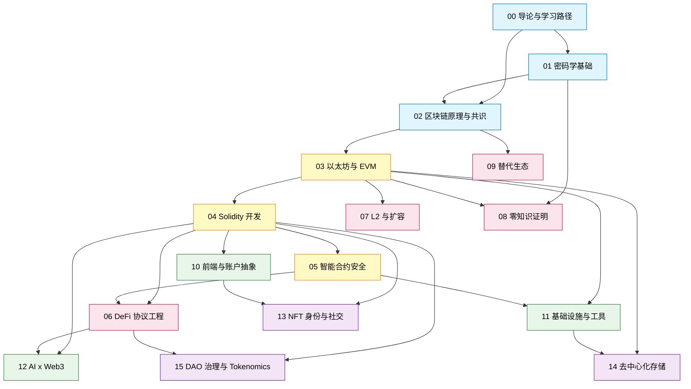

# 模块 00：导论与学习路径

面向已有 1+ 年软件工程经验、第一次系统进入 Web3 的工程师。

---

## 0. 前置知识

后续章节默认你已掌握以下能力，任一项空白先回去补：

- **Git**：能处理 merge conflict、懂 `rebase` 与 `merge` 差别。
- **Linux / macOS shell**：会读 `man`、写 `bash` 脚本、理解 `PATH`。
- **JS / TS**：写过生产应用，熟悉 npm/pnpm 与事件循环。
- **Python**：会用 `venv` / `pyenv`。
- **HTTP**：懂 JSON-RPC 与 REST 差别。
- **SQL**：会写 `JOIN`、懂索引与事务。

---

## 1. 直觉与历史：Web3 究竟在解决什么问题？

### 1.1 Web2 没有"结算层"

SaaS 收 99 美元走的链路：`用户卡 → 发卡行 → Visa/Mastercard → 收单行 → Stripe → 你的账户`。Stripe 收 2.9%+30¢ 是承担**对手方风险**，全链依赖 1970 年代银行报文协议（SWIFT、ACH、SEPA）——没有一段是互联网原生的。

互联网解决"信息分发"，**从未解决"价值确权与结算"**。"在网上转钱"= 把信息发给银行让他们改数据库。

1990 年代 cypherpunk（Hal Finney、Adam Back、Wei Dai、Nick Szabo）花二十年回答：

> 能不能不依赖任何单一可信第三方，让陌生人互相支付？

### 1.2 双花问题（Double-Spending Problem）

**双花**：同一笔钱花两次。物理现金不可能（递出去就少了），bit 可复制——复制钱包文件就有两份钱。传统答案是中心化记账，代价是可冻结、可拒跨境、可收费。

2008-10-31 Satoshi Nakamoto 发表 9 页论文 *Bitcoin: A Peer-to-Peer Electronic Cash System*（[bitcoin.org/bitcoin.pdf](https://bitcoin.org/bitcoin.pdf)）。解法：

1. **分布式时间戳服务器**：交易打包成块，每块含上一块的哈希，形成链。
2. **工作量证明 PoW**：谁先算出满足难度的哈希谁出块；把"谁能改账本"绑定到"谁能提供算力"。
3. **最长链规则**：诚实节点认累计难度最高的链，攻击者要回滚就得重做所有 PoW。

**关键洞察**：用"经济激励 + 物理算力"替代"中心化信任"——人类第一次让陌生人就**单一全局状态**达成共识而不依赖中央权威。

#### 直觉图：从中心化账本到分布式账本

```
[ 中心化账本 ]              [ 分布式账本 ]

  +---------+                +-----+    +-----+    +-----+
  |  银行   |                |节点A| -- |节点B| -- |节点C|
  |  DB     |                +-----+    +-----+    +-----+
  +---------+                   \\         |          //
   /   |   \\                    \\        |         //
  /    |    \\                    +-- 同步同一份链 --+
用户  用户  用户                          |
                                  +-- PoW/PoS 决定下一区块 --+

可信度来自：              可信度来自：
- 监管/牌照               - 密码学（哈希链不可逆）
- 公司声誉                - 经济激励（攻击成本 > 收益）
- 法律追索                - 多方独立验证
```

### 1.3 从比特币到以太坊：从"电子现金"到"全球计算机"

比特币脚本**故意图灵不完备**：无循环、不能调用合约。每笔 tx 成本可静态分析、消除 DoS，代价是只能写转账，写不出借贷、衍生品。

2013-11-27 Vitalik（19 岁）发布《以太坊白皮书》（[ethereum.org/whitepaper](https://ethereum.org/whitepaper/)），向 Bitcoin 提议加图灵完备脚本被否后另起炉灶。

以太坊三大创新：

1. **EVM 图灵完备虚拟机**：链上跑任意计算，只要付 gas。
2. **账户模型而非 UTXO**：全局 `mapping(address => Account)`，每账户含 nonce、balance、storage、code，让"持有状态"成为一等公民。
3. **Gas 机制**：每 opcode 固定 gas 成本，gas 价格由市场决定，把"图灵完备 + 不被无限循环卡死"在经济激励层协调。

主网 2015-07-30（Frontier）上线。十余年后市值、开发者数、TVL 均为除 Bitcoin 外第一。

#### 工程师注脚 1.A：UTXO vs 账户模型

| 维度 | UTXO（Bitcoin） | 账户（Ethereum） |
|---|---|---|
| 状态表达 | 未花费输出列表 | 全局 mapping |
| 交易并行 | 天然并行 | 顺序执行（storage 冲突约束） |
| 编程便利度 | 低（追踪 input 集合） | 高（直接读写状态） |
| 隐私 | 较好（每笔可换地址） | 较差（地址重用普遍） |
| MEV 复杂度 | 由排序权与可组合性共同决定，与状态模型只弱相关 | 同上（块内可任意排序 + 高度可组合 → 实践中极高） |

Cardano、Sui、Aptos 等用变种 UTXO（eUTXO、Object-centric）追求并行执行优势，根源在此。

### 1.4 The DAO 与硬分叉

2016-04-30 The DAO 上线，28 天募集 1150 万 ETH（约 1.5 亿美元，当时最大众筹）。06-17 攻击者用**重入（reentrancy）**抽走 360 万 ETH（[gemini.com/cryptopedia/the-dao-hack](https://www.gemini.com/cryptopedia/the-dao-hack-makerdao)）——漏洞两周前已被 Peter Vessenes 警告，团队无视。

社区两难：回滚违背"代码即法律"；不回滚等于让攻击者持有以太坊十分之一。2016-07-20（区块 1,920,000）硬分叉，保留原链的少数派成为 **Ethereum Classic（ETC）**。

两条工程教训：重入会要命（催生 CEI 模式与 ReentrancyGuard，这是 05-安全作为 04-Solidity 硬下游的根因）；**代码不是法律——社会共识才是**，这是协议设计至今的根本张力。

### 1.5 从 PoW 到 PoS：The Merge 与 Endgame

2022-09-15 The Merge（2015 即规划）：质押资本替代消耗算力。验证者质押 32 ETH，按权重抽签出块，作恶被 slash。能耗 -99.95%，引入长程攻击、流动性质押集中化、验证者地理集中等新问题。

Vitalik 2021-12 *Endgame*（[vitalik.ca/general/2021/12/06/endgame.html](https://vitalik.ca/general/2021/12/06/endgame.html)）：

> *"所有可扩展的链最终走向：区块生产中心化、区块验证去中心化、强反审查机制兜底。"*

MEV、PBS、DAS 都是这论点的工程化，02-共识 / 07-L2 / 11-基础设施反复回到这条主线。

### 1.6 2025-2026：账户抽象成为主流

2025-05-07 Pectra 上线（11 个 EIP），EIP-7702 让 EOA 通过 SetCode authorization 持久委托到合约代码（直到下一次 SetCode 覆盖或委托到 0x0 撤销）（[blog.ethereum.org/2025/04/23/pectra-mainnet](https://blog.ethereum.org/2025/04/23/pectra-mainnet)）。配合 ERC-4337：用 USDC 付 gas、社交恢复、批量执行、dApp 代付。**钱包 UX 追上 Web2**。10-前端模块展开。

### 1.7 时间轴速览

```
2008-10-31  Satoshi 发布 Bitcoin 白皮书
2009-01-03  Bitcoin 创世区块（Genesis Block）
2013-11-27  Vitalik 发布 Ethereum 白皮书（19 岁）
2015-07-30  Ethereum 主网（Frontier）上线
2016-06-17  The DAO 被攻击（5000 万美元当时）
2016-07-20  Ethereum 硬分叉，ETC 诞生
2017-12     CryptoKitties 撑爆 Ethereum，激发 L2 研究
2020-06     "DeFi Summer" 启动（Compound 治理代币空投）
2020-12-01  Beacon Chain 上线（Ethereum PoS 共识层启动）
2022-03-23  Ronin Bridge 被盗 5.4 亿美元（Lazarus Group）
2022-08-01  Nomad Bridge 被盗 1.9 亿美元（群众参与的 hack）
2022-09-15  The Merge：Ethereum 转 PoS
2023-03     ERC-4337 v0.6 正式部署到主网（v0.7 于 2024-04 部署，v0.8 迁移中）
2023-07-30  Curve Vyper 编译器漏洞，约 5200 万美元损失
2024-03-13  Dencun 升级（EIP-4844 blob，L2 成本断崖下跌）
2025-05-07  Pectra 升级（EIP-7702 账户抽象进 EOA）
2025-11-11  Mastering Ethereum 2nd Edition 出版
2026-Q1     Glamsterdam 升级筹备（block-level access list、ePBS）
```

### 1.8 习题


**1.8.1** 一句话解释为什么 Bitcoin 选"图灵不完备"、Ethereum 选"图灵完备"都是有意为之。

> 答案：Bitcoin 目标是单一可信价值传输，图灵不完备让每笔 tx 成本可静态分析、消除 DoS 攻击面；Ethereum 目标是任意可信计算，图灵完备 + gas 把"程序终止性"从静态保证变成动态保证（gas 耗尽就 revert），换来表达能力。两者不是优劣，是目标不同。

**1.8.2** The DAO 后为什么社区不能选"不动"？用社会学而非技术回答。

> 答案：5000 万美元占当时 ETH 总市值过大，不分叉等于"以太坊从此被一个匿名攻击者持有十分之一"。当时社区主体是技术 + 投资者重叠，财富与项目存亡绑定。"代码即法律"在抽象上吸引人，但现实成本足够大时社会共识必然推翻它。此事永久改变 Ethereum 文化——之后每次重大升级都隐含"社会共识能否推翻技术决定"。

**1.8.3** 给用过 Stripe、没碰过 Web3 的同事 90 秒讲清"为什么需要智能合约"，不用"去中心化"，举具体例子。

> 答案样例：Stripe 解决信用卡到你银行账户的资金路径，但如果 Stripe 拒绝（俄罗斯客户、赌博、高风险跨境），你就完了。智能合约是公开账本上的程序，谁都能调用、谁都能验证执行结果，不需要 Stripe 批准。例子：全球众筹合约，规则"到期没达标自动退款"，没有平台能扣资金或改规则。它不替代 Stripe，是给 Stripe 不能做的场景一个可信选项。

---

## 2. 16 个模块的依赖图

### 2.1 全图



### 2.2 五种颜色对应五种学习节奏

蓝色（00/01/02）是所有方向都绕不开的基础；黄色（03/04/05）是 95% 工程师吃饭的以太坊核心栈，必须按 EVM → Solidity → 安全 的顺序串起来；粉色（06/07/08/09）是协议级专精，按你的方向只挑一条深耕；绿色（10/11/12）是横向能力，任意阶段都能并行接入；紫色（13/14/15）是应用层，至少熟一个才能做出真正落地的产品。

### 2.3 三条硬依赖链

**01 密码学 → 02 共识、08 ZK**：椭圆曲线、哈希、Merkle 证明是后两者的语言。不懂 SHA-256 抗碰撞性就不懂 PoW 为何安全；不懂椭圆曲线就讲不清 ECDSA 与 BLS 差别；不懂 Merkle 树就读不懂 state proof。

**03 EVM → 04 Solidity** 是初学者最常跳、后续最痛的一条。Solidity 长得像 JS，让人误以为可以绕过 EVM。结果是把临时变量错写成 `storage`，gas 超限两个数量级；栈、memory、storage、calldata 四种数据位置分不清，gas 永远多花。

**04 Solidity → 05 安全 → 06 DeFi** 是顺序关系。不会写合约就看不懂漏洞，Ethernaut（[ethernaut.openzeppelin.com](https://ethernaut.openzeppelin.com)，30+ 关，2025-09 新增 Bet House / Elliptic Token / Cashback / Impersonator Two 四关）默认你能读懂字节码级行为。而 DeFi 是漏洞收割机，没刷完 Ethernaut 1-15 就写资金路径等于裸奔上战场——[rekt.news](https://rekt.news) 每年前 10 名累计损失常超 30 亿美元。

### 2.4 软依赖与并行选修

07 L2 在 03 之后理论上就能学，但 L2 跑的是 DeFi，先 06 后 07 才连贯；10 前端 04 后即可上手，对安全的要求是"知边界"而非"能审计"；09 替代生态里，Solana 需要 02 + Rust，Move 需要类型论与资源语义，都建议 04 之后再展开。

横向三模块（10/11/12）决定的是项目能否上线、能否被使用。10 前端决定有没有人用——漂亮 Solidity 配丑前端没人点开；11 基础设施决定能否扛住主网，anvil 100% 通过不代表主网没有 RPC 限速、indexer 延迟、监控缺失这类事故；12 AI x Web3 决定生产力上限，单人 + Cursor + Claude 在 2026 年能做 2022 年五人团队的事，前提是懂 §11 的边界。

紫色应用层（13/14/15）不是必修，而是三种产品形态：13 是身份与社交（ENS / Farcaster / Lens / ERC-6551 TBA，to-C 产品绕不开）；14 是去中心化存储（NFT metadata 与 DA 层都需要，IPFS / Filecoin / Arweave / Walrus 经济模型差异巨大）；15 是 DAO 治理与 Tokenomics（代码 + 经济学 + 法律三栖，难点在 token design 与机制设计）。这是垂直应用方向，对应招聘市场上的 NFT / DAO / storage engineer 岗位，但不是入行门槛。

### 2.5 倒过来读会怎样

先去 06 DeFi、再回补 04/05 这条路走不通。但你可以**用半天时间预习**：去 Uniswap swap 一次、去 Aave 存 USDC、打开 DevTools 看前端如何包装链交互。每个概念 10-30 分钟，加起来不超过 2 小时——目的是建立直觉，正式学习仍然按依赖图来。

---

## 3. 学习资源全景：课程、书、社区

Web3 资源量大但良莠不齐：视频会停更、课程会停留在旧版本库、付费课与免费课的差距并不与价格成正比。下面按"免费课 → 付费 Bootcamp → 书 → 信息渠道 → 推特列表"分层，每层只挑当前仍在持续更新、且产物可验证的渠道。

### 3.1 免费视频/课程平台总览

| 平台 | 主理人/机构 | 风格 | 强项 | 弱项 | 检索日确认 |
|---|---|---|---|---|---|
| Cyfrin Updraft | Patrick Collins / Cyfrin | Hands-on，Foundry 优先 | 安全审计、DeFi 实战、ZK Solidity | 视频偏长，需自己加速 | 2026-04 仍 100% 免费，可获 SSCD+ 证书 |
| Speedrun Ethereum | Austin Griffith / scaffold-eth | Challenge-based | 全栈 dApp 直觉、scaffold-eth 框架 | 安全章节较弱 | 2026-04 共 10 关含 ZK Voting |
| Alchemy University | Alchemy | 短视频 + quiz | JS for Ethereum、7 周 Bootcamp | 内容停留较早，更新偏慢 | 2026-04 仍可访问，免费 |
| LearnWeb3 | LearnWeb3 DAO | Cohort-based | 配套 Discord 社区、有 hackathon | 内容质量参差 | 2026-04 仍活跃 |
| Solana Developer Bootcamp 2024 | Solana Foundation + 三位 DA | 20 小时长视频 | Solana 全栈最权威免费 | 仅 Solana | 2026-04 仍是最新官方版 |
| Aptos Learn / Move Book | Aptos Labs / Mysten Labs | 交互式 | Move 入门最佳免费选项 | 仅 Aptos / Sui | 2026-04 持续更新 |

### 3.2 付费 / 专业 Bootcamp 总览

| 平台 | 价格（2026） | 时长 | 适合谁 | 备注 |
|---|---|---|---|---|
| RareSkills Solidity Bootcamp | $5,850（3 个月分期）| 13 周 | 已会基础 Solidity 想进阶 | 下期 2026-06-04，每周 1-on-1 review |
| RareSkills ZK Bootcamp | 类似定价 | 16 周 | ZK 工程师 | 主理人 Jeffrey Scholz |
| RareSkills Uniswap V3 Bootcamp | 单独定价 | 8 周 | 想读懂 Uniswap V3/V4 | 数学密集 |
| Encode x Solana Bootcamp | 免费（Solana Foundation 赞助） | 6-8 周 | Solana 入门 | 周期性开课 |
| Atrium Academy Uniswap Hook Incubator | 免费（资助）+ 申请制 | 9 周 | 已是 Solidity 中级 | 黑客松结尾 |
| Secureum Bootcamp | 免费 | 不固定 | 安全方向 | Epoch∞ 在 2025-08 暂停，但 RACE 题库与 YouTube 录像永久保留 |

**工程师注脚 3.A：** Secureum Epoch Infinity 已暂停（[secureum.xyz](https://www.secureum.xyz/)），但 RACE 1-41 题库仍是行业事实标准学习材料。

### 3.3 必读书清单（按主题）

#### 3.3.1 比特币与基础

- *Mastering Bitcoin*（Antonopoulos，2nd/3rd Edition）：参考型，覆盖 SegWit、Lightning。
- *Programming Bitcoin*（Jimmy Song，O'Reilly 2019，[github.com/jimmysong/programmingbitcoin](https://github.com/jimmysong/programmingbitcoin)）：Python 从零实现 Bitcoin 库，14 章 + 练习，CC-BY-NC-ND。两本互补：前者 reference，后者 process。

#### 3.3.2 以太坊核心

- *Mastering Ethereum*（Antonopoulos & Wood，2nd Edition，O'Reilly **2025-11-11**，[github.com/ethereumbook/ethereumbook](https://github.com/ethereumbook/ethereumbook)）：含 EIP-2930/1559/4844/7702，DeFi 与 ZK 章节全新。**2026 年唯一权威以太坊参考书。**
- *Upgrading Ethereum*（Ben Edgington，[eth2book.info](https://eth2book.info)，免费）：PoS / Beacon Chain / Casper FFG 最权威解读。

#### 3.3.3 ZK 与密码学

- *Real-World Cryptography*（David Wong）：现代密码学入门首选，ECDSA、BLS、Noise 协议。
- *Proofs, Arguments, and Zero-Knowledge*（Justin Thaler，Now Publishers）：ZK 数学最权威，免费 PDF。

#### 3.3.4 Rust（Solana / Reth / Foundry 源码必备）

- *The Rust Programming Language*（[doc.rust-lang.org/book](https://doc.rust-lang.org/book/)）：官方教材。
- Rustlings（[rustlings.rust-lang.org](https://rustlings.rust-lang.org/)）：配套练习。
- *Comprehensive Rust*（Google Android 团队，[google.github.io/comprehensive-rust](https://google.github.io/comprehensive-rust/)）：4 天速成。

#### 3.3.5 Move（Aptos / Sui）

- *The Move Book*（Mysten Labs，[move-book.com](https://move-book.com/)）：Sui Move 免费教程，含 dynamic fields、对象模型。
- *Aptos Move by Example*（Aptos）：Aptos 风味。

### 3.4 信息渠道：Newsletter / 论坛 / 推特列表

#### 3.4.1 Newsletter（按周固定阅读）

- *Bankless Newsletter*（freemium，[bankless.com/newsletter](https://www.bankless.com/newsletter)）：日刊 3 分钟；另有 Ethereum Weekly、Mindshare（AI x Crypto）子刊。
- *Week in Ethereum News*（Evan Van Ness，Substack，2026-04-27 仍每周更新）：Ethereum 圈最高信噪比。
- *The Defiant*：DeFi 行业新闻；*Messari Daily Pulse*：研究型。

#### 3.4.2 研究博客

- a16z crypto：[a16zcrypto.com](https://a16zcrypto.com)；Paradigm：[paradigm.xyz/writing](https://paradigm.xyz/writing)
- Variant Fund、1kx、Delphi Digital、Galaxy Research：机构投研视角

#### 3.4.3 论坛与原始资料

- ethresear.ch：协议研究核心；ethereum-magicians.org：EIP 讨论原始现场
- Optimism / Arbitrum / Base 治理论坛：L2 真实运营问题
- *rekt.news*：事故复盘，残酷但必读

### 3.5 推特 / X 推荐 pin 列表

按方向拉一个 list，**不刷主页**：

- 协议研发：@VitalikButerin, @drakefjustin, @dankrad, @lightclients, @TimBeiko
- 安全：@samczsun, @0xfoobar, @PatrickAlphaC, @transmissions11, @bytes032
- DeFi：@haydenzadams, @0xMaki, @StaniKulechov, @AndreCronjeTech
- L2/ZK：@bkiepuszewski, @dabit3, @anna_rrose
- 基础设施 / MEV：@bertcmiller, @phildaian, @0xQuintus

---

## 4. 七条专业方向

无论选哪条方向，都先完成 Ethernaut 1-15 关 + 读完 SWC Registry——这是最低安全直觉。下面五条是传统方向（合约、安全、前端、协议、基础设施），两条是应用层方向（DAO、NFT 社交）。

### 4.1 智能合约工程师（Smart Contract Engineer）

**主路径：** 04 → 05 → 06。重点深耕 Foundry、不变量测试、gas optimization。

**关键产物：** 3 个开源协议的有意义 PR、1 个自己设计的 ERC 提案 draft、1 份 1000 行级别的协议代码 + 测试套件。

### 4.2 安全审计员（Security Researcher / Auditor）

**主路径：** 04 → 05 → 06 → CTF/竞赛。

**进阶顺序：** Cyfrin Updraft Security Course → Damn Vulnerable DeFi v4 → Ethernaut 全关 → Secureum RACE 题库自学 → Code4rena / Sherlock / Cantina 公开赛 → Immunefi bounty。

**竞赛平台对比（2026 Q1 实际状况）：**

| 平台 | 模式 | 项目预算 | 备注 |
|---|---|---|---|
| Code4rena | warden 竞争 | $20K-$200K+ | 2025 被 Zellic 收购，仍是参与人数最多的平台 |
| Sherlock | 提供事后保险 | $20K-$200K+ | 项目愿意付保费换"被审还被黑"时的赔付 |
| Cantina | 审计员需自己 stake | 灵活 | 信号更强但门槛高 |

**关键产物：** 每周读 3-5 份公开审计报告（OpenZeppelin、Trail of Bits、Spearbit）并写 1 段总结，半年内累计 50+ 份。

### 4.3 前端 / 全栈工程师（dApp Frontend）

**主路径：** 04（够用即可）→ 10 → 11。

**默认栈（2026 production-ready）：** Next.js 15 + React 19 + wagmi v2 + viem v2 + RainbowKit + Tailwind + shadcn/ui + TanStack Query + Privy/Dynamic（embedded wallet）。

**关键产物：** 3 个公开 dApp，至少 1 个含 account abstraction 流程、至少 1 个有真实用户。

### 4.4 协议研发员（Protocol R&D）

**主路径：** 01 → 02 → 03 → 07/08 选一。研究院线，门槛高薪资高。

**推荐项目：** Ethereum Protocol Fellowship（EPF，2025 年 Cohort 6，[blog.ethereum.org/2025/04/10/epf-6](https://blog.ethereum.org/2025/04/10/epf-6)）或 Ethereum Protocol Studies 2026（2026-02 启动，含 cryptography、lean consensus、zkEVM 三 track）。

**关键产物：** 1 个 client 的非平凡 PR、1 份 EIP draft 或研究 note、ethresear.ch 上 1-3 个有讨论的帖子。

### 4.5 基础设施工程师（Infra / DevOps / MEV）

**主路径：** 02 → 03 → 11，可与 12 AI x Web3 联动。

**方向：** RPC 服务、indexer（Subgraph、Goldsky、Envio）、MEV searcher/builder、bridge、节点托管、数据管道。

**2026 客户端选择参考：**
- 执行层（EL）：Geth（41% 市占率）、Reth（**2026-04 发布 2.0**，约 20-25% 市占且高速增长，Base 已弃 Geth 用 Reth，OP 主网 2026-05 弃 op-geth）、Erigon（archive 节点 3-3.5 TB，远小于 Geth 的 18-20 TB）、Nethermind、Besu。
- 共识层（CL）：Lighthouse、Prysm、Teku、Nimbus、Lodestar——多客户端是 Ethereum 安全的根。

**关键产物：** 1 个公开运行的服务（自己维护的 indexer / 公共 RPC / MEV bot 数据看板）。

### 4.6 DAO 工程师（DAO Engineer / Governance Architect）

**主路径：** 04 → 06 → 15。代码 + 经济学 + 法律三栖。

**当前真实岗位（2026 Q1）：** MakerDAO、Compound Core、Uniswap Foundation、Optimism Foundation、Aragon、Tally、Snapshot Labs 持续招聘（[web3.career/web3-companies/makerdao](https://web3.career/web3-companies/makerdao)）。

**技术栈：**
- **Governor 系**：OpenZeppelin Governor v5.5（含 timelock + votes extension）、Compound Governor Bravo、Aave Governance v3。
- **框架**：Aragon OSx（modular，Mode L2 已用其 vote-escrow + gauge 治理模型）、Zodiac（Safe 上的治理模块）、Snapshot X（链上链下结合）。
- **前端 + 数据**：Tally（Governor 标准 UI，Uniswap/Gitcoin 都在用）、Boardroom、Karma。
- **国库管理**：Safe + Den（多签）、Llama、Karpatkey（DAO treasury 管理服务）。

**关键产物：** 1 个原创治理提案被真实 DAO 采纳；1 份 token launch 白皮书（含 vesting schedule、quorum、proposal threshold 推导）；1 个开源治理模块 PR。

### 4.7 NFT / 社交工程师（NFT & Social Engineer）

**主路径：** 04 → 10 → 13。to-C 产品 + 链上身份，最接近 Web2 全栈。

**技术栈：**
- **NFT 标准**：ERC-721、ERC-721A（Azuki，gas-efficient batch mint）、ERC-1155（multi-token）、ERC-2981（royalties）、ERC-4906（metadata refresh）、ERC-6551（Token Bound Accounts，让 NFT 自身成为账户）。
- **身份层**：ENS、Farcaster ID（FID，2026-01 由 Neynar 接管协议运营）、Lens v3（2025 已迁移到自己的 L2，含 65 万 profiles + 125GB social graph）、Sign-In With Ethereum（SIWE，EIP-4361）。
- **社交层**：Farcaster Hubs + Frames v2（嵌入式 mini-apps）、Lens Open Action、XMTP（链上消息）。
- **存储**：IPFS / Arweave（NFT metadata 必须永久化，OpenSea 不替你保存）。

**关键产物：** 1 个有真实用户的 NFT mint 项目（Sepolia / Base / Zora）；1 个 Farcaster Frame 或 Lens Open Action；1 篇关于身份层的技术博客。

#### 工程师注脚 4.A：为什么 NFT 工程师不只是"玩头像的"

ENS 把名字 mapping 到 address；ERC-721 是身份单元；ERC-6551 让 NFT 成为账户持有 token、签 tx、参与治理。堆叠起来 = Web3 to-C 基础设施，2026 年覆盖社交、游戏、忠诚度、票务、艺术品、IP 授权。

---

## 5. 与权威路线图的交叉对照（reality check）

### 5.1 对比对象

| 路线 | 来源 | 形态 | 检索日 |
|---|---|---|---|
| roadmap.sh / Blockchain | Kamran Ahmed | 静态 SVG roadmap | 2026-04-27 |
| Cyfrin Updraft Career Tracks | Patrick Collins / Cyfrin | 6 条 career tracks（Foundations / Solidity / Vyper / DeFi / Security / Wallets / ZK） | 2026-04-27 |
| LearnWeb3 DAO Degrees | LearnWeb3 DAO | 4 条 tracks：Freshman / Sophomore / Junior / Senior | 2026-04-27 |
| Alchemy University EDB | Alchemy | 7 周 Ethereum Developer Bootcamp（Week 1 ECDSA、Week 2 storage） | 2026-04-27 |
| 100xDevs Cohort 3.0 Web3 | Harkirat Singh | 直播 + 录像，含 EVM + Solana + Rust | 2026-04-27 |
| ChainShot（已并入 Alchemy U） | ChainShot / Alchemy | 10 周 instructor-led | 2026-04-27 |

### 5.2 行业共识：所有路线共有核心

把六份路线图合在一起看，重叠的部分就是行业事实标准的入门核心——加密原语（hash / ECDSA / Merkle）、EVM 与 gas 模型、Solidity 与 ERC-20/721、一种测试框架（Foundry 或 Hardhat）、Uniswap V2 精读、一次完整 dApp 全栈、一套安全练习（Ethernaut 或 Damn Vulnerable DeFi）。00-12 模块覆盖了这些全部内容。

### 5.3 行业分歧：哪些主题不同路线侧重不同

| 主题 | roadmap.sh | Cyfrin | LearnWeb3 | Alchemy U | 100xDevs | 本指南 |
|---|---|---|---|---|---|---|
| Bitcoin 单独章节 | ✓ | × | × | × | × | △（在 01-02） |
| Vyper | × | ✓ | × | × | × | △（在 04） |
| Solana / Rust | × | ✓ | × | × | ✓ | ✓（M09） |
| Move（Aptos/Sui） | × | × | × | × | × | ✓（M09） |
| ZK / Noir | × | ✓ | × | × | × | ✓（M08） |
| L2 部署对比 | △ | △ | △ | × | × | ✓（M07） |
| 账户抽象 ERC-4337/7702 | × | △ | × | × | × | ✓（M10） |
| MEV / 基础设施 | × | × | × | × | × | ✓（M11） |
| AI x Web3 | × | × | × | × | × | ✓（M12） |
| NFT 身份与社交 | × | × | △ | × | × | ✓（M13） |
| 去中心化存储 | × | × | △ | × | × | ✓（M14） |
| DAO 治理 | × | × | △ | × | × | ✓（M15） |
| Tokenomics | × | × | × | × | × | ✓（M15） |

`✓` = 完整覆盖，`△` = 简略提及，`×` = 缺失。

### 5.4 交叉检查补丁

1. **Bitcoin 学习路径**（roadmap.sh 有，其他路线无）：§13.9 加入 *Programming Bitcoin*（Jimmy Song）独立路径，01 模块含 Bitcoin 部分。
2. **LearnWeb3 进阶主题**（DAO/ENS/The Graph/MEV/gas optimization）：分散到 M11/M13/M15，由 4.6/4.7 打包成职业方向。
3. **Solana + Rust 双修**（100xDevs 强调）：M09 + §3.4.4 覆盖。
4. **ECDSA 实战**（Alchemy U Week 1）：M01 产物表含 Python/TS ECDSA 签名验证。
5. **Vyper / ZK Solidity**（Cyfrin 独有）：M04 含 Vyper，M08 含 Noir。
6. **不覆盖**：Cosmos SDK/IBC（工程市场收缩）、Polkadot/Substrate（市占持续下降）、Hyperledger/联盟链（企业方向，栈差异大）。

---

## 6. 模块详细前置依赖与产出物（可验证）

| 模块 | 前置 | 核心产出物（可验证） | 推荐时长 |
|---|---|---|---|
| 00 导论 | 无 | 写下"为什么学 Web3"的 3 条具体动机 + 6 个月目标 + 选定一条路径 | 0.5 周 |
| 01 密码学 | 00 | 用 Python/TS 实现：SHA-256 与 Keccak-256 对比、ECDSA 签名验证、Merkle proof 验证 | 1 周 |
| 02 共识 | 01 | 本地起 PoS 双客户端（Geth+Lighthouse 或 Reth+Lodestar），观察 finality | 1 周 |
| 03 EVM | 02 | 用 evm.codes 跟踪 1 笔 ETH 转账 + 1 笔 ERC-20 transfer 的全部 opcode | 1 周 |
| 04 Solidity | 03 | Foundry 项目模板，含 ERC-20、ERC-721、unit test、fuzz test，覆盖率 ≥ 90% | 3 周 |
| 05 安全 | 04 | Ethernaut 1-25、Damn Vulnerable DeFi v4 至少 5 关 writeup | 3 周 |
| 06 DeFi | 04+05 | Uniswap V2 + V3 + V4 hook 逐行 reading note，自己写一个 minimal AMM | 3 周 |
| 07 L2 | 03 | 同一份合约部署到 OP Stack、Arbitrum Nitro、zkSync Era 三条链，对比 gas 与延迟 | 2 周 |
| 08 ZK | 01+03 | 用 Circom 写 Merkle membership proof、用 Noir 写 password check | 3 周 |
| 09 替代生态 | 02 | Solana：跑通 Anchor 的 token + NFT；可选 Move（Aptos/Sui）或 Cosmos SDK | 2-4 周 |
| 10 前端 | 04 | scaffold-eth-2 + wagmi + ERC-4337 smart account 完整流程 | 2 周 |
| 11 基础设施 | 03+05 | 自跑 Erigon/Reth 节点、起 Subgraph、可选 Flashbots 仿真 | 2-3 周 |
| 12 AI x Web3 | 04+06 | Claude/Cursor 写合约 → 自审 → 对比差异，写一篇 lessons learned | 1-2 周（持续观察） |
| 13 NFT 身份与社交 | 04+10 | 用 Solady 721 + 2981 写 mint 合约 + IPFS metadata + 1 个 Farcaster Frame 或 Lens Open Action | 2-3 周 |
| 14 去中心化存储 | 03+11 | 同一份 NFT metadata 上 IPFS / Filecoin / Arweave / Walrus 四种方式，对比成本与可恢复性 | 1-2 周 |
| 15 DAO 治理与 Tokenomics | 04+06 | OpenZeppelin Governor v5.5 部署 + Tally 集成 + 1 份 token launch 白皮书 + 1 个真实 DAO 提案 | 3 周 |

---

## 7. 学习方法论：如何边读边写边验

### 7.1 三步循环：搜 + 改 + 验

1. **搜**：同一名词在 ethereum.org docs、Cyfrin Updraft、相关 EIP、原始论文各看一遍。**不一致处往往是真知识**。
2. **改**：写最小复现，故意改坏一行（把 `nonReentrant` 去掉），看测试失败。改坏比写对学到的多。
3. **验**：跑 `forge test -vvvv` 读完整 trace；或放 testnet 让钱包真签一次——确认按钮时你会注意到 gas、nonce、chainId 等平时被抽象的细节。

### 7.2 三类笔记不要混

- **概念笔记**（Markdown，永久）：what + why，每概念一篇 3-5 段，手写不复制粘贴。
- **排错笔记**（issue tracker / Linear / Notion）：错误信息 + 复现步骤 + 解决路径。6 个月后回看价值最大，最容易被忽视。
- **源码 reading note**（写在 fork 注释里 commit 上去）：每 200 行写 5 行总结，方便 GitHub search 找回。

### 7.3 反向解释：每周一次

挑本周一个新概念，假装给 Web2 后端讲——讲不清楚 = 没真懂。例：90 秒讲清"Merkle Patricia Trie 是什么及以太坊为何用它"，讲不清就回读 ethereumbook 第 6 章。

### 7.4 不变量驱动学习（Invariant-Driven）

每读一个协议先问"哪些状态绝不能违反？"，写成 Foundry invariant test 跑给自己看——强迫你用形式化语言描述协议行为，远比看视频深刻。

经典样本：
- Uniswap V2：swap 前后 `k = x * y` 不减（无手续费情况）。
- ERC-20：`sum(balanceOf(每地址)) == totalSupply()`。
- Compound v2：`sum(underlying value × 折扣因子) >= sum(borrowed value)`。
- ERC-4626 vault：`totalSupply == sum(LP shares)`，用 ghost variable 在 handler 中累加跟踪。

#### 工程师注脚 7.A：Foundry invariant test 的 runs / depth

`forge test --match-test invariant_*` 关键参数：`runs`（调用序列条数）、`depth`（每条序列长度）。默认 `runs=256, depth=15` 太弱，生产代码至少 `runs=5000, depth=50`。开 `show_metrics=true` 查哪些 handler revert 比例过高——handler 不该 90% 被 `vm.assume` 跳过，否则 fuzzer 在浪费 CPU。

### 7.5 阅读真实代码而非示例代码

教程的 `transfer()` 永远是 5 行 happy path。OpenZeppelin ERC-20 v5.5 是 200 行，藏着权限校验、重入防护、storage gap、UUPS proxy、namespaced storage（ERC-7201）。每周读 500-1000 行生产代码：

- OZ Contracts v5.5（[github.com/OpenZeppelin/openzeppelin-contracts](https://github.com/OpenZeppelin/openzeppelin-contracts)，2025-10-31 发布，含 ERC-6909/7702 SignerEIP7702/7930/WebAuthn）
- Solady（[github.com/Vectorized/solady](https://github.com/Vectorized/solady)）/ Solmate（[github.com/transmissions11/solmate](https://github.com/transmissions11/solmate)）
- Uniswap V2/V3/V4 core；Compound V3 / Aave V3；Lido stETH

读不懂就停，去搜对应 EIP 或 issue 讨论。

### 7.6 公开进度

GitHub profile、Twitter/Farcaster、Notion 学习日志保持公开。公开不是为了流量，而是给招聘方与同行一个查证你产出的入口——这也是 Web3 招聘市场默认的工作方式。

---

## 8. 必备开发环境（macOS / Linux，2026-04 验证）

所有运行时都走版本管理器，避免被项目锁死在过期编译器上。本节命令按 2026-04-27 实测整理。

### 8.1 操作系统

macOS 14+（Apple Silicon 优先，Foundry 与 Solana CLI 在 ARM64 上速度显著更快）或 Ubuntu 22.04 / 24.04 LTS。Windows 用户用 WSL2 + Ubuntu，**不要**直接用 Git Bash 跑 Foundry——你会在文件路径与 PATH 上踩到无数坑。

### 8.2 版本管理器（强制）

- **Node.js**：`nvm`，同时装 Node 20 LTS + 22 LTS（wagmi v2/viem v2 要求 ≥18，18 已 maintenance）。
- **Python**：`pyenv`，Slither/Mythril/ape 要 3.10+。
- **Rust**：`rustup`，nightly + stable 双装（Solana/Anchor/Reth/Foundry 源码编译）。
- **Solidity**：`solc-select` 或 Foundry 自带切换。**不要 `brew install solc`**——brew 只装最新版，老项目会被卡住。
- **Foundry**：`foundryup`。生产项目锁版本：`foundryup --install <commit>`。

### 8.3 核心工具链一行命令版

```bash
# === EVM 工具链 ===

# Foundry（forge / cast / anvil / chisel）
# 官方安装地址 2026-04 仍是 paradigm.xyz，最终域名 getfoundry.sh 已并入
curl -L https://foundry.paradigm.xyz | bash
foundryup

# Hardhat 3（2025-08 进入 production，2026-02 v3.1.12，性能关键路径用 Rust 重写）
# 项目内：
pnpm add -D hardhat @nomicfoundation/hardhat-toolbox
# 全局缩写：
npm i -g hardhat-shorthand   # 之后用 hh 代替 npx hardhat

# 静态分析
pipx install slither-analyzer
cargo install aderyn          # Cyfrin 的 Rust 实现，比 Slither 快 10x
npm i -g @halmoslabs/halmos   # 形式化 / symbolic execution

# === Solana 工具链 ===

# Solana CLI（注意：2025 起从 solana.com 迁到 release.anza.xyz）
sh -c "$(curl -sSfL https://release.anza.xyz/stable/install)"
# 或锁定版本（2026-04 stable 是 v3.1.9）：
sh -c "$(curl -sSfL https://release.anza.xyz/v3.1.9/install)"

# Anchor（Solana 智能合约框架）
cargo install --git https://github.com/coral-xyz/anchor avm --locked
avm install latest && avm use latest

# === 节点客户端（按需）===

# Reth 2.0（Paradigm 出品，Rust 写，2026-04 发布 v2.0）
# 选项 1：从 GitHub release 下二进制
# 选项 2：源码编译（需 Rust）
git clone https://github.com/paradigmxyz/reth
cd reth && cargo install --locked --path bin/reth --bin reth

# Lighthouse（Sigma Prime，Rust，CL 客户端）
curl -LO https://github.com/sigp/lighthouse/releases/latest/download/lighthouse-x86_64-unknown-linux-gnu.tar.gz

# === ZK 工具链 ===

# Circom（Iden3）+ snarkjs
npm install -g snarkjs
# Circom 需 Rust：
git clone https://github.com/iden3/circom && cd circom && cargo install --path circom

# Noir（Aztec）
curl -L https://raw.githubusercontent.com/noir-lang/noirup/main/install | bash
noirup

# === Move 工具链（按需）===

# Sui CLI
brew install sui   # macOS
# 或源码：
cargo install --locked --git https://github.com/MystenLabs/sui.git --branch testnet sui

# Aptos CLI
brew install aptos
```

#### 工程师注脚 8.A：版本锁定的硬性纪律

任何要部署到主网的项目，`foundry.toml` 必须固定 `solc_version` 与 `evm_version`，`package.json` 必须有 `lockfile`，`Cargo.toml` 必须有 `Cargo.lock`。Curve Vyper 事故的部分原因就是项目允许浮动编译器版本。

```toml
# foundry.toml 示例
[profile.default]
src = "src"
out = "out"
libs = ["lib"]
solc_version = "0.8.28"
evm_version = "cancun"        # 2026-04 主网 EVM 版本
optimizer = true
optimizer_runs = 10_000
via_ir = true                 # 生产代码强烈建议开启

[invariant]
runs = 5000
depth = 50
fail_on_revert = false
show_metrics = true
```

### 8.4 IDE / 编辑器

- **VS Code**：装 *Solidity (Juan Blanco)*、*Solidity Visual Developer*、*Hardhat Solidity*、*Even Better TOML*、*GitLens*。`.vscode/settings.json` 里把 `solidity.formatter` 设为 `forge` 而非默认。
- **Cursor**：含 AI，注意第 10 节边界。Composer mode 写测试很快，写资金路径必须人工 review。
- **Vim / Neovim**：装 `nvim-treesitter` + solidity grammar，配 `solidity-language-server`。

### 8.5 浏览器与钱包

- **MetaMask**（开发主力）+ **Rabby**（更安全的交易预览，建议日常用）+ **Safe**（多签 / smart account）+ **Coinbase Smart Wallet**（passkey 体验）。
- **区块浏览器**：Etherscan（主网）、Blockscan（多链聚合）、**Tenderly**（强烈推荐，trace 调试比 Etherscan 友好十倍）。
- 装一个 **MetaMask Flask** 用于测试 EIP-7702、4337 等新特性。

### 8.6 RPC / API

至少注册两个：Alchemy + Infura（主备）；想 self-host 可以跑 Reth（执行层）+ Helios（light client）。

**关键习惯：永远不要在前端代码里 hardcode RPC URL**，用环境变量。前端泄露的 API key 会被刷爆配额。

### 8.7 .env 与密钥管理

私钥**绝不**进 git。流程：

1. `.env` 加 `.gitignore`。
2. 用 `direnv` 自动加载 `.env`，进入目录就生效。
3. CI 用 GitHub Actions secrets。
4. **生产私钥用硬件钱包或 Foundry 的 keystore**：

```bash
# 把私钥加密存到 keystore（一次设置）
cast wallet import deployer --interactive

# 之后部署时
forge script Deploy.s.sol --account deployer --sender 0xYourAddr --broadcast
```

#### 工程师注脚 8.B：为什么不能用 .env 明文私钥部署主网？

四个风险：（1）任何能读磁盘的进程可拿走；（2）shell history 记录；（3）CI log 泄露；（4）`scp` 中间人截获。Foundry `--account` 签名时弹 password prompt 无法绕过——这正是安全价值所在。

---

## 9. 真实事故案例研究

### 9.1 The DAO（2016-06-17，损失约 5000 万美元）

**漏洞类型：** 重入（reentrancy）。

**根因：** `splitDAO()` 在状态更新前调用用户合约 fallback，攻击者 fallback 反复调用 `splitDAO`，每次通过同样余额校验，把同一笔 ETH 提多次。

**工程影响：** 催生 **CEI 模式**与 OZ `ReentrancyGuard`。漏洞两周前已被警告，团队无视——**外部安全反馈不接受，攻击者帮你接受。**

### 9.2 Ronin Bridge（2022-03-23，损失 5.4 亿美元）

**漏洞类型：** 多签私钥被社工。

**根因：** 9 节点取 5 签，Sky Mavis 持 4 个。Lazarus Group 用 LinkedIn fake job offer 钓鱼拿到 4 签，再利用 Axie DAO 旧权限拿第 5 签。事后 6 天才被发现（[elliptic.co/blog/540-million-stolen-from-the-ronin-defi-bridge](https://www.elliptic.co/blog/540-million-stolen-from-the-ronin-defi-bridge)）。

**工程影响：** 跨链桥是 Web3 最高风险基础设施；m-of-n 签名者必须真正地理与组织分散（**不分散的"多签"是单签的 LARP**）；链上余额+桥进出量必须实时报警。

### 9.3 Nomad Bridge（2022-08-01，损失约 1.9 亿美元）

**漏洞类型：** routine upgrade 把 zero hash 当成 trusted root。

**根因：** `confirmAt[bytes32(0)] = 1` 导致 `acceptableRoot(bytes32(0))` 永远返回 true，任何"未证明"的 message 均通过校验。首笔 exploit tx 公开后 2 小时内 300 个地址跟进（[medium.com/immunefi/hack-analysis-nomad-bridge-august-2022](https://medium.com/immunefi/hack-analysis-nomad-bridge-august-2022-5aa63d53814a)）。

**工程影响：** upgrade 必须做 storage layout diff；零值不应被赋予特殊语义（`mapping` 默认全零 ≠ "未设置"）；公开 exploit tx = 公布漏洞，响应窗口仅数分钟。

### 9.4 Curve Vyper Reentrancy（2023-07-30，损失约 5200 万美元）

**漏洞类型：** 编译器级，Vyper 0.2.15/0.2.16/0.3.0 的 `@nonreentrant` 存储槽分配错误。

**根因：** 不同 lock 字符串被分配到不同 slot 而非共享，跨函数重入保护失效。Curve 代码逻辑正确，但编译器生成的字节码错误（[hackmd.io/@vyperlang/HJUgNMhs2](https://hackmd.io/@vyperlang/HJUgNMhs2)）。

**工程影响：** 小众语言依赖编译器更需谨慎；编译器版本必须锁死；任何重入防护逻辑要有 invariant test 在 forked mainnet 验证。MEV searcher 双面角色：白帽抢救 1670 万退还协议，黑帽抢先攻击多池。

### 9.5 教训汇总（一张表）

| 事故 | 根本教训 | 对应学习模块 |
|---|---|---|
| The DAO | 永远先 effects 后 interactions | 04, 05 |
| Ronin | 多签必须真分散 + 实时监控 | 11 |
| Nomad | upgrade 要做 storage diff | 04, 06 |
| Curve | 编译器版本要锁，重入防护逻辑要 invariant 验证 | 05, 06 |

---

## 10. 跟踪行业动态的渠道

行业每周都在变，但能改变你写代码方式的事件每月不超过两条。日常不超过 30 分钟扫一遍标题，深度阅读集中在周末 2 小时——这样既不漏掉协议升级，又不被推特噪音掏空注意力。

### 10.1 必订（信噪比高）

- *Bankless Newsletter*：日刊 3 分钟读完，配 Mindshare（AI x Crypto）与 Ethereum Weekly。
- *Week in Ethereum News*（Evan Van Ness）：周刊，2026-04 仍每周更新。
- *a16z crypto* blog 与 *Paradigm* research blog。
- *Ethereum Foundation Blog*：roadmap、Glamsterdam、Pectra 升级公告权威源。最新一期 *Checkpoint #9: Apr 2026*（[blog.ethereum.org/2026/04/10/checkpoint-9](https://blog.ethereum.org/2026/04/10/checkpoint-9)）。
- *Solana Compass* 或 Solana Foundation 官方 newsletter。

### 10.2 推特/X pin 列表

见 § 3.6，同一份列表。

### 10.3 RSS / 论坛

- ethresear.ch（高信号研究帖，订阅 RSS）
- ethereum-magicians.org（EIP 讨论原始现场）
- The Block 与 The Defiant（行业新闻）
- Github Trending `solidity` `rust` `move` 标签每周扫一次
- *rekt.news*（事故复盘，残酷但必读）

### 10.4 会议与录像（年度必看）

- **Devcon / Devconnect**：Ethereum 主会，协议路线图首发地。
- **Solidity Summit / Solana Breakpoint / ZK Summit**：各生态最干货。
- **ETHCC、ETHDenver、ETHGlobal 黑客松**：找 finalist 源码读一遍。

录像看完**写一段笔记**，否则等于没看。

### 10.5 当前 roadmap 速览（2026-04）

- **Pectra**（2025-05-07）：EIP-7702 + 4337 + 6900 + 7579 构成账户抽象事实标准。
- **Fusaka**（2025-Q4）：PeerDAS 落地，L2 数据可用性成本进一步下降。
- **Glamsterdam**（2026 H1 目标 05/06）：ePBS + BAL（EIP-7928）让块内交易可并行，目标 L1 10000 TPS 区间。

你写的合约假设这些升级正在发生——写得太早过时，太晚失先发。

---

## 11. AI 工具的合理使用边界

AI 在 Web3 开发里的位置是"草稿生成器和橡皮鸭"，不是"决策者"。决定哪些可以放心交给它、哪些必须人工兜底，关键在于这段代码出错时损失能不能被 revert。

### 11.1 可以放心用（节省时间，不创造新风险）

- **测试用例骨架**、生成 fuzz test 的输入空间。
- **解释**陌生代码、生成 reading note 模板。
- 把 Solidity 错误信息翻译成可调试的方向。
- **前端胶水代码**（wagmi hook 包装、表单校验、loading 状态）。
- 生成 NatSpec / 注释 / 文档。
- 写部署脚本、runbook 模板。
- 把一份 audit report 转成可勾选的 checklist。

### 11.2 必须自己懂、不能交给 AI 决定的

- **资金路径**：任何涉及 `transfer` / `approve` / `call value` 的逻辑，AI 写的每一行都要逐行 review。
- **访问控制**：`onlyOwner` / role-based 模式，AI 经常抄错版本（旧 OZ vs 新 OZ）。
- **签名校验 / 重放保护**：domain separator、nonce、deadline，错一个就是漏洞。
- **upgradability 模式**：proxy storage layout 错位、initializer 漏写，AI 出错率极高。
- **跨合约调用**：reentrancy guard、CEI 模式、callback 风险，AI 会礼貌地"看起来对"。
- **数学**：固定点运算、价格预言机、清算阈值——必须自己用纸笔推导一遍，最好 Python 脚本验证。

### 11.3 工作流

```
草稿（AI） → 人工逐行 review → invariant test → Slither/Aderyn → testnet 真签 → 第三方审计（如有）→ mainnet
```

AI 给出代码后强制三问：（1）它假设了什么不变量？（2）最坏情况是什么？（3）能写出让它失败的测试吗？写不出 = 没真懂。

**绝不**让 AI 自动执行任何带私钥的命令——私钥永远手动。

### 11.4 短期与中期影响

- **短期（2026）**：Cursor + Claude Sonnet 4.5 / GPT-5 写 Solidity 已经能 80% 正确。瓶颈不在生成，在 review。Aderyn + AI agent 可以自动发现 80% 的常见漏洞，剩下 20% 是真正复杂的逻辑漏洞，需要人。
- **中期（2027-2028）**：AI agent 配合账户抽象成为 dApp 的 first-class user。"agent 自动管理你的钱包"在技术上可行——也意味着新的攻击面：prompt injection 让 agent 转账。形式化验证（Halmos、Certora）配 LLM 自动生成 spec，把"形式化证明"成本从天降到小时。

---

## 12. 常见学习陷阱与反模式

### 12.1 把 dApp 当作普通前端项目

dApp 的复杂度在于 **transaction lifecycle 的不确定性**：一笔交易可能 pending 5 秒或 stuck 5 小时；可能成功、revert、或在 reorg 后消失。前端必须为每一种状态画 UI。

### 12.2 跳过密码学直接学 Solidity

`ecrecover` 返回值要校验非零（某些签名产生 zero address，攻击者用它伪造 owner）；ERC-2612 permit 需要 EIP-712 domain separator——密码学直接决定 Solidity 写法，跳过就埋雷。

### 12.3 信任 AI 写资金路径

AI 生成代码**编译通过 ≠ 安全 ≠ 经济正确**。AI 不知道某 EIP 修改了 gas 成本、你的链 oracle 有 1 分钟延迟、你的 token 有 transfer fee。参见第 11 节。

### 12.4 "学完所有再开始做"

Web3 栈太宽，等"学完"早已过时。正确做法：每完成一个模块写一个最小项目挂 GitHub。

### 12.5 不读真实事故复盘

[rekt.news](https://rekt.news) 每周 1 篇，半年 25 篇安全直觉暴涨——比刷 Ethernaut 更有效，因为真实事故揭示"团队为什么会犯这个错"，往往是社会因素而非技术因素。

### 12.6 只学 EVM 不看其他生态

只懂 EVM = 只懂半个 Web3（Solana TPS 高/UX 好，Move 类型系统更安全，Cosmos SDK 是模块化标准）。优先级：先把 EVM 学透，再用 1-2 个月窥探 Solana 或 Move。

### 12.7 不公开作品

GitHub 私库 = 不存在。**学习成果必须可被外部访问**（见 § 7.6）。

---

## 13. 极简推荐：每个细分方向"只读 1 本书 / 只刷 1 个项目"

§3 列了一份长清单方便检索。如果时间紧、只想保留每个方向最核心的一书一项目，直接看这一节。

### 13.1 通用入门（只能挑 1 本时）

读 *Mastering Ethereum* 2nd Edition（Antonopoulos & Wood，O'Reilly 2025-11-11，[github.com/ethereumbook/ethereumbook](https://github.com/ethereumbook/ethereumbook)）。这是 2026 年唯一覆盖 EIP-2930/1559/4844/7702、DeFi、ZK、PoS 的权威以太坊教材；Verkle、PeerDAS、ePBS、Glamsterdam 等更新追 ethereum.org/roadmap 与 EF blog。

刷一遍 Cyfrin Updraft Foundry Fundamentals + Advanced Foundry（免费，60+ 小时）。项目序列从 SimpleStorage → FundMe → Lottery → ERC-20 → DeFi stablecoin → Upgradeable proxy → DAO，每个都附测试、部署、Sepolia 验证。CryptoZombies 内容停留在 2018 年，已不推荐。

### 13.2 智能合约工程师方向

- **首选**：*Mastering Ethereum* 2nd Ed（同 13.1）。
- **进阶**：*The RareSkills Book of Solidity Gas Optimization*（[rareskills.io/book](https://rareskills.io/book)，免费）——唯一系统性 gas 优化教材。
- **首刷项目**：Cyfrin Advanced Foundry → Solady 源码精读 → fork Uniswap V2+V3+V4 写注释。
- **付费进阶**：RareSkills Solidity Bootcamp（13 周，$5,850，下期 2026-06-04）。

### 13.3 安全审计员方向

- **首选**：*The RareSkills Book of Zero Knowledge*（[rareskills.io/zk-book](https://rareskills.io/zk-book)，免费）+ *Fundamentals of Smart Contract Security*（Richard Ma，Quantstamp）。
- **首刷项目**：Ethernaut（30+ 关）→ Damn Vulnerable DeFi v4 → Secureum RACE 1-41 自学 → Code4rena / Sherlock 首赛。
- **必读补充**：每周 3-5 份 Trail of Bits / Spearbit / OZ 公开报告，半年 50+。

### 13.4 前端 / dApp 全栈方向

- **首选**：*Hands-On Smart Contract Development with Solidity and Ethereum*（Solorio / Kanna / Hoover，O'Reilly 2020）——唯一从前端视角组织的 Solidity 书，合约部分配 viem v2 文档读（原版用旧 ethers）。
- **首刷项目**：Speedrun Ethereum 10 关 → scaffold-eth-2 + RainbowKit + Privy → ERC-4337 Bundler + EIP-7702 实战。

### 13.5 DeFi 协议工程方向

- **首选**：*DeFi and the Future of Finance*（Harvey / Ramachandran / Santoro，Wiley 2021）——学术级 DeFi 教材，覆盖 Uniswap、Compound 机制。
- **进阶**：*How to DeFi: Advanced*（CoinGecko 团队），偏实战。
- **首刷项目**：Uniswap V2 源码逐行注释（178 行 Pair + Factory）→ Compound V2/V3 → 自写 minimal AMM → Uniswap V4 hook（Atrium Hook Incubator）。

### 13.6 L2 与扩容方向

- **首选**：无完美单本。组合：Vitalik *Endgame* + *Rollup-Centric Roadmap* 博客（[vitalik.ca](https://vitalik.ca)）；Jon Charbonneau *Rollups Are L1s* 系列；*Upgrading Ethereum* PoS/DA 章节（[eth2book.info](https://eth2book.info)）。
- **首刷项目**：同一合约部署到 Base / Arbitrum / Optimism / zkSync Era / Scroll / Linea，对比 gas + finality + bridge 路径。
- **必读 dashboard**：[L2BEAT](https://l2beat.com)（每周扫一次 stage classification 与 TVL 流向）。

### 13.7 零知识证明（ZK）方向

- **首选**：*Proofs, Arguments, and Zero-Knowledge*（Justin Thaler，Now Publishers 免费 PDF）——数学最权威，工程师可读。
- **配套**：*The MoonMath Manual*（Least Authority，[github.com/LeastAuthority/moonmath-manual](https://github.com/LeastAuthority/moonmath-manual) 免费）——笔和纸构造 zk-SNARK，配 ZK Hack study group。
- **简化入门**：*The RareSkills Book of Zero Knowledge*（免费），最小数学背景。
- **首刷项目**：0xPARC Circom 学习组 → Aztec Noir → 自写 Merkle membership proof + password check → ZK Hackathon。

### 13.8 Solana 方向

- **首选**：*Solana Development with Rust and Anchor*（Sebastian Dine）——唯一系统性 Solana 工程书。**注意：部分语法已过时（Anchor/web3.js 升级），需配最新官方文档**。
- **配套**：*The Rust Programming Language* + Rustlings + *Comprehensive Rust*（Google）。
- **首刷项目**：Solana Developer Bootcamp 2024（[github.com/solana-developers/developer-bootcamp-2024](https://github.com/solana-developers/developer-bootcamp-2024)，20 小时免费）→ Anchor token+NFT → 60 Days of Solana（RareSkills）→ School of Solana（Ackee 安全方向）。

### 13.9 Bitcoin 方向

- **首选**：*Programming Bitcoin*（Jimmy Song，O'Reilly 2019）——Python 从零实现 Bitcoin 库，14 章，CC-BY-NC-ND。
- **配套**：*Mastering Bitcoin*（Antonopoulos，2nd/3rd）——参考型，SegWit/Lightning。
- **进阶**：*Learning Bitcoin from the Command Line*——命令行交互 Bitcoin Core，覆盖 Taproot + Lightning。
- **三本顺序**：Mastering Bitcoin → Bitcoin from Command Line → Programming Bitcoin。
- **首刷项目**：逐章实现 Python 库；之后用 bitcoinjs-lib 或 bdk 做测试网钱包。

### 13.10 DAO / Tokenomics 方向

- **首选**：*DeFi and the Future of Finance*（Harvey et al，Wiley 2021）——同 13.5，DAO 代币经济学根基在 DeFi。
- **配套**：*Token Economy*（Voshmgir 第 3 版，[token.kitchen/token-economy](https://token.kitchen/token-economy)，部分免费）——系统论 + token 设计经典。
- **数学进阶**：*Economics and Math of Token Engineering and DeFi*（Lisa JY Tan）——博弈论/机制设计公式应用到 token 设计。
- **首刷项目**：OZ Governor v5.5 精读 → Tally 集成 → Aragon OSx 部署治理 DAO → 提交真实 DAO 提案 → 写 token launch 白皮书 + Sepolia 上线。

### 13.11 NFT / 社交方向

- **首选**：无权威单本。读物组合：全部 NFT EIP（721/1155/2981/4906/6551）；ERC-6551 reference implementation；Farcaster 协议白皮书；Lens v3 文档。
- **首刷项目**：Solady ERC-721+ERC-2981 mint 合约 → metadata 上 IPFS + Filecoin pin → 部署 Zora/Base → Farcaster Frame in-app mint → Lens Open Action。

### 13.12 基础设施 / MEV 方向

- **首选**：*Flash Boys 2.0*（Daian et al，2019）——MEV 概念奠基论文。
- **配套**：[docs.flashbots.net](https://docs.flashbots.net)；MEV-Boost 文档；Reth book。
- **首刷项目**：Reth 2.0 + Lighthouse 全节点 → Subgraph/Goldsky/Envio indexer → Flashbots bundle 仿真。

### 13.13 跨方向通用：1 本政治经济学思想书

*The Sovereign Individual*（Davidson & Rees-Mogg，1997）——比特币诞生 11 年前预测"数字 cypher 让个体逃离国家征税权"，理解 Web3 政治经济学源头的必读。Vitalik 与 Balaji Srinivasan 均公开引用。

---

## 14. 习题（带完整解答）

### 习题 14.1（基础）

**题目：** 用一句话向 Web2 后端工程师解释"为什么以太坊不需要 SQL 事务的 ACID 保证"。

**参考答案：**

以太坊的"事务"在区块层面就是天然 ACID：单笔交易要么完整执行 + 状态变更被纳入区块，要么 revert 还原所有状态变更（原子性 + 一致性）；EVM 是单线程顺序执行，块内交易按 nonce 顺序进行（隔离性）；纳入区块后达到 finality 即不可改（持久性）。所以 Solidity 没有 `BEGIN TRANSACTION / COMMIT / ROLLBACK` 关键字——每一笔 tx 本身就是一个事务。

**延伸：** Solidity 0.6 前无 `try/catch`——早期设计认为 revert 是唯一正确的错误处理。后来引入 `try/catch` 是让外部调用失败可局部处理，本质是"显式选择不让事务全部 revert"。

### 习题 14.2（中等）

**题目：** 你在 Foundry 项目里跑测试，得到一条错误信息 `EvmError: Revert`，没有更多信息。请列出至少 5 个可能的根因 + 对应的调试手段。

**参考答案：**

1. **Solidity require/assert 失败**：跑 `forge test -vvvv` 看完整 trace 找到 revert 处。
2. **call 的目标合约不存在**：在 fork 主网测试时常见，检查 fork block number 与目标合约的部署 block。
3. **gas 不足**：在 trace 里找 `OutOfGas`。`vm.txGasPrice` 与 `vm.fee` 调过度可能让某些操作 OOG。
4. **assert / panic（除零、数组越界、整数溢出）**：0.8+ 默认 checked math，检查输入边界。
5. **Solidity custom error**：error selector 8 字节，trace 中显示为 `0xXXXXXXXX`，用 `cast 4byte` 反查。
6. **静默 revert（low-level call 返回 false 没 require）**：Foundry trace 会显示 `[Revert]` 但没字符串，检查所有 `(bool ok, ) = addr.call(...)` 是否有 `require(ok)`.
7. **delegate call 上下文混淆**：在 proxy 模式下，`address(this)` 与 storage slot 行为与直接 call 不同，导致 revert。

**调试手段优先级：** `forge test -vvvv` → 复现最小 case → `console2.log` 打点 → forge debugger（`forge test --debug TestName`）单步执行字节码。

### 习题 14.3（进阶）

**题目：** 设计一个 ERC-20 token，其要求是：（1）transfer 时收 1% fee 转给 fee receiver；（2）owner 可升级实现；（3）抗重入；（4）支持 EIP-2612 permit。请用文字描述你的合约结构、依赖的 OpenZeppelin 模块、storage layout、关键不变量、以及至少 3 个潜在攻击面。

**参考答案：**

**合约结构：**

继承链 `MyToken is Initializable, ERC20Upgradeable, ERC20PermitUpgradeable, OwnableUpgradeable, ReentrancyGuardUpgradeable, UUPSUpgradeable`。重写 `_update(from, to, value)`（OZ v5+ 的 transfer hook）来实现 fee 收取。`_authorizeUpgrade` 限制 onlyOwner。

**storage layout（关键）：**

OZ Upgradeable v5 的每个父合约都用 namespaced storage（ERC-7201），所以 storage 不会冲突。本合约只新增两个变量：`address feeReceiver` + `uint256 feeBps`，必须放在自己的 namespaced storage 里（用 `bytes32 private constant STORAGE_LOCATION = keccak256(abi.encode(uint256(keccak256("MyToken.storage")) - 1)) & ~bytes32(uint256(0xff))`）。

**关键不变量：**
1. `totalSupply() == sum(balanceOf(每个地址))`，包含 fee receiver。
2. 任何 transfer 后，`balanceOf(feeReceiver)` 增量 = `transfer amount × feeBps / 10000`。
3. owner 升级后，所有 token holder 的余额不变（验证 storage layout 没错位）。

**潜在攻击面：**

1. **Fee 累计精度损失**：小额 transfer 算 fee 后取整为 0，攻击者用大量小额 transfer 绕过 fee。修复：fee 用 `mulDiv(amount, feeBps, 10000)` + 至少 1 wei 保底。
2. **Permit 重放**：domain separator 必须含 chainId，跨链复制部署时 nonce 独立；否则签名可跨链重放。
3. **Upgrade 抽水**：owner 私钥泄露可升级到 `transferFrom(any, owner, max)` 实现。修复：timelock + multisig 包装或 OZ Governor 治理。
4. **Reentrancy 经 fee receiver**：feeReceiver 合约 `receive()` 调回本合约，在 `_update` 中重入。修复：`nonReentrant` 修饰整个 transfer 路径，fee receiver 设为 EOA 或可信合约。
5. **Initializer 漏写**：UUPS 构造函数必须调 `_disableInitializers()`，否则任何人可抢占 owner。

**测试用例（至少要写）：** invariant fuzz（totalSupply 守恒）+ unit test（fee 计算正确）+ fork test（升级 storage 不错位）+ permit replay test。

### 习题 14.4（思辨）

**题目：** 假设 2027 年某条 L1 推出 "AI 原生" 智能合约语言：合约直接以自然语言描述意图，VM 用 LLM 在执行时翻译成字节码。请用 200 字论证你为什么不会把生产资金部署在这种链上。

**参考答案样例：**

LLM 是不确定性系统：同一段自然语言在不同时间、不同 RNG 种子、不同模型版本下可能编译到不同字节码。这违反智能合约最重要的属性——**确定性**。链上结算依赖所有节点对相同输入产生相同输出；引入 LLM 等于引入 byzantine fault 的新维度。即便某次某个 LLM 在测试集上 100% 一致，攻击面仍包括：（1）prompt injection；（2）模型升级时的 backward incompatibility；（3）训练数据投毒。生产资金的核心要求是"五年后这段代码行为仍然可预期"——LLM 系统天然不满足这一点。可以让 LLM 生成 Solidity 代码，但 VM 必须是确定性字节码执行器。这是 AI x Web3 的根本约束之一。

---

## 15. 延伸阅读（推荐顺序）

### 15.1 必读（按顺序）

1. *Bitcoin Whitepaper*（Satoshi Nakamoto，2008，9 页）：[bitcoin.org/bitcoin.pdf](https://bitcoin.org/bitcoin.pdf) — 1 小时。
2. *Ethereum Whitepaper*（Vitalik Buterin，2013-14）：[ethereum.org/whitepaper](https://ethereum.org/whitepaper/) — 2 小时。
3. *Mastering Ethereum*（2nd Ed）第 1-3 章：[github.com/ethereumbook/ethereumbook](https://github.com/ethereumbook/ethereumbook) — 3 小时。
4. *Endgame*（Vitalik，2021-12）：[vitalik.ca/general/2021/12/06/endgame.html](https://vitalik.ca/general/2021/12/06/endgame.html) — 1 小时。
5. ethereum.org/roadmap 全部条目：[ethereum.org/roadmap](https://ethereum.org/roadmap/) — 2 小时。

### 15.2 强烈推荐（任意顺序）

6. *Pectra Mainnet Announcement*（EF Blog，2025-04-23）：[blog.ethereum.org/2025/04/23/pectra-mainnet](https://blog.ethereum.org/2025/04/23/pectra-mainnet)
7. *Glamsterdam Plan H1 2026*（EF / community 分析）：搜索关键词 "Ethereum Glamsterdam ePBS BAL"
8. Patrick Collins *Useful Web3 Resources*：[github.com/PatrickAlphaC](https://github.com/PatrickAlphaC)
9. Smart Contract Security Field Guide：[scsfg.io](https://scsfg.io/)
10. *Real-World Cryptography*（David Wong）

### 15.3 工具与课程（学完导论立即开始）

11. Cyfrin Updraft Foundry Fundamentals：[updraft.cyfrin.io/courses/foundry](https://updraft.cyfrin.io/courses/foundry)
12. Speedrun Ethereum：[speedrunethereum.com](https://speedrunethereum.com)
13. Ethernaut：[ethernaut.openzeppelin.com](https://ethernaut.openzeppelin.com)
14. Damn Vulnerable DeFi v4：[damnvulnerabledefi.xyz](https://www.damnvulnerabledefi.xyz)

### 15.4 可选（按方向）

**合约工程：**
- Solady 源码：[github.com/Vectorized/solady](https://github.com/Vectorized/solady)
- Solmate 源码：[github.com/transmissions11/solmate](https://github.com/transmissions11/solmate)
- Uniswap V4 hooks 教程：[docs.uniswap.org/contracts/v4/guides/hooks](https://docs.uniswap.org/contracts/v4/guides/hooks)
- RareSkills Solidity Bootcamp（付费 $5,850，13 周）

**安全：**
- SlowMist 审计路线图：[github.com/slowmist/SlowMist-Learning-Roadmap-for-Becoming-a-Smart-Contract-Auditor](https://github.com/slowmist/SlowMist-Learning-Roadmap-for-Becoming-a-Smart-Contract-Auditor)
- blocksec-ctfs：[github.com/blockthreat/blocksec-ctfs](https://github.com/blockthreat/blocksec-ctfs)
- rekt.news：[rekt.news](https://rekt.news)
- Secureum RACE 题库（自学）

**L2：**
- L2BEAT：[l2beat.com](https://l2beat.com)
- OP Stack 文档：[stack.optimism.io](https://stack.optimism.io)

**ZK：**
- 0xPARC 学习材料：[learn.0xparc.org](https://learn.0xparc.org)
- Awesome Noir：[github.com/noir-lang/awesome-noir](https://github.com/noir-lang/awesome-noir)
- *Proofs, Arguments, and Zero-Knowledge*（Justin Thaler）

**Solana：**
- Solana Developer Bootcamp 2024（YouTube + GitHub，免费）：[github.com/solana-developers/developer-bootcamp-2024](https://github.com/solana-developers/developer-bootcamp-2024)
- 60 Days of Solana（RareSkills）：[rareskills.io/solana-tutorial](https://rareskills.io/solana-tutorial)
- School of Solana（Ackee）：[ackee.xyz/school-of-solana](https://ackee.xyz/school-of-solana)

**Move：**
- The Move Book（Sui）：[move-book.com](https://move-book.com/)
- Aptos Move by Example：[aptos.dev/build/smart-contracts/book](https://aptos.dev/build/smart-contracts/book)

**协议研发：**
- Ethereum Yellow Paper：[ethereum.github.io/yellowpaper/paper.pdf](https://ethereum.github.io/yellowpaper/paper.pdf)
- eth2book.info（Ben Edgington）：[eth2book.info](https://eth2book.info)
- ethresear.ch 高赞贴每周扫一次

---

*下一步：`01-密码学基础/README.md`。已熟悉哈希/椭圆曲线/Merkle tree 可跳到 `02-区块链原理与共识/`。*
