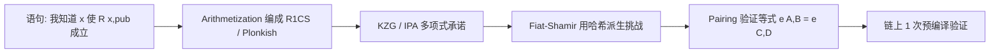

# 模块 01 · 密码学基础

2010 年圣诞节，黑客组织 fail0verflow 在 27C3 大会上拿出索尼 PS3 的根私钥——不是暴力破解，不是逆向固件，就因为索尼工程师把 ECDSA 的随机数 k 写成了常量。两条签名足以解出私钥，整台游戏机的信任链当场崩塌。这种"代码看起来没错，密码学却已死"的故事，正是本模块要带你避开的坑。

本模块覆盖 Web3 工程师必须掌握的密码学核心。**主线**（第 1-7 章）讲 6 件你每天写代码都会撞上的事：哈希、椭圆曲线、ECDSA、签名格式、Merkle 树、HD 钱包，最后一章是工程实战代码。**附录**（A-J）放研究方向：后量子、KZG/ZK 数学、其它曲线家族、Schnorr/EdDSA/BLS、门限签名、VRF、对称加密 / RSA、AI 审查、习题、延伸阅读。前置：会写 React/Node/Python，能读懂代码。

本模块不从零证明每个原语的安全性，关心工程师视角：**每个原语保证什么 / 不保证什么 / 用错会出什么事**。

Bitcoin 白皮书发布那年（2008），SHA-256 已经七岁、ECDSA 已经十六岁、Merkle 树已经二十九岁。中本聪没有发明任何一个新原语，他把这些现成的零件组装成无需可信第三方的记账机——这也是 Web3 工程师的常态：不需要造轮子，需要知道哪个轮子在哪种路上会爆胎。

---

## 怎么读这本

这本是为「会写 React/Node/Python，但密码学课没上过」的工程师写的。第一周目标：能写 Solidity、读懂错误信息。

文档分两层：

- **主线（第 1-7 章）**：序贯路径，按顺序读完即可。每章都有 TL;DR、正文、章末小练习。预计 ~30 PDF 页。
- **附录（A-J）**：研究方向、深入数学、历史背景。看主线遇到「这部分细节去哪查」时再翻。

### 主线目录

- 第 1 章 · 哈希函数：地址、tx id、Merkle root 的底层砖
- 第 2 章 · 椭圆曲线：私钥 / 公钥 / 地址的数学根
- 第 3 章 · ECDSA 与地址派生：每笔以太坊 tx 都在用的签名
- 第 4 章 · 签名格式入门：v/r/s、紧凑签名、EIP-712
- 第 5 章 · Merkle 树：32 字节承诺一整张白名单
- 第 6 章 · HD 钱包入门：12 个词如何派生所有链
- 第 7 章 · 工程实战代码：跑起来，对答案

### 附录目录

- 附录 A. 后量子与隐私计算（什么时候该深入）
- 附录 B. 配对、KZG 与 ZK 数学
- 附录 C. 曲线家族详解
- 附录 D. 进阶签名族（Schnorr / Taproot / EdDSA / BLS）
- 附录 E. 门限签名 / MPC / MuSig2 / FROST
- 附录 F. VRF：可验证的随机性
- 附录 G. 对称加密与 RSA
- 附录 H. AI 在密码学审查中的位置
- 附录 I. 习题与参考解答
- 附录 J. 延伸阅读与权威源

---

## 第 1 章 哈希函数

> TL;DR：学一个"压缩 + 单向"的函数；它撑起地址、tx id、Merkle root、PoW；学完能看懂 `keccak256(...)` 在做什么、以及为什么 Solidity 的 `keccak256` 和 Python 的 `sha3_256` **不是同一个东西**。

2017 年 Google 用约 6500 CPU 年算出 SHA-1 的第一对碰撞——两份不同 PDF，哈希一字不差。当天 git 还在用 SHA-1，Linus 不得不出来解释为什么短期没事。哈希不是"算个校验码"那么简单：它是 Web3 信任体系的最底层砖块。

### 1.1 直觉

类比：哈希像**绞肉机**——扔进去半头猪还是一只鸡，出来的都是 32 字节肉糜；同一头猪每次绞出来一模一样，肉糜倒推不回猪。

具体看一下：

```
"Hello"  → 185f8db32271fe25...   (32 字节)
"Hello!" → 334d016f755cd6dc...   (改一个字节，输出面目全非)
1GB 视频 → 3a7bd3e2360a3d29...   (输入再大，输出仍 32 字节)
```

数学定义：`H: {0,1}* → {0,1}^n`，Web3 多用 `n=256`。代码就是 `hashlib.sha256(data).digest()`。

### 1.2 三个安全性质

| 性质 | 含义 | 类比 |
| --- | --- | --- |
| 抗原像 | 给 `h` 找 `x` 使 `H(x)=h` 困难 | 警察有指纹找不到人 |
| 抗第二原像 | 给 `x` 找 `x'≠x` 同哈希困难 | 做不出和小明指纹相同的假人 |
| 抗碰撞 | 找任意 `x≠x'` 同哈希困难 | 做不出两个指纹相同的假人（最强） |

抗碰撞 ⇒ 抗第二原像，反之不成立。MD5 抗碰撞已死、抗原像还撑——所以可以当下载校验，绝对不能再签名。把这三个性质混为一谈，是审计入门级错误。

### 1.3 SHA-256 与 Keccak-256：你会遇到的两个

工程上你会撞见两个家族：

- **SHA-256**：Bitcoin 用。区块哈希、txid、Merkle 根都是双 SHA-256。
- **Keccak-256**：以太坊用。Solidity `keccak256(...)` 就是它。

它和 NIST 标准的 SHA3-256 差一个分隔字节（0x01 vs 0x06），输出完全不同：

```python
# 输入 'abc'
Keccak-256:  4e03657aea45a94fc7d47ba826c8d667c0d1e6e33a64a036ec44f58fa12d6c45
SHA3-256  :  3a985da74fe225b2045c172d6bd390bd855f086e3e9d525b46bfe24511431532
```

这是历史包袱：以太坊 2015-07 上线比 NIST 2015-08 发布 FIPS 202 早了几周，没赶上标准定稿。

链下要与合约对齐，挑对库：

- Python: `Crypto.Hash.keccak`（pycryptodome）或 `eth_utils.keccak`
- Node: `@noble/hashes/sha3` 的 `keccak_256`（**不是** `sha3_256`）
- Rust: `sha3` crate 的 `Keccak256`（**不是** `Sha3_256`）

EVM 里 `keccak256` 是 `SHA3` opcode，gas = `30 + 6·⌈len/32⌉`（32B 数据 36 gas，比 ECDSA 验签的 3000 gas 便宜两个数量级）。高频用途：`mapping` slot、event topic、`abi.encode` typeHash。

> SHA-256 算 SHA-1、MD5 的设计细节、BLAKE / Poseidon 等其它哈希家族详见**附录 C**（曲线家族那一节相关讨论）和**附录 B**（zk 友好哈希）。

### 1.4 Web3 中的角色

| 角色 | 例子 |
| --- | --- |
| 唯一标识 | tx hash / block hash / event topic |
| 状态承诺 | Merkle Root / Patricia Root |
| 派生地址 | `keccak256(uncompressed_pubkey[1:])[-20:]` |
| CREATE2 | `keccak256(0xff ‖ deployer ‖ salt ‖ keccak256(initCode))[12:]` |
| 随机种子 | `block.prevrandao`（RANDAO） |
| 消息绑定 | EIP-191 / EIP-712 digest |

地址 = keccak 输出取后 20 字节、前 12 字节丢弃。EIP-55 校验和只防手抖，不防攻击。

### 1.5 `abi.encodePacked` 陷阱

把这一节贴到显示器边上——Solidity 审计里最常见的"看起来人畜无害但能炸合约"的坑：

```solidity
keccak256(abi.encodePacked("a", "bc")) == keccak256(abi.encodePacked("ab", "c"))
// 两边都拼成 0x616263；encodePacked 不写 string 长度前缀
```

`("a","bc")` 和 `("ab","c")` 哈希一模一样——攻击者可以用一个 username 撞另一个 username 的权限。

审计要点：`abi.encodePacked(...)` 后跟 ≥2 个 `string`/`bytes` 必须改用 `abi.encode`，或先单独哈希再拼接：

```solidity
keccak256(abi.encodePacked(keccak256("a"), keccak256("bc")))
```

### 章末

记住 3 句话：

- 哈希压缩任意输入到 32 字节，单向、无碰撞——地址、txid、Merkle root 全靠它。
- Solidity 的 `keccak256` 和 Python 的 `sha3_256` 不是一个东西，差一个字节、输出全错。
- `abi.encodePacked` 后跟多个动态类型会撞哈希，要么换 `abi.encode`，要么先各自 hash 再拼。

小练习：写一段 Python，分别用 `hashlib.sha3_256` 和 pycryptodome 的 `keccak.new(digest_bits=256)` 对 `b"abc"` 求哈希，亲眼看到两个结果不一样。把 keccak 那个结果与 Solidity `keccak256("abc")` 对照（线上 Remix 也行）。

---

<!-- 对称加密 / RSA 已移到附录 G -->

## 第 2 章 椭圆曲线

> TL;DR：学一个"正向算容易、反推难"的群运算；它撑起 Bitcoin 私钥、以太坊地址、所有 ZK 证明；学完能解释「私钥不能泄露」到底在保护什么数学事实。

椭圆曲线撑起每一笔链上交易。本章只看主线路上必须懂的曲线 secp256k1，其它曲线（ed25519 / BLS12-381 / BN254 / Pasta 等）和它们各自的政治史去**附录 C**。

### 2.1 钟表盘加法

类比：把椭圆曲线想成一个**带刻度的钟表盘**——表盘上有有限多个点，定义一种"加法"让两点相加还落在表盘上。这就是密码学要的"群"。

「**点乘 `n·P`**」就是从点 P 出发跳 n 步——往前跳容易，给你起点终点反推跳了几步是难题。

具体一点。私钥 `d=5`（你随机抽一个数），基点 `G` 是曲线上一个公共点。计算公钥 `Q = 5·G` = 「从 G 出发跳 5 步」，落在曲线上某一点（256 位 x 坐标 + 256 位 y 坐标）。算 Q 容易，反过来给你 G 和 Q 让你猜跳了几步——这是难题。

数学定义（看不懂跳过没事）：

```
E: y² = x³ + a·x + b   (mod p)
```

「mod p 的方格纸」上画 `y² = x³ + ax + b`，得到的离散点集 + 一个无穷远点 O 就构成可以做加法的群。"椭圆"之名与几何椭圆**无关**（来源于椭圆积分）。

### 2.2 ECDLP：单向陷门

椭圆曲线密码的全部魔法只来自一个事实：**点乘容易，反推难**。

- **正向**：`Q = d·G`，用 double-and-add，`O(log d)`——256 位的 d 只要几百次群运算。
- **反向**：给定 `G, Q` 求 `d`，这就是 **ECDLP**（椭圆曲线离散对数问题）。最优通用算法 Pollard rho 要 `O(√n)`，对 secp256k1 ≈ 2^128 次运算——把地球 GPU 全开也算不完。

「私钥不能泄露」翻译成大白话就是：**d 这个数字别让人知道**。算 Q 易、反推 d 难——这是 ECDSA、ECDH 全部的安全基石。

### 2.3 secp256k1：Bitcoin 与 EVM 都用的那条

中本聪 2008 挑曲线时选了 secp256k1。两条理由：(1) 参数全部公开可推导，没有 NSA 嫌疑的魔数；(2) `a=0` 让点乘速度更快。

```
p  = 2^256 − 2^32 − 977         (基域素数，决定模运算)
y² = x³ + 7    (mod p)           (注意 a=0)
n  ≈ 2^256                        (子群阶；私钥 d ∈ [1, n-1])
G  = 04 79BE667E... 483ADA77...  (未压缩基点，65 字节)
```

公钥两种格式：

- **未压缩**：`04 ‖ X(32B) ‖ Y(32B)` = 65 字节
- **压缩**：`02/03 ‖ X(32B)` = 33 字节，`02/03` 标记 Y 的奇偶（曲线方程能从 X 反推出 Y 的两个解，标志位选其中一个）

安全等级 ~128 bit。量子下 Shor 多项式破解，需要 PQC 迁移（**附录 A**）。

### 2.4 一字之差：k1 vs r1

Apple Secure Enclave、WebAuthn / Passkey 用的是 **secp256r1**（也叫 P-256）——和 secp256k1 名字只差一个字母，生态完全隔绝。

为什么这是个坑：很多人想"用指纹登录以太坊"，但硬件吐出来的是 r1 签名，链上原生只认 k1。RIP-7212 / EIP-7951 加了 r1 预编译，否则合约里手动验 r1 签名要烧 ~150k gas。

工程层面记住：写"以太坊地址"相关代码，别撞上 P-256 库。Python `coincurve`、JS `@noble/curves/secp256k1`、Rust `k256` 都是 k1。

### 章末

记住 3 句话：

- 椭圆曲线就是带特殊加法的钟表盘；私钥 d 是步数，公钥 Q = d·G 是终点位置。
- 反推 d 需要 2^128 次运算——secp256k1 安全的全部根据。
- secp256k1 是 Bitcoin / 以太坊 / EVM 的曲线；secp256r1 是 Passkey 的曲线，名字像但完全不兼容。

小练习：用 Python `coincurve` 生成一个私钥（`os.urandom(32)`），算出对应公钥，分别打出未压缩（65B）和压缩（33B）格式，肉眼对比 X 坐标是否一致。

---

## 第 3 章 ECDSA 与地址派生

> TL;DR：学每秒被全球节点验证几十万次的签名算法；它是 Bitcoin、所有 EVM 链 EOA 用的那个；学完能解释私钥 → 公钥 → 地址的派生链、以及 PS3 那种"两条签名暴露私钥"的灾难是怎么发生的。

数字签名给三个保证：身份（确实是 Alice）、完整性（金额没被改）、不可否认（Alice 事后赖不掉）。机制：**私钥签，公钥验**。

类比：ECDSA 像**印章**——别人看到印就知道是你；伪造在数学上等价于破解 ECDLP，2^128 次运算（地球 GPU 全开也算不完）。

### 3.1 签名与验签

```
Sign(d, m):
  z = keccak256(m)
  k ← random in [1, n-1]              (一次性 nonce)
  (x1, y1) = k·G
  r = x1 mod n
  s = k^(-1)·(z + r·d) mod n
  return (r, s)

Verify(Q=d·G, m, (r, s)):
  z  = keccak256(m)
  u1 = z·s^(-1) mod n
  u2 = r·s^(-1) mod n
  (x', _) = u1·G + u2·Q
  accept iff r ≡ x' (mod n)
```

签名结果是 `(r, s)`——两个 32 字节的数。你不需要记这个公式，只要知道：(1) 签名要私钥 d 和一个一次性随机数 k；(2) 验证要公钥 Q、消息哈希、签名 (r, s)。

### 3.2 nonce 重用 = 私钥泄露（PS3 灾难）

2010 年圣诞节，fail0verflow 团队在柏林 27C3 大会现场展示——索尼 PS3 固件里 ECDSA 的 nonce k 是个写死的常量。整台游戏机的信任链当场崩塌。

推导（拿张纸都能算）：两条用同一个 k 签的不同消息 `(z1, r, s1)` 和 `(z2, r, s2)`：

```
s1 - s2 = k^(-1)·(z1 - z2)        ⇒ k = (z1 - z2) / (s1 - s2)
s1 = k^(-1)·(z1 + r·d)            ⇒ d = (s1·k - z1) / r
```

两条消息 + 静态 k = 私钥泄露。

现代实现一律用 RFC 6979 确定性 nonce：`k = HMAC(d, m)`——让 k 由私钥和消息派生，从根上消除 RNG 出问题的可能。看到调用方手搓 nonce，立刻警惕。

### 3.3 地址派生：从私钥到 0x...

以太坊地址派生链：

```
私钥 d (32B 随机数)
  ↓ d·G 椭圆曲线点乘
公钥 Q (未压缩 65B: 0x04 ‖ X(32B) ‖ Y(32B))
  ↓ 去掉 0x04 标志位，对剩下 64B 做 keccak256
keccak256(X ‖ Y)  (32B)
  ↓ 取后 20 字节
地址 (20B = 40 个 hex 字符)
  ↓ EIP-55 大小写校验
0xAbCd...   (人类看到的地址)
```

代码就这几行：

```python
sk_bytes = os.urandom(32)
sk = PrivateKey(sk_bytes)
pk = sk.public_key.format(compressed=False)   # 65B, 0x04 || X || Y
addr = to_checksum_address(keccak(pk[1:])[-20:])
```

不同公钥理论上可能撞同地址（生日攻击 ~2^80，现实不可行）。EIP-55 校验和只防手抖，不防攻击。

### 3.4 ecrecover：合约里怎么验签

Solidity 提供 `ecrecover(hash, v, r, s)`：传入消息哈希和签名，返回签名者地址。它不是验签，是**公钥恢复**——R 在曲线上对应两个候选 y，v 是 1 bit 消歧位，告诉你选哪一个。

```solidity
address signer = ecrecover(hash, v, r, s);
require(signer == expectedSigner, "bad sig");
```

**重要边界**：`ecrecover` 任一异常情况都返回 `address(0)`：

- v 不在 {27, 28}
- r = 0 或 r ≥ n
- s = 0 或 s ≥ n
- s > n/2（EIP-2 强制 low-s 后）

审计陷阱：

```solidity
// 危险：storedSigner 未初始化时默认 0
require(ecrecover(hash, v, r, s) == storedSigner);
```

攻击者可构造让 `ecrecover` 返回 `0` 的签名（比如 `r=0`），此时如果 `storedSigner` 没初始化（默认值 `address(0)`），等号成立、签名"通过验证"。修复：

```solidity
address recovered = ecrecover(hash, v, r, s);
require(recovered != address(0) && recovered == storedSigner);
```

OpenZeppelin 的 `ECDSA.recover` 已默认处理。生产代码直接用 OZ，别自己手搓。

### 3.5 签名延展性（malleability）

数学事实：`(r, s)` 合法的话，`(r, n-s)` 也是合法签名——同一笔 tx 能有两种"长得不一样但都验证通过"的签名。

2014 年 Mt.Gox 倒台时，攻击者翻转 mempool 中提款 tx 的 s 值改 txid，骗交易所"失败重发"实现双花，把全球最大交易所拖垮。

EIP-2 修复方案：强制 **low-s**（`s ≤ n/2`），任何 high-s 一律拒绝。OZ `ECDSA.sol` 默认就这么做。

### 章末

记住 3 句话：

- ECDSA 签名 = (r, s)，签的时候要 nonce k；k 重用两次就能反推私钥。
- 以太坊地址 = `keccak256(uncompressed_pubkey[1:])` 取后 20 字节。
- `ecrecover` 异常时返回 `address(0)`；和默认值 0 比较是经典伪造入口，要么用 OZ 要么显式 `!= address(0)`。

小练习：用 Python `eth_keys` 对消息 `b"hello"` 签名，得到 `(v, r, s)`；然后构造 `(v, r, n-s)`（注意修正 v 的 yParity），验证两个签名都能恢复出同一个地址。这就是 malleability。

> Schnorr / EdDSA / BLS / MuSig2 等其它签名方案见**附录 D**。

---

## 第 4 章 签名格式入门

> TL;DR：学一下日常会撞见的几种签名编码——65 字节标准 / 64 字节紧凑 / EIP-712 结构化签名；学完能看懂钱包"签什么"对话框、能调通"链下签链上验"的最常见 bug。

写 dApp 时你会接触三种签名格式：65 字节裸签名、64 字节紧凑签名、EIP-712 结构化签名。这一章把它们摆清楚。

### 4.1 v 的多种取值

`v` 本质是 yParity（1 bit），但历史包袱让它有四五种长相：

| 场景 | v 的取值 |
| --- | --- |
| 原始 Bitcoin | 0/1（裸 yParity） |
| 以太坊主网早期 | 27/28（= yParity + 27） |
| EIP-155 Legacy tx | `chainId·2 + 35 + yParity` |
| EIP-1559 Type 2 tx | yParity (0/1) |
| EIP-2098 紧凑签名 | yParity 编进 s 的最高位 |

调试时遇到"签名验不过"，先检查 v——多半是某个库给了 0/1 而你的合约期待 27/28，或反之。

### 4.2 EIP-2098：65 → 64 字节紧凑签名

low-s 后 s 最高位恒 0（因为 `s ≤ n/2 < 2^255`），EIP-2098 把 yParity 塞进这个位：

```
compact = r ‖ ((yParity << 255) | s)         # 64 字节
s_back  = compact[32:] & ((1 << 255) - 1)
v_back  = (compact[32] >> 7) ? 28 : 27
```

calldata gas 省 ~8%，ERC-4337、Permit2、Seaport 广泛使用。旧合约只支持 65B，升级 OZ ECDSA v4.7.3+ 才支持紧凑格式。

### 4.3 EIP-712：让钱包展示"你在签什么"

直接对随机 hash 签名很危险——MetaMask 弹窗只会显示一串 0x... 用户根本不知道在签什么。EIP-712 让钱包能展示结构化数据。

标准 digest 格式：

```
digest = keccak256( "\x19\x01" ‖ domainSeparator ‖ hashStruct(message) )
```

各部分含义：

- `domainSeparator = keccak256(EIP712Domain typeHash ‖ encoded fields)`，含合约名、版本、chainId、合约地址——这四个东西防止跨合约 / 跨链重放。
- `hashStruct(s) = keccak256(typeHash ‖ encodeData(s))`。
- `encodeData`：原子类型 32 字节填充；`string`/`bytes`/数组先各自哈希；嵌套 struct 递归 `hashStruct`。

工程层面记住：**chainId 必须随网络换**，testnet 通过 mainnet 不通过往往就是 chainId 没改。

### 4.4 常见调试

| 现象 | 原因 |
| --- | --- |
| `ecrecover` 返回 0x0 | s > n/2 / v 不对 / r 或 s 越界 |
| 链下验通过、链上不通过 | EIP-712 domain 不一致；`abi.encode` vs `encodePacked` 混用 |
| testnet 通过、mainnet 不通过 | EIP-712 domain 的 chainId 没换 |
| 紧凑签名旧合约不认 | 旧合约只支持 65B；升级 OZ ECDSA v4.7.3+ |

### 章末

记住 3 句话：

- v 的取值依协议而异（0/1、27/28、EIP-155 那个 chainId 公式）；调签名格式 bug 先查 v。
- EIP-2098 把 65 字节签名压成 64 字节，省 calldata，需要 OZ 新版本支持。
- EIP-712 让钱包展示结构化内容；domain 含 chainId + 合约地址，跨链 / 跨合约自动隔离。

小练习：写一段 viem 或 ethers 代码，用同一个私钥分别签：(a) 一个裸 hash；(b) 一个 EIP-712 typed message。把得到的 65 字节签名拆出 r、s、v，确认 (a)、(b) 的 r/s 值不同。

---

## 第 5 章 Merkle 树

> TL;DR：学一种用 32 字节承诺一整张白名单的数据结构；空投合约就是它撑起来的；学完能写出"链下生成 root + proof，链上 5 行 Solidity 验证"的端到端流程。

Uniswap 2020-09 空投 4 亿枚 UNI 给 25 万地址。25 万条记录直接写链要烧几百万美元 gas，他们只在合约里存了**一个 32 字节的 Merkle root**，每个用户来领时自提交 ~18 个哈希的"证明"。这是 Merkle 树在 Web3 的标志性用法。

### 5.1 直觉：家谱树

类比：Merkle 树就是一棵**哈希家谱树**——每个内节点是两个子节点的哈希。任一叶子改变，根就变。

```
                    Root = H(H_AB ‖ H_CD)
                   /                   \
            H_AB = H(H(A)‖H(B))    H_CD = H(H(C)‖H(D))
            /         \               /         \
         H(A)       H(B)            H(C)       H(D)
          |          |               |           |
          A          B               C           D    ← 叶子
```

证明"我是 A"时只需提供兄弟路径 `[H(B), H_CD]`，验证者算：

```
H( H( H(A) ‖ H(B) ) ‖ H_CD ) == Root ?
```

这就是空投合约里那段五行 Solidity 的全部秘密。

性能：25 万叶子 = 18 层，每个证明只要 18 个哈希（576 字节）。

### 5.2 OpenZeppelin commutative 约定

```solidity
parent(a, b) = keccak256(min(a, b) ‖ max(a, b))   // 按字节序
```

每次合并时小的在前，验证不需要兄弟左右信息。代价：叶子不能让内部哈希参与，否则跨层取值可被伪造（2022 年 Solana 一个 NFT 项目就这么被攻击）。

### 5.3 端到端工程示例

链下生成（Python，伪代码）：

```python
leaves = [keccak256(addr ‖ amount) for addr, amount in whitelist]
tree = build_merkle_tree(leaves)
root = tree.root                            # 部署到合约
proofs = {addr: tree.proof_for(leaf) for ...}   # JSON 发给前端
```

链上验证（Solidity）：

```solidity
function claim(uint256 amount, bytes32[] calldata proof) external {
    if (claimed[msg.sender]) revert AlreadyClaimed();
    bytes32 leaf = keccak256(abi.encodePacked(msg.sender, amount));
    if (!MerkleProof.verifyCalldata(proof, merkleRoot, leaf))
        revert InvalidProof();
    claimed[msg.sender] = true;
    token.safeTransfer(msg.sender, amount);
}
```

注意叶子结构必须**链上链下完全一致**：地址是 20 字节裸 bytes，amount 是 32 字节大端整数。错一字节，proof 全废。

### 5.4 以太坊状态树：MPT 简介

普通 Merkle 对插入/更新性能差。以太坊状态是键值库（地址 → 余额），用 **MPT**（Merkle Patricia Trie）= Trie + Merkle 合并：键的 nibble 决定走哪条分支，每层带 16 个子指针。

工程层面记住：

- 区块头里有四个 root：`stateRoot`、`transactionsRoot`、`receiptsRoot`、`withdrawalsRoot`。
- 每个账户的 storage 自有一棵树。
- `SLOAD` 的 2100 gas 大头是读 trie 5 层，不是算 hash。

> MPT 完整规范（Hex Prefix 编码、Branch/Extension/Leaf 节点、Verkle Tree、Sparse Merkle Tree）见**附录 B**。日常写合约不需要这些细节。

### 5.5 Web3 用例

| 场景 | 例子 |
| --- | --- |
| Airdrop 白名单 | Uniswap UNI、Optimism OP |
| L1 → L2 消息证明 | Optimism 的 OutputRoot |
| Bitcoin SPV 钱包 | 验证某 tx 在某块里 |
| ZK rollup 状态 | 把状态根放到 L1 |
| Nullifier 树 | Tornado Cash 等隐私协议 |

### 章末

记住 3 句话：

- Merkle 树用 32 字节根承诺任意大数据集，成员证明长度 `O(log n)`。
- OZ commutative 约定：合并时按字节序排小的在前，验证不需要左右信息。
- 链上链下叶子结构必须一致（字节边界严格对齐），错一字节 proof 全废。

小练习：构造 4 个白名单条目 `[(addr_i, amount_i)]`，用 Python 算出 root 和每个条目的 proof（不超过 30 行代码）；把 root 部署到一个简单 Solidity 合约里，调 `claim()` 验证 proof。

---

## 第 6 章 HD 钱包入门

> TL;DR：学一套从 12 个英文单词派生所有链私钥的标准；这就是 MetaMask、Ledger 让你抄助记词背后的体系；学完能解释「为什么 Ledger 助记词导入 MetaMask 看不到资产」。

你装 MetaMask 时它丢给你 12 个英文单词、要求你抄在纸上。这 12 个词凭什么能恢复 Bitcoin、以太坊、Solana 等所有链上的资产？答案是 BIP-39（助记词） + BIP-32（分层派生） + BIP-44（路径约定）三件套。

类比：助记词像**家谱树的种子**——同一颗种子总能长出同一棵家谱树，每个分叉对应一条链 / 一个账户 / 一个地址。

### 6.1 BIP-39：助记词 → 种子

```
熵 (128 bit) ‖ checksum (4 bit) → 132 bit → 切 11 bit/段 → 12 段
              → 查 2048 词表 → 12 个英文词
```

24 词对应 256 bit 熵。词表 9 种语言各 2048 词，前 4 字母不重复（便于硬件钱包匹配）。

助记词 → 种子用 PBKDF2 拉伸 2048 轮：

```
seed = PBKDF2(
    password   = NFKD(mnemonic),
    salt       = "mnemonic" || optional_passphrase,
    iterations = 2048,
    hLen       = 64                 # 64 字节 = 512 bit
)
```

`optional_passphrase` 即"第 25 个词"——同一助记词派生多个独立钱包，常用作诱饵账户防胁迫。

工程坑：(1) 熵质量决定一切——绝不用 `random.random()`，必须 `os.urandom`/`secrets`/硬件 TRNG；(2) 词序敏感、空格敏感（NFKD 之前）。

### 6.2 BIP-32：从一颗种子派生无穷多私钥

扩展密钥 `(k, c)`：k 是 32 字节私钥，c 是 32 字节 chain code（防碰撞盐）。派生函数：

```
CKDpriv((k_par, c_par), i):
    if i >= 2^31:                                 # hardened
        I = HMAC-SHA512(c_par, 0x00 || k_par || ser32(i))
    else:                                         # non-hardened
        I = HMAC-SHA512(c_par, serP(K_par) || ser32(i))
    k_child = (I[:32] + k_par) mod n
    c_child = I[32:]
```

**hardened vs non-hardened**：

- non-hardened（`i < 2^31`）：父 xpub 可推子公钥（watch-only 钱包查 receive 地址用）。
- hardened（`i >= 2^31`，写作 `i'`）：必须有父私钥才能派生，父 xpub 推不出。

安全告警：xpub + 任一非硬化路径的子私钥可反推父私钥。所以真正交易的路径必须 hardened。

### 6.3 BIP-44：跨币种统一路径

```
m / purpose' / coin_type' / account' / change / index
```

| 段 | 含义 | 示例 |
| --- | --- | --- |
| `purpose'` | 协议版本 | `44'` |
| `coin_type'` | 币种（SLIP-44 注册） | Bitcoin=`0'`, Ethereum=`60'`, Solana=`501'` |
| `account'` | 账户编号 | `0'`, `1'`, ... |
| `change` | 0=外部地址, 1=找零 | `0`（Ethereum 一律 0） |
| `index` | 该账户下第几个地址 | `0`, `1`, ... |

以太坊主路径：`m/44'/60'/0'/0/0` = MetaMask 的第 1 个地址。

### 6.4 为什么 Ledger 助记词导入 MetaMask 看不到资产

| 钱包 | 默认路径 |
| --- | --- |
| MetaMask | `m/44'/60'/0'/0/N` |
| Ledger Live | `m/44'/60'/N'/0/0` ← 结构不同！ |
| Trezor | `m/44'/60'/0'/0/N` |
| Phantom (Solana) | `m/44'/501'/N'/0'` |

Ledger Live 把账户编号放在 `account'` 位（hardened），MetaMask 把账户编号放在 `index` 位（non-hardened）——同样的助记词派生出**完全不同的地址**。导入时必须选对路径，否则不是钱包丢了，是看错了地方。

### 章末

记住 3 句话：

- 12 个助记词 → PBKDF2 → 64 字节种子 → BIP-32 派生整棵密钥树。
- 路径 `m/44'/60'/0'/0/0` 各段含义固定，不同钱包的默认路径可能完全不同。
- Ledger 助记词导入 MetaMask 看不到资产是路径不同，不是助记词丢了。

小练习：用 Python `mnemonic` + `bip32utils`（或 `bip-utils`）库，给定一组测试助记词（BIP-39 spec 里有），分别派生 `m/44'/60'/0'/0/0` 和 `m/44'/60'/1'/0/0` 两个地址，确认它们不一样；再派生 `m/44'/501'/0'/0'`，得到对应的 Solana 地址。

> Solana / Aptos / Sui 的 ed25519 派生（SLIP-0010）和以太坊 BLS validator keystore（EIP-2335 / EIP-2333 / EIP-2334）见**附录 D**。

---

## 第 7 章 工程实战代码

> TL;DR：动手时间——把前 6 章的概念跑起来。所有依赖版本 pin 死，macOS / Linux 实测可复现。

### 7.1 安装

```bash
# Python 端
cd code
python3 -m venv .venv && source .venv/bin/activate
pip install -r requirements.txt

# Solidity 端
curl -L https://foundry.paradigm.xyz | bash && foundryup
forge install OpenZeppelin/openzeppelin-contracts@v5.6.1 --no-commit
forge build
```

### 7.2 文件清单

| 文件 | 内容 |
| --- | --- |
| [`code/01_secp256k1_sign_verify.py`](./code/01_secp256k1_sign_verify.py) | secp256k1 keypair → sign → verify → ecrecover；low-s + 紧凑签名 |
| [`code/02_keccak_vs_sha3.py`](./code/02_keccak_vs_sha3.py) | Keccak vs SHA3 差异，跨语言一致性，`encodePacked` 冲突 |
| [`code/03_merkle_tree.py`](./code/03_merkle_tree.py) | 32 叶 Merkle 树，OZ 兼容 |
| [`code/04_AirdropMerkle.sol`](./code/04_AirdropMerkle.sol) | Solidity 0.8.28：Merkle 白名单 + ECDSA 双门 |
| [`code/foundry.toml`](./code/foundry.toml) | Foundry 配置 |
| [`code/requirements.txt`](./code/requirements.txt) | Python 锁定依赖 |
| [`code/package.json`](./code/package.json) | Node 端 noble-curves / viem 依赖 |

### 7.3 secp256k1 签名核心

```python
# 务必用操作系统 CSPRNG，绝不能 random.random()
sk_bytes = os.urandom(32)

# 用 coincurve（封装 libsecp256k1）创建私钥对象
sk = PrivateKey(sk_bytes)

# 非压缩公钥：65 字节，结构 0x04 || X || Y
pk = sk.public_key.format(compressed=False)

# 以太坊地址 = keccak256(X||Y)[12:] 取后 20 字节，再做 EIP-55 校验和
addr = to_checksum_address(keccak(pk[1:])[-20:])

# 不要直接对原文签名！永远先 keccak256(消息)
msg_hash = keccak(b"Hello Web3, signed at 2026-04")

# eth-keys 用 RFC 6979 派生确定性 k，杜绝 nonce 重用
sig = keys.PrivateKey(sk_bytes).sign_msg_hash(msg_hash)

# recover 等价于 Solidity 的 ecrecover(hash, v+27, r, s)
recovered = sig.recover_public_key_from_msg_hash(msg_hash)
assert recovered.to_checksum_address() == addr
```

### 7.4 Solidity 双门验证

```solidity
function claim(uint256 amount, bytes32[] calldata proof, bytes calldata sig) external {
    // 防重放：同一地址只能领一次
    if (claimed[msg.sender]) revert AlreadyClaimed();

    // 关键：叶子结构必须和链下生成器完全一致
    bytes32 leaf = keccak256(abi.encodePacked(msg.sender, amount));

    // OZ MerkleProof.verifyCalldata 内部就是 commutativeKeccak256 折叠
    if (!MerkleProof.verifyCalldata(proof, merkleRoot, leaf)) revert InvalidProof();

    // 第二道闸门：链下管理员签名背书
    // 把 chainid 和 address(this) 写进去防跨链/跨合约重放
    bytes32 digest = keccak256(abi.encodePacked(msg.sender, amount, address(this), block.chainid));
    bytes32 ethSigned = MessageHashUtils_toEthSignedMessageHash(digest);

    // OZ ECDSA.recover 会拒绝 high-s、address(0) 等异常
    if (ECDSA.recover(ethSigned, sig) != signer) revert InvalidSignature();

    claimed[msg.sender] = true;
    token.safeTransfer(msg.sender, amount);
    emit Claimed(msg.sender, amount);
}
```

### 章末

记住 3 句话：

- 永远用 `os.urandom` / `secrets` 抽随机数，绝不用 `random.random()`。
- 用 RFC 6979 确定性 nonce 的 ECDSA 实现（如 `eth-keys`、`coincurve`、`libsecp256k1`）就不会撞 PS3 那个坑。
- 链上 Merkle + ECDSA 双门验证防 airdrop 抢领、跨链重放等典型攻击。

小练习：把 `code/03_merkle_tree.py` 跑一遍，输出 root 和 4 条 proof；把 `code/04_AirdropMerkle.sol` 部署到 anvil（`forge create`），调 `claim()` 验证 proof 通过。这就完成了"链下生成 + 链上验证"端到端。

---

# 附录

主线已经够用。下面是研究方向、深入数学、历史背景。看主线遇到「这部分细节去哪查」时再翻。

---

## 附录 A. 后量子与隐私计算（什么时候该深入）

> 一句话定位：Shor 算法一上场，所有基于 ECDLP 的签名（ECDSA、Schnorr、BLS）和承诺（KZG）都会死；NIST 已发布后量子标准；FHE 让"在密文上计算"成为可能。但 Web3 主网还没动，工程师当下需要做的不多——这部分知道存在 + 知道何时去深入即可。

### A.1 量子威胁分级

- **Shor 算法**：多项式时间解大整数分解与离散对数 → RSA / DH / ECDSA / Schnorr / BLS 全死。~4000 逻辑量子比特即可反推今天的私钥。
- **Grover 算法**：黑盒搜索 `O(N) → O(√N)`。SHA-256 抗原像从 `2^256` 削到 `2^128`（仍够）；AES-128 抗暴力 `2^128 → 2^64`（NIST 仍列 Category 1）。

结论：哈希与对称只需加大 key size；DLP/ECDLP/RSA 公钥密码必须换路线。

### A.2 NIST 后量子标准（2024-08）

| 标准 | 别名 | 类型 | 数学基础 |
| --- | --- | --- | --- |
| FIPS 203 | ML-KEM (CRYSTALS-Kyber) | KEM | 模格 LWE |
| FIPS 204 | ML-DSA (CRYSTALS-Dilithium) | 签名 | 模格 LWE |
| FIPS 205 | SLH-DSA (SPHINCS+) | 签名 | 哈希基 |

ML-DSA-44 签名 2420 字节，是 ECDSA 的 38 倍——迁移阻力大头。SLH-DSA 签名 8-50 KB，适合国家根 CA 签固件、长期存档；Web3 短期不会用。

### A.3 对 Web3 的具体影响

| 当前 | 后量子替代 | 备注 |
| --- | --- | --- |
| ECDSA (EOA) | ML-DSA / SLH-DSA / Lamport | 通过 AA + EIP-7702 平滑迁移 |
| BLS (共识) | leanSig（hash-based 多签）+ STARK 聚合 | 见下 |
| KZG (DA) | STARK / FRI | 研究路径已存在 |
| Groth16 / Plonk (zk) | STARK / Binius | FRI 系幸存 |

PQC 签名太大无法聚合，Ethereum Foundation 提出 **leanSig**（hash-based 多签）+ 最小 zkVM **leanVM**，把成千上万 PQC 签名通过 STARK 递归压成一个证明。

### A.4 时间表（Vitalik 2026-02 Strawmap）

| 时间 | 升级 | PQC 相关动作 |
| --- | --- | --- |
| 2025 Q2 | Pectra | EIP-7702 / EIP-2537（为 PQC 留接口） |
| 2026 H1 | Glamsterdam | DA STARK 化探索 |
| 2026 H2 | Hegotá | 全栈 AA |
| 2027-2028 | (代号未定) | leanSig + leanVM 上线 |
| ~2030 | "Lean Ethereum" | 完整 PQC |

### A.5 工程师当下三件事

1. **新协议优先 STARK / FRI 系**（Polygon Miden、Starknet、RISC Zero），PQC 迁移最轻。
2. **跨链桥**避免依赖 BLS pairing 做长期签名验证，至少留升级路径。
3. **长期保密 message** 考虑双重加密（ECC + ML-KEM），防"今天抓数据、未来解密"。

### A.6 全同态加密（FHE）

FHE 允许在密文上做运算：

```
Dec(Enc(a) ⊕ Enc(b)) = a + b
Dec(Enc(a) ⊗ Enc(b)) = a × b
```

加法 + 乘法 = 图灵完备 → 任意计算可在密文上完成。云端从头到尾不知道明文。

时间线：2009 Gentry 第一个 FHE 慢 10⁹ 倍 → 2012 BGV/BFV 慢 10⁴ → 2017 CKKS（浮点） → 2016 TFHE（毫秒级 bootstrap）。

FHE vs ZK 一句话：**FHE 隐藏输入**（用户加密 → 云端算 → 用户解密），**ZK 隐藏中间步骤**（证明者有秘密 → 验证者不知）。

Web3 玩家：

- **Zama / fhEVM**：法国 FHE 公司，2025-06 估值 10 亿美元。fhEVM 让 EVM 链直接跑加密合约状态，加密拍卖、隐私投票等。
- **Fhenix**：基于 Zama TFHE-rs 的 optimistic rollup L2。
- **Inco**：FHE/TEE 混合后端，Confidential Randomness 服务。

性能：单 boolean gate ~10 ms（CPU）/ ~0.1 ms（GPU）。fhEVM 单 tx 5-50 秒。Zama 路线图预测 2026 底 GPU 达 500-1000 TPS。

适合：隐私拍卖 / 投票、链上游戏隐藏信息、加密 ML 推理、DEX dark pool。
不适合：高频交易、需事后审计的合规场景。

---

## 附录 B. 配对、KZG 与 ZK 数学

> 这一节是写给"想看懂 ZK 论文 / EIP-4844 设计文档"的工程师。如果你只是用 ZK rollup（zkSync / StarkNet）写应用，主线就够了。

### B.1 承诺方案概览

承诺方案 = "密封信封"：

- **Hiding**：外部看不出信封里的内容。
- **Binding**：承诺者不能事后偷换内容。

最简单的哈希承诺 `C = H(m ‖ r)` 已经满足两条，但密码学承诺通常还要更进一步——要求**加法同态**等代数性质。

### B.2 Pedersen 承诺

固定两个生成元 `g, h`（要求 `log_g(h)` 未知）：

```
Commit(m, r) = g^m · h^r
```

- **Perfectly hiding**：信息论安全。
- **Computationally binding**：换 `(m', r')` 等价解 DLP。
- **加法同态**：`C(m1,r1)·C(m2,r2) = C(m1+m2, r1+r2)`。

Bitcoin Confidential Transactions / Mimblewimble：金额 `C_i = g^{v_i}·h^{r_i}`，同态检查 `ΣC_in / ΣC_out = h^{Σr_in − Σr_out}`，配 Bulletproofs range proof 保证 `v_i ≥ 0`。

### B.3 KZG 承诺

KZG 是 EIP-4844 (proto-danksharding) 的核心，也是 2023 年那场 14 万人贡献的"以太坊 KZG Ceremony"的主角。

```
Setup (trusted): SRS = { [τ^0]_1, ..., [τ^d]_1, [τ^0]_2, [τ^1]_2 },  烧毁 τ

Commit: C = [f(τ)]_1 = Σ f_i · [τ^i]_1                  ∈ G1, 48 字节
Open  : 证 f(z)=y, 构造 q(X) = (f(X) - y)/(X - z)
        π = [q(τ)]_1                                     ∈ G1, 48 字节
Verify: e(π, [τ-z]_2) == e(C - [y]_1, [1]_2)
```

证明 48 字节常数，与多项式度无关。Ceremony：2023-01 至 2023-08，141,416 份贡献；只要任一参与者诚实销毁贡献，τ 就无人知晓（1-of-n trust）。

EIP-4844 把 Rollup 数据放进 blob（~128KB），KZG 承诺压成 32B versioned hash，L2 数据成本降 ~10×。预编译 `0x0a`（`POINT_EVALUATION`）验证 blob 某点取值。

### B.4 IPA 与 FRI

- **IPA**（Inner Product Argument, 2019）：无 trusted setup，证明 `O(log n)`，验证 `O(n)`。Halo2、Mina、Verkle Tree 备选。
- **FRI**（Fast Reed-Solomon IOP, 2018）：基于哈希，透明 + 抗量子，证明 `O(log² n)`。StarkNet / StarkEx / Polygon Miden 用。

### B.5 四种承诺方案对比

| 方案 | 承诺 B | 证明 B | Prover | Verifier | Trusted Setup | 抗量子 |
| --- | --- | --- | --- | --- | --- | --- |
| Merkle | 32 | O(log n)·32 | O(n) hash | O(log n) hash | ✗ | ✓ |
| Pedersen | 48 | O(n) | O(n) EC | O(n) EC | ✗ | ✗ |
| KZG | 48 | 48 (常数) | O(n log n) FFT | 1 pairing | ✓ | ✗ |
| IPA | 48 | O(log n)·48 | O(n) EC | O(n) EC | ✗ | ✗ |
| FRI | 32 | O(log²n)·32 | O(n log n) | O(log²n) hash | ✗ | ✓ |

KZG 常数证明但需 trusted setup；FRI 透明且抗量子但证明较大——STARK（FRI 系）与 SNARK（KZG/IPA 系）的路线分歧本质在此。

### B.6 zk 友好哈希：Poseidon

zkEVM 团队最痛的事是在电路里**模拟 Keccak**。Keccak 当年是按比特设计的（一堆 XOR 和 AND），可在 zk 电路里每个比特操作都得展开成一条 R1CS 约束——Keccak 一次 ~15 万、SHA-256 一次 ~2.7 万约束。MPT 状态树读一个 slot 要算 32 层 Keccak——480 万约束。

Poseidon（Grassi 等 USENIX'21）反其道而行：直接在有限域上做 add / mul / x⁵，每个操作就 1 条约束。最终 ~250 约束/哈希。

| 哈希 | 域 | 约束 (R1CS) | 倍率 |
| --- | --- | --- | --- |
| Keccak-256 | 比特 | ~150,000 | 1× |
| SHA-256 | 比特 | ~27,000 | 5.5× |
| Poseidon/Poseidon2 | BN254/BLS12-381 | ~150-250 | 600-1000× |

Web3 用例：zkSync Era、Polygon zkEVM、StarkNet、Aztec、Tornado Cash、Semaphore。

主网为何不能换 Poseidon：MPT 历史上就是 Keccak，硬分叉换会破坏所有合约 storage layout。zkEVM 被迫在电路里模拟 Keccak，每次状态访问付 ~15 万约束"Keccak 税"。

### B.7 通往 ZK：把零件砌成工艺品

证明"我知道某秘密 x 满足关系 R(x, public)"，不暴露 x，证明短，验证快：



每步都用到前面的砖：哈希（Fiat-Shamir）、椭圆曲线（BLS12-381 / BN254）、多项式承诺（KZG/IPA/FRI）、pairing。

### B.8 主流 ZK 协议对照

| 协议 | 多项式承诺 | 哈希 | Trusted Setup | 抗量子 |
| --- | --- | --- | --- | --- |
| Groth16 | KZG-like | - | ✓ per-circuit | ✗ |
| Plonk | KZG | Poseidon | ✓ universal | ✗ |
| Halo2 | IPA | Poseidon | ✗ | ✗ |
| STARK | FRI (Merkle) | Pedersen / Rescue | ✗ | ✓ |
| Nova / SuperNova | Pedersen | Poseidon | ✗ | ✗ |
| Brakedown (Spartan) | Brakedown | Keccak / Poseidon | ✗ | ✓ |
| Binius | FRI-Binius / Brakedown | Grøstl | ✗ | ✓ |

**Brakedown** (2021)：Reed-Solomon 编码 + Merkle 树。无 trusted setup，prover 几乎线性时间。a16z crypto 的 Lasso/Jolt zkVM 集成。

**Binius** (2023)：直接在二元域 F₂ 及其塔域上做 SNARK。计算机数据天生是 F₂ bit，传统 256-bit 域 SNARK 浪费 99%+ 位。Binius "1 bit = 1 域元素"，Keccak-in-circuit 比 Poseidon-based 快 10-100×。zkEVM Keccak 税有了解法。

### B.9 MPT 完整规范

主线只点了一下 MPT 的存在。完整规范：

三种节点：

1. **Branch**：16 子指针 + 1 value 槽，每层消耗 1 nibble。
2. **Extension**：共享前缀压缩，结构 `(shared_nibbles, child_hash)`。
3. **Leaf**：`(remaining_nibbles, value)`。

Hex Prefix 编码（区分 Extension/Leaf 和奇偶 nibble 长度）：

| nibbles 长度 | Extension | Leaf |
| --- | --- | --- |
| 偶数 | 0x00 | 0x20 |
| 奇数 | 0x1_ | 0x3_ |

**Verkle Tree**：MPT 痛点是证明大小（每层带 15 个兄弟哈希）。Verkle 用多项式承诺（KZG/IPA）把证明从 `O(log_{16} N · 15·32B)` 压到 `O(log_{256} N · 200B)`，对无状态以太坊至关重要。

**Sparse Merkle Tree**：深度 256 满树，叶子位置由 key 决定。inclusion / exclusion 证明结构一致（ZK 友好），但空树太大，需懒哈希缓存全空子树。

| 数据结构 | 链上 | 优点 |
| --- | --- | --- |
| 标准 Merkle | airdrop, OP fault | 实现门槛最低 |
| MPT | Eth stateRoot | 支持插入删除 |
| Verkle | 未来 Eth | 证明小，stateless 友好 |
| SMT | zkSync, Polygon zkEVM | inclusion=exclusion，ZK 友好 |
| Indexed Merkle | Aztec, Tornado | 用于 nullifier |

---

## 附录 C. 曲线家族详解

主线只讲 secp256k1。其它链用什么曲线、为什么这么选——这一节摆清楚。

### C.1 曲线汇总

| 曲线 | 形式 | 用途 | 私/公/签 字节 |
| --- | --- | --- | --- |
| secp256k1 | Weierstrass | EVM EOA / Bitcoin | 32 / 33 / 65 |
| secp256r1 (P-256) | Weierstrass | TLS / Passkey / RIP-7212 | 32 / 33 / 64 |
| Curve25519 | Montgomery | X25519 ECDH | 32 / 32 / - |
| Ristretto255 | (编码层) | sr25519 / Zcash Sapling | 32 / 32 / 64 |
| ed25519 | Edwards | Solana / Cosmos / Aptos / Sui | 32 / 32 / 64 |
| BN254 (alt_bn128) | Pairing | EVM zk-SNARK 旧 | 32 / 64 / - |
| BLS12-381 | Pairing | Beacon Chain / 新 zk / 跨链 | 32 / 48 / 96 |
| Pallas / Vesta | 循环对 | Mina / Aleo / Halo2 递归 | 32 / 32 / - |

简记：用户账户 secp256k1，共识层 BLS12-381，高性能链 ed25519，BN254 是历史包袱。

### C.2 secp256r1（P-256）：TLS 与 Passkey

```
p  = 2^256 - 2^224 + 2^192 + 2^96 - 1
y² = x³ - 3x + b      (a = -3，与 k1 的 a=0 是关键区别)
```

~128 bit 安全，与 k1 同等。曲线参数中常数 `b` 由 NSA 2000 年提供且来源不透明——DJB 因此推动 Curve25519 路线。

Web3 用途：硬件钱包（Apple Secure Enclave）、WebAuthn / Passkey、ERC-4337 账户抽象、部分跨链桥 TLS 链路。链上 RIP-7212 `P256_VERIFY` 预编译已在 Polygon zkEVM / Optimism / Arbitrum / zkSync 上线，主网通过 EIP-7951 推进。

### C.3 Curve25519 / X25519：高性能 ECDH

```
Montgomery: y² = x³ + 486662·x² + x   (mod 2^255 − 19)
基点 x = 9,   余因子 h = 8     ← 关键
```

DJB（Bernstein, 2005）设计。基域素数 `2^255 − 19` 让模约简可用一条特殊 reduction 指令——"25519" 名字的由来。参数推导完全公开（无 NIST 魔数阴影）；但余因子 h=8 让朴素实现可能落入小子群攻击，这是 Ristretto255 出场的原因。

Web3 用途：X25519 密钥协商（TLS 1.3、Noise、libp2p、ECIES）、Cosmos IBC 通道加密、Tor / Signal / WhatsApp。

### C.4 Ristretto255

把余因子 8 的曲线点重新编码到一个素数阶群，多个不同曲线点映射到同一 Ristretto 元素，彻底消除小子群陷阱。

用途：Polkadot/Kusama (sr25519 = Schnorr + Ristretto)、Zcash Sapling/Orchard、Monero 隐私交易底层。

### C.5 ed25519

```
Twisted Edwards: -x² + y² = 1 + d·x²·y²     (d = -121665/121666)
余因子 h = 8
```

与 Curve25519 同构，~128 bit 安全，EdDSA 跑在它上面。Web3 用途：

| 链 | 使用方式 |
| --- | --- |
| Solana | 全局账户密钥（pubkey 即地址） |
| Aptos / Sui | Move 生态钱包默认 |
| Cosmos SDK | 验证者共识签名（Tendermint） |
| NEAR | Account 密钥派生 |
| Polkadot | sr25519 + ed25519（备选） |
| Cardano | extended ed25519 (BIP-32-Ed25519) |

Solana 实测要点：

- **Tx 签名 batch verify**：每笔 tx 最多 64B × 签名者数；banking stage 一次 GPU/CPU 调度并行验数百签名，是 65k+ TPS 的关键。
- **PDA**：用 SHA-256 派生，**不在 curve25519 上**——故意无对应私钥，只能由程序 CPI 签。
- **轻客户端**：检测 PDA 只需做 curve25519 on-curve 检验。

Cosmos/Polkadot 一句话：Cosmos/Tendermint 共识用 ed25519，用户默认 secp256k1（Bitcoin 兼容）；Polkadot 默认 sr25519，备选 ed25519/ecdsa。

### C.6 BN254（alt_bn128）：以太坊 zk 的过渡曲线

Barreto-Naehrig 曲线（2005），基域 p ≈ 254 bit，嵌入度 k = 12。2017 年 Kim-Barbulescu exTNFS 把安全性从 128 bit 削到 ~100 bit，新协议必须迁移。

| 协议 | 用法 |
| --- | --- |
| Tornado Cash | Groth16 证明 |
| Aztec V1 | zk-zk-Rollup 早期 |
| Loopring 3.x | zk-DEX 状态证明 |
| drand evmnet | 上链 BLS 签名（兼容预编译） |
| EVM 预编译 `0x06/0x07/0x08` | EIP-196 / EIP-197（兼容性永保留） |

### C.7 BLS12-381：以太坊共识与新一代 zk

```
基域 p ≈ 381 bit
子群阶 r ≈ 255 bit
嵌入度 k = 12
G1 ⊂ E(F_p),   G2 ⊂ E(F_{p²}) 的扭子群
```

Sean Bowe 2017 年为 Zcash Sapling 设计，名字里的 12 是嵌入度、381 是基域比特数。抗 exTNFS 后真实安全 ~128 bit，比 BN254 多 ~30 bit 裕度——新协议都从 BN254 迁过来。后量子时代 pairing 仍基于 ECDLP，Shor 算法一上场全死，必须迁到 STARK 路线。

以太坊共识层（Beacon Chain）核心：

- 验证者私钥 32B、公钥 48B（G1 压缩）、签名 96B（G2 压缩）。
- 一个 epoch 数十万签名聚合成一个 96B 签名。

EIP-2537 把 BLS12-381 预编译加入 EVM，Pectra（2025-05-07）激活。其它用途：Filecoin、Chia、Chainlink CCIP、EigenLayer、Zcash Sapling。

### C.8 Pasta（Pallas/Vesta）：Halo2 的循环曲线对

```
|E_Pallas(F_p)| = q,  |E_Vesta(F_q)| = p
即一条曲线的标量域 = 另一条的基域
```

Zcash 团队为 Halo2 设计。循环对使"曲线 A 上的证明能验证曲线 B 上的证明"——递归 SNARK 成为可能。无 pairing，搭配 IPA 承诺。用途：Mina（22KB 区块链）、Aleo、Zcash NU5 Orchard、部分 zkVM。

### C.9 一字之差的坑

secp256k1 与 secp256r1 名字只差一个字母，生态完全隔绝。"想让用户用指纹登录以太坊"听起来很美好，但 Apple Secure Enclave / WebAuthn 全部用 r1，链上原生只认 k1——所以才有了 EIP-7212 / RIP-7212 预编译这条迁移路径。

类似地：Polkadot 助记词导入 MetaMask 看不到资产，因为 sr25519（Polkadot）和 secp256k1（以太坊）派生的密钥完全不同，地址也不同。

---

## 附录 D. 进阶签名族（Schnorr / EdDSA / BLS）

主线讲了 ECDSA 一种。下面三种各有定位：EdDSA 跑得快、Schnorr 可证明安全 + 天然聚合、BLS 可无限聚合。

### D.1 EdDSA / Ed25519

```
KeyGen: sk ← 32B random
        h = SHA-512(sk),  a = clamp(h[0:32]),  prefix = h[32:64]
        pk = a·B          (B = ed25519 基点)

Sign(m): r = SHA-512(prefix ‖ m) mod L          ← 确定性 nonce
         R = r·B
         c = SHA-512(R ‖ pk ‖ m) mod L
         s = (r + c·a) mod L
         σ = (R, s)        # 64 字节

Verify: c = SHA-512(R ‖ pk ‖ m) mod L
        accept iff s·B = R + c·pk
```

与 ECDSA 的关键差别：

1. **确定性 nonce**：r 由私钥与消息哈希派生，不依赖 RNG——从根上消除 PS3 那种 nonce 重用风险。
2. **无 k^(-1)**：实现简单，少一个侧信道入口。
3. ROM 下严格归约到 ECDLP——ECDSA 归约前提更微妙。

### D.2 Schnorr（BIP-340）

Schnorr 1989 年就发表了，比 ECDSA 还早，数学上更优雅。但被一个专利锁住，2008 年才到期，Bitcoin 又等了 13 年，2021 年 Taproot 升级才在主网用上。

BIP-340 关键约束：

1. **公钥 32 字节 x-only**：Y 隐含为偶。
2. **强制偶 Y**：签名时若 `R.y` 或 `P.y` 为奇取负。
3. **Tagged hash** 防跨协议重放。
4. **辅助随机性 auxRand** 可选侧信道防护，全 0 也安全（不像 ECDSA k 必须真随机）。

```
Sign(sk, m, auxRand):
  若 P.y 奇: d = n - sk, P = -P
  t = d XOR t("BIP0340/aux", auxRand)
  k = t("BIP0340/nonce", t ‖ P.x ‖ m) mod n
  R = k·G;  若 R.y 奇: k = n - k
  e = t("BIP0340/challenge", R.x ‖ P.x ‖ m) mod n
  s = (k + e·d) mod n
  σ = R.x ‖ s        # 32 + 32 = 64 字节
```

ECDSA vs Schnorr 对比：

| 维度 | ECDSA | Schnorr |
| --- | --- | --- |
| 可证明安全 | 启发式 | ROM 下严格归约到 ECDLP |
| 线性性 | ✗（有 k^(-1)） | ✓，`(d1+d2)·G = P1+P2` |
| 签名长度 | 71-72B (DER) / 64-65B | 固定 64B |
| 实现复杂度 | 高（DER + low-s + ecrecover） | 低 |
| 批验证 / 多签聚合 | ✗ / 极难 | ✓ / 天然（MuSig2） |

#### D.2.1 Taproot P2TR 与 Tweaked Key

BIP-341/342 2021-11-14 区块 709,632 激活。P2TR 输出 `OP_1 <32B x-only pubkey>`，公钥不是裸 `sk·G` 而是带内部 commit 的 tweaked key：

```
P_internal = sk·G
t = tagged_hash("TapTweak", P_internal.x ‖ merkle_root)
P_output   = P_internal + t·G
```

Tweak 让 key path 与 script path 在链上不可区分。Bitcoin P2TR 输出占比已超 35%。

以太坊目前无 Schnorr 预编译，合约模拟 ~200k gas，实务做法是链下 Schnorr/MuSig 聚合 → 链上 ECDSA 提交。

### D.3 BLS 签名

每 12 秒以太坊网络要确认 100 万+ 验证者投票。BLS（Boneh-Lynn-Shacham 2001）的魔法是：n 个不同人对**同一条消息**的签名，可以直接相加合成一个 96 字节的总签名，验证只要一次 pairing。这就是为什么以太坊共识层选 BLS——没有它 PoS 在工程上根本跑不起来。

```
KeyGen: sk ∈ Z_r,  pk = sk·G1
Sign(m): σ = sk·H(m)                          (H: hash-to-G2)
Verify: e(G1, σ) == e(pk, H(m))

聚合 (n 个签名同消息):
  σ_agg  = σ1 + ... + σn                       ∈ G2
  pk_agg = pk1 + ... + pkn                     ∈ G1
  e(G1, σ_agg) == e(pk_agg, H(m))             # 一次 pairing 验 n 个
```

#### D.3.1 Rogue Key Attack 与 PoP

Mallory 设 `pk_M = X·G1 - pk_B`（X 任选），则 `pk_agg = pk_B + pk_M = X·G1`。她用 X 对消息 m 签出 σ，对外宣称这是 Alice + Bob + Mallory 的聚合签名。

防御：注册公钥时附带 `σ_pop = sk·H_pop(pk)`。Mallory 无法为构造的 pk_M 给出合法 PoP。以太坊共识层采用此方案。

### D.4 签名方案对比

| 方案 | 曲线 | 单签 B | 公钥 B | 聚合 | 速度 | 用途 |
| --- | --- | --- | --- | --- | --- | --- |
| RSA-2048 | - | 256 | 256 | ✗ | 中 | TLS / JWT |
| ECDSA k1 | secp256k1 | 64-65 | 33 | ✗ | 快 | Bitcoin / EVM EOA |
| ECDSA r1 | secp256r1 | 64 | 33 | ✗ | 快 | TLS / Passkey |
| EdDSA | ed25519 | 64 | 32 | △ 有限 | 极快 | Solana / Cosmos |
| Schnorr | secp256k1 | 64 | 32 | ✓ MuSig | 快 | Bitcoin Taproot |
| BLS | BLS12-381 | 96 | 48 | ✓ 天然 | 慢（pairing） | Eth 共识 / 跨链 |

### D.5 SLIP-0010：BIP-32 拓展到 ed25519

BIP-32 只针对 secp256k1。Ed25519 余因子 8 + scalar 长度不同，直接套用破坏安全性；SLIP-0010 给出正确规范。

Ed25519 上**只支持 hardened 派生**——私钥不是直接 scalar，无"由公钥派生子公钥"的代数结构。Solana/Aptos/Sui 的 watch-only 不能从 xpub 推地址。

### D.6 EIP-2335：BLS 验证者 keystore

Beacon Chain 验证者私钥的标准化加密存储格式：

```json
{
  "crypto": {
    "kdf": { "function": "scrypt", "params": {...} },
    "checksum": { "function": "sha256", ... },
    "cipher": { "function": "aes-128-ctr", ... }
  },
  "pubkey": "<48 字节 BLS 公钥>",
  "path": "m/12381/3600/0/0/0",
  "version": 4
}
```

EIP-2334 派生路径：

- **Withdrawal key**：`m/12381/3600/i/0`（提款凭证，冷存）
- **Signing key**：`m/12381/3600/i/0/0`（attestation/block 签名，热钱包）

12381 = BLS12-381；3600 = ETH2 SLIP-44 编号。密钥派生是 EIP-2333（HKDF 方案），不是 BIP-32 的椭圆曲线加法。

精致点：checksum 用 `decryption_key` 后 16 字节，AES key 用前 16 字节——即使 checksum 被取仍得不到完整 AES key（envelope encryption）。

---

## 附录 E. 门限签名 / MPC

2022 年 8 月，Solana 钱包 Slope 因为把助记词原文上传到日志服务器，导致约 8000 名用户被洗劫一空。如果当时这些用户用的是门限钱包——私钥从未在任何一台机器上以完整形态出现过——攻击者拿到任何一台手机的日志都没用。这是 MPC 钱包正在迅速取代单机助记词的根本理由。

### E.1 定义

普通多签（Gnosis Safe）每人独立签一次，链上看到 n 个签名，gas 也是 n 倍。**门限签名**让 n 个人协作产生**一个**普通签名，链上和单签完全不可区分。t-of-n 即 n 人中任意 t 人即可还原签名，少于 t 人则任何信息都拿不到。

### E.2 Shamir 秘密分享

把秘密 s 编码为 t−1 次多项式：

```
f(x) = s + a_1·x + a_2·x² + ... + a_{t-1}·x^{t-1}
```

给 n 人各发 share `(i, f(i))`。任意 t 个可用拉格朗日插值还原 `f(0) = s`；t−1 个对 s 完全无信息（信息论安全）。

### E.3 门限 ECDSA

ECDSA 签名 `s = k^(-1)·(z + r·d)` 非线性，门限化麻烦：

| 方案 | 年 | 签名轮数 | 假设 | 生产采用 |
| --- | --- | --- | --- | --- |
| Lindell17 | 2017 | 多轮 | Paillier | 早期 ZenGo（2-of-2） |
| GG18 | 2018 | 9 | Paillier | 已不推荐 |
| GG20 | 2020 | 1（在线） | Paillier | 已不推荐 |
| **CGGMP21** | 2021 | 4 | DDH + Schnorr ZK | Fireblocks、Coinbase Custody |
| DKLs19 | 2019 | 多轮 | Oblivious Transfer | Coinbase MPC |

2023 Makriyannis 等公开 GG18/GG20 key extraction 攻击，主要钱包迁至 CGGMP21。选库要点：(1) 避开 GG18 漏洞家族；(2) 有 ZK proof 防恶意 party 换 share。

### E.4 BLS 门限：线性，几乎白送

```
DKG:    每方持 sk_i,  pk_agg = Σ sk_i · G1
Sign:   每方 σ_i = sk_i · H(m),  收 t 个拉格朗日插值合成 σ
Verify: e(G1, σ) == e(pk_agg, H(m))
```

用于 drand、Filecoin、Chainlink CCIP、Ethereum DVT。

### E.5 MuSig2（BIP-327）

n 人 2 轮通信产生一个合法 BIP-340 Schnorr 签名，第一轮可在不知道消息时预做完。

工程优势：(1) 输出是合法 BIP-340 签名，Bitcoin 节点无需升级；(2) 链上多签与单签不可区分；(3) n-of-n 压成 64B 签名 + 32B 公钥。

FROST（Komlo-Goldberg 2020）是 Schnorr 的 t-of-n 版本（MuSig2 是 n-of-n），IETF CFRG RFC 草案最终阶段，Coinbase EdDSA 门限与 Dfinity chain-key signing 都用 FROST 思路。

### E.6 MPC：广义多方协作计算

门限签名是 MPC 的特例。MPC：n 方各持私有输入 `x_i`，共同计算 `f(x_1,...,x_n)` 而不暴露自己的 `x_i`。经典构造：Yao Garbled Circuits（两方）、GMW + BMR（n 方）、SPDZ（预处理模型）。

Web3 用途：MPC 钱包（ZenGo / Fordefi / Web3Auth）、跨链桥（ChainSafe）、隐私 DEX。

---

## 附录 F. VRF：可验证的随机性

链上抽奖、NFT mint、PoS 委员会选举——只要涉及"公平随机"，就有人想作弊。最朴素的做法是用 `keccak256(blockhash)` 当随机源，但出块者可以**先算结果再决定要不要出块**——预见自己抽不中就丢弃当前块重试。这种攻击叫 *grinding*。

VRF 就是为了堵这个漏洞而生：随机数和"我确实诚实算的"证明绑在一起，谁都没法选择性公开。

### F.1 定义

VRF（Micali-Rabin-Vadhan 1999）三条性质：

- **Uniqueness**：同 `(sk, x)` 永远给同一个 y。
- **Pseudorandomness**：不知 sk 者视 y 为均匀随机串。
- **Verifiability**：任何人用 `(pk, x, y, π)` 可验 y 合法。

### F.2 ECVRF 构造（RFC 9381 简化版）

```
Prove(sk, x):
  H = hash_to_curve(pk ‖ x)
  Γ = sk · H
  k = nonce_generation(sk, H)             # RFC 6979 风格确定性 nonce
  c = hash_points(H, pk, Γ, k·B, k·H)
  s = k + c·sk mod q
  π = (Γ, c, s)
  y = hash(0x03 ‖ Γ)

Verify(pk, x, y, π):
  H = hash_to_curve(pk ‖ x)
  U = s·B - c·pk
  V = s·H - c·Γ
  c' = hash_points(H, pk, Γ, U, V)
  接受 iff c' == c 且 y == hash(0x03 ‖ Γ)
```

### F.3 三家主流方案

| 维度 | Algorand 内置 VRF | Chainlink VRF v2.5 | drand |
| --- | --- | --- | --- |
| 签名方案 | EdDSA 派生的 ECVRF | 自家 ECVRF (secp256k1) | 门限 BLS12-381 / BN254 |
| 信任模型 | 每个验证者持自己 sk | 单 oracle 节点 (有信任) | t-of-n 门限 (无单点) |
| 输出周期 | 每个 slot | 按需请求 | 每 3 秒固定 |
| 可被 "selective abort"？ | 不能（不出块就罚） | 能（节点可不回调） | 不能（t 个诚实即可） |
| 链上验证 gas | 无（共识层用） | ~200k | BN254 ~150k / BLS ~80k |
| 适合场景 | 共识委员会 | 一次性抽奖 | 持续公共随机源 |

drand 由 League of Entropy（Cloudflare、Protocol Labs、EPFL 等）运营。每 ~3 秒，节点对 `H(round_number)` 做 BLS 签名，t 个部分签名合成最终签名，再 SHA-256 取 32 字节得到随机数。当前阈值 12-of-22。

为让 EVM 直接验 drand，2024 上线 evmnet：周期 3 秒、签名在 G1（48 字节）、**故意用 BN254 而非 BLS12-381**——因为 EVM 原生 alt_bn128 预编译只支持 BN254。Pectra 后可迁回 BLS12-381。

---

## 附录 G. 对称加密与 RSA

主线没讲对称加密和 RSA，因为 Web3 主要用非对称密码 + 签名。但它们仍然在每个钱包、每条 TLS 链路里默默干活。

### G.1 对称加密

**定义**：同一把密钥 K 加密与解密（AES、ChaCha20）。链上是公开账本，无法安全分享 K，Web3 因此以非对称密码为主。

工程角色：

- **钱包加密 / Keystore V3**：MetaMask 用 PBKDF2 + AES-GCM；Geth 用 scrypt + AES-128-CTR。为什么不直接拿密码当 AES key？攻击者拿到加密文件后会暴力撞密码，几十万轮 KDF 给暴力破解加上脚镣。
- **节点 P2P：RLPx / ECIES**：以太坊节点 ECDH（secp256k1）协商共享秘密 → HKDF 派生 → AES-CTR + HMAC-SHA256。

### G.2 三条工程红线

1. **不用 ECB 模式**：相同明文块 → 相同密文块。"ECB 企鹅"梗：有人用 ECB 加密 Tux 企鹅图，加密后还能看见企鹅轮廓。
2. **默认 AEAD**：AES-GCM 或 ChaCha20-Poly1305 同时加密 + 认证。
3. **nonce 永不重用**：AES-GCM nonce 重用直接暴露 GHASH 认证密钥；ChaCha20-Poly1305 nonce 重用让两条明文 XOR 之后明文直接泄露。

### G.3 HKDF：与 Web3 的真正交点

```
PRK = HMAC-SHA256(salt, IKM)               # extract: 把任意熵源压成统一长度
OKM = HMAC-SHA256(PRK, info ‖ counter)     # expand:  从 PRK 拉出任意长 OKM
```

`IKM` 是 ECDH 共享秘密，`info` 是上下文标签：从一个 ECDH 输出派生多把不同用途密钥。libp2p、Noise、Waku、ECIES 全部用 HKDF。

### G.4 RSA：为何 Web3 几乎不用

```
c = m^e mod n      (加密 / 验签)
m = c^d mod n      (解密 / 签名)
```

基于大整数分解难。但链上每个字节都很贵：

| 项目 | RSA-2048 | secp256k1 |
| --- | --- | --- |
| 私钥 | 256 B | 32 B |
| 公钥 | 256 B | 33 B（压缩） |
| 签名 | 256 B | 64-65 B |
| 安全等级 | ~112 bit | ~128 bit |
| 是否可聚合 | ✗ | ✓（Schnorr/BLS） |
| 链上验证 gas | 极贵 | `ecrecover` 仅 3000 gas |

RSA 出场点：HTTPS 证书、JWT 签名（RS256）、预编译 `0x05` (modexp)。量子下 Shor 同时破解 RSA 与 ECC，两者都需迁移到 PQC（**附录 A**）。

### G.5 PRF / PRG / 随机预言机

读论文常遇到三个缩写：

- **PRG（伪随机生成器）**：小种子吐无限长伪随机流。`os.urandom`、ChaCha20 stream。
- **PRF（伪随机函数）**：带钥匙的哈希，`(k, x) → f(x)`。HMAC-SHA256、AES-CMAC。
- **RO（随机预言机）**：理想化的哈希假设——假装存在"问什么答什么、永远真随机"的天神。协议证明里用它当道具，现实拿 Keccak/SHA-256 顶替。

**nonce**：number-used-once，签一次签名用完就丢。

工程映射：BIP-39 PBKDF2、TLS/Noise nonce 派生 = PRG；RFC 6979 确定性 nonce、HMAC = PRF。

ROM 注记：很多协议写"在随机预言机模型下安全"，但 ROM 不是标准模型——它建立在那个"天神级哈希"假设上，现实哈希函数只是近似。常见误解是 EdDSA 比 ECDSA "可证明安全"——其实两者主流归约都依赖 ROM。

### G.6 哈希家族族谱

主线只讲了 SHA-256 和 Keccak-256。完整族谱：

- **MD5**（已废）：1991，2004 年王小云展示碰撞构造。
- **SHA-1**（已废）：NSA 设计，2017 年 SHAttered 攻击造出第一对碰撞 PDF。
- **SHA-2 家族**：SHA-256 / SHA-512，仍主流。
- **SHA-3**：Keccak 算法，FIPS 202 标准化。
- **BLAKE 家族**：BLAKE2 比 SHA-2 快、安全等价；BLAKE3 切消息为 1024 字节叶子独立哈希再合并，多核 6+ GB/s。
- **ZK 友好哈希**：Poseidon、MiMC、Rescue/Anemoi。详见附录 B.6。

SHA-256 内部结构（Merkle-Damgård）有长度扩展攻击：已知 `H(secret ‖ data)` 和 `len(data)` 可算出 `H(secret ‖ data ‖ pad ‖ extra)`。当 MAC 必须套 HMAC；SHA-3 海绵结构天然免疫。

实测性能：

| 平台 | SHA-256 速度 |
| --- | --- |
| M3 Pro 1 thread | ~600 MB/s |
| Intel SHA-NI 指令集 | ~2,000 MB/s |
| Antminer S21 (ASIC) | ~10^14 H/s |

---

## 附录 H. AI 在密码学审查中的位置

写这本指南的过程中，我们也大量用 AI 辅助检索文献、解释 EIP、找代码模式。但密码学是个特殊领域——这里"看起来对"和"真的对"之间常常隔着一道证明的鸿沟。

### H.1 能做

- **文献检索**：50 年论文交叉索引，30 秒列出相关攻击论文。
- **代码模式识别**：`encodePacked` + 多动态参数、`ecrecover` 漏检 0 等——Slither / Aderyn / 4naly3er 已在做。
- **fuzzing 引导**：根据合约语义生成边界用例。
- **论文摘要**：100 页压成 5 分钟。

### H.2 不能做

- **替代形式化证明**：安全归约必须经严格数学验证。
- **替代 Coq/Lean/EasyCrypt**：TLS 1.3、Signal、HPKE 关键部分都经形式化工具机器验证。
- **保证合约真的安全**：LLM 对"看似简单"的代码经常给出错误判断。

### H.3 实务建议

| 场景 | AI 可信度 |
| --- | --- |
| 解释 EIP | 高（仍需对比原文） |
| 找 known patterns | 中高（与 Slither 配合） |
| 评估新协议安全性 | 低（必须人审 + 形式化） |
| 写测试用例 | 高（LLM 发散性强） |
| 写新密码学方案 | 不要让 AI 单独做 |

没有任何严肃密码学协议的安全性是被 LLM 证明过的。AI 在密码学领域更适合做探照灯，不是判官。

---

## 附录 I. 习题与参考解答

读懂了不等于会做。下面 8 道题按"先实操、再思考"的顺序排，做完前 6 道你应该能独立审计一份 EIP-712 合约；做完后 2 道思考题你对 EdDSA 和 trusted setup 的安全模型会有"自己的话能讲清楚"的把握。建议先自己写，再对照参考实现。

### 习题 1：复现一笔以太坊交易

**题目**：用 anvil 默认账户 #0（私钥 `0xac09...ff80`）构造一笔 EIP-1559
转账 0.01 ETH，输出 raw hex；从 raw 反向恢复 from；验证 `keccak(raw) ==
signed.hash`。

**参考实现**：[`exercises/ex1_replay_eth_tx.py`](./exercises/ex1_replay_eth_tx.py)

**关键解释**：

- EIP-1559 type-2 raw bytes = `0x02 || RLP([chainId, nonce, maxPriority,
  maxFee, gas, to, value, data, accessList, yParity, r, s])`。
- `tx.hash` = `keccak256(raw)`，可以自己复算。
- `Account.recover_transaction(raw)` 内部：解析 RLP → 找到 yParity, r, s
  → 重构 signing payload（去签名三元组）→ keccak → ecrecover。

### 习题 2：从 raw tx 提取 v/r/s

**题目**：写 `parse_vrs(raw) -> (v, r, s, type)`，支持 Legacy / EIP-2930 /
EIP-1559。

**参考实现**：[`exercises/ex2_extract_vrs_from_raw.py`](./exercises/ex2_extract_vrs_from_raw.py)

**核心难点**：

- Legacy 的 v = `chainId·2 + 35 + yParity`（EIP-155 后），早期 27/28
  （EIP-155 前）。
- Type-2 的 RLP 不在最外层，要先剥掉 0x02。
- `rlp.decode` 返回 byte string，前导零会被去掉，`int.from_bytes(b'')`
  要返回 0。

### 习题 3：Merkle airdrop 端到端

**题目**：4 个白名单条目 `(address, amount)`：

1. 用 Python 算 root（叶子规则与 Solidity `keccak256(abi.encodePacked
   (address, uint256))` 兼容）；
2. 为每条目生成 proof 输出 JSON；
3. 部署 `AirdropMerkle.sol`，写入 root + signer；
4. 调 `claim(amount, proof, sig)` 验证通过。

**参考实现**：链下 [`exercises/ex3_airdrop_e2e.py`](./exercises/ex3_airdrop_e2e.py)
+ 链上 [`code/04_AirdropMerkle.sol`](./code/04_AirdropMerkle.sol)。

**关键陷阱**：

- 叶子里 `address` 必须是 20 字节裸地址（不是 32 字节填充），`uint256`
  必须是 32 字节大端。
- 排序按字节序（lexicographic），不是数值。Python `bytes` 比较默认就是
  字节序，所以 `(a, b) if a < b else (b, a)` 是对的。
- 必须把 `address(this)` 和 `block.chainid` 带进 ECDSA digest，否则同
  一份签名能在任意合约/任意链上重放。

### 习题 4：手动构造让 `ecrecover` 返回 `address(0)` 的输入

**参考解答**：

```solidity
// 让 r = 0：EIP-2 起 r=0 直接拒绝
ecrecover(0x123..., 27, bytes32(0), bytes32(uint256(1)));   // → 0x0

// 让 s > n/2
bytes32 r = bytes32(uint256(1));
bytes32 s = bytes32(uint256(SECP256K1_N - 1));   // > n/2
ecrecover(hash, 27, r, s);   // → 0x0
```

**为什么这是考点**：合约里 `require(ecrecover(...) == storedSigner)`
而 storedSigner 在某代码路径下未初始化（默认 0），就能伪造任意签名通过。

### 习题 5：解释 `abi.encodePacked` 冲突

**参考解答**：`abi.encodePacked` 不为 `string` 写长度前缀，`("a","bc")`
和 `("ab","c")` 都拼成 `0x616263`。

**修复**：用 `abi.encode`（每参数填到 32B），或先单独哈希再拼接：
`keccak256(abi.encodePacked(keccak256("a"), keccak256("bc")))`。

### 习题 6：BLS rogue key 攻击演示

**参考解答**（伪代码）：

```python
from py_ecc.bls12_381 import G1, multiply, add, neg, pairing
from py_ecc.bls.hash_to_curve import hash_to_G2

sk_B = 0xB0B
pk_B = multiply(G1, sk_B)

sk_M = 0x33D
pk_M = add(multiply(G1, sk_M), neg(pk_B))   # 关键：减掉 pk_B

pk_agg = add(pk_B, pk_M)                    # 等于 sk_M·G1
assert pk_agg == multiply(G1, sk_M)

m = b"transfer 1000 ETH to Mallory"
H = hash_to_G2(m)
sig_M = multiply(H, sk_M)                   # 只用 sk_M 签

# 假装是 (Bob, Mallory) 聚合签名，验证通过
assert pairing(G1, sig_M) == pairing(pk_agg, H)
```

**PoP 防御**：注册公钥时附带 `σ_pop = sk · H_pop(pk)`。Mallory 不知道 `sk_M - sk_B`，无法为 pk_M 提供合法 PoP。

### 习题 7（思考）：为什么 EdDSA 不需要 RNG

**参考解答**：nonce r = `SHA-512(prefix ‖ m) mod L`，prefix 来自私钥派生哈希。同 (sk, m) r 确定，不同 m 则必然不同（哈希抗碰撞）。不依赖 RNG，从根上消除 nonce 重用风险。

### 习题 8（思考）：trusted setup ceremony 的"1 个诚实就够"

**参考解答**：接力式 Ceremony，最终 `τ = r_1·r_2·...·r_n`。只要任一 r_i 被诚实销毁，τ 就无人知晓——其他人合谋也算不出来，即 1-of-n trust。

---

## 附录 J. 延伸阅读与权威源

本指南只是一张地图，下面的清单是每条路深入下去的"原始资料"。如果你只有一周时间，先读所有带 (★) 的——那是我们一年间反复回查的核心。教材级里 Boneh & Shoup 的免费 PDF 是最佳起点；EIP 优先看 712、2335、7702 三篇；Vitalik 的博客拿来当周末轻读，比任何二手解读都准。

带 (★) 的是必读。

### 17.1 教材级

- (★) Boneh & Shoup, *A Graduate Course in Applied Cryptography*, v0.6, 2023. <https://crypto.stanford.edu/~dabo/cryptobook/>
- (★) Dan Boneh, *Cryptography I & II*, Stanford / Coursera. <https://www.coursera.org/learn/crypto>，<https://crypto.stanford.edu/~dabo/courses/OnlineCrypto/>
- Katz & Lindell, *Introduction to Modern Cryptography*, 3rd ed. 2020.

### 17.2 标准文档

- (★) Ethereum Yellow Paper. <https://ethereum.github.io/yellowpaper/paper.pdf>
  ——附录 C 定义 KEC = Keccak-256；附录 D 定义 RLP。
- FIPS 202 (SHA-3 Standard).
  <https://nvlpubs.nist.gov/nistpubs/FIPS/NIST.FIPS.202.pdf>
- SECG SEC 2 v2 (secp256k1 参数). <https://www.secg.org/sec2-v2.pdf>
- BIP-340 (Schnorr for Bitcoin). <https://en.bitcoin.it/wiki/BIP_0340>
- IETF RFC 9381 (VRF). <https://datatracker.ietf.org/doc/rfc9381/>
- IETF RFC 6979 (Deterministic ECDSA).
  <https://datatracker.ietf.org/doc/rfc6979/>
- IETF RFC 5869 (HKDF). <https://datatracker.ietf.org/doc/rfc5869/>
- draft-irtf-cfrg-bls-signature-06.
  <https://datatracker.ietf.org/doc/draft-irtf-cfrg-bls-signature/>
- (★) BIP-32 (HD Wallets). <https://github.com/bitcoin/bips/blob/master/bip-0032.mediawiki>
- BIP-39 (Mnemonic). <https://github.com/bitcoin/bips/blob/master/bip-0039.mediawiki>
- BIP-44 (Multi-Account HD). <https://github.com/bitcoin/bips/blob/master/bip-0044.mediawiki>
- SLIP-0010 (HD Derivation for Ed25519/Curve25519).
  <https://github.com/satoshilabs/slips/blob/master/slip-0010.md>
- BIP-327 (MuSig2). <https://github.com/bitcoin/bips/blob/master/bip-0327.mediawiki>
- BIP-340 (Schnorr Sigs). <https://github.com/bitcoin/bips/blob/master/bip-0340.mediawiki>
- BIP-341 (Taproot). <https://github.com/bitcoin/bips/blob/master/bip-0341.mediawiki>
- BIP-342 (Tapscript). <https://github.com/bitcoin/bips/blob/master/bip-0342.mediawiki>

#### 17.2.1 后量子标准

- (★) NIST FIPS 203 (ML-KEM). <https://csrc.nist.gov/pubs/fips/203/final>
- (★) NIST FIPS 204 (ML-DSA). <https://csrc.nist.gov/pubs/fips/204/final>
- (★) NIST FIPS 205 (SLH-DSA). <https://csrc.nist.gov/pubs/fips/205/final>
- *NIST Releases First 3 Finalized PQC Standards* (2024-08).
  <https://www.nist.gov/news-events/news/2024/08/nist-releases-first-3-finalized-post-quantum-encryption-standards>

### 17.3 EIPs

- EIP-2 — Homestead: low-s. <https://eips.ethereum.org/EIPS/eip-2>
- EIP-155 — Replay protection. <https://eips.ethereum.org/EIPS/eip-155>
- EIP-191 — Signed data standard. <https://eips.ethereum.org/EIPS/eip-191>
- EIP-196 / 197 — BN254 precompiles. <https://eips.ethereum.org/EIPS/eip-196>
- (★) EIP-712 — Typed structured data. <https://eips.ethereum.org/EIPS/eip-712>
- EIP-1559 — Fee market & type-2 tx. <https://eips.ethereum.org/EIPS/eip-1559>
- EIP-2098 — Compact signature. <https://eips.ethereum.org/EIPS/eip-2098>
- EIP-2537 — BLS12-381 precompiles. <https://eips.ethereum.org/EIPS/eip-2537>
- EIP-4844 — Proto-danksharding. <https://eips.ethereum.org/EIPS/eip-4844>
- EIP-7212 / RIP-7212 — secp256r1 precompile.
  <https://eips.ethereum.org/EIPS/eip-7212>
- (★) EIP-2335 — BLS12-381 Keystore. <https://eips.ethereum.org/EIPS/eip-2335>
- EIP-2333 — BLS12-381 Key derivation. <https://eips.ethereum.org/EIPS/eip-2333>
- EIP-2334 — BLS12-381 Deterministic key path. <https://eips.ethereum.org/EIPS/eip-2334>
- (★) EIP-7702 — EOA delegated to contract code (Pectra).
  <https://eips.ethereum.org/EIPS/eip-7702>
- EIP-7251 — MAX_EFFECTIVE_BALANCE 提升 (Pectra).
  <https://eips.ethereum.org/EIPS/eip-7251>

### 17.4 文章 / Blog

- (★) Vitalik, *Verkle trees*.
  <https://vitalik.eth.limo/general/2021/06/18/verkle.html>
- Vitalik, *STARKs Part 1*.
  <https://vitalik.eth.limo/general/2017/11/22/starks_part_1.html>
- Dankrad Feist, *KZG polynomial commitments*.
  <https://dankradfeist.de/ethereum/2020/06/16/kate-polynomial-commitments.html>
- Vitalik, *KZG ceremony announcement*.
  <https://blog.ethereum.org/2023/01/16/announcing-kzg-ceremony>
- Vitalik, *Exploring elliptic curve pairings*.
  <https://vitalik.eth.limo/general/2017/01/14/exploring_ecp.html>
- (★) Vitalik / EF, *Post-Quantum Ethereum Roadmap*.
  <https://pq.ethereum.org/>
- Cloudflare, *League of Entropy / drand*.
  <https://www.cloudflare.com/leagueofentropy/>
- Blockstream, *MuSig2: Simple Two-Round Schnorr Multisignatures*.
  <https://blog.blockstream.com/musig2-simple-two-round-schnorr-multisignatures/>
- a16z crypto, *Public Randomness and Randomness Beacons*.
  <https://a16zcrypto.com/posts/article/public-randomness-and-randomness-beacons/>
- Aumasson (Taurus), *A Survey of ECDSA Threshold Signing*.
  <https://eprint.iacr.org/2020/1390.pdf>
- Makriyannis et al., *Practical Key-Extraction Attacks in Leading MPC Wallets*.
  <https://eprint.iacr.org/2023/1234.pdf>
- Diamond & Posen, *Succinct Arguments over Towers of Binary Fields (Binius)*.
  <https://eprint.iacr.org/2023/1784.pdf>
- Grassi et al., *POSEIDON: A New Hash Function for Zero-Knowledge Proof Systems*.
  <https://eprint.iacr.org/2019/458.pdf>
- Polkadot Wiki, *Cryptography on Polkadot (sr25519)*.
  <https://wiki.polkadot.com/learn/learn-cryptography/>
- Zama Protocol, *FHE Unicorn*.
  <https://blockeden.xyz/blog/2026/01/05/zama-protocol/>
- Fhenix, *FHE-Rollup L2*.
  <https://www.fhenix.io/>
- Ethereum Foundation, *Wrapping up the KZG Ceremony*.
  <https://blog.ethereum.org/en/2024/01/23/kzg-wrap>
- Ethereum Foundation, *Pectra Mainnet Announcement*.
  <https://blog.ethereum.org/2025/04/23/pectra-mainnet>

### 17.5 实现库

以下版本号截至本文写作时复核；本指南代码依赖见 `code/requirements.txt`。

- (★) bitcoin-core/secp256k1 v0.7.1（2026-01）.
  <https://github.com/bitcoin-core/secp256k1>
- (★) paulmillr/noble-curves v2.2.0（2026-04）.
  <https://github.com/paulmillr/noble-curves>
- (★) paulmillr/noble-hashes v2.2.0（2026-04）.
  <https://github.com/paulmillr/noble-hashes>
- ethereum/py_ecc v5.0.0（2024-10）.
  <https://github.com/ethereum/py_ecc/releases>
- ofek/coincurve v21.0.0（2025-03）. <https://pypi.org/project/coincurve/>
- ethereum/eth-keys v0.7.0（2025-04）. <https://pypi.org/project/eth-keys/>
- ethereum/eth-account v0.13.7. <https://pypi.org/project/eth-account/>
- Legrandin/pycryptodome v3.23.0（2025-05）.
  <https://pypi.org/project/pycryptodome/>
- supranational/blst. <https://github.com/supranational/blst>
- (★) OpenZeppelin Contracts v5.6.1（2026-03）.
  <https://github.com/OpenZeppelin/openzeppelin-contracts/releases>
- ethers-rs. <https://github.com/gakonst/ethers-rs>
- (★) drand/drand. <https://github.com/drand/drand>
- ChainSafe/bls-keystore (EIP-2335). <https://github.com/ChainSafe/bls-keystore>
- ZenGo-X/awesome-tss (门限签名实现汇总).
  <https://github.com/ZenGo-X/awesome-tss>
- Fireblocks/mpc-cmp (CGGMP21 Go 开源实现).
  <https://github.com/fireblocks/mpc-cmp>
- (★) zama-ai/fhevm. <https://github.com/zama-ai/fhevm>
- arkworks-rs (BN254 / BLS12-381 / Pasta / 后量子 lattice 等).
  <https://github.com/arkworks-rs>
- dalek-cryptography (curve25519-dalek / ed25519-dalek / x25519-dalek).
  <https://github.com/dalek-cryptography>
- pq-crystals/dilithium (ML-DSA reference).
  <https://github.com/pq-crystals/dilithium>
- pq-crystals/kyber (ML-KEM reference).
  <https://github.com/pq-crystals/kyber>

### 17.6 历史事故 / 案例

- fail0verflow, *Console Hacking 2010 — PS3 Epic Fail*, 27C3 (静态 nonce)
- Mt.Gox transaction malleability incident, 2014
- Profanity vanity address brute-force, 2022.
  <https://www.certik.com/resources/blog/profanity-attack>
- SHAttered: SHA-1 collision, 2017. <https://shattered.io/>

---

本模块到此为止。模块 02 将进入区块链与共识层——你会发现 BFT、PoW、PoS 这些看似全新的协议，其安全性证明最终都回到本模块铺下的这些密码学基石上。下次遇到一行 `keccak256` 或一句 `ecrecover`，希望你不再把它当作魔法咒语，而是知道它在保护什么、可能在哪里出错。
