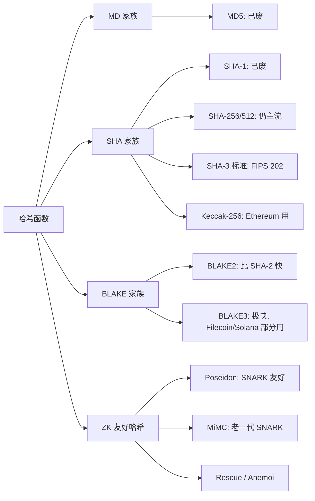
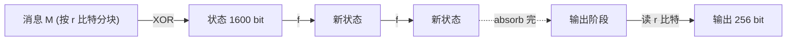
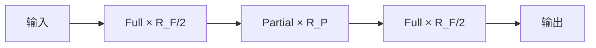
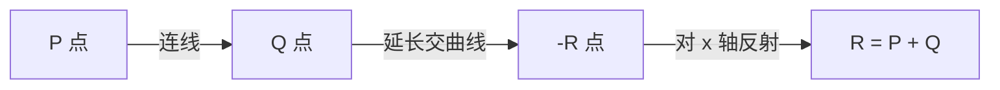
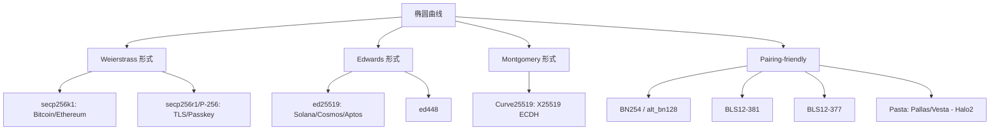
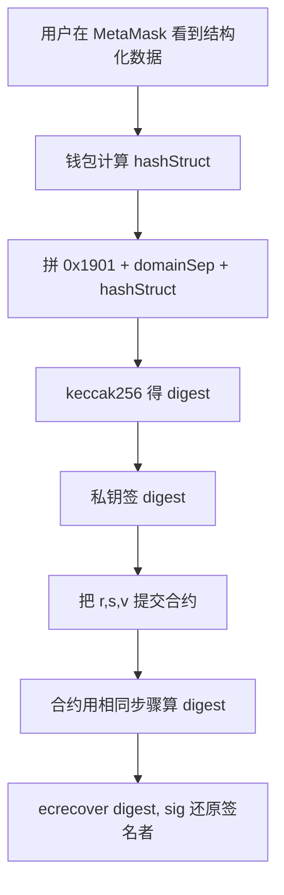
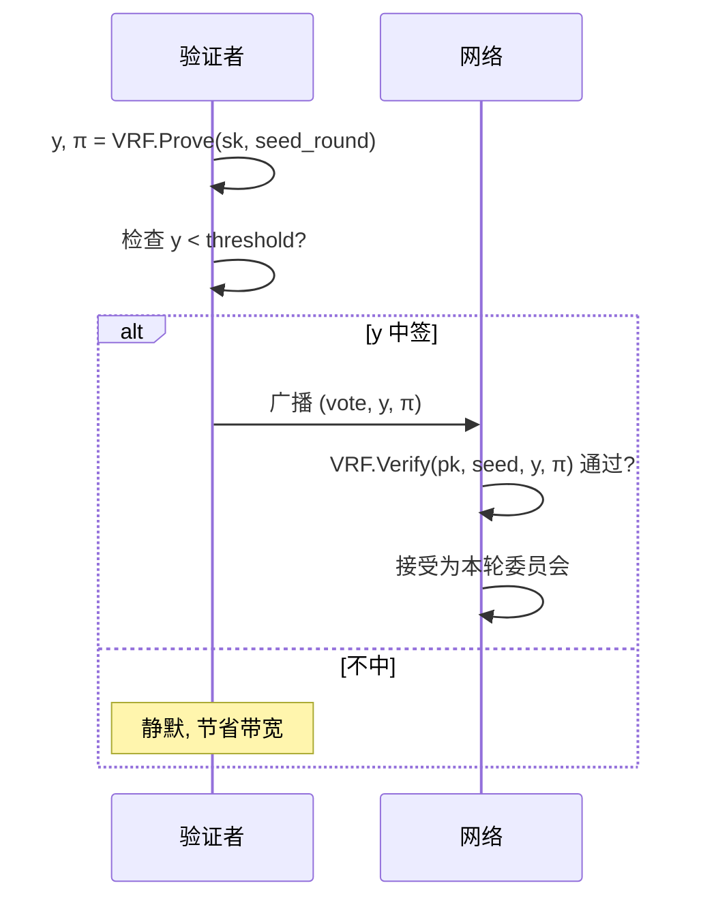
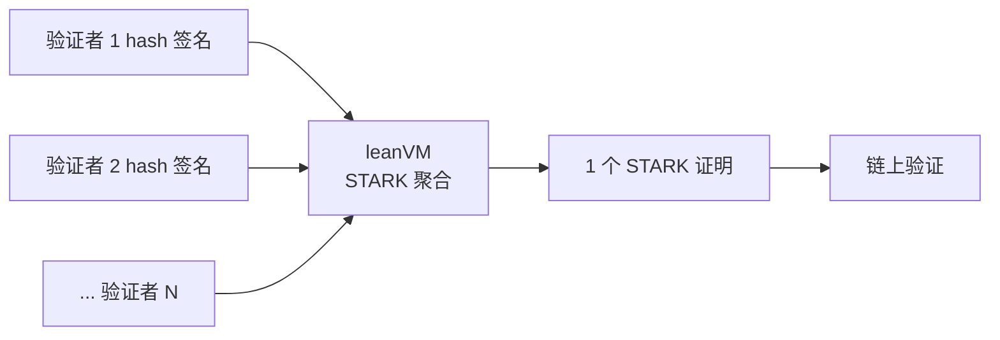
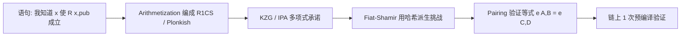

# 模块 01 · 密码学基础

> 区块链是分布式的记忆，密码学是这份记忆能被信任的全部理由。
>
> 风格参照《Hello 算法》：**先画面、后定义、再数学**。前置：本科 CS、能读 Python。

---

## 阅读三件套

> 💡 **提示**：要点或类比。
> ⚠️ **注意**：坑或关键细节。
> 🤔 **想一想**：停 10 秒的题。

每节末尾"→ 下一节"串主线。

---

## 学习目标

1. **大白话**讲清哈希 / 签名 / Merkle。
2. **工程语言**说透 Keccak vs SHA3、地址 20B、k 不能重用、BLS 聚合。
3. **代码跑通**密钥 → 签名 → 验签 → ecrecover → 紧凑签名 → Merkle 证明 → 链上验证。
4. **审计视角**识破 `encodePacked` 冲突、`ecrecover` 漏 0、EIP-712 漏 chainId。
5. **理解** KZG / VRF / Poseidon / Pedersen，为模块 08 zk 铺路。

---

## 目录

- 第 0 章 · 一段不太正经的历史
- 第 1 章 · 哈希函数：把一头大象塞进 32 字节
- 第 2 章 · 对称加密：Web3 的影子角色
- 第 3 章 · 非对称加密与 RSA：旧世界的故事
- 第 4 章 · 椭圆曲线：Web3 的隐形主角
- 第 5 章 · 数字签名：从 ECDSA 到 BLS 聚合
- 第 6 章 · Merkle 树与以太坊状态树
- 第 7 章 · 承诺方案：Pedersen / KZG / IPA / FRI
- 第 8 章 · VRF：可验证的随机性
- 第 9 章 · 门限签名 / MPC / MuSig2 / FROST
- 第 10 章 · HD 钱包与 keystore：私钥的工程化（BIP-32/39/44/SLIP-0010/EIP-2335）
- 第 11 章 · 后量子密码学（PQC）：备战 2030
- 第 12 章 · 全同态加密（FHE）：在密文上算账
- 第 13 章 · 通往零知识证明的桥梁（含 Brakedown / Binius）
- 第 14 章 · AI 在密码学审查中的位置
- 第 15 章 · 工程实战代码
- 第 16 章 · 习题与参考解答
- 第 17 章 · 自审查清单
- 第 18 章 · 延伸阅读与权威源

> **前置**：本模块假设你已完成 **00-导论与学习路径**，搭好了 Python/Foundry 环境，了解整体学习路径。如果还没有，先回去看 00。

---

## 第 0 章 · 一段不太正经的历史

### 0.1 1976 年：公钥密码学诞生

**现代密码学**始于 1976 年——Diffie & Hellman 在 IEEE Trans. Info. Theory 发表 *New Directions in Cryptography*，提出：

> 两个素未谋面的人，能在**公开信道**协商出**仅他们两人知道**的秘密。

机制：把加密钥匙和解密钥匙拆成两把，前者公开，后者私藏——即**公钥密码学**。古典密码全是对称的，必须事先见面交钥匙。

### 0.2 中本聪没发明任何新原语

2008 年 Bitcoin 白皮书发布时，SHA-256 (2001)、ECDSA (1992)、Merkle 树 (1979) 已成熟多年。中本聪的贡献：

> **把已有的密码学积木，搭成一台不需要可信第三方的记账机。**

Web3 工程师需要的不是"从零证安全"，而是吃透每块积木的：保证什么 / 不保证什么 / 用错出什么事。

> 🤔 **想一想**：git commit 的 hash 怎么算？SSH 公钥为什么能登 GitHub？
> 答案在后面。

---

## 第 1 章 · 哈希函数：把一头大象塞进 32 字节

### 1.1 直觉：哈希 = 指纹

把任意长度输入压缩成固定 32 字节输出，**单向**（算易，反推难）。

```
"Hello"   →  185f8db32271fe25...
"Hello!"  →  334d016f755cd6dc...   一字之差完全不同
1GB 电影  →  3a7bd3e2360a3d29...
```

### 1.2 三性质：抗原像 / 抗第二原像 / 抗碰撞

| 性质 | 形式化 | 类比 |
| --- | --- | --- |
| 抗原像 | 给 `h` 找 `x` 使 `H(x)=h` 困难 | 警察有指纹找不到人 |
| 抗第二原像 | 给 `x` 找 `x'≠x` 同哈希困难 | 做不出和小明指纹相同的假人 |
| 抗碰撞 | 找任意 `x≠x'` 同哈希困难 | 做不出两个指纹相同的假人（最强） |

> ⚠️ 抗碰撞 ⇒ 抗第二原像，反之不成立。MD5 抗碰撞已死、抗原像还撑——所以
> 它能做 ETag，**不能**做签名。

### 1.3 哈希家族族谱



#### 1.3.1 MD5（已废）

Rivest 1991 设计，1996 弱碰撞，2004 王小云给出实际碰撞构造。**完全死亡**。
仍出现于 `MD5SUMS`、HTTP `Content-MD5`——只能防意外损坏。

> ⚠️ Web3 任何"防篡改 / 签名"位置看到 MD5 = 红牌。

#### 1.3.2 SHA-1（已废）

NSA 设计、160 bit 输出。2017 年 Google + CWI 公布 "SHAttered" 碰撞
（约 6500 CPU 年）。git 仍用 SHA-1 标 commit，迁 SHA-256 进展缓慢。

#### 1.3.3 SHA-256：Bitcoin 核心引擎

##### 1.3.3.1 设计目标

NSA 2001 发布的 SHA-2 成员，目标"比 SHA-1 更安全"。被 Bitcoin PoW
推成全人类算力最密集函数：全网每秒约 6 × 10^20 次哈希
（<https://www.blockchain.com/explorer/charts/hash-rate>，2026-04）。

##### 1.3.3.2 Merkle-Damgård 结构

```
H_0 (固定 IV)
for each 512-bit block M_i:
    H_i = compress(H_{i-1}, M_i)
```

副作用：**长度扩展攻击**——已知 `H(secret ‖ data)` 和 `len(data)` 能算
`H(secret ‖ data ‖ pad ‖ extra)`。所以 SHA-256 当 MAC 必须配 HMAC。

> 💡 Keccak/SHA-3 用海绵结构，**天然抗长度扩展**——这是 SHA-3 改进的
> 重点之一。

##### 1.3.3.3 实测性能

| 平台 | 速度 |
| --- | --- |
| M3 Pro 1 thread | ~600 MB/s |
| Intel SHA-NI 指令集 | ~2,000 MB/s |
| Antminer S21 (ASIC) | ~10^14 H/s |

##### 1.3.3.4 Web3 用途

- **Bitcoin 全栈**：区块哈希、txid、Merkle 根全部用双 SHA-256
  （`SHA-256(SHA-256(x))`）。
- **Bitcoin 地址**：`Base58Check( 0x00 ‖ RIPEMD-160(SHA-256(pubkey)) ‖ checksum )`。
- **HMAC-SHA256**：HKDF / RFC 6979 确定性 nonce / TLS 都依赖它。
- **EIP-4844 versioned hash**：`0x01 ‖ SHA-256(KZG_commit)[1:]`，把 48 字节
  G1 点压成 32 字节。

##### 1.3.3.5 已知攻击

2026-04 无实际碰撞攻击。最强理论：31/64 轮拟碰撞（Mendel 2013）。
量子下 Grover 把**抗原像**从 2^256 削到 2^128；抗碰撞通过 BHT
（Brassard-Høyer-Tapp）算法理论上降到 2^(n/3) ≈ 2^85，但需要 2^85
量子内存，工程上远未可行。NIST SP 800-208 认为 SHA-256 在后量子
时代仍适合哈希承诺与 HMAC，但建议长期场景升级到 SHA-384/SHA-512。

#### 1.3.4 SHA-3 / Keccak-256：以太坊的"那一个"

##### 1.3.4.1 竞赛简史

NIST 2007 启动 SHA-3 竞赛备胎 SHA-2。三轮筛 64→14→5→1，2012-10 Keccak
（Bertoni/Daemen/Peeters/Van Assche）胜出。2015-08 FIPS 202 标准化。

##### 1.3.4.2 海绵函数

状态 1600 bit = `r + c`（Keccak-256: r=1088, c=512）：



`f` 是 24 轮置换 (θ、ρ、π、χ、ι)。海绵结构两大优势：**抗长度扩展**
（c 比特从不外泄）+ **任意长输出**（继续 squeeze）→ SHAKE128/256。

##### 1.3.4.3 那一字节之差

NIST 标准化时把分隔字节从 `0x01` 改成 `0x06`，给 SHAKE/cSHAKE 留位。
后果：同输入下 Keccak 与 SHA3 输出完全不同：

```python
# 输入 'abc'
Keccak-256:  4e03657aea45a94fc7d47ba826c8d667c0d1e6e33a64a036ec44f58fa12d6c45
SHA3-256  :  3a985da74fe225b2045c172d6bd390bd855f086e3e9d525b46bfe24511431532
```

##### 1.3.4.4 以太坊的"历史包袱"

以太坊 2015 主网上线早于 FIPS 202，用的是"原始 Keccak"，无法硬分叉
回头（会改写所有地址 / 合约 / tx 格式）。

> ⚠️ **每年坑后端的点**：Solidity `keccak256()` = Keccak（分隔 `0x01`），
> Python `hashlib.sha3_256()` = FIPS 202（`0x06`）。**永不相等**。
>
> 链下对齐合约：
>
> - Python: `Crypto.Hash.keccak`（pycryptodome）或 `eth_utils.keccak`
> - Node:   `@noble/hashes/sha3` 的 `keccak_256`（**非** `sha3_256`）
> - Rust:   `sha3` crate 的 `Keccak256`（**非** `Sha3_256`）

##### 1.3.4.5 在 EVM 的地位

- **没有预编译**——keccak 是指令集 `SHA3` opcode，直接读 memory。
- **Gas**：30 + 6·⌈len/32⌉，32B = 36 gas（相比 ECDSA 3000 gas 极便宜）。
- 高频用途：`mapping` slot、event topic、`abi.encode` typeHash。

#### 1.3.5 BLAKE 家族

##### 1.3.5.1 简史

Aumasson 等 2008 提出 BLAKE，SHA-3 决赛输给 Keccak。基于 ChaCha 置换。
BLAKE2（2012）精简优化版，比 SHA-256 快但安全等价。

##### 1.3.5.2 BLAKE3 的并行树结构

BLAKE3（2020）切消息为 1024 字节叶子，独立哈希后两两合并到根：

- **多核并行**：8 核理论 8× 单核速度
- **SIMD 友好**：32 位 add/xor/shift
- **流式可分块**：中间状态可序列化

实测：单核 ~1 GB/s，多核 6+ GB/s，比 BLAKE2 快 5-10×。

##### 1.3.5.3 Web3 中的 BLAKE

| 项目 | 用途 |
| --- | --- |
| Polkadot/Kusama | BLAKE2b-256 账户哈希 |
| Filecoin | BLAKE2b randomness oracle |
| Solana | `solana_program::blake3` 可选 |
| IPFS/libp2p | BLAKE2/3 multihash |
| Zcash | BLAKE2b 派生 Sapling key |

> 💡 BLAKE3 小输入 (<64B) 反而慢于 SHA-256（树 setup 成本）——所以
> Solana tx signing 仍用 SHA-256。

#### 1.3.6 ZK 友好哈希：Poseidon 家族

##### 1.3.6.1 为什么需要代数哈希

Keccak/SHA 按比特设计 (XOR/AND)，每比特展开为一个 R1CS 约束：
Keccak ~150k、SHA-256 ~27k 约束/哈希。状态树深 32 时读一次状态 = 480 万
约束，**慢得离谱**。代数哈希直接在有限域上做 add/mul/x⁵——每操作 1 约束。

##### 1.3.6.2 Poseidon 的 HADES 结构

Poseidon（Grassi 等 USENIX'21）混合策略：

- 前 R_F/2 轮 **Full S-box**（每个 state 元素 x⁵）
- 中间 R_P 轮 **Partial S-box**（只首元素 x⁵）
- 后 R_F/2 轮 **Full S-box**



Full 轮抗差分，Partial 轮压约束 → ~250 约束/哈希。

##### 1.3.6.3 约束数对比

| 哈希 | 年 | 域 | 约束 (R1CS) | 倍率 |
| --- | --- | --- | --- | --- |
| Keccak-256 | 2008 | 比特 | ~150,000 | 1× |
| SHA-256 | 2001 | 比特 | ~27,000 | 5.5× |
| MiMC | 2016 | BN254 | ~600 | 250× |
| Rescue/Anemoi | 2020/22 | BN254/BLS12-381 | ~250 | 600× |
| **Poseidon/Poseidon2** | 2020/23 | BN254/BLS12-381 | **~150-250** | **600-1000×** |

原论文：<https://eprint.iacr.org/2019/458.pdf>（2026-04）。

##### 1.3.6.4 Web3 用例

| 项目 | 用法 |
| --- | --- |
| zkSync Era | 状态树根、账户树 |
| Polygon zkEVM | Sparse Merkle 状态树 |
| StarkNet | 配合 Pedersen 状态承诺 |
| Aztec | Note commitment / nullifier |
| Tornado Cash | Deposit Merkle 树 |
| Semaphore | 群成员证明 |

##### 1.3.6.5 主网为何不能直接换 Poseidon

Patricia trie 历史上就是 Keccak，硬分叉换会破坏所有合约 storage layout。
zkEVM 因此被迫在电路里**模拟** Keccak，每次状态访问付 15 万约束"Keccak 税"。
EIP-5988 (Poseidon 预编译) 讨论中，短期不会落地。

### 1.4 哈希在 Web3 的角色

| 角色 | 例子 |
| --- | --- |
| 唯一标识 | tx hash / block hash / event topic |
| 状态承诺 | Merkle Root / Patricia Root |
| 派生地址 | `keccak256(uncompressed_pubkey[1:])[-20:]` |
| CREATE2 | `keccak256(0xff ‖ deployer ‖ salt ‖ keccak256(initCode))[12:]` |
| 随机种子 | `block.prevrandao`（即 RANDAO） |
| 消息绑定 | EIP-191 / EIP-712 digest |
| PoW | Bitcoin 双 SHA-256 |

> 💡 **地址 20B，哈希 32B**：取 keccak 后 20 字节，前 12 字节丢弃。
> 不同公钥理论上可能撞同地址（生日攻击 ~2^80 次哈希，现实不可行）。
> EIP-55 校验和只是防手抖，**不防攻击**。

### 1.5 跨语言一致：`abi.encodePacked` 陷阱

Solidity 两种编码：
- `abi.encode(...)`：每参数填 32 字节，安全费 gas。
- `abi.encodePacked(...)`：紧凑省 gas，**对动态类型不安全**。

```solidity
keccak256(abi.encodePacked("a", "bc"))   // = keccak256(abi.encodePacked("ab", "c"))
```

`encodePacked` 不写 `string` 长度前缀，两次都拼成 `0x616263`。

> ⚠️ **审计红牌**：`abi.encodePacked(...)` 后跟 ≥2 个 `string`/`bytes`
> 参数。换 `abi.encode`，或中间塞 `bytes32 keccak(...)` 做分隔。

### 1.6 PRF / PRG / 随机预言机：构件简介

#### 1.6.1 三个易混的近亲

| 构件 | 全称 | 输入 | 输出 | 用途举例 |
| --- | --- | --- | --- | --- |
| **PRG** | Pseudorandom Generator | 短随机种子 | 任意长伪随机串 | `os.urandom` 内部、ChaCha20 stream |
| **PRF** | Pseudorandom Function | (key, x) | 伪随机的 `f(x)` | HMAC、AES-CMAC |
| **RO** | Random Oracle (理想化模型) | x | "真随机"的 `H(x)` | 用 SHA-256/Keccak 在协议证明里"假装" |

#### 1.6.2 PRG 的工程应用

PRG 把短熵拉伸成长流：`seed (32B) → 100MB pseudo-random output`。

Web3 用例：BIP-39 PBKDF2、fork choice randomness expansion、TLS/Noise nonce 派生。

#### 1.6.3 PRF：带 key 的"伪函数"

`PRF(k, x)`：k 不变时对每个 x 输出确定的伪随机值。HMAC-SHA256 是事实 PRF；RFC 6979 用它派生 ECDSA 确定性 nonce。

#### 1.6.4 随机预言机假设

很多协议证明写"在随机预言机模型下安全"——假装 `H` 对每个新输入返回真随机值。

> ⚠️ 现实中只是用 Keccak/SHA-256 近似 RO。所有 ROM 安全证明**严格说**只在哈希表现得像 RO 时成立——ROM **不是**标准模型。常见误解是 EdDSA 比 ECDSA "可证明安全"：实际两者的主流安全归约都依赖 ROM（EdDSA 在 ROM 下有更干净的归约，ECDSA 归约也存在但前提更微妙），不能简单类比为标准模型下的安全。

哈希是密码学的地基。有了哈希，下一步是**对称加密**——它本身在 Web3 中是"影子角色"，但理解它才能看清为什么非对称体系能取代它。

---

## 第 2 章 · 对称加密：Web3 的影子角色

### 2.1 直觉：同一把钥匙加密解密

同一把密钥 K 加密解密（AES、ChaCha20）。链上是公开账本，无法安全分享 K，所以 Web3 主要靠**非对称加密 + 数字签名**，但对称加密仍有几个隐藏角色：

### 2.2 钱包加密 / Keystore V3

MetaMask 用 PBKDF2 从密码派生加密密钥，再用 **AES-GCM** 加密助记词存 IndexedDB。Geth keystore 用 **scrypt** 派生 + **AES-128-CTR** 加密私钥。

> 💡 解锁钱包输的密码不直接用于加密——先经 PBKDF2/scrypt/argon2 跑几十万轮，**故意做得慢**，让暴力试密码每次付几百毫秒代价。

### 2.3 端到端通信：RLPx / Whisper / Waku

以太坊节点之间用 **RLPx** 协议通信。它先用 ECDH（基于 secp256k1）协商
出一个共享秘密，再用 HKDF 派生出对称密钥，最后用 AES-CTR + HMAC-SHA256
加密 + 认证。这个组合叫 **ECIES**（Elliptic Curve Integrated Encryption
Scheme）。

### 2.4 工程师必须知道的三件事

1. **永远不要用 ECB 模式**：每块独立加密，相同明文块产生相同密文块，宏观结构泄露（"ECB 企鹅"）。

2. **AEAD 才是默认选择**：AES-GCM、ChaCha20-Poly1305 **同时**加密 + 认证。只加密不认证，攻击者能翻转密文位让明文定向变化。

3. **nonce 永不重用**：AES-GCM nonce 重用暴露 GHASH 认证密钥；ChaCha20-Poly1305 nonce 重用让两条明文 XOR 直接泄露。实务：96 位随机 nonce + counter，或每会话独立 key。

### 2.5 与 Web3 的真正交点：HKDF

HKDF（RFC 5869）两步走：

```
PRK = HMAC-SHA256(salt, IKM)               # extract: 把任意熵源压成统一长度
OKM = HMAC-SHA256(PRK, info ‖ counter)     # expand:  从 PRK 拉出任意长 OKM
```

`IKM` 是 ECDH 共享秘密，`info` 是上下文标签（如 "ETH/secp256k1/v1"）。从一个 ECDH 输出派生多把不同用途的对称密钥。libp2p、Noise 协议、Waku、ECIES 都用 HKDF。

ECDH 里的"椭圆曲线"提了一下，但还没正式登场。在此之前，先看非对称密码学的"前身"——RSA，了解 Web3 为什么选择了椭圆曲线而不是它。

---

## 第 3 章 · 非对称加密与 RSA：旧世界的故事

### 3.1 RSA 的直觉

RSA (1977) 基于大整数分解难：公钥 `(n, e)`，私钥 `(n, d)`，`c = m^e mod n`，`m = c^d mod n`。d 由 (p, q, e) 经费马小定理与中国剩余定理唯一确定。

### 3.2 RSA 在 Web3 几乎不出现，但你会偶尔遇到

- **HTTPS 证书**：Web3 dApp 的前端服务仍然走 HTTPS，根证书很多用 RSA-2048。
- **JWT 签名**：很多链下 API（OpenSea / Infura / Alchemy）用 RS256 (RSA-SHA256)
  签 JWT。
- **预编译 0x05 (modexp)**：以太坊有一个通用模幂预编译，可以用来做 RSA
  验签（极少见但存在）。
- **证明系统 KZG ceremony**：早期某些 setup 用过 RSA-based VDF。

### 3.3 为什么 Web3 抛弃了 RSA

| 项目 | RSA-2048 | secp256k1 (ECC-256) |
| --- | --- | --- |
| 私钥大小 | 256 字节 | 32 字节 |
| 公钥大小 | 256 字节 | 33 字节（压缩） |
| 签名大小 | 256 字节 | 64-65 字节 |
| 安全等级 | ~112 比特 | ~128 比特 |
| 速度（签） | 慢 | 快 |
| 是否可聚合 | ✗ | ✓（Schnorr/BLS） |
| 链上验证 gas | 极贵 | `ecrecover` 仅 3000 gas |

RSA 不是不安全，是**不经济**。量子下 Shor 算法多项式时间同时破解 RSA 与 ECC。

既然 ECC 赢了这场比较，接下来就要真正进入椭圆曲线的世界，看它的几何直觉、数学基础，以及 Web3 各条链分别用了哪条曲线。

---

## 第 4 章 · 椭圆曲线：Web3 的隐形主角

### 4.1 椭圆曲线长什么样？

名字和椭圆无关（历史命名事故）。方程：`y² = x³ + a·x + b (mod p)`。密码学用**有限域上**的椭圆曲线——`mod p` 后曲线变成离散点集。secp256k1 的 p 约 2^256，点数也约 2^256。

### 4.2 为什么椭圆曲线能做密码学？

关键是**点加法**：连接 P、Q 的直线再交曲线一点得 -R，对 x 轴反射得 R = P + Q。



**点乘** `n·P = P + P + ... + P`（n 次）构成"陷门"：

- **正向**：`Q = n·P`，double-and-add O(log n)
- **反向**：给定 P, Q 求 n 是 **ECDLP**，最优 O(√n)

私钥 `d` 随机，公钥 `Q = d·G`（G 是固定基点）。从 d 算 Q 易，从 Q 反推 d 极难。

### 4.3 主流曲线的"族谱"



#### 4.3.1 secp256k1：Bitcoin 与 Ethereum 的命脉

##### 4.3.1.1 参数

```
p  = 2^256 − 2^32 − 977            ≈ 2^256（基域）
y² = x³ + 7      (mod p)            （注意 a=0）
n  = FFFFFFFFFFFFFFFFFFFFFFFFFFFFFFFE BAAEDCE6AF48A03BBFD25E8CD0364141
                                     （子群阶，约 2^256）
G  = 04 79BE667E... 483ADA77...      （未压缩基点，65 字节）
h  = 1                               （余因子）
```

来源：SECG SEC 2 v2 (<https://www.secg.org/sec2-v2.pdf>，2026-04 检索)。

##### 4.3.1.2 安全级别

~128 比特（Pollard rho O(√n) ≈ 2^128），截至 2026-04 无已知子指数攻击，量子下 Shor 多项式时间破解。

##### 4.3.1.3 Web3 用途

| 用途 | 说明 |
| --- | --- |
| Bitcoin 钱包 | P2PKH/P2WPKH/P2TR 全栈 |
| 所有 EVM 链 EOA | Ethereum、Arbitrum、Optimism、BSC、Polygon... |
| Cosmos `ethsecp256k1` | Evmos / Injective 等 EVM-on-Cosmos |
| Stellar (额外支持) | 部分桥接路径用 |

##### 4.3.1.4 库支持

| 语言 | 推荐库 | 备注 |
| --- | --- | --- |
| C | `libsecp256k1` v0.7.1 (Bitcoin Core) | 工业标准，最严格审计 |
| Rust | `k256` (RustCrypto) / `secp256k1` crate | wagmi 等库的底层 |
| Go | `decred/dcrd/dcrec/secp256k1` | go-ethereum 选用 |
| Python | `coincurve` 21.0.0 (libsecp256k1 绑定) | 本指南选用 |
| JS | `@noble/curves/secp256k1` v2.2.0 | 浏览器友好、ESM-only |

> ⚠️ **注意**：secp256k1 与 secp256r1 长得像（"k1"和"r1"差一个字母），
> 但点乘速度不同、生态完全分隔。Apple Secure Enclave、WebAuthn / Passkey
> 用的都是 r1。"用 Passkey 登录以太坊"难就是这个原因——硬件给的是
> r1 签名，要在合约里验得加预编译（EIP-7212）。

#### 4.3.2 secp256r1（P-256）：TLS 与 Passkey 的世界

##### 4.3.2.1 参数

```
p  = 2^256 - 2^224 + 2^192 + 2^96 - 1
y² = x³ - 3x + b   (a = -3，与 k1 的 a=0 关键区别)
n  ≈ 2^256
h  = 1
```

##### 4.3.2.2 安全级别

~128 比特，与 k1 同等。**争议**：NSA 2000 年提供曲线参数，常数 `b` 来源不透明——密码学社区的"信任阴影"，DJB 因此推动了 Curve25519。

##### 4.3.2.3 Web3 用途

| 场景 | 说明 |
| --- | --- |
| 硬件钱包 (Apple Secure Enclave) | iCloud Keychain 钱包私钥 |
| WebAuthn / Passkey | 用浏览器 / TouchID 登录 dApp |
| ERC-4337 账户抽象 | 把 Passkey 签名转成合约可验的形式 |
| 部分跨链桥 | TLS 链路认证 |

##### 4.3.2.4 库支持

| 语言 | 推荐库 |
| --- | --- |
| C | OpenSSL / BoringSSL |
| Rust | `p256` (RustCrypto) |
| JS | `@noble/curves/p256` |
| 链上 | `RIP-7212 P256_VERIFY` 预编译 (Polygon zkEVM、Optimism、Arbitrum、zkSync 已上线，主网通过 EIP-7951 推进中) |

#### 4.3.3 Curve25519 / X25519：高性能 ECDH 之王

##### 4.3.3.1 参数

```
形式  : Montgomery, y² = x³ + 486662·x² + x  (mod 2^255 - 19)
基点  : x = 9
余因子: h = 8     ← 关键不同！
```

DJB (Daniel J. Bernstein) 2005 年设计。基域素数 `2^255 - 19` 让模约简
能用一条特殊 reduction 指令完成——这就是"25519"名字的由来。

##### 4.3.3.2 安全级别

- ~128 比特理论安全。
- **特殊优势**：曲线参数完全公开推导过程，没有 NIST 曲线的"魔数"
  阴影。
- **特殊缺陷**：余因子 h=8 让朴素实现可能落入子群外的"小子群攻击"。
  这就是 Ristretto255 出场的原因（见 4.3.4）。

##### 4.3.3.3 Web3 用途

| 场景 | 说明 |
| --- | --- |
| **X25519 密钥协商** | TLS 1.3、Noise 协议、libp2p、ECIES 派生层 |
| Solana 子产品 (libra-crypto) | 早期 Solana Libra 模块用 X25519 |
| Cosmos IBC 通道加密层 | 通讯密钥派生 |
| Tor / Signal / WhatsApp | 端到端加密握手 |

##### 4.3.3.4 库支持

| 语言 | 推荐库 |
| --- | --- |
| C | `libsodium` (`crypto_scalarmult_curve25519`) |
| Rust | `x25519-dalek` |
| JS | `@noble/curves/ed25519` 含 `x25519` |
| Python | `pynacl` |

#### 4.3.4 Ristretto255：把 Curve25519 "压成"素数群

##### 4.3.4.1 为什么需要 Ristretto

Curve25519 / Ed25519 余因子 h=8，把"曲线点"和"群元素"混用会触发小子群攻击。Ristretto（Hamburg 2015）是一种**编码方案**：把余因子 8 的曲线点重新编码成**素数阶群**元素，两个不同曲线点编码可映射到同一 Ristretto 元素，彻底消除小子群陷阱。继承 Curve25519 的 ~128 比特安全。

##### 4.3.4.2 Web3 用途

| 场景 | 说明 |
| --- | --- |
| **Polkadot / Kusama (sr25519)** | Schnorrkel = Schnorr + Ristretto over Curve25519 |
| Zcash Sapling / Orchard | 内部承诺方案的群 |
| Monero (curve25519 + Ristretto-style 编码) | 隐私交易底层 |
| Filecoin / IPFS | 部分 zk 协议中作素数阶群 |

##### 4.3.4.3 库支持

`curve25519-dalek` (Rust) 是事实标准实现；`@noble/curves/ed25519`
的 ristretto255 子模块是 JS 生态首选。

#### 4.3.5 ed25519：EdDSA 之家

##### 4.3.5.1 参数

```
形式  : Edwards twisted, -x² + y² = 1 + d·x²·y²    (d = -121665/121666)
基点  : 固定生成元 B
       (B 由 4·(2/sqrt(d-1)·... 唯一构造，无魔数)
余因子: h = 8
```

Curve25519 的 Edwards 形式同构，~128 比特安全。EdDSA 签名跑在它上面。

##### 4.3.5.2 Web3 用途

| 链 | 使用方式 |
| --- | --- |
| **Solana** | 全局账户密钥（pubkey 即地址，32 字节 base58） |
| **Aptos / Sui** | Move 生态钱包默认 |
| **Cosmos SDK** | 验证者共识签名（Tendermint Core 选 ed25519） |
| **NEAR** | Account 密钥派生 |
| **Polkadot** | sr25519（Ristretto + Schnorr）+ ed25519（备选） |
| **Cardano** | extended ed25519 (BIP-32-Ed25519) |
| **Stellar** | 全栈 |
| **Algorand** | 账户密钥 |

##### 4.3.5.3 库支持

| 语言 | 推荐库 |
| --- | --- |
| C | `libsodium`、`ed25519-donna` |
| Rust | `ed25519-dalek` |
| JS | `@noble/curves/ed25519` |
| Python | `pynacl`、`cryptography.hazmat` |
| Solana 链上 | `solana_program::ed25519_program` |

> 💡 Solana pubkey 直接是地址（32 字节 base58，44 字符），省去 keccak 提取 20 字节，但地址更长。

##### 4.3.5.4 Solana / Cosmos 实测细节

**Solana**：

- **Tx 签名**：每笔 Solana transaction 最多带 64 字节 ed25519 签名 ×
  签名者数量。验证靠 banking stage 的 **batch verify**——一次 GPU/CPU
  调度并行验数百签名，吞吐 65k+ TPS 的关键之一。
- **PDAs (Program-Derived Addresses)**：用 SHA-256 派生而**不是 ed25519
  公钥**。这意味着 PDA 落在曲线**外**——故意没有对应私钥，只能由程序
  自己签 (CPI)。这也是 Solana account model 与 EVM EOA/合约二分法的
  本质差异。
- **轻客户端**：PDA 不在曲线上，检测"是不是合约"只需 curve25519 检测，比 EVM `extcodesize` 直接。

**Cosmos / Tendermint**：共识 ed25519，用户默认 secp256k1（Bitcoin 兼容）。SDK v0.50 支持多签名算法插件。EVM 链（Evmos/Injective）用 ethsecp256k1，地址走 keccak[12:]。

**Polkadot**：默认 sr25519（Schnorr + Ristretto over Curve25519），备选 ed25519 和 ecdsa。Polkadot 助记词导入 MetaMask 看不到资产——两者派生出的密钥完全不同。

#### 4.3.6 BN254 (alt_bn128)：以太坊 zk 的"过渡曲线"

##### 4.3.6.1 参数与安全级别

Barreto-Naehrig 曲线（2005）。基域 p ≈ 254 bit，嵌入度 k=12，pairing 落在 F_{p^12}。2017 年 Kim-Barbulescu exTNFS 攻击把安全性从 128 比特削到 **~100 比特**（IACR 2016/758）。100 比特多数场景仍可用，但**新协议必须迁移**。

##### 4.3.6.2 Web3 用途

| 协议 | 用法 |
| --- | --- |
| **Tornado Cash** | Groth16 证明用 BN254 |
| **Aztec V1** | zk-zk-Rollup 早期版本 |
| **Loopring 3.x** | zk-DEX 状态证明 |
| **drand evmnet** | 上链发布的 BLS 签名（兼容预编译） |
| **以太坊预编译 0x06/0x07/0x08** | EIP-196 / EIP-197（永久保留，因兼容性） |

##### 4.3.6.3 库支持

| 语言 | 推荐库 |
| --- | --- |
| C++ | `libff`（zCash 老库） |
| Rust | `arkworks-rs/curves` (`ark-bn254`) |
| Go | `gnark-crypto` |
| Python | `py_ecc.bn128` |
| Solidity | 预编译 `0x06/0x07/0x08` |

#### 4.3.7 BLS12-381：以太坊共识的脊梁

##### 4.3.7.1 参数

Sean Bowe 2017 年为 Zcash Sapling 升级设计。

```
基域 p ≈ 381 bit  (q1)
子群阶 r ≈ 255 bit
嵌入度 k = 12
G1 在 E(F_p)，G2 在 E(F_{p^2}) 的扭子群
```

##### 4.3.7.2 安全级别

抗 exTNFS 后真实安全 ~128 比特，比 BN254 多 ~30 比特裕度。后量子下仍死（pairing 基于 ECDLP），需换 STARK。

##### 4.3.7.3 Web3 用途

**Ethereum 共识层（Beacon Chain）的 BLS 签名跑在它上面**：

- 每个验证者的私钥 32 字节
- 公钥 48 字节（G1 上的压缩点）
- 签名 96 字节（G2 上的压缩点）
- 一个 epoch 数十万签名，全部聚合成一个 96 字节签名 ← **这就是 BLS 的魔法**

EIP-2537 把 BLS12-381 预编译加入 EVM，让合约能直接验证 BLS 签名。
**Pectra 升级已于 2025-05-07 在以太坊主网激活**（epoch 364032，参见
<https://blog.ethereum.org/2025/04/23/pectra-mainnet>，2026-04 检索）。
其它用途：

| 项目 | 用法 |
| --- | --- |
| Filecoin | 全栈共识签名 |
| Chia | Plot/Pool BLS 签名 |
| Chainlink CCIP | DON 委员会聚合签名 |
| EigenLayer | AVS operator 投票 |
| Zcash Sapling | 内部承诺曲线 |

##### 4.3.7.4 库支持

| 语言 | 推荐库 | 备注 |
| --- | --- | --- |
| C | **`blst`** (supranational, 经审计) | 工业最强 |
| Rust | `blst` Rust binding / `arkworks-rs` | Lighthouse 等共识客户端 |
| Go | `gnark-crypto/ecc/bls12-381`、`go-eth2-client` | Prysm 用 |
| Python | `py_ecc.bls12_381`、`milagro-bls` | 慢但可用 |
| Solidity | EIP-2537 预编译 (Pectra 后) |  |

#### 4.3.8 Pasta (Pallas/Vesta)：Halo2 的循环曲线对

##### 4.3.8.1 参数

由 Zcash 团队为 Halo2 设计：

```
Pallas:  y² = x³ + 5  over F_p  (p ≈ 255 bit)
Vesta :  y² = x³ + 5  over F_q  (q ≈ 255 bit)

特殊关系: |E_Pallas(F_p)| = q, |E_Vesta(F_q)| = p
        即一条曲线的标量域 = 另一条的基域
```

##### 4.3.8.2 递归性与安全级别

循环对使"曲线 A 上的证明能验证曲线 B 上的证明"——**递归 SNARK** 成为可能。~125 比特安全，无 pairing，配合承诺方案为 **IPA**。

##### 4.3.8.3 Web3 用途

| 项目 | 用法 |
| --- | --- |
| **Mina Protocol** | "22KB 区块链"——每个区块只 22KB，靠递归 zk 压缩历史 |
| **Aleo** | 隐私 L1，全栈 Halo2 |
| **Halo2 / orchard** | Zcash NU5 升级后的隐私池 |
| 部分 zkVM | RISC Zero 早期版本 |

##### 4.3.8.4 库支持

`pasta_curves` (Rust)、`halo2` 框架内置。JS 端目前实现少。

### 4.4 一张表收尾

| 曲线 | 形式 | 用途 | 私/公/签 字节 |
| --- | --- | --- | --- |
| secp256k1 | Weierstrass | EVM EOA / Bitcoin | 32 / 33 / 65 |
| secp256r1 (P-256) | Weierstrass | TLS / Passkey / RIP-7212 | 32 / 33 / 64 |
| Curve25519 | Montgomery | X25519 ECDH | 32 / 32 / - |
| Ristretto255 | (编码层) | sr25519 / Zcash Sapling | 32 / 32 / 64 |
| ed25519 | Edwards | Solana / Cosmos / Aptos / Sui | 32 / 32 / 64 |
| BN254 (alt_bn128) | Pairing | EVM zk-SNARK 旧 | 32 / 64 / - |
| BLS12-381 | Pairing | Beacon Chain / 新 zk / 跨链 | 32 / 48 / 96 |
| Pallas / Vesta | 循环对 | Mina / Aleo / Halo2 递归 | 32 / 32 / - |

> 💡 **一句话记忆**：**用户用 secp256k1，证明用 BLS12-381，性能链用 ed25519，BN254 是历史包袱**。

曲线本身只是数学工具，真正让钱包能"证明我是我"的是**数字签名**——下一章展开 ECDSA 的完整实现细节、审计要点，以及更现代的 Schnorr 和 BLS。

---

## 第 5 章 · 数字签名：从 ECDSA 到 BLS 聚合

### 5.1 直觉

数字签名提供三个保证：**身份认证**、**完整性**、**不可否认性**。私钥签名，公钥验签。

### 5.2 ECDSA

Bitcoin 与 Ethereum 所有 EOA 用 secp256k1 上的 ECDSA。

#### 5.2.1 签名算法

```
输入:
  私钥 d ∈ [1, n-1]
  消息哈希 z = keccak256(m)

步骤:
  1. 选随机 nonce  k ∈ [1, n-1]
  2. 计算椭圆曲线点 (x1, y1) = k · G
  3. r = x1 mod n        (若 r=0 重选 k)
  4. s = k^(-1) · (z + r·d) mod n
  5. 输出 (r, s)
```

#### 5.2.2 验签算法

```
输入:
  公钥 Q = d·G
  消息哈希 z
  签名 (r, s)

步骤:
  1. u1 = z · s^(-1) mod n
  2. u2 = r · s^(-1) mod n
  3. (x', y') = u1·G + u2·Q
  4. 接受 iff r ≡ x' (mod n)
```

#### 5.2.3 为什么 nonce 重用会暴露私钥（PS3 案例）

Sony PS3 用了**静态 k**（fail0verflow，27C3，2010）。两次签名 `(r, s1)`, `(r, s2)` 对 z1, z2：

```
s1 = k^(-1)·(z1 + r·d)
s2 = k^(-1)·(z2 + r·d)

s1 - s2 = k^(-1)·(z1 - z2)
⇒ k = (z1 - z2) / (s1 - s2)        ← 算出 k

s1 = k^(-1)·(z1 + r·d)
⇒ d = (s1·k - z1) / r              ← 算出私钥 d
```

**两条消息 + 静态 k = 私钥泄露**。

> 💡 现代实现一律用 **RFC 6979 确定性 nonce**：k = HMAC(私钥, 消息)，彻底消除 RNG 缺陷风险。

#### 5.2.4 签名延展性 (malleability) 与 EIP-2

数学事实：`(r, s)` 合法则 `(r, n-s)` 也合法。2014 年 Mt.Gox 攻击者利用此翻转 mempool 中提款 tx 的 s，txid 改变但 tx 仍合法，触发交易所"失败重发"导致双花。

**修复**：EIP-2 强制 **low-s**（`s ≤ n/2`）。OZ `ECDSA.sol` v4.7.3+ 拒绝 high-s。

#### 5.2.5 ecrecover 与 v 的来历

`ecrecover(hash, v, r, s)` 做**公钥恢复**。R 在曲线上有两个候选 y，v 本质是 **yParity**（1 比特消歧）：

| 场景 | v 的取值 |
| --- | --- |
| 原始 Bitcoin | 0/1（裸 yParity） |
| 以太坊主网早期 | 27/28（= yParity + 27） |
| EIP-155 Legacy tx | `chainId·2 + 35 + yParity` |
| EIP-1559 Type 2 tx | yParity (0/1) |
| EIP-2098 紧凑签名 | yParity 编进 s 的最高位 |

`ecrecover` 在以下任一条件不满足时返回 `address(0)`：

1. v 不在 {27, 28}（原版 Solidity）
2. r = 0 或 r ≥ n
3. s = 0 或 s ≥ n
4. （EIP-2 后）s > n/2

> ⚠️ **审计强警告**：`ecrecover(...) == storedSigner` 而无 `require(storedSigner != address(0))` 时，攻击者可构造返回 `0` 的签名，在 storedSigner 未初始化（默认 `0`）的代码路径伪造通过。OZ `ECDSA.recover` 已默认处理此边界。

#### 5.2.6 EIP-2098：65→64 字节紧凑签名

low-s 后 s 最高位恒 0（`s ≤ n/2 < 2^255`），EIP-2098 把 yParity 塞进该位：

```
紧凑签名 = r ‖ ((yParity << 255) | s)        # 64 字节
恢复 s   = compact[32:] & ((1 << 255) - 1)
恢复 v   = (compact[32] >> 7) ? 28 : 27
```

calldata gas 省约 8%，ERC-4337、Permit2、Seaport 广泛使用。

#### 5.2.7 EIP-712：结构化签名

让钱包能展示"你在签什么"。标准 digest：

```
digest = keccak256( "\x19\x01" ‖ domainSeparator ‖ hashStruct(message) )
```

- `domainSeparator = keccak256(EIP712Domain typeHash ‖ encoded fields)`（含合约名、版本、chainId、合约地址）
- `hashStruct(s) = keccak256(typeHash ‖ encodeData(s))`
- `encodeData`：原子类型 32 字节填充，`string`/`bytes`/数组先哈希，嵌套 struct 递归 `hashStruct`。



### 5.3 EdDSA / Ed25519：确定性的优雅

Ed25519 上的 EdDSA：

```
KeyGen:    sk = 32B random,  h = SHA-512(sk),  分成左右各 32B
           a = clamp(h[0:32]), prefix = h[32:64]
           pk = a·B   (B 是 ed25519 基点)

Sign(m):   r = SHA-512(prefix ‖ m) mod L      ← 确定性 nonce!
           R = r·B
           c = SHA-512(R ‖ pk ‖ m) mod L
           s = (r + c·a) mod L
           σ = (R, s)        # 64 字节

Verify:    c = SHA-512(R ‖ pk ‖ m) mod L
           接受 iff s·B = R + c·pk
```

**与 ECDSA 关键差别**：

1. **确定性 nonce**：r 由私钥和消息一起哈希派生，**不依赖 RNG**。
2. **没有 k^(-1) 计算**：实现更简单，少一个侧信道入口。
3. **可证明安全**：在 ROM 模型下严格归约到 ECDLP。

### 5.4 Schnorr 签名 (BIP-340)

#### 5.4.1 简史

Schnorr 1989 年提出，比 ECDSA 还早，但因专利（US 4995082）被 NIST 排除。专利 **2008 年到期**，Bitcoin 2021 年通过 Taproot 上线。

#### 5.4.2 BIP-340 的关键约束

1. **公钥 32 字节 x-only**：Y 隐含为偶数，公钥从 33B 压到 32B。
2. **强制偶 Y**：签名时若 R.y 或 P.y 为奇，取负，消除歧义。
3. **Tagged hash**：`tagged_hash(tag, x) = SHA-256(SHA-256(tag) ‖ SHA-256(tag) ‖ x)`，防跨协议重放。
4. **辅助随机性**：可选 auxRand 混入侧信道防护；全 0 也安全（不像 ECDSA k 必须真随机）。

#### 5.4.3 签名 / 验签算法

```
Sign(sk, m, auxRand):
    若 P.y 奇: d = n - sk, P = -P
    t = d XOR tagged_hash("BIP0340/aux", auxRand)
    k_raw = tagged_hash("BIP0340/nonce", t ‖ P.x ‖ m)
    k = k_raw mod n
    R = k·G
    若 R.y 奇: k = n - k
    e = tagged_hash("BIP0340/challenge", R.x ‖ P.x ‖ m) mod n
    s = (k + e·d) mod n
    σ = R.x ‖ s          # 32 + 32 = 64 字节

Verify(P.x, m, σ):
    解析 P = lift_x(P.x)
    e = tagged_hash("BIP0340/challenge", R.x ‖ P.x ‖ m) mod n
    R' = s·G - e·P
    接受 iff R' 不是无穷远点 且 R'.y 偶 且 R'.x = R.x
```

#### 5.4.4 为什么 Schnorr 比 ECDSA 优秀

| 维度 | ECDSA | Schnorr | 详解 |
| --- | --- | --- | --- |
| 可证明安全 | 仅启发式 | ROM 下严格归约 | Schnorr ⇒ ECDLP 困难 |
| 线性性 | ✗ (有 k^(-1)) | ✓ | (d1+d2)·G = P1+P2 |
| 签名长度 | 71-72B (DER) 或 64-65B | **固定 64B** | 省网络字节 |
| 实现复杂度 | 高 (DER + low-s + ecrecover) | 低 | 减少 bug 面 |
| 批验证 | 不行 | ✓ | n 个签名 1 次合验 |
| 多签聚合 | 极难 | 天然 (MuSig2) | 见 §9.5 |

#### 5.4.5 Taproot P2TR

BIP-341/342 (Taproot/Tapscript)，**2021-11-14 区块 709,632** 激活。P2TR 输出 `OP_1 <32B x-only pubkey>`。

##### 5.4.5.1 Tweaked public key

P2TR 公钥不是裸 sk·G，而是带"内部 commit"的 tweaked key：

```
P_internal = sk · G                         # 内部公钥
m = tagged_hash("TapTweak", P_internal.x ‖ merkle_root)
P_output = P_internal + m · G                # 链上看到的公钥
```

`merkle_root` 是脚本路径的 Merkle 根（无脚本用空串）。Tweak 让 key path 与 script path 在链上**不可区分**。

#### 5.4.6 与以太坊

以太坊 2026-04 仍无 Schnorr 预编译（EIP-665/7503 讨论中），合约模拟需 ~200k gas。实务：链下 Schnorr/MuSig 聚合 → 链上单一 ECDSA 提交。

> 💡 Bitcoin P2TR 输出占比已超 35%（2026-04），MuSig2 多签刚开始量产化。

### 5.5 BLS 签名

BLS (Boneh-Lynn-Shacham 2001)，依赖**双线性配对** `e: G1 × G2 → GT`。

#### 5.5.1 基本方案

```
KeyGen:    sk ∈ Z_r,  pk = sk·G1     (Ethereum 共识用 G1 公钥)
Sign(m):   σ = sk · H(m)              (H: 哈希到 G2)
Verify:    e(G1, σ) == e(pk, H(m))
```

#### 5.5.2 聚合

n 个签名（不同公钥，相同消息）：

```
σ_agg = σ1 + ... + σn   (G2)
pk_agg = pk1 + ... + pkn (G1)
Verify:  e(G1, σ_agg) == e(pk_agg, H(m))    # 1 次 pairing 验证 n 个签名
```

#### 5.5.3 Ethereum 共识层

截至 2026-04 活跃验证者超 100 万，每 epoch 全部投票，BLS 聚合压成少量聚合签名（<https://beaconcha.in/charts/validators>）。

#### 5.5.4 Rogue Key Attack 与 PoP

Mallory 设 `pk_M = X·G1 - pk_B`（X 为任选标量，**Mallory 不需要知道 sk_M**——pk_M 不一定有对应可知的私钥），则 `pk_agg = X·G1`。Mallory 用 X 对一条消息 m 生成签名 σ，对外宣称这是 Alice + Bob + Mallory 的聚合签名（伪造的是**针对该 m 的聚合签名**，并非任意签名）。

**防御 (PoP)**：注册公钥时附带 `σ_pop = sk·H_pop(pk)`。Mallory 无法为构造的 pk_M 提供合法 PoP。Ethereum 共识层采用此方案。

#### 5.5.5 EIP-2537 与跨链桥

Pectra（**2025-05-07，epoch 364032**）通过 EIP-2537 把 BLS12-381 预编译加入 EVM，使链上验 BLS 成为可能（跨链桥轻客户端、ERC-4337 BLS 多签、drand）。同一升级的 **EIP-7702** 让 EOA 临时拥有合约能力（<https://eips.ethereum.org/EIPS/eip-7702>，<https://blog.ethereum.org/2025/04/23/pectra-mainnet>，2026-04 检索）。

### 5.6 一张大表收尾

| 方案 | 曲线 | 单签 B | 公钥 B | 聚合 | 速度 | 用途 |
| --- | --- | --- | --- | --- | --- | --- |
| RSA-2048 | - | 256 | 256 | ✗ | 中 | TLS / JWT |
| ECDSA k1 | secp256k1 | 64-65 | 33 | ✗ | 快 | Bitcoin / EVM EOA |
| ECDSA r1 | secp256r1 | 64 | 33 | ✗ | 快 | TLS / Passkey |
| EdDSA | ed25519 | 64 | 32 | △ 有限 | 极快 | Solana / Cosmos |
| Schnorr | secp256k1 | 64 | 32 | ✓ MuSig | 快 | Bitcoin Taproot |
| BLS | BLS12-381 | 96 | 48 | ✓ 天然 | 慢（pairing） | Eth 共识 / 跨链 |

### 5.7 工程师常见 debug

| 现象 | 可能原因 |
| --- | --- |
| `ecrecover` 返回 0x0 | s>n/2、v 不对、r 或 s 越界 |
| 链下能验链上不通过 | EIP-712 domain 不一致 / abi.encode vs encodePacked 混用 |
| testnet 通过 mainnet 不通过 | EIP-712 domain 里 chainId 没换 |
| 紧凑签名旧合约不认 | 旧合约只支持 65B，需 OZ ECDSA v4.7.3+ |
| BLS 聚合验证失败 | 没做 PoP / hash-to-curve domain tag 错 |

签名解决了"一笔 tx 是谁发的"，但区块链还需要回答"这批 tx 是否在某个区块里"——这就是 **Merkle 树**的用武之地，也是以太坊状态管理的核心数据结构。

---

## 第 6 章 · Merkle 树与以太坊状态树

### 6.1 直觉

Merkle (1979)：内节点 = H(左子 ‖ 右子)，**任何叶子修改都改变根**。32 字节根承诺任意大集合，成员证明 `O(log n)` 个哈希。证明"我是 A"：提供 `[H(B), H_CD]`，验证者算 `H(H(H(A) ‖ H(B)) ‖ H_CD) == Root`。

### 6.2 OpenZeppelin commutative 约定

OZ v5 **commutative hashing**：

```
parent(a, b) = keccak256( min(a, b) ‖ max(a, b) )    // 按字节排序
```

验证时不需知道兄弟节点左右。代价：叶子集合不能让内部哈希参与（参见 2022 Solana NFT Merkle 漏洞）。

### 6.3 一棵 32 叶子树的结构

```
Layer 5 (根):  ────────── Root ──────────
                              │
Layer 4 :        ┌─────── h0_15 ─── h16_31 ───────┐
Layer 3 :   ┌─ h0_7 ── h8_15 ──┐ ┌── h16_23 ── h24_31 ──┐
Layer 2 :  h0_3 h4_7 h8_11 h12_15 h16_19 h20_23 h24_27 h28_31
Layer 1 :  ...
Layer 0 :  L0 L1 L2 ... L31
```

32 叶 → 5 层 → 证明长度恰好 5 个哈希。
[code/03_merkle_tree.py](./code/03_merkle_tree.py) 是与 OZ 完全兼容的
Python 实现。

### 6.4 Merkle 在 Web3 里的核心场景

| 场景 | 例子 |
| --- | --- |
| Airdrop 白名单 | Uniswap UNI 空投、Optimism OP 空投 |
| L1 → L2 消息证明 | Optimism 的 OutputRoot |
| Bitcoin SPV 钱包 | 验证某 tx 在某块里 |
| ZK rollup 状态 | 把状态根放到 L1 |
| Sparse Merkle (SMT) | nullifier 树（Tornado Cash） |

### 6.5 以太坊的状态树：Merkle Patricia Trie

普通 Merkle 对插入/更新性能差。以太坊状态是键值数据库，用 **MPT**（Trie + Merkle 合并）。

#### 6.5.1 三种节点

1. **Branch**：16 子指针 + 1 value 槽，每层消耗 1 nibble。
2. **Extension**：共享前缀压缩，结构 `(共享 nibbles, child_hash)`。
3. **Leaf**：`(剩余 nibbles, value)`。

#### 6.5.2 Hex Prefix 编码

区分 Extension/Leaf 和奇偶 nibble 长度，节点 path 前附 1 字节：

| nibbles 长度 | Extension | Leaf |
| --- | --- | --- |
| 偶数 | 0x00 | 0x20 |
| 奇数 | 0x1_ | 0x3_ |

#### 6.5.3 区块头里的四个 root

```mermaid
graph TD
    BH[区块头 BlockHeader] --> SR[stateRoot]
    BH --> TR[transactionsRoot]
    BH --> RR[receiptsRoot]
    BH --> WR[withdrawalsRoot]
    SR --> S1[每个账户的 (nonce, balance, codeHash, storageRoot)]
    S1 --> ST[每个账户自己的 storageTrie]
```

每个账户 storage 自有一棵树。访问一个 storage slot ~5 次 trie 查找——SLOAD 收 2100 gas 的大头是读 trie，不是算。

#### 6.5.4 Verkle Tree：MPT 的继任者

MPT 痛点是**证明大小**（每层带 15 个兄弟哈希）。Verkle 用多项式承诺（KZG/IPA）把证明从 O(log_16 N · 15·32B) 压到 O(log_256 N · 200B)，对**无状态以太坊**至关重要。

### 6.6 Sparse Merkle Tree

深度 256 满树，叶子位置由 key 决定。优点：inclusion = exclusion 证明结构一致（ZK 友好）。缺点：空树太大，用**懒哈希**缓存全空子树。

| 数据结构 | 链上 | 链下 | 优点 |
| --- | --- | --- | --- |
| 标准 Merkle | airdrop, OP fault | 简单 | 实现门槛最低 |
| MPT | Eth stateRoot | 慢但通用 | 支持插入删除 |
| Verkle | 未来 Eth | 证明小 | stateless 友好 |
| SMT | zkSync, Polygon zkEVM | inclusion=exclusion | ZK 友好 |
| Indexed Merkle | Aztec, Tornado | 支持遍历 | 用于 nullifier |

Merkle 树是最朴素的承诺方案：32 字节根承诺整棵树。下一章看**代数承诺方案**，它们能做到 Merkle 做不到的事——常数大小的证明，以及多项式上的高效点查询。

---

## 第 7 章 · 承诺方案：Pedersen / KZG / IPA / FRI

### 7.1 直觉

承诺方案两个性质：**Hiding**（外部看不出 m）+ **Binding**（不能偷换 m）。最简 `C = H(m ‖ r)`，但密码学承诺通常还需**代数性质**（如加法同态）。

### 7.2 Pedersen 承诺

两个生成元 `g, h`（要求 `log_g(h)` 不可知）：`Commit(m, r) = g^m · h^r`

- **Perfectly hiding**：信息论安全，算力无限也看不出 m。
- **Computationally binding**：换 (m', r') 要解 DLP。
- **加法同态**：`C(m1,r1)·C(m2,r2) = C(m1+m2, r1+r2)`。

#### 7.2.1 Bitcoin 隐私交易

Confidential Transactions (Maxwell 2015) / Mimblewimble：金额 `C_i = g^v_i·h^r_i`。同态检查 `ΣC_in / ΣC_out = h^(Σr_in - Σr_out)`，配合 **Bulletproofs** range proof 确保 v_i ≥ 0。

### 7.3 KZG 承诺

KZG (Kate-Zaverucha-Goldberg, ASIACRYPT 2010)：对多项式 `f(X)` 承诺，高效证明任意点 `f(z) = y`。

#### 7.3.1 Trusted Setup

秘密随机数 τ 由可信仪式生成：

```
SRS = { [τ^0]_1, [τ^1]_1, ..., [τ^d]_1, [τ^0]_2, [τ^1]_2 }
```

然后**烧毁 τ**。Ethereum KZG Ceremony：2023-01-13 至 2023-08-08，208 天，**141,416 份贡献**（<https://blog.ethereum.org/en/2024/01/23/kzg-wrap>，2026-04 检索）。只要**任一个**参与者诚实销毁贡献，τ 就无人知晓（1-of-n trust）。产物随 **Dencun 升级**（2024-03）上链生效（EIP-4844）。

#### 7.3.2 Commit / Open / Verify

```
Commit:  C = [f(τ)]_1 = Σ f_i · [τ^i]_1
Open:    要证 f(z) = y, 构造 q(X) = (f(X) - y) / (X - z)
         (因式定理保证 X-z 整除 f(X)-y)
         证明 π = [q(τ)]_1
Verify:  e(π, [τ-z]_2) == e(C - [y]_1, [1]_2)
```

证明大小 = **48 字节**（一个 BLS12-381 G1 点），无论多项式多大都不变。

#### 7.3.3 EIP-4844

Rollup 数据放进 **blob**（~128KB），KZG 承诺压成 32B versioned hash。L2 数据成本降 ~10x。预编译 `0x0a` (`POINT_EVALUATION`) 验证 blob 在某点的取值。

### 7.4 IPA

Inner Product Argument (2019)。无 trusted setup，证明 O(log n)，验证 O(n)。用于 Halo2、Mina、Verkle Tree 备选。

### 7.5 FRI

Fast Reed-Solomon IOP (Ben-Sasson 2018)。基于哈希，**透明 + 抗量子**。证明 O(log² n)。用于 StarkNet/StarkEx/Polygon Miden。

### 7.6 一张大表：四种承诺方案对比

| 方案 | 承诺 B | 证明 B | Prover | Verifier | Trusted Setup | 抗量子 |
| --- | --- | --- | --- | --- | --- | --- |
| Merkle | 32 | O(log n)·32 | O(n) hash | O(log n) hash | ✗ | ✓ |
| Pedersen | 48 | O(n) | O(n) EC | O(n) EC | ✗ | ✗ |
| **KZG** | 48 | **48 (常数)** | O(n log n) FFT | 1 pairing | ✓ | ✗ |
| IPA | 48 | O(log n)·48 | O(n) EC | O(n) EC | ✗ | ✗ |
| FRI | 32 | O(log²n)·32 | O(n log n) | O(log²n) hash | ✗ | ✓ |

> 💡 **工程审美**：KZG 漂亮但要 trusted setup；FRI 不要 setup 但证明大、
> 抗量子。这就是 STARK（FRI 系）和 SNARK（KZG/IPA 系）路线之争的密码学
> 根源。

承诺方案解决了"如何证明你知道某个值"，但区块链还有另一个需求：**链上生成不可操纵的随机数**——这正是 VRF 存在的理由。

---

## 第 8 章 · VRF：可验证的随机性

### 8.1 直觉

`keccak256(blockhash, ...)` 能被出块者操纵——预先看结果再决定要不要出块。VRF（Micali-Rabin-Vadhan 1999）给出三条承诺：

> - **Uniqueness**：同 (sk, x) 永远给出同一个 y。
> - **Pseudorandomness**：不知道 sk 的人看 y 像随机字符串。
> - **Verifiability**：任何人用 (pk, x, y, π) 能验证 y 合法。

### 8.2 一个 ECVRF 构造（RFC 9381 简化版）

```
Prove(sk, x):
  H = hash_to_curve(pk ‖ x)              # 把 x 哈希到曲线上一点
  Γ = sk · H                              # VRF 的"输出点"
  k = nonce_generation(sk, H)             # RFC 6979 风格确定性 nonce
  c = hash_points(H, pk, Γ, k·B, k·H)
  s = k + c·sk mod q
  π = (Γ, c, s)
  y = hash(0x03 ‖ Γ)                      # 真正的随机输出

Verify(pk, x, y, π):
  H = hash_to_curve(pk ‖ x)
  U = s·B - c·pk
  V = s·H - c·Γ
  c' = hash_points(H, pk, Γ, U, V)
  接受 iff c' == c 且 y == hash(0x03 ‖ Γ)
```

### 8.3 Algorand：用 VRF 选委员会

Algorand 共识用 VRF 做**密码学抽签**：每轮每个账户用自己的 sk 算 VRF
输出 y，y 落在某个区间内就当选委员会成员。当选了再广播 (y, π) 让所有人
验证。



**好处**：不可预先知道委员会成员，攻击者无法针对性 DDoS。

### 8.4 Chainlink VRF：让链上"摇号"成为可能

Chainlink VRF v2.5 是 Web3 业界最广泛使用的 VRF 服务：

1. 合约调 `requestRandomWords(...)`，把请求事件抛上链。
2. Chainlink 节点监听事件，用 VRF 私钥算 (y, π)。
3. 节点把 (y, π) 提交回合约的 `fulfillRandomWords` 回调，合约调用
   预编译或 Solidity 库验证 π。
4. 验证通过才把 y 当随机种子用。

NFT 抽奖、链上游戏装备掉落、Lido 验证者退出排序——都在用它。

> ⚠️ **注意**：VRF 的安全前提是"节点不能在不广播证明的情况下决定要不要
> 回调"（即"selective abort"）。Chainlink 通过订阅扣费 + 可配置 retry
> 缓解这个问题，但在某些攻击模型下仍是公开问题。

### 8.5 drand：公共随机性 beacon

League of Entropy 运营（Cloudflare、Protocol Labs、EPFL、Kudelski Security、Celo 等，<https://www.cloudflare.com/leagueofentropy/>，2026-04）。

#### 8.5.1 工作机制：门限 BLS

每 ~3 秒，节点对 `H(round_number)` 做 BLS 签名，t 个部分签名拉格朗日插值合成最终签名，SHA-256 得 32 字节随机数：

```
randomness_round_N = SHA-256( BLS_aggregate( σ_1, ..., σ_t ) )
```

当前阈值 12-of-22（<https://docs.drand.love/about/>，2026-04）。验证只需群公钥 `pk_agg`，无需信任任何单节点。

#### 8.5.2 链上验证：evmnet 的工程取舍

为了让 EVM 能直接验 drand，2024 年上线了 **evmnet** 网络：周期 3 秒、
签名落在 G1（48 字节，便宜）、**故意用 BN254 而非 BLS12-381**——因为
EVM 原生 alt_bn128 预编译只支持 BN254。这样合约 ~150k gas 就能验一轮。

> 💡 **提示**：Pectra（2025-05）激活 EIP-2537 后，drand 可以无损迁回
> BLS12-381，享受 ~128 比特安全。已有几个 L2 在做这个迁移
> （参考 <https://docs.drand.love/blog/2025/08/26/verifying-bls12-on-ethereum/>，
> 2026-04 检索）。

#### 8.5.3 drand 的典型用法

| 场景 | 用法 |
| --- | --- |
| 链上抽奖 | `requestRound(N)` → 等到 round N 签名公开 → 取 hash 当种子 |
| Filecoin tickets | 每个 epoch 用 drand 输出选择 leader |
| 公平拍卖结束时间 | 用 round N 的随机性决定"是否再延 1 分钟" |
| zk 协议挑战 | Fiat-Shamir 之外的"确实不可预测"随机源 |

### 8.6 三家 VRF 的横向对比

| 维度 | Algorand 内置 VRF | Chainlink VRF v2.5 | drand |
| --- | --- | --- | --- |
| 签名方案 | EdDSA 派生的 ECVRF | 自家 ECVRF (secp256k1) | 门限 BLS12-381 / BN254 |
| 信任模型 | 每个验证者持自己 sk | 单 oracle 节点 (有信任) | t-of-n 门限 (无单点) |
| 输出周期 | 每个 slot | 按需请求 | 每 3 秒固定 |
| 可被 "selective abort"？ | 不能（不出块就罚） | 能（节点可不回调） | 不能（t 个诚实即可） |
| 链上验证 gas | 无（共识层用） | ~200k | BN254 ~150k / BLS ~80k |
| 适合场景 | 共识委员会 | 一次性抽奖 | 持续公共随机源 |

VRF 依赖单方私钥，如果私钥需要由多方共同持有——比如托管方案或跨链桥——就需要**门限签名与 MPC**。

---

## 第 9 章 · 门限签名 / MPC 简介

### 9.1 直觉

普通多签（Gnosis Safe）每人独立签一次，需 n 倍 gas。**门限签名**让 n 人协作产生**一个**普通签名，链上不可区分，gas 等于单签。

### 9.2 Shamir 秘密分享：所有门限的基石

SSS (1979) 把秘密 s 编码成 t-1 次多项式：

```
f(x) = s + a_1·x + a_2·x^2 + ... + a_{t-1}·x^{t-1}
```

给 n 个人各发 share `(i, f(i))`。任何 **t** 个可用拉格朗日插值还原 `f(0) = s`；**t-1** 个对 s 完全无信息（**信息论安全**，算力无限也破不了）。

### 9.3 门限 ECDSA：从 Lindell 到 CGGMP21

ECDSA 的非线性结构（`s = k^(-1)·(z + r·d)`）使门限化非常麻烦：

#### 9.3.1 Lindell17：两方门限

依赖 Paillier 同态加密做"加密下的乘法"，专为 2-of-2（用户钱包 + 服务端）设计。

#### 9.3.2 GG18 / GG19 / GG20：第一代实用 n-of-n

- **GG18** (2018)：9 轮签名。
- **GG19** (2019)：补 ZK 证明、修漏洞。
- **GG20** (2020)：离线/在线分离，在线只需 1 轮。Fireblocks v1、ZenGo 早期用过。

> ⚠️ 2023 年 Makriyannis 等公开 GG18/GG20 **key extraction 攻击**（<https://eprint.iacr.org/2023/1234.pdf>，2026-04）。各家钱包陆续迁到 CGGMP21。

#### 9.3.3 CMP / CGGMP21：当前生产标准

CGGMP21（即 CMP）只需 **4 轮签名**，自带可证明安全归约，Schnorr-style ZK proof 替代 GG18 的 Feldman VSS。Fireblocks 开源版（`mpc-cmp`）基于此。

#### 9.3.4 DKLs18 / DKLs19：OT 路线

用 Oblivious Transfer 替代 Paillier，计算量轻、无 Paillier 数论假设，但通信带宽更大。Coinbase MPC、Silence Laboratories 采用。

#### 9.3.5 一张对比表

| 方案 | 提出年 | 签名轮数 | 数学假设 | 当前生产采用 |
| --- | --- | --- | --- | --- |
| Lindell17 | 2017 | 多轮 | Paillier | 早期 ZenGo (2-of-2) |
| GG18 | 2018 | 9 | Paillier | 已不推荐 |
| GG20 | 2020 | 1 (online) | Paillier | 已不推荐 |
| **CGGMP21** | **2021** | **4** | DDH + Schnorr ZK | **Fireblocks, Coinbase Custody** |
| DKLs19 | 2019 | 多轮 | OT | Coinbase MPC, Silence Labs |

> 💡 选门限 ECDSA 库：(1) 是否避开 GG18 漏洞家族；(2) 是否有 ZK proof 防止恶意 party 换 share。CGGMP21 + 实盘审计是 2026 安全基线。

### 9.4 BLS 门限：天然简单

BLS 签名线性，门限化几乎"白送"：

```
DKG:   每方持 sk_i, pk_agg = Σ sk_i · G1
签名:  每方算 σ_i = sk_i · H(m), 收集 t 个拉格朗日插值合成 σ
验证:  e(G1, σ) == e(pk_agg, H(m))
```

用于 drand、Filecoin、Chainlink CCIP、Ethereum DVT。

### 9.5 MuSig2：Bitcoin Taproot 的多签升级

#### 9.5.1 BIP-327 与 Schnorr 聚合

MuSig2（BIP-327, 2020）：n 人 2 轮通信产生**一个**合法 BIP-340 Schnorr 签名，第一轮可在不知道消息时预做完。

```
KeyAgg(pk_1, ..., pk_n):
  for i: a_i = H(L, pk_i)         # L = sorted list of all pks
  pk_agg = Σ a_i · pk_i

Sign(m):
  Round 1: 每方 i 选 nonce 对 (k_i_1, k_i_2)，广播 R_i_1=k_i_1·G, R_i_2=k_i_2·G
  Round 2: 计算公共 b = H(R_1, R_2, pk_agg, m)，
           R = R_1 + b·R_2，c = H(R, pk_agg, m)
           每方 s_i = (k_i_1 + b·k_i_2 + c·a_i·sk_i) mod n
  Aggregate: σ = (R, Σ s_i)
```

#### 9.5.2 工程优势

- **链上无差别**：输出是合法 BIP-340 Schnorr 签名，Bitcoin 节点无需升级。
- **隐私**：多签地址与单签地址在 explorer 里完全无法区分。
- **省费**：n-of-n 多签压成一个 64B 签名 + 32B 公钥。

#### 9.5.3 与 FROST 的关系

FROST (Komlo-Goldberg 2020) 是 Schnorr 的 **t-of-n 门限** 版本（MuSig2
是 n-of-n）。它在 IETF CFRG 进入 RFC 草案最终阶段。**Coinbase 的 EdDSA
门限**和 **dfinity 的 chain-key signing** 都用了 FROST 思路。

> 💡 **场景对应**：n-of-n 用 MuSig2（所有人必须签），t-of-n 用 FROST
> （够阈值即可）。BLS 门限两者都行但需要 pairing 验证（成本高）。

### 9.6 MPC：更广义的多方协作计算

门限签名是 MPC 的特例。MPC：多方各持私有输入，共同计算 `f(x_1,...,x_n)`，任何人不暴露自己的 x_i。经典构造：Yao Garbled Circuits（两方）、GMW + BMR（n 方布尔/算术电路）、SPDZ（预处理模型）。

**Web3 用途**：

- **MPC 钱包**：ZenGo、Fordefi、Web3Auth——把私钥永远不"完整"出现，
  签名时由多个分片做 MPC。
- **跨链桥**：ChainSafe、Web3Auth 都用 MPC TSS。
- **隐私 DEX**：Penumbra、Ren Protocol（已退役）。

门限签名解决的是"多方持有私钥"的问题；而普通用户的日常场景是"从一串助记词恢复所有账户"——这是 **HD 钱包**的工程实现，也是私钥管理的核心标准。

---

## 第 10 章 · HD 钱包与 keystore：私钥的工程化

### 10.1 直觉

12 个词恢复所有链所有账户——**HD 钱包** (Hierarchical Deterministic Wallet)：

```
12 词助记词 → 64 字节 seed → 主私钥 (m) → 派生子密钥 (m/44'/60'/0'/0/0)
```

100% 确定性，助记词不变则私钥不变。

### 10.2 BIP-39：助记词标准

#### 10.2.1 为什么是 12/24 个词

BIP-39 把 128/256 比特随机熵编成人类可读的助记词：

```
熵 (128 bit) → 加 4 bit checksum → 132 bit → 切 11 bit/段 → 12 段 → 查 2048 词表 → 12 个词
```

24 词对应 256 比特熵。词表 9 种语言各 2048 词，前 4 个字母不重复——便于硬件钱包 4 字符匹配。

#### 10.2.2 mnemonic → seed

```
seed = PBKDF2(
    password = mnemonic 的 NFKD 形式,
    salt = "mnemonic" || optional_passphrase,
    iterations = 2048,
    hLen = 64                   # 64 字节，512 bit
)
```

`optional_passphrase` 即"第 25 个词"——同一助记词派生多个独立钱包，常用于"诱饵账户"防胁迫。

#### 10.2.3 工程师常踩的坑

> ⚠️ **注意**：
>
> 1. 助记词的"加密强度"完全取决于熵质量。**不要从 `random.random()`
>    或不可信 PRNG 生成助记词**。务必用 `os.urandom`、`secrets`、或
>    硬件 TRNG。
> 2. 词序敏感、空格敏感（NFKD 正则化前）、大小写不敏感。
> 3. 12 词等价 128 比特熵 + 4 比特校验，不是 132 比特。

### 10.3 BIP-32：分层确定性派生

#### 10.3.1 扩展密钥

**扩展密钥** `(k, c)`：k 是 32 字节私钥，c 是 32 字节 chain code（防碰撞盐）。派生函数 `CKD`：

```
CKDpriv((k_par, c_par), i):
    if i >= 2^31:                                 # hardened
        I = HMAC-SHA512(c_par, 0x00 || k_par || ser32(i))
    else:                                         # non-hardened
        I = HMAC-SHA512(c_par, serP(K_par) || ser32(i))
    I_L, I_R = I[:32], I[32:]
    k_child = (I_L + k_par) mod n
    c_child = I_R
```

#### 10.3.2 hardened vs non-hardened 派生

- **non-hardened (i < 2^31)**：用父**公钥**派生 → 父扩展公钥也能算
  子公钥（用于 watch-only 钱包查 receive 地址）。
- **hardened (i >= 2^31，写法 `i'`)**：用父**私钥**派生 → 子公钥
  无法从父扩展公钥算出，反向不可知。

> ⚠️ **致命攻击**：如果你公开了 xpub（扩展公钥）+ 任何一个非硬化路径
> 的子私钥，攻击者可以**反推出父私钥**！这就是为什么真正用作交易的
> 路径都加 `'`（hardened）的原因。

### 10.4 BIP-44：跨币种统一路径

```
m / purpose' / coin_type' / account' / change / index
```

各字段含义：

| 段 | 含义 | 示例 |
| --- | --- | --- |
| `purpose'` | 协议版本（44 = BIP-44） | `44'` |
| `coin_type'` | 币种（SLIP-44 注册） | Bitcoin=`0'`, Ethereum=`60'`, Solana=`501'` |
| `account'` | 账户编号（多账号隔离） | `0'`, `1'`, ... |
| `change` | 0=外部地址, 1=找零地址 | `0` (Ethereum 一律 0) |
| `index` | 该账户下第几个地址 | `0`, `1`, ... |

以太坊主路径：`m/44'/60'/0'/0/0`（MetaMask 第 1 个地址）。

> 💡 Ledger Live 默认用 `m/44'/60'/N'/0/0`，与 MetaMask 的 `m/44'/60'/0'/0/N` 结构不同，导入时必须选对，否则地址完全不一样。

### 10.5 SLIP-0010：BIP-32 拓展到 ed25519

BIP-32 只考虑了 secp256k1。Ed25519 余因子 8 + 不同 scalar 长度，直接套用会破坏安全性，SLIP-0010 提供正确派生规范。

> ⚠️ ed25519 上**只支持 hardened 派生**——私钥不是直接 scalar，无"用公钥派生子公钥"的代数结构。Solana/Aptos/Sui 的 watch-only 模式不能从 xpub 推地址。

### 10.6 Ethereum 路径细节与跨钱包兼容

| 钱包 | 默认路径 |
| --- | --- |
| MetaMask | `m/44'/60'/0'/0/N` |
| Ledger Live | `m/44'/60'/N'/0/0` (注意结构不同！) |
| Trezor | `m/44'/60'/0'/0/N` |
| Trust Wallet | `m/44'/60'/0'/0/N` |
| Phantom (Solana) | `m/44'/501'/N'/0'` |
| Solflare (Solana) | `m/44'/501'/0'/N'`(可选 `m/44'/501'/N'`) |

Ledger 助记词导入 MetaMask 看不到资产——路径不同，地址不同，不是钱包丢了。

### 10.7 EIP-2335：BLS 验证者的 keystore

Beacon Chain 验证者私钥标准化加密存储格式，类似 Geth V3 keystore 但专为 BLS12-381 优化（<https://eips.ethereum.org/EIPS/eip-2335>，2026-04）。

#### 10.7.1 文件结构

一个标准 EIP-2335 keystore.json 看起来：

```json
{
  "crypto": {
    "kdf": {
      "function": "scrypt",
      "params": { "dklen": 32, "n": 262144, "p": 1, "r": 8, "salt": "..." },
      "message": ""
    },
    "checksum": {
      "function": "sha256",
      "params": {},
      "message": "<32 字节 SHA256(decryption_key[16:32] || cipher_message)>"
    },
    "cipher": {
      "function": "aes-128-ctr",
      "params": { "iv": "..." },
      "message": "<加密后的 BLS 私钥>"
    }
  },
  "description": "validator-1",
  "pubkey": "<48 字节 BLS 公钥>",
  "path": "m/12381/3600/0/0/0",          // EIP-2334 signing key 路径（withdrawal key 为 m/12381/3600/0/0）
  "uuid": "...",
  "version": 4
}
```

#### 10.7.2 解密流程

1. 把密码 NFKD 正则化、剥控制字符、UTF-8 编码。
2. 跑 KDF（scrypt 或 PBKDF2）得到 32 字节 `decryption_key`。
3. 校验：算 `SHA256(decryption_key[16:32] || cipher.message)`，必须等于
   `checksum.message`——否则**密码错误**直接拒绝。
4. 用 `decryption_key[:16]` 做 AES-128-CTR 解密，得到原始 BLS 私钥。

> 💡 **设计巧思**：checksum 用的是 `decryption_key` 的**后 16 字节**，
> 而真正解密用的是**前 16 字节**。这样即使 checksum 被攻击者获取，
> 也得不到完整的 AES key——是 envelope encryption 的精致用法。

#### 10.7.3 EIP-2334：派生路径

EIP-2334 区分两类 key：
- **Withdrawal key**：`m/12381/3600/i/0`（控制提款凭证，冷存）
- **Signing key**：`m/12381/3600/i/0/0`（在线签 attestation/block，热钱包）

12381=BLS12-381，3600=ETH2 SLIP-44 编号。密钥派生是 EIP-2333（HKDF 方案），不是 BIP-32 的椭圆曲线加法。

前面所有章节用的公钥密码学——ECDSA、Schnorr、BLS、ECDH——共同的数学基础是椭圆曲线离散对数难题。量子计算机的 Shor 算法会摧毁这个假设，**后量子密码学**是不可回避的下一站。

---

## 第 11 章 · 后量子密码学（PQC）：备战 2030

### 11.1 量子威胁

- **Shor 算法**：多项式时间解大整数分解和离散对数 → RSA/DH/ECDSA/Schnorr/BLS 全死。~4000 逻辑量子比特稳定运行即可反推今天所有 Web3 私钥。
- **Grover 算法**：暴力搜索 O(N)→O(√N)。SHA-256 抗**原像** 2^256→2^128（仍够），抗碰撞理论上经 BHT 降至 2^85（实际受量子内存限制，远未可行）；AES-128 抗暴力 2^128→2^64（NIST 仍归为 Category 1，因量子并行加速有上界），AES-256 抗暴力 2^128（足够，对应 NIST Category 5）。

**结论**：哈希/对称加密只需加大 key size；所有基于 DLP/ECDLP/RSA 的公钥密码必须换路线。

### 11.2 NIST 后量子标准化

NIST 2016 年启动，2024-08 发布三个最终标准（<https://csrc.nist.gov/news/2024/postquantum-cryptography-fips-approved>，
2026-04 检索）：

| 标准 | 别名 | 类型 | 数学基础 |
| --- | --- | --- | --- |
| **FIPS 203** | ML-KEM (CRYSTALS-Kyber) | KEM/加密 | 模格 LWE |
| **FIPS 204** | ML-DSA (CRYSTALS-Dilithium) | 签名 | 模格 LWE |
| **FIPS 205** | SLH-DSA (SPHINCS+) | 签名 | 哈希基 |

后续还有 **FIPS 206 (Falcon)** 和 **HQC** 等。

#### 11.2.1 ML-KEM (Kyber)：密钥封装

替代 RSA/ECDH，三档安全：

| 级别 | 公钥大小 | 密文大小 | 等效安全 |
| --- | --- | --- | --- |
| ML-KEM-512 | 800 B | 768 B | AES-128 |
| ML-KEM-768 | 1184 B | 1088 B | AES-192 |
| ML-KEM-1024 | 1568 B | 1568 B | AES-256 |

> ⚠️ ML-KEM-768 公钥 1184B，比 secp256k1 33B 大 36 倍——链上存储 gas 代价显著。

#### 11.2.2 ML-DSA (Dilithium)：签名

替代 ECDSA/Schnorr 的格签名。

| 级别 | 公钥 | 签名 | 等效安全 |
| --- | --- | --- | --- |
| ML-DSA-44 | 1312 B | 2420 B | AES-128 |
| ML-DSA-65 | 1952 B | 3293 B | AES-192 |
| ML-DSA-87 | 2592 B | 4595 B | AES-256 |

签名 ~2.4 KB，是 ECDSA 的 **38 倍**。这是当前迁移阻力的大头。

#### 11.2.3 SLH-DSA (SPHINCS+)：纯哈希签名

SLH-DSA 完全基于哈希（Lamport + Merkle + WOTS+），不依赖任何困难数学问题，只要哈希安全就安全。代价：签名 8-50 KB。适合国家根 CA 签固件、长期存档，Web3 短期不会用。

### 11.3 对 Web3 的具体影响

Vitalik 2026-02 *Post-quantum Ethereum Roadmap*（<https://pq.ethereum.org/>）指出 4 个组件需 PQC 升级：

1. **共识层 BLS 签名**（pairing 在量子下死）
2. **数据可用性 KZG 承诺**（同样依赖 pairing）
3. **EOA 的 ECDSA 签名**（DLP 在量子下死）
4. **应用层 zk-SNARK**（KZG/IPA 系全死，FRI 系幸存）

#### 11.3.1 替代路线

| 当前 | 后量子替代 | 备注 |
| --- | --- | --- |
| ECDSA (EOA) | ML-DSA / SLH-DSA / Lamport | 通过 AA + EIP-7702 平滑迁移 |
| BLS (共识) | **leanSig** (hash-based 多签) + STARK 聚合 | 见 11.4 |
| KZG (DA) | STARK / FRI | 已有研究路径 |
| Groth16/Plonk (zk) | STARK / Binius | 透明且抗量子 |

#### 11.3.2 leanSig 与 leanVM

为了解决"PQC 签名太大没法聚合"的问题，Ethereum Foundation 提出了
**leanSig**——一种基于哈希的多签方案——配合一个最小化的 zkVM
**leanVM**，把成千上万的 PQC 签名通过 STARK 递归聚合成一个证明。



### 11.4 时间表（Vitalik 2026-02 提的"Strawmap"）

| 时间 | 升级 | PQC 相关动作 |
| --- | --- | --- |
| 2025 Q2 | Pectra | EIP-7702 / EIP-2537 (为 PQC 留接口) |
| 2026 H1 | Glamsterdam | 数据可用性 STARK 化探索 |
| 2026 H2 | Hegotá | 全栈 AA，为 EOA 迁移铺路 |
| 2027-2028 | (代号未定) | leanSig + leanVM 上线 |
| ~2030 | "Lean Ethereum" | 完整 PQC，所有组件量子安全 |

### 11.5 工程师该现在做什么？

> 💡 **三件实事**：
>
> 1. **新协议**：尽量选 STARK / FRI 系（Polygon Miden、Starknet、RISC
>    Zero），未来 PQC 迁移最轻。
> 2. **跨链桥**：避免依赖 BLS pairing 做长期签名验证；至少留升级路径。
> 3. **长期资产**：意识到"今天加密、未来解密"的攻击模型——攻击者
>    可以现在抓数据，等量子机出现再解。对长期保密的 message，
>    考虑双重加密（ECC + ML-KEM）。

PQC 解决的是"我的签名能不能被量子机破解"，但有一类场景更进一步——**链上数据本身就不能泄露**。全同态加密（FHE）让计算在密文上直接进行。

---

## 第 12 章 · 全同态加密（FHE）：在密文上算账

### 12.1 直觉

云端**直接对密文做运算**，结果解密后完全正确，云端从头到尾不知道明文：

```
Enc(a) ⊕ Enc(b)  解密后 = a + b
Enc(a) ⊗ Enc(b)  解密后 = a × b
```

加法 + 乘法 = 图灵完备 → 任意计算可在密文上做。

### 12.2 FHE 简史

- **Gentry 2009 博士论文**：第一个 FHE 方案，理论可行但慢得离谱（操作
  慢 10^9 倍）。
- **BGV / BFV 2012-2014**：第二代，10^4 慢。
- **CKKS 2017**：浮点 FHE，机器学习友好。
- **TFHE 2016**：Torus FHE，bootstrap 极快（毫秒级），适合布尔电路。
- **2023-2026**：硬件加速（GPU/ASIC）让 TFHE 进入"实际可部署"区间。

### 12.3 FHE vs ZK：常见混淆

| 维度 | FHE | ZK |
| --- | --- | --- |
| 谁有秘密 | 用户加密 → 云端算 → 用户解密 | 证明者有秘密 → 验证者不知 |
| 谁做计算 | 计算方（不可信） | 证明者（可信于自己） |
| 输出 | 密文 → 解密后是答案 | 一个证明 + 公开值 |
| 适合场景 | 隐私 ML 推理、加密数据库 | 状态压缩、身份证明 |
| 性能 | 单次操作慢 ~10^4 倍 | 证明慢但验证快 |

> 💡 **一句话区分**：**FHE 隐藏的是"输入"，ZK 隐藏的是"中间步骤"**。

### 12.4 三个 Web3 FHE 玩家

#### 12.4.1 Zama：基础设施层

法国 FHE 公司，2025-06 估值 10 亿美元（<https://blockeden.xyz/blog/2026/01/05/zama-protocol/>，2026-04）。核心产品 **fhEVM** 让 EVM 链跑加密合约状态：

```solidity
import "fhevm/lib/TFHE.sol";

contract HiddenAuction {
    euint64 highestBid;          // 加密 uint64
    eaddress highestBidder;

    function bid(einput encryptedAmount, bytes calldata proof) external {
        euint64 amount = TFHE.asEuint64(encryptedAmount, proof);
        ebool isHigher = TFHE.gt(amount, highestBid);
        highestBid = TFHE.select(isHigher, amount, highestBid);
        highestBidder = TFHE.select(isHigher, eaddress(msg.sender), highestBidder);
    }
}
```

出价、比较、更新全程链上无人能看到具体金额，合约逻辑正确执行。

> ⚠️ **API 重命名**：旧版 fhEVM/Zama TFHE-rs 中的条件选择叫 `TFHE.cmux`；从 Zama TFHE-rs v0.5+ 起统一改名为 `TFHE.select`。读旧文档/旧代码时遇到 `cmux` 即此函数。

#### 12.4.2 Fhenix：FHE-Rollup L2

基于 Zama TFHE-rs 的 optimistic rollup L2，结算到 Ethereum（<https://www.fhenix.io/>，2026-04）。

#### 12.4.3 Inco：隐私即服务

"机密性即服务"路线，FHE/TEE 混合后端。**Confidential Randomness** 服务（2025 起）被 50%+ 链上游戏采用。

### 12.5 FHE 的工程现实

#### 12.5.1 性能

2026-04 节点：

- TFHE 单 boolean gate：~10ms（CPU）/ ~0.1ms（GPU）
- fhEVM 合约：单 tx ~5-50 秒处理（依操作复杂度）
- Zama 路线图预测 2026 底 GPU 优化达 500-1000 TPS，2027-2028 ASIC 达
  100k+ TPS。

#### 12.5.2 适合 / 不适合的场景

✅ **适合**：

- 隐私拍卖、隐私投票
- 链上游戏的隐藏信息（牌、装备）
- 加密 ML 推理（保护模型 + 输入）
- DEX 的 dark pool

❌ **不适合**：

- 高频交易（延迟太高）
- 需要"事后审计"的合规场景（FHE 加密太彻底）

FHE 隐藏的是输入数据，而零知识证明隐藏的是"中间步骤"——两者互补。下一章把前面所有工具串起来，搭出通往 ZK 的桥梁。

---

## 第 13 章 · 通往零知识证明的桥梁

### 13.1 模块 08 会展开，本节只搭桥

zk-Proof：证明"我知道某秘密 x 满足关系 R(x, public)"，**不暴露 x**，证明短，验证快。以 **Groth16** 为例：



每步都用到前面铺的砖：哈希（Fiat-Shamir）、椭圆曲线（BLS12-381/BN254）、多项式承诺（KZG/IPA/FRI）、Pairing。

### 13.2 zk 友好哈希

Keccak 放进 zk 电路 ~150,000 约束，Poseidon 只要 ~250。状态树深 32、读一次状态：Keccak 480 万约束，Poseidon 8000 约束——**便宜 600 倍**。

### 13.3 承诺方案的位置（含 Brakedown / Binius）

#### 13.3.1 主流 ZK 协议家族对照

| 协议 | 多项式承诺 | 哈希 | Trusted Setup | 抗量子 |
| --- | --- | --- | --- | --- |
| Groth16 | KZG-like | - | ✓ per-circuit | ✗ |
| Plonk | KZG | Poseidon | ✓ universal | ✗ |
| Halo2 | IPA | Poseidon | ✗ | ✗ |
| STARK | FRI (Merkle) | Pedersen / Rescue | ✗ | ✓ |
| Nova / SuperNova | Pedersen | Poseidon | ✗ | ✗ |
| **Brakedown-based** (Spartan) | Brakedown | Keccak / Poseidon | ✗ | ✓ |
| **Binius** | FRI-Binius / Brakedown | Grøstl / Vision-Mark32 | ✗ | ✓ |

#### 13.3.2 Brakedown：第七 PCS 选手

Brakedown (Golovnev-Lee-setty-Thaler-Wahby 2021) 是当前**已知 prover
最快**的多项式承诺。它结合 Reed-Solomon 编码 + Merkle 树。

特性：

- **无 trusted setup**（透明）
- **field-agnostic**：能在任意域工作（不像 KZG 需要 pairing-friendly）
- **prover 几乎线性时间**——比 FRI 还快
- 代价：proof 比 FRI 大、verifier 比 KZG 慢

a16z crypto 的 Lasso/Jolt zkVM 就用 Brakedown。Plonky3 也集成了它。

#### 13.3.3 Binius：在 F₂ 上做 SNARK

Binius（Diamond-Posen 2023, IACR 2023/1784, <https://eprint.iacr.org/2023/1784.pdf>）：**直接在二元域 F₂ 及其塔域上做 SNARK**。计算机数据天生是 F₂ 上的 bit；传统 256-bit 域 SNARK 对位级操作（哈希、AES）浪费 99%+ 的位。Binius "1 比特 = 1 个域元素"，Keccak-in-circuit 场景比 Poseidon-based SNARK 快 10-100 倍。Irreducible（前 Ulvetanna）和 Polygon 在生产中评估采用。

> 💡 **2026 趋势**：ZK 从"统一 256-bit 域"走向"匹配电路语义的域"，zkEVM 的 Keccak 税终于有解。

密码学工具链已经铺齐。在进入工程实战前，先简短说一下 AI 在密码学审查中能做什么、不能做什么。

---

## 第 14 章 · AI 在密码学审查中的位置

(2026-04 节点的实事求是)

### 14.1 AI 能做什么

- **文献检索**：50 年论文交叉索引，30 秒列出相关攻击论文（人类要一周）。
- **代码模式识别**：`encodePacked` + 多动态参数、`ecrecover` 没检 0 等——Slither/Aderyn/4naly3er 已在做。
- **fuzzing 引导**：LLM 根据合约语义生成触发边界的测试用例。
- **解释器**：100 页论文压成 5 分钟摘要。

### 14.2 AI 不能做什么

- **替代形式化证明**：安全归约必须经过严格数学验证，AI 给的证明草稿
  在期刊评审里仍不能信。
- **替代 Coq/Lean/EasyCrypt**：现代密码协议（TLS 1.3、Signal、HPKE）
  关键部分都通过形式化工具机器验证。
- **保证"你写的合约真的安全"**：LLM 经常对"看似简单"的代码给出
  错误的安全判断。

### 14.3 实务建议

| 场景 | AI 可信度 |
| --- | --- |
| 解释 EIP | 高（仍需对比原文） |
| 找 known patterns | 中高（与 Slither 配合） |
| 评估新协议安全性 | 低（必须人审 + 形式化） |
| 写测试用例 | 高（LLM 发散性强） |
| 写新密码学方案 | **不要让 AI 单独做** |

> ⚠️ **截至 2026-04**：没有任何严肃密码学协议的安全性是被 LLM "证明"过
> 的。AI 在密码学领域更适合做**探照灯**而非**判官**。

理论读完了，下面是可以直接跑的工程代码。

---

## 第 15 章 · 工程实战代码

本目录所有代码都已**实际跑过**，依赖版本 pin 死，可复现。

### 15.1 安装

```bash
# Python 端
cd code
python3 -m venv .venv && source .venv/bin/activate
pip install -r requirements.txt

# Solidity 端
curl -L https://foundry.paradigm.xyz | bash && foundryup
forge install OpenZeppelin/openzeppelin-contracts@v5.6.1 --no-commit
forge build
```

### 15.2 文件清单

| 文件 | 内容 |
| --- | --- |
| [`code/01_secp256k1_sign_verify.py`](./code/01_secp256k1_sign_verify.py) | secp256k1 keypair → sign → verify → ecrecover；low-s + 紧凑签名 |
| [`code/02_keccak_vs_sha3.py`](./code/02_keccak_vs_sha3.py) | Keccak vs SHA3 差异，跨语言一致性，`encodePacked` 冲突 |
| [`code/03_merkle_tree.py`](./code/03_merkle_tree.py) | 32 叶 Merkle 树，OZ 兼容 |
| [`code/04_AirdropMerkle.sol`](./code/04_AirdropMerkle.sol) | Solidity 0.8.28：Merkle 白名单 + ECDSA 双门 |
| [`code/foundry.toml`](./code/foundry.toml) | Foundry 配置 |
| [`code/requirements.txt`](./code/requirements.txt) | Python 锁定依赖 |
| [`code/package.json`](./code/package.json) | Node 端 noble-curves / viem 依赖 |

### 15.3 关键代码片段（带逐行注释）

#### 15.3.1 secp256k1 签名核心

```python
# 务必用操作系统 CSPRNG，绝不能 random.random()
sk_bytes = os.urandom(32)

# 用 coincurve（封装 libsecp256k1）创建私钥对象
sk = PrivateKey(sk_bytes)

# 非压缩公钥：65 字节，结构 0x04 || X || Y
# 压缩公钥 33 字节会用 0x02/0x03 标记 Y 奇偶
pk = sk.public_key.format(compressed=False)

# 关键：以太坊地址是从去掉 0x04 标志位的 64 字节哈希出来的
# keccak256(X||Y)[12:] 取后 20 字节，再做 EIP-55 校验和
addr = to_checksum_address(keccak(pk[1:])[-20:])

# 不要直接对原文签名！永远先 keccak256(消息)
msg_hash = keccak(b"Hello Web3, signed at 2026-04")

# eth-keys 用 RFC 6979 派生确定性 k，杜绝 nonce 重用
sig = keys.PrivateKey(sk_bytes).sign_msg_hash(msg_hash)

# recover 等价于 Solidity 的 ecrecover(hash, v+27, r, s)
recovered = sig.recover_public_key_from_msg_hash(msg_hash)
assert recovered.to_checksum_address() == addr
```

#### 15.3.2 Solidity 合约的双门验证

```solidity
function claim(uint256 amount, bytes32[] calldata proof, bytes calldata sig) external {
    // 防重放：同一地址只能领一次
    if (claimed[msg.sender]) revert AlreadyClaimed();

    // 关键：叶子结构必须和链下生成器完全一致
    // (msg.sender 是 20 字节，amount 是 32 字节大端)
    bytes32 leaf = keccak256(abi.encodePacked(msg.sender, amount));

    // OZ MerkleProof.verifyCalldata 内部就是 commutativeKeccak256 折叠
    if (!MerkleProof.verifyCalldata(proof, merkleRoot, leaf)) revert InvalidProof();

    // 第二道闸门：链下管理员签名背书
    // 把 chainid 和 address(this) 也写进去防跨链/跨合约重放
    bytes32 digest = keccak256(abi.encodePacked(msg.sender, amount, address(this), block.chainid));
    bytes32 ethSigned = MessageHashUtils_toEthSignedMessageHash(digest);

    // OZ ECDSA.recover 会拒绝 high-s、address(0) 等异常
    if (ECDSA.recover(ethSigned, sig) != signer) revert InvalidSignature();

    claimed[msg.sender] = true;
    token.safeTransfer(msg.sender, amount);
    emit Claimed(msg.sender, amount);
}
```


---

## 第 16 章 · 习题与参考解答

### 习题 1：复现一笔以太坊交易

**题目**：用 anvil 默认账户 #0（私钥 `0xac09...ff80`）构造一笔 EIP-1559
转账 0.01 ETH，输出 raw hex；从 raw 反向恢复 from；验证 `keccak(raw) ==
signed.hash`。

**参考实现**：[`exercises/ex1_replay_eth_tx.py`](./exercises/ex1_replay_eth_tx.py)

**关键解释**：

- EIP-1559 type-2 raw bytes = `0x02 || RLP([chainId, nonce, maxPriority,
  maxFee, gas, to, value, data, accessList, yParity, r, s])`。
- `tx.hash` = `keccak256(raw)`，可以自己复算。
- `Account.recover_transaction(raw)` 内部：解析 RLP → 找到 yParity, r, s
  → 重构 signing payload（去签名三元组）→ keccak → ecrecover。

### 习题 2：从 raw tx 提取 v/r/s

**题目**：写 `parse_vrs(raw) -> (v, r, s, type)`，支持 Legacy / EIP-2930 /
EIP-1559。

**参考实现**：[`exercises/ex2_extract_vrs_from_raw.py`](./exercises/ex2_extract_vrs_from_raw.py)

**核心难点**：

- Legacy 的 v = `chainId·2 + 35 + yParity`（EIP-155 后），早期 27/28
  （EIP-155 前）。
- Type-2 的 RLP 不在最外层，要先剥掉 0x02。
- `rlp.decode` 返回 byte string，前导零会被去掉，`int.from_bytes(b'')`
  要返回 0。

### 习题 3：Merkle airdrop 端到端

**题目**：4 个白名单条目 `(address, amount)`：

1. 用 Python 算 root（叶子规则与 Solidity `keccak256(abi.encodePacked
   (address, uint256))` 兼容）；
2. 为每条目生成 proof 输出 JSON；
3. 部署 `AirdropMerkle.sol`，写入 root + signer；
4. 调 `claim(amount, proof, sig)` 验证通过。

**参考实现**：链下 [`exercises/ex3_airdrop_e2e.py`](./exercises/ex3_airdrop_e2e.py)
+ 链上 [`code/04_AirdropMerkle.sol`](./code/04_AirdropMerkle.sol)。

**关键陷阱**：

- 叶子里 `address` 必须是 20 字节裸地址（不是 32 字节填充），`uint256`
  必须是 32 字节大端。
- 排序按字节序（lexicographic），不是数值。Python `bytes` 比较默认就是
  字节序，所以 `(a, b) if a < b else (b, a)` 是对的。
- 必须把 `address(this)` 和 `block.chainid` 带进 ECDSA digest，否则同
  一份签名能在任意合约/任意链上重放。

### 习题 4：手动构造让 `ecrecover` 返回 `address(0)` 的输入

**参考解答**：

```solidity
// 让 r = 0：EIP-2 起 r=0 直接拒绝
ecrecover(0x123..., 27, bytes32(0), bytes32(uint256(1)));   // → 0x0

// 让 s > n/2
bytes32 r = bytes32(uint256(1));
bytes32 s = bytes32(uint256(SECP256K1_N - 1));   // > n/2
ecrecover(hash, 27, r, s);   // → 0x0
```

**为什么这是考点**：合约里 `require(ecrecover(...) == storedSigner)`
而 storedSigner 在某代码路径下未初始化（默认 0），就能伪造任意签名通过。

### 习题 5：解释 `abi.encodePacked` 冲突

**参考解答**：`abi.encodePacked` 不为 `string` 写长度前缀，`("a","bc")`
和 `("ab","c")` 都拼成 `0x616263`。

**修复**：用 `abi.encode`（每参数填到 32B），或先单独哈希再拼接：
`keccak256(abi.encodePacked(keccak256("a"), keccak256("bc")))`。

### 习题 6：BLS rogue key 攻击演示

**参考解答**（伪代码）：

```python
from py_ecc.bls12_381 import G1, multiply, add, neg, pairing
from py_ecc.bls.hash_to_curve import hash_to_G2

sk_B = 0xB0B
pk_B = multiply(G1, sk_B)

sk_M = 0x33D
pk_M = add(multiply(G1, sk_M), neg(pk_B))   # 关键：减掉 pk_B

pk_agg = add(pk_B, pk_M)                    # 等于 sk_M·G1
assert pk_agg == multiply(G1, sk_M)

m = b"transfer 1000 ETH to Mallory"
H = hash_to_G2(m)
sig_M = multiply(H, sk_M)                   # 只用 sk_M 签

# 假装是 (Bob, Mallory) 聚合签名，验证通过
assert pairing(G1, sig_M) == pairing(pk_agg, H)
```

**PoP 防御**：注册公钥时附带 `σ_pop = sk · H_pop(pk)`。Mallory 不知道 `sk_M - sk_B`，无法为 pk_M 提供合法 PoP。

### 习题 7（思考）：为什么 EdDSA 不需要 RNG

**参考解答**：nonce r = `SHA-512(prefix ‖ m) mod L`，prefix 来自私钥派生哈希。同 (sk, m) r 确定，不同 m 则必然不同（哈希抗碰撞）。不依赖 RNG，从根上消除 nonce 重用风险。

### 习题 8（思考）：trusted setup ceremony 的"1 个诚实就够"

**参考解答**：接力式 Ceremony，最终 `τ = r_1·r_2·...·r_n`。只要任一 r_i 被诚实销毁，τ 就无人知晓——其他人合谋也算不出来，即 1-of-n trust。

---

## 第 17 章 · 自审查清单

回答完才能合格：

| # | 问题 |
| --- | --- |
| 1 | SHA-256 与 Keccak-256 在 padding 上差几字节？分别什么值？ |
| 2 | 为什么以太坊地址是 20 字节而非 32？有什么安全含义？ |
| 3 | secp256k1 vs ed25519 在签名方案上的本质差别（不止"曲线不同"）？ |
| 4 | 写出 EIP-2098 紧凑签名的位拼接规则 |
| 5 | 写出 EIP-712 digest 的三段拼接 |
| 6 | ECDSA 的 nonce k 重用为什么会暴露私钥？写推导 |
| 7 | low-s 与签名延展性的关系 |
| 8 | BLS rogue key attack 的成因与 PoP 防御 |
| 9 | KZG trusted setup 的输出是什么？为什么单参与者诚实就够？ |
| 10 | Merkle 为什么不适合频繁插入更新？以太坊用什么替代？ |
| 11 | 32 叶 OZ commutative Merkle 树证明长度是几？为什么？ |
| 12 | VRF 与 RANDAO 的本质区别？ |
| 13 | 为什么 zk 电路偏好 Poseidon 而不是 Keccak？数量级是多少？ |
| 14 | `abi.encodePacked(stringA, stringB)` 为什么不安全？ |
| 15 | 写出从 raw EIP-1559 tx hex 还原 from 地址的全部步骤 |
| 16 | Pedersen 承诺的 hiding 是 perfect 还是 computational？binding 呢？ |
| 17 | 门限 BLS 比门限 ECDSA 简单的根本原因？ |
| 18 | 为什么 secp256r1（Passkey）的链上验签需要新预编译？ |
| 19 | BN254 与 BLS12-381 的安全性差距来自哪个攻击？ |
| 20 | FRI 与 KZG 在 zk 协议中的取舍是什么？ |
| 21 | BIP-32 中 hardened 派生与 non-hardened 派生的关键差别是什么？为什么 watch-only 钱包必须用 non-hardened？ |
| 22 | BIP-39 助记词从 12 词到 seed 经历哪几步？KDF 是什么？盐是什么？ |
| 23 | BIP-44 路径 `m/44'/60'/0'/0/0` 各字段含义？为什么 Ledger Live 默认路径不一样？ |
| 24 | SLIP-0010 为什么 ed25519 不支持 non-hardened 派生？ |
| 25 | EIP-2335 keystore 的 checksum 与 cipher 用同一个 decryption_key 的不同片段——这是什么设计？ |
| 26 | NIST 三个 PQC 标准 (FIPS 203/204/205) 分别是什么？哪一个不基于格？ |
| 27 | ML-DSA 签名比 ECDSA 大约多少倍？这对链上 calldata 意味着什么？ |
| 28 | Vitalik 的 PQC 路线图里哪 4 个组件需要换？分别用什么替代？ |
| 29 | FHE 和 ZK 的本质区别用一句话怎么说？|
| 30 | Zama / Fhenix / Inco 各走的是什么路线？|
| 31 | MuSig2 为什么需要"两轮"？哪一轮可以预先做？|
| 32 | FROST 与 MuSig2 的核心差别？(t-of-n vs n-of-n) |
| 33 | CGGMP21 比 GG18 安全在哪里？为什么 GG18 现在不推荐？|
| 34 | DKLs 协议用什么替代 Paillier？|
| 35 | Brakedown / Binius / FRI 三家透明 PCS 各自最强项是什么？|
| 36 | drand 为什么 evmnet 用 BN254 而不是 BLS12-381？|
| 37 | Curve25519 的余因子 8 为什么是个工程麻烦？Ristretto 怎么解决？|
| 38 | Polkadot 的 sr25519 = 哪两个原语的组合？|
| 39 | Bitcoin Taproot 的 P2TR 输出公钥 = 内部公钥 + 什么？|
| 40 | 为什么以太坊主网还没有 Schnorr 预编译？ |

---

## 第 18 章 · 延伸阅读与权威源

> 全部链接于 **2026-04** 检索可达；带 (★) 的是必读。

### 18.1 教材级

- (★) Boneh & Shoup, *A Graduate Course in Applied Cryptography*, v0.6,
  2023. <https://crypto.stanford.edu/~dabo/cryptobook/> ——本模块的
  数学严谨度参照。
- (★) Dan Boneh, *Cryptography I & II*, Stanford / Coursera.
  <https://www.coursera.org/learn/crypto> 及
  <https://crypto.stanford.edu/~dabo/courses/OnlineCrypto/>
- Katz & Lindell, *Introduction to Modern Cryptography*, 3rd ed. 2020.
- (★) Krahets, *Hello 算法*. <https://www.hello-algo.com/> ——本模块
  叙述风格的灵感。

### 18.2 标准文档

- (★) Ethereum Yellow Paper. <https://ethereum.github.io/yellowpaper/paper.pdf>
  ——附录 C 定义 KEC = Keccak-256；附录 D 定义 RLP。
- FIPS 202 (SHA-3 Standard).
  <https://nvlpubs.nist.gov/nistpubs/FIPS/NIST.FIPS.202.pdf>
- SECG SEC 2 v2 (secp256k1 参数). <https://www.secg.org/sec2-v2.pdf>
- BIP-340 (Schnorr for Bitcoin). <https://en.bitcoin.it/wiki/BIP_0340>
- IETF RFC 9381 (VRF). <https://datatracker.ietf.org/doc/rfc9381/>
- IETF RFC 6979 (Deterministic ECDSA).
  <https://datatracker.ietf.org/doc/rfc6979/>
- IETF RFC 5869 (HKDF). <https://datatracker.ietf.org/doc/rfc5869/>
- draft-irtf-cfrg-bls-signature-06.
  <https://datatracker.ietf.org/doc/draft-irtf-cfrg-bls-signature/>
- (★) BIP-32 (HD Wallets). <https://github.com/bitcoin/bips/blob/master/bip-0032.mediawiki>
- BIP-39 (Mnemonic). <https://github.com/bitcoin/bips/blob/master/bip-0039.mediawiki>
- BIP-44 (Multi-Account HD). <https://github.com/bitcoin/bips/blob/master/bip-0044.mediawiki>
- SLIP-0010 (HD Derivation for Ed25519/Curve25519).
  <https://github.com/satoshilabs/slips/blob/master/slip-0010.md>
- BIP-327 (MuSig2). <https://github.com/bitcoin/bips/blob/master/bip-0327.mediawiki>
- BIP-340 (Schnorr Sigs). <https://github.com/bitcoin/bips/blob/master/bip-0340.mediawiki>
- BIP-341 (Taproot). <https://github.com/bitcoin/bips/blob/master/bip-0341.mediawiki>
- BIP-342 (Tapscript). <https://github.com/bitcoin/bips/blob/master/bip-0342.mediawiki>

#### 18.2.1 后量子标准

- (★) NIST FIPS 203 (ML-KEM). <https://csrc.nist.gov/pubs/fips/203/final>
- (★) NIST FIPS 204 (ML-DSA). <https://csrc.nist.gov/pubs/fips/204/final>
- (★) NIST FIPS 205 (SLH-DSA). <https://csrc.nist.gov/pubs/fips/205/final>
- *NIST Releases First 3 Finalized PQC Standards* (2024-08).
  <https://www.nist.gov/news-events/news/2024/08/nist-releases-first-3-finalized-post-quantum-encryption-standards>

### 18.3 EIPs

- EIP-2 — Homestead: low-s. <https://eips.ethereum.org/EIPS/eip-2>
- EIP-155 — Replay protection. <https://eips.ethereum.org/EIPS/eip-155>
- EIP-191 — Signed data standard. <https://eips.ethereum.org/EIPS/eip-191>
- EIP-196 / 197 — BN254 precompiles. <https://eips.ethereum.org/EIPS/eip-196>
- (★) EIP-712 — Typed structured data. <https://eips.ethereum.org/EIPS/eip-712>
- EIP-1559 — Fee market & type-2 tx. <https://eips.ethereum.org/EIPS/eip-1559>
- EIP-2098 — Compact signature. <https://eips.ethereum.org/EIPS/eip-2098>
- EIP-2537 — BLS12-381 precompiles. <https://eips.ethereum.org/EIPS/eip-2537>
- EIP-4844 — Proto-danksharding. <https://eips.ethereum.org/EIPS/eip-4844>
- EIP-7212 / RIP-7212 — secp256r1 precompile.
  <https://eips.ethereum.org/EIPS/eip-7212>
- (★) EIP-2335 — BLS12-381 Keystore. <https://eips.ethereum.org/EIPS/eip-2335>
- EIP-2333 — BLS12-381 Key derivation. <https://eips.ethereum.org/EIPS/eip-2333>
- EIP-2334 — BLS12-381 Deterministic key path. <https://eips.ethereum.org/EIPS/eip-2334>
- (★) EIP-7702 — EOA delegated to contract code (Pectra).
  <https://eips.ethereum.org/EIPS/eip-7702>
- EIP-7251 — MAX_EFFECTIVE_BALANCE 提升 (Pectra).
  <https://eips.ethereum.org/EIPS/eip-7251>

### 18.4 文章 / Blog

- (★) Vitalik, *Verkle trees*.
  <https://vitalik.eth.limo/general/2021/06/18/verkle.html>
- Vitalik, *STARKs Part 1*.
  <https://vitalik.eth.limo/general/2017/11/22/starks_part_1.html>
- Dankrad Feist, *KZG polynomial commitments*.
  <https://dankradfeist.de/ethereum/2020/06/16/kate-polynomial-commitments.html>
- Vitalik, *KZG ceremony announcement*.
  <https://blog.ethereum.org/2023/01/16/announcing-kzg-ceremony>
- Vitalik, *Exploring elliptic curve pairings*.
  <https://vitalik.eth.limo/general/2017/01/14/exploring_ecp.html>
- (★) Vitalik / EF, *Post-Quantum Ethereum Roadmap*.
  <https://pq.ethereum.org/>
- Cloudflare, *League of Entropy / drand*.
  <https://www.cloudflare.com/leagueofentropy/>
- Blockstream, *MuSig2: Simple Two-Round Schnorr Multisignatures*.
  <https://blog.blockstream.com/musig2-simple-two-round-schnorr-multisignatures/>
- a16z crypto, *Public Randomness and Randomness Beacons*.
  <https://a16zcrypto.com/posts/article/public-randomness-and-randomness-beacons/>
- Aumasson (Taurus), *A Survey of ECDSA Threshold Signing*.
  <https://eprint.iacr.org/2020/1390.pdf>
- Makriyannis et al., *Practical Key-Extraction Attacks in Leading MPC Wallets*.
  <https://eprint.iacr.org/2023/1234.pdf>
- Diamond & Posen, *Succinct Arguments over Towers of Binary Fields (Binius)*.
  <https://eprint.iacr.org/2023/1784.pdf>
- Grassi et al., *POSEIDON: A New Hash Function for Zero-Knowledge Proof Systems*.
  <https://eprint.iacr.org/2019/458.pdf>
- Polkadot Wiki, *Cryptography on Polkadot (sr25519)*.
  <https://wiki.polkadot.com/learn/learn-cryptography/>
- Zama Protocol, *FHE Unicorn*.
  <https://blockeden.xyz/blog/2026/01/05/zama-protocol/>
- Fhenix, *FHE-Rollup L2*.
  <https://www.fhenix.io/>
- Ethereum Foundation, *Wrapping up the KZG Ceremony*.
  <https://blog.ethereum.org/en/2024/01/23/kzg-wrap>
- Ethereum Foundation, *Pectra Mainnet Announcement*.
  <https://blog.ethereum.org/2025/04/23/pectra-mainnet>

### 18.5 实现库

> 以下版本号均于 2026-04 复核。本指南代码 pin 死在任务硬约束的版本上
> （见 `code/requirements.txt`），以下"最新"仅供你新项目参考。

- (★) bitcoin-core/secp256k1 v0.7.1（2026-01）.
  <https://github.com/bitcoin-core/secp256k1>
- (★) paulmillr/noble-curves v2.2.0（2026-04）.
  <https://github.com/paulmillr/noble-curves>
- (★) paulmillr/noble-hashes v2.2.0（2026-04）.
  <https://github.com/paulmillr/noble-hashes>
- ethereum/py_ecc v5.0.0（2024-10）.
  <https://github.com/ethereum/py_ecc/releases>
- ofek/coincurve v21.0.0（2025-03）. <https://pypi.org/project/coincurve/>
- ethereum/eth-keys v0.7.0（2025-04）. <https://pypi.org/project/eth-keys/>
- ethereum/eth-account v0.13.7. <https://pypi.org/project/eth-account/>
- Legrandin/pycryptodome v3.23.0（2025-05）.
  <https://pypi.org/project/pycryptodome/>
- supranational/blst. <https://github.com/supranational/blst>
- (★) OpenZeppelin Contracts v5.6.1（2026-03）.
  <https://github.com/OpenZeppelin/openzeppelin-contracts/releases>
- ethers-rs. <https://github.com/gakonst/ethers-rs>
- (★) drand/drand. <https://github.com/drand/drand>
- ChainSafe/bls-keystore (EIP-2335). <https://github.com/ChainSafe/bls-keystore>
- ZenGo-X/awesome-tss (门限签名实现汇总).
  <https://github.com/ZenGo-X/awesome-tss>
- Fireblocks/mpc-cmp (CGGMP21 Go 开源实现).
  <https://github.com/fireblocks/mpc-cmp>
- (★) zama-ai/fhevm. <https://github.com/zama-ai/fhevm>
- arkworks-rs (BN254 / BLS12-381 / Pasta / 后量子 lattice 等).
  <https://github.com/arkworks-rs>
- dalek-cryptography (curve25519-dalek / ed25519-dalek / x25519-dalek).
  <https://github.com/dalek-cryptography>
- pq-crystals/dilithium (ML-DSA reference).
  <https://github.com/pq-crystals/dilithium>
- pq-crystals/kyber (ML-KEM reference).
  <https://github.com/pq-crystals/kyber>

### 18.6 历史事故 / 案例

- fail0verflow, *Console Hacking 2010 — PS3 Epic Fail*, 27C3 (静态 nonce)
- Mt.Gox transaction malleability incident, 2014
- Profanity vanity address brute-force, 2022.
  <https://www.certik.com/resources/blog/profanity-attack>
- SHAttered: SHA-1 collision, 2017. <https://shattered.io/>

---

## 后记

这份模块 01 的厚度，本意是想把"密码学"这件 Web3 工程师常常说"反正
有库"就略过的事情，硬生生压成一份你能在地铁上看半小时也不腻、写代码
时随手翻得到、面试前一天能扫一遍的本子。它不是让你成为密码学家——
那需要 5 到 10 年的研究训练。它的目标是让你**站在足够高的位置，看清
你每天调用的每一行 `keccak256` 和每一次 `ecrecover` 后面那场跨越 50 年
的工程接力**。

下一个模块（02）会把你带到区块链与共识的层级，你会发现：BFT、PoW、PoS
的安全性证明，最终都要回到我们这里铺过的几块砖头上。

—— 完 ——
