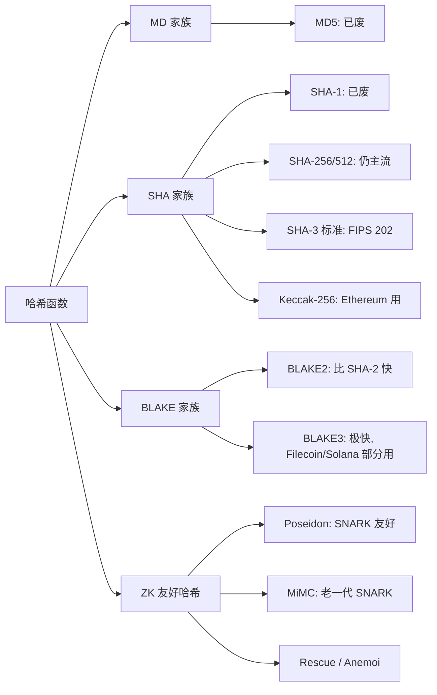
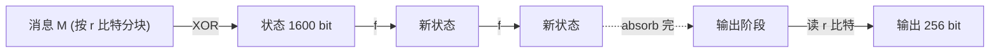
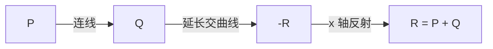
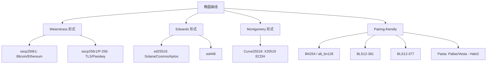
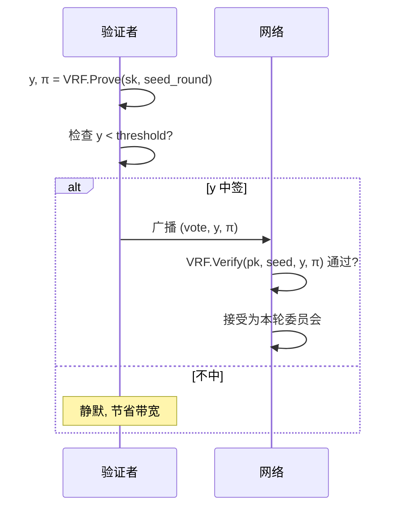
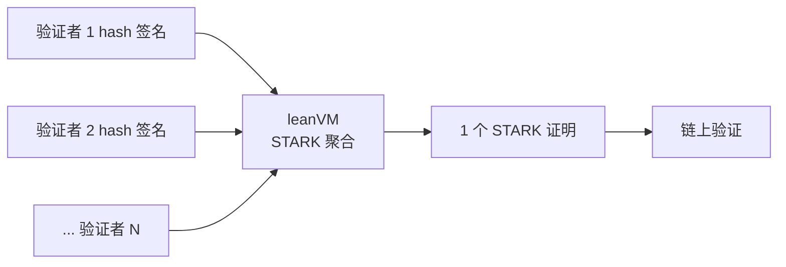
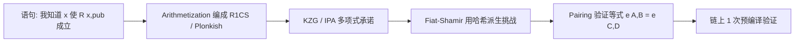

# 模块 01 · 密码学基础

本模块覆盖 Web3 工程师必须掌握的密码学核心：哈希、对称/非对称加密、椭圆曲线、数字签名（ECDSA/Schnorr/BLS）、Merkle 树、承诺方案（KZG/IPA/FRI）、VRF、门限签名/MPC、HD 钱包（BIP-32/39/44）、后量子密码学（PQC）及全同态加密（FHE）。前置：本科 CS 基础，能读 Python。前置环境见模块 00。

工程师的视角：每个原语**保证什么 / 不保证什么 / 用错出什么事**——而不是从零证明它的安全性。Bitcoin 白皮书发布时（2008），SHA-256 (2001)、ECDSA (1992)、Merkle 树 (1979) 早已成熟，中本聪的贡献是把已有原语搭成无需可信第三方的记账机。

---

## 目录

- 第 1 章 · 哈希函数
- 第 2 章 · 对称加密
- 第 3 章 · RSA 与公钥密码学
- 第 4 章 · 椭圆曲线
- 第 5 章 · 数字签名：ECDSA / EdDSA / Schnorr / BLS
- 第 6 章 · Merkle 树与以太坊状态树
- 第 7 章 · 承诺方案：Pedersen / KZG / IPA / FRI
- 第 8 章 · VRF：可验证的随机性
- 第 9 章 · 门限签名 / MPC / MuSig2 / FROST
- 第 10 章 · HD 钱包与 keystore（BIP-32/39/44/SLIP-0010/EIP-2335）
- 第 11 章 · 后量子密码学（PQC）
- 第 12 章 · 全同态加密（FHE）
- 第 13 章 · 通往零知识证明（含 Brakedown / Binius）
- 第 14 章 · AI 在密码学审查中的位置
- 第 15 章 · 工程实战代码
- 第 16 章 · 习题与参考解答
- 第 17 章 · 延伸阅读与权威源

---

## 第 1 章 · 哈希函数

### 1.1 定义与直觉

**定义**。哈希函数 `H: {0,1}* → {0,1}^n` 把任意长度输入压成固定 n 比特输出（Web3 多用 n=256），算易反推难。

**直觉**：数字指纹。一字节差异导致输出完全无关；输入再大输出也是 32 字节。

```
"Hello"   →  185f8db32271fe25...
"Hello!"  →  334d016f755cd6dc...
1GB 电影  →  3a7bd3e2360a3d29...
```

### 1.2 三个安全性质

| 性质 | 形式化 | 类比 |
| --- | --- | --- |
| 抗原像 | 给 `h` 找 `x` 使 `H(x)=h` 困难 | 警察有指纹找不到人 |
| 抗第二原像 | 给 `x` 找 `x'≠x` 同哈希困难 | 做不出和小明指纹相同的假人 |
| 抗碰撞 | 找任意 `x≠x'` 同哈希困难 | 做不出两个指纹相同的假人（最强） |

抗碰撞 ⇒ 抗第二原像，反之不成立。MD5 抗碰撞已死、抗原像仍撑：可作 ETag，不能做签名。

### 1.3 哈希家族族谱



#### 1.3.1 MD5 与 SHA-1（已废）

MD5（Rivest 1991）2004 年由王小云给出实际碰撞构造；SHA-1（NSA, 160 bit）2017 年被 Google + CWI 用 SHAttered 攻击约 6500 CPU 年内破。两者只剩防意外损坏的价值（`MD5SUMS`、Content-MD5、git commit id）。Web3 任何"防篡改 / 签名"位置遇到 MD5/SHA-1 应直接拒绝。

#### 1.3.2 SHA-256

NSA 2001 发布，SHA-2 家族成员。Bitcoin PoW 把它推成全人类算力最密集函数：全网约 6×10²⁰ H/s（<https://www.blockchain.com/explorer/charts/hash-rate>）。

##### 1.3.2.1 Merkle-Damgård 结构

```
H_0 (固定 IV)
for each 512-bit block M_i:
    H_i = compress(H_{i-1}, M_i)
```

**长度扩展攻击**：已知 `H(secret ‖ data)` 和 `len(data)` 可算出 `H(secret ‖ data ‖ pad ‖ extra)`。SHA-256 当 MAC 必须套 HMAC；SHA-3 海绵结构天然免疫。

##### 1.3.2.2 实测性能

| 平台 | 速度 |
| --- | --- |
| M3 Pro 1 thread | ~600 MB/s |
| Intel SHA-NI 指令集 | ~2,000 MB/s |
| Antminer S21 (ASIC) | ~10^14 H/s |

##### 1.3.2.3 Web3 用途

- Bitcoin 全栈：区块哈希、txid、Merkle 根均为双 SHA-256（`SHA-256²(x)`）。
- Bitcoin 地址：`Base58Check(0x00 ‖ RIPEMD-160(SHA-256(pk)) ‖ checksum)`。
- HMAC-SHA256：HKDF / RFC 6979 确定性 nonce / TLS。
- EIP-4844 versioned hash：`0x01 ‖ SHA-256(KZG_commit)[1:]`，把 48 字节 G1 点压成 32 字节。

##### 1.3.2.4 已知攻击

无实际碰撞。最强理论：31/64 轮拟碰撞（Mendel 2013）。量子下 Grover 把抗原像从 2^256 削到 2^128；BHT 算法理论上把抗碰撞降到 2^85，但需 2^85 量子内存，远未可行。NIST SP 800-208 认为 SHA-256 后量子时代仍适合哈希承诺与 HMAC；长期场景建议升级到 SHA-384/SHA-512。

#### 1.3.3 SHA-3 / Keccak-256

NIST 2007 启动 SHA-3 竞赛，三轮筛 64→14→5→1，2012-10 Keccak（Bertoni/Daemen/Peeters/Van Assche）胜出，2015-08 FIPS 202 标准化。

##### 1.3.3.1 海绵函数

状态 1600 bit = `r + c`（Keccak-256: r=1088, c=512）：



`f` 是 24 轮置换（θ、ρ、π、χ、ι）。海绵两大优势：c 比特永不外泄（抗长度扩展）+ 任意长输出（继续 squeeze）→ SHAKE128/256。

##### 1.3.3.2 Keccak vs SHA3 的分隔字节

NIST 标准化时把分隔字节从 `0x01` 改成 `0x06`（给 SHAKE/cSHAKE 留位），同输入输出完全不同：

```python
# 输入 'abc'
Keccak-256:  4e03657aea45a94fc7d47ba826c8d667c0d1e6e33a64a036ec44f58fa12d6c45
SHA3-256  :  3a985da74fe225b2045c172d6bd390bd855f086e3e9d525b46bfe24511431532
```

##### 1.3.3.3 以太坊的历史包袱

以太坊 2015 主网上线早于 FIPS 202，用的是原始 Keccak，无法硬分叉回头（要改写所有地址 / 合约 / tx 格式）。

库对齐：Solidity `keccak256()` = Keccak（`0x01`），Python `hashlib.sha3_256()` = FIPS 202（`0x06`），永不相等。链下要与合约对齐：

- Python: `Crypto.Hash.keccak`（pycryptodome）或 `eth_utils.keccak`
- Node: `@noble/hashes/sha3` 的 `keccak_256`（不是 `sha3_256`）
- Rust: `sha3` crate 的 `Keccak256`（不是 `Sha3_256`）

##### 1.3.3.4 EVM 中的 keccak

- 无预编译，是 `SHA3` opcode，直接读 memory。
- Gas：30 + 6·⌈len/32⌉，32B = 36 gas（ECDSA 3000 gas 对比）。
- 高频用途：`mapping` slot、event topic、`abi.encode` typeHash。

#### 1.3.4 BLAKE 家族

Aumasson 等 2008 提出 BLAKE，SHA-3 决赛败于 Keccak，基于 ChaCha 置换。BLAKE2（2012）精简版，比 SHA-256 快、安全等价。BLAKE3（2020）切消息为 1024 字节叶子独立哈希再两两合并：多核并行、SIMD 友好、流式可分块。实测单核 ~1 GB/s，多核 6+ GB/s，比 BLAKE2 快 5-10×。

小输入（<64B）BLAKE3 反而慢于 SHA-256（树 setup 成本），所以 Solana tx signing 仍用 SHA-256。

| 项目 | 用途 |
| --- | --- |
| Polkadot/Kusama | BLAKE2b-256 账户哈希 |
| Filecoin | BLAKE2b randomness oracle |
| Solana | `solana_program::blake3` 可选 |
| IPFS/libp2p | BLAKE2/3 multihash |
| Zcash | BLAKE2b 派生 Sapling key |

#### 1.3.5 ZK 友好哈希：Poseidon

Keccak/SHA 按比特设计（XOR/AND），每比特展开为一个 R1CS 约束：Keccak ~150k、SHA-256 ~27k 约束/哈希。状态树深 32 读一次状态 = 480 万约束。代数哈希直接在有限域上做 add/mul/x⁵——每操作 1 约束。

Poseidon（Grassi 等 USENIX'21）的 HADES 结构混合两种 S-box：

```
前  R_F/2 轮 Full   S-box: 每个 state 元素 x⁵     (抗差分)
中    R_P 轮 Partial S-box: 仅首元素 x⁵           (压约束)
后  R_F/2 轮 Full   S-box: 每个 state 元素 x⁵
```

最终 ~250 约束/哈希。约束数对比：

| 哈希 | 年 | 域 | 约束 (R1CS) | 倍率 |
| --- | --- | --- | --- | --- |
| Keccak-256 | 2008 | 比特 | ~150,000 | 1× |
| SHA-256 | 2001 | 比特 | ~27,000 | 5.5× |
| MiMC | 2016 | BN254 | ~600 | 250× |
| Rescue/Anemoi | 2020/22 | BN254/BLS12-381 | ~250 | 600× |
| **Poseidon/Poseidon2** | 2020/23 | BN254/BLS12-381 | **~150-250** | **600-1000×** |

论文：<https://eprint.iacr.org/2019/458.pdf>。Web3 用例：zkSync Era（状态/账户树）、Polygon zkEVM（SMT）、StarkNet（配 Pedersen 承诺）、Aztec（note commitment/nullifier）、Tornado Cash（deposit 树）、Semaphore（群成员证明）。

主网为何不能换 Poseidon：MPT 历史上就是 Keccak，硬分叉换会破坏所有合约 storage layout。zkEVM 被迫在电路里模拟 Keccak，每次状态访问付 ~15 万约束"Keccak 税"。EIP-5988（Poseidon 预编译）短期不会落地。

### 1.4 Web3 中的角色

| 角色 | 例子 |
| --- | --- |
| 唯一标识 | tx hash / block hash / event topic |
| 状态承诺 | Merkle Root / Patricia Root |
| 派生地址 | `keccak256(uncompressed_pubkey[1:])[-20:]` |
| CREATE2 | `keccak256(0xff ‖ deployer ‖ salt ‖ keccak256(initCode))[12:]` |
| 随机种子 | `block.prevrandao`（即 RANDAO） |
| 消息绑定 | EIP-191 / EIP-712 digest |
| PoW | Bitcoin 双 SHA-256 |

地址取 keccak 输出后 20 字节，前 12 字节丢弃。不同公钥理论上可能撞同地址（生日攻击 ~2^80，现实不可行）。EIP-55 校验和只防手抖，不防攻击。

### 1.5 `abi.encodePacked` 陷阱

Solidity 两种编码：

- `abi.encode(...)`：每参数填 32 字节，安全费 gas。
- `abi.encodePacked(...)`：紧凑省 gas，对动态类型不安全。

```solidity
keccak256(abi.encodePacked("a", "bc")) == keccak256(abi.encodePacked("ab", "c"))
// 两边都拼成 0x616263；encodePacked 不写 string 长度前缀
```

审计要点：`abi.encodePacked(...)` 后跟 ≥2 个 `string`/`bytes` 必须改用 `abi.encode`，或先单独哈希再拼接。

### 1.6 PRF / PRG / 随机预言机

| 构件 | 全称 | 输入 | 输出 | 例子 |
| --- | --- | --- | --- | --- |
| PRG | Pseudorandom Generator | 短种子 | 任意长伪随机串 | `os.urandom` 内核、ChaCha20 stream |
| PRF | Pseudorandom Function | `(k, x)` | 伪随机 `f(x)` | HMAC-SHA256、AES-CMAC |
| RO  | Random Oracle（理想模型） | `x` | 真随机 `H(x)` | 协议证明中以 Keccak/SHA-256 近似 |

工程映射：BIP-39 PBKDF2、TLS/Noise nonce 派生 = PRG；RFC 6979 确定性 nonce、HMAC = PRF。

ROM 注记：很多协议写"在随机预言机模型下安全"，但 ROM 不是标准模型。常见误解是 EdDSA 比 ECDSA "可证明安全"——两者主流归约都依赖 ROM，EdDSA 归约更干净但前提相同。

---

## 第 2 章 · 对称加密

**定义**。同一把密钥 K 加密与解密（AES、ChaCha20）。链上是公开账本，无法安全分享 K，Web3 因此以非对称密码 + 数字签名为主。但对称加密仍承担几个关键的"幕后"角色。

### 2.1 钱包加密 / Keystore V3

MetaMask 用 PBKDF2 从密码派生加密密钥，再用 AES-GCM 加密助记词存 IndexedDB。Geth keystore 用 scrypt 派生 + AES-128-CTR 加密私钥。密码不直接当 AES key——先 PBKDF2/scrypt/argon2 跑几十万轮，让每次暴力尝试付几百毫秒代价。

### 2.2 节点 P2P：RLPx / ECIES

以太坊节点用 RLPx：ECDH（secp256k1）协商共享秘密 → HKDF 派生 → AES-CTR + HMAC-SHA256 加密+认证。这套组合即 ECIES（Elliptic Curve Integrated Encryption Scheme）。

### 2.3 三条工程红线

1. **不用 ECB 模式**：相同明文块 → 相同密文块，宏观结构泄露（"ECB 企鹅"）。
2. **默认 AEAD**：AES-GCM 或 ChaCha20-Poly1305 同时加密 + 认证。只加密不认证攻击者能定向翻转明文位。
3. **nonce 永不重用**：AES-GCM nonce 重用暴露 GHASH 认证密钥；ChaCha20-Poly1305 nonce 重用让两条明文 XOR 直接泄露。实务：96 位随机 nonce + counter，或每会话独立 key。

### 2.4 HKDF：与 Web3 的真正交点

HKDF（RFC 5869）两步：

```
PRK = HMAC-SHA256(salt, IKM)               # extract: 把任意熵源压成统一长度
OKM = HMAC-SHA256(PRK, info ‖ counter)     # expand:  从 PRK 拉出任意长 OKM
```

`IKM` 是 ECDH 共享秘密，`info` 是上下文标签（如 `"ETH/secp256k1/v1"`）：从一个 ECDH 输出派生多把不同用途密钥。libp2p、Noise、Waku、ECIES 全部用 HKDF。

---

## 第 3 章 · RSA 与公钥密码学

公钥密码学始于 1976 年 Diffie-Hellman 的《New Directions in Cryptography》：把加密与解密钥匙拆成两把，前者公开后者私藏。RSA（Rivest-Shamir-Adleman, 1977）是第一个实用方案。

### 3.1 RSA 算法

基于大整数分解难。公钥 `(n, e)`，私钥 `(n, d)`：

```
c = m^e mod n      (加密 / 验签)
m = c^d mod n      (解密 / 签名)
```

`d` 由 `(p, q, e)` 经费马小定理与中国剩余定理唯一确定。

### 3.2 Web3 中的 RSA 出场点

- HTTPS 证书：dApp 前端的根证书很多 RSA-2048。
- JWT 签名：OpenSea / Infura / Alchemy 等链下 API 多用 RS256（RSA-SHA256）。
- 预编译 `0x05` (modexp)：通用模幂，可拼出 RSA 验签（罕见）。
- 早期 KZG ceremony 的部分 setup 用过 RSA-based VDF。

### 3.3 为何 Web3 选 ECC 不选 RSA

| 项目 | RSA-2048 | secp256k1 (ECC-256) |
| --- | --- | --- |
| 私钥大小 | 256 字节 | 32 字节 |
| 公钥大小 | 256 字节 | 33 字节（压缩） |
| 签名大小 | 256 字节 | 64-65 字节 |
| 安全等级 | ~112 比特 | ~128 比特 |
| 速度（签） | 慢 | 快 |
| 是否可聚合 | ✗ | ✓（Schnorr/BLS） |
| 链上验证 gas | 极贵 | `ecrecover` 仅 3000 gas |

RSA 不是不安全，是不经济：链上字节 8 倍、验证 gas 不友好、签名不可聚合。量子下 Shor 同时破解 RSA 与 ECC，两者都需迁移到 PQC（第 11 章）。

---

## 第 4 章 · 椭圆曲线

### 4.1 定义与几何直觉

**定义**。有限域 `F_p` 上的椭圆曲线（短 Weierstrass 形式）：

```
E: y² = x³ + a·x + b   (mod p),  且 4a³ + 27b² ≢ 0
```

`mod p` 后曲线是离散点集，加上无穷远点 O 构成阿贝尔群。"椭圆"之名与几何椭圆无关——源于椭圆积分。

**点加法**（直觉）：连接 P、Q 的直线必交曲线第三点 −R，对 x 轴反射得 `R = P + Q`。



### 4.2 ECDLP：单向陷门的来源

**点乘**：`n·P = P + P + ... + P`（n 次）。

- 正向：`Q = n·P`，double-and-add，时间 `O(log n)`。
- 反向：给定 `P, Q` 求 `n`，即 **ECDLP**（椭圆曲线离散对数问题），最优通用算法 Pollard rho `O(√n)`。

私钥 `d ∈ [1, n-1]` 随机，公钥 `Q = d·G`（G 固定基点）。算 Q 易，反推 d 难——这是 ECDSA、Schnorr、ECDH 全部的安全基石。

### 4.3 主流曲线族谱



#### 4.3.1 secp256k1：Bitcoin 与 EVM 的基础曲线

##### 4.3.1.1 参数

```
p  = 2^256 − 2^32 − 977            ≈ 2^256（基域）
y² = x³ + 7      (mod p)            （注意 a=0）
n  = FFFFFFFFFFFFFFFFFFFFFFFFFFFFFFFE BAAEDCE6AF48A03BBFD25E8CD0364141
                                     （子群阶，约 2^256）
G  = 04 79BE667E... 483ADA77...      （未压缩基点，65 字节）
h  = 1                               （余因子）
```

来源：SECG SEC 2 v2（<https://www.secg.org/sec2-v2.pdf>）。安全等级 ~128 bit（Pollard rho ≈ 2^128），无已知子指数攻击；量子下 Shor 多项式时间破解。

##### 4.3.1.2 Web3 用途

| 用途 | 说明 |
| --- | --- |
| Bitcoin 钱包 | P2PKH/P2WPKH/P2TR 全栈 |
| 所有 EVM 链 EOA | Ethereum、Arbitrum、Optimism、BSC、Polygon... |
| Cosmos `ethsecp256k1` | Evmos / Injective 等 EVM-on-Cosmos |
| Stellar (额外支持) | 部分桥接路径用 |

##### 4.3.1.3 库

| 语言 | 推荐库 | 备注 |
| --- | --- | --- |
| C | `libsecp256k1` v0.7.1（Bitcoin Core） | 工业标准，最严格审计 |
| Rust | `k256`（RustCrypto）/ `secp256k1` crate | wagmi 底层 |
| Go | `decred/dcrd/dcrec/secp256k1` | go-ethereum |
| Python | `coincurve` 21.0.0（libsecp256k1 绑定） | 本指南选用 |
| JS | `@noble/curves/secp256k1` v2.2.0 | 浏览器、ESM-only |

secp256k1 与 secp256r1 名称仅差一字母但生态完全隔绝。Apple Secure Enclave、WebAuthn/Passkey 用 r1。"Passkey 登录以太坊"难就在于硬件给的是 r1 签名，需 EIP-7212 预编译才能链上验。

#### 4.3.2 secp256r1（P-256）：TLS 与 Passkey

```
p  = 2^256 - 2^224 + 2^192 + 2^96 - 1
y² = x³ - 3x + b      (a = -3，与 k1 的 a=0 是关键区别)
n  ≈ 2^256,   h = 1
```

~128 bit 安全，与 k1 同等。曲线参数中常数 `b` 由 NSA 2000 年提供且来源不透明——DJB 因此推动 Curve25519 路线。Web3 用途：

| 场景 | 说明 |
| --- | --- |
| 硬件钱包 (Apple Secure Enclave) | iCloud Keychain 钱包私钥 |
| WebAuthn / Passkey | 用浏览器 / TouchID 登录 dApp |
| ERC-4337 账户抽象 | 把 Passkey 签名转成合约可验的形式 |
| 部分跨链桥 | TLS 链路认证 |

库：C `OpenSSL/BoringSSL`、Rust `p256`、JS `@noble/curves/p256`；链上 RIP-7212 `P256_VERIFY` 预编译已在 Polygon zkEVM / Optimism / Arbitrum / zkSync 上线，主网通过 EIP-7951 推进。

#### 4.3.3 Curve25519 / X25519：高性能 ECDH

```
Montgomery 形式: y² = x³ + 486662·x² + x   (mod 2^255 − 19)
基点 x = 9,   余因子 h = 8     ← 关键
```

DJB（Bernstein, 2005）设计。基域素数 `2^255 − 19` 让模约简可用一条特殊 reduction 指令——"25519" 名字的由来。~128 bit 安全，参数推导完全公开（无 NIST 魔数阴影）；但余因子 h=8 让朴素实现可能落入小子群攻击，这是 Ristretto255 出场的原因（4.3.4）。Web3 用途：

| 场景 | 说明 |
| --- | --- |
| **X25519 密钥协商** | TLS 1.3、Noise 协议、libp2p、ECIES 派生层 |
| Solana 子产品 (libra-crypto) | 早期 Solana Libra 模块用 X25519 |
| Cosmos IBC 通道加密层 | 通讯密钥派生 |
| Tor / Signal / WhatsApp | 端到端加密握手 |

库：C `libsodium`、Rust `x25519-dalek`、JS `@noble/curves/ed25519` 含 `x25519`、Python `pynacl`。

#### 4.3.4 Ristretto255：把 Curve25519 压成素数阶群

Curve25519/Ed25519 余因子 h=8，把"曲线点"和"群元素"混用会触发小子群攻击。Ristretto（Hamburg 2015）是一层**编码**：把余因子 8 的曲线点重新编码到一个素数阶群，多个不同曲线点可映射到同一 Ristretto 元素，彻底消除小子群陷阱。安全继承 Curve25519。

| 场景 | 说明 |
| --- | --- |
| Polkadot/Kusama (sr25519) | Schnorrkel = Schnorr + Ristretto over Curve25519 |
| Zcash Sapling / Orchard | 内部承诺方案的群 |
| Monero（Ristretto-style 编码） | 隐私交易底层 |
| Filecoin / IPFS | 部分 zk 协议素数阶群 |

库：Rust `curve25519-dalek` 事实标准；JS `@noble/curves/ed25519` 的 ristretto255 子模块。

#### 4.3.5 ed25519：EdDSA 的承载曲线

```
Twisted Edwards: -x² + y² = 1 + d·x²·y²     (d = -121665/121666)
基点 B: 4·(2/√(d-1)·...) 唯一构造，无魔数
余因子 h = 8
```

与 Curve25519 同构，~128 bit 安全，EdDSA 签名跑在它上面。Web3 用途：

| 链 | 使用方式 |
| --- | --- |
| **Solana** | 全局账户密钥（pubkey 即地址，32 字节 base58） |
| **Aptos / Sui** | Move 生态钱包默认 |
| **Cosmos SDK** | 验证者共识签名（Tendermint Core 选 ed25519） |
| **NEAR** | Account 密钥派生 |
| **Polkadot** | sr25519（Ristretto + Schnorr）+ ed25519（备选） |
| **Cardano** | extended ed25519 (BIP-32-Ed25519) |
| **Stellar** | 全栈 |
| **Algorand** | 账户密钥 |

库：C `libsodium`/`ed25519-donna`，Rust `ed25519-dalek`，JS `@noble/curves/ed25519`，Python `pynacl`/`cryptography.hazmat`，Solana 链上 `solana_program::ed25519_program`。Solana pubkey 即地址（32 字节 base58，44 字符），省去 keccak 提取 20 字节但地址更长。

##### 4.3.5.1 Solana 实测要点

- **Tx 签名 batch verify**：每笔 tx 最多 64B × 签名者数；banking stage 一次 GPU/CPU 调度并行验数百签名，是 65k+ TPS 的关键。
- **PDA**：用 SHA-256 派生，**不在 curve25519 上**——故意无对应私钥，只能由程序 CPI 签。这是 Solana account model 与 EVM EOA/合约二分法的本质差异。
- **轻客户端**：检测 PDA（"是不是合约"）只需做 curve25519 on-curve 检验，比 EVM `extcodesize` 直接。

##### 4.3.5.2 Cosmos / Polkadot

Cosmos/Tendermint 共识用 ed25519，用户默认 secp256k1（Bitcoin 兼容）；SDK v0.50 支持多算法插件，EVM 链（Evmos/Injective）用 ethsecp256k1 + keccak[12:] 地址。Polkadot 默认 sr25519（Schnorr + Ristretto over Curve25519），备选 ed25519 / ecdsa；助记词导入 MetaMask 看不到资产，因为派生密钥完全不同。

#### 4.3.6 BN254（alt_bn128）：以太坊 zk 的过渡曲线

Barreto-Naehrig 曲线（2005），基域 p ≈ 254 bit，嵌入度 k = 12，pairing 落在 F_{p^12}。2017 年 Kim-Barbulescu exTNFS（IACR 2016/758）把安全性从 128 bit 削到 ~100 bit，新协议必须迁移。

| 协议 | 用法 |
| --- | --- |
| Tornado Cash | Groth16 证明 |
| Aztec V1 | zk-zk-Rollup 早期 |
| Loopring 3.x | zk-DEX 状态证明 |
| drand evmnet | 上链 BLS 签名（兼容预编译） |
| EVM 预编译 `0x06/0x07/0x08` | EIP-196 / EIP-197（兼容性永保留） |

库：C++ `libff`、Rust `ark-bn254`、Go `gnark-crypto`、Python `py_ecc.bn128`、Solidity 直接调预编译。

#### 4.3.7 BLS12-381：以太坊共识与新一代 zk

```
基域 p ≈ 381 bit  (q1)
子群阶 r ≈ 255 bit
嵌入度 k = 12
G1 ⊂ E(F_p),   G2 ⊂ E(F_{p²}) 的扭子群
```

Sean Bowe 2017 为 Zcash Sapling 设计。抗 exTNFS 后真实安全 ~128 bit，比 BN254 多 ~30 bit 裕度。后量子下仍死（pairing 基于 ECDLP），需换 STARK。

以太坊共识层（Beacon Chain）核心：

- 验证者私钥 32B、公钥 48B（G1 压缩）、签名 96B（G2 压缩）。
- 一个 epoch 数十万签名聚合成一个 96B 签名——这是 BLS 的核心价值。

EIP-2537 把 BLS12-381 预编译加入 EVM，Pectra（2025-05-07，epoch 364032，<https://blog.ethereum.org/2025/04/23/pectra-mainnet>）激活。其它用途：

| 项目 | 用法 |
| --- | --- |
| Filecoin | 全栈共识签名 |
| Chia | Plot/Pool BLS 签名 |
| Chainlink CCIP | DON 委员会聚合签名 |
| EigenLayer | AVS operator 投票 |
| Zcash Sapling | 内部承诺曲线 |

库：C `blst`（supranational，经审计，工业标准）、Rust `blst` binding 或 `arkworks-rs`（Lighthouse 等共识客户端）、Go `gnark-crypto/ecc/bls12-381` 或 `go-eth2-client`（Prysm）、Python `py_ecc.bls12_381` 或 `milagro-bls`、Solidity 走 EIP-2537 预编译。

#### 4.3.8 Pasta（Pallas/Vesta）：Halo2 的循环曲线对

```
Pallas: y² = x³ + 5  over F_p   (p ≈ 255 bit)
Vesta : y² = x³ + 5  over F_q   (q ≈ 255 bit)

|E_Pallas(F_p)| = q,  |E_Vesta(F_q)| = p
即一条曲线的标量域 = 另一条的基域
```

Zcash 团队为 Halo2 设计。循环对使"曲线 A 上的证明能验证曲线 B 上的证明"——递归 SNARK 成为可能。~125 bit 安全，无 pairing，搭配 IPA 承诺。用途：Mina（22KB 区块链）、Aleo、Zcash NU5 Orchard、部分 zkVM。库：Rust `pasta_curves`、`halo2` 内置；JS 端实现少。

### 4.4 曲线汇总

| 曲线 | 形式 | 用途 | 私/公/签 字节 |
| --- | --- | --- | --- |
| secp256k1 | Weierstrass | EVM EOA / Bitcoin | 32 / 33 / 65 |
| secp256r1 (P-256) | Weierstrass | TLS / Passkey / RIP-7212 | 32 / 33 / 64 |
| Curve25519 | Montgomery | X25519 ECDH | 32 / 32 / - |
| Ristretto255 | (编码层) | sr25519 / Zcash Sapling | 32 / 32 / 64 |
| ed25519 | Edwards | Solana / Cosmos / Aptos / Sui | 32 / 32 / 64 |
| BN254 (alt_bn128) | Pairing | EVM zk-SNARK 旧 | 32 / 64 / - |
| BLS12-381 | Pairing | Beacon Chain / 新 zk / 跨链 | 32 / 48 / 96 |
| Pallas / Vesta | 循环对 | Mina / Aleo / Halo2 递归 | 32 / 32 / - |

简记：用户账户 secp256k1，共识层 BLS12-381，高性能链 ed25519，BN254 是历史包袱。

---

## 第 5 章 · 数字签名

数字签名提供三个保证：身份认证、完整性、不可否认性。私钥签，公钥验。

### 5.1 ECDSA

Bitcoin 与所有 EVM 链 EOA 都用 secp256k1 上的 ECDSA。

#### 5.1.1 签名 / 验签

```
Sign(d, m):
  z = keccak256(m)
  k ← random in [1, n-1]
  (x1, y1) = k·G
  r = x1 mod n,        若 r=0 重选 k
  s = k^(-1)·(z + r·d) mod n
  return (r, s)

Verify(Q=d·G, m, (r, s)):
  z  = keccak256(m)
  u1 = z·s^(-1) mod n
  u2 = r·s^(-1) mod n
  (x', _) = u1·G + u2·Q
  accept iff r ≡ x' (mod n)
```

#### 5.1.2 nonce 重用 ⇒ 私钥泄露（PS3）

Sony PS3 用静态 k（fail0verflow，27C3，2010）。同一 k 两次签名 `(r, s1)`, `(r, s2)` 对 `z1, z2`：

```
s1 - s2 = k^(-1)·(z1 - z2)        ⇒ k = (z1 - z2) / (s1 - s2)
s1 = k^(-1)·(z1 + r·d)            ⇒ d = (s1·k - z1) / r
```

两条消息 + 静态 k = 私钥泄露。现代实现一律用 RFC 6979 确定性 nonce：`k = HMAC(d, m)`，根除 RNG 缺陷风险。

#### 5.1.3 签名延展性与 EIP-2

数学事实：`(r, s)` 合法 ⇒ `(r, n-s)` 也合法。2014 年 Mt.Gox 攻击者翻转 mempool 中提款 tx 的 s，txid 改变但 tx 仍合法，触发交易所"失败重发"双花。EIP-2 强制 low-s（`s ≤ n/2`）；OZ `ECDSA.sol` v4.7.3+ 拒绝 high-s。

#### 5.1.4 ecrecover 与 v

`ecrecover(hash, v, r, s)` 做公钥恢复。R 在曲线上对应两个候选 y，v 本质是 yParity（1 bit 消歧）：

| 场景 | v 的取值 |
| --- | --- |
| 原始 Bitcoin | 0/1（裸 yParity） |
| 以太坊主网早期 | 27/28（= yParity + 27） |
| EIP-155 Legacy tx | `chainId·2 + 35 + yParity` |
| EIP-1559 Type 2 tx | yParity (0/1) |
| EIP-2098 紧凑签名 | yParity 编进 s 的最高位 |

`ecrecover` 任一条件不满足返回 `address(0)`：(1) v 不在 {27, 28}；(2) r = 0 或 r ≥ n；(3) s = 0 或 s ≥ n；(4) EIP-2 后 s > n/2。

审计要点：`ecrecover(...) == storedSigner` 而无 `require(storedSigner != address(0))` 时，攻击者可构造返回 `0` 的签名，在 storedSigner 未初始化（默认 `0`）的代码路径伪造通过。OZ `ECDSA.recover` 已默认处理此边界。

#### 5.1.5 EIP-2098：65→64 字节紧凑签名

low-s 后 s 最高位恒 0（`s ≤ n/2 < 2^255`），EIP-2098 把 yParity 塞进该位：

```
compact = r ‖ ((yParity << 255) | s)           # 64 字节
s_back  = compact[32:] & ((1 << 255) - 1)
v_back  = (compact[32] >> 7) ? 28 : 27
```

calldata gas 省 ~8%，ERC-4337、Permit2、Seaport 广泛使用。

#### 5.1.6 EIP-712：结构化签名

让钱包展示"你在签什么"。标准 digest：

```
digest = keccak256( "\x19\x01" ‖ domainSeparator ‖ hashStruct(message) )
```

- `domainSeparator = keccak256(EIP712Domain typeHash ‖ encoded fields)`（含合约名、版本、chainId、合约地址）。
- `hashStruct(s) = keccak256(typeHash ‖ encodeData(s))`。
- `encodeData`：原子类型 32 字节填充；`string`/`bytes`/数组先哈希；嵌套 struct 递归 `hashStruct`。

### 5.2 EdDSA / Ed25519

```
KeyGen: sk ← 32B random
        h = SHA-512(sk),  a = clamp(h[0:32]),  prefix = h[32:64]
        pk = a·B          (B = ed25519 基点)

Sign(m): r = SHA-512(prefix ‖ m) mod L          ← 确定性 nonce
         R = r·B
         c = SHA-512(R ‖ pk ‖ m) mod L
         s = (r + c·a) mod L
         σ = (R, s)        # 64 字节

Verify: c = SHA-512(R ‖ pk ‖ m) mod L
        accept iff s·B = R + c·pk
```

与 ECDSA 的关键差别：

1. **确定性 nonce**：r 由私钥与消息哈希派生，不依赖 RNG。
2. **无 k^(-1)**：实现简单，少一个侧信道入口。
3. **ROM 下严格归约到 ECDLP**——而 ECDSA 归约前提更微妙。

### 5.3 Schnorr 签名（BIP-340）

Schnorr（1989）比 ECDSA 还早，因专利（US 4995082）被 NIST 排除。专利 2008 年到期，Bitcoin 2021 年通过 Taproot 上线。BIP-340 的关键约束：

1. **公钥 32 字节 x-only**：Y 隐含为偶，公钥 33B → 32B。
2. **强制偶 Y**：签名时若 `R.y` 或 `P.y` 为奇取负。
3. **Tagged hash** `t(tag, x) = SHA-256(SHA-256(tag) ‖ SHA-256(tag) ‖ x)` 防跨协议重放。
4. **辅助随机性 auxRand**：可选侧信道防护，全 0 也安全（不像 ECDSA k 必须真随机）。

```
Sign(sk, m, auxRand):
  若 P.y 奇: d = n - sk, P = -P
  t = d XOR t("BIP0340/aux", auxRand)
  k = t("BIP0340/nonce", t ‖ P.x ‖ m) mod n
  R = k·G;  若 R.y 奇: k = n - k
  e = t("BIP0340/challenge", R.x ‖ P.x ‖ m) mod n
  s = (k + e·d) mod n
  σ = R.x ‖ s        # 32 + 32 = 64 字节

Verify(P.x, m, σ):
  P = lift_x(P.x)
  e = t("BIP0340/challenge", R.x ‖ P.x ‖ m) mod n
  R' = s·G - e·P
  accept iff R'≠O ∧ R'.y 偶 ∧ R'.x = R.x
```

ECDSA 与 Schnorr 对比：

| 维度 | ECDSA | Schnorr |
| --- | --- | --- |
| 可证明安全 | 启发式 | ROM 下严格归约到 ECDLP |
| 线性性 | ✗（有 k^(-1)） | ✓，`(d1+d2)·G = P1+P2` |
| 签名长度 | 71-72B (DER) / 64-65B | 固定 64B |
| 实现复杂度 | 高（DER + low-s + ecrecover） | 低 |
| 批验证 / 多签聚合 | ✗ / 极难 | ✓ / 天然（MuSig2） |

#### 5.3.1 Taproot P2TR 与 Tweaked Key

BIP-341/342（Taproot/Tapscript）2021-11-14 区块 709,632 激活。P2TR 输出 `OP_1 <32B x-only pubkey>`，公钥不是裸 `sk·G` 而是带内部 commit 的 tweaked key：

```
P_internal = sk·G
t = tagged_hash("TapTweak", P_internal.x ‖ merkle_root)
P_output   = P_internal + t·G                # 链上看到的公钥
```

`merkle_root` 是脚本路径的 Merkle 根（无脚本则为空）。Tweak 让 key path 与 script path 在链上不可区分。Bitcoin P2TR 输出占比已超 35%。

以太坊目前无 Schnorr 预编译（EIP-665/7503 讨论中），合约模拟 ~200k gas，实务做法是链下 Schnorr/MuSig 聚合 → 链上 ECDSA 提交。

### 5.4 BLS 签名

BLS（Boneh-Lynn-Shacham 2001）基于双线性配对 `e: G1 × G2 → GT`：

```
KeyGen: sk ∈ Z_r,  pk = sk·G1                 (以太坊共识用 G1 公钥)
Sign(m): σ = sk·H(m)                          (H: hash-to-G2)
Verify: e(G1, σ) == e(pk, H(m))

聚合 (n 个签名同消息):
  σ_agg  = σ1 + ... + σn                       ∈ G2
  pk_agg = pk1 + ... + pkn                     ∈ G1
  e(G1, σ_agg) == e(pk_agg, H(m))             # 一次 pairing 验 n 个
```

以太坊共识层活跃验证者超 100 万，每 epoch 全部投票被 BLS 聚合压成少量聚合签名（<https://beaconcha.in/charts/validators>）。

#### 5.4.1 Rogue Key Attack 与 PoP

Mallory 设 `pk_M = X·G1 - pk_B`（X 任选，Mallory 不需要知道 `sk_M` 对应私钥），则 `pk_agg = pk_B + pk_M = X·G1`。她用 X 对消息 m 签出 σ，对外宣称这是 Alice + Bob + Mallory 的聚合签名（伪造的是针对该 m 的聚合签名，不是任意签名）。

防御（PoP）：注册公钥时附带 `σ_pop = sk·H_pop(pk)`。Mallory 无法为构造的 pk_M 给出合法 PoP。以太坊共识层采用此方案。

#### 5.4.2 EIP-2537

Pectra（2025-05-07，epoch 364032）通过 EIP-2537 把 BLS12-381 预编译加入 EVM，使跨链桥轻客户端、ERC-4337 BLS 多签、drand 链上验证成为可能。同一升级的 EIP-7702 让 EOA 临时拥有合约能力（<https://eips.ethereum.org/EIPS/eip-7702>）。

### 5.5 签名方案对比

| 方案 | 曲线 | 单签 B | 公钥 B | 聚合 | 速度 | 用途 |
| --- | --- | --- | --- | --- | --- | --- |
| RSA-2048 | - | 256 | 256 | ✗ | 中 | TLS / JWT |
| ECDSA k1 | secp256k1 | 64-65 | 33 | ✗ | 快 | Bitcoin / EVM EOA |
| ECDSA r1 | secp256r1 | 64 | 33 | ✗ | 快 | TLS / Passkey |
| EdDSA | ed25519 | 64 | 32 | △ 有限 | 极快 | Solana / Cosmos |
| Schnorr | secp256k1 | 64 | 32 | ✓ MuSig | 快 | Bitcoin Taproot |
| BLS | BLS12-381 | 96 | 48 | ✓ 天然 | 慢（pairing） | Eth 共识 / 跨链 |

### 5.6 常见调试

| 现象 | 原因 |
| --- | --- |
| `ecrecover` 返回 0x0 | s > n/2 / v 不对 / r 或 s 越界 |
| 链下验通过链上不通过 | EIP-712 domain 不一致；`abi.encode` vs `encodePacked` 混用 |
| testnet 通过 mainnet 不通过 | EIP-712 domain 的 chainId 没换 |
| 紧凑签名旧合约不认 | 旧合约只支持 65B；升级 OZ ECDSA v4.7.3+ |
| BLS 聚合验证失败 | 没做 PoP / hash-to-curve domain tag 错 |

---

## 第 6 章 · Merkle 树与以太坊状态树

### 6.1 定义

**Merkle 树**（Merkle 1979）：内节点 `= H(左子 ‖ 右子)`，根承诺整棵树。任一叶子改变根改变；32 字节根承诺任意大集合，成员证明长度 `O(log n)`。

证明"我是 A"提供兄弟路径 `[H(B), H_CD]`，验证者算 `H(H(H(A) ‖ H(B)) ‖ H_CD) == Root`。

### 6.2 OpenZeppelin commutative 约定

```
parent(a, b) = keccak256(min(a, b) ‖ max(a, b))   // 按字节序
```

验证时不需要兄弟左右信息。代价：叶子不能让内部哈希参与，否则跨层取值可被伪造（参 2022 Solana NFT Merkle 漏洞）。

### 6.3 32 叶子结构示例

```
Layer 5 (根):  ────────── Root ──────────
                              │
Layer 4 :        ┌─────── h0_15 ─── h16_31 ───────┐
Layer 3 :   ┌─ h0_7 ── h8_15 ──┐ ┌── h16_23 ── h24_31 ──┐
Layer 2 :  h0_3 h4_7 h8_11 h12_15 h16_19 h20_23 h24_27 h28_31
Layer 1 :  ...
Layer 0 :  L0 L1 L2 ... L31
```

32 叶 → 5 层 → 证明长度恰好 5 个哈希。OZ 兼容的 Python 实现见 [code/03_merkle_tree.py](./code/03_merkle_tree.py)。

### 6.4 Web3 用例

| 场景 | 例子 |
| --- | --- |
| Airdrop 白名单 | Uniswap UNI 空投、Optimism OP 空投 |
| L1 → L2 消息证明 | Optimism 的 OutputRoot |
| Bitcoin SPV 钱包 | 验证某 tx 在某块里 |
| ZK rollup 状态 | 把状态根放到 L1 |
| Sparse Merkle (SMT) | nullifier 树（Tornado Cash） |

### 6.5 以太坊状态树：Merkle Patricia Trie

普通 Merkle 对插入/更新性能差。以太坊状态是键值库，用 **MPT** = Trie + Merkle 合并。三种节点：

1. **Branch**：16 子指针 + 1 value 槽，每层消耗 1 nibble。
2. **Extension**：共享前缀压缩，结构 `(shared_nibbles, child_hash)`。
3. **Leaf**：`(remaining_nibbles, value)`。

#### 6.5.1 Hex Prefix 编码

区分 Extension/Leaf 和奇偶 nibble 长度，节点 path 前附 1 字节：

| nibbles 长度 | Extension | Leaf |
| --- | --- | --- |
| 偶数 | 0x00 | 0x20 |
| 奇数 | 0x1_ | 0x3_ |

#### 6.5.2 区块头里的四个 root

```mermaid
graph TD
    BH[区块头 BlockHeader] --> SR[stateRoot]
    BH --> TR[transactionsRoot]
    BH --> RR[receiptsRoot]
    BH --> WR[withdrawalsRoot]
    SR --> S1[每个账户的 (nonce, balance, codeHash, storageRoot)]
    S1 --> ST[每个账户自己的 storageTrie]
```

每账户 storage 自有一棵树。访问一个 slot ~5 次 trie 查找——SLOAD 的 2100 gas 大头是读 trie，不是算。

#### 6.5.3 Verkle Tree：MPT 的继任者

MPT 痛点是证明大小（每层带 15 个兄弟哈希）。Verkle 用多项式承诺（KZG/IPA）把证明从 `O(log_{16} N · 15·32B)` 压到 `O(log_{256} N · 200B)`，对无状态以太坊至关重要。

### 6.6 Sparse Merkle Tree

深度 256 满树，叶子位置由 key 决定。inclusion / exclusion 证明结构一致（ZK 友好），但空树太大，需懒哈希缓存全空子树。

| 数据结构 | 链上 | 链下 | 优点 |
| --- | --- | --- | --- |
| 标准 Merkle | airdrop, OP fault | 简单 | 实现门槛最低 |
| MPT | Eth stateRoot | 慢但通用 | 支持插入删除 |
| Verkle | 未来 Eth | 证明小 | stateless 友好 |
| SMT | zkSync, Polygon zkEVM | inclusion=exclusion | ZK 友好 |
| Indexed Merkle | Aztec, Tornado | 支持遍历 | 用于 nullifier |

---

## 第 7 章 · 承诺方案：Pedersen / KZG / IPA / FRI

### 7.1 定义

**承诺方案**满足两条性质：

- **Hiding**：外部看不出消息 m。
- **Binding**：承诺者不能事后偷换 m。

最简哈希承诺 `C = H(m ‖ r)` 满足两性质，但密码学承诺通常还要求代数性质（如加法同态），以便在密文上做运算或证明断言。

### 7.2 Pedersen 承诺

固定两个生成元 `g, h`（要求 `log_g(h)` 未知）：

```
Commit(m, r) = g^m · h^r
```

- **Perfectly hiding**：信息论安全，算力无限也看不出 m。
- **Computationally binding**：换 `(m', r')` 等价解 DLP。
- **加法同态**：`C(m1,r1)·C(m2,r2) = C(m1+m2, r1+r2)`。

Bitcoin 隐私交易 Confidential Transactions（Maxwell 2015）/ Mimblewimble：金额 `C_i = g^{v_i}·h^{r_i}`，同态检查 `ΣC_in / ΣC_out = h^{Σr_in − Σr_out}`，配 Bulletproofs range proof 保证 `v_i ≥ 0`。

### 7.3 KZG 承诺

KZG（Kate-Zaverucha-Goldberg, ASIACRYPT 2010）对多项式 `f(X)` 承诺，可高效证明任意点 `f(z) = y`。

```
Setup (trusted): SRS = { [τ^0]_1, ..., [τ^d]_1, [τ^0]_2, [τ^1]_2 },  烧毁 τ

Commit: C = [f(τ)]_1 = Σ f_i · [τ^i]_1                  ∈ G1, 48 字节
Open  : 证 f(z)=y, 构造 q(X) = (f(X) - y)/(X - z)
        (因式定理保证 X-z 整除 f(X)-y)
        π = [q(τ)]_1                                     ∈ G1, 48 字节
Verify: e(π, [τ-z]_2) == e(C - [y]_1, [1]_2)
```

证明 48 字节常数，与多项式度无关。Ethereum KZG Ceremony：2023-01-13 至 2023-08-08，141,416 份贡献（<https://blog.ethereum.org/en/2024/01/23/kzg-wrap>）；只要任一参与者诚实销毁贡献，τ 就无人知晓（1-of-n trust）。产物随 Dencun（2024-03，EIP-4844）上链生效。

EIP-4844 把 Rollup 数据放进 blob（~128KB），KZG 承诺压成 32B versioned hash，L2 数据成本降 ~10×。预编译 `0x0a`（`POINT_EVALUATION`）验证 blob 某点取值。

### 7.4 IPA 与 FRI

**IPA**（Inner Product Argument, 2019）：无 trusted setup，证明 `O(log n)`，验证 `O(n)`。用于 Halo2、Mina、Verkle Tree 备选。

**FRI**（Fast Reed-Solomon IOP, Ben-Sasson 2018）：基于哈希，透明 + 抗量子，证明 `O(log² n)`。用于 StarkNet / StarkEx / Polygon Miden。

### 7.5 四种承诺方案对比

| 方案 | 承诺 B | 证明 B | Prover | Verifier | Trusted Setup | 抗量子 |
| --- | --- | --- | --- | --- | --- | --- |
| Merkle | 32 | O(log n)·32 | O(n) hash | O(log n) hash | ✗ | ✓ |
| Pedersen | 48 | O(n) | O(n) EC | O(n) EC | ✗ | ✗ |
| **KZG** | 48 | **48 (常数)** | O(n log n) FFT | 1 pairing | ✓ | ✗ |
| IPA | 48 | O(log n)·48 | O(n) EC | O(n) EC | ✗ | ✗ |
| FRI | 32 | O(log²n)·32 | O(n log n) | O(log²n) hash | ✗ | ✓ |

KZG 常数证明但需 trusted setup；FRI 透明且抗量子但证明较大——STARK（FRI 系）与 SNARK（KZG/IPA 系）的路线分歧本质在此。

---

## 第 8 章 · VRF：可验证的随机性

### 8.1 定义

`keccak256(blockhash, ...)` 能被出块者操纵：预先看结果再决定要不要出块。**VRF**（Verifiable Random Function, Micali-Rabin-Vadhan 1999）给出三条性质：

- **Uniqueness**：同 `(sk, x)` 永远给同一个 y。
- **Pseudorandomness**：不知 sk 者视 y 为均匀随机串。
- **Verifiability**：任何人用 `(pk, x, y, π)` 可验 y 合法。

### 8.2 ECVRF 构造（RFC 9381 简化版）

```
Prove(sk, x):
  H = hash_to_curve(pk ‖ x)              # 把 x 哈希到曲线上一点
  Γ = sk · H                              # VRF 的"输出点"
  k = nonce_generation(sk, H)             # RFC 6979 风格确定性 nonce
  c = hash_points(H, pk, Γ, k·B, k·H)
  s = k + c·sk mod q
  π = (Γ, c, s)
  y = hash(0x03 ‖ Γ)                      # 真正的随机输出

Verify(pk, x, y, π):
  H = hash_to_curve(pk ‖ x)
  U = s·B - c·pk
  V = s·H - c·Γ
  c' = hash_points(H, pk, Γ, U, V)
  接受 iff c' == c 且 y == hash(0x03 ‖ Γ)
```

### 8.3 Algorand：VRF 选委员会

Algorand 共识用 VRF 做密码学抽签：每轮每账户用自己的 sk 算 VRF 输出 y，y 落入某区间即当选委员会成员，再广播 `(y, π)` 让所有人验证。



委员会成员事先不可预测，攻击者无法针对性 DDoS。

### 8.4 Chainlink VRF

Chainlink VRF v2.5 是 Web3 最广泛使用的 VRF 服务：

1. 合约调 `requestRandomWords(...)` 抛事件。
2. Chainlink 节点监听事件，用 VRF 私钥算 `(y, π)`。
3. 节点回调 `fulfillRandomWords`，合约用预编译或 Solidity 库验 π。
4. π 通过则用 y 作随机种子。

NFT 抽奖、链上游戏掉落、Lido 验证者退出排序都在用。安全前提是"节点不能在不广播证明的情况下决定是否回调"（即避免 selective abort）。Chainlink 用订阅扣费 + 可配置 retry 缓解，但某些攻击模型下仍是公开问题。

### 8.5 drand：公共随机性 beacon

League of Entropy 运营（Cloudflare、Protocol Labs、EPFL、Kudelski Security、Celo 等，<https://www.cloudflare.com/leagueofentropy/>）。每 ~3 秒，节点对 `H(round_number)` 做 BLS 签名，t 个部分签名拉格朗日插值合成最终签名，再 SHA-256 取 32 字节：

```
randomness_round_N = SHA-256( BLS_aggregate(σ_1, ..., σ_t) )
```

当前阈值 12-of-22（<https://docs.drand.love/about/>），验证只需群公钥 `pk_agg`，无单点信任。

为让 EVM 直接验 drand，2024 上线 evmnet：周期 3 秒、签名在 G1（48 字节）、**故意用 BN254 而非 BLS12-381**——因为 EVM 原生 alt_bn128 预编译只支持 BN254，合约 ~150k gas 即可验一轮。Pectra（2025-05）激活 EIP-2537 后，drand 可无损迁回 BLS12-381（<https://docs.drand.love/blog/2025/08/26/verifying-bls12-on-ethereum/>）。

典型用法：

| 场景 | 用法 |
| --- | --- |
| 链上抽奖 | `requestRound(N)` → 等到 round N 签名公开 → 取 hash 当种子 |
| Filecoin tickets | 每个 epoch 用 drand 输出选择 leader |
| 公平拍卖结束时间 | 用 round N 的随机性决定"是否再延 1 分钟" |
| zk 协议挑战 | Fiat-Shamir 之外的"确实不可预测"随机源 |

### 8.6 三家横向对比

| 维度 | Algorand 内置 VRF | Chainlink VRF v2.5 | drand |
| --- | --- | --- | --- |
| 签名方案 | EdDSA 派生的 ECVRF | 自家 ECVRF (secp256k1) | 门限 BLS12-381 / BN254 |
| 信任模型 | 每个验证者持自己 sk | 单 oracle 节点 (有信任) | t-of-n 门限 (无单点) |
| 输出周期 | 每个 slot | 按需请求 | 每 3 秒固定 |
| 可被 "selective abort"？ | 不能（不出块就罚） | 能（节点可不回调） | 不能（t 个诚实即可） |
| 链上验证 gas | 无（共识层用） | ~200k | BN254 ~150k / BLS ~80k |
| 适合场景 | 共识委员会 | 一次性抽奖 | 持续公共随机源 |

---

## 第 9 章 · 门限签名 / MPC

### 9.1 定义

普通多签（Gnosis Safe）每人独立签一次，链上看到 n 个签名，gas 也是 n 倍。**门限签名**让 n 人协作产生**一个**普通签名，链上不可区分。t-of-n 即 n 人中任意 t 人即可还原签名。

### 9.2 Shamir 秘密分享

SSS（1979）把秘密 s 编码为 t−1 次多项式：

```
f(x) = s + a_1·x + a_2·x² + ... + a_{t-1}·x^{t-1}
```

给 n 人各发 share `(i, f(i))`。任意 t 个可用拉格朗日插值还原 `f(0) = s`；t−1 个对 s 完全无信息（信息论安全）。

### 9.3 门限 ECDSA

ECDSA 签名 `s = k^(-1)·(z + r·d)` 非线性，门限化麻烦。主要方案：

| 方案 | 年 | 签名轮数 | 假设 | 生产采用 |
| --- | --- | --- | --- | --- |
| Lindell17 | 2017 | 多轮 | Paillier | 早期 ZenGo（2-of-2） |
| GG18 | 2018 | 9 | Paillier | 已不推荐 |
| GG20 | 2020 | 1（在线） | Paillier | 已不推荐 |
| **CGGMP21**（CMP） | 2021 | **4** | DDH + Schnorr ZK | **Fireblocks、Coinbase Custody** |
| DKLs19 | 2019 | 多轮 | Oblivious Transfer | Coinbase MPC、Silence Laboratories |

2023 Makriyannis 等公开 GG18/GG20 key extraction 攻击（<https://eprint.iacr.org/2023/1234.pdf>），主要钱包迁至 CGGMP21。CGGMP21 用 Schnorr-style ZK proof 替代 GG18 的 Feldman VSS，自带可证明安全归约。Fireblocks 开源 `mpc-cmp` 基于此。DKLs19 用 OT 替代 Paillier，计算轻但通信带宽大。

选库要点：(1) 避开 GG18 漏洞家族；(2) 有 ZK proof 防恶意 party 换 share。CGGMP21 + 实盘审计是当前基线。

### 9.4 BLS 门限：线性，几乎白送

```
DKG:    每方持 sk_i,  pk_agg = Σ sk_i · G1
Sign:   每方 σ_i = sk_i · H(m),  收 t 个拉格朗日插值合成 σ
Verify: e(G1, σ) == e(pk_agg, H(m))
```

用于 drand、Filecoin、Chainlink CCIP、Ethereum DVT。

### 9.5 MuSig2（BIP-327）

n 人 2 轮通信产生一个合法 BIP-340 Schnorr 签名，第一轮可在不知道消息时预做完：

```
KeyAgg(pk_1, ..., pk_n):
  L = sorted(pk_1, ..., pk_n)
  a_i    = H(L, pk_i)
  pk_agg = Σ a_i · pk_i

Sign(m):
  R1: 每方选 nonce 对 (k_i_1, k_i_2),
      广播 R_i_1 = k_i_1·G,  R_i_2 = k_i_2·G
  R2: b = H(R_1, R_2, pk_agg, m)
      R = R_1 + b·R_2,   c = H(R, pk_agg, m)
      s_i = (k_i_1 + b·k_i_2 + c·a_i·sk_i) mod n
  Agg: σ = (R, Σ s_i)
```

工程优势：(1) 输出是合法 BIP-340 签名，Bitcoin 节点无需升级；(2) 链上多签与单签不可区分；(3) n-of-n 压成 64B 签名 + 32B 公钥。

FROST（Komlo-Goldberg 2020）是 Schnorr 的 t-of-n 版本（MuSig2 是 n-of-n），IETF CFRG RFC 草案最终阶段，Coinbase EdDSA 门限与 Dfinity chain-key signing 都用 FROST 思路。

### 9.6 MPC：广义多方协作计算

门限签名是 MPC 的特例。MPC：n 方各持私有输入 `x_i`，共同计算 `f(x_1,...,x_n)` 而不暴露自己的 `x_i`。经典构造：Yao Garbled Circuits（两方）、GMW + BMR（n 方布尔/算术电路）、SPDZ（预处理模型）。

Web3 用途：MPC 钱包（ZenGo / Fordefi / Web3Auth），跨链桥（ChainSafe / Web3Auth TSS），隐私 DEX（Penumbra / Ren Protocol，已退役）。

---

## 第 10 章 · HD 钱包与 keystore

### 10.1 定义

**HD 钱包**（Hierarchical Deterministic Wallet）让一串助记词恢复所有链所有账户：

```
12 词助记词 → 64 字节 seed → 主私钥 m → 派生子密钥 m/44'/60'/0'/0/0
```

完全确定性：助记词不变则私钥不变。涉及三个标准：BIP-39（助记词）、BIP-32（派生）、BIP-44（路径约定）。

### 10.2 BIP-39：助记词

```
熵 (128 bit) ‖ checksum (4 bit) → 132 bit → 切 11 bit/段 → 12 段 → 查 2048 词表 → 12 个词
```

24 词对应 256 bit 熵。词表 9 种语言各 2048 词，前 4 字母不重复（便于硬件钱包匹配）。

#### 10.2.1 mnemonic → seed

```
seed = PBKDF2(
    password   = NFKD(mnemonic),
    salt       = "mnemonic" || optional_passphrase,
    iterations = 2048,
    hLen       = 64                   # 64 字节, 512 bit
)
```

`optional_passphrase` 即"第 25 个词"——同一助记词派生多个独立钱包，常用作诱饵账户防胁迫。

#### 10.2.2 常见坑

(1) 熵质量决定一切：**绝不用 `random.random()` 或不可信 PRNG**，务必 `os.urandom` / `secrets` / 硬件 TRNG。(2) 词序敏感、空格敏感（NFKD 之前）、大小写不敏感。(3) 12 词等价 128 bit 熵 + 4 bit 校验，不是 132 bit。

### 10.3 BIP-32：分层确定性派生

扩展密钥 `(k, c)`：k 是 32 字节私钥，c 是 32 字节 chain code（防碰撞盐）。派生函数 CKD：

```
CKDpriv((k_par, c_par), i):
    if i >= 2^31:                                 # hardened
        I = HMAC-SHA512(c_par, 0x00 || k_par || ser32(i))
    else:                                         # non-hardened
        I = HMAC-SHA512(c_par, serP(K_par) || ser32(i))
    I_L, I_R = I[:32], I[32:]
    k_child = (I_L + k_par) mod n
    c_child = I_R
```

**hardened vs non-hardened**：

- non-hardened（`i < 2^31`）用父公钥派生 → 父 xpub 可推子公钥（watch-only 钱包查 receive 地址）。
- hardened（`i >= 2^31`，写作 `i'`）用父私钥派生 → 子公钥无法从父 xpub 推出。

安全警告：xpub + 任一非硬化路径的子私钥可反推父私钥。所以真正用于交易的路径必须 hardened。

### 10.4 BIP-44：跨币种统一路径

```
m / purpose' / coin_type' / account' / change / index
```

各字段含义：

| 段 | 含义 | 示例 |
| --- | --- | --- |
| `purpose'` | 协议版本（44 = BIP-44） | `44'` |
| `coin_type'` | 币种（SLIP-44 注册） | Bitcoin=`0'`, Ethereum=`60'`, Solana=`501'` |
| `account'` | 账户编号（多账号隔离） | `0'`, `1'`, ... |
| `change` | 0=外部地址, 1=找零地址 | `0` (Ethereum 一律 0) |
| `index` | 该账户下第几个地址 | `0`, `1`, ... |

以太坊主路径：`m/44'/60'/0'/0/0`（MetaMask 第 1 个地址）。

Ledger Live 默认用 `m/44'/60'/N'/0/0`，与 MetaMask 的 `m/44'/60'/0'/0/N` 结构不同，导入时必须选对，否则地址完全不一样。

### 10.5 SLIP-0010：BIP-32 拓展到 ed25519

BIP-32 只针对 secp256k1。Ed25519 余因子 8 + scalar 长度不同，直接套用破坏安全性；SLIP-0010 给出正确规范。

Ed25519 上**只支持 hardened 派生**——私钥不是直接 scalar，无"由公钥派生子公钥"的代数结构。Solana/Aptos/Sui 的 watch-only 不能从 xpub 推地址。

### 10.6 Ethereum 路径与跨钱包兼容

| 钱包 | 默认路径 |
| --- | --- |
| MetaMask | `m/44'/60'/0'/0/N` |
| Ledger Live | `m/44'/60'/N'/0/0` (注意结构不同！) |
| Trezor | `m/44'/60'/0'/0/N` |
| Trust Wallet | `m/44'/60'/0'/0/N` |
| Phantom (Solana) | `m/44'/501'/N'/0'` |
| Solflare (Solana) | `m/44'/501'/0'/N'`(可选 `m/44'/501'/N'`) |

Ledger 助记词导入 MetaMask 看不到资产——路径不同地址不同，不是钱包丢了。

### 10.7 EIP-2335：BLS 验证者 keystore

Beacon Chain 验证者私钥的标准化加密存储格式，类似 Geth V3 keystore 但专为 BLS12-381 优化（<https://eips.ethereum.org/EIPS/eip-2335>）。

#### 10.7.1 文件结构

```json
{
  "crypto": {
    "kdf": {
      "function": "scrypt",
      "params": { "dklen": 32, "n": 262144, "p": 1, "r": 8, "salt": "..." },
      "message": ""
    },
    "checksum": {
      "function": "sha256",
      "params": {},
      "message": "<32 字节 SHA256(decryption_key[16:32] || cipher_message)>"
    },
    "cipher": {
      "function": "aes-128-ctr",
      "params": { "iv": "..." },
      "message": "<加密后的 BLS 私钥>"
    }
  },
  "description": "validator-1",
  "pubkey": "<48 字节 BLS 公钥>",
  "path": "m/12381/3600/0/0/0",          // EIP-2334 signing key 路径（withdrawal key 为 m/12381/3600/0/0）
  "uuid": "...",
  "version": 4
}
```

#### 10.7.2 解密流程

1. 密码 NFKD 正则化、剥控制字符、UTF-8 编码。
2. KDF（scrypt 或 PBKDF2）→ 32 字节 `decryption_key`。
3. 算 `SHA256(decryption_key[16:32] || cipher.message)`，需等于 `checksum.message`，否则密码错误直接拒绝。
4. 用 `decryption_key[:16]` 做 AES-128-CTR 解密得 BLS 私钥。

精致点：checksum 用 `decryption_key` 后 16 字节，AES key 用前 16 字节——即使 checksum 被取仍得不到完整 AES key（envelope encryption）。

#### 10.7.3 EIP-2334 派生路径

- **Withdrawal key**：`m/12381/3600/i/0`（提款凭证，冷存）
- **Signing key**：`m/12381/3600/i/0/0`（attestation/block 签名，热钱包）

12381 = BLS12-381；3600 = ETH2 SLIP-44 编号。密钥派生是 EIP-2333（HKDF 方案），不是 BIP-32 的椭圆曲线加法。

---

## 第 11 章 · 后量子密码学（PQC）

ECDSA、Schnorr、BLS、ECDH 的安全性都建在 ECDLP 上。量子计算机的 Shor 算法摧毁这个假设——PQC 是不可回避的下一步。

### 11.1 量子威胁分级

- **Shor 算法**：多项式时间解大整数分解与离散对数 → RSA/DH/ECDSA/Schnorr/BLS 全死。~4000 逻辑量子比特稳定运行即可反推今天的私钥。
- **Grover 算法**：黑盒搜索 `O(N) → O(√N)`。
  - SHA-256 抗原像 `2^256 → 2^128`（仍够）；抗碰撞经 BHT 理论 `2^85`，受量子内存限制远未可行。
  - AES-128 抗暴力 `2^128 → 2^64`（NIST 仍列 Category 1，并行加速有上界）；AES-256 抗暴力 `2^128`（Category 5）。

结论：哈希与对称只需加大 key size；所有基于 DLP/ECDLP/RSA 的公钥密码必须换路线。

### 11.2 NIST 后量子标准化

NIST 2016 年启动，2024-08 发布三个最终标准（<https://csrc.nist.gov/news/2024/postquantum-cryptography-fips-approved>）：

| 标准 | 别名 | 类型 | 数学基础 |
| --- | --- | --- | --- |
| **FIPS 203** | ML-KEM (CRYSTALS-Kyber) | KEM/加密 | 模格 LWE |
| **FIPS 204** | ML-DSA (CRYSTALS-Dilithium) | 签名 | 模格 LWE |
| **FIPS 205** | SLH-DSA (SPHINCS+) | 签名 | 哈希基 |

后续还有 FIPS 206（Falcon）、HQC 等。

#### 11.2.1 ML-KEM（Kyber）：密钥封装

替代 RSA/ECDH。

| 级别 | 公钥 | 密文 | 等效安全 |
| --- | --- | --- | --- |
| ML-KEM-512 | 800 B | 768 B | AES-128 |
| ML-KEM-768 | 1184 B | 1088 B | AES-192 |
| ML-KEM-1024 | 1568 B | 1568 B | AES-256 |

ML-KEM-768 公钥 1184B，是 secp256k1 33B 的 36 倍，链上存储 gas 显著。

#### 11.2.2 ML-DSA（Dilithium）：格签名

替代 ECDSA / Schnorr。

| 级别 | 公钥 | 签名 | 等效安全 |
| --- | --- | --- | --- |
| ML-DSA-44 | 1312 B | 2420 B | AES-128 |
| ML-DSA-65 | 1952 B | 3293 B | AES-192 |
| ML-DSA-87 | 2592 B | 4595 B | AES-256 |

签名 ~2.4 KB 是 ECDSA 的 38 倍——迁移阻力的大头。

#### 11.2.3 SLH-DSA（SPHINCS+）：纯哈希签名

完全基于哈希（Lamport + Merkle + WOTS+），不依赖任何困难数学假设。代价：签名 8-50 KB，适合国家根 CA 签固件、长期存档；Web3 短期不会用。

### 11.3 对 Web3 的具体影响

Vitalik 的 *Post-quantum Ethereum Roadmap*（<https://pq.ethereum.org/>）指出 4 个组件需 PQC 升级：(1) 共识层 BLS（pairing 死）；(2) 数据可用性 KZG（pairing 死）；(3) EOA ECDSA（DLP 死）；(4) zk-SNARK（KZG/IPA 系全死，FRI 系幸存）。

| 当前 | 后量子替代 | 备注 |
| --- | --- | --- |
| ECDSA (EOA) | ML-DSA / SLH-DSA / Lamport | 通过 AA + EIP-7702 平滑迁移 |
| BLS (共识) | leanSig（hash-based 多签）+ STARK 聚合 | 见下 |
| KZG (DA) | STARK / FRI | 研究路径已存在 |
| Groth16 / Plonk (zk) | STARK / Binius | 透明且抗量子 |

PQC 签名太大无法聚合，Ethereum Foundation 提出 **leanSig**（hash-based 多签）+ 最小 zkVM **leanVM**，把成千上万 PQC 签名通过 STARK 递归压成一个证明。



### 11.4 时间表（Vitalik 2026-02 Strawmap）

| 时间 | 升级 | PQC 相关动作 |
| --- | --- | --- |
| 2025 Q2 | Pectra | EIP-7702 / EIP-2537 (为 PQC 留接口) |
| 2026 H1 | Glamsterdam | 数据可用性 STARK 化探索 |
| 2026 H2 | Hegotá | 全栈 AA，为 EOA 迁移铺路 |
| 2027-2028 | (代号未定) | leanSig + leanVM 上线 |
| ~2030 | "Lean Ethereum" | 完整 PQC，所有组件量子安全 |

### 11.5 工程师当下三件事

1. **新协议优先 STARK / FRI 系**（Polygon Miden、Starknet、RISC Zero），PQC 迁移最轻。
2. **跨链桥**避免依赖 BLS pairing 做长期签名验证，至少留升级路径。
3. **长期保密 message** 考虑双重加密（ECC + ML-KEM），防"今天抓数据、未来解密"的 harvest-now-decrypt-later 攻击。

---

## 第 12 章 · 全同态加密（FHE）

### 12.1 定义

**FHE**（Fully Homomorphic Encryption）允许在密文上直接做运算：

```
Dec(Enc(a) ⊕ Enc(b)) = a + b
Dec(Enc(a) ⊗ Enc(b)) = a × b
```

加法 + 乘法 = 图灵完备 → 任意计算可在密文上完成。云端从头到尾不知道明文。

### 12.2 简史

- 2009 Gentry 博士论文：第一个 FHE 方案，慢 10⁹ 倍。
- 2012-2014 BGV / BFV：慢 10⁴。
- 2017 CKKS：浮点 FHE，ML 友好。
- 2016 TFHE：Torus FHE，bootstrap 毫秒级，布尔电路友好。
- 2023+：GPU/ASIC 把 TFHE 推入实际可部署区间。

### 12.3 FHE vs ZK

| 维度 | FHE | ZK |
| --- | --- | --- |
| 谁有秘密 | 用户加密 → 云端算 → 用户解密 | 证明者有秘密 → 验证者不知 |
| 谁做计算 | 计算方（不可信） | 证明者（可信于自己） |
| 输出 | 密文 → 解密后是答案 | 一个证明 + 公开值 |
| 适合场景 | 隐私 ML 推理、加密数据库 | 状态压缩、身份证明 |
| 性能 | 单次操作慢 ~10^4 倍 | 证明慢但验证快 |

一句话：FHE 隐藏输入，ZK 隐藏中间步骤。

### 12.4 Web3 FHE 玩家

#### 12.4.1 Zama：fhEVM

法国 FHE 公司，2025-06 估值 10 亿美元（<https://blockeden.xyz/blog/2026/01/05/zama-protocol/>）。**fhEVM** 让 EVM 链直接跑加密合约状态：

```solidity
import "fhevm/lib/TFHE.sol";

contract HiddenAuction {
    euint64 highestBid;          // 加密 uint64
    eaddress highestBidder;

    function bid(einput encryptedAmount, bytes calldata proof) external {
        euint64 amount = TFHE.asEuint64(encryptedAmount, proof);
        ebool isHigher = TFHE.gt(amount, highestBid);
        highestBid = TFHE.select(isHigher, amount, highestBid);
        highestBidder = TFHE.select(isHigher, eaddress(msg.sender), highestBidder);
    }
}
```

出价、比较、更新全程链上无人见明文，合约逻辑仍正确执行。

API 变更：旧版 `TFHE.cmux` 自 v0.5 起改名 `TFHE.select`，旧文档里的 `cmux` 即此函数。

#### 12.4.2 Fhenix / Inco

Fhenix：基于 Zama TFHE-rs 的 optimistic rollup L2，结算到 Ethereum（<https://www.fhenix.io/>）。Inco：FHE/TEE 混合后端，Confidential Randomness 服务被 50%+ 链上游戏采用。

### 12.5 性能与场景

- TFHE 单 boolean gate：~10 ms（CPU）/ ~0.1 ms（GPU）。
- fhEVM 合约：单 tx ~5-50 秒（依操作复杂度）。
- Zama 路线图预测 2026 底 GPU 达 500-1000 TPS，2027-2028 ASIC 达 100k+ TPS。

适合：隐私拍卖 / 投票、链上游戏隐藏信息（牌、装备）、加密 ML 推理（保护模型 + 输入）、DEX dark pool。
不适合：高频交易（延迟过高）、需事后审计的合规场景（加密太彻底）。

---

## 第 13 章 · 通往零知识证明

详细 zk 协议在模块 08 展开，本章只搭桥。

### 13.1 zk-Proof 流程

证明"我知道某秘密 x 满足关系 R(x, public)"，不暴露 x，证明短，验证快。以 Groth16 为例：



每步都用到前面的砖：哈希（Fiat-Shamir）、椭圆曲线（BLS12-381/BN254）、多项式承诺（KZG/IPA/FRI）、pairing。

### 13.2 zk 友好哈希

Keccak 入电路 ~150,000 约束，Poseidon ~250。状态树深 32 读一次状态：Keccak 480 万 vs Poseidon 8000 约束——600× 便宜。

### 13.3 主流 ZK 协议对照

| 协议 | 多项式承诺 | 哈希 | Trusted Setup | 抗量子 |
| --- | --- | --- | --- | --- |
| Groth16 | KZG-like | - | ✓ per-circuit | ✗ |
| Plonk | KZG | Poseidon | ✓ universal | ✗ |
| Halo2 | IPA | Poseidon | ✗ | ✗ |
| STARK | FRI (Merkle) | Pedersen / Rescue | ✗ | ✓ |
| Nova / SuperNova | Pedersen | Poseidon | ✗ | ✗ |
| **Brakedown-based** (Spartan) | Brakedown | Keccak / Poseidon | ✗ | ✓ |
| Binius | FRI-Binius / Brakedown | Grøstl / Vision-Mark32 | ✗ | ✓ |

**Brakedown**（Golovnev-Lee-Setty-Thaler-Wahby 2021）：Reed-Solomon 编码 + Merkle 树。无 trusted setup、field-agnostic（不限于 pairing-friendly 域）、prover 几乎线性时间——比 FRI 还快。代价：proof 比 FRI 大、verifier 比 KZG 慢。a16z crypto 的 Lasso/Jolt zkVM 与 Plonky3 都集成。

**Binius**（Diamond-Posen 2023，<https://eprint.iacr.org/2023/1784.pdf>）：直接在二元域 F₂ 及其塔域上做 SNARK。计算机数据天生是 F₂ bit，传统 256-bit 域 SNARK 对位级操作浪费 99%+ 位。Binius "1 bit = 1 域元素"，Keccak-in-circuit 比 Poseidon-based SNARK 快 10-100×。Irreducible（前 Ulvetanna）与 Polygon 在生产评估。zkEVM Keccak 税随 Binius 类方案有了解法。

---

## 第 14 章 · AI 在密码学审查中的位置

### 14.1 能做

- **文献检索**：50 年论文交叉索引，30 秒列出相关攻击论文。
- **代码模式识别**：`encodePacked` + 多动态参数、`ecrecover` 漏检 0 等——Slither / Aderyn / 4naly3er 已在做。
- **fuzzing 引导**：根据合约语义生成边界用例。
- **论文摘要**：100 页压成 5 分钟。

### 14.2 不能做

- **替代形式化证明**：安全归约必须经严格数学验证。
- **替代 Coq/Lean/EasyCrypt**：TLS 1.3、Signal、HPKE 关键部分都经形式化工具机器验证。
- **保证合约真的安全**：LLM 对"看似简单"的代码经常给出错误判断。

### 14.3 实务建议

| 场景 | AI 可信度 |
| --- | --- |
| 解释 EIP | 高（仍需对比原文） |
| 找 known patterns | 中高（与 Slither 配合） |
| 评估新协议安全性 | 低（必须人审 + 形式化） |
| 写测试用例 | 高（LLM 发散性强） |
| 写新密码学方案 | **不要让 AI 单独做** |

没有任何严肃密码学协议的安全性是被 LLM 证明过的。AI 在密码学领域更适合做探照灯，不是判官。

---

## 第 15 章 · 工程实战代码

本目录所有代码都已实际跑过，依赖版本 pin 死，可复现。

### 15.1 安装

```bash
# Python 端
cd code
python3 -m venv .venv && source .venv/bin/activate
pip install -r requirements.txt

# Solidity 端
curl -L https://foundry.paradigm.xyz | bash && foundryup
forge install OpenZeppelin/openzeppelin-contracts@v5.6.1 --no-commit
forge build
```

### 15.2 文件清单

| 文件 | 内容 |
| --- | --- |
| [`code/01_secp256k1_sign_verify.py`](./code/01_secp256k1_sign_verify.py) | secp256k1 keypair → sign → verify → ecrecover；low-s + 紧凑签名 |
| [`code/02_keccak_vs_sha3.py`](./code/02_keccak_vs_sha3.py) | Keccak vs SHA3 差异，跨语言一致性，`encodePacked` 冲突 |
| [`code/03_merkle_tree.py`](./code/03_merkle_tree.py) | 32 叶 Merkle 树，OZ 兼容 |
| [`code/04_AirdropMerkle.sol`](./code/04_AirdropMerkle.sol) | Solidity 0.8.28：Merkle 白名单 + ECDSA 双门 |
| [`code/foundry.toml`](./code/foundry.toml) | Foundry 配置 |
| [`code/requirements.txt`](./code/requirements.txt) | Python 锁定依赖 |
| [`code/package.json`](./code/package.json) | Node 端 noble-curves / viem 依赖 |

### 15.3 关键代码片段

#### 15.3.1 secp256k1 签名核心

```python
# 务必用操作系统 CSPRNG，绝不能 random.random()
sk_bytes = os.urandom(32)

# 用 coincurve（封装 libsecp256k1）创建私钥对象
sk = PrivateKey(sk_bytes)

# 非压缩公钥：65 字节，结构 0x04 || X || Y
# 压缩公钥 33 字节会用 0x02/0x03 标记 Y 奇偶
pk = sk.public_key.format(compressed=False)

# 关键：以太坊地址是从去掉 0x04 标志位的 64 字节哈希出来的
# keccak256(X||Y)[12:] 取后 20 字节，再做 EIP-55 校验和
addr = to_checksum_address(keccak(pk[1:])[-20:])

# 不要直接对原文签名！永远先 keccak256(消息)
msg_hash = keccak(b"Hello Web3, signed at 2026-04")

# eth-keys 用 RFC 6979 派生确定性 k，杜绝 nonce 重用
sig = keys.PrivateKey(sk_bytes).sign_msg_hash(msg_hash)

# recover 等价于 Solidity 的 ecrecover(hash, v+27, r, s)
recovered = sig.recover_public_key_from_msg_hash(msg_hash)
assert recovered.to_checksum_address() == addr
```

#### 15.3.2 Solidity 合约的双门验证

```solidity
function claim(uint256 amount, bytes32[] calldata proof, bytes calldata sig) external {
    // 防重放：同一地址只能领一次
    if (claimed[msg.sender]) revert AlreadyClaimed();

    // 关键：叶子结构必须和链下生成器完全一致
    // (msg.sender 是 20 字节，amount 是 32 字节大端)
    bytes32 leaf = keccak256(abi.encodePacked(msg.sender, amount));

    // OZ MerkleProof.verifyCalldata 内部就是 commutativeKeccak256 折叠
    if (!MerkleProof.verifyCalldata(proof, merkleRoot, leaf)) revert InvalidProof();

    // 第二道闸门：链下管理员签名背书
    // 把 chainid 和 address(this) 也写进去防跨链/跨合约重放
    bytes32 digest = keccak256(abi.encodePacked(msg.sender, amount, address(this), block.chainid));
    bytes32 ethSigned = MessageHashUtils_toEthSignedMessageHash(digest);

    // OZ ECDSA.recover 会拒绝 high-s、address(0) 等异常
    if (ECDSA.recover(ethSigned, sig) != signer) revert InvalidSignature();

    claimed[msg.sender] = true;
    token.safeTransfer(msg.sender, amount);
    emit Claimed(msg.sender, amount);
}
```


---

## 第 16 章 · 习题与参考解答

### 习题 1：复现一笔以太坊交易

**题目**：用 anvil 默认账户 #0（私钥 `0xac09...ff80`）构造一笔 EIP-1559
转账 0.01 ETH，输出 raw hex；从 raw 反向恢复 from；验证 `keccak(raw) ==
signed.hash`。

**参考实现**：[`exercises/ex1_replay_eth_tx.py`](./exercises/ex1_replay_eth_tx.py)

**关键解释**：

- EIP-1559 type-2 raw bytes = `0x02 || RLP([chainId, nonce, maxPriority,
  maxFee, gas, to, value, data, accessList, yParity, r, s])`。
- `tx.hash` = `keccak256(raw)`，可以自己复算。
- `Account.recover_transaction(raw)` 内部：解析 RLP → 找到 yParity, r, s
  → 重构 signing payload（去签名三元组）→ keccak → ecrecover。

### 习题 2：从 raw tx 提取 v/r/s

**题目**：写 `parse_vrs(raw) -> (v, r, s, type)`，支持 Legacy / EIP-2930 /
EIP-1559。

**参考实现**：[`exercises/ex2_extract_vrs_from_raw.py`](./exercises/ex2_extract_vrs_from_raw.py)

**核心难点**：

- Legacy 的 v = `chainId·2 + 35 + yParity`（EIP-155 后），早期 27/28
  （EIP-155 前）。
- Type-2 的 RLP 不在最外层，要先剥掉 0x02。
- `rlp.decode` 返回 byte string，前导零会被去掉，`int.from_bytes(b'')`
  要返回 0。

### 习题 3：Merkle airdrop 端到端

**题目**：4 个白名单条目 `(address, amount)`：

1. 用 Python 算 root（叶子规则与 Solidity `keccak256(abi.encodePacked
   (address, uint256))` 兼容）；
2. 为每条目生成 proof 输出 JSON；
3. 部署 `AirdropMerkle.sol`，写入 root + signer；
4. 调 `claim(amount, proof, sig)` 验证通过。

**参考实现**：链下 [`exercises/ex3_airdrop_e2e.py`](./exercises/ex3_airdrop_e2e.py)
+ 链上 [`code/04_AirdropMerkle.sol`](./code/04_AirdropMerkle.sol)。

**关键陷阱**：

- 叶子里 `address` 必须是 20 字节裸地址（不是 32 字节填充），`uint256`
  必须是 32 字节大端。
- 排序按字节序（lexicographic），不是数值。Python `bytes` 比较默认就是
  字节序，所以 `(a, b) if a < b else (b, a)` 是对的。
- 必须把 `address(this)` 和 `block.chainid` 带进 ECDSA digest，否则同
  一份签名能在任意合约/任意链上重放。

### 习题 4：手动构造让 `ecrecover` 返回 `address(0)` 的输入

**参考解答**：

```solidity
// 让 r = 0：EIP-2 起 r=0 直接拒绝
ecrecover(0x123..., 27, bytes32(0), bytes32(uint256(1)));   // → 0x0

// 让 s > n/2
bytes32 r = bytes32(uint256(1));
bytes32 s = bytes32(uint256(SECP256K1_N - 1));   // > n/2
ecrecover(hash, 27, r, s);   // → 0x0
```

**为什么这是考点**：合约里 `require(ecrecover(...) == storedSigner)`
而 storedSigner 在某代码路径下未初始化（默认 0），就能伪造任意签名通过。

### 习题 5：解释 `abi.encodePacked` 冲突

**参考解答**：`abi.encodePacked` 不为 `string` 写长度前缀，`("a","bc")`
和 `("ab","c")` 都拼成 `0x616263`。

**修复**：用 `abi.encode`（每参数填到 32B），或先单独哈希再拼接：
`keccak256(abi.encodePacked(keccak256("a"), keccak256("bc")))`。

### 习题 6：BLS rogue key 攻击演示

**参考解答**（伪代码）：

```python
from py_ecc.bls12_381 import G1, multiply, add, neg, pairing
from py_ecc.bls.hash_to_curve import hash_to_G2

sk_B = 0xB0B
pk_B = multiply(G1, sk_B)

sk_M = 0x33D
pk_M = add(multiply(G1, sk_M), neg(pk_B))   # 关键：减掉 pk_B

pk_agg = add(pk_B, pk_M)                    # 等于 sk_M·G1
assert pk_agg == multiply(G1, sk_M)

m = b"transfer 1000 ETH to Mallory"
H = hash_to_G2(m)
sig_M = multiply(H, sk_M)                   # 只用 sk_M 签

# 假装是 (Bob, Mallory) 聚合签名，验证通过
assert pairing(G1, sig_M) == pairing(pk_agg, H)
```

**PoP 防御**：注册公钥时附带 `σ_pop = sk · H_pop(pk)`。Mallory 不知道 `sk_M - sk_B`，无法为 pk_M 提供合法 PoP。

### 习题 7（思考）：为什么 EdDSA 不需要 RNG

**参考解答**：nonce r = `SHA-512(prefix ‖ m) mod L`，prefix 来自私钥派生哈希。同 (sk, m) r 确定，不同 m 则必然不同（哈希抗碰撞）。不依赖 RNG，从根上消除 nonce 重用风险。

### 习题 8（思考）：trusted setup ceremony 的"1 个诚实就够"

**参考解答**：接力式 Ceremony，最终 `τ = r_1·r_2·...·r_n`。只要任一 r_i 被诚实销毁，τ 就无人知晓——其他人合谋也算不出来，即 1-of-n trust。

---

## 第 17 章 · 延伸阅读与权威源

带 (★) 的是必读。

### 17.1 教材级

- (★) Boneh & Shoup, *A Graduate Course in Applied Cryptography*, v0.6, 2023. <https://crypto.stanford.edu/~dabo/cryptobook/>
- (★) Dan Boneh, *Cryptography I & II*, Stanford / Coursera. <https://www.coursera.org/learn/crypto>，<https://crypto.stanford.edu/~dabo/courses/OnlineCrypto/>
- Katz & Lindell, *Introduction to Modern Cryptography*, 3rd ed. 2020.

### 17.2 标准文档

- (★) Ethereum Yellow Paper. <https://ethereum.github.io/yellowpaper/paper.pdf>
  ——附录 C 定义 KEC = Keccak-256；附录 D 定义 RLP。
- FIPS 202 (SHA-3 Standard).
  <https://nvlpubs.nist.gov/nistpubs/FIPS/NIST.FIPS.202.pdf>
- SECG SEC 2 v2 (secp256k1 参数). <https://www.secg.org/sec2-v2.pdf>
- BIP-340 (Schnorr for Bitcoin). <https://en.bitcoin.it/wiki/BIP_0340>
- IETF RFC 9381 (VRF). <https://datatracker.ietf.org/doc/rfc9381/>
- IETF RFC 6979 (Deterministic ECDSA).
  <https://datatracker.ietf.org/doc/rfc6979/>
- IETF RFC 5869 (HKDF). <https://datatracker.ietf.org/doc/rfc5869/>
- draft-irtf-cfrg-bls-signature-06.
  <https://datatracker.ietf.org/doc/draft-irtf-cfrg-bls-signature/>
- (★) BIP-32 (HD Wallets). <https://github.com/bitcoin/bips/blob/master/bip-0032.mediawiki>
- BIP-39 (Mnemonic). <https://github.com/bitcoin/bips/blob/master/bip-0039.mediawiki>
- BIP-44 (Multi-Account HD). <https://github.com/bitcoin/bips/blob/master/bip-0044.mediawiki>
- SLIP-0010 (HD Derivation for Ed25519/Curve25519).
  <https://github.com/satoshilabs/slips/blob/master/slip-0010.md>
- BIP-327 (MuSig2). <https://github.com/bitcoin/bips/blob/master/bip-0327.mediawiki>
- BIP-340 (Schnorr Sigs). <https://github.com/bitcoin/bips/blob/master/bip-0340.mediawiki>
- BIP-341 (Taproot). <https://github.com/bitcoin/bips/blob/master/bip-0341.mediawiki>
- BIP-342 (Tapscript). <https://github.com/bitcoin/bips/blob/master/bip-0342.mediawiki>

#### 17.2.1 后量子标准

- (★) NIST FIPS 203 (ML-KEM). <https://csrc.nist.gov/pubs/fips/203/final>
- (★) NIST FIPS 204 (ML-DSA). <https://csrc.nist.gov/pubs/fips/204/final>
- (★) NIST FIPS 205 (SLH-DSA). <https://csrc.nist.gov/pubs/fips/205/final>
- *NIST Releases First 3 Finalized PQC Standards* (2024-08).
  <https://www.nist.gov/news-events/news/2024/08/nist-releases-first-3-finalized-post-quantum-encryption-standards>

### 17.3 EIPs

- EIP-2 — Homestead: low-s. <https://eips.ethereum.org/EIPS/eip-2>
- EIP-155 — Replay protection. <https://eips.ethereum.org/EIPS/eip-155>
- EIP-191 — Signed data standard. <https://eips.ethereum.org/EIPS/eip-191>
- EIP-196 / 197 — BN254 precompiles. <https://eips.ethereum.org/EIPS/eip-196>
- (★) EIP-712 — Typed structured data. <https://eips.ethereum.org/EIPS/eip-712>
- EIP-1559 — Fee market & type-2 tx. <https://eips.ethereum.org/EIPS/eip-1559>
- EIP-2098 — Compact signature. <https://eips.ethereum.org/EIPS/eip-2098>
- EIP-2537 — BLS12-381 precompiles. <https://eips.ethereum.org/EIPS/eip-2537>
- EIP-4844 — Proto-danksharding. <https://eips.ethereum.org/EIPS/eip-4844>
- EIP-7212 / RIP-7212 — secp256r1 precompile.
  <https://eips.ethereum.org/EIPS/eip-7212>
- (★) EIP-2335 — BLS12-381 Keystore. <https://eips.ethereum.org/EIPS/eip-2335>
- EIP-2333 — BLS12-381 Key derivation. <https://eips.ethereum.org/EIPS/eip-2333>
- EIP-2334 — BLS12-381 Deterministic key path. <https://eips.ethereum.org/EIPS/eip-2334>
- (★) EIP-7702 — EOA delegated to contract code (Pectra).
  <https://eips.ethereum.org/EIPS/eip-7702>
- EIP-7251 — MAX_EFFECTIVE_BALANCE 提升 (Pectra).
  <https://eips.ethereum.org/EIPS/eip-7251>

### 17.4 文章 / Blog

- (★) Vitalik, *Verkle trees*.
  <https://vitalik.eth.limo/general/2021/06/18/verkle.html>
- Vitalik, *STARKs Part 1*.
  <https://vitalik.eth.limo/general/2017/11/22/starks_part_1.html>
- Dankrad Feist, *KZG polynomial commitments*.
  <https://dankradfeist.de/ethereum/2020/06/16/kate-polynomial-commitments.html>
- Vitalik, *KZG ceremony announcement*.
  <https://blog.ethereum.org/2023/01/16/announcing-kzg-ceremony>
- Vitalik, *Exploring elliptic curve pairings*.
  <https://vitalik.eth.limo/general/2017/01/14/exploring_ecp.html>
- (★) Vitalik / EF, *Post-Quantum Ethereum Roadmap*.
  <https://pq.ethereum.org/>
- Cloudflare, *League of Entropy / drand*.
  <https://www.cloudflare.com/leagueofentropy/>
- Blockstream, *MuSig2: Simple Two-Round Schnorr Multisignatures*.
  <https://blog.blockstream.com/musig2-simple-two-round-schnorr-multisignatures/>
- a16z crypto, *Public Randomness and Randomness Beacons*.
  <https://a16zcrypto.com/posts/article/public-randomness-and-randomness-beacons/>
- Aumasson (Taurus), *A Survey of ECDSA Threshold Signing*.
  <https://eprint.iacr.org/2020/1390.pdf>
- Makriyannis et al., *Practical Key-Extraction Attacks in Leading MPC Wallets*.
  <https://eprint.iacr.org/2023/1234.pdf>
- Diamond & Posen, *Succinct Arguments over Towers of Binary Fields (Binius)*.
  <https://eprint.iacr.org/2023/1784.pdf>
- Grassi et al., *POSEIDON: A New Hash Function for Zero-Knowledge Proof Systems*.
  <https://eprint.iacr.org/2019/458.pdf>
- Polkadot Wiki, *Cryptography on Polkadot (sr25519)*.
  <https://wiki.polkadot.com/learn/learn-cryptography/>
- Zama Protocol, *FHE Unicorn*.
  <https://blockeden.xyz/blog/2026/01/05/zama-protocol/>
- Fhenix, *FHE-Rollup L2*.
  <https://www.fhenix.io/>
- Ethereum Foundation, *Wrapping up the KZG Ceremony*.
  <https://blog.ethereum.org/en/2024/01/23/kzg-wrap>
- Ethereum Foundation, *Pectra Mainnet Announcement*.
  <https://blog.ethereum.org/2025/04/23/pectra-mainnet>

### 17.5 实现库

以下版本号截至本文写作时复核；本指南代码依赖见 `code/requirements.txt`。

- (★) bitcoin-core/secp256k1 v0.7.1（2026-01）.
  <https://github.com/bitcoin-core/secp256k1>
- (★) paulmillr/noble-curves v2.2.0（2026-04）.
  <https://github.com/paulmillr/noble-curves>
- (★) paulmillr/noble-hashes v2.2.0（2026-04）.
  <https://github.com/paulmillr/noble-hashes>
- ethereum/py_ecc v5.0.0（2024-10）.
  <https://github.com/ethereum/py_ecc/releases>
- ofek/coincurve v21.0.0（2025-03）. <https://pypi.org/project/coincurve/>
- ethereum/eth-keys v0.7.0（2025-04）. <https://pypi.org/project/eth-keys/>
- ethereum/eth-account v0.13.7. <https://pypi.org/project/eth-account/>
- Legrandin/pycryptodome v3.23.0（2025-05）.
  <https://pypi.org/project/pycryptodome/>
- supranational/blst. <https://github.com/supranational/blst>
- (★) OpenZeppelin Contracts v5.6.1（2026-03）.
  <https://github.com/OpenZeppelin/openzeppelin-contracts/releases>
- ethers-rs. <https://github.com/gakonst/ethers-rs>
- (★) drand/drand. <https://github.com/drand/drand>
- ChainSafe/bls-keystore (EIP-2335). <https://github.com/ChainSafe/bls-keystore>
- ZenGo-X/awesome-tss (门限签名实现汇总).
  <https://github.com/ZenGo-X/awesome-tss>
- Fireblocks/mpc-cmp (CGGMP21 Go 开源实现).
  <https://github.com/fireblocks/mpc-cmp>
- (★) zama-ai/fhevm. <https://github.com/zama-ai/fhevm>
- arkworks-rs (BN254 / BLS12-381 / Pasta / 后量子 lattice 等).
  <https://github.com/arkworks-rs>
- dalek-cryptography (curve25519-dalek / ed25519-dalek / x25519-dalek).
  <https://github.com/dalek-cryptography>
- pq-crystals/dilithium (ML-DSA reference).
  <https://github.com/pq-crystals/dilithium>
- pq-crystals/kyber (ML-KEM reference).
  <https://github.com/pq-crystals/kyber>

### 17.6 历史事故 / 案例

- fail0verflow, *Console Hacking 2010 — PS3 Epic Fail*, 27C3 (静态 nonce)
- Mt.Gox transaction malleability incident, 2014
- Profanity vanity address brute-force, 2022.
  <https://www.certik.com/resources/blog/profanity-attack>
- SHAttered: SHA-1 collision, 2017. <https://shattered.io/>

---

模块 02 将进入区块链与共识层，BFT、PoW、PoS 的安全性证明最终都依赖本模块铺下的密码学基础。
