# 模块 02：区块链原理与共识

---

## 0. 序

2014 年 2 月，Mt.Gox 一夜蒸发 85 万 BTC。账本永远是对的，可托管它的人不是。这就是共识协议存在的理由——把"对账本的信任"从某家公司搬到一组互不信任的节点上。

我们这一册要回答的问题很具体：N 个互不相识的节点，没有中央仲裁，怎么对一份一直在追加的日志达成同一份视图？Lamport 1978 年在 SMR 论文里把这道题正式提出来叫"复制状态机"，区块链是它的一个特例——日志是块、节点身份开放、状态转换函数事先写死。

DDIA 第 9 章把这件事压成两句话：异步网络下要 linearizability 就得有 consensus；FLP 下要 consensus 就得放弃异步或确定性。本册接下来用这套词汇展开 19 个协议，你会发现每个协议都是同一道题在不同维度上的取舍——有人花电费换稳，有人押币换快，有人用数学证明换严格。

阅读路径：第 1-2 章先把三条不能绕开的定理和谱系图摆出来；第 3-7 章 PoW；第 8-14 章 PoS 六派；第 15-19 章 BFT；第 20-25 章 DAG；第 26-28 章异类（Solana/Avalanche/Lightning）；第 29 章把概念辨析集中处理；第 30-35 章是六个真实事故的复盘；第 36-39 章动手写代码；第 40-54 章看路线图上还在排队的前沿议题；第 55 章交代本册边界。

前置：模块 01《密码学基础》。SHA-256、ECDSA、Merkle 树本册作为工具直接调用。

---

## 1. 三条不能绕开的定理

设计共识协议像在三堵墙之间画一条路径：3f+1 决定了多少人才够投票，FLP 告诉你不能既要异步又要确定性还要容错，CAP 提醒你分区时只能在一致和可用里选一个。后面所有协议的差异都在于"它在这三堵墙之间挑了哪条路"。先把这三堵墙看清楚，回头读任何一份共识论文都不会被术语唬住。

### 1.1 拜占庭容错下界：n ≥ 3f+1

Lamport、Shostak、Pease 1982 年那篇《The Byzantine Generals Problem》是用一个故事讲的：N 个将军围攻一座城，必须同时进攻或同时撤退才能赢，但其中可能有叛徒，会故意给不同的同袍传矛盾的命令。结论硬邦邦——要容忍 f 个作恶将军，总人数至少 3f+1。

直觉很好懂。设想 n=3、f=1 的情形：将军 C 给 A 说"撤"、给 B 说"攻"，A 自己看到自己想"攻"、A 又听见 C 说"撤"——他看到的票数 1:1，多数投票失效。把人数加到 n=4 同样攻击下，A 看到 2 攻 1 撤，多数派 = 攻，决策得出来了。

n=4/f=1、n=7/f=2、n=10/f=3，都是这条公式。本册所有 BFT 类协议（PBFT、Tendermint、HotStuff、Bullshark、Mysticeti）的 quorum 都是 2f+1——这是 3f+1 的直接推论：任意两个 quorum 至少在 f+1 个诚实节点上重叠，不会同时通过相互冲突的决议。

将军/传令兵那个故事就是这条定理的口语版，工程上一一对应：将军 = 节点，传令 = 网络消息，叛徒 = 拜占庭节点。下次有人问你"为什么 BFT 链都是 4 节点起步"，告诉他这是 1982 年的论文给定的下界，不是工程师拍脑袋的选择。

---

### 1.2 FLP：异步、确定性、容错三选二

1985 年 Fischer、Lynch、Paterson 在 JACM 上发了一篇只有 6 页的论文，把所有想做异步共识的人都拍醒了：异步网络 + 至少一个进程可能崩溃 + 确定性算法 → 不存在能保证在有限时间内终止的共识协议。

注意"保证有限时间"那五个字——共识仍然能达成，只是没人能给你一个时间上界。这一点经常被误读为"共识不可能"，FLP 其实没这么悲观。它说的是"在最坏的异步网络 + 最坏的崩溃时机 + 你又不许我抛硬币"这三件事同时发生时，时间无法封顶。

绕过 FLP 的方式只有三种，每种放弃一项假设。这张表你之后会反复回来对照——本册 19 个协议无一例外都能塞进去：

| 放弃 | 代表 |
| --- | --- |
| 异步（改部分同步，DLS 1988） | Paxos / Raft / PBFT / Tendermint / HotStuff |
| 确定性（加随机币） | Ben-Or / HoneyBadgerBFT / Algorand |
| 决定性（改概率最终性） | Bitcoin / 所有 Nakamoto 派 |

读任何共识论文先翻 "System Model"——这是工程师能少踩坑的最便宜动作。synchronous 模型意味着公网不适用；partial-synchronous 是工程主流（DLS 1988）；asynchronous 模型必须配 randomness。FLP 原论文链接：https://www.cs.princeton.edu/courses/archive/spr22/cos418/papers/flp.pdf （2026-04-27）。

### 1.3 CAP ≠ FLP

CAP 和 FLP 这两条定理被混用的次数比正确使用还多。澄清一下：CAP（Brewer 2000）说的是网络分区时 C 与 A 二选一；FLP 说的是异步 + 容错下确定性共识不终止——这是两件事。

落到区块链上，分区时的取舍有两条路。Tendermint/Cosmos 选 CP——分区时直接停链，宁可不出块也不让两边链各自往前长。Bitcoin/Ethereum 选 AP——分区时继续出块，事后让最重链规则把分叉合掉，用更强的概率最终性或经济最终性补偿安全。

DDIA 第 9 章给了一个干净的视角：CAP 只考虑 linearizability + 分区这一种故障，FLP 考虑所有异步故障。两者不冲突——CAP 其实是 FLP 在特定子模型下的工程化表述。

---

## 2. 共识协议全景图

19 个协议听起来很多，但它们其实出自共同的祖先。这一节我们先画一棵谱系树，让你知道每个协议是从哪条枝上长出来的；再给一张横向比较表，把 15 条主流链按"安全来源 / 最终性 / 出块时间 / 部署规模"摆成一行——这两件物件之后会反复用到，建议这部分多停留一会儿。

### 2.1 谱系树

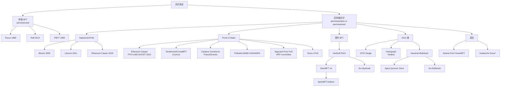

### 2.2 横向比较表

| 协议 | 类别 | 安全性来源 | 最终性 | 出块时间 | 真实部署 |
| --- | --- | --- | --- | --- | --- |
| Bitcoin | PoW | 哈希算力多数 | 概率（6 conf ≈ 60 min） | 600s | $1T+ 市值 |
| Litecoin | PoW (Scrypt) | 同上 | 概率 | 150s | $5B+ |
| Ethereum Classic | PoW (ETChash) | 同上 | 概率 | 13s | $2B+，曾被 51% 攻击 |
| Ethereum (Gasper) | PoS+FFG | 经济（slashing） | 经济（2 epoch ≈ 12.8 min） | 12s | $400B+ |
| Cosmos (CometBFT) | BFT-PoS | 2/3 stake | 绝对（即时） | 1-7s | $10B+，IBC 生态 |
| Cardano (Ouroboros Praos) | PoS+VRF | 1/2 stake honest | 概率（settlement param k） | 20s | $20B+ |
| Polkadot (BABE+GRANDPA) | 双层 PoS | NPoS+GRANDPA | 绝对（GRANDPA 终结） | 6s | $10B+ |
| Algorand (Pure PoS) | PoS+VRF 抽签 | 2/3 stake | 绝对（一轮即终结） | 3s | $1B+ |
| Tezos (LPoS) | 委托 PoS | 2/3 stake | 绝对（2 块） | 8s | $1B+ |
| Aptos (AptosBFT v4 → Raptr) | HotStuff 派 | 2/3 stake | 绝对 | 0.125s | $1B+ |
| Sui (Mysticeti) | DAG+BFT | 2/3 stake | 绝对（~390ms） | 0.4s | $5B+ |
| Hedera (Hashgraph) | aBFT | 2/3 stake | 绝对（~3s） | N/A（DAG） | $5B+ |
| IOTA | DAG | tip 选择 | 概率→Coordicide 后绝对 | N/A | $1B+ |
| Solana (PoH+Tower BFT → Alpenglow) | 混合 | 2/3 stake | 经济（32 conf ≈ 12.8s，未来 150ms） | 0.4s | $80B+ |
| Avalanche (Snow*) | 抽样投票 | metastable | 概率终结（β 轮） | 1-2s | $5B+ |

数据来源：各项目官方文档（Algorand pure-PoS 论文、Polkadot wiki、Aptos Baby Raptr 公告、Sui Mysticeti 公告、Hedera 官方文档），均访问 2026-04-27。

---

## 3. PoW 谱系导引

PoW 是整本书的零点。2008 年 10 月 31 日中本聪贴出那篇 9 页白皮书时，他要解决的不是"怎么发币"——是"在不信任任何人的前提下，怎么对一份账本达成共识"。他给的答案是：让节点烧电算哈希谜题，烧得最多那一支链就是真链。

后续每一个 PoS / BFT / DAG 协议的设计选择，几乎都可以读作"对 PoW 某个方面的不满"。嫌电贵 → PoS（用币替代电）；嫌 finality 慢 → BFT（每块投票即时敲定）；嫌单链瓶颈 → DAG（让所有 validator 同时出块）。看 PoW 时记住这一点，后面 19 个协议每一个都是"假如 PoW 那条不行，我换这条试试"。

PoW 的安全靠四条假设同时成立：哈希函数抗预映像、算力市场半开放、≥50% 算力诚实、网络延迟有概率上界。第三条在小币种链上根本不成立——第 7 章 ETC 就是活教材，攻击者花二十万美元就能买下半个网络。Bitcoin 自己的安全预算大约等于年挖矿电费（2024 ~80 亿美元），是个粗暴但有效的"攻击者要花多少钱"的下界。PoS 后来用 slashing 风险替代电费，扮演同一个角色。

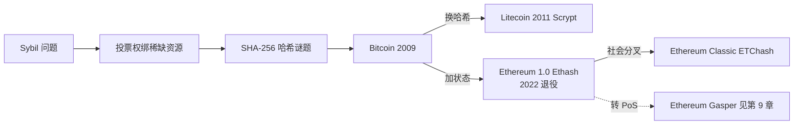

---

## 4. PoW 的核心思路：把 Sybil 转成电费

设想一下，你要做一个匿名投票系统，所有人在线注册账号、一人一票决定下一笔交易合法不合法。问题立刻就来：我可以连夜注册一万个小号，把投票池灌爆。这就是 Sybil 攻击——名字来自一本写多重人格的书《Sybil》，意思是一个人伪装成无数个。

中本聪的破解思路简洁到优雅：把投票权绑到链外的稀缺资源上。1 万个假账号能伪造，但 1 万份电费做不了假。你想多投一票？掏电表来。

具体怎么做？让你证明你"算了一道难题"。SHA-256 的每一位输出都等概率 0/1，要找一个前 16 位全 0 的输入，期望尝试次数 = 2^16 = 65536。前 N 位全 0 只能暴力试——抗预映像保证了反推无门。PoW 的技术内涵其实就这一句，剩下都是工程包装：难度自动调整把出块速率稳在 10 分钟（思路与 TCP 拥塞控制的 AIMD 同源）；最重链规则把"哪条是主链"约化成"哪条累计了最多 work"。

**反对意见与反驳**。环保派批评 Bitcoin 年耗电堪比荷兰全国（剑桥比特币电力消耗指数）；PoW 派回应：电费就是安全预算，PoS 的 slash 风险必须证明能提供等价砸钱门槛。中心化派担忧 ASIC 把普通矿工挤出，矿池占大头；反驳是经济自检——攻击者自己持币，攻击成功币价崩，自损。

**适用场景**。Bitcoin 这类全球价值存储链是 PoW 主场；高频应用链 PoW 出块太慢；联盟链直接上 PBFT 更便宜；隐私链（Monero/Zcash）历史用 PoW，但近年向 PoS 漂移。

---

## 5. Bitcoin：PoW 的标准实现

2009 年 1 月 3 日，中本聪在创世块的 coinbase 字段里嵌了一句话：「The Times 03/Jan/2009 Chancellor on brink of second bailout for banks」。这一句既是时间戳，也是态度——金融危机第二轮救市时，他启动了一个不需要银行的支付系统。17 年过去，Bitcoin 还在跑，从未发生过协议级 reorg。

Mastering Bitcoin 第 10 章把 Bitcoin 共识总结成四步：独立验证交易、独立组装区块、解 PoW、独立选择最重链。本节就沿这条主线走，但我们的重点不是把这四步抄一遍——你应该已经在别的地方看过了。我们要看的是：Bitcoin 在工程上到底做了哪些保守取舍，才换来这 17 年零事故的纪录？

### 5.1 区块结构

```
┌─────────────────────────────────────────┐
│  Block Header (80 bytes)               │
│  ┌────────────────────────────────────┐ │
│  │ version (4)                        │ │
│  │ prev_hash (32) ──→ 链接前一块       │ │
│  │ merkle_root (32) ──→ 交易树根       │ │
│  │ timestamp (4)                      │ │
│  │ bits (4) ──→ 难度                  │ │
│  │ nonce (4) ──→ 矿工反复改的          │ │
│  └────────────────────────────────────┘ │
│  Body                                  │
│  ┌────────────────────────────────────┐ │
│  │ tx[0] (coinbase: 矿工奖励)          │ │
│  │ tx[1] ... tx[N]                    │ │
│  └────────────────────────────────────┘ │
└─────────────────────────────────────────┘
```

### 5.2 出块流程

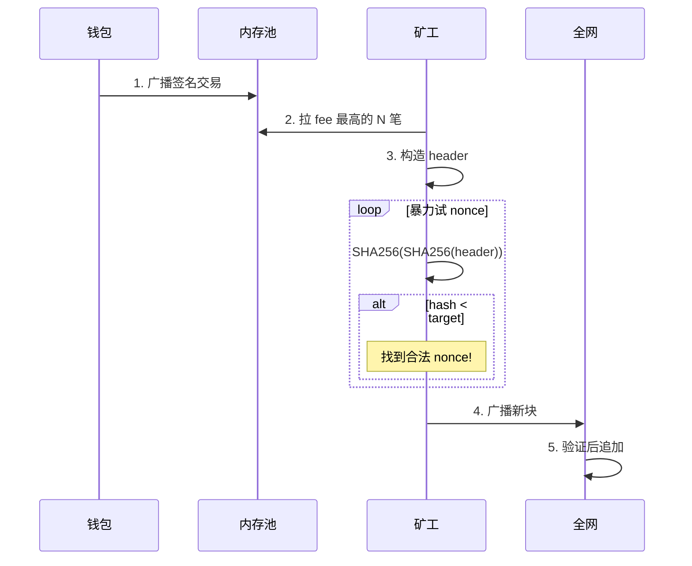

### 5.3 难度调整：为什么必须做

如果难度永远固定：

- **算力涨**（牛市矿工涌入）→ 出块时间从 10min 降到 30s → 孤块率飙升 → 安全性退化
- **算力跌**（黑天鹅 / 矿工撤离）→ 出块时间涨到 1h → UTXO 锁死 → 不可用

Bitcoin 的策略：每 2016 块（≈ 2 周）调整一次：

```
new_difficulty = old_difficulty × (2016 块的实际耗时 / 期望耗时 14 天)
```

调整幅度限制 [0.25x, 4x]，防止单次跳变过大。

Bitcoin 2024-04 第四次减半后，区块奖励从 6.25 BTC → 3.125 BTC。当前难度约 1.1 × 10¹⁴，全网算力 ~ 600 EH/s（Bitcoin Magazine Pro，2026-04）。

### 5.4 双花概率（白皮书 §11）

让我们演一遍。Alice 是攻击者，掌握全网 q 比例的算力；Bob 是个咖啡店老板，对 Bitcoin 还半信半疑，决定收到 z 个 confirmation 才发咖啡。Alice 的如意算盘是：先把一笔付给 Bob 的钱广播出去，等链上确认了她拿到咖啡——这时她私下挖一条更长的、不包含这笔付款的链，凑够长度后广播替换。Bob 手里那笔钱就消失了。

Alice 这套攻击成功的概率有多大？中本聪在白皮书附录里给了精确公式：

```
P(成功双花) ≈ Σ_{k=0..z} P(攻击者前 z 块挖了 k 块) × P(从领先 z-k 块追上)

简化版：当 q < 0.5 时
P ≈ 1 − Σ_{k=0..z} [(λ^k · e^{-λ}) / k!] × (1 − (q/p)^(z-k))
其中 λ = z·q/p
```

数值结果：

| q (攻击者算力) | z=3 | z=6 | z=12 |
| --- | --- | --- | --- |
| 0.10 | 4.4% | 0.024% | 1×10⁻⁹ |
| 0.30 | 25% | 13% | 2.0% |
| 0.40 | 51% | 35% | 16% |

交易所等 6 个确认的原因：q=0.10 时 z=6 已经把成功率压到 0.024%，这是中本聪在白皮书附录给的参考值。q 假设要符合实际——Bitcoin 算力 600 EH/s，凑齐 q=0.1 也要 60 EH/s，租 NiceHash 一天约 400 万美元，攻击不划算。但小币种（如 ETC）算力小很多，q=0.5 实际可达，就被 51% 攻击过。

### 5.5 最长链 vs 最重链

Bitcoin 文档说"最长链规则"，但实际是**最重链**（cumulative work）。区别：如果攻击者用低难度块伪造一条更**长**的链，节点不应接受。最重链规则会拒绝它，最长链规则会被骗。代码 `code/pow_chain.py` 用的就是最重链规则。

### 5.6 Bitcoin 的真实部署

#### 5.6.1 数字感（2026-04 数据）

- 全网算力：~ 600 EH/s（exa-hash/sec）
- 难度：~ 1.1 × 10¹⁴
- 区块奖励：3.125 BTC（2024-04 第四次减半后）
- 矿工年收入：≈ 100 亿美元（含 fee）
- 全球 mining pool 数：~ 15 个主要 pool 占 90%+ 算力

#### 5.6.2 矿池集中化担忧

Foundry USA + AntPool 两个矿池占全网算力 ~ 50%，理论上存在 51% 攻击风险。实践层面的反驳：算力不等于矿池——矿池只是把多个矿工的算力聚合到同一节点提交，矿工随时能切到别的池。但这种"切池压力"是事后惩罚，事前合谋仍可行。

### 5.7 Bitcoin 的工程取舍

17 年零协议级 reorg 不是协议有多厉害，而是中本聪在三处做了保守取舍：①脚本图灵不完备（无法表达可能死循环或非确定的程序）；②单 leader、单链、概率最终性，把"快"全让给"稳"；③块大小 1MB 限制吞吐 ~7 TPS，把节点门槛压到家用机能跑。代价是 DApp 生态弱、TPS 跟不上日常支付。Lightning（第 28 章）正是为了打破第三条限制而生的链下层。

矿池集中是 Bitcoin 当前最大的去中心化软肋。Foundry USA + AntPool 占全网算力 ~50%，理论 51% 风险存在。反驳是"算力不等于矿池——矿工随时切池"，但事前合谋、事后惩罚的非对称仍是真实风险。

### 5.8 历史 reorg

| 时间 | 块奖励 / 块高 | 事件 |
| --- | --- | --- |
| 2009-01 | 50 BTC / 0 | Genesis |
| 2010-08-15 | — | 整数溢出 bug，攻击块铸 1.84 亿 BTC，社区软分叉 reorg 53 块 |
| 2012-11 | 25 BTC / 210k | 第一次减半 |
| 2013-03 | — | v0.7/v0.8 LevelDB 兼容 bug，24 块 reorg |
| 2016-07 | 12.5 BTC / 420k | 第二次减半 |
| 2020-05 | 6.25 BTC / 630k | 第三次减半 |
| 2024-04 | 3.125 BTC / 840k | 第四次减半 |

两次重大 reorg 都是客户端 bug 而非协议攻击——协议层稳，实现层是脆弱点。这条规律对所有共识协议适用，第 34 章 Prysm finality stall 是 PoS 版的同类案例。

---

## 6. Litecoin：换哈希函数的变体

2011 年 10 月 7 日，前 Google 工程师 Charlie Lee 把 Bitcoin 的代码 fork 一份，改了两个参数发布了 Litecoin。他的口号听起来非常温和——"Bitcoin 是金，Litecoin 是银"。后来 2017 年他在 SegWit 激活后清仓自己持有的所有 LTC，理由是"避免利益冲突"，这个动作至今在社区里有争议。

Litecoin 与 Bitcoin 的协议差异只有两处：哈希函数 SHA-256 换成 Scrypt，出块时间 10 min 缩成 2.5 min。其余（UTXO 模型、4 年减半、最重链规则）原样照搬。控制变量法做得这么干净，让 Litecoin 意外成了一个天然实验场，给我们留下一条规律：**抗 ASIC 设计撑不过 3 年**。

Scrypt（Colin Percival 2009，原用于反 rainbow table）是 memory-hard 函数：先生成长伪随机 buffer V[0..N-1] 占内存，再按上一步 hash 索引随机读取 V 做 XOR。ASIC 想加速必须同时砸 N MB SRAM，硅片成本不再线性下压。设想很优雅，2014 年仍出现了 Scrypt ASIC——优势只维持了 3 年。Ethash（Ethereum 1.0）撑了 ~3 年，Vertcoin 的 Lyra2REv3 更短。Monero 的反应是反向操作：每年硬分叉换算法（CryptoNight → RandomX 等），用社会工程让 ASIC 厂商不敢投流片成本——这是目前唯一持续有效的反 ASIC 路线。

Litecoin 的真正生态价值是"BIP 试验田"：SegWit 2017-05 在 Litecoin 激活，4 个月后 Bitcoin 跟进；MWEB 2022 在 Litecoin 上线，Bitcoin 至今未跟。算力规模只有 Bitcoin 的 ~1%——理论上易被 51%，实践无大事故，但这份"运气"在 ETC 案例里就用完了。

---

## 7. Ethereum Classic：51% 攻击的活教材

2016 年 6 月 17 日，一个匿名攻击者从 The DAO 这个智能合约里抽走 360 万 ETH——按当时价值 5000 万美元，相当于以太坊整个流通量的 14%。社区分裂了：一派主张硬分叉把钱退还给受害者；另一派咬牙说「Code is Law」，代码就是法律，写错了也认。两派吵了一个月，最终硬分叉派赢了，那条新链就是今天的 Ethereum；坚持原链的少数派留在了原地，那条链叫 Ethereum Classic。

教科书写 51% 攻击通常很轻描淡写——"理论上控制超过半数算力的对手能 fork 主链做双花"。Bitcoin 凭 600 EH/s 把这条曲线推到经济不可行的另一头。但是，"经济不可行"对算力少的小币种链根本不成立。ETC 用 19 个月里 4 次被攻击的纪录给我们演示了同一道公式：**当算力市场的可租赁流动性远超你这条链的总算力时，攻击就是一笔划算的生意**。

### 7.1 起源：社会层 vs 协议层的第一次撕裂

The DAO 之后的硬分叉，是区块链史上"社会层共识"与"协议层共识"的第一次公开冲突——Lamport 的 BFT 论文里从来没考虑过社会层。Vitalik 后来在博客里反思："我们当时不敢相信 PoS 能扛 The DAO，所以选了硬分叉"。这次妥协后来变成他力推 PoS + slashing 的动机：如果作恶要付经济代价，社区就不必再被迫做"硬分叉退款"这样的政治决定。

### 7.2 四次攻击的经济账

| 时间 | reorg 深度 | 损失 | 攻击成本 | ROI |
| --- | --- | --- | --- | --- |
| 2019-01 | ~100 块 | $1.1M | 未知 | — |
| 2020-08-01 | 4000+ 块 | $5.6M (807K ETC) | 17.5 BTC ≈ $204K | ~27x |
| 2020-08-06 | 4000+ 块 | 类似 | 类似 | — |
| 2020-08-29 | 7000+ 块（2 天挖矿） | 类似 | 类似 | — |

攻击模板：在交易所充值 ETC → 链上确认 100 块即放 → 私下租 NiceHash 秘密挖更长链 → 提走 USDT/BTC → 广播私链替换公链 → 自己充的 ETC 回到自己钱包。数据来源：Bitquery 2020-08 攻击分析（2026-04-27）。

### 7.3 ETC 易，BTC 难，差别在算力市场

ETC 与 ETH 共用 Ethash 算法，2020 年 ETC 算力只占 Ethash 全网的 ~5%。攻击者从 NiceHash 租用几十万美元就够 51%。Bitcoin 全网 600 EH/s，NiceHash 仅有 ~1 EH/s SHA-256 算力——51% 所需是市场总量的 300 倍，经济不可行。

PoW 链的真实安全公式不是"绝对算力"，而是"算力 / 同算法可租算力"。这条公式适用于所有租得到算力的小币种链。

### 7.4 应对与反讽

ETC 在 2020-11 Thanos 升级把 Ethash epoch 翻倍 → ETChash，让 ETH 矿机不能直接挖 ETC。事后无大规模攻击。讽刺的是 2022-09 ETH 转 PoS 后所有 Ethash 矿机失业，部分流入 ETC，反而让 ETC 算力翻倍变得更安全。多家交易所把 ETC 确认数提到 5000+ 块（~18 小时）——比 BTC 6 conf 多一个数量级，本身就是产品体验代价。

工程结论：小币种 PoW 链选独占哈希算法，盯算力市场流动性，确认数随链上算力动态调整，必要时迁 PoS / hybrid（如 Decred）。这条困境也是 Ethereum 自己 2022 年转 PoS 的动机之一。

---

## 8. PoS 谱系导引

把 PoW 翻译成 PoS，听起来像换零件那么简单：算力换成质押，电费换成 slash 风险，Sybil 防御从"硬件稀缺"切到"代币稀缺"。Vitalik 2014 年第一次写 PoS 草案时也是这么想的，结果一发出来就被社区指出三个新问题——这三个问题在 PoW 世界里根本不存在，因为电费这件事天然把它们解掉了。

后面六派 PoS 协议（Ethereum Gasper、Cosmos Tendermint、Cardano Ouroboros、Polkadot BABE+GRANDPA、Algorand、Tezos）的差异，本质就是它们各自怎么回答这三个问题。我们先把问题摆出来。

**Nothing at Stake**：链分叉成 A、B 两支时，PoW 矿工的算力只能投一条（投错了挖出来的块作废）；PoS 签名是免费的，两条都签稳赚不赔。解法：slashing——双签直接没收抵押，让"两面下注"比"老老实实选一条"更亏。

**Long-range attack**：已退出的验证者私钥还在他手里，攻击者只要肯出钱，可以低价回收一批旧私钥，从历史某点重写一条新链——签名免费嘛。解法两条：弱主观性 + checkpoint（让新节点拒绝接受太老的"另一条历史"），或 Cardano Genesis 的 chain density 判定（用块的密度差异区分真伪）。

**Stake grinding**：PoS 的 leader 选举依赖随机数，可万一随机数本身就来自 validator 的签名/状态——那 validator 就有动机调整自己的输入，让自己被选中的概率最大化。解法：VRF（让你私下掷骰子但能向别人证明你没作弊）或外部 randomness beacon（drand 这类）。

下面六派的差异本质就是这三道题各自怎么解：

| 流派 | Nothing at Stake | Long-range | Grinding |
| --- | --- | --- | --- |
| Ethereum Gasper | Casper FFG slashing | weak subjectivity | RANDAO + VDF（计划中） |
| Cosmos Tendermint | double-sign slashing | weak subjectivity | proposer 轮值 |
| Cardano Ouroboros | slashing（晚期版本） | Genesis chain density | 多方计算随机性 |
| Polkadot BABE+GRANDPA | equivocation slashing | weak subjectivity | VRF |
| Algorand Pure PoS | 无 slashing（honest majority） | 不适用（链短期即定） | VRF 私下抽签 |
| Tezos LPoS | double-baking slashing | checkpoint | seed nonce revelation |

---

## 9. Ethereum Gasper：把 safety 与 liveness 拆到两层

2022 年 9 月 15 日凌晨，以太坊 The Merge——从 PoW 切到 PoS。这次升级被称作"飞机上换发动机"：链一刻没停，矿工集体下岗。背后跑的共识协议就是 Gasper，由 Vitalik 和 Virgil Griffith 2017 年的 Casper FFG 论文 + Aviv Zohar 团队 GHOST 论文的 LMD-GHOST 拼起来。

Gasper 的设计哲学有一句可以记住的话：**把 safety 和 liveness 拆到两层做不同取舍**。LMD-GHOST 这一层在分区时坚持继续出块（保 liveness），Casper FFG 那一层在分区时拒绝 finalize（保 safety）。这是 Ethereum 与 Tendermint 最深的分歧——后者把两件事捆在一起做，分区时直接停链。Mastering Ethereum 第 14 章里 Casper 还被介绍为"hybrid PoW/PoS finality gadget"，2020 年后 PoW 那部分被切掉，剩下的纯 PoS 版本就是今天的 Gasper。

### 9.2 时间结构

```
┌──────── 1 epoch = 32 slot = 384s = 6.4 min ────────┐
│                                                      │
│  slot 0   slot 1   ...   slot 31                    │
│  [block][block]...[block]                           │
│  ↑12s     ↑12s          ↑12s                        │
│                                                      │
│  每 slot：1 个 proposer，1 个 32-人 committee 投票    │
│  每 epoch 末尾：checkpoint                           │
└──────────────────────────────────────────────────────┘
```

### 9.3 LMD-GHOST 流程图

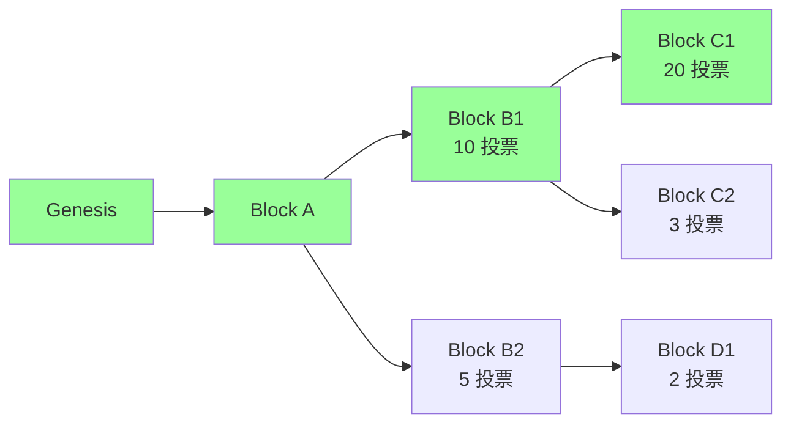

LMD-GHOST 选择**最重子树**（用最新投票算）。上图中：

- B1 子树总投票 = 10 + 20 + 3 = 33
- B2 子树总投票 = 5 + 2 = 7

→ head = C1（B1 子树中最大的）。绿色路径 = canonical chain。

### 9.4 Casper FFG 双轮投票

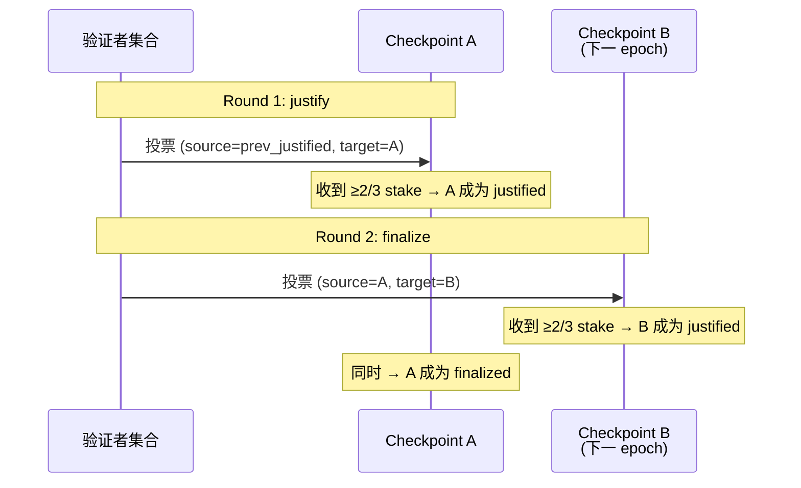

### 9.5 Slashing 两条戒律

**No Double Vote**：同一个 epoch 不能签两个不同的 target。**No Surround Vote**：不能让旧投票 (s₁,t₁) 包围新投票 (s₂,t₂)，即不能有 h(s₁) < h(s₂) < h(t₂) < h(t₁)。

任一违反 → 立即 slash。这就是 Ethereum 把"经济最终性"量化的方式：要 revert 一个 finalized block，至少要让 1/3 stake 接受 slash。当前总质押 ~3500-3700 万 ETH（2026-04），1/3 ≈ 1200 万 ETH（数百亿美元）。

注意区分：上述 slash 针对的是 Casper FFG 的 double/surround vote。**LMD-GHOST attestation 重投不直接被 slash**，而是被 fork-choice 经济性惩罚——投错链的 attestation 拿不到正确链上的 reward，长期下来余额相对受损。

### 9.6 Inactivity Leak

≥1/3 stake 离线时，FFG 凑不齐 2/3 票。**Inactivity Leak**：每 epoch 离线验证者余额指数累积削减，数周后离线方份额降到 < 1/3，活跃方重新够 2/3，finality 恢复。短期牺牲 safety（不 finalize），保住 liveness（LMD-GHOST 照走），经济惩罚把 liveness 拉回来。

### 9.7 Single Slot Finality (SSF) 路线图

当前 finality 12.8 min 仍嫌慢。Vitalik 在 2022 提出 SSF：每 slot finalize。

挑战：100 万验证者签名聚合不可行。可能解：
- Orbit-SSF：分组轮值
- 提高最低质押到 1024 ETH（社区争议大）
- BLS 优化

**2026-04 状态**：仍研究阶段，预计在 Verkle / Danksharding 之后（最早 2027）。来源：ethereum.org/roadmap/single-slot-finality，访问 2026-04-27。

### 9.8 真实事故：2022-05-25 7-block reorg

详细复盘见 `exercises/03_reorg_postmortem.md`，以及第 33 章。要点：

- 三因合流：proposer 出块迟到 + proposer boost 滚动升级不一致 + 部分客户端 fork-choice bug
- 7 个 slot 内分裂；Casper FFG finality 未受影响
- 教训：fork-choice 改动从此必须打包进硬分叉

### 9.9 工程画像

100 万验证者 + 数千节点是 Gasper 的最大成就，也是它 finality 慢（12.8 min）的根本原因——签名聚合压力直接卡住 SSF。EVM + L2 生态把执行层吞吐推到 5 万+ TPS，但共识层吞吐被 1 slot=12s 钉死。下一阶段路线图（第 47 章 SSF/3SF、第 46 章 ePBS、第 53 章 Verkle）都在啃这块石头。

---

## 10. Cosmos Tendermint / CometBFT：BFT 优先，liveness 让位

2014 年，Cornell 博士生 Jae Kwon 在他的硕士论文里写了一份新协议——把 PBFT 改造成支持 PoS 的版本。他把它叫做 Tendermint。后来 Ethan Buchman 加入，两人 2016 年发了正式的论文，2018 年又和 Zarko Milosevic 一起把协议正式化（arXiv:1807.04938）。这个团队后来变成 Cosmos——一个把"应用专属链"理念做到工业化的项目。

与 Gasper 选择"两层分别取舍"相反，Tendermint 把 safety 一路硬到底——块一旦 commit 绝对不可逆，代价是网络分区时直接停链。这套取舍非常适合"应用专属链"场景：100-200 个已知 validator，partial-sync 假设接近现实，停链可接受。Cosmos SDK 把它当默认共识引擎，开发者只关心 Go 写的应用层逻辑。

2023 年 2 月有个戏剧性转折：原作者 Jae Kwon 离开后，AiB（All in Bits）停止支持 Tendermint Core。Informal Systems 把代码 fork 一份，改名叫 **CometBFT**。v0.34 → v0.38 → v1.0（2025-02-03 v1.0.1）一脉相承，主流 Cosmos 链当前还在 v0.38。

### 10.2 三阶段流程

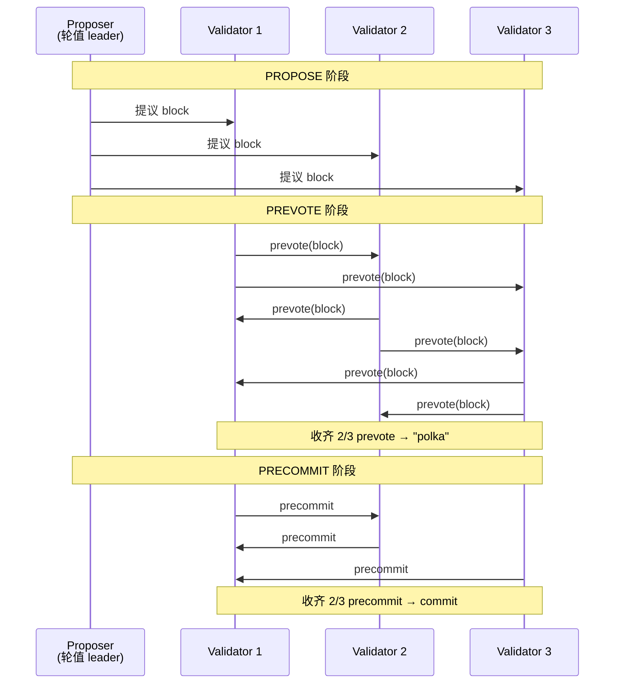

### 10.3 与 PBFT 的三处分歧

PBFT 是 Tendermint 的直接祖先（第 17 章详解 PBFT 三阶段）。Tendermint 在三处改造它以适配公链场景：

| 维度 | PBFT 1999 | Tendermint |
| --- | --- | --- |
| 客户端模型 | client/replica 显式区分 | 节点对等，无独立 client |
| 通信 | 全连接 O(n²) | gossip O(n) per round |
| Validator 集合 | 静态 | 每块可换（PoS 动态） |
| 出块时机 | client 触发 | 自动按 slot |

absolute finality 与 Ethereum 的 economic finality 不在同一坐标系：absolute 是协议层硬保证，分区时停链；economic 是博弈论保证，分区时继续出块但拒 finalize。两条路线都从同一个 PBFT 谱系出发，只在"分区时怎么办"上做了相反选择。

### 10.4 IBC 与生态

Cosmos 的真正杀手锏是 IBC（Inter-Blockchain Communication）——absolute finality 让跨链消息的"对方链是否真的提交了这个块"问题变得简单：finalized 就是 finalized，无概率歧义。IBC 网络日活跃链 100+，是除了 Ethereum L2 之外最大规模的实战跨链方案。Osmosis (DEX)、Celestia (DA)、Sei (高频)、dYdX v4 (订单簿) 都是 Cosmos 链。

### 10.5 历史

Cosmos Hub 自 2019 launch 至今从未 reorg（absolute finality 保护），但发生过数次 validator 离线超 1/3 导致链停约 1 小时——不是事故，是协议设计选择。2023-02 Tendermint Core → CometBFT 改名，v0.34 完全兼容；2025-02-03 v1.0.1 引入 PBTS（Proposer-Based Timestamps）。

---

## 11. Cardano Ouroboros（Praos / Genesis / Peras）

希腊神话里 Ouroboros 是一条咬着自己尾巴的蛇——首尾相连。Cardano 选这个名字，是想强调它的协议在数学上自洽闭合。这背后是 Charles Hoskinson 的态度：他是以太坊 8 位联合创始人之一，2014 年因为治理理念分歧离开后创立 Cardano，定下"先有论文再写代码"的路线。第一篇 Ouroboros 论文（Kiayias et al. 2017）登上 CRYPTO——这是密码学三大顶会之一，区块链共识协议第一次拿到形式化安全证明。

如果说 Tendermint 走 BFT 路线（每块多轮投票），Ouroboros 走的是 chain 路线（单 leader 出块、概率最终性），形态上更接近 PoW。它的差异化点是"学院派"：每一版（Praos / Genesis / Peras）都附正式论文。

工作方式我们来演一遍：每个 epoch（5 天）开始时，用上一 epoch 的随机数 + VRF 私下确定本 epoch 每个 slot 的 leader。这个 leader 只有自己知道，等到他的 slot 到了再出块、附 VRF proof，其他人验证。"私下抽签"这套思路和 Algorand 一脉相承（都用 VRF），区别在 Ouroboros 是单 leader 出块，Algorand 是 committee 多人投票——同一个工具的两种工程化方向。

### 11.2 VRF 是什么

VRF（Verifiable Random Function）：

```
输入：私钥 sk, 消息 m
输出：(随机值 y, 证明 π)

性质：
  1. 给定 (pk, m, y, π)，任何人能验证 y 是 sk 的合法输出
  2. 没 sk 的人无法预测 y
  3. y 在统计上不可区分于真随机
```

VRF 就是「带证明的伪随机」。每个节点能私下"掷骰子"，掷完能向别人证明自己没作弊。

### 11.3 Cardano 的具体参数

- **epoch**：5 天 = 432,000 slot，每 slot 1 秒
- **Slot leader 概率**：和质押比例成正比；多个 leader 也可能（出多个块）或没人（空 slot）
- **下一 epoch 随机数**：把当前 epoch 前 2/3 块的 VRF 输出哈希起来

来源：Cardano Developer Portal，访问 2026-04-27：https://developers.cardano.org/docs/operate-a-stake-pool/basics/consensus-staking/

### 11.4 Ouroboros 家族演进

| 版本 | 年份 | 关键升级 |
| --- | --- | --- |
| Ouroboros Classic | 2017 | 最早版本，需要全局同步时钟 |
| Ouroboros Praos | 2018 | 引入 VRF 私下选举，对部分异步网络鲁棒 |
| Ouroboros Genesis | 2018→2024 mainnet | 解决 long-range attack，新节点能从 genesis 同步 |
| Ouroboros Peras | 2025 | 加快 settlement（"快终结" gadget） |

来源：Cardano.org 2024-05-08 blog "Ouroboros Genesis design update"，访问 2026-04-27。

### 11.5 弱主观性怎么解

Ouroboros Genesis 通过"chain density"判定抵御 long-range attack：遇到候选分叉时，比较两条链在过去 K 个 slot 内的块密度——诚实链 ≥ k/2 个块，伪造链很难维持该密度。新节点能**完全从 genesis 同步**，零外部信任。

#### 11.5.1 与 Ethereum 的对比

| 链 | 新节点同步 |
| --- | --- |
| Ethereum | 必须信任一个 weak subjectivity checkpoint（朋友/EF/交易所） |
| Cardano (Genesis) | 完全从 genesis 同步，零信任假设 |

### 11.6 真实部署

#### 11.6.1 数字感（2026-04）

- 验证者池（stake pool）：~ 3000 个
- 总质押：约 22 B ADA（占流通量 ~ 60%）
- 出块时间：20 秒
- TPS：实测 ~ 250

#### 11.6.2 重要里程碑

- **2017-09 Ouroboros Classic 论文**
- **2020-07 Shelley 升级**：从中央化 → 去中心化 PoS
- **2021-09 Alonzo 升级**：上线智能合约（Plutus）
- **2024-09 Chang 升级**：Ouroboros Genesis 主网激活
- **2025-Q4 Peras（计划）**：快终结 gadget

来源：IOG 2024-10-14 blog "Ouroboros Peras: the next step"，访问 2026-04-27。

### 11.7 工程画像

Genesis 是 Ouroboros 在 long-range attack 上做出的独特解法——其他 PoS 链都用 weak subjectivity，Cardano 选择形式化证明 chain density 检测。代价是 20s 出块、250 TPS 这一段性能数字平庸。Plutus + eUTXO 让智能合约学习曲线陡（与 EVM 模型几乎不互通），是 DeFi 生态相对薄的根本原因。链层从无 reorg 超过 settlement param k 的纪录。

---

## 12. Polkadot（BABE + GRANDPA）

2016 年，Gavin Wood 离开以太坊基金会——他是当年那篇黄皮书的作者，把 Vitalik 的白皮书翻译成了 EVM 的形式化规范。他离开后做的第一件事是 Polkadot，目标是让多条链能共享安全性。这个项目的两个共识组件名字都很可爱：BABE（婴儿）负责出块，GRANDPA（祖父）负责 finalize。

Polkadot 把 Gasper 的"出块层 + finality gadget"分层做得更彻底。BABE 负责出块（VRF 选 primary slot leader，思路与 Ouroboros Praos 同源），GRANDPA 负责 finalize——但和 Casper FFG 不同，GRANDPA 一次能 finalize 一整段链的"最长公共前缀"，不是单块。两层各司其职：BABE 出概率块，GRANDPA 把任意时刻已稳定的那段链一次性敲死。

### 12.2 GRANDPA 全名

**G**HOST-based **R**ecursive **AN**cestor **D**eriving **P**refix **A**greement：每次 finalize 一段链的"最长公共前缀"，不是单块。

### 12.3 工作流程

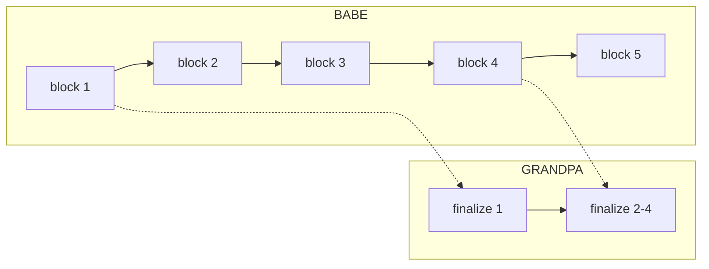

BABE 持续出块；GRANDPA 隔一段时间投票，一次 finalize 多个块（图中一次 finalize 了 2-4）。

### 12.4 验证者集合

- **active validators**：当前 era 选出的 600 个验证者（2024 年起 Active Set 由 297 提升至 600，来源：Polkadot DOT staking dashboard，访问 2026-04）
- **nominators**：质押 DOT 委托给验证者；最少 250 DOT 直接 nominate，1 DOT 可加入 pool

### 12.5 与 Ethereum Gasper 的对比

| 维度 | Ethereum Gasper | Polkadot BABE+GRANDPA |
| --- | --- | --- |
| 出块层 | LMD-GHOST | BABE (VRF-based) |
| 终结层 | Casper FFG（每 epoch finalize） | GRANDPA（任意时刻可 finalize） |
| 终结粒度 | 块 | 链段（前缀） |
| 验证者数 | ~100 万 | ~300 |
| Slashing | 有 | 有 |

### 12.6 真实部署：Polkadot 的"中继链 + 平行链"

#### 12.6.1 中继链（Relay Chain）

承载 BABE+GRANDPA 共识的核心链。验证者只验证中继链 + 分配的 parachain slot。

#### 12.6.2 平行链（Parachains）

通过竞拍获得 slot 的应用链。每个 parachain 有自己的 collator 节点收集交易，但安全靠中继链 finality。

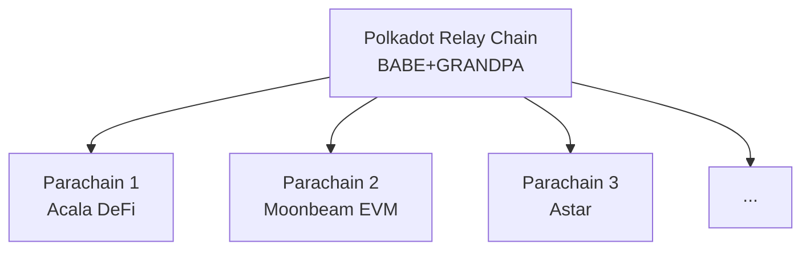

### 12.7 工程画像

平行链共享中继链 finality 是 Polkadot 与 Cosmos IBC 的关键差异：Cosmos 各链独立 finality，跨链消息要等对方链 finalize；Polkadot 平行链没有自己的 finality，全部依赖中继链 GRANDPA 一次敲定。代价是 600 个 validator 比 Ethereum 少两个数量级，Substrate 框架学习曲线陡。2024 Polkadot 2.0 路线图把 slot 拍卖换成 agile coretime（按 core-second 租用），是对早期 slot 拍卖资本门槛过高的反应。

---

## 13. Algorand（Pure PoS + VRF Sortition）

Silvio Micali 是图灵奖得主，零知识证明的奠基人之一。2017 年他 63 岁，发了一篇论文叫《Algorand: Scaling Byzantine Agreements》（SOSP 2017），把 PoS 共识彻底翻新——核心赌注是"committee 私下选举"。每出一块，从全体持币人里抽出 ~1000 人组成 committee，成员公布自己的 VRF proof 之前，连自己都不知道被选中了。

这个设计的厉害之处在于绕开了 nothing-at-stake：链根本没有"持续 fork 的窗口"——committee 每块都换、每轮即终结，你想两面下注都来不及。代价是 Algorand 没有 slashing（丢私钥不赔钱），靠 honest-majority 假设 + committee 频繁换人防御作恶。所以它和其他所有 PoS 链最大的差异是：**不靠经济惩罚，靠"攻击者根本不知道该攻击谁"**。

2024 年 9 月起 Algorand 改成主动质押模型（之前 ALGO 是自动在线参与），逐渐向其他 PoS 链趋同——但 VRF sortition 这套核心机制保留。

### 13.2 Cryptographic Sortition

每一块开始时：

```
for each ALGO holder with key sk:
    seed = blockchain_round_seed
    (y, π) = VRF(sk, seed)
    # y 是 [0, 1] 之间的随机数
    if y < threshold(my_stake):
        I'm selected for this round!
        publish (block_proposal, y, π)
```

**关键**：sortition 是**私下**进行的——直到我自己公布 VRF proof，没人知道我被选上了。这就是它抗"针对性 DDoS"的方式：攻击者根本不知道该攻击谁。

### 13.3 BA⋆ 协议

委员会选出来后，做一个简化的 BFT：

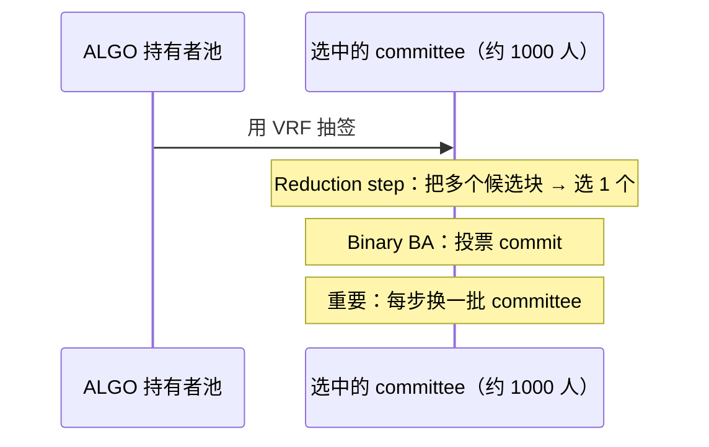

### 13.4 安全性边界

Algorand 论文证明：在 honest-majority（≥ 2/3 stake honest）假设下，BA⋆ 能在 O(1) 轮内 finalize。当前出块时间约 3 秒。

Algorand 的"absolute finality" 是**第一轮就 finalize**——比 Cosmos 还彻底。

#### 13.4.1 安全模型

- **honest-majority 假设**：≥ 2/3 stake 诚实
- **网络模型**：弱同步（能容忍部分异步，但不能完全异步）
- **抗 adaptive adversary**：因为 sortition 私下进行，攻击者无法事前定位 committee 成员

#### 13.4.2 没有 slashing 怎么防 Nothing at Stake

**Algorand 的答案**：committee 每块都换 + 单轮即 finalize。Nothing at Stake 的前提是"对多条 fork 都签名"，但没有持续 fork 的可能。代价：一旦 < 2/3 honest，链停（safety 优先）。

### 13.5 真实部署

#### 13.5.1 数字感（2026-04）

- 出块时间：~ 3.3 秒
- TPS：实测 6000+
- 总质押：占流通量 ~ 50%（自动参与）
- 验证节点：~ 1500 个
- 终结性：单轮（< 5 秒）

#### 13.5.2 应用生态

Algorand 偏向"机构链"路线：CBDC（El Salvador、Marshall Islands）、carbon credits、tokenized securities（Hesab Pay）。DeFi 生态较 Ethereum 弱。

### 13.6 工程画像

单轮 finality + 6000 TPS 是 Algorand 性能数字最亮眼的部分，但生态押注机构链（CBDC、tokenized securities），DeFi/NFT 与 Ethereum 不在同一量级。2024-06 一次 ~2 小时停滞事件验证了 Algorand 选 safety 牺牲 liveness 的设计——relay 节点配置问题导致出块中断，但绝对终结性保留，无 reorg。这与 Cosmos 的"validator 离线超 1/3 链停"是同一类设计后果。

---

## 14. Tezos（Liquid Proof of Stake / LPoS）

Tezos 的故事一开始很糟糕：2017 年 Arthur 和 Kathleen Breitman 夫妇做了当时最大的 ICO，融了 2.32 亿美元，紧接着卷入与基金会主席的法律纠纷，主网延迟将近一年才上线。但项目在律师战中没死掉，2018 年成功上线，活到现在。它在共识协议史上的差异化不是算法本身，而是**经济模型 + 治理路径**两层。

具体差异有两条：第一，委托不锁仓（这就是 "liquid" 的意思），钱还在你账户里，随时可以改委托对象；第二，链上自动协议升级，根本不需要硬分叉——协议本身就能投票升级自己。2022 年 Tenderbake 升级后底层共识从 LPoS 变成了 BFT 风格（基于 Tendermint），但治理与委托模型没动。Tezos 至今做了 18 次以上链上协议升级，全部由代币持有者投票完成——其他链梦想中的事情，它已经做了 8 年。

### 14.1 关键词

| 术语 | 含义 |
| --- | --- |
| Baker（烤面包） | Tezos 里的"出块者"。Baking = 出块 |
| Endorser | 验证者；负责"背书"已出块 |
| Delegate | 把投票权委托给 baker 的普通持币人 |
| Liquid | 委托不锁仓——随时可改委托对象 |

### 14.2 "liquid"的含义

委托不锁仓：钱还在账户里，收益归委托的 baker，baker 分成给你——类似活期理财而非定期。

### 14.3 出块流程

```
每块：
  1 个 baker 烤块（按 stake 比例随机选）
  32 个 endorser 背书前一块（也按 stake 比例随机）

baker 没及时烤 → 槽位空 → 罚款
baker / endorser 双签 → slash
```

来源：OpenTezos / Tezos.com，访问 2026-04-27。

### 14.4 与传统 DPoS 的差异

Tezos 不是 DPoS（Delegated PoS，如 EOS / Tron）。区别：DPoS 有固定 N 个超级节点（EOS 21 个），LPoS 没有固定数量，bakers 数量动态浮动。

#### 14.4.1 三种 PoS 风格对比

| 风格 | 代表 | 验证者数 | 委托是否锁仓 |
| --- | --- | --- | --- |
| 直接 PoS | Ethereum | 100 万 | 是（32 ETH） |
| LPoS（流动）| Tezos | 数百 | **否** |
| DPoS（委托）| EOS / Tron | 21-100 | 是 |
| Pure PoS | Algorand | 全民 | 否（自动参与） |

### 14.5 Tezos 的链上治理

Tezos 最独特的设计：**协议本身可以投票升级**，无需硬分叉。至 2026-04 已激活 18 次以上（Athens / Babylon / Carthage / Delphi / ... / Quebec / Rio）。

#### 14.5.1 投票流程

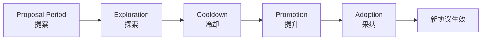

每阶段约 2 周，整个升级周期约 2 个月。

### 14.6 真实部署

- 验证者（baker）：~ 400 个
- 总质押：占流通量 ~ 70%
- 出块时间：8 秒
- 终结性：2 块（约 16 秒）

### 14.7 工程画像

链上自动升级是 Tezos 与所有其他链的本质差异。Bitcoin 的 Taproot 走了 2 年软分叉、Ethereum 每次 hardfork 要协调全网客户端同步发版；Tezos 累计 18 次以上协议升级（Athens / Babylon / ... / Quebec / Rio），全部用链上投票完成。代价是治理周期约 2 个月，对突发安全升级不够敏捷。NFT 生态（Hic et Nunc 等）相对强，DeFi 弱。

### 14.8 历史

2018-06 mainnet（经过 2 年法律纠纷）；2019 Athens 第一次链上升级成功；2022 Tenderbake 升级把底层共识从 LPoS 改为 BFT 风格；2024 Paris/Quebec 性能优化。

PoS 六派走完。它们的共同结构性局限：validator 数量越多投票通信越重、finality 越慢。BFT 派的下一组协议反向操作——从一开始把 validator 数控制住（几十到几百），用精密多轮投票换即时最终性。

---

## 15. BFT 谱系导引

到这里我们换个赛道。前面 PoS 六派回答的是"谁有资格出块"，接下来 BFT 协议要回答的是"出了块怎么快速 finalize 它"。这两件事可以合做也可以分做——Bitcoin 是合做（出块即概率最终性），Ethereum 是分做（LMD-GHOST 出块 + Casper FFG 终结）。BFT 派天生就是分做的死忠：你出你的，我投我的票。

后面的协议（PBFT / HotStuff / Tendermint / Bullshark / Mysticeti）共享一套词汇——QC、view、lock。我们先把这三个词的意思讲清楚，后面章节直接调用就不重复解释了。

**Quorum Certificate (QC)**：≥2f+1 节点对同一消息的签名集合，1.1 节 3f+1 定理保证两个 QC 必有诚实重叠。集齐 QC 等于"网络已达 supermajority"的可转发证据。

**View / Round**：每个 view 一个 leader 负责提议，其他节点投票。leader 故障时 view-change 选新 leader——这是 BFT 协议处理 leader fail 的标准模式。

**Lock**：view-change 时为不丢已 prepared 的值，节点锁定某个 view 的提议；新 leader 必须保留这些锁。三阶段 BFT 协议（PBFT、HotStuff）的第三阶段就是为 lock 设计的——见 17.3 节。

```mermaid
graph TD
    Lamport[Lamport BGP 1982<br/>3f+1 下界]
    Lamport --> Paxos[Paxos 1989 crash-only]
    Paxos --> Raft[Raft 2014]
    Lamport --> PBFT[PBFT 1999 工程可用]
    PBFT --> Tendermint[Tendermint 2014 gossip O(n)]
    PBFT --> HotStuff[HotStuff 2019 O(n) responsive]
    HotStuff --> LibraBFT[LibraBFT 2019]
    LibraBFT --> DiemBFT[DiemBFT v4]
    DiemBFT --> AptosBFT[AptosBFT v4 Jolteon]
    AptosBFT --> Raptr[Raptr 2024]
    HotStuff --> Mysticeti[Sui Mysticeti 2024]
```

经典 BFT 与区块链 BFT 的差异：前者 validator 静态、O(n²) 全连接、规模几十；后者 validator 动态、gossip O(n)、规模上百到上千。Tendermint/HotStuff 都是把 PBFT 的"客户端独立 + 全连接 + 静态集"三个 1999 年假设逐个改掉的产物。

---

## 16. Paxos 与 Raft：crash 共识的双经典

谈 BFT 之前我们要先看两个不容拜占庭、只容 crash 故障的协议——Paxos 和 Raft。它们和公链没关系，但谷歌搜索引擎、Kubernetes 配置、TiDB 数据库背后都跑着它们。更重要的是：PBFT/HotStuff 的"提议-投票-提交"骨架直接从 Paxos 抄来；不懂 Paxos 的两阶段，就读不懂 PBFT 三阶段里第三阶段是为什么存在的。

### 16.1 Paxos：1989 由 Lamport 发明

Lamport 1989 年第一次投这篇论文时被拒了。他改用希腊 Paxos 岛上"兼职议会"的故事重写，1998 年才正式发表，又过了几年大家才意识到这是分布式系统的奠基论文。Lamport 后来还专门写了一篇《Paxos Made Simple》自嘲："据说 Paxos 难懂，所以我用最简单的语言重新讲一遍"——结果这篇还是出名地难懂。

工程本质：N 个节点中容忍 f < N/2 个 crash 故障（注意是 crash，不是拜占庭）的共识协议。

```
角色：
  proposer：提议者
  acceptor：决定接收哪个提议
  learner：学习已通过的提议

两阶段：
  Phase 1: prepare（占位）
    proposer 选编号 n，向多数 acceptor 发 prepare(n)
    acceptor 承诺不再接受编号 < n 的提议
  Phase 2: accept（提议）
    收到多数承诺 → proposer 发 accept(n, v)
    acceptor 接受 → 通过
```

### 16.2 Raft：2014 Stanford "可理解版 Paxos"

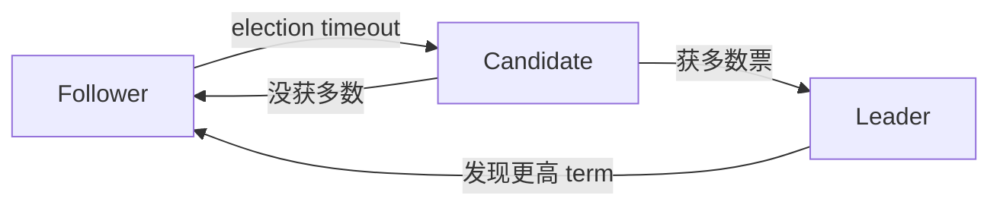

三个角色（Leader / Candidate / Follower），选举超时随机化（150-300ms）避免 split vote。

**Raft 的工程影响巨大**：etcd / Consul / TiKV / CockroachDB 都用 Raft。但都是 crash-fault-tolerant，不是拜占庭——所以在公链上不能直接用。

来源：Raft Wikipedia / raft.github.io，访问 2026-04-27。

### 16.3 Paxos vs Raft 对比

| 维度 | Paxos | Raft |
| --- | --- | --- |
| 发明 | 1989 Lamport | 2014 Ongaro/Ousterhout |
| 容错 | crash f < N/2 | 同左 |
| 论文可读性 | ★☆☆☆☆ | ★★★★★ |
| 工程实现 | Multi-Paxos / Mencius / EPaxos | etcd / Consul / TiKV |
| 是否可用于公链 | 否（不容拜占庭） | 否（同上） |

### 16.4 为什么不能直接用于公链

Paxos/Raft 假设故障节点只是停掉，不会作恶。公链节点可故意签错、向不同人发矛盾消息、伪造历史——Byzantine 故障下"诚实 = N/2+1"不足以保证安全。Castro-Liskov 把这条门槛改为"诚实 ≥ 2/3"（即 n=3f+1）就是 PBFT。

工程影响：数据中心几乎所有强一致性系统都跑 Raft——etcd、Consul、TiKV/TiDB、CockroachDB；联盟链/许可链（Hyperledger Fabric 后期、企业 BaaS）也用 Raft，因为身份已知，无需 BFT 开销。

---

## 17. PBFT：1999 的工程里程碑

1999 年 OSDI，MIT 的博士生 Miguel Castro 和导师 Barbara Liskov（图灵奖得主，CLU 语言之母）发了一篇论文——《Practical Byzantine Fault Tolerance》。"Practical"这个词很要紧：在他们之前所有 BFT 协议要么纯理论，要么假设同步网络（公网根本跑不动）。PBFT 是第一个能在真实网络下跑的 BFT 协议。

PBFT 的贡献其实就这几条：n=3f+1、三阶段（PRE-PREPARE / PREPARE / COMMIT）、客户端 5 阶段内得到回应、partial-sync 模型。听起来轻描淡写，但所有现代区块链 BFT（Tendermint、HotStuff、Bullshark）都是直接对照 PBFT 做改进的——它是这条赛道的"Hello World"。

### 17.2 三阶段细节流程图

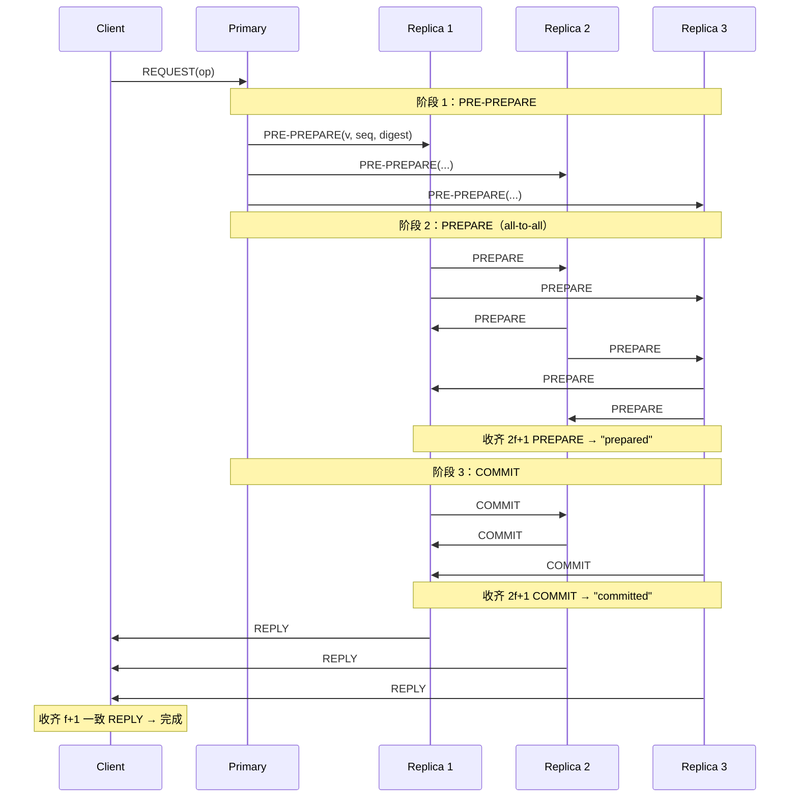

### 17.3 为什么三阶段而不是两阶段

两阶段无法在 view-change 时保留"已 prepared 但未 commit 的请求"。第三阶段引入锁机制，让新 leader 必须保留前 view 的 prepared 值。

### 17.4 view-change 流程

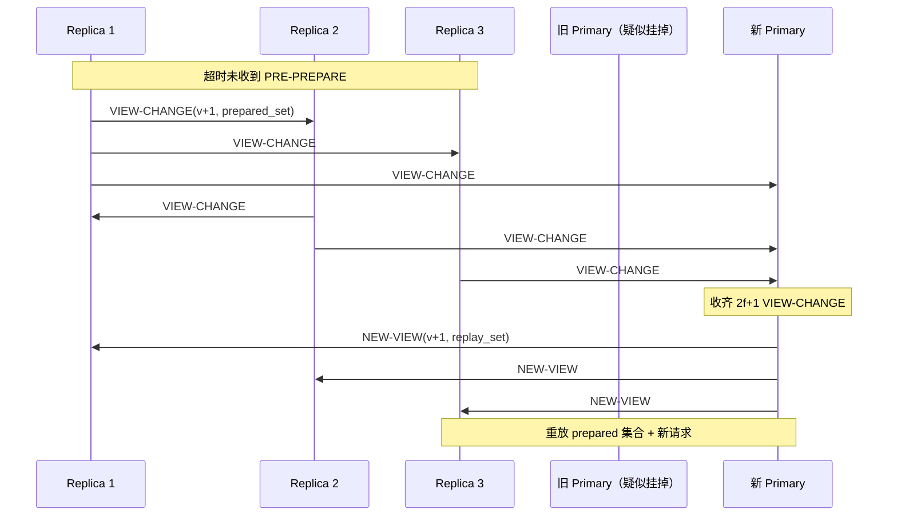

### 17.5 PBFT 的局限

| 局限 | 工程影响 |
| --- | --- |
| O(n²) 通信 | n=100 时一轮万条消息，公链不可扩 |
| 静态 validator set | 不能动态加 / 退节点 |
| 假设客户端独立存在 | 区块链场景下客户端 = 节点，模型不直接适用 |

→ Tendermint / HotStuff 都是冲着这些局限改进。

### 17.6 工程画像

工业落地集中在节点数 <30 的联盟链——Hyperledger Fabric v1.0、政府/银行许可链。一旦 n>50，O(n²) 通信开销难承受。学术地位上 PBFT 是 BFT 的"Hello World"，Tendermint/HotStuff/Aardvark/Zyzzyva/SBFT 都把它当 baseline。下一节 HotStuff 把通信压到 O(n) 是直接奔着这条限制去的。

---

## 18. HotStuff：把 O(n²) 压到 O(n)，并且 responsive

PBFT 在 100 个节点的链上跑一轮要发一万条消息——n=100 时 O(n²) = 10000，公网带宽根本扛不住。这成了 BFT 公链 20 年的瓶颈。直到 2019 年 PODC 上 VMware Research 的 Maofan Yin 等人发了 HotStuff，并拿了那年的 best paper。

HotStuff 干的事其实很简单，两条：第一，节点不再 all-to-all 广播投票，而是只发给 leader，leader 聚合成 QC 后再广播——通信从 O(n²) 降到 O(n)；第二，**responsive**——leader 收齐 n-f 投票就能推进，不用再等已知最长网络延迟 Δ。PBFT 不 responsive，必须等 Δ。这两点让 HotStuff 一夜之间成了所有 Diem 系（Aptos、Sui、Movement、Espresso）的母本。Facebook 2019 年放出 Libra 项目时，共识层用的就是 HotStuff 的工程化版本 LibraBFT。

### 18.2 三阶段（PREPARE / PRE-COMMIT / COMMIT）

阶段名与 PBFT 重叠但语义不同：HotStuff 每阶段都是 leader 中转聚合 QC（O(n)），不是 all-to-all（O(n²)）。第三阶段（COMMIT）的存在原因和 PBFT 一样——见 17.3 节关于 lock 的解释。

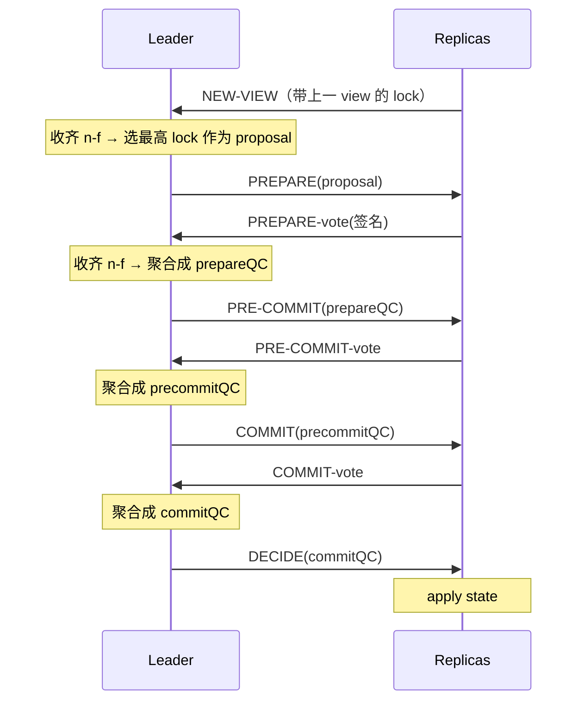

QC = Quorum Certificate（聚合签名证据）。

### 18.3 Pipelined / Chained HotStuff

让每个 view 提议一个新块，新块的 PREPARE 复用上一块的 PRE-COMMIT 投票。三个 view 流水线推进：

```
view  1   2   3   4   5   6
块    B1  B2  B3  B4  B5  B6
B1: PREPARE  PRE-COMMIT  COMMIT  DECIDE
B2:          PREPARE     PRE-COMMIT  COMMIT  DECIDE
B3:                      PREPARE     PRE-COMMIT  COMMIT  DECIDE
```

→ **稳态吞吐 = 每 view 1 块，单块 commit 延迟 = 3 view**。

### 18.4 工业落地链路

```
HotStuff 论文 (2019, PODC best paper)
   ↓
LibraBFT (Facebook Libra 2019)
   ↓
DiemBFT v4 (2021)  → Diem 关闭，团队带代码去 Aptos
   ↓
Jolteon = AptosBFT v1 (2022 active pacemaker)
   ↓
AptosBFT v4 (2023 reputation-based leader)
   ↓
Raptr (2024-09 提案；2025-06 Baby Raptr 主网激活)
```

工程门槛主要在 threshold signature（BLS 聚合）——这也是为什么 HotStuff 直到 BLS12-381 库成熟后才大规模工业化。来源：Aptos Foundation "Baby Raptr Is Here"（2026-04-27）。

---

## 19. AptosBFT 与 Diem 系：HotStuff 工业化

2019 年 6 月，Facebook 宣布 Libra（后改名 Diem）——一个全球稳定币计划，背后跑着 LibraBFT，HotStuff 的工程化版本。这件事被美国监管层猛批，Mark Zuckerberg 三次跑去国会作证，最后项目 2022 年初被迫关闭，团队带着代码和论文跑出来创立了 Aptos 和 Sui——同根，但两条路。

HotStuff 是协议骨架，AptosBFT 是把骨架打磨成主网产品的 6 年工程链路。本章重点不再是"算法是什么"（已在第 18 章给出），而是"工业化过程中加了哪些非协议成分"——主动起搏器、reputation-based leader、Quorum Store mempool、prefix consensus。这些细节在论文里看不到，是工程师血泪。

### 19.1 系谱

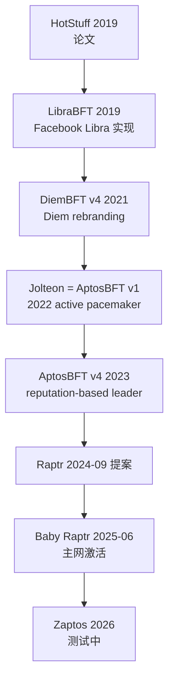

### 19.2 Jolteon 的核心改进：主动起搏器

不依赖 timeout，改为 leader 主动发起 view 切换，view-change 延迟从 5 消息降到 3 消息，commit latency 降 ~33%。

### 19.3 AptosBFT v4："声誉机制" leader 选举

v4 引入 reputation-based leader election：leader 除质押外还看历史表现（出块速度、掉线率、是否 equivocate），是"GPA + 出勤率 + 工作表现"的综合评定。

### 19.4 Quorum Store：mempool 改造

Aptos 不转 DAG 共识，但把 Narwhal 的 mempool 设计借过来（Quorum Store）——只取"mempool 解耦"的收益，不为 DAG 而 DAG。

#### 19.4.1 性能数字

- 主网峰值 TPS：~ 19,000
- Raptr 测试 TPS：260,000，延迟 < 800ms
- Zaptos 测试：100 节点 geo-distributed，sub-second latency at 20k TPS

来源：Stakin 2025 ecosystem report，访问 2026-04-27。

### 19.5 Raptr 与 Baby Raptr

#### 19.5.1 Raptr 设计目标（2024-09 提案）

- prefix consensus model：把 Quorum Store 的 DA check 直接合进共识，减少消息往返（从 6 跳降到 4 跳）
- 提升 ~ 20% 终结性延迟（100-150ms 改善）

#### 19.5.2 Baby Raptr（2025-06 上线）

第一个 Raptr 组件上线主网。完整 Raptr 仍在分阶段推进。

### 19.6 与 Sui 的分叉

Aptos 与 Sui 同出 Diem/Libra 团队，都用 Move 语言，共识却选了相反路线：Aptos 保 HotStuff 单链单 leader 加 Narwhal mempool；Sui 押注 DAG 共识（第 23-24 章）让所有 validator 同时广播，共识只在 DAG 上做总序。这是过去三年共识层最戏剧化的一次工程哲学分叉——从同一个 codebase 出发，三年后两条路线成为本册第 19 章和第 24 章。

---

## 20. DAG 谱系导引

链式共识有个永远绕不开的瓶颈：leader。任意时刻只有一个节点出块，吞吐被那个节点的网络/CPU/磁盘上限钉死——你换 100 个 validator 也是一样，因为剩下 99 个都在等 leader。

DAG 共识从根本上换了思路：把分布式共识本来要做的两件事拆开。可靠传输（哪些 tx 已被网络收到）让所有 validator 并行处理；总序（按什么顺序提交）只在已传输的 DAG 上做一遍轻量计算。链共识把这两件事捆在一起做，DAG 共识把它们解耦——这是过去 5 年共识研究最重要的一次思路解放。

```
        ┌─→ A2 ─┐
  A1 ───┤        ├─→ A3
        └─→ B2 ─┤
                └─→ B3
多个 leader 同时出 vertex，共识层只在 DAG 上选 commit 顺序
```

### 20.3 DAG 共识的家族

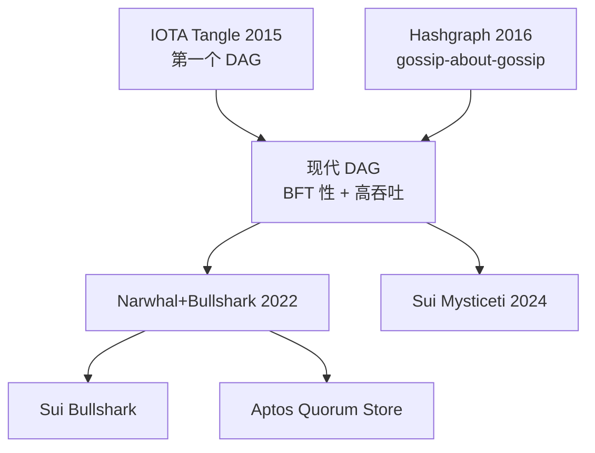

---

## 21. IOTA Tangle：第一个 DAG，也是反面教材

2015 年 David Sønstebø 启动 IOTA，目标是给"物联网（Internet of Things）"做支付——没有手续费、节点轻、可以跑在路灯和冰箱里。技术上他选了 DAG，叫做 Tangle：每笔新交易必须引用 2 笔现有交易作 parent，构成无块、无矿工的有向无环图。理论上你发笔交易就顺手验证了两笔上游，零 fee。

理想很美，现实很糙。2017-2023 这六年里 IOTA 依赖一个中心化的 Coordinator 节点防 fork——所谓"零 fee DAG 共识"其实是个有中央仲裁的系统。零 fee 的代价是 spam 泛滥；IoT 场景从未大规模落地。再叠加 2018 年 MIT 团队曝出 Curl-P 哈希函数有漏洞、IOTA 团队回应又非常糟糕；2020 年 Trinity 钱包种子词被盗损失约 200 万美元——一连串事故让 IOTA 整体信誉受损。Coordicide 升级（2023 起）想用 Mana 声誉积分替代 Coordinator，到 2026-04 仍在迭代。

但 IOTA 的历史价值是真实的：**"DAG 共识能跑"这件事，是 IOTA 第一个证明的**。后续 Hashgraph、Narwhal、Mysticeti 都在它的基础上修补具体缺陷。来源：IOTA Foundation 文档（2026-04-27）。

---

## 22. Hashgraph：Gossip about Gossip + Virtual Voting

Leemon Baird 是密码学博士，2016 年他想到一个怪招：把 BFT 协议里的"投票"这件事彻底消除掉。他叫这个协议 Hashgraph。

具体怎么做？节点两两 gossip 交易时，顺便附带"我刚才和谁 gossip 过"的元信息（hash 自己之前的事件 + hash 对方的事件）。这样每个节点本地就能重建一份完整的 gossip 历史 DAG，然后**本地推演**他人会怎么投票（这叫 virtual voting）——不必发任何实际投票消息。这和 PBFT/HotStuff 的"显式投票 → 聚合 QC"路线完全相反，Hashgraph 把投票内化进通信结构本身了。

aBFT（asynchronous BFT）是它达到的最强等级，已被 Coq 形式化证明。技术上几近完美——但因为算法长期受专利保护到 2030+，开源社区根本没法在它上面做研究，下一节我们会看到这件事的代价。

### 22.2 Gossip about Gossip 流程图

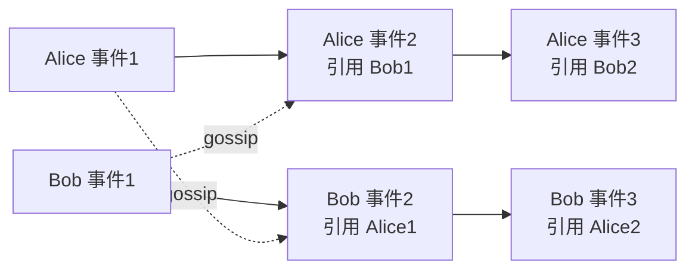

每次 gossip 不只传 tx，还传"我和谁 gossip 过"——这让 DAG 自然形成。

### 22.3 Virtual Voting

DAG 一致后，每个节点本地推演他人投票，不发实际投票消息，省 O(n) 通信。

### 22.4 性能与商业实现 Hedera

Hedera（Hashgraph 的商业实现）2026-04 数据：

- 10,000+ TPS（认证）
- 3 秒最终性
- aBFT（asynchronous BFT，最强等级，被 Coq 形式化证明）
- 39 人理事会治理（Google / IBM / Boeing 等）

来源：Hedera 官方文档，访问 2026-04-27：https://docs.hedera.com/hedera/core-concepts/hashgraph-consensus-algorithms/virtual-voting

### 22.5 工程画像

技术上 Hashgraph 接近完美（aBFT + 形式化证明 + 10k TPS + 3s finality），但生态被两件事压住：①算法长期受专利保护（到 2030+），核心代码 2022 才部分开源；②39 人企业理事会决策（Google/IBM/Boeing 等），去中心化弱。Hashgraph 的命运是个反面教材：好协议没有开源生态等于没有共识研究的下一代。Mysticeti 等开源 DAG 共识跑得更快，是因为整个开源社区都在迭代。来源：Hedera 文档（2026-04-27）。

---

## 23. Narwhal + Bullshark / Tusk

2022 年 EuroSys，George Danezis 等人发了一篇论文叫《Narwhal and Tusk》——独角鲸和象牙。Narwhal 是 mempool 协议（独角鲸的角形象地代表它头上顶着的 DAG），Tusk 是早期的总序协议。这俩名字到处被换：Bullshark（一种鲨鱼）后来取代 Tusk，Mysticeti（须鲸）成了下一代。整个 DAG 共识赛道的命名都跟海洋生物较劲。

Narwhal 把第 20 章那个抽象的"传输/总序解耦"做成了具体协议。每个 validator 持续把收到的 tx 打包成 batch（一个 batch 叫 vertex），引用前一 round 至少 2f+1 个其他 validator 的 batch——所有 vertex 自然形成跨 round 的 DAG。传输这件事一直在跑，共识只在 DAG 上做一遍轻量总序。这套设计直接把吞吐推到了 100k TPS 量级。来源：Danezis et al., "Narwhal and Tusk"（EuroSys 2022）。

### 23.2 Narwhal：把 mempool 做成 DAG

每个 validator 持续把它收到的交易打包成 batch（叫 "vertex"），引用前一 round 至少 2f+1 个其他 validator 的 batch。所有 vertex 形成跨 round 的 DAG。

```
round  1     2     3     4
 V1   v1.1  v2.1  v3.1  v4.1
 V2   v1.2  v2.2  v3.2  v4.2
 V3   v1.3  v2.3  v3.3  v4.3
 V4   v1.4  v2.4  v3.4  v4.4

边：v2.1 引用 v1.1, v1.2, v1.3（≥ 2f+1）
```

### 23.3 Bullshark：在 DAG 上跑 BFT 总序

- 偶数 round 选一个 leader
- 奇数 round 每个 vertex 通过引用结构"自动投票"给上 round 的 leader
- 当一个 leader vertex 在下一 round 收到 f+1 个引用 → commit

投票就是 Narwhal 的 DAG 边，**没有任何额外的 BFT 投票消息**，投票成本被传输层完全摊销。

### 23.4 Bullshark vs Tusk

Tusk 和 Bullshark 都是 Narwhal 之上的总序协议：**Tusk**（2022 早期版本）纯异步，更"完美"但延迟稍高；**Bullshark**（2022 后续优化）使用 partial-sync，延迟更低，是当前主流。

### 23.5 性能数据

Bullshark + Narwhal 在 100 节点广域网下：

- 100,000+ TPS
- < 3s 延迟

来源：Spiegelman et al. 2022 CCS paper "Bullshark: DAG BFT Protocols Made Practical"，arXiv:2201.05677，访问 2026-04-27。

### 23.6 工业落地

- **Sui**：主网 2023 上线 Narwhal+Bullshark，2024-07 升级为 Mysticeti
- **Aptos**：Narwhal 改造为 Quorum Store（仅作 mempool），共识仍由 AptosBFT 跑——保 BFT 可证明性，享 DAG 吞吐红利

### 23.7 后续研究

Narwhal + Bullshark 的关键工程价值是引爆了 DAG 共识研究热潮。下一代改进基本沿同一脉络：Mysticeti（2024，Sui 自研）把延迟压到 <500ms，主要靠 uncertified DAG（24.3 节）；Shoal（2023，Aptos 团队）提高 Bullshark 延迟稳定性；Bullshark 2.0（2024，原作者团队）优化版。

---

## 24. Sui Mysticeti

Sui 团队是从 Diem/Libra 跑出来的那批人——和 Aptos 同根。两个团队同样用 Move 语言，但共识路线选了完全相反的方向：Aptos 留在 HotStuff 单链单 leader，Sui 押注 DAG。2024 年 7 月 Sui 主网上线 Mysticeti（须鲸）共识，把 Narwhal+Bullshark 又推进了一大步。

Mysticeti 的核心改动是一个看起来很激进的决定：**uncertified DAG**。Bullshark 原本要求每个 vertex 先收齐 ≥2f+1 签名才能成为 DAG 节点（这一步贡献了大约一半的延迟），Mysticeti 允许 uncertified vertex 直接入 DAG，等到 commit 时再统一验证 quorum。这把 v1 的 ~390ms 共识延迟进一步压到 v2 的 ~250ms（2025-11），代价是边复杂度上升、实现更复杂。

### 24.1 时间线与性能

- **2023-05**：Sui 主网上线，使用 Narwhal + Bullshark
- **2024-07**：Mysticeti v1 上线 Sui 主网
- **2025-11**：Mysticeti v2 上线，再降 35% 延迟

### 24.2 性能数据

Mysticeti v1（2024-07 数据）：
- consensus 延迟：390ms
- end-to-end settlement：640ms
- 测试网中比前一代降 80% 延迟

Mysticeti v2（2025-11 数据）：
- 进一步降 35% → ~250ms 延迟
- 与共识合并交易验证，减少冗余步骤

来源：Sui blog "Mysticeti v2: Faster and Lighter Sui Transaction Processing"，访问 2026-04-27。

### 24.3 核心创新：uncertified DAG

Bullshark 要求每个 vertex 先收到 ≥ 2f+1 签名才能成为 DAG 节点（贡献 ~50% 延迟）。Mysticeti 允许 uncertified vertex 直接入 DAG，commit 时再统一验证 quorum——延迟显著降低，边复杂度上升。

### 24.4 Mysticeti v2 进一步优化

把交易验证（signature check / state precondition check）合进共识层，减少冗余 round-trip：延迟降 35%（390ms → 250ms），提交块数增 ~20%，稳态 ~50k TPS，峰值 >100k。

### 24.5 工程画像

Sui 主网 2026-04：稳态 ~7000 TPS，峰值 >30k，~110 个 validator，TVL >$1B，从未有 reorg 或 finality stall。Sui 的并行执行是 object-based 声明式：每笔 tx 显式声明读写哪些 object，互不冲突的 tx 直接并行——与 Aptos 的 Block-STM 乐观并行（25.1 节）是对偶选择，前者由用户预申报，后者由运行时检测冲突回滚。这两条路线代表了 Account 模型链突破并行瓶颈的两种工程哲学。

---

## 25. 易混误区：Block-STM、PoH 等"非共识"组件

招聘面试或者技术分享的常见翻车现场：候选人滔滔不绝讲 Solana PoH 多么先进、是 Solana 的"共识算法"——其实 PoH 根本不是共识，是个时间戳服务。这节我们专门把这些混淆点摆在一起，你以后听到"XXX 链的共识是 YYY"时能够先停一下问："YYY 是协议层还是别的什么？"

### 25.1 Block-STM：Aptos 的并行执行引擎

Block-STM 是**执行引擎**，不是共识。共识（AptosBFT v4/Raptr）决定顺序，Block-STM 在 commit 后乐观并行执行：先假设无冲突，检测到冲突则回滚串行重试。让 Aptos 在 Account 模型下拿到 25k+ TPS。

### 25.2 Solana PoH：易混组件

PoH 是时间戳服务（见第 26 章），不是共识。给共识层（Tower BFT）省去事件排序工作。

### 25.3 Sui object DAG vs 共识 DAG

两件不同的事：**对象 DAG** 是状态层的读写依赖；**共识 DAG**（Mysticeti）是消息层的 vertex 引用。属不同抽象层。

### 25.4 易混点速查表

| 名字 | 是共识吗 | 真实角色 |
| --- | --- | --- |
| Aptos Block-STM | ✗ | 并行执行引擎 |
| Solana PoH | ✗ | 时间戳服务 |
| Aptos Quorum Store | ✗ | mempool（学 Narwhal） |
| Sui Mysticeti | ✓ | DAG 共识协议 |
| Polkadot BABE | 部分 | 出块协议（与 GRANDPA 共同构成共识） |
| Polkadot GRANDPA | ✓ | finality gadget |
| Ethereum LMD-GHOST | 部分 | fork choice（与 FFG 共同） |
| Ethereum Casper FFG | ✓ | finality gadget |

---

## 26. Solana：PoH + Tower BFT → Alpenglow

2017 年，前 Qualcomm 工程师 Anatoly Yakovenko 在凌晨喝了几杯咖啡后发了一条推：他想到一个新办法可以把区块链做到 100 万 TPS。这条推后来变成了 Solana 的白皮书，里面提出 PoH（Proof of History）——不是共识，是个加密学时间戳服务。

Solana 的设计选择和前面所有协议都不同：把"排事件顺序"和"共识"拆成两个独立组件。PoH 是全网一致的时间戳服务（不是共识），Tower BFT 是带 lockout 的 PBFT 变体（是共识）。这套架构跑到 2026 年正在被 Alpenglow（Votor + Rotor）替换——Solana 自己也承认 PoH+Tower BFT 跑了 7 年，5 次以上停机暴露了"全局时间作为单点"的结构性脆弱。9 年的押注，到了承认要换发动机的时候。

### 26.2 PoH 是什么

leader 持续跑：

```python
h[0] = some_seed
for i in 1..∞:
    h[i] = SHA256(h[i-1])
    # 每 N 步，把收到的交易 tx 穿插进去：
    if has_pending_tx():
        h[i] = SHA256(h[i-1] || tx)
```

→ 所有 validator 拿到序列后确定地知道每笔交易的相对顺序。PoH 像全网共享的"加密秒表"——验证秒表没倒走，但不决定"哪个分叉合法"（那是 Tower BFT 的职责）。

### 26.3 Tower BFT

PBFT 变体，加了**lockout 机制**：

```
每次投一个分支，对该分支的承诺时间指数加倍
→ 32 次连续投票后，承诺达到最大 lockout
→ 该分支被认为 economically finalized
```

### 26.4 PoH 与 Tower BFT 的协作

PoH 负责"打时间戳 / 排事件顺序"，Tower BFT 负责"决定哪条链合法"。两者分工：

- **PoH**：Leader 持续生成哈希链条，其他节点验证顺序合法性（无需通信）。
- **Tower BFT**：每个 slot 结束后，Validator 对 PoH 记录的区块投票；lockout 机制保证切换分支成本指数增加。
- 合并效果：PoH 节省了 BFT 投票中"排序消息"的通信开销，Tower BFT 提供拜占庭容错安全保证。

### 26.5 当前性能（2026-04）

- 区块时间：~ 400ms
- 平均 TPS（实测）：~ 3000-5000
- 理论 TPS：65,000+
- 终结时间：32 confirmation ≈ 12.8s

### 26.6 历史故障

| 时间 | 事件 | 时长 |
| --- | --- | --- |
| 2021-09 | Grape Protocol IDO，每秒 40 万 TX 涌入 | 17 小时 |
| 2022-04 | NFT bot 滥发交易 | 7 小时 |
| 2022-05 | 共识 bug | 4 小时 |
| 2023-02 | 区块状态恢复慢 | 19 小时（最长） |

教训：PoH 把"时间"当全局变量，全局变量在大规模故障时极难恢复。

### 26.7 Alpenglow：PoH 退役计划

2025 年 Anza 提出 Alpenglow，要用 **Votor + Rotor** 替换 PoH + Tower BFT。

- **Votor**：把 32 轮确认压缩到 1-2 轮；80% stake 在线时单轮 finality ≈ 100ms
- **Rotor**：替换 Turbine 数据广播树为 one-hop broadcast

时间线：
- 2025-09：Solana 治理通过 Alpenglow（98.27% 赞成）
- 2026-Q3：Agave 4.1 发布
- 2026-Q4：安全审计
- 2026 年底：mainnet 激活

来源：CoinDesk 2025-09-03 "Solana Community Approves Alpenglow Upgrade"，访问 2026-04-27。

### 26.8 与 Ethereum 的工程对比

Solana 与 Ethereum 在每个轴上选择都相反，是共识工程取舍的极端样本：

| 维度 | Ethereum | Solana |
| --- | --- | --- |
| 设计目标 | 安全 + 去中心化 | 性能优先 |
| Validator 硬件 | 4 核 16GB | 32+ 核 256GB+ NVMe |
| 节点数 | ~10000+ | ~1500-2000 |
| 区块时间 | 12s | 0.4s |
| 平均 TPS | ~30 | ~4000 |
| 历史停机 | 0 | 5+ 次（最长 19h） |

性能高的代价是恢复成本——PoH 把"时间"做成全局变量，全局变量出错就是全网停机。Alpenglow 替换 PoH 是 Solana 团队对这条结构性教训的承认。

---

## 27. Avalanche Snow 系列：metastable 共识

2018 年一份匿名论文挂上 IPFS——作者署名 "Team Rocket"。论文叫《Snowflake to Avalanche》，提出一种全新的共识思路：每个节点不需要问全网所有人，只随机问 k=20 个邻居就能做决定。后来这个团队浮出水面是康奈尔的 Emin Gün Sirer 和他的学生们，2020 年正式发布 Avalanche 主网。

Snow 系和前面所有 BFT 协议结构上完全不同。PBFT/HotStuff 决定一块时所有 n 节点都参与；Snow 让每个节点只随机抽样 k=20 个邻居，依赖大数定律——这思路像选举民调，调查 1000 人就能预测全国选民。代价是它放弃了 BFT 派"≤1/3 拜占庭即安全"的硬保证，换成 metastable 性质：**"网络绝大多数最终会偏好同一值"**——这是个统计学性质，不是绝对 BFT 保证。这条路线学界至今仍有争议（Bern University 2024 报告）。

### 27.2 协议演进

```
Slush（不容拜占庭，只是个 toy）
   ↓
Snowflake（加 conviction counter）
   ↓
Snowball（加 confidence counter）
   ↓
Snowman（线性链版本，Avalanche C-Chain 用）
   ↓
Avalanche（DAG 版本）
```

### 27.3 核心参数

来源：Avalanche 官方文档 / pkg.go.dev/snowball，访问 2026-04-27：

- **k = 20**：每次随机抽样 20 个邻居
- **AlphaPreference = 15**：15/20 偏好同一答案 → 改变本地偏好
- **AlphaConfidence = 15**：15/20 偏好同一答案 → confidence +1
- **β = 20**：连续 20 轮 confidence 累计 → 决定

### 27.4 Snowball 决策流程图

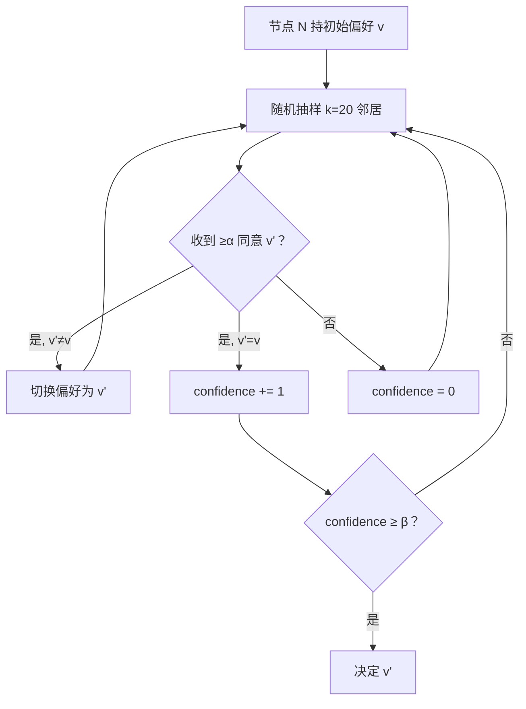

### 27.5 安全模型

抽 20 个邻居的安全性来自概率：攻击者 <20% 节点时，期望拜占庭 <4 个，达不到 α=15 majority。但这条曲线在攻击者份额 ≥50% 时开始失效，70%+ 几乎一定能控制（见习题 8）——所以 Avalanche 的安全边界 ~50%，与 BFT 经典 33% 不同。这点经常被忽视。Avalanche 团队 2024 提的 Frosty 改进加强了 liveness 保证。来源：crypto.unibe.ch/2024/05/21/avalanche.html（2026-04-27）。

### 27.6 Avalanche 真实部署

#### 27.6.1 三链架构

Avalanche 不是单链，而是 X-Chain（资产）+ P-Chain（治理 + staking）+ C-Chain（EVM 兼容）三链。Snowman 共识跑在 P/C-Chain，Avalanche DAG 共识跑在 X-Chain。

#### 27.6.2 数字感（2026-04）

- 验证者数：~ 1300+
- 平均 TPS：~ 50（C-Chain），峰值 4000+（X-Chain）
- 终结性：~ 1.2-2 秒
- TVL：$1B+

### 27.7 工程画像

三链架构（X-Chain 资产 / P-Chain 治理 + staking / C-Chain EVM）对开发者不友好——多数 EVM DApp 直接跑 C-Chain，X/P 链是历史包袱。2024 Subnets/L1 公告把"起子链"做成基础设施级能力，2025 ACP-77 重构 Subnet 经济激励。Snow 系本身仍是 Avalanche 最强的差异化——但形式化证明的争议让它在企业链场景拼不过 Hashgraph 的 aBFT 标签。

---

## 28. Bitcoin Lightning Network：通道而非共识

2015 年 Joseph Poon 和 Thaddeus Dryja 发了一份白皮书《The Bitcoin Lightning Network》。他们要解决的问题是个尴尬现实：你想用 Bitcoin 买一杯 5 美元的咖啡，结果手续费就是 5 美元，咖啡店老板表示拒绝。Bitcoin 7 TPS 的天花板让它根本做不了零售支付。

Lightning 不是共识协议，而是绕开共识的工程方案——把高频小额转账从主链卸载到链下双方共识，只用主链做"开/关通道结算"。这条思路后来被 Ethereum L2（rollup）继承——见模块 07。

### 28.2 直觉：开个储值卡

我们演一遍。假设 Alice 一天给 Bob 转 50 次，每次 0.001 BTC，每次链上手续费 5 美元——一天 250 美元手续费，结果只转了 50 美元价值。这对吗？显然不对。

Lightning 的解法像开一张储值卡：Alice 和 Bob 先共同在链上质押 0.05 BTC 开一个"通道"，然后通道里他俩随便转——链下完成、免 fee。等他俩不想再用了，关通道时把"最终余额"上链——总共只产生 2 笔链上交易（开 + 关）。

### 28.3 HTLC：让转账经过中间节点也安全

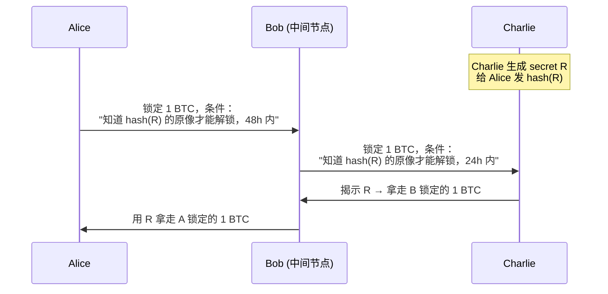

HTLC = Hashed TimeLock Contract。靠**hash 验证 + timelock 退款**保证：

- 要么所有跳都成功（C 拿到钱，B 中转，A 付了钱）
- 要么所有跳都退款

### 28.4 当前规模（2026-04）

- 节点数：~ 14,940（峰值 2022-01 是 20,700）
- 通道数：~ 48,678
- 总容量：5,637 BTC（2025-12 新高）
- 月交易量：$1.17B / 5.22M 笔（2025-11）

来源：Bitcoin Visuals / 1ML statistics，访问 2026-04-27。

### 28.5 工程画像与遗产

Lightning 是 L2 思路的鼻祖：链下计算 + 链上结算 + 加密学保证（hashlock + timelock），同样的三件套后来被 Ethereum Optimistic Rollup 替换为"链下 EVM + 周期 batch upload + fraud proof"。两条路线的核心差异在"链下结算"的可信化方式：Lightning 用 hashlock 保证两两通道，rollup 用经济信任 + 数学证明做开放结算。

两条结构性局限：①路由 NP-hard——A→C 间不一定直连，每跳要有足够 inbound liquidity；②Watchtower 问题——离线时对方可能提交旧状态作弊，watchtower 服务监控引入新信任假设。

19 个协议走完，下一章把散落的术语集中辨析：confirmation/finality/liveness/safety/ordering 在不同协议文档含义微妙不同。

---

## 29. 概念辨析专章

工程师踩坑最常见的来源不是不懂技术，是文档把术语混用。"我们的链有 finality"——什么 finality？probabilistic、economic、还是 absolute？这三个落到生产环境差几个数量级的风险敞口。

DDIA 第 9 章在讨论 consensus 时反复强调一句话：每个保证都要追问"在什么模型下、需要什么前提"。区块链共识协议文档经常把 confirmation / finality / safety / liveness 混用——本章把这些术语集中起来辨析。读完这一节回头看任何一篇白皮书，你看到 "instant finality" 应该会先停一下问："哪种 finality？"

### 29.1 四种最终性

| 维度 | confirmation | probabilistic | economic | absolute |
| --- | --- | --- | --- | --- |
| 含义 | "块被埋多深" | 越深越难逆转，但永不为 0 | 逆转需可量化经济代价 | 协议层保证不可逆 |
| 例子 | Bitcoin 6 conf | Bitcoin 任意深度 | Ethereum 2 epoch | Tendermint 单块 |
| 工程代价 | — | 等够深（PoW 链） | 看 stake 总量（PoS 链） | 分区时停链 |

PoW 链的概率最终性遵循中本聪公式 P(逆转 z 块) = (q/p)^z（q<p），交易所通常等到 P<0.001% 才入账——Bitcoin q=0.1 时 6 conf P≈0.024% 是这条阈值的来源。Ethereum 经济最终性的具体数字：回滚 finalized 块至少需 1/3 stake 被 slash ≈ 10M+ ETH，是博弈论而非数学保证。Tendermint/Algorand/GRANDPA 的 absolute finality 是协议层硬约束，代价是分区时停链。

### 29.2 Safety vs Liveness

Safety = 永不出错（不会两块在同高度都 finalized）；Liveness = 永远在进步（链一直出块）。FAB 的标准定义。两者不能同时百分百保证（FLP），所有协议都在分区时做取舍：

| 协议 | 网络分区时 | 选了什么 |
| --- | --- | --- |
| Bitcoin / Nakamoto | 双方都继续出块，后续重组 | Liveness（safety 概率） |
| Tendermint / Cosmos | 链停 | Safety |
| Ethereum Gasper | LMD-GHOST 继续出块，FFG 不 finalize | 双层分别选择 |
| Avalanche Snow | metastable，可能两边都不收敛 | 概率 safety + 概率 liveness |

Gasper 把 safety 和 liveness 拆到两层做不同选择，是它被低估的工程价值——下一代链（Polkadot / Solana Alpenglow）都在抄这条路。

### 29.3 Ordering ≠ Consensus

DDIA 把这两件事画得很清楚：ordering 是给一组 tx 排次序，consensus 是在多个候选 history 中选一个。链共识把两件事耦合，DAG 共识（第 23 章）把它们解耦。Solana 也是解耦的（PoH 做 ordering，Tower BFT 做 consensus），但路线不同——PoH 是单 leader 时间戳，Narwhal 是多 validator 并行 mempool。

### 29.4 状态模型：SMR / UTXO / Account

| 模型 | 状态形式 | 并行度 | 智能合约 | 代表 |
| --- | --- | --- | --- | --- |
| SMR | 任意状态 + transition function | 取决于 function | 高 | Tendermint apps |
| UTXO | 不可变输出集合 | 高（独立 UTXO 并行） | 低（图灵不完备） | Bitcoin / Cardano eUTXO |
| Account | 全局地址 → 余额 + 存储 | 低（同账户串行） | 高 | Ethereum / Solana / Aptos |

Aptos Block-STM 是个有趣的妥协：Account 模型 + 乐观并行 + 冲突回滚重排，拿到 ~25k TPS 而不丢智能合约友好性。Sui object-based 是另一极：让用户预申报读写 object，运行时直接并行——把冲突检测前置到 tx 提交时。

### 29.5 Permissioned vs Permissionless

| | permissioned | permissionless |
|---|---|---|
| 例子 | Hyperledger Fabric / Hedera | Bitcoin / Ethereum / Cosmos |
| 优点 | 性能高，监管友好 | 抗审查 |
| 缺点 | 去中心化弱 | 性能受限 |

---

## 30. 事故复盘之 2010-08 Bitcoin 通胀 bug

2010 年 8 月 15 日上午 9:09 UTC，块 74638 上链——里面有一笔交易凭空铸出了两笔各 9 亿 2233 万 BTC，远远超过整个网络永远会发行的 2100 万总量。Bitcoin 历史上唯一一次协议级 reorg 就此开始。攻击者是谁？至今无人知道。

代码上的 bug 简单到让人崩溃：`CTransaction::CheckTransaction` 对 output value 求和时漏检了溢出。

```cpp
int64_t sum = 0;
for (const auto& out : outputs) sum += out.value;  // 没检查溢出
```

时间线极度紧张。0809 UTC 攻击块上链；0820 UTC 中本聪本人在 Bitcointalk 发出警报，全网开发者集结；0900 UTC 修复 patch v0.3.10 发布；1330 UTC 社区协调好后做了一次 53 块的 reorg，把那条带 bug 的链丢掉。整起事故 5 小时 21 分。这是中本聪本人最后一次在 Bitcointalk 大量公开露面之一，几个月后他逐渐隐退。

整数溢出是数字货币经典 bug。这次事故之后 Bitcoin 所有 amount check 都加上了溢出验证；Ethereum/Solidity 强制 SafeMath（后来 0.8 内置溢出检查）是同根同源的反应。这次事故也是中本聪此后极度保守对待 codebase 的来源——他给后来所有维护者立下的规矩是：协议层稳，实现层脆弱。这条规律对所有共识协议通用。

---

## 31. 事故复盘之 2020-08 ETC 三连 51%

2020 年 8 月那一个月，Ethereum Classic 被 51% 攻击了三次——8 月 1 日、8 月 6 日、8 月 29 日。每一次套路一模一样：攻击者在交易所充值 ETC，等链上确认后立刻提现 USDT/BTC，再广播秘密挖好的更长私链替换公链——自己充进去的 ETC 又回到自己钱包。三次累计损失约 1500 万美元，攻击成本一共大概 60 万美元。

详细时间线和经济账已经在第 7 章给过。本节我们只补充复盘维度的两个观察点：

①**根因结构性**：ETC 与 ETH 共用 Ethash，2020 年 ETC 算力仅占 Ethash 全网 ~5%——攻击者付几十万美元就够 51%。这不是实现 bug，是"算法兼容大币种 + 公共算力市场"的结构性脆弱。

②**应对反讽**：2020-11 Thanos 升级把 Ethash epoch 翻倍 → ETChash 与 ETH 矿机解耦；2022-09 ETH 转 PoS 后 Ethash 矿机失业反而部分流入 ETC，算力翻倍。结构性安全的恢复来自 ETH 的协议变迁，而不是 ETC 自己的努力——共识协议安全有时由生态而非协议决定。

---

## 32. 事故复盘之 2021-2023 Solana 多次停机

2021 年 9 月 14 日下午，Solana 上线刚一年多，Grape Protocol 做 IDO——每秒 40 万笔交易瞬间涌入 mempool。leader 节点处理不过来，PoH tick 速率掉下去，全网失步。整个网络瘫了 17 个小时。这只是开始。后来两年里 Solana 又停了 5 次，最长一次 19 小时。每一次社区都得问同一个问题：你们到底解决问题了没？

| 时间 | 时长 | 触发 |
| --- | --- | --- |
| 2021-09 | 17h | Grape Protocol IDO，40 万 TX/s 涌入 |
| 2022-01 | 4h | 共识 bug |
| 2022-04 | 7h | NFT bot 滥发交易 |
| 2022-05 | 4h | 共识 bug |
| 2022-06 | 4h | 状态机问题 |
| 2023-02 | **19h** | 区块状态恢复慢 |

共同模式：mempool flooding（NFT mint / IDO 4-40 万 TX/s）→ leader 处理不过来 → PoH tick 速率掉 → 全网失步 → validator 重启必须协调同一 snapshot 高度，全局协调慢。这是"全局时间作为单点"的代价——Ethereum 各 validator 可独立恢复，Solana 必须全网同步。

应对：QUIC 替 UDP（2022-Q4）、Stake-weighted QoS（2023）、Firedancer（2023+ 第二客户端）、Alpenglow（2026 替换 PoH+Tower BFT）。前三项是补丁，第四项是结构性承认——Solana 团队 7 年后接受 PoH 这条路走到了头。

---

## 33. 事故复盘之 2022-05 Beacon Chain 7-block reorg

2022 年 5 月 25 日，slot 3,887,075。Beacon Chain（以太坊 PoS 共识链，The Merge 之前已经独立运行 1 年半）发生了一次 7-block reorg——这在生产 PoS 链里相当罕见，整个 Ethereum 研究圈 Twitter 上炸开锅。Barnabé Monnot 后来写了一份精彩的可视化复盘（见第 42 章参考），把这次事故的每一个 slot 都画出来。

根因是三件事合流：proposer 出块迟到 ~4 秒、proposer boost 在客户端滚动升级时配置不一致、部分客户端 fork-choice 有 bug。三因合流导致 7 个 slot 内链分叉、7 个块被 reorg。但你注意——FFG finality 全程未受影响。这正是 Gasper 双层设计（29.2 节）的现实验证：fork-choice 出错的时候，finality gadget 还在保 safety。

应对：post-Merge 所有 fork-choice 修改必须打包进硬分叉，所有客户端同时切换。"软分叉式 fork-choice 修改"成为禁区。详细复盘见 `exercises/03_reorg_postmortem.md`。

---

## 34. 事故复盘之 2023-04 Ethereum finality stall

2023 年 4 月，Ethereum 主网两次 finality 暂停（每次约 25 秒）。听起来不严重——没有 reorg、没有资金损失。但这是个非常危险的信号。

根因：Prysm 客户端当时占了 40% 的 stake，它的一个 bug 导致 attestation 延迟超过截止线，于是 FFG 凑不齐 2/3 票，链就 finalize 不下去。25 秒内一切瘫痪。25 秒不长——但 Prysm 占 stake 多 1 个百分点的话，这就是个会持续到 inactivity leak 触发的灾难。

事后客户端多样性运动推动 Prysm 降到 30%、Lighthouse 升至 40%。规律：单一客户端 stake >33% = 系统性风险——这是 BFT 容错下界（1.1 节 3f+1）的另一种表现，对所有 PoS/BFT 链通用。客户端多样性不只是去中心化口号，是 finality 的硬保险。

---

## 35. 事故复盘之 2022 Tornado Cash 与 OFAC 制裁

2022 年 8 月 8 日，美国财政部 OFAC 把 Tornado Cash 这个混币器合约的地址直接列入 SDN 制裁名单——不是制裁哪家公司，是制裁一段开源代码。一周后开发者 Alexey Pertsev 在荷兰被捕。整个 Web3 行业第一次直面一个赤裸的事实：**协议不可审查这件事，社会层会有人来打破它**。

技术上这不是故障——节点都在跑，块都在出，没有 reorg。但部分美国 validator 和 builder 开始主动拒绝包含 Tornado Cash 相关交易。制裁后 ~30 天，符合 OFAC 要求的块占了 60%，高峰期到过 80%+（mevwatch.info，2026-04）。Lamport 1982 年讨论的 BFT 模型里没有"政府"这个角色——这是经典共识理论的盲区。

协议层的应对是 Inclusion List（EIP-7547，2024 年提出）：proposer 强制要求"必须包含某些交易"，builder 即使不愿意也得包。这条路线把"抗审查"这件事从社会层 reapproach 到协议层。同样的压力 Bitcoin 矿池在美国也可能遇到；Solana validator 集中度更高，风险也更高；Cosmos 各链独立运行，反而分散了这种风险。

这一事件改变了 Ethereum 的路线图——从"只解决技术问题"切到"承认社会层威胁也要被协议层回应"。第 1 章讨论 FLP/CAP 时网络模型不包含监管模型，这是经典共识理论的盲区。本册第 44 章（机制设计）、第 46 章（ePBS）都是在这个盲区里展开的工作。

---

## 36. 实战一：从零写最小 PoW 链

到这里你看了 35 章理论。现在停一下，关掉这个 PDF，自己从零写一条 200 行的 PoW 链。理论看再多，不动手永远是第二手知识。我们用 Python，因为它读起来近乎伪代码，你能把注意力留给共识本身而不是语言细节。

### 36.1 设计目标

< 200 行，覆盖：区块、链、PoW、难度调整、最重链规则。不写：UTXO / 签名 / Merkle 树（这些见模块 01 / 03）。

### 36.2 区块结构

```python
@dataclass
class Block:
    height: int                  # 区块高度，方便人看；不参与共识规则
    prev_hash: str               # 上一区块哈希——这就是"链"的来源
    merkle: str                  # 交易树根
    timestamp: float             # 出块时间；难度调整要用
    difficulty_bits: int         # 难度：要求哈希前导 0 的 bit 数
    nonce: int                   # 矿工反复改的"幸运数字"
    txs: list[str]               # body：教学化的字符串交易
```

header 字段固定就这几个，是因为 PoW 哈希难题哈的是 header，不是整个 block——所以 header 必须紧凑。

### 36.3 难度判定

```python
def meets_difficulty(h_hex: str, bits: int) -> bool:
    """前 bits 个 bit 必须为 0。"""
    h_int = int(h_hex, 16)
    return h_int < (1 << (256 - bits))
```

### 36.4 挖矿循环

```python
def mine(self, txs: list[str], max_nonce: int = 1 << 32) -> Block:
    prev = self.tip
    bits = self.next_difficulty()
    blk = Block(...)
    for nonce in range(max_nonce):
        blk.nonce = nonce
        if meets_difficulty(blk.hash(), bits):
            return blk
    raise RuntimeError("max_nonce 用尽")
```

除了暴力试，没有更聪明的办法——SHA-256 抗预映像，无法反推。这就是"Proof of Work"。

### 36.5 最重链规则

```python
def cumulative_work(self) -> int:
    return sum(1 << b.difficulty_bits for b in self.blocks)
```

用 `cumulative_work` 而非 `len(blocks)`——否则攻击者可用低难度块伪造更长的链。

### 36.6 跑起来

```bash
cd code/
python3 pow_chain.py            # 自检
python3 pow_chain.py demo 5     # 挖 5 个块
```

预期输出：

```
[genesis] hash=5b1b438b... bits=16
[block 1] hash=00007dd4... bits=16 nonce=111643 took=0.28s
[block 2] hash=0000a7b7... bits=16 nonce=18562 took=0.05s
...
```

完整代码（含逐行注释）见 `code/pow_chain.py`。

---

## 37. 实战二：4 节点 PBFT 模拟

PoW 写完了你应该感觉良好——但那是单 leader、单链、概率最终性。现在换条路：BFT。我们用 4 节点演 PBFT，让你亲眼看到 view-change 是怎么触发的。这条 demo 跑起来会让你对第 17 章的三阶段有一种"原来如此"的感觉，比再读一遍论文管用十倍。

### 37.1 设计目标

n=4, f=1 的最小 BFT。演示正常路径 + 拜占庭主节点 + view-change。不模拟：真异步、消息丢失（这些是教学简化）。

### 37.2 节点数据结构

```python
@dataclass
class Node:
    nid: int                    # node id
    n: int                      # 总节点数
    f: int                      # 容错门限
    view: int = 0               # 当前视图
    seq: int = 0                # 主节点用来分配序号
    log: list[str]              # 已 commit 的请求列表
    prepares: dict              # 收到的 PREPARE 集合
    commits: dict               # 收到的 COMMIT 集合
    vc_votes: dict              # 视图切换投票
    byzantine: bool = False     # 是否拜占庭主节点（仅演示用）

    def quorum(self) -> int:
        return 2 * self.f + 1   # n=4 → 3
```

### 37.3 三阶段流程

```python
elif m.kind == "PRE_PREPARE":
    if not node.is_primary():
        # 备份节点收到主节点提议 → 广播 PREPARE
        self.broadcast(Msg("PREPARE", m.view, m.seq, m.digest, node.nid))

elif m.kind == "PREPARE":
    node.prepares[key].add(m.sender)
    if len(node.prepares[key]) >= node.quorum():
        # 收齐 2f+1 → 进入 COMMIT 阶段
        self.broadcast(Msg("COMMIT", m.view, m.seq, m.digest, node.nid))

elif m.kind == "COMMIT":
    node.commits[key].add(m.sender)
    if len(node.commits[key]) >= node.quorum():
        # 收齐 2f+1 → 本地 apply
        node.committed.add(key)
        node.log.append(m.digest)
```

### 37.4 跑起来

```bash
python3 pbft_sim.py             # 正常路径
python3 pbft_sim.py byzantine   # 主节点拜占庭 → view-change
```

正常路径输出：

```
== 正常路径：4 节点，主节点 = N0 ==
  请求 'req:set x=0' -> 已交付节点： [0, 1, 2, 3]
  请求 'req:set x=1' -> 已交付节点： [0, 1, 2, 3]
  请求 'req:set x=2' -> 已交付节点： [0, 1, 2, 3]
```

拜占庭路径输出：

```
== 拜占庭主节点：N0 不发 PRE_PREPARE -> 触发视图切换 ==
  视图切换前已 delivered: []
  各节点视图: [1, 1, 1, 1]
  请求 'req:set y=42' -> 已交付节点： [0, 1, 2, 3]
```

完整代码见 `code/pbft_sim.py`。

---

## 38. 实战三：CometBFT 4 验证者本地测试网

37 章那个 PBFT 是教学玩具——现在我们玩点真的。CometBFT 是 Cosmos 全生态在跑的共识引擎，背后有 Osmosis、Celestia、dYdX v4 在用它支撑数十亿美元资产。你接下来 30 分钟会在自己电脑上启 4 个 validator，亲手把其中一个杀掉，看链能不能继续；再杀一个，看链怎么停下来。

### 38.1 安装（pin v0.38.12）

```bash
# macOS
brew install cometbft

# 通用 Go 安装
go install github.com/cometbft/cometbft/cmd/cometbft@v0.38.12
cometbft version  # 应输出 0.38.12
```

选用 v0.38 而非 v1.0：v1.0 在 2025-02 发布（v1.0.1），引入 PBTS（Proposer-Based Timestamps）等新特性，但 Cosmos SDK 多数链仍在 v0.38 上，教学用 v0.38 更稳定。

### 38.2 一键脚本

`code/cometbft_testnet.sh` 帮你完成所有事：

```bash
bash code/cometbft_testnet.sh init    # 生成 4 节点配置
bash code/cometbft_testnet.sh start   # tmux 4 窗口起 4 个 validator
bash code/cometbft_testnet.sh status  # 查 4 节点高度
bash code/cometbft_testnet.sh tx "alice=1"   # 发交易
bash code/cometbft_testnet.sh stop    # 停掉
```

启动后预期看到：

```
node0 height=12
node1 height=12
node2 height=12
node3 height=12
```

四节点高度同步说明 BFT 在工作。

### 38.3 故意制造故障

```bash
# 杀掉 1 个节点（n=4, f=1 应该还能跑）
tmux send-keys -t comet:n3 C-c
# 观察：链应继续推进（剩下 3 个 ≥ 2f+1=3）
bash code/cometbft_testnet.sh status

# 再杀 1 个（剩 2 个，凑不齐 quorum）
tmux send-keys -t comet:n2 C-c
# 观察：链停止出块
```

BFT 协议的 n ≥ 3f+1 不是抽象数字，是工程的 hard requirement。

### 38.4 教学要点

1. n=3f+1 是真实工程硬约束
2. quorum=2f+1 是 liveness 最低要求
3. 崩溃恢复后 safety 不破坏（已 commit 的块不消失）

---

## 39. 习题（含解答）

到这里全册理论 + 实战都给完了。习题不是为了考你——是为了帮你把"看过"和"会用"之间那道沟填上。第 39.4 习题写一个蒙特卡洛模拟 51% 攻击的脚本，做完你会对中本聪那个公式有完全不同的理解。第 39.7 给三个真实的产品场景让你选共识——这才是工程师每天面对的问题。建议：每题先合上书自己想 5 分钟，再看答案对照差距。


### 39.1 习题 1：双花概率

**题目**：Alice 算力 q=0.25，Bob 等 6 confirmation。Alice 攻击成功概率？

**解**：代入中本聪公式 λ = z·q/p = 6×0.25/0.75 = 2.0：

```
P_attack ≈ 1 − Σ_{k=0..6} P(λ^k·e^{-λ}/k!) × (1−(q/p)^(6-k))
       ≈ 0.0024 = 0.24%
```

**含义**：q=0.25 时 6 conf 是商家可接受的；如果 q=0.40，同样 6 conf 下 P 约 35%，应等更多。

### 39.2 习题 2：BFT 节点数

**题目**：联盟链要容忍 2 个拜占庭 + 1 个崩溃。需要多少节点？

**解**：

PBFT 类协议：crash 是拜占庭的特例 → f = 3 → n ≥ 10。

某些协议（如 SMaRt）把 crash 单独算 → n ≥ 3·2 + 1 + 1 = 8。先确认协议怎么定义 f。

### 39.3 习题 3：finality 与确认（产品设计）

**题目**：交易所充值业务，给两类用户推荐确认深度并解释。

- 用户 A：散户 < 1000 USDT，要 5 min 内到账
- 用户 B：机构 > 100 万 USDT，可以等

**解**：

- 用户 A：等 12 slot ≈ 2.4 min。理由：5 min 内不能等 finality；12 slot 内 reorg 历史 < 0.001%；金额低，期望损失 < 0.01 USDT 可接受。
- 用户 B：等 2 epoch finality + 2 epoch buffer ≈ 25 min。理由：机构合规要求 black swan 风险接近 0；finalized 块协议层保证不可逆。

### 39.4 习题 4：51% 攻击模拟

**题目**：写蒙特卡洛模拟 q=0.4, z=3 的攻击成功率。

**解**：见 `exercises/01_51pct_attack.py`。运行结果：

```
alpha=0.4  成功率=18.40%  中位追上轮数=14.0
```

公式预测约 18%——匹配。

### 39.5 习题 5：view-change 阅读

**题目**：让 N0 给 N1/N2 发 digest=A，给 N3 发 digest=B。会发生什么？

**解**：N1/N2 互发 PREPARE(A)，凑齐 2f+1=3 commit A。N3 只收 1 个 PREPARE(B)，永远卡住。N3 应通过 sync 机制追到 A——但我们的简化模型不实现，只能靠外部触发 view-change。

### 39.6 习题 6：finality 反推参与率

**题目**：beaconcha.in 上 finality 时间是 25.6 min（4 epoch）。粗估当前参与率。

**解**：见 `exercises/02_eth_finality_calc.py`。25.6 min = 4 epoch = 正常 2 + leak 2。
反推 p / (p + (1-p)·(1-0.005)²) ≥ 2/3 → p ≈ 0.665——正好低于 2/3。

### 39.7 习题 7：选共识（系统设计）

**题目**：你为以下场景选共识，写理由：

1. 一个金融结算清算链，参与方 50 家银行
2. 一个全球 NFT 链，要 100k+ TPS
3. 一个跨境支付通道，对延迟极敏感

**参考答案**：

1. CometBFT / HotStuff 类（permissioned PoS）。理由：50 家银行规模，BFT 通信成本可承受；finality 即时；监管友好。
2. Sui Mysticeti 或 Aptos Raptr。理由：DAG 共识 100k+ TPS，sub-second 延迟。
3. Lightning + Bitcoin。理由：通道网络，最低延迟。备选：Solana（Alpenglow 后 150ms finality）。

### 39.8 习题 8：Avalanche 参数推导

**题目**：Avalanche 默认 k=20, α=15, β=20。如果攻击者控制 30% 节点，安全吗？

**解**：

抽 20 个，期望拜占庭数 = 6。要让攻击者操控结果需要 ≥ α=15 个 → 远超 6 → 概率极低。

但如果攻击者 ≥ 50% 节点（k=20 中期望 ≥ 10），开始有可能；超过 70% 几乎一定能控制。

→ **Avalanche 安全性边界约 50%（与 BFT 经典 33% 不同）**。这点经常被忽视。来源：Bern University 2024 分析。

---

## 40. AI 影响：哪里能用，哪里不能用

每隔几个月就有人来问："能不能让 AI 自动设计共识协议？"短答：不能。长答见本节。

AI 在共识层的角色是助教，不是主作者。能用的场景集中在"把工程师注意力收到正确窗口"——mempool 监控（bloXroute / Blocknative）、MEV 分类（Flashbots Inspect / EigenPhi）、共识异常告警（Beaconcha.in / Rated）、故障复盘日志检索、安全审计的模式匹配（Forta）。这些场景的最终判断仍由人做。

不能用的是共识协议设计本身。三条结构性禁区：①共识出错爆破半径是全网，LLM 出错只影响一次会话；②形式化证明 LLM 做不到（Tendermint 用 Coq，HotStuff 用 TLA+）；③参数 trade-off 涉及社会维度（客户端多样性、治理流程），训练数据覆盖不到。工程师能切的方向是链下分析（mempool ML / MEV 量化）、节点运维预测、EIP 与代码 diff 对齐——不是自动生成共识协议、不是自适应调整核心参数、不是自动 fork resolution。

---

## 42. 延伸阅读（pin 版本 / 链接附 2026-04-27 访问日期）

读到这里如果你想再往下深挖，下面是路线。我们把材料按优先级排：5 篇必读论文是地基，没有它们后面任何讨论都站不稳；推荐 8 篇是各派的代表作；在线资源是工程师每周要回去查的；参考实现是你看共识细节时绕不过的代码。建议从必读那 5 篇开始，每篇精读 2 小时。

### 42.1 论文（必读 5 篇）

1. Nakamoto, S. (2008). *Bitcoin: A Peer-to-Peer Electronic Cash System*. https://bitcoin.org/bitcoin.pdf
2. Castro, M., Liskov, B. (1999). *Practical Byzantine Fault Tolerance*. OSDI 1999. https://pmg.csail.mit.edu/papers/osdi99.pdf
3. Yin, M. et al. (2019). *HotStuff: BFT Consensus with Linearity and Responsiveness*. PODC 2019. https://arxiv.org/abs/1803.05069
4. Buterin, V., Griffith, V. (2017, rev. 2019). *Casper the Friendly Finality Gadget*. arXiv:1710.09437. https://arxiv.org/abs/1710.09437
5. Spiegelman, A. et al. (2022). *Bullshark: DAG BFT Protocols Made Practical*. CCS 2022. https://arxiv.org/abs/2201.05677

### 42.2 论文（推荐 8 篇）

6. Buchman, E., Kwon, J., Milosevic, Z. (2018). *The latest gossip on BFT consensus*. arXiv:1807.04938.
7. Buterin, V. et al. (2020). *Combining GHOST and Casper*. arXiv:2003.03052.
8. Kiayias, A. et al. (2017). *Ouroboros: A Provably Secure Proof-of-Stake Blockchain Protocol*. CRYPTO 2017.
9. David, B. et al. (2018). *Ouroboros Praos*. EUROCRYPT 2018.
10. Gilad, Y. et al. (2017). *Algorand: Scaling Byzantine Agreements*. SOSP 2017. https://people.csail.mit.edu/nickolai/papers/gilad-algorand.pdf
11. Rocket, T. (2018). *Snowflake to Avalanche*. https://arxiv.org/pdf/1906.08936
12. Baird, L. (2016). *The Swirlds Hashgraph Consensus Algorithm*.
13. Fischer, M., Lynch, N., Paterson, M. (1985). *Impossibility of Distributed Consensus*. JACM 32(2).

### 42.3 教材级在线资源

- *Upgrading Ethereum* (eth2book) by Ben Edgington — https://eth2book.info/
- Ethereum.org Consensus docs — https://ethereum.org/developers/docs/consensus-mechanisms/pos/
- Anza Agave validator docs — https://docs.anza.xyz/
- CometBFT docs v0.38 — https://docs.cometbft.com/v0.38/
- Aptos validator docs — https://aptos.dev/network/glossary
- Sui Mysticeti blog — https://blog.sui.io/mysticeti-consensus-reduce-latency/
- Avalanche Builder Hub — https://docs.avax.network/learn/avalanche-consensus
- Cardano Developer Portal — https://developers.cardano.org/

### 42.4 工程参考实现（pin commit / version）

- bitcoin-core/bitcoin@v27.0
- ethereum/consensus-specs@v1.5.0-alpha.10
- cometbft/cometbft@v0.38.12（v1.0.1 已发布但生态多在 v0.38）
- aptos-labs/aptos-core@aptos-node-v1.21.0
- MystenLabs/sui@mainnet-v1.40.1
- anza-xyz/agave@v2.0.18
- IntersectMBO/ouroboros-network

### 42.5 案例 / 复盘文章

- Barnabé Monnot. *Visualising the 7-block reorg*. 2022-05. https://barnabe.substack.com/p/pos-ethereum-reorg
- CoinDesk. *Ethereum Classic Suffers 51% Attacks*. 2020-08.
- Sui Network. *Mysticeti v2: Faster and Lighter*. 2025-11. https://blog.sui.io/mysticeti-v2-sui-consensus/
- Aptos Foundation. *Baby Raptr Is Here*. 2025-06.
- CoinDesk. *Solana Community Approves Alpenglow Upgrade*. 2025-09-03.
- Cardano. *Ouroboros Genesis Design Update*. 2024-05-08.
- IOG. *Ouroboros Peras: the next step*. 2024-10-14.

### 42.6 经典书籍

- Cachin, C., Guerraoui, R., Rodrigues, L. (2011). *Introduction to Reliable and Secure Distributed Programming*. Springer.
- Lynch, N. (1996). *Distributed Algorithms*. Morgan Kaufmann.
- Antonopoulos, A.M., Wood, G. (2018). *Mastering Ethereum*. O'Reilly.

---

## 43. 前沿主题导引

前 42 章是"协议现在长什么样"。本节往后我们看的是"协议要往哪里走"——MEV 经济、ePBS、SSF、VDF、Restaking、状态/历史过期、Bitcoin Covenants 都在主网升级路线图上排队，但尚未沉淀进经典教科书。

这部分有点像追剧：每个主题都还在更新，我们能给你的是一份截至 2026-04 的快照 + 阅读路径。每章独立可读，与前 42 章交叉引用最多的是第 9 章（Gasper）、第 33 章（reorg）、第 34 章（finality stall）。

---

## 44. 共识中的机制设计与 cryptoeconomics

2007 年诺贝尔经济学奖颁给了 Hurwicz、Maskin、Myerson 三人，理由是机制设计理论——核心问题是"怎么设计游戏规则，让追求利益最大化的玩家恰好做出我们想要的行为"。共识协议本质上就是这种规则，只是把它从经济学搬到了代码里。

区块链场景下这件事比传统机制设计难三层：参与者完全自利且匿名、随时进出（不像选举那样人是固定的）、设计错误意味着协议断崖崩溃而非缓慢退化。设计一个分红条款错了，公司会损失几百万；设计一个共识机制错了，整条链立刻完蛋。

**Incentive compatibility**：诚实行为即最优策略。PoW 矿工跟最重链是最优（否则自己块作废）；PoS validator 诚实在线投票是最优（双签 → slash，不投 → inactivity leak）。MEV 是这套思路的 emergent failure——Ethereum 设计共识时没把"proposer 对 mempool 的独裁排序权"当成机制变量，结果排序权自己长出市场价值。第 45 章展开。

Cryptoeconomics 的三块基石：①公开可验证（规则 = 代码 + 链上数据）；②可量化攻击成本（PoW = 算力成本，PoS = slash 成本）；③incentive compatibility。Token-based voting 不是民主——token 可被买、借、合约控制——所以 Vitalik 2025-09 提出 on-chain 治理分两层：execution 层（验证/提议，可用市场机制）和 value judgment 层（协议升级/应急救援，不能纯 token 投票）。替代方案：proof of personhood、quadratic voting、futarchy。

设计 web3 协议时五个必问：①谁参与，动机是什么？②谁出钱，出钱方有否决权吗？③作恶的最便宜方式是什么？④作恶代价是否 ≥ 攻击收益？⑤完全自利假设下能否收敛到诚实？最后一项不成立则机制设计失败。来源：bitcoinworld.co.in 2025-09（2026-04-27）。

---

## 45. MEV-Boost 经济学

2019 年研究员 Phil Daian 等人发了一篇论文《Flash Boys 2.0》——名字致敬 Michael Lewis 那本写华尔街高频交易的《Flash Boys》。文章里第一次量化了一个新名词 MEV：Miner Extractable Value，矿工因为对交易顺序的独裁排序权而能榨取的额外收益。这件事在 PoW 时代是个学术现象，到了 PoS 时代——M 从 Miner 改成 Maximal——成了一门 90 亿美元的生意。

我们演一遍它怎么发生的。设想 Bob 在 Uniswap 上要花 100 万美元买 ETH，这单一旦执行价格会被推高 2%。Alice 监控 mempool 看到这单还没上链，她做三件事：①抢在 Bob 之前买 ETH（frontrun）；②等 Bob 的单执行把价格推高；③立刻卖掉自己的 ETH 套现差价。Alice 啥风险没担，凭"先看见交易"赚走 2%。这叫 sandwich attack。

三种典型策略：①Frontrunning，看到 Bob mempool 大单买 ETH，抢在前面买、待 Bob 推高价格后卖出；②Sandwich，抢跑 + 反向收割（上面那个例子）；③Back-running，Bob 推高某 DEX 价格后，Alice 立即跨池套利。三种策略都依赖 proposer 能完全控制 tx 顺序——这就是 MEV 的物理来源。

### 45.3 PBS：把 MEV 制度化

**PBS（Proposer-Builder Separation）**：proposer 不自己排序，把出块权拍卖给 builder，谁出价最高用谁的块。

#### 45.3.1 三方角色

```
Searcher（搜索者）：编写 MEV 策略，打包成 bundle
   ↓ 出价 + bundle
Builder（构建者）：从 mempool + searcher bundle 选最优交易组合
   ↓ 整块 + bid
Relay（中继）：从 builder 收 bid，转发给 proposer
   ↓ 头部 + bid
Proposer（提议者，即 validator）：选最高 bid → 签头部 → block 上链
```

#### 45.3.2 信息流图

```mermaid
sequenceDiagram
    participant S as Searcher
    participant B as Builder
    participant R as Relay
    participant P as Proposer
    S->>B: bundle + tip
    B->>R: 整块 + bid
    R->>P: 仅头部 + bid（隐藏正文防 MEV 偷）
    P->>R: 签头部
    R->>P: 释放正文
    P->>P: 广播完整块
```

### 45.4 MEV-Boost：Flashbots 实现

2026-04 约 **90% 的 Ethereum 块**通过 MEV-Boost 出块，proposer 收入提升 ~261%。2024-12 Flashbots 启动 BuilderNet，把 builder 去中心化。

来源：mdpi.com/2504-2289/9/6/156 / boost.flashbots.net，访问 2026-04-27。

### 45.5 中心化担忧

2025 初：两个 builder 占 90%+ 块。原因：大 builder 与 wallet / DEX 签独家 orderflow 协议，小 builder 被边缘化。两 builder 联手拒绝某些 tx → 90% 块都不带 → 这是为什么要推 ePBS + inclusion list（见第 46 章）。

### 45.6 Relay 是信任点

proposer 必须信任 relay 不会在签好头部后拒绝释放正文。2023-04 Flashbots relay bug 导致 ~30 个 slot 出块失败。ePBS 把 PBS 内置进协议消除 relay（详见第 46 章）。

### 45.7 工程规律

排序权天生有市场价值，不会自然均匀分配；任何"先看见交易"的角色都会牟利；反 MEV 机制必须主动设计——这三条对所有公链/DeFi 协议适用。下一章 ePBS 是把 MEV-Boost 的中介信任 enshrine 进协议的尝试。

---

## 46. ePBS 与 EIP-7732

MEV-Boost 当前跑得稳，但有三个让人睡不着的弱点：relay 是中心化信任点（45.6 节）、proposer 可能两面派（拿了 bid 后又自己出块），builder 集中度高（两家占 90%+ 块）。Vitalik 和研究团队从 2022 年起就讨论怎么把这些信任点直接吞进协议——这个思路叫 ePBS（enshrined PBS）。

ePBS 的招数：把 PBS 的角色和奖励直接写进协议消除 relay；builder slash 机制让"不披露完整块"在协议层就被惩罚。这件事的工程版本是 EIP-7732，目标是 2026 年的 Glamsterdam 升级。

### 46.2 EIP-7732 核心机制

1. builder 向 proposer 投标（仅提交头部 + bid）
2. proposer 选最高 bid，签 commit（这是给 proposer 的奖励）
3. builder 必须在 deadline 前披露完整块；否则被 slash
4. validator attest 是否看到完整块；没看到 → 块作废，builder 损失 bid

来源：eips.ethereum.org/EIPS/eip-7732，访问 2026-04-27。

### 46.3 设计变化对比

| 维度 | MEV-Boost (current) | ePBS (EIP-7732) |
| --- | --- | --- |
| relay 是否需要 | 需要 | 不需要 |
| 信任假设 | 信任 relay | 协议层强制 |
| builder slash | 无 | 有（不披露 → slash） |
| proposer 不诚实 | relay 制约 | 协议层硬制约 |

### 46.4 Glamsterdam 升级时间表

#### 46.4.1 路线图

```
2025-Q4：early ePBS + BAL devnets
2026-H1：公开测试网 + 双重审计
2026-06（预计）：mainnet 激活（Glamsterdam 升级一部分）
```

#### 46.4.2 当前进度（2026-04）

测试网激活已完成多次；Glamsterdam 升级仍在最终审计阶段。具体激活日期未确定，但开发组目标 2026 年内。

来源：indexbox.io 2026 / etherworld.co Devconnect 2025，访问 2026-04-27。

### 46.5 反对意见

Sigma Prime 2025 发文反对 EIP-7732 进入 Glamsterdam：增加协议复杂度；强制所有 validator 客户端实现新逻辑；builder 去中心化效果未必达成。来源：blog.sigmaprime.io/glamsterdam-eip7732.html，访问 2026-04-27。

### 46.6 Inclusion List（EIP-7547）

proposer 投标前预先指定一组"必须包含的交易"，builder 无法审查这些 tx——反 OFAC-style 审查的协议层补丁，也在 Glamsterdam 候选中。

### 46.7 规律

ePBS 是"协议层吞掉中介"的典型。未来 5 年所有链外信任点（relay / sequencer / oracle）都会被尝试 enshrine 进协议——这是 cryptoeconomics 第一基石（公开可验证）的必然延伸。

---

## 47. SSF 与 3-Slot Finality

如果你做 DeFi 跨链桥，Ethereum 12.8 分钟才 finality 这件事会让你抓狂——别的链用户 3 秒就能继续操作，你这边等 13 分钟。Vitalik 自己也受不了了，2022 年提出 SSF（Single Slot Finality）的目标：每个 slot 就 finalize，约 12 秒。

听起来简单，工程上是噩梦。100 万验证者每 slot 出 200 万消息 / 12s = 17 万 msg/s 的签名聚合压力——你只要网络抖一下就 timeout 停链。所以 D'Amato 等人 2024 年提了一个工程妥协方案叫 3SF（arXiv:2411.00558）：每 slot 1 轮投票，3 slot 内 finalize 约 36 秒——比 SSF 慢 3 倍但能跑得动。来源：ethereum.org/roadmap/single-slot-finality（2026-04-27）。

### 47.4 SSF vs 3SF 对比

| 维度 | SSF（理想） | 3SF（实用） |
| --- | --- | --- |
| 终结时间 | 1 slot ≈ 12s | 3 slot ≈ 36s |
| 每 slot 投票轮数 | 3 轮 | 1 轮 |
| 网络延迟容忍 | 极敏感 | 可承受波动 |
| 工程难度 | 极高 | 高但可行 |
| 学界评估 | 长期目标 | 短中期方案 |

### 47.5 路线图

Vitalik 2024-06 建议把 SSF 改解释为 "Speedy Secure Finality"——3SF 也算 SSF（来源：vitalik.eth.limo/general/2024/06/30/epochslot.html，访问 2026-04-27）：

- 2024-2026：3SF 学术验证 + devnet
- 2026-2028：Glamsterdam 后续 hardfork 部署
- 2028+：优化到 1-2 slot

**配套工作**：验证者数量需从 100 万降到 10 万级别（方案：提高最低 stake 到 1024 ETH / Orbit-SSF 分组轮值 / Aggregator 子网）；BLS 聚合算法优化。

### 47.6 与其他链对比

| 链 | 当前 finality | 路线图 |
| --- | --- | --- |
| Ethereum | 12.8 min | 36s（3SF）→ 12s（SSF） |
| Cosmos | 即时（1 块） | 已经是 SSF |
| Solana | 12.8s（32 conf） | 150ms（Alpenglow） |
| Aptos | <1s | 持续优化 |
| Sui Mysticeti | ~250ms | 持续优化 |

Ethereum 慢的代价换来的是 100 万验证者的去中心化——这是 trade-off，不是缺陷。Cosmos / Algorand 之所以快是因为 validator 数量两个数量级以下。

---

## 48. VDF（Verifiable Delay Functions）

设想一下：你做 PoS 链的 RANDAO，validator 们每轮把自己的随机数贡献加进来组成下一轮的种子。但有个 validator 是聪明人——他先在本地计算一下"如果我贡献这个数会怎样、贡献那个数会怎样"，然后选个对自己最有利的——比如下一轮 leader 是自己。这就是 stake grinding。

Boneh、Bonneau、Bünz、Fisch 2018 年提出 VDF（Verifiable Delay Functions）专治这件事：在"生成"和"使用"之间强制一段无法压缩的延迟——必须串行计算 T 时间才出结果，但验证只需 O(log T)。三个性质：串行（无法并行加速）、唯一（输入对应唯一输出）、高效验证。这套思路与 PoH（26.2 节）相似但更严格：PoH 验证时间 = 计算时间 O(N)，严格来说不算 VDF。

### 48.2 Pietrzak / Wesolowski 两种构造

共同基础：`y = x^(2^T) mod N`（T 步串行平方，无法并行）。
- **Pietrzak**（2018）：proof O(log T)，验证 O(log T)
- **Wesolowski**（2019）：proof O(1)，验证 O(1)，需 fiat-shamir

详见 eprint.iacr.org/2018/601 和 /2018/623。

### 48.3 Solana PoH：弱 VDF

PoH = `h[i] = SHA256(h[i-1])`，每步依赖前一步，无法并行。但验证时间与计算时间相同（O(N)），不满足"验证 << 计算"要求，严格来说不是 VDF——Solana 团队称为"VDF-like"，是工程妥协。

### 48.4 Ethereum：RANDAO + VDF

RANDAO 当前问题：proposer 可选择不出块 → 操控一位 bit。VDF 解法：RANDAO 累计后跑一遍 VDF（~1 epoch），proposer 来不及调整。2026-04 状态：仍研究阶段，主网未部署专用 VDF（VDF Alliance ASIC 因进度变慢搁置）。

来源：ethresear.ch/t/verifiable-delay-functions-and-attacks/2365，访问 2026-04-27。

### 48.5 工程难点

VDF 必须用 ASIC——否则攻击者买 100 倍快的硬件即可"提前算"，违反串行假设。参数选择：T 太小攻击者算得过来，T 太大协议吞吐受限（Ethereum 目标 T ~1-2 epoch）。

---

## 49. Restaking 经济学

2023 年 6 月，前 AWS 工程师 Sreeram Kannan 上线 EigenLayer，给整个 web3 圈引爆了一个新概念——restaking。把已经质押在 Ethereum 上的 ETH，**同时**拿来保护其他协议（桥、Oracle、L2 sequencer）。相当于你拿一栋房子同时抵押给多家银行，每家都同意"违约时可以来没收"。

AVS（Actively Validated Service）= 任何借用 Ethereum stake 安全性的应用。这是机制设计上的重大试验——把"安全预算"做成可借贷资源。但这套设计 2024 年很快引来一群担忧的声音：万一同一份抵押被多个 AVS 同时 slash，会不会像 2008 年金融危机的 rehypothecation（重复抵押）那样雪崩？我们看下面。

### 49.2 EigenLayer（2026-04 数据）

TVL $15.26B，市占 93.9%，operator commission 10%，AVS 50+ 个。**AVS（Actively Validated Service）**：任何借用 Ethereum stake 安全性的应用（跨链桥 / Oracle / L2 sequencer / DA layer）。

来源：abcmoney.co.uk 2025-06；blockeden.xyz 2026-03，访问 2026-04-27。

### 49.3 Symbiotic

TVL ~$897M，市占 5.5%。特色：完全 permissionless（任何人能创建 vault），多资产支持。

#### 49.3.1 与 EigenLayer 的差异

| 维度 | EigenLayer | Symbiotic |
| --- | --- | --- |
| 准入 | 团队审批 AVS | 完全开放 |
| 资产范围 | ETH-centric | 多资产 |
| 治理 | EIGEN token | 模块化 |
| 启动时间 | 2023 | 2024 |

### 49.4 Karak 与 Babylon

- **Karak**：TVL ~$102M，跨链多资产 restaking
- **Babylon**：让 BTC 持有者 restake 给 PoS 链提供安全。BTC 不能直接 slash，Babylon 用"timelock 抵押 + Babylon 链 BFT 投票 + cryptographic equivocation"机制，双签时把 Bitcoin 上的抵押打成 slash

### 49.5 系统性风险

级联清算路径：同一份 stake 担保 N 个 AVS，一个 AVS slash → stake 减少 → 其他 AVS 安全度下降 → 滚雪球。结构上等同 2008 金融危机的 rehypothecation（重复抵押）。

经济学边界：EigenLayer 借走 $15B = Ethereum 总安全的 5%；每个 AVS 实际分到的安全 = $15B / N，N 越多越稀薄。"号称 $15B 安全" ≠ 攻击需花 $15B——攻击者只需 slash 收益 > slash 成本即可。restaking 不是白送的安全，每个 AVS 必须独立做安全审计 + 经济模型，关注 slash 机制和清算路径。来源：app.thebigwhale.io "Restaking: Post-Hype Reality Check"（2026-04-27）。

---

## 50. Long-Range Attack 与 Weak Subjectivity

设想这样一个场景：你 5 年前做过 Ethereum validator，后来退出了，私钥还在你硬盘某个目录里。今天有个匿名的 OTC 买家来找你——出 1 ETH 收购你那把已经退役的私钥。你乐得卖。买家收了几百把这种旧私钥后，可以从 5 年前的某个 epoch 开始，凭那批旧私钥伪造一条假历史。

这就是 long-range attack。PoW 不怕这个——攻击者要伪造历史就得重新挖矿，算力成本真实存在；PoS 签名免费，旧私钥就是一颗定时炸弹。第 8 章 PoS 谱系导引里提过这个问题，本章展开。

弱主观性是 Ethereum 的标准解法：新节点必须信任一个"不太老的 checkpoint"——信任来源主观（朋友/Etherscan/Lido 提供的 hash）。Cardano Genesis（11.5 节）选择不同路线，用 chain density 判定避免外部信任。这两条是当前 PoS 长程攻击的两种主流方案。

| 级别 | 链 | 说明 |
|---|---|---|
| 客观 | Bitcoin / Cardano Genesis | 从 genesis 同步，零外部信任 |
| 弱主观 | Ethereum PoS | 从 WS period 内某 checkpoint 同步 |

Ethereum 当前 WS period 约 2 周。超期未在线的节点重新加入必须接受外部 checkpoint。来源：ethereum.org/developers/docs/consensus-mechanisms/pos/weak-subjectivity（2026-04-27）。

### 50.4 Checkpoint Sync 实操

#### 50.4.1 怎么做

```bash
# Lighthouse 客户端
lighthouse beacon_node \
  --checkpoint-sync-url https://beaconstate.ethstaker.cc \
  --checkpoint-sync-url-timeout 300

# Teku
teku --checkpoint-sync-url https://...

# Prysm
prysm --checkpoint-sync-url https://...
```

#### 50.4.2 信任谁

```
- 自己的另一台节点（最佳）
- 朋友的节点
- 公开 checkpoint 服务（ethstaker / Infura）
- 交易所（Coinbase / Kraken）
```

来源：lighthouse-book.sigmaprime.io/checkpoint-sync.html，访问 2026-04-27。

### 50.5 三种 long-range 攻击与现实威胁

①**Posterior corruption**：事后收购旧私钥（最常见），weak subjectivity 解决；②**Stake bleeding**：伪造低密度旧链，chain density 判定（Cardano Genesis）可识别；③**Costless simulation**：签名免费完全不花钱伪造，weak subjectivity + slashing 联合解。

Lido 控制 ~28% stake 接近 33% 红线——stake 集中度让 long-range 从理论走向现实威胁。规律：PoS 链同步永远涉及主观信任，checkpoint 多源校验、定期更新 URL 是运维硬约束。

---

## 51. PoS 链的 Stake Liquidation 风险

2022 年 5 月，Terra/Luna 一夜归零。DeFi 流动性枯竭，3AC（Three Arrows Capital）等机构开始抛售 stETH——他们手里有大量用 stETH 当抵押品借的头寸。Curve 上 stETH 价格短暂跌到 0.93 ETH，Aave 上一连串抵押头寸被清算，损失约 1.8 亿美元。链上 stake 一切正常，validator 都还在投票。但 LST 杠杆头寸不安全——这是两件事。

LST（Liquid Staking Token）= 把 ETH 质押给 Lido 等服务换得可流通的"质押凭证"（Lido stETH ~$30B / Coinbase cbETH / Rocket Pool rETH / Frax sfrxETH）。这是第 50 章 long-range 担忧（Lido 28% stake 接近 33% 红线）的另一面——stake 不只过度集中，还在外层做了流动化包装。

挂钩机制要分两层看清楚：协议层 stETH 永远 1:1（Lido 退出等 1-5 天队列）；二级市场（Curve/Uniswap）可波动到 0.93-1.00。Shapella 升级（2023-04）开放提取后套利让偏离通常 <0.2%。但极端市场会破坏这条收敛——上面那个 2022-05 的故事就是例子。

级联清算路径：deposit stETH → 借 ETH → 再 stake，Aave 上形成 $9.5B 抵押。stETH 跌 5% → 清算潮 → 二级市场压价 → 死亡螺旋。2024 起 LRT（Liquid Restaking Token）在 LST 上再加一层杠杆，底层 stETH 出问题 LRT 同时崩。运维规律：区分"协议层 1:1"与"二级市场价"；极端市场假设 LST 短期 -10% 提取队列延长 5x；LRT 清算路径不能循环依赖底层 LST。来源：dlnews.com（2026-04-27）。

---

## 52. History Expiry 与 EIP-4444

如果你在 2018 年同步过一个 Ethereum 全节点，你大概记得那是个让风扇狂转两天的过程。到 2026-04，Ethereum 全节点已经 ~1.2 TB、归档节点 ~18 TB，每年增长 400-600 GB。这是节点中心化的隐性源头——硬件门槛抬高，能在家跑节点的人变少，第 34 章 finality stall 那种"客户端 stake >33%"的风险只会被放大。

EIP-4444 给的解法很直接：节点不再需要 The Merge（2022-09）之前的区块数据，全节点存储减少 300-500 GB，2 TB 硬盘可以流畅跑节点。这条提案在 2025-07-08 实施。

### 52.2 客户端实施

| 客户端 | 版本 | 默认 |
| --- | --- | --- |
| Geth | v1.16.0+ | 支持但需手动 |
| Nethermind | v1.32.2+ | 默认开启 |
| Besu | v25.7.0+ | 支持 |
| Erigon | v3.0.12+ | 支持 |

来源：Ethereum Foundation Blog 2025-07-08；blockchain.news 2025-07（2026-04-27）。

### 52.3 数据没消失，只是搬家

普通全节点不存旧数据，归档节点（Etherscan/Alchemy）继续保留并提供 API。应用开发者从"自建归档节点"迁移到"调用归档 API"。长期 EIP-7927 元提案推 rolling history expiry，每节点只存最近 1 年。当前归档节点主要由大公司维护——是 Ethereum 数据层的中心化点；Portal Network 和 The Graph 是去中心化方向。

各链存储压力对比：Bitcoin ~50 GB/年（仅留 UTXO + recent blocks）；Ethereum ~500 GB/年（EIP-4444 + Verkle）；Solana ~4 TB/年（自带 snapshot + warehouse，是 Solana validator 必须 32 核 256GB SSD 的根本原因）；Aptos ~1 TB/年（sharded archive）。Solana 的存储压力是 Ethereum 的 8 倍——这条数字解释了"为什么 Solana 节点门槛远高于 Ethereum"，第 26 章性能与去中心化对比的物理底层。来源：eips.ethereum.org/EIPS/eip-7927（2026-04-27）。

---

## 53. State Expiry 与 Verkle Trees

History 可以删（52 章 EIP-4444），但 state（账户余额、合约存储）是共识必需，不能简单删。2026-04 Ethereum state ~250 GB 且仍在增长，按目前速度 10 年后会到 1+ TB。这件事经济上不可持续：用户付一次 SSTORE 的 gas 费，全网节点要永远存这个 storage slot——这就是 SSTORE 当前定价模型的结构性 bug，存储成本被一次性外化给了所有 validator。

Verkle Trees 用 vector commitment（Pedersen/KZG）替换 Merkle Patricia Trie，state proof 缩小 ~30 倍（32 KB → 1-2 KB / 账户）。2025-12-03 Fusaka 升级已部署主网。stateless client 思路：每块附带 ~1 MB Verkle witness（本块涉及账户的 proof），节点无需存 state 即可验证。节点门槛 1.2 TB → 50 GB，同步时间天 → 小时。

EIP-7736 在 Verkle 之上加 state expiry：长期未访问的 state（2 年没动的合约存储槽）被标记 expired，节点可删除；复活时提交 Verkle 证明 + 复活费。来源：notes.ethereum.org/@vbuterin/verkle_and_state_expiry_proposal、ethereum.org/roadmap/verkle-trees（2026-04-27）。

### 53.5 路线图、挑战与对照

路线图：2025-12 Fusaka Verkle 主网；2026-H1 Glamsterdam ePBS/BAL；2026-H2 Hegota state expiry 上线 + Verkle 优化。经济模型从"一次付费永久存"改为"租地模型"——不续约则过期，复活要再付费。

实施挑战两点：①已部署合约假设 state 永在，expiry 后可能突然失效（解法：重要 state 白名单 / 推迟 expiry 到 5 年后）；②复活费定价两难——太低攻击者用垃圾复活压垮节点，太高用户体验差。

各链 state 策略：Ethereum Verkle + 计划 expiry；Solana 2020 已上线 rent model（每账户每年付租金否则回收）；Near 类似 Solana；Cosmos 应用层各自决定。Solana 的 rent model 是 Ethereum 团队反复学习的对象——这是少数几个 Ethereum 抄 Solana 的方向。来源：levex.com Ethereum roadmap 2025-2027（2026-04-27）。

---

## 54. Bitcoin Covenant 提案

设想你想给 Bitcoin 写一个保险柜：100 BTC 锁在里面，平时只能转账给我自己；万一私钥被偷，触发 24 小时 timelock 后用恢复密钥找回。Bitcoin 当前的脚本系统做不到——它只能验证签名，不能限制"未来这笔 UTXO 只能怎么花"。

Covenant 就是要解决这件事：限制 UTXO 未来只能怎么花的脚本约束。当前 Bitcoin 社区用 presigned transactions 凑合（繁琐、易丢、不可升级），Lightning Network 也是在这种缺乏 covenant 的约束下硬撑出来的。Covenant 解锁的用例：vault（timelock 防丢私钥）、支付池（多人共享 UTXO）、拥堵控制、L2/Drivechain。

主要提案对照：

| 提案 | 核心思路 | 现状 |
| --- | --- | --- |
| BIP-119 CTV | 新 opcode 接 hash 模板，下笔 tx outputs hash 必须匹配 | 最简洁，争议最小，未激活 |
| BIP-348 CSFS | 脚本可验证任意数据签名（不只是 tx hash） | 与 CTV 组合 = 5 年最接近共识的方案 |
| BIP-345 OP_VAULT | 丢私钥时恢复密钥触发 24h timelock | 依赖 CTV，激活路径排队中 |
| BIP-300/301 Drivechains | 主链 lock，侧链发等量，miner 投票 unlock | 2024 被 core 团队否决（争议：miner 决定主链余额） |

软分叉激活路径：BIP 提交 → core 评审（数月-数年）→ 矿工 signal 90%+ → 节点升级 → 激活。SegWit 耗时 1 年+，Taproot 2 年，covenants 至 2026-04 仍未达共识。Bitcoin 升级慢是 feature 不是 bug——这是 14 年零协议级 reorg 的工程纪录的另一面。当前做 BTC L2 / 复杂逻辑只能用 Lightning + presigned tx + multisig。长期看 CTV+CSFS 是最可能的下一次软分叉。来源：covenants.info、blog.bitfinex.com 2025 covenant 综述、bip119.com（2026-04-27）。

---

## 55. 本册划界

读到这里你应该已经能看着任何一篇共识协议白皮书，先翻 System Model 那一节、再去找它怎么解 nothing-at-stake / long-range / grinding 这三道题、最后看它在 safety vs liveness 上选了什么。这是工程师该有的姿态——不是记住每个协议的细节，是建立判断框架。

本册划清边界：

| 主题 | 模块 |
|---|---|
| 签名 / 哈希 / Merkle 树细节 | 01 密码学基础 |
| EVM 指令集 / gas / 账户抽象 | 03 以太坊与 EVM |
| Liquid staking / restaking 应用 | 06 DeFi 协议工程 |
| Rollup sequencer / shared sequencer | 07 L2 与扩容 |
| MEV 攻防 / Flashbots SDK | 11 基础设施与工具 |

本册回答的是"共识层选什么、为什么"。模块 01 提供原子工具（哈希让 PoW 成立、ECDSA 让签名验证成立、VRF 让 PoS 抽签安全），本册把工具组合成完整共识系统。模块 03《以太坊与 EVM》在本册第 9 章 Gasper 共识之上展开——EVM 指令集、gas 定价、账户抽象，每个执行层设计选择都能追溯到共识层的某个约束。

---
