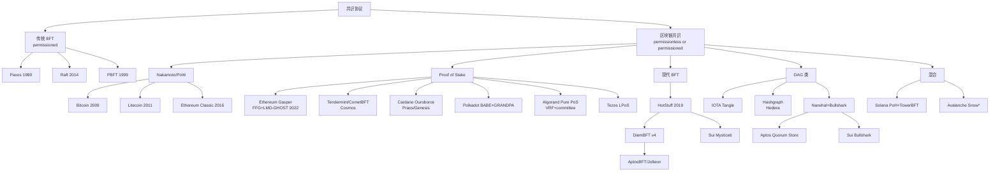
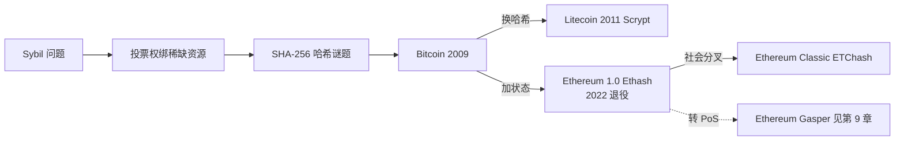
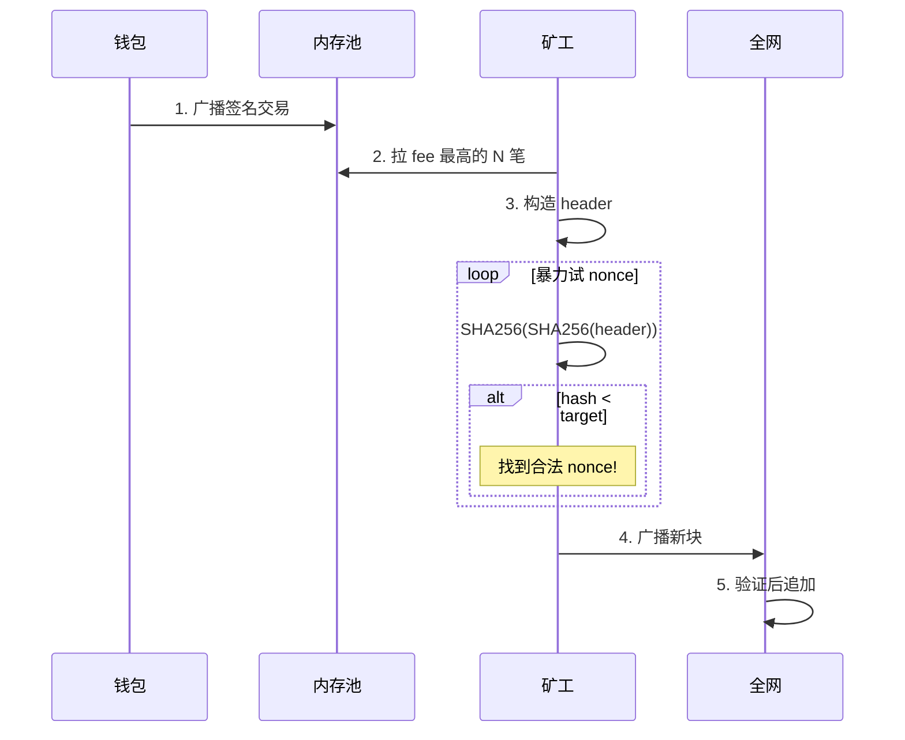
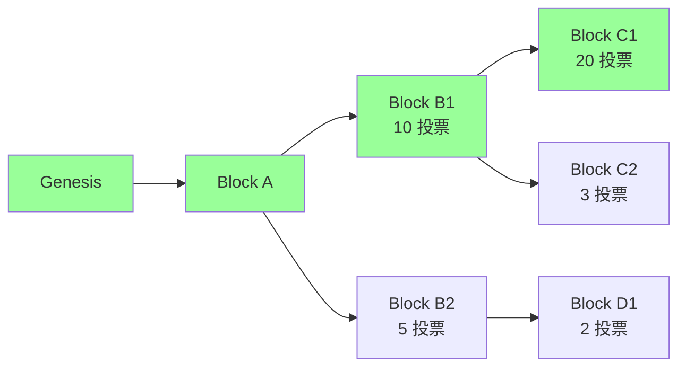
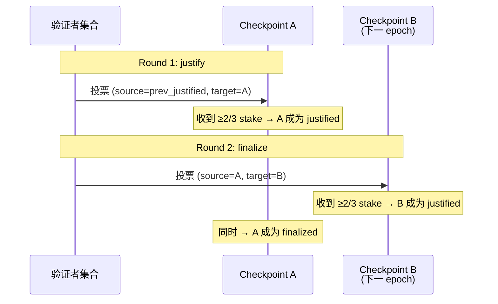
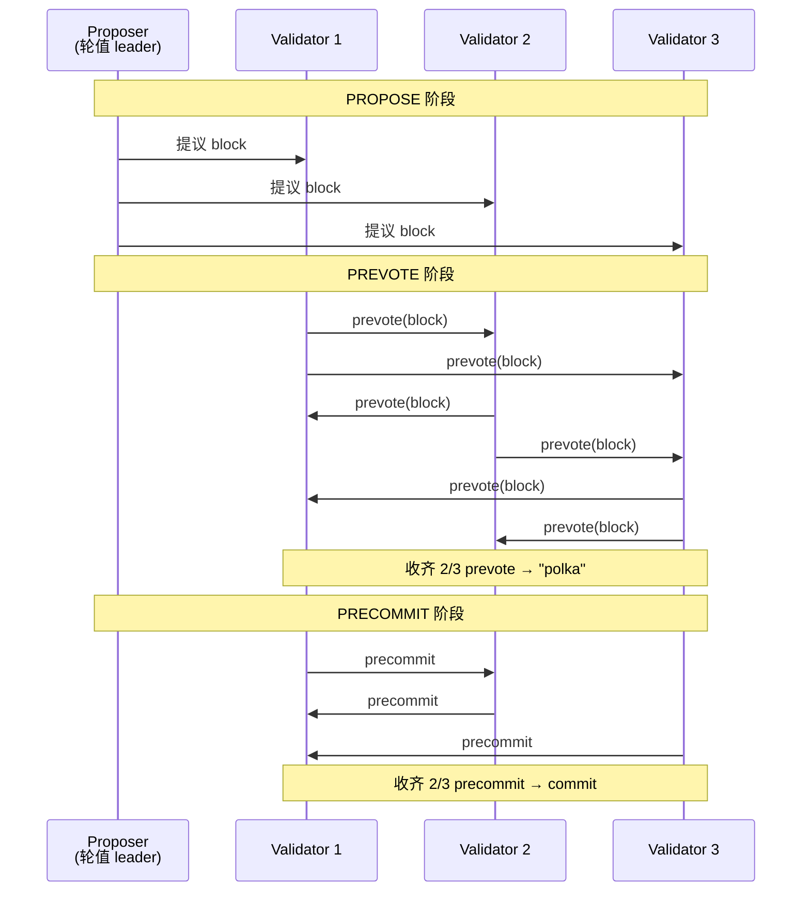
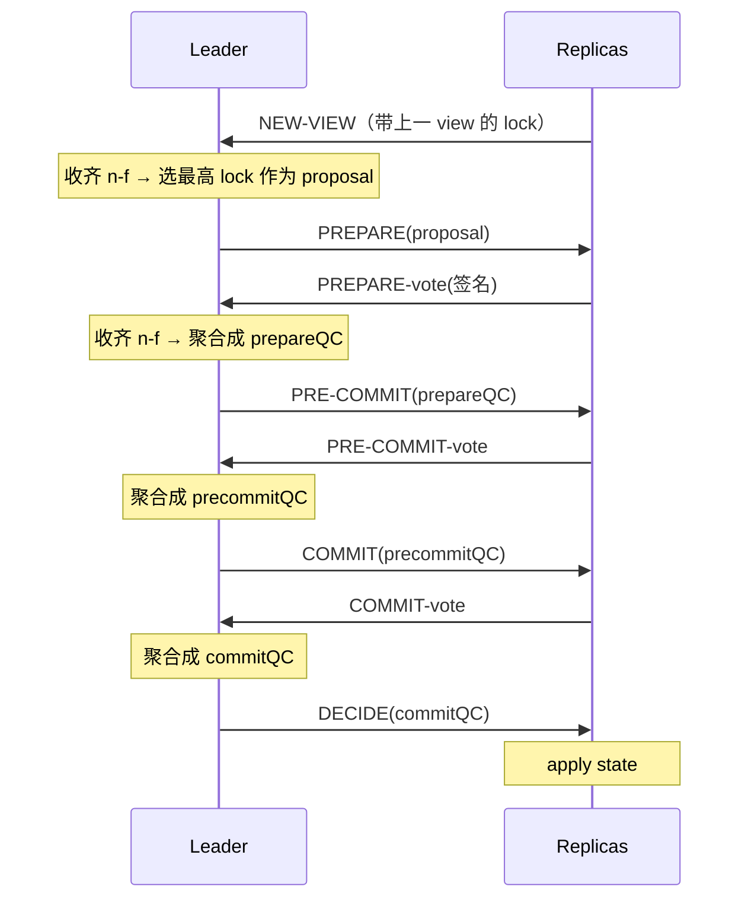
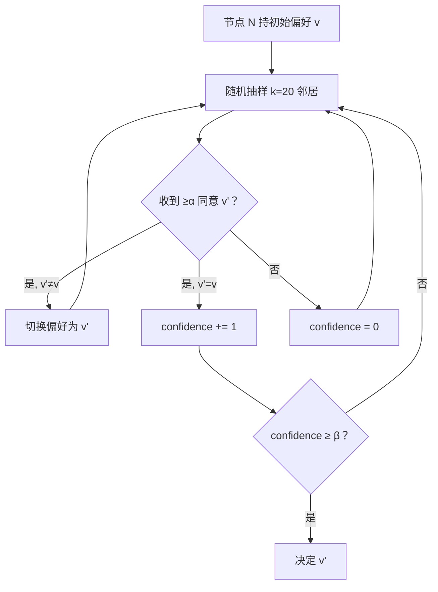

# 模块 02：区块链原理与共识

---

## 阅读指引

本册讲一件事：**一群互不认识、可能有人作恶的人，怎么对一份共同账本达成一致**。

**主线**（本文前半部分）：拜占庭将军直觉 → PoW → PoS → BFT → HotStuff → Solana TowerBFT → finality → 51% 攻击。读完主线你能回答"PoW/PoS/BFT 是啥""为什么等 6 个确认""finality 三种类型有什么区别"。

**附录**（本文后半部分）：19 协议详表、形式化证明、Casper FFG 数学、DAG 系协议、真实事故复盘、习题。

**类比先行**：BFT = 围城将军投票；finality = 邮件 vs 银行汇款；51% 攻击 = 多数派改账本。

**前置**：模块 01《密码学基础》——SHA-256、ECDSA、Merkle 树本册作为工具直接调用。

---

## 0. 序

> **TL;DR** 共识协议把"信任"从某家公司搬到一组互不信任的节点上。

**钩子**：2014 年 2 月，Mt.Gox 一夜蒸发 85 万 BTC。账本永远是对的，可托管它的人不是。这就是共识协议存在的理由。

N 个互不相识的节点，没有中央仲裁，怎么对一份一直在追加的账本达成同一份视图？区块链是这道老问题的一个新答案——日志是块、节点身份开放、状态转换函数事先写死。

每个共识协议都是同一道题在不同维度上的取舍：有人花电费换稳（PoW），有人押币换快（PoS），有人用数学证明换严格（BFT）。读完这册你会发现这其实是同一首曲子，只是不同乐器在演奏。

---

## 1. 拜占庭将军与三条不能绕开的定理

> **TL;DR** 要容 f 个叛徒需要 3f+1 节点；异步网络不能同时保证确定性 + 终止；分区时 C 与 A 只能选一个。

**钩子**：1982 年 Lamport 发表《拜占庭将军问题》——将军们用信使传递攻城命令，叛将可以发假信。当年这篇论文被审稿人拒了，几年后整个互联网才慢慢意识到这是分布式系统的地基。

### 1.1 拜占庭将军直觉

**类比：三个朋友决定吃什么，最多 1 个叛徒**

A、B、C 三人投票。C 是叛徒，给 A 说"吃火锅"、给 B 说"吃寿司"——1 票对 1 票，决策卡死。

加到 4 个人：叛徒还是只有 1 个，但 3 个诚实人能互相核对消息，多数派总能选出来。

**核心结论**：要容忍 f 个叛将，围城将军总数至少 **3f+1**。

BFT 协议的投票门槛叫 quorum = 2f+1。任意两组 quorum 在诚实节点上有交集，所以不会同时通过相互矛盾的决议。

| 需要容忍的叛将数 f | 最少将军总数 3f+1 | quorum（2f+1）|
|---|---|---|
| 1 | 4 | 3 |
| 2 | 7 | 5 |
| 3 | 10 | 7 |

---

### 1.2 FLP：三选二

1985 年 Fischer、Lynch、Paterson 一篇 6 页论文：**异步网络 + 至少一个进程可能崩溃 + 确定性算法**——这三件事同时成立时，没人能保证共识在有限时间内达成。

FLP 没说"共识不可能"——只是没有时间上界。绕开它三种方式：

| 放弃哪一条 | 代表协议 |
| --- | --- |
| 异步假设（实际网络延迟有上界） | Paxos / PBFT / Tendermint / HotStuff |
| partial sync + VRF 随机化（绕 FLP 用概率终止） | Algorand |
| 决定性（用概率最终性代替绝对最终性） | Bitcoin / 所有 PoW 链 |

读任何共识论文先翻 "System Model"——这是少踩坑最便宜的动作。

### 1.3 CAP：分区时只能选一边

CAP 说"网络分区时一致性 C 与可用性 A 二选一"。这和 FLP 是两件事，但经常被混用。

- **Tendermint/Cosmos 选 CP**：直接停链，宁可不出块也不让两边各自往前长
- **Bitcoin/Ethereum 选 AP**：继续出块，用最重链规则事后合并分叉

**章末**：这三条定理是所有共识协议的边界条件。后面每个协议都是"在这三堵墙之间选了哪条路"。

---

## 2. 共识协议全景图

> **TL;DR** 19 个协议出自共同祖先。主线详讲 5 个（Bitcoin PoW、Ethereum Gasper、Tendermint、HotStuff、Solana TowerBFT），其他 14 个见附录 A。

19 个协议听起来很多，但谱系树一画就清楚了。

### 2.1 谱系树



### 2.2 横向比较表

| 协议 | 类别 | 安全性来源 | 最终性 | 出块时间 | 真实部署 |
| --- | --- | --- | --- | --- | --- |
| Bitcoin | PoW | 哈希算力多数 | 概率（6 conf ≈ 60 min） | 600s | $1T+ 市值 |
| Litecoin | PoW (Scrypt) | 同上 | 概率 | 150s | $5B+ |
| Ethereum Classic | PoW (ETChash) | 同上 | 概率 | 13s | $2B+，曾被 51% 攻击 |
| Ethereum (Gasper) | PoS+FFG | 经济（slashing） | 经济（2 epoch ≈ 12.8 min） | 12s | $400B+ |
| Cosmos (CometBFT) | BFT-PoS | 2/3 stake | 绝对（即时） | 1-7s | $10B+，IBC 生态 |
| Cardano (Ouroboros Praos) | PoS+VRF | 1/2 stake honest | 概率（settlement param k） | 20s | $20B+ |
| Polkadot (BABE+GRANDPA) | 双层 PoS | NPoS+GRANDPA | 绝对（GRANDPA 终结） | 6s | $10B+ |
| Algorand (Pure PoS) | PoS+VRF 抽签 | 2/3 stake | 绝对（一轮即终结） | 3s | $1B+ |
| Tezos (LPoS) | 委托 PoS | 2/3 stake | 绝对（2 块） | 8s | $1B+ |
| Aptos (AptosBFT v4 → Raptr) | HotStuff 派 | 2/3 stake | 绝对 | 0.125s | $1B+ |
| Sui (Mysticeti) | DAG+BFT | 2/3 stake | 绝对（~390ms） | 0.4s | $5B+ |
| Hedera (Hashgraph) | aBFT | 2/3 stake | 绝对（~3s） | N/A（DAG） | $5B+ |
| IOTA | DAG | tip 选择 | 概率→Coordicide 后绝对 | N/A | $1B+ |
| Solana (PoH+Tower BFT → Alpenglow) | 混合 | 2/3 stake | 经济（32 conf ≈ 12.8s，未来 150ms） | 0.4s | $80B+ |
| Avalanche (Snow*) | 抽样投票 | metastable | 概率终结（β 轮） | 1-2s | $5B+ |

数据来源：各项目官方文档（Algorand pure-PoS 论文、Polkadot wiki、Aptos Baby Raptr 公告、Sui Mysticeti 公告、Hedera 官方文档），均访问 2026-04-27。

---

## 3. PoW：把 Sybil 转成电费

> **TL;DR** PoW 用哈希谜题把投票权绑到链外稀缺资源（算力）上，烧得最多那条链就是真链。

**钩子**：2008 年中本聪那篇 9 页白皮书要解决的不是"怎么发币"——是"在不信任任何人的前提下，怎么对一份账本达成共识"。他的答案：**让节点烧电算哈希谜题，烧得最多那一支链就是真链**。

后续 PoS / BFT / DAG 都可读作"对 PoW 某方面的不满"——嫌电贵 → PoS；嫌 finality 慢 → BFT；嫌吞吐低 → DAG。

PoW 安全四假设：哈希抗预映像、算力市场半开放、≥50% 算力诚实、网络延迟有概率上界。Bitcoin 安全预算 ≈ 年挖矿电费（2024 约 80 亿美元）——这是攻击者要花多少钱的粗暴下界。

### 3.1 Sybil 问题与破解思路

**Sybil 攻击**：你做匿名投票系统，一人一票。我连夜注册一万个小号灌爆投票池——一个人伪装成无数个，叫 Sybil（来自一本写多重人格的小说）。

**中本聪的破解思路**：把投票权绑到链外的稀缺资源上。1 万个假账号能伪造，但 1 万份电费做不了假。

具体做法：让你证明"算了一道难题"。SHA-256 的输出每一位等概率 0/1，要找一个前 16 位全 0 的输入，期望尝试次数 = 2^16 = 65536 次。前 N 位全 0 只能暴力试——抗预映像保证反推无门。

PoW 技术内涵就这一句，剩下都是工程包装：

- **难度自动调整**：把出块速率稳在 10 分钟
- **最重链规则**：把"哪条是主链"约化成"哪条累计了最多算力"



---

### 3.2 Bitcoin：PoW 的标准实现

**钩子**：2009 年 1 月 3 日，中本聪在创世块嵌了句话：「The Times 03/Jan/2009 Chancellor on brink of second bailout for banks」。金融危机第二轮救市时，他启动了一个不需要银行的支付系统。17 年过去，Bitcoin 从未发生过协议级 reorg。

Bitcoin 共识 = 4 步：独立验证交易 → 独立组装区块 → 解 PoW → 独立选择最重链。

#### 3.2.1 区块结构

```
┌─────────────────────────────────────────┐
│  Block Header (80 bytes)               │
│  ┌────────────────────────────────────┐ │
│  │ version (4)                        │ │
│  │ prev_hash (32) ──→ 链接前一块       │ │
│  │ merkle_root (32) ──→ 交易树根       │ │
│  │ timestamp (4)                      │ │
│  │ bits (4) ──→ 难度                  │ │
│  │ nonce (4) ──→ 矿工反复改的          │ │
│  └────────────────────────────────────┘ │
│  Body                                  │
│  ┌────────────────────────────────────┐ │
│  │ tx[0] (coinbase: 矿工奖励)          │ │
│  │ tx[1] ... tx[N]                    │ │
│  └────────────────────────────────────┘ │
└─────────────────────────────────────────┘
```

#### 3.2.2 出块流程



#### 3.2.3 难度调整

每 2016 块（≈ 2 周）自动调整一次，把出块速率稳在 10 分钟：

```
new_difficulty = old_difficulty × (2016 块的实际耗时 / 期望耗时 14 天)
```

调整幅度限制 [0.25x, 4x]，防止单次跳变过大。Bitcoin 2024-04 第四次减半后，区块奖励 3.125 BTC，全网算力 ~600 EH/s（Bitcoin Magazine Pro，2026-04）。

#### 3.2.4 双花概率（白皮书 §11）

**51% 攻击直觉**：Alice 是攻击者，攻略如下——

1. 给咖啡店老板 Bob 转账买咖啡。
2. 等到链上确认拿到咖啡。
3. 同时她私下偷偷挖一条**不包含这笔转账**的更长链。
4. 等私链超过公链时广播出来——按"最重链规则"，公链被替换。
5. Bob 手里那笔钱就消失了。

她需要多少算力才能挖出更长的链？答案是越多越好。她有的算力比例叫 q（如 q=0.3 表示她占全网 30%）。

**先看数字直觉**：q=0.10、等 6 块确认时，攻击成功率约 **0.024%**——这就是交易所"6 个确认"标准的来源。q 翻三倍到 0.30，6 确认成功率跳到 ~17.7%；q 到 0.40 时 6 确认还有 35%。换句话说，**算力比例每往上挪一档，确认数要翻倍才能压住风险**。

| q (攻击者算力) | z=3 确认 | z=6 确认 | z=12 确认 |
| --- | --- | --- | --- |
| 0.10（攻击者占 10%） | 4.4% | **0.024%** | 一亿分之一 |
| 0.30（占 30%） | 25% | **~17.7%** | 2.0% |
| 0.40（占 40%） | 51% | 35% | 16% |

**公式**：上表数字来自中本聪白皮书 §11 给的精确公式（看不懂没关系，看上面表就够）：

```
P(成功双花) ≈ 1 − Σ_{k=0..z} [(λ^k · e^{-λ}) / k!] × (1 − (q/p)^(z-k))
其中 λ = z·q/p，p = 1 - q，z = 商家等的确认数
```

**举例：z=6、q=0.30**——按白皮书 §11 精确 Poisson 级数计算约 **17.7%**。要点是：**等的确认越多，攻击者算力越少时成功率越快归零**。

**q 的现实约束**：Bitcoin 全网算力 600 EH/s，要凑 q=0.1 需要租 60 EH/s 算力，NiceHash 一天约 400 万美元——攻击不划算。但小币种（如 ETC，第 7 章）算力小，q=0.5 实际可达，就被 51% 攻击过。

#### 3.2.5 最长链 vs 最重链

Bitcoin 文档说"最长链规则"，但实际是**最重链**（cumulative work）。区别：如果攻击者用低难度块伪造一条更**长**的链，节点不应接受。最重链规则会拒绝它，最长链规则会被骗。代码 `code/pow_chain.py` 用的就是最重链规则。

#### 3.2.6 数字感（2026-04）

- 全网算力：~ 600 EH/s（exa-hash/sec）
- 难度：~ 1.1 × 10¹⁴
- 区块奖励：3.125 BTC（2024-04 第四次减半后）
- 矿工年收入：≈ 100 亿美元（含 fee）
- 全球 mining pool 数：~ 15 个主要 pool 占 90%+ 算力

**章末**：Bitcoin 历史上有过两次大型重组：2010-08 value-overflow bug 触发 53 块硬分叉；2013-03 BIP50（v0.7/v0.8 BDB 锁限）24 块共识 reorg。除此之外 17 年无大型协议级 reorg。三处保守取舍：①脚本图灵不完备；②单 leader 单链概率最终性，把"快"全让给"稳"；③块大小 1MB 限制吞吐 ~7 TPS。Litecoin/ETC 等变体的详细分析见附录 A。

---

## 4. 51% 攻击与 ETC 案例

> **TL;DR** PoW 安全公式 = 算力 / 同算法可租算力；小链共用大链算法是结构性漏洞。

**类比**：51% 攻击 = 多数派改账本。攻击者悄悄挖另一条更长的链，等它超过公链后广播替换——之前在交易所的充值被抹掉，钱又回到自己口袋。

### 4.1 ETC 三连攻击（2020）

2016 年 The DAO 事件后，不愿回滚的少数派留下 Ethereum Classic（ETC）。它与 ETH 共用 Ethash 算法，2020 年 ETC 占 Ethash 全网算力仅 ~5%。

| 时间 | reorg 深度 | 损失 | 攻击成本 | ROI |
| --- | --- | --- | --- | --- |
| 2020-08-01 | 4000+ 块 | $5.6M | $204K | ~27x |
| 2020-08-06 / 08-29 | 类似 | 类似 | 类似 | — |

**攻击模板**：充值 ETC → 确认后提走 USDT → 广播秘密挖好的更长私链 → 充值的 ETC 回到自己钱包。

### 4.2 为什么 BTC 难、ETC 易

**PoW 真实安全公式 = 算力 / 同算法可租算力**，不是绝对算力。

- Bitcoin 全网 600 EH/s，NiceHash 仅 ~1 EH/s SHA-256 算力——51% 所需是市场总量的 300 倍，经济不可行
- ETC 攻击者从 NiceHash 租 20 万美元算力就够 51%

**章末**：共识协议安全有时由生态决定，不只是协议本身——2022 年 ETH 转 PoS 后 Ethash 矿机部分流入 ETC，算力反而翻倍。完整经济账见附录 E。

---

## 5. PoS（Ethereum Casper-FFG + LMD-GHOST）

> **TL;DR** PoS 用质押替换算力，用 slash 罚没替换电费。Ethereum Gasper 把出块（LMD-GHOST）和终结（Casper FFG）拆到两层，分区时出块继续、终结暂停。

**钩子**：2022 年 9 月 15 日凌晨，以太坊 The Merge——从 PoW 切到 PoS，被称作"飞机上换发动机"：链一刻没停，矿工集体下岗。背后跑的共识协议叫 Gasper。Vitalik 2017 年那篇 Casper FFG 论文提出时，他还把 PoW 和 PoS 捆在一起——最终 PoW 部分被切掉，留下的就是今天的 Gasper。

### 5.1 PoS 三道新问题

PoW → PoS 听起来像换零件：算力换成质押，电费换成 slash 风险。但 PoS 有三个 PoW 没有的新问题——电费在 PoW 里天然解掉了它们：

**① Nothing at Stake（白嫖签名）**：PoS 签名免费，链分叉时两条都签稳赚不赔。**解法：slashing**——双签没收抵押，让两面下注比老实选一条更亏。

**② Long-range attack（长程攻击）**：已退出的验证者私钥还在硬盘里，攻击者低价收购一批旧私钥，从历史某点重写一条新链。**解法**：弱主观性 + checkpoint，或 Cardano Genesis 的 chain density 判定。

**③ Stake grinding**：leader 选举依赖随机数，如果随机数来自 validator 自己的签名——他有动机调整输入让自己被选中。**解法**：VRF（私下掷骰子但能向别人证明没作弊）。

### 5.2 Gasper = LMD-GHOST + Casper FFG

Gasper 的核心设计哲学：**把 safety 和 liveness 拆到两层做不同取舍**。

- **LMD-GHOST**（出块层）：分区时坚持继续出块，保 liveness
- **Casper FFG**（终结层）：分区时拒绝 finalize，保 safety

这是 Ethereum 与 Tendermint 最深的分歧——Tendermint 把两件事捆在一起，分区时直接停链。

---

### 5.3 时间结构

```
┌──────── 1 epoch = 32 slot = 384s = 6.4 min ────────┐
│                                                      │
│  slot 0   slot 1   ...   slot 31                    │
│  [block][block]...[block]                           │
│  ↑12s     ↑12s          ↑12s                        │
│                                                      │
│  每 slot 一个 committee；validator 集合按 epoch 切成 32 个 committee │
│  每 epoch 末尾：checkpoint                           │
└──────────────────────────────────────────────────────┘
```

### 5.4 LMD-GHOST 流程图



LMD-GHOST 选择**最重子树**（用最新投票算）。上图中：

- B1 子树总投票 = 10 + 20 + 3 = 33
- B2 子树总投票 = 5 + 2 = 7

→ head = C1（B1 子树中最大的）。绿色路径 = canonical chain。

### 5.5 Casper FFG 双轮投票

在抛术语前先记口诀：每条链每 epoch 加一次图章——刚加完叫 justified（暂定），下个 epoch 再加同向图章变 finalized（不可回滚）。下面给精确定义。



### 5.6 Slashing 两条戒律

**No Double Vote**：同一个 epoch 不能签两个不同的 target。**No Surround Vote**：不能让旧投票 (s₁,t₁) 包围新投票 (s₂,t₂)，即不能有 h(s₁) < h(s₂) < h(t₂) < h(t₁)（h 是 epoch 高度；surround = 新投票 source 早 + target 晚于旧投票，等于"套住"旧投票，被认定为攻击）。

任一违反 → 立即 slash。这就是 Ethereum 把"经济最终性"量化的方式：要 revert 一个 finalized block，至少要让 1/3 stake 接受 slash。当前总质押 ~3500-3700 万 ETH（2026-04），1/3 ≈ 1200 万 ETH（数百亿美元）。

注意区分：上述 slash 针对的是 Casper FFG 的 double/surround vote。**LMD-GHOST attestation 重投不直接被 slash**，而是被 fork-choice 经济性惩罚——投错链的 attestation 拿不到正确链上的 reward，长期下来余额相对受损。

### 5.7 Inactivity Leak

≥1/3 stake 离线时，FFG 凑不齐 2/3 票。**Inactivity Leak**：每 epoch 离线验证者余额指数累积削减，数周后离线方份额降到 < 1/3，活跃方重新够 2/3，finality 恢复。短期牺牲 safety（不 finalize），保住 liveness（LMD-GHOST 照走），经济惩罚把 liveness 拉回来。

**章末**：100 万验证者是 Gasper 的最大成就，也是 finality 慢（12.8 min）的根本原因——签名聚合压力直接卡住 SSF。Casper FFG 数学详解见附录 C，2022-05 7-block reorg 事故复盘见附录 E。

---

## 6. BFT 直觉（3f+1）与 Tendermint

> **TL;DR** BFT 协议把"块确认"做成多轮投票——PREPARE → PREVOTE → COMMIT，收齐 2f+1 签名才推进。Tendermint 是 PBFT 面向公链的改造版，选 safety 牺牲 liveness。

**类比**：BFT = 围城将军投票。每轮将军们广播投票，等到 2f+1 人投同一个目标，这步才推进。叛将最多 f 个，所以 quorum 2f+1 必然包含至少 f+1 个诚实将军——两组 quorum 必有诚实交集，不会通过矛盾决议。

### 6.1 Tendermint 三阶段

2014 年 Jae Kwon 把 PBFT 改造成支持 PoS 的版本——Tendermint（后更名 CometBFT）。与 Gasper"两层分别取舍"相反，Tendermint 把 safety 一路硬到底：块一旦 commit 绝对不可逆，分区时直接停链。

三阶段：



### 6.2 PBFT vs Tendermint vs Ethereum

| 维度 | PBFT | Tendermint | Ethereum Gasper |
| --- | --- | --- | --- |
| 通信（per-node；总消息量 PBFT/Tendermint 都是 O(n²)，HotStuff leader 中转才是 O(n) 总） | O(n²) all-to-all | O(n) gossip | O(n) BLS 聚合 |
| 分区时 | 停链 | 停链 | 出块继续，finalize 暂停 |
| finality 类型 | absolute | absolute | economic |
| validator 规模 | <30 | 100-200 | 100 万 |

**章末**：Cardano Ouroboros、Polkadot BABE+GRANDPA、Algorand Pure PoS、Tezos LPoS 详解见附录 A。

---

<!-- sections 11-14 moved to appendix A -->

<!-- VRF 等详细内容已移至附录 A -->


<!-- Cardano/Polkadot/Algorand/Tezos 详细机制已移至附录 A，此处仅保留摘要 -->
<!-- Cardano Ouroboros: VRF 私下抽签，每 epoch 5 天，Genesis 解 long-range，Peras 加快 settlement -->
<!-- Polkadot BABE+GRANDPA: BABE 出块，GRANDPA 批量终结链段，600 validator -->
<!-- Algorand Pure PoS: VRF sortition 私下选 committee，单轮即 finalize -->
<!-- Tezos LPoS: 委托不锁仓，链上治理 18+ 次升级 -->

<!-- orphan removed -->

<!-- orphan 11.5.1+ removed -->
---


<!-- Sections 15-17: BFT谱系导引, Paxos/Raft, PBFT 已移至附录A -->

## 7. HotStuff 链式投票

> **TL;DR** HotStuff 把 BFT 通信从 O(n²) 压到 O(n)，链式流水线让每 view 出一块。Aptos/Sui/Movement 都是它的工业化后代。

**钩子**：2019 年 PODC，VMware Research 的 Maofan Yin 等发了 HotStuff，拿了当年 best paper。Facebook 用 LibraBFT（HotStuff 工业化版）启动 Libra/Diem，2022 年关闭后团队带代码创立了 Aptos 和 Sui。

PBFT 在 100 个节点上跑一轮要发一万条消息（O(n²) = 10000），公网扛不住。HotStuff 的改进：

- **通信 O(n)**：节点只发给 leader，leader 聚合成 QC 后再广播
- **Responsive**：收齐 n-f 投票就能推进，不用等最长网络延迟 Δ

### 7.1 三阶段（PREPARE / PRE-COMMIT / COMMIT）

每阶段都是 leader 中转聚合 QC（O(n)），第三阶段（COMMIT）存在的原因：view-change 时必须保住"已 prepared 但未 commit 的值"，需要锁机制。



QC = Quorum Certificate（聚合签名证据）。

### 7.2 Pipelined / Chained HotStuff

让每个 view 提议一个新块，新块的 PREPARE 复用上一块的 PRE-COMMIT 投票。三个 view 流水线推进：

```
view  1   2   3   4   5   6
块    B1  B2  B3  B4  B5  B6
B1: PREPARE  PRE-COMMIT  COMMIT  DECIDE
B2:          PREPARE     PRE-COMMIT  COMMIT  DECIDE
B3:                      PREPARE     PRE-COMMIT  COMMIT  DECIDE
```

→ **稳态吞吐 = 每 view 1 块，单块 commit 延迟 = 3 view**。

### 7.3 工业落地链路

```
HotStuff 论文 (2019, PODC best paper)
   ↓
LibraBFT (Facebook Libra 2019)
   ↓
DiemBFT v4 (2021)  → Diem 关闭，团队带代码去 Aptos
   ↓
Jolteon = AptosBFT v1 (2022 active pacemaker)
   ↓
AptosBFT v4 (2023 reputation-based leader)
   ↓
Raptr (2024-09 提案；2025-06 Baby Raptr 主网激活)
```

工程门槛主要在 threshold signature（BLS 聚合）——这也是为什么 HotStuff 直到 BLS12-381 库成熟后才大规模工业化。来源：Aptos Foundation "Baby Raptr Is Here"（2026-04-27）。

---

**章末**：AptosBFT v4 → Raptr → Baby Raptr 工业化链路，以及 Sui Mysticeti (DAG 共识)、Narwhal+Bullshark 详见附录 A。

DAG 共识直觉：Narwhal/Bullshark/Mysticeti 把"打包+排序"拆开——validator 各自打 mempool 包成 DAG 节点，再用 round-based 投票确定全局序。Sui v2 Mysticeti p50 ≈ 67ms。详见附录 D。

---

<!-- Sections 20-24: DAG 谱系、IOTA、Hashgraph、Narwhal+Bullshark、Mysticeti 已移至附录 D -->

### 7.4 易混速查：PoH 不是共识

听到"XXX 链的共识是 YYY"时，先问一下"YYY 是协议层还是别的什么"：

| 名字 | 是共识吗 | 真实角色 |
| --- | --- | --- |
| Solana PoH | ✗ | 时间戳服务（加密秒表） |
| Aptos Block-STM | ✗ | 并行执行引擎 |
| Aptos Quorum Store | ✗ | mempool（学 Narwhal） |
| Sui Mysticeti | ✓ | DAG 共识协议 |
| Ethereum LMD-GHOST | 部分 | fork choice（与 FFG 共同） |
| Ethereum Casper FFG | ✓ | finality gadget |

---

## 8. Solana TowerBFT（PoH 是时钟非共识）

> **TL;DR** PoH 是加密时间戳服务，不是共识。Tower BFT（PBFT 变体 + lockout）才是共识。7 年 5 次停机证明"全局时间作为单点"的结构性脆弱，Alpenglow 正在替换它。

**钩子**：2017 年，前 Qualcomm 工程师 Anatoly Yakovenko 在凌晨喝了几杯咖啡后想到：用一条不断哈希的链做全网共享的"加密秒表"——这就是 PoH 的起点，后来变成了 Solana 白皮书。

Solana 把"排事件顺序"和"共识"拆成两个独立组件——这在本册所有协议里是独特的：PoH 排序，Tower BFT 决定哪条链合法。

### 8.1 PoH 是什么

leader 持续跑：

```python
h[0] = some_seed
for i in 1..∞:
    h[i] = SHA256(h[i-1])
    # 每 N 步，把收到的交易 tx 穿插进去：
    if has_pending_tx():
        h[i] = SHA256(h[i-1] || tx)
```

→ 所有 validator 拿到序列后确定地知道每笔交易的相对顺序。PoH 像全网共享的"加密秒表"——验证秒表没倒走，但不决定"哪个分叉合法"（那是 Tower BFT 的职责）。

### 8.2 Tower BFT

PBFT 变体，加了**lockout 机制**：

```
每次投一个分支，对该分支的承诺时间指数加倍
→ 32 次连续投票后，承诺达到最大 lockout
→ 该分支被认为 economically finalized
```

### 8.3 PoH 与 Tower BFT 的协作

PoH 负责"打时间戳 / 排事件顺序"，Tower BFT 负责"决定哪条链合法"。两者分工：

- **PoH**：Leader 持续生成哈希链条，其他节点验证顺序合法性（无需通信）。
- **Tower BFT**：每个 slot 结束后，Validator 对 PoH 记录的区块投票；lockout 机制保证切换分支成本指数增加。
- 合并效果：PoH 节省了 BFT 投票中"排序消息"的通信开销，Tower BFT 提供拜占庭容错安全保证。

### 8.4 当前性能（2026-04）

- 区块时间：~ 400ms
- 平均 TPS（实测）：~ 3000-5000
- 理论 TPS：65,000+
- 终结时间：32 confirmation ≈ 12.8s

### 8.5 历史故障

| 时间 | 事件 | 时长 |
| --- | --- | --- |
| 2021-09 | Grape Protocol IDO，每秒 40 万 TX 涌入 | 17 小时 |
| 2022-04 | NFT bot 滥发交易 | 7 小时 |
| 2022-05 | 共识 bug | 4 小时 |
| 2023-02 | 区块状态恢复慢 | 19 小时（最长） |

教训：PoH 把"时间"当全局变量，全局变量在大规模故障时极难恢复。

### 8.6 Alpenglow：PoH 退役计划

2025 年 Anza 提出 Alpenglow，要用 **Votor + Rotor** 替换 PoH + Tower BFT。

- **Votor**：把 32 轮确认压缩到 1-2 轮；80% stake 在线时单轮 finality ≈ 150ms（双路径：fast 80% stake 在线一轮敲定 ~150ms；slow 60% stake 二轮敲定）
- **Rotor**：替换 Turbine 数据广播树为 one-hop broadcast

时间线：
- 2025-09：Solana 治理通过 Alpenglow（98.27% 赞成）
- 2026-Q3：Agave 4.1 发布
- 2026-Q4：安全审计
- 2026 年底：mainnet 激活

来源：CoinDesk 2025-09-03 "Solana Community Approves Alpenglow Upgrade"，访问 2026-04-27。

### 8.7 与 Ethereum 的工程对比

Solana 与 Ethereum 在每个轴上选择都相反，是共识工程取舍的极端样本：

| 维度 | Ethereum | Solana |
| --- | --- | --- |
| 设计目标 | 安全 + 去中心化 | 性能优先 |
| Validator 硬件 | 4 核 16GB | 32+ 核 256GB+ NVMe |
| 节点数 | ~10000+ | ~1500-2000 |
| 区块时间 | 12s | 0.4s |
| 平均 TPS | ~30 | ~4000 |
| 历史停机 | 0 | 5+ 次（最长 19h） |

性能高的代价是恢复成本——PoH 把"时间"做成全局变量，全局变量出错就是全网停机。Alpenglow 替换 PoH 是 Solana 团队对这条结构性教训的承认。

**章末**：Solana 2021-2023 多次停机详细复盘见附录 E，Avalanche Snow 系列和 Lightning Network 见附录 A。

---

<!-- Sections 27-28: Avalanche, Lightning Network 已移至附录 A -->

## 9. Finality 概念

> **TL;DR** Finality 有三种：概率、经济、绝对——不是同一件事。"instant finality" 广告语先停一下问：哪种 finality？

**类比**：概率 finality = 发邮件（越久越可能被对方看到但可以撤回）；绝对 finality = 银行汇款确认（打到账了就是到账）；经济 finality = 押金担保（想反悔要付高代价）。

### 9.1 三种最终性对比

| 维度 | confirmation | probabilistic | economic | absolute |
| --- | --- | --- | --- | --- |
| 含义 | "块被埋多深" | 越深越难逆转，但永不为 0 | 逆转需可量化经济代价 | 协议层保证不可逆 |
| 例子 | Bitcoin 6 conf | Bitcoin 任意深度 | Ethereum 2 epoch | Tendermint 单块 |
| 工程代价 | — | 等够深（PoW 链） | 看 stake 总量（PoS 链） | 分区时停链 |

PoW 链的概率最终性遵循中本聪公式（以下为 q≪p 时的粗略近似，精确值见上方 Poisson 级数）P(逆转 z 块) = (q/p)^z（q<p），交易所通常等到 P<0.001% 才入账——Bitcoin q=0.1 时 6 conf P≈0.024% 是这条阈值的来源。Ethereum 经济最终性的具体数字：回滚 finalized 块至少需 1/3 stake 被 slash ≈ 10M+ ETH，是博弈论而非数学保证。Tendermint/Algorand/GRANDPA 的 absolute finality 是协议层硬约束，代价是分区时停链。

### 9.2 Safety vs Liveness

Safety = 永不出错（不会两块在同高度都 finalized）；Liveness = 永远在进步（链一直出块）。FAB 的标准定义。两者不能同时百分百保证（FLP），所有协议都在分区时做取舍：

| 协议 | 网络分区时 | 选了什么 |
| --- | --- | --- |
| Bitcoin / Nakamoto | 双方都继续出块，后续重组 | Liveness（safety 概率） |
| Tendermint / Cosmos | 链停 | Safety |
| Ethereum Gasper | LMD-GHOST 继续出块，FFG 不 finalize | 双层分别选择 |
| Avalanche Snow | metastable，可能两边都不收敛 | 概率 safety + 概率 liveness |

Gasper 把 safety 和 liveness 拆到两层做不同选择，是它被低估的工程价值——下一代链（Polkadot / Solana Alpenglow）都在抄这条路。

### 9.3 Ordering ≠ Consensus

DDIA 把这两件事画得很清楚：ordering 是给一组 tx 排次序，consensus 是在多个候选 history 中选一个。链共识把两件事耦合，DAG 共识（第 23 章）把它们解耦。Solana 也是解耦的（PoH 做 ordering，Tower BFT 做 consensus），但路线不同——PoH 是单 leader 时间戳，Narwhal 是多 validator 并行 mempool。

### 9.4 状态模型：SMR / UTXO / Account

| 模型 | 状态形式 | 并行度 | 智能合约 | 代表 |
| --- | --- | --- | --- | --- |
| SMR | 任意状态 + transition function | 取决于 function | 高 | Tendermint apps |
| UTXO | 不可变输出集合 | 高（独立 UTXO 并行） | 低（图灵不完备） | Bitcoin / Cardano eUTXO |
| Account | 全局地址 → 余额 + 存储 | 低（同账户串行） | 高 | Ethereum / Solana / Aptos |

Aptos Block-STM 是个有趣的妥协：Account 模型 + 乐观并行 + 冲突回滚重排，拿到 ~25k TPS 而不丢智能合约友好性。Sui object-based 是另一极：让用户预申报读写 object，运行时直接并行——把冲突检测前置到 tx 提交时。

### 9.5 Permissioned vs Permissionless

| | permissioned | permissionless |
|---|---|---|
| 例子 | Hyperledger Fabric / Hedera | Bitcoin / Ethereum / Cosmos |
| 优点 | 性能高，监管友好 | 抗审查 |
| 缺点 | 去中心化弱 | 性能受限 |

**章末**：主线到这里结束。你已经能看着任何共识协议白皮书，先翻 System Model，问它怎么解 nothing-at-stake / long-range / grinding，再看它在 safety vs liveness 上选了什么。后续附录 A-F 提供更深的技术细节。

**下一站——模块 03《EVM 与智能合约》**：共识把"账本写哪条"敲定了，但账本里那行字到底执行什么逻辑？模块 03 把镜头推到链上的虚拟机：EVM 字节码、gas 计费、storage slot、合约调用语义。本册讲的 finality 在那边变成"交易何时不可回滚"的工程边界，slashing 的押金账本则变成 Solidity 合约里一个 mapping。共识管"谁说了算"，EVM 管"算出来的是什么"——下一站见。

---

# 附录

---

## 附录 A. 19 协议详表与后 14 协议详解

> 本附录覆盖主线未详讲的 14 个协议：Litecoin、Ethereum Classic、Cardano Ouroboros、Polkadot BABE+GRANDPA、Algorand Pure PoS、Tezos LPoS、Paxos、Raft、PBFT、AptosBFT/Raptr、Avalanche Snow、Bitcoin Lightning Network、Hashgraph，以及各协议横向比较表。

### A.1 协议谱系速查表

| 协议 | 类别 | 安全性来源 | 最终性 | 出块时间 | 真实部署 |
| --- | --- | --- | --- | --- | --- |
| Bitcoin | PoW | 哈希算力多数 | 概率（6 conf ≈ 60 min） | 600s | $1T+ 市值 |
| Litecoin | PoW (Scrypt) | 同上 | 概率 | 150s | $5B+ |
| Ethereum Classic | PoW (ETChash) | 同上 | 概率 | 13s | $2B+，曾被 51% 攻击 |
| Ethereum (Gasper) | PoS+FFG | 经济（slashing） | 经济（2 epoch ≈ 12.8 min） | 12s | $400B+ |
| Cosmos (CometBFT) | BFT-PoS | 2/3 stake | 绝对（即时） | 1-7s | $10B+，IBC 生态 |
| Cardano (Ouroboros Praos) | PoS+VRF | 1/2 stake honest | 概率（settlement param k） | 20s | $20B+ |
| Polkadot (BABE+GRANDPA) | 双层 PoS | NPoS+GRANDPA | 绝对（GRANDPA 终结） | 6s | $10B+ |
| Algorand (Pure PoS) | PoS+VRF 抽签 | 2/3 stake | 绝对（一轮即终结） | 3s | $1B+ |
| Tezos (LPoS) | 委托 PoS | 2/3 stake | 绝对（2 块） | 8s | $1B+ |
| Aptos (AptosBFT v4 → Raptr) | HotStuff 派 | 2/3 stake | 绝对 | 0.125s | $1B+ |
| Sui (Mysticeti) | DAG+BFT | 2/3 stake | 绝对（~390ms） | 0.4s | $5B+ |
| Hedera (Hashgraph) | aBFT | 2/3 stake | 绝对（~3s） | N/A（DAG） | $5B+ |
| IOTA | DAG | tip 选择 | 概率→Coordicide 后绝对 | N/A | $1B+ |
| Solana (PoH+Tower BFT → Alpenglow) | 混合 | 2/3 stake | 经济（32 conf ≈ 12.8s，未来 150ms） | 0.4s | $80B+ |
| Avalanche (Snow*) | 抽样投票 | metastable | 概率终结（β 轮） | 1-2s | $5B+ |

### A.2 Litecoin

Bitcoin fork，SHA-256 → Scrypt，10 min → 2.5 min。规律：**抗 ASIC 设计撑不过 3 年**。Scrypt 2014 年也出 ASIC 了。Litecoin 真正价值是"BIP 试验田"：SegWit 2017-05 先在 LTC 激活，4 个月后 Bitcoin 跟进。

### A.3 Cardano Ouroboros（Praos / Genesis / Peras）

每个 epoch（5 天）开始时，用上一 epoch 的随机数 + VRF 私下确定本 epoch 每个 slot 的 leader。这个 leader 只有自己知道，等到他的 slot 到了再出块、附 VRF proof，其他人验证。

**VRF（Verifiable Random Function）**：私下掷骰子 + 能向别人证明没作弊。

| 版本 | 年份 | 关键升级 |
| --- | --- | --- |
| Ouroboros Classic | 2017 | 最早版本，需要全局同步时钟 |
| Ouroboros Praos | 2018 | 引入 VRF 私下选举，对部分异步网络鲁棒 |
| Ouroboros Genesis | 2018→2024 mainnet | 解决 long-range attack，新节点能从 genesis 同步 |
| Ouroboros Peras | 2025 | 加快 settlement（"快终结" gadget） |

**Long-range attack 解法**：Ouroboros Genesis 通过 chain density 判定——诚实链密度高，伪造链维持不了。新节点能完全从 genesis 同步，零外部信任（区别于 Ethereum 的 weak subjectivity）。

### A.4 Polkadot BABE + GRANDPA

BABE（出块，VRF 选 primary leader）+ GRANDPA（终结，一次 finalize 链段的"最长公共前缀"）。两层分工：BABE 出概率块，GRANDPA 把稳定的链段一次性敲死。600 个 active validator（2024），平行链共享中继链 finality。

### A.5 Algorand Pure PoS

每出一块，从全体持币人里私下 VRF 抽签约 1000 人 committee，成员公布 VRF proof 之前连自己都不知道被选中——抗针对性 DDoS。没有 slashing，靠 2/3 honest stake 假设 + committee 频繁换人防御作恶。单轮即 finalize，当前出块 ~3.3 秒，TPS 6000+。

### A.6 Tezos LPoS

**Liquid** = 委托不锁仓，钱还在账户里，随时可改委托对象。链上自动协议升级：至 2026-04 已激活 18 次以上（Athens / Babylon / ... / Quebec / Rio），全部由代币持有者投票完成，无需硬分叉。2022 Tenderbake 升级把底层共识改为 BFT 风格。

### A.7 Paxos 与 Raft（crash-only 共识）

**Paxos**（1989，Lamport）和 **Raft**（2014，Ongaro/Ousterhout）容忍 crash 故障但不容拜占庭——公链不能直接用。工程影响：etcd、Consul、TiKV、CockroachDB 都跑 Raft。

| 维度 | Paxos | Raft |
| --- | --- | --- |
| 容错 | crash f < N/2 | 同左 |
| 论文可读性 | ★☆☆☆☆ | ★★★★★ |
| 工程实现 | Multi-Paxos / EPaxos | etcd / Consul / TiKV |
| 可用于公链 | 否（不容拜占庭） | 否 |

### A.8 PBFT（1999）

Castro & Liskov（MIT OSDI 1999）：第一个能在真实网络跑的 BFT 协议。三阶段 PRE-PREPARE / PREPARE / COMMIT，n=3f+1，partial-sync 模型。局限：O(n²) 通信（n=100 时一轮 10000 条消息）。HotStuff 改进了这一点（见主线第 7 章）。

### A.9 AptosBFT → Raptr

```
HotStuff 论文 (2019) → LibraBFT (2019) → DiemBFT v4 (2021)
→ Jolteon/AptosBFT v1 (2022) → AptosBFT v4 (2023) → Baby Raptr (2025-06 主网)
```

关键改进：主动起搏器（Jolteon）、reputation-based leader election（v4）、Quorum Store mempool、prefix consensus model（Raptr）。Raptr 测试 TPS 260,000，延迟 < 800ms。

### A.10 Avalanche Snow 系列

2018 年一份匿名论文挂上 IPFS——作者署名 "Team Rocket"。论文叫《Snowflake to Avalanche》，提出一种全新的共识思路：每个节点不需要问全网所有人，只随机问 k=20 个邻居就能做决定。后来这个团队浮出水面是康奈尔的 Emin Gün Sirer 和他的学生们，2020 年正式发布 Avalanche 主网。

Snow 系和前面所有 BFT 协议结构上完全不同。PBFT/HotStuff 决定一块时所有 n 节点都参与；Snow 让每个节点只随机抽样 k=20 个邻居，依赖大数定律——这思路像选举民调，调查 1000 人就能预测全国选民。代价是它放弃了 BFT 派"≤1/3 拜占庭即安全"的硬保证，换成 metastable 性质：**"网络绝大多数最终会偏好同一值"**——这是个统计学性质，不是绝对 BFT 保证。这条路线学界至今仍有争议（Bern University 2024 报告）。

#### A.10.1 协议演进

```
Slush（不容拜占庭，只是个 toy）
   ↓
Snowflake（加 conviction counter）
   ↓
Snowball（加 confidence counter）
   ↓
Snowman（线性链版本，Avalanche C-Chain 用）
   ↓
Avalanche（DAG 版本）
```

#### A.10.2 核心参数

来源：Avalanche 官方文档 / pkg.go.dev/snowball，访问 2026-04-27：

- **k = 20**：每次随机抽样 20 个邻居
- **AlphaPreference = 15**：15/20 偏好同一答案 → 改变本地偏好
- **AlphaConfidence = 15**：15/20 偏好同一答案 → confidence +1
- **β = 20**：连续 20 轮 confidence 累计 → 决定

#### A.10.3 Snowball 决策流程图



#### A.10.4 安全模型

抽 20 个邻居的安全性来自概率：攻击者 <20% 节点时，期望拜占庭 <4 个，达不到 α=15 majority。但这条曲线在攻击者份额 ≥50% 时开始失效，70%+ 几乎一定能控制（见习题 8）——所以 Avalanche 的安全边界 ~50%，与 BFT 经典 33% 不同。这点经常被忽视。Avalanche 团队 2024 提的 Frosty 改进加强了 liveness 保证（原协议在对抗性网络下 liveness 未被证明，Frosty 解决的是 liveness 而非 safety）。来源：crypto.unibe.ch/2024/05/21/avalanche.html（2026-04-27）。

#### A.10.5 Avalanche 真实部署

**三链架构**：Avalanche 不是单链，而是 X-Chain（资产）+ P-Chain（治理 + staking）+ C-Chain（EVM 兼容）三链。Snowman 共识跑在 P/C-Chain，Avalanche DAG 共识跑在 X-Chain。

**数字感（2026-04）**：

- 验证者数：~ 1300+
- 平均 TPS：~ 50（C-Chain），峰值 4000+（X-Chain）
- 最终性：~ 1.2-2 秒
- TVL：$1B+

#### A.10.6 工程画像

三链架构（X-Chain 资产 / P-Chain 治理 + staking / C-Chain EVM）对开发者不友好——多数 EVM DApp 直接跑 C-Chain，X/P 链是历史包袱。2024 Subnets/L1 公告把"起子链"做成基础设施级能力，2025 ACP-77 重构 Subnet 经济激励。Snow 系本身仍是 Avalanche 最强的差异化——但形式化证明的争议让它在企业链场景拼不过 Hashgraph 的 aBFT 标签。

### A.11 Bitcoin Lightning Network

不是共识协议，是绕开共识的工程方案——把高频小额转账从主链卸载到链下双方共识，只用主链做"开/关通道结算"。HTLC（Hashed TimeLock Contract）保证原子性：要么所有跳成功，要么所有跳退款。2026-04：14940 节点，48678 通道，总容量 5637 BTC，月交易量 $1.17B。

### A.12 Narwhal + Bullshark / Mysticeti

DAG 共识把"传输"和"总序"解耦：所有 validator 并行打包 batch，DAG 边即投票。Bullshark 在 DAG 上做轻量总序，无额外 BFT 消息。Sui Mysticeti（2024）进一步引入 uncertified DAG，延迟降到 ~250ms（v2，2025-11）。

---

## 附录 B. 形式化定理证明

本附录收录主线协议的形式化安全性陈述（非详细数学推导）。

**定理 B.1（拜占庭容错下界）**：要在 n 个节点中容忍 f 个拜占庭故障，n ≥ 3f+1。证明：假设 n = 3f，构造两组"诚实节点"各 f 个，每组加 f 个拜占庭节点分别对两组传不同值——无法区分，反证。

**定理 B.2（FLP）**：在完全异步网络中，即使只有 1 个进程可能 crash，也不存在确定性共识协议能保证终止。证明思路：bi-valent configuration → 任意决策步骤可被对手延迟，始终存在 bi-valent 后继。

**定理 B.3（CAP）**：在出现网络分区时，分布式系统不能同时保证一致性（C）和可用性（A）。

**定理 B.4（Tendermint 安全性）**：若 ≤ f 节点拜占庭（n ≥ 3f+1），则 Tendermint 满足：两个诚实节点不会在同一高度 commit 不同值。证明：两个 quorum 必有重叠 f+1 节点中至少 1 个诚实（因拜占庭 ≤ f），不能同时 prepare 不同值。来源：Buchman et al., arXiv:1807.04938。

**定理 B.5（HotStuff 线性通信）**：Chained HotStuff 稳态每 view 通信 O(n)，responsiveness 成立。来源：Yin et al., PODC 2019。

---

## 附录 C. Casper FFG 数学详解

### C.1 正式定义

**Justified checkpoint**：epoch e 的 checkpoint c 是 justified，当且仅当存在一条链 genesis → ... → c，链上每对相邻 checkpoint (s, t) 都有 ≥ 2/3 stake 的 FFG vote (s → t)。

**Finalized checkpoint**：justified checkpoint c，若它的直接子 checkpoint c' 也 justified，则 c 是 finalized。

### C.2 两条 slashing 条件（形式化）

设 validator v 发出投票 (s₁, t₁) 和 (s₂, t₂)，h(·) 表示 epoch 高度：

**E1（no double vote）**：不可 h(t₁) = h(t₂) 且 t₁ ≠ t₂（同 epoch 不能投两个不同 target）

**E2（no surround vote）**：不可 h(s₁) < h(s₂) < h(t₂) < h(t₁)（旧投票不能"包围"新投票）

**定理（Casper accountable safety）**：若两个相互冲突的 checkpoint 都 finalized，则至少 1/3 stake 违反了 E1 或 E2，可被 slash。

### C.3 Inactivity Leak 数学

若 ≥ 1/3 stake 持续离线，每 epoch 离线方余额按比例削减，直到其份额 < 1/3。设离线方 stake 占比 p，削减率 r，则 epoch T 后离线方份额：

```
p_T = p · (1-r)^T
解 p_T < 1/3 得 T > log(3p) / log(1/(1-r))
```

实际参数约需数周到几个月，取决于 r 和初始 p。

---

## 附录 D. DAG 系（Mysticeti / Bullshark / Narwhal）详解

### D.1 Narwhal：把 mempool 做成 DAG

每个 validator 持续把收到的交易打包成 batch（vertex），引用前一 round 至少 2f+1 个其他 validator 的 batch。所有 vertex 形成跨 round 的 DAG。

```
round  1     2     3     4
 V1   v1.1  v2.1  v3.1  v4.1
 V2   v1.2  v2.2  v3.2  v4.2
 V3   v1.3  v2.3  v3.3  v4.3
 V4   v1.4  v2.4  v3.4  v4.4

边：v2.1 引用 v1.1, v1.2, v1.3（≥ 2f+1）
```

### D.2 Bullshark：在 DAG 上跑 BFT 总序

- 偶数 round 选一个 leader
- 奇数 round 每个 vertex 通过引用结构"自动投票"给上 round 的 leader
- 当一个 leader vertex 在下一 round 收到 f+1 个引用 → commit

投票就是 Narwhal 的 DAG 边，**没有任何额外的 BFT 投票消息**。Bullshark + Narwhal 在 100 节点广域网：100,000+ TPS，< 3s 延迟（Spiegelman et al., CCS 2022）。

### D.3 Sui Mysticeti：uncertified DAG

Bullshark 要求每个 vertex 先收到 ≥2f+1 签名才能成为 DAG 节点（贡献 ~50% 延迟）。Mysticeti 允许 uncertified vertex 直接入 DAG，commit 时再统一验证 quorum。

- Mysticeti v1（2024-07）：consensus 延迟 390ms，end-to-end 640ms
- Mysticeti v2（2025-11）：进一步降 35% → ~250ms

来源：Sui blog "Mysticeti v2: Faster and Lighter"，2025-11。

### D.4 Hashgraph

Leemon Baird 2016 年：节点两两 gossip 时附带"我和谁 gossip 过"的元信息，每个节点本地重建完整 gossip 历史 DAG，**virtual voting**——本地推演他人投票，不发实际投票消息。aBFT 已被 Coq 形式化证明。商业实现 Hedera：10,000+ TPS，3 秒最终性，39 人企业理事会治理（Google/IBM/Boeing）。缺点：算法专利保护到 2030+，开源生态受限。

---

## 附录 E. 真实事故详细复盘

### E.1 2010-08 Bitcoin 通胀 bug

2010 年 8 月 15 日，块 74638 里一笔交易凭空铸出两笔各 9 亿 2233 万 BTC（超过总量上限 2100 万）。原因：`CTransaction::CheckTransaction` 对 output value 求和时漏检溢出：

```cpp
int64_t sum = 0;
for (const auto& out : outputs) sum += out.value;  // 没检查溢出
```

时间线：0809 UTC 攻击块上链；0820 UTC 中本聪发警报；0900 UTC 修复 v0.3.10 发布；1330 UTC 53 块 reorg。整起事故 5 小时 21 分，是 Bitcoin 历史上唯一一次协议级 reorg。教训：协议层稳，实现层脆弱。

### E.2 2020-08 ETC 三连 51%

2020 年 8 月 ETC 被攻击三次（1 日、6 日、29 日），累计损失约 1500 万美元，攻击成本约 60 万美元。ETC 与 ETH 共用 Ethash，2020 年 ETC 占全网 ~5%——从 NiceHash 租 20 万美元算力就够 51%。攻击模板：充值→确认→提现→广播私链→充值回滚。PoW 真实安全公式 = 算力 / 同算法可租算力。

### E.3 2021-2023 Solana 多次停机

| 时间 | 时长 | 触发 |
| --- | --- | --- |
| 2021-09 | 17h | Grape Protocol IDO，40 万 TX/s 涌入 |
| 2022-01 | 4h | 共识 bug |
| 2022-04 | 7h | NFT bot 滥发交易 |
| 2022-05 | 4h | 共识 bug |
| 2023-02 | **19h** | 区块状态恢复慢 |

共同模式：mempool flooding → leader 处理不过来 → PoH tick 速率掉 → 全网失步 → 全局协调慢。PoH 把"时间"做成全局变量，全局变量出错就是全网停机。

### E.4 2022-05 Beacon Chain 7-block reorg

三因合流：proposer 出块迟到 ~4 秒 + proposer boost 在客户端滚动升级时配置不一致 + 部分客户端 fork-choice bug。7 个 slot 内链分叉，7 个块被 reorg。Casper FFG finality 全程未受影响——验证了 Gasper 双层设计的韧性。教训：fork-choice 改动从此必须打包进硬分叉。

### E.5 2023-04 Ethereum finality stall

Prysm 客户端占 40% stake，一个 bug 导致 attestation 延迟超过截止线，FFG 凑不齐 2/3 票，两次 finality 暂停约 25 秒。事后客户端多样性运动推动 Prysm 降到 30%，Lighthouse 升至 40%。规律：单一客户端 stake >33% = 系统性风险。

---

## 附录 F. 习题（入门 3 道 + 进阶 5 道）

### F.1 入门习题（主线已含，此处附解答参考）

**习题 1：双花概率**：Alice 算力 q=0.25，Bob 等 6 confirmation。Alice 攻击成功概率？

答：代入中本聪公式 λ = z·q/p = 6×0.25/0.75 = 2.0，P ≈ 0.24%。q=0.10 时 6 conf P≈0.024%，这是交易所 6 conf 标准的来源。

**习题 2：BFT 节点数**：联盟链要容忍 2 个拜占庭 + 1 个崩溃，需要多少节点？

答：PBFT 类协议 crash 是拜占庭特例 → f = 3 → n ≥ 10。SMaRt 等协议把 crash 单独算 → n ≥ 8，先确认协议定义。

**习题 3：finality 与确认（产品设计）**：交易所充值业务，散户 <1000 USDT 要 5 min 内到账 vs 机构 >100 万 USDT 可以等，各推荐什么？

答：散户等 12 slot ≈ 2.4 min（reorg 历史 < 0.001%，金额低）；机构等 2 epoch finality + 2 epoch buffer ≈ 25 min（finalized 块协议层保证不可逆）。

### F.2 进阶习题（含实战代码）

**习题 4：51% 攻击蒙特卡洛模拟**：写 Python 模拟 q=0.4, z=3 的攻击成功率。参考：`exercises/01_51pct_attack.py`，预期输出约 18.4%。

**习题 5：view-change 阅读**：让 N0 给 N1/N2 发 digest=A，给 N3 发 digest=B，会发生什么？参考：`code/pbft_sim.py`。

**习题 6：finality 反推参与率**：beaconcha.in 上 finality 时间 25.6 min（4 epoch），粗估当前参与率。参考：`exercises/02_eth_finality_calc.py`，结果约 66.5%——正好低于 2/3。

**习题 7：选共识（系统设计）**：以下场景各选什么共识？
1. 50 家银行的金融结算清算链
2. 全球 NFT 链，要 100k+ TPS
3. 跨境支付通道，对延迟极敏感

参考答案：1. CometBFT/HotStuff（permissioned PoS，即时 finality，监管友好）；2. Sui Mysticeti 或 Aptos Raptr（DAG 共识 100k+ TPS）；3. Lightning + Bitcoin（通道网络最低延迟）/ Solana Alpenglow（150ms finality）。

**习题 8：Avalanche 参数推导**：k=20, α=15, β=20，攻击者 30% 节点，安全吗？答：期望拜占庭 6 个，距 α=15 差很远，安全；但攻击者 ≥50% 时开始失效——安全边界约 50%（非 BFT 经典 33%）。

---

### 附录 F.3 实战代码

#### 实战一：从零写最小 PoW 链


到这里你看了 35 章理论。现在停一下，关掉这个 PDF，自己从零写一条 200 行的 PoW 链。理论看再多，不动手永远是第二手知识。我们用 Python，因为它读起来近乎伪代码，你能把注意力留给共识本身而不是语言细节。

### 36.1 设计目标

< 200 行，覆盖：区块、链、PoW、难度调整、最重链规则。不写：UTXO / 签名 / Merkle 树（这些见模块 01 / 03）。

### 36.2 区块结构

```python
@dataclass
class Block:
    height: int                  # 区块高度，方便人看；不参与共识规则
    prev_hash: str               # 上一区块哈希——这就是"链"的来源
    merkle: str                  # 交易树根
    timestamp: float             # 出块时间；难度调整要用
    difficulty_bits: int         # 难度：要求哈希前导 0 的 bit 数
    nonce: int                   # 矿工反复改的"幸运数字"
    txs: list[str]               # body：教学化的字符串交易
```

header 字段固定就这几个，是因为 PoW 哈希难题哈的是 header，不是整个 block——所以 header 必须紧凑。

### 36.3 难度判定

```python
def meets_difficulty(h_hex: str, bits: int) -> bool:
    """前 bits 个 bit 必须为 0。"""
    h_int = int(h_hex, 16)
    return h_int < (1 << (256 - bits))
```

### 36.4 挖矿循环

```python
def mine(self, txs: list[str], max_nonce: int = 1 << 32) -> Block:
    prev = self.tip
    bits = self.next_difficulty()
    blk = Block(...)
    for nonce in range(max_nonce):
        blk.nonce = nonce
        if meets_difficulty(blk.hash(), bits):
            return blk
    raise RuntimeError("max_nonce 用尽")
```

除了暴力试，没有更聪明的办法——SHA-256 抗预映像，无法反推。这就是"Proof of Work"。

### 36.5 最重链规则

```python
def cumulative_work(self) -> int:
    return sum(1 << b.difficulty_bits for b in self.blocks)
```

用 `cumulative_work` 而非 `len(blocks)`——否则攻击者可用低难度块伪造更长的链。

### 36.6 跑起来

```bash
cd code/
python3 pow_chain.py            # 自检
python3 pow_chain.py demo 5     # 挖 5 个块
```

预期输出：

```
[genesis] hash=5b1b438b... bits=16
[block 1] hash=00007dd4... bits=16 nonce=111643 took=0.28s
[block 2] hash=0000a7b7... bits=16 nonce=18562 took=0.05s
...
```

完整代码（含逐行注释）见 `code/pow_chain.py`。

---

#### 实战二：4 节点 PBFT 模拟

PoW 写完了你应该感觉良好——但那是单 leader、单链、概率最终性。现在换条路：BFT。我们用 4 节点演 PBFT，让你亲眼看到 view-change 是怎么触发的。这条 demo 跑起来会让你对第 17 章的三阶段有一种"原来如此"的感觉，比再读一遍论文管用十倍。

### 37.1 设计目标

n=4, f=1 的最小 BFT。演示正常路径 + 拜占庭主节点 + view-change。不模拟：真异步、消息丢失（这些是教学简化）。

### 37.2 节点数据结构

```python
from dataclasses import dataclass, field

@dataclass
class Node:
    nid: int                                          # node id
    n: int                                            # 总节点数
    f: int                                            # 容错门限
    view: int = 0                                     # 当前视图
    seq: int = 0                                     # 主节点用来分配序号
    log: list[str] = field(default_factory=list)     # 已 commit 的请求列表
    prepares: dict = field(default_factory=dict)     # 收到的 PREPARE 集合
    commits: dict = field(default_factory=dict)      # 收到的 COMMIT 集合
    vc_votes: dict = field(default_factory=dict)     # 视图切换投票
    byzantine: bool = False                           # 是否拜占庭主节点（仅演示用）

    def quorum(self) -> int:
        return 2 * self.f + 1   # n=4 → 3
```

### 37.3 三阶段流程

```python
elif m.kind == "PRE_PREPARE":
    if not node.is_primary():
        # 备份节点收到主节点提议 → 广播 PREPARE
        self.broadcast(Msg("PREPARE", m.view, m.seq, m.digest, node.nid))

elif m.kind == "PREPARE":
    node.prepares[key].add(m.sender)
    if len(node.prepares[key]) >= node.quorum():
        # 收齐 2f+1 → 进入 COMMIT 阶段
        self.broadcast(Msg("COMMIT", m.view, m.seq, m.digest, node.nid))

elif m.kind == "COMMIT":
    node.commits[key].add(m.sender)
    if len(node.commits[key]) >= node.quorum():
        # 收齐 2f+1 → 本地 apply
        node.committed.add(key)
        node.log.append(m.digest)
```

### 37.4 跑起来

```bash
python3 pbft_sim.py             # 正常路径
python3 pbft_sim.py byzantine   # 主节点拜占庭 → view-change
```

正常路径输出：

```
== 正常路径：4 节点，主节点 = N0 ==
  请求 'req:set x=0' -> 已交付节点： [0, 1, 2, 3]
  请求 'req:set x=1' -> 已交付节点： [0, 1, 2, 3]
  请求 'req:set x=2' -> 已交付节点： [0, 1, 2, 3]
```

拜占庭路径输出：

```
== 拜占庭主节点：N0 不发 PRE_PREPARE -> 触发视图切换 ==
  视图切换前已 delivered: []
  各节点视图: [1, 1, 1, 1]
  请求 'req:set y=42' -> 已交付节点： [0, 1, 2, 3]
```

完整代码见 `code/pbft_sim.py`。

---

#### 实战三：CometBFT 4 验证者本地测试网

37 章那个 PBFT 是教学玩具——现在我们玩点真的。CometBFT 是 Cosmos 全生态在跑的共识引擎，背后有 Osmosis、Celestia、dYdX v4 在用它支撑数十亿美元资产。你接下来 30 分钟会在自己电脑上启 4 个 validator，亲手把其中一个杀掉，看链能不能继续；再杀一个，看链怎么停下来。

### 38.1 安装（pin v0.38.12）

```bash
# macOS
brew install cometbft

# 通用 Go 安装
go install github.com/cometbft/cometbft/cmd/cometbft@v0.38.12
cometbft version  # 应输出 0.38.12
```

选用 v0.38 而非 v1.0：v1.0 在 2025-02 发布（v1.0.1），引入 PBTS（Proposer-Based Timestamps）等新特性，但 Cosmos SDK 多数链仍在 v0.38 上，教学用 v0.38 更稳定。

### 38.2 一键脚本

`code/cometbft_testnet.sh` 帮你完成所有事：

```bash
bash code/cometbft_testnet.sh init    # 生成 4 节点配置
bash code/cometbft_testnet.sh start   # tmux 4 窗口起 4 个 validator
bash code/cometbft_testnet.sh status  # 查 4 节点高度
bash code/cometbft_testnet.sh tx "alice=1"   # 发交易
bash code/cometbft_testnet.sh stop    # 停掉
```

启动后预期看到：

```
node0 height=12
node1 height=12
node2 height=12
node3 height=12
```

四节点高度同步说明 BFT 在工作。

### 38.3 故意制造故障

```bash
# 杀掉 1 个节点（n=4, f=1 应该还能跑）
tmux send-keys -t comet:n3 C-c
# 观察：链应继续推进（剩下 3 个 ≥ 2f+1=3）
bash code/cometbft_testnet.sh status

# 再杀 1 个（剩 2 个，凑不齐 quorum）
tmux send-keys -t comet:n2 C-c
# 观察：链停止出块
```

BFT 协议的 n ≥ 3f+1 不是抽象数字，是工程的 hard requirement。

### 38.4 教学要点

1. n=3f+1 是真实工程硬约束
2. quorum=2f+1 是 liveness 最低要求
3. 崩溃恢复后 safety 不破坏（已 commit 的块不消失）

---

## 延伸阅读（pin 版本 / 链接附 2026-04-27 访问日期）

读到这里如果你想再往下深挖，下面是路线。我们把材料按优先级排：5 篇必读论文是地基，没有它们后面任何讨论都站不稳；推荐 8 篇是各派的代表作；在线资源是工程师每周要回去查的；参考实现是你看共识细节时绕不过的代码。建议从必读那 5 篇开始，每篇精读 2 小时。

### 42.1 论文（必读 5 篇）

1. Nakamoto, S. (2008). *Bitcoin: A Peer-to-Peer Electronic Cash System*. https://bitcoin.org/bitcoin.pdf
2. Castro, M., Liskov, B. (1999). *Practical Byzantine Fault Tolerance*. OSDI 1999. https://pmg.csail.mit.edu/papers/osdi99.pdf
3. Yin, M. et al. (2019). *HotStuff: BFT Consensus with Linearity and Responsiveness*. PODC 2019. https://arxiv.org/abs/1803.05069
4. Buterin, V., Griffith, V. (2017, rev. 2019). *Casper the Friendly Finality Gadget*. arXiv:1710.09437. https://arxiv.org/abs/1710.09437
5. Spiegelman, A. et al. (2022). *Bullshark: DAG BFT Protocols Made Practical*. CCS 2022. https://arxiv.org/abs/2201.05677

### 42.2 论文（推荐 8 篇）

6. Buchman, E., Kwon, J., Milosevic, Z. (2018). *The latest gossip on BFT consensus*. arXiv:1807.04938.
7. Buterin, V. et al. (2020). *Combining GHOST and Casper*. arXiv:2003.03052.
8. Kiayias, A. et al. (2017). *Ouroboros: A Provably Secure Proof-of-Stake Blockchain Protocol*. CRYPTO 2017.
9. David, B. et al. (2018). *Ouroboros Praos*. EUROCRYPT 2018.
10. Gilad, Y. et al. (2017). *Algorand: Scaling Byzantine Agreements*. SOSP 2017. https://people.csail.mit.edu/nickolai/papers/gilad-algorand.pdf
11. Rocket, T. (2018). *Snowflake to Avalanche*. https://arxiv.org/pdf/1906.08936
12. Baird, L. (2016). *The Swirlds Hashgraph Consensus Algorithm*.
13. Fischer, M., Lynch, N., Paterson, M. (1985). *Impossibility of Distributed Consensus*. JACM 32(2).

### 42.3 教材级在线资源

- *Upgrading Ethereum* (eth2book) by Ben Edgington — https://eth2book.info/
- Ethereum.org Consensus docs — https://ethereum.org/developers/docs/consensus-mechanisms/pos/
- Anza Agave validator docs — https://docs.anza.xyz/
- CometBFT docs v0.38 — https://docs.cometbft.com/v0.38/
- Aptos validator docs — https://aptos.dev/network/glossary
- Sui Mysticeti blog — https://blog.sui.io/mysticeti-consensus-reduce-latency/
- Avalanche Builder Hub — https://docs.avax.network/learn/avalanche-consensus
- Cardano Developer Portal — https://developers.cardano.org/

### 42.4 工程参考实现（pin commit / version）

- bitcoin-core/bitcoin@v27.0
- ethereum/consensus-specs@v1.5.0-alpha.10
- cometbft/cometbft@v0.38.12（v1.0.1 已发布但生态多在 v0.38）
- aptos-labs/aptos-core@aptos-node-v1.21.0
- MystenLabs/sui@mainnet-v1.40.1
- anza-xyz/agave@v2.0.18
- IntersectMBO/ouroboros-network

### 42.5 案例 / 复盘文章

- Barnabé Monnot. *Visualising the 7-block reorg*. 2022-05. https://barnabe.substack.com/p/pos-ethereum-reorg
- CoinDesk. *Ethereum Classic Suffers 51% Attacks*. 2020-08.
- Sui Network. *Mysticeti v2: Faster and Lighter*. 2025-11. https://blog.sui.io/mysticeti-v2-sui-consensus/
- Aptos Foundation. *Baby Raptr Is Here*. 2025-06.
- CoinDesk. *Solana Community Approves Alpenglow Upgrade*. 2025-09-03.
- Cardano. *Ouroboros Genesis Design Update*. 2024-05-08.
- IOG. *Ouroboros Peras: the next step*. 2024-10-14.

### 42.6 经典书籍

- Cachin, C., Guerraoui, R., Rodrigues, L. (2011). *Introduction to Reliable and Secure Distributed Programming*. Springer.
- Lynch, N. (1996). *Distributed Algorithms*. Morgan Kaufmann.
- Antonopoulos, A.M., Wood, G. (2018). *Mastering Ethereum*. O'Reilly.

---

<!-- Sections 43-55: MEV、ePBS、SSF、VDF、Restaking、History Expiry、Verkle Trees、Bitcoin Covenants 等前沿主题见专项文档 -->
