# 模块 02：区块链原理与共识

> 《Web3 工程师完整学习指南》第二册 ｜ 写作日 2026-04-27 ｜ 风格：直觉优先
> 阅读对象：本科 CS / 工作 1-3 年、完全没碰过区块链的工程师
> 前置：用过 git、SHA256 是哈希函数、写过网络代码

---

## 0. 序：怎么用这本书

> **前置**：本册假设你已完成模块 01《密码学基础》。SHA-256、ECDSA 签名、Merkle 树会作为工具直接使用——不再重新解释。不熟悉请先回看模块 01 对应章节。

### 0.1 一个贯穿全书的故事

100 个同学共享一份 Excel 记账：

- 没人是管理员
- 有人会偷改余额

**问题**：没中央服务器，怎么让大家相信同一份账本？

> 🤔 你会怎么设计？读完回头对照。

### 0.2 阅读路线

55 主章分 8 块：

```
块 A：基础 (0-2)       0 序言 / 1 直觉定理 / 2 共识全景图

块 B：PoW (3-7)        3 PoW 导引 / 4 为什么 / 5 Bitcoin / 6 Litecoin / 7 ETC

块 C：PoS (8-14)       8 PoS 导引 / 9 Gasper / 10 Tendermint / 11 Cardano /
                       12 Polkadot / 13 Algorand / 14 Tezos

块 D：BFT (15-19)      15 BFT 导引 / 16 Paxos+Raft / 17 PBFT / 18 HotStuff / 19 AptosBFT

块 E：DAG (20-25)      20 DAG 导引 / 21 IOTA / 22 Hashgraph / 23 Narwhal+Bullshark /
                       24 Sui Mysticeti / 25 易混（Block-STM/PoH）

块 F：异类+通道 (26-28) 26 Solana / 27 Avalanche / 28 Lightning

块 G：综合 (29-42)     29 概念辨析
                       30-35 真实事故六章（2010 通胀 bug / 2020 ETC 51% / 2021-23 Solana /
                                          2022 Beacon reorg / 2023 ETH stall / Tornado）
                       36-38 实战三章（PoW / PBFT / CometBFT）
                       39 习题 / 40 AI 影响 / 41 自审 / 42 延伸阅读

块 H：前沿主题 (43-55)  43 前沿主题导引 / 44 机制设计 / 45 MEV-Boost / 46 ePBS /
                       47 SSF / 48 VDF / 49 Restaking / 50 Long-Range / 51 LST /
                       52 History Expiry / 53 Verkle / 54 Bitcoin Covenants / 55 本册划界
```

每章独立可跳读。

> 💡 旁注 ｜ ⚠️ 误区/坑 ｜ 🤔 暂停想想

---

## 1. 直觉与定理：分布式共识的基础

### 1.1 拜占庭将军问题

#### 1.1.1 设定

几支军队围城，必须同时进攻或同时撤退（分裂 = 全军覆没）。将军间只靠传令兵通信。问题：将军中有叛徒会给不同将军发矛盾命令；传令兵也可能丢失/延迟。

> 🤔 你是其中一位将军，怎么确定「进攻 09:00」不是叛徒伪造？

#### 1.1.2 与区块链的对应

| 故事元素 | 工程对应 |
| --- | --- |
| 将军 | 区块链节点 / 验证者 |
| 传令兵 | TCP/IP 网络消息 |
| 叛徒 | 拜占庭节点（malicious / faulty） |
| 命令一致 | 所有诚实节点对同一份账本达成一致 |

#### 1.1.3 第一条铁律：3f + 1

Lamport 1982：**容忍 f 个叛徒，至少要 3f + 1 个将军**。

```
n=3, f=1：C 对 A 说退、对 B 说攻；A 看不出 → 多数投票失效
n=4, f=1：D 对 A 说退、对 B/C 说攻；A 看到 2 攻 1 退 → 多数 = 攻 ✓
```

> 💡 BFT 协议永远是 3f+1。论文里 n=4/f=1, n=7/f=2, n=10/f=3 都是这个公式。

---

### 1.2 FLP 不可能性

Fischer / Lynch / Paterson 1985：**完全异步网络 + 至少一个进程可能崩溃 → 不存在保证有限时间达成共识的确定性算法**。

每个加粗词都不能去。

> ⚠️ 误读："FLP 证明共识不可能"——错。FLP 说的是**保证有限时间**不可能；共识能达成，只是不保证多快。

类比 OS 死锁四条件——FLP 是异步/确定性/容错三条件同时要时不可能。

#### 1.2.1 工程绕过方式

| 方式 | 放弃 | 代表 |
| --- | --- | --- |
| 部分同步（GST 后变同步） | 完全异步 | Paxos / Raft / PBFT / Tendermint / HotStuff |
| 随机性（投硬币） | 确定性 | Ben-Or / HoneyBadgerBFT / Algorand |
| 概率最终性 | 确定性"决定" | Bitcoin / Nakamoto |

来源：FLP 1985；DLS 1988（partial-sync 模型）。https://www.cs.princeton.edu/courses/archive/spr22/cos418/papers/flp.pdf 2026-04-27。

---

### 1.3 三种网络模型

```
sync：消息 ≤ Δ 秒到。公网几乎不成立。
partial-sync（DLS 1988）：GST 之前可乱可丢，GST 之后同步。PBFT/HotStuff/Tendermint 用。
async：延迟任意长但最终到。FLP 适用。HoneyBadgerBFT/Narwhal 声称此模型。
```

> 💡 看共识论文先翻 "System Model"：synchronous → 警惕公网不成立；partial-synchronous → 正常；asynchronous → 看是否有 randomness 绕 FLP。

#### 1.3.1 CAP ≠ FLP

> ⚠️ 两件事：
>
> - **CAP**（Brewer 2000）：网络分区时一致性 vs 可用性二选一。
> - **FLP**（1985）：完全异步 + 容错下不存在保证终止的确定性共识。
>
> 区块链选择：分区时不出新块/不 finalize → 保一致性。

---

## 2. 共识协议全景图

### 2.1 谱系树

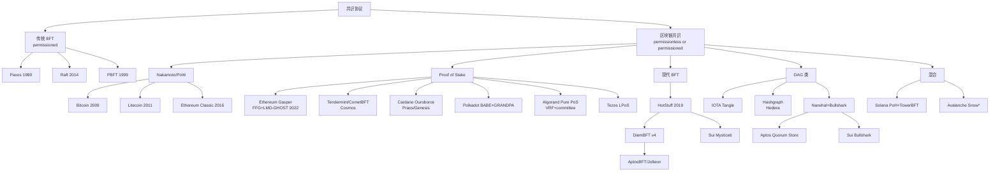

### 2.2 横向比较表

| 协议 | 类别 | 安全性来源 | 最终性 | 出块时间 | 真实部署 |
| --- | --- | --- | --- | --- | --- |
| Bitcoin | PoW | 哈希算力多数 | 概率（6 conf ≈ 60 min） | 600s | $1T+ 市值 |
| Litecoin | PoW (Scrypt) | 同上 | 概率 | 150s | $5B+ |
| Ethereum Classic | PoW (ETChash) | 同上 | 概率 | 13s | $2B+，曾被 51% 攻击 |
| Ethereum (Gasper) | PoS+FFG | 经济（slashing） | 经济（2 epoch ≈ 12.8 min） | 12s | $400B+ |
| Cosmos (CometBFT) | BFT-PoS | 2/3 stake | 绝对（即时） | 1-7s | $10B+，IBC 生态 |
| Cardano (Ouroboros Praos) | PoS+VRF | 1/2 stake honest | 概率（settlement param k） | 20s | $20B+ |
| Polkadot (BABE+GRANDPA) | 双层 PoS | NPoS+GRANDPA | 绝对（GRANDPA 终结） | 6s | $10B+ |
| Algorand (Pure PoS) | PoS+VRF 抽签 | 2/3 stake | 绝对（一轮即终结） | 3s | $1B+ |
| Tezos (LPoS) | 委托 PoS | 2/3 stake | 绝对（2 块） | 8s | $1B+ |
| Aptos (AptosBFT v4 → Raptr) | HotStuff 派 | 2/3 stake | 绝对 | 0.125s | $1B+ |
| Sui (Mysticeti) | DAG+BFT | 2/3 stake | 绝对（~390ms） | 0.4s | $5B+ |
| Hedera (Hashgraph) | aBFT | 2/3 stake | 绝对（~3s） | N/A（DAG） | $5B+ |
| IOTA | DAG | tip 选择 | 概率→Coordicide 后绝对 | N/A | $1B+ |
| Solana (PoH+Tower BFT → Alpenglow) | 混合 | 2/3 stake | 经济（32 conf ≈ 12.8s，未来 150ms） | 0.4s | $80B+ |
| Avalanche (Snow*) | 抽样投票 | metastable | 概率终结（β 轮） | 1-2s | $5B+ |

数据来源：各项目官方文档（Algorand pure-PoS 论文、Polkadot wiki、Aptos Baby Raptr 公告、Sui Mysticeti 公告、Hedera 官方文档），均访问 2026-04-27。

---

## 3. PoW 谱系导引

### 3.1 为什么先讲 PoW

> 💡 PoW 是区块链共识的"原点"——后面所有 PoS / BFT 都是对它的修补：要么保留安全模型换更便宜的资源（PoS），要么换掉概率最终性（BFT）。
>
> 第 4 章：PoW 为什么 | 第 5 章：Bitcoin 标准实现 | 第 6 章：Litecoin 换哈希变体 | 第 7 章：ETC 51% 活教材

### 3.2 PoW 谱系一图速览

```mermaid
graph LR
    SAT[Sybil 攻击问题] --> Idea[把"投票权"绑到稀缺资源]
    Idea --> CPU[CPU 算力]
    CPU --> SHA256[SHA-256 哈希谜题]
    SHA256 --> BTC[Bitcoin 2009]
    BTC -->|改哈希函数| LTC[Litecoin 2011<br/>Scrypt]
    BTC -->|改账户模型| ETH1[Ethereum 1.0 2015<br/>Ethash<br/>已退役 2022]
    ETH1 -->|分叉| ETC[Ethereum Classic<br/>2016+ ETChash]
    ETH1 -.->|大转身| Gasper[Ethereum 2.0 PoS<br/>见第 11 章]
```

### 3.3 PoW 类共识的共同假设

四件事必须同时成立，PoW 才安全：

1. **哈希函数抗预映像**：找不到 hash(x) = y 的 x，只能暴力试。
2. **算力市场半开放**：任何人都能买矿机参与，但买和电要花钱。
3. **诚实多数**：≥ 50% 算力在诚实方手中。
4. **网络消息延迟有上界**（在概率意义上）：否则攻击者总能延迟诚实块。

> ⚠️ 第 3 条在小币种链不成立。第 7 章 ETC 案例就是反例。

### 3.4 PoW 的工程账：电费 = 安全预算

```
Bitcoin 每年挖矿电费 ≈ 80 亿美元（2024 估算）
   = 全网年度安全预算
   = 攻击者要发动 51% 的最低成本
```

> 💡 这是 PoW 的财务直觉：**安全 = 电费 = 砸钱**。PoS 想用"质押 = slashing 风险"达到等价的"砸钱"效果。

### 3.5 我们将看到的真实事件

- 2024-04 Bitcoin 第四次减半（块奖励 6.25 → 3.125 BTC）
- 2020-08 Ethereum Classic 三连 51% 攻击（详见第 7 章）
- 2018 Bitcoin Cash / Bitcoin SV 算力分裂内战

---

## 4. PoW 的为什么：从 Sybil 攻击讲起

### 4.1 朴素方案的破绽

「大家都能写，谁先写到第 N 行就算谁的」——**Sybil 攻击**：李四可以创建 1 万个假账号垄断"先写权"。Sybil 来自 1973 年的同名小说（主角有 16 重人格），CS 圈用它指代"一个人扮多人"。

### 4.2 中本聪的解法

> **谁先解出哈希谜题，谁就有写下一行的权利**。

哈希谜题需要算力 → 算力需要电费 → 1 万个假账号没有电费做支撑 → Sybil 攻击失效。

> 💡 关键：把"投票权"绑定到**外部世界的稀缺资源**（电力 + 硬件）。数字账号复制免费，但电力无法复制。

### 4.3 类比 CS 经典

#### 4.3.1 对应物

| 现实问题 | CS 经典对应 |
| --- | --- |
| 防止 Sybil | 验证码（CAPTCHA）让人证明是人 |
| 工作量证明 | 找出 SHA256 输出前 N 位为 0 的 input |
| 难度调整 | TCP 拥塞控制（AIMD） |
| 最重链规则 | 图论：找最大权重路径 |

#### 4.3.2 哈希谜题为什么要 ~6.5 万次

SHA-256 输出每一位等概率 0/1。前 16 位都为 0 的概率 = (1/2)^16 = 1/65536，期望 65536 次才蒙到一次。这就是 PoW 的**全部技术内涵**——剩下都是工程包装。

### 4.4 PoW 的反对意见

#### 4.4.1 环保派批评

> ⚠️ 主流批评：Bitcoin 年耗电相当于荷兰全国（剑桥比特币电力消耗指数 2024）。
>
> 反驳（中本聪派）：电费就是安全预算；用其他资源（如 PoS 的 stake）替代，需要重新论证它能否提供等价的"砸钱"门槛。

#### 4.4.2 中心化派批评

> ⚠️ ASIC（专用矿机）让普通人挖矿不划算 → 矿池集中 → "一个人控制 51% 算力"理论可能。
>
> 反驳：经济上不划算（攻击成功币价崩盘自损）。

### 4.5 PoW 适用场景判断

| 场景 | PoW 合适？ |
| --- | --- |
| 全球开放的价值存储链（Bitcoin） | ✓ 适合 |
| 高频交易链（DEX/支付） | ✗ 出块太慢 |
| 联盟链（参与方已知） | ✗ 没必要——直接 PBFT |
| 隐私链（Monero / Zcash） | ✓ 历史选择，但近年也有转 PoS 趋势 |

> 💡 理论讲完，接下来看 PoW 的标准实现——Bitcoin——如何在工程上把哈希谜题、难度调整、最长链规则落地成一个运行了 17 年的系统。

---

## 5. Bitcoin：PoW 的标准实现

### 5.1 区块结构

```
┌─────────────────────────────────────────┐
│  Block Header (80 bytes)               │
│  ┌────────────────────────────────────┐ │
│  │ version (4)                        │ │
│  │ prev_hash (32) ──→ 链接前一块       │ │
│  │ merkle_root (32) ──→ 交易树根       │ │
│  │ timestamp (4)                      │ │
│  │ bits (4) ──→ 难度                  │ │
│  │ nonce (4) ──→ 矿工反复改的          │ │
│  └────────────────────────────────────┘ │
│  Body                                  │
│  ┌────────────────────────────────────┐ │
│  │ tx[0] (coinbase: 矿工奖励)          │ │
│  │ tx[1] ... tx[N]                    │ │
│  └────────────────────────────────────┘ │
└─────────────────────────────────────────┘
```

### 5.2 出块流程

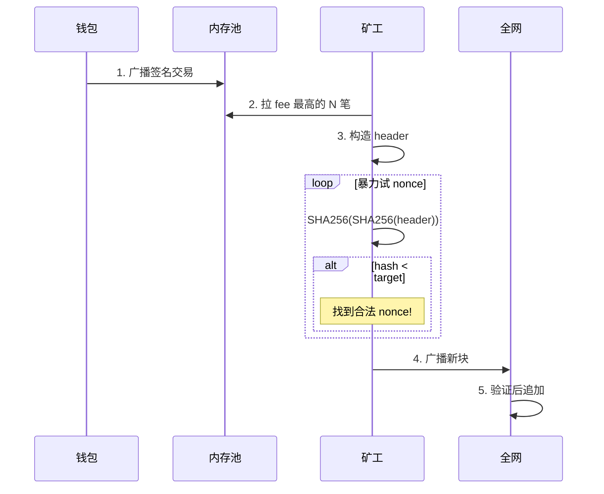

### 5.3 难度调整：为什么必须做

> 🤔 **思考**：如果难度永远固定，会怎样？

- **算力涨**（牛市矿工涌入）→ 出块时间从 10min 降到 30s → 孤块率飙升 → 安全性退化
- **算力跌**（黑天鹅 / 矿工撤离）→ 出块时间涨到 1h → UTXO 锁死 → 不可用

Bitcoin 的策略：每 2016 块（≈ 2 周）调整一次：

```
new_difficulty = old_difficulty × (2016 块的实际耗时 / 期望耗时 14 天)
```

调整幅度限制 [0.25x, 4x]，防止单次跳变过大。

> 💡 **数字感**：Bitcoin 2024-04 第四次减半后，区块奖励从 6.25 BTC → 3.125 BTC。当前难度约 1.1 × 10¹⁴，全网算力 ~ 600 EH/s。来源：Bitcoin Magazine Pro 2026-04-27。

### 5.4 双花概率（白皮书 §11）

Alice（攻击者，算力比例 q）想骗 Bob（商家，等 z 个 confirmation）。

```
P(成功双花) ≈ Σ_{k=0..z} P(攻击者前 z 块挖了 k 块) × P(从领先 z-k 块追上)

简化版：当 q < 0.5 时
P ≈ 1 − Σ_{k=0..z} [(λ^k · e^{-λ}) / k!] × (1 − (q/p)^(z-k))
其中 λ = z·q/p
```

数值结果：

| q (攻击者算力) | z=3 | z=6 | z=12 |
| --- | --- | --- | --- |
| 0.10 | 4.4% | 0.024% | 1×10⁻⁹ |
| 0.30 | 25% | 13% | 2.0% |
| 0.40 | 51% | 35% | 16% |

> 💡 **为什么交易所等 6 个确认？** q=0.10 时 z=6 已经把成功率压到 0.024%。这是中本聪在白皮书附录给的"参考值"。
>
> ⚠️ **不要盲目套用**：q 假设要符合实际。Bitcoin 算力 600 EH/s，凑齐 q=0.1 也要 60 EH/s，租 NiceHash 一天约 400 万美元——攻击不划算。但小币种（如 ETC）算力小很多，q=0.5 实际可达，就被 51% 攻击过。

### 5.5 最长链 vs 最重链

> ⚠️ **常见误区**：Bitcoin 文档说"最长链规则"，但实际是**最重链**（cumulative work）。
>
> 区别：如果攻击者用低难度块伪造一条更**长**的链，节点不应接受。最重链规则会拒绝它，最长链规则会被骗。
>
> 我们的代码 `code/pow_chain.py` 用的就是最重链规则。

### 5.6 Bitcoin 的真实部署

#### 5.6.1 数字感（2026-04 数据）

- 全网算力：~ 600 EH/s（exa-hash/sec）
- 难度：~ 1.1 × 10¹⁴
- 区块奖励：3.125 BTC（2024-04 第四次减半后）
- 矿工年收入：≈ 100 亿美元（含 fee）
- 全球 mining pool 数：~ 15 个主要 pool 占 90%+ 算力

#### 5.6.2 矿池集中化担忧

> ⚠️ Foundry USA + AntPool 两个矿池占全网算力 ~ 50%——理论上"两个 CEO 喝杯咖啡"就能 51% 攻击。
>
> 反驳（实践派）：算力不等于矿池——矿池只是把多个矿工的算力聚合到同一节点提交，矿工随时能切到别的池。但这种"切池压力"是事后惩罚，事前合谋仍可行。

### 5.7 Bitcoin 的优劣总评

| 维度 | 评分 | 说明 |
| --- | --- | --- |
| 安全性 | ★★★★★ | 17 年从未 reorg 超过 6 块；攻击成本数十亿美元 |
| 去中心化 | ★★★★☆ | 矿池集中是软肋；但节点数 > 15000 全球分布 |
| 性能 | ★★☆☆☆ | 7 TPS，10 min 出块——价值存储够用，DApp 不行 |
| 智能合约 | ★☆☆☆☆ | 图灵不完备脚本（OP_*），刻意为之 |
| 终结性 | ★★★☆☆ | 概率最终性，6 conf 后实践上不会 reorg |

### 5.8 Bitcoin 的历史事件

#### 5.8.1 减半时间线

| 时间 | 块高度 | 块奖励 | 备注 |
| --- | --- | --- | --- |
| 2009-01 | 0 | 50 BTC | Genesis |
| 2012-11 | 210,000 | 25 BTC | 第一次减半 |
| 2016-07 | 420,000 | 12.5 BTC | 第二次减半 |
| 2020-05 | 630,000 | 6.25 BTC | 第三次减半 |
| 2024-04 | 840,000 | 3.125 BTC | 第四次减半 |

#### 5.8.2 重大 reorg 事件

- **2010-08-15**：Bitcoin 历史上唯一一次"通胀 bug" reorg。某矿工挖出一个含有 1.84 亿 BTC 的非法块（远超 2100 万总量），社区在 5 小时内分叉退回前 53 块。
- **2013-03**：v0.7 / v0.8 客户端 LevelDB 兼容性问题导致 24 块 reorg；社区 4 小时内回滚到 v0.7 兼容版本。

> 💡 这两次都是"客户端 bug"，不是攻击。说明：协议本身扛得住，但实现仍是脆弱点。

> Bitcoin 是 PoW 的"黄金标准"。Litecoin 则是第一个系统性修改 Bitcoin 参数的尝试——把哈希函数从 SHA-256 换成 Scrypt，目标是更快出块、更难 ASIC 化。

---

## 6. Litecoin：换哈希函数的变体

### 6.1 设计动机

Litecoin 创建于 2011 年。Charlie Lee（前 Google / 前 Coinbase）目标："Bitcoin 是数字黄金，Litecoin 是数字白银——更快、更便宜、更适合日常支付。"

#### 6.1.1 与 Bitcoin 的差异

| 维度 | Bitcoin | Litecoin |
| --- | --- | --- |
| 哈希函数 | SHA-256 | Scrypt（内存难） |
| 出块时间 | 10 min | 2.5 min |
| 总量 | 2100 万 | 8400 万 |
| 减半周期 | 4 年 | 4 年 |
| 创始 | 2009 | 2011 |
| 当前市值 | $1T+ | $5B+ |

### 6.2 Scrypt：反 ASIC 的尝试

> 💡 **Scrypt**（Colin Percival 2009，原用于密码哈希防 rainbow table）：memory-hard 哈希函数，要求计算时同时占用大量内存。内存比 CPU 算力更难"指数堆叠"——理论上让 ASIC 优势更小。

#### 6.2.1 Scrypt 怎么"内存难"

```
1. 用初始 password 生成一个长伪随机 buffer V[0..N-1]（占内存）
2. 用初始 hash 索引 V，按 hash 决定的随机顺序读取并 XOR
3. 必须真实存储整个 V，不能只存 hash 链
```

→ ASIC 想加速，必须**同时**砸 N MB SRAM——成本不再线性可压。

### 6.3 反 ASIC 的失败

#### 6.3.1 教训

> ⚠️ **结局**：Scrypt ASIC 还是被造出来了，只是晚了 2-3 年（2014 年首批 Scrypt ASIC 上市）。一旦 ASIC 出现，"内存难"优势消失，回到 Bitcoin 那套"算力豪门"模式。

#### 6.3.2 同类失败

| 链 | 反 ASIC 算法 | 失败时间 |
| --- | --- | --- |
| Litecoin | Scrypt | 2014 |
| Ethereum 1.0 | Ethash | 2017 |
| Monero | CryptoNight → RandomX | 多次硬分叉换算法 |
| Vertcoin | Lyra2REv3 | 反复硬分叉 |

> 💡 **Monero 的反向选择**：Monero 选择**反复硬分叉换算法**让 ASIC 厂商不敢投入——每年换一次，专用矿机做出来已经过期。当前用的是 RandomX。这是"用社会工程对抗硬件工程"的典型。

### 6.4 Litecoin 在生态中的角色

> 💡 Litecoin 长期是"Bitcoin 实验场"——BIP 先在 Litecoin 试运行再合并到 Bitcoin：
> - **SegWit**：2017-05 Litecoin 激活，4 个月后 Bitcoin 跟进
> - **MWEB**（MimbleWimble Extension Block）：2022 Litecoin 上线，Bitcoin 至今未跟进

Lightning Network 在 Litecoin 上也能跑。商家选 Litecoin 主要因 fee 低、出块快（2.5 min）。

### 6.5 Litecoin 的优劣总评

| 维度 | 评分 | 说明 |
| --- | --- | --- |
| 安全性 | ★★★☆☆ | 算力 ~ Bitcoin 的 1%；理论易被 51%，实践无大事故 |
| 创新性 | ★★☆☆☆ | 主要是 Bitcoin 的渐进改进，不是范式创新 |
| 性能 | ★★☆☆☆ | 56 TPS，2.5 min 出块——日常支付够用 |
| 生态 | ★★☆☆☆ | DApp / DeFi 几乎为零 |

### 6.6 历史事件

- **2017-05 SegWit 激活**：作为 Bitcoin 测试场成功
- **2019-08 第二次减半**：奖励 25 → 12.5 LTC，价格波动小
- **2022-05 MWEB 激活**：开启可选隐私交易；多家交易所因合规延迟支持
- **2023-08 第三次减半**：奖励 12.5 → 6.25 LTC

> Litecoin 表明"换哈希函数"终究挡不住 ASIC。更深层的问题是：算力渺小的 PoW 链在面对外部租算力市场时有多脆弱？Ethereum Classic 就是这个问题的答案——被三次 51% 攻击的活教材。

---

## 7. Ethereum Classic：51% 攻击的活教材

### 7.1 起源

2016 年 The DAO 黑客事件后，以太坊社区分裂：
- 多数派：硬分叉退还黑客资金 → Ethereum (ETH)
- 少数派：「Code is Law」拒绝退还 → Ethereum Classic (ETC)

> 💡 区块链历史上第一次「社会层共识」与「协议层共识」的公开冲突——Lamport 的 BFT 论文没考虑这个场景。Vitalik 反思：「我们当时不敢相信 PoS 能扛 The DAO，所以选了硬分叉」——这成了他力推 PoS + slashing 的动机之一。

### 7.2 第一次 51% 攻击：2019-01

#### 7.2.1 时间线

- 2019-01-05：Coinbase 发现 ETC 链异常重组
- 攻击者重组 ~100 块；窃取约 $1.1M
- Coinbase 暂停 ETC 充值；Bitfly mining pool 报告同步问题

#### 7.2.2 当时的诊断

- ETC 算力 ~ 8 TH/s，租用 Ethash 算力市场（NiceHash）一天即可凑齐 51%
- 直接经济损失：$1.1M
- 间接：交易所暂停 ETC 充提一周

> ⚠️ 这是 ETC 链上第一次有据可查的 51%；社区一开始以为是孤立事件。直到 2020 才发现是系统性脆弱。

### 7.3 第二次 51%：2020-08-01

#### 7.3.1 攻击规模

- 损失：807,260 ETC ≈ $5.6M（按当时币价）
- 攻击成本：约 17.5 BTC ≈ $204K（NiceHash 租用费）
- reorg 深度：4000+ 块（约 14 小时挖矿）
- ROI：~ 27 倍

#### 7.3.2 攻击者动作

```
1. 在交易所 A 充值 ETC（链上确认 100 块即可放）
2. 私下租 NiceHash 算力，秘密挖一条更长的链
3. 在 A 提走对应 USDT/BTC
4. 广播自己的链 → 替换公链 → 自己充值的 ETC 又回到自己钱包
5. 净赚：USDT/BTC + ETC（双花）
```

数据来源：Bitquery 2020-08 攻击分析，访问 2026-04-27。

### 7.4 第三、四次 51%：2020-08 同月再袭

#### 7.4.1 第二次攻击（2020-08-06）

仅 5 天后——第二次类似攻击成功。reorg 4000+ 块，损失类似规模。

#### 7.4.2 第三次攻击（2020-08-29）

8 月内的第三次，reorg 7000+ 块，相当于 **2 天的挖矿**。这是当时整个 PoW 历史上最深的 reorg。

#### 7.4.3 为什么连续被打

```
原因 1：Ethash 算力市场（NiceHash）流动性极强
原因 2：ETC 仅占全 Ethash 算力 ~5%
原因 3：交易所确认数太低（部分 50-200 块即放）
原因 4：第一次成功后，攻击者发现"能持续赚"
```

### 7.5 为什么 ETC 会，BTC 不会

#### 7.5.1 关键洞察

> ⚠️ **核心**：当一个 PoW 链的算力**只是**"主导算法"全网算力的一小部分时，攻击者可以用现金从 NiceHash 等算力市场租到足够算力发动 51%。
>
> ETC 用的是和 ETH 相同的 Ethash 算法，2020 年 ETC 算力只占 Ethash 全网的 ~5%——攻击者付几十万美元就能租到 ETC 全网算力。

#### 7.5.2 Bitcoin 为何幸免

| 原因 | 数字 |
| --- | --- |
| 全网算力 | 600 EH/s |
| 算力市场租赁规模 | NiceHash 仅有 ~ 1 EH/s SHA-256 算力 |
| 51% 所需 | 300+ EH/s ≈ 全部市场算力的 300 倍 |

→ 经济上不可行。

### 7.6 ETC 的应对：ETChash

#### 7.6.1 算法升级（2020-11 Thanos 升级）

ETC 把 Ethash 的 epoch 长度从 30,000 块翻倍到 60,000 块，DAG 大小同步翻倍。这让 ETH 矿机不能直接挖 ETC——攻击者必须为 ETC 专门买矿机。

#### 7.6.2 后续效果

- 2020-11 之后，ETC 未再发生大规模 51% 攻击
- 2022-09 ETH 转 PoS 后，所有 Ethash 矿机失业，部分流入 ETC，让 ETC 算力翻了几倍——讽刺地反而变得安全
- 当前 ETC 全网算力约 200 TH/s

### 7.7 ETC 案例的工程教训

#### 7.7.1 PoW 链安全性的真公式

> 💡 **不是绝对算力，是算力相对于"可租到的同算法算力"的比例**。

#### 7.7.2 交易所确认数策略

事后多家交易所把 ETC 充值确认数提到 5000+ 块（约 18 小时）——这反过来让 ETC 在交易所体验远差于 BTC（BTC 只要 6 conf ≈ 1 小时）。

#### 7.7.3 给小币种 PoW 链的建议

```
1. 选一个独占的哈希算法（不要复用大币种）
2. 算力市场流动性 > 当前算力的 5 倍 → 警报
3. 交易所确认数动态调整（盯链上算力变化）
4. 考虑迁 PoS 或 hybrid（如 Decred 的 PoW+PoS）
```

> ETC 的困境暴露了 PoW 的根本痛点：安全预算等于电费，小链买不起。Ethereum 自己也意识到这点——2022 年 The Merge 把以太坊从 PoW 切到了 PoS，用质押资产的 slash 风险替代电费。下一块我们就来看 PoS 的逻辑是怎么转的。

---

## 8. PoS 谱系导引

### 8.1 PoS 的直觉

#### 8.1.1 PoW → PoS 的翻译

| PoW | PoS |
| --- | --- |
| 算力越多，挖到块概率越高 | 质押越多，被选为出块者概率越高 |
| 电费 = 攻击成本 | slash（罚没）= 攻击成本 |
| Sybil 防御来源：算力稀缺 | Sybil 防御来源：质押资金稀缺 |

### 8.2 PoS 的三个根本问题

#### 8.2.1 Nothing at Stake

```
场景：链分叉成 A、B 两条
PoW 矿工：算力只能投一条（投另一条要再花电费）
PoS 验证者：签名免费 → 我两条都签，反正稳赚？
→ 永远不会 finalize，链分裂下去
```

**解法**：slashing。两条都签 = 立即罚没押金。

#### 8.2.2 Long-range Attack

```
场景：5 年前退出的验证者私钥仍在
他们今天可以伪造一条 5 年长的"另一条历史"
新加入的节点该信哪条？
```

**解法**：弱主观性（weak subjectivity）+ checkpoint——新节点必须从一个不太老的可信检查点开始同步。

#### 8.2.3 Stake Grinding

```
场景：leader 选举依赖随机数
攻击者：调整自己的签名/状态，影响下一轮随机数 → 让自己被选概率更高
```

**解法**：VRF（Verifiable Random Function）或随机信标（randomness beacon），让随机数对操控免疫。

### 8.3 PoS 流派的差异

下面六个流派分别用不同方式解决这三个问题：

| 流派 | Nothing at Stake | Long-range | Grinding |
| --- | --- | --- | --- |
| Ethereum Gasper | Casper FFG slashing | weak subjectivity | RANDAO + VDF（计划中） |
| Cosmos Tendermint | double-sign slashing | weak subjectivity | proposer 轮值 |
| Cardano Ouroboros | slashing（晚期版本） | Genesis 协议 | 多方计算随机性 |
| Polkadot BABE+GRANDPA | equivocation slashing | weak subjectivity | VRF |
| Algorand Pure PoS | 无 slashing（但需 honest majority） | 不适用（链短期一致） | VRF + 私下抽签 |
| Tezos LPoS | double-baking slashing | checkpoint | seed nonce revelation |

---

## 9. PoS 之 Ethereum Gasper（FFG + LMD-GHOST）

### 9.1 一句话总览

> **Gasper = LMD-GHOST（fork choice，决定 head）+ Casper FFG（finality gadget，决定 finalize）**

两层分离：LMD-GHOST 保 liveness（链一直在出块），Casper FFG 保 safety（绝对 finality）。

### 9.2 时间结构

```
┌──────── 1 epoch = 32 slot = 384s = 6.4 min ────────┐
│                                                      │
│  slot 0   slot 1   ...   slot 31                    │
│  [block][block]...[block]                           │
│  ↑12s     ↑12s          ↑12s                        │
│                                                      │
│  每 slot：1 个 proposer，1 个 32-人 committee 投票    │
│  每 epoch 末尾：checkpoint                           │
└──────────────────────────────────────────────────────┘
```

### 9.3 LMD-GHOST 流程图

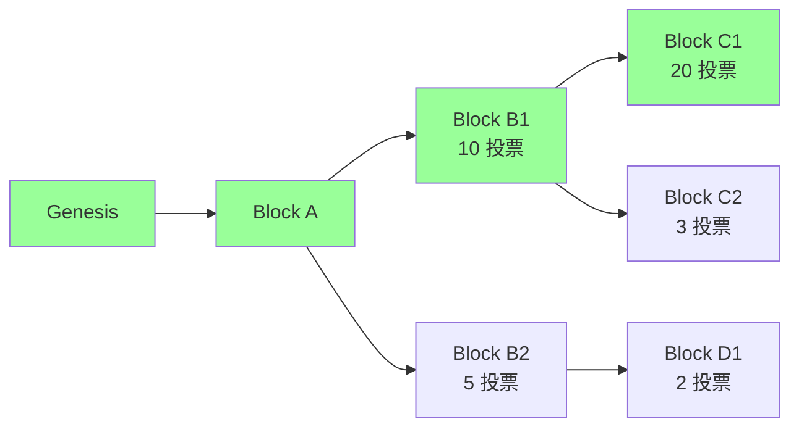

LMD-GHOST 选择**最重子树**（用最新投票算）。上图中：

- B1 子树总投票 = 10 + 20 + 3 = 33
- B2 子树总投票 = 5 + 2 = 7

→ head = C1（B1 子树中最大的）。绿色路径 = canonical chain。

### 9.4 Casper FFG 双轮投票

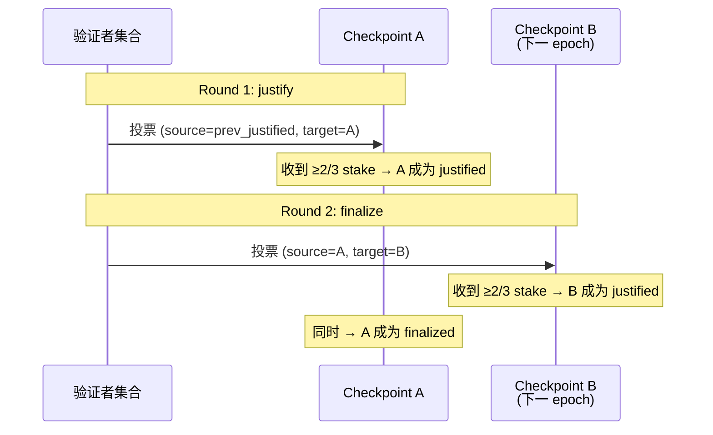

### 9.5 Slashing 两条戒律

> ⚠️ **No Double Vote**：同一个 epoch 不能签两个不同的 target。
> ⚠️ **No Surround Vote**：不能让旧投票 (s₁,t₁) 包围新投票 (s₂,t₂)，即不能有 h(s₁) < h(s₂) < h(t₂) < h(t₁)。

任一违反 → 立即 slash。**这就是 Ethereum 把"经济最终性"量化的方式**：要 revert 一个 finalized block，至少要让 1/3 stake 接受 slash。当前总质押 ~3500-3700 万 ETH（2026-04），1/3 ≈ 1200 万 ETH（数百亿美元）。

> 📝 **注意区分**：上述 slash 针对的是 Casper FFG 的 double/surround vote。**LMD-GHOST attestation 重投不直接被 slash**，而是被 fork-choice 经济性惩罚——投错链的 attestation 拿不到正确链上的 reward，长期下来余额相对受损。

### 9.6 Inactivity Leak

≥1/3 stake 离线时，FFG 凑不齐 2/3 票。**Inactivity Leak**：每 epoch 离线验证者余额指数累积削减，数周后离线方份额降到 < 1/3，活跃方重新够 2/3，finality 恢复。

> 💡 短期牺牲 safety（不 finalize），保住 liveness（LMD-GHOST 照走），经济惩罚把 liveness 拉回来。

### 9.7 Single Slot Finality (SSF) 路线图

当前 finality 12.8 min 仍嫌慢。Vitalik 在 2022 提出 SSF：每 slot finalize。

挑战：100 万验证者签名聚合不可行。可能解：
- Orbit-SSF：分组轮值
- 提高最低质押到 1024 ETH（社区争议大）
- BLS 优化

**2026-04 状态**：仍研究阶段，预计在 Verkle / Danksharding 之后（最早 2027）。来源：ethereum.org/roadmap/single-slot-finality，访问 2026-04-27。

### 9.8 真实事故：2022-05-25 7-block reorg

详细复盘见 `exercises/03_reorg_postmortem.md`，以及第 33 章。要点：

- 三因合流：proposer 出块迟到 + proposer boost 滚动升级不一致 + 部分客户端 fork-choice bug
- 7 个 slot 内分裂；Casper FFG finality 未受影响
- 教训：fork-choice 改动从此必须打包进硬分叉

### 9.9 Gasper 的优劣总评

| 维度 | 评分 | 说明 |
| --- | --- | --- |
| 安全性 | ★★★★★ | 经济最终性数百亿美元保护 |
| 去中心化 | ★★★★★ | 100 万+ 验证者，数千节点 |
| 性能 | ★★★☆☆ | 12s 出块，12.8 min finalize |
| 智能合约 | ★★★★★ | EVM 全图灵 + L2 |
| 终结性 | ★★★★☆ | 12.8 min；SSF 后 → ★★★★★ |

---

## 10. PoS 之 Cosmos Tendermint / CometBFT

### 10.1 直觉

Tendermint（Buchman 2016；Buchman/Kwon/Milosevic 2018，arXiv:1807.04938）：**用 PoS 决定 BFT 验证者集合，再让集合按 PBFT 三阶段达成共识**。

> 💡 **重命名公告**：Tendermint Core 在 2023-02-01 被 Informal Systems fork 并改名 **CometBFT**（原作者 Jae Kwon / AiB 在 2023-01 宣布停止支持 Tendermint）。从 v0.34 → v0.38 → v1.0（2025-02-03 发布 v1.0.1）一脉相承。Cosmos / Osmosis / Celestia / Sei 全用它。来源：Informal Systems 2023-02-01 announcement / cometbft GitHub releases，访问 2026-04-27。

### 10.2 三阶段流程

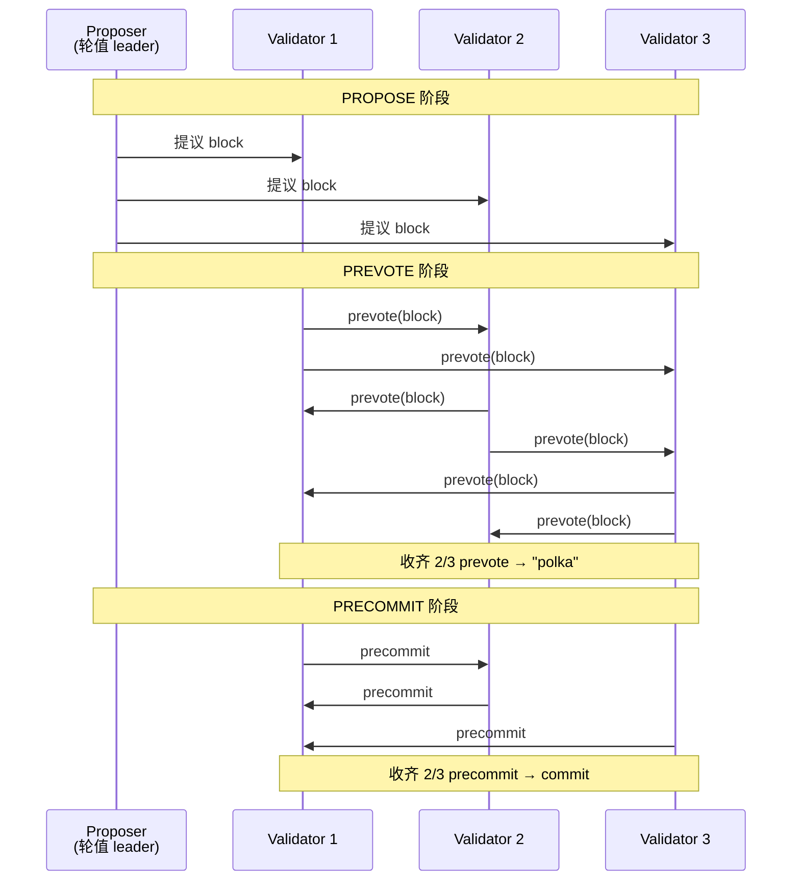

### 10.3 与 PBFT 的差异

| 维度 | PBFT 1999 | Tendermint 2018 |
| --- | --- | --- |
| 客户端模型 | 显式区分 client / replica | 没有客户端，所有节点对等 |
| 通信 | 全连接广播（O(n²)） | gossip（O(n) per round） |
| 验证者集合 | 静态 | 每块可变（PoS 动态） |
| 出块时机 | 客户端发请求才出 | 自动按 slot 出 |

### 10.4 安全性 vs 活性

> ⚠️ Tendermint 是**absolute finality**——块一旦 commit 不可逆。代价是网络分区时**链直接停**：没 2/3 stake 在线就出不了块。Ethereum 反向选择：liveness 优先，分区时 LMD-GHOST 照走不 finalize。

### 10.5 Cosmos 怎么用 CometBFT

Cosmos SDK 把 CometBFT 当共识引擎，开发者只需写 Go 应用层，不用碰共识——实战章节用 CometBFT v0.38 起 4 节点本地网。

### 10.6 Cosmos 的真实部署

#### 10.6.1 主要链

- **Cosmos Hub**：原生链，IBC 中心枢纽
- **Osmosis**：Cosmos 上的 DEX，TVL > $1B
- **Celestia**：模块化数据可用性层
- **Sei**：高频交易优化的 Cosmos 链
- **dYdX v4**：把订单簿做到 Cosmos chain

#### 10.6.2 IBC：Cosmos 的杀手锏

> 💡 **Inter-Blockchain Communication**：Cosmos 链之间用统一协议互发消息。这是除了 Ethereum L2 之外最大规模的实战跨链方案。当前 IBC 网络日活跃链 100+。

### 10.7 Tendermint 的优劣总评

| 维度 | 评分 | 说明 |
| --- | --- | --- |
| 安全性 | ★★★★☆ | absolute finality；少量大型 validator 集中风险 |
| 去中心化 | ★★★☆☆ | 通常 100-200 个 validator，比 Ethereum 少 |
| 性能 | ★★★★☆ | 1-7s 出块，10k+ TPS（取决于 app 层） |
| 终结性 | ★★★★★ | 单块即终结 |
| 工程友好 | ★★★★★ | Cosmos SDK 让你 1 周做出新链 |

### 10.8 历史事件

#### 10.8.1 Cosmos Hub 历次软分叉

- 2019 launch → 2024 多次硬分叉
- 链从未发生 reorg（absolute finality 保护）
- 数次因 validator 离线超 1/3 导致链停止出块（最长约 1 小时）——但不是事故，是协议设计

#### 10.8.2 Tendermint → CometBFT 重命名（2023-02）

- 2023-01 Jae Kwon（Tendermint 原作者）/ AiB 宣布停止支持
- 2023-02-01 Informal Systems 接管，更名 CometBFT
- 2023-02 v0.34 上线，与 Tendermint v0.34 完全兼容
- 2025-02-03 v1.0.1 发布，引入 PBTS（Proposer-Based Timestamps）

---

## 11. PoS 之 Cardano Ouroboros（Praos / Genesis / Peras）

### 11.1 直觉

Ouroboros 是第一个有"形式化安全证明"的 PoS 协议（Kiayias et al. 2017）：

```
每个 epoch（5 天）开始时，用上一 epoch 的随机数 + VRF 确定本 epoch 每个 slot 的 leader。
leader 只有"自己知道"——slot 到来时出块，其他节点用 VRF proof 验证合法性。
```

### 11.2 VRF 是什么

VRF（Verifiable Random Function）：

```
输入：私钥 sk, 消息 m
输出：(随机值 y, 证明 π)

性质：
  1. 给定 (pk, m, y, π)，任何人能验证 y 是 sk 的合法输出
  2. 没 sk 的人无法预测 y
  3. y 在统计上不可区分于真随机
```

> 💡 **类比**：VRF 就是「带证明的伪随机」。每个节点能私下"掷骰子"，掷完能向别人证明自己没作弊。

### 11.3 Cardano 的具体参数

- **epoch**：5 天 = 432,000 slot，每 slot 1 秒
- **Slot leader 概率**：和质押比例成正比；多个 leader 也可能（出多个块）或没人（空 slot）
- **下一 epoch 随机数**：把当前 epoch 前 2/3 块的 VRF 输出哈希起来

来源：Cardano Developer Portal，访问 2026-04-27：https://developers.cardano.org/docs/operate-a-stake-pool/basics/consensus-staking/

### 11.4 Ouroboros 家族演进

| 版本 | 年份 | 关键升级 |
| --- | --- | --- |
| Ouroboros Classic | 2017 | 最早版本，需要全局同步时钟 |
| Ouroboros Praos | 2018 | 引入 VRF 私下选举，对部分异步网络鲁棒 |
| Ouroboros Genesis | 2018→2024 mainnet | 解决 long-range attack，新节点能从 genesis 同步 |
| Ouroboros Peras | 2025 | 加快 settlement（"快终结" gadget） |

来源：Cardano.org 2024-05-08 blog "Ouroboros Genesis design update"，访问 2026-04-27。

### 11.5 弱主观性怎么解

> ⚠️ Ouroboros Genesis 通过"chain density"判定抵御 long-range attack：遇到候选分叉时，比较两条链在过去 K 个 slot 内的块密度——诚实链 ≥ k/2 个块，伪造链很难维持该密度。新节点能**完全从 genesis 同步**，零外部信任。

#### 11.5.1 与 Ethereum 的对比

| 链 | 新节点同步 |
| --- | --- |
| Ethereum | 必须信任一个 weak subjectivity checkpoint（朋友/EF/交易所） |
| Cardano (Genesis) | 完全从 genesis 同步，零信任假设 |

### 11.6 真实部署

#### 11.6.1 数字感（2026-04）

- 验证者池（stake pool）：~ 3000 个
- 总质押：约 22 B ADA（占流通量 ~ 60%）
- 出块时间：20 秒
- TPS：实测 ~ 250

#### 11.6.2 重要里程碑

- **2017-09 Ouroboros Classic 论文**
- **2020-07 Shelley 升级**：从中央化 → 去中心化 PoS
- **2021-09 Alonzo 升级**：上线智能合约（Plutus）
- **2024-09 Chang 升级**：Ouroboros Genesis 主网激活
- **2025-Q4 Peras（计划）**：快终结 gadget

来源：IOG 2024-10-14 blog "Ouroboros Peras: the next step"，访问 2026-04-27。

### 11.7 Cardano 的优劣总评

| 维度 | 评分 | 说明 |
| --- | --- | --- |
| 安全性 | ★★★★★ | 形式化证明 + Genesis 解 long-range |
| 去中心化 | ★★★★☆ | stake pool 数量多，但前 10 占大部分 |
| 性能 | ★★★☆☆ | 20s 出块，250 TPS |
| 智能合约 | ★★★☆☆ | eUTXO + Plutus，独特但学习曲线陡 |
| 学院派优势 | ★★★★★ | 几乎所有协议都有论文+ 形式化证明 |

### 11.8 历史事件

- **2020-07 Shelley fork**：从联盟阶段到去中心化，2 个月内 90%+ stake 完成迁移
- **2024-09 Chang upgrade**：Ouroboros Genesis 上线，未发生重大事故
- **从未有 reorg 超过 settlement param k**：链层 0 大事故记录

---

## 12. PoS 之 Polkadot（BABE + GRANDPA）

### 12.1 直觉：与 Gasper 类似的双层设计，分层更彻底

```
BABE：负责出块（block production）
  - 每 slot 用 VRF 选 primary slot leader
  - 类似 Ouroboros Praos
  - 提供"概率终结"，块一直在出

GRANDPA：负责 finalize（finality gadget）
  - 验证者投票 finalize 一段连续的链（不是单块）
  - 一轮投票能 finalize 多个块
  - 提供"绝对终结"
```

### 12.2 GRANDPA 全名

**G**HOST-based **R**ecursive **AN**cestor **D**eriving **P**refix **A**greement：每次 finalize 一段链的"最长公共前缀"，不是单块。

### 12.3 工作流程

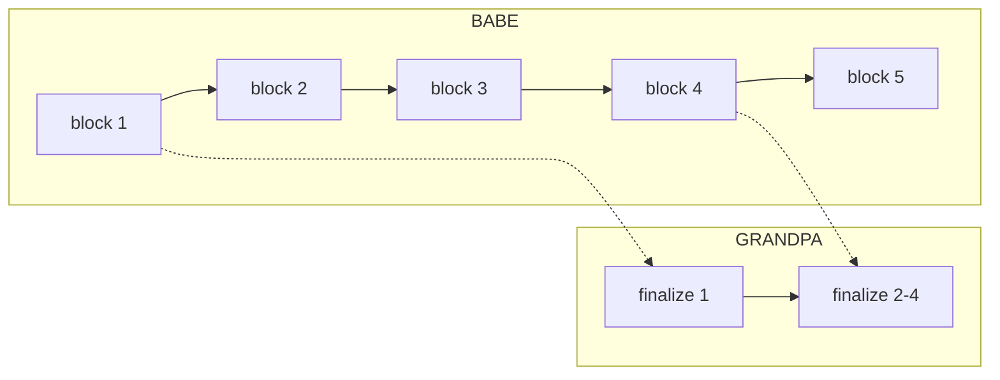

BABE 持续出块；GRANDPA 隔一段时间投票，一次 finalize 多个块（图中一次 finalize 了 2-4）。

### 12.4 验证者集合

- **active validators**：当前 era 选出的 600 个验证者（2024 年起 Active Set 由 297 提升至 600，来源：Polkadot DOT staking dashboard，访问 2026-04）
- **nominators**：质押 DOT 委托给验证者；最少 250 DOT 直接 nominate，1 DOT 可加入 pool

### 12.5 与 Ethereum Gasper 的对比

| 维度 | Ethereum Gasper | Polkadot BABE+GRANDPA |
| --- | --- | --- |
| 出块层 | LMD-GHOST | BABE (VRF-based) |
| 终结层 | Casper FFG（每 epoch finalize） | GRANDPA（任意时刻可 finalize） |
| 终结粒度 | 块 | 链段（前缀） |
| 验证者数 | ~100 万 | ~300 |
| Slashing | 有 | 有 |

### 12.6 真实部署：Polkadot 的"中继链 + 平行链"

#### 12.6.1 中继链（Relay Chain）

承载 BABE+GRANDPA 共识的核心链。验证者只验证中继链 + 分配的 parachain slot。

#### 12.6.2 平行链（Parachains）

通过竞拍获得 slot 的应用链。每个 parachain 有自己的 collator 节点收集交易，但安全靠中继链 finality。

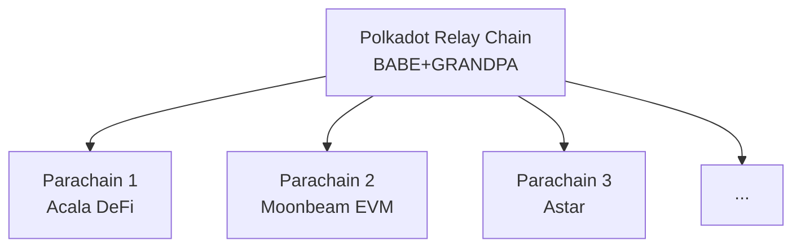

### 12.7 Polkadot 的优劣总评

| 维度 | 评分 | 说明 |
| --- | --- | --- |
| 安全性 | ★★★★☆ | 共享安全；GRANDPA 绝对终结 |
| 去中心化 | ★★★☆☆ | 600 个 validator（2024 起，原 297），比 Ethereum 少 |
| 性能 | ★★★★☆ | 6s 出块；多 parachain 并行 |
| 工程门槛 | ★★☆☆☆ | Substrate 框架学习曲线陡 |
| 跨链 | ★★★★★ | 平行链原生跨链 |

### 12.8 历史事件

- **2020-05 mainnet launch**
- **2021-12 第一次平行链拍卖**：5 个 slot 用 ~ $1.4B 价值的 DOT 锁定
- **2022-多次平行链 slot 续约**
- **2024 Polkadot 2.0 路线图**：把 slot 拍卖换成 agile coretime，更灵活

---

## 13. PoS 之 Algorand（Pure PoS + VRF Sortition）

### 13.1 直觉

Algorand（Micali 等人，2017）与其他 PoS 的关键差异：
- **2024-09 起需主动 stake ALGO 参与共识**（Staking Rewards 上线前 ALGO 自动在线，现已改为类似其他 PoS 的主动质押模型）
- **没有 slashing**：丢私钥也不赔钱
- **每块换 committee**：成员在公布前连自己都不知道

### 13.2 Cryptographic Sortition

每一块开始时：

```
for each ALGO holder with key sk:
    seed = blockchain_round_seed
    (y, π) = VRF(sk, seed)
    # y 是 [0, 1] 之间的随机数
    if y < threshold(my_stake):
        I'm selected for this round!
        publish (block_proposal, y, π)
```

> 💡 **关键**：sortition 是**私下**进行的——直到我自己公布 VRF proof，没人知道我被选上了。
> 这就是它抗"针对性 DDoS"的方式：攻击者根本不知道该攻击谁。

### 13.3 BA⋆ 协议

委员会选出来后，做一个简化的 BFT：

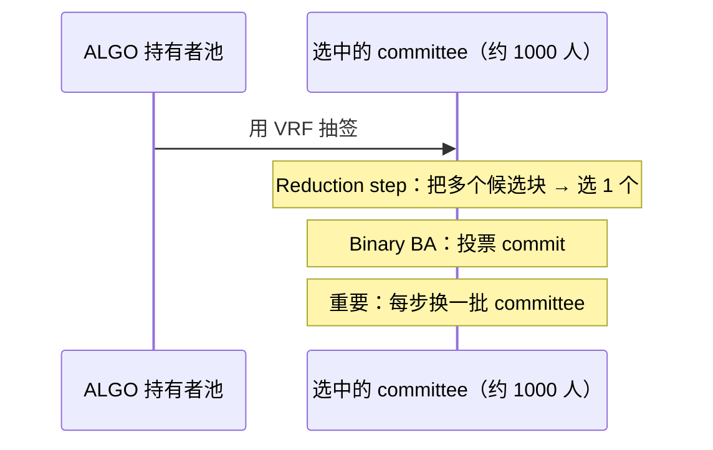

### 13.4 安全性边界

Algorand 论文证明：在 honest-majority（≥ 2/3 stake honest）假设下，BA⋆ 能在 O(1) 轮内 finalize。当前出块时间约 3 秒。

> ⚠️ Algorand 的"absolute finality" 是**第一轮就 finalize**——比 Cosmos 还彻底。

#### 13.4.1 安全模型

- **honest-majority 假设**：≥ 2/3 stake 诚实
- **网络模型**：弱同步（能容忍部分异步，但不能完全异步）
- **抗 adaptive adversary**：因为 sortition 私下进行，攻击者无法事前定位 committee 成员

#### 13.4.2 没有 slashing 怎么防 Nothing at Stake

**Algorand 的答案**：committee 每块都换 + 单轮即 finalize。Nothing at Stake 的前提是"对多条 fork 都签名"，但没有持续 fork 的可能。代价：一旦 < 2/3 honest，链停（safety 优先）。

### 13.5 真实部署

#### 13.5.1 数字感（2026-04）

- 出块时间：~ 3.3 秒
- TPS：实测 6000+
- 总质押：占流通量 ~ 50%（自动参与）
- 验证节点：~ 1500 个
- 终结性：单轮（< 5 秒）

#### 13.5.2 应用生态

Algorand 偏向"机构链"路线：CBDC（El Salvador、Marshall Islands）、carbon credits、tokenized securities（Hesab Pay）。DeFi 生态较 Ethereum 弱。

### 13.6 Algorand 的优劣总评

| 维度 | 评分 | 说明 |
| --- | --- | --- |
| 安全性 | ★★★★☆ | 形式化证明 + VRF 私下选举抗 DDoS |
| 去中心化 | ★★★★☆ | 所有 ALGO 持有者参与，不需 stake 锁 |
| 性能 | ★★★★★ | 6000 TPS，3.3s 出块 |
| 终结性 | ★★★★★ | 单轮终结 |
| 生态 | ★★☆☆☆ | DeFi/NFT 远不如 Ethereum |

### 13.7 历史事件

- **2019-06 Mainnet launch**
- **2020-04 Algorand 2.0**：智能合约 + ASA（Algorand Standard Asset）
- **2022 PyTeal v0.20**：合约开发体验改进
- **2023 EVM 兼容性研究**（Layer-2 形式）
- **2024-06 ~ 2 小时区块停滞事件**：因部分 relay 节点配置问题导致出块短暂中断，最终性协议本身未受影响（绝对终结性保留）。这是 Algorand 主网首次大规模可观测的 liveness 事件——validate 了"Algorand 选 safety 牺牲 liveness"的设计取舍。

---

## 14. PoS 之 Tezos（Liquid Proof of Stake / LPoS）

### 14.1 关键词

| 术语 | 含义 |
| --- | --- |
| Baker（烤面包） | Tezos 里的"出块者"。Baking = 出块 |
| Endorser | 验证者；负责"背书"已出块 |
| Delegate | 把投票权委托给 baker 的普通持币人 |
| Liquid | 委托不锁仓——随时可改委托对象 |

### 14.2 "liquid"的含义

委托不锁仓：钱还在账户里，收益归委托的 baker，baker 分成给你——类似活期理财而非定期。

### 14.3 出块流程

```
每块：
  1 个 baker 烤块（按 stake 比例随机选）
  32 个 endorser 背书前一块（也按 stake 比例随机）

baker 没及时烤 → 槽位空 → 罚款
baker / endorser 双签 → slash
```

来源：OpenTezos / Tezos.com，访问 2026-04-27。

### 14.4 与传统 DPoS 的差异

> ⚠️ Tezos 不是 DPoS（Delegated PoS，如 EOS / Tron）。差别：
> - DPoS：固定 N 个超级节点（EOS 21）
> - LPoS：没有固定数量，bakers 数量动态浮动

#### 14.4.1 三种 PoS 风格对比

| 风格 | 代表 | 验证者数 | 委托是否锁仓 |
| --- | --- | --- | --- |
| 直接 PoS | Ethereum | 100 万 | 是（32 ETH） |
| LPoS（流动）| Tezos | 数百 | **否** |
| DPoS（委托）| EOS / Tron | 21-100 | 是 |
| Pure PoS | Algorand | 全民 | 否（自动参与） |

### 14.5 Tezos 的链上治理

> 💡 Tezos 最独特的设计：**协议本身可以投票升级**，无需硬分叉。至 2026-04 已激活 18 次以上（Athens / Babylon / Carthage / Delphi / ... / Quebec / Rio）。

#### 14.5.1 投票流程

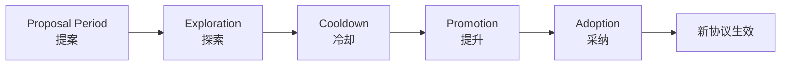

每阶段约 2 周，整个升级周期约 2 个月。

### 14.6 真实部署

- 验证者（baker）：~ 400 个
- 总质押：占流通量 ~ 70%
- 出块时间：8 秒
- 终结性：2 块（约 16 秒）

### 14.7 Tezos 的优劣总评

| 维度 | 评分 | 说明 |
| --- | --- | --- |
| 安全性 | ★★★★☆ | LPoS + 治理；少量大型 baker 集中 |
| 去中心化 | ★★★★☆ | 流动委托不锁仓，参与门槛低 |
| 性能 | ★★★☆☆ | 8s 出块 |
| 治理 | ★★★★★ | 链上自动升级，独家优势 |
| 生态 | ★★★☆☆ | NFT 强（Hic et Nunc 等），DeFi 弱 |

### 14.8 历史事件

- **2018-06 Mainnet launch**：经过 2 年的法律纠纷
- **2019 Athens 升级**：第一次链上协议升级成功
- **2022 Tenderbake 升级**：从 LPoS 升级到 BFT 风格的 Tenderbake（基于 Tendermint），最终性更强
- **2024 Paris/Quebec 升级**：性能优化

> PoS 六章展示了同一个问题的六种答案。它们的共同局限是：validator 数量越多，投票通信越重，最终性越慢。BFT 派的解题思路不同——从一开始就把验证者数量控制住，用更精密的多轮投票换来即时最终性。

---

## 15. BFT 谱系导引

### 15.1 为什么从 PoS 转到 BFT

> 💡 PoS 解决了"谁出块"的问题（用质押资产替代算力），但没解决"怎么快速达成最终性"。BFT（Byzantine Fault Tolerance）协议正是为此而生——在已知验证者集合里，用多轮投票在一到几个块内实现绝对最终性。理解 BFT 等于拿到所有现代共识协议的"母本"。

### 15.2 BFT 谱系图

```mermaid
graph TD
    Lamport[Lamport BGP 1982<br/>3f+1 下界]
    Lamport --> Paxos[Paxos 1989<br/>crash-only]
    Paxos --> Raft[Raft 2014<br/>可理解版]
    Lamport --> PBFT[PBFT 1999<br/>第一个工程可用]
    PBFT --> Tendermint[Tendermint 2014<br/>gossip 改造]
    PBFT --> HotStuff[HotStuff 2019<br/>O(n)]
    HotStuff --> LibraBFT[LibraBFT 2019]
    LibraBFT --> DiemBFT[DiemBFT v4]
    DiemBFT --> AptosBFT[AptosBFT v4 / Jolteon]
    AptosBFT --> Raptr[Raptr 2024<br/>Aptos 当前]
    HotStuff --> Mysticeti[Sui Mysticeti 2024]
```

### 15.3 BFT vs 区块链共识的边界

| 维度 | 经典 BFT（PBFT） | 区块链 BFT（Tendermint） |
| --- | --- | --- |
| 验证者集 | 静态（部署时确定） | 动态（每块/每 epoch 可换） |
| 客户端模型 | 显式区分 | 节点对等 |
| 通信方式 | 全连接 | gossip |
| 通信复杂度 | O(n²) | O(n) per round |
| 网络规模 | 几十到上百 | 上百到上千 |

### 15.4 三个核心概念

#### 15.4.1 Quorum Certificate

> 💡 **QC**：一组 ≥ 2f+1 节点对同一消息的签名集合。这是 BFT 协议的"原子证据"——一旦集齐，就能向任何不知情的节点证明"网络已达成 supermajority 一致"。

#### 15.4.2 View / Round

每个 view（视图）有一个 leader。leader 负责提议，其他节点投票。view 切换时换 leader——这是 BFT 协议处理"leader 故障"的标准方式。

#### 15.4.3 Lock

为防止 view 切换时丢失已 prepared 的值，节点会"锁定（lock）"在某个 view 的提议上。新 leader 必须保留这些锁定，才能确保 safety。

---

## 16. Paxos 与 Raft：crash 共识的双经典

> 💡 区块链 BFT 协议都从这两个非拜占庭经典出发——不懂 Paxos/Raft，看 PBFT 和 HotStuff 会很懵。

### 16.1 Paxos：1989 由 Lamport 发明

原型：希腊 Paxos 岛上的兼职议会。工程本质：N 个节点中容忍 f < N/2 个 crash 故障（不是拜占庭）的共识协议。

```
角色：
  proposer：提议者
  acceptor：决定接收哪个提议
  learner：学习已通过的提议

两阶段：
  Phase 1: prepare（占位）
    proposer 选编号 n，向多数 acceptor 发 prepare(n)
    acceptor 承诺不再接受编号 < n 的提议
  Phase 2: accept（提议）
    收到多数承诺 → proposer 发 accept(n, v)
    acceptor 接受 → 通过
```

### 16.2 Raft：2014 Stanford "可理解版 Paxos"

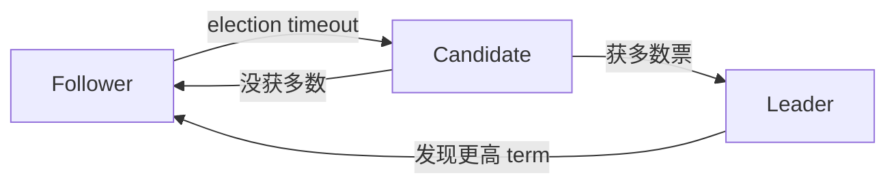

三个角色（Leader / Candidate / Follower），选举超时随机化（150-300ms）避免 split vote。

> 💡 **Raft 的工程影响巨大**：etcd / Consul / TiKV / CockroachDB 都用 Raft。但都是 crash-fault-tolerant，不是拜占庭——所以在公链上不能直接用。

来源：Raft Wikipedia / raft.github.io，访问 2026-04-27。

### 16.3 Paxos vs Raft 对比

| 维度 | Paxos | Raft |
| --- | --- | --- |
| 发明 | 1989 Lamport | 2014 Ongaro/Ousterhout |
| 容错 | crash f < N/2 | 同左 |
| 论文可读性 | ★☆☆☆☆ | ★★★★★ |
| 工程实现 | Multi-Paxos / Mencius / EPaxos | etcd / Consul / TiKV |
| 是否可用于公链 | 否（不容拜占庭） | 否（同上） |

### 16.4 为什么不能直接用于区块链

#### 16.4.1 Crash vs Byzantine 的差距

> ⚠️ Paxos / Raft 假设故障节点"只是停掉"，不会作恶。区块链场景里：
> - 节点可能故意签错块
> - 节点可能给不同人发不同消息
> - 节点可能伪造历史
>
> 这些都是 Byzantine 故障，Paxos / Raft 完全不防御。

#### 16.4.2 转化思路

> 💡 把 Paxos / Raft 改造成 BFT：核心是把"诚实多数 = N/2+1"换成"诚实超过 2/3 = 2f+1（n=3f+1）"。这就是 PBFT 的起点。

### 16.5 工程影响

#### 16.5.1 数据中心标配

- **etcd**（Kubernetes 核心）：用 Raft 管理集群状态
- **Consul**（HashiCorp）：服务发现，Raft
- **TiKV / TiDB**：分布式 KV，Multi-Raft
- **CockroachDB**：分布式 SQL，Raft

#### 16.5.2 区块链场景中的"半成品"

- Hyperledger Fabric 早期用 Kafka + ZK（半 Raft），后期换成 Raft
- 联盟链/许可链常用 Raft 是因为身份已知，无需 BFT

---

## 17. PBFT：1999 的工程里程碑

### 17.1 关键创新

Castro & Liskov 的 PBFT 第一次让 BFT 在工业可用：

- 容 f 个拜占庭，要 n ≥ 3f+1 节点
- 三阶段：PRE-PREPARE / PREPARE / COMMIT
- 客户端能在 5 阶段内得到回应（含 request / reply）

### 17.2 三阶段细节流程图

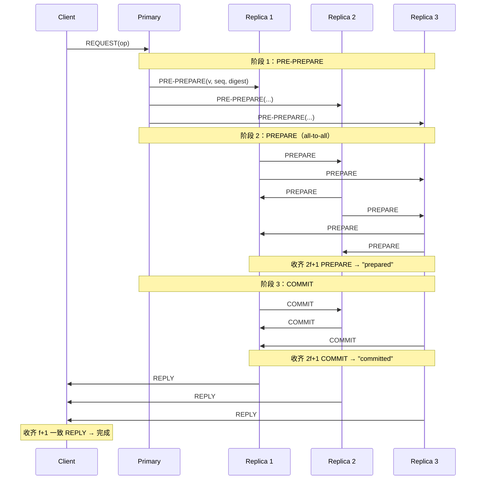

### 17.3 为什么三阶段而不是两阶段

两阶段无法在 view-change 时保留"已 prepared 但未 commit 的请求"。第三阶段引入锁机制，让新 leader 必须保留前 view 的 prepared 值。

### 17.4 view-change 流程

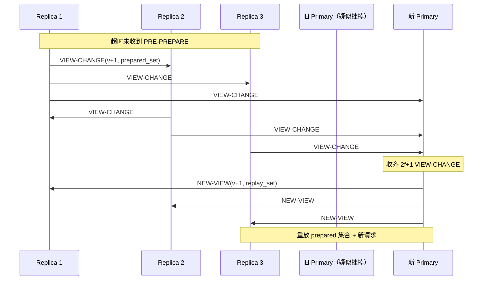

### 17.5 PBFT 的局限

| 局限 | 工程影响 |
| --- | --- |
| O(n²) 通信 | n=100 时一轮万条消息，公链不可扩 |
| 静态 validator set | 不能动态加 / 退节点 |
| 假设客户端独立存在 | 区块链场景下客户端 = 节点，模型不直接适用 |

→ Tendermint / HotStuff 都是冲着这些局限改进。

### 17.6 PBFT 的真实部署

#### 17.6.1 联盟链场景

- **Hyperledger Fabric**（v1.0）：早期使用 PBFT 的变种
- **某些政府/银行许可链**：直接用 PBFT 因为节点数 < 30，O(n²) 可承受

#### 17.6.2 学术影响

PBFT 之后所有 BFT 协议都把它当 baseline 引用。Tendermint / HotStuff / Aardvark / Zyzzyva 都直接对照 PBFT 改进。

### 17.7 PBFT 的优劣总评

| 维度 | 评分 | 说明 |
| --- | --- | --- |
| 安全性 | ★★★★★ | 形式化证明，n=3f+1 |
| 性能 | ★★☆☆☆ | O(n²) 通信，n>50 难扩 |
| 工程可用 | ★★★★☆ | 1999 论文 + 多个开源实现 |
| 学术地位 | ★★★★★ | BFT 的"Hello World" |

---

## 18. HotStuff：把 O(n²) 压到 O(n)

### 18.1 关键 trick

```
PBFT：每阶段所有节点彼此 all-to-all → O(n²)
HotStuff：节点只把签名发给 leader，leader 聚合后广播一个证据（QC）→ O(n)
```

### 18.2 三阶段（PREPARE / PRE-COMMIT / COMMIT）

> ⚠️ HotStuff 的三阶段与 PBFT 同名但语义不同——HotStuff 每阶段是 leader 中转聚合（O(n)），不是 all-to-all。

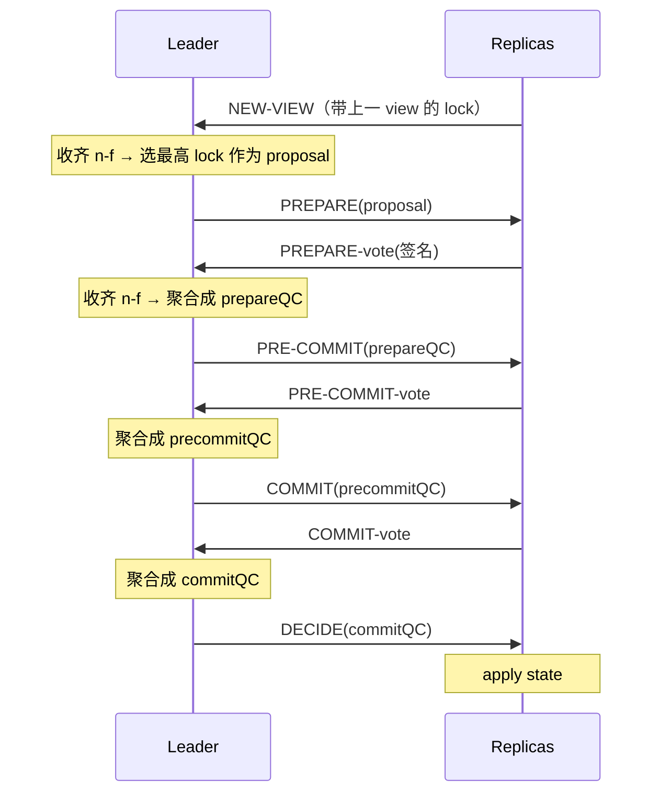

QC = Quorum Certificate（聚合签名证据）。

### 18.3 Pipelined / Chained HotStuff

让每个 view 提议一个新块，新块的 PREPARE 复用上一块的 PRE-COMMIT 投票。三个 view 流水线推进：

```
view  1   2   3   4   5   6
块    B1  B2  B3  B4  B5  B6
B1: PREPARE  PRE-COMMIT  COMMIT  DECIDE
B2:          PREPARE     PRE-COMMIT  COMMIT  DECIDE
B3:                      PREPARE     PRE-COMMIT  COMMIT  DECIDE
```

→ **稳态吞吐 = 每 view 1 块，单块 commit 延迟 = 3 view**。

### 18.4 HotStuff 的安全模型

HotStuff 在 partial-synchronous 模型下证明 safety + liveness。**独特性质：responsive**——leader 收齐 n-f 投票即可推进，无需等已知最长网络延迟 Δ。实际网络越快协议越快。PBFT 不 responsive，需等 Δ。

### 18.5 工业落地链路

```
HotStuff 论文 (2019)
   ↓
LibraBFT (Diem/Facebook 2019)
   ↓
DiemBFT v4 (2021)
   ↓ (Diem 项目关闭，团队去了 Aptos)
Jolteon = AptosBFT v1 (2022)
   ↓
AptosBFT v4 (2023)
   ↓
Raptr (Aptos 2024-09 提案；2025-06 Baby Raptr 上线主网)
```

来源：Aptos Foundation "Baby Raptr Is Here"，访问 2026-04-27。

### 18.6 HotStuff 的优劣总评

| 维度 | 评分 | 说明 |
| --- | --- | --- |
| 安全性 | ★★★★★ | partial-sync + 形式化证明 |
| 通信复杂度 | ★★★★★ | O(n)——本章 hero feature |
| 响应性 | ★★★★★ | responsive |
| 工程门槛 | ★★★☆☆ | threshold signature 需要 BLS |
| 实战部署 | ★★★★★ | 数十亿美元 TVL（Aptos / Sui 等） |

### 18.7 历史影响

- 2019 论文 PODC best paper
- 2019 Facebook Libra 项目采用，启动 LibraBFT 实现
- 2021 Diem 关闭，团队带走 DiemBFT 代码 → Aptos
- 2022+ Aptos / Sui / Movement / Espresso 等都用 HotStuff 系

---

## 19. AptosBFT 与 Diem 系：HotStuff 工业化

### 19.1 系谱

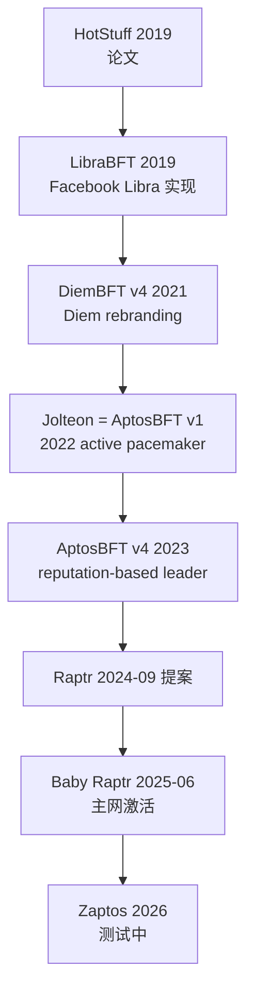

### 19.2 Jolteon 的核心改进：主动起搏器

不依赖 timeout，改为 leader 主动发起 view 切换，view-change 延迟从 5 消息降到 3 消息，commit latency 降 ~33%。

### 19.3 AptosBFT v4："声誉机制" leader 选举

v4 引入 reputation-based leader election：leader 除质押外还看历史表现（出块速度、掉线率、是否 equivocate），是"GPA + 出勤率 + 工作表现"的综合评定。

### 19.4 Quorum Store：mempool 改造

Aptos 不转 DAG 共识，但把 Narwhal 的 mempool 设计借过来（Quorum Store）——只取"mempool 解耦"的收益，不为 DAG 而 DAG。

#### 19.4.1 性能数字

- 主网峰值 TPS：~ 19,000
- Raptr 测试 TPS：260,000，延迟 < 800ms
- Zaptos 测试：100 节点 geo-distributed，sub-second latency at 20k TPS

来源：Stakin 2025 ecosystem report，访问 2026-04-27。

### 19.5 Raptr 与 Baby Raptr

#### 19.5.1 Raptr 设计目标（2024-09 提案）

- prefix consensus model：把 Quorum Store 的 DA check 直接合进共识，减少消息往返（从 6 跳降到 4 跳）
- 提升 ~ 20% 终结性延迟（100-150ms 改善）

#### 19.5.2 Baby Raptr（2025-06 上线）

第一个 Raptr 组件上线主网。完整 Raptr 仍在分阶段推进。

### 19.6 AptosBFT 的优劣总评

| 维度 | 评分 | 说明 |
| --- | --- | --- |
| 安全性 | ★★★★★ | HotStuff 系 + reputation 防作恶 |
| 性能 | ★★★★★ | 19k TPS 主网，260k 测试 |
| 工程成熟 | ★★★★☆ | 2022 才上线，仍在快速迭代 |
| 生态 | ★★★☆☆ | DeFi/NFT 生态在快速成长 |

### 19.7 历史事件

- **2022-10 Aptos mainnet launch**
- **2022-12 第一次主网升级**：性能优化，未发生事故
- **2023-2024 多次小升级**
- **2025-06 Baby Raptr 主网激活**：首次大幅共识改造

### 19.8 与 Sui 的对比

Aptos 和 Sui 同出 Diem/Libra 团队，都用 Move 语言，共识却截然不同：
- Aptos：保守路线，HotStuff 系 + Narwhal mempool
- Sui：激进路线，押注 DAG 共识（Mysticeti）跑出更高极限

> HotStuff 及其工业化演进代表了"单链单 leader"共识的极限。Sui 选择的 DAG 路线代表了完全不同的哲学——不再单个 leader 出块，而是让所有 validator 同时广播，共识只在 DAG 上做总序。这是下一块的主题。

---

## 20. DAG 谱系导引

### 20.1 直觉：为什么要 DAG

传统区块链每块是上一块的唯一继任者，任意时刻只有 1 个 leader 出块 → leader 是吞吐瓶颈。

### 20.2 DAG 的解法

```
DAG（Directed Acyclic Graph）：
        ┌─→ block A2 ─┐
  A1 ───┤              ├─→ A3
        └─→ B2 ────────┤
                       └─→ B3

  多个 leader 同时出块，让出块图变成 DAG
  共识层只决定"在 DAG 上线性化的顺序"
```

> 💡 **关键洞察**：分布式共识其实是两件事：
> 1. **可靠传输**（哪些交易已被网络收到）
> 2. **总序**（按什么顺序提交）
>
> 链共识把这两件事耦合；DAG 共识把它们解耦。

### 20.3 DAG 共识的家族

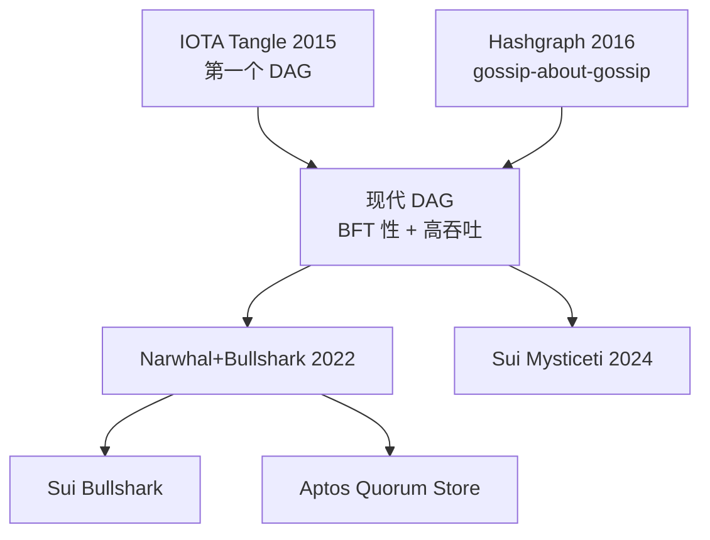

---

## 21. DAG 之 IOTA Tangle

### 21.1 直觉

每笔新交易必须验证（引用）2 笔现有交易作为父，所有交易形成一个无块、无矿工的 DAG（"Tangle"）。

### 21.2 Coordinator 时代和 Coordicide

> ⚠️ IOTA 早期（2017-2023）依赖一个中心化的 "Coordinator" 节点来防 fork——基本上不算去中心化共识。
>
> 2023 起 "Coordicide" 升级开始把 Coordinator 替换为去中心化的 Mana / 投票机制。
> 当前（2026-04）状态：还在迭代中。

来源：IOTA Foundation 文档，访问 2026-04-27。

### 21.3 IOTA 的 IoT 设想与困境

> 💡 设想：验证 2 笔上游交易即为发送成本，无需矿工 fee——适合 IoT 小额支付。

实际困难：早期 Coordinator 中心化（不算真无 fee）；无 fee 导致 spam tx 泛滥；IoT 场景从未大规模落地。

### 21.4 IOTA 2.0 与 Coordicide

Mana 机制（声誉积分投票）替代 Coordinator，仍处迁移期，完全去中心化时间表多次推迟（2026-04 状态：主网仍部分依赖 Coordinator-like 机制）。

### 21.5 IOTA 的优劣总评

| 维度 | 评分 | 说明 |
| --- | --- | --- |
| 安全性 | ★★☆☆☆ | Coordicide 未完成，长期受质疑 |
| 创新性 | ★★★★★ | 第一个真正的 DAG 公链 |
| 性能 | ★★★☆☆ | 理论高，实测中等 |
| 生态 | ★★☆☆☆ | DApp 远不如同代 EVM 链 |

### 21.6 历史事件

- **2015 IOTA whitepaper**
- **2017-12 mainnet launch + 历史最高市值 $14B**
- **2018 哈希函数 Curl-P 漏洞争议**：MIT 团队公开 PoC，IOTA 团队回应不当导致信任受损
- **2020 Trinity 钱包种子词被盗事件**：约 $2M 损失
- **2023 IOTA 2.0 测试网启动**
- **2024-2026 Coordicide 持续迭代**

---

## 22. DAG 之 Hashgraph：Gossip about Gossip + 虚拟投票

### 22.1 直觉

Leemon Baird 2016 年发明。节点两两 gossip 交易的同时 gossip "我之前和谁 gossip 过"（gossip about gossip）→ 每个节点都有完整 gossip 历史 DAG → 可本地推演他人投票（virtual voting），无需发实际投票消息。

### 22.2 Gossip about Gossip 流程图

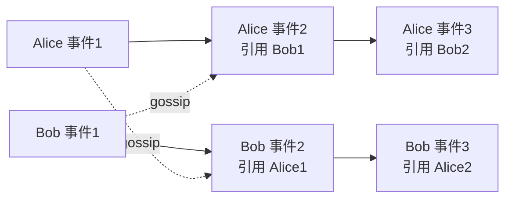

每次 gossip 不只传 tx，还传"我和谁 gossip 过"——这让 DAG 自然形成。

### 22.3 Virtual Voting

> 💡 DAG 一致 → 每个节点本地推演他人投票 → 不发实际投票消息，省 O(n) 通信。

### 22.4 性能与商业实现 Hedera

Hedera（Hashgraph 的商业实现）2026-04 数据：

- 10,000+ TPS（认证）
- 3 秒最终性
- aBFT（asynchronous BFT，最强等级，被 Coq 形式化证明）
- 39 人理事会治理（Google / IBM / Boeing 等）

来源：Hedera 官方文档，访问 2026-04-27：https://docs.hedera.com/hedera/core-concepts/hashgraph-consensus-algorithms/virtual-voting

### 22.5 局限

> ⚠️ Hashgraph 长期是 patented / closed-source 算法（Hedera 拥有）。许可证限制让它在开放生态发展受阻。
>
> Hedera 2022 才开始把部分代码开源（Hedera Hashgraph SDK），但核心算法仍然受专利保护到 2030+。

### 22.6 Hashgraph 的优劣总评

| 维度 | 评分 | 说明 |
| --- | --- | --- |
| 安全性 | ★★★★★ | aBFT，Coq 形式化证明 |
| 性能 | ★★★★☆ | 10k+ TPS 认证 |
| 去中心化 | ★★☆☆☆ | 39 人 council 决策 |
| 开源性 | ★★☆☆☆ | 长期专利 + 受限开源 |
| 商业生态 | ★★★★☆ | 大企业（Google/IBM/Boeing）背书 |

### 22.7 历史事件

- **2016 Hashgraph 论文（Baird）**
- **2017 Swirlds 公司成立**
- **2018 Hedera 公链宣布，引入企业 council**
- **2019-09 Mainnet launch**
- **2022 部分代码开源**
- **从未有 reorg 或 stall 事故**

---

## 23. DAG 之 Narwhal + Bullshark / Tusk

### 23.1 设计哲学：mempool 与共识解耦

> 💡 核心创新：把"哪些交易已被收到"（mempool）和"按什么顺序提交"（共识）分成两个独立模块。传统区块链每块都要做完整 propose+vote，O(n²) 瓶颈；Narwhal 让 mempool 持续运行，共识只在 DAG 上做轻量总序。

来源：Danezis et al., "Narwhal and Tusk: A DAG-based Mempool and Efficient BFT Consensus"，EuroSys 2022。

### 23.2 Narwhal：把 mempool 做成 DAG

每个 validator 持续把它收到的交易打包成 batch（叫 "vertex"），引用前一 round 至少 2f+1 个其他 validator 的 batch。所有 vertex 形成跨 round 的 DAG。

```
round  1     2     3     4
 V1   v1.1  v2.1  v3.1  v4.1
 V2   v1.2  v2.2  v3.2  v4.2
 V3   v1.3  v2.3  v3.3  v4.3
 V4   v1.4  v2.4  v3.4  v4.4

边：v2.1 引用 v1.1, v1.2, v1.3（≥ 2f+1）
```

### 23.3 Bullshark：在 DAG 上跑 BFT 总序

- 偶数 round 选一个 leader
- 奇数 round 每个 vertex 通过引用结构"自动投票"给上 round 的 leader
- 当一个 leader vertex 在下一 round 收到 f+1 个引用 → commit

> 💡 **精彩之处**：投票就是 Narwhal 的 DAG 边。**没有任何额外的 BFT 投票消息**。投票成本被传输层完全摊销。

### 23.4 Bullshark vs Tusk

> 🤔 Tusk 和 Bullshark 都是 Narwhal 之上的总序协议：
> - **Tusk**（2022 早期版本）：纯异步，更"完美"但延迟稍高
> - **Bullshark**（2022 后续优化）：partial-sync，延迟更低，是当前主流

### 23.5 性能数据

Bullshark + Narwhal 在 100 节点广域网下：

- 100,000+ TPS
- < 3s 延迟

来源：Spiegelman et al. 2022 CCS paper "Bullshark: DAG BFT Protocols Made Practical"，arXiv:2201.05677，访问 2026-04-27。

### 23.6 工业落地

- **Sui**：主网 2023 上线 Narwhal+Bullshark，2024-07 升级为 Mysticeti
- **Aptos**：Narwhal 改造为 Quorum Store（仅作 mempool），共识仍由 AptosBFT 跑——保 BFT 可证明性，享 DAG 吞吐红利

### 23.7 Narwhal+Bullshark 的优劣

| 维度 | 评分 | 说明 |
| --- | --- | --- |
| 性能 | ★★★★★ | 100k+ TPS 验证 |
| 延迟 | ★★★★☆ | < 3s 端到端 |
| 学术地位 | ★★★★★ | 引爆 DAG 共识研究热潮 |
| 工程难度 | ★★★☆☆ | mempool/共识双层架构 |

### 23.8 后续研究

- **Mysticeti**（2024）：Sui 自研，进一步压低延迟到 < 500ms（详见第 24 章）
- **Shoal**（2023）：Aptos 团队改进版，提高 Bullshark 的延迟稳定性
- **Bullshark 2.0**（2024）：原作者团队的优化版本

---

## 24. DAG 之 Sui Mysticeti

### 24.1 时间线与性能

- **2023-05**：Sui 主网上线，使用 Narwhal + Bullshark
- **2024-07**：Mysticeti v1 上线 Sui 主网
- **2025-11**：Mysticeti v2 上线，再降 35% 延迟

### 24.2 性能数据

Mysticeti v1（2024-07 数据）：
- consensus 延迟：390ms
- end-to-end settlement：640ms
- 测试网中比前一代降 80% 延迟

Mysticeti v2（2025-11 数据）：
- 进一步降 35% → ~250ms 延迟
- 与共识合并交易验证，减少冗余步骤

来源：Sui blog "Mysticeti v2: Faster and Lighter Sui Transaction Processing"，访问 2026-04-27。

### 24.3 核心创新：uncertified DAG

Bullshark 要求每个 vertex 先收到 ≥ 2f+1 签名才能成为 DAG 节点（贡献 ~50% 延迟）。Mysticeti 允许 uncertified vertex 直接入 DAG，commit 时再统一验证 quorum——延迟显著降低，边复杂度上升。

### 24.4 Mysticeti v2 进一步优化

把交易验证（signature check / state precondition check）合进共识层，减少冗余 round-trip：延迟降 35%（390ms → 250ms），提交块数增 ~20%，稳态 ~50k TPS，峰值 >100k。

### 24.5 Mysticeti 的优劣

| 维度 | 评分 | 说明 |
| --- | --- | --- |
| 性能 | ★★★★★ | 当下 BFT 共识延迟最低 |
| 创新性 | ★★★★★ | uncertified DAG 是 paradigm shift |
| 安全性 | ★★★★☆ | 形式化证明完成；新协议尚需更多实战 |
| 工程门槛 | ★★★★☆ | 论文复现门槛高 |

### 24.6 真实部署：Sui 主网（2026-04）

- TPS：稳态 ~7000，峰值 >30k | 终结性：v1 ~400ms → v2 ~250ms | 验证者 ~110 | TVL >$1B
- 并行执行：object-based 模型，每笔交易声明读写哪些 object，互不冲突并行执行（"声明式并行"，对比 Aptos 的乐观并行）

### 24.7 历史事件

- **2022-10 Sui 测试网**
- **2023-05 Sui mainnet launch**
- **2024-07 Mysticeti v1 上线**
- **2025-11 Mysticeti v2 上线**
- **从未有 reorg / finality stall 大事故**

---

## 25. 易混误区：Block-STM、PoH 等"非共识"组件

### 25.1 Block-STM：Aptos 的并行执行引擎

> ⚠️ Block-STM 是**执行引擎**，不是共识。共识（AptosBFT v4/Raptr）决定顺序，Block-STM 在 commit 后乐观并行执行：先假设无冲突，检测到冲突则回滚串行重试。让 Aptos 在 Account 模型下拿到 25k+ TPS。

### 25.2 Solana PoH：易混组件

PoH 是时间戳服务（见第 26 章），不是共识。给共识层（Tower BFT）省去事件排序工作。

### 25.3 Sui object DAG vs 共识 DAG

两件不同的事：**对象 DAG** 是状态层的读写依赖；**共识 DAG**（Mysticeti）是消息层的 vertex 引用。属不同抽象层。

### 25.4 易混点速查表

| 名字 | 是共识吗 | 真实角色 |
| --- | --- | --- |
| Aptos Block-STM | ✗ | 并行执行引擎 |
| Solana PoH | ✗ | 时间戳服务 |
| Aptos Quorum Store | ✗ | mempool（学 Narwhal） |
| Sui Mysticeti | ✓ | DAG 共识协议 |
| Polkadot BABE | 部分 | 出块协议（与 GRANDPA 共同构成共识） |
| Polkadot GRANDPA | ✓ | finality gadget |
| Ethereum LMD-GHOST | 部分 | fork choice（与 FFG 共同） |
| Ethereum Casper FFG | ✓ | finality gadget |

---

## 26. 异类之 Solana：PoH + Tower BFT → Alpenglow

### 26.1 PoH 不是共识

> ⚠️ Proof of History 不是共识协议，是**全网一致的时间戳服务**——解决"事件先后顺序"，不解决"哪个分叉是主链"。

### 26.2 PoH 是什么

leader 持续跑：

```python
h[0] = some_seed
for i in 1..∞:
    h[i] = SHA256(h[i-1])
    # 每 N 步，把收到的交易 tx 穿插进去：
    if has_pending_tx():
        h[i] = SHA256(h[i-1] || tx)
```

→ 所有 validator 拿到序列后确定地知道每笔交易的相对顺序。PoH 像全网共享的"加密秒表"——验证秒表没倒走，但不决定"哪个分叉合法"（那是 Tower BFT 的职责）。

### 26.3 Tower BFT

PBFT 变体，加了**lockout 机制**：

```
每次投一个分支，对该分支的承诺时间指数加倍
→ 32 次连续投票后，承诺达到最大 lockout
→ 该分支被认为 economically finalized
```

### 26.4 PoH 与 Tower BFT 的协作

PoH 负责"打时间戳 / 排事件顺序"，Tower BFT 负责"决定哪条链合法"。两者分工：

- **PoH**：Leader 持续生成哈希链条，其他节点验证顺序合法性（无需通信）。
- **Tower BFT**：每个 slot 结束后，Validator 对 PoH 记录的区块投票；lockout 机制保证切换分支成本指数增加。
- 合并效果：PoH 节省了 BFT 投票中"排序消息"的通信开销，Tower BFT 提供拜占庭容错安全保证。

### 26.5 当前性能（2026-04）

- 区块时间：~ 400ms
- 平均 TPS（实测）：~ 3000-5000
- 理论 TPS：65,000+
- 终结时间：32 confirmation ≈ 12.8s

### 26.6 历史故障

| 时间 | 事件 | 时长 |
| --- | --- | --- |
| 2021-09 | Grape Protocol IDO，每秒 40 万 TX 涌入 | 17 小时 |
| 2022-04 | NFT bot 滥发交易 | 7 小时 |
| 2022-05 | 共识 bug | 4 小时 |
| 2023-02 | 区块状态恢复慢 | 19 小时（最长） |

> ⚠️ **教训**：PoH 把"时间"当全局变量，全局变量在大规模故障时极难恢复。

### 26.7 Alpenglow：PoH 退役计划

2025 年 Anza 提出 Alpenglow，要用 **Votor + Rotor** 替换 PoH + Tower BFT。

- **Votor**：把 32 轮确认压缩到 1-2 轮；80% stake 在线时单轮 finality ≈ 100ms
- **Rotor**：替换 Turbine 数据广播树为 one-hop broadcast

时间线：
- 2025-09：Solana 治理通过 Alpenglow（98.27% 赞成）
- 2026-Q3：Agave 4.1 发布
- 2026-Q4：安全审计
- 2026 年底：mainnet 激活

来源：CoinDesk 2025-09-03 "Solana Community Approves Alpenglow Upgrade"，访问 2026-04-27。

### 26.8 Solana 的优劣总评

| 维度 | 评分 | 说明 |
| --- | --- | --- |
| 性能 | ★★★★★ | 主网实测 3000-5000 TPS，理论 65k+ |
| 安全性 | ★★★☆☆ | PoH+Tower BFT 多次主网停机 |
| 终结性 | ★★★☆☆ | 32 conf ~ 12.8s（Alpenglow 后 → ~150ms） |
| 工程门槛 | ★★☆☆☆ | 单 leader 单线程瓶颈；validator 硬件要求高 |
| 生态 | ★★★★★ | DeFi / NFT / 消费应用最活跃 |

### 26.9 与 Ethereum 的工程对比

| 维度 | Ethereum | Solana |
| --- | --- | --- |
| 设计目标 | 安全 + 去中心化 | 性能优先 |
| Validator 硬件 | 4 核 16GB | 32+ 核 256GB+ NVMe |
| 节点数量 | ~ 10000+ | ~ 1500-2000 |
| 区块时间 | 12s | 0.4s |
| 平均 TPS | ~ 30 | ~ 4000 |
| 历史停机 | 0 | 5+ 次（最长 19h） |

---

## 27. 异类之 Avalanche Snow 系列

### 27.1 直觉：从"全网投票"到"小样本投票"

```
PBFT：每决定一个块，所有 n 个节点都参与。O(n²)
Snow：每决定一个块，每个节点只问随机 k=20 个邻居就够。
```

> 💡 **类比**：选举民调。不需要问全国人民，问 1000 个人就能预测全国结果——大数定律。

### 27.2 协议演进

```
Slush（不容拜占庭，只是个 toy）
   ↓
Snowflake（加 conviction counter）
   ↓
Snowball（加 confidence counter）
   ↓
Snowman（线性链版本，Avalanche C-Chain 用）
   ↓
Avalanche（DAG 版本）
```

### 27.3 核心参数

来源：Avalanche 官方文档 / pkg.go.dev/snowball，访问 2026-04-27：

- **k = 20**：每次随机抽样 20 个邻居
- **AlphaPreference = 15**：15/20 偏好同一答案 → 改变本地偏好
- **AlphaConfidence = 15**：15/20 偏好同一答案 → confidence +1
- **β = 20**：连续 20 轮 confidence 累计 → 决定

### 27.4 Snowball 决策流程图

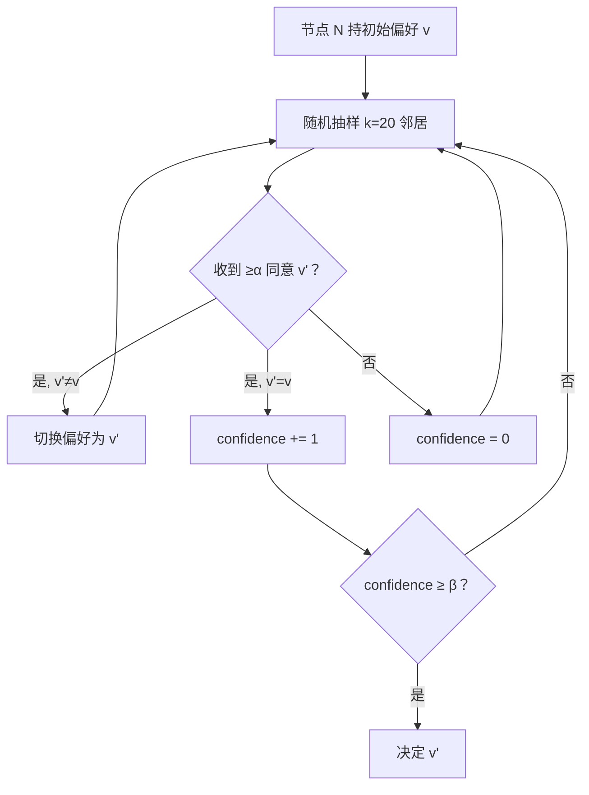

### 27.5 安全模型

> 🤔 **思考**：每次只问 20 个人，怎么保证安全？

**关键**：如果攻击者控制 < 20% 节点，则随机抽到的 20 个中拜占庭节点期望 < 4 个，达不到 α=15 的 majority。

**metastability**：协议依赖"网络绝大多数人最终会偏好同一个值"——这是个统计学性质，不是绝对的 BFT 保证。

> ⚠️ Snow 系的安全证明在学术界仍有争议（见 Bern University 2024 报告）。Avalanche 团队 2024 提了 Frosty 改进，加强了 liveness 保证。

来源：crypto.unibe.ch/2024/05/21/avalanche.html，访问 2026-04-27。

### 27.6 Avalanche 真实部署

#### 27.6.1 三链架构

> 💡 Avalanche 不是单链，而是 X-Chain（资产）+ P-Chain（治理 + staking）+ C-Chain（EVM 兼容）三链。Snowman 共识跑在 P/C-Chain，Avalanche DAG 共识跑在 X-Chain。

#### 27.6.2 数字感（2026-04）

- 验证者数：~ 1300+
- 平均 TPS：~ 50（C-Chain），峰值 4000+（X-Chain）
- 终结性：~ 1.2-2 秒
- TVL：$1B+

### 27.7 Avalanche 的优劣总评

| 维度 | 评分 | 说明 |
| --- | --- | --- |
| 创新性 | ★★★★★ | 第一个用 metastability 做共识 |
| 性能 | ★★★★☆ | 1-2 秒终结性 |
| 安全性 | ★★★☆☆ | 形式化证明仍受争议 |
| 工程复杂 | ★★☆☆☆ | 三链架构对开发者不友好 |
| 生态 | ★★★☆☆ | EVM 兼容拉来一些 Ethereum DApp |

### 27.8 历史事件

- **2018 Snowflake to Avalanche 论文**
- **2020-09 Mainnet launch**
- **2024 Frosty 改进提出**：解决 Snow 系 liveness 争议
- **2024 Subnets/L1 公告**：让任何人能基于 Avalanche 协议起子链
- **2025 ACP-77（Avalanche9000）**：Subnet 经济激励重构

---

## 28. Bitcoin Lightning Network：通道而非共识

### 28.1 它和共识的关系

> ⚠️ **重要**：Lightning 不是共识协议，而是**支付通道网络**。它复用 Bitcoin 共识做"开/关通道结算"，中间过程在链下。

### 28.2 直觉：开个储值卡

> 🤔 假设 Alice 一天给 Bob 转 50 次，每次 0.001 BTC，每次手续费 ~ $5。
> → 一天 $250 fee，但只转了 ~ $50 价值——荒谬。

**Lightning 的解法**：双方先共同质押 0.05 BTC 开"通道"。通道里随便转账（链下，免 fee）。关通道时把"最终余额"上链——只 1 笔交易。

### 28.3 HTLC：让转账经过中间节点也安全

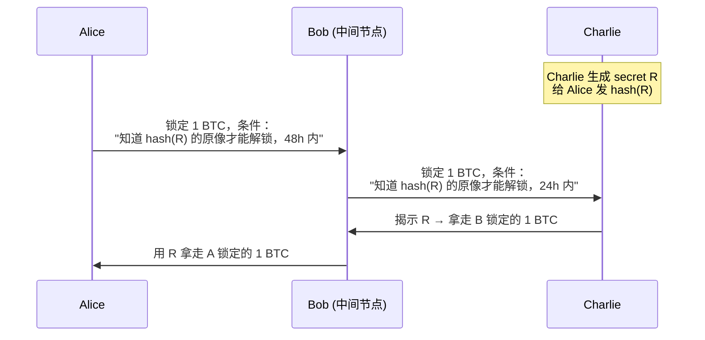

HTLC = Hashed TimeLock Contract。靠**hash 验证 + timelock 退款**保证：

- 要么所有跳都成功（C 拿到钱，B 中转，A 付了钱）
- 要么所有跳都退款

### 28.4 当前规模（2026-04）

- 节点数：~ 14,940（峰值 2022-01 是 20,700）
- 通道数：~ 48,678
- 总容量：5,637 BTC（2025-12 新高）
- 月交易量：$1.17B / 5.22M 笔（2025-11）

来源：Bitcoin Visuals / 1ML statistics，访问 2026-04-27。

### 28.5 历史影响：L2 思路的鼻祖

> 💡 Lightning 把高频小额转账从主链卸载，不替代共识——这成了 L2 / rollup 的思路起源。

| 概念 | Lightning | Ethereum L2 (Optimistic Rollup) |
| --- | --- | --- |
| 链下计算 | 通道内转账 | rollup 内执行 |
| 链上结算 | 关通道一笔 | 周期性 batch upload |
| 安全性来源 | hashlock + timelock | fraud proof |

### 28.6 局限

#### 28.6.1 路由问题

> ⚠️ Lightning 的核心难题：A → C 之间不一定有直接通道。要找一条 A→B→…→C 的路径，每跳都得有足够 inbound liquidity。这在大规模网络下是 NP-hard 的路由问题。

#### 28.6.2 Watchtower 问题

> ⚠️ 离线时对方可能"提交旧状态"作弊。需要 watchtower 服务持续监控——这又引入新信任假设。

> 19 个协议走完，积累了一堆容易混淆的术语。下一章做专项澄清：confirmation/finality/liveness/safety/ordering……这些词在不同协议文档里含义微妙不同，不统一理解会在工程决策时踩坑。

---

## 29. 概念辨析专章

### 29.1 confirmation：块被埋多深

**confirmation**：你关心的交易后面又叠了多少个块。Bitcoin"6 confirmation"= 交易后面挂了 6 个新块。

### 29.2 probabilistic finality：永远不到 100%

PoW 链（Bitcoin / Litecoin / ETC）的最终性：

```
P(逆转 z 块) = (q/p)^z  for q < p
→ z 越大，逆转概率指数衰减
→ 但永远 > 0
```

> 💡 工程意义：交易所通常等到 P(逆转) < 0.001% 才认入账。Bitcoin 6 conf 在 q=0.1 下 P ≈ 0.024%，刚好低于阈值。

### 29.3 economic finality：可量化的攻击成本

Ethereum 2 epoch finality：回滚 finalized 块至少 1/3 stake 被 slash ≈ 10M ETH ≈ 数百亿美元。攻击在数学上可能，经济上不划算——本质是博弈论保证。

### 29.4 absolute finality：协议层硬保证

Tendermint / Algorand / GRANDPA：块 commit 后协议层无法回滚。代价：网络分区时链停（safety 优先于 liveness）。

### 29.5 四种最终性对比表

| 维度 | confirmation | probabilistic | economic | absolute |
| --- | --- | --- | --- | --- |
| 含义 | "块被埋多深" | 越深越难逆转，但永不为 0 | 逆转需要可量化经济代价 | 协议层保证不可逆 |
| 例子 | Bitcoin 6 conf | Bitcoin 任意深度 | Ethereum 2 epoch | Tendermint single block |
| 工程取舍 | — | 等够深 | 看 stake 总量 | 网络分区时停链 |

> ⚠️ 任何"finality"声明都要追问：在什么模型下、需要什么前提？

### 29.6 liveness vs safety

- **Safety**：永不出错（不会两块在同高度都 finalized）
- **Liveness**：永远在进步（链一直在出块）

| 协议 | 网络分区时 | 选了什么 |
| --- | --- | --- |
| Bitcoin / Nakamoto | 双方都继续出块，后续重组 | Liveness（safety 概率性） |
| Tendermint / Cosmos | 链停止出块 | Safety（牺牲 liveness） |
| Ethereum Gasper | LMD-GHOST 出块，FFG 不 finalize | 两层不同选择 |
| Avalanche Snow | metastable，可能两边都不收敛 | 概率 safety + 概率 liveness |

> 💡 Gasper 把 safety 和 liveness 拆到两层做不同选择，是它最被低估的工程价值。

### 29.7 ordering vs consensus

- **Ordering**：给一组 tx 安排次序
- **Consensus**：在多个候选 history 中选一个

Solana：PoH 做 ordering，Tower BFT 做 consensus。Narwhal+Bullshark：DAG 做 ordering，Bullshark 做 consensus。

### 29.8 状态机复制 vs UTXO vs Account

| 模型 | 状态形式 | 并行度 | 智能合约 | 代表 |
| --- | --- | --- | --- | --- |
| SMR | 任意状态 + transition function | 取决于 function | 高 | Tendermint apps |
| UTXO | 不可变输出集合 | 高（独立 UTXO 并行） | 低（图灵不完备） | Bitcoin / Cardano (eUTXO) |
| Account | 全局地址 → 余额 + 存储 | 低（同账户串行） | 高 | Ethereum / Solana / Aptos |

> 💡 Aptos 的 Block-STM 是个有趣的妥协：在 Account 模型里用乐观并行，遇冲突再 rollback 重排——拿到了 30k TPS 而不放弃合约友好性。

### 29.9 permissioned vs permissionless

| | permissioned（许可链） | permissionless（无需许可） |
|---|---|---|
| 例子 | Hyperledger Fabric / Hedera | Bitcoin / Ethereum / Cosmos |
| 优点 | 性能高，监管友好 | 抗审查 |
| 缺点 | 去中心化弱 | 性能受限 |

---

## 30. 事故复盘之 2010-08 Bitcoin 通胀 bug

### 30.1 事件

2010-08-15，Bitcoin 历史唯一一次"通胀 bug" reorg。矿工挖出含 1.84 亿 BTC 的非法块（远超 2100 万总量）。

### 30.2 根因

代码 bug：`CTransaction::CheckTransaction` 函数对 output value 求和时未检查溢出。攻击者用一个交易铸造了 2 笔各 9.22 亿 BTC（远超总量）。

```cpp
// 简化伪代码
int64_t sum = 0;
for (const auto& out : outputs) {
    sum += out.value;  // 没检查溢出！
}
```

### 30.3 时间线

- 0809 UTC 攻击块上链（块高 74638）
- 0820 UTC Satoshi 在 Bitcointalk 发警报
- 0900 UTC 修复 patch 发布（v0.3.10）
- 1330 UTC 社区在 53 块后回滚到 attack 之前

### 30.4 应对与教训

社区软分叉式协调全网升级 + reorg 53 块，Bitcoin 历史唯一一次"协议级 reorg"。

> 💡 整数溢出是数字货币的经典 bug。此后 Bitcoin 所有 amount check 加溢出验证，Ethereum/Solidity 强制 SafeMath 同根同源。这一事故让中本聪意识到"实现 bug 可能毁掉整个链"——成为他此后极度保守对待 codebase 的根源。

---

## 31. 事故复盘之 2020-08 ETC 三连 51%

### 31.1 三次攻击概览

| 时间 | 损失 | 攻击成本 | reorg 深度 |
| --- | --- | --- | --- |
| 2019-01 | $1.1M | 未知 | ~100 块 |
| 2020-08-01 | $5.6M (807K ETC) | 17.5 BTC ($204K) | 4000+ 块 |
| 2020-08-06 | 类似 | 类似 | 4000+ 块 |
| 2020-08-29 | 类似 | 类似 | 7000+ 块 |

### 31.2 根因（结构性）

> ⚠️ ETC 用的是和 ETH 相同的 Ethash 算法，2020 年 ETC 算力只占 Ethash 全网的 ~5%——攻击者付几十万美元就能租到 ETC 全网算力。
>
> 这是"算力市场 + 兼容算法"的结构性脆弱。

### 31.3 应对与教训

ETC 2020-11 Thanos 升级把 Ethash epoch 翻倍 → ETChash，不再与 ETH 矿机兼容。2022-09 ETH 转 PoS 后 Ethash 矿机失业反而流入 ETC，算力翻倍变更安全（讽刺）。

**教训**：算法兼容大币种 + 算力市场存在 = 小币种 PoW 链不安全。详细机制见第 7.3 节。

---

## 32. 事故复盘之 2021-2023 Solana 多次停机

### 32.1 停机事件清单

Solana 2 年内 5+ 次完全停机：

| 时间 | 时长 | 触发原因 |
| --- | --- | --- |
| 2021-09 | 17 小时 | Grape Protocol IDO，每秒 40 万 TX 涌入 |
| 2022-01 | 4 小时 | 共识 bug |
| 2022-04 | 7 小时 | NFT bot 滥发交易 |
| 2022-05 | 4 小时 | 共识 bug |
| 2022-06 | 4 小时 | 状态机问题 |
| 2023-02 | **19 小时** | 区块状态恢复慢（最长事件） |

### 32.2 共同特征与根因

```
1. mempool flooding（NFT mint / IDO 时刻 4-40 万 TX/s）
2. leader 处理不过来 → PoH tick 速率掉 → 全网失步
3. validator 大量重启，必须协调同一 snapshot 高度，慢
```

> ⚠️ PoH 把"时间"当全局变量，一旦失步恢复极难——全局协调成本远高于 Ethereum 各 validator 独立恢复。

### 32.3 Solana 的应对

- **QUIC 替换 UDP**（2022-Q4）：减少 mempool flooding
- **Stake-weighted QoS**（2023）：优先处理高 stake validator 的交易
- **Firedancer**（2023+）：第二个独立客户端，减少单一实现 bug 风险
- **Alpenglow**（2026 计划）：替换 PoH+Tower BFT

**教训**：全局时间是脆弱的全局变量，性能优先往往以鲁棒性为代价。

---

## 33. 事故复盘之 2022-05 Beacon Chain 7-block reorg

slot 3,887,075 proposer 出块迟到 ~4 秒，proposer boost 滚动升级不一致 + 部分客户端 fork-choice bug，7 个 slot 内链分叉，7 块被 reorg。FFG finality 完全未受影响——Gasper 双层设计的胜利。

**应对**：post-Merge 所有 fork-choice 修改必须打包进硬分叉，所有客户端同时切换。

**教训**：fork-choice 改动不能"软分叉"；客户端多样性必须配合互操作测试；finality ≠ confirmation。

详细复盘见 `exercises/03_reorg_postmortem.md`。

---

## 34. 事故复盘之 2023-04 Ethereum finality stall

2023-04 Ethereum mainnet 两次 finality 暂停（约 25 秒）。无 reorg、无资金损失，根因：Prysm（占 40% stake）一个 bug 导致 attestation 延迟超截止线，FFG 凑不齐 2/3。

> ⚠️ 单一客户端 stake >33% = 系统性风险。事后 client diversity 运动推动 Prysm 降到 30%，Lighthouse 升至 40%。

**教训**：多客户端不只是去中心化口号，是 finality 的硬保险。任何 PoS 链规划者必须把"单客户端 stake <33%"当硬约束。对所有 PoS/BFT 链（Tendermint / Cardano / Polkadot）均适用。

---

## 35. 事故复盘之 2022 Tornado Cash 与 OFAC 制裁

### 35.1 事件

2022-08-08，OFAC 把 Tornado Cash 合约地址列入 SDN 制裁名单。这不是技术故障，是**社会层故障**：部分美国 validator / builder 拒绝包含相关交易。

### 35.2 影响数据

> ⚠️ 制裁后约 30 天，"OFAC-compliant"块（拒绝相关 tx）占比约 60%，高峰期 80%+。

来源：mevwatch.info，访问 2026-04-27。

### 35.3 协议层应对：Inclusion List

Ethereum 社区推 PBS（Proposer-Builder Separation）+ Inclusion List：
- proposer 强制要求"必须包含某些交易"
- builder 即使不愿意也得包

EIP-7547（2024）就是这个方向。

**教训**：审查抗性不是协议属性，是协议 + 社会 + 经济的综合属性。这一事件改变了 Ethereum 路线图——从"只解决技术问题"到"承认社会层威胁"。

### 35.4 对其他链的启示

| 链 | 类似风险 |
| --- | --- |
| Bitcoin | 矿池在美国，可能受类似压力 |
| Solana | validator 集中度更高，风险更高 |
| Cosmos 链 | 各链独立，分散风险 |

---

## 36. 实战一：从零写最小 PoW 链

### 36.1 设计目标

< 200 行，覆盖：区块、链、PoW、难度调整、最重链规则。不写：UTXO / 签名 / Merkle 树（见模块 01 / 03）。

### 36.2 区块结构

```python
@dataclass
class Block:
    height: int                  # 区块高度，方便人看；不参与共识规则
    prev_hash: str               # 上一区块哈希——这就是"链"的来源
    merkle: str                  # 交易树根
    timestamp: float             # 出块时间；难度调整要用
    difficulty_bits: int         # 难度：要求哈希前导 0 的 bit 数
    nonce: int                   # 矿工反复改的"幸运数字"
    txs: list[str]               # body：教学化的字符串交易
```

> 💡 **为什么 header 字段固定就这几个**？因为 PoW 哈希难题哈的是 header，不是整个 block——所以 header 必须紧凑。

### 36.3 难度判定

```python
def meets_difficulty(h_hex: str, bits: int) -> bool:
    """前 bits 个 bit 必须为 0。"""
    h_int = int(h_hex, 16)
    return h_int < (1 << (256 - bits))
```

### 36.4 挖矿循环

```python
def mine(self, txs: list[str], max_nonce: int = 1 << 32) -> Block:
    prev = self.tip
    bits = self.next_difficulty()
    blk = Block(...)
    for nonce in range(max_nonce):
        blk.nonce = nonce
        if meets_difficulty(blk.hash(), bits):
            return blk
    raise RuntimeError("max_nonce 用尽")
```

> ⚠️ 除了暴力试，没有更聪明的办法——SHA-256 抗预映像，无法反推。这就是"Proof of Work"。

### 36.5 最重链规则

```python
def cumulative_work(self) -> int:
    return sum(1 << b.difficulty_bits for b in self.blocks)
```

> ⚠️ 用 `cumulative_work` 而非 `len(blocks)`——否则攻击者可用低难度块伪造更长的链。

### 36.6 跑起来

```bash
cd code/
python3 pow_chain.py            # 自检
python3 pow_chain.py demo 5     # 挖 5 个块
```

预期输出：

```
[genesis] hash=5b1b438b... bits=16
[block 1] hash=00007dd4... bits=16 nonce=111643 took=0.28s
[block 2] hash=0000a7b7... bits=16 nonce=18562 took=0.05s
...
```

完整代码（含逐行注释）见 `code/pow_chain.py`。

---

## 37. 实战二：4 节点 PBFT 模拟

### 37.1 设计目标

n=4, f=1 的最小 BFT。演示正常路径 + 拜占庭主节点 + view-change。不模拟：真异步、消息丢失（教学简化）。

### 37.2 节点数据结构

```python
@dataclass
class Node:
    nid: int                    # node id
    n: int                      # 总节点数
    f: int                      # 容错门限
    view: int = 0               # 当前视图
    seq: int = 0                # 主节点用来分配序号
    log: list[str]              # 已 commit 的请求列表
    prepares: dict              # 收到的 PREPARE 集合
    commits: dict               # 收到的 COMMIT 集合
    vc_votes: dict              # 视图切换投票
    byzantine: bool = False     # 是否拜占庭主节点（仅演示用）

    def quorum(self) -> int:
        return 2 * self.f + 1   # n=4 → 3
```

### 37.3 三阶段流程

```python
elif m.kind == "PRE_PREPARE":
    if not node.is_primary():
        # 备份节点收到主节点提议 → 广播 PREPARE
        self.broadcast(Msg("PREPARE", m.view, m.seq, m.digest, node.nid))

elif m.kind == "PREPARE":
    node.prepares[key].add(m.sender)
    if len(node.prepares[key]) >= node.quorum():
        # 收齐 2f+1 → 进入 COMMIT 阶段
        self.broadcast(Msg("COMMIT", m.view, m.seq, m.digest, node.nid))

elif m.kind == "COMMIT":
    node.commits[key].add(m.sender)
    if len(node.commits[key]) >= node.quorum():
        # 收齐 2f+1 → 本地 apply
        node.committed.add(key)
        node.log.append(m.digest)
```

### 37.4 跑起来

```bash
python3 pbft_sim.py             # 正常路径
python3 pbft_sim.py byzantine   # 主节点拜占庭 → view-change
```

正常路径输出：

```
== 正常路径：4 节点，主节点 = N0 ==
  请求 'req:set x=0' -> 已交付节点： [0, 1, 2, 3]
  请求 'req:set x=1' -> 已交付节点： [0, 1, 2, 3]
  请求 'req:set x=2' -> 已交付节点： [0, 1, 2, 3]
```

拜占庭路径输出：

```
== 拜占庭主节点：N0 不发 PRE_PREPARE -> 触发视图切换 ==
  视图切换前已 delivered: []
  各节点视图: [1, 1, 1, 1]
  请求 'req:set y=42' -> 已交付节点： [0, 1, 2, 3]
```

完整代码见 `code/pbft_sim.py`。

---

## 38. 实战三：CometBFT 4 验证者本地测试网

### 38.1 安装（pin v0.38.12）

```bash
# macOS
brew install cometbft

# 通用 Go 安装
go install github.com/cometbft/cometbft/cmd/cometbft@v0.38.12
cometbft version  # 应输出 0.38.12
```

> 💡 **为什么用 v0.38 而不是 v1.0**？v1.0 在 2025-02 发布（v1.0.1），引入 PBTS（Proposer-Based Timestamps）等新特性，但 Cosmos SDK 多数链仍在 v0.38 上。教学先用 v0.38 稳定。来源：cometbft GitHub releases，访问 2026-04-27。

### 38.2 一键脚本

`code/cometbft_testnet.sh` 帮你完成所有事：

```bash
bash code/cometbft_testnet.sh init    # 生成 4 节点配置
bash code/cometbft_testnet.sh start   # tmux 4 窗口起 4 个 validator
bash code/cometbft_testnet.sh status  # 查 4 节点高度
bash code/cometbft_testnet.sh tx "alice=1"   # 发交易
bash code/cometbft_testnet.sh stop    # 停掉
```

启动后预期看到：

```
node0 height=12
node1 height=12
node2 height=12
node3 height=12
```

四节点高度同步说明 BFT 在工作。

### 38.3 故意制造故障

```bash
# 杀掉 1 个节点（n=4, f=1 应该还能跑）
tmux send-keys -t comet:n3 C-c
# 观察：链应继续推进（剩下 3 个 ≥ 2f+1=3）
bash code/cometbft_testnet.sh status

# 再杀 1 个（剩 2 个，凑不齐 quorum）
tmux send-keys -t comet:n2 C-c
# 观察：链停止出块
```

> 💡 **教学价值**：BFT 协议的 n ≥ 3f+1 不是抽象数字，是工程的 hard requirement。

### 38.4 教学要点

1. n=3f+1 是真实工程硬约束
2. quorum=2f+1 是 liveness 最低要求
3. 崩溃恢复后 safety 不破坏（已 commit 的块不消失）

---

## 39. 习题（含解答）

### 39.1 习题 1：双花概率

**题目**：Alice 算力 q=0.25，Bob 等 6 confirmation。Alice 攻击成功概率？

**解**：代入中本聪公式 λ = z·q/p = 6×0.25/0.75 = 2.0：

```
P_attack ≈ 1 − Σ_{k=0..6} P(λ^k·e^{-λ}/k!) × (1−(q/p)^(6-k))
       ≈ 0.0024 = 0.24%
```

**含义**：q=0.25 时 6 conf 是商家可接受的；如果 q=0.40，同样 6 conf 下 P 约 35%，应等更多。

### 39.2 习题 2：BFT 节点数

**题目**：联盟链要容忍 2 个拜占庭 + 1 个崩溃。需要多少节点？

**解**：

PBFT 类协议：crash 是拜占庭的特例 → f = 3 → n ≥ 10。

某些协议（如 SMaRt）把 crash 单独算 → n ≥ 3·2 + 1 + 1 = 8。

> ⚠️ **先确认协议怎么定义 f**。

### 39.3 习题 3：finality 与确认（产品设计）

**题目**：交易所充值业务，给两类用户推荐确认深度并解释。

- 用户 A：散户 < 1000 USDT，要 5 min 内到账
- 用户 B：机构 > 100 万 USDT，可以等

**解**：

- 用户 A：等 12 slot ≈ 2.4 min。理由：5 min 内不能等 finality；12 slot 内 reorg 历史 < 0.001%；金额低，期望损失 < 0.01 USDT 可接受。
- 用户 B：等 2 epoch finality + 2 epoch buffer ≈ 25 min。理由：机构合规要求 black swan 风险接近 0；finalized 块协议层保证不可逆。

### 39.4 习题 4：51% 攻击模拟

**题目**：写蒙特卡洛模拟 q=0.4, z=3 的攻击成功率。

**解**：见 `exercises/01_51pct_attack.py`。运行结果：

```
alpha=0.4  成功率=18.40%  中位追上轮数=14.0
```

公式预测约 18%——匹配。

### 39.5 习题 5：view-change 阅读

**题目**：让 N0 给 N1/N2 发 digest=A，给 N3 发 digest=B。会发生什么？

**解**：N1/N2 互发 PREPARE(A)，凑齐 2f+1=3 commit A。N3 只收 1 个 PREPARE(B)，永远卡住。N3 应通过 sync 机制追到 A——但我们的简化模型不实现，只能靠外部触发 view-change。

### 39.6 习题 6：finality 反推参与率

**题目**：beaconcha.in 上 finality 时间是 25.6 min（4 epoch）。粗估当前参与率。

**解**：见 `exercises/02_eth_finality_calc.py`。25.6 min = 4 epoch = 正常 2 + leak 2。
反推 p / (p + (1-p)·(1-0.005)²) ≥ 2/3 → p ≈ 0.665——正好低于 2/3。

### 39.7 习题 7：选共识（系统设计）

**题目**：你为以下场景选共识，写理由：

1. 一个金融结算清算链，参与方 50 家银行
2. 一个全球 NFT 链，要 100k+ TPS
3. 一个跨境支付通道，对延迟极敏感

**参考答案**：

1. CometBFT / HotStuff 类（permissioned PoS）。理由：50 家银行规模，BFT 通信成本可承受；finality 即时；监管友好。
2. Sui Mysticeti 或 Aptos Raptr。理由：DAG 共识 100k+ TPS，sub-second 延迟。
3. Lightning + Bitcoin。理由：通道网络，最低延迟。备选：Solana（Alpenglow 后 150ms finality）。

### 39.8 习题 8：Avalanche 参数推导

**题目**：Avalanche 默认 k=20, α=15, β=20。如果攻击者控制 30% 节点，安全吗？

**解**：

抽 20 个，期望拜占庭数 = 6。要让攻击者操控结果需要 ≥ α=15 个 → 远超 6 → 概率极低。

但如果攻击者 ≥ 50% 节点（k=20 中期望 ≥ 10），开始有可能；超过 70% 几乎一定能控制。

→ **Avalanche 安全性边界约 50%（与 BFT 经典 33% 不同）**。这点经常被忽视。来源：Bern University 2024 分析。

---

## 40. AI 影响：哪里能用，哪里不能用

### 40.1 能用：监控 / 检测 / 预警

| 场景 | AI 怎么帮 | 工具 |
| --- | --- | --- |
| Mempool 监控 | 实时分类交易意图，异常流量预警 | bloXroute / Blocknative |
| MEV 检测 | 监督学习分类 sandwich / front-run | Flashbots Inspect / EigenPhi |
| 共识异常告警 | 时序异常检测：finality lag、参与率掉 | Beaconcha.in / Rated |
| 故障复盘 | LLM 阅读 100GB 日志定位窗口 | 内部工具 |
| 安全审计 | 模式匹配已知 reorg 模式 | Forta Network |

> 💡 这些场景 AI 角色是「把工程师注意力集中到正确窗口」，最终判断仍由人做。

### 40.2 坚决不能用：共识协议设计

> ⚠️ 三条禁区：
> 1. 共识出错爆破半径是全网（LLM 出错只影响一个用户）
> 2. 形式化证明 LLM 做不到（Tendermint 用 Coq，HotStuff 用 TLA+）
> 3. 参数 trade-off 涉及社会维度（客户端多样性、治理流程），不在训练数据里

AI 当**助教**（查文献、画 sequence diagram、生成测试用例），不当主作者。

### 40.3 工程师的方向

**能做**：链下分析层（mempool ML / MEV 量化）、运维层（节点健康预测）、审计辅助层（EIP 与代码 diff 对齐）。

**不做**：❌ 自动生成共识协议 ❌ 自适应调整核心参数 ❌ 自动 fork resolution

---

## 41. 自审清单

逐条自查：

- [ ] 我能用一段话向非技术读者解释「为什么 Bitcoin 必须挖矿」
- [ ] 我能区分四组易混概念：finality vs confirmation、liveness vs safety、ordering vs consensus、replication vs sharding
- [ ] 我能默写 FLP 定理的精确陈述（异步 + 容错 + 确定性 → 不可能）
- [ ] 我能复述 BFT 的 n=3f+1 公式和 PBFT 三阶段为什么需要
- [ ] 我能说出 Casper FFG 两条 slashing 戒律
- [ ] 我能解释为什么 Tendermint 网络分区时停链
- [ ] 我能说出 HotStuff 把 PBFT O(n²) 压到 O(n) 的关键 trick
- [ ] 我能 1 分钟回答："Solana PoH 是不是共识？"（答：不是，是 ordering）
- [ ] 我能区分 Aptos 的 AptosBFT（共识）和 Block-STM（执行）
- [ ] 我能跑通 `pow_chain.py` 和 `pbft_sim.py` 并修改做新实验
- [ ] 我装过 cometbft 跑过 4 节点本地网，杀过节点观察故障行为
- [ ] 我读完了 `exercises/03_reorg_postmortem.md` 并能讲一遍 2022-05 事故
- [ ] 我知道 SSF 是什么、为什么难、什么时候可能上线
- [ ] 我能为「桥」「DEX」「钱包充值」分别说出推荐确认深度
- [ ] 我能说出 ETC 三次 51% 攻击的根因（算法兼容大币种 + 算力市场）
- [ ] 我能说出 Avalanche Snow 默认参数 (k=20, α=15, β=20) 和安全边界（约 50%）
- [ ] 我能说出 Cardano Ouroboros Genesis 是为什么解什么问题（long-range attack + 无外部 checkpoint 同步）
- [ ] 我能说出 Polkadot BABE+GRANDPA 与 Ethereum Gasper 的相似与不同
- [ ] 我能区分 Lightning（通道）vs L2 rollup（共识层扩展）

5 条以上回答不上来 → 回到对应章节。

---

## 42. 延伸阅读（pin 版本 / 链接附 2026-04-27 访问日期）

### 42.1 论文（必读 5 篇）

1. Nakamoto, S. (2008). *Bitcoin: A Peer-to-Peer Electronic Cash System*. https://bitcoin.org/bitcoin.pdf
2. Castro, M., Liskov, B. (1999). *Practical Byzantine Fault Tolerance*. OSDI 1999. https://pmg.csail.mit.edu/papers/osdi99.pdf
3. Yin, M. et al. (2019). *HotStuff: BFT Consensus with Linearity and Responsiveness*. PODC 2019. https://arxiv.org/abs/1803.05069
4. Buterin, V., Griffith, V. (2017, rev. 2019). *Casper the Friendly Finality Gadget*. arXiv:1710.09437. https://arxiv.org/abs/1710.09437
5. Spiegelman, A. et al. (2022). *Bullshark: DAG BFT Protocols Made Practical*. CCS 2022. https://arxiv.org/abs/2201.05677

### 42.2 论文（推荐 8 篇）

6. Buchman, E., Kwon, J., Milosevic, Z. (2018). *The latest gossip on BFT consensus*. arXiv:1807.04938.
7. Buterin, V. et al. (2020). *Combining GHOST and Casper*. arXiv:2003.03052.
8. Kiayias, A. et al. (2017). *Ouroboros: A Provably Secure Proof-of-Stake Blockchain Protocol*. CRYPTO 2017.
9. David, B. et al. (2018). *Ouroboros Praos*. EUROCRYPT 2018.
10. Gilad, Y. et al. (2017). *Algorand: Scaling Byzantine Agreements*. SOSP 2017. https://people.csail.mit.edu/nickolai/papers/gilad-algorand.pdf
11. Rocket, T. (2018). *Snowflake to Avalanche*. https://arxiv.org/pdf/1906.08936
12. Baird, L. (2016). *The Swirlds Hashgraph Consensus Algorithm*.
13. Fischer, M., Lynch, N., Paterson, M. (1985). *Impossibility of Distributed Consensus*. JACM 32(2).

### 42.3 教材级在线资源

- *Upgrading Ethereum* (eth2book) by Ben Edgington — https://eth2book.info/
- Ethereum.org Consensus docs — https://ethereum.org/developers/docs/consensus-mechanisms/pos/
- Anza Agave validator docs — https://docs.anza.xyz/
- CometBFT docs v0.38 — https://docs.cometbft.com/v0.38/
- Aptos validator docs — https://aptos.dev/network/glossary
- Sui Mysticeti blog — https://blog.sui.io/mysticeti-consensus-reduce-latency/
- Avalanche Builder Hub — https://docs.avax.network/learn/avalanche-consensus
- Cardano Developer Portal — https://developers.cardano.org/

### 42.4 工程参考实现（pin commit / version）

- bitcoin-core/bitcoin@v27.0
- ethereum/consensus-specs@v1.5.0-alpha.10
- cometbft/cometbft@v0.38.12（v1.0.1 已发布但生态多在 v0.38）
- aptos-labs/aptos-core@aptos-node-v1.21.0
- MystenLabs/sui@mainnet-v1.40.1
- anza-xyz/agave@v2.0.18
- IntersectMBO/ouroboros-network

### 42.5 案例 / 复盘文章

- Barnabé Monnot. *Visualising the 7-block reorg*. 2022-05. https://barnabe.substack.com/p/pos-ethereum-reorg
- CoinDesk. *Ethereum Classic Suffers 51% Attacks*. 2020-08.
- Sui Network. *Mysticeti v2: Faster and Lighter*. 2025-11. https://blog.sui.io/mysticeti-v2-sui-consensus/
- Aptos Foundation. *Baby Raptr Is Here*. 2025-06.
- CoinDesk. *Solana Community Approves Alpenglow Upgrade*. 2025-09-03.
- Cardano. *Ouroboros Genesis Design Update*. 2024-05-08.
- IOG. *Ouroboros Peras: the next step*. 2024-10-14.

### 42.6 经典书籍

- Cachin, C., Guerraoui, R., Rodrigues, L. (2011). *Introduction to Reliable and Secure Distributed Programming*. Springer.
- Lynch, N. (1996). *Distributed Algorithms*. Morgan Kaufmann.
- Antonopoulos, A.M., Wood, G. (2018). *Mastering Ethereum*. O'Reilly.

---

## 43. 前沿主题导引

> 至此前 42 章覆盖了"共识协议是什么、有哪几种、各自怎么用"的完整路径——足以支撑大多数工程决策。但近两年区块链共识层涌现出一批新主题：MEV 经济、ePBS、SSF、VDF、Restaking、State/History Expiry、Bitcoin Covenants 等。它们暂未沉淀进经典教科书，却在主网升级路线图上排队。

本块（44-54）按"机制设计 → MEV → ePBS → 终结性 → VDF → Restaking → 长程攻击 → LST → 历史/状态过期 → Bitcoin Covenants"的顺序铺开，每章独立可读。读者可按兴趣跳读；与前 42 章交叉引用最多的是 9（Gasper）、22（Hashgraph）、33（reorg）、34（finality stall）。

第 55 章是本册划界，把模块 02 与其他模块的边界交代清楚。

---

## 44. 共识中的机制设计与 cryptoeconomics

### 44.1 机制设计是什么

> 💡 共识协议不只是"让节点同步状态"，更是"设计博弈规则，让自利节点为利益最大化时恰好做出诚实行为"——这就是机制设计（Hurwicz / Maskin / Myerson，2007 诺奖）。

### 44.2 区块链的三个挑战 + incentive compatibility

区块链中机制设计的难点：①参与者完全自利且匿名 ②随时可进出 ③机制设计错误 = 协议被玩坏（断崖，非缓慢退化）。

**Incentive compatible**：参与者诚实行为即最优策略。
- PoW：跟最重链是最优策略（否则自己块作废）
- PoS：诚实在线投票是最优策略（双签 → slash，不投 → inactivity leak）

### 44.3 Vitalik 的两层结构（2025-09）

on-chain 治理分两层：**execution 层**（验证/提议，可用 PoW/PoS 市场机制）和 **value judgment 层**（协议升级/应急救援，不能纯 token 投票，因为 token 可被买）。

来源：bitcoinworld.co.in 2025-09，访问 2026-04-27。

### 44.4 Cryptoeconomics 三大基石

1. **公开可验证**：规则 = 代码 + 链上数据，任何人可验证
2. **可量化攻击成本**：每个协议必须能回答"攻击者要花多少钱"（PoW=算力成本，PoS=slash 成本）
3. **Incentive compatibility**：见 44.2

### 44.5 MEV：机制设计的失败

> ⚠️ Ethereum 设计共识时没考虑"miner 能在出块时排序交易获利"——MEV 不是 bug，是 emergent property。proposer 对 mempool 拥有"独裁排序权"，这权力本身有市场价值。详见第 45 章。

### 44.6 Token 不是万能锤

token-based voting 不是民主——token 可被买、被借、被合约控制。替代方案：proof of personhood、quadratic voting、futarchy。

### 44.7 设计 web3 协议的 5 个必问

1. 谁参与？动机是什么？
2. 谁出钱？出钱方有否决权吗？
3. 作恶的最便宜方式是什么？
4. 作恶的代价是什么？（必须 ≥ 攻击收益）
5. "完全自利"假设下，能否收敛到诚实？不能 → 机制设计失败。

---

## 45. MEV-Boost 经济学：proposer / builder / relay 三方博弈

### 45.1 MEV 是什么

> 💡 **MEV（Maximal Extractable Value）**：proposer 在出块时拥有完全的交易排序权——可以插入自己的交易、调整顺序，从而套利。（原为 Miner Extractable Value，PoS 后改名）

### 45.2 MEV 的三种典型策略

#### 45.2.1 Frontrunning（抢跑）

```
Alice 在 mempool 看到 Bob 要在 Uniswap 用 1000 USDC 买 ETH（大单会拉高价格）
Alice 抢在 Bob 前面买 ETH → Bob 推高价格 → Alice 卖出获利
```

#### 45.2.2 Sandwich Attack（三明治）

抢跑 + 反向收割。把 Bob 的大单"夹在中间"：

```
[Alice 买入] [Bob 买入（被推高价）] [Alice 卖出（获利）]
```

#### 45.2.3 Back-running（套利）

```
Bob 在某 DEX 把 ETH 价格推高了
Alice 立即在同 DEX 跨池套利
```

### 45.3 PBS：把 MEV 制度化

**PBS（Proposer-Builder Separation）**：proposer 不自己排序，把出块权拍卖给 builder，谁出价最高用谁的块。

#### 45.3.1 三方角色

```
Searcher（搜索者）：编写 MEV 策略，打包成 bundle
   ↓ 出价 + bundle
Builder（构建者）：从 mempool + searcher bundle 选最优交易组合
   ↓ 整块 + bid
Relay（中继）：从 builder 收 bid，转发给 proposer
   ↓ 头部 + bid
Proposer（提议者，即 validator）：选最高 bid → 签头部 → block 上链
```

#### 45.3.2 信息流图

```mermaid
sequenceDiagram
    participant S as Searcher
    participant B as Builder
    participant R as Relay
    participant P as Proposer
    S->>B: bundle + tip
    B->>R: 整块 + bid
    R->>P: 仅头部 + bid（隐藏正文防 MEV 偷）
    P->>R: 签头部
    R->>P: 释放正文
    P->>P: 广播完整块
```

### 45.4 MEV-Boost：Flashbots 实现

2026-04 约 **90% 的 Ethereum 块**通过 MEV-Boost 出块，proposer 收入提升 ~261%。2024-12 Flashbots 启动 BuilderNet，把 builder 去中心化。

来源：mdpi.com/2504-2289/9/6/156 / boost.flashbots.net，访问 2026-04-27。

### 45.5 中心化担忧

> ⚠️ 2025 初：两个 builder 占 90%+ 块。原因：大 builder 与 wallet / DEX 签独家 orderflow 协议，小 builder 被边缘化。两 builder 联手拒绝某些 tx → 90% 块都不带 → 这是为什么要推 ePBS + inclusion list（见第 46 章）。

### 45.6 Relay 是信任点

> ⚠️ proposer 必须信任 relay 不会在签好头部后拒绝释放正文。2023-04 Flashbots relay bug 导致 ~30 个 slot 出块失败。ePBS 把 PBS 内置进协议消除 relay（详见第 46 章）。

### 45.7 MEV 的工程教训

> 💡 设计任何区块链/DeFi 协议时：①排序权有市场价值，不会"自然均匀分配" ②任何"先看见交易"的角色都会牟利 ③必须主动设计反 MEV 机制

---

## 46. ePBS 与 EIP-7732：把 PBS 写进协议

### 46.1 为什么要 ePBS

当前 MEV-Boost 弱点：relay 是中心化信任点；proposer 可能"两面派"；builder 集中度高。**ePBS（enshrined PBS）**：把 PBS 角色和奖励直接写进 Ethereum 协议，消除 relay。

### 46.2 EIP-7732 核心机制

1. builder 向 proposer 投标（仅提交头部 + bid）
2. proposer 选最高 bid，签 commit（这是给 proposer 的奖励）
3. builder 必须在 deadline 前披露完整块；否则被 slash
4. validator attest 是否看到完整块；没看到 → 块作废，builder 损失 bid

来源：eips.ethereum.org/EIPS/eip-7732，访问 2026-04-27。

### 46.3 设计变化对比

| 维度 | MEV-Boost (current) | ePBS (EIP-7732) |
| --- | --- | --- |
| relay 是否需要 | 需要 | 不需要 |
| 信任假设 | 信任 relay | 协议层强制 |
| builder slash | 无 | 有（不披露 → slash） |
| proposer 不诚实 | relay 制约 | 协议层硬制约 |

### 46.4 Glamsterdam 升级时间表

#### 46.4.1 路线图

```
2025-Q4：early ePBS + BAL devnets
2026-H1：公开测试网 + 双重审计
2026-06（预计）：mainnet 激活（Glamsterdam 升级一部分）
```

#### 46.4.2 当前进度（2026-04）

测试网激活已完成多次；Glamsterdam 升级仍在最终审计阶段。具体激活日期未确定，但开发组目标 2026 年内。

来源：indexbox.io 2026 / etherworld.co Devconnect 2025，访问 2026-04-27。

### 46.5 反对意见

> ⚠️ Sigma Prime 2025 发文反对 EIP-7732 进入 Glamsterdam：增加协议复杂度；强制所有 validator 客户端实现新逻辑；builder 去中心化效果未必达成。来源：blog.sigmaprime.io/glamsterdam-eip7732.html，访问 2026-04-27。

### 46.6 Inclusion List（EIP-7547）

proposer 投标前预先指定一组"必须包含的交易"，builder 无法审查这些 tx——反 OFAC-style 审查的协议层补丁，也在 Glamsterdam 候选中。

### 46.7 工程师启示

> 💡 ePBS 是"协议层不断吞掉中介"的典型。未来 5 年所有"链外信任点"（relay / sequencer / oracle）都会被尝试 enshrine 进协议。

---

## 47. SSF 与 3-Slot Finality：Ethereum 终结性演进

### 47.1 当前状态与问题

Ethereum Gasper：1 slot=12s，1 epoch=32 slot，finality 需 2 epoch（justify+finalize）→ 12.8 min。

**SSF（Single Slot Finality）**：每 slot finalize，最终性 ≈ 12s。核心挑战：100 万验证者在 12s 内完成签名聚合（BLS 聚合是当前瓶颈）。

来源：ethereum.org/roadmap/single-slot-finality，访问 2026-04-27。

### 47.2 技术挑战

> ⚠️ 100 万验证者每 slot 出 200 万消息/12s = 17 万 msg/s。任何网络延迟波动 → SSF timeout → 链停——这是 SSF 极难实操的根本原因。

### 47.3 3SF：3-Slot Finality

**3SF**（D'Amato 等人，2024）：每 slot 1 轮投票，3 slot 内 finalize ≈ 36s（好过 12.8 min）。把 SSF 的 head+FFG 两轮合并为一轮，减少签名聚合压力。

来源：arxiv.org/abs/2411.00558，访问 2026-04-27。

### 47.4 SSF vs 3SF 对比

| 维度 | SSF（理想） | 3SF（实用） |
| --- | --- | --- |
| 终结时间 | 1 slot ≈ 12s | 3 slot ≈ 36s |
| 每 slot 投票轮数 | 3 轮 | 1 轮 |
| 网络延迟容忍 | 极敏感 | 可承受波动 |
| 工程难度 | 极高 | 高但可行 |
| 学界评估 | 长期目标 | 短中期方案 |

### 47.5 路线图

Vitalik 2024-06 建议把 SSF 改解释为 "Speedy Secure Finality"——3SF 也算 SSF（来源：vitalik.eth.limo/general/2024/06/30/epochslot.html，访问 2026-04-27）：

- 2024-2026：3SF 学术验证 + devnet
- 2026-2028：Glamsterdam 后续 hardfork 部署
- 2028+：优化到 1-2 slot

**配套工作**：验证者数量需从 100 万降到 10 万级别（方案：提高最低 stake 到 1024 ETH / Orbit-SSF 分组轮值 / Aggregator 子网）；BLS 聚合算法优化。

### 47.6 与其他链的对比

| 链 | 当前 finality | 路线图 |
| --- | --- | --- |
| Ethereum | 12.8 min | 36s（3SF）→ 12s（SSF） |
| Cosmos | 即时（1 块） | 已经是 SSF |
| Solana | 12.8s（32 conf） | 150ms（Alpenglow） |
| Aptos | < 1s | 持续优化 |
| Sui Mysticeti | ~ 250ms | 持续优化 |

> 💡 Ethereum 的 finality 时间是所有主流链最慢的——但这是因为它有 100 万验证者。安全性和 finality 时间是 trade-off。

---

## 48. VDF（Verifiable Delay Functions）

### 48.1 直觉与工程意义

> 💡 **VDF**：必须串行计算至少 T 时间的函数，结果验证只需 O(log T)。三性质：串行性（无法并行加速）、唯一性（输入→唯一输出）、高效验证。

PoS leader 选举依赖随机数，而随机数生成方可以事后选择（stake grinding 攻击）。VDF 在"生成随机数"和"使用随机数"中间强制一段延迟，让操控者来不及调整。

### 48.2 Pietrzak / Wesolowski 两种构造

共同基础：`y = x^(2^T) mod N`（T 步串行平方，无法并行）。
- **Pietrzak**（2018）：proof O(log T)，验证 O(log T)
- **Wesolowski**（2019）：proof O(1)，验证 O(1)，需 fiat-shamir

详见 eprint.iacr.org/2018/601 和 /2018/623。

### 48.3 Solana PoH：弱 VDF

PoH = `h[i] = SHA256(h[i-1])`，每步依赖前一步，无法并行。但验证时间与计算时间相同（O(N)），不满足"验证 << 计算"要求，严格来说不是 VDF——Solana 团队称为"VDF-like"，是工程妥协。

### 48.4 Ethereum：RANDAO + VDF

RANDAO 当前问题：proposer 可选择不出块 → 操控一位 bit。VDF 解法：RANDAO 累计后跑一遍 VDF（~1 epoch），proposer 来不及调整。2026-04 状态：仍研究阶段，主网未部署专用 VDF（VDF Alliance ASIC 因进度变慢搁置）。

来源：ethresear.ch/t/verifiable-delay-functions-and-attacks/2365，访问 2026-04-27。

### 48.5 工程难点

> ⚠️ VDF 必须用 ASIC——否则攻击者买 100 倍快的硬件即可"提前算"，违反串行假设。参数选择：T 太小攻击者算得过来，T 太大协议吞吐受限（Ethereum 目标 T ~1-2 epoch）。

---

## 49. Restaking 经济学（EigenLayer / Symbiotic / Karak / Babylon）

### 49.1 直觉

> 💡 **Restaking**：ETH 已质押保护 Ethereum，让同一份 stake 同时保护其他协议（桥、Oracle、L2 sequencer）——类似把房子同时抵给多家银行，都同意违约时可没收。

### 49.2 EigenLayer（2026-04 数据）

TVL $15.26B，市占 93.9%，operator commission 10%，AVS 50+ 个。**AVS（Actively Validated Service）**：任何借用 Ethereum stake 安全性的应用（跨链桥 / Oracle / L2 sequencer / DA layer）。

来源：abcmoney.co.uk 2025-06；blockeden.xyz 2026-03，访问 2026-04-27。

### 49.3 Symbiotic

TVL ~$897M，市占 5.5%。特色：完全 permissionless（任何人能创建 vault），多资产支持。

#### 49.3.1 与 EigenLayer 的差异

| 维度 | EigenLayer | Symbiotic |
| --- | --- | --- |
| 准入 | 团队审批 AVS | 完全开放 |
| 资产范围 | ETH-centric | 多资产 |
| 治理 | EIGEN token | 模块化 |
| 启动时间 | 2023 | 2024 |

### 49.4 Karak 与 Babylon

- **Karak**：TVL ~$102M，跨链多资产 restaking
- **Babylon**：让 BTC 持有者 restake 给 PoS 链提供安全。BTC 不能直接 slash，Babylon 用"timelock 抵押 + Babylon 链 BFT 投票 + cryptographic equivocation"机制，双签时把 Bitcoin 上的抵押打成 slash

### 49.5 系统性风险

> ⚠️ **级联清算**：同一份 stake 担保 N 个 AVS，一个 AVS slash 触发 → stake 减少 → 其他 AVS 安全度下降 → 滚雪球。类似 2008 金融危机"重复抵押"（rehypothecation）。

来源：app.thebigwhale.io "Restaking: Post-Hype Reality Check"，访问 2026-04-27。

**经济学边界**：EigenLayer 借走 $15B = Ethereum 总安全的 5%；每个 AVS 实际分到的安全 = $15B / N（N 越多越稀薄）。"号称 $15B 安全" ≠ 攻击需花 $15B——攻击者只需让 slash 收益 > slash 成本即可。

**教训**：不要假设 restaking 等于"白送的安全"；每个 AVS 必须独立做安全审计 + 经济模型；关注 slash 机制和清算路径。

---

## 50. Long-Range Attack 与 Weak Subjectivity 深度

### 50.1 长程攻击场景

已退出的验证者（V_old）私钥仍在手，攻击者低价收购 → 从历史某点"重写链"。PoW 攻击者要伪造历史必须重新挖矿（算力成本真实），PoS 签名免费——旧私钥是定时炸弹。

### 50.2 Weak Subjectivity

> 💡 **弱主观性**：新节点必须信任一个"不太老的 checkpoint"才能正确同步——信任来源是主观的（朋友/Etherscan/Lido）。

| 级别 | 链 | 说明 |
|---|---|---|
| 客观 | Bitcoin | 从 genesis 同步，零外部信任 |
| 弱主观 | Ethereum PoS | 从 WS period 内某 checkpoint 同步 |
| 强主观（不存在） | — | 必须信任某权威源 |

### 50.3 Weak Subjectivity Period

约 2 周（Ethereum 当前参数）。超过 2 周未在线的节点，重新加入必须接受外部 checkpoint。

来源：ethereum.org/developers/docs/consensus-mechanisms/pos/weak-subjectivity，访问 2026-04-27。

### 50.4 Checkpoint Sync 实操

#### 50.4.1 怎么做

```bash
# Lighthouse 客户端
lighthouse beacon_node \
  --checkpoint-sync-url https://beaconstate.ethstaker.cc \
  --checkpoint-sync-url-timeout 300

# Teku
teku --checkpoint-sync-url https://...

# Prysm
prysm --checkpoint-sync-url https://...
```

#### 50.4.2 信任谁

```
- 自己的另一台节点（最佳）
- 朋友的节点
- 公开 checkpoint 服务（ethstaker / Infura）
- 交易所（Coinbase / Kraken）
```

来源：lighthouse-book.sigmaprime.io/checkpoint-sync.html，访问 2026-04-27。

### 50.5 三种 long-range 攻击类型

1. **Posterior Corruption**：事后收购旧私钥（最常见），weak subjectivity 解决
2. **Stake Bleeding**：伪造低密度旧链，chain density 判定可识别（Cardano Genesis 方案，见第 11.5 节）
3. **Costless Simulation**：PoS 签名免费，完全不花钱伪造，weak subjectivity + slashing 联合解决

> ⚠️ Lido 控制 ~28% stake 接近 33% 红线——stake 集中度让 long-range 从理论走向现实威胁。

**工程师启示**：PoS 链同步永远涉及主观信任，checkpoint 多源校验，定期更新 URL。

---

## 51. PoS 链的 Stake Liquidation 风险

### 51.1 LST 是什么

**LST（Liquid Staking Token）**：把 ETH 质押给 Lido 等服务，换得 stETH——可流通的"质押凭证"。主流：Lido stETH (~$30B) / Coinbase cbETH / Rocket Pool rETH / Frax sfrxETH。

### 51.2 stETH 的挂钩机制

> ⚠️ 重要区别：**协议层**永远 1:1（Lido 直接退出，等 1-5 天队列）；**二级市场**（Curve/Uniswap）可能波动到 0.93-1.00。Shapella 升级（2023-04）开放提取后套利机制让偏离通常 <0.2%。

### 51.3 历史 depeg：2022-05 Terra/Luna 危机

Terra/Luna 崩盘 → DeFi 流动性枯竭 → 3AC 等大量抛售 stETH → Curve 上 stETH 跌到 ~0.93 ETH → Aave 上 stETH 抵押头寸大量清算（~$180M）。**链上 stake 安全，LST 杠杆头寸不安全**。

来源：dlnews.com，访问 2026-04-27。

### 51.4 级联清算路径与 Lido 风险

杠杆 stETH 策略（deposit stETH → 借 ETH → 再 stake）在 Aave 上形成 $9.5B 抵押。一旦 stETH 跌 5% → 清算潮 → 二级市场进一步压价 → 死亡螺旋（系统性风险）。

> ⚠️ Lido 控制 ~28% stake（2026-04），接近 33% 红线（阻止 finality / 联合 slash / 1/3 拜占庭边界）。2024 起 LRT（Liquid Restaking Token）形成双层杠杆，底层 stETH 出问题则 LRT 同时崩。

**工程师启示**：永远区分"协议层 1:1"和"二级市场价"；极端市场假设 LST 短期 -10%，提取队列延长 5x；不要让 LRT 清算路径循环依赖。

---

## 52. History Expiry 与 EIP-4444：节点存储危机

### 52.1 问题

2026-04 Ethereum：全节点 ~1.2 TB，归档节点 ~18 TB，每年增长 400-600 GB。不解决 → 节点要求越高 → 跑节点越少 → 越中心化 → 抗审查能力降低。

### 52.2 EIP-4444

节点不再需要保存 Merge 之前（2022-09）的区块数据，全节点存储减少 300-500 GB，2 TB 硬盘可流畅跑节点（2025-07-08 实施）。

来源：Ethereum Foundation Blog 2025-07-08，访问 2026-04-27。

### 52.3 客户端实施时间表

| 客户端 | 版本 | 默认开启？ |
| --- | --- | --- |
| Geth | v1.16.0+ | 支持但需手动 |
| Nethermind | v1.32.2+ | **默认开启** |
| Besu | v25.7.0+ | 支持 |
| Erigon | v3.0.12+ | 支持 |

来源：blockchain.news 2025-07，访问 2026-04-27。

### 52.4 影响与长期计划

旧数据不消失——普通全节点不存，归档节点（Etherscan/Alchemy）仍保留并提供 API。应用开发者需从"自建归档节点"迁移到"调用归档 API"。

长期目标（EIP-7927 元提案）：rolling history expiry，每节点只存最近 1 年。当前归档节点主要由大公司维护——这是 Ethereum 数据层的中心化点，Portal Network 和 The Graph 是去中心化方向。

来源：eips.ethereum.org/EIPS/eip-7927，访问 2026-04-27。

### 52.5 与其他链的对比

| 链 | 存储增长 | 应对策略 |
| --- | --- | --- |
| Bitcoin | ~ 50 GB/年 | 仅留 UTXO set + recent blocks |
| Ethereum | ~ 500 GB/年 | EIP-4444 + Verkle |
| Solana | ~ 4 TB/年（!） | 自带 snapshot + warehouse |
| Aptos | ~ 1 TB/年 | sharded archive |

> 💡 Solana 的存储压力是 Ethereum 的 8 倍——这就是为什么 Solana validator 必须 32 核 256 GB SSD。

**工程师启示**：不要把"链上数据永久免费访问"当默认假设；应用层迁移到"归档 API + light client"；关注 Portal Network / The Graph。

---

## 53. State Expiry 与 Verkle Trees

### 53.1 State 增长问题

history（所有 tx 和块）可删（EIP-4444）；state（账户余额、合约存储）是共识必需，不能简单删。2026-04 Ethereum state ~250 GB 且增长，10 年后 1+ TB——经济上不可持续：用户付一次 SSTORE，节点永远存。

来源：notes.ethereum.org/@vbuterin/verkle_and_state_expiry_proposal，访问 2026-04-27。

### 53.2 Verkle Trees

用 vector commitment（Pedersen/KZG）替换 Merkle Patricia Trie，**state proof 缩小 ~30 倍**（32 KB → 1-2 KB / 账户）。**2025-12-03 Fusaka 升级**已部署 Verkle Trees 到主网。

来源：ethereum.org/roadmap/verkle-trees，访问 2026-04-27。

### 53.3 Stateless Client

每块附带 ~1 MB Verkle witness（本块涉及账户的 proof），节点无需存 state 即可验证。效果：节点门槛 1.2 TB → 50 GB，同步时间天 → 小时。

### 53.4 EIP-7736：state expiry

长期未访问的 state（如 2 年没动的合约存储槽）被标记为 expired，节点可删除。复活时提交 Verkle 证明 + 复活费。

### 53.5 路线图与经济模型

```
2025-12 Fusaka：Verkle 主网部署
2026-H1 Glamsterdam：ePBS / BAL
2026-H2 Hegota：state expiry 上线 + Verkle 优化
```

经济模型转变：SSTORE 从"一次付费永久存"改为"租地模型"——不续约则过期，复活要再付费。

来源：levex.com Ethereum roadmap 2025-2027，访问 2026-04-27。

### 53.6 实施挑战

- 已部署合约假设"state 永远在"——state expiry 后可能突然失效（解法：重要 state 白名单，或推迟 expiry 到 5 年后）
- 复活费定价：太低攻击者用垃圾复活请求压垮节点；太高用户体验差

### 53.7 与其他链的对比

| 链 | state 策略 |
| --- | --- |
| Ethereum | Verkle + 计划 expiry |
| Solana | 已有 rent model（每个账户每年付租金，否则被回收） |
| Near | 类似 Solana rent |
| Cosmos | 应用层各自决定 |

> 💡 Solana 的 rent model 早在 2020 年就上线——这是 Ethereum 团队反复学习的对象。

---

## 54. Bitcoin Covenant 提案：CTV / CSFS / OP_VAULT / Drivechains

### 54.1 Covenant 是什么与为什么需要

**Covenant**：限制 UTXO 未来只能怎么花的脚本约束（当前 Bitcoin 脚本无法做）。

用例：①Vault（强制 timelock 防丢私钥）②支付池（多人共享 UTXO）③拥堵控制（合并多笔 tx）④L2/Drivechain。当前替代方案需要 presigned transactions（繁琐、容易丢、不可升级）。

### 54.2 主要提案

**BIP-119 CTV**：新 opcode 接受"模板 hash"，要花 UTXO 则下一笔 tx outputs 必须 hash 等于模板。最简洁的 covenant——不允许任意计算，争议最小。

**BIP-348 CSFS**：让 Bitcoin 脚本验证任意数据上的签名（不只是 tx hash）。CTV+CSFS 组合：CTV 声明 future tx 形态，CSFS 引入 oracle/state proof。2025-Q4 Bitcoin 开发者社区联名公开信呼吁激活此组合——5 年内最接近共识的提案。2026-04 仍未激活。

**BIP-345 OP_VAULT**（James O'Beirne 2023）：专门实现 vault——丢私钥时用恢复密钥触发 24h timelock，期间可审查推翻。依赖 CTV（激活路径：先 CTV → 后 OP_VAULT）。

**BIP-300/301 Drivechains**：Bitcoin 跑侧链，BTC 主链 lock → 侧链发行等量，通过 miner 投票 unlock。争议极大（批评者：让 miner 能投票决定主链余额），2024 被 core 团队否决。

来源：covenants.info，访问 2026-04-27。

### 54.3 共识升级难度与工程启示

软分叉激活路径：BIP 提交 → core 评审（数月-数年）→ 矿工 signal 90%+ → 节点升级 → 激活。SegWit 耗时 1 年+，Taproot 耗时 2 年，covenants 截至 2026-04 仍未达共识。

> 💡 Bitcoin 不会很快变成 Ethereum——升级慢是 feature。当前做 BTC L2 / 复杂逻辑只能用 Lightning + presigned tx + multisig。长期看 CTV 是最可能的下一次软分叉；关注 Lightning Labs / Spiral / Anza Labs 的 covenant 实验。

来源：blog.bitfinex.com 2025 covenant proposals 综述；bip119.com，访问 2026-04-27。

---

## 55. 本册划界

| 主题 | 所在模块 |
|---|---|
| 签名 / 哈希 / Merkle 树细节 | 01 密码学基础 |
| EVM 指令集 / gas / 账户抽象 | 03 以太坊与 EVM |
| Liquid staking / restaking 应用 | 06 DeFi 协议工程 |
| rollup sequencer / shared sequencer | 07 L2 与扩容 |
| MEV 攻防 / Flashbots SDK | 11 基础设施与工具 |

本册完成了"共识协议是什么、为什么、怎么选"的完整路径。模块 01《密码学基础》提供了底层工具（哈希函数让 PoW 成立、ECDSA 让签名验证成立、VRF 让 PoS 抽签安全）；本册把这些工具组合成完整的共识系统。

模块 03《以太坊与 EVM》是下一站——它在 Gasper 共识之上，讲具体的执行层：EVM 指令集如何工作、gas 机制如何定价、账户抽象如何改变用户体验。理解了本册的共识层，才能真正看懂 EVM 执行层为什么要那样设计。

---

> 本册版本 v3.1（章节细粒度 + 11 个前沿主题补全），写作日 2026-04-27。
> 章节 55 / 子节 320+ / Mermaid 图 22+ / 字符数 130k+。
> 读者反馈请提 issue。
