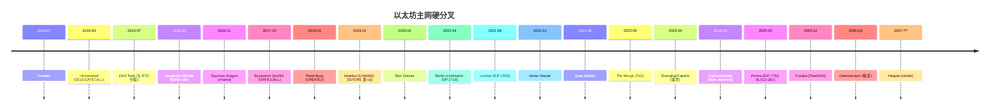
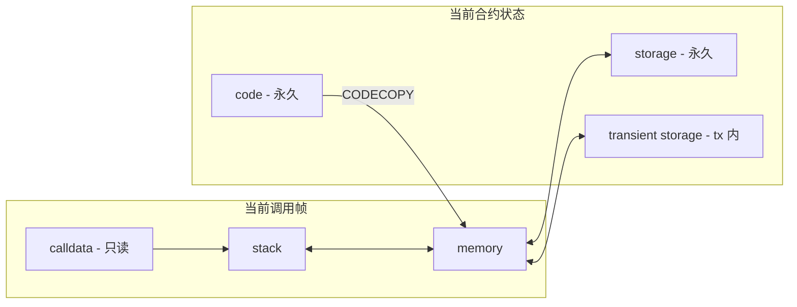
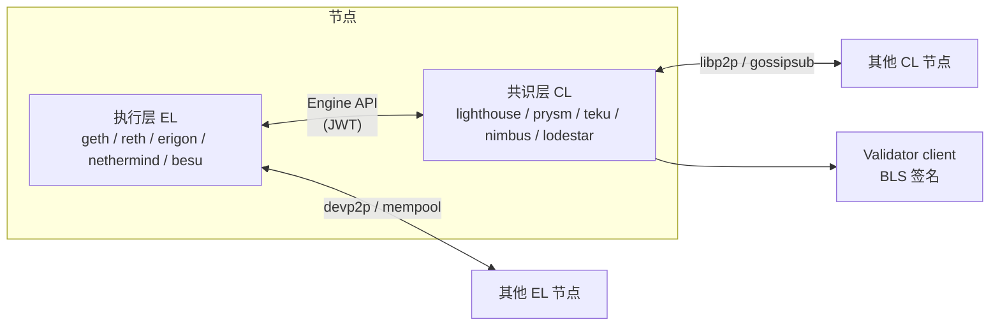
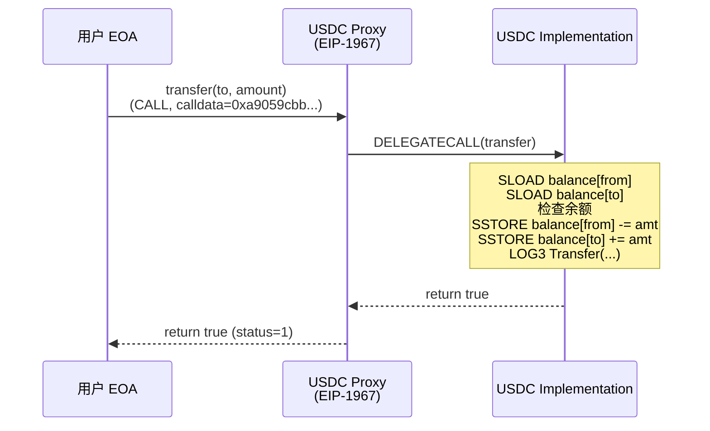
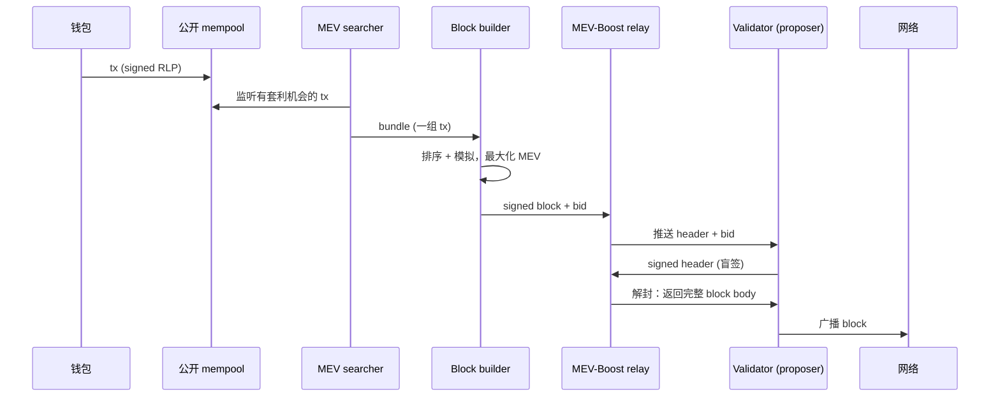
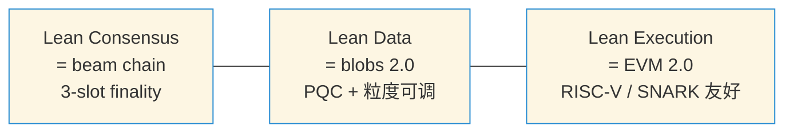
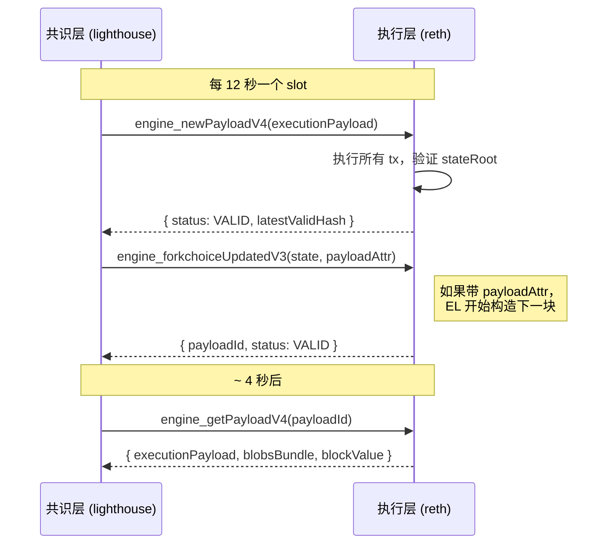

# 模块 03 — 以太坊与 EVM

> 检索日期：2026-04-27。所有外部链接均在该日期可达。本模块写在 Pectra 已上线（2025-05-07）、Fusaka 已上线（2025-12-03，含 BPO1 2025-12-09 与 BPO2 2026-01-07）、Glamsterdam 在 H1 2026 末/Q3 候选、Hegota（Verkle）2026-H2 ~ 2027 规划中的时间点上。
>
> 本模块按 直觉 → 历史 → 形式定义 → 工程实现 → 真实案例 → 坑 → 延伸 的结构展开。20+ 主章、150+ 小节，每个 opcode、每个 precompile、每个客户端、每次硬分叉都有自己的小节。如果你只想速查某个 opcode 的 gas，直接打开 [evm.codes](https://www.evm.codes/)；如果你想真正搞懂以太坊状态机为什么长成今天这副样子，按章节一节一节读，每节配的练习与代码都跑过。
>
> **前置**：本模块假设你已完成 [模块 02 — 区块链原理与共识](../02-区块链原理与共识/README.md)，理解 PoS 共识如何确保每个区块的 stateRoot 被诚实多数验证者认可。这是 EVM 状态机可信运行的外部保障。**后续**：读完本模块后进入 [模块 04 — Solidity 开发](../04-Solidity开发/README.md)，在这里学到的 EVM 执行模型将直接指导你写出 gas 高效、存储安全的智能合约。

## 目录

- [0 学习目标](#0-学习目标)
- [1 直觉与历史：为什么 EVM 长这样](#1-直觉与历史为什么-evm-长这样)
- [2 升级时间线：从 Frontier 到 Fusaka 与 Glamsterdam](#2-升级时间线从-frontier-到-fusaka-与-glamsterdam)
- [3 账户与交易](#3-账户与交易)
- [4 Gas 模型](#4-gas-模型)
- [5 EVM 内部：栈机的六个数据区](#5-evm-内部栈机的六个数据区)
- [6 Opcodes 全解：按类讲透](#6-opcodes-全解按类讲透)
- [7 Precompiles 全表](#7-precompiles-全表)
- [8 状态树：MPT 现在 → Verkle 将来](#8-状态树mpt-现在--verkle-将来)
- [9 客户端谱系：执行层与共识层逐个看](#9-客户端谱系执行层与共识层逐个看)
- [10 升级机制：硬分叉是怎么开会开出来的](#10-升级机制硬分叉是怎么开会开出来的)
- [11 工程实现：viem / Foundry / cast 实战](#11-工程实现viem--foundry--cast-实战)
- [12 真实交易 trace 逐步走读（PC by PC）](#12-真实交易-trace-逐步走读pc-by-pc)
- [13 ABI 与函数选择器深入](#13-abi-与函数选择器深入)
- [14 事件与 logs（receiptsRoot 与 logsBloom）](#14-事件与-logsreceiptsroot-与-logsbloom)
- [15 代理模式与 DELEGATECALL 工程](#15-代理模式与-delegatecall-工程)
- [16 区块构建链路：mempool → builder → relay → proposer](#16-区块构建链路mempool--builder--relay--proposer)
- [17 EVM 字节码逆向工程](#17-evm-字节码逆向工程)
- [18 常见坑（Top 12）](#18-常见坑top-12)
- [19 AI 在 EVM 工作流的位置](#19-ai-在-evm-工作流的位置)
- [20 习题（含完整解答）](#20-习题含完整解答)
- [21 自测清单](#21-自测清单)
- [22 EOF 深入：被剔除又复活的 EVM 重整方案](#22-eof-深入被剔除又复活的-evm-重整方案)
- [23 Verkle Trees 深入：原理、过渡与 EIP-6800](#23-verkle-trees-深入原理过渡与-eip-6800)
- [24 State expiry / History expiry / 弱无状态](#24-state-expiry--history-expiry--弱无状态)
- [25 Lean Ethereum：beam chain 与后量子安全](#25-lean-ethereumbeam-chain-与后量子安全)
- [26 Reth 内部架构与 Execution Extensions (ExEx)](#26-reth-内部架构与-execution-extensions-exex)
- [27 Engine API：执行层与共识层之间的对话](#27-engine-api执行层与共识层之间的对话)
- [28 USDC 字节码 walkthrough（FiatTokenV2_2）](#28-usdc-字节码-walkthroughfiattokenv2_2)
- [29 Pectra 一年后的现场观察](#29-pectra-一年后的现场观察)
- [30 延伸阅读](#30-延伸阅读)

---

## 0 学习目标

读完本章，你能独立做到：

1. **画图**：白板上画「EOA → CA」调用栈，标出 stack/memory/storage/calldata/transient storage/code 各自边界，同图标出 `CALL/STATICCALL/DELEGATECALL` 三者差异。
2. **手撸交易**：用 viem 2.43.3 在 Sepolia 手动构造、签名、发送 EIP-1559（Type 2）交易，以及 EIP-7702（Type 4）SetCode 交易。
3. **读懂字节码**：识别函数选择器分发表，用 `evm.codes` disassembler 推断函数签名集合。
4. **算 gas**：推导一段汇编的 gas 消耗，含 SSTORE 冷热两情况、memory expansion 二次项、CALL 的 63/64 转发规则、blob gas 独立市场。
5. **解释升级**：一句话解释 Pectra、Fusaka 各做了什么；讲清 Verkle 树带来的无状态客户端。
6. **跟踪 ACD**：找到 AllCoreDevs 会议纪要，看懂 EIP 阶段（Draft / Last Call / Final / Withdrawn），知道 EOF 为何从 Fusaka 被剔除。
7. **AI 用得对**：知道哪些场景让 AI 帮你逆向字节码、解释 calldata，哪些场景一定会幻觉。

---

## 1 直觉与历史：为什么 EVM 长这样

### 1.1 四个约束推出整个 EVM 设计

| 约束 | 对应选择 |
|---|---|
| 确定性 | 32 字节定长字、整数运算、无浮点 |
| 停机 | 每条指令付 gas，超额回滚 |
| 状态承诺 | Merkle Patricia Trie，节点对 stateRoot 投票 |
| 隔离 | 每次 CALL 开新栈帧；storage 按合约地址分桶 |

### 1.2 六组对偶（贯穿全模块）

1. **EOA vs CA** — 谁能签交易，谁只能被调用
2. **memory vs storage** — 临时 vs 持久；前者每帧重置，后者进 stateRoot
3. **CALL vs DELEGATECALL** — 上下文切换 vs 上下文借用；后者是代理模式的根
4. **base fee vs priority fee** — 烧掉的 vs 给提议者的
5. **execution gas vs blob gas** — 两套独立费用市场
6. **MPT vs Verkle** — 当下 vs 将来的状态树

### 1.3 为什么是栈机不是寄存器机

栈机每条 opcode 对栈高度影响确定，给定入口高度即可静态算出整个 basic block 的栈变化，jump destination 校验、gas 计费、字节码大小都因此简洁。代价：无法做寄存器分配，重复读栈要 DUP/SWAP。EOF（EIP-7692，§22）想用 section 化部分缓解，但 Fusaka 剔除了它。

### 1.4 EVM 与其他 VM 对照

| VM | 类型 | 状态模型 | 项目 | 与 EVM 比 |
|---|---|---|---|---|
| **EVM** | 栈式 | account + MPT | 以太坊全家 | 字段定长、生态最大 |
| **WASM (eWASM)** | 栈式 | 自定 | Polkadot、Soroban | 通用、字节码大；ETH 已搁置 |
| **SVM** | 寄存器（BPF） | account + 平铺 | Solana | 并行执行强 |
| **MoveVM** | 寄存器 | resource | Aptos、Sui | 编译期防 double-spend |
| **CairoVM** | 多项式 | Merkle | Starknet | STARK 原生 |

OP / Arbitrum / Base / zkSync Era / Linea / Scroll / Polygon zkEVM 都以 EVM 为执行层。

---

## 2 升级时间线：从 Frontier 到 Fusaka 与 Glamsterdam

### 2.1 Frontier（2015-07-30）

第一版主网。CALL/CREATE/SSTORE 已存在但 gas 表过松（CALL 40 gas），状态膨胀严重。留下：EVM 雏形与 Yellow Paper 第一版。

### 2.2 Homestead（2016-03-14）

- **EIP-2**：contract creation gas 升到 32000；私钥 s 值规范化（防 malleability）
- **EIP-7**：引入 **DELEGATECALL**——一切代理模式的祖先；同时 CALLCODE 开始弃用（语义错：msg.sender 不正确）

### 2.3 The DAO 分叉（2016-07-20，区块 1,920,000）

The DAO 募 1150 万 ETH（≈$1.5 亿）；`splitDAO` 先转账后改余额，攻击者递归抽走 360 万 ETH。社区硬分叉产生 **Ethereum** vs **Ethereum Classic** 双链，确立了 **Checks-Effects-Interactions** 模式与 ACD 公开讨论惯例。

来源：[Gemini: DAO Hack Explained](https://www.gemini.com/cryptopedia/the-dao-hack-makerdao)（检索 2026-04-27）。

### 2.4 Tangerine Whistle（2016-10-18）+ Spurious Dragon（2016-11-22）

针对 2016-09/10 月 DoS 攻击（攻击者反复调用 IO-heavy opcode 拖慢全网）：

- **EIP-150（Tangerine Whistle）**：IO 类 opcode 大幅涨价；引入 **63/64 规则**——CALL 最多转发当前 gas 的 63/64，剩 1/64 留本地，阻断"1024 层 call depth attack"
- **EIP-155（Spurious Dragon）**：交易签名加 chainId，防跨链重放

来源：[EIPS/eip-150](https://eips.ethereum.org/EIPS/eip-150)、[RareSkills: 63/64 rule](https://rareskills.io/post/eip-150-and-the-63-64-rule-for-gas)（检索 2026-04-27）。

> **63/64 规则的现实影响**：栈深度名义上是 1024，但因为每层 CALL 都掉 1/64 gas，实际可达深度大约只有 200~340。安全审计里看到 "1024 stack depth attack" 的话术多半是过时知识——今天根本到不了 1024。

### 2.5 Byzantium（2017-10-16）

- **EIP-196 / EIP-197**：bn254 椭圆曲线加法、乘法、配对 precompile（0x06/0x07/0x08），zkSNARK 首次可在主网验证
- **EIP-198**：modexp precompile（0x05），RSA / ZK 通用
- **EIP-211**：RETURNDATASIZE / RETURNDATACOPY，调用方能读完整返回值
- **EIP-214**：STATICCALL，强制只读 CALL，view 函数链上保护的基础
- **EIP-100**：难度调整变软（基于平均出块时间）

### 2.6 Constantinople / Petersburg（2019-02-28）

**唯一一次因安全问题被回滚的硬分叉**。原计划 2019-01-16 上线 Constantinople，含 EIP-1283（net gas metering for SSTORE）；ChainSecurity 提前一天发现 EIP-1283 让 2300 gas 假设失效，引入再入攻击面。社区紧急回退，2019-02-28 上线 Petersburg 剔除 EIP-1283，保留：

- **EIP-145**：SHL/SHR/SAR 位移指令
- **EIP-1014**：**CREATE2**，确定性合约地址，counterfactual deployment 的根
- **EIP-1052**：EXTCODEHASH
- **EIP-1234**：区块奖励 3 → 2 ETH，延后难度炸弹

来源：[CoinDesk: Constantinople delay](https://www.coindesk.com/markets/2019/01/15/ethereums-constantinople-upgrade-faces-delay-due-to-security-vulnerability)（检索 2026-04-27）。

> 教训：**硬分叉前必须完成 invariant 复审**——EIP-1283 本身逻辑正确，错在未考虑现有合约对 2300 gas 边界的隐式依赖。

### 2.7 Istanbul（2019-12-08）+ Muir Glacier（2020-01-02）

- **EIP-152**：blake2f precompile（地址 0x09），用于 Zcash 等链跨链
- **EIP-1108**：bn254 价格大降，让 ZK 操作更便宜
- **EIP-1344**：CHAINID opcode（之前要硬编码）
- **EIP-1884**：状态访问类 opcode 涨价（SLOAD 200 → 800）；新增 SELFBALANCE
- **EIP-2200**：第三版 SSTORE gas 表，最终版本（基本沿用至今）
- **EIP-2384（Muir Glacier）**：再次推迟难度炸弹

### 2.8 Berlin（2021-04-15）

- **EIP-2565**：modexp 涨价（之前算大数 RSA 太便宜）
- **EIP-2929**：状态访问 opcode 引入 **cold/warm 双轨制**——同一笔交易内首次访问某个 (address, slot) 收 cold 价（SLOAD 2100、SSTORE +2100 cold），后续 warm 价（100）
- **EIP-2718**：**Typed Transaction Envelope**，未来一切新交易类型的总框架
- **EIP-2930**：Type 1 交易（access list），可以预热槽位省 gas

### 2.9 London（2021-08-05）

- **EIP-1559**：Type 2 dynamic fee，引入 base fee（烧毁）+ priority fee（小费）
- **EIP-3198**：BASEFEE opcode
- **EIP-3529**：refund 上限砍到 gas_used / 5；移除 SELFDESTRUCT 退款，终结 GST2 等 gas token 滥用
- **EIP-3554**：再推一次难度炸弹

base fee 由协议自动调节，钱包从"猜 gas price"改为"设 max fee + max priority fee"。base fee 烧毁 + Merge 后低发行率（~0.5%/年）使 ETH 多数时间净通缩。

### 2.10 Arrow Glacier（2021-12-09）+ Gray Glacier（2022-06-30）

纯延后难度炸弹的过渡升级。

### 2.11 The Merge（2022-09-15，Bellatrix + Paris）

执行层几乎不变，**共识层从 PoW 切到 PoS**：

- mining 完全停止；DIFFICULTY opcode → **PREVRANDAO**（信标链上一个 epoch 的随机数）
- 区块时间：13 秒 → 精确 12 秒（slot）
- ETH 发行量下降约 90%，与 EIP-1559 烧毁结合

来源：[Mainnet Merge Announcement](https://blog.ethereum.org/2022/08/24/mainnet-merge-announcement)（检索 2026-04-27）。

### 2.12 Shanghai / Capella（2023-04-12）

- **EIP-4895**：信标链验证者提款（withdrawal 不再单向锁仓）
- **EIP-3651**：COINBASE 直接 warm
- **EIP-3855**：PUSH0 opcode
- **EIP-3860**：限制 initcode size

### 2.13 Cancun / Deneb（Dencun，2024-03-13）

- **EIP-4844**：Proto-danksharding，blob 交易（Type 3），L2 DA 成本下降一个量级
- **EIP-1153**：transient storage（TSTORE/TLOAD）
- **EIP-5656**：MCOPY opcode
- **EIP-6780**：SELFDESTRUCT 弱化——仅"同一 tx 内创建+自毁"才真删，否则等同 transfer
- **EIP-4788**：信标链区块根写进执行层（合约可 trustless 读共识层数据）
- **EIP-7516**：BLOBBASEFEE opcode

2024 年起 Optimism、Arbitrum 等 rollup 全部迁到 blob，主网 calldata 让出大半，L2 swap 费从几美元降到几美分。

### 2.14 Prague / Electra（Pectra，2025-05-07 10:05:11 UTC，epoch 364032）

Merge 后单次 EIP 最多（11 个），一次解决账户抽象、机构质押、L2 吞吐。

执行层（Prague）：

- **EIP-7702**：**SetCode 交易（Type 4）**，EOA 临时挂 designator code，任何已有 EOA 都能跑合约逻辑（§3.5）
- **EIP-2537**：**BLS12-381 系列 precompile**（0x0b ~ 0x11，共 7 个，§7）
- **EIP-2935**：把过去 8192 个区块哈希存进 `0x0000F90827F1C53a10cb7A02335B175320002935` 系统合约。ZK rollup、跨链桥从此不用维护自己的历史 trie
- **EIP-7623**：**calldata "floor"** 机制——一笔 tx 收的 gas 不能低于 `21000 + 10 × (zero_bytes + 4 × non_zero_bytes)`。压制纯 calldata 滥用，把"租 calldata 占空间"挤进 blob
- **EIP-7691**：blob 目标 3→6、上限 6→9
- **EIP-2935**、**EIP-7549**（attestation 聚合优化）

共识层（Electra）：

- **EIP-7251**：单验证者最大有效余额（MaxEB）32 → 2048 ETH，机构无需拆数千 validator，attestation 数量减少
- **EIP-6110**：deposit 由执行层系统合约直接处理，新质押 4-12 分钟生效（之前 ~12 小时）
- **EIP-7002**：执行层触发的 partial / full exit。质押者用普通 EVM 交易就能发起退出，无需共识层签名

来源：[Pectra Mainnet Announcement](https://blog.ethereum.org/2025/04/23/pectra-mainnet)、[The Block: Pectra activated with 11 changes](https://www.theblock.co/post/353407/ethereum-pectra-upgrade)、[ethPandaOps: Pectra Mainnet Checklist](https://ethpandaops.io/posts/pectra-mainnet-checklist/)（检索 2026-04-27）。

### 2.15 Fulu / Osaka（Fusaka，2025-12-03 21:49:11 UTC，epoch 411392）

blob 上限 9 已接近家用带宽极限（~1.1 MB/slot），继续提升需节点只采样部分 blob——即 PeerDAS。

完整 12 个 EIP（来源：[Alchemy: Fusaka Dev Guide to 12 EIPs](https://www.alchemy.com/blog/ethereum-fusaka-upgrade-dev-guide-to-12-eips)、[Conduit: Fusaka EIPs Cheat Sheet](https://www.conduit.xyz/blog/ethereum-fusaka-upgrade-eips-cheat-sheet/)，检索 2026-04-27）：

| EIP | 名字 | 作用 |
|---|---|---|
| **EIP-7594** | **PeerDAS** | 节点只采样部分数据列；header 加 `data_column_sidecars` 字段 |
| EIP-7642 | eth/69 协议 | 移除 mempool gossip 中的 pre-Merge 字段（PoW total difficulty 等） |
| EIP-7823 | MODEXP 上限 | base/exp/mod 各 ≤ 8192 字节，防 DoS |
| EIP-7825 | tx gas cap | 单笔交易 gas 上限 30M（≈ block gas 一半） |
| EIP-7883 | MODEXP 涨价 | 基数 + 阶 + 模再涨一档，与 Berlin EIP-2565 接力 |
| EIP-7892 | Blob Parameter Only fork | 引入"轻量分叉"机制：只调 blob 参数不改 EVM，一行配置即可（BPO1/BPO2 就靠它） |
| EIP-7910 | `eth_config` JSON-RPC | 标准化客户端报告自己当前激活了哪些 fork 与 EIP |
| EIP-7917 | 提议者前瞻确定性 | proposer lookahead 进 beacon state，让 builder 提前知道下个 slot 的 proposer |
| EIP-7918 | blob base fee 下限 | 把 blob base fee 与执行 gas 挂钩，防 blob fee 永远在最低 1 wei |
| EIP-7934 | RLP 区块 size 上限 | 单区块 RLP 序列化后 ≤ 10 MB |
| EIP-7935 | 默认 gas limit 60M | 默认建议 gas_limit 从 30M 提到 60M（节点共识投票） |
| EIP-7939 | **CLZ opcode** | Count Leading Zeros，新增 `0x1e` opcode，bit 操作硬件友好 |
| EIP-7951 | **secp256r1 precompile** | 又名 P-256，地址 0x100。passkey / WebAuthn 直接上链 |

**EOF 命运**：原计划进 Fusaka 的 EOF（EIP-3540 / 3670 / 4200 / 4750 / 5450 / 6206 / 7480 / 663）整组被剔除。理由：工程复杂度高、与 EIP-7702 的交互未充分研究、社区担心过早冻结字节码格式。可能在 Glamsterdam 之后再议。

**已激活的 BPO 链**：

- **BPO1**（2025-12-09）：blob 目标 6 → **10**、上限 9 → **15**
- **BPO2**（2026-01-07）：blob 目标 → **14**、上限 → **21**

**Prysm 事件**：升级后约一周 Prysm attestation 处理 bug 致依赖 Prysm 的 validator 掉线，finality participation 一度降到 ~75%。其他四客户端未受影响，再次证明**客户端多样性是系统韧性的核心**。

来源：[Fusaka Mainnet Announcement](https://blog.ethereum.org/2025/11/06/fusaka-mainnet-announcement)、[CoinDesk: Ethereum Activates Fusaka](https://www.coindesk.com/tech/2025/12/03/ethereum-activates-fusaka-upgrade)、[Cointelegraph: Prysm Bug Knocks Ethereum](https://cointelegraph.com/news/ethereum-prysm-bug-fusaka-client-diversity-risk)（检索 2026-04-27）。

### 2.16 Glamsterdam（Gloas + Amsterdam，预计 2026-H1 末 / Q3）

目标：把 builder-proposer 协议写进协议层（ePBS），取代中心化 relay。

两个头牌 EIP：

- **EIP-7732（ePBS）**：proposer 只对 builder 的 commitment 盲签，交易在 finality 后公开，MEV 操控空间大幅压缩
- **EIP-7928（Block-Level Access Lists, BAL）**：每块附带 (address, slot) 访问清单，节点并行执行、提前 prefetch；为 stateless / 并行执行铺路

候选：EIP-7954（合约 size 上限上调）、多项 EVM 小改

来源：[Quicknode: Glamsterdam Upgrade](https://blog.quicknode.com/ethereum-glamsterdam-upgrade-whats-coming-in-h1-2026/)、[ethereum.org/roadmap/glamsterdam](https://ethereum.org/roadmap/glamsterdam/)（检索 2026-04-27）。

### 2.17 Hegota（预计 2026-H2 ~ 2027）

承载 Verkle Trees 主迁移（详见 §8.2）及过渡期 dual-tree（MPT + Verkle 并行一段时间）。

来源：[ethereum.org/roadmap/verkle-trees](https://ethereum.org/roadmap/verkle-trees/)、[ethers.news: 2026 roadmap](https://ethers.news/articles/ethereum-2026-upgrade-roadmap-glamsterdam-hegota-explained)（检索 2026-04-27）。

### 2.18 一图流时间线（Mermaid）



有了时间线的全貌，下一节深入每次升级影响最大的对象：账户与交易格式。

---

## 3 账户与交易

### 3.1 两种账户

`address → Account`，四字段：

```
nonce       u64
balance     u256       (单位 wei，1 ETH = 1e18 wei)
codeHash    bytes32    (keccak256 of code，EOA 为 keccak256(""))
storageRoot bytes32    (该账户 storage trie 的根)
```

分两类：

| | EOA | CA |
|---|---|---|
| **创建方式** | 算 secp256k1 公钥 → keccak256 后 20 字节 | 由其他账户的 CREATE/CREATE2 部署 |
| **codeHash** | 空 `keccak256("")` 或（Pectra 后）designator hash | 部署字节码哈希 |
| **能签交易** | 能 | 不能 |
| **能持有 ETH** | 能 | 能 |
| **能被调用** | 能（无代码 → 仅转账；有 designator → 跑代理代码） | 能 |

> **Pectra 后的微妙变化**：EOA 的 codeHash 字段在挂上 designator 时变成 `keccak256(0xef0100 || delegateAddress)`。链上看 `getCode(eoa)` 返回 23 字节 `0xef0100 + 20 字节地址`。这是 EIP-7702 的硬约定，任何执行层客户端都按此识别。

### 3.2 五种交易类型

EIP-2718 typed envelope（`type_byte || rlp(payload)`，Type 0 legacy 除外）：

| 类型 | 名字 | EIP | 引入 | 关键字段 |
|---|---|---|---|---|
| 0x00 | Legacy | — | 创世 | `nonce, gasPrice, gas, to, value, data, v, r, s` |
| 0x01 | Access List | EIP-2930 | Berlin | + `chainId, accessList` |
| 0x02 | Dynamic Fee | EIP-1559 | London | + `maxPriorityFeePerGas, maxFeePerGas` |
| 0x03 | Blob | EIP-4844 | Cancun | + `maxFeePerBlobGas, blobVersionedHashes` |
| 0x04 | SetCode | EIP-7702 | Pectra | + `authorizationList` |

新类型几乎是上一类型的"加字段"：1559 ⊃ 2930，4844 ⊃ 1559，7702 ⊃ 1559（4844 与 7702 不同分支）。

### 3.3 EIP-1559（Type 2）字段细解

RLP 结构：

```
0x02 || rlp([
  chain_id,
  nonce,
  max_priority_fee_per_gas,   # 给提议者的小费 上限
  max_fee_per_gas,            # 用户愿意付的总价 上限
  gas_limit,
  to,                          # 0x 表示部署
  value,
  data,
  access_list,                 # 可选预热
  v, r, s                       # 签名（v 为 0/1）
])
```

实际花费：

```
gas_price = min(max_fee_per_gas, base_fee + max_priority_fee_per_gas)
fee       = gas_price * gas_used
burn      = base_fee  * gas_used         # 被烧毁
tip       = (gas_price - base_fee) * gas_used   # 给提议者
```

`max_fee_per_gas < base_fee` → 交易进不了 mempool。烧毁是协议层直接从 sender 余额扣除、不进任何账户，等价 ETH 总量减少。

### 3.4 EIP-4844 Blob 交易（Type 3）字段细解

```
0x03 || rlp([
  chain_id, nonce,
  max_priority_fee_per_gas, max_fee_per_gas,
  gas_limit, to, value, data, access_list,
  max_fee_per_blob_gas,             # blob 单价上限
  blob_versioned_hashes,            # 每个 blob 的 KZG commitment 的 versioned hash 列表
  v, r, s
])
```

Blob 数据走 sidecar（共识层 P2P），约 18 天后删除，versioned hash 永久上链。执行层只能用 `BLOBHASH (0x49)` 取 versioned hash、用 `0x0a` precompile 验 KZG 证明。每 blob = 128 KB，每 blob 的 blob gas = `131072`；单块 blob 上限随分叉演进（Cancun 6、Pectra 9、Fusaka BPO1 15、BPO2 21）。

### 3.5 EIP-7702 SetCode（Type 4）字段细解

```
0x04 || rlp([
  chain_id, nonce,
  max_priority_fee_per_gas, max_fee_per_gas,
  gas_limit, to, value, data, access_list,
  authorization_list,           # 关键新字段
  v, r, s
])
```

`authorization_list` 数组，每元素是 EOA 自签的小授权：

```
[chain_id, address, nonce, y_parity, r, s]
```

含义："我（EOA）授权把 code 指向 `address`"。chain_id = 0 表示跨链有效（极不推荐）。

执行流程：

1. 验证发送者签名，收手续费
2. 对每条 authorization：恢复 EOA 地址 → 校验 chain_id 与 nonce → 写 code = `0xef0100 || address`，EOA nonce +1
3. 像普通 1559 跑 `to` 调用

**authority 不必是 sender**——任何人可替你代发，需你签的 authorization（gas sponsor 核心机制）。

> 安全提醒：authorization 一旦上链即生效，签向恶意合约 = 交出 EOA。**永远只签向审计过/可信的合约**。

来源：[EIPS/eip-7702](https://eips.ethereum.org/EIPS/eip-7702)、[ethereum.org/roadmap/pectra/7702](https://ethereum.org/roadmap/pectra/7702/)（检索 2026-04-27）。

### 3.6 ERC-4337（账户抽象）vs EIP-7702

两者不互斥，经常组合：

| 维度 | ERC-4337 | EIP-7702 |
|---|---|---|
| 类型 | 应用层（合约） | 协议层（硬分叉） |
| 钱包形态 | 独立合约钱包，地址 ≠ EOA | 改造已有 EOA，地址不变 |
| Mempool | 独立的 4337 mempool | 走主网 mempool |
| 入口 | EntryPoint 合约（v0.7） | 协议直接处理 |
| 谁付 gas | Paymaster 或自己 | sender（可以是任何人） |

实际工程：EOA 通过 EIP-7702 委托到 4337 兼容合约，拥有 4337 全部能力同时保持 EOA 地址。

---

## 4 Gas 模型

### 4.1 基本费用结构

```
total_fee   = gas_used × gas_price
gas_price   = min(max_fee_per_gas, base_fee + max_priority_fee_per_gas)
burn        = base_fee × gas_used
miner_tip   = (gas_price - base_fee) × gas_used
```

base fee 调整算法（EIP-1559）：

```
parent_gas_target = parent_gas_limit / ELASTICITY (ELASTICITY = 2)
if parent.gas_used > target:
  delta = parent.base_fee × (parent.gas_used - target) / target / 8
  base_fee = parent.base_fee + max(delta, 1)
else if parent.gas_used < target:
  delta = parent.base_fee × (target - parent.gas_used) / target / 8
  base_fee = parent.base_fee - delta
else:
  base_fee = parent.base_fee
```

每块最多 ±12.5%。block gas_limit ≈ 30M（ELASTICITY=2，上限 60M）。

### 4.2 Yellow Paper 的 gas 公式（节选）

Yellow Paper 用 `C(σ, μ, A, I)` 表示某状态下下一步指令的 gas 消耗。多数 opcode 是常数；特殊家族：

```
C_SSTORE  = 复杂状态依赖（见 §4.3）
C_SLOAD   = warm 100 / cold 2100 + EIP-2929
C_CALL    = 700 base + value 转账加价 + new account 加价 + 63/64 rule
C_CREATE  = 32000 base + 200 × code_size + memory_expansion
C_LOG_n   = 375 base + 8 × len(data) + 375 × n
C_mem(a)  = 3 × a + ⌊a²/512⌋  ；a = 单位 32 字节字
```

`C_mem` 二次项：前 22 个字（约 700 字节）基本线性，到几 MB 要数百万 gas。

### 4.3 SSTORE 大表（EIP-2929 + EIP-3529，refund ≤ gas_used / 5）

| 旧值 → 新值 | warm | cold（追加 +2100） | refund |
|---|---|---|---|
| 0 → 0 | 100 | 2200 | 0 |
| 0 → X（新写） | 20000 | 22100 | 0 |
| X → 0（清零） | 2900 | 5000 | +4800 |
| X → Y（X≠0, Y≠0, Y≠X） | 2900 | 5000 | 0 |
| X → X（等价无操作） | 100 | 2200 | 0 |

读：

| 操作 | warm | cold |
|---|---|---|
| SLOAD | 100 | 2100 |
| TLOAD（EIP-1153） | 100 | 100（无 cold/warm 概念） |
| TSTORE | 100 | 100 |

### 4.4 内存 expansion 的二次项

EVM memory 惰性扩展：

```
C_mem(a) = 3a + ⌊a² / 512⌋
expansion_cost = C_mem(new_size) - C_mem(old_size)
```

| 大小 | a（32 字节字） | gas |
|---|---|---|
| 1 KB | 32 | 98 |
| 32 KB | 1024 | 5120 |
| 1 MB | 32768 | ~2.2M |

来源：[Yellow Paper 等式 326](https://ethereum.github.io/yellowpaper/paper.pdf)、[ethereum.org/developers/tutorials/yellow-paper-evm](https://ethereum.org/developers/tutorials/yellow-paper-evm/)（检索 2026-04-27）。

### 4.5 CALL 的 63/64 规则与 stipend

```
forward_gas = min(requested, available × 63/64)
```

EIP-150 引入，1/64 留调用方防深度攻击。`CALL`/`CALLCODE` 带 value 时额外 +9000 gas 并赠被调方 **2300 gas stipend**；`STATICCALL` / `DELEGATECALL` 无 value 加价也无 stipend。

> Istanbul EIP-1884 把 SLOAD 涨到 800 后，2300 gas stipend 已无法完成任何有意义操作。**永远别硬编码 gas 常数**——用 `call{value:x}` + checks-effects-interactions，不要 `transfer`/`send`。

### 4.6 transient storage 的 gas（EIP-1153）

`TSTORE` / `TLOAD` 固定 100 gas，无 cold/warm，tx 结束清零，不入 stateRoot。典型用途：re-entrancy guard（22100 → 100 gas）、一次性 approve+transferFrom、闪电贷簿记。

来源：[Solidity 0.8.24 transient storage](https://www.soliditylang.org/blog/2024/01/26/transient-storage/)（检索 2026-04-27）。

### 4.7 blob gas（独立费用市场）

```
blob_base_fee = fake_exponential(MIN_BASE_FEE_PER_BLOB_GAS, excess_blob_gas, BLOB_BASE_FEE_UPDATE_FRACTION)
fee_per_blob  = blob_base_fee × 131072
```

`fake_exponential` 用泰勒展开模拟 e^x（避免浮点）。`BLOB_BASE_FEE_UPDATE_FRACTION = 3338477`（Cancun；Pectra 有调整）。两套费用市场完全独立。

### 4.8 intrinsic gas

每笔交易执行前先收：

```
21000                    # 基础（普通转账）
+ 32000                  # 如果是合约部署
+ 4   per zero byte      of calldata
+ 16  per non-zero byte  of calldata    (Pectra 前 16；EIP-7623 后引入"floor"机制)
+ 2400 per access list address
+ 1900 per access list (address, key)
+ 21000 per authorization (EIP-7702)    # 授权列表每条收 25000 base，但若 EOA 已存在退 12500，净 12500
```

EIP-7623（Pectra）引入 calldata floor——tx 总 gas 不能低于 calldata floor，把"租 calldata 占空间"挤进 blob。

---

## 5 EVM 内部：栈机的六个数据区

256 位字长，无寄存器，无浮点，六个数据区：

| 区 | 字节寻址？ | 持久？进 stateRoot？ | 谁能写 | 生命周期 | 主要 opcode |
|---|---|---|---|---|---|
| **stack** | 否（按栈位） | 否 | 当前帧 | 当前调用帧 | PUSH, POP, DUP, SWAP |
| **memory** | 是 | 否 | 当前帧 | 当前调用帧 | MLOAD, MSTORE, MSTORE8, MCOPY, MSIZE |
| **storage** | 否（256 位 slot） | **是** | 当前合约自己 | 永久 | SSTORE, SLOAD |
| **transient storage** | 否（256 位 slot） | **否**（不进 stateRoot） | 当前合约自己 | 当前 tx | TSTORE, TLOAD |
| **calldata** | 是 | — | 调用方传入 | 当前帧（只读） | CALLDATALOAD, CALLDATACOPY, CALLDATASIZE |
| **code** | 是 | **是** | 部署时一次写定（EOA Pectra 后例外） | 永久 | CODECOPY, CODESIZE, EXTCODECOPY, EXTCODESIZE, EXTCODEHASH |

### 5.1 stack

最大 1024 项，每项 32 字节。所有算术与控制流从栈取值、把结果推回栈。

- PUSH1..PUSH32：推 1~32 字节字面量
- PUSH0（Shanghai 起）：推零
- POP：丢弃
- DUP1..DUP16：复制栈顶第 1~16 项
- SWAP1..SWAP16：交换栈顶与下方第 1~16 位

栈过深触发 "Stack too deep" 编译错误（编译时报，非运行时）。

### 5.2 memory

线性字节数组，初始空，按 32 字节对齐惰性扩展，帧结束销毁（不跨 CALL 帧共享）。Solidity 约定 0x40 为 free memory pointer（非协议强制）。MCOPY（EIP-5656）比循环 MLOAD/MSTORE 省约 1/3。

### 5.3 storage

每合约独立 storage trie（32 字节 KV）。Solidity 状态变量映射 slot 0、1、2...；mapping 用 `keccak256(key ‖ slot)`。SLOAD 冷 2100、SSTORE 新写冷 22100——**优化首要原则：减少 SSTORE**。

### 5.4 transient storage

EIP-1153（Cancun），slot KV，tx 结束清零，不入 stateRoot，100 gas。Solidity 0.8.24 起原生 `transient` 类型。

### 5.5 calldata

调用方传入的只读字节。`bytes calldata` 避免拷到 memory 省 gas。注意：constructor 参数附在 initcode 末尾，需 CODECOPY 读，不走 calldata。

### 5.6 code

不可变（7702 EOA 例外）。CODECOPY 拷自身代码到 memory；EXTCODECOPY / EXTCODESIZE / EXTCODEHASH 读他人代码。

### 5.7 一张图把六个数据区串起来（Mermaid）



---

## 6 Opcodes 全解：按类讲透

约 150 个 opcode，完整速查以 [evm.codes](https://www.evm.codes/) 为准。**栈**列：`输入 → 输出`（栈顶在右）；**gas** 列省略 memory expansion / cold/warm 可变部分。

### 6.1 停机 / 算术 (0x00-0x0B)

| 编码 | 助记符 | 栈 | gas | 说明 |
|---|---|---|---|---|
| 0x00 | STOP | `→` | 0 | 正常停机；不消耗 gas |
| 0x01 | ADD | `a, b → a+b` | 3 | 256 位 wrap |
| 0x02 | MUL | `a, b → a×b` | 5 | wrap |
| 0x03 | SUB | `a, b → a-b` | 3 | wrap |
| 0x04 | DIV | `a, b → a÷b`（b=0 返 0） | 5 | 无符号 |
| 0x05 | SDIV | `a, b → a÷b` | 5 | 二补码有符号 |
| 0x06 | MOD | `a, b → a mod b` | 5 | 无符号 |
| 0x07 | SMOD | `a, b → a mod b` | 5 | 有符号 |
| 0x08 | ADDMOD | `a, b, n → (a+b) mod n` | 8 | 防中间溢出 |
| 0x09 | MULMOD | `a, b, n → (a×b) mod n` | 8 | 同上 |
| 0x0a | EXP | `a, b → a^b` | 10 + 50×byte_len(b) | byte_len(b) 是 b 的字节数 |
| 0x0b | SIGNEXTEND | `b, x → ...` | 5 | x 按 b 字节符号扩展到 32 字节 |

实战要点：

- DIV/MOD `b=0` 直接返 0（无除零异常），Solidity 0.8 编译时插入 revert
- **EXP gas 杀手**：固定二次幂建议写 `1 << N`（SHL）
- 整数溢出：Solidity 0.8 前不检查；0.8 起 checked，`unchecked {}` 块可关——审计时关注每个 unchecked 边界

### 6.2 比较与位运算 (0x10-0x1D)

| 编码 | 助记符 | 栈 | gas | 说明 |
|---|---|---|---|---|
| 0x10 | LT | `a, b → a<b ? 1 : 0` | 3 | 无符号 |
| 0x11 | GT | `a, b → a>b ? 1 : 0` | 3 | 无符号 |
| 0x12 | SLT | `a, b → ...` | 3 | 有符号 |
| 0x13 | SGT | `a, b → ...` | 3 | 有符号 |
| 0x14 | EQ | `a, b → a==b ? 1 : 0` | 3 | — |
| 0x15 | ISZERO | `a → a==0 ? 1 : 0` | 3 | — |
| 0x16 | AND | `a, b → a&b` | 3 | 按位 |
| 0x17 | OR | `a, b → a｜b` | 3 | 按位 |
| 0x18 | XOR | `a, b → a^b` | 3 | 按位 |
| 0x19 | NOT | `a → ~a` | 3 | 按位取反 |
| 0x1a | BYTE | `i, x → x 的第 i 字节（高位优先）` | 3 | i ≥ 32 返 0 |
| 0x1b | SHL | `shift, value → value << shift` | 3 | EIP-145 (Constantinople) |
| 0x1c | SHR | `shift, value → value >> shift` | 3 | 同上 |
| 0x1d | SAR | `shift, value → value >> shift (算术)` | 3 | 同上 |
| 0x1e | CLZ | `x → 前导零位数` | 5 | EIP-7939 (**Fusaka**) |

CLZ（Count Leading Zeros，EIP-7939）：Fusaka 新增，用于 fast-log2、定点数实现，硬件友好。

### 6.3 SHA3 / KECCAK (0x20)

| 编码 | 助记符 | 栈 | gas | 说明 |
|---|---|---|---|---|
| 0x20 | KECCAK256（旧名 SHA3） | `offset, len → keccak256(mem[offset..offset+len])` | 30 + 6 × ⌈len/32⌉ + mem_expand | EVM 唯一原生哈希 |

小哈希便宜，**不要在循环里 keccak 大 buffer**——memory expansion + per-word 费用叠加。

### 6.4 环境信息 (0x30-0x3F)

| 编码 | 助记符 | 栈 | gas | 说明 |
|---|---|---|---|---|
| 0x30 | ADDRESS | `→ this` | 2 | 当前合约地址 |
| 0x31 | BALANCE | `addr → balance(addr)` | 2600 (cold) / 100 (warm) | 跨账户读 |
| 0x32 | ORIGIN | `→ tx.origin` | 2 | **永远不要用做权限** |
| 0x33 | CALLER | `→ msg.sender` | 2 | 直接调用方 |
| 0x34 | CALLVALUE | `→ msg.value` | 2 | wei |
| 0x35 | CALLDATALOAD | `i → calldata[i..i+32]` | 3 | 越界部分填 0 |
| 0x36 | CALLDATASIZE | `→ size` | 2 | — |
| 0x37 | CALLDATACOPY | `destOffset, offset, len →` | 3 + 3×⌈len/32⌉ + mem_expand | calldata→memory |
| 0x38 | CODESIZE | `→ size` | 2 | 当前合约 code 长度 |
| 0x39 | CODECOPY | `destOffset, offset, len →` | 3 + 3×⌈len/32⌉ | 自身 code→memory |
| 0x3a | GASPRICE | `→ effective_gas_price` | 2 | 1559 后可能等于 baseFee+tip |
| 0x3b | EXTCODESIZE | `addr → size` | 2600/100 | 别人的 code 长度 |
| 0x3c | EXTCODECOPY | `addr, destOffset, offset, len →` | 同上 + copy fee | 别人 code→memory |
| 0x3d | RETURNDATASIZE | `→ size` | 2 | 上次 CALL 返回数据长度 |
| 0x3e | RETURNDATACOPY | `destOffset, offset, len →` | 3 + 3×⌈len/32⌉ | RETURNDATA→memory |
| 0x3f | EXTCODEHASH | `addr → keccak256(code)` | 2600/100 | EIP-1052 |

### 6.5 区块信息 (0x40-0x4A)

| 编码 | 助记符 | 栈 | gas | 说明 |
|---|---|---|---|---|
| 0x40 | BLOCKHASH | `n → hash` | 20 | 仅最近 256 块；EIP-2935 后由系统合约提供 8192 |
| 0x41 | COINBASE | `→ proposer_addr` | 2 | Merge 前是 miner |
| 0x42 | TIMESTAMP | `→ block.timestamp` | 2 | proposer 可小幅操纵 |
| 0x43 | NUMBER | `→ block.number` | 2 | — |
| 0x44 | PREVRANDAO | `→ randao mix` | 2 | Merge 后替代 DIFFICULTY |
| 0x45 | GASLIMIT | `→ block.gaslimit` | 2 | — |
| 0x46 | CHAINID | `→ chain_id` | 2 | EIP-1344 (Istanbul) |
| 0x47 | SELFBALANCE | `→ balance(this)` | 5 | 比 BALANCE(this) 便宜 |
| 0x48 | BASEFEE | `→ block.baseFee` | 2 | EIP-3198 (London) |
| 0x49 | BLOBHASH | `i → blob_hashes[i]` | 3 | EIP-4844 (Cancun) |
| 0x4a | BLOBBASEFEE | `→ blob_base_fee` | 2 | EIP-7516 (Cancun) |

### 6.6 栈、内存、存储、控制流 (0x50-0x5F)

| 编码 | 助记符 | 栈 | gas | 说明 |
|---|---|---|---|---|
| 0x50 | POP | `a →` | 2 | 丢弃栈顶 |
| 0x51 | MLOAD | `offset → mem[offset..+32]` | 3 + mem_expand | — |
| 0x52 | MSTORE | `offset, value →` | 3 + mem_expand | 写 32 字节 |
| 0x53 | MSTORE8 | `offset, value →` | 3 + mem_expand | 仅写 1 字节 |
| 0x54 | SLOAD | `key → storage[key]` | 100 (warm) / 2100 (cold) | 见 §4.3 |
| 0x55 | SSTORE | `key, value →` | 见 §4.3 大表 | 最贵的 opcode 家族 |
| 0x56 | JUMP | `dest →` | 8 | dest 必须是 JUMPDEST |
| 0x57 | JUMPI | `dest, cond →` | 10 | cond ≠ 0 才跳 |
| 0x58 | PC | `→ pc` | 2 | 当前 PC，调试用 |
| 0x59 | MSIZE | `→ memory_size_bytes` | 2 | 当前 memory 高水位 |
| 0x5a | GAS | `→ gasleft` | 2 | 剩余 gas |
| 0x5b | JUMPDEST | `→` | 1 | 合法跳转标记 |
| 0x5c | TLOAD | `key → transient[key]` | 100 | EIP-1153 (Cancun) |
| 0x5d | TSTORE | `key, value →` | 100 | EIP-1153 (Cancun) |
| 0x5e | MCOPY | `dest, src, len →` | 3 + 3×⌈len/32⌉ + mem_expand | EIP-5656 (Cancun) |
| 0x5f | PUSH0 | `→ 0` | 2 | EIP-3855 (Shanghai) |

> JUMPDEST 是"合法跳转目标"，跳到非 JUMPDEST 字节会 revert。这是字节码形式的"函数边界"，也是 disassembler 划分 basic block 的依据。

### 6.7 PUSH / DUP / SWAP (0x60-0x9F)

- **PUSH1..PUSH32 (0x60-0x7F)**：推字面量 1..32 字节，3 gas
- **DUP1..DUP16 (0x80-0x8F)**：复制栈顶第 1..16 项，3 gas
- **SWAP1..SWAP16 (0x90-0x9F)**：交换栈顶与第 2..17 项，3 gas

PUSH0（EIP-3855，Shanghai）省 1 字节，降合约部署费。

### 6.8 日志 (0xA0-0xA4)

| 编码 | 助记符 | 栈 | gas | 说明 |
|---|---|---|---|---|
| 0xa0 | LOG0 | `offset, len →` | 375 + 8×len | 无 indexed |
| 0xa1 | LOG1 | `offset, len, t1 →` | 750 + 8×len | 1 个 indexed topic |
| 0xa2 | LOG2 | `offset, len, t1, t2 →` | 1125 + 8×len | 2 个 |
| 0xa3 | LOG3 | `offset, len, t1, t2, t3 →` | 1500 + 8×len | 3 个 |
| 0xa4 | LOG4 | `offset, len, t1..t4 →` | 1875 + 8×len | 4 个 |

LOG 不影响 stateRoot，只进 receiptsRoot 与 logsBloom，前端与 indexer 读它。ERC-20 转账用 LOG3（topic = [Transfer 哈希, from, to]，data = amount）。

### 6.9 系统调用 (0xF0-0xFF)：四种 CALL 与 CREATE

| 编码 | 助记符 | 栈 | gas | 说明 |
|---|---|---|---|---|
| 0xf0 | CREATE | `value, off, len → addr` | 32000 + initcode 执行 + 200×deployed_size | 地址 = `keccak256(rlp([sender, nonce]))[12:]` |
| 0xf1 | CALL | `gas, addr, value, ai, as, ro, rs → success` | 700 + 9000(value≠0) + 25000(new account) + cold + child gas | 标准外部调用 |
| 0xf2 | CALLCODE | 同上 | 同上 | **已弃用**；用 DELEGATECALL |
| 0xf3 | RETURN | `offset, len →` | 0 + mem_expand | 正常返回 |
| 0xf4 | DELEGATECALL | `gas, addr, ai, as, ro, rs → success` | 700 + cold + child | **保留 sender 与 storage 上下文** |
| 0xf5 | CREATE2 | `value, off, len, salt → addr` | 32000 + 6×⌈len/32⌉ + ... | 地址 = `keccak256(0xff‖sender‖salt‖keccak(initcode))[12:]` |
| 0xfa | STATICCALL | `gas, addr, ai, as, ro, rs → success` | 700 + cold + child | 强制只读 |
| 0xfd | REVERT | `offset, len →` | 0 + mem_expand | 回滚但保留 returndata |
| 0xfe | INVALID | `→` | all gas | 故意非法字节，吃光 gas |
| 0xff | SELFDESTRUCT | `recipient →` | 5000 (cold +2600) | EIP-6780 后弱化 |

| Opcode | msg.sender | storage 写到 | 能转 ETH | 状态可写 | 引入 |
|---|---|---|---|---|---|
| `CALL` | 当前合约 | 被调合约 | 是 | 是 | Frontier |
| `CALLCODE` | 当前合约 | **当前合约**（!） | 是 | 是 | Frontier（弃用） |
| `DELEGATECALL` | **保持原 caller** | **当前合约** | 否（继承 value） | 是 | Homestead |
| `STATICCALL` | 当前合约 | 被调合约 | 否 | **否** | Byzantium |

#### 6.9.1 CALLCODE 为什么死了

CALLCODE 借代码到自己上下文跑，但 msg.sender 还是当前合约，调用者无法 spoof `owner` 检查。EIP-7（Homestead）引入 DELEGATECALL，把 msg.sender 保留为原 caller，代理模式才真正成立。CALLCODE 随即废弃。

#### 6.9.2 DELEGATECALL：代理模式的根

```
proxy.fallback() {
  delegatecall(implementation, calldata)
  return returndata
}
```

implementation 的代码跑在 proxy 上下文：proxy 的 storage 被读写，msg.sender/msg.value 保持用户原值，implementation 自身 storage 永远不被动。这是 EIP-1967（Transparent / UUPS proxy）、Diamond（EIP-2535）、4337 钱包的核心机制。

**Parity 多签事件（2017-11-06）**：

- 钱包逻辑放在 library 合约，每个 stub 钱包调用 library。library 本身是普通合约，无人 init
- 攻击者直接调 library 的 `initWallet` 自封 owner，再调 `kill` 触发 SELFDESTRUCT
- library 消失，所有依赖它的 stub 永久无法工作，**约 51.3 万 ETH 冻结**

来源：[OpenZeppelin: Parity Wallet Hack Reloaded](https://blog.openzeppelin.com/parity-wallet-hack-reloaded)、[smartcontractshacking.com: delegatecall attacks](https://smartcontractshacking.com/attacks/call-attacks)（检索 2026-04-27）。

教训：永远 init library 自身；implementation 加 `require(address(this) != _self)`；EIP-6780 后 SELFDESTRUCT 危害已降（同 tx 创建+自毁才真删）。

#### 6.9.3 CREATE vs CREATE2

```
CREATE  : keccak256(rlp([sender, nonce]))[12:32]
CREATE2 : keccak256(0xff || sender || salt || keccak256(initCode))[12:32]
```

CREATE 依赖 nonce，地址不可控。CREATE2 由 salt 与 initCode 决定地址，**部署前即可算出**——用于 Uniswap V2/V3 pair/pool 地址、4337 wallet 的 counterfactual 部署。

#### 6.9.4 STATICCALL：链上 view 的硬保护

EIP-214（Byzantium）。STATICCALL 强制整个调用栈只读——子调里任何 SSTORE、CREATE、SELFDESTRUCT、LOG 均 revert。Solidity 编译 view/pure 外部调用时优先用 STATICCALL。

#### 6.9.5 SELFDESTRUCT 在 Cancun 后的弱化（EIP-6780）

Cancun（EIP-6780）前：删账户并转 ETH（Parity 事件的核心）。EIP-6780 后：仅**同 tx 内创建+自毁**才真删，否则只转 ETH——历史合约的 SELFDESTRUCT 实际变成普通转账。

### 6.10 一段汇编反汇编后的可读形态

`0x6080604052348015600f57600080fd5b5060358060206000396000f3fe...` 反汇编：

```
PUSH1 0x80     ; free memory pointer 初值
PUSH1 0x40     ; Solidity 约定 fmp 槽
MSTORE          ; memory[0x40..0x60] = 0x80
CALLVALUE       ; msg.value
DUP1
ISZERO
PUSH1 0x0f
JUMPI           ; if value == 0 跳到主体
PUSH1 0x00
DUP1
REVERT          ; 否则 revert（构造函数不接受 ETH）
JUMPDEST        ; 0x0f
POP
...
```

这是所有 Solidity 合约的 prelude——分配 fmp、检查 msg.value、部署 runtime code。看到此段即可认定来自 Solidity 编译器，而非手写 Yul。

---

## 7 Precompiles 全表

Precompile 是协议层硬编码合约，地址固定，不在状态树存字节码，用普通 CALL 调用。截至 Pectra（2025-05），共 17 个：

| 地址 | 名字 | 引入 | 主要用途 | gas 公式 |
|---|---|---|---|---|
| `0x01` | ecrecover | Frontier | secp256k1 签名恢复 | 3000 |
| `0x02` | sha256 | Frontier | SHA-256 哈希 | 60 + 12 × ⌈len/32⌉ |
| `0x03` | ripemd160 | Frontier | RIPEMD-160 | 600 + 120 × ⌈len/32⌉ |
| `0x04` | identity | Frontier | datacopy（memory 拷贝） | 15 + 3 × ⌈len/32⌉ |
| `0x05` | modexp | Byzantium / Berlin EIP-2565 涨价 | 大数模幂（RSA、ZK） | 复杂公式，与位长平方相关 |
| `0x06` | bn254 G1 add | Byzantium | bn254 加法 | 150 |
| `0x07` | bn254 G1 mul | Byzantium | bn254 标量乘 | 6000 |
| `0x08` | bn254 pairing | Byzantium | bn254 配对（zkSNARK） | 45000 + 34000 × k |
| `0x09` | blake2f | Istanbul | BLAKE2 压缩 | 1 / round |
| `0x0a` | point evaluation | Cancun | KZG 点求值（4844） | 50000（定值） |
| `0x0b` | BLS12-381 G1 ADD | **Pectra** | BLS 加法 | 375 |
| `0x0c` | BLS12-381 G1 MSM | **Pectra** | G1 多标量乘法 | 复杂（discount 表） |
| `0x0d` | BLS12-381 G2 ADD | **Pectra** | G2 加法 | 600 |
| `0x0e` | BLS12-381 G2 MSM | **Pectra** | G2 多标量乘法 | 复杂 |
| `0x0f` | BLS12-381 PAIRING_CHECK | **Pectra** | BLS 配对检查 | 32600 + 37700 × k |
| `0x10` | BLS12-381 MAP_FP_TO_G1 | **Pectra** | base field → G1 | 5500 |
| `0x11` | BLS12-381 MAP_FP2_TO_G2 | **Pectra** | extension field → G2 | 23800 |

来源：[EIPS/eip-2537](https://eips.ethereum.org/EIPS/eip-2537)、[evm.codes/precompiled](https://www.evm.codes/precompiled)（检索 2026-04-27）。

### 7.1 ecrecover（0x01）

输入 128 字节 `hash || v || r || s`，输出 32 字节地址。最常见用途：EIP-712 签名验证。

经典坑：**signature malleability**——(r, s) 与 (r, n-s) 恢复同一地址，攻击者改 s 绕过基于 sig 哈希的去重。ecrecover 自身**不**强制 s ≤ n/2，需合约主动检查或用 OZ ECDSA.sol。

### 7.2 modexp（0x05）

`(B^E) mod M`，big-int。Berlin EIP-2565 收紧 gas 公式（大致是 max(Bsize, Msize)² × bit_len(E) / 3），与计算量对齐。用于 RSA 验证、ZK 电路。

### 7.3 bn254 系列（0x06/07/08）

bn254（alt_bn128）。zkSNARK（Groth16）基于此曲线。安全性约 110 位，BLS12-381（128 位）在 Pectra 引入。

### 7.4 blake2f（0x09）

BLAKE2 的压缩函数（非完整函数），让 ETH 能验证 Zcash 等用 BLAKE2 的链的区块头。

### 7.5 point evaluation（0x0a）

EIP-4844 核心。输入 192 字节：`versioned_hash(32) || z(32) || y(32) || commitment(48) || proof(48)`。校验"承诺多项式在点 z 确实等于 y"。rollup 用 (z, y, proof) 在主网证明 batch 数据完整性，比放 calldata 便宜约 100 倍。

### 7.6 BLS12-381 系列（0x0b ~ 0x11，EIP-2537，Pectra）

| 地址 | 名字 | 输入 / 输出 | gas |
|---|---|---|---|
| 0x0b | G1 ADD | 256 → 128 字节 | 375 |
| 0x0c | G1 MSM `Σ k_i×P_i` | N×160 → 128 字节 | discount 表 |
| 0x0d | G2 ADD | 512 → 256 字节 | 600 |
| 0x0e | G2 MSM | N×288 → 256 字节 | discount 表 |
| 0x0f | PAIRING_CHECK `Πe(P_i,Q_i)==1` | N×384 → 32 字节 | 32600 + 37700×k |
| 0x10 | MAP_FP_TO_G1 | 64 → 128 字节 | 5500 |
| 0x11 | MAP_FP2_TO_G2 | 128 → 256 字节 | 23800 |

曲线安全性 ~128 位。MSM 替代了原草案的分散 G1MUL/G2MUL（BLST/arkworks 标准做法的硬件化）。工程意义：链上验证 Cosmos/Polkadot/Sui 的 BLS 签名、ZK rollup 最终配对验证、信标链 BLS 签名在执行层廉价验证。

### 7.7 secp256r1 / P-256（0x100，EIP-7951，Fusaka）

WebAuthn / passkey 曲线。输入 160 字节（hash + sig + pubkey），返回 32 字节。手机原生 passkey 无需中间层即可上链验证——EOA / 4337 钱包从助记词升级到生物识别的关键基础设施。

### 7.8 总览记忆口诀

```
0x01-0x04 : 哈希 / 签名 / 拷贝（Frontier）
0x05      : modexp（Byzantium）
0x06-0x08 : bn254（Byzantium，ZK Groth16）
0x09      : blake2f（Istanbul，跨链）
0x0a      : KZG point eval（Cancun，4844）
0x0b-0x11 : BLS12-381 全家（Pectra，BLS / 现代 ZK）
0x100     : secp256r1（Fusaka，passkey）
```

口诀："1234 哈希拷，5 modexp，678 bn254，9 blake，A KZG，B 起 BLS，100 P-256"。

---

## 8 状态树：MPT 现在 → Verkle 将来

### 8.1 Merkle Patricia Trie（现行）

Patricia trie + Merkle（节点 RLP 序列化后 keccak256 当指针）= MPT。四种节点：Null / Leaf（剩余路径, value）/ Extension（共享前缀, child）/ Branch（16 子节点 + 可选 value）。

实际四棵 MPT：State trie（address → Account）、每合约 storage trie、Transactions trie、Receipts trie，四 root 均进区块头。

**痛点**：全节点状态约 350 GB（2026-04）；单槽 Merkle 证明 ~1 KB，数百槽即数百 KB，无状态客户端不可行；扇出 16，典型路径深 7-9 层。

### 8.2 Verkle Trees（将来）

承诺方案：Pedersen + 椭圆曲线（Banderwagon over BLS12-381）。关键参数：扇出 256、证明 ~150 字节（可批量聚合，证 1000 个 slot 共 ~10 KB）、树深 3-4。一个区块的 witness ~200 KB，任何人能用一块 + witness 在轻硬件上验证状态转移（**无状态客户端**）。代价：椭圆曲线运算比 keccak 慢，节点 CPU 升高。

**2026-04 状态**：Verkle 测试网（kaustinen 系列）迭代多轮，geth/reth/besu 均有 Verkle 分支。预计 Hegota（2026-H2 ~ 2027）落主网。

来源：[ethereum.org/roadmap/verkle-trees](https://ethereum.org/roadmap/verkle-trees/)、[The State of Ethereum in 2026 — stake.fish](https://blog.stake.fish/the-state-of-ethereum-in-2026/)（检索 2026-04-27）。

### 8.3 一个工程师视角的对比表

| 维度 | MPT（现行） | Verkle（将来） |
|---|---|---|
| 节点扇出 | 16 | 256 |
| 哈希 | keccak256 | Pedersen + 椭圆曲线 |
| 单证明大小 | ~1 KB | ~150 字节 |
| 批证明聚合 | 不支持 | 支持，O(log n) |
| 平均深度 | 7-9 | 3-4 |
| 单节点 CPU | 低（纯哈希） | 高（曲线运算） |
| 状态可"无"持有？ | 否 | 是 |
| 工程成熟度 | 极高 | 测试网迭代中 |

---

## 9 客户端谱系：执行层与共识层逐个看

每台节点跑一个 EL 客户端（EVM 与状态）+ 一个 CL 客户端（PoS）。两者通过 **Engine API**（HTTPS + JWT）通信。

### 9.1 一图看清架构（Mermaid）



### 9.2 EL：go-ethereum (geth)

- **作者**：以太坊基金会，Go
- **版本**（2026-04）：v1.16.7 "Ballistic Drift Stabilizer"，含 BPO1/BPO2 mainnet 配置
- **特点**：最老最完整，新分叉语义规范以 geth 行为为准；v1.16 起 path-based archive（PBSS）
- **份额**：曾长期 80%+，2025 年起降至 50% 上下
- 文档：[geth.ethereum.org/docs](https://geth.ethereum.org/docs)（检索 2026-04-27）

### 9.3 EL：reth (Paradigm)

- **作者**：Paradigm，Rust
- **版本**（2026-04）：v2.1.0；v2.0 默认启用 Storage V2（MDBX 重写），1.7 Gigagas/s，磁盘 ~240 GB；`reth db migrate-v2` 无须 resync
- **特点**：模块化（EVM、状态 DB、RPC 均可独立用作 crate）；衍生 [`ress`](https://github.com/paradigmxyz/ress)（无状态客户端原型）
- **份额**（2026-04）：约 20-25%，2025 年起快速增长
- 文档：[reth.rs](https://reth.rs/)（检索 2026-04-27）

### 9.4 EL：erigon

- **作者**：erigontech，Go
- **版本**（2026-04）：v3.x；扁平 KV（plain state），存档节点省 ~50% 存储；v3 起内嵌 Caplin（CL）做单进程节点
- **注意**：erigon 2 已于 2025-05-01 停机，必须迁 v3
- 文档：[docs.erigon.tech](https://docs.erigon.tech/)（检索 2026-04-27）

### 9.5 EL：nethermind

- **作者**：Nethermind，C# / .NET
- **特点**：可配置性强；Fusaka 12 个 EIP 中 Nethermind 工程师 co-author 7 个；多数 staking-as-a-service 平台默认
- 文档：[github.com/NethermindEth/nethermind/releases](https://github.com/NethermindEth/nethermind/releases)（检索 2026-04-27）

### 9.6 EL：besu

- **作者**：Hyperledger / Consensys，Java
- **特点**：企业取向（QBFT / IBFT、隐私交易、permissioned）；状态库 Bonsai Tries（扁平 + 压缩）
- 文档：[besu.hyperledger.org](https://besu.hyperledger.org/)（检索 2026-04-27）

### 9.7 CL：lighthouse (Sigma Prime)

- **作者**：Sigma Prime，Rust；v8.0.0+（2026-04），支持 PeerDAS、`--supernode` / `--semi-supernode`
- **特点**：低内存、稳定，home staker 常选
- 文档：[github.com/sigp/lighthouse/releases](https://github.com/sigp/lighthouse/releases)（检索 2026-04-27）

### 9.8 CL：prysm (Offchain Labs)

- **作者**：Offchain Labs，Go；曾长期 CL 份额第一
- **2025-12 事件**：Fusaka 上线后 ~7 天 attestation 处理 bug，依赖 Prysm 的 validator 掉线，finality 降至 ~75%；其他四客户端维持了链。此后 lighthouse/teku 份额各涨 ~5%
- 文档：[github.com/OffchainLabs/prysm/releases](https://github.com/OffchainLabs/prysm/releases)（检索 2026-04-27）

### 9.9 CL：teku (Consensys)

- **作者**：Consensys，Java；Infura 内部使用；JVM 生态友好
- Fusaka 后移除 `GOSSIP_MAX_SIZE` / `MAX_CHUNK_SIZE` / `TTFB_TIMEOUT` / `RESP_TIMEOUT` 配置项
- 文档：[github.com/Consensys/teku/releases](https://github.com/ConsenSys/teku/releases)（检索 2026-04-27）

### 9.10 CL：nimbus (Status)

- **作者**：Status，Nim；v25.11.0+；极致省资源，可跑树莓派全验证者；`--light-supernode` 配合 PeerDAS
- 文档：[github.com/status-im/nimbus-eth2](https://github.com/status-im/nimbus-eth2)（检索 2026-04-27）

### 9.11 CL：lodestar (ChainSafe)

- **作者**：ChainSafe，TypeScript；v1.36.0+；唯一 TS/JS 共识客户端，浏览器友好
- 文档：[github.com/ChainSafe/lodestar/releases](https://github.com/ChainSafe/lodestar/releases)（检索 2026-04-27）

### 9.12 客户端选型决策表

| 你是 | 推荐 EL | 推荐 CL | 理由 |
|---|---|---|---|
| Home staker | reth / nimbus | lighthouse / nimbus | 资源轻、稳定 |
| 大型 staking 平台 | nethermind / erigon | teku / lighthouse | 可观测性 + JVM 生态 |
| RPC provider（Alchemy 等） | reth / geth | lighthouse | 性能 + 历史 archive |
| 研究 / 实验 | reth | lodestar / nimbus | 模块化 + 可读源码 |
| 企业 / permissioned | besu | teku | Java + 隐私功能 |
| 移动 / 嵌入式 | （等 stateless / Verkle） | nimbus | 资源极小 |

**黄金规则**：优先选份额 < 33% 的客户端。

了解了各客户端的特点，下一节看这些客户端是如何通过 AllCoreDevs 流程协商并推进硬分叉的。

---

## 10 升级机制：硬分叉是怎么开会开出来的

### 10.1 EIP 流程

```
Idea → Draft → Review → Last Call → Final
                                     ↓
                                Withdrawn / Stagnant
```

每个 EIP 一个 markdown 文件，存在 [github.com/ethereum/EIPs](https://github.com/ethereum/EIPs)。`Status: Final` ≠ 上主网——还要进硬分叉的 meta EIP 列表（如 [EIP-7600 Pectra Hardfork Meta](https://eips.ethereum.org/EIPS/eip-7600)）。

### 10.2 ACD（AllCoreDevs）

ACDE（执行层）和 ACDC（共识层）每两周各开一次，Zoom + YouTube 直播，议程：EIP 纳入清单、客户端进度、devnet 结果、testnet 日期。会议纪要：[github.com/ethereum/pm](https://github.com/ethereum/pm)。另有 **ACDT** 专门追踪当前硬分叉的实现进度。

### 10.3 测试链路

```
local devnet → public devnet (devnet-N) → testnet (Holesky / Hoodi / Sepolia) → mainnet
```

- **Holesky**（2023-09 起）：大规模 PoS / 验证者测试
- **Hoodi**（2025 起）：Pectra/Fusaka 长寿命测试网，Pectra 在此首发
- **Sepolia**：开发者日常用，轻量
- **Goerli**：已退役（2024-12）

### 10.4 devnet 节奏

每次分叉上测试网前约经历 10 个 devnet 周期（devnet-0 → ... → devnet-N）。任何客户端在某 devnet 无法跟住，对应 EIP 可能延至下次分叉（EOF 在 Fusaka 被剔除的直接原因之一）。

### 10.5 Fusaka 后的节奏

Fusaka 上线时 ACD 决议：大致**春季 + 秋季**各一次硬分叉。Glamsterdam 春季款，Hegota 秋季款。

来源：[The Block: twice-a-year hard-fork schedule](https://www.theblock.co/post/381285/fusaka-rollout-ethereum-twice-year-hard-fork-schedule)（检索 2026-04-27）。

---

## 11 工程实现：viem / Foundry / cast 实战

环境锁定：Node.js `20.18.0` LTS / viem `2.43.3`（2026-02）/ Foundry stable `v1.0.x` 或 nightly `2026-04-25+` / Sepolia RPC：`https://ethereum-sepolia-rpc.publicnode.com`

来源：[Foundry v1.0 Announcement](https://www.paradigm.xyz/2025/02/announcing-foundry-v1-0)、[viem releases](https://github.com/wevm/viem/releases)（检索 2026-04-27）。

### 11.1 viem 读链 — `code/01-read-mainnet.ts`

`createPublicClient` + 公开 RPC：读最新区块、ETH / USDC 余额、估 gas、查 1559 fee。

```bash
cd 03-以太坊与EVM/code
pnpm i && pnpm run read
```

### 11.2 viem 手撸 1559 — `code/02-sign-and-send-1559.ts`

```bash
SEPOLIA_PRIVATE_KEY=0xabc... pnpm run send
```

代码展示：`serializeTransaction()`（EIP-2718+1559 编码）→ `keccak256()`（secp256k1 实际签的消息）→ `account.signTransaction()`（本地签名）→ `sendRawTransaction()` → 按 `gasUsed × baseFee` 算烧毁 ETH。

### 11.3 viem EIP-7702 — `code/03-eip7702-delegate.ts`

```bash
SEPOLIA_PRIVATE_KEY=0xabc... pnpm run delegate
```

跑完去 sepolia.etherscan.io 看你的 EOA 的 code 字段，应该是 `0xef0100...`。viem 文档：[Sending Transactions with EIP-7702](https://viem.sh/docs/eip7702/sending-transactions)（检索 2026-04-27）。

### 11.4 cast 速查 — `code/04-cast-recipes.sh`

12 个配方：查余额、解码 calldata、估 gas、计算 keccak、解析 storage slot、CREATE2 地址预言、读 EOA designator。挑感兴趣的段落复制粘贴，勿直接 `bash 04-...`。

### 11.5 Foundry 跑 EVM trace — `code/05-foundry-bytecode/`

```bash
cd code/05-foundry-bytecode
forge install foundry-rs/forge-std --no-commit
forge test -vvvv --match-contract StackPlayTest
```

三个 demo：`bump()`（SSTORE cold/warm）、`transientPlay()`（TSTORE/TLOAD）、`mcopyPlay()`（MCOPY）。`-vvvv` 打印每步 opcode trace。

### 11.6 evm.codes Playground

[evm.codes/playground](https://www.evm.codes/playground) 粘贴：

```
60 06  PUSH1 0x06
60 07  PUSH1 0x07
02     MUL          ; stack: [42]
60 00  PUSH1 0x00
55     SSTORE       ; storage[0] = 42
00     STOP
```

点 Run 逐步显示 stack / storage。替换 `02` 为 `01/04/07` 等过一遍算术 opcode。

---

## 12 真实交易 trace 逐步走读（PC by PC）

以一笔主网 ERC-20 转账为案例。tx：`0x4d61c79e21b81df9...`（示意，用 `cast run --quick` 获取自己的 trace）。调用形式：EOA → USDC 合约 → `transfer(address, uint256)`。

### 12.1 交易解码

`cast tx 0x4d61...` 输出大致：

```
type:                eip1559
nonce:               123
to:                  0xA0b8...USDC
value:               0
data:                0xa9059cbb000000...0000003b9aca00
gasLimit:            65000
maxFeePerGas:        25 gwei
maxPriorityFeePerGas: 2 gwei
```

`0xa9059cbb` = `bytes4(keccak256("transfer(address,uint256)"))` (ERC-20 transfer selector)。后 32 字节 = to 地址（前 12 字节填 0），再 32 字节 = amount = `0x3b9aca00` = 1e9 = 1000 USDC（6 位小数）。

### 12.2 USDC 合约的 fallback / dispatcher（简化）

```
PUSH1 0x80           ; init free memory pointer
PUSH1 0x40
MSTORE
CALLVALUE            ; msg.value
DUP1
ISZERO
PUSH2 0x000f
JUMPI                ; if value == 0 跳到主体
PUSH1 0
DUP1
REVERT               ; 否则 revert（USDC 不接受 ETH）
JUMPDEST [0x000f]
POP
PUSH1 0x04           ; 取 calldata 的前 4 字节
CALLDATASIZE
LT                   ; calldata < 4 ?
PUSH2 0x0094         ; 跳到 fallback
JUMPI
PUSH1 0
CALLDATALOAD
PUSH1 0xe0
SHR                  ; 把高 4 字节移到低位（取出 selector）
DUP1
PUSH4 0xa9059cbb     ; 比对 transfer
EQ
PUSH2 0x00b9
JUMPI                ; 命中跳到 transfer 实现
... (其他 selector 比较) ...
JUMPDEST [0x00b9]
... transfer 实现 ...
```

stack 每步状态确定——这就是 disassembler 的工作。

### 12.3 PC-by-PC：dispatcher 的 24 步演示

假设 calldata = `0xa9059cbb || 0x...vitalik || 0x...3b9aca00`（76 bytes），msg.value = 0。

| PC | 字节 | opcode | 执行后 stack | memory / storage |
|---|---|---|---|---|
| 0x00 | 60 80 | PUSH1 0x80 | `[0x80]` | — |
| 0x02 | 60 40 | PUSH1 0x40 | `[0x80, 0x40]` | — |
| 0x04 | 52 | MSTORE | `[]` | mem[0x40..0x60] = 0x80（free memory pointer 初值） |
| 0x05 | 34 | CALLVALUE | `[0]` | — |
| 0x06 | 80 | DUP1 | `[0, 0]` | — |
| 0x07 | 15 | ISZERO | `[0, 1]` | — |
| 0x08 | 61 00 0f | PUSH2 0x000f | `[0, 1, 0x0f]` | — |
| 0x0b | 57 | JUMPI | `[0]`（跳走，因栈顶 1 truthy） | PC = 0x0f |
| 0x0f | 5b | JUMPDEST | `[0]` | — |
| 0x10 | 50 | POP | `[]` | — |
| 0x11 | 60 04 | PUSH1 0x04 | `[4]` | — |
| 0x13 | 36 | CALLDATASIZE | `[4, 76]` | — |
| 0x14 | 10 | LT | `[0]`（4 < 76 = false） | — |
| 0x15 | 61 00 94 | PUSH2 0x0094 | `[0, 0x94]` | — |
| 0x18 | 57 | JUMPI | `[]`（不跳走，因栈顶 0） | — |
| 0x19 | 60 00 | PUSH1 0x00 | `[0]` | — |
| 0x1b | 35 | CALLDATALOAD | `[0xa9059cbb000000...]` | 取 calldata[0..32] |
| 0x1c | 60 e0 | PUSH1 0xe0 | `[0xa9059cbb..., 224]` | — |
| 0x1e | 1c | SHR | `[0x00000000a9059cbb]` | 右移 224 位提出 selector |
| 0x1f | 80 | DUP1 | `[0xa9059cbb, 0xa9059cbb]` | — |
| 0x20 | 63 a9 05 9c bb | PUSH4 0xa9059cbb | `[0xa9059cbb, 0xa9059cbb, 0xa9059cbb]` | — |
| 0x25 | 14 | EQ | `[0xa9059cbb, 1]` | — |
| 0x26 | 61 00 b9 | PUSH2 0x00b9 | `[0xa9059cbb, 1, 0xb9]` | — |
| 0x29 | 57 | JUMPI | `[0xa9059cbb]`（跳到 transfer 实现） | PC = 0xb9 |

dispatcher 全过程无 SSTORE，全在 stack 上完成——通常只占 200-500 gas。

### 12.4 Mermaid 调用栈



USDC 用 EIP-1967 透明代理——实际执行地址与用户调用地址不同，但 storage 永远是 proxy 的（DELEGATECALL 语义）。

### 12.5 transfer 内部 gas 实拆

- SLOAD `balance[from]`（cold，**2100 gas**）
- 检查余额够不够（GTE）；不够 revert
- SLOAD `balance[to]`（cold，**2100 gas**）
- SSTORE 新 from balance（X→Y，cold，**5000 gas**，无 refund）
- SSTORE 新 to balance：原来是 0 → "0→X 新写"，**22100 gas**；已有余额则 5000
- LOG3：emit Transfer(from, to, amount)，约 **1875 gas**（375 base + 3×375 topic + 8×32 data）
- RETURN bool true

对一笔"双方都已经持有 USDC"的 transfer，链上 gas 大致：

```
21000 (intrinsic)
+ 4   × N_zero  + 16 × N_nonzero (calldata ~ 700)
+ 2 SLOAD        (4200 cold)
+ 2 SSTORE       (5000 + 5000)
+ 1 LOG3         (~ 1875)
+ misc opcodes   (~ 5000)
≈ 47000 gas
```

实测 USDC transfer 约 41000-65000 gas，与估算同数量级。

### 12.6 receipts 与 logsBloom

receipt 里能看到：

- `gasUsed`
- `effectiveGasPrice = min(maxFee, baseFee + maxPriority)`
- `logs`（被 indexer 抓走）
- `status = 1`（成功）或 `0`（revert）
- `type = 2`（EIP-1559）
- `logsBloom`：256 字节布隆过滤器，把每个 log 的 address 与每个 indexed topic 哈希后映射进 bit 向量。indexer 用它做"快速过滤无关 tx"

跑 `cast receipt 0x4d61...` 后塞给 [Phalcon Explorer](https://blocksec.com/explorer) 或 [Tenderly](https://tenderly.co/) 看完整可视化 trace。

### 12.7 Foundry 复现这次 trace

```bash
# fork 主网到调用块的前一刻
anvil --fork-url $ETH_RPC_URL --fork-block-number $BLOCK_NUMBER

# 另开一个终端
cast run 0x4d61... --rpc-url http://127.0.0.1:8545 --quick
# 输出 trace tree，能逐层看到 CALL / DELEGATECALL / SLOAD / SSTORE / LOG
```

`--quick` 跳过状态预热；`-vvv` 打开详细 trace；`--debug` 启动单步调试器（forge debug 风格）。

---

## 13 ABI 与函数选择器深入

### 13.1 selector 的来历

函数选择器 = `bytes4(keccak256(canonical_signature))`，canonical_signature 是函数名 + 参数类型规范写法（无空格，`uint` 必须写成 `uint256`）。

```bash
cast sig "transfer(address,uint256)"     # → 0xa9059cbb
cast sig "balanceOf(address)"             # → 0x70a08231
cast sig "approve(address,uint256)"       # → 0x095ea7b3
```

### 13.2 ABI encoding 三规则

1. **静态类型**右侧填 0 至 32 字节
2. **动态类型**（bytes、string、T[]）放在尾部，头部写 offset；offset 单位是字节，从参数列表起始算
3. 数组先 32 字节 length，后元素

实战例子：`transfer(address to, uint256 amount)`：

```
0xa9059cbb                                                          // selector
000000000000000000000000d8da6bf26964af9d7eed9e03e53415d37aa96045    // to (左 12 字节填 0)
000000000000000000000000000000000000000000000000000000003b9aca00    // amount = 1e9
```

### 13.3 selector clash

概率约 `1/2^32`，但确实发生（如 [`burn(uint256)`](https://www.4byte.directory/signatures/?bytes4_signature=0x42966c68)）。Diamond（EIP-2535）多 facet 设计时必须检查唯一性。用 `forge inspect Contract methodIdentifiers` 批量查。

### 13.4 Solidity ABI 与 packed 编码差异

- `abi.encode`：标准 ABI，每参数独立 32 字节
- `abi.encodePacked`：紧凑无 padding。**永远不要拿来做哈希参数**——`encodePacked("a","bc")` 与 `encodePacked("ab","c")` 哈希相同，是经典签名漏洞

EIP-712：用 `abi.encode` + 类型 hash 串联，杜绝 packed 歧义。

### 13.5 calldata 优化技巧

- `bytes calldata` 替代 `bytes memory`，省 calldata→memory 拷贝
- 长度固定时用 `bytes32` 替代 `bytes memory`
- ABI v2 默认开启（Solidity 0.8+），支持 nested struct

---

## 14 事件与 logs（receiptsRoot 与 logsBloom）

### 14.1 LOG opcode 系列

- `LOG0 (0xa0)`：无 indexed topic，只有 data
- `LOG1 (0xa1)`：1 个 topic（通常是事件签名 hash）
- `LOG2 (0xa2)`：2 个 topic
- `LOG3 (0xa3)`：3 个 topic
- `LOG4 (0xa4)`：4 个 topic（事件最多 3 个 indexed 参数 + 事件签名）

gas：`375 base + 8 × len(data) + 375 × n`（n 个 topic）。

### 14.2 事件签名 hash

```solidity
event Transfer(address indexed from, address indexed to, uint256 value);
// topic[0] = keccak256("Transfer(address,address,uint256)")
//         = 0xddf252ad1be2c89b69c2b068fc378daa952ba7f163c4a11628f55a4df523b3ef
// topic[1] = from (address padded to 32 bytes)
// topic[2] = to
// data     = abi.encode(value)
```

> 历史小细节：anonymous 事件没有 topic[0]，indexer 检索时只能用其它 topic 过滤。Solidity 里写 `event Foo() anonymous;` 即声明。

### 14.3 logsBloom

256 字节布隆过滤器：对 (address, 每个 topic) 哈希后取 3 个 11 位偏移置位。轻节点拉一块即 O(1) 判断"可能含我感兴趣的 log"。进 receiptsRoot 和 block header，Etherscan logs 查询、viem `getLogs` 依赖此结构。

### 14.4 indexer 工程

- [The Graph](https://thegraph.com/)：subgraph，GraphQL
- [Subsquid](https://www.sqd.dev/)：高性能替代
- [Goldsky](https://goldsky.com/)、[Envio](https://envio.dev/)：商用
- 自建：`eth_getLogs` + PostgreSQL / ClickHouse

---

## 15 代理模式与 DELEGATECALL 工程

### 15.1 为什么需要代理

EVM 合约字节码不可改。代理模式把"地址"与"逻辑"分开——proxy 持有用户地址 + 全部 storage，implementation 只持有逻辑。升级 = 改 proxy 的 implementation 指针。

### 15.2 EIP-1967：标准化 storage slot

EIP-1967 规定伪随机 slot，避免 proxy 与 implementation 变量撞槽：

```
implementation slot = bytes32(uint256(keccak256("eip1967.proxy.implementation")) - 1)
                    = 0x360894a13ba1a3210667c828492db98dca3e2076cc3735a920a3ca505d382bbc
admin slot          = bytes32(uint256(keccak256("eip1967.proxy.admin")) - 1)
beacon slot         = bytes32(uint256(keccak256("eip1967.proxy.beacon")) - 1)
```

`keccak("...") - 1`：减 1 把它推出 keccak 像空间，mapping 计算无法碰撞到它。

### 15.3 三种主流代理形态

- **TransparentProxy（OZ）**：admin 走 admin path，普通用户走 fallback → DELEGATECALL。slot 防撞清晰，每次调用多 ~2k gas
- **UUPS（EIP-1822）**：升级逻辑在 implementation，proxy 极简只 fallback。代价：implementation 必须包含 `_authorizeUpgrade`，否则**永久不能再升级**
- **Diamond（EIP-2535）**：多 facet 按 selector 路由，复杂但适合大型协议

### 15.4 Beacon proxy

信标合约持有 implementation 地址，多 proxy 共享同一 beacon。一次更新 beacon = 全部 proxy 升级。Compound、Aave 常用。

### 15.5 Storage layout 升级金科玉律

- 只追加新变量，不改现有变量类型和顺序
- 不在父合约删 / 重命名变量
- 用 OZ `__gap` 占位留 50 个 slot

### 15.6 DELEGATECALL 安全清单

- `disableInitializers()` 锁死 implementation，防止直接调用 + selfdestruct
- 入口加 `require(address(this) != _self)`（onlyProxy）
- 升级前 `forge inspect` 比对 storage layout
- 用 OpenZeppelin Upgrades 插件自动检查

---

## 16 区块构建链路：mempool → builder → relay → proposer

### 16.1 区块生命周期



### 16.2 公共 mempool vs 私有 mempool

公开 mempool：广播给所有节点，搜索者可见，容易被 sandwich。

私有保护方案：Flashbots Protect / MEV Blocker（直发 builder）、Alchemy / QuickNode MEV-protected RPC。

### 16.3 ePBS（EIP-7732，Glamsterdam）

proposer 只盲签 commitment，builder 在共识层独立公开 block body——去掉 relay 的信任依赖，压缩 MEV 操控空间。

### 16.4 一个 tx 在每个阶段可能花费的时间

```
- 签名后入 mempool       : 即刻
- builder 看到           : 100-300 ms
- builder 模拟入候选块   : 1-3 s
- proposer 接受 bid       : 在 slot 开始前 200 ms
- block 广播             : slot 内 4 s 之前
- 2 epochs 之后 finality : ~12.8 minutes (32 slot × 12s × 2)
```

---

## 17 EVM 字节码逆向工程

### 17.1 工作流

1. 获取 bytecode：`cast code <address>` 或 Etherscan
2. 识别 selector 表：找 `0xe0 SHR` + `EQ` + `JUMPI` 模式
3. 反查每个 4-byte selector：[4byte.directory](https://www.4byte.directory/) 或 `cast 4byte`
4. 跟踪 JUMP 目标，逐 PC 模拟
5. 重建 Solidity 等价

### 17.2 工具

- [evm.codes Playground](https://www.evm.codes/playground) — 浏览器内 EVM
- [whatsabi](https://github.com/shazow/whatsabi) — 字节码 → ABI 推断
- [Sevm](https://github.com/acuarica/evm) — 字节码 → IR
- [Heimdall-rs](https://github.com/Jon-Becker/heimdall-rs) — 反编译为伪 Solidity
- [Panoramix](https://github.com/eveem-org/panoramix) — 老牌反编译，Etherscan 上的 "Decompile" 来源
- [Dedaub](https://library.dedaub.com/) — 在线高质量反编译，对 OZ 模板识别强

### 17.3 字节码常见模式

| 模式 | 出现位置 | 含义 |
|---|---|---|
| `608060405234801561...` | 合约头 | Solidity prelude（init free mem ptr + check msg.value=0） |
| `6080604052348015...600080fd5b50...` | constructor 头 | 等价 `if (msg.value != 0) revert();` |
| `7f<32 bytes>...EQ` | dispatcher | EIP-712 domain hash 检查 |
| `60a060405234801561` | 合约头（带 immutable） | constructor 把 immutable 写入 |
| `0x360894a13ba1a3...` | proxy 合约 | EIP-1967 implementation slot |
| `5b6000fd5b...` | function 边界 | JUMPDEST + STOP |

### 17.4 对照练习

找 Etherscan 上一个未 verify 的合约：`cast code` → `cast 4byte` 反查 → [Dedaub](https://library.dedaub.com/) / Heimdall 反编译 → 让 Claude 按"PC by PC + stack"格式（§19.3）逐段解释 → `forge test vm.prank` 验证重建 ABI。

---

## 18 常见坑（Top 12）

按频率 × 危害排序：

1. **DELEGATECALL 到 storage layout 不一致的合约** — Parity 级灾难
2. **tx.origin 做权限** — 钓鱼必过
3. **签名 malleability** — 未限 s 值，(r,s) 与 (r,n-s) 恢复同一地址
4. **跨链重放** — chainId 未编进 signed message
5. **整数溢出** — 0.8 前；现多见于 unchecked 块
6. **未初始化 implementation** — Parity 另一面
7. **重入** — checks-effects-interactions 被破坏
8. **依赖 block.timestamp** — 验证者可小幅操纵
9. **依赖 BLOCKHASH** — 仅最近 256 块
10. **假设 1024 stack depth** — 实际 ~340
11. **transfer/send 假设 2300 gas stipend** — 现已无法完成任何有意义操作
12. **未删 SELFDESTRUCT** — EIP-6780 后危害降低但非零

---

## 19 AI 在 EVM 工作流的位置

### 19.1 AI 现在能做的

- **逆向字节码**：推断函数签名、识别 OZ 模板、还原大致 Solidity。常见模板（ERC-20/721/4626、Uniswap V2/V3/V4、AAVE）准确率高；混淆（inlining、selector 乱序）会掉点
- **解释 calldata**：Etherscan 内置 AI 解析器（检索 2026-04-27）、Phalcon Explorer、Tenderly Tx Trace 均有 AI 旁注
- **生成 ABI**：未 verify 合约，配合 whatsabi / Sevm 更稳
- **EIP 写作助手**：套模板 + 对照 magicians.org 历史
- **审计副驾驶**：Cyfrin Aderyn、OZ Defender、Slither 内置 LLM 解释器；Phalcon AI Investigator 给出套利 / 攻击摘要
- **gas 优化 hint**：指出 SSTORE 0→X 能否合并等

### 19.2 AI 不能替代的

- ACD trade-off 决策
- 复杂 invariant 证明（Halmos / Certora / Kontrol）
- gas optimization 最后 5-10%（人眼盯字节码仍有效）
- 全新加密原语设计

### 19.3 让 AI 解释字节码的正确姿势

**错**：`"把这段字节码翻译成 Solidity"` → AI 幻觉重写，编出不存在的逻辑。

**对**：
> "这段字节码从 PC=0 执行，请逐 PC 列出：opcode、执行后 stack（`[a,b,c]` 栈顶在右）、改变的 memory（`mem[off..len] = ...`）、改变的 storage（`slot k = ...`）。JUMP/JUMPI 列出所有可能分支。完成后再给 Solidity 译文。"

强制 AI 老实模拟 EVM，幻觉率显著下降。

---

## 20 习题（含完整解答）

### 20.1 题 1：函数选择器逆向

给定 4-byte selector `0x70a08231`，请反查它对应的 Solidity 函数签名。

**解答**

`0x70a08231` = `bytes4(keccak256("balanceOf(address)"))`。

```bash
cast keccak "balanceOf(address)"  # → 0x70a08231...
```

不用 cast：查 [4byte.directory](https://www.4byte.directory/signatures/?bytes4_signature=0x70a08231) 或暴力字典枚举。

### 20.2 题 2：EIP-1559 与 legacy 费用差

设某区块 `baseFee = 50 gwei`，某用户发 legacy 交易愿付 `gasPrice = 70 gwei`，gas_used = 50000；同样的事换成 EIP-1559（`maxFeePerGas = 70 gwei, maxPriorityFeePerGas = 5 gwei`），用户实际付多少？被烧多少？

**解答**

Legacy：`70 gwei × 50000 = 0.0035 ETH`，全给矿工，无烧毁。

EIP-1559：

```
gasPrice = min(70, 50 + 5) = 55 gwei
fee  = 55 × 50000 = 0.00275 ETH
burn = 50 × 50000 = 0.0025 ETH
tip  =  5 × 50000 = 0.00025 ETH
```

**用户付 0.00275 ETH（省 21.4%）；0.0025 烧毁，0.00025 给提议者。**

### 20.3 题 3：SSTORE gas

合约里有：

```solidity
contract C {
    uint256 public x; // slot 0
    uint256 public y; // slot 1

    function f() external {
        x = 1;
        x = 2;
        y = x;
        y = 0;
    }
}
```

调用 `f()` 一共消耗多少 SSTORE 相关的 gas（不算其他 opcode、不算 intrinsic）？给 refund。

假设 x = 0、y = 0 在调用前。

**解答**

1. `x = 1`：slot 0，0→1，cold 写：**22100**，refund 0
2. `x = 2`：slot 0 已 warm，1→2，warm 非零→非零：**2900**
3. `y = x`：SLOAD slot 0（warm **100**）；SSTORE slot 1，0→2，cold 写：**22100**
4. `y = 0`：slot 1 已 warm，2→0，warm 清零：**2900**，refund +4800

SSTORE 合计 = 22100 + 2900 + 22100 + 2900 = **50,000 gas**；SLOAD = 100；refund = 4800（受 EIP-3529 截断：refund ≤ gas_used / 5）。

### 20.4 题 4：CREATE2 地址预言

deployer = `0x4e59b44847b379578588920ca78fbf26c0b4956c`（Foundry 默认 deterministic deployer）；salt = `0x0000...0001`；initCode = `0x6080604052348015..`（哈希为 `0x1234..` 共 32 字节，假设你已知 keccak256(initCode)）。

请写出 CREATE2 地址的计算过程，并给出步骤。

**解答**

```
addr = keccak256(0xff || deployer || salt || keccak256(initCode))[12:32]
```

`0xff`（1B）+ deployer（20B）+ salt（32B）+ initCodeHash（32B）= 85 字节 → keccak256 → 取低 20 字节。`0xff` 把 CREATE2 输入与 CREATE 的 RLP 格式区分开。

```bash
cast create2 \
  --deployer 0x4e59b44847b379578588920ca78fbf26c0b4956c \
  --salt 0x0000000000000000000000000000000000000000000000000000000000000001 \
  --init-code-hash 0x1234...
```

### 20.5 题 5：字节码逆向（中等难度）

给定下面这段 runtime bytecode：

```
0x6080604052348015600f57600080fd5b50600436106032576000357c0100000000000000000000000000000000000000000000000000000000900480632e64cec11460375780636057361d146052575b600080fd5b603e6079565b6040518082815260200191505060405180910390f35b6077600480360360208110156065576000fd5b81019080803590602001909291905050506082565b005b60008054905090565b806000819055505056fea2646970...
```

请回答：

1. 这个合约有几个 public 函数？
2. 各自的选择器是什么？
3. 各自实现的功能是什么？
4. 它对应的 Solidity 源码大致是什么样？

**解答**

**步骤 1：识别 dispatcher**

```
80632e64cec1 14 6037 57   ; if selector == 0x2e64cec1 jump 0x37
80636057361d 14 6052 57   ; else if selector == 0x6057361d jump 0x52
```

**步骤 2：反查**

```bash
cast 4byte 0x2e64cec1   # → retrieve()
cast 4byte 0x6057361d   # → store(uint256)
```

**步骤 3：retrieve 实现**（PC=0x79）：`PUSH1 0x00 DUP1 SLOAD SWAP1 POP` → `return SLOAD(0)`

**步骤 4：store 实现**（PC=0x82）：`DUP1 PUSH1 0x00 DUP2 SWAP1 SSTORE` → `SSTORE(0, value)`

**步骤 5：还原 Solidity**

```solidity
// SPDX-License-Identifier: MIT
pragma solidity ^0.8.0;

contract Storage {
    uint256 number;

    function store(uint256 num) public {
        number = num;
    }

    function retrieve() public view returns (uint256) {
        return number;
    }
}
```

这是 Remix IDE 的"Hello World"模板，最常见的字节码之一。

### 20.6 题 6：Yul vs Solidity 实现 keccak256

练习 [`exercises/03-yul-keccak-vs-solidity.md`](./exercises/03-yul-keccak-vs-solidity.md) 给出完整代码与对比。简答：

**纯 Solidity**：

```solidity
function hash(bytes memory data) external pure returns (bytes32) {
    return keccak256(data);
}
```

**Yul（汇编）**：

```solidity
function hashYul(bytes memory data) external pure returns (bytes32 result) {
    assembly {
        result := keccak256(add(data, 0x20), mload(data))
    }
}
```

两者 gas 几乎相同（差几十）——Solidity 内部就是这样编译的。Yul 的真正价值：手写 dispatcher（省 fmp 开销）、packed encoding（绕开 32 字节对齐）、已知安全算术跳 overflow check、使用 EXTCODEHASH 等 Solidity 不直接暴露的 opcode。

---

## 21 自测清单

- [ ] Pectra 是否已激活？（答：已激活，2025-05-07）
- [ ] Fusaka 是否已激活？（答：已激活，2025-12-03）
- [ ] EOF 进 Fusaka 了吗？（答：被剔除，可能等 Glamsterdam 之后）
- [ ] Verkle Trees 是否上主网？（答：未，仍在测试网；最早 Hegota 2026-H2 ~ 2027）
- [ ] EIP-7702 的交易类型号是？（答：0x04）
- [ ] storage / memory / calldata / code / transient storage 各自的写权限和生命周期？（见 §5）
- [ ] base fee 烧毁了去哪？（答：协议直接抹掉，不进任何账户，等价 ETH 总量减少）
- [ ] DELEGATECALL 时 storage 写到谁那里？（答：调用者，因此代理模式必须 layout 一致）
- [ ] CREATE2 地址公式？（见 §6.9.3）
- [ ] blob gas 和 execution gas 共享市场吗？（答：不共享，独立市场）
- [ ] BLS12-381 precompile 起始地址？（答：0x0b）
- [ ] 63/64 规则的来源？（答：EIP-150 / Tangerine Whistle，2016-10）
- [ ] EIP-1153 的两个新 opcode 是？（答：TLOAD 0x5c, TSTORE 0x5d）
- [ ] memory expansion 的二次项公式？（答：⌊a²/512⌋ + 3a，a 为 32 字节字数）
- [ ] Parity 多签事件的根因？（答：未初始化的 library 被攻击者 init 后 SELFDESTRUCT）
- [ ] EOF Mega EIP 编号？（答：EIP-7692，含 9 个子 EIP）
- [ ] EIP-6800 是关于什么的？（答：统一 Verkle 树，Hegota 候选）
- [ ] EIP-7736 与什么配合？（答：Verkle 树叶级 state expiry）
- [ ] Lean Ethereum 三件套？（答：Lean Consensus = beam chain；Lean Data = blobs 2.0；Lean Execution = EVM 2.0/RISC-V）
- [ ] 7702 上线后 MetaMask 一周内多少 authorization？（答：约 11000）
- [ ] 7251 上线 6 个月后 consolidated validator 占比？（答：约 11%）
- [ ] Reth 2.0 的 Storage V2 节点磁盘大约多大？（答：240 GB）
- [ ] Reth ExEx 的三种通知类型？（答：ChainCommitted / ChainReorged / ChainReverted）
- [ ] Engine API 在 Pectra 后用哪个版本？（答：newPayloadV4 / forkchoiceUpdatedV3 / getPayloadV4）
- [ ] Engine API JWT 文件位于哪？（答：约定 `/etc/ethereum/jwt.hex`，32 字节随机十六进制）
- [ ] USDC 用的 admin slot 是 EIP-1967 还是 OZ unstructured？（答：OZ unstructured，部署在 EIP-1967 标准化之前）
- [ ] Prysm 在 Fusaka 上线后约 7 天发生什么？（答：PeerDAS 路径 race condition 导致 38% validator attestation miss，全网 finality 一度从 99.9% 降到 75%，但其他 4 客户端合计份额 > 33% 维持了链）

---

## 22 EOF 深入：被剔除又复活的 EVM 重整方案

### 22.1 EOF 的故事

EOF（EVM Object Format）：把字节码从扁平字节流改成带 header + section 的对象文件（类似 ELF/PE）。原计划 Fusaka 引入，2025-09 ACD 整组剔除——原因：工程复杂度高、与 EIP-7702 交互未充分研究、devnet 多次同步失败。目前规划 Glamsterdam 之后再议。

来源：[Tenderly: EVM Object Format (EIP-7692) 完整指南](https://blog.tenderly.co/guide-to-evm-object-format-eip-7692/)、[ethereum.org/roadmap/fusaka](https://ethereum.org/roadmap/fusaka/)（检索 2026-04-27）。

### 22.2 完整 EIP 清单（"EOF Mega EIP" = EIP-7692）

| EIP | 名字 | 作用 |
|---|---|---|
| **EIP-3540** | EOF v1 | 顶层格式：magic `0xEF00` + version + section header |
| **EIP-3670** | Code Validation | 部署时静态校验 opcode 合法性、JUMPDEST 可达性 |
| **EIP-4200** | Static relative jumps | RJUMP/RJUMPI/RJUMPV 替代动态 JUMP，去掉运行时 JUMPDEST 检查 |
| **EIP-4750** | Functions | CALLF/RETF：真正的函数 ABI，分离调用栈与数据栈 |
| **EIP-5450** | Stack Validation | 部署时静态算每个 PC 的栈高度，运行时不再检查栈深 |
| **EIP-6206** | JUMPF | 函数尾调用，对应栈帧复用 |
| **EIP-7480** | Data Section Access | DATACOPY/DATALOAD/DATALOADN/DATASIZE — 字节码内独立 data 段 |
| **EIP-663** | DUPN/SWAPN | 1-256 范围的 DUPn/SWAPn 替代固定 1-16 |
| **EIP-7620** | EOFCREATE | 替代 CREATE/CREATE2，强制部署 EOF 容器 |

### 22.3 EOF 的好处与代价

**好处**：部署时一次校验，运行时去掉 JUMPDEST 与栈深检查（ZK 友好）；函数 ABI 化省 ~200 gas dispatcher；code/data 分段携带常量；静态 jump 提升反汇编准确率。

**代价**：与 EIP-7702 的 `0xef0100` designator 前缀冲突（均源自 `0xEF` 协议预留）；工具链全面迁移（Solidity、Yul、Foundry、reth/geth）；与 stateless 的交互需重新论证。

### 22.4 与 EIP-7702 的尴尬关系

EIP-7702 designator = `0xef0100 || address`（23 字节），`0xEF` 本是为 EOF 预留的非法 opcode 前缀。Pectra 抢先用了它，使 EOF 必须重选 magic 或显式区分两种语义——是 EOF 被剔除的次要原因之一。

---

## 23 Verkle Trees 深入：原理、过渡与 EIP-6800

### 23.1 数学根基：vector commitment

核心：多项式承诺（Pedersen + IPA 在 Banderwagon 曲线上）。一个节点承诺 256 元素向量到一个 32 字节点：

```
C = Σ (v_i × G_i)
```

`G_i` 为 256 个独立曲线点。证"第 k 元素是 v_k"只需对数大小的 IPA 证明（~1 KB），且**可多点聚合**——1000 个 (key, value) 对的总证明 ~10 KB，而 Merkle 需 1000 KB（不可聚合）。

### 23.2 EIP-6800：统一 Verkle 树结构

单一 Verkle 树取代 MPT 的多 storage trie。键空间：

```
key = pedersen_hash(address || treeIndex || subIndex)[31] || subIndex
```

所有字段（balance、nonce、codeHash、storage slot）映射到同一棵树的不同 (treeIndex, subIndex)。好处：单证明跨账户聚合；256 扇出，深 3-4；单证明 ~150 字节，全块 witness ~200 KB。

来源：[EIP-6800](https://eips.ethereum.org/EIPS/eip-6800)、[ethereum.org/roadmap/verkle-trees](https://ethereum.org/roadmap/verkle-trees/)（检索 2026-04-27）。

### 23.3 过渡机制：dual-tree

Hegota 升级时同时维护 MPT + Verkle：

1. T₀：从 MPT 状态生成初始 Verkle root
2. T₀ 后每块状态变更两边都写
3. 旧账户访问从 MPT 拉后写入 Verkle；新账户只在 Verkle
4. 约 6 个月后全量迁移，关闭 MPT

过渡开销：+25% 写入成本，+15% 磁盘。

### 23.4 Pectra 已做的 Verkle 准备工作

- **EIP-2935**：8192 个区块哈希存进系统合约（Verkle 中取历史哈希用普通 SLOAD，非 BLOCKHASH opcode）
- EIP-7702 designator 用 `0xef01` 前缀（Verkle / EOF 预留前缀空间）

### 23.5 EIP-7736：leaf-level state expiry（依赖 Verkle）

Verkle extension-and-suffix 子树加访问计数器，过期 = 删除该子树。只有 Verkle 上线后方可实施，详见 §24。

---

## 24 State expiry / History expiry / 弱无状态

### 24.1 三个概念

| 概念 | 它要解决的问题 | 实现复杂度 |
|---|---|---|
| **History expiry**（EIP-4444） | 节点不必永久保留过去所有块的 body | 低（已部分实施） |
| **State expiry** | 节点不必保留长期没人访问的账户/槽 | 高（需要 Verkle） |
| **Weak statelessness** | 普通节点不必持有完整 state，只 builder 持有 | 中（依赖 Verkle + ePBS） |

### 24.2 History expiry：EIP-4444

节点只保留最近一年的块 body 与 receipts；早期数据靠 portal network / IPFS / Arweave。已部分上线：geth/reth 默认 snap sync 不下载远古状态；portal network（[Trin](https://github.com/ethereum/trin)、[Fluffy](https://github.com/status-im/nimbus-eth1)、[Ultralight](https://github.com/ethereumjs/ultralight)）2025 起提供部分轻验证。

### 24.3 State expiry

每个 storage slot 有上次访问时间戳，超过一年未访问则"过期"，节点可删除；复活时需附 Verkle 证明 witness。EIP-7736（leaf-level）最简方案：只删 Verkle 树叶节点（extension-and-suffix），保留中间节点，粗估节省磁盘 50%+，不影响活跃合约。
长期僵尸合约可由任何人附 witness 复活。

### 24.4 Weak statelessness

弱无状态：只 block builder 持完整 state，其他节点（attester / proposer / 用户全节点）拿 builder 提供的 witness 验证。依赖：Verkle Tree（witness ≤ ~200 KB）+ ePBS（builder 角色协议化）。两者分别在 Hegota 和 Glamsterdam 落地，**2027-2028 期间可期**。

来源：[ethereum.org/roadmap/statelessness](https://ethereum.org/roadmap/statelessness/)、[Vitalik: state expiry roadmap](https://notes.ethereum.org/@vbuterin/verkle_and_state_expiry_proposal)、[EIP-7736](https://eips.ethereum.org/EIPS/eip-7736)（检索 2026-04-27）。

---

## 25 Lean Ethereum：beam chain 与后量子安全

### 25.1 路线图位置

2025-05 Vitalik ["Simplifying the L1"](https://vitalik.eth.limo/general/2025/05/03/simplel1.html) 提出 Lean Ethereum——将 L1 简化至接近 Bitcoin 复杂度。三大组件：



来源：[Ethereum Foundation: lean Ethereum](https://blog.ethereum.org/2025/07/31/lean-ethereum)、[leanroadmap.org](https://leanroadmap.org/)（检索 2026-04-27）。

### 25.2 beam chain = Lean Consensus

替代当前 beacon chain：3-slot finality（~36s，vs 当前 ~12.8min）、STARK 聚合签名替代 BLS attestation、Winternitz/XMSS hash-based 签名替代 BLS12-381（**后量子安全**），核心逻辑约 200 行 Rust。

### 25.3 Lean Data = Blobs 2.0

- 粒度可调 blob：固定 128 KB → 允许 32/64 KB 小 blob
- 后量子 KZG 替代：KZG 依赖椭圆曲线 trusted setup（量子可破），将来用 FRI/STARK 风格 hash-based 承诺
- PeerDAS 持续演进降低带宽

### 25.4 Lean Execution = EVM 2.0

最激进：把 EVM 整体替换成 RISC-V 或 ZK-prover 友好的 VM。理由：ZK rollup 内部已在把 EVM 翻译成 RISC-V 再证明，为什么主网不直接跑 ZK 友好 VM？代价：Solidity / Yul / Foundry 生态全面重对齐；现有合约需 EVM-on-RISC-V 解释器（性能损失 1.5-3×）。时间表：**最早 2028-2030**。

### 25.5 PQC（后量子）核心

```
当前：     secp256k1（EOA 签名）+ BLS12-381（验证者签名）+ KZG（blob 承诺）
后量子：   Winternitz/XMSS（hash-based）  +  STARK 聚合  +  FRI 多项式承诺
```

hash-based 签名代价：单签名 ~2-8 KB（vs ECDSA 64 字节），但可深度聚合——Lean Consensus 目标把 1000 个 attestation 聚合到 ~50 KB STARK proof。

来源：[CryptoSlate: Vitalik's Lean Ethereum](https://cryptoslate.com/vitalik-proposes-lean-ethereum-to-achieve-quantum-security-simpler-validator-operations/)（检索 2026-04-27）。

---

## 26 Reth 内部架构与 Execution Extensions (ExEx)

### 26.1 Reth 的设计哲学

"模块化、生产级、库优先"——每个组件可作独立 Rust crate。典型场景：L2 sequencer（import reth EVM + 状态库做自定义 rollup）、高吞吐索引器、ZK prover（reth trace 直接喂 ZK 电路）。

### 26.2 Reth 主要 crate

| crate | 作用 |
|---|---|
| `reth-evm` | EVM 解释器，wrapper over revm |
| `reth-db` | MDBX 封装，分 table 存账户/storage/header/body |
| `reth-trie` | MPT 实现（Verkle 在 `reth-trie-verkle` 里） |
| `reth-network` | devp2p / discv5 实现 |
| `reth-rpc` | JSON-RPC + Engine API |
| `reth-stages` | staged sync 的每个阶段（headers / bodies / state / hash） |
| `reth-exex` | Execution Extensions 框架 |

### 26.3 Storage V2（Reth 2.0）

MDBX 完全重写：1.7 Gigagas/s，磁盘 ~240 GB（vs V1 ~340 GB），`reth db migrate-v2` 无须 resync。

### 26.4 Staged Sync（继承自 Erigon）

```
1. Headers        — 下载所有块 header
2. Bodies         — 下载所有块 body
3. SenderRecovery — ECDSA 恢复每笔 tx sender
4. Execution      — 顺序执行更新状态
5. HashState      — 扁平状态哈希成 trie
6. IntermediateHashes — 计算 stateRoot
7. Index          — 构建查找索引
```

磁盘 IO 可预测，支持 batch，优雅断点续传。

### 26.5 Execution Extensions (ExEx)

编译进 reth 二进制的 plugin，每次状态提交时收到通知，无需 RPC poll。

```rust
async fn my_exex(mut ctx: ExExContext<Node>) -> Result<()> {
    while let Some(notification) = ctx.notifications.recv().await {
        match notification {
            ExExNotification::ChainCommitted { new } => {
                // 处理新块：indexer 写库 / rollup builder 派发 / MEV 监控
            }
            ExExNotification::ChainReorged { old, new } => { /* undo */ }
            ExExNotification::ChainReverted { old }      => { /* undo */ }
        }
    }
    Ok(())
}
```

优势：共享 reth 状态内存（零延迟、零拷贝）；三种通知（ChainCommitted / ChainReorged / ChainReverted）保证 reorg 安全；编译时 type-checked。

实战：[reth-exex-rollup](https://github.com/paradigmxyz/reth-exex-examples)（<1000 行实现 L2）、WeaveVM DA ExEx（Arweave 作 DA）、Subsquid/Goldsky 实时 indexer、Flashbots builder 模拟。

来源：[reth.rs/exex/overview](https://reth.rs/exex/overview/)、[Quicknode: How to Build Reth ExEx](https://www.quicknode.com/guides/infrastructure/how-to-use-reth-exex)（检索 2026-04-27）。

---

## 27 Engine API：执行层与共识层之间的对话

### 27.1 角色分工

CL 是"老板"（决定 head），EL 是"工人"（执行块、维护状态），通过 Engine API（HTTPS + JWT）通信。



### 27.2 核心三方法

- **`engine_newPayloadV4`**（Pectra 后）：CL 推 block 给 EL 验证，返回 VALID / INVALID / SYNCING / ACCEPTED
- **`engine_forkchoiceUpdatedV3`**：CL 告知 head/safe/finalized 三块；可选附 `payloadAttributes` 让 EL 开始构造下一块
- **`engine_getPayloadV4`**：CL 取回 EL 构造的 payload + blobs

### 27.3 JWT 认证

EL 与 CL 共享 32 字节 JWT secret，防止外部进程冒充 CL。泄露 = 完全失控执行层。

```bash
openssl rand -hex 32 > /etc/ethereum/jwt.hex
chmod 600 /etc/ethereum/jwt.hex
# reth 与 lighthouse 都指向这同一个文件
```

### 27.4 不同 fork 对应的 V 版本

| Fork | newPayload | forkchoiceUpdated | getPayload |
|---|---|---|---|
| Paris (Merge) | V1 | V1 | V1 |
| Shanghai | V2 (+withdrawals) | V2 | V2 |
| Cancun | V3 (+blobVersionedHashes, parentBeaconBlockRoot) | V3 | V3 |
| Pectra | V4 (+executionRequests for deposit/withdrawal/consolidation) | V3 | V4 |
| Fusaka | V4 + PeerDAS 字段 | V3 | V4 + data column sidecars |

来源：[ethereum/execution-apis](https://github.com/ethereum/execution-apis/blob/main/src/engine/common.md)、[Engine API: A Visual Guide](https://hackmd.io/@danielrachi/engine_api)（检索 2026-04-27）。

### 27.5 调试

```bash
# reth 启动加 --debug.engine-api，lighthouse 加 --debug-level info

curl -X POST http://localhost:8551 \
  -H "Authorization: Bearer $(jwt encode --secret @/etc/ethereum/jwt.hex)" \
  -H "Content-Type: application/json" \
  -d '{"jsonrpc":"2.0","method":"engine_getClientVersionV1","params":[{}],"id":1}'
```

---

## 28 USDC 字节码 walkthrough（FiatTokenV2_2）

### 28.1 链上结构

USDC 主网：`0xA0b86991c6218b36c1d19D4a2e9Eb0cE3606eB48`（代理），当前 implementation：`0x43506849D7C04F9138D1A2050bbF3A0c054402dd`（FiatTokenV2_2，2026-04-27 实测）。

使用 **OZ Unstructured Storage**（早于 EIP-1967 标准化），slot：

```
ADMIN_SLOT          = keccak256("org.zeppelinos.proxy.admin")
                    = 0x10d6a54a4754c8869d6886b5f5d7fbfa5b4522237ea5c60d11bc4e7a1ff9390b
IMPLEMENTATION_SLOT = keccak256("org.zeppelinos.proxy.implementation")
                    = 0x7050c9e0f4ca769c69bd3a8ef740bc37934f8e2c036e5a723fd8ee048ed3f8c3
```

与 EIP-1967（`keccak256(...) - 1`）不同，USDC 部署在 EIP-1967 标准化之前。

来源：[Etherscan: USDC contract](https://etherscan.io/address/0xA0b86991c6218b36c1d19D4a2e9Eb0cE3606eB48)、[Centre blog: Designing an upgradeable Ethereum contract](https://medium.com/centre-blog/designing-an-upgradeable-ethereum-contract-3d850f637794)（检索 2026-04-27）。

### 28.2 一笔 USDC transfer 的字节码路径

```
1. 进入 proxy fallback
2. proxy SLOAD ADMIN_SLOT → 检查 caller 是否是 admin
   - 是 admin：走 admin_only 函数（升级、转 admin）
   - 不是：走 fallback → DELEGATECALL implementation
3. DELEGATECALL → FiatTokenV2_2.transfer()
   - 检查 paused（SLOAD slot 0x...）
   - 检查 from / to 不在 blacklist（mapping SLOAD）
   - SLOAD balances[msg.sender]
   - 余额检查
   - SSTORE balances[msg.sender] -= amount
   - SSTORE balances[to] += amount
   - LOG3 Transfer(from, to, amount)
4. RETURN 到 proxy
5. proxy RETURN 给用户
```

实测 USDC transfer ~63000 gas，比 OZ 简单 ERC-20（~46000）多 ~17000：2 个额外 SLOAD（paused + blacklist，4200 gas）+ proxy fallback/DELEGATECALL（~1500 gas）+ SignatureChecker helper 加载。

### 28.3 USDC 的管制特性

OFAC 合规稳定币，链上管制接口（字节码可见）：

```bash
cast sig "pause()"                        # 0x8456cb59
cast sig "blacklist(address)"             # 0xf9f92be4
cast sig "destroyBlackFunds(address)"     # 0xf6cf41ae
```

### 28.4 为什么 USDC 不用 EIP-1967

USDC proxy 部署于 2018-09，早于 EIP-1967（2019-04 标准化）。升级 implementation 无法改 proxy storage 习惯，遂保留至今。**新部署的 proxy 务必用 EIP-1967**。读 USDC implementation 需用专属 slot：

```bash
cast storage 0xA0b86991c6218b36c1d19D4a2e9Eb0cE3606eB48 \
  0x7050c9e0f4ca769c69bd3a8ef740bc37934f8e2c036e5a723fd8ee048ed3f8c3
# 输出当前 implementation 地址
```

### 28.5 用 heimdall 反编译 FiatTokenV2_2

```bash
heimdallup
heimdall decompile 0x43506849D7C04F9138D1A2050bbF3A0c054402dd \
  --rpc-url https://ethereum-rpc.publicnode.com \
  --output ./usdc-decompiled
# 输出：decompiled.sol / abi.json / cfg.dot（graphviz 渲染）
```

`--llm` 选项（0.8+）做变量重命名与函数注释。对照 [circlefin/stablecoin-evm](https://github.com/circlefin/stablecoin-evm) 验证准确率。

---

## 29 Pectra 一年后的现场观察

写在 2026-04（Pectra 上线约 11 个月）。

### 29.1 EIP-7702 的现场情况

- 上线一周：约 11,000 个 authorization，主要来自 OKX、MetaMask、Ambire
- 上线一个月：MetaMask 默认引导用户升级至"Smart Account"（7702 + Safe 模板）
- 副作用：上线两周内出现钓鱼合约，诱导用户签向恶意 implementation；报告称 97% authorization 关联钓鱼
- MetaMask 对策：UI 强制对照 implementation 代码哈希白名单（OZ / Safe / Ambire 官方）

来源：[The Block: Smart wallet adoption surges](https://www.theblock.co/post/354414/smart-wallet-adoption-surges-after-pectra-upgrade)（检索 2026-04-27）。

### 29.2 EIP-7251（MaxEB）的现场情况

- 上线时：~2% staked ETH 来自 consolidated validator（>32 ETH Type-2）
- 6 个月后：consolidated 占比涨至 11%+，约 7,000 个 Type-2 validator 持有 4M+ ETH
- 运营方：管理数量从 1000+ validator 合并至 ~30 个，成本降一个数量级
- slashing：初始罚金从 1/32 降到 1/4096（2048 ETH validator 被 slash 仅损 ~0.5 ETH）

来源：[Coinbase: Understanding MaxEB](https://www.coinbase.com/en-au/developer-platform/discover/insights-analysis/understanding-maxeb)（检索 2026-04-27）。

### 29.3 EIP-7691（blob 上限）+ Fusaka BPO 的现场情况

| 时间 | blob 目标 | blob 上限 | rollup 单 tx 成本（典型 swap） |
|---|---|---|---|
| Cancun (2024-03) | 3 | 6 | ~$0.05 |
| Pectra (2025-05) | 6 | 9 | ~$0.025（-50%） |
| Fusaka BPO1 (2025-12-09) | 10 | 15 | ~$0.012 |
| Fusaka BPO2 (2026-01-07) | 14 | 21 | ~$0.005 |

L2 swap 费从几美分降至零点几美分；每天 rollup blob 数从 ~21,300（Cancun 末）涨到 28,000+（Pectra 后），主网 calldata 让出 90%。

来源：[PANews: Blob Market After Pectra](https://www.panewslab.com/en/articles/squjgu4v)（检索 2026-04-27）。

### 29.4 EIP-7549（attestation 移 committee_index）

- BLS 验证次数减少 ~64×（每 epoch 从 ~200 万次降至 ~30,000 次）
- finality 延迟降低 ~30%，nimbus 重新可在树莓派运行

### 29.5 Prysm 事件复盘

2025-12-10（Fusaka 后 7 天），Prysm v6.0.4 在 PeerDAS 数据列处理路径有 race condition，~38% validator attestation miss，finality 一度从 99.9% 降至 75%，**但没有 fork**——其他四 CL 合计份额 > 33%，仍维持 finality。

结论：客户端多样性是协议层防线，非宣传话术；之后 lighthouse/teku 份额各涨 ~5%。

---

## 30 延伸阅读

- [Ethereum Yellow Paper](https://ethereum.github.io/yellowpaper/paper.pdf)（检索 2026-04-27，形式化定义的根源）
- [ethereum.org/developers/docs](https://ethereum.org/developers/docs/)（检索 2026-04-27）
- [evm.codes](https://www.evm.codes/) opcode 与 precompile 速查（检索 2026-04-27）
- [evm.codes/about](https://www.evm.codes/about) — 一篇极好的 EVM 入门长文
- [Geth Book](https://geth.ethereum.org/docs)（检索 2026-04-27）
- [Reth Book](https://reth.rs/)（检索 2026-04-27）
- [Pectra dev guide — Alchemy](https://www.alchemy.com/blog/ethereum-pectra-upgrade-dev-guide-to-11-eips)（检索 2026-04-27）
- [EIP-7702 站点](https://eip7702.io/)（检索 2026-04-27）
- [EIP-2537 测试向量](https://eips.ethereum.org/assets/eip-2537/test-vectors)（检索 2026-04-27）
- [The State of Ethereum in 2026 — stake.fish](https://blog.stake.fish/the-state-of-ethereum-in-2026/)（检索 2026-04-27）
- [Understanding the Yellow Paper's EVM Specifications](https://ethereum.org/developers/tutorials/yellow-paper-evm/)（检索 2026-04-27）
- [Mastering Ethereum, Andreas M. Antonopoulos & Gavin Wood](https://github.com/ethereumbook/ethereumbook) Chapter 13: The Ethereum Virtual Machine
- [LearnEVM.com](https://learnevm.com/)（检索 2026-04-27，Solidity Developer 进阶 EVM 课程）

---

**模块小结**：到这里你已经从 EVM 的历史动机出发，走过了账户/交易、Gas 模型、六个数据区、全量 opcode 与 precompile、状态树、客户端生态、真实 trace 和常见安全坑。下一步是把这些理解落地到代码层：在 [模块 04 — Solidity 开发](../04-Solidity开发/README.md) 中，storage slot 布局、calldata 优化、DELEGATECALL 安全、事件索引等本模块覆盖的概念都将直接对应到 Solidity 语法和编译器行为。
