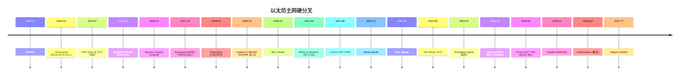
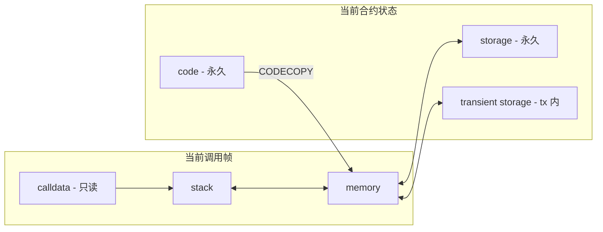
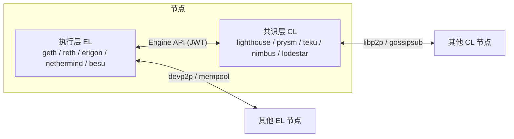
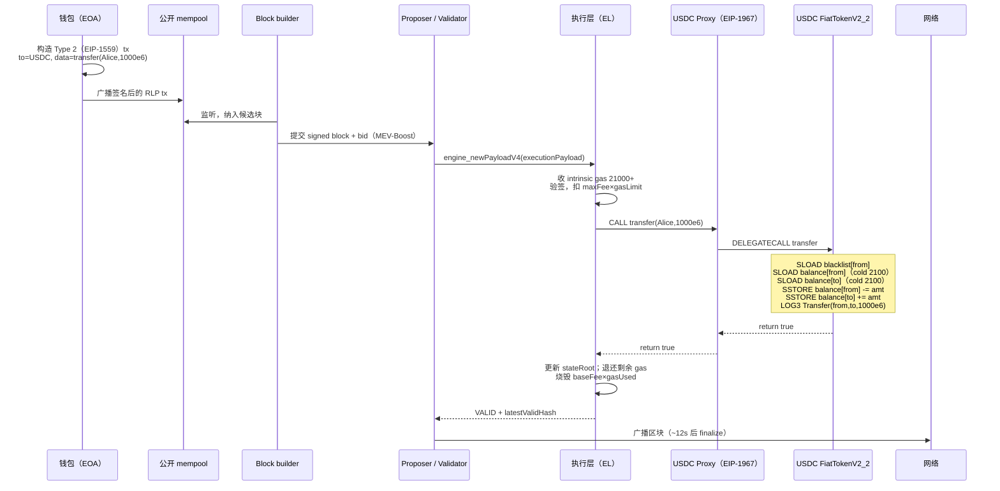
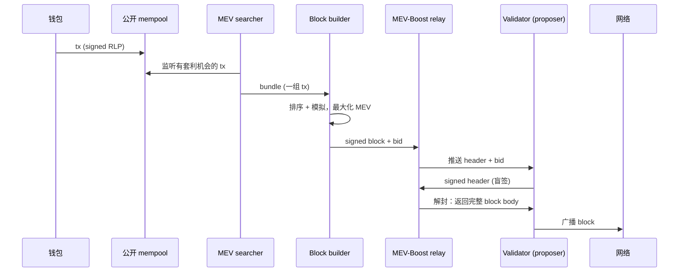
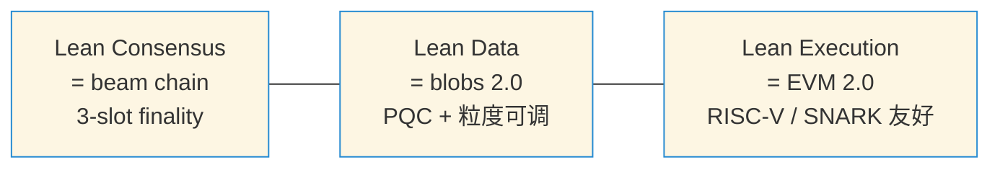
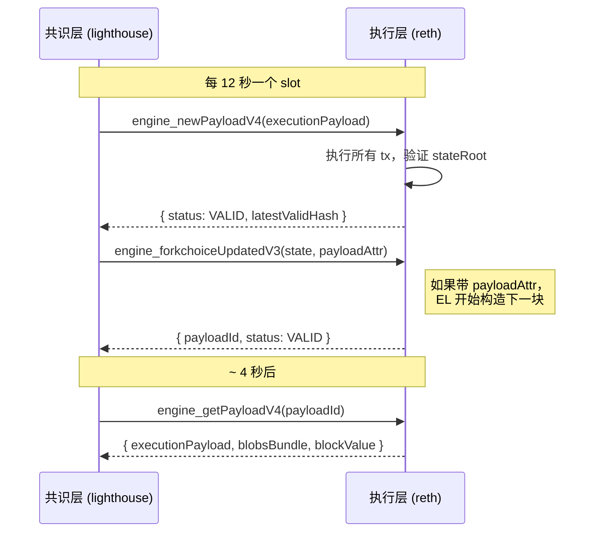

# 模块 03 — 以太坊与 EVM

> **本章面向 Web2 应用开发者**。如果你写过 Node / Java / Python 后端，但完全没碰过 EVM，这一章就是给你的。
>
> 每一节标了 **【必读】【建议】【参考】** 三档。第一遍只看【必读】，能把 ERC-20 转账从签到上链讲完整就够了；想做合约工程师再回头吃【建议】；【参考】是冷知识储备，开会听到 EOF / Verkle / Lean 不蒙圈即可，不必通读。
>
> **EVM 一句话类比**：把它想成一台**全世界共用的巨型联合电脑**——几千个节点同时跑同一段程序、得出同一个答案，谁都没法作弊。下面所有概念都围绕这台电脑展开。

时间锚点 2026-04：Pectra（2025-05-07）、Fusaka（2025-12-03）已上线；Glamsterdam 候选 2026 Q3；Hegota（Verkle）规划 2026-H2 ~ 2027。操作码速查以 [evm.codes](https://www.evm.codes/) 为准。

前置：[模块 02 — 区块链原理与共识](../02-区块链原理与共识/README.md)。后置：[模块 04 — Solidity 开发](../04-Solidity开发/README.md)。

## 目录

### 主线（≤ 30 页 PDF，第一遍只读这里）

- [0 学习目标](#0-学习目标)
- [1 直觉先行：从一笔 USDC 转账反推整个 EVM](#1-直觉先行从一笔-usdc-转账反推整个-evm)
- [2 升级时间线：从 Frontier 到 Fusaka 与 Glamsterdam](#2-升级时间线从-frontier-到-fusaka-与-glamsterdam)（二线必读）
- [3 账户与交易](#3-账户与交易)
- [4 Gas 模型](#4-gas-模型)
- [5 EVM 内部：栈机的六个数据区](#5-evm-内部栈机的六个数据区)
- [6 核心 Opcode 精讲](#6-核心-opcode-精讲)
- [7 Precompile 速查](#7-precompile-速查)
- [8 状态树：MPT 现在 → Verkle 将来](#8-状态树mpt-现在--verkle-将来)
- [9 客户端选型](#9-客户端选型)
- [10 升级机制：硬分叉是怎么开会开出来的](#10-升级机制硬分叉是怎么开会开出来的)
- [11 一笔 USDC tx 端到端高层流程](#11-一笔-usdc-tx-端到端高层流程)
- [12 ABI 编码入门](#12-abi-编码入门)
- [13 工程实现：viem / Foundry / cast 实战](#13-工程实现viem--foundry--cast-实战)
- [14 事件与 logs](#14-事件与-logs)
- [15 代理模式与 DELEGATECALL 工程](#15-代理模式与-delegatecall-工程)
- [16 区块构建链路：mempool → builder → relay → proposer](#16-区块构建链路mempool--builder--relay--proposer)
- [17 EVM 字节码逆向工程](#17-evm-字节码逆向工程)
- [18 常见坑（Top 12）](#18-常见坑top-12)
- [19 AI 在 EVM 工作流的位置](#19-ai-在-evm-工作流的位置)
- [20 习题（含完整解答）](#20-习题含完整解答)
- [21 延伸阅读](#21-延伸阅读)

### 附录（深挖用）

- [附录 A. Opcode 全表](#附录-a-opcode-全表)
- [附录 B. Yellow Paper 形式化语义速查](#附录-b-yellow-paper-形式化语义速查)
- [附录 C. EOF / Verkle / Lean Ethereum](#附录-c-eof--verkle--lean-ethereum)
- [附录 D. Precompile 全表](#附录-d-precompile-全表)
- [附录 E. Reth 内部架构与 ExEx](#附录-e-reth-内部架构与-exex)
- [附录 F. USDC 字节码逐行 walkthrough](#附录-f-usdc-字节码逐行-walkthrough)
- [附录 G. Engine API 详细](#附录-g-engine-api-详细)

---

## 0 学习目标

【必读】

读完这一章，你应该能：

1. 白板画 EOA → CA 调用栈，标出六个数据区边界（stack / memory / storage / calldata / transient / code），讲清 CALL / STATICCALL / DELEGATECALL 差异。
2. 用 viem 在 Sepolia 手动构造、签名、发送 Type 2（1559）和 Type 4（7702）交易。
3. 识别函数选择器，用反汇编工具推断函数签名。
4. 估算一段交易的 gas（SSTORE 冷热、memory 扩展、CALL 63/64）。
5. 一句话讲清 Pectra、Fusaka 干了什么。

---

## 1 直觉先行：从一笔 USDC 转账反推整个 EVM

【必读】

### 1.1 一笔交易必须答三个问题

> 你刚在钱包里按下"转 1000 USDC 给 Alice"。手机震了一下，二十秒后她那边收到通知。中间这二十秒，全世界几千台机器同时干完了一件事——它们都用一模一样的方式把你账户的 1000 USDC 划给了 Alice，谁都没有作弊的余地。

这是 EVM 真正想解的问题。把它拆开，协议必须在 12 秒内答完三个问题：

1. **谁付钱？** 怎么从一串字节恢复到付款人地址，并扣他的 ETH？
2. **谁执行？** 一段 16 KB 的字节码该按什么规则跑？跑多久才停？
3. **谁记账？** 跑完后哪些状态被改了、改成了什么、所有节点凭什么相信你？

每个问题逼出一个 EVM 设计选择。把这三条线拉直，整个模块的内容是它们的展开——你读到的每个 opcode、每张 gas 表，都是为了在这三个问题上不掉链子。

| 问题 | EVM 选择 | 见 |
|---|---|---|
| 怎么签 + 扣钱 | secp256k1 + EIP-2718 typed envelope；EIP-1559 base fee 烧 + 小费 | §3, §4 |
| 怎么停机 + 怎么算 | 栈机 + 每 opcode 付 gas + 超额 revert | §5, §6 |
| 怎么记 + 怎么核对 | 账户模型 + Merkle Patricia Trie + 全节点重算 stateRoot | §3.1, §8 |

### 1.2 四个硬约束塌缩出 EVM 的形状

EVM 的样子不是某个天才在白板上画出来的，是被四条铁规一路逼出来的。把这四条记住，你看后面那 150 条 opcode 时就不会觉得它们在乱来——它们每一条都是在哪条铁规下不得不那样写。

| 约束 | 它逼出的设计 |
|---|---|
| 全节点必须算出**完全相同**的状态 | 32 字节定长字、整数运算、无浮点 |
| 必须停机 | 每条指令付 gas，超额回滚 |
| 状态必须可承诺、可批量验证 | Merkle Patricia Trie；header 写 stateRoot |
| 合约不能互相污染对方的存储 | 每次 CALL 开新栈帧；storage 按合约地址分桶 |

栈机不是哲学选择，是约束的副产品。每条 opcode 对栈高度的影响是确定的，所以给一个入口高度，编译器就能静态算出整段代码的栈变化——jump 合法性、gas 计费、字节码大小都因此变简单。代价是没有寄存器分配，重复读栈得靠 DUP/SWAP 一通体操，写多了你会怀念 x86。

### 1.3 六组对偶贯穿全文

EVM 的复杂性，绝大多数时候归结成"两个看起来很像的东西到底有什么区别"。把下面这六组对偶记下来——你读到任何新概念，都先往这六个槽位上塞，它会告诉你"这玩意儿到底站在哪一边"：

1. EOA vs CA — 谁能签 vs 谁只能被叫
2. memory vs storage — 帧内重置 vs 进 stateRoot
3. CALL vs DELEGATECALL — 切上下文 vs 借上下文（代理的根）
4. base fee vs priority fee — 烧 vs 给提议者
5. execution gas vs blob gas — 两套独立市场
6. MPT vs Verkle — 现在 vs 将来

### 1.4 EVM 在 VM 谱系里的位置

EVM 不是唯一一种"区块链上的虚拟机"。Solana 跑 SVM，Polkadot 跑 WASM，Aptos / Sui 跑 MoveVM，Starknet 跑 CairoVM——每一个都在做差不多的事（停机 + 共识 + 状态承诺），但选了不同的妥协方案。把它们放一起对比，你能更清楚 EVM 当初为什么这样选。

| VM | 类型 | 状态模型 | 项目 | 与 EVM 比 |
|---|---|---|---|---|
| EVM | 栈式 | account + MPT | 以太坊全家 | 字段定长、生态最大 |
| WASM (eWASM) | 栈式 | 自定 | Polkadot、Soroban | 通用、字节码大；ETH 已搁置 |
| SVM | 寄存器 (BPF) | account + 平铺 | Solana | 并行执行强 |
| MoveVM | 寄存器 | resource | Aptos、Sui | 编译期防 double-spend |
| CairoVM | 多项式 | Merkle | Starknet | STARK 原生 |

OP / Arbitrum / Base / zkSync Era / Linea / Scroll / Polygon zkEVM 都以 EVM 为执行层。

---

## 2 升级时间线：从 Frontier 到 Fusaka 与 Glamsterdam

【建议】

> 💡 **这一节小白可整章跳过**——读到具体 EIP（如 EIP-1559、EIP-7702）时正文会即时讲清；本节只做时间锚定。

EVM 不是一次设计完的。它是被一拳一拳打出来的形状：DAO 被偷过 360 万 ETH，矿工反复用同一段 opcode 拖慢全网，Parity 钱包一夜间冻结 51 万 ETH，rollup 把 calldata 撑到了协议层都开始喘——每一次硬分叉的背后，都是某个真人某天在凌晨三点对着 etherscan 骂街。

读这一节的正确姿势，是每个版本都问一句"它在收拾哪个烂摊子"。

### 2.1 Frontier（2015-07-30）

第一版主网。CALL/CREATE/SSTORE 已存在但 gas 表过松（CALL 40 gas），状态膨胀严重。留下 EVM 雏形与 Yellow Paper 第一版。

### 2.2 Homestead（2016-03-14）

- **EIP-2**：contract creation gas 升到 32000；私钥 s 值规范化（防 malleability）
- **EIP-7**：引入 **DELEGATECALL**——代理模式的祖先；CALLCODE 开始弃用（msg.sender 语义不对）

### 2.3 The DAO 分叉（2016-07-20，区块 1,920,000）

以太坊历史上最尴尬也最关键的一次分叉。

The DAO 是当时全世界最大的众筹合约，募了约 1180-1270 万 ETH（2016-05 高峰估值约 $150M，但 2016-06 攻击日 ETH 价已下跌）。它的 `splitDAO` 函数干了一件经典蠢事：**先把钱转给你，再扣你的余额**。攻击者发现这个顺序后，做了个会回头再调一次 `splitDAO` 的合约——钱还没扣，又能再领一份；递归下去，他抽走了 360 万 ETH。

社区分裂成两派：一派说"代码即法律，认栽"，另一派说"我们是人不是教条"。最后硬分叉把那笔钱回滚了，没回滚的那条链留下来叫 **Ethereum Classic**（ETC），回滚的那条就是今天的 **Ethereum**。这次事件留下的两份遗产至今仍是 Solidity 程序员的肌肉记忆：**Checks-Effects-Interactions** 模式（先改余额再转账）和 **ACD 公开讨论惯例**（核心决策不再黑箱）。

来源：[Gemini: DAO Hack Explained](https://www.gemini.com/cryptopedia/the-dao-hack-makerdao)。

### 2.4 Tangerine Whistle（2016-10-18）+ Spurious Dragon（2016-11-22）

DAO 风波刚平，2016 年 9-10 月又来一拨 DoS：有人反复调用又便宜又重的 IO opcode（SLOAD、EXTCODESIZE 一类），收一两块钱手续费就能让全网卡半小时。社区只能硬着头皮再发两次紧急分叉。

- **EIP-150（Tangerine Whistle）**：IO 类 opcode 大幅涨价；引入 **63/64 规则**——CALL 最多转发当前 gas 的 63/64，剩 1/64 留本地，阻断"1024 层 call depth attack"
- **EIP-155（Spurious Dragon）**：交易签名加 chainId，防跨链重放

来源：[EIPS/eip-150](https://eips.ethereum.org/EIPS/eip-150)、[RareSkills: 63/64 rule](https://rareskills.io/post/eip-150-and-the-63-64-rule-for-gas)。

**63/64 规则的现实影响**：实际 ~340（理论上限 1024，但 63/64 规则把每层 gas 砍到剩 1/64，约 340 层后 gas 不够再调用）。如果哪份审计报告还在念叨 "1024 stack depth attack"，那作者多半还活在 2016 年——今天根本到不了 1024。

### 2.5 Byzantium（2017-10-16）

- **EIP-196 / EIP-197**：bn254 椭圆曲线加法、乘法、配对 precompile（0x06/0x07/0x08），zkSNARK 首次可在主网验证
- **EIP-198**：modexp precompile（0x05），RSA / ZK 通用
- **EIP-211**：RETURNDATASIZE / RETURNDATACOPY，调用方能读完整返回值
- **EIP-214**：STATICCALL，强制只读 CALL，view 函数链上保护的基础
- **EIP-100**：难度调整变软（基于平均出块时间）

### 2.6 Constantinople / Petersburg（2019-02-28）

**以太坊唯一一次因安全问题被回滚的硬分叉**。原本 2019-01-16 要上 Constantinople，包含 EIP-1283（一种新版 SSTORE 的 gas 表）。ChainSecurity 在升级**前一天**发了一篇分析：这个新表会让 `transfer`/`send` 那个写死了的 2300 gas 假设失效，开出一道全新的重入攻击面。

那一晚 ACD 紧急召开，社区在几小时内决定回滚整个升级。一个半月后 2019-02-28 上 Petersburg，剔掉 EIP-1283，保留：

- **EIP-145**：SHL/SHR/SAR 位移指令
- **EIP-1014**：**CREATE2**，确定性合约地址，counterfactual deployment 的根
- **EIP-1052**：EXTCODEHASH
- **EIP-1234**：区块奖励 3 → 2 ETH，延后难度炸弹

来源：[CoinDesk: Constantinople delay](https://www.coindesk.com/markets/2019/01/15/ethereums-constantinople-upgrade-faces-delay-due-to-security-vulnerability)。

教训很硬：**硬分叉前必须完成 invariant 复审**。EIP-1283 自己的逻辑是对的，它错在没去想"主网上跑着的合约都隐式依赖了 2300 gas 这个数字"。生态系统的旧约定可能被你的新规则一把推翻——这是协议升级永远要交的学费。

### 2.7 Istanbul（2019-12-08）+ Muir Glacier（2020-01-02）

- **EIP-152**：blake2f precompile（地址 0x09），用于 Zcash 等链跨链
- **EIP-1108**：bn254 价格大降，让 ZK 操作更便宜
- **EIP-1344**：CHAINID opcode（之前要硬编码）
- **EIP-1884**：状态访问类 opcode 涨价（SLOAD 200 → 800）；新增 SELFBALANCE
- **EIP-2200**：第三版 SSTORE gas 表，最终版本（基本沿用至今）
- **EIP-2384（Muir Glacier）**：再次推迟难度炸弹

### 2.8 Berlin（2021-04-15）

- **EIP-2565**：modexp 涨价（之前算大数 RSA 太便宜）
- **EIP-2929**：状态访问 opcode 引入 **cold/warm 双轨制**——同一笔交易内首次访问某个 (address, slot) 收 cold 价（SLOAD 2100、SSTORE +2100 cold），后续 warm 价（100）
- **EIP-2718**：**Typed Transaction Envelope**，未来一切新交易类型的总框架
- **EIP-2930**：Type 1 交易（access list），可以预热槽位省 gas

### 2.9 London（2021-08-05）

DeFi Summer 之后，主网平均 gas price 飙到 200 gwei，钱包用户每次都得"猜"出价才不会饿死在 mempool。London 改了游戏规则。

- **EIP-1559**：Type 2 dynamic fee，引入 base fee（烧毁）+ priority fee（小费）
- **EIP-3198**：BASEFEE opcode
- **EIP-3529**：refund 上限砍到 gas_used / 5；移除 SELFDESTRUCT 退款，终结 GST2 等 gas token 滥用
- **EIP-3554**：再推一次难度炸弹

从此 base fee 由协议自动调节，钱包从"猜 gas price"改成"设 max fee + max priority fee"。再加上 base fee 烧毁 + Merge 后低发行率（~0.5%/年），ETH 多数时间是净通缩——这是历史上第一次，主流 L1 的代币会越用越少。

### 2.10 Arrow Glacier（2021-12-09）+ Gray Glacier（2022-06-30）

纯延后难度炸弹的过渡升级。

### 2.11 The Merge（2022-09-15，Bellatrix + Paris）

7 年准备，30 秒切换。执行层几乎一行代码不动，**共识层从 PoW 整体切到 PoS**——飞机在天上换了发动机，没人掉下来。

- mining 完全停止；DIFFICULTY opcode → **PREVRANDAO**（信标链上一个 epoch 的随机数）
- 区块时间：13 秒 → 精确 12 秒（slot）
- ETH 发行量下降约 90%，与 EIP-1559 烧毁结合

来源：[Mainnet Merge Announcement](https://blog.ethereum.org/2022/08/24/mainnet-merge-announcement)。

### 2.12 Shanghai / Capella（2023-04-12）

- **EIP-4895**：信标链验证者提款（withdrawal 不再单向锁仓）
- **EIP-3651**：COINBASE 直接 warm
- **EIP-3855**：PUSH0 opcode
- **EIP-3860**：限制 initcode size

### 2.13 Cancun / Deneb（Dencun，2024-03-13）

L2 工程师等了三年的那次升级。2023 年 Optimism、Arbitrum 把 calldata 当 DA 用，每天要付几百万美元给主网，rollup 用户做一次 swap 还得 $5。Cancun 一刀切下去，blob 一上线，L2 swap 当天就变成几毛钱。

- **EIP-4844**：Proto-danksharding，blob 交易（Type 3），L2 DA 成本下降一个量级
- **EIP-1153**：transient storage（TSTORE/TLOAD）
- **EIP-5656**：MCOPY opcode
- **EIP-6780**：SELFDESTRUCT 弱化——仅"同一 tx 内创建+自毁"才真删，否则等同 transfer
- **EIP-4788**：信标链区块根写进执行层（合约可 trustless 读共识层数据）
- **EIP-7516**：BLOBBASEFEE opcode

2024 年起 Optimism、Arbitrum 等 rollup 全部迁到 blob，主网 calldata 让出大半，L2 swap 费从几美元降到几美分。这是 EVM 历史上第一次为某个上层应用（rollup）专门加交易类型——L2 已经从"以太坊的客人"变成"以太坊的房客"了。

### 2.14 Prague / Electra（Pectra，2025-05-07 10:05:11 UTC，epoch 364032）

Merge 之后最大的一次升级，11 个 EIP 一次性塞进来——账户抽象、机构质押、L2 吞吐三件大事一锅端。这之后的以太坊和你 2024 年用过的以太坊已经不是一个东西。

执行层（Prague）：

- **EIP-7702**：**SetCode 交易（Type 4）**，EOA 临时挂 designator code，任何已有 EOA 都能跑合约逻辑（§3.5）
- **EIP-2537**：**BLS12-381 系列 precompile**（0x0b ~ 0x11，共 7 个，§7）
- **EIP-2935**：把过去 8192 个区块哈希存进 `0x0000F90827F1C53a10cb7A02335B175320002935` 系统合约。ZK rollup、跨链桥从此不用维护自己的历史 trie
- **EIP-7623**：**calldata "floor"** 机制——一笔 tx 收的 gas 不能低于 `21000 + 10 × (zero_bytes + 4 × non_zero_bytes)`。压制纯 calldata 滥用，把"租 calldata 占空间"挤进 blob
- **EIP-7691**：blob 目标 3→6、上限 6→9
- **EIP-2935**、**EIP-7549**（attestation 聚合优化）

共识层（Electra）：

- **EIP-7251**：单验证者最大有效余额（MaxEB）32 → 2048 ETH，机构无需拆数千 validator，attestation 数量减少
- **EIP-6110**：deposit 由执行层系统合约直接处理，新质押 4-12 分钟生效（之前 ~12 小时）
- **EIP-7002**：执行层触发的 partial / full exit。质押者用普通 EVM 交易就能发起退出，无需共识层签名

来源：[Pectra Mainnet Announcement](https://blog.ethereum.org/2025/04/23/pectra-mainnet)、[The Block: Pectra activated with 11 changes](https://www.theblock.co/post/353407/ethereum-pectra-upgrade)、[ethPandaOps: Pectra Mainnet Checklist](https://ethpandaops.io/posts/pectra-mainnet-checklist/)。

### 2.15 Fulu / Osaka（Fusaka，2025-12-03 21:49:11 UTC，epoch 411392）

Pectra 把 blob 拉到 9，一些跑家庭 staking 的同学已经在 Reddit 抱怨"我家光纤撑不住了"。继续往上抬就得换思路：节点不再下载所有 blob，每人只看一部分，靠数据可用性采样（DAS）一起投票确认数据存在——这就是 PeerDAS，Fusaka 的主菜。

完整 12 个 EIP（来源：[Alchemy: Fusaka Dev Guide to 12 EIPs](https://www.alchemy.com/blog/ethereum-fusaka-upgrade-dev-guide-to-12-eips)、[Conduit: Fusaka EIPs Cheat Sheet](https://www.conduit.xyz/blog/ethereum-fusaka-upgrade-eips-cheat-sheet/)）：

| EIP | 名字 | 作用 |
|---|---|---|
| **EIP-7594** | **PeerDAS** | 节点只采样部分数据列；header 加 `data_column_sidecars` 字段 |
| EIP-7642 | eth/69 协议 | 移除 mempool gossip 中的 pre-Merge 字段（PoW total difficulty 等） |
| EIP-7823 | MODEXP 上限 | base/exp/mod 各 ≤ 8192 字节，防 DoS |
| EIP-7825 | tx gas cap | 单笔交易 gas 上限 30M（≈ block gas 一半） |
| EIP-7883 | MODEXP 涨价 | 基数 + 阶 + 模再涨一档，与 Berlin EIP-2565 接力 |
| EIP-7892 | Blob Parameter Only fork | 引入"轻量分叉"机制：只调 blob 参数不改 EVM，一行配置即可（BPO1/BPO2 就靠它） |
| EIP-7910 | `eth_config` JSON-RPC | 标准化客户端报告自己当前激活了哪些 fork 与 EIP |
| EIP-7917 | 提议者前瞻确定性 | proposer lookahead 进 beacon state，让 builder 提前知道下个 slot 的 proposer |
| EIP-7918 | blob base fee 下限 | 把 blob base fee 与执行 gas 挂钩，防 blob fee 永远在最低 1 wei |
| EIP-7934 | RLP 区块 size 上限 | 单区块 RLP 序列化后 ≤ 10 MB |
| EIP-7935 | 默认 gas limit 60M | 默认建议 gas_limit 从 30M 提到 60M（节点共识投票） |
| EIP-7939 | **CLZ opcode** | Count Leading Zeros，新增 `0x1e` opcode，bit 操作硬件友好 |
| EIP-7951 | **secp256r1 precompile** | 又名 P-256，地址 0x100。passkey / WebAuthn 直接上链 |

**EOF 命运**：原计划进 Fusaka 的 EOF（EIP-3540 / 3670 / 4200 / 4750 / 5450 / 6206 / 7480 / 663）整组被剔除。理由：工程复杂度高、与 EIP-7702 的交互未充分研究、社区担心过早冻结字节码格式。可能在 Glamsterdam 之后再议。

**已激活的 BPO 链**：

- **BPO1**（2025-12-09）：blob 目标 6 → **10**、上限 9 → **15**
- **BPO2**（2026-01-07）：blob 目标 → **14**、上限 → **21**

**Prysm 事件**：升级一周后，Prysm 的 PeerDAS 数据列处理路径出现一个 race condition，依赖它的 validator 集体 attestation 掉线，finality participation 一度降到 ~75%——但链没分叉。其他四个 CL 客户端（Lighthouse / Teku / Nimbus / Lodestar）一起把链扛住了。

这是十年来"客户端多样性"这件事最响的一次现场录音：它不是营销话术，是真的能在某家挂掉时让网络继续跑。

来源：[Fusaka Mainnet Announcement](https://blog.ethereum.org/2025/11/06/fusaka-mainnet-announcement)、[CoinDesk: Ethereum Activates Fusaka](https://www.coindesk.com/tech/2025/12/03/ethereum-activates-fusaka-upgrade)、[Cointelegraph: Prysm Bug Knocks Ethereum](https://cointelegraph.com/news/ethereum-prysm-bug-fusaka-client-diversity-risk)。

### 2.16 Glamsterdam（Gloas + Amsterdam，预计 2026-H1 末 / Q3）

目标：把 builder-proposer 协议写进协议层（ePBS），取代中心化 relay。

两个头牌 EIP：

- **EIP-7732（ePBS）**：proposer 只对 builder 的 commitment 盲签，交易在 finality 后公开，MEV 操控空间大幅压缩
- **EIP-7928（Block-Level Access Lists, BAL）**：每块附带 (address, slot) 访问清单，节点并行执行、提前 prefetch；为 stateless / 并行执行铺路

候选：EIP-7954（合约 size 上限上调）、多项 EVM 小改

来源：[Quicknode: Glamsterdam Upgrade](https://blog.quicknode.com/ethereum-glamsterdam-upgrade-whats-coming-in-h1-2026/)、[ethereum.org/roadmap/glamsterdam](https://ethereum.org/roadmap/glamsterdam/)。

### 2.17 Hegota（预计 2026-H2 ~ 2027）

承载 Verkle Trees 主迁移（详见 §8.2）及过渡期 dual-tree（MPT + Verkle 并行一段时间）。

来源：[ethereum.org/roadmap/verkle-trees](https://ethereum.org/roadmap/verkle-trees/)、[ethers.news: 2026 roadmap](https://ethers.news/articles/ethereum-2026-upgrade-roadmap-glamsterdam-hegota-explained)。

### 2.18 一图流时间线（Mermaid）



---

## 3 账户与交易

【必读】

回到 §1.1 那笔 USDC 转账——"谁付钱"和"谁记账"两个问题，最终都落在两样东西上：**账户**（钱在哪、谁有权花）和**交易**（一次具体的"我要花"动作）。

> **类比**：以太坊上的账户就像银行里**两种账户**——
> - **EOA（外部账户）= 个人账户**：有人持有私钥（≈ 银行卡 + 密码），能主动转账
> - **CA（合约账户）= 公司账户**：本身没法主动签字，只能根据章程（合约代码）被动接受调用、走流程
>
> 交易则是**签好字的转账单**：你签字，全网验证，钱被划走。

### 3.1 两种账户

`address → Account`，四字段：

```
nonce       u64
balance     u256       (单位 wei，1 ETH = 1e18 wei)
codeHash    bytes32    (keccak256 of code，EOA 为 keccak256(""))
storageRoot bytes32    (该账户 storage trie 的根)
```

分两类：

| **维度** | EOA | CA |
|---|---|---|
| **创建方式** | 算 secp256k1 公钥 → keccak256 后 20 字节 | 由其他账户的 CREATE/CREATE2 部署 |
| **codeHash** | 空 `keccak256("")` 或（Pectra 后）designator hash | 部署字节码哈希 |
| **能签交易** | 能 | 不能 |
| **能持有 ETH** | 能 | 能 |
| **能被调用** | 能（无代码 → 仅转账；有 designator → 跑代理代码） | 能 |

**Pectra 后的微妙变化**：EOA 的 codeHash 字段在挂上 designator 时变成 `keccak256(0xef0100 || delegateAddress)`。链上看 `getCode(eoa)` 返回 23 字节 `0xef0100 + 20 字节地址`。这是 EIP-7702 的硬约定，任何执行层客户端都按此识别。将 authorization 中 address 设为 `0x000...0` 即可撤销委托，账户 code 被清空，codeHash 回到 `keccak256("")`（空 EOA 状态）。

### 3.2 五种交易类型

EIP-2718 typed envelope（`type_byte || rlp(payload)`，Type 0 legacy 除外）：

| 类型 | 名字 | EIP | 引入 | 关键字段 |
|---|---|---|---|---|
| 0x00 | Legacy | — | 创世 | `nonce, gasPrice, gas, to, value, data, v, r, s` |
| 0x01 | Access List | EIP-2930 | Berlin | + `chainId, accessList` |
| 0x02 | Dynamic Fee | EIP-1559 | London | + `maxPriorityFeePerGas, maxFeePerGas` |
| 0x03 | Blob | EIP-4844 | Cancun | + `maxFeePerBlobGas, blobVersionedHashes` |
| 0x04 | SetCode | EIP-7702 | Pectra | + `authorizationList` |

新类型几乎是上一类型的"加字段"：1559 ⊃ 2930，4844 ⊃ 1559，7702 ⊃ 1559（4844 与 7702 不同分支）。

### 3.3 EIP-1559（Type 2）字段细解

【建议】

RLP 结构：

```
0x02 || rlp([
  chain_id,
  nonce,
  max_priority_fee_per_gas,   # 给提议者的小费 上限
  max_fee_per_gas,            # 用户愿意付的总价 上限
  gas_limit,
  to,                          # 0x 表示部署
  value,
  data,
  access_list,                 # 可选预热
  v, r, s                       # 签名（v 为 0/1）
])
```

实际花费：

```
gas_price = min(max_fee_per_gas, base_fee + max_priority_fee_per_gas)
fee       = gas_price * gas_used
burn      = base_fee  * gas_used         # 被烧毁
tip       = (gas_price - base_fee) * gas_used   # 给提议者
```

`max_fee_per_gas < base_fee` → 交易进不了 mempool。烧毁是协议层直接从 sender 余额扣除、不进任何账户，等价 ETH 总量减少。

### 3.4 EIP-4844 Blob 交易（Type 3）字段细解

```
0x03 || rlp([
  chain_id, nonce,
  max_priority_fee_per_gas, max_fee_per_gas,
  gas_limit, to, value, data, access_list,
  max_fee_per_blob_gas,             # blob 单价上限
  blob_versioned_hashes,            # 每个 blob 的 KZG commitment 的 versioned hash 列表
  v, r, s
])
```

Blob 数据走 sidecar（共识层 P2P），约 18 天后删除，versioned hash 永久上链。执行层只能用 `BLOBHASH (0x49)` 取 versioned hash、用 `0x0a` precompile 验 KZG 证明。每 blob = 128 KB，每 blob 的 blob gas = `131072`；单块 blob 上限随分叉演进（Cancun 6、Pectra 9、Fusaka BPO1 15、BPO2 21）。

### 3.5 EIP-7702 SetCode（Type 4）字段细解

【建议】

EIP-7702 干了一件以太坊七年没人敢干的事：**让 EOA 临时长出代码**。在 Pectra 之前，"是 EOA 还是合约"是一辈子的事，地址一旦从助记词派生就永远只是个普通钱包，想要 batch、想要社恢、想要 paymaster，对不起，你得换地址重新部署一个合约钱包，把所有资产搬过去。Pectra 之后，你那个用了三年的 MetaMask 地址，也可以"今天我是 Safe，明天我是 Ambire"，地址不变。

```
0x04 || rlp([
  chain_id, nonce,
  max_priority_fee_per_gas, max_fee_per_gas,
  gas_limit, to, value, data, access_list,
  authorization_list,           # 关键新字段
  v, r, s
])
```

`authorization_list` 数组，每元素是 EOA 自签的小授权：

```
[chain_id, address, nonce, y_parity, r, s]
```

含义："我（EOA）授权把 code 指向 `address`"。chain_id = 0 表示跨链有效（极不推荐）。

执行流程：

1. 验证发送者签名，收手续费
2. 对每条 authorization：恢复 EOA 地址 → 校验 chain_id 与 nonce → 写 code = `0xef0100 || address`，EOA nonce +1
3. 像普通 1559 跑 `to` 调用

**authority 不必是 sender**——任何人可替你代发，只要你签了 authorization（gas sponsor 核心机制）。Pectra 之后，"我帮你付 gas"不再是 4337 的特权。

安全提醒，最重要那条：authorization 一旦上链就生效，**签向恶意合约就等于把整个 EOA 双手奉上**。Pectra 上线两周内就出现钓鱼合约，有报告说前一个月里 97% 的 authorization 关联钓鱼。永远只签向审计过的合约——这是底线，没有例外。

来源：[EIPS/eip-7702](https://eips.ethereum.org/EIPS/eip-7702)、[ethereum.org/roadmap/pectra/7702](https://ethereum.org/roadmap/pectra/7702/)。

### 3.6 ERC-4337（账户抽象）vs EIP-7702

两者不互斥，经常组合：

| 维度 | ERC-4337 | EIP-7702 |
|---|---|---|
| 类型 | 应用层（合约） | 协议层（硬分叉） |
| 钱包形态 | 独立合约钱包，地址 ≠ EOA | 改造已有 EOA，地址不变 |
| Mempool | 独立的 4337 mempool | 走主网 mempool |
| 入口 | EntryPoint 合约（v0.7） | 协议直接处理 |
| 谁付 gas | Paymaster 或自己 | sender（可以是任何人） |

实际工程：EOA 通过 EIP-7702 委托到 4337 兼容合约，拥有 4337 全部能力同时保持 EOA 地址。

---

## 4 Gas 模型

【必读】

> **类比**：gas 就像**打 Uber**——按里程付费，跑得越远越贵；走错路、绕路、堵车都得照付。司机（EVM）跑完才停，但你设了一个"最多花 X 元"的上限，超了直接把你扔下车（OOG，out of gas，交易回滚但 gas 不退）。

Gas 是 EVM 的心跳。每一条 opcode、每一字节 **calldata**（调用方传入的数据，只读）、每一 KB **memory**（临时内存）扩展，都得先付钱再跑——这就是 §1.2 那条"必须停机"的铁规怎么落地的。

读这一节时记住一件事：**gas 公式从来不是为了让用户付钱，是为了让攻击者付不起**。每一次涨价、每一次冷热分离、每一次 refund 上限，背后都有一个具体的 DoS 故事。

### 4.1 基本费用结构

```
total_fee   = gas_used × gas_price
gas_price   = min(max_fee_per_gas, base_fee + max_priority_fee_per_gas)
burn        = base_fee × gas_used
miner_tip   = (gas_price - base_fee) × gas_used
```

base fee 调整算法（EIP-1559）：

```
parent_gas_target = parent_gas_limit / ELASTICITY (ELASTICITY = 2)
if parent.gas_used > target:
  delta = parent.base_fee × (parent.gas_used - target) / target / 8
  base_fee = parent.base_fee + max(delta, 1)
else if parent.gas_used < target:
  delta = parent.base_fee × (target - parent.gas_used) / target / 8
  base_fee = parent.base_fee - delta
else:
  base_fee = parent.base_fee
```

每块最多 ±12.5%。block gas_limit ≈ 30M（ELASTICITY=2，上限 60M）。

### 4.2 不同 opcode 家族的 gas（人话版）

【建议】

不用记 Yellow Paper 那一套 `C(σ, μ, A, I)` 公式。多数 opcode 是常数（ADD 3、MUL 5、JUMP 8），下面这几家是变量大头：

| 家族 | gas 大致是多少 | 一句话理解 |
|---|---|---|
| SSTORE | 见 §4.3 大表 | 写永久状态，最贵 |
| SLOAD | warm 100 / cold 2100 | 第二次读同一个 slot 才便宜 |
| CALL | 700+ 起跳，可能再加 9000 / 25000 | 跨合约调用 |
| CREATE | 32000 + 200×部署字节数 | 部署合约 |
| LOG_n | 375 + 375×n + 8×data 字节 | 写事件 |
| memory 扩展 | 二次增长（见下） | 用得越多越贵 |

**翻译成钱**：以 30 gwei、ETH = 3000 美元算，1 gas ≈ 0.00009 美元。一笔 ERC-20 transfer ≈ 51000 gas ≈ **$4.5**；一次 cold SSTORE（22100 gas）≈ **$2**；一笔最简转账（21000 gas）≈ **$1.9**。

### 4.3 SSTORE 大表（EIP-2929 + EIP-3529，refund ≤ gas_used / 5）

| 旧值 → 新值 | warm | cold（追加 +2100） | refund |
|---|---|---|---|
| 0 → 0 | 100 | 2200 | 0 |
| 0 → X（新写） | 20000 | 22100 | 0 |
| X → 0（清零） | 2900 | 5000 | +4800 |
| X → Y（X≠0, Y≠0, Y≠X） | 2900 | 5000 | 0 |
| X → X（等价无操作） | 100 | 2200 | 0 |

**最小实例**：0→非零冷写 = 20000（base，slot 从 zero 变非 zero）+ 2100（cold SLOAD 把 slot 加进 access list）= 22100 gas

读：

| 操作 | warm | cold |
|---|---|---|
| SLOAD | 100 | 2100 |
| TLOAD（EIP-1153） | 100 | 100（无 cold/warm 概念） |
| TSTORE | 100 | 100 |

### 4.4 内存 expansion 的二次项

EVM memory 惰性扩展，越用越贵——用得少线性，用得多变成二次：

| memory 大小 | gas 成本 |
|---|---|
| 1 KB | 98 |
| 32 KB | 5120 |
| 1 MB | ~2.2M（约 $200） |

**翻译**：1 KB 内存几乎不要钱，32 KB 已经能感觉到，1 MB 你直接破产。所以 EVM 永远是"小数据玩家"，大数据走 calldata 或 blob。

公式：`C_mem(a) = 3a + ⌊a²/512⌋`，a = 32 字节字数。前 22 个字基本线性。

### 4.5 CALL 的 63/64 规则与 stipend

```
forward_gas = min(requested, available × 63/64)
```

EIP-150 把这一条加进来防"call depth 攻击"——你最多把当前 gas 的 63/64 转给被调方，剩下 1/64 必须留在自己这层。实际 ~340（理论上限 1024，但 63/64 规则把每层 gas 砍到剩 1/64，约 340 层后 gas 不够再调用）——攻击者再怎么嵌套也炸不到 1024。

`CALL`/`CALLCODE` 带 value 时额外 +9000 gas，外加给被调方一个 **2300 gas stipend**——历史上是怕你 fallback 里写了点东西突然没钱跑而 revert。`STATICCALL` / `DELEGATECALL` 不带 value，没有这层礼物。

但这个 2300 gas 早就坑过太多人。Istanbul（EIP-1884）把 SLOAD 涨到 800 之后，2300 gas 连读两次 storage 都不够，更别说 EIP-2929 又把 cold SLOAD 涨到 2100。今天还在用 `address.transfer(x)` 或 `address.send(x)` 的代码全是定时炸弹——**永远别硬编码 gas 常数**，老老实实写 `call{value:x}("")` 加 checks-effects-interactions 才是 2026 年的正确姿势。

### 4.6 transient storage 的 gas（EIP-1153）

`TSTORE` / `TLOAD` 固定 100 gas，无 cold/warm，tx 结束清零，不入 stateRoot。典型用途：re-entrancy guard（22100 → 100 gas）、一次性 approve+transferFrom、闪电贷簿记。

来源：[Solidity 0.8.24 transient storage](https://www.soliditylang.org/blog/2024/01/26/transient-storage/)。

### 4.7 blob gas（独立费用市场）

```
blob_base_fee = fake_exponential(MIN_BASE_FEE_PER_BLOB_GAS, excess_blob_gas, BLOB_BASE_FEE_UPDATE_FRACTION)
fee_per_blob  = blob_base_fee × 131072
```

`fake_exponential` 用泰勒展开模拟 e^x（避免浮点）。`BLOB_BASE_FEE_UPDATE_FRACTION = 3338477`（Cancun；Pectra 有调整）。两套费用市场完全独立。

### 4.8 intrinsic gas

每笔交易执行前先收：

```
21000                    # 基础（普通转账）
+ 32000                  # 如果是合约部署
+ 4   per zero byte      of calldata
+ 16  per non-zero byte  of calldata    (Pectra 前 16；EIP-7623 后引入"floor"机制)
+ 2400 per access list address
+ 1900 per access list (address, key)
+ PER_EMPTY_ACCOUNT_COST = 25000 per authorization (EIP-7702)
  # 若被授权的 authority EOA 已存在（绝大多数情况），退 PER_EMPTY_ACCOUNT_COST - PER_AUTH_BASE_COST = 12500，
  # 净收 PER_AUTH_BASE_COST = 12500 gas。
```

EIP-7623（Pectra）引入 calldata floor——tx 总 gas 不能低于 calldata floor，把"租 calldata 占空间"挤进 blob。floor cost = 10 gas/byte non-zero, 4 gas/byte zero（无论实际执行多少 gas，至少按这个收）。

---

## 5 EVM 内部：栈机的六个数据区

【必读】

讲完了"账户长什么样、交易怎么签"，下一步该看 EVM 真正运行起来的样子了。一笔交易最终要变成 **CALL 进合约 → 跑字节码 → 改状态**——这一节回答的就是"跑字节码时，EVM 把数据放在哪、从哪读"。

> **类比**：把 EVM 想成一个非常小的厨房——
> - **stack（栈）= 案板**：当前正在切的菜，做完就清，最多 1024 个东西
> - **memory（内存）= 灶台**：这顿饭用的临时容器，吃完洗碗，下顿重来
> - **storage（存储）= 冰箱**：永久放在那的食材，**全网都看得见**，开门取用最贵
> - **transient storage（临时存储）= 灶台旁的小托盘**：一顿饭内能用，吃完即扔，比冰箱便宜
> - **calldata（调用数据）= 客人递进来的便条**：只读，不能改
> - **code（代码）= 菜谱**：合约一部署就钉死了

下表盯三列就够：「持久？」决定它进不进 stateRoot（要不要全网都记账，gas 贵不贵），「谁能写」决定隔离边界，「生命周期」决定一个值能活多久。

这六个区是 EVM 的"地理"。后面所有 opcode 都只是在它们之间搬数据。

| 区 | 字节寻址？ | 持久？进 stateRoot？ | 谁能写 | 生命周期 | 主要 opcode |
|---|---|---|---|---|---|
| **stack** | 否（按栈位） | 否 | 当前帧 | 当前调用帧 | PUSH, POP, DUP, SWAP |
| **memory** | 是 | 否 | 当前帧 | 当前调用帧 | MLOAD, MSTORE, MSTORE8, MCOPY, MSIZE |
| **storage** | 否（256 位 slot） | **是** | 当前合约自己 | 永久 | SSTORE, SLOAD |
| **transient storage** | 否（256 位 slot） | **否**（不进 stateRoot） | 当前合约自己 | 当前 tx | TSTORE, TLOAD |
| **calldata** | 是 | — | 调用方传入 | 当前帧（只读） | CALLDATALOAD, CALLDATACOPY, CALLDATASIZE |
| **code** | 是 | **是** | 部署时一次写定（EOA Pectra 后例外） | 永久 | CODECOPY, CODESIZE, EXTCODECOPY, EXTCODESIZE, EXTCODEHASH |

### 5.1 stack

最大 1024 项，每项 32 字节。所有算术与控制流从栈取值、把结果推回栈。

- PUSH1..PUSH32：推 1~32 字节字面量
- PUSH0（Shanghai 起）：推零
- POP：丢弃
- DUP1..DUP16：复制栈顶第 1~16 项
- SWAP1..SWAP16：交换栈顶与下方第 1~16 位

栈过深触发 "Stack too deep" 编译错误（编译时报，非运行时）。

### 5.2 memory

线性字节数组，初始空，按 32 字节对齐惰性扩展，帧结束销毁（不跨 CALL 帧共享）。Solidity 约定 0x40 为 free memory pointer（非协议强制）。MCOPY（EIP-5656）比循环 MLOAD/MSTORE 省约 1/3。

### 5.3 storage

每个合约都有自己独立的 storage trie，32 字节 key 配 32 字节 value。Solidity 把状态变量按声明顺序映射到 slot 0、1、2...；mapping 用 `keccak256(key ‖ slot)` 算槽位（这就是为什么 mapping 没法被遍历——你只能算出某个 key 对应的 slot，没法从 slot 反推回 key）。

SLOAD 冷读 2100，SSTORE 全新写一次冷 22100。**gas 优化第一条铁律：减少 SSTORE**。这一条比"用 unchecked"、"压缩 struct"重要十倍——一次冷写就够你跑 200 次 ADD 了。

### 5.4 transient storage

EIP-1153（Cancun），slot KV，tx 结束清零，不入 stateRoot，100 gas。Solidity 0.8.24 起原生 `transient` 类型。

### 5.5 calldata

调用方传入的只读字节。`bytes calldata` 避免拷到 memory 省 gas。注意：constructor 参数附在 initcode 末尾，需 CODECOPY 读，不走 calldata。

### 5.6 code

code 不可变（EOA 例外：EIP-7702 给 EOA 写 23 字节 designator 0xef0100||addr，执行时 EVM 取 designate 目标的 code 跑——不是真在 EOA 存字节码）。CODECOPY 拷自身代码到 memory；EXTCODECOPY / EXTCODESIZE / EXTCODEHASH 读他人代码。

### 5.7 一张图把六个数据区串起来（Mermaid）



---

## 6 核心 Opcode 精讲

> **TL;DR**：EVM 约 150 条指令，完整速查见 [evm.codes](https://www.evm.codes/)（附录 A 也有全表）。这一节只讲"会咬人"的那几条：SLOAD/SSTORE、四种 CALL、SELFDESTRUCT、LOG，以及几个常被误用的环境 opcode。

> **opcode 是什么**：EVM 看不懂 Solidity，它只懂一组 1 字节的机器命令——`0x01` 是加法、`0x55` 是写存储、`0xf4` 是 DELEGATECALL。Solidity 编译后就变成一串这种字节。

### 6.1 SLOAD / SSTORE

SLOAD（`0x54`）和 SSTORE（`0x55`）是 EVM 里最贵的常用操作：

| 操作 | warm | cold | 说明 |
|---|---|---|---|
| SLOAD | 100 | 2100 | 读 storage slot |
| SSTORE 0→X（新写） | 20000 | 22100 | 写全新 slot，最贵 |
| SSTORE X→Y（改值） | 2900 | 5000 | 改已有非零值 |
| SSTORE X→0（清零） | 2900 | 5000 | 清零，退 4800 refund |
| TLOAD | 100 | 100 | transient，无 cold/warm |
| TSTORE | 100 | 100 | transient，tx 结束清零 |

**gas 优化第一条铁律：减少 SSTORE**。一次冷写抵得上 200 次加法。

### 6.2 四种 CALL

EVM 准备了四种 CALL，差别全在三件事：**msg.sender 是谁、storage 写到哪、能不能改状态**。

| Opcode | msg.sender | storage 写到 | 能转 ETH | 状态可写 | 引入 |
|---|---|---|---|---|---|
| `CALL` | 当前合约 | 被调合约 | 是 | 是 | Frontier |
| `CALLCODE` | 当前合约 | **当前合约**（已弃用） | 是 | 是 | Frontier |
| `DELEGATECALL` | **保持原 caller** | **当前合约** | 否 | 是 | Homestead |
| `STATICCALL` | 当前合约 | 被调合约 | 否 | **否** | Byzantium |

这张表比理解任何字节码都重要——很多审计漏洞最后归结成"作者不知道这次 CALL 把 msg.sender 改成谁了"。

#### DELEGATECALL：EVM 最危险的家伙

DELEGATECALL 一句话：**把别人的代码搬到你家，用你的钥匙开你的保险箱**。

```
proxy.fallback() {
  delegatecall(implementation, calldata)
  return returndata
}
```

implementation 的字节码跑在 proxy 的上下文：proxy 的 storage 被读写，msg.sender / msg.value 保持用户原值，`address(this)` 是 proxy。这是整个代理模式生态（EIP-1967 透明代理、UUPS、Diamond、ERC-4337）的基础。

**Parity 多签事件（2017-11-06）——一节课价值 5 亿美金**：

Parity 把钱包逻辑放在 library 合约里，没初始化 `initWallet` 的 owner。有人发现可以直接调这个 library，把自己设成 owner，然后调 `kill` 触发 SELFDESTRUCT——library 一死，所有指向它的 stub 钱包成废墟，约 51.3 万 ETH（今天接近 20 亿美元）永久冻结。

三条硬规矩：①永远 init library 自身（OZ 的 `_disableInitializers()`）；②implementation 入口加 `require(address(this) != _self)`；③EIP-6780 后 SELFDESTRUCT 虽弱化，旧合约依旧得当心。

#### STATICCALL：链上 view 的硬保护

Byzantium 引入的只读封印。STATICCALL 一旦进入，整条调用栈里任何 SSTORE、CREATE、SELFDESTRUCT、LOG 都会 revert——把"我只想看不想动"从依赖好心人变成协议保证。

#### CALLCODE 为什么死了

CALLCODE 是一个错版本的 DELEGATECALL，活了不到一年就被废了。它把别人的代码搬到自己家跑（storage 用自己的），但 msg.sender 还是写死的当前合约——结果就是任何被搬来的代码做 `require(msg.sender == owner)` 都报废了，因为它看见的 sender 永远是 proxy 自己，不是真正的用户。

Homestead（2016-03，EIP-7）引入 DELEGATECALL 修了这个：msg.sender 保留为最外层的原 caller，代理模式才真正成立。CALLCODE 当场进入弃用，主网上几乎再没人用，但字节码里它还活着，反汇编时如果看见 `0xf2` 就要小心——大概率是 2016 年的老古董。

#### CREATE vs CREATE2

```
CREATE  : keccak256(rlp([sender, nonce]))[12:32]
CREATE2 : keccak256(0xff || sender || salt || keccak256(initCode))[12:32]
```

CREATE 让你的合约地址跟 nonce 走，nonce 一变地址就变——很难"先告诉别人地址，再部署"。CREATE2 把 nonce 换成你自己选的 salt，**部署前就能算出地址**。这一改解锁了三件大事：Uniswap V2/V3 不用维护 pool 地址表了（用 token 对加 fee 当 salt 直接算）、ERC-4337 钱包能 counterfactual 收钱（钱包没部署但地址已经在收 USDC）、Foundry 的 `cast create2` 可以挖虚荣地址。

#### 系统调用编码与 gas 速查（0xF0-0xFF）

| 编码 | 助记符 | 栈 | gas | 说明 |
|---|---|---|---|---|
| 0xf0 | CREATE | `value, off, len → addr` | 32000 + initcode 执行 + 200×deployed_size | 地址 = `keccak256(rlp([sender, nonce]))[12:]` |
| 0xf1 | CALL | `gas, addr, value, ai, as, ro, rs → success` | 700 + 9000(value≠0) + 25000(new account) + cold + child gas | 标准外部调用 |
| 0xf2 | CALLCODE | 同上 | 同上 | **已弃用**；用 DELEGATECALL |
| 0xf3 | RETURN | `offset, len →` | 0 + mem_expand | 正常返回 |
| 0xf4 | DELEGATECALL | `gas, addr, ai, as, ro, rs → success` | 700 + cold + child | 保留 sender 与 storage 上下文 |
| 0xf5 | CREATE2 | `value, off, len, salt → addr` | 32000 + 6×⌈len/32⌉ + ... | 地址 = `keccak256(0xff‖sender‖salt‖keccak(initcode))[12:]` |
| 0xfa | STATICCALL | `gas, addr, ai, as, ro, rs → success` | 700 + cold + child | 强制只读 |
| 0xfd | REVERT | `offset, len →` | 0 + mem_expand | 回滚但保留 returndata |
| 0xfe | INVALID | `→` | all gas | 故意非法字节，吃光 gas |
| 0xff | SELFDESTRUCT | `recipient →` | 5000 (cold +2600) | EIP-6780 后弱化 |

### 6.3 SELFDESTRUCT（EIP-6780 后弱化）

EIP-6780（Cancun）之前：一条指令清零 code + storage，余额转出。Parity 事件的帮凶。

EIP-6780 之后：只有**同一 tx 内"创建后立刻自毁"**才会真删除，其他情况退化成普通转账——code 和 storage 一动不动。EIP-6780 后 SELFDESTRUCT 跨 tx 不再清 code，跨 tx metamorphic（CREATE2+SELFDESTRUCT 跨 tx 重部署）失效；同 tx 内 create+selfdestruct 仍可重生。

### 6.4 LOG 系列

`LOG0`~`LOG4`（`0xa0`~`0xa4`），gas = `375 + 8×len(data) + 375×n_topics`。

LOG 不影响 stateRoot，只进 receiptsRoot，前端与 indexer 靠它工作。ERC-20 Transfer 用 LOG3（topic = [事件签名哈希, from, to]，data = amount）。

### 6.5 常被误用的环境 opcode

- **ORIGIN（`0x32`）= tx.origin**：永远不要做权限判断——攻击者可以让你的合约帮他调一个用 `tx.origin` 鉴权的合约。
- **BLOCKHASH（`0x40`）Pectra 后的 gas 坑**：BLOCKHASH opcode 本身仍 20 gas；Pectra (EIP-2935) 后查询超过 256 块的历史时，**调用链上**实际触发系统合约 SLOAD（2100 cold）。估算时别用旧数。
- **TIMESTAMP（`0x42`）**：proposer 可小幅操纵，不要当熵源。
- **CALLCODE（`0xf2`）**：已弃用，反汇编看到即是旧合约，msg.sender 语义有缺陷。

### 6.6 一段汇编反汇编后的可读形态

`0x6080604052348015600f57600080fd5b5060358060206000396000f3fe...` 反汇编：

```
PUSH1 0x80     ; free memory pointer 初值
PUSH1 0x40     ; Solidity 约定 fmp 槽
MSTORE          ; memory[0x40..0x60] = 0x80
CALLVALUE       ; msg.value
DUP1
ISZERO
PUSH1 0x0f
JUMPI           ; if value == 0 跳到主体
PUSH1 0x00
DUP1
REVERT          ; 否则 revert（构造函数不接受 ETH）
JUMPDEST        ; 0x0f
POP
...
```

这是所有 Solidity 合约的 prelude——分配 fmp、检查 msg.value、部署 runtime code。看到此段即可认定来自 Solidity 编译器，而非手写 Yul。

---

## 7 Precompile 速查

> **类比**：precompile 是 EVM 的"作弊码"——某些运算（椭圆曲线、哈希、配对）让 EVM 一条条 opcode 跑代价天文数字，就让客户端调 native 库（OpenSSL / blst），贴个固定地址假装是合约。完整全表见**附录 D**。

截至 Pectra 共 17 个（0x01-0x11），Fusaka 新增 0x100（secp256r1）。快速记忆口诀：

```
0x01-0x04 : 哈希 / 签名 / 拷贝（Frontier）
0x05      : modexp（Byzantium，RSA/ZK）
0x06-0x08 : bn254（Byzantium，ZK Groth16）
0x09      : blake2f（Istanbul，Zcash 跨链）
0x0a      : KZG point eval（Cancun，4844）
0x0b-0x11 : BLS12-381 全家（Pectra）
0x100     : secp256r1（Fusaka，passkey / Face ID）
```

### 7.1 工程中必须知道的三个

**ecrecover（0x01，3000 gas）**：整个以太坊最常调用的 precompile。输入 128 字节 `hash || v || r || s`，输出恢复地址。两个坑：①恢复失败返回 `0x00...0`，**别忘记检查**，把全 0 当合法地址是经典漏洞；②签名 malleability——(r,s) 和 (r,n-s) 能恢复同一地址，必须强制 `s ≤ n/2`（OZ `ECDSA.sol` 内置了）。

**point evaluation（0x0a，50000 gas）**：EIP-4844 核心。rollup 用它在主网证明 blob 数据完整性，比 calldata 便宜约 100 倍。

**secp256r1（0x100，Fusaka）**：苹果 / 安卓设备的 Face ID / 指纹原生曲线。上线后手机可直接签链上交易，不再需要"先翻译成 ETH 私钥"中间层。

---

## 8 状态树：MPT 现在 → Verkle 将来

【参考】

每次你查 `cast balance vitalik.eth`，背后有一棵全网都信的树在告诉你答案。

这棵树是以太坊"所有人对状态达成共识"的工具：每个全节点本地都维护它，新块来时按相同规则更新，最后算出的 root 必须 byte-by-byte 一致——只要这个 32 字节的 root 一样，全世界几千台机器对账户余额、合约 storage、code 的看法就完全一致。这是无信任的物理基础。

但这棵树也是以太坊最大的肿瘤之一：350 GB 状态、单证明 1 KB、深度 7-9 层、扇出只有 16。Verkle Trees 是给它做的"心脏外科手术"，在 Hegota 升级后落地。

### 8.1 Merkle Patricia Trie（现行）

Patricia trie + Merkle（节点 RLP 序列化后 keccak256 当指针）= MPT。四种节点：Null / Leaf（剩余路径, value）/ Extension（共享前缀, child）/ Branch（16 子节点 + 可选 value）。

实际四棵 MPT：State trie（address → Account）、每合约 storage trie、Transactions trie、Receipts trie，四 root 均进区块头。

**痛点**：全节点状态约 350 GB（2026-04）；单槽 Merkle 证明 ~1 KB，数百槽即数百 KB，无状态客户端不可行；扇出 16，典型路径深 7-9 层。

### 8.2 Verkle Trees（将来）

承诺方案：Pedersen + 椭圆曲线（Banderwagon——基于 Bandersnatch 的素数阶商群；Bandersnatch 嵌在 BLS12-381 标量域上）。关键参数：扇出 256、证明 ~150 字节（可批量聚合，证 1000 个 slot 共 ~10 KB）、树深 3-4。一个区块的 witness ~200 KB，任何人能用一块 + witness 在轻硬件上验证状态转移（**无状态客户端**）。代价：椭圆曲线运算比 keccak 慢，节点 CPU 升高。

**2026-04 状态**：Verkle 测试网（kaustinen 系列）迭代多轮，geth/reth/besu 均有 Verkle 分支。预计 Hegota（2026-H2 ~ 2027）落主网。

来源：[ethereum.org/roadmap/verkle-trees](https://ethereum.org/roadmap/verkle-trees/)、[The State of Ethereum in 2026 — stake.fish](https://blog.stake.fish/the-state-of-ethereum-in-2026/)。

### 8.3 一个工程师视角的对比表

| 维度 | MPT（现行） | Verkle（将来） |
|---|---|---|
| 节点扇出 | 16 | 256 |
| 哈希 | keccak256 | Pedersen + 椭圆曲线 |
| 单证明大小 | ~1 KB | ~150 字节 |
| 批证明聚合 | 不支持 | 支持，O(log n) |
| 平均深度 | 7-9 | 3-4 |
| 单节点 CPU | 低（纯哈希） | 高（曲线运算） |
| 状态可"无"持有？ | 否 | 是 |
| 工程成熟度 | 极高 | 测试网迭代中 |

---

## 9 客户端选型

> **TL;DR**：每台全节点 = 一个 EL（执行层，跑 EVM）+ 一个 CL（共识层，跑 PoS）。它们用 Engine API（HTTPS + JWT）通信。EL 五家：geth / reth / erigon / nethermind / besu；CL 五家：lighthouse / prysm / teku / nimbus / lodestar，共 25 种合法组合。每个客户端的内部架构见**附录 E**。



客户端多样性是协议层防线，不是营销话术。2025-12 Prysm 事件：Fusaka 后 7 天，Prysm 有 race condition，~38% validator 掉线，finality 降至 75%——其他四 CL 合计份额 > 33%，链没断。

**黄金规则：优先选份额 < 33% 的客户端。**

### 9.1 客户端选型决策表

| 你是 | 推荐 EL | 推荐 CL | 理由 |
|---|---|---|---|
| Home staker | reth / nimbus | lighthouse / nimbus | 资源轻、稳定 |
| 大型 staking 平台 | nethermind / erigon | teku / lighthouse | 可观测性 + JVM 生态 |
| RPC provider（Alchemy 等） | reth / geth | lighthouse | 性能 + 历史 archive |
| 研究 / 实验 | reth | lodestar / nimbus | 模块化 + 可读源码 |
| 企业 / permissioned | besu | teku | Java + 隐私功能 |
| 移动 / 嵌入式 | （等 stateless / Verkle） | nimbus | 资源极小 |

---

## 10 升级机制：硬分叉是怎么开会开出来的

以太坊没有 CEO。没人有"按下去"的红色按钮。Pectra 那 11 个 EIP 怎么塞进去的、Prague EOF 是谁拍的板要剔除？没人。是几百个开发者每两周开一次 Zoom，吵两小时，慢慢吵出来的。

如果你来自传统软件公司，会觉得这个过程慢得离谱——但它能跑十年没出过一次因决策黑箱而引发的链分裂。这一节把这个看似松散的流程拆开，让你听懂下次 ACD 会议为什么会争得面红耳赤。

### 10.1 EIP 流程

```
Idea → Draft → Review → Last Call → Final
                                     ↓
                                Withdrawn / Stagnant
```

每个 EIP 一个 markdown 文件，存在 [github.com/ethereum/EIPs](https://github.com/ethereum/EIPs)。`Status: Final` ≠ 上主网——还要进硬分叉的 meta EIP 列表（如 [EIP-7600 Pectra Hardfork Meta](https://eips.ethereum.org/EIPS/eip-7600)）。

### 10.2 ACD（AllCoreDevs）

ACDE（执行层）和 ACDC（共识层）每两周各开一次，Zoom + YouTube 直播，议程：EIP 纳入清单、客户端进度、devnet 结果、testnet 日期。会议纪要：[github.com/ethereum/pm](https://github.com/ethereum/pm)。另有 **ACDT** 专门追踪当前硬分叉的实现进度。

### 10.3 测试链路

```
local devnet → public devnet (devnet-N) → testnet (Holesky / Hoodi / Sepolia) → mainnet
```

- **Holesky**（2023-09 起）：大规模 PoS / 验证者测试
- **Hoodi**（2025 起）：Pectra/Fusaka 长寿命测试网，Pectra 在此首发
- **Sepolia**：开发者日常用，轻量
- **Goerli**：已退役（2024-12）

### 10.4 devnet 节奏

每次分叉上测试网前约经历 10 个 devnet 周期（devnet-0 → ... → devnet-N）。任何客户端在某 devnet 无法跟住，对应 EIP 可能延至下次分叉（EOF 在 Fusaka 被剔除的直接原因之一）。

### 10.5 Fusaka 后的节奏

Fusaka 上线时 ACD 决议：大致**春季 + 秋季**各一次硬分叉。Glamsterdam 春季款，Hegota 秋季款。

来源：[The Block: twice-a-year hard-fork schedule](https://www.theblock.co/post/381285/fusaka-rollout-ethereum-twice-year-hard-fork-schedule)。

---

## 11 一笔 USDC tx 端到端高层流程

> **TL;DR**：你按下"转 1000 USDC 给 Alice"，到她收到通知，整个链路经过 7 个阶段。这是把前面所有概念串起来的"一图流"。详细字节码逐行见**附录 F**。



### 11.1 各阶段关键数字

| 阶段 | 用到的概念 | 典型耗时/开销 |
|---|---|---|
| 钱包签名 | secp256k1，EIP-2718 envelope | 本地 <1ms |
| mempool 广播 | devp2p gossip | 100-300ms 传遍全球 |
| builder 纳块 | MEV-Boost，priority fee | 1-4s |
| EL 执行 | intrinsic gas + EVM opcodes | ~60000 gas |
| DELEGATECALL | proxy → implementation | storage 用 proxy |
| LOG3 | receiptsRoot，logsBloom | 前端/indexer 读 |
| 区块最终化 | 2 epochs × 32 slots × 12s | ~12.8 分钟 |

```bash
# 用 cast 跟踪任何一笔 USDC transfer
cast run 0x<tx_hash> --rpc-url $ETH_RPC_URL --quick
```

---

## 12 ABI 编码入门

> **TL;DR**：calldata 的头 4 字节是函数选择器，后面按 ABI 规则编码参数。理解这两件事能让你读懂 Etherscan 上任何一笔交易。

### 12.1 函数选择器

选择器 = `bytes4(keccak256(canonical_signature))`，canonical_signature 是函数名 + 参数类型（无空格，`uint` 必须写 `uint256`）：

```bash
cast sig "transfer(address,uint256)"     # → 0xa9059cbb
cast sig "balanceOf(address)"             # → 0x70a08231
cast sig "approve(address,uint256)"       # → 0x095ea7b3
```

4 字节 = 32 位，理论碰撞概率 `1/2^32`。Diamond（EIP-2535）多 facet 路由必须严格检查唯一性。`forge inspect Contract methodIdentifiers` 列出合约所有 selector。

### 12.2 ABI encoding 三规则

1. **静态类型**右侧填 0 至 32 字节对齐
2. **动态类型**（bytes、string、T[]）放尾部，头部写偏移量（字节，从参数列表起始算）
3. 数组先 32 字节 length，后元素

`transfer(address to, uint256 amount)` 编码示例：

```
0xa9059cbb                                                          // selector
000000000000000000000000d8da6bf26964af9d7eed9e03e53415d37aa96045    // to（左填 0）
000000000000000000000000000000000000000000000000000000003b9aca00    // amount = 1e9
```

### 12.3 abi.encode vs abi.encodePacked

`abi.encodePacked` 紧凑拼接，**绝对不要用来做签名哈希参数**——`keccak256(abi.encodePacked("a","bc"))` 和 `keccak256(abi.encodePacked("ab","c"))` 结果相同，经典签名重放攻击入口。永远用 `abi.encode` + EIP-712 类型哈希做消息签名。

---

## 13 工程实现：viem / Foundry / cast 实战

到这里你已经被规则塞了十节，是时候把这些字打到键盘上。

每个示例都对应前面一个公式：1559 那一节的"加密签名再 RLP"会落到 `serializeTransaction` + `keccak256` + `signTransaction` 三行；SSTORE 冷热表会变成 `forge test -vvvv` 里你能亲眼看见的 gas 数字；CREATE2 那个 `0xff || ... || keccak(initCode)` 公式会缩成 `cast create2` 一句话。

读不动公式没关系，跑一次代码大概率比读三遍正文管用。

环境锁定：Node.js `20.18.0` LTS / viem `2.43.3`（2026-02）/ Foundry stable `v1.0.x` 或 nightly `2026-04-25+` / Sepolia RPC：`https://ethereum-sepolia-rpc.publicnode.com`

来源：[Foundry v1.0 Announcement](https://www.paradigm.xyz/2025/02/announcing-foundry-v1-0)、[viem releases](https://github.com/wevm/viem/releases)。

### 13.1 viem 读链 — `code/01-read-mainnet.ts`

`createPublicClient` + 公开 RPC：读最新区块、ETH / USDC 余额、估 gas、查 1559 fee。

```bash
cd 03-以太坊与EVM/code
pnpm i && pnpm run read
```

### 13.2 viem 手撸 1559 — `code/02-sign-and-send-1559.ts`

```bash
SEPOLIA_PRIVATE_KEY=0xabc... pnpm run send
```

代码展示：`serializeTransaction()`（EIP-2718+1559 编码）→ `keccak256()`（secp256k1 实际签的消息）→ `account.signTransaction()`（本地签名）→ `sendRawTransaction()` → 按 `gasUsed × baseFee` 算烧毁 ETH。

### 13.3 viem EIP-7702 — `code/03-eip7702-delegate.ts`

```bash
SEPOLIA_PRIVATE_KEY=0xabc... pnpm run delegate
```

跑完去 sepolia.etherscan.io 看你的 EOA 的 code 字段，应该是 `0xef0100...`。viem 文档：[Sending Transactions with EIP-7702](https://viem.sh/docs/eip7702/sending-transactions)。

### 13.4 cast 速查 — `code/04-cast-recipes.sh`

12 个配方：查余额、解码 calldata、估 gas、计算 keccak、解析 storage slot、CREATE2 地址预言、读 EOA designator。挑感兴趣的段落复制粘贴，勿直接 `bash 04-...`。

### 13.5 Foundry 跑 EVM trace — `code/05-foundry-bytecode/`

```bash
cd code/05-foundry-bytecode
forge install foundry-rs/forge-std --no-commit
forge test -vvvv --match-contract StackPlayTest
```

三个 demo：`bump()`（SSTORE cold/warm）、`transientPlay()`（TSTORE/TLOAD）、`mcopyPlay()`（MCOPY）。`-vvvv` 打印每步 opcode trace。

### 13.6 evm.codes Playground

[evm.codes/playground](https://www.evm.codes/playground) 粘贴：

```
60 06  PUSH1 0x06
60 07  PUSH1 0x07
02     MUL          ; stack: [42]
60 00  PUSH1 0x00
55     SSTORE       ; storage[0] = 42
00     STOP
```

点 Run 逐步显示 stack / storage。替换 `02` 为 `01/04/07` 等过一遍算术 opcode。

---

## 14 事件与 logs

打开 Etherscan 任何一笔交易，下面那一长串"Transfer"、"Approval"、"Swap" 是怎么来的？

它们不在 stateRoot 里，链不会"看见"它们；它们只在 receiptsRoot 里，专门给链下读：The Graph、Subsquid、你的 Dune dashboard、MetaMask 的那个交易历史——所有"链下知道链上发生了什么"的能力，都靠 LOG opcode 系列 + logsBloom 这套基础设施。

### 14.1 LOG opcode 系列

- `LOG0 (0xa0)`：无 indexed topic，只有 data
- `LOG1 (0xa1)`：1 个 topic（通常是事件签名 hash）
- `LOG2 (0xa2)`：2 个 topic
- `LOG3 (0xa3)`：3 个 topic
- `LOG4 (0xa4)`：4 个 topic（事件最多 3 个 indexed 参数 + 事件签名）

gas：`375 base + 8 × len(data) + 375 × n`（n 个 topic）。

### 14.2 事件签名 hash

```solidity
event Transfer(address indexed from, address indexed to, uint256 value);
// topic[0] = keccak256("Transfer(address,address,uint256)")
//         = 0xddf252ad1be2c89b69c2b068fc378daa952ba7f163c4a11628f55a4df523b3ef
// topic[1] = from (address padded to 32 bytes)
// topic[2] = to
// data     = abi.encode(value)
```

anonymous 事件没有 topic[0]，indexer 检索时只能用其它 topic 过滤。Solidity 里写 `event Foo() anonymous;` 即声明。

### 14.3 logsBloom

256 字节布隆过滤器：对 (address, 每个 topic) 哈希后取 3 个 11 位偏移置位。轻节点拉一块即 O(1) 判断"可能含我感兴趣的 log"。进 receiptsRoot 和 block header，Etherscan logs 查询、viem `getLogs` 依赖此结构。

### 14.4 indexer 工程

- [The Graph](https://thegraph.com/)：subgraph，GraphQL
- [Subsquid](https://www.sqd.dev/)：高性能替代
- [Goldsky](https://goldsky.com/)、[Envio](https://envio.dev/)：商用
- 自建：`eth_getLogs` + PostgreSQL / ClickHouse

---

## 15 代理模式与 DELEGATECALL 工程

### 15.1 为什么需要代理

合约一旦部署，字节码永久冻结。这是 EVM 的物理事实——你部署完了发现一个 typo？对不起，那段错的字节码会永远活在主网。

但现实业务不可能不升级。USDC 要加合规接口、Aave 要换利率模型、4337 wallet 要支持新签名算法——怎么办？

代理模式给的答案：**把"地址"和"逻辑"拆开**。proxy 是个永久不变的合约，里面只做一件事："收到调用，DELEGATECALL 转给 implementation"；所有用户的 storage、balance、approve 都在 proxy 里；implementation 只放"这次的逻辑"。升级 = 改 proxy 里那个指向 implementation 的指针。

代价你已经在 §6.2 见过了：DELEGATECALL 是 EVM 最危险的家伙。代理模式让你能升级，也让 Parity 51 万 ETH 一夜冻结。这一节就是教你怎么用它而不被它咬。

### 15.2 EIP-1967：标准化 storage slot

EIP-1967 规定伪随机 slot，避免 proxy 与 implementation 变量撞槽：

```
implementation slot = bytes32(uint256(keccak256("eip1967.proxy.implementation")) - 1)
                    = 0x360894a13ba1a3210667c828492db98dca3e2076cc3735a920a3ca505d382bbc
admin slot          = bytes32(uint256(keccak256("eip1967.proxy.admin")) - 1)
beacon slot         = bytes32(uint256(keccak256("eip1967.proxy.beacon")) - 1)
```

`keccak("...") - 1`：减 1 把它推出 keccak 像空间，mapping 计算无法碰撞到它。

### 15.3 三种主流代理形态

- **TransparentProxy（OZ）**：admin 走 admin path，普通用户走 fallback → DELEGATECALL。slot 防撞清晰，每次调用多 ~2k gas
- **UUPS（EIP-1822）**：升级逻辑在 implementation，proxy 极简只 fallback。代价：implementation 必须包含 `_authorizeUpgrade`，否则**永久不能再升级**
- **Diamond（EIP-2535）**：多 facet 按 selector 路由，复杂但适合大型协议

### 15.4 Beacon proxy

信标合约持有 implementation 地址，多 proxy 共享同一 beacon。一次更新 beacon = 全部 proxy 升级。Compound、Aave 常用。

### 15.5 Storage layout 升级金科玉律

- 只追加新变量，不改现有变量类型和顺序
- 不在父合约删 / 重命名变量
- 用 OZ `__gap` 占位留 50 个 slot

### 15.6 DELEGATECALL 安全清单

- `disableInitializers()` 锁死 implementation，防止直接调用 + selfdestruct
- 入口加 `require(address(this) != _self)`（onlyProxy）
- 升级前 `forge inspect` 比对 storage layout
- 用 OpenZeppelin Upgrades 插件自动检查

---

## 16 区块构建链路：mempool → builder → relay → proposer

你按下"发送"，到这笔交易真的进区块，中间发生了什么？

短答：你扔进 mempool，几个搜索者（searcher）盯着它找套利机会，几个 builder 把它和其他交易打包成一个候选块，relay 把"最有钱"那个块的 header 推给当前 slot 的 proposer，proposer 盲签后广播——大约 200ms 到 4s 之间，你的交易就上链了。

长答见下文。这条链路是 MEV 的诞生地、抢跑攻击的舞台、ePBS 想杀掉的中间人——理解它，你才能理解为什么有人愿意付几千万美元去当 builder，为什么 Flashbots Protect 这种"私有 mempool"的产品突然冒出来。

### 16.1 区块生命周期



### 16.2 公共 mempool vs 私有 mempool

公开 mempool：广播给所有节点，搜索者可见，容易被 sandwich。

私有保护方案：Flashbots Protect / MEV Blocker（直发 builder）、Alchemy / QuickNode MEV-protected RPC。

### 16.3 ePBS（EIP-7732，Glamsterdam）

proposer 只盲签 commitment，builder 在共识层独立公开 block body——去掉 relay 的信任依赖，压缩 MEV 操控空间。

### 16.4 一个 tx 在每个阶段可能花费的时间

```
- 签名后入 mempool       : 即刻
- builder 看到           : 100-300 ms
- builder 模拟入候选块   : 1-3 s
- proposer 接受 bid       : 在 slot 开始前 200 ms
- block 广播             : slot 内 4 s 之前
- 2 epochs 之后 finality : ~12.8 minutes (32 slot × 12s × 2)
```

---

## 17 EVM 字节码逆向工程

链上有一个看着很可疑的合约。它没在 Etherscan 上 verify 源码，每天有几万 ETH 进出，开发者钱包里突然出现了 1000 ETH 不知所踪——你想知道它在干什么。

字节码逆向就是这种时候的活儿。它不是科学，是手艺：先识别 selector 表分清"它有几个函数"，再反查每个 4-byte 找出函数名，再追踪每段 jump 重建控制流，最后在脑子里把 Solidity 写回来。这一节给你工作流和工具。

### 17.1 工作流

1. 获取 bytecode：`cast code <address>` 或 Etherscan
2. 识别 selector 表：找 `0xe0 SHR` + `EQ` + `JUMPI` 模式
3. 反查每个 4-byte selector：[4byte.directory](https://www.4byte.directory/) 或 `cast 4byte`
4. 跟踪 JUMP 目标，逐 PC 模拟
5. 重建 Solidity 等价

### 17.2 工具

- [evm.codes Playground](https://www.evm.codes/playground) — 浏览器内 EVM
- [whatsabi](https://github.com/shazow/whatsabi) — 字节码 → ABI 推断
- [Sevm](https://github.com/acuarica/evm) — 字节码 → IR
- [Heimdall-rs](https://github.com/Jon-Becker/heimdall-rs) — 反编译为伪 Solidity
- [Panoramix](https://github.com/eveem-org/panoramix) — 老牌反编译，Etherscan 上的 "Decompile" 来源
- [Dedaub](https://library.dedaub.com/) — 在线高质量反编译，对 OZ 模板识别强

### 17.3 字节码常见模式

| 模式 | 出现位置 | 含义 |
|---|---|---|
| `608060405234801561...` | 合约头 | Solidity prelude（init free mem ptr + check msg.value=0） |
| `6080604052348015...600080fd5b50...` | constructor 头 | 等价 `if (msg.value != 0) revert();` |
| `7f<32 bytes>...EQ` | dispatcher | EIP-712 domain hash 检查 |
| `60a060405234801561` | 合约头（带 immutable） | constructor 把 immutable 写入 |
| `0x360894a13ba1a3...` | proxy 合约 | EIP-1967 implementation slot |
| `5b6000fd5b...` | function 边界 | JUMPDEST + STOP |

### 17.4 对照练习

找 Etherscan 上一个未 verify 的合约：`cast code` → `cast 4byte` 反查 → [Dedaub](https://library.dedaub.com/) / Heimdall 反编译 → 让 Claude 按"PC by PC + stack"格式（§19.3）逐段解释 → `forge test vm.prank` 验证重建 ABI。

---

## 18 常见坑（Top 12）

每条都有名有姓的祭品。按"被坑过的人 × 被偷的钱"排序：

1. **DELEGATECALL 到 storage layout 不一致的合约** — Parity 级灾难
2. **tx.origin 做权限** — 钓鱼必过
3. **签名 malleability** — 未限 s 值，(r,s) 与 (r,n-s) 恢复同一地址
4. **跨链重放** — chainId 未编进 signed message
5. **整数溢出** — 0.8 前；现多见于 unchecked 块
6. **未初始化 implementation** — Parity 另一面
7. **重入** — checks-effects-interactions 被破坏
8. **依赖 block.timestamp** — 验证者可小幅操纵
9. **依赖 BLOCKHASH** — 仅最近 256 块
10. **假设 1024 stack depth** — 实际 ~340（理论上限 1024，但 63/64 规则把每层 gas 砍到剩 1/64，约 340 层后 gas 不够再调用）
11. **transfer/send 假设 2300 gas stipend** — 现已无法完成任何有意义操作
12. **未删 SELFDESTRUCT** — EIP-6780 后危害降低但非零
13. **CREATE2 撞已有 storage 的地址** — EIP-7610：禁止往已有 storage 的地址重新部署合约（防 CREATE2 撞击导致状态污染）

---

## 19 AI 在 EVM 工作流的位置

不是所有事都该让 AI 干。EVM 这种"一个字符错就吃光 gas"的环境，AI 表现得很两极：模板代码反编译它能 80 分，gas 优化最后那 5% 它一定瞎编。

知道哪些事让它做、哪些事别让它做，就是这一节。

### 19.1 用 AI 能省时间的场景

- 逆向字节码：推断函数签名、识别 OZ / Uniswap V2-V4 / AAVE 模板，常见模板准确率高；混淆（inlining、selector 乱序）会掉点
- 解释 calldata：Etherscan、Phalcon Explorer、Tenderly Tx Trace 均自带 AI 旁注
- 生成 ABI：未 verify 合约配合 whatsabi / Sevm 更稳
- 审计副驾驶：Cyfrin Aderyn、OZ Defender、Slither 的 LLM 解释器；Phalcon AI Investigator 给套利/攻击摘要
- gas 优化 hint：指出 SSTORE 0→X 能否合并

### 19.2 AI 帮不了的场景

ACD trade-off 决策、形式化 invariant 证明（Halmos / Certora / Kontrol）、gas 优化最后 5-10%（人眼盯字节码仍有效）、全新加密原语设计。

### 19.3 让 AI 解释字节码的正确 prompt

这一条我专门写一段，因为太多人翻车在这。

**错的提法**：`把这段字节码翻译成 Solidity`。AI 会幻觉重写，编出不存在的逻辑——你拿到一份"看起来很合理但跟字节码没关系"的 Solidity 代码。

**对的提法**：

> 这段字节码从 PC=0 执行，请逐 PC 列出：opcode、执行后 stack（`[a,b,c]` 栈顶在右）、改变的 memory（`mem[off..len] = ...`）、改变的 storage（`slot k = ...`）。JUMP/JUMPI 列出所有可能分支。完成后再给 Solidity 译文。

差别在哪？前一句让 AI"自由发挥"，后一句强制它**老实模拟 EVM**——它必须先把每一步算出来才能写答案，幻觉率显著下降。这是和 LLM 共事的通用技巧：把它从"想象家"按回"模拟器"。

---

## 20 习题（含完整解答）

读完正文不一定真懂，自己算一遍才懂。下面六道题覆盖了 selector 反查、1559 费用、SSTORE 大表、CREATE2、字节码逆向、Yul vs Solidity——基本是 EVM 工程师面试常见题面，答案附在每题下面，自己先做再看答案。

### 20.1 题 1：函数选择器逆向

给定 4-byte selector `0x70a08231`，请反查它对应的 Solidity 函数签名。

**解答**

`0x70a08231` = `bytes4(keccak256("balanceOf(address)"))`。

```bash
cast keccak "balanceOf(address)"  # → 0x70a08231...
```

不用 cast：查 [4byte.directory](https://www.4byte.directory/signatures/?bytes4_signature=0x70a08231) 或暴力字典枚举。

### 20.2 题 2：EIP-1559 与 legacy 费用差

设某区块 `baseFee = 50 gwei`，某用户发 legacy 交易愿付 `gasPrice = 70 gwei`，gas_used = 50000；同样的事换成 EIP-1559（`maxFeePerGas = 70 gwei, maxPriorityFeePerGas = 5 gwei`），用户实际付多少？被烧多少？

**解答**

Legacy：`70 gwei × 50000 = 0.0035 ETH`，全给矿工，无烧毁。

EIP-1559：

```
gasPrice = min(70, 50 + 5) = 55 gwei
fee  = 55 × 50000 = 0.00275 ETH
burn = 50 × 50000 = 0.0025 ETH
tip  =  5 × 50000 = 0.00025 ETH
```

**用户付 0.00275 ETH（省 21.4%）；0.0025 烧毁，0.00025 给提议者。**

### 20.3 题 3：SSTORE gas

合约里有：

```solidity
contract C {
    uint256 public x; // slot 0
    uint256 public y; // slot 1

    function f() external {
        x = 1;
        x = 2;
        y = x;
        y = 0;
    }
}
```

调用 `f()` 一共消耗多少 SSTORE 相关的 gas（不算其他 opcode、不算 intrinsic）？给 refund。

假设 x = 0、y = 0 在调用前。

**解答**

1. `x = 1`：slot 0，0→1，cold 写：**22100**，refund 0
2. `x = 2`：slot 0 已 warm，1→2，warm 非零→非零：**2900**
3. `y = x`：SLOAD slot 0（warm **100**）；SSTORE slot 1，0→2，cold 写：**22100**
4. `y = 0`：slot 1 已 warm，2→0，warm 清零：**2900**，refund +4800

SSTORE 合计 = 22100 + 2900 + 22100 + 2900 = **50,000 gas**；SLOAD = 100；refund = 4800（受 EIP-3529 截断：refund ≤ gas_used / 5）。

### 20.4 题 4：CREATE2 地址预言

deployer = `0x4e59b44847b379578588920ca78fbf26c0b4956c`（Foundry 默认 deterministic deployer）；salt = `0x0000...0001`；initCode = `0x6080604052348015..`（哈希为 `0x1234..` 共 32 字节，假设你已知 keccak256(initCode)）。

请写出 CREATE2 地址的计算过程，并给出步骤。

**解答**

```
addr = keccak256(0xff || deployer || salt || keccak256(initCode))[12:32]
```

`0xff`（1B）+ deployer（20B）+ salt（32B）+ initCodeHash（32B）= 85 字节 → keccak256 → 取低 20 字节。`0xff` 把 CREATE2 输入与 CREATE 的 RLP 格式区分开。

```bash
cast create2 \
  --deployer 0x4e59b44847b379578588920ca78fbf26c0b4956c \
  --salt 0x0000000000000000000000000000000000000000000000000000000000000001 \
  --init-code-hash 0x1234...
```

### 20.5 题 5：字节码逆向（中等难度）

给定下面这段 runtime bytecode：

```
0x6080604052348015600f57600080fd5b50600436106032576000357c0100000000000000000000000000000000000000000000000000000000900480632e64cec11460375780636057361d146052575b600080fd5b603e6079565b6040518082815260200191505060405180910390f35b6077600480360360208110156065576000fd5b81019080803590602001909291905050506082565b005b60008054905090565b806000819055505056fea2646970...
```

请回答：

1. 这个合约有几个 public 函数？
2. 各自的选择器是什么？
3. 各自实现的功能是什么？
4. 它对应的 Solidity 源码大致是什么样？

**解答**

**步骤 1：识别 dispatcher**

```
80632e64cec1 14 6037 57   ; if selector == 0x2e64cec1 jump 0x37
80636057361d 14 6052 57   ; else if selector == 0x6057361d jump 0x52
```

**步骤 2：反查**

```bash
cast 4byte 0x2e64cec1   # → retrieve()
cast 4byte 0x6057361d   # → store(uint256)
```

**步骤 3：retrieve 实现**（PC=0x79）：`PUSH1 0x00 DUP1 SLOAD SWAP1 POP` → `return SLOAD(0)`

**步骤 4：store 实现**（PC=0x82）：`DUP1 PUSH1 0x00 DUP2 SWAP1 SSTORE` → `SSTORE(0, value)`

**步骤 5：还原 Solidity**

```solidity
// SPDX-License-Identifier: MIT
pragma solidity ^0.8.0;

contract Storage {
    uint256 number;

    function store(uint256 num) public {
        number = num;
    }

    function retrieve() public view returns (uint256) {
        return number;
    }
}
```

这是 Remix IDE 的"Hello World"模板，最常见的字节码之一。

### 20.6 题 6：Yul vs Solidity 实现 keccak256

练习 [`exercises/03-yul-keccak-vs-solidity.md`](./exercises/03-yul-keccak-vs-solidity.md) 给出完整代码与对比。简答：

**纯 Solidity**：

```solidity
function hash(bytes memory data) external pure returns (bytes32) {
    return keccak256(data);
}
```

**Yul（汇编）**：

```solidity
function hashYul(bytes memory data) external pure returns (bytes32 result) {
    assembly {
        result := keccak256(add(data, 0x20), mload(data))
    }
}
```

两者 gas 几乎相同（差几十）——Solidity 内部就是这样编译的。Yul 的真正价值：手写 dispatcher（省 fmp 开销）、packed encoding（绕开 32 字节对齐）、已知安全算术跳 overflow check、使用 EXTCODEHASH 等 Solidity 不直接暴露的 opcode。

---

## 21 延伸阅读

- [Ethereum Yellow Paper](https://ethereum.github.io/yellowpaper/paper.pdf) — 形式化定义
- [evm.codes](https://www.evm.codes/) — opcode + precompile 速查
- [ethereum.org/developers/docs](https://ethereum.org/developers/docs/)
- [Reth Book](https://reth.rs/) / [Geth Book](https://geth.ethereum.org/docs)
- [Pectra dev guide — Alchemy](https://www.alchemy.com/blog/ethereum-pectra-upgrade-dev-guide-to-11-eips)
- [EIP-7702 站点](https://eip7702.io/)
- [LearnEVM.com](https://learnevm.com/) — Solidity 进阶 EVM
- [Mastering Ethereum, Antonopoulos & Wood](https://github.com/ethereumbook/ethereumbook) Chapter 13

## 下一站：模块 04 — Solidity 开发

到这里你已经会读 EVM 的"汇编层"了——账户、gas、opcode、storage 布局、代理模式、字节码逆向。下一步是把这些感觉翻译成日常写得出来的代码：Solidity 的语义怎么映射到这些 opcode 上、写出来的合约 gas 为什么是这个数、什么样的写法会踩 §18 的那 12 个坑。

带着两个问题进 [模块 04 — Solidity 开发](../04-Solidity开发/README.md)：①我写的这一行 Solidity 编译后变成了哪几个 opcode？②如果让我用 Yul 重写一遍，gas 能省多少？这两个问题答得越熟，你离合约工程师就越近。

---

---

# 附录

> 附录供深挖和参考，第一遍可完全跳过。

---

## 附录 A. Opcode 全表

> 完整 150+ 条指令速查。读表约定：**栈** 列写 `输入 → 输出`，栈顶在右；**gas** 列省略 memory expansion 与 cold/warm 可变部分。

### A.1 停机 / 算术 (0x00-0x0B)

| 编码 | 助记符 | 栈 | gas | 说明 |
|---|---|---|---|---|
| 0x00 | STOP | `→` | 0 | 正常停机 |
| 0x01 | ADD | `a, b → a+b` | 3 | 256 位 wrap |
| 0x02 | MUL | `a, b → a×b` | 5 | wrap |
| 0x03 | SUB | `a, b → a-b` | 3 | wrap |
| 0x04 | DIV | `a, b → a÷b`（b=0 返 0） | 5 | 无符号 |
| 0x05 | SDIV | `a, b → a÷b` | 5 | 有符号 |
| 0x06 | MOD | `a, b → a mod b` | 5 | 无符号 |
| 0x07 | SMOD | `a, b → a mod b` | 5 | 有符号 |
| 0x08 | ADDMOD | `a, b, n → (a+b) mod n` | 8 | 防中间溢出 |
| 0x09 | MULMOD | `a, b, n → (a×b) mod n` | 8 | 同上 |
| 0x0a | EXP | `a, b → a^b` | 10 + 50×byte_len(b) | byte_len(b) 是 b 的字节数 |
| 0x0b | SIGNEXTEND | `b, x → ...` | 5 | x 按 b 字节符号扩展到 32 字节 |

- DIV / MOD 在 b=0 时返 0，不是 panic——Solidity 0.8 额外注入了 revert，汇编绕过则静默返 0。
- EXP gas 与指数字节数线性增长；算固定二次幂用 SHL（3 gas）。
- Solidity 0.8+ `unchecked {}` 块去掉 checked 算术，审计必盯。

### A.2 比较与位运算 (0x10-0x1E)

| 编码 | 助记符 | 栈 | gas | 说明 |
|---|---|---|---|---|
| 0x10 | LT | `a, b → a<b ? 1 : 0` | 3 | 无符号 |
| 0x11 | GT | `a, b → a>b ? 1 : 0` | 3 | 无符号 |
| 0x12 | SLT | `a, b → ...` | 3 | 有符号 |
| 0x13 | SGT | `a, b → ...` | 3 | 有符号 |
| 0x14 | EQ | `a, b → a==b ? 1 : 0` | 3 | — |
| 0x15 | ISZERO | `a → a==0 ? 1 : 0` | 3 | — |
| 0x16 | AND | `a, b → a&b` | 3 | 按位 |
| 0x17 | OR | `a, b → a｜b` | 3 | 按位 |
| 0x18 | XOR | `a, b → a^b` | 3 | 按位 |
| 0x19 | NOT | `a → ~a` | 3 | 按位取反 |
| 0x1a | BYTE | `i, x → x 的第 i 字节（高位优先）` | 3 | i ≥ 32 返 0 |
| 0x1b | SHL | `shift, value → value << shift` | 3 | EIP-145 (Constantinople) |
| 0x1c | SHR | `shift, value → value >> shift` | 3 | 同上 |
| 0x1d | SAR | `shift, value → value >> shift (算术)` | 3 | 同上 |
| 0x1e | CLZ | `x → 前导零位数` | 5 | EIP-7939 (Fusaka) |

### A.3 SHA3 / KECCAK (0x20)

| 编码 | 助记符 | 栈 | gas | 说明 |
|---|---|---|---|---|
| 0x20 | KECCAK256 | `offset, len → hash` | 30 + 6×⌈len/32⌉ + mem_expand | 助记符旧名 SHA3，但算的是 Keccak-256 |

### A.4 环境信息 (0x30-0x3F)

| 编码 | 助记符 | 栈 | gas | 说明 |
|---|---|---|---|---|
| 0x30 | ADDRESS | `→ this` | 2 | 当前合约地址 |
| 0x31 | BALANCE | `addr → balance(addr)` | 2600 (cold) / 100 (warm) | — |
| 0x32 | ORIGIN | `→ tx.origin` | 2 | **永远不要用做权限** |
| 0x33 | CALLER | `→ msg.sender` | 2 | 直接调用方 |
| 0x34 | CALLVALUE | `→ msg.value` | 2 | wei |
| 0x35 | CALLDATALOAD | `i → calldata[i..i+32]` | 3 | 越界填 0 |
| 0x36 | CALLDATASIZE | `→ size` | 2 | — |
| 0x37 | CALLDATACOPY | `destOffset, offset, len →` | 3 + 3×⌈len/32⌉ | calldata→memory |
| 0x38 | CODESIZE | `→ size` | 2 | 当前 code 长度 |
| 0x39 | CODECOPY | `destOffset, offset, len →` | 3 + 3×⌈len/32⌉ | 自身 code→memory |
| 0x3a | GASPRICE | `→ effective_gas_price` | 2 | 1559 后 = baseFee+tip |
| 0x3b | EXTCODESIZE | `addr → size` | 2600/100 | — |
| 0x3c | EXTCODECOPY | `addr, destOffset, offset, len →` | 同上 + copy fee | — |
| 0x3d | RETURNDATASIZE | `→ size` | 2 | — |
| 0x3e | RETURNDATACOPY | `destOffset, offset, len →` | 3 + 3×⌈len/32⌉ | — |
| 0x3f | EXTCODEHASH | `addr → keccak256(code)` | 2600/100 | EIP-1052 |

### A.5 区块信息 (0x40-0x4A)

| 编码 | 助记符 | 栈 | gas | 说明 |
|---|---|---|---|---|
| 0x40 | BLOCKHASH | `n → hash` | 20（实际 Pectra 后 cold SLOAD 2100） | 最近 256 块；EIP-2935 后系统合约提供 8192 |
| 0x41 | COINBASE | `→ proposer_addr` | 2 | — |
| 0x42 | TIMESTAMP | `→ block.timestamp` | 2 | proposer 可小幅操纵 |
| 0x43 | NUMBER | `→ block.number` | 2 | — |
| 0x44 | PREVRANDAO | `→ randao mix` | 2 | Merge 后替代 DIFFICULTY |
| 0x45 | GASLIMIT | `→ block.gaslimit` | 2 | — |
| 0x46 | CHAINID | `→ chain_id` | 2 | EIP-1344 |
| 0x47 | SELFBALANCE | `→ balance(this)` | 5 | 比 BALANCE(this) 便宜 |
| 0x48 | BASEFEE | `→ block.baseFee` | 2 | EIP-3198 |
| 0x49 | BLOBHASH | `i → blob_hashes[i]` | 3 | EIP-4844 |
| 0x4a | BLOBBASEFEE | `→ blob_base_fee` | 2 | EIP-7516 |

### A.6 栈、内存、存储、控制流 (0x50-0x5F)

| 编码 | 助记符 | 栈 | gas | 说明 |
|---|---|---|---|---|
| 0x50 | POP | `a →` | 2 | 丢弃栈顶 |
| 0x51 | MLOAD | `offset → mem[offset..+32]` | 3 + mem_expand | — |
| 0x52 | MSTORE | `offset, value →` | 3 + mem_expand | 写 32 字节 |
| 0x53 | MSTORE8 | `offset, value →` | 3 + mem_expand | 写 1 字节 |
| 0x54 | SLOAD | `key → storage[key]` | 100 (warm) / 2100 (cold) | — |
| 0x55 | SSTORE | `key, value →` | 见 §4.3 大表 | 最贵家族 |
| 0x56 | JUMP | `dest →` | 8 | dest 必须是 JUMPDEST |
| 0x57 | JUMPI | `dest, cond →` | 10 | cond ≠ 0 才跳 |
| 0x58 | PC | `→ pc` | 2 | 当前 PC |
| 0x59 | MSIZE | `→ memory_size_bytes` | 2 | 高水位 |
| 0x5a | GAS | `→ gasleft` | 2 | — |
| 0x5b | JUMPDEST | `→` | 1 | 合法跳转标记 |
| 0x5c | TLOAD | `key → transient[key]` | 100 | EIP-1153 |
| 0x5d | TSTORE | `key, value →` | 100 | EIP-1153 |
| 0x5e | MCOPY | `dest, src, len →` | 3 + 3×⌈len/32⌉ | EIP-5656 |
| 0x5f | PUSH0 | `→ 0` | 2 | EIP-3855 |

### A.7 PUSH / DUP / SWAP (0x60-0x9F)

- PUSH1..PUSH32 (0x60-0x7F)：推字面量 1..32 字节，3 gas
- DUP1..DUP16 (0x80-0x8F)：复制栈顶第 1..16 项，3 gas
- SWAP1..SWAP16 (0x90-0x9F)：交换栈顶与第 2..17 项，3 gas

### A.8 日志 (0xA0-0xA4)

| 编码 | 助记符 | gas | 说明 |
|---|---|---|---|
| 0xa0 | LOG0 | 375 + 8×len | 无 indexed topic |
| 0xa1 | LOG1 | 750 + 8×len | 1 topic |
| 0xa2 | LOG2 | 1125 + 8×len | 2 topics |
| 0xa3 | LOG3 | 1500 + 8×len | 3 topics（ERC-20 Transfer） |
| 0xa4 | LOG4 | 1875 + 8×len | 4 topics |

### A.9 系统调用 (0xF0-0xFF)

| 编码 | 助记符 | gas | 说明 |
|---|---|---|---|
| 0xf0 | CREATE | 32000 + initcode 执行 + 200×deployed_size | 地址 = keccak256(rlp([sender,nonce]))[12:] |
| 0xf1 | CALL | 700 + 9000(value≠0) + 25000(new) + cold | 标准外部调用 |
| 0xf2 | CALLCODE | 同上 | **已弃用**；用 DELEGATECALL |
| 0xf3 | RETURN | 0 + mem_expand | 正常返回 |
| 0xf4 | DELEGATECALL | 700 + cold + child | 保留 sender 与 storage 上下文 |
| 0xf5 | CREATE2 | 32000 + 6×⌈len/32⌉ + ... | 地址 = keccak256(0xff‖sender‖salt‖hash(initcode))[12:] |
| 0xfa | STATICCALL | 700 + cold + child | 强制只读 |
| 0xfd | REVERT | 0 + mem_expand | 回滚保留 returndata |
| 0xfe | INVALID | all gas | 故意非法字节 |
| 0xff | SELFDESTRUCT | 5000 (cold +2600) | EIP-6780 后弱化 |

完整速查：[evm.codes](https://www.evm.codes/)

---

## 附录 B. Yellow Paper 形式化语义速查

> Yellow Paper（Gavin Wood）是 EVM 的权威形式化规范。本节列出核心符号映射，供对照阅读时查用。

状态转移函数 `Υ(σ, T) → σ'`：给定状态 σ 和交易 T，返回新状态 σ'。

**主要符号**

| 符号 | 含义 |
|---|---|
| σ | 世界状态（`address → account`） |
| μ | 机器状态（stack, memory, pc, gas） |
| A | 子状态（logs, selfdestruct set, refund） |
| I | 执行环境（code, caller, origin, value...） |
| T | 交易（nonce, gasPrice, gasLimit, to, value, data, v, r, s） |
| Ξ | EVM 执行函数 |
| `Cextra` | 交易的 intrinsic gas |
| `C(σ, μ, A, I)` | 单条 opcode 的 gas cost 函数 |
| stateRoot | `TRIE(∀ account: RLP(nonce, balance, storageRoot, codeHash))` |

原文：[ethereum.github.io/yellowpaper](https://ethereum.github.io/yellowpaper/paper.pdf)；导读：[Understanding the Yellow Paper's EVM Specifications](https://ethereum.org/developers/tutorials/yellow-paper-evm/)。

---

## 附录 C. EOF / Verkle / Lean Ethereum

> 这三条路线都是"未来"——Fusaka 已上线但 EOF 被剔除，Verkle 在 Hegota 规划，Lean 最早 2028-2030。第一遍完全可以跳过；听到这些词时不蒙圈就够了。

### C.1 EOF（EVM Object Format）

EOF 是 EVM 历史上最有戏剧性的提案。三年准备、九个 EIP、撑到了 Fusaka 纳入名单的最后一刻——然后 2025 年 9 月被整组剔除。

#### C.1.1 EOF 想解决什么

EOF 想干的事，听起来有点像 ELF 给 Linux 做的事：把"扁平的字节码"变成"带 header + section 的可执行对象文件"。

为什么需要？

- 现状：字节码扁平一锅粥，JUMPDEST 必须运行时检查，栈深也得每条指令复查——这些是 ZK 证明 EVM 时最贵的几项。
- EOF 之后：部署时一次校验，运行时不再检查。

听起来都是好事。但它撞上了 EIP-7702——后者抢用了 `0xEF` 这个本来给 EOF 预留的非法 opcode 前缀。Pectra 上线 EIP-7702 时为了赶进度、为了让 EOA 立刻能挂 designator，硬把 `0xef0100` 占用了。

Fusaka 拍板时 EOF 工程复杂度过高、devnet 多次同步失败、与 7702 的交互没充分论证——整组九个 EIP 一起被剔除。目前规划 Glamsterdam 之后再议，但有人私下说"再议"基本等于"重做"。

来源：[Tenderly: EVM Object Format (EIP-7692) 完整指南](https://blog.tenderly.co/guide-to-evm-object-format-eip-7692/)、[ethereum.org/roadmap/fusaka](https://ethereum.org/roadmap/fusaka/)。

#### C.1.2 完整 EIP 清单（"EOF Mega EIP" = EIP-7692）

| EIP | 名字 | 作用 |
|---|---|---|
| **EIP-3540** | EOF v1 | 顶层格式：magic `0xEF00` + version + section header |
| **EIP-3670** | Code Validation | 部署时静态校验 opcode 合法性、JUMPDEST 可达性 |
| **EIP-4200** | Static relative jumps | RJUMP/RJUMPI/RJUMPV 替代动态 JUMP，去掉运行时 JUMPDEST 检查 |
| **EIP-4750** | Functions | CALLF/RETF：真正的函数 ABI，分离调用栈与数据栈 |
| **EIP-5450** | Stack Validation | 部署时静态算每个 PC 的栈高度，运行时不再检查栈深 |
| **EIP-6206** | JUMPF | 函数尾调用，对应栈帧复用 |
| **EIP-7480** | Data Section Access | DATACOPY/DATALOAD/DATALOADN/DATASIZE — 字节码内独立 data 段 |
| **EIP-663** | DUPN/SWAPN | 1-256 范围的 DUPn/SWAPn 替代固定 1-16 |
| **EIP-7620** | EOFCREATE | 替代 CREATE/CREATE2，强制部署 EOF 容器 |

#### C.1.3 EOF 的好处与代价

**好处**：部署时一次校验，运行时去掉 JUMPDEST 与栈深检查（ZK 友好）；函数 ABI 化省 ~200 gas dispatcher；code/data 分段携带常量；静态 jump 提升反汇编准确率。

**代价**：与 EIP-7702 的 `0xef0100` designator 前缀冲突（均源自 `0xEF` 协议预留）；工具链全面迁移（Solidity、Yul、Foundry、reth/geth）；与 stateless 的交互需重新论证。

#### C.1.4 与 EIP-7702 的尴尬关系

EIP-7702 designator = `0xef0100 || address`（23 字节），`0xEF` 本是为 EOF 预留的非法 opcode 前缀。Pectra 抢先用了它，使 EOF 必须重选 magic 或显式区分两种语义——是 EOF 被剔除的次要原因之一。

---

### C.2 Verkle Trees 深入（EIP-6800）

§8 提了一句"Verkle 是给 MPT 做心脏外科手术"，这一节把刀拿出来真的开。

要点：MPT 的 Merkle 证明 1 KB / 槽，1000 个槽要 1 MB；Verkle 用椭圆曲线上的多项式承诺把同样的事压到 ~10 KB。这不是常数因子优化，是数量级——直接让"无状态客户端"从理论变成可能。

#### C.2.1 数学根基：vector commitment

核心：多项式承诺（Pedersen + IPA 在 Banderwagon 曲线上）。一个节点承诺 256 元素向量到一个 32 字节点：

```
C = Σ (v_i × G_i)
```

`G_i` 为 256 个独立曲线点。证"第 k 元素是 v_k"只需对数大小的 IPA 证明（~1 KB），且**可多点聚合**——1000 个 (key, value) 对的总证明 ~10 KB，而 Merkle 需 1000 KB（不可聚合）。

#### C.2.2 EIP-6800：统一 Verkle 树结构

单一 Verkle 树取代 MPT 的多 storage trie。键空间：

```
key = pedersen_hash(address || treeIndex || subIndex)[31] || subIndex
```

所有字段（balance、nonce、codeHash、storage slot）映射到同一棵树的不同 (treeIndex, subIndex)。好处：单证明跨账户聚合；256 扇出，深 3-4；单证明 ~150 字节，全块 witness ~200 KB。

来源：[EIP-6800](https://eips.ethereum.org/EIPS/eip-6800)、[ethereum.org/roadmap/verkle-trees](https://ethereum.org/roadmap/verkle-trees/)。

#### C.2.3 过渡机制：dual-tree

Hegota 升级时同时维护 MPT + Verkle：

1. T₀：从 MPT 状态生成初始 Verkle root
2. T₀ 后每块状态变更两边都写
3. 旧账户访问从 MPT 拉后写入 Verkle；新账户只在 Verkle
4. 约 6 个月后全量迁移，关闭 MPT

过渡开销：+25% 写入成本，+15% 磁盘。

#### C.2.4 Pectra 已做的 Verkle 准备工作

- **EIP-2935**：8192 个区块哈希存进系统合约（Verkle 中取历史哈希用普通 SLOAD，非 BLOCKHASH opcode）
- EIP-7702 designator 用 `0xef01` 前缀（Verkle / EOF 预留前缀空间）

#### C.2.5 EIP-7736：leaf-level state expiry（依赖 Verkle）

Verkle extension-and-suffix 子树加访问计数器，过期 = 删除该子树。只有 Verkle 上线后方可实施，详见 §C.3。

---

### C.3 State expiry / History expiry / 弱无状态

以太坊状态 350 GB，每年还在涨。十年后呢？百年后呢？没人想跑 5 TB 的全节点。

但你不能简单"删掉旧数据"——总有人会回来问"2017 年那笔交易里我账户余额是多少"，总有合约睡了三年突然被人调用。三个相关方案分别在不同维度下手：history expiry 删历史块、state expiry 删冷账户、weak statelessness 干脆让普通节点根本不持有 state。它们不互斥，是叠在一起的瘦身组合拳。

#### C.3.1 三个概念

| 概念 | 它要解决的问题 | 实现复杂度 |
|---|---|---|
| **History expiry**（EIP-4444） | 节点不必永久保留过去所有块的 body | 低（已部分实施） |
| **State expiry** | 节点不必保留长期没人访问的账户/槽 | 高（需要 Verkle） |
| **Weak statelessness** | 普通节点不必持有完整 state，只 builder 持有 | 中（依赖 Verkle + ePBS） |

#### C.3.2 History expiry：EIP-4444

节点只保留最近一年的块 body 与 receipts；早期数据靠 portal network / IPFS / Arweave。已部分上线：geth/reth 默认 snap sync 不下载远古状态；portal network（[Trin](https://github.com/ethereum/trin)、[Fluffy](https://github.com/status-im/nimbus-eth1)、[Ultralight](https://github.com/ethereumjs/ultralight)）2025 起提供部分轻验证。

#### C.3.3 State expiry

每个 storage slot 有上次访问时间戳，超过一年未访问则"过期"，节点可删除；复活时需附 Verkle 证明 witness。EIP-7736（leaf-level）最简方案：只删 Verkle 树叶节点（extension-and-suffix），保留中间节点，粗估节省磁盘 50%+，不影响活跃合约。
长期僵尸合约可由任何人附 witness 复活。

#### C.3.4 Weak statelessness

弱无状态：只 block builder 持完整 state，其他节点（attester / proposer / 用户全节点）拿 builder 提供的 witness 验证。依赖：Verkle Tree（witness ≤ ~200 KB）+ ePBS（builder 角色协议化）。两者分别在 Hegota 和 Glamsterdam 落地，**2027-2028 期间可期**。

来源：[ethereum.org/roadmap/statelessness](https://ethereum.org/roadmap/statelessness/)、[Vitalik: state expiry roadmap](https://notes.ethereum.org/@vbuterin/verkle_and_state_expiry_proposal)、[EIP-7736](https://eips.ethereum.org/EIPS/eip-7736)。

---

### C.4 Lean Ethereum：beam chain 与后量子安全

如果说 Pectra / Fusaka / Glamsterdam 是给以太坊"装新功能"，那 Lean Ethereum 是 Vitalik 在认真考虑"我们要不要把它整个重写一遍"。

动机有两条：第一，量子计算机如果哪天能破 secp256k1 和 BLS12-381，今天链上所有签名都失效——必须提前换成 hash-based 后量子签名；第二，整个 L1 现在比 Bitcoin 复杂太多，简化到能让一个本科生在一周内读完核心代码，对长期安全性是必须的。

时间表非常远——最早 2028-2030——但方向已经定了。

#### C.4.1 路线图位置

2025-05 Vitalik ["Simplifying the L1"](https://vitalik.eth.limo/general/2025/05/03/simplel1.html) 提出 Lean Ethereum——将 L1 简化至接近 Bitcoin 复杂度。三大组件：



来源：[Ethereum Foundation: lean Ethereum](https://blog.ethereum.org/2025/07/31/lean-ethereum)、[leanroadmap.org](https://leanroadmap.org/)。

#### C.4.2 beam chain = Lean Consensus

替代当前 beacon chain：3-slot finality（~36s，vs 当前 ~12.8min）、STARK 聚合签名替代 BLS attestation、Winternitz/XMSS hash-based 签名替代 BLS12-381（**后量子安全**），核心逻辑约 200 行 Rust。

#### C.4.3 Lean Data = Blobs 2.0

- 粒度可调 blob：固定 128 KB → 允许 32/64 KB 小 blob
- 后量子 KZG 替代：KZG 依赖椭圆曲线 trusted setup（量子可破），将来用 FRI/STARK 风格 hash-based 承诺
- PeerDAS 持续演进降低带宽

#### C.4.4 Lean Execution = EVM 2.0

最激进：把 EVM 整体替换成 RISC-V 或 ZK-prover 友好的 VM。理由：ZK rollup 内部已在把 EVM 翻译成 RISC-V 再证明，为什么主网不直接跑 ZK 友好 VM？代价：Solidity / Yul / Foundry 生态全面重对齐；现有合约需 EVM-on-RISC-V 解释器（性能损失 1.5-3×）。时间表：**最早 2028-2030**。

#### C.4.5 PQC（后量子）核心

```
当前：     secp256k1（EOA 签名）+ BLS12-381（验证者签名）+ KZG（blob 承诺）
后量子：   Winternitz/XMSS（hash-based）  +  STARK 聚合  +  FRI 多项式承诺
```

hash-based 签名代价：单签名 ~2-8 KB（vs ECDSA 64 字节），但可深度聚合——Lean Consensus 目标把 1000 个 attestation 聚合到 ~50 KB STARK proof。

来源：[CryptoSlate: Vitalik's Lean Ethereum](https://cryptoslate.com/vitalik-proposes-lean-ethereum-to-achieve-quantum-security-simpler-validator-operations/)。

---

---

## 附录 D. Precompile 全表

> 完整 18 个 precompile（Fusaka 含 0x100）的输入/输出规范、gas 公式与工程意义。

| 地址 | 名字 | 引入 | 主要用途 | gas 公式 |
|---|---|---|---|---|
| `0x01` | ecrecover | Frontier | secp256k1 签名恢复 | 3000 |
| `0x02` | sha256 | Frontier | SHA-256 | 60 + 12×⌈len/32⌉ |
| `0x03` | ripemd160 | Frontier | RIPEMD-160 | 600 + 120×⌈len/32⌉ |
| `0x04` | identity | Frontier | datacopy | 15 + 3×⌈len/32⌉ |
| `0x05` | modexp | Byzantium / Berlin | `(B^E) mod M`，RSA/ZK | max(Bsize,Msize)² × bitlen(E) / 3 |
| `0x06` | bn254 G1 add | Byzantium | bn254 加法 | 150 |
| `0x07` | bn254 G1 mul | Byzantium | bn254 标量乘 | 6000 |
| `0x08` | bn254 pairing | Byzantium | bn254 配对（zkSNARK） | 45000 + 34000×k |
| `0x09` | blake2f | Istanbul | BLAKE2 压缩（Zcash 跨链） | 1 / round |
| `0x0a` | point evaluation | Cancun | KZG 点求值（4844） | 50000 |
| `0x0b` | BLS12-381 G1 ADD | Pectra | BLS 加法 | 375 |
| `0x0c` | BLS12-381 G1 MSM | Pectra | G1 多标量乘 | discount 表 |
| `0x0d` | BLS12-381 G2 ADD | Pectra | G2 加法 | 600 |
| `0x0e` | BLS12-381 G2 MSM | Pectra | G2 多标量乘 | discount 表 |
| `0x0f` | BLS12-381 PAIRING_CHECK | Pectra | BLS 配对检查 | 32600 + 37700×k |
| `0x10` | BLS12-381 MAP_FP_TO_G1 | Pectra | base field → G1 | 5500 |
| `0x11` | BLS12-381 MAP_FP2_TO_G2 | Pectra | extension field → G2 | 23800 |
| `0x100` | secp256r1 / P-256 | Fusaka | passkey / Face ID | ~3400（估） |

来源：[EIPS/eip-2537](https://eips.ethereum.org/EIPS/eip-2537)、[evm.codes/precompiled](https://www.evm.codes/precompiled)

---

## 附录 E. Reth 内部架构与 ExEx

geth 是以太坊的"参考实现"——它定义对错。reth 是 Paradigm 写的"如果我今天从零写一个，会怎么写"——结果是 1.7 Gigagas/s 的执行速度、240 GB 的磁盘占用、可以拆成 crate 当库用的代码结构。两年时间从 0 到 25% 主网份额。

这一节带你看它内部是怎么搭的。最有意思的是 ExEx——一种"插件机制"，让你不用 RPC poll 就能在节点里直接处理新块，被 L2 sequencer、indexer、MEV 监控大量采用。

### E.1 Reth 的设计哲学

"模块化、生产级、库优先"——每个组件可作独立 Rust crate。典型场景：L2 sequencer（import reth EVM + 状态库做自定义 rollup）、高吞吐索引器、ZK prover（reth trace 直接喂 ZK 电路）。

### E.2 Reth 主要 crate

| crate | 作用 |
|---|---|
| `reth-evm` | EVM 解释器，wrapper over revm |
| `reth-db` | MDBX 封装，分 table 存账户/storage/header/body |
| `reth-trie` | MPT 实现（Verkle 在 `reth-trie-verkle` 里） |
| `reth-network` | devp2p / discv5 实现 |
| `reth-rpc` | JSON-RPC + Engine API |
| `reth-stages` | staged sync 的每个阶段（headers / bodies / state / hash） |
| `reth-exex` | Execution Extensions 框架 |

### E.3 Storage V2（Reth 2.0）

MDBX 完全重写：1.7 Gigagas/s，磁盘 ~240 GB（vs V1 ~340 GB），`reth db migrate-v2` 无须 resync。

### E.4 Staged Sync（继承自 Erigon）

```
1. Headers        — 下载所有块 header
2. Bodies         — 下载所有块 body
3. SenderRecovery — ECDSA 恢复每笔 tx sender
4. Execution      — 顺序执行更新状态
5. HashState      — 扁平状态哈希成 trie
6. IntermediateHashes — 计算 stateRoot
7. Index          — 构建查找索引
```

磁盘 IO 可预测，支持 batch，优雅断点续传。

### E.5 Execution Extensions (ExEx)

编译进 reth 二进制的 plugin，每次状态提交时收到通知，无需 RPC poll。

```rust
async fn my_exex(mut ctx: ExExContext<Node>) -> Result<()> {
    while let Some(notification) = ctx.notifications.recv().await {
        match notification {
            ExExNotification::ChainCommitted { new } => {
                // 处理新块：indexer 写库 / rollup builder 派发 / MEV 监控
            }
            ExExNotification::ChainReorged { old, new } => { /* undo */ }
            ExExNotification::ChainReverted { old }      => { /* undo */ }
        }
    }
    Ok(())
}
```

优势：共享 reth 状态内存（零延迟、零拷贝）；三种通知（ChainCommitted / ChainReorged / ChainReverted）保证 reorg 安全；编译时 type-checked。

实战：[reth-exex-rollup](https://github.com/paradigmxyz/reth-exex-examples)（<1000 行实现 L2）、WeaveVM DA ExEx（Arweave 作 DA）、Subsquid/Goldsky 实时 indexer、Flashbots builder 模拟。

来源：[reth.rs/exex/overview](https://reth.rs/exex/overview/)、[Quicknode: How to Build Reth ExEx](https://www.quicknode.com/guides/infrastructure/how-to-use-reth-exex)。

---

---

## 附录 F. USDC 字节码逐行 walkthrough

> USDC（FiatTokenV2_2）字节码 walkthrough：从 proxy fallback 到 DELEGATECALL，selector dispatcher 24 步，再到 transfer 内部 SLOAD/SSTORE/LOG3，逐 PC 分析。

### F.1 链上结构

USDC 主网：`0xA0b86991c6218b36c1d19D4a2e9Eb0cE3606eB48`（proxy），implementation：`0x43506849D7C04F9138D1A2050bbF3A0c054402dd`（FiatTokenV2_2，2026-04-27）。使用 OZ Unstructured Storage（先于 EIP-1967 标准化）。

### F.2 字节码路径

```
1. 进入 proxy fallback
2. proxy SLOAD ADMIN_SLOT → 判断 caller 是否是 admin
3. 否则 fallback → DELEGATECALL implementation
4. DELEGATECALL → FiatTokenV2_2.transfer()
   - SLOAD paused（slot）
   - SLOAD blacklist[msg.sender]
   - SLOAD balance[msg.sender]（cold 2100）
   - SLOAD balance[to]（cold 2100）
   - SSTORE balance[msg.sender] -= amount
   - SSTORE balance[to] += amount
   - LOG3 Transfer(from, to, amount)
5. RETURN 到 proxy
```

### F.3 dispatcher PC-by-PC（24 步）

calldata = `0xa9059cbb || 0x...to || 0x...amount`（76 bytes），msg.value = 0：

| PC | opcode | 执行后 stack | 说明 |
|---|---|---|---|
| 0x00 | PUSH1 0x80 | `[0x80]` | — |
| 0x02 | PUSH1 0x40 | `[0x80,0x40]` | — |
| 0x04 | MSTORE | `[]` | mem[0x40]=0x80（fmp） |
| 0x05 | CALLVALUE | `[0]` | — |
| 0x06 | DUP1 | `[0,0]` | — |
| 0x07 | ISZERO | `[0,1]` | — |
| 0x08 | PUSH2 0x000f | `[0,1,0x0f]` | — |
| 0x0b | JUMPI | `[0]` | 跳至 0x0f（value=0） |
| 0x0f | JUMPDEST | `[0]` | — |
| 0x10 | POP | `[]` | — |
| 0x11 | PUSH1 0x04 | `[4]` | — |
| 0x13 | CALLDATASIZE | `[4,76]` | — |
| 0x14 | LT | `[0]` | 4 < 76 = false |
| 0x15 | PUSH2 0x0094 | `[0,0x94]` | — |
| 0x18 | JUMPI | `[]` | 不跳（cond=0） |
| 0x19 | PUSH1 0x00 | `[0]` | — |
| 0x1b | CALLDATALOAD | `[0xa9059cbb000...]` | calldata[0..32] |
| 0x1c | PUSH1 0xe0 | `[...,224]` | — |
| 0x1e | SHR | `[0xa9059cbb]` | 取出 selector |
| 0x1f | DUP1 | `[sel,sel]` | — |
| 0x20 | PUSH4 0xa9059cbb | `[sel,sel,sel]` | — |
| 0x25 | EQ | `[sel,1]` | 命中 |
| 0x26 | PUSH2 0x00b9 | `[sel,1,0xb9]` | — |
| 0x29 | JUMPI | `[sel]` | 跳至 transfer 实现 |

dispatcher 全程在栈上，无 SSTORE，约 200-500 gas。

### F.4 transfer 内部 gas 拆解

```
21000 intrinsic
+ ~700 calldata（0xa9059cbb + 32+32 字节参数）
+ 2100 SLOAD balance[from] cold
+ 2100 SLOAD balance[to]  cold
+ 5000 SSTORE from（X→Y cold）
+ 5000 SSTORE to（X→Y cold，已有余额）或 22100（0→X 新写）
+ 1875 LOG3 Transfer
+ ~5000 dispatcher + misc
≈ 42000-65000 gas（实测 41000-65000）
```

### F.5 用 heimdall 反编译

```bash
heimdallup
heimdall decompile 0x43506849D7C04F9138D1A2050bbF3A0c054402dd \
  --rpc-url https://ethereum-rpc.publicnode.com \
  --output ./usdc-decompiled
```

`--llm` 选项（v0.8+）做变量重命名。对照 [circlefin/stablecoin-evm](https://github.com/circlefin/stablecoin-evm) 验证。

---

## 附录 G. Engine API 详细

§9 提到每台节点其实是两个进程——一个 EL、一个 CL，它们之间靠 Engine API 打电话。这一节是这通电话的逐字稿。

每 12 秒 CL 推一个新块给 EL 验证，EL 答 VALID / INVALID。每次 fork choice 改变 CL 通知 EL 调头部。EL 每 4 秒构造一次候选块给 CL 取走。理解这三个 RPC（newPayload / forkchoiceUpdated / getPayload）就理解了节点上下层之间发生的几乎所有事情。

### G.1 角色分工

CL 是"老板"（决定 head），EL 是"工人"（执行块、维护状态），通过 Engine API（HTTPS + JWT）通信。



### G.2 核心三方法

- **`engine_newPayloadV4`**（Pectra 后）：CL 推 block 给 EL 验证，返回 VALID / INVALID / SYNCING / ACCEPTED
- **`engine_forkchoiceUpdatedV3`**：CL 告知 head/safe/finalized 三块；可选附 `payloadAttributes` 让 EL 开始构造下一块
- **`engine_getPayloadV4`**：CL 取回 EL 构造的 payload + blobs

### G.3 JWT 认证

EL 与 CL 共享 32 字节 JWT secret，防止外部进程冒充 CL。泄露 = 完全失控执行层。

```bash
openssl rand -hex 32 > /etc/ethereum/jwt.hex
chmod 600 /etc/ethereum/jwt.hex
# reth 与 lighthouse 都指向这同一个文件
```

### G.4 不同 fork 对应的 V 版本

| Fork | newPayload | forkchoiceUpdated | getPayload |
|---|---|---|---|
| Paris (Merge) | V1 | V1 | V1 |
| Shanghai | V2 (+withdrawals) | V2 | V2 |
| Cancun | V3 (+blobVersionedHashes, parentBeaconBlockRoot) | V3 | V3 |
| Pectra | V4 (+executionRequests for deposit/withdrawal/consolidation) | V3 | V4 |
| Fusaka | V4 + PeerDAS 字段 | V3 | V4 + data column sidecars |

来源：[ethereum/execution-apis](https://github.com/ethereum/execution-apis/blob/main/src/engine/common.md)、[Engine API: A Visual Guide](https://hackmd.io/@danielrachi/engine_api)。

### G.5 调试

```bash
# reth 启动加 --debug.engine-api，lighthouse 加 --debug-level info

curl -X POST http://localhost:8551 \
  -H "Authorization: Bearer $(jwt encode --secret @/etc/ethereum/jwt.hex)" \
  -H "Content-Type: application/json" \
  -d '{"jsonrpc":"2.0","method":"engine_getClientVersionV1","params":[{}],"id":1}'
```

---

## 附录 H. Pectra 一年后的现场观察（2026-04）

写在 2026-04，Pectra 上线 11 个月。这种"上线一年后回头看"的复盘往往比 EIP 提案本身更有信息量——提案画的饼是甜的，现场吃下去是甜是苦得自己尝。

每个 EIP 都有它的现场剧本：EIP-7702 既造就了 MetaMask Smart Account，也催生出第一周的钓鱼浪潮；EIP-7251 让大型 staking 把 1000 个 validator 合并成 30 个；EIP-7691 + Fusaka BPO 把 L2 swap 费从几美分压到零点几美分；EIP-7549 让 nimbus 重新能在树莓派上跑——还有那次 Prysm 事件，给"客户端多样性"四个字提供了最贵的注脚。

### 29.1 EIP-7702 的现场情况

- 上线一周：约 11,000 个 authorization，主要来自 OKX、MetaMask、Ambire
- 上线一个月：MetaMask 默认引导用户升级至"Smart Account"（7702 + Safe 模板）
- 副作用：上线两周内出现钓鱼合约，诱导用户签向恶意 implementation；报告称 97% authorization 关联钓鱼
- MetaMask 对策：UI 强制对照 implementation 代码哈希白名单（OZ / Safe / Ambire 官方）

来源：[The Block: Smart wallet adoption surges](https://www.theblock.co/post/354414/smart-wallet-adoption-surges-after-pectra-upgrade)。

### 29.2 EIP-7251（MaxEB）的现场情况

- 上线时：~2% staked ETH 来自 consolidated validator（>32 ETH Type-2）
- 6 个月后：consolidated 占比涨至 11%+，约 7,000 个 Type-2 validator 持有 4M+ ETH
- 运营方：管理数量从 1000+ validator 合并至 ~30 个，成本降一个数量级
- slashing：初始罚金从 1/32 降到 1/4096（2048 ETH validator 被 slash 仅损 ~0.5 ETH）

来源：[Coinbase: Understanding MaxEB](https://www.coinbase.com/en-au/developer-platform/discover/insights-analysis/understanding-maxeb)。

### 29.3 EIP-7691（blob 上限）+ Fusaka BPO 的现场情况

| 时间 | blob 目标 | blob 上限 | rollup 单 tx 成本（典型 swap） |
|---|---|---|---|
| Cancun (2024-03) | 3 | 6 | ~$0.05 |
| Pectra (2025-05) | 6 | 9 | ~$0.025（-50%） |
| Fusaka BPO1 (2025-12-09) | 10 | 15 | ~$0.012 |
| Fusaka BPO2 (2026-01-07) | 14 | 21 | ~$0.005 |

L2 swap 费从几美分降至零点几美分；每天 rollup blob 数从 ~21,300（Cancun 末）涨到 28,000+（Pectra 后），主网 calldata 让出 90%。

来源：[PANews: Blob Market After Pectra](https://www.panewslab.com/en/articles/squjgu4v)。

### 29.4 EIP-7549（attestation 移 committee_index）

- BLS 验证次数减少 ~64×（每 epoch 从 ~200 万次降至 ~30,000 次）
- finality 延迟降低 ~30%，nimbus 重新可在树莓派运行

### 29.5 Prysm 事件复盘

2025-12-10（Fusaka 后 7 天），Prysm v6.0.4 在 PeerDAS 数据列处理路径有 race condition，~38% validator attestation miss，finality 一度从 99.9% 降至 75%，但没有 fork——其他四 CL 合计份额 > 33%，链没断。事件后 lighthouse / teku 份额各涨 ~5%。客户端多样性是协议层防线而非营销话术，正是这一节的实证。
