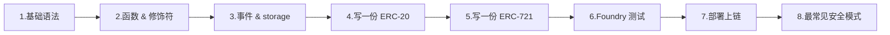
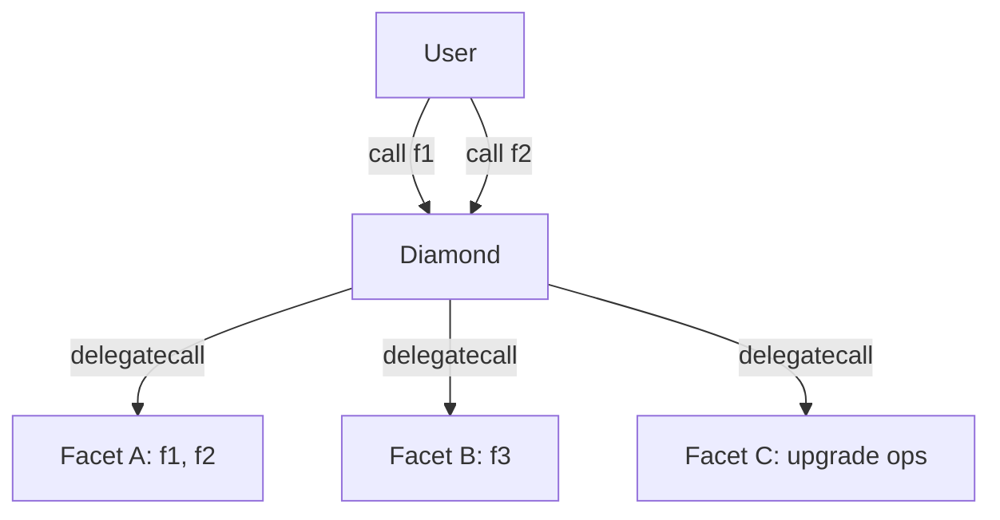

# 模块 04：Solidity 开发

> TL;DR：写过 JS / Python 没碰过静态类型语言的 Web2 工程师，照主线读完两周，能写出可被审计的 ERC-20 / ERC-721；要深入研究 Yul、Diamond、storage 二进制级、EIP-7702 字段细节，去附录 A-H。

写 Solidity 跟写 JS 最大的不同：你写完一行代码，编译器把它翻成字节码丢上链——**改不了、删不掉、出 bug 烧的是真钱**。这本模块用主线 8 章把你带到「能写一份审计员愿意签字的 ERC-20」的水平，再用附录 A-H 把所有不上主线的硬核话题归档好，需要时再翻。

**版本基线**：Solidity 0.8.28、Foundry stable、OpenZeppelin v5.5.0、Solady v0.1.26。`via_ir = false`（0.8.28-0.8.33 有清空 bug，2026-02-11 披露）。

**主线 8 章**（按顺序读）：



**附录**（按需查）：A. Storage layout 二进制 / B. Yul 内联汇编 / C. 替代语言 / D. Diamond / E. SSTORE2 与 transient storage 高级用法 / F. EIP-7702 字段对照 / G. Permit2 完整字段 / H. Uniswap V2 Pair walkthrough。

---

## 第 1 章 基础语法

> TL;DR：学 Solidity 的值类型、引用类型、storage / memory / calldata 三种数据位置；为什么写错位置烧的是真钱；学完能看懂 OZ ERC-20 里每个变量声明在干嘛。

写 JS 时变量没类型，引擎替你处理一切。Solidity 是静态类型 + 三种内存位置 + 32 字节对齐——每个写错的位置都对应一笔多花的 gas 账单。

### 1.1 三个邮政编码：address / msg.sender / msg.value

`address` 是一串 20 字节的 ID，跟邮政编码一样——它本身只是定位，不告诉你那里有什么。`msg.sender` 是当前这笔调用的「快递员」（谁正在调你的函数）；`msg.value` 是他随包送来的 ETH 数量。

```solidity
function deposit() external payable {
    balances[msg.sender] += msg.value;  // 谁来 = msg.sender，送多少 = msg.value
}
```

**陷阱**：`tx.origin` 是「发起整条调用链的最初 EOA」，不是 sender。**永远用 `msg.sender` 做鉴权**，`tx.origin` 在多层合约调用下会被钓鱼合约冒充。

### 1.2 值类型表（够用版）

| 类型 | 字节 | 用在哪 |
|---|---|---|
| `bool` | 1 | 真假，但占整字节（不是 1 bit） |
| `uint256` / `int256` | 32 | 默认 checked，溢出 revert |
| `uint8` ~ `uint128` | 1-16 | 小整数，用来 packing |
| `address` | 20 | 地址 |
| `address payable` | 20 | 可收 ETH 的地址 |
| `bytes32` | 32 | 定长字节，常做 hash key |

0.8.x 起算术默认 checked，溢出直接 revert（panic 0x11）。要省 gas 用 `unchecked { ... }`，但只在你 100% 知道不会溢出时——比如循环里的 `++i`。

### 1.3 storage / memory / calldata：硬盘 vs 内存 vs 只读 ROM

**storage 像合约的硬盘**——贵、慢、持久。每次写一个新 slot 烧 22100 gas（够一笔以太坊转账）。
**memory 像 RAM**——临时、便宜、函数返回就没了。
**calldata 像只读 ROM**——最便宜、还不让你改、外部函数参数默认就是它。

引用类型（数组、struct、mapping、string、bytes）必须显式声明位置：

```solidity
function update(uint256[] calldata input)        // 只读外部数组：最便宜
    external
{
    uint256[] memory tmp = new uint256[](3);     // 临时数组：放 RAM
    User storage u = users[msg.sender];          // 改链上记录：拿 storage 别名
    u.balance += input[0];
}
```

### 1.4 复制 vs 别名：踩过的人都不会再踩

```solidity
struct User { uint256 balance; }
mapping(address => User) public users;

function bad() external {
    User memory u = users[msg.sender];   // 复制一份到 RAM
    u.balance += 100;                    // 改 RAM，链上没动
}

function good() external {
    User storage u = users[msg.sender];  // storage 别名 = 指针
    u.balance += 100;                    // 真改链上
}
```

`storage` → `memory` 是**复制**（烧 gas）。`storage` → `storage` 是**指针别名**（几乎免费）。这条规则你要刻进肌肉记忆。

### 1.5 mapping 与 array：不需要算 keccak 也能用

JS 里 `obj[key]`，Solidity 里 `m[key]`。`mapping(K => V)` 占 1 个 slot 但 slot 本身永远是 0——元素的实际位置由 keccak 算出来（附录 A 详解二进制级）。**主线只需要会用**：

```solidity
mapping(address => uint256) public balances;
mapping(address => mapping(uint256 => bool)) public claimed;  // 嵌套合法
uint256[] public history;       // 动态数组：可 push / pop
uint256[10] public ranks;       // 静态数组：固定长度
```

mapping 不能遍历（没 length），需要遍历就额外维护一个数组。

### 1.6 immutable 与 constant

构造时确定、永不变的值用 `immutable`。完全 hardcode 的值用 `constant`。两者都不占 storage（嵌进字节码），免去每次 SLOAD：

```solidity
contract Vault {
    address public immutable ASSET;          // 部署时定，运行时只读
    uint256 public constant FEE_BPS = 50;    // 编译时定
    constructor(address a) { ASSET = a; }
}
```

省 gas、读起来意图清楚——审计员看到 `immutable` 就知道不会变。

### 章末

- 记住 3 句话：① `tx.origin` 永远不做鉴权，用 `msg.sender`；② `storage` 是别名指针，`memory` 是复制；③ 不变的值用 `immutable`。
- 1 道小练习：写一个 `Counter` 合约，用 `mapping(address => uint256)` 给每个用户记次数，外部函数只用 `external + calldata`。

---


## 第 2 章 函数与修饰符

> TL;DR：学函数四个修饰词（public/external/view/payable）、modifier 像守门员、错误用 custom error 不用 require 字符串；学完能正确给 ERC-20 的 mint 函数加权限。

写 JS 函数没修饰词，调用方法只有「能调 / 不能调」。Solidity 一个函数签名能挂 4 个修饰词——选错一个，多花几百 gas 或者权限漏一个洞。

### 2.1 可见性：public vs external vs internal vs private

| 关键字 | 谁能调 | ABI 暴露 |
|---|---|---|
| `public` | 任何人（外部 + 内部子合约）| 是 |
| `external` | **仅外部** tx 或 `this.f()` | 是 |
| `internal` | 本合约 + 子合约 | 否 |
| `private` | 仅本合约 | 否 |

**只对外的函数永远写 `external`**。`public` 会把引用类型参数复制到 memory，`external` 直接读 calldata，单笔省几百 gas。

### 2.2 可变性：view / pure / payable

```solidity
function balanceOf(address u) external view returns (uint256);  // 只读
function add(uint a, uint b) external pure returns (uint);      // 不读不写
function deposit() external payable;                             // 可收 ETH
```

`view` 不写 storage、可读；`pure` 连 `block.*` `msg.*` 都不读；`payable` 是接收 ETH 的入场券，缺了它合约直接拒收。链上读取 `view` / `pure` 函数走 `eth_call`，不上链不烧 gas。

### 2.3 modifier：函数的守门员

modifier 像守门员——函数被调用前先过它一关；过不了就 revert，gas 已花的不退。`_` 是函数体展开的位置。

```solidity
modifier onlyOwner() {
    if (msg.sender != owner) revert NotOwner();
    _;  // 函数体在这里展开
}

function withdraw() external onlyOwner {
    payable(owner).transfer(address(this).balance);
}
```

OZ v5 的 `Ownable` / `AccessControl` 已经把守门员写好且审计过——生产里直接 inherit，**不要自己写**。

### 2.4 自定义错误：比 require 字符串省 30% gas

```solidity
error InsufficientBalance(uint256 available, uint256 needed);

function withdraw(uint256 amt) external {
    uint256 bal = balances[msg.sender];
    if (bal < amt) revert InsufficientBalance(bal, amt);
    // ...
}
```

老风格 `require(bal >= amt, "balance too low")` 把字符串编进字节码，部署贵、运行也贵。新风格 4 字节 selector + 参数，前端拿到能精准展示。OZ v5 全库切到了这个风格。

### 2.5 try / catch：调外部合约时的安全网

```solidity
try IERC20(token).transfer(to, amt) returns (bool ok) {
    require(ok, "transfer returned false");
} catch {
    // 调用 revert 了，走这里——但 gas 已经被耗
}
```

只能用在**外部合约调用**上（同合约函数 revert 直接冒泡）。要点：被调方按 EIP-150 拿走你 63/64 的剩余 gas，所以 catch 块里别指望还有多少 gas 可花。

### 2.6 view 不是真承诺：审计时别松懈

`view` 是编译期检查，不是运行时强制。一个用汇编 `sstore` 的函数挂 `view` 标签照样能写状态。审计别人的代码时，看到 `view` 仍要追每个外部调用——它可能 delegate 到一个改 storage 的实现。

### 章末

- 记住 3 句话：① 对外函数永远写 `external`；② 权限用 OZ 的 `Ownable` / `AccessControl`；③ 错误用 `error`，不用 `require(c, "string")`。
- 1 道小练习：给 §1.6 的 Vault 加一个 `setFee(uint256)` 函数，只允许 owner 调用，超过 1000（10%）revert 自定义错误。

---

## 第 3 章 事件与 storage 入门

> TL;DR：event 是链上日志（写 1500 gas），storage 是链上硬盘（写 22100 gas）；用户能看就该走 event；学完能写出符合 ERC-20 标准的 Transfer / Approval 事件。

链上数据有两个去处：合约要读的进 storage（贵），只给链下索引的进 event（便宜十倍以上）。挑错位置，每笔交互多花用户几千 gas。

### 3.1 event 像链上日志

event 像链上日志——写一行就在 EVM 的 logs 区域留下记录，前端订阅得到，**合约自己读不到**。所有「用户看，合约不看」的数据都走 event：转账历史、参数变更、治理投票。

```solidity
event Transfer(address indexed from, address indexed to, uint256 value);
event Approval(address indexed owner, address indexed spender, uint256 value);

function _transfer(address from, address to, uint256 amt) internal {
    balances[from] -= amt;
    balances[to] += amt;
    emit Transfer(from, to, amt);   // 链下能查，合约不用记账
}
```

### 3.2 indexed：能被前端筛选

加 `indexed` 的字段进 topic（最多 3 个），可被前端按值筛选：「查 alice 的所有转账」。不加 indexed 进 data 区，链下只能解码不能筛。ERC-20 标准：`from`/`to` indexed，`value` 不 indexed。

注意 `string` / `bytes` 加 indexed 时，topic 里存的是 `keccak256(原文)`——前端拿到 hash 反查不出原文，需要再非 indexed 字段保留原文。

### 3.3 storage：合约的硬盘

`uint256`、`mapping`、struct 字段——只要写在合约的状态变量区就是 storage。每个变量按声明顺序铺到一个 32 字节 slot。第一次写一个 slot：22100 gas；改一个写过的 slot：5000 gas；读冷 slot：2100 gas，热 slot：100 gas。

```solidity
contract Token {
    mapping(address => uint256) public balances;  // slot 0（mapping 占位）
    uint256 public totalSupply;                   // slot 1
    string public name;                           // slot 2
}
```

写 storage 是合约里最贵的操作之一。每加一个状态变量都问自己：「合约自己读吗？」不读就走 event。

### 3.4 storage packing 入门：小整数挤一起

每个 slot 32 字节。多个 ≤ 32 字节的字段紧挨着声明，编译器自动打包到同一 slot：

```solidity
contract Packed {
    uint128 a;   // slot 0, 占 16 字节
    uint128 b;   // slot 0, 占剩下的 16 字节  → 1 slot
    uint256 c;   // slot 1
}

contract NotPacked {
    uint128 a;   // slot 0
    uint256 c;   // slot 1（c 放不进 slot 0 剩余 16 字节，开新 slot）
    uint128 b;   // slot 2
}
```

部署省 1 个 slot ≈ 20000 gas。但只在你**真在用** `uint128` 时才打包——用 `uint128` 装其实只需 `uint64` 的值是浪费类型空间。二进制级 layout 推导和 `forge inspect storage-layout` 用法见附录 A。

### 3.5 mapping 与数组的存放

`mapping(K => V)` 占 1 个 slot 但 slot 里永远是 0——元素 `m[k]` 的实际位置由 keccak 算出。**主线只需要知道**：mapping 不能遍历、能被「无限」键访问、不存 length。

动态数组 `T[]` 自身的 slot 存 length，元素从另外算出来的位置连续铺。静态数组 `T[N]` 直接铺 N 个 T 没有 length。要算精确位置见附录 A。

### 3.6 transient storage：临时存档（Cancun 后）

`tstore` / `tload` 在事务内有效，事务结束自动清零，写一次 100 gas。OZ v5.2+ 的 `ReentrancyGuardTransient` 把锁开销从每次 ~10000 gas 降到 ~200。**主线只需要会用 OZ 现成的，不需要自己写汇编**——细节进附录 E。

### 章末

- 记住 3 句话：① 用户看的走 event，合约读的走 storage；② event 加 `indexed` 才能被前端按值过滤（最多 3 个）；③ 状态变量按声明顺序铺 slot，小整数挤一起省 gas。
- 1 道小练习：写一个 `SimpleVault`，存 ETH 时 emit `Deposited(address indexed user, uint256 value)`；提现时 emit `Withdrawn(...)`。

---


## 第 4 章 写一份 ERC-20

> TL;DR：ERC-20 是同质化代币的标准接口；用 OZ v5 继承 + 加你自己的 mint 限额；学完能写一份审计员愿意签字的代币合约。

USDT、USDC、UNI 全是 ERC-20。这套接口包含 `transfer` / `approve` / `transferFrom` / `balanceOf` / `totalSupply` 五个函数和两个事件。**自己实现 transferFrom 是面试题，不是生产代码**——OZ v5 的 `ERC20.sol` 处理过 USDT 不返回 bool、fee-on-transfer 差额、ERC-777 hook 重入等十年踩出来的坑。

### 4.1 最小合约：继承 OZ 即可

```solidity
// SPDX-License-Identifier: MIT
pragma solidity 0.8.28;

import {ERC20} from "@openzeppelin/contracts/token/ERC20/ERC20.sol";

contract MyToken is ERC20 {
    constructor() ERC20("MyToken", "MTK") {
        _mint(msg.sender, 1_000_000 ether);  // 部署者拿全部 supply
    }
}
```

29 行就是一份合规 ERC-20。`_mint` 是 OZ 内部函数，自动 emit `Transfer(address(0), to, amt)` 表示「凭空铸造」。

### 4.2 加权限：mint 只允许特定角色

写完上面这版你就有疑问：「凭什么部署者就能凭空铸币？」生产合约要权限控制。OZ 的 `AccessControl` 比 `Ownable` 更灵活——多角色管理、可撤销。

```solidity
import {ERC20} from "@openzeppelin/contracts/token/ERC20/ERC20.sol";
import {AccessControl} from "@openzeppelin/contracts/access/AccessControl.sol";

contract MyToken is ERC20, AccessControl {
    bytes32 public constant MINTER_ROLE = keccak256("MINTER_ROLE");

    constructor(address admin) ERC20("MyToken", "MTK") {
        _grantRole(DEFAULT_ADMIN_ROLE, admin);
        _grantRole(MINTER_ROLE, admin);
    }

    function mint(address to, uint256 amount) external onlyRole(MINTER_ROLE) {
        _mint(to, amount);
    }
}
```

`onlyRole` 守门员挡掉非 MINTER 调用。审计员看到的第一件事就是这个 modifier——缺了它，部署 5 分钟后被白嫖。

### 4.3 加上限：mint 不能无限增发

把无上限的 `mint` 加一个 cap。`error` 比 `require` 字符串省 30% gas：

```solidity
error MintCapExceeded(uint256 requested, uint256 cap);

uint256 public immutable MINT_CAP;

constructor(address admin, uint256 cap) ERC20("MyToken", "MTK") {
    MINT_CAP = cap;
    _grantRole(DEFAULT_ADMIN_ROLE, admin);
    _grantRole(MINTER_ROLE, admin);
}

function mint(address to, uint256 amount) external onlyRole(MINTER_ROLE) {
    if (totalSupply() + amount > MINT_CAP) {
        revert MintCapExceeded(amount, MINT_CAP);
    }
    _mint(to, amount);
}
```

`immutable` 嵌进字节码、不占 storage、读 cap 不烧 SLOAD。

### 4.4 加 Permit：用户免一次 approve tx

老 ERC-20 用户买代币要先 `approve` 再 `transferFrom`，两笔 tx 等 24 秒。EIP-2612 用一个 EIP-712 签名替代 onchain approve——签名免费、即时。OZ 直接给你：

```solidity
import {ERC20Permit} from "@openzeppelin/contracts/token/ERC20/extensions/ERC20Permit.sol";

contract MyToken is ERC20, ERC20Permit, AccessControl {
    constructor(address admin)
        ERC20("MyToken", "MTK")
        ERC20Permit("MyToken")
    { /* ... */ }
}
```

继承顺序：基类在前（ERC20），扩展在后（ERC20Permit、AccessControl）——这是 OZ 文档的明确建议。

**陷阱**：`permit` 在 mempool 里可被 front-run（监听者抢先用同一签名调 permit，让你的 transferFrom 因 nonce 失效 revert）。**永远把 permit + transferFrom 打包同一笔 tx**（用 multicall 或 router），不单独广播 permit。

### 4.5 加 Burnable：用户能销毁自己的代币

```solidity
import {ERC20Burnable} from "@openzeppelin/contracts/token/ERC20/extensions/ERC20Burnable.sol";

contract MyToken is ERC20, ERC20Burnable, ERC20Permit, AccessControl { /* ... */ }
```

`burn(amount)` 销毁自己的；`burnFrom(account, amount)` 销毁授权过的。某些代币经济模型必备（销毁通缩、redemption 凭证）。

### 4.6 完整版

```solidity
contract MyToken is ERC20, ERC20Burnable, ERC20Permit, AccessControl {
    bytes32 public constant MINTER_ROLE = keccak256("MINTER_ROLE");
    error MintCapExceeded(uint256 requested, uint256 cap);
    uint256 public immutable MINT_CAP;

    constructor(string memory n, string memory s, uint256 cap, address admin)
        ERC20(n, s) ERC20Permit(n)
    {
        MINT_CAP = cap;
        _grantRole(DEFAULT_ADMIN_ROLE, admin);
        _grantRole(MINTER_ROLE, admin);
    }

    function mint(address to, uint256 amount) external onlyRole(MINTER_ROLE) {
        if (totalSupply() + amount > MINT_CAP) revert MintCapExceeded(amount, MINT_CAP);
        _mint(to, amount);
    }
}
```

这就是审计员愿意签字的最小生产代币：明确权限、有上限、permit 免一次 tx、Burnable 提供退出路径。

### 章末

- 记住 3 句话：① ERC-20 自己写 transferFrom 是面试题，生产用 OZ；② 任何 mint 函数必须加 onlyRole 或 onlyOwner；③ permit 永远跟 transferFrom 打包同一笔 tx。
- 1 道小练习：把上面这份合约加一个 `pause()` 功能（用 OZ 的 `ERC20Pausable`），暂停时禁止所有 transfer。

---

## 第 5 章 写一份 ERC-721

> TL;DR：ERC-721 是 NFT 标准（每个 tokenId 唯一）；OZ 给你了基础合约 + URIStorage + Royalty 扩展；学完能写一份带版税、有铸造权限的 NFT。

ERC-721 的核心：每个 `tokenId` 唯一，`ownerOf(id)` 返回唯一持有人。BoredApe、CryptoPunks、Uniswap LP NFT 全是 ERC-721。OZ v5 的 `ERC721.sol` 是事实标准。

### 5.1 最小 NFT：一行 mint 就够了

```solidity
// SPDX-License-Identifier: MIT
pragma solidity 0.8.28;

import {ERC721} from "@openzeppelin/contracts/token/ERC721/ERC721.sol";
import {Ownable} from "@openzeppelin/contracts/access/Ownable.sol";

contract MyNFT is ERC721, Ownable {
    uint256 public nextTokenId;

    constructor(address owner) ERC721("MyNFT", "MNFT") Ownable(owner) {}

    function mint(address to) external onlyOwner returns (uint256 id) {
        id = nextTokenId++;
        _safeMint(to, id);
    }
}
```

`_safeMint` 比 `_mint` 多一步：如果 `to` 是合约，调用 `onERC721Received` 检查它能收 NFT——防止 NFT 被发到一个不会 transfer 出来的合约里永久锁死。

### 5.2 加 tokenURI：每个 NFT 指向自己的 metadata

NFT 的图片、属性、描述放在 `tokenURI(id)` 返回的 JSON 里（通常 IPFS 地址）。OZ 提供 `ERC721URIStorage`：

```solidity
import {ERC721URIStorage} from "@openzeppelin/contracts/token/ERC721/extensions/ERC721URIStorage.sol";

contract MyNFT is ERC721URIStorage, Ownable {
    function mint(address to, string calldata uri) external onlyOwner returns (uint256 id) {
        id = nextTokenId++;
        _safeMint(to, id);
        _setTokenURI(id, uri);
    }
}
```

如果所有 token 共享一个 baseURI（`baseURI/0`、`baseURI/1`...），override `_baseURI()` 返回 baseURI 即可，不用每个 token 单独存（省 storage）。

### 5.3 加 Royalty（EIP-2981）：二级市场抽成

OpenSea / Blur 等市场识别 EIP-2981——卖家成交时按合约报价抽成给创作者：

```solidity
import {ERC721Royalty} from "@openzeppelin/contracts/token/ERC721/extensions/ERC721Royalty.sol";

contract MyNFT is ERC721Royalty, Ownable {
    constructor(address owner, address royaltyRecv, uint96 royaltyBps)
        ERC721("MyNFT", "MNFT") Ownable(owner)
    {
        _setDefaultRoyalty(royaltyRecv, royaltyBps);  // bps：500 = 5%
    }
}
```

EIP-2981 是「市场愿意配合」的协议，不是链上强制——市场可以无视。但所有主流市场都遵守。

### 5.4 加签名 mint：白名单不上链

白名单如果存 mapping 太贵（每个地址 22100 gas）。改用 EIP-712 签名：owner 离线签 `(to, tokenId, deadline)` voucher，用户调 `mintWithVoucher(voucher, sig)` 兑换。

```solidity
import {EIP712} from "@openzeppelin/contracts/utils/cryptography/EIP712.sol";
import {ECDSA} from "@openzeppelin/contracts/utils/cryptography/ECDSA.sol";

contract VoucherNFT is ERC721, EIP712 {
    using ECDSA for bytes32;

    bytes32 public constant VOUCHER_TYPEHASH = keccak256(
        "MintVoucher(address to,uint256 tokenId,uint256 deadline)"
    );
    address public immutable signer;
    mapping(uint256 => bool) public used;

    error Expired();
    error AlreadyUsed();
    error BadSig();

    constructor(address signer_) ERC721("VoucherNFT", "VN") EIP712("VoucherNFT", "1") {
        signer = signer_;
    }

    function mintWithVoucher(address to, uint256 id, uint256 deadline, bytes calldata sig) external {
        if (block.timestamp > deadline) revert Expired();
        if (used[id]) revert AlreadyUsed();
        bytes32 digest = _hashTypedDataV4(keccak256(abi.encode(VOUCHER_TYPEHASH, to, id, deadline)));
        if (digest.recover(sig) != signer) revert BadSig();
        used[id] = true;
        _safeMint(to, id);
    }
}
```

四个安全字段缺一不可：`to`（防别人冒领）、`id`（防换货）、`deadline`（防陈年签名复活）、`used` mapping（防重放）。

### 5.5 ERC-721 vs ERC-1155：什么时候选哪个

| 标准 | 适用 |
|---|---|
| ERC-721 | 每个 token 完全独特（NFT 头像、Uniswap LP） |
| ERC-1155 | 同一类有多份（游戏装备、门票） |

1155 一笔 tx 能 batch transfer 多种 token，省 gas。本主线只覆盖 721，1155 用法基本一样（OZ 同样有现成实现）。

### 章末

- 记住 3 句话：① 永远用 `_safeMint`，不用 `_mint`；② tokenURI 共享 baseURI 比每个 token 单独存便宜；③ 白名单用 EIP-712 voucher，不要 mapping。
- 1 道小练习：把 §5.1 的 NFT 加上 `_setDefaultRoyalty(creator, 500)` 收 5% 二级市场版税。

---

## 第 6 章 Foundry 入门：测试

> TL;DR：Foundry 用 Solidity 写测试，比 Hardhat 快 10 倍；学单元测试 + fuzz 测试两种形态；学完能给 ERC-20 铺出可被审计签字的测试套件。

写过 Jest 测试的 JS 同学：Foundry 的 `forge test` 就是 Jest，但**用 Solidity 写**——不用切换语言、跑得飞快、cheatcode 给你伪装任何身份的能力。

### 6.1 项目结构

```
my-project/
├── foundry.toml         # 配置（solc 版本、optimizer、fuzz runs）
├── remappings.txt       # 库别名（@openzeppelin → lib/...）
├── src/                 # 合约源码
│   └── MyToken.sol
├── test/                # 测试文件，命名 *.t.sol
│   └── MyToken.t.sol
└── lib/                 # 依赖（forge install 装到这）
```

`forge init` 一键生成。装 OZ：`forge install OpenZeppelin/openzeppelin-contracts@v5.5.0`。

### 6.2 写第一个单元测试

测试函数命名 `test_`、`testFuzz_`、`testRevert_`：

```solidity
import {Test} from "forge-std/Test.sol";
import {MyToken} from "src/MyToken.sol";

contract MyTokenTest is Test {
    MyToken token;
    address admin = makeAddr("admin");
    address alice = makeAddr("alice");

    function setUp() public {
        token = new MyToken("MyToken", "MTK", 1_000_000 ether, admin);
    }

    function test_initialSupply() public view {
        assertEq(token.totalSupply(), 0);
    }

    function test_mintByAdmin() public {
        vm.prank(admin);              // 下一笔伪装成 admin
        token.mint(alice, 100 ether);
        assertEq(token.balanceOf(alice), 100 ether);
    }
}
```

跑 `forge test -vvv`。`makeAddr` 生成稳定地址 + 自动 label，trace 里能看到名字。`vm.prank(addr)` 伪装下一笔的 msg.sender。

### 6.3 测试 revert

```solidity
function test_revert_mintByNonAdmin() public {
    vm.prank(alice);
    vm.expectRevert();    // 只检查 revert
    token.mint(alice, 100 ether);
}

function test_revert_mintOverCap() public {
    vm.prank(admin);
    vm.expectRevert(
        abi.encodeWithSelector(
            MyToken.MintCapExceeded.selector,
            2_000_000 ether,
            1_000_000 ether
        )
    );
    token.mint(alice, 2_000_000 ether);
}
```

带 selector 检查更严格——确认 revert 是预期的那个错误而非「碰巧 revert」。

### 6.4 fuzz 测试：让 forge 帮你想边界

参数加在测试函数签名上，forge 默认跑 256 轮随机值：

```solidity
function testFuzz_transferConserves(uint256 amt) public {
    amt = bound(amt, 1, 1000 ether);    // 把任意输入映射到 [1, 1000 ether]

    vm.prank(admin);
    token.mint(alice, amt);

    uint256 before = token.balanceOf(alice) + token.balanceOf(admin);

    vm.prank(alice);
    token.transfer(admin, amt / 2);

    assertEq(token.balanceOf(alice) + token.balanceOf(admin), before);
}
```

`bound(x, lo, hi)` 把 fuzz 输入限制到区间——比 `vm.assume` 更高效（assume 通过率低时 fuzzer 跑空）。

### 6.5 高频 cheatcode

| 调用 | 作用 |
|---|---|
| `vm.prank(addr)` | 下一笔调用伪装 msg.sender |
| `vm.startPrank(addr)` / `vm.stopPrank()` | 持续伪装 |
| `vm.deal(addr, balance)` | 设置 ETH 余额 |
| `deal(token, addr, amt)` | 设置 ERC-20 余额（forge-std 顶层）|
| `vm.warp(timestamp)` | 改 block.timestamp |
| `vm.expectRevert(...)` | 期待下次调用 revert |
| `vm.expectEmit(...)` | 期待 event |
| `vm.sign(privKey, digest)` | 离线签名 |
| `bound(x, lo, hi)` | fuzz 输入限制区间 |
| `makeAddr("name")` | 由名字生成稳定地址 |

### 6.6 看 gas 与覆盖率

```bash
forge test --gas-report           # 每个函数的 gas 详情
forge snapshot                    # 把所有 gas 写到 .gas-snapshot
forge snapshot --diff             # 与上次比较（CI 守 gas 回归）
forge coverage --report summary   # 行 / 分支覆盖率
```

PR 流程跑 `forge snapshot --check`：gas 涨了拒绝合并。这是工业级项目守护 gas 的标准做法。

### 章末

- 记住 3 句话：① 测试用 Solidity 写，命名 `test_` / `testFuzz_`；② `vm.prank` 伪装 sender，`vm.expectRevert` 检查异常；③ fuzz 用 `bound` 限制输入，比 `vm.assume` 高效。
- 1 道小练习：给 §4.6 的 MyToken 写 4 个测试：① 初始 supply 为 0；② admin 能 mint；③ 非 admin mint revert；④ fuzz transfer 保守恒。

---

## 第 7 章 Foundry 入门：部署上链

> TL;DR：用 Solidity 写部署脚本（forge script），cast 是命令行瑞士军刀，anvil 是本地链；学完能把 §4.6 的 ERC-20 部署到 Sepolia 并通过 Etherscan 验证。

代码写完不算交付，**部署上链且能被人验证**才算。Etherscan 验证失败时，用户看到的是一堆 bytecode，没人敢交互。

### 7.1 anvil：本地链

```bash
anvil                                     # 默认 10 个账户各 10000 ETH
anvil --fork-url $MAINNET_RPC_URL         # fork 主网到本地
```

跟 Hardhat node 同样定位但启动快很多。本地开发先 `anvil`，所有测试和部署对着 `http://127.0.0.1:8545` 跑。

### 7.2 forge script：部署脚本

部署逻辑写成 Solidity，比 JS 部署脚本类型安全：

```solidity
// script/Deploy.s.sol
import {Script} from "forge-std/Script.sol";
import {MyToken} from "src/MyToken.sol";

contract Deploy is Script {
    function run() external returns (MyToken token) {
        uint256 pk = vm.envUint("PRIVATE_KEY");
        address deployer = vm.addr(pk);

        vm.startBroadcast(pk);
        token = new MyToken("MyToken", "MTK", 1_000_000 ether, deployer);
        vm.stopBroadcast();
    }
}
```

```bash
forge script script/Deploy.s.sol:Deploy \
  --rpc-url $SEPOLIA_RPC_URL \
  --broadcast --verify -vvvv
```

`--broadcast` 真上链；`--verify` 自动 Etherscan 验证；`-vvvv` 最详细日志。

### 7.3 私钥：从开发到生产

| 场景 | 推荐 |
|---|---|
| 本地 dev | `--private-key $PRIVATE_KEY`（写 `.env`，git ignore）|
| Testnet | `cast wallet import` 生成加密 keystore，`--account name` 用 |
| Mainnet | 硬件钱包：`forge script --ledger` |
| 多签 | Safe + `--no-broadcast` 生成 calldata，再 Safe 签 |
| CI | KMS / Doppler 注入，绝不写文件 |

**真实私钥永远不提交 git**。`.env` 在 `.gitignore`，提交 `.env.example` 模板就够。

### 7.4 cast：命令行瑞士军刀

```bash
# 只读调用（免 gas）
cast call $TOKEN "balanceOf(address)(uint256)" $ME

# 写入调用（上链）
cast send $TOKEN "transfer(address,uint256)" $YOU 1ether \
  --rpc-url $RPC --private-key $PK

# 解析 selector ↔ 函数签名
cast 4byte 0xa9059cbb               # → "transfer(address,uint256)"
cast sig "transfer(address,uint256)" # → 0xa9059cbb

# 直接读 storage slot
cast storage $TOKEN 0

# 重放某笔 tx 看 trace
cast run 0xtxHash --rpc-url $RPC

# 估 gas
cast estimate $TOKEN "deposit(uint256)" 1000
```

调试链上交易、查 storage、解码事件都靠它。

### 7.5 完整一条龙

```bash
# 1. 本地编译测试
forge build && forge test

# 2. 本地部署到 anvil 演练
anvil &
forge script script/Deploy.s.sol --rpc-url http://127.0.0.1:8545 --broadcast --private-key $ANVIL_PK

# 3. Sepolia 实战
forge script script/Deploy.s.sol \
  --rpc-url $SEPOLIA_RPC_URL \
  --private-key $PRIVATE_KEY \
  --broadcast --verify

# 4. 用 cast 检查
cast call $DEPLOYED_ADDR "totalSupply()(uint256)" --rpc-url $SEPOLIA_RPC_URL
```

### 章末

- 记住 3 句话：① 部署脚本用 Solidity 写（forge script）；② 私钥永远不进 git，testnet 用 keystore，mainnet 用硬件钱包；③ `--verify` 自动通过 Etherscan 验证，省手工提交。
- 1 道小练习：把 §4.6 的 MyToken 部署到 Sepolia，用 cast 验证 totalSupply 为 0、admin 是部署者。

---

## 第 8 章 最常见安全模式

> TL;DR：CEI（Checks-Effects-Interactions）防重入；Pull-over-Push 不主动给用户打钱；其余高级 proxy / EIP-7702 / Permit2 进附录；学完能避开 90% 的初级安全坑。

每种模式背后都是一桩血案——TheDAO（$60M）→ CEI；Parity multisig（$30M + $280M 永久冻结）→ initializer 检查；Audius 治理 proxy（$6M）→ ERC-7201。**主线只讲两个能挡 90% 初级问题的模式**。

### 8.1 CEI：Checks → Effects → Interactions

2016 年 6 月，TheDAO 余额每 60 秒被掏空 ~$2M。攻击者用了一个简单的招式：在合约 `transfer ETH` 给他时，`receive()` fallback 里再调一次 `withdraw`——余额更新永远到不了。这次事故让以太坊硬分叉。

**CEI 是答案**：先检查参数（Checks）、再改状态（Effects）、**最后**做外部调用（Interactions）。违反它是 90% 重入漏洞的源头。

```solidity
// 错例：余额更新在转账后
function withdraw() external {
    uint256 bal = balances[msg.sender];
    require(bal > 0);
    (bool ok,) = msg.sender.call{value: bal}("");  // ← 外部调用先于状态更新
    require(ok);
    balances[msg.sender] = 0;
}

// 正例：CEI 顺序
function withdraw() external {
    uint256 bal = balances[msg.sender];
    require(bal > 0);
    balances[msg.sender] = 0;                       // ← Effects 先做
    (bool ok,) = msg.sender.call{value: bal}("");
    require(ok);
}
```

兜底再加一层：用 OZ 的 `ReentrancyGuard`：

```solidity
import {ReentrancyGuard} from "@openzeppelin/contracts/utils/ReentrancyGuard.sol";

contract Bank is ReentrancyGuard {
    function withdraw() external nonReentrant { /* ... */ }
}
```

CEI + nonReentrant 是双保险。

### 8.2 Pull-over-Push：不主动给用户打钱

第一年做 airdrop 的人都犯过同一个错：写循环 `for (i in users) users[i].transfer(amt)`，结果某个用户的合约钱包 fallback revert，整个 airdrop 卡死。

**口诀：不主动给用户打钱，让他们来取**：

```solidity
mapping(address => uint256) public pending;

function distribute(address[] calldata users, uint256[] calldata amts) external onlyOwner {
    for (uint256 i = 0; i < users.length; ++i) {
        pending[users[i]] += amts[i];     // 不转账，只记账
    }
}

function claim() external {
    uint256 amt = pending[msg.sender];
    pending[msg.sender] = 0;              // CEI 先归零
    (bool ok,) = msg.sender.call{value: amt}("");
    require(ok);
}
```

坏邻居只能伤害自己，不会卡死所有人。

### 8.3 升级合约：UUPS 推荐，其他模式见附录 D

合约部署后想改逻辑（修 bug、加功能），用 proxy 模式。**新项目首选 UUPS**——升级逻辑放在实现合约里，proxy 只做 delegatecall，gas 几乎零开销。

```solidity
import {UUPSUpgradeable} from "@openzeppelin/contracts-upgradeable/proxy/utils/UUPSUpgradeable.sol";
import {Initializable} from "@openzeppelin/contracts-upgradeable/proxy/utils/Initializable.sol";
import {OwnableUpgradeable} from "@openzeppelin/contracts-upgradeable/access/OwnableUpgradeable.sol";

contract TokenV1 is Initializable, UUPSUpgradeable, OwnableUpgradeable {
    /// @custom:oz-upgrades-unsafe-allow constructor
    constructor() { _disableInitializers(); }

    function initialize(address owner) external initializer {
        __UUPSUpgradeable_init();
        __Ownable_init(owner);
    }

    function _authorizeUpgrade(address) internal override onlyOwner {}
}
```

5 个升级安全要点：① `_authorizeUpgrade` 必须有权限检查（缺了任何人能升级）；② 新版本只在末尾加字段（换序会破坏 storage）；③ constructor 里 `_disableInitializers()` 防实现合约被外部初始化；④ 用 OZ 的 `openzeppelin-foundry-upgrades` 自动比对 layout；⑤ 升级前在 testnet 全套测一遍。

Diamond / Transparent / Beacon 等其他升级模式只在特殊场景需要，详见**附录 D**。

### 8.4 别踩这些坑

| 坑 | 修复 |
|---|---|
| `tx.origin` 鉴权 | 改 `msg.sender`，钓鱼合约绕不过 |
| `block.timestamp` 当随机数 | Chainlink VRF 或 RANDAO |
| 直接 `IERC20.transferFrom` | 用 OZ `SafeERC20`（USDT 不返回 bool）|
| for 循环里 external call | 改 Pull 模式，避免 DoS |
| 升级合约 storage 换序 | 末尾追加字段，或用 ERC-7201 namespace |
| `_authorizeUpgrade` 没 onlyOwner | 任何人能升级，部署即被劫持 |
| `permit` 单独广播 | 永远跟 transferFrom 打包同一笔 tx |

每条都对应过真实事故。

### 章末

- 记住 3 句话：① CEI——Checks → Effects → Interactions；② 别主动给用户打钱，让他们 claim；③ 升级用 UUPS + OZ 工具检查 storage layout。
- 1 道小练习：写一个 `VulnerableBank`（违反 CEI）+ 一个 `Attacker` 合约抽干它，再把 bank 改成 CEI 顺序，验证攻击失败。

---

# 附录

主线学完之后看的硬核话题。每条附录都是「主线提一句、附录展开」的模式——审计、面试、读 Uniswap V4 / Aave V4 源码时回来翻。

## 附录 A. Storage layout 二进制级 + slot 计算

主线 §3.4 讲了 storage packing 的概念。这里给出二进制级的精确规则：

**铺 slot 的四条规则**：① 状态变量按声明顺序铺到 slot 0、1、2…；② 每个变量从当前 slot 的下一个空字节开始放（左低位、右高位）；③ 当前 slot 剩余空间塞不下就换新 slot（不跨 slot 拼接）；④ 继承的父合约状态变量在子合约前面排。

`immutable` / `constant` 不占 slot——它们的值嵌进 deployedBytecode（PUSH32 立即数），不出现在 `forge inspect storage-layout` 的 JSON 里。

**示例**：

```solidity
contract Layout {
    uint128 a;   // slot 0, offset 0, 占 16 字节
    uint128 b;   // slot 0, offset 16, 占 16 字节 → slot 0 满
    uint256 c;   // slot 1（256 位放不进剩余 0 字节）
    bool d;      // slot 2, offset 0
    address e;   // slot 2, offset 1, 占 20 字节
    uint64 f;    // slot 2, offset 21, 占 8 字节
    uint16 g;    // slot 2, offset 29
    uint8 h;     // slot 2, offset 31 → slot 2 满
    uint256 i;   // slot 3
}
```

`forge inspect Layout storage-layout` 输出 JSON，每个字段标注 slot、offset、type。

**mapping 元素位置**：`m[k]` 在 `keccak256(abi.encode(k, slot))`，slot 是 mapping 自身的位置（slot 里永远是 0）。

```solidity
mapping(address => uint256) balances;  // slot 1
// balances[0xAAA] 的位置 = keccak256(abi.encode(0xAAA, 1))
```

**嵌套 mapping**：`m[k1][k2]` 在 `keccak256(abi.encode(k2, keccak256(abi.encode(k1, slot))))`。

**动态数组 T[]**：slot 自身存 length，元素从 `keccak256(slot)` 连续铺。

**bytes / string**：长度 ≤ 31 字节时打包进 slot 自身（最低字节存 `length*2`）；长度 > 31 字节时 slot 存 `length*2+1`，数据从 `keccak256(slot)` 开始。

**transient storage layout 没有等价工具**：`tload` / `tstore` 的 slot 全靠开发者维护，审计时逐处 review。

事故钩子：2022 Audius 治理 proxy 升级在 storage 前面插了 bool，老的 `votingPeriod` slot 被解释成 0，治理脚本顺着 0 投票，损失 ~$6M。OZ v5 用 ERC-7201 namespace storage（每个 namespace 用 hash 槽起点）解决这类问题。

```solidity
/// @custom:storage-location erc7201:myapp.token
struct TokenStorage {
    mapping(address => uint256) balances;
    uint256 totalSupply;
}

bytes32 private constant TOKEN_STORAGE = 0x...;  // keccak256(...) - 1 & ~0xff

function _getStorage() private pure returns (TokenStorage storage $) {
    assembly { $.slot := TOKEN_STORAGE }
}
```

namespace storage 完全隔离父子合约，升级时不担心父合约加字段破坏子合约布局。

---

## 附录 B. Yul / 内联汇编（Solady 风格、SafeTransferLib 等）

99% 的业务代码不需要写 Yul，但 Solady 的 `SafeTransferLib`、OZ 的 `MerkleProof._efficientHash`、Uniswap V4 的 transient lock 全是 Yul——审计时要能读懂。

### B.1 Yul 是什么

Solidity 的 IR 兼内联汇编语法，比 EVM opcode 多了局部变量（`let x := ...`）、函数、if/switch/for，但**无类型系统**——一切是 256 位字。

```solidity
function add(uint256 a, uint256 b) external pure returns (uint256 c) {
    assembly {
        c := add(a, b)
        if iszero(c) { revert(0, 0) }
    }
}
```

Solidity 变量在 assembly 里直接可访问；赋值用 `:=`；赋值给命名返回变量即可，不需 `return`。

### B.2 常用 opcode 速查

| Yul | EVM opcode | 用途 |
|---|---|---|
| `add/sub/mul/div` | ADD/SUB/MUL/DIV | 算术（无 checked！）|
| `lt/gt/eq/iszero` | LT/GT/EQ/ISZERO | 比较（返回 0/1）|
| `and/or/xor/shl/shr` | 位运算 | 极致优化用 |
| `mload/mstore` | MLOAD/MSTORE | memory 读写 |
| `sload/sstore` | SLOAD/SSTORE | storage 读写 |
| `tload/tstore` | TLOAD/TSTORE | transient（Cancun+）|
| `keccak256(p,s)` | KECCAK256 | hash memory[p..p+s] |
| `call/staticcall/delegatecall` | 外部调用 | 自己拼参数 |
| `calldataload(p)` | CALLDATALOAD | 读 calldata |

### B.3 Solady SafeTransferLib（汇编版）

```solidity
function safeTransfer(address token, address to, uint256 amount) internal {
    assembly {
        mstore(0x14, to)
        mstore(0x34, amount)
        mstore(0x00, 0xa9059cbb000000000000000000000000)
        if iszero(and(
            or(eq(mload(0x00), 1), iszero(returndatasize())),
            call(gas(), token, 0, 0x10, 0x44, 0x00, 0x20)
        )) {
            mstore(0x00, 0x90b8ec18)
            revert(0x1c, 0x04)
        }
        mstore(0x34, 0)
    }
}
```

比 OZ `SafeERC20` 省 ~30% gas，但可读性归零。**只在基础库这一层用**，业务合约用 OZ 即可。

### B.4 OZ MerkleProof 高效 hash

```solidity
function _efficientHash(bytes32 a, bytes32 b) private pure returns (bytes32 value) {
    assembly {
        mstore(0x00, a)
        mstore(0x20, b)
        value := keccak256(0x00, 0x40)
    }
}
```

直接用 0x00-0x3F scratch space，不分配 memory，省 ~200 gas/次。20 层 Merkle 累计 4000+ gas。

### B.5 transient storage 重入锁

```solidity
abstract contract ReentrancyGuardTransient {
    bytes32 private constant SLOT = 0x9b779b17422d0df92223018b32b4d1fa46e071723d6817e2486d003becc55f00;

    modifier nonReentrant() {
        assembly {
            if tload(SLOT) { revert(0, 0) }
            tstore(SLOT, 1)
        }
        _;
        assembly { tstore(SLOT, 0) }
    }
}
```

每次调用 ~200 gas vs storage 版 ~10000 gas。OZ v5.2+ 直接给 `ReentrancyGuardTransient`。

### B.6 不要这么写：常见 footgun

- 写 memory 不更新 free pointer `0x40`：下一行 Solidity 分配 memory 会覆盖；
- 用 `invalid()` 而非 `revert(0, 0)`：烧光所有 gas；
- 假设 calldata 布局后改函数签名：偏移全错；
- mapping 的 slot 写死成数字：继承变更后 layout 变，数据写错位置。

每个 assembly 块必须有专门测试覆盖正常 + 边界。手写汇编没有 checked 算术、没有边界检查——所有传统编译器替你兜底的事，全得自己写测试覆盖。

---

## 附录 C. 替代语言（Vyper / Huff / Fe / Stylus）

主线默认 Solidity。99% 的新项目仍用 Solidity，替代品只在特殊场景：

**Vyper**（Curve / Lido 在用，v0.4.3）：Python-like、不支持继承 / modifier / 内联汇编，审计员的福音。劣势：工具链弱、2023-07 Curve hack 由编译器 reentrancy lock bug 导致 ~$70M 损失、无 OZ 等价库。**何时选**：数学密集 + 逻辑简单（AMM）+ Python 团队。

**Huff**（Aztec 团队的 macro 汇编）：直接暴露 EVM stack，无变量无类型。省 30-80% gas。不可读 / 不可审计 / 无溢出检查。**仅用于** MEV 套利、核心 router 热路径，**绝不写业务**。

**Fe**：EF 孵化的 Rust-like 语言，alpha，**不生产可用**。

**Solang**（Polkadot / Solana / Stellar）：Solidity → 非 EVM 的 LLVM 编译器，兼容 0.8.x 大部分语法，链差异需改写。

**Sway**（Fuel 网络）：Rust-like，FuelVM 专用，2026-04 仍 testnet。仅确定做 Fuel 项目时关注。

**Rust + Stylus**（Arbitrum WASM，生产可用）：Stylus SDK v0.10。Arbitrum 主网 WASM + EVM 共存。优势：Rust 全生态、复杂数学比 Solidity 快 10-100 倍、所有权安全。劣势：仅 Arbitrum One/Nova、OZ `rust-contracts-stylus` 仍演进中。**选用条件**：项目部署 Arbitrum + 复杂数学 + 团队有 Rust 经验。

---

## 附录 D. Diamond / EIP-2535

合约写大到超过 24KB（以太坊单合约部署上限）时的解。主线建议：先问「真的需要 Diamond 吗」，**新项目应优先 UUPS + 模块拆分**。



**Diamond Storage**：每个 facet 用独立 keccak256 hash 作起点：

```solidity
library FacetAStorage {
    bytes32 constant SLOT = keccak256("diamond.facet.a.storage");
    struct Layout { uint256 totalSupply; mapping(address => uint256) balances; }
    function layout() internal pure returns (Layout storage l) {
        bytes32 slot = SLOT;
        assembly { l.slot := slot }
    }
}
```

**优势**：突破 24KB；selector 粒度升级；多团队并行迭代。
**劣势**：`forge inspect` 算不出完整 storage layout；DiamondCut 缺 access control 时可被劫持；每次调用多 1 SLOAD（查路由表）；storage hash 碰撞全炸。

**案例**：Aavegotchi（游戏合约超 24KB）。`diamond-foundry` 是参考实现，**误删 selector 即锁死合约**——别从零写。

**EIP-1167 Minimal Proxy（Clones）**：另一种思路。45 字节固定 bytecode，硬编码 implementation 地址做 delegatecall。部署 ~32k gas，比 ERC1967Proxy 便宜 5 倍。代价：不能升级。Argent / Safe / Yearn vault factory 全用这个。

```solidity
import {Clones} from "@openzeppelin/contracts/proxy/Clones.sol";
address vault = Clones.clone(IMPLEMENTATION);
Vault(vault).initialize(asset);
```

**何时选**：大批量部署 + 单实例不需要升级 + 共享同一逻辑。要给每个 clone 塞不同常量见 EIP-3448 MetaProxy（Solady `LibClone` 实现）。

---

## 附录 E. SSTORE2 / transient storage 高级模式

主线 §3.6 提了一句 transient storage。这里是它的四种生产模式与 SSTORE2 大数据存储。

### E.1 transient storage 四种模式

**模式 A：reentrancy lock**——主线已示例。每次调用 ~200 gas。

**模式 B：跨函数调用栈传 context**（Uniswap V4 hooks 主用法）

V4 PoolManager 的 `unlock(callback)` 把 LP 操作交给 callback 处理，transient 避免把 poolId 逐层 thread 进每个调用。

```solidity
contract PoolManager {
    bytes32 constant SLOT_LOCKER = keccak256("v4.locker");

    function unlock(bytes calldata data) external returns (bytes memory) {
        assembly { tstore(SLOT_LOCKER, caller()) }
        bytes memory result = ICallback(msg.sender).callback(data);
        assembly { tstore(SLOT_LOCKER, 0) }
        return result;
    }
}
```

**模式 C：累积变量**（multicall 净结算）——每次 swap 把 delta 累加到 transient slot，结尾读一次净结算。比 storage 累加每次省 ~5000 gas。

**模式 D：批量授权 cache**（Permit2 风格）——首次验证 ECDSA 签名后写 transient，同 tx 内后续 tload 免重新验证。

**安全规则**：① 函数返回前手动清零（除非有意累积）；② delegatecall 共享 transient——proxy 实现合约的 tstore 写到 proxy 自己；③ 没有 `forge inspect storage-layout` 等价工具，全靠开发者维护。

### E.2 EIP-5656 MCOPY

Cancun 的 MCOPY 取代逐 32 字节复制。**Solidity 0.8.25+ 自动用**于 ABI encode/decode、bytes/string 复制——EVM target 设 `cancun` 即生效，无需改代码。复制 1KB 从 ~10000 gas 降到 ~3300，10KB 省 80%。

### E.3 SSTORE2 / SSTORE3：大 blob 廉价存储

数据存为**合约字节码**而非 storage，写贵但读极便宜。

| 方式 | 写 1KB | 读 1KB |
|---|---|---|
| SSTORE | ~720,000 gas | ~6,400 gas |
| SSTORE2 (CREATE) | ~210,000 gas | ~3,400 gas |

```solidity
import {SSTORE2} from "solady/utils/SSTORE2.sol";

address pointer = SSTORE2.write(data);  // 部署一个新合约 bytecode = data
bytes memory data2 = SSTORE2.read(pointer);
```

适用：写一次读多次的大块数据（NFT metadata、配置 blob、merkle root 历史）。`SSTORE3` 用 CREATE2 + 固定 salt 让 pointer 可预测，省一次 storage write。

### E.4 EIP-2930 access list

交易类型 0x01，预声明访问的 address 与 slot，冷读 2100 → 热读 100（每槽省 ~2000）。`cast send --access-list` 自动推导。链下优化，Solidity 代码无需改动。

---

## 附录 F. EIP-7702 字段级（chainId=0 攻击在主线提一句）

EIP-7702（Pectra 升级，2025-Q2 主网）让 EOA **通过签名「附身」成某个合约**：一笔 tx 内执行合约逻辑，无需 4337 bundler。

**用例**：批量授权+swap+stake（3 tx → 1 tx）；gas 赞助；session keys。

**Solidity 工具链支持**（截至 2026-04）：
- **Foundry**：`vm.sign` + `vm.attachDelegation`；
- **OpenZeppelin v5.5+**：`SignerEIP7702`；
- **viem ≥ 2.21**：`signAuthorization` API；
- **Solady**：`EIP7702Proxy`。

**Authorization tuple 字段**：

| 字段 | 说明 | 风险 |
|---|---|---|
| `chainId` | 在哪条链生效 | **必须具体值**；0 表示「任意链」是高危陷阱 |
| `address` | EOA 要 delegate 到的合约 | 一旦设错，攻击者全权处置 EOA |
| `nonce` | 防重放 | 每次 delegate 自增 |
| `signature` | EOA 私钥签的 (chainId, address, nonce) | 钱包必须明确展示 delegate 目标 |

**红线**：① delegate 后所有 storage 读写发生在 EOA 地址——恶意合约可取走 EOA 持有的一切 token；② delegation 新值直接覆盖旧值（非叠加）；③ 应用合约仍假设调用方是普通 EOA 或 4337 SmartWallet——被 EOA delegate 的合约按 ERC-1271 实现 `isValidSignature`；④ **chainId = 0 是工具链最高危字段**：authorization tuple 允许 chainId = 0 表示「在任意链上生效」。攻击者一旦诱骗用户签 chainId=0 的 7702 auth，可在所有 EVM 链上重放、把 EOA 在每条链上 delegate 到 sweeper。

**钱包 / dApp 必须默认使用具体 chainId、显示拒绝 chainId=0**。详见 05 模块 §11.4 攻击案例。

---

## 附录 G. Permit2 完整字段对照

主线 §4.4 提到 EIP-2612 permit。Permit2（Uniswap 2022）是更激进的方案：把 permit 抽出来做成所有 token 通用的中间层。每条主流链通过 CREATE2 部署在 `0x000000000022D473030F116dDEE9F6B43aC78BA3`。

「同一地址」是部署确定性，**不是跨链**——每条链上的 Permit2 是独立合约，allowance / nonce 各链互不可见。

### G.1 vs EIP-2612 关键区别

| 维度 | EIP-2612 | Permit2 |
|---|---|---|
| 适用 token | 必须实现 `permit` | **任意 ERC-20** |
| 用户首次成本 | 0 onchain tx | 1 次 `approve(Permit2, MAX_UINT)` |
| 之后每次 | 离线签名 | 离线签名 |
| 所有授权有 deadline | 部分 | **全部** |

### G.2 两个核心子合约

**SignatureTransfer**：签一次用一次，最强安全。每个签名带 `nonce + deadline`，用过即销毁。

字段对照：

```solidity
struct PermitTransferFrom {
    TokenPermissions permitted;  // { token, amount }
    uint256 nonce;
    uint256 deadline;
}

struct SignatureTransferDetails {
    address to;          // 转账目标
    uint256 requestedAmount;  // 实际转的数（可 ≤ permitted.amount）
}
```

**AllowanceTransfer**：签名后给 app 一段时间的额度（time-bound），适合频繁交互。

```solidity
struct PermitDetails {
    address token;
    uint160 amount;
    uint48 expiration;   // 过期后自动失效
    uint48 nonce;
}
```

### G.3 合约接收 Permit2 转账

```solidity
import {ISignatureTransfer} from "permit2/src/interfaces/ISignatureTransfer.sol";

ISignatureTransfer constant PERMIT2 =
    ISignatureTransfer(0x000000000022D473030F116dDEE9F6B43aC78BA3);

function depositWithPermit2(
    uint256 amount,
    ISignatureTransfer.PermitTransferFrom calldata permit,
    bytes calldata signature
) external {
    PERMIT2.permitTransferFrom(
        permit,
        ISignatureTransfer.SignatureTransferDetails({
            to: address(this),
            requestedAmount: amount
        }),
        msg.sender,
        signature
    );
    _mintShares(msg.sender, amount);
}
```

新项目（DEX 路由器、跨链桥、聚合器）应直接基于 Permit2，不要求 token 实现 EIP-2612。

---

## 附录 H. Uniswap V2 Pair walkthrough

读源码是最被低估的学习方式。Uniswap V2 Pair：约 200 行，2020 年部署后 5 年没改一行代码，处理过数千亿美金交易。每行都有「为什么这么写」的故事。

源码：[Uniswap/v2-core/UniswapV2Pair.sol](https://github.com/Uniswap/v2-core/blob/master/contracts/UniswapV2Pair.sol)。

### H.1 Storage 解读

```solidity
contract UniswapV2Pair is UniswapV2ERC20 {
    uint public constant MINIMUM_LIQUIDITY = 10**3;  // 永久销毁防 inflation attack

    address public factory;       // slot N+0
    address public token0;        // slot N+1
    address public token1;        // slot N+2
    uint112 private reserve0;     // slot N+3 offset 0
    uint112 private reserve1;     // slot N+3 offset 14
    uint32  private blockTimestampLast;  // slot N+3 offset 28 → slot 满
    uint public price0CumulativeLast;    // slot N+4：TWAP 累积
    uint public price1CumulativeLast;    // slot N+5
    uint public kLast;                   // slot N+6
    uint private unlocked = 1;           // slot N+7：reentrancy lock
}
```

**设计精华**：① reserve0/reserve1/blockTimestampLast 三字段打包 1 个 slot，swap 写 1 次 SSTORE 而非 3 次（省 ~10000 gas/swap）；② `uint112` 上限 `2^112-1≈5.2e33`，18 decimals 下够用；③ `uint32` blockTimestamp 到 2106 年才溢出。

### H.2 swap：K 不变量 + flash loan 一并解决

```solidity
function swap(uint amount0Out, uint amount1Out, address to, bytes calldata data) external lock {
    require(amount0Out > 0 || amount1Out > 0);
    (uint112 _reserve0, uint112 _reserve1,) = getReserves();
    require(amount0Out < _reserve0 && amount1Out < _reserve1);

    uint balance0; uint balance1;
    {
        if (amount0Out > 0) _safeTransfer(token0, to, amount0Out);
        if (amount1Out > 0) _safeTransfer(token1, to, amount1Out);
        if (data.length > 0) IUniswapV2Callee(to).uniswapV2Call(...);  // flash loan
        balance0 = IERC20(token0).balanceOf(address(this));
        balance1 = IERC20(token1).balanceOf(address(this));
    }
    require(balance0Adjusted * balance1Adjusted >= uint(_reserve0) * _reserve1 * 1000**2);
    _update(balance0, balance1, _reserve0, _reserve1);
    emit Swap(...);
}
```

**学习点**：① optimistic transfer：先转 output 再检查 K，callback 内可做任意事，最终满足 K 即可；② flash loan 是 2 行 callback 的免费副产物；③ 乘 1000 把 0.3% fee 转成整数除法（EVM 无浮点）。

### H.3 mint：MINIMUM_LIQUIDITY 防 inflation attack

```solidity
function mint(address to) external lock returns (uint liquidity) {
    if (_totalSupply == 0) {
        liquidity = Math.sqrt(amount0 * amount1) - MINIMUM_LIQUIDITY;
        _mint(address(0), MINIMUM_LIQUIDITY);  // ★ 永久销毁 1000 wei LP
    } else {
        liquidity = Math.min(amount0 * _totalSupply / _reserve0, amount1 * _totalSupply / _reserve1);
    }
    require(liquidity > 0);
    _mint(to, liquidity);
}
```

`MINIMUM_LIQUIDITY=1000` wei 永久销毁给 address(0)——攻击者无法把 share 操纵到 0。同思路：ERC4626 `_decimalsOffset`。

### H.4 设计模式总结

- Lock modifier（V2 用 storage，V4 改 transient 省 5000 gas/call）；
- 3 字段挤 1 slot：SSTORE 优化教科书；
- optimistic + post-check：天然支持 flash loan；
- K = constant product：全部金融逻辑就一个不等式；
- MINIMUM_LIQUIDITY：销毁 1000 wei 防 inflation attack；
- 先打钱再读 balance：自然处理 fee-on-transfer token。

### H.5 推荐的下一个 walkthrough

1. **Solady ERC20**（80 行）：汇编版，对照 OZ 看两种风格；
2. **Morpho Blue**（650 行）：最简 lending market；
3. **Uniswap V4 PoolManager**：transient storage + hooks 极致用法；
4. **Aave V3 Pool**：reserve cache、利率曲线、清算。

---

## 延伸阅读

### 官方文档

- [Solidity 0.8.28 docs](https://docs.soliditylang.org/en/v0.8.28/)
- [Foundry Book](https://getfoundry.sh/)
- [OpenZeppelin Contracts v5](https://docs.openzeppelin.com/contracts/5.x/)
- [EIP-2612 (permit)](https://eips.ethereum.org/EIPS/eip-2612)
- [EIP-712 (typed signing)](https://eips.ethereum.org/EIPS/eip-712)
- [EIP-1967 (proxy storage)](https://eips.ethereum.org/EIPS/eip-1967)
- [EIP-7201 (namespace storage)](https://eips.ethereum.org/EIPS/eip-7201)
- [EIP-7702 (set code for EOA)](https://eips.ethereum.org/EIPS/eip-7702)
- [EIP-1153 (transient storage)](https://eips.ethereum.org/EIPS/eip-1153)
- [EIP-2535 (Diamond)](https://eips.ethereum.org/EIPS/eip-2535)
- [EIP-1167 (Minimal Proxy / Clones)](https://eips.ethereum.org/EIPS/eip-1167)
- [ERC-4626 (vault)](https://eips.ethereum.org/EIPS/eip-4626)
- [Permit2 文档](https://docs.uniswap.org/contracts/permit2/overview)

### 课程

- [Cyfrin Updraft](https://updraft.cyfrin.io/)（Patrick Collins / Chainlink Labs，免费）
- [Patrick Collins's Foundry Full Course](https://www.youtube.com/watch?v=umepbfKp5rI)（YouTube 32 小时）
- [RareSkills](https://www.rareskills.io/)（付费，深度审计向）
- [Secureum](https://www.secureum.xyz/)（合约安全速成）

### 必读源码

| 仓库 | 学什么 |
|---|---|
| [OpenZeppelin Contracts](https://github.com/OpenZeppelin/openzeppelin-contracts) | 标准合约的工业实现 |
| [Solady](https://github.com/Vectorized/solady) | 极致 gas 优化（汇编版）|
| [Uniswap V2 Pair](https://github.com/Uniswap/v2-core/blob/master/contracts/UniswapV2Pair.sol) | 最小完整 AMM（附录 H）|
| [Uniswap V4](https://github.com/Uniswap/v4-core) | hooks + transient storage |
| [Morpho Blue](https://github.com/morpho-org/morpho-blue) | 最简 lending market |
| [Permit2](https://github.com/Uniswap/permit2) | 跨协议授权（附录 G）|

### 工具

- [Slither](https://github.com/crytic/slither)（静态分析事实标准）
- [Aderyn](https://github.com/Cyfrin/aderyn)（Cyfrin Rust 静态分析）
- [Halmos](https://github.com/a16z/halmos)（fuzz-as-spec 符号执行）
- [Echidna](https://github.com/crytic/echidna)（property fuzz）

### 常见坑

- `address(this).balance` 不是内部账本（selfdestruct 转入会超出记账）
- `tx.origin` 永远不用于鉴权（钓鱼合约绕过）
- `block.timestamp` 不是随机源（±15 秒可控）
- for 循环里 external call（gas 不可控 + 无长度限制 = DoS）
- ERC-20 fee-on-transfer（PAXG / SAFEMOON：transferFrom 100 对方收到 99）
- `call` 不限 gas（被调方可烧光 gas）
- Proxy 实现合约未 `_disableInitializers()`（可被外部初始化）
- `permit` 单独广播（被 front-run 让 transferFrom 失败）

---

