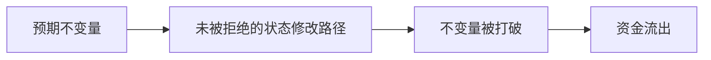
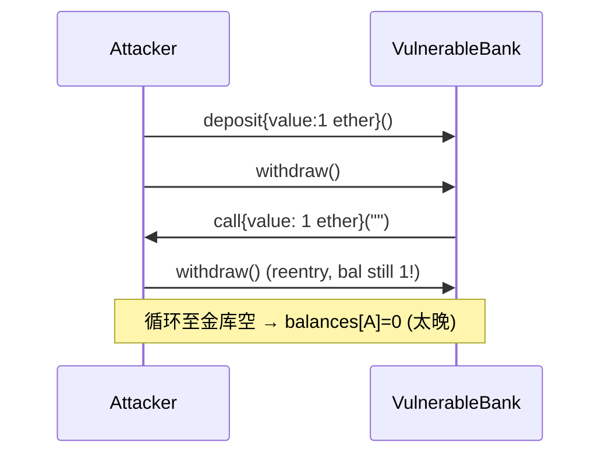
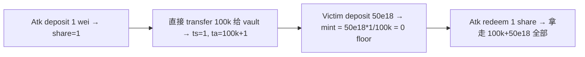
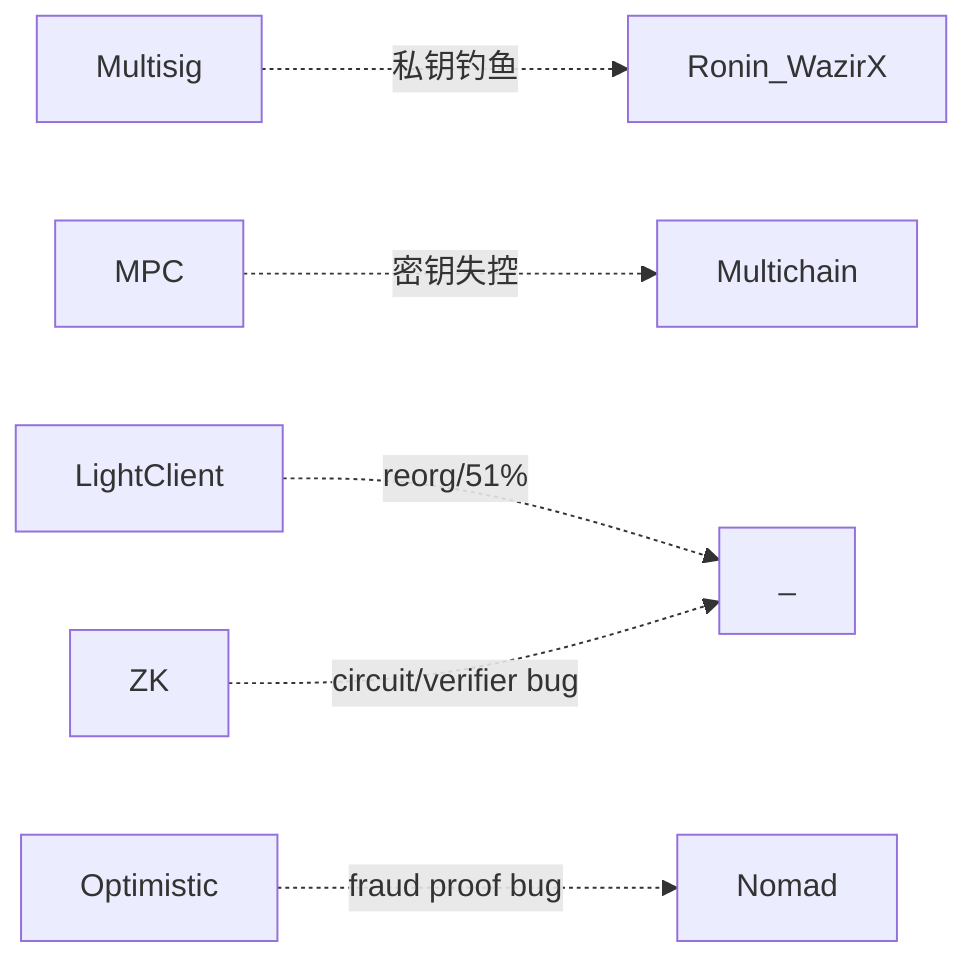
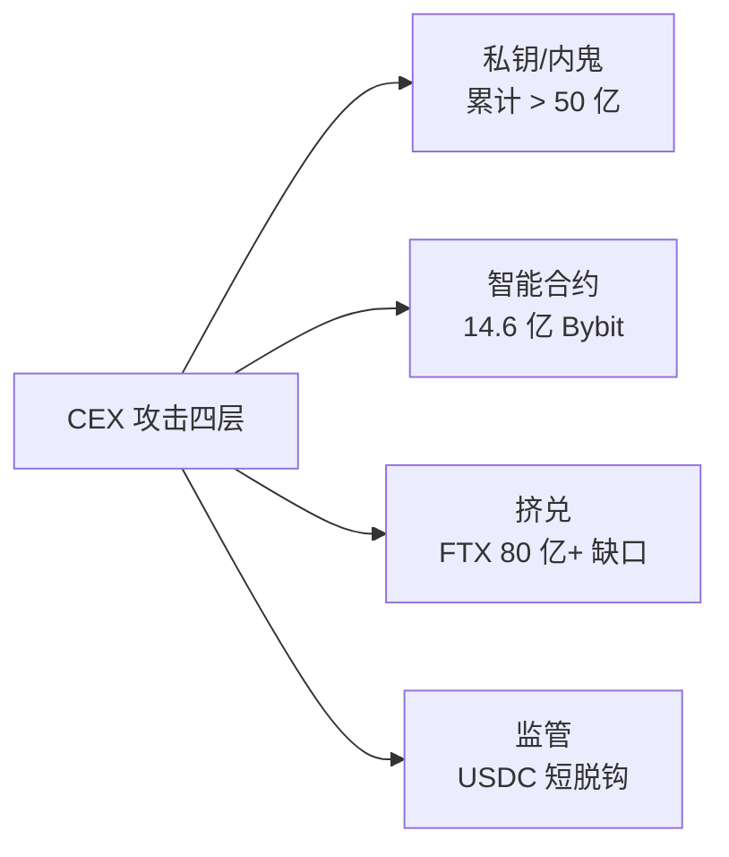

# 模块 05 · 智能合约安全

> 读完基础 Solidity 即可上手。目标：识别 6 大漏洞家族，写可被审计的代码。文献截至 2026-04-27，金额按事件当日 USD 计价。

---

## 0. 开场：四个数字，一个共同点

- **2016-06-17 · The DAO · 6000 万美元**——一个 30 行合约把以太坊劈成 ETH / ETC 两条链。
- **2022-03-29 · Ronin Bridge · 6.25 亿美元**——5/9 个签名节点被钓鱼，桥被搬空。
- **2025-02-21 · Bybit · 14.6 亿美元**——前端供应链 + 盲签，三个钱包人按下了"确认"。
- **2025-05-22 · Cetus（Sui）· 2.23 亿美元**——一行 shift wrap，AMM 报价被改写。

四起事件横跨十年、跨越四类攻击家族，共同点只有一个：**链上没有客服，bug 直接是损失**。完整年表见 §0.5。

> **承上**：模块 04 让你能写 Solidity，本模块教你写**对**。能写不等于能扛住攻击。

### 0.1 TL;DR / 学习目标 / 前置 / 导览

漏洞章节统一四段式：**TL;DR → 钩子 → 漏洞描述+PoC → 修复**。主线 ≤ 30 页 PDF。

| 章 | 标题 | 一句话 |
|---|---|---|
| 1 | 安全心法 | 攻击者三问 / 不变量思维 |
| 2 | 重入家族 | CEI + nonReentrant；read-only 简版 |
| 3 | 价格操纵 / Oracle 滥用 | spot→TWAP；Chainlink 4 项检查 |
| 4 | 访问控制 / 升级安全 | initialize guard；盲签防御；Bybit 故事 |
| 5 | 签名重放 / EIP-712 钓鱼 | 5W nonce；Permit2 防御 |
| 6 | 整数 / 精度 / Inflation | overflow；ERC4626 虚拟份额；shift wrap |
| 7 | 跨链桥 / DA 风险（直觉） | 桥 = 信任最弱环；blob 拥堵 |
| 8 | 安全开发 5 条铁律 | CEI / 最小权限 / 不变量 / 监控 / Clear Signing |
| 9 | Slither + forge test 入门 | 30 秒扫描；invariant test 骨架 |
| 故事 1 | The DAO（2016） | 第一次重入硬分叉 |
| 故事 2 | Bybit $1.46B（2025） | S3 供应链 + 盲签 |
| 故事 3 | CEX 攻击全景（2014-2025） | 私钥/合约/挤兑/监管 4 层 |
| 附录 A | 12 类漏洞详细分类 | SWC 全谱（含 honeypot/rug 检测） |
| 附录 B | Halmos / Echidna / Certora 配置 | 形式化验证详情 |
| 附录 C | Bybit 完整复盘 | 攻击链逐分钟 |
| 附录 D | 其余真实事件 postmortem | Wormhole / Nomad / Beanstalk … |
| 附录 E | 审计流程模板 | STRIDE-DeFi / Actor Map / 报告 |
| 附录 F | 形式化验证深入 | Certora CVL / SMTChecker |
| 附录 G | 重入的形式化定义 | CEI 时序冲突的数学表达 |

---

## 0.5 大额事件速览（2016-2026，选 10）

| 时间 | 事件 | 损失 (USD) | 攻击家族 |
|---|---|---|---|
| 2016-06-17 | **The DAO** | 6000 万 | 重入（§故事1） |
| 2022-03-29 | **Ronin Bridge #1** | 6.25 亿 | 跨链桥·私钥钓鱼 |
| 2022-10-11 | **Mango Markets** | 1.16 亿 | Oracle·现货拉盘 |
| 2023-07-30 | **Curve / Vyper 0day** | 7000 万 | 重入·编译器层 |
| 2023-11-22 | **KyberSwap Elastic** | 4700 万 | 整数·tick 边界精度 |
| 2024-05-14 | **Sonne Finance** | 2000 万 | 精度·ERC4626 inflation |
| 2024-09-03 | **Penpie / Pendle** | 2735 万 | 重入·跨合约 |
| 2024-10-16 | **Radiant Capital** | 5300 万 | 访问控制·盲签 |
| 2025-02-21 | **Bybit** | 14.6 亿 | 访问控制·S3供应链（§故事2） |
| 2025-05-22 | **Cetus（Sui）** | 2.23 亿 | 整数·shift wrap |

> 从 2024 起，人因（私钥被钓 / UI 被劫 / 内鬼）损失已远超合约层 bug。完整年表见附录 D。

---

## 1. 安全心法

> **TL;DR**：代码即结算，bug 即损失，没有客服。攻击者只问三个问题，漏洞本质是找到打破不变量但合约不 revert 的路径。

> **钩子**：2016 年 6 月 17 日，The DAO 合约里 6000 万美元被 36 笔相同的 `withdraw` 抽走。社区 72 小时后硬分叉——今天的 ETH 是"赖账分支"，ETC 是"我认账"那条。**一个 30 行合约改写了整个生态的公司法**。

前置依赖：04-Solidity 的 `storage layout`、`delegatecall`、`call` 语义、gas 模型。

### 1.1 攻击者只问三个问题

1. **谁能动这笔钱？**（access control / signature / proxy admin）
2. **价格是怎么算的？**（oracle / accounting / share price）
3. **状态在什么时候被信任？**（reentrancy / atomicity）

SWC Registry 37 类漏洞都是这三问的排列组合。

### 1.2 攻击者经济学（Web3 独有）

- **TVL 即赏金池**：协议 TVL 决定攻击上限。
- **闪电贷把资本成本归零**：同一笔 tx 借还，只需支付约 0.05%（Aave V3）的手续费；Uniswap V3 没有独立闪电贷原语，是 `flash()` callback，费率 = 该池 swap fee tier（0.05/0.3/1%），攻击门槛趋近于零。
- **赎金博弈**：Euler 归还 1.97 亿，10% bounty 即可触发谈判。
- **DPRK 国家级威胁**：Bybit 14.6 亿（[FBI](https://www.fbi.gov/news/press-releases/fbi-dc3-and-npa-identification-of-north-korean-cyber-actors-tracked-as-tradertraitor-responsible-for-theft-of-308-million-from-bitcoindmmcom)），愿意烧 6 个月做长线社工。

### 1.3 不变量思维

**不变量** = 任何合理状态下恒为真的命题，与调用序列无关。

- ERC20：`sum(balances) == totalSupply`，`transfer` 不改 totalSupply。
- 借贷：`totalDebt ≤ totalCollateral × maxLTV`；`healthFactor < 1 ⇒ 可清算`。

**漏洞 = 找到打破不变量但合约不 revert 的路径。** 写出 invariant → fuzz/形式化证明 → 找到漏掉的状态修改路径。



### 1.4 攻击事件后的反追踪剧本

> **TL;DR**：被攻击不是终点，是另一场战役的开始。防守 = 链上溯源 + 出口归因 + 公开归因，把攻击者的资金路径和身份"钉死"在公开记录里，把链下世界的回收和制裁通道打开。基于 Bybit / Munchables / Curve Vyper / Radiant 公开复盘抽出的四步骨架。

工程师的"防守"不是只写 `nonReentrant`，事件发生后的 24 小时内，谁能先把资金漏斗画出来、谁能先把出口归因发到 X，往往决定能不能追回。下面是一套可复用的剧本。

**Step 1：攻击 tx → trace 资金漏斗**

拿到攻击 tx hash，第一件事是把内部调用栈和资金流向全展开。

- `cast run <txHash> --rpc-url <archive>` 看 stack trace 与 revert 原因；`cast trace --rpc-url ...` 跑历史 tx 拓扑。
- [Phalcon Block](https://phalcon.blocksec.com/explorer)：把整个攻击 tx 拆成"profit graph"，谁拿到多少、走到哪里，可视化最快。
- [Tenderly Debugger](https://tenderly.co/transaction-simulator)：单步执行 EVM，定位"哪一行 storage 写错"。
- 跨多 tx：用 [Etherscan Transactions Action Tab] + [Arkham Visualizer] 画"漏斗树"，攻击者首笔出口地址 = 0xattacker0；接下来的拆分地址按代际命名 0xattacker1.x 便于团队对齐。

**Step 2：cross-chain bridge / Tornado Cash / peel chain 出口归类**

资金漏斗一展开，下游必走三类出口之一：

- **Cross-chain bridge**：Wormhole / Stargate / cBridge / Across / THORChain。按 destination chain + token 拆账；Bybit 14.6 亿 ETH 主要走 THORChain → BTC。
- **Tornado Cash / 隐私池**：deposit hash 必留 onchain，配合 [Chainalysis Storyline] 或 [Pessimistic.io demixer] 反推 deposit↔withdraw 关联。
- **Peel chain**：每跳剥少量到新地址，看似分散实则同一控制者。Nansen "smart money" + 链上聚类（gas funder / 共同 nonce 模式 / 同一时区活跃）能把一束 peel 收敛回一根。

**Step 3：CEX 入金归因**

资金最后要"变现"——这是反追踪最关键的一环：

- [Etherscan public tags] + [Arkham entity tags] + [Nansen smart money labels]：覆盖 Binance / OKX / Bybit / Coinbase / Kraken 大部分热钱包。
- 私链聚类：按 `gas 出资者`、`首笔来源`、`常用 contract approve 池`、`签名时区分布` 给地址画指纹。
- 拿到 CEX 归因后立刻发 incident report 给该 CEX 的 [Travel Rule] 联系人 + 合规邮箱（先邮件锁定 KYC 数据，再走法律流程）。

**Step 4：公开归因 + Travel Rule 通报 + Reactor + ZachXBT 方法论**

- **公开归因**：在 X / Mirror / 自家博客发详尽 postmortem，附 tx 列表 + 攻击者地址清单。公开 = 让其他协议的 risk team 把这些地址加入黑名单 → 攻击者每多一个出口就多一道墙。
- **Travel Rule 通报**：FATF Travel Rule 要求 ≥ 1000 美元 VASP 间转账带身份信息；通报后 CEX 必须冻结。
- **Chainalysis Reactor / TRM Forensics**：商用工具一键画图、追踪到法币入金。
- **ZachXBT 方法论**：通过 OSINT 对接攻击者真实身份——Twitter 句法、Discord 时区、Github commit time、ENS 注册邮箱、Telegram phone hash。Bybit 案 FBI 6 天定性 TraderTraitor，社区 OSINT 同步推进。

**实例链路（Bybit 14.6 亿）**：401k ETH → 50+ 中转地址 peel chain → THORChain swap → BTC → Lazarus 多链分散（Tron / BSC / Bitcoin）→ FBI / Sygnia / Wiz 联合归因 TraderTraitor (UNC4899) → Safe / Tether / Coinbase 协同冻结 4000 万美元。Lazarus 净洗白 86% 用了一个月（Ben Zhou 2025-03-20 公告）。**工程师启示：防守 = 复盘 + 公开 + 监控相似攻击面**——你的协议下一次能自动检测出"S3 JS 哈希漂移"，靠的是别人写完的 postmortem。

工具速查：[Phalcon Block](https://phalcon.blocksec.com)、[Tenderly](https://tenderly.co)、[Arkham](https://arkhamintelligence.com)、[Nansen](https://nansen.ai)、[Chainalysis Reactor](https://www.chainalysis.com/reactor/)、[TRM Labs](https://www.trmlabs.com)、[MistTrack](https://misttrack.io)、[ZachXBT 公开调查](https://x.com/zachxbt)。

---

## 2. 重入家族

> 本节是重入主讲（漏洞 + PoC + 真实案例）；CEI 模式直觉补充见模块 04 §8.1

> **TL;DR**：`call` 把执行权交出去，对方可以回调你。状态没更新时被回调 = 重入。修复：CEI 顺序 + `nonReentrant`。read-only 重入是 view 函数读到脏状态用于定价。

> **钩子**：银行柜员把钱递出去之后才在账本上划掉余额——你拿到现金，转身又排队，账本说"你还有 1 ETH"，柜员说"好的，再来一份"。重入就是这种"趁柜员转身的瞬间二次取款"。The DAO 2016 年用这招抽走 6000 万；Curve Vyper 编译器 2023 年被同招换皮，赔进去 7000 万。

### 2.1 漏洞描述

`call` 是执行权移交。对方拿到 CPU 可反调你，此时"未更新的状态"在他眼里仍是真的。一句话总结：重入 = **状态可观察性与状态正确性的时序冲突**——你已经把钱转出去了，但账本还没改，对方就趁这个空档再来一次。

形式化定义见附录 G。

四个变种：① 单函数（The DAO）；② 跨函数（共享 storage 但锁不同）；③ 跨合约（ERC-777/1155/721 receive hook）；④ 只读（view 函数读到脏状态用于定价）。

### 2.2 PoC

**场景**：Alice 部署了一个看似正常的 ETH 金库 `VulnerableBank`，存款 1 ETH 后可以随时 `withdraw` 拿回。Bob 写了一个攻击合约 `ReentrancyAttacker`，存进去 1 ETH，但他的 `receive` 函数会在收到钱的瞬间再次调 `withdraw`——金库还没来得及把账上余额清零，又掏出 1 ETH。这样一直递归下去，直到金库被掏空。



漏洞合约：

```solidity
function withdraw() external {
    uint256 bal = balances[msg.sender];
    require(bal > 0, "no balance");
    (bool ok, ) = msg.sender.call{value: bal}("");
    require(ok, "send fail");
    balances[msg.sender] = 0;  // 状态更新晚于外部调用
}
```

攻击合约：

```solidity
contract ReentrancyAttacker {
    VulnerableBank public immutable bank;
    constructor(VulnerableBank _bank) payable { bank = _bank; }
    function pwn() external payable { bank.deposit{value: 1 ether}(); bank.withdraw(); }
    receive() external payable {
        if (address(bank).balance >= 1 ether) bank.withdraw();
    }
}
```

完整代码：`code/vulnerable/Reentrancy.sol`、`code/attack/ReentrancyAttack.sol`、`code/test/Reentrancy.t.sol`。`forge test --match-contract ReentrancyTest -vvv`。

### 2.3 影响

| 事件 | 日期 | 损失 | 子类 |
|---|---|---|---|
| The DAO | 2016-06-17 | 约 360 万 ETH（当时约 5500 万美元） | 单函数 → ETH/ETC 硬分叉 |
| Lendf.Me | 2020-04-19 | 2500 万美元 | 跨函数（imBTC ERC-777 hook） |
| Cream Finance | 2021-08-30 | 1900 万美元 | 跨合约（AMP ERC-777） |
| dForce | 2023-02 | 3700 万美元 | 只读（Curve `get_virtual_price`，[CertiK](https://www.certik.com/resources/blog/curve-conundrum-the-dforce-attack-via-a-read-only-reentrancy-vector-exploit)） |
| Curve（Vyper 0day） | 2023-07-30 | 7000 万美元 | 编译器层（见 §2.5） |
| Penpie / Pendle | 2024-09-03 | 2735 万美元 | 跨合约（[Halborn](https://www.halborn.com/blog/post/explained-the-penpie-hack-september-2024)） |

### 2.4 修复

**修复 1：CEI 顺序**

```solidity
function withdraw() external nonReentrant {
    uint256 bal = balances[msg.sender];
    require(bal > 0, "no balance");
    balances[msg.sender] = 0;                       // Effect
    (bool ok, ) = msg.sender.call{value: bal}("");  // Interact
    require(ok, "send fail");
}
```

**修复 2：跨函数 / 跨合约**——所有改 storage 的 external 函数共用同一 `nonReentrant`；接收 ERC-777/1155 token 视为 untrusted；router/comptroller 层加协议级锁。

**修复 3：只读重入**——OZ 5.x 用 `_reentrancyGuardEntered()` 让 view 也能 revert；调用前先 `withdraw(0)` 强制结清；价格用 TWAP 不用 spot。

**修复 4：Transient storage（EIP-1153，Cancun，OZ 5.1 `ReentrancyGuardTransient`）**——单 tx 内 lock 自动清，gas ~5000 → ~200：

```solidity
modifier nonReentrant() {
    assembly { if tload(ENTERED_SLOT) { revert(0,0) } tstore(ENTERED_SLOT, 1) }
    _;
    assembly { tstore(ENTERED_SLOT, 0) }
}
```

注意：transient storage 在同一 tx 内**跨子调用共享**（lock 前提，也是 nested call slot 碰撞污染源——见 04 模块 §1.7.1）；分多 tx 的 batch（如 Pendle）仍需 storage lock。

### 2.5 变体速览

| 变体 | 核心差异 | 代表事件 |
|---|---|---|
| 跨函数 | 两函数共享 storage 但锁不同 | Lendf.Me ERC-777 hook |
| 跨合约 | ERC-777/1155 `receive` 钩子回调 | Penpie 2735 万 |
| 只读（read-only）| view 函数读脏 reserves 用于定价 | dForce 3700 万 |
| 编译器层 | Vyper 0.2.15-0.3.0 同名 lock 计算出不同 slot | Curve 7000 万 |

**只读重入修复**：OZ 5.x 用 `_reentrancyGuardEntered()` 让 view 也能 revert；价格优先用 TWAP 而非 spot。

> 编译器层变体和 Phantom Function 详见附录 A。

---

## 3. 价格操纵 / Oracle 滥用

> **TL;DR**：直接读 DEX `getReserves()` 作价格，闪电贷一笔 swap 拉任意比例。修复：TWAP ≥ 30min + Chainlink 4 项检查。池子流动性 / 受害协议 TVL < 0.5% 时攻击必盈利。

> **钩子**：2022 年 10 月，Eisenberg 跨两账号合计约 $10M USDC 起手，把 MNGO 现货价在 20 分钟内拉了 11 倍，再抵押这堆"账面浮盈"借走金库 1.16 亿美元——估值用的就是他刚拉爆的那个价格。他叫这"高度盈利的交易策略"。**Oracle 操纵的本质：给协议看一个你单方面捏造的"市场价"**。

### 3.1 漏洞描述

直接读 DEX `getReserves()` 作价格 → 闪电贷一笔 swap 拉任意比例。Uniswap V2 invariant $x \cdot y = k$，投入 $\Delta x$ 后：

$$
p' = \frac{xy}{(x+\Delta x)^2}
$$

把价格拉 $k\times$ 所需资本 $\Delta x = (\sqrt{k}-1) \cdot x$；闪电贷把资本成本归零，只剩 V2 0.3% 手续费 $0.003\Delta x$。**池子流动性 / 受害协议 TVL < 0.5% 时攻击必盈利**。

四类失效模式：① spot 估值；② TWAP 窗口太短（短期 depeg / 多块持续攻击）；③ Chainlink 缺 staleness/`answer > 0` 检查；④ Median oracle 大多数源可操纵（UwU Lend：11 源中 5 个 Curve 池可控，扰动 6 个即可）。

### 3.2 PoC

**场景**：协议方部署了一个借贷合约 `VictimLending`，抵押品估值直接读某个低流动 DEX 的 spot reserves。攻击者从 Aave 闪电贷 10 亿 USDC，去那个池子里把 MNGO 价格拉 10 倍，再去借贷合约抵押 MNGO 借走金库里全部资产，最后回头把 MNGO 卖掉、还闪电贷——一切发生在同一笔交易里。

```mermaid
sequenceDiagram
    participant A as Attacker
    participant L as Aave (闪电贷)
    participant D as DEX (低流动)
    participant V as Victim Lending
    A->>L: flashLoan(1B USDC)
    A->>D: swap → MNGO，spot price 10x
    A->>V: deposit MNGO; borrow ALL（V 读 D spot）
    A->>D: swap MNGO back; A->>L: repay
```

漏洞合约（`code/vulnerable/Oracle.sol`）：

```solidity
function spotPrice() public view returns (uint256) {
    (uint112 r0, uint112 r1, ) = pricePair.getReserves();
    return uint256(r1) * 1e18 / uint256(r0);
}
function borrow(uint256 amt) external {
    uint256 collValueInDebt = collateralBal[msg.sender] * spotPrice() / 1e18;
    require(debtBal[msg.sender] + amt <= collValueInDebt * 7500 / 10_000, "LTV");
}
```

### 3.3 影响

| 事件 | 日期 | 损失 | 关键技术 |
|---|---|---|---|
| bZx #1 | 2020-02-15 | 35 万美元 | 第一例闪电贷 + spot |
| Harvest Finance | 2020-10-26 | 3400 万美元 | Curve y pool spot 估值 |
| Cream Finance | 2021-10-27 | 1.3 亿美元 | yUSD vault 估值（[Halborn](https://www.halborn.com/blog/post/explained-the-cream-finance-hack-october-2021)） |
| Mango Markets | 2022-10-11 | 1.16 亿美元 | MNGO/USDC 现货拉盘借自己（[CFTC](https://www.cftc.gov/PressRoom/PressReleases/8647-23)；2025-05 联邦法官撤销刑事判决，[TRM](https://www.trmlabs.com/resources/blog/breaking-federal-judge-overturns-all-criminal-convictions-in-mango-markets-case-against-avraham-eisenberg)） |
| Inverse Finance | 2022-04-02 | 1560 万美元 | INV/DOLA TWAP 短窗 |
| UwU Lend | 2024-06-10 | 2300 万美元 | 11 源 median 过半数 Curve 池（[QuillAudits](https://www.quillaudits.com/blog/hack-analysis/uwu-lend-hack)） |
| Compound DAI 闪现 | 2020-11 | 9000 万美元清算 | Coinbase Pro 单源 + 无 circuit breaker |

### 3.4 修复

**修复 1：Chainlink push oracle**——4 项必检（`code/patched/Oracle.sol`）：

```solidity
function safePrice() public view returns (uint256) {
    (uint80 rid, int256 ans, , uint256 updatedAt, uint80 answeredIn) = feed.latestRoundData();
    if (ans <= 0) revert BadPrice();                                 // ① 负 / 零价
    if (answeredIn < rid) revert StalePrice();                       // ② roundId 一致性检查——answeredInRound < roundId 表示 stale（Chainlink V3 后 answeredInRound 已 deprecated，常 = roundId；保留检查为兼容旧 feed）
    if (block.timestamp - updatedAt > heartbeat) revert StalePrice();// ③ 新鲜度（ETH/USD 3600s, USDC/USD 86400s）
    return uint256(ans) * 10 ** (18 - feed.decimals());              // ④ decimals 归一
}
```

注：Aave V3 `CLSynchronicityPriceAdapter` 已弱化 `answeredInRound`，新代码以 `updatedAt + answer > 0` 为主。

**修复 2：TWAP**——Uniswap V3 `observe()` 取 ≥ 30min 累积 tick；持续操纵每块 0.3% 手续费 + 套利反推，总成本约 $\Delta x$ 量级，不再免费。**TWAP 不防短期 depeg，需配合 deviation 熔断**。

**修复 3：Pyth pull oracle**——必用 `getPriceNoOlderThan(feedId, 60)`，过滤 conf 区间（`conf/price < 1%`，`* 100` 是常用阈值；`* 10000` 在 thin liquidity 时段会全部 revert）。

**修复 4：架构层**——① 长尾资产降低 LTV 上限；② Median oracle 至少 (n/2)+1 源攻击成本独立；③ deviation > X% 熔断走 keeper；④ 监控 §17.7。

操纵成本工具：[DefiLlama Pool Liquidity](https://defillama.com)、[Tenderly Simulator](https://tenderly.co)、fork mainnet `swap` 测前后差异。

---

## 4. 访问控制 / 升级安全

> **TL;DR**：四问——谁能调？谁能改 owner？owner 是否被盗？升级后状态是否一致？修复：`_disableInitializers()` + Timelock ≥ 48h + Clear Signing。

> **钩子**：2025-02-21 14:13 UTC，Bybit 运维例行签一笔 ETH 调度。Ledger 屏幕上是一串十六进制——他签了。三秒后 401,000 ETH（14.6 亿美元）流向陌生地址。**人类历史上单次最大金额抢劫**。漏洞不在合约，在 S3——Lazarus 提前数月钓鱼 Safe 工程师，把恶意 JS 注入 `app.safe.global` 的 S3 桶。访问控制的边界从 `onlyOwner` 一路延伸到 AWS IAM 和招聘流程。

### 4.1 漏洞描述

四个核心问题：**谁能调？谁能改 owner？谁验证 owner 没被偷？升级后状态是否一致？**

四类失效：① init 无 onlyOnce / 无 guard（Parity 1）；② library 未 init 任意人 init 后 kill（Parity 2）；③ proxy admin slot 被 deployer 劫持（Munchables）；④ 多签 UI 钓鱼 + Ledger 盲签（Bybit / WazirX / Radiant）；⑤ 升级未运行 initialize 致 vote weight=0（Ronin #2）。

```solidity
// 失效模式速查
function init(address _admin) external { admin = _admin; }    // ① 任何人 / 多次
contract Logic { constructor(address _a) { admin = _a; } }    // ② proxy 不调 constructor
function destroy() external { selfdestruct(payable(msg.sender)); }  // ③ 暴露 selfdestruct
mapping(address => bool) public isAdmin;                      // ④ 不可枚举不可 revoke
```

### 4.2 PoC

**场景**：Alice 团队部署了一个 UUPS proxy，背后是 `VulnerableProxyImpl`。他们写了 `init(admin)` 但忘了加 `onlyOnce` 守卫——心想"反正部署脚本会先调一次，没人能再调第二次"。devops199 这位仁兄在 GitHub 上看到了这个合约，一晚上之后他直接调 `init(他自己)`，再调 `selfDestructIt()`——5.14 亿美元的 ETH 永远卡在了一个不存在的 implementation 后面。这就是 Parity Multisig 2 的剧本（[CNBC 报道](https://www.cnbc.com/2017/11/08/accidental-bug-may-have-frozen-280-worth-of-ether-on-parity-wallet.html)）。

```solidity
// 漏洞（code/vulnerable/AccessControl.sol）
contract VulnerableProxyImpl {
    address public admin;
    function init(address _admin) external { admin = _admin; }  // 任意人 init
    function selfDestructIt() external {
        require(msg.sender == admin, "not admin");
        selfdestruct(payable(msg.sender));
    }
}
```

### 4.3 影响

| 事件 | 日期 | 损失 | 模式 |
|---|---|---|---|
| Parity Multisig 1 | 2017-07-19 | 3000 万美元 | `initWallet` 暴露给所有人 |
| Parity Multisig 2 | 2017-11-06 | 1.55 亿（51.4 万 ETH 永冻） | library 未 init → devops199 init 后 kill（[CNBC](https://www.cnbc.com/2017/11/08/accidental-bug-may-have-frozen-280-worth-of-ether-on-parity-wallet.html)） |
| Audius | 2022-07-23 | 600 万美元 | proxy storage hijack |
| Munchables | 2024-03-26 | 6250 万（已归还） | 内鬼 DPRK deployer + proxy 储槽（[CoinDesk](https://www.coindesk.com/tech/2024/03/27/munchables-exploited-for-62m-ether-linked-to-rogue-north-korean-team-member)） |
| WazirX | 2024-07-18 | 2.35 亿美元 | Liminal UI 篡改 + 盲签 |
| Ronin #2 | 2024-08-06 | 1200 万（white hat） | v3 升级 initialize 未跑 / `_totalOperatorWeight=0` 致 0 票通过 |
| Radiant Capital | 2024-10-16 | 5300 万美元 | multisig 私钥 + UI 篡改 |
| Bybit | 2025-02-21 | 14.6 亿美元（401k ETH） | Safe{Wallet} S3 供应链 + 盲签（详见 §4.5） |

### 4.4 修复

```solidity
contract SafeProxyImpl is Initializable {
    address public admin;
    constructor() { _disableInitializers(); }   // implementation 永远不能被 init
    function initialize(address _admin) external initializer { admin = _admin; }
    // 故意不写 selfdestruct
}
```

8 条防御清单：

1. **OZ Initializable + `_disableInitializers()`**（implementation constructor）。
2. **角色分离 + AccessControlEnumerable**：deployer ≠ owner ≠ pauser ≠ feeReceiver。
3. **Timelock ≥ 48h**：所有 admin 操作走 onchain queue。
4. **冷热分离**：hot wallet 只动小额，大额走 timelock。
5. **Clear Signing**：硬件钱包必须能解码 calldata；不解码不签。复核工具：[Tenderly Simulator](https://tenderly.co/transaction-simulator)、[calldata.swiss-knife.xyz](https://calldata.swiss-knife.xyz/)、[openchain.xyz](https://openchain.xyz/signatures)。
6. **前端供应链入审计 scope**：build pipeline / CDN bucket / npm 包（Bybit 教训）。
7. **升级后状态校验**：onchain state 与预期一致，否则自动暂停（Ronin #2 教训）。
8. **EIP-6780（Cancun）≠ 安全网**：selfdestruct 在非创建 tx 只清 ETH 余额，但 Munchables 证明 deployer 可直接改 implementation 改 storage——**selfdestruct 限制不能让你忽略 deployer/admin 权力**。

### 4.5 Bybit 案完整攻击链（2025-02-21，14.6 亿美元）

> （本故事横跨签名钓鱼 + 多签 AC + 供应链——签名钓鱼细节见 §5）

来源：[Sygnia](https://www.sygnia.co/blog/sygnia-investigation-bybit-hack/)、[Wiz](https://www.wiz.io/blog/north-korean-tradertraitor-crypto-heist)、[FBI IC3 PSA 250226](https://www.ic3.gov/psa/2025/psa250226)、[NCC Group](https://www.nccgroup.com/research/in-depth-technical-analysis-of-the-bybit-hack/)、[BleepingComputer](https://www.bleepingcomputer.com/news/security/lazarus-hacked-bybit-via-breached-safe-wallet-developer-machine/)。

```mermaid
timeline
    title Bybit Heist（DPRK / TraderTraitor / UNC4899）
    数月前 : 假招聘 + 钓鱼 macOS dev → Safe{Wallet} 一名 Developer (Developer1)，攻击者拿到其 AWS session token 直接侵入 Safe AWS 基础设施
    2025-02-04 : macOS RAT 持久化
    2025-02-17 : AWS C2 上线
    2025-02-19 15:29 UTC : 替换 app.safe.global S3 JS（仅对 Bybit cold wallet 生效）
    2025-02-21 14:13 UTC : Bybit 运维签"调度 tx"，Ledger 显示 hex，多签通过 → 401k ETH 流出
    2025-02-21 14:15 UTC : S3 JS 复原（抹痕）
    2025-02-26 : FBI 归因 TraderTraitor / Lazarus
    2025-03-20 : 86.29% ETH 已洗成 BTC（Ben Zhou 确认）
```

**攻击面（按层）**：① DPRK 假面试木马；② macOS 开发机被持久化拿到 AWS 凭证；③ S3 JS 不签名不校验完整性；④ 恶意 JS 仅对 `signerAddress === BYBIT_COLD_WALLET` 生效；⑤ Ledger 不解析 Safe `execTransaction` 嵌套 calldata，运维盲签；⑥ tx 后 2 分钟 JS 复原。

**结构性缺陷**：① 前端完整性不在传统威胁模型；② Safe `execTransaction` 嵌套 calldata × Ledger 5 行屏幕 = 盲签必然；③ DPRK 愿烧 6 个月做长线社工。

**社区响应**：Safe 强制 `transactionGuard` + Tenderly Simulator；Ledger 推 Clear Signing；交易所改 Fireblocks/Copper 独立验证终端；WalletConnect transaction risk score 插件。

---

## 5. 签名重放 / EIP-712 钓鱼

> 本节聚焦签名钓鱼防御；EIP-712 字段 + 前端实现见模块 10 §6

> **TL;DR**：签名安全 = 5W：Who + What + Where（chainId+verifyingContract）+ When（deadline）+ Why-not-twice（nonce）。缺一 = 重放或仿冒。

> **钩子**：2024 年深夜，PEPE 持有者在"Uniswap 克隆站"签了一个不需要 gas 的签名，钱包提示"无 tx 上链，安全"。三分钟后 139 万美元消失。**用户以为"不上链 = 不花钱"，但链上把签名等同于盖章授权**。Permit2 让这条攻击链完全链下——2024 年全年 Permit 钓鱼累计 > 3 亿美元（ScamSniffer）。

### 5.1 漏洞描述

签名安全 = **5W**：Who（signer）+ What（typed struct）+ Where（domain：chainId+verifyingContract）+ When（deadline）+ Why-not-twice（nonce）。缺一漏一。

四类坑：① 重放（跨链/合约/时刻）；② 0 地址陷阱（`ecrecover` 失败时返回 `address(0)`，若 `signer = address(0)` 则任意签名通过）；③ malleability（ECDSA $(r,s)$ 与 $(r,n-s)$ 等价，EIP-2 要求 $s < n/2$）；④ EIP-712 误用（缺 chainId/verifyingContract）。

### 5.2 PoC

```mermaid
sequenceDiagram
    participant V as 受害者
    participant F as 钓鱼站
    participant A as 攻击者
    participant T as ERC20(permit)
    F->>V: signTypedData(permit, owner=V, spender=A, value=MAX)
    V-->>F: sig（无 tx 上链，钱包不警告）
    F->>A: 转发 sig
    A->>T: permit(V, A, MAX, sig); transferFrom(V, A, balance)
```

漏洞合约（`code/vulnerable/Signature.sol`）：

```solidity
function claim(uint256 amount, uint8 v, bytes32 r, bytes32 s) external {
    bytes32 h = keccak256(abi.encodePacked(msg.sender, amount));
    bytes32 ethHash = keccak256(abi.encodePacked("\x19Ethereum Signed Message:\n32", h));
    address recovered = ecrecover(ethHash, v, r, s);
    require(recovered == signer, "bad sig");  // 缺 nonce/deadline/chainId/合约地址/s 低半区
    token.transfer(msg.sender, amount);
}
```

若 `signer == address(0)` 部署失误：`claim(任意 amount, 0, 0, 0)` → `ecrecover(...) == address(0) == signer` → 任意人 mint。`code/test/Signature.t.sol::test_ZeroSignerIsExploitable` 验证攻击 500 ether。

### 5.3 影响

| 事件 | 日期 | 损失 | 模式 |
|---|---|---|---|
| Poly Network | 2021-08-10 | 6.11 亿美元 | keeper pubkey 替换 + 跨链签名 |
| MonoX | 2021-11-30 | 3100 万美元 | swap from==to |
| Wormhole | 2022-02-02 | 3.2 亿美元 | Solana sysvar 校验绕过（详见 §10.2） |
| BNB Bridge | 2022-10-06 | 5.7 亿美元 | merkle proof 伪造 |
| PEPE Permit2 钓鱼 | 2024-09 | 139 万美元 / 笔（[Decrypt](https://decrypt.co/286076/pepe-uniswap-permit2-phishing-attack)） | EIP-2612/Permit2 链下签名 |
| fwdETH Permit2 钓鱼 | 2024-10 | 15,079 fwdETH（约 3600 万） | 同上 |
| 全年 Permit/Permit2 钓鱼 | 2024 | > 3 亿美元（ScamSniffer 累计） | 链下签名 |

### 5.4 修复

5 道防线（`code/patched/Signature.sol`）：

```solidity
contract SafeClaim is EIP712 {
    bytes32 private constant CLAIM_TYPEHASH =
        keccak256("Claim(address user,uint256 amount,uint256 nonce,uint256 deadline)");

    constructor(IERC20 _t, address _signer) EIP712("SafeClaim", "1") {
        require(_signer != address(0), "zero signer");          // ⑤ 拒 0 地址
        signer = _signer;
    }

    function claim(uint256 amount, uint256 deadline, bytes calldata sig) external {
        if (block.timestamp > deadline) revert Expired();        // ③ deadline
        uint256 nonce = nonces[msg.sender]++;                    // ② per-user nonce
        bytes32 structHash = keccak256(abi.encode(CLAIM_TYPEHASH, msg.sender, amount, nonce, deadline));
        bytes32 digest = _hashTypedDataV4(structHash);           // ① EIP-712 domain (chainId+verifyingContract)
        if (digest.recover(sig) != signer) revert BadSigner();   // ④ OZ ECDSA 拒高半区+0地址
        token.transfer(msg.sender, amount);
    }
}
```

跨链协议：把目标 chainId 编码进签名内容。前端：永远不让用户盲签 hex calldata。

permit 跨链重放：fork 后 chainId 变更，DOMAIN_SEPARATOR 缓存失效；OZ ERC20Permit 用 _buildDomainSeparator 自动重建。

**Permit2 钓鱼专项防御**：[Permit2](https://github.com/Uniswap/permit2) 把"approve 一次给 Permit2、之后签名授权第三方"标准化，但把钓鱼链路从"approve tx"变成"off-chain 签名"，用户感知更弱。
- 用户：[revoke.cash](https://revoke.cash) 撤 unlimited allowance；钱包升级到 Rabby / Frame / Coinbase（已解析 Permit2）；装 ScamSniffer / WalletGuard。
- 协议：前端 router 调用前询问"绑定到此次 swap 的 amount"，不默认 unlimited；签名展示"允许 X 在 Y 之前转走 Z"。

---

## 6. 整数 / 精度 / Inflation 攻击

> **TL;DR**：金额算法三问——① round 方向向协议还是用户？② 先乘后除（先除丢精度）？③ 单位是否统一（1e18 vs 1e6）？修复：Solidity ≥ 0.8 + `unchecked` 加注释 + ERC4626 虚拟份额。

> **钩子**：2025 年 5 月，Cetus DEX 审计过、上线一年——攻击者写了一个 `x << n`，让 u256 静默回绕，**1 枚 token 换走了池子里的全部资产**，损失 2.23 亿。算术 bug 没有戏剧性的重入循环，就是一个被忽略的边界条件安静地等在那里。

### 6.1 漏洞描述

金额算法三问：① **方向**——round 向协议还是用户？② **顺序**——先乘后除（先除丢精度）；③ **单位**——1e18 vs 1e6 vs 1e8。

四类失效：① 整数溢出（pre-0.8、`unchecked`、`uintN(x)` 截断、assembly）；② ERC4626 inflation（首笔 deposit + donate 抬单价吞 victim）；③ 边界精度不一致（KyberSwap Elastic：`calcReachAmount` ≠ `calcFinalPrice`，swap=boundary-1 时 liquidity 不减）；④ 大类型 shift wrap-around（Cetus `checked_shlw` u256 左移静默回绕）。

### 6.2 PoC：ERC4626 Inflation

**场景**：Alice 部署了一个 ERC4626 收益金库，预期用户存 USDC、按 share 分润。第一个进来的不是用户，是攻击者 Bob——他存 1 wei 拿到 1 share，然后**直接 `transfer` 10 万 USDC 到金库地址**（没经过 deposit）。现在金库里：1 share 对应 100,000 USDC + 1 wei。受害者 Carol 存 5 万 USDC，按 `floor(50000e18 * 1 / 100000e18) = 0` 算，她**一股都拿不到**——但她的钱已经进了金库。Bob 从容地 `redeem(1)` 把全部 15 万 USDC 拿走。这不是 bug 是数学——首笔 deposit 的 share 单价完全由 attacker 操控，受害者只是数学题里被四舍五入掉的小数。

ERC4626 基本汇率 $\text{shares} = \text{assets} \cdot \text{totalShares} / \text{totalAssets}$，首笔 deposit 时 totalShares=0 走特例：



PoC：`code/vulnerable/Vault4626.sol` + `code/attack/Vault4626Attack.sol`；`forge test --match-test test_NaiveVault_inflationKillsVictim`。

### 6.3 影响

| 事件 | 日期 | 损失 | 子类 |
|---|---|---|---|
| BeautyChain BEC | 2018-04 | 凭空铸天文数字 | pre-0.8 整数溢出 `value * len`（[SECBIT](https://medium.com/secbit-media/a-disastrous-vulnerability-found-in-smart-contracts-of-beautychain-bec-dbf24ddbc30e)） |
| Euler Finance | 2023-03-13 | 1.97 亿（已归还） | `donateToReserve` + self-liq 舍入 |
| KyberSwap Elastic | 2023-11-22 | 4700 万美元 | tick 边界精度不一致（[Halborn](https://www.halborn.com/blog/post/explained-the-kyberswap-hack-november-2023)） |
| Sonne Finance | 2024-05-14 | 2000 万美元 | Compound v2 fork dead shares 不够（[Halborn](https://www.halborn.com/blog/post/explained-the-sonne-finance-hack-may-2024)） |
| Cetus（Sui）| 2025-05-22 | 2.23 亿美元 | `checked_shlw` u256 wrap-around，1 token → $10^{37}$ liquidity（[BlockSec](https://blocksec.com/blog/cetus-incident-one-unchecked-shift-drains-223m-largest)） |

### 6.4 修复

**修复 1：Solidity ≥ 0.8.x 默认 overflow check**；`unchecked` 块每个写注释证明安全；`uintN(x)` 截断 / assembly 仍无检查需手动 require。

**修复 2：ERC4626 virtual shares + decimals offset**（OZ 5.x，[blog](https://www.openzeppelin.com/news/a-novel-defense-against-erc4626-inflation-attacks)）：

```solidity
function _convertToShares(uint256 assets) internal view returns (uint256) {
    return (assets * (totalShares + 10 ** DECIMALS_OFFSET)) / (totalAssets() + 1);
}
```

vault 创建即有 $10^{\text{offset}}$ 虚拟 share + 1 虚拟 asset，攻击者要抬单价需捐 $10^{\text{offset}}$ 倍 victim 存款。**dead shares 不够**：① deployer 可 redeem 抽走；② Sonne Finance 用 dead shares 仍被攻。

**修复 3：明确 round direction** — OZ `Math.mulDiv(a, b, c, Rounding.Floor)`；deposit 用 floor、redeem 用 floor（始终向协议有利）。

**修复 4：形式化验证关键数学**（附录 B/F）— 用 Halmos / Certora 证明 `deposit_after.shares >= floor(expected)`、`shift_safe(x, n) ⟺ x.leading_zeros > n`（左移 n 位需要前 n+1 位为 0 才不丢最高位）。复杂数学协议**单元测试与审计都不够**。

---

## 7. 跨链桥 / DA 风险（直觉）

> **本节是概览章**——四段式被压缩为"直觉 + 案例"；详细 PoC 见附录 D。

> **TL;DR**：桥 = 把多个链的安全假设取最弱。multisig 桥靠私钥数，light-client / zk 桥靠密码学。DA 拥堵可让 L2 finality 延迟 4h+，影响所有跨 rollup 协议。

> **钩子**：2022-2024 三年，桥被打掉 30+ 亿美元。Ronin 朝鲜人钓走 5 个验证者私钥（6.25 亿），Nomad 一行 `confirmAt[bytes32(0)] = 1` 让 300 个完全不懂代码的人复制 tx 集体洗劫（1.9 亿）。**桥的本质：ETH 主网再坚固，跨过去之后只剩 5 个验证者守着。**

### 7.1 桥的信任假设分层



**架构强弱排序**：ZK light client > IBC light client > Optimistic > MPC > multisig。multisig 桥安全 = 阈值签名者里最弱的一个人的 OpSec。

### 7.2 DA 风险（直觉）

Blob 拥堵研究（[arxiv 2509.17126](https://arxiv.org/pdf/2509.17126)）：约 10 ETH 可灌满 blob 容量，让 Scroll / zkSync / Arbitrum / Base finality 延迟 30min–4h。**任何依赖 L2 finality 的协议——跨 rollup 桥、LRT 套利——在这个窗口里可被 MEV 或 DoS**。

### 7.3 工程直觉（4 条）

1. 优先 ZK / light-client 桥；multisig 桥至少 7-of-n，n ≥ 13，密钥存储多样化。
2. 单笔 + 时间窗 rate limit，异常 mint 30 秒自动 pause。
3. 跨 rollup 协议威胁模型写"L2 finality 可延迟 4h+"。
4. 大额 cross-rollup 等 L1 finality（~12min）+ 安全边际。

> 完整桥 postmortem 见附录 D；Nomad PoC 见附录 D.2。

---

## 8. 安全开发 5 条铁律

> **TL;DR**：代码正确不等于安全。安全要求在设计阶段就把攻击者写进需求。

这 5 条是所有审计报告反复出现的根因，掌握它们就能消灭 80% 的合约层漏洞。

### 铁律 1：CEI 顺序（Check-Effects-Interactions）

任何函数：先 require / 验证（Check），再改 storage（Effect），最后外部调用（Interaction）。**外部调用放最后，无例外**。

```solidity
// 错误：Effect 在 Interaction 之后
function withdraw() external {
    uint bal = balances[msg.sender];
    require(bal > 0);
    (bool ok,) = msg.sender.call{value: bal}("");  // Interaction
    balances[msg.sender] = 0;                       // Effect — 太晚
}

// 正确：CEI + nonReentrant 双保险
function withdraw() external nonReentrant {
    uint bal = balances[msg.sender];
    require(bal > 0);                               // Check
    balances[msg.sender] = 0;                       // Effect
    (bool ok,) = msg.sender.call{value: bal}("");   // Interaction
    require(ok);
}
```

### 铁律 2：最小权限 + Timelock

- deployer ≠ owner ≠ pauser ≠ feeReceiver（角色分离）。
- 所有 admin 操作走 Timelock ≥ 48h，链上可见可 cancel。
- `_disableInitializers()` 写在 implementation constructor，永远不让 proxy 被二次 init。

### 铁律 3：写下不变量，让工具来戳

每个模块先写不变量注释，再写代码：

```solidity
/// @invariant sum(balances) == totalSupply
/// @invariant balances[address(0)] == 0
contract SafeToken { ... }
```

然后在 `forge test` 里加 `invariant_` 函数让 fuzzer 持续跑。**没有不变量的合约没有安全基线**。

### 铁律 4：监控 = 安全带

合约上线 ≠ 安全结束。最低配置：OZ Defender Sentinel 监控 TVL 5 分钟流出 > 5%，自动调 `pause()`。Euler Finance 被攻 1.97 亿——Forta bot 4 分钟报警，响应人员 8 小时后才到。**报警 + 自动 pause 才是安全带**。

### 铁律 5：Clear Signing，绝不盲签

硬件钱包只有 5 行屏幕。`Safe.execTransaction` 嵌套 calldata → 运维眼睛里是一串十六进制 → Bybit 14.6 亿蒸发。规则：**不解码不签**。工具：[Tenderly Simulator](https://tenderly.co/transaction-simulator)、[calldata.swiss-knife.xyz](https://calldata.swiss-knife.xyz/)。

---

## 9. Slither + forge test 入门

> **TL;DR**：30 秒扫描已知模式；invariant test 让 fuzzer 替你想攻击序列。

### 9.1 Slither 30 秒扫描

```bash
pip install slither-analyzer==0.11.5
slither . --filter-paths "lib|test" --json slither.json
```

常见命中前 5：`reentrancy-eth`、`unchecked-transfer`、`arbitrary-send-eth`、`uninitialized-state`、`unprotected-upgrade`。

CI 集成（失败阻断 merge）：

```yaml
- uses: crytic/slither-action@v0.4.0
  with:
    slither-version: '0.11.5'
    fail-on: 'medium'
```

### 9.2 forge invariant test 骨架

```solidity
// test/InvariantVault.t.sol
contract Handler is Test {
    SimpleVault vault;
    address[] actors = [address(0x1), address(0x2)];

    function deposit(uint256 seed, uint256 amt) external {
        amt = bound(amt, 1, 100_000e18);
        address a = actors[seed % actors.length];
        vm.prank(a); vault.deposit(amt);
    }
    function withdraw(uint256 seed, uint256 amt) external {
        amt = bound(amt, 0, vault.shares(actors[seed % actors.length]));
        address a = actors[seed % actors.length];
        vm.prank(a); try vault.withdraw(amt) {} catch {}
    }
}

contract InvariantVaultTest is StdInvariant, Test {
    function setUp() public {
        Handler h = new Handler();
        targetContract(address(h));
    }
    function invariant_noFreeShares() public view {
        assertGe(vault.totalAssets(), vault.totalShares(), "assets >= shares");
    }
}
```

```bash
forge test --match-contract InvariantVaultTest -vvv \
    --invariant-runs 500 --invariant-depth 100
```

Echidna / Certora 配置详见附录 B。

> **下一站**：漏洞清单背完，真正的考场在 DeFi——下一站模块 06 看 AMM/借贷/稳定币这些系统怎么把这 12 类漏洞放大成 9 位数损失。

---

## 故事 1：The DAO（2016-06-17）

> **钩子**：以太坊上线不到一年，6000 万美元在 6 小时内被一个 30 行合约抽空。

### 事件摘要

- **协议**：The DAO，众筹 1.5 亿美元 ETH 的去中心化风投。
- **漏洞**：`withdraw()` 先把 ETH 送出去（`call`），再把账本余额清零——只要接收方是合约，就可以在"清零"之前反复 `withdraw`。
- **攻击**：攻击者通过 `splitDAO` 递归触发，绕过 split 后的余额更新检查，把金库里 360 万 ETH 抽入一个"子 DAO"。
- **影响**：以太坊社区投票硬分叉；ETH 链"撤销"攻击，ETC 链"代码即法律"——一个 bug 劈出两条链。

### 关键代码对比

```solidity
// 漏洞版：Effect 在 Interaction 之后
function withdraw(uint amount) external {
    require(balances[msg.sender] >= amount);
    msg.sender.call{value: amount}("");  // 把执行权交出去
    balances[msg.sender] -= amount;      // 太晚，已被重入
}

// 修复版：CEI + nonReentrant
function withdraw(uint amount) external nonReentrant {
    require(balances[msg.sender] >= amount);
    balances[msg.sender] -= amount;      // Effect 先
    (bool ok,) = msg.sender.call{value: amount}("");
    require(ok);
}
```

### 教训

1. CEI 顺序是第一道门，`nonReentrant` 是第二道门，两道都要装。
2. 智能合约没有法院可上诉——唯一补救是社会共识硬分叉，代价是生态分裂。
3. 单元测试不够——The DAO 有审计，审计没发现重入。今天的答案是 fuzz invariant。

---

## 故事 2：Bybit $1.46B（2025-02-21）

> **钩子**：14:13 UTC，运维签了一笔正常的 ETH 调度。三秒后 401,000 ETH 消失。

### 攻击链（逐层）

```mermaid
timeline
    title Bybit Heist — DPRK / TraderTraitor
    数月前 : 假招聘钓鱼 → Safe{Wallet} 工程师 Mac 中招
    2025-02-04 : macOS RAT 持久化
    2025-02-19 15:29 UTC : 替换 app.safe.global S3 JS（仅对 Bybit cold wallet 生效）
    2025-02-21 14:13 UTC : 运维签"调度 tx"，Ledger 显示 hex，多签通过 → 401k ETH 流出
    2025-02-21 14:15 UTC : S3 JS 复原（抹痕）
    2025-02-26 : FBI 归因 TraderTraitor / Lazarus
```

### 每一层的失守

| 层 | 失守 | 修复方向 |
|---|---|---|
| 招聘流程 | DPRK 伪装求职者，6 个月社工 | 候选人身份核实；隔离开发机 |
| macOS 开发机 | RAT 持久化，获得 AWS 凭证 | EDR + 最小权限 IAM |
| S3 bucket | JS 可被写入，无签名校验 | Subresource Integrity + 版本锁 |
| 恶意 JS | 仅对 BYBIT_COLD_WALLET 生效，极难发现 | 前端 CSP + 完整性哈希 CI 验证 |
| Ledger 屏幕 | `execTransaction` 嵌套 calldata，5 行显不下 | Clear Signing 标准；独立解码终端 |
| 多签流程 | 3 签名者都只看 UI，无人独立解码 | 至少 1 人用不同设备+工具解码 calldata |

### 教训

1. **访问控制边界不止 `onlyOwner`**，它延伸到 S3 IAM、招聘流程、macOS 安全策略。
2. **前端是合约的最后一公里**——前端被劫持，所有审计等于零。
3. **硬件钱包 ≠ 安全**，除非你真的能解码 calldata。"不解码不签"是唯一出路。

> 完整逐分钟攻击链 + 社区响应见附录 C。

---

## 故事 3：CEX 攻击全景（按攻击面分层）

> **TL;DR**：从 Mt.Gox 到 Bybit，十一年 CEX 攻击不是"合约漏洞"一种死法。把所有大额事件按攻击面分四层——私钥 / 智能合约 / 挤兑 / 监管——你会发现合约层只是冰山一角，下面三层才是真正决定一家所交易所生死的边界。

> **钩子**：2014 年 Mt.Gox 损失 85 万 BTC 时，Solidity 还没诞生；2025 年 Bybit 损失 14.6 亿美元，Solidity 早就是必修课——但攻击向量从"内部 SQL 直接改余额"换成了"S3 桶里的一段 JS"，**钱依然在三秒内消失**。中心化交易所的安全边界一直延伸到 AWS IAM、HR 招聘、托管服务商和宏观监管周期。

### 三栏分层对照表（4 类 × 2-3 案例）

#### 1. 私钥泄漏 / 内部欺诈

| 日期 | 规模 | 攻击面 | 教训 |
|---|---|---|---|
| 2014-02-24 **Mt.Gox** | 85 万 BTC（约 4.5 亿美元当时；2025 估值 > 800 亿） | tx malleability + 内部 SQL 直改余额 + 长期失窃未察觉（2011 起持续被掏）| 链上 ≠ 链上账本；交易所不能用单一 hot wallet + 内部数据库做账 |
| 2016-08-02 **Bitfinex** | 12 万 BTC（约 7200 万美元）| BitGo 多签 hot wallet 被穿（co-signer 签名服务被绕）| "多签"不等于"多人独立签"；签名链路任何单点 = 单签 |
| 2023-09-12 **CoinEx** | 5400 万美元 | 私钥泄漏（Lazarus 归因）| hot wallet 大额迁移必须冷热分层 + Travel Rule 出金 |
| 2024-05-31 **DMM Bitcoin** | $305M（4502 BTC）| Lazarus / TraderTraitor 长线社工 → 开发机被植入 | 同 Bybit 同攻击家族；签名前必须独立终端解码 |
| 2024-07-18 **WazirX** | 2.35 亿美元 | Liminal Custody 多签 UI 被劫，盲签放大 | 托管服务商也是攻击面；UI 完整性必须独立验证 |

**共性**：从 2014 到 2024，"私钥被偷"的本质从"操作系统层 RAT"演化为"前端 UI 注入"——但**最后一公里仍是一个人按下了"签名"**。

#### 2. 智能合约层

| 日期 | 规模 | 攻击面 | 教训 |
|---|---|---|---|
| 2025-02-21 **Bybit** | 14.6 亿美元（401k ETH）| Safe{Wallet} S3 供应链 + 盲签（Developer1 macOS RAT → AWS session token → 仅对 Bybit cold wallet 注入恶意 JS）| **唯一一例 CEX 智能合约层巨亏**——但根因仍是供应链而非 Solidity bug。访问控制边界延伸到 AWS IAM + 招聘流程 |

**为何只此一例**：CEX 大头资产在冷钱包，签名走多签；合约层攻击需要诱使运维"批量签恶意 calldata"，门槛远高于直接钓私钥。Bybit 是这条路径第一次成功。详见 §4.5 + 附录 C。

#### 3. 交易所挤兑（自爆 / 杠杆螺旋）

| 日期 | 规模 | 攻击面 | 教训 |
|---|---|---|---|
| 2022-06 **3AC** | 1000 亿+ AUM 归零，传染连锁 | GBTC 折价套利 + stETH 杠杆 + Luna depeg 同时引爆 | 中心化对手方 = 零地址透明度，无法链上监控暴雷 |
| 2022-11-08 **FTX** | 80 亿+ 客户资金缺口，FTT 跳水 95% | FTT 抵押套娃 + Alameda 借 FTT 自融 + CZ 一条 tweet 引爆挤兑 → SBF 25 年监禁（2024-03-28 判决，[DOJ](https://www.justice.gov/usao-sdny/pr/samuel-bankman-fried-sentenced-25-years-orchestrating-multiple-fraudulent-schemes)）| 平台币不能当抵押品；客户资金必须 segregated 钱包；POR 必须独立审计 + Merkle 证明 |

**共性**：不是"被攻击"是"自我崩塌"。挤兑触发条件是宏观（Luna / 美联储加息）+ 微观（CZ tweet）的合流，工程师能做的是 **POR (Proof of Reserves) 透明化**——Kraken / Binance / Bybit 在 FTX 后都接入 zk-POR，让客户能链上验证负债侧 = 资产侧。

#### 4. 监管挤兑（合规真空 / 银行通道）

| 日期 | 规模 | 攻击面 | 教训 |
|---|---|---|---|
| 2023-03-10 **SVB → USDC** | $3.3B Circle 储备困在 SVB → USDC 短脱钩至 $0.87 | 美国地区银行倒闭 → 法币储备无法赎回 → 链上稳定币恐慌脱锚 | 法币储备必须分散托管多家银行；储备透明度按周披露不是按季 |
| 2023-06-05 **Binance.US** | SEC 起诉 + 美区法币通道断裂 → BUSD 退场 | SEC v. Binance + Coinbase 同期诉讼 → BNB Chain 流动性收缩 | 单一司法辖区合规真空 = 资金通道随时被切；多 jurisdiction + 多托管是底线 |

**共性**：监管挤兑里，工程师"写得对"也救不了——但**储备的透明度和可分散性可以工程化**：Chainlink Proof of Reserves、Circle 多家银行分散、USDC 的赎回 API 必须能链上 mirror。

### 攻击面汇总（按损失累计排序）



### 防守工程师的清单

1. **冷热分层**：hot wallet ≤ 1% 资产；大额签名走 timelock + 独立解码终端。
2. **前端 / 供应链入审计 scope**：S3 / DNS / NPM 锁版本 + SRI；CDN 文件 hash 进 CI 校验。
3. **多签 ≠ 多人**：每个签名者必须用独立工具解码 calldata。
4. **POR 链上化**：Merkle + zk 证明负债侧；储备多家银行分散，按周披露。
5. **托管服务商威胁建模**：BitGo / Fireblocks / Liminal / Copper 都进过事件名单。
6. **监控相似攻击面**：Bybit 后所有 CEX 都跑 S3 JS hash diff 监控，这就是公开 postmortem 的工程价值。

> 完整 Bybit 攻击链见 §4.5 + 附录 C；其余事件见附录 D；私钥盗 → 反追踪剧本见 §1.4。

---

## 附录 A. 12 类漏洞详细分类

本附录基于 SWC Registry 和 Ethereum Smart Contract Best Practices 扩展分类，方便审计时快速对照。

| # | 家族 | 典型漏洞 | SWC | 代表事件 |
|---|---|---|---|---|
| 1 | 重入 | 单函数 / 跨函数 / 跨合约 / 只读 / 编译器层 | SWC-107 | The DAO / Curve Vyper |
| 2 | 整数 / 精度 | overflow / ERC4626 inflation / shift wrap | SWC-101 | BEC / Cetus |
| 3 | 访问控制 | initialize 无 guard / proxy admin 劫持 / 盲签 | SWC-105/106 | Parity / Bybit |
| 4 | Oracle 操纵 | spot / 短窗 TWAP / median 多数控制 | — | Mango / UwU Lend |
| 5 | 签名安全 | 重放 / 0 地址 / malleability / EIP-712 误用 | SWC-117/122 | Poly Network / Permit2 |
| 6 | 跨链桥 | multisig 私钥 / MPC 失控 / merkle 伪造 / DA | — | Ronin / Nomad / Wormhole |
| 7 | DoS / gas griefing | unbounded loop / push 失败 / 64/64 规则 | SWC-113/128 | GovernMental |
| 8 | Front-running / MEV | sandwich / commit-reveal 缺失 | — | 日均 3000-5000 万 |
| 9 | 可升级性 | storage collision / UUPS 漏继承 | SWC-124 | Audius / Munchables |
| 10 | 治理攻击 | 闪电贷投票 / 无 voting delay | — | Beanstalk |
| 11 | 账户抽象（ERC-4337）| paymaster drain / bundler DoS / module 钓鱼 | — | Pimlico PoC |
| 12 | 前端供应链 | DNS / S3 注入 / NPM 依赖 / CI action | — | Ledger connect-kit / Bybit |

### A.1 ERC-4337 攻击向量

| 攻击面 | 描述 | 修复 |
|---|---|---|
| Paymaster Drain | validatePaymasterUserOp 没充分模拟，paymaster 兜底 gas | validation 禁止访问外部 storage；paymaster 必须 stake |
| Bundler DoS | userOp simulation 通过但执行 revert，bundler 白付 gas | 维护三类 reputation |
| Module install 钓鱼 | 安装"金库 module"控制 wallet | typed-data + 显式确认 |
| userOp 重放 | 跨链/跨实体 nonce 复用 | nonce 含 entryPoint + chainId + sender |

### A.2 EIP-7702 攻击向量（Pectra 2025-05）

97% 的链上 7702 delegations 指向"CrimeEnjoyor" sweeper（[Cryptopolitan](https://www.cryptopolitan.com/eip-7702-user-loses-1-54m-phishing-attack/)）：45 万钱包被钓，单笔最大 154 万美元。

关键规则：**永远不签 chainId = 0**（跨链通配 = 必然钓鱼）。钱包需渲染 SetCodeAuth 内容 + 红字警告。用 [revoke.cash](https://revoke.cash/) 周期检查 EOA delegate 状态。

### A.3 Liquid Restaking 风险（EigenLayer）

Cross-AVS 串谋：$8M 总质押撑 10 AVS，单攻 1 个不划算，同时攻 10 个收益 $20M 而 cost 仍 $8M（stake 共享）。

修复：AVS 多元化监控；单 AVS 单 epoch slash rate cap ≤ 5%；LRT mint/redeem timelock ≥ 1 epoch。

### A.4 前端供应链谱系

| 层 | 典型攻击 | 防御 |
|---|---|---|
| DNS / 注册商 | iwantmyname 劫持 Curve（57 万）| DNSSEC + 双因素 + 独立邮箱 |
| CDN / S3 | Bybit S3 JS 注入（14.6 亿）| Subresource Integrity + 版本锁 |
| NPM 依赖 | Ledger connect-kit 注入（60 万）| 锁版本 + npm provenance |
| GitHub Action | tj-actions 注入 | 钉 commit SHA，用 pinact |

### A.5 DoS / gas griefing 快速参考

```solidity
// 危险：unbounded loop
function distributeAll() external {
    for (uint i = 0; i < users.length; i++) users[i].transfer(reward);
}

// 修复：pull over push
function claim() external {
    uint r = rewards[msg.sender];
    rewards[msg.sender] = 0;
    payable(msg.sender).transfer(r);
}
```

EIP-150 64/64 规则：外部调用最多拿到剩余 gas 的 63/64。gas stipend 用 `call{gas: 30_000}`，不用 `call{gas: gasleft()}`。

### A.6 可升级性陷阱速查

```solidity
contract LogicV1 { address public owner; uint256 public balance; }
contract LogicV2 { uint256 public balance; address public owner; } // slot 0/1 互换 → storage collision
```

修复：OZ Foundry plugin `Upgrades.upgradeProxy` 自动 storage layout diff，**每次升级必跑**。UUPS proxy 推荐，LogicV2 必须继承 `UUPSUpgradeable`，否则升级后 proxy 永冻。

**EIP-7201 命名空间 storage**：`bytes32 constant SLOT = keccak256(abi.encode(uint256(keccak256('myapp.storage')) - 1)) & ~bytes32(uint256(0xff));` 用 inline assembly 读写。优势：升级时父子合约 layout 完全隔离，新增字段无需考虑继承顺序与 gap。OpenZeppelin v5 已默认。

**UUPS 必须**：① implementation 构造里 `_disableInitializers()` 防直接初始化；② `_authorizeUpgrade(address) internal override onlyOwner`——漏写 onlyOwner = 任意人升级。

**CREATE2 撞击**：salt + initCode 任一可控 → 攻击者预测地址 → 提前部署恶意 init code 替代。Tornado Cash relayer / Wintermute 资助合约都中招。

### A.7 Solidity 编译器 bug 速查

| 版本 | Bug | 影响 |
|---|---|---|
| 0.8.13 | InternalCallExtBypass | inline assembly 内部调用绕过 mutability 检查 |
| 0.8.16 | ABIReencoderHeadOverflow | nested calldata 数组 re-encode 头部越界 |
| 0.8.20 | PUSH0 链兼容 | 部分 L2 / 旧 EVM 不识别 PUSH0，部署即 revert |
| 0.8.26 | transient storage 误解 | tstore/tload 与 storage 语义混淆，跨调用误用 |
| 0.8.28 | via-ir 清空 bug | optimizer 在特定 pattern 下错误清空局部变量 |

### A.8 honeypot / rug pull 静态检测

> **TL;DR**：Token 合约 95% 的"杀猪盘"都能通过链上读 + API 在用户签 approve 之前发现。集成 GoPlus + Honeypot.is 就能拦掉绝大多数 honeypot；rug pull 信号靠 owner 权限 + blacklist mapping + transferable 检查。

**GoPlus Token Security API**（[官方文档](https://docs.gopluslabs.io/reference/api-overview)）：行业最广覆盖（30+ 链），免费版 30 QPS。三个核心端点：

- `tokenSecurity(chainId, address)`：返回 `is_honeypot`、`buy_tax`、`sell_tax`、`cannot_sell_all`、`hidden_owner`、`is_blacklisted` 等 30+ 字段。
- `addressSecurity(address)`：返回地址是否在制裁名单 / cybercrime / phishing 库（OFAC SDN + 自有情报）。
- `approvalSecurity(chainId, contract)`：返回 token approve 目标合约是否高危（已被盗 / 钓鱼合约）。

集成示例（前端 dApp 在 swap 前拦截）：

```ts
async function preflightCheck(chainId: number, token: string) {
  const r = await fetch(
    `https://api.gopluslabs.io/api/v1/token_security/${chainId}?contract_addresses=${token}`
  ).then((x) => x.json());
  const sec = r.result[token.toLowerCase()];
  if (sec.is_honeypot === '1') throw new Error('Honeypot detected');
  if (Number(sec.sell_tax) > 0.1) warnUser(`卖出税 ${sec.sell_tax * 100}%`);
  if (sec.cannot_sell_all === '1') throw new Error('合约禁止全额卖出');
  if (sec.hidden_owner === '1' || sec.can_take_back_ownership === '1')
    warnUser('owner 权限可被收回，疑似 rug pull');
  return sec;
}
```

**Honeypot.is**（[honeypot.is](https://honeypot.is)）：轻量在线检测，模拟 buy → sell 走完一遍交易路径，专测 sell 锁。CLI / API：`GET https://api.honeypot.is/v2/IsHoneypot?address=0x...&chainID=1`。适合用户侧浏览器插件即时弹窗。

**TokenSniffer / RugCheck / De.Fi**：

- [TokenSniffer](https://tokensniffer.com)：评分 0-100；侧重 Solidity 代码模式（蜜罐已知签名匹配）。
- [RugCheck](https://rugcheck.xyz)：Solana / SPL token 专用，覆盖 `freeze authority` / `mint authority` 是否 renounce。
- [De.Fi Shield](https://de.fi/shield)：覆盖广，含合约审计史 + Twitter sentiment 综合分。

**链上信号（不依赖第三方 API 也能查的硬指标）**：

- **transferable 检查**：`call` 一笔 dry-run `transfer(self, 0)` 看是否 revert，识别 paused / blacklisted token。
- **修改 owner 防护**：读 `owner()` 是否 = `address(0)` 或 timelock；hidden owner 通过非标准 slot 写入，需扫所有 storage event。
- **blacklist mapping 检查**：扫合约 storage 找 `mapping(address => bool)` 类似 slot；调用 `eth_call` 模拟 victim address 是否被列入。
- **流动性锁**：读 LP token 的 owner / lock contract（unicrypt / pinklock）；流动性未锁 = rug pull 倒计时。
- **owner 持仓占比**：top 10 持有者 > 50% 必警告；> 80% 视为 rug 高危。

**集成示例（router 调用前 preflight）**：

```ts
async function safeSwap(chainId: number, tokenIn: string, ...) {
  // ① GoPlus 拒绝 honeypot
  const sec = await preflightCheck(chainId, tokenIn);
  // ② Honeypot.is 双重确认（防 GoPlus 误报 / 漏报）
  const hp = await fetch(`https://api.honeypot.is/v2/IsHoneypot?address=${tokenIn}&chainID=${chainId}`).then(r=>r.json());
  if (hp.honeypotResult?.isHoneypot) throw new Error('Honeypot.is flagged');
  // ③ 链上信号
  const owner = await readContract({ address: tokenIn, abi, functionName: 'owner' });
  if (owner !== ZERO_ADDR && !isTimelock(owner)) warnUser('owner 未 renounce');
  // ④ 全部通过，正常 swap
  return router.swap(...);
}
```

**真实拦截案例**：2024 年某 BSC meme token 上线 30 分钟，GoPlus 检测到 `cannot_sell_all=1` + `sell_tax=99%`，PancakeSwap 前端 (聚合器) 拦截 1.2 万次买入，避免约 800 万美元损失。结论：**"用户教育"永远不够，preflight API 才是工程级答案**。

---

## 附录 B. Halmos / Echidna / Certora 配置

### B.1 Halmos 0.3.3

```bash
pip install halmos
halmos --contract HalmosTotalSupplyTest
```

`check_*` 函数用 `vm.assume` 约束符号变量，用 `assertEq` 表达不变量：

```solidity
function check_transfer_preserves_total_supply(
    address src, address dst, uint256 amt, uint256 initialSupply
) public {
    vm.assume(src != address(0));
    vm.assume(dst != address(0));
    vm.assume(initialSupply <= 1e30);
    token.mint(src, initialSupply);
    uint256 before = token.totalSupply();
    vm.prank(src);
    try token.transfer(dst, amt) returns (bool) {} catch {}
    assertEq(token.totalSupply(), before, "totalSupply must not change");
}
```

输出 `[PASS]` 代表全路径证明成立。0.3.x 新增：stateful invariant testing；EVM 解释器 32× 加速；lcov 覆盖率。

### B.2 Echidna 2.2

```bash
brew install echidna
# 或 docker pull trailofbits/echidna
echidna MyTest.sol --contract MyTest --config echidna.yaml
```

`echidna.yaml` 最小配置：

```yaml
testMode: property
testLimit: 100000
seqLen: 100
workers: 4
corpusDir: corpus
```

三种模式：`property`（`echidna_xxx()` 返回 bool）、`assertion`（内嵌 `assert(...)`）、`optimization`（找"攻击者最赚钱的序列"）。

### B.3 Certora CVL 速查

```
rule transfer_preserves_total_supply(address src, address dst, uint256 amt) {
    env e;
    require src != 0 && dst != 0;
    uint256 before = totalSupply();
    transfer(e, dst, amt);
    assert totalSupply() == before;
}
```

```bash
certoraRun src/Token.sol --verify Token:specs/Token.spec
```

关键 CVL 模式：`rule`（单条）、`invariant`（全局）、`ghost`（跨函数辅助变量）、`hook`（拦截 Sstore 更新 ghost）、`parametric rule`（自动覆盖所有函数）。Aave V3 有 5000+ 行 CVL、约 200 条核心 rule（[Aave 仓库](https://github.com/aave/aave-v3-core)），是参考范本。

---

## 附录 C. Bybit $1.46B 完整复盘

来源：[Sygnia](https://www.sygnia.co/blog/sygnia-investigation-bybit-hack/)、[Wiz](https://www.wiz.io/blog/north-korean-tradertraitor-crypto-heist)、[FBI IC3 PSA 250226](https://www.ic3.gov/psa/2025/psa250226)、[NCC Group](https://www.nccgroup.com/research/in-depth-technical-analysis-of-the-bybit-hack/)。

### C.1 逐分钟时间线

| 时间（UTC）| 事件 |
|---|---|
| 数月前 | 假招聘 + 钓鱼 macOS dev → Safe.global 工程师中招 |
| 2025-02-04 | macOS RAT 持久化 |
| 2025-02-17 | AWS C2 上线 |
| 2025-02-19 15:29 | 替换 app.safe.global S3 JS（仅对 Bybit cold wallet 生效） |
| 2025-02-21 14:13 | 运维签"调度 tx"，Ledger 显示 hex，多签通过 → 401k ETH 流出 |
| 2025-02-21 14:15 | S3 JS 复原（抹痕） |
| 2025-02-26 | FBI 归因 TraderTraitor / Lazarus |
| 2025-03-20 | 86.29% ETH 已洗成 BTC（Ben Zhou 确认） |

### C.2 攻击面逐层分析

| 层 | 失守原因 | 防御 |
|---|---|---|
| 招聘流程 | DPRK 伪装求职者，6 个月长线社工 | 候选人背景核实；开发机隔离 |
| macOS 开发机 | RAT 持久化，获得 AWS 凭证 | EDR + 最小权限 IAM + Mac 加固 |
| S3 bucket | JS 无签名校验，凭证泄露可直接覆写 | SRI + S3 版本控制 + MFA Delete |
| 恶意 JS | 仅对 BYBIT_COLD_WALLET 生效，极难发现 | 前端 CSP + JS hash CI 验证 |
| Ledger 屏幕 | execTransaction 嵌套 calldata，5 行显不下 | Clear Signing + 独立解码终端 |
| 多签流程 | 3 签名者均未独立解码 calldata | 至少 1 人用独立设备 + 工具验证 |

### C.3 社区响应

- Safe：强制 `transactionGuard` + Tenderly Simulator 集成。
- Ledger：推进 Clear Signing 标准。
- 交易所：改用 Fireblocks / Copper 独立验证终端。

---

## 附录 D. 其余真实事件 Postmortem

### D.1 完整大额事件年表（2022-2026）

| 时间 | 事件 | 损失 (USD) | 攻击范式 | 参考 |
|---|---|---|---|---|
| 2022-02-02 | **Wormhole** | 3.20 亿 | Solana sysvar 验证绕过 | [Halborn](https://www.halborn.com/blog/post/explained-the-wormhole-hack-february-2022) |
| 2022-03-29 | **Ronin Bridge #1** | 6.25 亿 | 验证者私钥钓鱼（DPRK）| [Ronin](https://roninchain.com/blog/posts/back-to-building-ronin-security-breach-6513cc78a5edc1001b03c364) |
| 2022-04-17 | **Beanstalk** | 1.81 亿（净 7700 万）| 治理 / 闪电贷投票 | [Halborn](https://www.halborn.com/blog/post/explained-the-beanstalk-hack-april-2022) |
| 2022-08-01 | **Nomad** | 1.90 亿 | trusted root = 0 | [Immunefi](https://medium.com/immunefi/hack-analysis-nomad-bridge-august-2022-5aa63d53814a) |
| 2022-10-06 | **BNB Bridge** | 5.70 亿 | merkle proof 伪造 | rekt.news |
| 2022-10-11 | **Mango Markets** | 1.16 亿 | Oracle / 现货拉盘 | [CFTC](https://www.cftc.gov/PressRoom/PressReleases/8647-23) |
| 2023-03-13 | **Euler Finance** | 1.97 亿（已归还）| donateToReserve + self-liq | [Cyfrin](https://www.cyfrin.io/blog/how-did-the-euler-finance-hack-happen-hack-analysis) |
| 2023-07-06 | **Multichain** | 1.26 亿+ | MPC 私钥失控 | [Halborn](https://www.halborn.com/blog/post/explained-the-multichain-hack-july-2023) |
| 2023-07-30 | **Curve / Vyper** | 7000 万 | 编译器 lock slot 错乱 | [Hacken](https://hacken.io/discover/curve-finance-liquidity-pools-hack-explained/) |
| 2023-11-22 | **KyberSwap Elastic** | 4700 万 | tick 边界精度 | [Halborn](https://www.halborn.com/blog/post/explained-the-kyberswap-hack-november-2023) |
| 2024-03-26 | **Munchables** | 6250 万（已归还）| 内鬼 deployer + proxy 储槽 | [CoinDesk](https://www.coindesk.com/tech/2024/03/27/munchables-exploited-for-62m-ether-linked-to-rogue-north-korean-team-member) |
| 2024-05-14 | **Sonne Finance** | 2000 万 | ERC4626 dead shares | [Halborn](https://www.halborn.com/blog/post/explained-the-sonne-finance-hack-may-2024) |
| 2024-06-10 | **UwU Lend** | 2300 万 | 11 源 median 过半数 | [QuillAudits](https://www.quillaudits.com/blog/hack-analysis/uwu-lend-hack) |
| 2024-07-18 | **WazirX** | 2.35 亿 | UI 篡改 + 盲签（DPRK）| [WazirX](https://wazirx.com/blog/preliminary-report-cyber-attack-on-wazirx-multisig-wallet/) |
| 2024-09-03 | **Penpie / Pendle** | 2735 万 | 重入 + 无许可 market | [Halborn](https://www.halborn.com/blog/post/explained-the-penpie-hack-september-2024) |
| 2024-10-16 | **Radiant Capital** | 5300 万 | multisig + 盲签 | [Halborn](https://www.halborn.com/blog/post/explained-the-radiant-capital-hack-october-2024) |
| 2025-02-21 | **Bybit** | 14.6 亿 | S3 供应链 + 盲签（附录 C）| [NCC Group](https://www.nccgroup.com/research/in-depth-technical-analysis-of-the-bybit-hack/) |
| 2025-05-22 | **Cetus（Sui）** | 2.23 亿 | u256 shift wrap-around | [BlockSec](https://blocksec.com/blog/cetus-incident-one-unchecked-shift-drains-223m-largest) |

> 金额按事件当日 USD 计价，检索日期 2026-04-27。

### D.2 Nomad Postmortem

**漏洞核心**：初始化时 `confirmAt[bytes32(0)] = 1`，导致任何 root=0 的消息自动通过验证。

```solidity
function acceptableRoot(bytes32 _root) public view returns (bool) {
    return confirmAt[_root] != 0; // root=0 永远通过
}
```

300+ 地址在 2 小时内复制攻击 tx，集体洗劫 1.9 亿（[Mandiant](https://cloud.google.com/blog/topics/threat-intelligence/dissecting-nomad-bridge-hack)）。**修复：trusted root 初始值严格校验，不能为 bytes32(0)**。

### D.3 Beanstalk 治理攻击 Postmortem

核心 bug：同一笔 tx 内 vote + execute，无 voting delay。攻击者两天前提交恶意 BIP，无人注意；当天闪电贷获得 67% 投票权，13 秒内通过并执行。

修复：Voting delay ≥ 24h + Snapshot 投票权（提案提交时刻余额）+ Timelock 队列。

### D.4 Curve / Vyper 0day Postmortem

Vyper 0.2.15 / 0.2.16 / 0.3.0 的 `@nonreentrant("lock")` 对同名 lock 在不同函数里计算出**不同 slot 哈希**——两把"同名"的锁实际上互不冲突。

`add_liquidity`（slot 0x00）→ ETH 退款触发 receive → `remove_liquidity_one_coin`（slot 0x02，不冲突）→ 按脏 reserves 算膨胀赎回。总损失约 7000 万，部分被 c0ffeebabe.eth 白帽夹回。

**教训**：① 锁住 compiler 版本 + CI 校验二进制 SHA256；② "编译器可信"必须显式写入 trust assumption；③ 形式化证明"任意两 nonreentrant 函数互斥"。

---

## 附录 E. 审计流程模板

### E.1 STRIDE-DeFi 威胁建模

| 类别 | DeFi 表现 |
|---|---|
| **S**poofing | 签名伪造、tx.origin 替代 msg.sender |
| **T**ampering | reentrancy、storage collision |
| **R**epudiation | event 缺失，无法追责 |
| **I**nformation disclosure | 链上私钥误存、commit-reveal 失效 |
| **D**enial of service | unbounded loop、push 失败 |
| **E**levation of privilege | unprotected init、role escalation |
| **F**inancial（DeFi 加）| oracle、liquidation、fee leakage |

### E.2 Actor Map 模板

```yaml
actors:
  - name: Trusted Admin
    capabilities: [pause, upgrade]
    risks: [key compromise, malicious upgrade]
    invariants_to_check: [timelock_delay >= 48h]

  - name: Liquidator (permissionless)
    capabilities: [call liquidate]
    invariants_to_check: [liquidation_bonus < collateral_value]

  - name: Flash loan caller
    capabilities: [借走全协议流动性]
    risks: [oracle manipulation, atomic re-pricing]
    invariants_to_check: [price_within_block stable]

  - name: External integrator
    capabilities: [构造任意 calldata]
    risks: [回调进入未保护函数]
    invariants_to_check: [reentrancy guard always set]
```

### E.3 不变量清单模板

```markdown
# Invariants

## 资产层
[I1] sum(balances) == totalSupply
[I2] vault.totalAssets() >= sum(user shares * pricePerShare floor)

## 健康度
[I3] for any user: collateralValue * LTV >= debt
[I4] healthFactor < 1 => user can be liquidated by anyone

## 治理
[I5] only multisig can upgrade
[I6] upgrade has timelock >= 48h

## 经济
[I7] fee 单调递增
[I8] inflate attack: deposit dust + donate ROI <= native deposit
```

### E.4 审计报告模板

```markdown
# Protocol X Audit Report
**Auditor**: [姓名] | **Period**: YYYY-MM-DD ~ YYYY-MM-DD
**Commit**: 0xabcd... | **Scope**: contracts/{Vault.sol, Lending.sol}

## Executive Summary
Findings: H1, M3, L7, I12 | LoC: 4,832
Recommended: Yes after fixes

## Severity Matrix
| ID | Title | Severity | Status |
|---|---|---|---|
| H-01 | Reentrancy in withdraw | High | Fixed PR #42 |

## [H-01] Reentrancy in withdraw
**Impact**: Loss of all vault assets

The `Vault.withdraw()` transfers ETH before updating balances.

### PoC
contract Attacker { receive() external payable { vault.withdraw(); } }

### Recommendation
1. Apply CEI pattern
2. Add ReentrancyGuard.nonReentrant
```

### E.5 竞赛与赏金平台

| 平台 | 模式 | 特点 |
|---|---|---|
| **Code4rena** | 公开竞赛 | Findings 公开，社区最大 |
| **Sherlock** | LSW + contest | 严格规则，有保险赔付 |
| **Cantina** | Spearbit 旗下 | 顶级 auditor 池 |
| **Immunefi** | Bug bounty | 真实 production，最高赏金 $10M |

学习路径：Cyfrin Updraft → DVD v4（18 关）→ Ethernaut → Solodit（公开 finding 搜索）→ Code4rena 实战。

---

## 附录 F. 形式化验证深入

### F.1 三种工具定位

| 工具 | 类型 | 门槛 | 适合阶段 |
|---|---|---|---|
| SMTChecker | Solidity 内置 | 低 | 局部小函数 / 单 assert |
| Halmos 0.3.x | 符号执行（Python）| 中 | 把 Foundry 测试当 spec |
| Certora 7.x | 商业 SMT prover | 高 | 协议核心模块完整规约 |

### F.2 SMTChecker 示例

```solidity
pragma solidity 0.8.28;
// solc Tiny.sol --model-checker-engine all --model-checker-targets overflow,assert
contract Tiny {
    function safeAdd(uint256 a, uint256 b) external pure returns (uint256) {
        unchecked {
            assert(a + b >= a); // SMTChecker 在 unchecked 下证明此 assert 是否成立
            return a + b;
        }
    }
}
```

适用：函数 ≤ 50 行，状态量 ≤ 5 个；超规模切 Halmos / Certora。

### F.3 Certora CVL 模式速查

| 模式 | CVL 关键字 | 用途 |
|---|---|---|
| `methods` | `methods { ... }` | 声明被验证函数签名 |
| `rule` | `rule foo() { ... }` | 单条 spec |
| `invariant` | `invariant inv() { ... }` | 全局不变量 |
| `ghost` | `ghost mapping(...) sum;` | 跨函数累计辅助变量 |
| `hook` | `hook Sstore _balances[a] uint v` | 拦截 storage 写更新 ghost |
| `parametric` | `rule x(method f) { f(...); }` | 自动覆盖所有函数 |

### F.4 工具版本快照（2026-04-27）

| 工具 | 版本 | 备注 |
|---|---|---|
| Foundry | stable / nightly-2026-04-25 | invariant runs 建议 >= 1024 |
| Slither | **0.11.5** | 新增 reentrancy-balance detector |
| Aderyn | 0.6.x | Rust 静态分析，速度快 5-10x |
| Echidna | 2.2.x | docker 推荐 |
| Medusa | **1.x GA** | go-ethereum 内核，并行 16 worker |
| Halmos | **0.3.3** | stateful invariant + 32x 速度提升 |
| Certora | 7.x | 学术免费 license |
| OpenZeppelin | 5.x | upgrade-plugin-foundry 0.3.x |
| Solidity | 0.8.25-0.8.28 | 看链上 EVM 版本对齐 |

---

## 附录 G. 重入的形式化定义

主线 §2.1 给的是直觉解释，这里补上数学表达。设 $s_t$ 为时刻 $t$ 的合约状态，$v(s_t)$ 为基于 $s_t$ 计算出的待转值（如可提余额）。漏洞合约的执行序列为：

$$
\text{Interact}(s_t, v(s_t));\quad s_{t+1} = \text{Effect}(s_t)
$$

即：先把控制权连同"基于旧状态算出来的值"交出去，再更新状态。攻击者在 $\text{Interact}$ 内重入时观察到的仍是 $s_t$，于是 $v(s_t)$ 可被重复领取。

正确的 CEI 顺序应为先 Effect 后 Interact：

$$
s_{t+1} = \text{Effect}(s_t);\quad \text{Interact}(s_{t+1}, v(s_{t+1}))
$$

重入即 **状态可观察性 (observability) 与状态正确性 (correctness) 的时序冲突**——`nonReentrant` 锁、CEI 顺序、transient storage 都是在消除这一时序窗口。

---

> 文献截至 2026-04-27，金额按事件当日 USD 计价，URL 在该日期可访问。
