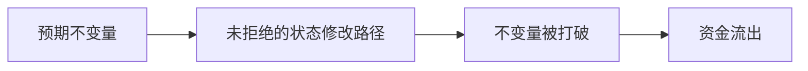
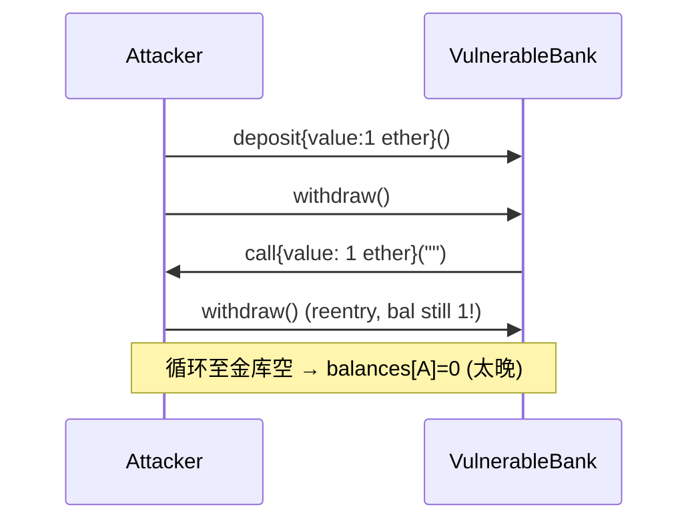
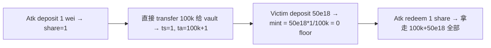
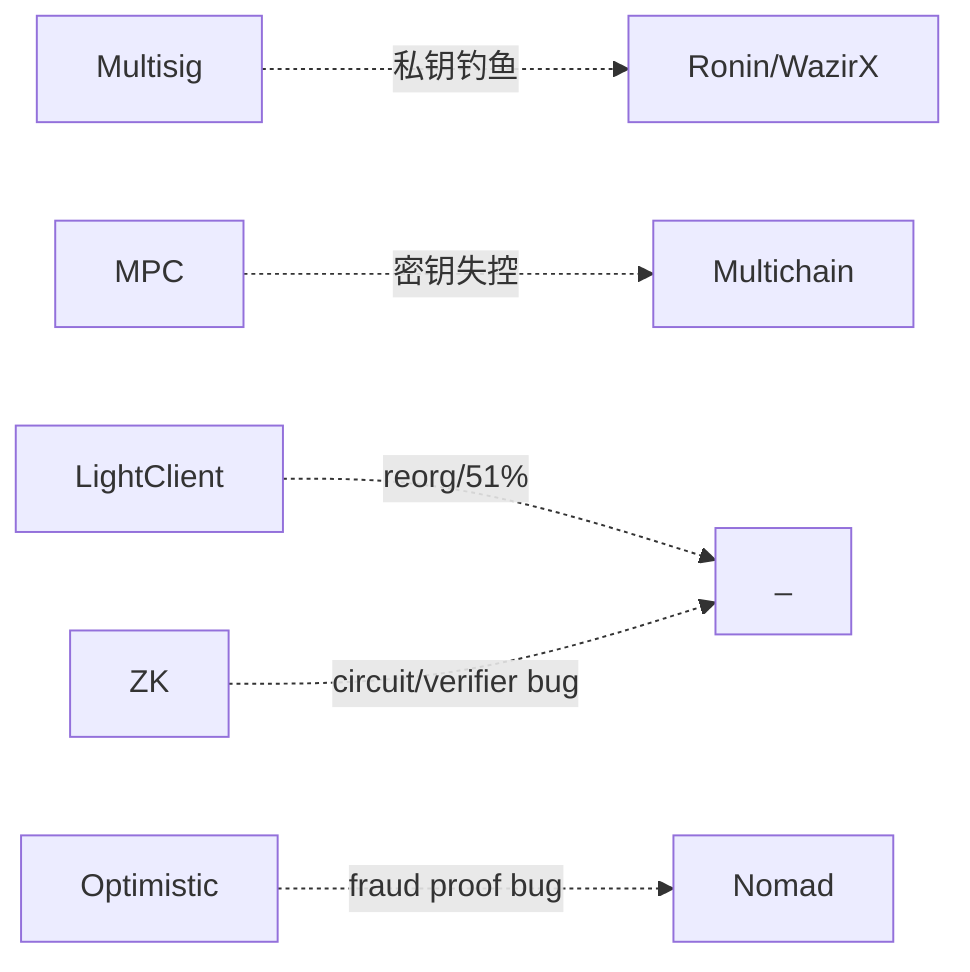
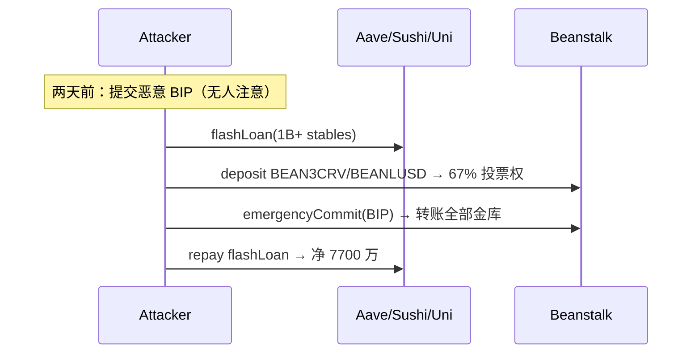
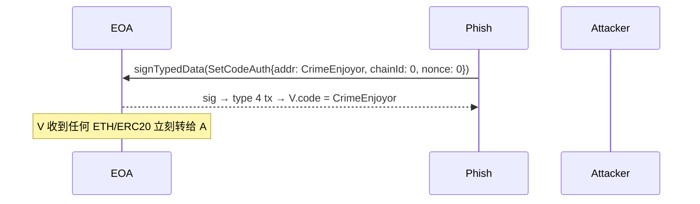
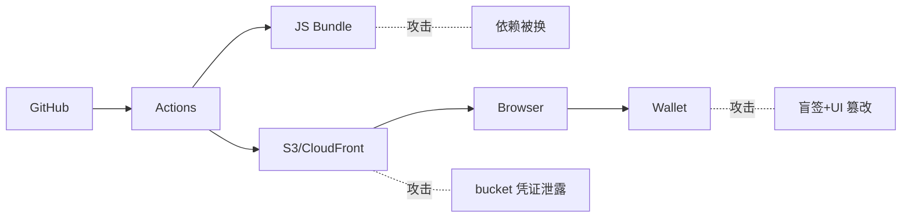
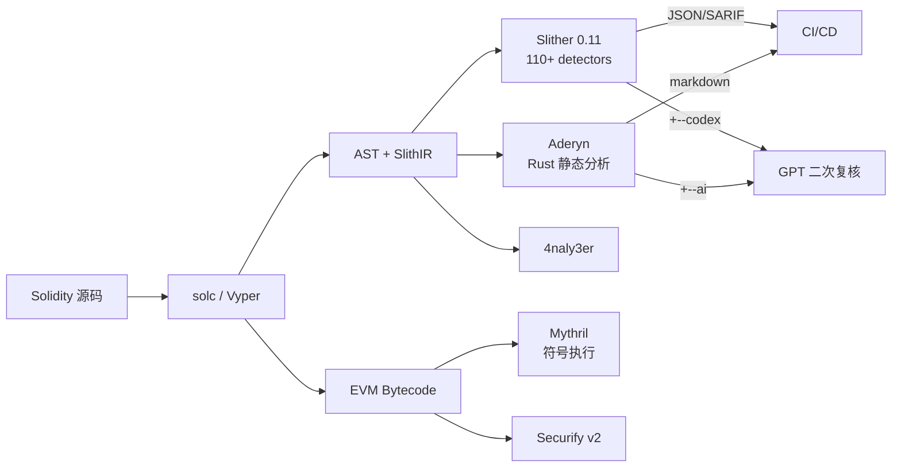
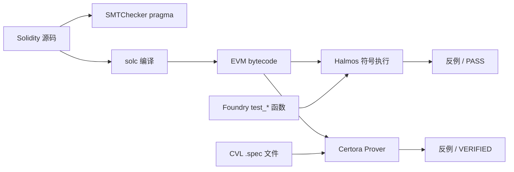

# 模块 05 · 智能合约安全

> 阅读 8h，动手 40h（必须打通 PoC + 练习）。文献截至 2026-04-27，金额按事件当日 USD 计价。

---

## 0. 目录与学习路径

漏洞章节统一四段式：**漏洞描述 → PoC → 影响 → 修复**。

| 章 | 标题 | 核心问题 |
|---|---|---|
| 1 | 安全心法 | 攻击者三问 / 经济学 / 不变量思维 |
| 2 | 重入家族 | classic / cross-fn / cross-contract / read-only / transient + Vyper 0day + Phantom function |
| 3 | 预言机操纵 | spot / TWAP / Chainlink / Pyth / median 攻击 |
| 4 | 访问控制 | initialize / proxy admin / multisig 盲签 + Bybit 完整链 |
| 5 | 签名安全 | replay / 0 地址 / EIP-712 / Permit2 钓鱼 |
| 6 | 算术与精度 | overflow / ERC4626 inflation / 边界精度 / shift wrap |
| 7 | DoS 与 gas griefing | unbounded loop / push / 64/64 |
| 8 | Front-running / MEV | sandwich / commit-reveal / 私 mempool |
| 9 | 可升级性陷阱 | UUPS / Transparent / Beacon / Diamond / slot collision |
| 10 | 跨链桥 | light client / multisig / MPC / optimistic / zk |
| 10A | 治理攻击 | Beanstalk 闪电贷投票 |
| 11 | 合规风险 | OFAC / Tornado Cash |
| 11.3 | ERC-4337 攻击 | paymaster drain / bundler DoS / module 钓鱼 |
| 11.4 | EIP-7702 攻击 | CrimeEnjoyor sweeper / chainId=0 重放 |
| 11.5 | Liquid Restaking | cross-AVS 串谋 / cascade / LRT staleness |
| 11.6 | DA / L2 风险 | blob 拥堵 / sequencer 审查 |
| 11.7 | 前端供应链 | DNS / S3 / NPM / Action / ENS |
| 12 | 静态分析 | Slither 0.11.5 / Aderyn / 4naly3er / Mythril |
| 13 | 模糊测试 | Foundry / Echidna 2.2 / Medusa 1.x |
| 14 | 形式化验证 | Halmos 0.3.3 / Certora / SMTChecker |
| 15 | 审计方法论 | STRIDE-DeFi / actor map / invariant / 报告模板 |
| 16 | 竞赛与赏金 | Code4rena / Sherlock / Cantina / DVDv4 |
| 17 | AI 审计 + MEV-Share + 监控 | Olympix / Sherlock AI / Forta / OZ Defender |
| 18 | 习题 | 10 题分级 |
| 19 | 模块连接 | 04 / 06 / 10 / 11 / 12 |

学习路径：
- **新手**：1 → 2 → 4 → 5 → 6 → 10A → 13 → 16
- **审计师**：全部 + DVD v4 + Capture the Ether
- **协议工程师**：1 → 2、3、6、7、8 重点；11、12 当日常工程

---

## 0.5 一表纵览：2022-2026 大额事件年表

| 时间 | 事件 | 损失 (USD) | 攻击范式 | 章节 | 主要参考 |
|---|---|---|---|---|---|
| 2022-02-02 | **Wormhole** | 3.20 亿 | 跨链桥 / Solana sysvar 验证绕过 | §10 | [Halborn](https://www.halborn.com/blog/post/explained-the-wormhole-hack-february-2022) |
| 2022-03-29 | **Ronin Bridge #1** | 6.25 亿 | 跨链桥 / 验证者私钥钓鱼 | §10 | [Ronin 复盘](https://roninchain.com/blog/posts/back-to-building-ronin-security-breach-6513cc78a5edc1001b03c364) |
| 2022-04-17 | **Beanstalk** | 1.81 亿 (净 7700 万) | 治理 / 闪电贷投票 | §10A | [Halborn](https://www.halborn.com/blog/post/explained-the-beanstalk-hack-april-2022) |
| 2022-08-01 | **Nomad** | 1.90 亿 | 桥 / trusted root = 0 | §10 | [Immunefi](https://medium.com/immunefi/hack-analysis-nomad-bridge-august-2022-5aa63d53814a) |
| 2022-10-06 | **BNB Bridge** | 5.70 亿 | 桥 / merkle 伪造 | §10 | rekt.news |
| 2022-10-11 | **Mango Markets** | 1.16 亿 | Oracle / 现货拉盘 | §3 | [CFTC](https://www.cftc.gov/PressRoom/PressReleases/8647-23) |
| 2023-03-13 | **Euler Finance** | 1.97 亿 (已归还) | 借贷 / donateToReserve + self-liq | §6 | [Cyfrin](https://www.cyfrin.io/blog/how-did-the-euler-finance-hack-happen-hack-analysis) |
| 2023-07-06 | **Multichain** | 1.26 亿+ | 桥 / MPC 私钥失控 | §10 | [Halborn](https://www.halborn.com/blog/post/explained-the-multichain-hack-july-2023) |
| 2023-07-30 | **Curve / Vyper 0day** | 7000 万 | Vyper 编译器 reentrancy guard 失效 | §2 | [Hacken](https://hacken.io/discover/curve-finance-liquidity-pools-hack-explained/) |
| 2023-09-23 | **Mixin Network** | 2.00 亿 | 云数据库私钥盗窃 | §4 | [TechCrunch](https://techcrunch.com/2023/09/25/hackers-steal-200-million-from-crypto-company-mixin/) |
| 2023-11-10 | **Poloniex** | 1.20 亿 | 私钥盗窃（Justin Sun 系列）| §4 | [CryptoPotato](https://cryptopotato.com/tron-founder-justin-sun-confirms-exploit-on-htx-and-heco-cross-chain-bridge/) |
| 2023-11-22 | **HTX + Heco Bridge** | 1.13 亿 | 桥 / 私钥泄露 | §10 | [CoinDesk](https://www.coindesk.com/tech/2023/11/22/justin-sun-confirms-htx-heco-chain-exploited-after-100m-in-suspicious-transfers) |
| 2023-11-22 | **KyberSwap Elastic** | 4700 万 | 集中流动性 / tick 边界精度 | §6 | [Halborn](https://www.halborn.com/blog/post/explained-the-kyberswap-hack-november-2023) |
| 2023-12-31 | **Orbit Chain** | 8150 万 | 桥 / 7-of-10 多签私钥被盗 | §10 | [Halborn](https://www.halborn.com/blog/post/explained-the-orbit-bridge-hack-december-2023) |
| 2024-03-26 | **Munchables** | 6250 万 (已归还) | 内鬼 deployer / proxy 储槽劫持 | §4 | [CoinDesk](https://www.coindesk.com/tech/2024/03/27/munchables-exploited-for-62m-ether-linked-to-rogue-north-korean-team-member) |
| 2024-05-14 | **Sonne Finance** | 2000 万 | ERC4626 / Compound v2 fork inflation | §6 | [Halborn](https://www.halborn.com/blog/post/explained-the-sonne-finance-hack-may-2024) |
| 2024-05-31 | **DMM Bitcoin (JP)** | 3.05 亿 | 私钥泄露 / DPRK | §4 | [FBI](https://www.fbi.gov/news/press-releases/fbi-dc3-and-npa-identification-of-north-korean-cyber-actors-tracked-as-tradertraitor-responsible-for-theft-of-308-million-from-bitcoindmmcom) |
| 2024-06-10 | **UwU Lend** | 2300 万 | Oracle / 11 源 median 被多数操纵 | §3 | [QuillAudits](https://www.quillaudits.com/blog/hack-analysis/uwu-lend-hack) |
| 2024-07-18 | **WazirX** | 2.35 亿 | 多签 UI 篡改 + 盲签 / DPRK | §4 | [WazirX](https://wazirx.com/blog/preliminary-report-cyber-attack-on-wazirx-multisig-wallet/) |
| 2024-08-06 | **Ronin Bridge #2** | 1200 万 (white hat) | initialize 未运行致 vote weight = 0 | §4/§10 | [Halborn](https://www.halborn.com/blog/post/explained-the-ronin-network-hack-august-2024) |
| 2024-09-03 | **Penpie / Pendle** | 2735 万 | 重入 + 无许可 market 注册 | §2 | [Halborn](https://www.halborn.com/blog/post/explained-the-penpie-hack-september-2024) |
| 2024-09-11 | **Indodax** | 2200 万 | 热钱包 / DPRK 嫌疑 | §4 | [Bitcoinist](https://bitcoinist.com/crypto-hack-indonesias-indodax-goes-offline-after-suspected-22m-breach/) |
| 2024-09-20 | **BingX** | 4470 万 | 热钱包 / DPRK 嫌疑 | §4 | [CoinDesk](https://www.coindesk.com/tech/2024/09/20/crypto-exchange-bingx-hacked-onchain-data-shows-over-43m-drained) |
| 2024-10-16 | **Radiant Capital** | 5300 万 | 多签 + Ledger 盲签 | §4 | [Halborn](https://www.halborn.com/blog/post/explained-the-radiant-capital-hack-october-2024) |
| 2025-02-21 | **Bybit** | 14.6 亿（401k ETH） | Safe{Wallet} S3 供应链 + 盲签 / DPRK | §4 | [Hacker News](https://thehackernews.com/2025/02/bybit-hack-traced-to-safewallet-supply.html) |
| 2025-05-22 | **Cetus（Sui）** | 2.23 亿 | u256 `checked_shlw` 溢出 / 仅 1 行 | §6 | [BlockSec](https://blocksec.com/blog/cetus-incident-one-unchecked-shift-drains-223m-largest) |

> **金额说明**：所有金额按事件发生当日 USD 计价，引用自首发媒体或官方 post-mortem。同一事件不同来源可能在 ±10% 区间波动；本表取业内被广泛引用的中位数。检索日期：2026-04-27。所有 URL 在该日期可访问。

从 2024 起，人因（私钥被钓 / UI 被劫 / 内鬼）的损失已远超合约层 bug。Ledger、AWS S3、招聘流程都是攻击面。

---

## 1. 安全心法

前置依赖：04-Solidity 模块的 `storage layout`、`delegatecall`、`call` 语义、gas 模型。

### 1.1 攻击者只问三个问题

1. **谁能动这笔钱？**（access control / signature / proxy admin）
2. **价格是怎么算的？**（oracle / accounting / share price）
3. **状态在什么时候被信任？**（reentrancy / front-running / atomicity）

SWC Registry 37 类漏洞都是这三问的排列组合。

### 1.2 攻击者经济学（Web3 独有）

- **TVL 即赏金池**：Curve 7 亿 TVL 让 Vyper 0day 值数百万。
- **闪电贷把资本成本归零**：UwU Lend 攻击者一笔同时借 37.96 亿美元（[QuillAudits](https://www.quillaudits.com/blog/hack-analysis/uwu-lend-hack)）。
- **赎金博弈**：Euler 归还 1.97 亿、Poly Network 归还 6.11 亿。10% bounty 即可触发谈判。
- **DPRK 国家级威胁**：DMM Bitcoin 3.08 亿、Bybit 14.6 亿（[FBI](https://www.fbi.gov/news/press-releases/fbi-dc3-and-npa-identification-of-north-korean-cyber-actors-tracked-as-tradertraitor-responsible-for-theft-of-308-million-from-bitcoindmmcom)，[NCC Group](https://www.nccgroup.com/research/in-depth-technical-analysis-of-the-bybit-hack/)），愿意烧 6 个月做社工。

### 1.3 不变量思维

**不变量** = 任何合理状态下恒为真的命题，与调用序列无关。

ERC20：`sum(balances) == totalSupply`；`transfer(a,b,x)` 不改变 totalSupply；只有 mint/burn 能改 totalSupply。

借贷协议：`totalDebt ≤ totalCollateralValue × maxLTV`；`healthFactor < 1 ⇒ 可清算`；`protocolEquity ≥ 0`。

**漏洞本质 = 找到打破不变量但合约不 revert 的路径**。写出 invariant → fuzz/形式化证明 → 找出未拒绝的状态修改路径。



---

## 2. 重入攻击家族

### 2.1 漏洞描述

`call` 是执行权移交。对方拿到 CPU 可反调你，此时"未更新的状态"在他眼里仍是真的。漏洞数学：

$$
\text{Interact}(s_t, v(s_t));\quad s_{t+1} = \text{Effect}(s_t)
$$

正确的 CEI 顺序应为先 Effect 后 Interact。重入 = **状态可观察性与状态正确性的时序冲突**。

四个变种：① 单函数（The DAO）；② 跨函数（共享 storage 但锁不同）；③ 跨合约（ERC-777/1155/721 receive hook）；④ 只读（view 函数读到脏状态用于定价）。

### 2.2 PoC



漏洞合约：

```solidity
function withdraw() external {
    uint256 bal = balances[msg.sender];
    require(bal > 0, "no balance");
    (bool ok, ) = msg.sender.call{value: bal}("");
    require(ok, "send fail");
    balances[msg.sender] = 0;  // 状态更新晚于外部调用
}
```

攻击合约：

```solidity
contract ReentrancyAttacker {
    VulnerableBank public immutable bank;
    constructor(VulnerableBank _bank) payable { bank = _bank; }
    function pwn() external payable { bank.deposit{value: 1 ether}(); bank.withdraw(); }
    receive() external payable {
        if (address(bank).balance >= 1 ether) bank.withdraw();
    }
}
```

完整代码：`code/vulnerable/Reentrancy.sol`、`code/attack/ReentrancyAttack.sol`、`code/test/Reentrancy.t.sol`。`forge test --match-contract ReentrancyTest -vvv`。

### 2.3 影响

| 事件 | 日期 | 损失 | 子类 |
|---|---|---|---|
| The DAO | 2016-06-17 | 6000 万美元（360 万 ETH） | 单函数 → ETH/ETC 硬分叉 |
| Lendf.Me | 2020-04-19 | 2500 万美元 | 跨函数（imBTC ERC-777 hook） |
| Cream Finance | 2021-08-30 | 1900 万美元 | 跨合约（AMP ERC-777） |
| dForce | 2023-02 | 3700 万美元 | 只读（Curve `get_virtual_price`，[CertiK](https://www.certik.com/resources/blog/curve-conundrum-the-dforce-attack-via-a-read-only-reentrancy-vector-exploit)） |
| Curve（Vyper 0day） | 2023-07-30 | 7000 万美元 | 编译器层（见 §2.5） |
| Penpie / Pendle | 2024-09-03 | 2735 万美元 | 跨合约（[Halborn](https://www.halborn.com/blog/post/explained-the-penpie-hack-september-2024)） |

### 2.4 修复

**修复 1：CEI 顺序**

```solidity
function withdraw() external nonReentrant {
    uint256 bal = balances[msg.sender];
    require(bal > 0, "no balance");
    balances[msg.sender] = 0;                       // Effect
    (bool ok, ) = msg.sender.call{value: bal}("");  // Interact
    require(ok, "send fail");
}
```

**修复 2：跨函数 / 跨合约**——所有改 storage 的 external 函数共用同一 `nonReentrant`；接收 ERC-777/1155 token 视为 untrusted；router/comptroller 层加协议级锁。

**修复 3：只读重入**——OZ 5.x 用 `_reentrancyGuardEntered()` 让 view 也能 revert；调用前先 `withdraw(0)` 强制结清；价格用 TWAP 不用 spot。

**修复 4：Transient storage（EIP-1153，Cancun，OZ 5.1 `ReentrancyGuardTransient`）**——单 tx 内 lock 自动清，gas ~5000 → ~200：

```solidity
modifier nonReentrant() {
    assembly { if tload(ENTERED_SLOT) { revert(0,0) } tstore(ENTERED_SLOT, 1) }
    _;
    assembly { tstore(ENTERED_SLOT, 0) }
}
```

注意：transient storage 在同一 tx 内**跨子调用共享**（lock 前提，也是 nested call slot 碰撞污染源——见 04 模块 §1.7.1）；分多 tx 的 batch（如 Pendle）仍需 storage lock。

### 2.5 编译器层变体：Vyper 0day（2023-07-30，7000 万美元）

**漏洞**：Vyper **0.2.15 / 0.2.16 / 0.3.0** 的 `@nonreentrant("lock")` 装饰器对相同 lock 名在不同函数里**计算出不同 slot 哈希**——审计师默认"同名同锁"的 Solidity 心智模型在 Vyper 失效（[LlamaRisk](https://hackmd.io/@LlamaRisk/BJzSKHNjn)）。

**PoC**：`add_liquidity`（lock slot 0x00）→ ETH 退款触发 attacker receive → 调 `remove_liquidity_one_coin`（lock slot 0x02，不冲突）→ 按脏 reserves 算膨胀赎回。

**影响**：pETH/ETH 1100 万、msETH/ETH 340 万、alETH/ETH 2260 万、CRV/ETH 5300 万；合计约 7000 万（部分被 c0ffeebabe.eth 白帽夹回）。

**修复 / 教训**：① 依赖编译器 attribute 的 lock 必须 formal 证明"任意两个 nonreentrant 函数互斥"；② 多版本编译做 byte diff，slot 分配差异报警；③ 锁住 compiler 版本 + CI 校验二进制 SHA256；④ "编译器/库本身可信"必须显式写入 trust assumption。

### 2.6 Phantom Function（亿万美元 No-op）

**漏洞**：目标合约没有定义该函数，但 fallback 静默返回成功，调用者以为成功实则 no-op（[Dedaub](https://dedaub.com/blog/phantom-functions-and-the-billion-dollar-no-op/)）。

**PoC**：

```solidity
IERC20Permit(token).permit(owner, spender, value, deadline, v, r, s); // 没实现 → fallback no-op
IERC20(token).transferFrom(owner, address(this), value);              // 走历史 unlimited allowance
```

用户若之前给过 router unlimited approve，phantom permit 没生效但 transferFrom 仍成功。

**影响**：Multichain anyswap-v4-router（2022-01-18，PoC 阶段）；WETH9 无 permit 但多数 router 假设有，Dedaub 估算潜在风险数十亿。Nomad（§10.3）是同模式的桥版。

**修复**：① ERC165 / 显式 selector 检查 + `staticcall DOMAIN_SEPARATOR()`；② OZ `SafeERC20.safePermit`；③ 不混用 permit + transferFrom，二选一（Permit2 或 approve 路径）。

---

## 3. 预言机操纵

### 3.1 漏洞描述

直接读 DEX `getReserves()` 作价格 → 闪电贷一笔 swap 拉任意比例。Uniswap V2 invariant $x \cdot y = k$，投入 $\Delta x$ 后：

$$
p' = \frac{xy}{(x+\Delta x)^2}
$$

把价格拉 $k\times$ 所需资本 $\Delta x = (\sqrt{k}-1) \cdot x$；闪电贷把资本成本归零，只剩 V2 0.3% 手续费 $0.003\Delta x$。**池子流动性 / 受害协议 TVL < 0.5% 时攻击必盈利**。

四类失效模式：① spot 估值；② TWAP 窗口太短（短期 depeg / 多块持续攻击）；③ Chainlink 缺 staleness/`answer > 0` 检查；④ Median oracle 大多数源可操纵（UwU Lend：11 源中 5 个 Curve 池可控，扰动 6 个即可）。

### 3.2 PoC

```mermaid
sequenceDiagram
    participant A as Attacker
    participant L as Aave (闪电贷)
    participant D as DEX (低流动)
    participant V as Victim Lending
    A->>L: flashLoan(1B USDC)
    A->>D: swap → MNGO，spot price 10x
    A->>V: deposit MNGO; borrow ALL（V 读 D spot）
    A->>D: swap MNGO back; A->>L: repay
```

漏洞合约（`code/vulnerable/Oracle.sol`）：

```solidity
function spotPrice() public view returns (uint256) {
    (uint112 r0, uint112 r1, ) = pricePair.getReserves();
    return uint256(r1) * 1e18 / uint256(r0);
}
function borrow(uint256 amt) external {
    uint256 collValueInDebt = collateralBal[msg.sender] * spotPrice() / 1e18;
    require(debtBal[msg.sender] + amt <= collValueInDebt * 7500 / 10_000, "LTV");
}
```

### 3.3 影响

| 事件 | 日期 | 损失 | 关键技术 |
|---|---|---|---|
| bZx #1 | 2020-02-15 | 35 万美元 | 第一例闪电贷 + spot |
| Harvest Finance | 2020-10-26 | 3400 万美元 | Curve y pool spot 估值 |
| Cream Finance | 2021-10-27 | 1.3 亿美元 | yUSD vault 估值（[Halborn](https://www.halborn.com/blog/post/explained-the-cream-finance-hack-october-2021)） |
| Mango Markets | 2022-10-11 | 1.16 亿美元 | MNGO/USDC 现货拉盘借自己（[CFTC](https://www.cftc.gov/PressRoom/PressReleases/8647-23)；2025-05 联邦法官撤销刑事判决，[TRM](https://www.trmlabs.com/resources/blog/breaking-federal-judge-overturns-all-criminal-convictions-in-mango-markets-case-against-avraham-eisenberg)） |
| Inverse Finance | 2022-04-02 | 1560 万美元 | INV/DOLA TWAP 短窗 |
| UwU Lend | 2024-06-10 | 2300 万美元 | 11 源 median 过半数 Curve 池（[QuillAudits](https://www.quillaudits.com/blog/hack-analysis/uwu-lend-hack)） |
| Compound DAI 闪现 | 2020-11 | 9000 万美元清算 | Coinbase Pro 单源 + 无 circuit breaker |

### 3.4 修复

**修复 1：Chainlink push oracle**——4 项必检（`code/patched/Oracle.sol`）：

```solidity
function safePrice() public view returns (uint256) {
    (uint80 rid, int256 ans, , uint256 updatedAt, uint80 answeredIn) = feed.latestRoundData();
    if (ans <= 0) revert BadPrice();                                 // ① 负 / 零价
    if (answeredIn < rid) revert StalePrice();                       // ② round 一致（旧 feed 兼容）
    if (block.timestamp - updatedAt > heartbeat) revert StalePrice();// ③ 新鲜度（ETH/USD 3600s, USDC/USD 86400s）
    return uint256(ans) * 10 ** (18 - feed.decimals());              // ④ decimals 归一
}
```

注：Aave V3 `CLSynchronicityPriceAdapter` 已弱化 `answeredInRound`，新代码以 `updatedAt + answer > 0` 为主。

**修复 2：TWAP**——Uniswap V3 `observe()` 取 ≥ 30min 累积 tick；持续操纵每块 0.3% 手续费 + 套利反推，总成本约 $\Delta x$ 量级，不再免费。**TWAP 不防短期 depeg，需配合 deviation 熔断**。

**修复 3：Pyth pull oracle**——必用 `getPriceNoOlderThan(feedId, 60)`，过滤 conf 区间（`conf/price < 1%`，`* 100` 是常用阈值；`* 10000` 在 thin liquidity 时段会全部 revert）。

**修复 4：架构层**——① 长尾资产降低 LTV 上限；② Median oracle 至少 (n/2)+1 源攻击成本独立；③ deviation > X% 熔断走 keeper；④ 监控 §17.7。

操纵成本工具：[DefiLlama Pool Liquidity](https://defillama.com)、[Tenderly Simulator](https://tenderly.co)、fork mainnet `swap` 测前后差异。

---

## 4. 访问控制与初始化

### 4.1 漏洞描述

四个核心问题：**谁能调？谁能改 owner？谁验证 owner 没被偷？升级后状态是否一致？**

四类失效：① init 无 onlyOnce / 无 guard（Parity 1）；② library 未 init 任意人 init 后 kill（Parity 2）；③ proxy admin slot 被 deployer 劫持（Munchables）；④ 多签 UI 钓鱼 + Ledger 盲签（Bybit / WazirX / Radiant）；⑤ 升级未运行 initialize 致 vote weight=0（Ronin #2）。

```solidity
// 失效模式速查
function init(address _admin) external { admin = _admin; }    // ① 任何人 / 多次
contract Logic { constructor(address _a) { admin = _a; } }    // ② proxy 不调 constructor
function destroy() external { selfdestruct(payable(msg.sender)); }  // ③ 暴露 selfdestruct
mapping(address => bool) public isAdmin;                      // ④ 不可枚举不可 revoke
```

### 4.2 PoC

```solidity
// 漏洞（code/vulnerable/AccessControl.sol）
contract VulnerableProxyImpl {
    address public admin;
    function init(address _admin) external { admin = _admin; }  // 任意人 init
    function selfDestructIt() external {
        require(msg.sender == admin, "not admin");
        selfdestruct(payable(msg.sender));
    }
}
```

### 4.3 影响

| 事件 | 日期 | 损失 | 模式 |
|---|---|---|---|
| Parity Multisig 1 | 2017-07-19 | 3000 万美元 | `initWallet` 暴露给所有人 |
| Parity Multisig 2 | 2017-11-06 | 1.55 亿（51.4 万 ETH 永冻） | library 未 init → devops199 init 后 kill（[CNBC](https://www.cnbc.com/2017/11/08/accidental-bug-may-have-frozen-280-worth-of-ether-on-parity-wallet.html)） |
| Audius | 2022-07-23 | 600 万美元 | proxy storage hijack |
| Munchables | 2024-03-26 | 6250 万（已归还） | 内鬼 DPRK deployer + proxy 储槽（[CoinDesk](https://www.coindesk.com/tech/2024/03/27/munchables-exploited-for-62m-ether-linked-to-rogue-north-korean-team-member)） |
| WazirX | 2024-07-18 | 2.35 亿美元 | Liminal UI 篡改 + 盲签 |
| Ronin #2 | 2024-08-06 | 1200 万（white hat） | v3 升级 initialize 未跑 / `_totalOperatorWeight=0` 致 0 票通过 |
| Radiant Capital | 2024-10-16 | 5300 万美元 | multisig 私钥 + UI 篡改 |
| Bybit | 2025-02-21 | 14.6 亿美元（401k ETH） | Safe{Wallet} S3 供应链 + 盲签（详见 §4.5） |

### 4.4 修复

```solidity
contract SafeProxyImpl is Initializable {
    address public admin;
    constructor() { _disableInitializers(); }   // implementation 永远不能被 init
    function initialize(address _admin) external initializer { admin = _admin; }
    // 故意不写 selfdestruct
}
```

8 条防御清单：

1. **OZ Initializable + `_disableInitializers()`**（implementation constructor）。
2. **角色分离 + AccessControlEnumerable**：deployer ≠ owner ≠ pauser ≠ feeReceiver。
3. **Timelock ≥ 48h**：所有 admin 操作走 onchain queue。
4. **冷热分离**：hot wallet 只动小额，大额走 timelock。
5. **Clear Signing**：硬件钱包必须能解码 calldata；不解码不签。复核工具：[Tenderly Simulator](https://tenderly.co/transaction-simulator)、[calldata.swiss-knife.xyz](https://calldata.swiss-knife.xyz/)、[openchain.xyz](https://openchain.xyz/signatures)。
6. **前端供应链入审计 scope**：build pipeline / CDN bucket / npm 包（Bybit 教训）。
7. **升级后状态校验**：onchain state 与预期一致，否则自动暂停（Ronin #2 教训）。
8. **EIP-6780（Cancun）≠ 安全网**：selfdestruct 在非创建 tx 只清 ETH 余额，但 Munchables 证明 deployer 可直接改 implementation 改 storage——**selfdestruct 限制不能让你忽略 deployer/admin 权力**。

### 4.5 Bybit 案完整攻击链（2025-02-21，14.6 亿美元）

来源：[Sygnia](https://www.sygnia.co/blog/sygnia-investigation-bybit-hack/)、[Wiz](https://www.wiz.io/blog/north-korean-tradertraitor-crypto-heist)、[FBI IC3 PSA 250226](https://www.ic3.gov/psa/2025/psa250226)、[NCC Group](https://www.nccgroup.com/research/in-depth-technical-analysis-of-the-bybit-hack/)、[BleepingComputer](https://www.bleepingcomputer.com/news/security/lazarus-hacked-bybit-via-breached-safe-wallet-developer-machine/)。

```mermaid
timeline
    title Bybit Heist（DPRK / TraderTraitor / UNC4899）
    数月前 : 假招聘 + 钓鱼 macOS dev → Safe.global 工程师中招
    2025-02-04 : macOS RAT 持久化
    2025-02-17 : AWS C2 上线
    2025-02-19 15:29 UTC : 替换 app.safe.global S3 JS（仅对 Bybit cold wallet 生效）
    2025-02-21 14:13 UTC : Bybit 运维签"调度 tx"，Ledger 显示 hex，多签通过 → 401k ETH 流出
    2025-02-21 14:15 UTC : S3 JS 复原（抹痕）
    2025-02-26 : FBI 归因 TraderTraitor / Lazarus
    2025-03-20 : 86.29% ETH 已洗成 BTC（Ben Zhou 确认）
```

**攻击面（按层）**：① DPRK 假面试木马；② macOS 开发机被持久化拿到 AWS 凭证；③ S3 JS 不签名不校验完整性；④ 恶意 JS 仅对 `signerAddress === BYBIT_COLD_WALLET` 生效；⑤ Ledger 不解析 Safe `execTransaction` 嵌套 calldata，运维盲签；⑥ tx 后 2 分钟 JS 复原。

**结构性缺陷**：① 前端完整性不在传统威胁模型；② Safe `execTransaction` 嵌套 calldata × Ledger 5 行屏幕 = 盲签必然；③ DPRK 愿烧 6 个月做长线社工。

**社区响应**：Safe 强制 `transactionGuard` + Tenderly Simulator；Ledger 推 Clear Signing；交易所改 Fireblocks/Copper 独立验证终端；WalletConnect transaction risk score 插件。

---

## 5. 签名安全

### 5.1 漏洞描述

签名安全 = **5W**：Who（signer）+ What（typed struct）+ Where（domain：chainId+verifyingContract）+ When（deadline）+ Why-not-twice（nonce）。缺一漏一。

四类坑：① 重放（跨链/合约/时刻）；② 0 地址陷阱（`ecrecover` 失败时返回 `address(0)`，若 `signer = address(0)` 则任意签名通过）；③ malleability（ECDSA $(r,s)$ 与 $(r,n-s)$ 等价，EIP-2 要求 $s < n/2$）；④ EIP-712 误用（缺 chainId/verifyingContract）。

### 5.2 PoC

```mermaid
sequenceDiagram
    participant V as 受害者
    participant F as 钓鱼站
    participant A as 攻击者
    participant T as ERC20(permit)
    F->>V: signTypedData(permit, owner=V, spender=A, value=MAX)
    V-->>F: sig（无 tx 上链，钱包不警告）
    F->>A: 转发 sig
    A->>T: permit(V, A, MAX, sig); transferFrom(V, A, balance)
```

漏洞合约（`code/vulnerable/Signature.sol`）：

```solidity
function claim(uint256 amount, uint8 v, bytes32 r, bytes32 s) external {
    bytes32 h = keccak256(abi.encodePacked(msg.sender, amount));
    bytes32 ethHash = keccak256(abi.encodePacked("\x19Ethereum Signed Message:\n32", h));
    address recovered = ecrecover(ethHash, v, r, s);
    require(recovered == signer, "bad sig");  // 缺 nonce/deadline/chainId/合约地址/s 低半区
    token.transfer(msg.sender, amount);
}
```

若 `signer == address(0)` 部署失误：`claim(任意 amount, 0, 0, 0)` → `ecrecover(...) == address(0) == signer` → 任意人 mint。`code/test/Signature.t.sol::test_ZeroSignerIsExploitable` 验证攻击 500 ether。

### 5.3 影响

| 事件 | 日期 | 损失 | 模式 |
|---|---|---|---|
| Poly Network | 2021-08-10 | 6.11 亿美元 | keeper pubkey 替换 + 跨链签名 |
| MonoX | 2021-11-30 | 3100 万美元 | swap from==to |
| Wormhole | 2022-02-02 | 3.2 亿美元 | Solana sysvar 校验绕过（详见 §10.2） |
| BNB Bridge | 2022-10-06 | 5.7 亿美元 | merkle proof 伪造 |
| PEPE Permit2 钓鱼 | 2024-09 | 139 万美元 / 笔（[Decrypt](https://decrypt.co/286076/pepe-uniswap-permit2-phishing-attack)） | EIP-2612/Permit2 链下签名 |
| fwdETH Permit2 钓鱼 | 2024-10 | 15,079 fwdETH（约 3600 万） | 同上 |
| 全年 Permit/Permit2 钓鱼 | 2024 | > 3 亿美元（ScamSniffer 累计） | 链下签名 |

### 5.4 修复

5 道防线（`code/patched/Signature.sol`）：

```solidity
contract SafeClaim is EIP712 {
    bytes32 private constant CLAIM_TYPEHASH =
        keccak256("Claim(address user,uint256 amount,uint256 nonce,uint256 deadline)");

    constructor(IERC20 _t, address _signer) EIP712("SafeClaim", "1") {
        require(_signer != address(0), "zero signer");          // ⑤ 拒 0 地址
        signer = _signer;
    }

    function claim(uint256 amount, uint256 deadline, bytes calldata sig) external {
        if (block.timestamp > deadline) revert Expired();        // ③ deadline
        uint256 nonce = nonces[msg.sender]++;                    // ② per-user nonce
        bytes32 structHash = keccak256(abi.encode(CLAIM_TYPEHASH, msg.sender, amount, nonce, deadline));
        bytes32 digest = _hashTypedDataV4(structHash);           // ① EIP-712 domain (chainId+verifyingContract)
        if (digest.recover(sig) != signer) revert BadSigner();   // ④ OZ ECDSA 拒高半区+0地址
        token.transfer(msg.sender, amount);
    }
}
```

跨链协议：把目标 chainId 编码进签名内容。前端：永远不让用户盲签 hex calldata。

**Permit2 钓鱼专项防御**：[Permit2](https://github.com/Uniswap/permit2) 把"approve 一次给 Permit2、之后签名授权第三方"标准化，但把钓鱼链路从"approve tx"变成"off-chain 签名"，用户感知更弱。
- 用户：[revoke.cash](https://revoke.cash) 撤 unlimited allowance；钱包升级到 Rabby / Frame / Coinbase（已解析 Permit2）；装 ScamSniffer / WalletGuard。
- 协议：前端 router 调用前询问"绑定到此次 swap 的 amount"，不默认 unlimited；签名展示"允许 X 在 Y 之前转走 Z"。

---

## 6. 算术与精度

### 6.1 漏洞描述

金额算法三问：① **方向**——round 向协议还是用户？② **顺序**——先乘后除（先除丢精度）；③ **单位**——1e18 vs 1e6 vs 1e8。

四类失效：① 整数溢出（pre-0.8、`unchecked`、`uintN(x)` 截断、assembly）；② ERC4626 inflation（首笔 deposit + donate 抬单价吞 victim）；③ 边界精度不一致（KyberSwap Elastic：`calcReachAmount` ≠ `calcFinalPrice`，swap=boundary-1 时 liquidity 不减）；④ 大类型 shift wrap-around（Cetus `checked_shlw` u256 左移静默回绕）。

### 6.2 PoC：ERC4626 Inflation

ERC4626 基本汇率 $\text{shares} = \text{assets} \cdot \text{totalShares} / \text{totalAssets}$，首笔 deposit 时 totalShares=0 走特例：



PoC：`code/vulnerable/Vault4626.sol` + `code/attack/Vault4626Attack.sol`；`forge test --match-test test_NaiveVault_inflationKillsVictim`。

### 6.3 影响

| 事件 | 日期 | 损失 | 子类 |
|---|---|---|---|
| BeautyChain BEC | 2018-04 | 凭空铸天文数字 | pre-0.8 整数溢出 `value * len`（[SECBIT](https://medium.com/secbit-media/a-disastrous-vulnerability-found-in-smart-contracts-of-beautychain-bec-dbf24ddbc30e)） |
| Euler Finance | 2023-03-13 | 1.97 亿（已归还） | `donateToReserve` + self-liq 舍入 |
| KyberSwap Elastic | 2023-11-22 | 4700 万美元 | tick 边界精度不一致（[Halborn](https://www.halborn.com/blog/post/explained-the-kyberswap-hack-november-2023)） |
| Sonne Finance | 2024-05-14 | 2000 万美元 | Compound v2 fork dead shares 不够（[Halborn](https://www.halborn.com/blog/post/explained-the-sonne-finance-hack-may-2024)） |
| Cetus（Sui）| 2025-05-22 | 2.23 亿美元 | `checked_shlw` u256 wrap-around，1 token → $10^{37}$ liquidity（[BlockSec](https://blocksec.com/blog/cetus-incident-one-unchecked-shift-drains-223m-largest)） |

### 6.4 修复

**修复 1：Solidity ≥ 0.8.x 默认 overflow check**；`unchecked` 块每个写注释证明安全；`uintN(x)` 截断 / assembly 仍无检查需手动 require。

**修复 2：ERC4626 virtual shares + decimals offset**（OZ 5.x，[blog](https://www.openzeppelin.com/news/a-novel-defense-against-erc4626-inflation-attacks)）：

```solidity
function _convertToShares(uint256 assets) internal view returns (uint256) {
    return (assets * (totalShares + 10 ** DECIMALS_OFFSET)) / (totalAssets() + 1);
}
```

vault 创建即有 $10^{\text{offset}}$ 虚拟 share + 1 虚拟 asset，攻击者要抬单价需捐 $10^{\text{offset}}$ 倍 victim 存款。**dead shares 不够**：① deployer 可 redeem 抽走；② Sonne Finance 用 dead shares 仍被攻。

**修复 3：明确 round direction** — OZ `Math.mulDiv(a, b, c, Rounding.Floor)`；deposit 用 floor、redeem 用 floor（始终向协议有利）。

**修复 4：形式化验证关键数学**（§14）— 用 Halmos / Certora 证明 `deposit_after.shares >= floor(expected)`、`shift_safe(x, n) ⟺ x.leading_zeros >= n`。复杂数学协议**单元测试与审计都不够**。

---

## 7. DoS 与 gas griefing

### 7.1 漏洞描述与 PoC

```solidity
// 1. unbounded loop（users.length 可被攻击者 pad）
function distributeAll() external {
    for (uint i = 0; i < users.length; i++) users[i].transfer(reward);
}

// 2. push 模式拒收 ETH（攻击者 fallback revert，后续 bidder 全部失败）
function bid() external payable {
    if (highest != address(0)) payable(highest).transfer(highestBid);
    highest = msg.sender; highestBid = msg.value;
}

// 3. external call 烧光 gas
target.call{gas: gasleft()}(data);
```

EIP-150 64/64 规则：外部调用最多拿到剩余 gas 的 63/64，留 1/64 给 caller revert——griefing 不会让 caller 整体 revert，但被调函数 OOG。

### 7.2 影响

| 事件 | 年 | 模式 |
|---|---|---|
| GovernMental | 2016 | push 模式还钱 array 跑不完，1100 ETH 永卡 |
| King of the Ether | 2016 | fallback revert 让国王不可换 |
| 多起 governance propose spam | 多次 | 小额质押刷提案让真实治理瘫痪 |

### 7.3 修复

- **pull over push**：用户自己 `claim()`，协议不遍历。
- **限制 array 长度**：`require(users.length <= MAX)`。
- **gas stipend**：`call{gas: 30_000}` 明确预留。
- **gas limit 不依赖外部**：避免 `call{gas: gasleft()}`，用固定值。

---

## 8. Front-running 与 MEV

### 8.1 漏洞描述

mempool 是公开拍卖场，searcher/builder 用更高 gas 抢先（front-run）、跟进（back-run）、夹击（sandwich）。**不是 bug，是 EVM 内禀属性**。

### 8.2 修复

| 策略 | 适用 | 代价 |
|---|---|---|
| 私有 mempool（Flashbots Protect / MEV-Share，详见 §17.6） | 大额 swap | 偶尔延迟 |
| Commit-reveal | 拍卖 / 抽奖 | UX 两步 |
| Slippage 严格化 | DEX swap | 太严会失败 |
| Timelock + batch auction | 治理 / 大额 | 实时性差 |
| TWAP 入场 | LP 大额加流动性 | 时间成本 |
| FRR（First-In, Fixed-Rate） | 永续合约定价 | 套利空间小 |

设计要点：① `deadline` 必须在合约内 require，不能给攻击者从 calldata 改；② slippage 必填，默认值不能 100%；③ MEV 友好协议（CowSwap / 1inch Fusion）batch 拍卖把 MEV 内部化分给用户。

---

## 9. 可升级性陷阱

### 9.1 漏洞描述

proxy 持有 storage、logic 提供代码。三类失效：① **Storage collision**——V2 layout 与 V1 不一致，旧数据被错误解释；② **UUPS 漏继承**——LogicV2 忘了 `is UUPSUpgradeable` 升级后 proxy 永久冻结；③ **proxy admin slot 劫持**（Munchables）。

```solidity
contract LogicV1 { address public owner; uint256 public balance; }
contract LogicV2 { uint256 public balance; address public owner; } // slot 0/1 互换
```

### 9.2 模式对比

| 模式 | 升级权 | gas | 适用 |
|---|---|---|---|
| Transparent | proxy 内 admin | 高（每 call 多一检查） | 不推荐新项目 |
| UUPS | implementation `_authorizeUpgrade` | 低 | OZ 推荐 |
| Beacon | 单点控制多 proxy | 中 | token factory |
| Diamond (EIP-2535) | 模块化 facet | 复杂 | 大型协议 |

### 9.3 影响

- **Audius** 2022-07-23，600 万美元：proxy storage 槽设计错误 + governance 提案修改。
- **Munchables** 2024-03-26，6250 万美元（详见 §4.3）：deployer 塞自定义 implementation 写 storage 再切回。

### 9.4 修复

- OZ Foundry plugin `Upgrades.upgradeProxy` 自动 storage layout diff，**每次升级必跑**。
- 升级后立即校验 onchain state（Ronin #2 教训）。
- proxy admin / deployer 与 owner 严格分离 + timelock。

---

## 10. 跨链桥风险

### 10.1 漏洞描述

桥 = "A 链 lock → B 链 mint"，mint 依赖证明（multisig / MPC / light client / optimistic / zk）。**桥的安全 = max(信任假设各环节)**——一环失守即资产消失。



### 10.2 PoC：两个范例

**Wormhole（2022-02-02，3.2 亿美元）**：19 guardian 多签未被攻破，但 `verify_signatures` 用了 deprecated `load_instruction_at`（未校验地址），攻击者塞入自控账户冒充 Solana sysvar，构造假"已签名 message"调 `complete_wrapped` mint 12 万 wETH。**Solana account confusion 是 EVM 工程师转 Solana 必须重学的攻击面**。

**Nomad（2022-08-01，1.9 亿美元）**：

```solidity
function initialize(...) public initializer {
    _committedRoot = bytes32(0);
    confirmAt[bytes32(0)] = 1;          // 0 被标记可信
}
function acceptableRoot(bytes32 _root) public view returns (bool) {
    return confirmAt[_root] != 0;       // 任何 root=0 的消息自动通过
}
```

300+ 地址在 2 小时内复制攻击 tx 集体洗劫（[Mandiant](https://cloud.google.com/blog/topics/threat-intelligence/dissecting-nomad-bridge-hack)）。

### 10.3 影响（2021-2026 完整谱系）

| 事件 | 日期 | 损失 | 桥类型 | 根因 |
|---|---|---|---|---|
| Poly Network | 2021-08-10 | 6.11 亿美元 | Multi-keeper | pubkey 替换（[Chainalysis](https://www.chainalysis.com/blog/poly-network-hack-august-2021/)） |
| Wormhole | 2022-02-02 | 3.20 亿美元 | Guardian 多签 | Solana sysvar 绕过 |
| Ronin Bridge #1 | 2022-03-29 | 6.25 亿美元 | 9 验证者多签 | 5/9 私钥钓鱼（DPRK） |
| Harmony Horizon | 2022-06-23 | 1.00 亿美元 | 2/5 多签 | 私钥泄露 |
| Nomad | 2022-08-01 | 1.90 亿美元 | Optimistic | trusted root=0 |
| BNB Bridge | 2022-10-06 | 5.70 亿美元 | IAVL light client | merkle proof 伪造 |
| Multichain | 2023-07-06 | 1.26 亿美元+ | MPC | CEO 被捕密钥失控 |
| Mixin Network | 2023-09-23 | 2.00 亿美元 | 中心化云 | DB 被攻破 |
| HTX + Heco | 2023-11-22 | 1.13 亿美元 | 多签 | 私钥泄露 |
| Orbit Chain | 2023-12-31 | 8150 万美元 | 7/10 多签 | DPRK 7 签名被盗 |
| Ronin Bridge #2 | 2024-08-06 | 1200 万（white hat） | 多签 | v3 升级未运行 initialize |

### 10.4 修复

**架构层（强→弱）**：
| 桥 | 模型 | 信任假设 |
|---|---|---|
| IBC (Cosmos) | Light client | 源链 1/3+1 honest validator（学院派最强） |
| Succinct / Polymer (zkIBC) | ZK light client | 密码学 + 1 prover |
| LayerZero v2 | DVN 网络 | 多 DVN + actor 经济（2024 后 EVM 主流） |
| Hyperlane v3 | ISM 模块化 | 协议自选 |
| Across | Optimistic + UMA OO | 14400s 挑战窗 |
| Wormhole | 19 guardian + NTT | 13/19 多签 |
| Axelar | Tendermint validator | 类 IBC |

**工程层 7 条**：
1. light client / zk 桥优于 multisig 桥。
2. rate limit + timelock：单笔 / 时间窗 cap（Polygon PoS bridge 教训）。
3. 监控（§17.7）：异常 mint 30 秒内自动 pause。
4. 多客户端：至少 2 个独立 relayer。
5. 冷钱包阈值：99% TVL 进冷（Bybit 1% 热是合理的）。
6. Clear Signing：硬件钱包必须解析 calldata。
7. 升级后立即 onchain state 校验（Ronin #2 教训）。

---

## 10A. 治理攻击

### 10A.1 漏洞描述

闪电贷把治理权变成租赁品。**核心 bug = 同一笔 tx 内 vote + execute，无 voting delay**。

### 10A.2 PoC：Beanstalk（2022-04-17，1.81 亿，净 7700 万）



来源：[Halborn](https://www.halborn.com/blog/post/explained-the-beanstalk-hack-april-2022)。

### 10A.3 影响

- **Beanstalk** 2022-04-17：1.81 亿美元（净 7700 万）。
- **MakerDAO MKR** 2020 研究模拟：75 万美元买够 MKR 即可毁灭 Maker，幸当时闪电贷规模不够。
- **Compound** 多次：propose spam 让真实提案排队卡死。
- **Curve / Convex / Aura**：投票权拍卖化 → 治理稳定性 = 投票权价格波动。

### 10A.4 修复

1. **Voting delay ≥ 24h**：提案提交到生效跨时间窗，闪电贷无法续期。
2. **Snapshot 投票权**：投票权按提案提交那一刻的余额（OZ Governor 默认）。
3. **Timelock 队列**：执行后再 48h 让社区 cancel。
4. **Veto / pause guardian**：紧急多签可 veto。
5. **Flash-loan-resistant token**：用 vote-escrowed（veCRV / veBAL），不用现货。

---

## 11. 合规风险：OFAC / Tornado Cash

### 11.1 时间线

| 日期 | 事件 |
|---|---|
| 2022-08-08 | OFAC 制裁 Tornado Cash 智能合约（[FTI](https://www.fticonsulting.com/insights/articles/cryptocurrency-mixer-tornado-cash-sanctioned-us-treasury-department)） |
| 2022-08 | Aave / dYdX 屏蔽 OFAC 列表地址 |
| 2024-11 | 第五巡回上诉法院推翻制裁（不可变合约不构成 IEEPA 意义上的"财产"，[Mayer Brown](https://www.mayerbrown.com/en/insights/publications/2024/12/federal-appeals-court-tosses-ofac-sanctions-on-tornado-cash-and-limits-federal-governments-ability-to-police-crypto-transactions)） |
| 2025-03-21 | OFAC 正式取消制裁（[Venable](https://www.venable.com/insights/publications/2025/04/a-legal-whirlwind-settles-treasury-lifts-sanctions)） |

### 11.2 工程师决策

- **前端层屏蔽**：geofence + Chainalysis OFAC API（不影响合约，减少法律风险）。
- **合约层不主动审查**：不写 blacklist——一旦写入，协议成中心化系统。
- **升级路径**：timelock + 多签留监管响应窗口。
- **Privacy 工具**：mixer / shielded 协议需了解 BSA/AMLA、FinCEN MSB；Roman Storm 案 / Tornado Cash 开发者起诉至今未结。

---

## 11.3 账户抽象（ERC-4337）攻击向量

### 11.3.1 漏洞描述

ERC-4337（2023-03）：2024 末 4000 万智能账户、1 亿+ UserOperations（[Hacken](https://hacken.io/discover/erc-4337-account-abstraction/)）。bundler 信 paymaster 余额、paymaster 信 wallet 签名、wallet 信 module 代码——任一环错可被利用。

| # | 攻击面 | 描述 |
|---|---|---|
| 1 | **Paymaster Drain** | `validatePaymasterUserOp` 没充分模拟，paymaster 兜底 gas |
| 2 | **Bundler DoS** | userOp simulation 通过但执行 revert，bundler 白付 gas |
| 3 | **Module install 钓鱼** | Safe/Kernel 模块化 wallet 安装"金库 module" |
| 4 | **userOp 重放** | 跨链 / 跨实体 nonce 复用 |
| 5 | **Signature aggregation 滥用** | aggregator 签名让一 sig 控多账户 |

### 11.3.2 PoC

```solidity
function validatePaymasterUserOp(...) external returns (bytes memory ctx, uint256 vd) {
    require(token.balanceOf(userOpSender) >= 1e18, "low balance"); // simulate 时余额够
    // simulate 与 execute 之间余额可被外部调用改变 → paymaster 兜底
    return ("", 0);
}
```

### 11.3.3 影响

- 2024-Q3 Pimlico 测试网 paymaster drain（Trail of Bits 内部 PoC）。
- Safe Module 安装钓鱼（DVD challenge "Backdoor" 模型，零散事件见 ScamSniffer）。

### 11.3.4 修复（EIP-7562 v0.7）

1. paymaster validation 不可访问外部 storage（不能 SLOAD 别人 balance）。
2. paymaster 必须 stake，违规 jailed N 块。
3. bundler 拒绝 simulate ≠ execute 的 userOp，维护 paymaster / aggregator / factory 三类 reputation。
4. wallet module 安装走 typed-data + 用户显式确认。
5. userOp nonce 含 entryPoint + chainId + sender，不可跨实体重放。

---

## 11.4 EIP-7702 攻击向量（Pectra 2025-05）

### 11.4.1 漏洞描述

EIP-7702 让 EOA 临时"借"合约代码（auth tuple 签名 → `setCode`）。**任何钓鱼签名都能让 EOA 变成攻击者控制的 wallet**。

| 攻击 | 机制 |
|---|---|
| Authorization replay | chainId=0 通配跨链重放（[arXiv 2512.12174](https://arxiv.org/abs/2512.12174)） |
| CrimeEnjoyor sweeper | 钓鱼签 7702 auth → 自动转账合约接管 EOA |
| Sponsor griefing | sponsor 替用户付 gas 被恶意 delegate 烧光 |
| Delegate 持久 storage | 7702 临时合约 storage 在 setCode 后留存当后门 |

### 11.4.2 PoC



### 11.4.3 影响

97% 的 EIP-7702 delegations 指向同一字节码"CrimeEnjoyor" sweeper（[Cryptopolitan](https://www.cryptopolitan.com/eip-7702-user-loses-1-54m-phishing-attack/)）：450,000+ 钱包被钓，单笔最大损失 154 万美元。[Wintermute 追踪](https://www.coindesk.com/tech/2025/06/02/post-pectra-upgrade-malicious-ethereum-contracts-are-trying-to-drain-wallets-but-to-no-avail-wintermute)实际盈利极低（被钓 EOA 多为空账户），但敞口惊人。

### 11.4.4 修复

- 钱包必须渲染 `SetCodeAuth` 内容（chainId / nonce / target bytecode 哈希）+ 红字警告。
- **永远不签 chainId = 0**（跨链通配 = 必然钓鱼）。
- [revoke.cash 7702 模块](https://revoke.cash/) 周期检查 EOA 是否被 delegate。
- 协议方把"sender 是否 delegated"当 untrusted 输入。
- **反向用法**：被攻击钱包的急救——比 sweeper bot 抢先把自己升级为可控合约（[allthingsweb3](https://allthingsweb3.com/resources/compromised-wallet-recovery-sweeper-bot-guide)），前提私钥未泄露 + 抢跑成功。

---

## 11.5 Liquid Restaking 风险（EigenLayer / Symbiotic / Karak）

### 11.5.1 漏洞描述

2025-04 EigenLayer 启用 slashing（[CoinDesk](https://www.coindesk.com/tech/2025/04/17/eigenlayer-adds-key-slashing-feature-completing-original-vision)），TVL ~150 亿美元、1500 operator、数十 AVS。**一份 ETH 同时撑 N 个 AVS，单点错误跨 AVS 连锁**。

三类风险：

1. **Cross-AVS 串谋**：$8M 总质押撑 10 AVS，每 AVS 锁 $2M。攻 1 AVS 收益 $2M、cost slash 50% = $4M（看似安全）。但同时攻 10 AVS：收益 $20M、cost 仍 $8M（stake 共享）。
2. **Slashing cascade**：A 在某 AVS slash 5% → 削其他 AVS 有效 stake → 触发它们各自的安全条件 → 又一轮 slash。
3. **LRT oracle staleness**：eETH/ezETH/weETH 汇率依赖 onchain oracle 更新累计 reward/penalty，oracle 滞后 → mint/redeem 套利（§3 oracle 操纵在 stake 域）。

参考：[ABC Money](https://www.abcmoney.co.uk/2025/06/restaking-wars-eigenlayer-vs-karak-vs-symbiotic-the-battle-for-shared-security-dominance/)、[AMBCrypto Risk Map](https://eng.ambcrypto.com/restaking-risk-map-how-slashing-cascades-could-hit-your-yield/)。

### 11.5.2 修复

- AVS 多元化监控：operator set 跨 AVS 集中 → 调权重。
- Slashing rate cap：单 AVS 单 epoch ≤ 5%。
- LRT mint/redeem timelock：≥ 1 epoch（24h+）让 oracle 追上。
- Insurance module：协议层保险池覆盖 cascade。

---

## 11.6 数据可用性（DA）与 L2 风险

### 11.6.1 漏洞描述

[Unaligned Incentives（2025-09）](https://arxiv.org/pdf/2509.17126) 实证：约 10 ETH 灌满 blob 容量让 Scroll/zkSync/Arbitrum/Base finality 延迟 579-1086 L1 块（30min - 4h）。Pectra 把 blob target 3→6（max 9）后压力略缓但攻击仍便宜。

四类：① Blob 拥堵；② Plasma/Validium DA 委员会扣留数据；③ 单 sequencer 审查；④ blob 定价滞后 5-64 块套利。

### 11.6.2 修复

- 跨 L2 协议威胁模型必须写"L2 finality 可被延迟到 4h+"。
- 大额 cross-rollup 等 L1 finality（~12min）+ 安全边际。
- 桥实现 force exit / escape hatch（Optimism `fault proof`、Arbitrum `outbox`）。
- L2 治理走 L1 timelock，不依赖 L2 sequencer 活性。

---

## 11.7 前端供应链攻击谱系（2022-2026）

### 11.7.1 影响

| 日期 | 事件 | 损失 | 层 |
|---|---|---|---|
| 2022-08 | Curve DNS（iwantmyname 注册商） | 57.3 万美元（[Cointelegraph](https://cointelegraph.com/explained/what-is-dns-hijacking-how-it-took-down-curve-finances-website)） | DNS / 注册商 |
| 2023-12-14 | Ledger `@ledgerhq/connect-kit` 注入 | 60 万美元（5h，所有 WalletConnect dApp） | NPM 依赖 |
| 2024-07-11 | Squarespace 域名迁移漏洞 | 数百万（220+ DeFi，[Decrypt](https://decrypt.co/239524/220-defi-protocols-risk-squarespace-dns-hijack)） | DNS / 注册商 |
| 2024-2025 | tj-actions/changed-files 多起 | — | GitHub Action |
| 2025-02-21 | Bybit Safe S3 JS（详见 §4.5） | 14.6 亿美元 | CDN / S3 |
| 多次 | ENS resolver 劫持、假冒钱包扩展 | NFT phishing | ENS / 浏览器扩展 |

### 11.7.2 修复（8 条）



1. **DNS**：DNSSEC + 监控 NS 变化（DNS-over-HTTPS 探针）。
2. **注册商**：双因素 + 独立邮箱（不与开发者混用）。
3. **CDN**：S3 版本控制 + 完整性校验；critical asset 用 [Subresource Integrity](https://developer.mozilla.org/docs/Web/Security/Subresource_Integrity)。
4. **NPM**：锁版本 + [npm provenance](https://docs.npmjs.com/generating-provenance-statements) + 定期 `npm audit signatures`。
5. **CI**：第三方 action 钉 commit SHA 而非 tag；用 [pinact](https://github.com/suzuki-shunsuke/pinact)。
6. **钱包**：Clear Signing 标准；强制 calldata 解码。
7. **监控**：Sentry/DataDog 监控前端 fetch 异常 + Web3Antivirus 探针。
8. **文化**：前端是金融基础设施，不是市场部的页面——onboarding 必讲。

---

## 12. 静态分析

### 12.0 定位

**静态分析 = 审计的雷达**。Slither 30 秒扫出已知漏洞模式，人脑留给业务逻辑。四类：
1. **AST/SlithIR**：Slither、Aderyn、4naly3er——快、易写自定义规则，只能匹配模式。
2. **符号执行**：Mythril、Manticore——慢、找深路径，false positive 高。
3. **抽象解释**：Securify、SolidityScan——精度居中。
4. **AI/LLM 增强**：Olympix、Sherlock AI、Aderyn AI——2024-2026 兴起，仍在演进。



### 12.1 Slither

Trail of Bits 出品，最新版 **0.11.5**（2025-01-16，[GitHub Releases](https://github.com/crytic/slither/releases)）。安装：

```bash
pip install slither-analyzer==0.11.5
slither --version
# slither 0.11.5
```

0.11.x 相对 0.10.x 的关键变化：
- 新增 `reentrancy-balance` detector（针对依赖 `address(this).balance` 做账的合约）。
- 新增 `unindexed-event-address`：地址类型 event 参数没 indexed 时索引器无法过滤。
- 支持 CLZ EVM opcode（Cancun 后引入）。
- 支持自定义 storage layout（用于 Diamond / 自定义 proxy）。
- 最低 Python 版本提升到 3.10。

跑全套检查：

```bash
slither . --filter-paths "lib|test" --json slither.json
```

配置文件 `code/slither/slither.config.json`：

```json
{
  "detectors_to_exclude": "naming-convention,solc-version,pragma",
  "filter_paths": "lib|node_modules|test",
  "fail_on": "medium",
  "json": "slither-report.json",
  "sarif": "slither.sarif"
}
```

SARIF 输出直接渲染到 GitHub Code Scanning。

**常用 detector top 10**（按命中率）：

1. `reentrancy-eth` / `reentrancy-no-eth`
2. `unchecked-transfer`
3. `arbitrary-send-eth`
4. `tx-origin`
5. `uninitialized-state`
6. `incorrect-equality`
7. `weak-prng`
8. `unprotected-upgrade`
9. `divide-before-multiply`
10. `events-access` / `events-maths`

### 12.1.1 Slither-MCP

Trail of Bits 2025-11 发布（[Security Boulevard](https://securityboulevard.com/2025/11/level-up-your-solidity-llm-tooling-with-slither-mcp/)），把 SlithIR、调用图、detector 结果暴露给 LLM agent：LLM query 精确控制流而非猜源码逻辑，Cursor / Claude Code / Continue 可无缝接入，减少 hallucination。

```bash
pip install slither-mcp
# Cursor 中配置：mcpServers.slither = { command: "slither-mcp" }
```

### 12.2 自定义 detector

完整示例 `code/slither/no_low_call_detector.py`：

```python
from slither.detectors.abstract_detector import AbstractDetector, DetectorClassification
from slither.slithir.operations import LowLevelCall

class ExternalCallNoCheck(AbstractDetector):
    ARGUMENT = "external-call-no-check"
    HELP = "Low-level call() whose return value is not checked"
    IMPACT = DetectorClassification.HIGH
    CONFIDENCE = DetectorClassification.MEDIUM
    # ... wiki 字段省略

    def _detect(self):
        results = []
        for contract in self.compilation_unit.contracts_derived:
            for func in contract.functions:
                for node in func.nodes:
                    for ir in node.irs:
                        if isinstance(ir, LowLevelCall):
                            text = str(node.expression).lower()
                            if "ok" not in text and "success" not in text:
                                results.append(self.generate_result([
                                    contract, " ", func, " unchecked low-level call at ", node, "\n"
                                ]))
        return results
```

加载：

```bash
slither . --detect external-call-no-check --detector-path code/slither/
```

### 12.3 Aderyn

Cyfrin 出品，Rust 静态分析器，速度比 Slither 快 5-10 倍，输出 markdown 报告（[GitHub](https://github.com/Cyfrin/aderyn)）。

```bash
cargo install aderyn
cd code
aderyn .
# 输出 report.md，包含每个发现的代码位置、修复建议
```

`aderyn --ai` 用 OpenAI 或本地 Ollama 二次复核，语义判断过滤误报。

### 12.4 4naly3er

Picodes 在 Code4rena 报告里频繁使用的 gas+code-quality 工具，重在自动写 finding 报告。CI 集成：

```yaml
- name: 4naly3er
  run: |
    git clone https://github.com/Picodes/4naly3er
    cd 4naly3er && yarn && yarn analyze ../src
```

### 12.5 Mythril

ConsenSys Diligence（[GitHub](https://github.com/ConsenSysDiligence/mythril)），Z3 符号执行 EVM 字节码，能找深路径漏洞但慢。安装：

```bash
pip install mythril
myth analyze code/vulnerable/Reentrancy.sol --solv 0.8.25
```

适用：无源码合约（直接喂 bytecode）、SWC-104/106/107 全路径覆盖。不适合大型协议（超时严重、状态空间爆炸）。

### 12.6 Securify v2

ETH Zurich + ChainSecurity，基于抽象解释，能证明"一定/一定不"满足某 pattern。2021 后维护减弱。

### 12.7 工具链组合建议

```
开发期：Slither pre-commit hook → 阻止 fail_on: medium 入仓
        Aderyn 周期性扫描 → 生成 markdown TODO
PR 期：4naly3er → 生成 gas/quality 评论
审计前：Slither 全量 + 自定义 detector + Aderyn AI
审计期：人工 + Slither cross-reference + Mythril 关键模块
生产前：Olympix mutation testing 验证测试覆盖
```

完整 GitHub Actions 配置示例：

```yaml
name: Security
on: [push, pull_request]
jobs:
  slither:
    runs-on: ubuntu-latest
    steps:
      - uses: actions/checkout@v4
      - uses: crytic/slither-action@v0.4.0
        with:
          slither-version: '0.11.5'
          fail-on: 'medium'
          sarif: results.sarif
      - uses: github/codeql-action/upload-sarif@v3
        with:
          sarif_file: results.sarif
  aderyn:
    runs-on: ubuntu-latest
    steps:
      - uses: actions/checkout@v4
      - run: cargo install aderyn
      - run: aderyn . --output report.md
      - uses: actions/upload-artifact@v4
        with: { name: aderyn-report, path: report.md }
```

---

## 13. 模糊测试

### 13.0 定位

Trail of Bits Curvance fuzz 报告（[blog](https://blog.trailofbits.com/2024/04/30/curvance-invariants-unleashed/)）：116 条 invariant + Echidna 10 亿次调用序列，1 分钟内找到"未亏损时清算不应发生"的三步违反路径——单元测试写不出来。

**fuzz 测"不变量陈述是否成立"，不是"代码不崩溃"。写不出 invariant 就 fuzz 不出 bug**。

### 13.1 Foundry invariant

`forge test --match-contract Invariant` 默认跑 256 runs × depth 64。完整示例 `code/fuzz/InvariantFoundry.t.sol`，核心结构：

```solidity
contract Handler is Test {
    InflationProofVault vault;
    Token token;
    address[] internal actors = [address(0x1), address(0x2), address(0x3)];

    function deposit(uint256 actorSeed, uint256 amt) external {
        amt = bound(amt, 1, 100_000e18);
        address a = actors[actorSeed % actors.length];
        vm.prank(a);
        try vault.deposit(amt) {} catch {}
    }
    function donate(uint256 actorSeed, uint256 amt) external { /* ... */ }
}

contract InvariantTest is StdInvariant, Test {
    function setUp() public {
        // 部署 + targetContract(handler)
    }
    function invariant_singleSharePayoutBounded() public view {
        // 关键不变量
    }
}
```

`foundry.toml`：

```toml
[invariant]
runs = 256
depth = 64
fail_on_revert = false
```

跑 100k 调用：

```bash
forge test --match-test invariant_ -vvv \
    --invariant-runs 1000 --invariant-depth 100
# 1000 * 100 = 100,000 calls
```

### 13.2 Echidna 2.2

Trail of Bits Haskell fuzzer，更善于发现深路径。安装：

```bash
brew install echidna
# 或 docker pull trailofbits/echidna
```

配置 `code/fuzz/EchidnaConfig.yaml` + 测试合约 `code/fuzz/NaiveVaultEcho.sol`。运行：

```bash
echidna code/fuzz/NaiveVaultEcho.sol \
    --contract NaiveVaultEcho \
    --config code/fuzz/EchidnaConfig.yaml
```

三种模式：
- `property`：`echidna_xxx()` 返回 bool，不变量恒为 true。
- `assertion`：函数嵌入 `assert(...)`，违反则 fail。
- `optimization`：找让某值最大化的 input（找"attacker 最赚钱的序列"）。

用法：关键 invariant 用 `property`；复杂状态机用 `assertion + multi-abi`；经济攻击用 `optimization`。

### 13.3 Medusa

Trail of Bits 2025-02（[blog](https://blog.trailofbits.com/2025/02/14/unleashing-medusa-fast-and-scalable-smart-contract-fuzzing/)），go-ethereum 内核，并行 + 覆盖率引导。

```bash
go install github.com/crytic/medusa@latest
medusa init
medusa fuzz
```

`medusa.json`：

```json
{
  "fuzzing": {
    "workers": 16,
    "testLimit": 1000000,
    "callSequenceLength": 100,
    "corpusDirectory": "corpus",
    "coverageEnabled": true,
    "targetContracts": ["NaiveVaultEcho"]
  }
}
```

### 13.4 怎么写好不变量

好的 invariant：① 状态独立（不依赖调用顺序）；② 可测（view 函数可计算）；③ 强（违反意味着真实损失）。

借贷协议核心不变量：

| Invariant | 含义 |
|---|---|
| `totalSupplied >= totalBorrowed` | 协议不可超借 |
| `for each user: collateralValue * LTV >= debt` | 健康度 |
| `sum(userBalances) == totalShares` | 账目一致性 |
| `feeAccrued >= 0` | fee 单调 |

写成 Solidity 函数，让 Echidna / Foundry 反复戳。

---

## 14. 形式化验证

### 14.0 定位

Aave V3 用 5000+ 行 CVL 证明约 200 条核心 rule（[Aave 仓库](https://github.com/aave/aave-v3-core)），安全性从"测过 1000 个场景"升到"所有可能输入下都成立"。三个层级：
1. **SMTChecker**（内置）：免费，只证简单 assert，状态空间小。
2. **Halmos**（a16z）：把 Foundry test 当 spec，门槛最低。
3. **Certora**（商业，学术免费）：完整 CVL 规约，最强但学习曲线陡。



### 14.1 三种形式化工具的角色

| 工具 | 类型 | 学习曲线 | 适合阶段 |
|---|---|---|---|
| SMTChecker | 内置 Solidity | 低 | 局部小函数 / 单 assert |
| Halmos 0.3.x | 符号执行（Python） | 中 | 把 Foundry 测试当 spec |
| Certora 7.x | 商业 SMT prover | 高 | 协议核心模块完整规约 |
| ItyFuzz / SolCMC | 学术工具 | 高 | 研究用 |

### 14.2 Halmos

a16z（[GitHub](https://github.com/a16z/halmos)），最新版 **0.3.3**（2025-07-31）。0.3.x：EVM 解释器 32× 加速、stateful invariant testing（[a16zcrypto](https://a16zcrypto.com/posts/article/halmos-v0-3-0-release-highlights/)）、lcov 覆盖率输出。

把 fuzz test 输入当符号变量，用 Z3/Yices 求解所有路径；assertion 全路径成立则证明完成，否则给出反例。

完整示例 `code/formal/HalmosERC20.t.sol`：

```solidity
contract HalmosTotalSupplyTest is Test {
    Toy token;
    function setUp() public { token = new Toy(); }

    /// Halmos 把 src/dst/amt/initialSupply 都当符号变量穷举
    function check_transfer_preserves_total_supply(
        address src, address dst, uint256 amt, uint256 initialSupply
    ) public {
        vm.assume(src != address(0));
        vm.assume(dst != address(0));
        vm.assume(initialSupply <= 1e30);
        token.mint(src, initialSupply);
        uint256 before = token.totalSupply();

        vm.prank(src);
        try token.transfer(dst, amt) returns (bool) {} catch {}

        assertEq(token.totalSupply(), before, "totalSupply must not change");
    }
}
```

跑：

```bash
pip install halmos
halmos --contract HalmosTotalSupplyTest
# 输出：[PASS] check_transfer_preserves_total_supply(...)
```

> **手推证明**：transfer 的 `_update(from, to, amount)` 在分支 `from != address(0) && to != address(0)` 时执行 `_balances[from] -= amount; _balances[to] += amount;`，不修改 `_totalSupply`。其他分支（mint/burn）才会改 totalSupply。OZ 的 `transfer` 永远走非 mint/burn 分支，因此 invariant 成立。Halmos 自动覆盖所有 amount / balance 组合。

### 14.3 Certora

商业 SMT prover（学术免费），CVL 写规约（[官方文档](https://docs.certora.com/)）。示例：

```
rule transfer_preserves_total_supply(address src, address dst, uint256 amt) {
    env e;
    require src != 0 && dst != 0;
    uint256 supplyBefore = totalSupply();
    transfer(e, dst, amt);
    uint256 supplyAfter = totalSupply();
    assert supplyBefore == supplyAfter;
}
```

跑：

```bash
certoraRun src/Toy.sol --verify Toy:specs/Toy.spec
```

比 Halmos 慢但更深，处理 unbounded loop（unrolling）和 ghost variable。Aave V3、Compound V3、Uniswap V3 均有完整 CVL 规约。

完整 CVL 模式速查：

| 模式 | CVL 关键字 | 用途 |
|---|---|---|
| `methods` | `methods { ... }` | 声明被验证函数的签名 |
| `rule` | `rule foo() { ... }` | 单条 spec |
| `invariant` | `invariant inv() { ... }` | 全局不变量（覆盖所有函数） |
| `ghost` | `ghost mapping(...) sum;` | 跨函数累计的辅助变量 |
| `hook` | `hook Sstore _balances[a] uint v` | 拦截 storage 写来更新 ghost |
| `preserved` | `invariant ... { preserved foo() {...} }` | 排除某函数 / 设置前置条件 |
| `parametric` | `rule x(method f) { f(...); }` | 自动覆盖所有函数 |
| `summary` | `function transfer(...) returns (bool) => true` | 用 summary 替代真实实现，加速验证 |

### 14.4 SMTChecker

`pragma experimental SMTChecker;` 或 `--model-checker-engine all`，编译时证 require/assert。

```solidity
pragma solidity 0.8.25;
contract Tiny {
    function safeAdd(uint256 a, uint256 b) external pure returns (uint256) {
        unchecked {
            assert(a + b >= a); // SMTChecker 会证明此 assert 成立 iff a+b 不溢出
            return a + b;
        }
    }
}
// solc Tiny.sol --model-checker-engine all --model-checker-targets overflow,assert
```

适用：单函数 ≤50 行、状态量 ≤5 个；超规模切 Halmos / Certora。

---

## 15. 审计方法论

### 15.1 Threat Modeling 框架

**STRIDE-DeFi**（基于微软 STRIDE 改造）：

| 类别 | DeFi 表现 |
|---|---|
| **S**poofing | 签名伪造、tx.origin 替代 msg.sender |
| **T**ampering | reentrancy、storage collision |
| **R**epudiation | event 缺失，无法追责 |
| **I**nformation disclosure | 链上私钥误存、commit-reveal 失效 |
| **D**enial of service | unbounded loop、push 失败 |
| **E**levation of privilege | unprotected init、role escalation |
| **F**inancial（DeFi 加） | oracle、liquidation、fee leakage |

### 15.2 Actor Map 模板

```yaml
actors:
  - name: Trusted Admin
    capabilities: [pause, upgrade]
    risks: [key compromise, malicious upgrade]
    invariants_to_check: [timelock_delay >= 48h]

  - name: Liquidator (permissionless)
    capabilities: [call liquidate]
    risks: [front-running, MEV]
    invariants_to_check: [liquidation_bonus < collateral_value]

  - name: Borrower
    capabilities: [deposit, borrow, repay]
    risks: [healthFactor manipulation]
    invariants_to_check: [debt <= LTV * collateralValue]

  - name: Flash loan caller
    capabilities: [借走全协议流动性]
    risks: [oracle manipulation, atomic re-pricing]
    invariants_to_check: [price_within_block stable]

  - name: External integrator
    capabilities: [构造任意 calldata]
    risks: [回调进入未保护函数]
    invariants_to_check: [reentrancy guard always set]
```

### 15.3 Invariant List 模板

协议团队审计前提交：

```markdown
# Invariants
## 资产层
1. [I1] sum(balances) == totalSupply（ERC20 一致性）
2. [I2] vault.totalAssets() >= sum(user shares * pricePerShare floor)

## 健康度
3. [I3] for any user: collateralValue * LTV >= debt
4. [I4] healthFactor < 1 ⇒ user can be liquidated by anyone

## 治理
5. [I5] only multisig can upgrade
6. [I6] upgrade has timelock >= 48h

## 经济
7. [I7] fee 单调递增
8. [I8] inflate attack: deposit dust + donate cannot make ROI > native deposit
```

### 15.4 攻击树（Attack Tree）

```
Goal: Drain Lending Protocol
├── A. 伪造高估值抵押品
│   ├── A1. Oracle manipulation (flash loan + spot)
│   │   └── 防御：TWAP / Chainlink heartbeat
│   ├── A2. ERC4626 inflation (donate to vault)
│   │   └── 防御：virtual shares
│   └── A3. Storage hijack (proxy admin compromise)
│       └── 防御：multisig + timelock
├── B. 直接绕过授权
│   ├── B1. Reentrancy
│   ├── B2. Signature replay
│   └── B3. Init unprotected
└── C. 经济攻击
    ├── C1. Liquidation bonus arbitrage
    ├── C2. Interest rate manipulation
    └── C3. MEV sandwich on rebalance
```

### 15.5 审计报告模板

```markdown
# Protocol X Audit Report
**Auditor**: Your Name
**Period**: YYYY-MM-DD ~ YYYY-MM-DD
**Commit**: 0xabcd...
**Scope**: contracts/{Vault.sol, Lending.sol, ...}

## Executive Summary
- Findings: H1, M3, L7, I12
- Lines of code reviewed: 4,832
- Recommended for production: ☐ Yes ☑ Yes after fixes ☐ No

## Severity Matrix
| ID | Title | Severity | Likelihood | Impact | Status |
|---|---|---|---|---|---|
| H-01 | Reentrancy in withdraw allows draining vault | High | High | Critical | Fixed in PR #42 |

## Detailed Findings

### [H-01] Reentrancy in withdraw allows draining vault
**Severity**: High
**Likelihood**: High
**Impact**: Loss of all vault assets

#### Description
The `Vault.withdraw()` function transfers ETH before updating `balances[msg.sender]`...

#### Proof of Concept
```solidity
contract Attacker { receive() external payable { vault.withdraw(); } }
```

#### Recommendation
1. Apply CEI pattern
2. Add OpenZeppelin's `ReentrancyGuard.nonReentrant`

#### Reference
- SWC-107
- The DAO (2016-06-17): https://...
```

---

## 16. 竞赛与赏金

### 16.1 平台

| 平台 | 模式 | 费用 | 优势 | 劣势 |
|---|---|---|---|---|
| **Code4rena** | 公开竞赛 + private | 协议方付 ~$50k-500k | 社区大、findings 公开 | 噪音多 |
| **Sherlock** | LSW（Lead Security Watson）+ contest | 协议方付 + 保险 | 严格规则、有 watson 协议保 | 严苛、入门门槛高 |
| **Cantina** | Spearbit 旗下竞赛+私有 | 协议方付 | 顶级 auditor 池 | 私有较多 |
| **Immunefi** | bug bounty（生产合约）| 按发现支付，最高 $10M | 真实 production | 重复发现率高 |
| **HatsFinance / HackenProof** | bounty + audit | 中等 | 新兴 | 协议覆盖少 |

详见 [HackenProof 2024 指南](https://hackenproof.com/blog/for-business/code4rena-vs-sherlock-crowdsourced-audits-comparison-guide)、[Johnny Time 综述](https://medium.com/@JohnnyTime/complete-audit-competitions-guide-strategies-cantina-code4rena-sherlock-more-bf55bdfe8542)。

### 16.2 Damn Vulnerable DeFi v4 关卡

DVD v4（[官方](https://www.damnvulnerabledefi.xyz/v4-release/)，2024-05 发布）共 18 关，全套 Foundry，Solidity 0.8.25，OZ 5.x。**4 个全新关卡**：Curvy Puppet / Shards / Withdrawal / The Rewarder（重做）。其余基于 v3 但全部 Foundry 化、permit2 化。

| # | 关卡 | 主要考点 | 推荐难度 |
|---|---|---|---|
| 1 | Unstoppable | flash loan invariant + DoS | ★★ |
| 2 | Naive Receiver | meta-transaction + 强制还款 | ★★ |
| 3 | Truster | flash loan callback approve | ★ |
| 4 | Side Entrance | flash loan + 重入 | ★★ |
| 5 | The Rewarder（重做）| Merkle distribution + 时间游戏 | ★★★ |
| 6 | Selfie | governance + flash loan voting | ★★★ |
| 7 | Compromised | 链下泄露的私钥 | ★★ |
| 8 | Puppet | DEX spot oracle 操纵 | ★★ |
| 9 | Puppet V2 | UniV2 reserve 操纵 | ★★ |
| 10 | Free Rider | NFT 市场逻辑 bug | ★★★ |
| 11 | Backdoor | Safe 多签 module 后门 | ★★★ |
| 12 | Climber | Timelock + UUPS 滥用 | ★★★★ |
| 13 | Wallet Mining | 预测地址 + selfdestruct | ★★★ |
| 14 | Puppet V3 | UniV3 TWAP 攻击 | ★★★★ |
| 15 | ABI Smuggling | calldata 注入 | ★★★ |
| 16 | Shards（新）| 部分挂单价格越界 | ★★★★ |
| 17 | Curvy Puppet（新）| Curve 池子 + read-only reentrancy | ★★★★★ |
| 18 | Withdrawal（新）| L2 桥提现验证 | ★★★★ |

> 每关只读题面，最多卡 2 小时；卡住后读官方 hint，完赛后读优秀解（推荐 [siddharth9903/damn-vulnerable-defi-v4-solutions](https://github.com/siddharth9903/damn-vulnerable-defi-v4-solutions)）。

### 16.3 进入路径

1. **Cyfrin Updraft**（[updraft.cyfrin.io](https://updraft.cyfrin.io/courses/security)）：100+ 课，免费，含 Trail of Bits / Sigma Prime 客串。
2. **Damn Vulnerable DeFi v4**：见上表。
3. **Ethernaut**（[ethernaut.openzeppelin.com](https://ethernaut.openzeppelin.com/)）：27+ 关卡。
4. **Capture the Ether**（[capturetheether.com](https://capturetheether.com/)）：EVM 字节码到 ECDSA，难度梯度好。
5. **Paradigm CTF**（年度）：顶尖选手训练场。
6. **Owen Thurm YouTube**：每周一个真实漏洞复盘。
7. **Solodit**（[solodit.cyfrin.io](https://solodit.cyfrin.io/)）：所有公开 finding 搜索引擎。
8. 完整打一个低 ranking 的 Code4rena contest。

### 16.4 2026-04 现状

- **Code4rena**：社区最大，2025 起被 Cantina 抢走部分顶级团队；Findings 公开是最大优势。
- **Sherlock**：LSW 模式主流，"被攻击则赔付"差异化；规则严格，invalid 判定易白干。
- **Cantina**（Spearbit 子产品）：2024-2025 增长最快，吸引 0xpicodes、cmichel 等顶尖个人。
- **Hats Finance / HackenProof**：长尾，新协议性价比高。
- **CodeHawks**（Cyfrin）：与 Updraft 联动，新人友好。

### 16.5 真实赏金案例

- Immunefi MakerDAO 2022：reset 漏洞，赏金 1000 万美元。
- Immunefi Polygon 2021：hardfork bug，赏金 200 万美元。
- Coinbase Wallet：私下报告获 25 万美元。
- Wintermute 2022-09：Profanity vanity address，攻击者拿走 1.6 亿美元——反证 bounty 预防价值。

---

## 17. AI 审计的能力与边界

### 17.1 能 / 不能

| 能 | 不能 |
|---|---|
| 报告辅助（Aderyn + LLM 省 50% 时间） | 跨函数/跨合约状态不变量推理 |
| Fuzz seed 生成（函数签名 → corpus） | 经济激励攻击（oracle median game） |
| Slither 命中点 LLM 二次过滤减 FP | 新 pattern（训练数据偏公开案例） |
| 架构总结（call graph / inheritance） | High/Critical finding（90% 仍靠人） |

实测数据：

| 指标 | 数据 | 来源 |
|---|---|---|
| GPT-4/Claude 漏洞分类 TP | ~40% | [LLM-SmartAudit arXiv 2410.09381](https://arxiv.org/html/2410.09381v1) |
| LLMSmartSec FP rate | 5.1%（vs SOTA 7.2%） | [arXiv](https://www.researchgate.net/publication/384137323) |
| LLMBugScanner top-5 acc | ~60% | [arXiv 2512.02069](https://arxiv.org/html/2512.02069v1) |
| Olympix 自报 TP | 75%（vs Slither 15%） | [官方](https://olympix.security/) |
| Sherlock AI contest 有效 finding 占比 | ~5-8%（2025） | Sherlock 博客 |

### 17.2 工业界工具谱系

| 工具 | 厂商 | 定位 |
|---|---|---|
| Olympix | Olympix.ai | IDE/CI + mutation testing（30% Solidity 开发者覆盖） |
| Sherlock AI | Sherlock | 隔离扫描 + 合同约束不训练用户代码 |
| Aderyn AI | Cyfrin | Rust 静态分析 + LLM 复核 |
| Slither-MCP | Trail of Bits | 给 LLM agent 暴露 SlithIR（[2025-11 GA](https://securityboulevard.com/2025/11/level-up-your-solidity-llm-tooling-with-slither-mcp/)） |
| OZ Code Insights | OpenZeppelin | Defender 集成，闭源 SaaS |
| Almanax / Vibe Audit | 独立创业 | LLM-first，噪声大 |

### 17.3 使用底线（4 条）

1. **AI 是 reviewer 不是 owner**：LLM finding 必须人类二次评估。
2. **专业审计不因 AI 降价**：OZ / Trail of Bits 仍按工程师人天。
3. **AI 漏报代价 > 人工漏报**：甲方误信"AI 看过了"导致复审降级。
4. **平台政策**：Code4rena / Sherlock / Cantina 都接受 AI 辅助但要求选手对 finding 负全责，纯 dump 提交扣分损 reputation。

**LLM 当 grep 用，不当 oracle 用**——扫 informational 由 AI、High/Critical 由人。

---

## 17.6 MEV-Share / SUAVE 安全

### 17.6.1 漏洞描述

MEV-Share（Flashbots 2023-04）：用户 tx 附加 hint → searcher 出价 backrun → MEV 利润 ≥ 90% 退用户。Flashbots 同时推 [BuilderNet](https://writings.flashbots.net/introducing-buildernet)（去中心化 builder，生产）和 [SUAVE](https://writings.flashbots.net/the-future-of-mev-is-suave)（链上 mempool + TEE 排序，研究/testnet）。

| 风险 | 描述 |
|---|---|
| Hint 泄漏 | hint 信息化让 searcher 反推完整 tx → 绕过拍卖 frontrun |
| Builder 串谋 | N 个 builder 联手审查 / 排序某用户 tx |
| OFA 单点信任 | MEV-Blocker / Flashbots Protect / Merkle / Blink 都中心化，能看 pending tx |
| TEE 故障 | SUAVE 假设 SGX/TDX 可信，Intel 历史漏洞频繁 |
| Conditional payment bug | 退款逻辑错 → 用户拿不到 90% |

### 17.6.2 影响

[arxiv 2505.19708](https://arxiv.org/html/2505.19708v1) 评估 4 大私 RPC：均阻 sandwich，延迟 10ms-6s；高拥堵时部分回退公网泄漏；MEV-Share 退还 80-90%，部分 RPC 仅 50%。

### 17.6.3 修复

- 大额 swap 走 [MEV-Share](https://docs.flashbots.net/flashbots-mev-share/introduction)。
- 协议级集成 [CowSwap](https://cow.fi) / [1inch Fusion](https://app.1inch.io/) batch 拍卖。
- 多 builder fail-over（BuilderNet v1.2，2025-02）。
- admin tx 走 Flashbots Protect bundle 防 frontrun。

---

## 17.7 监控与应急响应

### 17.7.1 漏洞描述

Euler Finance（2023-03-13）：Forta bot 4 分钟报警，**8 小时后才有人响应**。2024 起 Forta + OZ Defender + Tenderly 三件套：bot 检测 → Defender 自动 pause → Telegram，响应从小时降到分钟。

| 工具 | 触发 | 自动响应 |
|---|---|---|
| Forta | 去中心化 bot，第三方规则 | 仅警报 |
| OZ Defender Sentinel | 事件/函数/参数 | Autotask（pause 等） |
| Tenderly Alerts | 链上事件 + 模拟器 | webhook |
| 自建（subgraph + cron） | 灵活 | 自写 |

### 17.7.2 PoC：自动 pause + 6 条监控规则

```javascript
exports.handler = async function(event) {
  const provider = new ethers.providers.JsonRpcProvider(...);
  const signer = new DefenderRelaySigner(event, provider, { speed: 'fast' });
  const protocol = new ethers.Contract(PROTOCOL_ADDR, ABI, signer);

  const drainedRatio = await protocol.lastTxOutflow() / await protocol.totalAssets();
  if (drainedRatio > 0.1) {
    await (await protocol.pause()).wait();
    // PagerDuty / Telegram / Slack
  }
};
```

监控规则：① TVL 5min 窗口流出 > X%；② oracle vs TWAP 偏差 > X%；③ 新地址（< 24h）单笔超阈值；④ `OwnershipTransferred` / `RoleGranted`；⑤ `Upgraded` 事件；⑥ FlashLoan + 同 tx 金库变化。

### 17.7.3 应急 Playbook

| 阶段 | 时限 | 动作 |
|---|---|---|
| P0 | < 5min | Autotask 自动 pause；PagerDuty 接通；Tenderly 模拟确认；incident-channel 报告 |
| P1 | 5-30min | multisig 紧急升级 / 转移资金；X/Discord 公告；联系 SEAL 911 / Immunefi 拦截 |
| P2 | < 24h | post-mortem 草稿；与 hacker 协商（10% bounty 常见）；启动赔付 |

### 17.7.4 链上 Dead Man Switch

```solidity
contract DeadMan {
    uint256 public lastHeartbeat;
    uint256 public constant TIMEOUT = 7 days;
    function heartbeat() external onlyOperator { lastHeartbeat = block.timestamp; }
    modifier alive() { require(block.timestamp - lastHeartbeat < TIMEOUT, "dead"); _; }
    function withdraw(...) external alive { ... }
}
```

7 天无 heartbeat → 合约自动停止，避免"团队消失"场景资金永锁。

---

## 18. 习题与答案

### 习题 1（基础 / 找漏洞）

```solidity
contract Coin {
    mapping(address => uint256) public balance;
    function transfer(address to, uint256 amt) external {
        balance[msg.sender] -= amt;
        balance[to] += amt;
    }
}
```

找出至少 3 个问题。

<details><summary>参考答案</summary>

1. 缺少 `require(balance[msg.sender] >= amt)`：0.8+ 默认 underflow revert，但浪费 gas。
2. 缺 `emit Transfer(...)`：索引器无法跟踪。
3. 无 totalSupply / mint / burn：不构成 ERC20，链下基础设施无法集成。
4. `transfer to == address(0)` 未禁止：意外销毁。
5. 无 approve/transferFrom：不可被 dApp 集成。

</details>

### 习题 2（中级 / 写不变量）

为以下 vault 写出 ≥ 4 个不变量：

```solidity
contract Vault {
    IERC20 public asset;
    mapping(address => uint256) public shares;
    uint256 public totalShares;
    function deposit(uint256 amt) external returns (uint256);
    function withdraw(uint256 sh) external returns (uint256);
}
```

<details><summary>参考答案</summary>

```solidity
// I1: 任何时刻 sum(shares) == totalShares
// I2: asset.balanceOf(vault) >= 任何用户能 withdraw 的总额（floor）
// I3: deposit 单调：amt > 0 ⇒ totalShares 严格增加
// I4: 反 inflation：当 totalShares == 0 时，第一个 deposit 必须 mint > 0 share
// I5: 不可变 fee/owner（如果有）
// I6: 不存在调用序列让 asset.balanceOf(vault) 减少而 totalShares 不变
```

</details>

### 习题 3（中级 / 设计）

设计简化版 ERC4626 拒绝 inflation 攻击，给出：完整 Solidity 代码、新增不变量、Foundry invariant test。

<details><summary>参考答案</summary>

参见 `code/patched/Vault4626.sol` 与 `code/fuzz/InvariantFoundry.t.sol`。
关键：使用 OZ 5.x 的 `_convertToShares` 公式 `(assets * (totalShares + 10^offset)) / (totalAssets + 1)`，并保证 deposit 用 round-down，redeem 用 round-down。

</details>

### 习题 4（中级 / 攻击复现）

完整复现 The DAO 攻击：50 行内 `VulnerableDAO` + attacker + Foundry 证明 attacker 余额 > 存款 5 倍。

<details><summary>参考答案</summary>

参见 `code/vulnerable/Reentrancy.sol::VulnerableBank` + `code/attack/ReentrancyAttack.sol::ReentrancyAttacker`。

</details>

### 习题 5（中级 / 形式化）

用 Halmos 证明 ERC721 `transferFrom(a, b, id)` 不改变 `totalSupply()`。

<details><summary>参考答案</summary>

```solidity
function check_transfer_preserves_supply(address a, address b, uint256 id) public {
    vm.assume(a != address(0)); vm.assume(b != address(0));
    nft.mint(a, id);
    uint256 before = nft.totalSupply();
    vm.prank(a);
    try nft.transferFrom(a, b, id) {} catch {}
    assertEq(nft.totalSupply(), before);
}
```

跑 `halmos --contract YourTest`。

</details>

### 习题 6（高级 / Threat Model）

为简化 perp DEX（funding rate, liquidation, oracle）写 threat model：actor / asset / trust assumption / invariant / attack tree（每类 ≥ 3 项）。

<details><summary>参考答案概要</summary>

详见 `exercises/audit-template/perp-dex-threat-model.md`（仓库内）。

</details>

### 习题 7（高级 / 审计模板）

从 [Cyfrin 公开报告](https://github.com/Cyfrin/audit-reports) 挑一份 200 行内合约，独立写 finding 报告（≥ 3 个 finding）。

<details><summary>参考答案概要</summary>

无固定答案。要点：H/M/L/I 分级有据，PoC 需 Foundry 跑通，recommendation 可落地。

</details>

### 习题 8（高级 / 综合）

阅读 [Cetus 2025-05-22 BlockSec 复盘](https://blocksec.com/blog/cetus-incident-one-unchecked-shift-drains-223m-largest)，回答：①漏洞精确数学条件（公式）；②2 种审计阶段抓到此 bug 的方法；③改写 `checked_shlw` 为安全版本。

<details><summary>参考答案要点</summary>

1. `x << n` 未正确检查 `x * 2^n > 2^256`，特定路径下 `checked_shlw` 返回"未溢出"但实际 wrap-around。
2. 方法 a：SMT prover（Move Prover / Halmos 等价）形式化证明所有 shift 不溢出；方法 b：fuzz `checked_shlw` 与"先升 u512 再 shift"做 oracle 对比。
3. 安全版本：先升到更大类型，或提前 `check x.leading_zeros() >= n`。

</details>

### 习题 9（高级 / 监控规则）

为 Compound v2 fork 设计 5 条 Forta / Defender Sentinel 规则（触发条件 + 自动响应 + 通知渠道）。

<details><summary>参考答案要点</summary>

1. **TVL 单 tx 流出 > 5%**：自动 pause + PagerDuty。
2. **新地址 borrow > $1M**：人工审核 + Telegram。
3. **Oracle 价格与 TWAP 偏差 > 3%**：暂停 oracle-dependent 操作。
4. **任何 OwnershipTransferred / Upgraded 事件**：4 人 multisig 立即在场审核。
5. **flashLoan + 同 tx 内 borrow 超过该用户历史 max 2×**：标记可疑 tx，慢响应。

</details>

### 习题 10（高级 / 桥设计）

设计最简化 ETH→Polygon 桥（支持 1B TVL），列出 ≥ 4 个 invariant + 3 种攻击向量及缓解。

<details><summary>参考答案要点</summary>

Invariant：
- I1：locked_on_L1 == minted_on_L2 + in_flight
- I2：任何 L2 mint 必须对应一个 L1 lock event 且 confirmation ≥ N 块
- I3：单笔 mint < TVL × 1%（rate limit）
- I4：admin 操作必须 timelock ≥ 48h

攻击 + 缓解：
- 验证者私钥被盗 → 多签 + DPRK 风险评估 + 阈值签名
- 源链 reorg → 等待 12 块 finality
- L2 重放 → message id + nonce + chainId 编码

</details>

---

## 19. 与其他模块的连接

| 出向引用 | 目标章节 |
|---|---|
| 04-Solidity `payable/call/delegatecall` | §2 重入、§9 storage collision |
| 04-Solidity `selfdestruct` | §4.4（EIP-6780 + Munchables） |
| 04-Solidity transient storage（EIP-1153） | §2.4 修复 4 |
| 06-DeFi AMM | §3 oracle、§10A 治理 |
| 06-DeFi Lending | §3 oracle、§6 inflation、§17.7 监控 |
| 06-DeFi Perp | §3 Mango、§8 MEV、§10 跨链 |
| 06-DeFi LSD/Restaking | §2 只读重入 dForce、§11.5 cascade |
| 10-前端 EIP-712/permit | §5 permit 钓鱼 |
| 10-前端 多签 UX | §4.5 Bybit |
| 11-基础设施 CI/CD | §12.7 GitHub Actions |
| 11-基础设施 监控 | §17.7 三件套 |
| 12-AI×Web3 LLM 审计 | §17.1-3 |

| 入向依赖 | 目标章节 |
|---|---|
| 02-区块链原理 light client / multisig | §10 跨链桥 |
| 03-EVM gas 模型 | §6 unchecked / assembly |

**全局风格**：事件复盘表 = 日期 / 损失 / 链 / URL。漏洞章节四段式 = 漏洞描述 → PoC → 影响 → 修复。外部 URL 统一检索日期 `2026-04-27`。

---

## 附录 A · 工具版本快照（2026-04-27）

| 工具 | 版本 | 发布日期 | 备注 |
|---|---|---|---|
| Foundry | stable / nightly-2026-04-25 | 滚动 | invariant runs 强烈建议 ≥ 1024 |
| Slither | **0.11.5** | 2025-01-16 | 新增 reentrancy-balance / unindexed-event-address detector |
| Slither-MCP | 1.x | 2025-11 | LLM agent 友好 |
| Aderyn | 0.6.x（Cyfrin）| 2025 滚动 | Rust 安装：`cargo install aderyn` |
| 4naly3er | latest | 滚动 | yarn 工作流 |
| Mythril | 0.24.x | 2024 滚动 | 慢但 bytecode 友好 |
| Echidna | 2.2.x | 2024 滚动 | docker 推荐 |
| Medusa | **1.x GA** | 2025-02-14 | go-ethereum 内核，并行 16 worker |
| Halmos | **0.3.3** | 2025-07-31 | 新增 stateful invariant + 32× 速度提升 |
| Certora Prover | 7.x | 滚动 | 学术免费 license |
| OpenZeppelin Contracts | 5.x | 滚动 | upgrade-plugin-foundry 0.3.x |
| Solidity | 0.8.25 / 0.8.26 / 0.8.28 | Cancun / Pectra | 看链上 EVM 版本对齐 |
| Olympix | SaaS | 2024-2025 滚动 | 75% TP（厂商自报）|

## 附录 B · 推荐资料清单

学习类：
- Patrick Collins / Cyfrin Updraft（[updraft.cyfrin.io](https://updraft.cyfrin.io/)）
- Owen Thurm YouTube 安全频道
- Damn Vulnerable DeFi v4（[damnvulnerabledefi.xyz](https://www.damnvulnerabledefi.xyz/)）
- Capture the Ether / Ethernaut

参考类：
- SWC Registry（[swcregistry.io](https://swcregistry.io/)，2020 后停更但 base layer 仍有用）
- Solodit（公开 finding 搜索）
- secure-contracts.com（Trail of Bits 教程合集）
- rekt.news（事件复盘）
- 0xmacro.com、blog.openzeppelin.com、blog.trailofbits.com、cyfrin.io/blog

竞赛 / 报告：
- Code4rena 报告库（code4rena.com/reports）
- Sherlock 报告（audits.sherlock.xyz）
- Cyfrin Audit Reports（github.com/Cyfrin/audit-reports）
- OpenZeppelin Audit Reports（blog.openzeppelin.com/security-audits）
- Spearbit / Cantina 公开报告

---

## 附录 C · 小测验答案模板

每节末尾的"自检"问题统一答案模板：

```
1. 漏洞名 / SWC 编号 / 修复版本约束（Solidity 版本）
2. 至少 1 个真实历史案例（事件、日期、损失、URL）
3. 数学/代码层面如何打破不变量
4. 至少 2 个独立防御层
5. 用什么工具能在 dev 阶段抓到（Slither / Echidna / Halmos）
```

---

