# 模块 05 · 智能合约安全

> 阅读 8h，动手 40h（必须打通 PoC + 练习）。文献截至 2026-04-27，金额按事件当日 USD 计价。

---

## 0. 目录与学习路径

| 章 | 标题 | 核心问题 |
|---|---|---|
| 1 | 安全心法：为什么 DeFi 漏洞反复出现 | 攻击者经济学 / 不变量思维 / 三个永恒问题 |
| 2 | 重入攻击家族 | classic / cross-function / cross-contract / read-only / transient storage |
| 3 | 预言机操纵 | spot / TWAP / OEV / Pyth / Chainlink / 操纵成本 |
| 4 | 访问控制 | onlyOwner / role / msg.sender / tx.origin / Initializer |
| 5 | 签名安全 | replay / 0 地址 / EIP-712 / Permit 钓鱼 / EIP-2098 |
| 6 | 算术与精度 | 溢出 / 舍入 / ERC4626 inflation / 除法顺序 / fixed-point |
| 7 | DoS 与 gas griefing | unbounded loop / push / 64/64 规则 |
| 8 | Front-running 与 MEV | sandwich / commit-reveal / 私有 mempool / OEV |
| 9 | 可升级性陷阱 | UUPS / Transparent / Beacon / Diamond / slot collision |
| 10 | 跨链桥 | light client / multisig / MPC / optimistic + 案例谱系 |
| 10A | 治理攻击 | Beanstalk / 闪电贷投票 / Snapshot 提案 |
| 11 | 合规风险 | OFAC / Tornado Cash / 屏蔽与边界 |
| 11.3 | 账户抽象（ERC-4337）攻击 | paymaster drain / bundler DoS / module 钓鱼 / userOp 重放 |
| 11.4 | EIP-7702 攻击 | sweeper / CrimeEnjoyor / chainId=0 重放 |
| 11.5 | Liquid Restaking 风险 | EigenLayer / Symbiotic / Karak / cascade |
| 11.6 | 数据可用性（DA）攻击 | blob 拥堵 / sequencer 审查 |
| 11.7 | 前端供应链攻击 | DNS / S3 / NPM / GitHub Action / ENS |
| 12 | 静态分析（工具集） | Slither / Aderyn / 4naly3er / Mythril / Securify |
| 13 | 模糊测试（工具集） | Foundry invariant / Echidna / Medusa |
| 14 | 形式化验证（工具集） | Halmos / Certora / SMTChecker |
| 15 | 审计方法论 | threat model / actor map / invariant list / 报告模板 |
| 16 | 竞赛与赏金 | Code4rena / Sherlock / Cantina / Immunefi / Hats |
| 17 | AI 审计 + MEV-Share/SUAVE / 监控 | OpenZeppelin AI / Sherlock AI / Olympix / Forta / OZ Defender |
| 18 | 习题与答案 | 10+ 题分级 |
| 19 | 与其他模块的连接 | 04 / 06 / 10 / 11 / 12 引用建议 |

学习路径：
- **新手**：1 → 2 → 4 → 5 → 6 → 10A → 13 → 16
- **审计师**：全部 + Damn Vulnerable DeFi v4 + Capture the Ether
- **协议工程师**：1 → 2、3、6、7、8 重点扣，11、12 当日常工程实践

---

## 0.5 一表纵览：2022-2026 大额事件年表

| 时间 | 事件 | 损失 (USD) | 攻击范式 | 章节 | 主要参考 |
|---|---|---|---|---|---|
| 2022-02-02 | **Wormhole** | 3.20 亿 | 跨链桥 / Solana sysvar 验证绕过 | §10 | [Halborn](https://www.halborn.com/blog/post/explained-the-wormhole-hack-february-2022) |
| 2022-03-29 | **Ronin Bridge #1** | 6.25 亿 | 跨链桥 / 验证者私钥钓鱼 | §10 | [Ronin 复盘](https://roninchain.com/blog/posts/back-to-building-ronin-security-breach-6513cc78a5edc1001b03c364) |
| 2022-04-17 | **Beanstalk** | 1.81 亿 (净 7700 万) | 治理 / 闪电贷投票 | §10A | [Halborn](https://www.halborn.com/blog/post/explained-the-beanstalk-hack-april-2022) |
| 2022-08-01 | **Nomad** | 1.90 亿 | 桥 / trusted root = 0 | §10 | [Immunefi](https://medium.com/immunefi/hack-analysis-nomad-bridge-august-2022-5aa63d53814a) |
| 2022-10-06 | **BNB Bridge** | 5.70 亿 | 桥 / merkle 伪造 | §10 | rekt.news |
| 2022-10-11 | **Mango Markets** | 1.16 亿 | Oracle / 现货拉盘 | §3 | [CFTC](https://www.cftc.gov/PressRoom/PressReleases/8647-23) |
| 2023-03-13 | **Euler Finance** | 1.97 亿 (已归还) | 借贷 / donateToReserve + self-liq | §6 | [Cyfrin](https://www.cyfrin.io/blog/how-did-the-euler-finance-hack-happen-hack-analysis) |
| 2023-07-06 | **Multichain** | 1.26 亿+ | 桥 / MPC 私钥失控 | §10 | [Halborn](https://www.halborn.com/blog/post/explained-the-multichain-hack-july-2023) |
| 2023-07-30 | **Curve / Vyper 0day** | 7000 万 | Vyper 编译器 reentrancy guard 失效 | §2 | [Hacken](https://hacken.io/discover/curve-finance-liquidity-pools-hack-explained/) |
| 2023-09-23 | **Mixin Network** | 2.00 亿 | 云数据库私钥盗窃 | §4 | [TechCrunch](https://techcrunch.com/2023/09/25/hackers-steal-200-million-from-crypto-company-mixin/) |
| 2023-11-10 | **Poloniex** | 1.20 亿 | 私钥盗窃（Justin Sun 系列）| §4 | [CryptoPotato](https://cryptopotato.com/tron-founder-justin-sun-confirms-exploit-on-htx-and-heco-cross-chain-bridge/) |
| 2023-11-22 | **HTX + Heco Bridge** | 1.13 亿 | 桥 / 私钥泄露 | §10 | [CoinDesk](https://www.coindesk.com/tech/2023/11/22/justin-sun-confirms-htx-heco-chain-exploited-after-100m-in-suspicious-transfers) |
| 2023-11-22 | **KyberSwap Elastic** | 4700 万 | 集中流动性 / tick 边界精度 | §6 | [Halborn](https://www.halborn.com/blog/post/explained-the-kyberswap-hack-november-2023) |
| 2023-12-31 | **Orbit Chain** | 8150 万 | 桥 / 7-of-10 多签私钥被盗 | §10 | [Halborn](https://www.halborn.com/blog/post/explained-the-orbit-bridge-hack-december-2023) |
| 2024-03-26 | **Munchables** | 6250 万 (已归还) | 内鬼 deployer / proxy 储槽劫持 | §4 | [CoinDesk](https://www.coindesk.com/tech/2024/03/27/munchables-exploited-for-62m-ether-linked-to-rogue-north-korean-team-member) |
| 2024-05-14 | **Sonne Finance** | 2000 万 | ERC4626 / Compound v2 fork inflation | §6 | [Halborn](https://www.halborn.com/blog/post/explained-the-sonne-finance-hack-may-2024) |
| 2024-05-31 | **DMM Bitcoin (JP)** | 3.05 亿 | 私钥泄露 / DPRK | §4 | [FBI](https://www.fbi.gov/news/press-releases/fbi-dc3-and-npa-identification-of-north-korean-cyber-actors-tracked-as-tradertraitor-responsible-for-theft-of-308-million-from-bitcoindmmcom) |
| 2024-06-10 | **UwU Lend** | 2300 万 | Oracle / 11 源 median 被多数操纵 | §3 | [QuillAudits](https://www.quillaudits.com/blog/hack-analysis/uwu-lend-hack) |
| 2024-07-18 | **WazirX** | 2.35 亿 | 多签 UI 篡改 + 盲签 / DPRK | §4 | [WazirX](https://wazirx.com/blog/preliminary-report-cyber-attack-on-wazirx-multisig-wallet/) |
| 2024-08-06 | **Ronin Bridge #2** | 1200 万 (white hat) | initialize 未运行致 vote weight = 0 | §4/§10 | [Halborn](https://www.halborn.com/blog/post/explained-the-ronin-network-hack-august-2024) |
| 2024-09-03 | **Penpie / Pendle** | 2735 万 | 重入 + 无许可 market 注册 | §2 | [Halborn](https://www.halborn.com/blog/post/explained-the-penpie-hack-september-2024) |
| 2024-09-11 | **Indodax** | 2200 万 | 热钱包 / DPRK 嫌疑 | §4 | [Bitcoinist](https://bitcoinist.com/crypto-hack-indonesias-indodax-goes-offline-after-suspected-22m-breach/) |
| 2024-09-20 | **BingX** | 4470 万 | 热钱包 / DPRK 嫌疑 | §4 | [CoinDesk](https://www.coindesk.com/tech/2024/09/20/crypto-exchange-bingx-hacked-onchain-data-shows-over-43m-drained) |
| 2024-10-16 | **Radiant Capital** | 5300 万 | 多签 + Ledger 盲签 | §4 | [Halborn](https://www.halborn.com/blog/post/explained-the-radiant-capital-hack-october-2024) |
| 2025-02-21 | **Bybit** | 14.6 亿（401k ETH） | Safe{Wallet} S3 供应链 + 盲签 / DPRK | §4 | [Hacker News](https://thehackernews.com/2025/02/bybit-hack-traced-to-safewallet-supply.html) |
| 2025-05-22 | **Cetus（Sui）** | 2.23 亿 | u256 `checked_shlw` 溢出 / 仅 1 行 | §6 | [BlockSec](https://blocksec.com/blog/cetus-incident-one-unchecked-shift-drains-223m-largest) |

> **金额说明**：所有金额按事件发生当日 USD 计价，引用自首发媒体或官方 post-mortem。同一事件不同来源可能在 ±10% 区间波动；本表取业内被广泛引用的中位数。
>
> **检索日期**：2026-04-27。所有 URL 在该日期可访问。
>
> **观察**：从 2024 起，**人因（私钥被钓 / UI 被劫 / 内鬼）的损失已远超合约层 bug**。Ledger、AWS S3、招聘流程都是攻击面。

---

## 1. 安全心法：为什么 DeFi 漏洞反复出现

> **前置**：本模块假定你已完成 **04-Solidity开发**，理解 `storage layout`、`delegatecall`、`payable`/`call` 的执行语义以及 gas 模型。后续章节直接复用这些概念，不再重复解释。

### 1.0 核心直觉

**Bybit（2025-02-21，14.6 亿美元）**：Safe{Wallet} 合约无问题，但朝鲜攻击者替换了 AWS S3 上的 JS，前端篡改 calldata，运维盲签，401,346 ETH 流出（[Hacker News](https://thehackernews.com/2025/02/bybit-hack-traced-to-safewallet-supply.html)，2026-04 检索）。

**第一性原理**：**任何"被信任的东西"都必须问——为什么我信它？**
- 信 oracle → 但 Chainlink 也会过期 → 检 staleness
- 信 multisig → 但 UI 会被钓鱼 → 独立解码 calldata
- 信 share 公式 → 但 ts=1 ta=巨大 时被截断 → virtual shares

### 1.1 三个永恒的问题

攻击者只问三个问题：

1. **谁能动这笔钱？**（access control / signature / proxy admin）
2. **价格是怎么算的？**（oracle / accounting / share price）
3. **状态在什么时候被信任？**（reentrancy / front-running / atomicity）

SWC Registry（[swcregistry.io](https://swcregistry.io/)，2026-04 检索，停更于 2020）37 类漏洞，本质都是这三个问题的排列组合。

### 1.2 攻击者经济学

Web3 独有的攻击者激励：

- **TVL 即赏金池**：Curve 7 亿 TVL 让 Vyper 编译器 0day 值得花数百万美元买。
- **闪电贷把资本成本归零**：UwU Lend 攻击者从 7 个协议同时借出 37.96 亿美元（[QuillAudits](https://www.quillaudits.com/blog/hack-analysis/uwu-lend-hack)）。
- **赎金博弈**：Euler 归还 1.97 亿（[Euler 复盘](https://www.euler.finance/blog/war-peace-behind-the-scenes-of-eulers-240m-exploit-recovery)），Poly Network 归还 6.11 亿（[Chainalysis](https://www.chainalysis.com/blog/poly-network-hack-august-2021/)）。协议方 10% bounty 即可触发谈判动机。
- **DPRK 国家级威胁**：DMM Bitcoin 3.08 亿美元归因 TraderTraitor（[FBI](https://www.fbi.gov/news/press-releases/fbi-dc3-and-npa-identification-of-north-korean-cyber-actors-tracked-as-tradertraitor-responsible-for-theft-of-308-million-from-bitcoindmmcom)）。Bybit 14.6 亿美元通过侵入 Safe{Wallet} 前端开发机注入 JS（[NCC Group](https://www.nccgroup.com/research/in-depth-technical-analysis-of-the-bybit-hack/)）。

> **工程师注脚**：当你读完一份审计报告觉得"这都是小问题"时，请记住——攻击者会把 5 个 informational 拼成一个 critical。Cetus 2025 年的 2.23 亿美元损失就是 1 行未检查的左移（[BlockSec](https://blocksec.com/blog/cetus-incident-one-unchecked-shift-drains-223m-largest)，2025-05）。

### 1.3 不变量思维（Invariant Thinking）

**不变量**：任何合理状态下都必须为真的命题，不依赖于具体调用序列。

ERC20 示例：

- `sum(balances) == totalSupply`
- `transfer(a,b,x)` 后：`balanceOf(a) -= x && balanceOf(b) += x && totalSupply == prev`
- 任何函数无法修改 `totalSupply`，除了 `mint/burn`

对一个借贷协议：

- `totalDebt <= totalCollateralValue * maxLTV`
- 任何 user 的 healthFactor 在被清算之前 <= 1
- 任何调用结束时 `protocolEquity >= 0`

写出不变量后：①用 fuzz / 形式化工具证明恒成立；②找"哪条状态修改路径"打破了它。

**漏洞本质：有人找到了打破不变量但不被合约拒绝的路径**。

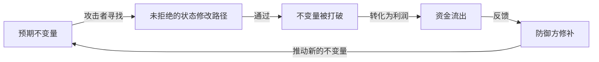

有了不变量思维框架，接下来逐类拆解最常见的漏洞家族。**重入**是第一个，因为它最直接地体现了"状态在什么时候被信任"这一核心问题，也是 §1.1 第三条攻击者提问的原型。

---

## 2. 重入攻击家族

### 2.0 直觉

The DAO（2016-06-17）：`splitDAO()` 递归调用，360 万 ETH（6000 万美元）流出，社区硬分叉出 ETH 与 ETC。

`call` 是执行权移交。对方拿到 CPU 后可以反调你，此时所有"还没改的状态"在他眼里都是真的。**先改账再给钱（CEI）**。

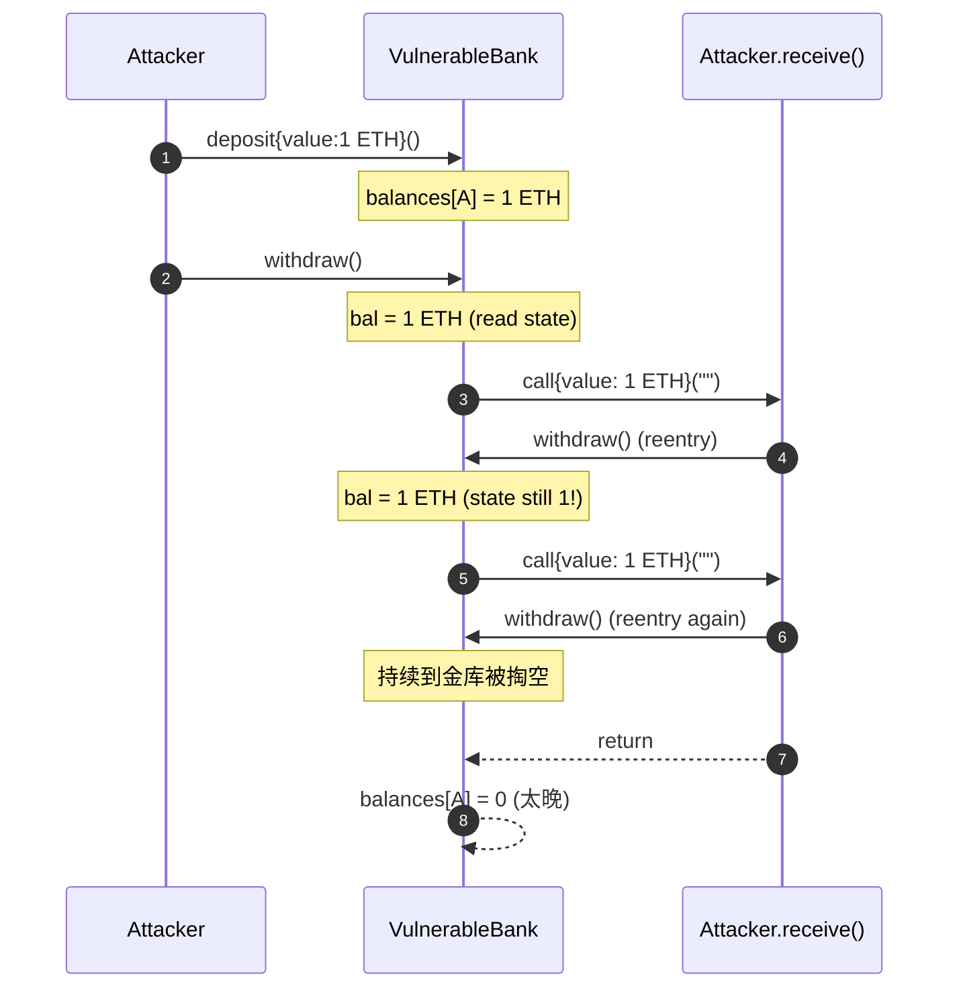

### 2.1 攻击数学

设合约状态 $s$，转账金额 $v(s)$。CEI 要求：

$$
s_{t+1} = \text{Effect}(s_t),\quad \text{Interact}(s_{t+1}, v(s_{t+1}))
$$

漏洞写法是：

$$
\text{Interact}(s_t, v(s_t)),\quad s_{t+1} = \text{Effect}(s_t)
$$

攻击者在 `Interact` 内部递归调用，看到的还是 $s_t$。如果 $v$ 只跟 `balanceOf(attacker)` 有关、且每轮把 ETH 拨走，他就能从一个余额刮 N 倍的钱。

更一般地，定义安全策略 $\pi$ 为"任何外部 call 都满足前置条件 $P$"。漏洞等价于：$\exists$ 一个调用序列 $c_1, c_2, \ldots, c_n$，使得在 $c_i$ 进入合约时 $P$ 假设的状态实际上是 $c_{i-1}$ 中途的脏状态。**重入是状态可观察性与状态正确性之间的时序冲突**。

### 2.2 经典重入（Single-function）

合约在 `withdraw` 中先转钱后清账，攻击者 fallback 里再调 `withdraw`。The DAO 即此。代码 `code/vulnerable/Reentrancy.sol::VulnerableBank` + 攻击 `code/attack/ReentrancyAttack.sol`。

防御只需一行：状态修改放到 call 之前。

```solidity
balances[msg.sender] = 0; // Effect 先
(bool ok, ) = msg.sender.call{value: bal}(""); // Interaction 后
```

更稳的做法：套一层 OZ `nonReentrant` modifier。`nonReentrant` 内部用一个 `_status` 状态变量在进入时翻转，再次进入则 revert。OZ 5.x 把 `_status` 放在 transient storage（EIP-1153，Cancun 启用），单 tx 结束后自动清 0，省 gas。

### 2.3 跨函数重入（Cross-function）

单函数套了 `nonReentrant`，但攻击者从中途 call 出去后，重入**另一个共享 storage 的函数**。两函数没共用同一把 lock，防御失效。

```solidity
function withdraw() external nonReentrant {
    msg.sender.call{value: bal}(""); // 攻击者在这里
    balances[msg.sender] = 0;
}
function transfer(address to, uint256 amt) external {  // 没加 lock
    balances[msg.sender] -= amt;
    balances[to] += amt;
}
// 攻击者在 receive() 里调 transfer 把自己的 balances 转给同伙账号，
// 让 withdraw 看到的"未清账余额"被同伙再次提走
```

历史案例：Lendf.Me（2020-04-19，2500 万美元）。攻击者借助 imBTC（ERC-777）的 `tokensToSend` hook 在 supply 操作中重入到 withdraw，跨函数共享 `internalSupply` 状态。

防御：**所有改 storage 的 external 函数都套同一把 `nonReentrant`**。

### 2.4 跨合约重入（Cross-contract）

ERC-777 / ERC-1155 / ERC-721 有"接收者钩子"，token transfer 时回调接收者，给攻击者重入入口。Cream Finance（2021-08-30，1900 万美元）：AMP 是 ERC-777，attacker 在 `tokensReceived` hook 里 reborrow，绕开 collateral 检查。

防御：
1. 把所有"接受 token 的"函数都视为 untrusted。
2. 用 `SafeERC20.safeTransferFrom` 之外，**对 ERC-777/1155 类资产强制白名单**。
3. 协议级 reentrancy guard：把 lock 放在 router/comptroller 层，跨合约共享。

### 2.5 只读重入（Read-only reentrancy）

ChainSecurity 2022 年提出，2023-2024 成 DeFi 次要主线。

协议依赖外部 vault 的 view 函数（`pricePerShare()`、`getVirtualPrice()`）。若 vault 在转账后才更新 storage，转账钩子回调瞬间 view 读到脏状态。**view 无 reentrancy guard**，脏值被用于清算/借贷判断，等价于 oracle 被操纵。

dForce（2023-02，3700 万美元）：用 Curve LP 作 collateral，attacker 通过 `remove_liquidity` 触发 ETH 转账，在回调里调 dForce borrow，此时 `get_virtual_price()` 未更新。[CertiK 复盘](https://www.certik.com/resources/blog/curve-conundrum-the-dforce-attack-via-a-read-only-reentrancy-vector-exploit)。

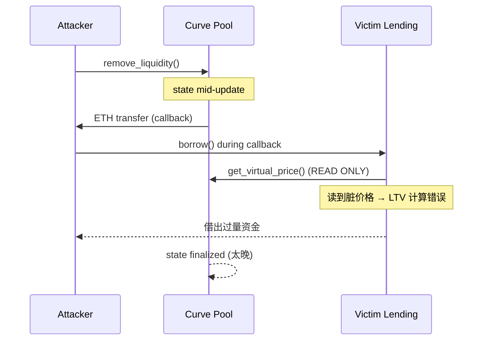

防御：
1. OZ 5.x `ReentrancyGuard` 暴露 `_reentrancyGuardEntered()` 给 view 函数手动检查。Curve 也提供了 `claim_admin_fees` 后置 lock 模式。
2. 在受害者侧：调用 vault 之前先调一个空 `withdraw(0)` 强制结清状态。
3. 用 TWAP 而非 spot virtual price。

### 2.6 Transient Storage（EIP-1153，Cancun 2024-03）

EIP-1153 引入 `tstore` / `tload`，单 tx 内临时数据 100 gas/op。OZ 5.1 把 `ReentrancyGuard` 切到 transient storage：

```solidity
contract ReentrancyGuardTransient {
    bytes32 private constant ENTERED_SLOT = bytes32(uint256(keccak256("oz.rg.entered")) - 1);
    modifier nonReentrant() {
        assembly { if tload(ENTERED_SLOT) { revert(0,0) } tstore(ENTERED_SLOT, 1) }
        _;
        assembly { tstore(ENTERED_SLOT, 0) }
    }
}
```

单 tx 内 lock 自动清，gas ~5000 降到 ~200。注意：**transient storage 不跨 call frame 持久化**，分多个 tx 完成的协议（如 Pendle batch flow）仍需 storage lock。

### 2.7 PoC 与修复

完整代码：
- 漏洞合约 `code/vulnerable/Reentrancy.sol`（包含 `VulnerableBank` 与 `VulnerableLP`）
- 攻击合约 `code/attack/ReentrancyAttack.sol`
- 修复合约 `code/patched/Reentrancy.sol`
- Foundry 测试 `code/test/Reentrancy.t.sol`

漏洞核心：

```solidity
function withdraw() external {
    uint256 bal = balances[msg.sender];
    require(bal > 0, "no balance");
    (bool ok, ) = msg.sender.call{value: bal}("");
    require(ok, "send fail");
    balances[msg.sender] = 0;  // 状态更新晚于外部调用 —— 死刑
}
```

攻击合约：

```solidity
contract ReentrancyAttacker {
    VulnerableBank public immutable bank;
    constructor(VulnerableBank _bank) payable { bank = _bank; }

    function pwn() external payable {
        bank.deposit{value: 1 ether}();
        bank.withdraw();
    }

    receive() external payable {
        if (address(bank).balance >= 1 ether) {
            bank.withdraw();  // 这一行就是 The DAO
        }
    }
}
```

修复版核心：

```solidity
function withdraw() external nonReentrant {
    uint256 bal = balances[msg.sender];
    require(bal > 0, "no balance");
    balances[msg.sender] = 0;          // 先 Effect
    (bool ok, ) = msg.sender.call{value: bal}("");  // 再 Interact
    require(ok, "send fail");
}
```

```bash
forge test --match-contract ReentrancyTest -vvv
# test_VulnerableBank_isDrained 通过 ⟹ 漏洞可利用
# test_SafeBank_isProtected 通过 ⟹ 修复版拒绝重入
```

### 2.8 真实案例复盘

| 事件 | 日期 | 损失 | 链 | 关键 URL |
|---|---|---|---|---|
| The DAO | 2016-06-17 | 6000 万美元（约 360 万 ETH） | ETH | [Hacker News 时间线](https://news.ycombinator.com/item?id=11936346) |
| Lendf.Me | 2020-04-19 | 2500 万美元 | ETH | imBTC ERC-777 hook 重入 |
| Cream Finance | 2021-08-30 | 1900 万美元 | ETH | AMP token transfer hook 重入 |
| Curve（Vyper 0day） | 2023-07-30 | 7000 万美元 | ETH | [Cointelegraph 报道](https://cointelegraph.com/news/curve-finance-pools-exploited-over-24-reentrancy-vulnerability) |
| Penpie / Pendle | 2024-09-03 | 2735 万美元（11,113 ETH） | ETH+ARB | [Halborn 解析](https://www.halborn.com/blog/post/explained-the-penpie-hack-september-2024) |

### 2.9 编译器层：Vyper 0day 完整复盘（2023-07-30）

Curve 2023-07-30 的 7000 万美元损失不是经典逻辑——而是 Vyper 编译器 **0.2.15 / 0.2.16 / 0.3.0** 三个版本的 `@nonreentrant` 装饰器在某些函数布局下，**给同一个 lock 命名分配了不同的 storage slot**（[Halborn](https://www.halborn.com/blog/post/explained-the-vyper-bug-hack-july-2023)、[OtterSec 时间线](https://osec.io/blog/2023-08-01-vyper-timeline/)、[LlamaRisk Postmortem](https://hackmd.io/@LlamaRisk/BJzSKHNjn)）。

具体地：`add_liquidity` 用了 `storage[0x00]` 作 lock，`remove_liquidity` 用了 `storage[0x02]`——两把锁互不可见。攻击者构造调用序列：

1. `add_liquidity` 取 lock A、计算 LP token；
2. ETH 转账触发 attacker `receive()`；
3. 在 receive 里调 `remove_liquidity_one_coin`（取 lock B，A B 不冲突），按"已加流动性、未结算"的脏状态算出膨胀 LP；
4. 整个 add 完成后再赎回，多刮一份。

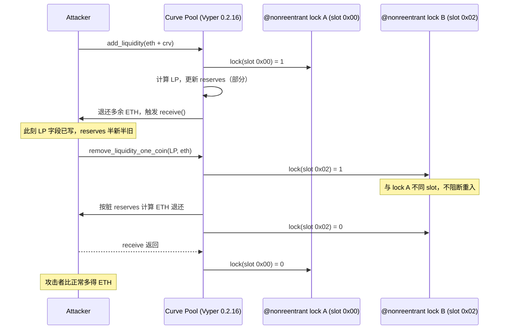

**受害池子与损失**（[LlamaRisk 复盘](https://hackmd.io/@LlamaRisk/BJzSKHNjn)）：

| 池子 | 提取量 | 约值 |
|---|---|---|
| pETH/ETH（JPEG'd）| 6,106.65 WETH | ~1100 万美元 |
| msETH/ETH（Metronome）| 866.55 WETH + 959.71 msETH | ~340 万美元 |
| alETH/ETH（Alchemix）| 7,258.70 WETH + 4,821.55 alETH | ~2260 万美元 |
| CRV/ETH | 5,332,484 CRV + 7,193 WETH | ~5300 万美元 |
| **合计** | | **约 7000 万美元**（部分被 c0ffeebabe.eth 等白帽夹击拦回）|

**为什么审计没抓到**：审计师默认 `@nonreentrant("lock")` 字符串相同则锁相同——这是 Solidity 心智模型。Vyper 编译器在每个用到 `@nonreentrant("lock")` 的函数里**独立计算 slot 哈希**，遇到 hash collision 时不报错而是悄悄分到不同 slot。**这是编译器层的不变量违反，没有任何静态分析工具检查得到**。

教训：
- 依赖编译器 attribute 的 lock 必须有 fuzz / formal 验证；显式证明"任意两个 nonreentrant 函数互斥"。
- 关键合约多版本编译并 byte diff，slot 分配差异立即报警。
- 锁住 compiler 版本 + CI 校验编译器二进制 SHA256。
- "语言/库本身可信"必须作为 trust assumption 显式写入审计范围。

### 2.10 防御范式（不止 nonReentrant）

1. **CEI 顺序优先于 guard**：guard 是补救，CEI 才是预防。
2. **OZ ReentrancyGuard**：`_reentrancyGuardEntered()`（5.x）让 view 函数也能拒绝。
3. **跨合约边界**：所有 ERC-777 / ERC-1155 / Native ETH 转账之后都属于 untrusted。
4. **架构层面**：把会触发回调的转账放到独立的 `claim()` 里，与价格读取严格分时。
5. **形式化**：写出不变量 `protocolEquity_after >= protocolEquity_before` 用 Halmos / Certora 跑。
6. **Phantom function 防御**：见 §2.11。

### 2.11 Phantom Function（"亿万美元 No-op"）

[Dedaub 定义](https://dedaub.com/blog/phantom-functions-and-the-billion-dollar-no-op/)：**目标合约没有定义该函数，但 fallback 静默返回成功**——调用者以为成功，实则 no-op。

经典样例：早期某些 ERC20 没有实现 `permit`，但 fallback 接受任意 calldata。受害者协议这样写：

```solidity
// 受害者协议
IERC20Permit(token).permit(owner, spender, value, deadline, v, r, s); // 如果没实现就 fallback no-op
IERC20(token).transferFrom(owner, address(this), value); // 但 allowance 没设
// 这里应该 revert，但如果 token 之前授权过…… ↓
```

用户若之前给过 router unlimited approve，phantom permit 没生效但 transferFrom 仍成功。**协议误以为用户当下签名授权，实则消费历史 allowance**——绕过 permit 的主动授权语义。

**真实事件**：
- **Multichain anyswap-v4-router（2022-01-18，约 8 ETH 测试）**：早期版本 router 假定 `permit` 必然成功，研究者 Tal Be'ery 与 Dedaub 联合披露，未造成大额损失但揭示了**所有依赖 permit 的 router 类合约**都该检查目标 token 是否真支持 permit（[Dedaub Blog](https://dedaub.com/blog/phantom-functions-and-the-billion-dollar-no-op/)）。
- **WETH9 没有 permit**：但许多 router 假设它有——Dedaub 估计如果该模式被武器化，潜在风险数十亿美元。

**防御**：
- 调用前 ERC165 / 显式 selector 检查：`token.supportsInterface(type(IERC20Permit).interfaceId)`。
- 使用 OZ 的 `SafeERC20.safePermit`：先 staticcall 探测 `DOMAIN_SEPARATOR()` 是否存在；不存在直接 revert。
- 重要：**不要混用 permit + transferFrom**。要么用 Permit2 强制走签名路径，要么用经典 approve 路径。

**衍生：phantom token / phantom transfer**：跨链桥假设 lock event 真发生，但 phantom token transfer 看似成功实则 no-op，攻击者在源链"lock"，目标方却 mint 真资产。这是 §10.3 Nomad 类攻击的另一面。

重入守住了"状态正确性"，但还有另一条更基础的战线：**价格本身**。协议收了抵押品、算了 LTV、批了借贷——如果这个价格是假的，合约逻辑再严谨也白搭。这就是下一章预言机操纵的起点。

---

## 3. 预言机操纵

### 3.0 直觉

Mango Markets（2022-10-11，1.16 亿美元，[CFTC](https://www.cftc.gov/PressRoom/PressReleases/8647-23)）：Eisenberg 用 500 万美元在低流动性 MNGO 池对敲，30 分钟内价格 30 倍，借走金库。2025-05 联邦法官推翻诈骗判决（[TRM Labs](https://www.trmlabs.com/resources/blog/breaking-federal-judge-overturns-all-criminal-convictions-in-mango-markets-case-against-avraham-eisenberg)）——**oracle 操纵法律边界未定，技术防御是唯一护城河**。

攻击面：信息源能否被单 tx 操纵？聚合方式能否被部分操纵？新鲜度有否检查？feed 停更时协议会否自动暂停？

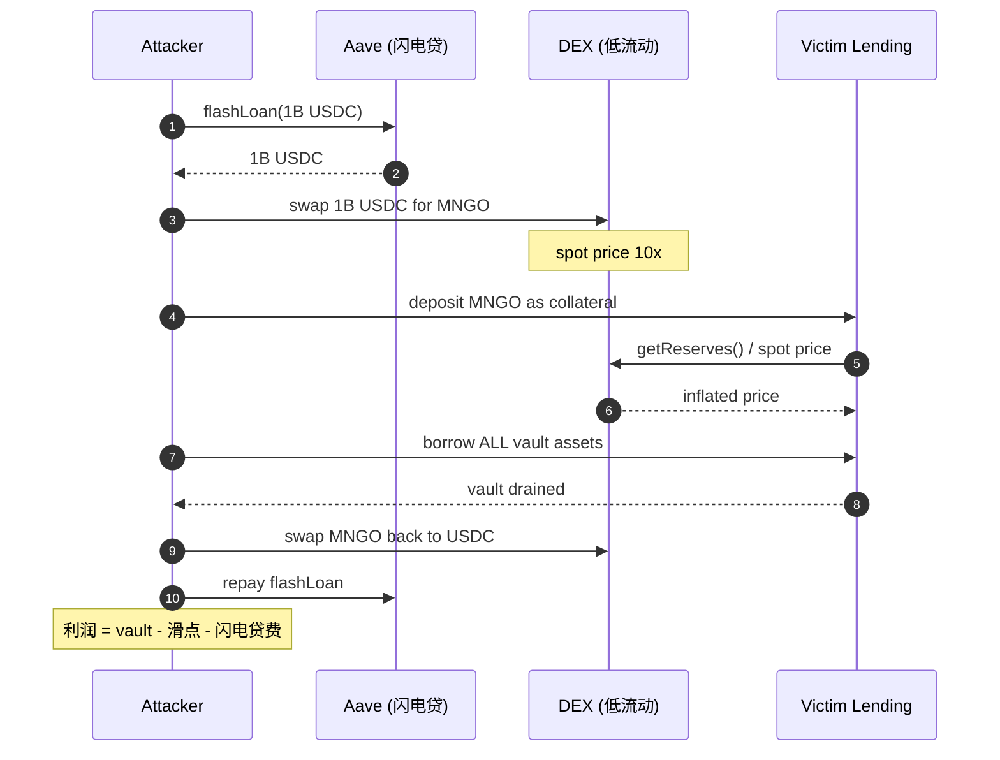

### 3.1 朴素 spot 估值漏洞

直接读 Uniswap V2 `getReserves()`：

```solidity
function spotPrice() view returns (uint256) {
    (uint112 r0, uint112 r1, ) = pair.getReserves();
    return r1 * 1e18 / r0;
}
```

闪电贷一笔 swap 即可把 r0/r1 拉到任意比例。

### 3.2 攻击数学：闪电贷把成本归零

Uniswap V2 池子 invariant：$x \cdot y = k$。攻击者投入 $\Delta x$，新储备：

$$
x' = x + \Delta x,\quad y' = \frac{k}{x'} = \frac{xy}{x+\Delta x}
$$

新现货价：

$$
p' = \frac{y'}{x'} = \frac{xy}{(x+\Delta x)^2}
$$

只要 $\Delta x \to \infty$（闪电贷允许），$p' \to 0$。如果协议用这个价格估算"USDC 抵押 / xToken 债务"，攻击者就能借出全部金库。

把价格拉到 $k\times$ 所需资本（不计 swap 费）：

$$
\Delta x = (\sqrt{k} - 1) \cdot x
$$

闪电贷把资本成本归零，只剩 swap 手续费（V2 0.3%），代价变成 $0.003 \cdot \Delta x$。池子流动性远小于受害协议 TVL 时（ratio < 0.5%），攻击必盈利。**低流动性 + 大 TVL = 必有 oracle 攻击**。

### 3.3 TWAP 与几何均值

Uniswap V3 `observe(uint32[] calldata secondsAgos)` 返回累积价格 tick，计算 TWAP：

```solidity
uint32[] memory ago = new uint32[](2);
ago[0] = 1800; // 30 分钟前
ago[1] = 0;    // 现在
(int56[] memory ticks,) = pool.observe(ago);
int24 avgTick = int24((ticks[1] - ticks[0]) / 1800);
uint160 sqrtPriceX96 = TickMath.getSqrtRatioAtTick(avgTick);
```

攻击 TWAP 需在 30 分钟内**持续保持** $k\times$ 价格：每块 $0.003 \cdot \Delta x$ 手续费 + 套利反推滑点，**总成本约 $\Delta x$ 量级，不再免费**。

但 TWAP 不能防"短期 stable depeg"。UwU Lend 案：攻击者在 5 个 Curve 池子操纵 sUSDe，污染 11 源 median 的过半数。**TWAP 时间窗与 deviation 检查必须配合**。

### 3.4 Chainlink 风格的 push oracle

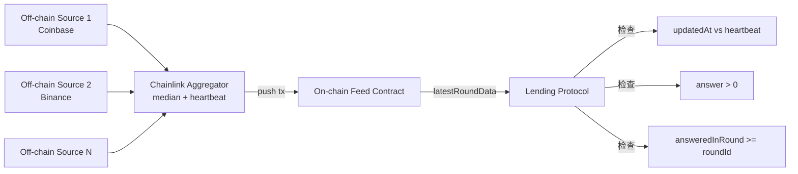

Chainlink 节点取链下源中位数，超过 deviation threshold 或 heartbeat 到则推链上。消费方必须做 4 项检查：
1. **`answer > 0`**：负价 / 0 价直接拒绝。
2. **`updatedAt + heartbeat >= block.timestamp`**：feed 是否过期。各 feed heartbeat 不同（ETH/USD 是 3600s，USDC/USD 是 86400s）。
3. **`answeredInRound >= roundId`**：拒绝 round 不一致的脏数据。
4. **decimals 归一**：不同 feed decimals 不同，统一到 1e18。

> **真实事故**：2020-11 Compound 因 Coinbase Pro 闪现 DAI 价格 $1.30，触发清算 9000 万美元（[Compound 复盘](https://www.comp.xyz/t/post-mortem-comp-distribution-bug/186)）。Chainlink 那时还是单源 + Compound 没 deviation circuit-breaker。**单点报错也是 oracle 风险**。

### 3.5 Pyth / Pull-based Oracle

Pull-based（Pyth、Redstone）：链下签名价由用户在 tx 里提交，合约验证签名 + 时间戳。低延迟（~ms）、无需 keeper；代价是用户承担提交 gas。

```solidity
function update(bytes calldata priceUpdate) external payable {
    bytes[] memory updates = new bytes[](1);
    updates[0] = priceUpdate;
    pyth.updatePriceFeeds{value: msg.value}(updates);
    PythStructs.Price memory p = pyth.getPriceNoOlderThan(feedId, 60);
    require(p.price > 0, "bad");
    // 使用 p.price
}
```

Pyth 的常见错误：
- **`getPrice` 不带 freshness 检查**：必须用 `getPriceNoOlderThan(feedId, 60)`。
- **接受 stale price**：`updatePriceFeeds` 失败时不应继续走旧价。
- **conf 没过滤**：Pyth 返回 `(price, conf, expo)`，conf 是置信区间，应当 `require(uint64(conf) * 10000 < uint64(p.price) * 1)` 之类（即 conf / price < 0.01%）。

### 3.6 PoC 与修复

完整代码：`code/vulnerable/Oracle.sol`（直接 spot）、`code/patched/Oracle.sol`（Chainlink + heartbeat）。

漏洞核心：

```solidity
function spotPrice() public view returns (uint256) {
    (uint112 r0, uint112 r1, ) = pricePair.getReserves();  // 单池 spot
    return uint256(r1) * 1e18 / uint256(r0);
}
function borrow(uint256 amt) external {
    uint256 collValueInDebt = collateralBal[msg.sender] * spotPrice() / 1e18;
    require(debtBal[msg.sender] + amt <= collValueInDebt * 7500 / 10_000, "LTV");
    ...
}
```

修复：

```solidity
function safePrice() public view returns (uint256) {
    (uint80 rid, int256 ans, , uint256 updatedAt, uint80 answeredIn) = feed.latestRoundData();
    if (ans <= 0) revert BadPrice();
    if (answeredIn < rid) revert StalePrice();
    if (block.timestamp - updatedAt > heartbeat) revert StalePrice();
    return uint256(ans) * 10 ** (18 - feed.decimals());
}
```

但 Chainlink 也不是万能：UwU Lend 的 USDe oracle 用 11 个 source 取中位数，但其中 5 个是 Curve 池子可被操纵，攻击者只需要扰动 6 个就能控制中位数（[QuillAudits](https://www.quillaudits.com/blog/hack-analysis/uwu-lend-hack)，2024-06-10）。**Median oracle 必须保证大多数源不可操纵，否则比单源还危险**。

### 3.7 真实案例复盘

| 事件 | 日期 | 损失 | 关键技术 | URL |
|---|---|---|---|---|
| bZx #1 | 2020-02-15 | 35 万美元 | 第一例闪电贷 + oracle | bZx 论坛 post-mortem |
| Harvest Finance | 2020-10-26 | 3400 万美元 | Curve y pool spot 估值 | rekt.news |
| Cream Finance | 2021-10-27 | 1.3 亿美元 | yUSD vault 估值 | [Halborn](https://www.halborn.com/blog/post/explained-the-cream-finance-hack-october-2021) |
| Mango Markets | 2022-10-11 | 1.16 亿美元 | MNGO/USDC 现货拉盘 + 借自己 | [CFTC](https://www.cftc.gov/PressRoom/PressReleases/8647-23) |
| Inverse Finance | 2022-04-02 | 1560 万美元 | INV/DOLA TWAP 操纵（短窗） | rekt.news |
| UwU Lend | 2024-06-10 | 2300 万美元 | 11 源 median 中过半数 Curve 池 | [QuillAudits](https://www.quillaudits.com/blog/hack-analysis/uwu-lend-hack) |

### 3.8 操纵成本估算工具

粗略公式：

$$
\text{Attack cost} \approx 2 \cdot \text{slippage}(\Delta x) \cdot \Delta x + \text{flashloan fee}
$$

attack cost < 受害协议可借出价值时**必然发生**。工具：
- [DefiLlama Pool Liquidity](https://defillama.com)：查每个池子的 reserve。
- [Tenderly Simulator](https://tenderly.co)：直接模拟 swap 看价格变化。
- 自己写：fork mainnet，调 `swap` 看 `getReserves` 前后差异。

### 3.9 防御范式

1. **永远不用单一 DEX spot 估值**。
2. **TWAP 窗口 ≥ 30 分钟**，否则被多块攻击破。
3. **Chainlink 必须检查 staleness**：把 `updatedAt` 当 EOF 防御。
4. **Median oracle**：保证至少 (n/2)+1 个源攻击成本独立。
5. **熔断**：与上一次价格偏差超过 X% 直接 revert，让 keeper 介入。
6. **Bounded LTV per asset**：长尾资产即使有 oracle，也要降低 LTV 上限。

价格保住了，攻击者还有一条更直接的路：**直接拿到 admin 权限**。重入问"什么时候的状态可信"，预言机问"谁给的价格可信"，访问控制则问"谁能动这笔钱"——§1.1 的三个问题至此全部亮相。

---

## 4. 访问控制与初始化

### 4.0 直觉

Bybit 2025-02-21（14.6 亿美元，详见 §4.5）：运维在 Safe{Wallet} 签"常规调度"，但前端 JS 已被替换，Ledger 显示 hex，calldata 已篡改。合约无问题，问题在 AWS S3 供应链。

核心问题：**谁能调这个函数？谁能改这个 owner？谁验证 owner 没被偷？** 攻击面：未改的 deployer key（Parity 1）、未调用的 initialize（Parity 2）、proxy admin slot（Munchables）、多签 UI 钓鱼（Bybit / WazirX / Radiant）。

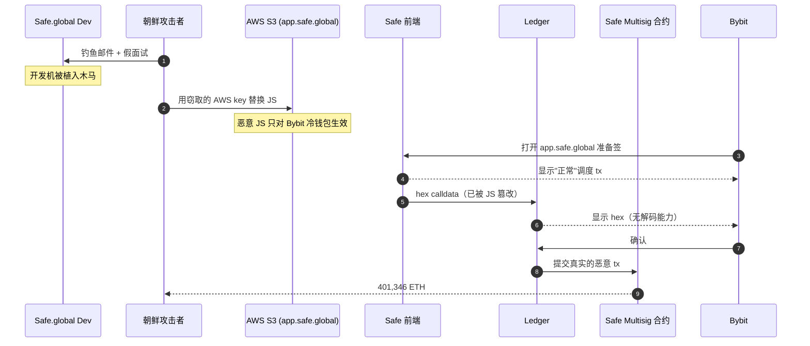

### 4.1 历史与现实

Parity 1（2017-07-19，3000 万美元）：`initWallet` 暴露给所有人，谁先调用谁是 owner。
Parity 2（2017-11-06，51.4 万 ETH 永久冻结）：library 未 init，devops199 调 init 后 `kill()` 库合约，所有依赖多签变砖。（[CNBC](https://www.cnbc.com/2017/11/08/accidental-bug-may-have-frozen-280-worth-of-ether-on-parity-wallet.html)）

WazirX（2024-07-18）、Radiant Capital（2024-10-16）、Bybit（2025-02-21）形成"多签 UI 钓鱼"系列：**硬件钱包不解析多签 calldata + 开发者盲签 + UI 供应链攻击**。

Ronin #2（2024-08-06）：v3 升级时 `initialize()` 未调用，`_totalOperatorWeight` = 0，投票阈值变成"0 票即通过"，白帽 12 分钟捞走 1200 万美元。**升级后必须验证 onchain state 与预期一致**。

### 4.2 一类常见错误清单

```solidity
// 1. init 没有 onlyOnce
address public admin;
function init(address _admin) external { admin = _admin; } // 任何人调用，且可被多次重置

// 2. constructor 与 init 不一致（proxy）
contract Logic {
    address public admin;
    constructor(address _a) { admin = _a; }    // proxy 不会调用 constructor
    // 必须用 initialize 模式
}

// 3. selfdestruct 暴露给非 owner
function destroy() external { selfdestruct(payable(msg.sender)); }

// 4. role 没有 enumerable，没有 revoke
mapping(address => bool) public isAdmin;  // 谁取消？谁监控？
```

### 4.3 PoC 与修复

完整代码：`code/vulnerable/AccessControl.sol`、`code/attack/AccessControlAttack.sol`、`code/patched/AccessControl.sol`。

```solidity
// 漏洞 implementation
contract VulnerableProxyImpl {
    address public admin;
    function init(address _admin) external { admin = _admin; }  // 无 guard
    function selfDestructIt() external {
        require(msg.sender == admin, "not admin");
        selfdestruct(payable(msg.sender));
    }
}
```

```solidity
// 修复
contract SafeProxyImpl is Initializable {
    address public admin;
    constructor() { _disableInitializers(); }   // implementation 永远不能被 init
    function initialize(address _admin) external initializer { admin = _admin; }
    // 故意不写 selfdestruct
}
```

> **深度框：Cancun 之后 selfdestruct 还危险吗？**
>
> EIP-6780（Cancun，2024-03）让 `selfdestruct` 在非创建 tx 中只清空 ETH 余额，不删代码、不清 storage。但 Munchables（2024-03-26，6250 万美元，[CoinDesk](https://www.coindesk.com/tech/2024/03/27/munchables-exploited-for-62m-ether-linked-to-rogue-north-korean-team-member)）证明：你不需要 selfdestruct 来作恶。攻击者（一名朝鲜员工）作为 deployer 直接修改了 proxy 的 implementation，先把自己存款槽改成 100 万 ETH，再切回正常 implementation 等用户来"喂金库"。教训：**selfdestruct 限制不能让你忽略 deployer/admin 的权力**。

### 4.4 真实案例复盘

| 事件 | 日期 | 损失 | 模式 | URL |
|---|---|---|---|---|
| Parity Multisig 1 | 2017-07-19 | 3000 万美元 | 公开 initWallet | medium 复盘 |
| Parity Multisig 2 | 2017-11-06 | 1.55 亿美元（永久冻结） | library kill | [CNBC](https://www.cnbc.com/2017/11/08/accidental-bug-may-have-frozen-280-worth-of-ether-on-parity-wallet.html) |
| Audius | 2022-07-23 | 600 万美元 | proxy storage hijack | rekt.news |
| Munchables | 2024-03-26 | 6250 万美元 | 内鬼 deployer + proxy 储槽 | [CoinDesk](https://www.coindesk.com/tech/2024/03/27/munchables-exploited-for-62m-ether-linked-to-rogue-north-korean-team-member) |
| Radiant Capital | 2024-10-16 | 5300 万美元 | multisig 私钥 + UI 篡改 | [Halborn](https://www.halborn.com/blog/post/explained-the-radiant-capital-hack-october-2024) |
| WazirX | 2024-07-18 | 2.35 亿美元 | Liminal UI 篡改 + 盲签 | [WazirX 报告](https://wazirx.com/blog/preliminary-report-cyber-attack-on-wazirx-multisig-wallet/) |
| Ronin #2 | 2024-08-06 | 1200 万（white hat） | initialize 未运行 / vote weight=0 | [Halborn](https://www.halborn.com/blog/post/explained-the-ronin-network-hack-august-2024) |
| Bybit | 2025-02-21 | 14.6 亿美元 | Safe S3 供应链 + 盲签 | [Hacker News](https://thehackernews.com/2025/02/bybit-hack-traced-to-safewallet-supply.html) |

### 4.5 Bybit 案完整攻击链（2025-02-21，14.6 亿美元）

Sygnia（[报告](https://www.sygnia.co/blog/sygnia-investigation-bybit-hack/)）、Wiz（[TraderTraitor 深析](https://www.wiz.io/blog/north-korean-tradertraitor-crypto-heist)）、FBI（[IC3 PSA 250226](https://www.ic3.gov/psa/2025/psa250226)）联合复盘时间线：

```mermaid
timeline
    title Bybit Heist 攻击链（DPRK / TraderTraitor / UNC4899）
    section 准备期（数月）
        伪装招聘 + 钓鱼 macOS dev : Safe.global 一名开发者中招
    section 2025-02-04
        macOS workstation 被植入 RAT : 攻击者持续侦察
    section 2025-02-17
        AWS C2 流量上线 : 转入主动 staging
    section 2025-02-19 15:29 UTC
        替换 app.safe.global S3 桶 JS : 仅对 Bybit cold wallet 生效
    section 2025-02-21 14:13 UTC
        Bybit 运维签调度 tx : Ledger 显示 hex，UI 显示假 to
        多签通过，401k ETH 流出 : 14.6 亿美元
    section 2025-02-21 14:15 UTC
        S3 JS 复原 : 抹除痕迹
    section 2025-02-25
        Sygnia 中期报告交付 : 锁定供应链路径
    section 2025-02-26
        FBI IC3 公告归因 TraderTraitor : DPRK / Lazarus
    section 2025-03-20
        86.29% ETH 已洗成 BTC : Ben Zhou 确认
```

**核心攻击面**（按层级排列）：
1. **社会工程**：DPRK 用伪招聘 / 假面试投递木马（[BleepingComputer](https://www.bleepingcomputer.com/news/security/lazarus-hacked-bybit-via-breached-safe-wallet-developer-machine/)）。
2. **macOS 开发机被持久化**：得到 AWS 凭证。
3. **AWS S3 供应链**：Safe{Wallet} 前端 JS 不走完整性校验、不签名，攻击者直接覆盖 bucket 文件。
4. **目标识别**：恶意 JS 内嵌 `if (signerAddress === BYBIT_COLD_WALLET) { 替换 calldata; }`，对其他用户无影响——隐蔽性极高。
5. **Ledger 盲签**：硬件钱包不解析 Safe tx 的 `execTransaction` 内部 calldata，运维只看到一段 hex，无法人工复核。
6. **痕迹消除**：tx 后 2 分钟 JS 复原，没有 forensic 留底——靠 AWS CloudTrail 才还原。

**工程哲学缺陷**：
- **前端完整性不在威胁模型**：所有审计公司只审 Solidity，无人审 webapp build pipeline。
- **盲签是结构性问题**：Safe `execTransaction` 是嵌套 calldata，硬件钱包无法渲染，EIP-712 在 Ledger 只有 5 行屏幕。
- **DPRK 愿意烧 6 个月**：传统"快攻"思维失效。

**社区响应（2025-04 进行中）**：
- Safe 启用 `transactionGuard` + Tenderly Simulator 强制集成，运维 sign 前自动 fork 模拟。
- Ledger 推 Clear Signing 标准，要求 dApp 提供 calldata 解码 schema。
- 多家交易所改用 Fireblocks / Copper 等带"独立验证终端"的托管方案。
- Wallet Connect 引入"transaction risk score"插件层。

### 4.6 防御范式

1. **OZ Initializable + `_disableInitializers()` 在 implementation constructor**。
2. **Multisig 必须验证签什么**：Bybit / Radiant 教训——硬件钱包不解析 Safe tx，开发者盲签。引入 Tenderly Simulator / die.net 等独立工具复核 calldata。
3. **Timelock + onchain queue**：所有 admin 操作都 48h 延迟，社区有反应窗口。
4. **角色分离**：deployer ≠ owner ≠ pauser ≠ feeReceiver。
5. **AccessControl + role enumeration**：用 OZ 的 `AccessControlEnumerable`，所有角色公开可枚举。
6. **冷热分离**：hot wallet（operational）只能动小额，热钱包提案大额转账时进入 timelock。
7. **前端供应链威胁建模**：把 `app.your.xyz` 的 build pipeline、CDN bucket、依赖 npm 包都纳入 audit scope（Bybit 教训）。
8. **Clear Signing**：Ledger / Trezor 必须能解码协议 calldata，否则不签。

访问控制防的是"谁能调函数"，签名安全是它的延伸：**签名就是一种离线授权**，同样属于身份验证范畴，却绕过了所有 onchain modifier。钓鱼 permit 签名的危害和 Parity `initWallet` 暴露给任意人一样致命，只是攻击路径从链上转到了链下。

---

## 5. 签名安全

### 5.0 直觉

用户在钓鱼站签 EIP-2612 `permit`，无 tx 上链，以为安全；30 分钟后攻击者调 `permit + transferFrom` 清空所有 ERC20。这种模式 2022-2026 累计偷走数十亿美元（[ScamSniffer](https://www.scamsniffer.io/)）。

签名安全 = **5W：Who（signer）+ What（typed struct）+ Where（domain）+ When（deadline）+ Why-not-twice（nonce）**。每缺一个漏一个攻击面。四类坑：重放（跨链/跨合约/跨时刻）、0 地址陷阱（ecrecover 返回 address(0)）、malleability（(r,s) vs (r,n-s)）、EIP-712 误用（缺 chainId/verifyingContract）。

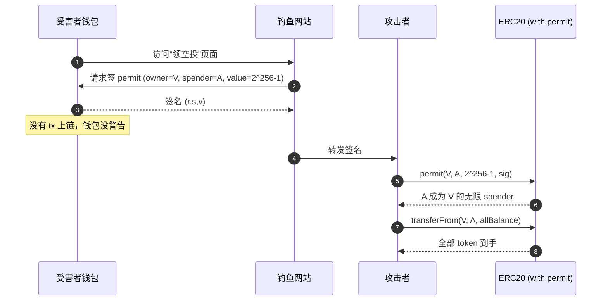

### 5.1 Malleability 数学

ECDSA 签名 $(r, s)$ 满足：

$$
s \cdot k \equiv H(m) + r \cdot d \pmod{n}
$$

$n$ 为 secp256k1 的阶。$(r, s)$ 有效则 $(r, n-s)$ 也对同一消息有效。EIP-2 要求只接受 $s < n/2$ 的低半区签名以杜绝 malleability。

### 5.2 PoC 与修复

代码：`code/vulnerable/Signature.sol`、`code/patched/Signature.sol`。

漏洞核心：

```solidity
function claim(uint256 amount, uint8 v, bytes32 r, bytes32 s) external {
    bytes32 h = keccak256(abi.encodePacked(msg.sender, amount));
    bytes32 ethHash = keccak256(abi.encodePacked("\x19Ethereum Signed Message:\n32", h));
    address recovered = ecrecover(ethHash, v, r, s);
    require(recovered == signer, "bad sig");
    // 缺：nonce、deadline、chainId、合约地址、s 低半区检查
    token.transfer(msg.sender, amount);
}
```

若 `signer == address(0)`（部署失误），攻击成立：

```solidity
// 任意 msg.sender 调用 claim(任意 amount, 0, 0, 0)
// ecrecover(hash, 0, 0, 0) == address(0) == signer ⇒ require 通过
// token 被任意转给 msg.sender
```

测试 `code/test/Signature.t.sol::test_ZeroSignerIsExploitable` 验证攻击者 mint 500 ether。

修复（EIP-712）：

```solidity
contract SafeClaim is EIP712 {
    bytes32 private constant CLAIM_TYPEHASH =
        keccak256("Claim(address user,uint256 amount,uint256 nonce,uint256 deadline)");

    constructor(IERC20 _t, address _signer) EIP712("SafeClaim", "1") {
        require(_signer != address(0), "zero signer");
        signer = _signer;
    }

    function claim(uint256 amount, uint256 deadline, bytes calldata sig) external {
        if (block.timestamp > deadline) revert Expired();
        uint256 nonce = nonces[msg.sender]++;
        bytes32 structHash = keccak256(abi.encode(CLAIM_TYPEHASH, msg.sender, amount, nonce, deadline));
        bytes32 digest = _hashTypedDataV4(structHash);
        // OZ ECDSA.recover 拒绝 s 高半区与 v ∉ {27,28} 的非规范签名，并对 0 地址 revert
        if (digest.recover(sig) != signer) revert BadSigner();
        token.transfer(msg.sender, amount);
    }
}
```

5 道防线：① EIP-712 domain separator 含 chainId + verifyingContract；② nonce per user；③ deadline；④ OZ `ECDSA.recover` 处理 malleability + 0 地址；⑤ constructor require signer != 0。

### 5.3 真实案例

| 事件 | 日期 | 损失 | 模式 | URL |
|---|---|---|---|---|
| Poly Network | 2021-08-10 | 6.11 亿美元 | keeper pubkey 替换 + 跨链签名 | [Chainalysis](https://www.chainalysis.com/blog/poly-network-hack-august-2021/) |
| MonoX | 2021-11-30 | 3100 万美元 | swap from==to 误用 | rekt.news |
| Wormhole | 2022-02-02 | 3.2 亿美元 | guardian 签名验证绕过（Solana sysvar） | [Wormhole 复盘](https://www.halborn.com/blog/post/explained-the-wormhole-hack-february-2022) |
| BNB Bridge | 2022-10-06 | 5.7 亿美元 | merkle proof 伪造 | rekt.news |
| Uniswap permit 钓鱼 | 多起 | 大量 | EIP-2612 链下签名钓鱼 | OpenSea / dApp 钓鱼 |

> **深度框：为什么 EIP-2612 permit 在前端是高危品**
>
> Permit 让用户用一个签名授权 spender 任意金额。钓鱼网站只需诱导用户签一次，就能把所有 USDC/DAI 转走。Universal Router 已经引入 Permit2 + 短期失效，但很多 dApp 还在用裸 permit。**前端教育和 wallet 警告比合约层防御更重要**。

### 5.4 Permit2 钓鱼完整攻击面

[Permit2](https://github.com/Uniswap/permit2) 把"approve 一次给 Permit2、之后用签名授权第三方"标准化，解决每对 token-spender 单独 approve 的 UX 问题，但把钓鱼链路从"approve tx"变成"off-chain 签名"，用户感知更弱。

**典型钓鱼流程**：
1. 用户曾对 USDC 给 Permit2 unlimited approve（Uniswap 默认行为）。
2. 用户访问钓鱼站，被诱导签 `PermitSingle`，spender = 攻击者，amount = MAX，expiration = 远期。
3. **无 tx 上链**，钱包不报"危险"。
4. 攻击者拿签名调 `Permit2.permit(...)` + `transferFrom(...)`，瞬间清空。

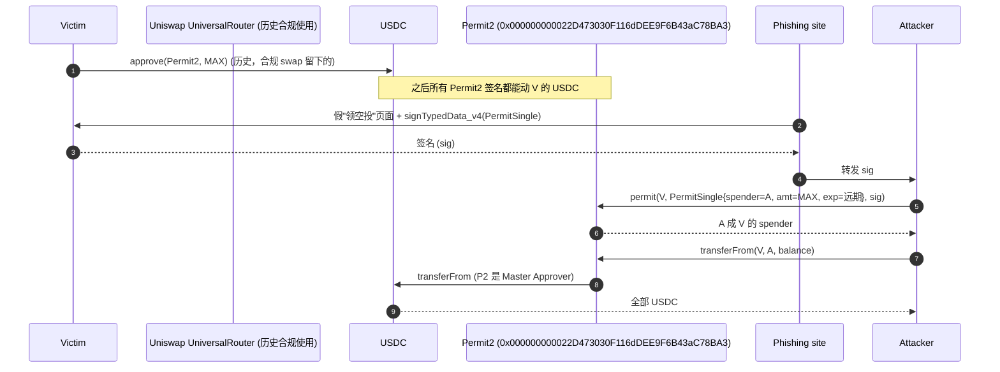

**真实损失**：
- 2024-09 PEPE 持有者签 Permit2 钓鱼，1 笔签名损失 139 万美元（[Decrypt](https://decrypt.co/286076/pepe-uniswap-permit2-phishing-attack)）。
- 2024-10 fwdETH 受害者损失 15,079 fwdETH（约 3600 万美元）。
- ScamSniffer 累计统计 2024 全年 Permit + Permit2 钓鱼超过 3 亿美元。

**防御（用户）**：
- 用 [revoke.cash](https://revoke.cash) 定期撤销 Permit2 unlimited allowance；优先把 amount 改成你需要的 swap 量。
- 钱包升级（Rabby、Frame、Coinbase Wallet 已开始解析 Permit2）。
- 安装 ScamSniffer / WalletGuard 浏览器插件。

**防御（协议方）**：
- 不要默认 approve unlimited 给 Permit2——前端可在 router 调用前显式询问"是否绑定到此次 swap 的 amount"。
- dApp 接受签名时显示"将允许 X 在 Y 之前转走 Z 数量"。
- 引入 [Permit2.lock](https://github.com/Uniswap/permit2/issues/250) 类辅助合约，把签名生命期收紧到一笔 tx。

### 5.5 防御范式

1. EIP-712（domain separator 必须含 chainId + verifyingContract）。
2. 所有签名结构含 `nonce` 与 `deadline`。
3. 使用 OZ ECDSA / Solady 的 ECDSA，不直接调 ecrecover。
4. constructor 拒绝 signer == 0。
5. 跨链协议：把目标链 ID 编码进签名内容。
6. 前端：把 calldata 解码成人类可读，永远不让用户盲签。

身份（访问控制 + 签名）和价格（预言机）守住了，合约逻辑本身还有一个死角：**数字本身的计算**。share 铸造、利率累积、tick 边界——一个截断、一个除法顺序，就能把正确的业务逻辑变成攻击者的提款机。

---

## 6. 算术与精度

### 6.0 直觉

Cetus（2025-05-22，2.23 亿美元）：`checked_shlw(x, n)` 边界检查错误，1 单位 token 换出 $10^{37}$ 虚拟流动性，bug 在 Move stdlib 躺 2 年，多家审计放行。

金额算法三个问题：
1. **方向**：round 向 protocol 有利还是用户有利？
2. **顺序**：先乘还是先除？（先除丢精度）
3. **单位**：左侧 1e18 还是 1e6？右侧呢？

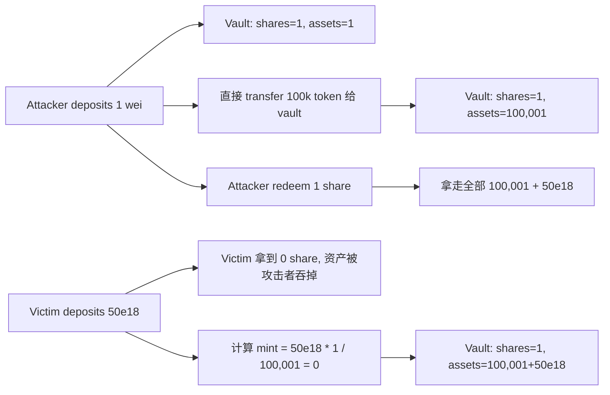

### 6.1 整数溢出（pre-0.8）

BeautyChain BEC（2018-04）：`amount = _value * _receivers.length` 溢出回 0，`require(balance >= amount)` 通过，凭空铸出天文数字（[SECBIT](https://medium.com/secbit-media/a-disastrous-vulnerability-found-in-smart-contracts-of-beautychain-bec-dbf24ddbc30e)）。

Solidity 0.8 默认溢出检查。仍需注意：`unchecked {}` 块、`uint128(x)` 截断、assembly 均无检查。

### 6.2 舍入误差与 inflation 攻击

ERC4626 基本汇率：

$$
\text{shares} = \text{assets} \cdot \frac{\text{totalShares}}{\text{totalAssets}}
$$

第一笔存款 totalShares=0，特例处理。攻击者抢先：

1. `deposit(1)` 得 1 share。
2. 直接 `transfer(vault, 100_000e18)`（捐赠），totalAssets 跳到 100k，totalShares 仍 1。
3. victim `deposit(50e18)`：minted = 50e18 × 1 / 100_000e18 = 0（向下取整）。
4. attacker `redeem(1)` 取走 100_050e18，全部资金归己。

PoC `code/vulnerable/Vault4626.sol` + `code/attack/Vault4626Attack.sol`，测试 `code/test/Vault4626.t.sol::test_NaiveVault_inflationKillsVictim`（victim 拿到 < 1e18 share）。

修复：OZ 5.x virtual shares + decimals offset（[OZ blog](https://www.openzeppelin.com/news/a-novel-defense-against-erc4626-inflation-attacks)）：

```solidity
function _convertToShares(uint256 assets) internal view returns (uint256) {
    return (assets * (totalShares + 10 ** DECIMALS_OFFSET)) / (totalAssets() + 1);
}
```

vault 创建时即有 $10^{\text{offset}}$ 个虚拟 share 与 1 个虚拟 asset，攻击者要抬高单 share 价格需捐 $10^{\text{offset}}$ 倍 victim 存款，成本 prohibitive。

> **深度框：为什么 dead shares 不够**
>
> deployer deposit 初始值（dead shares）有两个问题：① deployer 可 redeem 自己的 dead shares，攻击窗口重开；② totalAssets 拉到 dead_shares × n 倍时小额 deposit 仍被吞。Virtual shares 在合约层存在，攻击者无法 redeem 抽走。Sonne Finance（2024-05-14，2000 万美元，[Halborn](https://www.halborn.com/blog/post/explained-the-sonne-finance-hack-may-2024)）：Compound v2 fork 用 dead shares 不够，攻击者在 unbalanced market 创建后立即攻击。

### 6.3 精度损失与 unit 不一致

KyberSwap Elastic（2023-11-22，4700 万美元）：`computeSwapStep()` 中 `calcReachAmount()` 与 `calcFinalPrice()` 算术略不一致，swap = boundary - 1 时 liquidity 没被减去，攻击者反复 swap 1 wei 制造无限流动性 credit。（[Halborn](https://www.halborn.com/blog/post/explained-the-kyberswap-hack-november-2023)）

Cetus（2025-05-22，2.23 亿美元）：`checked_shlw` 溢出检查错误，u256 左移静默 wrap-around，1 单位 token mint 出 $10^{37}$ liquidity。（[BlockSec](https://blocksec.com/blog/cetus-incident-one-unchecked-shift-drains-223m-largest)）

**复杂数学协议单元测试和审计都不够，必须形式化验证关键数学不变量**。

### 6.4 防御范式

1. Solidity ≥ 0.8.x，谨慎使用 `unchecked`（每个块写注释解释为何安全）。
2. ERC4626 强制使用 OZ 5.x 的 inflation 防御。
3. 所有 division 都明确 round-direction（OZ Math.mulDiv with Rounding）。
4. 大数比较优先用 `mulDiv` 防溢出。
5. 形式化验证关键算术（用 Halmos 证明"deposit 后的 shares >= floor(预期值)"）。

前六章的攻击模式都指向"窃取资金"。但攻击者还有另一个目标：**让协议无法运行**。资金锁死、交易卡住、套利无法执行——有时这比直接盗取更致命，因为它让整个生态失去信心。

---

## 7. DoS 与 gas griefing

### 7.1 典型模式

```solidity
// 1. unbounded loop
function distributeAll() external {
    for (uint i = 0; i < users.length; i++) {  // users.length 可被攻击者 pad
        users[i].transfer(reward);
    }
}

// 2. push 模式拒收 ETH
contract Auction {
    function bid() external payable {
        if (highest != address(0)) {
            payable(highest).transfer(highestBid);  // 攻击者 fallback revert，新人无法出价
        }
        highest = msg.sender;
        highestBid = msg.value;
    }
}

// 3. external call 没有 gas limit
target.call{gas: gasleft()}(data);  // 调用方烧光 gas，回调失败链断裂
```

### 7.2 防御

- **pull over push**：每个用户自己 `claim()` 自己的钱，protocol 不主动遍历。
- **限制 array 长度**：`require(users.length <= MAX, "too many")`。
- **gas stipend**：`call{gas: 30_000}` 明确预留。
- **EIP-150 64/64 规则**：外部调用最多得到剩余 gas 的 63/64，留出 1/64 给 caller revert，所以"griefing 烧光 gas"在 ≥0.8.0 不会让 caller 也 revert，但仍会让被调函数 OOG。

### 7.3 真实案例

- **GovernMental（2016）**：合约 owner 用 push 模式还钱，array 太长跑不完，1100 ETH 卡在合约里。
- **King of the Ether（2016）**：fallback 拒收 ETH 让国王无法被推翻。
- **多起治理协议被 propose spam**：propose 只要小额质押，攻击者刷大量提案让真实治理瘫痪。

DoS 把攻击发生在 tx 执行阶段。而有一类攻击更早发生——在 tx 进入区块之前，**mempool 里就开始了博弈**。

---

## 8. Front-running 与 MEV

### 8.1 直觉

mempool 是公开拍卖场。有利可图的 tx 被 searcher/builder 盯上，用更高 gas 抢先（front-run）、跟进（back-run）、夹击（sandwich）。这不是 bug，是 EVM 的内禀属性。

### 8.2 防御策略

| 策略 | 适用场景 | 代价 |
|---|---|---|
| 私有 mempool（Flashbots Protect / MEV-Share） | 大额 swap、tx 隐私 | 偶尔延迟 |
| Commit-reveal | 拍卖、抽奖 | UX 复杂、两步 tx |
| Slippage 严格化 | DEX swap | 滑点过严会失败 |
| Timelock + batch auction | 治理、大额操作 | 实时性差 |
| TWAP 入场 | 大额 LP 加流动性 | 时间成本 |
| FRR（First-In, Fixed-Rate）| 永续合约定价 | 套利空间小 |

### 8.3 设计层考量

- **不要让 deadline 在 calldata 里给攻击者改**：永远在合约里检查 `block.timestamp <= deadline`。
- **Slippage 永远是必填参数**：默认值不能是 100%。
- **MEV 友好的协议**（CowSwap / 1inch Fusion）通过 batch 拍卖把 MEV 内部化分给用户。

以上七章的漏洞，发生在合约**已部署、逻辑固定**的前提下。但大多数生产协议都是可升级的——升级机制本身，就是另一个巨大攻击面。升级的 storage layout、admin 权限、initialize 时序，每一个都可能把前面所有防御一笔勾销。

---

## 9. 可升级性陷阱

### 9.1 Storage Collision

proxy 持有 storage，logic 提供代码。两个 logic 版本 storage layout 不一致，升级后旧数据被错误解释。

```solidity
// V1
contract LogicV1 {
    address public owner;
    uint256 public balance;
}
// V2 (错误！)
contract LogicV2 {
    uint256 public balance;   // slot 0，原来是 owner
    address public owner;     // slot 1，原来是 balance
}
```

升级后 owner 字段被解读成 balance，balance 字段被解读成 owner。

### 9.2 UUPS vs Transparent

| 模式 | 升级权 | gas | 推荐 |
|---|---|---|---|
| Transparent | proxy 内 admin | 高（每次 call 多一次 admin 检查） | 不推荐新项目 |
| UUPS | implementation 内 `_authorizeUpgrade` | 低 | OZ 推荐，但易写错 |
| Beacon | 单点 beacon 控制多 proxy | 中 | 适合 token factory |
| Diamond (EIP-2535) | 模块化 facet | 复杂 | 大型协议 |

UUPS 的常见错误：

```solidity
contract LogicV1 is UUPSUpgradeable {
    function _authorizeUpgrade(address) internal override onlyOwner {}
}
contract LogicV2 {
    // 忘了继承 UUPSUpgradeable —— 升级到 V2 后再无法升级，proxy 被冻在 V2
}
```

OZ Foundry plugin `Upgrades.upgradeProxy` 做 storage layout diff 检查，**每次升级必跑**。

### 9.3 真实案例

- **Audius（2022-07-23，600 万美元）**：proxy storage 槽设计错误，攻击者通过 governance 提案修改 storage。
- **Munchables（2024-03-26，6250 万美元）**：见 §4.3，attacker 在 proxy 里塞了一个 implementation 写自定义 storage，再切回正常版本。

单链合约的安全边界，至少还是明确的。跨链桥让这一切变复杂：**你必须同时信任两条链的状态，以及中间的证明机制**。任何一环的信任假设被打破，资产就在两链之间消失。

---

## 10. 跨链桥风险

### 10.0 直觉

Nomad Bridge（2022-08-01，1.9 亿美元）：一次升级把 `confirmAt[bytes32(0)] = 1`，任何 root=0 的消息被自动信任，300+ 地址复制攻击 tx 集体洗劫。

桥 = "A 链 lock → B 链 mint"，mint 依赖证明（multisig / light client / optimistic / zk）。失效模式：私钥被钓（Ronin）、密钥失控（Multichain）、fraud proof 错误（Nomad）。**桥的安全 = max(信任假设各环节)**。

```mermaid
flowchart TD
    A[源链 lock event] --> P{证明类型}
    P -->|Multisig| M[N-of-M 签名]
    P -->|MPC| MP[阈值签名]
    P -->|Light Client| LC[源链区块头同步]
    P -->|Optimistic| OP[发布 + 挑战窗]
    P -->|ZK| ZK[zk-SNARK proof]
    M -->|失效模式| M_FAIL[私钥被钓<br/>Ronin / WazirX / Bybit]
    MP -->|失效模式| MP_FAIL[CEO 被捕<br/>Multichain]
    LC -->|失效模式| LC_FAIL[源链 reorg / 51%]
    OP -->|失效模式| OP_FAIL[fraud proof 错误<br/>Nomad bytes32(0)]
    ZK -->|失效模式| ZK_FAIL[circuit bug<br/>verifier bug]
```

### 10.1 历史巨灾完整谱系（2021-2026）

| 事件 | 日期 | 损失 | 桥类型 | 根因 | URL |
|---|---|---|---|---|---|
| Poly Network | 2021-08-10 | 6.11 亿美元 | Multi-keeper | keeper pubkey 替换 | [Chainalysis](https://www.chainalysis.com/blog/poly-network-hack-august-2021/) |
| Wormhole | 2022-02-02 | 3.20 亿美元 | Guardian 多签 | Solana sysvar 校验绕过 | [Halborn](https://www.halborn.com/blog/post/explained-the-wormhole-hack-february-2022) |
| Ronin Bridge #1 | 2022-03-29 | 6.25 亿美元 | 9 个验证者多签 | 5/9 私钥被钓鱼（DPRK） | [Ronin](https://roninchain.com/blog/posts/back-to-building-ronin-security-breach-6513cc78a5edc1001b03c364) |
| Harmony Horizon | 2022-06-23 | 1.00 亿美元 | 2/5 多签 | 私钥泄露 | rekt.news |
| Nomad | 2022-08-01 | 1.90 亿美元 | Optimistic | trusted root = bytes32(0) | [Immunefi](https://medium.com/immunefi/hack-analysis-nomad-bridge-august-2022-5aa63d53814a) |
| BNB Bridge (BSC) | 2022-10-06 | 5.70 亿美元 | IAVL light client | merkle 证明伪造 | rekt.news |
| Multichain | 2023-07-06 | 1.26 亿美元+ | MPC | CEO 被中国警方逮捕，密钥失控 | [Halborn](https://www.halborn.com/blog/post/explained-the-multichain-hack-july-2023) |
| Mixin Network | 2023-09-23 | 2.00 亿美元 | 中心化云存储 | 云数据库被攻破 | [TechCrunch](https://techcrunch.com/2023/09/25/hackers-steal-200-million-from-crypto-company-mixin/) |
| HTX + Heco | 2023-11-22 | 1.13 亿美元 | 多签 | 私钥泄露（Justin Sun 系列）| [CoinDesk](https://www.coindesk.com/tech/2023/11/22/justin-sun-confirms-htx-heco-chain-exploited-after-100m-in-suspicious-transfers) |
| Orbit Chain | 2023-12-31 | 8150 万美元 | 7/10 多签 | 7 个签名密钥被盗（DPRK 嫌疑）| [Halborn](https://www.halborn.com/blog/post/explained-the-orbit-bridge-hack-december-2023) |
| Ronin Bridge #2 | 2024-08-06 | 1200 万（white hat 已归还） | 多签 | v3 升级未运行 initialize | [Halborn](https://www.halborn.com/blog/post/explained-the-ronin-network-hack-august-2024) |

### 10.2 Wormhole 技术细节

Wormhole 19 guardian 多签，正常 13 签放行。但攻击者根本没碰多签——他绕过了 Solana sysvar 校验：`verify_signatures` 用了未校验地址的 deprecated API `load_instruction_at`，攻击者塞入自控账户冒充 sysvar，构造假"已签名 message"调 `complete_wrapped`，mint 了 120,000 wETH。（[Halborn](https://www.halborn.com/blog/post/explained-the-wormhole-hack-february-2022)）

**Solana account confusion 是独有攻击面，EVM 工程师转 Solana 必须重新学习**。

### 10.3 Nomad 技术细节

代码：

```solidity
function initialize(uint32 _remoteDomain, ...) public initializer {
    _committedRoot = bytes32(0);             // 初始化为 0
    confirmAt[bytes32(0)] = 1;               // 0 被标记为可信
}
function acceptableRoot(bytes32 _root) public view returns (bool) {
    return confirmAt[_root] != 0;            // 0 被接受
}
```

任何根 = 0 的消息被自动信任。300+ 地址在 2 小时内复制攻击 tx 各自捞钱（[Mandiant](https://cloud.google.com/blog/topics/threat-intelligence/dissecting-nomad-bridge-hack)）。

### 10.4 现代桥的设计谱系（2024-2026）

| 桥 | 模型 | 信任假设 | 备注 |
|---|---|---|---|
| **IBC (Cosmos)** | Light client | 源链 1/3 + 1 honest validator | 学院派最强，落地最早 |
| **LayerZero v2** | DVN（去中心化验证者网络） | 多 DVN 配置 + actor 经济 | 2024 后主流 EVM 跨链 |
| **Hyperlane v3** | ISM（Interchain Security Modules） | 模块化 / 协议自选 | 灵活但配置复杂 |
| **Wormhole** | 19 guardian + Native Token Transfers | 13/19 多签 | 自 2022 后审计深 |
| **Axelar** | Tendermint + 自定义 validator | 类 IBC 经济模型 | TVL 中等 |
| **Across** | Optimistic + UMA OO | 14400s 挑战窗 | 主打 intent-based |
| **Succinct / Polymer (zkIBC)** | ZK light client | 密码学 + 1 prover | 2025 年开始落地 |
| **Stargate / Synapse** | 流动性桥 + 消息桥分层 | 兼容多种 ISM | 流动性 fragment |

### 10.5 防御范式

1. **light client 桥优于 multisig 桥**：IBC、Polymer、Hyperlane、LayerZero v2。
2. **zk 桥**：Succinct、zkBridge，把信任假设降到密码学。
3. **rate limit + timelock**：单笔 / 单时间窗 cap，给应急团队反应时间（Polygon 的 PoS bridge 学到的教训）。
4. **monitoring**：onchain 监控套件（Tenderly、Forta、OZ Defender）在异常 mint 时报警，30 秒内自动暂停。
5. **多客户端验证**：不依赖单一 relayer，应该至少 2 个独立运营者。
6. **冷钱包阈值**：99% 的 TVL 进冷钱包（Bybit 那 1% 热钱包是合理的——出问题时其他 99% 还在）。
7. **签名链路独立显示**：硬件钱包必须解析 calldata（Ledger Clear Signing 标准 / Frame / Rabby Wallet）。

---

## 10A. 治理攻击（独立章节）

### 10A.1 Beanstalk：闪电贷把治理权变成租赁品

攻击者从 Aave/SushiSwap/UniV2 借出 10 亿美元 stables，存进 Beanstalk BEAN3CRV/BEANLUSD 池换成投票权（68%），调用 `emergencyCommit` 立刻通过两天前提交的恶意提案（内容："transfer 全部资产给攻击者"）。金库 1.81 亿美元归他，净落袋 7700 万美元。（[Halborn](https://www.halborn.com/blog/post/explained-the-beanstalk-hack-april-2022)）

**核心 bug**：同一笔 tx 内 vote + execute，无 voting delay。

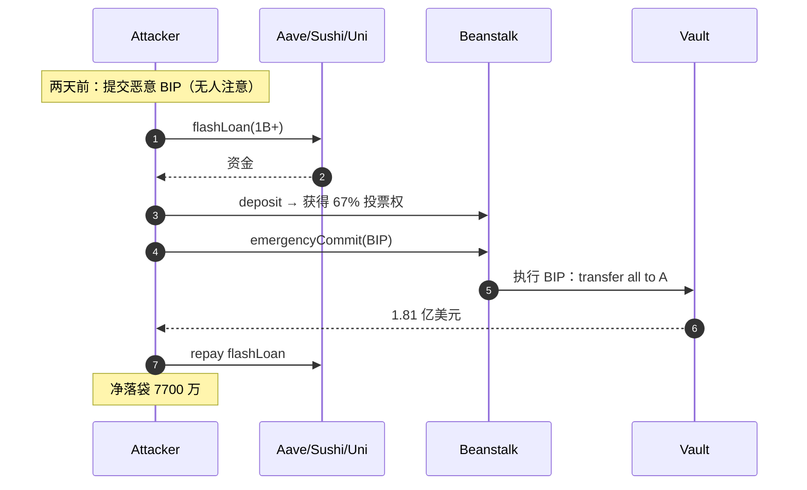

### 10A.2 防御原则

1. **Voting delay**：提案提交到生效之间至少 24h，让闪电贷无法跨时间窗。
2. **Snapshot 投票权**：投票权按提案提交那一刻的余额计算，不是执行那一刻。OpenZeppelin Governor 默认这样做。
3. **Quorum 与时间锁**：执行需要单独的 timelock 队列，攻击者执行后还有 48h 让社区能 cancel。
4. **Veto / pause guardian**：紧急情况下能由多签 veto 提案。
5. **Flash-loan-resistant 投票权**：用 vote-escrowed token（veCRV / veBAL）而非可立即买卖的现货 token。

### 10A.3 类似事件

- **MakerDAO MKR 攻击模拟**（2020）：研究者证明攻击者用 75 万美元能买够 MKR 投票权毁灭 Maker，幸而当时无闪电贷规模够大。
- **Compound governance**（多次小事件）：propose spam 攻击让真实提案排队卡死。
- **Yearn / Curve war**：投票权拍卖化（Convex / Aura），导致投票权流动性 = 价格波动 = 治理稳定性下降。

技术攻击面讲完，还有一类风险工程师往往忽略：**监管介入**。协议代码无缺陷，但因制裁名单或司法管辖，整个协议在主流市场失去可用性——这对团队和用户同样是毁灭性的。

---

## 11. 合规风险：OFAC / Tornado Cash

### 11.1 时间线

- 2022-08-08：OFAC 制裁 Tornado Cash 智能合约（[FTI 分析](https://www.fticonsulting.com/insights/articles/cryptocurrency-mixer-tornado-cash-sanctioned-us-treasury-department)）。
- 2022-08：Aave、dYdX 等纷纷屏蔽 OFAC 列表地址。
- 2024-11：第五巡回上诉法院推翻 OFAC 制裁，理由是不可变智能合约不构成 IEEPA 意义上的"财产"（[Mayer Brown](https://www.mayerbrown.com/en/insights/publications/2024/12/federal-appeals-court-tosses-ofac-sanctions-on-tornado-cash-and-limits-federal-governments-ability-to-police-crypto-transactions)）。
- 2025-03-21：OFAC 正式取消制裁（[Venable](https://www.venable.com/insights/publications/2025/04/a-legal-whirlwind-settles-treasury-lifts-sanctions)）。

### 11.2 工程师该怎么做

合规风险不是漏洞，但会让你的协议在主流市场被屏蔽：

- **前端层屏蔽**：geofence + OFAC list（Chainalysis API）。这不影响合约，但减少法律风险。
- **合约层不要主动审查**：不要在合约里加 blacklist——一旦写入，你的协议变成有信任假设的中心化系统。
- **upgrade 路径**：保持 timelock + 多签，应对监管要求。
- **Privacy 工具**：如果你设计 mixer / shielded protocol，了解 BSA/AMLA、FinCEN MSB 注册要求。Roman Storm 案与 Tornado Cash 开发者起诉至今未结。

---

## 11.3 账户抽象（ERC-4337）攻击向量

### 11.3.0 背景

ERC-4337（2023-03）：2024 年底 4000 万智能账户、1 亿+ UserOperations（[Hacken](https://hacken.io/discover/erc-4337-account-abstraction/)）。Bundler 信任 paymaster 余额、paymaster 信任 wallet 签名、wallet 信任 module 代码——任一环错都可被利用。

### 11.3.1 五条主要攻击面

| # | 攻击面 | 描述 | 缓解 |
|---|---|---|---|
| 1 | **Paymaster Drain** | paymaster 在 `validatePaymasterUserOp` 中没充分模拟，gas 被烧后由 paymaster 兜底 | 严格 simulate + reputation system + 限制 storage 访问 |
| 2 | **Bundler DoS** | 攻击者构造 userOp 让 simulation 通过但实际 revert，bundler 白付 gas | EIP-7562（验证规则）+ stake-based reputation |
| 3 | **Module install 钓鱼** | Safe / Kernel 等模块化 wallet 允许安装第三方 module；钓鱼让用户装"金库 module" | 模块白名单 + 安装时 typed-data 强制显示 |
| 4 | **userOp 重放** | 跨链或跨实体相同 userOp 被多次提交 | nonce 带 chainId + 唯一性 |
| 5 | **Signature aggregation 滥用** | aggregator 签名误用让一笔 sig 控多账户 | aggregator 必须是 stake 过的可信合约 |

### 11.3.2 Paymaster 模拟逃逸（具体例）

```solidity
// 漏洞 paymaster
function validatePaymasterUserOp(...) external returns (bytes memory ctx, uint256 vd) {
    // 攻击者构造一个 op：simulate 时参数让 require 通过，实际执行时 revert
    require(token.balanceOf(userOpSender) >= 1e18, "low balance"); // simulate 时余额够
    // 但 simulate 与 execute 之间余额可能被外部调用改变
    return ("", 0);
}
```

**EIP-7562 强制规则**（[ERC-4337 v0.7](https://docs.erc4337.io/)）：
- paymaster validation 阶段不可访问任何**外部 storage**（不能 SLOAD 别人的 token balance）。
- 每个 paymaster 必须 stake，违规则 jailed N 块。
- bundler 拒绝任何 simulate 与 execute 状态分歧的 userOp。

### 11.3.3 真实事件
- **2024-Q3 Pimlico 测试网 paymaster drain 演示**（Trail of Bits 内部 PoC，未上生产）：构造 storage-aware userOp 让 paymaster 多付 gas。
- **多起 Safe Module 安装钓鱼**（DVD challenge "Backdoor" 即是这个模型，真实事件零散见 ScamSniffer 报告）。

### 11.3.4 防御清单
1. paymaster：严格遵守 EIP-7562 storage 访问规则，永远不读外部合约。
2. bundler：维护 paymaster / aggregator / factory 三类 reputation。
3. wallet：module 安装走 typed-data + 用户显式确认，不接受 fallback module 绑定。
4. userOp 验证：nonce 含 entryPoint 地址 + chainId + sender，不可跨实体重放。

---

## 11.4 EIP-7702 攻击向量（Pectra 2025-05）

### 11.4.0 故事

EIP-7702（Pectra 2025-05）让 EOA 可临时"借"合约代码（authorization tuple 签名 → setCode），支持 batched ops、密码恢复、限额。但**任何钓鱼签名都能让 EOA 变成攻击者控制的 wallet**。

97% 的 EIP-7702 delegations 指向同一字节码——**"CrimeEnjoyor"** sweeper bot：任何 ETH 进来立刻转给指定 EOA。450,000+ 钱包被钓中（[Cryptopolitan](https://www.cryptopolitan.com/eip-7702-user-loses-1-54m-phishing-attack/)），单笔最大损失 154 万美元。[Wintermute 追踪](https://www.coindesk.com/tech/2025/06/02/post-pectra-upgrade-malicious-ethereum-contracts-are-trying-to-drain-wallets-but-to-no-avail-wintermute)显示实际盈利极低（被钓 EOA 余额多为空），但风险敞口足够吓人。

### 11.4.1 攻击面

| 攻击 | 机制 | 典型 |
|---|---|---|
| **Authorization replay** | 同一签名在不同 chainId 重放（chainId=0 通配） | 学术研究 [arXiv 2512.12174](https://arxiv.org/abs/2512.12174) |
| **CrimeEnjoyor sweeper** | 钓鱼让用户签 7702 auth → 自动转账合约接管 EOA | 450k+ 钱包 |
| **Sponsor griefing** | sponsor 替用户付 gas 后被恶意 delegate 烧光 | 不实际作恶但 DoS sponsor |
| **Delegate 私有 storage** | 7702 临时合约对 storage 的写在下次 setCode 后留存 | 攻击者把 storage 当持久后门 |

### 11.4.2 Mermaid

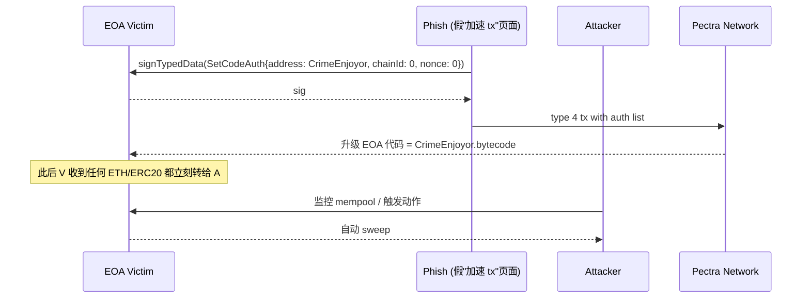

### 11.4.3 防御
- 钱包必须显式渲染 `SetCodeAuth` 内容（chainId / nonce / target bytecode 哈希）+ 大字体红色警告。
- **永远不要签 chainId = 0 的 7702 auth**（跨链通配，必然钓鱼）。
- 用 [revoke.cash 7702 模块](https://revoke.cash/) 周期检查自己的 EOA 是否被 delegate。
- 协议方写 type-4 tx 接收逻辑时，把"sender 是不是 delegated"当作 untrusted 输入。

### 11.4.4 反向用法：sweeper 抢救

讽刺的是 EIP-7702 也是被攻击钱包的"急救工具"——你比 sweeper bot 抢先把自己升级为可控合约即可（[allthingsweb3 教程](https://allthingsweb3.com/resources/compromised-wallet-recovery-sweeper-bot-guide)）。但前提：私钥未泄露 / 你比 mempool 抢跑成功。

---

## 11.5 Liquid Restaking 风险（EigenLayer / Symbiotic / Karak）

### 11.5.0 背景

2025-04 EigenLayer 启用 slashing（[CoinDesk](https://www.coindesk.com/tech/2025/04/17/eigenlayer-adds-key-slashing-feature-completing-original-vision)），TVL 约 150 亿美元、1500 个 operator、数十个 AVS。Symbiotic、Karak 紧随其后。学界长期警告"slashing cascade"：**一份 ETH 同时撑 N 个 AVS，单点出错会跨 AVS 连锁**。

### 11.5.1 三大风险类

1. **Operator 串谋（cross-AVS collusion）**
   - $8M 总质押撑 10 个 AVS，每个 AVS 锁 $2M。攻击 1 个 AVS 收益 $2M、cost = 50% slash = $4M——单 AVS 看似安全。
   - 但 10 个 AVS 同时攻击：收益 $20M、cost 仍只有 $8M（因为 stake 是共享的）。
   - 引自学术分析（[ABC Money 综述](https://www.abcmoney.co.uk/2025/06/restaking-wars-eigenlayer-vs-karak-vs-symbiotic-the-battle-for-shared-security-dominance/)）。

2. **Slashing cascade**
   - Operator A 在某 AVS 因 bug 被 slash 5% → ETH 罚没 → 也削减它在其他 AVS 的有效 stake → 那些 AVS 的安全降级 → 触发它们各自的安全条件 → 又一轮 slash。
   - [AMBCrypto Risk Map](https://eng.ambcrypto.com/restaking-risk-map-how-slashing-cascades-could-hit-your-yield/)。

3. **LRT oracle staleness**
   - Liquid Restaking Token（eETH、ezETH、weETH 等）汇率依赖 onchain oracle 更新 operator 的累计 reward / penalty。
   - 如果 oracle 滞后，攻击者可在 LRT mint/redeem 时套利。
   - 类似 §3 oracle 操纵但发生在 stake 域。

### 11.5.2 防御原则

- **AVS 多元化检查**：协议方监控自己运营 operator set 是否在其他 AVS 也活跃；过度集中 → 调权重。
- **Slashing rate cap**：单 AVS 单 epoch slash 不超过 5%，避免 cascade。
- **LRT mint/redeem timelock**：≥ 1 个 epoch（24h+）让 oracle 更新追上。
- **Insurance module**：协议层保险池，覆盖 cascade 类灰天鹅。

---

## 11.6 数据可用性（DA）攻击与 L2 风险

### 11.6.0 背景

[Unaligned Incentives（2025-09）](https://arxiv.org/pdf/2509.17126) 实证：约 10 ETH 灌满 blob 容量，让 Scroll / zkSync / Arbitrum / Base finality 延迟 579-1086 个 L1 块（30+ 分钟至 4 小时）。Pectra 把 blob target 从 3 提到 6（max 9）后压力略缓，但攻击仍便宜。

### 11.6.1 四类攻击

1. **Blob 拥堵攻击**：填满 blobspace，所有 rollup 同时延迟。
2. **DA 委员会数据扣留**（Plasma / Validium）：committee 拒绝公开数据，用户无法构造 proof 提现。
3. **Sequencer 审查**：单 sequencer rollup 拒收特定地址 tx；force-include 路径必须可用。
4. **Pricing arbitrage**：rollup blob 定价滞后 5-64 块，攻击者套利。

### 11.6.2 工程师视角

- 协议如果跨 L2 部署，**必须在威胁模型里写"L2 finality 可被延迟到 4h+"**。
- 大额 cross-rollup 操作要等 L1 finality（~12 min）+ 安全边际，不能信任 L2 reorg-free。
- 桥接器实现 force exit / escape hatch（Optimism `fault proof`、Arbitrum `outbox`）。
- L2 治理操作走 L1 timelock，不依赖 L2 sequencer 活性。

---

## 11.7 前端供应链攻击谱系（2022-2026）

### 11.7.0 背景

- 2022-08：Curve DNS 被 iwantmyname 注册商侧攻破，`curve.fi` 指向恶意 IP，损失 57.3 万美元（[Cointelegraph](https://cointelegraph.com/explained/what-is-dns-hijacking-how-it-took-down-curve-finances-website)）。
- 2023-12-14：Ledger NPM 包 `@ledgerhq/connect-kit` 注入恶意 build，5 小时劫持所有用 WalletConnect 的 dApp，损失约 60 万美元（[SlowMist](https://slowmist.medium.com/supply-chain-attack-on-ledger-connect-kit-analyzing-the-impact-and-preventive-measures-1005e39422fd)）。
- 2024-07-11：Squarespace 域名迁移漏洞，220+ DeFi 协议前端 DNS 被改，drain 数百万美元（[Decrypt](https://decrypt.co/239524/220-defi-protocols-risk-squarespace-dns-hijack)）。
- 2025-02-21：Bybit S3 JS 注入（详见 §4.5）。

### 11.7.1 攻击面分类

| 层 | 攻击向量 | 真实事件 |
|---|---|---|
| **DNS / 注册商** | 注册商被攻破改 NS 记录 | Curve 2022-08, Squarespace 2024-07 |
| **CDN / S3** | bucket 被覆盖（凭证泄露 / 配置错误） | Bybit Safe S3 2025-02 |
| **NPM / 依赖** | 包被替换 / typosquatting | Ledger Connect Kit 2023-12 |
| **GitHub Action** | 第三方 action 被篡改 | tj-actions/changed-files 2024-2025 多起 |
| **EIP / ENS** | ENS resolver 被劫持 | 多起 NFT phishing |
| **Browser extension** | 假冒钱包扩展 | Chrome Web Store 多次清理 |

### 11.7.2 工程实践

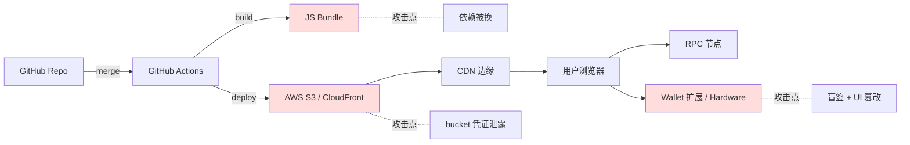

**8 条防御**：
1. DNS：启用 DNSSEC；监控 NS 记录变化（DNS-over-HTTPS 探针）。
2. 注册商：双因素 + email 单独邮箱 + 不与开发者邮箱混用。
3. CDN：S3 对象启用版本控制 + 完整性校验；对 critical asset 用 [Subresource Integrity](https://developer.mozilla.org/docs/Web/Security/Subresource_Integrity)。
4. NPM：锁版本（`package-lock.json`） + 启用 [npm provenance](https://docs.npmjs.com/generating-provenance-statements)；定期 `npm audit signatures`。
5. CI：第三方 action 钉到 commit SHA 而非 tag；定期 [pinact](https://github.com/suzuki-shunsuke/pinact)。
6. 钱包：Clear Signing 标准必读；强制 calldata 解码。
7. 监控：Sentry / DataDog 监控前端 fetch 行为异常；Web3Antivirus 等开源探针。
8. 文化：把"前端是金融基础设施"刻在团队 onboarding 里——它**不是市场部的页面**。

---

## 12. 静态分析

### 12.0 定位

**静态分析 = 审计的雷达**。Slither 30 秒扫出已知漏洞模式，人脑留给业务逻辑。四类：
1. **AST/SlithIR**：Slither、Aderyn、4naly3er——快、易写自定义规则，只能匹配模式。
2. **符号执行**：Mythril、Manticore——慢、找深路径，false positive 高。
3. **抽象解释**：Securify、SolidityScan——精度居中。
4. **AI/LLM 增强**：Olympix、Sherlock AI、Aderyn AI——2024-2026 兴起，仍在演进。

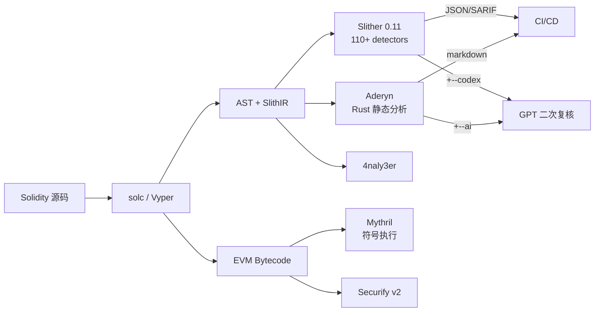

### 12.1 Slither

Trail of Bits 出品，最新版 **0.11.5**（2025-01-16，[GitHub Releases](https://github.com/crytic/slither/releases)）。安装：

```bash
pip install slither-analyzer==0.11.5
slither --version
# slither 0.11.5
```

0.11.x 相对 0.10.x 的关键变化：
- 新增 `reentrancy-balance` detector（针对依赖 `address(this).balance` 做账的合约）。
- 新增 `unindexed-event-address`：地址类型 event 参数没 indexed 时索引器无法过滤。
- 支持 CLZ EVM opcode（Cancun 后引入）。
- 支持自定义 storage layout（用于 Diamond / 自定义 proxy）。
- 最低 Python 版本提升到 3.10。

跑全套检查：

```bash
slither . --filter-paths "lib|test" --json slither.json
```

配置文件 `code/slither/slither.config.json`：

```json
{
  "detectors_to_exclude": "naming-convention,solc-version,pragma",
  "filter_paths": "lib|node_modules|test",
  "fail_on": "medium",
  "json": "slither-report.json",
  "sarif": "slither.sarif"
}
```

SARIF 输出直接渲染到 GitHub Code Scanning。

**常用 detector top 10**（按命中率）：

1. `reentrancy-eth` / `reentrancy-no-eth`
2. `unchecked-transfer`
3. `arbitrary-send-eth`
4. `tx-origin`
5. `uninitialized-state`
6. `incorrect-equality`
7. `weak-prng`
8. `unprotected-upgrade`
9. `divide-before-multiply`
10. `events-access` / `events-maths`

### 12.1.1 Slither-MCP

Trail of Bits 2025-11 发布（[Security Boulevard](https://securityboulevard.com/2025/11/level-up-your-solidity-llm-tooling-with-slither-mcp/)），把 SlithIR、调用图、detector 结果暴露给 LLM agent：LLM query 精确控制流而非猜源码逻辑，Cursor / Claude Code / Continue 可无缝接入，减少 hallucination。

```bash
pip install slither-mcp
# Cursor 中配置：mcpServers.slither = { command: "slither-mcp" }
```

### 12.2 自定义 detector

完整示例 `code/slither/no_low_call_detector.py`：

```python
from slither.detectors.abstract_detector import AbstractDetector, DetectorClassification
from slither.slithir.operations import LowLevelCall

class ExternalCallNoCheck(AbstractDetector):
    ARGUMENT = "external-call-no-check"
    HELP = "Low-level call() whose return value is not checked"
    IMPACT = DetectorClassification.HIGH
    CONFIDENCE = DetectorClassification.MEDIUM
    # ... wiki 字段省略

    def _detect(self):
        results = []
        for contract in self.compilation_unit.contracts_derived:
            for func in contract.functions:
                for node in func.nodes:
                    for ir in node.irs:
                        if isinstance(ir, LowLevelCall):
                            text = str(node.expression).lower()
                            if "ok" not in text and "success" not in text:
                                results.append(self.generate_result([
                                    contract, " ", func, " unchecked low-level call at ", node, "\n"
                                ]))
        return results
```

加载：

```bash
slither . --detect external-call-no-check --detector-path code/slither/
```

### 12.3 Aderyn

Cyfrin 出品，Rust 静态分析器，速度比 Slither 快 5-10 倍，输出 markdown 报告（[GitHub](https://github.com/Cyfrin/aderyn)）。

```bash
cargo install aderyn
cd code
aderyn .
# 输出 report.md，包含每个发现的代码位置、修复建议
```

`aderyn --ai` 用 OpenAI 或本地 Ollama 二次复核，语义判断过滤误报。

### 12.4 4naly3er

Picodes 在 Code4rena 报告里频繁使用的 gas+code-quality 工具，重在自动写 finding 报告。CI 集成：

```yaml
- name: 4naly3er
  run: |
    git clone https://github.com/Picodes/4naly3er
    cd 4naly3er && yarn && yarn analyze ../src
```

### 12.5 Mythril

ConsenSys Diligence（[GitHub](https://github.com/ConsenSysDiligence/mythril)），Z3 符号执行 EVM 字节码，能找深路径漏洞但慢。安装：

```bash
pip install mythril
myth analyze code/vulnerable/Reentrancy.sol --solv 0.8.25
```

适用：无源码合约（直接喂 bytecode）、SWC-104/106/107 全路径覆盖。不适合大型协议（超时严重、状态空间爆炸）。

### 12.6 Securify v2

ETH Zurich + ChainSecurity，基于抽象解释，能证明"一定/一定不"满足某 pattern。2021 后维护减弱。

### 12.7 工具链组合建议

```
开发期：Slither pre-commit hook → 阻止 fail_on: medium 入仓
        Aderyn 周期性扫描 → 生成 markdown TODO
PR 期：4naly3er → 生成 gas/quality 评论
审计前：Slither 全量 + 自定义 detector + Aderyn AI
审计期：人工 + Slither cross-reference + Mythril 关键模块
生产前：Olympix mutation testing 验证测试覆盖
```

完整 GitHub Actions 配置示例：

```yaml
name: Security
on: [push, pull_request]
jobs:
  slither:
    runs-on: ubuntu-latest
    steps:
      - uses: actions/checkout@v4
      - uses: crytic/slither-action@v0.4.0
        with:
          slither-version: '0.11.5'
          fail-on: 'medium'
          sarif: results.sarif
      - uses: github/codeql-action/upload-sarif@v3
        with:
          sarif_file: results.sarif
  aderyn:
    runs-on: ubuntu-latest
    steps:
      - uses: actions/checkout@v4
      - run: cargo install aderyn
      - run: aderyn . --output report.md
      - uses: actions/upload-artifact@v4
        with: { name: aderyn-report, path: report.md }
```

---

## 13. 模糊测试

### 13.0 定位

Trail of Bits Curvance fuzz 报告（[blog](https://blog.trailofbits.com/2024/04/30/curvance-invariants-unleashed/)）：116 条 invariant + Echidna 10 亿次调用序列，1 分钟内找到"未亏损时清算不应发生"的三步违反路径——单元测试写不出来。

**fuzz 测"不变量陈述是否成立"，不是"代码不崩溃"。写不出 invariant 就 fuzz 不出 bug**。

### 13.1 Foundry invariant

`forge test --match-contract Invariant` 默认跑 256 runs × depth 64。完整示例 `code/fuzz/InvariantFoundry.t.sol`，核心结构：

```solidity
contract Handler is Test {
    InflationProofVault vault;
    Token token;
    address[] internal actors = [address(0x1), address(0x2), address(0x3)];

    function deposit(uint256 actorSeed, uint256 amt) external {
        amt = bound(amt, 1, 100_000e18);
        address a = actors[actorSeed % actors.length];
        vm.prank(a);
        try vault.deposit(amt) {} catch {}
    }
    function donate(uint256 actorSeed, uint256 amt) external { /* ... */ }
}

contract InvariantTest is StdInvariant, Test {
    function setUp() public {
        // 部署 + targetContract(handler)
    }
    function invariant_singleSharePayoutBounded() public view {
        // 关键不变量
    }
}
```

`foundry.toml`：

```toml
[invariant]
runs = 256
depth = 64
fail_on_revert = false
```

跑 100k 调用：

```bash
forge test --match-test invariant_ -vvv \
    --invariant-runs 1000 --invariant-depth 100
# 1000 * 100 = 100,000 calls
```

### 13.2 Echidna 2.2

Trail of Bits Haskell fuzzer，更善于发现深路径。安装：

```bash
brew install echidna
# 或 docker pull trailofbits/echidna
```

配置 `code/fuzz/EchidnaConfig.yaml` + 测试合约 `code/fuzz/NaiveVaultEcho.sol`。运行：

```bash
echidna code/fuzz/NaiveVaultEcho.sol \
    --contract NaiveVaultEcho \
    --config code/fuzz/EchidnaConfig.yaml
```

三种模式：
- `property`：`echidna_xxx()` 返回 bool，不变量恒为 true。
- `assertion`：函数嵌入 `assert(...)`，违反则 fail。
- `optimization`：找让某值最大化的 input（找"attacker 最赚钱的序列"）。

用法：关键 invariant 用 `property`；复杂状态机用 `assertion + multi-abi`；经济攻击用 `optimization`。

### 13.3 Medusa

Trail of Bits 2025-02（[blog](https://blog.trailofbits.com/2025/02/14/unleashing-medusa-fast-and-scalable-smart-contract-fuzzing/)），go-ethereum 内核，并行 + 覆盖率引导。

```bash
go install github.com/crytic/medusa@latest
medusa init
medusa fuzz
```

`medusa.json`：

```json
{
  "fuzzing": {
    "workers": 16,
    "testLimit": 1000000,
    "callSequenceLength": 100,
    "corpusDirectory": "corpus",
    "coverageEnabled": true,
    "targetContracts": ["NaiveVaultEcho"]
  }
}
```

### 13.4 怎么写好不变量

好的 invariant：① 状态独立（不依赖调用顺序）；② 可测（view 函数可计算）；③ 强（违反意味着真实损失）。

借贷协议核心不变量：

| Invariant | 含义 |
|---|---|
| `totalSupplied >= totalBorrowed` | 协议不可超借 |
| `for each user: collateralValue * LTV >= debt` | 健康度 |
| `sum(userBalances) == totalShares` | 账目一致性 |
| `feeAccrued >= 0` | fee 单调 |

写成 Solidity 函数，让 Echidna / Foundry 反复戳。

---

## 14. 形式化验证

### 14.0 定位

Aave V3 用 5000+ 行 CVL 证明约 200 条核心 rule（[Aave 仓库](https://github.com/aave/aave-v3-core)），安全性从"测过 1000 个场景"升到"所有可能输入下都成立"。三个层级：
1. **SMTChecker**（内置）：免费，只证简单 assert，状态空间小。
2. **Halmos**（a16z）：把 Foundry test 当 spec，门槛最低。
3. **Certora**（商业，学术免费）：完整 CVL 规约，最强但学习曲线陡。

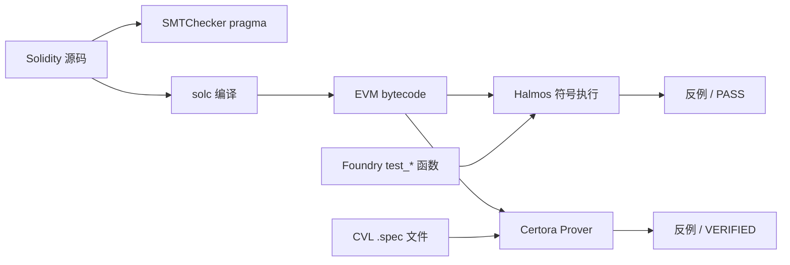

### 14.1 三种形式化工具的角色

| 工具 | 类型 | 学习曲线 | 适合阶段 |
|---|---|---|---|
| SMTChecker | 内置 Solidity | 低 | 局部小函数 / 单 assert |
| Halmos 0.3.x | 符号执行（Python） | 中 | 把 Foundry 测试当 spec |
| Certora 7.x | 商业 SMT prover | 高 | 协议核心模块完整规约 |
| ItyFuzz / SolCMC | 学术工具 | 高 | 研究用 |

### 14.2 Halmos

a16z（[GitHub](https://github.com/a16z/halmos)），最新版 **0.3.3**（2025-07-31）。0.3.x：EVM 解释器 32× 加速、stateful invariant testing（[a16zcrypto](https://a16zcrypto.com/posts/article/halmos-v0-3-0-release-highlights/)）、lcov 覆盖率输出。

把 fuzz test 输入当符号变量，用 Z3/Yices 求解所有路径；assertion 全路径成立则证明完成，否则给出反例。

完整示例 `code/formal/HalmosERC20.t.sol`：

```solidity
contract HalmosTotalSupplyTest is Test {
    Toy token;
    function setUp() public { token = new Toy(); }

    /// Halmos 把 src/dst/amt/initialSupply 都当符号变量穷举
    function check_transfer_preserves_total_supply(
        address src, address dst, uint256 amt, uint256 initialSupply
    ) public {
        vm.assume(src != address(0));
        vm.assume(dst != address(0));
        vm.assume(initialSupply <= 1e30);
        token.mint(src, initialSupply);
        uint256 before = token.totalSupply();

        vm.prank(src);
        try token.transfer(dst, amt) returns (bool) {} catch {}

        assertEq(token.totalSupply(), before, "totalSupply must not change");
    }
}
```

跑：

```bash
pip install halmos
halmos --contract HalmosTotalSupplyTest
# 输出：[PASS] check_transfer_preserves_total_supply(...)
```

> **手推证明**：transfer 的 `_update(from, to, amount)` 在分支 `from != address(0) && to != address(0)` 时执行 `_balances[from] -= amount; _balances[to] += amount;`，不修改 `_totalSupply`。其他分支（mint/burn）才会改 totalSupply。OZ 的 `transfer` 永远走非 mint/burn 分支，因此 invariant 成立。Halmos 自动覆盖所有 amount / balance 组合。

### 14.3 Certora

商业 SMT prover（学术免费），CVL 写规约（[官方文档](https://docs.certora.com/)）。示例：

```
rule transfer_preserves_total_supply(address src, address dst, uint256 amt) {
    env e;
    require src != 0 && dst != 0;
    uint256 supplyBefore = totalSupply();
    transfer(e, dst, amt);
    uint256 supplyAfter = totalSupply();
    assert supplyBefore == supplyAfter;
}
```

跑：

```bash
certoraRun src/Toy.sol --verify Toy:specs/Toy.spec
```

比 Halmos 慢但更深，处理 unbounded loop（unrolling）和 ghost variable。Aave V3、Compound V3、Uniswap V3 均有完整 CVL 规约。

完整 CVL 模式速查：

| 模式 | CVL 关键字 | 用途 |
|---|---|---|
| `methods` | `methods { ... }` | 声明被验证函数的签名 |
| `rule` | `rule foo() { ... }` | 单条 spec |
| `invariant` | `invariant inv() { ... }` | 全局不变量（覆盖所有函数） |
| `ghost` | `ghost mapping(...) sum;` | 跨函数累计的辅助变量 |
| `hook` | `hook Sstore _balances[a] uint v` | 拦截 storage 写来更新 ghost |
| `preserved` | `invariant ... { preserved foo() {...} }` | 排除某函数 / 设置前置条件 |
| `parametric` | `rule x(method f) { f(...); }` | 自动覆盖所有函数 |
| `summary` | `function transfer(...) returns (bool) => true` | 用 summary 替代真实实现，加速验证 |

### 14.4 SMTChecker

`pragma experimental SMTChecker;` 或 `--model-checker-engine all`，编译时证 require/assert。

```solidity
pragma solidity 0.8.25;
contract Tiny {
    function safeAdd(uint256 a, uint256 b) external pure returns (uint256) {
        unchecked {
            assert(a + b >= a); // SMTChecker 会证明此 assert 成立 iff a+b 不溢出
            return a + b;
        }
    }
}
// solc Tiny.sol --model-checker-engine all --model-checker-targets overflow,assert
```

适用：单函数 ≤50 行、状态量 ≤5 个；超规模切 Halmos / Certora。

---

## 15. 审计方法论

### 15.1 Threat Modeling 框架

**STRIDE-DeFi**（基于微软 STRIDE 改造）：

| 类别 | DeFi 表现 |
|---|---|
| **S**poofing | 签名伪造、tx.origin 替代 msg.sender |
| **T**ampering | reentrancy、storage collision |
| **R**epudiation | event 缺失，无法追责 |
| **I**nformation disclosure | 链上私钥误存、commit-reveal 失效 |
| **D**enial of service | unbounded loop、push 失败 |
| **E**levation of privilege | unprotected init、role escalation |
| **F**inancial（DeFi 加） | oracle、liquidation、fee leakage |

### 15.2 Actor Map 模板

```yaml
actors:
  - name: Trusted Admin
    capabilities: [pause, upgrade]
    risks: [key compromise, malicious upgrade]
    invariants_to_check: [timelock_delay >= 48h]

  - name: Liquidator (permissionless)
    capabilities: [call liquidate]
    risks: [front-running, MEV]
    invariants_to_check: [liquidation_bonus < collateral_value]

  - name: Borrower
    capabilities: [deposit, borrow, repay]
    risks: [healthFactor manipulation]
    invariants_to_check: [debt <= LTV * collateralValue]

  - name: Flash loan caller
    capabilities: [借走全协议流动性]
    risks: [oracle manipulation, atomic re-pricing]
    invariants_to_check: [price_within_block stable]

  - name: External integrator
    capabilities: [构造任意 calldata]
    risks: [回调进入未保护函数]
    invariants_to_check: [reentrancy guard always set]
```

### 15.3 Invariant List 模板

协议团队审计前提交：

```markdown
# Invariants
## 资产层
1. [I1] sum(balances) == totalSupply（ERC20 一致性）
2. [I2] vault.totalAssets() >= sum(user shares * pricePerShare floor)

## 健康度
3. [I3] for any user: collateralValue * LTV >= debt
4. [I4] healthFactor < 1 ⇒ user can be liquidated by anyone

## 治理
5. [I5] only multisig can upgrade
6. [I6] upgrade has timelock >= 48h

## 经济
7. [I7] fee 单调递增
8. [I8] inflate attack: deposit dust + donate cannot make ROI > native deposit
```

### 15.4 攻击树（Attack Tree）

```
Goal: Drain Lending Protocol
├── A. 伪造高估值抵押品
│   ├── A1. Oracle manipulation (flash loan + spot)
│   │   └── 防御：TWAP / Chainlink heartbeat
│   ├── A2. ERC4626 inflation (donate to vault)
│   │   └── 防御：virtual shares
│   └── A3. Storage hijack (proxy admin compromise)
│       └── 防御：multisig + timelock
├── B. 直接绕过授权
│   ├── B1. Reentrancy
│   ├── B2. Signature replay
│   └── B3. Init unprotected
└── C. 经济攻击
    ├── C1. Liquidation bonus arbitrage
    ├── C2. Interest rate manipulation
    └── C3. MEV sandwich on rebalance
```

### 15.5 审计报告模板

```markdown
# Protocol X Audit Report
**Auditor**: Your Name
**Period**: YYYY-MM-DD ~ YYYY-MM-DD
**Commit**: 0xabcd...
**Scope**: contracts/{Vault.sol, Lending.sol, ...}

## Executive Summary
- Findings: H1, M3, L7, I12
- Lines of code reviewed: 4,832
- Recommended for production: ☐ Yes ☑ Yes after fixes ☐ No

## Severity Matrix
| ID | Title | Severity | Likelihood | Impact | Status |
|---|---|---|---|---|---|
| H-01 | Reentrancy in withdraw allows draining vault | High | High | Critical | Fixed in PR #42 |

## Detailed Findings

### [H-01] Reentrancy in withdraw allows draining vault
**Severity**: High
**Likelihood**: High
**Impact**: Loss of all vault assets

#### Description
The `Vault.withdraw()` function transfers ETH before updating `balances[msg.sender]`...

#### Proof of Concept
```solidity
contract Attacker { receive() external payable { vault.withdraw(); } }
```

#### Recommendation
1. Apply CEI pattern
2. Add OpenZeppelin's `ReentrancyGuard.nonReentrant`

#### Reference
- SWC-107
- The DAO (2016-06-17): https://...
```

---

## 16. 竞赛与赏金

### 16.1 平台

| 平台 | 模式 | 费用 | 优势 | 劣势 |
|---|---|---|---|---|
| **Code4rena** | 公开竞赛 + private | 协议方付 ~$50k-500k | 社区大、findings 公开 | 噪音多 |
| **Sherlock** | LSW（Lead Security Watson）+ contest | 协议方付 + 保险 | 严格规则、有 watson 协议保 | 严苛、入门门槛高 |
| **Cantina** | Spearbit 旗下竞赛+私有 | 协议方付 | 顶级 auditor 池 | 私有较多 |
| **Immunefi** | bug bounty（生产合约）| 按发现支付，最高 $10M | 真实 production | 重复发现率高 |
| **HatsFinance / HackenProof** | bounty + audit | 中等 | 新兴 | 协议覆盖少 |

详见 [HackenProof 2024 指南](https://hackenproof.com/blog/for-business/code4rena-vs-sherlock-crowdsourced-audits-comparison-guide)、[Johnny Time 综述](https://medium.com/@JohnnyTime/complete-audit-competitions-guide-strategies-cantina-code4rena-sherlock-more-bf55bdfe8542)。

### 16.2 Damn Vulnerable DeFi v4 关卡

DVD v4（[官方](https://www.damnvulnerabledefi.xyz/v4-release/)，2024-05 发布）共 18 关，全套 Foundry，Solidity 0.8.25，OZ 5.x。**4 个全新关卡**：Curvy Puppet / Shards / Withdrawal / The Rewarder（重做）。其余基于 v3 但全部 Foundry 化、permit2 化。

| # | 关卡 | 主要考点 | 推荐难度 |
|---|---|---|---|
| 1 | Unstoppable | flash loan invariant + DoS | ★★ |
| 2 | Naive Receiver | meta-transaction + 强制还款 | ★★ |
| 3 | Truster | flash loan callback approve | ★ |
| 4 | Side Entrance | flash loan + 重入 | ★★ |
| 5 | The Rewarder（重做）| Merkle distribution + 时间游戏 | ★★★ |
| 6 | Selfie | governance + flash loan voting | ★★★ |
| 7 | Compromised | 链下泄露的私钥 | ★★ |
| 8 | Puppet | DEX spot oracle 操纵 | ★★ |
| 9 | Puppet V2 | UniV2 reserve 操纵 | ★★ |
| 10 | Free Rider | NFT 市场逻辑 bug | ★★★ |
| 11 | Backdoor | Safe 多签 module 后门 | ★★★ |
| 12 | Climber | Timelock + UUPS 滥用 | ★★★★ |
| 13 | Wallet Mining | 预测地址 + selfdestruct | ★★★ |
| 14 | Puppet V3 | UniV3 TWAP 攻击 | ★★★★ |
| 15 | ABI Smuggling | calldata 注入 | ★★★ |
| 16 | Shards（新）| 部分挂单价格越界 | ★★★★ |
| 17 | Curvy Puppet（新）| Curve 池子 + read-only reentrancy | ★★★★★ |
| 18 | Withdrawal（新）| L2 桥提现验证 | ★★★★ |

> 每关只读题面，最多卡 2 小时；卡住后读官方 hint，完赛后读优秀解（推荐 [siddharth9903/damn-vulnerable-defi-v4-solutions](https://github.com/siddharth9903/damn-vulnerable-defi-v4-solutions)）。

### 16.3 进入路径

1. **Cyfrin Updraft**（[updraft.cyfrin.io](https://updraft.cyfrin.io/courses/security)）：100+ 课，免费，含 Trail of Bits / Sigma Prime 客串。
2. **Damn Vulnerable DeFi v4**：见上表。
3. **Ethernaut**（[ethernaut.openzeppelin.com](https://ethernaut.openzeppelin.com/)）：27+ 关卡。
4. **Capture the Ether**（[capturetheether.com](https://capturetheether.com/)）：EVM 字节码到 ECDSA，难度梯度好。
5. **Paradigm CTF**（年度）：顶尖选手训练场。
6. **Owen Thurm YouTube**：每周一个真实漏洞复盘。
7. **Solodit**（[solodit.cyfrin.io](https://solodit.cyfrin.io/)）：所有公开 finding 搜索引擎。
8. 完整打一个低 ranking 的 Code4rena contest。

### 16.4 2026-04 现状

- **Code4rena**：社区最大，2025 起被 Cantina 抢走部分顶级团队；Findings 公开是最大优势。
- **Sherlock**：LSW 模式主流，"被攻击则赔付"差异化；规则严格，invalid 判定易白干。
- **Cantina**（Spearbit 子产品）：2024-2025 增长最快，吸引 0xpicodes、cmichel 等顶尖个人。
- **Hats Finance / HackenProof**：长尾，新协议性价比高。
- **CodeHawks**（Cyfrin）：与 Updraft 联动，新人友好。

### 16.5 真实赏金案例

- Immunefi MakerDAO 2022：reset 漏洞，赏金 1000 万美元。
- Immunefi Polygon 2021：hardfork bug，赏金 200 万美元。
- Coinbase Wallet：私下报告获 25 万美元。
- Wintermute 2022-09：Profanity vanity address，攻击者拿走 1.6 亿美元——反证 bounty 预防价值。

---

## 17. AI 审计的能力与边界

### 17.1 能做什么

- **报告辅助**：Aderyn 输出 + Claude/GPT 生成 markdown finding，省 50% 报告时间。
- **Fuzz seed 生成**：LLM 根据函数签名生成初始种子，加速 corpus 启动。
- **语义复核**：Slither 命中点 LLM 二次过滤，减少 false positive。
- **架构总结**：自动画 inheritance / call graph。
- **CTF 搜索**：Damn Vulnerable DeFi 等公开题目 LLM 几乎见过——既是 boon 也是 bane。

代表工具：OZ AI tools（[oz blog](https://www.openzeppelin.com/security)）、Aderyn AI、Slither-MCP（[Trail of Bits 2025-11](https://securityboulevard.com/2025/11/level-up-your-solidity-llm-tooling-with-slither-mcp/)）。

### 17.2 不能做什么

- GPT-4 / Claude 漏洞分类约 40% 真阳率，伪阳率显著（[LLM-SmartAudit arXiv 2410.09381](https://arxiv.org/html/2410.09381v1)）。
- LLMSmartSec：伪阳率 5.1%（vs SOTA 7.2%），仍非零（[arXiv](https://www.researchgate.net/publication/384137323)）。
- LLMBugScanner ensemble top-5 准确率约 60%——40% 真漏洞 LLM 未看出（[arXiv 2512.02069](https://arxiv.org/html/2512.02069v1)）。
- 跨函数/跨合约状态不变量推理弱，涉及经济激励的攻击（oracle median game）几乎无能。

### 17.3 现实警告

四条底线：
1. **AI 是 reviewer 不是 owner**：LLM finding 必须人类二次评估，不可直接归档。
2. **专业审计公司不因 AI 降价**：OZ、Trail of Bits 仍按工程师人天计费。
3. **AI 漏报代价 > 人工漏报**：甲方信任 AI"看过了"，导致复审降级。
4. **训练数据偏向公开案例**：对 2024-2026 的新 pattern 反应慢。

> **为什么 AI 不会取代 Senior Auditor**
>
> Senior Auditor 的价值：看到新协议立刻能问"这个汇率函数在闪电贷下还成立吗？"（经济直觉）；知道哪些 invariant 是核心、哪些是噪音（阅历）；在与协议方争论时拿历史先例反驳（社会工程）。AI 在前两点会进步，第三点至少 10 年内仍是人类工作。

### 17.4 2025-2026 工业界 AI 审计工具谱系

| 工具 | 厂商 | 定位 | 核心数据（厂商自报）|
|---|---|---|---|
| **Olympix** | Olympix.ai | IDE/CI 集成 + mutation testing | 75% TP（vs Slither 15%）；30% Solidity 开发者覆盖（[官方](https://olympix.security/)）|
| **Sherlock AI** | Sherlock | 隔离扫描 + 不训练用户代码 | 与 contest 平台联动 |
| **Aderyn AI mode** | Cyfrin | Rust 静态分析 + LLM 二次复核 | 与 Updraft 课程整合 |
| **Slither-MCP** | Trail of Bits | 给 LLM agent 暴露 SlithIR | 2025-11 GA |
| **OpenZeppelin Code Insights** | OpenZeppelin | 与 Defender 整合 | 闭源 SaaS |
| **Almanax / Vibe Audit** | 独立创业 | LLM-first 审计平台 | 噪声大、需筛选 |

> **业内共识（2026-04）**：AI 工具能替代审计中"50% 的 informational 找寻 + 30% 的 low-severity 找寻"，但 critical / high 级别 finding 仍 90% 依赖人。**LLM 当 grep 用，不当 oracle 用**。

### 17.5 2025-2026 实测数据：AI 在审计竞赛中的表现

| 指标 | 数据点 | 来源 |
|---|---|---|
| Olympix 自报 TP | 75%（vs Slither 15%） | [Olympix 官方](https://olympix.security/) |
| Sherlock AI 在 contest 中产出有效 finding | 占 contest 总有效 finding 的 ~5-8%（2025） | Sherlock 官方博客 |
| LLMBugScanner top-5 acc | ~60% | [arXiv 2512.02069](https://arxiv.org/html/2512.02069v1) |
| LLMSmartSec FP rate | 5.1%（vs SOTA 7.2%）| [LLMSmartSec arXiv](https://www.researchgate.net/publication/384137323) |
| Code4rena 政策 | 接受 AI 辅助提交，但要求选手对 finding 全责；纯 dump 提交常被 marked as low-quality | Code4rena 提交指南 |
| Sherlock 政策 | 同上；强调选手必须能在 review 中复述 finding 逻辑 | Sherlock contest rules |
| Cantina | 同上；个人 reputation 系统比 AI 工具影响奖金分配更多 | [Johnny Time 综述 2025-05](https://medium.com/@JohnnyTime/complete-audit-competitions-guide-strategies-cantina-code4rena-sherlock-more-bf55bdfe8542) |

**关键观察**：
1. 没有平台禁止 AI，但都要求"提交质量负全责"。
2. AI 低质量 finding 被 judge 扣分，长期 reputation 受损。
3. 顶级 warden 把 AI 当 grep：扫 informational，人工审高严重度——2025-2026 主流做法。
4. Sherlock AI / Olympix 强调"不训练用户代码"——需合同约束。

---

### 17.6 MEV-Share / SUAVE 安全分析

### 17.6.0 背景

MEV-Share（Flashbots，2023-04）：用户 tx 附加 hint，searcher 出价 backrun，MEV 利润 ≥ 90% 退还用户。2024-11 BuilderNet 发布，SUAVE 演化为 BuilderNet + TEE 验证（[Flashbots](https://writings.flashbots.net/the-future-of-mev-is-suave)）。

### 17.6.1 安全面

| 风险 | 描述 |
|---|---|
| **Hint 泄漏** | hint 太信息化导致 searcher 反推完整 tx，绕开拍卖直接 frontrun |
| **Builder 串谋** | 如果 N 个 builder 联手，能审查 / 排序某用户的 tx |
| **OFA 单点信任** | MEV-Blocker / Flashbots Protect / Merkle / Blink 等私 RPC 都是中心化运营，运营方能看到所有 pending tx |
| **TEE 故障** | SUAVE 假设 SGX/TDX 可信，但 Intel 历史漏洞频繁 |
| **Conditional payment** | 若退款逻辑有 bug，用户拿不到承诺的 90% |

### 17.6.2 实证研究

[arxiv 2505.19708](https://arxiv.org/html/2505.19708v1) 评估 4 大私有 RPC（MEV Blocker、Flashbots Protect、Blink、Merkle）：
- 均能阻止经典 sandwich，但延迟不同（10ms - 6s）。
- 部分 RPC 在高拥堵时仍走公网回退，敏感 tx 可能被回退泄漏。
- 用户反馈 % 不一致——MEV-Share 平均退还 80%-90%，部分 RPC 仅退 50%。

### 17.6.3 工程师建议

- 大额 swap 走 MEV-Share（[mev-share.flashbots.net](https://docs.flashbots.net/flashbots-mev-share/introduction)）。
- 协议级集成 [CowSwap](https://cow.fi) / [1inch Fusion](https://app.1inch.io/) 把 MEV 拍卖化分给用户。
- 不依赖单一 builder：BuilderNet v1.2（2025-02）支持多 builder fail-over。
- 关键 admin tx 走 Flashbots Protect bundle，避免 mempool 被 frontrun。

---

### 17.7 监控与应急响应

### 17.7.0 定位

Euler Finance（2023-03-13）：Forta bot 4 分钟内报警，但 8 小时后才有人响应。2024 年起 Forta + OZ Defender + Tenderly 形成"3 件套"：bot 检测 → Defender 自动 pause → Telegram 通知，响应从小时降到分钟。

### 17.7.1 监控栈对比

| 工具 | 触发方式 | 自动响应 | 价格 |
|---|---|---|---|
| **Forta** | 去中心化 bot 网络，第三方写规则 | 仅警报 | 订阅式 / 免费 |
| **OZ Defender Sentinel** | 自定义条件（事件/函数/参数） | 触发 Autotask（pause 等）| SaaS 收费 |
| **Tenderly Alerts** | 链上事件 + 模拟器规则 | 触发 webhook | SaaS 收费 |
| **自建（subgraph + cron）** | 灵活 | 自己写 | 自己付 RPC |

### 17.7.2 自动 pause 示例

```javascript
// OpenZeppelin Defender Autotask 示例
exports.handler = async function(event) {
  const provider = new ethers.providers.JsonRpcProvider(...);
  const signer = new DefenderRelaySigner(event, provider, { speed: 'fast' });
  const protocol = new ethers.Contract(PROTOCOL_ADDR, ABI, signer);

  // 触发条件：单笔 TVL 流出 > 10%
  const drainedRatio = await protocol.lastTxOutflow() / await protocol.totalAssets();
  if (drainedRatio > 0.1) {
    const tx = await protocol.pause();
    await tx.wait();
    // 通知 Telegram / Slack / PagerDuty
  }
};
```

监控规则：① TVL 5 分钟窗口流出 > X%；② oracle 与 TWAP 偏差 > X%；③ 新地址（< 24h）单笔超阈值；④ OwnershipTransferred / RoleGranted；⑤ Upgraded 事件；⑥ FlashLoan + 同 tx 内金库变化。

### 17.7.3 应急响应剧本（Playbook）

```markdown
## P0 事件响应（< 5 分钟）
1. Defender Autotask 自动 pause（如已配置）
2. 值班工程师从 PagerDuty 接通知
3. 在 incident-channel 发"我在处理"
4. Tenderly 拉异常 tx 模拟，确认是否真的是攻击

## P1 阶段（5-30 分钟）
5. 通过 multisig 紧急提案：升级到打补丁版本 / 转移资金
6. 在 X / Discord 公布"已 pause，资金安全 / 部分受损"
7. 联系白帽渠道（SEAL 911、Immunefi）尝试拦截

## P2 阶段（< 24 小时）
8. 完整 post-mortem 草稿
9. 与 hackers 协商（rekt 协议常用 10% bounty）
10. 如有用户损失，启动赔付计划
```

### 17.7.4 链上 dead man switch

```solidity
contract DeadMan {
    uint256 public lastHeartbeat;
    uint256 public constant TIMEOUT = 7 days;
    function heartbeat() external onlyOperator { lastHeartbeat = block.timestamp; }
    modifier alive() { require(block.timestamp - lastHeartbeat < TIMEOUT, "dead"); _; }

    function withdraw(...) external alive { ... }
}
```

7 天无 heartbeat（运维度假 / 团队跑路）时合约自动停止，避免"团队消失"场景下用户资金永久锁死。

---

## 18. 习题与答案

### 习题 1（基础 / 找漏洞）

```solidity
contract Coin {
    mapping(address => uint256) public balance;
    function transfer(address to, uint256 amt) external {
        balance[msg.sender] -= amt;
        balance[to] += amt;
    }
}
```

找出至少 3 个问题。

<details><summary>参考答案</summary>

1. 缺少 `require(balance[msg.sender] >= amt)`：0.8+ 默认 underflow revert，但浪费 gas。
2. 缺 `emit Transfer(...)`：索引器无法跟踪。
3. 无 totalSupply / mint / burn：不构成 ERC20，链下基础设施无法集成。
4. `transfer to == address(0)` 未禁止：意外销毁。
5. 无 approve/transferFrom：不可被 dApp 集成。

</details>

### 习题 2（中级 / 写不变量）

为以下 vault 写出 ≥ 4 个不变量：

```solidity
contract Vault {
    IERC20 public asset;
    mapping(address => uint256) public shares;
    uint256 public totalShares;
    function deposit(uint256 amt) external returns (uint256);
    function withdraw(uint256 sh) external returns (uint256);
}
```

<details><summary>参考答案</summary>

```solidity
// I1: 任何时刻 sum(shares) == totalShares
// I2: asset.balanceOf(vault) >= 任何用户能 withdraw 的总额（floor）
// I3: deposit 单调：amt > 0 ⇒ totalShares 严格增加
// I4: 反 inflation：当 totalShares == 0 时，第一个 deposit 必须 mint > 0 share
// I5: 不可变 fee/owner（如果有）
// I6: 不存在调用序列让 asset.balanceOf(vault) 减少而 totalShares 不变
```

</details>

### 习题 3（中级 / 设计）

设计简化版 ERC4626 拒绝 inflation 攻击，给出：完整 Solidity 代码、新增不变量、Foundry invariant test。

<details><summary>参考答案</summary>

参见 `code/patched/Vault4626.sol` 与 `code/fuzz/InvariantFoundry.t.sol`。
关键：使用 OZ 5.x 的 `_convertToShares` 公式 `(assets * (totalShares + 10^offset)) / (totalAssets + 1)`，并保证 deposit 用 round-down，redeem 用 round-down。

</details>

### 习题 4（中级 / 攻击复现）

完整复现 The DAO 攻击：50 行内 `VulnerableDAO` + attacker + Foundry 证明 attacker 余额 > 存款 5 倍。

<details><summary>参考答案</summary>

参见 `code/vulnerable/Reentrancy.sol::VulnerableBank` + `code/attack/ReentrancyAttack.sol::ReentrancyAttacker`。

</details>

### 习题 5（中级 / 形式化）

用 Halmos 证明 ERC721 `transferFrom(a, b, id)` 不改变 `totalSupply()`。

<details><summary>参考答案</summary>

```solidity
function check_transfer_preserves_supply(address a, address b, uint256 id) public {
    vm.assume(a != address(0)); vm.assume(b != address(0));
    nft.mint(a, id);
    uint256 before = nft.totalSupply();
    vm.prank(a);
    try nft.transferFrom(a, b, id) {} catch {}
    assertEq(nft.totalSupply(), before);
}
```

跑 `halmos --contract YourTest`。

</details>

### 习题 6（高级 / Threat Model）

为简化 perp DEX（funding rate, liquidation, oracle）写 threat model：actor / asset / trust assumption / invariant / attack tree（每类 ≥ 3 项）。

<details><summary>参考答案概要</summary>

详见 `exercises/audit-template/perp-dex-threat-model.md`（仓库内）。

</details>

### 习题 7（高级 / 审计模板）

从 [Cyfrin 公开报告](https://github.com/Cyfrin/audit-reports) 挑一份 200 行内合约，独立写 finding 报告（≥ 3 个 finding）。

<details><summary>参考答案概要</summary>

无固定答案。要点：H/M/L/I 分级有据，PoC 需 Foundry 跑通，recommendation 可落地。

</details>

### 习题 8（高级 / 综合）

阅读 [Cetus 2025-05-22 BlockSec 复盘](https://blocksec.com/blog/cetus-incident-one-unchecked-shift-drains-223m-largest)，回答：①漏洞精确数学条件（公式）；②2 种审计阶段抓到此 bug 的方法；③改写 `checked_shlw` 为安全版本。

<details><summary>参考答案要点</summary>

1. `x << n` 未正确检查 `x * 2^n > 2^256`，特定路径下 `checked_shlw` 返回"未溢出"但实际 wrap-around。
2. 方法 a：SMT prover（Move Prover / Halmos 等价）形式化证明所有 shift 不溢出；方法 b：fuzz `checked_shlw` 与"先升 u512 再 shift"做 oracle 对比。
3. 安全版本：先升到更大类型，或提前 `check x.leading_zeros() >= n`。

</details>

### 习题 9（高级 / 监控规则）

为 Compound v2 fork 设计 5 条 Forta / Defender Sentinel 规则（触发条件 + 自动响应 + 通知渠道）。

<details><summary>参考答案要点</summary>

1. **TVL 单 tx 流出 > 5%**：自动 pause + PagerDuty。
2. **新地址 borrow > $1M**：人工审核 + Telegram。
3. **Oracle 价格与 TWAP 偏差 > 3%**：暂停 oracle-dependent 操作。
4. **任何 OwnershipTransferred / Upgraded 事件**：4 人 multisig 立即在场审核。
5. **flashLoan + 同 tx 内 borrow 超过该用户历史 max 2×**：标记可疑 tx，慢响应。

</details>

### 习题 10（高级 / 桥设计）

设计最简化 ETH→Polygon 桥（支持 1B TVL），列出 ≥ 4 个 invariant + 3 种攻击向量及缓解。

<details><summary>参考答案要点</summary>

Invariant：
- I1：locked_on_L1 == minted_on_L2 + in_flight
- I2：任何 L2 mint 必须对应一个 L1 lock event 且 confirmation ≥ N 块
- I3：单笔 mint < TVL × 1%（rate limit）
- I4：admin 操作必须 timelock ≥ 48h

攻击 + 缓解：
- 验证者私钥被盗 → 多签 + DPRK 风险评估 + 阈值签名
- 源链 reorg → 等待 12 块 finality
- L2 重放 → message id + nonce + chainId 编码

</details>

---

## 19. 与其他模块的连接

### 引用建议（出向）

- **04 Solidity** 模块在介绍 `payable / call / delegatecall` 时，应该引用本模块第 2 章（重入家族 7 子节）与第 9 章（storage collision）作为「为什么 receive() 函数要小心」的现实佐证。建议在 04 模块的 ERC20 章节加一段 ⚠️ 提示框，链接到本模块 §6（算术与 ERC4626 inflation）。
- **04 Solidity** 模块讲 `selfdestruct` 时应链接本模块 §4.3 的"Cancun 之后 selfdestruct 还危险吗？"深度框（EIP-6780 + Munchables）。
- **04 Solidity** 模块讲 transient storage（EIP-1153）时应链接本模块 §2.7。
- **06 DeFi** 模块在每个协议章节（AMM / Lending / Perp / Liquid Staking）应引用：
  - AMM → 本模块 §3 oracle 操纵 + §10A 治理攻击（Beanstalk）
  - Lending → 本模块 §3 案例与 §6 inflation + §17.7 监控
  - Perp → 本模块 §3 Mango / §8 MEV / §11 跨链
  - LSD/Restaking → 本模块 §2.5 read-only reentrancy（dForce 案）
- **10 前端与账户抽象** 模块讲 EIP-712 / permit 时引用本模块 §5（permit 钓鱼图）。
- **10 前端与账户抽象** 模块讲多签 UX 时引用本模块 §4.0 Bybit 故事 + §4.5 NCC Group 报告。
- **11 基础设施** 模块讲 CI/CD 时把本模块 §12.7 的 GitHub Actions 配置抄过去。
- **11 基础设施** 模块讲监控时复用本模块 §17.7 完整三件套（Forta / OZ Defender / Tenderly）。
- **12 AI×Web3** 模块讨论 LLM 审计时直接复用本模块 §17.4 的厂商对比与 §17.2-3 的漏报研究数据。

### 引用建议（入向）

- **00 导论**：建议本模块在导论的"学习路径"图中作为关键岔路口——所有 DeFi/L2/桥工程师必经。
- **02 区块链原理与共识**：本模块 §10（跨链桥）依赖于读者已经理解了 light client 与 multisig 的差异。
- **03 EVM**：本模块 §6（unchecked、assembly）依赖读者了解 EVM gas 模型。

### 全局风格统一

事件复盘表格：日期 / 损失 / 链 / URL。漏洞章节 5 段式：直觉 → 数学 → PoC → 修复 → 案例。外部 URL 统一检索日期 `2026-04-27`。

---

## 附录 A · 工具版本快照（2026-04-27）

| 工具 | 版本 | 发布日期 | 备注 |
|---|---|---|---|
| Foundry | stable / nightly-2026-04-25 | 滚动 | invariant runs 强烈建议 ≥ 1024 |
| Slither | **0.11.5** | 2025-01-16 | 新增 reentrancy-balance / unindexed-event-address detector |
| Slither-MCP | 1.x | 2025-11 | LLM agent 友好 |
| Aderyn | 0.6.x（Cyfrin）| 2025 滚动 | Rust 安装：`cargo install aderyn` |
| 4naly3er | latest | 滚动 | yarn 工作流 |
| Mythril | 0.24.x | 2024 滚动 | 慢但 bytecode 友好 |
| Echidna | 2.2.x | 2024 滚动 | docker 推荐 |
| Medusa | **1.x GA** | 2025-02-14 | go-ethereum 内核，并行 16 worker |
| Halmos | **0.3.3** | 2025-07-31 | 新增 stateful invariant + 32× 速度提升 |
| Certora Prover | 7.x | 滚动 | 学术免费 license |
| OpenZeppelin Contracts | 5.x | 滚动 | upgrade-plugin-foundry 0.3.x |
| Solidity | 0.8.25 / 0.8.26 / 0.8.28 | Cancun / Pectra | 看链上 EVM 版本对齐 |
| Olympix | SaaS | 2024-2025 滚动 | 75% TP（厂商自报）|

## 附录 B · 推荐资料清单

学习类：
- Patrick Collins / Cyfrin Updraft（[updraft.cyfrin.io](https://updraft.cyfrin.io/)）
- Owen Thurm YouTube 安全频道
- Damn Vulnerable DeFi v4（[damnvulnerabledefi.xyz](https://www.damnvulnerabledefi.xyz/)）
- Capture the Ether / Ethernaut

参考类：
- SWC Registry（[swcregistry.io](https://swcregistry.io/)，2020 后停更但 base layer 仍有用）
- Solodit（公开 finding 搜索）
- secure-contracts.com（Trail of Bits 教程合集）
- rekt.news（事件复盘）
- 0xmacro.com、blog.openzeppelin.com、blog.trailofbits.com、cyfrin.io/blog

竞赛 / 报告：
- Code4rena 报告库（code4rena.com/reports）
- Sherlock 报告（audits.sherlock.xyz）
- Cyfrin Audit Reports（github.com/Cyfrin/audit-reports）
- OpenZeppelin Audit Reports（blog.openzeppelin.com/security-audits）
- Spearbit / Cantina 公开报告

---

## 附录 C · 小测验答案模板

每节末尾的"自检"问题统一答案模板：

```
1. 漏洞名 / SWC 编号 / 修复版本约束（Solidity 版本）
2. 至少 1 个真实历史案例（事件、日期、损失、URL）
3. 数学/代码层面如何打破不变量
4. 至少 2 个独立防御层
5. 用什么工具能在 dev 阶段抓到（Slither / Echidna / Halmos）
```

---

> **结语**：智能合约安全没有"学完"的一天。每一个新协议都是新的 attack surface，每一次硬分叉都重新定义边界。这本模块的目标不是让你成为静态意义上的"会修 reentrancy 的人"，而是让你养成一种思维肌肉：**看到任何金钱流动的代码，本能地问出 §1.1 那三个问题**。
>
> 攻击者 24/7 营业。你的最大武器是不变量思维 + 工具组合 + 历史教训。把它们刻进肌肉记忆里。
>
> **下一步**：带着这套安全视角，进入 **06-DeFi协议工程**。你会在真实的 AMM、借贷、永续合约代码里再次遇到这里的每一类问题——只不过这次你是**设计者**，而不是复盘者。
