# 模块 06：DeFi 协议工程

读者：刚学完基础 Solidity 的 Web2 工程师，没碰过 DeFi。读完主线（约 3-4 周）能理解 AMM、借贷、稳定币三个核心机制，知道为什么 UST 会崩、Mango 怎么被掏空。

**承上**：模块 04 让你写得出合约，模块 05 让你写得安全。本模块把这两件事丢进真实战场——AMM、借贷、稳定币、MEV——看它们怎么互相缠成一台 1500 亿美元的金融机器。代码在前两模块只是文本，到这里才变成持续吞吐资金的活物：每一行 modifier 背后都有真金白银在过桥。

**主线读法**：每章一个机制，每节 ≤ 800 字，看完都能用一句话复述。读到不懂的地方先跳过，不要陷在数学里——所有数学细节都收进了附录。

主线 9 章，附录 8 篇。TVL/APY 为 2026-04 数据，对照 [DefiLlama](https://defillama.com/) 当前值——DeFi 半衰期 90 天。

## 章节地图

**主线**（按这个顺序读，跳着读会卡）：
```
1. DeFi 是什么——四层货币机器
2. 稳定币三家族（法币 / CDP / 合成）
3. AMM 入门（Uniswap V2 = 自动售货机）
4. 集中流动性入门（V3 是 V2 的"区间版"）
5. 借贷与健康因子（HF 是抵押品的安全带）
6. 预言机：链下价格怎么搬上链
7. LST / LRT 入门（一笔 ETH 干几份工）
8. MEV 入门（链上的高频交易）
9. 风险全景（UST + Mango 两个故事 + 五条铁律）
```

**附录**（不按顺序，需要时再翻）：
```
A. AMM 数学（V3 sqrtPriceX96 / V4 hooks / Curve LLAMMA / Balancer / ve(3,3)）
B. 借贷数学（jump rate 公式 / Aave Umbrella / Compound III / Morpho / Maple）
C. 12+ 真实事件 postmortem（除 UST/Mango 外的全部）
D. 衍生品（GMX / Hyperliquid / Synthetix / 期权）
E. Pendle PT/YT 数学
F. ve-tokenomics + Berachain PoL + Real Yield 辨真伪
G. Restaking 经济学（EigenLayer / Symbiotic / Karak / Babylon）
H. 账户抽象 + Intent（4337 / 7702 / Permit2 / CowSwap / OIF）
I. 协议完整索引（2026-04 状态）
J. Foundry 实战指南骨架
K. DeFi 速查图（一页打印版）
L. 术语小词典
M. 学习路径与项目案例
```

---

## 第 1 章：DeFi 是什么——四层货币机器

> TL;DR：DeFi 是一组互相调用的状态机，每个状态机用自己的不变量约束代币流动。三件事区别于传统金融：可组合、无许可、24/7。事故 90% 出在"组合"上。

### 1.1 一个开场故事

2022 年 5 月 9 日凌晨，一个 Anchor 用户分两笔从协议里取出 3.75 亿 UST，扔进 Curve 3pool 卖出。72 小时后 UST 跌穿 $0.10，LUNA 供应从约 3.45 亿炸到约 6.5 万亿（19000 倍稀释），$400 亿市值蒸发。代码没出 bug——只是设计本身假设"无论何时都有人愿意用 1 LUNA 换 1 UST 套利"。

银行的钱不会因为别人挤兑就消失，DeFi 会。原因是 DeFi 不是"金融的去中心化重构"，而是一组靠数学约束跑起来的状态机：合约是机器、不变量（$xy=k$、SY=PT+YT 之类）是约束、协议互相调用是粘合剂。事故几乎都长在"互相调用"那条缝上。

### 1.2 工程定义

> **DeFi = 互相调用的状态机 × 不变量 × 组合性。**

三件硬差异（其它都是营销）：

- **可组合**：A 协议的输出是 B 协议的输入，没有中间人评估对手方。
- **无许可**：部署合约不要牌照。
- **24/7**：没有 T+1，没有暂停按钮。

2020-2026 累计上万亿美元交易量，TVL ~$1300 亿（2026-04，[DefiLlama](https://defillama.com/protocols)，95-140B 区间）。

**TVL（Total Value Locked）**：合约里锁的资产美元价值。**重复计算**——1 ETH 经 Lido → Aave → Pendle → Convex 走一圈被计 4 次。读 TVL 要除以"组合深度"。

### 1.3 四层结构

```
L4 策略层    Yearn / Convex / Pendle           「我帮你把 L1-L3 自动复利」
L3 信用衍生品 Aave / Compound / GMX / Hyperliquid「借贷 + 永续 + 期权」
L2 交易层    Uniswap / Curve / CowSwap          「换币的地方」
L1 货币层    ETH / USDC / DAI / stETH / WBTC    「DeFi 用什么当钱」
```

读任何 DeFi 源码，先问两件事：**这一层对下层做了什么假设？假设破裂会怎样？** USDC（L1）一旦被 Circle 冻结，Aave（L3）上所有 USDC 借款人瞬间坏账。这就是"上层永远比下层脆弱"——本书反复出现的训练。

### 1.4 组合性 = 传染病学

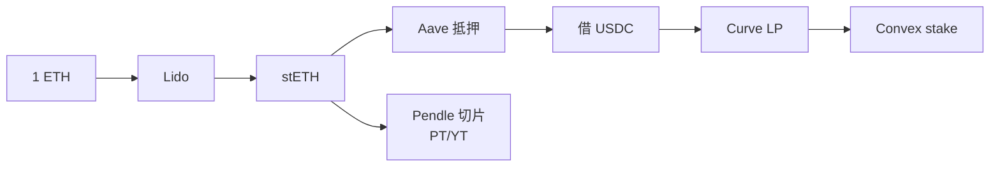

每多一个箭头，"假设面积"乘一次。2025-10 USDe 解杠杆是 Aave-Pendle 环；2026-04 Kelp 事件是 Lido-LayerZero-Aave 环。组合性不是护城河，是传染病学。

### 章末

记住 3 句话：① DeFi 是状态机 × 不变量 × 组合性；② 上层比下层脆弱；③ 事故几乎都在协议拼接处。

练习：1 ETH 经 Lido → Aave → Pendle → Convex 走完一圈，被 DefiLlama 重复计几次？给一个估计。

---

## 第 2 章：稳定币三家族

> TL;DR：稳定币把"链上结算"和"美元 1:1"连起来，三种打法——发行方做托管（USDC/USDT）、合约里超额抵押（DAI/LUSD）、永续对冲（USDe）。三种各自押一个不会破的假设：法币、抵押品、市场对手方。

DeFi 用什么当钱？三件事先排除：① ETH 自己不是 ERC-20，需要包成 WETH（60 行代码、合约里 1:1 锁原生 ETH——这是 DeFi 第一行代码）。② BTC 上以太坊靠桥（WBTC、cbBTC、tBTC、LBTC），信托管方。③ 真正撑起 DeFi 流动性的，是稳定币。

### 2.1 法币抵押：USDC / USDT

**机制一句话**：发行方持 1:1 现金+短债储备，链上代币与储备 1:1 可赎回。所有工程问题都在「发行方」三个字——它就是单点。

| 代币 | 发行方 | 市值（2026-04） | 关键事件 |
|------|------|---|---|
| USDT | Tether | ~$140B | 早期透明度差，近年改善 |
| USDC | Circle | ~$60B | SVB 2023-03 短期脱锚到 $0.88 |
| FDUSD | First Digital | ~$3B | 币安生态 |
| PYUSD / RLUSD | PayPal / Ripple | $1-1.5B | 机构合规通道 |

**钩子事件**：2023-03-10 SVB 倒闭，Circle 在该行有 $33 亿 USDC 储备无法即时取出，USDC 跌到 $0.88，DAI 也跟着脱锚（PSM 把 USDC 当储备）。整个周末没人能在合约层做任何事——问题在合约**外**。这是法币稳定币的"链上代码再安全也救不了你"教学时刻。

**USDC 工程细节**：USDC 是可升级合约，Circle 能冻结任意地址（Tornado Cash 制裁数小时内执行）。Aave/Compound 默认接受这个风险（一次乱冻结毁掉信任，Circle 不会乱来）；LUSD 刻意不收 USDC 抵押当避风港，2023-03 一度溢价到 $1.05。

**选哪个**：借贷主资产用 USDC（合规深）；CEX 永续保证金用 USDT（流动性深）；机构合规通道用 PYUSD/RLUSD。

### 2.2 超额抵押（CDP）：DAI / LUSD

**机制一句话**：锁 1.5 ETH 进金库，借出 2000 DAI；ETH 跌穿阈值，谁都能调一行 `liquidate(你)` 拿走抵押品换 DAI 销毁。**整个流程不依赖任何法币储备，只依赖"清算人会按时来"**。

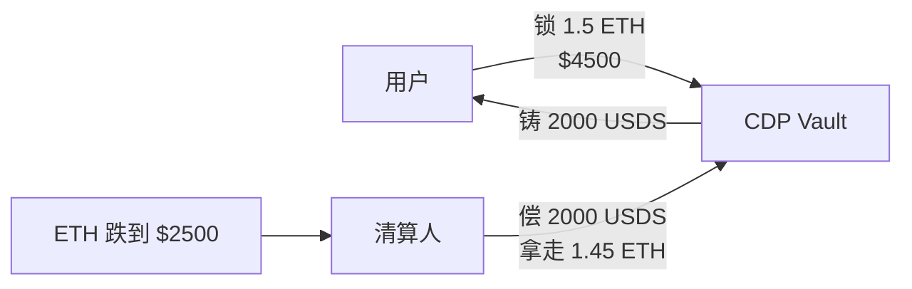

主流 CDP（差异都在"清算机制"和"接受什么抵押"上）：
- **DAI / USDS（Sky 协议）**：MakerDAO 2024-08 改名 Sky；USDS 供应 > $9B；通过 PSM 让 USDC 1:1 换 USDS（事实上嫁接了法币稳定币的稳定性）。
- **LUSD（Liquity）**：极简——只收 ETH、最低抵押率 110%、无治理代币、无可升级合约。SVB 那次反而成了避风港。
- **GHO（Aave 原生）**：Aave 池抵押品支撑，2026-04 治理把 stkGHO slash 关到 0，新出 sGHO（5% APR，无 slash 无 cooldown）。
- **crvUSD（LLAMMA 软清算）**：抵押品慢慢被换成稳定币，避免一秒强平。详见附录 A.4。

**Maker DSR / Sky Savings Rate**：DAI/USDS 持有者把币存进 DSR 合约领无风险利率（来源：协议从抵押品借款收的息）；这是 DeFi "risk-free rate" 锚点，sUSDS 是 yield-bearing wrapper。

### 2.3 合成 / RWA：USDe / Frax / USDM

**机制一句话（USDe）**：现货 long 1 ETH + 永续 short 1 ETH，组合美元价值不随 ETH 涨跌变化（delta=0），这组合本身就可以当稳定币。

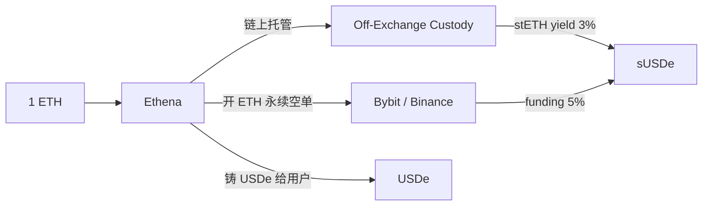

收益来源：① stETH staking ~3%，② 永续 funding rate（牛市多头付空头），③ 基差。

**delta=0 不等于自动锚定**——三个独立风险：funding 倒挂（熊市要倒贴）、CEX 对手方（Bybit 冻结一笔损失阶跃）、保证金率波动。USDe 2024 上线冲到 $14B 供应，2025-10 funding 倒挂 + Aave-Pendle 杠杆环引爆，三周缩到 $5.92B——这是合成稳定币的"教学事件"。

**RWA 稳定币**（用国债 token 当储备）：
- **frxUSD（Frax V3）**：BlackRock BUIDL 支撑，从混合算稳完全转 RWA。
- **USDM（Mountain）**：100% 短债，rebase 模式（每天余额自增）。
- **USDY/OUSG（Ondo）**、**USYC（Hashnote）**：机构通道。
- **BUIDL**：BlackRock 自己的 tokenized money-market，Frax/Sky/Ondo 都用它当底层——也就是说，**BUIDL 一旦出问题三家一起出事**。

**算法稳定币 = 危险词**：UST（Terra）2022-05 死亡螺旋后，纯算法稳定币基本绝迹。任何号称"无外部抵押自稳定"的设计请默认怀疑。

### 章末

记住 3 句话：① 稳定币不是一种东西，是三种押注（法币 / 抵押品 / 市场）；② 法币稳定币的"链上代码"再稳也救不了"链下银行"；③ delta=0 不等于自动锚定。

练习：你设计一个新借贷协议，主资产必须只接受一种稳定币，列三个判断维度选哪个。

---

## 第 3 章：AMM 入门——Uniswap V2 是自动售货机

> TL;DR：池里两个币（500 ETH + 1,500,000 USDC），合约只认一条规则——**两个余额相乘后必须不变小**（$x \cdot y = k$）。你想拿 ETH 走，就必须扔进足够多 USDC 把乘积维持住。这就是 AMM。

> 2018 年 Hayden Adams 被以太坊基金会一笔 $100k 资助，写出 250 行代码就是 Uniswap V2。这 250 行定义了后续 6 年所有 DEX 的形状——Curve、Balancer、Pancake、Sushi、Aerodrome 都是它的变体。

### 3.1 几何直觉

池里 500 ETH + 1,500,000 USDC，V2 把两数相乘作为"不变量"：

```
k = 500 × 1,500,000 = 750,000,000
```

交易后 `x_new × y_new ≥ k`——所有合法状态在这条双曲线上：

```
y
│
│ ╲
│  ╲
│   ╲ <-- 当前状态点 (500, 1,500,000)
│    ╲
│     ╲___
│         ─────
│              ────── y = k / x
└──────────────────────── x
```

拿出 1 ETH 必须把 USDC 推到曲线另一点——这就是滑点的来源。

**类比**：池子是台老式自动售货机——不是按定价卖，而是按"剩多少决定价"。剩越少越贵，永远不会售空（数学上 $x \to 0$ 时价格 $\to \infty$）。

### 3.2 swap 公式（一行就够）

输入 $\Delta x$（含 0.3% 手续费），输出：

$$
\Delta y = \frac{0.997 \cdot \Delta x \cdot y}{x + 0.997 \cdot \Delta x}
$$

**例 1（小额）**：池 500 ETH / 1.5M USDC，扔 1 USDC 得 ~0.0003323 ETH，折合 1 ETH ≈ $3009.5——公允 $3000，滑点+手续费 0.32%。

**例 2（大额）**：扔 100,000 USDC，得 ~31.16 ETH（公允应得 33.33），**滑点 6.5%**。所以大额一定走聚合器分单（CowSwap、UniswapX、1inch）。

### 3.3 LP 份额：sqrt(x·y)

初次添加流动性时 `liquidity = sqrt(amount0 × amount1) - MINIMUM_LIQUIDITY`，1000 wei 永久锁在 `0xdead`。`sqrt(x·y)` 是 LP 持仓的几何价值——对相对价格不敏感，只对总流动性敏感。

**1000 wei 防 inflation attack**：没这 1000 wei，第一个 LP 存 1 wei + 1 wei 拿到 1 份 LP，再直接 transfer 100 ETH 进池——每份 LP 现在值 100 ETH。后来人存 50 ETH，按 `50e18 / 100e18 = 0.5 → 取整为 0`，存款被吞。锁死 1000 wei 让攻击者先吃损失，存款最小价值不被取整吞掉。

### 3.4 mint 源码（合约只有这点）

```solidity
function mint(address to) external lock returns (uint liquidity) {
    (uint112 _r0, uint112 _r1,) = getReserves();
    uint amount0 = IERC20(token0).balanceOf(address(this)) - _r0;  // PUSH 模式
    uint amount1 = IERC20(token1).balanceOf(address(this)) - _r1;
    if (totalSupply == 0) {
        liquidity = Math.sqrt(amount0 * amount1) - MINIMUM_LIQUIDITY;
        _mint(address(0), MINIMUM_LIQUIDITY);
    } else {
        liquidity = Math.min(amount0 * totalSupply / _r0, amount1 * totalSupply / _r1);
    }
    _mint(to, liquidity);
    _update(...);
}
```

两个工程模式记住：① **PUSH 模式**——路由器先把 token 转进来，合约靠余额差推算输入。副作用是**无许可 flash swap**。② **`lock` reentrancy 保护**——布尔锁。Curve 2023-07 事件就是这把锁被 Vyper 编译器 bug 弄失效（详见附录 C）。

### 3.5 闪电贷：swap 函数那一行

> 闪电贷不是"借钱"——是借和还在同一笔交易里完成。借走 100 ETH，做完套利/清算，结尾还 100 ETH + 0.3% 手续费。还不上整笔交易反转，等于从未发生。所以池子敢零抵押借给你——最坏情况一分钱不亏。

V2 swap 函数里这一行就是闪电贷入口：

```solidity
if (data.length > 0)
    IUniswapV2Callee(to).uniswapV2Call(msg.sender, amount0Out, amount1Out, data);
```

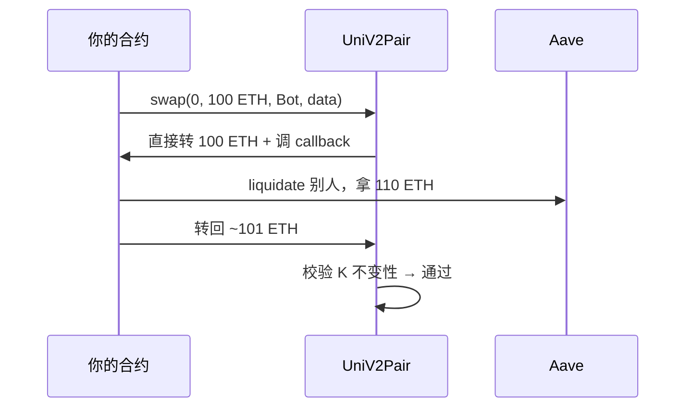

bZx 2020-02 两次事件就是闪电贷+oracle 操纵的组合拳（详见附录 C）。

正当用途：① 清算 bot；② 抵押品迁移（collateral swap）；③ 债务再融资（debt swap，Aave V3 native）；④ Maker→Spark 一键搬家

### 3.6 无常损失（IL）

> ETH=$3000 时存 1 ETH + 3000 USDC 进池。三个月后 ETH 涨到 $6000 你撤资。直觉：应该是 1 ETH + 3000 USDC = $9000。实际：0.707 ETH + 4243 USDC = $8485。少了 $515。这 $515 就是 IL。

类比：**LP 是荷官**——价格涨时被迫卖 ETH，价格跌时被迫接 ETH。本质是**给市场卖 straddle 期权**，期权金就是手续费。

**LP = 卖 straddle 期权**（同时押涨跌都赔）。下面公式给精确数字，看不懂可记住：价格变动越大、亏越多。

公式（设价格倍数 $r = p_1/p_0$）：

$$
IL(r) = \frac{2\sqrt{r}}{1+r} - 1
$$

| $r$ | 1.25 | 1.5 | 2 | 4 | 10 |
|---|---|---|---|---|---|
| IL | -0.6% | -2.0% | -5.7% | -20% | -42.6% |

经验：年化 fee yield $f$、波动率 $\sigma$，LP 净收益 $\approx f - \sigma^2/8$。ETH/USDC 池 fee 10%、vol 80% 净 +2%；vol 涨到 120% 净 -8%——这是大行情前 LP 撤资的原因。

### 3.7 V2 TWAP（一句话）

每次状态变化时累加"价格×时间增量"，外部合约两次采样取差除以时间得 TWAP。采样间隔 ≥ 10 分钟才抗操纵。Cream 2021-10 $130M 事件就是没用 TWAP 而是直接读 vault share-price，被 donation 拉到 2 倍——详见附录 C。

### 章末

记住 3 句话：① $xy=k$ 是自动售货机，剩越少越贵；② LP 是荷官给市场卖期权，IL 是期权代价；③ 闪电贷只是 swap 函数的副作用，钱在同一笔交易里借和还。

练习：池里 100 ETH / 300,000 USDC，扔 1000 ETH 进去，拉到什么价位？如果别人用这个新价做 oracle，能借多少？

---

## 第 4 章：集中流动性入门——V3 是 V2 的"区间版"

> TL;DR：V2 把流动性平铺到 $(0, \infty)$，99.8% 资本在闲着。V3 让 LP 选区间 $[p_a, p_b]$，资本效率提 1000x。代价是 LP 不再无脑——选错区间持仓全变单边废币。

### 4.1 区间截断的直觉

ETH/USDC 池 99% 的交易发生在 ±20% 区间——但 V2 把同样的流动性铺到 $0$ 到 $\infty$。Hayden 团队 2021 年问："为什么不让 LP 选区间？"

```
V2：流动性铺满             V3（LP 集中在 [2800, 3200]）
y │╲                       y │   ╲
  │ ╲___                     │    ╲___
  └────── x                  └─2800─3200── x
```

LP 在区间内表现为"虚拟的 V2 池"（同一条 $xy=k$ 截断），出区间就只剩单边那个币——价格穿出区间时 LP 自动变废。这就是"集中流动性"。

### 4.2 V3 LP = 卖期权

V2 LP 是荷官（Ch3.6 IL）；V3 LP 是**卖区间期权**——区间内赚手续费，价格突破区间时承担尾部损失。

这件事写下来就是个区间版 IL，跟 V2 同形——区间越窄、收益越尖锐、突破后亏损越大。新手第一次提供 V3 流动性常见死法：选了 ±5% 的窄区间，第二天 ETH 涨 8%，回来发现持仓全变成 USDC（ETH 全被卖掉了）、还没赚到几块手续费。

### 4.3 sqrtPriceX96、tick、3 个费率档位

V3 内部用 $\sqrt{P}$ 而非 $P$ 做坐标（$L = \sqrt{xy}$ 在 $\sqrt{P}$ 下是常数，数学更干净）。`sqrtPriceX96` 是 $\sqrt{P} \cdot 2^{96}$ 的定点数。具体公式见**附录 A.1**。

价格被离散化成 **tick**：tick $i$ 对应 $P = 1.0001^i$，每跨一 tick 价格变 0.01%。LP 选区间就是选两个 tick 端点。

| 费率档 | 适用 |
|------|------|
| 0.01% | USDC/USDT 等稳定币 |
| 0.05% | 稳定币 / 低波动 |
| 0.30% | 主流币对（ETH/USDC） |
| 1.00% | 长尾资产 |

### 4.4 V3 LP 是 NFT 不是 ERC-20

每个区间是独立的头寸（不同区间不能合并），所以 V3 用 ERC-721 而不是 ERC-20——你的"持仓票"是一张带元数据的 NFT（哪个池、哪个区间、累积 fee）。

### 4.5 Uniswap V4：singleton + hooks（一段话）

V4（2025-01 上线）AMM 数学没变，工程改了三件事：① **Singleton**——所有池住进同一个 `PoolManager` 合约，建池 gas 从 5M 降到 50K；② **Flash accounting**——多跳 swap 全程一次 transfer；③ **Hooks**——每池可绑一个回调合约，在 `beforeSwap`/`afterAddLiquidity` 等点插钩子，做动态费率、限价单、MEV 返利。

代价：hook 是新攻击面（恶意 hook 能在 `beforeSwap` 把费率改成 99%），LP 进入前要审计 hook。详见**附录 A.2**。

### 章末

记住 3 句话：① V3 是"V2 + 区间"，资本效率 1000x；② V3 LP 是卖区间期权，选错区间持仓变单边；③ V4 数学没变，工程换了打法（singleton + hooks）。

练习：LP 在 [2900, 3100] 区间提供流动性，价格从 3000 涨到 3100。直觉上 ETH/USDC 比例怎么变？（提示：价格涨 → ETH 在区间内被卖出。）

---


## 第 5 章：借贷与健康因子——HF 是抵押品的安全带

**先看 §6 Oracle**：本章 5.2 清算 + 5.4 杠杆都依赖 oracle 准价；先读 §6 再回 §5 更顺。

> TL;DR：抵押 10 ETH（$30k）借 $20k USDC，**健康因子 HF**=「抵押×清算阈值 / 借款」。HF<1 时谁都能调用 `liquidate()` 折价拿走你的抵押品。HF 是借贷协议的核心安全带。

### 5.1 HF 是什么

$$
HF = \frac{\sum_i \text{collateral}_i \cdot \text{LT}_i}{\sum_j \text{borrow}_j}
$$

- **LT（liquidation threshold）**：清算阈值，每种抵押品独立设定（ETH 通常 82.5%，长尾资产 50%）。
- **LTV（loan-to-value）**：借款最大比例，比 LT 略低（留缓冲）。

**例**：存 10 ETH（$30k，LT=82.5%）借 $20k USDC：

$$
HF = \frac{30{,}000 \times 0.825}{20{,}000} = 1.2375
$$

ETH 跌到 $\$3{,}000 \times \frac{20{,}000}{24{,}750} \approx \$2{,}424$ 时 HF=1，被清算。

**类比**：HF 是车里的安全带——平时无感，急刹时它把你拽住。HF=1.5 安全，HF=1.1 心跳加速，HF<1 你已经在挡风玻璃上了。

### 5.2 清算时序

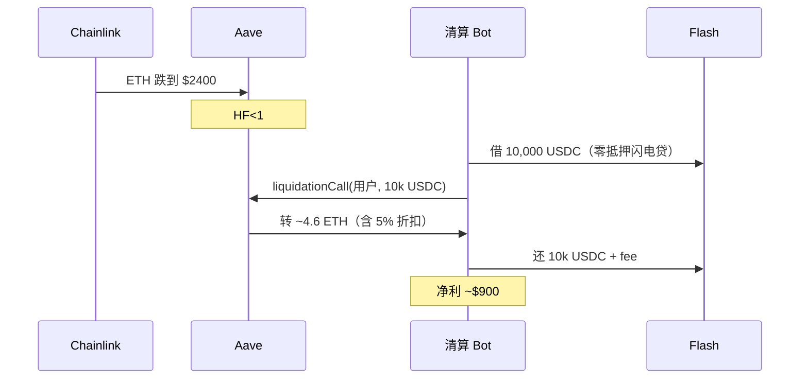

清算人吃 5% 折扣作奖励——这是激励他们及时来清的"自动售货机"。**Aave 默认 close factor 50%**（一笔最多清一半债务），HF<0.95 才允许 100%——避免一次清完导致借款人完全爆仓。

### 5.3 利率怎么算（一句话）

利率由**利用率** $U = \frac{\text{borrows}}{\text{supplies}}$ 单变量驱动。Compound 发明了 **jump rate**——U 在 80%（kink）以下平缓涨，超过 80% 陡升：

```
borrow rate (%)
25│                  /
10│              /
 5│      ___/
 0│__/
  └─0──50──80──100→ U (%)
              kink
```

为什么陡升？池子快借空时必须**用价格挤出借款人 + 吸引新存款**——这就是利率"自动稳定器"。Aave 对不同资产用不同曲线（稳定币 kink 92%，挥发资产 80%，长尾资产 45%），完整公式见**附录 B.1**。

### 5.4 杠杆循环（Aave-Pendle 故事的根）

**e-mode**：把相关性高的资产（ETH/stETH、USDC/USDT）划一组享受 93% LTV（默认 75%）。这让循环杠杆变得诱人：

```
存 10 wstETH → 借 USDC（93% LTV）→ swap 成 wstETH → 再存 → ...
理论上限 = 10 / (1-0.93) ≈ 143 wstETH
```

实际几次后就停——swap 滑点 + gas + borrow rate 累积。**盈利条件**：wstETH staking yield > USDC borrow rate。一旦 yield 跌或 borrow rate 涨，**所有人同时解杠杆**——2025-10 USDe 事件就是这么炸的。

### 5.5 三类借贷协议（一段话）

- **共享池（Aave V3）**：所有资产共享一个池，多种抵押 + 多种借款，e-mode 给相关组高 LTV。TVL 龙头 ~$26B。**isolation mode**：高风险资产（如长尾 token）作为抵押品时，借款上限被钉死、不能与其他抵押品组合，防一笔坏账拖累整池
- **单一基础资产（Compound III / Comet）**：每市场只能借一种资产（USDC），抵押品只能存不能借——主动牺牲资本效率换安全（V2 时代被闪电贷打了多次）。
- **隔离市场（Morpho Blue）**：极简五元组 (抵押, 借款, oracle, IRM, LLTV)，无许可建市场，复杂性外包给上层 curator vault。

详见**附录 B.2-B.4**。

### 5.6 软清算 vs 硬清算

| 维度 | 硬清算（Aave/Compound） | 软清算（crvUSD LLAMMA） |
|------|------|------|
| 触发 | HF<1 一刀切 | 价格穿过 band 渐进 |
| 用户体验 | 暴跌一秒被强平 | 慢慢被换成稳定币 |
| 损耗 | 5-10% 清算折扣 | 反复穿 band 的"震荡损耗" |

LLAMMA 数学详见**附录 A.4**。

### 章末

记住 3 句话：① HF=（抵押 × LT / 借款），<1 必被清算；② 清算人靠 5% 折扣赚钱，闪电贷让他们零本金运行；③ jump rate 让利率成为自动稳定器，e-mode 是杠杆循环的开关。

练习：你存 100 wstETH（$300k，LT=82.5%）借 $200k USDC。ETH 瞬间跌 20%，HF 多少？还能撑住吗？

---

<!-- 第 14-17 章已移至附录 B（借贷数学补充） -->


---

## 第 6 章：预言机——链下价格怎么搬上链

> 本节是 Oracle 工程主讲（架构 + 选型 + 完整代码 + 案例复盘）；攻击家族直觉见模块 05 §3。

> TL;DR：合约里的价格不是凭空来的。**Chainlink** 节点主动推（push），**Pyth** 让消费者按需拉（pull），**TWAP** 用过去 N 分钟均价防操纵。oracle 是 DeFi 单类损失最大的攻击面——Mango $116M、Cream $130M、bZx 都是 oracle 攻击。


### 6.1 Push vs Pull（一张表）

| 模型 | 谁推上链 | 谁付 gas | 适用 |
|------|------|------|------|
| **Chainlink** push | 节点定时推（heartbeat 1 小时或偏离 0.5% 触发） | 节点付 | 借贷、稳定币（确定节奏） |
| **Pyth** pull | 价格存在 Pythnet（每 400ms 更新），消费者按需拉 | 调用方付 | 永续、清算（延迟敏感） |
| **TWAP** | Uniswap V2/V3 自带，外部合约取过去 N 分钟均价 | 消费者付 | 防操纵的廉价方案 |

**Chainlink 调用代码**（这一段记一辈子）：

```solidity
(, int answer, , uint updatedAt, ) = feed.latestRoundData();
require(block.timestamp - updatedAt < 3600, "STALE");  // 必须做心跳检查！
```

不做 stale 检查 = 用 24 小时前的价格清算别人 = 灾难。**RedStone**（push+pull 双模）和 **Chainlink Data Streams**（pull 低延迟）是 2025-2026 增长最快的两家替代，模型上是 Chainlink/Pyth 的杂交。

### 6.2 Mango 故事（oracle 攻击经典）

> 2022-10-11，Avi Eisenberg 用约 $10M USDC（CFTC 起诉书 / Halborn 复盘）在三家小盘 CEX 同时挂单把 MNGO 现货从 $0.04 拉到 $0.91（涨 22 倍）。Mango 的 oracle 老老实实把 MNGO 估值同步上去。Avi 在 Mango 的 MNGO 永续多单瞬间盈利 $400M+，把这笔虚高浮盈当抵押借走 $116M。**整个攻击 20 分钟、合约按设计运行——但合约相信的"现货价"不再代表真实市场价**。

教训：① 用现货价做风控前先问"市场深度能撑多大操纵"；② 叠加 TWAP 或集中度阈值；③ Chainlink + 多源 + secondary oracle（Aave V3 做法）。**Cream / bZx / Mango 三例完整复盘见附录 C**。

法律续集：Eisenberg 2024 年被判欺诈罪，2025 年法官以"Mango 没有用户协议、没有禁止操纵条款"为由 Rule 29 撤销有罪判决。检方上诉中。

### 章末

记住 3 句话：① Chainlink 推、Pyth 拉、TWAP 防操纵；② 必须做 staleness 检查；③ 用现货价做 oracle 是 DeFi 历史最贵的错误。

练习：USDC/USD Chainlink 心跳是 24 小时（偏离阈值 0.25%）。USDC 在 12 小时内从 $1 跌到 $0.85 但偏离没触发更新，借贷协议会怎样？设计一个对冲方案。

---


---

## 第 7 章：LST / LRT 入门——一笔 ETH 干几份工

**为什么需要 restaking**：ETH 质押已 32M ETH 闲置，只为以太坊本身做安全。EigenLayer 让你把 staked ETH 再次抵押给其他服务（DA、oracle、bridge），收第二份费——但叠加 slashing 风险。

> TL;DR：原本 32 ETH 起步、本金锁死的 staking，被 Lido 拆成"任意金额 + 流通的 stETH"，开了 LST 时代。然后 EigenLayer 又把同一笔 ETH 出租给多份"工作"（DA、桥、appchain）赚多份收益——这就是 LRT。代价是单点风险叠加：2026-04 Kelp 事件就是这条路的雷。

### 7.1 LST：把质押权益代币化

ETH PoS 质押年化 2.5-3.5%，但本金锁定 + 退出队列要等几天。**Lido 的解法**：你存 ETH → 协议帮你 stake → 给你一个 ERC-20 凭证（**stETH**），代表你的本金 + 持续累积的 yield。这个凭证可以在 Curve 交易、在 Aave 抵押——等于把"锁定+生息"重新拆成"自由转账+生息"。

主流 LST（2026-04）：

| 协议 | 代币 | TVL | 特色 |
|------|---|---|---|
| **Lido** | stETH / wstETH | ~$23B | 龙头，流动性最深 |
| **Rocket Pool** | rETH | ~$2-3B | 去中心化（2700+ 节点） |
| **Coinbase** | cbETH | ~$1B | 合规友好 |
| **Frax / Mantle** | sfrxETH / mETH | ~$1B 各 | 链生态绑定 |

### 7.2 stETH vs wstETH（DeFi 工程必知）

**stETH** 是 rebase 模式——每天合约把所有人的余额按 yield 重算。问题是 **DeFi 合约假设余额不变**——把 stETH 扔进 LP 池，rebase 收益会被池子吞掉、借贷协议利息算错。

**wstETH** 是 wrap 版——余额恒定，wstETH/stETH 汇率单向上升（汇率代表累积 yield）。**DeFi 合约永远用 wstETH，不用 stETH**——Aave V3 e-mode 就是接 wstETH。

### 7.3 stETH 流动性脱锚（2022-06 故事）

> 2022-06-12 周日凌晨，三箭资本爆仓清算开始，几亿美元 stETH 被强制抛进 Curve 池。stETH/ETH 比价从 1:1 跌到 1:0.97 再到 1:0.94——你池子里那一半 stETH 估值少 6%。但**底层 ETH 仍 1:1 可兑换**——只是要等几天才能从 Lido 提出来。这就是**流动性脱锚而非基本面脱锚**。从此所有借贷协议给 stETH 设 LT 70-80%，再不能享受和 ETH 一样的待遇。

### 7.4 LRT：再走一阶

> 2021 年 Sreeram Kannan（华盛顿大学教授）盯着以太坊在想：全网 $400 亿+ 的 ETH 在干同一份工（验证主链）赚 3%——**为什么不让它再租给别的工作？** 这就是 EigenLayer 的核心思路。

**Restaking** = 把同一笔 ETH（或 LST）的安全性出租给多个 **AVS**（Actively Validated Service：DA 层、桥、appchain、oracle 等），赚多份收益。代价是**slashing surface 叠加**——任一 AVS 出问题你的本金都被罚。

**LRT** = 用户委托 ETH/stETH 给 LRT 协议，协议作为 operator 接管多个 AVS 的 slashing 风险，奖励聚合后分给 LRT holder。代币如 eETH、ezETH、rsETH。EigenLayer 2026-04 TVL ~$18B，39+ 个活跃 AVS。

### 7.5 Kelp 事件（LRT 的"教学雷"）

> 2026-04-18，Kelp 跨链桥用了 1-of-1 DVN（LayerZero 单点验证），私钥被攻陷。攻击者签发"Polygon 那边铸了 $292M rsETH 请同步"的假消息，Ethereum 合约通过——**$292M 凭空出现的 rsETH 被抵押到 Aave 借走 wETH**。Aave 一夜 TVL 跌 $6.6B、AAVE 跌 16%、Lido 跌 19%（市场担心 stETH 也走 LayerZero）。

教训：① 借贷协议接受跨链 wrapped 资产时，桥的安全模型就是你协议安全模型的一部分；② 1-of-1 DVN 是单点，应该 2-of-3 起步。详细复盘见**附录 C**。

### 7.6 同一笔 ETH 的"多份工"图

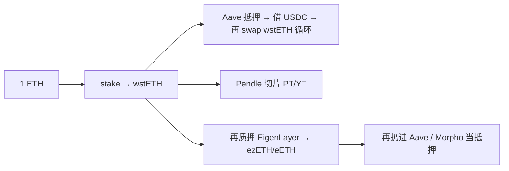

每多一层都增加单点。USDe 2025-10 解杠杆事件、Kelp 2026-04 事件都是这条链上的故事。**Pendle PT/YT 数学见附录 E、Restaking 经济学见附录 G、Berachain PoL / Real Yield 辨真伪见附录 F**。

### 章末

记住 3 句话：① LST 把"锁定+生息"拆成"流通+生息"；② DeFi 合约用 wstETH 不用 stETH（rebase 的坑）；③ LRT 是让一笔钱干多份工，代价是单点叠加——Kelp 事件就是这条路的雷。

练习：你买 1 ezETH 实际承担哪些风险？至少列 5 条。

---

## 第 8 章：MEV 入门——链上的高频交易

> TL;DR：区块里"先做哪笔交易"本身值钱——builder/searcher 抢着排序赚钱，每年 $5-10B。**Sandwich**（夹你的 swap 赚滑点）是恶性 MEV，**清算 / 套利**是良性 MEV。Flashbots 把这件事从"黑暗丛林"变成"有规则的拍卖"。

> 2019 年 Phil Daian（康奈尔博士生）写了 *Flash Boys 2.0*——名字致敬 Michael Lewis 讲华尔街高频交易那本《Flash Boys》。他发现以太坊 mempool 每天上演前置+三明治+清算大战，套利者赚走 $5-10B/年——**钱来自普通用户每笔 swap 多付的滑点**。论文一出，他和团队成立 Flashbots——给 searcher 建私有 mempool、给 validator 建拍卖系统。

### 8.1 五类 MEV

| 类别 | 怎么赚 | 良/恶 |
|------|------|------|
| **Sandwich** | 在你 swap 前后各放一笔，夹击你的滑点 | 恶 |
| **JIT LP** | 大单前一区块加流动性、后一区块撤，吃掉手续费 | 灰 |
| **清算** | HF<1 立刻发清算 tx 拿 5% 折扣 | 良（必要的） |
| **跨链套利** | L1/L2 价差 | 良 |
| **Backrun 套利** | 大单后反向 swap 拉回价格 | 良 |

### 8.2 Sandwich 怎么干你（时序）

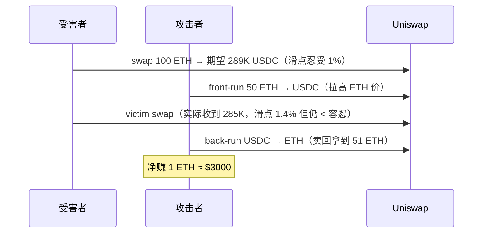

防御：① 调低滑点容忍（但太低会 revert）；② 用 CowSwap / UniswapX 等 intent 系统（详见附录 H），让 solver 帮你撮合避开公开 mempool。

### 8.3 Flashbots + MEV-Boost 架构（一段话）

普通 tx 进**公共 mempool**（任何人能看见，被 sandwich）；想做 MEV 的人通过 **Flashbots Relay** 提交"私有 bundle" → **Builder**（Beaverbuild、Titan、BuilderNet）打包 → **MEV-Boost**（跑在 validator 上的 middleware）选最高出价 block 提议。**90%+ 以太坊区块** 走这条路。前两大 builder 占 90%+ 区块——**MEV 中心化** 是 2026 仍未解决的问题。

**BuilderNet**（2024-12 上线）：Flashbots 把所有 builder 迁到一个跑在 TEE（可信执行环境）里的去中心化网络——这是 MEV 历史的转折。**SUAVE** 是下一代：跨链 MEV-aware encrypted mempool，订单加密发送、TEE 里竞标、执行才解密。

**协议侧防御**：commit-reveal（CowSwap）、batch auction（Penumbra）、private RPC（MEV Blocker / Flashbots Protect）、动态滑点（Uniswap V4 hook）

### 章末

记住 3 句话：① MEV = 区块排序权的市场化定价；② sandwich 恶、清算良、JIT 灰；③ Flashbots 不是消灭 MEV——是把它变成有规则的拍卖。

练习：你写一个 sandwich bot 抢 100 ETH 的 swap，front-run 50 ETH。如果另一 bot 在你之后又来一笔，结果怎样？

---


---

## 第 9 章：风险全景——UST、Mango、五条铁律

> TL;DR：DeFi 历史损失 $400 亿+，每一桩都不是"代码 bug"那么简单——根因往往是经济模型、跨协议假设、私钥管理、监管转向。本章讲两个故事（UST、Mango）和五条铁律。其它 12+ 事件完整复盘见**附录 C**。

### 9.1 风险六大类

```
┌── 智能合约：reentrancy / 精度 / logic bug
├── 预言机：闪电贷操纵 / stale / 集中度
├── 经济模型：算稳螺旋 / 杠杆解杠杆 / funding 倒挂
├── 桥/跨链：multisig / DVN 配置 / proof bug
├── 治理：flash loan vote / 多签 phishing / key 单点
└── 监管：地址封禁 / Tornado 制裁 / 运营 KYC 强制
```

### 9.2 故事一：UST 死亡螺旋（2022-05，$400 亿）

#### 28.3.1 UST 死亡螺旋（2022-05）

> 想象一栋楼有两部电梯：A 电梯（UST）说"我永远在 1 楼"、B 电梯（LUNA）说"我浮动"。规则是：A 不在 1 楼时，谁都能用 1 个 A 的票换"1 美元价值的 B 票"——市场会自动套利把 A 拽回 1 楼。**这套机制在 LUNA 票还值钱时一直工作**。问题来了：当 A 跌到 0.97、套利者大量铸 B 卖出，B 价格跌；A 还没回到 1 元、套利者要更多 B 票才换 1 美元价值；铸出的 B 更多被卖、B 价格继续跌。**两部电梯互相往下拽——这就是死亡螺旋**。2022-05-07 周末第一次脱锚开始，到 2022-05-13 一周内 UST 从 $1 跌到 $0.01、LUNA 从 $80 跌到 $0.0001、$400 亿市值蒸发。Do Kwon 流亡黑山被抓，2025-12-11 美国南区法院判 **25 年**联邦监禁。

**机制根因**：UST 跌 → 套利者用 1 UST 换价值 $1 的 LUNA → 铸出的 LUNA 立刻被卖 → LUNA 价格跌 → 每 UST 换更多 LUNA → LUNA 供应爆炸——**死亡螺旋**。

**时间线**（来源：[Anatomy of a Run 哈佛](https://corpgov.law.harvard.edu/2023/05/22/anatomy-of-a-run-the-terra-luna-crash/)、[Terra-Luna ScienceDirect](https://arxiv.org/pdf/2207.13914)）：
- 2022-05-07：两大地址从 Anchor 提走 $375M UST。Curve 3pool 出现 UST/3CRV 卖压。UST 跌到 ~$0.972。
- 2022-05-09 至 10：LFG 卖 BTC 和 ~$480M USDT 护盘，无效。
- 2022-05-10 至 13：UST 跌到 $0.30、$0.10、$0.01。LUNA 从 $80 跌到 $0.0001。
- 2022-05-16：UST/LUNA 基本归零。LUNA 供应从约 3.45 亿炸到约 6.5 万亿（19000 倍稀释）。

**Do Kwon 后续**：2024-2025 在美国受审，因 $40B 崩盘被判 **25 年**联邦监禁（2025-12-11 美国南区法院判）。

**这件事教什么**：① 算法稳定币的"无外部抵押自稳定"是个谎言；② 经济模型出问题时合约代码再安全也救不了你；③ "看起来稳"的协议要先问"极端行情下还能维持吗？"。

### 9.3 故事二：Mango Markets（2022-10，$116M）

> Avi Eisenberg 用约 $10M USDC（CFTC 起诉书 / Halborn 复盘）在三家小盘 CEX 同时挂单把 MNGO 现货从 $0.04 拉到 $0.91（涨 22 倍）。Mango 的 oracle 是这三家 CEX 的中位数价——OK，它老老实实把估值同步上去。Avi 在 Mango 的 MNGO 永续多单瞬间盈利 $400M+，把虚高浮盈当抵押借走 $116M。**整个攻击 20 分钟，每一行代码都按设计运行——但合约相信的"现货价"不再代表真实市场价**。

**法律续集**：Eisenberg 2024 年被陪审团裁定欺诈罪 + 市场操纵罪，但 2025 年法官以"Mango 没有用户协议、没有禁止操纵条款、没有还款要求"为由 Rule 29 撤销有罪判决。检方上诉中。

**这件事教什么**：① 用现货价做 oracle 必死无疑；② 流动性差的标的资产 + 集中度低的 oracle = 灾难；③ "合法但不道德"在链上是开放问题——Mango 的合约没说不许操纵。

### 9.4 五条铁律（夜间读物）

> 这五条贯穿前文每一桩事故，背下来。

**铁律 1：所有外部输入都是攻击面**——oracle、跨链消息、参数、ERC-20 余额、编译器输出 bytecode。Curve 2023-07 是 Vyper 编译器 0day。

**铁律 2：默认值必须安全**——Nomad 把 trusted root 设为 `0x00`，而 untrusted 默认也是 `0x00`，所有消息被当成"已验证" → $190M。

**铁律 3：跨协议假设必须显式验证**——Penpie 信任 Pendle 上"所有市场"，没验证是否在治理白名单 → $27M。永远不要假设你交互的合约符合你预期的不变量。

**铁律 4：私钥即权力**——Ronin / Multichain / Radiant / Orbit / HTX 五个事件都是私钥被攻陷（钓鱼、CEO 跑路、APT 入侵）。**air-gapped 离线设备 + 二次设备验证** 是最高级别防御。

**铁律 5：经济模型大于代码**——UST、Beanstalk、Mango 都是合约按设计运行但经济假设破裂。永远问"极端行情下这个机制还能维持吗？"。

### 9.5 三个常被忽视的"次级风险"

**A. 协议关停 / 跑路**——对策：看治理代币持有分布、多签 signer 身份、是否有 emergency shutdown（参考 Multichain CEO 被带走 $130M）。

**B. 审计 / 风控利益冲突**——Gauntlet 同时是 Aave 风控方和治理持币方。对策：交叉对照多家审计（OpenZeppelin / Trail of Bits / Spearbit / Zellic / Cyfrin）。

**C. 监管转向**——Tornado Cash 制裁、SEC vs Uniswap Wells Notice、GENIUS Act / STABLE Act。对策：协议设计时考虑"最坏情况下能否 pause / 迁移 / 分叉"。

### 9.6 AI × DeFi（用得到与跨不过的边界）

AI 用得到：① mempool 监控、MEV 检测；② 风险参数优化（Gauntlet / Chaos Labs 跑数十万 agent-based simulation 推荐 LT/LB）；③ 清算风险打分；④ intent solver 路由优化；⑤ 反欺诈聚类（Chainalysis 几小时归因 DPRK 靠的是地址 cluster）。

AI 跨不过：① **经济学尾部**——ML 给"过往分布的概率"，给不了 UST 那种"分布外"的尾部；② **形式化验证**——LLM 辅助写 invariant，但 Certora、Halmos、Foundry invariant 才是主线；③ **治理判断**——是否提高 LT、是否封禁地址，价值判断没有最优解。

**工程师姿态**：AI 是放大判断的工具，不是替你判断的黑盒。

### 章末

记住 3 句话：① UST 教训：算法稳定币是谎言；② Mango 教训：现货 oracle 必死；③ 五条铁律——外部输入皆攻击面、默认值要安全、跨协议要验证、私钥即权力、经济模型大于代码。

练习：任选 [rekt.news](https://rekt.news/leaderboard/) 一桩 $50M+ 事件，用前文 8 章交叉引用画出根因链。

### 9.7 推荐进阶阅读

- [rekt.news](https://rekt.news/leaderboard/)、[ChainSec DeFi Hacks](https://www.chainsec.io/defi-hacks)、Halborn 复盘系列
- 学术：[DeFi MOOC (Berkeley)](https://defi-learning.org/)、[Paradigm Research](https://www.paradigm.xyz/writing)、[Flashbots Writings](https://writings.flashbots.net/)
- 数据：[DefiLlama](https://defillama.com/)、[Token Terminal](https://tokenterminal.com/)、[Dune Analytics](https://dune.com/)


---

## 结语

读完主线 9 章后的能力基线：
1. **逆向阅读**：拿到任意 DeFi 合约，1 小时内画出它在四层结构中的位置、核心不变量、外部依赖、清算路径。
2. **本地复现**：fork mainnet 跑通 V2 swap、V3 mint、Aave 清算、ERC-4626 deposit。
3. **事故归因**：任选 [rekt.news](https://rekt.news/leaderboard/) 一桩 $50M+ 事件，用前文章节交叉引用画出根因链。

**四条工程心法**（贯穿全书）：
- 上层只能比下层更脆弱——下层假设破裂会一路向上传导。
- 假设没写在代码里就一定会被攻击——把不变量写成 invariant test。
- 源码不撒谎，TVL 经常撒谎——优先读 storage layout 和 modifier。
- 真实价值看 fee revenue / share，不看 emission APR——后者是稀释购买力的会计幻觉。

附录 A-H 是研究/进阶资料，按需查阅。附录 I 是协议索引 + Foundry 实战 + 学习路径。

**下一站**：DeFi 的下一道关卡是 Gas——主网每笔 swap 几美元，没法服务长尾用户，更接不住高频 MEV 之外的散户场景。模块 07（L2 与扩容）看 Rollup / DA / 桥怎么把 DeFi 推到亚秒级 + 分级 Gas，让本模块讲过的 AMM、借贷、清算重新跑在一个有物理基础设施的世界里；之后模块 08（ZK）补隐私 DeFi 的语言，模块 05（合约安全）可从攻击者视角再读一遍。

---

## 附录 A：AMM 数学补充

主线 Ch3 讲了 V2 的 $xy=k$、Ch4 讲了 V3 区间直觉。本附录补四件事：V3 的 $\sqrt{P}$ 坐标 + Q64.96、V4 hooks 全集、Curve StableSwap + LLAMMA、Balancer 加权池 + Trader Joe LB + ve(3,3)。

### A.1 V3 √P 坐标 + Q64.96 + tick

V3 用 $\sqrt{P}$ 做内部坐标，流动性 $L = \sqrt{xy}$。在区间 $[p_a, p_b]$ 内提供 $L$、当前价格 $P \in [p_a, p_b]$ 时实际持仓：

$$
x = L \left( \frac{1}{\sqrt{P}} - \frac{1}{\sqrt{p_b}} \right), \quad y = L \left( \sqrt{P} - \sqrt{p_a} \right)
$$

为什么 $\sqrt{P}$？流动性 $L$ 在 $\sqrt{P}$ 坐标下是常数。

**Q64.96 定点数**：$\text{sqrtPriceX96} = \sqrt{P} \cdot 2^{96}$。$P$ 范围 $[2^{-128}, 2^{128}]$，$\sqrt{P}$ 落在 $[2^{-64}, 2^{64}]$，乘 $2^{96}$ 后落在 $[2^{32}, 2^{160}]$，正好塞 uint160。

**Tick**：tick $i$ 对应 $P = 1.0001^i$，每跨一 tick 价格变 1bp。`TickMath` 库用查表 + 位运算 O(1) 算 `sqrtRatioAtTick`。

**V3 swap 核心循环**（伪代码）：

```python
while amountRemaining > 0 and currentTick != targetTick:
    nextTick = 找到下一个 initialized tick
    sqrtPriceTarget = sqrtRatioAtTick(nextTick)
    (amountIn, amountOut, sqrtPriceNext) = computeSwapStep(
        sqrtPriceCurrent, sqrtPriceTarget, liquidity, amountRemaining, fee
    )
    amountRemaining -= amountIn
    if 跨过 nextTick:
        if zeroForOne: liquidity -= liquidityNet[nextTick]
        else:          liquidity += liquidityNet[nextTick]
        currentTick = nextTick
```

方向写错（无论哪边都 `+=`）→ KyberSwap Elastic 类故障。

### A.2 V4 hooks 全集

V4 改了三件事：① **Singleton**——所有池住进同一个 `PoolManager` 合约，建池 gas 从 5M 降到 50K；② **Flash accounting**——用 EIP-1153 transient storage 在 swap 过程中只记账不结算，多跳路由全程一次 transfer；③ **Hooks**——每池可绑回调合约。

钩子位点：`beforeInitialize` / `beforeAddLiquidity` / `beforeSwap` / `afterSwap` / `beforeDonate` 等。hook 地址某些 bit 决定支持哪些回调（地址前缀编码省 gas）。

V4 hooks 主流实现目录（2026-04）：

| 类别 | 实现 | 作用 |
|------|------|------|
| 大单切片 | TWAMM Hook | 把大单切成数千微小订单跨多个区块 |
| 动态费率 | Bunni v2、Brevis | 按波动率/流量自动调整费率 |
| 限价单 | Cork、Limit Order Hook | 在指定 tick 触发链上限价单 |
| MEV 防御 | Sorella **Angstrom** | App-Specific Sequencer，把排序权拍卖给 LP |
| MEV 返利 | **Detox Hook**、Bunni | sandwich 利润退给 LP |
| 储蓄/复利 | Savings Vault Hook | LP 收益自动复投 |
| 白名单/KYC | Permissioned Pool | 限制谁能 swap/LP |

截至 2025 年中已 5000+ hook 池被初始化、累计交易额 $190B。**Bunni v2** 是当前 hook 类 TVL 第一。

**hooks 安全模型**：信任你选的池——恶意 hook 能在 `beforeSwap` 把费率改成 99%、在 `afterAddLiquidity` 把 LP token 转走。前端和聚合器必须维护 hook 白名单。

### A.3 Curve StableSwap 不变量

n 资产 StableSwap 不变量：

$$
A n^n \sum_{i=1}^n x_i + D = A n^n D + \frac{D^{n+1}}{n^n \prod_{i=1}^n x_i}
$$

- $\sum x_i$ 项是恒定和（线性，零滑点）
- $\frac{D^{n+1}}{n^n \prod x_i}$ 项是恒定乘积（边界发散，防掏空）
- $A$ 放大系数（3pool A=2000，A 越大平段越宽越接近恒定和）

合约里没法解析求 $D$，用 Newton 迭代（通常 < 10 次收敛）：

$$
D_{k+1} = \frac{A n^n S \cdot D_k + n D_P D_k}{(A n^n - 1) D_k + (n+1) D_P}
$$

来源：[RareSkills get_D get_y](https://rareskills.io/post/curve-get-d-get-y)、[Curve 数学指南](https://xord.com/research/curve-stableswap-a-comprehensive-mathematical-guide/)。

### A.4 crvUSD LLAMMA 软清算

抵押品被切成多个 **price band**，价格穿过 band 时合约自动按比例把抵押品换成 crvUSD（**软清算**），价格回升时换回（**de-liquidation**）。

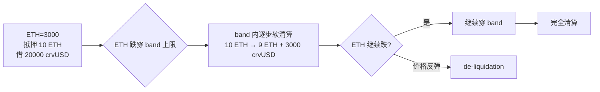

优点：避免暴跌一秒被强平。缺点：反复穿 band 的"震荡损耗"持续侵蚀抵押品——借款人本质上被 LP 化（每次反复都是给 LLAMMA 做了一笔 V3 风格 LP）。

### A.5 Balancer 加权池 + Maverick + Trader Joe LB

**Balancer V3 加权池**：V2 $xy=k$ 推广到带权重几何平均：$\prod x_i^{w_i} = k$，$\sum w_i = 1$。取 $w_i = 1/n$ 退化回 V2。80/20 BAL/WETH = 自动再平衡指数组合，代价是 IL 比 50/50 更大。V3 改动：hooks 与池类型解耦、ERC-4626 buffer 让收益代币直接作 LP 资产。

**Maverick V2 directional liquidity**：LP 选 Right（跟涨）/Left（跟跌）/Both/Static 四种模式，引入 Boosted Positions 把激励代币精准发给特定 tick。

**Trader Joe Liquidity Book**：用离散 **bin** 替代连续 tick，每 bin 恒定和 `x + y·P = const`。滑点 O(1) 可预测；变动费率按 bin 内交易频率自适应，波动大时 LP 自动收更高费。

**PancakeSwap Infinity（v4）**：2025-04 发布，支持 V2/V3/Infinity hook 三种池共存，BNB Chain 上 V3 TVL ~$978M。

### A.6 ve(3,3)

Andre Cronje 在 Solidly 引入，Velodrome（Optimism）、Aerodrome（Base）继承。锁仓治理代币换 veToken（time-lock NFT，锁越久权重越大）；veToken 持有人投票决定每周通胀分配；LP 拿通胀，投票人拿 100% 池子手续费——形成 **贿赂市场**：项目方向 ve-holder 送 bribe 换票。

(3,3) 是博弈论纳什均衡：双方合作 (3,3)，叛逃 (-1,-1)。问题：bribe 成本 > 池子真实收益时，市场负和——长期变成"通胀稀释 vs bribe 补贴"博弈。

Aerodrome 与 Velodrome 计划 2026 Q2 合并为 **Aero**。

---

## 附录 B：借贷数学补充

主线 Ch5 讲了 HF 和清算。本附录补：jump rate 完整公式、Aave V3 + Umbrella 自动 slash、Compound III absorb/buyCollateral、Morpho Blue 五元组、Maple/Centrifuge KYC 信用。

### B.1 利率曲线（jump rate 完整公式）

利用率 $U = \frac{\text{borrows}}{\text{supplies} + \text{borrows} - \text{reserves}}$。Compound 的 jump rate：

$$
\text{borrowRate}(U) = \text{base} + \text{slope}_1 \cdot \min(U, k) + \text{slope}_2 \cdot \max(0, U - k)
$$

USDC 池典型参数：base=0%、slope1=4%、kink=80%、slope2=100%。U 从 0→80% 借贷率 0→3.2%；U 从 80%→100% 借贷率 3.2%→23.2%。陡峭的 slope2 是自动稳定器。

Aave V3 差异化曲线：

| 资产类 | kink | slope1 | slope2 |
|---|---|---|---|
| 稳定币 | 92% | 3.5% | 60% |
| 挥发资产 | 80% | 3.8% | 80% |
| Isolation 资产 | 45-60% | 7% | 300% |

**e-mode**：相关性高的资产对（ETH/stETH、USDC/USDT）划入同一 category，LTV 提到 93%。是 Ethena 系 Aave-Pendle 杠杆循环的基础。

**Morpho AdaptiveCurve**：参数自动跟踪市场出清——长时间 $U$ 偏离 target 时，曲线自动平移：

$$
r_t = r_{t-1} \cdot \exp(k \cdot (U_t - U_{\text{target}}) \cdot \Delta t)
$$

避免治理频繁调参，代价是极端市场下利率可能过冲（U 长时间高位时利率涨到 1000%+）。

### B.2 Aave V3 + Umbrella 自动 slash

Aave 架构：Pool.sol 主入口；aToken（rebase 计息凭证）；Variable/Stable Debt Token；InterestRateStrategy（每 asset 独立曲线）；Aave Oracle（Chainlink + fallback）。

**Umbrella**（2025-06-05 上线）：替换老 Safety Module。

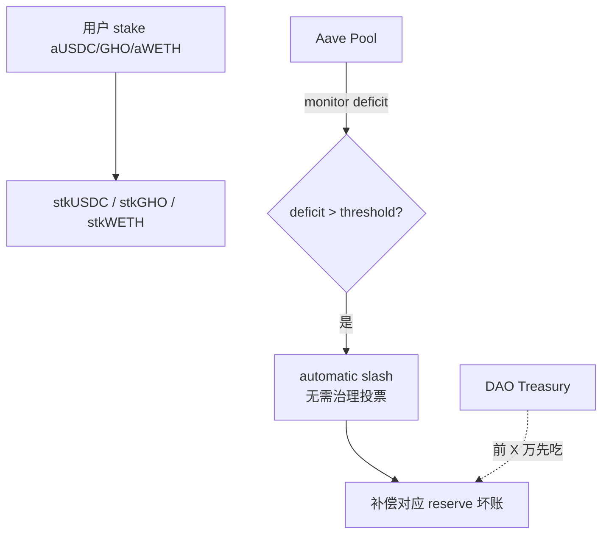

特性：① 分资产 staking（每个 staked asset 只覆盖对应 reserve）；② 自动 slash（合约阈值，超过即时 slash）；③ deficit offset（前 X 万由 Treasury 吃，超过才 slash staker）。

stkGHO/sGHO 演化（2026-04）：老 stkGHO 治理把 slash 关到 0；新 sGHO（5% APR、no slash、no cooldown）；新 stkGHO-Umbrella vault（愿意担 slash 风险）。

### B.3 Compound III（Comet）单一基础资产

每市场只能借一种基础资产（cUSDCv3 等），抵押物**只能存不能借**——主动牺牲资本效率换安全（V2 时代 oracle/闪电贷事故的反思）。

清算分两步：
- **absorb(account)**：清算人调用，把坏账账户的抵押品转给协议、债务清零。
- **buyCollateral(asset, baseAmount)**：任何人付 baseAmount USDC，按 oracle 价 × (1 - storeFrontPriceFactor) 折价买抵押品。

```solidity
function absorb(address absorber, address[] calldata accounts) external {
    for (uint256 i = 0; i < accounts.length; i++) {
        absorbInternal(absorber, accounts[i]);
    }
}
```

vs Aave：Aave 一步 liquidationCall 完成、Comet 两步——后者让 oracle 异常时不会立刻把整池抽空。TVL 远小于 Aave（$3B vs $26B），换来"上线 4 年没有过 oracle 攻击"。

### B.4 隔离市场：Morpho Blue / Euler V2 / Silo / Ajna

**Morpho Blue 五元组**：

```solidity
struct MarketParams {
    address loanToken;       // 借款资产
    address collateralToken; // 抵押资产
    address oracle;          // 预言机合约
    address irm;             // 利率模型合约
    uint256 lltv;            // 清算 LTV
}
```

Morpho Blue ~600 行，审计 8 次，无许可建市场，市场间完全隔离。复杂性外包给 **MetaMorpho vault**：curator（Steakhouse、Gauntlet、Re7）创建 ERC-4626 vault 在多市场间分配资金。优点是新资产立刻上线，缺点是用户选错 curator 全承担。2025 TVL 突破 $5B。

**Euler V2 EVK**：V1 2023-03 $197M 事件后重写。EVault（单 vault）+ EVC（让多 vault 在一笔 tx 原子访问）+ Risk steward（半治理）。internal balance tracking 防 ERC-4626 inflation attack。

**Silo V2**：每对资产一个 silo——存 USDC 进 ETH-silo 只能借 ETH，不接触其它 silo 风险。2025 迁到 Sonic，TVL ~$558M。

**Ajna**：完全无 oracle，价格由 buckets 决定（LP 自选愿意接受的价位）。无法被操纵但流动性碎片化，TVL <$50M。

### B.5 链上 KYC / 机构借贷

**Maple Finance**：Pool Delegate（专业资管公司）做尽调和风控，KYC 用户作 LP 给 KYC 借款机构。2026-01 推出 **syrupUSDC**（Coinbase Base 上线，目标 Aave V3 listing），加入 Sky Ecosystem Agent Network。TVL ~$3B。

**Centrifuge**：把 RWA（应收账款、CLO）搬上链作为抵押品借出 DAI/USDC。2026-01 与 Lista DAO 集成 BNB Chain，APY 3.65-4.71%。

**Goldfinch**（无抵押贷款给新兴市场小微）、**Clearpool**（机构间链上借贷）、**Ondo Finance**（短期国债 → USDY/OUSG）。

链上私募信用累计起源 ~$33.66B（2026-04），活跃敞口 ~$18.91B。

---

## 附录 C：12+ 真实事件 Postmortem

主线 Ch9 讲了 UST、Mango。本附录补其它 12 个 $50M+ 事件。

### C.1 Ronin 2022-03（$625M）

Sky Mavis 控制 9 个 validator 中的 4 个，加 Axie DAO 1 个 = 5/9 阈值。攻击：① LinkedIn 假招聘 PDF 钓鱼 Sky Mavis 4 个 validator 私钥；② 发现 2021-12 未撤销的"gas-free"白名单 backdoor，自动签到 Axie DAO 第 5 个；③ 单次提走 173,600 ETH + 25.5M USDC = ~$625M，**6 天后**才被发现。Sky Mavis 从 Binance 募 $150M 赔偿。**教训**：多签不够分散，过期配置必须及时清理。

### C.2 Wormhole 2022-02（$326M）

攻击链：① Wormhole 用 deprecated `load_instruction_at` 读 Secp256k1 验证结果，此函数**不验证 sysvar 账户真实性**；② 攻击者制造 fake sysvar account（预填"已验证"字节序列）；③ verify_signatures 信了；④ 铸 120,000 wETH 桥回 Ethereum 抽真 ETH。Jump Crypto 自掏 $326M 补损。**教训**：deprecated API 是攻击面；系统级信任入口必须严格验证账户身份。

### C.3 Kelp DAO 2026-04（$292M）

LayerZero 1-of-1 DVN 私钥被攻陷。攻击者签发 Ethereum 侧 rsETH 铸造消息→1-of-1 DVN 验证通过→$292M rsETH 凭空铸造→抵押 Aave 借走 wETH→Aave 坏账 $196M、TVL 单日跌 $6.6B、AAVE -16%、LDO -19%（市场担心 stETH 也走 LayerZero）。

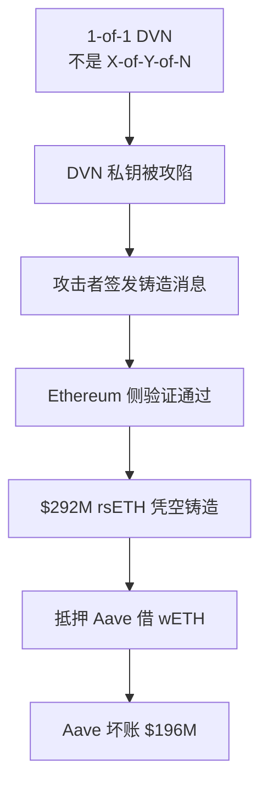

LayerZero V2 的 X-of-Y-of-N 模型应配置 **2 of 3 of 5**（2 必选 DVN + 5 可选中任 3 个签）。**教训**：① 借贷协议接受跨链资产时桥安全模型即协议安全模型；② 1-of-1 是单点；③ Umbrella 自动 slash 有上限。

### C.4 （已删除）

（原描述与 DMM Bitcoin 2024-05 $305M 混淆，本案删除）

### C.5 Euler V1 2023-03（$197M）

donateToReserves 没做健康检查。攻击链：① 闪电贷 30M DAI 10x 杠杆借 100M eDAI；② 调 `donateToReserves(100M)` 让账户突然变"deeply insolvent"；③ 用第二账户清算第一账户拿走清算折扣对应资产；④ 重复多次抽走 $197M。**结局**：攻击者最终归还 ~$240M（多于偷的）——团队从 OpSec 失误找到对话路径。**教训**：任何会让账户余额突变的函数都必须做 healthCheck。

### C.6 Nomad 2022-08（$190M）

路由升级里把 trusted root 设为 `0x00`，而 `0x00` 是 untrusted root 的默认值——所有消息自动被当成"已验证"。第一个攻击者发现后，tx 公开，**150 分钟内 ~300 个地址跟风**复制 drain ~$190M。~$37M 被白帽归还。**教训**：默认值是攻击面，未初始化 root 不能等于零值。

### C.7 Beanstalk 2022-04（$182M）

闪电贷借大量治理代币 → 通过"金库转给攻击者"提案 → 还贷。**根因**：无 timelock，治理权重按当下持币而非 ve 锁仓计算。**教训**：必须用 timelock + 长期锁仓权重过滤闪电贷攻击。

### C.8 Cream 2021-10（$130M）

Cream PriceOracleProxy 把 yUSDVault.getPricePerFullShare 直接当价格；攻击者通过 deposit/withdraw 双倍化 share-price 后反复杠杆借贷，借走 $130M。**教训**：可被外部 donation 操纵的 share-price 不能做估值，必须用底层资产市场价 + TWAP。

### C.9 Multichain 2023-07（$130M）

CEO Zhaojun 在中国被带走，电脑/手机/硬件钱包/助记词全被没收。两周后异常转账 ~$125M，CEO 妹妹也被带走（曾试图转移 ~$220M），桥永久关闭。**根因**：私钥控制权高度集中在 CEO 单人——事实上的中心化跨链桥。

### C.10 HTX/Heco 2023-11（$100M）

操作员账户私钥泄露。

### C.11 Radiant Capital 2024-10（$50M）

Arbitrum 大借贷协议。攻击链：① 假冒"前合约工"Telegram PDF 钓鱼，感染开发者 macOS；② 恶意软件篡改硬件钱包前端显示——签名时屏幕显示正常 tx，实际签恶意 tx；③ 三个多签 signer 被同样钓鱼；④ 攻击者控制 `transferFrom` 权限掏空用户授权资产。Mandiant 归因 UNC4736（DPRK APT）。**教训**：① 主机被感染时硬件钱包屏幕可被篡改；② 多签 + 地理分布仍可被同一波 APT 破；③ air-gapped 离线设备 + 二次设备验证才是更高级别防御。

### C.12 Munchables 2024-03（$62M）

Blast 链 GameFi，开发团队 4 人都是同一朝鲜人，其中一个把自己余额改成 1,000,000 ETH 取出。ZachXBT 公开追踪 + 社区压力后归还全部 $62.5M。

### C.13 Penpie 2024-09（$27M）

Penpie 在 Pendle 之上做收益聚合。攻击者创建伪造 Pendle Market（伪造 SY Token）→ 闪电贷资产存入伪造 SY → Penpie `harvest` 时伪造 SY 在 callback 里 reentrancy 进入 Penpie 自己 → 奖励账本反复更新 → 兑现 $27M。**根因**：Penpie 信任 Pendle 上**所有**市场，未验证是否治理白名单——**跨协议假设破裂**。

### C.14 KyberSwap Elastic 2023-11（$47M）

V3-style 集中流动性 DEX。tick 边界整数舍入方向错——swap 量"几乎等于"跨过 tick 但少 1 wei 时，合约**没跨 tick** 但**假设已经跨了**，baseL 记录错远高于真实状态。攻击者反向 swap 利用错位抽走 $47M。TVL $71M → $3M，团队解散。**教训**：tick math 必须与 V3 reference impl 对拍 differential testing。

### C.15 Curve 2023-07（$73M）

受害池：alETH/ETH ~$13.6M、msETH/ETH ~$1.6M（c0ffeebabe / Hacken 公开数据）、pETH/ETH（$11M）、CRV/ETH（$24.7M）。**根因不在 Curve**——Vyper 编译器 0.2.15/0.2.16/0.3.0 的 `@nonreentrant` 装饰器把 lock 标志和其它变量塞同一 storage slot，某些路径下 lock 失效。攻击：`add_liquidity` → ETH 转账 fallback → reentrancy 进入 `remove_liquidity` → lock 失效 → 池子状态错乱。**教训**：编译器/运行时/外部调用约定都是攻击面。

### C.16 bZx 2020-02（~$954K）

DeFi 历史首次大规模 oracle manipulation via flash loan。bZx #1 (2020-02-15)：Compound 借 ETH → Uniswap V1 操控 wBTC/ETH 做空 wBTC，损失约 $350K；bZx #2 (2020-02-18)：Synthetix sUSD 经 Kyber/Uniswap，损失约 $645K。两次攻击不同向量。**根因**：用单个 DEX 现货价做 oracle。

### C.17 GMX V1 2022-09（~$565K）

V1 GMX 用现货 oracle 给 perp 喂价、不收 swap fee。攻击：① thin AVAX/USDC 池子拉价；② GLP 价被推高；③ 攻击者以高价 swap AVAX 进 GLP；④ 反向操作把价拉回。V2 引入 price impact + 收 swap fee 防御。

---

## 附录 D：衍生品（GMX / Hyperliquid / Synthetix / 期权）

主线没讲衍生品。本附录给三大流派 + 期权简介。

### D.1 永续 DEX 三流派

```
① LP 池作为对手方  GMX V2 / HLP        LP 整体扛 trader 盈亏
② 链上订单簿       Hyperliquid / dYdX  trader 互为对手方
③ 合成 + 通用 vault Synthetix V3 / Aevo 用债务 vault 撮合多种衍生品
```

### D.2 GMX V2：GM 池

LP 提供 ETH/BTC/USDC，trader 在池上做多/做空 perp，LP 是统一对手方。trader 整体亏损时 LP 赚 fee + funding；trader 整体大赚时 LP 短期"放血"。

V2 改动：每市场独立 GM 池（V1 共享 GLP 池长尾资产污染所有 LP）。**Synthetic GM 池**：用 BTC + USDC 抵押 pricing WIF/USD，但 WIF 自身不在池子里。**Single-token GM 池**（2025）：只用 BTC 或 ETH 做双向抵押，没 USDC——LP 不持机会成本，代价是自动 deleveraging（ADL）风险更高。

funding rate（dual-slope 动态调整）：

$$
\text{funding} = \text{factor} \cdot \frac{(\text{long OI} - \text{short OI})^{\text{exponent}}}{\text{total OI}}
$$

按秒迭代：每秒以 `fundingIncreaseFactorPerSecond × imbalance` 上调。受 `maxFundingFactorPerSecond` 上限约束。

**LP 净收益 = fee + funding - trader PnL**。trader 长期大概率亏损时 LP 赚。

### D.3 Hyperliquid：HyperBFT + HIP-2/HIP-3

把 matching engine 做进共识层（不是智能合约）。**HyperCore**：自有 L1，HyperBFT 共识，订单簿存在状态机，价格-时间优先撮合。**HyperEVM**（2025-02）：同一 L1 的 EVM 兼容层，首例"原生 CLOB + EVM 双栈"。

**HIP-2（Hyperliquidity）**：协议在订单簿自动放 maker order，无需信任外部做市商。

**HIP-3（2025-10-13）**：perp 市场列表完全无许可，stake **500,000 HYPE** 即可部署。第一批 3 个资产免拍卖，第 4+ 走荷兰拍。builder 选 oracle、合约规格、最大杠杆、margin、OI 上限。fee 50% 给 builder，50% 给协议。

2026 数据：累计交易额 > $25B、7.5 万+独立 trader、商品/股票/油气 perp 爆发。HLP 社区 vault OI ~$7.5B、日成交峰值 $10-15B。

### D.4 dYdX v4：Cosmos appchain CLOB

订单簿在共识层，~60 个 validator 维护，DYDX 做 staking + governance。完全去中心化但 matching 性能低于 Hyperliquid。

### D.5 Synthetix V3：模块化衍生品

通用化抵押 vault——任何代币都能作 margin 投入 perpetual 市场。2025-Q4 重返主网，支持 sUSDe / cbBTC / wstETH 多种 margin。

### D.6 链上期权：Lyra（Derive）/ Premia

链上期权 TVL 远小于永续——瓶颈是定价精度（IV surface 实时调整）和资本效率（LP 须实时调整 vega/gamma）。Lyra 用 Black-Scholes + IV surface AMM；Premia V3 用 SVI/SSVI 参数化 vol surface oracle。Deribit（CEX 期权龙头）日成交 $50 亿+，链上所有协议加起来不到 $5000 万——差 100 倍。

---

## 附录 E：Pendle PT/YT 数学

主线 Ch7 提了 Pendle 一句。本附录展开。

### E.1 SY = PT + YT

任何生息资产 $A$ 都可以分解为「未来某时点的本金」+「现在到那个时点之间的利息流」。Pendle 把这一分解写成两个独立 ERC-20——**PT**（Principal Token）和 **YT**（Yield Token）。

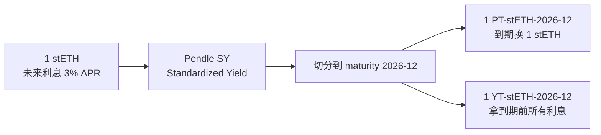

- **PT**：到期 1:1 兑回原始资产，相当于零息债券——当下折价买入、到期拿回本金。
- **YT**：拿到 maturity 前的所有利息流，押注未来利率上涨。

### E.2 不变量

$$
\text{SY\_value} = \text{PT\_value} + \text{YT\_value}
$$

任何时刻 1 SY = 1 PT + 1 YT（按价值）。

Pendle AMM 用 log-normal 曲线 + 时间衰减：PT 价格随到期日临近收敛到 1（0.97 → 1）；YT 价格随到期日临近衰减到 0（0.03 → 0）。

**LP IL 来源**：implied APY vs underlying APY 的偏离——市场预期与实际利率背离时 LP 在 PT/SY AMM 上的两边敞口被重新定价。类似 Uni V3 在区间外只剩单边资产，但驱动量是利率而非现货价。

### E.3 实战

- **固收**：买 PT-stETH-2026-12（0.95 stETH/PT），8 个月折价收益 ~5.26%、年化 ~8%（高于 stETH 自身 3%）。
- **投机**：买 YT-stETH-2026-12（0.05 USDC/YT），未来 stETH 实际收益 > 5% 时盈利——本质是杠杆做多利率。
- **LP**：提供 PT/SY 流动性，赚交易费 + 部分 YT 收益。

### E.4 2026 状态

TVL 从 2023 年 $230M → 2024 年 $4.4B（LRT 浪潮）。2026-01 升级 sPENDLE：锁定期 14 天（vs vePENDLE 4 年）；80% 协议收入买回 PENDLE 给 sPENDLE holder。

---

## 附录 F：ve-tokenomics + Berachain PoL + Real Yield 辨真伪

> 本附录给 DeFi 视角的 ve 经济效应；治理设计 + Curve War 完整复盘见模块 15。

（与模块 15 §5/§7 重叠——本附录给 DeFi 视角，15 章给治理视角）

### F.1 ve(3,3) 经济学

详见附录 A.6。Aerodrome bribe 市场流程：

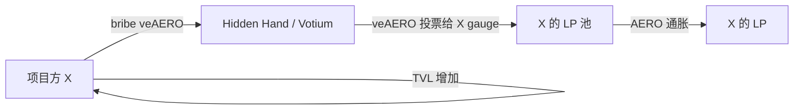

关键问题：bribe 成本 > 池子真实收益时市场负和。

### F.2 Berachain Proof of Liquidity

2025-02 主网。把流动性激励和 PoS 共识绑死：

- **BERA**：gas + staking 代币（可转让）。
- **BGT**：治理 + 收益代币（**soulbound 不可转让**）。

机制：Validator stake BERA 提议区块 → 区块发 BGT 通胀给 Reward Vault → LP 在 RV 中存代币获 BGT → BGT 持有者 boost 验证者增加其 block reward。BGT 1:1 burn 换 BERA（单向不可逆）。

2026-03 数据：TVL ~$3.2B。**PoL v2**（2025 末）：33% 协议激励自动转换成 wBERA 分给 BERA staker，给 gas token "real yield"。

### F.3 Real Yield vs Ponzi 三问

**Real Yield**：从真实业务（交易费、借贷利息、清算费）赚钱，通过 buyback/burn/staking 分给持有者。**Ponzi yield**：靠新发代币支付 reward，价格涨 → APR 高 → 吸引新用户 → ...直到通胀跌穿。

**辨真伪三问**：① Yield 来源是 emission 还是 fee revenue？看 DefiLlama "Revenue"（协议自留）而非 "Fees"（用户付出总成本）。② APR 多高？真实 yield 通常 2-15%，100%+ 几乎一定是 emission。③ 代币总供应是否在增？增意味着高 APR 是稀释购买力。

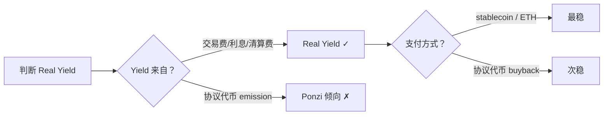

2026 趋势：协议把"Revenue 分给 token holder 比例"从 2024 年 ~5% 提到 ~15%。Uniswap fee switch 激活并 buyback + burn。

### F.4 Pendle vs Convex vs Yearn

| 维度 | Pendle | Convex | Yearn V3 |
|------|---|---|---|
| 抽象 | PT/YT 利率切片 | veCRV 治理聚合 | ERC-4626 vault + curator |
| 收益来源 | 利率交易 + LP fee | Curve emission + bribes | 多 strategy 自动复投 |
| 锁仓 | 14 天（sPENDLE） | 16 周（vlCVX） | 无 |
| 复杂度 | 高 | 中 | 低 |

---

## 附录 G：Restaking 经济学

主线 Ch7 提了 LRT 一句。本附录展开 EigenLayer / Symbiotic / Karak / Babylon。

### G.1 EigenLayer（始祖）

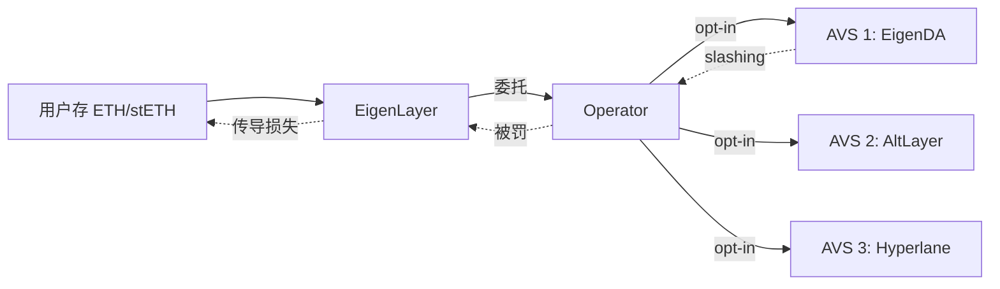

2025-04-17 slashing 上线。2026 数据：TVL ~$18-19.5B（峰值 $28.6B 后市场出清）、39+ active AVS、1900+ active operators、市占率 ~93.9%。Operator 可限制对单个 AVS 的暴露，stake 被 unique attribution 到特定 AVS。

### G.2 Symbiotic

2025-01 主网。模块化竞争者。Permissionless vault（无 whitelist）；任意 ERC-20 抵押（USDC、BTC、各种 LRT）；curator（Gauntlet 等）管理 vault。

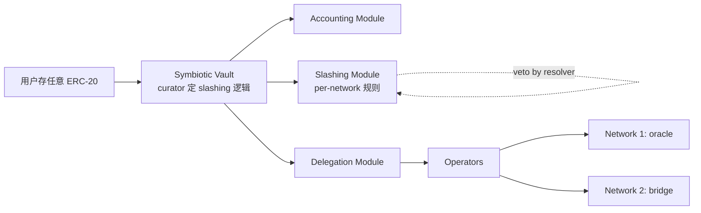

2026 状态：vault 数 70+，覆盖 oracle/DA/桥/appchain/BTC services。

### G.3 Karak：Universal Restaking

Andalusia Labs 开发。任何资产都能 restake、任何网络都能受益。**自带 L2（Karak L2）** 把 restaking 应用直接跑在自家 L2 上。TVL ~$740M。

### G.4 Babylon：BTC 原生 restaking

让 BTC 不离开比特币原链就能 stake。

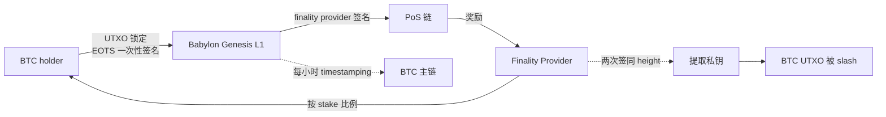

**EOTS（Extractable One-Time Signature）**：基于 Bitcoin Schnorr 构造的可提取一次性签名。FP 在同一 height 签两个 block，两个 Schnorr 签名能数学组合提取 FP 私钥——即 slashing。**Bitcoin timestamping**：Babylon 链每小时 commit 状态到 Bitcoin 主链（防 long-range attack）。

2026 状态：TVL ~$5B，BTC LST 协议 Lombard（LBTC）等大量集成。

### G.5 LRT 风险盘点

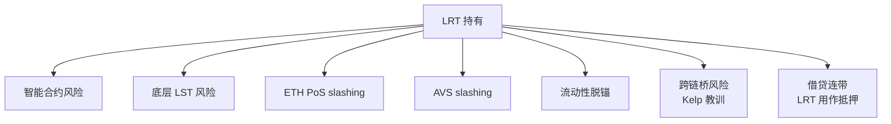

主流 LRT（2026-04）：

| 协议 | 代币 | TVL | 特色 |
|------|---|---|---|
| ether.fi | eETH/weETH | ~$3.2B（含 vault $7.8B） | LRT 龙头，借贷接受度第一 |
| Renzo | ezETH | ~$1-2B | EigenLayer 重仓 |
| Kelp DAO | rsETH | $740M | **2026-04 桥事故** |
| Puffer | pufETH | ~$1.3B | "anti-slashing"，机构 mint |
| Swell | swETH/rswETH | ~$265M | 早期 |

---

## 附录 H：账户抽象 + Intent

主线没讲。本附录展开 4337 / 7702 / Permit2 / CowSwap / OIF。

### H.1 ERC-4337：账户抽象

让账户可以是任意智能合约而非只能私钥签名 EOA。4337 把 AA 做在共识层之外（不改 protocol，纯应用层）：

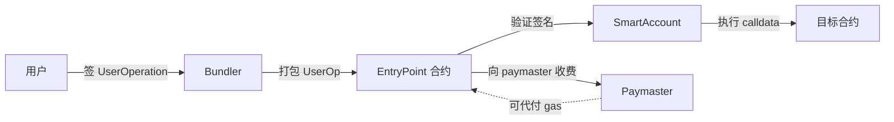

好处：社交恢复、batch 交易、第三方代付 gas、session key。代价：首次部署 SmartAccount 一次性 gas 几十美元。

### H.2 EIP-7702：让 EOA 临时变 Smart Account

Pectra 升级（2025-05-07）带来。EOA 通过 Type 4 tx 签名"临时附加" smart contract 代码——不需要部署新账户、不需要迁移资产。

Circle 用 EIP-7702 + Paymaster 实现"用 USDC 付 gas"：用户从创建 EOA 那一刻起就能 gasless 交易。**4337 解决新原生 smart wallet，7702 解决存量 EOA 升级**——两者结合让 batch + gasless + social recovery 成为默认。

### H.3 Permit / ERC-2612 / Permit2

| 标准 | 适用 | 工作方式 |
|------|------|---------|
| **ERC-2612** | 实现了它的 ERC-20 | 代币合约自带 `permit()`，EIP-712 签名授权后 transferFrom |
| **Permit2** | 任意 ERC-20（含 USDT/WETH） | 一次性 `approve(Permit2, MAX)`，之后签消息给 dApp 短期 allowance，支持 batch + 过期 |

USDT/WETH/老 USDC 都没实现 ERC-2612，Permit2 提供统一签名层兼容所有 ERC-20。intent 系统天然依赖 Permit2 nonce + 过期机制。

### H.4 Intent：从 swap 到声明

**传统 swap**：用户必须指定 DEX、fee tier、滑点、deadline，错一步被 sandwich。**Intent**：只签声明 `{ sell: 1000 USDC, buy: ETH (>= 0.32), deadline: ... }`，Solver/Filler 网络找最优路径并保证执行价不差于下限。

**CowSwap：批量拍卖 + solver 竞争**

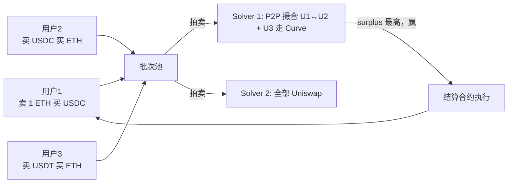

**solver 经济学**：① **Score = surplus + protocol fee**（统一记分）；② **Surplus 全归用户**（solver 找到比 limit 价更好的执行价，差额给用户）；③ Solver 周期奖励 COW 代币；④ Solver 担风险（出价时承诺执行价，差了要补差）。

**CoW AMM**：CowSwap 自家零 swap fee AMM，专给 solver 对冲库存。

**UniswapX / 1inch Fusion / Bebop**：filler 竞标执行，走 V3/V4 或自己库存。

### H.5 跨链 intent 标准

- **ERC-7521**：Generalized Intent 标准。
- **ERC-7683**：跨链 intent 标准。
- **OIF（Open Intents Framework）**：EF 2025-02 联合 30+ 团队基于 7683 统一跨链 intent。
- **Anoma**：把整条链改造成 intent machine。
- **Khalani**：跑在 40+ 链的跨链 intent solver 基础设施。

---

## 附录 I：DeFi 协议完整索引（2026-04 状态）

DeFi 主流协议按层 + 子类完整列出，附 TVL（2026-04 来源 [DefiLlama](https://defillama.com/)）、链、正文章节交叉引用。

### A.1 货币层（L1）

#### A.1.1 法币抵押稳定币

| 代币 | 发行方 | 储备 | 市值 | 交叉 |
|------|---|---|---|---|
| USDT | Tether | 现金+短债 | ~$140B | Ch3 |
| USDC | Circle | 现金+短债（BlackRock 托管） | ~$60B | Ch3 |
| FDUSD | First Digital | 现金+国债 | ~$3B | Ch3 |
| PYUSD | PayPal+Paxos | 现金+国债 | ~$1.5B | Ch3 |
| RLUSD | Ripple | 现金+国债（NYDFS 监管） | ~$1B | Ch3 |
| TUSD | TrustToken | 现金+国债 | ~$500M | Ch3 |
| USDP | Paxos | 现金+国债 | ~$200M | Ch3 |
| USD0 | Usual | RWA 国债 + USYC | ~$1.5B | 第 5 章变体 |

#### A.1.2 超额抵押稳定币

| 代币 | 协议 | 抵押 | 市值 | 交叉 |
|------|---|---|---|---|
| USDS / DAI | Sky Protocol | ETH/wstETH/RWA/USDC（PSM） | ~$9B | Ch4 |
| LUSD / BOLD | Liquity V1/V2 | ETH（V1）/wstETH/rETH（V2） | ~$300M | Ch4 |
| GHO | Aave | Aave 抵押品 | ~$300M | Ch4 |
| crvUSD | Curve | wstETH/sfrxETH/WBTC（LLAMMA bands） | ~$200M | Ch4/9 |
| eUSD | Lybra | stETH/wstETH | ~$50M | Ch4 |

#### A.1.3 合成 / RWA / 算法

| 代币 | 协议 | 模型 | 市值 | 交叉 |
|------|---|---|---|---|
| USDe / sUSDe | Ethena | delta-neutral 现货+永续空头 | ~$6B | Ch5 |
| iUSDe | Ethena | 机构合规版 USDe | 增长中 | Ch5 |
| frxUSD / sfrxUSD | Frax V3 | RWA（BUIDL）+ AMO | ~$1B | Ch5 |
| USDM | Mountain | 100% 短期国债 + rebase | ~$300M | Ch5 |
| USDY / OUSG | Ondo | 短期国债 / 机构国债 | ~$700M | Ch5 |
| USYC | Hashnote | 机构国债 | ~$1B | Ch5 |
| BUIDL | BlackRock | tokenized money-market | ~$3B | Ch5 |
| syrupUSDC | Maple | 私募信用收益 | ~$200M | Ch17 |

#### A.1.4 LST（Liquid Staking Token）

| 代币 | 协议 | 模式 | TVL | 交叉 |
|------|---|---|---|---|
| stETH / wstETH | Lido | rebase / wrap | ~$23B | Ch22 |
| rETH | Rocket Pool | 汇率递增 | ~$2-3B | Ch22 |
| cbETH | Coinbase | 汇率递增 | ~$1B | Ch22 |
| sfrxETH | Frax | 双代币 | <$1B | Ch22 |
| mETH | Mantle | 汇率递增 | ~$1B+ | Ch22 |
| osETH | StakeWise | 用户跑节点 | ~$300M | Ch22 |

#### A.1.5 LRT（Liquid Restaking Token）

| 代币 | 协议 | TVL | 状态 | 交叉 |
|------|---|---|---|---|
| eETH / weETH | ether.fi | ~$3.2B | 龙头 | Ch24 |
| ezETH | Renzo | ~$1-2B | EigenLayer 重仓 | Ch24 |
| pufETH | Puffer | ~$1.3B | Anchorage 集成机构 | Ch24 |
| rsETH | Kelp DAO | $740M | **2026-04 桥被攻击** | Ch24 |
| swETH / rswETH | Swell | ~$265M | 早期 LRT | Ch24 |

#### A.1.6 BTC 上链

| 代币 | 模式 | 信任 | TVL | 交叉 |
|------|---|---|---|---|
| WBTC | BitGo 托管 | 中心化 | ~$10B | Ch2 |
| cbBTC | Coinbase 托管 | 中心化 | ~$3B | Ch2 |
| tBTC | threshold ECDSA 51 节点 | 多签 | ~$500M | Ch2 |
| FBTC | Antalpha+Mantle | 托管 | ~$1B | Ch2 |
| LBTC | Lombard + Babylon | restaked BTC | ~$1.5B | Ch2/23 |
| uniBTC | Bedrock + Babylon | restaked BTC | ~$300M | Ch23 |
| solvBTC | Solv | 多托管 | ~$700M | Ch2 |

### A.2 交易层（L2 DEX）

#### A.2.1 AMM（EVM）

| DEX | 模型 | 主链 | TVL | 交叉 |
|------|---|---|---|---|
| Uniswap V4 | singleton + hooks | Eth/Base/Arb/多链 | ~$5B | Ch8 |
| Uniswap V3 | 集中流动性 NFT | Eth + 多链 | ~$3B | Ch7 |
| Uniswap V2 | xy=k | Eth + 多链 | ~$1B | Ch6 |
| Curve | StableSwap + crvUSD | Eth + 多链 | ~$2B（按 DefiLlama 当前值复核——半衰期 90 天） | Ch9 |
| Balancer V3 | 加权池 + hooks | Eth + 多链 | ~$1B | Ch10 |
| PancakeSwap Infinity | V2/V3/V4 hybrid | BNB + 多链 | ~$1B | Ch10 |
| Aerodrome | ve(3,3) | Base | ~$1.5B | Ch11 |
| Velodrome | ve(3,3) | Optimism | ~$300M | Ch11 |
| Maverick V2 | directional liquidity | Eth/Arb/Base | ~$200M | Ch10 |
| Trader Joe LB | bin 离散流动性 | Avalanche/Arb/BNB | ~$200M | Ch10 |
| Camelot | V2 fork + V3 nitro | Arbitrum | ~$100M | A.2 |
| Ramses | Solidly fork | Arbitrum | ~$50M | A.2 |
| Bunni v2 | Uniswap V4 hook | Eth | ~$500M | Ch8/11 |
| Angstrom | V4 hook + ASS MEV 防御 | Eth | 增长中 | Ch8 |

#### A.2.2 DEX（Solana）

| DEX | 模型 | TVL | 交叉 |
|------|---|---|---|
| Jupiter | DEX 聚合器 + JLP perp | ~$2B+ | A.2 |
| Orca | Whirlpools 集中流动性 | ~$300M | A.2 |
| Phoenix | 极简订单簿 | ~$50M | A.2 |
| Drift | vAMM + JIT + 订单簿 | $250M（hack 后） | Ch20 |
| Raydium | V3 + 增长中 | ~$1B | A.2 |

#### A.2.3 Intent / 聚合器

| 协议 | 模型 | 交叉 |
|------|---|---|
| CowSwap | 批量拍卖 + solver 竞争 | Ch27 |
| UniswapX | filler 网络 | Ch27 |
| 1inch Fusion | 1inch intent 模式 | Ch27 |
| Bebop | RFQ + intent | Ch27 |
| Anoma | intent-centric L1 | Ch27 |
| Khalani | 跨链 intent solver | Ch27 |

### A.3 信用 / 衍生品层（L3）

#### A.3.1 借贷

| 协议 | 模式 | TVL | 交叉 |
|------|---|---|---|
| Aave V3 + Umbrella | 共享池 + 自动 slash | ~$26B（4 月跌至 $20B） | Ch14 |
| Spark / SparkLend | Aave V3 fork（Sky） | ~$3.25B + $5.24B liquidity layer | Ch4/17 |
| Compound III (Comet) | 单一基础资产 | ~$3B | Ch15 |
| Morpho Blue + MetaMorpho | 隔离市场 + curator | ~$5B | Ch16 |
| Euler V2 | Euler Vault Kit | ~$1B | Ch16 |
| Silo V2 | 风险隔离 silo | ~$558M（Sonic） | Ch16 |
| Ajna | 无 oracle | <$50M | Ch16 |
| Venus | BNB Chain 龙头 | ~$1.5B | A.3 |
| Radiant | Arbitrum（重建中） | <$100M | Ch28 |
| Kamino Lend | Solana | ~$3.2B | A.3/17 |
| Save Finance（前 Solend） | Solana | ~$300M | A.3 |
| Maple | 链上信用 KYC | ~$3B | Ch17 |
| Centrifuge | RWA tokenization | ~$700M | Ch17 |
| Goldfinch | 新兴市场无抵押贷款 | ~$100M | Ch17 |
| Clearpool | 机构 P2P 借贷 | ~$300M | Ch17 |

#### A.3.2 永续

| 协议 | 模型 | TVL/OI | 交叉 |
|------|---|---|---|
| Hyperliquid | HyperBFT + HIP-2/HIP-3 | OI $7.5B / 日 $10-15B | Ch20 |
| GMX V2 | GM 池 LP 对手方 | ~$500M TVL | Ch19 |
| dYdX v4 | Cosmos appchain CLOB | ~$300M | Ch20/21 |
| Synthetix V3 | 模块化抵押 + perp | ~$200M | Ch21 |
| Drift | Solana vAMM+JIT+CLOB | $250M（hack 后） | Ch20 |
| Jupiter Perps | Solana JLP | ~$1B | A.2 |
| Aevo | OP Stack L2 perp+option | OI $15M / TVL $22M | Ch21 |
| Vertex | Arbitrum hybrid | ~$100M | A.3 |
| Aster | 新 perp DEX | $3B OI | Ch20 |
| Lighter | 新 perp DEX | 增长中 | Ch20 |

#### A.3.3 期权

| 协议 | 模型 | 交叉 |
|------|---|---|
| Lyra（Derive） | AMM + IV surface | Ch21 |
| Premia V3 | SVI/SSVI vol surface oracle | Ch21 |
| Aevo | 永续 + 期权综合 | Ch21 |
| Dopex | 链上期权 vault | Ch21 |
| Panoptic | LP-as-perpetual-options（基于 Uniswap V3） | A.3 |

### A.4 收益 / 策略 / 利率市场（L4）

| 协议 | 类别 | 交叉 |
|------|---|---|
| Yearn V3 | ERC-4626 vault + curator | Ch25 |
| Beefy | 多链自动复利 vault | A.4 |
| Convex | Curve veCRV 聚合 | Ch25 |
| Aura | Balancer veBAL 聚合 | Ch25 |
| Pendle | PT/YT 利率切片 + sPENDLE | Ch25 |
| Sommelier | Cosmos vault DAO | A.4 |
| Sky Savings (sUSDS) | RWA 收益 ERC-4626 | Ch4 |
| sGHO | Aave 原生 USD savings | Ch14 |

### A.5 再质押 / Restaking

| 协议 | 模型 | TVL | 交叉 |
|------|---|---|---|
| EigenLayer | ETH+LST → AVS | ~$18-19.5B | Ch23 |
| Symbiotic | permissionless vault | $5B+ | Ch23 |
| Karak | universal restaking + L2 | ~$740M | Ch23 |
| Babylon | BTC native staking | ~$5B | Ch23 |
| Jito (Solana) | SOL restaking | ~$2B | Ch23 |

### A.6 预言机

| 协议 | 模式 | 交叉 |
|------|---|---|
| Chainlink Data Feeds | push（heartbeat + 偏离阈值） | Ch18 |
| Chainlink Data Streams | pull（low-latency） | Ch18 |
| Pyth Network | pull（Pythnet 400ms 推） | Ch18 |
| RedStone | push + pull 模块化 | Ch18 |
| API3 | first-party oracle | Ch18 |
| Switchboard | Solana 多源 oracle | Ch18 |
| Tellor | optimistic 拆解 | A.6 |
| UMA | optimistic oracle | A.6 |

### A.7 跨链 / Bridge

| 协议 | 模型 | 交叉 |
|------|---|---|
| LayerZero V2 | endpoint + DVN + executor | Ch24 |
| Wormhole | guardian 多签 | Ch28 |
| CCIP（Chainlink） | DON + CCIP | A.7 |
| Axelar | Cosmos appchain + bridge | A.7 |
| Hyperlane | permissionless bridge | A.7 |
| Connext / Across | optimistic bridge | A.7 |
| Stargate | LayerZero 之上 | A.7 |
| deBridge | intent 跨链 | A.7 |

### A.8 MEV 基础设施

| 角色 | 项目 | 交叉 |
|------|---|---|
| Relay | Flashbots / bloXroute / Eden / Manifold | Ch26 |
| Builder | Beaverbuild / Titan / rsync / BuilderNet（去中心化） | Ch26 |
| Searcher 工具 | mev-rs / simple-arbitrage / Foundry fork | Ch26 |
| 去中心化 builder | BuilderNet（TEE） | Ch26 |
| 跨链 MEV | SUAVE | Ch26 |
| Solana MEV | Jito | Ch26 |

---

## 附录 J：Foundry 实战指南骨架

最小 Foundry 模板。完整代码在 `code/` 目录。

### B.1 安装与基础

```bash
# 安装 foundry（一次性）
curl -L https://foundry.paradigm.xyz | bash
foundryup

# 创建新项目
forge init my-defi-project
cd my-defi-project

# 安装常用依赖
forge install OpenZeppelin/openzeppelin-contracts
forge install Uniswap/v3-periphery
forge install aave-dao/aave-v3-origin
forge install transmissions11/solmate
forge install foundry-rs/forge-std
```

### B.2 foundry.toml 推荐配置

```toml
[profile.default]
src = "src"
out = "out"
libs = ["lib"]
solc_version = "0.8.28"
optimizer = true
optimizer_runs = 20000
via_ir = false
fs_permissions = [{ access = "read", path = "./" }]
gas_reports = ["*"]

[rpc_endpoints]
mainnet = "${MAINNET_RPC_URL}"
arbitrum = "${ARB_RPC_URL}"
base = "${BASE_RPC_URL}"

[etherscan]
mainnet = { key = "${ETHERSCAN_API_KEY}" }
arbitrum = { key = "${ARBISCAN_API_KEY}" }

[fmt]
line_length = 120
tab_width = 4
bracket_spacing = false
```

### B.3 fork mainnet 测试模板

```solidity
// test/Fork.t.sol
// SPDX-License-Identifier: MIT
pragma solidity 0.8.28;

import {Test} from "forge-std/Test.sol";
import {IPool} from "@aave/v3-core/contracts/interfaces/IPool.sol";

contract ForkTest is Test {
    IPool public aavePool = IPool(0x87870Bca3F3fD6335C3F4ce8392D69350B4fA4E2);

    function setUp() public {
        vm.createSelectFork(vm.envString("MAINNET_RPC_URL"), 19500000);
    }

    function test_AaveV3_Supply() public {
        address user = makeAddr("user");
        vm.startPrank(user);
        // ...
    }
}
```

跑：

```bash
forge test --match-contract Fork --fork-url $MAINNET_RPC_URL --fork-block-number 19500000 -vvv
```

### B.4 Invariant 测试（防 inflation attack）

```solidity
// test/Invariant.t.sol
contract InvariantTest is Test {
    MyVault vault;

    function setUp() public {
        vault = new MyVault(asset);
        targetContract(address(vault));
    }

    function invariant_AssetsGteShares() public view {
        if (vault.totalSupply() == 0) return;
        // 不变量：totalAssets / totalSupply 单调上限（用 virtual offset 后）
        assertGe(vault.totalAssets(), 1);
    }
}
```

```bash
forge test --match-contract Invariant -vvv
```

### B.5 gas 对比

```bash
# 跑测试时记录 gas 快照
forge snapshot

# 与上次 commit 对比
forge snapshot --diff
```

### B.6 部署到 testnet

```bash
forge script script/Deploy.s.sol \
    --rpc-url $SEPOLIA_RPC_URL \
    --broadcast \
    --verify
```

### B.7 常用 cheatcode

| Cheatcode | 用途 |
|---|---|
| `vm.prank(addr)` | 单次模拟 addr 调用 |
| `vm.startPrank(addr)` / `vm.stopPrank()` | 持续模拟 addr |
| `vm.warp(timestamp)` | 时间穿越 |
| `vm.roll(blockNumber)` | 块号穿越 |
| `deal(token, addr, amount)` | 给 addr 凭空注入 token |
| `vm.expectRevert(bytes)` | 预期 revert |
| `vm.recordLogs()` / `vm.getRecordedLogs()` | 记录 event |
| `vm.createSelectFork(url, block)` | fork 切换 |

详见 `code/` 目录的具体项目。

---

## 附录 K：DeFi 速查图（一页打印版）

```
┌─────────────────────────────────────────────────────────────┐
│                    DeFi 协议栈速查图                            │
├─────────────────────────────────────────────────────────────┤
│ L4 策略层                                                    │
│   Yearn V3 │ Pendle PT/YT │ Convex │ Aura │ Beefy            │
├─────────────────────────────────────────────────────────────┤
│ L3 信用/衍生品                                                │
│   借贷：Aave V3+Umbrella │ Compound III │ Morpho │ Spark │   │
│         Euler V2 │ Silo │ Maple │ Centrifuge                │
│   永续：Hyperliquid HIP-3 │ GMX V2 │ dYdX v4 │ Synthetix V3 │
│   期权：Lyra │ Premia V3 │ Aevo                              │
├─────────────────────────────────────────────────────────────┤
│ L2 交易层                                                    │
│   AMM：UniV2/V3/V4 │ Curve │ Balancer V3 │ PancakeSwap      │
│        Aerodrome │ Maverick V2 │ Trader Joe LB              │
│   订单簿：Hyperliquid │ dYdX v4 │ Drift │ Phoenix            │
│   Intent：CowSwap │ UniswapX │ 1inch Fusion │ Bebop          │
├─────────────────────────────────────────────────────────────┤
│ L1 货币层                                                    │
│   原生：ETH/WETH │ BTC（WBTC/cbBTC/tBTC/LBTC）              │
│   稳定币：USDC/USDT/USDS/USDe/Frax/LUSD/GHO/crvUSD/USDM     │
│   LST：stETH/rETH/cbETH/sfrxETH/mETH                        │
│   LRT：eETH/ezETH/pufETH/rsETH/swETH                        │
├─────────────────────────────────────────────────────────────┤
│ 横切：MEV/账户/预言机                                          │
│   MEV：Flashbots │ MEV-Boost │ BuilderNet │ SUAVE │ Jito    │
│   账户：ERC-4337 │ EIP-7702 │ Permit2                       │
│   预言机：Chainlink │ Pyth │ RedStone │ API3                │
│   Restake：EigenLayer │ Symbiotic │ Karak │ Babylon         │
└─────────────────────────────────────────────────────────────┘
```

**关键 2026 时间节点**：
- 2025-01-30 Uniswap V4 主网
- 2025-02 Berachain 主网
- 2025-04-17 EigenLayer slashing 上线
- 2025-05-07 Pectra（EIP-7702）
- 2025-06-05 Aave Umbrella
- 2025-10-13 Hyperliquid HIP-3
- 2026-01 Pendle sPENDLE / Jupiter JupUSD / yvUSD
- 2026-04-07 DAI → USDS 大规模迁移
- 2026-04-18 Kelp DAO bridge 事件 / Aave $6.6B TVL drop

---

## 附录 L：术语小词典

| 术语 | 全称 | 解释 |
|------|---|---|
| AMM | Automated Market Maker | 自动做市商 |
| AMO | Algorithmic Market Operations | Frax 的协议级"中央银行公开市场操作" |
| AVS | Actively Validated Service | EigenLayer/Symbiotic 上的应用服务 |
| CDP | Collateralized Debt Position | 抵押债务头寸 |
| CLOB | Central Limit Order Book | 中央限价订单簿 |
| DVN | Decentralized Verifier Network | LayerZero V2 验证者网络 |
| EOTS | Extractable One-Time Signature | Babylon BTC slashing 数学基础 |
| HF | Health Factor | 健康因子（借贷协议） |
| IL | Impermanent Loss | 无常损失 |
| IRM | Interest Rate Model | 利率模型 |
| JIT | Just-In-Time（liquidity） | 即时流动性 |
| LRT | Liquid Restaking Token | 流动性再质押代币 |
| LST | Liquid Staking Token | 流动性质押代币 |
| LT | Liquidation Threshold | 清算阈值 |
| LTV | Loan-To-Value | 贷款价值比 |
| LLAMMA | Lending-Liquidating AMM | crvUSD 软清算 AMM |
| MEV | Maximal Extractable Value | 最大可提取价值 |
| OFT | Omnichain Fungible Token | LayerZero V2 跨链代币标准 |
| PBS | Proposer-Builder Separation | 出块者-构建者分离 |
| PoL | Proof of Liquidity | Berachain 的共识 |
| PSM | Peg Stability Module | DAI/USDS 锚定稳定模块 |
| PT/YT | Principal/Yield Token | Pendle 利率切片 |
| RWA | Real World Asset | 现实世界资产 |
| SBC | Single Base Asset Compound | Compound III 单一基础资产模型 |
| SSR | Sky Savings Rate | Sky 协议储蓄利率 |
| SUAVE | Single Unifying Auction for Value Expression | Flashbots 下一代 |
| TWAP | Time-Weighted Average Price | 时间加权平均价 |
| TVL | Total Value Locked | 锁仓总价值 |
| ve | vote-escrowed | Curve 引入的锁仓投票模型 |

---

## 附录 M：学习路径与项目案例

### E.1 三周学习计划

**第 1 周：货币层 + AMM 基础**
- Day 1-2：精读 Ch1-5（货币层全集）
- Day 3-4：精读 Ch6-7（V2/V3 数学）+ 跑 `code/univ2-pool/`
- Day 5：跑 [Uniswap V3 Book](https://uniswapv3book.com/) 第 1-3 章
- Day 6-7：精读 Ch8-11（V4/Curve/Balancer/ve3,3）+ 自己 fork 一个 V4 hook 模板

**第 2 周：借贷 + 衍生品**
- Day 8-9：精读 Ch12-13（利率 + HF）+ 跑 `code/chainlink-liquidator/`
- Day 10-11：精读 Ch14-17（Aave/Compound/Morpho/机构借贷）+ 在 Aave 主网 fork 上做一笔模拟杠杆循环
- Day 12：精读 Ch18（Oracle）+ 复现 Cream/Mango 攻击 PoC（教学版）
- Day 13-14：精读 Ch19-21（永续/期权）+ 在 Hyperliquid testnet 部署一个简单 perp 市场（HIP-3 模拟）

**第 3 周：再质押 + MEV + 风险**
- Day 15-16：精读 Ch22-25（LST/Restaking/LRT/Pendle/Berachain）
- Day 17-18：精读 Ch26-27（MEV / AA / Intent）+ 跑 `code/sandwich-sim/`（仅本地）
- Day 19-20：精读 Ch28（事故复盘）——挑 3 个 $50M+ 事件画详细攻击链
- Day 21：思考题全做，回顾 12 大事故根因

### E.2 三个练手项目

**项目 1（入门）：fork 一个 UniswapV2 + 集成自家 hook**
- 目标：理解 V2 PUSH 模式、flash swap、MINIMUM_LIQUIDITY。
- 时间：1 周。
- 产出：完整 Foundry 测试 + 与官方 V2 gas 对比报告。

**项目 2（中级）：写一个 Aave V3 清算 bot**
- 目标：理解 HF、Chainlink staleness、闪电贷 callback、私有 RPC。
- 时间：2 周。
- 产出：fork mainnet 实测能复现历史清算 + 24h dry-run 统计成功率。

**项目 3（高级）：写一个 V4 Hook 实现 dynamic fee**
- 目标：理解 V4 PoolManager + transient storage + hook 地址前缀编码。
- 时间：3-4 周。
- 产出：发布到 testnet、跑 invariant 测试、写 medium 文章总结。

### E.3 长期成长路径

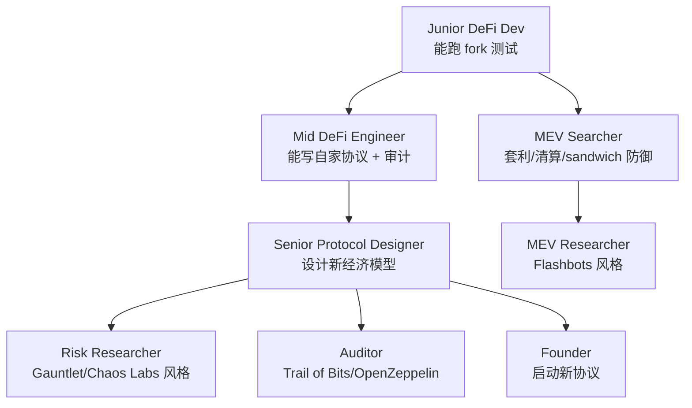

每条路径需要的能力栈：
- **Protocol Designer**：博弈论、机制设计、宏观货币学。
- **Auditor**：形式化验证（Certora/Halmos）、模糊测试、漏洞模式数据库。
- **Risk Researcher**：agent-based simulation、ML、金融工程。
- **MEV Searcher / Researcher**：Rust + EVM、低延迟系统、区块链网络协议。

### E.4 推荐项目源码精读列表

按"由简到繁"顺序：
1. **WETH9**（~60 行）：理解 ERC-20 wrap 模式。
2. **UniswapV2Pair**（~250 行）：理解 PUSH 模式 + flash swap + TWAP。
3. **MakerDAO Vat.sol**（~500 行）：理解 CDP 核心账本。
4. **Liquity TroveManager.sol**（~1500 行）：理解极简 CDP 设计。
5. **Compound III Comet.sol**（~1500 行）：理解 single-base-asset 借贷。
6. **Morpho Blue Morpho.sol**（~600 行）：理解极简借贷原语。
7. **UniswapV3Pool**（~1000 行 + 多个库）：理解集中流动性、tick math。
8. **UniswapV4 PoolManager.sol**（~2000 行）：理解 singleton + flash accounting + hooks。
9. **Aave V3 Pool.sol**（~3000 行 + 多个 facet）：理解共享池 + e-mode + reserve。
10. **EigenLayer 核心合约**：理解 restaking + AVS + slashing。

### E.5 常见误区

**误区 1：TVL = 协议价值**——TVL 只是"用户押了多少钱"，不是协议年收入。真实价值看 **Revenue / Fees / FDV** 三个比例。

**误区 2：ZK = 隐私 = 安全**——ZK 能用于隐私也能用于扩容（rollup）。ZK rollup 安全性依赖 trusted setup 和 prover 实现正确性。

**误区 3：audit 通过 = 安全**——审计只降低 known bug 概率。真实安全靠审计 + 形式化验证 + bug bounty + invariant fuzzing + 长期市场考验。

**误区 4：multisig 5/9 = 去中心化**——Ronin 教训：5/9 multisig 被 social engineering 时仍单点崩溃。真去中心化看 threshold + 地理分布 + 设备分布 + 操作流程。

**误区 5：stablecoin 都一样**——USDC（合规）≠ USDT（亚洲流通）≠ DAI（CDP）≠ USDe（合成）。选错稳定币等于把协议押在错误对手方风险上。

### E.6 中文 DeFi 资源精选

**社区与学习**：
- **Web3Caff Research**：中文研究文章质量较高，覆盖协议研究 + 经济模型分析。
- **PANews**、**ChainCatcher**、**WuBlockchain**：行业新闻 + 事故复盘第一时间。
- **登链社区（learnblockchain.cn）**：Solidity / 智能合约中文教程。
- **WTF Academy**：DeFi 教程精炼，适合从 Solidity 切入 DeFi。

**研究与数据**：
- **0xJin / DeFi 之道**：DeFi 中文研究博客代表。
- **OKX Research**、**Binance Research**：交易所研究部门，覆盖度广。
- **Footprint Analytics**、**KaitoAI**：链上数据分析中文支持。

**实战社群**：
- 各大公链官方中文 Telegram / Discord（Aptos/Sui/Sei/Berachain 都有中文社区）。
- **登链开发者大会**、**ETHGlobal hackathon**（每年 5+ 场）。

### E.7 一份好的 DeFi 协议代码 review checklist

读源码时按这个清单过：

```
□ 1. 协议属于 L1/L2/L3/L4 哪一层？对下层做什么假设？
□ 2. 有可升级合约吗？谁有 upgrade key？timelock 多久？
□ 3. Oracle 用什么？心跳多长？有 fallback 吗？
□ 4. 每个外部调用有 reentrancy 保护吗？依赖什么编译器？
□ 5. ERC-4626 vault 怎么防 inflation attack？dead share / virtual offset / internal balance 三选一？
□ 6. 抵押品类 LT/LB 怎么定？谁有权改？
□ 7. 有跨链桥依赖吗？X-of-Y-of-N 配置如何？
□ 8. 治理代币 timelock 多长？有没有 ve 锁仓？
□ 9. fee/profit 流向哪里？是 real yield 还是 emission？
□ 10. 有 slashing 机制吗？slash 阈值由谁触发？
```

每项写 1-2 行短笔记，10 项过完可在 30 分钟内白板讲清这个协议。

---

