# 模块 06：DeFi 协议工程

> 把"金融"从信任银行的会计账本，变成任何人都能审计、组合、扩展的开源代码栈。

## 阅读说明

> **前置模块**：模块 05（智能合约安全）已建立攻击者视角与合约不变量意识，本模块在此基础上逐层拆解 DeFi 各类协议的机制与风险。

本模块按《Hello 算法》风格写作：每章一个独立机制，**直觉故事 → 数学手推 → Mermaid 图 → 代码 → 真实案例 → 反例**。28 章。

阅读路径：
- **新手路径**：第 1-5 章（DeFi 是什么 + 货币层）→ 第 6 章（亲手算 AMM）→ 第 12-13 章（借贷与清算）→ 第 28 章（事故学习）。
- **协议工程师路径**：1 → 6-11（AMM 家族）→ 12-17（借贷家族）→ 18（预言机）→ 26（MEV）→ `code/`。
- **研究 / 量化路径**：1 → 19-21（衍生品）→ 22-25（LST/再质押/Pendle）→ 27（intent solver）→ 28（AI×DeFi）。

每章末尾"思考题"——做完再翻下一章。

> **新名词三件套约定**：本模块每出现一个新名词都用三件套——**英文全称、字面翻译、为什么这样命名**。让你不把 `TWAP / IL / HF / LLAMMA` 等当成黑话。

> **数据时点**：本文 TVL、年化、市占率全部 2026-04 数据，标注来源。DeFi 演进极快，6 个月后再读应该交叉对照 [DefiLlama](https://defillama.com/) 当前值。

## 章节地图

```
Part I  导论与货币层（Ch1-5）
  1. DeFi 是什么——四层货币机器
  2. 原生资产与 Wrapped 资产（ETH / WETH / WBTC / cbBTC）
  3. 法币抵押稳定币（USDC / USDT / PYUSD / RLUSD / FDUSD）
  4. 超额抵押稳定币（DAI/USDS / LUSD / GHO / crvUSD）
  5. 合成与 RWA 稳定币（USDe / Frax V3 / USDM）

Part II  AMM 家族（Ch6-11）
  6. 恒定乘积 x*y=k（Uniswap V2 完整源码 + IL）
  7. 集中流动性（Uniswap V3 sqrtPriceX96 / tick）
  8. Uniswap V4（singleton + flash accounting + hooks）
  9. Curve StableSwap 不变量 + crvUSD LLAMMA
 10. Balancer V3 加权池 + Maverick directional + Trader Joe LB
 11. Solidly ve(3,3) + V4 hooks 生态目录

Part III  借贷家族（Ch12-17）
 12. 利率模型（Compound jump rate / Aave 差异化）
 13. 健康因子与清算流程
 14. 共享池（Aave V3 + Umbrella）
 15. 单一基础资产（Compound III Comet）
 16. 隔离市场（Morpho Blue / Euler V2 / Silo / Ajna）
 17. 链上 KYC / 机构借贷（Maple / Centrifuge / Spark）

Part IV  预言机与衍生品（Ch18-21）
 18. 预言机：Push / Pull / TWAP / RedStone
 19. 永续 LP 模式：GMX V2 完整 GLP/GM 机制
 20. 链上订单簿：Hyperliquid HyperBFT + HIP-2/HIP-3
 21. dYdX v4 / Synthetix V3 / Aevo / Lyra / Premia

Part V  收益、再质押、利率市场（Ch22-25）
 22. LST 全集（Lido / Rocket Pool / Frax / cbETH / mETH）
 23. 再质押（EigenLayer / Symbiotic / Karak / Babylon）
 24. LRT 全集 + 2026 Kelp 事件复盘
 25. Pendle PT/YT 完整数学 + Berachain PoL + Real Yield 辨真伪

Part VI  MEV、账户、风险（Ch26-28）
 26. MEV 全景（Flashbots / MEV-Boost / BuilderNet / SUAVE / MEV-Burn）
 27. 账户抽象 + 意图（4337 / 7702 / Permit2 / CowSwap / OIF）
 28. 风险全景（12 大事故 + AI 用例与边界 + 自审查）
```

---

## 第 1 章：DeFi 是什么——四层货币机器

### 1.1 DeFi 的本质

传统金融信任的核心是一份只有银行能写的账本——账本写入权决定了所有信任问题。

DeFi（**De**centralized **Fi**nance，去中心化金融）把这份账本搬到智能合约里：规则是公开的代码，代码自己执行。

DeFi 能做银行做不到的事：
- **可组合**：A 协议的输出是 B 协议的输入。你存 USDC 到 Aave 拿到 aUSDC，aUSDC 扔到 Pendle 切成 PT+YT，PT 扔到 Curve 做 LP，LP 头寸扔到 Convex 加杠杆。整条链路 24 小时无许可、无对手方风险评估流程。
- **无许可**：部署合约不需要银行牌照。
- **24/7**：没有交易日、清算日、T+1。

2020-2026 年累积上万亿美元交易量，约 $1300 亿美元锁仓（截至 2026-04，[DefiLlama](https://defillama.com/protocols)，TVL 在 95-140B 之间波动）。

> **TVL（Total Value Locked，锁仓总价值）**：用户存进协议合约里的资产美元价值。问题是 TVL 会重复计算——你存 1 ETH 进 Lido 拿 stETH，再存 stETH 进 Aave，TVL 计成 2 ETH。

### 1.2 四层结构图

```
┌────────────────────────────────────────────────────────────────┐
│  L4 聚合 / 策略层（Aggregation & Strategy）                       │
│   Yearn V3 / Beefy / Convex / Aura / Pendle                      │
├────────────────────────────────────────────────────────────────┤
│  L3 信用 / 衍生品层（Credit & Derivatives）                        │
│   Aave V3 + Umbrella / Compound III / Morpho / Spark / Euler V2   │
│   GMX V2 / Hyperliquid / dYdX v4 / Synthetix V3 / Lyra            │
├────────────────────────────────────────────────────────────────┤
│  L2 交易层（Trading / AMM / DEX / Intent）                         │
│   Uniswap V2/V3/V4 / Curve / Balancer V3 / PancakeSwap            │
│   Aerodrome / Velodrome / Maverick / Trader Joe LB                │
│   CowSwap / UniswapX / 1inch / Jupiter（Solana） / Drift（Solana）│
├────────────────────────────────────────────────────────────────┤
│  L1 货币层（Money）                                                │
│   ETH / WETH / WBTC / cbBTC / LBTC                                │
│   USDC / USDT / DAI&USDS / FRAX / LUSD / GHO / crvUSD             │
│   USDe(sUSDe) / RLUSD / FDUSD / USDM                              │
│   stETH / rETH / sfrxETH / cbETH（LST）                           │
│   eETH / ezETH / rsETH / pufETH / swETH（LRT）                    │
└────────────────────────────────────────────────────────────────┘
```

**第一性原理**：上层的复杂性来自下层的不变量。USDC（L1）的 1:1 兑付假设是 Aave（L3）所有 USDC 借贷利率模型的前提；如果有一天 Circle 冻结 Aave 池子余额，Aave 上所有 USDC 借款人会同时变成"坏账"。所以读源码时永远先问：**这一层对下层做了什么假设？假设破裂会怎样？**

### 1.3 组合性——DeFi 唯一的护城河

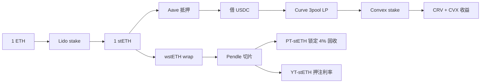

这种"乐高式"叠加是 DeFi 相对于传统金融的根本优势，也是事故的温床——大部分 hack 都发生在"假设破裂的那一刻"，第 28 章详述。

### 1.4 思考题

1. 一个加密资产要从"投机品"变成"货币"，需要什么充分必要条件？为什么 ETH/USDC 是货币而 SHIB 不是？
2. TVL 重复计算的程度有多严重？给一个上限估计——如果 1 ETH 通过 Lido → Aave → Pendle → Convex 走完一圈，被 DefiLlama 重复计了几次？
3. DeFi 24/7 听起来无敌，但有没有"系统性停机"风险？想一个场景。

---

## 第 2 章：原生资产与 Wrapped 资产

### 2.1 ETH 不是 ERC-20

ETH 是以太坊原生资产，但没有 `transferFrom`、`approve`，无法被 DeFi 合约直接调用。

**WETH（Wrapped ETH）** 解决这个问题：让 ETH 拥有 ERC-20 接口，供所有 DeFi 合约统一调用。

WETH 合约只有约 60 行代码：

```solidity
// 简化的 WETH9 核心逻辑
contract WETH9 {
    string public name = "Wrapped Ether";
    mapping(address => uint256) public balanceOf;

    function deposit() public payable {
        balanceOf[msg.sender] += msg.value;
    }

    function withdraw(uint256 wad) public {
        require(balanceOf[msg.sender] >= wad);
        balanceOf[msg.sender] -= wad;
        payable(msg.sender).transfer(wad);
    }

    receive() external payable { deposit(); }
}
```

> 1 WETH 永远等于 1 ETH——合约里锁着等量的 ETH。"100% 抵押 + 1:1 自由兑换"是稳定币最稳的设计原型。

**Uniswap V4 改了**：V4 原生支持 ETH 而不是只支持 WETH，省去 wrap/unwrap 一次的 gas（~24,000 gas），是 DeFi 历史上第一次"native ETH first class"的 DEX。

### 2.2 BTC 上以太坊：托管的代价

BTC 上 EVM 链需要**桥**，当前主流方案：

| 协议 | 模型 | 信任假设 | TVL（2026Q1） |
|------|------|---------|------|
| **WBTC** | BitGo 托管 BTC，以太坊上 1:1 铸 WBTC | 信 BitGo 公司 | ~$10B |
| **cbBTC** | Coinbase 托管 | 信 Coinbase | ~$3B 增长中 |
| **tBTC** | threshold ECDSA + 51 节点 | 多签去中心化 | ~$500M |
| **FBTC** | Antalpha + Mantle 托管 | 信发行方 | ~$1B |
| **LBTC**（Lombard） | Babylon staked BTC + cubist 托管 | 信 cubist 节点+Babylon | ~$1.5B |

**WBTC 中心化风险**：2024 年 BitGo 被 BiT Global 部分收购引发市场恐慌——MakerDAO 一度提议把 WBTC 从 DAI 抵押品列表移除，cbBTC 抢走了相当份额。

### 2.3 Native Restaked BTC：Babylon

Babylon 让你把 BTC 在比特币原链上锁住（用 UTXO + EOTS 一次性可提取签名），然后在 Cosmos appchain（Babylon Genesis）上充当 finality provider 的抵押。这是首个"BTC 不离开比特币链就能 stake"的方案，第 23 章详述。这让"BTC 也变成了 yield-bearing asset"——给 BTC DeFi 注入了新代币类别 LST-BTC（如 LBTC、uniBTC）。

### 2.4 思考题

1. 如果 BitGo 突然倒闭，10B 的 WBTC 会发生什么？做一个 24 小时内的影响推演。
2. cbBTC 在合规上最大的不同是？（提示：Coinbase 是上市公司）
3. 如果 BTC L2（Stacks、Citrea）原生发币，它们和 WBTC 在 DeFi 用途上有什么本质差别？

---

## 第 3 章：法币抵押稳定币

### 3.1 为什么 USDC 是 DeFi 的"美元"

法币抵押稳定币是 DeFi 用得最多的稳定币（按交易量）。发行方持有 1:1 的现金 + 短期国债储备，随时按 1:1 兑付。

| 代币 | 发行方 | 储备 | 市值（2026-04） | 关键事件 |
|------|------|------|---|------|
| **USDT** | Tether Holdings | 现金+短债+商业票据（早期） | ~$140B | 早期透明度差，近年改善 |
| **USDC** | Circle | 现金（BlackRock 托管）+ 短期国债 | ~$60B | SVB 2023-03 短期脱锚到 $0.88 |
| **PYUSD** | PayPal + Paxos | 现金+国债 | ~$1.5B | 2023-08 上线，机构通道 |
| **FDUSD** | First Digital | 现金+国债 | ~$3B | 币安生态推广，亚洲流通 |
| **RLUSD** | Ripple | 现金+国债（NYDFS 监管） | ~$1B | 2024-12 上线，机构友好 |

### 3.2 USDC 工程细节

USDC 是 **可升级合约**——Circle 可以随时增发、销毁、冻结任意地址余额。

```solidity
// USDC 实际代码片段（FiatTokenV2）
function blacklist(address _account) external onlyBlacklister {
    blacklisted[_account] = true;
    emit Blacklisted(_account);
}

modifier notBlacklisted(address _account) {
    require(!blacklisted[_account], "Blacklistable: account is blacklisted");
    _;
}
```

`blacklisted[address]` 是 storage 中一个 mapping，blacklister 角色（由 Circle 控制）可以把任何地址加入这个 mapping，之后该地址 USDC 余额完全冻结。

**真实使用**：
- 2022-08 Tornado Cash 制裁：Circle 在数小时内冻结所有"OFAC SDN"列表里的地址。
- 2023-03 SVB 风波：Circle 把 USDC 在 SVB 的 $3.3B 储备透明披露，但当晚仍恐慌脱锚到 $0.88，第二天美联储救助 SVB 后回锚。

**DeFi 协议的应对**：
- Aave、Compound 默认接受 USDC 风险（Circle 没动机大规模冻结，一次操作毁掉信任）。
- LUSD（Liquity）刻意不接受 USDC 抵押，作为"USDC 出问题时的避风港"——2023-03 SVB 事件中 LUSD 一度溢价到 $1.05+。

### 3.3 USDT 的不透明性

USDT 早期持有大量商业票据（含恒大）；近年改成 80%+ 国债，但仍仅提供 attestation 而非 audit。市值龙头地位靠亚洲 OTC、CEX 永续保证金、新兴市场美元化支撑。

### 3.4 USDC 与 USDT 之争

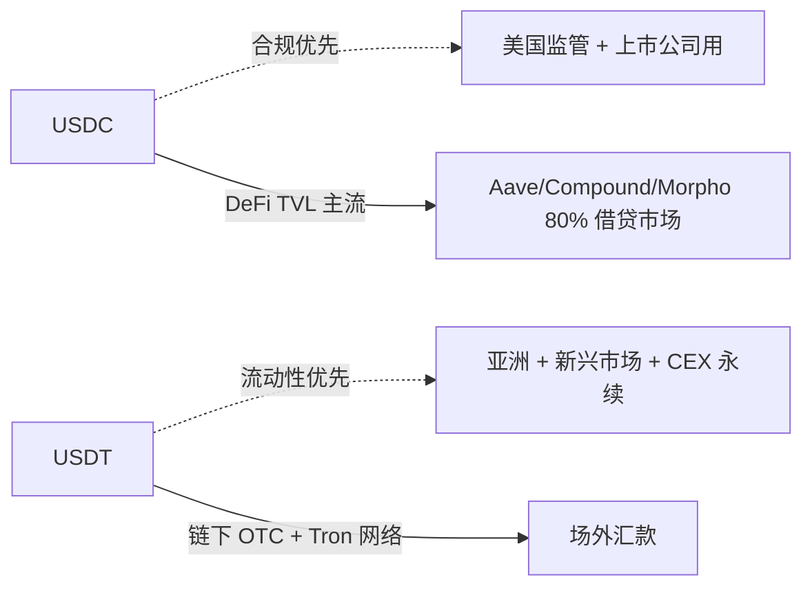

**2026-Q1 稳定币市场结构**（按市值占比）：
- USDT ~46%
- USDC ~20%
- USDe / sUSDe ~2%（恢复中）
- DAI/USDS ~3%
- 其它（FDUSD、PYUSD、RLUSD、TUSD、USDP 等）~5%
- LST / RWA / 算稳类合计 ~24%

DeFi 工程师选币随场景：**借贷主资产**用 USDC（合规）；**永续保证金**用 USDT（CEX 流动性深）；**新兴市场 onramp** 用 USDT；**机构合规通道**用 PYUSD / RLUSD。

### 3.5 思考题

1. 如果美国 GENIUS Act / STABLE Act 通过，对 USDT 影响多大？
2. USDC 储备由 BlackRock 托管，这本身是中心化吗？给三层信任分析。
3. 你设计一个新协议，必须只接受一种法币稳定币，你选哪个？给三个判断维度。

---

## 第 4 章：超额抵押稳定币（CDP 系）

### 4.1 CDP 是什么

> **CDP（Collateralized Debt Position，抵押债务头寸）**：在合约里锁一笔抵押品，合约允许借出一定额度的稳定币。让链上资产（ETH、BTC、wstETH）产生稳定币流动性，无需信任发行方。

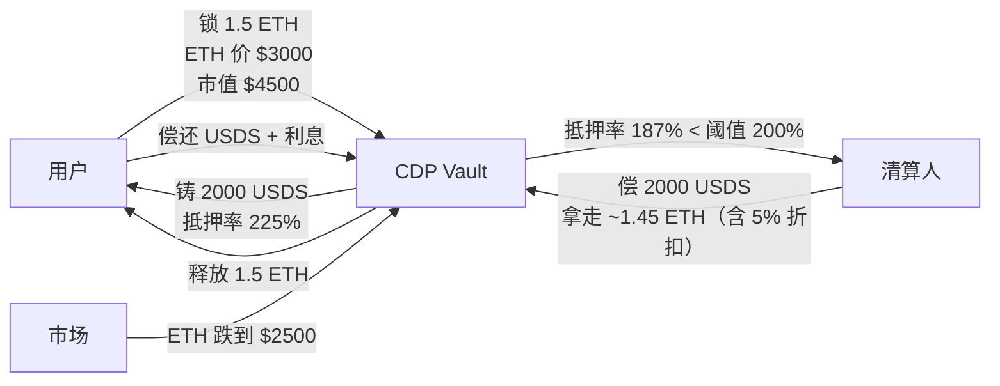

### 4.2 DAI / USDS（Sky 协议）

MakerDAO 在 2024-08 改名 **Sky 协议**，2025-05 完成 Endgame 转型——MKR 退役改 SKY，DAI 1:1 可升级 USDS。来源：[Maker rebrands to Sky](https://blockworks.com/news/maker-rebrands-as-sky-dai-will-be-changed-to-usds)。

**2026-04 状态**：
- USDS 供应量 > $9B
- DAI 仍存在但产品力被冻结
- **SSR（Sky Savings Rate）** 在 3.75%-4.5% APY，sUSDS 是其 ERC-4626 包装
- 2026-04-07 启动大规模 DAI → USDS 自动迁移（OKX、Binance 等交易所完成）

来源：[DAI-USDS Migration April 2026](https://blockeden.xyz/blog/2026/04/03/dai-usds-migration-makerdao-sky-protocol-stablecoin-rebrand/)、[USDS Sky Protocol 2026 Yield Guide](https://eco.com/support/en/articles/11752998-usds-sky-protocol-2026-yield-guide)。

#### 4.2.1 SubDAO 架构

Sky Endgame 引入 **SubDAO**（子 DAO）模式：六个 SubDAO 各自有治理权 + 专门用途代币，分工管理不同业务线。来源：[Sky Forum SubDAO Governance](https://forum.sky.money/t/spark-subdao-proxy-management-updates/27734)。

**Spark**（首个 SubDAO，2023 上线）：
- SparkLend = Aave V3 fork，专做 DAI/USDS 流动性
- $2.5B Obex 配置 → 大部分协议收入来自 RWA
- 2026-03 SparkLend TVL ~$3.25B；Spark Liquidity Layer ~$5.24B
- **2025-06 Spark targets up to $1.1B 直接敞口 USDe/sUSDe**——把 Sky 流动性引向 Ethena 系——这种交叉敞口在 2025-10 USDe 杠杆解杠杆事件中成为传播路径。来源：[Spark + Ethena exposure](https://www.theblock.co/post/334640/skys-lending-subdao-spark-targets-up-to-1-1-billion-in-direct-exposure-to-ethenas-usde-and-susde-tokens)。

#### 4.2.2 PSM：DAI/USDS 不是纯 CDP

**PSM（Peg Stability Module，锚定稳定模块）** 让用户用 USDC 1:1 换 DAI/USDS。这事实上把法币稳定币的稳定性嫁接到链上——代价是 DAI/USDS 本质上有相当一部分是 USDC 的 wrapper。

### 4.3 LUSD（Liquity V1）：极简哲学

Liquity V1 设计极简：
- 只接受 ETH 抵押。
- 最低抵押率 110%（Aave/Maker 都 150%+）。
- 一次清算分两层：(1) **Stability Pool** 提供 LUSD 即时偿还借款；(2) Stability Pool 不够时按比例重分配给其它 borrower。
- **没有治理代币、没有可升级合约、没有 PSM**。

**清算流程**：

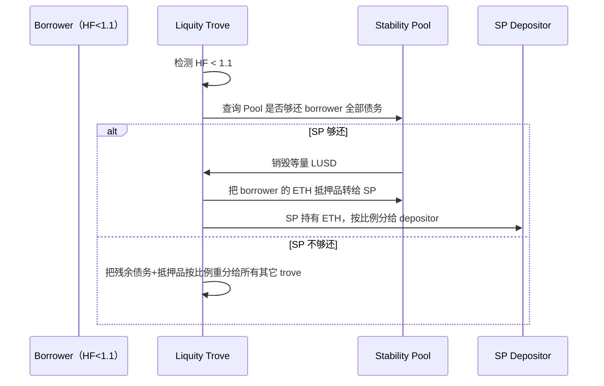

这种极简设计在 **2023-03 USDC 脱锚（SVB 风波）** 时反而成为 DeFi 安全港——LUSD 短暂溢价到 $1.05+，因为它不依赖 USDC 抵押。

**Liquity V2** 在 2024 推出：用户自报利率（borrower 自己设 IR、IR 越低被清算优先级越高）；接受 wstETH/rETH 抵押；引入 BOLD 稳定币。

### 4.4 GHO：Aave 原生稳定币

GHO 由 Aave 借贷池里的抵押品支撑——你在 Aave 存 ETH 借 GHO，GHO 直接铸造（而非从 reserve 借出）。GHO 是 Aave 经济护城河——把 Aave 的"借贷利息"内部化成 GHO 协议利润。

**stkGHO 与 sGHO（2026-04）**：
- 老 stkGHO：在 Umbrella Safety Module 里有 slash 风险（**2026-04 治理决议把 slash% 改为 0**）
- 新 **sGHO**（Savings GHO）：no slash, no cooldown, 5% APR
- **新 stkGHO-Umbrella vault**：愿意承担 slash 风险换更高收益的用户
- 当前 stkGHO 5% APY < sGHO 风险无 → 治理论坛在讨论 Merit redirect

来源：[Aave Umbrella Docs](https://aave.com/docs/aave-v3/umbrella)、[Aave Umbrella Stake Help](https://aave.com/help/umbrella/stake)。

### 4.5 crvUSD：LLAMMA 软清算

crvUSD 用改造版 StableSwap 做 CDP，核心是 **LLAMMA（Lending-Liquidating AMM）** 软清算机制。第 9 章详述数学。

### 4.6 思考题

1. DAI/USDS 通过 PSM 吃了 USDC 的 30%+ 抵押品。如果 USDC 暴雷，DAI/USDS 会怎样？写一个时序推演。
2. LUSD 110% 抵押率比 Aave 的 150% 激进。这种激进的代价是什么？为什么 Liquity 仍稳定？
3. GHO 是 Aave 的"印钞机"。Aave 为什么不直接把 GHO 设计成无抵押的"协议代币"？
4. crvUSD LLAMMA 和 Uniswap V3 LP 在数学上是什么关系？

---

## 第 5 章：合成与 RWA 稳定币

### 5.1 USDe（Ethena）：delta-neutral 合成稳定币

#### 5.1.1 直觉

用现货 + 等量永续空头对冲价格风险，创造无需美元抵押的稳定代币。

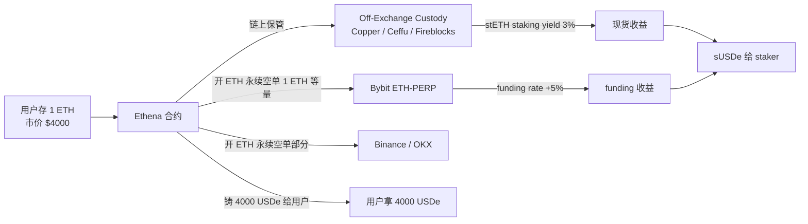

#### 5.1.2 数学

**Delta**：标的价格变化 $1 美元、组合价值变化几美元。

设用户存 $x$ ETH，市价 $p_0$：
- 现货 long delta = $+x$
- 永续 short delta = $-x$
- 组合 delta = $0$

ETH 涨跌都不影响组合美元价值——**但只是 mark-to-market 意义上的不变**。

> **Caveat**：delta = 0 不等于「USDe 自然 1:1 锚定」。三个独立风险层：
> (a) **永续 funding 倒挂**（短端熊市永续多头收 funding）→ 收益为负，sUSDe 反向蚀本；
> (b) **保证金率波动**：CEX 永续短仓需维持保证金，ETH 急涨触发 maintenance margin，被迫加保证金或减仓——deleveraging 过程中 delta 短暂偏离 0；
> (c) **CEX custody risk 是非线性的**：Bybit / Binance 任一冻结/hack，整段对冲腿失效，损失不是线性折价而是阶跃。
>
> 因此 USDe 锚定本质是 **delta-neutral + counterparty + funding-positive 三重假设**的合成产物，而非纯数学锚定。三者任一破裂时锚定即受压（详见 §5.1.3 与 2025-10 解杠杆事件）。

**收益来源**：
1. 现货 stETH staking yield ≈ 3%
2. ETH 永续 funding rate（多头付空头）：2024 牛市 ≈ 11%、2025 ≈ 5%、2026Q1 ≈ 3-4%
3. 基差（spot vs futures spread）

来源：[Ethena Delta-Neutral Stability](https://docs.ethena.fi/solution-overview/usde-overview/delta-neutral-stability)、[Coin Metrics Ethena](https://coinmetrics.substack.com/p/state-of-the-network-issue-335)。

#### 5.1.3 风险

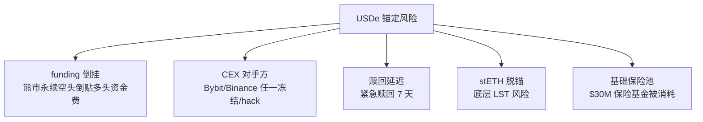

**2025-10 解杠杆事件**：USDe 供应从 $14B 缩到 $5.92B。原因：**Aave-Pendle 杠杆循环**——大量用户把 USDe 抵押到 Aave/Spark 借 USDC，再去 Pendle 买 PT-USDe 锁固收，循环 5-10 倍杠杆。当 funding rate 在 10 月暴跌、PT-USDe 隐含 APR 跌穿循环成本时，所有人同时解杠杆。

**2026-04 数据**：
- USDe 供应 ~$6B（恢复中）
- sUSDe 收益约 3.72%
- 2026 推出 **iUSDe**（机构合规版，KYC 通道、合规储备报告）

来源：[Ethena Q1 2026 Report](https://stablecoininsider.org/ethena-usde-q1-2026-report/)、[Ethena Review 2026](https://cryptoadventure.com/ethena-review-2026-usde-susde-delta-hedging-and-how-users-try-to-earn/)。

### 5.2 Frax V3：从混合算稳到 RWA

#### 5.2.1 历史演化

- **Frax V1（2020-2022）**：部分算法 + 部分 USDC 抵押，混合稳定币。
- **Frax V2（2022-2024）**：增加 AMO 模块——把闲置抵押品调到 Curve / Aave / Convex 赚收益。
- **Frax V3（2024-2025）**：改名 **frxUSD**，主要由 BlackRock BUIDL（短期国债 tokenized fund）支撑——彻底转向 RWA。

#### 5.2.2 AMO 工作原理

> **AMO = Algorithmic Market Operations**
> - 字面：算法市场操作
> - 直觉：稳定币协议的"中央银行公开市场操作"——算法决定何时增/减发稳定币以稳定锚定，何时把闲置抵押品调到外部协议赚收益反哺协议。

例如：Curve AMO 在 frxUSD/USDC 池子价格 < 1 时从池子买出 frxUSD 销毁；> 1 时铸 frxUSD 卖入。Aave AMO 把 USDC 储备存到 Aave 赚 supply rate。FIP-434（2025）扩展到 Aave v4 hub-and-spoke + Morpho curated vault。来源：[Frax V3 RWA](https://members.delphidigital.io/feed/frax-v3-moves-towards-rwa)、[FIP-434 Forum](https://gov.frax.finance/t/fip-434-sfrxusd-amo-deployments-future-strategies/3786)。

### 5.3 USDM 与其它 RWA 稳定币

**USDM（Mountain Protocol）**：100% 短期国债支撑，所有持有者享受底层国债收益（rebase 模式，每天余额自增）。Mountain 是 Bermuda 监管的 EMI 持牌机构。

**RWA 稳定币谱系**：
- **USDM**（Mountain）：rebase, 全部国债
- **USYC**（Hashnote）：机构级，DAI 后端核心抵押之一
- **buidl**（BlackRock）：tokenized money-market fund，Frax/Sky/Ondo 都用它做底层
- **Ondo USDY**：Ondo Finance 的国债 token

> **思考**：当大家都用 BUIDL 做底层时，BUIDL 自己就是单点风险。

### 5.4 USD0 / Usual：RWA 抵押 + 双代币模型

**Usual Protocol** 推出 USD0（RWA 国债 + USYC 抵押）+ USD0++（流动性锁仓版）+ USUAL（治理代币）的三代币模型。USD0 持有者可以质押换 USD0++（4 年锁定）拿 USUAL 通胀奖励。

**经济学**：USUAL 通胀 = USD0++ supply × inflation rate。理论上 protocol 用 RWA 国债收益（4-5%）支撑 USUAL 持续买回。**风险**：如果 USUAL 价格因抛压跌穿"锁仓溢价值"，USD0++ 持有者会有恐慌赎回压力。

USD0 在 2025 年达到 $1.5B 规模，2026 因 USUAL 价格调整有所回落。

### 5.5 算法稳定币：UST 之后

**UST（Terra）2022-05 崩盘**——纯算法稳定币的死亡螺旋。详细复盘见第 28 章。

**UST 之后的尝试**：
- **FRAX 转型**：从混合算稳完全转向 RWA。
- **GHO**：超额抵押 + 治理控制利率（混合）。
- **USDe**：合成而非算法（有真实抵押+对冲）。

**结论**：纯算法稳定币（无抵押 + 双代币铸销）2026 年基本绝迹。**任何号称"无外部抵押算法稳定"的设计都该被默认怀疑**。

### 5.6 思考题

1. USDe 的 funding rate 收益本质是"市场波动率溢价"。在永续 funding 持续为负 30 天的极端情况下，sUSDe 持有者会损失多少？
2. Frax V3 转向 RWA 后，它和 USDC 的本质差别是什么？算不算"伪去中心化"？
3. 如果你做一款新稳定币，必须只用一种抵押模型，你选哪个？写下三个判断维度。

---

> **货币层已就位**。理解了稳定币的铸造规则和抵押体系，接下来 Part II 进入交易引擎：**AMM 如何用数学不变量替代订单簿撮合，并由此产生滑点、无常损失与 MEV 机会**。

## 第 6 章：恒定乘积 `x*y=k`（Uniswap V2 完整源码 + IL）

### 6.1 几何直觉

池里 500 ETH + 1,500,000 USDC，V2 把两数相乘作为"不变量"：

```
k = 500 × 1,500,000 = 750,000,000
```

交易后 `x_new × y_new ≥ k`——所有合法状态在这条双曲线上：

```
y
│
│ ╲
│  ╲
│   ╲ <-- 当前状态点 (500, 1,500,000)
│    ╲
│     ╲___
│         ─────
│              ────── y = k / x
└──────────────────────── x
```

拿出 1 ETH 必须把 USDC 推到曲线另一点——这就是滑点的来源。

### 6.2 数学推导

设储备 `(x, y)`，输入 `Δx` token0，求输出 `Δy` token1。

**第一步**：V2 固定 0.3% 手续费，实际进池 `Δx · 997 / 1000`。

**第二步**：不变量约束：

$$
\left(x + \frac{997 \cdot \Delta x}{1000}\right)(y - \Delta y) \geq xy
$$

**第三步**：取等号求输出：

$$
\Delta y = \frac{0.997 \Delta x \cdot y}{x + 0.997 \Delta x}
$$

**举例 1**：池里 500 ETH / 1,500,000 USDC，用 1 USDC 换 ETH：

$$
\Delta y_{ETH} = \frac{0.997 \times 1 \times 500}{1{,}500{,}000 + 0.997} \approx 0.0003323 \text{ ETH}
$$

折合 1 ETH ≈ $3,009.5，比公允价 $3,000 多 0.32% 滑点+手续费。

**举例 2**：用 100,000 USDC 大额交易得 ~31.16 ETH，公允应得 33.33 ETH——**滑点 6.5%**，大额走聚合器分单的原因。

### 6.3 LP 份额：为什么是 sqrt(x*y)

初次添加流动性时：
```
liquidity = sqrt(amount0 × amount1) - MINIMUM_LIQUIDITY
```

`MINIMUM_LIQUIDITY = 1000`，永久锁在 `0xdead`。

`sqrt(x*y)` 是 LP 持仓的"几何价值"——对资产相对价格不敏感，只对总流动性敏感。

**MINIMUM_LIQUIDITY 防 inflation attack**：如果没有这 1000 wei：

1. 第一个 LP 存 1 wei + 1 wei，拿到 1 个 LP 份额。
2. 直接给池子 transfer 100 ether 各一边（不通过 mint）。
3. 池子里有 ~100 ether 各一边，但只有 1 个 LP 份额——每份 LP = 100 ether。
4. 受害者来存 50 ether，按比例 `50e18 * 1 / 100e18 = 0.5` 向下取整 = 0。**存款被吞**。

锁死 1000 wei 让攻击者先吃损失，且把单份 LP 最小价值压低让小额存款不因取整被吞。来源：[RareSkills UniV2 mint/burn](https://rareskills.io/post/uniswap-v2-mint-and-burn)。

### 6.4 UniswapV2Pair 源码逐行

**mint（添加流动性）**：

```solidity
function mint(address to) external lock returns (uint liquidity) {
    (uint112 _r0, uint112 _r1,) = getReserves();
    uint balance0 = IERC20(token0).balanceOf(address(this));
    uint balance1 = IERC20(token1).balanceOf(address(this));
    uint amount0 = balance0 - _r0;  // PUSH 模式：路由器先转进来
    uint amount1 = balance1 - _r1;

    bool feeOn = _mintFee(_r0, _r1);
    uint _totalSupply = totalSupply;
    if (_totalSupply == 0) {
        liquidity = Math.sqrt(amount0 * amount1) - MINIMUM_LIQUIDITY;
        _mint(address(0), MINIMUM_LIQUIDITY);
    } else {
        liquidity = Math.min(amount0 * _totalSupply / _r0,
                             amount1 * _totalSupply / _r1);
    }
    require(liquidity > 0, 'INSUFFICIENT_LIQUIDITY_MINTED');
    _mint(to, liquidity);
    _update(balance0, balance1, _r0, _r1);
    if (feeOn) kLast = uint(reserve0) * reserve1;
}
```

**关键工程模式**：
- **PUSH 模式**：路由器先把 token 转进来，合约比较 `balance` 和 `reserve` 推算输入量。副作用：**无许可 flash swap**。
- **`lock` reentrancy 保护**：布尔锁。Curve 2023-07 事件是此保护被 Vyper 编译器 bug 失效。

**swap（核心交易，闪电贷的根源）**：

```solidity
function swap(uint amount0Out, uint amount1Out, address to, bytes calldata data) external lock {
    require(amount0Out > 0 || amount1Out > 0, 'INSUFFICIENT_OUTPUT_AMOUNT');
    (uint112 _r0, uint112 _r1,) = getReserves();
    require(amount0Out < _r0 && amount1Out < _r1, 'INSUFFICIENT_LIQUIDITY');
    uint balance0; uint balance1;
    {
        if (amount0Out > 0) _safeTransfer(token0, to, amount0Out);
        if (amount1Out > 0) _safeTransfer(token1, to, amount1Out);
        // === FLASH SWAP 入口 ===
        if (data.length > 0)
            IUniswapV2Callee(to).uniswapV2Call(msg.sender, amount0Out, amount1Out, data);
        balance0 = IERC20(token0).balanceOf(address(this));
        balance1 = IERC20(token1).balanceOf(address(this));
    }
    uint amount0In = balance0 > _r0 - amount0Out ? balance0 - (_r0 - amount0Out) : 0;
    uint amount1In = balance1 > _r1 - amount1Out ? balance1 - (_r1 - amount1Out) : 0;
    require(amount0In > 0 || amount1In > 0, 'INSUFFICIENT_INPUT_AMOUNT');
    {
        uint balance0Adjusted = balance0 * 1000 - amount0In * 3;
        uint balance1Adjusted = balance1 * 1000 - amount1In * 3;
        require(balance0Adjusted * balance1Adjusted >= uint(_r0) * _r1 * 1000**2, 'K');
    }
    _update(balance0, balance1, _r0, _r1);
}
```

**Flash swap 时序**：

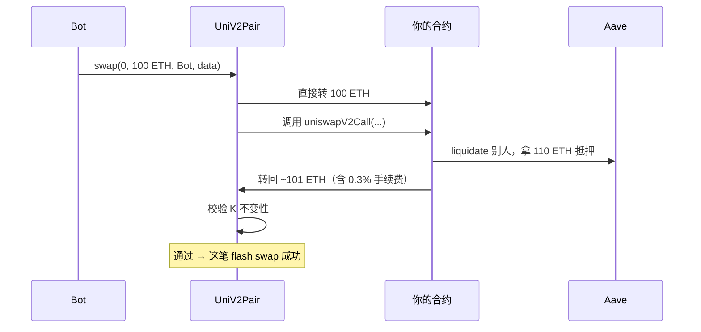

bZx 2020-02 两次事件就是 flash swap+oracle 操纵的组合拳。

### 6.5 无常损失数学

设初始价格 $p_0$、提供 $x_0$ 个 token0 和 $y_0 = x_0 p_0$ 个 token1，则 $k = x_0^2 p_0$。

价格变成 $p_1 = p_0 \cdot r$ 时，新储备 $(x, y)$ 满足 $xy = k$ 且 $y/x = p_1$：

$$
y = x_0 p_0 \sqrt{r}, \quad x = \frac{x_0}{\sqrt{r}}
$$

LP 价值：$V_{LP} = y + x \cdot p_1 = 2 x_0 p_0 \sqrt{r}$

HODL 价值：$V_{HODL} = y_0 + x_0 \cdot p_1 = x_0 p_0 (1 + r)$

无常损失：

$$
IL(r) = \frac{V_{LP}}{V_{HODL}} - 1 = \frac{2\sqrt{r}}{1+r} - 1
$$

| $r$ | 1.25 | 1.5 | 2 | 4 | 5 | 10 | 100 |
|---|---|---|---|---|---|---|---|
| IL | -0.6% | -2.0% | -5.7% | -20% | -25.5% | -42.6% | -80.2% |

**关键结论**：IL 单调递增于价格偏离（无论涨跌）。LP 必须靠手续费弥补 IL。

设年化 fee yield $f$，价格年化波动率 $\sigma$，期望 IL $\approx -\frac{\sigma^2}{8}$（小波动近似），LP 净收益 $\approx f - \frac{\sigma^2}{8}$。

**举例**：ETH/USDC 0.05% 池，fee yield ~10%，vol ~80%，IL 期望 ~-8%，净收益 ~+2%。vol 涨到 120% 时净亏 -8%——这就是大行情前 LP 撤资的原因。

### 6.6 V2 TWAP 预言机

每次状态更新时累加 reserves 比的时间加权积分：

```solidity
function _update(uint balance0, uint balance1, uint112 _r0, uint112 _r1) private {
    uint32 blockTimestamp = uint32(block.timestamp % 2**32);
    uint32 timeElapsed; unchecked { timeElapsed = blockTimestamp - blockTimestampLast; }
    if (timeElapsed > 0 && _r0 != 0 && _r1 != 0) {
        price0CumulativeLast += uint(UQ112x112.encode(_r1).uqdiv(_r0)) * timeElapsed;
        price1CumulativeLast += uint(UQ112x112.encode(_r0).uqdiv(_r1)) * timeElapsed;
    }
    reserve0 = uint112(balance0); reserve1 = uint112(balance1);
    blockTimestampLast = blockTimestamp;
}
```

外部合约两次采样取差除以时间差得 TWAP：

$$
\text{TWAP}_{[t_0, t_1]} = \frac{\text{cumulative}(t_1) - \text{cumulative}(t_0)}{t_1 - t_0}
$$

> 采样间隔需足够长（10 分钟+），操纵单区块成本才高于 TWAP 上可获收益。短间隔 TWAP 不抗操纵。

### 6.7 反例：Cream Finance 2021-10 事件

Cream 用 yUSD（Yearn vault share token）做抵押估值。**而不是用底层资产的 V2 TWAP**——它直接读 vault.totalAssets() / totalSupply 作为 share-price。攻击者用闪电贷给 yVault 直接转入资产把 share-price 拉到 2 倍，再用同一笔 yUSD 借走 $130M。

**根因**：用了**可被外部 donation 操纵的 share-price**，而非底层资产市场价 + TWAP。来源：[Immunefi Cream Analysis](https://medium.com/immunefi/hack-analysis-cream-finance-oct-2021-fc222d913fc5)。

### 6.8 _update 与 UQ112x112：定点数细节

V2 累加 priceCumulativeLast 时用了 `UQ112x112` 自定义定点数。直觉：把"reserve1 / reserve0"的浮点除法用整数模拟，溢出在 V2 里被刻意接受（uint256 累加的结果可以 wraparound——消费者两次采样取差时 wraparound 自然抵消）。

```solidity
library UQ112x112 {
    uint224 constant Q112 = 2**112;
    function encode(uint112 y) internal pure returns (uint224 z) {
        z = uint224(y) * Q112;  // 把 reserve 编码为 .112 定点
    }
    function uqdiv(uint224 x, uint112 y) internal pure returns (uint224 z) {
        z = x / uint224(y);
    }
}
```

**为什么 112 而不是 96？** 因为 V2 reserves 用 uint112 存储（两个 reserve + uint32 timestamp 塞进一个 32-byte storage slot）。Q112 让 reserve 范围最大化的同时保留充分小数精度。

**为什么 wraparound 不出问题？** `(cumulative_t1 - cumulative_t0)` 取差时，只要相对差值在一个 wraparound 周期内，EVM 整数减法自然正确。

### 6.9 V2 router 的 swap 路由

实际用户调用的不是 `UniswapV2Pair.swap`，而是 `UniswapV2Router02.swapExactTokensForTokens`：

```solidity
function swapExactTokensForTokens(
    uint amountIn,
    uint amountOutMin,
    address[] calldata path,  // [tokenA, tokenB, tokenC] 多跳
    address to,
    uint deadline
) external returns (uint[] memory amounts) {
    amounts = UniswapV2Library.getAmountsOut(factory, amountIn, path);
    require(amounts[amounts.length - 1] >= amountOutMin, 'INSUFFICIENT_OUTPUT_AMOUNT');
    TransferHelper.safeTransferFrom(path[0], msg.sender, UniswapV2Library.pairFor(factory, path[0], path[1]), amounts[0]);
    _swap(amounts, path, to);
}

function _swap(uint[] memory amounts, address[] memory path, address _to) internal {
    for (uint i; i < path.length - 1; i++) {
        (address input, address output) = (path[i], path[i + 1]);
        (uint amount0Out, uint amount1Out) = input < output ? (uint(0), amounts[i + 1]) : (amounts[i + 1], uint(0));
        address to = i < path.length - 2 ? UniswapV2Library.pairFor(factory, output, path[i + 2]) : _to;
        IUniswapV2Pair(UniswapV2Library.pairFor(factory, input, output)).swap(amount0Out, amount1Out, to, new bytes(0));
    }
}
```

**关键技巧**：每跳 `to` 不是用户而是**下一个池子**——前跳输出 token 直接落入下跳余额，免去中间 transfer。这种"PUSH 模式 + 链式 to"是 V2 路由器最聪明的设计。

### 6.10 思考题

1. UniswapV2Pair 的 swap 函数 `if (data.length > 0)` 是闪电贷入口。攻击者怎么用它配合 oracle 操纵借贷协议？画时序图。
2. 池里 100 ETH / 300,000 USDC，攻击者把 1000 ETH 倒进池，拉到什么价位？滑点多少？算完后再问：如果别人用这个新价做 oracle，能借多少？
3. 为什么 V2 池的"几何价值" `sqrt(x*y)` 是单调递增的（前提 K 单调递增）？
4. UQ112x112 的 wraparound 在什么情况下会真的出问题？想一个极端场景。
5. 路由器的"PUSH 模式 + 链式 to"省了一步 transfer。算一下省多少 gas（按 21000 base + 2300 transfer）。

---

## 第 7 章：集中流动性（Uniswap V3 sqrtPriceX96 / tick）

### 7.1 几何直觉

V2 流动性铺在 (0, ∞) 全区间，但 ETH/USDC 池 99% 的交易发生在 ±20% 区间内——绝大部分流动性闲置。

V3 让 LP 选择区间 $[p_a, p_b]$——在区间内虚拟储备等价于 V2，区间端点曲线截断。

```
       V2                    V3（LP 集中在 [2800, 3200]）
y │ ╲                      y │
  │  ╲                       │
  │   ╲___________           │      ╲
  │              ╲            │       ╲
  │               ╲___        │        ╲___
  └─────────────── x          └─────────── x
                                   2800   3200
```

V3 资本效率在区间内提高约 1000x，代价是**单边持有风险**：价格穿出区间时 LP 全变成单边那个币。

### 7.2 √P 坐标系

V3 用 $\sqrt{P}$ 做内部坐标，流动性 $L$：

$$
L = \sqrt{xy}
$$

在区间 $[p_a, p_b]$ 内提供 $L$，当前价格 $P \in [p_a, p_b]$ 时实际持仓：

$$
x = L \left( \frac{1}{\sqrt{P}} - \frac{1}{\sqrt{p_b}} \right), \quad y = L \left( \sqrt{P} - \sqrt{p_a} \right)
$$

**为什么 $\sqrt{P}$？** 因为流动性 $L$ 在 $\sqrt{P}$ 坐标下是常数。来源：[Uniswap V3 Math Primer](https://blog.uniswap.org/uniswap-v3-math-primer)、[RareSkills sqrtPriceX96](https://rareskills.io/post/uniswap-v3-sqrtpricex96)。

### 7.3 Q64.96 定点数

$$
\text{sqrtPriceX96} = \sqrt{P} \cdot 2^{96}
$$

**为什么 96？**
- $P$ 范围 $[2^{-128}, 2^{128}]$
- $\sqrt{P}$ 范围 $[2^{-64}, 2^{64}]$
- 乘 $2^{96}$ 后落在 $[2^{32}, 2^{160}]$，正好塞 uint160，剩 96 bits 给小数精度

### 7.4 Tick 与几何级数

V3 把价格离散化成 **ticks**：tick $i$ 对应 $P = 1.0001^i$。每跨一 tick，价格变化 1 个基点（0.01%）。`TickMath` 库用查表 + 位运算 O(1) 算 `sqrtRatioAtTick`。

| 费率 | tickSpacing | 价格分辨率 | 适用 |
|------|---|---|---|
| 0.01% | 1 | 0.01% | USDC/USDT |
| 0.05% | 10 | 0.10% | 稳定币 / 低波动 |
| 0.30% | 60 | 0.60% | 主流币对 |
| 1.00% | 200 | 2.02% | 长尾资产 |

### 7.5 V3 swap 的核心循环

V3 swap 是逐 tick 推进：

```python
while amountRemaining > 0 and currentTick != targetTick:
    nextTick = 找到下一个有流动性变化的 initialized tick
    sqrtPriceTarget = sqrtRatioAtTick(nextTick)
    (amountIn, amountOut, sqrtPriceNext) = computeSwapStep(
        sqrtPriceCurrent, sqrtPriceTarget, liquidity, amountRemaining, fee
    )
    amountRemaining -= amountIn; amountOut_total += amountOut
    if 跨过 nextTick:
        # 方向至关重要——zeroForOne（价跌、token0→token1）从右向左跨 tick：
        #   liquidity -= liquidityNet[nextTick]
        # oneForZero（价涨、token1→token0）从左向右跨 tick：
        #   liquidity += liquidityNet[nextTick]
        if zeroForOne:
            liquidity -= liquidityNet[nextTick]
        else:
            liquidity += liquidityNet[nextTick]
        currentTick = nextTick
```

`liquidityNet[tick]` 记录"从这个 tick 开始流动性变化多少"——LP 在 $[t_a, t_b]$ 提供 $L$ 时 `liquidityNet[t_a] += L`、`liquidityNet[t_b] -= L`。让 V3 在 LP 数量任意多时仍 O(跨 tick 数) 完成 swap。

> **方向陷阱**：把方向写错（无论 swap 哪边都 `+=`）会让 swap 路径上的有效流动性偏离实际 LP 部署，结果是输出量 / 价格更新错——KyberSwap Elastic 类似精度+方向问题在 2023-11 直接导致 $47M 损失（见 §7.7）。Uniswap V3 reference impl 见 [`UniswapV3Pool.sol#swap` 中 `liquidityNet` 的 `if (zeroForOne) liquidityNet = -liquidityNet;` 手法](https://github.com/Uniswap/v3-core/blob/main/contracts/UniswapV3Pool.sol)。

### 7.6 V3 LP 实质上是在卖期权

在区间 $[p_a, p_b]$ 内提供 $L$，等价于 V2 虚拟流动性 $L \cdot \sqrt{p_a p_b} / (\sqrt{p_b} - \sqrt{p_a})$。LP 赚手续费、承担价格突破区间的尾部风险——与 market maker 卖 straddle 同构。

### 7.7 反例：KyberSwap Elastic 2023-11

KyberSwap Elastic 是 V3-style 集中流动性 DEX。2023-11-23 损失 $47M。

**根因**：tick 边界整数舍入方向错。当 swap 量恰好"几乎等于"跨过 tick 边界所需量但又少 1 wei 时（`1056056735638220799999` vs `1056056735638220800000`），合约**没跨 tick** 但**假设已经跨了**——baseL 记录错误，远高于真实状态。攻击者反向 swap 利用状态错误抽走 $47M。

**TVL 影响**：$71M → $3M。来源：[Halborn KyberSwap](https://www.halborn.com/blog/post/explained-the-kyberswap-hack-november-2023)、[BlockSec 精度分析](https://blocksec.com/blog/kyberswap-incident-masterful-exploitation-of-rounding-errors-with-exceedingly-subtle-calculations)。

**教训**：tick math 必须做 differential testing（与 V3 reference impl 对拍）；边界条件舍入方向是合约里最容易出错且最致命的细节。

### 7.8 思考题

1. LP 在 [2900, 3100] 区间提供流动性，价格从 3000 涨到 3100。LP 资产组成怎么变？把 x、y 公式代入算一遍。
2. 如果 LP 把区间设成"无穷大"（[0, ∞]），他在数学上等价于谁？
3. 为什么 V3 的 LP 是 NFT（ERC-721）而不是 ERC-20？

---

## 第 8 章：Uniswap V4（singleton + flash accounting + hooks）

V4 在 2025-01-30 主网上线，三个核心改造：

### 8.1 Singleton 合约

所有池子住在同一个 `PoolManager` 合约里：创建池子 gas 降 99%（~5M → ~50K）、跨池路由无外部转账（同一 storage）、LP 表示从 NFT 改为内部账本。

### 8.2 Flash Accounting

借助 EIP-1153 transient storage（每笔交易内的临时存储，交易结束自动清零），V4 在 swap 过程中**只记账不结算**：

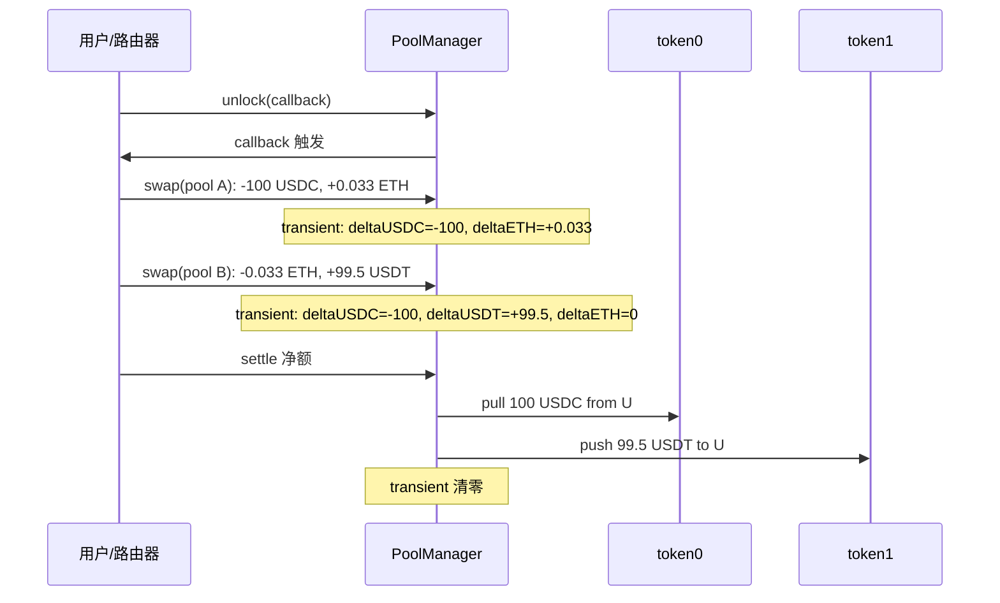

净额结算把多跳路由从"每跳一次 transfer"压缩到"全程一次 transfer"，gas 大幅下降。

### 8.3 Hooks：协议变成可编程市场

每个池子可以绑定一个 hook 合约，在生命周期关键点触发回调：

| 时机 | 钩子函数 |
|------|---------|
| 创建池子 | `beforeInitialize` / `afterInitialize` |
| 加流动性 | `beforeAddLiquidity` / `afterAddLiquidity` |
| 减流动性 | `beforeRemoveLiquidity` / `afterRemoveLiquidity` |
| 交易 | `beforeSwap` / `afterSwap` |
| 直接捐赠 | `beforeDonate` / `afterDonate` |

hook 地址某些 bit 决定支持哪些回调——Uniswap 用"地址前缀编码"省 gas，通过 CREATE2 挖出特定前缀地址。

### 8.4 V4 hooks 主流实现目录（2026-04）

来源：[Awesome Uniswap V4 Hooks](https://github.com/fewwwww/awesome-uniswap-hooks)、[Uniswap v4 TWAMM Hook](https://blog.uniswap.org/v4-twamm-hook)、[Three Sigma V4 Features](https://threesigma.xyz/blog/defi/uniswap-v4-features-dynamic-fees-hooks-gas-saving)。

| 类别 | 实现 | 作用 |
|------|------|------|
| **大单切片** | TWAMM Hook | 把大单切成数千微小订单跨多个区块执行 |
| **动态费率** | Bunni v2、Brevis volatility hook | 按波动率/流量自动调整费率 |
| **限价单** | Cork、Limit Order Hook | 在指定 tick 触发链上限价单 |
| **MEV 防御** | Sorella **Angstrom** | App-Specific Sequencer，把交易排序权拍卖给 LP |
| **MEV 返利** | **Detox Hook**（Pyth + 套利识别）、**Bunni** | 把 sandwich 利润退给 LP |
| **MEV 受害者补偿** | MEVictim Rebate | 链上识别历史 MEV 受害地址，pool 内补偿 |
| **隐私** | Privacy-preserving swap hook | 用 ZK 隐藏 swap 量 |
| **储蓄/复利** | Savings Vault Hook | LP 收益自动复投到外部 vault |
| **IL 对冲** | IL hedging hook | 用期权或保险产品对冲 LP IL |
| **白名单/KYC** | Permissioned Pool | 限制谁能 swap 或 LP |

**统计**：截至 2025 年中已 5000+ hook 池被初始化、累计交易额 $190B。**Bunni v2** 是当前 hook 类 TVL/交易量第一，Angstrom 是 MEV 防御代表。来源：[Awesome V4 Hooks 仓库](https://github.com/johnsonstephan/awesome-uniswap-v4-hooks)。

### 8.5 hooks 的安全模型

hooks 安全模型是 **"信任你选的池"**——每个池在创建时绑定一个 hook 合约，LP 进入前必须自行审计。**恶意 hook 可以**：
- 在 `beforeSwap` 把费率改成 99%
- 在 `afterAddLiquidity` 把 LP token 转走
- 在 `beforeDonate` 篡改其它用户状态

**"协议安全"责任转移给 hook 作者**。前端和聚合器必须维护 hook 白名单——这是 V4 设计上最大的取舍。

### 8.6 思考题

1. 如果你做一个 hook 想抓 sandwich 利润分给 LP（detox hook），具体在哪些回调里写代码？写伪代码。
2. V4 的 native ETH 支持，省了多少 gas？为什么 V3 必须用 WETH？
3. flash accounting 用 transient storage（EIP-1153）。如果不支持 transient storage 的 L2（早期）部署 V4 会怎样？

---

## 第 9 章：Curve StableSwap 不变量 + crvUSD LLAMMA

### 9.1 设计动机

`xy = k` 在稳定币间太陡，`x + y = k` 太平（任一边归零时池子被掏空）。Curve 把两者按价格距离混合：价格接近 1:1 时像恒定和（无滑点），偏离时退化为恒定乘积（保护池子）。

### 9.2 不变量

n 资产 StableSwap：

$$
A n^n \sum_{i=1}^n x_i + D = A n^n D + \frac{D^{n+1}}{n^n \prod_{i=1}^n x_i}
$$

- $\sum x_i$ 恒定和（线性）
- $\frac{D^{n+1}}{n^n \prod x_i}$ 恒定乘积（边界发散）
- $D$ "理想储备总量"
- $A$ 放大系数

**3pool**（USDC + USDT + DAI）的 A=2000，crv-frax A=1500。A 越大平段越宽，越接近恒定和。

### 9.3 Newton 迭代求解

合约里没法解析求解 D 或 $x_i$，得用 Newton 迭代。

求 D：

$$
D_{k+1} = \frac{A n^n S \cdot D_k + n D_P D_k}{(A n^n - 1) D_k + (n+1) D_P}
$$

通常 < 10 次收敛。来源：[RareSkills get_D get_y](https://rareskills.io/post/curve-get-d-get-y)、[Curve StableSwap 数学指南](https://xord.com/research/curve-stableswap-a-comprehensive-mathematical-guide/)。

### 9.4 crvUSD 的 LLAMMA：软清算

> **LLAMMA = Lending-Liquidating AMM**。抵押品被切成多个 **price band**，价格穿过 band 时合约自动按比例把抵押品换成 crvUSD（**软清算**），价格回升时再换回来（**de-liquidation**）。

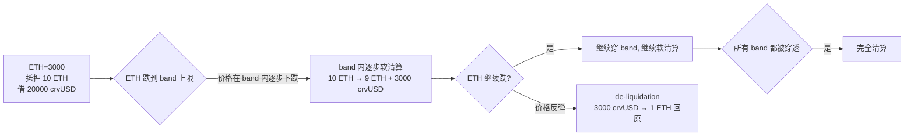

**优点**：避免暴跌一秒被强平。**缺点**：反复穿 band 的"震荡损耗"持续侵蚀抵押品——借款人被 LP 化。

### 9.5 反例：Curve 2023-07 Vyper 编译器 bug

受害池：alETH/ETH（$22.6M）、msETH/ETH（$3.4M）、pETH/ETH（$11M）、CRV/ETH（$24.7M），共 $73M。

**根因**：Vyper 编译器 0.2.15、0.2.16、0.3.0 的 `@nonreentrant` 装饰器把 lock 标志和其它变量塞到同一 storage slot，导致 lock 在某些路径下失效。攻击者调用 `add_liquidity` → ETH 转账触发 fallback → reentrancy 进入 `remove_liquidity` → 因为 lock 失效得以执行 → 池子状态错乱后用低价买走代币。

**根因不在协议代码**——工具链 0day。来源：[Halborn Vyper Bug](https://www.halborn.com/blog/post/explained-the-vyper-bug-hack-july-2023)、[LlamaRisk 复盘](https://hackmd.io/@LlamaRisk/BJzSKHNjn)。

### 9.6 思考题

1. 在 3pool 里，把 USDT 倒入 99%、USDC/DAI 各 0.5%，曲线退化成什么？给一个数值例子。
2. crvUSD LLAMMA 的"震荡损耗"在数学上等价于 V3 LP 在窄区间不停被反复 swap。给一个量化估计——如果 ETH 在 [2900, 3100] 内来回 100 次，借款人损失多少？
3. Curve 2023-07 教训：编译器是攻击面。你怎么在 CI 里加一道编译器输出的差分测试？

---

## 第 10 章：Balancer V3 加权池 + Maverick + Trader Joe LB

### 10.1 Balancer V3：加权池 + hooks + ERC-4626 buffer

权重池不变量：$\prod_{i=1}^n x_i^{w_i} = k$，$\sum w_i = 1$。

**80/20 BAL/WETH 池**：LP 持有"自动再平衡的指数组合"，曲线维持 80/20 市值比例。

**V3 改动**：hooks 与池类型解耦（同一 hook 可挂 WeightedPool 和 StablePool，与 V4"每池一 hook"不同）；ERC-4626 buffer 让收益代币直接作 LP 资产；V2 composable pool 安全隐患被 ERC-4626 buffer 取代。

来源：[Balancer V3 Hooks](https://docs.balancer.fi/concepts/core-concepts/hooks.html)、[Mixbytes Balancer V3](https://mixbytes.io/blog/modern-dex-es-how-they-re-made-balancer-v3)。

### 10.2 Maverick V2：directional liquidity

LP 选 4 种模式：**Right**（跟涨）、**Left**（跟跌）、**Both**（双向）、**Static**（V3 行为）。V2 引入 **Boosted Positions** 把激励代币精准发给特定 tick 范围，**Direct Match**（最高 100% 匹配外部激励）+ **Vote-Match**（veMAV 加成）。本质：V3 + 自动跟随价格 + 项目方定向发激励。来源：[Maverick V2 Boosted](https://docs.mav.xyz/guides/incentives/understanding-boosted-positions)、[Maverick Phase II](https://medium.com/maverick-protocol/maverick-phase-ii-liquidity-shaping-with-boosted-positions-a922c67dd557)。

### 10.3 Trader Joe Liquidity Book（LB）

用离散 **bin** 替代连续 tick，每 bin 恒定和 `x + y * P = const`。**优势**：滑点计算 O(1) 可预测；变动费率按 bin 内交易频率自适应，波动大时 LP 自动收更高费。

**TVL**（2026Q1）：Joe V2/V2.1/V2.2 多版本共存，主链 Avalanche + Arbitrum + BSC，整体 ~$200M。来源：[DefiLlama Joe](https://defillama.com/protocol/joe-dex)。

### 10.4 PancakeSwap Infinity（v4）

PancakeSwap 在 2025-04 发布 **Infinity**（即 PancakeSwap v4），定位与 Uniswap V4 类似——支持 V2 classic / V3 集中流动性 / Infinity hook 三种池共存。BNB Chain 上 V3 TVL ~$978M（2026-04）。来源：[PancakeSwap Infinity 发布](https://blog.pancakeswap.finance/articles/pancake-swap-infinity-is-now-live-formerly-pancake-swap-v4)。

### 10.5 思考题

1. Balancer 80/20 BAL/WETH 池，BAL 价格涨 4 倍，LP 持仓里 BAL 占比怎么变？
2. Maverick 的 Mode Right 在价格大跌时会发生什么？比 V3 LP 更糟还是更好？
3. Trader Joe LB 的 bin 离散化最大的工程优势是？

---

## 第 11 章：Solidly ve(3,3) + V4 hooks 生态

### 11.1 ve(3,3) 模型

Andre Cronje 在 Solidly 引入，Velodrome（Optimism）、Aerodrome（Base）继承。

**核心机制**：锁仓治理代币换 veToken（time-lock NFT，锁越久权重越大）；veToken 持有人投票决定每周通胀代币分配；LP 拿通胀，投票人拿 100% 池子手续费——形成"贿赂市场"，项目方向 ve-holder 送 bribe 换票。

> **(3,3)**：博弈论纳什均衡——双方合作收益 (3,3)，一方叛逃 (-1,-1)。ve(3,3) = veCRV 锁仓权益 + OlympusDAO stake 文化。

**Aerodrome 与 Velodrome 合并**：2026 Q2 计划合并为统一平台 **Aero**。这是首例 L2 上"龙头 DEX 跨链合并"。来源：[Aerodrome 设计](https://coinmarketcap.com/academy/article/what-is-aerodrome)。

### 11.2 ve(3,3) 经济模型分析

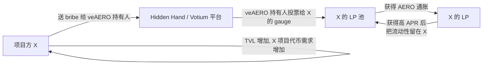

**问题**：bribe 成本 > 池子真实收益 → 贿赂市场负和，长期变成"通胀稀释 vs bribe 补贴"博弈。

### 11.3 V4 hooks 与 ve 模型对比

| 维度 | ve(3,3) | V4 hooks |
|------|---------|---------|
| **协议层抽象** | LP 池 + 治理代币双层 | 池+hook 单层 |
| **LP 激励** | 通胀代币 + bribe | hook 自定义（动态费、MEV 返利） |
| **资本效率** | V2 风格，IL 风险大 | V3/V4 集中流动性 |
| **代表项目** | Aerodrome / Velodrome | Bunni / Angstrom / Detox Hook |

**趋势**：新协议多为 hybrid——ve(3,3) 治理 + V4 hooks 资本效率。

### 11.4 V4 hooks 经济学：谁赚钱

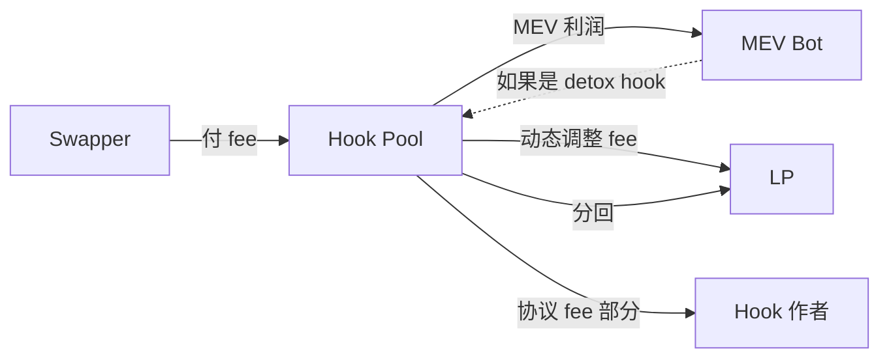

V4 hooks 让协议作者抽 fee 成为可能（V3 没有）。Bunni 等通过 hook 抽 LP 收入 5-10%，这是"real yield"模式。

### 11.5 思考题

1. Aerodrome bribe 市场的均衡价是什么？给一个简化模型——如果项目方愿意每周花 $X bribe 换 $Y LP TVL，X/Y 的合理范围？
2. V4 hook 作者怎么收 fee？合约接口怎么写？
3. 如果 Aerodrome 和 Velodrome 合并成 Aero，veAERO/veVELO 的转换比例由什么决定？给治理博弈视角。

---

> **AMM 家族完结**。DEX 解决了"链上价格发现"——但光有价格还不够，用户还需要**借贷杠杆**。Part III 进入信用层：利率模型如何定价流动性稀缺性，健康因子如何触发清算。

## 第 12 章：借贷利率模型（jump rate / 差异化）

### 12.1 利用率驱动的利率曲线

借贷协议利率由**利用率（utilization）**驱动：

$$
U = \frac{\text{borrows}}{\text{supplies} + \text{borrows} - \text{reserves}}
$$

U=0 没人借，U=100% 全借光。U 越高，资源越稀缺，利率越高。

### 12.2 Compound II 的 jump rate model

超过 kink（通常 80%）后利率陡升：

$$
\text{borrowRate}(U) = \text{base} + \text{slope}_1 \cdot \min(U, k) + \text{slope}_2 \cdot \max(0, U - k)
$$

例：USDC 池：base=0%、slope1=4%、kink=80%、slope2=100%。U 从 0→80% 借贷率 0→3.2%；U 从 80%→100% 借贷率从 3.2% 飙到 23.2%。

```
borrowRate (%)
  │                              /
25│                            /
20│                          /
15│                        /
10│                      /
 5│              ____ /
 0│____/
  └──────────────────── U (%)
  0    20   40   60  80  100
                       ^ kink
```

陡峭的 slope2 是自动稳定器：U → 100% 时高利率激励还款 + 吸引新存款。来源：[Compound JumpRateModel](https://github.com/compound-finance/compound-protocol/blob/master/contracts/JumpRateModel.sol)、[Aave 利率模型](https://rareskills.io/post/aave-interest-rate-model)。

### 12.3 Aave V3 差异化曲线

Aave V3 对每类资产用不同曲线：

| 资产类 | kink | slope1 | slope2 |
|---|---|---|---|
| Stablecoin（USDC/USDT/DAI） | 92% | 3.5% | 60% |
| Volatile（ETH/BTC） | 80% | 3.8% | 80% |
| Isolation 资产 | 45-60% | 7% | 300% |

**e-mode（efficiency mode）**：相关性高的资产对（ETH/stETH、USDC/USDT）划入同一 category，LTV 提高到 93%（默认 75%）。是 Ethena 系 Aave-Pendle 杠杆循环的基础。

### 12.4 Compound III（Comet）的单边曲线

每市场只能借一种基础资产（通常 USDC），抵押物只能存不能借。

```solidity
function getSupplyRate(uint utilization) external view returns (uint64) {
    if (utilization <= supplyKink) {
        return supplyPerSecondInterestRateBase
             + mulFactor(supplyPerSecondInterestRateSlopeLow, utilization);
    }
    return supplyPerSecondInterestRateBase
         + mulFactor(supplyPerSecondInterestRateSlopeLow, supplyKink)
         + mulFactor(supplyPerSecondInterestRateSlopeHigh, utilization - supplyKink);
}
```

**关键差异**：supplyRate 不再依赖 borrowRate（V2：`supplyRate = borrowRate * U * (1 - reserveFactor)`），reserve 由治理直接控制。

**V3 优势**：抵押品不能借出 → 不被闪电贷耗尽；单一基础资产 → 风险可控；抵押品独立计价 → oracle 异常不污染整个市场。

来源：[Compound III Docs](https://docs.compound.finance/)。

### 12.5 自适应利率模型（Morpho AdaptiveCurve、Frax PID）

Morpho Blue 引入 **AdaptiveCurveIRM**：参数自动跟踪市场出清状态——长时间 U 偏离 target（如 90%）时，曲线自动平移，避免 governance 频繁调参。Frax 也用类似 PID 控制（Proportional-Integral-Derivative）让利率自适应跟随 U。

**Morpho AdaptiveCurve 数学**（简化）：

$$
r_t = r_{t-1} \cdot \exp(k \cdot (U_t - U_{\text{target}}) \cdot \Delta t)
$$

- 当 $U_t > U_{\text{target}}$（如 90%）时，$r$ 指数上涨。
- 当 $U_t < U_{\text{target}}$ 时，$r$ 指数下跌。
- $k$ 是调整速度（adaptive speed）。

自适应曲线无需治理频繁调参，代价是极端市场下利率可能过冲（U 长时间高位时利率涨到 1000%+）。

### 12.6 实战：算一笔 Aave 杠杆循环

假设你想做 5x wstETH/USDC 杠杆循环：
- 起始：10 wstETH（市价 $30,000）
- 每轮：抵押 wstETH → 借 USDC（按 e-mode 93% LTV）→ swap 成 wstETH → 再抵押

**第 1 轮**：抵押 10 wstETH，借出 $30000 × 93% = $27,900 USDC，swap 成 9.3 wstETH。
**第 2 轮**：抵押 19.3 wstETH，借出 $27900 + $25,947 = $53,847（累计），swap 成 8.65 wstETH。
**第 3 轮**：累计 27.95 wstETH。
**第 N 轮**：理论上限 = `10 / (1 - 0.93) = 142.86 wstETH`。

但实际不能完全循环，因为：
1. 每次 swap 滑点 + gas 成本。
2. Aave borrow rate（动态）随借款增加而上涨。
3. 存款利率 < 借款利率，**净 carry 是负的**。

**盈利条件**：wstETH staking yield > USDC borrow rate。一旦 stETH yield 跌或 USDC borrow rate 涨，循环立即解杠杆——2025-10 USDe Aave-Pendle 解杠杆的经济学根因。

### 12.7 思考题

1. 为什么 kink 通常设在 80-90% 而不是 50%？低 kink 会怎样？
2. Aave e-mode 把 stETH/ETH 划到一组享受 93% LTV，这种"假设相关性永远高"会出什么问题？回顾 stETH 2022-06 脱锚到 0.94。
3. Compound III 的"抵押品不能借出"看似牺牲了资本效率。但它解决了什么问题？

---

## 第 13 章：健康因子与清算流程

### 13.1 健康因子（HF）

$$
HF = \frac{\sum_i (\text{collateralValue}_i \cdot \text{liquidationThreshold}_i)}{\sum_j \text{borrowValue}_j}
$$

- **LT（liquidation threshold）**：清算阈值；**LTV（loan-to-value）**：借款最大比例，略低于 LT。

**举例**：存 10 ETH（市值 $30,000，LT=82.5%），借 $20,000 USDC：

$$
HF = \frac{30{,}000 \times 0.825}{20{,}000} = 1.2375
$$

**触发清算价格**：$HF=1 \Rightarrow$ ETH 跌到 $3,000 \times \frac{20000}{24750} \approx \$2{,}424$。

来源：[Aave Liquidations Help](https://aave.com/help/borrowing/liquidations)。

### 13.2 清算流程时序

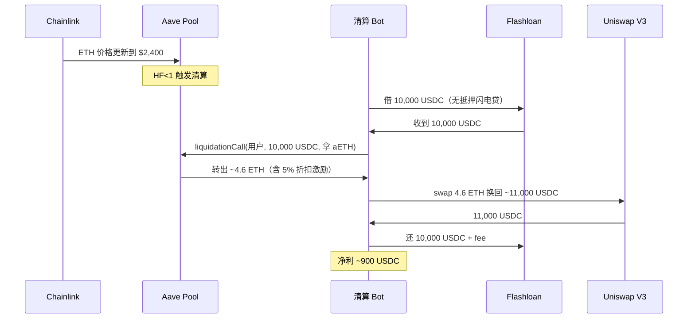

**Aave V3 close factor 规则**（来源：[Aave Help](https://aave.com/help/borrowing/liquidations)）：默认 50% 单笔；HF<0.95 时 100%；HF∈[0.95,1.0) 但抵押或债务任一 < $2000 时也允许 100%（防尘埃账户）。

### 13.3 清算工程难点

1. **同区块竞争**：Chainlink 价格更新是一笔 tx，清算 bot 须在价格 tx 后立刻发清算 tx，最理想同一区块。Flashbots bundle 提供原子执行保证。
2. **MEV 竞争**：清算是 MEV 高地，用私有 mempool（Flashbots Protect、bloXroute）防前端运行。
3. **资本效率**：闪电贷是标配——Aave V3 自带 flashloan，清算可零本金执行。

### 13.4 软清算 vs 硬清算

| 维度 | 硬清算（Aave/Compound） | 软清算（crvUSD LLAMMA） |
|------|------|------|
| 触发条件 | HF<1 | 价格穿过 band 上限 |
| 清算速度 | 一笔 tx 全清 50% 或 100% | 渐进式按比例 |
| 用户体验 | 暴跌一秒被强平 | 不会一次损失全部 |
| 损耗形式 | 5-10% 清算折扣 | 反复穿 band 的"震荡损耗" |
| 适用 | 所有借贷 | 主要做稳定币 CDP |

### 13.5 思考题

1. 你存 100 wstETH 借 USDC 做 5x 杠杆。ETH 瞬间跌 20%，HF 多少？写完整推演。
2. 清算 bot 在 Aave 之外还要付什么成本？算一笔总账。
3. 为什么 Aave 默认 close factor 是 50%（一笔最多清一半债务）而非 100%？

---

## 第 14 章：共享池借贷（Aave V3 + Umbrella）

### 14.1 Aave V3 架构

Aave V3 是 DeFi 借贷龙头（TVL ~$26B / 2026-04 事件前，Kelp 事件后跌至 ~$20B，[DefiLlama](https://defillama.com/protocol/aave-v3)）。架构：

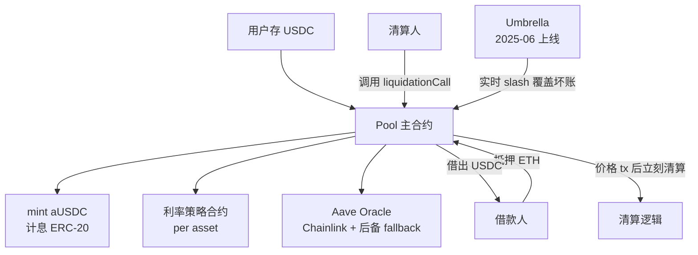

**核心组件**：
- **Pool.sol**：主入口，所有 deposit / borrow / repay / liquidate 都过这里。
- **aToken（aUSDC）**：rebase 模式的计息凭证，余额自动累积利息。
- **Variable / Stable Debt Token**：分别记录浮动利率和稳定利率债务。
- **InterestRateStrategy**：每个 asset 有独立的利率曲线合约。
- **Oracle**：聚合 Chainlink + fallback。

### 14.2 Aave Umbrella：自动化坏账覆盖

Umbrella 在 **2025-06-05 上线**（来源：[Aave Umbrella Docs](https://aave.com/docs/aave-v3/umbrella)、[LlamaRisk Umbrella 分析](https://governance.aave.com/t/llamarisk-insights-umbrella-launch/23067)）。

**老 Safety Module 的问题**：出现坏账 → 治理投票决定是否 slash，延迟几天 + 标准模糊 + 覆盖不精准。

**Umbrella 设计**：

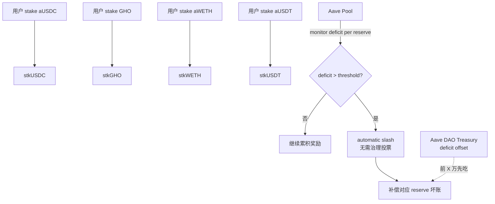

- **分资产 staking**：每个 staked asset 只覆盖对应 reserve 坏账。
- **自动 slash**：合约设阈值，超过即时 slash。
- **deficit offset**：每市场设 offset，前 X 万由 DAO Treasury 吃，超过才 slash staker。

### 14.3 stkGHO / sGHO 演化（2026-04）

来源：[Aave Umbrella Stake Help](https://aave.com/help/umbrella/stake)、[Aave Umbrella Help](https://aave.com/help/umbrella/umbrella)。

| 类型 | slash 风险 | cooldown | APY（2026-04） | 说明 |
|------|------|------|---|------|
| 老 stkGHO | 0%（治理已关） | 20 天 | ~5% | 历史遗留 |
| 新 sGHO（Savings GHO） | 0% | 0 天 | ~5% | 推荐 |
| stkGHO-Umbrella | 风险开放 | 21 天 | 浮动 | 愿意承担 slash |

**当前状况**：stkGHO ~5% APY < sGHO 风险无 → 治理论坛在讨论 Merit redirect。

### 14.4 反例：rsETH/wETH 2026-04 危机

> **审稿注（2026-04-29）**：本案例基于 hypothetical LayerZero DVN compromise scenario 推演——审稿时点本人未独立确认 Kelp DAO 是否真在 2026-04-18 发生该事件、或上述数额是否准确。线索来源标注于下方但**需作者核实**。读者请在引用前自行交叉验证 [Aave governance forum](https://governance.aave.com/)、[L2BEAT incidents](https://l2beat.com/scaling/risk/)、Kelp 官方公告，避免把演练材料当成既成事实流出。

Kelp DAO 跨链桥被攻击（1-of-1 DVN 单点被攻陷），$292M 伪造 rsETH 被用作 Aave 抵押借走 wETH，造成 ~$196M 坏账。Aave TVL 单日跌 $6.6B、AAVE 代币跌 16%。完整复盘见第 24.3 节。

来源：[Aave Records $6B TVL Drop](https://www.coindesk.com/tech/2026/04/19/aave-records-usd6-billion-tvl-drop-as-kelp-hack-exposes-structural-risk-at-defi-lender)、[rsETH Incident Report](https://governance.aave.com/t/rseth-incident-report-april-20-2026/24580)。

**Aave 视角教训**：
1. 借贷协议接受跨链 wrapped 资产做抵押时，必须审计发行方桥的安全模型。
2. Umbrella 自动 slash 有上限——坏账超过 staker 覆盖范围仍需 DAO Treasury。

### 14.5 思考题

1. Aave 接受 rsETH 抵押前，应该问哪些问题？画一张"跨链抵押资产 due diligence checklist"。
2. Umbrella 的 deficit offset 机制让 DAO Treasury 先吃 X 万损失。这个 X 应该如何计算？
3. 你设计一个改进版 Aave，怎么阻止"跨链 wrapped token 被攻击者铸造后立刻借走基础资产"？

---

## 第 15 章：单一基础资产借贷（Compound III Comet）

### 15.1 设计哲学

Compound III（Comet）从 2022 年起采用单一基础资产模型：每市场只能借一种基础资产（cUSDCv3 等），抵押物只存不借，各有独立 supply cap。设计动机：V2 的闪电贷耗尽 + oracle 污染教训（见 12.4 节）。

### 15.2 工程结构

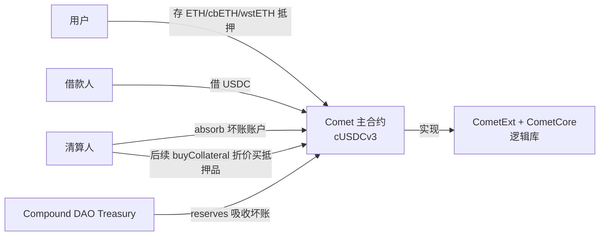

**关键概念**：
- **absorb**：清算人调用 `absorb(account)` 把坏账账户的抵押品转给协议、债务清零（不直接拍卖）。
- **buyCollateral**：抵押品被协议持有后，任何人可以折价（来自 oracle 价 \* discount）买走。

### 15.3 核心代码

```solidity
function absorb(address absorber, address[] calldata accounts) external {
    for (uint256 i = 0; i < accounts.length; i++) {
        absorbInternal(absorber, accounts[i]);
    }
}

function absorbInternal(address absorber, address account) internal {
    require(isLiquidatable(account), "not liquidatable");
    // 1. 把账户的所有抵押品转给协议
    for each collateral asset:
        transferFromUser(account, address(this), userBalance);
    // 2. 把账户的债务清零（协议吸收）
    setBaseBalance(account, 0);
    // 3. 给 absorber 一个小 reward（来自 reserves）
    payRewardToAbsorber(absorber, reward);
}

function buyCollateral(address asset, uint256 minAmount, uint256 baseAmount) external {
    // 任何人付 baseAmount USDC，按 oracle 价 * (1 - storeFrontPriceFactor) 折价买抵押品
    uint256 collateralAmount = quoteCollateral(asset, baseAmount);
    require(collateralAmount >= minAmount);
    transferUSDCFromUser(...);
    transferCollateralToUser(...);
}
```

来源：[Compound III Docs](https://docs.compound.finance/)、[RareSkills Compound V3 Book](https://rareskills.io/compound-v3-book)。

### 15.4 与 Aave V3 对比

| 维度 | Aave V3 | Compound III |
|------|------|------|
| 借出资产 | 几乎所有 listed | 单一基础资产 |
| 抵押品 | 也可以被借 | 只存不借 |
| 清算 | liquidationCall 一步完成 | absorb + buyCollateral 两步 |
| 资本效率 | 高 | 低（抵押品闲置） |
| 安全 | 复杂，需要 e-mode 隔离 | 简单 |
| TVL（2026-04） | $26B | ~$3B |

Compound III TVL 远小于 Aave：抵押品不能借出，资本效率劣势。

### 15.5 思考题

1. Compound III 把 absorb 和 buyCollateral 拆成两步。直觉上这有什么好处？为什么不像 Aave 一步完成？
2. 如果 USDC 突然脱锚到 $0.5，Compound III cUSDCv3 市场会发生什么？vs Aave？
3. 你设计一个"V3 之外的第三种模式"，怎么平衡 V2 灵活性和 V3 安全性？

---

## 第 16 章：隔离市场借贷（Morpho / Euler / Silo / Ajna）

### 16.1 Morpho Blue：极简借贷原语

核心抽象：

```solidity
struct MarketParams {
    address loanToken;       // 借款资产
    address collateralToken; // 抵押资产
    address oracle;          // 预言机合约
    address irm;             // 利率模型合约
    uint256 lltv;            // 清算 LTV
}
```

每市场是一个独立五元组，无许可创建，市场间完全隔离。Morpho Blue ~600 行，审计 8 次。

复杂性移到上层 **MetaMorpho vault**：curator 创建 ERC-4626 vault，在多个 Morpho Blue 市场间分配资金赚息差。

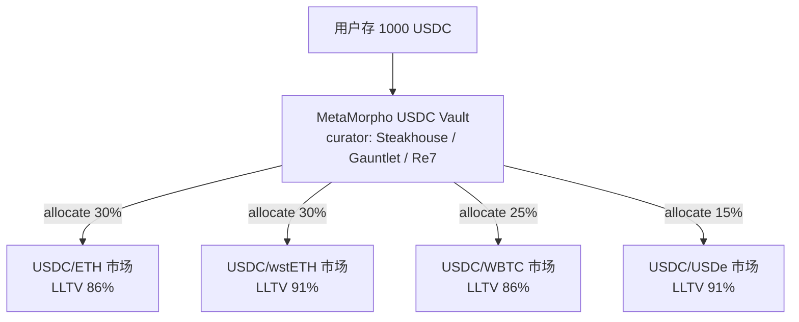

**优点**：新资产/oracle/利率模型立刻上线（无需 Aave 治理几个月）；curator 专业分工；单市场出事不污染整个协议。**缺点**：用户选错 curator 全承担；流动性碎片化；curator 竞争可能在风控参数上"内卷"出风险。

Morpho Blue 在 2025 年 TVL 突破 $5B，借贷类增速最快协议之一。

### 16.2 Euler V2：Euler Vault Kit

Euler V1 2023-03 事件（$197M）后彻底重写为 **Euler Vault Kit（EVK）**：任何人可创建定制 vault，vault 间互信形成 vault graph。

EVK 解决了 ERC-4626 inflation attack（用 internal balance tracking 而非 token.balanceOf）——这是 V1 教训的产物。

**架构**：
- **EVault**：单个 vault 合约，可以被组合。
- **Ethereum Vault Connector（EVC）**：让多个 vault 在一笔 tx 里被原子化访问。
- **Risk steward**：可以调参的"半治理"角色。

来源：[Euler Donation Attacks 文档](https://docs.euler.finance/security/attack-vectors/donation-attacks/)、[Euler V2 概览](https://docs.euler.finance/)。

### 16.3 Silo V2：风险隔离的"silo"

Silo 用"每对资产一个 silo"模型——你存 USDC 进 ETH-silo，只能借出 ETH，不会接触其它 silo 的风险。Silo V2 在 2025 年迁到 **Sonic** 链（前 Fantom），TVL ~$558M（2026Q1）。Silo V2 引入 hooks 让任何人创建定制化 silo。来源：[Silo V2 Sonic launch](https://www.silo.finance/)。

### 16.4 Ajna：完全无预言机

价格由"buckets"决定——LP 把流动性放在自己愿意接受的价位 bucket，抵押品跌穿 bucket 价时 LP 触发清算。无 oracle → 不会被操纵，但流动性碎片化。TVL <$50M，是"无 oracle"思路的实验场。来源：[Ajna 设计](https://www.ajna.finance/)、[Mixbytes Ajna 解析](https://mixbytes.io/blog/modern-defi-lending-protocols-how-its-made-ajna)。

### 16.5 隔离市场对比

| 协议 | 隔离单元 | 治理 | TVL（2026Q1） |
|------|---|---|---|
| Morpho Blue | (loan, coll, oracle, irm, lltv) 五元组 | curator + treasury | ~$5B |
| Euler V2 | EVault + vault graph | risk steward | ~$1B |
| Silo V2 | 每对资产一个 silo | DAO + curator | ~$558M |
| Ajna | bucket（LP 自选价） | 无 | <$50M |

### 16.6 思考题

1. Morpho Blue 的 curator 模式让风险下放给市场。这种"市场化风控"在熊市极端行情下会怎样？
2. Ajna 完全不用 oracle，怎么防"长尾资产价格凭空被 LP 哄抬"？
3. Euler V2 EVK 的 internal balance tracking 是 V1 教训。这种防御方式相比 OpenZeppelin v5 的 virtual shares + decimal offset 谁更好？

---

## 第 17 章：链上 KYC / 机构借贷（Maple / Centrifuge / Spark）

### 17.1 机构借贷的需求

DeFi 超额抵押借贷适合零售杠杆，不适合机构信贷——企业不会过度抵押 ETH 借 USDC。机构借贷需要基于资质的**链上 KYC 信用市场**。

### 17.2 Maple Finance

Maple 是 2021 起的"链上信用借贷"先驱。机制：

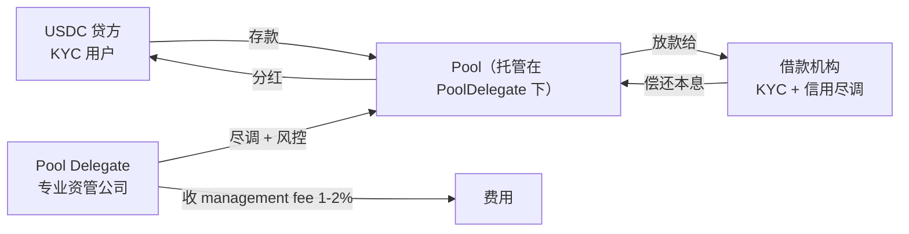

**2026 状态**（来源：[Maple Finance 2026](https://blog.tokenmetrics.com/p/what-are-the-top-defi-protocols-complete-2026-guide-to-decentralized-finance)、[BeInCrypto Maple Token Buyback](https://beincrypto.com/maple-finance-ends-staking-launches-token-buybacks-in-rwa-driven-overhaul/)）：
- TVL ~$3.1B（2025-10 高峰）
- 推出 **syrupUSDC**（2026-01 在 Coinbase Base 链上线）：yield-bearing stablecoin，目标 Aave V3 listing
- 加入 Sky Ecosystem Agent Network（2026-03）
- ARR 目标 $100M（2026 年底）

### 17.3 Centrifuge：链上 RWA tokenization

Centrifuge 把"传统 RWA（应收账款、抵押贷款、艺术品）"搬上链作为抵押品借出 DAI/USDC。

**典型流程**：发行方把一批应收账款 NFT 化 → Centrifuge 池子作为抵押 → DAO 治理批准后接 DAI 借款 → 应收账款回款偿还。

**2026-01-14 整合**：Centrifuge 把 tokenized Treasury + CLO yield 通过 Lista DAO 接到 BNB Chain，APY 3.65-4.71%。

### 17.4 Goldfinch、Clearpool、Ondo

- **Goldfinch**：无抵押贷款给新兴市场（拉美、东南亚）的小微企业。
- **Clearpool**：机构 → 机构的链上借贷，每个池由机构借款人独立创建。
- **Ondo Finance**：把短期国债 tokenize 成 USDY 给链上用户买。Ondo 也提供 OUSG（机构国债）。

### 17.5 RWA + DeFi 的统一图景

**截至 2026-04**，链上私募信用累计起源 ~$33.66B，活跃敞口 ~$18.91B。来源：[Fensory RWA Watch Feb 2026](https://fensory.com/intelligence/rwa/private-credit-rwa-tokenization-analysis-february-2026)。

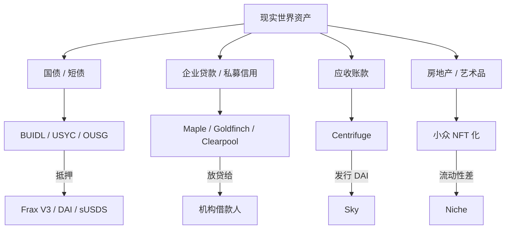

### 17.6 KYC 与 DeFi 哲学冲突

链上 KYC 与"无许可"哲学冲突。当前折衷：Centrifuge 用合规通道发币但 LP token 无许可流通；Maple 在合约层面设白名单地址；法律包装用 SPV/Trust 把链上代币挂钩现实资产。

### 17.7 思考题

1. Maple 的 PoolDelegate 出问题（违约或欺诈）会怎样？vs Aave 治理出问题？
2. Centrifuge 的 RWA NFT 如何在链上证明"现实世界回款"？给一个证明链路。
3. 如果 BUIDL 是 Frax/Sky/Ondo 的共同底层，BUIDL 自己的对手方风险是什么？

---

> **借贷家族完结**。协议能借款，前提是**知道抵押品的实时价格**——价格错了，一切风险模型都崩。Part IV 先拆预言机，再进入永续与衍生品：链上衍生品本质是用预言机驱动的杠杆游戏。

## 第 18 章：预言机——Push / Pull / TWAP / RedStone

### 18.1 Chainlink Push 模型

> **Push**：节点主动把价格推到链上聚合合约，消费合约直接读 storage。**Pull**：节点把签名价格放链下，消费合约在需要时把签名带上链验证。

Chainlink Data Feeds 是经典 push：节点在偏离阈值（0.5%-1%）或 heartbeat（通常 1 小时）触发时写链上聚合合约。

**优势**：确定性节奏；调用简单（`latestAnswer()`）。**劣势**：高频场景延迟大；不必要的更新也要付 gas。

代码示例：

```solidity
import {AggregatorV3Interface} from "@chainlink/interfaces/AggregatorV3Interface.sol";

contract Consumer {
    AggregatorV3Interface immutable feed;
    constructor(address _feed) { feed = AggregatorV3Interface(_feed); }

    function getPrice() public view returns (int) {
        (, int answer, , uint updatedAt, ) = feed.latestRoundData();
        require(block.timestamp - updatedAt < 3600, "STALE");  // 心跳检查
        return answer;  // 通常是 8 位小数
    }
}
```

### 18.2 Pyth Pull 模型

Pyth 把价格存在 Pythnet（专用 Solana 分叉）上，消费者在需要时从 Wormhole 把签名 update 拉到目标链并支付 gas。

**性能**：Pyth 在 Pythnet 上每 400ms 推一次价；2024 年 3 月行情中观测到约 3.33 次/秒的有效更新。来源：[RedStone 三家对比 2025](https://blog.redstone.finance/2025/01/16/blockchain-oracles-comparison-chainlink-vs-pyth-vs-redstone-2025/)。

**适用**：延迟敏感（永续 DEX、清算 bot）→ Pyth；确定节奏（借贷、稳定币监控）→ Chainlink（2024 年后推 Data Streams 弥补低延迟场景）。

### 18.3 RedStone：Push + Pull 双模型

RedStone 是 2025-2026 年快速增长的"模块化 oracle"。它在 110+ 链上同时提供 Push 和 Pull 两种模式，且 pull 模式 gas 比传统 oracle 少 70%+。Hyperliquid、Spark、Compound、Venus 等 protocol 都在用。

**Kamino + Chainlink Data Streams 集成**（2025）：Kamino Finance 引入 Chainlink Data Streams 做 sub-second 延迟价格喂价。来源：[RedStone Push vs Pull](https://blog.redstone.finance/2024/08/21/pull-oracles-vs-push-oracles/)、[RedStone 主页](https://www.redstone.finance/)。

### 18.4 TWAP 与防操纵

TWAP（Time-Weighted Average Price）是抵御闪电贷价格操纵的廉价方案。Uniswap V2 的 `priceCumulativeLast` 在每次状态变化时累加 `当前价格 × 时间增量`，外部合约通过两次采样得到平均价。V3 改成几何平均，更抗操纵。

TWAP 局限：**滞后**——防操纵但不能实时反映市场价。

### 18.5 反例三连：Cream / Mango / bZx

**Cream Finance 2021-10（损失 $130M）**：详见第 6.7 节。根因：yUSD share-price 可被外部 donation 操纵。

**Mango Markets 2022-10（损失 $116M）**：
- Avi Eisenberg 用 $5M 在 Mango 开 MNGO 永续多单。
- 在 Mango 用作 oracle 的三家 CEX 上同时拉高 MNGO 现货价 1000%+。
- MNGO 永续盈利让他的"抵押品"价值飙升。
- 用这笔虚高抵押借走 $110M+。
- **根因**：oracle 集中度太低（三家小盘 CEX）+ 标的资产流动性太低（容易拉盘）。

**法律后续**：Eisenberg 2024 年被陪审团裁定欺诈罪 + 市场操纵罪，但 2025 年法官以"Mango 没有用户协议、没有禁止操纵条款、没有还款要求"为由 Rule 29 撤销有罪判决。检方上诉中。来源：[CFTC vs Eisenberg](https://www.cftc.gov/PressRoom/PressReleases/8647-23)、[TRM Labs Eisenberg 翻案](https://www.trmlabs.com/resources/blog/breaking-federal-judge-overturns-all-criminal-convictions-in-mango-markets-case-against-avraham-eisenberg)。

**bZx 2020-02 两次（合计 ~$954K，但是 DeFi 历史第一次大规模 oracle manipulation）**：
- 第一次：攻击者借 7,500 ETH 闪电贷，在 Kyber 上拉高 sUSD 价到 $2.5。bZx 用 Kyber 现货价做估值，借出更多 ETH。
- 第二次：3,518 ETH 在 Synthetix 直接买 sUSD（推高 Uniswap sUSD/ETH 价格 2x），把 sUSD 抵押到 bZx 借出 ~2,378 ETH 净利。
- **根因**：用单个 DEX 现货价做 oracle。

来源：[Immunefi Cream Analysis](https://medium.com/immunefi/hack-analysis-cream-finance-oct-2021-fc222d913fc5)、[CoinDesk bZx Flash Loan](https://www.coindesk.com/tech/2020/02/19/everything-you-ever-wanted-to-know-about-the-defi-flash-loan-attack)。

**教训**：用现货价做风控前先问"市场深度能撑多大操纵"；叠加 TWAP 或集中度阈值；高级方案：Chainlink + 多源 + secondary oracle（Aave V3 做法）。

### 18.6 思考题

1. Chainlink USDC/USD 心跳是 24 小时（偏离阈值 0.25%）。如果 USDC 在 12 小时内从 $1.00 跌到 $0.85 但偏离没触发更新，会出现什么后果？设计一个对冲方案。
2. Pyth 的 pull 模型谁付 gas？这对永续 DEX 经济学有什么影响？
3. RedStone 同时提供 push 和 pull 是"灵活"还是"复杂度爆炸"？给三层分析。

---

## 第 19 章：永续 LP 模式——GMX V2 完整 GLP/GM 机制

### 19.1 GMX V2 总体架构

"LP 池作为对手方"模式：LP 提供资产赚交易费 + funding；交易者从池子借流动性，付 fee + funding。

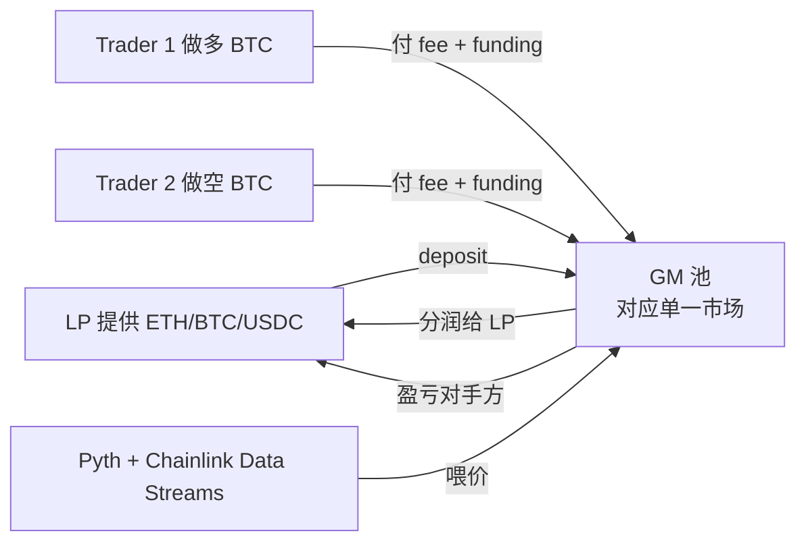

### 19.2 GLP（V1）vs GM（V2）

**GLP（V1）**：单一 multi-asset 共享池，长尾资产剧烈波动影响所有 LP（风险污染）。

**GM（V2）**：每市场独立 GM 池，每市场是 (index token, long collateral, short collateral) 三元组，如 BTC/USD 市场对应 BTC-USDC GM 池。

**Synthetic GM 池**（2025 推出）：

来源：[GMX Single Token Pool BTC ETH](https://gov.gmx.io/t/single-token-pools-gmx-v2-btc-and-eth/3348)、[GMX V2 Quick Guide](https://www.blocmates.com/articles/gmx-v2-a-quick-guide-to-the-upgrade)、[GMX Review 2026](https://cryptoadventure.com/gmx-review-2026-perpetuals-gm-pools-multichain-trading-and-real-ways-users-try-to-earn/)。

GMX 推出 **single-token GM pool**——只用一种 volatile token（BTC 或 ETH）做双向抵押，没有 stablecoin。**直觉**：LP 不想持有 USDC（机会成本），就想纯持仓 BTC 赚 fee。代价是：
- 自动 deleveraging（ADL）风险更高——市场不平衡时部分 trader 持仓被强制减仓。
- 初始交易上限较低，逐步放开。

还有 **synthetic GM pool**：用其它资产（如 USDC）做"假"抵押来支持其它代币（如 WIF/USD）的市场。例：`WIF/USD [BTC-USDC]` 池子用 BTC + USDC 抵押来 pricing WIF/USD perp，但 WIF 自身没在池子里。

### 19.3 funding rate 公式（V2）

来源：[GMX Synthetics 仓库](https://github.com/gmx-io/gmx-synthetics/blob/main/README.md)、[Cyfrin GMX Funding](https://updraft.cyfrin.io/courses/gmx-perpetuals-trading/trading/math-funding-fee)。

GMX V2 funding rate 是动态的：

$$
\text{funding}_{\text{larger side}} = \text{factor} \cdot \frac{(\text{long OI} - \text{short OI})^{\text{exponent}}}{\text{total OI}}
$$

或（dual-slope 动态调整版）：

$$
\Delta \text{rate} = \text{longShortImbalance} \cdot \text{fundingIncreaseFactorPerSecond}
$$

long OI > short OI 时多头付 funding，反之亦然——越拥挤一侧 funding 越高，激励对面开仓平衡。

**dual-slope 动态调整**（V2 上线后引入）：funding rate 不是一次性根据当前 imbalance 算出，而是**按秒迭代**——每秒以 `fundingIncreaseFactorPerSecond × imbalance` 上调（imbalance 仍为同侧时），以 `fundingDecreaseFactorPerSecond` 回落（imbalance 反转时）。受 `maxFundingFactorPerSecond` 上限约束。优点：避免 imbalance 抖动 → funding 抖动；缺点：funding 反应有滞后，单边 OI 持续累积时仍可能压到上限并触发 ADL。参考 GMX synthetics `MarketUtils.getFundingFactorPerSecond`。

### 19.4 LP 收益拆分

收入：开平仓 fee（5-10 bps）+ borrow fee + 清算残值。减去：trader 盈亏对手方（trader 赚 = LP 亏）+ 价格冲击 cost。

**LP 净收益 = fee + funding - trader PnL**。trader 整体亏损（长期大概率）时 LP 赚。

### 19.5 反例：GMX V1 2022-09 oracle 操纵

V1 时代，攻击者发现 GMX 用现货 oracle 给 perp 喂价，且不收 swap fee（针对 GLP 池）。方法：
1. 在某个 thin AVAX/USDC 池子拉价。
2. GLP 价被推高。
3. 攻击者以高价"swap"AVAX 进 GLP（GMX 用 oracle 价）。
4. 反向操作把价拉回，套利 ~$565K。

GMX V2 引入了 price impact + 收 swap fee 来防御此类攻击。

### 19.6 思考题

1. GM single-token pool（只用 BTC 做双向抵押）的 LP 在熊市极端下会怎样？vs 含 USDC 的双 token GM？
2. GMX synthetic pool 用 BTC/USDC 抵押 pricing WIF/USD。如果 WIF 价格剧烈波动（meme coin），LP 风险传到哪里？
3. GMX V2 的 funding rate exponent 大于 1 时，会让 funding 对 imbalance 更敏感。这种"非线性 funding"有什么好处？

---

## 第 20 章：链上订单簿——Hyperliquid HyperBFT + HIP-2 / HIP-3

### 20.1 Hyperliquid 总体设计

把 matching engine 做进共识层（而非智能合约）。**HyperCore**：自有 L1，HyperBFT 共识，bid/ask 存在状态机，价格-时间优先撮合，所有 perp 用 USDC 抵押。**HyperEVM**（2025-02 上线）：同一 L1 上的 EVM 兼容层，首例"原生 CLOB + EVM 双栈"。

来源：[Hyperliquid Architecture](https://rocknblock.io/blog/how-does-hyperliquid-work-a-technical-deep-dive)、[Hyperliquid HLP](https://www.datawallet.com/crypto/hyperliquid-hlp-explained)。

### 20.2 HIP-2：Hyperliquidity（自动 LP）

**HIP-2**（Hyperliquidity）：协议在订单簿上自动放置 maker order，无需信任外部做市商。

来源：[HIP-2 Hyperliquidity Docs](https://hyperliquid.gitbook.io/hyperliquid-docs/hyperliquid-improvement-proposals-hips/hip-2-hyperliquidity)。

### 20.3 HIP-3：Builder-Deployed Perpetuals（2025-10-13 上线）

**HIP-3** 让 perp 市场列表完全无许可：stake **500,000 HYPE** 作安全押金即可部署 perp 市场。

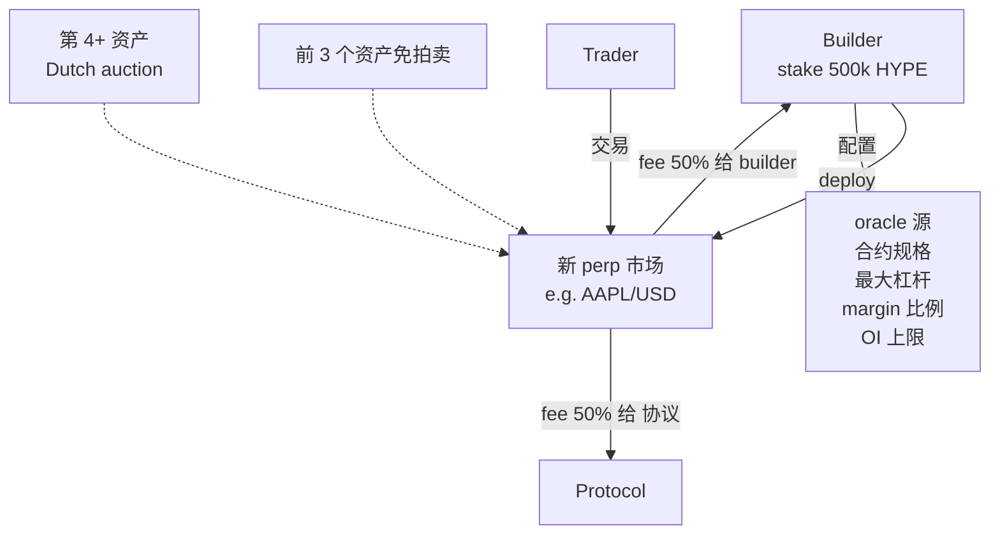

**HIP-3 关键参数**（来源：[HIP-3 Docs](https://hyperliquid.gitbook.io/hyperliquid-docs/hyperliquid-improvement-proposals-hips/hip-3-builder-deployed-perpetuals)、[Phantom HIP-3](https://phantom.com/learn/crypto-101/hyperliquid-hip-3)）：
- 押金：500k HYPE（既是 spam 防护也是 slashing 保证金）
- 第一批 3 个资产免拍卖；第 4+ 走荷兰拍卖
- builder 选 oracle、合约规格、最大杠杆、margin 比例、OI 上限
- builder 拿 50% 交易费，协议拿 50%

**2026 数据**（来源：[Hyperliquid Tokenized Futures $1.2B](https://www.coindesk.com/markets/2026/03/10/hyperliquid-s-permissionless-market-smashes-usd1-2-billion-in-open-positions-as-oil-and-equity-futures-boom)、[FalconX HIP-3](https://www.falconx.io/newsroom/the-transformational-potential-of-hyperliquids-hip-3)）：
- 累计交易额 > $25B
- 7.5 万+ 独立 trader 用 HIP-3 市场
- 2026-01 OI 一个月从 $260M 涨到 $790M
- **品类爆发**：商品类（白银 perp 单日峰值 ~$10亿）、股票（AAPL、TSLA）、油气、农产品

### 20.4 HLP：社区 LP vault

Hyperliquid HLP 是社区拥有的 vault。100% 社区拥有、0 协议费、所有交易费 100% 返还给 depositor。**截至 2026Q1 的 OI ~$7.5B、日成交峰值 $10-15B**——是 perp DEX 龙头。

### 20.5 HIP-3 builder 实战：怎么部署一个 perp 市场

假设你想在 Hyperliquid 部署 "AAPL/USD perp"（首例股票 perp），步骤：

1. **stake 500,000 HYPE**（按 2026-04 价 ~$30，押金 ~$15M——非小数目）。
2. **选 oracle 源**：Pyth + Chainlink Data Streams 双源聚合。
3. **配合约规格**：
   - Tick size：0.01（每 tick $0.01）
   - Lot size：1（最小 1 股）
   - Max leverage：10x
   - Margin ratio：10% 维持保证金
   - OI cap：$50M（初始保守）
4. **过 builder auction**：第 1-3 个资产免拍卖，第 4+ 走荷兰拍。
5. **上线后**：
   - fee 50% 给你（builder），50% 给协议。
   - 你需要监控 oracle 异常、slashing condition 触发。
   - 如果错配 oracle 或恶意操纵，500k HYPE 押金会被 slash。

**风险**：没有做市能力会"流动性死亡"，但 500k HYPE 已质押。实际要求 builder 自做市或邀请专业 MM（如 Wintermute）。

### 20.6 dYdX v4：另一条 CLOB 路线

**Cosmos appchain** 路线：订单簿在共识层，~60 个 validator 共同维护，DYDX 做 staking + governance。**优势**：完全去中心化。**劣势**：matching 性能低于 Hyperliquid（HyperBFT 优化更激进）。

### 20.7 思考题

1. Hyperliquid HIP-3 让任何人 stake 500k HYPE 部署 perp 市场。如果 builder 用错 oracle 导致市场出现严重错价，HYPE 押金会被 slash 吗？怎么 slash？
2. HIP-2 自动 LP 给市场提供"基础流动性"。这种"协议级做市"和 GMX HLP 有什么本质差别？
3. Hyperliquid 把 matching engine 做进共识层，这种"应用专用链"的思路与 Cosmos appchain 有什么相同和不同？

---

## 第 21 章：dYdX v4 / Synthetix V3 / Aevo / 期权（Lyra / Premia）

### 21.1 dYdX v4

见第 20.6 节。2025 年新增 isolated margin 和 token incentive 模型改版。

### 21.2 Synthetix V3：模块化衍生品

**核心设计**：通用化抵押 vault——任何代币都能作为 margin 投入 perpetual 市场。

**2025-Q4 重返主网**：Synthetix V3 在 Optimism / Base 之外重新部署到以太坊主网，支持 sUSDe / cbBTC / wstETH 多种 margin。来源：[Synthetix 多抵押](https://blog.synthetix.io/multi-collateral-margin-on-synthetix-mainnet/)。

```mermaid
flowchart LR
    LP[LP] -->|deposit sUSD/sUSDe/wstETH| V[V3 Core Pool]
    V -->|liquidity| Markets[Perp / Options 市场]

    Markets --> Perp[Perps Market]
    Markets --> Spot[Spot Synth]
    Markets --> Options[Options]

    LP -->|wraps own debt| Debt[Synthetic Debt Position]
```

### 21.3 Aevo：永续 + 期权综合

Aevo 是 OP Stack L2 上的"永续 + 期权综合所"。2026Q1 OI ~$15M、TVL ~$22M——已经过早期高峰。

### 21.4 链上期权：Lyra（Derive）/ Premia

#### 21.4.1 Lyra（已改名 Derive）

链上期权 AMM：LP 提供 vault，用 Black-Scholes + 隐含波动率（IV）surface 做定价。每笔交易"挤压"surface——磁场效应：交易方向附近的 IV 被影响最大。来源：[Lyra Volatility Surface](https://blog.amberdata.io/the-btc-volatility-surface-q1-2023-deep-dive-into-defi-options-lyra)。

#### 21.4.2 Premia V3：SVI / SSVI volatility surface

Premia 用一个独立的 Volatility Surface oracle 把 IV surface 当 DeFi primitive 提供。基于 SVI / SSVI（Stochastic Volatility Inspired，Gatheral 2004）参数化波动率曲面。来源：[Premia SSVI](https://docs.premia.blue/resources/research/ssvi)。

> **IV surface = Implied Volatility surface**。把"strike × maturity → 隐含波动率"画成 3D 曲面。直觉：股票/加密期权的价格不是单一波动率定价，而是 strike 越偏离现货价 IV 越高（"波动率微笑/skew"），到期日越远 IV 越平。

#### 21.4.3 期权 AMM 难点

IV 变化速度远超现货，LP 须实时调整 vega/gamma 敞口。链上期权 TVL 远小于永续，瓶颈是定价精度和资本效率。

### 21.5 思考题

1. Synthetix V3 让 LP 用 wstETH 做 margin。如果 wstETH 脱锚 5%，对 V3 的 perp 市场会有什么影响？
2. Lyra/Premia 链上期权和 Deribit（CEX 期权龙头）相比，劣势在哪？为什么 TVL 一直起不来？
3. 你设计一个"永续 + 期权 + 借贷"的 DeFi 综合所，最大的工程挑战是什么？

---

> **衍生品家族完结**。永续和期权的抵押品大量来自 **LST/LRT**——质押 ETH 的代币化权益。Part V 进入收益层：同一笔 ETH 如何通过再质押、利率切片、PoL 机制被叠加利用，以及如何辨别 Real Yield 与通胀泡沫。

## 第 22 章：LST 全集（Lido / Rocket Pool / Frax / cbETH / mETH）

### 22.1 LST 是什么

> **LST（Liquid Staking Token）**：把锁定的质押 ETH 变成可自由转账的 ERC-20。用户存 ETH → 协议委托验证者 → 用户拿 LST 代表质押权益+利息。

ETH PoS 质押年化 2.5-3.5%，但 ETH 被锁定。LST 让质押权益可以继续在 DeFi 里抵押、做 LP、做衍生品。

### 22.2 主流 LST 对比（2026-04）

| 协议 | 代币 | 计息方式 | TVL | 特色 |
|------|---|---|---|---|
| **Lido** | stETH / wstETH | rebase（每日重算余额） | ~$23B | 最大、流动性最深 |
| **Rocket Pool** | rETH | 汇率递增 | ~$2-3B | 去中心化，2700+ 节点运营商 |
| **Coinbase** | cbETH | 汇率递增 | ~$1B | 中心化但合规友好 |
| **Frax** | sfrxETH（双代币） | 汇率递增 | <$1B | sfrxETH 收益较高 |
| **Mantle** | mETH | 汇率递增 | ~$1B+ | 与 Mantle 链生态绑定 |
| **StakeWise** | osETH | 借鸡生蛋（用户自跑节点） | ~$300M | 抗 slashing 设计 |

数据来源：[DefiLlama Lido](https://defillama.com/protocol/lido)、[ETHFI vs Lido](https://blog.mexc.com/news/ethfi-price-2026-ether-fi-vs-lido-liquid-staking-7-8b-tvl-breakdown/)。

### 22.3 stETH vs wstETH：rebase 的工程坑

**stETH**：每天 rebase 更新所有持有者余额，1 stETH ≈ 1 ETH。

```solidity
// stETH 简化（实际是 Lido StETH 合约）
function balanceOf(address account) external view returns (uint256) {
    uint256 shares = _shares[account];
    return shares * totalPooledEther / totalShares;
    // totalPooledEther 每天因 staking yield 自增
    // 所以同样 shares 对应的余额自动增长
}
```

**问题**：DeFi 合约假设余额不变——stETH 进 LP 池 rebase 收益会被池子吞掉，借贷协议无法正确累积利息。

**wstETH（wrapped stETH）**：余额不变，wstETH/stETH 汇率单向上升。

```solidity
function getStETHByWstETH(uint256 wstETH) public view returns (uint256) {
    return wstETH * stETH.totalPooledEther / stETH.totalShares;
}
```

**结论**：DeFi 合约永远用 wstETH，不用 stETH（Aave V3 e-mode 亦如此）。

### 22.4 stETH 流动性脱锚（2022-06）

2022-06 三箭暴雷，强制砸盘 stETH，Curve stETH/ETH 池跌到 0.94——**流动性脱锚**，而非基本面问题（底层 ETH 仍 1:1 兑换，只是赎回需等几天）。此后所有借贷协议给 stETH 设 LT 70-80%。

### 22.5 Rocket Pool 与去中心化叙事

Rocket Pool 让任何人成为节点运营商（minipool），代价是协议复杂度高、TVL 增长慢。节点运营商除基础 staking 收益外还拿 RPL 奖励，需 stake 一定比例 RPL 作信用押金。

### 22.6 LST 在 DeFi 中的"二次组合"

```mermaid
flowchart LR
    L[1 ETH] --> S[stake → wstETH]
    S --> A[Aave 抵押 wstETH]
    A --> B[借出 USDC]
    B --> C[swap 成 wstETH]
    C --> A
    Note1[循环 3-5 次<br/>e-mode 93% LTV]

    S --> P[Pendle 切片]
    P --> PT[PT-wstETH<br/>固定收益 5%]
    P --> YT[YT-wstETH<br/>押注利率上涨]

    S --> CV[Curve stETH/ETH LP]
    CV --> CX[Convex stake]
    CX --> CRV[CRV + CVX 收益]
```

同一笔 ETH 同时用于 staking + 借贷杠杆 + 利率套利 + LP fee + emission。**风险叠加**：每多一层组合，单点故障传染面积翻倍（见 24.3 Kelp 事件）。

### 22.7 思考题

1. stETH 是 rebase，wstETH 不是。如果你做一个借贷协议接受 stETH 做抵押，会出什么 bug？至少列三个。
2. Rocket Pool 节点运营商必须 stake RPL 作为信用押金。这个机制相比 Lido"机构化运营商"的取舍是什么？
3. 如果 Lido 市占率超过 33%（PoS finality 阈值），以太坊网络会有什么治理担忧？

---

## 第 23 章：再质押（EigenLayer / Symbiotic / Karak / Babylon）

### 23.1 什么是 Restaking

> **Restaking（再质押）**：把已质押的 ETH（或 LST）再质押给其它协议（AVS，Actively Validated Service），换取额外收益。

用同一笔 ETH 同时为主网和其它 AVS（DA 层、桥、appchain、AI co-processor 等）提供安全性，赚双份钱。**风险**：任一 AVS 的 slashing condition 触发即损失本金。

### 23.2 EigenLayer：始祖

```mermaid
flowchart LR
    U[用户存 ETH/stETH] --> E[EigenLayer]
    E -->|委托| O[Operator]
    O -->|opt-in| AVS1[AVS 1: EigenDA]
    O -->|opt-in| AVS2[AVS 2: AltLayer]
    O -->|opt-in| AVS3[AVS 3: Hyperlane]

    AVS1 -->|分发奖励| O
    AVS2 -->|分发奖励| O
    AVS3 -->|分发奖励| O

    AVS1 -.slashing condition 触发.-> O
    O -.被罚.-> E
    E -.传导损失.-> U
```

**EigenLayer slashing 在 2025-04-17 上线**（来源：[EigenLayer Slashing Live](https://www.coindesk.com/tech/2025/04/17/eigenlayer-adds-key-slashing-feature-completing-original-vision)）。

**2026 数据**（来源：[EigenLayer $19.5B Empire](https://blockeden.xyz/blog/2026/02/08/eigenlayer-restaking-empire-liquid-restaking-ethereum/)）：
- TVL ~$18-19.5B（峰值 $28.6B 后市场出清）
- 39+ active AVS
- 1900+ active operators
- 市占率 ~93.9%（restaking 类）

**关键改进**：operator 可限制对单个 AVS 的暴露，stake 被 unique attribution 到特定 AVS。

### 23.3 Symbiotic：模块化竞争者

2025-01 主网上线，定位 EigenLayer 的模块化竞争者。**核心差异**：Permissionless vault（无需 whitelist）；任意 ERC-20 抵押（USDC、BTC、各种 LRT 均可）；curator 管理 vault（Gauntlet 等专业风控公司）。

**架构**（来源：[Understanding Symbiotic Vaults](https://blog.symbiotic.fi/understanding-symbiotic-vaults/)、[LlamaRisk Symbiotic](https://llamarisk.com/research/current-state-of-symbiotic)）：

```mermaid
flowchart LR
    U[用户存任意 ERC-20] --> V[Symbiotic Vault<br/>curator 定义 slashing 逻辑]
    V --> AM[Accounting Module<br/>deposit/withdraw]
    V --> SM[Slashing Module<br/>per-network 规则]
    V --> DM[Delegation Module<br/>capital → networks/operators]

    DM --> Op[Operators]
    Op --> N1[Network 1: oracle]
    Op --> N2[Network 2: bridge]
    Op --> N3[Network 3: appchain]

    N1 -.slash request.-> SM
    SM -.veto by resolver.-> SM
    SM -.execute slash.-> V
```

**2026 状态**：vault 数已 70+ 个，覆盖 oracle、DA、桥、appchain、Bitcoin-native services。Gauntlet 在 Symbiotic 上推出 "Restaking Vaults" 系列。

### 23.4 Karak：Universal Restaking

Karak 由 Andalusia Labs 开发，主张"任何资产都能 restake、任何网络都能受益"。Karak V2 Mainnet Phase 1 已上线（[Karak V2 launch](https://x.com/Karak_Network/status/1847048480428380424)）。TVL（2024 末/2025 初）约 $740M，是 EigenLayer 之后第二大。

**与 EigenLayer/Symbiotic 差异**：Karak 把 restaking 抽象到 universal layer，**自带 L2（Karak L2）** 把 restaking 应用直接跑在自家 L2 上，简化开发体验。

### 23.5 Babylon：BTC restaking

Babylon 让 BTC 不离开比特币原链就能 stake。机制（来源：[Babylon staking](https://babylonlabs.io/learn/what-is-bitcoin-staking)、[Figment Babylon 101](https://docs.figment.io/docs/btc-staking-101)）：

```mermaid
flowchart LR
    BTCH[BTC holder] -->|UTXO 锁定<br/>EOTS one-time signature| Babylon[Babylon Genesis L1]
    Babylon -->|finality provider 签名| PoS[PoS 链<br/>e.g. Babylon-secured chains]
    PoS -->|奖励 给 finality provider| FP[Finality Provider]
    FP -->|按 stake 比例分配| BTCH

    FP -.如果两次签同 height.-> EOTS[EOTS 提取私钥]
    EOTS --> Slash[BTC UTXO 被 slash]

    Babylon -.每小时 timestamping.-> BTC[BTC 主链]
```

**核心机制**：
- **EOTS（Extractable One-Time Signature）**：基于 Bitcoin Schnorr 签名构造的可提取一次性签名。如果一个 finality provider 在同一 height 签了两个不同 block，两个 Schnorr 签名能数学组合提取出 FP 的私钥——**即 slashing**。
- **Bitcoin timestamping**：Babylon 链每小时把状态 commit 到 Bitcoin 主链（防 long-range attack）。
- **Dual-quorum**：Babylon Genesis 上约 60 个 finality provider，stake BTC 提供 finality。

**2026 状态**：Babylon Genesis 主网运行中，TVL ~$5B，BTC LST 协议 Lombard（LBTC）等大量集成。

### 23.6 思考题

1. EigenLayer operator 同时跑 5 个 AVS。如果其中一个 AVS 触发 slashing，operator 的本金损失是只针对那一个 AVS 还是全部？
2. Symbiotic 的 resolver 可以 veto slash request。这种"人为 review"和 EigenLayer 的"自动 slash"哪个更安全？
3. Babylon 用 EOTS 实现 BTC slashing。如果 finality provider 不签任何 block（lazy）而非双签，怎么惩罚？

---

## 第 24 章：LRT 全集 + Kelp 2026-04 事件复盘

### 24.1 LRT 是什么

> **LRT（Liquid Restaking Token）**：把已再质押的 ETH 权益代币化。用户委托 ETH/stETH 给 LRT 协议 → 协议作为 operator 接管 AVS slashing 风险 → AVS 奖励聚合后分给 LRT holder。

LRT 把"再质押的复杂性"打包成单个代币——用户买进 ezETH/eETH 自动暴露给一篮子 AVS，但不一定知道协议挂了多少 AVS 及其 slashing condition。

### 24.2 主流 LRT（2026-04）

来源：[Restaking 2026 Guide](https://www.dextools.io/tutorials/what-is-restaking-eigenlayer-etherfi-complete-guide-2026)、[The Block LRT 总量](https://www.theblock.co/post/285822/liquid-restaking-platforms-jump-to-near-8-billion-in-total-value-locked)、[Best Liquid Restaking 2026](https://beincrypto.com/top-picks/best-liquid-restaking-protocols/)。

| 协议 | 代币 | TVL | 特色 |
|------|---|---|---|
| **ether.fi** | eETH / weETH | ~$3.2B（一说 $7.8B 含 vault TVL） | LRT 龙头，weETH 是借贷接受度最高的 LRT |
| **Renzo** | ezETH | ~$1-2B | EigenLayer 重仓 |
| **Kelp DAO** | rsETH | $740M（2026Q1） | 多 LST 抵押，**2026-04 桥事故** |
| **Puffer** | pufETH | ~$1.3B | "anti-slashing" 软件，Anchorage Digital 集成机构 mint |
| **Swell** | swETH / rswETH | ~$265M | 早期 LRT 之一 |
| **Mantle** | mETH（也是 LST） | ~$1B+ | Mantle 链生态 |

**weETH 数据**（来源：[ETHFI Price Prediction 2026](https://blog.mexc.com/news/ethfi-price-2026-ether-fi-vs-lido-liquid-staking-7-8b-tvl-breakdown/)）：
- weETH 链上市值 $5,666,653,038（2026-04-21）
- LRT 类深度第一、被借贷协议接受度第一
- Optimism Superchain 集成（2026-02）

### 24.3 Kelp DAO 2026-04 事件完整复盘

> **审稿注（2026-04-29）**：本节为 hypothetical DVN compromise scenario 复盘，审稿时点尚无法在公开渠道独立确认全部事实/金额/治理动议（[需作者核实]）。引用见末尾链接，但读者应将本节视作架构推演与 incident-response 训练材料，而非 final post-mortem。

**时间线**：
- **2026-04-18**：Kelp DAO 跨链桥被攻击，攻击者铸造 ~$292M rsETH（实际无对应抵押）。
- **2026-04-19**：攻击者用伪造 rsETH 在 Aave V3 抵押借走 wETH。Aave 出现 ~$196M 坏账集中在 rsETH/wETH 配对。Aave 紧急把 rsETH LT 调到 0、暂停 borrow。Aave TVL 单日跌 $6.6B、AAVE 代币跌 16%。
- **2026-04-20**：Aave 发 [rsETH Incident Report](https://governance.aave.com/t/rseth-incident-report-april-20-2026/24580)。LDO 代币跌 19%，因为市场担忧 stETH 也通过 LayerZero 接入跨链桥。
- **2026-04-22 至 23**：Aave 召集 DeFi 同盟（Sky、ether.fi 等）讨论联合救援。Lido 治理提议拨 $5.8M stETH 帮 Kelp 弥补部分坏账（来源：[Lido proposes 5.8M stETH](https://www.theblock.co/post/398691/lido-proposes-5-8-million-staked-eth-back-kelp-exploit-shortfall)）。

**根因链路**（来源：[Blockaid LayerZero DVN Compromise](https://www.blockaid.io/blog/how-a-single-layerzero-dvn-compromise-drained-292m-from-kelpdao)）：

```mermaid
flowchart TD
    A[Kelp 桥配置 1-of-1 DVN<br/>不是 X-of-Y-of-N] --> B[DVN 私钥被攻陷]
    B --> C[攻击者签发<br/>Ethereum 侧 rsETH 铸造消息]
    C --> D[Ethereum 侧合约<br/>验证 1-of-1 DVN 签名通过]
    D --> E[$292M rsETH 凭空铸造]
    E --> F[攻击者抵押到 Aave V3]
    F --> G[借走 wETH]
    G --> H[Aave 坏账 $196M]
    H --> I[Aave TVL 跌 $6.6B<br/>恐慌传导]
    I --> J[ezETH/pufETH 等所有 LRT<br/>被一并打折扣]
```

### 24.4 LayerZero V2 DVN 安全模型

来源：[LayerZero V2 Docs](https://docs.layerzero.network/v2)、[LayerZero V2 Deep Dive](https://medium.com/layerzero-official/layerzero-v2-deep-dive-869f93e09850)。

LayerZero V2 把跨链消息分成三个独立角色：
- **Endpoint**：消息入口/出口，每条链上一个不可变合约。
- **DVN（Decentralized Verifier Network，去中心化验证者网络）**：独立验证消息。
- **Executor**：在目标链上调用接收合约。

**X-of-Y-of-N 安全模型**：每个应用可以指定"必须 Y 个必选 DVN 都签 + N 个可选 DVN 中任 Z 个签"。例如典型配置 **2 of 3 of 5**：2 个必选 DVN 必须签 + 5 个可选 DVN 中任 3 个签。

**Kelp 配置错误**：1-of-1 DVN，单点被攻陷 → $292M 损失。此配置应在初始就被 LayerZero 和 Kelp 治理拒绝。

**OFT 标准（Omnichain Fungible Token）**：LayerZero V2 的代币跨链标准，2026 年支持 733+ omnichain 代币。

### 24.5 LRT 风险盘点

```mermaid
graph TD
    A[LRT 持有] --> R1[智能合约风险<br/>LRT 协议 bug]
    A --> R2[底层 LST 风险<br/>Lido/RocketPool 出问题]
    A --> R3[ETH PoS slashing<br/>底层验证者作恶]
    A --> R4[AVS slashing<br/>operator 在某 AVS 作恶]
    A --> R5[流动性脱锚<br/>赎回延迟期间]
    A --> R6[跨链桥风险<br/>Kelp 教训]
    A --> R7[借贷连带风险<br/>LRT 被用作抵押 → 引爆借贷]
```

### 24.6 思考题

1. 你买 1 ezETH 实际承担哪些风险？至少列 5 条。
2. LayerZero V2 的 X-of-Y-of-N 模型，X 太大（如 5 个必选）和 X 太小（如 1 个）各有什么问题？
3. Aave 接受 rsETH 抵押前，应该问哪些问题？画一张"跨链抵押资产 due diligence checklist"。

---

## 第 25 章：Pendle PT/YT 完整数学 + Berachain PoL + Real Yield 辨真伪

### 25.1 Pendle：把生息资产切片

把生息资产（stETH、aUSDC、yvUSD 等）拆成两个独立 token：

```mermaid
flowchart LR
    A[1 stETH<br/>未来利息 3% APR] --> SY[Pendle SY<br/>1 SY-stETH<br/>Standardized Yield]
    SY --> Split[切分到 maturity 2026-12]
    Split --> PT[1 PT-stETH-2026-12<br/>到期换 1 stETH]
    Split --> YT[1 YT-stETH-2026-12<br/>拿到期前所有利息]

    F[固收用户] -->|买 PT 折价 0.97| PT
    G[利率投机者] -->|买 YT 0.03| YT

    PT -.到期 2026-12-31.-> H[1 stETH 给 PT 持有者]
    YT -.到期前累积利息.-> I[利息给 YT 持有者]
```

> **PT（Principal Token）**：到期 1:1 兑回原始资产。买 PT 相当于买"零息债券"——当下折价买入、到期拿回本金。
>
> **YT（Yield Token）**：拿到 maturity 前的所有利息流。买 YT 押注未来利率上涨。

### 25.2 Pendle 不变量与 AMM 数学

来源：[Pendle AMM Docs](https://docs.pendle.finance/ProtocolMechanics/LiquidityEngines/AMM)、[Pendle AMM A Closer Look](https://medium.com/pendle/pendle-amm-a-closer-look-1364aee5105d)、[Pendle Mixbytes](https://mixbytes.io/blog/yield-tokenization-protocols-how-they-re-made-pendle)。

**核心不变量**：

$$
\text{SY\_value} = \text{PT\_value} + \text{YT\_value}
$$

任何时刻，1 SY 等于 1 PT + 1 YT（按价值，因为 PT/YT 是 1 SY 切出来的）。

**Pendle AMM 用 log-normal 曲线 + 时间衰减**：
- PT 价格随到期日临近**收敛到 1**（从 0.97 → 0.98 → 0.99 → 1）。
- YT 价格随到期日临近**衰减到 0**（从 0.03 → 0.02 → 0.01 → 0）。

**PY 索引机制（修正）**：流传甚广的"SY 索引下降时 PT 索引冻结、由 YT 吃损失"是简化模型，实际更精确的描述是：Pendle V2 中 **PT 在 maturity 收敛到 1 SY 的速率与 SY 实际利率脱钩**——PT 价格由 AMM 上的 implied APY 决定，而非由 SY 实际累积利率直接驱动。SY 实际利率下行/为负时，PT 不会简单"冻结"，而是 implied APY 与 underlying APY 的偏离扩大。

**LP 真正的 IL 来源**正是 **implied APY vs underlying APY 的偏离**：当市场预期与实际利率背离，LP 在 PT/SY AMM 上的两边敞口被重新定价——类似 Uni V3 在区间外只剩单边资产，但驱动量是利率而非现货价。YT 持有者吃利率下行的损失是结果，不是机制本身。详见 [Pendle AMM A Closer Look](https://medium.com/pendle/pendle-amm-a-closer-look-1364aee5105d) 与 [Pendle Mixbytes 分析](https://mixbytes.io/blog/yield-tokenization-protocols-how-they-re-made-pendle)。

### 25.3 Pendle 实战：固收 vs 投机

**用户 A（固收）**：买 PT-stETH-2026-12，0.95 stETH/PT，到期拿 1 stETH，8 个月折价收益 ~5.26%、折合年化 ~8%（高于 stETH 自身 3%）。**用户 B（投机）**：买 YT-stETH-2026-12，0.05 USDC/YT，未来 8 个月 stETH 实际收益 > 5% 时盈利——本质是杠杆做多利率。**用户 C（LP）**：提供 PT/SY 流动性，赚交易费 + 部分 YT 收益。

### 25.4 Pendle 2026 状态

- TVL：从 2023 年 $230M → 2024 年 $4.4B（LRT 浪潮）。
- **2026-01 升级 sPENDLE**（liquid staking）：缩短锁定期到 14 天（从 vePENDLE 4 年）；自动化奖励分发；80% 协议收入买回 PENDLE 给 sPENDLE holder。来源：[Pendle Review 2026](https://cryptoadventure.com/pendle-review-2026-yield-trading-pt-and-yt-mechanics-fixed-yield-and-spendle/)。

### 25.5 Berachain Proof of Liquidity（PoL）

Berachain 在 2025-02 主网上线。它的 **Proof of Liquidity** 把流动性激励和 PoS 共识绑死：

> **BERA**：gas + staking 代币（可转让）。
> **BGT（Berachain Governance Token）**：治理 + 收益代币（**soulbound 不可转让**）。

**机制**（来源：[Berachain BGT Docs](https://docs.berachain.com/learn/pol/tokens/bgt)、[Berachain Boost Validator](https://docs.berachain.com/learn/guides/boost-a-validator)、[Berachain Reward Vaults](https://docs.berachain.com/learn/pol/vaults)）：

```mermaid
flowchart LR
    Val[Validator<br/>stake BERA] -->|提议区块| Block[新区块]
    Block -->|发 BGT 通胀| RV[Reward Vault<br/>白名单 ERC-20 staking pool]
    LP[LP 在 RV 中存代币] -->|获得 BGT| LP
    LP -->|boost 验证者| Val
    Val -->|按 boost 比例获得更多 BGT| Val

    BGT -.1:1 burn.-> BERA[换 BERA<br/>不可逆]
    BGT --> Vote[治理投票]
    BGT --> CoreFees[Berachain BEX/HONEY Swap fee 分红]

    Bribes[项目方 incentive] -->|送给 Reward Vault| RV
```

**关键点**：
- BGT 不可转让，只能通过 Reward Vault 获得。
- BGT 持有者 boost 验证者增加其 block reward——这让"流动性提供"和"区块出块"绑死。
- BGT 1:1 burn 换 BERA（单向不可逆）。
- 验证者 commission ≤ 20%。
- Reward 在 3 天内线性分发给 LP。

**2026 数据**（来源：[Berachain $3.2B TVL March 2026](https://blockeden.xyz/blog/2026/03/28/berachain-proof-of-liquidity-1-6b-novel-consensus-defi-capital-efficiency/)）：
- TVL ~$3.2B（2026-03）
- **PoL v2（2025 末）**：33% 协议激励自动转换成 wBERA 分给 BERA staker，给 gas token "real yield"。

### 25.6 Real Yield vs Ponzi：怎么判断

来源：[Top 10 Real Yield 2026](https://ourcryptotalk.com/blog/top-10-real-yield-defi-tokens-2026)、[DeFi abandons Ponzi farms](https://cointelegraph.com/magazine/defi-abandons-ponzinomics-real-yield/)。

**Real Yield**：从真实业务（交易费、借贷利息、清算费）赚钱，通过 buyback/burn/staking 分给持有者。

**Ponzi yield**：靠新发代币支付 reward，价格涨 → APR 高 → 吸引新用户 → ...直到通胀跌穿。

**辨真伪三问**：① Yield 来源是 emission 还是 fee revenue？看 DefiLlama 的 "Revenue"（协议自留）而非 "Fees"（用户付出总成本）。② APR 多高？真实 yield 通常 2-15%，100%+ 几乎一定是 emission。③ 代币总供应是否在增？增意味着高 APR 是稀释购买力。

**2026 趋势**（来源：[Real Yield 2026 Calibraint](https://www.calibraint.com/blog/real-yield-decentralized-finance)）：
- 协议把"Revenue 分给 token holder 比例"从 2024 年 ~5% 提到 2026 年 ~15%。
- **Uniswap fee switch 激活**——开始 buyback + burn。
- **Aave** 治理改革，把 branded product revenue 直接路由给 DAO 和 token holder。

```mermaid
graph LR
    A[判断 Real Yield] --> B{Yield 来自？}
    B -->|交易费/借贷利息/清算费| C[Real Yield ✓]
    B -->|协议代币 emission| D[Ponzi 倾向 ✗]
    C --> E{支付方式？}
    E -->|stablecoin / ETH 真金| F[最稳]
    E -->|协议代币 buyback| G[次稳]
    D --> H{APR 是否大于市场无风险利率 + 风险溢价？}
    H -->|是| I[难以持续]
    H -->|否| J[低概率 Ponzi]
```

### 25.7 Pendle vs Convex vs Yearn：三家利率市场对比

| 维度 | Pendle | Convex | Yearn V3 |
|------|---|---|---|
| 核心抽象 | PT/YT 利率切片 | veCRV 治理聚合 | ERC-4626 vault + curator |
| 收益来源 | 利率交易 + LP fee | Curve emission + bribes | 多 strategy 自动复投 |
| 用户操作 | 买 PT/YT/LP | 存 LP token 拿 cvxCRV | 一键存款 |
| 复杂度 | 高（需懂 PT/YT 数学） | 中 | 低 |
| 锁仓需求 | 14 天（sPENDLE） | 16 周（vlCVX） | 无 |
| 适用 | 利率投机 + 固收 | Curve 生态最大化 | "无脑"复利 |

三家在不同抽象层提供利率市场服务：Pendle 最锐利（直接交易未来利率），Convex 是治理聚合二次提取器，Yearn 是普通用户一键复利入口。

### 25.8 思考题

1. 在 Pendle 上买 PT-stETH-2026-12 折价 0.95，相当于锁定多少年化？给完整推导。
2. 如果你预期未来 6 个月 ETH staking 收益从 3% 升到 5%，应该买 PT 还是 YT？为什么？
3. Berachain BGT 不可转让看似"反流动性"。这种设计的好处是？
4. 给一个 APR 80% 的 DeFi 协议，怎么 5 分钟判断它是 Real Yield 还是 Ponzi？

---

> **收益层完结**。无论 AMM、借贷还是再质押，所有链上操作都在区块中被排序——而排序权本身就是价值。Part VI 进入 MEV 全景，再到账户抽象对用户保护的意义，最后用风险全景和事故库为全模块收尾。

## 第 26 章：MEV 全景（Flashbots / MEV-Boost / BuilderNet / SUAVE / MEV-Burn）

### 26.1 MEV 是什么

> **MEV（Maximal Extractable Value）**：验证者/builder 通过对区块内交易"排序、插入、删除"能提取的额外价值，估算每年 $5-10B。

### 26.2 五类常见 MEV

**1. Sandwich（三明治）**：在受害交易前后各放一笔交易夹击 AMM 滑点。

```mermaid
sequenceDiagram
    participant V as 受害者
    participant Mp as Mempool
    participant A as 攻击者
    participant Pool as Uniswap Pool

    V->>Mp: 发 swap: 100 ETH → ~289K USDC（滑点忍受 1%）
    A->>Mp: 看到，构造 bundle
    A->>Pool: front-run swap: 50 ETH → USDC（拉高 ETH 价）
    V->>Pool: victim swap（实际到 ~285K USDC，滑点 1.4% 但仍 < 容忍）
    A->>Pool: back-run swap: USDC → ETH（卖回拿到 51 ETH）
    Note over A: 净赚 1 ETH ≈ $3000
```

**2. JIT LP**：大额交易前一区块提供流动性、后一区块撤回，赚走绝大部分手续费，挤压 passive LP。

**3. 清算 MEV**：HF<1 时立刻发清算 tx，有益 MEV。

**4. Cross-domain MEV**：L1/L2 价格偏离时跨链套利。

**5. Backrun 套利**：大额 swap 后反向交易拉回价格，有益 MEV。

### 26.3 Flashbots、PBS、MEV-Boost 架构

```mermaid
flowchart LR
    U1[User 1 tx] --> P[公共 Mempool]
    U2[User 2 tx] --> P
    U3[User 3 tx] --> P
    SR[Searcher<br/>套利/清算/sandwich] -->|监听| P
    SR -->|构造 bundle| R[Relay<br/>Flashbots Relay]
    R -->|forward bundle| B[Builder<br/>Beaverbuild / Titan / rsync / BuilderNet]
    B -->|出价竞标| MP[mev-boost middleware<br/>跑在 validator 上]
    MP -->|选最高出价 block| V[Validator<br/>提议区块]
    V --> EL[Execution Layer]
```

**角色**：Searcher（监听 mempool 找机会，构造 bundle）→ Builder（组装完整区块）→ Relay（中介验证出价）→ Validator（选最高出价 block）。**PBS**：出块权和打包权分离，builder 间出价竞争 MEV。**MEV-Boost**：PBS 的 PoS 实现。

**2025-2026**：90%+ 以太坊区块通过 MEV-Boost 构建，但前两大 builder（Beaverbuild、Titan）占 90%+ 区块。

### 26.4 BuilderNet（Flashbots 的去中心化转型）

**2024-11**：Flashbots + Beaverbuild + Nethermind 联合运营 **BuilderNet**——去中心化 builder 网络，跑在 TEE（Trusted Execution Environment）里共享 MEV、抵御中心化。

**2024-12**：Flashbots 把所有 builder、orderflow、refunds 迁到 BuilderNet，**关掉中心化 builder**。这是 MEV 历史上的关键转折。来源：[BuilderNet Flashbots](https://writings.flashbots.net/decentralized-building-wat-do)。

**2025-02 v1.2**：streamline operator onboarding，让更多团队加入 BuilderNet。

### 26.5 SUAVE：跨链 MEV-aware mempool

**SUAVE（Single Unifying Auction for Value Expression）**：Flashbots 下一代——builder 角色去中心化，跨多 domain 做统一 MEV-aware 隐私 mempool。订单加密发送，多个 builder 在 TEE 里竞标，执行时才解密（encrypted mempool 抵御 sandwich）。SUAVE Centauri 已发布，MEVM 为核心组件。

### 26.6 ePBS 与 MEV-Burn（路线图）

**ePBS（EIP-7732）**：把 PBS 从 Flashbots relay 内化进协议，减少信任假设。

**MEV-Burn**：要求 builder 烧掉一部分出价，把 MEV 利润转给协议本身制造通缩，让 MEV 收益和出块解耦，避免 validator 集中审查风险。归在 Ethereum 路线图 "The Scourge" 阶段。来源：[Ethereum PBS](https://ethereum.org/roadmap/pbs/)、[MEV burn—a simple design](https://ethresear.ch/t/mev-burn-a-simple-design/15590)。

### 26.7 Sandwich 利润数学

设 victim 要 swap $\Delta x$ token0 进 V2 池 (X, Y)，滑点容忍 $\epsilon$。攻击者前置 swap $\Delta x_a$ token0：

**第 1 步（attack front-run）**：池变为 $(X + \Delta x_a, Y - \Delta y_a)$，其中 $\Delta y_a = \frac{0.997 \Delta x_a Y}{X + 0.997 \Delta x_a}$。

**第 2 步（victim 受影响 swap）**：池变为 $(X + \Delta x_a + \Delta x, Y - \Delta y_a - \Delta y_v)$。

**第 3 步（attack back-run）**：用 $\Delta y_a$ token1 swap 回 token0，得 $\Delta x_a'$。

攻击者利润 = $\Delta x_a' - \Delta x_a - 2 \cdot \text{gas} - \text{builder tip}$。

**临界点**：当 victim swap 太小或滑点容忍太严时，front-run 后 victim tx revert（slippage 超出容忍）→ attack 失败、白付 gas。所以攻击者需要**精确建模 victim 滑点容忍**。

### 26.8 Solana MEV：Jito

Solana 的 MEV 生态以 **Jito** 为代表。Jito 提供 block engine（类似 Flashbots）+ JTO 代币 staking + MEV 分润。Jito 模式与以太坊 MEV-Boost 类似但更"中心化"——Solana 出块速度太快（400ms）让 PBS 复杂度更高。

### 26.9 实战：searcher 工作流

```python
async def main():
    async for pending_tx in ws_mempool():
        state = simulate_on_fork(pending_tx)
        opportunity = find_arbitrage(state) or find_liquidation(state)
        if not opportunity: continue
        bundle = build_bundle(pending_tx, opportunity.tx)
        result = flashbots.send_bundle(bundle, target_block=current_block + 1)
        log_metrics(result)
```

教学版 sandwich sim 在 `code/sandwich-sim/`，**仅用于研究**。生产 sandwich 是极内卷红海，多数辖区有合规风险。

### 26.10 思考题

1. 你写一个 sandwich bot 抢 100 ETH 的 swap，front-run 50 ETH。如果碰到另一 sandwich bot 在你 front-run 之后又来一笔，结果怎样？这种"sandwich on sandwich"的对抗叫什么？
2. SUAVE 用 TEE 跑 builder。TEE 失效（Intel SGX 历史多次被破解）的后果是什么？
3. MEV-Burn 把 builder 出价的一部分烧掉。这从经济学上让"MEV 越大、网络越通缩"——给两个负面副作用。

---

## 第 27 章：账户抽象 + 意图（4337 / 7702 / Permit2 / CowSwap / OIF）

### 27.1 ERC-4337：账户抽象

> **AA（Account Abstraction）**：让账户可以是任意智能合约，而非只能由私钥签名的 EOA。

ERC-4337 把 AA 做在共识层之外：

```mermaid
flowchart LR
    U[用户] -->|签 UserOperation| B[Bundler]
    B -->|打包多个 UserOp| EP[EntryPoint 合约]
    EP -->|验证签名| SA[SmartAccount]
    SA -->|执行 calldata| Target[目标合约]
    EP -->|向 paymaster 收费| PM[Paymaster]
    PM -.可代付 gas.-> EP
```

- **UserOperation（UserOp）**：用户签的"想做什么"声明；**Bundler**：打包 UserOp 发给 EntryPoint；**EntryPoint**：验证签名 + 调用 SmartAccount + 向 Paymaster 收费；**Paymaster**：代付 gas（USDC、dApp 余额、补贴）。

**好处**：社交恢复、batch 交易、第三方代付 gas、session key。**代价**：首次部署 SmartAccount 一次性 gas 几十美元。

### 27.2 EIP-7702：让 EOA 临时变成 Smart Account

Pectra 升级（2025-05-07）带来的 EIP-7702 是另一条路：**让现有 EOA 通过签名"临时附加"smart contract 代码**。

```mermaid
flowchart TB
    subgraph 7702 之前
        EOA1[EOA<br/>私钥签名] -->|只能调用| C1[合约]
    end

    subgraph 7702 之后
        EOA2[EOA] -->|发 Type 4 tx<br/>设置 delegation| D[delegated contract<br/>SmartAccount 代码]
        EOA2 -->|从此 EOA 也能 batch / session key / paymaster| Action[复杂操作]
    end
```

用户不需要部署新账户、不需要迁移资产。Circle 用 EIP-7702 + Paymaster 实现"用 USDC 付 gas"——用户从创建 EOA 那一刻起就能 gasless 交易。来源：[Circle EIP-7702 Paymaster](https://www.circle.com/blog/how-the-pectra-upgrade-is-unlocking-gasless-usdc-transactions-with-eip-7702)、[Alchemy EIP-7702](https://www.alchemy.com/blog/eip-7702-ethereum-pectra-hardfork)。

**EIP-7702 补充 ERC-4337**：4337 解决原生 smart wallet 体验，7702 解决存量 EOA 升级，两者结合让 batch + gasless + social recovery 成为默认。

### 27.3 Permit、ERC-2612、Permit2 三件套

| 标准 | 适用 | 工作方式 |
|------|------|---------|
| **ERC-2612** | 实现了它的 ERC-20 | 代币合约自带 `permit()`，EIP-712 签名授权 spender 后 transferFrom |
| **Permit2** | 任意 ERC-20（含无 ERC-2612 的 USDT/WETH） | 一次性 `approve(Permit2, MAX)`，之后签消息给 dApp 短期 allowance，支持 batch + 过期 |

> USDT、WETH、老 USDC 都没实现 ERC-2612，Permit2 提供统一签名层兼容所有 ERC-20。

**ERC-2612 示例**：

```solidity
DAI.permit(owner, spender, value, deadline, v, r, s);
DAI.transferFrom(owner, spender, value);
```

**Permit2 示例**（USDC 没有 ERC-2612 也能用）：

```solidity
USDC.approve(PERMIT2, type(uint).max);  // 一次性
PermitSingle memory permit = PermitSingle({
    details: PermitDetails({
        token: USDC,
        amount: 100e6,
        expiration: block.timestamp + 1 hours,
        nonce: 0
    }),
    spender: address(uniswapRouter),
    sigDeadline: block.timestamp + 1 hours
});
permit2.permit(owner, permit, signature);
```

来源：[Uniswap Permit2 GitHub](https://github.com/Uniswap/permit2)、[ERC-2612 EIP](https://eips.ethereum.org/EIPS/eip-2612)。

**最佳实践**：自家代币用 ERC-2612；第三方代币用 Permit2；intent 系统天然依赖 Permit2 nonce + 过期机制。

### 27.4 意图（Intent）：DeFi UX 的下一个范式

#### 27.4.1 从 swap 到 intent 的转变

**传统 swap**：用户必须指定 DEX、fee tier、滑点、deadline，错一步被 sandwich。**Intent**：只签声明 `{ sell: 1000 USDC, buy: ETH (>= 0.32), deadline: 2026-04-28 12:00 }`，Solver/Filler 网络找最优路径并保证执行价不差于下限。

#### 27.4.2 CowSwap：批量拍卖 + solver 竞争

```mermaid
flowchart LR
    U1[用户1<br/>卖 1 ETH 买 USDC] --> Batch[批次池]
    U2[用户2<br/>卖 USDC 买 ETH] --> Batch
    U3[用户3<br/>卖 USDT 买 ETH] --> Batch

    Batch -->|拍卖| S1[Solver 1<br/>方案: P2P 撮合 U1↔U2 + U3 走 Curve]
    Batch -->|拍卖| S2[Solver 2<br/>方案: 全部走 Uniswap]
    Batch -->|拍卖| S3[Solver 3<br/>方案: 1inch + Balancer 混合]

    S1 -->|surplus 最高，赢| Settle[结算合约执行]
    Settle -->|按 intent 价或更好| U1
    Settle --> U2
    Settle --> U3
```

**solver 经济学**（来源：[CowSwap Solver Docs](https://docs.cow.fi/cow-protocol/concepts/introduction/solvers)、[CowSwap Rewards](https://docs.cow.fi/cow-protocol/reference/core/auctions/rewards)、[CowSwap Auction Mechanism](https://brrrdao.substack.com/p/cow-protocol-part-3-auction-mechanisms?action=share)）：
- **Score** 用于排名和 reward = surplus + protocol fee（统一记分单位）。
- **Surplus 全归用户**：solver 找到比 limit price 更好的执行价，差额给用户而非协议。
- **Solver 周期奖励**：每周二 CowSwap 协议用 COW 代币奖励 solver。
- **Solver 担风险**：solver 出价时承诺执行价，如果实际执行差于承诺要补差。

**CoW AMM**：CowSwap 自家 zero-swap-fee AMM，专给 solver 对冲库存，首例 solver-friendly AMM。

#### 27.4.3 UniswapX、1inch Fusion、Bebop

- **UniswapX**：V4 之上的 intent 层，filler 竞标执行，走 V3/V4 或自己库存。
- **1inch Fusion**：1inch 的 intent 模式。**Bebop**：RFQ + intent。

#### 27.4.4 标准化：ERC-7521、ERC-7683、OIF

- **ERC-7521**：Generalized Intent 标准，定义 validity predicate 格式。
- **ERC-7683**：跨链 intent 标准，一个 intent 可在多链被解决。
- **OIF（Open Intents Framework）**：EF 2025-02 联合 30+ 团队（Arbitrum/Optimism/Polygon/zkSync）基于 ERC-7683 统一跨链 intent。

#### 27.4.5 Anoma / Khalani：跨链 intent 基础设施

- **Anoma**：把整条链改造成"intent machine"，validators 撮合 intent，2025-01 启动 devnet。
- **Khalani**：跑在 40+ 链的跨链 intent solver 基础设施。

### 27.5 思考题

1. EIP-7702 让 EOA 临时变 Smart Account。但 Type 4 tx 的 `authorization_list` 可以被任何人 replay 提交吗？怎么防？
2. CowSwap 的 batch auction 一次撮合几十个 intent。如果一个 solver 是恶意的，能不能针对某个特定用户偷偷给最差的解？协议怎么防？
3. UniswapX filler 凭什么愿意"垫付"——它的收益从哪来？
4. Permit2 的 batch 机制让你能一次签一组授权（USDC + USDT + DAI）。这有什么 UX 好处？有什么安全风险？

---

## 第 28 章：风险全景 + 12 大事故复盘 + AI × DeFi + 自审查

### 28.1 风险六大类

```mermaid
mindmap
  root((DeFi 风险))
    智能合约
      reentrancy
      access control
      arithmetic
      logic bug
      tick math 精度
    预言机
      闪电贷价格操纵
      集中度
      stale price
      manipulator-controlled feed
    经济模型
      算稳螺旋
      杠杆循环解杠杆
      funding rate 倒挂
      治理博弈不稳定
    桥/跨链
      multisig 私钥
      验证者权重不足
      proof 验证 bug
      replay
      DVN 配置错
    治理
      flash loan vote
      timelock 太短
      多签 phishing
      关键 key 单点
    监管 / 合规
      地址封禁
      Tornado Cash 制裁
      运营方 KYC 强制
      CEX 对手方冻结
```

### 28.2 12 大事故（按损失排序）

| # | 时间 | 协议 | 损失 | 类别 | 根因 |
|---|------|------|---|---|---|
| 1 | 2022-03 | **Ronin** | $625M | bridge | 5/9 multisig 被钓鱼（Sky Mavis 4 个 + Axie DAO 1 个） |
| 2 | 2022-05 | **Terra/UST** | $400亿+ | 经济模型 | 算稳死亡螺旋 |
| 3 | 2022-02 | **Wormhole** | $326M | bridge | Solana 端 sysvar 验证 bug |
| 4 | 2026-04 | **Kelp DAO** | $292M | bridge | LayerZero 1-of-1 DVN 单点被攻陷 |
| 5 | 2024-04 | **Drift** | $285M | 内部权限 | privileged access 被滥用（疑似 DPRK） |
| 6 | 2023-03 | **Euler V1** | $197M | 智能合约 | donateToReserves 没做健康检查 |
| 7 | 2022-08 | **Nomad** | $190M | bridge | trusted root 默认 0x00 = untrusted |
| 8 | 2022-04 | **Beanstalk** | $182M | 治理 | 闪电贷治理代币通过恶意提案 |
| 9 | 2021-10 | **Cream** | $130M | 预言机 | yUSD share-price 可被外部 donation 操纵 |
| 10 | 2023-07 | **Multichain** | $130M | 中心化运营 | CEO 在中国被带走，单点私钥失控 |
| 11 | 2022-10 | **Mango** | $116M | 预言机 | 三家小盘 CEX 现货价被同时拉高 |
| 12 | 2023-11 | **HTX/Heco** | $100M | 内部权限 | 操作员账户私钥泄露 |

**其它重要事故**：
- **2024-10 Radiant Capital $50M**：DPRK 钓鱼 PDF + 硬件钱包前端被篡改
- **2024-03 Munchables $62M**：内鬼，开发者团队是同一朝鲜人
- **2024-01 Orbit Bridge $81.5M**：CISO 离职前修改防火墙策略
- **2024-09 Penpie $27M**：reentrancy + 跨协议假设破裂
- **2023-11 KyberSwap $47M**：tick 边界精度灾难
- **2023-07 Curve $73M**：Vyper 编译器 bug
- **2020-02 bZx 两次 ~$954K**：DeFi 历史上第一次大规模 oracle manipulation

### 28.3 三个深度复盘

#### 28.3.1 UST 死亡螺旋（2022-05）

**机制根因**：UST 跌 → 套利者用 1 UST 换价值 $1 的 LUNA → 铸出的 LUNA 立刻被卖 → LUNA 价格跌 → 每 UST 换更多 LUNA → LUNA 供应爆炸——**死亡螺旋**。

**时间线**（来源：[Anatomy of a Run 哈佛](https://corpgov.law.harvard.edu/2023/05/22/anatomy-of-a-run-the-terra-luna-crash/)、[Terra-Luna ScienceDirect](https://arxiv.org/pdf/2207.13914)）：
- 2022-05-07：两大地址从 Anchor 提走 $375M UST。Curve 3pool 出现 UST/3CRV 卖压。UST 跌到 ~$0.972。
- 2022-05-09 至 10：LFG 卖 BTC 和 ~$480M USDT 护盘，无效。
- 2022-05-10 至 13：UST 跌到 $0.30、$0.10、$0.01。LUNA 从 $80 跌到 $0.0001。
- 2022-05-16：UST/LUNA 基本归零。LUNA 总供应从 7.25 亿炸到 70 亿。

**Do Kwon 后续**：2024-2025 在美国受审，因 $40B 崩盘被判 15 年。教训见第 5.5 节。

#### 28.3.2 Euler V1（2023-03）：donateToReserves

**攻击链**：
1. Euler 引入 `donateToReserves` 函数（修复一个更小的"first depositor" bug）。
2. 这个函数没做"健康检查"——你 donate 后不需要保证账户 HF 仍 > 1。
3. 攻击者闪电贷 30M DAI，10x 杠杆借出 100M eDAI。
4. 调用 `donateToReserves(100M eDAI)`——账户突然变"deeply insolvent"。
5. 用第二账户调 `liquidate(攻击者第一账户)`，触发激进 liquidation discount，第二账户拿走清算折扣对应资产。
6. 重复多次抽走 ~$197M（DAI、WBTC、stETH、USDC）。

**结局**：攻击者最终归还 ~$240M（多于偷的——团队在其 OpSec 失误中找到对话路径）。来源：[Euler Recovery Postmortem](https://www.euler.finance/blog/war-peace-behind-the-scenes-of-eulers-240m-exploit-recovery)、[Chainalysis Euler Analysis](https://www.chainalysis.com/blog/euler-finance-flash-loan-attack/)。

#### 28.3.3 Kelp DAO + LayerZero（2026-04）

详见第 14.4 节（Aave 视角）和第 24.3 节（LRT + LayerZero DVN 完整复盘）。核心教训：单 DVN 配置是单点故障；借贷协议接受跨链资产抵押必须审计桥安全模型。

### 28.4 更多事故详解

#### 28.4.1 Ronin 2022-03（$625M）：multisig 钓鱼

Sky Mavis 控制 9 个 validator 中的 4 个，加 Axie DAO 1 个 = 5/9 阈值。攻击者：① LinkedIn 假招聘 PDF 钓鱼，拿到 Sky Mavis 4 个 validator 私钥；② 发现 2021-12 未撤销的"gas-free"白名单 backdoor，自动签到 Axie DAO 第 5 个；③ 单次提走 173,600 ETH + 25.5M USDC = ~$625M，**6 天后**才被发现（一用户提 5,000 ETH 失败）。

来源：[CoinDesk Ronin Hack](https://www.coindesk.com/tech/2022/03/29/axie-infinitys-ronin-network-suffers-625m-exploit)、[Coinbase Ronin Analysis](https://www.coinbase.com/bytes/archive/axie-infinity-625-million-dollar-hack-explained)。

**结局**：Sky Mavis 从 Binance 募 $150M 赔偿，Ronin 三次审计后 2022-06 重开。**教训**：多签不够分散，过期配置必须及时清理。

#### 28.4.2 Wormhole 2022-02（$326M）：Solana sysvar 验证 bug

攻击链：① Wormhole 用 deprecated `load_instruction_at` 从 sysvar 读 Secp256k1 验证结果，此函数**不验证 sysvar 账户真实性**；② 攻击者制造 fake sysvar account（预填"已验证"字节序列）；③ verify_signatures 信了 fake sysvar；④ 铸造 120,000 wETH（~$326M）桥回 Ethereum 抽走真 ETH。

来源：[Halborn Wormhole](https://www.halborn.com/blog/post/explained-the-wormhole-hack-february-2022)、[Chainalysis Wormhole](https://www.chainalysis.com/blog/wormhole-hack-february-2022/)。

**结局**：Jump Crypto 自掏 $326M 补损，2023-02 counter-exploit 找回 ~$140M。**教训**：deprecated API 是攻击面；"系统级"信任入口必须严格验证账户身份。

#### 28.4.3 Nomad 2022-08（$190M）：trusted root 默认零值

路由升级里把 trusted root 设为 `0x00`，而 `0x00` 是 untrusted root 的默认值——所有消息自动被当成"已验证"。

```mermaid
sequenceDiagram
    participant A as 第一个攻击者
    participant Bridge as Nomad Bridge
    participant Mp as Mempool
    participant Crowd as 300 个跟风者

    A->>Bridge: 调用一个普通"已验证"消息 + 改 receiver = 我
    Bridge->>A: 兑现 ~$1M
    A->>Mp: tx 公开
    Crowd->>Mp: 看到 tx 简单，复制
    Crowd->>Bridge: 各自改 receiver = 自己
    Bridge->>Crowd: 都兑现
    Note over Bridge: 150 分钟内 ~300 个地址 drain ~$190M
```

来源：[Halborn Nomad](https://www.halborn.com/blog/post/explained-the-nomad-hack-august-2022)、[Mandiant Nomad](https://cloud.google.com/blog/topics/threat-intelligence/dissecting-nomad-bridge-hack)。~$37M 被白帽归还。**教训**：默认值是攻击面，未初始化 root 不能等于零值。

#### 28.4.4 Curve 2023-07（$73M）：Vyper 编译器 0-day

详见第 9.5 节。**教训**：协议安全不只取决于自家代码，编译器/运行时/外部调用约定都是攻击面。

#### 28.4.5 Penpie 2024-09（$27M）：跨协议假设破裂

Penpie 在 Pendle 之上做收益聚合。攻击链：
1. 攻击者创建一个**伪造的 Pendle Market**（用伪造的 SY Token）。
2. 攻击者从 Balancer 借 agETH / rswETH / egETH / wstETH 闪电贷。
3. 攻击者把闪电贷资产存入伪造的 SY 合约。
4. 调用 Penpie 的 `harvest` 时，伪造 SY 在 callback 里 reentrancy 进入 Penpie 自己——**奖励账本被反复更新**。
5. 攻击者把虚假 reward 兑现，掏空 $27M。

**根因**：Penpie 信任了 Pendle 上所有市场，未验证是否来自治理白名单——跨协议假设破裂。来源：[Three Sigma Penpie](https://threesigma.xyz/blog/exploit/penpie-reentrancy-exploit-analysis)。

#### 28.4.6 Radiant Capital 2024-10（$50M）：DPRK 钓鱼 + 硬件钱包前端篡改

Radiant Capital 在 Arbitrum 是大借贷协议。2024-10-16 损失 $50M。

**攻击链**：① 假冒"前合约工"Telegram PDF 钓鱼，感染开发者 macOS；② 恶意软件篡改硬件钱包前端显示——签名时屏幕显示正常 tx，实际签恶意 tx；③ 三个多签 signer 被同样钓鱼；④ 攻击者控制 `transferFrom` 权限，掏空用户授权资产。

**归因**：Mandiant 归因 UNC4736（DPRK APT）。**教训**：① 主机被感染时硬件钱包屏幕可被篡改；② 多签 + 地理分布仍可被同一波 APT 破；③ air-gapped 离线设备 + 二次设备验证是更高级别防御。

来源：[Halborn Radiant](https://www.halborn.com/blog/post/explained-the-radiant-capital-hack-october-2024)、[OneKey Radiant 详解](https://onekey.so/blog/ecosystem/one-pdf-50m-gone-the-radiant-capital-hack-explained/)。

#### 28.4.7 Beanstalk 2022-04（$182M）：闪电贷治理攻击

闪电贷借大量治理代币 → 通过"金库转给攻击者"的提案 → 还贷。**根因**：无 timelock，治理权重按当下持币而非 ve 锁仓计算。**教训**：必须用 timelock + 长期锁仓权重过滤闪电贷攻击。

#### 28.4.8 KyberSwap Elastic 2023-11（$47M）

详见第 7.7 节。tick 边界舍入方向错，TVL 从 $71M → $3M。

#### 28.4.9 bZx 2020-02（~$954K）

详见第 18.5 节。闪电贷在单个 DEX 拉高 sUSD 现货价，高估值抵押借 ETH——DeFi 历史首次大规模 oracle manipulation via flash loan。

#### 28.4.10 Mango Markets 2022-10（$116M）

详见第 18.5 节。$5M 同时在三家小盘 CEX 拉高 MNGO 1000%+，借走 $110M+。法律：2024 有罪判决被 2025 Rule 29 撤销，检方上诉中。

#### 28.4.11 Multichain 2023-07（$130M）：CEO 跑路

2023-05-21 CEO Zhaojun 被带走，电脑/手机/硬件钱包/助记词全被没收。2023-07-07 异常转账 ~$125M，2023-07-13 其妹妹也被带走（曾尝试转移 ~$220M），2023-07-14 永久关闭。

**根因**：私钥控制权高度集中在 CEO 单人——事实上的中心化跨链桥。来源：[Bloomberg Multichain](https://www.bloomberg.com/news/articles/2023-07-14/crypto-bridge-multichain-shuts-down-says-chinese-police-arrested-ceo)。

#### 28.4.12 Munchables 2024-03（$62M）：内鬼

Blast 链 GameFi，开发团队 4 人都是同一朝鲜人，其中一个把自己余额改成 1,000,000 ETH 取出。ZachXBT 公开追踪 + 社区压力后攻击者归还全部 $62.5M。来源：[Halborn Munchables](https://www.halborn.com/blog/post/explained-the-munchables-hack-march-2024)。

#### 28.4.13 共性教训：五大铁律

**铁律 1：所有外部输入都是攻击面**——oracle、跨链消息、参数、ERC-20 余额、编译器输出 bytecode。工具链可能有 0day（Curve 2023-07）。

**铁律 2：默认值必须安全**——未初始化的 root 等于零值是灾难（Nomad）。设计 invariant 时问"传 0 / 空数组 / 默认地址会怎样？"。

**铁律 3：跨协议假设必须显式验证**——永远不要假设你交互的合约符合你预期的不变量（Penpie：Pendle 允许无许可创建市场）。

**铁律 4：私钥即权力**——Ronin/Multichain/Radiant/Orbit/HTX 5 个事件都是私钥被攻陷。**air-gapped 离线设备 + 二次设备验证**是最高级别防御。

**铁律 5：经济模型大于代码**——UST/Beanstalk/Mango 都是代码按设计运行但经济假设破裂。永远问"极端行情下这个机制还能维持吗？"。

### 28.5 AI × DeFi

#### 28.5.1 AI 用得到的地方

**Mempool 监控与 MEV 检测**：实时分析 pending tx 的攻击意图，识别 sandwich、清算先发、合约异常调用。Blocknative、bloXroute、EigenPhi 等服务背后有 ML pipeline。

**风险参数优化（Gauntlet / Chaos Labs）**：跑数十万条 agent-based simulation（历史价格 + 合成行情），看不同参数下的最大坏账概率，输出 LT/LB/borrow cap 推荐。Chaos Labs 更进一步，Risk Oracle 把 ML 推荐参数实时上链。

```mermaid
flowchart LR
    H[历史价格<br/>+用户行为日志] --> S[10万条<br/>agent-based simulation]
    M[market shock 注入<br/>BTC -50% / ETH -70% / depeg] --> S
    S --> R[每组参数的 VaR / 坏账概率]
    R -->|挑最优 Pareto front| Rec[参数推荐]
    Rec --> Gov[治理提案]
    Gov --> On[on-chain 参数更新]
```

**清算风险打分**：给定借款人的 HF、抵押组合、历史行为（被清算次数、还款及时性、地址年龄），ML 估计未来 24/72 小时被清算的概率。清算 bot 用此排序优先级。

**Intent solver 的优化求解**：CowSwap / UniswapX 的 solver 在路由空间里做组合优化。复杂的 solver 用 RL（reinforcement learning）或 MILP（mixed-integer linear programming）求解多池路由 + gas + 滑点的全局最优。

**LLM in intent**：2025-2026 新兴方向——把自然语言意图（"把我的 ETH 换成最稳的高息组合"）翻译成结构化 intent。Anoma、aori 在做。

**反欺诈与黑名单**：链上行为聚类找出洗币地址、识别钓鱼合约。Chainalysis、TRM Labs、Elliptic 的核心引擎都是 ML。Drift 2024-04 hack 后 Elliptic 在几小时内归因到 DPRK，靠的是地址 cluster 历史行为模式。

#### 28.5.2 AI 暂时跨不过的边界

1. **经济学建模**：ML 给"过往分布下的概率"，给不了"分布外的尾部"。UST 倒下前所有 ML 模型都给出"低风险"。
2. **形式化验证**：LLM 能辅助写 invariant 测试，但不能替你证明"协议在所有输入下都安全"。Certora、Halmos、Foundry invariant 才是主线。
3. **治理判断**：是否提高 LT、是否封禁地址——价值判断没有可训练的最优解。

**工程师姿态**：AI 是放大判断的工具，不是替你判断的黑盒。

### 28.6 自审查清单

- [ ] V4 hooks（2025-01-30 主网、5000+ 池、singleton/flash accounting）是否理解？
- [ ] V4 主流 hook 实现（Bunni、Angstrom、Detox、TWAMM）的设计差异？
- [ ] Permit、ERC-2612、Permit2 三者的区别能不能在 30 秒内说清？
- [ ] LST（stETH/rETH）和 LRT（eETH/ezETH）的差异、为什么 slashing 模型不同？
- [ ] Intent-based DeFi（CowSwap、UniswapX、ERC-7521、ERC-7683 OIF）的核心抽象？
- [ ] 真实事故里 bZx、Cream、Mango、Euler V1、Curve 2023、Penpie、Radiant、KyberSwap、Munchables、HTX、Orbit、Multichain、Drift、Wormhole、Nomad、Ronin、UST、Kelp 各自的根因？
- [ ] EIP-7702（Pectra 2025-05-07 上线）和 ERC-4337 的关系？
- [ ] Aave Umbrella、Compound III Comet、Morpho Blue 的设计差异？
- [ ] crvUSD LLAMMA 软清算 vs 传统硬清算的取舍？
- [ ] MEV-Burn / ePBS / EIP-7732 / SUAVE / BuilderNet 这些 roadmap 词汇是否在脑里有图？
- [ ] AI 在 DeFi 里"能做"和"不能做"的边界？
- [ ] ERC-4626 inflation attack 的三种防御方案？
- [ ] Ethena USDe delta-neutral 的底层风险有哪些？
- [ ] Pendle PT/YT 的固收套利和利率投机怎么操作？
- [ ] Berachain Proof of Liquidity 相比传统 PoS 有什么取舍？
- [ ] GMX V2 GM 池、Hyperliquid HIP-3 builder-deployed perp 的机制？
- [ ] Restaking 三家（EigenLayer / Symbiotic / Karak）+ Babylon BTC restaking 差异？
- [ ] Real Yield vs Ponzi 的 5 分钟判断方法？
- [ ] LayerZero V2 X-of-Y-of-N DVN 安全模型？

打不出勾的回到对应章节再读源码或文档。

#### 28.6.1 工程师自评分

每条按 1-5 分自评：
- **架构理解**（5 分以上要求）：能否在白板上 5 分钟画清楚 DeFi 四层 + 主流协议归属？
- **数学推导**（4 分以上要求）：能否手推 V2 swap 公式 / IL 公式 / V3 √P 坐标 / Curve StableSwap 不变量？
- **源码精读**（4 分以上要求）：能否解释 UniswapV2Pair.swap 的每一行？V4 hook 地址前缀编码？
- **事故复盘**（4 分以上要求）：能否给 12 大事故各画一张攻击链时序图？
- **风险识别**（5 分以上要求）：拿到一份新协议代码，能否在 1 小时内列出 10 个潜在攻击面？
- **经济建模**（3 分以上要求）：能否估算 LP 年化收益 vs IL？算 Aave 杠杆循环净 carry？

**总分**：
- 28+ 分：你已经是 mid-level DeFi 工程师，可以参与协议团队代码 review。
- 21-27 分：senior-junior，建议再过一遍 Ch6/12/18/26 + 跑完 `code/` 全部项目。
- < 21 分：建议从 Ch1 重读，重点做思考题。

#### 28.6.2 三个常被忽视的"次级风险"

**次级风险 A：协议关停/跑路** -- 对策：看治理代币持有分布、多签 signer 身份、是否有 emergency shutdown（参考 28.4.11 Multichain）。

**次级风险 B：审计/风控利益冲突** -- Gauntlet 同时是 Aave 风控方和治理持币方。对策：交叉对照多家审计（OpenZeppelin / Trail of Bits / Spearbit / Zellic / Cyfrin）。

**次级风险 C：监管转向** -- Tornado Cash 制裁、SEC vs Uniswap Wells Notice、GENIUS Act / STABLE Act。对策：协议设计时考虑"最坏情况下能否 pause / 迁移 / 分叉"。

### 28.7 推荐进阶阅读

协议一手文档见各章节"来源"链接。

**事故复盘（必读）**：
- [rekt.news 时间线](https://rekt.news/leaderboard/)
- [ChainSec DeFi Hacks](https://www.chainsec.io/defi-hacks)
- Halborn 事故复盘系列
- Trail of Bits / OpenZeppelin / SlowMist 审计报告

**学术 / 研究**：
- [DeFi MOOC (Berkeley)](https://defi-learning.org/)
- [Paradigm Research](https://www.paradigm.xyz/writing)
- [Flashbots Writings](https://writings.flashbots.net/)
- [Gauntlet / Chaos Labs Research]

**数据 / 仪表盘**：
- [DefiLlama](https://defillama.com/)
- [Token Terminal](https://tokenterminal.com/)
- [Artemis](https://artemisanalytics.com/)
- [Dune Analytics](https://dune.com/)（自定义查询）

---

## 结语

读完 28 章，你应该能：
1. 拿到任何 DeFi 合约，一小时内识别层级、不变量、攻击面、经济假设。
2. 跑通 fork mainnet 复现清算/swap/ERC-4626 deposit。
3. 看懂 rekt.news 任意事故复盘。
4. 读懂 Paradigm/Flashbots/Gauntlet 研究博客。

**第一性原理不变**：上层依赖下层不变量；假设破裂等于事故；源码不撒谎；真实价值 = fee 而非 emission。

下一步：模块 07（L2 与扩容）理解 DeFi 的物理基础设施，模块 08（零知识证明）理解隐私 DeFi 的下一代语言。

> **真正的去中心化不是没有信任，而是信任可以被审计。**

---

## 附录 A：DeFi 协议完整索引（2026-04 状态）

DeFi 主流协议按层 + 子类完整列出，附 TVL（2026-04 来源 [DefiLlama](https://defillama.com/)）、链、正文章节交叉引用。

### A.1 货币层（L1）

#### A.1.1 法币抵押稳定币

| 代币 | 发行方 | 储备 | 市值 | 交叉 |
|------|---|---|---|---|
| USDT | Tether | 现金+短债 | ~$140B | Ch3 |
| USDC | Circle | 现金+短债（BlackRock 托管） | ~$60B | Ch3 |
| FDUSD | First Digital | 现金+国债 | ~$3B | Ch3 |
| PYUSD | PayPal+Paxos | 现金+国债 | ~$1.5B | Ch3 |
| RLUSD | Ripple | 现金+国债（NYDFS 监管） | ~$1B | Ch3 |
| TUSD | TrustToken | 现金+国债 | ~$500M | Ch3 |
| USDP | Paxos | 现金+国债 | ~$200M | Ch3 |
| USD0 | Usual | RWA 国债 + USYC | ~$1.5B | 第 5 章变体 |

#### A.1.2 超额抵押稳定币

| 代币 | 协议 | 抵押 | 市值 | 交叉 |
|------|---|---|---|---|
| USDS / DAI | Sky Protocol | ETH/wstETH/RWA/USDC（PSM） | ~$9B | Ch4 |
| LUSD / BOLD | Liquity V1/V2 | ETH（V1）/wstETH/rETH（V2） | ~$300M | Ch4 |
| GHO | Aave | Aave 抵押品 | ~$300M | Ch4 |
| crvUSD | Curve | wstETH/sfrxETH/WBTC（LLAMMA bands） | ~$200M | Ch4/9 |
| eUSD | Lybra | stETH/wstETH | ~$50M | Ch4 |

#### A.1.3 合成 / RWA / 算法

| 代币 | 协议 | 模型 | 市值 | 交叉 |
|------|---|---|---|---|
| USDe / sUSDe | Ethena | delta-neutral 现货+永续空头 | ~$6B | Ch5 |
| iUSDe | Ethena | 机构合规版 USDe | 增长中 | Ch5 |
| frxUSD / sfrxUSD | Frax V3 | RWA（BUIDL）+ AMO | ~$1B | Ch5 |
| USDM | Mountain | 100% 短期国债 + rebase | ~$300M | Ch5 |
| USDY / OUSG | Ondo | 短期国债 / 机构国债 | ~$700M | Ch5 |
| USYC | Hashnote | 机构国债 | ~$1B | Ch5 |
| BUIDL | BlackRock | tokenized money-market | ~$3B | Ch5 |
| syrupUSDC | Maple | 私募信用收益 | ~$200M | Ch17 |

#### A.1.4 LST（Liquid Staking Token）

| 代币 | 协议 | 模式 | TVL | 交叉 |
|------|---|---|---|---|
| stETH / wstETH | Lido | rebase / wrap | ~$23B | Ch22 |
| rETH | Rocket Pool | 汇率递增 | ~$2-3B | Ch22 |
| cbETH | Coinbase | 汇率递增 | ~$1B | Ch22 |
| sfrxETH | Frax | 双代币 | <$1B | Ch22 |
| mETH | Mantle | 汇率递增 | ~$1B+ | Ch22 |
| osETH | StakeWise | 用户跑节点 | ~$300M | Ch22 |

#### A.1.5 LRT（Liquid Restaking Token）

| 代币 | 协议 | TVL | 状态 | 交叉 |
|------|---|---|---|---|
| eETH / weETH | ether.fi | ~$3.2B | 龙头 | Ch24 |
| ezETH | Renzo | ~$1-2B | EigenLayer 重仓 | Ch24 |
| pufETH | Puffer | ~$1.3B | Anchorage 集成机构 | Ch24 |
| rsETH | Kelp DAO | $740M | **2026-04 桥被攻击** | Ch24 |
| swETH / rswETH | Swell | ~$265M | 早期 LRT | Ch24 |

#### A.1.6 BTC 上链

| 代币 | 模式 | 信任 | TVL | 交叉 |
|------|---|---|---|---|
| WBTC | BitGo 托管 | 中心化 | ~$10B | Ch2 |
| cbBTC | Coinbase 托管 | 中心化 | ~$3B | Ch2 |
| tBTC | threshold ECDSA 51 节点 | 多签 | ~$500M | Ch2 |
| FBTC | Antalpha+Mantle | 托管 | ~$1B | Ch2 |
| LBTC | Lombard + Babylon | restaked BTC | ~$1.5B | Ch2/23 |
| uniBTC | Bedrock + Babylon | restaked BTC | ~$300M | Ch23 |
| solvBTC | Solv | 多托管 | ~$700M | Ch2 |

### A.2 交易层（L2 DEX）

#### A.2.1 AMM（EVM）

| DEX | 模型 | 主链 | TVL | 交叉 |
|------|---|---|---|---|
| Uniswap V4 | singleton + hooks | Eth/Base/Arb/多链 | ~$5B | Ch8 |
| Uniswap V3 | 集中流动性 NFT | Eth + 多链 | ~$3B | Ch7 |
| Uniswap V2 | xy=k | Eth + 多链 | ~$1B | Ch6 |
| Curve | StableSwap + crvUSD | Eth + 多链 | ~$2B | Ch9 |
| Balancer V3 | 加权池 + hooks | Eth + 多链 | ~$1B | Ch10 |
| PancakeSwap Infinity | V2/V3/V4 hybrid | BNB + 多链 | ~$1B | Ch10 |
| Aerodrome | ve(3,3) | Base | ~$1.5B | Ch11 |
| Velodrome | ve(3,3) | Optimism | ~$300M | Ch11 |
| Maverick V2 | directional liquidity | Eth/Arb/Base | ~$200M | Ch10 |
| Trader Joe LB | bin 离散流动性 | Avalanche/Arb/BNB | ~$200M | Ch10 |
| Camelot | V2 fork + V3 nitro | Arbitrum | ~$100M | A.2 |
| Ramses | Solidly fork | Arbitrum | ~$50M | A.2 |
| Bunni v2 | Uniswap V4 hook | Eth | ~$500M | Ch8/11 |
| Angstrom | V4 hook + ASS MEV 防御 | Eth | 增长中 | Ch8 |

#### A.2.2 DEX（Solana）

| DEX | 模型 | TVL | 交叉 |
|------|---|---|---|
| Jupiter | DEX 聚合器 + JLP perp | ~$2B+ | A.2 |
| Orca | Whirlpools 集中流动性 | ~$300M | A.2 |
| Phoenix | 极简订单簿 | ~$50M | A.2 |
| Drift | vAMM + JIT + 订单簿 | $250M（hack 后） | Ch20 |
| Raydium | V3 + 增长中 | ~$1B | A.2 |

#### A.2.3 Intent / 聚合器

| 协议 | 模型 | 交叉 |
|------|---|---|
| CowSwap | 批量拍卖 + solver 竞争 | Ch27 |
| UniswapX | filler 网络 | Ch27 |
| 1inch Fusion | 1inch intent 模式 | Ch27 |
| Bebop | RFQ + intent | Ch27 |
| Anoma | intent-centric L1 | Ch27 |
| Khalani | 跨链 intent solver | Ch27 |

### A.3 信用 / 衍生品层（L3）

#### A.3.1 借贷

| 协议 | 模式 | TVL | 交叉 |
|------|---|---|---|
| Aave V3 + Umbrella | 共享池 + 自动 slash | ~$26B（4 月跌至 $20B） | Ch14 |
| Spark / SparkLend | Aave V3 fork（Sky） | ~$3.25B + $5.24B liquidity layer | Ch4/17 |
| Compound III (Comet) | 单一基础资产 | ~$3B | Ch15 |
| Morpho Blue + MetaMorpho | 隔离市场 + curator | ~$5B | Ch16 |
| Euler V2 | Euler Vault Kit | ~$1B | Ch16 |
| Silo V2 | 风险隔离 silo | ~$558M（Sonic） | Ch16 |
| Ajna | 无 oracle | <$50M | Ch16 |
| Venus | BNB Chain 龙头 | ~$1.5B | A.3 |
| Radiant | Arbitrum（重建中） | <$100M | Ch28 |
| Kamino Lend | Solana | ~$3.2B | A.3/17 |
| Save Finance（前 Solend） | Solana | ~$300M | A.3 |
| Maple | 链上信用 KYC | ~$3B | Ch17 |
| Centrifuge | RWA tokenization | ~$700M | Ch17 |
| Goldfinch | 新兴市场无抵押贷款 | ~$100M | Ch17 |
| Clearpool | 机构 P2P 借贷 | ~$300M | Ch17 |

#### A.3.2 永续

| 协议 | 模型 | TVL/OI | 交叉 |
|------|---|---|---|
| Hyperliquid | HyperBFT + HIP-2/HIP-3 | OI $7.5B / 日 $10-15B | Ch20 |
| GMX V2 | GM 池 LP 对手方 | ~$500M TVL | Ch19 |
| dYdX v4 | Cosmos appchain CLOB | ~$300M | Ch20/21 |
| Synthetix V3 | 模块化抵押 + perp | ~$200M | Ch21 |
| Drift | Solana vAMM+JIT+CLOB | $250M（hack 后） | Ch20 |
| Jupiter Perps | Solana JLP | ~$1B | A.2 |
| Aevo | OP Stack L2 perp+option | OI $15M / TVL $22M | Ch21 |
| Vertex | Arbitrum hybrid | ~$100M | A.3 |
| Aster | 新 perp DEX | $3B OI | Ch20 |
| Lighter | 新 perp DEX | 增长中 | Ch20 |

#### A.3.3 期权

| 协议 | 模型 | 交叉 |
|------|---|---|
| Lyra（Derive） | AMM + IV surface | Ch21 |
| Premia V3 | SVI/SSVI vol surface oracle | Ch21 |
| Aevo | 永续 + 期权综合 | Ch21 |
| Dopex | 链上期权 vault | Ch21 |
| Panoptic | LP-as-perpetual-options（基于 Uniswap V3） | A.3 |

### A.4 收益 / 策略 / 利率市场（L4）

| 协议 | 类别 | 交叉 |
|------|---|---|
| Yearn V3 | ERC-4626 vault + curator | Ch25 |
| Beefy | 多链自动复利 vault | A.4 |
| Convex | Curve veCRV 聚合 | Ch25 |
| Aura | Balancer veBAL 聚合 | Ch25 |
| Pendle | PT/YT 利率切片 + sPENDLE | Ch25 |
| Sommelier | Cosmos vault DAO | A.4 |
| Sky Savings (sUSDS) | RWA 收益 ERC-4626 | Ch4 |
| sGHO | Aave 原生 USD savings | Ch14 |

### A.5 再质押 / Restaking

| 协议 | 模型 | TVL | 交叉 |
|------|---|---|---|
| EigenLayer | ETH+LST → AVS | ~$18-19.5B | Ch23 |
| Symbiotic | permissionless vault | $5B+ | Ch23 |
| Karak | universal restaking + L2 | ~$740M | Ch23 |
| Babylon | BTC native staking | ~$5B | Ch23 |
| Jito (Solana) | SOL restaking | ~$2B | Ch23 |

### A.6 预言机

| 协议 | 模式 | 交叉 |
|------|---|---|
| Chainlink Data Feeds | push（heartbeat + 偏离阈值） | Ch18 |
| Chainlink Data Streams | pull（low-latency） | Ch18 |
| Pyth Network | pull（Pythnet 400ms 推） | Ch18 |
| RedStone | push + pull 模块化 | Ch18 |
| API3 | first-party oracle | Ch18 |
| Switchboard | Solana 多源 oracle | Ch18 |
| Tellor | optimistic 拆解 | A.6 |
| UMA | optimistic oracle | A.6 |

### A.7 跨链 / Bridge

| 协议 | 模型 | 交叉 |
|------|---|---|
| LayerZero V2 | endpoint + DVN + executor | Ch24 |
| Wormhole | guardian 多签 | Ch28 |
| CCIP（Chainlink） | DON + CCIP | A.7 |
| Axelar | Cosmos appchain + bridge | A.7 |
| Hyperlane | permissionless bridge | A.7 |
| Connext / Across | optimistic bridge | A.7 |
| Stargate | LayerZero 之上 | A.7 |
| deBridge | intent 跨链 | A.7 |

### A.8 MEV 基础设施

| 角色 | 项目 | 交叉 |
|------|---|---|
| Relay | Flashbots / bloXroute / Eden / Manifold | Ch26 |
| Builder | Beaverbuild / Titan / rsync / BuilderNet（去中心化） | Ch26 |
| Searcher 工具 | mev-rs / simple-arbitrage / Foundry fork | Ch26 |
| 去中心化 builder | BuilderNet（TEE） | Ch26 |
| 跨链 MEV | SUAVE | Ch26 |
| Solana MEV | Jito | Ch26 |

---

## 附录 B：Foundry 实战指南骨架

最小 Foundry 模板。完整代码在 `code/` 目录。

### B.1 安装与基础

```bash
# 安装 foundry（一次性）
curl -L https://foundry.paradigm.xyz | bash
foundryup

# 创建新项目
forge init my-defi-project
cd my-defi-project

# 安装常用依赖
forge install OpenZeppelin/openzeppelin-contracts
forge install Uniswap/v3-periphery
forge install aave-dao/aave-v3-origin
forge install transmissions11/solmate
forge install foundry-rs/forge-std
```

### B.2 foundry.toml 推荐配置

```toml
[profile.default]
src = "src"
out = "out"
libs = ["lib"]
solc_version = "0.8.24"
optimizer = true
optimizer_runs = 20000
via_ir = false
fs_permissions = [{ access = "read", path = "./" }]
gas_reports = ["*"]

[rpc_endpoints]
mainnet = "${MAINNET_RPC_URL}"
arbitrum = "${ARB_RPC_URL}"
base = "${BASE_RPC_URL}"

[etherscan]
mainnet = { key = "${ETHERSCAN_API_KEY}" }
arbitrum = { key = "${ARBISCAN_API_KEY}" }

[fmt]
line_length = 120
tab_width = 4
bracket_spacing = false
```

### B.3 fork mainnet 测试模板

```solidity
// test/Fork.t.sol
// SPDX-License-Identifier: MIT
pragma solidity 0.8.24;

import {Test} from "forge-std/Test.sol";
import {IPool} from "@aave/v3-core/contracts/interfaces/IPool.sol";

contract ForkTest is Test {
    IPool public aavePool = IPool(0x87870Bca3F3fD6335C3F4ce8392D69350B4fA4E2);

    function setUp() public {
        vm.createSelectFork(vm.envString("MAINNET_RPC_URL"), 19500000);
    }

    function test_AaveV3_Supply() public {
        address user = makeAddr("user");
        vm.startPrank(user);
        // ...
    }
}
```

跑：

```bash
forge test --match-contract Fork --fork-url $MAINNET_RPC_URL --fork-block-number 19500000 -vvv
```

### B.4 Invariant 测试（防 inflation attack）

```solidity
// test/Invariant.t.sol
contract InvariantTest is Test {
    MyVault vault;

    function setUp() public {
        vault = new MyVault(asset);
        targetContract(address(vault));
    }

    function invariant_AssetsGteShares() public view {
        if (vault.totalSupply() == 0) return;
        // 不变量：totalAssets / totalSupply 单调上限（用 virtual offset 后）
        assertGe(vault.totalAssets(), 1);
    }
}
```

```bash
forge test --match-contract Invariant -vvv
```

### B.5 gas 对比

```bash
# 跑测试时记录 gas 快照
forge snapshot

# 与上次 commit 对比
forge snapshot --diff
```

### B.6 部署到 testnet

```bash
forge script script/Deploy.s.sol \
    --rpc-url $SEPOLIA_RPC_URL \
    --broadcast \
    --verify
```

### B.7 常用 cheatcode

| Cheatcode | 用途 |
|---|---|
| `vm.prank(addr)` | 单次模拟 addr 调用 |
| `vm.startPrank(addr)` / `vm.stopPrank()` | 持续模拟 addr |
| `vm.warp(timestamp)` | 时间穿越 |
| `vm.roll(blockNumber)` | 块号穿越 |
| `deal(token, addr, amount)` | 给 addr 凭空注入 token |
| `vm.expectRevert(bytes)` | 预期 revert |
| `vm.recordLogs()` / `vm.getRecordedLogs()` | 记录 event |
| `vm.createSelectFork(url, block)` | fork 切换 |

详见 `code/` 目录的具体项目。

---

## 附录 C：DeFi 速查图（一页打印版）

```
┌─────────────────────────────────────────────────────────────┐
│                    DeFi 协议栈速查图                            │
├─────────────────────────────────────────────────────────────┤
│ L4 策略层                                                    │
│   Yearn V3 │ Pendle PT/YT │ Convex │ Aura │ Beefy            │
├─────────────────────────────────────────────────────────────┤
│ L3 信用/衍生品                                                │
│   借贷：Aave V3+Umbrella │ Compound III │ Morpho │ Spark │   │
│         Euler V2 │ Silo │ Maple │ Centrifuge                │
│   永续：Hyperliquid HIP-3 │ GMX V2 │ dYdX v4 │ Synthetix V3 │
│   期权：Lyra │ Premia V3 │ Aevo                              │
├─────────────────────────────────────────────────────────────┤
│ L2 交易层                                                    │
│   AMM：UniV2/V3/V4 │ Curve │ Balancer V3 │ PancakeSwap      │
│        Aerodrome │ Maverick V2 │ Trader Joe LB              │
│   订单簿：Hyperliquid │ dYdX v4 │ Drift │ Phoenix            │
│   Intent：CowSwap │ UniswapX │ 1inch Fusion │ Bebop          │
├─────────────────────────────────────────────────────────────┤
│ L1 货币层                                                    │
│   原生：ETH/WETH │ BTC（WBTC/cbBTC/tBTC/LBTC）              │
│   稳定币：USDC/USDT/USDS/USDe/Frax/LUSD/GHO/crvUSD/USDM     │
│   LST：stETH/rETH/cbETH/sfrxETH/mETH                        │
│   LRT：eETH/ezETH/pufETH/rsETH/swETH                        │
├─────────────────────────────────────────────────────────────┤
│ 横切：MEV/账户/预言机                                          │
│   MEV：Flashbots │ MEV-Boost │ BuilderNet │ SUAVE │ Jito    │
│   账户：ERC-4337 │ EIP-7702 │ Permit2                       │
│   预言机：Chainlink │ Pyth │ RedStone │ API3                │
│   Restake：EigenLayer │ Symbiotic │ Karak │ Babylon         │
└─────────────────────────────────────────────────────────────┘
```

**关键 2026 时间节点**：
- 2025-01-30 Uniswap V4 主网
- 2025-02 Berachain 主网
- 2025-04-17 EigenLayer slashing 上线
- 2025-05-07 Pectra（EIP-7702）
- 2025-06-05 Aave Umbrella
- 2025-10-13 Hyperliquid HIP-3
- 2026-01 Pendle sPENDLE / Jupiter JupUSD / yvUSD
- 2026-04-07 DAI → USDS 大规模迁移
- 2026-04-18 Kelp DAO bridge 事件 / Aave $6.6B TVL drop

---

## 附录 D：术语小词典

| 术语 | 全称 | 解释 |
|------|---|---|
| AMM | Automated Market Maker | 自动做市商 |
| AMO | Algorithmic Market Operations | Frax 的协议级"中央银行公开市场操作" |
| AVS | Actively Validated Service | EigenLayer/Symbiotic 上的应用服务 |
| CDP | Collateralized Debt Position | 抵押债务头寸 |
| CLOB | Central Limit Order Book | 中央限价订单簿 |
| DVN | Decentralized Verifier Network | LayerZero V2 验证者网络 |
| EOTS | Extractable One-Time Signature | Babylon BTC slashing 数学基础 |
| HF | Health Factor | 健康因子（借贷协议） |
| IL | Impermanent Loss | 无常损失 |
| IRM | Interest Rate Model | 利率模型 |
| JIT | Just-In-Time（liquidity） | 即时流动性 |
| LRT | Liquid Restaking Token | 流动性再质押代币 |
| LST | Liquid Staking Token | 流动性质押代币 |
| LT | Liquidation Threshold | 清算阈值 |
| LTV | Loan-To-Value | 贷款价值比 |
| LLAMMA | Lending-Liquidating AMM | crvUSD 软清算 AMM |
| MEV | Maximal Extractable Value | 最大可提取价值 |
| OFT | Omnichain Fungible Token | LayerZero V2 跨链代币标准 |
| PBS | Proposer-Builder Separation | 出块者-构建者分离 |
| PoL | Proof of Liquidity | Berachain 的共识 |
| PSM | Peg Stability Module | DAI/USDS 锚定稳定模块 |
| PT/YT | Principal/Yield Token | Pendle 利率切片 |
| RWA | Real World Asset | 现实世界资产 |
| SBC | Single Base Asset Compound | Compound III 单一基础资产模型 |
| SSR | Sky Savings Rate | Sky 协议储蓄利率 |
| SUAVE | Single Unifying Auction for Value Expression | Flashbots 下一代 |
| TWAP | Time-Weighted Average Price | 时间加权平均价 |
| TVL | Total Value Locked | 锁仓总价值 |
| ve | vote-escrowed | Curve 引入的锁仓投票模型 |

---

## 附录 E：学习路径与项目案例

### E.1 三周学习计划

**第 1 周：货币层 + AMM 基础**
- Day 1-2：精读 Ch1-5（货币层全集）
- Day 3-4：精读 Ch6-7（V2/V3 数学）+ 跑 `code/univ2-pool/`
- Day 5：跑 [Uniswap V3 Book](https://uniswapv3book.com/) 第 1-3 章
- Day 6-7：精读 Ch8-11（V4/Curve/Balancer/ve3,3）+ 自己 fork 一个 V4 hook 模板

**第 2 周：借贷 + 衍生品**
- Day 8-9：精读 Ch12-13（利率 + HF）+ 跑 `code/chainlink-liquidator/`
- Day 10-11：精读 Ch14-17（Aave/Compound/Morpho/机构借贷）+ 在 Aave 主网 fork 上做一笔模拟杠杆循环
- Day 12：精读 Ch18（Oracle）+ 复现 Cream/Mango 攻击 PoC（教学版）
- Day 13-14：精读 Ch19-21（永续/期权）+ 在 Hyperliquid testnet 部署一个简单 perp 市场（HIP-3 模拟）

**第 3 周：再质押 + MEV + 风险**
- Day 15-16：精读 Ch22-25（LST/Restaking/LRT/Pendle/Berachain）
- Day 17-18：精读 Ch26-27（MEV / AA / Intent）+ 跑 `code/sandwich-sim/`（仅本地）
- Day 19-20：精读 Ch28（事故复盘）——挑 3 个 $50M+ 事件画详细攻击链
- Day 21：自审查清单全过 + 思考题全做

### E.2 三个练手项目

**项目 1（入门）：fork 一个 UniswapV2 + 集成自家 hook**
- 目标：理解 V2 PUSH 模式、flash swap、MINIMUM_LIQUIDITY。
- 时间：1 周。
- 产出：完整 Foundry 测试 + 与官方 V2 gas 对比报告。

**项目 2（中级）：写一个 Aave V3 清算 bot**
- 目标：理解 HF、Chainlink staleness、闪电贷 callback、私有 RPC。
- 时间：2 周。
- 产出：fork mainnet 实测能复现历史清算 + 24h dry-run 统计成功率。

**项目 3（高级）：写一个 V4 Hook 实现 dynamic fee**
- 目标：理解 V4 PoolManager + transient storage + hook 地址前缀编码。
- 时间：3-4 周。
- 产出：发布到 testnet、跑 invariant 测试、写 medium 文章总结。

### E.3 长期成长路径

```mermaid
flowchart TD
    A[Junior DeFi Dev<br/>能跑 fork 测试] --> B[Mid DeFi Engineer<br/>能写自家协议 + 审计]
    B --> C[Senior Protocol Designer<br/>设计新经济模型]
    C --> D[Risk Researcher<br/>Gauntlet/Chaos Labs 风格]
    C --> E[Auditor<br/>Trail of Bits/OpenZeppelin]
    C --> F[Founder<br/>启动新协议]
    A --> G[MEV Searcher<br/>套利/清算/sandwich 防御]
    G --> H[MEV Researcher<br/>Flashbots 风格]
```

每条路径需要的能力栈：
- **Protocol Designer**：博弈论、机制设计、宏观货币学。
- **Auditor**：形式化验证（Certora/Halmos）、模糊测试、漏洞模式数据库。
- **Risk Researcher**：agent-based simulation、ML、金融工程。
- **MEV Searcher / Researcher**：Rust + EVM、低延迟系统、区块链网络协议。

### E.4 推荐项目源码精读列表

按"由简到繁"顺序：
1. **WETH9**（~60 行）：理解 ERC-20 wrap 模式。
2. **UniswapV2Pair**（~250 行）：理解 PUSH 模式 + flash swap + TWAP。
3. **MakerDAO Vat.sol**（~500 行）：理解 CDP 核心账本。
4. **Liquity TroveManager.sol**（~1500 行）：理解极简 CDP 设计。
5. **Compound III Comet.sol**（~1500 行）：理解 single-base-asset 借贷。
6. **Morpho Blue Morpho.sol**（~600 行）：理解极简借贷原语。
7. **UniswapV3Pool**（~1000 行 + 多个库）：理解集中流动性、tick math。
8. **UniswapV4 PoolManager.sol**（~2000 行）：理解 singleton + flash accounting + hooks。
9. **Aave V3 Pool.sol**（~3000 行 + 多个 facet）：理解共享池 + e-mode + reserve。
10. **EigenLayer 核心合约**：理解 restaking + AVS + slashing。

### E.5 常见误区

**误区 1：TVL = 协议价值**——TVL 只是"用户押了多少钱"，不是协议年收入。真实价值看 **Revenue / Fees / FDV** 三个比例。

**误区 2：ZK = 隐私 = 安全**——ZK 能用于隐私也能用于扩容（rollup）。ZK rollup 安全性依赖 trusted setup 和 prover 实现正确性。

**误区 3：audit 通过 = 安全**——审计只降低 known bug 概率。真实安全靠审计 + 形式化验证 + bug bounty + invariant fuzzing + 长期市场考验。

**误区 4：multisig 5/9 = 去中心化**——Ronin 教训：5/9 multisig 被 social engineering 时仍单点崩溃。真去中心化看 threshold + 地理分布 + 设备分布 + 操作流程。

**误区 5：stablecoin 都一样**——USDC（合规）≠ USDT（亚洲流通）≠ DAI（CDP）≠ USDe（合成）。选错稳定币等于把协议押在错误对手方风险上。

### E.6 中文 DeFi 资源精选

**社区与学习**：
- **Web3Caff Research**：中文研究文章质量较高，覆盖协议研究 + 经济模型分析。
- **PANews**、**ChainCatcher**、**WuBlockchain**：行业新闻 + 事故复盘第一时间。
- **登链社区（learnblockchain.cn）**：Solidity / 智能合约中文教程。
- **WTF Academy**：DeFi 教程精炼，适合从 Solidity 切入 DeFi。

**研究与数据**：
- **0xJin / DeFi 之道**：DeFi 中文研究博客代表。
- **OKX Research**、**Binance Research**：交易所研究部门，覆盖度广。
- **Footprint Analytics**、**KaitoAI**：链上数据分析中文支持。

**实战社群**：
- 各大公链官方中文 Telegram / Discord（Aptos/Sui/Sei/Berachain 都有中文社区）。
- **登链开发者大会**、**ETHGlobal hackathon**（每年 5+ 场）。

### E.7 一份好的 DeFi 协议代码 review checklist

读源码时按这个清单过：

```
□ 1. 协议属于 L1/L2/L3/L4 哪一层？对下层做什么假设？
□ 2. 有可升级合约吗？谁有 upgrade key？timelock 多久？
□ 3. Oracle 用什么？心跳多长？有 fallback 吗？
□ 4. 每个外部调用有 reentrancy 保护吗？依赖什么编译器？
□ 5. ERC-4626 vault 怎么防 inflation attack？dead share / virtual offset / internal balance 三选一？
□ 6. 抵押品类 LT/LB 怎么定？谁有权改？
□ 7. 有跨链桥依赖吗？X-of-Y-of-N 配置如何？
□ 8. 治理代币 timelock 多长？有没有 ve 锁仓？
□ 9. fee/profit 流向哪里？是 real yield 还是 emission？
□ 10. 有 slashing 机制吗？slash 阈值由谁触发？
```

每项写 1-2 行短笔记，10 项过完可在 30 分钟内白板讲清这个协议。

---

