# 模块 07：L2 与扩容

> 本模块所有 stage 评级、TVL、协议参数均标注「截至 2026-04」。L2 生态变化极快，正式生产部署前请用 [L2BEAT](https://l2beat.com/) 与各协议官方 docs 复核。

**读者画像**：刚学完 EVM/Solidity，目标是理解 L2 直觉并选一条 L2 部署合约。

**学习目标**：读完主线（第 1–8 章）能回答「我该把合约部署在哪条 L2、为什么」。附录 A–H 供深挖。

**承上**：模块 06 把 DeFi 拆完了，但所有协议都卡在主网 Gas——AMM 一笔 swap $30、清算机器人抢不过、长尾资产根本没法做。本模块换镜头：把执行外包到 L2，把 DA 拆出来当独立资源，把跨链桥当独立协议看。理解这层，DeFi 才有亚秒级确认 + $0.01 手续费的物理可能，模块 06 的协议设计才有真实落点。

## 主线导览

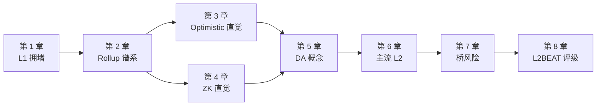

---

## 第 1 章 L1 拥堵：为什么必须 L2

> **TL;DR**：L1 有三道物理墙（gas limit、12s 出块、家用电脑节点），L2 是唯一出路，但用 sequencer 中心化和桥风险换来低费用。

**钩子**：2021-09 一个深夜，你想用 Uniswap 把 $200 USDC 换成 ETH，确认页 gas 费 **$84**。等到凌晨三点再试：还是 $54。Twitter 上刷屏：「以太坊已经成了富人的玩具。」

L2 不是技术爱好者的锦上添花——它是 L1 物理上压不下来成本后**剩下的唯一出路**。

### 1.1 L1 的三道物理墙

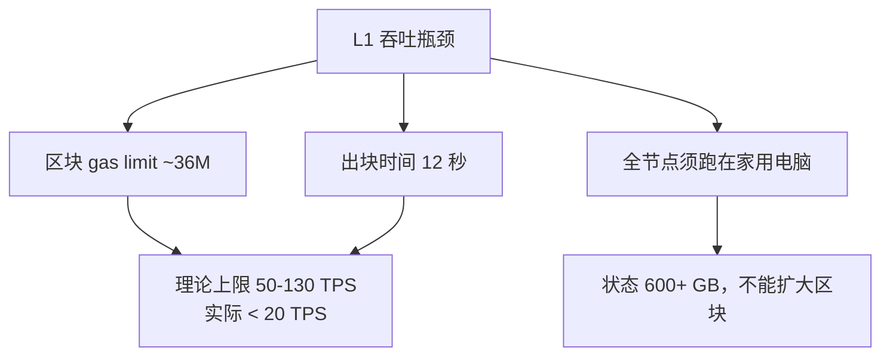

「家用电脑能跑全节点」是硬约束，L1 永远不走大区块路线。Vitalik 2020 年明确 [rollup-centric roadmap](https://ethereum-magicians.org/t/a-rollup-centric-ethereum-roadmap/4698)：L1 只做 DA + 结算 + 共识，扩容外包给 L2。

### 1.2 L2 费用三段式

```
L2 fee = L2 execution gas + (L1 DA cost / batch size) + (proof cost / batch size)
```

| 时期 | 用户感知费用 |
|---|---|
| 4844 之前（~2024-03） | $0.5–$3 |
| 4844 之后（blob 上线） | $0.005–$0.05 |
| Fusaka + BPO2（2026-01 起） | $0.005–$0.05（DA 已接近 0） |

2024 年 blob 上线后 DA 成本塌到 1 wei，rollup 成本中心转向 execution 与 prover。EIP-4844/KZG 数学细节见附录 A。

### 1.3 L2 的代价

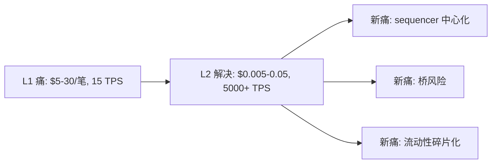

**章末**：L2 不是免费午餐。理解这三个新痛点是本模块后半段的核心。

---

## 第 2 章 Rollup 谱系：一个类比

> **TL;DR**：Rollup = 执行在 L2，数据 + 结算在 L1。两大派别 = 两种审计风格。

**类比**：L1 = 法庭（慢、贵、严谨）；L2 = 工地（快、便宜，每天打包施工记录送进法庭）。

- **Optimistic**：先信任、事后抽查——7 天挑战期，有人怀疑就打官司；
- **ZK**：每份记录附数学证明——约 5-30 分钟（视 prover 负载）即终局，不需等待。

### 2.1 两大派别对比

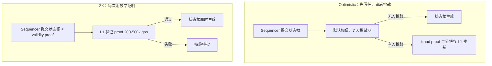

| 维度 | Optimistic | ZK |
|---|---|---|
| 提款延迟 | 7 天 | 约 5-30 分钟（视 prover 负载） |
| Prover 成本 | 仅挑战时产生 | 每 batch 都要生成（硬件密集） |
| EVM 等价性 | 几乎完美 | Type-1 到 Type-4 不等 |
| 安全假设 | ≥1 诚实挑战者 | 电路正确 + 可信设置安全 |
| 代表 | Arbitrum / OP / Base | zkSync / Scroll / Linea |

**常见误解**：「ZK 比 Optimistic 安全」——两者安全假设不同，都不是绝对安全。ZK 历史上出过电路 under-constrained bug；Optimistic 事故主要是 sequencer 审查或 multisig 风险。

**Rollup vs Sidechain**：Polygon PoS 是独立 PoS 侧链，不继承以太坊安全，不在 L2BEAT 里。

**章末**：两派核心差异 = 争议解决时点。Optimistic 事后挑战，ZK 事前证明。欺诈证明工程细节见附录 C，ZK proof system 对比见附录 D。

---

## 第 3 章 Optimistic Rollup 直觉：欺诈证明 + 7 天提款

> **TL;DR**：Optimistic 默认信任 sequencer，7 天内任何人可挑战。挑战流程是「二分博弈」，最终让 L1 仲裁一条指令。

**场景**：你是 Arbitrum 用户，刚把 100 USDC 转给朋友。Sequencer 几秒确认，同时向 L1 提交「这批交易跑完后状态根是 X」。但 sequencer 可能撒谎——谁来抓，怎么抓？

### 3.1 欺诈证明直觉：二分博弈

L1 不能重放整个 batch（成本炸到火星）。解法是**二分**：

```
1000 笔 → 500 笔 → 250 笔 → ... → 1 条 EVM 指令
     ↑ 每轮双方各提交一个 hash，找到分歧点 ↑
```

log₂(1000) ≈ 10 轮，L1 只仲裁一条指令，整个过程只在 L1 写几十个 hash。**这使欺诈证明在 L1 上经济可行。**

### 3.2 7 天等待的原因

7 天 = ①watcher 发现错误状态根 + ②挑战交易在 L1 被打包 + ③极端情况的社会层缓冲。代价是提款慢，这是 Across 等即时桥的市场原因（流动性提供商垫付资金赚取垫资成本）。

### 3.3 Force Inclusion：抗审查兜底

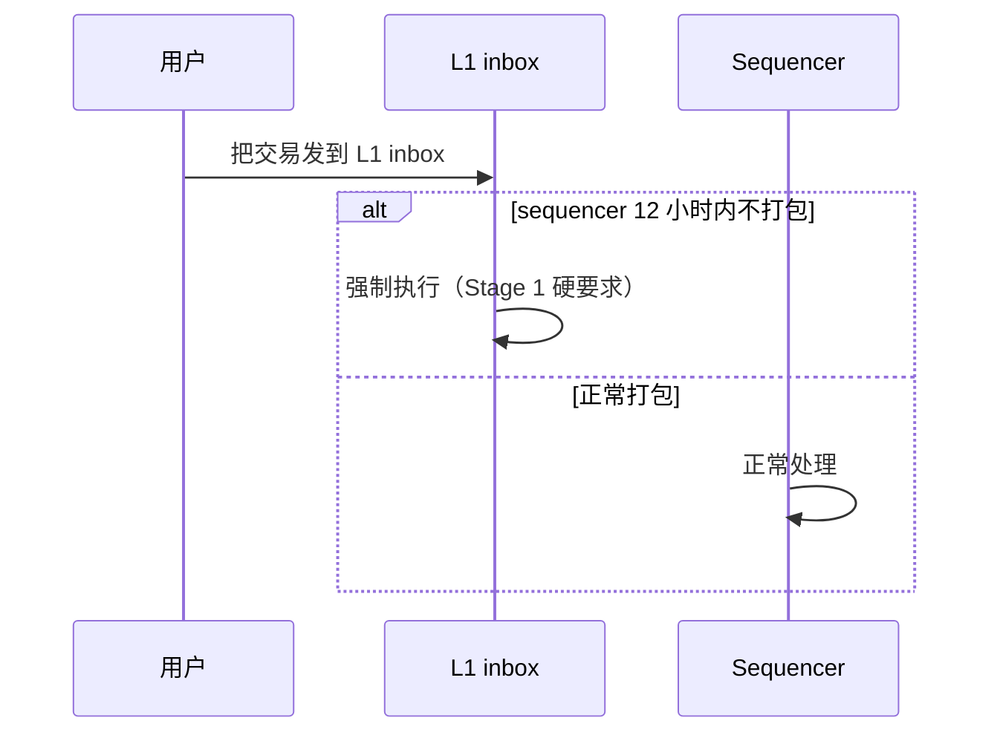

**章末**：Optimistic 的工程细节（Cannon / BoLD 实现对比）见附录 C。

---

## 第 4 章 ZK Rollup 直觉：有效性证明

> **TL;DR**：ZK Rollup 每个 batch 附一份数学证明，L1 验证通过即终局，无需等待。工程师关心三件事：proof 多大、验证多贵、prover 多慢。

**场景**：同样把 100 USDC 转给朋友，如果是 zkSync 而非 Arbitrum，约 5-30 分钟（视 prover 负载）后资金就到 L1——因为 ZK rollup 不需要「事后抽查」，每个 batch 上链时**附一份数学证明**，L1 用 50 万 gas 验完，通过即终局。

### 4.1 类比：快递查验码

**ZK 证明 = 快递查验码**。快递员（sequencer）交货时附上一串验证码，收件方（L1）扫一下就确认货物正确，不需要亲自清点每一件——这就是「有效性证明」的直觉。

### 4.2 Rollup 场景的三件套

- **Completeness**：批次正确时，prover 总能生成通过的证明；
- **Soundness**：批次有错时，伪造一份通过的证明概率小到可忽略；
- **Succinctness**：proof 短（几百字节到几 KB），验证快（L1 上 50–500k gas）。

「零知识」在 rollup 里不是必需的——严格说叫「validity rollup」更准确，行业沿用了 zk 这个名字。

### 4.3 zkEVM 类型与选型

**为什么要分 Type**：编译器和工具链不同——Type 1 完全等价 EVM（gas 一致），Type 4 把 Solidity 编译到自定义 VM（zkSync/Starknet via Kakarot），开发者体验和 prover 性能各有取舍。

| 类型 | EVM 等价度 | 代表 | 部署注意 |
|---|---|---|---|
| Type-1 | 完全等价，能验证主网区块 | Taiko | 最兼容 |
| Type-2 | EVM 等价，内部状态树不同 | Scroll、Linea | 主网工具链开箱即用 |
| Type-4 | Solidity 兼容，VM 完全不同 | zkSync Era（EraVM） | 需 zkSolc 编译 |

**选型参考**：复用主网工具链（Hardhat/Foundry）→ Type-2；最高 prover 性能 → Type-4；隐私 → Starknet（Cairo VM）。

### 4.4 ZK Rollup 三大风险

1. **电路 bug（under-constrained）**：最常见，可能被利用来伪造证明；
2. **可信设置泄漏**（仅 Groth16/PLONK，STARK 无此问题）；
3. **prover liveness**：prover 集群故障 = 链停。

**章末**：SNARK vs STARK 详细对比、各 zkEVM 证明系统选型见附录 D。

---

## 第 5 章 数据可用性（DA）：不是持久性

> **TL;DR**：DA = 原始交易数据可被任何人下载（≠ 永久保存）。DA 丢失 = 提不了款。

**思想实验**：假设 sequencer 提交了正确的状态根（甚至带 ZK 证明），但就是不公布原始交易数据。表面上链很正常——直到你想提款，需要构造 Merkle 证明，但没有原始数据重建 Merkle 树。**你的钱冻在 L1 合约里。** 这就是 DA 是「命门」的原因。

### 5.1 临时仓库类比

**blob = 临时仓库**。Ethereum blob（EIP-4844）存约 18 天就丢——但这已经够了。提款和挑战只需要数据在「挑战期内」可获取，不需要永久保存。DA 不等于持久性。

### 5.2 DA 在哪里决定安全等级

| DA 位置 | 安全等级 | 例子 |
|---|---|---|
| Ethereum blob（L1） | 等价 Ethereum | Arbitrum / OP / Scroll |
| 外部 DA 链（Celestia 等） | ZK/OP 数学 + 外部 PoS | Manta Pacific |
| DAC（少数委员） | 需信任委员会不串谋 | Arbitrum Nova |
| 用户自选（Volition） | 用户自己决定 | zkSync Era |

**关键**：DA 不在 L1 上，就不能等同于 Rollup 安全。

**ZK + 链下 DA = Validium；Optimistic + 链下 DA = Optimium**——把 calldata 从 L1 移走能省 90% 成本，但 DA 委托给链下 committee（弱信任）。

### 5.3 blob「免费午餐」与外部 DA

EIP-4844 后 blob_base_fee 长期 ≈ 1 wei（接近免费）。外部 DA（Celestia/EigenDA）的成本优势大幅减弱。

外部 DA 仍有意义的场景：极致吞吐（EigenDA 100 MB/s）、Cosmos 生态对齐（Celestia）、blob 拥堵时的缓冲。

**DA 选型速查**：DeFi 主资金 → Ethereum blob；链游/低值高频 → Validium/DAC；极致吞吐 → EigenDA。DA 层详细对比（Celestia/EigenDA/Avail）见附录 E。

**章末**：EIP-4844 blob 字段、KZG 承诺数学见附录 A。

---

## 第 6 章 主流 L2：部署选哪条

> **TL;DR**：截至 2026-04，Arbitrum + Base 合计占 L2 TVS 75%+。OP Stack 已赢得框架战争。新项目优先选 Stage ≥1 的链。

**选型心法**：先看 L2BEAT Stage（安全底线），再看工具链兼容度，最后看生态流量来源。

### 6.1 六条主流 L2 一段话介绍

**Arbitrum One**（Optimistic，Stage 1）：技术最深——双轨执行（native + WAVM）、BoLD permissionless 欺诈证明、Stylus（Rust/C++ 合约 10-100× 性能）。Arbitrum + Base 合计占 L2 TVS 75%+。适合：DeFi 主资金、需要 Rust 合约优化的场景。

**OP Mainnet**（Optimistic，Stage 1）：框架战争赢家——OP Stack 派生链（Base、Mode、Worldchain、Ink、Unichain 等数十条）共享 sequencer 规划和 OP Token 治理（Superchain）。适合：想接入 Superchain 流量、生态优先的项目。

**Base**（Optimistic，Stage 1）：Coinbase 自营，MetaMask 之外最大的 Web2 → Web3 入口。USDC 直接打入交易所、App Store 推送。月 sequencer 收入 $1–3M（来源：MEV + priority fee 内化；sequencer 不出 block 直接卖排序权给 builder），是 sequencer 中心化商业价值的最佳样本。适合：面向 Coinbase 用户的消费级 dApp。

**zkSync Era**（ZK，Stage 0）：ZK 系唯一独立 rollup 框架（ZK Stack / Hyperchain）、原生账户抽象（所有账户即合约）、Volition（每笔交易自选 Rollup/Validium）。底层 EraVM 不是 EVM，需 zkSolc 编译器。适合：需要原生 AA 或 ZK Stack 部署自己链的场景。

**Scroll**（ZK，Stage 1）：ZK 阵营第一个达 Stage 1，Euclid 升级（2025-04）换用 OpenVM RISC-V zkVM，吞吐 5×、成本 -50%。Type-2 EVM 等价，主网工具链（Hardhat/Foundry）开箱即用。适合：需要 ZK 快速终局 + 完整 EVM 兼容的场景。

**Linea**（ZK，Stage 0）：Consensys 自营，MetaMask 集成最深，LXP 积分吸引流量。2024-06 Velocore 黑客事件中**手动暂停 sequencer**——这是它仍 Stage 0 的核心原因。适合：MetaMask 用户基础的项目，但需接受当前 Stage 0 风险。

### 6.2 快速选型表

| 需求 | 推荐 |
|---|---|
| 通用 DeFi / 主资金，要高安全 | Arbitrum One 或 Base（均 Stage 1） |
| 想加入 Superchain 生态 | OP Mainnet / Base |
| 需要 ZK 快速终局 + 完整 EVM | Scroll（Stage 1） |
| 面向 Coinbase / Web2 用户 | Base |
| 需要 Rust/C++ 合约 | Arbitrum One（Stylus） |
| 原生账户抽象 | zkSync Era |
| 链游 / 低值高频 | Arbitrum Nova（AnyTrust DAC） |

**章末**：各链详细架构、Stage 历史、sequencer 去中心化进度见附录 H。

---

## 第 7 章 桥风险：被盗 $1.35B 的教训

> **TL;DR**：桥占 DeFi TVL < 10%，但占被盗资金 > 50%。两个故事说明一切：Wormhole 的签名 bug、Nomad 的「复制粘贴众包抢劫」。

**钩子**：2022 年 8 月 1 日，Nomad 桥合约被掏空 $190M，用时不到 4 小时——不是精心策划的 APT 攻击，而是上百个普通地址复制粘贴同一笔交易，只改 `to` 字段。

### 7.1 两个必读事故

**Nomad（2022-08，$190M）**：升级合约时把 `acceptableRoot` 映射初始化成 `0x00`——结果所有空 messageProof 都被接受，任何人构造一笔假提款、其他人复制 calldata 只改收款地址，即可通过。根因：`mapping(bytes32 => bool)` 零值（false）+ 升级 bug 把零值变成 true。**教训**：升级合约要有完整 invariant 测试；公开 mempool 让单个 bug 被数百人放大。

**Wormhole（2022-02，$326M）**：攻击者在 Solana 端用 fake account 替换 system program，跳过了签名验证，直接 mint 120,000 wETH。根因：没校验 `sysvar.key == &solana_program::sysvar::instructions::id()`。**教训**：跨链消息必须严格校验 sender/signer；Solana account model 比 EVM 复杂，更易出 account 混淆 bug。

### 7.2 五起事故汇总

| 时间 | 项目 | 损失 | 一句话死因 |
|---|---|---|---|
| 2022-02 | Wormhole | **$326M** | Solana 端没校验 sysvar 是真的 sysvar |
| 2022-03 | Ronin | **$625M** | 9 个验证者 5 个被钓鱼，含临时授权未撤销 |
| 2022-08 | Nomad | **$190M** | 升级时 zero-root 初始化，众包复制粘贴 |
| 2023-07 | Multichain | **$130M+** | CEO 被带走，私钥跟着没了 |
| 2024-01 | Orbit Bridge | **$80M** | 7 个 KYC 验证者私钥同时失陷 |

### 7.3 使用桥之前的 5 个问题

1. 验证模型是什么（多签 N/M？light client？ZK？）；
2. 验证者集是否来自不同组织 / 国家；
3. 合约升级 timelock 多长；
4. 历史事故如何处理；
5. 桥 TVL / 24h volume 比例够不够你的金额。

**章末**：5 起事故完整代码级复盘（含 Ronin/Multichain/Orbit）见附录 G。跨链消息协议（LayerZero/Wormhole/Hyperlane/CCIP/CCTP）对比见附录 H。

---

## 第 8 章 L2BEAT Stage 评级：如何读懂安全成绩单

> **TL;DR**：Stage 0 = 教练随时踩刹车；Stage 1 = 新手独立开车有限制；Stage 2 = 老司机（截至 2026-04 无人达到）。

**场景**：你点开 [L2BEAT](https://l2beat.com/scaling/summary)，看到 Arbitrum 标「Stage 1」、zkSync Era 标「Stage 0」、Stage 2 一栏**空着**。为什么？

### 8.1 三个 Stage 的直觉

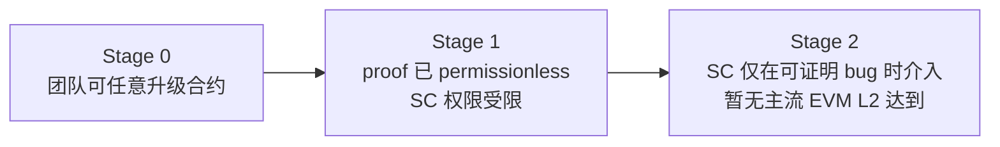

### 8.2 Stage 1 硬要求（5 条）

1. **permissionless proof**：任何人能挑战（Optimistic）或任何 prover 能提交（ZK）；
2. **Security Council ≥ 8 人**（独立成员比例为 Vitalik 讨论稿建议，非 L2BEAT 正式框架）；
3. **多签门槛 ≥ 75%**（如 6/8）；
4. **upgrade delay ≥ 7 天**；
5. **force inclusion**：用户可绕过 sequencer 强制提款。

### 8.3 截至 2026-04 的 Stage 全景

| Stage | L2 |
|---|---|
| **Stage 2** | **暂无主流 EVM L2** |
| **Stage 1** | Arbitrum One、OP Mainnet、Base、Scroll、Ink、Unichain |
| **Stage 0** | zkSync Era、Linea、Starknet、Taiko、Blast、Mantle 等 |

### 8.4 怎么 5 步读一条 L2 的评级

1. 看 Stage 数字；
2. 看 Risk Rosette 五维（State Validation / DA / Exit Window / Sequencer Failure / Proposer Failure）；
3. 看 Permissions：Security Council 人数 + 多签门槛 + 是否有外部成员；
4. 看 Contracts 升级 timelock；
5. 看「距离下一 Stage 还差什么」清单。

### 8.5 Stage 不是唯一指标

Stage 评级 ≠ 安全评级。Blast 和 zkSync Era 同为 Stage 0，但 Blast 因 fraud proof 未上线风险更高。实际评估还需看：sequencer force inclusion 延迟、合约审计、bug bounty。

**章末**：L2BEAT Stage 的数学定义见附录 B。

**下一站**：L2 里最硬核的支柱是 ZK——它不仅压缩 rollup 计算，还能证明任意陈述。本模块把 ZK 当成「rollup 工具」介绍，但它的能力远不止此。下一站模块 08 系统看 SNARK/STARK/zkVM/zkML，把 ZK 从「rollup 加速器」升级到「通用证明系统」，理解为什么 ZK 是未来十年密码学最值得押注的方向。

---

## 延伸阅读

### 权威源

- Vitalik「[A rollup-centric ethereum roadmap](https://ethereum-magicians.org/t/a-rollup-centric-ethereum-roadmap/4698)」(2020)
- Vitalik「[The different types of zkEVMs](https://vitalik.eth.limo/general/2022/08/04/zkevm.html)」(2022)
- [L2BEAT](https://l2beat.com/scaling/summary) — Stage 评级实时数据
- [EIP-4844](https://eips.ethereum.org/EIPS/eip-4844) — blob 规范

---

## 附录 A：EIP-4844 详细（blob 字段、KZG 承诺）

> 本附录对主线第 5 章「DA 临时仓库类比」做工程级展开。

### A.1 EIP-4844 时间线

| 时间 | 事件 |
|---|---|
| 2024-03-13 | Dencun 升级，4844 上线，blob target 3 / max 6 |
| 2025-05 | Pectra（EIP-7691），target 6 / max 9 |
| 2025-12-03 | Fusaka（EIP-7594 PeerDAS），1D 采样上线 |
| 2026-01-07 | BPO2，target 14 / max 21 |

### A.2 一笔 blob 交易的结构

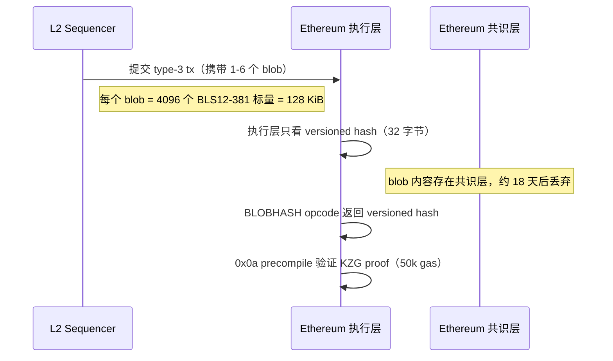

### A.3 关键数据结构

| 结构 | 大小 | 用途 |
|---|---|---|
| Field element | 32 字节 | BLS12-381 标量 |
| Blob | 128 KiB（4096 field elements） | 一个数据块 |
| KZG commitment | 48 字节（G1 群元素） | blob 的多项式承诺 |
| Versioned hash | 32 字节 | `0x01 ‖ sha256(commitment)[1:]` |
| KZG proof | 48 字节 | 「blob 在某点取某值」的证明 |

### A.4 KZG 承诺直觉

**类比**：把 128 KiB 的 blob 数据想成 4096 个 y 坐标，连成一条多项式曲线。KZG 就是给这条曲线**拍一张 48 字节的合影**——任何人想问「曲线在 x=42 时 y 是多少」，提供 48 字节证明 + y 值，验证者一个 pairing 就能确认没骗他。

技术描述：Blob = 多项式 P(x) 的 4096 个采样值，压缩成 48 字节承诺（多项式在秘密点 τ 的椭圆曲线取值）。承诺不泄漏系数（τ 未知），48 字节 proof + 一个 pairing 即可验证「某点取某值」。

### A.5 0x0a Point Evaluation Precompile

EVM 不能直接读 blob 内容，但 [0x0a precompile](https://voltaire.tevm.sh/zig/evm/precompiles/point-evaluation) 可验证 KZG proof：「blob 在点 z 取值 y」—— 50k gas。这是 rollup 连接链下证明系统与 blob 的关键接口。

**ZK Rollup 的 blob 技巧**：prover 同时生成 blob 的 KZG commitment 和 ZK 内部承诺，再生成「两个承诺指向同一数据」的等价证明（proof of equivalence）。这样 ZK 系统不需要为 KZG 写电路，KZG 验证完全在 0x0a precompile 里做。

### A.6 PeerDAS（EIP-7594）

PeerDAS 让验证者从「全体读者」变成「抽样读者」——不用每人读完整本书，每人随机翻几页，全网拼起来确认没有缺页就行。

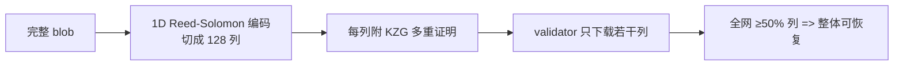

PeerDAS 是 blob 容量能从 target 3 扩到 14 的物理基础。BPO2（2026-01）正是基于 PeerDAS 健康后才做的提速。

---

## 附录 B：L2BEAT Stage 数学定义

> 本附录给出 L2BEAT Stage 评级的完整形式化标准。

### B.1 Stage 0 → Stage 1 的完整条件

按 [L2BEAT Stage framework](https://l2beat.com/scaling/summary) 与 [OP Stack Stage 1 spec](https://specs.optimism.io/protocol/stage-1.html)：

| 条件 | 细节 |
|---|---|
| Proof system | permissionless：任何人能挑战（Optimistic）或提交证明（ZK） |
| Security Council | ≥8 人，≥50% 独立外部成员，多签 ≥75% |
| Upgrade delay | ≥7 天（Emergency 路径除外，但 Emergency 需 SC 多签） |
| Force inclusion | 用户不依赖 sequencer 可强制提款 |
| Data availability | 数据可被任何人下载（L1 blob 或可验证的外部 DA） |

### B.2 Stage 1 → Stage 2 的完整条件

| 条件 | 细节 |
|---|---|
| SC 介入范围 | 仅在「可证明的 on-chain bug」时——prover 宕机或合约自我矛盾 |
| 合约升级 | 不能任意升级，只能在可证明 bug 修复路径上升级 |
| Proof system | 完全自治，无人工干预窗口 |

### B.3 Risk Rosette 五维评分逻辑

| 维度 | 绿（safe） | 黄（warning） | 橙（concerning） | 红（critical） |
|---|---|---|---|---|
| State Validation | permissionless proof | 白名单挑战者 | proof 未激活 | 无 proof |
| Data Availability | L1 blob | 外部 DA + 证明 | DAC 少数委员 | 链下无验证 |
| Exit Window | ≥30 天 | 7-30 天 | 1-7 天 | <1 天或无 |
| Sequencer Failure | force inclusion < 1 天 | 1-7 天 | > 7 天 | 无 force inclusion |
| Proposer Failure | permissionless 提案 | 多个提案者 | 单一提案者 | 无人能提案 |

### B.4 截至 2026-04 主流 L2 Stage 与卡点

| L2 | Stage | 距 Stage 2 的卡点 |
|---|---|---|
| Arbitrum One | Stage 1 | SC 仍有 instant upgrade 权 |
| OP Mainnet | Stage 1 | SC 仍有 instant upgrade 权 |
| Base | Stage 1 | 跟随 OP 路线 |
| Scroll | Stage 1 | prover 需更完善自治机制 |
| zkSync Era | Stage 0 | permissionless proof 未上线 |
| Linea | Stage 0 | sequencer 单点 + SC 权限 |
| Blast | Stage 0 | fraud proof 未上线（最高风险 Stage 0） |

---

## 附录 C：Optimistic 欺诈证明（Cannon / BoLD）

> 本附录对主线第 3 章的直觉做工程级展开。

### C.1 二分博弈完整流程

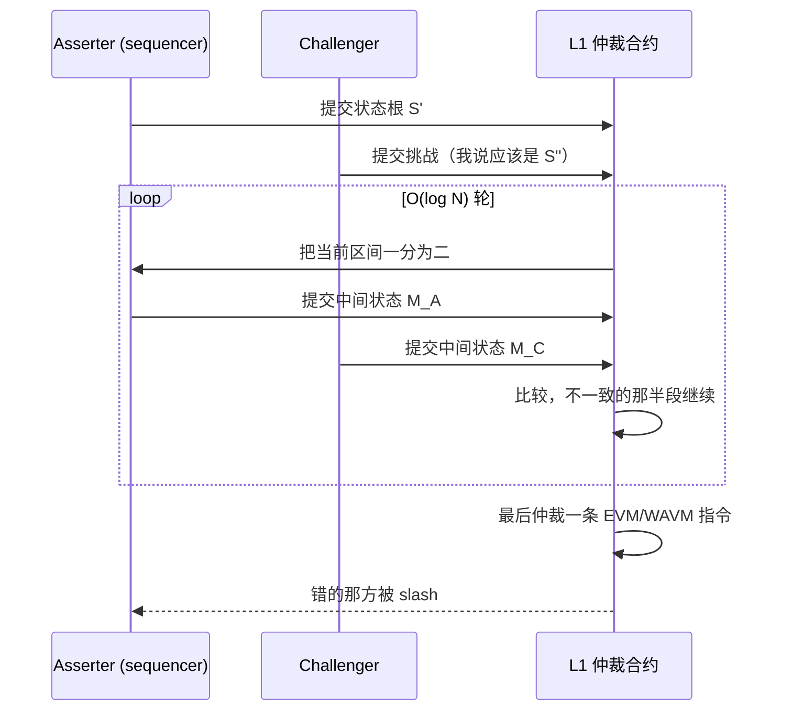

复杂度：N 笔交易二分 O(log N) 轮，每轮只写一个 hash 到 L1。

### C.2 Cannon vs BoLD 对比

| 维度 | Cannon（OP Stack） | BoLD（Arbitrum） |
|---|---|---|
| 二分目标指令集 | MIPS（Geth 编译为 MIPS） | WAVM（ArbOS 双轨 native + WAVM） |
| 选 ISA 原因 | Go 编译成 MIPS 简单 | ArbOS 已有 WAVM 执行路径 |
| Permissionless | 有限白名单 → 2024 移除限制 | **完全无许可**（先达成） |
| Bounded delay | 7 天上限 | 设计保证有界延迟 |
| 抵押 | 8 ETH（OP 默认） / 0.08 ETH（Base） | 配置化 ETH |
| 主网上线 | 2024-06 OP Mainnet / 2024-10 Base | 2025 Arbitrum One，已稳定 1 年+ |

### C.3 Stage 2 还差什么

Arbitrum / OP 均最接近 Stage 2，但 Security Council 仍保留 instant upgrade 权限——ZK 电路 bug 历史频发，团队不敢完全放弃紧急升级窗口，这是卡在 Stage 1 的根因（[L2BEAT Arbitrum](https://l2beat.com/scaling/projects/arbitrum)）。

### C.4 Force Inclusion 工程细节

用户把交易发到 L1 inbox 合约，sequencer 必须在 12 小时内打包（Arbitrum / OP / Base 实际配置）。超时则任何人可强制执行——这是 Stage 1 的硬要求，保证 sequencer 审查最坏情况下用户仍能在 7 天内提款。

---

## 附录 D：ZK Rollup Proof System 对比

> 本附录对主线第 4 章「有效性证明直觉」做工程级展开。

### D.1 SNARK vs STARK

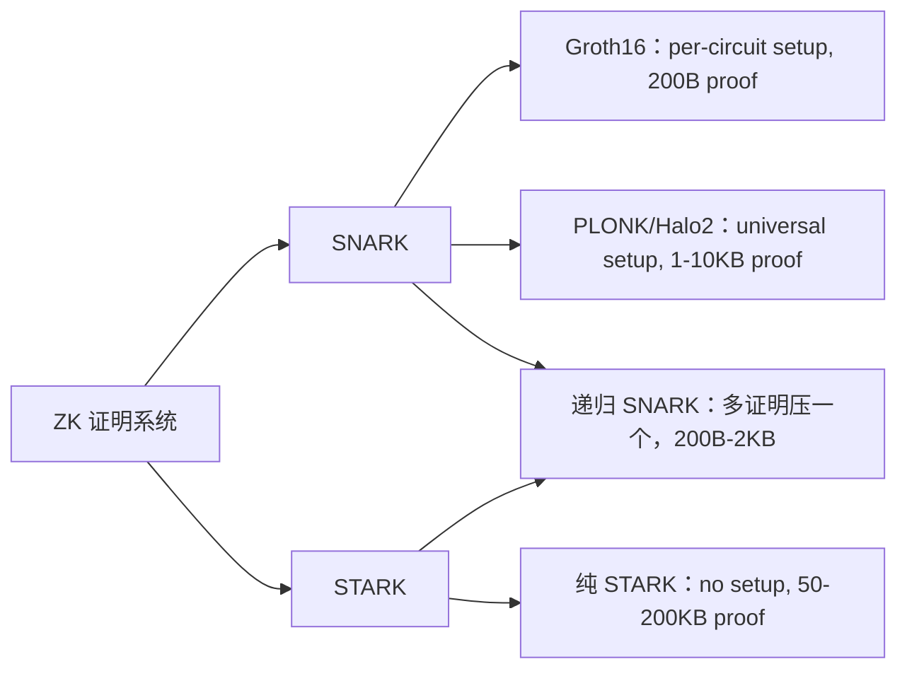

| 系统 | 可信设置 | proof 大小 | verify 成本 | 代表 |
|---|---|---|---|---|
| Groth16 | per-circuit | 200B | ~200k gas | 早期 zkSync Lite |
| PLONK / Halo2 | universal | 1–10 KB | 200–500k gas | Aztec、应用层 |
| STARK | none | 50–200 KB | 1–5M gas | Starknet、zkSync Boojum 内层 |
| 递归 SNARK | universal | 200B–2KB | 200–500k gas | 几乎所有现代 zkEVM 落 L1（proof of proof：把 100 个 batch proof 压成 1 个 L1 verify，是 zkSync/Linea L1 提交频次的关键） |

### D.2 现代 zkEVM 证明系统

| L2 | 证明系统 | 特点 |
|---|---|---|
| zkSync Era | Boojum（STARK 内 + SNARK 外） | 高吞吐，5–15 分钟/batch |
| Scroll | OpenVM（RISC-V zkVM，Plonky3） | Type-2，3–10 分钟/batch |
| Linea | Vortex / PLONK | 5–12 分钟/batch |
| Starknet | Stone / S-two STARK | 无可信设置，10–30 分钟/batch |
| Taiko | SP1 + RISC0 + TEE 多证明 | 任一通过即可，避免单证明 bug |

### D.3 趋势：zkVM 取代 zkEVM

EVM 编译成 RISC-V，通用 zkVM（SP1、Risc Zero、OpenVM）证明 RISC-V 指令——证明系统可复用，不再需要针对 EVM 写专用电路。Scroll Euclid 升级（2025-04）是最大的生产实例。

**Native rollup**（EIP-7903 EXECUTE precompile 提案）：L1 直接验证 EVM 执行——L2 不再需要自建 prover，写状态变化直接走 L1 opcode。

**为什么 zkVM 取代专用电路**：① 写 Rust/RISC-V 比写电路 DSL 快 10×；② 通用 prover 可被多协议共享；③ 单点 prover 优化（Pippenger MSM、GPU sumcheck）福利所有应用。

### D.4 可信设置风险

- **Groth16**：per-circuit，toxic waste 泄漏则可伪造任意证明；
- **PLONK universal setup**：14 万人参与的 KZG ceremony，1 人销毁即安全；
- **STARK**：基于哈希假设，无需可信设置——代价是 proof 大、verify 慢。

---

## 附录 E：DA 层（Celestia / EigenDA / Avail）

> 本附录对主线第 5 章「DA 临时仓库」做生产级展开。

### E.1 五大 DA 方案对比

| 维度 | Ethereum blob | Celestia | EigenDA | Avail |
|---|---|---|---|---|
| 信任根 | Ethereum 共识 | TIA PoS | restaked ETH + DAC | AVAIL PoS |
| 吞吐（2026-04） | 14×128KiB/12s ≈ 150 KB/s | 8 MB/6s（Matcha 后 128 MB） | 100 MB/s（DAC） | 4 MB/block |
| DAS | PeerDAS 1D 采样 | Light node DAS | 无 DAS（DAC） | KZG + DAS |
| 数据保留 | ~18 天 | 永久 | DAC commit | ~17 天 |
| 100MB/天年成本 | $1–$50（接近 0） | ~$12,775 | ~$730 | $1500–3000 |
| 典型客户 | 几乎所有主流 L2 | Manta、Eclipse | Mantle、Celo | Polygon CDK 部分 |

### E.2 Celestia

架构：Rollup 发布 blob → Celestia 全节点存储 → Light node DAS 验证。出块时间 6 秒，区块大小 8 MB（Matcha 升级后目标 128 MB）。

适合：Cosmos 生态原生、想彻底独立于 Ethereum 经济、主流案例 Manta Pacific、Eclipse。

**2026-04 现实**：blob 免费后，「Celestia 比 ETH 便宜 50×」论调已不再成立。Celestia 护城河转向 Cosmos 生态对齐 + Dymension RollApp 飞轮。

### E.3 EigenDA

架构：EigenDA Disperser 切块 → EigenDA Operators（restaked ETH）存数据 → KZG 聚合签名 → 上 L1 commit。吞吐 100 MB/s，不做轻节点 DAS（DAC 模型）。

适合：极致高吞吐（100 MB/s）、想要 ETH 安全对齐的场景。旗舰客户：Mantle。

**注意**：EigenDA 自身 slashing 条件截至 2026-04 仍未对 AVS 启用，「restaking 安全」仍主要靠 EigenLayer 协议层 slashing。

### E.4 Avail

三条产品线：DA（KZG + DAS）、Nexus（跨链协调层，13+ 链接入，2025-11-28 上线）、Light Client（手机/笔记本可跑）。Avail 定位是「DA + 跨链互操作枢纽」。

### E.5 DA 成本公式

```
DA_cost_per_tx = (compressed_calldata_bytes / DA_capacity_bytes_per_unit) × DA_unit_price
```

实测（2026-04，一笔 DEX swap 压缩后 200B）：

| DA | 单笔成本 |
|---|---|
| Ethereum blob | ~$0（接近 0） |
| Celestia | ~$0.0007 |
| EigenDA | ~$0.00000037 |

**结论**：如果不是极致吞吐场景，直接用 Ethereum blob 通常是最佳决策。

**state diff vs full tx data**：zkSync Era 用 state diff 压缩（只发送状态变化），calldata 体积比 Optimism（发送全部 tx data）小 3-5 倍——但牺牲了重构 tx 历史的能力（区块浏览器需 trace 重放）。

---

## 附录 F：Based Rollup / Shared Sequencer

> 本附录对主线第 6 章「sequencer 中心化」做深度展开。

### F.1 Sequencer 中心化现状

绝大多数 L2 的 sequencer 是单一公司运行的单实例。真实故障：
- **Linea 2024-06**：Velocore 黑客，团队手动暂停 sequencer，整链停摆；
- **Linea 2025-09**：sequencer 卡死，停止出块 40+ 分钟；
- **Base 2025-08**：active sequencer 落后，备用 sequencer 未完成 provisioning，33 分钟无块。

这三件事都不需要黑客攻击。**Stage 1 解决「sequencer 作恶」，不解决「sequencer 宕机」。**

### F.2 Based Rollup（Taiko 模式）

**Based sequencing**：直接用 L1 的当前 proposer 当 L2 sequencer。

优点：天然继承 L1 抗审查、无 sequencer 集中化问题、与 L1 同步出块。

缺点：软确认延迟 = L1 出块时间（12 秒）、不能自定义 priority fee 策略、L1 拥堵时 L2 也卡。

Taiko Alethia 是当前最大 based rollup 实现，同时采用多证明（SP1 + RISC0 + TEE）避免单证明系统 bug。

### F.3 Shared Sequencer 网络

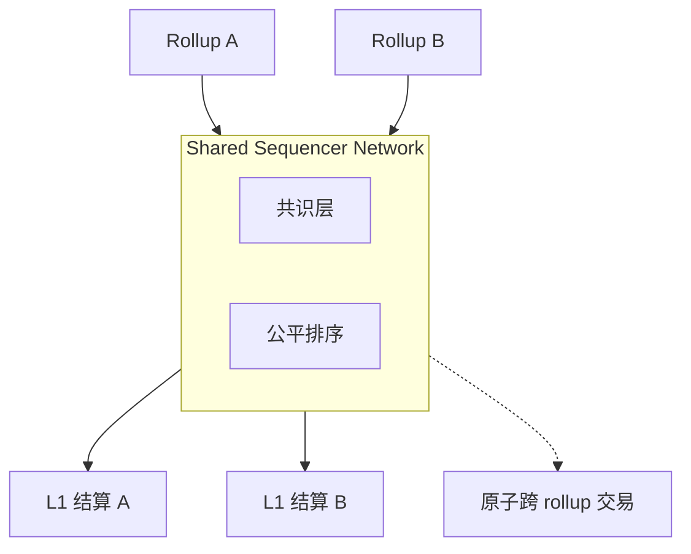

| 项目 | 状态 | 特点 |
|---|---|---|
| Espresso | 2026-02-12 主网启动 | HotShot 共识，与 Arbitrum Orbit 集成中 |
| Astria | 2025-11 关停 | 商业飞轮难启动，客户不愿放弃 sequencer 利润 |
| Radius | testnet | trustless 排序，PVDE |
| Rome | 公测 | 基于 Solana 做 sequencer |

**核心商业障碍**：shared sequencer 把 L2 的「单实例垄断利润（~80% 净利率）」分给多方，L2 团队预期净利率下降 10-20%——这是 Astria 失败、Espresso 增长慢的根因。

### F.4 各 L2 去中心化 Sequencer 进度

| L2 | 现状 |
|---|---|
| Arbitrum | BoLD（validator）已完成，sequencer 仍 Offchain Labs 单实例 |
| OP Mainnet | Superchain sequencer 选举在测试网 |
| Scroll | Euclid 升级已 permissionless sequencer（2025-04） |
| Starknet | 全 validator 自跑 sequencer，目标 2026 |
| Taiko | based sequencing，天然去中心化 |

### F.5 Pre-confirmation

**Pre-confirmation**：sequencer 在 L1 终局前给软确认 + 经济抵押。Taiko Based、Espresso、Surge、Gattaca 都在做——把 L2 用户体验从 1 块（~12s）压到 100ms 级。

---

## 附录 G：5 个桥事件完整复盘

> 五起事故合计 $1.35B+，占 Web3 桥事故损失的半壁江山。

### G.1 Wormhole（2022-02-02，$326M）

攻击者在 Solana 端铸造 120,000 wETH，抽空 ETH 储备。

**根因**：signature verification 函数未校验 guardian set 是否真正签名——攻击者用 fake account 替换 system program，bridge 直接 mint wETH。

```rust
// 漏洞简化：未校验 sysvar 是真 sysvar
let sysvar = next_account_info(...)?;
// 没检查 sysvar.key == &sysvar::instructions::id()
let signers = parse_sysvar(&sysvar.data)?;
verify_signatures(signers, message);  // 攻击者控制 signers
```

**修复**：补上 `sysvar.key == &solana_program::sysvar::instructions::id()` 校验。Jump Crypto 注资 $326M 填窟窿，桥继续运行。

**教训**：Solana account model 比 EVM 复杂，account 混淆 bug 是高频漏洞类型。

### G.2 Ronin（2022-03-23，$625M）

偷走 173,600 ETH + 25.5M USDC，Web3 历史第二大单笔损失。

**根因**：9 个 validator 多签，签 5 即可。攻击者社工钓鱼员工拿 4 个私钥；第 5 个来自 Axie DAO 临时授权 Sky Mavis 代签——**未及时撤销**；5/9 达成，调用 `withdrawERC20For` 提走资产。

**教训**：multisig 不是 trust-minimized——同一组织/服务器的 N 个 validator 安全等于 1。临时授权必须有强制过期机制。

### G.3 Nomad（2022-08-01，$190M）

几小时内被掏空，上百地址复制粘贴交易——史诗级「众包抢劫」。

**根因**：升级合约时把 `acceptableRoot` 映射初始化成 `0x00`：

```solidity
// 漏洞：升级时 _setAcceptableRoot(0x00, true);
// 结果：所有空 messageProof（默认 0x00）都被接受
function process(bytes memory _message) public {
    bytes32 messageHash = keccak256(_message);
    require(acceptableRoot[messages[messageHash]], "!proven");  // bypass!
    // ... 执行任意 message
}
```

第一个攻击者构造提款交易，其他人**复制 calldata 只改 to 字段**即可通过。

**教训**：升级合约要有完整 invariant 测试；`mapping(bytes32 => bool)` 零值 + 升级 bug 是致命组合；公开 mempool 让单个 bug 被数百人放大。

### G.4 Multichain（2023-07，$130M+）

链上数据显示是**桥自己的私钥发起的合法交易**——不是 hack，是「内鬼」。

**根因**：CEO Zhaojun He 被监管机构带走；CEO 是唯一掌握桥多签私钥的人（其他多签形同虚设）；失联后私钥被某方使用，分批提走资产。桥永久关闭。

**教训**：桥的运营连续性 = 桥的安全。「跑路风险」是真实存在的。永远要看「私钥实际由谁控制」，不只看「multisig 是几个人」。

### G.5 Orbit Bridge（2024-01-01，$80M）

7 个 KYC validator 私钥同时失陷（疑似私钥管理基础设施被入侵），攻击者调用 `withdraw`，多签验证通过，掏空 $80M。

**教训**：KYC 多签 ≠ 安全——即使 validator 都是机构，私钥管理仍是单点。

### G.6 桥漏洞分类

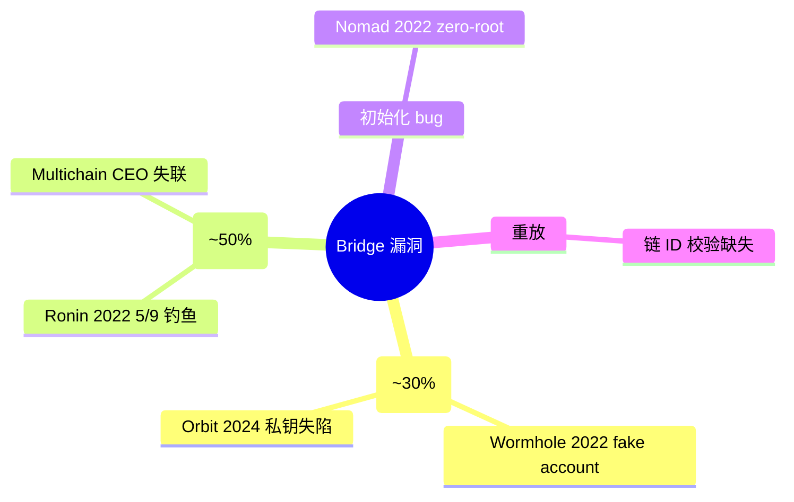

---

## 附录 H：RaaS / OP Stack / Orbit / ZK Stack 详细

> 本附录对主线第 6 章「主流 L2」做 L3 / RaaS / 框架级展开。

### H.1 主流 Rollup 框架对照

| 框架 | 维护方 | DA 选项 | 卖点 | 实例 |
|---|---|---|---|---|
| [OP Stack](https://docs.optimism.io/) | Optimism | blob/Celestia/EigenDA | Superchain 互操作、生态最大 | Base、Mode、Worldchain、Zora、Ink、Unichain… |
| [Arbitrum Orbit](https://docs.arbitrum.io/launch-orbit-chain) | Offchain Labs | blob/AnyTrust DAC | Nitro 性能、Stylus（Rust/C++）、自定义 gas token | 链游、xAI 系 |
| [ZK Stack](https://docs.zksync.io/zk-stack) | Matter Labs | blob/Validium/Volition | ZK 安全、Hyperchain 互操作、原生 AA | Cronos zkEVM、Sophon |
| [Polygon CDK + AggLayer](https://www.agglayer.dev/cdk) | Polygon Labs | blob/AggLayer/Validium | AggLayer 统一流动性、ZK 或 OP 双栈 | 40+ 链 |
| [Starknet (Madara)](https://docs.madara.zone/) | StarkWare | blob | Cairo VM、最高 prover 效率 | Pragma、Kakarot |

### H.2 OP Stack vs Orbit：选哪个

| 维度 | OP Stack | Arbitrum Orbit |
|---|---|---|
| 互操作 | Superchain OP interop | AnyTrust message |
| 编程语言 | Solidity | Solidity + Stylus（Rust/C++） |
| 适合 | 想接 Superchain 流量 | 最大自主权 + Stylus |

### H.3 RaaS（Rollup-as-a-Service）

| RaaS | 支持栈 | 实测部署时间 | 典型价格 |
|---|---|---|---|
| [Conduit](https://www.conduit.xyz/) | OP Stack / Orbit / CDK | 23 分钟 | $5k–$30k/月 |
| [Caldera](https://caldera.xyz/) | OP Stack / Orbit | 1-2 天（白手套） | 与销售约 |
| [Gelato RaaS](https://gelato.network/) | OP / ZK / CDK 多栈 | ~30 分钟 | 包月 |
| [Alchemy Rollups](https://www.alchemy.com/) | OP Stack | 与销售约 | 捆绑 RPC 服务 |

**决策建议**：第一条 rollup → RaaS 上线；规模到亿美金 TVL → 评估自建 sequencer 把利润内化。

### H.4 L3 是什么

**L3 = 在 L2 上再起一条 rollup**，settlement 用 L2 而非 L1。

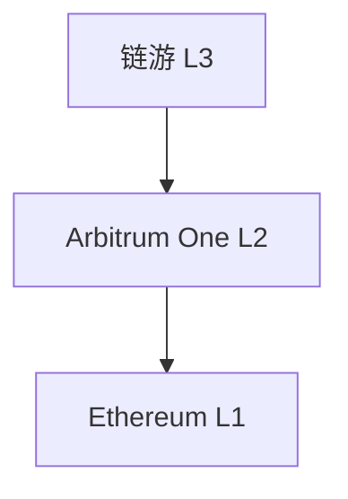

意义：应用专属吞吐 + 定制（gas token / 私有交易）；DA 成本再降约 10×。代价：安全继承自 L2，多一层信任假设。

### H.5 Optimistic L2 完整对照表（截至 2026-04）

| L2 | 框架 | Stage | DA | 备注 |
|---|---|---|---|---|
| Arbitrum One | Nitro | **Stage 1** | Ethereum blob | BoLD permissionless |
| OP Mainnet | OP Stack | **Stage 1** | Ethereum blob | Cannon fault proof |
| Base | OP Stack | **Stage 1** | Ethereum blob | 0.08 ETH slash stake |
| Blast | OP Stack（魔改） | Stage 0 | Ethereum blob | fraud proof 未上线，风险最高 |
| Mantle | 自研 + Module | Stage 0 | EigenDA | OP Succinct 迁 ZK 中 |
| Arbitrum Nova | Nitro AnyTrust | Stage 0 | DAC | 社交/链游专用 |
| Unichain | OP Stack | **Stage 1** | Ethereum blob | Uniswap Labs |
| Ink | OP Stack | **Stage 1** | Ethereum blob | Kraken |

### H.6 ZK L2 完整对照表（截至 2026-04）

| L2 | zkEVM 类型 | Stage | 证明系统 | DA |
|---|---|---|---|---|
| zkSync Era | Type-4（EraVM） | Stage 0 | Boojum（STARK+SNARK） | blob/Validium |
| Scroll | Type-2 | **Stage 1** | OpenVM RISC-V zkVM | Ethereum blob |
| Linea | Type-2 | Stage 0 | Vortex / PLONK | Ethereum blob |
| Starknet | non-EVM（Cairo） | Stage 0 | Stone STARK | Ethereum blob |
| Taiko Alethia | Type-1（based） | Stage 0 | SP1 + RISC0 + TEE 多证明 | Ethereum blob |
| Polygon zkEVM | Type-2/3 | Stage 0（**2026-07 退役**，迁移路径：AggLayer CDK Validium，Polygon 主推链栈方案） | Plonky2 | Ethereum blob |
| Aztec | non-EVM（Noir） | pre-stage | Ultra Honk | Ethereum blob |

### H.7 跨链消息协议快速对比

| 协议 | 验证模型 | 强项 |
|---|---|---|
| LayerZero v2 | 应用可配置 DVN 集 | OFT 标准，70+ 链，~75% 市占 |
| Wormhole | 19 个 Guardian 多签 | Solana / 非 EVM 覆盖最强 |
| Hyperlane | 应用部署自己的 ISM | permissionless 部署，自建 rollup 互通 |
| Chainlink CCIP | DON + RMN 双层 | 银行/合规客户，CCT 标准 |
| Circle CCTP | 原生 USDC burn-mint | 唯一 native USDC 跨链 |
| Across | Intent + UMA 乐观验证 | EVM 间 < 1 分钟（relayer 垫付） |
| IBC | light client 验证 | trust-minimized 金标准（Cosmos 系） |

**2026 实战决策**：USDC 走 CCTP；DeFi 最优速度走 Across；自建 rollup 互通走 Hyperlane；合规客户走 CCIP；Solana 桥走 Wormhole；Cosmos 系走 IBC。

---

## 附录 I：术语表

| 术语 | 含义 |
|---|---|
| Rollup | 执行在 L2，数据 + 结算在 L1 |
| Optimistic Rollup | 默认相信 sequencer，错了再挑战 |
| ZK Rollup | 每批次附有效性证明（validity proof） |
| Validium | ZK 证明 + 链下 DA |
| Optimium | Optimistic + 链下 DA |
| Volition | 用户每笔交易自选 Rollup or Validium |
| DA | Data Availability，数据可用性（≠ 持久性） |
| DAC | Data Availability Committee，DA 委员会 |
| DAS | Data Availability Sampling，DA 采样 |
| KZG | Kate-Zaverucha-Goldberg 多项式承诺 |
| Blob | EIP-4844 引入的 128 KiB 数据块 |
| BPO | Blob Parameter Only fork |
| PeerDAS | EIP-7594 分布式 DA 采样 |
| Fraud Proof | 错误状态根的证据（Optimistic 系） |
| Validity Proof | 状态根正确的数学证明（ZK 系） |
| Sequencer | L2 出块者 |
| Force Inclusion | 用户绕过 sequencer 直接发到 L1 inbox |
| Stage 0/1/2 | L2BEAT 安全成熟度评级 |
| AVS | Actively Validated Service（EigenLayer 概念） |
| RaaS | Rollup-as-a-Service |
| Superchain | OP Stack 派生链联邦 |
| Orbit | Arbitrum 派生链生态 |
| Hyperchain | ZK Stack 派生链生态 |
| Type-1/2/3/4 zkEVM | Vitalik EVM 等价度分级 |
| Based Rollup | 用 L1 proposer 当 L2 sequencer |
| OFT | LayerZero Omnichain Fungible Token 标准 |
| ISM | Hyperlane Interchain Security Module |
| CCTP | Circle Cross-Chain Transfer Protocol |
| IBC | Cosmos Inter-Blockchain Communication |

---

> **数据截至 2026-04**。所有 Stage 评级、TVL、协议参数请以 [L2BEAT](https://l2beat.com/)、各协议官方 docs 实时数据为准。
>
> 下一模块：**模块 08「零知识证明」**——深挖 ZK 电路、SNARK/STARK 数学、Halo2/Plonky3/SP1。
