# 模块 07：L2 与扩容

> **本模块所有 stage 评级、TVL、协议参数均标注「截至 2026-04」**。L2 生态变化极快，正式生产部署前请用 [L2BEAT](https://l2beat.com/) 与各协议官方 docs 复核。本模块按《Hello 算法》风格写：图解优先、概念先于代码、提示框点出陷阱、章节短、梯度清晰。

## 0. 阅读指引

### 0.1 学完之后你能做什么

1. **讲清原理**：L2 必要性、Optimistic vs ZK 差异、blob、DA 命门；
2. **看懂评级**：读懂 L2BEAT stage 0/1/2 与五维风险图，写 trust assumption 报告；
3. **算出成本**：把任意 L2 单笔交易成本拆成 execution + DA + proof 三段；
4. **动手部署**：Foundry 多链部署、OP Stack 原生桥消息、Hyperlane 跨链 ERC20、viem 监听 blob 交易；
5. **做出选择**：为具体应用给出有数字、有依据的 L2 选型建议。

### 0.2 提示框约定

> [!NOTE]
> 补充说明，不影响主线。

> [!TIP]
> 实操经验与踩坑技巧。

> [!WARNING]
> 常见误区或安全陷阱。

> [!IMPORTANT]
> 必须记住的核心数字或原理。

### 0.3 模块导览

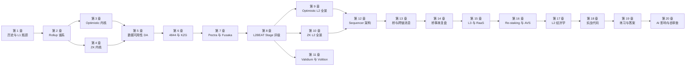

---

## 第 1 章 历史与 L1 瓶颈：为什么必须 L2

> **与前置模块衔接**：模块 06「DeFi 协议工程」展示了 AMM、借贷、衍生品协议对高频低费交互的强烈需求——正是这类 DeFi 需求在 2021 年把 L1 gas 费逼上了三位数，直接催生了 L2 扩容赛道。

### 1.1 痛点

2021-09 主网一笔 Uniswap swap gas 费 **$84**；2026 年繁忙时段仍 $5–$30。**L1 太贵、太慢、物理上无法把成本压下来**——这是 L2 必须存在的全部动机。

### 1.2 L1 的三道物理墙

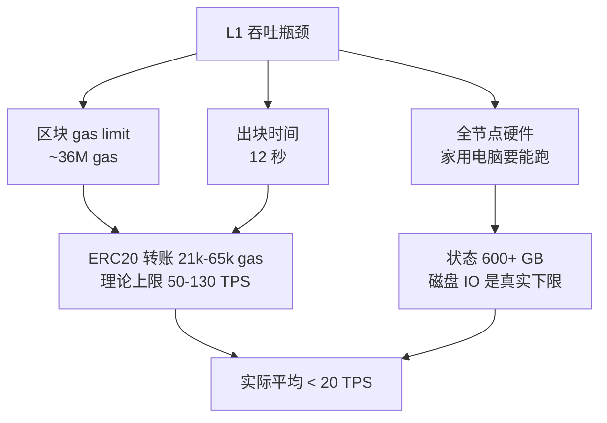

> [!IMPORTANT]
> **以太坊 L1 设计哲学**：「家用电脑能跑全节点」是硬约束，L1 永远不走大区块路线。扩容外包给 L2——L1 只做 DA + 结算 + 共识。这条 **rollup-centric roadmap** 由 Vitalik《[A rollup-centric ethereum roadmap](https://ethereum-magicians.org/t/a-rollup-centric-ethereum-roadmap/4698)》(2020) 与《[Endgame](https://vitalik.eth.limo/general/2021/12/06/endgame.html)》(2021) 定义。

### 1.3 历史上探索过的扩容路线

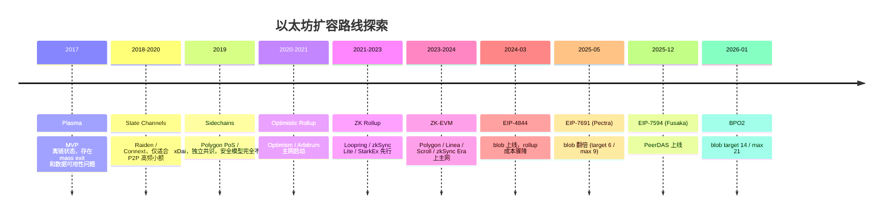

> [!NOTE]
> Plasma 思想活在 fraud proof 与 Validium 里，但作为完整方案 2020 年后已被 Rollup 取代。

### 1.4 L2 交易费用三段式

```
L2 fee = L2 execution gas + (L1 DA cost / batch size) + (proof cost / batch size)
                ↓                       ↓                          ↓
        sequencer 在 L2 上            分摊到每笔的            （仅 ZK 系，
        跑你的合约消耗的 gas          L1 数据成本             分摊证明生成成本）
```

各项占比随时间变化：

| 时期 | execution | L1 DA | proof | 用户感知费用 |
|---|---|---|---|---|
| 4844 之前（2024-03 前） | 5–10% | 80–90%（calldata） | 0/5% | $0.5–$3 |
| 4844 之后（2024-03 至 2025-05） | 30–50% | 30–50%（blob） | 0–10% | $0.05–$0.30 |
| Pectra 后（2025-05） | 50–70% | 10–20%（blob target 6） | 0–10% | $0.01–$0.10 |
| **Fusaka + BPO2 后（2026-01 起）** | **60–80%** | **<10%（blob target 14，单 blob 价 ≈ 1 wei）** | **5–15%（ZK 系）** | **$0.005–$0.05** |

> [!IMPORTANT]
> **2026-04 关键事实**：blob 已几乎免费（[ethPandaOps](https://ethpandaops.io/posts/eip7691-retrospective/) Pectra 后单 blob ≈ 1 wei；[Fusaka](https://blog.ethereum.org/2025/11/06/fusaka-mainnet-announcement) + BPO2 推 target 到 14 blobs/block）。**Rollup 成本中心从 DA 转移到 execution 与 prover**。

### 1.5 关键数字（截至 2026-04）

| 项目 | 数值 |
|---|---|
| L1 区块 gas limit | 约 36M（Pectra 后） |
| L1 出块时间 | 12 秒 |
| Blob target / max（BPO2，2026-01-07 起） | 14 / 21 |
| 单 blob 大小 | 128 KiB（4096 个 BLS12-381 标量） |
| Blob 在共识层保留期 | 约 18 天 |
| 主网平均 blob 利用率（2026-04） | ~28k blobs/天，~4 blobs/block，仍低于 14 target |
| blob_base_fee | 长期接近 1 wei（即「免费」） |
| L2 总 TVS（[L2BEAT](https://l2beat.com/scaling/tvs)） | 约 $40B+，Arbitrum + Base 占 75%+ |

### 1.6 L2 解决了什么、没解决什么

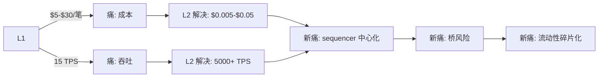

> [!WARNING]
> **L2 不是免费午餐**：用 sequencer 中心化、桥风险、流动性碎片换来了吞吐和低费用。

---

## 第 2 章 Rollup 谱系：核心定义与分类

### 2.1 一句话定义

> **Rollup = 执行在 L2，数据 + 结算在 L1**。

L2 把交易压缩成 batch 提交到 L1（calldata 或 blob）并提交状态根，L1 上的**验证逻辑**不同把 rollup 分成两大派别。

### 2.2 两大派别：图解

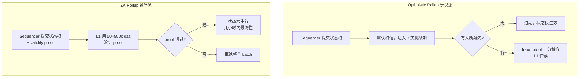

### 2.3 工程取舍对比表

| 维度 | Optimistic | ZK |
|---|---|---|
| 提款延迟（最终性） | 7 天（挑战期） | 几小时（proof 上链后即终局） |
| Prover 成本 | 0（只在挑战时生成） | 每 batch 都要生成，硬件密集 |
| EVM 等价性 | 几乎完美（Type-1 等价） | Type-1 到 Type-4 不等 |
| 安全模型 | 1-of-N 诚实挑战者假设 | 数学（电路 + 可信设置/STARK） |
| L1 验证 gas | 低（提交状态根 + 偶尔挑战） | 中（每次 verify proof 50–500k gas） |
| 适合的应用 | 通用、DeFi、链游 | 高频结算、隐私、跨链桥 |
| 代表 | Arbitrum / Optimism / Base / Blast / Mantle | zkSync Era / Scroll / Linea / Starknet / Taiko |

### 2.4 常见误解

> [!WARNING]
> **误解**：「ZK 比 Optimistic 安全」。两者安全前提不同：Optimistic 假设「至少 1 个诚实挑战者 + L1 抗审查」；ZK 假设「证明系统数学正确 + 可信设置（如有）安全 + 电路无 bug」。历史上 ZK 出过电路 under-constrained bug 和 verifier 合约升级权失控；Optimistic 事故主要是 sequencer 审查或 multisig 风险。**两者都不是绝对安全。**

### 2.5 Rollup vs Sidechain：必须区分

| 维度 | Rollup | Sidechain |
|---|---|---|
| 安全继承 | 继承 L1 | 自有共识 |
| 数据可用性 | L1 / 外部 DA + 证据 | 自己保证 |
| 提款 | trust-minimized | 依赖侧链共识/桥 |
| 例子 | Arbitrum / Optimism / Scroll | Polygon PoS / Gnosis Chain / BNB Chain |

> [!WARNING]
> **Polygon PoS 不是 L2**：它是一条独立 PoS 侧链，安全等价于 100 个 validator 的 PoS 共识，不继承以太坊安全。L2BEAT 不把它列在 L2 里。

> [!TIP]
> Optimistic 先成熟（2020-2021），ZK 后追（2023-2024）。最终性和跨链 UX 上 ZK 有结构性优势——Vitalik「长期愿景是 ZK Rollup」。

两大派别的核心差异在于**争议解决机制**：Optimistic 依赖事后挑战，ZK 依赖事前证明。第 3 章深入 Optimistic 的 fraud proof 机制，第 4 章深入 ZK 的 validity proof 数学。

---

## 第 3 章 Optimistic 内核：fraud proof 是什么

### 3.1 核心机制：交互式二分博弈

直接在 L1 重放整个 batch 成本不可接受，解法是**二分博弈**（bisection game）：

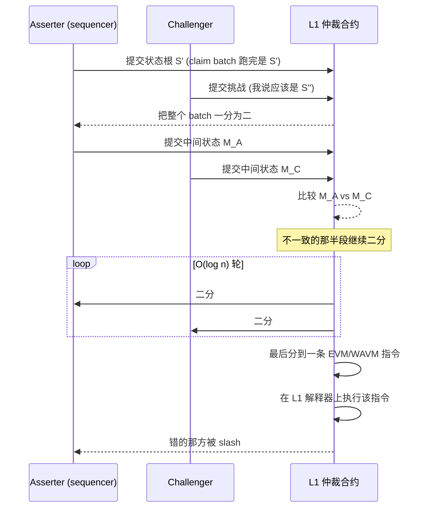

> [!IMPORTANT]
> **复杂度**：N 笔交易二分到一条指令需 O(log N) 轮，每轮在 L1 写一个 hash。不需要重放整个 batch，只需仲裁一条指令——这使 fraud proof 在 L1 上经济可行。

### 3.2 三种 fraud proof 实现

| 实现 | 项目 | 特点 |
|---|---|---|
| 单轮（non-interactive） | Cannon (OP)、ZK fault proof | 把整个 fault proof 用 ZK 一次证明 |
| 多轮（interactive） | Arbitrum Classic | 二分到一条指令，L1 仲裁 |
| **多轮 + permissionless** | **Arbitrum BoLD** | 任何挑战者，bounded delay |

### 3.3 BoLD：Arbitrum permissionless fraud proof

[BoLD（Bounded Liquidity Delay）](https://docs.arbitrum.io/how-arbitrum-works/bold/gentle-introduction) 2025 年上 Arbitrum One 主网：

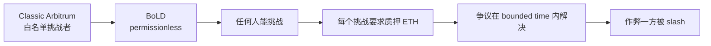

> [!IMPORTANT]
> **BoLD 是 Arbitrum Stage 1 的关键**：当前最成熟的 permissionless fraud proof 实现，Arbitrum 因此成为最早达 Stage 1 的 EVM L2 之一。

### 3.4 Cannon：OP fault proof

[Cannon](https://github.com/ethereum-optimism/cannon) 是 OP Stack fault proof 实现：Geth 编译成 MIPS 指令，L1 部署 MIPS 解释器合约，二分博弈最终仲裁一条 MIPS 指令。选 MIPS 而非 EVM 是因为 OP Stack 用 Geth 原版（Go），编 MIPS 比编 EVM 简单。

> [!NOTE]
> 2024-06 OP 主网启用 [permissionless fault proof](https://specs.optimism.io/fault-proof/stage-one/index.html)，2024-10 Base 跟进（每提案 0.08 ETH 抵押）。

### 3.5 Force inclusion：抗审查兜底

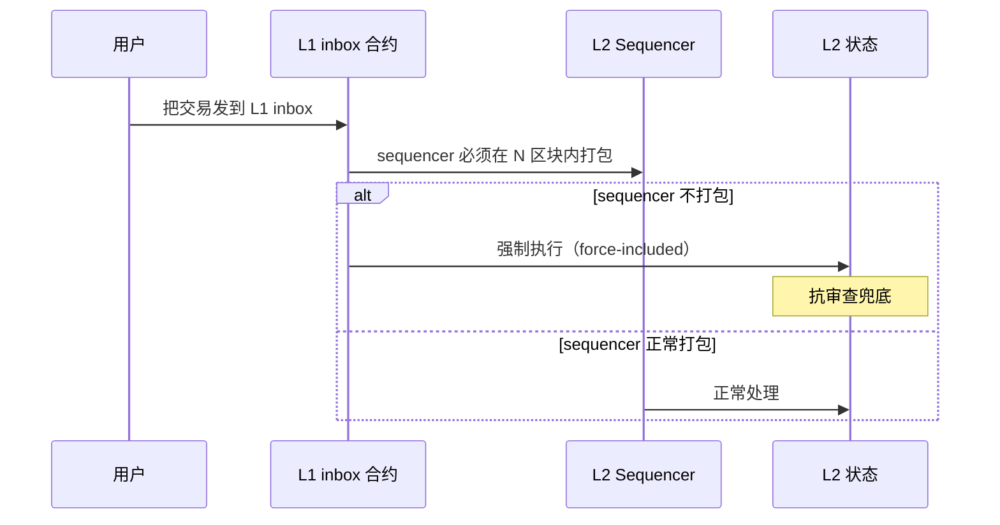

> [!IMPORTANT]
> **force-inclusion 是 Stage 1 硬要求**。区分两个数字：
> - **L2BEAT Stage 1 协议级要求**：force-inclusion 延迟上限 **≤ 7 天**（与挑战期对齐，保证 sequencer 审查最坏情况下用户仍能在 7 天内强制提款）。
> - **Arbitrum / OP / Base 实际配置**：force-inclusion 延迟选 **12 小时**（截至 2026-04），显著优于协议下限——主动收紧抗审查响应窗口。

### 3.6 挑战期为什么是 7 天

三个考虑：1) watcher 发现错误状态根；2) 挑战交易在 L1 被打包（即使主网被攻击）；3) 社会层应对极端情况。代价是**用户提款等 7 天**——这正是 Across 等即时桥存在的市场原因（流动性提供商垫付资金，赚取垫资成本）。

Optimistic 系靠「可能发生的挑战」来约束行为；ZK 系则选了另一条路——每次提交都附上数学证明，彻底消除挑战期。第 4 章深入这套数学。

---

## 第 4 章 ZK 内核：validity proof 的数学

### 4.1 ZK 三件套：完备性、可靠性、零知识

- **Completeness（完备性）**：命题真则诚实 prover 总能让 verifier 接受；
- **Soundness（可靠性）**：命题假则恶意 prover 让 verifier 接受的概率可忽略；
- **Zero-knowledge（零知识）**：verifier 除了「命题真」外学不到任何信息。

> [!NOTE]
> Rollup 场景里**零知识不是必需的**——只需 succinctness（证明短，验证快）。zkRollup 严格说叫「validity rollup」更准确，但行业沿用了 zk 这个名字。

### 4.2 SNARK vs STARK

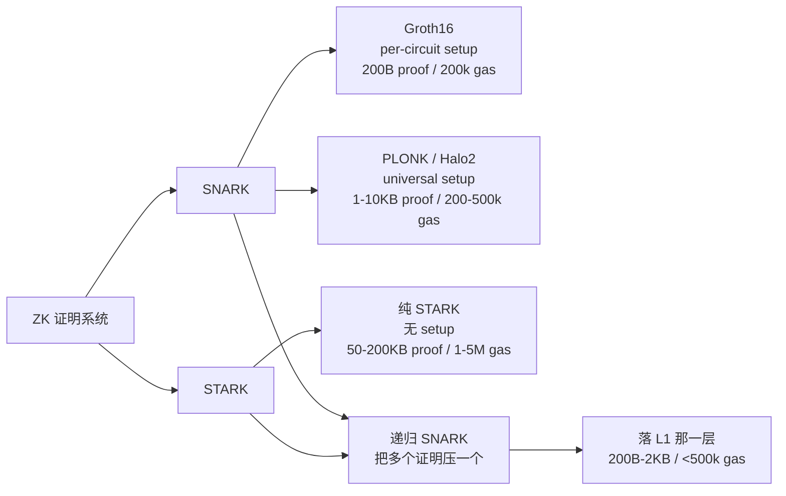

| 系统 | 类型 | 可信设置 | proof 大小 | verify 成本 | 代表 |
|---|---|---|---|---|---|
| Groth16 | SNARK | per-circuit | 200B | ~200k gas | 早期 zkSync Lite |
| PLONK / Halo2 | SNARK | universal / none | 1–10 KB | 200–500k gas | Aztec、ZK 应用层 |
| STARK | STARK | none | 50–200 KB | 1–5M gas | Starknet、zkSync Boojum 内层 |
| 递归 SNARK | SNARK | universal | 200B–2KB | 200–500k gas | 几乎所有现代 zkEVM 落 L1 |

### 4.3 可信设置（Trusted Setup）

- **Groth16 per-circuit setup**：每个电路独立仪式，toxic waste 泄漏则可伪造任意证明。
- **PLONK universal setup**：一次仪式（如 [KZG ceremony](https://ceremony.ethereum.org/)，14 万人参加，1 人销毁 toxic waste 即安全），所有 PLONK 电路复用。
- **STARK no setup**：基于哈希假设，无需信任仪式，代价是 proof 大、verify 慢。

> [!WARNING]
> 永远问清楚：是 per-circuit 还是 universal？仪式有多少参与者？是否公开 transcript？

### 4.4 zkEVM 类型（[Vitalik 分类](https://vitalik.eth.limo/general/2022/08/04/zkevm.html)）

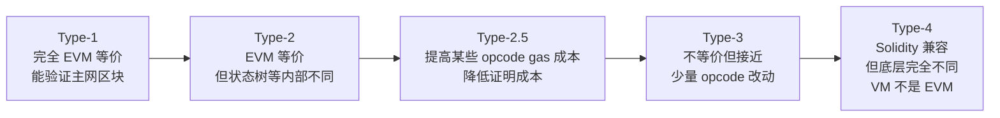

**实例**：Type-2 Scroll、Linea（Linea 的 Type-1 audit 进行中、尚未正式上线，参见 [Linea changelog](https://docs.linea.build/changelog/release-notes)）；Type-4 zkSync Era（EraVM）、Starknet（Cairo VM）。

> [!TIP]
> **选 zkEVM**：复用主网工具链 → Type-2（Scroll、Linea）；最高 prover 性能 → Type-4（zkSync Era）或非 EVM（Starknet）。

### 4.5 现代证明系统

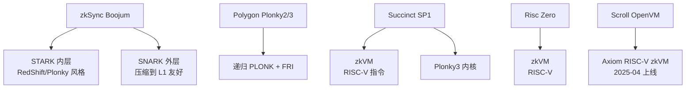

> [!IMPORTANT]
> **趋势：zkVM 取代 zkEVM 直接证明**——EVM 编译成 RISC-V，通用 zkVM 证明 RISC-V 指令，证明系统可复用。Scroll [Euclid 升级](https://www.bitget.com/news/detail/12560604730425)（2025-04）走此路线。

### 4.6 硬件 prover（截至 2026-04）

| 平台 | 单 batch 证明时间 | 典型硬件 |
|---|---|---|
| zkSync Era（Boojum） | 5–15 分钟 | A100 / H100 集群 |
| Scroll（OpenVM） | 3–10 分钟 | H100 / B200 集群 |
| Polygon zkEVM（Plonky2） | 8–20 分钟 | A100 集群 |
| Linea（Vortex） | 5–12 分钟 | GPU 集群 |
| Starknet（Stone） | 10–30 分钟 | CPU 集群 |
| Aligned Layer / Lagrange（AVS） | 几分钟（外包） | restaked GPU |

新生硬件：Cysic（FPGA，Scroll 集成）、Ingonyama（ICICLE GPU + ASIC）、Ulvetanna（Binius ASIC）、Fabric Cryptography（通用 ZK ASIC，2026 出货）。

### 4.7 ZK Rollup 三大风险

> [!WARNING]
> ZK 系统三大风险：
>
> 1. **电路 bug**（under-constrained）——最常见，导致伪造证明被接受。Vitalik 在 2024 反复警告这是 zkEVM 最大风险点。
> 2. **可信设置泄漏**（仅 Groth16/PLONK）——理论风险，但仪式做得越好越接近不可能。
> 3. **prover liveness**——所有 sequencer 共用一个 prover 集群，prover 故障 = 链停。Aligned Layer / Lagrange 这类 prover-as-AVS 是部分缓解。

> [!NOTE]
> ZK 电路与证明系统的密码学原理（椭圆曲线、多项式承诺、递归 SNARK）在**模块 08「零知识证明」**中系统展开；本章只关注 rollup 层的工程取舍。

无论 Optimistic 还是 ZK，rollup 的安全底线都有一个共同前提：**原始交易数据必须可被任何人下载**。这就引出了下一章的核心主题——数据可用性。

---

## 第 5 章 数据可用性（DA）：rollup 的命门

### 5.1 DA 是什么、为什么是命门

**DA 问题**：sequencer 公布状态根但藏起原始数据——没人能重构 L2 状态、写 fraud proof、强制提款。**任何人都能下载原始交易数据**是 rollup 安全的物理底线。

### 5.2 DA 与执行的解耦

模块化区块链核心思想：**执行、结算、共识、DA 是四件独立的事**。

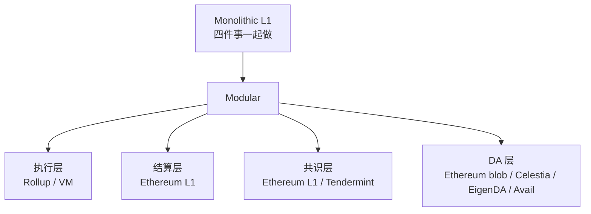

> [!IMPORTANT]
> **DA 不是「便宜的 L1」**：DA 层只保证「数据可被任何人下载」，不做执行。Celestia 没有智能合约，吞吐却比 L1 高一个数量级。

### 5.3 四种 DA 方案

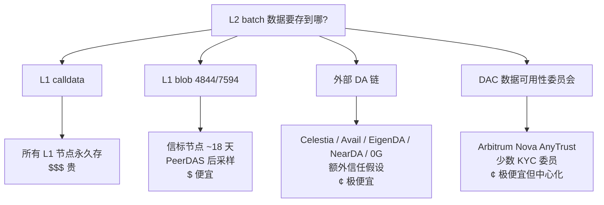

### 5.4 数据可用性采样（DAS）

> [!IMPORTANT]
> **DAS 让轻节点能验证 DA**。数据经 Reed-Solomon erasure coding 编码后，**任意 50% 样本可达即可恢复完整数据**。轻节点随机采样若干片段，能拿到 → DA 通过。Celestia / PeerDAS 的核心机制。

### 5.5 Rollup vs Validium vs Optimium

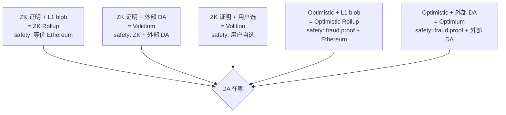

> [!WARNING]
> **不要把 Validium 当成 Rollup**：Validium 数据放外部，sequencer + DA 同时不诚实时用户无法强制提款。L2BEAT 把 Validium 单独归类。

### 5.6 DA 选型

> [!TIP]
> - DeFi 主资金 → Ethereum blob
> - 链游/社交/低值 NFT → Validium / Optimium
> - 用户自选 → Volition（zkSync Era）
> - 极致吞吐 → EigenDA（100 MB/s）
> - Cosmos 生态 → Celestia
> - Polkadot / Polygon CDK → Avail

### 5.7 主要 DA 项目对比（截至 2026-04）

| 维度 | Ethereum blob | Celestia | EigenDA | Avail |
|---|---|---|---|---|
| 信任模型 | Ethereum 共识 | TIA PoS | restaked ETH（DAC + KZG） | AVAIL PoS |
| 当前吞吐 | 14 blob × 128KiB / 12s ≈ 150 KB/s | 8 MB / 6s ≈ 1.33 MB/s | 100 MB/s（DAC） | 4 MB / block |
| DAS | PeerDAS 1D 采样 | Light node DAS | 不做 DAS（DAC） | KZG + DAS |
| 100MB/天年成本 | $1–$50（接近 0） | ~$12,775 | ~$730 | $1500–3000 |
| 客户 | 几乎所有 L2 | Manta、Eclipse | Mantle、Celo | 部分 Polygon CDK |

### 5.8 Ethereum blob「免费午餐」

> [!TIP]
> blob_base_fee 长期 ≈ 1 wei，外部 DA 成本优势骤减（[分析](https://www.bitget.com/news/detail/12560605100226)）。外部 DA 仍有意义的场景：1) 极致吞吐（EigenDA 100 MB/s）；2) 生态对齐（Cosmos→Celestia，Polkadot→Avail）；3) blob 拥堵时的缓冲。

「blob 几乎免费」的背后，是 EIP-4844 引入的 KZG 承诺机制和 type-3 交易格式。第 6 章拆解这套机制的每个细节。

---

## 第 6 章 EIP-4844 与 KZG：blob 是怎样炼成的

### 6.1 时间线

[EIP-4844](https://eips.ethereum.org/EIPS/eip-4844)（Proto-Danksharding）2024-03-13 Dencun 升级上线，新增 **type-3 blob-carrying transaction**。

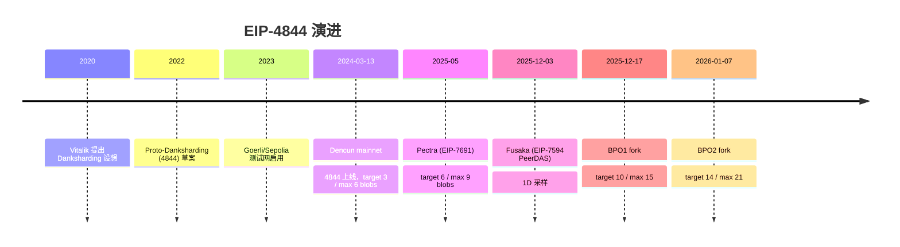

### 6.2 一笔 blob 交易长什么样

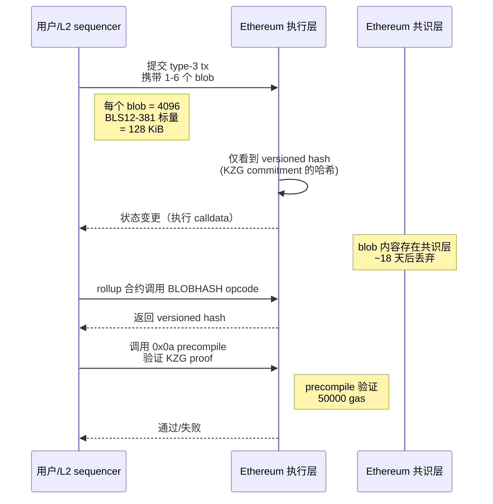

### 6.3 关键数据结构

| 结构 | 大小 | 用途 |
|---|---|---|
| Field element | 32 字节 | BLS12-381 子群 r 模数下的标量 |
| Blob | 128 KiB（4096 个 field element） | 一个数据块 |
| KZG commitment | 48 字节（G1 群元素） | blob 的承诺 |
| Versioned hash | 32 字节 | 第 0 字节是 version (0x01) + sha256(commitment)[1:] |
| KZG proof | 48 字节 | 「blob 在某点取某值」的证明 |
| Type-3 tx | calldata + 多个 (commitment, blob, proof) | 完整交易 |

### 6.4 KZG 承诺

Blob = 多项式 P(x) 的 4096 个采样值，压缩成 48 字节 KZG commitment（多项式在秘密点 τ 的椭圆曲线取值）。关键性质：承诺不泄漏系数（τ 未知）；48 字节 proof + 一个 pairing 即可验证「某点取某值」。

> [!IMPORTANT]
> **2D KZG 多项式承诺是 Danksharding 的核心**——每个 blob 单独承诺，多个 blob 在另一维度承诺，方便采样和恢复。

### 6.5 0x0a precompile

EVM 不能直接读 blob 内容，但可用 [point evaluation precompile (0x0a)](https://voltaire.tevm.sh/zig/evm/precompiles/point-evaluation) 验证 KZG proof：「blob 在点 z 取值 y」——50000 gas。这是 rollup 连接链下证明系统与 blob 的关键接口。

### 6.6 Optimistic 怎么用 blob

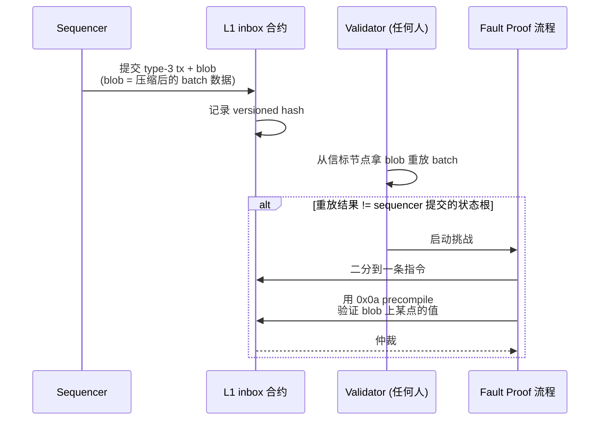

### 6.7 ZK 怎么用 blob

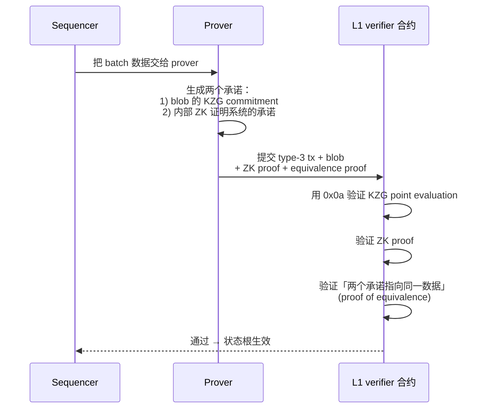

> [!NOTE]
> **「Proof of equivalence」是 ZK Rollup 用 blob 的关键技巧**——它把 blob 的 KZG 承诺和 ZK 内部承诺连起来。这样 ZK 系统不需要为 KZG 写电路，KZG 验证完全在 0x0a precompile 里做。

### 6.8 单 blob 经济学

```
单笔 L2 tx DA 成本 ≈ (tx_calldata_size_bytes / blob_capacity_bytes) × blob_base_fee

blob_capacity = 14 × 128 KiB = 1.75 MiB / 12s slot（BPO2）
blob_base_fee ≈ 1 wei（截至 2026-04）
一笔 DEX swap（压缩后 ~200B）→ DA 成本 < 0.0001 美分
```

> [!IMPORTANT]
> **DA 已几乎免费**。Rollup 真正成本中心已转移到 prover（ZK）和 sequencer infra。

### 6.9 EIP-4844 的工程影响

| 影响维度 | 4844 之前 | 4844 之后 |
|---|---|---|
| Rollup 月度 DA 支出（Top 5 总和） | $50M+ | $1M-$5M |
| 单笔 L2 tx 费用 | $0.5–$2 | $0.005–$0.05 |
| L2 利润率 | 5–20% | 80%+（OP）/ 50%+（ZK） |
| 用户体验 | 高费用劝退 | 接近 web2 |

---

## 第 7 章 Pectra 与 Fusaka：blob 容量的爆炸

### 7.1 EIP-7691 (Pectra, 2025-05)

[EIP-7691](https://eips.ethereum.org/EIPS/eip-7691) 把 blob target 3→6、max 6→9；[EIP-7918](https://eips.ethereum.org/EIPS/eip-7918) 引入 reserve price。

实测（[ethPandaOps](https://ethpandaops.io/posts/eip7691-retrospective/)）：daily blobs 21,300→28,000、blob space 2.7→3.4 GB，**供给已超过需求**（rollup 需求未达 target 6）。

### 7.2 EIP-7594 PeerDAS：分布式 DA 采样

[EIP-7594 PeerDAS](https://eips.ethereum.org/EIPS/eip-7594) 是 Fusaka 升级（2025-12-03）的核心，引入 1D Reed-Solomon 编码 + 列采样：

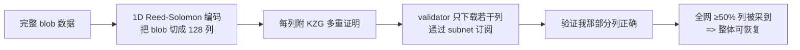

> [!IMPORTANT]
> **PeerDAS 把单节点存储压力从「全部 blob」降到「采样若干列」**——这是 blob 容量横向扩展的物理基础。BPO1 / BPO2 的提速正是基于 PeerDAS 上线后才敢做。

### 7.3 BPO（Blob Parameter Only）forks

Fusaka 还引入了**轻量级 fork 机制**——只调 blob 参数、不改其他规则的 fork：

| Fork | 时间 | target / max |
|---|---|---|
| Fusaka mainnet | 2025-12-03 | 6 / 9（沿用 Pectra） |
| BPO1 | 2025-12-17 | 10 / 15 |
| BPO2 | 2026-01-07 | 14 / 21 |
| BPO3?（计划中） | 2026-Q3? | 21 / 32（视采样验证健康） |

> [!TIP]
> BPO 的好处：节点运营商有时间监控 PeerDAS 健康，参数提升不必绑大版本。这是以太坊治理「快慢双轨」的成功实践。

### 7.4 Full Danksharding 路线

完整 Danksharding 目标：**2D Reed-Solomon 编码 + 完整 DAS**，每 slot 32 MB+ 数据可用容量。

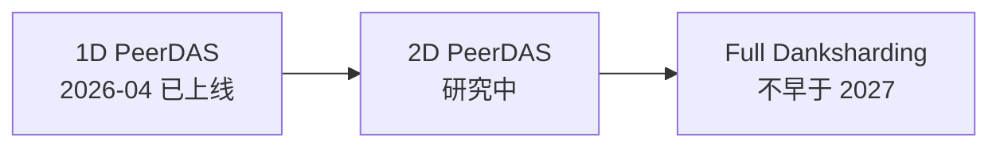

> [!NOTE]
> Vitalik 在 2026 EthCC 演讲（截至 2026-04 的最新公开材料）中给出非正式时间表「2D PeerDAS 不早于 2027」。意味着 BPO2 的 14 / 21 是 2026 年的稳定状态。

### 7.5 PeerDAS 的工程影响

```mermaid
mindmap
  root((PeerDAS 影响))
    Rollup
      DA 几乎免费
      可上 100+ 条 L2 不堵
    节点运营
      存储压力 -90%
      但带宽增加（subnet 订阅）
    L2 设计
      可以更激进地频繁 commit
      sub-12s soft confirmation 更可行
    外部 DA
      压力增加
      Celestia/Avail 必须证明独特价值
```

### 7.6 升级时间表浏览

> [!IMPORTANT]
> **2026-04 现状速记**：
> - Fusaka mainnet：2025-12-03 已上线
> - PeerDAS：1D 采样运行 4+ 个月，状态健康
> - Blob target：14（BPO2 后）
> - Blob 利用率：约 4 blobs/block，远低于 14 target
> - blob_base_fee：长期接近 1 wei
> - 下一步：2D PeerDAS 仍在研究

基础设施层确认了 blob 廉价、DA 充裕。那么在「DA 解决了」的前提下，如何评估一条 rollup 整体有多安全、多去中心化？第 8 章引入 L2BEAT Stage 评级框架给出标准答案。

---

## 第 8 章 L2BEAT Stage 评级：rollup 的「安全成绩单」

### 8.1 三个 Stage 的定义

[L2BEAT Stages](https://l2beat.com/stages) 是评估 rollup training wheels 剩余量的事实标准框架。

```mermaid
graph LR
    A[Stage 0<br>Full training wheels] --> B[Stage 1<br>Limited training wheels]
    B --> C[Stage 2<br>No training wheels]

    A1[proof system<br>可能未启用<br>Security Council<br>可任意升级] -.-> A
    B1[proof system<br>permissionless<br>SC 权限受限] -.-> B
    C1[SC 仅在<br>可证明 bug<br>时介入] -.-> C
```

### 8.2 五维风险图（Risk Rosette）

L2BEAT 给每条 L2 一张五维雷达图，每维四档颜色（绿/黄/橙/红）：

```mermaid
graph TB
    A[Risk Rosette] --> B[State Validation<br>状态验证]
    A --> C[Data Availability<br>数据可用性]
    A --> D[Exit Window<br>提款窗口]
    A --> E[Sequencer Failure<br>排序器故障]
    A --> F[Proposer Failure<br>提案者故障]
```

### 8.3 Stage 1 的硬性要求

按 [OP Stack Stage 1 specification](https://specs.optimism.io/protocol/stage-1.html)，Stage 1 必须：

1. **permissionless fault proof / validity proof**：任何人能挑战 invalid output（OP）或任何 prover 能提交证明（ZK）；
2. **Security Council 至少 8 人**，至少 50% 是非 founding team 独立成员；
3. **多签门槛 ≥ 75%**；
4. **upgrade delay ≥ 7 天**（与提款挑战期对齐）；
5. 用户必须能在不依赖 sequencer 的情况下强制提款。

### 8.4 Stage 2 的硬性要求

Stage 2 在 Stage 1 基础上：

1. **Security Council 只能在「可证明的 on-chain bug」时介入**——例如 prover 卡死、合约自我矛盾；
2. **不能任意升级合约**；
3. **proof system 完全自治**。

> [!IMPORTANT]
> **截至 2026-04 没有任何主流 EVM L2 达到 Stage 2**。最接近的候选是 Arbitrum（BoLD 已上）和 DeGate（应用 rollup），但都因 Security Council 仍保留 instant upgrade 权限而卡在 Stage 1。

### 8.5 怎么读一个 L2 的 stage 评级

> [!TIP]
> **5 步读法**：
> 1. 看 stage 数字（0/1/2）；
> 2. 看 Risk Rosette 五维有几个不是绿的；
> 3. 看 Permissions 标签：Security Council 几人？多签门槛？是否包含外部独立成员？
> 4. 看 Contracts 升级 timelock 长度；
> 5. 看 Stage 升级条件清单（还差哪几条到下一阶段）。

### 8.6 截至 2026-04 的 Stage 全景

| Stage | EVM 主流 L2（截至 2026-04） |
|---|---|
| **Stage 2** | **暂无主流 EVM L2** ← 注意这一行 |
| **Stage 1** | Arbitrum One（BoLD 已上）、OP Mainnet（2024-06 fault proof）、Base（2024-10 fault proof + 0.08 ETH 抵押）、Scroll（2025-04 Euclid 升级后达成）、Ink、Unichain |
| **Stage 0** | zkSync Era、Linea、Starknet、Polygon zkEVM（即将退役）、Taiko、Blast、Mantle、Manta Pacific、Mode 等 |

### 8.7 为什么 Stage 2 这么难

```mermaid
graph TB
    A[Stage 2 卡点] --> B[Security Council 必须放弃<br>instant upgrade 权限]
    A --> C[要求 prover 100% 可靠]
    A --> D[要求合约无 bug]
    B --> E[但 ZK 电路 bug 历史频发<br>团队需要紧急升级权]
    C --> F[ZK 系统年轻<br>不敢完全自治]
    D --> G[审计无法 100% 保证]
    E & F & G --> H[结果: 都停在 Stage 1]
```

### 8.8 Stage 不是唯一指标

> [!WARNING]
> **Stage 评级 ≠ 安全评级**。实际安全还需评估：sequencer 抗审查（force inclusion）、升级 timelock 长度、合约审计与 bug bounty。例：Blast 和 zkSync Era 同为 Stage 0，但 Blast 因 fraud proof 未上线风险更高。

有了评级框架，接下来对照两大派别的实际落地情况：第 9 章盘点 Optimistic L2 全景，第 10 章盘点 ZK L2 全景。

---

## 第 9 章 Optimistic L2 全景

> 本章列出**截至 2026-04** 主流 Optimistic Rollup 全景。所有 stage 与 TVL 数据请用 [L2BEAT](https://l2beat.com/scaling/summary) 实时复核。

### 9.1 Arbitrum One

- **类型**：Optimistic Rollup（Nitro 架构）
- **Stage（2026-04）**：**Stage 1**（BoLD permissionless 已上线）
- **TVL（2026-04）**：约 $16.84B（[L2BEAT](https://l2beat.com/scaling/projects/arbitrum)），长期 #1
- **DA**：Ethereum blob

#### Nitro 架构

```mermaid
graph TB
    subgraph Arbitrum[Arbitrum Nitro 架构]
        A[ArbOS Go 代码<br>含修改版 Geth] --> B[编译到 native<br>正常执行]
        A --> C[编译到 WASM/WAVM<br>fraud proof 用]
        B --> D[Sequencer 出块]
        D --> E[Batch 提交<br>到 L1 inbox]
        E --> F[Validator 重放<br>检查正确性]
        F --> G{有争议?}
        G -->|是| H[BoLD 二分博弈<br>到一条 WAVM 指令]
        G -->|否| I[7 天后终局]
    end
```

#### 特色

- **[Nitro](https://docs.arbitrum.io/how-arbitrum-works/inside-arbitrum-nitro)**：Geth 编进 ArbOS（Go），native 执行，同时编到 WASM/WAVM 跑 fraud proof；
- **Stylus**：Rust/C++ 写智能合约（WASM）；
- **[BoLD](https://docs.arbitrum.io/how-arbitrum-works/bold/gentle-introduction)**：permissionless 挑战，争议在有界时间内解决。

### 9.2 OP Mainnet（Optimism）

- **类型**：Optimistic Rollup（Bedrock 架构）
- **Stage（2026-04）**：**Stage 1**（2024-06 启用 permissionless fault proof）
- **DA**：Ethereum blob

#### Bedrock 核心组件

```mermaid
graph LR
    A[op-geth<br>L2 执行客户端] -- engine API --> B[op-node<br>rollup 节点]
    B --> C[op-batcher<br>把 L2 区块<br>压成 frame/blob<br>提交到 L1]
    B --> D[op-proposer<br>把 output root<br>提交到 L2OutputOracle]
    E[L1] --> B
    C --> E
    D --> E
```

四个组件（[OP Stack 文档](https://specs.optimism.io/)）：**op-geth**（L2 执行）、**op-node**（derivation，从 L1 数据派生 L2 区块）、**op-batcher**（压 L2 区块成 frame/blob，提交 L1）、**op-proposer**（提交 output root 到 L2OutputOracle）。

#### 特色：Superchain

[Superchain](https://docs.optimism.io/)：OP Stack 派生链共享 sequencer 集、桥、治理（OP token）。截至 2026-04 已含 Base、Mode、Mantle、Worldchain、Soneium、Ink、Unichain 等数十条链。

### 9.3 Base

- **类型**：Optimistic Rollup（OP Stack）
- **Stage（2026-04）**：**Stage 1**（2024-10 上线 fault proof，每个提案需 0.08 ETH 抵押）
- **TVL（2026-04）**：长期 #2，与 Arbitrum 合计占 L2 TVS 75%+（[BlockEden 2026-02](https://blockeden.xyz/blog/2026/02/11/layer-2-consolidation-war-base-arbitrum/)）
- **运营**：Coinbase
- **DA**：Ethereum blob

#### 特色

- **抵押 + slash**：错误提案者 0.08 ETH 被 slash，挑战者得奖励；
- **Coinbase 渠道**：App store 推送 + USDC 直接打入；TVL 从 2023 上线至今持续 #2。

### 9.4 Blast

- **类型**：Optimistic Rollup（OP Stack 魔改）
- **Stage（2026-04）**：**Stage 0（fraud proof under development）**
- **DA**：Ethereum blob

#### 特色

- **原生 yield**：存款自动赚 L1 staking + RWA 收益，2024 年 TVL 一度超 $2B；
- **fraud proof 仍未上线**：[L2BEAT](https://l2beat.com/scaling/projects/blast) 标注「fraud proof under development」。

> [!WARNING]
> **Blast 风险点**：fraud proof 未上线，sequencer 提交错误状态根时用户无法挑战、无法强制提款，安全模型几乎完全依赖团队多签。

### 9.5 Mantle

- **类型**：Optimistic 起家，2026 转 ZK 验证
- **Stage（2026-04）**：Stage 0（**2026 升级 OP Succinct，ZK 验证**）
- **TVL**：~$1B+（[L2BEAT](https://l2beat.com/scaling/projects/mantle)）
- **DA**：EigenDA（重要差异）

#### 特色

- **EigenDA 早期客户**；**OP Succinct**：SP1 zkVM 给 OP Stack 加 ZK 验证（2026 升级中）；**mETH staking**：自营 LST。

### 9.6 Arbitrum Nova

- **类型**：Arbitrum AnyTrust（DAC 替代 L1 DA）
- **Stage（2026-04）**：Stage 0
- **TVL**：~$49M（[L2BEAT](https://l2beat.com/scaling/projects/nova)）
- **DA**：Data Availability Committee（DAC，少数 KYC 委员）

#### 何时用 Nova

> [!TIP]
> **Nova 适合**：社交、链游、低值高频场景；不适合 DeFi 主资金（DAC 信任假设）。Reddit 的 Community Points 早期用了 Nova。

### 9.7 OP Stack Superchain 兄弟链

| 链 | 主营 | DA | Stage（2026-04） | TVL 估 | 运营 |
|---|---|---|---|---|---|
| Mode | DeFi | Ethereum blob | Stage 0 | 中 | Mode Foundation |
| [Manta Pacific](https://l2beat.com/scaling/projects/mantapacific) | ZK 应用 + 通用 | Celestia | Stage 0 | 中 | Manta Network |
| opBNB | BSC 系扩容 | BNB | 非以太坊 L2 | 中 | BNB Chain |
| Lisk | 通用 | Ethereum blob | Stage 0 | 小 | Lisk |
| [Soneium](https://l2beat.com/scaling/projects/soneium) | 媒体 / 游戏 | Ethereum blob | Stage 0 | 小-中 | Sony Block Solutions Labs |
| World Chain | 身份 / 应用 | Ethereum blob | Stage 0 | 中 | Tools for Humanity（Worldcoin） |
| [Fraxtal](https://l2beat.com/scaling/projects/fraxtal) | DeFi | Ethereum blob | Stage 0 | ~$17.6M | Frax Finance |
| [Cyber](https://l2beat.com/scaling/projects/cyber) | SocialFi | Ethereum blob | Stage 0 | 小 | Cyber Connect |
| Unichain | DeFi | Ethereum blob | **Stage 1** | ~$43.5M | Uniswap Labs |
| Ink | 通用 | Ethereum blob | **Stage 1** | ~$478M | Kraken |
| DeBank Chain | 钱包/聚合 | Ethereum blob | Stage 0 | 中 | DeBank |
| Zora | NFT | Ethereum blob | Stage 0 | 小 | Zora |

> [!WARNING]
> **opBNB 不是 Ethereum L2**：它 settle 到 BNB Smart Chain，不到 Ethereum。所以它不在 L2BEAT，安全性等价于 BNB 链。如果有人把 opBNB 算成「Ethereum L2」是误导。

### 9.8 Optimistic L2 完整对照表

| L2 | 框架 | Stage | DA | 信任假设额外项 |
|---|---|---|---|---|
| Arbitrum One | Nitro | **Stage 1** | Ethereum blob | BoLD permissionless |
| Arbitrum Nova | Nitro AnyTrust | Stage 0 | DAC | 2-of-N DAC 诚实 |
| OP Mainnet | OP Stack | **Stage 1** | Ethereum blob | OP fault proof |
| Base | OP Stack | **Stage 1** | Ethereum blob | OP fault proof + 0.08 ETH stake |
| Blast | OP Stack（魔改） | Stage 0 | Ethereum blob | **fraud proof 未上线** |
| opBNB | OP Stack | 非 ETH L2 | BNB | BNB 链信任 |
| Mode | OP Stack | Stage 0 | Ethereum blob | OP fault proof |
| Mantle | 自研 + Module | Stage 0 | EigenDA | EigenDA committee |
| Manta Pacific | OP Stack | Stage 0 | Celestia | Celestia PoS |
| Lisk | OP Stack | Stage 0 | Ethereum blob | OP fault proof |
| Soneium | OP Stack | Stage 0 | Ethereum blob | OP fault proof |
| World Chain | OP Stack | Stage 0 | Ethereum blob | OP fault proof |
| Fraxtal | OP Stack | Stage 0 | Ethereum blob | OP fault proof |
| Cyber | OP Stack | Stage 0 | Ethereum blob | OP fault proof |
| Unichain | OP Stack | **Stage 1** | Ethereum blob | OP fault proof |
| Ink | OP Stack | **Stage 1** | Ethereum blob | OP fault proof |
| Zora | OP Stack | Stage 0 | Ethereum blob | OP fault proof |

### 9.9 Optimistic L2 共识：OP Stack 一统

> [!IMPORTANT]
> 几乎所有新生 Optimistic L2 基于 OP Stack。Arbitrum Nitro 技术领先（BoLD 唯一），但 Orbit 派生链增长不如 Superchain。Conduit、Caldera、Alchemy 三大 RaaS 都以 OP Stack 为默认。

Optimistic 系靠 fraud proof 约束行为；ZK 系则靠数学证明消除不确定性。以下盘点 ZK L2 的实际落地情况。

---

## 第 10 章 ZK L2 全景

### 10.1 zkSync Era

- **类型**：ZK Rollup（Type-4 zkEVM）+ Volition
- **Stage（2026-04）**：**Stage 0**（[L2BEAT](https://l2beat.com/scaling/projects/zksync-era)）
- **证明系统**：Boojum（STARK 内层 + SNARK 外包装）
- **DA**：Ethereum blob / Validium 用户可选

#### 特色

- **原生 AA**：所有账户是合约账户；
- **EraVM**：非 EVM，用 zkSolc 编译（Solidity 友好但底层不同）；
- **ZK Stack**：ZK 系唯一可独立部署的 stack，Hyperchain = ZK 版 Superchain；
- **Volition**：每笔交易自选 Rollup 或 Validium 模式。

### 10.2 Scroll

- **类型**：ZK Rollup（Type-2 zkEVM，最接近 EVM 等价）
- **Stage（2026-04）**：**Stage 1**（2025-04 Euclid 升级后达成，详见 [Bitget 2025-04](https://www.bitget.com/news/detail/12560604730425)）
- **证明系统**：原 halo2 → Axiom OpenVM（RISC-V zkVM）
- **DA**：Ethereum blob

#### 特色

- **Type-2 EVM 等价**：主网工具链开箱即用；**Euclid 升级（2025-04）**：halo2 换成 OpenVM RISC-V zkVM，吞吐 5x、成本 -50%、permissionless sequencer；**第一个达 Stage 1 的 ZK Rollup**。

### 10.3 Linea

- **类型**：ZK Rollup（Type-2，Type-1 audit 进行中、未正式上线）
- **Stage（2026-04）**：Stage 0（向 Stage 1 推进，[Linea changelog](https://docs.linea.build/changelog/release-notes)）
- **运营**：Consensys
- **证明系统**：自研 Vortex / PLONK 系
- **DA**：Ethereum blob

#### 特色

- **Type-1 路线**：从 Type-2 向 Type-1 推进，截至 2026-04 仍处于 audit 阶段、**未在主网正式切换 Type-1**；如顺利落地有望成为首个 Type-1 zkEVM。**MetaMask 集成最深**（Consensys 自家）；**LXP 激励**带动 TVL。

### 10.4 Starknet

- **类型**：ZK Rollup（非 EVM，Cairo VM）
- **Stage（2026-04）**：**Stage 0**（向 Stage 1 推进，全 sequencer 去中心化目标 2026 完成）
- **证明系统**：纯 STARK（Stone / S-two prover）
- **DA**：Ethereum blob

#### 特色

- **Cairo VM**：非 EVM，Cairo 语言（性能优但生态独立）；**纯 STARK**：无可信设置，proof 大；**2026 全 validator 自跑 sequencer**（[Starknet 2025 retro](https://www.starknet.io/blog/starknet-2025-year-in-review/)）。

### 10.5 Polygon zkEVM

- **状态（2026-04）**：**Mainnet Beta 将在 2026-07-01 退役**（[Polygon 公告](https://forum.polygon.technology/t/sunsetting-polygon-zkevm-mainnet-beta-in-2026/21020)）
- **退役原因**：采用率不及预期，年损 $1M+
- **替代**：Polygon 转向 PoS 链 + AggLayer。ZK 部分被分拆为 [Polygon ZisK](https://coinfomania.com/sandeep-nailwal-becomes-polygon-ceo-deprecates-zkevm-refocuses-roadmap-on-agglayer-pos-chain-and-100k-tps-goal/) 子公司，Jordi Baylina 主导

> [!WARNING]
> **教训**：第一个上线主网的 zkEVM 不一定能赢——blob 后没及时跟上、Type-2/3 等价度不够、生态投入分散到 CDK 后没集中。结果：年损 $1M+，2026-07 退役。

### 10.6 Taiko Alethia

- **类型**：基于 sequencing（based rollup）+ 多证明（multi-proof）
- **Stage（2026-04）**：**Stage 0**
- **证明系统**：SP1（Succinct）+ RISC0 + TEE 三重独立证明，任一通过即可
- **DA**：Ethereum blob

#### 特色

- **based sequencing**：复用 L1 proposer，最强抗审查；**多证明降风险**：单证明系统 bug 不导致全链伪造（[OpenZeppelin Taiko Shasta audit](https://www.openzeppelin.com/news/taiko-shasta-protocol-re-audit)）。

### 10.7 Aztec

- **类型**：隐私 ZK Rollup（非 EVM，Noir 语言）
- **状态（2026-04）**：[Ignition Mainnet 2025-11-19 启动](https://aztec.network/blog/road-to-mainnet)，前期 sequencer 出空块；token 2026-02-12 TGE；2026-03-17 发现 critical 漏洞，v5 修复版 2026-07 计划上线
- **证明系统**：Ultra Honk

#### 特色

当前最重要的隐私 L2；**Noir DSL**：自家 ZK DSL，接近 Rust。

### 10.8 Polygon Miden

- **类型**：客户端证明 zkVM（非 EVM）
- **状态（2026-04）**：[Alpha testnet v6 已上线](https://polygon.technology/blog/polygon-miden-alpha-testnet-v3-is-live)，主网计划 2026 上线（多次延期）
- **特色**：**用户在自己设备上生成证明**——隐私默认、状态由用户保管；委托证明可在低端设备保持 1-2 秒证明时间
- **资金**：[a16z + 1kx + HackVC 投 $25M](https://polygon.technology/blog/miden-raises-25m-from-a16z-crypto-1kx-and-hackvc-to-build-the-edge-blockchain) 独立成「Miden」公司

### 10.9 Mina (Zeko)

- **类型**：[Zeko](https://minaprotocol.com/blog/bringing-the-mina-stack-to-life-with-zeko) 是 Mina 上的 ZK Rollup 框架
- **状态（2026-04）**：Boom Testnet 已结束（处理 500K tx），主网准备中，Berkeley 升级 Q2 2026 启用可编程 zkApps，Kimchi prover 升级 Q3 2026
- **特色**：基于 22KB 链 Mina 的「微链」生态

### 10.10 Astar zkEVM

- **状态（2026-04）**：**已退役**（[2025-03-31 sunset](https://forum.astar.network/t/astar-zkevm-sunsetting-migration-plan/7780)），用户被引导迁移到 Soneium。Polygon CDK 早期客户的失败案例

### 10.11 ZK L2 完整对照表

| L2 | zkEVM 类型 | Stage（2026-04） | 证明系统 | DA |
|---|---|---|---|---|
| zkSync Era | Type-4 | Stage 0 | Boojum (STARK+SNARK) | Ethereum blob / Validium |
| Scroll | Type-2 | **Stage 1** | OpenVM (RISC-V zkVM) | Ethereum blob |
| Linea | Type-2 (→ Type-1 Q1 2026) | Stage 0 | Vortex / PLONK | Ethereum blob |
| Polygon zkEVM | Type-2/3 | Stage 0（**2026-07 退役**） | PIL / Plonky2 | Ethereum blob |
| Starknet | non-EVM (Cairo) | Stage 0 | Stone / S-two STARK | Ethereum blob |
| Taiko Alethia | Type-1 (based) | Stage 0 | SP1 + RISC0 + TEE 多证明 | Ethereum blob |
| Aztec | non-EVM (Noir) | pre-stage | Ultra Honk | Ethereum blob |
| Polygon Miden | non-EVM (MASM) | testnet | 客户端 STARK | Ethereum blob |
| Mina (Zeko) | non-EVM | testnet | Pickles / Kimchi | Mina L1 |
| Astar zkEVM | Type-2 | **退役** | - | - |

### 10.12 ZK L2 整体观察

> [!IMPORTANT]
> **2026-04 ZK L2 现状**：zkSync TVL 高、Scroll Stage 最先进、Linea 工具链最易用、Starknet 性能最强——没有绝对第一。**Polygon zkEVM 退役**说明 ZK L2 不是「先发就赢」；**差异化**已不是「能不能跑 EVM」，而是 prover 性能 + 生态飞轮 + 治理透明度。

ZK Rollup 把数据放在 L1 保证最高安全；但有项目把 ZK 证明与链下 DA 结合，走向安全和成本的不同平衡——这就是 Validium 和 Volition。

---

## 第 11 章 Validium 与 Volition

### 11.1 Validium 是什么

**Validium = ZK 证明 + 链下 DA**。安全模型：ZK 数学正确 + DA 提供方诚实。

```mermaid
graph LR
    A[Validium 用户] --> B[L2 sequencer]
    B --> C[ZK 证明上 L1]
    B --> D[数据存 DAC<br>或外部 DA 链]
    C --> E[L1 验证<br>状态根有效]
    D --> F[需要数据时<br>找 DAC 拿]
    F -.->|DAC 不诚实| G[💀 用户无法<br>强制提款]
```

> [!WARNING]
> **Validium 的核心风险**：sequencer + DAC 同时不诚实时，用户**无法构造提款证明**——你的钱就被冻在 L1 合约里。这就是 Validium 一直没成为主流的原因。

### 11.2 Volition：用户自选

**Volition = 每笔交易自选 Rollup 模式或 Validium 模式**。

```mermaid
sequenceDiagram
    participant U as 用户
    participant Z as zkSync sequencer
    participant L1 as L1 verifier
    participant DA as Validium DAC

    U->>Z: 交易（数据 mode = Rollup）
    Z->>L1: 提交 ZK proof + blob
    L1-->>U: 安全等价 Ethereum

    U->>Z: 交易（数据 mode = Validium）
    Z->>L1: 提交 ZK proof
    Z->>DA: 数据存 DAC
    L1-->>U: 安全等价 ZK + DAC
```

zkSync Era 是典型实现：同一合约里为不同交易选不同 mode。

### 11.3 主流 Validium / Volition 项目

| 项目 | 类型 | 状态（2026-04） | 备注 |
|---|---|---|---|
| **Immutable X** | StarkEx Validium | **2026 初已合并到 Immutable Chain（zkEVM L2）**，X 桥已合到主桥（[Immutable docs](https://docs.immutable.com/docs/products/immutable-chain/immutable-x-deprecation)） | NFT 链游 |
| **Sorare** | StarkEx Validium | 运行中 | 体育 NFT |
| **dYdX v3** | StarkEx ZK Rollup | **已退役**，迁移到 dYdX Chain (v4) | 永续合约 |
| **Polygon Miden Validium 模式** | 自研 | testnet | Miden 主网未上线 |
| **rhino.fi** | StarkEx Validium | 运行中 | DeFi 桥 |

### 11.4 大趋势：Validium 在转型

> [!NOTE]
> 纯 Validium 项目陆续转型：Immutable X 转 zkEVM L2、dYdX 转应用链、StarkEx 减少新客户。**Volition（用户自选）正在取代纯 Validium**，zkSync 设计成为新范式。

### 11.5 Volition 何时划得来

> [!TIP]
> **Volition 适合**：
> - 应用既有「主资金」（高价值，要 Rollup 安全），又有「日常微交易」（低价值，要省钱）；
> - 链游：发售 / 大额交易用 Rollup，日常 PvP / 道具交易用 Validium；
> - DEX：大单走 Rollup 留下完整审计轨，小单走 Validium。

### 11.6 Validium 的失败教训：Astar zkEVM

> [!WARNING]
> **Astar zkEVM（Polygon CDK Validium，2024-03 上线，2025-03 退役）**：用户增长慢、流动性碎片化、运营成本高于收入。说明纯 Validium 在 2026 年可能不再是好的产品定位——blob 太便宜了，外部 DA 的成本优势削弱。

DA 选型决定数据放在哪里；**排序**决定数据什么时候、以什么顺序被打包——而这正是 sequencer 的职责，也是当前 L2 中心化的核心所在。

---

## 第 12 章 Sequencer 架构演化

### 12.1 Sequencer 是 L2 的中央心脏

Sequencer 决定 L2 交易排序、出块、batch 提交，是当前 L2 中心化的最大来源——**绝大多数 L2 的 sequencer 是单一公司运行的单实例**。

### 12.2 演化路径：三步走

```mermaid
graph LR
    A[Stage 1<br>Centralized<br>单实例] --> B[Stage 2<br>Shared sequencer<br>跨链共享]
    B --> C[Stage 3<br>Decentralized<br>每条 L2 自己的 PoS sequencer]

    A1[Arbitrum/OP/Base 现状<br>低延迟<br>但可被审查 + 单点故障] -.-> A
    B1[Espresso/Astria/Radius/Rome<br>原子跨 rollup 交易<br>共享 finality] -.-> B
    C1[OP Superchain 选举<br>Arbitrum BoLD-seq<br>Starknet 全 validator] -.-> C
```

### 12.3 为什么 Centralized Sequencer 是问题

**优点**：低延迟（几十 ms 软确认）、MEV 简单、运营便宜。**缺点**：

```mermaid
graph TB
    A[Centralized Sequencer] --> B[审查交易<br>例如不打包某个地址]
    A --> C[宕机风险<br>OP 与 Arbitrum 都有过几小时停机]
    A --> D[利润全归运营方<br>每年数亿美元]
    A --> E[upgrade 风险<br>恶意升级跑路]
```

### 12.4 Force-inclusion：抗审查兜底

任何人可把交易发到 L1 inbox 合约，sequencer 必须在 N 个 L1 区块内打包，否则强制执行（见第 3 章）。

> [!IMPORTANT]
> **force-inclusion 是 Stage 1 的硬要求之一**。

### 12.5 Shared Sequencer：图解

```mermaid
graph TB
    subgraph SS[Shared Sequencer Network]
        SA[HotShot 共识]
        SB[公平排序]
        SC[共享 finality]
    end

    R1[Rollup A] --> SS
    R2[Rollup B] --> SS
    R3[Rollup C] --> SS

    SS --> A1[Rollup A L1]
    SS --> A2[Rollup B L1]
    SS --> A3[Rollup C L1]

    SS -.-> X[原子跨 rollup<br>交易：A 和 B<br>同时上链]
```

### 12.6 主要 Shared Sequencer 项目（截至 2026-04）

| 项目 | 状态 | 架构 | 客户 |
|---|---|---|---|
| [Espresso](https://hackmd.io/@EspressoSystems/EspressoSequencer) | **2026-02-12 主网启动** | HotShot + Tiramisu DA | Arbitrum Orbit、Cartesi、若干 OP Stack 链 |
| [Astria](https://www.astria.org/) | **2026 停运**（[需作者核实]，单一来源 [MEXC 报道](https://www.mexc.co/news/218229)；审稿时点未在 [astria.org](https://www.astria.org/) 官方渠道独立确认） | 基于 Celestia | 报道称原客户迁移到 Espresso 或 native |
| [Radius](https://medium.com/@radius_xyz/radius-trustless-shared-sequencing-layer-b293dfa75db) | testnet 运行中 | trustless 排序，PVDE | 待客户上 |
| [Rome](https://www.rome.builders/rome-protocol-the-shared-sequencer-using-solana) | 公测 | **基于 Solana 做 sequencer**，Rhea + Hercules | 实验性 |

> [!NOTE]
> **Astria 关闭的教训**：shared sequencer 是好的概念，但商业飞轮难启动——客户 L2 不愿放弃自己的 sequencer 利润，新 L2 数量也在收缩。Espresso 靠先发优势 + 与 Arbitrum 紧密集成存活下来。

### 12.7 各 L2 去中心化 Sequencer 进度（截至 2026-04）

| L2 | 进度 |
|---|---|
| Arbitrum | BoLD（validator 端去中心化）完成，sequencer 仍 Offchain Labs 单实例，BoLD-sequencer 在研究 |
| Optimism | Superchain sequencer 选举 + ETH stake 在测试网 |
| Base | 跟 Optimism 路线 |
| zkSync | 自有 PoS sequencer 集，路线图未上线 |
| Starknet | 全 validator 自跑 sequencer 目标 2026 完成（[Starknet 2025 retro](https://www.starknet.io/blog/starknet-2025-year-in-review/)） |
| Scroll | **Euclid 升级已 permissionless sequencer**（2025-04） |
| Taiko | based sequencing（直接用 L1 proposer），天然去中心化 |

### 12.8 Based Sequencing：另一条路

> [!TIP]
> **Based sequencing** 直接用 L1 proposer 当 L2 sequencer——你的 L2 sequencer 就是当前 L1 出块者。
>
> **优点**：
> - 天然继承 L1 抗审查；
> - 无 sequencer 集中化问题；
> - 与 L1 同步出块。
>
> **缺点**：
> - 软确认延迟 = L1 出块时间（12 秒）；
> - 不能自定义 priority fee 策略；
> - L1 拥堵时 L2 也卡。
>
> Taiko 是当前最大 based rollup 实现。

### 12.9 Sequencer 利润流向：去中心化的经济激励

> [!IMPORTANT]
> **Sequencer 是 high-margin 业务**（详见第 17 章）。中心化：利润全归运营公司；shared：分给网络 staker；去中心化：分给 L2 staker / 协议金库。**去中心化的真正阻力**：放弃 sequencer 利润 = 失去主要现金流，这就是各 L2 都「计划中」但推进缓慢的原因。

Sequencer 解决了「链内排序」；但多条 L2 并存，资产和消息要跨链流动，就需要**桥**来连接不同的执行域。

---

## 第 13 章 桥与跨链消息

### 13.1 一图概览

```mermaid
graph TB
    A{要不要跨链?} --> B{源/目标都是<br>同一个 rollup 的 L1↔L2?}
    B -->|是| C[用 Native Bridge<br>OP CrossDomainMessenger<br>Arbitrum Inbox/Outbox<br>等价 rollup 安全]
    B -->|否| D{是不是同栈<br>OP Superchain<br>Arbitrum Orbit?}
    D -->|是| E[用栈原生 interop<br>OP interop / AnyTrust message]
    D -->|否| F[第三方 bridge<br>额外信任假设]
```

### 13.2 Native Bridge：原理

```mermaid
sequenceDiagram
    participant U as 用户
    participant L1M as L1CrossDomainMessenger
    participant Bedrock as OP Stack derivation
    participant L2M as L2CrossDomainMessenger
    participant L2C as L2 合约

    Note over U: L1 → L2 消息（即时）
    U->>L1M: sendMessage(L2合约, 数据)
    L1M->>Bedrock: 写到 L1 inbox
    Bedrock->>L2M: 派生 L2 区块时执行
    L2M->>L2C: 调用目标合约

    Note over U: L2 → L1 消息（7 天挑战期）
    U->>L2M: sendMessage(L1Target, payload)
    L2M-->>Bedrock: 提交 output root
    Note over Bedrock: 等 7 天挑战期
    U->>L1M: 主动 finalize 提款
    L1M->>L1M: 验证 output proof + Merkle proof
    L1M->>U: 执行 L1 调用
```

### 13.3 主流跨链消息协议（截至 2026-04）

| 协议 | 验证模型 | 安全 | 强项 | 注意 |
|---|---|---|---|---|
| [LayerZero v2](https://docs.layerzero.network/) | 应用可配置 DVN（Decentralized Verifier Network）+ executor | 由应用自选 DVN 集 | OFT 标准、覆盖最广（70+ 链）、市场占 ~75% 跨链消息量 | DVN 配置不当 = 单点 |
| [Wormhole](https://wormhole.com/) | 19 个 Guardian 多签 + 部分 zk-light-client | 13/19 多签 | Solana / 非 EVM 覆盖最强、[NTT](https://wormhole.com/products/native-token-transfers) 原生 token 转账 | 历史有过 $326M 事故 |
| [Hyperlane](https://docs.hyperlane.xyz/) | 应用可部署自己的 ISM（Interchain Security Module） | 应用自选 validator 集 | **permissionless 部署**（任何 rollup 自己接入） | 安全自负 |
| [Chainlink CCIP](https://docs.chain.link/ccip) | DON + Risk Management Network 双层 | Chainlink Labs 信任 + RMN 保险 | 银行 / 合规客户、[CCT](https://docs.chain.link/ccip/concepts/cross-chain-tokens) 跨链 token 标准 | 受限 token 集 |
| [Circle CCTP](https://www.circle.com/cross-chain-transfer-protocol) | 原生 USDC burn-mint | Circle 主权 | 唯一的 native USDC 跨链 | 仅 USDC |
| [Axelar](https://www.axelar.network/) | PoS validator 集 + GMP | 60 chains，2026-02 单日 $4.5M 转账 | Cosmos 系 + GMP | 中等流动性 |
| [Across](https://docs.across.to/) | Intent + UMA 乐观验证 | 中继商前置垫付，UMA 后置仲裁 | EVM 间用户体验 < 1 分钟（中继商垫付），但**协议级 settlement 走 UMA OO，仍有 ~14400s（4 小时）默认挑战期**；relayer 跑路时用户实际拿到资金时间依赖 OO 裁决 | 仅 EVM |
| [Stargate](https://stargateprotocol.gitbook.io/stargate) | LayerZero + 流动性池 | LZ DVN | EVM 间 native token 转账 | 滑点 |
| [Synapse](https://www.synapseprotocol.com/) | 自有 multichain + AMM | 桥多签 | 跨 EVM/非 EVM 资产 | 中等流动性 |
| [Connext](https://www.connext.network/) | xCall 模型 | 多 router | 可编程跨链 action | dApp 开发友好 |
| [deBridge](https://debridge.com/) | DLN 流动性网络 | validator 集 | 速度快、价格稳 | 有限链对 |
| [Squid Router](https://www.squidrouter.com/) | 基于 Axelar | Axelar 验证集 | bridge aggregator + DEX | 路由 + 滑点 |
| [IBC](https://ibcprotocol.org/) | light client 验证 | 链双方共识 | trust-minimized 标杆 | 两端都需轻客户端 |

### 13.4 LayerZero v2 详解

```mermaid
graph LR
    A[Sender App] --> B[LayerZero Endpoint<br>源链]
    B --> C[Application 配置<br>选择 DVN 集]
    C --> D[DVN1 验证]
    C --> E[DVN2 验证]
    C --> F[...DVN N]
    D & E & F --> G[Endpoint<br>目标链]
    G --> H[Executor 执行<br>调用目标合约]
```

> [!IMPORTANT]
> **LayerZero v2 的关键创新：DVN 可由应用自选**。你可以选「Google Cloud + Polyhedra + LayerZero Labs」三个 DVN，需要 3-of-3 都签名才执行——比单一桥安全模型可定制得多。

### 13.5 Hyperlane v3：permissionless interop

```mermaid
graph LR
    A[Rollup A] --> B[Hyperlane Mailbox A]
    B --> C[validator 集（应用自定义）]
    C --> D[Hyperlane Mailbox B]
    D --> E[Rollup B]

    F[ISM<br>Interchain Security Module] -.配置.-> C
    F --> F1[Multisig ISM]
    F --> F2[Aggregation ISM]
    F --> F3[Routing ISM]
    F --> F4[ZK ISM]
```

> [!TIP]
> **Hyperlane 适合自建 rollup**：你的 L2 不需要等 LayerZero / Wormhole 「批准」接入——直接 fork Hyperlane 部署 Mailbox 就能与所有 Hyperlane 链互通。这是 OP Stack / Orbit 之外的「permissionless interop」。

### 13.6 CCIP 与 CCTP：合规系的双子星

- **CCIP**：Chainlink 桥 + 消息平台，DON + Risk Management Network 双层验证，强项是机构客户和 CCT 标准；
- **CCTP**：Circle USDC 原生跨链，burn on chain A / mint on chain B，**唯一不通过桥的 USDC 跨链方式**。

> [!IMPORTANT]
> **2026 实战**：合规资产 / 银行客户走 CCIP；USDC 走 CCTP；DeFi 用户最优价用 Across；自建 rollup 互操作用 Hyperlane。**没有「一桥统天下」**。

### 13.7 IBC：去信任化的金标准

[IBC](https://ibcprotocol.org/)：两端各跑对方的 light client，消息靠 light client 验证 + Merkle proof。

```mermaid
graph LR
    A[Cosmos Chain A] --> B[Light Client of B<br>跑在 A 上]
    B --> C[IBC Relayer]
    C --> D[Light Client of A<br>跑在 B 上]
    D --> E[Cosmos Chain B]
```

> [!NOTE]
> IBC 不需要多签或 staker，但两端都需跑对方轻客户端，主要限于 Cosmos 系（Tendermint 共识）。Polymer Labs 在做 EVM ↔ IBC 适配。

### 13.8 实战决策表

> [!TIP]
> **2026 实战决策**：
> - 监管资产 / 银行客户 → CCIP 或 CCTP；
> - 自有 token 想 omnichain → LayerZero OFT 或 Wormhole NTT；
> - 自建 rollup interop → Hyperlane（permissionless）；
> - Solana 桥 → Wormhole；
> - 同 OP Superchain → 用 OP interop；
> - 同 Arbitrum Orbit → 用 AnyTrust message；
> - Cosmos 系 → IBC（trust-minimized 黄金标准）；
> - DeFi 用户最优价格 → Across / deBridge / Squid。

### 13.9 桥安全检查清单

> [!WARNING]
> 用任何第三方桥前问：
> 1. 桥的安全模型是什么（多签 N/M？light client？ZK？）
> 2. 验证者集是否分散（同一组织？同一国家？）
> 3. 桥合约升级权在谁手里？timelock 多长？
> 4. 历史有没有事故？事故后如何处理？
> 5. 桥 TVL / 24h volume 比例（流动性是否足够你的金额）？
> 6. 单笔上限是否够你的转账？

---

## 第 14 章 桥事故复盘：必读的 5 起

> 桥是 Web3 最高风险板块：TVL 不到 DeFi 10%，但占被盗资金 50%+（[Zealynx](https://www.zealynx.io/blogs/cross-chain-bridge-security-checklist)）。

### 14.1 时间线总览

```mermaid
timeline
    title Cross-Chain Bridge 重大事故时间线
    2022-02 : Wormhole : $326M : Solana 端签名验证 bug
    2022-03 : Ronin : $625M : 9 验证者 5 个被钓鱼
    2022-08 : Nomad : $190M : zero-root 初始化 bug，"任何人都能取"
    2023-07 : Multichain : $130M+ : CEO 失联 + 私钥被使用
    2024-01 : Orbit Bridge : $80M : 验证者私钥失陷
```

### 14.2 Wormhole（2022-02-02，$326M）

攻击者在 Solana 端铸造 120,000 wETH（约 $326M），抽空 ETH 储备。

#### 根因

signature verification 函数未校验 guardian set 是否真正签名——攻击者用 fake account 替换 system program，bridge 直接 mint wETH（[Halborn post-mortem](https://www.halborn.com/blog/post/explained-the-wormhole-hack-february-2022)）。

```rust
// 漏洞简化版：未校验 sysvar 是真 sysvar
let sysvar = next_account_info(...)?;
// 直接信任 sysvar 内容，没检查 sysvar.key == &sysvar::instructions::id()
let signers = parse_sysvar(&sysvar.data)?;
verify_signatures(signers, message);  // 攻击者控制 signers
```

修复：补上 `sysvar.key == &solana_program::sysvar::instructions::id()` 校验。Jump Crypto 注资 $326M 填上窟窿，桥继续运行。

> [!WARNING]
> **教训**：跨链消息必须严格校验 sender / signer / message format。Solana account model 比 EVM 复杂，更易出 account 混淆 bug。

### 14.3 Ronin（2022-03-23，$625M）

攻击者偷走 173,600 ETH + 25.5M USDC（约 $625M，Web3 历史第二大单笔损失）。

#### 根因

9 个 validator 多签，签 5 即可。攻击者社工钓鱼员工拿 4 个私钥；第 5 个签名来自 **Axie DAO 临时授权 Sky Mavis 代签——未及时撤销**；5/9 达成，调用 `withdrawERC20For` 提走资产。

Sky Mavis 增发 RON 还款（6 个月还清），Ronin 桥重启后改 9/12 多签 + 更严格运维。

> [!WARNING]
> **教训**：multisig 不是 trust-minimized——同一组织/服务器的 N 个 validator 安全等于 1。**临时授权必须有强制过期机制**。

### 14.4 Nomad（2022-08-01，$190M）

几小时内被掏空 $190M，上百地址复制粘贴交易提款——史诗级「众包抢劫」。

#### 根因

Nomad 在升级合约时，把一个 `acceptableRoot` 映射初始化成 `0x00`：

```solidity
// 漏洞：升级时 _setAcceptableRoot(0x00, true);
// 结果：所有空 messageProof（默认是 0x00）都被接受
function process(bytes memory _message) public {
    bytes32 messageHash = keccak256(_message);
    require(acceptableRoot[messages[messageHash]], "!proven");  // bypass!
    // ... 执行任意 message
}
```

第一个攻击者构造提款交易，其他人**复制 calldata 只改 to 字段**即可通过。Nomad 团队呼吁 white hat 归还，约 $36M 返还；桥停摆数月后用新架构重启。

> [!WARNING]
> **教训**：1) 升级合约要有完整 invariant 测试；2) `mapping(bytes32 => bool)` 零值（false）配合「0x00 被接受」是大坑；3) 公开 mempool 让单个 root cause 被数百人跟风放大。

### 14.5 Multichain（2023-07，$130M+）

多个链同时被掏空约 $130M+，链上数据显示是**桥自己的私钥发起的合法交易**——不是 hack，是「内鬼」。

#### 根因

[BlockSec 分析](https://blocksec.com/blog/multichain-incident-analysis)：2023-05 CEO Zhaojun He 疑似被中国监管机构带走；CEO 是唯一掌握桥多签私钥的人（其他多签人形同虚设）；失联后私钥被某方使用分批提走资产。

Multichain 团队解散，部分资金未追回，桥永久关闭。

> [!WARNING]
> **教训**：**桥的运营连续性 = 桥的安全**。「跑路风险」是真实存在的桥风险，不是理论上的。**永远要看「私钥实际由谁控制」，不只是看「multisig 是几个人」**。

### 14.6 Orbit Bridge（2024-01-01，$80M）

攻击者调用 `withdraw`，多签验证通过，掏空 $80M。根因：7 个 validator 私钥失陷（疑似私钥管理基础设施被入侵）。Orbit Chain 仍运营，但用户信任受损。

> [!WARNING]
> **教训**：**KYC 多签 ≠ 安全**——即使 validator 都是机构，私钥管理仍是单点。

### 14.7 共同模式：桥漏洞分类

```mermaid
mindmap
  root((Bridge 漏洞))
    签名/验证
      Wormhole 2022 fake account
      Orbit 2024 私钥失陷
    多签
      Ronin 2022 5/9 钓鱼
      KYC 多签≠安全
    初始化
      Nomad 2022 zero-root
    运营
      Multichain CEO 失联
    重放
      链 ID 校验缺失
    超时回滚
      跨链 message timeout 不一致
```

### 14.8 怎么避免成为下一个事故

> [!IMPORTANT]
> **桥的硬规则**：
> 1. **永远不要把超过你能承受损失的钱跨过非 native bridge**；
> 2. 如果必须跨链，优先 native bridge（即使要等 7 天）；
> 3. 第三方桥用之前看 [DefiLlama Bridges](https://defillama.com/bridges) 的 TVL / 24h volume 比；
> 4. 看桥合约升级权（timelock 长度、Security Council）；
> 5. 大额跨链分批，每笔金额低于桥单笔上限 50%；
> 6. 关注桥的 [Hypernative](https://hypernative.io/)、[Forta](https://forta.org/) 实时告警。

### 14.9 桥安全的演化方向

```mermaid
graph LR
    A[Multisig 桥<br>2020-2022] --> B[Light Client 桥<br>IBC / zk-light-client]
    A --> C[Optimistic 桥<br>Across / Nomad v2]
    A --> D[Restaking 桥<br>EigenLayer-secured]
    B --> E[最 trust-minimized]
    C --> F[平衡延迟与安全]
    D --> G[共享经济安全]
```

> [!NOTE]
> 行业从 multisig 桥转向 light client 桥（Polymer、zkLink）和 restaking 桥（Renzo bridge AVS），但 LayerZero 等多签桥仍占 [~75%](https://yellow.com/research/cross-chain-messaging-comparing-ibc-wormhole-layerzero-ccip-and-more) 市场份额。

桥的风险来自「跨越边界」——而当应用本身就是一条独立的 rollup，这道边界可以被重新划定。第 15 章介绍应用专属 L3 和 RaaS 平台，让开发者把链变成产品的一部分。

---

## 第 15 章 L3 / app-rollup / RaaS

### 15.1 L3 是什么

**L3 = 在 L2 上再起一条 rollup，settlement 用 L2 而非 L1。**

```mermaid
graph TB
    L1[Ethereum L1]
    L2A[Arbitrum One L2]
    L2B[OP Mainnet L2]
    L3a[xAI 游戏 L3<br>settle to Arbitrum]
    L3b[Aevo 衍生品 L3<br>settle to OP]

    L2A --> L1
    L2B --> L1
    L3a --> L2A
    L3b --> L2B
```

**意义**：应用专属吞吐 + 定制（gas token、私有交易、垂直优化）；DA 成本再降约 10×；但安全继承自 L2，多一层信任假设。

### 15.2 主流 Rollup 框架对照（截至 2026-04）

| 框架 | 维护方 | DA 选项 | 卖点 | 实例 |
|---|---|---|---|---|
| [OP Stack](https://docs.optimism.io/) | Optimism Foundation | Ethereum blob、Celestia、EigenDA、Alt-DA | Superchain 互操作、生态最大 | Base、Mantle、Mode、Worldchain、Zora、Soneium、Ink、Unichain... |
| [Arbitrum Orbit](https://docs.arbitrum.io/launch-orbit-chain) | Offchain Labs | Ethereum blob (Rollup 模式)、AnyTrust DAC (便宜模式) | Nitro 性能、Stylus (Rust/C++)、自定义 gas token | xAI 系列、若干链游 |
| [ZK Stack](https://docs.zksync.io/zk-stack) | Matter Labs | Ethereum blob、Validium、Volition | ZK 安全、Hyperchain 互操作、原生 AA | Cronos zkEVM、Sophon |
| [Polygon CDK + AggLayer](https://www.agglayer.dev/cdk) | Polygon Labs | Ethereum blob、AggLayer、Validium | AggLayer 统一流动性、ZK 或 OP 双栈（[CDK Multistack](https://polygon.technology/blog/cdk-goes-multistack-aggregate-everything-starting-with-op-stack)） | 40+ 链在用 |
| [Starknet (Madara)](https://docs.madara.zone/) | StarkWare 系 | Ethereum blob | Cairo VM、最高 prover 效率 | Pragma、Kakarot |
| [Sovereign SDK](https://github.com/Sovereign-Labs/sovereign-sdk) | Sovereign Labs | 任意（Bitcoin / Celestia / Ethereum） | 无 settlement 层、p99 < 10ms 软确认 | Rollkit 系 |
| [Stackr](https://www.alchemy.com/dapps/stackr) | Stackr | 任意 | **micro-rollups**（应用每个函数独立 rollup） | 实验性 |

### 15.3 OP Stack vs Orbit：选哪个

| 维度 | OP Stack | Arbitrum Orbit |
|---|---|---|
| 生态 | Superchain（数十条链） | Orbit（数十条 L2/L3） |
| 互操作 | OP interop（统一 messaging） | AnyTrust message |
| 编程语言 | Solidity | Solidity + Stylus (Rust/C++) |
| DA 选项 | 多（blob/Celestia/EigenDA） | 多（blob/AnyTrust DAC） |
| 治理参与 | OP Token Houses | Arbitrum DAO |
| sequencer 利润 | 自留 + 部分回流 OP | 自留 |
| 适合 | 想加入 Superchain 流量 | 想最大自主权 + Stylus |

### 15.4 RaaS（Rollup-as-a-Service）

| RaaS | 支持栈 | 代表客户 |
|---|---|---|
| [Conduit](https://www.conduit.xyz/) | OP Stack、Arbitrum Orbit、Polygon CDK | Codex、Plume、Katana、Zora、Aevo、Proof of Play |
| [Caldera](https://www.alchemy.com/dapps/caldera) | OP Stack、Arbitrum Orbit | Manta Pacific、Treasure |
| [Alchemy Rollups](https://www.alchemy.com/dapps/top/raas-tools) | OP Stack | Alchemy 自营 |
| [Gelato RaaS](https://www.diadata.org/rollup-as-a-service-raas-map/gelato/) | OP Stack、ZK Stack、Polygon CDK 多栈 | 多家 |

> [!IMPORTANT]
> **市场预期（截至 2026-04）**：会收敛到 3–4 家头部 RaaS（Conduit、Caldera、Gelato、Alchemy），中小厂面临洗牌（[BlockEden 2026-03](https://blockeden.xyz/blog/2026/03/13/rollup-deployment-simplification-raas-chain-as-easy-as-smart-contract/)）。

### 15.5 自建 vs RaaS 决策表

| 因素 | 自建 | RaaS |
|---|---|---|
| 启动时间 | 3–6 月 | 1–2 周（[实测 23 分钟](https://blockeden.xyz/forum/t/i-deployed-a-custom-op-stack-rollup-in-23-minutes-with-zero-infrastructure-experience-heres-my-step-by-step-raas-comparison-of-conduit-caldera-and-gelato/473)） |
| 月成本 | $10k–$50k | $5k–$30k |
| 定制深度 | 任意 | 受栈支持 |
| 升级跟进 | 自己跟 OP Stack release | RaaS 包办 |
| 退出门槛 | 完全自主 | 数据迁移成本中等 |

> [!TIP]
> **决策建议**：第一条 rollup → RaaS 上线；规模到亿美金 TVL → 评估自建 sequencer 把利润内化。

### 15.6 一个真实的 app-rollup 案例：Aevo

[Aevo](https://aevo.xyz/)（衍生品 dApp）：订单簿离链撮合 + OP Stack L2 结算到 Optimism，高频交易场景下的最佳「去中心化 + 性能」平衡点。

```mermaid
graph LR
    A[Aevo dApp] --> B[Aevo L2<br>OP Stack]
    B --> C[Settlement: Optimism]
    C --> D[Ethereum]
    A -.撮合.-> E[订单簿离链]
    E --> B
```

RaaS 降低了「起一条链」的门槛，但链本身需要安全支撑。除了继承 L1 的 Rollup 安全，还有一种方式：把已质押的 ETH 再次租借给外部服务——这就是 Re-staking 的逻辑。

---

## 第 16 章 Re-staking 与 AVS

### 16.1 Re-staking 是什么（核心思想）

```mermaid
graph TB
    A[ETH staker] -->|质押 ETH| B[Ethereum L1<br>赚 staking 收益]
    B -.->|授权同一份 ETH| C[EigenLayer<br>给 AVS 提供安全]
    C --> D1[EigenDA<br>DA 服务]
    C --> D2[Lagrange<br>ZK Prover Network]
    C --> D3[AltLayer<br>Shared Sequencer]
    C --> D4[更多 AVS...]
    C -.->|违规| E[💀 被 slash<br>承担额外风险]
```

> [!IMPORTANT]
> 让已质押 ETH **再次质押**到 AVS（主动验证服务），赚额外收益同时承担额外 slash 风险。

### 16.2 EigenLayer 关键时间线

```mermaid
timeline
    title EigenLayer 时间线
    2024-04 : Mainnet 启动 : 无 slashing，纯 points farming
    2025-04-17 : Slashing 上线 : AVS 可定义罚没条件，operator 真正承担风险
    2025-07-22 : Redistributable slashing : ELIP-006 罚没资金可重分配
    2026-Q1 : TVL 触底反弹 : 高峰 $28B → 低谷 $7B → 回升 $18-19.5B
    2026-04 : 1900+ active operators : vertical AVS 专精化
```

数据来源：[BlockEden 2026-03](https://blockeden.xyz/blog/2026/03/20/eigenlayer-18b-tvl-vertical-avs-specialization-restaking-evolution/)、[Blockdaemon Slashing Guide](https://www.blockdaemon.com/blog/eigenlayer-mainnet-slashing-now-live)。

### 16.3 主要 Re-staking 项目（截至 2026-04）

| 项目 | TVL | 特色 |
|---|---|---|
| [EigenLayer](https://docs.eigencloud.xyz/) | ~$15.3-19.5B（93.9% 市占） | 龙头，先发优势 |
| [Symbiotic](https://llamarisk.com/research/current-state-of-symbiotic) | ~$1.7B+ | **2025-01-28 主网启动即支持 slashing**，最高定制（任何 ERC20 可作 collateral） |
| [Karak](https://karak.network/) | ~$102M | 资产多样（LP、stable、WBTC） |
| [Babylon](https://babylonchain.io/) | 独立赛道 | **Bitcoin restaking**，BTC 不用桥就给 PoS 链做安全 |
| [Picasso](https://www.picasso.network/) | 独立赛道 | **Solana 上 restaking + IBC** |

### 16.4 Slashing：从纸老虎到真老虎

> [!IMPORTANT]
> **2025-04-17 EigenLayer slashing 主网上线**：之前 TVL 来自 point farming（赌空投）；之后 operator 对 AVS slashing condition 负责，TVL 从高峰 $28B 滑至 $7B 后回升至 $18-19.5B——市场为真实风险重新定价。

### 16.5 设计一个 AVS 的 4 个问题

```mermaid
graph LR
    A[设计一个 AVS] --> B[Slashing condition<br>什么行为应被 slash?<br>必须可证明 on-chain 或 zk]
    A --> C[Quorum 模型<br>多少 operator 签名才算确认?<br>BFT 还是 1-of-N?]
    A --> D[Reward 分配<br>什么 token 支付?<br>operator/restaker 比例?]
    A --> E[Operator set 治理<br>谁能加入?<br>是否需要 KYC?]
```

**参考实现**：EigenDA、[Lagrange ZK Prover Network](https://www.lagrange.dev/)、[Aligned Layer](https://alignedlayer.com/)、AltLayer MACH 是当前最成熟的 AVS。

### 16.6 EigenLayer vs Symbiotic vs Karak 对比

| 维度 | EigenLayer | Symbiotic | Karak |
|---|---|---|---|
| 主网时间 | 2024-04 | 2025-01-28 | 2024 |
| Slashing 主网 | 2025-04-17 | 上线即支持 | 待上线 |
| TVL（2026-04） | $15.3-19.5B | $1.7B+ | $102M |
| 抵押资产 | ETH/LST | 任何 ERC20 | LP/stable/WBTC/LST |
| AVS 数量 | 数十个 | 数个 | 数个 |
| 治理 token | EIGEN | SYMB（计划） | KSP |

> [!TIP]
> **怎么选**：
> - 想 minimize 风险、跟主流 → EigenLayer；
> - 想灵活组合、自定义 collateral → Symbiotic；
> - 多元资产敞口 → Karak；
> - BTC 持有者 → Babylon。

### 16.7 Restaking 的真正用例

```mermaid
mindmap
  root((Restaking 用例))
    DA 层
      EigenDA
      Avail (部分)
    Sequencer
      AltLayer
      Espresso (部分)
    Prover
      Lagrange
      Aligned Layer
    Bridge
      Renzo Bridge AVS
      ZK Bridge AVS
    Oracle
      Chainlink CCIP RMN
      Pyth Lazer
    Coprocessor
      Brevis
      Axiom
```

### 16.8 风险与争议

> [!WARNING]
> **Vitalik 警告 restaking 三大风险**：1) 过度复用 ETH 安全，AVS 集体出问题可能拖累 L1；2) LRT（ezETH、weETH）高度互嵌，单点失败传染；3) AVS 准入低，缺乏严格审计。真实事件：2024-04 Renzo ezETH 短暂脱锚至 $0.3，引发 LRT 市场恐慌。

AVS 用经济安全换服务，sequencer 用排序权换利润——两者都是 L2 经济体系的组成部分。第 17 章把这些成本和收益拉到一个数字模型里，完整核算一条 rollup 的经济账。

---

## 第 17 章 L2 经济学

### 17.1 单笔交易成本拆解：完整公式

> [!IMPORTANT]
> **L2 单笔交易费 = execution_gas × L2_gas_price + DA_cost + proof_cost_per_tx**
> - `execution_gas × L2_gas_price`：L2 上跑合约的 gas（与 L1 EVM gas 几乎相同）
> - `DA_cost = (tx_calldata_size_bytes ÷ batch_size) × per_byte_DA_price`
> - `proof_cost_per_tx = proof_generation_cost_per_batch ÷ tx_count_per_batch`（仅 ZK 系）

### 17.2 实际数字代入（一笔典型 DEX swap）

**输入参数**：

- swap 占 calldata 约 400 bytes，经 brotli 压缩到 ~200 bytes
- L2 execution gas：~150k gas
- L2 gas price：0.001 gwei（典型 Optimism / Base）
- Blob target（截至 2026-04）：14 blobs / block
- Blob 容量：14 × 128 KiB = 1.75 MiB / 12s slot
- Blob base fee（截至 2026-04）：约 1 wei
- ZK proof cost：约 $0.0005–0.005 / tx

**计算**：

| 组件 | 公式 | 数值 |
|---|---|---|
| execution | 150,000 × 0.001 × 1e-9 ETH | 1.5e-7 ETH ≈ $0.0005 |
| DA（4844 后） | 200 / 1,792,000 × blob_price | ~$2e-7（≈ 0） |
| proof（ZK 仅） | $0.0005–0.005 | $0.0005–0.005 |
| **Optimistic 总计** | exec + DA | **$0.0005–0.001** |
| **ZK 总计** | exec + DA + proof | **$0.001–0.006** |

### 17.3 同一笔 swap 在 L1/Optimistic/ZK 的对比

```mermaid
xychart-beta
    title "Same Swap Cost: L1 vs Optimistic vs ZK (USD, 2026-04)"
    x-axis ["L1", "Optimistic L2", "ZK L2"]
    y-axis "USD" 0 --> 10
    bar [9.0, 0.001, 0.005]
```

> [!IMPORTANT]
> **2026-04 现实**：blob 几乎免费 → **rollup 成本中心已从 DA 转移到 execution + prover**。这意味着：
> - 优化 calldata 大小已不是 L2 工程师的首要目标；
> - 优化 prover 性能（ZK 系）和提升 sequencer infra 利用率才是。

### 17.4 Sequencer 利润模型

假设：每天 100k 笔交易、平均 gas 100k、L2 gas price 0.001 gwei。

```
收入：
  L2 gas 收入                       = 100,000 × 100,000 × 0.001 gwei
                                   = 1e10 gwei = 10 ETH/天
  L2 priority fee + MEV             ≈ 1–3 ETH/天
  ───────────────────────────────────────────────────
  合计                              ≈ 11–13 ETH/天

成本（Optimistic）：
  L1 blob 提交（~50 个 blob/天）     ≈ 0.01–0.1 ETH/天（PeerDAS 后接近 0）
  L1 状态根 + system tx              ≈ 0.3–0.8 ETH/天
  Sequencer infra（云）               ≈ $5k–$15k/月 ≈ 1–2 ETH/月
  ───────────────────────────────────────────────────
  净利率（Optimistic，理论上限）：~85–95%

成本（ZK 系还要加）：
  Prover GPU 集群                    ≈ 2–5 ETH/天
  ───────────────────────────────────────────────────
  净利率（ZK，理论上限）：~50–70%
```

> [!WARNING]
> 上方 85–95% / 50–70% 是**只算 onchain L1 成本**的乐观情景（且把 prover 假设全部外包给 EigenDA-style AVS 时才接近）。Base / OP / Arbitrum 2024-2025 的公开财务数据显示，把 infra、token incentive、研发摊销、补贴退款、grant 计入后，**实际净利率约 30–60%**，2024 年 blob 价格波动期单月一度下探到 < 20%。把"理论上限"当成日常稳态会高估 L2 商业飞轮的现金流。

> [!NOTE]
> Coinbase（Base）、Consensys（Linea）、Sony（Soneium）、Kraken（Ink）、Uniswap（Unichain）争相自营 L2 的原因在此。**去中心化 sequencer 上线后，这块利润将分散到 operator + 协议金库**。

### 17.5 DA 成本横向对比（每 100MB / 天，年化）

| DA 方案 | 100MB/天年成本（截至 2026-04） |
|---|---|
| Ethereum blob（PeerDAS 后） | $1–$50（接近 0） |
| EigenDA | ~$730 |
| Avail | $1500–3000 |
| Celestia | ~$12,775 |
| Ethereum calldata（pre-4844 等价） | ~$300,000+ |

数据来源：[BlockEden 2026-02](https://blockeden.xyz/blog/2026/02/24/modular-blockchain-wars-data-availability/)。

### 17.6 ZK Proof 成本下降曲线

```mermaid
xychart-beta
    title "ZK Proof Cost per Tx (USD)"
    x-axis [2023, 2024, 2025, 2026]
    y-axis "USD" 0 --> 0.1
    line [0.05, 0.02, 0.01, 0.003]
```

**驱动力**：更优电路（Plonky3、Halo2、custom gates）、GPU 升级（A100→H100→B200）、prover marketplace（Aligned Layer、Lagrange）、FPGA/ASIC（Cysic、Ingonyama）。

### 17.7 L2 之间的「公地悲剧」

> [!WARNING]
> blob 几乎免费 → L2 数量爆炸（数百条）→ 每条 L2 用户少 → **流动性碎片化**。解药：Superchain / AggLayer / Hyperchain 栈内统一流动性；共享 sequencer 跨 rollup 原子交易；CCIP / LayerZero v2 统一桥；Across / CowSwap 意图系统让用户不关心链。

### 17.8 案例：Base 的盈利模型

[Coinbase 公开数据](https://www.coinbase.com/blog)：Base sequencer 月收入从 2023 初期 $100k 增长到 2025 高峰 $5M+；Pectra 后因交易量增长仍稳定在 $1–3M。**品牌渠道获客 + 低费用 + sequencer 利润**是当前最可持续的 L2 商业模型。

---

## 第 18 章 实战代码

> 所有示例位于 `code/`（含 README）。本章给出每个 demo 的目标、原理图与关键代码片段。

### 18.1 Demo 1：多链部署 + gas 对比

**位置**：`code/multichain-deploy/`。用 Foundry 把 `Counter.sol` 部署到 5 条测试网（Sepolia / Base / OP / zkSync / Scroll Sepolia），自动产出 gas 对比表。

```mermaid
graph LR
    F[Foundry forge script] --> A[Sepolia]
    F --> B[Base Sepolia]
    F --> C[OP Sepolia]
    F --> D[zkSync Sepolia<br>用 zksync-foundry]
    F --> E[Scroll Sepolia]
    A & B & C & D & E --> R[gas-report.md]
```

**关键观察**：L2 部署 gas 与 L1 几乎相同（EVM 等价）；zkSync gas 略高（EraVM pubdata 计费不同）；真实成本差距 1000×+——L2 不是「L1 打折」。

### 18.2 Demo 2：OP Stack 原生桥消息

**位置**：`code/op-bridge-message/`。用 OP Stack `L1CrossDomainMessenger` / `L2CrossDomainMessenger` 跑 L1→L2 与 L2→L1 消息。

```mermaid
sequenceDiagram
    participant U as 用户
    participant L1M as L1CrossDomainMessenger
    participant Bedrock as OP Stack derivation
    participant L2M as L2CrossDomainMessenger
    participant L2C as L2 Counter

    Note over U: L1 → L2 消息
    U->>L1M: sendMessage(L2Counter, "increment")
    L1M->>Bedrock: 写到 L1 inbox
    Bedrock->>L2M: 派生 L2 区块时执行
    L2M->>L2C: 调用 increment

    Note over U: L2 → L1 消息（7 天挑战期）
    U->>L2M: sendMessage(L1Target, payload)
    L2M-->>Bedrock: 提交 output root
    Note over Bedrock: 等 7 天挑战期
    U->>L1M: 主动 finalize 提款
    L1M->>L1M: 验证 output proof + Merkle proof
    L1M->>U: 执行 L1 调用
```

**关键代码片段**：

```solidity
// L1 → L2
ICrossDomainMessenger l1Messenger = ICrossDomainMessenger(0x...);
l1Messenger.sendMessage(
    l2CounterAddress,
    abi.encodeWithSignature("increment()"),
    100_000  // L2 gas limit
);
```

### 18.3 Demo 3：Hyperlane Warp Route

**位置**：`code/hyperlane-warp-route/`。Hyperlane CLI 部署跨 Sepolia ↔ Base Sepolia 的 ERC20。

```mermaid
graph TB
    A[ERC20 on Sepolia] -- lock --> B[Hyperlane Warp Route<br>Sepolia 端]
    B -- message via Mailbox --> C[Hyperlane validator + relayer]
    C -- mint on dest --> D[Synthetic ERC20 on Base Sepolia]
    D -- burn --> E[Hyperlane Warp Route<br>Base Sepolia 端]
    E -- message via Mailbox --> C
    C -- unlock on origin --> A
```

**关键命令**：

```bash
# 安装 CLI
npm install -g @hyperlane-xyz/cli
# 配置 warp route
hyperlane core init && hyperlane warp init
# 部署
hyperlane warp deploy --config warp-route-config.yaml
# 跨链发币
hyperlane warp send --from sepolia --to basesepolia --amount 100
```

### 18.4 Demo 4：监听 4844 Blob 交易

**位置**：`code/blob-watcher/`。viem 订阅主网最新区块，过滤 type-3 blob tx，解析 KZG commitment。

```typescript title="blob-watcher/index.ts"
import { createPublicClient, http } from 'viem';
import { mainnet } from 'viem/chains';

const client = createPublicClient({
  chain: mainnet,
  transport: http(process.env.MAINNET_RPC),
});

// 订阅新区块
client.watchBlocks({
  onBlock: async (block) => {
    const fullBlock = await client.getBlock({
      blockNumber: block.number,
      includeTransactions: true,
    });

    // 过滤 type-3 (0x03) blob tx
    const blobTxs = fullBlock.transactions.filter(
      (tx: any) => tx.type === 'eip4844' || tx.typeHex === '0x3'
    );

    for (const tx of blobTxs) {
      console.log(`Blob TX: ${tx.hash}`);
      console.log(`  blobVersionedHashes:`, tx.blobVersionedHashes);
      console.log(`  maxFeePerBlobGas:`, tx.maxFeePerBlobGas);
      // 哪些 rollup 提交的？看 to 地址
      console.log(`  to (rollup batcher inbox):`, tx.to);
    }
  },
});
```

完整代码含 batcher 地址映射表（识别 Base/OP/Arbitrum batcher）。

---

## 第 19 章 练习与答案

### 19.1 练习总览

| 练习 | 目标 | 文件 |
|---|---|---|
| 1 | 计算同一笔交易在 L1/Optimistic/ZK 下的真实成本 | `exercises/01-tx-cost-breakdown.md` |
| 2 | 阅读一个 L2 的 stage 评级，找出 trust assumption | `exercises/02-l2-stage-audit.md` |
| 3 | 设计一条 app-rollup（OP Stack 或 Orbit）部署到测试环境 | `exercises/03-app-rollup-design.md` |

### 19.2 练习 1：单笔交易成本拆解（参考答案）

同一笔 Uniswap v3 swap（150k gas，calldata 400B 压缩后 200B）：

```
场景 1: L1
  total = 150,000 gas × 20 gwei = 3e6 gwei = 0.003 ETH ≈ $9（按 ETH=$3000）

场景 2: Base (Optimistic)
  execution = 150,000 × 0.001 gwei = 150 gwei = 1.5e-7 ETH ≈ $0.00045（按 ETH=$3000）

  注意：实际 L2 gas price 通常 0.001-0.01 gwei
  DA = 200 bytes × 1 wei (blob_base_fee) ≈ 几乎 0
  total ≈ $0.0005-0.001

场景 3: Scroll (ZK)
  execution = 同上 ≈ $0.0005
  DA = 同上 ≈ 0
  proof 摊销 ≈ $0.0005-0.005（看 prover 集群）
  total ≈ $0.001-0.006
```

> [!IMPORTANT]
> 关键见解：
> - L1 vs L2 差距 ~1000×；
> - Optimistic 与 ZK 当前差距 ~3-10×（来自 prover 摊销）；
> - 数字只是数量级——具体看当时 gas price / blob price / prover 队列。

### 19.3 练习 2：L2 Stage 评级解读（指引）

选一条 L2（推荐 Arbitrum / Linea / zkSync Era / Blast），用以下模板写完整 stage audit：

```markdown
## L2 Stage Audit: <L2 名称>

### 1. 基本信息
- Stage（截至 2026-04）：
- 类型（Optimistic / ZK / Validium）：
- DA：
- TVL（来自 L2BEAT）：

### 2. Risk Rosette 五维
- State Validation：
- Data Availability：
- Exit Window：
- Sequencer Failure：
- Proposer Failure：

### 3. Permissions
- Security Council 人数：
- 多签门槛：
- 是否包含外部独立成员：

### 4. Contracts
- 升级 timelock：
- 紧急升级权：
- proxy admin：

### 5. 距离下一 Stage 还差什么

### 6. Trust Assumption 一句话总结
「相信 ___，相信 ___ 数学」
```

### 19.4 练习 3：app-rollup 设计（指引）

为虚构应用设计一条 L3，给出：栈选型（OP Stack / Orbit / ZK Stack）、DA 选型、sequencer（自营 / shared / RaaS）、跨链消息协议、一段安全模型总结。参考决策框架：

```mermaid
graph TB
    A{应用类型?} --> B[链游/低值高频] --> B1[OP Stack + Celestia 或 AnyTrust DAC]
    A --> C[DeFi/高价值] --> C1[OP Stack 或 ZK Stack + Ethereum blob]
    A --> D[隐私应用] --> D1[ZK Stack + Volition]
    A --> E[B2B/合规] --> E1[Orbit 或 ZK Stack + 自定义 KYC]
```

---

## 第 20 章 AI 影响 + 自审查清单

### 20.1 AI 在 L2 工程中已落地

```mermaid
mindmap
  root((AI × L2))
    监控
      L2BEAT 异常检测
      Chaos Labs 实时风险评分
      Gauntlet 参数优化
    桥安全
      Forta 监控
      Hypernative 告警
      Tenderly Web3 Actions
    ZK 电路
      Veridise PicusZK
      Aleo IDE LLM 辅助
    审计辅助
      OpenZeppelin Defender
      LLM 智能合约审计
```

### 20.2 AI 的局限

> [!WARNING]
> AI 做不了：协议设计（rollup 经济学、DAS 编码、新 EIP）、ZK 电路 under-constrained bug 检测（误报率高）、跨链消息形式化验证（仍依赖 Certora / K Framework 手工 spec）。**L2 工程师的 AI 用法：监控 + 审计辅助 + 代码生成，不是让 LLM 设计 rollup。**

### 20.3 一个真实的 AI × L2 案例

L2BEAT 2025 年集成 ML 异常检测：sequencer batch 延迟超基线、proof 上链频率异常、TVL 异常波动（脱锚前兆）、升级提案前代币流动异常。类似工具：[Chaos Labs Edge](https://chaoslabs.xyz/edge)、[Hypernative](https://hypernative.io/)、[Forta](https://forta.org/)。

### 20.4 自审查清单（结业前问自己）

> [!IMPORTANT]
> 闭卷回答这 12 个问题。如果有 3 个以上回答不出来，请回看对应章节。
>
> 1. 用 5 句话讲 fraud proof vs validity proof 的区别？
> 2. EIP-4844 与 EIP-7594 各自解决了什么？BPO 是什么？
> 3. L2BEAT Stage 0/1/2 的核心区别？为什么 2026-04 还没有 EVM L2 到 Stage 2？
> 4. Arbitrum BoLD、Optimism fault proof、Base 的 0.08 ETH 抵押分别是什么机制？
> 5. 让你设计一条游戏 L3，会选 OP Stack、Orbit 还是 ZK Stack？DA 选 blob 还是 Celestia？
> 6. EigenLayer slashing 是什么时候上线的（精确到月）？AVS 的 slashing condition 怎么写？
> 7. STARK 与 SNARK 的本质差异（可信设置、proof 大小、verify 成本）？哪些 zkEVM 用了哪种？
> 8. 跨链转 USDC 你会用 CCTP、CCIP、LayerZero 哪个？为什么？
> 9. Sequencer 利润大概是 rollup 收入的多少？去中心化后会怎么变化？
> 10. Wormhole 2022、Ronin 2022、Nomad 2022 三起桥事故的根因分别是什么？
> 11. 截至 2026-04，PeerDAS 主网状态？BPO2 后 blob target 是多少？
> 12. Validium、Volition、Optimium 与 Rollup 的区别？

### 20.5 推荐阅读与权威源

#### 必读论文与博客

- Vitalik「[A rollup-centric ethereum roadmap](https://ethereum-magicians.org/t/a-rollup-centric-ethereum-roadmap/4698)」(2020)
- Vitalik「[Endgame](https://vitalik.eth.limo/general/2021/12/06/endgame.html)」(2021)
- Vitalik「[The different types of zkEVMs](https://vitalik.eth.limo/general/2022/08/04/zkevm.html)」(2022)
- [Inside Arbitrum Nitro](https://docs.arbitrum.io/how-arbitrum-works/inside-arbitrum-nitro)
- [Optimism Bedrock Spec](https://specs.optimism.io/)
- [BoLD Technical Deep Dive](https://docs.arbitrum.io/how-arbitrum-works/bold/bold-technical-deep-dive)

#### 协议规范

- [EIP-4844: Shard Blob Transactions](https://eips.ethereum.org/EIPS/eip-4844)
- [EIP-7691: Blob Throughput Increase](https://eips.ethereum.org/EIPS/eip-7691)
- [EIP-7594: PeerDAS](https://eips.ethereum.org/EIPS/eip-7594)
- [Fusaka Mainnet Announcement](https://blog.ethereum.org/2025/11/06/fusaka-mainnet-announcement)
- [OP Stack Stage 1 Specification](https://specs.optimism.io/protocol/stage-1.html)

#### 仪表板与实时数据

- [L2BEAT - 全 L2 stage 与 TVS](https://l2beat.com/scaling/summary)
- [L2BEAT Risk Analysis](https://l2beat.com/scaling/risk)
- [growthepie - L2 用户与活跃数据](https://www.growthepie.xyz/)
- [DefiLlama Bridges](https://defillama.com/bridges)
- [Dune Ethereum Blob Dashboard](https://dune.com/hildobby/blobs)
- [EigenLayer Stats](https://app.eigenlayer.xyz/)

#### DA 文档

- [Celestia 文档](https://docs.celestia.org/)
- [EigenDA 文档](https://docs.eigenda.xyz/)
- [Avail 文档](https://docs.availproject.org/)
- [NEAR DA via Ankr](https://www.ankr.com/docs/scaling-services-rollups/data-availability/nearda/)
- [0G Labs](https://0g.ai/)

#### 桥与跨链消息

- [LayerZero v2 Docs](https://docs.layerzero.network/)
- [Wormhole Docs](https://docs.wormhole.com/)
- [Hyperlane v3 Docs](https://docs.hyperlane.xyz/)
- [Chainlink CCIP Docs](https://docs.chain.link/ccip)
- [Circle CCTP Docs](https://www.circle.com/cross-chain-transfer-protocol)
- [Across Docs](https://docs.across.to/)

#### RaaS 与 Rollup 框架

- [Conduit](https://www.conduit.xyz/)
- [Caldera](https://caldera.xyz/)
- [Polygon CDK / AggLayer](https://www.agglayer.dev/cdk)
- [ZK Stack](https://docs.zksync.io/zk-stack)
- [Sovereign SDK](https://github.com/Sovereign-Labs/sovereign-sdk)

#### Re-staking

- [EigenLayer Docs](https://docs.eigencloud.xyz/)
- [Symbiotic Docs](https://docs.symbiotic.fi/)
- [Karak](https://karak.network/)
- [Babylon Docs](https://docs.babylonchain.io/)
- [Picasso Network](https://www.picasso.network/)

---

## 模块出口

完成本模块后你应当能：拆看任意 L2 的架构 / 信任假设 / stage 评级 / TVL；给 dApp 选 L2 或决定自建 rollup；评估桥与 DA 风险；估算 rollup 财务模型；监控 L2 健康。

下一站：**模块 08「零知识证明」**——深挖 ZK 电路、SNARK/STARK 数学、Halo2/Plonky3/SP1。

---

> **致谢与声明**：本模块写于 2026-04，所有 stage 评级、TVL、协议时间线均来自官方源（L2BEAT、各协议 docs、EF 公告）；事故复盘参考公开 post-mortem。具体数字请以 L2BEAT、growthepie、Dune、各协议 docs 实时数据为准。本模块旨在帮你**建立完整的心智模型与决策框架**，不构成任何投资或部署建议。

---

## 附录 A：DA 层深度对比与选型公式

### A.1 五大 DA 候选并列对照表

| 维度 | Ethereum blob | Celestia | EigenDA | Avail | NEAR DA | 0G |
|---|---|---|---|---|---|---|
| 信任根 | Ethereum 共识 | TIA PoS | restaked ETH（DAC + KZG） | AVAIL PoS | NEAR PoS（分片） | 0G PoS + 自主 staking |
| 当前主网吞吐（2026-04） | 14 blob × 128KiB / 12s ≈ 150 KB/s（target） | 8 MB / 6s ≈ 1.33 MB/s（Q1 升级 128 MB） | 100 MB/s | 4 MB / block | 16 MB / 600ms shard | 2 GB/s storage 层（DA 层 50000× ETH） |
| DAS | 1D PeerDAS 已上 | Light node DAS | 不做 DAS（DAC） | KZG + DAS | shard data | 自有协议 |
| 数据保留 | ~18 天 | 永久（archival nodes） | DAC commit 即可 | ~17 天默认 | 长期 | 长期 |
| 100 MB / 天年成本 | $1–$50 | ~$12,775 | ~$730 | $1500–3000 | 中 | 接近 0 |
| 客户实例 | 全部主流 L2 | Manta、Eclipse | Mantle、Celo（部分）、若干 OP Stack | Polygon CDK 选项 | 实验性 | AI 链 |
| 与 Ethereum 安全对齐 | 等价 | 独立 PoS | restaking 间接 | 独立 PoS | 独立 PoS | 独立 PoS |

数据来源：[BlockEden 2026-02 DA 战争](https://blockeden.xyz/blog/2026/02/24/modular-blockchain-wars-data-availability/)、[DA Layers 2026-03 对比](https://dalayers.com/2026/03/14/celestia-vs-eigenda-choosing-the-best-modular-data-availability-layer-for-rollups-2026/)。

### A.2 Celestia 详解

#### 架构

```mermaid
graph LR
    A[Rollup] --> B[Celestia 全节点<br>publishBlob]
    B --> C[Celestia 区块<br>2D Reed-Solomon 编码]
    C --> D[Light Node<br>采样验证]
    D --> E[DAS pass<br>=> rollup 可继续]
```

#### 经济参数（截至 2026-04）

- 区块大小：8 MB（Q1 2026 Matcha 升级目标 128 MB）；
- 出块时间：~6 秒；
- 单 KB 价格：~0.001 TIA（动态）；
- TIA 价格（参考）：~$3.5–$5；
- 100 MB/天：约 $35/天 = $12,775/年。

#### 何时选 Celestia

> [!TIP]
> **Celestia 适合**：
> - Cosmos 生态原生（IBC 互通）；
> - 想要彻底独立于 Ethereum 经济；
> - 应用愿意接受 TIA 作为 DA gas token；
> - 主流案例：Manta Pacific、Eclipse、Movement、Lightlink。

### A.3 EigenDA 详解

#### 架构

```mermaid
graph LR
    A[Rollup] --> B[EigenDA Disperser<br>把数据切成 chunks]
    B --> C[EigenDA Operators<br>restaked ETH，存数据]
    C --> D[KZG commitment<br>聚合签名]
    D --> E[Rollup 上 L1 commit<br>Ethereum]
    F[查询者] --> C
    F --> D
```

#### 经济参数

- 吞吐：100 MB/s（基于 DAC 模型，不做轻节点 DAS）；
- 100 MB/天：~$2/天 = ~$730/年（[EigenDA pricing 估算](https://blockeden.xyz/blog/2026/01/16/celestia-blob-economics-data-availability-rollup-costs/)）；
- restaked ETH 安全：取决于 EigenLayer TVL 与 operator 集中度。

#### 何时选 EigenDA

> [!TIP]
> **EigenDA 适合**：
> - 高吞吐要求（100 MB/s）；
> - 想要 ETH 安全对齐（restaking）；
> - 客户成熟：Mantle 是旗舰客户。

### A.4 Avail 详解

#### 架构特色

Avail 同时做 **DA + light client validation + nexus 桥**——它定位是「跨 rollup 的 DA + 互操作枢纽」。

```mermaid
graph TB
    A[Rollup A] --> N[Avail Nexus<br>跨 rollup 协调]
    B[Rollup B] --> N
    C[Rollup C] --> N
    N --> D[Avail DA<br>KZG + DAS]
    D --> E[Light Client<br>Ethereum 上轻客户端]
    E --> F[trust-minimized<br>访问 DA]
```

### A.5 完整成本公式（必背）

> [!IMPORTANT]
> **DA 成本公式**：
>
> ```
> DA_cost_per_tx = (compressed_calldata_bytes / DA_capacity_bytes_per_unit) × DA_unit_price
> ```
>
> 其中：
> - `compressed_calldata_bytes`：tx 经 brotli 压缩后的字节数（一般是原 calldata 的 30–60%）；
> - `DA_capacity_bytes_per_unit`：单个 DA 单元（blob / Celestia block / EigenDA chunk）的字节数；
> - `DA_unit_price`：单个 DA 单元的当前价格。

#### 实测数字代入（2026-04）

| DA | 单位 | 单位容量 | 单位价格 | 单笔（200B 压缩）成本 |
|---|---|---|---|---|
| Ethereum blob | 1 blob | 128 KiB | ~1 wei × 131072 ≈ 0 | ~0 |
| Celestia | 单 KB | 1 KB | ~0.001 TIA ≈ $0.0035 | $0.0007 |
| EigenDA | 单 chunk | 32 KB | ~$0.00006 | $0.00000037 |
| Avail | 单 KB | 1 KB | ~0.0001 AVAIL ≈ $0.0001 | $0.00002 |

> [!IMPORTANT]
> **2026-04 关键观察**：blob 已经几乎免费 → 外部 DA 的成本优势严重削弱。如果你的 rollup 不是极致吞吐场景，**直接用 Ethereum blob** 通常是最佳决策。

---

## 附录 B：完整桥事故清单与赔付追踪

### B.1 历史最大 5 起桥事故对比

| 事件 | 时间 | 损失 | 根因 | 桥 | 后续 |
|---|---|---|---|---|---|
| Ronin | 2022-03 | $625M | 5/9 多签私钥钓鱼 | Ronin Bridge | Sky Mavis 还款 |
| Wormhole | 2022-02 | $326M | Solana 端 fake account | Wormhole | Jump Crypto 注资 |
| Nomad | 2022-08 | $190M | zero-root 初始化 bug | Nomad | 部分白帽返还 |
| Multichain | 2023-07 | $130M+ | CEO 失联 + 私钥控制 | Multichain | 桥永久关闭 |
| Orbit | 2024-01 | $80M | validator 私钥失陷 | Orbit Bridge | 部分追回 |

### B.2 中型事故（$10–80M 区间）

| 事件 | 时间 | 损失 | 根因 |
|---|---|---|---|
| Harmony Horizon | 2022-06 | $100M | 2/5 多签被盗 |
| Qubit Bridge (BSC) | 2022-01 | $80M | 合约逻辑漏洞 |
| Meter | 2022-02 | $4.4M | 桥合约逻辑漏洞 |
| Poly Network | 2021-08 | $611M | 跨链调用权限漏洞（白帽返还） |

### B.3 经验法则的量化

> [!IMPORTANT]
> **桥风险的量化（截至 2026-04，[基于 Zealynx 数据](https://www.zealynx.io/blogs/cross-chain-bridge-security-checklist)）**：
>
> - 桥占 DeFi TVL：< 10%；
> - 桥占被盗资金：> 50%；
> - 平均桥事故周期：~3 个月（每 90 天一次大事件）；
> - 多签桥比 light client 桥事故概率高约 ~10×。

### B.4 桥事故的统计模式

```mermaid
mindmap
  root((桥事故根因统计))
    多签问题 (~50%)
      私钥泄漏
      钓鱼
      内部作恶
    合约漏洞 (~30%)
      初始化 bug
      升级 bug
      签名验证 bug
    运营连续性 (~10%)
      团队失联
      监管干预
    其他 (~10%)
      重放
      超时
```

---

## 附录 C：rollup 经济学完整模型

### C.1 收入端

```
收入 = L2_gas_revenue + priority_fee + MEV
其中：
  L2_gas_revenue = sum over all txs (gas_used × L2_base_fee)
  priority_fee = sum over all txs (gas_used × tip)
  MEV = sequencer 内部 / private order flow / 共享 MEV 协议
```

### C.2 成本端

```
成本 = L1_DA_cost + L1_settlement_cost + sequencer_infra + prover_cost (ZK only)

L1_DA_cost = blob_count × blob_base_fee × 131072 + (calldata_bytes × calldata_gas_per_byte × L1_gas_price)
L1_settlement_cost = output_root_submission_gas × L1_gas_price
sequencer_infra = cloud / on-prem 月成本
prover_cost = GPU 集群 + 电费（仅 ZK）
```

### C.3 净利率示例（OP Stack 中等 L2，2026-04）

```
日均交易量：100k tx
平均 gas：100k
L2 gas price：0.001 gwei

收入：
  L2_gas_revenue = 100k × 100k × 0.001 gwei = 1e10 gwei = 10 ETH/天
  priority_fee + MEV ≈ 1-3 ETH/天
  总收入 ≈ 11-13 ETH/天 ≈ $33-39k/天（按 ETH=$3000）

成本（Optimistic）：
  L1_DA_cost ≈ 0.01-0.1 ETH/天（PeerDAS 后接近 0）
  L1_settlement ≈ 0.3-0.8 ETH/天
  sequencer_infra ≈ 0.05 ETH/天 (~$5k/月)
  总成本 ≈ 0.4-1 ETH/天

净利率（Optimistic，理论上限）：~85-95%

成本（ZK 系）：
  额外 prover_cost ≈ 2-5 ETH/天
  总成本 ≈ 2.4-6 ETH/天

净利率（ZK，理论上限）：~50-70%

注：上述为只算 onchain L1 成本的乐观值；Base/OP/Arbitrum 2024-2025
公开数据显示扣除 infra/激励/研发后实际净利率约 30-60%。
```

### C.4 对比 web2 SaaS 的利润率

> [!NOTE]
> Sequencer 业务的 70-90% 净利率，与一流 SaaS（Snowflake、Datadog 等 60-80%）相当甚至更高。这就是为什么 Coinbase（Base）、Consensys（Linea）、Sony（Soneium）、Kraken（Ink）、Uniswap（Unichain）都自营 L2。

---

## 附录 D：5 道实战习题（含完整答案）

### D.1 习题 1：算 blob 价格如何影响 rollup 利润

**题目**：某 OP Stack rollup 日均 100k 交易，每笔压缩后 calldata 平均 200 字节。问：

1. 截至 2026-04（blob 接近 1 wei）每天的 DA 成本？
2. 如果 blob_base_fee 飙升到 1000 gwei（极端拥堵），每天 DA 成本？
3. 拥堵下 sequencer 是否还盈利（假设收入 11 ETH/天）？

**答案**：

```
日数据量 = 100k × 200 bytes = 20 MB

1. blob = 1 wei × 131072 gas = 0.000131 gwei
   每个 blob 包 128 KB，需要 20 MB / 128 KB ≈ 156 blobs
   日 DA 成本 = 156 × 0.000131 gwei ≈ 0.02 gwei ≈ 几乎 0

2. blob_base_fee = 1000 gwei，单 blob 数据费 = 1000 gwei × 131072 ≈ 1.31e8 gwei ≈ 0.131 ETH（极不切实际，但作为练习）
   日 DA 成本 = 156 blobs × 0.131 ETH ≈ 20 ETH/天（严重）
   实际操作：blob_base_fee 不会飙到 1000 gwei，PeerDAS 后供给充裕

3. 拥堵下 sequencer 仍盈利的关键：动态调整 L2 gas price 或 batch frequency。
```

### D.2 习题 2：为 GameFi 项目设计 rollup

**题目**：你为一款 MMO 链游设计 rollup，需求：

- 日活 10 万玩家，每人日均 100 次链上交易；
- 平均每笔涉及小额道具或 NFT 操作；
- 用户无 web3 经验，要 web2 体验；
- 不接受 7 天提款延迟。

**给出完整设计**。

**参考答案**：

```
框架：OP Stack（生态成熟，RaaS 友好） + 自定义 gas token
DA：Celestia 或 EigenDA（链游低值高频，极致吞吐）
Sequencer：先用 Conduit 托管，达到 1M DAU 后自营
桥：CCIP 或 Wormhole NTT（不接受 7 天 → 用第三方桥即时提款）
Account：内嵌账户抽象（用户用邮箱注册）
特殊：游戏服务器作为 sequencer 一部分，预签名常见操作

经济模型：
  日 tx = 10M
  L2 gas price ≈ 0 gwei（gas-less，由游戏厂商赞助）
  收入：来自 NFT mint fee、游戏内购、L1 提款手续费
  成本：DA + sequencer infra + prover（如选 ZK）

注意：链游在 fraud proof 期间被攻击的影响有限，Validium 模式可考虑。
```

### D.3 习题 3：识别一条 L2 是真 rollup 还是 sidechain

**题目**：以下「L2」中，哪些是真 rollup，哪些是 sidechain？

1. Polygon PoS
2. Arbitrum One
3. opBNB
4. Base
5. Gnosis Chain
6. Scroll
7. Linea

**答案**：

```
真 Ethereum L2（数据 + 结算到 ETH L1）：
  - Arbitrum One（Optimistic Rollup）
  - Base（Optimistic Rollup）
  - Scroll（ZK Rollup）
  - Linea（ZK Rollup）

不是 Ethereum L2：
  - Polygon PoS：独立 PoS 侧链，不继承 ETH 安全
  - opBNB：是 BSC 的 L2（数据到 BNB Chain），不到 ETH
  - Gnosis Chain：独立 PoS 侧链
```

### D.4 习题 4：设计一笔 L2 → L2 资金转移路径

**题目**：用户有 1000 USDC 在 Base 上，想转到 Arbitrum One，目标：< 10 分钟、< $5 手续费。

**给出 3 种方案对比**。

**参考答案**：

```
方案 A：Native Bridge 路径
  Base → L1（OP fault proof，7 天）
  L1 → Arbitrum（即时但 gas 高）
  时间：7 天+
  成本：~$5（L1 gas）
  ❌ 时间不达标

方案 B：CCTP（Circle）
  Base USDC burn → L1 mint → Arbitrum mint
  时间：~15 分钟（取决 attestation）
  成本：~$3-5
  ✅ 满足要求

方案 C：Across Protocol
  Intent → 中继商前置垫付 → 1-2 分钟到账
  时间：~1-2 分钟
  成本：~$1-2 + 0.1% 服务费
  ✅ 最快最便宜（推荐）

最优：Across（速度+成本）
合规优先：CCTP（Circle 原生）
```

### D.5 习题 5：解读一段 L2BEAT 风险图

**题目**：L2BEAT 上某 L2 显示：

- State Validation：橙色（concerning）
- Data Availability：绿色（safe）
- Exit Window：红色（critical）
- Sequencer Failure：黄色（warning）
- Proposer Failure：橙色（concerning）

**这条 L2 的风险特征是什么？给买家的警示？**

**参考答案**：

```
风险特征：
  - State Validation 橙：fraud/validity proof 系统未完全 permissionless 或正在过渡；
  - DA 绿：用了 Ethereum blob 或同等安全 DA，无 DA 风险；
  - Exit Window 红：用户提款窗口太短，紧急合约升级时可能困住资金；
  - Sequencer Failure 黄：force-inclusion 已启用但延迟较长；
  - Proposer Failure 橙：proposer 单点，宕机会卡住 state finalization。

给买家警示：
  1. 不要把超过短期使用的资金放在该 L2 上；
  2. 关注合约升级提案（Exit Window 红 = 升级到生效时间太短）；
  3. 等到 State Validation 转绿（permissionless proof）再考虑大资金；
  4. Proposer 单点意味着「对手能让链卡死」。
```

---

## 附录 E：术语表

| 术语 | 含义 |
|---|---|
| Rollup | 执行在 L2，数据 + 结算在 L1 |
| Optimistic Rollup | 默认相信 sequencer，错了再罚 |
| ZK Rollup | 每笔批次附数学证明 |
| Validium | ZK 证明 + 链下 DA |
| Optimium | Optimistic + 链下 DA |
| Volition | 用户每笔交易自选 Rollup or Validium |
| DA | Data Availability，数据可用性 |
| DAC | Data Availability Committee，DA 委员会 |
| DAS | Data Availability Sampling，DA 采样 |
| KZG | Kate-Zaverucha-Goldberg 多项式承诺 |
| Blob | 4844 引入的 128 KiB 数据块 |
| BPO | Blob Parameter Only fork |
| PeerDAS | EIP-7594 的分布式 DA 采样 |
| Fraud Proof | 错误状态根的证据 |
| Validity Proof | 状态根正确的证据 |
| Sequencer | L2 出块者 |
| Proposer | 把状态根提交到 L1 的角色 |
| Force Inclusion | 用户绕过 sequencer 直接发交易到 L1 inbox |
| Stage 0/1/2 | L2BEAT 安全成熟度评级 |
| AVS | Actively Validated Service（EigenLayer 概念） |
| Re-staking | 把已质押 ETH 再质押给 AVS |
| L3 | Settle 到 L2 的 rollup |
| RaaS | Rollup-as-a-Service |
| Superchain | OP Stack 派生链联邦 |
| Orbit | Arbitrum 派生链生态 |
| Hyperchain | ZK Stack 派生链生态 |
| Type-1/2/3/4 zkEVM | EVM 等价度分级 |
| Based Sequencing | 用 L1 proposer 当 L2 sequencer |
| Shared Sequencer | 多个 rollup 共用一个 sequencer 网络 |
| OFT | LayerZero 的 Omnichain Fungible Token 标准 |
| NTT | Wormhole 的 Native Token Transfer |
| ISM | Hyperlane 的 Interchain Security Module |
| CCT | Chainlink 的 Cross-Chain Token |
| CCTP | Circle 的 Cross-Chain Transfer Protocol |
| IBC | Cosmos 的 Inter-Blockchain Communication |

---

## 附录 F：增量更新与遗漏补全（2026-04-28 校对版）

> 本附录对正文未充分展开的若干主题做补全。所有数据均经 2026-04 二次搜索确认。

### F.1 「是 L1 还是 L2」边界争议

L2 圈 2025-2026 的一个高频问题：什么不算 L2？

| 项目 | 真实定位 | 关键证据 |
|---|---|---|
| **Hyperliquid** | **L1**（不是 L2） | HyperBFT 自己跑共识；HyperEVM (chainId 999) 是 L1 内的执行环境，与 HyperCore 共享 HyperBFT 但状态独立（[CleanSky 2026](https://cleansky.io/blog/hyperliquid-architecture-hypercore-hyperevm-2026/)、[Zealynx 架构解读](https://www.zealynx.io/blogs/Understanding-Hyperliquid-Architecture-HyperBFT-HyperCore-HyperEVM-Part1)） |
| **MegaETH** | **L2**（real-time L2） | 2026-02-09 主网（[Outlook India](https://www.outlookindia.com/xhub/blockchain-insights/megaeth-the-real-time-l2-revolution-can-100000-tps-redefine-ethereum)、[Cointelegraph](https://cointelegraph.com/news/ethereum-l2-megaeth-peaks-47k-tps-testnet)），目标 100k TPS、~10ms 区块时间，testnet 已达 47k TPS |
| **dYdX v3** | 已退役的 ZK Rollup（StarkEx） | v4 是独立 Cosmos 应用链（[v3 sunset](https://www.dydx.xyz/blog/v3-product-sunset)） |
| **Polygon PoS** | 独立 PoS 侧链 | 不在 L2BEAT |
| **opBNB** | BSC 的 L2 | settle 到 BNB Smart Chain，**不是 Ethereum L2** |

> [!IMPORTANT]
> **判断「是不是 Ethereum L2」的硬标准**：执行结果 + 数据有无完整可被 Ethereum L1 验证的路径。Hyperliquid 没有；MegaETH 有；opBNB 走 BSC 共识所以不算。

### F.2 MegaETH 详解（截至 2026-04）

- **类型**：Optimistic L2（real-time，亚秒级软确认目标 ~10ms 区块时间）；
- **Stage（2026-04）**：Stage 0（主网刚启动）；
- **特色**：sequencer 与 prover 高度专业化分工——sequencer 全功能高性能机器（96 cores、1-4 TB RAM），其他节点轻量验证；JIT 编译 + 单 sequencer 实时排序；
- **资金**：[$450M oversubscribed token sale](https://www.megaeth.com)，Vitalik、Joe Lubin 站台；
- **测试网纪录**：47k TPS 实测、压测目标 11B txs。

> [!TIP]
> MegaETH 与 Optimism 的差别：MegaETH **故意采用专业化 sequencer**（不是去中心化目标），用「performance-first L2」定位差异化竞争。

### F.3 Plume Network：第一条 RWA 主题 L2

- **类型**：EVM 兼容 L2，专做 RWA（Real-World Assets）代币化；
- **Stage（2026-04）**：Stage 0（[L2BEAT Plume](https://l2beat.com/scaling/projects/plumenetwork)）；
- **2025-06-05 主网启动**：[$150M RWA on-chain at launch](https://99bitcoins.com/news/presales/plume-crypto-network-launched-its-mainnet-future-of-rwa/)；
- **2026-04 用户**：~259,000 用户，超过同期 Ethereum / Solana 在 RWA 资产数；
- **2026 路线**：NEST 协议（Q1 2026 上线）允许基金经理在合规账户结构下创建 vault；与 EU/UK/UAE/Singapore 监管对齐；
- **特色**：原生 SEC transfer agent 资质 + KYC/AML 合规接口。

### F.4 Polygon AggLayer 与「悲观证明」

[AggLayer](https://docs.polygon.technology/interoperability/agglayer/core-concepts/what-is-agglayer/) 是 Polygon 的跨链聚合层，2025-02 主网启动 pessimistic proof，目标是「让多条 chain 共享一个统一桥 + 统一流动性」。

#### F.4.1 架构

```mermaid
graph TB
    A[Chain A<br>OP Stack] --> U[Unified Bridge<br>统一桥合约]
    B[Chain B<br>Polygon CDK] --> U
    C[Chain C<br>ZK Stack] --> U
    U --> P[Pessimistic Proof<br>SP1 zkVM 证明]
    P --> E[Ethereum L1]
    P -.证明.-> X[每条 chain 提取金额<br>≤ 该 chain 入金累计]
```

#### F.4.2 「悲观证明（Pessimistic Proof）」是什么

> [!IMPORTANT]
> **悲观证明**：每条接入 AggLayer 的链必须用 ZK 证明「我所有的 withdraw 累计 ≤ 我所有 deposit 累计」——一个 **会计 invariant**。这就杜绝了一条恶意 / 被攻陷的 chain 通过桥提走「不属于它」的钱。
>
> 实现：用 **Plonky3 + SP1 zkVM** 跑 Rust 写的 invariant 检查，主网 2025-02 上线（[Polygon 公告](https://polygon.technology/blog/major-development-upgrade-for-a-multistack-future-pessimistic-proofs-live-on-agglayer-mainnet)）。

#### F.4.3 与 OP Superchain Interop 对比

| 维度 | Polygon AggLayer | OP Superchain Interop |
|---|---|---|
| 跨栈兼容 | OP Stack + CDK + ZK Stack 多栈 | 仅 OP Stack |
| 安全模型 | 悲观证明 ZK + 各链自身 | OP cross-chain message + Stage 1 fault proof |
| 主网上线 | 2025-02（pessimistic proof live） | 2025 H2 上线，2026 持续完善 |

### F.5 Optimism Superchain Interop 完整架构

> [!IMPORTANT]
> **Superchain Interop 与「桥」的本质区别**：interop 是 **同栈、同 Stage、同区块共识** 内的原子跨链调用，**不是跨栈桥**。

#### F.5.1 两段式跨链消息

```mermaid
sequenceDiagram
    participant U as 用户
    participant CA as Chain A (OP Stack)
    participant CB as Chain B (OP Stack)
    participant SC as Superchain<br>Cross-Chain Message Layer

    U->>CA: 发起初始交易 (initiating tx)
    CA->>SC: emit message event
    SC->>CB: 在同一 Superchain block 内派发
    CB->>CB: 执行 destination tx (executing tx)
    CB-->>U: 完成（< 2 秒）
```

#### F.5.2 SuperchainERC20 标准

[SuperchainERC20](https://docs.optimism.io/stack/interop) 是 OP Stack 给跨链 token 的 minimal extension，让任何 token 自动获得「在所有 Superchain 链上同地址、同语义、跨链可转」能力，不需要桥合约介入。

#### F.5.3 主网时间线

- 2024 H2：测试网；
- 2025 H2：主网启动（[Optimism 公告](https://www.optimism.io/blog/solving-interoperability-for-the-superchain-and-beyond)）；
- 2026 持续完善（截至 2026-04 已与 Conduit / Caldera 集成，多条 OP Stack 链互通）。

### F.6 Cannon：OP Stack 的 fault proof 实现细节

#### F.6.1 为什么是 MIPS

OP Stack 想用 Geth 原版（Go 语言）做 L2 client，但 fraud proof 需要把执行编译成可在 L1 链上运行的解释器——把 Go 编到 EVM 太复杂，编到 MIPS 简单。所以选了 MIPS-32。

#### F.6.2 流程图

```mermaid
sequenceDiagram
    participant Asserter as Proposer (asserts root)
    participant Challenger as Challenger
    participant Cannon as Cannon (L1 MIPS interpreter)

    Asserter->>L1: 提交 output root
    Challenger->>L1: 挑战
    loop O(log N) 二分
        Asserter->>L1: 中间状态 hash
        Challenger->>L1: 中间状态 hash
        Note over L1: 不一致那段继续二分
    end
    L1->>Cannon: 把分到的一条 MIPS 指令交给 Cannon 执行
    Cannon-->>L1: 仲裁谁对
    L1->>L1: 错的那方被 slash 抵押金
```

> [!IMPORTANT]
> **2024-06 Cannon 主网上线**让 OP Mainnet 达到 Stage 1。2024-10 Base 跟进（Base 同时引入 0.08 ETH 提案抵押）。

### F.7 Arbitrum BoLD 主网状态

#### F.7.1 上线时间线

- 2024 testnet（Sepolia）；
- 2025 主网（Arbitrum One）正式启用；
- 2026-04：BoLD 已稳定运行 1 年+，permissionless validator 集已扩展到数十家。

#### F.7.2 与 Cannon 的对比

| 维度 | Cannon (OP) | BoLD (Arbitrum) |
|---|---|---|
| 二分目标 | 一条 MIPS 指令 | 一条 WAVM 指令 |
| 抵押 | 8 ETH（Optimism 设置） | 配置化 ETH 抵押 |
| permissionless | 有限白名单 → 移除 | **完全无许可** |
| bounded delay | 7 天 | bounded（设计为不无限延长） |

#### F.7.3 Stage 2 缺什么

Arbitrum 已最接近 Stage 2，但 Security Council 仍可 instant upgrade ——这是最后一道未通过的硬性门槛（[L2BEAT Arbitrum](https://l2beat.com/scaling/projects/arbitrum)）。

### F.8 EigenDA 主网与 AVS 实战

#### F.8.1 当前数据（截至 2026-04）

- **吞吐**：mainnet 100 MiB/s（写入），450× Ethereum native；
- **路线**：路径目标「数百 MB/s」+ 延迟从 ~10s 降至 < 1s；
- **AVS 数量**：[40+ active AVSs，150+ in development](https://blockeden.xyz/blog/2026/03/20/eigenlayer-18b-tvl-vertical-avs-specialization-restaking-evolution/)；
- **operator**：2,000+ 注册 operator；
- **EigenLayer TVL**：~$15.3-19.5B；
- **Slashing**：协议层 slashing 2025-04-17 已上线，**但 EigenDA 自身的 slashing 条件尚未启用**（仍需 AVS migrate 到 Operator Sets + 定义 slashing condition）。

> [!WARNING]
> **细节**：「slashing 上线了」不等于「所有 AVS 都启用了 slashing」。EigenDA 截至 2026-04 仍处于 **enabled but not enforced** 状态——operator 风险仍以协议层 slashing 为主。

#### F.8.2 旗舰客户与失败教训

- **旗舰客户**：Mantle（已迁完）、Celo（部分采用）、若干 OP Stack 链；
- **教训**：早期 AVS（如某些 oracle / coprocessor）在 slashing 上线前 farming TVL，slashing 真上线后骤跌——市场为「真实风险」重新定价（高峰 $28B → 低点 $7B → 回升 $18-19.5B）。

### F.9 Avail 主网与 Nexus

#### F.9.1 三大产品线

```mermaid
graph TB
    A[Avail 三大产品] --> B[Avail DA<br>主链，PoS + KZG + DAS]
    A --> C[Avail Nexus<br>跨链协调层]
    A --> D[Avail Light Client<br>消费级 DA 验证]
```

#### F.9.2 Nexus Mainnet（2025-11-28 上线）

- 13+ 链已接入（Ethereum、Tron、Polygon、Base、Arbitrum、Optimism、BNB Chain、Monad、Kaia、HyperEVM、Scroll，Solana 即将加入）（[Avail Nexus 主网](https://www.theblock.co/post/380548/avail-nexus-mainnet-live)）；
- 25+ 应用集成；
- intent-solver 架构，统一跨链流动性。

#### F.9.3 Light Client：消费级

> [!TIP]
> **创新点**：Avail Light Client 可以在手机和笔记本上跑——而不是要全节点存储。这让「轻钱包验证 DA」第一次成为现实。

### F.10 Celestia：Lemongrass 之后的演进

#### F.10.1 升级路径

- **Lemongrass**（2024-09）：第一次主网升级，引入 CIP-10 hardfork 信号机制（5/6 stake 通过即升级）；
- **Q1 2026 Matcha 升级**：区块大小 8 MB → 128 MB（理论吞吐 16×）；
- **Fibre 实验**：实验性「1 Tb/s」目标，仍在研究。

#### F.10.2 Dymension：Celestia 最大客户生态

[Dymension](https://github.com/dymensionxyz/rollapp-evm) 是 Celestia 上的 RollApp 平台——每个 dApp 是一条 Cosmos SDK rollup，settle 到 Dymension Hub、DA 到 Celestia。截至 2026-04 已有数十条 RollApp 上线，是 Celestia 生态最重要的飞轮。

> [!NOTE]
> **现实评估**：Celestia 主网吞吐仍低于 Fusaka 后的 Ethereum blob target——「Celestia 比 ETH 便宜 50×」论调在 2026 已不再成立（[Bitget DA Dawn 分析](https://www.bitget.com/news/detail/12560605100226)）。Celestia 现在的护城河是 Cosmos 生态对齐 + Dymension RollApp 飞轮。

### F.11 Espresso 主网与 Astria 关停

#### F.11.1 Espresso

- **2024-11**：Mainnet "Confirmation Layer" 早期上线（[CoinDesk 2024-11](https://www.coindesk.com/tech/2024/11/11/espressos-mainnet-confirmation-layer-goes-live)）；
- **2025-04**：Mainnet 1（permissionless 节点）；
- **2026-02-12**：完整主网启动（[2026 ESP 公告](https://www.mexc.com/news/753926)）；
- **集成进度**：Arbitrum、Polygon、Optimism 集成中；
- **性能**：~6 秒最终性 vs Ethereum 12+ 分钟。

#### F.11.2 Astria：失败案例

- **资金**：累计 $18M；
- **2025-08**：Celestia validator 停止运营预警；
- **2025-11**：开发公司正式关停（[Phemex 2025-11](https://phemex.com/news/article/celestiabased-sequencer-astria-ceases-operations-amid-modular-blockchain-challenges-41723)）；
- **关停原因**：商业飞轮难启动——客户 L2 不愿放弃 sequencer 利润，新 L2 数量也在收缩。

> [!WARNING]
> **两个 shared sequencer 项目（Astria、Espresso）的共同教训**：技术不是唯一难题——「让客户 L2 放弃 sequencer 利润」是最大商业障碍。Espresso 靠先发优势 + 与 Arbitrum 紧密集成存活；Astria 失败。

### F.12 Shared Sequencer 经济学

```mermaid
graph LR
    A[L2 sequencer 利润<br>~80% 净利率] -->|分给| B[L2 自营公司]
    C[Shared Sequencer 接入] -->|利润分配| D[L2 公司]
    C -->|利润分配| E[Shared Sequencer 运营商]
    C -->|利润分配| F[共享 sequencer staker]
    D -->|损失| G[💸 L2 净利率 60-80%<br>下降 10-20%]
```

> [!IMPORTANT]
> **核心问题**：shared sequencer 把 L2 的「单实例垄断利润」拆给多方，**L2 团队的预期净利率下降 10-20 个百分点**。这就是为什么 Espresso 客户增长慢——L2 公司宁愿自己中心化、慢慢去中心化，也不愿马上让利。

### F.13 Conduit / Caldera / Alchemy 真实部署

#### F.13.1 Conduit（截至 2026-04）

- **代表客户**：Codex、Plume、Katana、Zora、Aevo、Proof of Play；
- **支持栈**：OP Stack、Arbitrum Orbit、Polygon CDK；
- **付费模式**：与客户协议定制（无公开 self-serve 价格），通常包月 $5k–$30k SLA + tx 量级抽成；
- **优势**：production-grade SLA，支持高 TPS 链。

#### F.13.2 Caldera（截至 2026-04）

- **代表客户**：Manta Pacific、Treasure；
- **支持栈**：OP Stack、Arbitrum Orbit；
- **付费模式**：「白手套」——无 self-serve 层级，全人工托管；
- **优势**：极致稳定 + 团队全程支持，适合大客户。

#### F.13.3 Alchemy Rollups

- **代表客户**：Alchemy 自营 + 部分小厂；
- **支持栈**：OP Stack；
- **付费模式**：与 Alchemy 主 RPC 服务捆绑。

#### F.13.4 Gelato RaaS

- **代表客户**：多家；
- **支持栈**：OP Stack、ZK Stack、Polygon CDK；
- **付费模式**：自助 + 包月。

#### F.13.5 实测部署（[BlockEden 23 分钟实测](https://blockeden.xyz/forum/t/i-deployed-a-custom-op-stack-rollup-in-23-minutes-with-zero-infrastructure-experience-heres-my-step-by-step-comparison-of-conduit-caldera-and-gelato/473)）

| RaaS | 测试网部署时间 | 体验 |
|---|---|---|
| Conduit | 23 分钟 | 自助 GUI，最快 |
| Caldera | 与销售约 + 1-2 天 | 白手套 |
| Gelato | ~30 分钟 | 自助，多栈支持 |

### F.14 Stylus：Arbitrum 的 Rust/C++ 智能合约

[Stylus](https://docs.arbitrum.io/stylus/gentle-introduction) 是 Arbitrum Nitro 的扩展（ArbOS 32+），让你用 Rust / C / C++ 写 WASM 合约，与 Solidity 合约**完全互操作**。

#### F.14.1 主网状态（截至 2026-04）

- **Arbitrum One mainnet**：已启用；
- **Arbitrum Nova**：已启用；
- **Stylus 编译**：Rust → WASM → 在 Nitro WAVM 内执行；
- **2026-02**：Move-to-Stylus 编译器（Rather Labs 官方发布），Aptos / Sui 风格 Move 也能上 Arbitrum。

#### F.14.2 性能

[RedStone 2025-11 benchmark](https://blockeden.xyz/blog/2026/02/01/arbitrum-2026-roadmap-arbos-dia-gaming-catalyst-stylus/)：

- 加密哈希 / 大整数运算：**10–100× 比 EVM 快**；
- 30%+ gas 节省（重度优化 EVM 代码对比下）；
- 内存密集场景显著降本。

#### F.14.3 适合什么

> [!TIP]
> **Stylus 适合**：
> - ZK 验证器（大整数、有限域算术）；
> - 链游服务器逻辑（性能敏感）；
> - 跨链 light client；
> - AI agent on-chain inference（受限场景）。
>
> **不适合**：纯 ERC20 / 简单 DeFi（Solidity 本来就够用）。

### F.15 真实 sequencer 故障：Linea 与 Base

#### F.15.1 Linea：2024-06 主动暂停（Velocore 黑客）

- **事件**：Velocore DEX 被攻击 ~$2.6M，Linea 团队 **手动暂停 sequencer**（block 5081800–5081801），阻止资金桥出（[The Block 2024-06](https://www.theblock.co/post/298062/linea-decentralization-velocore-hack)）；
- **争议**：社区批评「中心化 sequencer 单方面暂停整链」与 Linea 宣称的去中心化路线相违；
- **教训**：截至 2026-04 Linea 仍 Stage 0，sequencer 单实例 + 单方面权限——这是 Linea 不能升 Stage 1 的关键原因。

#### F.15.2 Linea：2025-09 自动停机

- **事件**：Linea 主网停止出块 40+ 分钟（[Cryptopolitan 2025-09](https://www.cryptopolitan.com/linea-network-stopped-producing-blocks/)）；
- **根因**：sequencer 卡死，仍依赖中心化批准；
- **教训**：sequencer 的 liveness 是 L2 的另一面，去中心化 sequencer 是 Stage 1 的硬要求。

#### F.15.3 Base：2025-08 33 分钟停机

- **事件**：2025-08-05 06:07 UTC 起，Base 停止出块 33 分钟（[CoinDesk 2025-08](https://www.coindesk.com/tech/2025/08/06/base-says-sequencer-failure-caused-block-production-halt-of-33-minutes)）；
- **根因**：active sequencer 因拥堵落后，Conductor 模块尝试切换到 standby sequencer——但 standby 未完成 provisioning，无法出块；
- **修复**：Base 团队承诺所有 cluster 内 sequencer 必须 Conductor-ready；
- **历史**：Base 的第二次重大停机（第一次是 2023-09 上线初 43 分钟），意味着 ~2 年只 1 次重大故障——已属业界顶尖水平。

> [!IMPORTANT]
> **Stage 1 不能消除 sequencer 单点风险**——Base 已 Stage 1，但 sequencer 仍是单一 cluster。Stage 1 解决「sequencer 作恶」不解决「sequencer 宕机」。force-inclusion 是兜底，但 12 小时延迟意味着普通用户体验仍受影响。

### F.16 Mantle / Manta / opBNB 独立小节

#### F.16.1 Mantle：从 BitDAO 到 EigenDA 旗舰

- **历史**：BitDAO → Mantle，2023 上线；
- **DA**：自有 MantleDA → **2024 迁到 EigenDA**（首批 EigenDA 客户）；
- **2026 升级**：用 [OP Succinct](https://blog.succinct.xyz/op-succinct/) 给 OP Stack 加 ZK 验证，从 Optimistic 转 ZK；
- **TVL**：~$1B+，是 EigenDA 上 TVL 最大的 L2；
- **特色**：mETH（自营 LST）、深度 RWA 集成。

#### F.16.2 Manta Pacific：Celestia 最大客户

- **架构**：OP Stack + Celestia DA；
- **特色**：ZK 应用 + 通用 L2；
- **2026 路线**：Manta Atlantic（Polkadot 平行链）2026-08 退役，资源集中到 Pacific；
- **观察**：把 OP Stack 接 Celestia 是 2024-2025 的最大「不走 blob」实验，但 Fusaka 后该路线优势减弱。

#### F.16.3 opBNB：BSC 的 L2

- **架构**：OP Stack on BSC；
- **DA**：BNB Smart Chain；
- **关键事实**：**不是 Ethereum L2**，settle 到 BSC，安全等价 BSC 信任（[L2BEAT 不收录](https://l2beat.com/)）；
- **TVL**：中等；
- **何时用**：如果你的目标用户在 BSC 生态，opBNB 提供「OP 工具链 + BSC 安全」组合。

### F.17 Chain Abstraction：让 L2 数量无关紧要

> [!IMPORTANT]
> **Chain Abstraction 的目标**：用户感受不到链的存在——一个账户、一份余额、跨链原子操作。这是 L2 数量爆炸（数百条）后的必然解药。

#### F.17.1 NEAR Chain Signatures

- **核心机制**：MPC（多方计算）网络让 NEAR 账户能签**任何链**的交易；
- **支持签名方案**：Secp256k1（BTC、ETH、BSC、TON）、Ed25519（Solana、Stellar 等）；
- **2024-08 主网**：[CoinDesk 2024-08](https://www.coindesk.com/tech/2024/08/08/near-pushes-signatures-on-mainnet-in-growing-trend-of-chain-abstraction)；
- **2026 路线**：扩展 MPC 网络、sharded RPC、用 TEE 加私钥保护（[NEAR 2026 路线图](https://bitcoinethereumnews.com/tech/near-infrastructure-committee-reviews-2025-progress-sets-2026-roadmap-for-scaling-chain-abstraction/)）。

#### F.17.2 Particle Network Universal Account

- **机制**：单一账户在多链上有同地址同余额（用 4337 + 跨链结算）；
- **2026-Q1 大事件**：[完整 EIP-7702 支持](https://blog.particle.network/eip-7702/)——任何 EOA 一键升级成 Universal Account，无需资产迁移；
- **集成链**：Mantle、Plasma、Monad、Avalanche 等；
- **UniversalX Pro**：2026-Q1 上线，第一个 chain-agnostic 应用层产品。

#### F.17.3 其他相关项目

- **Connext xCall**：跨链可编程消息；
- **Across**：intent-based 桥；
- **CowSwap**：基于 intent 的跨 EVM 撮合；
- **OneBalance**：账户层抽象的金融产品。

#### F.17.4 工程师视角：用还是不用

> [!TIP]
> **2026 决策**：
> - 给散户 dApp → **强烈推荐用 chain abstraction**（Particle / OneBalance / Squid），用户不在乎链；
> - 给机构 / 合规 → 仍要清晰展示链与桥（合规要求）；
> - 自建 L2 → 把 chain abstraction SDK 默认接入是新标配。

### F.18 增量补完后的「截至 2026-04」要点重温

> [!IMPORTANT]
> 把第 1-20 章 + 附录 A-F 串起来，**截至 2026-04** 的核心事实：
>
> 1. **Stage 1 已升 6 条**：Arbitrum One、OP Mainnet、Base、Scroll、Unichain、Ink；
> 2. **Stage 2 仍空缺**：所有主流 EVM L2 都还有 instant upgrade 后门；
> 3. **DA 革命**：Fusaka + BPO2 后 blob target 14、blob 价 ≈ 1 wei，外部 DA 价格优势严重削弱；
> 4. **MegaETH** 主网 2026-02-09 上线（real-time L2 新物种）；
> 5. **Plume** 主网运行 1 年，RWA L2 标杆；
> 6. **Polygon zkEVM** 2026-07-01 退役；
> 7. **Espresso** 主网 2026-02-12 启动，**Astria** 2025-11 关停；
> 8. **EigenDA** 100 MiB/s 主网，但 EigenDA 自身 slashing 仍未启用；
> 9. **Avail Nexus** 2025-11 上线，13+ 链跨链；
> 10. **AggLayer** 悲观证明 2025-02 上线；
> 11. **Superchain Interop** 2025 H2 上线，2026 持续扩链；
> 12. **Stylus** 主网，Move-to-Stylus 已发布；
> 13. **Linea / Base 各自有过 sequencer 停机事件**——sequencer 中心化是真实 liveness 风险；
> 14. **Chain Abstraction** 通过 NEAR Chain Signatures、Particle Universal Account 等正在改变 L2 UX；
> 15. **opBNB / Hyperliquid 不是 Ethereum L2**——分类要清晰；
> 16. **EigenLayer slashing** 2025-04-17 协议层上线，但具体 AVS 启用 slashing 仍是少数；
> 17. **Conduit / Caldera 是 RaaS 双雄**，与 Gelato、Alchemy 形成 4 强格局。


