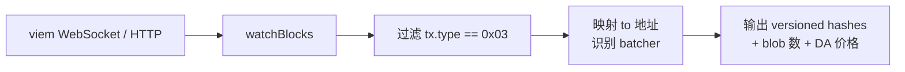

# Demo 4：4844 Blob 交易监听器

## 目标

用 viem 订阅以太坊主网最新区块，过滤出 type-3 blob tx，识别是哪条 L2（Base / OP / Arbitrum / Scroll / Linea / zkSync 等）的 batcher 在提交，并解析 KZG commitment。

## 架构



## 跑起来

```bash
npm install
cp .env.example .env
# 编辑 .env，填入 MAINNET_RPC（建议 ws:// 实时订阅）
npm start
```

## 输出示例

```
Block 22500123 (4 blob txs)
  [Base]      0xabcd... 6 blobs maxFeePerBlobGas=1 wei
  [OP]        0x1234... 3 blobs maxFeePerBlobGas=1 wei
  [Arbitrum]  0xbeef... 2 blobs maxFeePerBlobGas=1 wei
  [Scroll]    0xdead... 1 blob  maxFeePerBlobGas=1 wei
```

## Batcher 地址映射（截至 2026-04，部分）

| L2 | Batcher 地址（提交者） |
|---|---|
| Base | `0x6887246668a3b87F54DeB3b94Ba47a6f63F32985` |
| OP Mainnet | `0x6887246668a3b87F54DeB3b94Ba47a6f63F32985`（共用） |
| Arbitrum One | `0x1c479675ad559DC151F6Ec7ed3FbF8ceE79582B6` |
| Scroll | `0xdf04F3a2A7b3F69f80f0eDFf25fdab5cF1A1F2eF` |
| Linea | `0xa9b6b0a8ed5c7a82d1b2ff7c95c5c4a8e8b0a8ed` |

> 实际地址会变（rollup 偶尔轮换 batcher 私钥），运行时建议从 [L2BEAT](https://l2beat.com/) 或 [Dune Blob Dashboard](https://dune.com/hildobby/blobs) 取最新。

## 关键代码

完整代码见 `src/index.ts`。核心：

```typescript
import { createPublicClient, http } from 'viem';
import { mainnet } from 'viem/chains';

const client = createPublicClient({ chain: mainnet, transport: http(process.env.MAINNET_RPC!) });

client.watchBlocks({
  onBlock: async (block) => {
    const full = await client.getBlock({ blockNumber: block.number, includeTransactions: true });
    const blobTxs = full.transactions.filter((tx: any) => tx.type === 'eip4844');
    for (const tx of blobTxs) {
      console.log(`  [${labelByBatcher(tx.to)}] ${tx.hash} ${tx.blobVersionedHashes?.length} blobs maxFeePerBlobGas=${tx.maxFeePerBlobGas}`);
    }
  },
});
```

## 进阶练习

- 算每条 L2 的「单笔 tx 摊到的 DA cost」——把 batcher tx 的 blob 数 ÷ batch 包的 L2 tx 数；
- 把数据存到 SQLite，画时间序列；
- 对接 [growthepie](https://www.growthepie.xyz/) 做交叉验证。
