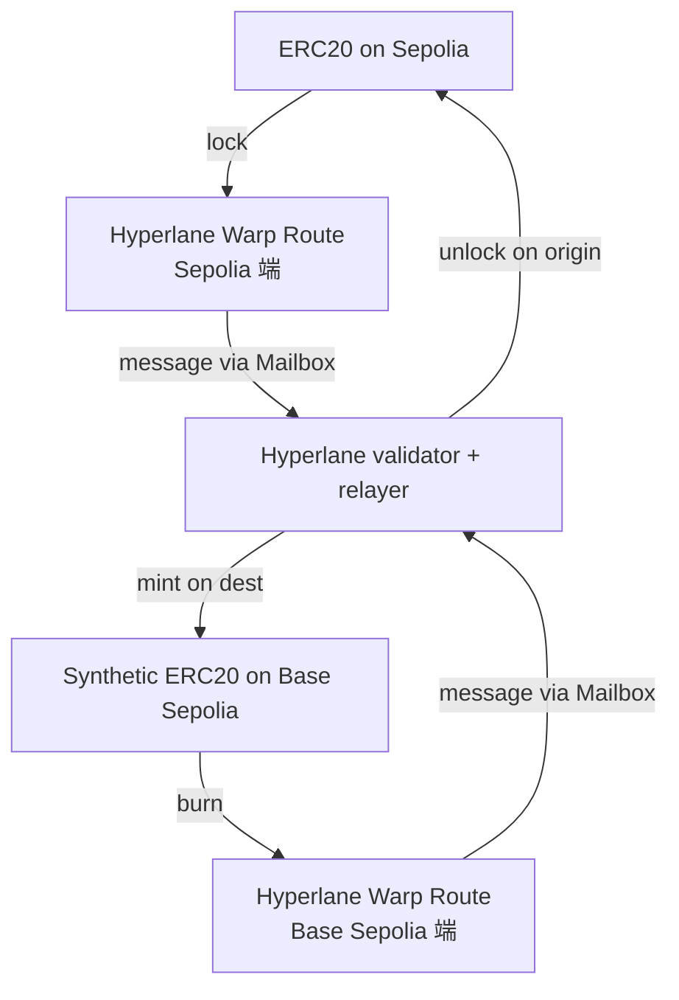

# Demo 3：Hyperlane Warp Route

## 目标

用 Hyperlane CLI 部署一个跨 Sepolia ↔ Base Sepolia 的 ERC20，跑一次跨链转账。

## 架构



## 准备

```bash
npm install -g @hyperlane-xyz/cli@latest
hyperlane --version
```

需要一个测试钱包，两端都要有少量原生币（Sepolia ETH、Base Sepolia ETH）。

## 步骤

### 1. 初始化核心合约（如果链上还没部署 Mailbox）

Hyperlane 公共测试网通常已部署，可以直接复用：参考 [Hyperlane 官方 deployments](https://docs.hyperlane.xyz/docs/reference/contract-addresses)。

### 2. 配置 Warp Route

`warp-route-config.yaml`（示例）：

```yaml
sepolia:
  type: collateral
  token: 0x...   # 已有的 ERC20 合约地址
basesepolia:
  type: synthetic
```

### 3. 部署

```bash
hyperlane warp deploy --config warp-route-config.yaml
```

### 4. 跨链发币

```bash
hyperlane warp send \
  --origin sepolia \
  --destination basesepolia \
  --amount 100 \
  --recipient 0xYOUR_ADDRESS
```

### 5. 验证

```bash
# 查 destination 上的余额
cast call $SYNTHETIC_TOKEN "balanceOf(address)" 0xYOUR_ADDRESS \
  --rpc-url $BASE_SEPOLIA_RPC
```

## ISM（安全模型）

> [!IMPORTANT]
> Hyperlane 的核心创新是 **ISM（Interchain Security Module）应用可定制**。默认是 multisig ISM，但你可以替换成：
> - Aggregation ISM（多 ISM 组合）
> - Routing ISM（不同来源走不同验证）
> - ZK ISM（zk-light-client 风格验证）
>
> 建议生产前用 Aggregation ISM 至少叠 2 层。

## 进阶练习

- 部署一个 ZK ISM（接 Lagrange 或 Succinct）；
- 用 Hyperlane 接入你自己的 OP Stack devnet；
- 比较 Hyperlane 和 LayerZero v2 在同一个 token 上的 UX。
