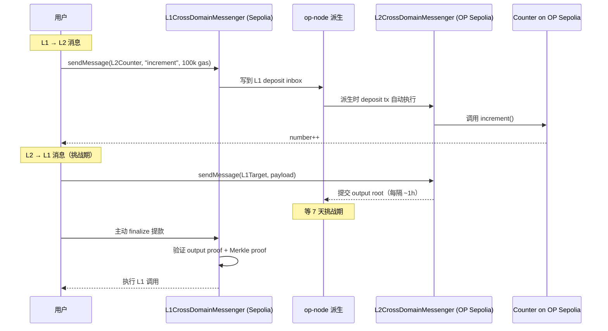

# Demo 2：OP Stack 原生桥消息

## 目标

用 OP Stack `L1CrossDomainMessenger` / `L2CrossDomainMessenger` 跑一次：

1. **L1 → L2 消息**：在 Sepolia 上调用 L1 messenger 给 OP Sepolia 上的 Counter 发 `increment()`，验证 L2 上 number 增加；
2. **L2 → L1 消息**：在 OP Sepolia 上发起一笔 message 提款到 L1，等挑战期后 finalize（测试网通常缩短到几小时）。

## 架构图



## 关键合约地址（截至 2026-04 测试网）

| 合约 | Sepolia (L1) | OP Sepolia (L2) |
|---|---|---|
| L1CrossDomainMessenger | `0x58Cc85b8D04EA49cC6DBd3CbFFd00B4B8D6cb3ef` | - |
| L2CrossDomainMessenger | - | `0x4200000000000000000000000000000000000007` |
| OptimismPortal | `0x16Fc5058F25648194471939df75CF27A2fdC48BC` | - |
| L2OutputOracle | `0x90E9c4f8a994a250F6aEfd61CAFb4F2e895D458F` | - |

> 地址变化以 [Optimism contract registry](https://docs.optimism.io/chain/addresses) 为准。

## 关键代码片段

### L1 → L2

```solidity
// 在 Sepolia 上调用
ICrossDomainMessenger l1Messenger =
    ICrossDomainMessenger(0x58Cc85b8D04EA49cC6DBd3CbFFd00B4B8D6cb3ef);

l1Messenger.sendMessage(
    counterOnOpSepolia,
    abi.encodeWithSignature("increment()"),
    100_000  // L2 gas limit
);
```

### L2 → L1

```solidity
// 在 OP Sepolia 上调用
ICrossDomainMessenger l2Messenger =
    ICrossDomainMessenger(0x4200000000000000000000000000000000000007);

l2Messenger.sendMessage(
    targetOnL1,
    payload,
    100_000
);
```

L1 finalize 步骤需要等挑战期，通常通过 [Optimism SDK](https://sdk.optimism.io/) 自动化：

```typescript
import { CrossChainMessenger } from "@eth-optimism/sdk";
const messenger = new CrossChainMessenger({ l1ChainId: 11155111, l2ChainId: 11155420, ... });
await messenger.proveMessage(txHash);
await messenger.finalizeMessage(txHash);  // 7 天后才能成功
```

## 跑通脚本

```bash
forge script script/SendL1ToL2.s.sol --rpc-url $SEPOLIA_RPC --broadcast
# 几分钟后看 OP Sepolia 上的 Counter
forge script script/SendL2ToL1.s.sol --rpc-url $OP_SEPOLIA_RPC --broadcast
# 然后用 Optimism SDK 在挑战期后 finalize
```

## 进阶练习

- 改用 `L1StandardBridge` 跑一次 ETH 与 ERC20 的桥接；
- 用 `OptimismPortal` 直接发原始 deposit；
- 比较 7 天 native bridge 和 Across 的实际 UX。
