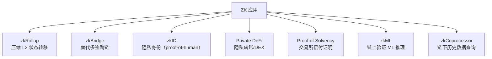
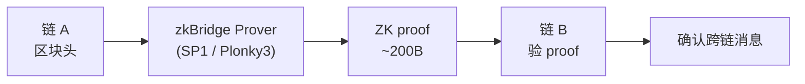

# 模块 08：零知识证明（Zero-Knowledge Proofs）

版本：2026-04-27。工具链：Circom 2.2.2、snarkjs 0.7.6、SP1 v5 Hypercube、Risc0 v3.0.5、Noir 1.0 pre-release、Plonky3 2026-03 production-ready、Stwo 2.0.0。

> **读者画像**：刚学完 Solidity，零密码学背景。目标：能用 zkVM 写出第一个 ZK 应用。
> 主线 ≤ 30 页 PDF；数学推导与系统深度剖析见附录 A–H。

---

## 目录

### 主线（按顺序读）

- 第 1 章 学习目标与路线图
- 第 2 章 ZK 是什么：三个性质的直觉
- 第 3 章 ZK 用在哪：七大落地场景
- 第 4 章 Trusted Setup：1-of-N 信任假设
- 第 5 章 zkVM 入门：写 Rust，跑 SP1/Risc0
- 第 6 章 zkML 与 zkBridge 直觉
- 第 7 章 实战：Circom → Noir → SP1 fib
- 第 8 章 安全红线、练习与进阶路线

### 附录（按需查阅）

- 附录 A 多项式承诺数学：KZG / FRI / IPA / Brakedown / WHIR / Binius
- 附录 B 证明系统谱系：SNARK / STARK / Plonk / Halo2 / Plonky3 深度对比
- 附录 C zkEVM 谱系（Type 1–4）与主流项目
- 附录 D 折叠方案：Nova / SuperNova / HyperNova / ProtoStar / Sangria
- 附录 E zkVM 性能 Benchmark 详细（2026-Q2）
- 附录 F 隐私链主网：Tornado Cash / Aleo / Aztec / Penumbra 详解
- 附录 G Lookup / Domain Extension 等电路技巧
- 附录 H 安全深度：Fiat-Shamir / Under-Constrained 漏洞剖析

### 延伸阅读与参考资料

- 第 9 章 进一步阅读与参考资料

---

## 第 1 章 学习目标与路线图

> **TL;DR**：本模块帮你从零开始跑通第一个 ZK 应用。主线 8 章，每章 ≤ 800 字；附录 A–H 是按需查阅的深度参考。

### 钩子

2022 年 8 月，OFAC 制裁 Tornado Cash，开发者被捕。2026 年，Aleo 主网跑着 Circle USDCx、SP1 Hypercube 用 16 张 RTX 5090 在 12 秒内证完一个 ETH L1 区块。ZK 已从学术爱好变成生产基础设施。

### 前置条件

- 会写 Solidity（函数、事件、mapping）
- 会用 Rust 的基本语法（不需要深入，能看懂 `fn main()` 就够）
- 不需要密码学背景

### 读完主线，你能做到

1. 用一句话向同事解释 ZK 的三个核心性质（完备性 / 可靠性 / 零知识）；
2. 分辨 zkRollup / zkBridge / zkML / zkID 的场景差异；
3. 把 SP1 / Risc0 的 Fibonacci 例子跑通，并能修改 guest 程序；
4. 写出 Circom Poseidon 原像电路并部署 Solidity verifier；
5. 看到 `<--` 时知道这可能是 under-constrained 漏洞。

### 12 周学习地图

```
Week 1-2  : 主线第 1-3 章 + Vitalik zk-SNARK 三连发
Week 3-4  : 主线第 7 章实战（Circom → SP1 fib 全跑通）
Week 5-6  : Justin Thaler 教科书第 1-7 章 + ZK-MOOC 视频
Week 7-8  : 附录 B（SNARK/STARK 比较）+ 附录 H（漏洞剖析）
Week 9-10 : 选一个证明系统精读（Halo2 PSE / Plonky3）
Week 11-12: 做一个端到端项目（zk-airdrop / proof-of-solvency / zkML demo）
```

### 章末

前置模块：07-L2 与扩容（zkRollup 把 L2 状态转移正确性证给 L1，用的就是本模块的技术）。生产 ZK 仍需读 Justin Thaler *Proofs, Arguments, and Zero-Knowledge* 并经专业审计。

---

## 第 2 章 ZK 是什么：三个性质的直觉

> **TL;DR**：ZK = 证明我知道某件事，但不公布这件事本身。三条性质：完备性 / 可靠性 / 零知识。

### 钩子

你想向 DeFi 合约证明「我有提款资格」，但又不想暴露存款地址。直觉是「公布 hash(密钥)」——但攻击者拿着这个 hash 可以直接撞库。ZK 给了一个根本不同的答案：一个 200 字节的 proof，跟密钥没有任何可以撞的关系。

### 反例：hash 不是零知识

公开 hash(x)=y 既**不是零知识**也**不是知识证明**。原因：

- 低熵的 x（如生日、常用密码）会被撞库；
- 公布 y 本身不证明你持有 x——任何人都能算 hash。

ZK 同时满足两件事：(1) 证明你真的持有 witness；(2) proof 不让 verifier 缩小对 witness 的猜测空间。

### 阿里巴巴山洞：交互式原型

```
        洞口
         |
       [Victor]
         |
       岔路
       /   \
      左   右
       \   /
       [门：需要密语]
```

Peggy（持密语）随机走左或右；Victor 随机喊「从左/右出来」。不知密语时每次猜对概率 1/2，重复 40 次作弊概率 < 2^-40。全程 Victor 一个比特密语信息都没获得。

### 三个核心性质

| 性质 | 一句话 | 违反后果 |
|------|--------|----------|
| **完备性（Completeness）** | 诚实 Prover 一定能说服诚实 Verifier | 合法用户无法正常使用 |
| **可靠性（Soundness）** | 作弊 Prover 几乎不可能骗过 Verifier | 攻击者伪造 proof |
| **零知识（Zero-Knowledge）** | Verifier 除了「陈述为真」之外学不到任何东西 | 隐私泄露 |

工程上还要两个：**Knowledge Soundness**（prover 真的知道 witness，不只是猜；反例：光证明"存在 x 满足 P" 不够；要证明"你算得出 x"——extractor 能从 prover 提取 witness，否则 prover 可能在猜）和 **Succinctness**（proof 短、verifier 快——SNARK 里的 S）。

### SNARK vs STARK：一张对比表

| | SNARK | STARK |
|--|--|--|
| 典型 proof 大小 | ~200B–1KB | ~50–200KB |
| Trusted setup | 需要（PLONK 系）或不需要（Halo2 IPA） | 不需要 |
| 抗量子 | 否（依赖椭圆曲线） | **是**（依赖哈希） |
| EVM gas | 低（~25–40 万） | 高（需 Groth16 wrap） |
| 代表 | Groth16、PLONK、Halo2 | STARK、Stwo、Plonky3 |

> Fiat-Shamir 变换和多项式承诺的数学推导见附录 A；under-constrained 与 Fiat-Shamir 漏洞剖析见附录 H。

### 60 秒电梯演讲

> **A**：ZK 不就是把 hash 发给我？
> **B**：不是。hash 可以撞库。ZK proof 是 200 字节，协议强迫 prover 在一个随机点上对一段只有真的知道答案才能算出的多项式做回应。
> **A**：proof 万一是假的？
> **B**：作弊概率约等于 1/2^254，比宇宙中原子数还小。

### 章末

下一章映射到实际场景：ZK 隐私转账 / Rollup 验证 / 链下计算，每个场景 Prover 持有什么 witness、Verifier 验什么陈述。

---

## 第 3 章 ZK 用在哪：七大落地场景

> **TL;DR**：ZK 在 Web3 有七个真实战场。每个场景 Prover 持有不同的 witness，Verifier 验不同的陈述。

### 钩子

2026 年私有 DeFi TVL 超过 15 亿美元，Worldcoin 已向 1800 万人发出 proof-of-human，交易所普遍提供 Merkle Sum Tree 偿付能力证明。这些应用背后都是同一套技术——差别只在 witness 和陈述是什么。

### 七大场景速览



### 场景 1：zkRollup（最大生产用量）

Prover 持有 L2 所有交易的执行细节，向 L1 合约证明「这批交易执行后，新状态根是 X」。

- 业务方写 Solidity，ZK 在后台透明运行；
- 主流：zkSync Era（Type 4）、Scroll、Linea（Type 2）、Starknet（Cairo VM 原生，不在 Type 1-4；Kakarot 是其上 EVM 兼容层）；
- 目标：SP1 Hypercube 已实现 12 秒内证完 ETH L1 区块（real-time proving）。

### 场景 2：zkBridge（替代多签）

跨链桥历史黑客（Ronin $625M、Wormhole $326M）都是多签被攻破。zkBridge 用 ZK light client 证「链 A 上某事件已被确认」，信任从「m-of-n 人不勾结」降到「数学正确性」。

主流：Polyhedra zkBridge（25+ 链）、Succinct Telepathy（接入 LayerZero）。

### 场景 3：zkID（隐私身份）

- **Worldcoin**：Orb 扫虹膜 → IrisCode 哈希做唯一性去重 → Semaphore 风格 nullifier 防双花。2026 年 1800 万验证人类，450M proof 已生成；
- **Anon Aadhaar**：印度 10 亿人口国家身份 RSA 签名 → ZK；
- **zkPassport**：各国电子护照 DG 签名 → ZK，机场 / 签证场景。

### 场景 4：Private DeFi

Prover 持有存款 secret，证「我知道某 Merkle 叶子的原像」但不暴露 secret。

- **Aztec Network**：UTXO + Note + Noir，2026-03 Alpha 主网；
- **Aleo**：Circle USDCx / Paxos USAD 已上链；
- 2026 趋势：「合规友好隐私」——可证「资金不来自 OFAC 制裁地址」同时保留隐私。

### 场景 5：Proof of Solvency / Proof of Reserves（PoR）

FTX 崩盘后，交易所需证明资产 ≥ 用户负债。用 Merkle Sum Tree + ZK proof，每个用户能验自己的余额被包含、总和正确，但看不到别人余额。Binance、Kraken、OKX 均已部署。

#### 行业背景：FTX 之后为什么必须做 PoR

2022-11 FTX 在 72 小时内从「全球第二大 CEX」变成全员维权对象。事后审计显示：FTX 把用户存款挪给 Alameda 做杠杆，链上钱包余额远低于内部账本负债。社区共识由此形成——**CEX 必须以可验证的方式证明：链上资产 ≥ 用户负债总和**，而且证明频率要远高于传统季度审计。这套机制叫 Proof of Reserves（PoR）/ Proof of Solvency。

PoR 三年内迭代了三代，每代修复上一代的攻击面：

#### v1：Merkle Sum Tree（2022-11 起，Binance / OKX / Crypto.com 月度）

**核心结构**：

- 每个用户 (user_id_hash, asset, balance) 作为叶子；
- 内部节点存子树和：`node.sum = left.sum + right.sum`，`node.hash = H(left.hash || left.sum || right.hash || right.sum)`；
- 交易所发布 root；用户从交易所后台下载自己叶子到根的 sibling 路径，本地复算 root，比对官网公示。

**用户侧自验**（伪代码）：

```python
# pip install merkle-proof-verifier
from binance_por import fetch_self_proof, verify_inclusion

proof = fetch_self_proof(user_id, asset="BTC")  # JSON: {leaf, siblings, root, total_sum}
ok = verify_inclusion(proof.leaf, proof.siblings, proof.root)
assert ok and proof.leaf.amount == my_balance_in_app
```

Binance PoR JSON 字段大致是 `{user_id_hash, asset, amount, siblings: [{hash, sum, position}]}`，OKX 类似但叶子用 BLS12-381 域元素。

**v1 的三个攻击面**：

1. **只证资产侧，不证负债真实性**：交易所可以「忘记」把负余额账户（杠杆爆仓欠库账户）写进树，让总负债看起来更小。Merkle Sum Tree 本身不能强制「树包含全部账户」。
2. **链上钱包归属难证**：交易所披露一组冷钱包地址说「这就是我的资产」，但链上没法证这些地址真属于它而不是借来的。FTX 案后被实锤的「借冷钱包过场」——Crypto.com 在 2022-11 PoR 公布前几小时把 32 万 ETH 转到 Gate.io，公示完再转回——就是这个洞。
3. **快照间作弊**：月度快照 = 30 天内可以随意挪用，只要快照那一刻账平就行。

#### v2：zkPoR（2024 起，Polyhedra / Succinct / zkPass / Hyperliquid 实验）

**核心**：把 v1 的 Merkle Sum Tree 升级成 ZK 电路，证明：

- 所有叶子的 sum 累加 = root.sum（线性约束）；
- **没有任何叶子是负的**（range proof，关键修复 v1 攻击面 #1）；
- 用户侧只暴露「我的叶子被包含」+「root 与官方公示一致」，不暴露其他人余额。

**Circom 风格电路片段**（约 30 行核心约束）：

```circom
template SumTreeNode() {
    signal input left_hash;  signal input left_sum;
    signal input right_hash; signal input right_sum;
    signal input amount;     // 当前叶子余额
    signal output node_hash; signal output node_sum;

    // 关键 1：和等式
    node_sum <== left_sum + right_sum + amount;

    // 关键 2：无负余额（range proof，64 bit 足够）
    component rc = Num2Bits(64);
    rc.in <== amount;

    // 关键 3：哈希绑定
    component h = Poseidon(5);
    h.inputs[0] <== left_hash;  h.inputs[1] <== left_sum;
    h.inputs[2] <== right_hash; h.inputs[3] <== right_sum;
    h.inputs[4] <== amount;
    node_hash <== h.out;
}
```

OKX 自 2023 起每周发布 zkPoR，证明 zk 电路约束「∀ leaf: balance ≥ 0 ∧ Σ balance = total_liability」，并把 proof 发到自家 explorer 供任何人验证。

#### v3：实时 PoR + 链上结算（2025-2026 趋势）

v2 仍然是「快照式」证明，没法防快照间挪用。v3 思路是把账本搬到链上或链下不可篡改通道：

- **Hyperliquid**：永续合约 + 订单簿全部跑在自家 L1 链上，每笔成交链上可查。「PoR」退化成「读链」，没有「储备 vs. 负债」这种概念差。
- **Copper ClearLoop / Fireblocks Off-Exchange**：机构资金锁在 MPC 托管账户，CEX 只拿到「交易许可」而拿不到资产挪用权，结算 T+0 链上完成。机构客户绕过 CEX 资产侧风险。
- **Chainlink PoR Feed**：把 v1/v2 的 root 上链做 oracle feed，DeFi 协议（如 wBTC、stETH 衍生品）可在合约里实时校验。

#### 真实数据（截至 2026-04）

| 交易所 | 频率 | 方案 | 资产覆盖 |
|--------|------|------|----------|
| Binance | 月度 | v1 Merkle Sum | BTC/ETH/USDT 等 9 资产 |
| OKX | 周度 | v2 zkPoR | 22 资产 |
| Crypto.com | 季度 | v1 Merkle Sum + Mazars 审计 | 主流 7 资产 |
| Kraken | 半年 | v1 + 第三方审计 | 全资产 |
| Bybit | 月度 | v2 zkPoR（2024 起） | 主流 |

#### 攻击面分析（Llama Risk / Vasco / DeFiLlama 视角）

即使部署了 v2，PoR 仍非「绝对偿付能力」证明：

- **链上钱包归集时间窗**：CEX 在快照前几分钟从其他平台借入资金、快照后归还——v1/v2 都拦不住。需要交叉对比链上 mempool + 历史归集模式才能识别（这正是 11 模块「OSINT 实战」要做的事，见 [11-基础设施与工具](../11-基础设施与工具/) 后续补充章节）。
- **借贷时间差**：把负债部分搬到关联实体（Alameda 模式）——电路可证「树内账平」，但证不了「树外没有隐藏负债」。
- **期间穿仓未披露**：v2 的 range proof 强制 `balance ≥ 0`，但若交易所把爆仓账户从树里删掉，电路无法察觉删除行为。需要外部审计交叉对账户增长曲线 vs. 链上交互曲线。

工程上的实践建议：作为用户，至少应当（1）每次 PoR 公布后用工具自验自己叶子在树里、（2）订阅 DeFiLlama PoR Dashboard 看交易所储备/负债比、（3）大额资金优先选择走 ClearLoop 或链上自托管。作为研发，PoR 系统的 attack surface 不在密码学而在「输入数据真不真」——这恰好是 OSINT 与 ZK 工程的交叉地带。

### 场景 6：zkML

证明「推理结果来自指定 model X」。2025 年 Lagrange DeepProve-1 第一次对完整 GPT-2 (1.5B 参数) 生成 ZK proof。当前性能：千万参数 CNN ~分钟级，数十亿参数 LLM 走 opML 混合路线。详细 benchmark 见附录 E。

### 场景 7：zkCoprocessor

EVM 合约只能访问最近 256 个区块头。zkCoprocessor 把「链下历史查询 + 大计算」包成 proof 返回链上。

典型需求：「证明地址 A 在过去 100 万区块的总转账 ≥ 1 ETH」，用于积分空投、跨链状态验证。

主流：Brevis、Axiom、RISC Zero Steel、SP1 Reth。

### 选型速查

| 场景 | Prover 持有 | Verifier 验 | 推荐工具 |
|------|------------|------------|---------|
| Rollup 状态转移 | L2 交易细节 | 新状态根正确 | SP1 / Risc0 |
| 隐私转账 | 存款 secret | Merkle 成员 | Circom / Noir + Groth16 |
| 跨链消息 | 区块头内容 | 区块已确认 | zkBridge |
| 机器学习推理 | 模型权重 + 输入 | 推理结果正确 | EZKL / DeepProve |
| 历史数据查询 | 链上历史 | 聚合结果正确 | Brevis / Axiom |

### 章末

ZK 的「用在哪」清楚了。下一章解释「用之前要做的一件事」——Trusted Setup，以及为什么 1-of-N 信任假设是密码学里几乎最强的保证。

---

## 第 4 章 Trusted Setup：1-of-N 信任假设

> **只用 zkVM 可跳过本章**——SP1/Risc0/Plonky3 都是 STARK 系不需要 setup。本章用得到 Groth16/PLONK 时再回查（§7 Circom 实战）。

> **TL;DR**：SNARK 需要一次「生成公共参数」的仪式（ceremony）。只要参与者中至少一个人诚实销毁了自己的随机数，整个系统就是安全的。以太坊 KZG ceremony 有 14 万人参与。

### 钩子

2019 年，Zcash 的 Sapling ceremony 有约 100 人参与。每个人独立生成一段随机数 τ_i，把 [τ_i]G 发给下一个人，然后销毁 τ_i。如果全部 100 人都没销毁怎么办？那最终 τ = τ_1 · τ_2 · ... · τ_100 就被人知道，可以伪造任意 proof。但只要其中 1 个人诚实销毁了——τ 就永远无法重建。这就是「1-of-N 信任假设」，密码学里几乎最强的信任根之一。

### 为什么需要 Trusted Setup

SNARK（特别是 Groth16 / PLONK / KZG 系）的 Verifier 需要一个固定的参数集合 SRS（Structured Reference String），里面藏着 τ^i · G 这些值。问题：τ 知道之后可以伪造任意 proof，所以 τ 必须在计算完 SRS 之后销毁。但谁来生成 τ？如果只有一个人，你必须完全信任他。

解决方案：**多方计算（ceremony）**，每个参与者独立贡献一个随机数，最终 SRS 的安全性只需要至少 1 个参与者诚实。

STARK 不需要 Trusted Setup——它的安全性基于哈希函数，无需预生成参数。代价是 proof 更大（几十~几百 KB），需要 Groth16 wrap 上链。

### 主流 Ceremony 历史

| Ceremony | 年份 | 参与人数 | 当前用途 |
|----------|------|---------|---------|
| Zcash Sapling MPC | 2017 | ~100 | Zcash Sapling（历史） |
| Hermez / Perpetual Powers of Tau | 2019–至今 | 80+ 轮持续 | Circom 教程默认使用 |
| **以太坊 KZG ceremony** | **2023-Q1** | **140,000+** | EIP-4844、PLONK 通用 SRS、Verkle Tree |

**实操结论**：直接使用以太坊 KZG ceremony 的输出（`final.ptau`）。**绝对不要为主网应用自己跑 ceremony**。

### 1-of-N 与 STARK 的对比

```
SNARK（KZG 系）
  Trusted Setup → 1-of-N 信任假设 → proof ~200B–1KB → EVM gas 低

STARK（FRI 系）
  无 Setup → 纯数学安全（哈希） → proof ~50–200KB → 需 Groth16 wrap 上链
  → 抗量子（哈希基础，不依赖椭圆曲线）
```

### 工程操作

使用以太坊 KZG ceremony SRS：

```bash
# 下载 Hermez ptau（circom 用）
wget https://hermez.s3-eu-west-1.amazonaws.com/powersOfTau28_hez_final_12.ptau

# 直接复用，不需要自己贡献
snarkjs groth16 setup circuit.r1cs powersOfTau28_hez_final_12.ptau circuit_0000.zkey
```

KZG ceremony 的 SRS 适用于所有容量 ≤ 2^28 的 PLONK 系电路，无需重做。

### 章末

明白了「用什么参数」，下一章开始动手：用 zkVM 写第一个可证明的 Rust 程序。zkVM 是 ZK 的「高阶接口」——你不用写电路，直接写 Rust。

---

## 第 5 章 zkVM 入门：写 Rust，跑 SP1/Risc0

> **TL;DR**：zkVM = 可证明执行的虚拟机。你写普通 Rust，zkVM 把执行轨迹转成 ZK proof。不用写电路，适合大多数应用工程师。

### 钩子

手写 ZK 电路就像写汇编：精确但费力，每条约束都要手动推敲。zkVM 是 ZK 的 C 语言——你写正常 Rust，zkVM 把每条 RISC-V 指令的执行轨迹转成 AIR 约束，自动出 proof。

SP1 Hypercube 用 16 张 RTX 5090 在 12 秒内证完一个 ETH L1 区块。这是 2024 年还只存在于论文里的目标，2026 年已经是生产里程碑。

### zkVM 是什么

```
你写的 Rust 程序
       ↓
  编译成 RISC-V 字节码
       ↓
  zkVM 逐条执行 RISC-V 指令
  把执行轨迹（trace）转成 AIR 约束
       ↓
  证明系统（STARK + Groth16 wrap）出 proof
       ↓
  链上 Solidity verifier 验 proof（~250B，~3ms）
```

代价：zkVM 比手写电路慢约 3–5 倍（2026 年数据）（限定：通用 RV32IM 程序；EVM 区块证明上 SP1 Hypercube 已反超手写电路）。收益：你不用懂电路、不用调约束、不用担心 under-constrained。

### SP1 vs Risc0：选型速查

| 维度 | SP1 v5 Hypercube | Risc0 v3.0.5 |
|------|-----------------|--------------|
| 指令集 | RISC-V RV32IM | RISC-V RV32IM |
| 证明系统 | Plonky3 STARK + Groth16 wrap | STARK + Groth16 wrap |
| ETH L1 区块证明 | **12 秒**（16×RTX5090） | 44 秒（GPU 集群） |
| 预编译 | keccak256/sha256/secp256k1/bn254/bls12-381 | 全套 + RSA 路线图 |
| 形式化验证 | EF + Nethermind 完成 RISC-V 约束验证 | R0VM 2.0 用 Picus 检查 |
| 远程证明 | SP1 Network | Bonsai |
| 推荐场景 | EVM 链上验、需要最全 precompile | 通用 RISC-V + 多部署环境 |

**新项目默认选 SP1**：生态最广、性能领先、形式化验证最完整。

### SP1 Fibonacci：完整可运行例子

这是 zkVM 入门最小例子。两个文件，15 分钟跑通。

```rust
// program/src/main.rs（guest：编译成 RISC-V，在 zkVM 里执行）
#![no_main]
sp1_zkvm::entrypoint!(main);

pub fn main() {
    let n = sp1_zkvm::io::read::<u32>();
    let mut a: u64 = 0;
    let mut b: u64 = 1;
    for _ in 0..n {
        let c = a.wrapping_add(b);
        a = b;
        b = c;
    }
    // commit 到 proof 的公开输出
    sp1_zkvm::io::commit(&n);
    sp1_zkvm::io::commit(&a);
}
```

```rust
// script/src/main.rs（host：在普通环境里运行 prover）
use sp1_sdk::{ProverClient, SP1Stdin, include_elf};

const ELF: &[u8] = include_elf!("fibonacci-program");

fn main() {
    let client = ProverClient::from_env();
    let (pk, vk) = client.setup(ELF);

    let mut stdin = SP1Stdin::new();
    stdin.write(&20u32);          // 输入：计算 fib(20)

    let proof = client.prove(&pk, &stdin).run().unwrap();
    client.verify(&proof, &vk).expect("verification failed");
    println!("fib(20) = {}", proof.public_values.read::<u64>());
}
```

跑通命令：

```bash
# 安装 SP1 工具链（需要 Rust nightly）
curl -L https://sp1.succinct.xyz | bash && sp1up

# 创建并运行项目
cd code/sp1-fib
cargo prove build --bin fibonacci-program -p program
cargo run --release -p script
# 输出：fib(20) = 6765

# 链上验证（可选，生成 ~250B Groth16 proof）
SP1_PROVER=network cargo run --release -p script -- --groth16
```

### 理解 guest / host 分工

- **guest**：你的业务逻辑，在 zkVM 里执行，生成执行轨迹；
- **host**：运行 prover，把轨迹转成 proof，可以调用远程 SP1 Network；
- `sp1_zkvm::io::read` / `commit`：guest 与外界的通信接口，commit 的值会出现在链上 proof 的公开输出里。

### 章末

跑通了 fib，你已经完成第一个 ZK 应用。下一章看 zkML 和 zkBridge 的直觉——这两个应用方向决定了接下来五年 ZK 工程的两大主战场。

详细的 Risc0 等价版本 + SP1/Risc0 对比见第 7 章实战；zkVM 性能 benchmark 详细数据见附录 E。

---

## 第 6 章 zkML 与 zkBridge 直觉

> **TL;DR**：zkML = 证明 ML 推理结果来自特定模型；zkBridge = 用 ZK light client 替代多签跨链。两者都是「用 ZK 替代信任第三方」的典型范式。

### zkML：证明 ML 推理的正确性

**问题**：dApp 用 ML 模型做决策（如信用评分、反欺诈）时，用户怎么知道你真的用了宣称的模型，而不是一个对你有利的替代品？

**zkML 的答案**：把模型权重固定（commit），把推理计算变成 ZK 电路，proof 证明「输出来自这个特定模型对这个特定输入的推理」。

**直觉类比**：像银行出具账单的公证——不只是告诉你余额，而是附上一个数学证明「这个余额确实是按规则计算出来的」。

**当前性能（2026-Q1）**：

| 场景 | 推理 + 证明时间 | 框架 |
|------|--------------|------|
| CNN 264k 参数 | ~1–5 秒 | Lagrange DeepProve |
| ResNet-50 (~25M 参数) | ~分钟级 | EZKL |
| GPT-2 (~1.5B 参数) | 可行但贵 | DeepProve-1（2025 里程碑） |
| 数十亿参数 LLM | 走 opML 混合路线 | ORA opML |

**opML vs zkML**：当模型太大时，退而求其次用 opML——类似 Optimistic Rollup，先提交结果，挑战期内任何人可以重跑挑战。适合不需要即时终结的场景。

### zkBridge：用数学替代多签

**问题**：跨链桥最大漏洞来源是多签——Ronin $625M、Wormhole $326M、Nomad $190M 都是多签被攻破。

**zkBridge 的答案**：ZK light client。链 A 出区块头，ZK proof 证明「这个区块头确实被链 A 共识层验证过」，链 B 只需验 proof。信任从「m-of-n 人不勾结」降到「数学正确性」。



**主流方案**：

- **Polyhedra zkBridge**：支持 25+ 链，ETH PoS 共识 light client；
- **Succinct Telepathy**：SP1 zkVM 写 light client，接入 LayerZero；
- **Lagrange State Committees**：EigenLayer 重质押 + BLS attestation → ZK 压缩，给 OP rollup 提供快速 finality。

### 证明系统对 zkML/zkBridge 的影响

| 应用 | 典型选择 | 原因 |
|------|---------|------|
| zkML 小模型 | Halo2 PSE (EZKL) | 灵活 custom gate，GPU 加速 |
| zkML 大模型 | Sumcheck + multilinear (DeepProve) | 矩阵乘法友好 |
| zkBridge | SP1 / Plonky3 STARK | 无 setup + 抗量子 + GPU 可并行 |

> 证明系统深度对比（SNARK/STARK/Plonk/Halo2/Plonky3 的内部机制）见附录 B；zkML benchmark 详细数据见附录 E。

### 章末

场景直觉清楚了。下一章动手：三个实战从浅到深——Circom Poseidon 电路 → Noir 等价实现 → SP1 Fibonacci 链上验证。

---

## 第 7 章 实战：Circom → Noir → SP1 fib

> **TL;DR**：三个实战按复杂度递增。Circom = 最接近电路金属的工具；Noir = 现代 ZK DSL；SP1 = 不写电路直接写 Rust。

### 钩子

Tornado Cash 的核心电路只有 30 行 Circom——证明「我知道某个 secret，使 Poseidon(secret) 等于 Merkle 树里的某个叶子」，但不暴露 secret。本章把这个电路从零跑到部署。

### 实战 1：Circom 2.2 + snarkjs 0.7 端到端

设想 Alice 的需求：她的钱包给 Tornado Cash fork 存了 1 ETH，现在想取出来到一个全新地址。她要向合约证明「我知道某个 secret，使 Poseidon(secret) 等于这棵 Merkle 树里的某个叶子」——但不能告诉合约这个 secret 是什么，否则别人就能撞库。这就是 ZK 隐私池的核心电路。本章把这个 Poseidon 原像证明从 0 跑到部署：Phase 1 ceremony → 编译 → 生成 witness → 出 proof → Solidity verifier 上 Anvil。30 分钟内你能在自家电脑上完成 Tornado Cash 之类项目用的同款流水线。

目标：实现「我知道 x 使 Poseidon(x) = y」并把 verifier 部署到本地以太坊网络。完整代码在 `code/circom-poseidon/`。

#### 环境准备

依赖：Node.js 22+、Rust 1.80+、circom 2.2.2、Foundry。

```bash
# 1. circom 用 Cargo 装（不要用 npm 上的同名包）
git clone https://github.com/iden3/circom.git
cd circom
git checkout v2.2.2
cargo install --path circom

# 2. snarkjs（0.7.6 是 2026-01 release 的最新版本）
npm install -g snarkjs@0.7.6

# 3. circomlib（提供 Poseidon、MiMC、PedersenHash、MerkleProof 等组件）
mkdir poseidon-demo && cd poseidon-demo
npm init -y
npm install circomlib@2.0.5

# 4. Foundry（部署 Solidity verifier 到本地 Anvil）
curl -L https://foundry.paradigm.xyz | bash && foundryup
```

#### 电路文件

```circom
pragma circom 2.2.2;

include "node_modules/circomlib/circuits/poseidon.circom";

template PoseidonPreimage(N) {
    signal input preimage[N];      // 私有输入：x（多个 field 元素）
    signal input expectedHash;     // 公开输入：y
    signal output ok;

    component h = Poseidon(N);
    for (var i = 0; i < N; i++) {
        h.inputs[i] <== preimage[i];
    }

    expectedHash === h.out;
    ok <== 1;
}

component main { public [expectedHash] } = PoseidonPreimage(2);
```

**关键语法**：

- `<==`：赋值并约束（推荐）；
- `<--`：仅赋值不约束（**under-constrained 头号源头**，慎用）；
- `===`：纯约束等号；
- `component main { public [...] }`：必须显式列出公开信号。

#### 完整流水线

```bash
circom poseidon_preimage.circom --r1cs --wasm --sym  # 编译
snarkjs powersoftau new bn128 12 pot12_0000.ptau -v
snarkjs powersoftau contribute pot12_0000.ptau pot12_0001.ptau \
  --name="First contribution" -v -e="random text"
snarkjs powersoftau prepare phase2 pot12_0001.ptau pot12_final.ptau -v
snarkjs groth16 setup poseidon_preimage.r1cs pot12_final.ptau circuit_0000.zkey
snarkjs zkey contribute circuit_0000.zkey circuit_final.zkey \
  --name="Contributor" -v -e="another random text"
snarkjs zkey export verificationkey circuit_final.zkey verification_key.json
node poseidon_preimage_js/generate_witness.js \
  poseidon_preimage_js/poseidon_preimage.wasm input.json witness.wtns
snarkjs groth16 prove circuit_final.zkey witness.wtns proof.json public.json
snarkjs groth16 verify verification_key.json public.json proof.json
snarkjs zkey export solidityverifier circuit_final.zkey verifier.sol
anvil &
forge create verifier.sol:Groth16Verifier --rpc-url http://localhost:8545 \
  --private-key 0xac0974...80
```

#### 生产里别这样做

- **不要自己跑 Phase 1**：直接用 Hermez Powers of Tau（`powersOfTau28_hez_final_*.ptau`）或以太坊 KZG ceremony 输出；
- **Phase 2 至少 5-10 个独立、不可勾结的贡献者**；
- **不要相信「跑通了」**：跑通只代表诚实证明能验，**under-constrained 几乎从来不会让诚实证明失败**，必须靠 `circomspect`、Picus、ZKAP 等工具或形式化验证发现；
- **EIP-2098 注意**：早期的 Solidity verifier 模板有 malleability 风险，snarkjs 0.7.6 已默认修复。

---

### 实战 2：Noir 1.0 等价实现 + 体验对比

写完 Circom 版本之后，把同一个 Poseidon 原像电路用 Noir 1.0 重写一遍——这是了解「ZK 工具链下一代是什么样」的最快路径。Aztec 自家协议电路 2024 起全部切到 Noir，2026-02 发布 1.0 pre-release，意味着语言级稳定性进入「发版前最后冲刺」。同样几行代码，错误提示从 Circom 的「constraint not satisfied at line 142」 变成 Rust-like 的 「expected Field, found u32」——这种"少几小时调试"的体验差，就是 Noir 在 2026 年成为新项目首选的原因。

#### Noir 是什么

Noir 是 Aztec 力推的 ZK DSL，语法 Rust-like，后端可换（默认 Barretenberg 走 PLONK；也能输出到 Halo2、Plonky2）。**2026-02 Noir 发布 1.0 pre-release**，意味着语言级稳定性进入「发版前最后冲刺」。Aztec 自家协议电路已全部用 Noir 重写。

#### 等价 Poseidon 电路

```rust
// src/main.nr
use dep::std::hash::poseidon;

fn main(preimage: [Field; 2], expected_hash: pub Field) {
    let h = poseidon::bn254::hash_2(preimage);
    assert(h == expected_hash);
}
```

完整流程：

```bash
noirup                      # 装 nargo（Noir 工具链）
nargo new noir-poseidon
# 编辑 src/main.nr 和 Prover.toml
nargo check                 # 类型检查 + 生成 Prover.toml/Verifier.toml 模板
nargo execute               # 跑 witness
nargo prove                 # 生成 proof
nargo verify                # 链下验证
bb write_solidity_verifier  # 生成 Solidity 合约
```

#### Circom vs Noir 体验对比（2026-04 实测）

| 维度 | Circom 2.2 | Noir 1.0 |
|------|------------|----------|
| 学习曲线 | 陡（要先理解 R1CS / 约束语义） | 缓（接近写 Rust） |
| 生态 / 库 | circomlib 老牌，覆盖最广 | std 还在补全，但成长快 |
| 错误提示 | 编译器消息偏底层 | 编译器消息接近 rustc |
| 后端灵活性 | 只接 R1CS（Groth16/PLONK） | ACIR 中间表示 + 多后端（Barretenberg/Halo2/Plonky2） |
| 上链 | 直接 Solidity verifier | 直接 Solidity verifier |
| 主要风险 | under-constrained 容易写出 | 当前 std 库部分 alpha；编译器审计仍在进行 |
| 新项目推荐度 | ⭐⭐⭐ | ⭐⭐⭐⭐ |

工程结论：新项目优先 Noir（体验、错误提示、后端灵活性全面胜出）；老项目维护或极致最小 proof 继续 Circom（生态成熟）；学习路径：先 Circom → 再 Noir。

---

### 实战 3：SP1 / Risc0 zkVM 证明斐波那契

到这一章你已经手写过两个电路（Circom + Noir）——下一步是「不写电路」：直接写 Rust，让 zkVM 把 Rust → RISC-V → AIR 约束自动搞定。同样一段递归 `fib(20)` 在 SP1 与 Risc0 上能跑出几乎相同的代码——本章拿这个最小例子做对比，让你体感「zkVM 工程师」与「电路工程师」的工作流差异。SP1 v5 Hypercube 已是 ETH L1 real-time proving 的标杆，Risc0 R0VM 2.0 把 ETH 区块证明从 35 分钟压到 44 秒——他们的差异不在最简单的 Fibonacci 上，但工具链气质（host SDK / 远程证明 / 预编译）已经能感受到。

#### SP1 版本

完整代码在 `code/sp1-fib/`。核心两文件：

```rust
// program/src/main.rs（guest 端，编译成 RISC-V）
#![no_main]
sp1_zkvm::entrypoint!(main);

pub fn main() {
    let n = sp1_zkvm::io::read::<u32>();
    let mut a: u64 = 0;
    let mut b: u64 = 1;
    for _ in 0..n {
        let c = a.wrapping_add(b);
        a = b;
        b = c;
    }
    sp1_zkvm::io::commit(&n);
    sp1_zkvm::io::commit(&a);
}
```

```rust
// script/src/main.rs（host 端，跑 prover）
use sp1_sdk::{ProverClient, SP1Stdin, include_elf};

const ELF: &[u8] = include_elf!("fibonacci-program");

fn main() {
    let client = ProverClient::from_env();
    let (pk, vk) = client.setup(ELF);

    let mut stdin = SP1Stdin::new();
    stdin.write(&20u32);

    let proof = client.prove(&pk, &stdin).run().unwrap();
    client.verify(&proof, &vk).expect("verification failed");
    println!("OK, fib(20)={}", proof.public_values.read::<u64>());
}
```

跑通：

```bash
cd code/sp1-fib
cargo prove build --bin fibonacci-program -p program
cargo run --release -p script
```

链上验证（可选）：

```bash
SP1_PROVER=network cargo run --release -p script -- --groth16
```

得到约 250 字节的 EVM 友好 proof。

#### Risc0 等价版本

代码在 `code/risc0-fib/`。流程：

```bash
cargo install cargo-risczero
cargo risczero new fib --guest-name fib_guest
cd fib
cargo run --release
```

guest 代码（`methods/guest/src/bin/fib_guest.rs`）和 host 代码（`host/src/main.rs`）几乎与 SP1 版本同构。

#### SP1 vs Risc0 体感对比（2026-04）

| 维度 | SP1 v5（Hypercube） | Risc0 v3.0.5 |
|------|----------------------|----------------|
| 性能 | Hypercube 后领先；real-time ETH proving | 紧追，v3.0.5 起多项优化；R0VM 2.0 在路上 |
| 预编译 | EVM 必备项齐全（Keccak/SHA256/secp256k1/ed25519/BN254/BLS12-381） | 全套 + RSA + pairing 路线图明确 |
| 形式化验证 | 已与 EF + Nethermind 完成 RISC-V 约束验证 | R0VM 2.0 用 Picus 检查 determinism |
| Bonsai / 远程 prover | SP1 Network（远程证明服务） | Bonsai（GPU 集群即服务） |
| 推荐场景 | 上以太坊链上验、需要 EVM precompile | 通用 RISC-V 计算 + 多 host 部署 |

---

### 章末

三个实战跑完，你的工具链能力：

- Circom：电路工程，直接对接密码学底层，适合最小 proof 上链；
- Noir：现代 ZK DSL，语法接近 Rust，适合新项目；
- SP1 zkVM：不写电路，适合把现有 Rust 逻辑快速做成可证明程序。

下一章：ZK 安全红线、练习题、进阶路线图。

---
## 第 8 章 安全红线、练习与进阶路线

> **TL;DR**：USENIX Security 2024 SoK：≈95% 真实 ZK 漏洞来自 under-constrained。会看漏洞，比会写电路更值钱。

### 钩子

Trail of Bits 在 PLONK / Bulletproofs / Spartan 实现里发现 frozen heart 漏洞——不是算法错，是 Fiat-Shamir 少 hash 了一项。ZK 的安全边界不在数学，在「每一行代码是否真的约束了你以为约束了的东西」。

### 三大安全红线

#### 红线 1：under-constrained（最高频）

Circom 的 `<--` 语法：赋值但不约束。合法 prover 跑得通，恶意 prover 可以填入任意值。

```circom
// 危险：只赋值不约束
out <-- 1 - in;

// 正确：赋值 + 约束
out <== 1 - in;
// 或者分开写：
out <-- 1 - in;
out === 1 - in;
```

`circomspect` 可以静态扫描 `<--` 出现点，Picus 可以形式化验证约束完整性。**任何生产电路都必须过这两道工具**。

#### 红线 2：Fiat-Shamir 误用（frozen heart 类）

把 Verifier 随机挑战替换为 `H(transcript)`。少 hash 一项 commitment → prover 可以在生成 commitment 后挑选最优 witness。

2022 年 Trail of Bits 在 PlonK / Bulletproofs / Spartan 三个实现里同时发现此类漏洞（frozen heart）。

**铁律**：永远不自己写 Fiat-Shamir，用已审计的 transcript 库（merlin、Halo2/Plonky3 transcript），每次 absorb 带唯一字段名。

#### 红线 3：AI 写电路不可靠

LLM 写的 ZK 电路 90% 概率有 under-constrained 漏洞。原因：under-constrained 不会让 proof 生成失败，LLM 没有这个「会 panic 的反馈信号」。**AI 可以辅助调试、解释告警，但不能替代人工审计。**

### 四道练习题

**练习 1：Merkle Proof + Poseidon（Circom）**

写电路证明「我知道叶子 leaf 和长度 20 的 Merkle path，使叶子 hash 到 root」。

- 用 `circomlib/poseidon.circom` 的 Poseidon(2) 做哈希；
- 方向位必须约束 `dir * (1-dir) === 0`（否则 under-constrained）；
- root 公开，leaf 私有。

骨架在 `exercises/01-merkle-poseidon/`。

**练习 2：找 under-constrained 漏洞**

`exercises/02-under-constrained/buggy.circom` 是一个缺约束的 IsZero 电路。

任务：找出漏洞所在行，给出 fix，用 `circomspect` 确认 fix 后无告警。在 `notes.md` 写 30–100 字解释为什么 `<--` 是危险源。

**练习 3：Risc0 证明排序**

写 guest 程序：读入 n 个 u32，排序后 commit「输入是输出的一个置换 + 输出非降序」。骨架在 `exercises/03-risc0-sort/`。

**练习 4（进阶）：Noir 实现 ECDSA 签名验证**

证明「我知道 secp256k1 私钥 sk，用它签了 message m，得到 (r, s)」，但不暴露 sk。

Noir std 已包含 `std::ecdsa_secp256k1::verify_signature`；公开输入 (m, pubkey)，私有输入 sk + (r, s)。

### 进阶路线图（12 周后）

| 能力级别 | 标志 | 推荐行动 |
|---------|------|---------|
| L0 入门 | 知道 SNARK/STARK 区别，能跑 snarkjs demo | 本模块主线 |
| L1 应用 | 写 Circom/Noir 电路，做 hashlock + Merkle | 完成练习 1-4 |
| L2 工程 | 选系统、调 prover、部署 verifier、看懂 audit | 读 Trail of Bits 审计文章 |
| L3 深入 | 写 Halo2 PSE 自定义门，理解 Fiat-Shamir，分析 under-constrained | 附录 B + H |
| L4 研究 | 设计算术化/PCS，推 STARK/Folding 边界 | 附录 A + D |
| L5 安全 | Picus/circomspect 找漏洞，形式化验证 | 实习/工作在 Trail of Bits/Veridise |

### 章末

主线读完了。继续深入请看：

- **附录 A**：多项式承诺数学（KZG/FRI/IPA 推导）
- **附录 B**：SNARK/STARK/Plonk/Halo2/Plonky3 深度对比
- **附录 H**：Fiat-Shamir / under-constrained 漏洞剖析（推荐在 L3 时读）

生产 ZK 必须经专业审计（Trail of Bits / Veridise / zkSecurity / Cantina）。

---
## 第 9 章 进一步阅读与参考资料

### 推荐学习路线（从浅到深）

1. **Vitalik zk-SNARK 三连发**（2016-2017）—— QAP、配对、zk-SNARK Under the Hood；
2. **Jordi Baylina Circom 文档** + ZK-MOOC（UC Berkeley）视频；
3. **Justin Thaler** *Proofs, Arguments, and Zero-Knowledge*（2023，开放 PDF）；
4. **ZK Whiteboard Sessions**（zkHack）：每集 30 分钟，讲具体协议；
5. **0xPARC `zk-bug-tracker`**：真实漏洞清单，比读论文长记性；
6. **SP1 / Risc0 / Halo2 官方 book** + examples；
7. *SoK: What Don't We Know? Understanding Security Vulnerabilities in SNARKs*（USENIX Security 2024）；
8. **Trail of Bits ZK audit 文章合集**（Axiom Halo2 deep dive 2025-05、circomspect 工具）；
9. **ZKHack puzzle**：做一遍所有题，是 L3→L4 最快路径。

### 关键参考资料

**论文**

- KZG10：<https://cacr.uwaterloo.ca/techreports/2010/cacr2010-10.pdf>
- Groth16：<https://eprint.iacr.org/2016/260>
- PLONK：<https://eprint.iacr.org/2019/953>
- STARK（Ben-Sasson et al.）：<https://eprint.iacr.org/2018/046>
- Nova 折叠：<https://eprint.iacr.org/2021/370>
- WHIR：<https://eprint.iacr.org/2024/1586>
- USENIX Security 2024 SoK on SNARK vulns：<https://www.usenix.org/system/files/usenixsecurity24-chaliasos.pdf>

**工具链**

- Circom 文档：<https://docs.circom.io/>
- snarkjs：<https://github.com/iden3/snarkjs>
- SP1：<https://github.com/succinctlabs/sp1>
- Risc0：<https://github.com/risc0/risc0>
- Noir：<https://noir-lang.org/docs/>
- Halo2 PSE：<https://github.com/privacy-scaling-explorations/halo2>
- Plonky3：<https://github.com/Plonky3/Plonky3>
- ETH KZG ceremony：<https://github.com/ethereum/kzg-ceremony-specs>

**安全工具**

- circomspect：<https://github.com/trailofbits/circomspect>
- Picus（Veridise）：<https://veridise.com/picus/>
- 0xPARC zk-bug-tracker：<https://github.com/0xPARC/zk-bug-tracker>
- Trail of Bits Axiom Halo2 deep dive：<https://blog.trailofbits.com/2025/05/30/a-deep-dive-into-axioms-halo2-circuits/>

**2026 关键公告**

- SP1 Hypercube real-time proving：<https://blog.succinct.xyz/real-time-proving-16-gpus/>
- Plonky3 production-ready：<https://polygon.technology/blog/polygon-plonky3-the-next-generation-of-zk-proving-systems-is-production-ready>
- Risc0 形式化验证：<https://risczero.com/blog/RISCZero-formally-verified-zkvm>
- Stwo 上 Starknet 主网：<https://www.starknet.io/blog/s-two-is-live-on-starknet-mainnet-the-fastest-prover-for-a-more-private-future/>
- Aztec Alpha mainnet：<https://aztec.network/blog/announcing-the-alpha-network>
- Aleo Circle USDCx：<https://aleo.org/post/aleo-circle-launch-of-usdcx/>

---
## 附录 A 多项式承诺数学：KZG / FRI / IPA / Brakedown / WHIR / Binius

> 本附录覆盖主线第 4 章 Trusted Setup 的数学基础，以及完整的 PCS 推导。适合 L3+ 阅读。

### A.1 有限域与椭圆曲线基础

**有限域 F_p**：把整数运算关进时钟（mod p，p 为质数）。ZK 的核心性质——Schwartz-Zippel 引理——在有限域上成立：两个不同 ≤d 次多项式在随机点 r 重合概率 ≤ d/|F|，|F|≈2^254 时约 2^-234。

主流 ZK 用域：BN254（EVM，254bit）、BabyBear/M31（STARK，31bit SIMD 友好）、Goldilocks（Plonky2，64bit）、GF(2^k)（Binius，加法=XOR）。

**NTT (number theoretic transform)**：FFT 在有限域版本，多项式乘法/插值 O(n log n)；Plonky2 选 Goldilocks 因 2^32 阶子群存在（NTT-friendly），M31 选 Circle STARK 因素 2 子群不够大。

**椭圆曲线群**：点加法作为群运算，给 G 和 [k]G 反求 k 不可行（离散对数难）。KZG、Groth16 的安全基础。

**双线性配对**：e([a]P, [b]Q) = e(P,Q)^{ab}，能验「点之间乘法关系」不暴露标量。KZG 打开证明和 Groth16 verifier 的核心步骤。

### A.2 多项式承诺（PCS）三算法接口

```
commit(f) -> cm         # 把多项式 f 压成短对象 cm
open(f, z) -> (v, π)    # 声称 f(z)=v 并附证明
verify(cm, z, v, π) -> bool
```

### A.3 KZG10：除法构造

**配对直觉**：e: G1×G2→GT 满足 e([a]P,[b]Q) = e(P,Q)^(ab)——把"群指数"放进配对里能验等式，是 KZG 的灵魂。

给定 p(X)，证明 p(z)=v：

1. 构造商多项式 q(X) = (p(X) − v) / (X − z)（p(z)−v=0 保证整除）；
2. Prover 承诺 [q] = q(τ)·G_1（τ 是 ceremony 时销毁的 toxic waste）；
3. Verifier 检查配对等式：e([p]−[v], H) =? e([q], [τ]H−[z]H)。

proof = 1 个曲线点（~48B），verifier 时间 ~3ms（1 次配对）。代价：Trusted Setup（τ 泄露可伪造任意 proof）。

### A.4 FRI：折叠证明低次性

FRI（Fast Reed-Solomon IOP of Proximity）：纯哈希，抗量子，无 setup。

**FRI 关键**：commit phase（多轮折叠把 deg n 多项式压到常数）+ query phase（验证者随机抽点验一致性）；安全来自 Reed-Solomon proximity testing，不是单纯次数减半。

```
轮 0: f(X) = f_even(X²) + X·f_odd(X²)
轮 1: Verifier 给随机 β；新函数 f'(Y) = f_even(Y) + β·f_odd(Y)（次数减半）
...
轮 log d: 剩下常数
```

每轮 Verifier 做 spot check（Merkle 路径 + 折叠关系）。proof 大小 O(log² d) hash，~几十 KB。无 setup + 抗量子，SP1/Risc0/STARK 的默认 PCS。

### A.5 IPA / Bulletproofs

递归折半证明内积 ⟨a,b⟩=c，proof 2·log(d) 个点，无 setup，verifier O(d) 慢。Halo2 Zcash 主线（Pasta 曲线）、Mina 使用。

### A.6 Brakedown：线性时间 PCS

Tensor encoding IOP，prover O(d)（其他 PCS 都是 O(d log d)），字段无关，抗量子。代价：proof O(√d) 大。适合 zkVM 内层或客户端证明（手机 prover）。

### A.7 WHIR（EUROCRYPT 2025）

受限 Reed-Solomon 邻近性，无 setup，抗量子，verifier ~360μs（远快于 KZG 的 ~3ms）。实测：d=2^22 时 commit+open 1.2s，传输 63KB。Whirlaway（LambdaClass）已实现 STARK+WHIR。

### A.8 Binius：二元域路线

二元塔域 GF(2^k)：加法=XOR，乘法=CLMUL（硬件一周期）。Irreducible（Paradigm + Bain $24M A 轮）押注「ASIC 时代二元域通吃」。FRI-Binius 把折叠嫁接到二元塔域。短期 prime field 仍主流，Binius 是 5–10 年远期赌局。

### A.9 五大 PCS 对比速查

| 方案 | proof 大小 | setup | 抗量子 | prover 复杂度 | 主流使用者 |
|------|----------|-------|--------|-------------|---------|
| KZG10 | ~48B | 需要 | 否 | O(d log d) | PLONK/Scroll/EIP-4844 |
| IPA | O(log d) 点 | 不需要 | 否 | O(d log d) | Halo2 Zcash/Mina |
| FRI | ~几十 KB | 不需要 | **是** | O(d log d) | SP1/Risc0/STARK |
| Brakedown | O(√d) | 不需要 | **是** | **O(d)** | zkVM 内层/客户端 |
| WHIR | ~几十 KB | 不需要 | **是** | O(d log d) | STARK+极快 verifier |

---

## 附录 B 证明系统谱系：SNARK / STARK / Plonk / Halo2 / Plonky3 深度对比

> 主线只介绍「用 SP1/Risc0」，本附录给想选型或贡献上游的工程师。

### B.1 Groth16（2016）：proof 最小

Proof 3 个曲线点（~200B），verifier 3 次配对（~3ms，~25-30 万 EVM gas）。R1CS→QAP→KZG→配对。circuit-specific phase 2 ceremony，改电路必须重做。

适用：电路稳定 + 要最小 proof + 上 EVM。Tornado Cash / Semaphore / STARK wrap 外层。

### B.2 PLONK（2019）：universal setup

Universal & updateable SRS（直接复用 ETH KZG ceremony）。PLONKish 算术化：多列表 + 自定义门 + wire-copy 通过 grand product 置换论证。

证明约 700B–1KB，verifier ~5ms，EVM gas ~30–40 万（fflonk 优化后 ~12–15 万）。

家族变体：TurboPLONK（custom gate）→ UltraPLONK（+Plookup lookup）→ fflonk（verifier 2 次配对）→ HyperPlonk（多元线性）→ PlonKup。

适用：要电路升级 + lookup + EVM 友好。Aztec Barretenberg、Mina Kimchi、zkSync Era。

### B.3 Halo2（2020）：PLONKish + 累积方案

PLONKish + IPA 或 KZG + accumulator scheme（证明 deferred，最后一次性打开）。

两条主线：Zcash 主线（IPA over Pasta，无 setup）vs PSE fork（KZG over BN254，Scroll/Taiko/Axiom 用）。

2024 query collision soundness 漏洞已 patch（版本 ≥ 2024-Q3）。学习曲线最陡，要读 Trail of Bits 2025-05 Axiom 审计文档。

适用：大型电路（zkEVM/zkML）+ 递归 + custom gate。

### B.4 Plonky2 / Plonky3（2022–2026）

Plonky2：Goldilocks + FRI + PLONKish，无 setup，抗量子，递归 ~200ms。

Plonky3（2026-03 production-ready）：**工具包**，域/哈希/PCS/算术化均可换。BabyBear+Poseidon2+FRI 是 SP1 默认配置。SP1 Hypercube 在此基础上实现 real-time ETH L1 proving。

适用：写新 zkVM / 定制 STARK / 抗量子 + GPU 友好。

### B.5 STARK / Stwo（2018 / 2026）

STARK：AIR 算术化 + FRI，透明（无 setup），抗量子，proof ~几十–几百 KB。Stwo（2026-01 Starknet 主网）：Circle STARK + M31 域，比 Stone 快 1 个数量级，已完全开源（crates.io）。

### B.6 其他系统速查

| 系统 | 要点 | 当前地位 |
|------|------|---------|
| Bulletproofs | IPA，range proof 672B，verifier O(n) 慢 | Monero/Grin，链上不主流 |
| Marlin / Sonic | universal R1CS SNARK（2019） | 已被 PLONK 全面超越 |
| Spartan | multilinear + sumcheck，PCS 可换 | Nova 的奠基；研究用 |
| Nova / HyperNova | 折叠方案（见附录 D） | 客户端/长链计算 |
| Binius | AIR over GF(2^k) | 长期 ASIC 赌局 |

### B.7 选型四问

1. 电路多大？（影响 prover 速度）
2. proof 要不要上链？（影响 proof 大小和 gas）
3. 能否接受 Trusted Setup？
4. 要不要抗量子？

---

## 附录 C zkEVM 谱系（Type 1–4）

> Vitalik 2022-08 *The different types of ZK-EVMs* 原文分类，沿「EVM 兼容性 ↔ prover 效率」轴。

### C.1 四种类型

| Type | 含义 | prover 速度 | 代表项目（2026） |
|------|------|------------|---------------|
| **Type 1** | 完全等价以太坊（连 MPT 都不改） | 最慢 | Taiko（based rollup） |
| **Type 2** | EVM 字节码等价（内部状态可改） | 较慢 | Scroll、Linea |
| **Type 2.5** | EVM 等价但调整 gas 表 | 中等 | — |
| **Type 3** | 几乎等价（少数 precompile 不支持） | 中等 | Kakarot zkEVM |
| **Type 4** | 仅源码兼容（Solidity/Vyper → 自定义 VM） | 最快 | zkSync Era；Kakarot（跑在 Starknet 上的 EVM 兼容层，Starknet 原生 Cairo VM 不在该框架内） |

### C.2 2026 年重大变化

- **Polygon zkEVM 主网 beta 2026-07 sunset**，资源转向 AggLayer + Plonky3；
- **以太坊 L1 enshrining zkEVM** 写入路线图（SP1/Pico 已实现 <12 秒 real-time proving）；
- Type 1 prover 时间从 2024 年初 ~16 分钟降到几十秒（SP1 Hypercube）。

### C.3 选型建议

- 业务零改动 → Type 1/2（Taiko/Scroll/Linea）；
- prover 最快 → Type 4（zkSync/Starknet）；
- ZK 原生体验 → Starknet（Cairo + Stwo）。

---

## 附录 D 折叠方案：Nova / SuperNova / HyperNova / ProtoStar / Sangria

> 折叠是「先累积不 SNARK，最后一次性 SNARK」。适合长链增量计算（IVC）。

**IVC（Incrementally Verifiable Computation）**：每步计算附一个 proof 证明前一步 + 当前步——Nova 论文标题就是 IVC。**PCD（Proof-Carrying Data）**：IVC 的多方推广，每个节点带 proof。

### D.1 为什么需要折叠

经典递归 SNARK 每层都做完整验证（KZG 配对 / FRI query）——每层贵。折叠把多个 instance 累积（fold）成一个，最后只 SNARK 一次。

类比：信用卡月底结清，平时只记账。

### D.2 Nova（Kothapalli-Setty-Tzialla 2022）

两个 R1CS 实例 → 一个 Relaxed R1CS，用几次 MSM（无 SNARK）。最后一次 Spartan-style SNARK。所有步骤须走**同一个电路**。

**适用**：长链增量计算（Filecoin SDR、长链 zkRollup state transition）。

### D.3 SuperNova / HyperNova / ProtoStar / Sangria

- **SuperNova**：支持多电路（每步可选 N 个电路之一，对应 RISC-V opcode 多样性）；
- **HyperNova**：移植到 multilinear + sumcheck 体系；
- **ProtoStar**：通用折叠框架，给定任意 PLONKish 电路自动生成 folding scheme；
- **Sangria**：PLONKish 电路折叠，Aztec / Geometry 评估使用。

### D.4 折叠 vs 递归 vs 累积

| 方案 | 中间步代价 | 最后步 | 典型代表 |
|------|-----------|--------|---------|
| 普通递归 | 每步全 SNARK | 同 | cycle-of-curves PLONK |
| 累积 | 轻 deferred | 一次 IPA | Halo2 |
| 折叠 | 几次 MSM，**无 SNARK** | 一次 Spartan | Nova / HyperNova |

经验：短链（<10 步）→ 普通递归；中链 → 累积；长链（>1000 步）→ 折叠。

---

## 附录 E zkVM 性能 Benchmark 详细（2026-Q2）

> 数据来源：a16z/zkvm-benchmarks、Succinct zkvm-perf、zkbenchmarks.com、Fenbushi 2025-06、各家 release notes。**所有数字均为 self-reported，建议查最近 4 周官方数据。**

**MSM (multi-scalar multiplication)** 占 Groth16/PLONK prover 60-80% 时间，所有 GPU 加速绕不开。Pippenger 算法把 n 个标量乘加 O(n/log n) 优化 → 选 GPU 时优先看 MSM throughput（GB/s）。

### E.1 Fibonacci 1000 万 cycles

| 系统 | 配置 | proof 时间 | proof 大小 |
|------|------|-----------|-----------|
| Risc0 v3 | CPU | 19m10s | ~300KB |
| Risc0 v3 | GPU RTX 4090 | ~2m | ~300KB |
| SP1 v4 | AVX2 CPU | 2m11s | ~500KB |
| SP1 v4 + Groth16 | AVX2 + wrap | 2m52s | **~250B** |
| SP1 Hypercube | 16×RTX5090 | <1s（推算） | ~1MB |
| Cairo + Stwo 2.0 | CPU | ~30s | ~80KB |
| Jolt 2026-02 alpha | CPU | ~50s | ~10MB |

### E.2 ETH L1 区块证明（最受关注）

| 系统 | 时间（block 22309250，143 tx，32M gas） | 硬件 |
|------|--------------------------------------|-----|
| SP1 Hypercube（2025-05） | **10.8 秒** | 16×RTX5090 |
| SP1 Hypercube（2026-Q1） | 99.7% 区块 < 12 秒 | 16×RTX5090 |
| Pico（Brevis）（2026-Q2） | 6.9 秒均值，P99 <10s | 64×RTX5090 |
| Risc0 R0VM 2.0 | 44 秒 | GPU 集群 |
| Cairo + Stwo | 几十秒级 | CPU |

### E.3 zkVM 选型矩阵

| 场景 | 推荐 | 备选 |
|------|------|------|
| EVM 链上验（最小 gas） | SP1 + Groth16 wrap | Risc0 + Groth16 wrap |
| 最快上手（已有 Rust） | SP1 | Risc0 |
| Cairo / Starknet | Cairo + Stwo | — |
| 研究 lookup-only | Jolt（alpha，勿生产用） | — |
| 客户端证明（手机/浏览器） | Binius64 + WHIR（实验） | SP1 client |
| 长链增量计算 | Lurk + Nova | Sangria |

---

## 附录 F 隐私链主网：Tornado Cash / Aleo / Aztec / Penumbra 详解

> 主线第 3 章 "Private DeFi" 场景的详细展开。

### F.1 Tornado Cash：最早的隐私池（2019–）

Groth16 Merkle Proof 电路：存款时把 commitment 加入 Merkle 树，取款时 ZK 证明「我知道某个 leaf 的原像」，同时提供 nullifier 防双花。

2022-08 OFAC 制裁后：开发者被捕，代码仍在链上运行。Vitalik 2023 年提出 **Privacy Pools**：可以在不暴露来源的情况下证明「资金不来自 OFAC 制裁地址」——隐私与合规的折中方案。

技术栈：Circom + Groth16 + BN254，verifier 合约 ~250k gas。

### F.2 Aztec Network（2026-03 Alpha 主网）

**技术栈**：Noir 1.0 + Barretenberg（UltraPLONK）+ UTXO+Note 隐私模型。

**Alpha 主网状态（2026-03-31）**：
- ~1 TPS，~6 秒出块；
- **有已知 critical 漏洞**，官方提示「只存能承受损失的金额」；
- Beta 门槛：>10 TPS，99.9% uptime，3 个月无 critical bug；
- Bug bounty：$2,000,000（Immunefi）。

**Noir 合约写法**：私有合约在用户客户端跑 prover（隐私默认），公共合约在 rollup 共识层跑。

### F.3 Aleo（2024-09 主网）

**技术栈**：Leo 语言（类 Rust）+ Marlin + BLS12-377 + BW6-761 cycle 递归 + snarkVM。

**2026-Q1 重大事件**：
- Circle USDCx（2026-01）：机构隐私 USDC；
- Paxos USAD（2026-02）：企业 payroll/treasury 稳定币；
- Stablecore（1600 家银行）+ Toku payroll 集成。

Records 模型：发件人地址加密（仅收件人可解密），便于 KYC + 隐私平衡。

### F.4 Penumbra（2023 主网）

IBC 兼容的隐私 L1，全栈隐私：转账 + staking + 治理 + DEX 全部 shielded。

DEX 关键设计：batched swap intents，防 intra-block front-running，swap 输出直接 mint 到 shielded pool。TVL ~3.77M（2025-11），Cosmos 隐私枢纽定位。

### F.5 三条链对比

| 维度 | Aztec | Aleo | Penumbra |
|------|-------|------|---------|
| 形式 | ETH L2 | 独立 L1 | Cosmos L1 |
| 语言 | Noir | Leo | Rust + DSL |
| 隐私模型 | UTXO+Note | UTXO+Records | UTXO+Note |
| 机构入场 | 早期 | **Circle/Paxos** | IBC 接入 |
| 适合 | ETH 生态隐私实验 | 合规机构隐私 | Cosmos 生态隐私 |

---

## 附录 G Lookup / Domain Extension 等电路技巧

> 适合 L3 阶段，准备写 Halo2 PSE 自定义门时阅读。

### G.1 为什么需要 Lookup

R1CS 每约束最多一次乘法。完整 SHA-256 约 16 万条 R1CS 约束（Groth16 prover 几分钟）。PLONKish + lookup 把 SHA-256 降到几千、Keccak 降到几百量级。

关键思想：与其约束「这段位运算的输入输出关系」，不如直接查一张预定义表「(in, out) 在 AES S-box 表里」。

### G.2 Plookup（2020）

Gabizon-Williamson。用 sorted-by-T 辅助列 s，论证 witness 列 f 与表 T 的多重集关系。被 UltraPLONK、Halo2、Plonky2 吸收。成本 O(|T| + |f|)，适合小表。

### G.3 Lasso（Setty-Thaler-Wahby 2024）

a16z 的突破：结构化大表（如 2^32 RISC-V 指令集）用 sumcheck + sparse poly commit，把代价从 O(|T|) 降到 O(|f|)。Jolt zkVM 的核心赌注——「整个 RISC-V 执行就是一个超大查找表」。

**Sumcheck**：交互式协议把多变量多项式求和归约为单点求值——zkML（DeepProve）和 Jolt 的核心引擎；prover 复杂度近线性。

### G.4 Twist/Shout（Jolt Thaler 2024-12 论文）

Lasso 的进一步优化：Twist 把一类 lookup 转成更紧的 product 论证；Shout 批量化 lookup 配 GPU。Jolt 2026 主线已切此配置。

### G.5 Custom Gate

PLONK 默认门：`q_M·a·b + q_L·a + q_R·b + q_O·c + q_C = 0`。Custom gate 把更多列打包成单门——Halo2 Poseidon2 round 用 5 列 + 多 selector，一行做完 S-box + MDS 矩阵乘（原本 R1CS 几十行）。

### G.6 Domain Extension（Circle STARK）

传统 STARK 在小域（M31）上 FFT 不友好（M31 没有 2 的幂次单位根）。Circle STARK（Stwo 的核心创新）把乘法域换成圆群，在 M31 上做高效 FFT——这是 Stwo 比 Stone 快一个数量级的根本原因。

---

## 附录 H 安全深度：Fiat-Shamir / Under-Constrained 漏洞剖析

> **建议主线读完直接读本附录**——三大红线（front-running、Fiat-Shamir frozen heart、under-constrained）是 ZK 工程师上线前必读。

> 适合 L3 阅读，是主线第 8 章安全红线的深度展开。

### H.1 Fiat-Shamir 变换原理

把交互式 Sigma 协议非交互化：将 Verifier 的随机挑战替换为 H(所有已公开消息)，依赖哈希函数的随机预言机（ROM）模型。

安全前提：transcript 必须包含协议里所有 prover 发送的 commitment，缺任何一项都可能允许 prover 在看到挑战后补填 commitment。

### H.2 Frozen Heart（2022 Trail of Bits）

Trail of Bits 在 PlonK、Bulletproofs、Spartan 的 **实现** 里发现同类漏洞（不是算法错误）：Fiat-Shamir 哈希的输入遗漏了某个 commitment。

后果：恶意 prover 可以先生成挑战，再选对自己有利的 commitment——即「后置 commitment」，破坏协议完整性。

修复方式：确保 transcript 在每次 squeeze（生成挑战）前 absorb 了所有输出的 commitment，用唯一 domain separator 区分不同协议。

### H.3 Under-Constrained：最高频漏洞

USENIX Security 2024 SoK：≈95% 真实 ZK 漏洞来自 under-constrained。

**为什么难发现**：under-constrained 不会让诚实 proof 生成失败，也不会让 verifier 拒绝——只有恶意 prover 故意填错时才会被利用。

**典型模式**：

| 模式 | 示例 | 危害 |
|------|------|------|
| `<--` 赋值不约束 | `out <-- in + 1` | prover 可填任意 out |
| 中间变量未约束 | 算了 tmp 但没写 `tmp === ...` | 任意中间值 |
| 范围检查漏写 | 没约束 in ∈ [0, 255] | 非法输入 |
| 公开输入与私有输入混淆 | 忘写 `public` | 公开声明成了私有 |

### H.4 Brillig（Noir）的安全含义

Noir 的 `unconstrained` 函数编译成 Brillig 字节码，只在 prover 端执行，不进电路。任何 `unconstrained` 函数的返回值，必须在调用方 `assert` 约束——否则等价于 Circom 的 `<--`。

### H.5 真实漏洞案例

- **Aztec Connect 多重花费**（2023-06 audit 发现，未上主网（demo 阶段，未造成损失））：nullifier 计算缺约束，允许同一 note 被花费多次；
- **ZK Email under-constrained**（早期版本）：DKIM 域名验证电路缺约束，允许构造假邮件地址；
- **gnark 的 Fiat-Shamir bug**（2023）：与 frozen heart 类似，transcript 不完整；
- **Halo2 query collision**（2024）：某些边缘电路下 verifier 接受非法 proof，已 patch（版本 ≥ 2024-Q3）。

### H.6 安全工具链

| 工具 | 用途 | 命令 |
|------|------|------|
| **circomspect** | Circom 静态分析，扫 `<--` 和已知 under-constrained 模式 | `circomspect circuit.circom` |
| **Picus**（Veridise） | 形式化验证 Circom 约束完整性 | SaaS + CLI |
| **ZKAP** | Halo2 电路安全分析 | `zkap analyze` |
| **noir-analyzer** | Noir 约束静态分析 | 集成在 nargo |

---

后续模块 09-替代生态：Solana、Aptos、Sui、Cosmos、Polkadot 等替代生态同样在大量引入 ZK 技术：Solana 的 Light Protocol（zk 隐私转账）、Aptos 的 ZK keyless 账户、Cosmos 的 IBC 跨链 zk light client。学完本模块的 ZK 基础，继续读第 09 模块可以看到这些技术在不同链生态里的具体落地形式。
