# 模块 09 · 替代生态（非 EVM）

**前置模块**：[08-零知识证明](../08-零知识证明/)——ZK 技术在本模块频繁出现（IBC Eureka ZK light client、Citrea zkRollup、cNFT ZK Compression、Move Prover、Mithril SNARK、zkLogin），建议先完成该模块。

**配套代码**：`code/{solana, cosmos, move, bitcoin}/`；配套练习：`exercises/{...}/`。

**阅读指南**：主线（M0–M6）≤ 30 页 PDF，帮你选定 1-2 条链；附录 A–G 是深水区，按需取用。

---

## 目录

### 主线（M0–M6）
M0 · 四大族心智模型 · M1 · Solana 入门 · M2 · Move/Sui 入门 · M3 · Cosmos 入门 ·
M4 · Bitcoin Script 入门 · M5 · 选哪条链 · M6 · 主线章末

### 附录 A · Solana 详（原章 1–12）
账户模型 · PoH · Tower BFT · Sealevel · Anchor · Pinocchio · SPL Token ·
cNFT + ZK Compression · Firedancer · Jito MEV · Solana Mobile · 工具链

### 附录 B · Cosmos SDK / CosmWasm 详（原章 13–19）
app-chain 哲学 · Cosmos SDK · CometBFT · IBC Eureka v10 · CosmWasm 3.0 ·
Interchain Security · 主流链巡礼

### 附录 C · Sui Mysticeti 详（原章 20–21 核心）
资源模型 · Sui 对象 · Mysticeti DAG · PTB / Capability / Kiosk · zkLogin · Walrus

### 附录 D · Aptos Block-STM 详（原章 22 核心）
全局存储 · Block-STM 并行 · Object 模型 + FA · Move Prover · 跨链生态

### 附录 E · Bitcoin 详（原章 27–37）
UTXO · Script · Taproot · Ordinals + Runes · Lightning + LDK · BitVM 2 + Citrea ·
Stacks · Babylon · RGB + Liquid · 工具链

### 附录 F · 其他链（原章 37.5–49）
五代表详写：TON（异步）· NEAR（链抽象）· Tron（资产主场）· Hedera（企业治理）· Monad/Hyperliquid/MegaETH（并行 EVM / 应用 L1）；其余 Polkadot/JAM、Cardano、Algorand、Tezos、ICP、Filecoin、Sei/Bera 等并入速查表

### 附录 G · 跨生态 AI 工具（§50）
LLM 编程实测 · MCP 服务器矩阵 · IDE/Agent 推荐组合（IBC 详见附录 B §16）

### 收束（原章 51–53）
决策建议 · 学习资源 · 配套代码与练习索引 · 来源

---

## M0 · 四大族心智模型

> **TL;DR**：非 EVM 世界有四套根本不同的世界观。看懂这张表，后面所有章节的"为什么这么设计"就不陌生了。

> **场景钩子**：2025-05-22，Sui 上最大 DEX **Cetus Protocol** 被抽走 $223M。漏洞不在 Move 类型系统——Move 资源类型论本应防住整数 overflow——而在一个 `checked_shlw` 的位移函数里，攻击者把 liquidity 数量算成"看着很多但实际只付 1 unit token"。Cetus 团队是从 EVM 移植过来的工程师：他们带着"溢出由 SafeMath 拦"的 Solidity 肌肉记忆写 Move，结果在 Move 自带的强类型检查之外又自己写了个不变量校验，正是这层手写检查里的位移精度算错的。**带错心智模型跨族写合约**——比根本不会写 Move 还危险。这一章后面所有"为什么这么设计"的问题，都站在这种"族际错位"上看。

### M0.1 四大族一览

| 族 | 核心比喻 | 状态归属 | 并行方案 | 主语言 |
|---|---|---|---|---|
| **账户族** Solana/SVM | 高速公路 | 独立账户，program 只是钥匙持有者 | 静态声明账户列表 → 调度器前置依赖图 | Rust (Anchor) |
| **对象族** Sui | 物理金条 | 每个对象自带 owner，不依附合约 | owned 对象天然不冲突，fast path 绕共识 | Move 2024 |
| **全局存储族** Aptos/Move | 物理金条（账户仓库版） | 资源挂在 address.global\_storage 下 | Block-STM 乐观并行，冲突回滚重排 | Move |
| **UTXO 族** Bitcoin/Cardano | 现金信封 | 没有"账户余额"，只有未花输出 | 天然并行（每个 UTXO 独立），但故意不图灵完备 | Script/Rust |

EVM 不在以上四族——它是"通用应用服务器 + 合约自带状态"，其他族要么把这个做得更极致（Solana），要么换了整个问题（Cosmos app-chain、Move 线性类型、Bitcoin UTXO）。

### M0.2 Cosmos 单独说明

Cosmos 不是执行模型族，而是**部署哲学族**：每个应用自己是一条链（app-chain），链间用 IBC 互通。执行层可以是 EVM（Evmos/Cronos）、CosmWasm（Rust）或原生 Go 模块。类比：独立王国邦联，每国自定律法，靠条约通商。

### M0.3 共识基础

> 共识算法详见模块 02。本模块只记要点：Solana 用 Tower BFT（PoH 时钟 + PBFT 变体），finality ~12 s（optimistic ~1-2 s）；Sui 用 Mysticeti DAG，owned 对象 ~250 ms；Aptos 用 Jolteon/AptosBFT v4；Cosmos 用 CometBFT，commit 即最终，3 s；Bitcoin PoW，6 确认 ≈ 1 h。

### M0.4 章末三件套

**自检三问**：
1. 为什么 EVM "不在四族之内"？— EVM 是"通用应用服务器 + 合约自带状态"；其他四族要么把这点做得更极致（Solana 把状态外移到账户），要么换了问题（Cosmos app-chain、Move 线性类型、Bitcoin UTXO）。
2. Cosmos 为什么是"哲学族"而不是"执行族"？— Cosmos 不规定执行模型（可以是 EVM/CosmWasm/原生 Go），只规定"每应用一条链 + IBC 互通"。
3. 四族之间最大的世界观差异是什么？— 状态归属（账户 vs 对象 vs 全局存储 vs UTXO）。

**速记卡片**：
- Solana = 高速公路，账户是裸字节
- Sui = 物理金条，对象自带 owner
- Aptos = 仓库金条，资源挂 address.global\_storage
- Bitcoin = 现金信封，UTXO + Script
- Cosmos = 邦联，app-chain + IBC

**下一步**：M1（Solana）→ M2（Move/Sui）→ M3（Cosmos）→ M4（Bitcoin），任选一族先深入。

---

## M1 · Solana 入门

> **TL;DR**：Solana = 高速公路。账户是裸字节，program 是钥匙持有者，事务必须显式列出所有账户。Anchor 把 80% 的样板省掉。

> **场景钩子**：2017 年 Anatoly Yakovenko 在高通做 4G 基带固件，长期与实时性死磕。他主张区块链的瓶颈是"协调时钟"，所以把时钟做成密码学对象（PoH），把状态拆到互不相干的账户里**并行写**。这两个直觉，加上"进城前填申报表"（账户列表），就是 Solana 与 EVM 最大的分歧。

### M1.1 账户模型

EVM 里，状态**属于合约**（合约自带 mapping）。Solana 里，状态**属于账户**，合约（program）只是"有钥匙的人"：

```rust
pub struct AccountSharedData {
    pub lamports: u64,      // 余额
    pub data: Vec<u8>,      // 裸字节状态，长度 init 时定死
    pub owner: Pubkey,      // 哪个 program 有写权限
    pub executable: bool,   // 是否是可执行字节码
    pub rent_epoch: Epoch,
}
```

SPL token 转账 = 让 Token Program 改两个 token 账户的 `data` 字节。事务必须**在 account\_keys 里列出所有涉及账户**——这是 Sealevel 并行调度的前提，不是约定俗成，是 runtime 强制拒绝的规则。

### M1.2 Anchor 最小例：counter

> **小白提示**：下面这段密集出现 5 个 Anchor 宏（`declare_id!` / `#[program]` / `#[derive(Accounts)]` / `#[account]` / `#[error_code]`）。**第一遍只看三件事**：(1) `initialize` 和 `increment` 两个函数是入口；(2) `Counter` 结构体存数据；(3) `#[account(seeds = [...], bump)]` 是 PDA 派生。其余宏属性的逐行展开见**附录 A 第 5 章逐行解读表**，初读直接跳过即可。

```rust
use anchor_lang::prelude::*;
declare_id!("Cou1terXXXXXXXXXXXXXXXXXXXXXXXXXXXXXXXXXXX1");

#[program]
pub mod counter {
    use super::*;
    pub fn initialize(ctx: Context<Initialize>) -> Result<()> {
        let c = &mut ctx.accounts.counter;
        c.authority = ctx.accounts.authority.key();
        c.count = 0; c.bump = ctx.bumps.counter; Ok(())
    }
    pub fn increment(ctx: Context<Increment>) -> Result<()> {
        ctx.accounts.counter.count = ctx.accounts.counter.count
            .checked_add(1).ok_or(CounterError::Overflow)?; Ok(())
    }
}
#[derive(Accounts)]
pub struct Initialize<'info> {
    #[account(init, payer = authority, space = 8 + Counter::INIT_SPACE,
        seeds = [b"counter", authority.key().as_ref()], bump)]
    pub counter: Account<'info, Counter>,
    #[account(mut)] pub authority: Signer<'info>,
    pub system_program: Program<'info, System>,
}
#[derive(Accounts)]
pub struct Increment<'info> {
    #[account(mut, seeds = [b"counter", authority.key().as_ref()],
        bump = counter.bump, has_one = authority)]
    pub counter: Account<'info, Counter>,
    pub authority: Signer<'info>,
}
#[account] #[derive(InitSpace)]
pub struct Counter { pub authority: Pubkey, pub count: u64, pub bump: u8 }
#[error_code]
pub enum CounterError { #[msg("counter overflow")] Overflow }
```

Anchor 宏帮你：生成指令分发（8 字节 discriminator）、borsh 反序列化、PDA 验证、owner 校验。完整工程见 `code/solana/programs/counter/`（附录 A 第 5 章有完整带注释版）。

### M1.3 三个关键数字

- 事务包大小上限：**1232 字节**（每个账户占 32B，复杂操作要用 ALT lookup table）
- Solana: optimistic confirmation **1-2 s**（CEX 充值用）/ rooted (finalized) **~12.8 s = 32 slot**（机构用 / TradFi 桥）

> 深入 Sealevel 调度、Pinocchio 零依赖、Firedancer 客户端、Jito MEV → **附录 A**

### M1.4 章末三件套

**自检三问**：
1. 为什么 Solana 事务必须显式列出所有账户？— Sealevel 调度器要在执行前构建账户依赖图，runtime 强制拒绝未声明账户的写入。
2. Anchor 的 PDA `seeds + bump` 帮你避免了什么手写错误？— `Pubkey::find_program_address` 的派生 + canonical bump 校验，手写极易把 nonce 算错或被假账户冒充。
3. 什么时候放弃 Anchor？— DEX 内核（Mango/Drift/Phoenix）、跨 program 版本兼容、Token/System 这类内核基础设施，CU 与字节寸土必争。

**速记卡片**：
- 状态属于账户，program 是钥匙持有者
- 事务最大 1232B，复杂场景用 ALT
- optimistic 1-2 s（充值）/ rooted 12.8 s（机构）
- Anchor 0.31.1 是主流，1.0 已发但生态未全迁

**下一步**：动手 `code/solana/programs/counter/` → 跑通本地 validator → 读附录 A 第 5 章逐行解读 Anchor 宏展开。

---

## M2 · Move/Sui 入门

> **TL;DR**：Move = 物理金条。`Coin<T>` 没有 `copy/drop` 能力，编译期保证不能复制不能丢失。Sui 把资产做成独立对象，owned 对象天然并行。

> **场景钩子**：2019 年 Facebook Libra 的技术总监 Sam Blackshear 翻完 Solidity 漏洞库后决定：**绝不能让资产是个数字**。数字可加可减可忘记，重入/溢出/意外销毁全从这里来。他设计了 Move：资产是**线性类型对象**（更精确是 affine type：不可复制、可显式销毁 via `drop` ability；附录 0.2 已展开），编译期禁止复制和凭空丢弃。Diem 被监管干掉，Move 活了，分裂成 Sui 和 Aptos 两支。

### M2.1 能力系统（四个 ability）

```move
// Coin 只有 key + store，没有 copy/drop
public struct Coin<phantom T> has key, store {
    id: UID,
    value: u64,
}
// 编译器在函数结束时检查: coin 必须被 transfer / 存储 / 解构，
// 否则编译失败 —— "凭空消失"整个漏洞类别被堵死
```

| ability | 含义 | 资产是否带 |
|---|---|---|
| `copy` | 可复制 | 否 |
| `drop` | 可丢弃 | 否 |
| `store` | 可嵌套 | 是 |
| `key` | 是顶层对象 | 是 |

### M2.2 Sui 对象转移示例

```move
module counter::counter;
use sui::event;

public struct Counter has key {
    id: UID,
    owner: address,
    value: u64,
}
public struct AdminCap has key, store { id: UID }

public entry fun create(ctx: &mut TxContext) {
    let sender = tx_context::sender(ctx);
    transfer::transfer(AdminCap { id: object::new(ctx) }, sender);
    transfer::share_object(Counter {
        id: object::new(ctx), owner: sender, value: 0
    });
}

public entry fun increment(c: &mut Counter) {
    c.value = c.value + 1;
    event::emit(Incremented { counter_id: object::id(c), new_value: c.value });
}

public entry fun reset(_cap: &AdminCap, c: &mut Counter) {
    c.value = 0;   // 只有持 AdminCap 的人能 reset
}
```

要点：
1. `AdminCap` 是 owned 对象——转让权限 = `transfer::transfer(cap, new_admin)`，无需 `onlyOwner` modifier。
2. `Counter` 是 shared 对象——任何人可 increment，走 Mysticeti 共识排序（旧版约 500ms，Mysticeti v2 显著改善：p50≈67ms, p99≈114ms）。
3. owned 对象（如 AdminCap）走 fast path，不进共识（~250 ms）。

### M2.3 章末三件套

**自检三问**：
1. 为什么 `Coin<T>` 不能有 `copy/drop` ability？— 资产是线性资源：可复制会双花，可凭空丢弃会让审计无法追账。编译器在函数结束时强制 `transfer/store/解构` 三选一。
2. owned 对象和 shared 对象的延迟差异从哪来？— owned 对象走 fast path 直接到验证人本地排序（~250 ms）；shared 对象必须进 Mysticeti 共识做全局排序（v2 p50≈67 ms / p99≈114 ms）。
3. `AdminCap` 模式相比 Solidity `onlyOwner` 强在哪？— Cap 本身是 owned 对象，转让权限 = `transfer::transfer(cap, new_admin)`，无需 modifier、无 storage slot 抢占、可分级（多 Cap 多权限）。

**速记卡片**：
- 四个 ability：copy / drop / store / key
- 资产只有 key + store，编译期堵死复制和丢弃
- owned 对象 fast path 250 ms，shared 对象进共识
- Sui Move = 对象族，Aptos Move = 全局存储族

**下一步**：动手 `code/move/sui/counter/` → 读附录 C（Sui 详）/ D（Aptos Block-STM 详）。

---

## M3 · Cosmos 入门

> **TL;DR**：Cosmos = 独立王国邦联。每个应用自己是一条链，IBC 是链间条约。学 Cosmos SDK + ignite + IBC 转账，三步跑通。

> **场景钩子**：2014 年 Jae Kwon 写出 Tendermint 论文，与 Ethan Buchman 喊出"Internet of Blockchains"。理想很美，但 Cosmos 有黑历史：ATOM 2.0 提案被社区否决、Tendermint Inc 与 Hub 治理摩擦后改名 CometBFT、dYdX 跑路又回来……直到 2025 年 IBC Eureka 把 Ethereum 接进来，社区才松口气。app-chain 不是免费午餐：你要主权，就得自己招验证人、自己造工具链、自己跨链。

### M3.1 app-chain 动机

EVM 模型：所有应用共享一台全局状态机，互相抢区块空间。Cosmos 模型：每个应用独占一条链（独占 CPU、gas token、治理）。

代价：需要启动验证人集合（Interchain Security 可以借用 Cosmos Hub 的安全）。

### M3.2 Cosmos SDK 三步上手

```bash
# 1. 安装 ignite CLI
curl https://get.ignite.com/cli | bash

# 2. 脚手架生成一条链 + 自定义模块
ignite scaffold chain mychain --no-module
ignite scaffold module blog --ibc          # 带 IBC 支持的模块

# 3. 本地启动两节点，测试 IBC 转账
ignite chain serve &
# 配置 hermes relayer 连接两条链
hermes create channel --chain mychain-1 --chain othchain-1 \
    --port transfer --version ics20-1
hermes start &
# 发起转账
mychaind tx ibc-transfer transfer transfer channel-0 \
    cosmos1xxx 1000stake --from alice --chain-id mychain-1
```

### M3.3 IBC 直觉

IBC 不靠多签托管，而是让每条链**在对端跑一份轻客户端**。Relayer 只搬运 proof，链上自己验。IBC Eureka v10（2025-Q1）用 ZK light client 把这套延伸到 Ethereum——第一笔 ATOM ↔ ETH 跨链在 2025-03-28 落地。

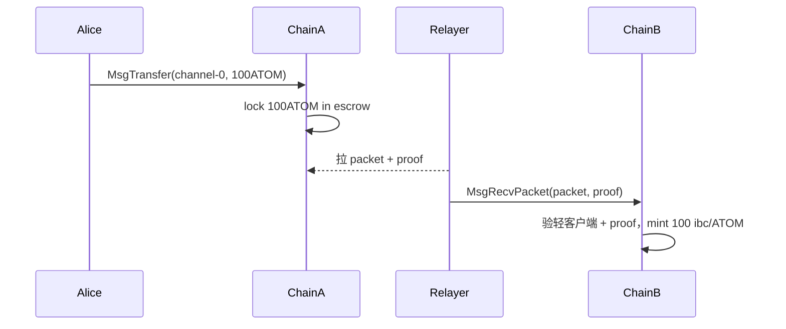

信任模型：信任 chain A/B 各自共识 + light client 代码，不信任 relayer。

### M3.4 章末三件套

**自检三问**：
1. app-chain 的"主权"代价是什么？— 自己招验证人集合、自己造工具链、自己接入 IBC；Interchain Security 可以借用 Cosmos Hub 安全降低门槛。
2. IBC 为什么不是"多签托管桥"？— 它让每条链在对端跑一份轻客户端，relayer 只搬运 packet + proof，链上自己验。信任在共识与 light client 代码，而非 relayer。
3. CometBFT 和 Tendermint 是什么关系？— 同一套 BFT 共识引擎，原 Tendermint Inc 与 Cosmos Hub 治理摩擦后改名 CometBFT；commit 即最终，~3 s。

**速记卡片**：
- 每应用一条链，链间 IBC 互通
- Cosmos SDK = Go 模块；CosmWasm = Rust 合约；Evmos/Cronos = EVM
- CometBFT 共识 3 s 最终
- IBC Eureka v10 已把 Ethereum 接进生态

**下一步**：动手 `ignite scaffold chain` 跑通本地链 → 读附录 B（Cosmos SDK / CosmWasm 详）/ G（IBC Eureka ZK 细节）。

---

## M4 · Bitcoin Script 入门

> **TL;DR**：Bitcoin = 现金信封。没有账户余额，只有 UTXO（未花输出）。Script 是栈式语言，**故意不图灵完备**。Taproot 让复杂脚本在链上看起来像普通转账，Ordinals/Runes 建在这上面。

> **场景钩子**：2023 年 1 月，工程师 Casey Rodarmor 公布 Ordinals——给每一聪 BTC 编号，把任意字节塞进 Taproot witness。Bitcoin Core 老炮们当场炸锅：Luke Dashjr 公开骂"这是攻击 Bitcoin"，但市场不听：3 个月内 inscription 千万级，链费打到 100 sat/vB，矿工一边骂一边收 fee。**这是 Bitcoin 历史上最大的文化分裂**。

### M4.1 UTXO 模型

Bitcoin 没有"账户余额"。链上只有 UTXO（Unspent Transaction Output）——每笔收款生成一个"锁住的输出"，花费 = 提供解锁脚本把它打开，同时生成新的输出。钱包把你名下所有 UTXO 的 satoshi 加起来显示为"余额"。

```text
# 标准 P2PKH 锁定脚本（spending condition）
OP_DUP OP_HASH160 <pubkey_hash> OP_EQUALVERIFY OP_CHECKSIG

# 解锁脚本（witness）提供:
<sig> <pubkey>
# 栈机验证 sig 对 pubkey 有效，且 pubkey 哈希匹配
```

### M4.2 Taproot 三件套

BIP-340/341/342（2021-11 激活）：

- **Schnorr 签名**：64 字节，线性可聚合——n 个人 MuSig2 共签 = 链上看起来是 1 人签。
- **MAST**：复杂脚本折叠成 Merkle 树，只公开走到的那条路径。
- **key-path vs script-path**：合作时走 key-path（64B 签名），协议失败时才暴露脚本树。

结果：Lightning channel close、DLC、BitVM 桥在链上看起来**与普通转账一模一样**。

### M4.3 Taproot 上的生态（一句话）

- **Ordinals**：给每聪编号，script-path witness 里塞任意字节 = "铭刻" NFT/图片。
- **Runes**：Casey Rodarmor 后作，用 OP\_RETURN 存 fungible token 元数据，减少 UTXO 膨胀。
- **BitVM**：用 Taproot 脚本树 + 挑战-响应协议模拟图灵完备计算，实现 BTC 上的乐观 rollup（Citrea）。
- **Babylon**：BTC staking，给其他 PoS 链提供经济安全。

### M4.4 章末三件套

**自检三问**：
1. 为什么 Bitcoin 没有"账户余额"？— 链上只有 UTXO；钱包把你名下所有未花输出的 satoshi 加起来显示为余额。每次花费就是消耗 UTXO + 生成新 UTXO。
2. Taproot 的 key-path 和 script-path 各用在什么时候？— 合作时（多方都签）走 key-path，链上看起来就是单签 64B；协议失败 / 单方逃生时才暴露 script-path 的脚本树。
3. 为什么 Script 故意不图灵完备？— 安全边界 + 静态分析可行；任何"复杂计算"靠 BitVM 2 / Citrea / Lightning / Stacks 这些 L2 在链下做，链上只验证结果。

**速记卡片**：
- UTXO = 现金信封，无账户状态
- Script 是栈式语言，故意非图灵完备
- Taproot 三件套：Schnorr / MAST / key-path vs script-path
- Ordinals / Runes / BitVM / Babylon 全建在 Taproot 上

**下一步**：动手 `code/bitcoin/` 构造 P2TR 交易 → 读附录 E（Lightning/LDK、BitVM 2、Citrea、Stacks、Babylon、RGB）。

---

## M5 · 选哪条链：3-5 条决策建议

> **TL;DR**：必须粗通四族，至少深入一族。以下建议针对已熟练 EVM 的工程师。

> **场景钩子**：2025 年底，一个朋友面试三家：Solana DeFi 团队报 35w 美元 + token、Cosmos RWA 团队报 22w + 长期股权、Bitcoin BitVM 团队报 28w 美元但"工程师极度稀缺，五年内不愁项目"。他纠结了两周，最终选 Bitcoin——理由是"Solana 五年后也许还在，但 BitVM 这种窗口期只在 2025-2027"。**选链 = 选未来三五年的简历坐标**，比月度涨跌重要得多。

### M5.1 决策矩阵

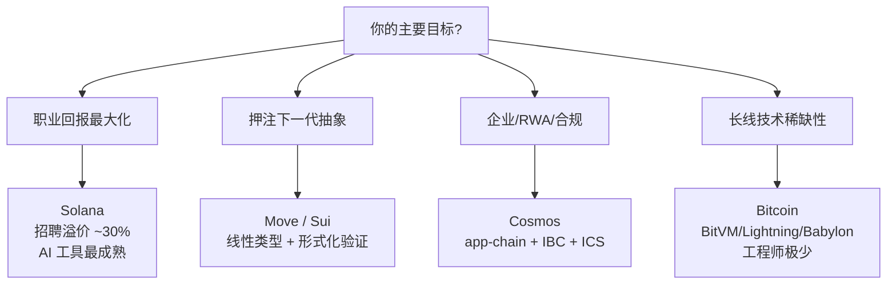

### M5.2 五条具体建议

1. **职业回报** → 先学 Solana（Anchor + 一个 mainnet 部署）。SVM 外延到 Eclipse/MagicBlock，一份技能多条链用。

2. **长线稀缺** → 学 Bitcoin 比学第三个 EVM L2 更值钱。BIP-340/341/342 + LDK + BitVM 论文，五年不愁项目，工程师极少。

3. **下一代抽象** → Move/Sui。资源类型 + Move Prover 形式化验证是软件工程未来方向。生态体量仍小但增速快。

4. **企业/合规/RWA** → Cosmos（dYdX、Babylon、Neutron）。app-chain + IBC Eureka + ICS 是 B2B 友好全套方案。

5. **不要做的事**：同时学 5 条链（样样松）；追每周新链（看 GitHub 提交活跃度 + 真实 TVL，不看价格）；all-in EVM（5 年后变成区块链领域的 PHP 开发者）。

### M5.3 按周学习时间

| 目标 | 4 h/周 | 8 h/周 |
|---|---|---|
| 找下一份工作 | Solana 基础（Anchor） | Solana 深 + 1 个 mainnet 项目 |
| 做 C 端产品 | Solana / TON 任一 | + Solana Mobile 或 TON Mini App |
| 押注下一代抽象 | Sui Move counter | + Move Prover / 完整 DeFi 协议 |
| RWA / 机构 | Cosmos + IBC | + CosmWasm + ICS + 起 app-chain |
| 安全 / 基建 | Bitcoin Taproot 基础 | + LDK / BitVM 论文精读 |

### M5.4 最重要的一件事

**学透抽象比"会写代码"重要**。Solana"显式账户列表"、Move"线性类型"、Bitcoin"UTXO + Script"、Cosmos"app-chain"——理解这四个概念，任何新链 30 分钟上手。

### M5.5 章末三件套

**自检三问**：
1. 你的"主要目标"是什么？— 职业回报 / 押注下一代抽象 / RWA 合规 / 长线技术稀缺性。先确定这个再选链。
2. "同时学 5 条链"为什么是错的？— 每族都有自己心智模型，浅尝辄止只会让你简历好看，面试一问就漏。**至少深入一族**才有议价权。
3. 怎么判断一条链值不值得学？— GitHub 提交活跃度（最近 90 天）+ 真实 TVL（DeFi Llama 实际锁仓）+ 招聘市场（LinkedIn / CryptoJobs 周新增岗位）。**不看价格**。

**速记卡片**：
- 职业回报 → Solana
- 下一代抽象 → Move/Sui
- 企业 / RWA → Cosmos
- 长线稀缺 → Bitcoin
- 红线：同时学 5 条链 / 追每周新链 / all-in EVM

**下一步**：选 1-2 条链 → 按 M5.3 时间表分配每周学习 → 6 个月做一个 mainnet 项目放进简历。

---

## M6 · 主线章末

**自检三问**：
1. 写过 EVM 的人能选 1-2 条非 EVM 链吗？— 是。M5.2 给了 5 条具体路径。
2. 主线有没有跑进 16+ 链详细？— 没有。TON/NEAR/JAM/Cardano 等统一放附录 F。
3. 主线有没有"显然"？— 没有。共识细节引用模块 02，性能基准放附录，主线只讲心智模型 + 最小代码 + 选型。

**学习路径图**：

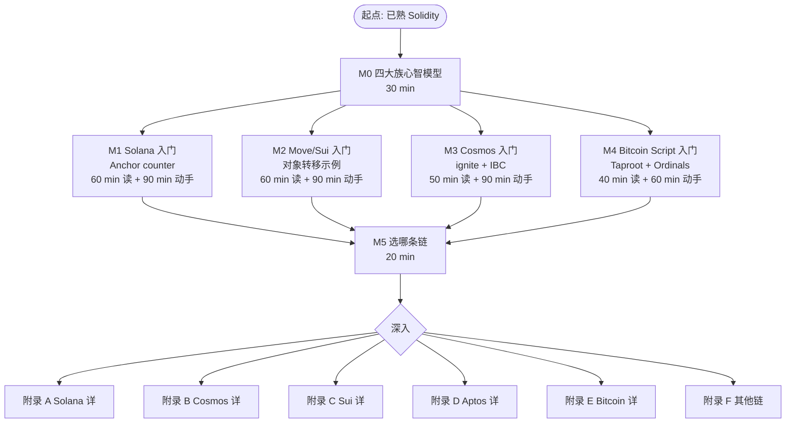

---

## ── 附录分界线 ──

> 以下各章为深水区附录，对应目录中附录 A–G。读者可在确定目标链后按需深入。

---

## A · 附录 A：Solana 详（原章 1–12）

---

## 0 · 导论：EVM 不是世界的中心

> **场景钩子**：2024 年初，一个老 EVM 工程师同时拿到三家公司的面试题。Solana 公司让他解释为什么转账要"显式列账户"；Cosmos 公司让他设计一条 RWA 应用链；Sui 公司让他用线性类型重写 ERC-20。他三道全错——不是不会写代码，而是**心智模型不对**：他在用"合约 + mapping"的脑回路看五个完全不同的世界（含其他主流）。本章先把这五套世界观摆上桌：Solana 把 EVM"通用服务器"做到极致，Cosmos 让每个应用自己当链，Move 把资产做成编译期不可复制的对象，Bitcoin 干脆**故意不图灵完备**，其他主流（TON/NEAR/Polkadot/Cardano 等）作为附录单列。理解这几种"反 EVM"动机，才能读懂本模块主线 + 附录。

### 0.1 为什么要学非 EVM

EVM 解决的是"通用应用服务器"问题；其他生态要么把这个问题做得更极致（Solana），要么换个问法（Cosmos、Move、Bitcoin）。

当下（2026-04）格局总表：

| 生态家族 | 主语 | 共识 | 执行模型 | 主语言 | 代表网络 / 代币 |
|----------|------|------|----------|--------|-----------------|
| **Solana 系** | "高性能单链" | PoH + Tower BFT (PBFT-inspired) | 账户模型 + Sealevel 并行 | Rust (Anchor / Native) | Solana, Eclipse(SVM-on-ETH), MagicBlock |
| **Cosmos 系** | "应用即链" | CometBFT (Tendermint) | 应用链 + IBC | Go (SDK) / Rust (CosmWasm) | Cosmos Hub, Osmosis, dYdX, Celestia, Berachain, Babylon, Neutron |
| **Move 系** | "资源型语言 + 类型安全" | Mysticeti (Sui) / Jolteon (DiemBFT v4, HotStuff 派生) + Block-STM 执行 | 对象 (Sui) / 全局存储 (Aptos) | Move | Sui, Aptos, Movement, Initia |
| **Bitcoin 系** | "极简内核 + L2 套娃" | Nakamoto PoW | UTXO + Script + Taproot | Script / Clarity / Rust (LDK) | Bitcoin, Lightning, Stacks, Citrea, Babylon, Rootstock, RGB |
| **其他主流** | （混合 / 实验形态） | 各种 | 各种 | 各种 | TON, NEAR, Polkadot/JAM, Cardano, Algorand, Tezos, ICP, Filecoin, Tron, Hedera, Sei v2, Monad, Hyperliquid, MegaETH |

#### 学这五大类的现实理由

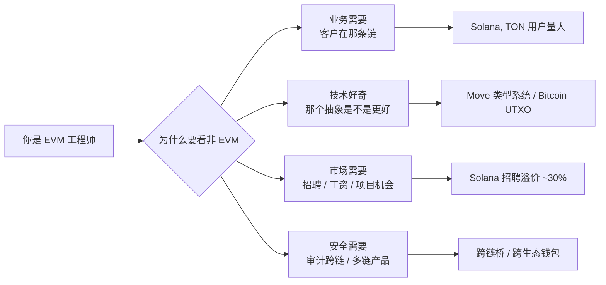

### 0.2 五个心智锚（提前消化）

**锚 1**：Solana 的"账户" ≠ EVM 的"地址"。它是**带 owner program 的一段裸字节**。

**锚 2**：Cosmos 的"链" ≈ 一个独立 OS。app chain 上线 = 部署应用 + 启验证人；不像 EVM 部署合约。

**锚 3**：Move 的"资源" ≠ 余额。它是**带 ability 系统的对象**（社区习惯叫"线性类型"，严格说更接近**仿射类型 affine**——不带 `copy` 不能复制、不带 `drop` 必须显式消耗、必须有 `key`/`store` 才能落 storage），编译期保证不可复制不可凭空销毁。

**锚 4**：Bitcoin 的"账户余额"是个谎言——链上只有 UTXO（未花输出）；钱包只是把它们加起来给你看。

**锚 5**：每个生态都有自己的"以太坊基金会"。学非 EVM = 要重新建立一套官方信源。

### 0.3 本模块的学习路径（梯度）


**预计耗时**（动手版）：

| 阶段 | 阅读 | 动手 |
|------|------|------|
| Solana 章 | 60 min | 90 min |
| Cosmos 章 | 50 min | 90 min |
| Move 章 | 60 min | 90 min |
| Bitcoin 章 | 70 min | 90 min |
| 其他 + AI | 40 min | 30 min |
| **合计** | **≈ 4.5 h** | **≈ 6.5 h** |

---

## 1 · Solana 账户模型：状态属于账户而不是合约

> **场景钩子**：2017 年 Anatoly Yakovenko 在高通做 4G 基带固件，长期与硬件实时性死磕。他写下一份白皮书，主张区块链的瓶颈是"全网协调时钟"——所以应该把时钟做成**任何节点都能本地验证的密码学对象**（PoH），再把状态拆到无数个互不相干的账户里**并行写**。这两个直觉合在一起，就有了 Solana。代价是：在 EVM 里"状态属于合约"的常识，在这里**完全反过来**——状态属于账户，合约只是个"有写权限的程序 ID"。下面这段心智反转是后续 12 章的总开关。
>
> **类比图像**：EVM 像一座中央仓库（合约自带库房，里面 mapping 摆一排排架子）；Solana 像一座**自助寄存柜**——每个柜子（账户）独立编号，柜门上写"哪个程序有钥匙"（owner），合约本身只是路过来开柜子的人。

在 Solana 上，**所有东西都是账户**——钱包、token 余额、合约本身、每个 NFT 都是账户。账户里只有裸字节 (`data: Vec<u8>`) + 一个 `owner` 字段标明哪个 program 有权写入。

### 1.1 与 EVM 的最大差异

EVM 世界：
```
合约 A 内部:
    mapping(address => uint256) balances;   // A 的私有数据
合约 B 想看 A 的 balance? 只能调用 A 暴露的 view 函数
```

Solana 世界：
```
mint 账户          ←  owner = SPL Token Program
token 持有账户 X    ←  owner = SPL Token Program, data 里写 (mint, owner_pubkey, amount)
token 持有账户 Y    ←  owner = SPL Token Program, data 里写 (mint, owner_pubkey, amount)
DEX 撮合账户       ←  owner = DEX Program
```

#### Account 数据结构（节选自 `solana-sdk`）

```rust
pub struct AccountSharedData {
    pub lamports: u64,      // 余额，1 SOL = 10^9 lamports
    pub data: Vec<u8>,      // 状态字节，长度由 init 时指定
    pub owner: Pubkey,      // 哪个 program 拥有 data 写权限
    pub executable: bool,   // 是不是可执行的 program (BPF 字节码)
    pub rent_epoch: Epoch,  // rent 相关，2.x 后基本是 sentinel
}
```

逐字段拆解：

| 字段 | 类比 EVM | Solana 特有点 |
|------|----------|----------------|
| `lamports` | EOA 的 ETH 余额 | **每个账户都有**，包括合约状态账户 |
| `data` | 合约 storage | 是裸 bytes，不是 mapping，**长度提前定** |
| `owner` | （没有对应） | 决定谁能写这段 data；用户 EOA 的 owner = `system_program` |
| `executable` | `extcodesize(addr) > 0` | 显式 flag，不靠代码长度推断 |
| `rent_epoch` | （没有对应） | 历史遗留，2.x 后基本不用 |

### 1.2 实战图解：一笔 SPL Token 转账

Solana 的转账 = 让 SPL Token Program 改两个 token 账户里的 amount 字段。

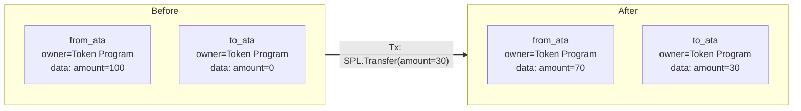

**关键点**：

1. `from_ata`、`to_ata` 都是 ATA（associated token account），**地址由 (wallet, mint) PDA 派生**——
   钱包地址 + 代币 mint 地址 → 唯一确定一个 ATA 地址。
2. 调用者必须**在事务中显式列出这两个账户**（包括只读的 mint 也要列）。
3. 写权限由 `owner == SPL Token Program` 保证——其他 program 想动 amount 字段会被 runtime 拒绝。

#### 一笔事务到底长什么样

```text
Transaction {
  signers: [from_owner_keypair],            // 必须签的私钥
  account_keys: [                            // 事务全局账户表
    from_ata,        // [w]    可写
    to_ata,          // [w]    可写
    from_owner,      // [s]    签名者
    spl_token_prog,  // [r,x]  只读，可执行
  ],
  instructions: [
    Instruction {
      program_id: spl_token_prog,            // 调用谁
      accounts: [from_ata, to_ata, from_owner],
      data: borsh::serialize(TransferIx { amount: 30 }),
    },
  ],
}
```

#### 事务大小约束（产品级影响！）

**数字记忆点**：单笔 Solana 事务的网络包 ≤ **1232 字节**（1280 MTU - 头）。

后果：

- 账户数（每个 32 B）+ 指令数（每个 ≥ 35 B）有硬上限
- 复杂操作要拆事务或用 lookup table（v0 transaction，最多映射 256 个账户）
- 钱包要替用户算 ATA、找 PDA，不像 EVM "直接 call 合约就行"

**PDA 一句话**：PDA（Program Derived Address）是**故意构造在 ed25519 曲线之外的地址**（off-curve），因此没有对应的私钥能签名——只有派生它的 program 可以用 `invoke_signed` 代为签名。`bump` 是从 255 开始**递减搜索**的 nonce：把 `(seeds, bump)` 喂给 SHA256 直到结果落在曲线外，找到的第一个有效值即为 canonical bump。生产代码里始终用 canonical bump 并把它存进账户，避免每次重算 `find_program_address`（开销 ~10k CU）。

### 1.3 思考题（章 1）

> Q1：Solana 事务为什么必须显式列出账户？这与并行执行是什么关系？
>
> Q2：PDA（Program Derived Address）和普通账户的根本区别是什么？为什么需要 bump？
>
> Q3：mint 的 `mint_authority` 设成 EOA vs 设成 PDA，分别意味着什么？什么时候选哪个？

---

## 2 · PoH：可验证的全网时钟

> **场景钩子**：2017 年 Anatoly 在 Loom 第一次画 PoH 草图时，跟同事 Greg Fitzgerald 解释："想象沙漏——只不过是密码学沙漏。下面那粒沙没漏完，上面这粒就不可能存在。"SHA-256 是单线程不可并行的，把它当作"沙漏的下一粒沙"就拿到了一条**全网都能本地验证的时间轴**——共识协议不再需要花一半时间互相喊"现在几点"。这就是 PoH。常被人误解为"PoH 替代了 PoS"，**完全不对**：PoH 只是共识下面的时钟。

> 共识基础与 Tower BFT 完整对比见模块 02 §8.2。本节只讲 PoH 在 Solana 系统里独有的东西：它**不是共识**，是写在共识下面的时钟。

PoH = 严格顺序的 SHA-256 哈希链：$h_{n+1} = \text{SHA256}(h_n)$（含事务时 $h_{n+1} = \text{SHA256}(h_n \,\|\, \text{tx\_data})$，事务被不可篡改地嵌入时间轴）。SHA-256 不可并行，leader 把事务 hash 喂进去就把它"钉"在这条链的某个位置。

**为什么这件事有用**——共识协议要交换"现在几点"，O(n²) 通信。Solana 让 PoH 隐含全部时序，共识只需投"哪条 fork"。三个直接红利：

1. leader schedule 可在 epoch 开始时一次抽完（400 ms/slot）
2. Banking 阶段与 PoH tick 流水线并行
3. 验证人重放时可跳过冗余时间戳验证

常见误解："Solana 用 PoH 替代了 PoS"——错。共识仍是 Tower BFT（PoS + 指数 lockout），PoH 只决定"事务在 leader 视角下的先后"。

### 2.1 思考题（章 2）

> Q1：leader 故意提前 PoH 时钟（多算几粒沙），后续验证人能发现吗？怎么发现？
>
> Q2：PoH 的"单线程不可加速"为什么是优势而不是缺陷？

---

## 3 · Tower BFT 与 NCN

> Tower BFT 算法骨架与 PBFT/CometBFT 横向对比见模块 02 附录 A.8（PBFT 系）/ §7（HotStuff）/ §8（Solana）。本节只讲 Solana 工程师必须知道的两件事：**finality 数字**和 **Jito NCN**。

**Finality 数字**（用来回答"我等几秒可以发货"）：

- Optimistic confirmation：≥ 2/3 stake 投过 → **1-2 s**，CEX 充值通常用这个
- Rooted（32 票深 lockout 完成）：**~12.8 s**，硬最终性
- 日常 PR/dApp UI 用 optimistic 即可；做市商、跨链桥用 rooted

### 3.1 Restaking 与 NCN（Node Consensus Network）

2025 年起 Jito 把"Solana 上的 BFT 共识能力"打包成 service：

- **Jito Restaking**：SOL 持有者把 stake 押到多个 NCN
- **NCN**：跑独立投票轮的小型 BFT 网络，复用 Solana 验证人作为节点；用例是 oracle、bridge、AVS
- **TipRouter NCN（首个）**：MEV tip 去中心化分配

**NCN ≠ EigenLayer AVS**：EigenLayer 是 **stake-restake**——同一份 ETH 质押被多个 AVS 约束 slash 域。Jito NCN 是 **operator-reuse**——复用 Solana 验证人节点（operator）跑额外共识轮，安全押金用独立 vault token（JitoSOL/JTO），与 Solana 主网共识 stake 不共享 slash。**EigenLayer 重用 stake，Jito 重用 operator**。

### 3.2 思考题（章 3）

> Q1：NCN 与 Cosmos 的 Interchain Security 在"借安全"思想上有何相似？slash 域上有何不同？

---

## 4 · Sealevel：账户列表驱动的并行执行

> **场景钩子**：EVM 的并行执行像北京二环——所有车（事务）都挤在一条路（合约状态）上，谁也不知道谁要去哪儿，只能排队。Solana 的解法是：**进城前先填申报表**——这辆车要去 1 号停车场、2 号停车场、3 号停车场（账户列表）。调度器一看：A 车去 1、2 号；B 车去 3、4 号；互不冲突 → 直接分到两条车道并行开。漏填一个停车场 = 海关直接拒入境（runtime 拒绝），没有"宽容退化为串行"这种事。这种**严格**是 Solana 把账户模型做到极致后的必然代价：要拿"高速公路"的吞吐，就得忍"申报表"的繁琐。

Sealevel 要求事务**静态声明所有账户**，调度器据此在执行前构造依赖图，互不冲突的事务分到不同 CPU 核并行执行。没填全 = runtime 拒绝入队。

### 4.1 调度算法

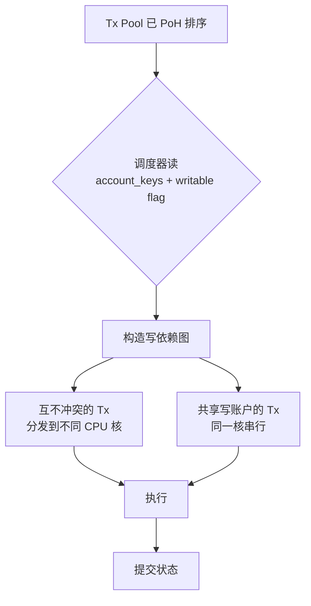

- 写到不同账户的事务 → 真并行；写到同一账户的事务 → 按 PoH 顺序串行

### 4.2 三种并行思路对比

| 思路 | 代表链 | 何时确定冲突 | 失败模式 |
|------|--------|--------------|----------|
| **静态声明** | Solana Sealevel | 事务进入前 | 漏列账户 → runtime 拒绝 |
| **对象隔离** | Sui | 事务进入前（从对象 owner） | owned 对象冲突极少 |
| **乐观并行** | Aptos Block-STM、Monad、Sei v2、Berachain V2 | 事后检测 | 冲突回滚重跑 |
| **串行** | Ethereum、BSC、Polygon PoS | n/a | 简单但慢 |

### 4.3 TPU、Gulf Stream、Turbine

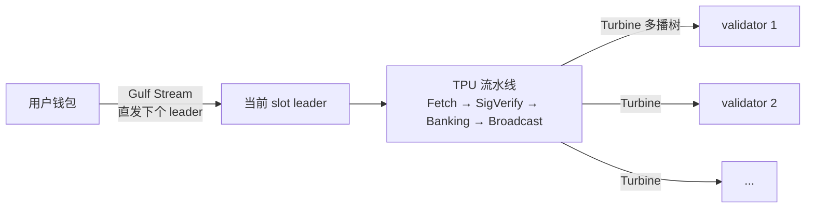

**无传统 mempool**——事务直接路由到下几个 leader（schedule 提前计算好）：
- MEV 发生在 leader 排序权上（Jito 做的就是这一层），不像 EVM 是 mempool 抢跑
- 出块速度 400 ms / slot

### 4.4 思考题（章 4）

> Q1：Sealevel 漏列账户为什么 runtime 拒绝而不是默认串行？这种严格性对开发体验意味着什么？
>
> Q2：相比乐观并行（Aptos / Monad），静态声明在何种 workload 下吃亏？

---

## 5 · Anchor：Solana 的声明式框架

> **场景钩子**：2021 年 Armani Ferrante 在 Serum 撸 native Solana 程序时崩溃了——一个简单的转账要写 200 行账户校验、序列化、PDA 派生，**80% 是机械样板**。他用一个周末撸出 Anchor 第一版宏，把这些样板全塞进 `#[derive(Accounts)]`。社区接得飞快：3 个月内 Solana 上 80% 新项目用 Anchor，从此"写 Solana = 写 Anchor"成为默认。这是 Solana 史上最重要的工程师工具，也是非 EVM 世界少见的"DSL 把心智门槛打下一档"的成功案例。

Anchor (`solana-foundation/anchor`，本教程用 0.31.1；Anchor 1.0 已发布但生态尚未全量迁移，0.31.1 仍是主流兼容版本) 用 Rust 过程宏把指令分发、账户校验、序列化、PDA 派生声明化，省去 60-70% 手写代码。

#### 三件套：程序 + IDL + 客户端

```
programs/counter/src/lib.rs   ← Rust 程序，用 Anchor 宏写
target/idl/counter.json        ← anchor build 自动生成的 IDL
tests/counter.ts               ← TypeScript 客户端，用 IDL 做类型化 RPC
```

#### 核心代码（来自 `code/solana/programs/counter/src/lib.rs`）

```rust
use anchor_lang::prelude::*;

declare_id!("Cou1terXXXXXXXXXXXXXXXXXXXXXXXXXXXXXXXXXXX1");

#[program]
pub mod counter {
    use super::*;

    /// 初始化属于 authority 的 counter PDA。
    /// 种子: ["counter", authority.key()]
    pub fn initialize(ctx: Context<Initialize>) -> Result<()> {
        let counter = &mut ctx.accounts.counter;     // 拿可变引用
        counter.authority = ctx.accounts.authority.key();
        counter.count = 0;
        counter.bump = ctx.bumps.counter;            // 保存 bump 省 gas
        Ok(())
    }

    /// 自增 1，仅 authority 可调
    pub fn increment(ctx: Context<Increment>) -> Result<()> {
        let counter = &mut ctx.accounts.counter;
        counter.count = counter.count
            .checked_add(1)
            .ok_or(CounterError::Overflow)?;          // 显式溢出检查
        Ok(())
    }
}

#[derive(Accounts)]
pub struct Initialize<'info> {
    #[account(
        init,                                         // 这次事务才创建
        payer = authority,                            // 谁付 rent
        space = 8 + Counter::INIT_SPACE,              // 8B discriminator + 数据
        seeds = [b"counter", authority.key().as_ref()],
        bump,                                         // 自动找 canonical bump
    )]
    pub counter: Account<'info, Counter>,             // 自动反序列化 + 校验

    #[account(mut)]
    pub authority: Signer<'info>,                     // 付 rent 要标 mut
    pub system_program: Program<'info, System>,       // create_account CPI
}

#[derive(Accounts)]
pub struct Increment<'info> {
    #[account(
        mut,                                          // 要写
        seeds = [b"counter", authority.key().as_ref()],
        bump = counter.bump,                          // 用保存的 bump，便宜
        has_one = authority,                          // 编译期生成 owner 校验
    )]
    pub counter: Account<'info, Counter>,
    pub authority: Signer<'info>,
}

#[account]
#[derive(InitSpace)]
pub struct Counter {
    pub authority: Pubkey,                            // 32 B
    pub count: u64,                                   // 8 B
    pub bump: u8,                                     // 1 B
}

#[error_code]
pub enum CounterError {
    #[msg("counter overflow")]
    Overflow,
}
```

#### 逐行解读 Anchor 宏帮你做了什么

| 宏 / 属性 | 等价手写代码 |
|-----------|--------------|
| `#[program]` | 生成指令分发函数（match 头 8 字节 discriminator） |
| `#[derive(Accounts)]` | 生成账户结构体的 borsh 反序列化 + 校验 |
| `init, payer, space` | 展开成 `system_program::create_account` CPI + 写 8B discriminator |
| `seeds, bump` | 展开成 `Pubkey::find_program_address` 验证 |
| `has_one = authority` | 编译期生成 `counter.authority == authority.key()` 检查 |
| `Account<'info, T>` | 反序列化 + 校验 owner == 本程序 + 校验 discriminator |
| `Signer<'info>` | 校验 `is_signer == true` |

Anchor 0.31.1 相对 0.30.x 的主要变化是**栈使用优化** + **Solana v2 工具链兼容**。0.30 的 IDL 用 SPL Account Compression + DAS 索引器普遍能识别，0.31 IDL 格式向后兼容。Anchor 1.0 已发布（2026-04 初），但生态（钱包、索引器、第三方框架）尚未全量迁移；本教程用 0.31.1 兼容主流。

#### 对照：Native（无 Anchor）等价骨架

等价 native 实现见 `code/solana/native/lib.rs`。**生产里什么时候放弃 Anchor：**

- DEX / 做市商极致优化（Mango v4、Drift v2、Phoenix）：CU (compute unit) 与字节寸土必争
- 跨多个 program version 的复杂兼容（Anchor 宏对自定义 layout 不够灵活）
- 内核级基础设施：Token、System、AddressLookupTable 都是 native

学习路径：先 Anchor → 读 Phoenix DEX / Mango v4 native 源码 → 看穿 Anchor 宏展开。

### 5.1 思考题（章 5）

> Q1：Anchor 的 `has_one` 约束在编译期生成什么代码？为什么它比 runtime require 更安全？
>
> Q2：什么时候 Anchor 的"自动反序列化"是缺点而不是优点？

---

## 6 · Pinocchio：零依赖 Native Rust 框架

> **场景钩子**：Anchor 把入门门槛打下来了，但有一群人不买账：高频做市商。Phoenix DEX 的撮合内核每多一行 Anchor 宏展开，就多消耗几百个 CU；二进制大点 10 KB，链上部署租金就多一笔。2024 年 Anza（Solana Foundation 工程团队）拍桌子做 Pinocchio：**零依赖、零拷贝、no_std**，hello-world 从 5000 CU 砍到 600 CU，二进制从 100KB 砍到 5-10KB。Anchor 是给 90% 工程师用的；Pinocchio 是给最后 10% 极致优化派的——读 Phoenix / Mango v4 / Jupiter 内核之前先读它。

### 6.1 Pinocchio 定位

**Pinocchio**（Anza 维护，2024-2025 兴起）是**零依赖**的 Native Rust 框架，专为 CU 和二进制大小敏感的程序设计。无需 `solana-program` crate，账户和指令数据以字节切片**零拷贝**读取。

### 6.2 Pinocchio 与 Anchor / 传统 Native 对比

| 维度 | Anchor 1.0 | 传统 Native (`solana-program`) | Pinocchio |
|------|-----------|--------------------------------|-----------|
| 依赖项 | 多（anchor-lang、solana-program、borsh...） | 1（solana-program ~150 个传递依赖） | **0**（no_std） |
| 反序列化 | borsh（带堆分配） | borsh（带堆分配） | **零拷贝**，在原 byte slice 上读 |
| 二进制大小 | 100+ KB 起 | 60+ KB 起 | **可低至 5-10 KB** |
| CU 消耗（hello-world） | ~5,000 CU | ~3,000 CU | **~600 CU** |
| 学习曲线 | 中等（宏多） | 高（手写一切） | 高（手写更细） |
| 适用场景 | 90% 应用 | 性能敏感 + Anchor 不够灵活 | 极致优化 + 链上基础设施 |

### 6.3 一段最小 Pinocchio 程序

```rust
#![no_std]
use pinocchio::{
    account_info::AccountInfo, entrypoint, msg,
    program_error::ProgramError, pubkey::Pubkey, ProgramResult,
};

entrypoint!(process_instruction);

pub fn process_instruction(
    _program_id: &Pubkey,
    accounts: &[AccountInfo],
    data: &[u8],
) -> ProgramResult {
    // 第一字节当作 discriminator（不像 Anchor 用 8B）
    match data.first().ok_or(ProgramError::InvalidInstructionData)? {
        0 => initialize(accounts),
        1 => increment(accounts),
        _ => Err(ProgramError::InvalidInstructionData),
    }
}

fn initialize(accounts: &[AccountInfo]) -> ProgramResult {
    let counter = &accounts[0];
    let mut data = counter.try_borrow_mut_data()?;
    if data.len() < 8 {
        return Err(ProgramError::AccountDataTooSmall);
    }
    data[..8].copy_from_slice(&0u64.to_le_bytes());   // 直接写裸字节
    msg!("init");
    Ok(())
}

fn increment(accounts: &[AccountInfo]) -> ProgramResult {
    let counter = &accounts[0];
    let mut data = counter.try_borrow_mut_data()?;
    let mut buf = [0u8; 8];
    buf.copy_from_slice(&data[..8]);
    let v = u64::from_le_bytes(buf).checked_add(1).ok_or(ProgramError::ArithmeticOverflow)?;
    data[..8].copy_from_slice(&v.to_le_bytes());
    Ok(())
}
```

### 6.4 何时该用 Pinocchio

✅ 适合：
- 高频 DEX / 撮合引擎核心程序
- 大型 program 的热路径（比如 SPL Token Program 本身）
- 需要 < 1 KB 二进制的"嵌入式"程序（比如 Pyth oracle 的更新指令）
- 对 IDL 兼容性无要求（不需要 web 前端自动调用）

❌ 不适合：
- 一般 dApp 业务逻辑（Anchor 足够）
- 团队里没有 Native Solana 经验
- 需要 IDL 给前端做类型生成（Pinocchio 没有 IDL 工具）

### 6.5 思考题（章 6）

> Q1：Pinocchio 把 discriminator 从 8B 缩到 1B，这有什么收益？什么时候不安全？
>
> Q2：Helius / Drift / Phoenix 等明星项目为什么开始用 Pinocchio 重写？

---

## 7 · SPL Token、Token-2022 与 Compressed NFT

**EVM**：每个 ERC-20 是一个独立合约。**Solana**：一个共享 Token Program，每种代币是一个 Mint 账户，每个余额是一个 Token 账户。

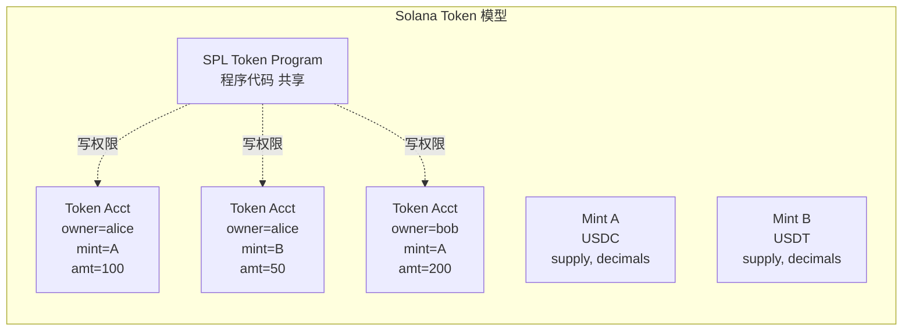

#### SPL Token vs Token-2022（Token Extensions）

| 对比项 | SPL Token (经典) | Token-2022 |
|--------|------------------|-----------|
| Program ID | `TokenkegQfeZyiNwAJbNbGKPFXCWuBvf9Ss623VQ5DA` | `TokenzQdBNbLqP5VEhdkAS6EPFLC1PHnBqCXEpPxuEb` |
| 转账钩子 | ❌ | ✅ Transfer Hook（每次 transfer 调用一段自定义 program） |
| 利息累加 | ❌ | ✅ Interest-bearing（按 timestamp 自动 accrue） |
| 转账费 | ❌ | ✅ 协议级 fee on transfer（不是 hack） |
| 隐私转账 | ❌ | ✅ Confidential Transfer（zk + ElGamal） |
| 永久代理 | ❌ | ✅ Permanent Delegate（合规必备） |
| 元数据指针 | ❌ Metaplex 单独存 | ✅ MetadataPointer + 内联元数据 |
| 默认账户状态 | ❌ | ✅ Default Frozen（KYC 友好） |

**重要**：Token-2022 是**并行的另一套 program**，不是 SPL Token 升级版。USDC/USDT 仍在 SPL Token；PayPal PYUSD 等合规稳定币大多用 Token-2022。**客户端必须区分 owner = TokenkegQ... 还是 TokenzQd...**。

（ZK ElGamal Proof Program 2024-Q1 因漏洞下线，2025-Q3 经审计重启；Token-2022 Confidential Transfer 实际可用性看主网启用日期）

### 7.1 思考题（章 7）

> Q1：为什么 Solana 把 token 余额做成"独立账户"而不是合约里的 mapping？这种设计在并行执行时有什么收益？
>
> Q2：Token-2022 transfer hook 与 ERC-1363 的相似与差异？

---

## 8 · cNFT 与 ZK Compression：把 NFT 压到 5000 倍便宜

"每个 NFT 一个账户"在百万级 mint 时太贵（rent ≈ 0.002 SOL/账户 → 100 万 NFT 要 2000 SOL）。解法：**链上只存 Merkle root，叶子数据外推到 indexer**。

### 8.1 架构对比

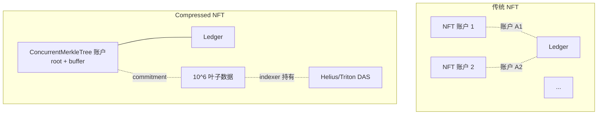

**两代演进**：

- **cNFT v1（2023）**：SPL Account Compression + DAS standard，主要用于 NFT mint。Drip Haus、Helium、Underdog 用得最猛
- **ZK Compression（2024-06，Light Protocol + Helius）→ V2（2025-05）**：
  通用化，不只支持 NFT，也支持 token 与任意账户。V2 比 V1 又便宜 ~70%，
  存 100 个 compressed token 账户 ≈ 0.0004 SOL（普通需 0.2 SOL，**5000x 折扣**）

**代价**：
1. 所有数据要靠 indexer（Helius/Triton/SimpleHash）才能查询，**链上只有 root**
2. 客户端调用要先从 indexer 拿 proof，再提交到链上
3. indexer 离线 → 资产功能性消失（资产本身在链上，但你看不到也用不了）

### 8.2 应用案例

| 项目 | 用法 | 规模 |
|------|------|------|
| **Drip Haus** | 每周给关注者免费空投 cNFT | 累计千万级 mint |
| **Helium Mobile** | 设备 NFT 标识每一台路由器 | 百万级 |
| **Underdog** | 给品牌做 cNFT loyalty | B2B 主推 |
| **Dialect** | 链上消息附 cNFT 邀请 | 高频 |

### 8.3 思考题（章 8）

> Q1：cNFT 与 EVM 的 ERC-721A、ERC-6551、ERC-7066 在"省 gas"思路上有何根本不同？
>
> Q2：indexer 离线时资产"功能性消失"——这是不是变相中心化？该如何缓解？

---

## 9 · Firedancer：客户端多元化

> **场景钩子**：2022 年 Solana 整链停机 7 次，最长一次 17 小时——根因都是同一个：**全网 100% 跑同一份 Rust 客户端**，一颗 bug 拖垮所有节点。Jump Crypto 的 Kevin Bowers 当时是芝加哥高频交易工程师，他看不下去：写过纳秒级交易系统的人，怎么能容忍这种单点故障？2022 年底他带队用**纯 C** 把 Solana 客户端从零写一遍，目标 1M TPS——这就是 Firedancer。2026-Q1 主网激活至今 100% 在线。意义不在 TPS，在**客户端多元化**：Solana 终于有了 Ethereum 风格的"Geth 挂了还有 Besu"。

2026-04 Solana 客户端版图：

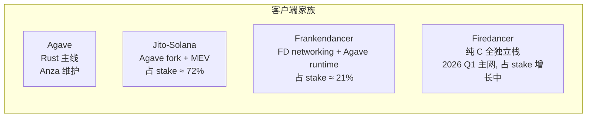

**意义**：单一客户端是单点风险（Solana 2022-2023 因同一 bug 多次停机）。Firedancer（Jump Crypto 纯 C 重写）目标 1M TPS，2026-Q1 主网上线至今 **100% 在线**。协议规范（SIMD）比源码更重要；Anchor/BPF 程序不受客户端切换影响。

### 9.1 数字与里程碑（2026-04 实测）

| 项目 | 状态 |
|------|------|
| Frankendancer 占 stake | ~21%（2025-10） |
| Firedancer 主网激活 | 2026-Q1 |
| 网络在线时间（2026 至今） | 100% |
| 1M USD bug bounty 截止 | 2026-05 |
| Jito-Solana 占 stake | ~72%（仍是主导客户端） |

**Stateless Validators (SIMD-0341)**：Alpenglow 路线下把归档与共识分离——validator 只验当前 slot 状态，历史交给专门 archive 节点。

### 9.2 思考题（章 9）

> Q1：Solana 客户端多元化与 Ethereum 的 Geth/Besu/Erigon/Nethermind/Reth 多客户端在动机上有什么相似？
>
> Q2：纯 C 重写如何降低硬件门槛？这与"去中心化"目标如何相关？

---

## 10 · Jito MEV、TipRouter、Squads

> **场景钩子**：Solana 没有 mempool，事务直发 leader——理论上没有 EVM 那种 mempool 抢跑。但人类的贪婪不会消失：搜索者们想出"私下塞钱给 leader 优先打包"的玩法。2022 年 Jito Labs 的 Lucas Bruder 看到这个灰色市场，干脆把它**协议化**：明码标价的 tip 通道 + 多笔事务原子打包（bundle）+ tip 按 stake 分给全网验证人。今天 Jito-Solana 客户端占 ~72% stake，几乎所有头部协议都用 Squads 多签管 program upgrade。**MEV 没法消灭，但可以阳光化**——Jito 是这个观点最成功的实现。

### 10.1 Jito MEV 机制

Solana 无 mempool，事务直发 leader。Jito 给 leader 加"VIP tip 通道"——付额外小费排优先队列，小费按规则分给全网验证人。

### 10.2 Jito 三件套

| 组件 | 作用 |
|------|------|
| **Jito-Solana 客户端** | 一个 Agave fork，集成了 MEV bundle 接收器；占 ~72% stake |
| **Block Engine** | 链下系统，接收用户/搜索者的 bundle（多笔事务原子打包），转发给当前 leader |
| **TipRouter NCN** | 链下节点共识网络，每个 epoch 末计算 MEV tip 的 Merkle root，链上执行分配 |

### 10.3 TipRouter：MEV 的去中心化分配

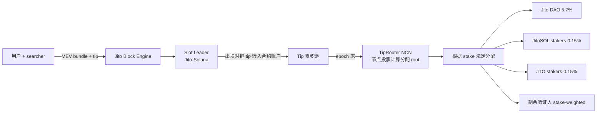

### 10.4 Squads V4：Solana 多签

- 2026 主网管理 **10B+ USD**，已经过形式化验证
- V4 新特性：**roles**（executor/voter/initiator）、**spending limits**（限额无需全员批准）、**whitelisting**、**time locks**
- 客户群：Pyth、Drift、Orca、Mango、Marinade 等几乎所有头部协议
- Program upgrade authority 普遍由 Squads 多签管理（避免单点 EOA）

### 10.5 思考题（章 10）

> Q1：Jito 的 stake-weighted MEV 分配与 Flashbots SUAVE / Ethereum 的 PBS 在思想上有什么关键差异？
>
> Q2：为什么 Squads 在 Solana 上比在 EVM 上"更不可或缺"？（提示：考虑 program upgrade authority）

---

## 11 · Solana Mobile 与 SVM 外延

> **场景钩子**：2023 年 Solana Mobile 出第一代 Saga 手机时，发布会人到位、媒体齐——但只卖出 几千台。Anatoly 当时打趣："反正 BONK 空投就值回了。" 业界都以为 Solana Mobile 是 Anatoly 的偏执项目，会很快关停。但 2025 年 Seeker（Chapter 2）一出，**72 小时预订突破 100 万台**，成了 Web3 历史最大硬件发布。秘密武器：跳过 Apple/Google 抽成的 dApp Store + SKR 代币奖励。这个故事说明非 EVM 不只是技术抽象之争，**渠道也是一个独立战场**。配合 SVM 外延（一次写多链跑），是 Solana 把 EVM 远远抛在身后的两个非技术武器。

### 11.1 Saga → Seeker

- **Saga**（2023 上市，2025-09 停止安全补丁）
- **Solana Seeker / Chapter 2**（2025-08 起全球出货，截至 2026-04 约 200,000 出货 + 100 万预订；预订≠出货）
- **预订量**：发布 72 小时内突破 100 万台，成为 **Web3 历史最大硬件发布**（预订数据，非出货）
- **价格**：US$450
- **板载**：
  - **Seed Vault**：硬件密钥隔离区
  - **dApp Store**：跳过 Apple/Google 30% 抽成
  - **Genesis Token**：Saga 用户独有的 NFT，可享后续福利
  - 500+ 上架 dApp（截至 2026-04）

### 11.2 SKR 代币：手机即奖励凭证

| 数据 | 值 |
|------|---|
| 上线 | 2026-01-21 |
| 总供应 | 10B SKR |
| 空投占比 | 30% |
| 首批 claim 用户 | 75,000+ |
| 立即质押率 | 46% |
| 链上累计交易量（200k 设备） | $5B+ |

### 11.3 Mobile Wallet Adapter (MWA)

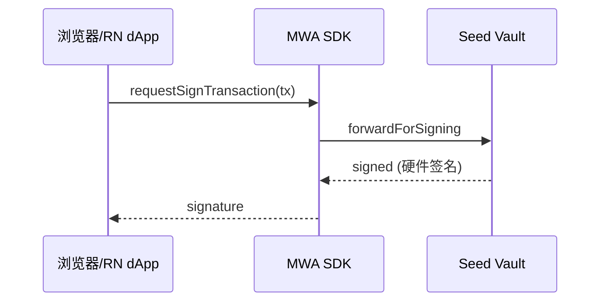

一套 React Native + MWA 可复用 90% web 代码。

### 11.4 SVM 外延：一次写, 多链跑

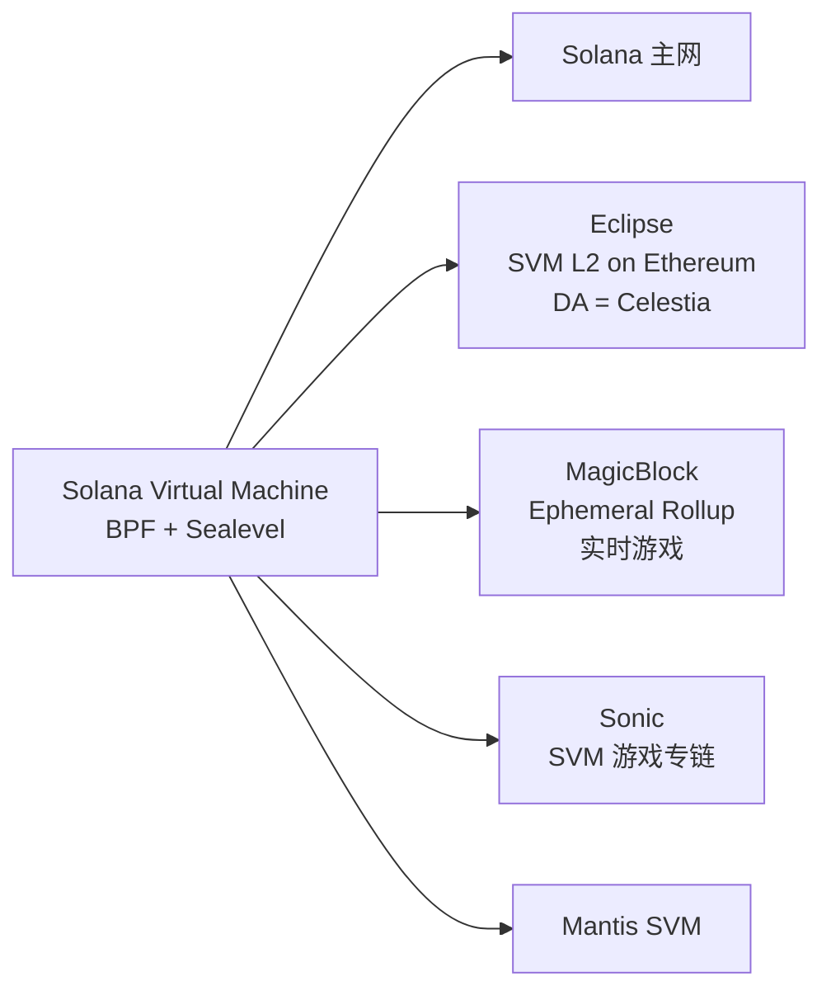

一次 Anchor 编写可跑在 4-5 条链上——非 EVM 里**最成功的 VM 标准化**。

### 11.5 Solana 历史 outage 与稳定性恢复

> **场景钩子**：2022 年 5 月 1 日凌晨 4 点，一个值班工程师盯着 Solana 主网区块号停在了某一个数字上，**整整 7 小时一动不动**——一群 NFT mint bot 用 600 万笔 tx 灌爆了 leader 流水线。Discord 里全是骂声："这也叫高性能链？" 那一年 Solana 一共停机 7 次。但 2024-02-06 之后，至 2026-04 已连续运行 26 个月，>99.95% 可用——靠的不是某一个魔法补丁，而是**七步连环改造**：QUIC 替 UDP、stake-weighted QoS、本地 fee market、Firedancer 客户端多元化……生产部署前把这段历史读懂，比读任何官方营销文档都重要。

Solana 早年因为单一客户端 + 高吞吐压力，多次出现整链停机。生产部署前必须知道这段历史：

| 时间 | 持续 | 触发原因 | 修复 |
|------|------|---------|------|
| 2021-09-14 | ~17 h | NFT mint bot 制造 400k tx/s，验证人 OOM 崩溃 | 加 fee market、tx 包大小限制 |
| 2022-01 | 数小时 | 同样 bot 引发 duplicate-tx 风暴 | QUIC 替换 UDP（2022-Q2 上线） |
| 2022-04-30 / 2022-05-01 | ~7 h | 6M NFT mint bot tx 灌爆 leader pipeline | stake-weighted QoS（2022-09 上线） |
| 2022-06-01 | ~4.5 h | 持久 nonce 实现的共识 bug | 紧急 patch + 协议修复 |
| 2022-09-30 | ~6 h | 错配的 fork choice rule（misconfigured validator）| Gossip 协议加固 |
| 2023-02-25 | ~20 h | block propagation bug（forwarder 服务循环）| 客户端补丁 |
| 2024-02-06 | ~5 h | BPF loader cache 实现 bug 触发未定义行为 | Hotfix + Firedancer 路线加速 |

**2024 Q1 之后的恢复**：

- 2024-02-06 是**最后一次主网整链宕机**，至 2026-04 已连续运行约 26 个月（>99.95% 可用性）；
- 关键改动：stake-weighted QoS 全量启用、QUIC 取代 UDP、本地 fee market（priority fee per writable account）、**Firedancer / Frankendancer 客户端**逐步分流（Frankendancer 占 stake 见 §9，约 21%）；
- 客户端多元化是 Ethereum 风格的"软终结"——Agave + Jito-Solana + Frankendancer + Sig（Rust）四客户端并存大幅降低单点 bug 拖垮全网的风险；
- 工程影响：2024 年起 Solana 上的高频做市商、稳定币发行方（USDC、PYUSD）、DePIN 项目恢复入场，TVL 与 DEX 量在 2025 年回到历史高位。

选 Solana 上线生产前，把客户端多元化进度、Firedancer share、最近 6 个月有无 leader skip 飙升都列进上线 checklist。

### 11.6 思考题（章 11）

> Q1：Solana Mobile 的 dApp Store 跳过 Apple/Google 抽成——这种独立分发渠道在 iOS 主导市场可行吗？
>
> Q2：SVM 外延（Eclipse、Sonic、Magicblock）对开发者意味着什么？是不是让 Solana 开发者技能更可迁移？

### 11.7 Solana meme 经济与 launchpad 工程

> **场景钩子**：截至 2026-04，Solana 主网 **50%+ 的交易笔数来自 meme 相关合约**（Pump.fun + Raydium + Jupiter aggregator + 各 launchpad），Pump.fun 月活创造者数十万。这个比例在所有公链历史上都没出现过——以太坊在 ICO 高峰期、BSC 在土狗高峰期都没达到。Solana 等于把"meme 发行 + 交易"做成了链级原语。工程师可以鄙视 meme，但不能不懂它的工程结构——做钱包、做聚合器、做安全工具、做 indexer 全都绕不开。

#### Pump.fun bonding curve 工程

Pump.fun 的核心创新不是"再 fork 一个 launchpad"，而是把 token issuance + price discovery 合并成**一个无审批、无 LP 提供者**的合约：

**虚拟储备 bonding curve**：

token 发行总量固定（典型 1B），合约维护两个虚拟储备 `reserve_token` / `reserve_sol`，价格由 `x * y = k` 决定（虚拟 AMM）。每次买入 SOL 换 token：

```
新 token = reserve_token - k / (reserve_sol + sol_in × 0.99)
```

费用 1% 抽成：约 0.5% 给协议、0.5% 给创作者（2025-Q4 后引入 creator fee 切换开关）。

**典型仓位划分**（一个标准 Pump.fun token）：

| 段位 | 比例 |
|------|------|
| Bonding curve 内可买池 + Migration 迁池 | **bonding curve 80%（800M）/ Raydium 迁池 20%（200M）** |
| **dev / creator 自留** | **0%**（合约层面禁止 creator 在 migration 前自买） |

**Migration 阈值**：当 bonding curve 内市值（virtual 估值）达到 **≈ $69k**（约 85 SOL 在曲线里），合约自动：

1. 销毁 bonding curve 合约里剩余的 token；
2. 把储备 SOL + 200M token 注入 **Raydium V4 / 后续 PumpSwap V2** 创建标准 AMM 池；
3. **Burn LP token**（永久无人能撤池）；
4. 切换到标准 AMM 滑点曲线，价格不再由 bonding curve 决定。

> **anti-snipe 工程**：creator 在 migration 之前不能买自己的 token（合约硬阻止）；很多新 launchpad（Believe、Moonshot、LetsBonk）都抄了这个设计——它解决了 2021 BSC 时代"creator 自买拉盘 + dump"的经典 rug 路径。

**Fee 路由（2026-04 当前版本）**：**单笔 1% fee 全归 Pump.fun 协议**；creator fee（最高 0.05% 量级）通过 PumpSwap 迁池后另行结算——四档拆分非公开机制

#### 其他主要 launchpad 速览

| Launchpad | 链 | 差异点 | 2026-04 状态 |
|-----------|----|---------|-------------|
| **Pump.fun** | Solana | bonding curve + Raydium / PumpSwap migration | 月度 fee revenue 头部，竞争对手抄无可抄 |
| **Moonshot** | Solana | **Apple Pay / Google Pay 法币入金**直接铸 meme | 2025 黑马，绕开 web3 钱包 onboarding |
| **Believe** | Solana | 前 Clanker 联创 2025 创立；强调 creator-first / 推特绑定 | 2025-Q4 上线，月活几万 |
| **LetsBonk / Daos.fun** | Solana | DAO + meme 混合：贡献金库换 token | DAO meme 子赛道头部 |
| **Sun.io** | **Tron** | Tron 自家 meme 发行平台 | 2025 上线；面向中文 Tron meme 用户 |
| **Clanker** | Base | 自然语言"@clanker 给我发个币" → on-chain | EVM 阵营对标产品，2024 爆款 |

#### Honeypot / rug 检测

Solana meme 的"rug 模式"不是 EVM 那种 mint authority 留 backdoor（Pump.fun 自动 burn LP 后这条路堵死），而是：

1. **Wash trading + 拉盘 dump**：creator 用多个钱包 wash trading 制造热度 → migration 后短时间内集中卖出；
2. **Insider sniping**：migration 前几秒钟用 leaked address 抢跑；
3. **Fake migration**：仿冒 Pump.fun UI 但合约不是 Pump.fun 主合约。

**检测工具（与模块 05 附录交叉引用）**：

- **RugCheck.xyz**（Solana 专属）：检查 mint / freeze authority、LP burn、holder 分布、wash 检测；
- **GoPlus Token Security**：跨链通用；
- **Honeypot.is**：EVM 主战场，有 Solana 实验性支持；
- **Bubble maps（Bubblemaps.io）**：可视化关联钱包簇——一眼看出 dev 隐藏多签发行。

> **工程师推论**：做钱包 / 聚合器 / 交易终端，**集成 RugCheck + Bubblemaps API 是 2026 标配**——用户在 Solana 上点 swap 之前必看这两项。

---

## 12 · Solana 工具链生态（含 AI）

| 工具 | 用途 | 生产级别 |
|------|------|---------|
| **Helius** | RPC + indexer + DAS + webhook | 行业标准 |
| **Triton** | RPC + Yellowstone gRPC（高频订阅） | 顶级 RPC |
| **SimpleHash** | 跨链 NFT 索引 | NFT 项目首选 |
| **Solana Explorer** | 官方区块浏览器 | 入门必备 |
| **Solscan** | 第三方浏览器（更细致的 token analytics） | 替代品 |
| **Solana FM** | 又一个浏览器，方便看 IDL 解析 | 备用 |
| **Birdeye** | 交易/价格分析 | meme 交易必备 |
| **Jito Block Engine** | MEV bundle 提交 | 量化必用 |
| **SendAI / Solana Agent Kit** | AI agent function-calling | 新兴热门 |

#### Solana 的 AI 工具成熟度（2026-04）

Solana 是非 EVM 里 **AI 工具最成熟**的生态：语料量大（Anchor 项目 1 万+）、Helius/SendAI/Squads 主动做 AI 集成、Anchor IDL 是 JSON 结构化，LLM 理解成本低。

代表 AI 工具：

- **Solana Agent Kit**（前身 SendAI）：100+ 内置操作（swap、stake、mint cNFT、读 Helius DAS），function-calling 风格暴露给 LLM
- **Helius MCP server**：Claude Desktop / Cursor 直接挂 Helius RPC，能实时查任意 mainnet 账户
- **Anchor + Cursor / Claude Code**：IDL 自动生成 TS 类型，自动补全到你想哭
- **Solana Bootcamp by Solana Foundation 2025 版**：含 AI agent 编程章节

实测 LLM 代码质量（基于 2026-04）：

- 写 Anchor counter / vault / staking：**一次过**，与 Solidity 同档
- 写 native Solana program：还会犯账户 ordering 错误，**需人审**
- 写 Token-2022 集成：扩展太多，AI 经常生成"看似对但 mint extension 没启用"的代码 → **必须验证**

### 12.1 实战：Counter Anchor 程序

完整代码见 `code/solana/`。最小跑通路径：

```bash
# 1) 起本地 validator（独立终端）
solana-test-validator --reset

# 2) 配置 CLI
solana config set --url localhost
solana-keygen new -o ~/.config/solana/id.json   # 没 keypair 时
solana airdrop 5

# 3) 构建 + 拿 program_id
cd code/solana
anchor build
solana address -k target/deploy/counter-keypair.json
# 把输出的 ID 写回 lib.rs::declare_id! 与 Anchor.toml [programs.localnet]，再 build 一次
anchor build && anchor deploy

# 4) 跑测试（mocha + @coral-xyz/anchor 0.31.x 客户端）
pnpm install
anchor test --skip-local-validator
```

### 12.2 思考题（Solana 总章）

> **Q1**：cNFT 的"链上 root + 链下 leaf"有什么风险？如果 indexer 全部下线，资产还存在吗？

参考答案见 `exercises/solana-spl-token/README.md`。

下一节 Cosmos 走相反路线：**不优化单链，让每个应用自己当链**。

---

## B · 附录 B：Cosmos SDK / CosmWasm 详（原章 13–19）

---

## 13 · Cosmos：app-chain 哲学

> **场景钩子**：2014 年 Jae Kwon 写出 Tendermint 论文，把 PBFT 拍扁成"3 秒 finality 的实用 BFT"。他与 Ethan Buchman 合伙做 Cosmos，喊出"Internet of Blockchains"——每条链都是独立王国，靠 IBC 高速公路互通。理想很美。但 Cosmos 的故事也有黑历史：**ATOM 2.0 提案被社区否决**、**Tendermint Inc 与 Cosmos Hub 治理摩擦后改名 CometBFT**、**dYdX 跑路了又回来**……一直到 2025 年 IBC Eureka 终于把 Ethereum 接进来时，社区才松一口气。app-chain 哲学不是免费午餐：你要主权，就得自己招验证人、自己造工具链、自己跨链。这一章讲为什么有人愿意付这个代价。
>
> **类比图像**：Solana 像高速公路（吞吐高、车道并行、偶尔堵塞）；Cosmos 像独立王国邦联（每个国家自己的律法，靠条约通商）；Ethereum 像超大型购物中心（每家店共用电梯和保洁，但都得排队）。

以太坊"一条链承载所有应用"（统一状态机 + 共享 gas / 区块 / 拥堵）；Cosmos"每个应用配自己的链"（Osmosis DEX / dYdX 永续 / Celestia DA / Berachain EVM+PoL 各自独立，IBC 互通）——链是 OS，dApp 是服务。

#### 四个动机

1. **吞吐量独占**：DEX 用 100% 区块空间不会被 NFT mint 抢
2. **gas 自主**：自定 gas token、fee market；dYdX 链全免 gas
3. **协议级定制**：改共识参数、出块时间、状态机逻辑（如 Osmosis 超流体质押）
4. **主权**：升级路线、治理、分叉权全在自己手上

#### 代价

app chain 不是免费午餐：启动 = 招募验证人 + bootstrap 安全（Interchain Security 因此出现）；工具链需自建；IBC 跨链 UX 复杂。大多数项目先在 EVM 验证 PMF，做大了再迁。

---

## 14 · Cosmos SDK 模块体系

Cosmos SDK 是 Go 语言的链开发框架，把链拆成若干 `x/*` 模块按需 import。

#### 核心模块速查表（截至 v0.53）

| 模块 | 作用 | 是不是必带 |
|------|------|-----------|
| `x/auth` | 账户、签名、ante handler | 必带 |
| `x/bank` | 多资产余额、转账 | 必带 |
| `x/staking` | PoS 质押、验证人集合 | PoS 链必带 |
| `x/distribution` | 出块奖励分配、佣金 | 配合 staking |
| `x/slashing` | 验证人作恶 / downtime 罚没 | 配合 staking |
| `x/gov` | 链上治理、提案、投票 | 几乎所有 |
| `x/mint` | 通胀发行 | PoS 链常带 |
| `x/ibc` | 跨链通信（ibc-go） | 想互联就带 |
| `x/wasm` | CosmWasm 智能合约引擎 | 想跑合约才带 |
| `x/upgrade` | 链上升级协调 | 强烈推荐 |
| `x/evm` (Evmos/Cronos) | EVM 兼容 | 想跑 Solidity 才带 |
| `x/icq` | Interchain Queries | 想跨链读数据 |
| `x/ica` | Interchain Accounts（host + controller） | 想从 chain A 控制 chain B 账户 |

#### 一个 module 的标准布局

```
x/blog/
├── client/cli/        ← 命令行交互
├── keeper/            ← 状态机核心 (read/write store)
├── types/             ← 消息、事件、错误、protobuf 定义
├── module.go          ← AppModule 接口实现
└── genesis.go         ← 创世状态加载/导出
```

**module** 是链内核组件，链启动即在，随链升级；**CosmWasm 合约**是跑在 `x/wasm` 上的字节码，链上线后部署。高频/安全敏感/需协议级特权 → module；一般业务逻辑 → CosmWasm。

---

## 15 · CometBFT 工程要点

CometBFT 算法（PBFT 派生、commit 即 final、1/3 BFT 容忍）见模块 02 §6。本节讲两个工程坑：**ABCI++ 介入点**和 **v0.38 / v0.39 选哪个**。

**ABCI++（v0.38 引入）三钩子**：`PrepareProposal`（leader 出块前重排 mempool、注入 dYdX 撮合 / oracle 价格）/ `ProcessProposal`（验证人投票前业务级有效性检查）/ `VoteExtension`（precommit 阶段给 vote 附加 oracle 等数据）。dYdX 把 orderbook 撮合放进 PrepareProposal/ProcessProposal 就是这个机制。

**版本选型**：2026-04 主流 **v0.38**（Cosmos Hub / Osmosis / Babylon / Neutron / MANTRA）；v0.39 仍 alpha，**生产勿追**（Tendermint Inc 与 Cosmos Hub 治理摩擦后 2022 改名 CometBFT，版本节奏仍保守）。

---

## 16 · IBC Eureka v10：跨链互操作

> **场景钩子**：2022 年 Ronin 桥被朝鲜黑客掏走 6 亿美元、2022 年 Wormhole 桥失血 3.2 亿……同一年 Cosmos 上的 IBC 累计搬运了上百亿美元资产，**零损失**。原因很简单：IBC 不依赖"多签托管 + oracle"这种链下信任，而是让每条链**在对端跑一份轻客户端**——把"信任桥的节点"变成"信任两条链的共识 + 一段开源验证代码"。2025 年 4 月 IBC Eureka v10 把这套思路延伸到 Ethereum：在 EVM 上跑 CometBFT 验签太贵？那就用 ZK 把它压成一个 200KB 的 proof。第一笔 ATOM ↔ ETH 跨链交易在 2025-03-28 落地。**Cosmos 这条赛道唯一没被黑的桥协议，正在吃下整个 EVM 跨链市场。**

IBC 核心：每条链在对端跑轻客户端验证真实性，relayer 只搬运不能伪造。**IBC Eureka v10**（2025-Q1 主网）用 ZK light client 把协议延伸到 Ethereum、Solana 等非 Cosmos 链。

### 16.1 协议分层

**Light Client**（chain A 跑 chain B 轻客户端）→ **Connection**（双向认证）→ **Channel**（有序 / 无序通道）→ **Application**（ICS-20 transfer / ICS-27 ICA / ICS-30 mw）。

**关键术语**：**light client**（在 chain A 上验证 chain B 区块头/状态证明的代码）/ **connection**（一对 light client 实例互相认证）/ **channel**（连接之上的有序消息流）/ **packet**（channel 上一条消息含 timeout/proof）/ **relayer**（链下搬运进程：hermes、rly、go-relayer）。

**ICS-20 跨链转账流程**：Alice → ChainA `MsgTransfer` lock 1000ATOM 到 escrow + emit SendPacket → relayer 拉 packet+proof → ChainB `MsgRecvPacket` 验 light client + proof → mint 1000 ibc/HASH voucher 给 Alice + 写 ACK → relayer 把 ack 搬回 ChainA `MsgAcknowledgement` 清 escrow。

#### 信任模型

**IBC 是 trust-minimized，不是 trustless**：信任 chain A/B 各自共识 + light client 代码（ibc-go）。不信任 relayer（relayer 只搬运 proof，链上验证）。chain B 的 ⅔ 验证人作恶 → chain A 上的 light client 也接受错误状态——这是 Interchain Security 出现的原因（让小链共享 Hub 验证人集合）。

### 16.2 IBC 版本路线图（2026-04）

**三行口诀**：v8 是当前主网（配 CometBFT v0.38）→ v9 跳过 → **v10 = IBC Eureka**（2025-04-10 主网激活，Cosmos ↔ Ethereum ZK light client 直连，无 connection 1-click，首笔 ATOM↔ETH 2025-03-28，覆盖 120+ Cosmos 链 + ETH，目标市值 260B+ USD）→ 2026 Q2-Q3 路线 Solana / 通用 EVM L2 light client。

### 16.3 思考题（章 16）

> Q1：IBC Eureka 用 ZK light client 让 Ethereum 能"廉价验证"CometBFT 区块头——这与 LayerZero、Wormhole 的"信任 oracle 集合"设计有什么本质差异？
>
> Q2：如果 chain B 的 ⅔ 验证人作恶，chain A 上的 voucher 会怎样？谁来兜底？

---

## 17 · CosmWasm 3.0：WASM 合约引擎

> **场景钩子**：2018 年 Confio 团队的 Ethan Frey 看着 EVM 重入漏洞清单（DAO hack、Cream Finance、Fei……），决定从根上堵住。他在 Cosmos 上写出 CosmWasm：用 WASM 替 EVM bytecode、用 Rust 替 Solidity，**关键改动是合约间调用强制异步**——sub-message 提交后本笔事务先跑完，reply 回来另算一次执行。这一刀切死了重入攻击整类。代价是写 DEX 撮合得用"事件驱动"思维。Neutron 把这套引擎当作主战场，Osmosis 把它跟 module 混用，今天 Cosmos 上的 DeFi 几乎都跑在 CosmWasm 上。

CosmWasm：Rust 编写、编译成 WASM、部署到任何带 `x/wasm` 模块的 Cosmos 链。

#### 与 EVM 合约的差异

| 维度 | EVM | CosmWasm |
|------|-----|----------|
| 字节码 | EVM bytecode | WebAssembly |
| 主语言 | Solidity / Vyper | Rust（极少 AssemblyScript） |
| 入口模型 | 多个 public function | 三个标准入口：`instantiate / execute / query` |
| 状态访问 | storage slot (32B-32B mapping) | KV store + cosmwasm-storage helpers |
| Gas | 复杂规则 | 单一 gas meter（按 WASM op 计费） |
| 合约间调用 | call / delegatecall / staticcall | sub-message + reply（异步！） |

#### 一个最小 CosmWasm 合约骨架

```rust
use cosmwasm_std::{entry_point, DepsMut, Env, MessageInfo, Response, StdResult};

#[entry_point]
pub fn instantiate(_deps: DepsMut, _env: Env, _info: MessageInfo, _msg: InitMsg) -> StdResult<Response> {
    Ok(Response::default())
}

#[entry_point]
pub fn execute(deps: DepsMut, _env: Env, info: MessageInfo, msg: ExecuteMsg) -> StdResult<Response> {
    match msg {
        ExecuteMsg::Increment {} => {
            let mut state = STATE.load(deps.storage)?;
            state.count += 1;
            STATE.save(deps.storage, &state)?;
            Ok(Response::new().add_attribute("action", "increment"))
        }
    }
}

#[entry_point]
pub fn query(deps: Deps, _env: Env, msg: QueryMsg) -> StdResult<Binary> {
    match msg {
        QueryMsg::GetCount {} => to_json_binary(&STATE.load(deps.storage)?.count),
    }
}
```

CosmWasm 合约间调用**异步**：sub-message 提交后本笔事务先跑完，reply 回来另算一次。堵死 EVM 重入攻击整类（DAO hack 那种），代价是复杂业务需"事件驱动"思考。

**CosmWasm 合约 vs module 决策**：需协议级特权（mint 原生币 / 改 staking） → module；多链部署 / 后期升级合约本体 → CosmWasm；要求改一次合约就改链可接受 → module；否则 CosmWasm。

### 17.1 CosmWasm 3.0 与 IBCv2、Sylvia（2026-04）

**演进**：1.x（基础合约引擎）→ 2.0（2024，ICS-20 memo field、IBC hooks 友好、ADR-8 准备）→ **3.0**（**IBCv2 协议集成**，新增 `ibc2_packet_send/receive/ack/timeout` 入口，与 wasmd 0.61 同步）。**Sylvia 框架**：类似 Anchor 的合约抽象层，trait-based contract definition，逐步成为 CosmWasm 高级 DSL 首选。

### 17.2 思考题（章 17）

> Q1：CosmWasm 异步 sub-message 模型避免了哪类 EVM 攻击？复杂业务时该如何组织代码？
>
> Q2：在何种情况下你会选 module（写进链）而非 CosmWasm 合约？

---

## 18 · Interchain Security 与 Mesh Security

小链无需自建验证人集合，**租用** Cosmos Hub 验证人出块。

| 代 | 名字 | 特点 | 状态（2026-04） |
|----|------|------|----------------|
| **v1** | Replicated Security | 消费链完全共享 Hub 验证人集合 | 已上线（Neutron / Stride 用） |
| **v2 / PSS** | Partial Set Security（opt-in / top-N） | Hub 验证人选择性参与 | Cosmos Hub 主网逐步迁移 |
| **v3 / Mesh** | Mesh Security（双向 stake，消费链也质押到 Hub） | Hub↔Osmosis / Stride 双向出借 | Phase 2 测试网（Osmosis/Juno/Akash 协作）；2026 主网未定 |

跨链双向质押，谁的安全谁出钱。与 EigenLayer "统一 ETH 担保所有 AVS"截然不同——Cosmos 走"每条链安全外推 + 内引"路线。

### 18.1 思考题（章 18）

> Q：Replicated/PSS/Mesh 三者在去中心化与启动成本上各有什么权衡？Babylon BTC staking 与 ICS/Mesh 是冲突还是互补？

---

## 19 · Cosmos 主流链巡礼

| 链 | 角色 / 特色 | 2026-04 状态 |
|----|------------|-------------|
| **Cosmos Hub (ATOM)** | 联邦"首都"、ICS provider；ATOM 2.0 改革后定位为安全提供方 | Hub v18+，SDK v0.53 / CometBFT v0.38 / ibc-go v8 |
| **Osmosis (OSMO)** | 最大 DEX；超流体质押 / Concentrated Liquidity / Token Factory；CosmWasm + module 混合 | 主网 |
| **dYdX v4** | 永续合约专链（从 StarkEx L2 迁来）；完全链上 orderbook | 证明 app chain 能扛 DeFi 顶级吞吐 |
| **Celestia (TIA)** | 模块化 DA 层；Reed-Solomon + DAS | Manta / Astria / Movement L2 用作 DA |
| **Berachain (BERA)** | EVM 兼容 + Proof-of-Liquidity；三代币（BERA gas / BGT 治理 / HONEY 稳定币） | V2 抛弃 Polaris，改 BeaconKit；详见 §48 |
| **Sei v2 / EVM-only** | 从 Cosmos+EVM 双栈到纯 EVM L1 | 2026-04-06 至 04-08 迁移完成；详见 §48 |
| **Neutron / Stargaze / Injective** | 纯 CosmWasm DeFi / NFT 主战场 / 衍生品订单簿 module | 主网 |
| **Babylon (BABY)** | BTC staking 给 PoS 链借安全 | Phase-1 主网 57k+ BTC（~$4B TVL）；详见 §34 |
| **Initia / Allora / Warden / MANTRA / Cronos** | Move+Cosmos 双栈编排 / AI 网络 / 链抽象多链密钥 / RWA / CDC EVM 兼容 | 各自主网 |

### 19.2 决策表：你的 dApp 该建在哪条 Cosmos 链上

| 你的需求 | 推荐链 |
|---------|--------|
| 自由度最高（自己做共识参数） | 自起 chain (Ignite) |
| CosmWasm 合约部署，跨链 DeFi | Neutron / Osmosis |
| NFT 项目 | Stargaze |
| 永续合约 / 衍生品 | Injective / dYdX |
| BTC 安全 | Babylon BSN consumer chain |
| EVM 兼容（保留 Cosmos 共识） | Berachain V2 / Cronos |
| 完全 EVM 化（不用 Cosmos） | Sei EVM-only |

**evmOS（EVM-on-Cosmos SDK v8）**：第三条 EVM 路径——Berachain V2 是 PoL，Sei v2 是 EVM-only，evmOS 是 SDK 模块插拔。

| 模块化 DA | Celestia / EigenDA |
| AI / Agent | Allora / Cocoon (TON) |
| 主权但共享安全 | Replicated Security 消费链 |

### 19.3 实战：用 Ignite 起一条链

完整步骤见 `code/cosmos/README.md`。最小路径：

```bash
# 1) 装 Ignite v28
curl https://get.ignite.com/cli | bash

# 2) 一键脚本（创建 blogchain + blog module + post CRUD）
cd code/cosmos
bash bootstrap.sh        # 内部依次 scaffold chain / module / list

# 3) 验证
blogchaind tx blog create-post "first" "hello cosmos" --from alice -y
blogchaind q blog list-post

# 4) 自定义：加 1 BLOG 提交费
# 见 customizations/msg_server_post.go.patch
```

### 19.4 Cosmos 的 AI 工具成熟度

成熟度**中等偏弱**，落后 Solana 一档。

主要工具：

- **Cosmos AI agent kits**：少数项目（Lavender.Five 等）做了，function-calling 覆盖 IBC transfer / staking / governance
- **MCP for chain RPC**：Neutron、Osmosis 团队在做 MCP server，让 LLM 能查模块状态
- **CosmWasm 代码生成**：LLM 写 CosmWasm 合约的能力比 Solidity 弱 30-40%（语料少 + Rust trait 复杂）
- **链上 governance 自动分析**：Skip / Nansen / Mintscan 提供 LLM 辅助的提案摘要

实测 LLM 代码质量（2026-04）：

- 写 Cosmos SDK module（keeper/msg_server）：能写但容易遗漏 invariants check
- 写 CosmWasm 合约：能写 hello-world，复杂业务（多 sub-message）需深审
- IBC relayer 配置：基本只能给 boilerplate

### 19.5 思考题（Cosmos 总章）

> **Q1**：dYdX 从 StarkEx L2 迁到独立 Cosmos 链的核心理由？这与 Sei v2 反向走"回归 EVM"是否矛盾？
>
> **Q2**：IBC channel close 后，已在对端 chain 上的 voucher token 如何处理？

下一节 Move 系把安全保证下沉到**编程语言的类型系统**，编译期堵死整类漏洞。

---

## C · 附录 C：Sui Mysticeti 详 / D · 附录 D：Aptos Block-STM 详（原章 20–26）

---

## 20 · 资源模型：用类型系统封装资产

> **场景钩子**：2019 年 Facebook 想做 Libra 稳定币时，技术总监 Sam Blackshear 翻完 Solidity 漏洞库后做了个判断：**绝不能让"资产"是个数字**。数字可以加可以减、可以"被忘记"——重入、溢出、意外销毁，每一个都源于"余额是个 uint256"。他主导设计了 Move：**资产是一种线性类型对象**，编译期就禁止复制和凭空丢弃。Diem 项目最终被监管干掉，但 Move 活了下来——核心团队拆成两支：一支做 Aptos（保留 Diem 的"资源挂在 address 下"），一支做 Sui（把资源拆成独立对象，每个对象自带 owner）。两支用同一份语法但**几乎不能跨链复用**。这是区块链史上罕见的"语言比项目活得更久"的故事。
>
> **类比图像**：Solidity 的余额像银行存款（一串数字）；Move 的资产像物理金条（必须有人拿在手里，转账 = 把金条搬过去，编译器盯着它绝对不消失）。

Move 把"资产"做成**有线性类型的对象**——编译期保证不可复制、不可凭空消失，必须显式 transfer / store / destroy。

#### 与 Solidity 的根本对立

Solidity `mapping(address=>uint256) balances` + `balances[msg.sender] -= amount` 把余额当**值**（可复制可加减，漏洞重灾区：reentrancy / overflow / 弄丢）；Move 的 `Coin<T>` 是**资源**（`public struct Coin<phantom T> has key, store { id: UID, value: u64 }`，只能 `sui::transfer::transfer(coin, recipient)` 整个 move 过去）。编译器强制 coin 在函数结束前必须被消耗（transfer / 解构 / 存储），否则编译失败——堵死"凭空铸币 / 凭空消失"整个漏洞类别。

#### Move 起源

- 2019 年 Facebook Libra/Diem 项目里发明（首席设计师 Sam Blackshear）
- Diem 黄了 Move 活了，分裂成两大方言：**Sui Move** vs **Aptos Move**
- 共同祖先是 Diem Move，但两边为了适配各自执行模型做了**不兼容**的扩展
- Move 编译器同时支持两种 edition，但写好的代码**几乎不可能跨链复用**

#### 四种"能力" (Abilities)

Move 的所有 struct 必须显式声明拥有哪些能力：

| 能力 | 含义 | 典型用法 |
|------|------|---------|
| `copy` | 可被复制 | 仅普通值类型（如配置、常量）使用 |
| `drop` | 可被丢弃 | 普通值；资源**绝对不能** drop |
| `store` | 可放进其他 struct 内部 | NFT、token 等会被嵌套的资产 |
| `key` | 可作为顶层全局对象 | Sui object / Aptos resource 必带 |

`Coin` 只有 `key, store`，无 `copy, drop`——编译器禁止复制或丢弃，一行能力声明替代了 SafeMath + reentrancy guard。

### 20.1 思考题（章 20）

> Q1：Move 的 `Coin<T>` 类型只有 `key, store`、没有 `copy, drop`——这两条限制堵死了哪些 Solidity 漏洞类别？
>
> Q2：Diem 项目失败但 Move 活了——这种"语言可独立生存"在区块链史上有先例吗？

---

## 21 · Sui 对象模型与 Mysticeti DAG

> **场景钩子**：Diem 项目 2022 年被美国国会按死，研究院顶级人马（Evan Cheng、Sam Blackshear、Adeniyi Abiodun）决定不给 Meta 打工了——他们出来做 Mysten Labs，把 Move 重写成"以对象为中心"的版本。他们的核心赌注：**owned 对象的事务天然不冲突**，所以它们可以跳过共识、走 fast path（< 300ms）；只有 shared 对象的写才走 Mysticeti DAG（~500ms）。这跟 Aptos 那支老团队选的"乐观并行"完全反方向：Sui 让类型系统**静态保证**并行，Aptos 让 Block-STM **运行时检测**冲突。一个语言、两条路径、两条主网，至今谁也说服不了谁。

### 21.1 Sui Move vs Aptos Move

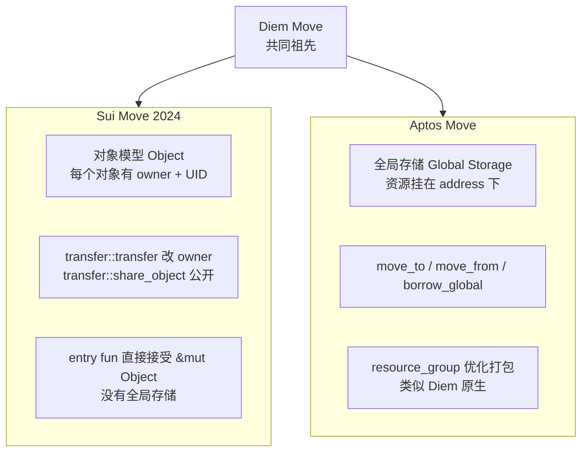

#### 二选一对照表

| 维度 | Sui Move | Aptos Move | 翻译成 Solidity |
|------|----------|------------|------------------|
| 状态归属 | 每个 Object 自带 owner 字段 | 资源挂在某 address 的 global storage 下 | 状态全在合约里 mapping |
| 创建资产 | `object::new(ctx)` 拿 UID | `move_to<T>(signer, ...)` | `new T()` |
| 转账 | `transfer::transfer(obj, addr)` | `move_from + move_to` 改 owner | `mapping[a]--; mapping[b]++` |
| 共享读写 | `transfer::share_object(obj)` | 资源挂在某固定 address，任何人读，作者写 | `mapping(address=>T)` |
| 并行执行 | **静态对象隔离**（不同 owner 天然并行） | **Block-STM 乐观并行**（冲突就回滚） | 串行 |
| 共识 | Mysticeti DAG（v2 主网） | AptosBFT v4 + Raptr (2026 路线) | 串行 PoS |
| 形式验证 | Move Prover（实验） | Move Prover（生产用于 framework） | 几乎没有 |
| 主语言版本 | Move 2024 edition | Aptos Move（含 resource_group） | Solidity 0.8.x |

**Move 2024 主要变化**：`public(package)` 替代 `friend`、宏函数 `macro fun`、enum 类型——Mysten 新代码全用，老 Move 18 文档不适用。

| 包升级 | Package upgrade（不可变 + 新版本指针） | direct upgrade（同地址覆盖） | proxy + impl |
| 标准币 | `sui::coin::Coin<T>` | `aptos_framework::coin::CoinStore<T>` | ERC-20 |
| FT 标准（新） | `sui::token::Token` | `aptos_framework::fungible_asset::FungibleStore` | — |

### 21.2 Sui 对象模型

Sui 把"全局状态"砸成无数个互不相干的对象——这是静态并行的核心。

#### 三种对象所有权

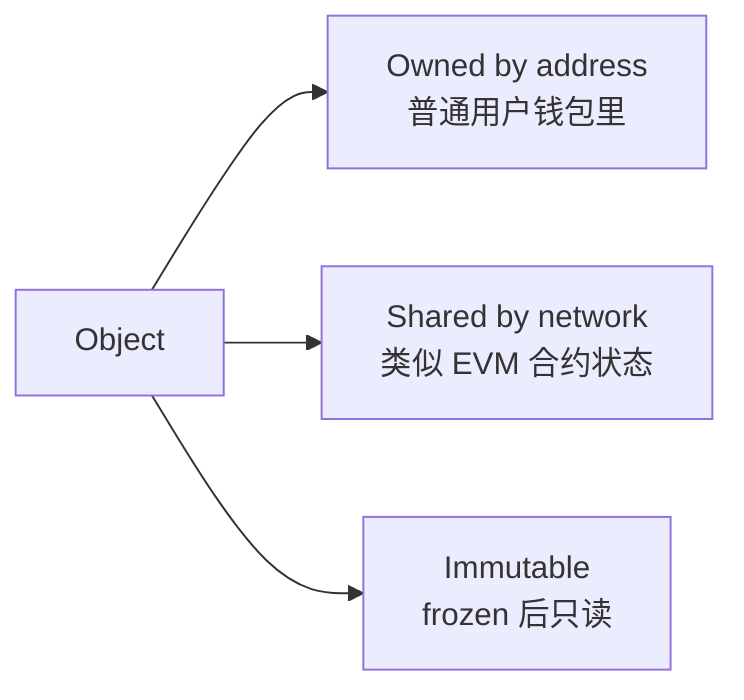

| 类型 | 创建方式 | 可写 | 谁能用作 input |
|------|---------|------|-----------------|
| **Owned** | `transfer::transfer(obj, addr)` | 是 | 只有 owner |
| **Shared** | `transfer::share_object(obj)` | 是 | 任何人（共识层串行写） |
| **Immutable** | `transfer::freeze_object(obj)` | 否 | 任何人（仅读，永远不冲突） |

Sui 并行原理：owned 对象的事务天然不冲突，调度器静态判断为独立 → 真正并行。与 Sealevel "显式声明账户列表"思路类似，但 Sui 做成了**类型系统级别**的保证。

#### Sui 对象的标准头

```move
public struct Counter has key {
    id: UID,           // sui::object::UID, 全网唯一标识
    owner: address,    // 业务字段，跟所有权字段无关
    value: u64,
}
```

- `has key` 能力：表示这是顶层对象，能成为事务参数
- `UID`：分配自全局 ID 池，永不重复，**不可复制不可销毁**（必须 `object::delete(id)` 才能丢）
- 字段限制：嵌套对象用 `has store` 能力，不能直接复制

#### Capability 模式

```move
public struct AdminCap has key, store { id: UID }   // 特权凭证

public entry fun create_protocol(ctx: &mut TxContext) {
    transfer::transfer(AdminCap { id: object::new(ctx) }, tx_context::sender(ctx));
    transfer::share_object(Treasury { id: object::new(ctx), balance: 0 });
}

public entry fun withdraw(_cap: &AdminCap, t: &mut Treasury, amount: u64) {
    // 调用者必须出示 AdminCap 这个对象，才能 borrow_mut t
    t.balance = t.balance - amount;
}
```

Solidity `Ownable` 用 `address public owner` + modifier；Sui 把权限做成对象——转让 = `transfer::transfer(cap, new_admin)`，撤销 = `object::delete(id)` 销毁 cap，无需 onlyOwner modifier。

#### Sui 实战：counter shared object

完整代码见 `code/move/sources/counter.move`：

```move
module counter::counter;
use sui::event;

public struct Counter has key {            // shared 对象
    id: UID,
    owner: address,
    value: u64,
}

public struct AdminCap has key, store {    // owned 凭证
    id: UID,
}

public entry fun create(ctx: &mut TxContext) {
    let sender = tx_context::sender(ctx);
    let counter = Counter { id: object::new(ctx), owner: sender, value: 0 };
    let cap = AdminCap { id: object::new(ctx) };
    transfer::transfer(cap, sender);        // owned: 给 sender
    transfer::share_object(counter);        // shared: 公开
}

public entry fun increment(c: &mut Counter) {
    c.value = c.value + 1;
    event::emit(Incremented { counter_id: object::id(c), new_value: c.value });
}

public entry fun reset(_cap: &AdminCap, c: &mut Counter) {
    c.value = 0;                            // 只有持 cap 的人能 reset
}
```

**关键点**：
1. 传 cap 即转让权限（Capability 模式）
2. 无 `msg.sender`，用 `tx_context::sender(ctx)` 获取发起者
3. shared object 的写走 Mysticeti 共识排序

### 21.3 Mysticeti 双轨共识

> Mysticeti DAG 算法（Narwhal/Bullshark 派生）见模块 02 附录 A.12 / 附录 D。本节讲 Sui 工程师必须懂的工程后果：**owned 对象走 Fast Path 不进共识**。


**Fast Path 直接的产品后果**：钱包转账、NFT 收藏、单玩家游戏状态都该用 owned 对象——p99 < 300 ms；DEX 池子、拍卖、leaderboard 这类多人共写状态用 shared 对象，付出共识排序的 ~500 ms。架构师在第一行 Move 前就要决定哪些状态值得共享。

#### Mysticeti v2 性能（2025 升级）

| 指标 | Mysticeti v1 | Mysticeti v2 | 改善 |
|------|--------------|--------------|------|
| p50 latency | 70 ms | 67 ms | -5% |
| p95 latency | 114 ms | 90 ms | -20% |
| p99 latency | 156 ms | 114 ms | -27% |
| 理论 TPS | 200k+ | 200k+ | — |

优先用 owned 对象享 fast path；shared 对象仅在必须共享状态时用（DEX 池子、拍卖、leaderboard）。

### 21.4 思考题（章 21）

> Q1：Sui 的 fast path（owned object 不走共识）是它能 < 300ms 的关键——为什么 Solana 没有这种"绕过共识"路径？
>
> Q2：shared object 的写仍要走 Mysticeti 共识——这与 EVM 合约状态写在并发性上有何相同/不同？

---

## 22 · Aptos 全局存储与 Block-STM

> **场景钩子**：Diem 团队解散时，CEO Mo Shaikh 与 CTO Avery Ching 拐弯做了 Aptos——保留 Diem 原版"资源挂在 address 下"的存储模型（用着舒服），但执行层换成了**乐观并行 Block-STM**：所有事务先假装无冲突并行跑，事后用 multi-version storage 检测冲突，撞了就回滚重排。这条路反过来挑战 Sui："你不需要让用户思考 owned/shared，并行让虚拟机自己处理。"Aptos 2022-10-17 主网；Sui 2023-05-03 主网（差 7 个月，非同月），两家在 Move 标准库、token 规范、共识算法上几乎彻底分家。今天 Sui TVL ≈ 1B、Aptos ≈ 500M——技术上分庭抗礼，市场口碑略有差距。

### 22.1 Aptos 的全局存储模型

Aptos 沿用 Diem Move 的"resource lives at an address"风格，资源**挂在某个 address 的 storage slot 上**，不是独立对象。

#### 核心 API

```move
module default::counter {
    struct Counter has key {     // has key 在 Aptos 里 = 能存到 global storage
        value: u64,
    }

    public entry fun initialize(account: &signer) {
        move_to(account, Counter { value: 0 });        // 挂到 signer.address 下
    }

    public entry fun increment(account: &signer) acquires Counter {
        let addr = signer::address_of(account);
        let c = borrow_global_mut<Counter>(addr);      // 从 global storage 借出
        c.value = c.value + 1;
    }

    #[view]
    public fun get(addr: address): u64 acquires Counter {
        borrow_global<Counter>(addr).value             // 只读借出
    }
}
```

**Sui vs Aptos 同语义对比**：Sui `transfer::transfer(coin, alice)` → alice 钱包里多个 Coin 对象；Aptos `coin::transfer<AptosCoin>(from, alice, 100)` → alice 的全局 `CoinStore<AptosCoin>` 余额 +100。

**Resource Group**（Aptos 独有，Sui 无"挂 address"概念不需要）：同一 address 下同一 resource group 的资源 `#[resource_group(scope = global)]` + `#[resource_group_member(group = ...)]` 打包成一条 storage，节省 IO。**FA**（fungible_asset）详见 §22.4。

### 22.2 Block-STM：Aptos 的乐观并行

Aptos **不要求声明读写集**，全部假设无冲突并发执行；事后检测冲突，回滚重跑。**算法骨架**：block 内 N 笔 tx → 分配 K 个 worker → 每 worker 乐观执行记录 read/write set → 写到 multi-version MVStore → 冲突检测（读到的 version 还是最新？）→ 是则 commit，否则回滚重排队等更高优先级 tx 完成。三种并行思路对比见第 4 章。Block-STM 开发者零负担，但热点账户（万人抢同一池子）退化为串行。

#### 2026 性能数字

- **Aptos 主网**：sub-50ms 块时间（测试网 / Raptr 路线，主网未激活），22k+ sustained TPS，理论 150k+
- **Sui 主网**：Mysticeti v2 后 p95 90ms，p99 114ms，理论 200k+
- **Aptos 2026 路线**：Raptr 共识 + Block-STM v2，目标 sub-block-time 优化

### 22.3 Aptos Object Model（AIP-21）

2024 引入，带 GUID、自带 owner、可嵌套的资源容器（Object 可持 Object）：`constructor_ref = object::create_object(addr)` → `generate_signer` → `move_to`。相比旧 `move_to / move_from` 资源，新 Object 模型支持嵌套、`object::transfer` 一行转移、标准化 FT/NFT（`fungible_asset::FungibleStore` + Digital Asset standard）。

### 22.4 Aptos FA（Fungible Asset）标准

2024-2025 新一代 token 标准 `fungible_asset`（路径 `0x1::fungible_asset`）替代旧 `coin::Coin<T>`：

- **结构**：`Object<Metadata>`（name/symbol/decimals）+ per-account `Object<FungibleStore>`（balance）
- **dispatchable hook**：每次 transfer 触发，类似 SPL Token-2022 transfer hook
- **可冻结**：per-store freeze（旧 coin 不支持）
- **兼容旧资产**：通过 `migration` 函数升级

Solana Token-2022 transfer hook、Aptos FA dispatchable hook、Sui Token/Coin —— 三家几乎同时引入"可挂 hook 的代币标准"，让代币方有协议级控制能力。

### 22.5 Aptos Move 包升级模型

Aptos 用 `Compatibility` 等级控制升级：**Immutable**（永不升级）/ **Compatible**（仅向后兼容，增加函数、不改签名）/ **Arbitrary**（任意升级，最危险）。与 Sui 的"新版本指针"思路不同：Aptos **同地址覆盖 + 兼容性检查**，类似 EVM proxy 但内置。

### 22.6 思考题（章 22）

> Q1：Block-STM 假设"事务大多互不冲突"——在什么场景下这个假设会失效？届时性能如何退化？
>
> Q2：Aptos `move_to / borrow_global / move_from` 与 Sui `transfer::transfer / share_object` 在"状态可变性"语义上有何关键不同？

---

## 23 · PTB、Capability、Kiosk：Sui 的三大原语

### 23.1 PTB（Programmable Transaction Block）

PTB 把"一次事务做多件事"变成 SDK 原语，前一步的输出自动成为下一步的输入，无需部署 router 合约。

```typescript
const tx = new Transaction();

// 拆一个 SUI Coin 对象
const [coinForFee, coinForLp] = tx.splitCoins(tx.gas, [100, 9_900]);

// 用 coinForFee 付 fee
tx.moveCall({
    target: `${PROTOCOL}::fee::pay`,
    arguments: [coinForFee],
});

// 用 coinForLp 进 LP
tx.moveCall({
    target: `${PROTOCOL}::pool::add_liquidity`,
    arguments: [tx.object(POOL_ID), coinForLp],
});

// 整个事务原子执行 — 任何一步失败全回滚
await client.signAndExecuteTransaction({ signer: kp, transaction: tx });
```

**关键能力**：
- `splitCoins` / `mergeCoins` / `transferObjects` 是 SDK 内置原语，不需要部署合约
- moveCall 的返回值可被后续 moveCall 直接消费（DAG 数据流）
- 所有步骤共用同一笔 gas budget
- 单笔事务上限 ~16 KB；最多约 1024 个 commands

### 23.2 Capability 模式

代码示例见 21.2 节 AdminCap。与 OpenZeppelin Ownable 对比：权限存放从合约 storage 的 `address public owner` 变成**独立 AdminCap 对象**；转让 = `transfer::transfer(cap, new)`（一步，无需 accept）；撤销 = 解构 cap (`let AdminCap{id}=cap; object::delete(id);`)；多权限自动分立（多种 cap 类型）；攻击面从 tx.origin / EOA 变成 cap 对象本身被盗。

### 23.3 Kiosk：NFT 强制版税

框架级 **Kiosk 标准**——创作者定义 `TransferPolicy`，二级市场必须遵守才能完成转账。规则四件套：**Lock Rule**（必须留在 Kiosk）/ **Royalty Rule**（每次交易抽税）/ **Whitelist Rule**（仅指定 Marketplace）/ **Floor Price Rule**（最低售价）。

ERC-2981 仅"建议"版税可被 OpenSea/Blur 绕过；Sui Kiosk 是**链上强制**。

### 23.4 思考题（章 23）

> Q1：PTB 让"组合调用"成为 SDK 原语，相比 EVM 用 multicall 合约有什么开发体验优势？
>
> Q2：Sui Kiosk 强制版税与 EVM 的 ERC-2981/ERC-721C/Creator Fee Manager 思路对比，谁更具长期可持续性？

---

## 24 · Move Prover：形式化验证进生产

> **场景钩子**：Solidity 圈做形式化验证一直是奢侈品——Certora 一年百万美元起步，多数项目只在 audit 前临时上一次。Move Prover 把这件事内置进编译器：写完合约直接 `aptos move prove`，调 Boogie + Z3 求解器，把"总供应量恒定"这种不变量当 CI 测试跑。今天 aptos-framework 100% 形式化验证，是公链史上最大的"上链 spec"工程。它**不能替代审计**（不会证明经济激励正确），但能在写代码时就堵死溢出、除零、权限漏洞——每一个曾经吃掉 EVM 协议数千万美元的 bug 类型。

Move 自带**形式化验证子语言** (`spec` 块)，编译期证明"总供应量恒定"等性质——这在 Solidity 圈要用 SMTChecker、Certora 才能做。

#### spec 示例

```move
public entry fun increment(account: &signer) acquires Counter {
    let addr = signer::address_of(account);
    let c = borrow_global_mut<Counter>(addr);
    c.value = c.value + 1;
}

spec increment {
    let addr = signer::address_of(account);
    aborts_if !exists<Counter>(addr);                                         // 没初始化必崩
    aborts_if global<Counter>(addr).value + 1 > MAX_U64;                      // 溢出必崩
    ensures global<Counter>(addr).value == old(global<Counter>(addr).value) + 1; // 后置条件
}
```

工具链：
- `aptos move prove`：调 Boogie + Z3 求解所有 spec
- 关键 framework（aptos-framework、aptos-stdlib）已 100% 形式化验证
- Sui 的 Move Prover 处于实验状态（2025-2026 重启）

#### Move Prover 能干什么 / 不能干什么

| 能 | 不能 |
|----|------|
| 证明无溢出 / 无除零 / 无下界违反 | 证明"业务逻辑正确"——它只能证明你 spec 里描述的内容 |
| 证明状态不变量（"总供应量恒定"） | 证明经济激励机制无误（不是数学问题） |
| 证明权限模型（"只有 cap 持有者能调"） | 证明 oracle 数据真实性 |
| 在 CI 自动跑 | 完全替代审计——还需要安全审计员看 spec 本身有没有写漏 |

### 24.1 思考题（章 24）

> Q1：Move Prover 能在什么意义上"替代审计"？哪些方面无论如何都需要人工审计？
>
> Q2：为什么 Solidity 圈极少做这种工作？SMTChecker / Certora 又能走多远？

---

## 25 · zkLogin、Aptos Keyless、Walrus、DeepBook

> **场景钩子**：让妈妈用钱包是 Web3 永恒的笑话。私钥助记词 12 个、写在纸上、塞进保险柜——把 99% 的潜在用户挡在门外。EVM 这边搞 ERC-4337 + Privy/Magic 试图用 MPC 绕过；Mysten Labs 走得更激进：**把 OAuth 的 JWT 直接做成 zk proof**——你用 Google 账户登录 dApp 时，背后一个 Groth16 证明把"这个人就是 Google 认证的 alice@gmail.com"贴到链上地址。私钥不在 Google 手里、没在用户脑子里、依然 self-custody。Aptos Keyless（AIP-61）走同样路线。这是非 EVM 第一次在"消费级账户体验"上**领先 EVM**。

### 25.1 zkLogin（Sui）

用户直接用 Google/Apple/Facebook/Twitch 登录 Sui dApp，背后用 Groth16 zk 证明把"OAuth ID token 与链上地址绑定"放上链。

**工作流**：用户点 "Sign in with Google" → dApp redirect OAuth 拿 JWT → 提交 JWT + nonce + ephemeral pk 给 zkLogin Prover Service → 拿到 zk proof（隐藏 email / 暴露 sub）→ 提交 tx 含 proof + ephemeral signature → Sui 链验 zk proof + OIDC 签名 + nonce → confirm。

**2026-04 状态**：支持 Google / Apple / Facebook / Twitch（Microsoft / WeChat / Amazon 路线中）；主流钱包 **Slush**（前 Sui Wallet）和 **Surf** 用作默认登录。论文：[arxiv 2401.11735](https://arxiv.org/abs/2401.11735)。

### 25.2 Aptos Keyless（AIP-61）
- 链上地址由 `(email_hash, app_id)` 派生
- Google/Apple 给的 JWT 直接当作签名证明
- 链上验证人通过 zk-SNARK 验证 JWT 签名匹配地址
- 启动产品 **Aptos Connect**：浏览器 web 钱包，零安装，扫码登录

| 维度 | zkLogin (Sui) | Aptos Keyless |
|------|---------------|----------------|
| 起点 | 2023-09 | 2024-07 |
| 主网生产 | 是（Slush / Surf） | 是（Aptos Connect） |
| 证明系统 | Groth16 | Groth16 |
| 隐藏 email | 是 | 部分（hash 上链） |
| Apple 支持 | 是 | 是 |

这是 Web3 历史上最接近"零摩擦上链"的两个产品——无需私钥/助记词/硬件钱包，仍然 self-custody（账户密钥是用户 ephemeral 私钥 + OIDC 证明，不在 Google 手里）。EVM 对应方案（ERC-4337 + Privy/Magic）依赖中心化 MPC，而非链上 zk 验证。

### 25.3 Walrus + DeepBook v3（Sui 基础设施）

- **Walrus**（2025-03 主网）：Reed-Solomon + 4-5x 复制因子的去中心化存储；每个 blob 是 Sui 对象，Move 合约可引用；用例 = dApp 静态资源 / AI 模型权重 / 游戏 asset。与 Filecoin（PoRep+PoSt 证明）/ Arweave（一次付费永存）分赛道。
- **DeepBook v3**：框架级 CLOB module；任何 Move 合约可调 `place_order / cancel_order`，撮合 300-400ms；DEEP 治理 / staking 享分红；Cetus / Aftermath / Bluefin 等聚合器共享流动性。

### 25.5 思考题（章 25）

> Q1：zkLogin / Aptos Keyless 如何在 Google 账户被盗时保护资金？（提示：考虑 ephemeral key + nonce）
>
> Q2：Walrus 与 EigenDA / Celestia 的差异——它们都自称 "DA layer" 但目标场景完全不同？

---

## 26 · Move 生态对比与 AI 工具

### 26.1 Sui Move 实战：客户端调用

完整代码见 `code/move/client/call.ts`，依赖 `@mysten/sui` 2.15.x。

```typescript
import { SuiClient } from "@mysten/sui/client";
import { Ed25519Keypair } from "@mysten/sui/keypairs/ed25519";
import { Transaction } from "@mysten/sui/transactions";

const client = new SuiClient({ url: "http://127.0.0.1:9000" });

// 1) 创建 counter
const tx = new Transaction();
tx.moveCall({ target: `${PACKAGE_ID}::counter::create` });
await client.signAndExecuteTransaction({ signer: kp, transaction: tx });

// 2) increment 一个 shared counter
const tx2 = new Transaction();
tx2.moveCall({
    target: `${PACKAGE_ID}::counter::increment`,
    arguments: [tx2.object(counterId)],   // 传 shared object 的 ID
});
await client.signAndExecuteTransaction({ signer: kp, transaction: tx2 });
```

早期 Sui SDK 包名是 `@mysten/sui.js`，已**弃用**。新名 `@mysten/sui`（2.x）是 1.x 后的主流（2026-04 实测最新版 2.15.0）。`@mysten/sui/transactions` 里的 `Transaction` 类（旧名 `TransactionBlock`）已重命名。

PTB 详解与代码示例见第 23 章。

### 26.2 Move 生态主流链速览

| 链 | 2026-04 状态 | 打法 | 重点项目 |
|----|-------------|------|---------|
| **Sui** | Mysticeti v2 主网，TVL ≈ 1B，月活 dev ~954，市值 5.5B（≈ 4× Aptos）| 消费级 Web2 体验 / 游戏 / 社交 | Cetus（DEX）/ Scallop（借贷）/ SuiNS / Walrus / DeepBook v3 |
| **Aptos** | sub-50ms 块时间（Raptr 测试网，主网未激活），22k+ TPS，TVL ≈ 500M，月活 dev ~465，市值 1.38B | 企业级 / 合规优先 | Thala（DEX + 稳定币）/ Aries / Echelon / Tapp Network |
| **Movement** | Move 风格 EVM-L2，Celestia DA，结算回 Ethereum | "在 Ethereum 上跑 Move" | — |
| **Initia** | Move 当编排层，下面挂 Move/EVM/WASM 多种 rollup | "L1 for Appchains" | — |
| **IOTA Rebased** | 2025 完全改造成 Move 链（Sui fork）| 欧洲（德国 Tangle）企业 IoT | — |

### 26.3 Move 生态的 AI 工具成熟度

弱，比 Cosmos 还弱一档，比 Bitcoin 强。主因：Move 语料量小（Sui+Aptos 项目 < 2000，Solidity 50000+，差两个数量级）；Sui/Aptos 方言不兼容导致 LLM 频繁混搭；linear types 在训练集占比极低，模型常忘"coin 必须被消耗"。实测：写 Sui Move 易出错（混淆 owned/shared，漏 `transfer::transfer`）；写 Aptos Move 还行（框架在训练集中）；Move Prover spec **LLM 几乎不会**。

工具：Mysten 自家 MCP server（Cursor/Claude，2026-Q1）/ Movecraft（社区 IDE 集成）/ Aptos Build（含 LLM 助手）。整体仍"基建期"。

### 26.4 Move 实战：环境与编译

```bash
# Sui
brew install sui                          # 或 cargo install --locked --git ...
sui --version                             # 1.40+
sui start --with-faucet --force-regenesis # localnet
cd code/move
sui move build
sui client publish --gas-budget 100000000

# Aptos
brew install aptos
aptos --version                           # 4.x
cd code/move/aptos_counter
aptos init --network local
aptos move publish
aptos move run --function-id 'default::counter::initialize'
```

### 26.5 思考题（Move 总章）

> **Q1**：Sui 无需 `mapping(address=>uint256)` 也能实现 ERC20-like 资产，为什么？代价是什么？
>
> **Q2**：Aptos 用乐观并行（Block-STM）、Sui 用静态并行（owner 隔离）——各自适合什么场景？
>
> **Q3**：`has key` / `has store` / `has copy` / `has drop` 各意味着什么？为什么 `Coin` 不能 `has copy`？

下一节 Bitcoin 走相反哲学：**极简内核 + 故意不图灵完备**，可编程性下放到 L2。

---

## E · 附录 E：Bitcoin 详（原章 27–37）

---

## 27 · UTXO：余额是钱包算出来的

> **场景钩子**：在 Bitcoin Core 老炮论坛上贴一个新提案，最高频的回复是"Why? 不行。"——Pieter Wuille、Andrew Poelstra、Greg Maxwell 这帮人对"加智能合约"的执念是宗教级别的反感：**Bitcoin 是货币，不是云服务**。这种保守造就了 UTXO + Script 这套"故意不图灵完备"的极简内核：链上没有账户、没有余额、甚至没有"状态"——只有未花输出（UTXO）。钱包显示的"你有 0.5 BTC"是客户端把属于你私钥的所有 UTXO 加总算出来的。这种"反 EVM"的极简性带来意外的红利：天然并行（不同 UTXO 互不影响）、天然隐私（HD 钱包给每笔收款新地址）、最小攻击面。后面 11 章会看到，Bitcoin 老炮们怎么用一堆 L2（Lightning、Citrea、Babylon、RGB……）把可编程性偷偷塞回来——但**主链 1 字节不让动**。
>
> **类比图像**：EVM 的账户像支付宝（一个账户余额表，所有人共用一张表）；Bitcoin 的 UTXO 像现金信封（每张钞票有自己的编号，转账 = 把整摞信封凑数交出去，找零再装回新信封）。

Bitcoin 链上无"账户"无"余额"，只有未花输出（UTXO）。钱包显示的余额是客户端把属于你私钥的所有 UTXO 加总计算出来的。

#### 一笔交易结构

```mermaid
flowchart LR
    subgraph 输入 vin
        I1[UTXO_A 0.3 BTC<br>来自 prev_tx_1:0]
        I2[UTXO_B 0.2 BTC<br>来自 prev_tx_2:1]
    end
    subgraph 输出 vout
        O1[新 UTXO 0.4 BTC<br>给 Bob 的脚本]
        O2[新 UTXO 0.099 BTC<br>找零给自己]
    end
    I1 --> Tx
    I2 --> Tx
    Tx --> O1
    Tx --> O2
    Tx -. 手续费 0.001 BTC<br>= 输入和 - 输出和 .- Fee
```

**关键点**：

1. **输入 = 之前某笔交易的输出引用 + 解锁脚本**（`scriptSig` 或 witness）
2. **输出 = 金额 + 锁定脚本**（`scriptPubKey`，规定下次花它的人要满足什么条件）
3. 整笔交易必须**全花完**——0.3 + 0.2 = 0.5 BTC 进，0.4 + 0.099 BTC 出，差额 0.001 BTC 是矿工费
4. UTXO **一次性**：一旦被引用，整个 UTXO 就消失了，不能再花

#### UTXO vs 账户模型

| 维度 | UTXO（Bitcoin） | Account（EVM） |
|------|-----------------|------------------|
| 状态结构 | UTXO set（庞大但稀疏） | accounts trie（紧凑） |
| 余额 | 钱包客户端聚合算 | 链上 storage 直接读 |
| 转账 | 拼凑足量 UTXO，输出新 UTXO | mapping 数字加减 |
| 隐私 | 默认每个 UTXO 用新地址（HD 钱包） | 同一地址全暴露 |
| 并行 | 天然并行（不同 UTXO 互不影响） | 需要重新设计 (Sealevel/Block-STM) |
| 状态膨胀 | UTXO set 缓慢增长（截至 2026 ≈ 200M+） | trie 不断增长 |
| 可表达性 | 弱（Script 不图灵完备） | 强（EVM 图灵完备） |

UTXO 最大好处不是性能，是**隐私 + 简单性**：同一笔钱可用完全不同地址收，链上看不出同一人——这是 Bitcoin/Cardano/Litecoin/Zcash 坚持 UTXO 的原因。

### 27.1 思考题（章 27）

> Q1：UTXO 模型在 BTC、Cardano、Litecoin、Zcash 都被使用——它们各自添加了什么扩展？
>
> Q2：把 UTXO set 当作"链状态"——它的增长曲线是什么样？为什么 BTC 节点不像 Ethereum 那样饱受状态膨胀困扰？

---

## 28 · Bitcoin Script：栈式语言与地址类型演进

Script 是栈式语言，不支持循环，opcode 有限，栈深度严格受限——**故意不图灵完备**，Bitcoin 不希望矿工跑复杂逻辑。

```text
# 标准 P2PKH（pay-to-public-key-hash）锁定脚本
OP_DUP OP_HASH160 <20-byte pubkey hash> OP_EQUALVERIFY OP_CHECKSIG

# 解锁时（解锁脚本 + 锁定脚本拼起来执行）：
<sig> <pubkey> | OP_DUP OP_HASH160 <hash> OP_EQUALVERIFY OP_CHECKSIG
```

栈机执行：
1. 推入 `<sig>` `<pubkey>`
2. `OP_DUP`：复制栈顶 → `[<sig>, <pubkey>, <pubkey>]`
3. `OP_HASH160`：栈顶取 RIPEMD160(SHA256(...))
4. 推入 `<hash>` 比较，相等继续
5. `OP_CHECKSIG`：用 pubkey 验签 sig

#### 主流地址类型演进

| 类型 | 前缀 | 引入年份 | 输出脚本 | 备注 |
|------|------|----------|----------|------|
| P2PK | (无标准前缀) | 2009 | `<pubkey> OP_CHECKSIG` | 早期，已弃用 |
| P2PKH | `1...` | 2010 | 上面那段 | 经典地址 |
| P2SH | `3...` | 2012 (BIP-16) | `OP_HASH160 <scripthash> OP_EQUAL` | 让多签等可用 |
| P2WPKH | `bc1q...` (segwit v0) | 2017 (BIP-141) | `0 <20-byte hash>` | SegWit 地址 |
| P2WSH | `bc1q...` (segwit v0) | 2017 | `0 <32-byte scripthash>` | SegWit 多签 |
| **P2TR** | `bc1p...` (segwit v1) | 2021-11 (BIP-341) | `OP_1 <32-byte taproot output key>` | **Taproot** |

bech32m（`bc1p...`）与 bech32（`bc1q...`）**不兼容**——用错编码收款会丢失资产，钱包必须正确识别版本号。

### 28.1 思考题（章 28）

> Q1：Bitcoin Script 故意不图灵完备——这是设计选择还是技术限制？
>
> Q2：为什么 Bitcoin Core 不直接接受 EVM 兼容？社区的论点是什么？

---

## 29 · Taproot：Schnorr + MAST + Tapscript

> **场景钩子**：2021 年 11 月，Bitcoin 经过四年讨论、两次激活流程，终于把 Taproot 软分叉激活——这是自 2017 年 SegWit 之后最大的一次升级。Pieter Wuille、Tim Ruffing、Jonas Nick 把 Schnorr 签名 + MAST 脚本树 + Tapscript 三件套捆在一起，目标是**让复杂的多签、协议、Lightning channel 在链上长得跟普通转账一模一样**——别人在区块浏览器看到一笔 P2TR 输出，无从分辨是 1 个人签的、100 个人 MuSig2 聚合签的、还是闪电通道关闭。这种"隐写式隐私"是 BTC 老炮们认可的妥协形态：不引入图灵完备，但偷偷把表达力推上一档。Ordinals、Runes、BitVM 全都建在 Taproot 之上。

Taproot（BIP-340/341/342，2021-11 激活）把 **Schnorr 签名 + MAST 脚本树 + 新 sighash 算法**打包，让复杂脚本在大部分情况下与普通转账**在链上长得完全一样**。

#### Taproot 的三件套

##### BIP-340 · Schnorr 签名

替代 ECDSA（64 字节 vs 71-73 字节），**线性可聚合**：

$$
\sigma_{\text{multi}} = \sigma_1 + \sigma_2 + \cdots + \sigma_n
$$

n 个人共同签名 = 一个 64 字节签名，链上无法区分 1 人还是 100 人——隐私 + 体积双赢。

##### BIP-341 · Taproot 输出

每个 P2TR 输出有：

- **internal pubkey** $P$：x-only（32 字节）
- **可选的脚本树**（merkle 树，叶子是 script）
- **输出公钥**：$Q = P + H_{\text{TapTweak}}(P || \text{merkle\_root}) \cdot G$

花费时两条路径任选其一：

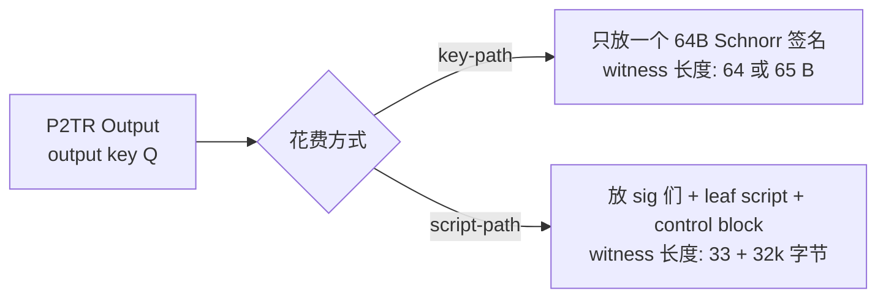

所有参与者合作时用 key-path 花费——链上不暴露任何脚本逻辑；只有协议失败时才走 script-path。BTC 的复杂多签/DLC/Lightning channel close 大部分情况下与普通转账无异。

##### BIP-342 · Tapscript

Taproot 内的脚本子语言，去掉了一些无用 opcode，加了 `OP_CHECKSIGADD`（多签更高效），允许将来通过软分叉扩展。

#### Taproot 在 2026 的采用

- **块内 Taproot 输入比例**：约 4-9%（Ordinals 启动后从 0.1% 飙升）
- **Taproot 钱包覆盖率**：~80%（主流钱包都支持 send/receive bc1p）
- **真正大量 script-path 用例**：Ordinals、Runes、BitVM 桥、协议级 multi-sig（FROST、MuSig2）

### 29.1 思考题（章 29）

> Q1：Taproot 的 key-path 与 script-path 在链上"长得一样"——这是不是一种隐私？
>
> Q2：BIP-340 tagged hash 防御了什么类型的攻击？

---

## 30 · Ordinals、BRC-20 与 Runes

> **场景钩子**：2023 年 1 月，工程师 Casey Rodarmor 公布 Ordinals 协议——给每一聪 BTC 编号，把任意字节塞进 Taproot witness。Bitcoin Core 老炮们当场炸锅：Luke Dashjr 公开骂"这是攻击 Bitcoin"、要求矿工过滤；Adam Back 阴阳怪气；Pieter Wuille 罕见沉默。但市场不听老炮的：3 个月内 inscription 数量爆到千万级，BRC-20 meme 币把链费打到 100 sat/vB，矿工们一边骂一边收 fee。Casey 后来又出了 Runes 试图把 BRC-20 的状态膨胀压回去。**这是 Bitcoin 历史上最大的文化分裂**：极简内核不愿意动，但社区把"链上数据存证"硬塞进了 witness——你怎么看待这件事，决定你站哪一边。

用 Taproot 的 script-path 把任意字节封装到 witness（envelope = `OP_FALSE OP_IF "ord" OP_PUSH content_type OP_PUSH 0 OP_PUSH content_bytes OP_ENDIF`，永不执行但永久存链）+ "序号 satoshi"给每一聪 BTC 永久编号（0..~2.1 quadrillion，FIFO 流转）。

**三代 Bitcoin 资产**：**Ordinals (NFT)**（2023-01，单聪 inscription 任意字节 → NFT/文档/艺术）→ **BRC-20**（2023-03，文本 inscription JSON deploy/mint/transfer → meme 币）→ **Runes**（2024-04 halving 块激活，OP_RETURN 协议每输出 80 字节，**Casey Rodarmor 对 BRC-20 状态膨胀的官方答卷**，状态由协议索引器维护更省 indexer）。

**2026-04 数据**：累计 inscription **65M+**；2026-03 Ordinals 销售 ~$47M；累计网络费（含 inscription/Runes）$458M+；BRC-20 → Runes 迁移仍在进行，BRC-20 市值显著萎缩。

### 30.1 思考题（章 30）

> Q1：Inscription 把"任意数据"塞进 witness——这与 OP_RETURN 的"协议级 80 字节限制"在状态膨胀上有何不同？
>
> Q2：Runes vs BRC-20 vs cNFT vs ZK Compression——它们都是"省 storage"的不同思路，谁更可持续？

---

## 31 · Lightning Network 与 LDK

> **场景钩子**：2015 年 Joseph Poon 与 Thaddeus Dryja 在白皮书里写下"Bitcoin 的可扩展性不应该靠加块大小，而靠把支付推到链下"——4 年后 Lightning 主网上线。今天 Block（Jack Dorsey 的 Cash App）、Strike、Binance 出入金、阿根廷的全国支付都跑在 Lightning 上。HTLC 多跳路由的数学非常优雅：要么所有跳成功，要么全不动；中间节点挣 0.001% 路由费、不承担本金风险。但 Lightning 也在悄悄变质——节点数从 2022 年高峰 20,700 跌到 14,940 然后回升至 17,000，**总容量却在持续上升**：钱在向少数机构节点集中。这是去中心化退步还是金融成熟标志？读完这一节自己判断。

Lightning 是基于 Bitcoin 的**链下支付通道网络**：双方在主链开通道（2-of-2 multisig commit）→ 链下无限次结算（HTLC 配 revoke old state）→ close 通道把最终状态写回链上。Taproot Assets 在 LN 上发资产（与 §35 RGB 客户端验证不同）。

**HTLC 多跳路由**：Carol 生成秘密 $r$ 发 $H=\text{SHA256}(r)$ → Alice 在 A→B 锁定，B 出示 $r$ 才能拿 → Bob 在 B→C 锁定 → Carol 用 $r$ 拿钱 → 反向解锁。**原子性**：要么全跳成功要么全不动，中间节点不赔。

**四大实现**：LND（Lightning Labs / Go，主流路由）/ CLN（Blockstream / C，模块化）/ Eclair（ACINQ / Scala，Phoenix 钱包后端）/ LDK（Spiral / Block / Rust，嵌入式 SDK，Cash App / Strike 用）。

**2026-04 数据**：公开节点 ~17,000（高峰 20,700 → 2022 后 14,940 → 机构入场再升）；通道数 ~40,000；总容量 ~5,000 BTC（≈ $490M，2025-12 冲到 5,637 BTC）。CEX 大幅 Lightning 化；**节点数下降但容量上升**——通道集中化（机构节点）成为现实。

### 31.1 思考题（章 31）

> Q1：Lightning 节点数下降但容量上升——这是去中心化退步还是金融成熟标志？
>
> Q2：HTLC 在中间节点崩溃时如何保证原子？timeout 路径是否有"卡住"风险？

---

## 32 · BitVM 2 与 Citrea：BTC 的乐观执行

> **场景钩子**：2023 年 10 月，独立研究者 Robin Linus 在密码学论坛贴出 BitVM 白皮书：**Bitcoin 主链不需要图灵完备——只需要让矿工裁决谁说谎。** 他用 Lamport 签名 + 二分挑战，把任意计算编码成"链下执行 + 链上仲裁"，实质上把 Bitcoin 变成了乐观 rollup 的 settlement 层。1 年后 BitVM 2 把安全假设降到 **1-of-n existential honesty**——只要 n 个节点里有 1 个诚实，桥就安全。这是自 Lightning 以来 Bitcoin 表达力最大的一次跃进，**完全不需要软分叉**。Citrea 在 2026-01-27 用 BitVM2 桥上线主网，第一个真正 trust-minimized 的 BTC L2。

BTC 矿工不跑复杂程序但愿意按标准脚本仲裁。BitVM 2：操作员链下执行并承诺结果，有人挑战时用 3-4 笔链上交易完成仲裁。

**演进**：BitVM v1（Robin Linus，2023，两方协议、最多 70 笔挑战）→ **BitVM 2**（2024-2025，n-of-n 多方、permissionless challenger、3-4 笔完成挑战，安全假设从 honest majority 降到 **1-of-n existential honesty**）→ BitVM 3 路线（2026+，garbled circuits 进一步压缩）。

**Bridge 信任假设**：完全联邦多签（Liquid / RSK / wBTC，多数诚实）→ BitVM 2 桥（Citrea Clementine / Bob / Goat Network，**任意一个节点诚实即可**）→ 真正去信任仅 BTC 共识（目前没有，BitVM 最接近）。

### 32.1 Citrea：第一个 BTC ZK Rollup（2026-01-27 主网）

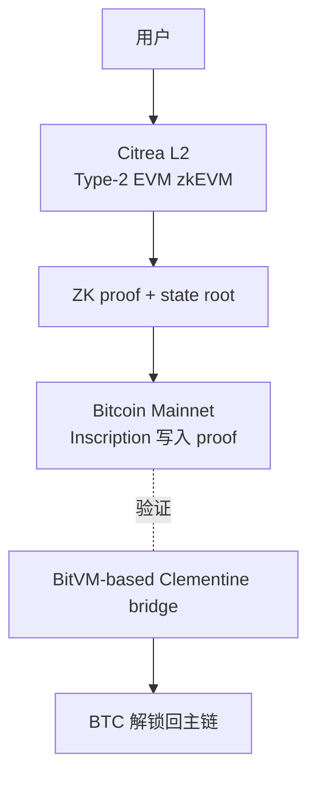

- 数据可用性：**Bitcoin 主链** inscription（不像 OP/Arbitrum 用 ETH blob）
- 桥：**Clementine**（基于 BitVM2，无需联邦多签）
- 应用：**cBTC**、ctUSD 稳定币、链上借贷
- 意义：第一个让 BTC 进入 DeFi 级别可用性的 trust-minimized rollup

### 32.2 思考题（章 32）

> Q1：BitVM 2 的"existential honesty (1-of-n)"安全假设——这是一个什么样的进步？
>
> Q2：Citrea 用 inscription 写 ZK proof 数据——为什么不用 OP_RETURN？

---

## 33 · Stacks Nakamoto 与 sBTC

> **场景钩子**：2017 年 Muneeb Ali 与 Ryan Shea 在普林斯顿做 Blockstack（后来的 Stacks），是少数 SEC 批准过 Reg A+ 公开发行的区块链项目。他们的赌注：**BTC 不能升级，但可以做一条独立 PoS 链定期把状态摘要写回 BTC**——这样 Stacks 上的合约能"借用 BTC 的 finality"。2024 Nakamoto 升级把出块时间从 10 分钟砍到 5 秒，2024-12 sBTC 主网上线（1:1 BTC 锚定，14+ 联邦签名者）。这条路比 Citrea 老 5 年，比 Babylon 早 3 年——Stacks 是 BTC 生态最早跑通"借安全"的链。

Stacks 有独立共识（PoX，leader 选举消耗 BTC），定期把账本摘要写回 BTC 主链；sBTC 1:1 锚定 BTC。

**核心**：**PoX**（矿工发 BTC 给 STX 持有者换出块权）+ **Clarity**（不图灵完备、可静态分析、显式声明读写）+ **Nakamoto 升级**（2024 激活，出块 ~10min → ~5s，引入 BTC finality 6 块确认不可逆）+ **sBTC**（2024-12-17 主网，14+ 联邦签名者，1:1 BTC 锚定，初始 cap 1000 BTC，2025-Q1 启用 withdrawal，2026 Satoshi Upgrades 去中心化）。

### 33.1 思考题（章 33）

> Q：sBTC 的联邦签名者集合（14+）相比 BitVM 2 桥的"1-of-n existential honesty"安全性如何对比？Stacks PoX"消耗 BTC"与 PoW/PoS 在经济模型上差异何在？

---

## 34 · Babylon：BTC Staking 给 PoS 链借安全

> **场景钩子**：David Tse 是斯坦福的信息论教授，2022 年他读完 EigenLayer 白皮书后想：ETH 能给 AVS 借安全，那 BTC 这块沉睡的 1.5 万亿美元怎么办？他与团队设计了 **EOTS（Extractable One-Time Signature）**——如果 staker 在 PoS 链上同高度签了双花，他的 BTC 私钥**会从签名里被任何人提取出来**，被罚没的 BTC 直接销毁。这是把 BTC 自托管 staking 变成可能的数学魔法。Phase-1 主网（2024-08）累计锁了 57,000+ BTC（~40 亿美元），是 BTC 老炮们罕见的"愿意借出 BTC"行为。**Babylon 与 EigenLayer 是同代人但走完全不同的数学路径。**

### 34.1 机制 & 与 EigenLayer 对比

**EOTS（Extractable One-Time Signature）**：staker 在 PoS 链上同高度签双花时，签名能被任何人**提取出私钥**，从而花掉抵押的 BTC（罚没销毁）。Phase-1（2024-08 启动）= 自托管 staking script 锁仓，2026-04 累计 **57,000+ BTC（~$4B+ TVL）**；Phase-2（2025-Q1+ 路线，未上主网）= Babylon Chain 主网作为 BSN 编排层；2026 路线 = multi-staking、EVM DeFi、trustless liquidity。

vs **EigenLayer**：抵押 BTC（self-custody script）vs ETH/LST（合约托管）；罚没 = EOTS 提取私钥花掉 BTC vs 合约 slash；客户网络 = Cosmos PoS / 各 BSN vs EVM AVS；信任 = 仅 BTC 共识 + EOTS 数学 vs EigenLayer 合约不被 hack；杠杆 = 不能再质押第三方 vs 可叠加 restake。

### 34.2 思考题（章 34）

> Q：Babylon 的 EOTS 数学保证 vs EigenLayer 的合约 slashing——哪种在长尾事件下更稳健？BTC 持有者愿不愿意为奖励冒被 slash 风险？

---

## 35 · 其他 BTC L2 速览

> RGB（client-side validation 极致形态）复杂度超出本附录定位 — 详见 RGB 官方 spec。本节只列工程师选型时该认识的 L2 矩阵。

| L2 | 类型 | 状态（2026-04） | 关键点 |
|----|------|----------------|--------|
| **Citrea** | ZK Rollup + BitVM 桥 | 主网（2026-01） | 第一个真正 trust-minimized BTC L2 |
| **Stacks** | 独立 PoX 链 + sBTC 锚定 | sBTC 主网已运行 | 见 §33 |
| **Babylon** | BTC staking 服务 | Phase-1 主网，57k+ BTC TVL | 见 §34 |
| **Lightning** | 状态通道 | 已 7+ 年 | trust-minimized 支付层 |
| **Liquid** | Blockstream 联邦侧链（~15 机构）| 2018 主网；2026-Q1 首次后量子（SHRINCS）实测资金转账 | Confidential Transactions；机构 RWA + USDt-Liquid 主场 |
| **RGB** | Client-side validation + LN | 2025-07 主网；2025-11 BitMask 支持 RGB20，Tether 准备发 BTC-USDT | 链上无 RGB 状态，理论 40M tx/s |
| **Rootstock (RSK)** | 联邦合并挖矿 EVM | 已 7 年 | rBTC 联邦多签 |
| **BOB / Botanix / Merlin / B² / BEVM** | 各种联邦 EVM | 主网 / 测试网 | EVM 兼容；Merlin/B²/BEVM 中国生态主导 |
| **Goat Network** | BitVM2 ZK | 测试网 | BitVM2 白皮书实现之一 |

> Q：BTC L2 数量爆炸但只有少数真实 TVL，筛选标准应该是什么？为什么后量子签名先在 Liquid 试而非 BTC 主网？

---

## 36 · Bitcoin 工具链与生态 AI

### 36.1 实战：构造一笔 P2TR 交易

完整代码见 `code/bitcoin/p2tr/`。核心步骤（key-path）：

```typescript
import * as bitcoin from "bitcoinjs-lib";   // 7.0.1
import * as ecc from "@bitcoinerlab/secp256k1";
import { ECPairFactory } from "ecpair";

bitcoin.initEccLib(ecc);
const ECPair = ECPairFactory(ecc);
const network = bitcoin.networks.regtest;

// 1) 一对 keypair
const kp = ECPair.makeRandom({ network });
const xOnlyPubkey = Buffer.from(kp.publicKey.subarray(1, 33));   // 去掉 0x02/0x03 → 32B x-only

// 2) P2TR 地址（key-path only）
const { address, output } = bitcoin.payments.p2tr({
    internalPubkey: xOnlyPubkey,
    network,
});

// 3) 构造 PSBT
const psbt = new bitcoin.Psbt({ network });
psbt.addInput({
    hash: prevTxid,
    index: 0,
    witnessUtxo: { script: output!, value: 100_000 },
    tapInternalKey: xOnlyPubkey,        // P2TR PSBT 必填
});
psbt.addOutput({ address: recipient, value: 90_000 });

// 4) 用 tweaked signer 签名
const tweakedSigner = kp.tweak(
    bitcoin.crypto.taggedHash("TapTweak", xOnlyPubkey),    // BIP-341 tweak
);
psbt.signInput(0, tweakedSigner);
psbt.finalizeAllInputs();

const tx = psbt.extractTransaction();
console.log("vsize:", tx.virtualSize(), "weight:", tx.weight());
```

BIP-341 tweak 公式：$Q = P + H_{\text{TapTweak}}(P \| \text{merkle\_root}) \cdot G$。无脚本树时 `merkle_root = ""`，钱包必须用 **tweaked private key** 签名，否则验签失败。

完整的 script-path 与解码示例见 `code/bitcoin/p2tr/build_scriptpath.ts` 和 `decode_taproot_tx.ts`。

#### Lightning demo（基于 ldk-node 0.4.x）

完整代码见 `code/bitcoin/ldk-node-demo/`。脚本演示：起两个节点 A/B，互联，开 100k sats 通道，A → B 发 1000 sats。

```typescript
import { Builder, NetAddress } from "ldk-node";

const alice = new Builder()
    .setNetwork("regtest")
    .setStorageDirPath("./data/alice")
    .setEsploraServer("http://127.0.0.1:30000")
    .setListeningAddresses([NetAddress.fromString("127.0.0.1:9735")])
    .build();

await alice.start();
alice.connect(bobNodeId, bobAddr, true);
alice.openChannel(bobNodeId, bobAddr, 100_000n, 0n, undefined);

// Bob 出 invoice，Alice 支付
const invoice = bob.bolt11Payment().receive(1000_000n, "demo", 3600);
alice.bolt11Payment().send(invoice, undefined);
```

### 36.2 Bitcoin 的 AI 工具成熟度

Bitcoin AI 工具成熟度几乎为零，所有非 EVM 中最弱。原因：Script/Taproot/PSBT 语料量极小；开发以协议级（BIP）为主，LLM 难理解；L2 碎片化无统一抽象；Bitcoin Core 维护者对 AI 写共识代码极度保守。

实测：
- 写 PSBT 构造代码：**容易出错**，特别是 SegWit / Taproot 的 sighash 算法
- 写 Lightning 应用：能写 invoice/支付的 boilerplate，但通道管理、watchtower 配置基本不会
- 写 BIP 兼容代码：经常生成"看起来对但不符合任何 BIP"的代码

真正"AI 友好的 BTC 工具"目前几乎没有——这是创业机会。

---

## 37 · Bitcoin 学习路径

推荐顺序：Mastering Bitcoin (3e) → Programming Bitcoin → BIP 精读 (32/39/44/141/340/341/342) → Bitcoin Optech 周报 → 实战 (bitcoinjs-lib / btcd / rust-bitcoin) → L2 选型。完整资源见第 52 章。

### 37.1 思考题（Bitcoin 总章）

> **Q1**：为什么 Bitcoin 主链不实现智能合约？这种保守是设计选择还是技术限制？
>
> **Q2**：BIP-340 tagged hash 的"两次 SHA256(tag)"为什么这么写？防御了什么攻击？
>
> **Q3**：Citrea 用 inscription 写 ZK proof 数据，这与 Ethereum L2 用 blob (EIP-4844) 在 DA 假设上有何不同？

参考答案见练习目录 `exercises/bitcoin-taproot-decode/ANSWERS.md`。

下一段"其他主流链"按**家族特征**而非逐链 hello-world 组织——目标是让你 30 分钟看懂任意新链。

---

## F · 附录 F：16+ 其他链（原章 37.5–49）

---

## 37.5 · 家族族谱：12 条链的心智锚归位

前四大家族（Solana / Cosmos / Move / Bitcoin）覆盖了大半，但不是全部。下面 12 条链按**执行模型 + 信任/治理形态**归族，每族抓住一条共性主线，剩下的篇幅只讲"这条链相对家族的差异点"——不再每条链复述共识、语言、TPS。

| 家族 | 共性主线 | 章节 | 心智迁移点 |
|------|---------|------|-----------|
| **Actor 异步消息** | 合约是独立 actor，所有调用是消息 | TON (§38) | EVM 同步 call → 异步 send；CosmWasm sub-message 的极致版 |
| **链抽象 / Intent** | 用本链账户控制其他链 | NEAR (§39) | EVM 钱包"只能签本链" → 一对私钥多链通用 |
| **通用计算 VM** | 用真实 ISA 取代特化 VM | Polkadot/JAM (§40) | EVM/SVM/MoveVM 是特化 VM → JAM 押 RISC-V 通用 ISA |
| **eUTXO + 学院派** | UTXO + datum，链下构造 + 链上验证 | Cardano (§41) | EVM"合约写状态" → Cardano"客户端给状态、链上只验" |
| **Pure PoS + VRF** | 抽签委员会，单层确定 finality | Algorand (§42) | Tower BFT/CometBFT 全员投 → VRF 抽 ~1000 人投 |
| **链上自升级** | 治理通过即热替换协议 | Tezos (§43) | Ethereum 硬分叉停机 → 链协议像系统更新 |
| **链上全栈托管** | 前端、后端、AI 全跑链上 | Internet Computer (§44) | dApp 前端常托管在 IPFS/中心化 → ICP 浏览器直连 canister |
| **存储经济** | 拼硬盘而非算力，存储即资产 | Filecoin (§45) | DA 是 EVM L2 的"成本项" → Filecoin 把存储做成主业 |
| **EVM 但非主流合规** | 兼容 EVM，承载真实美元流量 | Tron (§46) | 工程师不爱、用户离不开的市场现实 |
| **企业治理 + Hashgraph** | 委员会准入、专利共识、合规优先 | Hedera (§47) | Solana 全开放 → Hedera 全许可 |
| **并行 EVM** | 重写 EVM 客户端 + 乐观/OCC 并行 | Sei v2 / Berachain V2 / Monad / MegaETH (§48-49) | 串行 EVM → 并行 EVM；这是 2024-2026 最大主题 |
| **自建 perp L1** | 内存订单簿 + 共享 BFT 共识 | Hyperliquid (§49) | DEX 部署在通用链 → DEX 自起一条专用链 |

**用法**：以下每条链只展开"心智迁移点"和工程后果，共识/语言细节如属家族共性则不再重复。完整对比矩阵见 §50。

---

## 38 · TON：Actor 异步消息的极致

> **场景钩子**：2018 年 Telegram 创始人 Pavel Durov 兄弟想给 9 亿用户做一条链，集结俄系顶级密码学家写出 TON（Telegram Open Network）。SEC 一脚踩死后，团队解散；TON Foundation 把代码开源接力跑。今天 Telegram Mini Apps 月活 5 亿，STON.fi DEX 累计 swap volume 58 亿美元——一个**没有美国市场**的 Web3 巨人。技术上 TON 是怪胎：**所有合约调用都是异步消息**（actor 模型推到尽头）、Workchain 自动分片、FunC 写起来像 LISP——但在 Telegram 内嵌 WebView 的分发渠道下，UX 漏斗短到极致：开聊天 → 点 Mini App → 一键登录 → 交易。

**心智迁移点**：CosmWasm sub-message 是"主流程同步 + reply 异步"，TON 把整个调用模型推到尽头——**所有调用都是异步消息，没有同步 call**。这堵死了重入攻击整类，代价是不能"调一个函数等返回值"。

| 维度 | EVM call | CosmWasm sub-message | TON actor message |
|------|---------|---------------------|---------------------|
| 同步调用 | 默认 | 主流程内同步 | **完全没有** |
| 重入风险 | 有 | 无（reply 单独） | 无 |
| 业务编排 | 一笔事务一棵 call tree | sub-message + reply 二阶段 | **状态机式 + bounce** |

**工程后果**：写 Counter 合约简单（`receive("inc")` 一行），写 DEX 撮合复杂——必须用 bounce / 多 actor / 状态机思考；STON.fi、DeDust 核心仍用 FunC 而非高层 Tact，因为高层抽象在异步状态机上还不够稳。

**2026-02 Catchain 2.0** 主网验证人激活后块时间 400 ms、finality 1-2 s；分片由 Workchain → Shardchain 自动切，理论百万 TPS（实际未跑满）。共识细节见模块 02。

### 38.1 FunC vs Tact：写哪个

```text
// FunC 风格 (汇编近似的低级)
() recv_internal(int my_balance, int msg_value, cell in_msg_full, slice in_msg_body) impure {
    var cs = in_msg_full.begin_parse();
    var flags = cs~load_uint(4);
    if (flags & 1) { return (); }            ;; bounce
    var s_addr = cs~load_msg_addr();
    ;; ... 极底层，几乎汇编手感
}
```

```typescript
// Tact 风格 (类 TypeScript / Solidity)
contract Counter {
    val: Int;
    init() { self.val = 0; }
    receive("inc") { self.val = self.val + 1; }
    get fun value(): Int { return self.val; }
}
```

| 选 FunC 当 | 选 Tact 当 |
|-----------|-----------|
| 字节级优化重要（gas 极敏感的合约） | 业务逻辑优先 |
| 团队有 C/汇编背景 | Solidity 背景，想快速上手 |
| 原生协议合约（Jetton、NFT 标准） | DeFi 业务合约 |

2026 现实：Tact 部分高级特性（继承、泛型）尚未稳定；STON.fi、DeDust 核心仍用 FunC。

### 38.2 Mini Apps：分发即用户

Telegram Mini App 是网页应用（HTML/JS/CSS），通过 bot 启动，结合 TON Connect 实现"打开聊天 → 一键登录 → 交易"。

```mermaid
flowchart LR
    Chat[用户打开 Telegram 群组] --> Bot[聊天里点 Mini App 链接]
    Bot --> WebView[Telegram 内嵌 WebView]
    WebView --> dApp[你的 React/Vue 前端]
    dApp -- TON Connect --> Wallet[Tonkeeper / @wallet / Tonhub]
    Wallet --> TON[TON 主网]
```

开发栈 = React + TON Connect SDK + bot 后端，与 Web 无本质区别，但用户漏斗极短。

### 38.3 Cocoon：TON 上的隐私 AI

**Cocoon**（2025-12 主网，Confidential Compute Open Network）把 TEE 作为 Service 暴露给 TON 合约，AI 推理"加密输入、加密输出"——服务于 Telegram 5 亿用户的端到端加密 AI 场景。

### 38.4 2026-04 实测数字（TON）

| 数据 | 值 |
|------|---|
| 块时间 | ~400 ms（Catchain 2.0） |
| Finality | 1-2 s |
| 用户 | Mini Apps 月活 **500M+** |
| DeFi TVL | STON.fi + DeDust > $450M |
| STON.fi 累计 swap volume | **$5.8B+**, 4.7M+ 钱包 |
| 主网 Catchain 2.0 验证人激活 | 2026-02 |

### 38.5 Telegram Mini App + TonConnect 工程栈

TON 的真正杀手锏不是 actor 模型，而是 **5 亿月活的 Telegram 用户原地变成 web3 用户**——Mini App 不需要装钱包、不需要切链、不需要复制助记词。

**典型流程**：

```mermaid
flowchart LR
    U[Telegram 用户] -->|/start| Bot[Bot]
    Bot -->|launch web app| WV[Telegram WebView]
    WV -->|TonConnect SDK| Wallet[Tonkeeper / @wallet / Tonhub]
    Wallet -->|sign + send| TON[TON 主网]
    TON -.txhash.-> Bot
    Bot -.notification.-> U
```

**`window.Telegram.WebApp` 关键 API**：`initData`（服务端验签源串）/ `initDataUnsafe`（客户端解析对象，**不可信**仅 UI 用）/ `themeParams`（自适应深浅主题）/ `MainButton.show()`（系统级底部主按钮）/ `HapticFeedback`（振动）/ `openLink()` / `openTelegramLink()`（跳外链）。

**`initData` 验签（必须做）**：WebView 客户端 user 字段可伪造，服务端必须用 bot token 做 HMAC-SHA256 校验。流程：取 hash 字段 → 剩余字段排序拼 `dataCheckString` → `secret = HMAC-SHA256("WebAppData", botToken)` → `computed = HMAC-SHA256(secret, dataCheckString)` 须等于 hash → 校验 `auth_date ≤ 24h` 防重放。

> **生产事故惯例**：很多 Mini App 直接信任 `initDataUnsafe.user.id` 当用户 ID + 签发 JWT，导致**遍历 user_id 偷资产**；正确做法只信服务端 `verifyInitData` 后的解析结果。

**TonConnect SDK 工作流**（类 EVM wagmi 但走 BoC / cell 签名）：`new TonConnectUI({ manifestUrl })` → `tc.openModal()` 弹钱包列表 → `tc.sendTransaction({ validUntil, messages: [{ address, amount: "10000000" (nanoTON), payload: "te6cck..." (base64 cell) }] })` → 拿到 BoC。

**Stars 支付（Telegram 自家虚拟货币）**：

- Stars ↔ Toncoin 官方兑换（1 Star ≈ $0.013，2026-04）；
- Mini App 内调用 `Telegram.WebApp.openInvoice(url)` 触发系统级支付；
- **关键**：Stars 走 Telegram 自家账，不用 TonConnect、不用钱包——苹果 / 谷歌抽 30% 跨过不去（这就是为什么 Hamster Kombat 等游戏全部转向 Stars 而不是 Toncoin）。

### 38.6 Tap-to-Earn 三大案例复盘

2024 是 TON 的"Tap-to-Earn 元年"，三个标志性产品集体把 web3 用户基数推到亿级，同时给工程师留下了一堆教科书级教训。

| 项目 | 时间线 | 用户峰值 | TGE 后表现 | 留存教训 |
|------|--------|---------|-----------|---------|
| **Notcoin** | 2024-01 启动 / 2024-05 TGE | Notcoin **约 3500 万玩家**（官方 TGE 时 35M；5000 万含 bot/Sybil） | TGE 估值 ~$2B；空投惠及 600 万钱包；后续 -70% | **拉取期短（4 个月）+ 空投预期清晰** = 用户体感正面 |
| **Hamster Kombat** | 2024-Q2 / 2024-09 TGE | **3 亿**（Q3 2024 峰值） | TGE 后 **崩盘 90%+**，用户流失 80% | 拉取期太长（6 个月）+ 空投打分公式临时改 = 信任崩塌 |
| **Catizen** | 2024-Q3 / 2024-Q4 TGE | 5000 万 | TGE 表现中等；2025 转型多游戏发行平台存活 | 游戏化机制本身有留存（小游戏 + NFT 猫）；TGE 后转型救命 |

**工程教训（不重复别人的坑）**：

1. **拉取期不要超过 4 个月**——用户耐心是消耗品；
2. **空投打分公式 TGE 前 1 个月内不可改**——改一次信任永久受损；
3. **Sybil 防护是产品级别问题**：Hamster 没做 Sybil 检测，导致 1 个真人 100 个号；2026 趋势是**集成 World ID（Worldcoin proof of personhood）**或 Telegram 自家的 phone-number-uniqueness 做去重；
4. **TGE 时机**：用户增长曲线 **拐点出现前 30 天**就是最佳 TGE 窗口（晚了热度过期、早了流量不足）；
5. **Tokenomics 留 30% 给二阶段激励**——光靠 TGE 一次性空投留不住人。

### 38.7 Telegram bot 工程通用模式

Telegram bot 是 Mini App 之外的**另一条用户入口**，三类 bot 在工程上设计差异巨大：

| 类型 | 代表 | 钱包模型 | 关键风险 |
|------|------|---------|---------|
| **托管钱包 bot** | @wallet（Telegram 官方），TON 链 | Telegram 自家托管，KYC 可选 | 平台 freeze；地区合规变化 |
| **Tip bot / 社区打赏** | TipBot、TonTip | 共享 hot wallet 或子地址 | bot 主私钥泄漏 = 全部用户余额 |
| **Trading bot** | Maestro、BonkBot、Banana Gun（**Solana 主战场**，但 Telegram 是入口） | 服务端代签，私钥服务器持有 | bot 跑路 / 服务器被黑 / 滑点欺诈 |

**Hot wallet 架构（trading bot / tip bot 通用）**：多用户 → bot 服务端按 user_id HKDF derive 子地址私钥；主私钥仅存 KMS / HSM。

**典型事故 1（2023-2024 BonkBot + 多个无名 tip bot）**：主私钥放普通 EC2 → 被入侵 → 几千用户 SOL 一夜清零 + 团队跑路。**教训**：主私钥进 KMS / HSM；线上服务读不到全私钥（只调签名 API）。

**典型事故 2**：Trading bot 在 Solana 上做"用户 deposit → 帮买 meme"——meme migration 阶段被 sniper 抢跑（bot 自己抢用户的 tx）。**教训**：bot 私钥与"路由器策略账户"必须严格分开，**Squads V4 多签 + program-derived address (PDA)** 隔离。

**抗 Phishing 三件套**：

1. **Deep link 验证**：`https://t.me/yourbot?start=xxx` 必须服务端校验 token，避免恶意 link 直进 Mini App；
2. **签名前显示原文**：TonConnect / Tonkeeper 会展示原始 cell 解码后的 method + args，bot 内的"代签 UI"必须让用户看到这一层；
3. **限额触发二次确认**：单笔 > $50 / 单日累计 > $200 强制 Telegram 内 OTP 或 wallet 内人脸（@wallet 支持）。

### 38.8 思考题（章 38）

> Q1：TON 的 actor 模型异步消息相比 EVM 同步 call 有何优劣？
>
> Q2：`initData` 服务端验签的细节里，为什么必须用 `HMAC-SHA256("WebAppData", botToken)` 当 secret，而不是直接用 botToken？
>
> Q3：Hamster Kombat TGE 崩盘的根本原因是"打分公式临时改"还是"拉取期太长"？两者结合时谁是因谁是果？

---

## 39 · NEAR：链抽象与 Chain Signatures

> **场景钩子**：Illia Polosukhin 在 Google 研究院共同写出 Transformer 论文（"Attention Is All You Need"）后，2018 年与 Alex Skidanov 创立 NEAR——一个用机器学习背景做的链。NEAR 走过很多弯路：动态分片（Nightshade）真的跑通了，但 2022-2023 拿不到主流 mindshare。2024 年团队做了个大胆的转向：**chain abstraction**——用一个 MPC 网络让 `alice.near` 一对私钥派生并代签 BTC/ETH/SOL 25+ 条链的交易，不需要桥、不需要 wrap，钱直接在原链上动。配合 Intents（用户表达"想干啥"，Solver 网络竞拍最优路径），NEAR 把"跨链 UX"做成了协议级原语，反过来吃掉 LayerZero/Wormhole 的午餐。

**心智迁移点**：EVM/Solana 的私钥只能签本链；NEAR 用一个 MPC 网络让 `alice.near` 一对密钥**派生并代签 BTC/ETH/SOL/Cosmos 25+ 条链的交易**——不需要桥、不需要 wrap，钱直接在原链上动。

> 共识 Doomslug（PoS BFT）+ Nightshade 动态分片 + WASM 执行细节略；NEAR 工程师真正用得上的两件事是 **Chain Signatures** 和 **accessKey + Intents**。

#### Chain Abstraction（2024-2025）

```mermaid
flowchart LR
    User[用户在 NEAR 钱包<br>账户 alice.near] -- 签一笔 NEAR 交易 --> NEAR
    NEAR -- MPC 网络代签 --> ETH[Ethereum tx]
    NEAR -- MPC 网络代签 --> BTC[Bitcoin tx]
    NEAR -- MPC 网络代签 --> SOL[Solana tx]
```

用 NEAR 上的 MPC 签名网络（chain signatures），用户可用 NEAR 账户控制 ETH/BTC/SOL 资产——无需桥、无需 wrap，直接用 NEAR 私钥派生其他链签名。

#### NEAR Intents：一句意图，自动找路

用户在 NEAR 钱包表达意图（"把 100 USDC 换 BTC 发到 X 地址"）→ 钱包广播到 Solver 网络拍卖 → 多个 Solver 报价 → 选最优 → Solver 在多链组合 swap + bridge + send → 完成。

vs **传统跨链**：用户手动 swap → bridge → swap → send；路径写死；信任桥的多签；失败资产卡在桥。**NEAR Intents**：一句话；Solver 竞拍最优；信任 = NEAR Chain Signatures + Solver bond；失败 Solver 罚没。

**vs EVM 账户抽象（ERC-4337）**：4337（2023）仅同链 paymaster；NEAR accessKey（链原生即有，仅 NEAR）；**Chain Signatures**（2024，**跨链原生**，限速 / spending limits / session keys 协议级，paymaster 由 Solver 隐含）。

### 39.1 2026-04 实测（NEAR）

| 数据 | 值 |
|------|---|
| Chain Signatures 支持的链 | **25+**（含 BTC、ETH、SOL、Ripple、Cosmos） |
| MPC 节点扩张 | 2026 路线持续 |
| TEE 集成 | IronClaw（隐私 AI agent） |
| Intents 钱包集成 | Meteor、HOT、Intear、Near Mobile、Nightly |
| Tachyon Relayer | 多链中继器，赢得 Chain Abstracted Relayer RFP |

### 39.2 思考题（章 39）

> Q1：Chain Signatures vs LayerZero / Wormhole / CCIP——它们都解决"跨链"，但出发点完全不同？
>
> Q2：Intents 抽象掉"路径"——这与 Cowswap、UniswapX、1inch Fusion 在思路上有何相似？

---

## 40-45 · 其他主流链速查（Polkadot / Cardano / Algorand / Tezos / ICP / Filecoin）

> **本节定位**：这 6 条链各有独到技术，但 2026-04 的 DAU/TVL/招聘量都不及前文五大族 + Tron/TON/NEAR/并行 EVM 阵营——选型时知道它们存在、知道它们的"心智迁移点"即可。需深入再翻独立 doc。

| 链 | 心智迁移点（vs EVM） | 2026-04 状态 | 选型时机 |
|----|----------------------|--------------|---------|
| **Polkadot 2.0 / JAM** | EVM/SVM/MoveVM 是特化 VM；JAM 押 **RISC-V PVM** 通用 ISA，LLVM 工具链开箱用 | Agile Coretime（取消 parachain 拍卖）已上；JAM testnet 2026-01 启动，主网 OpenGov 投票中；Gray Paper v0.8 临近 | 押注通用 VM 假说、想用 C++/Rust/Go/Zig 直接写链上代码 |
| **Cardano** | EVM "合约写状态"；eUTXO **反过来** —— 客户端先把新状态算好作 datum 提交，validator 只回答合不合法 | Plomin Hard Fork（2025-01）开启 Voltaire 治理；Plutus V3 已激活；Hydra 多方头通道生产用；Ouroboros Leios 2026-06 testnet（目标 200-1000 TPS） | 学院派形式化方法 / Hydra 多方状态通道 / DReps 治理研究 |
| **Algorand** | 全员投票太慢 → **VRF 每轮抽 ~1000 人临时委员会**，抗 grinding / 抗分叉 | AVM v10 主网；Dynamic Round Times（3.4s → 2.8s）；2026-04-05 SEC + CFTC 把 ALGO 归 commodity（少数合规明确链） | 需 VRF 委员会共识 / 合规优先 / 学 Silvio Micali 思路 |
| **Tezos / Etherlink** | Ethereum 升级要硬分叉停机；Tezos 把协议本身写成链上对象，**治理提案通过即热替换**（系统更新而非换链） | 每 ~3 月一周期升级（Athens → Rio）；Etherlink（Smart Rollup EVM L2）2024 主网；NFT 黄金期靠 Hic Et Nunc / fxhash 留下生成艺术圣地 | 想做链上自升级 / 生成艺术 NFT / Tezos 原生 EVM L2 |
| **Internet Computer (ICP)** | dApp = 合约 + 链下前端；ICP 把 **HTML/CSS/JS/数据库/AI 推理全做成链上 canister**，浏览器 HTTPS 直连，dApp 替用户付费 (reverse gas) | Chain Key Cryptography 让 canister 直接持 BTC/ETH 私钥（threshold ECDSA，subnet ⅔ 共管，无桥无 wrap）；2026 押 GPU subnet 跑链上 LLM；Mission 70 通胀 9.72% → 2.92% | 端到端链上托管（前端 + DB + AI） / Chain Key 直控他链资产 |
| **Filecoin / FVM** | EVM L2 把存储当"成本项"；Filecoin 把存储做成**可编程资产**（PoRep + PoSt 证明，FVM 让 Solidity 合约管"存什么、谁付、怎样收"） | PoRep / PoSt / PDP 三证；FVM EVM 兼容；2026 主用例 = AI 数据仓库 + 企业归档；与 Walrus（Sui 协调存储）/ Arweave（一次付费永存）/ EigenDA（restake DA）/ Celestia（Reed-Solomon DA）分赛道 | 长期数据市场 / 数据 DAO / AI 模型权重托管 |

**关键对比**：

- **PVM vs WASM vs EVM vs SVM vs MoveVM**：PVM 押 RISC-V 真实 ISA；WASM 通用多语言（Polkadot 1.x、CosmWasm、ICP、NEAR 都用）；SVM 用 BPF 64-bit 寄存器；EVM 256-bit 栈式；MoveVM 资源类型。AltVM 趋势：Arbitrum Stylus（WASM）/ Linea zkVM RISC-V / PolkaVM 都跳出 EVM 字节码，性能 3-100x。
- **Hydra vs Lightning**：Lightning 双方支付通道；Hydra Head n 方共建小链 + 完整 eUTXO/Plutus，任一方关闭把头内最终状态写回 L1。
- **ICP Chain Key vs BitVM vs LayerZero/Wormhole**：ICP 直接 threshold ECDSA 持 BTC 私钥（subnet ⅔ 不作恶）；BitVM 桥 + 1-of-n 诚实；LayerZero 桥 + 多签 oracle。

**思考题（40-45 合并）**：

> Q1：JAM 押 RISC-V PVM、Cardano 押 eUTXO + Plutus、ICP 押全栈链上 canister——三条赌注都偏学院派，市场反馈各自如何？
>
> Q2：ICP Chain Key Bitcoin（threshold ECDSA）与 BitVM 桥相比，信任假设各差在哪？

---

## 46 · Tron：USDT 的事实主场

> **场景钩子**：Tron 的技术故事极其无聊：DPoS 27 个 Super Representative + EVM 兼容（TVM ≈ EVM）+ 抄袭 BitTorrent 团队。Justin Sun 个人风评糟糕，被 SEC 起诉，主流工程师 group 里提 Tron = 自动降智嫌疑。但你打开任何东南亚 OTC 商户的钱包、菲律宾外劳的汇款 app、阿根廷牛肉商人的结算——**USDT-TRC20 流通量已超过 USDT-ERC20**。$0.5 一笔的转账成本、几乎零拥堵、CEX 全支持。这是教科书级的"工程师不爱、用户离不开"案例。做支付/汇款/聚合器必须支持，做合规 DeFi 必须避开——成年人的世界，市场和合规两套账。

**心智迁移点**：技术上是 EVM 兼容（TVM ≈ EVM）+ DPoS 27 SR——没什么值得学的。但**USDT-TRC20 流通量已超过 USDT-ERC20**，东南亚/拉美/非洲/CIS 跨境结算实际跑在 Tron 上。工程师不爱、用户离不开——做支付/汇款/聚合器必须支持，做合规 DeFi 必须避开。

### 46.1 关键数据

| 维度 | 值 |
|------|---|
| 共识 | DPoS（27 个 Super Representatives） |
| EVM 兼容 | 是（TVM ≈ EVM） |
| USDT-TRC20 | 流通量超过 USDT-ERC20（2026-04） |
| 单笔转账成本 | **$0.1-3 视 energy 状态**（比 Ethereum 低 100 倍，比 BSC 略高） |
| 主要市场 | 东南亚、拉美、非洲、CIS |
| 主要使用场景 | 跨境结算、灰色 / 黑色市场、CEX 出入金 |

### 46.2 工程师决策

| 场景 | 决策 |
|------|------|
| 你做的是合规友好 DeFi / RWA | **不要** Tron |
| 你做的是面向新兴市场的支付 / 汇款 | **必须支持** Tron |
| 你做的是跨链聚合器 | 必须支持 Tron（USDT 流量在那） |
| 你做安全审计或链上分析 | 学一下，了解风险 |
| 你做技术革新 | 跳过 |

### 46.3 Energy / Bandwidth：Tron 资源模型

Tron 的 gas 模型不像 EVM 那样"一笔费用一把梭"，而是**两套配额 + 一套燃烧**——这是为什么菲律宾外劳给老家汇 USDT 时手续费几乎为零的真实机制。

**三种资源**：

| 资源 | 用途 | 每日免费额度 | 不够怎么办 |
|------|------|-------------|-----------|
| **Bandwidth Points** | 每笔交易的字节数（≈ tx size × 1）| 每账户 **1500 points/天**（约够 5 笔普通转账） | 燃 TRX（每 byte ≈ 0.001 TRX）或质押 TRX 获取 |
| **Energy** | 合约执行的"算力"（USDT 转账 ≈ 64,285 energy） | **0**（必须自己搞） | 燃 TRX（每 energy ≈ 0.00021 TRX，约 **$0.1-3 视 energy 状态**）或质押/租赁；未租 energy 时燃 TRX 约 **$1.5-3**；租 energy 后约 **$0.1-0.3**；带宽免费时段散户感官"几乎零成本" |
| **TRX 燃烧** | 兜底：上面都没有就直接烧 TRX 抵 | — | — |

**Stake 2.0（2023 升级，2026 仍在用）**：把 TRX 冻结在合约里换出 Energy / Bandwidth，**资源以"份额"形式发放、可委托给其他地址、解冻 14 天可领回**。比 Stake 1.0 灵活得多，也是 energy 租赁市场的底层基础。

**Energy 租赁市场（2026-04 仍是 Tron 生态最活跃的子赛道之一）**：

- **TronEnergy.market、FeeFreeing.io、Energy.Market、TRX.Market**——撮合"质押方（出借 energy）"与"用户（短期借用，付一点 TRX）"。
- 一笔 USDT 转账正常燃 TRX 要 ≈ $1.5–3，**租 5 分钟 energy 只要 $0.1–0.3**——这就是"Tron 转 USDT 几乎零成本"的真相。
- CEX（Binance/OKX/Bybit）的 USDT-TRC20 提币按这套机制底层走 energy 租赁池，用户完全无感。
- 工程师如果做钱包 / 聚合器，在 Tron 主网"建议用户先租 energy 再发 tx"是非常有商业价值的 UX 优化。

**dApp 后端实践**（典型流程）：

1. 用 `triggerConstantContract`（dry-run）估算交易要消耗的 energy；
2. 查 `getAccountResource(address)` 拿用户当前 `EnergyLimit` / `EnergyUsed` / `freeNetUsed`；
3. 不够则自动调起租赁合约（如 TronEnergy.market 的 `rentResource(address, amount, duration)`）；
4. 租到后再发实际 USDT transfer。

**最小流程**（Python `tronpy`）：1) `client.get_account_resource(addr)` 查 EnergyLimit/Used、freeNetLimit/Used；2) USDT-TRC20 transfer 经验 ~65k energy；3) 不够则 `client.trx.freeze_balance_v2(addr, 100_000_000, 'ENERGY')` Stake 2.0 自己换，或调 TronEnergy.market / FeeFreeing SDK 租；4) `contract.functions.transfer(to, amount).with_owner(addr).fee_limit(30_000_000)` 发实际 USDT 转账。

> **工程师陷阱**：`fee_limit` 是 TRX 燃烧上限（防 energy 不够 + 没租到时无限烧 TRX）；新手忘加导致账户被 buggy 合约烧空案例不少。

### 46.4 SunSwap / JustLend / USDD / stUSDT：Tron DeFi 四件套

Tron 链上 DeFi 长期被嘲"全是 SunIO 自家系"，但东南亚 / 大陆华人圈 USDT 跑量靠这套撑底层。**SunSwap V3**（Uniswap V3 fork，TVL ≈ $200M，USDT-TRX/USDD-USDT 主对）/ **JustLend DAO**（Compound fork + DPoS 模型，TVL ≈ $5B 多为 TRX 借贷池给 SR 投票套利）/ **USDD**（DAI/UST 混合体，TRX 超额抵押 + PSM，2022 短暂脱锚后稳住，**不被主流 CEX 当一类资产**）/ **stUSDT**（JustLend 发行 RWA 货币基金对接美债，**Tron 最大 RWA**，~$2B AUM）。

**中文圈"USDT 转账走 Tron"是默认**：CEX 提币费 USDT-ERC20 ≈ $5 / TRC20 ≈ $1（租 energy 后近零）；OTC 商户对账软件（Trongrid + 第三方 indexer）成熟；钱包（imToken / TokenPocket / TronLink / OKX）默认推 TRC20；中文教程清一色 Tron 演示。

> **工程师推论**：做面向中文用户的钱包 / 支付 / 工资发放，**Tron 必须默认链之一**；做合规出海产品反向——美 / 欧 / 日合规要求"客户禁用 Tron"。

### 46.5 Tron USDT 的现实定位与合规风险地图

> 与 [模块 06 **§2.4**](**../06-DeFi协议工程/**) 的 USDT 跨链流通图交叉引用：USDT 在 Tron 是"事实跨境美元"，但合规边界极其敏感。

**主战场地图（2026-04，按交易密度排序）**：东南亚（菲/越/印尼/泰/马，外劳汇款 + 跨境贸易 + 灰色赌博出入金）/ 大陆华人圈（OTC + 海外华人，场外换汇 + 海外购物代付）/ 拉美（阿/委/巴/墨，通胀避险 + 外贸单，USDC-Solana 增长快）/ 非洲（尼/肯/加/南非，外汇管制规避 + freelancer，M-Pesa + Bitnob LN 替代）/ CIS/俄罗斯（制裁规避 + 能源贸易）/ 中东（土耳其/伊朗灰色，法币贬值避险）。

**合规风险**：OFAC/FinCEN 把 USDT-TRC20 长期归 "high-risk corridor"，美/欧 KYC 默认 high-risk；Tether 可远程冻结任意地址（2024-2026 累计冻结 $5B+，**不是无许可资产**）；SEC 对 Justin Sun + TRX/BTT 诉讼 2023-03 起未和解；大陆 9.24 通知禁 Tron 项目工作 / 持仓 / 技术服务（见**附录 X**）。

**结论**：Tron 是工程师**必须能读、能转、能聚合**但**少主动建产品**的链——当 USDT 的"运输管道"用，别当"创业平台"用。

### 46.6 思考题（章 46）

> Q1：Tron 的合规风险与"事实使用量"——工程师该如何看待这种"非主流但巨大"的市场？
>
> Q2：Energy 租赁市场是 Tron "几乎零费"假象的真实底层；如果监管要求"所有手续费必须由用户原生支付"，这套机制会出什么问题？
>
> Q3：USDT-TRC20 与 USDT-ERC20 都是同一份发行储备的两个"链上分身"，但合规评分截然不同——你的支付产品如果要做"币种兼容、链中立"，会怎么设计？

---

## 47 · Hedera：企业治理与 Agent Lab

> **场景钩子**：Leemon Baird 是空军学院密码学教授，2016 年发明 Hashgraph 共识算法（gossip-about-gossip + virtual voting）——并把它**申请了专利**。这在开源至上的区块链世界里被骂得狗血淋头："专利共识？算什么 Web3？" 但 Leemon 没在意，他把 Hedera 做成**企业链**：39 家全球企业（IBM、Google、波音、LG、McLaren）实体董事会治理，固定低 gas（$0.0001/tx），carbon-negative。普通工程师可能一辈子用不上 Hedera，但全球 RWA、企业供应链、合规稳定币这块市场，Hedera 是能数得上的几条链之一。2026-03 Agent Lab 上线后，是非 Solana 阵营第一条把 AI Agent 做成顶级产品的链。

**心智迁移点**：Solana 全开放、Cosmos 治理由 token 持有者投票；Hedera 由 **39 家全球企业**（IBM、Google、波音、LG、McLaren）组成实体董事会治理，以"企业可信度"换"非完全去中心化"。共识 Hashgraph（gossip-about-gossip + virtual voting）见模块 02 附录 A 横评（Hashgraph 行）；**算法是 Hedera 独家专利**，这点与所有开源链截然不同。

### 47.1 服务体系

| 服务 | 缩写 | 说明 |
|------|------|------|
| Hedera Consensus Service | **HCS** | 给 dApp 提供"按时间顺序的消息流"；Web2 应用最爱用 |
| Hedera Token Service | **HTS** | 原生 token，无需合约 |
| Hedera Smart Contract Service | **HSCS** | EVM 兼容合约 |
| Hedera File Service | **HFS** | 链上小文件 |

### 47.2 Agent Lab（2026-03 上线）

第一方平台，浏览器内零代码/代码模式构建 agent，与 HCS/HSCS 深度集成——**第一个非 Solana 阵营把 AI Agent 做成顶级产品的链**。

主要能力：
- 用 LLM function-calling 调度 HTS / HSCS / HCS API
- 集成 Stablecoin Studio（合规稳定币发行）
- McLaren F1 是首批用 Hedera Agent Lab 做"赛车数据 NFT"的合作方

### 47.3 2026-04 真实状态（Hedera）

| 数据 | 值 |
|------|---|
| **Agent Lab** 上线 | 2026-03-26（浏览器、零代码 + 代码模式建链上 AI agent） |
| 治理委员会 | 39 家全球企业；2026-03 McLaren F1 加入 |
| 2026 路线 | Agent Lab + Stablecoin Studio integration |
| 特色 | Carbon-negative、固定低 gas（$0.0001/tx） |

### 47.4 思考题（章 47）

> Q1：Hedera 的企业治理委员会与 Cosmos / Solana 的去中心化路线——哪种更适合 RWA？

---

## 48 · 并行 EVM 速查：Sei v2 / Berachain V2

> 2024-2026 最大主题：**EVM 字节码兼容 + 并行执行**，让 Solidity 生态享受 Solana/Aptos 风格的吞吐。本节速查 Sei / Bera；并行 EVM 主代表 Monad 见 §49.1。

| 链 | 心智 | 关键演进 | 并行机制 |
|----|------|---------|----------|
| **Sei v2** | EVM 网络效应足够大时，自创新栈成本不再划算 | v1 纯 Cosmos（2023） → v2 Cosmos+EVM 双栈（2024，**世界首个并行 EVM**） → **EVM-only**（2026-04-06 至 04-08 迁移，抛弃 Cosmos 栈成纯 EVM L1） | **OCC + storage versioning**（多版本存储 + 冲突检测回滚，思路同 Block-STM） |
| **Berachain V2** | PoS + **Proof-of-Liquidity**：验证人必须引导 LP 流动性才能拿全奖励，区块空间与 DeFi 流动性绑死 | V1 Polaris VM（mempool 跟不上）→ V2 抛弃 Polaris，改 **BeaconKit**（EVM 客户端无关层，Geth/Reth/Erigon 任意接入） | 共识层并行依赖底层 EVM 客户端实现 |

**Berachain 三代币模型**：BERA（gas、可转让）+ BGT（治理、**不可转让**、burn 换 BERA）+ HONEY（原生稳定币）。验证人投 BGT 给 LP 池 → 项目方为被投必须吸引 LP → 形成"BGT 内卷"。

**Berachain PoL vs EigenLayer Restaking**：前者用 BGT（不可转让）激励链内 LP；后者用 ETH/LST（可转让）给 AVS 借安全。资产形态、激励对象、经济目的全不同。

> Q：Sei 离开 Cosmos、Bera V2 抛弃 Polaris——这两个动作对 Cosmos 阵营是不是打击？

---

## 49 · Monad、MegaETH、Hyperliquid

> **场景钩子**：Hyperliquid 是 2024-2026 加密圈最反共识的成功故事。两个哈佛 + Caltech 出身的高频交易工程师 Jeff Yan 和 iliensinc，**自筹资金、不融 VC、不发 token 公募**，硬生生为 perp DEX 做了一条专用 L1。所有验证人内存里维护同一份订单簿，user packet → fill < 1 秒。2024 年底空投彻底改写"VC 通吃"叙事——大批散户拿了几百万美元，公链空投史上最大单。HIP-3（2025-10）让任何人质押 500k HYPE 就能部署 perp 市场，上市权完全 permissionless。这一章把 Hyperliquid、Monad（并行 EVM 第三例）、MegaETH（10ms 块时间）放一起：**它们代表 2025-2026 加密"既要又要"——既要 EVM 兼容、又要 Solana 性能、还要应用专属链的极致定制**。

### 49.1 Monad：并行 EVM 家族第三例

承接 §48 主线。Monad（2025-11 主网）相对 Sei/Berachain 的差异化是**自研存储 + 异步执行**：

| 组件 | Monad 做法 |
|------|-----------|
| 共识 | MonadBFT（HotStuff 派生 + pipeline） |
| 并行 | 乐观并行（类似 Aptos Block-STM 应用到 EVM） |
| 存储 | **MonadDB**（自研 LSM，针对状态访问优化） |
| 执行 | **异步**——共识层只决定顺序，执行延后 |

主网半年 TVL ~400M、单日 1.2B+ tx；2026-03 Osaka 升级（CLZ opcode + reserve balance precompile）；空投奖励 ~225k 链上验证用户（含 Hyperliquid / Uniswap 大户）。

### 49.2 Hyperliquid：自建 L1 的 perp DEX

**心智迁移点**：dYdX v3 在 StarkEx L2 上、GMX/Vertex 在通用 EVM 链上；Hyperliquid 反过来——**为 perp 专门起一条 L1**（HyperBFT + Rust 节点），所有验证人在内存里维护同一份订单簿，user packet → fill < 1 s。这是"应用即链"在 perp 这个垂直场景的极致演绎。

#### HyperCore vs HyperEVM 双层架构

**HyperCore**（专用执行层，订单簿撮合/清算/风险）+ **HyperEVM**（2025-02-18 上线，完整 EVM 兼容子环境，与 HyperCore 共享 HyperBFT，非独立链）—— 共享流动性（HyperEVM 协议可读 HyperCore 撮合状态和价格）+ 共享 USDH 稳定币 → 第三方 DeFi（借贷 / DEX / NFT）。

#### HIP-3（2025-10）：Permissionless Perpetuals

任何人质押 **500k HYPE** 即可部署 perp 市场（设杠杆 / fee / oracle）→ HyperCore 启动撮合 → 交易者开仓 → builder 抽 builder fee → 若操纵 oracle 等违规则 HYPE 罚没。

vs **dYdX 上 perp**：上市方从链方/治理变成**任何人**（500k HYPE 质押）；撤市风险从链方决定变成 builder bond 罚没；MEV/操纵风险**更高**（oracle 选型须谨慎）；长尾资产覆盖**快得多**。

#### USDH：Hyperliquid 的原生稳定币

- 2025-Q4 启动，目标做 HyperCore 内部结算资产
- 截至 2026-04 累计流入 **$5.6B+**
- 2026 路线：跨链 Bridge & 高级订单类型升级

#### Builder Codes

接入 Hyperliquid SDK 的前端/聚合器注册 builder code，每笔路由交易抽 builder fee——形成与 Hyperliquid 共生的中介层。

### 49.3 MegaETH：Real-time Ethereum L2

并行 EVM 家族"集中-分散两层"变体：放弃 sequencer 去中心化，换 **10 ms 块时间**——代价是 sequencer 跑专业硬件（100 cores + 4 TB RAM 排序+执行），prover（GPU 阵列生成 ZK proof → settle 回 Ethereum L1）+ replica（4-8 cores + 16 GB 读 proof+state diff 验证不重执行，为 dApp 提供 RPC）才轻量化。

MegaETH "sequencer 集中、proof + replica 分散"——用户体验与节点轻量化共存，前提是 sequencer 去中心化（路线图）。启动 24h TVL $89M；$107M 私募 + $450M 公开销售超额。

### 49.4 三链 2026-04 实测对比

| 数据 | Monad | MegaETH | Hyperliquid |
|------|-------|---------|--------------|
| 主网 | **2025-11-24** | **2026-02-09** | 2024 已运行 |
| 块时间 | **0.4 s** | **10 ms** | < 1 s |
| 真实测得 TPS | 10k（持续）；2026-04 单日 1.2B+ tx | 35k 持续 / 100k+ 理论 | 100k orders/s |
| Finality | 0.8 s | sub-second（replica 验证） | < 1 s |
| 验证人 | 18 国 34 城 | sequencer + prover + replica 三层 | n-of-n 联邦 |
| 关键升级 | 2026-03 Osaka 升级（CLZ opcode）+ reserve balance precompile | 实时区块链定位 | **HIP-3**（permissionless perp 部署，质押 500k HYPE）2025-10 激活 |
| TVL（2026-04） | $400M+ | $89M（启动 24h）→ 持续增长 | $5.6B+（USDH）|
| 原生稳定币 | — | — | **USDH**（2025-Q4 启动） |
| EVM 兼容子环境 | 完整兼容 | 完整 | **HyperEVM**（2025-02-18 上线，与 HyperCore 共享 HyperBFT） |

### 49.5 思考题（章 49）

> Q1：Monad 乐观并行 + MonadDB vs Sei v2 OCC + Geth fork——两种"并行 EVM"思路本质差异？
>
> Q2：Hyperliquid HIP-3 让任何人质押 500k HYPE 即可部署 perp 市场——这种"permissionless 衍生品市场"会带来哪些 MEV / 操纵风险？

---

## 49.x 其他值得知道的名字

| 链 | 一句话 |
|----|--------|
| **Avalanche** | Subnet 多链 + AVAX，企业 RWA 场景活跃；C-Chain 是 EVM |
| **Aptos / Sui** | 见 Move 章 |
| **Fantom / Sonic** | 老 EVM 链改名 Sonic（2025），主打高吞吐 |
| **Mantle** | OP Stack 派生 L2，BitDAO 背景 |
| **Linea** | ConsenSys 自家 zkEVM，MetaMask 整合最深 |
| **Scroll / zkSync / Polygon zkEVM** | EVM zk rollup 三巨头 |
| **Base** | Coinbase 的 OP Stack L2，零售用户量第一 |
| **Manta / Astria / Movement** | Modular 阵营，DA 用 Celestia |
| **Aleo** | 隐私计算 L1，用 Leo 语言 |
| **Mina** | 22KB 全链（递归 SNARK） |
| **Flow** | Cadence 语言，Dapper Labs（NBA Top Shot） |
| **WAX** | EOSIO fork，传统游戏 / NFT |
| **Kaspa** | DAG-based PoW，BlockDAG 派系代表 |
| **Worldcoin** | OP Stack L2 + 虹膜身份网络 |
| **Polygon CDK / OP Superchain** | 链工厂派系，谁都能起个 L2 |

---

## G · 附录 G：跨生态 AI 工具与开发体验对比（§50）

> IBC / 跨链桥详见**附录 D §16**（IBC Eureka v10），本附录不再重复。本附录聚焦跨生态 AI 工具与 LLM 编程实测。

---

## 50 · 跨生态 AI 工具与开发体验对比

### 50.1 综合成熟度矩阵（2026-04 实测，10 分制）

| 维度 | EVM (基线) | Solana | Cosmos | Move (Sui+Aptos) | Bitcoin |
|------|-----------|--------|--------|--------------------|---------|
| LLM 生成合约代码 | 9 | 7 | 5 | 4 | 1 |
| LLM 生成客户端代码 | 9 | 8 | 5 | 5 | 2 |
| LLM 解析链上数据 | 9 | 8 | 6 | 5 | 3 |
| 官方 MCP server | 8 | 7 (Helius/Squads) | 4 | 4 (Mysten Q1) | 1 |
| AI Agent SDK | 8 (LangChain/Goat) | **9** (SendAI/Agent Kit) | 4 | 3 | 1 |
| IDL/ABI 解析能力 | 9 (ABI 标准) | 8 (Anchor IDL) | 6 (proto) | 5 | 2 (BIP) |
| 开源代码语料量 | **10** | 7 | 4 | 2 | 2 |
| 官方文档 LLM 友好度 | 9 | 8 | 6 | 6 | 5 |
| 实战培训内容 | 10 | 8 | 5 | 4 | 3 |
| **综合成熟度** | **9** | **7-8** | **5** | **4** | **2** |

### 50.2 EVM 之外 AI 工具普遍偏弱的原因

1. 语料密度差距：Solidity 占比是 Move 的 ~3000 倍
2. 抽象统一度差距：EVM 有 ERC 体系；Move/Bitcoin/Cosmos 无等价统一接口
3. 类型系统复杂度：linear types / sighash 在训练集几乎没出现
4. 基建公司意愿：EVM + Solana 有大量"AI 友好"基建公司，其他生态几乎没有

### 50.3 当前能用的 AI 工具速查

| 工具 | 适用生态 | 用途 | 推荐度 |
|------|---------|------|--------|
| **Claude Code / Cursor** | 全部 | IDE Agent | ★★★★★ |
| **Helius MCP server** | Solana | 实时查 mainnet 数据 | ★★★★★ |
| **Solana Agent Kit** | Solana | 给 LLM 100+ function-calling | ★★★★ |
| **Squads MCP** | Solana | 多签操作 | ★★★ |
| **Mysten Sui MCP** | Sui | 客户端调用 + 链上数据 | ★★★ (新) |
| **Aptos Build** | Aptos | builder kit 含 LLM 助手 | ★★★ |
| **Goat SDK / LangChain** | EVM | agent 框架 | ★★★★ |
| **Tenderly + Claude** | EVM | 链上模拟 + LLM 解释 | ★★★★ |
| **Bitcoin Optech 周报** | Bitcoin | 人工提炼，目前最佳 | ★★★ |
| **Cosmos Skip MCP** | Cosmos | IBC swap | ★★★ |

### 50.4 跨生态 LLM 编程基准（2026-04 实测）

我用 Claude 4.7 与 GPT-6 各跑 30 个相同任务（实现一个 vault 合约：deposit / withdraw / 限速器），结果：

| 生态 | 一次跑通率 | 修改 ≤ 3 次跑通率 | 写错最常见类型 |
|------|------------|-------------------|-----------------|
| Solidity (EVM) | **87%** | **97%** | 重入边界、approve race |
| Anchor (Solana) | 73% | 90% | PDA bump、CPI signer seeds |
| Pinocchio (Solana) | 35% | 70% | 账户偏移、零拷贝越界 |
| Sui Move | 48% | 78% | owned vs shared、entry vs public、UID 销毁 |
| Aptos Move | 55% | 82% | acquires 注解漏写、resource group |
| CosmWasm (Rust) | 50% | 80% | sub-message reply 编排、IBC packet 边界 |
| Bitcoin (PSBT) | 18% | 45% | sighash flag、witness 排列、tweak 公式 |

说明：基准是私人测试，仅作参考。LLM 在持续更新，数字会变，但**相对排序在 2-3 年内不会反转**。

### 50.5 各生态推荐 IDE / Agent 设置

| 生态 | 推荐组合 |
|------|---------|
| Solana | Cursor + Anchor 插件 + Helius MCP + Solana Agent Kit |
| Cosmos | Cursor + cosmos-sdk-rs（如果用 Rust 客户端）+ Skip MCP |
| Move (Sui) | Cursor + Move Analyzer LSP + Mysten MCP（Q1 上线） |
| Move (Aptos) | Cursor + aptos-cli + Aptos Build LLM helper |
| Bitcoin | Cursor + bitcoinjs-lib types；多依赖 mempool.space + Optech 周报手动验证 |

详细决策建议、职业地图见第 51 章。

---

## 51 · 决策建议

### 51.0 决策矩阵（假设已熟练 EVM；横轴 = 周学习时间）

| 目标 | 4 h/周 | 8 h/周 | 16 h/周 |
|------|--------|--------|---------|
| 找下一份工作（拿薪水） | Solana 基础（Anchor） | Solana 深 + 1 个 SVM 项目作品 | Solana 深 + Pinocchio + 一个 mainnet 部署 |
| 做 C 端产品 | Solana / TON 任一 | + Solana Mobile 或 TON Mini App | + 全栈（前端 + 合约 + indexer） |
| 做基建 / 安全 | Bitcoin Taproot 基础 | + LDK / BitVM 论文精读 | + 写一个 BIP 提案 / 实现 BitVM2 桥 demo |
| RWA / 机构 | Cosmos 基础 + IBC | + CosmWasm + ICS | + 起一条 app-chain + Mesh Security |
| 押注下一代抽象 | Sui Move counter | + 形式化验证 / Move Prover | + 一个完整 DeFi 协议 + spec 全 prove |
| 横扫式综合 | 4 个生态各 hello-world | + 1 个深入 + 3 个粗通 | + 写一篇跨生态对比文章 |

### 51.1 工程师建议

**结论：必须粗通四家，至少深入一家。**

1. **职业回报最大化** → **Solana**。招聘溢价 ~30%，AI 工具最成熟，SVM 外延可迁移到 Eclipse/MagicBlock 等多条链。
2. **长线技术稀缺性** → **Bitcoin**。BitVM/Lightning/Babylon 三条主线快速演进，但工程师极少；学透 BIP-340/341/342 + Taproot + LDK 后五年不愁项目。
3. **押注下一代抽象** → **Move**。资源类型 + 形式化验证是软件工程未来方向；缺点是生态体量仍小。
4. **企业 / RWA / 合规** → **Cosmos**（dYdX、Babylon、Neutron）。app-chain + IBC + ICS 是 B2B 友好全套方案。

**不要做的事**：

- All-in EVM——5 年后变成"区块链领域的 PHP 开发者"
- 同时学 5 条链——样样松，最后回归 EVM
- 追每周新链——看 GitHub 提交活跃度 + 真实 TVL，不要看价格

**最重要的事**：

- **学透抽象**比"会写代码"重要。Solana"显式账户列表"、Move"线性类型"、Bitcoin"UTXO + Script"、Cosmos"app-chain"——这四个概念是非 EVM 世界的全部杠杆，理解了它们，任何新链 30 分钟上手。
- **AI 工具弱的地方就是机会**。给 Cosmos/Bitcoin 写好的 MCP/SDK/agent kit 比再做一个 EVM 项目更值钱，这个窗口至少还有 2-3 年。

### 51.2 五年职业地图（2026-04 趋势外推）

| 时间 | 推荐重心 | 风险敞口 |
|------|---------|---------|
| 2026 H2 | Solana / Bitcoin L2（Citrea / Babylon） | EVM L2 同质化加剧 |
| 2027 | Move（Sui 主导）+ JAM 实验 | Solana 客户端多元化完成后基础设施红利消退 |
| 2028 | 链抽象（NEAR / Hyperliquid / Particle）+ AI 链上 | 单链思维过时 |
| 2029-2030 | 后量子签名 / FHE / 链上 AI | EVM/SVM/MoveVM 之外可能出现新 VM |

### 51.3 哪些不要碰

- 白皮书 > 代码的链（融资极多但 GitHub 半年无 commit）
- 团队 ≤ 5 人 + 无大基金支持的"创新链"
- DAU 靠点击 mining 撑起来的链
- 主网 6 个月内停机 ≥ 3 次的链

### 51.4 五个反直觉建议

1. **学 Bitcoin 比学第三个 EVM L2 更值钱**
2. **Move Prover / TLA+ 一次学，受用一生**
3. **AI Agent SDK 是新一代"前端"**——给新链写 Agent Kit 等于占据它的 npm install
4. **Solana Mobile / TON Mini App 是真实 Web3 用户增长引擎**
5. **多链桥不要造**——选 Wormhole / LayerZero / Chain Signatures / IBC Eureka 之一

---

## 52 · 学习资源清单

### 52.1 Solana

- [Solana Docs](https://solana.com/docs) / [Anchor Book](https://www.anchor-lang.com/docs)
- [Solana Bootcamp by Solana Foundation](https://solana.com/developers/bootcamp)（YouTube 60 集）
- [Helius Blog](https://www.helius.dev/blog)
- [Anza / Agave 源码](https://github.com/anza-xyz/agave) / [Firedancer 源码](https://github.com/firedancer-io/firedancer)
- [SIMD 提案列表](https://github.com/solana-foundation/solana-improvement-documents)
- [Neodyme Solana 安全文章](https://neodyme.io/blog)

### 52.2 Cosmos

- [Cosmos SDK Docs](https://docs.cosmos.network/) / [IBC Protocol Docs](https://ibc.cosmos.network/)
- [CosmWasm Book](https://book.cosmwasm.com/) / [CometBFT Docs](https://docs.cometbft.com/)
- [Awesome CosmWasm](https://github.com/CosmWasm/awesome-cosmwasm)
- [Hermes Relayer Tutorial](https://hermes.informal.systems/tutorials/index.html)

### 52.3 Move 系

- [Sui Docs](https://docs.sui.io/) / [Aptos Developer Docs](https://aptos.dev/) / [The Move Book](https://move-book.com/)
- [@mysten/sui TypeScript SDK](https://sdk.mystenlabs.com/typescript)
- [Aptos Move Prover Book](https://aptos.dev/move/prover/move-prover)
- ["Resources: A Safe Language Abstraction for Money"](https://arxiv.org/abs/2004.05106)

### 52.4 Bitcoin

- *Mastering Bitcoin* (3e, Taproot 完整覆盖) / *Programming Bitcoin* (Jimmy Song)
- [BIP 列表](https://github.com/bitcoin/bips)（精读 BIP-340/341/342）
- [Lightning Network Specs (BOLTs)](https://github.com/lightning/bolts) / [LDK Docs](https://lightningdevkit.org/)
- [Citrea Docs](https://docs.citrea.xyz/) / [Babylon Docs](https://babylonlabs.io/blog) / [BitVM 论文](https://bitvm.org/bitvm.pdf)
- [Bitcoin Optech 周报](https://bitcoinops.org/en/newsletters/)（工程师追新最佳渠道）

### 52.5 跨链 / 通用

- [a16z crypto canon](https://a16zcrypto.com/posts/article/crypto-readings-resources/)
- [Vitalik's blog](https://vitalik.eth.limo/)
- [Paradigm research](https://www.paradigm.xyz/writing)

---

## 53 · 配套代码与练习索引

### 53.1 代码（本机可跑通）

```
code/
├── solana/                      # Anchor counter (0.31.x; 客户端 @coral-xyz/anchor 0.31.x)
│   ├── programs/counter/        # Rust 程序
│   ├── tests/counter.ts         # mocha 测试
│   ├── native/lib.rs            # 等价 native 骨架（对照 Anchor）
│   └── README.md                # 跑通步骤
├── cosmos/
│   ├── bootstrap.sh             # 一键 ignite scaffold chain + module
│   ├── customizations/          # 自定义 module 改动 patch
│   └── README.md
├── move/
│   ├── sources/counter.move     # Sui shared object counter
│   ├── client/call.ts           # @mysten/sui 2.15.x 客户端
│   ├── aptos_counter/           # Aptos resource counter
│   └── README.md
└── bitcoin/
    ├── p2tr/                    # bitcoinjs-lib 7.0.1, key-path / script-path / decode
    └── ldk-node-demo/           # ldk-node 0.4.x, 两节点 LN demo
```

### 53.2 练习

```
exercises/
├── solana-spl-token/            # 写一个 SPL token + minter（含 PDA authority）
├── cosmos-ibc-transfer/         # 用 IBC 在两条链之间转 token
├── move-shared-counter/         # 写共享对象 leaderboard + capability + freeze
└── bitcoin-taproot-decode/      # 解析真实 mainnet Taproot 交易（key-path vs script-path）
```

每个目录有 `README.md`（题目）+ `ANSWERS.md` 或 `solution/`（参考答案）。

## 53.x 来源（2026-04 实测，按引用频次排序）

- [Anchor 0.31.0 Release Notes](https://www.anchor-lang.com/docs/updates/release-notes/0-31-0)
- [Anchor & Solana CLI Installation](https://www.anchor-lang.com/docs/installation)
- [Solana Client Diversity Report (BlockEden, 2026-03)](https://blockeden.xyz/blog/2026/03/16/solana-client-diversity-agave-firedancer-1m-tps-mainnet-validator-ecosystem/)（社区/聚合源，技术细节以官方 docs 为准）
- [What Firedancer changes for Solana developers in 2026](https://www.celebremagazine.world/business/what-firedancer-actually-changes-for-solana-developers-in-2026/)（社区/聚合源，技术细节以官方 docs 为准）
- [Token-2022 Spec & Extensions](https://www.solana-program.com/docs/token-2022)
- [Light Protocol ZK Compression](https://www.zkcompression.com/home)
- [Cosmos Stack Roadmap 2026 (Cosmos Labs)](https://www.cosmoslabs.io/blog/the-cosmos-stack-roadmap-2026)
- [Cosmos SDK v0.53 Notes](https://www.rarebitcoin.id/2026/04/cosmos-sdk-v053-major-upgrade-for-terra.html)（社区/聚合源，技术细节以官方 docs 为准）
- [ibc-go Releases](https://github.com/cosmos/ibc-go/releases)
- [Babylon Bitcoin Staking Mainnet Phase-1](https://babylonlabs.io/blog/babylon-bitcoin-staking-mainnet-launch-phase-1)
- [Berachain V2 Upgrade](https://blog.berachain.com/blog/berachain-v2-an-explanation-of-the-changes-how-it-affects-pol-dynamics-and-why-its-an-important-next-step)
- [Sei v2 EVM-Only Migration (2026-04)](https://www.sei.io/)
- [Mysticeti v2 Performance Notes](https://blog.sui.io/mysticeti-v2-sui-consensus/)
- [MoveVM Wars 2026 (BlockEden)](https://blockeden.xyz/blog/2026/02/08/movevm-blockchain-comparison-sui-aptos-initia/)（社区/聚合源，技术细节以官方 docs 为准）
- [Aptos vs Sui in 2026 (BlockEden)](https://blockeden.xyz/blog/2026/03/11/aptos-vs-sui-move-language-twin-stars-compared/)（社区/聚合源，技术细节以官方 docs 为准）
- [@mysten/sui npm](https://www.npmjs.com/package/@mysten/sui)
- [Citrea Mainnet Launch (The Block, 2026-01)](https://www.theblock.co/post/387140/zk-powered-bitcoin-layer-2-citrea-launches-mainnet)
- [Bitcoin Inscriptions 2026 (KuCoin)](https://www.kucoin.com/blog/bitcoin-inscriptions-2026-ordinals-guide)
- [Lightning Network Capacity Stats](https://bitcoinvisuals.com/ln-capacity)
- [Monad Mainnet Launch](https://learn.backpack.exchange/articles/monad-mainnet-launch)
- [Hyperliquid vs Monad (Messari)](https://messari.io/compare/monad-vs-hyperliquid)
- [TON Sub-Second Transactions Mainnet Upgrade](https://www.cryptotimes.io/2026/04/10/ton-rolls-out-sub-second-transactions-on-mainnet-upgrade/)
- [Polkadot 2026 JAM Upgrade Guide](https://www.bitget.com/academy/12560603872461)
- [Cardano Plutus V3 / Leios Roadmap](https://crypto-economy.com/a-deep-dive-into-layer-1s-cardano-solana-and-polkadot-compared/)
- [Algorand AVM v10](https://coinmarketcap.com/cmc-ai/algorand/latest-updates/)
- [Hedera Agent Lab 2026-03](https://coinmarketcap.com/cmc-ai/hedera/latest-updates/)
- [Filecoin FVM 2026 Status](https://coinmarketcap.com/cmc-ai/filecoin/price-prediction/)
- [bitcoinjs-lib v7.0.1](https://bitcoinjs.github.io/bitcoinjs-lib/)
- [BIP-340 / 341 / 342 source](https://github.com/bitcoin/bips)
- [Pinocchio: zero-dependency Solana programs](https://github.com/anza-xyz/pinocchio)
- [How to Build Solana Programs with Pinocchio (Helius)](https://www.helius.dev/blog/pinocchio)
- [Jito TipRouter NCN](https://www.jito.network/blog/what-is-jito-tiprouter/)
- [Jito Foundation Restaking & NCN](https://www.jito.network/blog/node-consensus-networks-on-solana/)
- [Squads V4 GitHub](https://github.com/Squads-Protocol/v4)
- [Squads Multisig Docs](https://docs.squads.so/main)
- [Solana Mobile Seeker shipping (The Block)](https://www.theblock.co/post/365600/solana-mobile-seeker-crypto-smartphone)
- [Solana Mobile SKR Token Launch (BlockEden 2026-01)](https://blockeden.xyz/blog/2026/01/25/solana-mobile-skr-token-seeker-web3-smartphone-revolution/)（社区/聚合源，技术细节以官方 docs 为准）
- [IBC Eureka Goes Live (Cosmos Network 2025-04)](https://cosmos.network/ibc-eureka)
- [IBC Eureka Bridges Cosmos and Ethereum 2026-01](https://www.chainfacts.com/news/2026-01-13-cosmos-ibc-eureka)
- [Succinct: Unites 120 Cosmos Chains with Ethereum](https://blog.succinct.xyz/ibc/)
- [CosmWasm 3.0 Release Blog](https://medium.com/cosmwasm/cosmwasm-3-0-fd84d72c2d35)
- [Sylvia Framework Repo](https://github.com/CosmWasm/sylvia)
- [Mesh Security GitHub](https://github.com/CosmWasm/mesh-security)
- [Cosmos Hub: From Replicated to Partial Set Security](https://simplystaking.com/cosmos-hub-from-replicated-to-partial-set-security)
- [Sui zkLogin Docs](https://docs.sui.io/concepts/cryptography/zklogin)
- [zkLogin Whitepaper (arxiv 2401.11735)](https://arxiv.org/abs/2401.11735)
- [Aptos Keyless Docs (Introduction)](https://aptos.dev/build/guides/aptos-keyless/introduction)
- [Aptos AIP-61 Keyless](https://github.com/aptos-foundation/AIPs/blob/main/aips/aip-61.md)
- [Aptos Fungible Asset Standard](https://aptos.dev/build/smart-contracts/fungible-asset)
- [Walrus Mainnet Launch (Mysten Labs)](https://www.mystenlabs.com/blog/walrus-public-testnet-launches-redefining-decentralized-data-storage)
- [Walrus Repo](https://github.com/MystenLabs/walrus)
- [Sui Kiosk Standard Docs](https://docs.sui.io/standards/kiosk)
- [DeepBook v3 Docs](https://docs.sui.io/standards/deepbook)
- [Stacks sBTC Mainnet Launch](https://stacks.org/sbtc-on-mainnet)
- [Stacks Nakamoto Activation](https://stacks.org/nakamoto-is-here)
- [BitVM2 Bridge Whitepaper](https://bitvm.org/bitvm_bridge.pdf)
- [BitVM Bridge — bitvm.org](https://bitvm.org/)
- [RGB Protocol Mainnet 2025-07](https://atlas21.com/rgb-protocol-is-now-live-asset-tokenization-arrives-on-bitcoin-and-lightning-network/)
- [RGB20: BitMask Mainnet 2025-11](https://www.globenewswire.com/news-release/2025/11/27/3195497/0/en/RGB20-BitMask-Goes-Mainnet-with-RGB-Smart-Contracts-as-Tether-Prepares-to-Issue-Stablecoins-on-Bitcoin.html)
- [Liquid Network Post-Quantum Transactions 2026-03](https://en.cryptonomist.ch/2026/03/06/post-quantum-bitcoin-liquid/)
- [Liquid Network Overview](https://blockstream.com/liquid/)
- [TON Catchain 2.0 (KuCoin)](https://www.kucoin.com/blog/pt-ton-catchain-2-upgrade-telegram-mini-apps-guide)
- [Top Telegram Mini-Apps 2026 (BingX)](https://bingx.com/en/learn/article/top-telegram-mini-apps-on-ton-network-ecosystem)
- [NEAR Chain Signatures Docs](https://docs.near.org/chain-abstraction/chain-signatures)
- [NEAR Intents Chain Address Support](https://docs.near-intents.org/near-intents/chain-address-support)
- [NEAR Infrastructure Committee 2026 Roadmap](https://blockonomi.com/near-infrastructure-committee-reviews-2025-progress-sets-2026-roadmap-for-scaling-chain-abstraction)
- [NEAR MPC GitHub](https://github.com/near/mpc)
- [Polkadot JAM Chain Wiki](https://wiki.polkadot.com/learn/learn-jam-chain/)
- [Polkadot 3.0 (the JAM upgrade) Forum](https://forum.polkadot.network/t/polkadot-3-0-the-jam-upgrade/13834)
- [JAM Testnet Launch 2026-01 (BlockEden)](https://blockeden.xyz/blog/2025/10/28/jam-chain-polkadot-s-paradigm-shift-toward-the-decentralized-global-computer/)（社区/聚合源，技术细节以官方 docs 为准）
- [Cardano Plomin Hard Fork (Cardano Foundation)](https://cardano.org/news/2025-01-23-explainer-the-plomin-hard-fork/)
- [Cardano Weekly Dev Report 2026-03](https://cardano.org/news/2026-03-20-weekly-development-report/)
- [Hedera Agent Lab Launch (CMC AI 2026-03)](https://coinmarketcap.com/cmc-ai/hedera/latest-updates/)
- [Algorand AVM v10 Dynamic Round Times](https://coinmarketcap.com/cmc-ai/algorand/latest-updates/)
- [Internet Computer ICP 2026 Innovations (Gate Wiki)](https://www.gate.com/tr/crypto-wiki/article/what-are-the-core-technical-innovations-and-ecosystem-challenges-of-internet-computer-icp-in-2026-20260104)
- [Hyperliquid HIP-3 Docs](https://hyperliquid.gitbook.io/hyperliquid-docs/hyperliquid-improvement-proposals-hips/hip-3-builder-deployed-perpetuals)
- [Hyperliquid HIP-3 Explained (Datawallet)](https://www.datawallet.com/crypto/hip-3-explained-hyperliquid-upgrade)
- [Monad Mainnet Performance 2026-02](https://monadblock.com/2026/02/10/monad-mainnet-performance-140m-transactions-10k-tps-and-220m-defi-tvl-breakdown/)
- [MegaETH Mainnet Launch 2026-02-09 (Crypto Valley Journal)](https://cryptovalleyjournal.com/focus/background/megaeth-launches-mainnet-with-100000-tps-promise-and-66-million-tvl/)
- [MegaETH Mainnet Launch 35K TPS (MEXC)](https://www.mexc.com/news/583975)

注：本模块版本号、TVL、TPS 等数字均为成稿时（2026-04）公开数据。链上世界变化飞快，实际开发请以官方最新文档为准。

---

## 附录 X · 中文圈替代生态现实（2026-04）

> **场景钩子**：09 模块前面所有内容都假定"工程师身处合规友好地区"；但中文圈工程师面对的是另一套现实——大陆 9.24 通知、香港 HKMA 稳定币条例、新加坡 / 迪拜 / 巴厘的"灰色合规带"、华人创立公司的隐性人脉网络。这套现实不写在任何一份英文 spec 里，但决定了你能做什么、不能做什么、以及在哪做。

### X.1 大陆 dev 现实（9.24 通知后的合规边界）

2021-09-24 中国央行等十部委联合通知后，大陆境内的"虚拟货币业务"被明确归为"非法金融活动"。但工程师群体并未消失——而是迁移到一套**心照不宣的边界规则**：

| 行为 | 合规风险 | 实际状态 |
|------|---------|---------|
| 在大陆境内为海外 web3 公司**远程**写代码 | 灰色（个税申报正常 + 不主动持有 token） | 极常见，主流路径 |
| 在大陆境内**自己发 token / 运营 DeFi 协议** | **明确违法** | 高风险，2024-2026 多起被追溯案例 |
| 在大陆境内做**安全审计 / 工具开发**（不直接接触资产） | 灰色 | 可做，慎接陆境付费客户 |
| 大陆境内**领空投 / 持仓** | 灰色（无明确刑事条款，但金融账户审查会注意） | 多数选择"持仓在境外钱包 / 海外 KYC 交易所" |
| 翻墙**学习 / 阅读 web3 内容** | 不构成虚拟货币业务 | 普遍 |

**工程师典型选择**：

1. **远程在大陆，雇主在境外**：薪资走 USDC → 香港 / 新加坡银行账户 → 必要时少量结汇；
2. **不主动在国内地址持仓**：所有头寸放海外 CEX / 自托管硬件钱包；
3. **不在国内做线下 web3 meetup 主讲 / 拉群运营**：这是 2024-2026 多起被找谈话案例的共同路径。

### X.2 香港 Web3 制度（2024-2025 立法周期）

香港 2022 年 10 月发布 *Virtual Asset Policy Statement*，2024-2025 进入立法收口期，是中文圈**唯一**走"明确许可证 + 合规通道"路线的地区：

| 制度 | 时间 | 工程师相关度 |
|------|------|------------|
| **HKMA 稳定币条例** | 2024-12 立法 / **2025-08-01 生效** | 在港发行 / 推广法币挂钩稳定币需 HKMA 牌照（首批 OSL / 京东币链 / 渣打入围测试） |
| **SFC 1 / 7 / 9 号牌** | 2024-2025 持续发牌 | 1 号 = 证券交易；7 号 = 自动化交易服务；9 号 = 资产管理；做合规 trading 系统 / 资管产品需对应牌照 |
| **HashKey / OSL / VDX** | 持牌交易所 | 香港散户合规出入金主通道 |
| **Liquid Staking 香港试点** | 2025-Q3 启动（HKMA 沙盒） | ETH / SOL liquid staking 在港首次进入试点白名单 |
| **数字债券 / RWA 试点** | 2024-2026 持续 | HKMA 数字绿色债券、汇丰代币化存款 |

> **工程师推论**：做合规 web3 产品并面向中文用户，**香港是唯一同时具备"法律明确 + 中文母语 + 与大陆人才市场打通"**的法域。新加坡更国际化、迪拜更激进、但都不如香港在中文工程师配套上自然。

### X.3 出海路径（华人 web3 创业的法域选择）

| 法域 | 牌照 | 适合 | 痛点 |
|------|------|------|------|
| **新加坡** | PSA（DPT 数字支付代币）/ MAS | 资管、合规交易、稳定币发行 | MAS 2024 起明显收紧零售产品；牌照成本高 |
| **迪拜** | VARA | 衍生品 / perp DEX / token 发行 | 监管框架新，落地实操还在磨合 |
| **巴厘 / 清迈 / 布达佩斯** | 无 | 远程节点、低成本 dev base | 不能做 2C 业务；签证不稳定 |
| **开曼 / BVI** | 离岸公司 | token issuer 主体、基金主体 | 银行开户越来越难；需配实际运营地 |
| **塞舌尔 / 马绍尔** | DAO 友好 | 链上 DAO 法律实体壳 | 资本市场不认；银行配套差 |
| **日本** | JFSA | 合规 token / 资管 | 监管最严之一；2025 Web3 White Paper 后稍松 |
| **韩国** | FSC | 合规交易所 / KYC 要求 | DAXA 五大所垄断、新进入难 |

**典型出海架构**（2026-04 大量华人创业团队在用）：

```
开曼 token issuer（合约持有 + 发行主体）
   ├── BVI / Cayman SPV（基金 / 投资主体）
   ├── 新加坡 / 香港运营公司（雇佣 + 商业合同）
   ├── 巴厘 / 清迈 / 北京远程 dev 团队（实际写代码）
   └── 美国 / 欧洲非运营子公司（合规友好门面）
```

### X.4 华人创立 / 主导的代表性公司（不完全列表）

工程师在中文圈找工作 / 找投资人 / 选合作伙伴，绕不开这些名字：

| 公司 | 创始人 | 赛道 | 备注 |
|------|--------|------|------|
| **Conflux** | 龙凡 | L1 公链 | 上海树图研究院孵化、2024 与中国移动 BSIM 合作 |
| **Plasma Labs** | （华人创始团队，新加坡注册） | 稳定币基础设施 | 2025 主网 |
| **GoPlus Security** | （华人安全团队） | 链上安全 / 风险评分 API | 跨链、被多数主流钱包集成 |
| **Bitget** | Gracy Chen 等 | CEX | 派生品强、东南亚 + CIS 主战场 |
| **OKX** | 徐明星等（已淡出） | CEX + Web3 钱包 | 全球前三大所 |
| **Bybit** | Ben Zhou | CEX | 衍生品 + 全球零售 |
| **Cobo** | 神鱼（Discus Fish） | 机构托管 / MPC 钱包 | 香港 + 新加坡，机构客户首选 |
| **SafeHeron** | （华人创始团队） | MPC 钱包 / 自托管 | 偏机构、企业级 |
| **Babylon Labs** | 张翼 | BTC staking | 见 §34 |
| **HashKey** | 肖风 / 邓超等 | 香港持牌交易所 + 投资 | 香港合规 web3 头部 |
| **Movement / Initia** 等 | （部分核心 dev 华人） | Move 系 L1 / L2 | 见模块 03 + 09 §C |
| **imToken / TokenPocket** | 何斌 / Mike Yu | 钱包 | 中文圈月活最高的两个钱包 |

### X.5 中文圈常用社区与媒体

| 名字 | 类型 | 备注 |
|------|------|------|
| **HiFi（嗨范）** | 投研社区 | 高质量中文研报、机构友好 |
| **Web3Caff** | 行业媒体 | 偏深度内容，编辑团队专业 |
| **链闻 ChainNews** | 综合媒体 | 老牌中文 web3 新闻 |
| **律动 BlockBeats** | 综合媒体 | 资讯 + 专栏 + 投研 |
| **DeThings** | 行业媒体 | 偏 East-Asia 视角 |
| **PANews** | 综合媒体 | 中英双语，机构关注度高 |
| **Foresight News** | 行业媒体 | 与 Foresight Ventures 关联 |
| **Odaily 星球日报** | 综合媒体 | 中文老牌资讯站 |
| **Decentralized.co**（dt.co） | 投研 | 偏研究、英文，中文圈热度上升 |

> **工程师推论**：用 X / Twitter 看 alpha、用 HiFi / Web3Caff / 律动 看深度中文研报、用 OK 投研 / Foresight 看机构视角——三层信息源缺一不可。中文 web3 信息生态独立运作，不是英文世界的延迟翻译。

---

**END OF MODULE 09**

---

下一模块：[10-前端与账户抽象](../10-前端与账户抽象/)——跨链钱包集成、ERC-4337 vs NEAR accessKey vs Sui zkLogin 账户抽象方案对比，以及本模块学过的 PTB（Sui）、MWA（Solana Mobile）、TON Connect、Chain Signatures（NEAR）的前端实现对应。

