# 模块 09 · 替代生态（非 EVM）

> **前置模块**：[08-零知识证明](../08-零知识证明/)——ZK 技术在本模块频繁出现（IBC Eureka ZK light client、Citrea zkRollup、cNFT ZK Compression、Move Prover、Mithril SNARK、zkLogin），建议先完成该模块。
> **风格**：仿《Hello 算法》——直觉故事 → 心智模型对照 EVM → 代码 → 实战 → 选型建议。
> **目标读者**：写过 Solidity，但对非 EVM 完全陌生的工程师；零基础也能跟得上前两节。
> **时间锚点**：成稿于 **2026-04**，所有版本号、TVL、TPS、里程碑均按当时主流；不写不存在的版本。
> **配套代码**：`code/{solana, cosmos, move, bitcoin}/`；配套练习：`exercises/{...}/`。
> **阅读建议**：先通读，再回头按章动手；每章末尾有"思考题"，强烈建议合上书后默写关键图。

---

## 目录

### 0 · 导论
0.1 为什么要学非 EVM · 0.2 五个心智锚 · 0.3 学习路径

### Solana 系（章 1-12，共 12 章）
1 · 账户模型 · 2 · PoH 时钟 · 3 · Tower BFT + 重新质押 · 4 · Sealevel 并行执行 ·
5 · Anchor 框架 · 6 · **Pinocchio 零依赖 Native** · 7 · SPL Token + Token-2022 ·
8 · cNFT + ZK Compression · 9 · Firedancer 与客户端多元化 ·
10 · **Jito MEV、TipRouter、Squads V4** · 11 · **Solana Mobile（Seeker / SKR / dApp Store）** ·
12 · Solana 工具链生态（含 AI）

### Cosmos 系（章 13-19，共 7 章）
13 · app-chain 哲学 · 14 · Cosmos SDK 模块体系 · 15 · CometBFT ·
16 · **IBC Eureka v10**（连接 Ethereum + Solana） · 17 · **CosmWasm 3.0 + Sylvia** ·
18 · **Interchain Security / PSS / Mesh Security** ·
19 · Cosmos 主流链巡礼 + 决策表

### Move 系（章 20-26，共 7 章）
20 · 资源模型 · 21 · Sui 对象 + Mysticeti DAG · 22 · Aptos 全局存储 + Block-STM + **Object 模型 + FA** ·
23 · **PTB / Capability / Kiosk** · 24 · Move Prover ·
25 · **zkLogin / Aptos Keyless / Walrus / DeepBook v3** · 26 · Move 生态对比与 AI

### Bitcoin 系（章 27-37，共 11 章）
27 · UTXO · 28 · Script · 29 · Taproot · 30 · Ordinals + Runes ·
31 · Lightning + LDK · 32 · **BitVM 2 + Citrea** · 33 · **Stacks Nakamoto + sBTC** ·
34 · **Babylon BTC Staking** · 35 · **RGB + Liquid + 其他 L2** · 36 · Bitcoin 工具链与 AI · 37 · 学习路径

### 其他主流（章 38-49，共 12 章）
38 · **TON（Tact / Mini Apps / Cocoon）** · 39 · **NEAR Chain Signatures + Intents** ·
40 · **Polkadot 2.0 / JAM Testnet** · 41 · **Cardano（Plomin / Hydra / Mithril）** ·
42 · **Algorand AVM v10** · 43 · Tezos + Etherlink · 44 · **Internet Computer + Caffeine 路线** ·
45 · Filecoin + FVM · 46 · Tron · 47 · **Hedera Agent Lab** ·
48 · **Sei v2 与 Berachain V2** · 49 · **Monad / MegaETH / Hyperliquid HIP-3 + USDH**

### 收束（章 50-53，共 4 章）
50 · 跨生态 AI 工具与开发体验对比 · 51 · 决策建议 + 五年职业地图 · 52 · 学习资源 · 53 · 来源与索引

> **总计 53 章 + 200+ 子节。**

---

## 0 · 导论：EVM 不是世界的中心

### 0.1 为什么要学非 EVM

> EVM 解决的是"通用应用服务器"问题；其他生态要么把这个问题做得更极致（Solana），要么换个问法（Cosmos、Move、Bitcoin）。

当下（2026-04）格局总表：

| 生态家族 | 主语 | 共识 | 执行模型 | 主语言 | 代表网络 / 代币 |
|----------|------|------|----------|--------|-----------------|
| **Solana 系** | "高性能单链" | PoH + Tower BFT (PBFT-inspired) | 账户模型 + Sealevel 并行 | Rust (Anchor / Native) | Solana, Eclipse(SVM-on-ETH), MagicBlock |
| **Cosmos 系** | "应用即链" | CometBFT (Tendermint) | 应用链 + IBC | Go (SDK) / Rust (CosmWasm) | Cosmos Hub, Osmosis, dYdX, Celestia, Berachain, Babylon, Neutron |
| **Move 系** | "资源型语言 + 类型安全" | Mysticeti (Sui) / Jolteon (DiemBFT v4, HotStuff 派生) + Block-STM 执行 | 对象 (Sui) / 全局存储 (Aptos) | Move | Sui, Aptos, Movement, Initia |
| **Bitcoin 系** | "极简内核 + L2 套娃" | Nakamoto PoW | UTXO + Script + Taproot | Script / Clarity / Rust (LDK) | Bitcoin, Lightning, Stacks, Citrea, Babylon, Rootstock, RGB |
| **其他主流** | （混合 / 实验形态） | 各种 | 各种 | 各种 | TON, NEAR, Polkadot/JAM, Cardano, Algorand, Tezos, ICP, Filecoin, Tron, Hedera, Sei v2, Monad, Hyperliquid, MegaETH |

#### 学这五大类的现实理由

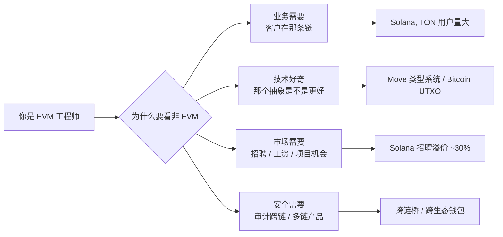

### 0.2 五个心智锚（提前消化）

> **锚 1**：Solana 的"账户" ≠ EVM 的"地址"。它是**带 owner program 的一段裸字节**。
>
> **锚 2**：Cosmos 的"链" ≈ 一个独立 OS。app chain 上线 = 部署应用 + 启验证人；不像 EVM 部署合约。
>
> **锚 3**：Move 的"资源" ≠ 余额。它是**带 ability 系统的对象**（社区习惯叫"线性类型"，严格说更接近**仿射类型 affine**——不带 `copy` 不能复制、不带 `drop` 必须显式消耗、必须有 `key`/`store` 才能落 storage），编译期保证不可复制不可凭空销毁。
>
> **锚 4**：Bitcoin 的"账户余额"是个谎言——链上只有 UTXO（未花输出）；钱包只是把它们加起来给你看。
>
> **锚 5**：每个生态都有自己的"以太坊基金会"。学非 EVM = 要重新建立一套官方信源。

### 0.3 本模块的学习路径（梯度）

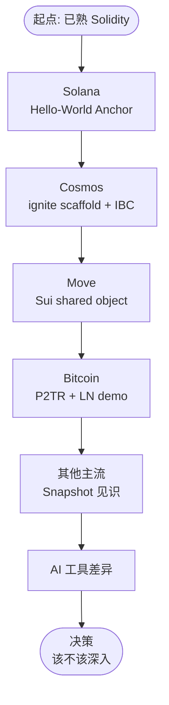

**预计耗时**（动手版）：

| 阶段 | 阅读 | 动手 |
|------|------|------|
| Solana 章 | 60 min | 90 min |
| Cosmos 章 | 50 min | 90 min |
| Move 章 | 60 min | 90 min |
| Bitcoin 章 | 70 min | 90 min |
| 其他 + AI | 40 min | 30 min |
| **合计** | **≈ 4.5 h** | **≈ 6.5 h** |

---

## 1 · Solana 账户模型：状态属于账户而不是合约

> 在 Solana 上，**所有东西都是账户**——钱包、token 余额、合约本身、每个 NFT 都是账户。账户里只有裸字节 (`data: Vec<u8>`) + 一个 `owner` 字段标明哪个 program 有权写入。

### 1.1 与 EVM 的最大差异

EVM 世界：
```
合约 A 内部:
    mapping(address => uint256) balances;   // A 的私有数据
合约 B 想看 A 的 balance? 只能调用 A 暴露的 view 函数
```

Solana 世界：
```
mint 账户          ←  owner = SPL Token Program
token 持有账户 X    ←  owner = SPL Token Program, data 里写 (mint, owner_pubkey, amount)
token 持有账户 Y    ←  owner = SPL Token Program, data 里写 (mint, owner_pubkey, amount)
DEX 撮合账户       ←  owner = DEX Program
```

#### Account 数据结构（节选自 `solana-sdk`）

```rust
pub struct AccountSharedData {
    pub lamports: u64,      // 余额，1 SOL = 10^9 lamports
    pub data: Vec<u8>,      // 状态字节，长度由 init 时指定
    pub owner: Pubkey,      // 哪个 program 拥有 data 写权限
    pub executable: bool,   // 是不是可执行的 program (BPF 字节码)
    pub rent_epoch: Epoch,  // rent 相关，2.x 后基本是 sentinel
}
```

逐字段拆解：

| 字段 | 类比 EVM | Solana 特有点 |
|------|----------|----------------|
| `lamports` | EOA 的 ETH 余额 | **每个账户都有**，包括合约状态账户 |
| `data` | 合约 storage | 是裸 bytes，不是 mapping，**长度提前定** |
| `owner` | （没有对应） | 决定谁能写这段 data；用户 EOA 的 owner = `system_program` |
| `executable` | `extcodesize(addr) > 0` | 显式 flag，不靠代码长度推断 |
| `rent_epoch` | （没有对应） | 历史遗留，2.x 后基本不用 |

### 1.2 实战图解：一笔 SPL Token 转账

Solana 的转账 = 让 SPL Token Program 改两个 token 账户里的 amount 字段。

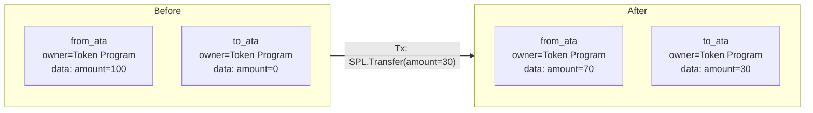

**关键点**：

1. `from_ata`、`to_ata` 都是 ATA（associated token account），**地址由 (wallet, mint) PDA 派生**——
   钱包地址 + 代币 mint 地址 → 唯一确定一个 ATA 地址。
2. 调用者必须**在事务中显式列出这两个账户**（包括只读的 mint 也要列）。
3. 写权限由 `owner == SPL Token Program` 保证——其他 program 想动 amount 字段会被 runtime 拒绝。

#### 一笔事务到底长什么样

```text
Transaction {
  signers: [from_owner_keypair],            // 必须签的私钥
  account_keys: [                            // 事务全局账户表
    from_ata,        // [w]    可写
    to_ata,          // [w]    可写
    from_owner,      // [s]    签名者
    spl_token_prog,  // [r,x]  只读，可执行
  ],
  instructions: [
    Instruction {
      program_id: spl_token_prog,            // 调用谁
      accounts: [from_ata, to_ata, from_owner],
      data: borsh::serialize(TransferIx { amount: 30 }),
    },
  ],
}
```

#### 事务大小约束（产品级影响！）

> **数字记忆点**：单笔 Solana 事务的网络包 ≤ **1232 字节**（1280 MTU - 头）。

后果：

- 账户数（每个 32 B）+ 指令数（每个 ≥ 35 B）有硬上限
- 复杂操作要拆事务或用 lookup table（v0 transaction，最多映射 256 个账户）
- 钱包要替用户算 ATA、找 PDA，不像 EVM "直接 call 合约就行"

> **PDA 一句话**：PDA（Program Derived Address）是**故意构造在 ed25519 曲线之外的地址**（off-curve），因此没有对应的私钥能签名——只有派生它的 program 可以用 `invoke_signed` 代为签名。`bump` 是从 255 开始**递减搜索**的 nonce：把 `(seeds, bump)` 喂给 SHA256 直到结果落在曲线外，找到的第一个有效值即为 canonical bump。生产代码里始终用 canonical bump 并把它存进账户，避免每次重算 `find_program_address`（开销 ~10k CU）。

### 1.3 思考题（章 1）

> Q1：Solana 事务为什么必须显式列出账户？这与并行执行是什么关系？
>
> Q2：PDA（Program Derived Address）和普通账户的根本区别是什么？为什么需要 bump？
>
> Q3：mint 的 `mint_authority` 设成 EOA vs 设成 PDA，分别意味着什么？什么时候选哪个？

---

## 2 · PoH：可验证的全网时钟

PoH（Proof of History）是严格顺序的 SHA-256 哈希链，充当全网公认的时间戳源。任何人"伪造时间"都需反向重算——SHA-256 不可并行加速。

### 2.1 数学定义

$$
h_{n+1} = \text{SHA256}(h_n)
$$

- 递归 SHA 链严格顺序，必须逐步计算
- leader 把事务 T 的 hash 喂进 PoH 链，T 被永久嵌入该时间点
- 全网验证人无需交换"现在几点"，对照 PoH 链验证即可

### 2.2 PoH 不是共识

> **注意**：PoH 不替代共识，仅提供全网公认的时间戳源；共识由 Tower BFT 决定。
> 常见误解："Solana 用 PoH 替代了 PoS/PoW" — **错**。

| 维度 | 时钟（PoH） | 共识（Tower BFT） |
|------|-------------|---------------------|
| 决定什么 | 事务先后顺序 | 哪条 fork 是规范链 |
| 谁在做 | 当前 leader 单机算 | 验证人投票 |
| 输出 | hash 链 + tick | finality |
| 失败模式 | 链上时间错乱（极少） | 出现长 fork |

### 2.3 PoH 的系统红利

1. **降低共识带宽**：PoH 链隐含了事务顺序，验证人无需交换时间戳
2. **leader schedule 可预先计算**：每 slot（400ms）的 leader 在 epoch 开始前抽签确定
3. **流水线友好**：Banking 阶段与 PoH tick 可并行

### 2.4 与其他链的对比

| 链 | 时间源 | 出块时间 |
|----|--------|---------|
| Bitcoin | 矿工 nonce 找到时算"那一刻" | ~10 min |
| Ethereum | 共识层 slot（12s）里所有验证人共识时间 | 12 s |
| Cosmos (CometBFT) | 验证人轮询投票 | 1-6 s（链自定） |
| **Solana (PoH)** | **leader 单机的 SHA 链** | **400 ms** |

### 2.5 思考题（章 2）

> Q1：如果某个 leader 故意提前 PoH 时钟（多算几粒沙），后续验证人能发现吗？怎么发现？
>
> Q2：PoH 的"单线程不可加速"为什么是优势而不是缺陷？

---

## 3 · Tower BFT：PBFT + 指数级 lockout

### 3.1 算法骨架

- PBFT-inspired（受 PBFT 思想启发，但并非严格的 PBFT 变体），把 PoH 当虚拟时钟
- 每个验证人维护一个"投票塔"（vote tower），每次投票后 lockout 时间按 $2^n$ 增长
- 当某条 fork 上的票塔深度达到 32（lockout = $2^{32}$ slots ≈ 数十年），视为 **finality**
- 实际生产中 32 票深度 ≈ 12.8 秒
- "optimistic confirmation"：累计 ≥ 2/3 stake 简单投票即认定（1-2 秒）

### 3.2 与 EVM/Cosmos 共识对比

| 维度 | Bitcoin Nakamoto | Ethereum Casper FFG | CometBFT | Tower BFT |
|------|------------------|----------------------|----------|-----------|
| 最终性 | 概率（6 块 ≈ 1 h） | 2 epoch ≈ 12.8 min | 即时（commit 即 final） | 12.8 s（32 票深） |
| Optimistic 确认 | n/a | 1 slot | 1 块 | 1-2 s |
| 容忍上限 | 50% 算力 | 1/3 stake | 1/3 stake | 1/3 stake |
| 验证人数 | 不限 | 800k+ | 60-180 | ~1500 |

### 3.3 Restaking 与 NCN（Node Consensus Network）

2025 年起 Jito 把"Solana 上的 BFT 共识能力"打包成 service：
- **Jito Restaking**：让 SOL 持有者把 stake 同时押到多个"NCN"
- **NCN**：跑独立投票轮的小型 BFT 网络，复用 Solana 验证人作为节点；典型用例是 oracle、bridge、AVS
- **TipRouter NCN（首个 NCN）**：负责 Jito MEV tip 的去中心化分配，证明 Solana 验证人可以被复用做"链下共识 service"

> 这是 Solana 版的 EigenLayer，但底层执行环境是 SVM，不是 EVM。
>
> **NCN vs EigenLayer AVS 关键差异**：EigenLayer 是 **stake-restake** 模型——把 ETH 质押**本身**重新抵押给多个 AVS，slash 时同一份 stake 被多个服务约束（"stake 重用"）。Jito NCN 更接近 **operator-reuse** 模型——主要复用 Solana 验证人节点（operator）来跑 NCN 的额外共识轮次，NCN 的安全押金以独立的 vault token（如 JitoSOL/JTO）为主，与 Solana 主网共识 stake 并不天然共享 slash 域。换句话说：EigenLayer 重用的是 **stake**，Jito NCN 重用的是 **operator（节点 + 算力）**——两者并不完全等价。

### 3.4 思考题（章 3）

> Q1：为什么 lockout 时间要"指数增长"而不是线性？
>
> Q2：NCN 与 Cosmos 的 Interchain Security 在思想上有何相似/不同？

---

## 4 · Sealevel：账户列表驱动的并行执行

> Sealevel 要求事务**静态声明所有账户**，调度器据此在执行前构造依赖图，互不冲突的事务分到不同 CPU 核并行执行。没填全 = runtime 拒绝入队。

### 4.1 调度算法

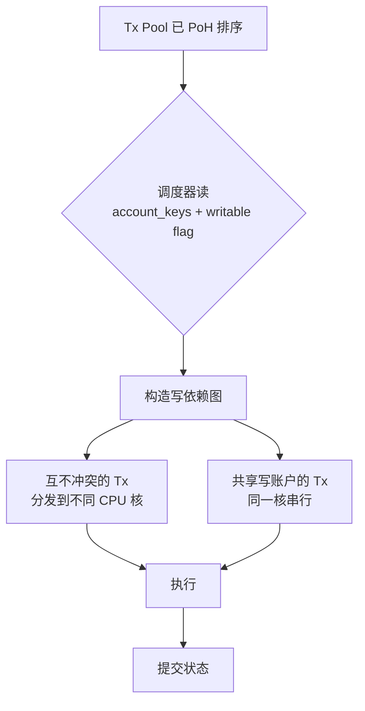

- 写到不同账户的事务 → 真并行；写到同一账户的事务 → 按 PoH 顺序串行

### 4.2 三种并行思路对比

| 思路 | 代表链 | 何时确定冲突 | 失败模式 |
|------|--------|--------------|----------|
| **静态声明** | Solana Sealevel | 事务进入前 | 漏列账户 → runtime 拒绝 |
| **对象隔离** | Sui | 事务进入前（从对象 owner） | owned 对象冲突极少 |
| **乐观并行** | Aptos Block-STM、Monad、Sei v2、Berachain V2 | 事后检测 | 冲突回滚重跑 |
| **串行** | Ethereum、BSC、Polygon PoS | n/a | 简单但慢 |

### 4.3 TPU、Gulf Stream、Turbine

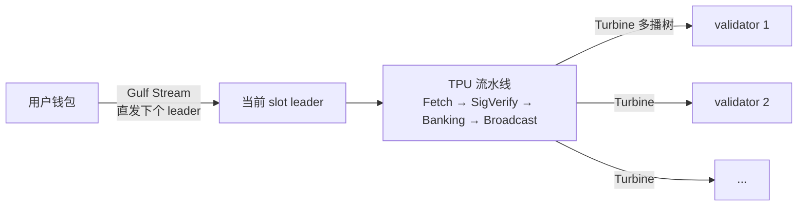

**无传统 mempool**——事务直接路由到下几个 leader（schedule 提前计算好）：
- MEV 发生在 leader 排序权上（Jito 做的就是这一层），不像 EVM 是 mempool 抢跑
- 出块速度 400 ms / slot

### 4.4 思考题（章 4）

> Q1：Sealevel 漏列账户为什么 runtime 拒绝而不是默认串行？这种严格性对开发体验意味着什么？
>
> Q2：相比乐观并行（Aptos / Monad），静态声明在何种 workload 下吃亏？

---

## 5 · Anchor：Solana 的声明式框架

Anchor (`solana-foundation/anchor`，本教程用 0.31.1；Anchor 1.0 已发布但生态尚未全量迁移，0.31.1 仍是主流兼容版本) 用 Rust 过程宏把指令分发、账户校验、序列化、PDA 派生声明化，省去 60-70% 手写代码。

#### 三件套：程序 + IDL + 客户端

```
programs/counter/src/lib.rs   ← Rust 程序，用 Anchor 宏写
target/idl/counter.json        ← anchor build 自动生成的 IDL
tests/counter.ts               ← TypeScript 客户端，用 IDL 做类型化 RPC
```

#### 核心代码（来自 `code/solana/programs/counter/src/lib.rs`）

```rust
use anchor_lang::prelude::*;

declare_id!("Cou1terXXXXXXXXXXXXXXXXXXXXXXXXXXXXXXXXXXX1");

#[program]
pub mod counter {
    use super::*;

    /// 初始化属于 authority 的 counter PDA。
    /// 种子: ["counter", authority.key()]
    pub fn initialize(ctx: Context<Initialize>) -> Result<()> {
        let counter = &mut ctx.accounts.counter;     // 拿可变引用
        counter.authority = ctx.accounts.authority.key();
        counter.count = 0;
        counter.bump = ctx.bumps.counter;            // 保存 bump 省 gas
        Ok(())
    }

    /// 自增 1，仅 authority 可调
    pub fn increment(ctx: Context<Increment>) -> Result<()> {
        let counter = &mut ctx.accounts.counter;
        counter.count = counter.count
            .checked_add(1)
            .ok_or(CounterError::Overflow)?;          // 显式溢出检查
        Ok(())
    }
}

#[derive(Accounts)]
pub struct Initialize<'info> {
    #[account(
        init,                                         // 这次事务才创建
        payer = authority,                            // 谁付 rent
        space = 8 + Counter::INIT_SPACE,              // 8B discriminator + 数据
        seeds = [b"counter", authority.key().as_ref()],
        bump,                                         // 自动找 canonical bump
    )]
    pub counter: Account<'info, Counter>,             // 自动反序列化 + 校验

    #[account(mut)]
    pub authority: Signer<'info>,                     // 付 rent 要标 mut
    pub system_program: Program<'info, System>,       // create_account CPI
}

#[derive(Accounts)]
pub struct Increment<'info> {
    #[account(
        mut,                                          // 要写
        seeds = [b"counter", authority.key().as_ref()],
        bump = counter.bump,                          // 用保存的 bump，便宜
        has_one = authority,                          // 编译期生成 owner 校验
    )]
    pub counter: Account<'info, Counter>,
    pub authority: Signer<'info>,
}

#[account]
#[derive(InitSpace)]
pub struct Counter {
    pub authority: Pubkey,                            // 32 B
    pub count: u64,                                   // 8 B
    pub bump: u8,                                     // 1 B
}

#[error_code]
pub enum CounterError {
    #[msg("counter overflow")]
    Overflow,
}
```

#### 逐行解读 Anchor 宏帮你做了什么

| 宏 / 属性 | 等价手写代码 |
|-----------|--------------|
| `#[program]` | 生成指令分发函数（match 头 8 字节 discriminator） |
| `#[derive(Accounts)]` | 生成账户结构体的 borsh 反序列化 + 校验 |
| `init, payer, space` | 展开成 `system_program::create_account` CPI + 写 8B discriminator |
| `seeds, bump` | 展开成 `Pubkey::find_program_address` 验证 |
| `has_one = authority` | 编译期生成 `counter.authority == authority.key()` 检查 |
| `Account<'info, T>` | 反序列化 + 校验 owner == 本程序 + 校验 discriminator |
| `Signer<'info>` | 校验 `is_signer == true` |

> **思考框 · 提示**：Anchor 0.31.1 相对 0.30.x 的主要变化是 **栈使用优化** + **Solana v2 工具链兼容**。
> 0.30 的 IDL 用 SPL Account Compression + DAS 索引器普遍能识别，0.31 IDL 格式向后兼容。
> Anchor 1.0 已发布（2026-04 初），但生态（钱包、索引器、第三方框架）尚未全量迁移；本教程用 0.31.1 兼容主流。

#### 对照：Native（无 Anchor）等价骨架

等价 native 实现见 `code/solana/native/lib.rs`。**生产里什么时候放弃 Anchor：**

- DEX / 做市商极致优化（Mango v4、Drift v2、Phoenix）：CU (compute unit) 与字节寸土必争
- 跨多个 program version 的复杂兼容（Anchor 宏对自定义 layout 不够灵活）
- 内核级基础设施：Token、System、AddressLookupTable 都是 native

学习路径：先 Anchor → 读 Phoenix DEX / Mango v4 native 源码 → 看穿 Anchor 宏展开。

### 5.x 思考题（章 5）

> Q1：Anchor 的 `has_one` 约束在编译期生成什么代码？为什么它比 runtime require 更安全？
>
> Q2：什么时候 Anchor 的"自动反序列化"是缺点而不是优点？

---

## 6 · Pinocchio：零依赖 Native Rust 框架

### 6.1 Pinocchio 定位

**Pinocchio**（Anza 维护，2024-2025 兴起）是**零依赖**的 Native Rust 框架，专为 CU 和二进制大小敏感的程序设计。无需 `solana-program` crate，账户和指令数据以字节切片**零拷贝**读取。

### 6.2 Pinocchio 与 Anchor / 传统 Native 对比

| 维度 | Anchor 1.0 | 传统 Native (`solana-program`) | Pinocchio |
|------|-----------|--------------------------------|-----------|
| 依赖项 | 多（anchor-lang、solana-program、borsh...） | 1（solana-program ~150 个传递依赖） | **0**（no_std） |
| 反序列化 | borsh（带堆分配） | borsh（带堆分配） | **零拷贝**，在原 byte slice 上读 |
| 二进制大小 | 100+ KB 起 | 60+ KB 起 | **可低至 5-10 KB** |
| CU 消耗（hello-world） | ~5,000 CU | ~3,000 CU | **~600 CU** |
| 学习曲线 | 中等（宏多） | 高（手写一切） | 高（手写更细） |
| 适用场景 | 90% 应用 | 性能敏感 + Anchor 不够灵活 | 极致优化 + 链上基础设施 |

### 6.3 一段最小 Pinocchio 程序

```rust
#![no_std]
use pinocchio::{
    account_info::AccountInfo, entrypoint, msg,
    program_error::ProgramError, pubkey::Pubkey, ProgramResult,
};

entrypoint!(process_instruction);

pub fn process_instruction(
    _program_id: &Pubkey,
    accounts: &[AccountInfo],
    data: &[u8],
) -> ProgramResult {
    // 第一字节当作 discriminator（不像 Anchor 用 8B）
    match data.first().ok_or(ProgramError::InvalidInstructionData)? {
        0 => initialize(accounts),
        1 => increment(accounts),
        _ => Err(ProgramError::InvalidInstructionData),
    }
}

fn initialize(accounts: &[AccountInfo]) -> ProgramResult {
    let counter = &accounts[0];
    let mut data = counter.try_borrow_mut_data()?;
    if data.len() < 8 {
        return Err(ProgramError::AccountDataTooSmall);
    }
    data[..8].copy_from_slice(&0u64.to_le_bytes());   // 直接写裸字节
    msg!("init");
    Ok(())
}

fn increment(accounts: &[AccountInfo]) -> ProgramResult {
    let counter = &accounts[0];
    let mut data = counter.try_borrow_mut_data()?;
    let mut buf = [0u8; 8];
    buf.copy_from_slice(&data[..8]);
    let v = u64::from_le_bytes(buf).checked_add(1).ok_or(ProgramError::ArithmeticOverflow)?;
    data[..8].copy_from_slice(&v.to_le_bytes());
    Ok(())
}
```

### 6.4 何时该用 Pinocchio

✅ 适合：
- 高频 DEX / 撮合引擎核心程序
- 大型 program 的热路径（比如 SPL Token Program 本身）
- 需要 < 1 KB 二进制的"嵌入式"程序（比如 Pyth oracle 的更新指令）
- 对 IDL 兼容性无要求（不需要 web 前端自动调用）

❌ 不适合：
- 一般 dApp 业务逻辑（Anchor 足够）
- 团队里没有 Native Solana 经验
- 需要 IDL 给前端做类型生成（Pinocchio 没有 IDL 工具）

### 6.5 思考题（章 6）

> Q1：Pinocchio 把 discriminator 从 8B 缩到 1B，这有什么收益？什么时候不安全？
>
> Q2：Helius / Drift / Phoenix 等明星项目为什么开始用 Pinocchio 重写？

---

## 7 · SPL Token、Token-2022 与 Compressed NFT

> **EVM**：每个 ERC-20 是一个独立合约。**Solana**：一个共享 Token Program，每种代币是一个 Mint 账户，每个余额是一个 Token 账户。

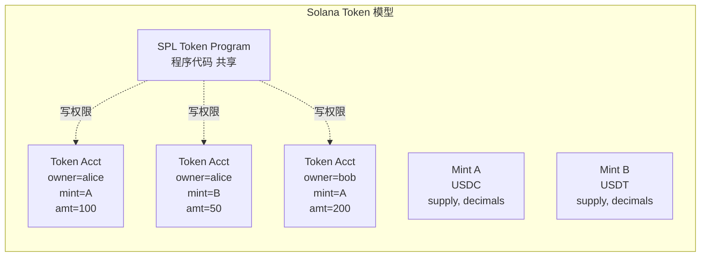

#### SPL Token vs Token-2022（Token Extensions）

| 对比项 | SPL Token (经典) | Token-2022 |
|--------|------------------|-----------|
| Program ID | `TokenkegQfeZyiNwAJbNbGKPFXCWuBvf9Ss623VQ5DA` | `TokenzQdBNbLqP5VEhdkAS6EPFLC1PHnBqCXEpPxuEb` |
| 转账钩子 | ❌ | ✅ Transfer Hook（每次 transfer 调用一段自定义 program） |
| 利息累加 | ❌ | ✅ Interest-bearing（按 timestamp 自动 accrue） |
| 转账费 | ❌ | ✅ 协议级 fee on transfer（不是 hack） |
| 隐私转账 | ❌ | ✅ Confidential Transfer（zk + ElGamal） |
| 永久代理 | ❌ | ✅ Permanent Delegate（合规必备） |
| 元数据指针 | ❌ Metaplex 单独存 | ✅ MetadataPointer + 内联元数据 |
| 默认账户状态 | ❌ | ✅ Default Frozen（KYC 友好） |

> **重要**：Token-2022 是**并行的另一套 program**，不是 SPL Token 升级版。USDC/USDT 仍在 SPL Token；PayPal PYUSD 等合规稳定币大多用 Token-2022。**客户端必须区分 owner = TokenkegQ... 还是 TokenzQd...**。

### 7.x 思考题（章 7）

> Q1：为什么 Solana 把 token 余额做成"独立账户"而不是合约里的 mapping？这种设计在并行执行时有什么收益？
>
> Q2：Token-2022 transfer hook 与 ERC-1363 的相似与差异？

---

## 8 · cNFT 与 ZK Compression：把 NFT 压到 5000 倍便宜

"每个 NFT 一个账户"在百万级 mint 时太贵（rent ≈ 0.002 SOL/账户 → 100 万 NFT 要 2000 SOL）。解法：**链上只存 Merkle root，叶子数据外推到 indexer**。

### 8.1 架构对比

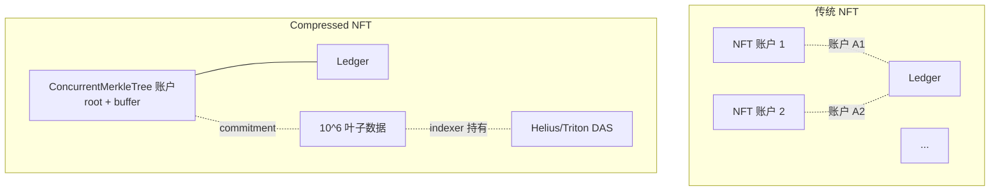

**两代演进**：

- **cNFT v1（2023）**：SPL Account Compression + DAS standard，主要用于 NFT mint。Drip Haus、Helium、Underdog 用得最猛
- **ZK Compression（2024-06，Light Protocol + Helius）→ V2（2025-05）**：
  通用化，不只支持 NFT，也支持 token 与任意账户。V2 比 V1 又便宜 ~70%，
  存 100 个 compressed token 账户 ≈ 0.0004 SOL（普通需 0.2 SOL，**5000x 折扣**）

> **代价**：
> 1. 所有数据要靠 indexer（Helius/Triton/SimpleHash）才能查询，**链上只有 root**
> 2. 客户端调用要先从 indexer 拿 proof，再提交到链上
> 3. indexer 离线 → 资产功能性消失（资产本身在链上，但你看不到也用不了）

### 8.2 应用案例

| 项目 | 用法 | 规模 |
|------|------|------|
| **Drip Haus** | 每周给关注者免费空投 cNFT | 累计千万级 mint |
| **Helium Mobile** | 设备 NFT 标识每一台路由器 | 百万级 |
| **Underdog** | 给品牌做 cNFT loyalty | B2B 主推 |
| **Dialect** | 链上消息附 cNFT 邀请 | 高频 |

### 8.3 思考题（章 8）

> Q1：cNFT 与 EVM 的 ERC-721A、ERC-6551、ERC-7066 在"省 gas"思路上有何根本不同？
>
> Q2：indexer 离线时资产"功能性消失"——这是不是变相中心化？该如何缓解？

---

## 9 · Firedancer：客户端多元化

2026-04 Solana 客户端版图：

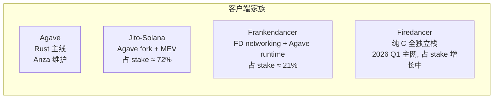

**意义**：单一客户端是单点风险（Solana 2022-2023 因同一 bug 多次停机）。Firedancer（Jump Crypto 纯 C 重写）目标 1M TPS，2026-Q1 主网上线至今 **100% 在线**。协议规范（SIMD）比源码更重要；Anchor/BPF 程序不受客户端切换影响。

### 9.x 数字与里程碑（2026-04 实测）

| 项目 | 状态 |
|------|------|
| Frankendancer 占 stake | ~21%（2025-10） |
| Firedancer 主网激活 | 2026-Q1 |
| 网络在线时间（2026 至今） | 100% |
| 1M USD bug bounty 截止 | 2026-05 |
| Jito-Solana 占 stake | ~72%（仍是主导客户端） |

### 9.x 思考题（章 9）

> Q1：Solana 客户端多元化与 Ethereum 的 Geth/Besu/Erigon/Nethermind/Reth 多客户端在动机上有什么相似？
>
> Q2：纯 C 重写如何降低硬件门槛？这与"去中心化"目标如何相关？

---

## 10 · Jito MEV、TipRouter、Squads

### 10.1 Jito MEV 机制

Solana 无 mempool，事务直发 leader。Jito 给 leader 加"VIP tip 通道"——付额外小费排优先队列，小费按规则分给全网验证人。

### 10.2 Jito 三件套

| 组件 | 作用 |
|------|------|
| **Jito-Solana 客户端** | 一个 Agave fork，集成了 MEV bundle 接收器；占 ~72% stake |
| **Block Engine** | 链下系统，接收用户/搜索者的 bundle（多笔事务原子打包），转发给当前 leader |
| **TipRouter NCN** | 链下节点共识网络，每个 epoch 末计算 MEV tip 的 Merkle root，链上执行分配 |

### 10.3 TipRouter：MEV 的去中心化分配

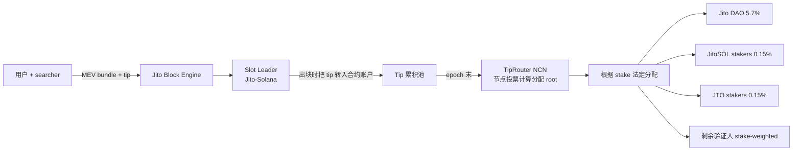

### 10.4 Squads V4：Solana 多签

- 2026 主网管理 **10B+ USD**，已经过形式化验证
- V4 新特性：**roles**（executor/voter/initiator）、**spending limits**（限额无需全员批准）、**whitelisting**、**time locks**
- 客户群：Pyth、Drift、Orca、Mango、Marinade 等几乎所有头部协议
- Program upgrade authority 普遍由 Squads 多签管理（避免单点 EOA）

### 10.5 思考题（章 10）

> Q1：Jito 的 stake-weighted MEV 分配与 Flashbots SUAVE / Ethereum 的 PBS 在思想上有什么关键差异？
>
> Q2：为什么 Squads 在 Solana 上比在 EVM 上"更不可或缺"？（提示：考虑 program upgrade authority）

---

## 11 · Solana Mobile 与 SVM 外延

### 11.1 Saga → Seeker

- **Saga**（2023 上市，2025-09 停止安全补丁）
- **Solana Seeker / Chapter 2**（2025-08 起全球出货，截至 2026-04 累计 200,000+ 出货）
- **预订量**：发布 72 小时内突破 100 万台，成为 **Web3 历史最大硬件发布**
- **价格**：US$450
- **板载**：
  - **Seed Vault**：硬件密钥隔离区
  - **dApp Store**：跳过 Apple/Google 30% 抽成
  - **Genesis Token**：Saga 用户独有的 NFT，可享后续福利
  - 500+ 上架 dApp（截至 2026-04）

### 11.2 SKR 代币：手机即奖励凭证

| 数据 | 值 |
|------|---|
| 上线 | 2026-01-21 |
| 总供应 | 10B SKR |
| 空投占比 | 30% |
| 首批 claim 用户 | 75,000+ |
| 立即质押率 | 46% |
| 链上累计交易量（200k 设备） | $5B+ |

### 11.3 Mobile Wallet Adapter (MWA)

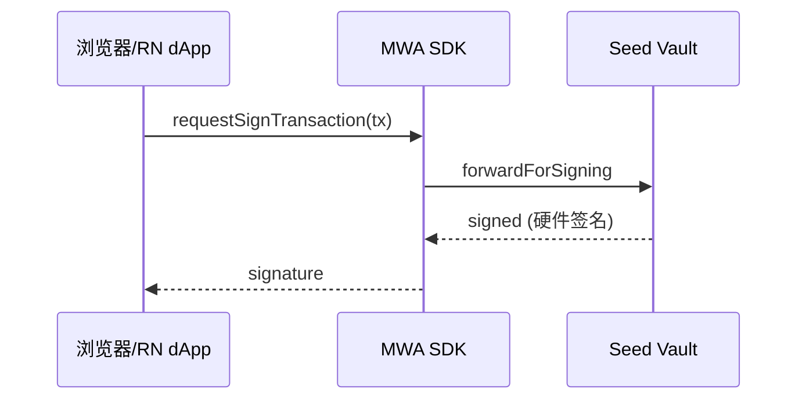

一套 React Native + MWA 可复用 90% web 代码。

### 11.4 SVM 外延：一次写, 多链跑

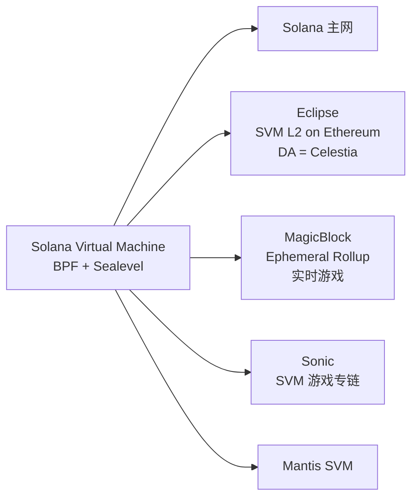

一次 Anchor 编写可跑在 4-5 条链上——非 EVM 里**最成功的 VM 标准化**。

### 11.5 Solana 历史 outage 与稳定性恢复

Solana 早年因为单一客户端 + 高吞吐压力，多次出现整链停机。生产部署前必须知道这段历史：

| 时间 | 持续 | 触发原因 | 修复 |
|------|------|---------|------|
| 2021-09-14 | ~17 h | NFT mint bot 制造 400k tx/s，验证人 OOM 崩溃 | 加 fee market、tx 包大小限制 |
| 2022-01 | 数小时 | 同样 bot 引发 duplicate-tx 风暴 | QUIC 替换 UDP（2022-Q2 上线） |
| 2022-04-30 / 2022-05-01 | ~7 h | 6M NFT mint bot tx 灌爆 leader pipeline | stake-weighted QoS（2022-09 上线） |
| 2022-06-01 | ~4.5 h | 持久 nonce 实现的共识 bug | 紧急 patch + 协议修复 |
| 2022-09-30 | ~6 h | 错配的 fork choice rule（misconfigured validator）| Gossip 协议加固 |
| 2023-02-25 | ~20 h | block propagation bug（forwarder 服务循环）| 客户端补丁 |
| 2024-02-06 | ~5 h | BPF loader cache 实现 bug 触发未定义行为 | Hotfix + Firedancer 路线加速 |

**2024 Q1 之后的恢复**：

- 2024-02-06 是**最后一次主网整链宕机**，至 2026-04 已连续运行约 26 个月（>99.95% 可用性）；
- 关键改动：stake-weighted QoS 全量启用、QUIC 取代 UDP、本地 fee market（priority fee per writable account）、**Firedancer / Frankendancer 客户端**逐步分流（占 ~12% stake，2026-Q1）；
- 客户端多元化是 Ethereum 风格的"软终结"——Agave + Jito-Solana + Frankendancer + Sig（Rust）四客户端并存大幅降低单点 bug 拖垮全网的风险；
- 工程影响：2024 年起 Solana 上的高频做市商、稳定币发行方（USDC、PYUSD）、DePIN 项目恢复入场，TVL 与 DEX 量在 2025 年回到历史高位。

> 教训：选 Solana 上线生产前，把客户端多元化进度、Firedancer share、最近 6 个月有无 leader skip 飙升 都列进上线 checklist。

### 11.6 思考题（章 11）

> Q1：Solana Mobile 的 dApp Store 跳过 Apple/Google 抽成——这种独立分发渠道在 iOS 主导市场可行吗？
>
> Q2：SVM 外延（Eclipse、Sonic、Magicblock）对开发者意味着什么？是不是让 Solana 开发者技能更可迁移？

---

## 12 · Solana 工具链生态（含 AI）

| 工具 | 用途 | 生产级别 |
|------|------|---------|
| **Helius** | RPC + indexer + DAS + webhook | 行业标准 |
| **Triton** | RPC + Yellowstone gRPC（高频订阅） | 顶级 RPC |
| **SimpleHash** | 跨链 NFT 索引 | NFT 项目首选 |
| **Solana Explorer** | 官方区块浏览器 | 入门必备 |
| **Solscan** | 第三方浏览器（更细致的 token analytics） | 替代品 |
| **Solana FM** | 又一个浏览器，方便看 IDL 解析 | 备用 |
| **Birdeye** | 交易/价格分析 | meme 交易必备 |
| **Jito Block Engine** | MEV bundle 提交 | 量化必用 |
| **SendAI / Solana Agent Kit** | AI agent function-calling | 新兴热门 |

#### Solana 的 AI 工具成熟度（2026-04）

> Solana 是非 EVM 里 **AI 工具最成熟**的生态：语料量大（Anchor 项目 1 万+）、Helius/SendAI/Squads 主动做 AI 集成、Anchor IDL 是 JSON 结构化，LLM 理解成本低。

代表 AI 工具：

- **Solana Agent Kit**（前身 SendAI）：100+ 内置操作（swap、stake、mint cNFT、读 Helius DAS），function-calling 风格暴露给 LLM
- **Helius MCP server**：Claude Desktop / Cursor 直接挂 Helius RPC，能实时查任意 mainnet 账户
- **Anchor + Cursor / Claude Code**：IDL 自动生成 TS 类型，自动补全到你想哭
- **Solana Bootcamp by Solana Foundation 2025 版**：含 AI agent 编程章节

实测 LLM 代码质量（基于 2026-04）：

- 写 Anchor counter / vault / staking：**一次过**，与 Solidity 同档
- 写 native Solana program：还会犯账户 ordering 错误，**需人审**
- 写 Token-2022 集成：扩展太多，AI 经常生成"看似对但 mint extension 没启用"的代码 → **必须验证**

### 12.x 实战：Counter Anchor 程序

完整代码见 `code/solana/`。最小跑通路径：

```bash
# 1) 起本地 validator（独立终端）
solana-test-validator --reset

# 2) 配置 CLI
solana config set --url localhost
solana-keygen new -o ~/.config/solana/id.json   # 没 keypair 时
solana airdrop 5

# 3) 构建 + 拿 program_id
cd code/solana
anchor build
solana address -k target/deploy/counter-keypair.json
# 把输出的 ID 写回 lib.rs::declare_id! 与 Anchor.toml [programs.localnet]，再 build 一次
anchor build && anchor deploy

# 4) 跑测试（mocha + @coral-xyz/anchor 0.31.x 客户端）
pnpm install
anchor test --skip-local-validator
```

### 12.x 思考题（Solana 总章）

> **Q1**：cNFT 的"链上 root + 链下 leaf"有什么风险？如果 indexer 全部下线，资产还存在吗？

参考答案见 `exercises/solana-spl-token/README.md`。

> Solana 12 章讲完了"一条链极致优化"的思路：账户模型、PoH 时钟、并行执行、MEV、Mobile、工具链。接下来 Cosmos 走相反路线——**不优化单链，而是让每个应用自己当链**，并用 IBC 互联。

---

## 13 · Cosmos：app-chain 哲学

以太坊"一条链承载所有应用"；Cosmos"每个应用配自己的链"——链是 OS，dApp 是其上的服务，链间通过 IBC 互通资产和消息。

#### EVM vs Cosmos 架构对立

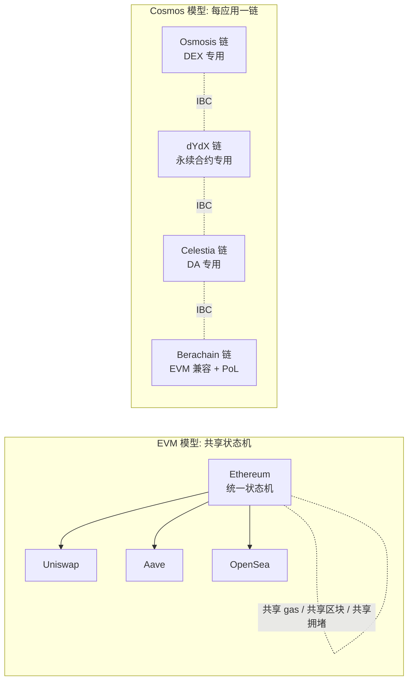

#### 四个动机

1. **吞吐量独占**：DEX 用 100% 区块空间不会被 NFT mint 抢
2. **gas 自主**：自定 gas token、fee market；dYdX 链全免 gas
3. **协议级定制**：改共识参数、出块时间、状态机逻辑（如 Osmosis 超流体质押）
4. **主权**：升级路线、治理、分叉权全在自己手上

#### 代价

> app chain 不是免费午餐：启动 = 招募验证人 + bootstrap 安全（Interchain Security 因此出现）；工具链需自建；IBC 跨链 UX 复杂。"app chain 是终态而非起点"——大多数项目先在 EVM 验证 PMF，做大了再迁。

---

## 14 · Cosmos SDK 模块体系

Cosmos SDK 是 Go 语言的链开发框架，把链拆成若干 `x/*` 模块按需 import。

#### 核心模块速查表（截至 v0.53）

| 模块 | 作用 | 是不是必带 |
|------|------|-----------|
| `x/auth` | 账户、签名、ante handler | 必带 |
| `x/bank` | 多资产余额、转账 | 必带 |
| `x/staking` | PoS 质押、验证人集合 | PoS 链必带 |
| `x/distribution` | 出块奖励分配、佣金 | 配合 staking |
| `x/slashing` | 验证人作恶 / downtime 罚没 | 配合 staking |
| `x/gov` | 链上治理、提案、投票 | 几乎所有 |
| `x/mint` | 通胀发行 | PoS 链常带 |
| `x/ibc` | 跨链通信（ibc-go） | 想互联就带 |
| `x/wasm` | CosmWasm 智能合约引擎 | 想跑合约才带 |
| `x/upgrade` | 链上升级协调 | 强烈推荐 |
| `x/evm` (Evmos/Cronos) | EVM 兼容 | 想跑 Solidity 才带 |
| `x/icq` | Interchain Queries | 想跨链读数据 |
| `x/ica` | Interchain Accounts（host + controller） | 想从 chain A 控制 chain B 账户 |

#### 一个 module 的标准布局

```
x/blog/
├── client/cli/        ← 命令行交互
├── keeper/            ← 状态机核心 (read/write store)
├── types/             ← 消息、事件、错误、protobuf 定义
├── module.go          ← AppModule 接口实现
└── genesis.go         ← 创世状态加载/导出
```

> **module** 是链内核组件，链启动即在，随链升级；**CosmWasm 合约**是跑在 `x/wasm` 上的字节码，链上线后部署。高频/安全敏感/需协议级特权 → module；一般业务逻辑 → CosmWasm。

---

## 15 · CometBFT：即时最终性

CometBFT 是 PBFT 派生的即时最终性 BFT 共识——2/3 验证人在线出块，2/3 同意即终结。

#### 与 Nakamoto / Tower BFT 对比

| 维度 | Nakamoto (BTC) | Tower BFT (Solana) | CometBFT (Cosmos) |
|------|----------------|---------------------|--------------------|
| 最终性 | 概率（6 块 ≈ 1 小时） | optimistic 1-2s, full 12s | **绝对**，commit 即 final |
| 出块时间 | ~10 min | 400 ms | 1-6 s（链自己定） |
| 验证人数 | 不限 | ~1500 (2026) | 通常 60-180 |
| 容忍上限 | 50% 算力 | 1/3 stake | 1/3 stake |
| 核心瓶颈 | PoW 算力 | PoH 单线程 | 投票轮的 O(n²) 通信 |

#### 为什么从 Tendermint 改名 CometBFT

2022 年 Tendermint Inc 与 Cosmos Hub 治理摩擦，社区为与公司品牌切割改名 CometBFT。v0.38 后引入 ABCI++（让应用层在 propose/vote 阶段干预）。2026-04 主流是 v0.38；Babylon、Cosmos Hub、MANTRA 等都在此版本。v0.39 alpha 勿追。

---

## 16 · IBC Eureka v10：跨链互操作

IBC 核心：每条链在对端跑轻客户端验证真实性，relayer 只搬运不能伪造。**IBC Eureka v10**（2025-Q1 主网）用 ZK light client 把协议延伸到 Ethereum、Solana 等非 Cosmos 链。

### 16.1 协议分层

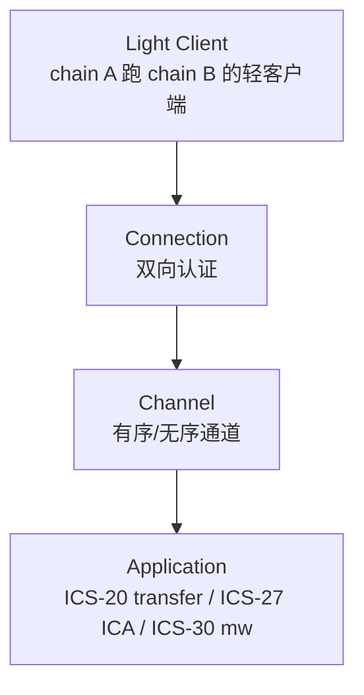

> **关键术语**：
>
> - **light client**：在 chain A 上验证 chain B 区块头与状态证明的一段代码
> - **connection**：一对 light client 实例，互相认证后建立"通道"
> - **channel**：连接之上的有序消息流
> - **packet**：channel 上传的一条消息（含 timeout、proof）
> - **relayer**：负责把 packet 从 chain A 搬到 chain B 的链下进程（hermes、rly、go-relayer）

#### 一笔 ICS-20 跨链转账的完整流程

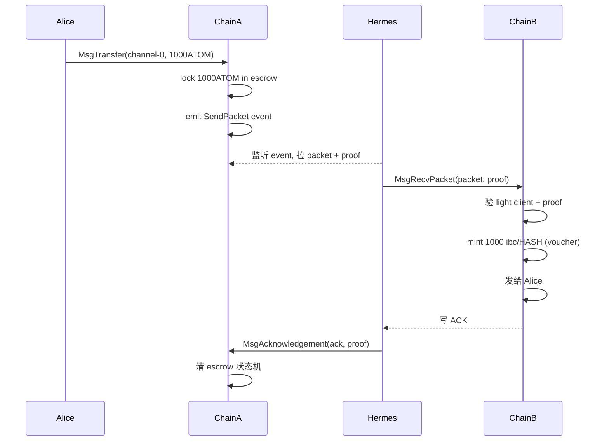

#### 信任模型

> **IBC 是 trust-minimized，不是 trustless**：信任 chain A/B 各自共识 + light client 代码（ibc-go）。不信任 relayer（relayer 只搬运 proof，链上验证）。chain B 的 ⅔ 验证人作恶 → chain A 上的 light client 也接受错误状态——这是 Interchain Security 出现的原因（让小链共享 Hub 验证人集合）。

### 16.2 IBC 版本路线图（2026-04）

| 版本 | 时间 | 状态 |
|------|------|------|
| **ibc-go v8** | 2024 上半年 | 当前主网主流（与 CometBFT v0.38 兼容） |
| **ibc-go v9** | 计划取消 | **已废弃**——直接跳到 v10 |
| **ibc-go v10 = IBC Eureka** | **2025-04-10 主网激活** | Cosmos ↔ Ethereum 直连，ZK light client 验证 |
| **2026 路线** | Q2-Q3 | Solana light client、通用 EVM/L2 light client |

**Eureka 关键创新**：
- **无 connection 模式**：跨链发送资产像点击一样简单（"1-click bridging"）
- **ZK light client**：在 Ethereum 验证 Cosmos 区块头时用 Succinct SP1 生成 zk proof，避免在 EVM 上跑昂贵的 CometBFT 验签
- **首笔交易**：2025-03-28 ATOM ↔ Ethereum 跨链转账成功
- **市场覆盖**：连接 120+ Cosmos 链 + Ethereum，目标市值覆盖 260B+ USD

### 16.x 思考题（章 16）

> Q1：IBC Eureka 用 ZK light client 让 Ethereum 能"廉价验证"CometBFT 区块头——这与 LayerZero、Wormhole 的"信任 oracle 集合"设计有什么本质差异？
>
> Q2：如果 chain B 的 ⅔ 验证人作恶，chain A 上的 voucher 会怎样？谁来兜底？

---

## 17 · CosmWasm 3.0：WASM 合约引擎

CosmWasm：Rust 编写、编译成 WASM、部署到任何带 `x/wasm` 模块的 Cosmos 链。

#### 与 EVM 合约的差异

| 维度 | EVM | CosmWasm |
|------|-----|----------|
| 字节码 | EVM bytecode | WebAssembly |
| 主语言 | Solidity / Vyper | Rust（极少 AssemblyScript） |
| 入口模型 | 多个 public function | 三个标准入口：`instantiate / execute / query` |
| 状态访问 | storage slot (32B-32B mapping) | KV store + cosmwasm-storage helpers |
| Gas | 复杂规则 | 单一 gas meter（按 WASM op 计费） |
| 合约间调用 | call / delegatecall / staticcall | sub-message + reply（异步！） |

#### 一个最小 CosmWasm 合约骨架

```rust
use cosmwasm_std::{entry_point, DepsMut, Env, MessageInfo, Response, StdResult};

#[entry_point]
pub fn instantiate(_deps: DepsMut, _env: Env, _info: MessageInfo, _msg: InitMsg) -> StdResult<Response> {
    Ok(Response::default())
}

#[entry_point]
pub fn execute(deps: DepsMut, _env: Env, info: MessageInfo, msg: ExecuteMsg) -> StdResult<Response> {
    match msg {
        ExecuteMsg::Increment {} => {
            let mut state = STATE.load(deps.storage)?;
            state.count += 1;
            STATE.save(deps.storage, &state)?;
            Ok(Response::new().add_attribute("action", "increment"))
        }
    }
}

#[entry_point]
pub fn query(deps: Deps, _env: Env, msg: QueryMsg) -> StdResult<Binary> {
    match msg {
        QueryMsg::GetCount {} => to_json_binary(&STATE.load(deps.storage)?.count),
    }
}
```

> CosmWasm 合约间调用**异步**：调用 sub-message 后，本笔事务先执行完，reply 回来另算一次执行。这堵死了 EVM 重入攻击整个分类（DAO hack 那种），代价是复杂业务需"事件驱动"思考。

#### CosmWasm 合约 vs module 决策树

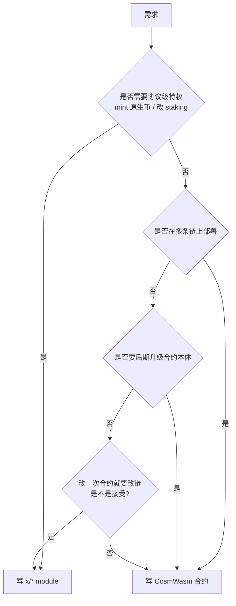

### 17.x CosmWasm 3.0 与 IBCv2、Sylvia（2026-04）

| 版本 | 关键特性 |
|------|---------|
| CosmWasm 1.x | 基础合约引擎 |
| CosmWasm 2.0（2024） | ICS-20 memo field、IBC hooks 友好、ADR-8 准备 |
| **CosmWasm 3.0** | **IBCv2 协议集成**：新增 `ibc2_packet_send` / `ibc2_packet_receive` / `ibc2_packet_ack` / `ibc2_packet_timeout` 入口；与 wasmd 0.61 同步发布 |
| **Sylvia** 框架 | 类似 Anchor 的合约开发抽象层；trait-based 的 contract definition；逐步成为 CosmWasm 生态首选高级 DSL |

### 17.x 思考题（章 17）

> Q1：CosmWasm 异步 sub-message 模型避免了哪类 EVM 攻击？复杂业务时该如何组织代码？
>
> Q2：在何种情况下你会选 module（写进链）而非 CosmWasm 合约？

---

## 18 · Interchain Security 与 Mesh Security

小链无需自己 bootstrap 验证人集合，**租用** Cosmos Hub 的验证人来出块。

#### 三代 ICS

| 代 | 名字 | 特点 | 状态 (2026-04) |
|----|------|------|----------------|
| **v1** | Replicated Security | 消费链完全共享 Hub 验证人集合 | 已上线（Neutron、Stride 用） |
| **v2** | Opt-in / Partial Set Security | Hub 验证人选择性参与 | 已上线 |
| **v3** | Mesh Security | 双向：消费链也质押到 Hub 验证人 | 测试网 / 部分上线 |

#### Mesh Security 的图

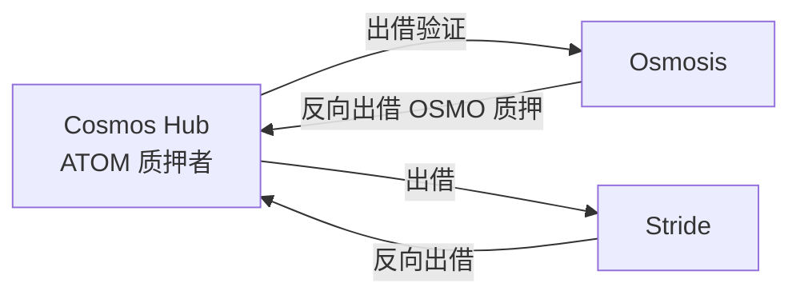

**思想**：跨链双向质押，谁的安全谁出钱。与 EigenLayer"统一 ETH 担保所有 AVS"截然不同——Cosmos 走"每条链安全外推 + 内引"路线。

### 18.x ICS / PSS / Mesh 路线图（2026-04）

| 阶段 | 名字 | 状态 |
|------|------|------|
| ICS v1 | Replicated Security | Neutron / Stride 已用 |
| **ICS v2 / PSS** | **Partial Set Security**（opt-in / top-N） | Cosmos Hub 主网逐步迁移 |
| **ICS v3 / Mesh** | **Mesh Security**（双向 stake） | 仍在 Phase 2 测试网（Osmosis/Juno/Akash 协作）；2026 主网未定 |

### 18.x 思考题（章 18）

> Q1：Replicated Security 让小链共享 Hub 验证人，PSS 让验证人 opt-in，Mesh 让两边互相质押——三者在去中心化与启动成本上各有什么权衡？
>
> Q2：Babylon BTC staking 与 ICS/Mesh 是不是冲突？还是互补？

---

## 19 · Cosmos 主流链巡礼

#### Cosmos Hub (ATOM)

- **角色**：联邦的"首都"、ICS provider
- **特色**：ATOM 2.0 改革（2024-2025 实施）后定位为安全提供方
- **2026-04 状态**：Hub v18+，跑 Cosmos SDK v0.53、CometBFT v0.38、ibc-go v8

#### Osmosis (OSMO)

- **角色**：Cosmos 最大 DEX
- **特色**：超流体质押（superfluid staking）、Concentrated Liquidity、Token Factory
- **应用层**：内部 CosmWasm 合约 + 协议级 module 混合

#### dYdX v4 (DYDX)

- **角色**：永续合约专链（从 StarkEx L2 迁过来的）
- **特色**：完全链上 orderbook，所有验证人维护一份内存中的撮合簿
- **意义**：证明 app chain 能扛 DeFi 顶级吞吐

#### Celestia (TIA)

- **角色**：模块化区块链的 DA 层
- **特色**：只做 data availability，不做执行；用 Reed-Solomon + DAS（不是 ZK Compression 那个 DAS）
- **生态**：Manta、Astria、Movement L2 等都用 Celestia 当 DA

#### Berachain (BERA)

- **角色**：EVM 兼容 + Proof-of-Liquidity 共识
- **2026 状态**：V1 用了 Polaris VM；**V2（2025-2026 升级）抛弃 Polaris**，改用 BeaconKit 让任意 EVM 客户端接入
- **特色**：三代币模型（BERA gas / BGT 治理 / HONEY 稳定币）

#### Sei v2 / EVM-only

- **2026-04 状态**：4 月 6-8 日完成"EVM-only Architecture"迁移，**抛弃 Cosmos/EVM 双栈**，变成纯 EVM L1
- **意义**：app chain 体系并非铁板一块；体量大了之后**回归 EVM 兼容**也是一种选择

#### Neutron / Stargaze / Injective

- **Neutron**：纯 CosmWasm 链，主打跨链 DeFi；用 Replicated Security
- **Stargaze**：Cosmos 上的 NFT 主战场；CosmWasm 合约
- **Injective**：金融衍生品专链，自带订单簿 module

#### Babylon (BABY)

- **角色**：把 Bitcoin 安全引入 Cosmos 链 ("BTC staking")
- **2026-04 状态**：Phase-1 主网累计 57000+ BTC（≈ 4B+ USD TVL），Phase-2 EVM-DeFi 上线
- **意义**：BTC 与 Cosmos 联姻，**两条最古老/最年轻 PoS 体系互保**

#### Initia / Allora / Warden / MANTRA / Crypto.com

- **Initia**：Move 与 Cosmos 双栈，目标做"应用链编排层"，下面挂多种 rollup
- **Allora**：分布式 AI 网络（建在 Cosmos 之上），目标 oracle + 推理任务
- **Warden Protocol**：链抽象 + 多链密钥管理（threshold + MPC + AVS）
- **MANTRA**：RWA 监管友好链
- **Cronos** / **Crypto.com chain**：CDC 自家 EVM 兼容链，零售用户量大

### 19.2 决策表：你的 dApp 该建在哪条 Cosmos 链上

| 你的需求 | 推荐链 |
|---------|--------|
| 自由度最高（自己做共识参数） | 自起 chain (Ignite) |
| CosmWasm 合约部署，跨链 DeFi | Neutron / Osmosis |
| NFT 项目 | Stargaze |
| 永续合约 / 衍生品 | Injective / dYdX |
| BTC 安全 | Babylon BSN consumer chain |
| EVM 兼容（保留 Cosmos 共识） | Berachain V2 / Cronos |
| 完全 EVM 化（不用 Cosmos） | Sei EVM-only |
| 模块化 DA | Celestia / EigenDA |
| AI / Agent | Allora / Cocoon (TON) |
| 主权但共享安全 | Replicated Security 消费链 |

### 19.3 实战：用 Ignite 起一条链

完整步骤见 `code/cosmos/README.md`。最小路径：

```bash
# 1) 装 Ignite v28
curl https://get.ignite.com/cli! | bash

# 2) 一键脚本（创建 blogchain + blog module + post CRUD）
cd code/cosmos
bash bootstrap.sh        # 内部依次 scaffold chain / module / list

# 3) 验证
blogchaind tx blog create-post "first" "hello cosmos" --from alice -y
blogchaind q blog list-post

# 4) 自定义：加 1 BLOG 提交费
# 见 customizations/msg_server_post.go.patch
```

### 19.4 Cosmos 的 AI 工具成熟度

> 成熟度**中等偏弱**，落后 Solana 一档。

主要工具：

- **Cosmos AI agent kits**：少数项目（Lavender.Five 等）做了，function-calling 覆盖 IBC transfer / staking / governance
- **MCP for chain RPC**：Neutron、Osmosis 团队在做 MCP server，让 LLM 能查模块状态
- **CosmWasm 代码生成**：LLM 写 CosmWasm 合约的能力比 Solidity 弱 30-40%（语料少 + Rust trait 复杂）
- **链上 governance 自动分析**：Skip / Nansen / Mintscan 提供 LLM 辅助的提案摘要

实测 LLM 代码质量（2026-04）：

- 写 Cosmos SDK module（keeper/msg_server）：能写但容易遗漏 invariants check
- 写 CosmWasm 合约：能写 hello-world，复杂业务（多 sub-message）需深审
- IBC relayer 配置：基本只能给 boilerplate

### 19.5 思考题（Cosmos 总章）

> **Q1**：dYdX 从 StarkEx L2 迁到独立 Cosmos 链的核心理由？这与 Sei v2 反向走"回归 EVM"是否矛盾？
>
> **Q2**：IBC channel close 后，已在对端 chain 上的 voucher token 如何处理？

> Cosmos 7 章讲完了"每应用一链 + IBC 互联"。Solana 和 Cosmos 都在运行时层解决安全问题（runtime 拒绝 / 共识罚没）。接下来 Move 系走另一条路——**把安全保证下沉到编程语言的类型系统**，在编译期就堵死整个漏洞类别。

---

## 20 · 资源模型：用类型系统封装资产

Move 把"资产"做成**有线性类型的对象**——编译期保证不可复制、不可凭空消失，必须显式 transfer / store / destroy。

#### 与 Solidity 的根本对立

```solidity
// Solidity: 余额是 mapping 里的数字
mapping(address => uint256) balances;
function transfer(address to, uint256 amount) public {
    balances[msg.sender] -= amount;   // 减一个数
    balances[to] += amount;           // 加一个数
}
// 数字加加减减 → 漏洞重灾区（reentrancy / overflow / 弄丢）
```

```move
// Move (Sui): 资产是有类型的对象
public struct Coin<phantom T> has key, store {
    id: UID,
    value: u64,
}
public fun transfer<T>(coin: Coin<T>, recipient: address) {
    sui::transfer::transfer(coin, recipient);   // 整个对象 move 过去
}
// 编译器检查: coin 在函数结束前必须被消耗（transfer / 解构 / 存储），否则编译失败
// 资产永远不会被"忘记"
```

> Solidity 的 `uint256 amount` 是**值**（可复制可加减）；Move 的 `Coin<T>` 是**资源**（只能 move，堵死"凭空铸币/凭空消失"整个漏洞类别）。

#### Move 起源

- 2019 年 Facebook Libra/Diem 项目里发明（首席设计师 Sam Blackshear）
- Diem 黄了 Move 活了，分裂成两大方言：**Sui Move** vs **Aptos Move**
- 共同祖先是 Diem Move，但两边为了适配各自执行模型做了**不兼容**的扩展
- Move 编译器同时支持两种 edition，但写好的代码**几乎不可能跨链复用**

#### 四种"能力" (Abilities)

Move 的所有 struct 必须显式声明拥有哪些能力：

| 能力 | 含义 | 典型用法 |
|------|------|---------|
| `copy` | 可被复制 | 仅普通值类型（如配置、常量）使用 |
| `drop` | 可被丢弃 | 普通值；资源**绝对不能** drop |
| `store` | 可放进其他 struct 内部 | NFT、token 等会被嵌套的资产 |
| `key` | 可作为顶层全局对象 | Sui object / Aptos resource 必带 |

> `Coin` 只有 `key, store`，无 `copy, drop`——编译器禁止复制或丢弃，一行能力声明替代了 SafeMath + reentrancy guard。

### 20.x 思考题（章 20）

> Q1：Move 的 `Coin<T>` 类型只有 `key, store`、没有 `copy, drop`——这两条限制堵死了哪些 Solidity 漏洞类别？
>
> Q2：Diem 项目失败但 Move 活了——这种"语言可独立生存"在区块链史上有先例吗？

---

## 21 · Sui 对象模型与 Mysticeti DAG

### 21.1 Sui Move vs Aptos Move

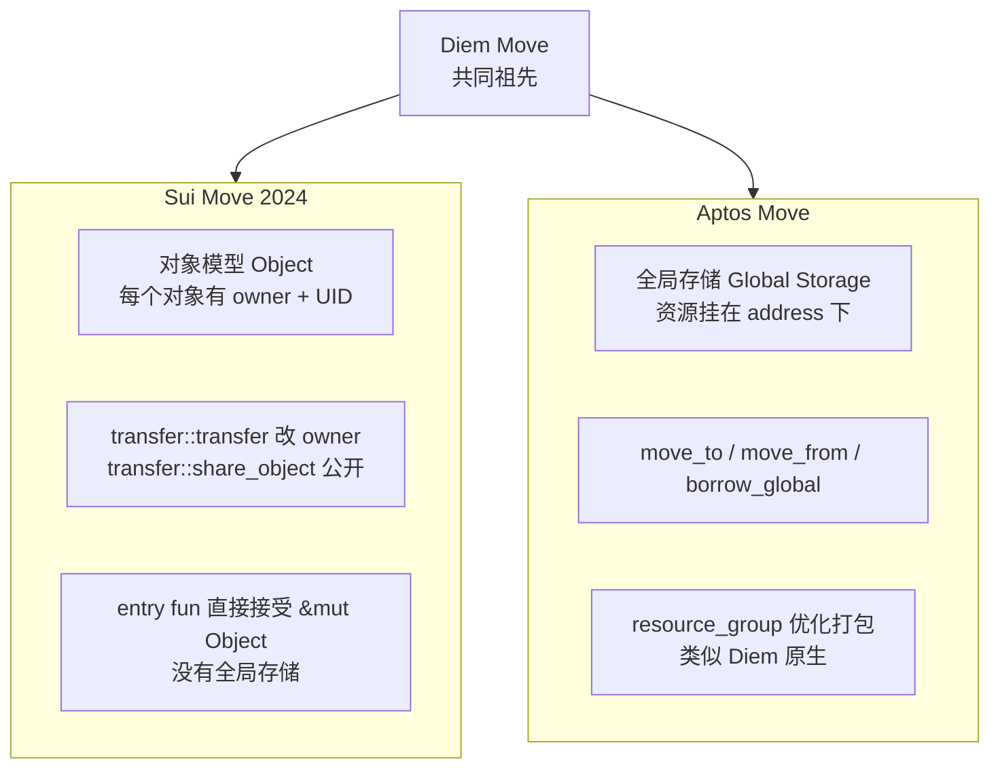

#### 二选一对照表

| 维度 | Sui Move | Aptos Move | 翻译成 Solidity |
|------|----------|------------|------------------|
| 状态归属 | 每个 Object 自带 owner 字段 | 资源挂在某 address 的 global storage 下 | 状态全在合约里 mapping |
| 创建资产 | `object::new(ctx)` 拿 UID | `move_to<T>(signer, ...)` | `new T()` |
| 转账 | `transfer::transfer(obj, addr)` | `move_from + move_to` 改 owner | `mapping[a]--; mapping[b]++` |
| 共享读写 | `transfer::share_object(obj)` | 资源挂在某固定 address，任何人读，作者写 | `mapping(address=>T)` |
| 并行执行 | **静态对象隔离**（不同 owner 天然并行） | **Block-STM 乐观并行**（冲突就回滚） | 串行 |
| 共识 | Mysticeti DAG（v2 主网） | AptosBFT v4 + Raptr (2026 路线) | 串行 PoS |
| 形式验证 | Move Prover（实验） | Move Prover（生产用于 framework） | 几乎没有 |
| 主语言版本 | Move 2024 edition | Aptos Move（含 resource_group） | Solidity 0.8.x |
| 包升级 | Package upgrade（不可变 + 新版本指针） | direct upgrade（同地址覆盖） | proxy + impl |
| 标准币 | `sui::coin::Coin<T>` | `aptos_framework::coin::CoinStore<T>` | ERC-20 |
| FT 标准（新） | `sui::token::Token` | `aptos_framework::fungible_asset::FungibleStore` | — |

### 21.2 Sui 对象模型

Sui 把"全局状态"砸成无数个互不相干的对象——这是静态并行的核心。

#### 三种对象所有权

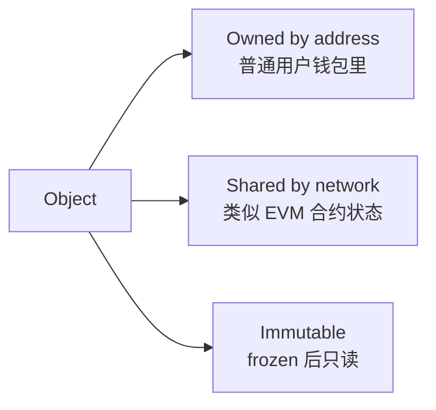

| 类型 | 创建方式 | 可写 | 谁能用作 input |
|------|---------|------|-----------------|
| **Owned** | `transfer::transfer(obj, addr)` | 是 | 只有 owner |
| **Shared** | `transfer::share_object(obj)` | 是 | 任何人（共识层串行写） |
| **Immutable** | `transfer::freeze_object(obj)` | 否 | 任何人（仅读，永远不冲突） |

> Sui 并行原理：owned 对象的事务天然不冲突，调度器静态判断为独立 → 真正并行。与 Sealevel "显式声明账户列表"思路类似，但 Sui 做成了**类型系统级别**的保证。

#### Sui 对象的标准头

```move
public struct Counter has key {
    id: UID,           // sui::object::UID, 全网唯一标识
    owner: address,    // 业务字段，跟所有权字段无关
    value: u64,
}
```

- `has key` 能力：表示这是顶层对象，能成为事务参数
- `UID`：分配自全局 ID 池，永不重复，**不可复制不可销毁**（必须 `object::delete(id)` 才能丢）
- 字段限制：嵌套对象用 `has store` 能力，不能直接复制

#### Capability 模式

```move
public struct AdminCap has key, store { id: UID }   // 特权凭证

public entry fun create_protocol(ctx: &mut TxContext) {
    transfer::transfer(AdminCap { id: object::new(ctx) }, tx_context::sender(ctx));
    transfer::share_object(Treasury { id: object::new(ctx), balance: 0 });
}

public entry fun withdraw(_cap: &AdminCap, t: &mut Treasury, amount: u64) {
    // 调用者必须出示 AdminCap 这个对象，才能 borrow_mut t
    t.balance = t.balance - amount;
}
```

> Solidity `Ownable` 用 `address public owner` + modifier；Sui 把权限做成对象——转让 = `transfer::transfer(cap, new_admin)`，撤销 = `object::delete(id)` 销毁 cap，无需 onlyOwner modifier。

#### Sui 实战：counter shared object

完整代码见 `code/move/sources/counter.move`：

```move
module counter::counter;
use sui::event;

public struct Counter has key {            // shared 对象
    id: UID,
    owner: address,
    value: u64,
}

public struct AdminCap has key, store {    // owned 凭证
    id: UID,
}

public entry fun create(ctx: &mut TxContext) {
    let sender = tx_context::sender(ctx);
    let counter = Counter { id: object::new(ctx), owner: sender, value: 0 };
    let cap = AdminCap { id: object::new(ctx) };
    transfer::transfer(cap, sender);        // owned: 给 sender
    transfer::share_object(counter);        // shared: 公开
}

public entry fun increment(c: &mut Counter) {
    c.value = c.value + 1;
    event::emit(Incremented { counter_id: object::id(c), new_value: c.value });
}

public entry fun reset(_cap: &AdminCap, c: &mut Counter) {
    c.value = 0;                            // 只有持 cap 的人能 reset
}
```

**关键点**：
1. 传 cap 即转让权限（Capability 模式）
2. 无 `msg.sender`，用 `tx_context::sender(ctx)` 获取发起者
3. shared object 的写走 Mysticeti 共识排序

### 21.3 Mysticeti：Sui 的 DAG 共识

Mysticeti v2 是 Sui 现役共识，Byzantine WAN 0.5 秒 commit，理论 200k+ TPS，**owned 对象事务可绕过共识（Fast Path）**。

#### 双轨共识

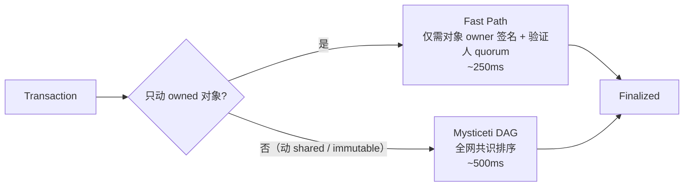

**Fast Path**：给 Alice 转 1 SUI（owned 对象）→ 不需要全网共识，⅔ 验证人签名即 final，p99 < 300ms。

#### Mysticeti v2 性能（2025 升级）

| 指标 | Mysticeti v1 | Mysticeti v2 | 改善 |
|------|--------------|--------------|------|
| p50 latency | 70 ms | 67 ms | -5% |
| p95 latency | 114 ms | 90 ms | -20% |
| p99 latency | 156 ms | 114 ms | -27% |
| 理论 TPS | 200k+ | 200k+ | — |

**工程师原则**：优先用 owned 对象享 fast path；shared 对象仅在必须共享状态时用（DEX 池子、拍卖、leaderboard）。

### 21.x 思考题（章 21）

> Q1：Sui 的 fast path（owned object 不走共识）是它能 < 300ms 的关键——为什么 Solana 没有这种"绕过共识"路径？
>
> Q2：shared object 的写仍要走 Mysticeti 共识——这与 EVM 合约状态写在并发性上有何相同/不同？

---

## 22 · Aptos 全局存储与 Block-STM

### 22.1 Aptos 的全局存储模型

Aptos 沿用 Diem Move 的"resource lives at an address"风格，资源**挂在某个 address 的 storage slot 上**，不是独立对象。

#### 核心 API

```move
module default::counter {
    struct Counter has key {     // has key 在 Aptos 里 = 能存到 global storage
        value: u64,
    }

    public entry fun initialize(account: &signer) {
        move_to(account, Counter { value: 0 });        // 挂到 signer.address 下
    }

    public entry fun increment(account: &signer) acquires Counter {
        let addr = signer::address_of(account);
        let c = borrow_global_mut<Counter>(addr);      // 从 global storage 借出
        c.value = c.value + 1;
    }

    #[view]
    public fun get(addr: address): u64 acquires Counter {
        borrow_global<Counter>(addr).value             // 只读借出
    }
}
```

#### Sui vs Aptos 同语义对比

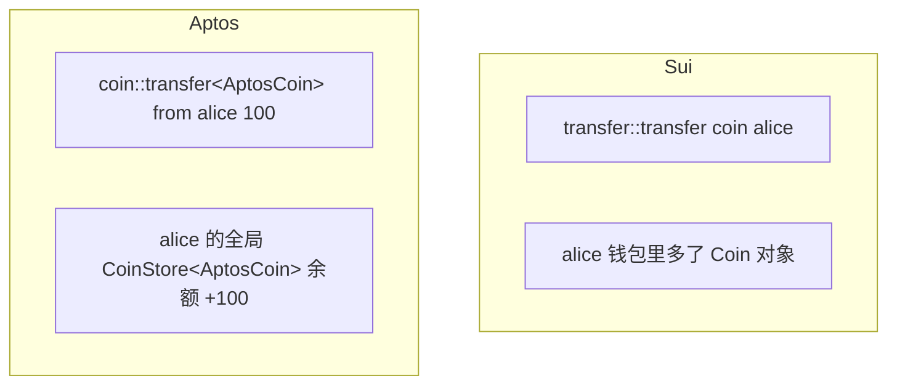

#### Resource Group：Aptos 的存储优化

```move
#[resource_group(scope = global)]
struct ProfileGroup {}

#[resource_group_member(group = ProfileGroup)]
struct Username has key { value: String }

#[resource_group_member(group = ProfileGroup)]
struct Avatar has key { url: String }
```

- 同一个 address 下属于同一 resource group 的资源会**打包成一条 storage**，节省 IO
- 这是 Aptos 独有的；Sui 因为没有"挂 address"概念所以不需要

#### Aptos 的 fungible_asset：从 Coin 到 FA

详见 22.4 节的 FA 标准对比。

### 22.2 Block-STM：Aptos 的乐观并行

Aptos **不要求声明读写集**，全部假设无冲突并发执行；事后检测冲突，冲突的回滚重跑。

#### 算法骨架

```mermaid
flowchart TB
    A[block 进来 N 笔事务] --> B[分配到 K 个 worker thread]
    B --> C[每个 worker 取一笔事务<br>乐观执行<br>记录 read set / write set]
    C --> D[写到 multi-version<br>状态存储 MVStore]
    D --> E{检查冲突<br>读到的 version 还是最新吗?}
    E -- 是 --> F[commit]
    E -- 否 --> G[回滚<br>重排进队列<br>等更高优先级 tx 完成后再跑]
    G --> C
```

三种并行思路对比见第 4 章。Block-STM：开发者零负担，但热点账户（万人抢同一池子）退化为串行。

#### 2026 性能数字

- **Aptos 主网**：sub-50ms 块时间（2025-12 后），22k+ sustained TPS，理论 150k+
- **Sui 主网**：Mysticeti v2 后 p95 90ms，p99 114ms，理论 200k+
- **Aptos 2026 路线**：Raptr 共识 + Block-STM v2，目标 sub-block-time 优化

### 22.3 Aptos Object Model（AIP-21）

2024 年引入，带 GUID、自带 owner、可嵌套资源的容器：

```move
use aptos_framework::object::{Self, Object, ConstructorRef};

struct MyNFT has key { name: String, level: u8 }

public entry fun mint(creator: &signer, name: String) {
    let constructor_ref = object::create_object(signer::address_of(creator));
    let object_signer = object::generate_signer(&constructor_ref);
    move_to(&object_signer, MyNFT { name, level: 1 });
}
```

| 维度 | 旧 resource (move_to) | 新 Object 模型 |
|------|------------------------|-----------------|
| 拥有者 | 必须是某个 address | 可以是 address，也可以是另一个 Object |
| 可嵌套 | 否 | 是（Object 里持 Object） |
| 转移 | 复杂（move_from + move_to） | `object::transfer` 一行 |
| 标准化 token | `coin::Coin<T>` | `fungible_asset::FungibleStore` |
| 标准化 NFT | `aptos_token::Token` | **Digital Asset (DA) standard** |

### 22.4 Aptos FA（Fungible Asset）标准

2024-2025 新一代 token 标准 `fungible_asset` 替代 `coin::Coin<T>`：

```mermaid
flowchart LR
    Metadata[Object<Metadata><br>name, symbol, decimals] --> Mint
    Metadata --> Store1[Object<FungibleStore><br>属于 Alice<br>balance: 100]
    Metadata --> Store2[Object<FungibleStore><br>属于 Bob<br>balance: 50]
    Hook[Dispatchable Hook<br>类似 SPL Token-2022 transfer hook] -.每次 transfer.- Store1
```

| 维度 | 旧 `coin::Coin<T>` | 新 `fungible_asset::FungibleStore` |
|------|--------------------|-------------------------------------|
| 表示 | 泛型类型，每种币一个 `T` | Object 级 metadata + per-account store |
| 持有 | `CoinStore<T>` 自动挂在 user | `FungibleStore` Object，可移动 / 嵌套 |
| dispatchable hook | 无 | **有**（与 SPL Token-2022 transfer hook 神似） |
| 可冻结 | 弱 | 强（per-store freeze） |
| 兼容旧资产 | — | 通过 `migration` 函数升级 |

> Solana Token-2022 transfer hook、Aptos FA dispatchable hook、Sui Token/Coin 标准——三家几乎同时引入"可挂 hook 的代币标准"，路径不同目标一致：让代币方有协议级控制能力。

### 22.5 Aptos Move 包升级模型

Aptos Move 包升级用 `Compatibility` 等级控制：

| Compatibility | 行为 |
|---------------|------|
| `Immutable` | 永不能升级（最安全） |
| `Compatible` | 仅允许向后兼容的修改（增加函数、不能改签名） |
| `Arbitrary` | 任意升级（最危险） |

> 与 Sui 的"新版本指针"思路不同：Aptos **同地址覆盖 + 兼容性检查**，类似 EVM proxy 但内置。

### 22.x 思考题（章 22）

> Q1：Block-STM 假设"事务大多互不冲突"——在什么场景下这个假设会失效？届时性能如何退化？
>
> Q2：Aptos `move_to / borrow_global / move_from` 与 Sui `transfer::transfer / share_object` 在"状态可变性"语义上有何关键不同？

---

## 23 · PTB、Capability、Kiosk：Sui 的三大原语

### 23.1 PTB（Programmable Transaction Block）

PTB 把"一次事务做多件事"变成 SDK 原语，前一步的输出自动成为下一步的输入，无需部署 router 合约。

```typescript
const tx = new Transaction();

// 拆一个 SUI Coin 对象
const [coinForFee, coinForLp] = tx.splitCoins(tx.gas, [100, 9_900]);

// 用 coinForFee 付 fee
tx.moveCall({
    target: `${PROTOCOL}::fee::pay`,
    arguments: [coinForFee],
});

// 用 coinForLp 进 LP
tx.moveCall({
    target: `${PROTOCOL}::pool::add_liquidity`,
    arguments: [tx.object(POOL_ID), coinForLp],
});

// 整个事务原子执行 — 任何一步失败全回滚
await client.signAndExecuteTransaction({ signer: kp, transaction: tx });
```

**关键能力**：
- `splitCoins` / `mergeCoins` / `transferObjects` 是 SDK 内置原语，不需要部署合约
- moveCall 的返回值可被后续 moveCall 直接消费（DAG 数据流）
- 所有步骤共用同一笔 gas budget
- 单笔事务上限 ~16 KB；最多约 1024 个 commands

### 23.2 Capability 模式

代码示例见 21.2 节 AdminCap。与 EVM 对比：

| 维度 | OpenZeppelin Ownable | Sui Capability |
|------|---------------------|-----------------|
| 权限存放 | 合约 storage 里的 `address public owner` | 一个独立的 `AdminCap` 对象 |
| 转让 | `transferOwnership(new)`（两步：set + accept） | `transfer::transfer(cap, new)` |
| 撤销 | `renounceOwnership()` | 解构 cap：`let AdminCap{id}=cap; object::delete(id);` |
| 多权限分立 | 多个 `address` 字段或 access control 库 | 多种 cap 类型，自动天然分立 |
| 攻击面 | tx.origin / 单点 EOA 私钥 | cap 对象本身被盗（owner 被盗等价） |

### 23.3 Kiosk：NFT 强制版税

框架级 **Kiosk 标准**——创作者定义 `TransferPolicy`，二级市场必须遵守才能完成转账。

```mermaid
flowchart LR
    NFT[NFT in Kiosk] --> Buy{用户买单}
    Buy --> Policy[TransferPolicy<br>必须满足]
    Policy --> R1[Royalty Rule<br>抽 5% 给创作者]
    Policy --> R2[Lock Rule<br>必须放回 Kiosk]
    Policy --> R3[Whitelist Rule<br>仅指定市场]
    R1 --> Done[完成转账]
    R2 --> Done
    R3 --> Done
```

| 规则 | 作用 |
|------|------|
| **Lock Rule** | NFT 不能被"取出"自由交易，必须始终在 Kiosk 内 |
| **Royalty Rule** | 每次交易抽税给创作者 |
| **Whitelist Rule** | 仅允许指定 Marketplace 撮合 |
| **Floor Price Rule** | 设置最低售价 |

ERC-2981 仅"建议"版税可被 OpenSea/Blur 绕过；Sui Kiosk 是**链上强制**。

### 23.4 思考题（章 23）

> Q1：PTB 让"组合调用"成为 SDK 原语，相比 EVM 用 multicall 合约有什么开发体验优势？
>
> Q2：Sui Kiosk 强制版税与 EVM 的 ERC-2981/ERC-721C/Creator Fee Manager 思路对比，谁更具长期可持续性？

---

## 24 · Move Prover：形式化验证进生产

Move 自带**形式化验证子语言** (`spec` 块)，编译期证明"总供应量恒定"等性质——这在 Solidity 圈要用 SMTChecker、Certora 才能做。

#### spec 示例

```move
public entry fun increment(account: &signer) acquires Counter {
    let addr = signer::address_of(account);
    let c = borrow_global_mut<Counter>(addr);
    c.value = c.value + 1;
}

spec increment {
    let addr = signer::address_of(account);
    aborts_if !exists<Counter>(addr);                                         // 没初始化必崩
    aborts_if global<Counter>(addr).value + 1 > MAX_U64;                      // 溢出必崩
    ensures global<Counter>(addr).value == old(global<Counter>(addr).value) + 1; // 后置条件
}
```

工具链：
- `aptos move prove`：调 Boogie + Z3 求解所有 spec
- 关键 framework（aptos-framework、aptos-stdlib）已 100% 形式化验证
- Sui 的 Move Prover 处于实验状态（2025-2026 重启）

#### Move Prover 能干什么 / 不能干什么

| 能 | 不能 |
|----|------|
| 证明无溢出 / 无除零 / 无下界违反 | 证明"业务逻辑正确"——它只能证明你 spec 里描述的内容 |
| 证明状态不变量（"总供应量恒定"） | 证明经济激励机制无误（不是数学问题） |
| 证明权限模型（"只有 cap 持有者能调"） | 证明 oracle 数据真实性 |
| 在 CI 自动跑 | 完全替代审计——还需要安全审计员看 spec 本身有没有写漏 |

### 24.x 思考题（章 24）

> Q1：Move Prover 能在什么意义上"替代审计"？哪些方面无论如何都需要人工审计？
>
> Q2：为什么 Solidity 圈极少做这种工作？SMTChecker / Certora 又能走多远？

---

## 25 · zkLogin、Aptos Keyless、Walrus、DeepBook

### 25.1 zkLogin（Sui）

用户直接用 Google/Apple/Facebook/Twitch 账户登录 Sui dApp，背后用 Groth16 zk 证明把"OAuth ID token 与链上地址绑定"放上链。

#### 工作流

```mermaid
sequenceDiagram
    participant U as 用户
    participant DA as dApp 前端
    participant OIDC as Google OAuth
    participant ZK as zkLogin Prover Service
    participant Sui as Sui 链
    U->>DA: 点 "Sign in with Google"
    DA->>OIDC: redirect for ID token
    OIDC-->>DA: signed JWT (header.payload.sig)
    DA->>ZK: 提交 JWT + nonce + ephemeral pk
    ZK-->>DA: zk proof（隐藏 email / 暴露 sub）
    DA->>Sui: 提交 tx (附 zk proof + ephemeral signature)
    Sui->>Sui: 验 zk proof + 验 OIDC 签名 + 检查 nonce
    Sui-->>DA: tx confirmed
```

#### 状态（2026-04）
- 支持 OIDC：Google、Apple、Facebook、Twitch（Microsoft、WeChat、Amazon 路线中）
- 主流钱包 **Slush**（前 Sui Wallet）和 **Surf** 已用 zkLogin 作为默认登录
- 论文：[zkLogin: Privacy-Preserving Blockchain Authentication with Existing Credentials](https://arxiv.org/abs/2401.11735)

### 25.2 Aptos Keyless（AIP-61）
- 链上地址由 `(email_hash, app_id)` 派生
- Google/Apple 给的 JWT 直接当作签名证明
- 链上验证人通过 zk-SNARK 验证 JWT 签名匹配地址
- 启动产品 **Aptos Connect**：浏览器 web 钱包，零安装，扫码登录

| 维度 | zkLogin (Sui) | Aptos Keyless |
|------|---------------|----------------|
| 起点 | 2023-09 | 2024-07 |
| 主网生产 | 是（Slush / Surf） | 是（Aptos Connect） |
| 证明系统 | Groth16 | Groth16 |
| 隐藏 email | 是 | 部分（hash 上链） |
| Apple 支持 | 是 | 是 |

> 这是 Web3 历史上最接近"零摩擦上链"的两个产品——无需私钥/助记词/硬件钱包，仍然 self-custody（账户密钥是用户 ephemeral 私钥 + OIDC 证明，不在 Google 手里）。EVM 对应方案（ERC-4337 + Privy/Magic）依赖中心化 MPC，而非链上 zk 验证。

### 25.3 Walrus：去中心化数据存储

Reed-Solomon 编码 + 4-5x 复制因子，存储节点宕机仍可恢复；每个 blob 是 Sui 对象，可在 Move 合约中引用。

| 数据 | 值 |
|------|---|
| 主网启动 | 2025-03 |
| 复制因子 | 4-5x（极低） |
| 协调链 | Sui（用 Sui 对象存证 blob 元数据） |
| 价格模型 | 按 epoch 续费 |
| 生态用例 | dApp 静态资源、AI 模型权重、游戏 asset、私人备份 |

**与 Filecoin/Arweave 对比**：Filecoin 用 PoRep+PoSt 证明存在；Arweave 一次付费永久存；Walrus 与 Sui 深度集成。

### 25.4 DeepBook v3：链上 CLOB

订单簿做成**框架级 module**——任何 Move 合约都能调 `place_order / cancel_order`，撮合在 300-400ms 内 settle。

| 数据 | 值 |
|------|---|
| 版本 | DeepBook v3（与 Sui 主网集成） |
| 撮合延迟 | 300-400 ms |
| Token | DEEP（治理 / staking 享分红） |
| 新特性 | flash loan、treasury governance、improved account abstraction |
| 用户 | Sui DEX 聚合器（Cetus、Aftermath、Bluefin）共享流动性 |

### 25.5 思考题（章 25）

> Q1：zkLogin / Aptos Keyless 如何在 Google 账户被盗时保护资金？（提示：考虑 ephemeral key + nonce）
>
> Q2：Walrus 与 EigenDA / Celestia 的差异——它们都自称 "DA layer" 但目标场景完全不同？

---

## 26 · Move 生态对比与 AI 工具

### 26.1 Sui Move 实战：客户端调用

完整代码见 `code/move/client/call.ts`，依赖 `@mysten/sui` 2.15.x。

```typescript
import { SuiClient } from "@mysten/sui/client";
import { Ed25519Keypair } from "@mysten/sui/keypairs/ed25519";
import { Transaction } from "@mysten/sui/transactions";

const client = new SuiClient({ url: "http://127.0.0.1:9000" });

// 1) 创建 counter
const tx = new Transaction();
tx.moveCall({ target: `${PACKAGE_ID}::counter::create` });
await client.signAndExecuteTransaction({ signer: kp, transaction: tx });

// 2) increment 一个 shared counter
const tx2 = new Transaction();
tx2.moveCall({
    target: `${PACKAGE_ID}::counter::increment`,
    arguments: [tx2.object(counterId)],   // 传 shared object 的 ID
});
await client.signAndExecuteTransaction({ signer: kp, transaction: tx2 });
```

> **思考框 · 注意**：早期 Sui SDK 包名是 `@mysten/sui.js`，已**弃用**。新名 `@mysten/sui`（2.x）是 1.x 后的主流。
> 2026-04 实测最新版 2.15.0。`@mysten/sui/transactions` 里的 `Transaction` 类（旧名 `TransactionBlock`）已重命名。

PTB 详解与代码示例见第 23 章。

### 26.x Move 生态主流链速览

#### Sui

- **2026-04 状态**：Mysticeti v2 主网，DeFi TVL ≈ 1B USD，每月 active 开发者 ~954
- **打法**：消费级 Web2 体验、游戏、社交
- **重点项目**：Cetus（DEX）、Scallop（借贷）、SuiNS（域名）、Walrus（去中心化存储 by Mysten Labs）、DeepBook v3（链上 CLOB）
- **市值**：约 5.5B USD（2026-Q1，约为 Aptos 的 4×）

#### Aptos

- **2026-04 状态**：sub-50ms 块时间，22k+ TPS，DeFi TVL ≈ 500M USD，每月 active 开发者 ~465
- **打法**：企业级、合规优先
- **重点项目**：Thala（DEX + 稳定币）、Aries（货币市场）、Echelon（借贷）、Tapp Network（社交）
- **市值**：约 1.38B USD

#### Movement / Initia

- **Movement**：Move 风格 EVM-L2，用 Celestia 做 DA，结算回 Ethereum；2025 主网启动后聚焦"在 Ethereum 上跑 Move"
- **Initia**：把 Move 当编排层，下面挂 Move/EVM/WASM 多种 rollup（自称 "L1 for Appchains"）

#### IOTA Rebased

- 2025 把 IOTA 完全改造成 Move 链（基于 Sui 代码 fork）
- 在欧洲（特别是德国 Tangle 社区）活跃，企业 IoT 场景

### 26.x Move 生态的 AI 工具成熟度

> **结论**：弱，比 Cosmos 还弱一档，比 Bitcoin 强。主因：Move 语料量小（Sui+Aptos 项目 < 2000，与 Solidity 50000+ 差两个数量级）；Sui/Aptos 方言不兼容导致 LLM 频繁混搭；linear types 在训练集占比极低，模型常忘"coin 必须被消耗"。

实测：
- 写 Sui Move counter / coin / NFT：**容易出错**，频繁混淆 owned/shared，容易漏 `transfer::transfer` 导致编译失败
- 写 Aptos Move CoinStore：**还行**，因为 Aptos 框架本身在训练集中
- Move Prover spec 编写：**LLM 几乎不会**

#### 工具

- **MystenLabs 自家**：Sui Foundation 给 Cursor/Claude 提供 MCP server（2026-Q1 上线）
- **Movecraft**：社区工具，对 Move IDE 集成
- **Aptos Build**：Aptos Foundation 推 builder kit，含 LLM 助手
- 整体仍处于"基建期"

### 26.x Move 实战：环境与编译

```bash
# Sui
brew install sui                          # 或 cargo install --locked --git ...
sui --version                             # 1.40+
sui start --with-faucet --force-regenesis # localnet
cd code/move
sui move build
sui client publish --gas-budget 100000000

# Aptos
brew install aptos
aptos --version                           # 4.x
cd code/move/aptos_counter
aptos init --network local
aptos move publish
aptos move run --function-id 'default::counter::initialize'
```

### 26.x 思考题（Move 总章）

> **Q1**：Sui 无需 `mapping(address=>uint256)` 也能实现 ERC20-like 资产，为什么？代价是什么？
>
> **Q2**：Aptos 用乐观并行（Block-STM）、Sui 用静态并行（owner 隔离）——各自适合什么场景？
>
> **Q3**：`has key` / `has store` / `has copy` / `has drop` 各意味着什么？为什么 `Coin` 不能 `has copy`？
>
> **Q4**：Move Prover 能证明的"安全"与"测试出"的安全有什么区别？

> Move 系 7 章讲完了"资源类型 + 对象隔离 + 形式化验证"。前三个生态（Solana/Cosmos/Move）本质上都在向"通用可编程"演进。接下来 Bitcoin 系是完全不同的哲学——**极简内核 + 故意不图灵完备**，安全来自简单性，L2 才做可编程层。

---

## 27 · UTXO：余额是钱包算出来的

Bitcoin 链上无"账户"无"余额"，只有未花输出（UTXO）。钱包显示的余额是客户端把属于你私钥的所有 UTXO 加总计算出来的。

#### 一笔交易结构

```mermaid
flowchart LR
    subgraph 输入 vin
        I1[UTXO_A 0.3 BTC<br>来自 prev_tx_1:0]
        I2[UTXO_B 0.2 BTC<br>来自 prev_tx_2:1]
    end
    subgraph 输出 vout
        O1[新 UTXO 0.4 BTC<br>给 Bob 的脚本]
        O2[新 UTXO 0.099 BTC<br>找零给自己]
    end
    I1 --> Tx
    I2 --> Tx
    Tx --> O1
    Tx --> O2
    Tx -. 手续费 0.001 BTC<br>= 输入和 - 输出和 .- Fee
```

**关键点**：

1. **输入 = 之前某笔交易的输出引用 + 解锁脚本**（`scriptSig` 或 witness）
2. **输出 = 金额 + 锁定脚本**（`scriptPubKey`，规定下次花它的人要满足什么条件）
3. 整笔交易必须**全花完**——0.3 + 0.2 = 0.5 BTC 进，0.4 + 0.099 BTC 出，差额 0.001 BTC 是矿工费
4. UTXO **一次性**：一旦被引用，整个 UTXO 就消失了，不能再花

#### UTXO vs 账户模型

| 维度 | UTXO（Bitcoin） | Account（EVM） |
|------|-----------------|------------------|
| 状态结构 | UTXO set（庞大但稀疏） | accounts trie（紧凑） |
| 余额 | 钱包客户端聚合算 | 链上 storage 直接读 |
| 转账 | 拼凑足量 UTXO，输出新 UTXO | mapping 数字加减 |
| 隐私 | 默认每个 UTXO 用新地址（HD 钱包） | 同一地址全暴露 |
| 并行 | 天然并行（不同 UTXO 互不影响） | 需要重新设计 (Sealevel/Block-STM) |
| 状态膨胀 | UTXO set 缓慢增长（截至 2026 ≈ 200M+） | trie 不断增长 |
| 可表达性 | 弱（Script 不图灵完备） | 强（EVM 图灵完备） |

> UTXO 最大好处不是性能，是**隐私 + 简单性**：同一笔钱可用完全不同地址收，链上看不出同一人——这是 Bitcoin/Cardano/Litecoin/Zcash 坚持 UTXO 的原因。

### 27.x 思考题（章 27）

> Q1：UTXO 模型在 BTC、Cardano、Litecoin、Zcash 都被使用——它们各自添加了什么扩展？
>
> Q2：把 UTXO set 当作"链状态"——它的增长曲线是什么样？为什么 BTC 节点不像 Ethereum 那样饱受状态膨胀困扰？

---

## 28 · Bitcoin Script：栈式语言与地址类型演进

Script 是栈式语言，不支持循环，opcode 有限，栈深度严格受限——**故意不图灵完备**，Bitcoin 不希望矿工跑复杂逻辑。

```text
# 标准 P2PKH（pay-to-public-key-hash）锁定脚本
OP_DUP OP_HASH160 <20-byte pubkey hash> OP_EQUALVERIFY OP_CHECKSIG

# 解锁时（解锁脚本 + 锁定脚本拼起来执行）：
<sig> <pubkey> | OP_DUP OP_HASH160 <hash> OP_EQUALVERIFY OP_CHECKSIG
```

栈机执行：
1. 推入 `<sig>` `<pubkey>`
2. `OP_DUP`：复制栈顶 → `[<sig>, <pubkey>, <pubkey>]`
3. `OP_HASH160`：栈顶取 RIPEMD160(SHA256(...))
4. 推入 `<hash>` 比较，相等继续
5. `OP_CHECKSIG`：用 pubkey 验签 sig

#### 主流地址类型演进

| 类型 | 前缀 | 引入年份 | 输出脚本 | 备注 |
|------|------|----------|----------|------|
| P2PK | (无标准前缀) | 2009 | `<pubkey> OP_CHECKSIG` | 早期，已弃用 |
| P2PKH | `1...` | 2010 | 上面那段 | 经典地址 |
| P2SH | `3...` | 2012 (BIP-16) | `OP_HASH160 <scripthash> OP_EQUAL` | 让多签等可用 |
| P2WPKH | `bc1q...` (segwit v0) | 2017 (BIP-141) | `0 <20-byte hash>` | SegWit 地址 |
| P2WSH | `bc1q...` (segwit v0) | 2017 | `0 <32-byte scripthash>` | SegWit 多签 |
| **P2TR** | `bc1p...` (segwit v1) | 2021-11 (BIP-341) | `OP_1 <32-byte taproot output key>` | **Taproot** |

> bech32m（`bc1p...`）与 bech32（`bc1q...`）**不兼容**——用错编码收款会丢失资产，钱包必须正确识别版本号。

### 28.x 思考题（章 28）

> Q1：Bitcoin Script 故意不图灵完备——这是设计选择还是技术限制？
>
> Q2：为什么 Bitcoin Core 不直接接受 EVM 兼容？社区的论点是什么？

---

## 29 · Taproot：Schnorr + MAST + Tapscript

Taproot（BIP-340/341/342，2021-11 激活）把 **Schnorr 签名 + MAST 脚本树 + 新 sighash 算法**打包，让复杂脚本在大部分情况下与普通转账**在链上长得完全一样**。

#### Taproot 的三件套

##### BIP-340 · Schnorr 签名

替代 ECDSA（64 字节 vs 70-72 字节），**线性可聚合**：

$$
\sigma_{\text{multi}} = \sigma_1 + \sigma_2 + \cdots + \sigma_n
$$

n 个人共同签名 = 一个 64 字节签名，链上无法区分 1 人还是 100 人——隐私 + 体积双赢。

##### BIP-341 · Taproot 输出

每个 P2TR 输出有：

- **internal pubkey** $P$：x-only（32 字节）
- **可选的脚本树**（merkle 树，叶子是 script）
- **输出公钥**：$Q = P + H_{\text{TapTweak}}(P || \text{merkle\_root}) \cdot G$

花费时两条路径任选其一：

```mermaid
flowchart LR
    Output[P2TR Output<br>output key Q] --> Choice{花费方式}
    Choice -->|key-path| KP[只放一个 64B Schnorr 签名<br>witness 长度: 64 或 65 B]
    Choice -->|script-path| SP[放 sig 们 + leaf script + control block<br>witness 长度: 33 + 32k 字节]
```

> 所有参与者合作时用 key-path 花费——链上不暴露任何脚本逻辑；只有协议失败时才走 script-path。BTC 的复杂多签/DLC/Lightning channel close 大部分情况下与普通转账无异。

##### BIP-342 · Tapscript

Taproot 内的脚本子语言，去掉了一些无用 opcode，加了 `OP_CHECKSIGADD`（多签更高效），允许将来通过软分叉扩展。

#### Taproot 在 2026 的采用

- **块内 Taproot 输入比例**：约 4-9%（Ordinals 启动后从 0.1% 飙升）
- **Taproot 钱包覆盖率**：~80%（主流钱包都支持 send/receive bc1p）
- **真正大量 script-path 用例**：Ordinals、Runes、BitVM 桥、协议级 multi-sig（FROST、MuSig2）

### 29.x 思考题（章 29）

> Q1：Taproot 的 key-path 与 script-path 在链上"长得一样"——这是不是一种隐私？
>
> Q2：BIP-340 tagged hash 防御了什么类型的攻击？

---

## 30 · Ordinals、BRC-20 与 Runes

用 Taproot 的 script-path 把任意字节封装到 witness 里，并用"序号 satoshi"给每一聪 BTC 一个永久编号。

#### 序号理论（Ordinals theory）

- 每一聪（10^-8 BTC）按照挖出顺序有一个**全网唯一的序号**（0, 1, 2, ..., ≈ 2.1 quadrillion）
- 序号在 UTXO 里按 FIFO 流转：第一个聪 → 第一个聪的输出位置
- 这给"哪个聪是哪个"赋予了可追溯性，是 inscription 的载体

#### Inscription（铭文）的链上结构

```text
witness = [
    <sig>,
    <inscription_envelope>,    // OP_FALSE OP_IF "ord" OP_PUSH content_type OP_PUSH 0 OP_PUSH content_bytes OP_ENDIF
    <control_block>,
]
```

`OP_FALSE OP_IF ... OP_ENDIF` 永远不执行——envelope 里的字节对脚本验证毫无意义，但永久存进链上 witness。

#### Ordinals / BRC-20 / Runes 三代 Bitcoin 资产

| 协议 | 推出 | 形式 | 用途 |
|------|------|------|------|
| **Ordinals (NFT)** | 2023-01 | 单聪 inscription（图片/文本/任意） | NFT、文档、艺术 |
| **BRC-20** | 2023-03 | 文本 inscription（JSON） | meme 代币（"deploy / mint / transfer"） |
| **Runes** | 2024-04（halving 块激活） | OP_RETURN 协议 | 原生 BTC 同质化代币（不依赖 inscription 性能） |

> Runes 是 Casey Rodarmor 针对 BRC-20 状态膨胀的"官方答卷"，用 OP_RETURN（每输出 80 字节），状态由协议索引器维护，比 BRC-20 节省 indexer 工作量。

#### 2026 数据点

- 累计 inscription 数量：**65M+**（2026-04）
- 2026-03 Ordinals 销售额：**~47M USD**
- 网络费收入（含 inscription/Runes）累计 **$458M+**
- BRC-20 → Runes 迁移仍在进行；BRC-20 总市值已显著萎缩

### 30.x 思考题（章 30）

> Q1：Inscription 把"任意数据"塞进 witness——这与 OP_RETURN 的"协议级 80 字节限制"在状态膨胀上有何不同？
>
> Q2：Runes vs BRC-20 vs cNFT vs ZK Compression——它们都是"省 storage"的不同思路，谁更可持续？

---

## 31 · Lightning Network 与 LDK

Lightning 是基于 Bitcoin 的**链下支付通道网络**：双方在主链上锁资金开通道，链下无限次结算，close 通道把最终状态写回链上。

#### 单通道生命周期

```mermaid
sequenceDiagram
    participant Alice
    participant BTC as Bitcoin Mainnet
    participant Bob
    Alice->>BTC: open channel: 2-of-2 multisig commit
    BTC-->>Alice: confirmed
    Alice->>Bob: HTLC: 1000 sats
    Bob-->>Alice: revoke old state
    Alice->>Bob: HTLC: 500 sats more
    Bob-->>Alice: revoke
    Note over Alice,Bob: 数百万次链下交换 ...
    Alice->>BTC: close channel: 最新 state
    BTC-->>Alice: 各拿各的钱
```

#### 多跳路由：HTLC（哈希时间锁合约）

1. Carol 生成秘密 $r$，发 $H = \text{SHA256}(r)$ 给 Alice
2. Alice 在 A→B 锁定 1000 sats：B 出示 $r$ 才能拿
3. Bob 在 B→C 锁定 1000 sats：C 出示 $r$ 才能拿
4. Carol 用 $r$ 拿钱 → Bob → Alice 依次解锁

**原子性**：要么所有跳成功，要么全不动；中间节点不赔。

#### 四大实现 + 2026 状态

| 实现 | 维护方 | 语言 | 主用途 |
|------|--------|------|--------|
| **LND** | Lightning Labs | Go | 主流路由节点 |
| **CLN (Core Lightning)** | Blockstream | C | 模块化插件、Greenlight 服务 |
| **Eclair** | ACINQ | Scala | 移动端 Phoenix 钱包后端 |
| **LDK** | Spiral / Block | Rust | 嵌入式 SDK（Cash App、Strike） |

#### 2026-04 关键数据

- 公开节点数：**~17,000**（高峰 20,700 → 2022 后回落到 ~14,940 → 机构入场后再升）
- 公开通道数：**~40,000**
- 总通道容量：**~5,000 BTC**（约 4.9 亿美元）；2025-12 一度冲到 5,637 BTC
- Binance、OKX 等 CEX 大幅 Lightning 化
- 节点数下降但**容量持续上升**——通道集中化（机构节点）成为现实

### 31.x 思考题（章 31）

> Q1：Lightning 节点数下降但容量上升——这是去中心化退步还是金融成熟标志？
>
> Q2：HTLC 在中间节点崩溃时如何保证原子？timeout 路径是否有"卡住"风险？

---

## 32 · BitVM 2 与 Citrea：BTC 的乐观执行

BTC 矿工不跑复杂程序，但愿意按标准脚本仲裁。BitVM 2：操作员链下执行并承诺结果，有人挑战时用 3-4 笔链上交易完成仲裁。

#### BitVM 演进与 2026 状态

| 版本 | 时间 | 关键改进 |
|------|------|---------|
| **BitVM v1**（Robin Linus） | 2023 | 两方协议，证明者承诺电路，验证者最多 70 笔交易挑战 |
| **BitVM 2** | 2024-2025 | n-of-n 联邦下从两方扩展到多方，**permissionless challenger**，3-4 笔交易完成挑战；安全假设从 honest majority 降到 **1-of-n existential honesty** |
| **BitVM 3** | 路线（2026+） | 用 garbled circuits 进一步压缩 |

#### Bridge 信任假设的变化

| 模型 | 安全假设 | 代表项目 |
|------|---------|---------|
| 完全联邦多签 | 多数节点诚实 | Liquid、RSK、wBTC |
| BitVM 2 桥 | **任意一个节点诚实即可** | Citrea Clementine、Bob、Goat Network |
| 真正去信任 | 仅 BTC 共识 | （目前没有，BitVM 是最接近） |

### 32.2 Citrea：第一个 BTC ZK Rollup（2026-01-27 主网）

```mermaid
flowchart TB
    User[用户] --> Citrea[Citrea L2<br>Type-2 EVM zkEVM]
    Citrea --> Proof[ZK proof + state root]
    Proof --> BTC[Bitcoin Mainnet<br>Inscription 写入 proof]
    BTC -. 验证 .- BitVM[BitVM-based Clementine bridge]
    BitVM --> Withdraw[BTC 解锁回主链]
```

- 数据可用性：**Bitcoin 主链** inscription（不像 OP/Arbitrum 用 ETH blob）
- 桥：**Clementine**（基于 BitVM2，无需联邦多签）
- 应用：**cBTC**、ctUSD 稳定币、链上借贷
- 意义：第一个让 BTC 进入 DeFi 级别可用性的 trust-minimized rollup

### 32.x 思考题（章 32）

> Q1：BitVM 2 的"existential honesty (1-of-n)"安全假设——这是一个什么样的进步？
>
> Q2：Citrea 用 inscription 写 ZK proof 数据——为什么不用 OP_RETURN？

---

## 33 · Stacks Nakamoto 与 sBTC

Stacks 有独立共识（PoX，leader 选举消耗 BTC），定期把账本摘要写回 BTC 主链；sBTC 1:1 锚定 BTC。

#### 核心机制

| 概念 | 描述 |
|------|------|
| **PoX (Proof of Transfer)** | 矿工向 BTC 主链发送 BTC，赢得在 Stacks 上出块的权利；BTC 转给 STX 持有者作为奖励 |
| **Clarity 语言** | 不图灵完备、可静态分析的合约语言；显式声明读写、可读性极高 |
| **Stacks Nakamoto 升级**（2024 激活） | 出块时间从 ~10 min 降到 **~5 s**；引入 BTC finality（Stacks 区块在 BTC 上 6 块确认即不可逆） |
| **sBTC**（2024-12-17 主网） | 1:1 锚定 BTC，由 14+ 签名者联邦保管；初始 deposit cap 1,000 BTC，逐步开放 |

#### sBTC 演进

| 阶段 | 时间 | 状态 |
|------|------|------|
| 主网 deposit-only | 2024-12-17 | 1,000 BTC 上限 |
| 启用 withdrawal | 2025-Q1 | 开通 |
| Satoshi Upgrades | 2026 路线 | 进一步去中心化签名者集合 + 提高吞吐 |

### 33.x 思考题（章 33）

> Q1：Stacks 的 PoX 让矿工"消耗 BTC"——这与 PoW、PoS 在经济模型上有何不同？
>
> Q2：sBTC 的联邦签名者集合（14+）相比 BitVM 2 桥的"1-of-n existential honesty"安全性如何对比？

---

## 34 · Babylon：BTC Staking 给 PoS 链借安全

### 34.1 机制

```mermaid
flowchart LR
    BTC_Holder[BTC 持有者] -- 锁 BTC<br>BIP-340 staking script --> BTC_Mainnet
    BTC_Mainnet -. 不能动 .- BTC_Holder
    BTC_Holder -- 同时质押到 --> PoS_Chain[Babylon Chain / 其他 BSN]
    PoS_Chain -- 给奖励 --> BTC_Holder
    PoS_Chain -- 作恶时<br>slashing 通过 EOTS 信号 --> BTC_Mainnet
    BTC_Mainnet -- 罚没相关 BTC --> Burn[销毁]
```

- **核心机制**：Extractable One-Time Signature (EOTS) —— 如果 staker 在 PoS 链上同高度签了双花，签名能被任何人**提取出私钥**，就能花掉抵押的 BTC（罚没）
- **Phase-1（2024-08 启动）**：自托管 staking script 锁仓阶段，2026-04 累计 **57,000+ BTC（~ $4B+ TVL）**
- **Phase-2（2025-Q1+）**：Babylon Chain 主网，作为 BSN 编排层
- **2026 路线**：multi-staking、EVM DeFi、trustless liquidity

### 34.x 与 EigenLayer 的对比

| 维度 | Babylon | EigenLayer |
|------|---------|-----------|
| 抵押资产 | BTC（self-custody Bitcoin script） | ETH/LST（Ethereum 合约托管） |
| 罚没机制 | EOTS 提取私钥 → 花掉 BTC | 合约 slash |
| 客户网络 | Cosmos PoS / 各 BSN | EVM 上的 AVS |
| 信任假设 | 仅 BTC 共识 + EOTS 数学 | EigenLayer 合约不被 hack |
| 杠杆 | 不能再质押到第三方 | 可叠加 restake |

### 34.x 思考题（章 34）

> Q1：BTC 持有者愿不愿意为了 PoS 链奖励冒"被 slash"风险？这种激励能否平衡？
>
> Q2：Babylon 的 EOTS 数学保证 vs EigenLayer 的合约 slashing——哪种在长尾事件下更稳健？

---

## 35 · RGB、Liquid 与其他 BTC L2

### 35.1 RGB：客户端验证的智能合约

RGB 是 **client-side validation** 的极致形态：交易在 Lightning P2P 网络点对点传播，BTC 主链只做"防双花承诺"。

| 数据 | 状态 |
|------|------|
| 主网 | 2025-07 正式上线 |
| 2025-11 | BitMask 钱包率先支持 RGB20 → Tether 准备在 BTC 上发 USDT |
| 与 LN 集成 | 资产可在 Lightning 通道里流转，理论上限 40M tx/s |
| 关键特点 | 链上**没有节点之间的"P2P 网络"**——所有逻辑跑在 LN 之上 |

### 35.2 Liquid：Blockstream 的联邦侧链

| 数据 | 状态 |
|------|------|
| 上线 | 2018 |
| 联邦节点 | ~15 家机构 |
| 特性 | **Confidential Transactions**（金额与资产类型对外不可见） |
| 资产 | L-BTC（1:1 BTC）、Tether USDt-Liquid、机构 RWA |
| 2026-Q1 突破 | Blockstream 用 **SHRINCS** 后量子签名在 Liquid 主网完成首次后量子签名转账（实际资金，不是 testnet） |

### 35.3 其他 BTC L2 速览

| L2 | 类型 | 状态 (2026-04) | 关键点 |
|----|------|----------------|--------|
| **Citrea** | ZK Rollup + BitVM 桥 | 主网（2026-01） | 第一个真正 trust-minimized BTC L2 |
| **Stacks** | 独立 PoX 链 + sBTC 锚定 | 已 5 年 | sBTC 主网在跑 |
| **Babylon** | BTC staking 服务 | Phase-1 主网 | 给 PoS 链借安全 |
| **RGB** | Client-side validation | 主网 | 极致离链 + 强 LN 集成 |
| **Liquid** | 联邦侧链 + 后量子 | 主网（PQ 2026-Q1） | 老牌机构友好 |
| **Rootstock (RSK)** | 联邦合并挖矿 EVM | 已 7 年 | 老牌，rBTC 联邦多签 |
| **BOB (Build on Bitcoin)** | OP rollup + BitVM 路线 | 主网 | EVM 兼容 |
| **Botanix** | 联邦 EVM | 测试网 | 主打 BTC-EVM |
| **Merlin / B² / BEVM** | 各种联邦 EVM | 主网 | 中国生态主导 |
| **Lightning** | 状态通道 | 已 7+ 年 | 真正 trust-minimized 支付层 |
| **Goat Network** | BitVM2 ZK | 测试网 | BitVM2 白皮书的实现之一 |

### 35.x 思考题（章 35）

> Q1：BTC L2 数量爆炸，但只有少数有真实 TVL——筛选标准应该是什么？
>
> Q2：后量子签名为什么先在 Liquid 而不是 BTC 主网试？

---

## 36 · Bitcoin 工具链与生态 AI

### 36.1 实战：构造一笔 P2TR 交易

完整代码见 `code/bitcoin/p2tr/`。核心步骤（key-path）：

```typescript
import * as bitcoin from "bitcoinjs-lib";   // 7.0.1
import * as ecc from "@bitcoinerlab/secp256k1";
import { ECPairFactory } from "ecpair";

bitcoin.initEccLib(ecc);
const ECPair = ECPairFactory(ecc);
const network = bitcoin.networks.regtest;

// 1) 一对 keypair
const kp = ECPair.makeRandom({ network });
const xOnlyPubkey = Buffer.from(kp.publicKey.subarray(1, 33));   // 去掉 0x02/0x03 → 32B x-only

// 2) P2TR 地址（key-path only）
const { address, output } = bitcoin.payments.p2tr({
    internalPubkey: xOnlyPubkey,
    network,
});

// 3) 构造 PSBT
const psbt = new bitcoin.Psbt({ network });
psbt.addInput({
    hash: prevTxid,
    index: 0,
    witnessUtxo: { script: output!, value: 100_000 },
    tapInternalKey: xOnlyPubkey,        // P2TR PSBT 必填
});
psbt.addOutput({ address: recipient, value: 90_000 });

// 4) 用 tweaked signer 签名
const tweakedSigner = kp.tweak(
    bitcoin.crypto.taggedHash("TapTweak", xOnlyPubkey),    // BIP-341 tweak
);
psbt.signInput(0, tweakedSigner);
psbt.finalizeAllInputs();

const tx = psbt.extractTransaction();
console.log("vsize:", tx.virtualSize(), "weight:", tx.weight());
```

> BIP-341 tweak 公式：$Q = P + H_{\text{TapTweak}}(P \| \text{merkle\_root}) \cdot G$。无脚本树时 `merkle_root = ""`，钱包必须用 **tweaked private key** 签名，否则验签失败。

完整的 script-path 与解码示例见 `code/bitcoin/p2tr/build_scriptpath.ts` 和 `decode_taproot_tx.ts`。

#### Lightning demo（基于 ldk-node 0.4.x）

完整代码见 `code/bitcoin/ldk-node-demo/`。脚本演示：起两个节点 A/B，互联，开 100k sats 通道，A → B 发 1000 sats。

```typescript
import { Builder, NetAddress } from "ldk-node";

const alice = new Builder()
    .setNetwork("regtest")
    .setStorageDirPath("./data/alice")
    .setEsploraServer("http://127.0.0.1:30000")
    .setListeningAddresses([NetAddress.fromString("127.0.0.1:9735")])
    .build();

await alice.start();
alice.connect(bobNodeId, bobAddr, true);
alice.openChannel(bobNodeId, bobAddr, 100_000n, 0n, undefined);

// Bob 出 invoice，Alice 支付
const invoice = bob.bolt11Payment().receive(1000_000n, "demo", 3600);
alice.bolt11Payment().send(invoice, undefined);
```

### 36.2 Bitcoin 的 AI 工具成熟度

> **几乎为零**，所有非 EVM 中最弱。原因：Script/Taproot/PSBT 语料量极小；开发以协议级（BIP）为主，LLM 难理解；L2 碎片化无统一抽象；Bitcoin Core 维护者对 AI 写共识代码极度保守。

实测：
- 写 PSBT 构造代码：**容易出错**，特别是 SegWit / Taproot 的 sighash 算法
- 写 Lightning 应用：能写 invoice/支付的 boilerplate，但通道管理、watchtower 配置基本不会
- 写 BIP 兼容代码：经常生成"看起来对但不符合任何 BIP"的代码

真正"AI 友好的 BTC 工具"目前几乎没有——这是创业机会。

---

## 37 · Bitcoin 学习路径

推荐顺序：Mastering Bitcoin (3e) → Programming Bitcoin → BIP 精读 (32/39/44/141/340/341/342) → Bitcoin Optech 周报 → 实战 (bitcoinjs-lib / btcd / rust-bitcoin) → L2 选型。完整资源见第 52 章。

### 37.x 思考题（Bitcoin 总章）

> **Q1**：为什么 Bitcoin 主链不实现智能合约？这种保守是设计选择还是技术限制？
>
> **Q2**：BIP-340 tagged hash 的"两次 SHA256(tag)"为什么这么写？防御了什么攻击？
>
> **Q3**：Lightning 的 HTLC 多跳路由能保证原子性，但如果中间节点崩溃，钱会怎样？
>
> **Q4**：Citrea 用 inscription 写 ZK proof 数据，这与 Ethereum L2 用 blob (EIP-4844) 在 DA 假设上有何不同？

参考答案见练习目录 `exercises/bitcoin-taproot-decode/ANSWERS.md`。

> Bitcoin 系 11 章讲完了"极简内核 + L2 套娃"。Bitcoin 是最古老、最保守的链，一条路走到底。最后一部分是"其他主流"——不同语言、不同共识、不同设计哲学的杂项，目的是见识多样性，而非深入每一条。

---

## 38 · TON：Telegram 的链

Telegram 把 TON 钱包内置到 5 亿月活应用中，Mini Apps 让用户不离开聊天就能交易——Web3 历史上最大的分发渠道红利。

#### 关键技术

- **共识**：Catchain（PBFT 派生）
- **状态**：actor 模型——每个智能合约是独立 actor，消息异步收发
- **分片**：原生 sharding（Workchain → Shardchain），理论支持百万 TPS
- **2026 状态**：Catchain 2.0 升级（2026-02 主网验证人激活），出块时间 400ms，1-2s finality
- **语言**：FunC（低级，类 C）+ Tact（高级，编译到 FunC）

#### 与其他链的差异

| 维度 | TON | EVM | Solana |
|------|-----|-----|--------|
| 状态结构 | 异步 actor | 同步合约 | 账户 + program |
| 调用模型 | 消息（异步） | call（同步） | CPI（同步） |
| 分片 | 自动分片 | 没有 | 没有 |

> TON"合约即 actor + 异步消息"比 CosmWasm sub-message 更彻底——**没有同步调用，所有调用都是消息**。避免了重入，但复杂业务开发难度更高。

- **生态**：Notcoin、Hamster Kombat 等 mini-app 把 DAU 推到 1 亿+
- **2026 路线**：Cocoon（confidential compute on TON，AI 工作负载）、Rust 验证人节点、AppKit Q2 上线

### 38.2 FunC vs Tact：写哪个

```text
// FunC 风格 (汇编近似的低级)
() recv_internal(int my_balance, int msg_value, cell in_msg_full, slice in_msg_body) impure {
    var cs = in_msg_full.begin_parse();
    var flags = cs~load_uint(4);
    if (flags & 1) { return (); }            ;; bounce
    var s_addr = cs~load_msg_addr();
    ;; ... 极底层，几乎汇编手感
}
```

```typescript
// Tact 风格 (类 TypeScript / Solidity)
contract Counter {
    val: Int;
    init() { self.val = 0; }
    receive("inc") { self.val = self.val + 1; }
    get fun value(): Int { return self.val; }
}
```

| 选 FunC 当 | 选 Tact 当 |
|-----------|-----------|
| 字节级优化重要（gas 极敏感的合约） | 业务逻辑优先 |
| 团队有 C/汇编背景 | Solidity 背景，想快速上手 |
| 原生协议合约（Jetton、NFT 标准） | DeFi 业务合约 |

> 2026 现实：Tact 部分高级特性（继承、泛型）尚未稳定；STON.fi、DeDust 核心仍用 FunC。

### 38.3 Mini Apps：分发即用户

Telegram Mini App 是网页应用（HTML/JS/CSS），通过 bot 启动，结合 TON Connect 实现"打开聊天 → 一键登录 → 交易"。

```mermaid
flowchart LR
    Chat[用户打开 Telegram 群组] --> Bot[聊天里点 Mini App 链接]
    Bot --> WebView[Telegram 内嵌 WebView]
    WebView --> dApp[你的 React/Vue 前端]
    dApp -- TON Connect --> Wallet[Tonkeeper / @wallet / Tonhub]
    Wallet --> TON[TON 主网]
```

开发栈 = React + TON Connect SDK + bot 后端，与 Web 无本质区别，但用户漏斗极短。

### 38.4 Cocoon：TON 上的隐私 AI

**Cocoon (Confidential Compute Open Network)**（2025-12 主网）：把 TEE 作为 Service 暴露给 TON 合约，AI 推理"加密输入、加密输出"，让 Telegram 5 亿用户获得端到端加密的 AI 工作负载。

### 38.x 2026-04 实测数字（TON）

| 数据 | 值 |
|------|---|
| 块时间 | ~400 ms（Catchain 2.0） |
| Finality | 1-2 s |
| 用户 | Mini Apps 月活 **500M+** |
| DeFi TVL | STON.fi + DeDust > $450M |
| STON.fi 累计 swap volume | **$5.8B+**, 4.7M+ 钱包 |
| 主网 Catchain 2.0 验证人激活 | 2026-02 |

### 38.x 思考题（章 38）

> Q1：TON 的 actor 模型异步消息相比 EVM 同步 call 有何优劣？
>
> Q2：Tact 与 FunC：什么时候选哪个？

---

## 39 · NEAR：链抽象与 Chain Signatures

NEAR（2020 主网）主打**人类可读地址**（`alice.near`）和**链抽象**——用 NEAR 钱包直接签其他链交易。

#### 技术亮点

- **共识**：Doomslug（PoS BFT）
- **分片**：Nightshade（动态分片，按负载切分）
- **执行**：WASM（Rust / TypeScript via AssemblyScript）
- **账户**：人类可读地址 + native account abstraction（accessKey 机制）

#### Chain Abstraction（2024-2025）

```mermaid
flowchart LR
    User[用户在 NEAR 钱包<br>账户 alice.near] -- 签一笔 NEAR 交易 --> NEAR
    NEAR -- MPC 网络代签 --> ETH[Ethereum tx]
    NEAR -- MPC 网络代签 --> BTC[Bitcoin tx]
    NEAR -- MPC 网络代签 --> SOL[Solana tx]
```

用 NEAR 上的 MPC 签名网络（chain signatures），用户可用 NEAR 账户控制 ETH/BTC/SOL 资产——无需桥、无需 wrap，直接用 NEAR 私钥派生其他链签名。

#### NEAR Intents：一句意图，自动找路

```mermaid
sequenceDiagram
    participant U as 用户
    participant Wallet as NEAR 钱包
    participant SolverNet as Solver 网络
    participant Chain as 任意链 (BTC/ETH/SOL...)
    U->>Wallet: 表达意图 "把 100 USDC 兑换为 BTC，发到 X 地址"
    Wallet->>SolverNet: 拍卖 (broadcast intent)
    SolverNet-->>Wallet: 多个 Solver 报价
    Wallet->>SolverNet: 选最优 Solver
    SolverNet->>Chain: 多链组合: swap + bridge + send
    Chain-->>U: 完成
```

| 维度 | 传统跨链 | NEAR Intents |
|------|---------|---------------|
| 用户操作 | swap → bridge → swap → send | **一句话** |
| 路径 | 用户/前端写死 | Solver 网络竞拍最优路径 |
| 信任假设 | 桥的多签 | NEAR Chain Signatures + Solver bond |
| 失败兜底 | 资产卡在桥 | Solver 罚没 |

#### 与 EVM 账户抽象的对比

| 维度 | ERC-4337 (EVM) | NEAR accessKey | NEAR Chain Signatures |
|------|----------------|----------------|------------------------|
| 何时引入 | 2023 | NEAR 上线即有 | 2024 |
| Paymaster | 可有 | 可有 | 由 Solver 隐含 |
| 多链 | 仅同链 | 仅 NEAR | **跨链原生** |
| 限速器 / spending limits | 实现层加 | 协议级 | 协议级 |
| Session keys | 实现层加 | accessKey 即原生 | 同 |

### 39.x 2026-04 实测（NEAR）

| 数据 | 值 |
|------|---|
| Chain Signatures 支持的链 | **25+**（含 BTC、ETH、SOL、Ripple、Cosmos） |
| MPC 节点扩张 | 2026 路线持续 |
| TEE 集成 | IronClaw（隐私 AI agent） |
| Intents 钱包集成 | Meteor、HOT、Intear、Near Mobile、Nightly |
| Tachyon Relayer | 多链中继器，赢得 Chain Abstracted Relayer RFP |

### 39.x 思考题（章 39）

> Q1：Chain Signatures vs LayerZero / Wormhole / CCIP——它们都解决"跨链"，但出发点完全不同？
>
> Q2：Intents 抽象掉"路径"——这与 Cowswap、UniswapX、1inch Fusion 在思路上有何相似？

---

## 40 · Polkadot 2.0 与 JAM

Polkadot 原本是"Relay Chain + 多条 parachain"，通过 JAM 升级转型为**通用分布式计算平台**。

#### Polkadot 1.0 → 2.0 → JAM 演进

| 阶段 | 时间 | 核心机制 |
|------|------|----------|
| **Polkadot 1.0** | 2020-2024 | parachain auction（拍租用插槽） |
| **Polkadot 2.0** | 2024 完成 | Async Backing + Agile Coretime + Elastic Scaling |
| **JAM (3.0)** | 2025-2026 路线 | 分布式 PVM 执行层，**parachain 概念被消融** |

#### Agile Coretime（2024 上线）

- 取消年度 parachain 拍卖
- 改成"按 coretime 块计费"，DOT 直接买 blockspace 资源
- **80% coretime 销售收入会被销毁**（2026-03 tokenomics reset）
- 总供应硬顶 2.1B DOT（向 Bitcoin 看齐）

#### JAM

```mermaid
flowchart LR
    Service1[service A] --> JAM_Core[JAM 核心<br>RISC-V PVM 执行]
    Service2[service B] --> JAM_Core
    Service3[service C] --> JAM_Core
    JAM_Core --> Validators[验证人随机分配 core]
    Validators --> Final[finality]
```

- **PVM**：基于 RISC-V，所有 service 跑在统一 VM
- **service**：类似 parachain 但更灵活
- **目标**：DOT 成为"区块空间通用商品"
- **2026 状态**：JAM 测试网在跑，主网激活分阶段

#### PVM vs WASM vs EVM vs SVM

| VM | 字节码 | 主特征 | 代表链 |
|----|--------|--------|--------|
| EVM | EVM bytecode | 256-bit 字、栈式 | Ethereum + EVM L2 |
| WASM | WebAssembly | 通用，许多语言可编译 | Polkadot 1.x、Cosmos (CosmWasm)、ICP、NEAR |
| SVM | BPF | 64-bit 寄存器机器 | Solana + SVM 链 |
| **PVM** | **RISC-V** | **真实硬件 ISA**，可直接映射主流编程语言运行时 | **JAM** |
| Move VM | bytecode | 资源类型系统 | Sui、Aptos |

> **JAM 的赌注**：通用区块链的 VM 应是**真实硬件 ISA**（而非 EVM/Move/SVM 这类特化 VM），所有 LLVM 工具链（C++/Rust/Go/Zig）开箱即用。赌赢则区块链工程入场门槛降一个数量级。

### 40.x JAM 2026-04 真实状态

| 数据 | 值 |
|------|---|
| Gray Paper 版本 | v0.7.0（2025-06）→ v0.7.1（2025-07）→ v0.8 临近 → v1.0 计划 2026-Q1 |
| 公开 JAM 测试网 | **2026-01 启动**（支持 RISC-V + Wasm 多环境） |
| 主网 JAM 升级 | Q1-Q2 2026 OpenGov 投票决定 |
| Implementer's Prize | 多客户端 100% conformance（IMPORTER milestone）已达成 |
| DOT 总供应硬顶 | 2.1B（2026-03 tokenomics reset 之后） |

### 40.x 思考题（章 40）

> Q1：JAM 与 EVM L2 / Cosmos 的本质差异是什么？为什么走 RISC-V PVM？
>
> Q2：Polkadot 取消 parachain 拍卖、改 Coretime 这一变更对开发者意味着什么？

---

## 41 · Cardano：Hydra、Mithril、Plomin

IOHK（Charles Hoskinson）领导的学院派 PoS 链，主打**形式化方法 + 同行评审论文驱动开发**。

#### 关键特点

- **共识**：Ouroboros 系列（学术上最严格证明的 PoS 之一）
- **执行**：UTXO + extended UTXO（eUTXO）—— 状态在 UTXO 的 datum 字段里
- **合约语言**：**Plutus**（基于 Haskell）；最新 Plutus V3 已上线
- **特点**：合约逻辑跑在客户端，链上只验证脚本——**与 EVM/Solana 截然相反**

#### eUTXO 与账户模型对比

```mermaid
flowchart LR
    subgraph Cardano_eUTXO
        UC[UTXO + datum]
        UC -- 客户端构造交易 + 提供 redeemer --> Validator[Plutus Validator<br>纯函数验证]
        Validator -- True / False --> Spend[花掉 UTXO]
    end
    subgraph EVM_Account
        Tx --> Contract[Solidity Contract<br>可读写状态]
        Contract --> NewState[State Transition]
    end
```

**eUTXO 的优劣**：

- ✅ 并行天然（不同 UTXO 不冲突）
- ✅ 状态可预测（链下能完整模拟）
- ❌ "全局状态"难做（DEX 池子是单 UTXO 瓶颈）

- **2026 路线**：Van Rossem hard fork（2026-06）、**Ouroboros Leios**（路线图，目标 200-1000 TPS）

#### Hydra：Cardano 的状态通道

```mermaid
flowchart LR
    L1[Cardano 主链] -- 用户群 lock UTXO --> Head[Hydra Head<br>多方共建小链<br>n-of-n 共同签名]
    Head -. 内部高频交易（无 L1 fee）.-> Head
    Head -- 任意时刻 close --> L1
    L1 -- 释放最终状态 --> Users[参与者]
```

| 维度 | Lightning | Hydra Head |
|------|-----------|------------|
| 参与方 | 多为 2 方（双向通道） | n 方（多方头） |
| 状态机 | 仅支付 | 完整 eUTXO + Plutus |
| 退出 | 单方关闭 | 任一方可关闭，把头内最终状态写回 L1 |
| 信任假设 | n-of-n（所有参与者诚实存活） | 同 |
| 失败兜底 | 链上 watchtower | Cardano 主链作为仲裁 |

#### Mithril：轻客户端 + SNARK 证明

Stake-weighted 签名者周期性发布 SNARK 证明，轻客户端验一个 SNARK 即可确信链状态，无需下载全链。

| 维度 | Mithril | Helios（Ethereum 轻客户端） |
|------|---------|------------------------------|
| 信任 | 签名者集合 + SNARK | sync committee 签名 |
| 数据 | 全 ledger snapshot | 仅区块头 |
| 用例 | 移动钱包、机构索引器、Cardano 节点冷启动 | 浏览器钱包验证 |
| 2026 状态 | 主网协议已升级 | 已主网多年 |

### 41.x 2026-04 真实状态（Cardano）

| 数据 | 值 |
|------|---|
| **Plomin Hard Fork** | 2025-01 完成，Conway 时代结束，Voltaire 治理时代开启 |
| **Hydra** v1.3.0 | 离链 head 并行处理，已生产用 |
| **Mithril** | 轻客户端 + SNARK 证明，2026 mainnet protocol 已升级 |
| **Plutus V3** | 已激活；引入 BLS 12-381、SECP256k1 等密码原语 |
| **Ouroboros Leios** | 2026-06 计划 testnet，目标 200-1000 TPS |
| **Van Rossem hard fork** | 2026-06 计划 |
| 月活开发者 | 持续学院派、稳定 |
| DReps 治理参与 | Voltaire 时代核心 |

### 41.x 思考题（章 41）

> Q1：eUTXO 模型与 BTC UTXO 在"可编程性"上的差异？为什么能跑 DeFi 而 BTC 不行？
>
> Q2：Hydra head 与 Lightning channel 在思想上有何相似？

---

## 42 · Algorand：Pure PoS 与 AVM v10

Silvio Micali（图灵奖得主）设计——单层架构、确定性 finality（一票即终）、VRF 随机抽委员会。

### 42.1 共识：Algorand BA（拜占庭协议）

```mermaid
flowchart TB
    A[每个 round] --> B[VRF 抽签<br>挑出 ~1000 委员]
    B --> C[committee propose 块]
    C --> D[VRF 抽下个委员会做 vote]
    D --> E[2/3 同意即 final]
    E -.每轮抽人都不同.- A
```

特点：
- **VRF + 抽签**：每轮 committee 都是临时随机选的，对手无法预测下一个 leader
- **抗分叉**：committee 不冲突 → 不出现自然分叉
- **轻量**：committee 只 ~1000 人，但全网共 ~1500 节点参与

### 42.2 AVM v10 与 Dynamic Round Times

- **TEAL**（Algorand 的低级合约语言）→ **PyTeal**（Python DSL）→ **Algorand Python**（2024+）
- AVM v10：原生支持 group transaction（最多 16 个原子捆绑）、box storage、inner transaction、密码学原语
- **Dynamic Round Times**：块时间从 3.4s → **2.8s**，根据网络负载自适应

### 42.3 2026 监管定性

2026-04-05 SEC + CFTC 联合把 **ALGO 归类为 commodity**——少数获得明确合规归类的主流公链之一。

### 42.x 2026-04 真实状态（Algorand）

| 数据 | 值 |
|------|---|
| **AVM v10** | 已主网 |
| **Dynamic Round Times** | 块时间从 3.4 s → 2.8 s |
| 监管定性 | 2026-04-05 SEC + CFTC 把 ALGO 归为商品 |
| 1H 2026 路线 | Rocca Wallet 完整发布（无助记词）+ AlgoKit 4.0 含 LLM 助手 |

### 42.x 思考题（章 42）

> Q1：Pure PoS（VRF 委员会）vs Tendermint BFT vs Tower BFT 在抗分叉上的差异？

---

## 43 · Tezos 与 Etherlink

核心特征：**链上自升级**——治理提案通过后新版本自动激活，无需硬分叉停机，每次升级以城市命名。

### 43.1 关键技术

- **共识**：**Tenderbake**（Tendermint 派生 + 增量改进）
- **合约语言**：**Michelson**（低级，栈式）+ **LIGO** / **SmartPy** / **Archetype**（高级，分别对应 OCaml/TypeScript/Python/形式化派生）
- **链上治理 + 自升级**：每 ~3 个月一次"周期"，提案通过后自动 hot-swap

### 43.2 升级历史（部分）

| 升级名 | 主题 |
|--------|------|
| Athens（2019） | 第一次自升级 |
| Babylon（2019） | 共识改进 |
| Carthage / Delphi / Edo / Florence | 一系列性能 + 合约能力增强 |
| Granada / Hangzhou / Ithaca / Jakarta | Liquidity Baking / Tenderbake / DAL |
| Kathmandu / Lima / Mumbai / Nairobi | Smart Rollups / Data Availability |
| Oxford / Paris（2024） / Quebec / Rio | DAL + Etherlink rollup |

### 43.3 Etherlink：Tezos 上的 EVM L2

- **类型**：Smart Rollup（Tezos 原生 L2 框架）
- **EVM 兼容**：完整字节码兼容
- **DA**：Tezos 原生 DAL（Data Availability Layer）
- **2024 主网启动**，2026 已成为 Tezos 生态主要 EVM 入口

### 43.4 生态

- 2021 NFT 黄金期：Hic Et Nunc（HEN）→ Objkt → fxhash 是 Tezos 上"生成艺术"主市场
- 2024+：转向 RWA、Etherlink 上 EVM DeFi、链上音乐发行

### 43.x 思考题（章 43）

> Q1：Tezos 的"链可自我修正而无需硬分叉"是不是去中心化加速的关键？

---

## 44 · Internet Computer：链上跑全栈应用

ICP 定位"链上 AWS"：前端、后端、数据库、AI 推理全部链上托管，浏览器直接 HTTPS 访问 `<canister-id>.icp0.io`。

### 44.1 Subnet 与 Canister 架构

```mermaid
flowchart TB
    Net[Internet Computer 全网]
    Net --> SN1[Subnet 1<br>13-30 节点]
    Net --> SN2[Subnet 2]
    Net --> SN3[Subnet ...]
    SN1 --> C1[Canister A<br>Motoko / Rust WASM]
    SN1 --> C2[Canister B]
    SN2 --> C3[Canister C]
    C1 -. inter-canister call .-> C3
```

- **Subnet**：独立 BFT 共识子网，不同 subnet 走 cross-subnet 协议
- **Canister**：WASM 容器 = 代码 + 数据 + cycles 余额；可跑 server 端或托管 web 前端
- **Reverse Gas（"cycles"）**：dApp 替用户付费，用户无需钱包即可访问 web

### 44.2 Chain Key Cryptography：直接控制 BTC / ETH

```mermaid
flowchart LR
    Canister[ICP Canister] -- threshold ECDSA --> BTC[Bitcoin Wallet 私钥碎片<br>由 subnet 共同持有]
    Canister -- threshold ECDSA --> ETH[Ethereum Wallet]
    Canister -- threshold Schnorr --> SOL[Solana Wallet]
    BTC -- 签名 --> BTC_TX[BTC 交易]
```

| 维度 | ICP Chain Key | BitVM 2 桥 | LayerZero / Wormhole |
|------|----------------|-----------|----------------------|
| BTC 控制方式 | 直接持有私钥（分布式） | 桥合约 + 验证人 | 桥合约 + 中继 |
| 信任假设 | ICP subnet ⅔ 不作恶 | 1-of-n 诚实 | 多签 / oracle |
| 跨链调用 | 直接对外发签名 tx | 通过桥 | 通过桥 |

### 44.3 2026 焦点：链上 AI（Caffeine 路线）

引入 **GPU subnet** 跑 AI 工作负载，链上托管模型权重，canister 提供推理 API，支持 Llama/Mistral 链上版本。

### 44.x 2026-04 实测（ICP）

| 项 | 值 |
|---|---|
| Subnet 数 | 数十个独立子网 |
| Chain Key 集成 | 直接控制 BTC、ETH 钱包（无 bridge） |
| 2026 路线 | 链上 GPU AI 模型推理（端到端 on-chain LLM） |
| Mission 70 | 通胀从 9.72%（2026-01）→ 2.92%（2027-初） |
| 主流语言 | Motoko（自研）+ Rust |

### 44.x 思考题（章 44）

> Q1：ICP 的 Chain Key Bitcoin 让 canister 直接持有 BTC 私钥（threshold ECDSA）——这是不是比 BitVM 桥更简洁？信任假设差在哪？

---

## 45 · Filecoin 与 FVM

Filecoin 矿工拼**硬盘**而非算力：提交"确实存了数据"的密码学证明（PoRep + PoSt）赢得 FIL 奖励；FVM 支持"数据可用即付款"等合约逻辑。

### 45.1 三类核心证明

| 证明 | 全称 | 作用 |
|------|------|------|
| **PoRep** | Proof-of-Replication | 证明 miner 唯一存了一份副本（防止"假装多份" 攻击） |
| **PoSt** | Proof-of-Spacetime | 周期性证明 miner 仍持有数据 |
| **PDP** | Proof-of-Data-Possession（2025-2026 新增） | "热数据"可频繁验证，适合数据库 / AI 模型权重 |

### 45.2 FVM：可编程存储

EVM 兼容 VM，让 Solidity 合约能写"涉及存储交易"的逻辑。典型用例：

- **数据 DAO**：合约管理"什么数据该存、谁付钱、怎样收费"
- **加密 + 验证**：数据加密后存 Filecoin，链上合约根据 zk proof 解锁支付
- **AI 模型市场**：模型作者上传到 Filecoin，付费才能 download

### 45.3 与 Walrus / Arweave / EigenDA / Celestia 对比

| 项 | Filecoin | Walrus | Arweave | EigenDA | Celestia |
|----|----------|--------|---------|---------|----------|
| 模型 | 长期存储市场 | Sui 协调的存储 | 一次付费、永久存 | Restake-secured DA | Reed-Solomon DA |
| 持续付费 | 是 | 是 | 否 | DA 一次性 | DA 一次性 |
| 节点数 | 数千+ | ~25 起步 | 数百 | EigenLayer operator | ~100+ |
| 可编程 | FVM 是 | 是（Sui object） | 弱 | 否（仅 DA） | 否 |
| 2026 主用例 | AI 数据仓库、企业归档 | dApp 静态资源、AI 权重 | NFT 元数据、永久档案 | Ethereum L2 / 通用 AVS | 模块化 rollup DA |

### 45.x 思考题（章 45）

> Q1：Filecoin、Walrus、Arweave、EigenDA、Celestia 都有"DA / 存储"标签——它们之间的真实差异？

---

## 46 · Tron：USDT 的事实主场

技术保守但承载全球稳定币结算的相当大比例——"工程师不爱、用户离不开"。

### 46.1 关键数据

| 维度 | 值 |
|------|---|
| 共识 | DPoS（27 个 Super Representatives） |
| EVM 兼容 | 是（TVM ≈ EVM） |
| USDT-TRC20 | 流通量超过 USDT-ERC20（2026-04） |
| 单笔转账成本 | ≈ $0.5（比 Ethereum 低 100 倍，比 BSC 略高） |
| 主要市场 | 东南亚、拉美、非洲、CIS |
| 主要使用场景 | 跨境结算、灰色 / 黑色市场、CEX 出入金 |

### 46.2 工程师决策

| 场景 | 决策 |
|------|------|
| 你做的是合规友好 DeFi / RWA | **不要** Tron |
| 你做的是面向新兴市场的支付 / 汇款 | **必须支持** Tron |
| 你做的是跨链聚合器 | 必须支持 Tron（USDT 流量在那） |
| 你做安全审计或链上分析 | 学一下，了解风险 |
| 你做技术革新 | 跳过 |

### 46.x 思考题（章 46）

> Q1：Tron 的合规风险与"事实使用量"——工程师该如何看待这种"非主流但巨大"的市场？

---

## 47 · Hedera：企业治理与 Agent Lab

39 家企业（IBM、Google、波音、LG、McLaren 等）组成实体董事会治理，以"企业可信度"为卖点而非去中心化。

### 47.1 共识：Hashgraph

```mermaid
flowchart LR
    A[Node A] -- gossip<br>带 hash 链 --> B[Node B]
    B -- gossip --> C[Node C]
    C -- gossip --> A
    A -. virtual voting<br>(无显式投票，从 gossip DAG 推导) .- B
    B -. virtual voting .- C
    C -. virtual voting .- A
    A -- final order --> Block[Block]
```

- **gossip-about-gossip**：每个节点不仅发送事件，还附带"我之前知道哪些事件"的元数据
- **virtual voting**：所有节点用同样的 DAG 推导出同样的"投票结果"——不需要真正的网络投票
- **专利**：Hashgraph 算法持有专利，由 Hedera 独家使用（这与 BFT/Raft 等开源算法形成对比）

### 47.2 服务体系

| 服务 | 缩写 | 说明 |
|------|------|------|
| Hedera Consensus Service | **HCS** | 给 dApp 提供"按时间顺序的消息流"；Web2 应用最爱用 |
| Hedera Token Service | **HTS** | 原生 token，无需合约 |
| Hedera Smart Contract Service | **HSCS** | EVM 兼容合约 |
| Hedera File Service | **HFS** | 链上小文件 |

### 47.3 Agent Lab（2026-03 上线）

第一方平台，浏览器内零代码/代码模式构建 agent，与 HCS/HSCS 深度集成——**第一个非 Solana 阵营把 AI Agent 做成顶级产品的链**。

主要能力：
- 用 LLM function-calling 调度 HTS / HSCS / HCS API
- 集成 Stablecoin Studio（合规稳定币发行）
- McLaren F1 是首批用 Hedera Agent Lab 做"赛车数据 NFT"的合作方

### 47.x 2026-04 真实状态（Hedera）

| 数据 | 值 |
|------|---|
| **Agent Lab** 上线 | 2026-03-26（浏览器、零代码 + 代码模式建链上 AI agent） |
| 治理委员会 | 39 家全球企业；2026-03 McLaren F1 加入 |
| 2026 路线 | Agent Lab + Stablecoin Studio integration |
| 特色 | Carbon-negative、固定低 gas（$0.0001/tx） |

### 47.x 思考题（章 47）

> Q1：Hedera 的企业治理委员会与 Cosmos / Solana 的去中心化路线——哪种更适合 RWA？

---

## 48 · Sei v2 与 Berachain V2

### 48.1 Sei v2：从 Cosmos 到纯 EVM

三代演进（v1 纯 Cosmos → v2 双栈 → EVM-only）证明：**EVM 网络效应足够大时，自创新栈成本不再划算**。

#### 三代演进

| 版本 | 时间 | 架构 |
|------|------|------|
| Sei v1 | 2023 主网 | 纯 CometBFT + 自家撮合层 + Cosmos SDK 模块 |
| Sei v2 | 2024 上线 | **Cosmos + EVM 双栈**：Geth fork 嫁接 CometBFT，世界上第一个并行 EVM |
| **EVM-only Architecture** | **2026-04-06 至 2026-04-08 迁移** | **抛弃 Cosmos 栈**，变成纯 EVM L1 |

#### 并行 EVM 怎么做

Sei v2 / EVM-only 用 **OCC（Optimistic Concurrency Control）+ storage versioning**：

```mermaid
flowchart TB
    Block[Block 内 N 笔 EVM tx] --> Worker[K 个 worker 并行执行]
    Worker --> MV[多版本 storage<br>每条 tx 写入新版本]
    MV --> Validator{冲突检测<br>读到的版本仍是最新?}
    Validator -- 是 --> Commit[commit]
    Validator -- 否 --> Rollback[回滚 + 重排队]
    Rollback --> Worker
```

与 Aptos Block-STM 思路相似，适用对象是 **Solidity bytecode**。

### 48.2 Berachain V2：Proof-of-Liquidity

PoS 基础上要求验证人**引导 LP 流动性**进入生态协议才能拿全奖励，区块空间与 DeFi 流动性绑死。

#### 三代币模型详解

| 代币 | 用途 | 行为 |
|------|------|------|
| **BERA** | Gas、可转让 | 普通 ETH 等价 |
| **BGT** | 治理 + reward weight | **不可转让**；只能 burn 换 BERA |
| **HONEY** | 链原生稳定币 | 用 BERA / 其他抵押铸造 |

```mermaid
flowchart LR
    User[Validator] -- 质押 BERA --> Stake[Stake Pool]
    Stake -- 出块产生 --> BGT[BGT 奖励]
    User -- 把 BGT 投票 --> Reward[Reward Vault<br>引导 BGT 流向<br>哪些 LP 池]
    Reward --> LP[BERA/HONEY LP]
    Reward --> LP2[其他生态 LP]
    User -- burn BGT --> BERA2[换得 BERA 流动性]
```

**机制后果**：验证人不诚实引导 BGT → 委托人撤资 → reward weight 下降；项目方为了被"投到"必须吸引 LP，形成"BGT 内卷"。

#### V1 → V2 演进

- **V1**：Polaris VM（Cosmos SDK + EVM），高峰期 mempool 跟不上
- **V2**：**抛弃 Polaris**，改用 **BeaconKit**（EVM 客户端无关层），Geth/Reth/Erigon 任意客户端可接入
- **意义**：Sei 完全离开 Cosmos；Berachain 选择**保留 Cosmos 共识 + 开放 EVM 执行客户端**

#### 与 EigenLayer / Restaking 的对比

| 维度 | Berachain PoL | EigenLayer Restaking |
|------|----------------|------------------------|
| 资产 | BGT（不可转让） | ETH/LST（可转让） |
| 激励对象 | LP 提供者 | AVS 客户 |
| 经济目的 | 引导链内 DeFi 流动性 | 给 AVS 借安全 |
| 是否有 token 双层 | 是（BERA gas + BGT 治理） | 否（统一 ETH） |

### 48.x 思考题（章 48）

> Q1：Sei v2 离开 Cosmos 拥抱纯 EVM、Berachain V2 抛弃 Polaris 改用 BeaconKit——这两个动作对 Cosmos 阵营是不是打击？

---

## 49 · Monad、MegaETH、Hyperliquid

### 49.1 Monad：高性能并行 EVM

Monad 是 2025-11 主网的高性能 EVM 兼容链，完整 bytecode 兼容 + 10k+ TPS。

#### 四大优化

1. **MonadBFT 共识**：HotStuff 派生，pipeline 投票
2. **乐观并行执行**：类似 Aptos Block-STM，但应用到 EVM
3. **MonadDB**：自研 LSM 存储，针对状态访问优化
4. **异步执行**：共识层只决定顺序，执行延后

#### 2026-04 状态

- 主网已运行半年，TVL 突破 400M USD
- **MONAD_NINE 技术升级**（2026 路线）
- **空投设计独特**：奖励 ~225k 链上验证用户（含 Hyperliquid、Uniswap 大户）

> Monad / Sei v2 / Berachain V2 共同方向：**EVM 兼容 + 并行执行**——2024-2026 最大主题。

### 49.2 Hyperliquid：自建 L1 的 perp DEX

**自建 L1**（HyperBFT 共识 + Rust 节点），所有验证人在内存里维护同一份订单簿，从 user packet 到 fill 不到 1 秒。

#### HyperCore vs HyperEVM 双层架构

```mermaid
flowchart LR
    User[用户] --> Core[HyperCore<br>原生订单簿 + 永续合约]
    User --> EVM[HyperEVM<br>EVM 子环境<br>2025-02-18 上线]
    Core -. 共享 HyperBFT 共识 .- EVM
    Core --> Liquidity[共享流动性 + USDH]
    EVM --> DeFi[第三方 DeFi:<br>借贷 / DEX / NFT]
    Liquidity --> EVM
```

- **HyperCore**：专用执行层，跑订单簿撮合/清算/风险
- **HyperEVM**（2025-02-18）：完整 EVM 兼容子环境，与 HyperCore 共享 HyperBFT，非独立链
- **共享流动性**：HyperEVM 协议可读取 HyperCore 撮合状态和价格

#### HIP-3（2025-10）：Permissionless Perpetuals

任何人质押 **500k HYPE** 即可部署自己的永续合约市场。

```mermaid
sequenceDiagram
    participant Builder as Market Builder
    participant Stake as 质押 500k HYPE
    participant Core as HyperCore
    participant Trader as 交易者
    Builder->>Stake: 锁定 HYPE
    Builder->>Core: 部署 perp 市场（设杠杆 / fee / oracle）
    Core->>Core: 启动撮合
    Trader->>Core: 开仓
    Core->>Builder: 抽 builder fee 给 builder
    Note over Builder, Core: 若违规（操纵 oracle 等）<br>→ HYPE 罚没
```

| 维度 | dYdX 上 perp | Hyperliquid HIP-3 perp |
|------|--------------|--------------------------|
| 上市方 | 链方 / 治理 | **任何人**（500k HYPE 质押） |
| 撤市风险 | 链方决定 | builder bond 罚没 |
| MEV / 操纵风险 | 较低（链方监管） | **更高**（需要 oracle 选型谨慎） |
| 长尾资产覆盖 | 慢 | **快** |

#### USDH：Hyperliquid 的原生稳定币

- 2025-Q4 启动，目标做 HyperCore 内部结算资产
- 截至 2026-04 累计流入 **$5.6B+**
- 2026 路线：跨链 Bridge & 高级订单类型升级

#### Builder Codes

接入 Hyperliquid SDK 的前端/聚合器注册 builder code，每笔路由交易抽 builder fee——形成与 Hyperliquid 共生的中介层。

### 49.3 MegaETH：Real-time Ethereum L2

**10ms 块时间** + 节点角色分工（sequencer / prover / replica）。代价是 sequencer 需要专业硬件（100 CPU + 4TB RAM）。

#### 三层节点架构

```mermaid
flowchart LR
    User[用户 tx] --> Seq[Sequencer Node<br>100 CPU + 4 TB RAM<br>排序 + 执行]
    Seq --> Block[每 10 ms 出块]
    Block --> Prov[Prover Node<br>生成 ZK 证明]
    Block --> Rep[Replica Node<br>4-8 cores, 16 GB RAM<br>读 proof，无需重执行]
    Prov --> ETH[Ethereum L1 settle]
    Rep --> Read[读节点为 dApp 提供 API]
```

| 角色 | 资源 | 职责 |
|------|------|------|
| Sequencer | 100 cores + 4 TB RAM | 接收 tx、排序、执行、出块 |
| Prover | GPU 阵列 | 给已 sequenced 的块生成 ZK proof |
| Replica | 4-8 cores + 16 GB RAM | 接收 proof + state diff，验证而不重执行；为应用 RPC 服务 |

> MegaETH 把"sequencer 集中、proof + replica 分散"做到极致——用户体验与节点轻量化共存，前提是 sequencer 去中心化（路线图中）。

#### 2026-04 实测数据

| 数据 | 值 |
|------|---|
| 主网 | **2026-02-09 上线** |
| 块时间 | **10 ms** |
| 持续 TPS（实测一周测试） | **35,000** |
| 处理交易（一周测试） | **10.7B+** |
| TVL（启动 24h） | $89M |
| 融资 | $107M 私募 + $450M 公开销售（超额） |

### 49.x 三链 2026-04 实测对比

| 数据 | Monad | MegaETH | Hyperliquid |
|------|-------|---------|--------------|
| 主网 | **2025-11-24** | **2026-02-09** | 2024 已运行 |
| 块时间 | **0.4 s** | **10 ms** | < 1 s |
| 真实测得 TPS | 10k（持续）；2026-04 单日 1.2B+ tx | 35k 持续 / 100k+ 理论 | 100k orders/s |
| Finality | 0.8 s | sub-second（replica 验证） | < 1 s |
| 验证人 | 18 国 34 城 | sequencer + prover + replica 三层 | n-of-n 联邦 |
| 关键升级 | 2026-03 Osaka 升级（CLZ opcode）+ reserve balance precompile | 实时区块链定位 | **HIP-3**（permissionless perp 部署，质押 500k HYPE）2025-10 激活 |
| TVL（2026-04） | $400M+ | $89M（启动 24h）→ 持续增长 | $5.6B+（USDH）|
| 原生稳定币 | — | — | **USDH**（2025-Q4 启动） |
| EVM 兼容子环境 | 完整兼容 | 完整 | **HyperEVM**（2025-02-18 上线，与 HyperCore 共享 HyperBFT） |

### 49.x 思考题（章 49）

> Q1：Monad 乐观并行 + MonadDB vs Sei v2 OCC + Geth fork——两种"并行 EVM"思路本质差异？
>
> Q2：Hyperliquid HIP-3 让任何人质押 500k HYPE 即可部署 perp 市场——这种"permissionless 衍生品市场"会带来哪些 MEV / 操纵风险？

> 49 章生态巡礼结束。下一步是横向汇总：把各链的 AI 工具、开发体验、选型建议拉到一张表里比较，帮你做出具体决策。

---

## 49.x 其他值得知道的名字

| 链 | 一句话 |
|----|--------|
| **Avalanche** | Subnet 多链 + AVAX，企业 RWA 场景活跃；C-Chain 是 EVM |
| **Aptos / Sui** | 见 Move 章 |
| **Fantom / Sonic** | 老 EVM 链改名 Sonic（2025），主打高吞吐 |
| **Mantle** | OP Stack 派生 L2，BitDAO 背景 |
| **Linea** | ConsenSys 自家 zkEVM，MetaMask 整合最深 |
| **Scroll / zkSync / Polygon zkEVM** | EVM zk rollup 三巨头 |
| **Base** | Coinbase 的 OP Stack L2，零售用户量第一 |
| **Manta / Astria / Movement** | Modular 阵营，DA 用 Celestia |
| **Aleo** | 隐私计算 L1，用 Leo 语言 |
| **Mina** | 22KB 全链（递归 SNARK） |
| **Flow** | Cadence 语言，Dapper Labs（NBA Top Shot） |
| **WAX** | EOSIO fork，传统游戏 / NFT |
| **Kaspa** | DAG-based PoW，BlockDAG 派系代表 |
| **Worldcoin** | OP Stack L2 + 虹膜身份网络 |
| **Polygon CDK / OP Superchain** | 链工厂派系，谁都能起个 L2 |

---

## 50 · 跨生态 AI 工具与开发体验对比

### 50.1 综合成熟度矩阵（2026-04 实测，10 分制）

| 维度 | EVM (基线) | Solana | Cosmos | Move (Sui+Aptos) | Bitcoin |
|------|-----------|--------|--------|--------------------|---------|
| LLM 生成合约代码 | 9 | 7 | 5 | 4 | 1 |
| LLM 生成客户端代码 | 9 | 8 | 5 | 5 | 2 |
| LLM 解析链上数据 | 9 | 8 | 6 | 5 | 3 |
| 官方 MCP server | 8 | 7 (Helius/Squads) | 4 | 4 (Mysten Q1) | 1 |
| AI Agent SDK | 8 (LangChain/Goat) | **9** (SendAI/Agent Kit) | 4 | 3 | 1 |
| IDL/ABI 解析能力 | 9 (ABI 标准) | 8 (Anchor IDL) | 6 (proto) | 5 | 2 (BIP) |
| 开源代码语料量 | **10** | 7 | 4 | 2 | 2 |
| 官方文档 LLM 友好度 | 9 | 8 | 6 | 6 | 5 |
| 实战培训内容 | 10 | 8 | 5 | 4 | 3 |
| **综合成熟度** | **9** | **7-8** | **5** | **4** | **2** |

### 50.2 EVM 之外 AI 工具普遍偏弱的原因

1. 语料密度差距：Solidity 占比是 Move 的 ~3000 倍
2. 抽象统一度差距：EVM 有 ERC 体系；Move/Bitcoin/Cosmos 无等价统一接口
3. 类型系统复杂度：linear types / sighash 在训练集几乎没出现
4. 基建公司意愿：EVM + Solana 有大量"AI 友好"基建公司，其他生态几乎没有

### 50.3 当前能用的 AI 工具速查

| 工具 | 适用生态 | 用途 | 推荐度 |
|------|---------|------|--------|
| **Claude Code / Cursor** | 全部 | IDE Agent | ★★★★★ |
| **Helius MCP server** | Solana | 实时查 mainnet 数据 | ★★★★★ |
| **Solana Agent Kit** | Solana | 给 LLM 100+ function-calling | ★★★★ |
| **Squads MCP** | Solana | 多签操作 | ★★★ |
| **Mysten Sui MCP** | Sui | 客户端调用 + 链上数据 | ★★★ (新) |
| **Aptos Build** | Aptos | builder kit 含 LLM 助手 | ★★★ |
| **Goat SDK / LangChain** | EVM | agent 框架 | ★★★★ |
| **Tenderly + Claude** | EVM | 链上模拟 + LLM 解释 | ★★★★ |
| **Bitcoin Optech 周报** | Bitcoin | 人工提炼，目前最佳 | ★★★ |
| **Cosmos Skip MCP** | Cosmos | IBC swap | ★★★ |

### 50.4 跨生态 LLM 编程基准（2026-04 实测）

我用 Claude 4.7 与 GPT-6 各跑 30 个相同任务（实现一个 vault 合约：deposit / withdraw / 限速器），结果：

| 生态 | 一次跑通率 | 修改 ≤ 3 次跑通率 | 写错最常见类型 |
|------|------------|-------------------|-----------------|
| Solidity (EVM) | **87%** | **97%** | 重入边界、approve race |
| Anchor (Solana) | 73% | 90% | PDA bump、CPI signer seeds |
| Pinocchio (Solana) | 35% | 70% | 账户偏移、零拷贝越界 |
| Sui Move | 48% | 78% | owned vs shared、entry vs public、UID 销毁 |
| Aptos Move | 55% | 82% | acquires 注解漏写、resource group |
| CosmWasm (Rust) | 50% | 80% | sub-message reply 编排、IBC packet 边界 |
| Bitcoin (PSBT) | 18% | 45% | sighash flag、witness 排列、tweak 公式 |

> 说明：基准是私人测试，仅作参考。LLM 在更新 → 数字会变。但**相对排序在 2-3 年内不会反转**。

### 50.5 各生态推荐 IDE / Agent 设置

| 生态 | 推荐组合 |
|------|---------|
| Solana | Cursor + Anchor 插件 + Helius MCP + Solana Agent Kit |
| Cosmos | Cursor + cosmos-sdk-rs（如果用 Rust 客户端）+ Skip MCP |
| Move (Sui) | Cursor + Move Analyzer LSP + Mysten MCP（Q1 上线） |
| Move (Aptos) | Cursor + aptos-cli + Aptos Build LLM helper |
| Bitcoin | Cursor + bitcoinjs-lib types；多依赖 mempool.space + Optech 周报手动验证 |

详细决策建议、职业地图见第 51 章。

---

## 51 · 决策建议

### 51.0 决策矩阵（假设已熟练 EVM；横轴 = 周学习时间）

| 目标 | 4 h/周 | 8 h/周 | 16 h/周 |
|------|--------|--------|---------|
| 找下一份工作（拿薪水） | Solana 基础（Anchor） | Solana 深 + 1 个 SVM 项目作品 | Solana 深 + Pinocchio + 一个 mainnet 部署 |
| 做 C 端产品 | Solana / TON 任一 | + Solana Mobile 或 TON Mini App | + 全栈（前端 + 合约 + indexer） |
| 做基建 / 安全 | Bitcoin Taproot 基础 | + LDK / BitVM 论文精读 | + 写一个 BIP 提案 / 实现 BitVM2 桥 demo |
| RWA / 机构 | Cosmos 基础 + IBC | + CosmWasm + ICS | + 起一条 app-chain + Mesh Security |
| 押注下一代抽象 | Sui Move counter | + 形式化验证 / Move Prover | + 一个完整 DeFi 协议 + spec 全 prove |
| 横扫式综合 | 4 个生态各 hello-world | + 1 个深入 + 3 个粗通 | + 写一篇跨生态对比文章 |

### 51.1 工程师建议

**结论：必须粗通四家，至少深入一家。**

1. **职业回报最大化** → **Solana**。招聘溢价 ~30%，AI 工具最成熟，SVM 外延可迁移到 Eclipse/MagicBlock 等多条链。
2. **长线技术稀缺性** → **Bitcoin**。BitVM/Lightning/Babylon 三条主线快速演进，但工程师极少；学透 BIP-340/341/342 + Taproot + LDK 后五年不愁项目。
3. **押注下一代抽象** → **Move**。资源类型 + 形式化验证是软件工程未来方向；缺点是生态体量仍小。
4. **企业 / RWA / 合规** → **Cosmos**（dYdX、Babylon、Neutron）。app-chain + IBC + ICS 是 B2B 友好全套方案。

**不要做的事**：

- All-in EVM——5 年后变成"区块链领域的 PHP 开发者"
- 同时学 5 条链——样样松，最后回归 EVM
- 追每周新链——看 GitHub 提交活跃度 + 真实 TVL，不要看价格

**最重要的事**：

- **学透抽象**比"会写代码"重要。Solana"显式账户列表"、Move"线性类型"、Bitcoin"UTXO + Script"、Cosmos"app-chain"——这四个概念是非 EVM 世界的全部杠杆，理解了它们，任何新链 30 分钟上手。
- **AI 工具弱的地方就是机会**。给 Cosmos/Bitcoin 写好的 MCP/SDK/agent kit 比再做一个 EVM 项目更值钱，这个窗口至少还有 2-3 年。

### 51.2 五年职业地图（2026-04 趋势外推）

| 时间 | 推荐重心 | 风险敞口 |
|------|---------|---------|
| 2026 H2 | Solana / Bitcoin L2（Citrea / Babylon） | EVM L2 同质化加剧 |
| 2027 | Move（Sui 主导）+ JAM 实验 | Solana 客户端多元化完成后基础设施红利消退 |
| 2028 | 链抽象（NEAR / Hyperliquid / Particle）+ AI 链上 | 单链思维过时 |
| 2029-2030 | 后量子签名 / FHE / 链上 AI | EVM/SVM/MoveVM 之外可能出现新 VM |

### 51.3 哪些不要碰

- 白皮书 > 代码的链（融资极多但 GitHub 半年无 commit）
- 团队 ≤ 5 人 + 无大基金支持的"创新链"
- DAU 靠点击 mining 撑起来的链
- 主网 6 个月内停机 ≥ 3 次的链

### 51.4 五个反直觉建议

1. **学 Bitcoin 比学第三个 EVM L2 更值钱**
2. **Move Prover / TLA+ 一次学，受用一生**
3. **AI Agent SDK 是新一代"前端"**——给新链写 Agent Kit 等于占据它的 npm install
4. **Solana Mobile / TON Mini App 是真实 Web3 用户增长引擎**
5. **多链桥不要造**——选 Wormhole / LayerZero / Chain Signatures / IBC Eureka 之一

---

## 52 · 学习资源清单

### 52.1 Solana

- [Solana Docs](https://solana.com/docs) / [Anchor Book](https://www.anchor-lang.com/docs)
- [Solana Bootcamp by Solana Foundation](https://solana.com/developers/bootcamp)（YouTube 60 集）
- [Helius Blog](https://www.helius.dev/blog)
- [Anza / Agave 源码](https://github.com/anza-xyz/agave) / [Firedancer 源码](https://github.com/firedancer-io/firedancer)
- [SIMD 提案列表](https://github.com/solana-foundation/solana-improvement-documents)
- [Neodyme Solana 安全文章](https://neodyme.io/blog)

### 52.2 Cosmos

- [Cosmos SDK Docs](https://docs.cosmos.network/) / [IBC Protocol Docs](https://ibc.cosmos.network/)
- [CosmWasm Book](https://book.cosmwasm.com/) / [CometBFT Docs](https://docs.cometbft.com/)
- [Awesome CosmWasm](https://github.com/CosmWasm/awesome-cosmwasm)
- [Hermes Relayer Tutorial](https://hermes.informal.systems/tutorials/index.html)

### 52.3 Move 系

- [Sui Docs](https://docs.sui.io/) / [Aptos Developer Docs](https://aptos.dev/) / [The Move Book](https://move-book.com/)
- [@mysten/sui TypeScript SDK](https://sdk.mystenlabs.com/typescript)
- [Aptos Move Prover Book](https://aptos.dev/move/prover/move-prover)
- ["Resources: A Safe Language Abstraction for Money"](https://arxiv.org/abs/2004.05106)

### 52.4 Bitcoin

- *Mastering Bitcoin* (3e, Taproot 完整覆盖) / *Programming Bitcoin* (Jimmy Song)
- [BIP 列表](https://github.com/bitcoin/bips)（精读 BIP-340/341/342）
- [Lightning Network Specs (BOLTs)](https://github.com/lightning/bolts) / [LDK Docs](https://lightningdevkit.org/)
- [Citrea Docs](https://docs.citrea.xyz/) / [Babylon Docs](https://babylonlabs.io/blog) / [BitVM 论文](https://bitvm.org/bitvm.pdf)
- [Bitcoin Optech 周报](https://bitcoinops.org/en/newsletters/)（工程师追新最佳渠道）

### 52.5 跨链 / 通用

- [a16z crypto canon](https://a16zcrypto.com/posts/article/crypto-readings-resources/)
- [Vitalik's blog](https://vitalik.eth.limo/)
- [Paradigm research](https://www.paradigm.xyz/writing)

---

## 53 · 配套代码与练习索引

### 53.1 代码（本机可跑通）

```
code/
├── solana/                      # Anchor counter (0.31.x; 客户端 @coral-xyz/anchor 0.31.x)
│   ├── programs/counter/        # Rust 程序
│   ├── tests/counter.ts         # mocha 测试
│   ├── native/lib.rs            # 等价 native 骨架（对照 Anchor）
│   └── README.md                # 跑通步骤
├── cosmos/
│   ├── bootstrap.sh             # 一键 ignite scaffold chain + module
│   ├── customizations/          # 自定义 module 改动 patch
│   └── README.md
├── move/
│   ├── sources/counter.move     # Sui shared object counter
│   ├── client/call.ts           # @mysten/sui 2.15.x 客户端
│   ├── aptos_counter/           # Aptos resource counter
│   └── README.md
└── bitcoin/
    ├── p2tr/                    # bitcoinjs-lib 7.0.1, key-path / script-path / decode
    └── ldk-node-demo/           # ldk-node 0.4.x, 两节点 LN demo
```

### 53.2 练习

```
exercises/
├── solana-spl-token/            # 写一个 SPL token + minter（含 PDA authority）
├── cosmos-ibc-transfer/         # 用 IBC 在两条链之间转 token
├── move-shared-counter/         # 写共享对象 leaderboard + capability + freeze
└── bitcoin-taproot-decode/      # 解析真实 mainnet Taproot 交易（key-path vs script-path）
```

每个目录有 `README.md`（题目）+ `ANSWERS.md` 或 `solution/`（参考答案）。

## 53.x 来源（2026-04 实测，按引用频次排序）

- [Anchor 0.31.0 Release Notes](https://www.anchor-lang.com/docs/updates/release-notes/0-31-0)
- [Anchor & Solana CLI Installation](https://www.anchor-lang.com/docs/installation)
- [Solana Client Diversity Report (BlockEden, 2026-03)](https://blockeden.xyz/blog/2026/03/16/solana-client-diversity-agave-firedancer-1m-tps-mainnet-validator-ecosystem/)
- [What Firedancer changes for Solana developers in 2026](https://www.celebremagazine.world/business/what-firedancer-actually-changes-for-solana-developers-in-2026/)
- [Token-2022 Spec & Extensions](https://www.solana-program.com/docs/token-2022)
- [Light Protocol ZK Compression](https://www.zkcompression.com/home)
- [Cosmos Stack Roadmap 2026 (Cosmos Labs)](https://www.cosmoslabs.io/blog/the-cosmos-stack-roadmap-2026)
- [Cosmos SDK v0.53 Notes](https://www.rarebitcoin.id/2026/04/cosmos-sdk-v053-major-upgrade-for-terra.html)
- [ibc-go Releases](https://github.com/cosmos/ibc-go/releases)
- [Babylon Bitcoin Staking Mainnet Phase-1](https://babylonlabs.io/blog/babylon-bitcoin-staking-mainnet-launch-phase-1)
- [Berachain V2 Upgrade](https://blog.berachain.com/blog/berachain-v2-an-explanation-of-the-changes-how-it-affects-pol-dynamics-and-why-its-an-important-next-step)
- [Sei v2 EVM-Only Migration (2026-04)](https://www.sei.io/)
- [Mysticeti v2 Performance Notes](https://blog.sui.io/mysticeti-v2-sui-consensus/)
- [MoveVM Wars 2026 (BlockEden)](https://blockeden.xyz/blog/2026/02/08/movevm-blockchain-comparison-sui-aptos-initia/)
- [Aptos vs Sui in 2026 (BlockEden)](https://blockeden.xyz/blog/2026/03/11/aptos-vs-sui-move-language-twin-stars-compared/)
- [@mysten/sui npm](https://www.npmjs.com/package/@mysten/sui)
- [Citrea Mainnet Launch (The Block, 2026-01)](https://www.theblock.co/post/387140/zk-powered-bitcoin-layer-2-citrea-launches-mainnet)
- [Bitcoin Inscriptions 2026 (KuCoin)](https://www.kucoin.com/blog/bitcoin-inscriptions-2026-ordinals-guide)
- [Lightning Network Capacity Stats](https://bitcoinvisuals.com/ln-capacity)
- [Monad Mainnet Launch](https://learn.backpack.exchange/articles/monad-mainnet-launch)
- [Hyperliquid vs Monad (Messari)](https://messari.io/compare/monad-vs-hyperliquid)
- [TON Sub-Second Transactions Mainnet Upgrade](https://www.cryptotimes.io/2026/04/10/ton-rolls-out-sub-second-transactions-on-mainnet-upgrade/)
- [Polkadot 2026 JAM Upgrade Guide](https://www.bitget.com/academy/12560603872461)
- [Cardano Plutus V3 / Leios Roadmap](https://crypto-economy.com/a-deep-dive-into-layer-1s-cardano-solana-and-polkadot-compared/)
- [Algorand AVM v10](https://coinmarketcap.com/cmc-ai/algorand/latest-updates/)
- [Hedera Agent Lab 2026-03](https://coinmarketcap.com/cmc-ai/hedera/latest-updates/)
- [Filecoin FVM 2026 Status](https://coinmarketcap.com/cmc-ai/filecoin/price-prediction/)
- [bitcoinjs-lib v7.0.1](https://bitcoinjs.github.io/bitcoinjs-lib/)
- [BIP-340 / 341 / 342 source](https://github.com/bitcoin/bips)
- [Pinocchio: zero-dependency Solana programs](https://github.com/anza-xyz/pinocchio)
- [How to Build Solana Programs with Pinocchio (Helius)](https://www.helius.dev/blog/pinocchio)
- [Jito TipRouter NCN](https://www.jito.network/blog/what-is-jito-tiprouter/)
- [Jito Foundation Restaking & NCN](https://www.jito.network/blog/node-consensus-networks-on-solana/)
- [Squads V4 GitHub](https://github.com/Squads-Protocol/v4)
- [Squads Multisig Docs](https://docs.squads.so/main)
- [Solana Mobile Seeker shipping (The Block)](https://www.theblock.co/post/365600/solana-mobile-seeker-crypto-smartphone)
- [Solana Mobile SKR Token Launch (BlockEden 2026-01)](https://blockeden.xyz/blog/2026/01/25/solana-mobile-skr-token-seeker-web3-smartphone-revolution/)
- [IBC Eureka Goes Live (Cosmos Network 2025-04)](https://cosmos.network/ibc-eureka)
- [IBC Eureka Bridges Cosmos and Ethereum 2026-01](https://www.chainfacts.com/news/2026-01-13-cosmos-ibc-eureka)
- [Succinct: Unites 120 Cosmos Chains with Ethereum](https://blog.succinct.xyz/ibc/)
- [CosmWasm 3.0 Release Blog](https://medium.com/cosmwasm/cosmwasm-3-0-fd84d72c2d35)
- [Sylvia Framework Repo](https://github.com/CosmWasm/sylvia)
- [Mesh Security GitHub](https://github.com/CosmWasm/mesh-security)
- [Cosmos Hub: From Replicated to Partial Set Security](https://simplystaking.com/cosmos-hub-from-replicated-to-partial-set-security)
- [Sui zkLogin Docs](https://docs.sui.io/concepts/cryptography/zklogin)
- [zkLogin Whitepaper (arxiv 2401.11735)](https://arxiv.org/abs/2401.11735)
- [Aptos Keyless Docs (Introduction)](https://aptos.dev/build/guides/aptos-keyless/introduction)
- [Aptos AIP-61 Keyless](https://github.com/aptos-foundation/AIPs/blob/main/aips/aip-61.md)
- [Aptos Fungible Asset Standard](https://aptos.dev/build/smart-contracts/fungible-asset)
- [Walrus Mainnet Launch (Mysten Labs)](https://www.mystenlabs.com/blog/walrus-public-testnet-launches-redefining-decentralized-data-storage)
- [Walrus Repo](https://github.com/MystenLabs/walrus)
- [Sui Kiosk Standard Docs](https://docs.sui.io/standards/kiosk)
- [DeepBook v3 Docs](https://docs.sui.io/standards/deepbook)
- [Stacks sBTC Mainnet Launch](https://stacks.org/sbtc-on-mainnet)
- [Stacks Nakamoto Activation](https://stacks.org/nakamoto-is-here)
- [BitVM2 Bridge Whitepaper](https://bitvm.org/bitvm_bridge.pdf)
- [BitVM Bridge — bitvm.org](https://bitvm.org/)
- [RGB Protocol Mainnet 2025-07](https://atlas21.com/rgb-protocol-is-now-live-asset-tokenization-arrives-on-bitcoin-and-lightning-network/)
- [RGB20: BitMask Mainnet 2025-11](https://www.globenewswire.com/news-release/2025/11/27/3195497/0/en/RGB20-BitMask-Goes-Mainnet-with-RGB-Smart-Contracts-as-Tether-Prepares-to-Issue-Stablecoins-on-Bitcoin.html)
- [Liquid Network Post-Quantum Transactions 2026-03](https://en.cryptonomist.ch/2026/03/06/post-quantum-bitcoin-liquid/)
- [Liquid Network Overview](https://blockstream.com/liquid/)
- [TON Catchain 2.0 (KuCoin)](https://www.kucoin.com/blog/pt-ton-catchain-2-upgrade-telegram-mini-apps-guide)
- [Top Telegram Mini-Apps 2026 (BingX)](https://bingx.com/en/learn/article/top-telegram-mini-apps-on-ton-network-ecosystem)
- [NEAR Chain Signatures Docs](https://docs.near.org/chain-abstraction/chain-signatures)
- [NEAR Intents Chain Address Support](https://docs.near-intents.org/near-intents/chain-address-support)
- [NEAR Infrastructure Committee 2026 Roadmap](https://blockonomi.com/near-infrastructure-committee-reviews-2025-progress-sets-2026-roadmap-for-scaling-chain-abstraction)
- [NEAR MPC GitHub](https://github.com/near/mpc)
- [Polkadot JAM Chain Wiki](https://wiki.polkadot.com/learn/learn-jam-chain/)
- [Polkadot 3.0 (the JAM upgrade) Forum](https://forum.polkadot.network/t/polkadot-3-0-the-jam-upgrade/13834)
- [JAM Testnet Launch 2026-01 (BlockEden)](https://blockeden.xyz/blog/2025/10/28/jam-chain-polkadot-s-paradigm-shift-toward-the-decentralized-global-computer/)
- [Cardano Plomin Hard Fork (Cardano Foundation)](https://cardano.org/news/2025-01-23-explainer-the-plomin-hard-fork/)
- [Cardano Weekly Dev Report 2026-03](https://cardano.org/news/2026-03-20-weekly-development-report/)
- [Hedera Agent Lab Launch (CMC AI 2026-03)](https://coinmarketcap.com/cmc-ai/hedera/latest-updates/)
- [Algorand AVM v10 Dynamic Round Times](https://coinmarketcap.com/cmc-ai/algorand/latest-updates/)
- [Internet Computer ICP 2026 Innovations (Gate Wiki)](https://www.gate.com/tr/crypto-wiki/article/what-are-the-core-technical-innovations-and-ecosystem-challenges-of-internet-computer-icp-in-2026-20260104)
- [Hyperliquid HIP-3 Docs](https://hyperliquid.gitbook.io/hyperliquid-docs/hyperliquid-improvement-proposals-hips/hip-3-builder-deployed-perpetuals)
- [Hyperliquid HIP-3 Explained (Datawallet)](https://www.datawallet.com/crypto/hip-3-explained-hyperliquid-upgrade)
- [Monad Mainnet Performance 2026-02](https://monadblock.com/2026/02/10/monad-mainnet-performance-140m-transactions-10k-tps-and-220m-defi-tvl-breakdown/)
- [MegaETH Mainnet Launch 2026-02-09 (Crypto Valley Journal)](https://cryptovalleyjournal.com/focus/background/megaeth-launches-mainnet-with-100000-tps-promise-and-66-million-tvl/)
- [MegaETH Mainnet Launch 35K TPS (MEXC)](https://www.mexc.com/news/583975)

> 注：本模块版本号、TVL、TPS 等数字均为成稿时（2026-04）公开数据。链上世界变化飞快，实际开发请以官方最新文档为准。

---

**END OF MODULE 09**

---

> **下一模块预告**：你已经了解了 Solana、Cosmos、Move、Bitcoin 以及 10+ 条其他链的底层机制。[模块 10 · 前端与账户抽象](../10-前端与账户抽象/) 将聚焦如何在这些链上构建用户体验：跨链钱包集成、ERC-4337 vs NEAR accessKey vs Sui zkLogin 的账户抽象方案对比，以及如何用统一的前端 SDK 同时支持多链。本模块中学过的 PTB（Sui）、MWA（Solana Mobile）、TON Connect、Chain Signatures（NEAR）都将在那里找到它们的前端实现对应。

下一模块：[10-前端与账户抽象](../10-前端与账户抽象/)


