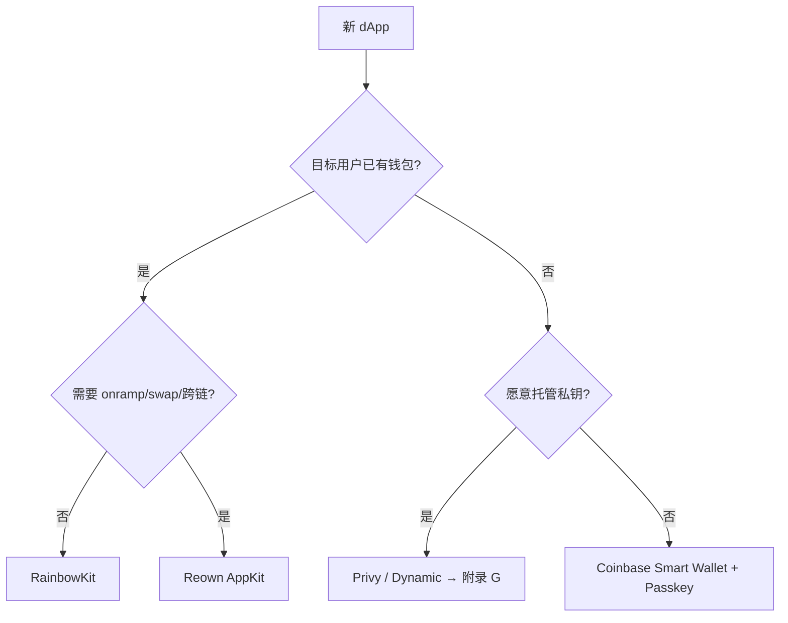
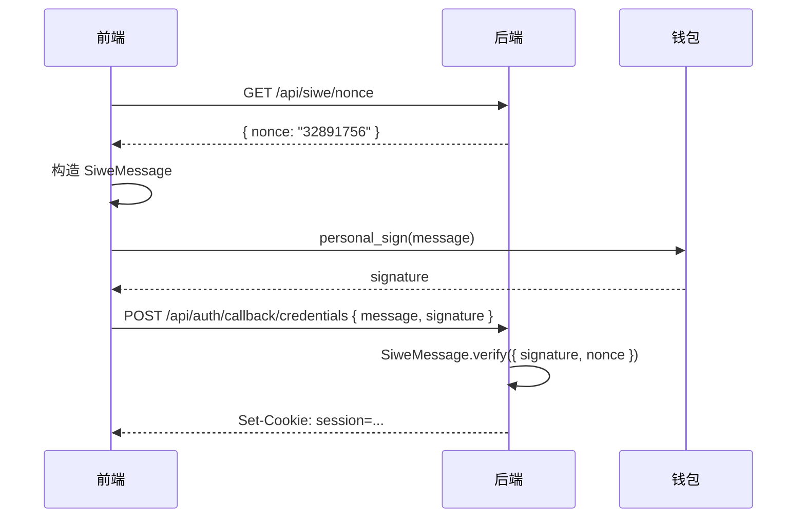
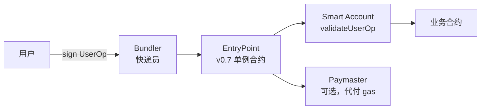
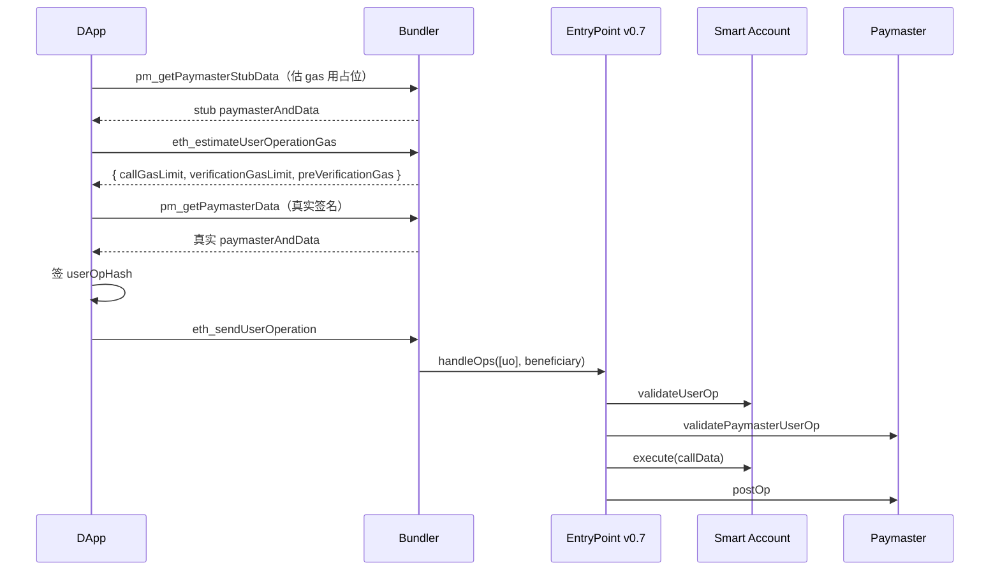
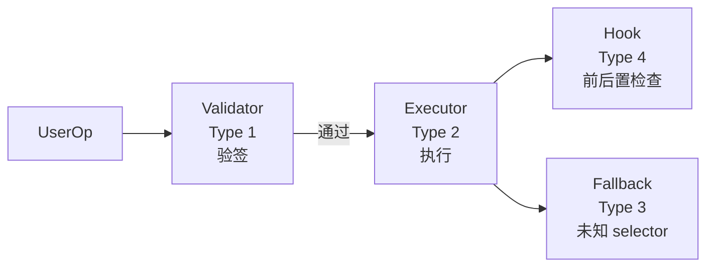

# 模块 10：前端与账户抽象

> 2024 年 8 月，一位 NFT 巨鲸点了一下"出价"按钮，钱包弹出一段看似正常的 EIP-712 typed data，他签了。下一秒，几个高价 NFT 以 0.001 ETH 被扫光，损失 1100 万美元。钱包 UI 没把 royalty 字段渲染出来，而那个字段被改成了 `0xFFFF...FFFF`。
>
> 同年全年，签名钓鱼吞掉了 4.94 亿美元、33.2 万受害者。这是 dApp 工程师每天战斗的战场。
>
> 这个模块讲怎么活下来——也讲怎么活得漂亮：viem 的函数式设计为什么能在两年内把 ethers 拉下王座，Coinbase 怎么用 Passkey + 4337 让你妈也能用钱包，Vitalik 的 EIP-7702 怎么让旧 EOA "原地长出腿"，Stripe 为什么花钱买下 Privy。

模块 04 让你写出能跑在 EVM 的合约，本模块教用户怎么和它对话——viem/wagmi/RainbowKit/ERC-4337/EIP-7702 这一整条前端栈。

本模块把现代 dApp 前端栈逐层拆到协议字段级，配 `code/` 下可 `pnpm dev` 跑起来的 Next.js 15 项目。基线：Pectra 主网 2025-05-07 激活，EntryPoint v0.7 + EIP-7702 是 2026 事实组合（v0.8 在灰度，主网采用 <15%）。前置 09-替代生态；后续 11-基础设施与工具。

## 目录

### 主线（≤30 页）
- [1. viem 基础：Public / Wallet Client](#1-viem-基础public--wallet-client)
- [2. wagmi v2：三个核心 Hook](#2-wagmi-v2三个核心-hook)
- [3. 钱包连接：RainbowKit + WalletConnect](#3-钱包连接rainbowkit--walletconnect)
- [4. 签名 + 发送交易](#4-签名--发送交易)
- [5. SIWE 登录（EIP-4361）](#5-siwe-登录eip-4361)
- [6. EIP-712 类型化签名](#6-eip-712-类型化签名)
- [7. 账户抽象直觉：ERC-4337](#7-账户抽象直觉erc-4337)
- [8. EIP-7702 直觉：EOA 升级](#8-eip-7702-直觉eoa-升级)
- [9. 钓鱼防御 5 条](#9-钓鱼防御-5-条)
- [10. Smart Account 选型](#10-smart-account-选型)
- [11. 实战项目导览（code/）](#11-实战项目导览code)
- [12. 习题与解答](#12-习题与解答)
- [13. 参考资料](#13-参考资料)

### 附录
- [附录 A. ERC-4337 PackedUserOperation 字段级](#附录-a-erc-4337-packeduseroperation-字段级)
- [附录 B. EIP-7702 字段与 chain_id=0 攻击](#附录-b-eip-7702-字段与-chain_id0-攻击)
- [附录 C. EIP-5792 / 6492 / 7677 / 7715](#附录-c-eip-5792--6492--7677--7715)
- [附录 D. 14 款钱包详细对比](#附录-d-14-款钱包详细对比)
- [附录 E. ScamSniffer / Inferno 数据](#附录-e-scamsniffer--inferno-数据)
- [附录 F. ERC-7579 / 6900 模块化账户](#附录-f-erc-7579--6900-模块化账户)
- [附录 G. 嵌入式钱包（Privy / Dynamic / Web3Auth / Turnkey）](#附录-g-嵌入式钱包privy--dynamic--web3auth--turnkey)
- [附录 H. Permit2 字段级](#附录-h-permit2-字段级)

---

## 1. viem 基础：Public / Wallet Client

> **TL;DR** viem = 函数式 + TS 类型推导 + tree-shake，2026 年 EVM 前端事实标准。Public Client 读链，Wallet Client 签名写链，三行代码连上钱包。

**钩子**：2023 年 wagmi 把 v2 整个 rewrite 在 viem 之上，bundle 体积砍掉 7 倍（~94KB → ~12KB gzip）。一场静悄悄的政变，两年内把 ethers 拉下王座。

### 1.1 三个核心概念

把 viem 想象成三块乐高：

- **Client**（底座）：`PublicClient` 读链，`WalletClient` 签名/写链。
- **Action**（动作）：纯函数，首参是 client，按需 import，tree-shake 友好。
- **Transport**（快递）：`http()` / `webSocket()` / `fallback()` / `custom(provider)`。

### 1.2 连钱包：5 行代码

```ts
import { createPublicClient, createWalletClient, custom, http } from 'viem'
import { mainnet } from 'viem/chains'

export const publicClient = createPublicClient({
  chain: mainnet,
  transport: http('https://eth-mainnet.g.alchemy.com/v2/KEY'),
})

// 浏览器钱包（MetaMask / Rabby / Coinbase Wallet）
export const walletClient = createWalletClient({
  chain: mainnet,
  transport: custom(window.ethereum!),
})

const [address] = await walletClient.requestAddresses()
```

`publicClient` 读余额/合约，`walletClient` 签名/发交易。账户来自 `requestAddresses()`，签名代理给钱包，私钥永不离开用户侧。

### 1.3 读合约 + 写合约（5 行核心）

```ts
import { parseAbi, getContract, parseUnits } from 'viem'

const erc20 = getContract({
  address: '0xA0b86991c6218b36c1d19D4a2e9Eb0cE3606eB48', // USDC
  abi: parseAbi(['function balanceOf(address) view returns (uint256)',
                 'function transfer(address,uint256) returns (bool)']),
  client: { public: publicClient, wallet: walletClient },
})

const balance = await erc20.read.balanceOf([address])          // 读
const hash    = await erc20.write.transfer([TO, parseUnits('10', 6)]) // 写
```

**生产规则**：写之前必须先 `simulateContract`，把 revert 提前暴露在 UI 而非上链失败。

```ts
const { request } = await publicClient.simulateContract({
  account: address, address: USDC, abi, functionName: 'transfer', args: [TO, 10n * 10n**6n],
})
const hash = await walletClient.writeContract(request)
```

### 1.4 速查对照（ethers v6 → viem）

| 操作 | ethers v6 | viem |
| --- | --- | --- |
| 创建读客户端 | `new JsonRpcProvider(url)` | `createPublicClient({ chain, transport: http(url) })` |
| 创建写客户端 | `new Wallet(pk, provider)` | `createWalletClient({ account, chain, transport })` |
| 读余额 | `provider.getBalance(addr)` | `publicClient.getBalance({ address })` |
| 合约读 | `new Contract(addr, abi, p).foo()` | `getContract({...}).read.foo()` |
| 合约写 | `c.connect(signer).foo(args)` | `walletClient.writeContract({...})` |
| 签 EIP-712 | `signer.signTypedData(d, t, v)` | `walletClient.signTypedData({ domain, types, primaryType, message })` |

### 1.5 常见坑

| 坑 | 解决 |
| --- | --- |
| `1` 不是 `1n` | 开 `noImplicitAny`；用 `parseUnits` |
| 漏 simulate | 强制 `simulateContract` 先行 |
| ABI 漏 `as const` | `parseAbi` 入参显式 `as const` |
| ssr=false 没开 | wagmi config 设 `ssr: true` + `cookieStorage` |

**章末**：viem Client × Action × Transport 是所有 wagmi hook 的底层。下一节看 wagmi 怎么把它包成 React Hook。

---

## 2. wagmi v2：三个核心 Hook

> **TL;DR** wagmi = viem 之上的 React 层。三个 hook 覆盖 80% 场景：`useAccount` 拿账户，`useReadContract` 读，`useWriteContract` 写。

**钩子**：你写 `useAccount()`，背后是 viem action + react-query 缓存 + connector 事件总线在跑。切链、断线重连、SSR cookie 持久化，都帮你做完。

### 2.1 Config（一次性设置）

```ts
import { http, createConfig, cookieStorage, createStorage } from 'wagmi'
import { mainnet, sepolia, base } from 'wagmi/chains'
import { injected, walletConnect, coinbaseWallet } from 'wagmi/connectors'

export const config = createConfig({
  chains: [sepolia, mainnet, base],
  connectors: [
    injected({ shimDisconnect: true }),
    walletConnect({ projectId: process.env.NEXT_PUBLIC_WC_PROJECT_ID! }),
    coinbaseWallet({ appName: 'My dApp', preference: 'all' }),
  ],
  storage: createStorage({ storage: cookieStorage }),
  ssr: true,
  transports: {
    [sepolia.id]: http(process.env.NEXT_PUBLIC_RPC_SEPOLIA),
    [mainnet.id]: http(process.env.NEXT_PUBLIC_RPC_MAINNET),
    [base.id]:    http(process.env.NEXT_PUBLIC_RPC_BASE),
  },
})

declare module 'wagmi' { interface Register { config: typeof config } }
```

`declare module` 让全项目 hook 拿到字面量 chain 联合类型。`ssr: true` + `cookieStorage` 防 hydration mismatch。

### 2.2 三个核心 Hook

**useAccount** — 拿当前账户：

```tsx
import { useAccount } from 'wagmi'

function Header() {
  const { address, isConnected, chain } = useAccount()
  if (!isConnected) return <ConnectButton />
  return <span>{address} @ {chain?.name}</span>
}
```

**useReadContract** — 读链上数据：

```tsx
import { useReadContract } from 'wagmi'

const { data: balance, isLoading } = useReadContract({
  abi: erc20Abi, address: USDC,
  functionName: 'balanceOf', args: [address],
  query: { enabled: !!address, refetchInterval: 12_000 },
})
```

`query` 字段透传给 react-query：`enabled`（依赖未就绪不发）、`refetchInterval`（12s 跟块时间对齐）。

**useWriteContract** — 写合约（先 simulate）：

```tsx
import { useSimulateContract, useWriteContract, useWaitForTransactionReceipt } from 'wagmi'

function Transfer() {
  const { data: simReq } = useSimulateContract({
    abi: erc20Abi, address: USDC, functionName: 'transfer',
    args: [TO, parseUnits('10', 6)],
  })
  const { writeContract, data: hash } = useWriteContract()
  const { isSuccess } = useWaitForTransactionReceipt({ hash })

  return (
    <button
      disabled={!simReq}
      onClick={() => simReq && writeContract(simReq.request)}
    >
      {isSuccess ? '已完成' : '转账 10 USDC'}
    </button>
  )
}
```

`useSimulateContract` disabled 时按钮灰显，simulate 失败（余额不足、合约 revert）提前暴露。

### 2.3 其他常用 Hook

| Hook | 作用 |
| --- | --- |
| `useBalance` | 读 ETH / token 余额 |
| `useReadContracts` | 批读（自动用 Multicall3） |
| `useSignMessage` | personal_sign |
| `useSignTypedData` | EIP-712 签名 |
| `useSwitchChain` | 切链 |
| `useChainId` | 当前链 ID |
| `useEnsName` | ENS 反查 |

**反向解析 + CCIP-Read（EIP-3668）**：vitalik.eth 显示靠 reverse resolver；Coinbase cb.id / Base names 等离链 ENS 全靠 CCIP-Read（链上合约抛 OffchainLookup error，client 去指定 URL 取数据再 verify）。

### 2.4 SSR 配置（Next.js App Router）

```tsx
// app/layout.tsx
import { cookieToInitialState } from 'wagmi'
export default async function RootLayout({ children }) {
  const initial = cookieToInitialState(config, (await headers()).get('cookie'))
  return <html><body><Providers initialState={initial}>{children}</Providers></body></html>
}
```

**章末**：Config + 三个 hook 是骨架。下一节接 RainbowKit，让用户能点按钮连钱包。

---

## 3. 钱包连接：RainbowKit + WalletConnect

> **TL;DR** RainbowKit 是 wagmi 之上的连接 UI，一个 `<ConnectButton />` 搞定钱包列表 + WalletConnect QR + 多链切换。选型：多链通用选 RainbowKit；Base 链 + Passkey 选 Coinbase Smart Wallet；全家桶选 Reown AppKit。

**钩子**：同一个"钱包连接"UI，RainbowKit bundle 约 40KB，Reown AppKit 约 120KB——bundle 差额每 100ms 移动端转化率掉 1%，已有团队复盘过这件事。

### 3.1 安装

```bash
pnpm add @rainbow-me/rainbowkit wagmi viem@^2 @tanstack/react-query
```

### 3.2 Providers 套壳

```tsx
'use client'
import { RainbowKitProvider, darkTheme } from '@rainbow-me/rainbowkit'
import { WagmiProvider } from 'wagmi'
import { QueryClientProvider, QueryClient } from '@tanstack/react-query'
import { config } from '@/lib/wagmi'
import '@rainbow-me/rainbowkit/styles.css'

const queryClient = new QueryClient()

export function Providers({ children, initialState }) {
  return (
    <WagmiProvider config={config} initialState={initialState}>
      <QueryClientProvider client={queryClient}>
        <RainbowKitProvider theme={darkTheme()}>
          {children}
        </RainbowKitProvider>
      </QueryClientProvider>
    </WagmiProvider>
  )
}
```

### 3.3 ConnectButton（一行）

```tsx
import { ConnectButton } from '@rainbow-me/rainbowkit'
export function Header() {
  return <ConnectButton showBalance chainStatus="icon" />
}
```

内置：钱包列表（MetaMask、Rabby、Coinbase、WalletConnect QR）、连接后显示地址/余额/链、切链下拉。

### 3.4 WalletConnect 底层（三句话版）

WalletConnect 像"中间人邮局"：dApp 生成 QR（含 symKey），手机钱包扫码加入同一 topic，双方用 ChaCha20-Poly1305 端对端加密通信，relay 节点看不到明文。wagmi `walletConnect()` connector 封装了全部握手逻辑，开发者只需传 `projectId`（在 cloud.reown.com 创建）。

### 3.5 选型决策树



**EIP-5792 wallet_sendCalls**：原子批量调用 RPC，2026 已是 Coinbase Smart Wallet / MM Smart Account 默认通道——优先于 wagmi useWriteContract（自动批量、原子失败回滚）。

**EIP-7677**：标准化 paymaster RPC 接口，dApp 不绑定特定 paymaster vendor（Pimlico/Stackup/Alchemy）即可使用——配合 5792 是 AA UX 的最后一公里。

**EIP-6963**：钱包注入不再 race window.ethereum——通过 announce/request event 让多个钱包共存。RainbowKit / wagmi 已默认支持。

**章末**：钱包连上了，下一节用它签名和发交易。

---

## 4. 签名 + 发送交易

> **TL;DR** 三种操作：`personal_sign`（文本签名）、`signTypedData`（EIP-712 结构化签名）、`sendTransaction`（发 ETH / 调合约）。全部从 `useWalletClient()` 拿到的 client 发起。

### 4.1 personal_sign（登录 / 证明身份）

```tsx
import { useSignMessage } from 'wagmi'

const { signMessage, data: sig } = useSignMessage()
signMessage({ message: 'Hello Web3 World' })
// sig = '0x...' (65 字节 ECDSA)
```

用途：证明持有某地址。不要用 `eth_sign`（可签任意 hash，高风险）。

### 4.2 EIP-712 类型化签名（Permit / SIWE / 订单）

```tsx
import { useSignTypedData } from 'wagmi'

const { signTypedData } = useSignTypedData()

signTypedData({
  domain: { name: 'MyApp', chainId: 1, verifyingContract: '0x...' },
  types: {
    Order: [
      { name: 'buyer',    type: 'address' },
      { name: 'amount',   type: 'uint256' },
      { name: 'deadline', type: 'uint256' },
    ],
  },
  primaryType: 'Order',
  message: { buyer: address, amount: parseUnits('100', 6), deadline: BigInt(Math.floor(Date.now()/1000) + 300) },
})
```

**签名前必须在 UI 渲染所有字段**——§6 讲为什么、怎么做。

### 4.3 发送 ETH

```tsx
import { useSendTransaction, useWaitForTransactionReceipt } from 'wagmi'

const { sendTransaction, data: hash } = useSendTransaction()
const { isLoading, isSuccess } = useWaitForTransactionReceipt({ hash })

sendTransaction({ to: '0xRecipient', value: parseEther('0.01') })
```

### 4.4 完整"读 → simulate → 写 → 等回执"范式

```tsx
// 1. 读当前余额
const { data: bal } = useReadContract({ abi, address: USDC, functionName: 'balanceOf', args: [address] })

// 2. simulate（发现错误提前告知用户）
const { data: simReq, error: simErr } = useSimulateContract({
  abi, address: USDC, functionName: 'transfer', args: [TO, parseUnits('10', 6)],
  query: { enabled: !!address && bal != null && bal >= parseUnits('10', 6) },
})

// 3. 写
const { writeContract, data: hash } = useWriteContract()

// 4. 等回执
const { isSuccess } = useWaitForTransactionReceipt({ hash })
```

这是 wagmi dApp 的标准四步。把 `simErr?.shortMessage` 直接显示给用户，不要吞错误。

**章末**：签名 + 发交易已通。下一节加 SIWE，让后端知道"谁登录了"。

---


---

## 5. SIWE 登录（EIP-4361）

> **TL;DR** SIWE = 把 domain、chainId、nonce、过期时间打包进签名内容，让签名只能在特定 dApp 特定时段用一次。配 NextAuth v5，10 分钟集成。

**钩子**：直接 `personal_sign("login")` 太天真——攻击者把同一段消息复制到他的网站，你今天在 dApp A 签的，明天就被拿去 dApp B 顶替你登录。SIWE 解决了这个问题。

### 5.1 消息格式

```
example.com wants you to sign in with your Ethereum account:
0xabc...def

I accept the ExampleApp Terms of Service: https://example.com/tos

URI: https://example.com/login
Version: 1
Chain ID: 1
Nonce: 32891756
Issued At: 2026-04-27T15:00:00Z
Expiration Time: 2026-04-27T15:10:00Z
Not Before: 2026-04-27T15:00:00Z
Request ID: abc-123
Resources:
- ipfs://Qm...
- https://example.com/my-web2-claim.json
```

关键字段：`domain`（dApp 域名，**钱包必须校验 origin 一致**，反钓鱼第一防线）；`address`；`statement`（可读说明）；`Chain ID`（防跨链重放）；`Nonce`（服务端生成，一次性）；`Issued At`/`Expiration Time`/`Not Before`（时效）；`Resources`（可选，授权访问资源列表）。

### 5.2 完整流程



### 5.3 NextAuth v5 (Auth.js) 集成

`code/` 项目使用 NextAuth v5 的 Credentials Provider：

```ts
// src/lib/auth.ts
import NextAuth from 'next-auth'
import Credentials from 'next-auth/providers/credentials'
import { SiweMessage } from 'siwe'

export const { auth, handlers, signIn, signOut } = NextAuth({
  session: { strategy: 'jwt' },
  providers: [
    Credentials({
      name: 'Ethereum',
      credentials: {
        message: { label: 'Message', type: 'text' },
        signature: { label: 'Signature', type: 'text' },
      },
      async authorize(credentials) {
        const siwe = new SiweMessage(JSON.parse(credentials!.message as string))
        const { data, success } = await siwe.verify({
          signature: credentials!.signature as string,
          // session 来自 next-auth 服务端 store，非客户端；安装：npm i next-auth
          nonce: session.expectedNonce, // 从服务端存储取，不信任客户端提交的 siwe.nonce
          domain: process.env.NEXTAUTH_URL?.replace(/^https?:\/\//, ''),
        })
        if (!success) return null
        return { id: data.address, address: data.address, chainId: data.chainId }
      },
    }),
  ],
  callbacks: {
    async jwt({ token, user }) { if (user) { token.address = user.address; token.chainId = user.chainId } return token },
    async session({ session, token }) { session.user = { ...session.user, address: token.address, chainId: token.chainId }; return session },
  },
})
```

### 5.4 防御要点

1. Nonce 服务端生成存 Redis，验后销毁。
2. 校验 `domain` 必须等于 dApp 域名（防跨站签名重放）。
3. 校验 `chainId` 与当前钱包一致。
4. 校验 `Issued At` 不能太旧、`Expiration Time` 未过期。
5. 生产强制 HTTPS。
6. 失败统一返回 401，不透露"地址错"还是"签名错"。

### 5.5 SIWX

SIWX（Reown，2025）把 SIWE 泛化到任意链（Solana ed25519、Bitcoin BIP-322）。多链 dApp 用 SIWX，纯 EVM 用 SIWE 即可。

**章末**：SIWE 完成了用户是谁。下一节讲用户签了什么——EIP-712 类型化签名。

---

## 6. EIP-712 类型化签名

> **收敛声明**：本节是 EIP-712 全书主讲（domain 公式 + 渲染字段 + 检测 hook）；其他模块只引用此处。

**建议顺序**：先读 §6（EIP-712 typed data）再读 §5（SIWE）——SIWE 本质是 personal_sign 派生，理解 712 后才看清 SIWE 为何重定义文本。

> **TL;DR** EIP-712 把签名从"一串 hex"升级为"一张表单"——domain 隔离跨站重放，每个字段都可读，`verifyingContract` + `chainId` 限定生效范围。签名前必须在 UI 渲染全部字段。

**钩子**：还记得开篇那位损失 1100 万美元的 NFT 巨鲸吗？他签的就是 EIP-712 typed data，钱包 UI 把 royalty 字段悄悄省略，他没看见。

### 6.1 结构

`hash = keccak256("\x19\x01" || domainSeparator || hashStruct(message))`

- **domainSeparator**：`keccak256(name, version, chainId, verifyingContract)` — 让同一 message 在不同 dApp/链/合约下 hash 不同，无法跨域重放。
- **hashStruct**：按 `types` 递归编码 message。

```ts
// viem signTypedData 示例
const sig = await walletClient.signTypedData({
  account: address,
  domain: { name: 'MyDApp', chainId: 1, verifyingContract: CONTRACT },
  types: { Order: [{ name: 'amount', type: 'uint256' }, { name: 'deadline', type: 'uint256' }] },
  primaryType: 'Order',
  message: { amount: parseUnits('100', 6), deadline: BigInt(Math.floor(Date.now()/1000) + 300) },
})
```

注意：不要手写 `EIP712Domain`（viem 自动推导）；`types` 需 `as const`；后端用 `verifyTypedData` 验签（自动支持 ERC-6492 counterfactual）。

### 6.2 dApp 工程规则

签名前必须在 UI 渲染所有字段（`domain` + `types` + `message`）：
- `verifyingContract` 不在白名单时强警告 + Etherscan 链接。
- `chainId` 与当前链不符时拒签。
- `amount = MaxUint256` 时强警告并要求二次确认。
- Deadline 超过 1 天时提示风险。

`code/src/components/TypedDataPreview.tsx` 提供了参考实现。

**章末**：EIP-712 是签名安全的核心。下一节讲账户抽象——当 EOA 不够用时怎么办。


---

## 7. 账户抽象直觉：ERC-4337

> **TL;DR** ERC-4337 = 智能合约钱包的统一标准。钱包=身份证+签字笔；4337=交易代办；bundler=快递员；paymaster=帮你付快递费的金主。

**钩子**：Coinbase 怎么用 Passkey + 4337 让你妈也能用钱包？答案是：EOA 私钥换成指纹/Face ID，gas 由 paymaster 代付，用户全程无需理解"gas 是什么"。

### 7.1 六个角色



- **Signer**：EOA / Passkey / MPC，负责签 userOpHash。
- **Bundler**（快递员）：攒 N 笔 UserOp，打包成一笔 tx 调 EntryPoint。Pimlico / Alchemy / Etherspot。
- **EntryPoint**（单例合约）：`0x0000000071727De22E5E9d8BAf0edAc6f37da032`，所有链同地址。
- **Smart Account**：实现 `validateUserOp` 的合约，Safe / Kernel / Nexus / LightAccount。
- **Paymaster**（金主）：可选，代付 gas。支持 ERC-20 代付 / 业务方 sponsor。
- **Factory**：可选，首次 UserOp 时 CREATE2 部署 smart account。

### 7.2 四个 UX 收益

| 收益 | 实现方式 |
| --- | --- |
| 无 ETH 付 gas | Paymaster 代付，用户用 USDC 抵 |
| Passkey 签名 | Signer = secp256r1 公钥（RIP-7212 预编译） |
| 批量操作一次确认 | callData = executeBatch([...]) |
| 社交恢复 / 多签 | Validator 模块，owner 可更换 |

### 7.3 一行代码发 UserOp（permissionless.js）

```ts
// smartClient 封装了全部 UserOp 流程（附录 A 有字段详解）
const hash = await smartClient.sendTransaction({
  to: USDC,
  data: encodeFunctionData({ abi: erc20Abi, functionName: 'transfer', args: [TO, 1_000_000n] }),
})
```

完整 smartClient 构建代码见 §11 实战项目导览。字段级细节见**附录 A**。

**UserOp 时序**：dApp 构造 callData → SmartAccount 包成 UserOp → Bundler stub estimate（要 paymaster 临时签）→ Bundler real estimate → SmartAccount EOA 签 hash → Bundler 提交 EntryPoint → EntryPoint 验签 + 调 paymaster validatePaymasterUserOp → 调 SmartAccount validateUserOp → 执行 callData。两阶段 paymaster 让 gas 估算和最终签分离。

**章末**：4337 是"造新钱包"的方案。下一节看 7702——"给旧 EOA 长出腿"。

---

## 8. EIP-7702 直觉：EOA 升级

> **TL;DR** EIP-7702 让 EOA 临时变身合约——签一份 authorization，那笔交易执行时你的 EOA 拥有任意合约的所有方法。地址不变，资产不动，EOA 原地长出腿。

**钩子**：2025-05-07 Pectra 主网激活，一周内主网出现 11000+ 个 7702 授权。3 周后第一例 7702 钓鱼，损失 70 万美元，攻击者签的 `chain_id = 0`。

### 8.1 工作原理（一句话）

EVM 把你 EOA 的 `code` 设为 `0xef0100 || contractAddress`（23 字节），该笔交易里你的 EOA 就拥有 `contractAddress` 的所有方法。交易结束后持久有效，直到你再签一次覆盖它。

### 8.2 最小示例（viem）

```ts
// 签授权：EOA 临时挂载 BatchExecutor
const auth = await walletClient.signAuthorization({
  account: address,
  contractAddress: BATCH_EXECUTOR, // 不要传 chainId=0！
})

// 发交易：同时携带 authorizationList
const hash = await walletClient.sendTransaction({
  to: address,              // 自调（address 已变成 BatchExecutor）
  authorizationList: [auth],
  data: encodeBatchCalls([approveCall, transferCall]),
})
```

一笔交易完成 approve + transfer。

### 8.3 chain_id=0 是红线

`chain_id = 0` 表示任意链生效。攻击者拿到这个签名后，可在 5 条链上逐一发 SetCode tx 扫空资产。**永远不要签 chain_id=0 的 authorization**，钱包应默认拒签并显示红色警告。

### 8.4 4337 + 7702 联用

EOA 挂载实现 `validateUserOp` 的合约（如 Safe7579），就能走标准 4337 流程——地址不变，老 ENS/DeFi 持仓继承，同时享受批量/paymaster/session keys。字段细节见**附录 B**。

**章末**：两种 AA 方案都有了直觉。下一节讲钓鱼防御——代价最惨痛、最容易忽略的部分。

---

## 9. 钓鱼防御 5 条

> **TL;DR** 2024 年签名钓鱼吞掉 4.94 亿美元，33 万受害者（ScamSniffer 年报）。2025 下降 83%，但高频小额策略转型——平均单笔 $790。dApp 工程师是第一道防线。

**钩子**：2025 年 9 月，一笔 PEPE 钓鱼一击 139 万美元——受害者签了伪装成 Permit 的 `setApprovalForAll`，spender 是攻击者地址。如果 dApp 渲染了全部字段并对比了白名单，他会看到红色警告框。

### 5 条硬规则

1. **渲染全部 EIP-712 字段**：签名弹窗前，把 `domain` + `types` + `message` 全部在 dApp UI 里展示，`verifyingContract` 不在白名单时显示红色警告 + Etherscan 链接。

2. **Permit / Permit2 deadline ≤ 5 分钟**：短时效让偷来的签名窗口极小。`deadline > 1天` 时强警告。

3. **amount = MaxUint256 默认不签**：显示"授权无限额度"警告，长按二次确认才允许。

4. **EIP-7702 chain_id=0 拒签**：无论用户按什么，也无论钱包 UI 怎么展示，后端构造 authorization 时绝对不传 `chainId=0`。

5. **调 Blockaid / Scam Sniffer API**：每次 `wallet_sendTransaction` 前调风险评分接口，高风险拦截 + 用户确认。两家均有免费层。

```ts
// 示例：签名前风险检查
const risk = await fetch('https://api.scamsniffer.io/v2/scan', {
  method: 'POST',
  body: JSON.stringify({ type: 'typed_data', domain, message }),
}).then(r => r.json())

if (risk.score > 70) {
  throw new Error(`高风险签名 (score=${risk.score}): ${risk.reason}`)
}
```

完整防御 checklist 与检测 hook 实现见 `code/src/hooks/useEip712Inspector.ts`。数据来源见**附录 E**。

**章末**：5 条规则抄到 `AGENTS.md` 作为 AI 的硬约束。下一节看 Smart Account 如何选型。

---

## 10. Smart Account 选型

> **TL;DR** 四个维度定选型：资金规模、用户类型、目标链、是否需要 session key。多数 dApp 选 Pimlico + Biconomy Nexus 或 Coinbase Smart Wallet，不要自己写 smart account 逻辑。

### 选型矩阵

| 维度 | Safe | Kernel (ZeroDev) | Biconomy Nexus | Alchemy LightAccount |
| --- | --- | --- | --- | --- |
| 链上 TVL | 30B+ USD | 数 B USD | 数 B USD | 数百 M USD |
| ERC-7579 | Safe7579 适配 | 原生 | 原生 | v2 原生 |
| EIP-7702 | Safe 7702 module | 原生 | 原生 | v2 原生 |
| Passkey | 通过模块 | 原生 | 原生 | 原生 |
| Session Key | 通过模块 | 原生，ZeroDev SDK 主打 | 原生 | 原生 |
| 适合 | 机构/DAO | 开发者/复杂业务 | 消费 dApp | 快速 ship |

### 决策建议

- **DAO 财务 / 机构资金**：Safe。30B 美元是真金白银的信任。
- **链游 / 高频 dApp**：Kernel + ZeroDev SDK，session key + chain abstraction 体验最好。
- **消费 dApp / Web2 引流**：Biconomy Nexus 或 Coinbase Smart Wallet，一站式 paymaster + bundler。
- **快速 ship + 单链**：Alchemy LightAccount，代码量最小。
- **Bundler 选型**：Pimlico（开发者文档最好）、Alchemy（已用 RPC 一站式）、Etherspot（自部署免费）。

ERC-7579 / 6900 模块化架构细节见**附录 F**；Bundler 选型建议见上表。

---

---

---

## 11. 实战项目导览（code/）

> 前面 10 节都在讲"理论 + 字段 + 选型"，这一节是个落地参考：`pnpm dev` 起一个 Next.js 15 项目，连接 + 余额 + 转账 + SIWE + Permit2 + 4337 + 7702 全跑通，签名前先渲染 typed data 再让你按。
>
> 把它当作"读完前 10 节的功课"——你可以直接 fork 改业务，也可以一边看代码一边对照前面章节理解每一行为什么这么写。

### 11.1 目录结构

```
code/
├── package.json                 # pin 全部版本
├── pnpm-lock.yaml              # pnpm 9.15
├── pnpm-workspace.yaml
├── next.config.ts
├── tsconfig.json
├── .env.example
├── .gitignore
├── README.md
├── public/
│   └── favicon.ico
└── src/
    ├── app/
    │   ├── globals.css
    │   ├── layout.tsx          # Providers 注入（含 cookieToInitialState）
    │   ├── page.tsx            # 主页：连接 + 余额 + 转账 + 4337 + 7702 + Permit2
    │   └── api/
    │       ├── auth/
    │       │   └── nextauth_route/  # NextAuth v5 catch-all（注：实际路径用 [...nextauth]）
    │       ├── siwe/
    │       │   └── nonce/route.ts
    │       └── paymaster/route.ts   # ERC-7677 paymaster proxy
    ├── components/
    │   ├── Providers.tsx       # wagmi + RainbowKit + react-query + NextAuth
    │   ├── ConnectButton.tsx
    │   ├── BalanceCard.tsx
    │   ├── ReadContractCard.tsx
    │   ├── TransferForm.tsx
    │   ├── SiweLogin.tsx
    │   ├── Permit2Demo.tsx
    │   ├── UserOp4337Demo.tsx
    │   ├── Eip7702Demo.tsx
    │   └── TypedDataPreview.tsx
    ├── lib/
    │   ├── wagmi.ts            # config（mainnet/sepolia/base）
    │   ├── chains.ts
    │   ├── permit2.ts          # 构造 PermitTransferFrom 消息
    │   ├── aa.ts               # permissionless smart account client
    │   ├── auth.ts             # NextAuth v5 + SIWE Credentials
    │   └── nonce-store.ts
    └── hooks/
        ├── useEip712Inspector.ts
        ├── useSmartAccount.ts
        └── useSiweLogin.ts
```

### 11.2 启动

```bash
cd code
cp .env.example .env.local      # 填 RPC、Pimlico key、WC projectId
pnpm install
pnpm dev                        # http://localhost:3000
```

`.env.local` 必填：

```
NEXTAUTH_URL=http://localhost:3000
NEXTAUTH_SECRET=use_openssl_rand_base64_32
NEXT_PUBLIC_WC_PROJECT_ID=your_reown_project_id
NEXT_PUBLIC_RPC_SEPOLIA=https://eth-sepolia.g.alchemy.com/v2/KEY
NEXT_PUBLIC_RPC_MAINNET=https://eth-mainnet.g.alchemy.com/v2/KEY
NEXT_PUBLIC_RPC_BASE=https://base-mainnet.g.alchemy.com/v2/KEY
PIMLICO_API_KEY=pim_...
```

### 11.3 跑通的几条主线

1. 连钱包 → 读 ETH 余额（`useBalance`，默认 Sepolia）。
2. `useReadContract` 读 USDC balanceOf/decimals/symbol。
3. `useSimulateContract` → `useWriteContract` → `useWaitForTransactionReceipt` 发 ERC-20。
4. SIWE 登录 → 后端 verify → NextAuth session。
5. Permit2 gasless approve：签 EIP-712 PermitTransferFrom → 后端 relayer（演示用本地 relayer，主网上 Gelato Relay 或自建）。
6. ERC-4337 UserOp：permissionless 创建 Safe smart account，Pimlico paymaster，bundler 广播。
7. EIP-7702 batched tx：viem `signAuthorization` 挂载 BatchExecutor，单笔做多事。

### 11.4 关键代码 walkthrough

`src/lib/wagmi.ts` 即 §2.1 Config（chains: sepolia/mainnet/base，injected + walletConnect + coinbaseWallet + safe，cookieStorage + ssr=true）。

`src/lib/aa.ts` 把 Safe smart account + Pimlico paymaster + bundler 串成一个 `smartClient`：

```ts
import { createSmartAccountClient } from 'permissionless'
import { toSafeSmartAccount } from 'permissionless/accounts'
import { createPimlicoClient } from 'permissionless/clients/pimlico'
import { entryPoint07Address } from 'viem/account-abstraction'
import { createPublicClient, http, type Address } from 'viem'
import { sepolia } from 'viem/chains'

export async function buildSmartAccount(opts: {
  ownerSign: (h: `0x${string}`) => Promise<`0x${string}`>
  ownerAddress: Address
}) {
  const publicClient = createPublicClient({ chain: sepolia, transport: http(process.env.NEXT_PUBLIC_RPC_SEPOLIA) })
  const url = `https://api.pimlico.io/v2/sepolia/rpc?apikey=${process.env.NEXT_PUBLIC_PIMLICO_API_KEY}`
  const pimlico = createPimlicoClient({
    transport: http(url),
    entryPoint: { address: entryPoint07Address, version: '0.7' },
  })

  // owner 接口允许我们注入任意 signer（这里给的是浏览器 wallet）
  const safeAccount = await toSafeSmartAccount({
    client: publicClient,
    // ⚠️ owners 应传 viem Account 对象（如 `privateKeyToAccount(...)` 或 walletClient），而非自定义 `{ address, signMessage }` 结构；如需用外部 signer，请用 `toAccount(...)` 封装
    owners: [{ address: opts.ownerAddress, signMessage: async ({ message }) => opts.ownerSign(message as `0x${string}`) }],
    version: '1.4.1',
    entryPoint: { address: entryPoint07Address, version: '0.7' },
  })

  const smartClient = createSmartAccountClient({
    account: safeAccount,
    chain: sepolia,
    bundlerTransport: http(url),
    paymaster: pimlico,
    userOperation: {
      estimateFeesPerGas: async () => (await pimlico.getUserOperationGasPrice()).fast,
    },
  })
  return { smartClient, safeAccount, pimlico }
}
```

**`src/lib/permit2.ts`** —— 构造 PermitTransferFrom：

```ts
import type { Address } from 'viem'

export const PERMIT2_ADDRESS: Address = '0x000000000022D473030F116dDEE9F6B43aC78BA3'

export const PERMIT2_TYPES = {
  PermitTransferFrom: [
    { name: 'permitted', type: 'TokenPermissions' },
    { name: 'spender',   type: 'address' },
    { name: 'nonce',     type: 'uint256' },
    { name: 'deadline',  type: 'uint256' },
  ],
  TokenPermissions: [
    { name: 'token',  type: 'address' },
    { name: 'amount', type: 'uint256' },
  ],
} as const

export function buildPermit2Message(opts: {
  token: Address
  amount: bigint
  spender: Address
  nonce: bigint
  deadlineSec: number
  chainId: number
}) {
  return {
    domain: {
      name: 'Permit2',
      chainId: opts.chainId,
      verifyingContract: PERMIT2_ADDRESS,
    },
    types: PERMIT2_TYPES,
    primaryType: 'PermitTransferFrom' as const,
    message: {
      permitted: { token: opts.token, amount: opts.amount },
      spender: opts.spender,
      nonce: opts.nonce,
      deadline: BigInt(Math.floor(Date.now() / 1000) + opts.deadlineSec),
    },
  }
}
```

**`src/components/Eip7702Demo.tsx`** 思路（完整代码见 `code/`）：

```ts
import { useWalletClient, useChainId, useAccount } from 'wagmi'
import { sepolia } from 'wagmi/chains'

export function Eip7702Demo() {
  const { address } = useAccount()
  const { data: wallet } = useWalletClient()
  const chainId = useChainId()

  async function run() {
    if (!wallet || !address || chainId !== sepolia.id) return
    const auth = await wallet.signAuthorization({
      account: address,
      contractAddress: BATCH_EXECUTOR,
      // 不传 chainId 等价于当前链；禁止 0
    })
    const hash = await wallet.sendTransaction({
      to: address,                               // 自调
      authorizationList: [auth],
      data: encodeBatchCalls([
        { to: USDC, data: approveData, value: 0n },
        { to: ROUTER, data: swapData, value: 0n },
      ]),
    })
    console.log('tx hash', hash)
  }
  // ...
}
```

### 11.5 项目级安全约定

write 前必跑 `useSimulateContract` 并同步显示结果；typed data 签名前渲染 `<TypedDataPreview/>`；Permit2 deadline ≤ 5 分钟；7702 永远 chain_id != 0；SIWE nonce verify 后即销毁。

---

## 12. 习题与解答

> 这一节六道题是对前 10 节的"压力测试"——前两题强迫你记住 viem 与 ethers 的差异、亲手构造一笔 PackedUserOperation 才知道字段是怎么打包的；后四题把"防钓鱼"和"AA UX"翻译成自己的代码——签名钓鱼检测器、SIWE nonce 一次性、Coinbase Smart Wallet 的链切换边界、session key 限额。
>
> 不会做就回对应章节，做完再读参考解答能学到双倍。

前 5 道带答案，第 6 道开放题。

### 习题 1：viem 与 ethers v6 API 对照

下列 ethers v6 代码改写成 viem 2.x：

```ts
import { ethers } from 'ethers'
const provider = new ethers.JsonRpcProvider(RPC)
const signer = new ethers.Wallet(PRIV, provider)
const erc20 = new ethers.Contract(USDC, USDC_ABI, signer)
const tx = await erc20.transfer(TO, ethers.parseUnits('10', 6))
await tx.wait()
```

**答案**：

```ts
import { createPublicClient, createWalletClient, http, parseUnits, encodeFunctionData } from 'viem'
import { privateKeyToAccount } from 'viem/accounts'
import { sepolia } from 'viem/chains'

const account = privateKeyToAccount(PRIV)
const publicClient = createPublicClient({ chain: sepolia, transport: http(RPC) })
const walletClient = createWalletClient({ account, chain: sepolia, transport: http(RPC) })

const { request } = await publicClient.simulateContract({
  account, address: USDC, abi: USDC_ABI, functionName: 'transfer',
  args: [TO, parseUnits('10', 6)],
})
const hash = await walletClient.writeContract(request)
await publicClient.waitForTransactionReceipt({ hash })
```

考点：simulate 必跑；`account` 在 walletClient 与 simulateContract 都要传；`waitForTransactionReceipt` 替代 `tx.wait()`。

### 习题 2：手动构造一笔 ERC-4337 v0.7 UserOp

用 Sepolia 已部署 Safe smart account（`0xabc...`）发 USDC 转账给 `0xdef...`，**不用** permissionless，仅 viem + 直接 RPC。

**答案要点**：

```ts
import { createPublicClient, encodeFunctionData, encodePacked, keccak256, http, hexToBigInt, toHex } from 'viem'
import { entryPoint07Address } from 'viem/account-abstraction'
import { sepolia } from 'viem/chains'

const publicClient = createPublicClient({ chain: sepolia, transport: http(RPC) })

// 1. callData = safe.execute(USDC, 0, transfer(to, 1e6))
const transferCalldata = encodeFunctionData({ abi: ERC20_ABI, functionName: 'transfer', args: [TO, 1_000_000n] })
const safeExecuteCalldata = encodeFunctionData({
  abi: SAFE_ABI, functionName: 'execute',
  args: [USDC, 0n, transferCalldata, /* operation */ 0],
})

// 2. nonce = entryPoint.getNonce(safe, key=0)
const nonce = await publicClient.readContract({
  address: entryPoint07Address, abi: ENTRYPOINT_ABI, functionName: 'getNonce',
  args: [SAFE, 0n],
})

// 3. 找 paymaster 拿 stub
const stub = await fetch(PAYMASTER_URL, { method: 'POST', body: JSON.stringify({
  method: 'pm_getPaymasterStubData',
  params: [{
    sender: SAFE, nonce: toHex(nonce), callData: safeExecuteCalldata,
    callGasLimit: '0x100000', verificationGasLimit: '0x100000', preVerificationGas: '0x10000',
    maxFeePerGas: '0x59682f00', maxPriorityFeePerGas: '0x59682f00',
  }, entryPoint07Address, '0xaa36a7'],
})}).then(r => r.json())

// 4. estimate gas
const est = await fetch(BUNDLER_URL, { /* eth_estimateUserOperationGas */ }).then(r => r.json())

// 5. 拿真实 paymasterData
const real = await fetch(PAYMASTER_URL, { /* pm_getPaymasterData with est */ }).then(r => r.json())

// 6. 计算 userOpHash
const packed = encodePacked(/* PackedUserOperation 字段 */)
const userOpHash = keccak256(encodePacked(
  ['bytes32', 'address', 'uint256'],
  [keccak256(packed), entryPoint07Address, BigInt(sepolia.id)],
))

// 7. owner 签 userOpHash
const signature = await ownerSignMessage({ raw: userOpHash })

// 8. 提交
await fetch(BUNDLER_URL, { /* eth_sendUserOperation with signature */ })
```

考点：各字段来源、stub vs real 两阶段 paymaster、userOpHash 计算。

### 习题 3：写一个 EIP-712 签名钓鱼检测器

接口（参考 `code/src/hooks/useEip712Inspector.ts`）：

```ts
function detectPhishing(input: {
  domain: { name: string; chainId: number; verifyingContract: Address }
  types: Record<string, { name: string; type: string }[]>
  primaryType: string
  message: any
  currentChainId: number
}): { risks: { level: 'low' | 'medium' | 'high'; message: string }[]; humanReadable: string }
```

**答案要点**：

```ts
const KNOWN = new Set(['0x000000000022D473030F116dDEE9F6B43aC78BA3'.toLowerCase()]) // Permit2

function detectPhishing(i: ...) {
  const risks = []
  if (i.domain.chainId !== i.currentChainId)
    risks.push({ level: 'high', message: `跨链签名：domain.chainId=${i.domain.chainId} 与当前链 ${i.currentChainId} 不一致` })
  if (!KNOWN.has(i.domain.verifyingContract.toLowerCase()))
    risks.push({ level: 'medium', message: `verifyingContract ${i.domain.verifyingContract} 不在白名单` })
  if (i.primaryType === 'PermitTransferFrom') {
    const m = i.message
    if (m.permitted.amount === 2n ** 256n - 1n)
      risks.push({ level: 'high', message: '请求无限授权 (MaxUint256)' })
    if (Number(m.deadline) - Math.floor(Date.now() / 1000) > 24 * 3600)
      risks.push({ level: 'medium', message: 'deadline 超过 24 小时' })
  }
  const humanReadable = renderHuman(i)
  return { risks, humanReadable }
}
```

考点：白名单校验、无限授权检测、deadline 检测、跨链签名检测。

### 习题 4：SIWE nonce 一次性如何实现？为什么不用客户端时间戳？

**答案**：

服务端用有 TTL 的 KV（Redis/Vercel KV），key = nonce，TTL 10 分钟。流程：① 用户请求 `/api/siwe/nonce`，服务端生成并存储 nonce；② 用户提交 message + signature；③ 服务端取 KV 校验未过期/未使用；④ 通过后立刻删除；⑤ 颁发 session。

不用客户端时间戳：客户端时间可篡改（重放攻击）；相同时间戳无法防 race；多设备去重成本高。

### 习题 5：Coinbase Smart Wallet 链切换为什么不能用 `wallet_switchEthereumChain`？

**答案**：Smart account 在不同链有不同地址（counterfactual + CREATE2，init code 可不同；2025 后改成全链同地址，但仍有过渡用户）。`wallet_switchEthereumChain` 假设同账户跨链可用，与 smart wallet multi-chain 模型冲突。dApp 应用 `wallet_getCapabilities` 检测目标链并展示地址差异；2026 多数 dApp 走 ZeroDev/Across Chain Abstraction SDK。

### 习题 6（开放题）：设计 session key 模块限额策略

要求：游戏 dApp 授权代签 1 小时，最多花 0.1 ETH，仅限 GameContract 的 `move`/`attack`。需：① ERC-7579 Validator 模块接口设计；② ZeroDev/Kernel `toPermissionValidator + toCallPolicy` 实现；③ session key 私钥泄露时 revoke 方案。

**思路**：Validator 校验签名来自 session key + 时间 < deadline + 累计花费 < 0.1 ETH；toCallPolicy 限制 target = GameContract, selector ∈ {move, attack}；revoke 方案：主 owner 签一笔 `uninstallModule`，或 Validator 内置 `paused` flag（`setPaused(true)` 立刻冻结）。

---

## 13. 参考资料

- viem 官方文档（v2.43.3，与模块 13 一致）：https://viem.sh/
- viem ethers 迁移：https://viem.sh/docs/ethers-migration
- wagmi v2 文档：https://wagmi.sh/
- wagmi v2 hooks：https://wagmi.sh/react/api/hooks
- RainbowKit 2.x：https://rainbowkit.com/
- Reown AppKit：https://docs.reown.com/appkit/
- Reown SIWE：https://docs.reown.com/appkit/next/core/siwe
- WalletConnect v2 specs：https://specs.walletconnect.com/2.0/
- ConnectKit：https://docs.family.co/connectkit
- Privy：https://docs.privy.io/
- Dynamic：https://docs.dynamic.xyz/
- Web3Auth：https://web3auth.io/docs/
- Turnkey：https://docs.turnkey.com/
- Coinbase Smart Wallet：https://www.smartwallet.dev/
- Pimlico permissionless.js：https://docs.pimlico.io/permissionless
- Pimlico ERC-7677 proxy：https://github.com/pimlicolabs/erc7677-proxy
- Alchemy Account Kit：https://accountkit.alchemy.com/
- ZeroDev Kernel：https://docs.zerodev.app/
- Biconomy：https://docs.biconomy.io/
- Safe SDK：https://docs.safe.global/
- Safe + 7579：https://docs.safe.global/advanced/erc-7579/7579-safe
- ERC-4337 标准：https://eips.ethereum.org/EIPS/eip-4337
- ERC-4337 v0.7 packing：https://hackmd.io/@tomteman-ef/userop_packing_changes
- EIP-7702：https://eips.ethereum.org/EIPS/eip-7702
- EIP-7702 实战：https://blockeden.xyz/blog/2025/05/09/eip-7702-after-pectra/
- ERC-7579 模块化：https://eips.ethereum.org/EIPS/eip-7579
- ERC-7677 Paymaster Service：https://eips.ethereum.org/EIPS/eip-7677
- ERC-5792 Wallet Call API：https://eips.ethereum.org/EIPS/eip-5792
- EIP-6963 Multi Provider：https://eips.ethereum.org/EIPS/eip-6963
- EIP-712：https://eips.ethereum.org/EIPS/eip-712
- SIWE EIP-4361：https://eips.ethereum.org/EIPS/eip-4361
- Pectra 主网公告：https://blog.ethereum.org/2025/04/23/pectra-mainnet
- Permit2 仓库：https://github.com/Uniswap/permit2
- Permit2 SignatureTransfer：https://docs.uniswap.org/contracts/permit2/reference/signature-transfer
- NextAuth (Auth.js) v5：https://authjs.dev/

---

> **下一站**：前端搞定了，但 RPC/Indexer/Validator 这些底层基础设施才是支撑 DApp 的肌肉。下一站模块 11 看节点运维 / MEV-Boost / CI/CD 这一层。

---

## 附录 A. ERC-4337 PackedUserOperation 字段级

> 主线 §7 给了六个角色的直觉。这里拆 v0.7 UserOperation 每个字段的来源、含义、打包规则——写自定义 bundler 集成或手动构造 UserOp 时必读。

### A.1 链下 UserOperation（开发者写）

```ts
type UserOperation = {
  sender: Address                    // Smart account 地址
  nonce: bigint                      // 双维 nonce：key << 64 | seq，允许并行
  factory?: Address                  // 首次 UserOp 时部署 smart account 的工厂
  factoryData?: Hex                  // factory 的 calldata
  callData: Hex                      // 转发给 sender.execute() 的 call
  callGasLimit: bigint               // execute 阶段 gas
  verificationGasLimit: bigint       // validateUserOp 阶段 gas
  preVerificationGas: bigint         // calldata cost + bundler overhead（链上无法测量）
  maxFeePerGas: bigint               // EIP-1559
  maxPriorityFeePerGas: bigint       // EIP-1559
  paymaster?: Address                // 代付 gas 的合约
  paymasterVerificationGasLimit?: bigint
  paymasterPostOpGasLimit?: bigint
  paymasterData?: Hex                // paymaster 自定义数据
  signature: Hex                     // sender.validateUserOp 使用的签名
}
```

### A.2 链上 PackedUserOperation（EntryPoint 接收）

```solidity
struct PackedUserOperation {
  address sender;
  uint256 nonce;
  bytes initCode;          // factory ++ factoryData（首次）
  bytes callData;
  bytes32 accountGasLimits;// verificationGasLimit (16字节) ++ callGasLimit (16字节)
  uint256 preVerificationGas;
  bytes32 gasFees;         // maxPriorityFeePerGas (16字节) ++ maxFeePerGas (16字节)
  bytes paymasterAndData;  // paymaster(20) ++ pmVerifGas(16) ++ pmPostOpGas(16) ++ data
  bytes signature;
}
```

打包节省约 15–30% calldata（无 paymaster 约 10%，复杂批量约 30%）。

### A.3 userOpHash

v0.7：先 hash1 = keccak256(packUserOp(uo))，再 userOpHash = keccak256(abi.encode(hash1, entryPoint, chainId))——两层 hash。

Signer 实际签的就是 userOpHash。

### A.4 完整流程（时序）



### A.5 v0.7 关键变化

- **PackedUserOperation**：紧凑编码 gas limits，节省 calldata。
- **Paymaster gas 拆分**：v0.6 单一 limit 易 over-pay；v0.7 拆 verification 与 postOp。
- **Unused gas penalty**：实际用量低于 gas limit 10% 以上时差额罚给 bundler，逼精确 estimate。
- **EntryPoint 全链同地址**：mainnet、Base、Arbitrum、Optimism、Polygon、zkSync 等。

### A.6 v0.8 预告（2026 Q3 预计）

原生 EIP-7702 支持；ERC-165 查 EntryPoint ABI 版本；`delegateAndRevert` helper 方便调试。

---

## 附录 B. EIP-7702 字段与 chain_id=0 攻击

> 主线 §8 给了直觉。这里拆 SetCode tx 每个字段、chain_id=0 的攻击链、7702 + 4337 联用细节。

### B.1 Tx Type 0x04 结构

```
SetCodeTx {
  chainId, nonce, max_priority_fee_per_gas, max_fee_per_gas,
  gas_limit, destination, value, data, access_list,
  authorization_list: [Authorization, ...],
  signature_y_parity, signature_r, signature_s
}

Authorization {
  chain_id,        // 0=任意链（危险！）；非 0=仅本链
  address,         // 要挂载的合约地址
  nonce,           // EOA nonce（防重放）
  y_parity, r, s   // EOA 签名
}
```

执行时 EVM 把 EOA 的 `code` 设为 `0xef0100 || address`（23 字节），EOA 即拥有该合约所有方法。

### B.2 chain_id=0 攻击链

1. 攻击者构造 `Authorization { chain_id: 0, address: MaliciousDrainer, nonce: 受害者nonce }`。
2. 诱导受害者签名（伪装成"无损操作"）。
3. 攻击者在 Ethereum/Base/Arbitrum/Optimism/Polygon 五条链上各发一笔 SetCode tx。
4. 每条链上受害者 EOA 都被挂载 MaliciousDrainer，攻击者调 `sweepAll()` 清空资产。

**防御**：钱包检测到 `chain_id=0` 时必须显示红色警告并默认拒签。dApp 构造 authorization 时永远不传 `chainId=0`。

### B.3 授权生命周期

Authorization 持久有效，直到 EOA 发送另一个 authorization 覆盖（传 `address: 0x0` 清除）。当前（2026-04）主流 SDK 默认每次 tx 都附 authorization（安全优先），未来优化方向是"首次授权 + 后续轻交易"。

### B.4 viem 完整示例

```ts
import { createWalletClient, http, encodeFunctionData } from 'viem'
import { sepolia } from 'viem/chains'
import { privateKeyToAccount } from 'viem/accounts'

const eoa = privateKeyToAccount(PRIV)
const wallet = createWalletClient({ account: eoa, chain: sepolia, transport: http(RPC) })

// 签授权（不传 chainId 则默认当前链，安全）
const authorization = await wallet.signAuthorization({
  account: eoa,
  contractAddress: BATCH_EXECUTOR,
})

// BatchExecutor 合约（Solidity）
// function executeBatch(Call[] calldata calls) external payable {
//   require(msg.sender == address(this)); // （7702 EOA 自调时成立；非自调被其他合约调用会 revert——这是限制不是 bug）
//   for (uint i; i < calls.length; ++i) {
//     (bool ok,) = calls[i].to.call{ value: calls[i].value }(calls[i].data);
//     require(ok);
//   }
// }

const hash = await wallet.sendTransaction({
  to: eoa.address,
  authorizationList: [authorization],
  data: encodeBatchCalls([approveCall, swapCall]),
})
```

---

## 附录 C. EIP-5792 / 6492 / 7677 / 7715

> 主线 §3 提到"钱包连接 RPC 标准"，这里按 EIP 号展开字段级细节。

### C.1 EIP-5792 Wallet Call API

四个 RPC：

| RPC | 作用 |
| --- | --- |
| `wallet_getCapabilities` | 查询账户在某链支持哪些能力 |
| `wallet_sendCalls` | 提交 call bundle |
| `wallet_getCallsStatus` | 查 bundle 状态 + receipts |
| `wallet_showCallsStatus` | 让 wallet 弹状态 UI |

Capabilities 示例（atomic capability：`{ status: 'supported' }` 或 `'ready'`——viem walletActionsErc5792 已实现）：
```json
{
  "0xaa36a7": {
    "atomic": { "status": "supported" },
    "paymasterService": { "supported": true },
    "sessionKeys": { "supported": false }
  }
}
```

陷阱：7702-delegated EOA 实际有原子批量能力，但部分 MetaMask 版本漏报 `atomicBatch`，dApp 必须在 capabilities 缺失时回退串行 tx 流程。

### C.2 EIP-6492 预部署合约签名验签

Counterfactual smart account 未部署时无法走 `ecrecover` 或 ERC-1271。6492 把签名包成：

```
abi.encode(factory, factoryCalldata, ERC-1271-signature) || magic_suffix
```

magic suffix = `0x6492...6492`（32 字节）。Verifier 检测到 magic 后先调 factory 部署，再 `isValidSignature`。viem `verifyMessage` / `verifyTypedData` 自 2.3+ 默认走 6492，SIWE 后端用 `publicClient.verifyMessage()` 自动覆盖 EOA + 已部署 1271 + 未部署 6492。

### C.3 EIP-7677 Paymaster Web Service

标准化两个 RPC：

- `pm_getPaymasterStubData`：返回占位 paymasterAndData（用于 gas 估算）。
- `pm_getPaymasterData`：返回真实签名的 paymasterAndData。

与 EIP-5792 串联：`wallet_sendCalls` 的 `capabilities.paymasterService.url` 字段指向 7677 端点，兼容钱包（Coinbase Smart Wallet、MetaMask Smart Accounts）自动完成 paymaster 流程。

### C.4 EIP-7715 `wallet_grantPermissions`

标准化 session key / 权限委托，用户一次批准，后续不再弹钱包。

```ts
const { permissions } = await provider.request({
  method: 'wallet_grantPermissions',
  params: [{
    chainId: '0x1',
    expiry: Math.floor(Date.now() / 1000) + 3600,
    signer: { type: 'account', data: { address: SESSION_KEY_ADDR } },
    permissions: [
      { type: 'native-token-transfer', data: { amount: '0x16345785D8A0000' } },
      { type: 'erc20-token-transfer', data: { address: USDC, amount: '0x5F5E100' } },
    ],
  }],
})
```

**2026 状态**：MetaMask 通过 Delegation Toolkit Snap 实现；Coinbase Smart Wallet 已实现；viem `viem/experimental/erc7715` 提供 `grantPermissions`。

---

## 附录 D. 14 款钱包详细对比

> 主线 §3 列出"选型决策树"。这里列 14 家主流钱包扩展详细特性，供 dApp 测试矩阵用。

### D.1 浏览器扩展（EVM 主）

| 钱包 | 特色 | 注意事项 |
| --- | --- | --- |
| **MetaMask** | 扩展第一名；EIP-7702 smart account；Snaps 平台 | EIP-712 渲染最完整；v12+ 内置 UserOp 展示 |
| **Rabby** | DeBank 出品；签名前模拟链上后果；Permit2 语义化 | DeFi 老用户首选；自动切链 |
| **OKX Wallet** | 70+ 链；跨链 swap + NFT marketplace | 亚洲市场占有率最高；EIP-712 v3/v4 全支持 |
| **Coinbase Wallet** | Smart Wallet（Passkey + 4337）无需扩展 | Base 链 sponsor gas 原生 |
| **Trust Wallet** | Binance 出品，移动端为主 | 多链最深（BTC/Sol/Aptos/TON） |
| **Rainbow Wallet** | macOS-style；与 RainbowKit 同团队 | ETH staking + 税务工具 |
| **Phantom** | Solana 起家；2024 加 EVM | Solana 市占第一；EVM typed data 边界 case 略弱 |
| **Backpack** | xNFT（钱包内运行 dApp）；Solana + EVM | 开发者友好 |
| **Frame** | Electron 桌面；硬件钱包深度集成 | 面向开发者/安全敏感用户；非浏览器扩展 |
| **Argent** | Smart wallet 鼻祖，社交恢复 | Starknet 聚焦；EVM 主网改名 Argent Multisig |
| **Zerion** | Portfolio + Wallet 一体 | 标准 EOA；扩展 2024 上线 |
| **Brave Wallet** | 内置 Brave 浏览器 | EVM + Solana + Filecoin；隐私优先 |
| **Ledger** | 硬件钱包市占第一（Nano S/X/Stax） | Clear Signing 计划：dApp 提交 ABI descriptor |
| **Trezor** | 固件/PCB/原理图完全开源 | Shamir Backup；通过 MetaMask 或 Trezor Connect 集成 |

### D.2 最低测试矩阵建议

上主网至少过：**MetaMask**（基线）、**Rabby**（DeFi）、**Coinbase Wallet**（消费）、**OKX**（亚洲）、**Trust**（移动）、**Ledger**（硬件）。六个覆盖 2026 年 90%+ 用户。

---

## 附录 E. ScamSniffer / Inferno 数据

> §9 钓鱼防御 5 条的数据来源。

### E.1 2024 全年数据（ScamSniffer）

- **总损失**：$494M；受害者 332,000+
- **大额**：30+ 起单笔 >$1M，合计 $171M（占 35%）
- **单笔最大**：$55.4M（机构用户在 Inferno 钓鱼站签伪装成 Permit 的 setApprovalForAll）
- **Q1 高峰**：$187M / 175k 受害者

### E.2 2025 全年数据

总损失 $83.85M（**-83%**）；受害者 106,000（-68%）；平均单笔 $790（vs 2024 $1,500）。转向高频小额，Twitter/Google ads 仍是主要引流。

### E.3 主要 drainer 团伙

| 团伙 | 兴起 | 状态（2025-12） |
| --- | --- | --- |
| Inferno | 2024 | 主导 40–45% 市场 |
| Pink Drainer | 2023 | 2024-Q2 退出 |
| Angel Drainer | 2023 | 仍活跃 |
| Pussy in Bio | 2025 | 新晋（伪装 Telegram bot） |

### E.4 攻击手法分类（按损失贡献）

1. **Permit/Permit2 钓鱼**（约 40%）：spender = 攻击者的 typed data。
2. **setApprovalForAll**（约 25%）：一签授权全部 NFT。
3. **Permit + Drain**（约 15%）：Permit 套 ERC-20 转移权后 multicall 扫光。
4. **签名重放**（约 8%）：无 chainId/nonce 跨域复用。
5. **签名伪装 OAuth login**（约 7%）："登录"按钮实为 sweep typed data。
6. **EIP-7702 setCode 钓鱼**（2025 新型，约 3%）：chain_id=0 authorization 跨链扫资产。

### E.5 著名案例

**2024-08 NFT 巨鲸 $11M**：签了 Blur Bid，royalty receiver 字段被改成 0xFFFF...FFFF，几个高价 NFT 以 0.001 ETH 被扫。钱包 UI 没显示 royalty 字段。

**2024-11 DeFi 巨鲸 $55.4M**：点击假 Cointelegraph 文章 airdrop 链接，签了 Permit2 PermitBatchTransferFrom（spender=drainer），授权 8 种 token。

**2025-03 EIP-7702 首例 $700k**：签了 chain_id=0 authorization，攻击者在 5 条链上扫光 USDC/USDT/ETH。

---

## 附录 F. ERC-7579 / 6900 模块化账户

> §10 Smart Account 选型中提到 7579，这里展开内部架构与 6900 对比。

### F.1 ERC-7579 四类模块



- **Validator (Type 1)**：决定 UserOp 是否有效（ECDSA / Passkey / SessionKey / Multisig）。
- **Executor (Type 2)**：代用户调用其他合约，可做定时任务、限价单。
- **Hook (Type 4)**：execute 前后插钩子，做权限检查、限额、日志。
- **Fallback (Type 3)**：账户收到未知 selector 时路由（ERC-2771 透传 msg.sender）。

标准化接口：
```solidity
function installModule(uint256 moduleTypeId, address module, bytes calldata initData) external;
function uninstallModule(uint256 moduleTypeId, address module, bytes calldata deInitData) external;
function isModuleInstalled(uint256 moduleTypeId, address module, bytes calldata data) external view returns (bool);
```

### F.2 ERC-6900 vs ERC-7579

| 维度 | ERC-6900 规范派 | ERC-7579 极简派 |
| --- | --- | --- |
| 接口 | plugin 实现 `IPlugin`，含 manifest | 账户暴露 `installModule(typeId, addr, initData)` |
| install 成本 | 200k+ gas | 数十 k gas |
| 互操作 | 强（链上依赖图） | 弱（靠生态约定） |
| 2026 生态 | Alchemy v2 兼容 | Kernel/Nexus/Safe7579/Etherspot/Rhinestone |

2024 中生态已倒向 7579。仅"plugin marketplace 需链上依赖图"场景考虑 6900。

---

## 附录 G. 嵌入式钱包（Privy / Dynamic / Web3Auth / Turnkey）

> 主线 §3 的选型决策树提到"愿意托管私钥 → Privy / Dynamic"。这里展开各家对比。

**钩子**：2025 年 6 月，Stripe 花据传 11 亿美元买下 Privy。一家做支付的公司为什么买钱包？因为 Stripe 想让 Web2 商家收稳定币——稳定币的世界里没有信用卡号，只有钱包地址。

### G.1 四家对比

| 维度 | Privy | Dynamic | Web3Auth | Turnkey |
| --- | --- | --- | --- | --- |
| 主链 | EVM/Sol/BTC | EVM/Sol/Cosmos/Starknet | EVM 主 | EVM/Sol |
| 私钥模型 | iframe + TEE 分片 | iframe + MPC | MPC | HSM（AWS Nitro Enclave） |
| Smart Account | 可选 | 可选 | 否 | 否 |
| 法币入金 | Stripe 原生 | Coinbase / Onramper | 第三方 | — |
| 收购 | Stripe（2025-06） | Fireblocks（2025） | Consensys（2025） | 独立 |
| 适合 | 消费 dApp | 多链 dApp | 简单登录 | 机构/政策引擎 |

### G.2 Privy 架构

Shamir 分片存用户设备 / 服务器 / 备份码，重组在 iframe + TEE 里。Email/Google/Apple/X/Telegram/Farcaster 一键登录，自动生成 EVM + Solana + Bitcoin 钱包。`@privy-io/react-auth` + `@privy-io/wagmi`。

**Privy + wagmi 桥接**：`const { wallets } = useWallets(); const wallet = wallets[0]; const provider = await wallet.getEthereumProvider(); const walletClient = createWalletClient({ transport: custom(provider), chain });`

### G.3 何时不用 WaaS

DeFi 老手要求"自己掌控私钥"，强行 WaaS 会被骂。这种情况直接用 RainbowKit + 注入 + WalletConnect。

---

## 附录 H. Permit2 字段级

> **收敛声明**：本附录主讲前端侧（构造 + 钓鱼检测）；合约侧接收 + 校验代码见模块 04 附录 G。

> 主线删除了 Permit2 详解（防止干扰主线节奏），这里补全。

**背景**：Uniswap 2022-11 部署的 Permit2（`0x000000000022D473030F116dDEE9F6B43aC78BA3`，所有 EVM 链同地址），把所有 ERC-20 授权统一到一个合约里。两种模式：AllowanceTransfer（内部维护 allowance）和 SignatureTransfer（一次性 nonce，最安全）。

### H.1 SignatureTransfer 字段

```ts
const message = {
  permitted: {
    token: USDC,           // ERC-20 token 地址
    amount: 1_000_000n,    // 1 USDC（6 decimals）
  },
  spender: ROUTER,         // 被授权转移的合约（必须是可信合约）
  nonce: BigInt(Date.now()),  // 一次性 nonce（Permit2 合约记录已用 nonce）
  deadline: BigInt(Math.floor(Date.now() / 1000) + 300),  // 5 分钟后过期
}

const signature = await walletClient.signTypedData({
  account, domain, types, primaryType: 'PermitTransferFrom', message,
})
// spender 合约调用 permit2.permitTransferFrom(message, { to, requestedAmount }, user, sig)
```

### H.2 风险

- **签名钓鱼**：钓鱼站构造 PermitTransferFrom 令 `spender = 攻击者`。2024 年约 40% 签名钓鱼损失来自 Permit/Permit2。
- **单点风险**：Permit2 被攻破则所有用户暴露（已审计 + 形式化验证 + 3 年使用，社区视为 trusted infra）。

### H.3 Permit2 vs ERC-2612

| 维度 | ERC-2612 Permit | Permit2 SignatureTransfer |
| --- | --- | --- |
| 适用 token | 实现 permit 的 token | 任意 ERC-20 |
| 一次性 | 是 | 是（nonce 消耗型） |
| 跨协议 | 各自集成 | 单点，所有协议复用 |
| 部署 | token 自己 | Uniswap 单例 |

新协议直接用 Permit2 SignatureTransfer；`deadline` 强制 ≤ 5 分钟；`spender` 只填已审计的可信合约。
