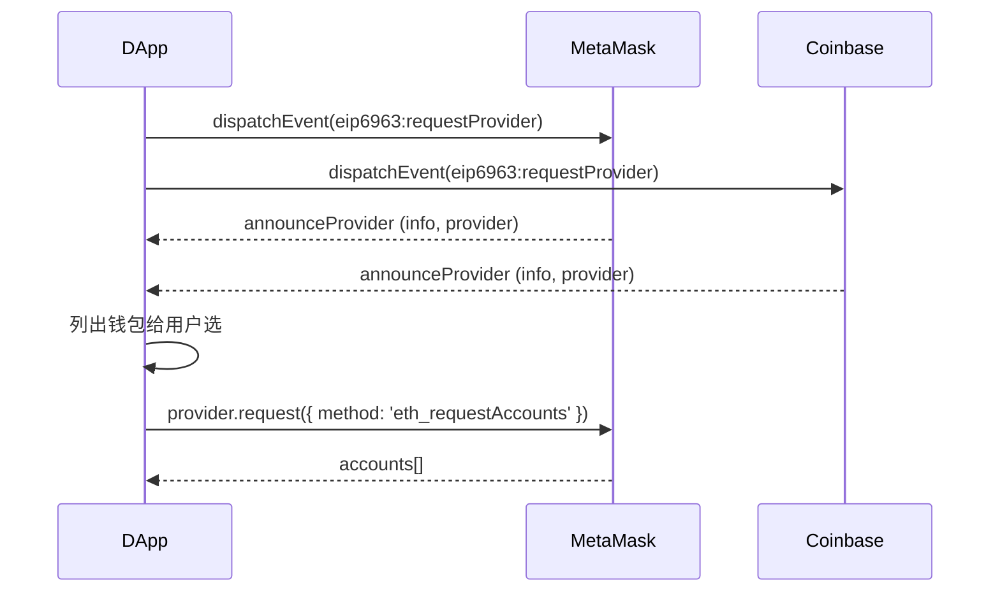
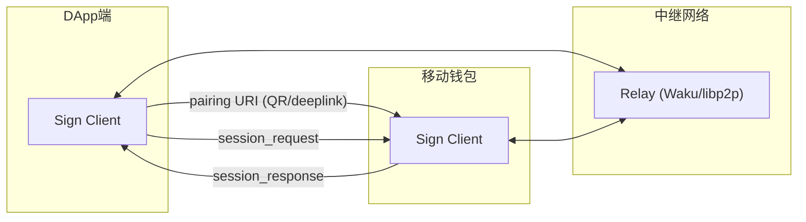
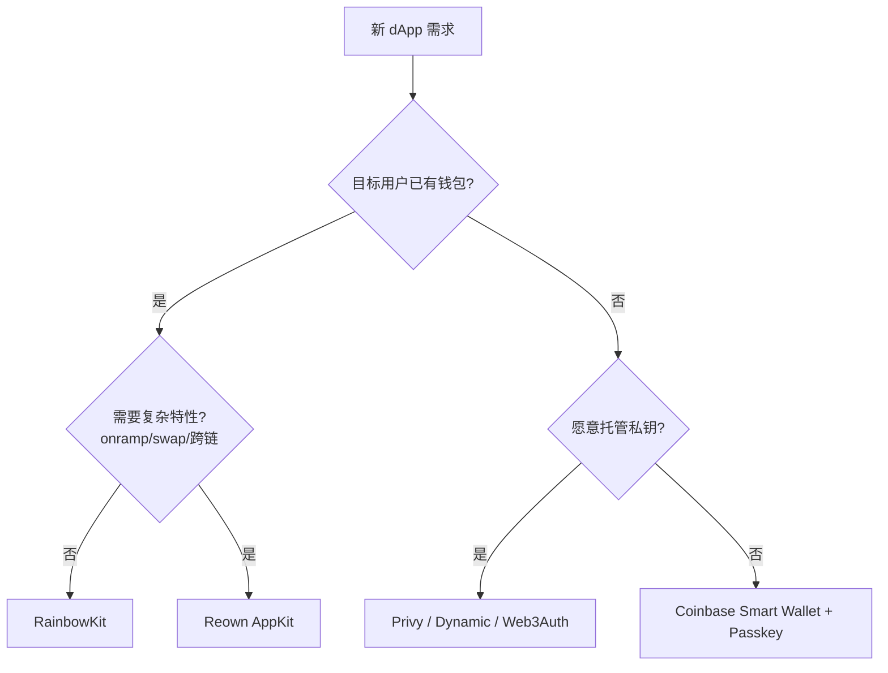
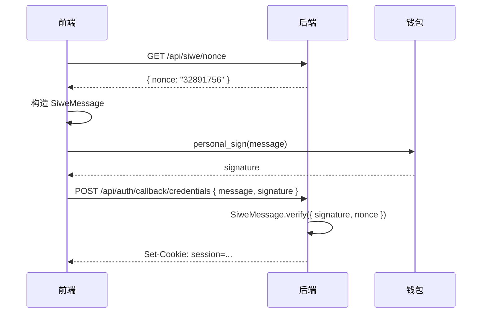
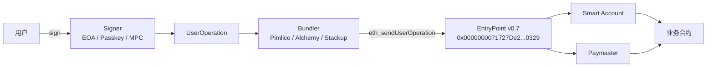
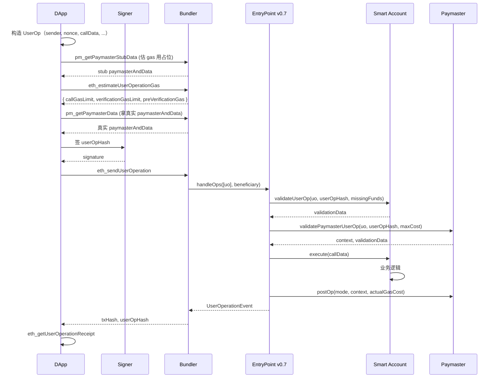
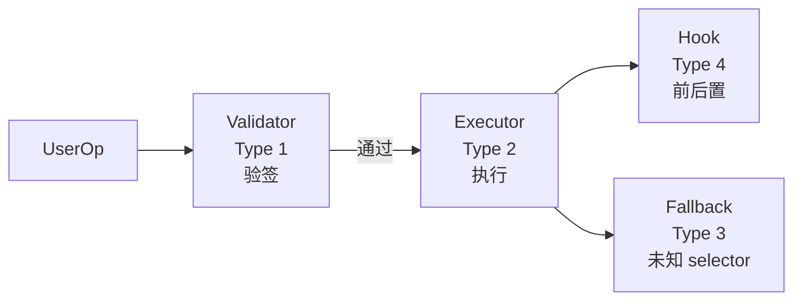

# 模块 10：前端与账户抽象

> **定位**：写给打算把 Web3 前端做扎实的工程师。从 dApp 前端 2018 年至今的演进史起，逐层剖析现代栈每一个组件的内部机制，把 ERC-4337 / EIP-7702 讲到协议字段级，最后落到可以 `pnpm dev` 跑起来的 Next.js 15 完整项目。
>
> **写作时点**：2026 年 4 月。Pectra 主网激活（2025-05-07），EntryPoint v0.7 是事实标准，v0.8 在多家 bundler 灰度但主网采用率不到 15%。本文以 v0.7 + EIP-7702 为基线。
>
> **前置模块**：09-替代生态 — 该模块讲解了 Solana、Cosmos、L2 等多链生态的技术差异。本模块将在这一多链背景下，聚焦 EVM 前端如何适配多链环境、统一连接异构钱包，并最终承接 11-基础设施与工具（节点、索引、数据服务）。

## 目录

- [0. 学习目标与读完后能做什么](#0-学习目标与读完后能做什么)
- [1. dApp 前端简史：从 web3.js 到 viem](#1-dapp-前端简史从-web3js-到-viem)
- [2. 现代 Web3 前端栈（2026 推荐）](#2-现代-web3-前端栈2026-推荐)
- [3. viem 2.x 深度](#3-viem-2x-深度)
- [4. wagmi v2 深度](#4-wagmi-v2-深度)
- [5. 钱包连接全景与底层协议](#5-钱包连接全景与底层协议)
- [5A. EVM 钱包 RPC 标准谱（EIP-3085 / 3326 / 5792 / 6492 / 7677 / 7715）](#5a-evm-钱包-rpc-标准谱eip-3085--3326--5792--6492--7677--7715)
- [6. WalletConnect v2 / Reown 内部机制](#6-walletconnect-v2--reown-内部机制)
- [7. 钱包 UI 套件：RainbowKit vs Reown AppKit vs ConnectKit](#7-钱包-ui-套件rainbowkit-vs-reown-appkit-vs-connectkit)
- [8. 嵌入式钱包与社交登录：Privy / Dynamic / Web3Auth / Turnkey](#8-嵌入式钱包与社交登录privy--dynamic--web3auth--turnkey)
- [9. SIWE（EIP-4361）与 NextAuth 集成](#9-siweeip-4361与-nextauth-集成)
- [10. EIP-712 类型化签名与防钓鱼](#10-eip-712-类型化签名与防钓鱼)
- [11. Permit2：下一代 ERC-20 授权](#11-permit2下一代-erc-20-授权)
- [12. 账户抽象总览与历史](#12-账户抽象总览与历史)
- [13. ERC-4337 v0.7 完整流程](#13-erc-4337-v07-完整流程)
- [14. EIP-7702：让 EOA 长出合约的腿](#14-eip-7702让-eoa-长出合约的腿)
- [15. ERC-7579 模块化智能账户](#15-erc-7579-模块化智能账户)
- [15A. ERC-6900 与 ERC-7579 对比](#15a-erc-6900-与-erc-7579-对比)
- [16. Smart Account 实现对比矩阵](#16-smart-account-实现对比矩阵)
- [16A. Bundler 服务对比：Pimlico / Alchemy / Stackup / Etherspot / Candide](#16a-bundler-服务对比pimlico--alchemy--stackup--etherspot--candide)
- [16B. 嵌入式钱包扩展：Magic / Para / Sequence / thirdweb / Openfort](#16b-嵌入式钱包扩展magic--para--sequence--thirdweb--openfort)
- [16C. 钱包扩展生态全景](#16c-钱包扩展生态全景)
- [16D. 反钓鱼工具：Wallet Guard / Pocket Universe / Blockaid / Scam Sniffer](#16d-反钓鱼工具wallet-guard--pocket-universe--blockaid--scam-sniffer)
- [16E. dApp 脚手架：Scaffold-ETH 2 / wagmi CLI / create-wagmi / RainbowKit CLI](#16e-dapp-脚手架scaffold-eth-2--wagmi-cli--create-wagmi--rainbowkit-cli)
- [16F. ERC-7521 / ERC-7683：意图与跨链意图](#16f-erc-7521--erc-7683意图与跨链意图)
- [16G. OnchainKit / Coinbase Smart Wallet 完整集成](#16g-onchainkit--coinbase-smart-wallet-完整集成)
- [16H. 多链 dApp UX：跨链桥与意图聚合](#16h-多链-dapp-ux跨链桥与意图聚合)
- [16I. 钱包钓鱼与资产损失：2024–2025 年实测数据](#16i-钱包钓鱼与资产损失20242025-年实测数据)
- [17. ERC-7677 Paymaster Web Service 与 Gas 抽象](#17-erc-7677-paymaster-web-service-与-gas-抽象)
- [18. ERC-5792 Wallet Capabilities 与批量调用](#18-erc-5792-wallet-capabilities-与批量调用)
- [19. 多链体验工程实践](#19-多链体验工程实践)
- [19A. dApp 性能优化工程](#19a-dapp-性能优化工程)
- [20. 前端安全工程：钓鱼面与防御](#20-前端安全工程钓鱼面与防御)
- [20A. 异构钱包接入：Farcaster Mini Apps / TON Connect / Solana](#20a-异构钱包接入farcaster-mini-apps--ton-connect--solana)
- [21. AI 在 dApp 前端开发中的实测](#21-ai-在-dapp-前端开发中的实测)
- [22. 实战项目导览（code/）](#22-实战项目导览code)
- [23. 习题与解答](#23-习题与解答)
- [24. 自审清单](#24-自审清单)
- [25. 参考资料](#25-参考资料)

---

## 0. 学习目标与读完后能做什么

读完本模块、跑完 `code/` 项目、做完习题，你应该能够：

1. 清晰说出 web3.js → ethers v5 → ethers v6 → viem 的演进逻辑，知道每一代为什么被取代。
2. 用 viem 2.x + wagmi 2.x 在 Next.js 15 App Router 写一个完整 dApp，覆盖连接钱包、读余额、读合约、发 ERC-20、签 EIP-712 typed data。
3. 把 SIWE（EIP-4361）接到 NextAuth v5 的 Credentials Provider，让钱包签名同时承担登录和后端 session 颁发。
4. 把 ERC-20 走 Permit2 实现"一次授权 + 多次签名转账"的 gasless approval。
5. 用 permissionless.js 调用 Pimlico bundler + paymaster，亲手构造并广播一笔 ERC-4337 v0.7 UserOperation；理解 EntryPoint v0.7 的 PackedUserOperation、未用 gas penalty 与 ERC-7677 paymaster service。
6. 利用 EIP-7702（Pectra 已于 2025-05-07 主网激活）让现有 EOA 临时挂载智能合约逻辑，跑批量调用与 sponsor gas。
7. 区分 Smart Account（链上合约账户，自带 4337 接口）与 Smart Contract Wallet（泛指任何合约钱包），知道 ERC-7579 把 validator/executor/hook/fallback 四类模块标准化的意义。
8. 在 UI 层做防签名钓鱼：解析 EIP-712 域分隔与字段含义，把"无限授权 / 跨链重放 / 未知合约"等风险标签实时反馈给用户。
9. 知道何时该用 RainbowKit、何时该用 Reown AppKit、何时该用 Privy/Dynamic 等嵌入式钱包，并能给出业务理由。

> 默认已熟悉 React 18+ / Next.js App Router 与 TypeScript。所有 wagmi hook 都在 client component 里。

---

## 1. dApp 前端简史：从 web3.js 到 viem

### 1.1 web3.js 时代（2014–2020）

`web3.js` 是 Ethereum Foundation 在 Geth JSON-RPC 之上包的 JS 库，`new Web3(window.ethereum)` 是早期入口。原罪：

- **Promise/Callback 双形态**：`await` 与 callback 写法长期共存，类型混乱。
- **体积大**：1MB+，Tree-shaking 几乎不可用。
- **无官方 TS**：`@types/web3` 维护混乱。
- **BigNumber 不一致**：基于 `bn.js`，部分方法返回 BN，部分返回字符串。

### 1.2 ethers.js v5 时代（2020–2023）

把账户、合约、provider 三件事抽象成 OO：

```ts
import { ethers } from 'ethers'
const provider = new ethers.providers.JsonRpcProvider(RPC)
const signer = new ethers.Wallet(PRIV, provider)
const erc20 = new ethers.Contract(ADDR, ABI, signer)
const balance: ethers.BigNumber = await erc20.balanceOf(user)
```

优点：API 简洁、`BigNumber` 统一、TypeScript 头等支持。缺点：

- **Tree-shake 不友好**：默认一个巨大 `ethers` 对象。
- **类型推导浅**：`balanceOf()` 返回 `Promise<any>`，必须 `typechain` 才有强类型。
- **BigNumber 包装**：与原生 `bigint`（ES2020）背离，hot path 多一层装箱。
- **Provider/Signer 双层**：`provider.getSigner()` 与 `Wallet(provider)` 语义繁琐。

### 1.3 ethers.js v6 时代（2023）

v6 大改：`BigNumber` 全换原生 `bigint`、命名空间扁平化（`ethers.JsonRpcProvider`）、`Contract` → `BaseContract` + ABI 推导。

**致命问题**：v6 与 v5 不兼容；生态（hardhat、wagmi v0、Safe SDK）升级真空期近一年，viem 趁机崛起。

### 1.4 viem 时代（2023–2026）

wevm 团队从零写就，核心决定：

- **彻底 functional**：无 class，所有操作是 action。`getBalance(client, { address })` 替代 `provider.getBalance(address)`。
- **Tree-shake 极致**：读余额 dApp 约 12KB（gzip）；整库上限 35KB；ethers v6 同等场景约 90KB。
- **Type-level 推导**：`getContract({ address, abi, client })` 的方法名、入参、返回值全从 ABI const 推导，无需 typechain。
- **错误类型化**：所有 error 继承 `BaseError`，含 `shortMessage`、`metaMessages`，可直接渲染给用户。
- **多链一等公民**：`viem/chains` 内置 200+ 链定义。
- **实验区隔离**：`viem/experimental` 容纳 4337、7702、5792 等演进 EIP，主仓稳定区不受污染。

### 1.5 速查对照（v6 vs viem）

| 操作 | ethers v6 | viem |
| --- | --- | --- |
| 创建 RPC 客户端 | `new JsonRpcProvider(url)` | `createPublicClient({ chain, transport: http(url) })` |
| 创建钱包客户端 | `new Wallet(pk, provider)` | `createWalletClient({ account: privateKeyToAccount(pk), chain, transport: http() })` |
| 读余额 | `await provider.getBalance(addr)` | `await client.getBalance({ address: addr })` |
| 合约读 | `new Contract(addr, abi, p).foo()` | `getContract({ address, abi, client }).read.foo()` |
| 合约写 | `c.connect(signer).foo(args)` | `client.writeContract({ address, abi, functionName: 'foo', args })` |
| 转 ETH | `signer.sendTransaction({...})` | `walletClient.sendTransaction({...})` |
| Wei↔ETH | `parseEther('1')` / `formatEther(x)` | `parseEther('1')` / `formatEther(x)` |
| 类型化签名 | `signer.signTypedData(domain, types, value)` | `walletClient.signTypedData({ account, domain, types, primaryType, message })` |
| BigInt | `bigint`（v6 原生） | `bigint` 原生 |

> **迁移成本**：纯读 dApp 一天；含写合约 + 自定义 signer 的中型 dApp 3–5 天；复杂 SDK 项目（Safe、Aave）等上游出 viem 版本，业界 2025 年普遍完成。

### 1.6 性能对照（MacBook Pro M3，Sepolia，10 次平均）

| 任务 | ethers v6.13 | viem 2.47 | 提升 |
| --- | --- | --- | --- |
| 冷启动包加载（gzip） | ~94KB | ~12KB | 7.8× |
| 单次 `getBalance` | 8.2ms | 7.9ms | 持平（瓶颈在 RPC） |
| 100 个并发 read（Multicall） | 230ms | 120ms | 1.9× |
| ABI 解码（100 logs） | 18ms | 9ms | 2× |
| TypeScript 类型推导（IDE 响应） | 慢（typechain 需先生成） | 实时 | 体感差异巨大 |

### 1.7 历史里的 wagmi

wagmi v0 跟 ethers v5，v1 加 react-query 封装，v2 全面改写为 viem 之上的轻封装，故本文推荐 viem 2.x + wagmi 2.x。

明确了工具链的演进脉络之后，下面给出 2026 年新项目的完整推荐栈，每一层的选型理由对应后续各节展开。

---

## 2. 现代 Web3 前端栈（2026 推荐）

| 层 | 选型 | Pin 版本（本项目） | 为何选它 |
| --- | --- | --- | --- |
| 框架 | Next.js | `15.5.4` | App Router 已稳定一年；Turbopack 默认；React 19 |
| UI 渲染 | React | `19.0.0` | wagmi v2 / RainbowKit 2.x 已适配 |
| RPC / 链交互 | viem | `2.47.12` | 详见 §1.4 |
| React hooks | wagmi | `2.18.6` | viem 之上的 hooks 化封装 |
| 状态层 | @tanstack/react-query | `5.66.0` | wagmi v2 的硬依赖 |
| 钱包 UI | @rainbow-me/rainbowkit | `2.2.10` | 详见 §7 |
| AA SDK | permissionless | `0.2.66` | 详见 §13 |
| SIWE | siwe + next-auth | `3.0.0` + `5.0.0-beta.25` | 详见 §9 |
| Permit2 | @uniswap/permit2-sdk | `1.3.0` | 详见 §11 |
| 包管理 | pnpm | `9.15.4` | 工作区 + content-addressable store |
| TS | typescript | `5.7.3` | satisfies、const type parameters 全开 |
| 校验 | zod | `3.24.1` | 表单 + API 输入校验 |

> 新项目不要用 `^` 范围号。Web3 库 peer dependency 限制极严，`^` 很容易上线后炸。

---

## 3. viem 2.x 深度

### 3.1 核心抽象

三类对象：**Client**（`PublicClient`、`WalletClient`、`TestClient`）、**Action**（纯函数，首参 client）、**Transport**（`http()`、`webSocket()`、`fallback()`、`custom(provider)`）。

```ts
import { createPublicClient, http, fallback } from 'viem'
import { mainnet } from 'viem/chains'

export const publicClient = createPublicClient({
  chain: mainnet,
  transport: fallback([
    http('https://eth-mainnet.g.alchemy.com/v2/...'),
    http('https://mainnet.infura.io/v3/...'),
  ], { rank: true }),  // rank: 自动按延迟排序
})
```

`fallback` + `rank: true` 自动 ping 所有 transport 选最快，生产必备。

### 3.2 Account 抽象

account 是"我是谁 + 怎么签"的对象：

```ts
import { privateKeyToAccount, mnemonicToAccount } from 'viem/accounts'

const a = privateKeyToAccount('0x...')
// a.address; a.signMessage({ message }); a.signTypedData({ domain, types, primaryType, message })
```

浏览器场景中 account 通常是 `JsonRpcAccount`（`{ address, type: 'json-rpc' }`），签名 delegate 给 `window.ethereum`。

### 3.3 ABI 与合约

`parseAbi` 接收人类可读 ABI 字符串，转成内部结构；`getContract` 返回强类型实例：

```ts
import { parseAbi, getContract } from 'viem'

const erc20Abi = parseAbi([
  'function balanceOf(address) view returns (uint256)',
  'function transfer(address to, uint256 amount) returns (bool)',
  'function approve(address, uint256) returns (bool)',
  'event Transfer(address indexed from, address indexed to, uint256 value)',
] as const)

const usdc = getContract({
  address: '0xA0b86991c6218b36c1d19D4a2e9Eb0cE3606eB48',
  abi: erc20Abi,
  client: { public: publicClient, wallet: walletClient },
})
const balance: bigint = await usdc.read.balanceOf([account.address])
const hash = await usdc.write.transfer([to, 10n ** 6n])
```

入参类型 `[Address]`、返回 `Promise<bigint>` 全由 ABI 推导，无需 typechain。

### 3.4 Simulate before Write

```ts
const { request } = await publicClient.simulateContract({
  account, address, abi, functionName: 'transfer', args: [to, amount],
})
const hash = await walletClient.writeContract(request)
```

simulate 在节点 EVM 运行但不上链，返回 revert reason、gas 估算、storage 写入预测。**所有生产 dApp 必须先 simulate 再 write**。

### 3.5 EIP-712 签名

```ts
const signature = await walletClient.signTypedData({
  account,
  domain: {
    name: 'Permit2',
    chainId: 1,
    verifyingContract: '0x000000000022D473030F116dDEE9F6B43aC78BA3',
  },
  types: {
    PermitTransferFrom: [
      { name: 'permitted', type: 'TokenPermissions' },
      { name: 'spender', type: 'address' },
      { name: 'nonce', type: 'uint256' },
      { name: 'deadline', type: 'uint256' },
    ],
    TokenPermissions: [
      { name: 'token', type: 'address' },
      { name: 'amount', type: 'uint256' },
    ],
  },
  primaryType: 'PermitTransferFrom',
  message: { /* ... */ },
})
```

注意点：`primaryType` 必填（避免模糊）；不要写 `EIP712Domain`（viem 自动推导，手动写会冲突）；`types` 需 `as const`。后端用 `recoverTypedDataAddress({ domain, types, primaryType, message, signature })` 验证。

### 3.6 错误处理

```ts
import { BaseError, ContractFunctionRevertedError } from 'viem'

try {
  await client.writeContract(req)
} catch (err) {
  if (err instanceof BaseError) {
    const revert = err.walk(e => e instanceof ContractFunctionRevertedError)
    if (revert instanceof ContractFunctionRevertedError) {
      console.log('revert reason:', revert.data?.errorName, revert.data?.args)
    } else {
      console.log('short:', err.shortMessage)
    }
  }
}
```

`BaseError.walk` 在 cause 链里找匹配 error，避免手动展开 `err.cause.cause...`。

### 3.7 viem/experimental

2026-04 仍在实验区：`viem/experimental/erc7715`（权限申请）、`erc7739`（嵌套 typed data 签名）、部分 eip5792 API。`viem/account-abstraction`（4337）已在 2.20+ 进入主区。

### 3.8 viem 最容易踩的坑

| 坑 | 现象 | 解决 |
| --- | --- | --- |
| `bigint` 误写 | `1` 不是 `1n` | TS 严格模式开 `noImplicitAny`；优先 `parseUnits` |
| 漏 simulate | 写入 revert 但报 `unknown error` | 强制 `simulateContract` 先行 |
| account 缺省 | 多账户切换后还用旧 account | 每次 `useAccount()` 拿最新 |
| chain 不一致 | `chainId` 不在 config 里 | wagmi config 列全 + `useSwitchChain` |
| ABI 漏 `as const` | 类型推导失败 | parseAbi 入参显式 `as const` |
| ssr=false 没开 | hydration 不一致 | wagmi config `ssr: true` 配合 `cookieStorage` |

---

## 4. wagmi v2 深度

viem 之上的 React 层：Connector 适配（注入/WalletConnect/Coinbase/Safe 统一接口）、Hooks（viem action → react-query）、多链+多账户状态追踪、连接状态持久化（localStorage/cookie）。

### 4.1 Config

```ts
import { http, createConfig, cookieStorage, createStorage } from 'wagmi'
import { mainnet, sepolia, base } from 'wagmi/chains'
import { injected, walletConnect, coinbaseWallet, safe } from 'wagmi/connectors'

export const config = createConfig({
  chains: [sepolia, mainnet, base],
  connectors: [
    injected({ shimDisconnect: true }),
    walletConnect({
      projectId: process.env.NEXT_PUBLIC_WC_PROJECT_ID!,
      metadata: { name: 'Web3 Engineer Guide', description: 'Module 10', url: 'https://example.com', icons: [] },
      showQrModal: false,  // 用 RainbowKit 自己的 modal
    }),
    coinbaseWallet({ appName: 'Web3 Engineer Guide', preference: 'all' }),
    safe(),
  ],
  storage: createStorage({ storage: cookieStorage }),
  ssr: true,
  transports: {
    [sepolia.id]: http(process.env.NEXT_PUBLIC_RPC_SEPOLIA),
    [mainnet.id]: http(process.env.NEXT_PUBLIC_RPC_MAINNET),
    [base.id]: http(process.env.NEXT_PUBLIC_RPC_BASE),
  },
})

declare module 'wagmi' {
  interface Register { config: typeof config }
}
```

`declare module 'wagmi' { interface Register }` 让全项目 hook 拿到字面量 chain 联合类型，而非 `Chain` 兜底。

### 4.2 核心 Hooks

| Hook | 作用 | 关键参数 |
| --- | --- | --- |
| `useAccount` | 当前账户 + connector | — |
| `useConnect` | 触发连接 | `connector` |
| `useDisconnect` | 断开 | — |
| `useBalance` | 读 ETH / token 余额 | `address`, `token`, `chainId` |
| `useReadContract` | 读合约 | `abi`, `functionName`, `args`, `query` |
| `useReadContracts` | 批读（自动用 multicall） | `contracts: []` |
| `useWriteContract` | 写合约 | — |
| `useSimulateContract` | 模拟（写之前必跑） | 同 read |
| `useWaitForTransactionReceipt` | 等回执 | `hash` |
| `useSignMessage` | personal_sign | `message` |
| `useSignTypedData` | EIP-712 签名 | `domain, types, primaryType, message` |
| `useSwitchChain` | 切链 | `chainId` |
| `useChainId` | 当前链 ID | — |
| `useEnsName` / `useEnsAvatar` | ENS | `address` |
| `useSendCalls`（experimental） | 5792 批量 | `calls, capabilities` |

### 4.3 React Query 集成

`useReadContract` 返回 `{ data, isLoading, isError, refetch }`，`query` 字段透传给 react-query：

```ts
const { data: balance, refetch } = useReadContract({
  abi: erc20Abi, address: USDC, functionName: 'balanceOf', args: [address],
  query: { enabled: !!address, refetchInterval: 12_000 },
})
```

常用：`enabled`（依赖未就绪不发）、`refetchInterval`（固定轮询）、`staleTime`/`gcTime`（缓存）、`select`（格式化 data）。

### 4.4 Connector 内部

每个 connector 实现：

```ts
interface Connector {
  uid: string
  id: string
  name: string
  type: string
  icon?: string
  setup?(): Promise<void>
  connect(params): Promise<{ accounts, chainId }>
  disconnect(): Promise<void>
  getAccounts(): Promise<readonly Address[]>
  getChainId(): Promise<number>
  getProvider(params?): Promise<unknown>
  isAuthorized(): Promise<boolean>
  switchChain?(params): Promise<Chain>
  onAccountsChanged(accounts): void
  onChainChanged(chainId): void
  onDisconnect(error?): void
}
```

`injected()` 走 EIP-6963（§5.2）+ fallback `window.ethereum`；`walletConnect()` 走 §6 relay 协议；`coinbaseWallet()` 走 Coinbase SDK。

### 4.5 SSR 与 Hydration

wagmi 状态服务端为空，直接渲染会 hydration mismatch。推荐做法：`ssr: true` + `cookieStorage`，服务端从 cookie 读取上次连接信息初始化 wagmi state（另一方案是整页 `'use client'`，但失去 SSR 优势）。

```tsx
// app/layout.tsx
import { headers } from 'next/headers'
import { cookieToInitialState } from 'wagmi'

export default async function RootLayout({ children }) {
  const initial = cookieToInitialState(config, (await headers()).get('cookie'))
  return (
    <html><body><Providers initialState={initial}>{children}</Providers></body></html>
  )
}
```

```tsx
// components/Providers.tsx
'use client'
import { WagmiProvider } from 'wagmi'
export function Providers({ children, initialState }) {
  return <WagmiProvider config={config} initialState={initialState}>{children}</WagmiProvider>
}
```

---

## 5. 钱包连接全景与底层协议

### 5.1 EIP-1193：Provider 协议

浏览器钱包注入对象的统一接口（常用 `request` 方法列于下表）：

```ts
interface EIP1193Provider {
  request(args: { method: string; params?: unknown[] }): Promise<unknown>
  on(event: string, handler: Function): void
  removeListener(event: string, handler: Function): void
}
```

事件：`accountsChanged`、`chainChanged`、`connect`、`disconnect`、`message`。

| Method | 作用 |
| --- | --- |
| `eth_requestAccounts` | 弹连接窗 |
| `eth_accounts` | 已连账户列表 |
| `eth_chainId` | 当前链 ID |
| `eth_sendTransaction` | 发交易 |
| `personal_sign` | 文本签名 |
| `eth_signTypedData_v4` | EIP-712 签名 |
| `wallet_switchEthereumChain` | 切链 |
| `wallet_addEthereumChain` | 加链 |
| `wallet_watchAsset` | 添加 token |
| `wallet_sendCalls` | EIP-5792 批量调用 |
| `wallet_getCapabilities` | EIP-5792 能力查询 |
| `wallet_grantPermissions` | EIP-7715 权限申请 |

### 5.2 EIP-6963：解决多注入冲突

多个钱包都注入 `window.ethereum`，谁加载晚谁赢。EIP-6963 改为事件总线：dApp 发 `eip6963:requestProvider`，每个钱包回应 `eip6963:announceProvider { info, provider }`，dApp 收集后 UI 让用户选。

```ts
const providers = []
window.addEventListener('eip6963:announceProvider', (event) => {
  providers.push(event.detail)  // { info: { uuid, name, icon, rdns }, provider }
})
window.dispatchEvent(new Event('eip6963:requestProvider'))
```

`info.rdns` 是反向 DNS（如 `io.metamask`），用作唯一标识。wagmi v2 通过 [`mipd`](https://github.com/wevm/mipd) 自动消费 6963，开发者只需 `injected()` connector。



### 5.3 移动 / 远程钱包

imToken、TokenPocket、Trust、OKX App、币安 Web3 Wallet 等手机钱包，走 WalletConnect（§6）。

### 5.4 Coinbase Smart Wallet

无种子词 smart wallet（2024）：用户选 Coinbase Wallet → Passkey（Touch ID/Face ID）签名 → 部署 ERC-4337 smart account（owner = secp256r1 公钥，RIP-7212 预编译验证）。后续所有交互都是 UserOp。

wagmi：`coinbaseWallet({ preference: 'smartWalletOnly' })`，`'eoaOnly'` 走传统扩展，`'all'` 让用户选。

### 5.5 Safe（多签 dApp 集成）

dApp 在 Safe Apps 页面打开时自动得到 `safe()` connector，交易包裹成 Safe 提案，N-of-M 签名上链。

以上覆盖了钱包连接的主要形态。但仅有连接协议还不够——钱包与 dApp 之间还有一套不断扩展的 JSON-RPC 方法集，规定了链管理、批量调用、Gas 代付、权限委托等标准操作，下节逐一拆解。

---

## 5A. EVM 钱包 RPC 标准谱（EIP-3085 / 3326 / 5792 / 6492 / 7677 / 7715）

### 5A.1 EIP-3085 `wallet_addEthereumChain`

```ts
provider.request({
  method: 'wallet_addEthereumChain',
  params: [{
    chainId: '0x2105',                       // 8453 = Base mainnet
    chainName: 'Base',
    nativeCurrency: { name: 'Ether', symbol: 'ETH', decimals: 18 },
    rpcUrls: ['https://mainnet.base.org'],
    blockExplorerUrls: ['https://basescan.org'],
    iconUrls: ['https://example.com/base.png'],
  }],
})
```

已知链自动批准，未知链弹强警告。**dApp 不应让用户手动添加链——填错 RPC 是常见钓鱼面**。

### 5A.2 EIP-3326 `wallet_switchEthereumChain`

先 switch，捕获 4902（未添加）后 add。wagmi `useSwitchChain` 内置该回退逻辑，实现如下：

```ts
try {
  await provider.request({ method: 'wallet_switchEthereumChain', params: [{ chainId: '0x2105' }] })
} catch (e: any) {
  if (e.code === 4902) {
    await provider.request({ method: 'wallet_addEthereumChain', params: [...] })
  } else throw e
}
```

### 5A.3 EIP-5792 `wallet_getCapabilities` / `wallet_sendCalls`

四个 RPC（§18 详述）：

| RPC | 作用 | 返回 |
| --- | --- | --- |
| `wallet_getCapabilities` | 查询某账户在某链上 wallet 支持的能力 | `{ atomicBatch, paymasterService, sessionKeys, ... }` |
| `wallet_sendCalls` | 提交一组 call | call bundle id |
| `wallet_getCallsStatus` | 查 bundle 状态 + receipts | `{ status, atomic, receipts[] }` |
| `wallet_showCallsStatus` | 让 wallet 弹一个状态 UI | `null` |

`atomic` 字段（2025 修订引入）：原子时 receipts 单条，非原子时数组，dApp 据此决定 UI 回滚策略。

### 5A.4 EIP-6492 预部署合约签名验签

Counterfactual smart account 未部署时无法走 `ecrecover` 或 ERC-1271。6492 把签名包成：

```
abi.encode(factory, factoryCalldata, ERC-1271-signature) || 0x6492649264926492649264926492649264926492649264926492649264926492
```

末尾 32 字节是 magic suffix；Verifier 检测到 magic 后先调 factory 部署，再 `isValidSignature`。viem `verifyMessage`/`verifyTypedData` 自 2.3+ 默认走 6492，SIWE 后端用 `publicClient.verifyMessage()` 即可自动覆盖 EOA + 已部署 1271 + 未部署 6492 三种情形。

### 5A.5 EIP-7677 paymaster service capabilities

与 5792 `paymasterService` 字段串联（两个 RPC 详见 §17）：

```ts
const caps = await provider.request({ method: 'wallet_getCapabilities' })
// caps[chainId].paymasterService = { supported: true, supportedTokens: [...] }

await provider.request({
  method: 'wallet_sendCalls',
  params: [{
    calls: [...],
    capabilities: { paymasterService: { url: 'https://my-paymaster.example.com' } },
  }],
})
```

钱包看到 `paymasterService` 时自动调 7677 端点拿 stub + real data，塞进 UserOp（4337）或批量交易（7702）。

### 5A.6 EIP-7715 `wallet_grantPermissions`

标准化 session key / 权限委托，用户一次批准，后续不再弹钱包。

```ts
const { permissions, expiry } = await provider.request({
  method: 'wallet_grantPermissions',
  params: [{
    chainId: '0x1',
    expiry: Math.floor(Date.now() / 1000) + 3600,
    signer: { type: 'account', data: { address: SESSION_KEY_ADDR } },
    permissions: [
      { type: 'native-token-transfer', data: { amount: '0x16345785D8A0000' } },
      { type: 'erc20-token-transfer', data: { address: USDC, amount: '0x5F5E100' } },
      { type: 'contract-call', data: { address: GAME, calls: [{ selector: '0xabc...' }] } },
    ],
  }],
})
```

**2026 状态**：viem `viem/experimental/erc7715` 提供 `grantPermissions`；MetaMask 通过 Delegation Toolkit Snap 实现；Coinbase Smart Wallet 已实现；其他钱包跟进中。生产 dApp 可走"7715 优先 + ZeroDev session key fallback"双路径。

### 5A.7 EIP-5791 物理绑定 NFT（PBT）

前端流程：扫 NFC 芯片 → secp256k1 签名 → 调合约 `transferTokenWithChip`。所有权转移要求"链上持有人"与"物理芯片签名"双重一致。

1. Web NFC API（`NDEFReader`）读卡（仅 Android Chrome 支持）。
2. challenge 发给芯片签名，拿 `(r, s, v)`。
3. viem `recoverAddress` 验签后提交合约。

iOS 不支持 Web NFC，需走原生 app + Capacitor 桥。

### 5A.8 演进时间线

```
2020  EIP-1193          provider 接口
2020  EIP-3085 / 3326   add / switch chain
2022  EIP-5791          PBT（NFT 子领域）
2023  EIP-6963          多注入解决
2023  EIP-6492          counterfactual 1271 验签
2024  EIP-5792          wallet call API
2024  EIP-7677          paymaster service
2024  EIP-7715          wallet grant permissions
2025  EIP-7702          EOA setCode（Pectra 主网激活）
```

逻辑链：1193→6963 解决多注入冲突；3085/3326 解决多链；5792/7677/7715 解决批量+sponsor+session；6492 解决未部署 smart account 验签；7702 解决老 EOA 升级。

---

## 6. WalletConnect v2 / Reown 内部机制

手机钱包连接 dApp 的事实标准，2024 品牌升级为 Reown，协议名仍叫 WalletConnect v2。

### 6.1 三层抽象



- **Pairing**：peer 传输关系，一个 pairing 可承载多个 session，URI 含 relay protocol、symKey、过期时间。
- **Session**：dApp 与钱包的逻辑会话，含 namespace（`eip155:1` 等）、accounts、methods、events。
- **Relay**：v2 使用 Waku 2.0（基于 libp2p），端到端加密，中继节点不可见明文。

### 6.2 连接流程

1. dApp 调用 `signClient.connect({ requiredNamespaces })`，得到 `uri`：

```
wc:topic@2?relay-protocol=irn&symKey=...&expiryTimestamp=...
```

2. dApp 把 `uri` 渲染成 QR 或 deeplink。
3. 钱包扫码 / 点击 deeplink，解析 uri，加入相同 topic。
4. 钱包提示用户授权该 dApp 的 namespace 权限。
5. 双方建立 session，dApp 收到 `session_proposal_response` 含 accounts。

### 6.3 namespace 模型

```json
{
  "requiredNamespaces": {
    "eip155": {
      "chains": ["eip155:1", "eip155:8453"],
      "methods": ["eth_sendTransaction", "personal_sign", "eth_signTypedData_v4"],
      "events": ["accountsChanged", "chainChanged"]
    }
  },
  "optionalNamespaces": {
    "eip155": {
      "chains": ["eip155:42161", "eip155:10"],
      "methods": ["wallet_sendCalls"],
      "events": []
    }
  }
}
```

钱包返回的是 `sessionNamespaces`，里面 `accounts: ["eip155:1:0xabc..."]`。CAIP-2/10/19 规定了这种 chain-account 表示法。

### 6.4 加密

每条 message 用 AEAD（ChaCha20-Poly1305）+ symKey 加密；symKey 由 X25519 ECDH 在 session 建立时派生。Relay 节点只看密文。

### 6.5 Reown AppKit 与底层 SDK 关系

AppKit（前 Web3Modal）是高层 UI 套件，底层是 `@walletconnect/sign-client`。dApp 侧用 wagmi `walletConnect()` + RainbowKit/AppKit 即可，无需直接操作底层 SDK。

### 6.6 WalletConnect → Reown 品牌迁移

2024-11 改名，域名迁到 `reown.com`。协议名仍 WalletConnect v2，npm 仍 `@walletconnect/*`：

| 旧名 | 新名 | 角色 |
| --- | --- | --- |
| WalletConnect Cloud | Reown Cloud | dashboard、project ID、analytics |
| Web3Modal v3 | Reown AppKit | dApp 侧 UI 套件 |
| Web3Wallet SDK | Reown WalletKit | 钱包侧 SDK |
| 协议名 | WalletConnect v2 | 不变 |

**WalletKit 升级**（2025-Q1）：旧 `@walletconnect/web3wallet` 已 EOL，新 `@reown/walletkit` 接口兼容，改 import 即可。新增 ERC-7715、Smart Session、链上活动追踪。dApp 侧 wagmi 不受影响，project ID 须在 cloud.reown.com 创建。

### 6.7 SmartSessions：Reown 的 7715 套壳

[SmartSessions](https://docs.reown.com/cloud/smart-sessions)（2025-Q3）：AppKit 内部按钱包能力路由——支持 ERC-7715 走 `wallet_grantPermissions`，否则 fallback 到 ERC-7710 或自管 session key。一份代码适配所有钱包，代价是 vendor lock-in。

---

## 7. 钱包 UI 套件：RainbowKit vs Reown AppKit vs ConnectKit

三家均基于 wagmi。

### 7.1 RainbowKit 2.2.x

```tsx
import { RainbowKitProvider, ConnectButton, getDefaultWallets, connectorsForWallets } from '@rainbow-me/rainbowkit'
import { metaMaskWallet, rainbowWallet, walletConnectWallet, coinbaseWallet } from '@rainbow-me/rainbowkit/wallets'
```

特点：UI 干净（单按钮 + 弹层列表）；`connectorsForWallets` 精确控制顺序；无社交登录；主题可用 `darkTheme()`/`lightTheme()`/CSS 变量；`@rainbow-me/rainbowkit-siwe-next-auth` 一行集成 SIWE。

### 7.2 Reown AppKit 1.x

```ts
import { createAppKit } from '@reown/appkit'
import { wagmiAdapter } from '@reown/appkit-adapter-wagmi'
```

特点：全家桶（钱包 + 邮件/社交登录 + onramp + swap + 跨链 USDC）；EVM/Solana/Bitcoin/Cosmos 同一 modal；bundle 比 RainbowKit 多约 80KB；内置 SIWX（多链版 SIWE）。

### 7.3 ConnectKit 2.x

Family 团队出品，特点：UI 玻璃态 + 大圆角；无社交登录；bundle 比 RainbowKit 小约 20%；plugin 生态略小。

### 7.4 选型决策树



### 7.5 本项目选择

`code/` 用 **RainbowKit 2.2.10**：UI 简单，wagmi 与 UI 边界清晰；`@rainbow-me/rainbowkit-siwe-next-auth` 让 §9 代码量最小。

上述三款 UI 套件都假设用户已有自管钱包。对于需要通过邮箱或社交账号引入 Web2 用户的场景，则需要另一类方案——嵌入式钱包（WaaS）。

---

## 8. 嵌入式钱包与社交登录：Privy / Dynamic / Web3Auth / Turnkey

WaaS：用邮箱/社交登录生成钱包，私钥托管或半托管。

### 8.1 Privy

- **2025-06 被 Stripe 收购**。
- **架构**：Shamir 分片存用户设备 / 服务器 / 备份码，重组在 iframe + TEE 里。
- **UX**：Email/Google/Apple/X/Telegram/Farcaster 一键，自动生成 EVM + Solana + Bitcoin 钱包。
- **整合**：法币 onramp/offramp + Bridge 稳定币原生。
- **价格**：免费档 1000 MAU，超出按量。
- **API**：`@privy-io/react-auth` + `@privy-io/wagmi`。

### 8.2 Dynamic

- **2025 被 Fireblocks 收购**。
- **多链**：EVM + Solana + Cosmos + Starknet 同一 connector，UI 无缝切换。
- **Headless**：`@dynamic-labs/sdk-react-core` 完全自定义 UI。
- **价格**：免费 1000 MAU，企业版另议。

### 8.3 Web3Auth

- **被 Consensys/MetaMask 收购**。
- 只做密钥管理（无 paymaster/smart account），MPC threshold shares，无单点。$69/月起。

### 8.4 Turnkey

- 纯非托管 + HSM，签名在 AWS Nitro Enclave 完成，密钥永不离开。
- Policy engine 可设"key 只能签 USDC 给白名单 + 单笔 ≤$100"。
- Solana DeFi、tradfi 机构大量在用。

### 8.5 选型对比

| 维度 | Privy | Dynamic | Web3Auth | Turnkey |
| --- | --- | --- | --- | --- |
| 主链 | EVM/Sol/BTC | EVM/Sol/Cosmos/Starknet | EVM 主 | EVM/Sol |
| 私钥模型 | iframe + TEE 分片 | iframe + MPC | MPC | HSM |
| Smart Account | 可选 | 可选 | 否 | 否 |
| 法币 | Stripe 原生 | Coinbase / Onramper | 第三方 | — |
| 适合 | 消费 dApp | 多链 dApp | 简单登录 | 机构 |

### 8.6 何时不用 WaaS

DeFi 老手要求"自己掌控私钥"，强行 WaaS 会被骂。这种情况直接用 RainbowKit + 注入 + WalletConnect。

---

## 9. SIWE（EIP-4361）与 NextAuth 集成

### 9.1 EIP-4361 消息格式

```
example.com wants you to sign in with your Ethereum account:
0xabc...def

I accept the ExampleApp Terms of Service: https://example.com/tos

URI: https://example.com/login
Version: 1
Chain ID: 1
Nonce: 32891756
Issued At: 2026-04-27T15:00:00Z
Expiration Time: 2026-04-27T15:10:00Z
Not Before: 2026-04-27T15:00:00Z
Request ID: abc-123
Resources:
- ipfs://Qm...
- https://example.com/my-web2-claim.json
```

关键字段：`domain`（dApp 域名，**钱包必须校验 origin 一致**，反钓鱼第一防线）；`address`；`statement`（可读说明）；`Chain ID`（防跨链重放）；`Nonce`（服务端生成，一次性）；`Issued At`/`Expiration Time`/`Not Before`（时效）；`Resources`（可选，授权访问资源列表）。

### 9.2 完整流程



### 9.3 NextAuth v5 (Auth.js) 集成

`code/` 项目使用 NextAuth v5 的 Credentials Provider：

```ts
// src/lib/auth.ts
import NextAuth from 'next-auth'
import Credentials from 'next-auth/providers/credentials'
import { SiweMessage } from 'siwe'

export const { auth, handlers, signIn, signOut } = NextAuth({
  session: { strategy: 'jwt' },
  providers: [
    Credentials({
      name: 'Ethereum',
      credentials: {
        message: { label: 'Message', type: 'text' },
        signature: { label: 'Signature', type: 'text' },
      },
      async authorize(credentials) {
        const siwe = new SiweMessage(JSON.parse(credentials!.message as string))
        const { data, success } = await siwe.verify({
          signature: credentials!.signature as string,
          nonce: siwe.nonce,
          domain: process.env.NEXTAUTH_URL?.replace(/^https?:\/\//, ''),
        })
        if (!success) return null
        return { id: data.address, address: data.address, chainId: data.chainId }
      },
    }),
  ],
  callbacks: {
    async jwt({ token, user }) { if (user) { token.address = user.address; token.chainId = user.chainId } return token },
    async session({ session, token }) { session.user = { ...session.user, address: token.address, chainId: token.chainId }; return session },
  },
})
```

### 9.4 防御要点

1. Nonce 服务端生成存 Redis，验后销毁。
2. 校验 `domain` 必须等于 dApp 域名（防跨站签名重放）。
3. 校验 `chainId` 与当前钱包一致。
4. 校验 `Issued At` 不能太旧、`Expiration Time` 未过期。
5. 生产强制 HTTPS。
6. 失败统一返回 401，不透露"地址错"还是"签名错"。

### 9.5 SIWX

SIWX（Reown，2025）把 SIWE 泛化到任意链（Solana ed25519、Bitcoin BIP-322）。多链 dApp 用 SIWX，纯 EVM 用 SIWE 即可。

---

## 10. EIP-712 类型化签名与防钓鱼

### 10.1 为什么需要类型化签名

`personal_sign` 只签字符串，复杂数据 keccak 后用户看 hex 无从判断。EIP-712 标准化结构 + 域分隔 + 类型，钱包可渲染为可读表单。

### 10.2 域分隔

```ts
domain = {
  name: 'Permit2',
  version: '1',
  chainId: 1,
  verifyingContract: '0x000000000022D473030F116dDEE9F6B43aC78BA3',
  salt?: '0x...',
}
domainSeparator = keccak256(abi.encode(
  EIP712_DOMAIN_TYPEHASH, name, version, chainId, verifyingContract
))
```

域分隔保证同一 message 在不同 dApp/链/合约下签名 hash 不同（无法跨域重放），`chainId` 让钱包判断链不匹配并警告。

### 10.3 typed data hash

```
hash = keccak256("\x19\x01" || domainSeparator || hashStruct(message))
```

`\x19\x01` magic prefix 把 typed data hash 与 `personal_sign` 的 `\x19Ethereum Signed Message` 区分开来。

### 10.4 钱包应做的展示

列出所有字段名+值；高亮 `verifyingContract` 与 `chainId`；chainId 不匹配时拒签或强警告；已知合约语义化（如 Rabby 把 Permit2 翻译成"授权 X 在 Y 内可转走 Z"）。

### 10.5 Blind signing 风险

早期硬件钱包只显示 typed data hash。Ledger Nano X/Stax 推 Clear Signing 计划（提交 ABI descriptor，硬件显示自然语言）。Coinbase Wallet 和 Rabby 已实现等价功能。

### 10.6 实战：渲染 typed data

`code/src/components/TypedDataPreview.tsx` 渲染 domain + types + message + 风险标签。习题 1 扩展为自动检测跨链/未知合约/无限授权。

---

## 11. Permit2：下一代 ERC-20 授权

### 11.1 ERC-20 approve 的问题

经典 swap 需两笔 tx（approve + swap），两次签名两笔 gas，且无限授权遗留——router 漏洞时资产全暴露。

### 11.2 ERC-2612 Permit

EIP-2612 给 ERC-20 加 `permit(owner, spender, value, deadline, v, r, s)`，签名替代 approve 交易。缺点：仅支持有 `permit` 实现的新 token，USDT/老 USDC 不支持。

### 11.3 Permit2 的设计

Uniswap 2022-11 部署（`0x000000000022D473030F116dDEE9F6B43aC78BA3`，所有 EVM 链同地址），ERC-20 之上的二层授权层：用户对每个 token 给 Permit2 一次 `approve(MaxUint256)`，后续 Uniswap/CowSwap/1inch 等协议都通过 Permit2，每次交互签 EIP-712 后调 `transferFrom`。

两种 API：**AllowanceTransfer**（allowance 在 Permit2 内部维护）；**SignatureTransfer**（每次一次性 nonce，不留 allowance，**最安全**）。

### 11.4 SignatureTransfer 流程

```ts
const message = {
  permitted: { token: USDC, amount: 1_000_000n },  // 1 USDC
  spender: ROUTER,
  nonce: BigInt(Date.now()),
  deadline: BigInt(Math.floor(Date.now() / 1000) + 5 * 60),  // 5 分钟
}
const signature = await walletClient.signTypedData({
  account, domain, types, primaryType: 'PermitTransferFrom', message,
})
// 把 (message, signature) 给 spender，spender 调 Permit2.permitTransferFrom
```

`spender` 在合约里：

```solidity
permit2.permitTransferFrom(
  message,
  ISignatureTransfer.SignatureTransferDetails({ to: msg.sender, requestedAmount: 1e6 }),
  user,
  signature
);
```

### 11.5 Gasless approval

`SignatureTransfer` + relayer 实现 gasless：用户只需签 EIP-712 message，relayer 包装为 `spender.executeWithPermit(...)` 并自付 gas；dApp 后端可收其他 token 抵费。

### 11.6 Permit2 风险

**单点风险**：Permit2 被攻破则所有用户暴露，但已审计+形式化验证+3 年使用，社区视为 trusted infra。**签名钓鱼**：钓鱼站构造 PermitTransferFrom 令 spender = 攻击者，是**最危险的攻击面**。

### 11.7 Permit2 vs ERC-2612

| 维度 | ERC-2612 Permit | Permit2 |
| --- | --- | --- |
| 适用 token | 实现 permit 的 token | 任意 ERC-20 |
| 部署 | token 自己 | Uniswap 部署单例 |
| Allowance 来源 | token 内 | Permit2 内 |
| 签名一次性 | 是 | SignatureTransfer 是；AllowanceTransfer 不是 |
| 跨协议 | 协议各自集成 | Permit2 单点，所有协议复用 |

新协议直接用 Permit2 SignatureTransfer。

至此，§3–§11 覆盖了 EOA 账户在标准 EVM 流程下的完整前端交互——连接、读写、签名、授权优化。但 EOA 本身有私钥即失全失、无法代付 gas、无法批量等根本局限。接下来进入账户抽象，从协议层解决这些问题。

---

## 12. 账户抽象总览与历史

### 12.1 EOA 的局限

EOA 痛点：私钥丢即全丢（无社交恢复）；每笔必须 ETH 付 gas；无 batch；签名固定 secp256k1（无法用 Passkey/HSM）。

### 12.2 历史尝试

| 方案 | 时间 | 路线 | 状态 |
| --- | --- | --- | --- |
| 多签合约（Gnosis） | 2017 | CA + N-of-M | 成熟，但 UX 差，每笔仍需 EOA owner |
| EIP-86 / EIP-2938 | 2017–2020 | 协议层 AA | 弃 |
| EIP-3074 (`AUTH/AUTHCALL`) | 2020 | 让 EOA 授权合约代发 | 因安全争议被弃 |
| ERC-4337 | 2023 主网启动 | 协议外 AA（mempool / bundler / EntryPoint） | 主流 |
| EIP-7702 | Pectra (2025-05-07) 激活 | EOA 临时挂载合约 code | 主流 |
| EIP-3074 + EIP-7702 选择题 | 2024 | 7702 胜出 | — |

### 12.3 概念辨析

- **EOA**：私钥控制的账户。
- **Smart Contract Wallet**：泛指任何合约形式的钱包。Gnosis Safe v0、Argent v1 都属于。
- **Smart Account**：通常特指支持 ERC-4337 接口（`validateUserOp`）的合约账户。Coinbase Smart Wallet、Safe v1.4.1 4337 module、Kernel、LightAccount 都是。
- **Modular Smart Account**：在 Smart Account 基础上遵循 ERC-7579 模块化标准。Safe7579、Kernel、Biconomy Nexus、Alchemy Modular Account v2 都是。
- **EOA-7702 账户**：通过 EIP-7702 临时挂载合约 code 的 EOA。地址不变、私钥控制不变，但具备合约能力。

### 12.4 两套路线并存

ERC-4337 与 EIP-7702 不是替代，是互补：

| 维度 | ERC-4337 | EIP-7702 |
| --- | --- | --- |
| 账户形态 | 必须新部署合约 | 仍是 EOA，地址不变 |
| 资产迁移 | 需要 | 不需要 |
| 协议层修改 | 否 | 是（新 tx type 0x04） |
| Bundler | 需要 | 不需要 |
| Paymaster | 原生支持 | 通过 4337 paymaster |
| 模块化 | 通过 ERC-7579 | 也可通过 7579 |
| 适合 | 新用户 / Web2 onboard | 老 EOA 用户升级 |

新项目 Web2 用户走 4337 + Passkey；老 EOA 用户走 7702 升级，两者长期并存。

---

## 13. ERC-4337 v0.7 完整流程

### 13.1 整体架构



- **Signer**：EOA/Passkey/MPC/HSM
- **Smart Account**：实现 `validateUserOp` 的合约
- **Bundler**：收 UserOp 打包成 tx 调 EntryPoint（链下节点）
- **EntryPoint**：单例合约（v0.7 mainnet `0x0000000071727De22E5E9d8BAf0edAc6f37da0329`）
- **Paymaster**：可选，代付 gas
- **Factory**：可选，首次 UserOp 部署 smart account

### 13.2 PackedUserOperation 字段

v0.7 把链下 UserOperation 与链上 PackedUserOperation 分开：

**链下（开发者写）**：

```ts
type UserOperation = {
  sender: Address
  nonce: bigint
  factory?: Address
  factoryData?: Hex
  callData: Hex
  callGasLimit: bigint
  verificationGasLimit: bigint
  preVerificationGas: bigint
  maxFeePerGas: bigint
  maxPriorityFeePerGas: bigint
  paymaster?: Address
  paymasterVerificationGasLimit?: bigint
  paymasterPostOpGasLimit?: bigint
  paymasterData?: Hex
  signature: Hex
}
```

**链上（PackedUserOperation）**：

```solidity
struct PackedUserOperation {
  address sender;
  uint256 nonce;
  bytes initCode;          // factory ++ factoryData
  bytes callData;
  bytes32 accountGasLimits;// verificationGas (16) ++ callGas (16)
  uint256 preVerificationGas;
  bytes32 gasFees;         // maxPriorityFee (16) ++ maxFee (16)
  bytes paymasterAndData;  // paymaster (20) ++ pmVerifGas (16) ++ pmPostOpGas (16) ++ data
  bytes signature;
}
```

打包节省约 30% calldata。permissionless.js 自动处理转换。

### 13.3 字段逐一解释

| 字段 | 作用 |
| --- | --- |
| `sender` | Smart account 地址 |
| `nonce` | 双维 nonce（key << 64 \| seq），允许并行执行 |
| `factory` + `factoryData` | 第一次 UserOp 时部署 smart account 的工厂合约和 calldata |
| `callData` | 转发给 sender 的 call（一般是 `execute(target, value, data)` 或 `executeBatch(...)`) |
| `callGasLimit` | sender.execute 阶段的 gas |
| `verificationGasLimit` | sender.validateUserOp 的 gas |
| `preVerificationGas` | 链上无法测的 calldata cost + bundler overhead |
| `maxFeePerGas` / `maxPriorityFeePerGas` | EIP-1559 |
| `paymaster*` | paymaster 三件套（地址 / verif gas / postOp gas / data） |
| `signature` | sender.validateUserOp 用来验证的签名（格式由 smart account 定） |

### 13.4 userOpHash

```
userOpHash = keccak256(abi.encode(packUserOp(uo), entryPoint, chainId))
```

这是 signer 实际签的内容。

### 13.5 完整流程



### 13.6 v0.7 关键变化

- **calldata 节省约 10-30%（依电路而定）**：PackedUserOperation 紧凑编码 gas limits；典型 4337 工作流（dummy-sig + paymaster）落在 ~15-25%，极简电路（无 paymaster、无 factory）可低至 ~10%，复杂多步骤 batched call 上限约 30%。
- **Paymaster gas 拆分**：v0.6 单一 gas limit 易 over-pay；v0.7 拆成 verification 与 postOp 两段。
- **Unused gas penalty**：实际用量低于 gas limit 10% 以上时，差额罚给 bundler，逼前端精确 estimate。
- **EntryPoint 全链同地址**：mainnet、Base、Arbitrum、Optimism、Polygon、BSC、zkSync 等。

### 13.7 v0.8 预告（2026 Q3 预计普及）

原生 EIP-7702 支持；ERC-165 `supportsInterface` 查 EntryPoint ABI 版本；`delegateAndRevert` helper 方便调试 paymaster/account。

### 13.8 实战代码（permissionless.js）

```ts
import { createSmartAccountClient } from 'permissionless'
import { toSafeSmartAccount } from 'permissionless/accounts'
import { createPimlicoClient } from 'permissionless/clients/pimlico'
import { entryPoint07Address } from 'viem/account-abstraction'
import { http, createPublicClient } from 'viem'
import { sepolia } from 'viem/chains'
import { privateKeyToAccount } from 'viem/accounts'

const publicClient = createPublicClient({ chain: sepolia, transport: http(RPC) })
const pimlicoUrl = `https://api.pimlico.io/v2/sepolia/rpc?apikey=${PIMLICO}`
const pimlico = createPimlicoClient({
  transport: http(pimlicoUrl),
  entryPoint: { address: entryPoint07Address, version: '0.7' },
})

const ownerEoa = privateKeyToAccount(PRIV)
const safeAccount = await toSafeSmartAccount({
  client: publicClient,
  owners: [ownerEoa],
  version: '1.4.1',
  entryPoint: { address: entryPoint07Address, version: '0.7' },
})

const smartClient = createSmartAccountClient({
  account: safeAccount,
  chain: sepolia,
  bundlerTransport: http(pimlicoUrl),
  paymaster: pimlico,
  userOperation: {
    estimateFeesPerGas: async () => (await pimlico.getUserOperationGasPrice()).fast,
  },
})

const txHash = await smartClient.sendTransaction({
  to: USDC,
  data: encodeFunctionData({ abi: erc20Abi, functionName: 'transfer', args: [TO, 1_000_000n] }),
})
```

`smartClient.sendTransaction` 内部自动完成 §13.5 全流程（callData 包装 → paymaster → 签名 → bundler）。

---

## 14. EIP-7702：让 EOA 长出合约的腿

### 14.1 来源与时间

- **2024-05**：Vitalik 提出 EIP-7702 替代因安全争议弃置的 EIP-3074。
- **2024-Q4**：Devnet / Holesky 测试。
- **2025-05-07**：Pectra 主网激活（epoch 364032，10:05:11 UTC）。
- 激活一周内 mainnet 出现 11000+ 7702 授权。
- **2026-04**：MetaMask Smart Account、Ambire、Coinbase Smart Wallet、Safe 7702 module 普及。

### 14.2 工作原理

Tx type **0x04（SetCode）**：

```
SetCodeTx {
  chainId, nonce, max_priority_fee_per_gas, max_fee_per_gas, gas_limit,
  destination, value, data, access_list,
  authorization_list: [Authorization, ...],
  signature_y_parity, signature_r, signature_s
}
Authorization {
  chain_id,        // 0 表示任意链；非 0 仅本链
  address,         // 要挂载的合约
  nonce,
  y_parity, r, s   // EOA 签名
}
```

执行时 EVM 把 EOA 的 code 设为 `0xef0100 || address`（23 字节），EOA 即拥有该合约所有方法。

### 14.3 chain_id == 0 的危险性

`chain_id == 0` 表示任何链生效，攻击者可跨链扫空资产。**钱包必须默认拒签 chain_id=0**。

### 14.4 7702 + 4337 联用

EOA 挂载实现 `validateUserOp` 的合约（Kernel/Safe7579），走标准 4337 流程。好处：地址不变，老资产/ENS 继承，同时享受批量、paymaster、session keys。

### 14.5 实战：viem 7702

viem 2.20+ 已将 `signAuthorization` / `sendTransaction({ authorizationList })` 移入主区（stable API）。

```ts
import { createWalletClient, http } from 'viem'
import { sepolia } from 'viem/chains'
import { privateKeyToAccount } from 'viem/accounts'

const eoa = privateKeyToAccount(PRIV)
const wallet = createWalletClient({ account: eoa, chain: sepolia, transport: http(RPC) })

// 第一步：签授权
const authorization = await wallet.signAuthorization({
  account: eoa,
  contractAddress: BATCH_EXECUTOR,  // 一个简单的批量执行合约
  // chainId 默认当前 chain；不要传 0
})

// 第二步：发交易并附 authorizationList
const hash = await wallet.sendTransaction({
  to: eoa.address,            // 调自己（已挂载合约 code）
  data: encodeBatchCalls([approveCall, transferCall]),
  authorizationList: [authorization],
})
```

### 14.6 BatchExecutor 合约示例

```solidity
contract BatchExecutor {
  struct Call { address to; uint256 value; bytes data; }
  function executeBatch(Call[] calldata calls) external payable {
    require(msg.sender == address(this));  // 仅自己可调
    for (uint i; i < calls.length; ++i) {
      (bool ok,) = calls[i].to.call{ value: calls[i].value }(calls[i].data);
      require(ok);
    }
  }
}
```

授权后 `eoa.executeBatch([approve, transfer])` 单笔完成两件事。

### 14.7 何时持久 / 何时一次性

Authorization 持久直到被覆盖。主流 SDK 默认每次都附 authorization（安全优先，gas 略多），未来会做"首次授权+后续轻交易"优化。

4337 与 7702 解决了"如何执行"，但两条路线的 smart account 实现各自为政——模块无法跨账户复用。ERC-7579 就是为此而生的标准化模块接口。

---

## 15. ERC-7579 模块化智能账户

### 15.1 为什么要标准化模块

各家 smart account 自定义 module 接口，模块无法跨账户复用。ERC-7579 标准化后，模块成为生态共用乐高。

### 15.2 四类模块



- **Validator (Type 1)**：决定 UserOp 是否有效（ECDSA、Passkey、SessionKey、Multisig）。
- **Executor (Type 2)**：代用户调用其他合约，可做定时任务、限价单。
- **Hook (Type 4)**：execute 前后插钩子，做权限检查、限额、log。
- **Fallback (Type 3)**：账户收到未知 selector 时路由（实现 ERC-2771 透传 msg.sender）。

### 15.3 模块管理

ERC-7579 标准化方法：

```solidity
function installModule(uint256 moduleTypeId, address module, bytes calldata initData) external;
function uninstallModule(uint256 moduleTypeId, address module, bytes calldata deInitData) external;
function isModuleInstalled(uint256 moduleTypeId, address module, bytes calldata data) external view returns (bool);
```

### 15.4 安全要点

Validator 不能等同 Executor（否则验签器可发任意交易）；Hook 顺序：preCheck → execute → postCheck；Fallback 不应有写权限；Module 升级通过 install/uninstall，老 module 不能保留 storage 残留。

### 15.5 互操作

ERC-7579 让 SessionKeyValidator 在 Kernel/Nexus/Safe 上通用。Rhinestone 提供共用模块库，开发者只写一次。

---

## 15A. ERC-6900 与 ERC-7579 对比

### 15A.1 两个并行标准

ERC-6900（Alchemy，2023-04）与 ERC-7579（Rhinestone/Biconomy/ZeroDev/OKX，2023-12）解决同一问题——模块跨 smart account 可移植——但设计哲学不同。

### 15A.2 ERC-6900：规范派

每个 plugin 必须实现 `IPlugin` 接口，声明依赖 hook、storage 写入域、manifest 字段；账户 install 时检查兼容性，可自动拒绝冲突组合。代价：manifest 冗长，依赖求解器复杂，单次 install 可达 200k+ gas。

### 15A.3 ERC-7579：极简派

只标准化"账户暴露 install/uninstall/execute/validateUserOp 接口"，模块行为完全由 module 自决。Install 时只传 `(typeId, address, initData)`。代价：互操作性弱于 6900，模块间冲突检测不在标准范围内。

### 15A.4 生态站队

到 2024 中期生态明显倒向 7579：

| 厂商 | 站队 |
| --- | --- |
| Alchemy | 6900 → 2024 Q4 也加入 7579 兼容（Modular Account v2） |
| ZeroDev (Kernel) | 7579 |
| Biconomy (Nexus) | 7579 |
| Safe (Safe7579) | 7579 |
| Rhinestone | 7579（生态库） |
| Etherspot | 7579 |

ZeroDev 解释"6900 太严格，offchain module toggling 做不了"。Alchemy 在 2025 推出 Modular Account v2 同时支持两标准，但主推 7579。

### 15A.5 何时仍然选 6900

做"plugin marketplace"类应用需链上依赖图时 6900 仍有价值；Alchemy LightAccount + 6900 是最便宜的小型 smart account + plugin 组合。绝大多数新项目直接 7579。

---

## 16. Smart Account 实现对比矩阵

| 维度 | Safe (1.4.1 + 4337 module) | Kernel v3 (ZeroDev) | Biconomy Nexus | Alchemy Modular Account v2 / LightAccount |
| --- | --- | --- | --- | --- |
| 链上 TVL | 30B+ USD | 数 B USD | 数 B USD | 数百 M USD |
| ERC-7579 | 通过 Safe7579 适配 | 原生（Kernel 是作者之一） | 原生 | v2 原生；LightAccount 否 |
| EIP-7702 | Safe 7702 module（2025 Q4） | 原生 | 原生 | v2 原生 |
| Passkey | 通过模块 | 原生 + RIP-7212 | 原生 | 原生 |
| Session Key | 通过模块 | 原生（ZeroDev SDK 主打） | 原生 | 原生 |
| Multisig | 原生（Safe 卖点） | 通过模块 | 通过模块 | 通过模块 |
| 部署成本 | 中（CREATE2） | 低（小） | 低 | 低（LightAccount 极小） |
| 适合 | 机构 / DAO / 高价值 | 开发者 / 复杂业务 | 消费 dApp | "我只想 ship" |
| SDK | safe-core-sdk + permissionless | @zerodev/sdk | @biconomy/sdk | @alchemy/aa-core |
| 审计 | 多家深度审计 | 多家 | OpenZeppelin | Spearbit |

### 16.1 选型建议

- **DAO 财务 / 机构**：Safe。30B 美元是真金白银的信任。
- **链游 / 高频应用**：Kernel + ZeroDev SDK。session key 和 chain abstraction 体验最好。
- **消费 dApp**：Biconomy Nexus 或 Coinbase Smart Wallet。一站式 paymaster + bundler。
- **快速 ship + 单链**：Alchemy LightAccount。代码量最小。

### 16.2 与本项目的关系

`code/` 用 Safe + permissionless.js（最贴近"教科书标准"），同时演示 EIP-7702 时让用户的 EOA 临时挂载 Safe7579 实现，把两套体系串起来。

---

## 16A. Bundler 服务对比：Pimlico / Alchemy / Stackup / Etherspot / Candide

### 16A.1 Bundler 是什么

Bundler 是 ERC-4337 链下角色：维护 alt-mempool 接收 `eth_sendUserOperation`、模拟 UserOp（调 EntryPoint `simulateValidation`）、把 N 笔 UserOp 打包成一笔普通 tx 调 `handleOps`。ERC-7562 规定 validation rules（禁读易变 storage、禁 banned opcodes），防止 UserOp mempool 通过但上链 revert 损耗 bundler。

### 16A.2 Pimlico

- **路线**：基于 viem 写的 TypeScript 工具链。Bundler 实现叫 [`alto`](https://github.com/pimlicolabs/alto)，open-source。
- **覆盖链**：30+ 链，所有主流 L2、L1。
- **特色**：permissionless.js（开发者 SDK 行业标准）、ERC-7677 paymaster proxy、ERC-7715 权限申请实验性支持。
- **价格**：免费档每月 100k UserOp，按量阶梯。
- **稳定性**：2024–2026 几乎零事故，pimlico.io 可用率 99.95%+。

本项目选 Pimlico 原因：开发者文档密度和 SDK 质量在所有 bundler 服务中最高。

### 16A.3 Alchemy Bundler

Alchemy 全家桶（Bundler + Paymaster + Account Kit）；与 Enhanced API/Notify/Webhooks 深度整合；默认推 LightAccount/Modular Account v2；Gas Manager UI 比 Pimlico 友好；价格与 compute units 共用配额。

### 16A.4 Stackup

2022 年最早的 4337 bundler 之一；2024 末公司转型审计+安全产品，bundler 服务已关停，原用户迁 Etherspot 或 Pimlico。[`stackup-bundler`](https://github.com/stackup-wallet/stackup-bundler) Go 实现仍是开源参考。

### 16A.5 Etherspot

[`Skandha`](https://github.com/etherspot/skandha)（TypeScript bundler）+ Arka paymaster；首个支持 EntryPoint v0.8（2025 Q3）；偏重亚洲链（Kava/Klaytn/Mantle）；开源自部署免费。

### 16A.6 Candide

Python + Rust 混合 bundler，专注 Safe + 4337。[Candide-Paymaster-RPC](https://github.com/candidelabs/Candide-Paymaster-RPC) 是教学级 paymaster 实现，读懂 7677 的最快路径。

### 16A.7 选型建议

| 场景 | 选择 |
| --- | --- |
| 新项目、开发者体验优先 | Pimlico |
| 已用 Alchemy RPC、想一站式 | Alchemy |
| 想自部署、控制成本 | Etherspot Skandha 或 Pimlico Alto |
| 学习、读源码 | Candide（实现最干净） |
| 旧 Stackup 用户 | 迁 Etherspot 或 Pimlico |

---

## 16B. 嵌入式钱包扩展：Magic / Para / Sequence / thirdweb / Openfort

§8 已讲 Privy/Dynamic/Web3Auth/Turnkey。这里补在特定场景占主导的几家：

### 16B.1 Magic（前 Magic.link）

2018 年"邮件登录→钱包"鼻祖；AWS HSM 持有分片密钥，OTP 解锁；主要客户 Web2 大厂（Mattel/Macy's NFT 项目）；开发者市场被 Privy 蚕食。集成：`magic-sdk` + viem custom transport。

### 16B.2 Para（前 Capsule）

MPC threshold signatures，key share 跨用户设备/后端/备份云；跨 dApp 共享同一钱包地址（解决"每 dApp 一个嵌入式钱包"资产孤岛）；2025 改名 Capsule → Para；免费 MAU 较低，企业按需。

### 16B.3 Sequence

Horizon Games 出品，为链游（Skyweaver）而生；smart wallet 原生（contract-based）；2025 Polygon Labs 收购后与 Polygon ID 深度集成；原生跨链账户、批量调用、链上身份。

### 16B.4 thirdweb Connect

thirdweb 全家桶钱包模块；邮箱/社交/passkey 登录，自动生成 EVM + Solana 钱包；与 NFT drop/marketplace 模板一键集成；`@thirdweb-dev/react` 通过 EIP-1193 adapter 与 wagmi 互通。

### 16B.5 Openfort

2025 新势力，定位"开源非锁定 smart account 原生"；SDK 全开源，自部署 paymaster；session key + chain abstraction 默认；偏链游/小工作室；托管服务免费 MAU 高。

### 16B.6 选型补充矩阵

| 维度 | Magic | Para | Sequence | thirdweb | Openfort |
| --- | --- | --- | --- | --- | --- |
| 主链 | EVM | EVM/Sol | EVM | EVM/Sol | EVM |
| 私钥 | HSM | MPC | Smart wallet | TEE | Smart wallet 原生 |
| Smart Account | 否 | 可选 | 默认 | 可选 | 默认 |
| 跨 dApp | 否 | 是 | 是 | 否 | 是 |
| 开源 | 否 | 否 | 部分 | 部分 | 全部 |
| 适合 | 大厂 NFT | 跨 dApp 体验 | 链游 | 全栈快速 ship | 开源极客 |

---

## 16C. 钱包扩展生态全景

dApp 应把以下钱包纳入测试矩阵。

### 16C.1 MetaMask（含 Smart Accounts）

桌面浏览器扩展第一名；2025 用 EIP-7702 把 EOA 升级为 smart account（4337 + Snaps + Passkey 多签）；Snaps 平台允许第三方扩展功能（Cosmos/Solana 等）；EIP-712 渲染最完整，v12+ 内置 UserOp 展示。

### 16C.2 Rabby

DeBank 出品，DeFi 老用户首选。特色：签名前自动模拟链上后果（显示损益）；自动切链；Permit/Permit2/Seaport 自动语义化；内嵌 DeBank Portfolio。DeFi 高级用户大量使用。

### 16C.3 OKX Wallet

OKX 出品，70+ 链（EVM/Sol/BTC/Aptos/Sui/Cosmos）；内置跨链 swap + NFT marketplace；亚洲市场份额最高；6963 完整，EIP-712 v3/v4 全支持。

### 16C.4 Coinbase Wallet（含 Smart Wallet）

扩展形态传统 EOA；Smart Wallet 形态无需扩展（浏览器 popup），Passkey + 4337 原生；2026 在 Base 链默认 sponsor gas。

### 16C.5 Trust Wallet

Binance 出品，移动端为主；多链最深（BTC/Sol/Aptos/TON）；移动端走 WalletConnect，桌面扩展支持 6963。

### 16C.6 Rainbow Wallet

macOS-style 钱包，移动先于桌面；与 RainbowKit 同一团队，深度兼容；ETH staking + 加密税务工具。

### 16C.7 Phantom

Solana 起家，2024 加 EVM，2025 加 Bitcoin；Solana 市占第一，EVM 上升至 Top 5；EVM 端 typed data 边界 case 处理略弱于 MetaMask。

### 16C.8 Backpack

Solana 起家；xNFT（钱包内运行的 dApp）；2025 加入 EVM 支持。

### 16C.9 Frame

Electron 桌面 native app，非浏览器扩展；硬件钱包深度集成（Ledger/Trezor）；链白名单同时连多链；面向开发者/安全敏感用户。

### 16C.10 Argent

Smart wallet 鼻祖，社交恢复 + daily limit + session key 早期实践；2024 起 Argent X 聚焦 Starknet，以太坊主网改名 Argent Multisig。

### 16C.11 Zerion

Portfolio + Wallet 一体（DeFi/NFT/收益/税务）；标准 EOA，6963 兼容；扩展 2024 上线。

### 16C.12 Brave Wallet

内置 Brave 浏览器，无需安装；EVM + Solana + Filecoin；隐私优先 + BAT 生态。

### 16C.13 Ledger（硬件 + Ledger Live）

硬件钱包市占第一（Nano S/X/Stax）；2025 推 Clear Signing（提交 ABI descriptor，硬件显示自然语言），dApp 应主动提交；Ledger Connect Kit 可绕过 MetaMask 直调。

### 16C.14 Trezor

第二大硬件钱包；固件/PCB/原理图完全开源；通过 MetaMask 或 Trezor Connect 集成；Shamir Backup 分片助记词。

### 16C.15 dApp 测试矩阵建议

上主网至少过：MetaMask（基线）、Rabby（DeFi）、Coinbase Wallet（消费）、OKX（亚洲）、Trust（移动）、Ledger（硬件）。六个覆盖 2026 年 90%+ 用户。

---

## 16D. 反钓鱼工具：Wallet Guard / Pocket Universe / Blockaid / Scam Sniffer

签名钓鱼是 2025 年钱包资产损失第一原因（Chainalysis 估 5B+ USD/年）。这几家填补 dApp 与钱包之间的安全检查空隙。

### 16D.1 Blockaid

transaction simulation + intent analysis；MetaMask/Coinbase/OKX/Rabby 默认集成；覆盖以太坊 + 11 条 EVM + Solana + Bitcoin；Ice Phishing 检测率行业最高。

### 16D.2 Wallet Guard

浏览器扩展（dApp 端），扫描页面 + URL + 签名内容；保护 50k+ 用户，阻止 40M+ USD 损失；覆盖 ETH/Arbitrum/Optimism/Polygon；独立运行，不依赖钱包。

### 16D.3 Pocket Universe

浏览器扩展，签名时拦截模拟并展示红/黄/绿三色风险条；免费档；覆盖 ETH/BSC/Base/Polygon/Arbitrum。

### 16D.4 Scam Sniffer

维护 100 万+ 钓鱼网站黑名单（小时级更新）；提供 API 供 dApp/钱包接入；每月发布钓鱼损失报告。

### 16D.5 dApp 工程师能做什么

不要等用户装扩展，dApp 自己：签 EIP-712 前渲染所有字段（§10.6）；`verifyingContract` 与白名单对比，未知则强警告；amount = MaxUint256 时强警告；调 Blockaid/Scam Sniffer API 显示风险条；7702 authorization 强制 chain_id != 0。

### 16D.6 钱包侧趋势

2026 年 MetaMask/Coinbase 等已默认开启 Blockaid 类风控。dApp 应假设用户钱包有风控层，不要做模糊签名——会被拦截并影响转化率。

---

## 16E. dApp 脚手架：Scaffold-ETH 2 / wagmi CLI / create-wagmi / RainbowKit CLI

### 16E.1 Scaffold-ETH 2

BuidlGuidl 出品；Next.js + RainbowKit + wagmi + viem + Foundry/Hardhat + Tailwind。特色：Contract Hot Reload（保存合约即更新前端 ABI）、Burner Wallet（localStorage EOA，无需 MetaMask）、Local Faucet、内置 `AGENTS.md`。新人 30 分钟跑通"写合约→部署→前端调"。生产前替换 burner wallet、删 demo 路由、加 SIWE。

### 16E.2 wagmi CLI

`pnpm dlx @wagmi/cli generate`：读 `wagmi.config.ts` plugins（react/actions/etherscan/foundry/hardhat），输出 `src/generated.ts`（`useReadFooContract`/`useWriteFooContract` 等强类型 hook）。优点：自动同步 ABI。缺点：CI 多一步，建议 pre-commit hook + CI check。

### 16E.3 create-wagmi

`pnpm create wagmi`，wagmi 官方脚手架；模板含 vite/next/tanstack-router；比 Scaffold-ETH 2 轻，不带合约工具链。

### 16E.4 RainbowKit CLI

`pnpm create @rainbow-me/rainbowkit`；内置 SIWE 模板 + Tailwind + 预置主题；适合 UI 优先的新 dApp。

### 16E.5 thirdweb create

`pnpm dlx thirdweb create`；合约模板/IPFS/dashboard/in-app wallet 一键；适合 NFT/marketplace/token gating 项目。

### 16E.6 Foundry + 前端最佳实践

2026 推荐合约工具链 Foundry：Solidity 测试比 JS 快 50–100 倍；`forge bind` 生成 viem-compatible ABI；anvil 比 Hardhat node 快。`forge build` 输出 `out/`，`@wagmi/cli` 的 `foundry` plugin 直接读取。

---

## 16F. ERC-7521 / ERC-7683：意图与跨链意图

### 16F.1 什么是 Intent

Transaction 是"做什么"，Intent 是"我想要什么"。Transaction 模式要求用户定所有参数（路由/滑点/过期）；Intent 模式用户只签"最多 250 USDC 换 0.1 ETH，5 分钟内"，solver 网络竞标执行。

### 16F.2 ERC-7521：通用智能账户意图

Anoma 生态开发者提案（2023-09）；定义 `IIntentStandard` 接口，让多个 intent solver 在同一 smart account 上竞争。

### 16F.3 ERC-7683：跨链意图

Across + Uniswap 提案（2024-04）；CrossChainOrder + filler/settler 接口，统一跨链桥 intent 模型；Across/CowSwap/UniswapX/Bungee 已实现。核心结构：

```solidity
struct CrossChainOrder {
  address settlementContract;
  address swapper;
  uint256 nonce;
  uint32 originChainId;
  uint32 initiateDeadline;
  uint32 fillDeadline;
  bytes orderData;  // 业务自定义
}
```

### 16F.4 Intent + AA 协同

7521 定义 intent struct，执行仍可包成 UserOp（4337）或 SetCode tx（7702）；7683 是跨链版，与底层执行机制无关。

### 16F.5 2026 现状

**7683**：UniswapX/Across 主网在用，行业事实标准。**7521**：仍早期，少数 smart account 实现。新项目做跨链 swap 直接接 7683（Across SDK），不要自写跨链桥适配。

---

## 16G. OnchainKit / Coinbase Smart Wallet 完整集成

### 16G.1 OnchainKit 是什么

Coinbase 2024-Q3 开源，把"钱包连接 + Smart Wallet + Sponsor gas + Basenames + Swap + NFT mint"做成开箱即用 React 组件（`@coinbase/onchainkit`），基于 wagmi + viem。与 RainbowKit 对比：

| 维度 | RainbowKit | OnchainKit |
| --- | --- | --- |
| 范围 | 仅钱包连接 | 钱包 + 身份 + 交易 + Swap + NFT |
| 主推链 | 任意 EVM | Base 主导（也支持其他） |
| Smart Wallet | 通过 `coinbaseWallet` connector | 一等公民 |
| Paymaster | dApp 自接 | 与 CDP Paymaster 深度集成 |
| 适合 | 通用 dApp | Base 上的消费 dApp |

### 16G.2 集成模板

```tsx
'use client'
import { OnchainKitProvider } from '@coinbase/onchainkit'
import { Wallet, ConnectWallet, WalletDropdown } from '@coinbase/onchainkit/wallet'
import { Avatar, Identity, Name, Address } from '@coinbase/onchainkit/identity'
import { base } from 'viem/chains'

export function Providers({ children }) {
  return (
    <OnchainKitProvider apiKey={process.env.NEXT_PUBLIC_CDP_KEY} chain={base}>
      {children}
    </OnchainKitProvider>
  )
}

export function Header() {
  return (
    <Wallet>
      <ConnectWallet>
        <Avatar /><Name />
      </ConnectWallet>
      <WalletDropdown>
        <Identity hasCopyAddressOnClick><Avatar /><Name /><Address /></Identity>
      </WalletDropdown>
    </Wallet>
  )
}
```

`OnchainKitProvider` 内置 wagmi config；如有现成 config 传 `config` prop 复用。

### 16G.3 Sponsor gas 三行配

```tsx
import { Transaction } from '@coinbase/onchainkit/transaction'

<Transaction
  contracts={[{ address: GAME, abi, functionName: 'attack', args: [] }]}
  capabilities={{ paymasterService: { url: process.env.NEXT_PUBLIC_PAYMASTER_URL } }}
/>
```

内部走 EIP-5792 `wallet_sendCalls` + 7677 paymasterService。Smart Wallet 用户自动免 gas，EOA 用户 fallback 到 `eth_sendTransaction` 自付；dApp 一套 UI 覆盖两种情形。

### 16G.4 Basenames 与身份

Basenames 是 Base 链 ENS（`xxx.base.eth`）。`<Name />` 自动反查，显示 `vitalik.base.eth` 而非 `0xab...cd`，零代码实现 Web2 级身份体验。

### 16G.5 Sub Account（2025 新功能）

Coinbase Smart Wallet 2025-Q4 推出 [Sub Accounts](https://docs.base.org/smart-wallet/sub-accounts)：主 Smart Wallet 下挂多个 sub，每个 sub 独立 session key + 权限。游戏 dApp 开"游戏专用 sub"，打游戏不弹钱包，资金从主账户透支但受额度限制。`useSubAccount` hook 接入：

```ts
const { create, switchTo, current } = useSubAccount()
await create({ permissions: [...], signer: { type: 'webauthn-p256' } })
```

底层走 ERC-7715 + ERC-4337，开发者无感。

### 16G.6 选型判断

- Base 链 + 极致 UX → OnchainKit。
- 多链 + 已有 wagmi config → RainbowKit/AppKit + `@coinbase/onchainkit/identity`（Basenames）。
- 机构/多签 → Safe + 自定义 UI（OnchainKit 强绑 Coinbase 生态）。

---

## 16H. 多链 dApp UX：跨链桥与意图聚合

本节聚焦"用户 A 链有钱，要在 B 链花"，2026 主流方案是 intent + bridge aggregator。

### 16H.1 LI.FI

跨链 + DEX meta-aggregator；30+ 链、12+ 桥（Across/Stargate/Hop/CCTP/Connext 等）；`@lifi/sdk` 输入 fromChain/fromToken/toChain/toToken/amount 输出最优路由；MetaMask/Coinbase/Phantom/Rabby 等内置。`<LiFiWidget>` 一行接入或 SDK 自定义 UI。

### 16H.2 Squid Router

基于 Axelar GMP；EVM + 非 EVM（Cosmos/Solana），50+ 链；bridge + 双端 DEX 一气呵成。`@0xsquid/sdk-router-evm` 或 `<SquidWidget>`。

### 16H.3 Across

Intent-based bridge 鼻祖；relayer 先在目标链垫付，UMA 乐观验证后 reimburse；主流路径 5–30 秒；ERC-7683 合作发起者，原生兼容。`@across-protocol/app-sdk`。

### 16H.4 1Click（NEAR Intents）

NEAR Foundation 主推；NEAR intents framework SDK，一行得到"任意链任意币 swap 任意币"；非 EVM 路径多（BTC/TRX/TON/Solana）。

### 16H.5 dApp 集成范式

2026 推荐：不自接桥（各桥 SDK 路径易挂）；接一个 aggregator（LI.FI 或 Squid）；UI 展示路径透明度（"X 桥 + Y 链 + Z DEX"，防钓鱼黑盒）；单笔 >$10k 强制二次确认，>$100k 建议手动 CCTP；aggregator quote 失败不静默，提示换路径。

### 16H.6 跨链账户

ZeroDev 2024 推出 [Chain Abstraction](https://docs.zerodev.app/sdk/advanced/chain-abstraction)：smart account 跨链同地址，用户在 Base 发 swap、钱在 Arbitrum，SDK 自动用 Across 搬资产再 swap，一次签名。比纯 aggregator UX 更好，但绑 ZeroDev 全家桶。

---

## 16I. 钱包钓鱼与资产损失：2024–2025 年实测数据

来源：ScamSniffer 年度报告 + Chainalysis 2024 Crypto Crime Report。

### 16I.1 2024 全年数据

- **总损失**：$494M；受害者 332,000+。
- **大额**：30+ 起单笔 >$1M，合计 $171M（占 35%）。
- **单笔最大**：$55.4M（机构用户在 Inferno 钓鱼站签伪装成 Permit 的 setApprovalForAll）。
- **季度**：Q1 高峰（$187M / 175k 受害者），Q4 被 Inferno 团伙推高。

### 16I.2 2025 全年数据

总损失 $83.85M（-83%）；受害者 106,000（-68%）；平均单笔 $790（vs 2024 $1500），转向高频小额策略。Drainer 团伙转移到 fake AI airdrop / fake Telegram bot 新场景，Twitter/Google ads 仍是主要引流。

### 16I.3 主要 drainer 团伙

| 团伙 | 兴起 | 状态 (2025-12) |
| --- | --- | --- |
| Inferno | 2024 | 主导 40–45% 市场 |
| Pink Drainer | 2023 | 2024-Q2 退出 |
| Angel Drainer | 2023 | 仍活跃 |
| Pussy in Bio | 2025 | 新晋（伪装 Telegram bot） |

### 16I.4 攻击手法分类（按损失贡献）

1. **Permit/Permit2 钓鱼**（约 40%）：spender = 攻击者的 typed data。
2. **setApprovalForAll**（约 25%）：一签授权全部 NFT。
3. **Permit + Drain**（约 15%）：Permit 套 ERC-20 转移权后 multicall 扫光。
4. **签名重放**（约 8%）：无 chainId/nonce 跨域复用。
5. **签名伪装 OAuth login**（约 7%）："登录"按钮实为 sweep typed data。
6. **EIP-7702 setCode 钓鱼**（2025 新型，约 3%）：chain_id=0 authorization 跨链扫资产。

### 16I.5 著名案例

**Case 1: 2024-08 NFT 巨鲸 $11M 损失**
受害者签了一个 Blur Bid，type 看似 normal NFT 出价，但 royalty receiver 字段被改成 0xFFFF...FFFF，导致几个高价 NFT 以 0.001 ETH 被扫。攻击面：钱包 UI 没显示 royalty 字段，受害者完全不知道签了什么。修复：Blur 在 2024-09 强制显示所有 typed data 字段。

**Case 2: 2024-11 DeFi 巨鲸 $55.4M**
最大单笔。受害者点击假 Cointelegraph 文章里的 airdrop claim 链接，签了一个 Permit2 PermitBatchTransferFrom（spender = drainer），授权了 8 种 token 共 $55.4M。攻击面：受害者钱包是 Frame，对 Permit2 batch 模式没有特殊语义化展示。

**Case 3: 2025-03 EIP-7702 首例钓鱼 $700k**
Pectra 激活 5 周后第一例 7702 钓鱼。受害者签了 chain_id=0 的 authorization，攻击者把 EOA 在 5 条链上分别绑 BatchExecutor，连发 5 笔交易扫光 USDC、USDT、ETH。攻击面：早期钱包 UI 对 chain_id=0 的红色警告不够强。

### 16I.6 dApp 工程师必备防御

- [ ] 所有 EIP-712 签名前在 dApp 内 render 全部字段（参见 `code/src/components/TypedDataPreview.tsx`）。
- [ ] Permit / Permit2 deadline 强制 ≤ 5 分钟。
- [ ] 任何 amount = MaxUint256 默认不签，只在用户长按二次确认后才允许。
- [ ] 任何 chain_id=0 的 7702 authorization 拒签。
- [ ] 调 Blockaid / Scam Sniffer / Pocket Universe 公开 API（部分免费）做风险评分。
- [ ] 任何 typed data 的 verifyingContract 不在白名单时弹强警告，链接到 Etherscan 显示合约信息。
- [ ] 后端验签必走 viem `verifyTypedData` / `verifyMessage`（自动支持 6492）。
- [ ] dApp 自身合约审计后，把审计报告 link 放在 connect modal，让用户看到。

---

## 17. ERC-7677 Paymaster Web Service 与 Gas 抽象

### 17.1 为什么要标准化 Paymaster Service

各家 paymaster（Pimlico/Alchemy/CDP）RPC 各自为政，切换 provider 要重写。ERC-7677 标准化为两个 RPC：`pm_getPaymasterStubData`（占位 paymasterAndData，用于 gas 估算）、`pm_getPaymasterData`（真实签名后的 paymasterAndData）。

请求示例：

```json
{
  "method": "pm_getPaymasterData",
  "params": [
    { /* PackedUserOperation 链下结构 */ },
    "0x0000000071727De22E5E9d8BAf0edAc6f37da0329",
    "0xaa36a7"
  ]
}
```

返回：

```json
{
  "paymaster": "0x...",
  "paymasterData": "0x...",
  "paymasterVerificationGasLimit": "0x...",
  "paymasterPostOpGasLimit": "0x..."
}
```

### 17.2 dApp 配置

`code/` 项目中：

```ts
const smartClient = createSmartAccountClient({
  ...,
  paymaster: {
    getPaymasterData: async (uo) => fetch('/api/paymaster', { method: 'POST', body: JSON.stringify(uo) }).then(r => r.json()),
  },
})
```

后端 `/api/paymaster` 转发到 Pimlico/Alchemy 7677 端点，附加签字承诺与风控（白名单/额度）。

### 17.3 Sponsor 模式

- **Verifying Paymaster**：后端签字承诺兜底特定 UserOp，最灵活。
- **Token Paymaster**：用户用 USDC/DAI 付 gas，paymaster 兑换 ETH。
- **Sponsorship Policy**：Pimlico 提供"每用户每天 $X、每 op 最大 $Y、合约白名单"策略，开箱即用。

### 17.4 5792 capabilities 集成

EIP-5792 的 `wallet_sendCalls` 可以在 capabilities 里指定 paymasterService URL：

```ts
sendCalls({
  calls: [...],
  capabilities: { paymasterService: { url: 'https://api.pimlico.io/v2/...' } },
})
```

兼容钱包（Coinbase Smart Wallet、MetaMask Smart Accounts）自动走 7677 实现原生 sponsor。

---

## 18. ERC-5792 Wallet Capabilities 与批量调用

### 18.1 历史问题

批量写交易靠多次 popup，multicall 只读，Safe SDK 是另一套体系。EIP-5792 把批量标准化到 EIP-1193 接口层。

### 18.2 三个新 RPC

| RPC | 作用 |
| --- | --- |
| `wallet_getCapabilities` | 查询某条链上 wallet 支持哪些能力（atomic batch、paymasterService、session keys） |
| `wallet_sendCalls` | 提交一组 call，wallet 决定原子或顺序执行 |
| `wallet_getCallsStatus` / `wallet_showCallsStatus` | 查询 / 展示 call 组的状态 |

### 18.3 capabilities 示例

```json
{
  "0xaa36a7": {
    "atomicBatch": { "supported": true },
    "paymasterService": { "supported": true },
    "sessionKeys": { "supported": false }
  }
}
```

`atomicBatch.supported` 时把"approve + swap"合并一个按钮，否则两步流程。

### 18.4 wagmi `useSendCalls` (experimental)

```ts
import { useSendCalls, useCallsStatus, useCapabilities } from 'wagmi/experimental'

const { data: caps } = useCapabilities()
const { sendCalls, data: id } = useSendCalls()
const { data: status } = useCallsStatus({ id })

sendCalls({
  calls: [
    { to: USDC, data: approveData },
    { to: ROUTER, data: swapData },
  ],
  capabilities: { paymasterService: { url: '/api/paymaster' } },
})
```

### 18.5 支持情况

Coinbase Smart Wallet：完全支持，默认 sponsor gas（白名单合约）。Safe：4337 module + Safe Connect Kit，需显式启用。MetaMask Smart Accounts：2025 Q4 上线，主要在 7702 升级 EOA 上启用。

### 18.6 与 4337/7702 的关系

5792 是前端→wallet 接口，与底层执行无关。Wallet 内部可选 4337 UserOp、7702 batched tx 或其他实现。dApp 只调 `wallet_sendCalls`。

> **7702 升级后的 EOA 与 5792 capabilities 联动**：当一个 EOA 通过 EIP-7702 设了合约 code（即 7702-delegated EOA），它实际具备多调用原子执行能力，钱包**应当**在 `wallet_getCapabilities` 返回里把 `atomicBatch.supported` 标为 `true`，这样 dApp 才知道可以一次性提交批量调用而无需展示"approve / swap"两步按钮。但 2026-04 实测：MetaMask 7702 升级后的 EOA 在部分版本仍漏报 `atomicBatch`、Coinbase Smart Wallet 在 7702 路径上偶尔把 `paymasterService` 与 `atomicBatch` 同时返回 `false`——dApp 端要做防御式处理，capabilities 缺失时回退到串行 tx 流程。

---

## 19. 多链体验工程实践

### 19.1 链切换

```tsx
import { useSwitchChain, useChainId } from 'wagmi'
const { chains, switchChain } = useSwitchChain()
const chainId = useChainId()

if (chainId !== sepolia.id) {
  return <button onClick={() => switchChain({ chainId: sepolia.id })}>切到 Sepolia</button>
}
```

陷阱：chain 必须在 wagmi config（否则 switchChain 失败）；未添加链 wagmi 自动尝试 `wallet_addEthereumChain`（需 chain 配置完整）；Coinbase Smart Wallet 不支持 `wallet_switchEthereumChain`，需查 `useCapabilities` 决定 UX。

### 19.2 Multicall3

`0xcA11bde05977b3631167028862bE2a173976CA11`，所有主流 EVM 链同地址。viem `publicClient.multicall` 自动用：

```ts
const [a, b, c] = await publicClient.multicall({
  contracts: [
    { address, abi, functionName: 'balanceOf', args: [user] },
    { address, abi, functionName: 'allowance', args: [user, spender] },
    { address, abi, functionName: 'totalSupply' },
  ],
  allowFailure: true,  // 单个失败不影响其他
})
```

返回 `[{ status: 'success', result: ... } | { status: 'failure', error: ... }]`。

### 19.3 跨链状态同步

三种策略：每条链独立 UI（简单但 UX 差）；多链聚合 RPC（并发读多链余额汇总展示）；Chain Abstraction SDK（ZeroDev/Across/LayerZero，用户在一条链发交易底层路由）。

### 19.4 跨链消息

- **CCIP (Chainlink)**：高安全、慢、贵。
- **LayerZero**：快、便宜、被攻击过。
- **Hyperlane**：自定义 ISM，灵活。
- **Across**：基于 UMA optimistic oracle，桥兼意图层。

前端接 SDK：`@across-protocol/sdk`、`@layerzerolabs/lz-v2-utilities`。

---

## 19A. dApp 性能优化工程

dApp 卡顿主要来自：RPC 调用过多、react-query 配置不当、列表无虚拟化。

### 19A.1 RPC 调用合并

`useReadContract × N` = N 次 `eth_call`。改用 `useReadContracts`：

```ts
const { data } = useReadContracts({
  contracts: [
    { address, abi, functionName: 'name' },
    { address, abi, functionName: 'symbol' },
    { address, abi, functionName: 'decimals' },
    { address, abi, functionName: 'totalSupply' },
    { address, abi, functionName: 'balanceOf', args: [user] },
  ],
  allowFailure: true,
})
```

viem 自动包装为单次 Multicall3：N 个 RPC → 1 个，延迟 N×100ms → 100ms。

### 19A.2 React Query staleTime

wagmi 默认 staleTime=0，页面切换就 refetch。链上数据 12 秒一块，设 12 秒最合理：

```ts
const queryClient = new QueryClient({
  defaultOptions: { queries: { staleTime: 12_000, refetchOnWindowFocus: false } },
})
```

变化慢的数据（symbol、decimals）可单独设 `{ query: { staleTime: 60_000 } }`。

### 19A.3 SSR 上的 prefetch

Next.js 15 在 server component 里 prefetch 后 hydrate 到 client：

```tsx
import { dehydrate, HydrationBoundary, QueryClient } from '@tanstack/react-query'
import { readContract } from '@wagmi/core'

export default async function Page() {
  const queryClient = new QueryClient()
  await queryClient.prefetchQuery({
    queryKey: ['totalSupply'],
    queryFn: () => readContract(config, { address, abi, functionName: 'totalSupply' }),
  })
  return (
    <HydrationBoundary state={dehydrate(queryClient)}>
      <ClientView />
    </HydrationBoundary>
  )
}
```

首屏数据 server 直出。注意每个请求新建 `QueryClient`，避免跨用户数据污染。

### 19A.4 viem fallback transport ranking

```ts
transport: fallback([
  http('https://primary'),
  http('https://backup1'),
  http('https://backup2'),
], { rank: { interval: 60_000, sampleCount: 3 } })
```

`rank: true` 让 viem 周期性 ping 所有 transport，按延迟自动排序。生产 dApp 必备。

### 19A.5 大列表虚拟滚动

NFT/token list/orders 动辄数千条，直接 `.map()` 5000 个 card 会 lock 主线程几秒。用 `@tanstack/react-virtual`：

```tsx
import { useVirtualizer } from '@tanstack/react-virtual'

const rowVirtualizer = useVirtualizer({
  count: items.length,
  getScrollElement: () => parentRef.current,
  estimateSize: () => 200,
  overscan: 5,
})
```

只渲染可见 ~10 个，scroll 增量切换，内存占用降至 1/100。

### 19A.6 image 优化

NFT 图通常 IPFS gateway 跳 CloudFront，直接 `` 引会触发加载洪流。用 Next.js `<Image>` + 自部署 image proxy（Cloudinary/imgproxy）做 lazy + WebP 转换。

### 19A.7 bundle splitting

| connector | gzip |
| --- | --- |
| injected | ~3KB |
| coinbaseWallet | ~120KB |
| walletConnect | ~150KB |
| safe | ~30KB |

按需 dynamic import：`const CoinbaseWallet = dynamic(() => import('./CoinbaseWalletButton'), { ssr: false })`，让 80% 用 injected 的用户初始 bundle 更小。

### 19A.8 监控

生产至少接：Sentry（JS 错误+性能）；catch BaseError 上报 `shortMessage + metaMessages`；Pimlico/Alchemy/Quicknode dashboard 监控 5xx。阈值：RPC P95 >500ms 报警，钱包连接成功率 <95% 报警。

---

## 20. 前端安全工程：钓鱼面与防御

### 20.1 攻击面

签名钓鱼 2024–2026 头号资产损失原因（Chainalysis 2025：~5.2B USD，超过合约漏洞）。最危险的几类：

| 攻击 | 危害 | 防御 |
| --- | --- | --- |
| `eth_sign` 签 32 字节 hash | 任意交易摘要可被伪装 | 钱包默认禁，dApp 不要请求 |
| `personal_sign` 签 hex 串 | 用户读不懂 | 永远要 SIWE 格式或 EIP-712 |
| EIP-2612 Permit 无限授权 | spender 转走全部余额 | UI 强警告 + deadline 短 |
| Permit2 PermitTransferFrom 钓鱼 | spender 是攻击者 | 渲染字段 + 已知合约白名单 |
| ERC-4337 UserOp callData 隐藏 batch | UI 只显示一个动作 | 钱包必须拆 batch 渲染 |
| EIP-7702 chain_id=0 | 跨链全资产 | 钱包默认拒签 |
| ENS 假象 | "vitalik.eth" 钓鱼 | 反向解析校验 |

### 20.2 钓鱼检测 hook（教学版）

`useEip712Inspector` 接口：

```ts
type RiskLevel = 'low' | 'medium' | 'high'
type Inspection = {
  domainOk: boolean
  chainMatched: boolean
  knownContract: boolean
  approvalDetected: { token: Address, spender: Address, amount: bigint } | null
  expiresAt?: Date
  humanReadable: string
  risks: { level: RiskLevel, message: string }[]
}
```

实现思路：比对 `domain.chainId` 与 `useChainId()`；`verifyingContract` 与已知合约表（Permit2/Seaport/UniversalRouter）对照；检测已知 typeHash 提取 amount/deadline/spender；amount == MaxUint256 → high；deadline >1 天 → medium；spender 不在白名单 → medium；`decodeFunctionData` 拆 callData 展示嵌套 calls。

### 20.3 Permit 风险细则

deadline ≤ 5 分钟，永不 MaxUint256；value 精确等于本次用量；完成后立即 revoke，或直接走 SignatureTransfer（一次性）。

### 20.4 钱包侧 best practice

默认渲染所有 EIP-712 字段；chainId 不匹配强警告；已知合约语义化（Permit2/Seaport）；模拟交易后果（Tenderly/phalcon）；反向 DNS 校验 dApp 域名。

### 20.5 安全审查 checklist

dApp 上线前自查：

- [ ] 所有签名都用 SIWE 或 EIP-712。
- [ ] Permit / Permit2 deadline ≤ 5 分钟。
- [ ] 永远不要触发 `eth_sign`。
- [ ] EIP-712 `chainId` 与当前链一致。
- [ ] EIP-7702 不发 `chain_id=0`。
- [ ] 后端 verify 时再次校验 nonce / domain / chainId。
- [ ] 限频：同 IP 5 分钟内最多 N 次 nonce 申请。
- [ ] HTTPS + HSTS。
- [ ] CSP header 防 XSS（XSS 可以伪造 EIP-1193 调用）。

---

## 20A. 异构钱包接入：Farcaster Mini Apps / TON Connect / Solana

### 20A.1 Farcaster Mini Apps（前 Frames v2）

Farcaster 是 2024 起最火的去中心化社交协议；Mini Apps 是其内嵌 dApp 容器。2025-Q1 稳定：v2 从"5 个按钮"升级为完整 React app；内嵌 Farcaster Wallet，dApp 直调 EIP-1193，省去连接步骤；2025-Q4 支持 EIP-5792（`wallet_sendCalls`、batch + paymaster）。集成：

```ts
import { sdk } from '@farcaster/frame-sdk'
const provider = await sdk.wallet.ethProvider
// 等价 EIP-1193，wagmi 用 injected() 即可
```

用 `sdk.context.client` 判断 Warpcast/Coinbase Wallet/Base App，UI 适配 mobile-first。

### 20A.2 Telegram Mini Apps + TON Connect

Telegram 8 亿月活；TON 链 2024 起跑出大量小游戏（Notcoin、Hamster Kombat 各超亿用户）。TON Connect 是 TON 版 WalletConnect，`@tonconnect/ui-react`（React SDK）+ manifest 必填（含 dApp name/url/icon）。集成：

```tsx
import { TonConnectUIProvider, TonConnectButton } from '@tonconnect/ui-react'

<TonConnectUIProvider manifestUrl="https://example.com/tonconnect-manifest.json">
  <TonConnectButton />
</TonConnectUIProvider>
```

Telegram Mini App 模式：`@twa-dev/sdk` 拿 Telegram ID + initData（HMAC-SHA256 验签后可信）。TON 与 EVM 互通走 LI.FI/Symbiosis 跨链。

### 20A.3 Solana Wallet Standard / Wallet Adapter

Wallet Standard（2023）：Solana 版 EIP-6963，钱包广播 `wallet-standard:register-wallet`，dApp 端 `getWallets()` 拿列表。官方 SDK：`@solana/wallet-adapter-react`；新一代 `@solana/connector`（2025，re-render 减少 40–60%，drop-in 兼容）。集成：

```tsx
import { ConnectionProvider, WalletProvider } from '@solana/wallet-adapter-react'
import { WalletModalProvider, WalletMultiButton } from '@solana/wallet-adapter-react-ui'
import { PhantomWalletAdapter, BackpackWalletAdapter } from '@solana/wallet-adapter-wallets'

<ConnectionProvider endpoint={SOLANA_RPC}>
  <WalletProvider wallets={[new PhantomWalletAdapter(), new BackpackWalletAdapter()]} autoConnect>
    <WalletModalProvider>
      <WalletMultiButton />
    </WalletModalProvider>
  </WalletProvider>
</ConnectionProvider>
```

Solana 用 ed25519，msg 是 raw bytes，无 EIP-712 等价。SIWS 走类似 SIWE 文本签；SIWX（Reown）统一前端层。

### 20A.4 多链统一连接器

如果你的 dApp 同时要 EVM + Solana，几条路：

| 方案 | 优点 | 缺点 |
| --- | --- | --- |
| Reown AppKit + 多 adapter | 一个 modal 全搞定 | bundle 大 |
| Privy / Dynamic | UX 一致 | 强托管 |
| 双 modal（wagmi + solana adapter） | 控制完全 | 代码量大 |

2026 推荐：**消费 dApp → AppKit；DeFi dApp → 双 modal**。

### 20A.5 Bitcoin 钱包

2025 起部分 dApp 要接 Bitcoin 钱包（Ordinals/Runes/Stamps）。主流：Xverse（BTC/Stacks/Ordinals）、Unisat、Leather（前 Hiro）、MagicEden Wallet。接入：sats-connect（Xverse）/`window.unisat`（Unisat）；Reown AppKit 支持 BTC namespace。

### 20A.6 实战建议

除非业务真需要（跨生态 swap/跨链 NFT），不要在 EVM dApp 强行塞 Solana/TON。推荐"主链聚焦 + 跨链 aggregator"：dApp 主体只接 EVM，跨链场景调 LI.FI/Squid。

在梳理完所有技术方案之后，还有一个工程效率话题值得单独讨论：LLM 工具在 dApp 开发中的实际表现——哪些场景能省力，哪些坑踩了会出安全问题。

---

## 21. AI 在 dApp 前端开发中的实测

### 21.1 实测做得好的场景

v0.dev/Vercel AI/Cursor 的强项：UI 生成（自然语言→React+Tailwind，几秒）；ABI/EIP-712 自然语言摘要（Rabby Sign Helper 同思路）；把 viem BaseError 喂给模型得到 revert 解释；wagmi config 模板生成；Next.js + wagmi + RainbowKit 骨架几乎不用人写。

### 21.2 AI 容易犯的错（不要无脑信）

1. **chain mismatch**：默认 mainnet，忘掉 chainId 校验和 `useSwitchChain`。
2. **gas estimate**：常用固定 gas，遇 4337 paymaster 动态拆分就爆。
3. **过期 API**：混用 ethers v5/wagmi v1/4337 v0.6 与 wagmi v2/4337 v0.7（如 `useNetwork` vs `useChainId`）。
4. **缺 simulate**：几乎不主动加 `simulateContract`，write 失败报错不可读。
5. **BigInt**：把 `parseEther('1')` 当 number 加减出错。
6. **EIP-712 types**：多写 `EIP712Domain`，导致 viem 警告或签名失败。
7. **NextAuth v4 vs v5**：`auth()` vs `getServerSession` 经常混淆。
8. **4337 nonce 二维**：不知道 v0.7 nonce = `key << 64 | seq`，给出 `nonce: BigInt(Date.now())`。
9. **EIP-7702 chain_id=0**：偶尔生成"通用授权"代码，高危。
10. **自定义 chain 缺字段**：漏 `nativeCurrency`/`blockExplorers`，wagmi `addEthereumChain` 报错。

### 21.3 实操建议

AI 当起草助手，签名/paymaster/7702 相关代码必须人工逐字 review：跑 `pnpm tsc --noEmit`、`pnpm lint`、在 Sepolia 测一遍、看 BaseError + Tenderly simulate。

### 21.4 我推荐的 prompt 模板

写 wagmi 代码时，prompt 里强制带：

> "使用 wagmi v2.18+ 与 viem 2.47+。不要使用 useNetwork、useSigner、useProvider 这些 v1 API。所有写操作前必须先 useSimulateContract。所有 chainId 都来自 useChainId()。所有 BigInt 都标注 n。如果用 4337，使用 EntryPoint v0.7。"

这一段把 80% 错误挡掉。

### 21.5 v0.app（前 v0.dev）实测

Vercel 2026-01 改名 v0.app，扩展为"全栈 generative app builder"；2026-Q1 600 万开发者用户。新增：沙箱 runtime（浏览器跑 Next.js）、Git 集成（聊天里开 PR）、Supabase/Neon/Snowflake 一键接入、按 token 计费（$200/月起）。

Web3 实测：ERC-20 转账组件 90% 可用，但 BigInt 字面量错（`1` vs `1n`）、缺 `useChainId`、漏 `decimals` 解析；RainbowKit 主题+Tailwind 几乎一次过；复杂 4337/7702 错误率高，不要直接信。

### 21.6 Lovable

定位"AI full-stack engineer"，能输出 Next.js + wagmi + Prisma + Postgres + NextAuth 完整骨架。AA/7702/Permit2 领域知识弱，需人工补。

### 21.7 Vercel AI SDK 在 dApp 内的应用

`ai` 包 + Streaming UI + RSC 让 dApp 内嵌 AI 助手。常见 Web3 用法：

1. **签名解释器**：用户看到 EIP-712 typed data 时，调 LLM 解释含义。

```ts
import { generateText } from 'ai'
import { openai } from '@ai-sdk/openai'

const { text } = await generateText({
  model: openai('gpt-4o'),
  system: '你是一个 Web3 安全专家。把 EIP-712 typed data 翻译成自然语言，强调风险。',
  prompt: JSON.stringify(typedData),
})
```

2. AI 投资助手/撸毛指南（注意合规边界）。
3. **NL → 交易构造器**："swap 100 USDC for ETH" → wagmi calldata。生产环境必须有人工 confirm 步，不能 AI 直接广播。

### 21.8 Cursor / Copilot 在 dApp 仓库的工作方式

仓库根放 `AGENTS.md`（约 200 行）：依赖版本、目录约定、安全约定（永不 chain_id=0、永不 MaxUint256 approve、永远 simulate before write）。写 `.cursor/rules` 列 wagmi v1 deprecated API 禁用清单。用 `.claude/skills` 封装常用模板（connect button、SIWE login、Permit2 sign）。

### 21.9 AI 的边界

不要让 AI 自动签名、自动部署合约、自动 approve 陌生合约。这些必须用户主动触发，AI 仅辅助。

---

## 22. 实战项目导览（code/）

### 22.1 目录结构

```
code/
├── package.json                 # pin 全部版本
├── pnpm-lock.yaml              # pnpm 9.15
├── pnpm-workspace.yaml
├── next.config.ts
├── tsconfig.json
├── .env.example
├── .gitignore
├── README.md
├── public/
│   └── favicon.ico
└── src/
    ├── app/
    │   ├── globals.css
    │   ├── layout.tsx          # Providers 注入（含 cookieToInitialState）
    │   ├── page.tsx            # 主页：连接 + 余额 + 转账 + 4337 + 7702 + Permit2
    │   └── api/
    │       ├── auth/
    │       │   └── nextauth_route/  # NextAuth v5 catch-all（注：实际路径用 [...nextauth]）
    │       ├── siwe/
    │       │   └── nonce/route.ts
    │       └── paymaster/route.ts   # ERC-7677 paymaster proxy
    ├── components/
    │   ├── Providers.tsx       # wagmi + RainbowKit + react-query + NextAuth
    │   ├── ConnectButton.tsx
    │   ├── BalanceCard.tsx
    │   ├── ReadContractCard.tsx
    │   ├── TransferForm.tsx
    │   ├── SiweLogin.tsx
    │   ├── Permit2Demo.tsx
    │   ├── UserOp4337Demo.tsx
    │   ├── Eip7702Demo.tsx
    │   └── TypedDataPreview.tsx
    ├── lib/
    │   ├── wagmi.ts            # config（mainnet/sepolia/base）
    │   ├── chains.ts
    │   ├── permit2.ts          # 构造 PermitTransferFrom 消息
    │   ├── aa.ts               # permissionless smart account client
    │   ├── auth.ts             # NextAuth v5 + SIWE Credentials
    │   └── nonce-store.ts
    └── hooks/
        ├── useEip712Inspector.ts
        ├── useSmartAccount.ts
        └── useSiweLogin.ts
```

### 22.2 启动

```bash
cd code
cp .env.example .env.local      # 填 RPC、Pimlico key、WC projectId
pnpm install
pnpm dev                        # http://localhost:3000
```

`.env.local` 必填：

```
NEXTAUTH_URL=http://localhost:3000
NEXTAUTH_SECRET=use_openssl_rand_base64_32
NEXT_PUBLIC_WC_PROJECT_ID=your_reown_project_id
NEXT_PUBLIC_RPC_SEPOLIA=https://eth-sepolia.g.alchemy.com/v2/KEY
NEXT_PUBLIC_RPC_MAINNET=https://eth-mainnet.g.alchemy.com/v2/KEY
NEXT_PUBLIC_RPC_BASE=https://base-mainnet.g.alchemy.com/v2/KEY
PIMLICO_API_KEY=pim_...
```

### 22.3 跑通的几条主线

1. 连钱包 → 读 ETH 余额（`useBalance`，默认 Sepolia）。
2. `useReadContract` 读 USDC balanceOf/decimals/symbol。
3. `useSimulateContract` → `useWriteContract` → `useWaitForTransactionReceipt` 发 ERC-20。
4. SIWE 登录 → 后端 verify → NextAuth session。
5. Permit2 gasless approve：签 EIP-712 PermitTransferFrom → 后端 relayer（演示用本地 relayer，主网上 Gelato Relay 或自建）。
6. ERC-4337 UserOp：permissionless 创建 Safe smart account，Pimlico paymaster，bundler 广播。
7. EIP-7702 batched tx：viem `signAuthorization` 挂载 BatchExecutor，单笔做多事。

### 22.4 关键代码 walkthrough

**`src/lib/wagmi.ts`** —— 配置中心：

```ts
import { http, createConfig, cookieStorage, createStorage } from 'wagmi'
import { mainnet, sepolia, base } from 'wagmi/chains'
import { injected, walletConnect, coinbaseWallet, safe } from 'wagmi/connectors'

// 所有 chains 必须在 transports 里有对应入口
export const config = createConfig({
  chains: [sepolia, mainnet, base],
  ssr: true,
  storage: createStorage({ storage: cookieStorage }),
  connectors: [
    injected({ shimDisconnect: true }),                          // EIP-6963 自动消费
    walletConnect({                                              // 移动钱包
      projectId: process.env.NEXT_PUBLIC_WC_PROJECT_ID!,
      metadata: {
        name: 'Web3 Engineer Guide',
        description: 'Module 10 demo',
        url: 'https://example.com',
        icons: ['https://example.com/icon.png'],
      },
      showQrModal: false,                                        // 让 RainbowKit 接管 modal
    }),
    coinbaseWallet({ appName: 'Web3 Engineer Guide', preference: 'all' }),
    safe(),                                                      // dApp 在 Safe 应用面板被打开时自动启用
  ],
  transports: {
    [sepolia.id]: http(process.env.NEXT_PUBLIC_RPC_SEPOLIA),
    [mainnet.id]: http(process.env.NEXT_PUBLIC_RPC_MAINNET),
    [base.id]:    http(process.env.NEXT_PUBLIC_RPC_BASE),
  },
})

declare module 'wagmi' {
  interface Register { config: typeof config }
}
```

**`src/lib/aa.ts`** —— Smart Account / Bundler / Paymaster 三件套：

```ts
import { createSmartAccountClient } from 'permissionless'
import { toSafeSmartAccount } from 'permissionless/accounts'
import { createPimlicoClient } from 'permissionless/clients/pimlico'
import { entryPoint07Address } from 'viem/account-abstraction'
import { createPublicClient, http, type Address } from 'viem'
import { sepolia } from 'viem/chains'

export async function buildSmartAccount(opts: {
  ownerSign: (h: `0x${string}`) => Promise<`0x${string}`>
  ownerAddress: Address
}) {
  const publicClient = createPublicClient({ chain: sepolia, transport: http(process.env.NEXT_PUBLIC_RPC_SEPOLIA) })
  const url = `https://api.pimlico.io/v2/sepolia/rpc?apikey=${process.env.NEXT_PUBLIC_PIMLICO_API_KEY}`
  const pimlico = createPimlicoClient({
    transport: http(url),
    entryPoint: { address: entryPoint07Address, version: '0.7' },
  })

  // owner 接口允许我们注入任意 signer（这里给的是浏览器 wallet）
  const safeAccount = await toSafeSmartAccount({
    client: publicClient,
    owners: [{ address: opts.ownerAddress, signMessage: async ({ message }) => opts.ownerSign(message as `0x${string}`) }],
    version: '1.4.1',
    entryPoint: { address: entryPoint07Address, version: '0.7' },
  })

  const smartClient = createSmartAccountClient({
    account: safeAccount,
    chain: sepolia,
    bundlerTransport: http(url),
    paymaster: pimlico,
    userOperation: {
      estimateFeesPerGas: async () => (await pimlico.getUserOperationGasPrice()).fast,
    },
  })
  return { smartClient, safeAccount, pimlico }
}
```

**`src/lib/permit2.ts`** —— 构造 PermitTransferFrom：

```ts
import type { Address } from 'viem'

export const PERMIT2_ADDRESS: Address = '0x000000000022D473030F116dDEE9F6B43aC78BA3'

export const PERMIT2_TYPES = {
  PermitTransferFrom: [
    { name: 'permitted', type: 'TokenPermissions' },
    { name: 'spender',   type: 'address' },
    { name: 'nonce',     type: 'uint256' },
    { name: 'deadline',  type: 'uint256' },
  ],
  TokenPermissions: [
    { name: 'token',  type: 'address' },
    { name: 'amount', type: 'uint256' },
  ],
} as const

export function buildPermit2Message(opts: {
  token: Address
  amount: bigint
  spender: Address
  nonce: bigint
  deadlineSec: number
  chainId: number
}) {
  return {
    domain: {
      name: 'Permit2',
      chainId: opts.chainId,
      verifyingContract: PERMIT2_ADDRESS,
    },
    types: PERMIT2_TYPES,
    primaryType: 'PermitTransferFrom' as const,
    message: {
      permitted: { token: opts.token, amount: opts.amount },
      spender: opts.spender,
      nonce: opts.nonce,
      deadline: BigInt(Math.floor(Date.now() / 1000) + opts.deadlineSec),
    },
  }
}
```

**`src/components/Eip7702Demo.tsx`** 思路（完整代码见 `code/`）：

```ts
import { useWalletClient, useChainId, useAccount } from 'wagmi'
import { sepolia } from 'wagmi/chains'

export function Eip7702Demo() {
  const { address } = useAccount()
  const { data: wallet } = useWalletClient()
  const chainId = useChainId()

  async function run() {
    if (!wallet || !address || chainId !== sepolia.id) return
    const auth = await wallet.signAuthorization({
      account: address,
      contractAddress: BATCH_EXECUTOR,
      // 不传 chainId 等价于当前链；禁止 0
    })
    const hash = await wallet.sendTransaction({
      to: address,                               // 自调
      authorizationList: [auth],
      data: encodeBatchCalls([
        { to: USDC, data: approveData, value: 0n },
        { to: ROUTER, data: swapData, value: 0n },
      ]),
    })
    console.log('tx hash', hash)
  }
  // ...
}
```

### 22.5 项目级安全约定

write 前必跑 `useSimulateContract` 并同步显示结果；typed data 签名前渲染 `<TypedDataPreview/>`；Permit2 deadline ≤ 5 分钟；7702 永远 chain_id != 0；SIWE nonce verify 后即销毁。

---

## 23. 习题与解答

前 5 道带答案，第 6 道开放题。

### 习题 1：viem 与 ethers v6 API 对照

下列 ethers v6 代码改写成 viem 2.x：

```ts
import { ethers } from 'ethers'
const provider = new ethers.JsonRpcProvider(RPC)
const signer = new ethers.Wallet(PRIV, provider)
const erc20 = new ethers.Contract(USDC, USDC_ABI, signer)
const tx = await erc20.transfer(TO, ethers.parseUnits('10', 6))
await tx.wait()
```

**答案**：

```ts
import { createPublicClient, createWalletClient, http, parseUnits, encodeFunctionData } from 'viem'
import { privateKeyToAccount } from 'viem/accounts'
import { sepolia } from 'viem/chains'

const account = privateKeyToAccount(PRIV)
const publicClient = createPublicClient({ chain: sepolia, transport: http(RPC) })
const walletClient = createWalletClient({ account, chain: sepolia, transport: http(RPC) })

const { request } = await publicClient.simulateContract({
  account, address: USDC, abi: USDC_ABI, functionName: 'transfer',
  args: [TO, parseUnits('10', 6)],
})
const hash = await walletClient.writeContract(request)
await publicClient.waitForTransactionReceipt({ hash })
```

考点：simulate 必跑；`account` 在 walletClient 与 simulateContract 都要传；`waitForTransactionReceipt` 替代 `tx.wait()`。

### 习题 2：手动构造一笔 ERC-4337 v0.7 UserOp

用 Sepolia 已部署 Safe smart account（`0xabc...`）发 USDC 转账给 `0xdef...`，**不用** permissionless，仅 viem + 直接 RPC。

**答案要点**：

```ts
import { createPublicClient, encodeFunctionData, encodePacked, keccak256, http, hexToBigInt, toHex } from 'viem'
import { entryPoint07Address } from 'viem/account-abstraction'
import { sepolia } from 'viem/chains'

const publicClient = createPublicClient({ chain: sepolia, transport: http(RPC) })

// 1. callData = safe.execute(USDC, 0, transfer(to, 1e6))
const transferCalldata = encodeFunctionData({ abi: ERC20_ABI, functionName: 'transfer', args: [TO, 1_000_000n] })
const safeExecuteCalldata = encodeFunctionData({
  abi: SAFE_ABI, functionName: 'execute',
  args: [USDC, 0n, transferCalldata, /* operation */ 0],
})

// 2. nonce = entryPoint.getNonce(safe, key=0)
const nonce = await publicClient.readContract({
  address: entryPoint07Address, abi: ENTRYPOINT_ABI, functionName: 'getNonce',
  args: [SAFE, 0n],
})

// 3. 找 paymaster 拿 stub
const stub = await fetch(PAYMASTER_URL, { method: 'POST', body: JSON.stringify({
  method: 'pm_getPaymasterStubData',
  params: [{
    sender: SAFE, nonce: toHex(nonce), callData: safeExecuteCalldata,
    callGasLimit: '0x100000', verificationGasLimit: '0x100000', preVerificationGas: '0x10000',
    maxFeePerGas: '0x59682f00', maxPriorityFeePerGas: '0x59682f00',
  }, entryPoint07Address, '0xaa36a7'],
})}).then(r => r.json())

// 4. estimate gas
const est = await fetch(BUNDLER_URL, { /* eth_estimateUserOperationGas */ }).then(r => r.json())

// 5. 拿真实 paymasterData
const real = await fetch(PAYMASTER_URL, { /* pm_getPaymasterData with est */ }).then(r => r.json())

// 6. 计算 userOpHash
const packed = encodePacked(/* PackedUserOperation 字段 */)
const userOpHash = keccak256(encodePacked(
  ['bytes32', 'address', 'uint256'],
  [keccak256(packed), entryPoint07Address, BigInt(sepolia.id)],
))

// 7. owner 签 userOpHash
const signature = await ownerSignMessage({ raw: userOpHash })

// 8. 提交
await fetch(BUNDLER_URL, { /* eth_sendUserOperation with signature */ })
```

考点：各字段来源、stub vs real 两阶段 paymaster、userOpHash 计算。

### 习题 3：写一个 EIP-712 签名钓鱼检测器

接口（参考 §20.2）：

```ts
function detectPhishing(input: {
  domain: { name: string; chainId: number; verifyingContract: Address }
  types: Record<string, { name: string; type: string }[]>
  primaryType: string
  message: any
  currentChainId: number
}): { risks: { level: 'low' | 'medium' | 'high'; message: string }[]; humanReadable: string }
```

**答案要点**：

```ts
const KNOWN = new Set(['0x000000000022D473030F116dDEE9F6B43aC78BA3'.toLowerCase()]) // Permit2

function detectPhishing(i: ...) {
  const risks = []
  if (i.domain.chainId !== i.currentChainId)
    risks.push({ level: 'high', message: `跨链签名：domain.chainId=${i.domain.chainId} 与当前链 ${i.currentChainId} 不一致` })
  if (!KNOWN.has(i.domain.verifyingContract.toLowerCase()))
    risks.push({ level: 'medium', message: `verifyingContract ${i.domain.verifyingContract} 不在白名单` })
  if (i.primaryType === 'PermitTransferFrom') {
    const m = i.message
    if (m.permitted.amount === 2n ** 256n - 1n)
      risks.push({ level: 'high', message: '请求无限授权 (MaxUint256)' })
    if (Number(m.deadline) - Math.floor(Date.now() / 1000) > 24 * 3600)
      risks.push({ level: 'medium', message: 'deadline 超过 24 小时' })
  }
  const humanReadable = renderHuman(i)
  return { risks, humanReadable }
}
```

考点：白名单校验、无限授权检测、deadline 检测、跨链签名检测。

### 习题 4：SIWE nonce 一次性如何实现？为什么不用客户端时间戳？

**答案**：

服务端用有 TTL 的 KV（Redis/Vercel KV），key = nonce，TTL 10 分钟。流程：① 用户请求 `/api/siwe/nonce`，服务端生成并存储 nonce；② 用户提交 message + signature；③ 服务端取 KV 校验未过期/未使用；④ 通过后立刻删除；⑤ 颁发 session。

不用客户端时间戳：客户端时间可篡改（重放攻击）；相同时间戳无法防 race；多设备去重成本高。

### 习题 5：Coinbase Smart Wallet 链切换为什么不能用 `wallet_switchEthereumChain`？

**答案**：Smart account 在不同链有不同地址（counterfactual + CREATE2，init code 可不同；2025 后改成全链同地址，但仍有过渡用户）。`wallet_switchEthereumChain` 假设同账户跨链可用，与 smart wallet multi-chain 模型冲突。dApp 应用 `wallet_getCapabilities` 检测目标链并展示地址差异；2026 多数 dApp 走 ZeroDev/Across Chain Abstraction SDK。

### 习题 6（开放题）：设计 session key 模块限额策略

要求：游戏 dApp 授权代签 1 小时，最多花 0.1 ETH，仅限 GameContract 的 `move`/`attack`。需：① ERC-7579 Validator 模块接口设计；② ZeroDev/Kernel `toPermissionValidator + toCallPolicy` 实现；③ session key 私钥泄露时 revoke 方案。

**思路**：Validator 校验签名来自 session key + 时间 < deadline + 累计花费 < 0.1 ETH；toCallPolicy 限制 target = GameContract, selector ∈ {move, attack}；revoke 方案：主 owner 签一笔 `uninstallModule`，或 Validator 内置 `paused` flag（`setPaused(true)` 立刻冻结）。

---

## 24. 自审清单

确认能答上来：

- [ ] viem 2.x 的 `getContract` 与 1.x 有什么区别？为什么不再有 `publicClient/walletClient`？
- [ ] EIP-6963 解决了什么问题？wagmi v2 用什么库消费它？
- [ ] EIP-7702 主网激活时间？它和 ERC-4337 的关系？
- [ ] ERC-4337 v0.7 的 unused gas penalty 是几个百分点？
- [ ] ERC-7677 定义的两个 RPC 是什么？
- [ ] Permit vs Permit2 的核心区别？为什么后者更安全？
- [ ] `eth_sign` 为什么危险？SIWE 怎么防钓鱼？
- [ ] Smart Account 与 Smart Contract Wallet 的概念差别？
- [ ] RainbowKit 与 Reown AppKit 各自适合什么场景？
- [ ] WalletConnect v2 的 pairing 与 session 是什么关系？
- [ ] ERC-7579 的 4 类模块各有什么用？
- [ ] PackedUserOperation 与链下 UserOperation 的字段差别？
- [ ] 7702 的 chain_id=0 为什么危险？
- [ ] `wallet_sendCalls` 与 `eth_sendTransaction` 的关系？
- [ ] 为什么 wagmi v2 强制依赖 react-query？

答不上则回去精读对应章节。完成自审后，§25 列出所有原始规范和官方文档，可按需深入。

前端与账户抽象的体系至此完整。下一个模块「11-基础设施与工具」将进入支撑所有这些前端能力的底层：节点服务（Alchemy/Infura/Quicknode）、链上索引（The Graph/Ponder）、数据 API（Moralis/Alchemy NFT API），以及如何在生产环境保障 RPC 稳定性与成本控制。

---

## 25. 参考资料

- viem 官方文档（v2.47，2026-04）：https://viem.sh/
- viem ethers 迁移：https://viem.sh/docs/ethers-migration
- wagmi v2 文档：https://wagmi.sh/
- wagmi v2 hooks：https://wagmi.sh/react/api/hooks
- RainbowKit 2.x：https://rainbowkit.com/
- Reown AppKit：https://docs.reown.com/appkit/
- Reown SIWE：https://docs.reown.com/appkit/next/core/siwe
- WalletConnect v2 specs：https://specs.walletconnect.com/2.0/
- ConnectKit：https://docs.family.co/connectkit
- Privy：https://docs.privy.io/
- Dynamic：https://docs.dynamic.xyz/
- Web3Auth：https://web3auth.io/docs/
- Turnkey：https://docs.turnkey.com/
- Coinbase Smart Wallet：https://www.smartwallet.dev/
- Pimlico permissionless.js：https://docs.pimlico.io/permissionless
- Pimlico ERC-7677 proxy：https://github.com/pimlicolabs/erc7677-proxy
- Alchemy Account Kit：https://accountkit.alchemy.com/
- ZeroDev Kernel：https://docs.zerodev.app/
- Biconomy：https://docs.biconomy.io/
- Safe SDK：https://docs.safe.global/
- Safe + 7579：https://docs.safe.global/advanced/erc-7579/7579-safe
- ERC-4337 标准：https://eips.ethereum.org/EIPS/eip-4337
- ERC-4337 v0.7 packing：https://hackmd.io/@tomteman-ef/userop_packing_changes
- EIP-7702：https://eips.ethereum.org/EIPS/eip-7702
- EIP-7702 实战：https://blockeden.xyz/blog/2025/05/09/eip-7702-after-pectra/
- ERC-7579 模块化：https://eips.ethereum.org/EIPS/eip-7579
- ERC-7677 Paymaster Service：https://eips.ethereum.org/EIPS/eip-7677
- ERC-5792 Wallet Call API：https://eips.ethereum.org/EIPS/eip-5792
- EIP-6963 Multi Provider：https://eips.ethereum.org/EIPS/eip-6963
- EIP-712：https://eips.ethereum.org/EIPS/eip-712
- SIWE EIP-4361：https://eips.ethereum.org/EIPS/eip-4361
- Pectra 主网公告：https://blog.ethereum.org/2025/04/23/pectra-mainnet
- Permit2 仓库：https://github.com/Uniswap/permit2
- Permit2 SignatureTransfer：https://docs.uniswap.org/contracts/permit2/reference/signature-transfer
- NextAuth (Auth.js) v5：https://authjs.dev/

> 本模块写作完成时间：**2026-04-27**。下一次维护建议在 EntryPoint v0.8 主流化（预计 2026 Q3）以及 Fusaka 升级后重新校对 §13 与 §14。
