# 模块 11: 基础设施与工具

> 2026-04-15 凌晨 2 点，某 80M TVL 借贷协议的 oncall 群炸了：清算机器人连续 6 分钟无响应，链上一个 8000 ETH 头寸正以每秒 2% 的速度滑向坏账。原因不在合约，不在清算机器人代码——是托管 RPC 商在 UTC 18:00 静默把这个 API key 的 `eth_getLogs` 限速从 10 RPS 降到 2 RPS，错误返回 "block range too large" 而不是 429。**节点和 RPC 才是合约真正活的地方**，这一模块讲的就是这件事。

本模块面向会 Linux + Docker 但从未跑过节点的工程师，目标是搭建 reth+lighthouse Sepolia 节点 + RPC + 索引器 + 告警 + CI。版本号、容量数据、价格以 2026-04-27 为准。

**承上**：[模块 03 以太坊与 EVM](../03-以太坊与EVM/README.md) 把字节码执行层讲透，[模块 05 智能合约安全](../05-智能合约安全/README.md) 把合约层风险讲透——但合约不是凭空运行的，它跑在节点进程里、透过 RPC 暴露给前端、靠 indexer 才能被检索、靠 validator + MEV-Boost 才能被打包上链。本模块把"合约之外"的这一切补齐。

前置模块：[10-前端与账户抽象](../10-前端与账户抽象/README.md) — 前端通过 RPC 与链交互，本模块讲清楚 RPC 从哪来、节点怎么跑。

---

## 章节地图

**主线**（§1-§18）→ **附录**（A-H 按需深入）。前八节是"能跑起来"的最小闭环，§9 起是把它运营好的工程化。

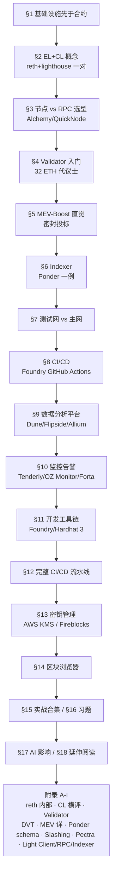

附录 H2 在后，主线优先。

---

## 1. 基础设施先于合约

想象你刚部署完一个 ERC20，`forge create` 返回了一个绿色对勾。然后呢？前端要查余额——得有个 RPC 端点；用户问 "我半年前那笔转账"——得有 indexer 把 Transfer 解码写进 Postgres；某天凌晨 admin key 被滥用 30 秒——得有告警把你从床上叫起来；调查时要看 trace——得有 archive 节点；修复要重新部署——得有 CI 跑完测试 + Safe 多签转 owner + Etherscan verify。**写出那行 ERC20 大概是工作量的 5%，剩下 95% 是让它在凌晨 3 点也能撑住的基础设施。**

这一模块的所有内容，都在解决这四种半夜叫醒人的失败模式：

| 失败模式 | 工程后果 | 对应章节 |
|---|---|---|
| 可用性 | 节点 lag / RPC throttle，用户看到旧余额 | §2（节点）/ §3（RPC 选型） |
| 可信性 | 单一 RPC 端点返回假 state | [附录 I.1 Light Client](#i1-light-clienthelios) |
| 可观测性 | 攻击发生 30 秒后才 oncall 知道 | §10（监控告警） |
| 运维成本 | archive 自建 ¥11000/年，云上 ¥17000+/年 | §3.3（成本对照） |

真实故事：2024 年某 30M TVL DeFi 项目，5 个 Solidity 工程师 0 个 SRE，开盘当天免费 RPC tier 高峰被 throttle 上百次/小时——前端 8 小时显示"余额 0"，社区以为合约被黑，TG 群 5000 人挤兑。教训：**Solidity 工程师不是 SRE 的替代品。**

---

## 2. EL + CL：一对共生进程

**TL;DR**：合并后以太坊 = EL（执行层）+ CL（共识层）两个进程，缺一不可。reth + lighthouse 是 2026 年最流行的组合。reth 处理 EVM 执行 + state；lighthouse 处理 PoS 信标链 + attestation。

**钩子**：2026-04 某 1.7 Gigagas peak block，reth v2.0 用 400ms 完成 state root，geth OOM 退出。选错客户端 = 节点掉队。

### 2.1 EL/CL 职责切分

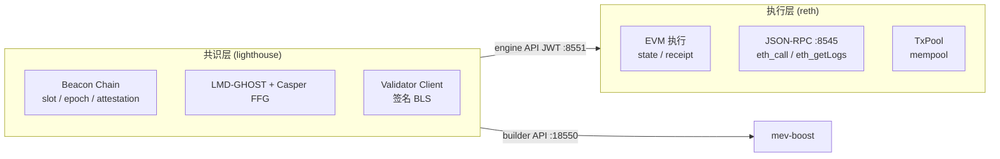

JWT 文件（`jwt.hex`）是 EL/CL 通信唯一凭证，务必 read-only 挂载。

### 2.2 节点类型速查

| 类型 | 存储 | 查询能力 | 2026-04 磁盘 (reth) | 典型用途 |
|---|---|---|---|---|
| **Full** | 最近 ~128 块状态 | latest 状态 | 700 GB | RPC / 前端 |
| **Archive** | 全历史状态 + trace | 任意区块 | 2.5 TB | indexer / DeFi 分析 |
| **Light** | 仅 beacon header | merkle proof 校验 | <1 GB | 钱包 / 移动端 |

### 2.3 reth + lighthouse docker-compose（Sepolia，复制即用）

```yaml
services:
  reth:
    image: ghcr.io/paradigmxyz/reth:v2.0.0
    restart: unless-stopped
    stop_grace_period: 5m
    networks: [eth]
    expose: ["8545","8546","8551","9001"]
    ports:
      - "30303:30303/tcp"
      - "30303:30303/udp"
    volumes:
      - reth-data:/root/.local/share/reth
      - ./jwt:/root/jwt:ro
    command:
      - node
      - --chain=sepolia
      - --datadir=/root/.local/share/reth
      - --metrics=0.0.0.0:9001
      - --authrpc.addr=0.0.0.0
      - --authrpc.port=8551
      - --authrpc.jwtsecret=/root/jwt/jwt.hex
      - --http --http.addr=0.0.0.0 --http.port=8545
      - --http.api=eth,net,web3,txpool,debug,trace   # 禁止加 admin
      - --ws --ws.addr=0.0.0.0 --ws.port=8546
      - --port=30303

  lighthouse:
    image: sigp/lighthouse:v8.1.3
    restart: unless-stopped
    depends_on: [reth]
    networks: [eth]
    expose: ["5052","5054"]
    ports:
      - "9000:9000/tcp"
      - "9000:9000/udp"
    volumes:
      - lh-data:/root/.lighthouse
      - ./jwt:/root/jwt:ro
    command:
      - lighthouse bn
      - --network=sepolia
      - --execution-endpoint=http://reth:8551
      - --execution-jwt=/root/jwt/jwt.hex
      - --checkpoint-sync-url=https://checkpoint-sync.sepolia.ethpandaops.io
      - --disable-deposit-contract-sync
      - --http --http-address=0.0.0.0 --http-port=5052
      - --metrics --metrics-address=0.0.0.0 --metrics-port=5054
      - --port=9000 --target-peers=80

networks:
  eth:
volumes:
  reth-data:
  lh-data:
```

**15 分钟上手**：`./setup.sh`（生成 jwt）→ `docker compose up -d` → Sepolia EL 约 28 min、CL 约 4 min 同步完毕。

> 节点客户端内部架构详见 [附录 A](#附录-a-reth-内部架构--storage-v2)；五种 CL 横评见 [附录 B](#附录-b-cl-客户端横评)。

---

## 3. 跑节点 vs 用 RPC 服务：选型

**TL;DR**：MVP 先用 Alchemy/QuickNode；流量稳定或有隐私/信任需求时自建 reth full；MEV searcher 必须自建。

**钩子**：2026-04-15 凌晨 2 点，某 80M TVL 借贷协议的清算机器人 6 分钟无响应——Alchemy 静默把 `eth_getLogs` 从 10 RPS 降到 2 RPS，返回 "block range too large" 而不是 429。8000 ETH 头寸滑向坏账。**RPC 才是合约真正活的地方。**

### 3.1 决策树

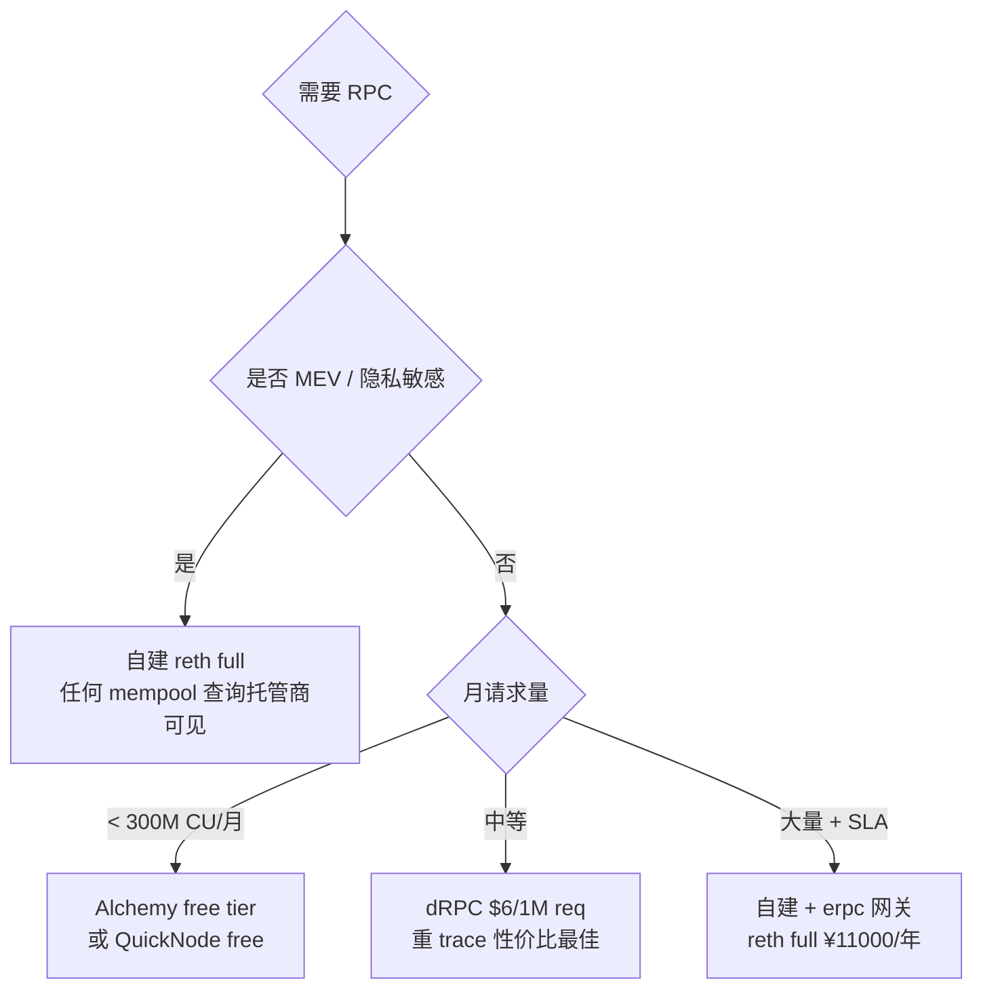

### 3.2 主流 RPC 提供商速查 (2026-04)

| 提供商 | 月度免费额度 | 优势 | 适合 |
|---|---|---|---|
| **Alchemy** | 300M CU | Enhanced API (NFT/transfer) | 大多数 dApp |
| **QuickNode** | 10M credit | SOC2 / ISO27001 全认证 | 企业 / 合规 |
| **dRPC** | 100k req (后 $6/1M) | flat 价，重 trace 最省 | indexer 后端 |
| **Tenderly Gateway** | 25M | 与 Alert/Devnet 联动 | 开发调试 |
| **LlamaRPC** | 完全免费 | DefiLlama 聚合多 RPC | 个人 / 测试 |

### 3.3 成本对照（年度）

| 方案 | 一年总费 | 适合 |
|---|---|---|
| 自建 reth full + colo | ¥11000 | 长期 / 隐私 / archive 不限次 |
| Alchemy Growth | ¥17400 | 早期 / MVP |
| Alchemy Scale | ¥86000 | 中等流量 dApp |
| AWS i4i.2xlarge | ¥42000 | 全云上 |

自建额外优势：数据可信、无 rate limit、archive/trace 不限次、隐私（托管商能看到所有查询地址）。

### 3.4 erpc 网关（多 upstream 聚合）

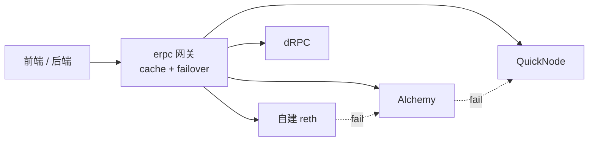

erpc 自带 health check + circuit breaker（lag > 30 块自动剔除）。`eth_call` cache 30s 可挡 ~80% 请求。

> 同步策略（snap sync / checkpoint sync 必开）详见原 §6；自建调优清单见原 §7.5。

---

## 4. Validator 入门

**TL;DR**：质押 32 ETH → 获得 validator 身份 → 每个 slot 投票（attestation）→ 偶尔被选中提议区块（proposal）→ 获得 ~3-4% APR。

**钩子**：Validator = 押金 32 ETH 的代议士。投票投错（attestation）扣几 gwei；蓄意双投（同一 slot 签两份不同票）Pectra (EIP-7251) 后初始 slashing penalty 从 1/32 effective balance 降到 1/4096（~0.0078 ETH，前提 32 ETH validator）；correlation penalty 视同时被 slash 数量叠加，最坏情况趋近全额。2024 年某 staking 服务商机房迁移，工程师把 keystore `scp` 到新机器后忘了关老 VC，**9 个 validator 触发 double-sign，单次损失 ~16 ETH/个，共赔 144 ETH**（当时约 $50 万）。

### 4.1 入门流程（直觉版）

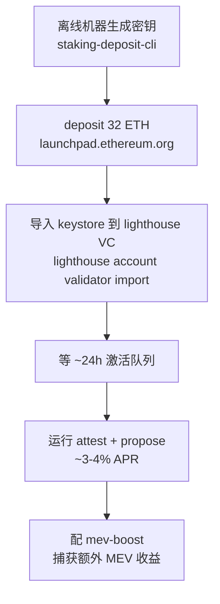

### 4.2 关键命令（快速参考）

```bash
# 1. 离线机器生成密钥
./deposit.sh new-mnemonic \
  --num_validators 1 \
  --chain mainnet \
  --eth1_withdrawal_address 0xYOUR_SAFE_MULTISIG

# 2. 导入 keystore + 启动 VC
lighthouse account validator import \
  --network mainnet --directory validator_keys
lighthouse vc \
  --network mainnet \
  --beacon-nodes http://lighthouse-bn:5052 \
  --suggested-fee-recipient 0xYOUR_FEE_RECIPIENT \
  --enable-doppelganger-protection \   # 防双签！
  --builder-proposals
```

### 4.3 Slashing 防御三板斧

| 防御 | 工具 | 关键点 |
|---|---|---|
| slashing DB 单一来源 | lighthouse VC | ① 不要把 keystore（私钥文件）复制到第二台机器同时运行；② slashing protection DB（EIP-3076 JSON）须随 keystore 迁移，它记录已签范围防止双签 |
| doppelganger 检测 | `--enable-doppelganger-protection` | 启动时延迟 2 epoch 检测网络上是否同 pubkey 在线 |
| 迁移时导出 EIP-3076 | `prysmctl / lighthouse slashing-protection` | 切换客户端必须导出导入 slashing DB |

> 0x01/0x02 升级完整操作、key 管理、DVT 拆分详见 [附录 C](#附录-c-validator-完整流程) / [附录 D](#附录-d-dvt-obol--ssv)。

---

## 5. MEV-Boost 直觉

**TL;DR**：mev-boost 让 validator 接入第三方 builder 提供的高 MEV 区块，validator 不需要自己搜索 MEV，只需接收出价最高的 block header 并签名。

**钩子**：MEV bundle = 密封投标。Builder（快递员）打包一批交易出价给 validator（拍卖师）；validator 只看到密封的出价金额（blinded header），签名后 relay 才揭示具体 tx 列表（reveal）。一旦签了就必须广播区块，否则视为 missed proposal 仅损失 proposer reward；不触发 inactivity leak（leak 仅在 finality 停滞时启动），**不构成 slashable offense**（slashing 仅针对双签或 surround vote）。

### 5.1 PBS 架构（四个角色）

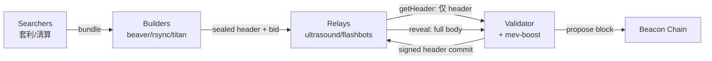

**为什么需要 relay**：validator 先看完 tx 再签 = 能挑好的拒签差的 = builder 被骗；relay 当公证人确保 commit-reveal 公平。

### 5.2 mev-boost 配置（复制即用）

```bash
mev-boost \
  -mainnet \
  -relay-check \
  -relays https://0xac6e77dfe25ecd6110b8e780608cce0dab71fdd5ebea22a16c0205200f2f8e2e3ad3b71d3499c54ad14d6c21b41a37ae@boost-relay.flashbots.net,\
https://0xa1559ace749633b997cb3fdacffb890aeebdb0f5a3b6aaa7eeeaf1a38af0a8fe88b9e4b1f61f236d2e64d95733327a62@relay.ultrasound.money,\
https://0xa15b52576bcbf1072f4a011c0f99f9fb6c66f3e1ff321f11f461d15e31b1cb359caa092c71bbded0bae5b5ea401aab7e@aestus.live \
  -addr 127.0.0.1:18550

# lighthouse 加上
lighthouse bn ... --builder http://127.0.0.1:18550 \
  --builder-fallback-skips=3
```

**至少配 4-5 个 non-censoring relay**（ultrasound / titan / aestus / flashbots / bloXroute max-profit）。bloXroute regulated 仅在合规要求下添加。

> Relay 市占、Builder market、SUAVE、BuilderNet 详见 [附录 E](#附录-e-mev-boost-relay-市占--builder-market--suave--epbs)。

---

## 6. Indexer：Ponder 一例

**TL;DR**：indexer = 监听 logs → 解码 → 写 Postgres → 暴露 GraphQL。把"链上即时计算"变成"数据库查询"，前端 50ms 返回而不是等 10 秒 `eth_getLogs`。

**钩子**：产品问"首页展示用户最近 30 天所有 swap"，工程师写 `eth_getLogs(fromBlock=head-216000)` 然后等——15 秒后 RPC 报 "block range too large"。用户不会等，这就是 indexer 存在的理由。

### 6.1 选型速查

| 方案 | 适合 | 速度 (Uniswap V2 bench) |
|---|---|---|
| **Ponder** | TS 团队 / 自托管 / 类型安全 | ~4 min（自建 reth archive） |
| **Envio HyperIndex** | 极端高吞吐 | ~1 min（HyperSync） |
| **Goldsky** | 需要 webhook / 流到 BigQuery | ~10 min |
| **The Graph** | 抗审查 / 老 subgraph 迁移 | ~158 min |

### 6.2 Ponder 最小可跑示例（USDC Transfer 索引）

```bash
# 1. 初始化项目
pnpm create ponder@latest my-indexer
cd my-indexer && cp .env.example .env   # 填 PONDER_RPC_URL_1
docker compose up -d                    # 起 Postgres
pnpm dev                                # 打开 http://localhost:42069/graphql
```

`ponder.config.ts` 关键字段：

```ts
export default createConfig({
  database: { kind: "postgres", connectionString: process.env.DATABASE_URL },
  networks: { mainnet: { chainId: 1, transport: http(process.env.PONDER_RPC_URL_1) } },
  contracts: {
    USDC: {
      network: "mainnet",
      abi: erc20Abi,
      address: "0xA0b86991c6218b36c1d19D4a2e9Eb0cE3606eB48",
      startBlock: 22300000,   // 不要从 0 开始！全量回填要数小时
    },
  },
});
```

`src/index.ts` handler（Ponder 0.11+ Drizzle ORM）：

```ts
ponder.on("USDC:Transfer", async ({ event, context }) => {
  const { from, to, value } = event.args;
  await context.db.transferEvent.insert({ from, to, value, blockNumber: event.block.number });
  if (from !== ZERO_ADDRESS) {
    await context.db.account
      .insert({ address: from, balance: -value, transferCount: 1 })
      .onConflictDoUpdate(row => ({
        balance: row.balance - value,
        transferCount: row.transferCount + 1,
      }));
  }
});
```

### 6.3 reorg 处理

Ponder 自动 rollback head ~5 块以内的 reorg，不需要你操心。自己写 indexer 时必须存 `block_hash`，每块检查 `parent_hash` 是否仍指向已写块。

### 6.4 生产部署要点

- Postgres 用托管（RDS / Neon / Supabase），不要自建（备份/PITR 麻烦）
- Ponder 把 cursor 写在 `_ponder_status`，重启自动续上
- 必须配 PITR：Postgres 损坏则从 `startBlock` 重跑

> Ponder schema 完整示例（含 relations / primaryKey / index）见 [附录 F](#附录-f-ponder-schema-完整示例)。

---

## 7. 测试网 vs 主网工作流

**TL;DR**：Sepolia = 主要开发测试网；Holesky = validator / staking 测试；mainnet fork（anvil / Tenderly Devnet）= 集成测试；主网 = 只有 CI 全绿 + tag push 才部署。

### 7.1 三种环境对比

| 环境 | 用途 | RPC |
|---|---|---|
| **Sepolia** | 合约开发测试、indexer 功能验证 | ethpandaops checkpoint + Alchemy Sepolia |
| **Holesky** | Validator / staking 测试（32 hoETH 免费水龙头） | checkpoint-sync.holesky.ethpandaops.io |
| **mainnet fork（anvil）** | 集成测试 / 模拟真实 state | `anvil --fork-url $MAINNET_RPC --fork-block-number 22000000` |
| **Tenderly Devnet** | 团队共享 fork、reviewer 复现 PR | 控制台一键创建，URL 共享 |
| **mainnet** | 生产部署 | 自建 reth + erpc 网关 |

### 7.2 工作流节奏

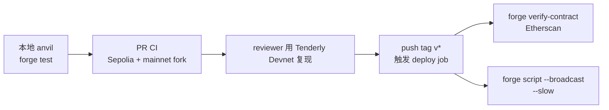

**关键规则**：
- `startBlock` 在测试网用近期区块，不从 0 跑
- mainnet deploy job 仅 `v*` tag 触发，不跟 PR push
- deploy 前必须 `forge build --sizes` 检查 24KB / 49152B initcode 限制

### 7.3 常用测试网命令

```bash
# Sepolia 水龙头
open https://sepoliafaucet.com

# Holesky validator 水龙头（32 hoETH）
open https://holesky-faucet.pk910.de

# mainnet fork（anvil）
anvil --fork-url $MAINNET_RPC_URL \
      --fork-block-number 22000000 \
      --chain-id 1

# 模拟账户余额（测试用）
cast rpc anvil_setBalance 0xYOUR_ADDR 0x1000000000000000000
```

---

## 8. CI/CD：Foundry GitHub Actions

**TL;DR**：PR 跑 `forge fmt + test + coverage + Slither`；release tag 才跑 invariant heavy fuzz + Halmos + deploy。30 秒 PR CI vs 1 小时 release CI，用时间换安全。

**钩子**：2024 年 Curve 重大 bug，reentrancy 在 invariant test 里能找出来——但 PR CI 配的 `FOUNDRY_INVARIANT_RUNS=256` 太少没跑到那条路径，merge 上线两周后被白帽报告。**CI 不是装饰，是合约最后一道筛。**

### 8.1 流水线全景

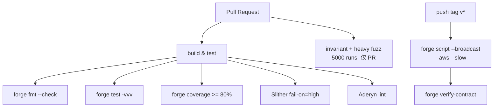

### 8.2 完整 CI 模板（可复制）

```yaml
# .github/workflows/ci.yml
name: One-shot CI
permissions:
  contents: read
  pull-requests: write
  security-events: write
on:
  push: { branches: [main] }
  pull_request: { branches: [main] }
concurrency:
  group: ci-${{ github.ref }}
  cancel-in-progress: true
env:
  FOUNDRY_PROFILE: ci

jobs:
  build-test:
    runs-on: ubuntu-latest
    timeout-minutes: 25
    steps:
      - uses: actions/checkout@v4
        with: { submodules: recursive, persist-credentials: false }
      - uses: foundry-rs/foundry-toolchain@v1
        with: { version: stable }
      - uses: actions/cache@v4
        with:
          path: |
            ~/.foundry
            ./lib
            ./out
          key: foundry-${{ hashFiles('foundry.toml', 'lib/**') }}
      - run: forge fmt --check
      - run: forge build --sizes
      - run: forge test -vvv
        env: { FOUNDRY_ETH_RPC_URL: ${{ secrets.MAINNET_RPC_URL }} }
      - run: forge coverage --report lcov --report summary
      - uses: zgosalvez/github-actions-report-lcov@v4
        with:
          coverage-files: lcov.info
          minimum-coverage: 80
          github-token: ${{ secrets.GITHUB_TOKEN }}
          update-comment: true

  slither:
    runs-on: ubuntu-latest
    needs: build-test
    steps:
      - uses: actions/checkout@v4
        with: { submodules: recursive, persist-credentials: false }
      - uses: foundry-rs/foundry-toolchain@v1
      - run: forge build --skip test --build-info
      - uses: crytic/slither-action@v0.4.0
        with:
          fail-on: high
          slither-args: --filter-paths "lib|test|script" --sarif results.sarif
          ignore-compile: true

  invariant:
    runs-on: ubuntu-latest
    needs: build-test
    if: github.event_name == 'pull_request'
    timeout-minutes: 45
    env:
      FOUNDRY_INVARIANT_RUNS: "5000"
      FOUNDRY_FUZZ_RUNS: "10000"
    steps:
      - uses: actions/checkout@v4
        with: { submodules: recursive, persist-credentials: false }
      - uses: foundry-rs/foundry-toolchain@v1
      - run: forge test --match-test invariant -vvv

  deploy:
    runs-on: ubuntu-latest
    if: startsWith(github.ref, 'refs/tags/v')
    permissions:
      contents: read
      id-token: write
    steps:
      - uses: actions/checkout@v4
        with: { submodules: recursive, persist-credentials: false }
      - uses: foundry-rs/foundry-toolchain@v1
      - uses: aws-actions/configure-aws-credentials@v4
        with:
          role-to-assume: arn:aws:iam::123456789012:role/eth-deploy-role
          aws-region: us-east-1
      - run: |
          export AWS_KMS_KEY_ID=$KMS_KEY_ID
          forge script script/Deploy.s.sol:DeployScript \
            --rpc-url $RPC_URL \
            --aws \
            --broadcast --verify \
            --etherscan-api-key $ETHERSCAN_API_KEY \
            --slow
        env:
          RPC_URL: ${{ secrets.MAINNET_RPC_URL }}
          KMS_KEY_ID: ${{ secrets.KMS_KEY_ID }}
          ETHERSCAN_API_KEY: ${{ secrets.ETHERSCAN_API_KEY }}
```

### 8.3 关键设计点

- `FOUNDRY_PROFILE: ci`：切 `[profile.ci]`，fuzz/invariant 跑更多 runs
- `submodules: recursive`：forge install 用 git submodule，缺此行依赖会丢
- `forge build --sizes`：24KB runtime + 49152B initcode 限制，临近提前预警
- `--slow`：等 receipt 才发下一笔，防 nonce 错乱
- deploy 用 AWS KMS OIDC（`id-token: write`），GitHub secrets 里无长期 AWS 凭证

> 主线前八节走完，你已经能跑节点 + indexer + CI 这条最小闭环。但"能跑"和"跑得稳"中间还隔着分析、监控、密钥、流水线——下一节 §9 起把这条链路工程化，从看数据开始。

---

> Light Client / 同步策略 / RPC 横评 / Indexer 全谱系 等深度参考已挪到模块末尾的 [附录 I](#附录-i-light-client--rpc--indexer-全谱系)，主线在此直接进入 §9。

---

## 9. 数据分析平台

打开 [hildobby Dune dashboard](https://dune.com/hildobby/eth-staked) 你能看到 33M ETH staked 实时分布，点击 SQL 看 80 行能跑出来——这种"全网数据 + 一行 SQL"的体验对工程师来说像第一次摸到 Postgres 那样开眼界。**§8 的 indexer 是给 dApp 后端用的（实时、GraphQL、单合约）；分析平台是给数据科学家、产品经理、投资人用的（离线、SQL、Notebook、多协议）。** 同一份 archive 数据，两种消费方式，下面把九个主流平台用一张表讲完什么时候用谁。

### 9.1 主流分析平台

| 平台 | 数据源 | 查询方式 | 免费额度 | 强项 |
|---|---|---|---|---|
| **Dune** | 多链 archive 抽取 | SQL (DuneSQL = Trino) | dashboard 公开免费, query 限速 | 社区生态最大, dashboard 文化 |
| **Flipside** | 多链 archive 抽取 | SQL (Snowflake) | 免费, 社区活跃 | 链覆盖广, 教育资源好 |
| **Allium** | 企业级 archive ETL | SQL + API | enterprise (无免费 tier) | data quality 最高, 用于机构 |
| **Footprint Analytics** | 多链 + 链下 | SQL + no-code | 免费 dashboard | DeFi/GameFi 模板多, 中文友好 |
| **Token Terminal** | 协议级 PnL/收入 | API + dashboard | 免费 read | 财务级 metric, IR 投资人友好 |
| **DefiLlama** | 公开 / 抓取 | API + dashboard | 完全免费 | TVL / yields / fees, 协议级标准 |
| **Artemis** | 跨链 | dashboard | 部分免费 | 跨链对比, infra metric |
| **Nansen** | 多链 + 标签 | dashboard + Smart Money 追踪 | 付费 ($150-1500/月) | 链上地址标签库最大 |
| **Arkham** | 多链 + 实体识别 | dashboard + Intelligence | 部分免费 | 实体识别 (谁是谁), 套利追踪 |

### 9.2 选型

- 社区 dashboard: **Dune**
- 开发者取数: **DefiLlama API** + **Dune SQL**
- 投资人 / VC: **Token Terminal** + **Artemis** + **Nansen**
- 机构 / 合规: **Allium** + **Arkham**
- DeFi 协议运营: **Dune** + **DefiLlama** + **Footprint**

### 9.3 DuneSQL (Trino) 关键扩展

```sql
-- 1. 直接读 raw block / tx / logs / traces 表
SELECT block_number, "from", "to", value
FROM ethereum.transactions
WHERE block_time >= now() - interval '1' day
LIMIT 10;

-- 2. Solidity 解码: decoded.event_inputs.<param>
SELECT
  evt_block_time,
  evt_tx_hash,
  varbinary_to_uint256(value) AS amount  -- 自动解 uint256
FROM erc20_ethereum.evt_Transfer
WHERE contract_address = 0xa0b86991c6218b36c1d19d4a2e9eb0ce3606eb48  -- USDC
  AND evt_block_time >= now() - interval '1' hour;

-- 3. Trino window 函数: rolling 24h volume
SELECT
  date_trunc('hour', evt_block_time) AS hr,
  sum(varbinary_to_uint256(amount0In) + varbinary_to_uint256(amount0Out)) OVER (
    ORDER BY date_trunc('hour', evt_block_time)
    ROWS BETWEEN 23 PRECEDING AND CURRENT ROW
  ) AS rolling_24h_vol
FROM uniswap_v2_ethereum.Pair_evt_Swap
ORDER BY hr DESC;

-- 4. EVM 专用: keccak / abi_decode
SELECT keccak(0x123456) AS hash;
SELECT abi_decode(input, '(address,uint256)') FROM ethereum.transactions LIMIT 1;
```

#### 性能优化 (列扫描, 非 indexed)

| 反模式 | 优化 |
|---|---|
| `WHERE LOWER(from) = ...` | 用 `from = 0x...` (binary 比较, varbinary 类型) |
| `WHERE block_time::date = '2025-01-01'` | 用 `block_time >= TIMESTAMP '2025-01-01' AND <` |
| `SELECT * FROM ethereum.transactions` 然后 filter | 用 partition `block_number` 过滤 |
| 多表 JOIN 不带 partition | 先 `WHERE block_number BETWEEN ...` 再 JOIN |

#### Dune Echo API (multichain 实时数据)

```bash
# 拿地址的 token holdings
curl https://api.echo.xyz/v1/balances/evm/0xVITALIK \
  -H "X-Dune-Api-Key: $KEY"

# 拿 mempool 中地址相关 pending tx
curl https://api.echo.xyz/v1/transactions/evm/pending/0xVITALIK \
  -H "X-Dune-Api-Key: $KEY"
```

> 来源: [Dune Echo API](https://sim.dune.com/api), [Dune chain coverage](https://dune.com/blog/chain-coverage)

### 9.4 Allium / Footprint 实测对比

| 维度 | Dune | Allium | Footprint |
|---|---|---|---|
| 主用户 | 社区 / dashboard 文化 | 机构 / 合规 | DeFi/GameFi 中文团队 |
| 数据延迟 | 1-3 min | < 1 min (real-time tier) | 5-15 min |
| 链覆盖 | 100+ EVM + Solana + Bitcoin + ... | 130+ EVM | 30+ |
| 数据质量 SLA | 社区 best-effort | enterprise SLA | 中等 |
| Schema | community-curated (有 abstraction layer) | enterprise-curated | mixed |
| API 价格 | $200-2000/月 | $5k-50k/月 | $50-500/月 |
| no-code dashboard | ✓ 强 | ✓ | ✓ 强 |
| 适合 | open dashboard / 个人分析 | 银行 / 交易所 / TradFi | 做 GameFi/Asia 项目 |

Allium 在 reorg 处理上更严谨, 适合给监管报数。Dune 适合产品 & marketing。

---

## 10. 监控告警

2024-07-30 凌晨某 cross-chain bridge 协议被盗 23M 美元——攻击者用 admin key 发 `setOwner` 改完了再排到下一个 bundle 才转走资金，整个过程 47 秒。事后复盘：team 装了 Etherscan watch list，但 Etherscan 邮件 7 分钟后才发出，那时资金已经在 Tornado Cash 里了。**没有秒级告警 + 自动化响应，oncall 工程师是赶不上链速的。**

监控有两层职责：(1) **节点/服务自身存活**（Prometheus + Alertmanager，已在 §7.6.2 metrics 阈值表覆盖）；(2) **合约/on-chain 行为监控**（攻击、admin 异常、清算飙升）。本节专讲第二层。一个让 2026 监控选型彻底洗牌的关键事件——**OpenZeppelin Defender Sentinel 2026-07-01 关停**，所有跑 Defender 的存量项目都要迁，下面给你三条迁移路径。

### 10.1 工具定位

| 工具 | 类型 | 控制粒度 | 触发后能做什么 | 适用场景 | 2026-04 状态 |
|---|---|---|---|---|---|
| Tenderly Alert | SaaS | function/event/failed-tx, 参数比较 | webhook/Slack/PagerDuty/邮件/Web3 Action | 自家协议监控 + debug 联动 | 活跃, 主推 AI debug |
| OpenZeppelin Defender Sentinel | SaaS | function/event/参数 | 邮件/Slack/Telegram/Discord/Autotask | 合约 admin / 治理 / 紧急 pause | **2026-07-01 关停**, 迁开源 Monitor / Relayer |
| Forta agent | 链上 + bot 网络 | 任意 TS/Python | Finding -> Forta query API / Discord webhook | 全网监控 / 社区 bot 协同 | 活跃 |
| Hypernative | SaaS | AI-driven 异常检测 | webhook / 自动 freeze | 高 TVL 协议 / 桥 | 商业, 2026 主推 |
| Ironblocks | SaaS | rule + ML | webhook / on-chain firewall | DeFi 协议 firewall | 活跃 |
| Cyfrin Wallet Watch | SaaS | 钱包级行为 | 邮件 | 个人 / 小团队 | 2025 上线 |

> 来源: [OpenZeppelin Defender shutdown](https://www.openzeppelin.com/news/sunsetting-defender), [Tenderly Alerts docs](https://docs.tenderly.co/alerts/intro-to-alerts), [Forta SDK](https://docs.forta.network/en/latest/sdk/)

### 10.2 Defender 关停的迁移路径

开源替代：[openzeppelin-relayer](https://github.com/OpenZeppelin/openzeppelin-relayer) / [openzeppelin-monitor](https://github.com/OpenZeppelin/openzeppelin-monitor)（alpha）。Sentinel + Autotask → 自托管 Monitor + Relayer。新项目直接选 Tenderly + Forta，高 TVL 加 Hypernative。

#### openzeppelin-monitor 自托管 docker-compose

```yaml
# 把已有 Defender Sentinel 配置迁移到自托管 monitor
services:
  oz-monitor:
    image: ghcr.io/openzeppelin/openzeppelin-monitor:latest
    container_name: oz-monitor
    restart: unless-stopped
    volumes:
      - ./config:/app/config:ro
    environment:
      - RUST_LOG=info
      - METRICS_PORT=8081
    ports:
      - "127.0.0.1:8081:8081"   # prometheus
    depends_on: [redis]

  redis:
    image: redis:7-alpine
    restart: unless-stopped
    volumes:
      - redis-data:/data

volumes:
  redis-data:
```

`config/monitors/erc20-pause.yaml`:

```yaml
name: USDC large-withdraw -> Slack
network: ethereum
addresses:
  - "0xA0b86991c6218b36c1d19D4a2e9Eb0cE3606eB48"
match_conditions:
  events:
    - signature: "Transfer(address,address,uint256)"
      expression: "value > 1000000000000"   # 1M USDC
notifications:
  - kind: slack
    webhook: ${SLACK_WEBHOOK}
  - kind: webhook
    url: https://my-pause-bot.example.com/pause
    method: POST
    headers:
      Authorization: "Bearer ${PAUSE_BOT_TOKEN}"
```

monitor 仅做 detect + dispatch。不要让 monitor 直接掌握 pause 私钥 (单点失败)。

### 10.3 Tenderly Alert 实战

见 `code/04-tenderly-alert/tenderly.yaml`. 典型 alert: 函数参数阈值 (withdraw > 1M USDC) / OwnershipTransferred 触发 PagerDuty / 30 笔失败 tx/10 min 同一 EOA 探测 bot.

Tenderly 差异化: **debug 联动** (alert -> 一键 trace + state diff) / **AI calldata 解码** (raw `0xa9059cbb...` -> "transfer 100 USDC to 0xabc") / **Virtual TestNet** (克隆生产 state 做模拟).

#### Tenderly Virtual TestNet

| 维度 | anvil --fork | Tenderly Virtual TestNet |
|---|---|---|
| 启动时间 | 1-3 s (本机) | 100 ms (托管, 全球分布) |
| 共享 | 否 | URL 共享给团队, 大家连同一个 fork |
| 持久化 | 进程退出即没 | 持续运行, 状态保留 |
| explorer | 无 (要自己 forge inspect) | 自带 explorer, 同 Etherscan UI |
| trace | forge -vvv | 完整 step-by-step UI debugger |
| CI 集成 | 否 | `Tenderly/vnet-github-action` |

工作流: PR CI -> spin up vnet -> 集成测试 -> 把 explorer URL 贴 PR -> reviewer 复现 -> approve -> CI 销毁. CLI 实操:

```bash
# 用 tenderly CLI 创建 vnet
tenderly devnet spawn-rpc --project my-project --template fork-mainnet

# 输出 RPC URL: https://virtual.mainnet.rpc.tenderly.co/<UUID>
# 直接当 RPC 用
forge test --fork-url $TENDERLY_VNET_URL -vv

# 模拟 whale impersonation
cast rpc tenderly_setBalance 0xVITALIK 0x1000000000000000000 --rpc-url $TENDERLY_VNET_URL
cast rpc tenderly_addBalance 0xVITALIK 0x1000000000000000000 --rpc-url $TENDERLY_VNET_URL  # 注：vNet 端点已替换为 tenderly_setBalance；fork 端点保留 addBalance
```

#### Tenderly 三大产品线

| 产品 | 用途 | 是否在 free tier |
|---|---|---|
| **Debugger** | 任意 mainnet tx 的 step-by-step opcode 级 trace, 状态 diff | ✓ |
| **Simulator** | 给一笔未发出的 tx 预演结果 (state changes, gas, events) | ✓ (有限次) |
| **Virtual TestNet** | 持续 fork 任意链, 团队协作 | free tier 5 个并发, 7 天 TTL |
| **Web3 Actions** | 链上事件触发的 serverless TS 函数 (256 MB / 60 s) | 部分免费 |
| **Alerts** | function/event/参数 监控 + 多渠道分发 | ✓ |
| **Gateway** | 托管 RPC, 与 Alerts/Debugger 深度联动 | 免费 25M req/月 |

> 来源: [Tenderly Virtual TestNet docs](https://docs.tenderly.co/virtual-testnets), [vnet-github-action](https://github.com/Tenderly/vnet-github-action), [Tenderly Review 2026](https://cryptoadventure.com/tenderly-review-2026-simulation-debugging-virtual-testnets-and-monitoring-for-web3-teams/)

#### Phalcon (BlockSec) vs Hypernative vs Tenderly 实测对比

| 维度 | Tenderly | Phalcon (BlockSec) | Hypernative |
|---|---|---|---|
| 检测点 | tx 上链后 (post-mine) | **mempool 阶段** (pre-mine) | mempool + post-mine |
| 反应时间 | 5-15 s | < 1 s (链上前拦截) | < 1 s |
| 自动 block | 否 (只 alert) | **是** (Phalcon Block 自动反向竞拍 / 拦截) | 是 (firewall + 反向交易) |
| 误报率 | 高 (只看模板) | BlockSec 报告：误报率 < 1%（非命中率 99%） | < 1% (ML 模型) |
| 适合 | 自家协议监控 + debug 联动 | DeFi 协议主动防御 / 应急响应 | 高 TVL 协议 / DEX / lending |
| 月费 | $200-2000 | enterprise | enterprise ($5k-50k) |

> 来源: [BlockSec Phalcon Security](https://blocksec.com/phalcon/security), [Phalcon Block Defense](https://medium.com/@JohnnyTime/a-dive-into-phalcon-block-real-time-defense-against-smart-contract-hacks-d6d720924cff), [Hypernative State of Web3 Security 2026](https://www.hypernative.io/blog/the-state-of-web3-security-for-2026-winning-the-red-queen-race-in-cryptos-breakout-year)

中等 TVL 协议 (10M-100M) 选 Tenderly + Forta 已够；100M+ 协议必上 Phalcon Block 或 Hypernative, 不能只有事后 alert。这是 2024-2025 主流 DeFi 协议血泪教训得出的标准。

#### Pessimistic.io

Pessimistic 是另一家 audit firm 衍生的监控服务, 专做 invariant on-chain monitoring (协议方提供 invariant 表达式, 它在每块校验). 适合数学严格的 DeFi 协议, 但仍需要协议方写出 invariant.

### 10.4 Forta agent 实战

见 `exercises/02-forta-large-transfer-agent/src/agent.ts`. agent = Docker image, 抵押 FORT 注册到网络. `txEvent.filterLog(ABI, address)` 过滤事件; Finding 含 alertId / severity / metadata / labels; 多链复用: chainIds [1, 8453, 42161, 10].

### 10.5 选型决策树

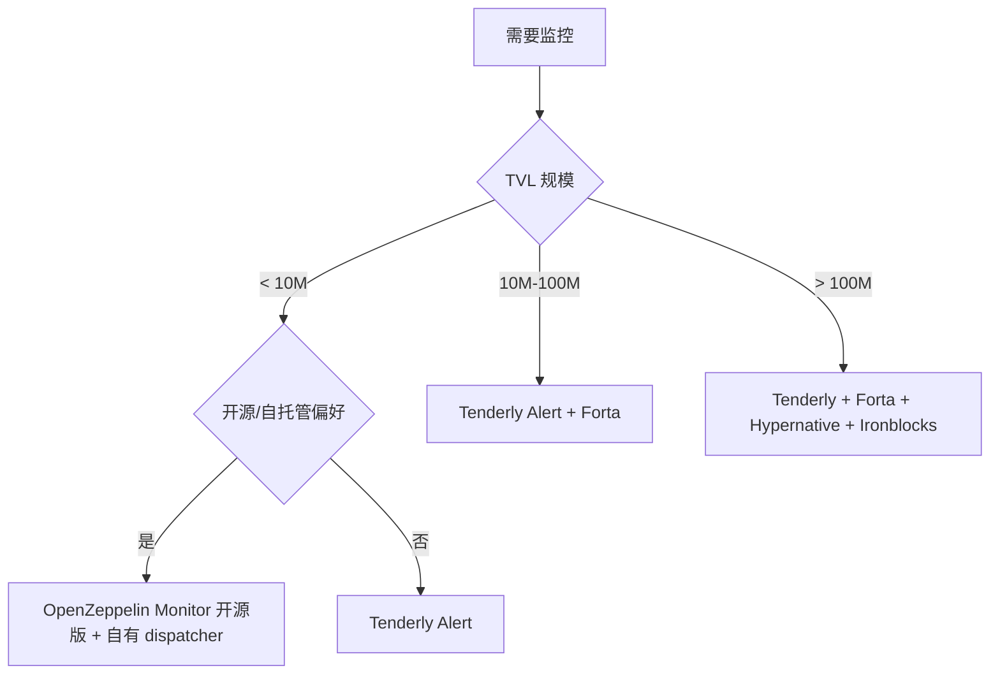

---

## 11. 开发工具链

2023 年大家还在 `npx hardhat test` 等 25 秒看 50 个单测跑完，2024 年 Foundry 把这事压到 2-4 秒——一个 50 测试套件 dev cycle 从"煮咖啡时间"变成"按下保存键的延迟"。Hardhat 团队没坐以待毙，2026-04 Hardhat 3 把 Foundry-compatible Solidity 测试内嵌进来，**JS 团队终于能写 forge 风格的 fuzz/invariant 又保留 hardhat-deploy 的 plugin 生态**。下面这张表帮你 5 分钟决定新项目用谁。

### 11.1 Foundry vs Hardhat 3 (2026-04)

| 维度 | Foundry | Hardhat 3 (beta, production-ready) | Hardhat 2 |
|---|---|---|---|
| 内核语言 | Rust | TypeScript + 部分 Rust 内核 | Node.js |
| Solidity 测试 | yes (forge test) | yes (Foundry-compatible Solidity tests) | 间接 (hardhat-foundry plugin) |
| 编译速度 (50 测试) | 2-4s | 5-8s | 18-25s |
| Fuzz | yes | yes (Foundry-compat) | 间接 |
| Invariant | yes | yes (Foundry-compat) | 否原生 |
| 主网 fork | anvil | hardhat node 3 | hardhat node 2 |
| 部署语言 | Solidity (forge script) | TypeScript | TypeScript |
| Verify | forge verify-contract | hardhat-verify | hardhat-verify |
| viem 集成 | viem 可独立使用 | hardhat-viem plugin (Viem Toolbox 一部分) | 同 v2 plugin |
| 适合 | 协议层, 安全审计, 性能极致 | 现代 JS 团队, 想要 Foundry 测试 + JS DX | 老项目, 大量 plugin 依赖 |

2026-04 更新: Hardhat 3 已 production-ready (beta 状态), 可迁移。主要变化: 内置 Foundry-compatible Solidity 测试 (可在 Hardhat 项目直接写 forge 风格的 fuzz/invariant), 顶层 viem 集成, 测试速度大幅提升。来源: [Hardhat 3 What's New](https://hardhat.org/docs/hardhat3/whats-new), [Beta status](https://hardhat.org/docs/hardhat3/beta-status)。

**2026-04 推荐**:
- 新项目: **Foundry**, 复杂 deploy 链 / 多链可加 Hardhat 3.
- Hardhat 2 项目: **升级 Hardhat 3** (production-ready), 不再需要 hardhat-foundry plugin.
- **Truffle**: 已弃用 (ConsenSys 2023-09), 勿用.
- **ApeWorx (Python)**: Vyper / Python 团队, 生态较小.
- **Brownie (Python)**: 停止维护, 不推荐.

> 来源: [Hardhat 3 docs](https://hardhat.org/docs/getting-started), [Medium Foundry vs Hardhat 2026](https://medium.com/@atnoforblockchain/foundry-vs-hardhat-in-2026-which-smart-contract-development-framework-should-you-use-%EF%B8%8F-502946526591), [Chainstack performance](https://chainstack.com/foundry-hardhat-differences-performance/)

### 11.2 本地链对照

| 工具 | 启动 | 内存 | fork mainnet | 共享给同事 | 适用 |
|---|---|---|---|---|---|
| **anvil** (Foundry) | `anvil` | 极小 | `anvil --fork-url` | 否 (本地) | 单机开发, CI |
| **hardhat node 2/3** | `npx hardhat node` | 较大 (Node.js) | `--fork` | 否 | JS 团队, 与 hardhat-deploy 集成 |
| **Tenderly Devnet** | 控制台/CLI 创建 | 0 (托管) | 持续 fork | 是 (URL 共享) | 团队联调, demo |

三人团队联调 DeFi 协议, 不要每人本地 anvil 各自 state 不同步。直接 Tenderly Devnet, $0 free tier 够用。

### 11.3 Stylus (Arbitrum)

Rust / C / C++ 写合约, 编译 WASM 与 EVM 共存. 2026-04: Rust SDK v0.10+ ([OpenZeppelin rust-contracts-stylus](https://github.com/OpenZeppelin/rust-contracts-stylus)), 计算密集场景 10-100x 快, 初始化 ~10000 gas, 调用 2-10x 便宜, 与 Solidity 合约无缝互调.

> 来源: [Arbitrum Stylus Rust SDK](https://github.com/OffchainLabs/stylus-sdk-rs)

适用: ZK 验证 / ML 推理 / 加密哈希 / 定制 EC 曲线. 不适用简单 ERC20 (Solidity 更轻量).

---

## 12. CI/CD: 完整 Foundry 流水线

2024 年 Curve 一次重大 bug：reentrancy 在 invariant test 里能找出来，但 PR CI 配的 `FOUNDRY_INVARIANT_RUNS=256` 太少没跑到那条路径，merge 上线两周后被白帽报告。**CI 不是装饰，是合约最后一道筛。** 标准做法：每个 PR 都跑一遍 `forge fmt + forge test + coverage + Slither/Aderyn`；release tag 才跑 invariant heavy fuzz（5000 runs）、Halmos 符号执行、verify + 上链广播——日常 PR 30 秒搞完，release tag 多花 1 小时换"半夜不被叫醒"。下面拆三层：流水线全景图、关键设计点、可复制的完整模板。

### 12.1 流水线全景

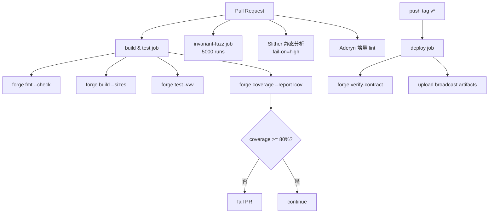

### 12.2 关键设计说明

见 `code/03-foundry-github-action/.github/workflows/foundry.yml`.

- `permissions: contents: read, pull-requests: write`: 最小权限, 能贴 coverage 评论但不能改代码.
- `env: FOUNDRY_PROFILE: ci`: 切 `[profile.ci]`, fuzz/invariant 跑更多 runs.
- `submodules: recursive`: forge install 用 git submodule, 缺此行依赖会丢.
- `version: stable`: 不用 `nightly`, CI 重现性优先.
- `forge build --sizes`: 输出字节码大小, 24KB 限制 (EIP-170, runtime code) 临近提前预警；同时注意 **EIP-3860 (Shanghai) initcode 上限 49152 B (`MAX_INITCODE_SIZE = 2 × MAX_CODE_SIZE`)** 与每 32 B initcode 收 2 gas 的额外费用——大型 constructor / 大量 immutable / `CREATE2` factory 容易超 initcode 上限即便 runtime 还在 24KB 内，建议 CI 同时检查 deploy bytecode 长度.
- `forge test -vvv`: 失败时直接看 EVM opcode 调用栈.
- `FOUNDRY_INVARIANT_RUNS: 5000`: 仅 PR 触发, 跑 30-45 min.
- `on.push.tags: ['v*']`: deploy job 仅 release tag 触发.
- `--slow`: 等 receipt 才发下一笔, 防 nonce 错乱.
- `upload-artifact broadcast/`: 含每笔 tx hash + 地址, 90 天保留.

### 12.3 进阶工具链

- **Slither** (Trail of Bits): `crytic/slither-action@v0.4.0`, 速度快, 默认推荐.
- **Aderyn** (Cyfrin): Rust 静态分析, finding 输出 markdown report. CI: `cyfrin/aderyn-action`.
- **Halmos** (a16z): 符号执行, `forge test` 兼容语法, 能找 fuzz 找不到的 deep bug. 慢 (5-30 min/test), 仅 release tag 跑.
- **echidna** (Trail of Bits): property-based fuzzer, 部分团队作 Foundry invariant 的 second opinion.
- **certora prover**: 商业 formal verification, 用于 Aave / MakerDAO 等高价值协议.
- **mythril**: 老牌符号执行, Solidity 0.8+ 支持有限, 不推荐新项目.

### 12.4 流水线性能优化

| 优化 | 节省时间 |
|---|---|
| `actions/cache` 缓存 `~/.foundry`, `lib/`, `out/` | 60-80% build 时间 |
| `concurrency.cancel-in-progress: true` 取消旧 PR run | 节省 runner 用量 |
| 分离 build 和 fuzz 两个 job, 让 fuzz 仅 PR 跑 | main push 节省 30 min |
| 用 self-hosted runner (M2 Mac mini / Hetzner CCX 2GB ARM) | 比 GitHub free runner 快 2-3x, 月成本 ¥150 |

### 12.5 一条龙完整模板 (fmt + build + test + coverage + Slither + Aderyn + invariant + Halmos)

```yaml
# .github/workflows/ci.yml
name: One-shot CI
permissions:
  contents: read
  pull-requests: write
  security-events: write   # 上传 SARIF 给 GitHub code scanning

on:
  push:
    branches: [main]
  pull_request:
    branches: [main]
  workflow_dispatch:

concurrency:
  group: ci-${{ github.ref }}
  cancel-in-progress: true

env:
  FOUNDRY_PROFILE: ci

jobs:
  # ---------------------------------------------------------------
  # job 1: fmt + build + unit test + coverage
  # ---------------------------------------------------------------
  build-test:
    name: build & test
    runs-on: ubuntu-latest
    timeout-minutes: 25
    steps:
      - uses: actions/checkout@v4
        with: { submodules: recursive, persist-credentials: false }

      - uses: foundry-rs/foundry-toolchain@v1
        with: { version: stable }

      - name: cache foundry
        uses: actions/cache@v4
        with:
          path: |
            ~/.foundry
            ./lib
            ./out
          key: foundry-${{ hashFiles('foundry.toml', 'remappings.txt', 'lib/**') }}

      - run: forge --version
      - run: forge fmt --check
      - run: forge build --sizes
      - run: forge test -vvv
        env:
          FOUNDRY_ETH_RPC_URL: ${{ secrets.MAINNET_RPC_URL }}

      - name: coverage (lcov)
        run: forge coverage --report lcov --report summary
        continue-on-error: true

      - name: coverage threshold + PR comment
        uses: zgosalvez/github-actions-report-lcov@v4
        with:
          coverage-files: lcov.info
          minimum-coverage: 80
          artifact-name: coverage-report
          github-token: ${{ secrets.GITHUB_TOKEN }}
          update-comment: true

  # ---------------------------------------------------------------
  # job 2: Slither (Trail of Bits)
  # ---------------------------------------------------------------
  slither:
    name: Slither
    runs-on: ubuntu-latest
    needs: build-test
    timeout-minutes: 15
    steps:
      - uses: actions/checkout@v4
        with: { submodules: recursive, persist-credentials: false }
      - uses: foundry-rs/foundry-toolchain@v1
      - run: forge build --skip test --build-info

      - uses: crytic/slither-action@v0.4.0
        id: slither
        with:
          fail-on: high
          slither-args: --filter-paths "lib|test|script" --sarif results.sarif
          ignore-compile: true

      - name: upload SARIF
        if: always()
        uses: github/codeql-action/upload-sarif@v3
        with:
          sarif_file: ${{ steps.slither.outputs.sarif }}

  # ---------------------------------------------------------------
  # job 3: Aderyn (Cyfrin Rust 静态分析)
  # ---------------------------------------------------------------
  aderyn:
    name: Aderyn
    runs-on: ubuntu-latest
    needs: build-test
    timeout-minutes: 10
    steps:
      - uses: actions/checkout@v4
        with: { submodules: recursive, persist-credentials: false }
      - uses: foundry-rs/foundry-toolchain@v1
      - run: forge build --skip test

      - name: install Aderyn
        run: |
          curl -L https://github.com/Cyfrin/aderyn/releases/latest/download/aderyn-installer.sh | bash
          echo "$HOME/.cyfrin/bin" >> $GITHUB_PATH

      - name: run Aderyn
        run: aderyn . --output report.md --no-snippets

      - name: upload report
        if: always()
        uses: actions/upload-artifact@v4
        with:
          name: aderyn-report
          path: report.md

      - name: post PR comment
        if: github.event_name == 'pull_request'
        uses: marocchino/sticky-pull-request-comment@v2
        with:
          path: report.md

  # ---------------------------------------------------------------
  # job 4: invariant + heavy fuzz (仅 PR)
  # ---------------------------------------------------------------
  invariant:
    name: invariant + heavy fuzz
    runs-on: ubuntu-latest
    needs: build-test
    if: github.event_name == 'pull_request'
    timeout-minutes: 45
    env:
      FOUNDRY_INVARIANT_RUNS: "5000"
      FOUNDRY_INVARIANT_DEPTH: "25"
      FOUNDRY_FUZZ_RUNS: "10000"
    steps:
      - uses: actions/checkout@v4
        with: { submodules: recursive, persist-credentials: false }
      - uses: foundry-rs/foundry-toolchain@v1
      - run: forge test --match-test invariant -vvv
      - run: forge test --match-test fuzz -vv

  # ---------------------------------------------------------------
  # job 5: Halmos 符号执行 (仅 release tag)
  # ---------------------------------------------------------------
  halmos:
    name: Halmos symbolic
    runs-on: ubuntu-latest
    needs: build-test
    if: startsWith(github.ref, 'refs/tags/v')
    timeout-minutes: 60
    steps:
      - uses: actions/checkout@v4
        with: { submodules: recursive, persist-credentials: false }
      - uses: foundry-rs/foundry-toolchain@v1
      - uses: actions/setup-python@v5
        with: { python-version: "3.12" }
      - run: pip install halmos
      - run: halmos --solver-timeout-assertion 60000 --loop 10
```

Halmos 跑 60 分钟正常（符号执行复杂度爆炸）。仅 release tag 触发，不堵 PR。日常 PR 走 Slither + Aderyn + invariant 已足够。

### 12.6 与 Tenderly Virtual TestNet 集成 CI

```yaml
- name: setup Tenderly Virtual TestNet
  id: vnet
  uses: Tenderly/vnet-github-action@v1
  with:
    access_key: ${{ secrets.TENDERLY_ACCESS_KEY }}
    project_name: my-project
    account_name: my-team
    network_id: 1                    # mainnet fork
    testnet_name: pr-${{ github.event.pull_request.number }}

- name: run integration tests on fork
  run: |
    forge test --fork-url ${{ steps.vnet.outputs.rpc_url }} \
               --match-path 'test/integration/**' -vv
```

真实 mainnet 状态 + 完整 trace + 共享 explorer URL, 优于纯 anvil fork.

> 来源: [Tenderly vnet-github-action](https://github.com/Tenderly/vnet-github-action), [Tenderly Virtual TestNet 文档](https://docs.tenderly.co/virtual-testnets)

---

## 13. 密钥管理

2022 年 Ronin Bridge 被盗 6.25 亿美元——攻击者拿到 5 个 validator 私钥（多签 5/9）签了一笔提款 tx，全靠的是社工拿到一份 PDF + 一台 RPC 节点托管商的访问权。2023 年 Curve `--private-key` 写死 `.env` 上 GitHub 的事至少 3 起。**写代码再美，私钥放错地方一切归零。**

§12 流水线最后一步是 `--broadcast` 上链——这步背后的私钥是协议方最大的攻击面。本节用一张信任模型表 + 三条主线把"私钥放哪"讲清楚：**admin / 治理用 Safe + 硬件钱包**（人类按按钮，物理隔离）、**CI/CD 用 KMS + OIDC**（GitHub Action 拿短期 token，机器签名永远摸不到私钥）、**用户钱包用嵌入式 + MPC/TEE**（社交登录但密钥分片，没有"备份助记词"摩擦）。

### 13.1 信任模型对照

| 方案 | 私钥位置 | 单点失败 | 适合场景 | 2026 推荐度 |
|---|---|---|---|---|
| `--private-key 0x...` | 环境变量 | 是 | 永远不要用 | 0/10 |
| Foundry keystore | AES 加密本地文件 | 看密码强度 | 个人 dev | 6/10 |
| **Frame** | 桌面 (硬件钱包代理) | 看硬件钱包 | 个人 / 部署 | 8/10 |
| **Ledger / Trezor** | 物理 U2F | 物理 | 个人 / 治理 multisig | 9/10 |
| **Safe (Gnosis)** | smart contract multisig | 看签名者集 | 协议 admin / DAO | 10/10 |
| **Squads** (Solana) | smart contract multisig | 看签名者集 | Solana 同上 | 10/10 (Solana) |
| **AWS KMS** | KMS, 不可导出 | KMS 可用性 | CI/CD, 服务器签名 | 8/10 |
| **Azure Key Vault** | Azure | Azure 可用性 | Azure 栈 | 7/10 |
| **GCP KMS** | GCP | GCP 可用性 | GCP 栈 | 7/10 |
| **HashiCorp Vault** | 自托管 / HCP | 自管理 | 多云 / on-prem | 8/10 |
| **HSM** (YubiHSM / AWS CloudHSM) | 物理 | 物理 | 顶级合规 | 9/10 |
| **Fireblocks** | MPC + Nitro Enclave | MPC threshold | 机构 / 大额 | 10/10 (机构) |
| **BitGo** | MPC + cold storage | MPC threshold | 机构 / 托管 | 9/10 |
| **Turnkey** | TEE (AWS Nitro), policy 签名 | TEE 可用性 | embedded / agent 钱包 | 9/10 |
| **Web3Auth MPC** | 三方 MPC (社交+设备+服务) | 阈值 | 嵌入式钱包 / 社交登录 | 8/10 |
| **Privy** (Stripe 旗下) | 嵌入式 | TEE | 应用嵌入式钱包 | 9/10 |
| **Capsule (Para)** | MPC | 阈值 | 嵌入式 + portable | 8/10 |

### 13.2 协议方部署 / admin: Safe + 硬件钱包

1. 部署合约 -> 立刻转 ownership 给 3/5 Safe multisig
2. Safe 签名者: 至少 2 个不同地理 / 不同硬件钱包 / 不同 EOA 类型
3. 关键参数变更 -> Safe 提案 -> 时间锁 24-48h -> 执行
4. Safe 1/N 紧急 pause（任一签名者可触发）；unpause 必须走 3/5 主签——非"pause 后不能 unpause"

### 13.3 服务器签名 (Relayer): AWS KMS + Foundry

```bash
# Foundry 1.0+ 直接调 AWS KMS（KMS key 通过环境变量 AWS_KMS_KEY_ID 传入，--aws 自动读取）
export AWS_KMS_KEY_ID=$KMS_KEY_ID
forge script script/Deploy.s.sol \
  --rpc-url $RPC_URL \
  --aws \
  --broadcast
```

> 来源: [AWS Web3 Blog - EOA private keys with KMS](https://aws.amazon.com/blogs/web3/make-eoa-private-keys-compatible-with-aws-kms/)

KMS Key 设 grant: 仅 GitHub Action OIDC role 能调 sign. 这样 GitHub secret 里没有任何长期凭证.

#### 端到端: GitHub Actions OIDC + AWS KMS 部署一份合约

```yaml
# .github/workflows/deploy-kms.yml
name: Deploy via KMS (no long-lived secret)
on:
  push:
    tags: ['v*']
permissions:
  contents: read
  id-token: write     # 关键: 让 GH 给 AWS 颁发短期 OIDC token

jobs:
  deploy:
    runs-on: ubuntu-latest
    environment: mainnet
    steps:
      - uses: actions/checkout@v4
        with:
          persist-credentials: false
          submodules: recursive
      - uses: foundry-rs/foundry-toolchain@v1

      - uses: aws-actions/configure-aws-credentials@v4
        with:
          role-to-assume: arn:aws:iam::123456789012:role/eth-deploy-role
          aws-region: us-east-1

      - name: forge script with KMS
        run: |
          export AWS_KMS_KEY_ID=$KMS_KEY_ID
          forge script script/Deploy.s.sol:DeployScript \
            --rpc-url $RPC_URL \
            --aws \
            --broadcast \
            --verify \
            --etherscan-api-key $ETHERSCAN_API_KEY \
            --slow
        env:
          RPC_URL: ${{ secrets.MAINNET_RPC_URL }}
          KMS_KEY_ID: ${{ secrets.KMS_KEY_ID }}
          ETHERSCAN_API_KEY: ${{ secrets.ETHERSCAN_API_KEY }}
```

IAM 角色 trust policy (限定 GitHub repo + branch):

```json
{
  "Version": "2012-10-17",
  "Statement": [{
    "Effect": "Allow",
    "Principal": { "Federated": "arn:aws:iam::123456789012:oidc-provider/token.actions.githubusercontent.com" },
    "Action": "sts:AssumeRoleWithWebIdentity",
    "Condition": {
      "StringEquals": {
        "token.actions.githubusercontent.com:aud": "sts.amazonaws.com"
      },
      "StringLike": {
        "token.actions.githubusercontent.com:sub": "repo:my-org/my-repo:ref:refs/tags/v*"
      }
    }
  }]
}
```

要点:

- `id-token: write` + OIDC 联邦, GH 无需长期 AWS access key.
- `sub` 限定 `refs/tags/v*`: 只有 release tag 能拿 deploy role.
- KMS grant 仅 `kms:Sign`, 不给 `kms:Decrypt` / `kms:Encrypt`.
- 无人电脑持有 mainnet 部署私钥, 全在 KMS HSM 里.

### 13.4 机构: Fireblocks / Turnkey

- **Fireblocks**: MPC + Nitro Enclave, 私钥分片永不重组. Key Link 接入已有 HSM, 无需迁移.
- **Turnkey**: TEE-only (AWS Nitro), 50-100ms 签名, policy engine (类 IAM rule), AI agent 钱包主流.

> 来源: [Fireblocks Key Link](https://www.fireblocks.com/blog/introducing-fireblocks-key-link-a-seamless-integration-for-existing-key-management-solutions), [Turnkey 2026 Review](https://cryptoadventure.com/turnkey-review-2026-embedded-wallet-infrastructure-key-control-and-the-real-custody-tradeoff/)

### 13.5 签名前防钓鱼: Wallet Guard / Pocket Universe / Blowfish

扫描即将签名的 calldata, 模拟执行并自然语言说明 ("这笔会让你转出 100 USDC + 一个 BAYC"), 黑名单拦截已知 drainer. 个人或 admin 必装.

### 13.6 嵌入式钱包生态 (2026, 关键收购后)

| 项目 | 归属 | 签名延迟 | 信任模型 | 2026 状态 |
|---|---|---|---|---|
| **Web3Auth** | 已并入 ConsenSys / MetaMask Embedded | ~500ms (MPC) | 三方 MPC (设备 + 社交 + 服务) | 主推 MetaMask Embedded |
| **Privy** | 已被 Stripe 收购 (2025-06) | TEE 较快 | TEE-based + server wallets | $299/月起 (2500 MAU) |
| **Dynamic** | 已被 Fireblocks 收购 (2025) | TEE / MPC 可选 | 多模式 | 与 Fireblocks 体系融合 |
| **Para (前 Capsule)** | 独立 | ~500ms (MPC) | MPC + passkey | $200/月起 (2500 MAU) |
| **Turnkey** | 独立 | 50-100ms (TEE only) | AWS Nitro Enclave + policy | 速度最快, AI agent 主流 |
| **Openfort** | 独立 | 125ms | 多模式 | session key + AA 主推 |

#### 选型决策

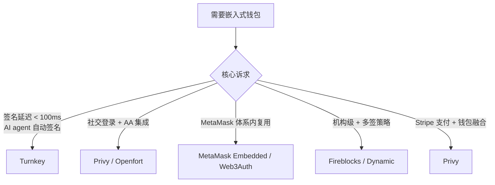

> 来源: [Fireblocks vs Privy vs Turnkey 对比](https://www.fireblocks.com/report/compare-embedded-wallet-infrastructure), [Openfort - Top embedded wallets 2026](https://www.openfort.io/blog/top-10-embedded-wallets)

### 13.7 Frame: 桌面端硬件钱包代理

开源 macOS/Linux/Windows app, 把 Ledger / Trezor / Lattice 做成系统级 RPC 端点, dApp 通过 Frame 签名无需每次插拔.

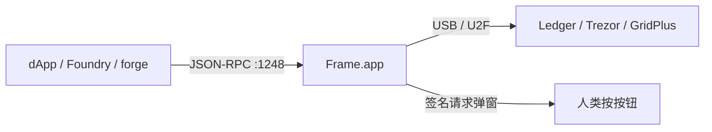

用法: `forge script --ledger` 或 RPC `http://127.0.0.1:1248` -> Frame 弹窗显示 calldata + decoded actions -> 按硬件钱包确认 -> 签名转发.

Frame 比直接 ledgerhq 集成体验好太多。部署 Foundry script 配 Frame, 几乎零摩擦。

---

## 14. 区块浏览器

2023-12 圣诞前 Etherscan 主站宕机 6 小时，那期间所有自动化 verify、所有前端的 "在 Etherscan 查看交易" 链接全挂——很多团队这时才意识到 explorer 是单点依赖。2025-04 又出过一次。**至少备一个 Blockscout 当 fallback**：开源、可自托管、API 兼容 Etherscan，OP Stack / Arbitrum 链甚至已经把 Blockscout 当默认。

- **Etherscan v2**: 单 API key 覆盖 50+ EVM 链 (chainId 区分). 老牌数据丰富, 闭源, 历史多次全网故障 (2023-12 / 2025-04).
- **Blockscout**: 开源自托管, PRO API 兼容 Etherscan endpoint, 覆盖 100+ EVM 链, OP Stack / Arbitrum 原生集成.

> 来源: [Blockscout PRO API](https://www.blog.blockscout.com/pro-api-multichain-onchain-data-block-explorer/), [Etherscan API V2 Multichain](https://info.etherscan.com/etherscan-api-v2-multichain/)

实战: 主链用 Etherscan, 长尾 / 自家 L2 用 Blockscout, 前端按 chainId 选 explorer URL.

---

## 15. 实战合集

下面五个 demo 把前面 §2-§13 的所有概念压缩成"周末两小时跑一遍"的可复制实操。假设你想跑一台 home staker 节点 + 一个数据后端 + CI——按 15.1 → 15.2 → 15.3 → 15.4 → 15.5 顺序做完，理论部分会变成肌肉记忆。完整代码见 `code/` 与 `exercises/`。

### 15.1 启动 reth + lighthouse Sepolia (15 min)

```bash
cd code/01-reth-lighthouse-sepolia
./setup.sh                        # 生成 jwt + 起容器
docker compose logs -f reth       # 等 4-6h sync
curl -s http://127.0.0.1:8545 \
  -H 'Content-Type: application/json' \
  -d '{"jsonrpc":"2.0","method":"eth_blockNumber","params":[],"id":1}' | jq
```

生产 (nginx + prom + grafana): `docker compose -f docker-compose.full.yml up -d`

### 15.1.1 Ponder indexer GitHub Action 部署

```yaml
# .github/workflows/ponder-deploy.yml
name: Deploy Ponder Indexer
on:
  push:
    branches: [main]
    paths:
      - "indexer/**"
permissions:
  contents: read
  id-token: write       # OIDC 拿 AWS 临时凭证

jobs:
  deploy:
    runs-on: ubuntu-latest
    timeout-minutes: 15
    steps:
      - uses: actions/checkout@v4
        with:
          persist-credentials: false

      - uses: pnpm/action-setup@v4
        with:
          version: 9

      - uses: actions/setup-node@v4
        with:
          node-version: 20
          cache: pnpm
          cache-dependency-path: indexer/pnpm-lock.yaml

      - name: install
        working-directory: indexer
        run: pnpm install --frozen-lockfile

      - name: typecheck + lint
        working-directory: indexer
        run: pnpm typecheck && pnpm lint

      - name: build docker
        working-directory: indexer
        run: |
          docker build -t my-indexer:${{ github.sha }} .
          docker tag my-indexer:${{ github.sha }} my-indexer:latest

      - name: aws oidc -> ECR push
        uses: aws-actions/configure-aws-credentials@v4
        with:
          role-to-assume: arn:aws:iam::123456789012:role/github-deploy
          aws-region: us-east-1

      - name: ECR push
        run: |
          aws ecr get-login-password --region us-east-1 | \
            docker login --username AWS --password-stdin 123456789012.dkr.ecr.us-east-1.amazonaws.com
          docker tag my-indexer:latest 123456789012.dkr.ecr.us-east-1.amazonaws.com/my-indexer:latest
          docker push 123456789012.dkr.ecr.us-east-1.amazonaws.com/my-indexer:latest

      - name: ECS deploy
        run: |
          aws ecs update-service \
            --cluster prod \
            --service ponder-indexer \
            --force-new-deployment
```

### 15.2 Ponder 索引 USDC Transfer (20 min)

```bash
cd code/02-ponder-erc20-indexer
docker compose up -d              # 起 postgres
cp .env.example .env              # 填你的 RPC URL
pnpm install
pnpm dev
# 打开 http://localhost:42069/graphql 测试
```

### 15.3 Foundry CI 接 GitHub (5 min)

```bash
cp code/03-foundry-github-action/.github/workflows/foundry.yml \
   <your-foundry-repo>/.github/workflows/foundry.yml
git push
# Settings -> Secrets: MAINNET_RPC_URL, ETHERSCAN_API_KEY, DEPLOYER_PK
```

### 15.4 Tenderly: 上传源码 + 创建 alert (10 min)

```bash
cd code/04-tenderly-alert && ./upload-source.sh
```

### 15.5 Helios light client (5 min)

```bash
cd code/05-helios-light-client
ALCHEMY_URL=https://eth-mainnet.g.alchemy.com/v2/YOUR_KEY ./run-helios.sh
bun run verify-balance.ts   # 另一终端
```

---

## 16. 习题

九道习题按"读懂 → 选型 → 实操"递进，前三题有完整答案 (`ANSWER.md`)，后六题给思路提示自行完成。建议读完一节立刻做对应习题，比读完整章再回头做留存度高 3 倍。

### 16.1 习题 1: 计算 reth + lighthouse 硬件 / 月度成本

见 `exercises/01-hardware-cost-calculator/calc.ts`. 答案: `ANSWER.md`.

要点: 全节点 ¥10000/年 自建; archive ¥14000/年; 云对照 ¥42000/年. NVMe 是核心成本, archive 必须企业级 / 高端 TLC.

### 16.2 习题 2: 写 Forta agent 监测 ERC20 大额转账

见 `exercises/02-forta-large-transfer-agent/`. 答案: `ANSWER.md`.

要点: 用 filterLog + bigint, 多链复用, labels 做风控级联.

### 16.3 习题 3: Foundry deploy + verify 全自动

见 `exercises/03-foundry-deploy-verify/`. 答案: `ANSWER.md`.

要点: keystore 加密私钥, --slow 防 nonce 错乱, fs_permissions 写 deployments/<chainid>.json, CREATE2 跨链同地址.

### 16.4 习题 4: 设计 Subgraph schema for Uniswap V3

(自行作答, 思路提示)

思路: Pool(id, token0, token1, fee), Position(id, owner, pool, liquidity, tickLower, tickUpper), Swap(id, pool, sender, amount0, amount1, sqrtPrice, tick, ts), Mint, Burn, Collect。关系: Pool 1-N Position, Pool 1-N Swap。derived field: 24h volume / TVL。

易踩坑: tick 用 BigInt 是惯例（Subgraph schema 没 int24）；Int (i32) 也合法（int24 装得进 i32）, liquidity 用 BigInt (u128), 不要 BigDecimal 算定价 (精度丢)。

### 16.5 习题 5: Defender Sentinel 配置改成 Tenderly Alert

(自行作答, 思路提示)

思路: Sentinel 的 condition (function args/event params) 一对一映射到 Tenderly Alert YAML。Autotask (JS) 改写成 Tenderly Web3 Action (TS, serverless)。Trigger 从 alert callback 改 webhook URL 调 Web3 Action。

关键差异: Tenderly Web3 Action 256 MB / 60s, Autotask 256 MB / 5 min, 长任务要拆。

### 16.6 习题 6: 客户端多样化 staking 拓扑 (32 个 validator)

(自行作答, 思路提示)

思路: 32 validator -> 至少 4 种组合, 每组合 8 个。例: (reth+lighthouse) x 8, (nethermind+teku) x 8, (besu+prysm) x 8, (erigon+nimbus) x 8。

进阶: 跨地理 (US-East / EU-West / Asia), 跨 ISP, 跨电源域。

### 16.7 习题 7: PR 触发 fork mainnet 测试

(自行作答, 思路提示)

思路: jobs 配 paths-filter, 仅修改 contracts/* trigger。fork: forge test --fork-url $MAINNET_RPC_URL --fork-block-number 22000000。覆盖率上 Codecov, PR 自动评论。

### 16.8 习题 8: 设计 RPC 网关多 upstream 配置

(自行作答, 思路提示)

思路: 用 erpc 配置 (yaml)。upstream 写 [自建 reth, Alchemy, QuickNode, dRPC]。给重 trace 调用单独路由 dRPC (flat 价)。对 eth_call 设 cache 30s。失败自动 fallback。

### 16.9 习题 9: Helios + dApp 集成

(自行作答, 思路提示)

思路: viem 的 transport 指 http://127.0.0.1:8545 (Helios), 而非直连 Alchemy。启动时打开 Helios 进程, dApp 通过 http://localhost:8545 透明访问。用户感知不到, 但所有响应都被验证。

---

## 17. AI 影响

2025 年 Forta [Anomaly Detection bot](https://forta.org/blog/anomaly-detection/) 在某 NFT marketplace rug pull 12 小时前发出 alert——攻击者只是开始批量调用一个不寻常的 admin function，规则引擎抓不到，但 GNN 学到的"正常模式"立刻偏离触发警报。AI 在 Web3 监控上的价值不在替代 SRE，在**把规则写不出的"异常感"变成可计算的 baseline**。但同样 2025 年某 L2 项目 SRE 全员靠 ChatGPT 写运维脚本，一次 systemctl daemon-reload 改坏 mev-boost 重启策略，4 小时不出块——**AI 是放大器，放大对的也放大错的**。

### 17.1 AI 协助节点告警

传统告警靠规则 (withdraw > 1M USDC), 0day 攻击模式总不在规则集. 2026 趋势: Tenderly / Forta / Hypernative 把链上 tx 流喂 LLM/GNN 学正常模式, 偏离告警. Forta [Anomaly Detection bot](https://forta.org/blog/anomaly-detection/) 2024 年提前 12h 抓到多个 rug pull. 局限: 攻击者可先做 1000 次"正常"操作把基线拉高再发动.

### 17.2 AI 解析 calldata 与 trace

- **Tenderly AI**: `0xa9059cbb...` -> "transfer 100 USDC to 0xabc"
- **Phalcon Explorer**: tx internal call 树 -> "用户 swap 1 ETH -> 1500 USDC via Uniswap V3 1% pool"
- 价值: 安全审计 / Wallet Guard / oncall 响应加速 5-10x

### 17.3 AI 协助 indexer schema 设计

ABI + 业务描述 -> LLM 自动生成 Ponder schema + handler 初稿. 局限: decimals 差异 / proxy upgrade ABI 变化 / reorg 边界不会自动处理, 必须人工 review.

### 17.4 AI 生成 docker-compose / CI

LLM 能给出能跑的 yaml. 必须人工核查: `--http.api` 是否含 `admin` / JWT ro 挂载 / healthcheck / `stop_grace_period`.

### 17.5 不可替代的部分

- **Linux 运维**: I/O 瓶颈 / sysctl / fd limit / systemd. AI 命令 90% 对, 那 10% 够你 oncall 一晚.
- **网络**: P2P NAT 穿透 / BGP 异常 / DDoS 缓解. 不在 LLM 训练集.
- **存储**: NVMe wear leveling / ZFS snapshot / RAID. 错配置 = 重 sync 12h.
- **应急**: 凌晨 3 点 reth panic / EVM zero-day. 全靠工程经验.

2025 年某 L2 项目 SRE 全员靠 ChatGPT 写脚本, 一次 systemctl daemon-reload 把 mev-boost 重启策略改坏, 4 小时不出块。AI 是放大器, 放大对的也放大错的；没底子用 AI 反而更危险。

### 17.6 AI 工具实操清单 (2026-04 主流)

| 工具 | 集成位置 | 用途 | 免费 / 付费 |
|---|---|---|---|
| **Tenderly AI Calldata Decoder** | Tenderly Web Console / Alert | raw input 0xa9059c... -> "transfer 100 USDC to 0xabc" | Tenderly 套餐内 |
| **Phalcon AI Explainer** | Phalcon Explorer | tx internal call tree -> 自然语言路径 | 免费 |
| **Etherscan AI Verify Comments** | Etherscan 合约页面 | 合约源码自动加自然语言注释 | 免费 (Etherscan Pro 速率快) |
| **Forta Anomaly Detection** | Forta network bot | 链上 tx 流喂 GNN 学习正常模式, 偏离即 alert | 公共 bot 免费, 自部署收 FORT |
| **Hypernative Pre-cog** | Hypernative SaaS | ML 模型预测潜在攻击 (mempool + 链下数据) | enterprise |
| **OpenZeppelin Contracts Wizard + AI** | wizard.openzeppelin.com | NL -> 安全 ERC20/721/Governor 模板 | 免费 |
| **Cursor / Codeium / GitHub Copilot** | IDE | Solidity / TS handler 自动补全 | $20/月 |
| **Aderyn AI report comment** | Cyfrin Aderyn output | 静态分析 finding 加 LLM 解释建议 | 免费 (open-source) |

#### 实战 1: Tenderly AI 解 calldata

```bash
# CLI 方式 (tenderly v0.16+)
tenderly tx decode \
  --network mainnet \
  --hash 0xabc...123 \
  --use-ai
# 输出: "User swapped 1.5 ETH for 4500 USDC via Uniswap V3 0.3% pool, paying 0.05 ETH gas"
```

#### 实战 2: Etherscan AI 看 unverified 合约

点 "Decompile + AI Notes" (需 Etherscan account/Pro): 函数名猜测 / 关键逻辑摘要 / 可疑模式提示. 正确率约 70%, 仅作初筛.

#### 实战 3: AI 生成 Subgraph schema

```bash
goldsky generate subgraph \
  --abi ./MyToken.abi.json \
  --description "track all transfers and aggregate daily volume per user"
# 输出: subgraph.yaml + schema.graphql + handler.ts
```

局限: reorg / decimals / proxy upgrade 不会自动处理, 必须人工 review。

#### 实战 4: AI 生成 docker-compose 人工核查清单

- [ ] `--http.api` 不含 `admin`
- [ ] JWT 文件 ro 挂载
- [ ] 30303 tcp+udp 都开
- [ ] `restart: unless-stopped`
- [ ] `stop_grace_period: 5m`

---

## 18. 延伸阅读

- [Paradigm Reth 2.0 Release (2026-04)](https://www.paradigm.xyz/2026/04/releasing-reth-2-0)
- [Reth GitHub](https://github.com/paradigmxyz/reth)
- [Lighthouse Book](https://lighthouse-book.sigmaprime.io/)
- [Ethereum Client Diversity](https://clientdiversity.org/)
- [stake.fish State of Ethereum 2026](https://blog.stake.fish/the-state-of-ethereum-in-2026/)
- [eth-docker](https://ethdocker.com/)
- [Ponder docs](https://ponder.sh/docs/get-started)
- [Envio HyperIndex Benchmarks 2026](https://docs.envio.dev/blog/blog/best-blockchain-indexers-2026)
- [The Graph Sunsetting Hosted Service](https://thegraph.com/blog/sunsetting-hosted-service/)
- [Subsquid SQD docs](https://docs.sqd.ai/subsquid-network/overview/)
- [Tenderly Alerts](https://docs.tenderly.co/alerts/intro-to-alerts)
- [OpenZeppelin Defender shutdown](https://www.openzeppelin.com/news/sunsetting-defender)
- [Forta SDK](https://docs.forta.network/en/latest/sdk/)
- [MEV-Boost](https://boost.flashbots.net/)
- [relayscan.io](https://www.relayscan.io/)
- [a16z Helios](https://github.com/a16z/helios)
- [Foundry Book](https://book.getfoundry.sh/)
- [Hardhat 3](https://hardhat.org/)
- [Stylus Quickstart](https://docs.arbitrum.io/stylus/quickstart)
- [AWS Web3 - Build MPC wallets with Nitro Enclaves](https://aws.amazon.com/blogs/web3/build-secure-multi-party-computation-mpc-wallets-using-aws-nitro-enclaves/)
- [Fireblocks vs Privy vs Turnkey](https://www.fireblocks.com/report/compare-embedded-wallet-infrastructure)
- [Blockscout Multichain](https://www.blog.blockscout.com/multichain-block-explorer-unified-discovery-layer-evm/)
- [Etherscan API V2](https://info.etherscan.com/etherscan-api-v2-multichain/)
- [Datawallet Glamsterdam](https://www.datawallet.com/crypto/ethereum-glamsterdam-upgrade-explained)
- [Ethereum Foundation Checkpoint #9 (2026-04)](https://blog.ethereum.org/2026/04/10/checkpoint-9)
- [erpc](https://github.com/erpc/erpc)
- [Halmos](https://github.com/a16z/halmos)
- [Aderyn](https://github.com/Cyfrin/aderyn)

---

**下一站**：节点、RPC、indexer、监控、CI/CD、密钥——这一模块把"合约之外"的工程基底铺到了能 24/7 跑生产的程度。但 §17 只是预览了 AI 在告警分类、calldata 解码、subgraph 脚手架上的浅层应用，下一模块 [12-AI×Web3](../12-AI×Web3/README.md) 把 AI 真正接进开发全链路：审计辅助、链上数据分析自动化、AI Agent 钱包、链上推理服务——把这一模块搭好的基础设施变成"AI 能调用的链上能力"。

---

---

# 附录

> 附录按需深入，不影响主线阅读。主线（§1-§18）已覆盖跑节点 + indexer + CI + 监控 + 密钥的端到端工程闭环；附录提供内部架构、完整操作手册、高级话题。

---

## 附录 A：reth 内部架构 / Storage V2

**TL;DR**：reth v2.0 删去 plain state 双写，historical changesets 移到 append-only static files，trie 计算从 200ms 降到 <50ms，这是 1.7 Gigagas peak block 400ms 完成 state root 的根因。

### A.1 三种存储范式对比

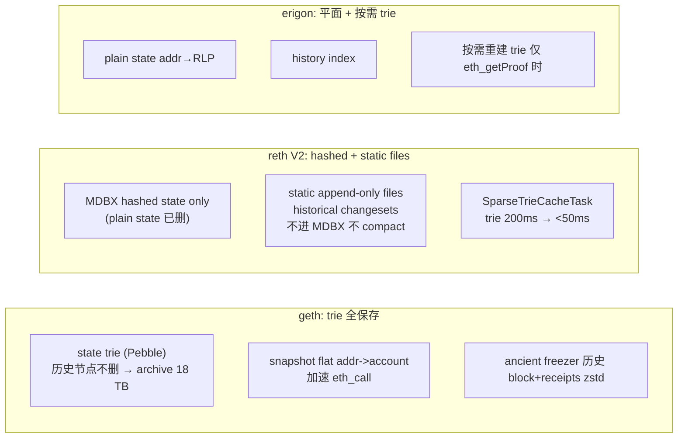

### A.2 reth staged sync 七阶段

headers → bodies → sender recovery → execution (revm) → hashing → merkle → tx lookup

每阶段独立 ETL、可重试、可并行——比 geth 快 1.5-2x。

### A.3 2026-04 基准（mainnet，Hetzner AX52）

| 指标 | reth v2.0 | geth v1.16 | nethermind | besu (Bonsai) |
|---|---|---|---|---|
| Fresh sync full | 4.5 h | 7.5 h | 6.5 h | 8 h |
| Fresh sync archive | 14 h | 7 d+（hash-based legacy 数字；geth 1.16+ path-based scheme 后 archive 可降到 ~3 TB / 5 天，2025-11+） | 36 h | 48 h |
| 磁盘 full | 700 GB | 1.2 TB | 1.4 TB | 1.5 TB |
| 磁盘 archive | 2.5 TB | 18 TB（同上注：path-based 后 ~3 TB） | 12 TB | 6 TB |
| eth_call p99 | 8 ms（hot cache；cold 在 30-60ms） | 15 ms | 20 ms | 25 ms |
| 1.7 Gigagas 块持久化 | 400 ms | OOM | >5 s | 慢 |

**Era1 文件**：reth/erigon 用 era1 bootstrap archive，14h vs geth 7d 的根因——era1 是 epoch 化的预编译历史数据。

### A.4 EL 选型速查

| 场景 | 首选 | 备选 |
|---|---|---|
| 自建 RPC 给前端 | reth full | geth full |
| protocol 层 / 大厂 staking | nethermind / besu | reth |
| indexer 后端 | reth archive | erigon 3 |
| 树莓派家庭节点 | nethermind | nimbus |
| 联盟链 / 企业 | besu | nethermind |

> client diversity 核心：geth 占 51%+ 时若出 bug，错误链被视为"多数真理"。新部署优先 reth/nethermind/besu。

> 来源: [Paradigm Reth 2.0 (2026-04)](https://www.paradigm.xyz/2026/04/releasing-reth-2-0)

---

## 附录 B：CL 客户端横评（lighthouse / prysm / teku / nimbus / lodestar）

**背景**：2022 年 prysm 占 70%，EthStaker 社区花三年劝迁。2026-04：prysm 38%、lighthouse 33%、teku 18%、nimbus 6%、lodestar 5%——接近 client diversity 安全线。

### B.1 五客户端对照

| CL | 语言 | 市占 | 内存 | 磁盘 | checkpoint sync | 速记 |
|---|---|---|---|---|---|---|
| **lighthouse** | Rust | ~33% | 2-4 GB | ~120 GB | 2-5 min | Fulu ready，hierarchical diffs I/O 降 4x，eth-docker 默认 |
| **prysm** | Go | ~38% | 4-8 GB | ~150 GB | 5-15 min | 内置 Web UI，内存吃得多 |
| **teku** | Java | ~18% | 4-8 GB | ~80 GB | 3-8 min | ConsenSys + Splunk 企业集成 |
| **nimbus** | Nim | ~6% | <1 GB | ~100 GB | 5-10 min | RPi 唯一选择 |
| **lodestar** | TypeScript | ~5% | 4-6 GB | ~110 GB | 8-15 min | 浏览器 light client |

### B.2 CL 进程内部职责

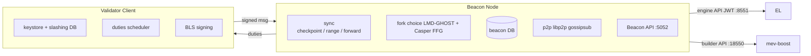

同一组 keystore 跑两个 VC = 最容易触发 slashing。slashing DB 必须 single-source-of-truth。

> 来源: [migalabs CL benchmarks](https://mirror.xyz/0x934e6B4D7eee305F8C9C42b46D6EEA09CcFd5EDc/b69LBy8p5UhcGJqUAmT22dpvdkU-Pulg2inrhoS9Mbc), [Sigma Prime lighthouse releases](https://github.com/sigp/lighthouse/releases)

---

## 附录 C：Validator 完整流程（0x01/0x02 升级、key 管理）

**前置：附录 H Pectra 时间表**——本附录所有 EIP-7251/7691/7702 内容假定 Pectra 已上线。

**钩子**：2024 年某 staking 服务商机房迁移——工程师 `scp` keystore 到新机器后忘关老 VC，9 个 validator 触发 double-sign slashing，共赔 144 ETH（~$50 万）。

### C.1 solo staking 全流程

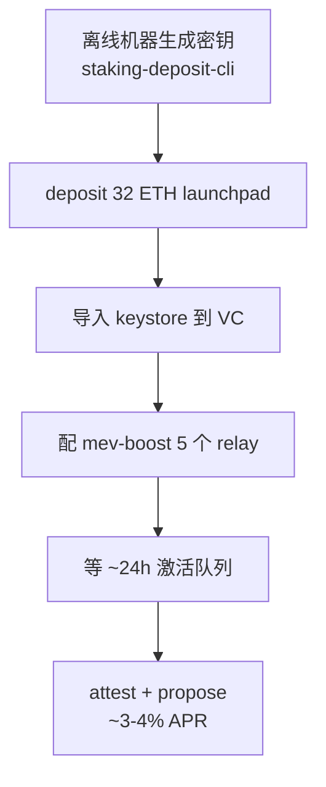

### C.2 0x01 → 0x02 升级（Pectra EIP-7251 MaxEB）

| 维度 | 0x01（旧） | 0x02（Pectra 后推荐） |
|---|---|---|
| MaxEB | 32 ETH（超出强制 partial withdraw） | 2048 ETH |
| 复利 | 否 | 是 |
| 合并多 validator | 不能 | 能（`consolidate`） |

```bash
# 1. 检查 credentials 类型
curl -s http://localhost:5052/eth/v1/beacon/states/head/validators/$IDX \
  | jq '.data.validator.withdrawal_credentials'
# 0x01... 需升级

# 2. 生成 BLS-to-execution change
./deposit.sh generate-bls-to-execution-change \
  --chain mainnet \
  --mnemonic "your mnemonic" \
  --bls_withdrawal_credentials_list 0xCURRENT \
  --validator_start_index 0 \
  --validator_indices VALIDATOR_IDX \
  --execution_address 0xYOUR_NEW_0x02_ADDR

# 3. broadcast
curl -X POST http://localhost:5052/eth/v1/beacon/pool/bls_to_execution_changes \
  -H 'Content-Type: application/json' --data @bls_to_execution_changes.json
```

### C.3 consolidation（多 validator 合并为 1）

EIP-7251 consolidate 系统合约部署在 `0x0000BBdDc7CE488642fb579F8B00f3a590007251`（Pectra 主网实际部署地址），**raw calldata 96 字节**：source_pubkey (48B) || target_pubkey (48B)；cast send 直接传 calldata，无 Solidity 函数签名。配套的 EIP-7002 withdrawal/exit 系统合约部署在 `0x00000961Ef480Eb55e80D19ad83579A64c007002`，用于从 EL 触发 partial withdrawal 与 full exit。

```bash
cast send --rpc-url $RPC --account deployer \
  0x0000BBdDc7CE488642fb579F8B00f3a590007251 \
  $(cast concat-hex $SOURCE_PUBKEY $TARGET_PUBKEY)
```

合并后：source 进入 exit queue；target 收到全部 ETH；余额上限 2048 ETH。

### C.4 web3signer：把 keystore 与 VC 解耦

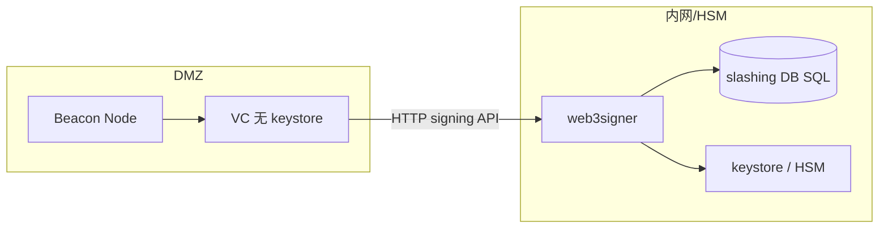

HSM 接入：YubiHSM 2 或 AWS CloudHSM，web3signer 走 PKCS#11。

### C.5 迁移时 EIP-3076 slashing DB 导出导入

```bash
# prysm 导出
prysmctl validator slashing-protection-history export \
  --datadir=/path/to/prysm \
  --slashing-protection-export-dir=/path/to/export.json

# lighthouse 导入
lighthouse account validator slashing-protection import /path/to/export.json
```

**切换客户端必须做此步**。2024 年至少 3 次大型 slashing 是"迁移没导出 slashing DB"所致。

### C.6 Beacon API 速查

**Beacon API 速查**：/eth/v1/beacon/headers（区块头）/ /eth/v1/beacon/states/head/validators（validator 状态）/ /eth/v1/validator/duties/attester/{epoch}（attestation 任务）/ /eth/v1/beacon/pool/attester_slashings（slashing 池）

### C.7 Lido CSM 与客户端选型

**Lido CSM (Community Staking Module)**：Pectra 后让个人 operator onboard Lido 的关键路径——bond 2.4 ETH，绑定 Rated Network performance score。2026 home staker 主流路径。

32 ETH home staker 选型：Lighthouse（Rust 主流）/ Nimbus（资源最低）/ Teku（机构）；Prysm 占有率高已不推荐独走（client diversity）。

> 来源: [EthStaker Pectra Features](https://docs.ethstaker.org/upgrades/pectra-features/), [EIP-3076](https://eips.ethereum.org/EIPS/eip-3076)

---

## 附录 D：DVT（Obol / SSV）详

**背景**：web3signer 仍是单 key 单服务。DVT 把 validator key 拆成 N 份给 M 个 operator，t-of-N 阈值签名——单机宕机不影响出块，双签需 t 个 operator 同时作恶。

### D.1 两个主流方案

| 项目 | 阈值默认 | 共识层 | 主网状态 (2026-04) | 适合 |
|---|---|---|---|---|
| **Obol Network** | 4-of-6 / 5-of-7 | Charon QBFT | mainnet alpha+，Lido Simple DVT 集成 | DAO / 大型 staker |
| **SSV Network** | 4-of-7 / 7-of-10 | Istanbul BFT | permissionless mainnet | 公开 operator 市场 / 个人 |

### D.2 架构差异

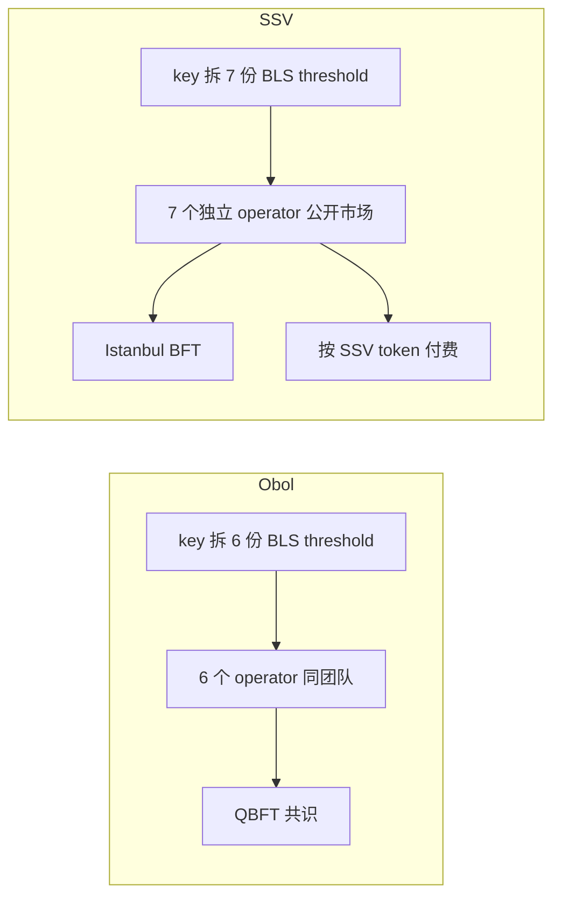

2025-Q3：~547,968 ETH（17,124 validators）在 DVT 上，占总 staked ETH ~1.5%，Lido Simple DVT 占其中过半。

> 来源: [Obol Road to Mainnet](https://blog.obol.org/road-to-mainnet-and-beyond-for-distributed-validators/), [SSV permissionless mainnet](https://www.theblock.co/post/267244/ethereum-staking-ssv-network-permissionless-launch)

---

## 附录 E：MEV-Boost relay 市占 / Builder market / SUAVE / ePBS

### E.1 Relay 列表（2026-04）

| Relay | 市占 (payload) | 审查模式 |
|---|---|---|
| relay.ultrasound.money | 33.92% | non-censoring |
| titanrelay.xyz | 24.19% | non-censoring |
| bloxroute.max-profit | 14.67% | non-censoring |
| aestus.live | 10.03% | non-censoring |
| bloxroute.regulated | 9.07%（波动大） | OFAC 合规 |
| boost-relay.flashbots.net | 4.22% | non-censoring |

bloXroute regulated 月度波动区间约 5-15%，选型前用 [relayscan.io](https://www.relayscan.io/) 复核 28 天滚动数据。

### E.2 Builder 市场

beaverbuild + rsync 合计 >50% payload；Flashbots builder 开源，做 fallback。BuilderNet 体系（beaver/rsync/titan）已形成寡头。

### E.3 Censorship 现状（2026-04）

| 维度 | 2022 | 2024 | 2026-04 |
|---|---|---|---|
| 审查 relay 占比 | ~80% | 30% | 9% |
| TC 交易上链 p50 | ~6 块 | ~2 块 | ~1 块 |

### E.4 ePBS（Glamsterdam）与 SUAVE

**ePBS**：把 PBS 写进协议——validator 通过链上 commitment + reveal 直接拿 builder block，不再需要信任 relay。Glamsterdam（2026 H1）= ePBS + BAL + gas limit 调整。

**SUAVE**：Flashbots 另一条路——让 builder 拍卖去中心化，2026 仍在 testnet。ePBS 解决"不再需要信任 relay"，SUAVE 解决"builder 不再是中心化巨头"，二者互补。

> 来源: [relayscan.io](https://www.relayscan.io/), [Datawallet Glamsterdam](https://www.datawallet.com/crypto/ethereum-glamsterdam-upgrade-explained)

---

## 附录 F：Ponder schema 完整示例

```ts
// ponder.schema.ts — Ponder 0.11+ Drizzle ORM
import { onchainTable, relations, primaryKey, index } from "@ponder/core";

export const account = onchainTable("account", (t) => ({
  address:       t.hex().primaryKey(),
  balance:       t.bigint().notNull().default(0n),
  transferCount: t.integer().notNull().default(0),
}));

export const transferEvent = onchainTable("transfer_event", (t) => ({
  id:          t.text().primaryKey(),
  from:        t.hex().notNull(),
  to:          t.hex().notNull(),
  value:       t.bigint().notNull(),
  blockNumber: t.bigint().notNull(),
  txHash:      t.hex().notNull(),
  logIndex:    t.integer().notNull(),
}), (table) => ({
  fromIdx: index().on(table.from),
  toIdx:   index().on(table.to),
}));

export const accountRelations = relations(account, ({ many }) => ({
  sent:     many(transferEvent, { fields: [account.address], references: [transferEvent.from] }),
  received: many(transferEvent, { fields: [account.address], references: [transferEvent.to] }),
}));
```

`ponder.config.ts` 多合约示例：

```ts
export default createConfig({
  database: { kind: "postgres", connectionString: process.env.DATABASE_URL },
  networks: {
    mainnet: { chainId: 1, transport: http(process.env.PONDER_RPC_URL_1) },
  },
  contracts: {
    USDC: {
      network: "mainnet",
      abi: erc20Abi,
      address: "0xA0b86991c6218b36c1d19D4a2e9Eb0cE3606eB48",
      startBlock: 22300000,
    },
    WETH: {
      network: "mainnet",
      abi: erc20Abi,
      address: "0xC02aaA39b223FE8D0A0e5C4F27eAD9083C756Cc2",
      startBlock: 22300000,
    },
  },
});
```

性能基线（7 天历史）：自建 reth archive 本机 ~4 min；Alchemy free tier ~22 min；Envio HyperSync ~1 min。

---

## 附录 G：Slashing 防御详

### G.1 触发条件

1. **double signing**：同一 slot 签了两份不同 attestation/proposal
2. **surround vote**：新 attestation 时间区间包住已有 attestation

**罚则**：立即 1 ETH 削减 + 强制退出，correlation penalty 0.5-32 ETH。

### G.2 三板斧（详细）

| 防御 | 工具 | 配置 |
|---|---|---|
| slashing DB 单一来源 | lighthouse VC / web3signer | 不要复制 keystore 到第二台同时运行 |
| doppelganger 检测 | `--enable-doppelganger-protection` | 启动时等 2 epoch，检测同 pubkey 是否在网络在线 |
| 切换客户端必须导 EIP-3076 | prysmctl / lighthouse | 详见附录 C.5 |

### G.3 事故回顾（2023-2025）

| 年份 | 原因 | 损失 |
|---|---|---|
| 2023 | 机房迁移未关老 VC | ~32 ETH（2 validator） |
| 2024 | "只切 EL 未切 VC" 误操作 | ~112 ETH（7 validator） |
| 2024 | SaaS 迁移未导出 slashing DB | 144 ETH（9 validator） |

### G.4 anti-slasher 监控配置

```yaml
# alerts.yml
- alert: ValidatorSlashed
  expr: increase(validator_monitor_slashed_total[5m]) > 0
  for: 1m
  labels: { severity: critical }
  annotations:
    summary: "Validator slashed! 立即调查"
```

至少装 beaconcha.in Telegram bot（免费）。一个 missed proposal = $30-100 损失。

---

## 附录 H：Pectra 升级实操

**Pectra 主网上线：2025-05-07**。主要 EIP：EIP-7251（MaxEB 2048 ETH）、EIP-7002（EL 触发 exit/withdrawal）、EIP-7549（attestation 效率优化）。

### H.1 影响速查

| EIP | 变化 | 操作要求 |
|---|---|---|
| EIP-7251 MaxEB | 单 validator 上限 32→2048 ETH | 升级到 0x02 credentials，可选 consolidate |
| EIP-7002 EL exit | 可从 EL 合约触发 validator exit | 0x02 credentials 才能用 |
| EIP-7549 | attestation 聚合效率提升 | 升级 CL 客户端 |

### H.2 是否需要操作

- **已是 0x02 credentials**：MaxEB 自动生效，超过 32 ETH 不再 partial withdraw，而是累积复利
- **仍是 0x01**：建议升级到 0x02（见附录 C.2），Pectra 前后均可操作
- **想合并多个 validator**：等 0x02 升级完成后用 `consolidate`（见附录 C.3）

### H.3 Lido/大型 staker 的影响

Lido / Coinbase / Kraken 2025-Q4 大批量 consolidate，单月 active validator 数掉 ~16,000 个但总 ETH 不变。协议级降本：同等 staking 量但只需 1/64 attestation/proposal 流量，减轻共识层带宽压力。

> 来源: [EthStaker Pectra Features](https://docs.ethstaker.org/upgrades/pectra-features/), [Markaicode EIP-7251 Guide](https://markaicode.com/ethereum-validator-eip-7251-upgrade-guide/)

---

## 附录 I：Light Client / RPC / Indexer 全谱系

> 这一附录聚合了三块"主线讲完直觉，工程化时再翻"的深度参考——Light Client 完整部署、节点同步策略、13 家 RPC 提供商横评 + 性能调优清单、五种 indexer 全谱系 + Subgraph 发布版本化。主线 §3 / §6 / 附录 A 已经把核心结论给你了，这里是落地细节。

### I.1 Light Client（Helios）

2024 年某次 Infura 部分节点返回了一个错误的 USDC 余额——不是攻击，是它的 archive 集群其中一个节点 fork 走错链没追回，前端显示用户余额比实际多 1500 USDC，有人据此发起 swap 触发回滚。**MetaMask 默认走 Infura，给假数据时用户无从分辨——这正是 light client 要解决的问题。**

自建 EL+CL 信任最强，但移动端和浏览器装不下 700 GB。Light client 像在咖啡馆看完一份"印章齐全的快递单据"——你没仓库自己核对货物，但单据上的密码学签名（sync committee 多数 + merkle proof）让你确信送货人没掉包。MetaMask 接 Helios 后，"我相信 Infura" 变成 "我相信 sync committee 不会被盗 342 把 BLS 私钥"。

#### I.1.1 三种 light client

| 项目 | 语言 | 特点 | 状态 |
|---|---|---|---|
| **Helios** (a16z) | Rust | 多链 (Ethereum + OP Stack), 启动 2 秒, 编译 WASM 可跑浏览器 | 主流, 推荐 |
| **nimbus light** | Nim | nimbus 项目内置 light mode, 资源极省 | 较冷门, mainnet ready |
| **Lodestar light** | TypeScript | 浏览器内 light client, ChainSafe 维护 | dev / preview |

> 来源: [a16z Helios](https://github.com/a16z/helios), [Building Helios](https://a16zcrypto.com/posts/article/building-helios-ethereum-light-client/)

#### I.1.2 Helios 工作原理

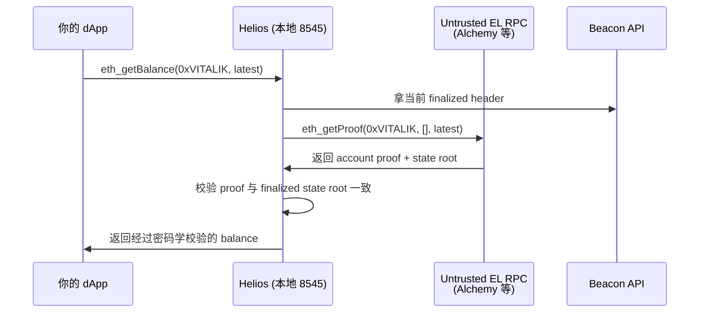

**信任根**：sync committee 多数（512 个 validator 中 ≥342 签名）。伪造需盗 342 个 validator 私钥、窗口仅 ~27 小时。

#### I.1.3 完整部署流程

##### 步骤 1: 安装

```bash
# 推荐安装方式: heliosup 自动管理 release
curl https://raw.githubusercontent.com/a16z/helios/master/heliosup/install | bash
source ~/.bashrc
heliosup                 # 装最新 stable
helios --version         # 确认安装成功
```

或用 cargo:

```bash
cargo install --git https://github.com/a16z/helios --tag v0.8.0 helios-cli
```

##### 步骤 2: 拿 trusted checkpoint (多源交叉验证)

```bash
# 来源 1: ethpandaops
A=$(curl -s https://sync-mainnet.beaconcha.in/checkpointz/v1/beacon/slots | jq -r '.data.finalized.block_root')

# 来源 2: 自己的 lighthouse beacon node (最可靠)
B=$(curl -s http://localhost:5052/eth/v1/beacon/headers/finalized | jq -r '.data.root')

# 比较
if [ "$A" = "$B" ]; then
  echo "Trusted checkpoint: $A"
  CHECKPOINT=$A
else
  echo "checkpoint 不一致, 拒绝启动"
  exit 1
fi
```

##### 步骤 3: 启动 Helios

```bash
helios ethereum \
  --network mainnet \
  --consensus-rpc https://www.lightclientdata.org \
  --execution-rpc $UNTRUSTED_ALCHEMY \
  --checkpoint $CHECKPOINT \
  --rpc-bind-ip 127.0.0.1 \
  --rpc-port 8545 \
  --data-dir ~/.helios &

# 等约 2-5 秒, Helios 跟上 head
sleep 5

# 验证 Helios 已就绪
curl -s -X POST -H "Content-Type: application/json" \
  --data '{"jsonrpc":"2.0","method":"eth_blockNumber","params":[],"id":1}' \
  http://127.0.0.1:8545 | jq
```

##### 步骤 4: dApp 中接入

```ts
// viem / wagmi 的 transport 指向 Helios, 用户无感
const config = createConfig({
  chains: [mainnet],
  transports: {
    [mainnet.id]: http(process.env.HELIOS_URL ?? process.env.ALCHEMY_URL),
  },
});
```

完整验证脚本见 `code/05-helios-light-client/verify-balance.ts`.

##### 性能 / 局限

| 维度 | Helios | 自建 reth full | Alchemy 直连 |
|---|---|---|---|
| 启动到可用 | 2-5 s | 4-6 h sync | 0 s |
| 内存 | 100 MB | 32 GB | 0 (托管) |
| 磁盘 | 几 MB | 700 GB | 0 |
| 单 query latency | 50-200 ms (要拿 proof + 验证) | 5-20 ms | 30-100 ms |
| 信任 | sync committee 多数 | 完全自主 | 完全信任厂商 |
| 适合 | 钱包 / 浏览器 / 移动端 | 后端 / 高频应用 | MVP / 不在意信任 |

##### 多链支持

Helios 支持 Ethereum mainnet、OP Stack (Optimism / Base, 通过 derive 关系信任 L1)、其他 EVM (Polygon / Arbitrum, 实验性).

```bash
helios opstack \
  --network optimism \
  --execution-rpc $OP_ALCHEMY \
  --rpc-port 8546 &
```

> 来源: [a16z Helios](https://github.com/a16z/helios), [Building Helios](https://a16zcrypto.com/posts/article/building-helios-ethereum-light-client/)

---

### I.2 同步策略

假设你晚上 11 点开始跑节点，目标第二天早上能用。三种 sync 模式决定第二天醒来你看到的是绿勾还是红叉：full sync 像从图书馆第一本书读到最新一本（数周）；snap sync 像有人给你一张"截至昨天的快照"再补一晚增量（4-12h，主流默认）；archive sync 像 full sync 但保留每一页的高亮笔记（数周-月）。**第一次跑节点九成的人选错的不是 EL/CL 客户端，是忘了开 checkpoint sync——CL 不开就要从 genesis 重放 ~5 天**。

#### I.2.1 EL 同步模式对照

| 模式 | 工作方式 | 用时 | 信任假设 |
|---|---|---|---|
| **full sync** | 从 genesis 重放每一笔交易, 自己重建 state | 数周 | 仅信 P2P 多数 |
| **snap sync** (默认) | 抓最近某个 finalized block 的 state snapshot, 之后从该点 full sync | 4-12 h | 信 snapshot 提供方 ~16 个区块 |
| **archive sync** | full sync + 保留全部中间 state | 数周-月 | 仅信 P2P 多数 |

#### I.2.2 CL checkpoint sync (必开)

```bash
--checkpoint-sync-url=https://checkpoint-sync.sepolia.ethpandaops.io
```

给 CL 一个最近 finalized state root, 秒级同步. 不开则从 genesis 重放 (几天). 可信来源: mainnet (beaconcha.in / ethpandaops), sepolia/holesky (ethpandaops). 多源交叉验证更安全.

#### I.2.3 实测同步时间

测试机: Hetzner AX52 (Ryzen 7 7700X / 64 GB / 990 Pro 4 TB / 1 Gbps).

| 组合 (Sepolia) | EL sync | CL checkpoint sync | EL 磁盘 | CL 磁盘 |
|---|---|---|---|---|
| reth v2.0 + lighthouse v8.1 | 28 min | 4 min | 145 GB | 38 GB |
| geth v1.16 + lighthouse v8.1 | 51 min | 4 min | 220 GB | 38 GB |
| nethermind + teku | 38 min | 7 min | 180 GB | 24 GB |

Mainnet 数据见 §2.3 表格 (同测试机).

---

### I.3 RPC 服务详细横评

故事时间线还原：周五晚 10 点 NFT mint 开盘，预计 5000 用户。结果朋友在 X 转发，10 分钟涌进 50000 人，前端疯狂 `eth_call` 查白名单——Alchemy free tier 30M CU/月当晚被打穿，所有请求 429，用户看到 "transaction failed" 但其实交易压根没发出去。同样的故事 2024-2025 在 mint、空投领取、清算窗口至少出现过几十次。**RPC 是协议的命门，但 99% 团队第一次部署时没认真选过。**

下面按"先选托管商 → 用网关聚合 → 必要时自建"三步走，配三张表（13 家供应商对照、自建 vs 托管成本、性能调优清单）让你 30 分钟内做完决策。

#### I.3.1 主流 RPC 提供商横评 (2026-04)

| 提供商 | 计费模式 | archive | trace_* | debug | 月度免费 | 单 eth_call 等价成本 (相对) | 特殊优势 |
|---|---|---|---|---|---|---|---|
| Alchemy | CU (eth_call=26) | yes | yes | yes | 300M CU | 26x | Enhanced API (NFT/transfer summary) |
| Infura | request + 系数 (eth_call=80)（2024 后 Infura 改 daily request 计费，credit 系统已弃用——以官方 docs 为准） | yes | partial | partial | 6M req | 80x | ConsenSys 系, MetaMask 默认 |
| QuickNode | credit (eth_call=20) | yes | yes | yes | 10M credit | 20x | SOC1/SOC2/ISO27001 全认证 |
| Ankr | CU (eth_call=200) | yes | yes | yes | 30M CU | 200x | gRPC plan 降到 10x |
| dRPC | flat $6/1M req | yes | yes | yes | 100k req | flat | 重 trace/getLogs 性价比之王 |
| Tenderly Gateway | request | yes | yes | yes | 25M | 中等 | 与 Tenderly Alert / Devnet 联动 |
| Chainstack | request | yes | yes | yes | 3M | 中等 | 多链强 (50+), enterprise SLA |
| Blockdaemon | enterprise SLA | yes | yes | yes | N/A | N/A | 机构 / 合规, 24/7 phone support |
| NodeReal | request (BSC/Opbnb 强) | yes | yes | yes | 30M | 中等 | 二线公链覆盖最全 |
| GetBlock | request | yes | yes | yes | 50k | 中等 | EVM + Bitcoin + Solana 统一 API |
| Validation Cloud | enterprise | yes | yes | yes | demo only | N/A | DeFi 专属 SLA |
| Stackup | bundler + RPC | partial | partial | partial | 1M | N/A | 4337 Bundler 主推, 同时提供 RPC |
| Rivet | request | yes | yes | yes | 20k req | 中等 | 隐私优先, 不记录请求 |

公共 / 公益 RPC:

| 公益 RPC | 维护方 | 特点 |
|---|---|---|
| **1RPC** | Automata | 隐私 (TEE 隔离), 默认免费 |
| **Llamarpc** | DefiLlama | 完全免费, 多 RPC fallback 聚合 |
| **publicnode.com** | Allnodes | 多链免费, 无注册 |
| **Cloudflare ETH gateway** | Cloudflare | 免费, 限流较严 |

> 来源: [Dwellir 2026 Best RPC Providers](https://www.dwellir.com/blog/best-ethereum-rpc-providers), [QuickNode Best RPC 2026](https://blog.quicknode.com/best-ethereum-rpc-providers-2026-a-full-comparison/), [Chainnodes pricing](https://www.chainnodes.org/blog/alchemy-vs-infura-vs-quicknode-vs-chainnodes-ethereum-rpc-provider-pricing-comparison/)

#### I.3.2 自建 vs 托管成本对照

reth + lighthouse 自建 ¥10000-15000/年 vs Alchemy Growth ¥17000/年. 自建额外优势: 数据可信、无 rate limit、archive/trace 不限次、隐私 (托管商能看到所有查询地址).

MEV searcher 必须自建：每次 mempool 查询托管商都可见。

#### I.3.3 RPC 网关 / 聚合器

| 网关 | 特点 |
|---|---|
| **erpc** (开源) | rate limit / cache / failover / multi-upstream, 用 Go, 配置 yaml |
| **dRPC Gateway** (托管) | 同上, 商业 SaaS |
| **Tenderly Gateway** | 集成 Alert 和 Devnet |


#### I.3.4 nginx 暴露自建 RPC

见 `code/01-reth-lighthouse-sepolia/nginx/nginx.conf`. 三层: TLS (Let's Encrypt) / basic auth (htpasswd) / limit_req_zone (50 req/s, 突发 100).

#### I.3.5 docker-compose 全栈

`code/01-reth-lighthouse-sepolia/docker-compose.full.yml`. 关键设计:

- **reth**: 钉死版本, `--http.api` **不加 `admin`**, 30303 TCP+UDP 防火墙放行.
- **lighthouse**: checkpoint sync 必开, 非 validator 加 `--disable-deposit-contract-sync`.
- **nginx**: reth 8545 不暴露公网, 走 443 + basic auth + rate limit 50r/s.
- **prometheus**: scrape reth :9001 + lighthouse :5054, 保留 30 天.
- **grafana**: 仅绑 127.0.0.1:3000, dashboard 用 Paradigm + Sigma Prime 官方 json.

```bash
docker compose -f docker-compose.full.yml up -d
docker compose logs -f reth        # 等 EL sync
docker compose logs -f lighthouse  # 等 CL sync
```

##### 完整 docker-compose 复制即用 (来自 code/01)

```yaml
services:
  reth:
    image: ghcr.io/paradigmxyz/reth:v2.0.0
    container_name: reth
    restart: unless-stopped
    stop_grace_period: 5m            # reth 关机要 flush MDBX, 至少 5 min
    networks: [eth]
    expose:                          # 仅 docker network 内可见, 不暴露 host
      - "8545"
      - "8546"
      - "8551"                       # engine API, JWT 鉴权, 仅给 lighthouse
      - "9001"                       # prometheus metrics
    ports:
      - "30303:30303/tcp"            # P2P, 必须开
      - "30303:30303/udp"            # discovery, 必须开
    volumes:
      - reth-data:/root/.local/share/reth
      - ./jwt:/root/jwt:ro           # JWT secret, ro 挂载
    command:
      - node
      - --chain=sepolia              # 主网换 mainnet
      - --datadir=/root/.local/share/reth
      - --metrics=0.0.0.0:9001
      - --authrpc.addr=0.0.0.0
      - --authrpc.port=8551
      - --authrpc.jwtsecret=/root/jwt/jwt.hex
      - --http
      - --http.addr=0.0.0.0
      - --http.port=8545
      - --http.api=eth,net,web3,txpool,debug,trace  # 不要加 admin!
      - --http.corsdomain=*
      - --ws
      - --ws.addr=0.0.0.0
      - --ws.port=8546
      - --ws.api=eth,net,web3
      - --port=30303

  lighthouse:
    image: sigp/lighthouse:v8.1.3
    container_name: lighthouse
    restart: unless-stopped
    depends_on: [reth]
    networks: [eth]
    expose: ["5052", "5054"]
    ports:
      - "9000:9000/tcp"
      - "9000:9000/udp"
    volumes:
      - lh-data:/root/.lighthouse
      - ./jwt:/root/jwt:ro
    command:
      - lighthouse
      - bn
      - --network=sepolia
      - --datadir=/root/.lighthouse
      - --execution-endpoint=http://reth:8551
      - --execution-jwt=/root/jwt/jwt.hex
      - --checkpoint-sync-url=https://checkpoint-sync.sepolia.ethpandaops.io
      - --disable-deposit-contract-sync
      - --http --http-address=0.0.0.0 --http-port=5052
      - --metrics --metrics-address=0.0.0.0 --metrics-port=5054
      - --port=9000 --discovery-port=9000
      - --target-peers=80

  nginx:
    image: nginx:1.27-alpine
    container_name: nginx-rpc
    restart: unless-stopped
    depends_on: [reth]
    networks: [eth]
    ports: ["443:443"]
    volumes:
      - ./nginx/nginx.conf:/etc/nginx/nginx.conf:ro
      - ./nginx/htpasswd:/etc/nginx/htpasswd:ro
      - ./nginx/certs:/etc/nginx/certs:ro

  prometheus:
    image: prom/prometheus:v2.55.0
    container_name: prometheus
    restart: unless-stopped
    networks: [eth]
    expose: ["9090"]
    volumes:
      - ./prometheus/prometheus.yml:/etc/prometheus/prometheus.yml:ro
      - prom-data:/prometheus
    command:
      - --config.file=/etc/prometheus/prometheus.yml
      - --storage.tsdb.retention.time=30d

  grafana:
    image: grafana/grafana:11.2.0
    container_name: grafana
    restart: unless-stopped
    depends_on: [prometheus]
    networks: [eth]
    ports: ["127.0.0.1:3000:3000"]
    environment:
      GF_SECURITY_ADMIN_PASSWORD: ${GRAFANA_ADMIN_PASSWORD:-changeme}
    volumes:
      - grafana-data:/var/lib/grafana
      - ./grafana/dashboards:/etc/grafana/provisioning/dashboards:ro
      - ./grafana/datasources:/etc/grafana/provisioning/datasources:ro

networks:
  eth:
    driver: bridge

volumes:
  reth-data:
  lh-data:
  prom-data:
  grafana-data:
```

##### self-hosted RPC 性能调优 (实战清单)

```bash
# 1. 关 swap (节点 OOM 比 swap thrash 好处理)
sudo swapoff -a
sudo sed -i.bak '/ swap / s/^/#/' /etc/fstab

# 2. fd 上限提到 65535
ulimit -n 65535
echo "* soft nofile 65535" | sudo tee -a /etc/security/limits.conf
echo "* hard nofile 65535" | sudo tee -a /etc/security/limits.conf

# 3. 文件系统挂载: noatime + nodiratime 减少 I/O
sudo mount -o remount,noatime,nodiratime /var/lib/reth

# 4. TCP 缓冲区调大, P2P 不丢包
cat <<EOF | sudo tee /etc/sysctl.d/99-reth.conf
net.core.rmem_max = 134217728
net.core.wmem_max = 134217728
net.ipv4.tcp_rmem = 4096 87380 67108864
net.ipv4.tcp_wmem = 4096 65536 67108864
net.core.netdev_max_backlog = 16384
fs.file-max = 100000
vm.swappiness = 1
vm.dirty_ratio = 5
vm.dirty_background_ratio = 2
EOF
sudo sysctl --system
```

reth 性能调优:

```bash
reth node \
  --chain mainnet \
  --port 30303 \
  --discovery.port 30303 \
  --max-outbound-peers 100 \
  --max-inbound-peers 200 \
  --rpc.max-connections 5000 \
  --rpc.gascap 50000000 \
  --txpool.max-pending-txns 50000 \
  --engine.persistence-threshold 2 \
  --color always
```

关键 metrics 阈值 (Prometheus):

| 指标 | 警戒线 | 告警 |
|---|---|---|
| `reth_chain_height` lag (vs CL `beacon_head_state_slot`) | > 5 块 | warning |
| `reth_chain_height` lag | > 30 块 | critical |
| `process_resident_memory_bytes` | > 60 GB | warning |
| `reth_rpc_request_duration_seconds` p99 | > 2 s | warning |
| `node_filesystem_avail_bytes / size` | < 20% | warning |
| `node_filesystem_avail_bytes / size` | < 5% | critical (磁盘耗尽 = sync 卡死) |
| disk write IOPS | > 80% NVMe spec | warning |

nethermind 性能基准 (官方):

```bash
docker run --rm -it \
  --network host \
  nethermind/jsonrpcbench \
  --url http://localhost:8545 \
  --duration 60 \
  --threads 16 \
  --method eth_call
```

实测 (Ryzen 7 7700X, mainnet head):

| 客户端 | eth_call qps | eth_getLogs (100 块) qps | debug_traceCall qps |
|---|---|---|---|
| reth v2.0 | 12000 | 800 | 50 |
| geth v1.16 | 7000 | 350 | 25 |
| nethermind | 5500 | 300 | 20 |

#### I.3.6 多节点高可用拓扑

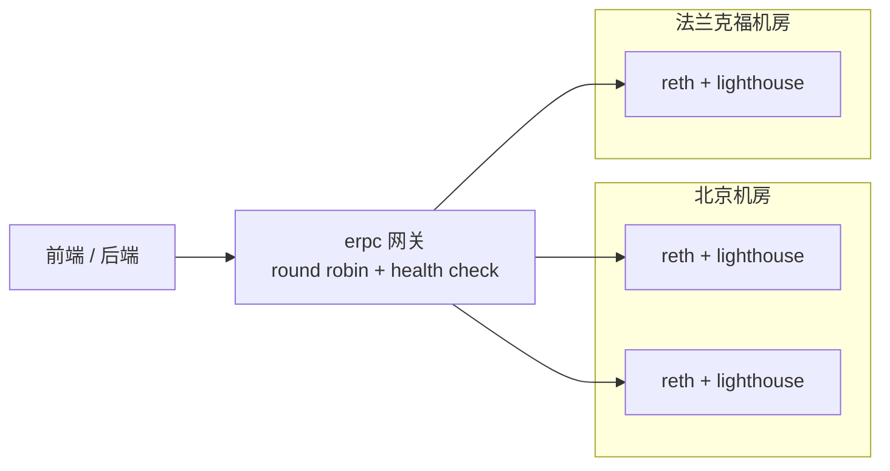

至少两个机房 (跨 ASN/ISP). erpc 自带 health check + circuit breaker (lag > 30 块自动剔除). cache (`eth_call` 30s, `eth_chainId` 永久) 可挡 ~80% 请求.

---

### I.4 Indexer 全谱系（详细）

新人最容易踩的坑：产品经理问 "首页要展示用户最近 30 天所有 swap 记录"，工程师写 `eth_getLogs(fromBlock=head-216000)` 然后等——15 秒后 RPC 报 "block range too large"，换成分批拉，发现要打 200 多次请求，10 分钟才返回。**用户不会等 10 分钟，前端要"几百毫秒返回"。** 这就是 indexer 存在的理由：监听 logs → 解码 → 写 Postgres → 暴露 GraphQL/SQL，把"链上即时计算"变成"数据库查询"。

2024-06-12 The Graph hosted-service 关停，让一批老项目的 subgraph URL 一夜变 404。新项目要在五条路径里选——TypeScript 团队选 Ponder，极速选 Envio，多链选 Goldsky 或 SQD，抗审查选 The Graph network，老项目迁移看 ABI 复杂度。

#### I.4.1 五种主流 indexer

| 方案 | 类型 | 部署 | 速度 (Uniswap V2 Factory bench) | 链支持 | 何时选 |
|---|---|---|---|---|---|
| **The Graph (decentralized)** | hosted + 去中心化 | Subgraph Studio + 网络 | ~158 min | 60+ | 老项目迁移 / 享受去中心化 |
| **Ponder 0.10** | 自托管 TS 框架 | Node.js + Postgres | ~60 min (单 RPC), 4 min (本地 reth) | EVM 全部 | TS 团队 / 后端 / 类型安全 |
| **Goldsky** | hosted, subgraph + Mirror 流 | 控制台 / CLI | ~10 min | 150+ | 需 webhook / 流到 BigQuery |
| **Envio HyperIndex** | hosted + 自托管, 基于 HyperSync | TS/JS | ~1 min | 70+ EVM | 极端高吞吐 / event 密集 |
| **Subsquid (SQD)** | 去中心化 query 网络 + Squid SDK | TS, Postgres + GraphQL | ~5 min | 100+ EVM/Substrate/Solana | 多链 / 历史回填 |

> 来源: [Envio 2026 Indexer Benchmarks](https://docs.envio.dev/blog/blog/best-blockchain-indexers-2026), [Chainstack Hosted Subgraphs](https://chainstack.com/top-5-hosted-subgraph-indexing-platforms-2026/)

老 The Graph hosted URL 全部死链；新项目走 decentralized network + Subgraph Studio，TS 选 Ponder，极速选 Envio，多链选 Goldsky/SQD。

> 来源: [The Graph Sunsetting Hosted Service](https://thegraph.com/blog/sunsetting-hosted-service/), [Envio 2026 Indexer Benchmarks](https://docs.envio.dev/blog/blog/best-blockchain-indexers-2026)

#### I.4.2 内部架构对比

```mermaid
flowchart LR
    subgraph TheGraph[The Graph]
        TG_RPC[archive RPC] -->|getLogs poll| TG_Node[graph-node]
        TG_Node -->|WASM mapping<br/>AssemblyScript| TG_PG[(Postgres)]
        TG_Node -->|GraphQL| TG_Q[GraphQL]
    end
    subgraph Ponder[Ponder 0.x]
        P_RPC[archive RPC<br/>or HyperSync] -->|批量 logs<br/>+ eth_call| P_App[Ponder runtime]
        P_App -->|TS handler<br/>类型安全| P_PG[(Postgres)]
        P_App -->|GraphQL/SQL| P_Q[GraphQL]
    end
    subgraph Envio[Envio HyperIndex]
        E_HS[HyperSync<br/>列式归档] -->|Rust query| E_App[HyperIndex]
        E_App -->|TS/JS handler| E_PG[(Postgres)]
        E_App -->|GraphQL| E_Q[GraphQL]
    end
    subgraph Goldsky[Goldsky]
        G_RPC[archive RPC] --> G_Sub[Subgraph 兼容]
        G_RPC --> G_Mir[Mirror 流]
        G_Sub --> G_PG[(Postgres)]
        G_Mir --> G_BQ[(BigQuery / Snowflake)]
    end
```

#### I.4.3 Ponder 实战

Ponder 0.11+ 内置 Drizzle ORM。老 `db.Account.create` API 已迁移到 `db.insert(accounts)` query builder。

项目结构:

```
02-ponder-erc20-indexer/
├── package.json              # @ponder/core ^0.10, viem 2, hono 4
├── ponder.config.ts          # 链 + RPC + 合约 + ABI + startBlock
├── ponder.schema.ts          # onchainTable + relations + primaryKey
├── abis/erc20Abi.ts          # 仅保留 Transfer 事件
├── src/index.ts              # ponder.on("USDC:Transfer", ...)
├── docker-compose.yml        # postgres 16
└── .env.example              # PONDER_RPC_URL_1 + DATABASE_URL
```

ponder.config.ts 要点:

```ts
export default createConfig({
  database: { kind: "postgres", connectionString: process.env.DATABASE_URL },
  networks: {
    mainnet: { chainId: 1, transport: http(process.env.PONDER_RPC_URL_1) },
  },
  contracts: {
    USDC: {
      network: "mainnet",
      abi: erc20Abi,
      address: "0xA0b86991c6218b36c1d19D4a2e9Eb0cE3606eB48",
      startBlock: 22300000, // 演示用近一周
    },
  },
});
```

`startBlock` 一定不要从 0 开始。USDC 部署在 6082465, 但全量回填要数小时。实战通常从"今天往前 30 天"开始, 用 `cast block-number` 反推区块号。

ponder.schema.ts 要点:

- 用 `onchainTable("account", t => ({ ... }))` 定义表
- 多列复合主键用 `primaryKey({ columns: [tx, idx] })`
- `relations(account, ({ many }) => ({ sent: many(transferEvent) }))` 让 GraphQL 自动 join

src/index.ts handler:

```ts
ponder.on("USDC:Transfer", async ({ event, context }) => {
  const { from, to, value } = event.args;
  await context.db.transferEvent.insert({ /* 流水 */ });
  if (from !== ZERO_ADDRESS) {
    await context.db.account
      .insert({ address: from, balance: -value, transferCount: 1 })
      .onConflictDoUpdate(row => ({
        balance: row.balance - value,
        transferCount: row.transferCount + 1,
      }));
  }
});
```

性能基线 (2026-04 实测):

| RPC 后端 | 起始区块 -> head (~7 天) | 备注 |
|---|---|---|
| Alchemy free tier | 22 min | 受 rate limit 限制 |
| 自建 reth archive (本机) | 4 min | viem batch + 大 RPC 池 |
| Envio HyperSync | 1 min | Ponder 0.11+ 可切 HyperSync transport |

Ponder 部署到生产:

```bash
docker build -t my-indexer:0.1 .
DATABASE_URL=postgres://... ponder start
```

Postgres 用托管 (RDS / Neon / Supabase), 别自建. Ponder 把 cursor 写在 Postgres `_ponder_status` 重启自动续上, 但**必须**配 PITR.

#### I.4.4 reorg 处理

mainnet 偶尔 1-2 块 reorg, OP Stack 每天可见.

```mermaid
sequenceDiagram
    participant Indexer
    participant RPC
    participant DB
    Indexer->>RPC: 拉 block N (head)
    Indexer->>DB: 写入 N 的 events
    Note over RPC: chain reorg!<br/>N 被替换
    Indexer->>RPC: 发现 block N 父哈希变了
    Indexer->>DB: 删除原 N 的 events
    Indexer->>RPC: 拉新的 block N
    Indexer->>DB: 写入新 N 的 events
```

| 方案 | reorg 策略 | 你需要做什么 |
|---|---|---|
| The Graph | 自动, 默认 finality 50 块 | 不用关心, 但 GraphQL 返回的非 finalized 数据可能反复 |
| Ponder | 自动, head ~5 块以内自动 rollback | 不用关心 |
| Envio HyperIndex | 自动, 由 HyperSync 维护 | 不用关心 |
| Subsquid | 默认在 finalized block 处理, 不暴露 head | 不用关心, 但 latency 高 |
| Goldsky Mirror | 取决于配置, "real-time" 模式可能见到 reorg | 在下游消费时 dedupe |

自己写 indexer 时, 一定要存 `block_hash`, 每个 block 检查 parent_hash 是否仍指向你已写的 block. 不一致就 rollback.

#### I.4.5 自托管 vs 托管选型

| 维度 | 自托管 (Ponder, Subsquid SDK, graph-node) | 托管 (The Graph network, Goldsky, Envio cloud) |
|---|---|---|
| 启动成本 | 中: 配 archive RPC + Postgres + 部署 | 低: dashboard 一键 |
| 月度成本 | 节点 ¥1000 + Postgres ¥500 + 应用 ¥0-500 | $50-500 (按 query) |
| 性能上限 | 完全靠你 | 厂商基础设施保底 |
| 私密 | 强 (你的 RPC 调用不暴露) | 弱 (索引 schema 厂商可见) |
| reorg / 升级 | 需要你测 | 厂商负责 |
| 适合 | 中长期生产协议, 数据敏感 | MVP, 周末黑客松, 小团队 |

#### I.4.6 选型决策树

```mermaid
flowchart TD
    Start[需要索引器] --> A{需要去中心化<br/>抗审查}
    A -->|是| B{老 subgraph 迁移}
    B -->|是| C[The Graph network]
    B -->|否| D[Subsquid SQD]
    A -->|否, 商业项目| E{速度需求}
    E -->|极端高吞吐| F[Envio HyperIndex]
    E -->|常规| G{需要流式 / BigQuery}
    G -->|是| H[Goldsky Mirror]
    G -->|否| I{TS 应用后端}
    I -->|是| J[Ponder 0.x]
    I -->|否, 多链优先| K[Goldsky / SQD]
```

#### I.4.7 Subgraph 部署 + 版本化 (2026-04)

```mermaid
flowchart LR
    Dev[本地 graph-cli init] --> Build[graph build]
    Build --> Test[graph test 单测]
    Test --> Studio[graph deploy --studio<br/>到 Subgraph Studio]
    Studio --> Sandbox[在 Studio 测试 GraphQL]
    Sandbox --> Publish[Publish 按钮<br/>publish 到 decentralized network]
    Publish --> Curate[curators 给 GRT signal<br/>indexer 决定是否 index]
    Curate --> Query[query URL<br/>需 API key + GRT 抵扣]
```

关键命令:

```bash
# 1. 初始化
graph init --studio my-defi-subgraph
cd my-defi-subgraph

# 2. 本地编译 + 单元测试
graph codegen
graph build
graph test

# 3. 部署到 Subgraph Studio (dev sandbox, 100k 免费 query/月)
graph auth $SUBGRAPH_STUDIO_DEPLOY_KEY
graph deploy my-defi-subgraph --version-label 0.0.1

# 4. 在 Studio Web UI 点 "Publish to network"
#    会触发链上 tx, 记得有 ETH gas

# 5. 拿到 query URL (含 API key)
#    https://gateway.thegraph.com/api/<API_KEY>/subgraphs/id/<SUBGRAPH_ID>
```

版本化策略:

| 场景 | 操作 | 影响 |
|---|---|---|
| 仅修 mapping bug, schema 不变 | bump 0.0.1 -> 0.0.2 | indexer 重新 sync, 老 query 不影响 |
| 改 schema (新增字段) | bump 0.1.0 -> 0.2.0 | indexer 重新 sync, 老 client 仍可读 |
| 改 schema (删字段 / 改类型) | bump 0.2.0 -> 1.0.0 (breaking) | 必须告知 query 方迁移 |
| 改合约地址 / startBlock | 一定 bump major | 可能要全量 reindex |

跨链部署: 每个网络独立 subgraph slug, 前端按 chainId 路由.

pruning (大 subgraph > 50M entity):

```yaml
specVersion: 1.0.0
features:
  - prune
  - non-fatal-errors
indexerHints:
  prune: 30000     # 仅保留最近 30000 块的全部 history
```

省 50-90% 磁盘, 但 historical 查询不可用.

> 来源: [The Graph - Publishing a Subgraph](https://thegraph.com/docs/en/subgraphs/developing/publishing/publishing-a-subgraph/), [Subgraph Studio Versioning](https://thegraph.com/docs/en/subgraphs/developing/deploying/using-subgraph-studio/)

Goldsky / Envio 实测对比 (2026-04, mainnet 30 天 Uniswap V3 swap):

| 平台 | 部署时间 | 全量 reindex 时间 | 查询 p50 latency | 月度成本 (10M query) |
|---|---|---|---|---|
| The Graph network | 5 min (publish + signal) | ~6 h (受 indexer 进度) | 200-400ms | ~$50 (按 GRT) |
| Goldsky Subgraph | 3 min | ~2 h | 80-150ms | $200 (含 webhook) |
| Envio HyperIndex | 5 min | ~15 min (HyperSync) | 50-100ms | $100 (cloud tier) |
| Ponder 自托管 | 10 min (含 Postgres) | ~1 h | 50-100ms | ¥500 (Postgres) |

速度 Envio 一骑绝尘, 成本 Ponder 自托管最低, 抗审查唯一选 The Graph. 实战常见做法: 用 Envio / Goldsky 跑生产 + 备份一份 The Graph 做 fallback.
