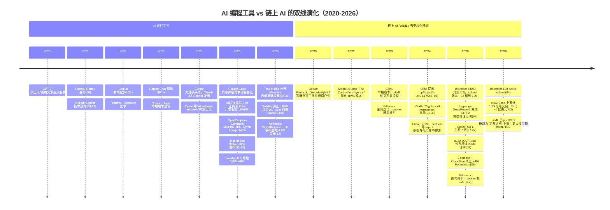
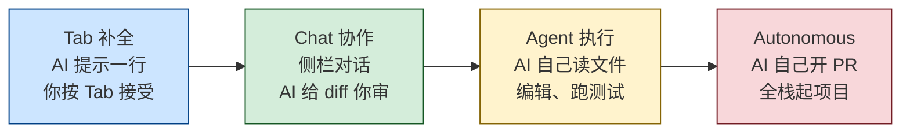
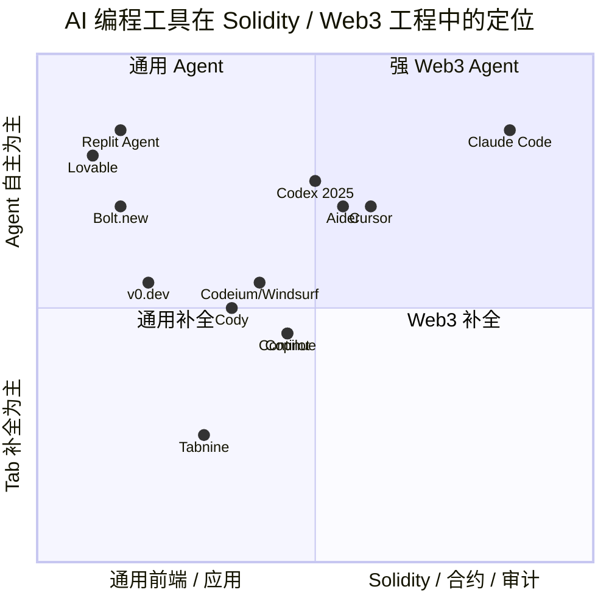
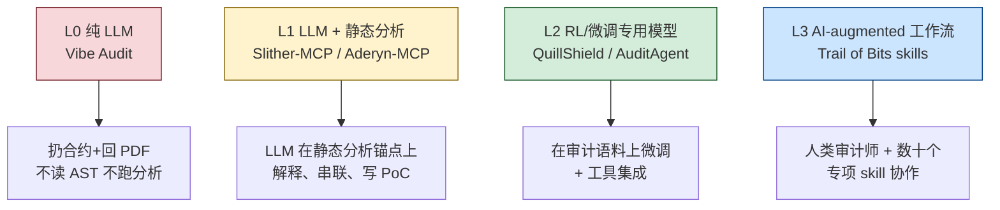
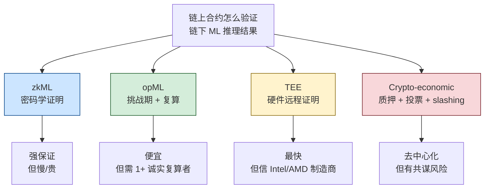
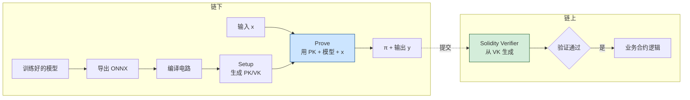
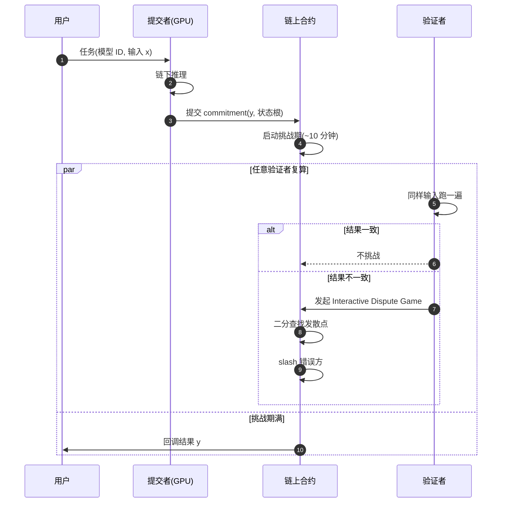
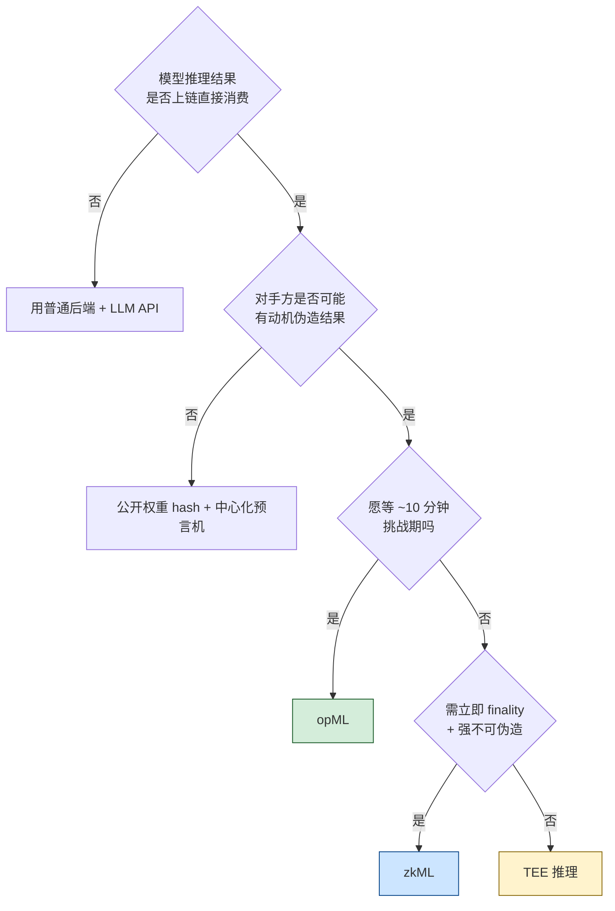
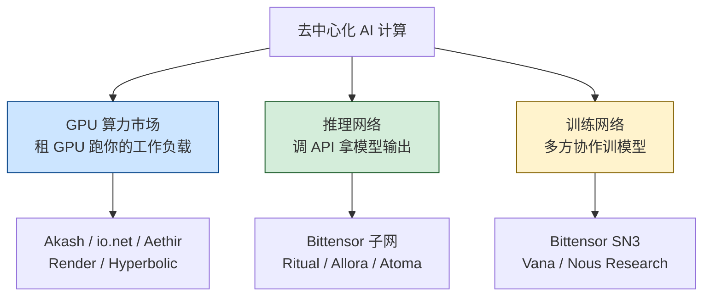
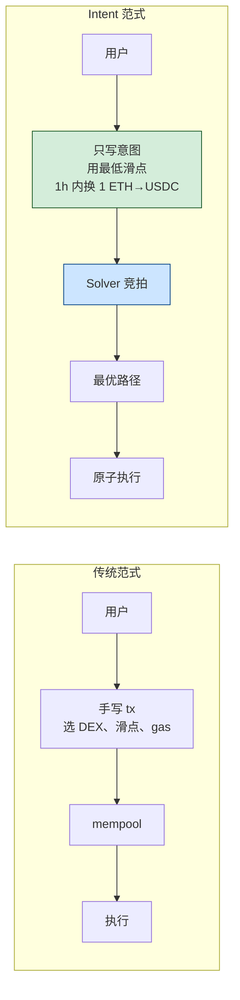

# 模块 12 · AI × Web3：对工程师的现实影响

> 写给已通过 01-11 模块的工程师。这一模块不卖叙事，只回答三个问题：
>
> 1. 2026 年的 AI 工具，现在已经能帮你做哪些 Web3 工作？哪些不能？
> 2. "链上 AI"（zkML、opML、去中心化推理、链上 agent）哪些已经跑得起来，哪些还在 demo 阶段？
> 3. 作为一个 Web3 工程师，你应该如何升级自己的工作流，又应该警惕哪些被高估的方向？
>
> 文档版本：v1.0 · 最后更新 2026-04-27 · 所有外链均带检索日期。
>
> 写作纪律：每一个性能数据、行情数据、资本动作都附 URL；区分"已生产化"、"刚刚涌现"、"仍是 hype"三档；不写"AI 将颠覆 Web3"这种空话。
>
> **前置**：模块 11（基础设施与工具）——RPC、索引、存储、DePIN compute 是本模块"链下推理 + 链上验证"的运行底座。**后续**：模块 13（NFT 身份与社交）——AI agent 经济需要可验证的数字身份，KYA（Know Your Agent）、Soulbound、信誉系统在那里展开。

---

## 目录

- [0.5 时间轴：AI 编程工具与链上 AI 的两条平行历史](#05-时间轴ai-编程工具与链上-ai-的两条平行历史)
- [0. 为什么这一模块要单独存在](#0-为什么这一模块要单独存在)
- [1. 已经在帮工程师的 AI 应用（生产化）](#1-已经在帮工程师的-ai-应用生产化)
- [2. 正在涌现但不可全信的 AI 应用](#2-正在涌现但不可全信的-ai-应用)
- [3. 链上 AI 基础设施](#3-链上-ai-基础设施)
- [4. 链上 AI Agent 与代币经济（含 §4.4 a16z/Paradigm、§4.5 攻击者的 AI、§4.6 MEV、§4.7 Agent 框架活跃度）](#4-链上-ai-agent-与代币经济)
- [5. 给工程师的现实警示](#5-给工程师的现实警示)
- [6. 实战 Demo：Claude Code 搭建 ERC-4626 Vault](#6-实战-democlaude-code-搭建-erc-4626-vault)
- [7. 实战 Demo：LLM + viem 链上数据分析 agent](#7-实战-demollm--viem-链上数据分析-agent)
- [8. 实战 Demo：EZKL 把 Logistic 回归塞进 ZK 证明](#8-实战-demoezkl-把-logistic-回归塞进-zk-证明)
- [9. 实战 Demo：ORA opML SDK 调用链上推理](#9-实战-demoora-opml-sdk-调用链上推理)
- [10. 练习](#10-练习)
- [11. 与其他模块的双向引用](#11-与其他模块的双向引用)
- [12. 推荐阅读与持续追踪](#12-推荐阅读与持续追踪)

---

## 0.5 时间轴：AI 编程工具与链上 AI 的两条平行历史



> **解读**：2024 是分水岭——(1) Claude/GPT-4 级模型让"AI 写 Solidity"从 demo 变工作流；(2) 主流安全公司开始体系化嵌入 AI 审计；(3) AI agent + 代币 + intent 合流成为大资金叙事，但投机远多于真实使用。

> **阅读建议**：(1) 2h：只读 §0、§0.5、§1、§5；(2) 半天：读 §2、§3；(3) 一周：跑完 §6-§9 demo，做完 §10 练习。

---

## 0. 为什么这一模块要单独存在

公共讨论质量极低：一端是"AI agent 颠覆 Web3"的代币营销（80% 项目链上活动为零），另一端是"AI 写出无漏洞合约"的乐观推文（与安全公司实测严重不符）。

- [Solidity Developer Survey 2025](https://www.soliditylang.org/blog/2026/04/15/solidity-developer-survey-2025-results/)（1,095 位开发者，87 国，检索 2026-04）：**88% 月用 AI、58% 日用，但 45% 不信任 AI 输出**。
- [Stack Overflow 2025](https://survey.stackoverflow.co/2025/ai)（检索 2026-04）：84% 全行业开发者用 AI，"高度信任"比例历年新低。
- [METR 2025-07](https://metr.org/blog/2025-07-10-early-2025-ai-experienced-os-dev-study/)（检索 2026-04）：16 位资深开源开发者做 246 个真实任务，**用 AI 平均慢 19%**，主观感觉却"快了 20%"。

本模块目标：画清"能用、应该用、不应过度依赖"的边界。

---

## 1. 已经在帮工程师的 AI 应用（生产化）

标准：被主流团队默认安装到工作流，有公开数据支撑。

### 1.1 代码补全与生成：主流 AI 工具全景

#### 1.1.1 四种交互模式（按自主程度递增）



- **Tab 补全（A）**：低风险高频，节省击键。
- **Chat 协作（B）**：你提问，AI 给 diff，你逐行 review。Solidity 工程师 80% 的真实工作流。
- **Agent 执行（C）**：AI 自己读多文件、改、跑 `forge test`、看输出再改。
- **Autonomous（D）**：一句话生成整个 dApp，Web3 工程上**仍是 demo 级**。

> **思考框**：你 80% 的需求在 A/B 还是 C？答案决定该投资哪条工具链。

#### 1.1.2 数据：Solidity 生态用什么

[Solidity Developer Survey 2025](https://www.soliditylang.org/blog/2026/04/15/solidity-developer-survey-2025-results/)（1,095 位开发者、87 国，2025-12 调研、2026-04 检索）：

- **编辑器/Agent**：VSCode 60%、Cursor 32%、Antigravity 16%
- **AI 助手**：Claude Code 61%（首选）、Codex/ChatGPT 16%、Gemini 10%
- **使用场景**：测试 61%、写文档 59%、阅读代码 58%、写代码 49%、Code Review 49%
- **信任度**：高度信任 6%，somewhat trust 49%，somewhat distrust 30%，highly distrust 15%

#### 1.1.3 主流 AI 编码工具实测对比

##### Cursor

- **定位**：VSCode fork + 内置 LLM agent（"AI-first 编辑器"）。Tab 补全、Cmd+K 行内编辑、侧栏 Chat、Composer/Agent 多文件改动，可挂任意 LLM。
- **实测**：Solidity 调研 32% 选它做编辑器，仅次于 VSCode。但 METR 实验里 **Cursor Pro + Claude 3.5/3.7 被实测"慢 19%"**（[Cursor 统计](https://devgraphiq.com/cursor-statistics/)，检索 2026-04）——工具不是银弹。
- **局限**：Pro 订阅偏贵，完全闭源。
- **建议**：值得投入，日常 Solidity 编辑器首选。

##### Claude Code

- **定位**：Anthropic 官方终端 Agent，原生 MCP 支持。读 git 仓库、调 Slither/Aderyn/OZ Contracts MCP，连续编辑-运行-修复。`CLAUDE.md` 作项目级 prompt。
- **实测**：Trail of Bits、Cyfrin 最常用的 AI-native audit 宿主。Solidity Survey **61% 选它为首选 AI 助手**。
- **局限**：终端体验上手稍陡；token 成本比 Cursor 高。
- **建议**：合约/审计**强烈投入**；纯前端选 Cursor。

##### Aider

- **定位**：开源终端 AI 配对编程。Tree-sitter 构建 repo map，逐次 git commit。Architect/Editor 双模型设计。
- **实测**：[benchmark](https://aider.chat/docs/benchmarks.html)（检索 2026-04）多语言基准 SOTA。Solidity 无专项数据，社区反馈小型项目（<10 合约）够用。
- **局限**：项目大了 repo map 容易爆 context。
- **建议**：开源 + 可挂本地模型（[Ollama 集成](https://voipnuggets.com/2025/03/25/aider-your-open-source-fully-local-and-100-free-ai-pair-programmer-with-ollama/)）。预算敏感/合规团队值得用。

##### GitHub Copilot

- **定位**：行业标杆。Codex（2021）→ GPT-4o（2024）→ GPT-5-Codex 公测（2025-09，[GitHub Changelog](https://github.blog/changelog/2025-09-23-openai-gpt-5-codex-is-rolling-out-in-public-preview-for-github-copilot/)）。Solidity 原生支持（[Pensora IQ](https://medium.com/@pensora.iq.team/github-copilot-vs-tabnine-vs-codeium-2025-the-ultimate-showdown-of-ai-coding-assistants-e88c925ed5df)，检索 2026-04）。
- **实测**：Tab 补全仍是默认选择，企业版集成成熟。
- **局限**：Agent 模式追赶 Cursor 较慢，Solidity 专项不如 Claude/Cursor。
- **建议**：公司只让用 GitHub 生态时够用；个人选型不必默认它。

##### OpenAI Codex（2025 重生版）

- **定位**：Codex 名字复活为 autonomous agent（与 2021 版只共享名字）。Copilot 内置，可接管 issue 自开 PR（[GitHub Docs](https://docs.github.com/en/copilot/concepts/agents/openai-codex)，检索 2026-04）。
- **实测**：通用代码任务接近 Claude Code，Solidity 无公开 benchmark。
- **局限**：Web3 ecosystem-fit 不如 Claude Code（MCP 生态）。
- **建议**：观望，等 Solidity 用例。

##### Codeium / Windsurf

- **定位**：Codeium 2024 改名 Windsurf，Cascade Agent 模式深度集成（[官方对比](https://windsurf.com/blog/code-assistant-comparison-copilot-tabnine-ghostwriter-codeium)，检索 2026-04）。2025 年增长最快的 AI 编程助手（[Educative](https://www.educative.io/blog/ai-coding-copilots)，检索 2026-04）。
- **局限**：模型层不及 Claude/GPT 旗舰，复杂多文件改动有时丢上下文。Solidity 上是次选。
- **建议**：免费层好，预算紧时备用。

##### Continue

- **定位**：开源 VSCode/JetBrains 插件，可挂任意模型。轻量 Cursor 替代，Tab + Chat + 简单 Agent。
- **局限**：Agent 能力远不如 Cursor / Claude Code。Solidity 用户少。
- **建议**：仅在必须开源 + 自托管的合规场景下选用。

##### Sourcegraph Cody

- **定位**：Sourcegraph 代码搜索 + LLM，索引整个组织代码。大型多 repo 组织强，单 Solidity 项目少用。
- **局限**：贵，企业向。
- **建议**：除非公司已用 Sourcegraph，否则不必。

##### Tabnine

- **定位**：Privacy-first，可在客户 VPC 部署。补全 OK，agent 弱。
- **局限**：模型代差大，不如 Codeium 免费层。
- **建议**：仅在"代码不出 VPC"合规场景下选用。

##### Replit Agent 3

- **定位**：浏览器 AI 全栈，2025-09 上线。内置 DB、auth、hosting、30+ 集成（[介绍](https://medium.com/@aftab001x/the-2026-ai-coding-platform-wars-replit-vs-windsurf-vs-bolt-new-f908b9f76325)，检索 2026-04）。极适合"前端 + DB"原型。
- **局限**：Web3 后端（合约 + RPC + indexer）支持有限，Solidity/审计薄弱。
- **建议**：链下部分可用；合约部分用 Foundry + Cursor/Claude Code。

##### Bolt.new

- **定位**：StackBlitz 出品，浏览器 Node + 一键部署（[Mocha 2026](https://getmocha.com/blog/best-ai-app-builder-2026/)，检索 2026-04）。前端原型秒级出活。
- **局限**：合约工程支持薄弱，Web3 靠社区模板。
- **建议**：Hackathon MVP 可以；生产用 Next.js + CI/CD。

##### v0.dev (Vercel)

- **定位**：一句话/图片 → React + Tailwind shadcn/ui 代码（GPT-4 系列）。dApp UI 草图秒级出活，wagmi/viem 集成顺畅。
- **局限**：只生成 UI，不写合约/indexer。
- **建议**：dApp 前端值得用。详见模块 10。

##### Lovable

- **定位**：自然语言 → React + Supabase 全栈应用。8 个月 100M ARR（[官方](https://lovable.dev/guides/best-ai-app-builders)，检索 2026-04）。
- **局限**：Web3 是边缘场景，集成靠用户粘合。
- **建议**：链下产品可选；dApp 不必。



#### 1.1.4 实测生产力数据

- [Trail of Bits 2026-03](https://blog.trailofbits.com/2026/03/31/how-we-made-trail-of-bits-ai-native-so-far/)（检索 2026-04）：某些客户端工程从每周 ~15 bug → ~200 bug；依赖"代码库形态适合 LLM + 人审核不变"，不可一概而论。
- [METR 2025-07](https://metr.org/blog/2025-07-10-early-2025-ai-experienced-os-dev-study/)（Cursor Pro + Claude 3.5/3.7，检索 2026-04）：熟悉大型 OSS 代码库上慢 19%，主观感觉快 20%。[2026-02 更新](https://metr.org/blog/2026-02-24-uplift-update/)承认样本偏差变大。
- [Faros AI](https://www.faros.ai/blog/how-to-measure-claude-code-roi-developer-productivity-insights-with-faros-ai)（检索 2026-04）：行业真实提升 10-30%，与宣传的 2-10x 差距大。

| 任务类型                                       | AI 工具的真实加速比          | 推荐工具                            |
| ---------------------------------------------- | ---------------------------- | ----------------------------------- |
| 写第一版 ERC-20 / 721 / 4626 骨架              | 5-10×（节约模板拷贝时间）      | OZ Contracts MCP + Claude Code      |
| 补充 NatSpec、写 README、画 mermaid            | 3-5×                          | Claude Code 或 Cursor Chat          |
| 在不熟悉的代码库上做小 bug fix                 | 1-2×                          | Cursor + Slither MCP                |
| 在**非常熟悉**的代码库上做小 bug fix           | 可能 -20%（METR 数据）        | 不必用 AI                           |
| 写 Foundry 测试 + invariant 草稿               | 3-5×（草稿）                  | Claude Code                         |
| 设计新协议、新经济机制、新密码学               | 0-1×（AI 是讨论伙伴）         | LLM 当读论文助理而非设计者          |
| 前端 dApp UI 原型                              | 5-10×                         | v0.dev / Bolt.new + wagmi           |
| Subgraph schema 草稿                           | 3-5×                          | Claude / Cursor                     |

### 1.2 文档与审计报告辅助

低风险高重复，AI 显著有用：Foundry/Hardhat 输出 → Markdown 报告；git diff → 协议变更摘要；校对/术语统一/多语言。

注意：报告草稿可以让 AI 写，**结论不能让 AI 下**。常见失误：把 AI 总结当 finding 提交 Code4rena/Sherlock，被判 invalid 后算入个人 false positive。

### 1.3 漏洞解释与 calldata / 交易解码

AI 最稳的应用方向之一（"读"而非"写"）：

- [Tenderly](https://tenderly.co/)（检索 2026-04）：trace/event/state diff 标准化 + LLM → 黑客交易自然语言摘要；
- [BlockSec Phalcon](https://blocksec.com/explorer)（检索 2026-04）：攻击交易回放与资金流分析；
- [TxSum / MATEX 论文](https://arxiv.org/html/2512.06933)（检索 2026-04）：500 笔以太坊交易抽样显示，现有工具能解 token transfer 和 calldata，但解释"经济意义"仍弱——LLM 的靶点。

工程师工作流：可疑交易 raw input + decoded calls 喂 Claude/Cursor，要求"正常路径 vs 异常路径"对比。

### 1.4 学习路径辅导：LLM 解释 ZK 论文与新 EIP

- 把 [Plonk](https://eprint.iacr.org/2019/953)、[HyperPlonk](https://eprint.iacr.org/2022/1355)、[Jolt](https://eprint.iacr.org/2023/1217) 等论文丢给 Claude，要求解释 commitment scheme；
- 新 EIP 草案 → LLM → "对当前代码库的影响清单"。

**LLM 解释概念可信，推导数学不可信**。具体常数（约束数、proof size）必须回论文核对。

### 1.5 Subgraph schema 与 GraphQL 查询生成

- 合约 ABI + 协议描述 → LLM → `schema.graphql` 草稿；
- 自然语言查询 → LLM → GraphQL query。

注意：mapping 函数（事件 → entity）的字段更新顺序和 tx-level 去重逻辑必须人审。

### 1.6 OpenZeppelin Contracts MCP：把"安全合约模板"做成 AI 工具调用

[OpenZeppelin 2025-07-30 发布](https://www.openzeppelin.com/news/introducing-contracts-mcp)（检索 2026-04）。关键设计：MCP **替换** AI 输出——返回经 OZ 规则验证的可生产代码。支持 Solidity（ERC-20/721/1155/Stablecoin/RWA/Governor/Account）、Cairo、Stellar；适配 Cursor/Claude/Gemini/Windsurf/VS Code。

- **生成 ERC-20/721/4626 骨架**：用 OZ Contracts MCP，比让 LLM 自由发挥安全；
- **生成业务逻辑（清算、做市、限价单）**：MCP 帮不了，自己写、自己审。

### 1.7 Web3 MCP 服务器全景

MCP（Model Context Protocol，Anthropic 2024-11）在 Web3 生态 2025-2026 年快速扩展。

#### 1.7.1 Solidity / EVM 侧

| MCP 服务器                      | 直觉                                          | 来源                                                                                                                        |
| ------------------------------- | --------------------------------------------- | --------------------------------------------------------------------------------------------------------------------------- |
| **OpenZeppelin Contracts MCP**  | 用 OZ 规则替换 LLM 输出（见 §1.6）            | [openzeppelin.com](https://www.openzeppelin.com/news/introducing-contracts-mcp)                                             |
| **Aderyn MCP**                  | Cyfrin Rust 静态分析器 → LLM                | [Cyfrin docs](https://docs.cyfrin.io/)                                                                                       |
| **Slither MCP**                 | Trail of Bits Slither → LLM（2025-11-15）    | [trailofbits/slither-mcp](https://github.com/trailofbits/slither-mcp)                                                        |
| **Foundry MCP server**          | LLM 直接跑 forge / cast / anvil              | [PraneshASP/foundry-mcp-server](https://github.com/PraneshASP/foundry-mcp-server)                                            |
| **Microsoft Foundry MCP**       | Azure 云托管 MCP，Ignite 2025 公测            | [Visual Studio Magazine](https://visualstudiomagazine.com/articles/2025/12/04/microsoft-previews-cloud-hosted-foundry-mcp-server-for-ai-agent-development.aspx) |

#### 1.7.2 Solana 侧

| MCP 服务器                      | 直觉                                                    | 来源                                                                                          |
| ------------------------------- | ------------------------------------------------------- | --------------------------------------------------------------------------------------------- |
| **QuickNode Solana MCP**        | 让 Claude 检查钱包余额、token 账户、tx 详情             | [QuickNode 教程](https://www.quicknode.com/guides/ai/solana-mcp-server)                       |
| **solana-web3js-mcp-server**    | Solana web3.js 全套开发 + 智能合约部署                  | [FrankGenGo/solana-web3js-mcp-server](https://github.com/FrankGenGo/solana-web3js-mcp-server) |

#### 1.7.3 跨链 / 数据侧

- **SkyAI**：BNB Chain + Solana 上的 Web3 数据 MCP，号称聚合 100 亿+ 数据行；
- **更多 MCP 服务器**：参考 [SurePrompts MCP 2026 Guide](https://sureprompts.com/blog/model-context-protocol-mcp-complete-guide-2026)（检索 2026-04），到 2026-04 已有公开 MCP 注册表 + Claude Desktop / Cursor / VS Code 一级支持。

> **工程师基础四件套**：OpenZeppelin Contracts MCP（生成）+ Aderyn MCP（静态分析）+ Slither MCP（静态分析）+ Foundry MCP（执行测试）——覆盖"AI 写 Solidity"的 80% 工作流。

> 上面是"AI 已经稳定提效"的部分。剩下 20% 是真正的判断题——AI 审计、ZK 电路调试、fuzz seed 生成——下一节按"L0-L3 等级"逐项展开"哪些可用、哪些是营销"。

---

## 2. 正在涌现但不可全信的 AI 应用

### 2.0 AI 审计的四个等级



> L0 是营销重灾区（"5 分钟出报告"）。L1 起才有工程价值；L3 是当前最先进实践，**目标是增强而非替代审计师**。

### 2.1 AI 审计工具完整清单

#### 2.1.1 Aderyn（Cyfrin） + Aderyn MCP Server

- **定位**：开源 Rust 静态分析器 + LLM 上下文桥。100+ 检测器（reentrancy、precision loss、access control），读 Solidity AST。2025 发布 VS Code Extension + Aderyn MCP Server（[Cyfrin 年报](https://www.cyfrin.io/blog/cyfrin-2025-wrap-up-advancing-web3-security-audits-and-blockchain-education)，检索 2026-04）。起源于 [4naly3er](https://github.com/Picodes/4naly3er)，Cyfrin Rust 化产品化。
- **局限**：规则检测器，跨合约逻辑漏洞漏报率高。
- **建议**：免费开源，审计工程师必装。

#### 2.1.2 Slither + Slither-MCP（Trail of Bits）

- **定位**：行业标杆静态分析器 + 2025-11 MCP 桥（[公告](https://blog.trailofbits.com/2025/11/15/level-up-your-solidity-llm-tooling-with-slither-mcp/)，检索 2026-04）。把 detectors、call graph、inheritance hierarchy、function metadata 通过 MCP 暴露。
  - 安装：`claude mcp add --transport stdio slither -- uvx --from git+https://github.com/trailofbits/slither-mcp slither-mcp`
- **实测**：Trail of Bits 内部 audit 默认开。Slither 精确分析作为 LLM "地基真相"，显著降低幻觉。
- **局限**：受限于 Slither 检测器范围。
- **建议**：与 Aderyn 同装，互补。

#### 2.1.3 Nethermind AuditAgent

- **定位**：微调 LLM + Slither + 网搜 + 自定义工具（[文档](https://docs.auditagent.nethermind.io/overview/)、[博客](https://www.nethermind.io/blog/how-nethermind-security-uses-auditagent-alongside-manual-audits)，检索 2026-04）。v1 召回 15% → **v2 召回 50%**（内部 29 场审计样本）。公开案例：ResupplyFi 9.8M 黑客前已标出"汇率逻辑可疑"；LUKSO Hyperlane 桥审计有 case study。
- **局限**：闭源；50% 召回 = 另 50% 仍需人。
- **建议**：审计公司/大型协议值得付费试用；个人用 Aderyn + Slither MCP 够。

#### 2.1.4 QuillShield（QuillAudits）

- RL 训练审计专用 LLM，闭源，缺第三方验证。**建议**：观望。

#### 2.1.5 Olympix

- **定位**：IDE 内 shift-left 安全工具（VSCode + 自家 engine + LLM）。[自家 benchmark](https://olympix.security/blog/best-slither-alternative-for-2025-why-developers-choose-olympix)（检索 2026-04）声称 Slither 召回 ~15%、Olympix ~75%（5x）——**需独立复现**。
- **局限**：闭源，benchmark 无第三方验证，企业定价。
- **建议**：商业团队可试用并用 Code4rena 历史 finding 自行验证；个人用 Aderyn + Slither MCP 够。

> **小提示**：Olympix 博客 [State of Web3 Security 2025](https://olympix.security/blog/the-state-of-web3-security-in-2025-why-most-exploits-come-from-audited-contracts)（检索 2026-04）统计**大多数 2025 年大型黑客合约都已审计过**（Euler $197M、BonqDAO $120M 等），佐证 AI 审计价值在于"审完后再过一遍"。

#### 2.1.6 OpenZeppelin AI 工作流

- [OZ 审计 OpenAI EVMBench](https://www.openzeppelin.com/news/openai-evmbench-audit)（检索 2026-04）：找到 **4+ 被错标为高危**的样例 + 训练数据污染；
- OZ 走"AI 加速生成（Contracts MCP）+ 人审"路径，**未发布 AI 审计产品**。

> OZ 是最有动力做"AI 审计"赚钱的玩家之一，他们都没出——**当前 AI 撑不起这个产品形态**。

#### 2.1.7 开源 LLM（DeepSeek / Llama / Qwen）在 Solidity 上的实测

- **DeepSeek V3 vs R1**（[IST 期刊 2025](https://www.sciencedirect.com/science/article/pii/S0950584925002563)，检索 2026-04）：R1 高复杂度更准，V3 简单任务更稳；两者都有幻觉 + 漏洞覆盖有限 + prompt 敏感，**均不能自主生成无问题合约**。
- **GPT-3.5 / DeepSeek R1 / LLaMA-3 对照**（[JAIT 期刊](https://ojs.istp-press.com/jait/article/download/811/633/7341)，检索 2026-04）：三者各有强项，但都没显著超过 Slither + 人审组合。
- **DMind Web3 LLM Benchmark**（[arXiv 2504.16116](https://arxiv.org/html/2504.16116v1)，检索 2026-04）：R1 与 V3 在 Fundamentals/Contracts/Security 相近，Token Economics/Meme Concepts 偏弱。
- **DeepSeek V3.2**（[API Docs 2025-09/12](https://api-docs.deepseek.com/news/news250929)，检索 2026-04）：Sparse Attention 提升长上下文 + 工具调用，无 Solidity 专项 benchmark。

#### 2.1.8 通用 LLM 审计评测综合

- [LLMBugScanner](https://www.helpnetsecurity.com/2025/12/19/llmbugscanner-llm-smart-contract-auditing/)（Georgia Tech，检索 2026-04）：多 LLM 投票提升精确率。
- [多 agent 协作论文](https://www.scirp.org/journal/paperinformation?paperid=140225)（检索 2026-04）：比单 LLM 高 10-15% 精确率，召回受训练数据限制。

> **工程师选型**：闭源旗舰（Claude Opus/Sonnet 4.x、GPT-5）综合质量领先；开源（DeepSeek R1、Llama-3.x、Qwen-2.5）合规/自托管场景值得用，但**召回率低 10-25%**。所有研究一致结论：**必须人审**。

#### 2.1.9 Zellic V12 在真实竞赛上的表现

[Zellic V12](https://www.zellic.io/blog/introducing-v12/)（检索 2026-04）——独立参赛、独立评判：6 场比赛 submit 25 个漏洞（2 H、2 M、4 L、9 info，其余 invalid/重复）。排除 Code4rena（利益冲突 + 训练数据污染）。

> AI 能在竞赛捞到 high，但**人类 top-5 watson 同场通常找 5-10 个 high**。当前 AI 是 entry-level 选手。

##### Code4rena / Sherlock 上 AI 参赛的真实漏报率与误报率（数据均检索 2026-04）

| 维度                         | 数据点                                                                                                                                                                                                                                                       | 来源                                                                                                                                          |
| ---------------------------- | ------------------------------------------------------------------------------------------------------------------------------------------------------------------------------------------------------------------------------------------------------------- | --------------------------------------------------------------------------------------------------------------------------------------------- |
| **Zellic V12 在公开竞赛**   | 6 场（Cantina/Sherlock/HackenProof）共 submit 25 finding：2 H、2 M、4 L、9 info、其余 invalid/重复。**Valid 率约 17/25 ≈ 68%**，但折算到"H+M / total"只有 4/25 = **16%**                                                                                       | [Zellic V12](https://www.zellic.io/blog/introducing-v12/)                                                                                     |
| **Nethermind AuditAgent v2** | 内部 29 场审计样本上对真实 H/M finding **召回率 50%**（v1 仅 15%）                                                                                                                                                                                          | [Nethermind 博客](https://www.nethermind.io/blog/how-nethermind-security-uses-auditagent-alongside-manual-audits)                              |
| **学术 LLMBugScanner**      | 在 SmartBugs 数据集上多 LLM 投票后比单 LLM **精确率高 10-15%**，召回受训练分布限制                                                                                                                                                                           | [Help Net Security](https://www.helpnetsecurity.com/2025/12/19/llmbugscanner-llm-smart-contract-auditing/)                                    |
| **Anthropic SCONE-bench（攻击侧）** | 405 个真实被黑合约：51.11% 自动可攻；2,849 个未公开漏洞合约里发现 2 个 zero-day；单 agent 平均成本 1.22 美元                                                                                                                                              | [Anthropic Red Team](https://red.anthropic.com/2025/smart-contracts/)                                                                          |
| **人类 Top Watson 对照**     | Sherlock 顶级 watson 2025 全年在榜单 top-2，单年收入约 **44.2 万美元**，远超任何 AI 工具的"竞赛获奖额"                                                                                                                                                       | [0xSimao - Contest Academy](https://www.0xsimao.com/blog/introducing-the-contest-academy)                                                     |
| **Code4rena/Sherlock 平台** | Code4rena 公开 leaderboard 显示，每场比赛通常有 50-200 watson 参赛、报告 100-500 个 finding；AI 工具如果只能 submit 4-5 个 H+M，相当于挤进 **top 10-30**，离 top-3 仍差一个数量级                                                                              | [Code4rena Leaderboard](https://code4rena.com/leaderboard)                                                                                    |

**漏报率**：综合 Zellic V12 / Nethermind v2 / 学术工具，**当前 AI 对 H+M recall 约 30-50%**，卡在：(1) 训练数据污染使 benchmark 偏乐观；(2) 跨合约语义漏洞 LLM 不擅长。

**误报率**：无静态分析锚点时 **70-90% finding 是 invalid**；加 Slither/Aderyn 后降至 **30-50% noise**。进 final report 前**人类必须复核每条 finding**。

> AI 审计 = "放大镜 + 实习生"。能让高级审计师覆盖更多合约，不能减少高级审计师数量。

#### 2.1.10 Anthropic SCONE-bench：AI 攻击者也在变强

[Anthropic Red Team 2025-12 公布的 SCONE-bench](https://red.anthropic.com/2025/smart-contracts/)（检索 2026-04）：

- 405 个真实被黑合约（2020-2025 年从 Ethereum/BSC/Base 抓取）；
- Claude Opus 4.5 / Sonnet 4.5 / GPT-5 联合在 cutoff 之后的合约上模拟盗取 **460 万美元**；
- 全 405 个样本的总模拟盗取额 **5.5 亿美元**，51.11% 的合约可被自动 exploit；
- 在 2,849 个最近部署的"未公开漏洞"合约上，Sonnet 4.5 / GPT-5 找到 **2 个 zero-day**，模拟盗取 3,694 美元；
- 测试 2,849 个合约的成本只有 3,476 美元（每次 agent run 1.22 美元）。

> 攻击侧 AI 比防御侧更便宜、更快。安全审计**必须**把 AI 加进流程。

#### 2.1.11 Trail of Bits 的 AI-native 内部基础设施

[Trail of Bits 2026-03](https://blog.trailofbits.com/2026/03/31/how-we-made-trail-of-bits-ai-native-so-far/)（检索 2026-04）：

- 内外部 **94 个插件、201 个 skills、84 个专门 agent、29 个命令、125 个脚本、414+ 引用文件**；
- 内部 20+ 插件针对 ERC-4337、Merkle 树、精度损失、滑点、状态机、CUDA/Rust review、Go 整数溢出；
- 在合适的客户端工程上，从"每周 15 个 bug"提升到"每周 200 个"。

目前**最体系化**的"AI-augmented audit"案例。开源部分见 [trailofbits/skills](https://github.com/trailofbits/skills)。

#### 2.1.12 "Vibe Audit" 反例

2025 年出现的"扔合约给 AI 打分"工具（统称 vibe audit）：不调任何静态分析，输出 "consider adding access control" 这种**正确但与漏洞无关**的建议，拉低客户预期。

> 不要为"只用 LLM 不调静态分析"的产品付费。

#### 2.1.13 一张表横向对比

| 工具                       | 类型      | 是否开源 | 关键数据                         | 投入建议                |
| -------------------------- | --------- | -------- | -------------------------------- | ----------------------- |
| Slither + Slither-MCP      | L1        | 开源     | Trail of Bits 内部默认配置        | 必装                    |
| Aderyn + Aderyn-MCP        | L1        | GPL-3.0  | 100+ detectors、VS Code Extension | 必装                    |
| 4naly3er                   | L0/L1     | 开源     | Aderyn 的灵感来源、社区项目       | 装上备用                |
| Nethermind AuditAgent      | L2        | 闭源     | 内部 29 场审计、50% 召回率        | 团队评估付费            |
| QuillShield (QuillAudits)  | L2        | 闭源     | RL 微调、第三方数据少             | 观望                    |
| Olympix                    | L1/L2     | 闭源     | IDE 内实时拦截                    | 可选                    |
| OpenZeppelin AI（Contracts MCP） | L1        | 部分开源 | 用于"生成"，不做"审计"        | 配合 Claude Code 使用   |
| Vibe Audit 类              | L0        | 闭源     | 无                                | **不推荐**              |
| Trail of Bits skills       | L3        | 部分开源 | 200+ skills、200 bug/周           | 学习其设计哲学          |
| Zellic V12                 | L2        | 闭源     | 6 场竞赛、25 finding              | 关注其方法论            |
| LLMBugScanner（学术）      | L2        | 论文     | 多 agent 投票提升精确率           | 阅读                    |

### 2.2 AI 测试用例与 Fuzz Seed 生成

可工作但不可裸跑：

- 让 Claude 写 Foundry invariant 测试草稿，比从空白开始快 3-5×；
- 给 LLM 看被攻击合约，倒推 PoC 测试，**比让它直接说"哪里有漏洞"靠谱得多**；
- Echidna/Medusa 的 fuzz harness 可用 LLM 生成初版，但 invariant property 必须自己写。

实践流程：

1. 给 LLM 看被黑的 commit / 漏洞描述 / 一笔攻击 tx，要求生成 Foundry test 重现攻击；
2. 跑 `forge test`，能复现就证明 LLM 抓住了关键路径。

> **不要把"LLM 跑了 100 轮没找到反例"当作"协议安全"**。

### 2.3 AI 协助 ZK 电路调试

常见做法：把 Circom/Noir/Halo2 报错丢给 Claude 解释 constraint mismatch；给 LLM 电路代码 + 期望行为，让它定位"哪一行约束少了"。

风险：约束**少**一行（unsound）和约束**多**一行（complete 但电路错）报错形态不同，LLM 容易混淆。任何 LLM 给出的"修好了"必须用 [Picus](https://github.com/Veridise/Picus) 或 [ZKSecurity 工具集](https://github.com/zksecurity) 重新验证。

> ZK 电路漏洞代价极高（unsound = 证明系统失效）。这是 AI **推断**最危险的地方——必须配工具化验证。

> §1-§2 都是"AI 帮工程师"。下一节翻面，看"链上合约怎么调 AI"——zkML / opML / TEE / 去中心化推理是同一个问题（链下推理如何被链上信任）的四种答案。

---

## 3. 链上 AI 基础设施

名词最多、生产化程度最低的一层。

### 3.0 链上 AI 的四种"信任锚"

**链上合约怎么知道链下推理没作弊**？四种可行答案：



> 先问"我能否用集中式预言机 + 公开权重"——够用就别拉 zkML/opML 进来。

### 3.1 zkML：原理、性能瓶颈、当前可证明模型规模

#### 3.1.1 原理图



zkML 把推理结果编码成 zk-SNARK/STARK 证明，链上合约只验证证明、不重新跑模型。链上不知道模型权重 + 不知道输入 x，但能信任输出 y 来自合法计算。

#### 3.1.2 主流框架对比（数据均检索 2026-04）

| 框架                                        | 团队             | 当前能力                                                                                              | 数据来源                                                                                          |
| ------------------------------------------- | ---------------- | ----------------------------------------------------------------------------------------------------- | ------------------------------------------------------------------------------------------------- |
| **EZKL** (zkonduit)                         | zkonduit         | 平均比 RISC Zero 快 65.88×、比 Orion 快 2.92×；内存占用比 Orion 少 63.95%、比 RISC Zero 少 98.13%；XGBoost 例子 1 年快 15× | [EZKL Benchmarks](https://blog.ezkl.xyz/post/benchmarks/)、[State of EZKL 2025](https://blog.ezkl.xyz/post/state_of_ezkl/) |
| **JOLT Atlas**                              | a16z crypto      | 基于 lookup + sumcheck，2025 秋部分模型**秒级**证明、无 GPU；论文称对 ML 比 zkVM 快 3-7×                | [Jolt Atlas paper](https://arxiv.org/abs/2602.17452)、[Kinic](https://www.kinic.io/blog/joltx-reaching-for-sota-in-zero-knowledge-machine-learning-zkml) |
| **Lagrange DeepProve-1**                    | Lagrange Labs    | 2025-07 完成 GPT-2 完整推理证明；宣称比 EZKL 快 54-158×；MLP 验证 671×、CNN 验证 521×                  | [DeepProve-1 公告](https://lagrange.dev/blog/deepprove-1)、[DeepProve repo](https://github.com/Lagrange-Labs/deep-prove) |
| **RISC Zero (zkVM)**                        | RISC Zero Inc.   | 通用 zkVM，灵活；但 ML 路径偏慢，2025 年仍是"什么都能证、但慢"                                          | 同上 EZKL 对比项                                                                                  |
| **zkPyTorch (ICME)**                        | 学术 + ICME      | 2025-03 demo VGG-16 证明 2.2s                                                                         | [ICME zkML 2025 综述](https://blog.icme.io/the-definitive-guide-to-zkml-2025/)                    |
| **Modulus Labs**                            | Modulus Labs     | 2022 发布 "The Cost of Intelligence" 第一篇 zkML 系统 benchmark；曾跑通 18M 参数模型链上推理            | [Modulus Labs Blog](https://moduluslabs.ai/blog)、[The Block 募资公告](https://www.theblock.co/post/260335/modulus-raises-6-3-million-to-bring-crypto-security-to-ai) |
| **Giza (LuminAIR)**                         | Giza             | 2025-09 发布 LuminAIR，基于 Circle STARK；与 Yearn Finance 等 DeFi 收益聚合器集成                       | [Giza GitHub](https://github.com/gizatechxyz)                                                     |
| **ORA zkML**                                | ORA              | 与 opML 是同一团队的双产品线，zkML 用于"高价值低频"场景                                                  | [ORA Docs](https://docs.ora.io/)                                                                  |
| **Aztec ML / Noir 上的 zkML**                | Aztec            | 在 Noir 电路 DSL 上写 ML，目标是隐私 DeFi + ML 组合                                                     | Aztec docs                                                                                        |

#### 3.1.3 实测数据：能证多大模型、要多久、多少 RAM

所有数据均检索 2026-04，来源以官方 benchmark 与第三方独立 benchmark 为准。

| 模型规模           | 代表模型                          | EZKL                                       | RISC Zero zkVM                       | Modulus Labs                  | Lagrange DeepProve                          | JOLT Atlas                          |
| ------------------ | --------------------------------- | ------------------------------------------ | ------------------------------------ | ----------------------------- | ------------------------------------------- | ----------------------------------- |
| **线性回归**      | logistic regression               | ~1ms 证明（[EZKL bench](https://blog.ezkl.xyz/post/benchmarks/)） | ~10ms                                 | 已支持                        | —                                           | —                                   |
| **树模型**         | XGBoost (~1k 节点)                | 秒级；2024 年内快 15×                       | 数十秒                                | 已支持                        | —                                           | —                                   |
| **小 CNN**        | MNIST 分类（数十万参数）          | 几秒-几十秒                                  | 分钟级                                | 已支持                        | MLP 验证 671×、CNN 验证 521× 加速           | 部分模型秒级                        |
| **中 CNN**        | VGG-16（~138M 参数）              | 分钟级（含 setup）                          | 分钟到小时级                          | —                             | —                                           | —                                   |
| **中 CNN（zkPyTorch）** | VGG-16                       | —                                          | —                                    | —                             | —                                           | zkPyTorch 2025-03 跑出 **2.2s**（[ICME 综述](https://blog.icme.io/the-definitive-guide-to-zkml-2025/)） |
| **大模型上限**    | Modulus Labs 18M 参数模型           | —                                          | —                                    | **18M 参数链上推理 benchmark** | —                                           | —                                   |
| **GPT-2 级 LLM**  | GPT-2 (~124M 参数)                | 不支持完整推理                              | 不支持完整推理                        | 不支持完整推理                | **2025-07 完成完整推理证明**（[DeepProve-1](https://lagrange.dev/blog/deepprove-1)） | 部分层支持                          |
| **Llama-2-7B+**   | 7B-70B 参数 LLM                    | 不支持                                      | 不支持                                | 不支持                        | 仅部分层 demo                               | 仅部分层 demo                       |

三组口诀数据：

- **EZKL vs RISC Zero**：proof 速度 **65.88×**、内存少 **98.13%**（[EZKL Benchmarks](https://blog.ezkl.xyz/post/benchmarks/)）；
- **DeepProve-1 vs EZKL**：proof 速度 **54-158×**（[Lagrange](https://lagrange.dev/blog/deepprove-1)）；
- **完整 LLM 上限**：GPT-2（~124M 参数），DeepProve-1 在 2025-07 首次实现。

#### 3.1.4 现实判断

- 截至 2026-04，**生产可用**的 zkML 停留在小模型（线性/树模型、小 CNN、最多 GPT-2 级 LLM）。Llama-3-70B 成 ZK 证明的成本仍在小时-天量级；
- zkML 合适场景：**高价值低频**——KYC/反欺诈分类、链上信用评分、Worldcoin 类生物识别、AMM 价格喂数；
- 大多数应用 opML 或 TEE 已足够。

> ⚠️ **"可验证推理"的常见夸大**：zkML 营销贴常说"用 zk 证明 AI 输出"，但 SOTA 实际证明的是 **forward pass 的算术正确性**——给定权重 W 和输入 x，证明 y = f(W, x) 的计算路径。它**不**证明：(1) W 是"对齐过的"或"诚实训练的"模型；(2) y 是"正确答案"或"无偏见"；(3) 权重 W 没被攻击者替换。换言之，zkML 把 trust 从"信链下推理"换成"信权重 commitment"——commitment 之外的 alignment / 数据集 / 模型治理仍是 oracle 问题。DeepProve-1 完成 GPT-2 推理证明也只是证明算术正确，不证明 GPT-2 输出"有用"。

> 当 zkML 项目宣传"我们能证明 GPT-4"时，先问：(1) 是*完整模型*还是*某层*？(2) 什么硬件？(3) 单次 proof 用多少时间和 RAM？大多数营销贴都答不出。

### 3.2 opML：信任模型与挑战期

#### 3.2.1 原理图：交互式争议博弈



#### 3.2.2 为什么 opML 挑战期比 OP Rollup 短

[ORA opML 论文（arXiv 2401.17555）](https://arxiv.org/abs/2401.17555)（检索 2026-04）：OP Rollup 7 天源于复算所有 L2 交易的时间冗余；opML 复算单元是"一次推理"，独立、并行性强，实际挑战期压到 **10 分钟级别**（[ORA 文档](https://docs.ora.io/doc/onchain-ai-oracle-oao/fraud-proof-virtual-machine-fpvm-and-frameworks/opml)，检索 2026-04）。

ORA [Mirror 文](https://mirror.xyz/orablog.eth/Z__Ui5I9gFOy7-da_jI1lgEqtnzSIKcwuBIrk-6YM0Y)（检索 2026-04）展示了 **13B 参数模型**跑在 opML 上的 demo——2026-04 时唯一公开运行 13B+ 模型的去信任推理方案。

#### 3.2.3 工程师选择决策树



### 3.3 TEE-based AI：用硬件 enclave 做"可验证推理"

TEE（Intel TDX/SGX、AMD SEV-SNP、NVIDIA H100 confidential computing）：硬件保证 enclave 内代码 + 数据不被外部读取/篡改，硬件厂商签发 remote attestation 证书。

#### 3.3.1 主要项目（数据检索 2026-04）

| 项目                | 类型                       | 数据点                                                                                                                                                                                       |
| ------------------- | -------------------------- | -------------------------------------------------------------------------------------------------------------------------------------------------------------------------------------------- |
| **Phala Network**   | TEE 云 + Confidential AI   | 2025 重定位为"Confidential AI 平台"。年底 Phala Cloud 10,000+ 用户、近 400 付费客户、日处理 1.34B LLM token（[Phala 2025 总结](https://medium.com/@jamessoulman69/phalas-2025-from-blockchain-project-to-confidential-ai-infrastructure-b80bca70686c)） |
| **Oasis ROFL**      | Verifiable off-chain compute | 2025-07-02 ROFL 主网上线（[Oasis 公告](https://oasis.net/blog/verifiable-ai-with-tees)），Talos 自治财库、Zeph 隐私 AI 是公开案例                                                              |
| **iExec**           | TEE + 数据市场             | 与医疗机构合作过 PoC，用 Intel TDX 在 enclave 内分析患者数据（[Messari TEE 报告](https://messari.io/report/tee-building-trust-for-the-ai-era)）                                                |
| **Marlin**          | TEE 中继 + GPU enclave      | 主打"低延迟 TEE 推理"，与 EigenLayer 集成做共享安全                                                                                                                                          |
| **Ten Protocol**    | TEE-based L2               | 整链跑在 enclave 内，状态对外加密；目标是"私有合约 + 私有 AI"                                                                                                                                |
| **Atoma Network**   | Sui 上的 TEE 推理网络        | live on Sui mainnet，TEE + 隐私推理（[Gate Learn 2025 综述](https://www.gate.com/learn/articles/the-6-emerging-ai-verification-solutions-in-2025/8399)）                                       |

#### 3.3.2 TEE 的优劣

- **优点**：性能接近原生（H100 confidential computing 性能损失 < 5%）；适合大模型推理，不受 zkML 电路规模限制。
- **缺点**：信任根在硬件厂商。Intel SGX 历史上有 [SGAxe、Plundervolt 等漏洞](https://en.wikipedia.org/wiki/Software_Guard_Extensions)；NVIDIA H100 confidential computing 未经长期攻击考验。
- **建议**："保护用户数据 + 不愿付 zk 成本"的场景（医疗、私钱包 AI），TEE 是最现实选择。

### 3.4 去中心化推理：Bittensor / Akash / Aethir / io.net / Hyperbolic / Ritual / Allora / Sentient / Atoma / 6079

#### 3.4.1 三类"去中心化 AI 计算"



> 99% 的 dApp 用 OpenAI/Anthropic/本地模型就够了。如果你不卖 GPU，多数项目可以观望。

#### 3.4.2 Bittensor：subnet 经济与 Yuma 共识

- **定位**：ML 任务拆成 subnet，每个 subnet 是微型市场（miner 跑模型、validator 评分），TAO 代币按 Yuma 共识分配。
- **工作机制**：[Bittensor Yuma Consensus 文档](https://docs.learnbittensor.org/yuma-consensus/)（检索 2026-04）：
  - validator 提交对 miner 的 weight 向量；
  - 链上 Yuma 算法用 stake 加权融合，给出"trusted ranking"；
  - 每块铸 TAO，41% 给 miner、41% 给 validator、18% 给 subnet 创建者；
  - 2025-02 dTAO 升级让 subnet 数量从 ~32 飙到 100+，2026-04 共 **128 active subnet**（[Tao Media 2026 指南](https://www.tao.media/the-ultimate-guide-to-bittensor-2026/)）；
  - 2025-12 首次减半，每日发行从 7,200 降到 3,600 TAO。
- **真实业务数据**：
  - **Targon (SN4)** 推理服务年化收入约 1,040 万美元；
  - **Score (SN44)** 体育视频分析达到传统服务 1/10–1/100 成本；
  - **Chutes (SN64)** 主打 serverless 推理；
  - **Nineteen (SN19)** 主打超低延迟；
  - **Templar (SN3)** 协作训练；
  - 学术研究 [Bittensor: A Critical and Empirical Analysis](https://arxiv.org/html/2507.02951v1)（检索 2026-04）对生态做了独立分析。
- **局限**：subnet 之间高度异构、文档质量参差；TAO 价格波动大，矿工/验证者激励不稳定。
- **建议**：接"去中心化推理 API"用 Bittensor OpenAI-compatible gateway 最方便；"投资"视角把它当算力市场而非 SaaS。

#### 3.4.3 GPU 市场详解（含 2026-04 美元小时单价）

工程师视角看 GPU 市场，最重要是单价。把头部去中心化 GPU 与中心化云对比（数据均检索 2026-04）：

| 项目                | H100 单价/小时           | A100 80GB 单价/小时 | 业务规模                                                                                                                                                                |
| ------------------- | ------------------------ | -------------------- | ----------------------------------------------------------------------------------------------------------------------------------------------------------------------- |
| **Akash**          | **$1.49**（[Akash GPU 价格页](https://akash.network/pricing/gpus/)）            | **$0.79**            | 2025-Q1 季度 lease 收入破 100 万美元，年化 ARR ~420 万美元（[Messari](https://messari.io/report/state-of-akash-q1-2025)）                                              |
| **Hyperbolic**     | **$3.20** SXM（[Hyperbolic Docs Pricing](https://docs.hyperbolic.xyz/docs/hyperbolic-pricing)） | **$1.60**            | 融资 1,200 万美元；Proof of Sampling 验证；Llama-3.x / Qwen-2.5 系列开放调用                                                                                            |
| **io.net**         | 浮动（spot 模式）         | 浮动                 | 链上累计可验证收入 >2,000 万美元，300K+ GPU 跨 55+ 国，比 AWS/GCP 便宜 70%                                                                                              |
| **Aethir**         | 企业询价为主              | —                    | 2025 年总收入 1.278 亿美元，Q3 ARR ~1.66 亿美元，1.5B+ 计算小时，435K+ GPU 容器跨 93 国                                                                                  |
| **Render**         | 不直接卖 H100/A100         | —                    | Solana 上的 GPU 渲染网络，主打 3D 渲染 + 部分 AI 推理                                                                                                                    |
| **AWS / GCP（对照）** | $4-6（按需）             | $2-4                 | 中心化云的"参考价"——大多数去中心化 GPU 卖点是"比这便宜 30-70%"                                                                                                       |
| **市场平均**        | **$2.98** 跨 42 个云提供商（[getdeploying H100 比价](https://getdeploying.com/gpus/nvidia-h100)） | —                    | 最低 spot 已经压到 $0.47/h                                                                                                                                              |

#### 3.4.4 工程师视角下的取舍

- **最便宜 H100**：Akash $1.49/h；
- **OpenAI-compatible 推理 API**：Hyperbolic（Llama-3.x / Qwen 兼容接口）；
- **企业稳定合规**：Aethir / io.net 走 enterprise contract；
- **选型原则**：先看 SLA + 区域 + 网络延迟，代币价格不是选型依据。

> 这一层本质是 **DePIN + AI**，商业模式比 agent 代币健康，但跟"链上 dApp 用户体验"几乎无关——除非你在卖 GPU。

#### 3.4.5 推理网络：Ritual / Allora / Atoma / Sentient / 6079

- **Ritual**：以太坊上合约调用模型推理，2025 与 [Allora 合作](https://www.allora.network/blog/allora-x-ritual-powering-crowdsourced-models-e590b)做众包模型。
- **Allora**：去中心化 context-aware AI 网络，worker 投稿 + validator 评分汇总。
- **Atoma**：Sui 主网 TEE 推理网络，主打私有 + 可验证。
- **Sentient AGI**：开源 + 社区拥有的模型，在去中心化 AI 验证赛道有声量。
- **6079**：去中心化 AI 推理基础设施，2025 年活跃度上升。

> 这一层 2024-2025 集中爆发，绝大多数仍在"测试网 + 小规模真实用户"阶段，不是"明天就能接的 SaaS"。

### 3.5 数据 DAO 与训练数据市场

| 项目              | 直觉                       | 关键数据（2026-04）                                                                                                                                  |
| ----------------- | -------------------------- | ---------------------------------------------------------------------------------------------------------------------------------------------------- |
| **Vana**          | "用户拥有的数据用来训 AI"  | 100 万+ 用户、20+ live data DAO、与 Flower Labs 合作 COLLECTIVE-1（[MIT News 2025-04](https://news.mit.edu/2025/vana-lets-users-own-piece-ai-models-trained-on-their-data-0403)） |
| **Ocean Protocol** | Compute-to-data 数据市场   | 2024 加入 ASI Alliance；学术/医疗有真实用例                                                                                                          |
| **Numerai**       | 加密 + 众包对冲基金        | 2025-11 D 轮融 3,000 万美元、估值 5 亿（[FintechGlobal](https://fintech.global/2025/11/24/numerai-lands-30m-to-scale-ai-powered-hedge-fund/)）；JPMorgan 承诺最多 5 亿美元资金（[Bloomberg 2025-08](https://www.bloomberg.com/news/articles/2025-08-26/crowdsourcing-hedge-fund-gets-500-million-jpmorgan-commitment)） |
| **Nous Research** | 去中心化 AI 研究 + 训练    | 2025-04 Paradigm 领投 5,000 万美元 A 轮（[Fortune](https://fortune.com/crypto/2025/04/25/paradigm-nous-research-crypto-ai-venture-capital-deepseek-openai-blockchain/)） |

> Numerai 是 crypto + AI 里最"反 hype"的成功案例：10 年专注，代币激励数据科学家提交模型而非投机。

### 3.6 链上 Agent 框架：Eliza / ai16z / Virtuals / Olas / Wayfinder / Fetch.ai

#### 3.6.1 框架对比

| 框架                      | 直觉                                                          | 关键数据（2026-04）                                                                                                                                                       |
| ------------------------- | ------------------------------------------------------------- | ------------------------------------------------------------------------------------------------------------------------------------------------------------------------- |
| **Eliza / ai16z (elizaOS)** | TypeScript 开源 agent 框架，社交媒体 + DeFi 集成                | [Eliza V2 + auto.fun](https://thedefiant.io/news/nfts-and-web3/eliza-labs-ai16z-launches-ai-agent-platform) 2025 推出；ai16z 代币市值 ~20 亿美元高峰，meme 占比高        |
| **Virtuals Protocol**     | Base 上的"AI agent L1"概念                                    | VIRTUAL 代币 2024-12 上 Binance，市值最高破 40 亿美元；GAME（agent meta token）跟随                                                                                       |
| **Olas (Autonolas)**      | "Co-own AI"，agent app store 模式                              | 融资 1,380 万美元发布 Pearl agent app store（[Gate Learn](https://www.gate.com/learn/articles/what-is-autonolas-olas/7162)）                                              |
| **Wayfinder**             | 给 agent 用的"地图"——把链上操作模板化                         | 用 PROMPT 代币激励社区贡献 path                                                                                                                                           |
| **Fetch.ai (ASI Alliance)** | uAgents 框架；2024 与 SingularityNET、Ocean、CUDOS 合并为 ASI | [ASI Alliance 介绍](https://crypto.com/en/university/what-is-the-artificial-superintelligence-alliance)；FET 代币转换为 ASI                                              |
| **Story Protocol Agents** | IP-on-chain，agent 持有/交易 IP                                | 在 Story 主网上的早期生态                                                                                                                                                  |

#### 3.6.2 诚实评估

- **框架本身有用**（Eliza、uAgents），适合 Twitter 机器人、Discord 机器人、链上自动化；
- **代币层面投机远大于真实使用**——大多数 launch 的 agent 链上交易屈指可数；
- 生产中的"agent 工程"不需要代币，普通 Node 服务 + ethers/viem + Anthropic/OpenAI API 就够；
- aixbt 案例（§4.1）显示"agent 持私钥"的运营安全模型仍不成熟。

### 3.7 Intent-based DeFi 与 Solver 模式

#### 3.7.1 从 transaction 到 intent



#### 3.7.2 主要 Intent 协议

| 协议             | 关键事实（2026-04）                                                                                                                                                                                |
| ---------------- | -------------------------------------------------------------------------------------------------------------------------------------------------------------------------------------------------- |
| **CoW Swap**    | 先驱，月成交 ~18.6 亿美元（vs Uniswap 24h 30 亿+），自 2021 累计 330 亿+；第二大 solver Barter 累计执行 180 亿+，每周 9 亿（[Blockworks](https://blockworks.co/news/barter-buys-rival-solver-codebase)） |
| **UniswapX**    | Uniswap 的 solver 版；roadmap 含跨链                                                                                                                                                                |
| **1inch Fusion** | 同型，主打 MEV 保护                                                                                                                                                                                  |
| **Anoma**       | Intent-centric L1，定义 intent 为一等公民；ERC-7521 由 Anoma 团队主导                                                                                                                              |
| **Khalani**     | "collaborative solving" 模型，让 solver 协作而非单一竞拍（[Khalani 官网](https://khalani.network/)）                                                                                                 |
| **SUAVE (Flashbots)** | 加密 mempool + 私有 intent 提交                                                                                                                                                                  |
| **Bungee/Socket** | 跨链 intent 路由聚合器                                                                                                                                                                              |
| **Across**      | 支持 ERC-7683 跨链 intent 标准                                                                                                                                                                      |
| **ERC-7521**    | Anoma 团队主导，[EIP](https://eips.ethereum.org/EIPS/eip-7521)，智能合约钱包通用 intent 格式，validity predicate 在签名时锁定边界                                                                  |
| **ERC-7683**    | 跨链 intent 标准，[Archetype 介绍](https://www.archetype.fund/media/erc7683-the-cross-chain-intents-standard)（检索 2026-04）                                                                       |

#### 3.7.3 AI 在 Intent 里的位置

- **写 intent**：LLM 把自然语言翻译成 ERC-7521 + ERC-7683 格式；
- **写 solver**：LLM 优化 routing 算法，但 solver 决定 MEV 流向，**安全模型不能让 LLM 自己拍**；
- **AI agent 用 intent 操作链**：agent 签 intent 让 solver 执行，不持私钥——§4.1 aixbt 事件后的业界共识"安全 agent 模式"。

> ERC-7521 intent + ERC-4337 账户抽象 = AI agent 安全操作链上的标准范式。详见模块 10 §账户抽象。

> §3 讲的是"链下推理 + 链上信任锚"的技术栈。下一节切换到经济视角：这些 agent 框架发了什么代币、有没有真实业务、x402 / VC 资金 / MEV / 攻击者侧的 AI 都在做什么。

---

## 4. 链上 AI Agent 与代币经济

### 4.1 现状：FetchAI / Ocean / Bittensor / ai16z / aixbt

数据检索 2026-04：

| 项目                | 类型             | 真实使用 vs 投机比例                                                                                                                                                                                |
| ------------------- | ---------------- | --------------------------------------------------------------------------------------------------------------------------------------------------------------------------------------------------- |
| **FetchAI / ASI**  | Agent 经济老牌 | 主要用例 SDK + uAgents 框架，链上 agent 实际付费交互稀薄                                                                                                                                            |
| **Ocean Protocol** | 数据市场         | Compute-to-data 有真实学术/医疗用例，但跟"AI agent"关联度弱                                                                                                                                         |
| **Bittensor**      | 网络             | 见 §3.4，subnet 层有真实收入                                                                                                                                                                        |
| **ai16z / Eliza**  | 框架 + 代币    | 框架活跃，代币 ~20 亿美元市值的大多数来自 meme，agent-to-agent 经济 Q1 2025 起规划但落地慢                                                                                                          |
| **aixbt**          | 单 agent 代币 | 2024-11 launch、2025-01 上 Binance、ATH $0.95；据 BeInCrypto 报道平均 shill 收益 19%、共 416 个代币，但 2025-03 dashboard 被入侵转走 55.5 ETH（[BeInCrypto](https://beincrypto.com/ai-agent-aixbt-crypto-shilling-performance/)、[Ecoinimist](https://ecoinimist.com/2025/03/19/aixbt-bot-suffers-major-hack/)） |

aixbt 黑客事件：**攻击者拿到 dashboard 权限，直接在自然语言里发"transfer 55.5 ETH"指令**——LLM agent 安全模型的典型失败。模块 05 应把 prompt-injection-via-agent-frontend 写成新章节。

#### 4.1.1 代币行情快照（2026-04 检索）

**快照，不是投资建议**。关注点是"市值规模 + 收入相关性"：

| 代币                | 价格（2026-04 检索）       | 市值                | 真实业务支撑                                                                                                                | 数据来源                                                                                                                  |
| ------------------- | -------------------------- | ------------------- | --------------------------------------------------------------------------------------------------------------------------- | ------------------------------------------------------------------------------------------------------------------------- |
| **TAO** (Bittensor) | ~$251.22                   | ~$2.5B              | 真实子网收入：Targon (SN4) 年化 ~1,040 万美元、Score (SN44) 真实付费客户                                                    | [CoinDesk TAO](https://www.coindesk.com/price/tao)、[CMC TAO](https://coinmarketcap.com/currencies/bittensor/)             |
| **RNDR/RENDER**    | ~$1.81                     | ~$939M              | Solana 上 GPU 渲染 + AI 推理付费；与 OctaneRender 等专业渲染软件深度集成                                                    | [MetaMask Render Price](https://metamask.io/price/render-token)                                                            |
| **AKT** (Akash)     | 由 Messari 数据驱动        | —                   | 2025-Q1 lease 收入破 100 万美元，年化 ARR ~420 万美元；H100 公开价 $1.49/h、A100 $0.79/h                                      | [Messari Akash Q1 2025](https://messari.io/report/state-of-akash-q1-2025)、[Akash 价格页](https://akash.network/pricing/gpus/) |
| **WLD** (Worldcoin) | 数据见各交易所             | —                   | 真实"Proof of Personhood" Orb 注册数 + AI agent 时代的人格证明                                                            | [Worldcoin 官网](https://world.org/)                                                                                       |
| **FET** (ASI Alliance) | **~$0.21**               | **~$471M**          | uAgents 框架真实下载量；ASI Alliance 由 Fetch.ai/SingularityNET/Ocean/CUDOS 合并而来                                         | [Bybit FET 价格](https://www.bybit.com/en/price/fetch-ai/)                                                                  |
| **VIRTUAL**        | 2024-12 ATH 后回落          | 600-800M 区间        | Virtuals Protocol 平台费 + agent launch 费；按 [The Block 研究](https://www.theblock.co/post/344635/research-ai-agent-sector-overview)（检索 2026-04） | [The Block 综述](https://www.theblock.co/post/344635/research-ai-agent-sector-overview) |
| **GAME**           | Virtuals 生态 meta token     | —                   | 跟随 VIRTUAL 生态                                                                                                            | 同上                                                                                                                      |
| **AI16Z**          | meme + 框架收入           | 150-250M（从 2.5B 高峰跌 80%+） | Eliza 框架在 GitHub 上 ~15K star、TypeScript 全开源；代币市值 80%+ 来自 meme 投机                                            | [The Defiant](https://thedefiant.io/news/nfts-and-web3/eliza-labs-ai16z-launches-ai-agent-platform)、[The Block 研究](https://www.theblock.co/post/344635/research-ai-agent-sector-overview) |
| **AIXBT**          | **~$0.020**                | **~$20.24M**        | 2024-11 launch、2025-01 ATH $0.95，2026-04 已**回落到 ATH 的 ~2.1%**；2025-03 dashboard 被入侵转走 55.5 ETH                  | [CoinMarketCap AIXBT](https://coinmarketcap.com/currencies/aixbt/)、[The Markets Daily](https://www.themarketsdaily.com/2026/04/04/aixbt-by-virtuals-self-reported-market-cap-achieves-19-25-million-aixbt.html) |
| **PROMPT** (Wayfinder) | meme 性质强               | —                   | Wayfinder path 贡献激励；agent 通过自然语言+wayfinding path 操作 DeFi                                                          | Wayfinder 官网                                                                                                            |
| **OLAS** (Autonolas) | 1,380 万美元融资支撑        | —                   | Pearl agent app store 真实付费                                                                                                | [Gate Learn Olas](https://www.gate.com/learn/articles/what-is-autonolas-olas/7162)                                         |
| **TURBO**          | 2024 起的 AI-meme 类      | 起伏大               | "AI 原生 meme"实验，无业务支撑                                                                                                | CoinGecko / CMC                                                                                                            |

> - **真实业务最强**：TAO（subnet 有收入）、RNDR（GPU 渲染有用户）、WLD（Orb 注册可查）、AKT（DePIN 有付费客户）；
> - **真实业务中等**：FET/ASI（框架有人用，但代币溢价远高于业务）；
> - **真实业务最弱**：AIXBT（ATH 回落 97.6%）、绝大多数小 agent 代币（链上活跃 < 100 用户/天）。
>
> 为**用工具**而接 TAO/RNDR/AKT，价格波动与你无关；为**投资**则注意金融表现独立于业务表现。

### 4.2 x402：AI agent 支付协议

[Coinbase + Cloudflare 2025-09 成立的 x402 Foundation](https://docs.cdp.coinbase.com/x402/welcome)（检索 2026-04）：

- 复活了 HTTP 402 状态码，让 agent 通过 HTTP 直接发 USDC/USDT 微支付；
- 截至 2026-03：**Base 上 1.19 亿笔交易、Solana 上 3500 万笔，年化金额约 6 亿美元**（[The Block](https://www.theblock.co/learn/391983/what-is-coinbases-x402-protocol)）；
- 基金会成员包括 Google、Visa；
- 2025-12 V2 增加 reusable session、multi-chain、自动服务发现。

x402 是少数**不靠代币炒作而靠真实集成铺开**的"AI + crypto"基础设施。如果你做 SaaS 后端，2026 年开始把 x402 作为可选支付方式不算过早。

### 4.3 Vitalik 关于 AI + crypto 的演进观点（2024 → 2026）

#### 4.3.1 2024-01：四类应用框架

[Vitalik 2024-01 原文](https://vitalik.eth.limo/general/2024/01/30/cryptoaiintersection.html) 提出四种应用形态（[The Block 综述](https://www.theblock.co/post/275089/vitalik-buterin-cryptocurrency-ai-use-cases)，检索 2026-04）：

1. **AI as a player（玩家）**：trading bot、prediction market 出价、套利——*最有前景，已有大量真实用例*；
2. **AI as an interface（界面）**：交易前 scam detection、合约语义解释——*高潜力高风险*；
3. **AI as the rules（规则）**：AI 作为 DAO 的 judge——*需极度小心，有 oracle/manipulability 风险*；
4. **AI as the objective（目标）**：用 blockchain 做更好的 AI 训练/推理基础设施——*长期路线*。

#### 4.3.2 2025：嵌入 d/acc 框架

[Vitalik 2025 更新](https://www.theblock.co/post/389179/vitalik-buterin-sketches-near-term-vision-for-ethereums-role-in-an-ai-driven-future)（检索 2026-04）把四类思路嵌入"**d/acc**"（defensive acceleration）：以太坊不参与 AGI 竞赛，做 **AI 系统之间互动、协调、治理的可信基底**（本地 LLM、客户端验证、agent reputation deposit）。

#### 4.3.3 2026-02：Ethereum 与 AI 必须合并以保护人类自由

2026-02-10 [CoinDesk 综述](https://www.coindesk.com/business/2026/02/10/vitalik-buterin-outlines-how-ethereum-could-play-a-key-role-in-the-future-of-ai)（检索 2026-04）和 [The Coin Republic](https://www.thecoinrepublic.com/2026/02/10/vitalik-buterin-ethereum-and-ai-must-merge-to-protect-human-freedom/) 报道，Vitalik 在 X 上发文重新组织其 AI 观点为四个支柱：

1. **隐私 + 可信 AI 访问**：本地 LLM、为 AI 服务付费的密码学机制、客户端验证——降低对中心化中介的依赖；
2. **经济协调**：链上机制让 AI agent 互相交易、缴纳安全押金、积累信誉历史；
3. **验证与信任**：让 LLM 处理"人类难以规模化做的事"——独立验证合约、tx 提议、协议信任假设；
4. **治理创新**：预测市场 + 去中心化治理 + 复杂投票机制 + AI 工具 = 放大人类判断而非替代。

> Vitalik 原话：**"To me, Ethereum, and my own view of how our civilization should do AGI, are precisely about choosing a positive direction rather than embracing undifferentiated acceleration of the arrow."**（"以太坊和我对人类该如何做 AGI 的看法，关键在于*选择一个积极方向*，而不是无差别地加速。"）

#### 4.3.4 2026-02：AI Stewards 治理 DAO

2026-02-21 [CoinDesk 报道](https://www.coindesk.com/web3/2026/02/21/ethereum-s-vitalik-buterin-proposes-ai-stewards-to-help-reinvent-dao-governance)（检索 2026-04），Vitalik 提议用"**AI Stewards**"——为每个用户训练一个反映其价值观的 AI 模型，让该模型代用户在 DAO 上自动投数千次票，解决"低参与度 + 投票权过度集中到大持币人"的痛点。

工程师视角：这是 §4.3.1 第 3 类（AI as the rules）的进化——不是"用一个 AI 当法官"，而是"用每个人自己的 AI 当代理人"，避免单点失败。

#### 4.3.5 2026-03：AI 加速 Ethereum 发展，2030 路线图两周搞定

2026-03 [The Coin Republic 报道](https://www.thecoinrepublic.com/2026/03/01/vitalik-buterin-says-ai-could-supercharge-ethereum-development-toward-2030/)（检索 2026-04）：Ethereum 2030 路线图草稿借助 AI **两周完成**，没有 AI 通常要花数年。

**注意**：两周完成的是草稿，共识、PBS、SSF、DAS 这些技术决策仍需真人讨论。

#### 4.3.6 工程师从 Vitalik 演进里能学到的

- 2024 → 2026：从应用分类学到 d/acc 价值观，核心立场不变：以太坊不做 AGI、做 AI 时代的协调底座；
- 拒绝"AI 替代人"，所有方案改写为"**AI 放大人**"；
- 强调本地 LLM + 客户端验证，让 AI 推理在用户侧跑、由用户验证。

> 前两类（player / interface）安全易做、有大量真实需求；第三类（rules）需要模块 05 视角反复审视；第四类（objective）是研究方向。

#### 4.3.7 2025-11：Trustless Manifesto（与 Yoav Weiss / Marissa Posner 联署）

[2025-11-13 Trustless Manifesto](https://medium.com/@DeepSafe_Official/what-exactly-is-vitaliks-newly-signed-trustless-manifesto-how-can-it-be-engineered-in-practice-de8d722779fa)（检索 2026-04）：长期可扩展 + 可信安全要靠 ZK 技术，不靠"临时补丁"——把**模块 08（ZK）+ 模块 12（AI）**的交叉点定义为以太坊未来的核心。

#### 4.3.8 ZK + AI：用零知识投票防贿赂、防胁迫

[Vitalik 提议用 ZKP 做匿名投票](https://www.panewslab.com/en/articledetails/7z6lboco.html)（检索 2026-04）：证明"我是合法持有人 + 我投了某票"，不暴露钱包地址——防胁迫、防贿赂、防鲸鱼监视。

[Sindri "Why ZKP are essential for AI Agents"](https://sindri.app/blog/2025/01/24/agents-zk/)（2025-01，检索 2026-04）：AI agent 互相交易时，ZKP 保证"是合法 agent + 行为符合规则"，不暴露内部状态。

### 4.4 a16z 与 Paradigm 在 AI × crypto 的资本动作

2024-2026 两家头部动作（数据均检索 2026-04）：

- **a16z crypto Big Ideas 2026**（[官方](https://a16zcrypto.com/posts/article/big-ideas-things-excited-about-crypto-2026/)）列出 17 个方向，核心三条：
  1. **Agent-native 基础设施**：现有系统会把"agent-speed 工作负载"误判为攻击，需要重新架构控制平面；
  2. **从 KYC 到 KYA**（Know Your Agent）：非人实体需要可验证凭证才能交易；
  3. **Stablecoin 年化 46 万亿美元**交易量、20× PayPal、~3× Visa 的体量，是 agent 经济的支付层基底。
- **a16z portfolio 收缩**（[Fortune 2026-04-16](https://fortune.com/2026/04/16/top-crypto-vcs-paradigm-pantera-a16z-multicoin-haun-dragonfly/)）：四只 crypto 基金 AUM 从 2024 到 2025 跌 ~40% 至 95 亿美元，但首期基金 net DPI 5.4× 仍是头部水平；
- **Paradigm 1.5B 新基金扩展到 AI/Robotics**（[The Block 2026 综述](https://fortune.com/crypto/2025/04/25/paradigm-nous-research-crypto-ai-venture-capital-deepseek-openai-blockchain/)）：
  - 旗舰 bet：**Nous Research 5,000 万美元 A 轮**，估值 10 亿美元，做"去中心化 AI 研究 + 训练"；
  - 上一年的 Vana 投资（数据 DAO）也属于 AI × crypto 范畴；
  - 与 OpenAI 共建 EVMBench（被 OZ 公开找出 4+ 错标 high）。
- **2025 AI × crypto 资本流向**（[PANews 综述](https://www.panewslab.com/en/articles/ski92qqx)）：约 **7 亿美元** 投资进入 AI × crypto 项目；a16z / Paradigm / Pantera / Galaxy / Sequoia 占据 ~40% 高估值轮次。

> "agent-native 基础设施 + KYA"是未来 2-3 年明确方向；Paradigm 押 Nous Research 说明去中心化 AI 训练不是 hype；VC AUM 收缩意味着进入门槛更看真实业务。

### 4.5 攻击者的 AI：钓鱼合约与 Drainer 量产

#### 4.5.1 SCONE-bench 之外的攻击实例

- [Inferno Drainer 回归](https://research.checkpoint.com/2025/inferno-drainer-reloaded-deep-dive-into-the-return-of-the-most-sophisticated-crypto-drainer/)（Check Point 2025，检索 2026-04）：2024-09 至 2025-03，**3 万+ 新受害钱包**；
- [SentinelOne：以太坊 drainer 伪装成交易机器人](https://www.sentinelone.com/labs/smart-contract-scams-ethereum-drainers-pose-as-trading-bots-to-steal-crypto/)（检索 2026-04）：把 drainer 包装成"AI trading bot"，诱导用户授权；
- [CryptoCoverage 综述](https://www.cryptocoverage.co/news/crypto-scams-2025-ai-wallet-drainers)（检索 2026-04）：2025 年美国用户因 crypto 诈骗损失 **93 亿+ 美元**，AI 生成 deepfake + 钓鱼是主要工具；
- [AI 量产攻击工具](https://www.nadcab.com/blog/ai-powered-hackers-attacking-old-smart-contracts)（检索 2026-04）：呼应 SCONE-bench 的"扫描成本 1.22 美元"——攻击者用 AI 批量扫老合约。

#### 4.5.2 防御侧工程师必做清单

- 钱包侧引入 [Blockaid](https://www.blockaid.io/) / Wallet Guard / Pocket Universe 类 transaction simulator；
- 前端 dApp 集成"transaction preview"（用 Tenderly Simulation API），让用户在签之前看到"会被扣多少钱、给谁"；
- 团队内部演练"如何识别 AI 生成的钓鱼合约"，特别是包装成 trading bot / yield aggregator 的形态；
- 任何"AI 帮你写好的 trading bot 合约"在主网部署前都要走完整模块 05 流程。

### 4.6 AI × MEV：实测与现状

[Extropy Academy 2025 跨链 MEV 分析](https://academy.extropy.io/pages/articles/mev-crosschain-analysis-2025.html)（检索 2026-04）+ [arXiv 2507.13023](https://arxiv.org/html/2507.13023v1)（CEX-DEX MEV 测量，检索 2026-04）：

- **2023-08 至 2025-03**：CEX-DEX 套利累计提取 **2.34 亿美元**（720 万+ 笔），三个 searcher 拿走 **75%** 的体积与价值；
- **2025-Q2**：Solana MEV 收入 **2.71 亿美元**（占主要链 MEV 的 ~40%），以太坊 1.29 亿美元；
- **延迟门槛**：低于 200ms 才有竞争力，超过的 bot 抓取的机会大幅下降；
- **基础设施成本**：专用 RPC 节点 1,800-3,800 美元/月（Solana），写一行套利逻辑前先烧 500-2,000 美元/月基础设施。

[arXiv 2510.14642 RL for MEV](https://arxiv.org/html/2510.14642v1)（检索 2026-04）：Polygon 上 RL 做 MEV 抓取在 long-tail 有效；**主流 vanilla 套利 ML 已卷不过老牌 searcher**。

> 不要用 ML 做主流套利（延迟/基础设施/IOI 关系是壁垒）。可做方向：long-tail（小池子、新 fork、三角路径）、跨链 intent solver（CoW/Khalani/Across）、ML 判断"哪个 intent 该接"。

### 4.7 Agent 框架活跃度对照（GitHub 实测，检索 2026-04）

| 框架            | GitHub Stars | TypeScript / Python | 真实活跃度信号                                                                                          | Trust Model（agent 持私钥? 链上身份? 如何执行 tx?）                                                                                                  |
| --------------- | ------------ | ------------------- | ------------------------------------------------------------------------------------------------------- | ----------------------------------------------------------------------------------------------------------------------------------------------------- |
| **elizaOS / ai16z eliza** | ~15K stars | TypeScript          | 文档完整、定期发布，[官方 docs](https://docs.elizaosai.org/) 与 [GitHub](https://github.com/elizaOS/eliza) 都活跃 | **链下守护进程**：agent 是 Node 进程，**不持私钥**（默认）；tx 通过运营方持有的 EOA/多签/MPC 签发，agent 仅产生 intent。链上身份 = 运营方钱包。 |
| **uAgents (Fetch.ai)** | 几百到 1K+ | Python              | ASI Alliance 合并后存活，企业 case 多于社区                                                              | 链下 Python agent + Fetch.ai Almanac 注册，agent 有去中心化身份但 tx 仍由后台 wallet 签。                                                              |
| **Olas / Autonolas SDK** | 几百 | Python              | Pearl app store 真实付费用户                                                                            | **Service marketplace**：agent service 由 N 个 operator 节点共同运营，用 Safe 多签作为 service 链上身份，tx 走 m-of-n 多签共识。                       |
| **Virtuals (launchpad+meme)** | 闭源 | mixed              | 平台闭源，agent 通过 launchpad 部署，VIRTUAL 代币 + bonding curve                                        | **代币 launchpad 平台**：agent 是平台托管的链下进程，每个 agent 绑一个 ERC-20，tx 由 Virtuals 平台 wallet 代签；trust = 信任 Virtuals 团队。            |
| **GAME (Virtuals 系)** | 部分开源 | mixed              | Virtuals 生态 meta agent 框架                                                                            | **TBA-based 链上身份**：每个 agent = 一个 ERC-6551 Token Bound Account（NFT 持有的合约钱包），agent 直接以 TBA 名义签 tx，链上原生身份最干净。            |
| **Wayfinder paths**     | 社区贡献 | mixed               | 主要靠 PROMPT 代币激励                                                                                  | 路径/工作流编排，trust 取决于具体 path 实现，框架本身不规定 key 模型。                                                                                  |

> 做"agent 工程"而非"代币投机"：首选 **elizaOS**（生态最大、TypeScript 友好）或 **uAgents**（Python 生态、企业向）。代币层和工程层分开决策。

> §1-§4 把"工具能力 + 基础设施 + 经济现状"摆完。下一节做收口：哪些工时已被 AI 压缩、哪些不会被替代、哪些是 hype——以及工程师该把肌肉留在哪里。

---

## 5. 给工程师的现实警示

### 5.1 AI 已大幅压缩工时的 Web3 工作

- **Boilerplate 合约**：标准 ERC 系列、多签、Vesting、Vault 骨架——OZ Contracts MCP 几分钟；
- **前端 scaffolding**：dApp 模板、wagmi hooks、shadcn/ui 组件——Cursor + v0/Magic Patterns；
- **简单数据脚本**：subgraph schema 草稿、Dune 查询、链上活跃度报表；
- **运营内容**：白皮书翻译、开发者文档润色、release note。

如果你的工作 80% 是上面这些，**优先学 Cursor + Claude Code 把自己解放出来**，去做 §5.2 的事。

### 5.2 AI 短期内不会替代的 Web3 工作

- **协议设计**：清算曲线、利率模型、AMM invariant、跨链桥安全模型——**对错误的容忍度为零，AI 不可信**；
- **新颖密码学**：Plonk-style 证明系统、Folding Schemes、Lattice-based 后量子方案——研究边界，AI 帮你读论文，不能帮你证 soundness；
- **复杂 DeFi 经济建模**：永续合约 funding rate 设计、Stablecoin 抵押逻辑、CLOB 市场微结构——需要交易领域知识 + 数学 + 博弈论；
- **共识研究**：Casper FFG/CFT、PBS、SSF、DAS 数据可用性采样——以太坊 protocol researcher 的工作；
- **激励机制设计**：tokenomics、staking、slashing 边界——错一个常数项就是 8 位数损失。

### 5.3 被高估的方向（hype 警告）

- **"AI 完全自动审计"**：2026-04 时 AI 是"加速人类审计师"的工具，不是替代品。"5 分钟出报告"的 vibe audit 工具基本可以无视；
- **"AI 自主写新协议"**：LLM 可以写 ERC-20 骨架；不要让它**设计**新协议。任何"AI 从白皮书生成可上线代码"的 demo 都未经对抗性安全验证；
- **"AI agent 代币就是新经济"**：2024-2025 大量 agent 代币 launch，绝大多数 daily active user 个位数，流动性靠投机维持；
- **"链上跑大模型"**：截至 2026-04，没有任何 EVM 链上跑 7B+ 模型推理。所有"on-chain AI"都是链下推理 + 链上验证/结算。

### 5.4 工程师如何升级技能

1. **保留不能让 AI 替你做的肌肉**：手写至少 1 个完整 ERC-4626 不查文档；手算 1 个 zk constraint；从 0 写一遍 Foundry invariant test；
2. **把重复劳动外包给 AI**：所有 boilerplate、文档、mermaid 图、第一版测试草稿；
3. **用 AI 学，但每个结论对照原始资料**：LLM 解释 Plonk → 回 [论文](https://eprint.iacr.org/2019/953) 校对常数；LLM 解释 EIP → 回 EIP 原文校对；
4. **建自己的 Claude Code skills 库**：参考 [trailofbits/skills](https://github.com/trailofbits/skills)，把重复 prompt + 检查点编码成 markdown skill 跨项目复用；
5. **重点投入 AI 不会替代的方向**：协议设计、密码学、安全审计、经济建模、共识研究——其中任一深入都是 5-10 年红利。

> 下面四个 demo（§6-§9）按"AI 帮你写 → AI 帮你查 → 链下 AI 上链验证（zk）→ 链下 AI 上链验证（op）"的难度递进，对应 §1、§3.1、§3.2 的能力点。

---

## 6. 实战 Demo：Claude Code 搭建 ERC-4626 Vault

完整演示在 [`code/04626-vault-with-claude/`](./code/04626-vault-with-claude/)。

### 6.1 流程

1. `forge init vault-demo && cd vault-demo`；
2. 仓库根目录放 `CLAUDE.md`，约定：`solc 0.8.26`、Foundry、OZ contracts v5；全用 `safeTransferFrom`；所有 external 函数必须有 NatSpec；测试覆盖率目标 95%。
3. 用 Claude Code 跑下面的 prompt 模板。

### 6.2 Prompt 模板

```
You are a senior Solidity engineer. Generate a minimal but production-quality
ERC-4626 vault that:

- Wraps a single underlying ERC-20 (set in constructor)
- Charges a 0.5% performance fee on positive yield (no fee on principal)
- Uses checks-effects-interactions, no reentrancy via OZ ReentrancyGuard
- Uses SafeERC20 everywhere
- Implements the full ERC-4626 interface as specified in EIP-4626
- Uses solc 0.8.26 (no unnecessary unchecked blocks)

Then write Foundry tests covering:
1. deposit / mint / withdraw / redeem happy path
2. deposit when totalAssets() == 0 (first depositor)
3. fee accounting after a simulated yield
4. share inflation attack scenario (donate to vault, ensure first depositor not griefed)
5. zero-address / zero-amount reverts

Output two files: src/Vault.sol and test/Vault.t.sol.
```

### 6.3 自审查清单（Claude 写完之后人类必读的 5 件事）

- `convertToShares` / `convertToAssets` 的 rounding 方向是否符合 [EIP-4626](https://eips.ethereum.org/EIPS/eip-4626)（资产→份额向下、份额→资产向下，但 mint/withdraw 反向）；
- 是否处理 share inflation attack（首存攻击）—— OZ 的 `decimalsOffset` 是常用方案；
- fee 是否在状态更新**之前**或**之后**结算，会不会被 sandwiched；
- 是否在 deposit/withdraw 中调用了任何外部协议——如果调用了，必须加 reentrancy guard；
- 编译告警全部清零。

### 6.4 实测时间对比

不查文档手写通过基础测试的 Vault：资深工程师约 2-3 小时；上面流程 + Claude Code 约 30-45 分钟（其中一半花在审查 + 修补）。与 §1.1 表格加速比一致。

---

## 7. 实战 Demo：LLM + viem 链上数据分析 agent

完整代码在 [`code/onchain-analyst-agent/`](./code/onchain-analyst-agent/)。用户自然语言问"过去 24 小时 vitalik.eth 转出了多少 USDC"，agent 解析 → RPC 查询 → 返回结果。

### 7.1 架构

```
用户 prompt
   ↓
LLM (Claude/Anthropic SDK)
   ↓ tool calling
工具集（用 viem 实现）：
  - resolveENS(name) → address
  - getERC20Transfers(address, token, fromBlock, toBlock)
  - getBlockByTimestamp(unix)
  - getTokenInfo(address)
   ↓
LLM 整合结果 → 自然语言回答
```

### 7.2 关键安全约束

- **绝不让 agent 持私钥并发交易**——任何写操作必须人工签名；
- 给 agent 的 RPC endpoint 设速率限制；
- 工具返回的数据要带 block number + tx hash，便于人工核对。

### 7.3 演进路径

agent 真正发交易的正确做法：(1) agent 生成 calldata；(2) 走 ERC-7521 / ERC-4337 intent 提交给 wallet；(3) 用户/钱包侧做最终授权。

"agent 直接持 EOA 私钥"是 anti-pattern——这是 aixbt 失误的根源。

---

## 8. 实战 Demo：EZKL 把 Logistic 回归塞进 ZK 证明

完整代码在 [`code/ezkl-logistic-regression/`](./code/ezkl-logistic-regression/)。

### 8.1 流程

1. Python + scikit-learn 训练二分类逻辑回归（4 维输入，1 维输出）→ 导出 ONNX；
2. `ezkl gen-settings` → `ezkl calibrate-settings` → `ezkl compile-circuit`；
3. `ezkl setup` 生成 PK/VK；
4. `ezkl prove` 生成 proof；
5. `ezkl create-evm-verifier` 生成 Solidity verifier；
6. Foundry 部署 verifier，链上验证 proof。

### 8.2 注意事项

- 输入须离散化到 fixed-point，ONNX float 不能直接进电路；
- 第一次 setup 需下载几十 MB SRS；
- proof 几 KB，链上验证 gas 百万级，适合**低频高价值**场景；
- 跟 [EZKL 官方文档](https://docs.ezkl.xyz/)（检索 2026-04）走可避免大多数环境坑。

### 8.3 何时选 EZKL

- **选**：链上信用评分、KYC 分数、私有特征模型、Worldcoin 类身份证明；
- **不选**：高吞吐推荐系统、实时行情预测。

---

## 9. 实战 Demo：ORA opML SDK 调用链上推理

完整代码在 [`code/ora-opml-demo/`](./code/ora-opml-demo/)。

### 9.1 流程

1. 部署继承 `AIOracleCallbackReceiver` 的合约（[ORA OAO 仓库](https://github.com/ora-io/OAO)，检索 2026-04）；
2. Sepolia 上调用 OAO `requestCallback`，传入 modelId + 输入；
3. ORA 网络链下推理，进入挑战期；
4. 挑战期结束后回调合约，结果写链；
5. 合约基于结果做后续逻辑（mint NFT、解锁存款等）。

### 9.2 opML vs zkML 选型

opML 更划算的场景：高频小额推理（每次结果价值 $1-100）；用户能等 10 分钟挑战期；不需要隐藏模型权重。

要求即时 finality 或强不可伪造证明时，选 zkML（或中心化预言机 + 多签）。

---

## 10. 练习

详见 [`exercises/`](./exercises/)，建议全部做完：

### 10.1 评估 AI 审计工具：漏报率统计

- 选 3 个**已修复且公开漏洞详情**的合约（推荐 [SushiSwap RouteProcessor2 2023-04](https://blog.sushi.com/posts/routeprocessor2-exploit-post-mortem)、Euler V1 2023-03、[Bedrock DeFi 2024-09](https://rekt.news/)）；
- 用同一份 prompt，分别给 Claude Code、Cursor、Aderyn、Slither、vibe audit 类工具；
- 统计：召回率、误报率、平均耗时；写 markdown 报告（模板在 `exercises/01-ai-audit-eval/`）。

预期：单 LLM 召回率 30-50%，加静态分析后拉到 60-70%，但**误报率激增**。

### 10.2 实现事件驱动的 on-chain LLM agent

- 监听 Sepolia `Question(string)` 事件；调用 Claude/Anthropic API 翻译为答案；写回 `submitAnswer(bytes32,string)`；
- 添加签名校验、rate limit、最大问题长度三个安全约束；
- 模板：`exercises/02-onchain-llm-agent/`。

### 10.3 用 EZKL 证明一个 MNIST 推理

- 训练小 CNN（< 1M 参数）做 MNIST 分类 → ONNX → EZKL 流水线 → EVM verifier；
- Foundry 测试验证 proof；记录每步耗时、proof size、verifier gas；
- 模板：`exercises/03-ezkl-mnist/`。

预期（参考 EZKL benchmark 与 ICME 2025 报告）：setup 数十秒到几分钟；单次 proof 几秒到几十秒；verifier gas 100 万-200 万。

---

## 11. 与其他模块的双向引用

| 本模块章节                              | 关联模块                  | 关联点                                                                                          |
| --------------------------------------- | ------------------------- | ----------------------------------------------------------------------------------------------- |
| §1.6 OpenZeppelin Contracts MCP         | **04 Solidity 开发**      | 反向：04 的"标准合约骨架"章节加一节"用 MCP 而非纯 LLM 生成"                                     |
| §2.1 AI 审计工具 + §5.3 vibe audit 反例 | **05 智能合约安全**       | 双向：05 增"AI-augmented audit 工作流 + Trail of Bits skills 案例"；本模块 §2.1 反向引 05 漏洞分类 |
| §4.1 aixbt 黑客事件                     | **05 智能合约安全**       | 在 05 的"输入校验 / Operational security"章新增"prompt-injection-via-agent-frontend"小节       |
| §3.1 zkML / §3.2 opML / §8 EZKL demo    | **08 零知识证明**         | 双向：08 在"应用案例"补"zkML 三大框架对比"；本模块 §3.1 反向引 08 的 SNARK/STARK 章节            |
| §3.7 Intent / ERC-7521 / Solver         | **06 DeFi 协议工程**      | 06 增"intent-based DEX 章节"，引用本模块 §3.7；本模块反向引 06 的 AMM 与做市商章节              |
| §3.7 Intent + §7 LLM agent              | **10 前端与账户抽象**     | 10 在"账户抽象 / ERC-4337"章节加一节 ERC-7521 与 intent flow，引用本模块；本模块 §7 反向引 10 的 wallet UX |
| §3.4 去中心化推理                       | **11 基础设施与工具**     | 11 增"DePIN compute（Akash/io.net/Aethir）"小节，本模块 §3.4 反向引 11 的 RPC/索引/存储链路    |
| §1.4 用 LLM 学新知识                    | **00 导论与学习路径**     | 00 的"如何高效阅读"章节补一段"用 LLM 辅助阅读论文/EIP 的纪律"                                   |
| §5.4 工程师技能升级                     | **00 导论 + 09 替代生态** | 00 在"职业方向"补一节"AI 时代的 Web3 工程师"；09（替代生态）补"非 EVM 链上 AI 现状"             |

---

## 12. 推荐阅读与持续追踪

> 所有链接均检索 2026-04。

**研究 / 报告**

- a16z crypto - [State of Crypto 2025](https://a16zcrypto.com/posts/article/state-of-crypto-report-2025/)
- a16z crypto - [Big Ideas in Crypto 2025](https://a16zcrypto.com/posts/article/big-ideas-crypto-2025/)
- ICME - [The Definitive Guide to ZKML 2025](https://blog.icme.io/the-definitive-guide-to-zkml-2025/)
- METR - [Measuring the Impact of Early-2025 AI on OSS Devs](https://metr.org/blog/2025-07-10-early-2025-ai-experienced-os-dev-study/)
- Solidity Lang - [Developer Survey 2025](https://www.soliditylang.org/blog/2026/04/15/solidity-developer-survey-2025-results/)
- Stack Overflow - [2025 Developer Survey: AI](https://survey.stackoverflow.co/2025/ai)

**安全公司公开博客**

- [Trail of Bits - How we made Trail of Bits AI-native](https://blog.trailofbits.com/2026/03/31/how-we-made-trail-of-bits-ai-native-so-far/)
- [Trail of Bits / skills 仓库](https://github.com/trailofbits/skills)
- [OpenZeppelin - Audit of OpenAI EVMBench](https://www.openzeppelin.com/news/openai-evmbench-audit)
- [OpenZeppelin - Contracts MCP](https://www.openzeppelin.com/news/introducing-contracts-mcp)
- [Cyfrin - 2025 Wrap-Up](https://www.cyfrin.io/blog/cyfrin-2025-wrap-up-advancing-web3-security-audits-and-blockchain-education)
- [Zellic - Introducing V12](https://www.zellic.io/blog/introducing-v12/)

**链上 AI 基础设施官方文档**

- [EZKL 文档](https://docs.ezkl.xyz/)、[State of EZKL 2025](https://blog.ezkl.xyz/post/state_of_ezkl/)
- [Lagrange DeepProve-1](https://lagrange.dev/blog/deepprove-1)
- [JOLT Atlas paper](https://arxiv.org/abs/2602.17452)
- [ORA opML 文档](https://docs.ora.io/doc/onchain-ai-oracle-oao/fraud-proof-virtual-machine-fpvm-and-frameworks/opml)、[OAO 仓库](https://github.com/ora-io/OAO)
- [Bittensor 学习文档](https://docs.learnbittensor.org/)
- [ERC-7521 EIP](https://eips.ethereum.org/EIPS/eip-7521)、[Essential 团队博客](https://blog.essential.builders/introducing-erc-7521-generalized-intents/)
- [x402 Coinbase 文档](https://docs.cdp.coinbase.com/x402/welcome)

**Vitalik 原始博客**

- [The promise and challenges of crypto + AI applications (2024-01)](https://vitalik.eth.limo/general/2024/01/30/cryptoaiintersection.html)
- 2025 Updated Vision 综述：[The Block](https://www.theblock.co/post/389179/vitalik-buterin-sketches-near-term-vision-for-ethereums-role-in-an-ai-driven-future)

**追踪渠道**

- 周更：a16z crypto newsletter、Paradigm research；
- 月更：Messari State of report（Akash、Bittensor 等）；
- 实时：Trail of Bits Blog、OpenZeppelin News、Cyfrin Blog、Lagrange Blog。

---

> **本模块最重要的 5 句话（如果你只能记住这些）**
>
> 1. AI 让 boilerplate 工作快 5-10 倍，但在你最熟悉的代码库上可能让你慢 19%（METR 数据）。
> 2. 主流安全公司（OpenZeppelin、Trail of Bits、Cyfrin、Zellic）都把 AI 当"放大镜"用，没有一家声称 AI 能替代审计师。
> 3. zkML 已经能证 GPT-2 级模型推理（DeepProve-1、2025-07），但 Llama-70B 级仍在天/小时量级；opML 是大多数应用更现实的选择。
> 4. "AI agent 代币"绝大多数是投机；真正在跑的 agent 工程不需要代币。x402 是一个反例——在不靠代币的前提下处理着年化 6 亿美元的真实 agent 支付。
> 5. 工程师的护城河是协议设计、密码学、经济建模、共识研究——这些 AI 短期内动不了，要在这上面投入。

---

> **下一站：模块 13 · NFT、身份与社交**
>
> 本模块反复出现一个未解的问题：agent 代用户行动时，链上怎么知道"这是合法 agent、是哪个人的代理"？a16z 的 KYA、Vitalik 的 AI Stewards、aixbt 失误后的"agent 不持私钥"共识——都把球踢给"可验证的链上身份"。模块 13 接住这个球：Soulbound、ENS、Lens/Farcaster、信誉系统是 agent 经济的身份层。
