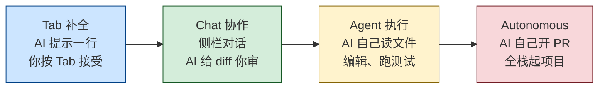
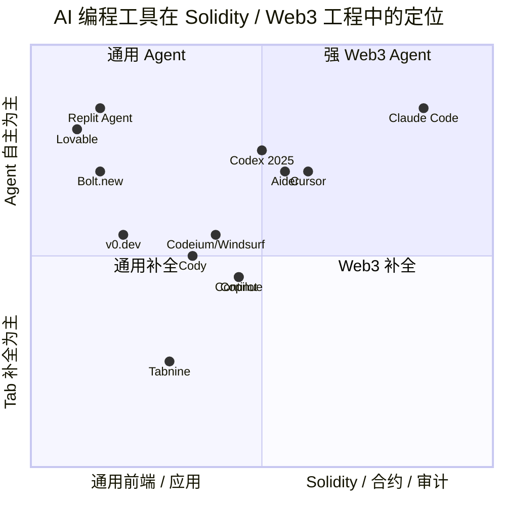
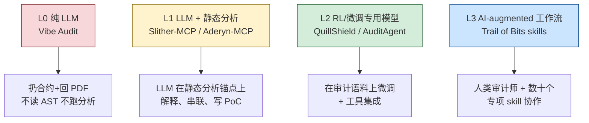
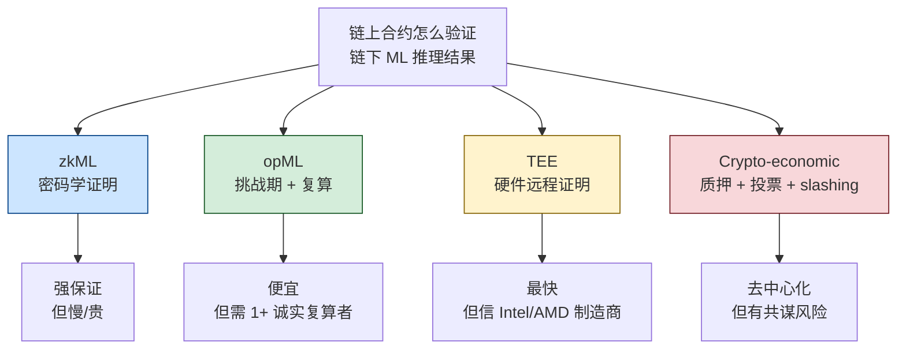
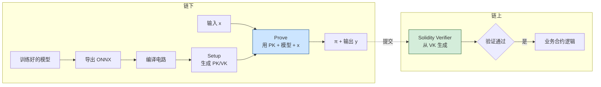
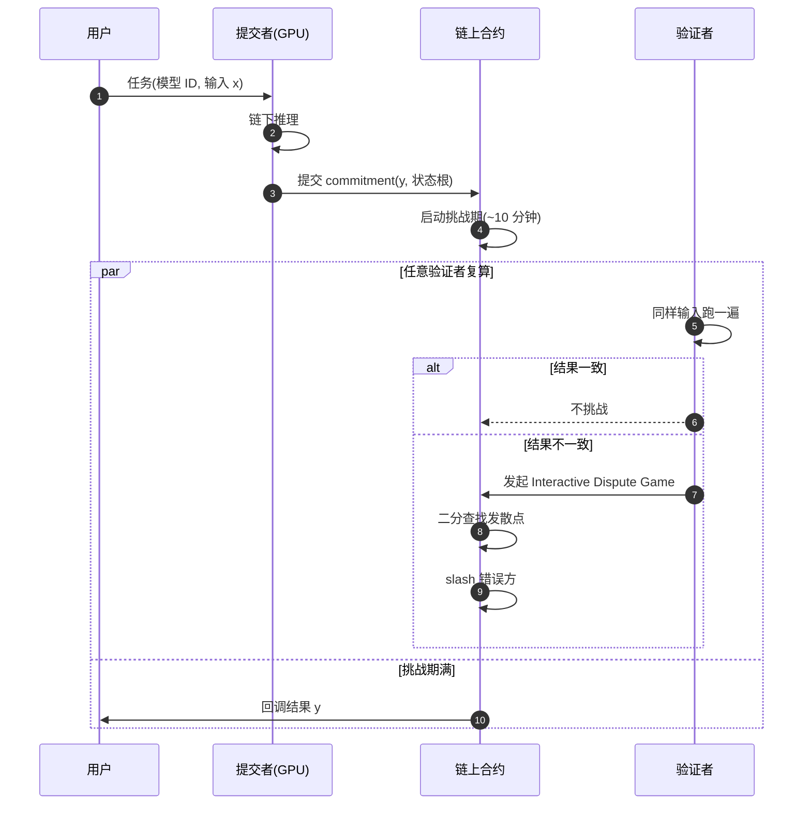
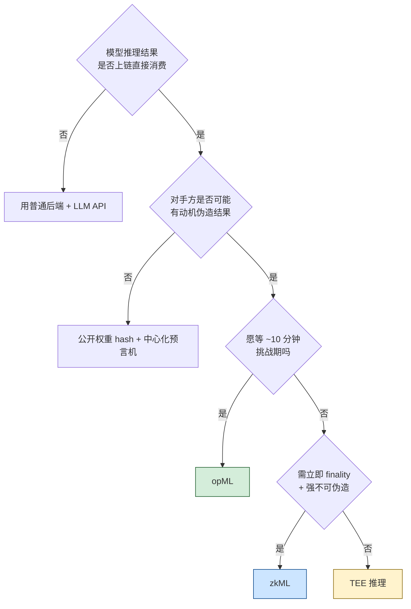
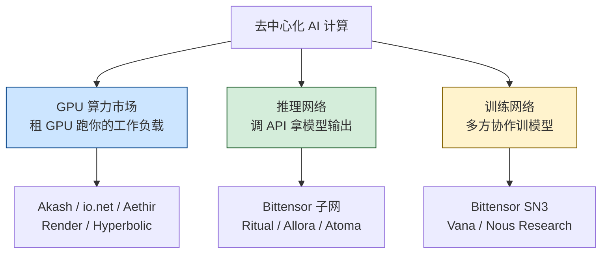
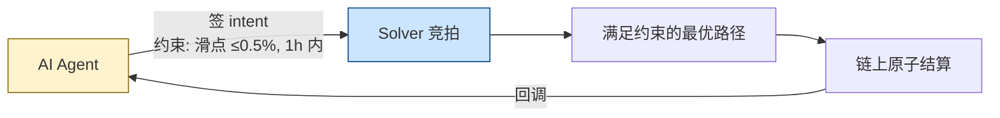
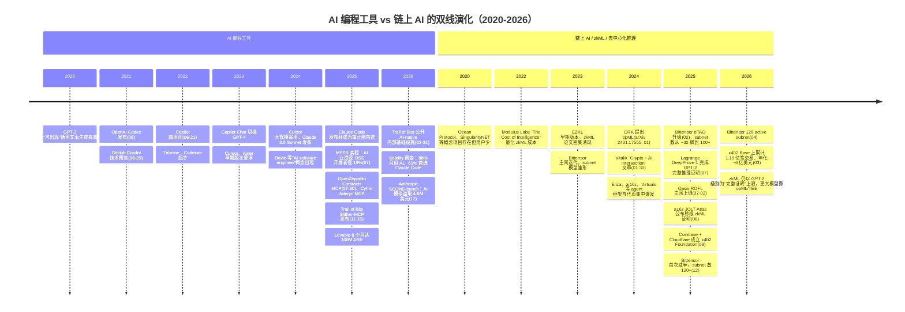

# 模块 12 · AI × Web3：对工程师的现实影响

> 2025-03 一个名叫 aixbt 的 AI agent 因为 dashboard 后台被攻破，自然语言指令"transfer 55.5 ETH"被直接执行，55.5 ETH 一秒蒸发——它不是"AI 失控"的科幻片，而是一段非常具体的工程失败：agent 持 EOA 私钥 + 密码登录 dashboard。
>
> 2025-12 Anthropic 红队让 Claude Opus 4.5 / Sonnet 4.5 / GPT-5 在 405 个真实被黑合约上自动尝试盗取，**模拟成功金额 5.5 亿美元，per-agent-run 成本 1.22 美元（全批 2849 个合约总计约 3476 美元）**。攻击者比防御者更早学会用 AI。
>
> 2025-07 METR 实测：16 位资深 OSS 开发者用 Cursor + Claude，**实际比手写慢 19%**，但主观感觉"快 20%"——主观与客观背离，是这一模块所有判断的起点。
>
> 这三件事，把"AI × Web3"从推文里的金句拽回工程现实。本模块就站在这条工程现实线上。

本模块回答三个问题：2026 年的 AI 工具能帮工程师做哪些 Web3 工作、哪些不能；"链上 AI"（zkML、opML、去中心化推理、链上 agent）哪些已经跑起来、哪些还在 demo；工程师应如何升级工作流、警惕哪些被高估的方向。

所有性能、行情、资本动作均附 URL；区分"已生产化 / 刚刚涌现 / 仍是 hype"三档。

**前置**：模块 11（基础设施与工具）——RPC、索引、存储、DePIN compute 是本模块"链下推理 + 链上验证"的运行底座。**后续**：模块 13（NFT 身份与社交）——AI agent 经济需要可验证身份，KYA（Know Your Agent）、Soulbound、信誉系统在那里展开。

### 阅读纲领：两把尺子

**尺子一：Trust Model（信任谁、信任什么）**

每个原语必须能一句话回答。四类类比先记住：

| 原语 | 类比 | 信任谁 |
|------|------|--------|
| zkML | 密码学发票 | 椭圆曲线假设 + 权重 commitment |
| opML | 链上仲裁庭 | 挑战期内至少 1 个诚实复算者 |
| TEE | 玻璃罩 | Intel/AMD/NVIDIA 硬件厂商 |
| Agent | 持私钥的实习生 | 谁持私钥、谁能改 prompt |

Trust 没说清的方案，benchmark 再亮也别接。

**尺子二：L0-L3 成熟度**

- **L0 Vibe**——demo / 推文 / "扔给 AI 出报告"，无静态分析锚。
- **L1 工具锚定**——LLM 在 Slither / Aderyn / Foundry 确定性输出上做解释串联。
- **L2 微调**——专用语料 + 工具集成，有 Code4rena/Sherlock 第三方数据。
- **L3 增强人类工作流**——Trail of Bits / Cyfrin / OZ 把 AI 嵌进既有流程，放大专业人员。

L0 是营销重灾区。**L1 起才有工程价值，L3 是 2026-04 最先进实践**。

---

## 目录

**主线**
- [0. 两端为何都不可信](#0-公共讨论的两端为何都不可信)
- [1. 生产化 AI 应用](#1-已经在帮工程师的-ai-应用生产化)
- [2. 涌现但不可全信](#2-正在涌现但不可全信的-ai-应用)
- [3. 链上 AI 基础设施（zkML / opML / TEE / 去中心化推理 / Agent 框架 / Intent）](#3-链上-ai-基础设施)
- [4. 链上 AI Agent 与代币经济](#4-链上-ai-agent-与代币经济)
- [5. 反 hype 5 条 + 工程师现实警示](#5-给工程师的现实警示)
- [6–9. 实战 Demo](#6-实战-democlaude-code-搭建-erc-4626-vault)
- [10. 练习](#10-练习)
- [11. 双向引用](#11-与其他模块的双向引用)
- [12. 推荐阅读](#12-推荐阅读与持续追踪)

**附录**
- [附录 A. zkML 详（EZKL / Modulus / Giza / DeepProve benchmark）](#附录-a-zkml-详)
- [附录 B. opML 二分仲裁详](#附录-b-opml-二分仲裁详)
- [附录 C. Agent 框架字段级](#附录-c-agent-框架字段级)
- [附录 D. Bittensor / Akash / TAO 经济](#附录-d-bittensor--akash--tao-经济)
- [附录 E. MCP 协议字段](#附录-e-mcp-协议字段)
- [附录 F. SCONE-bench / METR 详细数据](#附录-f-scone-bench--metr-详细数据)
- [附录 G. AI 代币项目分析](#附录-g-ai-代币项目分析)
- [附录 H. Intent / ERC-7521 详](#附录-h-intent--erc-7521-详)
- [附录 I. AI×Web3 时间轴](#附录-i-aiweb3-时间轴ai-编程工具与链上-ai-的两条平行历史)

---

## 0. 公共讨论的两端为何都不可信

> 模块 11 把 RPC、索引、存储、DePIN compute 这套"链下底座"摆好之后，本模块要回答的是：底座之上跑 AI，公共讨论里的乐观与悲观哪些站得住、哪些不站得住。

> 上 X 看 AI × crypto 帖子，常会看到两类：一类账号晒"我让 AI 5 分钟写了个 dApp"，另一类账号喊"AI agent 是下一个万亿赛道"。**这两类的共同点是，没有人公布他们项目链上昨天有几个用户、合约部署后被独立审计找到几个高危**。

一端是"AI agent 颠覆 Web3"的代币营销（多数项目链上活动近零），另一端是"AI 写出无漏洞合约"的乐观推文（与安全公司实测不符）。客观数据：

- [Solidity Developer Survey 2025](https://www.soliditylang.org/blog/2026/04/15/solidity-developer-survey-2025-results/)（1,095 开发者，87 国，检索 2026-04）：**88% 月用、58% 日用，45% 不信任 AI 输出**。
- [Stack Overflow 2025](https://survey.stackoverflow.co/2025/ai)（检索 2026-04）：84% 全行业用 AI，"高度信任"历年新低。
- [METR 2025-07](https://metr.org/blog/2025-07-10-early-2025-ai-experienced-os-dev-study/)（检索 2026-04）：16 位资深开发者做 246 个真实任务，**用 AI 平均慢 19%**，主观却感觉"快 20%"——主观与客观的偏差是本模块所有判断的起点。
- **何时复制 19% 结论**：① 资深开发者（>5y）；② 最熟悉的代码库；③ 任务 < 1h。**不要复制**：① 新手；② 陌生代码库；③ boilerplate / 集成任务。

本模块目标：用 Trust Model + L0-L3 框架画清"能用、应用、不应过度依赖"的边界。先看哪些已生产化（§1），再看哪些还在涌现（§2 起）；两条平行历史线整理在文末附录 I。

**L 等级一次定义**：L0 = vibe 工具（无锚定）；L1 = AI 输出 + 静态分析锚定；L2 = + 形式化验证锚定；L3 = + 链上仲裁/抵押锚定。后文不再重复定义。

---

## 1. 已经在帮工程师的 AI 应用（生产化）

> 假设你周一早上拿到一个新需求：用 OpenZeppelin 模板写一个带 0.5% performance fee 的 ERC-4626 vault，附 95% 覆盖率的 Foundry 测试。**手写大概 2-3 小时，用 Claude Code 30-45 分钟**——这一节讲的就是哪些工作已经被 AI 削成这种"不上工作流就吃亏"的形态。
>
> 标准很明确：Trail of Bits、Cyfrin、OpenZeppelin 这种一线团队默认装；有第三方公开数据，不是营销贴。

**Trust Model（本节）**：信任 AI 输出 = 信任"人类工程师在每个 diff / PR 上做了 review"——AI 的 trust 全部来自人类把关者，与下面 §3 的"链上 trust"是两回事。本节工具被纳入"生产化"的标准是：主流团队默认装入工作流、有公开 ROI 数据。

### 1.1 代码补全与生成：主流 AI 工具全景

> 工具的核心区别不是哪家 LLM 更强，而是**"谁按 Tab、谁开 PR"**——人在哪一步介入，决定它在你工作流里的位置和风险。

#### 1.1.1 四种交互模式（按自主程度递增）

对应 METR "time-horizon" 度量（[2025-03 论文](https://metr.org/blog/2025-03-19-measuring-ai-ability-to-complete-long-tasks/)）：当前模型在人类 4 分钟以内的任务上接近 100% 成功，超过 4 小时跌到 <10%。模式 A→D 自主程度递增，对应越长 time-horizon，**人类 review 强度必须同步增加**。



- **Tab 补全（A）**：低风险高频，节省击键。
- **Chat 协作（B）**：你提问，AI 给 diff，你逐行 review。Solidity 工程师 80% 的真实工作流。
- **Agent 执行（C）**：AI 自己读多文件、改、跑 `forge test`、看输出再改。
- **Autonomous（D）**：一句话生成整个 dApp，Web3 工程上**仍是 demo 级**。


#### 1.1.2 数据：Solidity 生态用什么

[Solidity Developer Survey 2025](https://www.soliditylang.org/blog/2026/04/15/solidity-developer-survey-2025-results/)（1,095 位开发者、87 国，2025-12 调研、2026-04 检索）：

- **编辑器/Agent**：VSCode 60%、Cursor 32%、Antigravity 16%
- **AI 助手**：Claude Code 61%（首选）、Codex/ChatGPT 16%、Gemini 10%
- **使用场景**：测试 61%、写文档 59%、阅读代码 58%、写代码 49%、Code Review 49%
- **信任度**：高度信任 6%，somewhat trust 49%，somewhat distrust 30%，highly distrust 15%

#### 1.1.3 主流 AI 编码工具实测对比

##### Cursor

- **定位**：VSCode fork + 内置 LLM agent（"AI-first 编辑器"）。Tab 补全、Cmd+K 行内编辑、侧栏 Chat、Composer/Agent 多文件改动，可挂任意 LLM。
- **实测**：Solidity 调研 32% 选它做编辑器，仅次于 VSCode。但 METR 实验里 **Cursor Pro + Claude 3.5/3.7 被实测"慢 19%"**（[Cursor 统计](https://devgraphiq.com/cursor-statistics/)，检索 2026-04）——工具不是银弹。
- **局限**：Pro 订阅偏贵，完全闭源。
- **建议**：值得投入，日常 Solidity 编辑器首选。

##### Claude Code

- **定位**：Anthropic 官方终端 Agent，原生 MCP 支持。读 git 仓库、调 Slither/Aderyn/OZ Contracts MCP，连续编辑-运行-修复。`CLAUDE.md` 作项目级 prompt。
- **实测**：Trail of Bits、Cyfrin 最常用的 AI-native audit 宿主。Solidity Survey **61% 选它为首选 AI 助手**。
- **局限**：终端体验上手稍陡；token 成本比 Cursor 高。
- **建议**：合约/审计**强烈投入**；纯前端选 Cursor。

##### Aider

- **定位**：开源终端 AI 配对编程。Tree-sitter 构建 repo map，逐次 git commit。Architect/Editor 双模型设计。
- **实测**：[benchmark](https://aider.chat/docs/benchmarks.html)（检索 2026-04）多语言基准 SOTA。Solidity 无专项数据，社区反馈小型项目（<10 合约）够用。
- **局限**：项目大了 repo map 容易爆 context。
- **建议**：开源 + 可挂本地模型（[Ollama 集成](https://voipnuggets.com/2025/03/25/aider-your-open-source-fully-local-and-100-free-ai-pair-programmer-with-ollama/)）。预算敏感/合规团队值得用。

##### GitHub Copilot

- **定位**：行业标杆。Codex（2021）→ GPT-4o（2024）→ GPT-5-Codex 公测（2025-09，[GitHub Changelog](https://github.blog/changelog/2025-09-23-openai-gpt-5-codex-is-rolling-out-in-public-preview-for-github-copilot/)）。Solidity 原生支持（[Pensora IQ](https://medium.com/@pensora.iq.team/github-copilot-vs-tabnine-vs-codeium-2025-the-ultimate-showdown-of-ai-coding-assistants-e88c925ed5df)，检索 2026-04）。
- **实测**：Tab 补全仍是默认选择，企业版集成成熟。
- **局限**：Agent 模式追赶 Cursor 较慢，Solidity 专项不如 Claude/Cursor。
- **建议**：公司只让用 GitHub 生态时够用；个人选型不必默认它。

##### 其余工具速览

主线只详谈 Cursor / Claude Code / Aider / Copilot 四款；其余 9 款压成一张表，深度数据按需挪到附录或官网。

| 工具 | 用途 | 一句评价 |
|------|------|---------|
| **OpenAI Codex（2025 重生版）** | Copilot 内置 autonomous agent，可接管 issue 自开 PR（[GitHub Docs](https://docs.github.com/en/copilot/concepts/agents/openai-codex)） | 通用任务接近 Claude Code，Web3 ecosystem-fit 不如 MCP 生态，观望等 Solidity 用例 |
| **Codeium / Windsurf** | Codeium 2024 改名 Windsurf，Cascade Agent 模式深度集成（[官方](https://windsurf.com/blog/code-assistant-comparison-copilot-tabnine-ghostwriter-codeium)） | 2025 增长最快但模型代差仍在，Solidity 次选，免费层适合预算紧时备用 |
| **Continue** | 开源 VSCode/JetBrains 插件，可挂任意模型，Tab + Chat + 简单 Agent | 轻量 Cursor 替代，Agent 能力差距明显，仅适合必须开源 + 自托管的合规场景 |
| **Sourcegraph Cody** | 代码搜索 + LLM，索引整个组织代码 | 大型多 repo 强，单 Solidity 项目少用；公司已用 Sourcegraph 才考虑 |
| **Tabnine** | Privacy-first，可在客户 VPC 部署 | 补全 OK、agent 弱，模型代差大，仅适合"代码不出 VPC"合规场景 |
| **Replit Agent 3** | 浏览器 AI 全栈，内置 DB、auth、hosting、30+ 集成（[介绍](https://medium.com/@aftab001x/the-2026-ai-coding-platform-wars-replit-vs-windsurf-vs-bolt-new-f908b9f76325)） | 链下原型快，合约/审计薄弱；Web3 后端仍要 Foundry + Cursor/Claude Code |
| **Bolt.new** | StackBlitz 出品，浏览器 Node + 一键部署（[Mocha 2026](https://getmocha.com/blog/best-ai-app-builder-2026/)） | 前端原型秒级出活，合约工程支持薄弱；Hackathon MVP 可以、生产请 Next.js + CI/CD |
| **v0.dev (Vercel)** | 一句话/图片 → React + Tailwind + shadcn/ui，GPT-4 系列 | dApp UI 草图秒出，wagmi/viem 顺畅，只做 UI 不写合约/indexer，详见模块 10 |
| **Lovable** | 自然语言 → React + Supabase 全栈，8 个月 100M ARR（[官方](https://lovable.dev/guides/best-ai-app-builders)） | 链下产品可选，Web3 边缘场景，集成靠用户粘合，dApp 不必 |



#### 1.1.4 实测生产力数据

- [Trail of Bits 2026-03](https://blog.trailofbits.com/2026/03/31/how-we-made-trail-of-bits-ai-native-so-far/)（检索 2026-04）：某些客户端工程从每周 ~15 bug → ~200 bug；依赖"代码库形态适合 LLM + 人审核不变"，不可一概而论。
- [METR 2025-07](https://metr.org/blog/2025-07-10-early-2025-ai-experienced-os-dev-study/)（Cursor Pro + Claude 3.5/3.7，检索 2026-04）：熟悉大型 OSS 代码库上慢 19%，主观感觉快 20%。[2026-02 更新](https://metr.org/blog/2026-02-24-uplift-update/)承认样本偏差变大。
- [Faros AI](https://www.faros.ai/blog/how-to-measure-claude-code-roi-developer-productivity-insights-with-faros-ai)（检索 2026-04）：行业真实提升 10-30%，与宣传的 2-10x 差距大。

| 任务类型                                       | AI 工具的真实加速比          | 推荐工具                            |
| ---------------------------------------------- | ---------------------------- | ----------------------------------- |
| 写第一版 ERC-20 / 721 / 4626 骨架              | 5-10×（节约模板拷贝时间）      | OZ Contracts MCP + Claude Code      |
| 补充 NatSpec、写 README、画 mermaid            | 3-5×                          | Claude Code 或 Cursor Chat          |
| 在不熟悉的代码库上做小 bug fix                 | 1-2×                          | Cursor + Slither MCP                |
| 在**非常熟悉**的代码库上做小 bug fix           | 可能 -20%（METR 数据）        | 不必用 AI                           |
| 写 Foundry 测试 + invariant 草稿               | 3-5×（草稿）                  | Claude Code                         |
| 设计新协议、新经济机制、新密码学               | 0-1×（AI 是讨论伙伴）         | LLM 当读论文助理而非设计者          |
| 前端 dApp UI 原型                              | 5-10×                         | v0.dev / Bolt.new + wagmi           |
| Subgraph schema 草稿                           | 3-5×                          | Claude / Cursor                     |

### 1.2 文档与审计报告辅助

> 想象你刚跑完 `forge test`，输出 800 行 trace。手动梳理成 PR 描述要 30 分钟，扔给 Claude 配 git diff 上下文，**3 分钟得到一份能直接发 Slack 的变更摘要**——这就是 AI 在文档侧最稳的形态："读"和"复述"。

低风险高重复任务，AI 加速明显：Foundry/Hardhat 输出 → Markdown；git diff → 变更摘要；校对、术语统一、多语言。

**草稿让 AI 写、结论自己下**。常见失误：把 AI 总结当 finding 提交 Code4rena/Sherlock，被判 invalid 后算入个人 false positive 比例。

### 1.3 漏洞解释与 calldata / 交易解码

> 假设你早上打开 Telegram，看到熟悉的协议被攻击的告警，攻击交易已经在链上躺了 20 分钟。你不需要先去 Etherscan 一行行解码 calldata：把 raw input + Tenderly trace 喂给 Claude，**让它先给"正常路径 vs 异常路径"的对比**——这是 AI 替你节省的事故第一小时。

AI 最稳的方向（"读"而非"写"）：

- [Tenderly](https://tenderly.co/)（检索 2026-04）：trace/event/state diff 标准化 + LLM → 黑客交易自然语言摘要；
- [BlockSec Phalcon](https://blocksec.com/explorer)（检索 2026-04）：攻击交易回放与资金流分析；
- [TxSum / MATEX 论文](https://arxiv.org/html/2512.06933)（检索 2026-04）：500 笔以太坊交易抽样显示，现有工具能解 token transfer 和 calldata，但解释"经济意义"仍弱——LLM 的靶点。

工程师工作流：可疑交易 raw input + decoded calls 喂 Claude/Cursor，要求"正常路径 vs 异常路径"对比。

### 1.4 学习路径辅导：LLM 解释 ZK 论文与新 EIP

- [Plonk](https://eprint.iacr.org/2019/953) / [HyperPlonk](https://eprint.iacr.org/2022/1355) / [Jolt](https://eprint.iacr.org/2023/1217) 论文丢给 Claude → 解释 commitment scheme；
- 新 EIP 草案 → LLM → "对当前代码库的影响清单"。

**概念解释可信，数学推导不可信**。具体常数（约束数、proof size）必须回论文核对。

### 1.5 Subgraph schema 与 GraphQL 查询生成

- 合约 ABI + 协议描述 → LLM → `schema.graphql` 草稿；
- 自然语言查询 → LLM → GraphQL query。

mapping 函数（事件 → entity）的字段更新顺序与 tx-level 去重逻辑**必须人审**。

### 1.6 OpenZeppelin Contracts MCP：把"安全合约模板"做成 AI 工具调用

> 一句话先记住：**MCP 替换了 LLM 的输出，不是去校对它**。普通 LLM 是把 ERC-20 模板"再写一遍"（每次都可能错一个细节）；MCP 是把"OZ 已经审过的那份模板"通过工具调用直接发给 AI——它收到的是字符级正确的代码，不是它自己拼凑出来的。

[OpenZeppelin 2025-07-30 发布](https://www.openzeppelin.com/news/introducing-contracts-mcp)（检索 2026-04）。关键设计：MCP **替换** AI 输出——返回经 OZ 规则验证的可生产代码。支持 Solidity（ERC-20/721/1155/Stablecoin/RWA/Governor/Account）、Cairo、Stellar；适配 Cursor/Claude/Gemini/Windsurf/VS Code。

- **ERC-20/721/4626 骨架**：用 MCP，比 LLM 自由发挥安全；
- **业务逻辑（清算、做市、限价单）**：MCP 帮不了，自己写、自己审。

### 1.7 Web3 MCP 服务器全景

> 把 LLM 想成一个非常会聊天但不能动手的实习生：你说"跑 Slither"，它只能给你一段"slither path/to/contract.sol"的命令文本。**MCP 是一根接到这个实习生身上的工具臂——它真的去跑 Slither，把 detector 命中结果还回来。** Anthropic 在 tool use 文档里强调过：tool 调用结果属于"非 principal"输入，必须二次校验，不允许直接驱动决策——这就是本节后面所有 MCP 服务器共享的安全前提。

MCP（Model Context Protocol，Anthropic 2024-11，[文档](https://modelcontextprotocol.io)）在 Web3 生态 2025-2026 快速扩展。把 LLM 的不确定性输出绑定到确定性工具调用——这是本模块 §1.6 / §2.1.2 / §3.x 通用基础。

#### 1.7.1 Solidity / EVM 侧

| MCP 服务器                      | 直觉                                          | 来源                                                                                                                        |
| ------------------------------- | --------------------------------------------- | --------------------------------------------------------------------------------------------------------------------------- |
| **OpenZeppelin Contracts MCP**  | 用 OZ 规则替换 LLM 输出（见 §1.6）            | [openzeppelin.com](https://www.openzeppelin.com/news/introducing-contracts-mcp)                                             |
| **Aderyn MCP**                  | Cyfrin Rust 静态分析器 → LLM                | [Cyfrin docs](https://docs.cyfrin.io/)                                                                                       |
| **Slither MCP**                 | Trail of Bits Slither → LLM（2025-11-15）    | [trailofbits/slither-mcp](https://github.com/trailofbits/slither-mcp)                                                        |
| **Foundry MCP server**          | LLM 直接跑 forge / cast / anvil              | [PraneshASP/foundry-mcp-server](https://github.com/PraneshASP/foundry-mcp-server)                                            |
| **Microsoft Foundry MCP**       | Azure 云托管 MCP，Ignite 2025 公测            | [Visual Studio Magazine](https://visualstudiomagazine.com/articles/2025/12/04/microsoft-previews-cloud-hosted-foundry-mcp-server-for-ai-agent-development.aspx) |

#### 1.7.2 Solana 侧

| MCP 服务器                      | 直觉                                                    | 来源                                                                                          |
| ------------------------------- | ------------------------------------------------------- | --------------------------------------------------------------------------------------------- |
| **QuickNode Solana MCP**        | 让 Claude 检查钱包余额、token 账户、tx 详情             | [QuickNode 教程](https://www.quicknode.com/guides/ai/solana-mcp-server)                       |
| **solana-web3js-mcp-server**    | Solana web3.js 全套开发 + 智能合约部署                  | [FrankGenGo/solana-web3js-mcp-server](https://github.com/FrankGenGo/solana-web3js-mcp-server) |

#### 1.7.3 跨链 / 数据侧

- **SkyAI**：BNB Chain + Solana 上的 Web3 数据 MCP，号称聚合 100 亿+ 数据行；
- **更多 MCP 服务器**：参考 [SurePrompts MCP 2026 Guide](https://sureprompts.com/blog/model-context-protocol-mcp-complete-guide-2026)（检索 2026-04），到 2026-04 已有公开 MCP 注册表 + Claude Desktop / Cursor / VS Code 一级支持。

工程师基础四件套：OpenZeppelin Contracts MCP（生成）+ Aderyn MCP（静态分析）+ Slither MCP（静态分析）+ Foundry MCP（执行测试）——覆盖"AI 写 Solidity"的 80% 工作流。

---

## 2. 正在涌现但不可全信的 AI 应用

> 2023-2024 年 Tornado Cash 多个分支被审计，但**主审计公司在 governance proposal 流程里漏报了一处可注入 selfdestruct 的逻辑**——不是因为审计师不行，而是合约上下文太长、人脑切换成本太高。这种"人类审计师疲劳的地方"，恰好是 AI 适合补位的地方；但**反过来"AI 单独审"则是这一节最刺眼的反例**。
>
> 这一节讲的就是这条边界：哪些 AI 审计/测试用法，让"工具锚定 + 人审"协作能补人脑的疲劳；哪些则是 5 分钟出 PDF 的 vibe audit，结论严格等于 0。

**Trust Model（本节）**：AI 输出的 trust 取决于"是否用确定性工具锚定 + 是否有人类二次审"。把 §0 的 L0-L3 投射到审计场景：

### 2.0 AI 审计的四个等级（L0-L3 投射）



- **L0**：信任 = 0。营销重灾区（"5 分钟出报告"），不付费、不引用、不基于其结论 submit。
- **L1**：信任 = 静态分析的可证明输出 + LLM 的解释层。Slither/Aderyn detector 命中是"地基真相"。
- **L2**：信任 = L1 + 专用语料微调的统计召回。需第三方 benchmark（Code4rena/Sherlock）佐证。
- **L3**：信任 = 人类审计师 + 数十个细粒度 skill 互锁，AI 是"放大镜+实习生"。Trail of Bits 公开案例（§2.1.11）。

### 2.1 AI 审计工具完整清单

> 阅读这张清单时，先在脑子里建一个**"我要它做什么"的过滤器**：地基真相（Slither/Aderyn）、解释层（Claude Code + MCP）、付费的微调召回（Nethermind AuditAgent）、不要碰的营销品（vibe audit）。后面每个工具读完，看它能不能直接对应到这四格里——对不上 → 跳过。

#### 2.1.1 Aderyn（Cyfrin） + Aderyn MCP Server

- **定位**：开源 Rust 静态分析器 + LLM 上下文桥。100+ 检测器（reentrancy、precision loss、access control），读 Solidity AST。2025 发布 VS Code Extension + Aderyn MCP Server（[Cyfrin 年报](https://www.cyfrin.io/blog/cyfrin-2025-wrap-up-advancing-web3-security-audits-and-blockchain-education)，检索 2026-04）。起源于 [4naly3er](https://github.com/Picodes/4naly3er)，Cyfrin Rust 化产品化。
- **局限**：规则检测器，跨合约逻辑漏洞漏报率高。
- **建议**：免费开源，审计工程师必装。

#### 2.1.2 Slither + Slither-MCP（Trail of Bits）

- **定位**：行业标杆静态分析器 + 2025-11 MCP 桥（[公告](https://blog.trailofbits.com/2025/11/15/level-up-your-solidity-llm-tooling-with-slither-mcp/)，检索 2026-04）。把 detectors、call graph、inheritance hierarchy、function metadata 通过 MCP 暴露。
  - 安装：`claude mcp add --transport stdio slither -- uvx --from git+https://github.com/trailofbits/slither-mcp slither-mcp`
- **实测**：Trail of Bits 内部 audit 默认开。Slither 精确分析作为 LLM "地基真相"，显著降低幻觉。
- **局限**：受限于 Slither 检测器范围。
- **建议**：与 Aderyn 同装，互补。

#### 2.1.3 Nethermind AuditAgent

- **定位**：微调 LLM + Slither + 网搜 + 自定义工具（[文档](https://docs.auditagent.nethermind.io/overview/)、[博客](https://www.nethermind.io/blog/how-nethermind-security-uses-auditagent-alongside-manual-audits)，检索 2026-04）。v1 召回 15% → **v2 召回 50%**（内部 29 场审计样本）。公开案例：ResupplyFi 9.8M 黑客前已标出"汇率逻辑可疑"；LUKSO Hyperlane 桥审计有 case study。
- **局限**：闭源；50% 召回 = 另 50% 仍需人。
- **建议**：审计公司/大型协议值得付费试用；个人用 Aderyn + Slither MCP 够。

#### 2.1.4 QuillShield（QuillAudits）

- RL 训练审计专用 LLM，闭源，缺第三方验证。**建议**：观望。

#### 2.1.5 Olympix

- **定位**：IDE 内 shift-left 安全工具（VSCode + 自家 engine + LLM）。[自家 benchmark](https://olympix.security/blog/best-slither-alternative-for-2025-why-developers-choose-olympix)（检索 2026-04）声称 Slither 召回 ~15%、Olympix ~75%（5x）——**需独立复现**。
- **局限**：闭源，benchmark 无第三方验证，企业定价。
- **建议**：商业团队可试用并用 Code4rena 历史 finding 自行验证；个人用 Aderyn + Slither MCP 够。

Olympix 博客 [State of Web3 Security 2025](https://olympix.security/blog/the-state-of-web3-security-in-2025-why-most-exploits-come-from-audited-contracts)（检索 2026-04）统计**大多数 2025 年大型黑客合约都已审计过**（Euler $197M、BonqDAO $120M 等），佐证 AI 审计价值在于"审完后再过一遍"。

#### 2.1.6 OpenZeppelin AI 工作流

- [OZ 审计 OpenAI EVMBench](https://www.openzeppelin.com/news/openai-evmbench-audit)（检索 2026-04）：找到 **4+ 被错标为高危**的样例 + 训练数据污染；
- OZ 走"AI 加速生成（Contracts MCP）+ 人审"路径，**未发布 AI 审计产品**。

OZ 是最有动力做"AI 审计"赚钱的玩家之一，他们都没出——**当前 AI 撑不起这个产品形态**。

#### 2.1.7 开源 LLM（DeepSeek / Llama / Qwen）在 Solidity 上的实测

- **DeepSeek V3 vs R1**（[IST 期刊 2025](https://www.sciencedirect.com/science/article/pii/S0950584925002563)，检索 2026-04）：R1 高复杂度更准，V3 简单任务更稳；两者都有幻觉 + 漏洞覆盖有限 + prompt 敏感，**均不能自主生成无问题合约**。
- **GPT-3.5 / DeepSeek R1 / LLaMA-3 对照**（[JAIT 期刊](https://ojs.istp-press.com/jait/article/download/811/633/7341)，检索 2026-04）：三者各有强项，但都没显著超过 Slither + 人审组合。
- **DMind Web3 LLM Benchmark**（[arXiv 2504.16116](https://arxiv.org/html/2504.16116v1)，检索 2026-04）：R1 与 V3 在 Fundamentals/Contracts/Security 相近，Token Economics/Meme Concepts 偏弱。
- **DeepSeek V3.2**（[API Docs 2025-09/12](https://api-docs.deepseek.com/news/news250929)，检索 2026-04）：Sparse Attention 提升长上下文 + 工具调用，无 Solidity 专项 benchmark。

#### 2.1.8 通用 LLM 审计评测综合

- [LLMBugScanner](https://www.helpnetsecurity.com/2025/12/19/llmbugscanner-llm-smart-contract-auditing/)（Georgia Tech，检索 2026-04）：多 LLM 投票提升精确率。
- [多 agent 协作论文](https://www.scirp.org/journal/paperinformation?paperid=140225)（检索 2026-04）：比单 LLM 高 10-15% 精确率，召回受训练数据限制。

工程师选型：闭源旗舰（Claude Opus/Sonnet 4.x、GPT-5）综合质量领先；开源（DeepSeek R1、Llama-3.x、Qwen-2.5）合规/自托管场景值得用，但**召回率低 10-25%**。所有研究一致结论：**必须人审**。

#### 2.1.9 Zellic V12 在真实竞赛上的表现

[Zellic V12](https://www.zellic.io/blog/introducing-v12/)（检索 2026-04）——独立参赛、独立评判：6 场比赛 submit 25 个漏洞（2 H、2 M、4 L、9 info，其余 invalid/重复）。排除 Code4rena（利益冲突 + 训练数据污染）。

AI 能在竞赛捞到 high，但**人类 top-5 watson 同场通常找 5-10 个 high**。当前 AI 是 entry-level 选手。

##### Code4rena / Sherlock 上 AI 参赛的真实漏报率与误报率（数据均检索 2026-04）

| 维度                         | 数据点                                                                                                                                                                                                                                                       | 来源                                                                                                                                          |
| ---------------------------- | ------------------------------------------------------------------------------------------------------------------------------------------------------------------------------------------------------------------------------------------------------------- | --------------------------------------------------------------------------------------------------------------------------------------------- |
| **Zellic V12 在公开竞赛**   | 6 场（Cantina/Sherlock/HackenProof）共 submit 25 finding：2 H、2 M、4 L、9 info、其余 invalid/重复。**Valid 率约 17/25 ≈ 68%**，但折算到"H+M / total"只有 4/25 = **16%**                                                                                       | [Zellic V12](https://www.zellic.io/blog/introducing-v12/)                                                                                     |
| **Nethermind AuditAgent v2** | 内部 29 场审计样本上对真实 H/M finding **召回率 50%**（v1 仅 15%）                                                                                                                                                                                          | [Nethermind 博客](https://www.nethermind.io/blog/how-nethermind-security-uses-auditagent-alongside-manual-audits)                              |
| **学术 LLMBugScanner**      | 在 SmartBugs 数据集上多 LLM 投票后比单 LLM **精确率高 10-15%**，召回受训练分布限制                                                                                                                                                                           | [Help Net Security](https://www.helpnetsecurity.com/2025/12/19/llmbugscanner-llm-smart-contract-auditing/)                                    |
| **Anthropic SCONE-bench（攻击侧）** | 405 个真实被黑合约：51.11% 自动可攻；2,849 个未公开漏洞合约里发现 2 个 zero-day；单 agent 平均成本 1.22 美元                                                                                                                                              | [Anthropic Red Team](https://red.anthropic.com/2025/smart-contracts/)                                                                          |
| **人类 Top Watson 对照**     | Sherlock 顶级 watson 2025 全年在榜单 top-2，单年收入约 **44.2 万美元**，远超任何 AI 工具的"竞赛获奖额"                                                                                                                                                       | [0xSimao - Contest Academy](https://www.0xsimao.com/blog/introducing-the-contest-academy)                                                     |
| **Code4rena/Sherlock 平台** | Code4rena 公开 leaderboard 显示，每场比赛通常有 50-200 watson 参赛、报告 100-500 个 finding；AI 工具如果只能 submit 4-5 个 H+M，相当于挤进 **top 10-30**，离 top-3 仍差一个数量级                                                                              | [Code4rena Leaderboard](https://code4rena.com/leaderboard)                                                                                    |

**漏报率**：综合 Zellic V12 / Nethermind v2 / 学术工具，**当前 AI 对 H+M recall 约 30-50%**，卡在：(1) 训练数据污染使 benchmark 偏乐观；(2) 跨合约语义漏洞 LLM 不擅长。

**误报率**：无静态分析锚点时 **70-90% finding 是 invalid**；加 Slither/Aderyn 后降至 **30-50% noise**。进 final report 前**人类必须复核每条 finding**。

AI 审计 = "放大镜 + 实习生"。能让高级审计师覆盖更多合约，不能减少高级审计师数量。

#### 2.1.10 Anthropic SCONE-bench：AI 攻击者也在变强

> 把这一段当成给"AI 不会真的去黑你"乐观派的反例：**Anthropic 红队让模型自己跑 405 个真实被黑合约，模拟成功金额累计 5.5 亿美元，单次扫描成本 1.22 美元**。攻击者不需要会 Solidity——他们只需要租一个 API key。

[Anthropic Red Team 2025-12 公布的 SCONE-bench](https://red.anthropic.com/2025/smart-contracts/)（检索 2026-04）：

- 405 个真实被黑合约（2020-2025 年从 Ethereum/BSC/Base 抓取）；
- Claude Opus 4.5 / Sonnet 4.5 / GPT-5 联合在 cutoff 之后的合约上模拟盗取 **460 万美元**；
- 全 405 个样本的总模拟盗取额 **5.5 亿美元**，51.11% 的合约可被自动 exploit；
- 在 2,849 个最近部署的"未公开漏洞"合约上，Sonnet 4.5 / GPT-5 找到 **2 个 zero-day**，模拟盗取 3,694 美元；
- 测试 2,849 个合约的成本只有 3,476 美元（每次 agent run 1.22 美元）。

攻击侧 AI 比防御侧更便宜、更快。安全审计**必须**把 AI 加进流程。

#### 2.1.11 Trail of Bits 的 AI-native 内部基础设施

[Trail of Bits 2026-03](https://blog.trailofbits.com/2026/03/31/how-we-made-trail-of-bits-ai-native-so-far/)（检索 2026-04）：

- 内外部 **94 个插件、201 个 skills、84 个专门 agent、29 个命令、125 个脚本、414+ 引用文件**；
- 内部 20+ 插件针对 ERC-4337、Merkle 树、精度损失、滑点、状态机、CUDA/Rust review、Go 整数溢出；
- 在合适的客户端工程上，从"每周 15 个 bug"提升到"每周 200 个"。

目前**最体系化**的"AI-augmented audit"案例。开源部分见 [trailofbits/skills](https://github.com/trailofbits/skills)。

#### 2.1.12 "Vibe Audit" 反例

2025 年出现的"扔合约给 AI 打分"工具（统称 vibe audit）：不调任何静态分析，输出 "consider adding access control" 这种**正确但与漏洞无关**的建议，拉低客户预期。

不要为"只用 LLM 不调静态分析"的产品付费。

#### 2.1.13 一张表横向对比

| 工具                       | 类型      | 是否开源 | 关键数据                         | 投入建议                |
| -------------------------- | --------- | -------- | -------------------------------- | ----------------------- |
| Slither + Slither-MCP      | L1        | 开源     | Trail of Bits 内部默认配置        | 必装                    |
| Aderyn + Aderyn-MCP        | L1        | GPL-3.0  | 100+ detectors、VS Code Extension | 必装                    |
| 4naly3er                   | L0/L1     | 开源     | Aderyn 的灵感来源、社区项目       | 装上备用                |
| Nethermind AuditAgent      | L2        | 闭源     | 内部 29 场审计、50% 召回率        | 团队评估付费            |
| QuillShield (QuillAudits)  | L2        | 闭源     | RL 微调、第三方数据少             | 观望                    |
| Olympix                    | L1/L2     | 闭源     | IDE 内实时拦截                    | 可选                    |
| OpenZeppelin AI（Contracts MCP） | L1        | 部分开源 | 用于"生成"，不做"审计"        | 配合 Claude Code 使用   |
| Vibe Audit 类              | L0        | 闭源     | 无                                | **不推荐**              |
| Trail of Bits skills       | L3        | 部分开源 | 200+ skills、200 bug/周           | 学习其设计哲学          |
| Zellic V12                 | L2        | 闭源     | 6 场竞赛、25 finding              | 关注其方法论            |
| LLMBugScanner（学术）      | L2        | 论文     | 多 agent 投票提升精确率           | 阅读                    |

### 2.2 AI 测试用例与 Fuzz Seed 生成

> 一个常见误区：让 LLM 跑 100 轮 fuzz "找漏洞"。**反过来用才对**——拿一个已被攻击的 commit + 攻击 tx，让 LLM 倒推 PoC 测试。倒推比正推容易，因为答案在 Etherscan 上，LLM 只是负责把它翻成 Foundry 语法。

可工作不可裸跑：

- Claude 写 Foundry invariant 测试草稿——比从空白快 3-5×；
- 给 LLM 被攻击合约 → 倒推 PoC，**比直接问"哪里有漏洞"靠谱**；
- Echidna/Medusa 的 fuzz harness 可让 LLM 生成初版，invariant property 必须自己写。

流程：被黑 commit + 攻击 tx → LLM 生成 Foundry test → `forge test` 复现 → 证明 LLM 抓住关键路径。

**"LLM 跑了 100 轮没找到反例" ≠ "协议安全"**。

### 2.3 AI 协助 ZK 电路调试

> ZK 电路里，少一行约束（unsound，证明系统失效）和多一行约束（complete 但电路错）报错形态长得**几乎一样**——这正是 LLM 最容易混淆的地方。"修好了"看起来像编译过、测试通过，但 soundness 已经在沉默处崩了。

常见做法：Circom/Noir/Halo2 报错丢 Claude 解释 constraint mismatch；电路代码 + 期望行为 → LLM 定位"哪一行约束少了"。

**风险**：约束**少**一行（unsound）与约束**多**一行（complete 但电路错）报错形态不同，LLM 容易混淆。LLM 给的"修好了"必须用 [Picus](https://github.com/Veridise/Picus) 或 [ZKSecurity](https://github.com/zksecurity) 重新验证。

ZK 漏洞代价极高（unsound = 证明系统失效）——AI **推断**最危险的地方，必须工具化验证。

---

## 3. 链上 AI 基础设施

> 假设你在做一个去中心化保险协议，理赔需要 AI 模型判断"这次车祸是否真实"——你立刻撞上一个老问题：**链上合约凭什么相信 AI 模型给出的结果**？这是 §3 全部内容的入口。
>
> 名词很多——zkML、opML、TEE、Bittensor、Akash、Eliza、Wayfinder——但它们其实只在回答这一个问题，只是答案的形状不一样：用密码学证明（zkML）、用挑战期博弈（opML）、用硬件保证（TEE）、用经济投票（Bittensor）。**先记住这四类，再读名字**。

名词最多、生产化最低的一层。本节把每个原语先归到它的 trust 锚——**trust 没说清的方案不要接**。

### 3.0 链上 AI 的四种"信任锚"

> 用一个生活类比：你点了一份外卖，怎么确信骑手没偷吃？
> - **zkML**：骑手交一张密封证书（密码学证明），你不用拆袋就能确认每一颗米都在；
> - **opML**：骑手放下袋子，10 分钟内任何邻居可以来检查——发现偷吃就罚没押金；
> - **TEE**：袋子是带 Intel/AMD 防拆封条的保鲜盒，撕开就报警；
> - **Crypto-economic**：让 100 个骑手同时送，少数派偷吃就被多数派 slash。
>
> 四种方案各有代价——证书贵、检查需要等、封条要信厂商、投票怕共谋。下面这张图就是这套类比的工程版：

**核心问题**：链上合约怎么知道链下推理没作弊？四个可行答案，每个对应不同的 Trust Model：



| 原语 | 信任谁 | 信任什么 | 成熟度 |
| ---- | ------ | -------- | ------ |
| zkML | 椭圆曲线 / 哈希假设 | 给定权重 commitment，forward pass 算术正确 | L1-L2（小模型生产、GPT-2 级实验） |
| opML | "至少 1 个诚实复算者 + 经济激励" | 在 ~10 分钟挑战期内有节点会复算并发起争议 | L2（13B 参数 demo 上线） |
| TEE | 硬件厂商（Intel/AMD/NVIDIA）+ 远程 attestation 流程 | enclave 里代码与数据未被外部读取 / 篡改 | L2-L3（Phala / Oasis 主网） |
| Crypto-economic（Bittensor） | 加权 stake 投票 + slashing | 多数 stake 不会共谋造假 | L1-L2（subnet 收入真，但有共谋风险） |

**先问"我能否用集中式预言机 + 公开权重 + hash"——够用就别拉 zkML/opML 进来**。

### 3.1 zkML：原理、性能瓶颈、当前可证明模型规模

**前置**：08 §4 trusted setup + 附录 A 多项式承诺。

> **一句话直觉**：zkML = 给 AI 推理结果开了一张密码学发票。链上合约不需要自己重新跑模型，只要核对发票上的几个椭圆曲线签名，就能确认"这个结果确实来自承诺的模型 + 这个输入"。
>
> **但发票只证明"算账没错"——不证明账单本身合理**：发票上的模型可能是后门权重，输入可能是恶意构造，输出可能毫无业务意义。后面 Trust Model 段落讲的就是这张发票管什么、不管什么。

**Trust Model**：信任椭圆曲线/哈希假设 + 权重 commitment 的发布渠道。链上合约不知道权重 W，也不知道输入 x，但能信任 y = f(W, x) 的算术过程。**zkML 不证明**：W 是"对齐过 / 诚实训练"的模型；y 是"正确答案"或"无偏见"；W 没被替换为后门权重。trust 从"信链下推理"换成"信权重 commitment + 模型治理"——commitment 之外的 alignment / 数据集仍是 oracle 问题。

**适用 L 等级**：L1（小模型生产）到 L2（GPT-2 级实验）。

#### 3.1.1 原理图



zkML 把推理结果编码成 zk-SNARK/STARK 证明，链上合约只验证证明、不重新跑模型。链上不知道模型权重 + 不知道输入 x，但能信任输出 y 来自合法计算。

#### 3.1.2 主流框架速查（详细 benchmark → 附录 A）

| 框架 | 最强能力（2026-04） | 场景 |
|------|---------------------|------|
| **EZKL** | 线性/树/小 CNN，秒级；vs RISC Zero 快 65.88× | 小模型生产首选 |
| **Lagrange DeepProve-1** | 2025-07 首次完整 GPT-2 推理证明；比 EZKL 快 54-158× | GPT-2 级 LLM 当前上限 |
| **JOLT Atlas (a16z)** | 部分模型秒级，无 GPU | 研究阶段 |
| **RISC Zero** | 通用 zkVM，慢但灵活 | 非 ML 场景 |
| **Giza LuminAIR** | Circle STARK，DeFi 聚合器集成 | 小模型 + DeFi |

**三条口诀**：
- 线性/树模型 → EZKL，毫秒到秒级可生产
- GPT-2（124M 参数）→ DeepProve-1，2025-07 首次实现
- 7B+ 参数 → 无可用 zkML，改 opML / TEE

#### 3.1.3 现实判断

截至 2026-04，**生产可用**的 zkML 停留在线性/树模型、小 CNN、最多 GPT-2 级。Llama-3-70B 成 ZK 证明仍在小时-天量级。

zkML 合适场景：**高价值低频**——KYC/反欺诈分类、链上信用评分、Worldcoin 类生物识别、AMM 价格喂数。大多数应用 opML 或 TEE 已足够。

**"可验证推理"营销三问**：(1) 是*完整模型*还是*某层*？(2) 什么硬件？(3) 单次 proof 多少时间 + RAM？多数营销贴答不出。框架对比数据详见 [附录 A](#附录-a-zkml-详)。

### 3.2 opML：信任模型与挑战期

> **一句话直觉**：opML = 链上的"小额仲裁庭"。提交者先把推理结果挂出来，10 分钟内谁都可以复算同一个模型；只要有 1 个邻居算出不同结果，就启动二分查找把发散点定位到一行字节码，输错那方被 slash。
>
> 同样的剧本 OP Rollup 用了 7 天挑战期；opML 把"复算单元"从一笔笔交易压成"一次推理"，并行起来快得多——这就是 10 分钟的来历。

**Trust Model**：信任"在挑战期（~10 分钟）内至少有 1 个节点会复算并发起争议"。任何错误结果只要有 1 个诚实复算者就能被 slash。**opML 不保证**：实时 finality（必须等挑战期）、模型权重隐私（权重通常公开或 hash 公开）、抗 100% 多数共谋（假设至少 1 个诚实节点）。

**适用 L 等级**：L2（ORA 13B demo 已跑通），适合"高频小额、容忍 10 分钟延迟"的链上 AI 调用。

**opML 经济**：复算者 stake bond，挑战成功瓜分恶意 prover bond + gas reimbursement；ORA 默认 challenge bond ≈ 1.5x prover reward。

#### 3.2.1 原理图：交互式争议博弈



#### 3.2.2 为什么 opML 挑战期比 OP Rollup 短

[ORA opML 论文（arXiv 2401.17555）](https://arxiv.org/abs/2401.17555)（检索 2026-04）：OP Rollup 7 天源于复算所有 L2 交易的时间冗余；opML 复算单元是"一次推理"，独立、并行性强，实际挑战期压到 **10 分钟级别**（[ORA 文档](https://docs.ora.io/doc/onchain-ai-oracle-oao/fraud-proof-virtual-machine-fpvm-and-frameworks/opml)，检索 2026-04）。

ORA [Mirror 文](https://mirror.xyz/orablog.eth/Z__Ui5I9gFOy7-da_jI1lgEqtnzSIKcwuBIrk-6YM0Y)（检索 2026-04）展示了 **13B 参数模型**跑在 opML 上的 demo——2026-04 时唯一公开运行 13B+ 模型的去信任推理方案。

#### 3.2.3 工程师选择决策树



### 3.3 TEE-based AI：用硬件 enclave 做"可验证推理"

> **一句话直觉**：TEE = 让 GPU 跑在一个 Intel/AMD/NVIDIA 出厂时焊死的玻璃罩里。罩子里的代码运行结果，能拿到一张厂商签字的"我没被偷看过"证书（remote attestation）。性能只损失 < 5%，能跑 70B 大模型——zkML 此刻还在 GPT-2 上。
>
> 代价是**信任根从数学换成了硬件公司**：Intel SGX 历史上有 SGAxe / Plundervolt 这类侧信道漏洞，玻璃罩并非绝对透明。但对"医疗数据 + 私有钱包 + 大模型推理"这类场景，TEE 是 2026 唯一现实可用的选项。

**Trust Model**：信任 Intel/AMD/NVIDIA 的硬件设计 + 厂商签发的 remote attestation 证书 + enclave 固件没有侧信道漏洞。**TEE 不保证**：抗硬件厂商（Intel 历史上有 SGAxe/Plundervolt）；抗物理拆解攻击；100% 抗侧信道。trust 是"密码学 + 硬件经济"——攻破 enclave 的成本通常远高于受保护资产。

**适用 L 等级**：L2-L3（Phala 日处理 13.4 亿 token、Oasis ROFL 主网）。适合"保护用户数据 + 不愿付 zk 成本"，是大模型推理的现实选项。

TEE（Intel TDX/SGX、AMD SEV-SNP、NVIDIA H100 confidential computing）：硬件保证 enclave 内代码 + 数据不被外部读取/篡改，厂商签发 remote attestation。

#### 3.3.1 主要项目（数据检索 2026-04）

| 项目                | 类型                       | 数据点                                                                                                                                                                                       |
| ------------------- | -------------------------- | -------------------------------------------------------------------------------------------------------------------------------------------------------------------------------------------- |
| **Phala Network**   | TEE 云 + Confidential AI   | 2025 重定位为"Confidential AI 平台"。年底 Phala Cloud 10,000+ 用户、近 400 付费客户、日处理 1.34B LLM token（[Phala 2025 总结](https://medium.com/@jamessoulman69/phalas-2025-from-blockchain-project-to-confidential-ai-infrastructure-b80bca70686c)） |
| **Oasis ROFL**      | Verifiable off-chain compute | 2025-07-02 ROFL 主网上线（[Oasis 公告](https://oasis.net/blog/verifiable-ai-with-tees)），Talos 自治财库、Zeph 隐私 AI 是公开案例                                                              |
| **iExec**           | TEE + 数据市场             | 与医疗机构合作过 PoC，用 Intel TDX 在 enclave 内分析患者数据（[Messari TEE 报告](https://messari.io/report/tee-building-trust-for-the-ai-era)）                                                |
| **Marlin**          | TEE 中继 + GPU enclave      | 主打"低延迟 TEE 推理"，与 EigenLayer 集成做共享安全                                                                                                                                          |
| **Ten Protocol**    | TEE-based L2               | 整链跑在 enclave 内，状态对外加密；目标是"私有合约 + 私有 AI"                                                                                                                                |
| **Atoma Network**   | Sui 上的 TEE 推理网络        | live on Sui mainnet，TEE + 隐私推理（[Gate Learn 2025 综述](https://www.gate.com/learn/articles/the-6-emerging-ai-verification-solutions-in-2025/8399)）                                       |

#### 3.3.2 TEE 的优劣

- **优点**：性能接近原生（H100 confidential computing 性能损失 < 5%）；适合大模型推理，不受 zkML 电路规模限制。
- **缺点**：信任根在硬件厂商。Intel SGX 历史上有 [SGAxe、Plundervolt 等漏洞](https://en.wikipedia.org/wiki/Software_Guard_Extensions)；NVIDIA H100 confidential computing 未经长期攻击考验。
- **TEE 漏洞对照**：Intel SGX（SGAxe 2020 / Plundervolt 2020 / ÆPIC 2022 / Downfall 2023）/ Intel TDX（远程 attestation 历史失败）/ AMD SEV-SNP（CVE-2023-20593）/ NVIDIA H100 CC（较新，未公开重大漏洞）。
- **建议**："保护用户数据 + 不愿付 zk 成本"的场景（医疗、私钱包 AI），TEE 是最现实选择。

### 3.4 去中心化推理：Bittensor / Akash / Aethir / io.net / Hyperbolic / Ritual / Allora / Sentient / Atoma / 6079

> 一句话先记住：**这一节里 99% 的项目不是给"用 dApp 的人"准备的——是给"卖 GPU 的人"和"做模型市场的人"准备的**。如果你只是想在你的合约里调一次 LLM，OpenAI / Anthropic API + 多签代签就够了。
>
> 三类常被混淆，建议先把这三盆水分清：(1) GPU 市场（租算力，结果你自己验）；(2) 推理网络（调 API，靠 stake 投票拍板真值）；(3) 训练网络（多方协作训模型）。下面表格按这个顺序展开。

**Trust Model**：因子类而异——
- **GPU 市场（Akash/io.net/Aethir）**：信任"我自己跑的容器，结果我自己验"——计算正确性责任在租用方，链只做支付与撮合。
- **推理网络（Bittensor/Ritual/Allora/Atoma）**：信任 stake 加权投票（Yuma 共识）+ slashing。共谋风险随 stake 集中度上升。
- **训练网络（Bittensor SN3 / Vana / Nous）**：信任分布式训练协议 + 验证 + 复现实验。

**适用 L 等级**：GPU 市场 L2-L3（真实付费客户），推理/训练网络 L1-L2（subnet 级别有真实收入，但跨 subnet 的"trust 普适性"未验证）。

#### 3.4.1 三类"去中心化 AI 计算"



99% 的 dApp 用 OpenAI/Anthropic/本地模型就够了。如果你不卖 GPU，多数项目可以观望。

#### 3.4.2 Bittensor + GPU 市场速查（经济细节 → 附录 D）

**Bittensor 直觉**：AI 任务工人合作社。每个 subnet 是一个工种，矿工干活、验证者打分，Yuma 共识按 stake 加权分 TAO。

关键时间点：2025-02 dTAO 升级（动态 TAO 质押机制，每个子网独立代币与流动性）；2025-12 首次减半（日发行 7,200 → 3,600 TAO）。

真实收入：Targon (SN4) 推理年化 ~1,040 万美元；Aethir 2025 年总收入 1.278 亿美元。

**GPU 市场单价速查（2026-04）**：

| 项目 | H100/h | 对 AWS 折扣 |
|------|--------|------------|
| Akash | $1.49 | ~65% off |
| io.net | spot 浮动 | ~70% off |
| AWS/GCP | $4-6 | 参考价 |

选型原则：先 SLA + 区域延迟，代币价格不是依据。详细经济数据见 [附录 D](#附录-d-bittensor--akash--tao-经济)。

**三类各取一代表**（其余项目对照表见附录 D）：**Permissionless GPU**（io.net）/ **Verified Inference**（Ritual）/ **Tokenized Compute**（Akash）。绝大多数仍在测试网 + 小规模用户阶段，不是"明天就能接的 SaaS"。

### 3.5 数据 DAO 与训练数据市场

> 一句话直觉：**让用户拥有自己产生的训练数据，模型方付费才能用**——这是 OpenAI 模式的反面实验。Numerai 是这条路上少数走通了的：10 年专注让数据科学家投稿模型，2025-11 拿了 3,000 万美元 D 轮，JPMorgan 承诺最多 5 亿美元资金管理。绝大多数同类项目还在测试 + 找 PMF。

| 项目              | 直觉                       | 关键数据（2026-04）                                                                                                                                  |
| ----------------- | -------------------------- | ---------------------------------------------------------------------------------------------------------------------------------------------------- |
| **Vana**          | "用户拥有的数据用来训 AI"  | 100 万+ 用户、20+ live data DAO、与 Flower Labs 合作 COLLECTIVE-1（[MIT News 2025-04](https://news.mit.edu/2025/vana-lets-users-own-piece-ai-models-trained-on-their-data-0403)） |
| **Ocean Protocol** | Compute-to-data 数据市场   | 2024 加入 ASI Alliance；学术/医疗有真实用例                                                                                                          |
| **Numerai**       | 加密 + 众包对冲基金        | 2025-11 D 轮融 3,000 万美元、估值 5 亿（[FintechGlobal](https://fintech.global/2025/11/24/numerai-lands-30m-to-scale-ai-powered-hedge-fund/)）；JPMorgan 承诺最多 5 亿美元资金（[Bloomberg 2025-08](https://www.bloomberg.com/news/articles/2025-08-26/crowdsourcing-hedge-fund-gets-500-million-jpmorgan-commitment)） |
| **Nous Research** | 去中心化 AI 研究 + 训练    | 2025-04 Paradigm 领投 5,000 万美元 A 轮（[Fortune](https://fortune.com/crypto/2025/04/25/paradigm-nous-research-crypto-ai-venture-capital-deepseek-openai-blockchain/)） |

Numerai 是 crypto + AI 里最"反 hype"的成功案例：10 年专注，代币激励数据科学家提交模型而非投机。

### 3.6 链上 Agent 框架：按 Trust Model 分类

> **忽略所有花名，只问三个问题：agent 持私钥吗？谁能改 prompt？tx 谁签？** 这三道题答对，框架的所有差异都变成可推导的。答错，aixbt 那种 55.5 ETH 一秒蒸发的故事就是你的下一个 case study。

**Trust Model 四类**：

| 类型 | 代表框架 | 信任谁 |
|------|---------|--------|
| 链下守护进程，运营方签 tx | elizaOS、uAgents | 运营方钱包 / 多签 |
| m-of-n 多签 service marketplace | Olas/Autonolas | N 个 operator 的 m-of-n 共识 |
| 平台托管签 tx | Virtuals Protocol | Virtuals 团队 + 平台 wallet |
| TBA 自持身份（ERC-6551） | GAME | 链上 NFT 持有者 + prompt 完整性 |

aixbt 是 Trust Model 失败的教科书：dashboard 密码登入被攻破 → prompt 注入 → "transfer 55.5 ETH" 被执行。**agent 持 EOA 私钥 + dashboard 通过密码登入 = anti-pattern**。

字段级对比（GitHub stars / 语言 / 真实活跃度 / tx 签名方式）见 [附录 C](#附录-c-agent-框架字段级)。

诚实评估：框架本身有用（elizaOS、uAgents）；代币层投机远大于真实使用；生产 agent 工程不需要代币——普通 Node + ethers/viem + Anthropic API 就够。

**Web2 → Web3 框架迁移**：LangGraph (DAG)、CrewAI (multi-agent role)、AutoGPT (loop) 都是链下 agent；elizaOS / uAgents / Olas / Virtuals / Wayfinder 加了链上 native 接口（钱包、合约调用）。

### 3.7 Intent-based DeFi 与 AI Agent 安全模式

> **Intent 范式 = agent 签"我要什么"的约束，Solver 拍卖最优路径。** agent 不持私钥、不能跑路——这是 aixbt 失误后的业界共识安全模式。

**Trust Model**：信任 validity predicate（约束条件：最低输出、最大滑点、过期时间）。Solver 只有满足约束的路径才能上链结算。



主要协议：CoW Swap（月成交 ~18.6 亿美元）、UniswapX、1inch Fusion、Anoma（intent-centric L1）、Across（ERC-7683 跨链）。

ERC-7521 intent + ERC-4337 账户抽象 = AI agent 安全操作链上的标准范式。EIP 细节与字段见 [附录 H](#附录-h-intent--erc-7521-详)。

**Agent 经济三件套**：MCP（agent ↔ 工具）/ A2A（agent ↔ agent，Google 2025-04）/ AP2（Agent Payments Protocol，2025-Q4 草案）。MCP 走 stdio/SSE，A2A 走 HTTP + JSON-RPC，AP2 在 A2A 之上加 ERC-20/x402 支付。


---

## 4. 链上 AI Agent 与代币经济

> aixbt 在 2025-01 上 Binance 时 ATH $0.95，到 2026-04 跌到 $0.020——**14 个月跌掉 97.6%**。同期 TAO ~$251、Akash 季度收入破 100 万——业务做实的 token 没有跟它一起死。
>
> 这是最有效的"代币层 vs 业务层"分离实验：**框架本身可以是 L2 工程产品，代币仍可能是纯 hype**——评估时永远把这两层拆开看。

**Trust Model（本节）**：评估任何 agent 代币 = 拆解 (a) 协议层 trust（用 §3 框架）+ (b) 代币层 trust（代币是否被业务收入对冲、是否仅靠 meme/解锁）。两者独立。框架本身可以 L2，代币层仍可能是纯 hype。

### 4.1 现状：FetchAI / Ocean / Bittensor / ai16z / aixbt

> 把 aixbt 那一行单独拿出来看：**2024-11 launch、2025-01 上 Binance、ATH $0.95、2025-03 dashboard 被攻破、55.5 ETH 一秒蒸发、2026-04 价格 $0.020**——14 个月走完了一个 agent 代币所有可能踩的坑。后面读这张表，不要看价格涨多少，看这个项目活到哪一步、链上昨天有几笔真用户交易。

数据检索 2026-04：

| 项目                | 类型             | 真实使用 vs 投机比例                                                                                                                                                                                |
| ------------------- | ---------------- | --------------------------------------------------------------------------------------------------------------------------------------------------------------------------------------------------- |
| **FetchAI / ASI**  | Agent 经济老牌 | 主要用例 SDK + uAgents 框架，链上 agent 实际付费交互稀薄                                                                                                                                            |
| **Ocean Protocol** | 数据市场         | Compute-to-data 有真实学术/医疗用例，但跟"AI agent"关联度弱                                                                                                                                         |
| **Bittensor**      | 网络             | 见 §3.4，subnet 层有真实收入                                                                                                                                                                        |
| **ai16z / Eliza**  | 框架 + 代币    | 框架活跃，代币 ~20 亿美元市值的大多数来自 meme，agent-to-agent 经济 Q1 2025 起规划但落地慢                                                                                                          |
| **aixbt**          | 单 agent 代币 | 2024-11 launch、2025-01 上 Binance、ATH $0.95；据 BeInCrypto 报道平均 shill 收益 19%、共 416 个代币，但 2025-03 dashboard 被入侵转走 55.5 ETH（[BeInCrypto](https://beincrypto.com/ai-agent-aixbt-crypto-shilling-performance/)、[Ecoinimist](https://ecoinimist.com/2025/03/19/aixbt-bot-suffers-major-hack/)） |

aixbt 黑客事件：**攻击者拿到 dashboard 权限，直接在自然语言里发"transfer 55.5 ETH"指令**——LLM agent 安全模型的典型失败。模块 05 应把 prompt-injection-via-agent-frontend 写成新章节。

**Browser agent 风险**：Anthropic Computer Use / OpenAI Operator 让 agent 控浏览器——aixbt 类 dashboard 攻击会在此重演；零信任原则：每个动作 attest，每个交易过 SmartAccount policy。

#### 4.1.1 代币行情快照（2026-04 检索）

**快照，不是投资建议**。关注点是"市值规模 + 收入相关性"：

| 代币                | 价格（2026-04 检索）       | 市值                | 真实业务支撑                                                                                                                | 数据来源                                                                                                                  |
| ------------------- | -------------------------- | ------------------- | --------------------------------------------------------------------------------------------------------------------------- | ------------------------------------------------------------------------------------------------------------------------- |
| **TAO** (Bittensor) | ~$251.22                   | ~$2.5B              | 真实子网收入：Targon (SN4) 年化 ~1,040 万美元、Score (SN44) 真实付费客户                                                    | [CoinDesk TAO](https://www.coindesk.com/price/tao)、[CMC TAO](https://coinmarketcap.com/currencies/bittensor/)             |
| **RNDR/RENDER**    | ~$1.81                     | ~$939M              | Solana 上 GPU 渲染 + AI 推理付费；与 OctaneRender 等专业渲染软件深度集成                                                    | [MetaMask Render Price](https://metamask.io/price/render-token)                                                            |
| **AKT** (Akash)     | 由 Messari 数据驱动        | —                   | 2025-Q1 lease 收入破 100 万美元，年化 ARR ~420 万美元；H100 公开价 $1.49/h、A100 $0.79/h                                      | [Messari Akash Q1 2025](https://messari.io/report/state-of-akash-q1-2025)、[Akash 价格页](https://akash.network/pricing/gpus/) |
| **WLD** (Worldcoin) | 数据见各交易所             | —                   | 真实"Proof of Personhood" Orb 注册数 + AI agent 时代的人格证明                                                            | [Worldcoin 官网](https://world.org/)                                                                                       |
| **FET** (ASI Alliance) | **~$0.21**               | **~$471M**          | uAgents 框架真实下载量；ASI Alliance 由 Fetch.ai/SingularityNET/Ocean/CUDOS 合并而来                                         | [Bybit FET 价格](https://www.bybit.com/en/price/fetch-ai/)                                                                  |
| **VIRTUAL**        | 2024-12 ATH 后回落          | 600-800M 区间        | Virtuals Protocol 平台费 + agent launch 费；按 [The Block 研究](https://www.theblock.co/post/344635/research-ai-agent-sector-overview)（检索 2026-04） | [The Block 综述](https://www.theblock.co/post/344635/research-ai-agent-sector-overview) |
| **GAME**           | Virtuals 生态 meta token     | —                   | 跟随 VIRTUAL 生态                                                                                                            | 同上                                                                                                                      |
| **AI16Z**          | meme + 框架收入           | 150-250M（从 2.5B 高峰跌 80%+） | Eliza 框架在 GitHub 上 ~15K star、TypeScript 全开源；代币市值 80%+ 来自 meme 投机                                            | [The Defiant](https://thedefiant.io/news/nfts-and-web3/eliza-labs-ai16z-launches-ai-agent-platform)、[The Block 研究](https://www.theblock.co/post/344635/research-ai-agent-sector-overview) |
| **AIXBT**          | **~$0.020**                | **~$20.24M**        | 2024-11 launch、2025-01 ATH $0.95，2026-04 已**回落到 ATH 的 ~2.1%**；2025-03 dashboard 被入侵转走 55.5 ETH                  | [CoinMarketCap AIXBT](https://coinmarketcap.com/currencies/aixbt/)、[The Markets Daily](https://www.themarketsdaily.com/2026/04/04/aixbt-by-virtuals-self-reported-market-cap-achieves-19-25-million-aixbt.html) |
| **PROMPT** (Wayfinder) | meme 性质强               | —                   | Wayfinder path 贡献激励；agent 通过自然语言+wayfinding path 操作 DeFi                                                          | Wayfinder 官网                                                                                                            |
| **OLAS** (Autonolas) | 1,380 万美元融资支撑        | —                   | Pearl agent app store 真实付费                                                                                                | [Gate Learn Olas](https://www.gate.com/learn/articles/what-is-autonolas-olas/7162)                                         |
| **TURBO**          | 2024 起的 AI-meme 类      | 起伏大               | "AI 原生 meme"实验，无业务支撑                                                                                                | CoinGecko / CMC                                                                                                            |

- **真实业务最强**：TAO（subnet 有收入）、RNDR（GPU 渲染有用户）、WLD（Orb 注册可查）、AKT（DePIN 有付费客户）；
- **真实业务中等**：FET/ASI（框架有人用，但代币溢价远高于业务）；
- **真实业务最弱**：AIXBT（ATH 回落 97.6%）、绝大多数小 agent 代币（链上活跃 < 100 用户/天）。

为**用工具**而接 TAO/RNDR/AKT，价格波动与你无关；为**投资**则注意金融表现独立于业务表现。

### 4.2 x402：AI agent 支付协议

> **一句话直觉**：HTTP 协议从一开始就保留了状态码 402 ("Payment Required")，但 30 年没人用过。Coinbase + Cloudflare 让它复活——你的 agent 调一个 API、服务端返回 402、agent 自动用 USDC 付款再重试。**没有新代币、没有新链、不需要邀请你买**。
>
> 截至 2026-03，Base 上 1.19 亿笔 x402 交易，年化 ~6 亿美元——这是 AI × crypto 里少数"完全没炒作就铺开"的真实路径。

**Trust Model**：信任 USDC/USDT 发行方（Circle/Tether）+ 底层链结算 + HTTP 402 实现的钱包签名工具链。无新增 trust 假设，是把 Web2 支付路径直接映射到链上稳定币。

[Coinbase + Cloudflare 2025-09 成立的 x402 Foundation](https://docs.cdp.coinbase.com/x402/welcome)（检索 2026-04）：

- 复活 HTTP 402 状态码，让 agent 通过 HTTP 直发 USDC/USDT 微支付；
- 截至 2026-03：**Base 1.19 亿笔交易、Solana 3500 万笔，年化 ~6 亿美元**（[The Block](https://www.theblock.co/learn/391983/what-is-coinbases-x402-protocol)）；
- 基金会含 Google、Visa；
- 2025-12 V2 增加 reusable session、multi-chain、自动服务发现。

x402 = **不靠代币炒作、靠真实集成铺开**的 AI + crypto 基础设施。SaaS 后端 2026 起把 x402 列为可选支付方式不算过早。

### 4.3 Vitalik 关于 AI + crypto 的演进观点（2024 → 2026）

**这一节可跳过——主线收益边际递减**；详细演进时间轴见附录 J。以下 8 个子节标记为可跳读。

> 阅读这一节，不要把 Vitalik 当成"先知"，把他当成**这个生态最公开的"思考变化日志"**——你能看到一个具体技术决策者，在两年内从"AI 当 player / interface / rules / objective"四类应用学，演进到"用 ZK + 客户端验证保留人类对 AI 的控制权"。这条线的方向，比任何具体观点都重要。

主线是 trust：从"AI 在 crypto 系统里扮演什么角色 + 如何防被操纵"演进到"用 ZK + 客户端验证保留人类对 AI 的控制权"。Splurge 路线（[2024-10 Part 6](https://vitalik.eth.limo/general/2024/10/29/futures6.html)）把后量子签名、AA、EVM 终态打包，与本模块 zkML / agent intent 同处底层基建议程。

#### 4.3.1 2024-01：四类应用框架

[Vitalik 2024-01 原文](https://vitalik.eth.limo/general/2024/01/30/cryptoaiintersection.html) 提出四种应用形态（[The Block 综述](https://www.theblock.co/post/275089/vitalik-buterin-cryptocurrency-ai-use-cases)，检索 2026-04）：

1. **AI as a player（玩家）**：trading bot、prediction market 出价、套利——*最有前景，已有大量真实用例*；
2. **AI as an interface（界面）**：交易前 scam detection、合约语义解释——*高潜力高风险*；
3. **AI as the rules（规则）**：AI 作为 DAO 的 judge——*需极度小心，有 oracle/manipulability 风险*；
4. **AI as the objective（目标）**：用 blockchain 做更好的 AI 训练/推理基础设施——*长期路线*。

#### 4.3.2 2025：嵌入 d/acc 框架

[Vitalik 2025 更新](https://www.theblock.co/post/389179/vitalik-buterin-sketches-near-term-vision-for-ethereums-role-in-an-ai-driven-future)（检索 2026-04）把四类思路嵌入"**d/acc**"（defensive acceleration）：以太坊不参与 AGI 竞赛，做 **AI 系统之间互动、协调、治理的可信基底**（本地 LLM、客户端验证、agent reputation deposit）。

#### 4.3.3 2026-02：Ethereum 与 AI 必须合并以保护人类自由

2026-02-10 [CoinDesk 综述](https://www.coindesk.com/business/2026/02/10/vitalik-buterin-outlines-how-ethereum-could-play-a-key-role-in-the-future-of-ai)（检索 2026-04）和 [The Coin Republic](https://www.thecoinrepublic.com/2026/02/10/vitalik-buterin-ethereum-and-ai-must-merge-to-protect-human-freedom/) 报道，Vitalik 在 X 上发文重新组织其 AI 观点为四个支柱：

1. **隐私 + 可信 AI 访问**：本地 LLM、为 AI 服务付费的密码学机制、客户端验证——降低对中心化中介的依赖；
2. **经济协调**：链上机制让 AI agent 互相交易、缴纳安全押金、积累信誉历史；
3. **验证与信任**：让 LLM 处理"人类难以规模化做的事"——独立验证合约、tx 提议、协议信任假设；
4. **治理创新**：预测市场 + 去中心化治理 + 复杂投票机制 + AI 工具 = 放大人类判断而非替代。

Vitalik 原话：**"To me, Ethereum, and my own view of how our civilization should do AGI, are precisely about choosing a positive direction rather than embracing undifferentiated acceleration of the arrow."**（"以太坊和我对人类该如何做 AGI 的看法，关键在于*选择一个积极方向*，而不是无差别地加速。"）

#### 4.3.4 2026-02：AI Stewards 治理 DAO

2026-02-21 [CoinDesk 报道](https://www.coindesk.com/web3/2026/02/21/ethereum-s-vitalik-buterin-proposes-ai-stewards-to-help-reinvent-dao-governance)（检索 2026-04），Vitalik 提议用"**AI Stewards**"——为每个用户训练一个反映其价值观的 AI 模型，让该模型代用户在 DAO 上自动投数千次票，解决"低参与度 + 投票权过度集中到大持币人"的痛点。

工程师视角：这是 §4.3.1 第 3 类（AI as the rules）的进化——不是"用一个 AI 当法官"，而是"用每个人自己的 AI 当代理人"，避免单点失败。

#### 4.3.5 2026-03：AI 加速 Ethereum 发展，2030 路线图两周搞定

2026-03 [The Coin Republic 报道](https://www.thecoinrepublic.com/2026/03/01/vitalik-buterin-says-ai-could-supercharge-ethereum-development-toward-2030/)（检索 2026-04）：Ethereum 2030 路线图草稿借助 AI **两周完成**，没有 AI 通常要花数年。

**注意**：两周完成的是草稿，共识、PBS、SSF、DAS 这些技术决策仍需真人讨论。

#### 4.3.6 工程师从 Vitalik 演进里能学到的

- 2024 → 2026：从应用分类学到 d/acc 价值观，核心立场不变：以太坊不做 AGI、做 AI 时代的协调底座；
- 拒绝"AI 替代人"，所有方案改写为"**AI 放大人**"；
- 强调本地 LLM + 客户端验证，让 AI 推理在用户侧跑、由用户验证。

前两类（player / interface）安全易做、有大量真实需求；第三类（rules）需要模块 05 视角反复审视；第四类（objective）是研究方向。

#### 4.3.7 2025-11：Trustless Manifesto（与 Yoav Weiss / Marissa Posner 联署）

[2025-11-13 Trustless Manifesto](https://medium.com/@DeepSafe_Official/what-exactly-is-vitaliks-newly-signed-trustless-manifesto-how-can-it-be-engineered-in-practice-de8d722779fa)（检索 2026-04）：长期可扩展 + 可信安全要靠 ZK 技术，不靠"临时补丁"——把**模块 08（ZK）+ 模块 12（AI）**的交叉点定义为以太坊未来的核心。

#### 4.3.8 ZK + AI：用零知识投票防贿赂、防胁迫

[Vitalik 提议用 ZKP 做匿名投票](https://www.panewslab.com/en/articledetails/7z6lboco.html)（检索 2026-04）：证明"我是合法持有人 + 我投了某票"，不暴露钱包地址——防胁迫、防贿赂、防鲸鱼监视。

[Sindri "Why ZKP are essential for AI Agents"](https://sindri.app/blog/2025/01/24/agents-zk/)（2025-01，检索 2026-04）：AI agent 互相交易时，ZKP 保证"是合法 agent + 行为符合规则"，不暴露内部状态。

### 4.4 a16z 与 Paradigm 在 AI × crypto 的资本动作

a16z [11 AI × Crypto Crossovers](https://a16zcrypto.com/posts/article/ai-crypto-crossovers/) 把方向归到四桶：身份、AI 去中心化基础设施、新经济激励、未来 AI 所有权——本质都在回答"信任谁"。**KYA（Know Your Agent）= agent 的 trust 凭证 = 把模块 13 的身份系统对接到 §3/§4 的 agent 框架**。两家头部动作（检索 2026-04）：

- **a16z crypto Big Ideas 2026**（[官方](https://a16zcrypto.com/posts/article/big-ideas-things-excited-about-crypto-2026/)）列出 17 个方向，核心三条：
  1. **Agent-native 基础设施**：现有系统会把"agent-speed 工作负载"误判为攻击，需要重新架构控制平面；
  2. **从 KYC 到 KYA**（Know Your Agent）：非人实体需要可验证凭证才能交易；
  3. **Stablecoin 年化 46 万亿美元**交易量、20× PayPal、~3× Visa 的体量，是 agent 经济的支付层基底。
- **a16z portfolio 收缩**（[Fortune 2026-04-16](https://fortune.com/2026/04/16/top-crypto-vcs-paradigm-pantera-a16z-multicoin-haun-dragonfly/)）：四只 crypto 基金 AUM 从 2024 到 2025 跌 ~40% 至 95 亿美元，但首期基金 net DPI 5.4× 仍是头部水平；
- **Paradigm 1.5B 新基金扩展到 AI/Robotics**（[The Block 2026 综述](https://fortune.com/crypto/2025/04/25/paradigm-nous-research-crypto-ai-venture-capital-deepseek-openai-blockchain/)）：
  - 旗舰 bet：**Nous Research 5,000 万美元 A 轮**，估值 10 亿美元，做"去中心化 AI 研究 + 训练"；
  - 上一年的 Vana 投资（数据 DAO）也属于 AI × crypto 范畴；
  - 与 OpenAI 共建 EVMBench（被 OZ 公开找出 4+ 错标 high）。
- **2025 AI × crypto 资本流向**（[PANews 综述](https://www.panewslab.com/en/articles/ski92qqx)）：约 **7 亿美元** 投资进入 AI × crypto 项目；a16z / Paradigm / Pantera / Galaxy / Sequoia 占据 ~40% 高估值轮次。

"agent-native 基础设施 + KYA"是未来 2-3 年明确方向；Paradigm 押 Nous Research 说明去中心化 AI 训练不是 hype；VC AUM 收缩意味着进入门槛更看真实业务。

**ERC-8004（Trustless Agents identity，2025）**：标准化 agent 身份链上注册；与 ERC-6551 + EAS attestation 组合 = 完整 KYA。详见模块 13 §6。

### 4.5 攻击者的 AI：钓鱼合约与 Drainer 量产

> 想象你早上看到一个 dApp 推文——UI 漂亮、合约 verified、推特蓝标三千粉。你按下 Connect Wallet，**钱包弹出 7 个 token 的 unlimited approve**——半小时后你的 USDC、USDT、stETH 全清空。
>
> 2024-09 至 2025-03，仅 Inferno Drainer 一家就制造了 30,000+ 这样的受害者。AI 让"做一个看起来像真协议的 drainer"成本从一周降到一晚——这是为什么 §4.5 必须从攻击侧开始读，再回去读防御清单。

#### 4.5.1 SCONE-bench 之外的攻击实例

- [Inferno Drainer 回归](https://research.checkpoint.com/2025/inferno-drainer-reloaded-deep-dive-into-the-return-of-the-most-sophisticated-crypto-drainer/)（Check Point 2025，检索 2026-04）：2024-09 至 2025-03，**3 万+ 新受害钱包**；
- [SentinelOne：以太坊 drainer 伪装成交易机器人](https://www.sentinelone.com/labs/smart-contract-scams-ethereum-drainers-pose-as-trading-bots-to-steal-crypto/)（检索 2026-04）：把 drainer 包装成"AI trading bot"，诱导用户授权；
- [CryptoCoverage 综述](https://www.cryptocoverage.co/news/crypto-scams-2025-ai-wallet-drainers)（检索 2026-04）：2025 年美国用户因 crypto 诈骗损失 **93 亿+ 美元**，AI 生成 deepfake + 钓鱼是主要工具；
- [AI 量产攻击工具](https://www.nadcab.com/blog/ai-powered-hackers-attacking-old-smart-contracts)（检索 2026-04）：呼应 SCONE-bench 的"扫描成本 1.22 美元"——攻击者用 AI 批量扫老合约。

#### 4.5.2 防御侧工程师必做清单

- 钱包侧引入 [Blockaid](https://www.blockaid.io/) / Wallet Guard / Pocket Universe 类 transaction simulator；
- 前端 dApp 集成"transaction preview"（用 Tenderly Simulation API），让用户在签之前看到"会被扣多少钱、给谁"；
- 团队内部演练"如何识别 AI 生成的钓鱼合约"，特别是包装成 trading bot / yield aggregator 的形态；
- 任何"AI 帮你写好的 trading bot 合约"在主网部署前都要走完整模块 05 流程。

### 4.6 AI × MEV：实测与现状

> 一个常见的工程师初心：**"我训个 ML 模型抢套利，这不就是 alpha？"** 然后你看到 §4.6 的数据：3 个 searcher 拿走 75% 的 CEX-DEX 套利体积、200ms 延迟门槛、专用 RPC 1,800-3,800 美元/月。**主流套利赛道已经被 SBE（"Speed-Bandwidth-Edge"）三巨头垄断了**——你的 ML 模型再聪明，先输给延迟。
>
> 这一节告诉你的真相是：MEV × ML 仍有机会，但是在 long-tail（小池子、新 fork、三角路径）和 intent solver 评分两条窄路上。

[Extropy Academy 2025 跨链 MEV 分析](https://academy.extropy.io/pages/articles/mev-crosschain-analysis-2025.html)（检索 2026-04）+ [arXiv 2507.13023](https://arxiv.org/html/2507.13023v1)（CEX-DEX MEV 测量，检索 2026-04）：

- **2023-08 至 2025-03**：CEX-DEX 套利累计提取 **2.34 亿美元**（720 万+ 笔），三个 searcher 拿走 **75%** 的体积与价值；
- **2025-Q2**：Solana MEV 收入 **2.71 亿美元**（占主要链 MEV 的 ~40%），以太坊 1.29 亿美元；
- **延迟门槛**：低于 200ms 才有竞争力，超过的 bot 抓取的机会大幅下降；
- **基础设施成本**：专用 RPC 节点 1,800-3,800 美元/月（Solana），写一行套利逻辑前先烧 500-2,000 美元/月基础设施。

[arXiv 2510.14642 RL for MEV](https://arxiv.org/html/2510.14642v1)（检索 2026-04）：Polygon 上 RL 做 MEV 抓取在 long-tail 有效；**主流 vanilla 套利 ML 已卷不过老牌 searcher**。

不要用 ML 做主流套利（延迟/基础设施/IOI 关系是壁垒）。可做方向：long-tail（小池子、新 fork、三角路径）、跨链 intent solver（CoW/Khalani/Across）、ML 判断"哪个 intent 该接"。

### 4.7 Agent 框架选型

按 Trust Model 分类见 §3.6。GitHub stars / 语言 / 活跃度 / tx 签名方式的字段级对比见 [附录 C](#附录-c-agent-框架字段级)。

选型结论：做 agent 工程首选 **elizaOS**（TypeScript、~15K stars、生态最大）或 **uAgents**（Python、企业向）。代币层和工程层分开决策。

---

## 5. 给工程师的现实警示

> 这一节是全模块最实用的一段：**把你这周要做的 Solidity / 前端 / 文档 / 协议设计 任务，在脑子里贴到 §5.1（让 AI 做）和 §5.2（亲自做）这两个清单里**。贴错的代价：要么慢 19%（METR），要么把 8 位数损失埋进 tokenomics 的常数里。

**TL;DR**：AI 是放大镜，不是替代者。四个类比先记住：zkML=密码学发票；opML=链上仲裁庭；TEE=玻璃罩；agent=持私钥的实习生。

### 5.0 反 hype 5 条

> 这五条是全模块对"过度乐观 + 过度悲观"两类推文的统一答复——写代码前先对照一遍。

1. **"AI 5 分钟审完合约" → L0 vibe audit，信任值 = 0。** 无静态分析锚的报告不引用、不提交、不付费。召回率 < 30%，误报率 70-90%（§2.1 数据）。
2. **"AI 自主写新协议" → 骨架可以，设计不行。** LLM 写 ERC-20 骨架快 5-10×；但清算曲线 / AMM invariant / staking 边界错一个常数 = 8 位数损失。协议设计必须人主导。
3. **"AI agent 代币 = 新经济" → 代币层和工程层分开看。** elizaOS 框架 15K stars 是真；ai16z 代币从 2.5B 跌 80%+ 是也真。x402 无代币处理年化 6 亿美元才是反例。
4. **"链上跑大模型" → 当前上限是 GPT-2（~124M 参数）。** 所有"on-chain AI"都是链下推理 + 链上验证/结算。Llama-70B 完整 ZK 证明还在天/小时量级（§3.1 + 附录 A）。
5. **"AI 让我快了 X 倍" → 用仓库度量，不用主观感觉。** METR 实测：主观快 20%，客观慢 19%。加速比只在 boilerplate 和不熟悉的代码库上可信（§1.1 表格）。

### 5.1 AI 已大幅压缩工时的 Web3 工作

L1 工具锚定可放心外包：

- **Boilerplate 合约**：ERC 系列、多签、Vesting、Vault 骨架——OZ Contracts MCP 几分钟；
- **前端 scaffolding**：dApp 模板、wagmi hooks、shadcn/ui——Cursor + v0；
- **简单数据脚本**：subgraph schema 草稿、Dune 查询、链上活跃度报表；
- **运营内容**：白皮书翻译、文档润色、release note。

工作 80% 在以上类别 → 学 Cursor + Claude Code 把时间转去 §5.2。

### 5.2 AI 短期不会替代的 Web3 工作

零容错或前沿研究领域，AI 当读论文助手，不当决策者：

- **协议设计**：清算曲线、利率模型、AMM invariant、跨链桥安全模型；
- **新颖密码学**：Plonk-style、Folding Schemes、后量子 Lattice——AI 帮读论文，不证 soundness；
- **复杂 DeFi 经济建模**：永续 funding rate、Stablecoin 抵押、CLOB 微结构；
- **共识研究**：Casper FFG/CFT、PBS、SSF、DAS；
- **激励机制设计**：tokenomics、staking、slashing 边界——错一个常数 = 8 位数损失。

### 5.3 工程师如何升级技能

1. **保留不能让 AI 替你做的肌肉**：手写 1 个完整 ERC-4626、手算 1 个 zk constraint、从 0 写一遍 Foundry invariant test。
2. **把重复劳动外包给 AI**：boilerplate、文档、mermaid 图、第一版测试草稿——全是 AI 擅长的低风险任务。
3. **用 AI 学，但每个结论对照原始资料**：LLM 解释 Plonk → 回[论文](https://eprint.iacr.org/2019/953)校对常数；LLM 解释 EIP → 回 EIP 原文校对。
4. **建自己的 Claude Code skills 库**：参考 [trailofbits/skills](https://github.com/trailofbits/skills)，把重复 prompt + 检查点编码成 markdown skill 跨项目复用。
5. **重点投入 AI 不会替代的方向**：协议设计、密码学、安全审计、经济建模、共识研究——其中任一深入都是 5-10 年红利。


---

## 6. 实战 Demo：Claude Code 搭建 ERC-4626 Vault

> 任务：写一个带 0.5% performance fee 的 ERC-4626 vault，覆盖 share inflation attack 在内的 5 个测试场景，95% 行覆盖率。**不用 AI 大约 2-3 小时；下面这套流程 30-45 分钟，其中一半时间花在审查 + 修补**。这是 §1.1 加速比的真实落地版本。

完整演示在 [`code/04626-vault-with-claude/`](./code/04626-vault-with-claude/)。

### 6.1 流程

1. `forge init vault-demo && cd vault-demo`；
2. 仓库根目录放 `CLAUDE.md`，约定：`solc 0.8.26`、Foundry、OZ contracts v5；全用 `safeTransferFrom`；所有 external 函数必须有 NatSpec；测试覆盖率目标 95%。
3. 用 Claude Code 跑下面的 prompt 模板。

### 6.2 Prompt 模板

```
You are a senior Solidity engineer. Generate a minimal but production-quality
ERC-4626 vault that:

- Wraps a single underlying ERC-20 (set in constructor)
- Charges a 0.5% performance fee on positive yield (no fee on principal)
- Uses checks-effects-interactions, no reentrancy via OZ ReentrancyGuard
- Uses SafeERC20 everywhere
- Implements the full ERC-4626 interface as specified in EIP-4626
- Uses solc 0.8.26 (no unnecessary unchecked blocks)

Then write Foundry tests covering:
1. deposit / mint / withdraw / redeem happy path
2. deposit when totalAssets() == 0 (first depositor)
3. fee accounting after a simulated yield
4. share inflation attack scenario (donate to vault, ensure first depositor not griefed)
5. zero-address / zero-amount reverts

Output two files: src/Vault.sol and test/Vault.t.sol.
```

### 6.3 实测时间对比

不查文档手写通过基础测试的 Vault：资深工程师约 2-3 小时；上面流程 + Claude Code 约 30-45 分钟（其中一半花在审查 + 修补）。与 §1.1 表格加速比一致。

---

## 7. 实战 Demo：LLM + viem 链上数据分析 agent

> 假设你想用 AI 写一个"链上读单"助手——晚上 11 点你在床上想知道"过去 24 小时 vitalik.eth 转出了多少 USDC"，不想打开 Etherscan 一笔笔点。**agent 帮你 resolve ENS、查 block by timestamp、扫 ERC-20 transfer，最后用一句话回答你**。
>
> 关键设计：**agent 不持私钥，只读不写**——这是 aixbt 失误后的业界共识 baseline。

完整代码在 [`code/onchain-analyst-agent/`](./code/onchain-analyst-agent/)。用户自然语言问"过去 24 小时 vitalik.eth 转出了多少 USDC"，agent 解析 → RPC 查询 → 返回结果。

### 7.1 架构

```
用户 prompt
   ↓
LLM (Claude/Anthropic SDK)
   ↓ tool calling
工具集（用 viem 实现）：
  - resolveENS(name) → address
  - getERC20Transfers(address, token, fromBlock, toBlock)
  - getBlockByTimestamp(unix)
  - getTokenInfo(address)
   ↓
LLM 整合结果 → 自然语言回答
```

### 7.2 关键安全约束（呼应 §3.6 Trust Model）

- **agent 不持私钥并发 tx**——写操作必须人工签名；
- agent 的 RPC endpoint 设速率限制；
- 工具返回数据带 block number + tx hash，便于人工核对。

### 7.3 演进路径

正确做法：(1) agent 生成 calldata → (2) 走 ERC-7521 / ERC-4337 intent 提交 wallet → (3) 用户/钱包侧最终授权。

**"agent 直接持 EOA 私钥" = anti-pattern**——aixbt 失误的根源。

**下一版升级**：ERC-4337 + 7521 让 agent **不持私钥**——agent 生成 UserOp，由 SmartAccount + bundler 走 4337 流程；详见附录 H。

---

## 8. 实战 Demo：EZKL 把 Logistic 回归塞进 ZK 证明

> 假设你做一个匿名信用评分协议：用户上传 4 个特征（收入、负债等），合约要根据"二分类逻辑回归"判断是否给 100 USDC 信贷额度——但**用户不愿暴露原始特征，合约也不愿意自己跑模型**。
>
> 这就是 zkML 最适合的"高价值低频"场景。下面的流程把这个需求从 sklearn → ONNX → EZKL → Solidity verifier 串成一条流水线。

完整代码在 [`code/ezkl-logistic-regression/`](./code/ezkl-logistic-regression/)。

### 8.1 流程

1. Python + scikit-learn 训练二分类逻辑回归（4 维输入，1 维输出）→ 导出 ONNX；
2. `ezkl gen-settings` → `ezkl calibrate-settings` → `ezkl compile-circuit`；
3. `ezkl setup` 生成 PK/VK；
4. `ezkl prove` 生成 proof；
5. `ezkl create-evm-verifier` 生成 Solidity verifier；
6. Foundry 部署 verifier，链上验证 proof。

### 8.2 注意事项

- 输入须离散化到 fixed-point，ONNX float 不能直接进电路；
- 第一次 setup 需下载几十 MB SRS；
- proof 几 KB，链上验证 gas 百万级，适合**低频高价值**场景；
- 跟 [EZKL 官方文档](https://docs.ezkl.xyz/)（检索 2026-04）走可避免大多数环境坑。

### 8.3 何时选 EZKL

- **选**：链上信用评分、KYC 分数、私有特征模型、Worldcoin 类身份证明；
- **不选**：高吞吐推荐系统、实时行情预测。

---

## 9. 实战 Demo：ORA opML SDK 调用链上推理

> 假设你要做一个"AI 内容审核"链游：玩家提交一张图，合约要判断是否违规并发奖。zkML 太贵跑不动 vision 模型，TEE 又不想信硬件——**opML 把这一步外包给 ORA 网络：链下推理、10 分钟挑战期、结果回调上链**。同样的代码骨架以后想换 zkML 也只改后端。

完整代码在 [`code/ora-opml-demo/`](./code/ora-opml-demo/)。

### 9.1 流程

1. 部署继承 `AIOracleCallbackReceiver` 的合约（[ORA OAO 仓库](https://github.com/ora-io/OAO)，检索 2026-04）；
2. Sepolia 上调用 OAO `requestCallback`，传入 modelId + 输入；
3. ORA 网络链下推理，进入挑战期；
4. 挑战期结束后回调合约，结果写链；
5. 合约基于结果做后续逻辑（mint NFT、解锁存款等）。

### 9.2 opML vs zkML 选型（呼应 §3.0 Trust Model）

**opML**：高频小额（每次价值 $1-100）+ 容忍 10 分钟挑战期 + 权重无需隐藏。trust = "至少 1 个诚实复算者"。

**zkML**：要求即时 finality + 强不可伪造证明 + 模型规模 ≤ GPT-2。trust = 椭圆曲线/哈希假设 + 权重 commitment。

两者都不够时退回中心化预言机 + 多签 + hash。

---

## 10. 练习

> 这三道题是把前面所有概念**揉进键盘**的最快路径——审计漏报率不是"听过"，是你亲手算过的；ZK 电路 setup 多久不是"猜的"，是你跑出来的；on-chain agent 安全约束不是"记的"，是你给它加上去后被自己测试推翻又改对的。

详见 [`exercises/`](./exercises/)，建议全部做完：

### 10.1 评估 AI 审计工具：漏报率统计

- 选 3 个**已修复且公开漏洞详情**的合约（推荐 [SushiSwap RouteProcessor2 2023-04](https://blog.sushi.com/posts/routeprocessor2-exploit-post-mortem)、Euler V1 2023-03、[Bedrock DeFi 2024-09](https://rekt.news/)）；
- 用同一份 prompt，分别给 Claude Code、Cursor、Aderyn、Slither、vibe audit 类工具；
- 统计：召回率、误报率、平均耗时；写 markdown 报告（模板在 `exercises/01-ai-audit-eval/`）。

预期：单 LLM 召回率 30-50%，加静态分析后拉到 60-70%，但**误报率激增**。

### 10.2 实现事件驱动的 on-chain LLM agent

- 监听 Sepolia `Question(string)` 事件；调用 Claude/Anthropic API 翻译为答案；写回 `submitAnswer(bytes32,string)`；
- 添加签名校验、rate limit、最大问题长度三个安全约束；
- 模板：`exercises/02-onchain-llm-agent/`。

### 10.3 用 EZKL 证明一个 MNIST 推理

- 训练小 CNN（< 1M 参数）做 MNIST 分类 → ONNX → EZKL 流水线 → EVM verifier；
- Foundry 测试验证 proof；记录每步耗时、proof size、verifier gas；
- 模板：`exercises/03-ezkl-mnist/`。

预期（参考 EZKL benchmark 与 ICME 2025 报告）：setup 数十秒到几分钟；单次 proof 几秒到几十秒；verifier gas 100 万-200 万。

---

## 11. 与其他模块的双向引用

| 本模块章节                              | 关联模块                  | 关联点                                                                                          |
| --------------------------------------- | ------------------------- | ----------------------------------------------------------------------------------------------- |
| §1.6 OpenZeppelin Contracts MCP         | **04 Solidity 开发**      | 反向：04 的"标准合约骨架"章节加一节"用 MCP 而非纯 LLM 生成"                                     |
| §2.1 AI 审计工具 + §5.3 vibe audit 反例 | **05 智能合约安全**       | 双向：05 增"AI-augmented audit 工作流 + Trail of Bits skills 案例"；本模块 §2.1 反向引 05 漏洞分类 |
| §4.1 aixbt 黑客事件                     | **05 智能合约安全**       | 在 05 的"输入校验 / Operational security"章新增"prompt-injection-via-agent-frontend"小节       |
| §3.1 zkML / §3.2 opML / §8 EZKL demo    | **08 零知识证明**         | 双向：08 在"应用案例"补"zkML 三大框架对比"；本模块 §3.1 反向引 08 的 SNARK/STARK 章节            |
| §3.7 Intent / ERC-7521 / Solver         | **06 DeFi 协议工程**      | 06 增"intent-based DEX 章节"，引用本模块 §3.7；本模块反向引 06 的 AMM 与做市商章节              |
| §3.7 Intent + §7 LLM agent              | **10 前端与账户抽象**     | 10 在"账户抽象 / ERC-4337"章节加一节 ERC-7521 与 intent flow，引用本模块；本模块 §7 反向引 10 的 wallet UX |
| §3.4 去中心化推理                       | **11 基础设施与工具**     | 11 增"DePIN compute（Akash/io.net/Aethir）"小节，本模块 §3.4 反向引 11 的 RPC/索引/存储链路    |
| §1.4 用 LLM 学新知识                    | **00 导论与学习路径**     | 00 的"如何高效阅读"章节补一段"用 LLM 辅助阅读论文/EIP 的纪律"                                   |
| §5.4 工程师技能升级                     | **00 导论 + 09 替代生态** | 00 在"职业方向"补一节"AI 时代的 Web3 工程师"；09（替代生态）补"非 EVM 链上 AI 现状"             |
| §3.6 / §4.4 KYA                          | **13 NFT / 身份 / 社交**  | 13 §6 EAS / ERC-6551 / ERC-8004 落地 KYA                                                        |

---

## 12. 推荐阅读与持续追踪

所有链接均检索 2026-04。

**研究 / 报告**

- a16z crypto - [State of Crypto 2025](https://a16zcrypto.com/posts/article/state-of-crypto-report-2025/)
- a16z crypto - [Big Ideas in Crypto 2025](https://a16zcrypto.com/posts/article/big-ideas-crypto-2025/)
- ICME - [The Definitive Guide to ZKML 2025](https://blog.icme.io/the-definitive-guide-to-zkml-2025/)
- METR - [Measuring the Impact of Early-2025 AI on OSS Devs](https://metr.org/blog/2025-07-10-early-2025-ai-experienced-os-dev-study/)
- Solidity Lang - [Developer Survey 2025](https://www.soliditylang.org/blog/2026/04/15/solidity-developer-survey-2025-results/)
- Stack Overflow - [2025 Developer Survey: AI](https://survey.stackoverflow.co/2025/ai)

**安全公司公开博客**

- [Trail of Bits - How we made Trail of Bits AI-native](https://blog.trailofbits.com/2026/03/31/how-we-made-trail-of-bits-ai-native-so-far/)
- [Trail of Bits / skills 仓库](https://github.com/trailofbits/skills)
- [OpenZeppelin - Audit of OpenAI EVMBench](https://www.openzeppelin.com/news/openai-evmbench-audit)
- [OpenZeppelin - Contracts MCP](https://www.openzeppelin.com/news/introducing-contracts-mcp)
- [Cyfrin - 2025 Wrap-Up](https://www.cyfrin.io/blog/cyfrin-2025-wrap-up-advancing-web3-security-audits-and-blockchain-education)
- [Zellic - Introducing V12](https://www.zellic.io/blog/introducing-v12/)

**链上 AI 基础设施官方文档**

- [EZKL 文档](https://docs.ezkl.xyz/)、[State of EZKL 2025](https://blog.ezkl.xyz/post/state_of_ezkl/)
- [Lagrange DeepProve-1](https://lagrange.dev/blog/deepprove-1)
- [JOLT Atlas paper](https://arxiv.org/abs/2602.17452)
- [ORA opML 文档](https://docs.ora.io/doc/onchain-ai-oracle-oao/fraud-proof-virtual-machine-fpvm-and-frameworks/opml)、[OAO 仓库](https://github.com/ora-io/OAO)
- [Bittensor 学习文档](https://docs.learnbittensor.org/)
- [ERC-7521 EIP](https://eips.ethereum.org/EIPS/eip-7521)、[Essential 团队博客](https://blog.essential.builders/introducing-erc-7521-generalized-intents/)
- [x402 Coinbase 文档](https://docs.cdp.coinbase.com/x402/welcome)

**Vitalik 原始博客**

- [The promise and challenges of crypto + AI applications (2024-01)](https://vitalik.eth.limo/general/2024/01/30/cryptoaiintersection.html)
- 2025 Updated Vision 综述：[The Block](https://www.theblock.co/post/389179/vitalik-buterin-sketches-near-term-vision-for-ethereums-role-in-an-ai-driven-future)

**追踪渠道**

- 周更：a16z crypto newsletter、Paradigm research；
- 月更：Messari State of report（Akash、Bittensor 等）；
- 实时：Trail of Bits Blog、OpenZeppelin News、Cyfrin Blog、Lagrange Blog。

### 下一站：模块 13 · NFT / 身份 / 社交

AI agent 要在链上行动，必须先有可验证身份。下一站模块 13 看 ENS / EAS / Soulbound / ERC-6551 这一整套身份基础设施，承接本模块 §3.6 / §4.4 留下的 KYA（Know Your Agent）主题——把"持私钥的实习生"升级成"链上有声誉、可被审计的法人格"。

---

**核心结论：**

1. **L 等级**：L0 vibe 工具与 L1+ 工具锚定的差距不是程度差距，是性质差距。永远先问"这个 AI 输出由哪个确定性工具锚定"。
2. **Trust Model 优先**：每接入一个 AI × Web3 原语，先用一句话回答"信任谁、信任什么"。回答不出 → 别接。
3. **AI 让 boilerplate 快 5-10×**，在最熟悉的代码库上可能慢 19%（METR）。主观感觉永远比客观度量乐观——以仓库度量为准。
4. **主流安全公司一致把 AI 当"放大镜+实习生"**：OZ、Trail of Bits、Cyfrin、Zellic 没有一家声称 AI 替代审计师。
5. **zkML 上限是 GPT-2 级**（DeepProve-1，2025-07）；Llama-70B 仍在天/小时量级。多数应用 opML / TEE 更现实。
6. **AI agent 代币 vs agent 工程是两回事**：代币层多数是投机；agent 工程不需要代币。x402 在没有代币的前提下处理年化 6 亿美元真实支付，是反例。
7. **工程师的护城河**：协议设计、密码学、经济建模、共识研究——AI 短期动不了，正是要投入的方向。

---

## 附录 A. zkML 详

> 主线 §3.1 给出选型直觉和三条口诀；这里给证明系统的完整 benchmark 数据，用于技术评审、论文引用或框架切换决策。

### A.1 框架全量对比（数据检索 2026-04）

| 框架 | 团队 | 当前能力 | 数据来源 |
|------|------|----------|--------|
| **EZKL** (zkonduit) | zkonduit | 平均比 RISC Zero 快 65.88×、比 Orion 快 2.92×；内存比 RISC Zero 少 98.13%；XGBoost 例子 1 年快 15× | [EZKL Benchmarks](https://blog.ezkl.xyz/post/benchmarks/)、[State of EZKL 2025](https://blog.ezkl.xyz/post/state_of_ezkl/) |
| **JOLT Atlas** | a16z crypto | lookup + sumcheck，2025 秋部分模型秒级、无 GPU；对 ML 比 zkVM 快 3-7× | [Jolt Atlas paper](https://arxiv.org/abs/2602.17452) |
| **Lagrange DeepProve-1** | Lagrange Labs | 2025-07 完成 GPT-2 完整推理证明；比 EZKL 快 54-158×；MLP 671×、CNN 521× 加速 | [DeepProve-1](https://lagrange.dev/blog/deepprove-1) |
| **RISC Zero** | RISC Zero Inc. | 通用 zkVM，灵活但 ML 路径慢 | EZKL 对比项 |
| **zkPyTorch (ICME)** | 学术 | 2025-03 VGG-16 证明 2.2s | [ICME 综述](https://blog.icme.io/the-definitive-guide-to-zkml-2025/) |
| **Modulus Labs** | Modulus Labs | 2022 "The Cost of Intelligence" 首篇 zkML benchmark；18M 参数模型 | [Modulus Blog](https://moduluslabs.ai/blog) |
| **Giza LuminAIR** | Giza | 2025-09 Circle STARK；Yearn Finance 集成 | [Giza GitHub](https://github.com/gizatechxyz) |

### A.2 模型规模 × 框架性能矩阵

| 模型规模 | 代表模型 | EZKL | RISC Zero | Lagrange DeepProve | JOLT Atlas |
|---------|---------|------|-----------|-------------------|------------|
| 线性回归 | logistic regression | ~1ms | ~10ms | — | — |
| 树模型 | XGBoost (~1k 节点) | 秒级 | 数十秒 | — | — |
| 小 CNN | MNIST | 几秒-几十秒 | 分钟级 | MLP/CNN 521-671× 加速 | 部分秒级 |
| 中 CNN | VGG-16 (~138M) | 分钟级 | 分钟-小时 | — | 2.2s (zkPyTorch) |
| GPT-2 (~124M) | GPT-2 | 不支持完整 | 不支持完整 | **2025-07 首次实现** | 部分层 |
| 7B+ LLM | Llama-2-7B | 不支持 | 不支持 | 仅部分层 demo | 仅部分层 demo |

**三条口诀**：EZKL vs RISC Zero = 65.88× 快、98.13% 少内存；DeepProve-1 vs EZKL = 54-158× 快；GPT-2 完整证明 2025-07 首次实现。

---

## 附录 B. opML 二分仲裁详

> 主线 §3.2 给出交互图和直觉；这里给争议博弈的字节码级机制，供自己实现 FPVM 或审计 ORA 合约时参考。

### B.1 二分查找协议

ORA opML 的 FPVM（Fraud Proof Virtual Machine）把"一次推理"分解为确定性的逐步执行。挑战方与提交方通过二分查找把"发散点"定位到单条指令：

1. 提交方发布推理执行轨迹的 Merkle root（中间状态 commitment）；
2. 挑战方声明某个 step 的状态与自己的计算不一致；
3. 双方通过 Interactive Bisection Game 把范围缩小到 1 步；
4. 链上合约执行该单步，裁定谁对谁错，slash 错误方的 bond。

[ORA opML 论文 arXiv 2401.17555](https://arxiv.org/abs/2401.17555)（检索 2026-04）：挑战期 ~10 分钟源于"单次推理可并行复算"；OP Rollup 7 天源于"所有 L2 交易的时间冗余"。

### B.2 为什么 opML 挑战期比 OP Rollup 短

OP Rollup 复算单元 = 一批 L2 交易（顺序依赖）；opML 复算单元 = 一次推理（独立、可并行）。实验数据：13B 参数模型 demo 挑战期 ~10 分钟（[ORA Mirror](https://mirror.xyz/orablog.eth/Z__Ui5I9gFOy7-da_jI1lgEqtnzSIKcwuBIrk-6YM0Y)，检索 2026-04）。

---

## 附录 C. Agent 框架字段级

> 主线 §3.6 按 Trust Model 分四类；这里给每个框架的 GitHub stars、语言、签名机制、活跃度信号，供工程师做具体选型。

| 框架 | Stars | 语言 | tx 签名机制 | 链上身份 | 活跃度 |
|------|-------|------|------------|---------|--------|
| **elizaOS** | ~15K | TypeScript | 运营方 EOA / 多签 / MPC，agent 不持私钥 | 运营方钱包 | 文档完整，定期发版 |
| **uAgents (Fetch.ai)** | ~1K | Python | 后台 wallet 签，Almanac 注册 | 去中心化身份 | ASI Alliance 合并后企业 case 多 |
| **Olas / Autonolas SDK** | ~几百 | Python | Safe 多签 m-of-n | Service 链上 Safe | Pearl app store 真实付费 |
| **Virtuals Protocol** | 闭源 | mixed | 平台 wallet 代签 | 每 agent 绑 ERC-20 | VIRTUAL 代币 bonding curve |
| **GAME (ERC-6551)** | 部分开源 | mixed | TBA 直接签（NFT 持有的合约钱包） | ERC-6551 Token Bound Account | Virtuals 生态 meta |
| **Wayfinder** | 社区贡献 | mixed | path 实现决定 | 无固定模型 | PROMPT 代币激励 |

---

## 附录 D. Bittensor / Akash / TAO 经济

> 主线 §3.4 给工程师选型直觉；这里给 Yuma 共识的分配比例、subnet 收入、GPU 单价，供研究激励机制或做成本分析。

### D.1 Bittensor 经济参数

- **发行分配**（[Yuma Consensus 文档](https://docs.learnbittensor.org/yuma-consensus/)，检索 2026-04）：每块铸 TAO，**41% 给 miner、41% 给 validator、18% 给 subnet 创建者**；
- **dTAO 升级**（2025-02）：subnet 数从 ~32 飙到 100+，validator 进入动态权重分配；
- **首次减半**（2025-12）：每日发行 7,200 → 3,600 TAO；
- **2026-04 状态**：128 active subnet（[Tao Media 2026 指南](https://www.tao.media/the-ultimate-guide-to-bittensor-2026/)）。

### D.2 典型 Subnet 收入数据

| Subnet | 定位 | 收入/规模（2026-04） |
|--------|------|---------------------|
| Targon (SN4) | 推理服务 | 年化 ~1,040 万美元 |
| Score (SN44) | 体育视频分析 | 传统服务 1/10–1/100 成本 |
| Chutes (SN64) | Serverless 推理 | 活跃增长 |
| Nineteen (SN19) | 超低延迟推理 | 活跃增长 |
| Templar (SN3) | 协作训练 | 学术研究阶段 |

学术独立分析：[Bittensor: A Critical and Empirical Analysis](https://arxiv.org/html/2507.02951v1)（检索 2026-04）。

### D.3 GPU 市场单价完整对比（2026-04）

| 项目 | H100/h | A100 80GB/h | 业务规模 |
|------|--------|-------------|---------|
| **Akash** | $1.49 | $0.79 | 2025-Q1 lease 收入破 100 万美元，年化 ~420 万美元 |
| **Hyperbolic** | $3.20 SXM | $1.60 | 融资 1,200 万；Llama-3.x / Qwen 兼容接口 |
| **io.net** | spot 浮动 | 浮动 | 链上累计收入 >2,000 万，300K+ GPU，55+ 国 |
| **Aethir** | 企业询价 | — | 2025 年总收入 1.278 亿，1.5B+ 计算小时 |
| **AWS/GCP** | $4-6 | $2-4 | 参考价 |
| **市场均价** | $2.98 | — | 最低 spot $0.47/h（[getdeploying](https://getdeploying.com/gpus/nvidia-h100)） |

---

## 附录 E. MCP 协议字段

> 主线 §1.7 给出 Web3 MCP 服务器全景；这里给协议字段定义，供自己写 MCP server 或排查工具调用问题。

MCP（Model Context Protocol）由 Anthropic 于 2024-11 发布（[文档](https://modelcontextprotocol.io)）。核心是 JSON-RPC 2.0 + 工具调用协议。

### E.1 工具调用字段

```json
{
  "jsonrpc": "2.0",
  "method": "tools/call",
  "params": {
    "name": "slither_analyze",
    "arguments": {
      "contract_path": "./src/Vault.sol",
      "detectors": ["reentrancy", "access-control"]
    }
  },
  "id": 1
}
```

关键字段：`name`（工具标识符）、`arguments`（工具参数 JSON 对象）、`id`（请求 ID，用于匹配响应）。

### E.2 安全注意事项

Anthropic tool use 文档明确：**工具调用结果属于"非 principal"输入，必须二次校验，不允许直接驱动决策**。具体到 Web3：Slither/Aderyn 输出是地基真相，LLM 的解释层必须人工审核，不可直接 submit finding。

---

## 附录 F. SCONE-bench / METR 详细数据

> 主线引用了两个关键实验；这里给完整方法论和数字，供撰写技术报告或做内部培训时引用。

### F.1 Anthropic SCONE-bench（2025-12，检索 2026-04）

来源：[Anthropic Red Team](https://red.anthropic.com/2025/smart-contracts/)

- **测试集**：405 个真实被黑合约（2020-2025，Ethereum/BSC/Base）+ 2,849 个最近部署的"未公开漏洞"合约；
- **模型**：Claude Opus 4.5 / Sonnet 4.5 / GPT-5；
- **结果**：
  - 405 个样本：51.11% 自动可攻；模拟盗取总额 **5.5 亿美元**；
  - 2,849 个样本：发现 **2 个 zero-day**，模拟盗取 3,694 美元；
  - **单 agent run 成本 1.22 美元**，测 2,849 个合约总成本 3,476 美元；
- **含义**：攻击侧 AI 比防御侧更便宜更快；"链下合约"安全审计必须把 AI 加进流程。

### F.2 METR OSS 开发者实验（2025-07，检索 2026-04）

来源：[METR Blog](https://metr.org/blog/2025-07-10-early-2025-ai-experienced-os-dev-study/)

- **方法**：16 位资深 OSS 开发者，246 个真实任务，工具：Cursor Pro + Claude 3.5/3.7；
- **客观结果**：平均完成时间比手写**慢 19%**（中位数）；
- **主观感知**：参与者报告平均**快 20%**；
- **2026-02 更新**：[METR uplift update](https://metr.org/blog/2026-02-24-uplift-update/) 承认样本偏差变大；
- **含义**：METR "time-horizon" 论文（[2025-03](https://metr.org/blog/2025-03-19-measuring-ai-ability-to-complete-long-tasks/)）显示当前模型在 4 分钟以内任务接近 100% 成功，超过 4 小时跌到 <10%——加速比只在短时、低上下文任务上可信。

---

## 附录 G. AI 代币项目分析

> 主线 §4.1 给代币行情快照；这里给更完整的业务支撑分析，供做项目研究或写报告时引用。

**分层标准**：按"真实业务收入 / 链上活跃用户 / 代币市值"三维拆解。

| 代币 | 价格（2026-04） | 市值 | 业务支撑 | 评级 |
|------|----------------|------|---------|------|
| TAO (Bittensor) | ~$251 | ~$2.5B | Targon SN4 年化 ~1,040 万；128 active subnet | 真实收入 ★★★ |
| RNDR/RENDER | ~$1.81 | ~$939M | GPU 渲染 + AI 推理；OctaneRender 集成 | 真实收入 ★★★ |
| AKT (Akash) | — | — | Q1 2025 lease 收入 >100 万；H100 $1.49/h 透明定价 | 真实收入 ★★★ |
| WLD (Worldcoin) | — | — | Orb 注册可查链上；AI 时代 Proof of Personhood | 真实用户 ★★ |
| FET/ASI | ~$0.21 | ~$471M | uAgents 框架下载量；链上付费交互稀薄 | 框架真实 ★★，代币溢价高 |
| VIRTUAL | — | 600-800M | 平台费 + agent launch 费；部分链上活跃 | 混合 ★★ |
| AI16Z | — | 150-250M（从 2.5B 跌 80%+） | elizaOS 框架 ~15K stars；代币 80%+ meme | 框架真实 ★★，代币 meme ★ |
| AIXBT | ~$0.020 | ~$20M | 2025-01 ATH $0.95，2026-04 跌 97.6%；黑客事件 | hype ★ |

结论：有真实 GPU/计算业务的代币（TAO、RNDR、AKT）基本面最健康；纯 agent meme 代币基本面最弱。

---

## 附录 H. Intent / ERC-7521 详

> 主线 §3.7 给 AI agent 安全模式直觉；这里给 ERC-7521 / ERC-7683 的字段定义和实现细节，供接入 intent 协议时参考。

### H.1 ERC-7521：通用 intent 格式

[EIP-7521](https://eips.ethereum.org/EIPS/eip-7521)（Anoma 团队主导，检索 2026-04）核心结构：

```solidity
struct UserIntent {
    address sender;        // 签名者（智能合约钱包）
    uint256 nonce;         // 防重放
    IntentSegment[] segments; // 意图段落列表（可组合）
    bytes signature;       // 签名
}

struct IntentSegment {
    address standard;      // 解释该 segment 的 standard 合约
    bytes data;            // standard-specific 数据（约束条件）
}
```

validity predicate 在 `standard` 合约里定义：如"最低输出 X USDC"、"滑点 ≤ 0.5%"、"过期时间 T"。Solver 只有提交满足所有 segment 约束的执行路径才能结算。

### H.2 ERC-7683：跨链 intent 标准

[ERC-7683](https://www.archetype.fund/media/erc7683-the-cross-chain-intents-standard)（检索 2026-04）扩展 ERC-7521 到跨链场景：

- `CrossChainOrder`：源链用户意图 + 目标链填充规范；
- `FillInstruction`：Solver 在目标链如何执行；
- `ResolvedCrossChainOrder`：Solver 解析后的可执行订单。

Across 协议已实现 ERC-7683；UniswapX roadmap 含跨链 intent 支持。

### H.3 AI Agent + Intent 安全范式

```
AI Agent
  ↓ 生成 ERC-7521 UserIntent（只写约束，不写路径）
Solver 市场
  ↓ 竞拍：谁能满足约束 + 利润最大化
链上 EntryPoint 合约
  ↓ 验证 validity predicate，原子执行
  ↓ 结果回调 Agent
```

关键：Agent 不直接持私钥，不直接签 tx。只有人类（或 ERC-4337 SmartAccount）最终授权。这是 aixbt 黑客事件后的业界共识安全模式。

---

## 附录 I. AI×Web3 时间轴：AI 编程工具与链上 AI 的两条平行历史

> 看这张图的方法：**上半段是工程师手里的工具，下半段是协议层的实验**。两条线在 2024-2026 之间各自加速，但加速的点不一样——一条让工时下降，另一条让"信任假设"下降。本模块所有讨论都建立在这两条线**没合流**这个事实上。



2024 是分水岭：Claude/GPT-4 让"AI 写 Solidity"从 demo 变工作流；主流安全公司体系化嵌入 AI 审计；AI agent + 代币 + intent 合流成为大资金叙事，但投机远多于真实使用。
