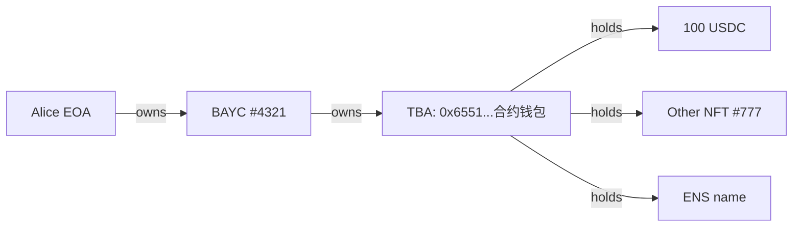
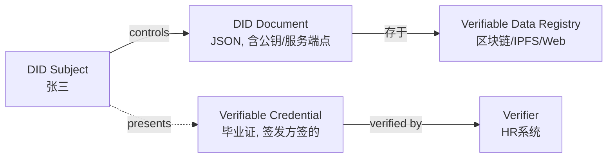
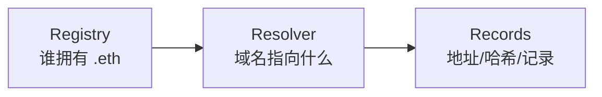
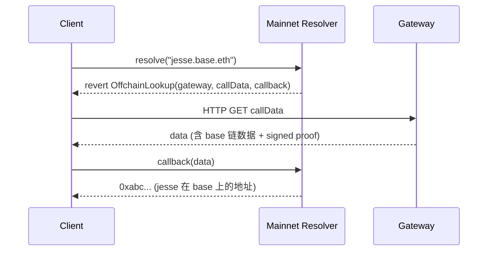
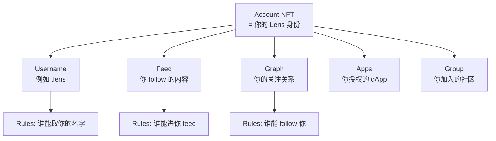
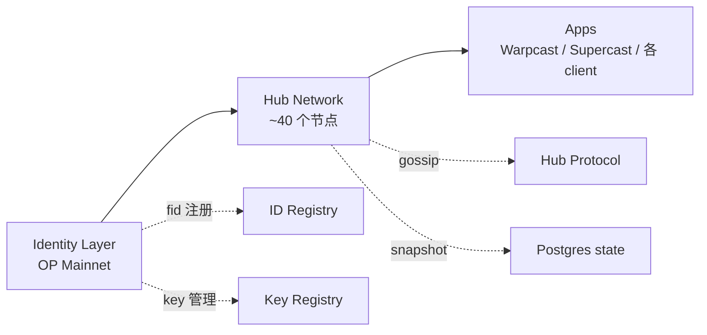
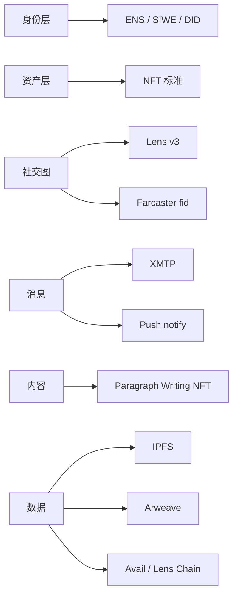

# 模块 13：NFT / 身份 / 社交

本模块覆盖三层 primitive：**资产层**（ERC-721/1155/6551/5192 标准族）、**身份层**（DID / SIWE / ENS / EAS / ZK ID）、**社交层**（Lens / Farcaster / XMTP / Push）。三层共用同一抽象：**给一个 256 位 ID 或 address 绑定一段语义**，差异只在「这段语义谁验证、存哪、谁能改」。

前置：模块 04（Solidity）。后续：模块 14（去中心化存储）补充第 9 章 IPFS / Arweave 协议细节。

工程基线：Solidity `0.8.28`（EVM = cancun），OpenZeppelin v5.5.0，forge-std v1.9.5，viem 2.43.3，siwe@2.3.2，eas-sdk@2.7.0，@farcaster/frame-sdk 0.1.x，@lens-protocol/client 3.x，Next.js 15.2.x。原 Polygon ID 于 2024-06 拆分为 **Privado ID** 独立运营，合约层仍兼容 iden3 协议。

---

## 模块路径图

```mermaid
flowchart TD
    A[第 1 章 ERC 标准矩阵与三层抽象] --> B[NFT 标准谱系]
    B --> B1[第 2 章 ERC-721 经典]
    B1 --> B2[第 3 章 ERC-721A 批量优化]
    B2 --> B3[第 4 章 ERC-1155 多代币]
    B3 --> B4[第 5 章 ERC-2981 + Royalty 战争]
    B4 --> B5[第 6 章 ERC-4907 NFT 租赁]
    B5 --> B6[第 7 章 ERC-6551 Token-Bound Account]
    B6 --> B7[第 8 章 ERC-5192 Soulbound]
    B7 --> B8[第 9 章 Metadata 与存储：IPFS/Arweave/on-chain SVG]
    B8 --> B9[第 10 章 跨生态：Metaplex/Sui Kiosk/Aptos DA]
    B9 --> B10[第 11 章 市场协议：Seaport/Blur/Reservoir 兴衰]
    B10 --> B11[第 12 章 真实事故复盘]

    B11 --> C[去中心化身份]
    C --> C1[第 13 章 W3C DID 标准]
    C1 --> C2[第 14 章 SIWE EIP-4361]
    C2 --> C3[第 15 章 ENS 与 CCIP-Read]
    C3 --> C4[第 16 章 EAS Attestation]
    C4 --> C5[第 17 章 ZK 身份：Sismo/Self/Anon Aadhaar/Privado ID]
    C5 --> C6[第 18 章 Worldcoin / World ID]
    C6 --> C7[第 19 章 监管张力：MiCA/Travel Rule]

    C7 --> D[Web3 社交]
    D --> D1[第 20 章 Lens v3 + Lens Chain]
    D1 --> D2[第 21 章 Farcaster 协议]
    D2 --> D3[第 22 章 Mini Apps 实战]
    D3 --> D4[第 23 章 XMTP messaging]
    D4 --> D5[第 24 章 Mirror→Paragraph + Push]

    D5 --> E[实战与习题]
    E --> E1[第 25 章 实战 1：完整 NFT 合约族]
    E1 --> E2[第 26 章 实战 2：SIWE + EAS 身份后端]
    E2 --> E3[第 27 章 实战 3：Farcaster Mini App]
    E3 --> E4[第 28 章 实战 4：Seaport-style mini-marketplace]
    E4 --> F[第 29 章 习题与答案]
```



---

## 第 1 章 ERC 标准矩阵与三层抽象

### 1.1 ERC 标准一次到位

整个资产层的标准谱系就这一张表，后续章节是逐一展开。每个变体对应一个具体工程痛点。

| 标准 | 痛点 | 关键 API / 字段 | InterfaceID | 何时选 |
|---|---|---|---|---|
| **ERC-721** | 唯一资产权属 | `ownerOf` / `safeTransferFrom` / `approve` | `0x80ac58cd` | 1/1 艺术、单件高价值 |
| **ERC-721A** | 批量 mint gas（OZ 经典 5 张 ~617k gas → 85k）| `_safeMint(to, qty)` + lazy ownership inference | 兼容 721 | PFP / 大批量发行 |
| **ERC-1155** | 一合约多 ID + 批量转账 | `safeBatchTransferFrom` / `balanceOfBatch` | `0xd9b67a26` | 游戏道具、票务、open edition |
| **ERC-2981** | 版税查询（不强制）| `royaltyInfo(tokenId, salePrice)` | `0x2a55205a` | 几乎所有 NFT |
| **ERC-721-C** | 版税合约级强制 | transfer hook + 白名单市场 | LimitBreak 标准 | 必须强制版税且能舍弃部分流动性 |
| **ERC-4906** | metadata 更新通知 | `MetadataUpdate` / `BatchMetadataUpdate` event | `0x49064906` | reveal / 动态 metadata |
| **ERC-4907** | NFT 租赁（所有权 vs 使用权）| `setUser` / `userOf` / `userExpires` | `0xad092b5c` | 元宇宙地租、装备租 |
| **ERC-5192** | Soulbound / 不可转让 | `locked(tokenId)` view | `0xb45a3c0e` | 学历、KYC badge、声誉 |
| **ERC-6551** | NFT 拥有自己的账户 | Registry `account()` + TBA implementation | n/a（singleton 0x6551...）| 角色背包、复合资产 |
| **ERC-2309** | 超大 batch 事件优化 | `ConsecutiveTransfer` event | constructor-only | 配合 721A 部署阶段 mint 全集 |
| **ERC-5006** | 1155 版的租赁 | `usable*` 系列接口 | 同 4907 思路 | 多副本游戏道具租赁 |

### 1.2 三层抽象与跨模块边界

```
资产层  tokenId ────► 权属
身份层  address ────► DID Document / VC / attestation
社交层  fid / handle ─► 关注图 / cast / 消息
```

三层共享 EIP-712 签名、EIP-165 接口探测、EIP-1271 合约钱包验证。不同的是状态存哪、谁能改。

| 跟谁可能搞混 | 边界划法 |
|---|---|
| 模块 04 Solidity | 04 讲**怎么写合约**，本模块讲**有哪些标准合约** |
| 模块 05 安全 | 05 讲通用安全，本模块只讲本域**特有**攻击面（royalty bypass / signature phishing / approval replay） |
| 模块 06 DeFi | 06 是 ERC-20 世界，本模块是非同质化世界 |
| 模块 14 去中心化存储 | 14 讲 IPFS/Arweave 协议本身，本模块只讲**怎么当 NFT metadata 存储** |

---

## 第 2 章 ERC-721 经典：OZ v5 实现

ERC-721（EIP 作者 William Entriken 等，2018-01 finalize，[eips.ethereum.org/EIPS/eip-721](https://eips.ethereum.org/EIPS/eip-721)）的核心 API 是 `ownerOf(tokenId) -> address`——从 ERC-20 的「你有多少」到「这个东西归谁」。其他全是辅助：approve（单 token 授权）、setApprovalForAll（全集合授权）、transferFrom、safeTransferFrom（检查 receiver 能否处理 NFT）、tokenURI。

### 2.1 OZ v5.5.0 ERC721.sol walkthrough

OZ v5.5.0 是 2025-Q4 稳定版（来源：[github.com/OpenZeppelin/openzeppelin-contracts](https://github.com/OpenZeppelin/openzeppelin-contracts)）。

```solidity
// SPDX-License-Identifier: MIT
pragma solidity ^0.8.20;

abstract contract ERC721 is Context, ERC165, IERC721, IERC721Metadata, IERC721Errors {
    // -------- 存储四件套 --------
    mapping(uint256 tokenId => address) private _owners;
    // why: 每个 tokenId 归谁。slot 写一次就是一个 NFT 的 home

    mapping(address owner => uint256) private _balances;
    // why: 谁有多少 NFT。冗余字段——其实 _owners 遍历能算出来，
    //      但 balanceOf 必须 O(1)，所以用空间换时间

    mapping(uint256 tokenId => address) private _tokenApprovals;
    // why: 单个 tokenId 的授权对象（OpenSea 上架时会写这里）

    mapping(address owner => mapping(address operator => bool)) private _operatorApprovals;
    // why: 全集合授权（"我所有 BAYC 都让你管"）。setApprovalForAll 写这里
}
```

两层授权对应两种用户行为：单 token approve = "上架 #1234 给 OpenSea"；setApprovalForAll = "授权 OpenSea 管理我所有 BAYC，未来不用每次签"。第二层是 95% phishing 攻击的温床，第 12 章复盘。

#### 2.1.1 `_update`：v5 的关键创新

v5 把 mint / burn / transfer 三种状态变化收敛到一个内部 hook `_update(to, tokenId, auth)`。这是相对 v4 的最大改动。

```solidity
function _update(address to, uint256 tokenId, address auth)
    internal virtual returns (address)
{
    address from = _ownerOf(tokenId);
    // why: 先取出旧 owner。如果 tokenId 不存在则 from == address(0)

    if (auth != address(0)) {
        _checkAuthorized(from, auth, tokenId);
        // why: auth 不是 0 时验证调用方有没有权限
        // 如果 auth == 0 表示「内部强制操作」（比如 _mint）跳过校验
    }

    if (from != address(0)) {
        _approve(address(0), tokenId, address(0), false);
        // why: 转出时清空单 token 授权（重要！否则旧主授权的人能继续操作新主的 NFT）
        unchecked { _balances[from] -= 1; }
        // why: unchecked 因为 from 拥有此 token 时 balance 一定 >= 1
    }

    if (to != address(0)) {
        unchecked { _balances[to] += 1; }
        // why: unchecked 因为 uint256 不可能溢出（NFT 总量永远 <2^256）
    }

    _owners[tokenId] = to;
    // why: 实际 owner 写入。to == 0 等价于 burn

    emit Transfer(from, to, tokenId);
    // why: 三种动作都触发 Transfer：
    //   mint:    Transfer(0, to, tokenId)
    //   burn:    Transfer(from, 0, tokenId)
    //   transfer: Transfer(from, to, tokenId)
    //   这是为什么 indexer 只监听一个 event 就能重建全部历史

    return from;
}
```

**v4→v5 迁移**：v4 用 `_beforeTokenTransfer` + `_afterTokenTransfer`，扩展合约（Enumerable / Pausable / Votes）override 这两个。v5 全改为 override `_update`。fork v4 老合约时这是改动量最大的一处。

#### 2.1.2 `safeTransferFrom` 与 ERC721Receiver

```solidity
function safeTransferFrom(address from, address to, uint256 tokenId, bytes memory data)
    public virtual
{
    transferFrom(from, to, tokenId);
    _checkOnERC721Received(from, to, tokenId, data);
    // why: 如果 to 是合约，要求它实现 onERC721Received 并返回 magic value。
    //      否则 NFT 会卡死在不会处理它的合约里——无数项目踩过这个坑
}
```

magic value = `IERC721Receiver.onERC721Received.selector` = `bytes4(keccak256("onERC721Received(address,address,uint256,bytes)"))`。

#### 2.1.3 最小可部署例子

```solidity
// SPDX-License-Identifier: MIT
pragma solidity 0.8.28;

import {ERC721} from "@openzeppelin/contracts/token/ERC721/ERC721.sol";
import {ERC721URIStorage} from "@openzeppelin/contracts/token/ERC721/extensions/ERC721URIStorage.sol";
import {Ownable} from "@openzeppelin/contracts/access/Ownable.sol";

contract MyNFT is ERC721URIStorage, Ownable {
    uint256 private _nextId;
    // why: 自增 ID。比 keccak256(...) 当 ID 简单，且对人类友好（#1, #2, #3）

    constructor(address owner_) ERC721("MyNFT", "MNFT") Ownable(owner_) {}

    function mint(address to, string calldata uri) external onlyOwner returns (uint256 id) {
        id = _nextId++;
        // why: 先取再 ++，所以第一个 mint 的 id 是 0
        _safeMint(to, id);
        // why: safeMint 内部会调 _checkOnERC721Received，避免转给「黑洞合约」
        _setTokenURI(id, uri);
        // why: ERC721URIStorage 提供了 per-token URI 存储；
        //      默认 ERC721 的 tokenURI 是 baseURI + tokenId（更省 gas 但每个 token 不能独立改 metadata）
    }
}
```

### 2.2 ERC-721 的隐藏坑

- **tokenId 不连续**：EIP 允许任意 uint256。CryptoPunks/BAYC 用 0-9999，但有些用 `keccak256(name)`。indexer 假设连续会爆。
- **`balanceOf` 可能撒谎**：ERC721A 重写 balanceOf 语义，不一定从存储读。
- **`tokenURI` 可空**：EIP 没强制。lazy mint reveal 前常返回 `""`。
- **`approve` 给合约 = phishing 入口**：Inferno Drainer 的核心。`approve(0x0, tokenId)` 合法，等价于撤销——这就是 `_update` 里 `_approve(address(0), tokenId, address(0), false)` 在转移时清空旧授权的原因。

### 2.3 EIP-165 接口检测

ERC-721 强制实现 `supportsInterface(bytes4)`，市场靠这个 selector 识别 NFT。各 interfaceID 见第 1 章矩阵。OZ v5 默认实现 ERC-721 + Metadata，扩展时 super + 自己的 ID：

```solidity
function supportsInterface(bytes4 id) public view virtual override(ERC721, IERC165) returns (bool) {
    return id == 0x2a55205a /* ERC-2981 */ || super.supportsInterface(id);
}
```

---

## 第 3 章 ERC-721A：批量 mint 优化

ERC-721A（Chiru Labs / Azuki 团队，2022 开源，v4.3.0；[github.com/chiru-labs/ERC721A](https://github.com/chiru-labs/ERC721A)）接口完全兼容 ERC-721，重写 storage layout 把 batch mint 压到接近单 mint 成本。

实测 gas（来源：[alchemy.com/blog/erc721-vs-erc721a-batch-minting-nfts](https://www.alchemy.com/blog/erc721-vs-erc721a-batch-minting-nfts)）：

| 数量 | OZ ERC-721 gas | ERC-721A gas | 节省 |
|---|---|---|---|
| 1 | 154,814 | 76,690 | 50% |
| 5 | 616,914 | 85,206 | 86% |
| 10 | 1,221,614 | 95,896 | 92% |

OZ 经典 mint(5) 写 6 次 SSTORE（5 × `_owners[i]` + 1 × `_balances[alice]`），约 120k cold-slot gas。ERC-721A 只在「ownership 变化点」写。

### 3.1 核心算法：lazy initialization + ownership inference

ERC-721A 的核心存储变化：

```solidity
// OZ 经典：每个 tokenId 都写
mapping(uint256 => address) _owners;

// ERC-721A：只在 ownership 「变化点」写
struct TokenOwnership {
    address addr;
    uint64 startTimestamp;
    bool burned;
    uint24 extraData;
}
mapping(uint256 => TokenOwnership) _packedOwnerships;
// 几个字段打包进同一个 storage slot（256 bits 装下 160+64+8+24 = 256）
```

#### 3.1.1 mint(5) 的实际写入

```text
mint(alice, 5)：
  _packedOwnerships[100] = {addr: alice, startTimestamp: now, ...}
  _packedOwnerships[101] = 空（不写！）
  _packedOwnerships[102] = 空
  _packedOwnerships[103] = 空
  _packedOwnerships[104] = 空
  _packedOwnerships[105] = 空（边界标记）

  _packedAddressData[alice] += 5
```

只写 1+1 = 2 个 slot（外加 balance）。用 5 张 NFT 时省的就是 4 个 SSTORE。

#### 3.1.2 ownerOf(102) 怎么查？

```solidity
function _ownershipOf(uint256 tokenId) internal view returns (TokenOwnership memory) {
    uint256 cur = tokenId;
    while (true) {
        TokenOwnership memory o = _packedOwnerships[cur];
        if (o.addr != address(0) && !o.burned) return o;
        // why: 找到一个有 addr 的"锚点"，它就是 102 的当前所有者
        if (cur == 0) revert OwnerQueryForNonexistentToken();
        unchecked { --cur; }
        // why: 往前回溯，直到找到锚点或越界
    }
}
```

读取 `ownerOf(102)`：
1. `_packedOwnerships[102]` → 空
2. `_packedOwnerships[101]` → 空
3. `_packedOwnerships[100]` → `{alice, ...}` → 命中！

**代价**：ownerOf 从 O(1) 变成 O(k)，最坏一次 ownerOf 要 SLOAD k 次（each ~2.1k gas post-Berlin）。

#### 3.1.3 transfer(102) 时怎么办？

```text
转移前：
  _packedOwnerships[100] = {alice, ...}
  101-104 为空

alice 把 #102 转给 bob：
  _packedOwnerships[102] = {bob, ...}    // 新主写入
  _packedOwnerships[103] = {alice, ...}  // 关键！alice 那一段必须重新"定锚"
                                          // 否则 ownerOf(103) 会回溯到 102 看到 bob
```

每次中段转移触发额外一次 SSTORE，但只发生在转移那一刻。绝大多数 NFT 的 mint 阶段拥挤、转移阶段稀疏，净 gas 仍是负——这是 ERC-721A 的核心设计权衡。

### 3.2 最小可部署例子

```solidity
// SPDX-License-Identifier: MIT
pragma solidity 0.8.28;

import "erc721a/contracts/ERC721A.sol";
// pin: erc721a v4.3.0

contract Azuki is ERC721A {
    uint256 public constant MAX_SUPPLY = 10000;
    uint256 public constant PRICE = 0.05 ether;

    constructor() ERC721A("Azuki", "AZ") {}

    function mint(uint256 quantity) external payable {
        require(quantity > 0 && quantity <= 10, "qty");
        // why: 限制单次 batch，避免某个用户的 mint 把 ownerOf 的回溯距离拉到爆

        require(_totalMinted() + quantity <= MAX_SUPPLY, "supply");
        // why: ERC-721A 有 _totalMinted()（包含已 burn 的），
        //      也有 _totalSupply()（不含已 burn）。这里要用前者锁总量

        require(msg.value >= PRICE * quantity, "underpaid");

        _safeMint(msg.sender, quantity);
        // why: ERC-721A 的 _safeMint 第二个参数是 quantity 不是 tokenId！
        //      和 OZ 经典完全不一样
    }

    function _startTokenId() internal pure override returns (uint256) {
        return 1;
        // why: 默认从 0 开始，但人类喜欢从 1 编号
    }
}
```

### 3.3 ERC-721A 的三个陷阱

- **批量过大让 ownerOf 变贵**：Azuki 设 5 张 per-tx 上限。允许 1000 个 batch 时恶意用户能把某些 ownerOf 烧到 50k+ gas。v4 的 `_setOwnersExplicit(uint256 quantity)` 让你后续批量写锚点。
- **burn 后回溯逻辑改变**：burned 标志被设，回溯时跳过。自己重写 burn 要维护不变量。
- **不兼容 ERC721Enumerable**：要 `tokenOfOwnerByIndex` 则用 `ERC721AQueryable` 兄弟扩展，或改回 OZ。

**选型**：PFP / 大批量 mint → ERC-721A；单件高价值（Art Blocks、1/1）或需要 Enumerable / 大量 per-token state → OZ 经典。

### 3.4 ERC-2309：超大 batch 事件优化

ERC-2309 允许在 contract creation 时 emit 一个 `ConsecutiveTransfer(fromTokenId, toTokenId, fromAddress, toAddress)` 替代 N 个 `Transfer`。OpenSea 2022 后支持。ERC-721A 的 `_mintERC2309` 用这个。**仅 constructor 可用**——indexer 只对合约创建时的 batch 事件默认信任，否则 ownership 历史可被伪造。

---

## 第 4 章 ERC-1155：多代币标准

ERC-1155（Enjin 团队 2018 提出，2019 finalize；[eips.ethereum.org/EIPS/eip-1155](https://eips.ethereum.org/EIPS/eip-1155)）在一个合约里管理任意多个 token ID，每个 ID 可 fungible 也可 NFT。典型场景：RPG 1000 种装备 + 100 种传奇装备——用 1000 个 ERC-20 + 100 个 ERC-721 部署即破产，一个 ERC-1155 一笔 tx 转 50 种道具 100 个。

核心 API 批量优先：

```solidity
function balanceOf(address account, uint256 id) external view returns (uint256);
function balanceOfBatch(address[] calldata accounts, uint256[] calldata ids)
    external view returns (uint256[] memory);

function safeTransferFrom(address from, address to, uint256 id, uint256 amount, bytes calldata data) external;
function safeBatchTransferFrom(
    address from, address to,
    uint256[] calldata ids, uint256[] calldata amounts,
    bytes calldata data
) external;
```

### 4.1 OZ v5 ERC1155 walkthrough

```solidity
mapping(uint256 id => mapping(address account => uint256)) private _balances;
// why: id × account → amount。一个 mapping 同时容纳一切

mapping(address account => mapping(address operator => bool)) private _operatorApprovals;
// why: 跟 ERC-721 一样，全集合授权
```

ERC-1155 没有 per-id approve——和 ERC-721 的最大差异。原因：钱包里可能几千种 token，per-id UI 不可行。

#### 4.1.1 mint 与 burn

```solidity
function _mint(address to, uint256 id, uint256 value, bytes memory data) internal {
    require(to != address(0), "ERC1155InvalidReceiver");
    _update(address(0), to, _asSingletonArrays(id), _asSingletonArrays(value));
    _doSafeTransferAcceptanceCheck(_msgSender(), address(0), to, id, value, data);
}
```

#### 4.1.2 最小例子：游戏道具

```solidity
// SPDX-License-Identifier: MIT
pragma solidity 0.8.28;

import {ERC1155} from "@openzeppelin/contracts/token/ERC1155/ERC1155.sol";
import {ERC1155Supply} from "@openzeppelin/contracts/token/ERC1155/extensions/ERC1155Supply.sol";
import {AccessControl} from "@openzeppelin/contracts/access/AccessControl.sol";

contract GameItems is ERC1155, ERC1155Supply, AccessControl {
    bytes32 public constant MINTER_ROLE = keccak256("MINTER_ROLE");

    uint256 public constant GOLD       = 0;  // fungible
    uint256 public constant SWORD      = 1;  // fungible（很多人有）
    uint256 public constant LEGENDARY  = 2;  // NFT（只 1 个）

    constructor(address admin)
        ERC1155("https://api.game.com/items/{id}.json")
        // why: ERC1155 的 URI 是个模板，{id} 在客户端被 token id 的 64 位 hex 替换
    {
        _grantRole(DEFAULT_ADMIN_ROLE, admin);
        _grantRole(MINTER_ROLE, admin);
    }

    function mintGold(address to, uint256 amount) external onlyRole(MINTER_ROLE) {
        _mint(to, GOLD, amount, "");
    }

    function mintLegendary(address to) external onlyRole(MINTER_ROLE) {
        require(totalSupply(LEGENDARY) == 0, "already minted");
        // why: 强制 LEGENDARY 只有一份，用业务逻辑当 NFT 用；totalSupply 来自 ERC1155Supply
        _mint(to, LEGENDARY, 1, "");
    }

    // OZ 5.x：菱形继承下必须 override 二者共同的 _update
    function _update(address from, address to, uint256[] memory ids, uint256[] memory values)
        internal override(ERC1155, ERC1155Supply)
    {
        super._update(from, to, ids, values);
    }

    function supportsInterface(bytes4 id)
        public view override(ERC1155, AccessControl) returns (bool)
    {
        return super.supportsInterface(id);
    }
}
```

`{id}` 模板 hex 长度 64 位：tokenId=0 显示为 `0000…0000.json`。客户端自行 padding，OpenSea / Magic Eden 都遵守。

### 4.2 ERC-1155 的隐藏坑

- **batch 不能太大**：每 element 一次 `_balances` 写。1000 个 ID 直接撞 block gas limit，生产建议 ≤ 50。
- **不能同时实现 ERC-721**：transfer signature 不同。要混合则纯 1155 把 NFT 当 supply=1，或两份合约。
- **没有 name/symbol**：EIP 没规定。OZ 的 `ERC1155Supply` 给 totalSupply，name/symbol 自己加；OpenSea 认但不强制。

### 4.3 何时选 ERC-1155 vs ERC-721

| 场景 | 选 ERC-721 | 选 ERC-1155 |
|---|---|---|
| PFP 头像（10000 张全唯一）| ✅（用 721A）| ❌ 浪费 |
| 游戏道具（多种、可堆叠）| ❌ 部署爆炸 | ✅ |
| 票务（一种票卖很多张）| ❌ | ✅ |
| 艺术 1/1 收藏 | ✅ | ❌（部分市场不全支持） |
| 会员卡（同等级很多人）| 看场景 | ✅ |

---

## 第 5 章 ERC-2981：版税标准与版税战争

ERC-2981（[eips.ethereum.org/EIPS/eip-2981](https://eips.ethereum.org/EIPS/eip-2981)）只定义一个查询接口：

```solidity
interface IERC2981 {
    function royaltyInfo(uint256 tokenId, uint256 salePrice)
        external view returns (address receiver, uint256 royaltyAmount);
}
```

EIP 原文 "This standard does not specify when payment must be made"——只规定怎么查，不规定谁付。这是 2022-2024 版税战争的伏笔。

### 5.1 版税战争时间线

| 时间 | 事件 |
|---|---|
| 2020-09 | EIP-2981 finalize |
| 2022-08 | Sudoswap 上线，AMM 模型，**默认无版税** |
| 2022-10 | X2Y2 把版税改成可选，OpenSea 反击 |
| 2022-11 | OpenSea 推出 **Operator Filter**，黑名单不尊重版税的市场 |
| 2023-02 | Blur 反击，激励交易者绕过 OpenSea Operator Filter |
| 2023-08 | OpenSea 投降：宣布 sunset Operator Filter，新藏品版税变可选（[The Block, 2023-08-17](https://www.theblock.co/post/246095/opensea-disables-royalty-enforcement-tool-makes-creator-fees-optional)） |
| 2024-04 | OpenSea 转向支持 LimitBreak 的 ERC721-C，2024-04-02 后部署的合约可以选择强制版税（来源：[opensea.io/blog/articles/creator-earnings-erc721-c-compatibility-on-opensea](https://opensea.io/blog/articles/creator-earnings-erc721-c-compatibility-on-opensea)） |
| 2025-2026 | 分裂宇宙：OpenSea 0.5% 平台费 + 可选版税；Blur 0% 平台费 + 普遍忽略版税 |

### 5.2 ERC721-C：合约级强制版税

LimitBreak 2023 提出。核心思路：transfer hook 检查 caller 在白名单：

```solidity
// 简化版逻辑
function _beforeTokenTransfer(...) internal override {
    if (!_isOnAllowList(msg.sender)) revert ForbiddenMarketplace();
}
```

付版税的 Payment Processor 类市场加入白名单：Magic Eden / OpenSea 加入，Blur 没。副作用：P2P transferFrom 也被禁，违背"NFT 无许可转移"信念。

### 5.3 OZ v5 的 ERC721Royalty

```solidity
// SPDX-License-Identifier: MIT
pragma solidity 0.8.28;

import {ERC721} from "@openzeppelin/contracts/token/ERC721/ERC721.sol";
import {ERC2981} from "@openzeppelin/contracts/token/common/ERC2981.sol";
import {Ownable} from "@openzeppelin/contracts/access/Ownable.sol";

contract MyArt is ERC721, ERC2981, Ownable {
    constructor(address creator) ERC721("MyArt", "ART") Ownable(creator) {
        _setDefaultRoyalty(creator, 500);
        // why: 500 / 10000 = 5%。这是市场调用 royaltyInfo 时返回的金额
    }

    function setRoyalty(address receiver, uint96 feeNumerator) external onlyOwner {
        require(feeNumerator <= 1000, "max 10%");
        // why: ERC-2981 没限制上限，但市场普遍拒绝 >10% 的版税。自己加 cap
        _setDefaultRoyalty(receiver, feeNumerator);
    }

    function setTokenRoyalty(uint256 id, address receiver, uint96 feeNumerator)
        external onlyOwner
    {
        _setTokenRoyalty(id, receiver, feeNumerator);
        // why: per-token 版税，覆盖 default。比如某张 1/1 给艺术家更高比例
    }

    function supportsInterface(bytes4 id)
        public view override(ERC721, ERC2981) returns (bool)
    {
        return super.supportsInterface(id);
    }
}
```

P2P 直接 transferFrom 不会触发 royalty 逻辑：ERC-2981 只是查询接口，不在 transfer 路径上。这就是 P2P 转账永远绕过版税的根因。

---

## 第 6 章 ERC-4907：NFT 租赁

ERC-4907（[eips.ethereum.org/EIPS/eip-4907](https://eips.ethereum.org/EIPS/eip-4907)）在 ERC-721 之上分离 owner / user 角色 + 到期时间：

```solidity
interface IERC4907 {
    event UpdateUser(uint256 indexed tokenId, address indexed user, uint64 expires);
    function setUser(uint256 tokenId, address user, uint64 expires) external;
    function userOf(uint256 tokenId) external view returns (address);
    function userExpires(uint256 tokenId) external view returns (uint256);
}
```

把"所有权"与"使用权"标准化，避免直接 transfer 给租户的归还风险。

### 6.1 实现

```solidity
// 完整 ERC-4907 reference 实现（pragma 0.8.28，pin OZ v5.5.0）
import {ERC721} from "@openzeppelin/contracts/token/ERC721/ERC721.sol";

abstract contract ERC4907 is ERC721 {
    struct UserInfo {
        address user;
        uint64 expires;
    }
    mapping(uint256 => UserInfo) internal _users;

    event UpdateUser(uint256 indexed tokenId, address indexed user, uint64 expires);

    function setUser(uint256 tokenId, address user, uint64 expires) public virtual {
        require(_isAuthorized(_ownerOf(tokenId), msg.sender, tokenId), "not authorized");
        // why: 必须是 owner 或被授权才能设租户
        UserInfo storage info = _users[tokenId];
        info.user = user;
        info.expires = expires;
        emit UpdateUser(tokenId, user, expires);
    }

    function userOf(uint256 tokenId) public view virtual returns (address) {
        if (uint256(_users[tokenId].expires) >= block.timestamp) {
            return _users[tokenId].user;
        }
        return address(0);
        // why: 过期自动失效，不需要额外清理 storage
    }

    function userExpires(uint256 tokenId) public view virtual returns (uint256) {
        return _users[tokenId].expires;
    }

    function _update(address to, uint256 tokenId, address auth)
        internal virtual override returns (address)
    {
        address from = super._update(to, tokenId, auth);
        if (from != to && _users[tokenId].user != address(0)) {
            delete _users[tokenId];
            emit UpdateUser(tokenId, address(0), 0);
        }
        // why: 转让所有权时清空租户。否则 Alice 把租出的 NFT 卖给 Bob，Bob 接手时
        //      还有个素未谋面的租户在使用——不合直觉
        return from;
    }
}
```

### 6.2 生产用例

- **元宇宙土地**：The Sandbox / Decentraland 早期内置类似机制，PlayerOne 正式采用 ERC-4907（[onekey.so/blog/ecosystem/erc-4907](https://onekey.so/blog/ecosystem/erc-4907-the-standard-for-nft-rentals-and-ownership-separation/)）。
- **游戏装备日租**：0.01 ETH/天租昂贵装备。
- **VIP 临时授权**：把会员 NFT 临时让渡给朋友进群。

ERC-4907 是扩展非替代，市场操作不受影响。每次 transfer 额外一次 storage delete（5k gas），高频转移要权衡。**ERC-5006** 是其 ERC-1155 对应（"同一 ID 多份在租"），采用率低。

---

## 第 7 章 ERC-6551：Token-Bound Account

ERC-6551（[eips.ethereum.org/EIPS/eip-6551](https://eips.ethereum.org/EIPS/eip-6551)）让每个 ERC-721 NFT 拥有自己的 smart contract wallet，由 NFT 当前 owner 间接控制。资产层从"叶子节点"升级成"内部账户"，可持币、持其他 NFT、调合约。



Alice 卖掉 BAYC #4321 给 Bob，整个 TBA 里的资产**自动跟着转移**——因为控制权只跟 owner 走。

**Trust model**：TBA owner = NFT 当前 `ownerOf` 返回值。三个推论：(1) 卖家可在 transfer 前把 TBA 抽空（rug 风险），买入带 TBA 的 NFT 必须链上检查余额且原子化；(2) ERC-4907 user ≠ owner，借出 NFT 不授予 TBA 控制权；(3) TBA 不能自治，所有 execute 必须由当前 owner 触发——这是与"agent 持有钱包"叙事最易混淆处。

### 7.1 架构：Registry + Account Implementation

```solidity
// ERC-6551 的核心 Registry（singleton，每个链同一个地址 0x000000006551...）
interface IERC6551Registry {
    function createAccount(
        address implementation,  // 账户合约的实现地址
        bytes32 salt,
        uint256 chainId,
        address tokenContract,
        uint256 tokenId
    ) external returns (address account);

    function account(
        address implementation,
        bytes32 salt,
        uint256 chainId,
        address tokenContract,
        uint256 tokenId
    ) external view returns (address account);
}
```

地址通过 CREATE2 deterministic 算出（不需要 NFT 触发 createAccount 也能预知地址）：

```text
account_address = create2(
    registry,
    salt,
    keccak256(initCode(implementation, chainId, tokenContract, tokenId))
)
```

### 7.2 Account Implementation 简化版

```solidity
// SPDX-License-Identifier: MIT
pragma solidity 0.8.28;

import {IERC721} from "@openzeppelin/contracts/token/ERC721/IERC721.sol";

contract SimpleERC6551Account {
    uint256 public state;
    // why: 每次 execute 后 state++，作为 nonce 防 replay

    receive() external payable {}

    function token()
        public view returns (uint256 chainId, address tokenContract, uint256 tokenId)
    {
        bytes memory footer = new bytes(0x60);
        assembly {
            extcodecopy(address(), add(footer, 0x20), 0x4d, 0x60)
            // why: ERC-6551 把 (chainId, tokenContract, tokenId) 写在 proxy bytecode 末尾
            //      runtime 时 extcodecopy 读自己 → 拿到绑定的 NFT
        }
        return abi.decode(footer, (uint256, address, uint256));
    }

    function owner() public view returns (address) {
        (uint256 chainId, address tokenContract, uint256 tokenId) = token();
        if (chainId != block.chainid) return address(0);
        return IERC721(tokenContract).ownerOf(tokenId);
        // why: TBA 的 owner = 它绑定的 NFT 的 owner
    }

    function execute(address to, uint256 value, bytes calldata data, uint8 operation)
        external payable returns (bytes memory result)
    {
        require(msg.sender == owner(), "not nft owner");
        require(operation == 0, "only call");
        // why: ERC-6551 留了 operation=1 的 delegatecall 接口，但绝大多数生产实现关掉

        ++state;
        bool success;
        (success, result) = to.call{value: value}(data);
        if (!success) {
            assembly { revert(add(result, 0x20), mload(result)) }
        }
    }
}
```

### 7.3 viem demo：算 BAYC 的 TBA 地址

```ts
// 用 viem 调用 ERC-6551 registry
import { createPublicClient, http, parseAbi } from 'viem'
import { mainnet } from 'viem/chains'

const REGISTRY = '0x000000006551c19487814612e58FE06813775758'
const IMPL = '0x55266d75D1a14E4572138116aF39863Ed6596E7F'  // tokenbound v0.3.1

const client = createPublicClient({ chain: mainnet, transport: http() })

const tba = await client.readContract({
  address: REGISTRY,
  abi: parseAbi(['function account(address,bytes32,uint256,address,uint256) view returns (address)']),
  functionName: 'account',
  args: [IMPL, '0x' + '00'.repeat(32), 1n, BAYC_CONTRACT, 4321n],
})
// tba = "0xabc..." 这个地址就是 BAYC #4321 的 token-bound account
// 可以往这个地址转 USDC、转 ENS，谁拥有 BAYC #4321 谁就能控制
```

### 7.4 2026 现状（来源：[medium.com/@seaflux ERC-6551 guide 2026-02](https://medium.com/@seaflux/what-are-token-bound-accounts-a-guide-to-erc-6551-and-functional-nfts-b9659c9f3f3c)）

- **向后兼容**：任何已存在 ERC-721（含 CryptoPunks，只要有 ownerOf）都能创 TBA。
- **采用者**：Sapienz / Mocaverse / Pudgy Penguins。
- **UX 痛点**：用户分不清"我钱包" vs "我 NFT 的钱包"。
- **结构性风险（清空攻击）**：卖家挂单后成交前 execute 转空 TBA，买家拿到空壳。Seaport 不防这个，需要市场层 "TBA snapshot"——主流市场目前都没做。
- **跨链一致性**：NFT 在 L1、TBA 在 L2 时 ownerOf 失同步。

部署 Registry 用相同 salt + bytecode 在各链得到同一地址，但每条链需单独部署。

---

## 第 8 章 ERC-5192：Soulbound

ERC-5192（[eips.ethereum.org/EIPS/eip-5192](https://eips.ethereum.org/EIPS/eip-5192)，2022-09 finalize）是 SBT 最小实现——只规定 `locked(tokenId)` 视图，不规定怎么阻止转让（实现自由：revert、burn-rebmint、vault 等）。生产标准做法：transfer 时 revert。

```solidity
interface IERC5192 {
    event Locked(uint256 tokenId);
    event Unlocked(uint256 tokenId);
    function locked(uint256 tokenId) external view returns (bool);
}
```

### 8.1 最小实现

```solidity
// SPDX-License-Identifier: MIT
pragma solidity 0.8.28;

import {ERC721} from "@openzeppelin/contracts/token/ERC721/ERC721.sol";
import {IERC165} from "@openzeppelin/contracts/utils/introspection/IERC165.sol";

interface IERC5192 {
    event Locked(uint256 tokenId);
    event Unlocked(uint256 tokenId);
    function locked(uint256 tokenId) external view returns (bool);
}

contract Soulbound is ERC721, IERC5192 {
    constructor() ERC721("Diploma", "DIP") {}

    function mint(address to, uint256 id) external {
        _safeMint(to, id);
        emit Locked(id);
        // why: mint 立刻 emit Locked，让 indexer 知道"这是 SBT"
    }

    function locked(uint256) public pure override returns (bool) {
        return true;
        // why: 全部不可转让。如果想让某些 token 可转让，改成 mapping
    }

    function _update(address to, uint256 tokenId, address auth)
        internal override returns (address)
    {
        address from = _ownerOf(tokenId);
        if (from != address(0) && to != address(0)) {
            revert("Soulbound: cannot transfer");
            // why: from=0 是 mint，to=0 是 burn，两者放行
            //      只阻止 from!=0 且 to!=0 的真实转让
        }
        return super._update(to, tokenId, auth);
    }

    function supportsInterface(bytes4 id)
        public view override(ERC721, IERC165) returns (bool)
    {
        return id == 0xb45a3c0e /* ERC-5192 */ || super.supportsInterface(id);
    }
}
```

### 8.2 生产用例

- **Binance Account Bound (BAB)**：2022-10，第一个大规模 SBT。
- **Optimism Citizen House Badge**：链上治理身份。
- **GitCoin Passport**：早期 SBT，后转 EAS。
- **学历证书**：Stanford / MIT 试过。

**2025-2026 趋势**：EAS 取代 SBT 用于"链上证书"。新项目（Optimism RetroPGF / Coinbase Verifications / Gitcoin Passport v2 / Base 声誉系统）默认 EAS schema：不占 token slot，任何 issuer 无需部署即可盖章，支持批量 + 撤销 + 现成 indexer。SBT 仅在"必须以 NFT 形态出现在钱包"（POAP 纪念、KYC badge）保留。第 16 章展开。

### 8.3 SBT 设计陷阱

- **错发**：地址填错永久卡死，生产实现要留 `revoke(tokenId)`。
- **钱包丢 = 身份丢**：Vitalik SBT 论文讨论 social recovery 未入标准。生产做法：发到 ERC-6551 TBA，TBA owner 用智能钱包，丢钱包能恢复。
- **不能换钱包**：换主钱包要迁所有 SBT。Vitalik 建议 `recover(old, new)` 接口未入标准。
- **5192 + 2981 互斥**：不能 transfer 就没有销售，royaltyInfo 永不被调。

---

## 第 9 章 Metadata 与存储

ERC-721 Metadata 扩展：

```solidity
function tokenURI(uint256 tokenId) external view returns (string memory);
```

返回的 URL 指向 JSON：

```json
{
  "name": "Bored Ape #4321",
  "description": "...",
  "image": "ipfs://Qm.../4321.png",
  "attributes": [
    {"trait_type": "Background", "value": "Blue"},
    {"trait_type": "Hat", "value": "Crown"}
  ]
}
```

### 9.1 存储方案对比

| 方案 | 抗审查 | 永续性 | 修改性 | 成本 | 何时用 |
|---|---|---|---|---|---|
| HTTPS（中心化）| 最差 | 最差 | 最易改 | 最便宜 | demo / 测试 |
| IPFS pin（Pinata 等）| 中 | 取决于 pin 服务 | 不易改（CID 哈希）| 低 | 主流方案 |
| IPFS + Filecoin | 高 | 高（合约保证 deal）| 不可改 | 中 | 严肃项目 |
| Arweave | 最高 | 200 年理论 | 不可改 | 一次性高 | 永久收藏 |
| On-chain SVG | 最高 | 跟链一样 | 不可改（除非合约可升级）| 极高 | 1/1 艺术、Loot |

### 9.2 IPFS 元数据 demo

```solidity
contract IPFSCompliantNFT is ERC721 {
    string private _baseTokenURI;
    // 比如 "ipfs://QmHash/" 注意结尾的斜杠

    constructor(string memory baseURI_) ERC721("X", "X") {
        _baseTokenURI = baseURI_;
    }

    function _baseURI() internal view override returns (string memory) {
        return _baseTokenURI;
    }
    // why: ERC721 默认 tokenURI = baseURI() + tokenId.toString()
    //      所以 token 1 → "ipfs://QmHash/1"，token 2 → "ipfs://QmHash/2"
}
```

IPFS 上对应的目录结构：

```
QmHash/
  ├── 1.json          # {"name":"#1","image":"ipfs://QmImage1"}
  ├── 2.json
  ├── ...
  └── 10000.json
```

### 9.3 On-chain SVG：图画进合约

经典案例：Loot（Dom Hofmann 2021）。tokenURI 现场拼装 base64 SVG：

```solidity
function tokenURI(uint256 tokenId) public view override returns (string memory) {
    string memory svg = string(abi.encodePacked(
        '<svg xmlns="http://www.w3.org/2000/svg" viewBox="0 0 350 350">',
        '<style>.base { fill: white; font-family: serif; font-size: 14px; }</style>',
        '<rect width="100%" height="100%" fill="black" />',
        '<text x="10" y="20" class="base">', getWeapon(tokenId), '</text>',
        // ... 其他装备
        '</svg>'
    ));

    string memory json = Base64.encode(bytes(string(abi.encodePacked(
        '{"name": "Bag #', tokenId.toString(),
        '", "description": "Loot is randomized adventurer gear", ',
        '"image": "data:image/svg+xml;base64,', Base64.encode(bytes(svg)), '"}'
    ))));

    return string(abi.encodePacked("data:application/json;base64,", json));
}
```

返回 `data:application/json;base64,eyJuYW1l...`。钱包 / OpenSea 解 base64 → JSON → image 字段拿 SVG，**零外部存储**。

gas 注意：`tokenURI` 是 view 不烧 gas，但生成字符串超 10kb 时 call 显著变慢。生产把固定字符串放 SSTORE2 / immutable bytes。

### 9.4 ERC-4906：metadata 更新通知

```solidity
event MetadataUpdate(uint256 _tokenId);
event BatchMetadataUpdate(uint256 _fromTokenId, uint256 _toTokenId);
```

reveal 时：

```solidity
function reveal() external onlyOwner {
    _baseTokenURI = "ipfs://QmRealHash/";
    emit BatchMetadataUpdate(0, totalSupply() - 1);
    // why: OpenSea / Magic Eden 监听这个事件，立即重新拉 metadata
}
```

市场只对实现 ERC-4906（`0x49064906`）的合约信任 metadata 变更。

---

## 第 10 章 跨生态：Metaplex Core / Sui Kiosk / Aptos DA

非 EVM 链 runtime 模型不同——Solana 账户即数据（每 NFT 一个 account）；Sui 是 Object 模型（NFT 是 object，自带 owner address）；Aptos 是资源模型（NFT 是 resource type 挂某 account）。直接搬 ERC-721 mapping 不仅低效而且语义不通。

### 10.1 Metaplex Core（Solana）

Solana NFT 事实标准（[metaplex.com/blog/articles/metaplex-foundation-launches-metaplex-core](https://www.metaplex.com/blog/articles/metaplex-foundation-launches-metaplex-core-next-generation-of-solana-nft-standard)）。v1 Token Metadata（2021）每 NFT 用 mint + metadata + master edition 三 account；v2 Core（2024）合并为单 account。

数据（[metaplex.com/blog/articles/metaplex-june-round-up-2025](https://www.metaplex.com/blog/articles/metaplex-june-round-up-2025)）：单 account 减少 80%+ mint 成本；plugin 系统（royalty / freeze / oracle / app data）；2025-06 累计 mint 近 300 万，单月 19 万。

```rust
// Metaplex Core mint 简化代码（伪 Rust，实际用 mpl-core SDK）
use mpl_core::{accounts::BaseAssetV1, instructions::CreateV2Builder};

let create_ix = CreateV2Builder::new()
    .asset(asset_pda)         // 新 NFT 的 PDA
    .collection(collection)   // 所属 collection
    .authority(creator)
    .name("My NFT".into())
    .uri("https://...".into())
    .plugins(vec![
        Plugin::Royalties { basis_points: 500, creators: vec![...] },
        // why: royalty 是 plugin，不是核心字段
    ])
    .instruction();
```

EVM 工程师视角差异：无合约地址（每 NFT 独立 PDA）；transfer 是 SPL token instruction 而非 method call；程序级 royalty 可被 runtime 拦截。

### 10.2 Sui Kiosk

Sui 任何 object 都能当 NFT，"怎么交易"由 Kiosk 标准化（[docs.sui.io/guides/developer/nft/nft-rental](https://docs.sui.io/guides/developer/nft/nft-rental)）。Kiosk 是个 object，存 NFT 列表 + 交易策略：

```move
// Move 简化伪代码
public struct Kiosk has key {
    id: UID,
    profits: Balance<SUI>,
    owner: address,
    item_count: u32,
    allow_extensions: bool,
}

public fun list<T: key + store>(
    kiosk: &mut Kiosk,
    cap: &KioskOwnerCap,
    item_id: ID,
    price: u64,
) { /* 上架 */ }

public fun purchase<T: key + store>(
    kiosk: &mut Kiosk,
    item_id: ID,
    payment: Coin<SUI>,
): (T, TransferRequest<T>) {
    // 关键: 返回 TransferRequest，必须 resolve 才能完成转账
    // 这是 royalty enforcement 的入口——TransferPolicy 决定是否盖章
}
```

**TransferPolicy** 是核心机制：NFT type 创建者部署 policy，交易必须 policy 盖章才生效，royalty 在 runtime 自动从 payment 扣——比 ERC-2981 的"市场愿不愿意"强一档。

### 10.3 Aptos Digital Asset

Aptos DA（[aptos.dev/build/smart-contracts/digital-asset](https://aptos.dev/build/smart-contracts/digital-asset)）基于 Object 模型，对象组合性是核心卖点。

```move
// Aptos Move 简化
struct Token has key {
    collection: Object<Collection>,
    description: String,
    name: String,
    uri: String,
    mutator_ref: Option<MutatorRef>,
}
```

特性：ref 系统支持 freeze / soulbind / burn；collection 无限 extend；NFT 天然可"拥有"其他 NFT（自带 ERC-6551 等价）。

跨链 NFT 桥（LayerZero / Wormhole）2026 仍碎片化，生产做法：双链分别 mint + 链下身份对齐。

### 10.4 对比表

| 维度 | EVM (ERC-721) | Solana (Metaplex Core) | Sui (Kiosk) | Aptos (DA) |
|---|---|---|---|---|
| 数据模型 | mapping in contract | 独立 PDA account | object | resource on account |
| Royalty 强制 | 合约级（ERC721-C） | 程序级 | runtime + TransferPolicy | resource ref |
| Soulbound | EIP-5192 | freeze plugin | non-transferable policy | 不可 transfer 的 ref |
| 6551 等价 | EIP-6551 | PDA 账户 | object 自然包含 | object 自然包含 |
| 元数据 | tokenURI → off-chain | data URI / off-chain | object 字段 | resource 字段 |

EVM royalty 难强制是 runtime 设计问题：EVM transfer 是合约自由字节码，protocol 层无法干涉；Sui transfer 必经 TransferPolicy，policy 是 protocol-level primitive，royalty 写进 policy 就跑不掉。

---

## 第 11 章 市场协议：Seaport / Blur / Reservoir

### 11.1 Wyvern → Seaport

OpenSea 早期 Wyvern（2018）通用 swap 合约，复杂度大。2022-02 Wyvern bug + phishing 损失 $1.7M（[heimdalsecurity.com](https://heimdalsecurity.com/blog/1-7-million-stolen-in-opensea-phishing-attack/)；[The Fashion Law](https://www.thefashionlaw.com/opensea-named-in-lawsuit-after-a-bored-ape-nft-was-stolen-in-hack/)）。

2022-06 推出 Seaport，2026 已 v2.0：ERC-20/721/1155 任意组合 swap，gas 比 Wyvern 省 35%，Zone hooks 让市场可注入规则（如 royalty 强制）。

### 11.2 Seaport 订单结构

Seaport 的核心数据结构 `Order`：

```solidity
struct OrderParameters {
    address offerer;            // 卖方
    address zone;               // 0x0 或 zone 合约（royalty 强制等）
    OfferItem[] offer;          // 我提供：这个 NFT
    ConsiderationItem[] consideration;  // 我要：1 ETH + 0.025 ETH 给 OpenSea + 0.05 ETH 给创作者
    OrderType orderType;
    uint256 startTime;
    uint256 endTime;
    bytes32 zoneHash;
    uint256 salt;
    bytes32 conduitKey;
    uint256 totalOriginalConsiderationItems;
}
```

订单不上链，链下签名 → indexer 收集 → 买家 fulfillBasicOrder 一笔成交。设计意图：挂单免 gas，撮合时才烧；订单簿在 OpenSea / Reservoir 服务器。

### 11.3 Blur Bid Pool

Blur 2022-10 上线主攻交易者：Bid Pool（pool 化集合 bid，最高价即时成交）+ Loyalty Points（早期空投激励催生大量 wash trading）+ 零平台费。

**市场份额**（2026，[techgolly.com/top-5-nft-marketplace-platform-companies-in-2026](https://techgolly.com/top-5-nft-marketplace-platform-companies-in-2026)）：OpenSea / Blur 累计成交量约 $39.5B / $2.8B，OpenSea 重夺主导。

### 11.4 Reservoir 关停

Reservoir 是 NFT 行业订单聚合器 + indexer，曾给 Coinbase Wallet / MetaMask NFT 模块供电。2025-04 宣布 sunset，2025-10-15 关停（[crypto.news](https://crypto.news/reservoir-infra-provider-for-coinbase-and-metamask-shuts-down-nft-services/)）转向 Relay 跨链 swap。

教训：依赖第三方 NFT API 必须 provider 切换 abstraction。Reservoir 后主要替代：Alchemy NFT API、Sequence API。

### 11.5 Seaport-like 简化撮合

```solidity
// 极简版，仅展示 Seaport 的核心思想
contract MiniSeaport {
    using ECDSA for bytes32;

    struct Order {
        address seller;
        address nft;
        uint256 tokenId;
        uint256 price;
        uint256 nonce;
        uint256 deadline;
    }

    mapping(address => mapping(uint256 => bool)) public usedNonces;

    function fulfill(Order calldata o, bytes calldata sig) external payable {
        require(block.timestamp <= o.deadline, "expired");
        require(msg.value == o.price, "wrong price");
        require(!usedNonces[o.seller][o.nonce], "nonce used");

        bytes32 digest = keccak256(abi.encode(o));
        address signer = digest.toEthSignedMessageHash().recover(sig);
        require(signer == o.seller, "bad sig");
        // why: 离线签名验证。订单从未上链，经过节点的只是这一笔成交

        usedNonces[o.seller][o.nonce] = true;
        IERC721(o.nft).transferFrom(o.seller, msg.sender, o.tokenId);
        (bool ok, ) = o.seller.call{value: o.price}("");
        require(ok, "pay fail");
    }
}
```

此处略去 royalty 逻辑；真实 Seaport 通过 zone 合约调 ERC-2981 自动 split。

---

## 第 12 章 事故复盘

### 12.1 OpenSea Wyvern Bug（2022-02）

损失 $1.7M / 254 NFT（含 BAYC #3475）。Wyvern v2 允许订单创建后改 calldata，攻击者拿"半填"订单签名后补 calldata 把 NFT 转出（[medium.com/@CryptoSavingExpert](https://medium.com/@CryptoSavingExpert/exploit-on-the-old-opensea-contract-4f1b0ca9f132)；[heimdalsecurity.com](https://heimdalsecurity.com/blog/1-7-million-stolen-in-opensea-phishing-attack/)）。Seaport 修复：calldata 进 hash。**教训**：用户绝不签看不懂的 typed data，EIP-712 + 钱包 message preview 必备。

### 12.2 Inferno Drainer（2022-2023, 2024-2025 复活）

累计 $89M+：原版 ~$80M / 137K 受害；2024-09 至 2025-03 复活 $9M / 30K+（[research.checkpoint.com/2025/inferno-drainer-reloaded](https://research.checkpoint.com/2025/inferno-drainer-reloaded-deep-dive-into-the-return-of-the-most-sophisticated-crypto-drainer/)；[moonlock.com](https://moonlock.com/wallet-drainer-crypto-theft-2024)）。Scam-as-a-service：模板钓鱼站诱导 `setApprovalForAll(drainer, true)`，Discord/Twitter takeover 分发。**教训**：钱包侧高亮 setApprovalForAll（Rabby / Rainbow / MetaMask Snap 已实装）；开发者用 EIP-4494 permit + 即时撤销代替全集合授权。

### 12.3 Premint NFT 钓鱼（2022-07）

约 320 ETH（~$400K）。第三方候选名单平台被植入恶意 JS 触发 NFT 转账。**教训**：第三方 widget 是 supply chain 最薄弱环节，CSP / SRI 必备。

### 12.4 BAYC Discord 接管（2022 多次）

官方 Discord 多次被接管发虚假 mint 链接，单次最大 $250K+。**教训**：Discord 不是认证系统，重要公告必须链上签名或多渠道交叉验证。

### 12.5 2024 整体数据（[moonlock.com](https://moonlock.com/wallet-drainer-crypto-theft-2024)）

wallet drainer 损失 ~$494M；phishing signature 累计 $790M；单笔最大 $55.48M。

**项目方安全基线**：(1) 前端禁用 `setApprovalForAll`；(2) EIP-712 typed data 人类可读；(3) 第三方 widget 严格 CSP；(4) 官方公告链上签名验证入口；(5) mint 站独立子域避免 cookie 共享。

---

---

# 身份层（DID / SIWE / ENS / EAS / ZK ID）

身份层共用一条 motivation：**让"我是我"不依赖中心化机构**。具体落到工程上分四层：

| 层 | 解决的问题 | 标准 |
|---|---|---|
| **标识层** | 我用什么字符串自称 | W3C DID / `did:pkh` / ENS |
| **认证层** | 我向网站证明我控制这个标识 | SIWE (EIP-4361) / EIP-1271 |
| **声明层** | 别人对我的标签（KYC、毕业、贡献）| EAS / VC |
| **隐私层** | 暴露最少信息证明属性 | ZK ID（Self / Anon Aadhaar / Privado）|

---

## 第 13 章 W3C DID

W3C DID（[w3.org/TR/did-1.1/](https://www.w3.org/TR/did-1.1/)）2022 finalize v1.0，2026-03 进入 v1.1 Candidate Recommendation（[biometricupdate.com 2026-03](https://www.biometricupdate.com/202603/w3c-releases-updated-decentralized-identifiers-spec-for-comment)；[w3.org/news/2026](https://www.w3.org/news/2026/w3c-invites-implementations-of-decentralized-identifiers-dids-v1-1/)）。DID 是 URI：

```
did:method:method-specific-id

例：
did:ethr:0xb9c5714089478a327f09197987f16f9e5d936e8a
did:web:example.com
did:key:z6MkpTHR8VNsBxYAAWHut2Geadd9jSrueBd...
did:ion:EiClkZMDxPKqC9c-umQfTkR8vvZ9JPhl_xLDI9Nfk38w5w
```

DID 是各链 / Web 各种身份机制的 abstraction——没它每条链都要重写一遍 issuer/verifier 工具链。

### 13.1 三件套



| 角色 | 现实类比 |
|---|---|
| DID Subject | 你 |
| DID Document | 你的「公钥黄页」 |
| Verifiable Credential (VC) | 学校发的毕业证 |
| Issuer | 学校 |
| Verifier | 招聘单位 |
| Verifiable Data Registry | 学信网（但去中心化） |

### 13.2 DID Document 示例

```json
{
  "@context": "https://www.w3.org/ns/did/v1",
  "id": "did:ethr:0xb9c5714089478a327f09197987f16f9e5d936e8a",
  "verificationMethod": [{
    "id": "did:ethr:0xb9c5714089478a327f09197987f16f9e5d936e8a#controller",
    "type": "EcdsaSecp256k1RecoveryMethod2020",
    "controller": "did:ethr:0xb9c5714089478a327f09197987f16f9e5d936e8a",
    "blockchainAccountId": "eip155:1:0xb9c5714089478a327f09197987f16f9e5d936e8a"
  }],
  "authentication": ["did:ethr:0xb9c5714089478a327f09197987f16f9e5d936e8a#controller"],
  "service": [{
    "id": "did:ethr:0xb9c5714089478a327f09197987f16f9e5d936e8a#hub",
    "type": "MessagingService",
    "serviceEndpoint": "https://hub.example.com"
  }]
}
```

### 13.3 Method 分类

| Method | 注册位置 | 适合场景 |
|---|---|---|
| `did:ethr` | 以太坊（任意链）| 链上原生身份 |
| `did:key` | 不需注册（method-id = 公钥）| 一次性身份 |
| `did:web` | DNS + HTTPS | 企业、网站 |
| `did:ion` | 比特币 + IPFS（Sidetree）| 大规模、抗审查 |
| `did:pkh` | 任何链的公钥 hash | 通用 wallet 身份 |

`did:pkh:eip155:1:0xabc...` = 你的以太坊地址——任何 Web3 用户已隐式拥有 DID。SIWE 是给 `did:pkh` 加的认证流程（下一章）。

DID 本质：把身份的"控制权（私钥）"和"数据（Document）"从平台分离。Google 登录里 Google 同时握私钥和数据；DID 里平台只是服务提供商，Document 别人改不了。

---

## 第 14 章 SIWE：Sign-In with Ethereum (EIP-4361)

SIWE（[eips.ethereum.org/EIPS/eip-4361](https://eips.ethereum.org/EIPS/eip-4361)；[docs.login.xyz](https://docs.login.xyz/general-information/siwe-overview/eip-4361)）把钱包签名标准化为 Web 登录协议——OAuth 的"Google"换成"你的钱包"。

### 14.1 标准消息格式

```
example.com wants you to sign in with your Ethereum account:
0xb9c5714089478a327f09197987f16f9e5d936e8a

I accept the ExampleApp Terms of Service: https://example.com/tos

URI: https://example.com/login
Version: 1
Chain ID: 1
Nonce: 32891756
Issued At: 2026-04-28T12:00:00.000Z
Expiration Time: 2026-04-28T13:00:00.000Z
Resources:
- ipfs://Qm.../tos.txt
```

### 14.2 字段防御矩阵

| 字段 | 防什么攻击 |
|---|---|
| `domain` | 跨域 phishing（A 站签的拿去 B 站用）|
| `nonce` | replay |
| `chainId` | mainnet 签名拿去 testnet |
| `issuedAt + expirationTime` | 长效 session 滥用 |
| `URI` | 签名拿去签别的页面 |

### 14.3 后端实现（TypeScript）

```ts
// pin: siwe@2.3.2
import { SiweMessage, generateNonce } from 'siwe'
import express from 'express'
import session from 'express-session'

const app = express()
app.use(session({ secret: 'pin-real-secret', saveUninitialized: true, resave: false }))
app.use(express.json())

// 1. 给前端一个 nonce
app.get('/auth/nonce', (req, res) => {
  const nonce = generateNonce()
  // why: 32 字节熵的随机字符串，存在 session 防 replay
  ;(req.session as any).nonce = nonce
  res.send(nonce)
})

// 2. 接收前端签好的消息
app.post('/auth/verify', async (req, res) => {
  const { message, signature } = req.body
  const siwe = new SiweMessage(message)

  try {
    const { data, success } = await siwe.verify({
      signature,
      nonce: (req.session as any).nonce,
      domain: 'example.com',
      // why: SIWE 会校验 message 里的 domain == 这里传的 domain
    })

    if (!success) throw new Error('verification failed')

    ;(req.session as any).siwe = data
    ;(req.session as any).address = data.address
    // 此后这个 session 即可视为已认证

    res.json({ ok: true, address: data.address })
  } catch (e) {
    res.status(401).json({ error: String(e) })
  }
})

// 3. 受保护的 API
app.get('/me', (req, res) => {
  if (!(req.session as any).address) return res.status(401).end()
  res.json({ address: (req.session as any).address })
})
```

### 14.4 前端（viem + wagmi）

```ts
import { createSiweMessage } from 'viem/siwe'
import { useSignMessage, useAccount } from 'wagmi'

const { signMessageAsync } = useSignMessage()
const { address } = useAccount()

async function login() {
  const nonce = await fetch('/auth/nonce').then(r => r.text())

  const message = createSiweMessage({
    domain: 'example.com',
    address: address!,
    statement: 'I accept the ExampleApp ToS',
    uri: 'https://example.com/login',
    version: '1',
    chainId: 1,
    nonce,
    issuedAt: new Date(),
    expirationTime: new Date(Date.now() + 60 * 60 * 1000),
  })

  const signature = await signMessageAsync({ message })

  await fetch('/auth/verify', {
    method: 'POST',
    headers: { 'content-type': 'application/json' },
    body: JSON.stringify({ message, signature }),
  })
}
```

### 14.5 常见错误

- **复用 nonce**：每次必须新生成，否则 replay 即过。
- **信任 message 里的 domain**：必须把后端 hostname **硬编码**进 verify 调用。
- **把签名当长效 token**：SIWE 签名只换 session，session 走普通 JWT/cookie，签名一次即丢。
- **合约钱包**：Safe / 4337 签名走 EIP-1271 `isValidSignature`，`siwe.verify` 默认支持但必须显式传 provider（默认 mainnet）。多链场景务必传 chain。

2026 现状：SIWE 已是 ConnectKit / RainbowKit / Reown (WalletConnect) 内置流程，99% 场景无需手写。理解底层是 debug 剩余 1% 的前提。

---

## 第 15 章 ENS + CCIP-Read

ENS 把 `vitalik.eth` 映射到地址 / IPFS / DNS / 社交账号。**v2 时间线**：2024 宣布 ENSv2 + 自有 L2 Namechain；**2026-02-06 取消 Namechain**，ENSv2 直接部署回 mainnet（[coindesk.com](https://www.coindesk.com/tech/2026/02/06/ethereum-s-ens-identity-system-scraps-planned-rollup-amid-vitalik-s-warning-about-layer-2-networks)；[The Block](https://www.theblock.co/post/388932/ens-labs-scraps-namechain-l2-shifts-ensv2-fully-ethereum-mainnet)）——L1 gas 下降 ~99% 让 L2 必要性消失。v2 重写 registry，原生支持 60+ 链解析（含 Bitcoin / Solana），大幅降低 register / renew gas。

### 15.1 三层架构



- **Registry**：单例合约。`vitalik.eth` 谁拥有？
- **Resolver**：每个名字可以指向不同的 Resolver。Resolver 知道这个名字的具体记录。
- **Records**：Resolver 内的 mapping。`addr.eth` → 0xabc，`avatar` → ipfs://...

### 15.2 反向解析

地址 → 名字走 `addr.reverse` namespace：

```
0xb9c5714089478a327f09197987f16f9e5d936e8a
反向命名空间为：b9c5714089478a327f09197987f16f9e5d936e8a.addr.reverse
```

resolver 的 `name(node)` 返回反向解析——必须用户自己设置，默认为空。

```ts
import { getEnsName } from 'viem/ens'
import { createPublicClient, http } from 'viem'
import { mainnet } from 'viem/chains'

const client = createPublicClient({ chain: mainnet, transport: http() })
const name = await client.getEnsName({ address: '0xd8da6bf...' })
// name = "vitalik.eth"
```

### 15.3 CCIP-Read（EIP-3668）：链下解析

子域名 `jesse.base.eth` 在 Base L2 不在主网，CCIP-Read（[eips.ethereum.org/EIPS/eip-3668](https://eips.ethereum.org/EIPS/eip-3668)；[docs.ens.domains/resolvers/ccip-read/](https://docs.ens.domains/resolvers/ccip-read/)）让主网 resolver revert 一个 OffchainLookup 错误，客户端按指引去 gateway 取数据再回调验证。流程：



关键：客户端不能盲信 gateway——proof 由 trusted signer 签名或由 L2 state root storage proof 证明。

### 15.4 CCIP-Read Resolver

```solidity
contract OffchainResolver {
    string[] public urls;
    address public signer;

    error OffchainLookup(
        address sender,
        string[] urls,
        bytes callData,
        bytes4 callbackFunction,
        bytes extraData
    );

    function resolve(bytes calldata name, bytes calldata data)
        external view returns (bytes memory)
    {
        revert OffchainLookup(
            address(this),
            urls,
            data,
            this.resolveWithProof.selector,
            data
            // why: client 拿到 OffchainLookup 后会 fetch urls，把回调结果传 resolveWithProof
        );
    }

    function resolveWithProof(bytes calldata response, bytes calldata extraData)
        external view returns (bytes memory)
    {
        (bytes memory result, uint64 expires, bytes memory sig) =
            abi.decode(response, (bytes, uint64, bytes));
        require(block.timestamp < expires, "expired");
        bytes32 hash = keccak256(abi.encodePacked(extraData, result));
        require(hash.recover(sig) == signer, "bad sig");
        // why: 验证 signer 签了这个解析结果，gateway 不能伪造
        return result;
    }
}
```

CCIP-Read 不只为 ENS，任何"链下数据 + 链上信任"场景皆可复用——订单簿、链下声誉系统等。

### 15.5 治理边界（不要把 .eth 当绝对去中心化）

`vitalik.eth` 不是不可剥夺的资产，存在治理边界：

- `.eth` 顶级 namehash 的 controller 由 ENS DAO 治理 + root multisig 持有，提案理论上能改 controller、回收 namehash、调 fee。
- ENS Labs（前 True Names Ltd，开曼）作为运营方有发起提案 / 签 root multisig 的实际能力，USDC-style 政府压力下强制下架法律上不是不可能。
- 历史：2022 Coinbase Cloud 委托代表事件、Brantly Millegan 域名争议事件都触及过 ENS root。
- 真正不可剥夺的只有：你钱包持有的 ERC-721 ENS NFT 在到期前的"使用权"。Root 层规则改变（rename namehash、强制续费、registry 迁移）在 DAO 多签 + ENS Labs 配合下技术上可达。

**工程含义**：身份系统不要假设 ENS 是 censorship-proof 终态。关键身份证明走 DID + EAS + 用户自持私钥多管齐下。

---

## 第 16 章 EAS：Ethereum Attestation Service

EAS（[attest.org](https://attest.org/)；[docs.attest.org](https://docs.attest.org/)；[GitHub](https://github.com/ethereum-attestation-service/eas-contracts)）是 VC 的轻量化链上版本——任何人/合约可"为任何事盖章"。三件套：**Schema**（表单模板）/ **Attestation**（填好的表单）/ **Resolver**（提交时的额外校验/动作）。

```
schema: "address recipient, uint8 score, string reason"
attest: by alice, recipient=0xbob, score=95, reason="great PR review"
```

### 16.1 完整流程

#### Step 1：定义 Schema

```ts
// pin: @ethereum-attestation-service/eas-sdk@2.7.0
import { SchemaRegistry } from '@ethereum-attestation-service/eas-sdk'

const registry = new SchemaRegistry(SCHEMA_REGISTRY_ADDRESS)
registry.connect(signer)

const tx = await registry.register({
  schema: 'address pr_author, string repo, uint64 pr_number, uint8 quality_score',
  resolverAddress: ZERO_ADDRESS,
  revocable: true,
})
const schemaUID = await tx.wait()
// schemaUID 是 32 字节 hash
```

#### Step 2：发起 Attestation

```ts
import { EAS, SchemaEncoder } from '@ethereum-attestation-service/eas-sdk'

const eas = new EAS(EAS_ADDRESS)
eas.connect(signer)

const encoder = new SchemaEncoder('address pr_author, string repo, uint64 pr_number, uint8 quality_score')
const data = encoder.encodeData([
  { name: 'pr_author', value: '0xbob...', type: 'address' },
  { name: 'repo', value: 'foo/bar', type: 'string' },
  { name: 'pr_number', value: 1234n, type: 'uint64' },
  { name: 'quality_score', value: 95, type: 'uint8' },
])

const tx = await eas.attest({
  schema: schemaUID,
  data: {
    recipient: '0xbob...',
    expirationTime: 0n,
    revocable: true,
    data,
  },
})
const attestationUID = await tx.wait()
```

#### Step 3：链上验证

```solidity
import {IEAS} from "@ethereum-attestation-service/eas-contracts/contracts/IEAS.sol";

contract ReputationGate {
    IEAS public immutable eas;
    bytes32 public immutable schemaUID;

    function checkApproved(address user, address attester) external view returns (bool) {
        // 简化版：实际要查所有针对 user 的 attestation
        // EAS 提供 getAttestation(uid) 查单个
        // 索引由 indexer (EAS Scan) 提供
    }
}
```

### 16.2 核心优势

- **链下 attestation**：签名后存 IPFS，省 gas，验证同样可信。
- **可组合**：attestation 自身可 reference 其他 attestation 形成图谱。
- **生产采用**：Optimism Citizens House 投票要求一组 EAS attestation。

### 16.3 与 SBT 对比

| 维度 | SBT (ERC-5192) | EAS |
|---|---|---|
| 数据形态 | NFT（每条一 tokenId） | attestation（每条一 UID） |
| 谁能发 | 合约决定 | 合约决定（Resolver） |
| 撤销 | 自己实现 | 标准内置 `revoke` |
| 元数据 | tokenURI → off-chain | schema 强类型 |
| 适合粒度 | 大颗粒（毕业证）| 细颗粒（每个 PR review）|

EAS 2026 已部署到 30+ 链（Mainnet / Base / OP / Arbitrum / Linea / Scroll / Polygon 等），是链上声誉事实标准。[easscan.org](https://easscan.org/) 相当于它的 Etherscan。

---

## 第 17 章 ZK 身份：Self / Anon Aadhaar / Privado ID

EAS / SBT 都明文公开。ZK 身份解"我证明我有但不告诉你具体是什么"——满 18 岁不暴露生日、是 BAYC 持有者不暴露具体哪只、是中国公民不暴露身份证号。

### 17.1 Sismo（已转向，思想被继承）

Sismo 2022-2024 提出 "ZK Vault + Data Sources"——用户把 GitHub / Twitter / NFT 持有汇总进 vault，再生成 "我有 100+ stars" 类匿名证明。2024 后期团队转向新项目，主仓库 2026-04 已半年无更新（[github.com/sismo-core](https://github.com/sismo-core)）。思想被 Self / Privado ID 继承。

### 17.2 Self.xyz（Celo 收购 OpenPassport）

Self（[docs.self.xyz](https://docs.self.xyz)；[blog.celo.org](https://blog.celo.org/self-protocol-a-sybil-resistant-identity-primitive-for-real-people-launches-following-acquisition-74fd3461a428)）：2025-02 Celo 收购 OpenPassport 重新发布。用户手机 NFC 扫护照芯片 / Aadhaar / 国民身份证 → 客户端生成 ZK proof（证明文件合法 + 暴露选定属性如年龄/国籍/性别）→ 链上 verifier 验证。2025-12 数据：7M+ 用户 / 174 国，Google Cloud Web3 Portal 已集成。

```
1. App 扫护照 NFC（含 RSA 签名的 PII）
2. App 本地跑电路：证明 (a) 签名合法，(b) 暴露属性满足 predicate
3. proof 发到链上 verifier
4. Verifier check → mint SBT 或盖 EAS attestation
```

### 17.3 Anon Aadhaar

印度 Aadhaar 14 亿人。Anon Aadhaar（[anon-aadhaar.pse.dev](https://anon-aadhaar.pse.dev/learn)；[github.com/anon-aadhaar/anon-aadhaar](https://github.com/anon-aadhaar/anon-aadhaar)）由 EF PSE 维护，用 Circom Groth16 验证 Aadhaar QR 签名。应用：ETHIndia 2024 反女巫投票、印度 stablecoin KYC 替代。

### 17.4 Privado ID（原 Polygon ID）

2024-06 从 Polygon Labs 拆分（[The Block](https://www.theblock.co/post/299898/polygon-id-spins-out-from-polygon-labs-as-privado-id)）。底层 iden3 协议（Jordi Baylina 等）继续维护。完整 VC issuer/verifier 工具链 + 多 ZK 电路（Circom / Halo2）+ 企业级 KYC 替代。

### 17.5 三家对比

| 项目 | 数据源 | ZK 方案 | 主链 | 合规性 |
|---|---|---|---|---|
| Self | 护照 / 国民 ID | Groth16 | Celo / 多链 | 中（绑实物 ID）|
| Anon Aadhaar | Aadhaar QR | Groth16 | Ethereum | 高（PSE / EF 出品）|
| Privado ID | 任何 VC | 多种 | Polygon / 多链 | 企业级 |

ZK 身份不是绝对匿名：每生成一次 proof 链上多一条记录，链上行为模式仍可关联（Tornado Cash 案例已证）。

---

## 第 18 章 Worldcoin / World ID

Worldcoin（2025 改名 World）Sam Altman 2019 创立，靠 Orb（虹膜扫描设备）确认"真人 + 未注册过"。

数据（[techcrunch.com 2026-04-17](https://techcrunch.com/2026/04/17/sam-altmans-project-world-looks-to-scale-its-human-verification-empire-first-stop-tinder/)；[forrester.com](https://www.forrester.com/blogs/worldcoin-orb-identity-verification-device-faces-headwinds-in-mass-adoption/)；[wikipedia](https://en.wikipedia.org/wiki/World_(blockchain))）：2026-04 26M+ App 用户 / 12M+ Orb-verified；2025-Q4-2026-Q1 月增 350-400K；2026-04 集成 Tinder / Zoom / Docusign。

### 18.1 工程视角

World ID 是一个 ZK proof 系统：

```
1. Orb 扫虹膜 → 生成 IrisHash
2. Orb signed message: "this iris hashed to X is unique to me"
3. 链上 Semaphore 合约 insert(IrisHashCommitment) 进 Merkle tree
4. 用户用本地 secret 生成 ZK proof "我是 tree 里某叶子" + nullifier
5. dApp verify proof + 比对 nullifier 防双花
```

设计要点：链上不存 IrisHash 明文；nullifier 防一人多票；Orb 集中签名 → 半中心化（World 公司控信任根）。

### 18.2 三大争议

- **生物特征上链**：即便是 hash，未来量子/算法突破能否反推？西班牙/葡萄牙/肯尼亚监管已暂停 Orb 运营。
- **信任根集中**：Orb 私钥握在 World Foundation，恶意大量发证则 Sybil resistance 即塌。
- **经济激励扭曲**：早期 Orb 注册送 WLD，发展中国家"虹膜换钱"普遍。

### 18.3 替代方案对比

| 方案 | 反女巫机制 | 用户流程 | 集中度 |
|---|---|---|---|
| World ID | Orb 虹膜扫描 | 找到 Orb 站点 | 中（Orb 信任根） |
| BrightID | 视频会议 + Web of trust | 半小时面试 | 低 |
| Gitcoin Passport | 累积多源 attestation | 多步骤聚合 | 低 |
| Self Protocol | 政府身份 NFC | NFC 扫护照 | 中（绑国家） |
| Civic Pass | 中心化 KYC | 标准 KYC | 高 |

World ID 是"ZK 友好但有可信第三方"的混合系统：ZK 隐藏 IrisHash，但 World Foundation 服务器记录「哪个 Orb / 何时 / 哪个验证」。完全 trustless 的人格证明仍是开放问题。

---

## 第 19 章 监管张力：MiCA / Travel Rule

2024-2026 欧盟 MiCA + FATF Travel Rule 全面落地：

- **MiCA**：2024-12-30 全面生效；2025-12-31 各成员国转入国内法；2026-07-01 CASP 授权 deadline（[ciat.org](https://www.ciat.org/carf-mica-dac-8-the-travel-rule-move-towards-greater-transparency-in-the-crypto-asset-market/?lang=en)；[notabene.id/world/eu](https://notabene.id/world/eu)）。
- **Travel Rule**（FATF Rec.16 加密版）：85/117 司法辖区在执行（[hacken.io](https://hacken.io/discover/crypto-travel-rule/)）。

监管要 CASP 知道交易双方 KYC，DID 哲学是用户自控、无许可。这是直接冲突。工程妥协方案：

| 方向 | 方案 | 例子 |
|---|---|---|
| ZK KYC | 用户做完 KYC，issuer 签 attestation；用户用 ZK 在使用时只暴露需要的属性 | Privado ID + iden3 |
| Travel Rule on-chain | DeFi 协议在用户连接时检查 EAS attestation（"我的 OFAC 通过"） | Notabene + Coinbase |
| 隐私池 | 用户在 mixer 里证明"我的资金合规" | Privacy Pools (Vitalik 2023) |
| 选择性披露 | VC 携带可选字段，验证方只能看到允许的 | W3C VC + BBS+ 签名 |

### 19.1 工程师注脚

欧盟 / FATF 影响地区运营的产品：

- **NFT marketplace**：MiCA 不直接管 NFT，但 utility token 落入 ART/EMT 要授权。
- **社交协议**：本身非 CASP，但收 token 转账触发。
- **身份钱包**：wallet provider 不强制但建议 KYC 上游集成。

2026-2027 展望：FATF 进一步压缩 self-hosted wallet 便利性，P2P 转账场景的 Travel Rule 执行细节是下一波焦点。Web3 身份层（DID + EAS + ZK）是技术上"既隐私又合规"的唯一路径。

---

---

# 社交层（Lens / Farcaster / XMTP / Push）

社交层共用一条 motivation：**让关注、点赞、消息、通知不再被平台所有，平台倒了关系还在**。两条路线：

| 路线 | 思路 | 代表 | 取舍 |
|---|---|---|---|
| **on-chain social** | 社交图、内容全上链 | Lens v3 | 跨应用可移植 vs 链 TPS / 成本 |
| **off-chain social** | 身份上链，数据走 Hub 网络 | Farcaster | Web2 性能 vs Hub 信任假设 |

消息层 XMTP（钱包到钱包 E2E）+ 通知层 Push 是横向 primitive，两条路线都用。

---

## 第 20 章 Lens Protocol v3 + Lens Chain

Lens（Aave 创始人 Stani Kulechov 2022 推出）走 on-chain social 路线。时间线（[lens.xyz](https://lens.xyz/news/migrating-the-lens-ecosystem-to-lens-chain)；[blockworks.co](https://blockworks.co/news/lens-mainnet-l2-socialfi-launch)；[blog.availproject.org](https://blog.availproject.org/lens-chain-goes-live-scaling-socialfi-with-avail-and-zksync/)；[lens.xyz mask-network](https://lens.xyz/news/mask-network-to-steward-the-next-chapter-of-lens)）：

- 2022-05 v1 on Polygon
- 2024-11 v3 testnet on Lens Chain（zkSync stack + Avail DA）
- 2025-04-04 Lens Chain mainnet，迁移 125GB / 65 万 profile / 2800 万 follow / 1600 万 post
- 2026 Q1 Mask Network 接手 stewardship

### 20.1 v3 数据模型



v3 vs v2 最大差别：所有 primitives 模块化（Username / Feed / Graph / Group 独立合约 + 各自 Rules）。

### 20.2 Account = NFT

每个 Lens account 是 ERC-721 NFT——可转让（很少这么做），可装 ERC-6551 TBA 持其他资产，自带 metadata（昵称/头像/bio）。

```ts
// pin: @lens-protocol/client@3.x
import { LensClient, mainnet } from '@lens-protocol/client'

const client = LensClient.create({ environment: mainnet })

const profile = await client.profile.fetch({ forHandle: 'lens/stani' })
console.log(profile.address, profile.handle)
```

### 20.3 Publication 四种类型

| 类型 | 含义 | 链上是什么 |
|---|---|---|
| Post | 原创发文 | 新 publication |
| Comment | 回复 | 引用 parent + 内容 |
| Mirror | 转发（不加内容）| 引用 only |
| Quote | 引用转发（加内容）| 引用 + 内容 |

每条 publication 是 Account NFT 内的 record，可挂 ERC-2981 风格 royalty / collect 逻辑（打赏 mint）。

### 20.4 Lens Chain 工程要点

- **zkSync stack**：zkVM EVM 兼容 + ZK valid state proof
- **Avail DA**：DA 在 Avail，便宜 + 抗审查
- **gasless**：内置 paymaster + GHO（Aave 稳定币）付 gas
- **finality**：~10 分钟到 Ethereum，秒级 soft finality

---

## 第 21 章 Farcaster 协议

Farcaster（Dan Romero / Varun Srinivasan，前 Coinbase）走 "身份上链 + 数据链下" 路线。

数据（[blockeden.xyz](https://blockeden.xyz/blog/2025/10/28/farcaster-in-2025-the-protocol-paradox/)；[theblock.co](https://www.theblock.co/data/decentralized-finance/social-decentralized-finance/farcaster-daily-users)）：2024-07 峰值 DAU ~100K；2025-10 DAU 40-60K，DAU/MAU ~0.2；Power Badge 真实 DAU ~4.4K；2026-Q1 低位横盘，靠 Mini Apps 拉留存。

### 21.1 三层架构



### 21.2 fid + Hub 网络

每个用户在 OP Mainnet 注册一个 `fid`（uint32）跟 Ethereum 地址绑定，是 cast / follow 等所有动作的主键。`fname`（人类可读名字）经中心化 service 颁发——Farcaster 故意保留的中心化部分。

Hub 是 Postgres + Rust 守护进程，gossip 同步四类消息（CastAdd / CastRemove / ReactionAdd / FollowAdd），消息由 fid 私钥签名后 Hub 验签接受。链下消息 + 链上身份避开了 Lens 的 on-chain 性能瓶颈，但数据完整性靠 Hub 诚实多数。

### 21.3 写一条 cast

```ts
// pin: @farcaster/hub-nodejs@latest
import { makeCastAdd, NobleEd25519Signer, FarcasterNetwork } from '@farcaster/hub-nodejs'

const signer = new NobleEd25519Signer(myEd25519PrivateKey)
const cast = await makeCastAdd(
  {
    text: 'Hello Farcaster',
    embeds: [],
    embedsDeprecated: [],
    mentions: [],
    mentionsPositions: [],
    parentUrl: undefined,
  },
  { fid: myFid, network: FarcasterNetwork.MAINNET },
  signer,
)

// 把 cast 推到任何 Hub
await hubClient.submitMessage(cast.value)
```

### 21.4 Frames v2（rebrand 为 Mini Apps）

Frames 2024-01 推出，2025 初重命名 Mini Apps（[docs.farcaster.xyz/reference/frames-redirect](https://docs.farcaster.xyz/reference/frames-redirect)；[miniapps.farcaster.xyz/docs/specification](https://miniapps.farcaster.xyz/docs/specification)）。v1（OG meta tags + server-rendered，2025-Q1 deprecated）→ v2 / Mini Apps（in-app browser 加载任意 web app，第 22 章实现）。Mini App 内置 fid + verified eth address、钱包连接、cast context、notification permission。

**fid 的社交特殊性**：转 fid 给别人时全网 follow 跟着走，这是社交语义的路径依赖，也是 Farcaster 用户极少 transfer fid 的原因。

---

## 第 22 章 Mini Apps 实战

Mini App = Web App + (1) HTML head 的 `fc:miniapp` meta tag + (2) `@farcaster/frame-sdk` client lib。后端无需特殊适配。

### 22.1 最小可运行（Next.js 15）

```tsx
// app/page.tsx
'use client'
import { useEffect, useState } from 'react'
import { sdk } from '@farcaster/frame-sdk'

export default function Page() {
  const [user, setUser] = useState<{ fid: number; username: string } | null>(null)

  useEffect(() => {
    async function init() {
      const ctx = await sdk.context
      // why: ctx.user 包含当前打开 Mini App 的用户 fid + username
      setUser({ fid: ctx.user.fid, username: ctx.user.username ?? '' })
      await sdk.actions.ready()
      // why: 通知 host 加载完成，host 隐藏 splash screen
    }
    init()
  }, [])

  if (!user) return <div>Loading…</div>
  return (
    <div>
      <h1>Hello @{user.username}</h1>
      <p>Your fid: {user.fid}</p>
    </div>
  )
}
```

```tsx
// app/layout.tsx —— 嵌入 manifest
export default function RootLayout({ children }: { children: React.ReactNode }) {
  return (
    <html>
      <head>
        <meta name="fc:miniapp" content={JSON.stringify({
          version: 'next',
          imageUrl: 'https://my.app/cover.png',
          button: {
            title: 'Open my app',
            action: {
              type: 'launch_miniapp',
              url: 'https://my.app',
              name: 'MyApp',
              splashImageUrl: 'https://my.app/splash.png',
              splashBackgroundColor: '#000000',
            },
          },
        })} />
      </head>
      <body>{children}</body>
    </html>
  )
}
```

### 22.2 Mini App 内发 tx

```tsx
import { sdk } from '@farcaster/frame-sdk'
import { encodeFunctionData, parseAbi } from 'viem'

async function mintNFT() {
  const data = encodeFunctionData({
    abi: parseAbi(['function mint() payable']),
    functionName: 'mint',
  })

  const tx = await sdk.wallet.ethProvider.request({
    method: 'eth_sendTransaction',
    params: [{
      to: '0xMyNftContract...',
      data,
      value: '0x' + (50000000000000000n).toString(16), // 0.05 ETH
    }],
  })
  // why: 通过 Mini App 内嵌 ethProvider 直接调用用户已连接的钱包，弹签名，无需用户跳出
  //      链由用户当前钱包决定；如需切链先调 wallet_switchEthereumChain
}
```

### 22.3 Mini App vs Web App

| 维度 | Mini App | 普通 Web App |
|---|---|---|
| 身份 | 自动拿到 fid | 走 SIWE / OAuth |
| 钱包 | 自动连接 | 选 connector |
| Cast context | 知道从哪条 cast 进来 | 无 |
| 通知 | 可推 push | 无 |
| 启动延迟 | 需手动 `ready()` 关 splash | 浏览器原生 |

**v1 残留警告**：旧博客的 `fc:frame` meta tag / server 返回 image / `/api/frames` 模式都是 v1，2025-Q1 deprecated。新项目必须 v2 / Mini Apps。

---

## 第 23 章 XMTP：去中心化加密消息

XMTP（[xmtp.org](https://xmtp.org/)）是钱包到钱包 E2E 加密协议——地址 = 收件箱。数据（[blog.xmtp.org](https://blog.xmtp.org/xmtps-decentralization-update-jan-2026/)；[cryptoadventure.com](https://cryptoadventure.com/xmtp-review-2026-decentralized-messaging-mls-group-chats-and-the-mainnet-transition/)）：v3 launch 2025-06；2026-01 累计 228M 消息；2026-03 mainnet 去中心化 launch（60 天迁移窗口 / 30 分钟停机）。

**工程模型**：用户钱包签名生成 XMTP keys（一次性）→ 上传 XMTP 网络（v3 单 cluster，mainnet 多节点）→ 发件人用收件人公钥 E2E 加密推到节点 → 收件人 fetch + 私钥解。

v3 引入 IETF MLS 作为群聊加密：完美前向安全（密钥泄漏不影响历史）、1000+ 成员大群可用、跨平台标准（Signal / WhatsApp 也在迁）。

### 23.1 集成代码

```ts
// pin: @xmtp/browser-sdk@latest
import { Client } from '@xmtp/browser-sdk'
import { ethers } from 'ethers'

const wallet = new ethers.Wallet(myPrivateKey)
const client = await Client.create(wallet, { env: 'production' })

// 发消息
const conversation = await client.conversations.newDm('0xbob...')
await conversation.send('Hello bob')

// 收消息
for await (const msg of await conversation.streamMessages()) {
  console.log(`${msg.senderAddress}: ${msg.content}`)
}
```

### 23.2 跟传统 IM 对比

| 维度 | XMTP | Signal | Telegram |
|---|---|---|---|
| 身份 | 钱包地址 | 手机号 | 手机号 |
| E2E | ✅ MLS | ✅ Signal Protocol | 部分（Secret Chat） |
| 元数据隐私 | 钱包地址公开（链上） | 签名上的电话 | 中心化记录 |
| 抗审查 | 节点网络 | 单中心 | 单中心 |
| 跨应用兼容 | ✅ 协议层 | ❌ | ❌ |

元数据注意：ETH 地址一公开链上行为全曝光。消息隐私若是核心需求，要隐私钱包（Aztec 等）+ XMTP 组合。

---

## 第 24 章 Mirror→Paragraph + Push

### 24.1 Mirror→Paragraph

时间线（[coindesk.com 2024-05](https://www.coindesk.com/tech/2024/05/02/web3-publishing-platform-mirror-sells-to-paragraph-pivots-to-social-app-kiosk)；[dev.mirror.xyz](https://dev.mirror.xyz/_JH3B2prRmU23wmzFMncy9UOmYT7mHj5wdiQVUolT3o)）：2020 Mirror v1 launch（开创 Writing NFT，文章铸 NFT 收藏）→ 2024-05 卖给 Paragraph，创始人转做 Kiosk → 2025-11 数据迁移完成 → 现 Writing NFT 在 Paragraph 延续。

每篇文章 = 一个 ERC-1155 collection。读者 collect 即 mint（open edition）。作者收 mint 费 - 平台抽成。

```solidity
// 简化逻辑
contract WritingNFT is ERC1155 {
    struct Article {
        address author;
        uint256 mintPrice;
        uint64 startTime;
        uint64 endTime;
        string contentURI;  // IPFS / Arweave
    }
    mapping(uint256 => Article) public articles;

    function collect(uint256 articleId) external payable {
        Article memory a = articles[articleId];
        require(block.timestamp >= a.startTime && block.timestamp <= a.endTime);
        require(msg.value == a.mintPrice);
        _mint(msg.sender, articleId, 1, "");
        // royalty split 留给 Paragraph 内部 splitter
    }
}
```

### 24.2 Push Protocol（原 EPNS）

Push（[push.org](https://push.org/)）是 Web3 通知层，dApp / 合约可给"订阅我的钱包"发通知。2020 EPNS on Ethereum → 2023 改名 Push 多链 → 2024-2025 推 Push Chain（应用链统一 chain abstraction）→ 累计 100M+ 通知 / 240K+ 订阅（[cryptoslate.com](https://cryptoslate.com/epns-rebrands-to-push-protocol-as-it-moves-to-a-multi-chain-future/)）。

```ts
// pin: @pushprotocol/restapi@latest
import * as PushAPI from '@pushprotocol/restapi'

await PushAPI.payloads.sendNotification({
  signer,
  type: 1,  // 1=broadcast 给所有订阅者，3=指定地址
  identityType: 2,
  notification: {
    title: 'Liquidation warning',
    body: 'Your CDP health factor < 1.1',
  },
  payload: {
    title: 'Liquidation warning',
    body: '',
    cta: 'https://app.example.com/repay',
    img: '',
  },
  channel: 'eip155:1:0xMyChannelOwner',
  env: 'prod',
})
```

### 24.3 链上社交全景



2026 现实：Web3 社交单点性能比 Web2 差一个数量级，但在可组合性 + 用户数据所有权上是质变。生产模式："Web2 性能层 + Web3 身份/资产层 + 链下索引"。

---

## 第 25 章 实战 1：完整 NFT 合约族

目标：用 Foundry 部署一个支持 royalty + rental + soulbound 选择性切换的 NFT 集合。

### 25.1 项目结构

```
13-NFT身份与社交/code/
  ├── nft-suite/
  │   ├── foundry.toml
  │   ├── src/
  │   │   ├── MyNFT.sol           # 主合约：ERC-721 + ERC-2981 + ERC-4907 + ERC-5192
  │   │   ├── ERC4907.sol         # Rental extension
  │   │   └── ISoulbound.sol      # 5192 interface
  │   ├── script/Deploy.s.sol
  │   └── test/MyNFT.t.sol
  ├── eas-attestation/             # 实战 2
  ├── farcaster-miniapp/           # 实战 3
  └── mini-marketplace/            # 实战 4
```

### 25.2 主合约

完整代码在 `code/nft-suite/src/MyNFT.sol`，这里贴关键部分：

```solidity
// SPDX-License-Identifier: MIT
pragma solidity 0.8.28;

import {ERC721} from "@openzeppelin/contracts/token/ERC721/ERC721.sol";
import {ERC721URIStorage} from "@openzeppelin/contracts/token/ERC721/extensions/ERC721URIStorage.sol";
import {ERC2981} from "@openzeppelin/contracts/token/common/ERC2981.sol";
import {AccessControl} from "@openzeppelin/contracts/access/AccessControl.sol";
import {ERC4907} from "./ERC4907.sol";

interface IERC5192 {
    event Locked(uint256 tokenId);
    event Unlocked(uint256 tokenId);
    function locked(uint256 tokenId) external view returns (bool);
}

contract MyNFT is ERC721URIStorage, ERC4907, ERC2981, AccessControl, IERC5192 {
    bytes32 public constant MINTER_ROLE = keccak256("MINTER_ROLE");

    uint256 private _nextId;
    mapping(uint256 => bool) private _locked;
    // why: per-token soulbound flag。可以 mint 时决定某些 token 是 SBT，某些是普通 NFT

    constructor(address admin) ERC721("MyNFT", "MNFT") {
        _grantRole(DEFAULT_ADMIN_ROLE, admin);
        _grantRole(MINTER_ROLE, admin);
        _setDefaultRoyalty(admin, 500);
        // why: 默认 5%，admin 收
    }

    function mint(address to, string calldata uri, bool isSoulbound)
        external onlyRole(MINTER_ROLE) returns (uint256 id)
    {
        id = _nextId++;
        _safeMint(to, id);
        _setTokenURI(id, uri);
        if (isSoulbound) {
            _locked[id] = true;
            emit Locked(id);
        }
    }

    function locked(uint256 id) external view returns (bool) {
        return _locked[id];
    }

    function _update(address to, uint256 id, address auth)
        internal override(ERC721, ERC4907) returns (address)
    {
        address from = _ownerOf(id);
        if (_locked[id] && from != address(0) && to != address(0)) {
            revert("Soulbound");
            // why: locked token 禁止 P2P transfer，但允许 mint(from=0) 和 burn(to=0)
        }
        return super._update(to, id, auth);
    }

    // 解决多重继承的 supportsInterface 冲突
    function supportsInterface(bytes4 id)
        public view override(ERC721URIStorage, ERC2981, AccessControl) returns (bool)
    {
        return id == 0xb45a3c0e /* ERC-5192 */
            || id == 0xad092b5c /* ERC-4907 */
            || super.supportsInterface(id);
    }
}
```

### 25.3 完整测试

```solidity
// test/MyNFT.t.sol
pragma solidity 0.8.28;

import {Test} from "forge-std/Test.sol";
import {MyNFT} from "../src/MyNFT.sol";

contract MyNFTTest is Test {
    MyNFT nft;
    address admin = makeAddr("admin");
    address alice = makeAddr("alice");
    address bob = makeAddr("bob");

    function setUp() public {
        nft = new MyNFT(admin);
    }

    function test_normalMintAndTransfer() public {
        vm.prank(admin);
        uint256 id = nft.mint(alice, "ipfs://x", false);

        vm.prank(alice);
        nft.transferFrom(alice, bob, id);
        assertEq(nft.ownerOf(id), bob);
    }

    function test_soulboundCannotTransfer() public {
        vm.prank(admin);
        uint256 id = nft.mint(alice, "ipfs://x", true);

        vm.prank(alice);
        vm.expectRevert("Soulbound");
        nft.transferFrom(alice, bob, id);
    }

    function test_rental() public {
        vm.prank(admin);
        uint256 id = nft.mint(alice, "ipfs://x", false);

        vm.prank(alice);
        nft.setUser(id, bob, uint64(block.timestamp + 1 days));

        assertEq(nft.userOf(id), bob);
        vm.warp(block.timestamp + 2 days);
        assertEq(nft.userOf(id), address(0));
        // why: 过期自动失效
    }

    function test_royalty() public {
        vm.prank(admin);
        uint256 id = nft.mint(alice, "ipfs://x", false);

        (address recv, uint256 amt) = nft.royaltyInfo(id, 1 ether);
        assertEq(recv, admin);
        assertEq(amt, 0.05 ether); // 5%
    }
}
```

### 25.4 部署脚本

```solidity
// script/Deploy.s.sol
pragma solidity 0.8.28;

import {Script, console} from "forge-std/Script.sol";
import {MyNFT} from "../src/MyNFT.sol";

contract Deploy is Script {
    function run() external {
        uint256 pk = vm.envUint("PRIVATE_KEY");
        address admin = vm.envAddress("ADMIN");
        vm.startBroadcast(pk);
        MyNFT nft = new MyNFT(admin);
        console.log("Deployed:", address(nft));
        vm.stopBroadcast();
    }
}
```

部署：

```bash
forge script script/Deploy.s.sol --rpc-url $RPC_URL --broadcast --verify
```

---

## 第 26 章 实战 2：SIWE + EAS 完整身份后端

目标：搭一个最小可用的「认证 + 链上声誉」服务。

### 26.1 stack

- Next.js 15 API routes
- siwe@2.3.2
- @ethereum-attestation-service/eas-sdk@2.7.0
- viem@2.43.3

### 26.2 SIWE 路由

完整代码在 `code/eas-attestation/`。核心 API：

```ts
// app/api/auth/nonce/route.ts
import { generateNonce } from 'siwe'
import { cookies } from 'next/headers'

export async function GET() {
  const nonce = generateNonce()
  cookies().set('siwe_nonce', nonce, { httpOnly: true, secure: true, sameSite: 'lax', maxAge: 600 })
  return new Response(nonce)
}
```

```ts
// app/api/auth/verify/route.ts
import { SiweMessage } from 'siwe'
import { cookies } from 'next/headers'

export async function POST(req: Request) {
  const { message, signature } = await req.json()
  const siwe = new SiweMessage(message)
  const nonce = cookies().get('siwe_nonce')?.value
  if (!nonce) return Response.json({ error: 'no nonce' }, { status: 400 })

  try {
    const { data } = await siwe.verify({
      signature, nonce, domain: 'localhost:3000',
    })
    cookies().set('user', data.address, { httpOnly: true, secure: true, sameSite: 'lax' })
    return Response.json({ ok: true, address: data.address })
  } catch (e) {
    return Response.json({ error: String(e) }, { status: 401 })
  }
}
```

### 26.3 颁发 EAS Attestation

```ts
// app/api/attest/route.ts
import { EAS, SchemaEncoder } from '@ethereum-attestation-service/eas-sdk'
import { ethers } from 'ethers'
import { cookies } from 'next/headers'

const EAS_ADDRESS = '0xC2679fBD37d54388Ce493F1DB75320D236e1815e' // mainnet
const SCHEMA_UID = process.env.EAS_SCHEMA_UID!

export async function POST(req: Request) {
  const userAddress = cookies().get('user')?.value
  if (!userAddress) return new Response('unauthenticated', { status: 401 })

  const { score, reason } = await req.json()

  const provider = new ethers.JsonRpcProvider(process.env.RPC_URL)
  const signer = new ethers.Wallet(process.env.ATTESTER_PK!, provider)
  const eas = new EAS(EAS_ADDRESS)
  eas.connect(signer)

  const encoder = new SchemaEncoder('uint8 score, string reason')
  const data = encoder.encodeData([
    { name: 'score', value: score, type: 'uint8' },
    { name: 'reason', value: reason, type: 'string' },
  ])

  const tx = await eas.attest({
    schema: SCHEMA_UID,
    data: { recipient: userAddress, expirationTime: 0n, revocable: true, data },
  })
  const uid = await tx.wait()
  return Response.json({ uid })
}
```

### 26.4 链下查询 Attestation（带签名验证）

```ts
import { Offchain } from '@ethereum-attestation-service/eas-sdk'

const off = new Offchain({
  address: EAS_ADDRESS,
  version: '1.2.0',
  chainId: 1n,
}, 1, eas)

const isValid = off.verifyOffchainAttestationSignature(attesterAddr, signedAttestation)
// why: 链下 attestation 也能验签，省 gas
```

---

## 第 27 章 实战 3：Farcaster Mini App（NFT 收藏 dApp）

目标：用户在 Warpcast 看到 cast → 点 Mini App 按钮 → 进入应用 → mint NFT。

### 27.1 项目骨架

```
code/farcaster-miniapp/
  ├── package.json   # next 15.2 + @farcaster/frame-sdk
  ├── app/
  │   ├── layout.tsx       # 设 fc:miniapp meta tag
  │   ├── page.tsx         # 主界面
  │   └── api/og/route.ts  # 动态生成 cover image
  ├── lib/
  │   └── nft.ts           # viem 调合约
  └── public/.well-known/farcaster.json  # Mini App manifest
```

### 27.2 manifest

```json
// public/.well-known/farcaster.json
{
  "accountAssociation": {
    "header": "...",
    "payload": "...",
    "signature": "..."
  },
  "miniapp": {
    "version": "next",
    "name": "MyNFT Collector",
    "iconUrl": "https://my.app/icon.png",
    "homeUrl": "https://my.app",
    "imageUrl": "https://my.app/cover.png",
    "buttonTitle": "Collect NFT"
  }
}
```

### 27.3 主页

```tsx
// app/page.tsx
'use client'
import { useEffect, useState } from 'react'
import { sdk } from '@farcaster/frame-sdk'
import { encodeFunctionData, parseAbi } from 'viem'

const ABI = parseAbi(['function mint() payable'])
const NFT = '0xMyNftContract'

export default function Page() {
  const [user, setUser] = useState<{ fid: number; username: string } | null>(null)

  useEffect(() => {
    (async () => {
      const ctx = await sdk.context
      setUser({ fid: ctx.user.fid, username: ctx.user.username ?? '' })
      await sdk.actions.ready()
    })()
  }, [])

  async function mint() {
    const data = encodeFunctionData({ abi: ABI, functionName: 'mint' })
    const result = await sdk.wallet.ethProvider.request({
      method: 'eth_sendTransaction',
      params: [{ to: NFT, data, value: '0x' + (5n * 10n ** 16n).toString(16) }],
    })
    alert('tx: ' + result)
  }

  if (!user) return <div>Loading…</div>
  return (
    <main className="p-4">
      <h1>Hi @{user.username}</h1>
      <button onClick={mint}>Mint for 0.05 ETH</button>
    </main>
  )
}
```

### 27.4 cover image OG 动态生成

```ts
// app/api/og/route.ts
import { ImageResponse } from 'next/og'

export async function GET(req: Request) {
  return new ImageResponse(
    (
      <div style={{
        height: '100%', width: '100%', display: 'flex',
        flexDirection: 'column', alignItems: 'center', justifyContent: 'center',
        background: 'black', color: 'white', fontSize: 64,
      }}>
        Mint MyNFT
      </div>
    ),
    { width: 1200, height: 630 },
  )
}
```

### 27.5 把它喂给 Farcaster

1. Deploy 到 Vercel
2. Cast 一条 cast 含 `https://my.app/`，Warpcast 的 unfurler 抓到 `fc:miniapp` meta tag
3. 在 cast 下方显示按钮，点击进入 Mini App

---

## 第 28 章 实战 4：Seaport-style Mini Marketplace

目标：实现一个最小撮合合约 + 离线签名上架 + 链上成交。

### 28.1 合约

```solidity
// SPDX-License-Identifier: MIT
pragma solidity 0.8.28;

import {ECDSA} from "@openzeppelin/contracts/utils/cryptography/ECDSA.sol";
import {EIP712} from "@openzeppelin/contracts/utils/cryptography/EIP712.sol";
import {IERC721} from "@openzeppelin/contracts/token/ERC721/IERC721.sol";
import {IERC2981} from "@openzeppelin/contracts/interfaces/IERC2981.sol";

contract MiniMarket is EIP712 {
    using ECDSA for bytes32;

    struct Order {
        address seller;
        address nft;
        uint256 tokenId;
        uint256 price;
        uint256 nonce;
        uint64 deadline;
    }

    bytes32 public constant ORDER_TYPEHASH = keccak256(
        "Order(address seller,address nft,uint256 tokenId,uint256 price,uint256 nonce,uint64 deadline)"
    );

    mapping(address => mapping(uint256 => bool)) public used;

    constructor() EIP712("MiniMarket", "1") {}

    function fulfill(Order calldata o, bytes calldata sig) external payable {
        require(block.timestamp <= o.deadline, "expired");
        require(msg.value == o.price, "wrong price");
        require(!used[o.seller][o.nonce], "nonce");

        bytes32 digest = _hashTypedDataV4(keccak256(abi.encode(
            ORDER_TYPEHASH, o.seller, o.nft, o.tokenId, o.price, o.nonce, o.deadline
        )));
        require(digest.recover(sig) == o.seller, "bad sig");

        used[o.seller][o.nonce] = true;

        // 1. 计算 royalty
        uint256 royaltyAmt;
        address royaltyRecv;
        try IERC2981(o.nft).royaltyInfo(o.tokenId, o.price) returns (address r, uint256 a) {
            royaltyRecv = r;
            royaltyAmt = a;
        } catch {}

        // 2. 转 NFT
        IERC721(o.nft).transferFrom(o.seller, msg.sender, o.tokenId);

        // 3. 分账
        if (royaltyAmt > 0 && royaltyRecv != address(0)) {
            (bool ok1, ) = royaltyRecv.call{value: royaltyAmt}("");
            require(ok1, "royalty");
        }
        (bool ok2, ) = o.seller.call{value: o.price - royaltyAmt}("");
        require(ok2, "seller");
    }
}
```

### 28.2 前端签名上架

```ts
import { signTypedData } from 'viem/actions'

const order = {
  seller: address,
  nft: NFT_CONTRACT,
  tokenId: 1234n,
  price: 1n * 10n ** 18n,
  nonce: BigInt(Date.now()),
  deadline: BigInt(Math.floor(Date.now() / 1000) + 3600),
}

const sig = await walletClient.signTypedData({
  account: address,
  domain: { name: 'MiniMarket', version: '1', chainId: 1, verifyingContract: MARKET_ADDR },
  types: {
    Order: [
      { name: 'seller', type: 'address' },
      { name: 'nft', type: 'address' },
      { name: 'tokenId', type: 'uint256' },
      { name: 'price', type: 'uint256' },
      { name: 'nonce', type: 'uint256' },
      { name: 'deadline', type: 'uint64' },
    ],
  },
  primaryType: 'Order',
  message: order,
})

// 上架 = 把 (order, sig) POST 到撮合服务器，永远不上链
```

### 28.3 测试

```solidity
function test_fulfillWithRoyalty() public {
    // 部署 NFT (5% royalty), seller mint, 签订单
    // buyer fulfill, 检查三方分账正确
    uint256 sellerBefore = seller.balance;
    uint256 royaltyBefore = creator.balance;

    vm.prank(buyer);
    market.fulfill{value: 1 ether}(order, sig);

    assertEq(creator.balance - royaltyBefore, 0.05 ether);
    assertEq(seller.balance - sellerBefore, 0.95 ether);
    assertEq(nft.ownerOf(tokenId), buyer);
}
```

### 28.4 真实 Seaport 多出的部分

我们的 Mini Marketplace 省掉了：
- 多 offer / consideration（Seaport 一笔可换 N 种资产）
- Zone hooks（royalty 强制 / 白名单）
- Conduit 框架（多市场共享 approval）
- Counter（批量取消）

理解我们这版后可以直接看真 Seaport 源码（[github.com/ProjectOpenSea/seaport](https://github.com/ProjectOpenSea/seaport)）。

---

## 第 29 章 习题（含答案）

### 题 1：标准选择题

**场景**：你接到一个游戏项目需求——
- 道具系统：500 种装备，每种有 1-10 万份
- 角色系统：每个角色唯一
- 角色 + 装备需要绑定（角色有"背包"概念）
- 角色卖出时背包跟着走

请给出 NFT 标准组合方案。

<details>
<summary>答案</summary>

- 道具：**ERC-1155**（500 种 ID，每种 supply 多）
- 角色：**ERC-721A**（如果发行量大批量 mint）或 **ERC-721 经典**（小量）
- 角色 + 装备绑定：**ERC-6551 TBA**——每个角色 NFT 创建一个 TBA，装备（ERC-1155）转进 TBA
- 角色卖出 → TBA 跟着 → 装备自动跟着

ERC-2981 royalty 加在角色 NFT 上即可。

</details>

### 题 2：Royalty 强制

**问**：你想做一个艺术家集合，想强制 5% 版税不被任何市场绕过。下面三个方案哪个能成？

A. ERC-2981 + 部署后呼吁市场遵守  
B. ERC-721-C（LimitBreak 提供）  
C. 部署到 Sui 用 Kiosk + TransferPolicy

<details>
<summary>答案</summary>

- A：不能。ERC-2981 只是查询接口，市场可以无视。
- B：**部分能**。ERC-721-C 让支持的市场（OpenSea、Magic Eden）强制；但 Blur 等不支持的市场会拒绝交易，等于强制了，但可能损失流动性。P2P transfer 也被禁，可能用户不爽。
- C：能。Sui Kiosk 的 TransferPolicy 是 runtime-level，所有交易必须 policy 盖章。这是最强的。

工程现实：90% 项目选 ERC-2981 + 接受可绕过；要强制就上 ERC-721-C；牺牲跨链就上 Sui。

</details>

### 题 3：SIWE 安全审查

下面这段后端代码有什么安全问题？

```ts
app.post('/login', async (req, res) => {
  const { message, signature, address } = req.body
  const siwe = new SiweMessage(message)
  const { success } = await siwe.verify({ signature })
  if (success && siwe.address === address) {
    res.cookie('user', address)
    res.json({ ok: true })
  }
})
```

<details>
<summary>答案</summary>

至少四个问题：

1. **没传 nonce**：可重放任何之前签过的消息。修复：`siwe.verify({ signature, nonce: storedNonce })`，nonce 从 session 读。
2. **没传 domain**：跨域 phishing。修复：`siwe.verify({ signature, nonce, domain: 'mysite.com' })`。
3. **信任客户端 address**：直接用 `req.body.address` 是错的，应该用 verify 后的 `data.address`。
4. **cookie 没设安全标志**：应该 `httpOnly: true, secure: true, sameSite: 'lax'`。

</details>

### 题 4：Farcaster vs Lens 决策

**场景**：你要做一个面向 Web3 用户的"链上简历"产品——用户能展示自己的链上成就（NFT、attestation、社交关系），别的产品能消费这份简历。

底层社交协议你选 Lens 还是 Farcaster？为什么？

<details>
<summary>答案</summary>

更可能选 **Lens**，原因：

1. Lens 的所有数据上链——简历需要"任何人能验证"，链上数据天然可验证
2. Lens 的 social graph 跨应用可移植——简历产品是消费方，希望用户的 follow 关系在自己产品也能体现
3. Lens 集成 EAS / NFT 等链上数据更原生

但如果产品对**性能**要求极高（实时刷新、海量内容）或更看重**用户量级**（北美市场），Farcaster 更合适。

最佳实战：身份/资产层用 Lens + EAS，社交分发层用 Farcaster Mini App，两边互通。

</details>

### 题 5：ERC-6551 安全分析

你做了一个游戏 NFT，每个角色有 ERC-6551 TBA 持有装备。一个用户报告：他卖了角色给 Bob，但 TBA 里的装备**没跟着走**。

可能的根因有哪些？

<details>
<summary>答案</summary>

可能性（按概率排序）：

1. **TBA owner 没刷新**：`ownerOf` 是查 NFT 合约的，理论上自动跟着 NFT。检查 TBA implementation 有没有缓存 owner（错误设计）。
2. **TBA 在错的链上**：用户的角色在 Polygon，TBA 在以太坊。ERC-6551 的 chainId 校验失败 → ownerOf 返回 0，谁都不能控制 TBA 资产 → 装备永久卡住。
3. **TBA 装备来自不同 token contract，被某个 token contract 的「approve revoked on transfer」hook 卡住**。
4. **CREATE2 地址未部署**：Bob 想控制 TBA 但之前 alice 没 createAccount。Bob 自己 create 后能控制——这其实不算 bug。

修复：游戏前端在角色 transfer 后引导 Bob 主动检查 TBA 状态。架构上避免跨链 NFT。

</details>

### 题 6：版税战争应对

**问**：你是 NFT 创作者，2026-04 部署一个 PFP 项目，想最大化版税收入。请排一个工程优先级。

<details>
<summary>答案</summary>

按 ROI 排：

1. **首选 ERC-721-C + LimitBreak Payment Processor**：在 OpenSea / Magic Eden 强制 5%。损失 Blur 流动性但版税稳定。
2. **次选**：ERC-2981 + 多平台监控 + 主动跟非合作市场协商。这是 95% 项目的现实选择。
3. **不要**：自己写 transfer hook 黑名单——会被 fork 绕过，又没生态支持。
4. **可选叠加**：把项目部署到 Sui / Aptos 让 runtime 强制 royalty。但用户群体小。

补充策略：把版税收入放在 0x splitter 合约里自动分给团队，避免人工纠纷。

</details>

### 题 7：Seaport 攻击面

下面哪个**不是** Seaport 设计上的优势？

A. 订单不上链，挂单免 gas  
B. 一笔 tx 可同时 fulfill 多个订单  
C. 自动强制 ERC-2981 royalty 不可绕过  
D. EIP-712 typed data，钱包能展示人类可读签名

<details>
<summary>答案</summary>

**C 是错的**。Seaport 不强制 royalty——它是「按订单 consideration 字段执行」。如果上架时不写 royalty 进 consideration，市场就不会自动加。OpenSea 的 royalty 是**前端层** insert 进 consideration 的，可被绕过（这就是 Blur 切入的口子）。

A、B、D 都是真正的优势。

</details>

### 题 8：EAS 设计

你想做一个 GitHub 贡献者声誉系统——每个 PR review 完后自动盖一个 EAS attestation 给 reviewer。schema 应该怎么设计？

<details>
<summary>答案</summary>

至少包含：

```
address pr_author      // 被 review 的 PR 作者
address reviewer       // 即 attestation 的 attester
string repo            // 例如 "ethereum/go-ethereum"
uint64 pr_number       
uint8 quality_score    // 1-100
string review_url      // GitHub PR review 链接
```

**但 Resolver 必须验证**：调用方有权代表 reviewer 盖章（不能让 alice 替 bob 盖章自夸）。Resolver 的 attest hook 里 require `msg.sender == reviewer`。

更进阶：用 ZK 证明 GitHub OAuth 而不是直接信任 reviewer 私钥（防 reviewer 被盗）。

</details>

### 题 9：思考题 - 攻击向量

为什么 `setApprovalForAll(operator, true)` 是 NFT 钓鱼第一大攻击面？

<details>
<summary>答案</summary>

四个叠加：

1. **范围广**：一次签名授权用户**当前和未来**的所有该集合 NFT。
2. **不可见性**：钱包早期不会高亮这是「全集合授权」，UI 只显示一个看似无害的 transaction。
3. **永久性**：除非用户主动 revoke，授权永远有效。
4. **生态需要**：每个市场（OpenSea / Blur）都要这个，用户已经习惯点确认。

修复方向（钱包层 + 应用层）：

- 钱包高亮警告（Rabby、MetaMask 已实装）
- 应用层用 EIP-2612 permit 替代（可惜 ERC-721 没原生 permit，要 EIP-4494）
- 或一次性授权 + 立即 revoke

</details>

### 题 10：合规挑战

**问**：你做一个 NFT marketplace 在欧盟运营。MiCA 要求所有 CASP 知道交易双方 KYC 信息。技术架构上你怎么平衡用户隐私 + 合规？

<details>
<summary>答案</summary>

可行架构：

1. **链下 KYC，链上 attestation**：用户找 KYC partner（Sumsub / Onfido）做实人验证，partner 用 EAS / Privado ID 给用户钱包盖一条 attestation"我已 KYC，level=2"。
2. **平台只检查 attestation 存在 + 信任的 attester**：不需要看用户具体身份。
3. **超过阈值时 trigger Travel Rule**：仅在金额 > €1000 时（FATF 阈值）才需要双方 KYC 信息交换。这部分用 IVMS 101 协议（Travel Rule 标准格式）传输，链下点对点。
4. **黑名单地址自动 block**：Chainalysis / TRM 的 OFAC 列表查询。

这是 2026 主流方案。绝大多数欧盟 NFT 市场都在走这条。完全无 KYC 的 NFT 市场（如 Blur 早期）会逐步退出欧盟。

</details>

---

## 延伸阅读（按章节顺序）

| 主题 | 来源 | 检索日 |
|---|---|---|
| ERC-721 EIP 原文 | [eips.ethereum.org/EIPS/eip-721](https://eips.ethereum.org/EIPS/eip-721) | 2026-04 |
| OZ v5.5.0 release | [github.com/OpenZeppelin/openzeppelin-contracts/releases](https://github.com/OpenZeppelin/openzeppelin-contracts/releases) | 2026-04 |
| ERC-721A 算法解析 | [www.azuki.com/erc721a](https://www.azuki.com/erc721a) | 2026-04 |
| ERC-1155 EIP | [eips.ethereum.org/EIPS/eip-1155](https://eips.ethereum.org/EIPS/eip-1155) | 2026-04 |
| ERC-2981 EIP | [eips.ethereum.org/EIPS/eip-2981](https://eips.ethereum.org/EIPS/eip-2981) | 2026-04 |
| OpenSea Royalties saga | [thedefiant.io/news/nfts-and-web3/opensea-royalties-existing-collections](https://thedefiant.io/news/nfts-and-web3/opensea-royalties-existing-collections) | 2026-04 |
| ERC-4907 EIP | [eips.ethereum.org/EIPS/eip-4907](https://eips.ethereum.org/EIPS/eip-4907) | 2026-04 |
| ERC-6551 EIP | [eips.ethereum.org/EIPS/eip-6551](https://eips.ethereum.org/EIPS/eip-6551) | 2026-04 |
| ERC-5192 EIP | [eips.ethereum.org/EIPS/eip-5192](https://eips.ethereum.org/EIPS/eip-5192) | 2026-04 |
| Metaplex Core | [developers.metaplex.com/core](https://developers.metaplex.com/core) | 2026-04 |
| Sui Kiosk | [docs.sui.io/guides/developer/nft/nft-rental](https://docs.sui.io/guides/developer/nft/nft-rental) | 2026-04 |
| Aptos DA | [aptos.dev/standards/digital-asset](https://aptos.dev/standards/digital-asset/) | 2026-04 |
| Seaport spec | [github.com/ProjectOpenSea/seaport](https://github.com/ProjectOpenSea/seaport) | 2026-04 |
| Inferno Drainer 复盘 | [research.checkpoint.com/2025/inferno-drainer-reloaded](https://research.checkpoint.com/2025/inferno-drainer-reloaded-deep-dive-into-the-return-of-the-most-sophisticated-crypto-drainer/) | 2026-04 |
| W3C DID v1.1 | [w3.org/TR/did-1.1](https://www.w3.org/TR/did-1.1/) | 2026-04 |
| SIWE EIP-4361 | [eips.ethereum.org/EIPS/eip-4361](https://eips.ethereum.org/EIPS/eip-4361) | 2026-04 |
| ENSv2 / Namechain 取消 | [theblock.co/post/388932/ens-labs-scraps-namechain-l2-shifts-ensv2-fully-ethereum-mainnet](https://www.theblock.co/post/388932/ens-labs-scraps-namechain-l2-shifts-ensv2-fully-ethereum-mainnet) | 2026-04 |
| CCIP-Read EIP-3668 | [eips.ethereum.org/EIPS/eip-3668](https://eips.ethereum.org/EIPS/eip-3668) | 2026-04 |
| EAS docs | [docs.attest.org](https://docs.attest.org/) | 2026-04 |
| Self Protocol | [docs.self.xyz](https://docs.self.xyz) | 2026-04 |
| Anon Aadhaar | [anon-aadhaar.pse.dev](https://anon-aadhaar.pse.dev/learn) | 2026-04 |
| Privado ID | [theblock.co/post/299898/polygon-id-spins-out-from-polygon-labs-as-privado-id](https://www.theblock.co/post/299898/polygon-id-spins-out-from-polygon-labs-as-privado-id) | 2026-04 |
| Worldcoin / World ID | [techcrunch.com 2026-04](https://techcrunch.com/2026/04/17/sam-altmans-project-world-looks-to-scale-its-human-verification-empire-first-stop-tinder/) | 2026-04 |
| MiCA + Travel Rule | [hacken.io/discover/crypto-travel-rule](https://hacken.io/discover/crypto-travel-rule/) | 2026-04 |
| Lens v3 / Lens Chain | [lens.xyz/news/migrating-the-lens-ecosystem-to-lens-chain](https://lens.xyz/news/migrating-the-lens-ecosystem-to-lens-chain) | 2026-04 |
| Farcaster Mini Apps spec | [miniapps.farcaster.xyz/docs/specification](https://miniapps.farcaster.xyz/docs/specification) | 2026-04 |
| XMTP v3 / mainnet | [blog.xmtp.org/xmtps-decentralization-update-jan-2026/](https://blog.xmtp.org/xmtps-decentralization-update-jan-2026/) | 2026-04 |
| Mirror → Paragraph | [coindesk.com mirror-paragraph-pivots-kiosk](https://www.coindesk.com/tech/2024/05/02/web3-publishing-platform-mirror-sells-to-paragraph-pivots-to-social-app-kiosk) | 2026-04 |
| Push Protocol | [push.org](https://push.org/) | 2026-04 |

---

本模块第 9 章的存储方案对比把 IPFS 当黑盒使用。模块 14（去中心化存储）将展开 CID v1 编码、bitswap、pin service 经济模型、Arweave endowment 数学以及 Filecoin / Walrus / EthStorage 的工程取舍，读完后再回看本模块的 NFT metadata 设计会有更清晰的成本视角。

回到 [项目 README](../README.md) | 进入 [模块 14：去中心化存储](../14-去中心化存储/README.md)。
