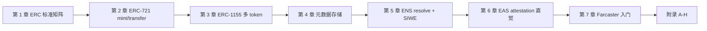
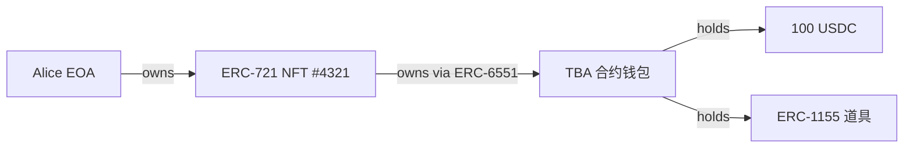
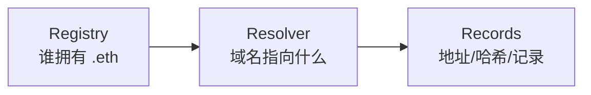
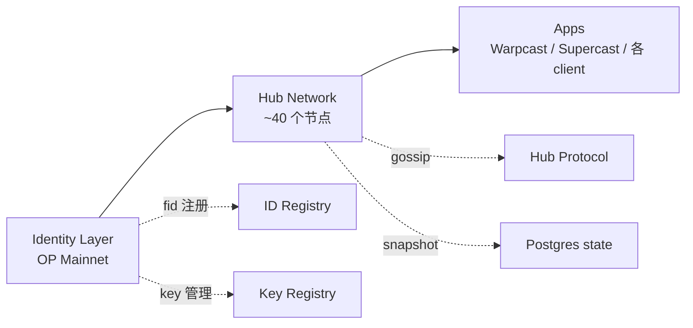

# 模块 13：NFT / 身份 / 社交

> 2017 年，两个加拿大人用一段 Python 脚本在以太坊上发了 1 万个像素头像，免费送给任何人——他们怕没人要，连合约都没写好就上线了。这就是 CryptoPunks，ERC-721 的灵感来源。八年后，#5822 卖了 8000 ETH。

NFT 不是 JPEG 图片，是**给链上 256 位整数绑定语义**的通用机制。绑张图是收藏品，绑个名字是 ENS，绑个声誉是 Soulbound，绑个钱包是 ERC-6551——同一抽象，不同语义，像数字所有权证书。

**主线目标**：写过 ERC-20 的工程师，读完能写出第一个 NFT 合约 + 集成 ENS。

前置：模块 04（Solidity）。工程基线：Solidity `0.8.28`，OpenZeppelin v5.5.0，viem 2.43.3，siwe@2.3.2，eas-sdk@2.7.0，@farcaster/frame-sdk 0.1.x。

模块 12 的 AI agent 想在链上行动，第一道坎是"我是谁、凭什么被信任"——本模块给出 ENS / EAS / Soulbound / ERC-6551 这套答案，也是所有人类用户进入 Web3 的同一个入口。

---

## 主线路径



---

## 第 1 章 ERC 标准矩阵入门

**TL;DR**：ERC-721 = 一合约一类 NFT，每张唯一；ERC-1155 = 一合约多种 token；ERC-6551 = NFT 自己长出钱包。三个标准覆盖 90% 场景。

> 打开一个 RPG 游戏：左手传奇宝剑唯一（ERC-721），右手 999 瓶生命药水堆叠（ERC-1155），背包是 NFT 自己的钱包（ERC-6551）。这三个是今天的主线；ERC-721A / 4907 / 5192 / 2981 见附录 A。

### 1.1 三个核心标准对比

| 标准 | 一句话 | 关键 API | InterfaceID | 何时选 |
|---|---|---|---|---|
| **ERC-721** | 每个 tokenId 全球唯一 | `ownerOf` / `safeTransferFrom` / `approve` | `0x80ac58cd` | PFP / 1/1 艺术 / ENS 域名 |
| **ERC-1155** | 一合约多种 token，可堆叠 | `balanceOf(addr, id)` / `safeBatchTransferFrom` | `0xd9b67a26` | 游戏道具 / 票务 / open edition |
| **ERC-6551** | NFT 拥有自己的合约钱包 | Registry `account()` + `execute()` | n/a（singleton） | 角色背包 / 复合资产 |

**ERC-6551 一句类比**：普通 NFT 是数字所有权证书；ERC-6551 让这张证书自己有个钱包——证书卖给别人，钱包里的东西也跟着走。

### 1.2 先到架构图再看代码



Alice 卖掉 NFT #4321，整个钱包里的资产一起归 Bob——零额外签名。

### 1.3 选型速查

| 场景 | 选哪个 |
|---|---|
| PFP / 每张独一无二 | ERC-721（批量 mint → 附录 A 的 ERC-721A）|
| 游戏道具 / 票务 / 多种 token | ERC-1155 |
| NFT 绑定资产 / 角色背包 | ERC-721 + ERC-6551 |
| 版税 | 加 ERC-2981（附录 A）|
| Soulbound 证书 | ERC-5192（附录 A）|

---

## 第 2 章 ERC-721：mint 与 transfer

**TL;DR**：ERC-721 的核心是 `ownerOf(tokenId) → address`。ERC-20 问"你有多少"，ERC-721 问"这个东西归谁"——视角从账本翻成资产清单。

> 2017-10，CryptoKitties 一只虚拟猫卖到 11.7 万美元，以太坊被堵到无法出块。Dieter Shirley 赶着写了个 EIP，把"独一无二的猫"抽象成"unique uint256"，William Entriken 改成正式标准——从此猫、Punks、BAYC、ENS 域名、Uniswap LP 凭证全用同一份接口。

OZ v5.5.0 把 mint / burn / transfer 三种状态变化统一收进 `_update(to, tokenId, auth)` 内部 hook——这是相对 v4（`_beforeTokenTransfer` / `_afterTokenTransfer`）最大的改动。

**两层授权**：单 token `approve` = "上架 #1234 给 OpenSea"；`setApprovalForAll` = "授权 OpenSea 管我所有 BAYC"。后者是 95% phishing 攻击的入口（Inferno Drainer，见附录 H）。

### 2.1 最小可部署合约

下面是一份可直接 `forge build` 的 ERC-721 合约：

#### 2.1.1 最小可部署例子

```solidity
// SPDX-License-Identifier: MIT
pragma solidity 0.8.28;

import {ERC721} from "@openzeppelin/contracts/token/ERC721/ERC721.sol";
import {ERC721URIStorage} from "@openzeppelin/contracts/token/ERC721/extensions/ERC721URIStorage.sol";
import {Ownable} from "@openzeppelin/contracts/access/Ownable.sol";

contract MyNFT is ERC721URIStorage, Ownable {
    uint256 private _nextId;
    // why: 自增 ID。比 keccak256(...) 当 ID 简单，且对人类友好（#1, #2, #3）

    constructor(address owner_) ERC721("MyNFT", "MNFT") Ownable(owner_) {}

    function mint(address to, string calldata uri) external onlyOwner returns (uint256 id) {
        id = _nextId++;
        // why: 先取再 ++，所以第一个 mint 的 id 是 0
        _safeMint(to, id);
        // why: safeMint 内部会调 _checkOnERC721Received，避免转给「黑洞合约」
        _setTokenURI(id, uri);
        // why: ERC721URIStorage 提供了 per-token URI 存储；
        //      默认 ERC721 的 tokenURI 是 baseURI + tokenId（更省 gas 但每个 token 不能独立改 metadata）
    }
}
```

### 2.2 三个常见坑

- **`setApprovalForAll` phishing**：一次签名授权所有 NFT 永久转出，钱包要高亮警告（Rabby / Rainbow 已内置）。
- **`tokenURI` 可空**：EIP 没强制，reveal 前常返回 `""`，客户端要做空检查。
- **`safeTransferFrom` 目标合约需实现 `onERC721Received`**：否则 NFT 永久卡死。直接用 `transferFrom` 跳过检查——只在你确认目标是 EOA 时才这样做。

**章末**：你现在已经能写出第一个 NFT 合约。下一章扩展到多种 token。

---

## 第 3 章 ERC-1155：多 token 合约

**TL;DR**：一个合约 = 一个仓库，token ID 是货架编号，每格里可以放 1 件也可以放 1 万件。

> 想象魔兽 RPG 仓库：500 把同款铁剑 + 1 把传奇神剑 + 999 瓶蓝药。ERC-721 给每瓶药都发一张独立 NFT——背包里 999 个不同 ID 的"小蓝瓶"，离谱。ERC-1155 一个合约就是整个商店。

ERC-1155（Enjin 团队 2018 提出）核心 API 批量优先：

```solidity
function balanceOf(address account, uint256 id) external view returns (uint256);
function safeBatchTransferFrom(
    address from, address to,
    uint256[] calldata ids, uint256[] calldata amounts,
    bytes calldata data
) external;
```

### 3.1 OZ v5 存储结构

```solidity
mapping(uint256 id => mapping(address account => uint256)) private _balances;
// id × account → amount。一个 mapping 同时容纳一切

mapping(address account => mapping(address operator => bool)) private _operatorApprovals;
// 全集合授权（同 ERC-721），但没有 per-id approve
```

ERC-1155 没有 per-id `approve`——原因：钱包里可能几千种 token，per-id UI 不可行。

### 3.2 最小例子：游戏道具合约

```solidity
// pragma solidity 0.8.28; OZ v5.5.0
import {ERC1155, ERC1155Supply} from "@openzeppelin/contracts/token/ERC1155/...";
import {AccessControl} from "@openzeppelin/contracts/access/AccessControl.sol";

contract GameItems is ERC1155, ERC1155Supply, AccessControl {
    bytes32 public constant MINTER_ROLE = keccak256("MINTER_ROLE");
    uint256 public constant GOLD      = 0;  // fungible
    uint256 public constant LEGENDARY = 1;  // NFT（supply=1）

    constructor(address admin) ERC1155("https://api.game.com/items/{id}.json") {
        // {id} 被客户端替换为 64 位 hex token id
        _grantRole(DEFAULT_ADMIN_ROLE, admin);
        _grantRole(MINTER_ROLE, admin);
    }

    function mintLegendary(address to) external onlyRole(MINTER_ROLE) {
        require(totalSupply(LEGENDARY) == 0, "already minted");
        _mint(to, LEGENDARY, 1, "");
        // supply=1 的 1155 token 等价于 NFT
    }

    // OZ 5.x 菱形继承：必须 override _update 和 supportsInterface
    function _update(address from, address to, uint256[] memory ids, uint256[] memory vals)
        internal override(ERC1155, ERC1155Supply) { super._update(from, to, ids, vals); }

    function supportsInterface(bytes4 id)
        public view override(ERC1155, AccessControl) returns (bool)
    { return super.supportsInterface(id); }
}
```

`{id}` 模板：tokenId=0 → `0000…0000.json`（64 位 hex padding）。OpenSea / Magic Eden 都遵守。

### 3.3 选型：ERC-1155 vs ERC-721

| 场景 | 选 ERC-721 | 选 ERC-1155 |
|---|---|---|
| PFP（10000 张全唯一）| ✅（批量 → 附录 A 的 721A）| ❌ |
| 游戏道具（多种可堆叠）| ❌ | ✅ |
| 票务（一种票多张）| ❌ | ✅ |
| 艺术 1/1 | ✅ | ❌（市场支持不全）|

**三个坑**：batch size ≤ 50（每 element 一次写，1000 元素撞 block gas limit）；合约没有 name/symbol（OpenSea 认但不强制）；没有 per-id approve。

**章末**：ERC-721 + ERC-1155 覆盖了资产层 90% 场景。下一章解决"图片存哪"。

---

## 第 4 章 元数据存储基础

**TL;DR**：链上只存 tokenId；图片/属性 JSON 存链下。NFT = 所有权证书；metadata = 证书上的内容描述。

> 2021 年 Loot 每个 NFT 是一段纯文字，图全藏在合约里，永远不会被删。同期 BAYC 的 metadata 在 OpenSea AWS 上——IPFS pinning 出问题时，几千只猴子图片突然变成灰色占位符。这就是 NFT 存储的核心张力：**链上贵但永恒，链下便宜但脆弱**。

### 4.1 标准 Metadata JSON 格式

`tokenURI(tokenId)` 返回一个 URL，指向这个 JSON：

```json
{
  "name": "Bored Ape #4321",
  "description": "...",
  "image": "ipfs://Qm.../4321.png",
  "attributes": [
    {"trait_type": "Background", "value": "Blue"},
    {"trait_type": "Hat", "value": "Crown"}
  ]
}
```

### 4.2 存储方案对比

| 方案 | 抗审查 | 永续性 | 可修改 | 成本 | 何时用 |
|---|---|---|---|---|---|
| HTTPS 中心化 | 最差 | 最差 | 最易 | 最便宜 | demo 只 |
| IPFS pin（Pinata 等）| 中 | 依赖 pin 服务 | 不可改（CID 哈希）| 低 | 主流方案 |
| Arweave | 最高 | 200 年理论 | 不可改 | 一次性高 | 永久收藏 |
| On-chain SVG | 最高 | 跟链同寿 | 不可改（除非可升级合约）| 极高 | 1/1 艺术 |

### 4.3 IPFS baseURI 模式（最常用）

```solidity
contract IPFSCompliantNFT is ERC721 {
    string private _baseTokenURI;
    // 比如 "ipfs://QmHash/"（注意结尾斜杠）

    constructor(string memory baseURI_) ERC721("X", "X") {
        _baseTokenURI = baseURI_;
    }

    function _baseURI() internal view override returns (string memory) {
        return _baseTokenURI;
    }
    // ERC721 默认：tokenURI = baseURI() + tokenId.toString()
    // token 1 → "ipfs://QmHash/1"，token 2 → "ipfs://QmHash/2"
}
```

IPFS 目录结构：

```
QmHash/
  ├── 1.json   {"name":"#1","image":"ipfs://QmImage/1.png"}
  ├── 2.json
  └── 10000.json
```

### 4.4 On-chain SVG：零外部存储

```solidity
function tokenURI(uint256 tokenId) public view override returns (string memory) {
    string memory svg = string(abi.encodePacked(
        '<svg xmlns="http://www.w3.org/2000/svg" viewBox="0 0 350 350">',
        '<rect width="100%" height="100%" fill="black" />',
        '<text x="10" y="30" fill="white" font-size="20">#', tokenId.toString(), '</text>',
        '</svg>'
    ));
    string memory json = Base64.encode(bytes(string(abi.encodePacked(
        '{"name":"Bag #', tokenId.toString(),
        '","image":"data:image/svg+xml;base64,', Base64.encode(bytes(svg)), '"}'
    ))));
    return string(abi.encodePacked("data:application/json;base64,", json));
}
// tokenURI 是 view，不烧 gas；但字符串 >10kb 时 call 变慢
// 生产做法：固定字符串放 SSTORE2 / immutable bytes
```

### 4.5 Reveal 模式（ERC-4906）

Reveal 前用 placeholder URI，mint 完毕后一次性切换：

```solidity
function reveal() external onlyOwner {
    _baseTokenURI = "ipfs://QmRealHash/";
    emit BatchMetadataUpdate(0, totalSupply() - 1);
    // 市场（OpenSea / Magic Eden）监听此事件立即重拉 metadata
}
```

需合约实现 ERC-4906（interfaceID `0x49064906`），市场才信任变更。

**章末**：存储选 IPFS baseURI 作为默认，艺术收藏考虑 Arweave，动态 metadata 加 ERC-4906 事件。tokenURI 后面那串 IPFS / Arweave 哈希其实是另一个独立战场——模块 14 会系统讲存储层怎么把"链下文件永久可用"做成工程问题。下一章先接入 ENS + SIWE 登录。

---

## 第 5 章 ENS 入门：resolve 与 SIWE 登录

**TL;DR**：ENS 是以太坊的邮政地址系统——`vitalik.eth` 就是地址。SIWE 是"用钱包登录网站"的标准方式，像邮政地址换成可签名的承诺书。

> 2017 年，Nick Johnson 写了第一版 ENS registry 合约。今天有人发以太到 `vitalik.eth`，钱包自动解析成 `0xd8da6...`。ENS = 人类可读名字 ↔ 机器地址双向映射。

### 5.1 ENS 三层架构



- **Registry**：`vitalik.eth` 谁拥有、用哪个 Resolver
- **Resolver**：`addr(node)` → 地址；`text(node, "avatar")` → 头像 URI
- **Records**：60+ 链的地址、Twitter、GitHub、IPFS

### 5.2 正向 + 反向解析

```ts
import { createPublicClient, http } from 'viem'
import { mainnet } from 'viem/chains'

const client = createPublicClient({ chain: mainnet, transport: http() })

// 名字 → 地址
const address = await client.getEnsAddress({ name: 'vitalik.eth' })
// "0xd8dA6BF26964aF9D7eEd9e03E53415D37aA96045"

// 地址 → 名字（反向解析，需用户自行设置）
const name = await client.getEnsName({ address: '0xd8dA6...' })
// "vitalik.eth" 或 null（未设置时）

// avatar
const avatar = await client.getEnsAvatar({ name: 'vitalik.eth' })
```

**关键**：反向解析需用户主动设置，默认为 null。UI 显示 ENS 名字前先检查 null。

### 5.3 ENS 治理边界

`vitalik.eth` 不是不可剥夺的资产：`.eth` controller 由 ENS DAO + root multisig 持有；ENS Labs 有发起提案的实际能力。**你持有的只是到期日前的使用权**。关键身份证明不要只靠 ENS。详见附录 F。

### 5.4 SIWE 登录（Sign-In with Ethereum）

**类比**：OAuth 是"找 Google 作担保"，SIWE 是"我自己用私钥写一张当场失效的承诺书"。

SIWE（EIP-4361）标准消息：`domain` 防跨站 phishing，`nonce` 防 replay，`chainId` 防主网/测试网混淆。

```ts
// 后端 pin: siwe@2.3.2
import { SiweMessage, generateNonce } from 'siwe'
import { cookies } from 'next/headers'

// 1. 给前端 nonce
export async function GET() {
  const nonce = generateNonce()
  cookies().set('siwe_nonce', nonce, { httpOnly: true, secure: true, maxAge: 600 })
  return new Response(nonce)
}

// 2. 验证签名
export async function POST(req: Request) {
  const { message, signature } = await req.json()
  const nonce = cookies().get('siwe_nonce')?.value
  if (!nonce) return Response.json({ error: 'no nonce' }, { status: 400 })
  const { data } = await new SiweMessage(message).verify({
    signature,
    nonce,
    domain: 'example.com',  // 必须硬编码，不信任 message 里的 domain
  })
  cookies().set('user', data.address, { httpOnly: true })
  return Response.json({ address: data.address })
}
```

```ts
// 前端 viem + wagmi
import { createSiweMessage } from 'viem/siwe'
import { useSignMessage, useAccount } from 'wagmi'

async function login() {
  const { address } = useAccount()
  const { signMessageAsync } = useSignMessage()
  const nonce = await fetch('/auth/nonce').then(r => r.text())
  const message = createSiweMessage({
    domain: 'example.com', address: address!, statement: 'Sign in',
    uri: 'https://example.com/login', version: '1', chainId: 1, nonce,
    issuedAt: new Date(), expirationTime: new Date(Date.now() + 3_600_000),
  })
  const signature = await signMessageAsync({ message })
  await fetch('/auth/verify', {
    method: 'POST', headers: { 'content-type': 'application/json' },
    body: JSON.stringify({ message, signature }),
  })
}
```

### 5.5 四个常见错误

- **复用 nonce**：每次必须新生成，否则 replay 直接过。
- **信任 message.domain**：后端必须硬编码传 domain 给 `verify()`。
- **把签名当长效 token**：SIWE 签名只换 session/cookie，签名本身一次即丢。
- **合约钱包（Safe / 4337）**：使用 EIP-1271，需显式传 provider 给 verify。

**章末**：ENS 解决"叫什么"，SIWE 解决"登录"。下一章 EAS 解决"别人怎么证明你"。

---

---

## 第 6 章 EAS 入门：链上声誉的直觉

**TL;DR**：EAS = 电子记事本，任何人可以写"我证明 bob 通过了 KYC"，任何合约可以读取验证。比 SBT 细颗粒、可撤销、不占 token slot。

> 2023 年初 Optimism 要把 10 万 ETH 发给开源贡献者，问题：怎么链上证明"alice 给 ethers.js 提过有用的 PR"？做个 SBT 太重；写到 ENS text record 没接口。Optimism 联合 EAS 的答案：**链上盖章**——任何人定一个 schema（字段模板），任何人填表盖章，任何合约查验。今天 Coinbase Verifications / Optimism Citizens House / Gitcoin Passport v2 全跑在 EAS 上。

EAS 三件套：**Schema**（字段模板）→ **Attestation**（填好的表单）→ **Resolver**（提交时的额外校验）。

```
schema: "address recipient, uint8 score, string reason"
attest: by alice, recipient=0xbob, score=95, reason="great PR review"
```

### 6.1 定义 Schema + 发 Attestation

```ts
// pin: @ethereum-attestation-service/eas-sdk@2.7.0
import { SchemaRegistry, EAS, SchemaEncoder } from '@ethereum-attestation-service/eas-sdk'

// Step 1: 注册 schema（一次性）
const registry = new SchemaRegistry(SCHEMA_REGISTRY_ADDRESS)
registry.connect(signer)
const tx = await registry.register({
  schema: 'address pr_author, string repo, uint64 pr_number, uint8 quality_score',
  resolverAddress: ZERO_ADDRESS,
  revocable: true,
})
const schemaUID = await tx.wait()  // 32 字节 hash

// Step 2: 发 attestation
const eas = new EAS(EAS_ADDRESS)
eas.connect(signer)
const encoder = new SchemaEncoder('address pr_author, string repo, uint64 pr_number, uint8 quality_score')
const data = encoder.encodeData([
  { name: 'pr_author', value: '0xbob...', type: 'address' },
  { name: 'repo', value: 'foo/bar', type: 'string' },
  { name: 'pr_number', value: 1234n, type: 'uint64' },
  { name: 'quality_score', value: 95, type: 'uint8' },
])
const tx2 = await eas.attest({
  schema: schemaUID,
  data: { recipient: '0xbob...', expirationTime: 0n, revocable: true, data },
})
const attestationUID = await tx2.wait()
```

### 6.2 链上 Gate（合约验证）

```solidity
import {IEAS, Attestation} from "@ethereum-attestation-service/eas-contracts/contracts/IEAS.sol";

contract ReputationGate {
    IEAS public immutable eas;
    bytes32 public immutable schemaUID;
    address public immutable trustedAttester;

    constructor(address eas_, bytes32 schema_, address attester_) {
        eas = IEAS(eas_);
        schemaUID = schema_;
        trustedAttester = attester_;
    }

    function hasReputation(bytes32 uid) external view returns (bool) {
        Attestation memory a = eas.getAttestation(uid);
        return a.schema == schemaUID
            && a.attester == trustedAttester
            && (a.expirationTime == 0 || a.expirationTime > block.timestamp)
            && a.revocationTime == 0;
        // why: 校验 schema 对、attester 可信、未过期、未撤销
    }
}
```

### 6.3 EAS vs SBT 选型

| 维度 | SBT (ERC-5192) | EAS |
|---|---|---|
| 数据形态 | NFT，每条一 tokenId | attestation，每条一 UID |
| 谁能发 | 合约决定 | Resolver 决定 |
| 撤销 | 自己实现 | 标准内置 `revoke` |
| 粒度 | 大颗粒（毕业证）| 细颗粒（每个 PR review）|
| 典型用途 | POAP / KYC badge | 链上声誉 / RetroPGF |

EAS 2026 已部署 30+ 链，[easscan.org](https://easscan.org/) 是它的 Etherscan。详细 schema 设计见附录 G。

**章末**：EAS 是声誉层的事实标准。主线在此收束资产 + 身份的基础。下一章进入社交层——Farcaster。

---

## 第 7 章 Farcaster 入门

**TL;DR**：身份上链（fid 在 OP Mainnet），内容走 Hub 网络（链下 gossip）。Mini App = 在 cast 里内嵌 dApp，用户自动拿到 fid + 已验证钱包地址，零 SIWE 流程。

> 2024-01-26，Farcaster 推出 Frames——把任意 dApp 嵌进一条 cast 里，下面挂三个按钮就能 mint NFT、投票、玩游戏。当天 Vitalik 发了第一个 Frame（投票），整条 timeline 一周内出现 2000+ 个 Frame 应用。Dan Romero（前 Coinbase 高管）和 Varun Srinivasan 当时押的是 "social 不要重新发明，而是把 Web2 的 UX 装进 Web3 的身份"。
>
> 一年后 Frames 改名 Mini Apps，从"嵌入式按钮"升级成"in-app 浏览器加载完整 web app"。现在 Warpcast 里点开任何一个 Mini App 都自动拿到你的 fid + 验证过的钱包地址，省掉了 SIWE 流程——这是 Farcaster 真正的杀手锏。
>
> 跟 Lens 比，Farcaster 选了相反路线：**身份上链（fid 在 OP Mainnet），但内容走 Hub 网络（链下 gossip）**。性能接近 Web2，代价是数据完整性靠 ~40 个 Hub 节点诚实多数。

Farcaster（Dan Romero / Varun Srinivasan，前 Coinbase）走 "身份上链 + 数据链下" 路线。

数据（[blockeden.xyz](https://blockeden.xyz/blog/2025/10/28/farcaster-in-2025-the-protocol-paradox/)；[theblock.co](https://www.theblock.co/data/decentralized-finance/social-decentralized-finance/farcaster-daily-users)）：2024-07 峰值 DAU ~100K；2025-10 DAU 40-60K，DAU/MAU ~0.2；Power Badge 真实 DAU ~4.4K；2026-Q1 低位横盘，靠 Mini Apps 拉留存。

### 7.1 三层架构



### 7.2 fid + Hub 网络

每个用户在 OP Mainnet 注册一个 `fid`（uint32）跟 Ethereum 地址绑定，是 cast / follow 等所有动作的主键。`fname`（人类可读名字）经中心化 service 颁发——Farcaster 故意保留的中心化部分。

Hub 是 Postgres + Rust 守护进程，gossip 同步四类消息（CastAdd / CastRemove / ReactionAdd / FollowAdd），消息由 fid 私钥签名后 Hub 验签接受。链下消息 + 链上身份避开了 Lens 的 on-chain 性能瓶颈，但数据完整性靠 Hub 诚实多数。

### 7.3 写一条 cast

```ts
// pin: @farcaster/hub-nodejs@latest
import { makeCastAdd, NobleEd25519Signer, FarcasterNetwork } from '@farcaster/hub-nodejs'

const signer = new NobleEd25519Signer(myEd25519PrivateKey)
const cast = await makeCastAdd(
  {
    text: 'Hello Farcaster',
    embeds: [],
    embedsDeprecated: [],
    mentions: [],
    mentionsPositions: [],
    parentUrl: undefined,
  },
  { fid: myFid, network: FarcasterNetwork.MAINNET },
  signer,
)

// 把 cast 推到任何 Hub
await hubClient.submitMessage(cast.value)
```

### 7.4 Mini Apps（原 Frames v2）

Frames 2024-01 推出，2025 初重命名 Mini Apps（[docs.farcaster.xyz/reference/frames-redirect](https://docs.farcaster.xyz/reference/frames-redirect)；[miniapps.farcaster.xyz/docs/specification](https://miniapps.farcaster.xyz/docs/specification)）。v1（OG meta tags + server-rendered，2025-Q1 deprecated）→ v2 / Mini Apps（in-app browser 加载任意 web app，附录 D 实现）。Mini App 内置 fid + verified eth address、钱包连接、cast context、notification permission。

**fid 的社交特殊性**：转 fid 给别人时全网 follow 跟着走，这是社交语义的路径依赖，也是 Farcaster 用户极少 transfer fid 的原因。

**章末**：Farcaster 是目前工程师最容易上手的 Web3 社交协议，Mini App 是最快的分发渠道。Lens v3 / Lens Chain 详见附录 E。

---

## 主线小结与下一站

主线 7 章走完一条线：**ERC-721 / 1155 / 6551 给资产以唯一 id**（第 1-3 章）→ **元数据存储把链上 id 接到链下内容**（第 4 章）→ **ENS + SIWE 让人类名字和钱包登录可用**（第 5 章）→ **EAS attestation 把声誉做成可验证的链上断言**（第 6 章）→ **Farcaster 把社交图谱搬到协议层**（第 7 章）。一条主线下来，工程师手里就有了 NFT + 身份 + 社交三件套。

**下一站**：第 4 章里 tokenURI 指向的 `ipfs://...` 哈希，到底怎么保证十年后还能拉得到？模块 14 系统讲 IPFS / Arweave / Filecoin / Walrus，把"NFT 元数据永久可用"从一句承诺变成一套可工程化的存储层。

---

# 附录

> 附录内容比主线更深，可按需跳读。主线已覆盖写出 NFT + ENS 的所有必要知识；附录是工程深挖和市场背景。

---

## 附录 A：ERC-721A / 5192 / 4906 / 6551 / 2981 详

### A.1 ERC-721A：批量 mint 优化

2022-01 Azuki 用 ERC-721A 把 mint(5) 从 617k gas 压到 85k——核心思路：**只在 ownership 变化点写 storage**，`ownerOf` 往前回溯找锚点（O(k) 读换 O(1) 写）。

实测 gas（来源：alchemy.com）：

| 数量 | OZ ERC-721 | ERC-721A | 节省 |
|---|---|---|---|
| 1 | 154,814 | 76,690 | 50% |
| 5 | 616,914 | 85,206 | 86% |
| 10 | 1,221,614 | 95,896 | 92% |

```solidity
// SPDX-License-Identifier: MIT
pragma solidity 0.8.28;
import "erc721a/contracts/ERC721A.sol"; // pin v4.3.0

contract MyPFP is ERC721A {
    uint256 public constant MAX = 10000;
    constructor() ERC721A("PFP", "PFP") {}

    function mint(uint256 qty) external payable {
        require(qty <= 10, "max 10 per tx");
        require(_totalMinted() + qty <= MAX, "sold out");
        _safeMint(msg.sender, qty);
        // 注意：第二个参数是 quantity，不是 tokenId！
    }

    function _startTokenId() internal pure override returns (uint256) { return 1; }
}
```

**三个陷阱**：batch > 50 让 ownerOf 变贵；burn 后回溯逻辑改变；不兼容 ERC721Enumerable（用 ERC721AQueryable）。

**选型**：PFP / 大批量 → ERC-721A；1/1 艺术 / 需要 Enumerable → OZ 经典。

---

### A.2 ERC-5192：Soulbound Token

ERC-5192（2022-09 finalize）是 SBT 最小实现——只加一个 `locked(tokenId)` view，阻止 transfer 靠合约自己实现（通常是 `_update` 里 revert）。

```solidity
// SPDX-License-Identifier: MIT
pragma solidity 0.8.28;
import {ERC721} from "@openzeppelin/contracts/token/ERC721/ERC721.sol";

contract Diploma is ERC721 {
    mapping(uint256 => bool) public locked;

    constructor() ERC721("Diploma", "DIP") {}

    function mint(address to, uint256 id) external {
        _safeMint(to, id);
        locked[id] = true;
        emit Locked(id);
    }

    event Locked(uint256 tokenId);
    event Unlocked(uint256 tokenId);

    function _update(address to, uint256 id, address auth) internal override returns (address) {
        address from = _ownerOf(id);
        if (from != address(0) && to != address(0)) revert("Soulbound");
        // mint(from=0) 和 burn(to=0) 放行，只阻止真实 transfer
        return super._update(to, id, auth);
    }

    function supportsInterface(bytes4 id) public view override returns (bool) {
        return id == 0xb45a3c0e /* ERC-5192 */ || super.supportsInterface(id);
    }
}
```

**设计陷阱**：地址填错永久卡死（要留 `revoke`）；钱包丢 = 身份丢（发到 ERC-6551 TBA + 智能钱包）；2025+ 新项目优先用 EAS 而非 SBT。

---

### A.3 ERC-4906：Metadata 更新通知

```solidity
event MetadataUpdate(uint256 _tokenId);
event BatchMetadataUpdate(uint256 _fromTokenId, uint256 _toTokenId);

function reveal() external onlyOwner {
    _baseTokenURI = "ipfs://QmRealHash/";
    emit BatchMetadataUpdate(0, totalSupply() - 1);
    // OpenSea / Magic Eden 监听此事件立即重拉 metadata
}
```

需实现 interfaceID `0x49064906`，市场才信任变更通知。

---

### A.4 ERC-6551：Token-Bound Account（TBA）

> ERC-6551 = NFT 自己有钱包。猫可以拥有玩具，玩具可以拥有更小的玩具，套娃到底。

**架构**：每个 ERC-721 NFT 通过 CREATE2 deterministic 计算出一个合约地址（TBA）。谁拥有 NFT 谁控制 TBA。

```ts
const REGISTRY = '0x000000006551c19487814612e58FE06813775758'
const IMPL = '0x55266d75D1a14E4572138116aF39863Ed6596E7F' // tokenbound v0.3.1

const tba = await client.readContract({
  address: REGISTRY,
  abi: parseAbi(['function account(address,bytes32,uint256,address,uint256) view returns (address)']),
  functionName: 'account',
  args: [IMPL, '0x' + '00'.repeat(32), 1n, BAYC_CONTRACT, 4321n],
})
// tba = BAYC #4321 的钱包地址，谁持有 BAYC #4321 谁控制它
```

**信任模型**：TBA owner = NFT 当前 `ownerOf`。三个推论：(1) 卖家可在 transfer 前抽空 TBA（rug 风险）；(2) ERC-4907 user ≠ owner，借出 NFT 不授予 TBA 控制权；(3) 跨链：NFT 在 L1、TBA 在 L2 时 ownerOf 失同步。

---

### A.5 ERC-2981：版税标准

```solidity
interface IERC2981 {
    function royaltyInfo(uint256 tokenId, uint256 salePrice)
        external view returns (address receiver, uint256 royaltyAmount);
}
```

EIP 原文："This standard does not specify when payment must be made"——只规定查询接口，不规定强制付款。这是版税之战（见附录 C）的根源。

OZ v5 集成：

```solidity
import {ERC2981} from "@openzeppelin/contracts/token/common/ERC2981.sol";

constructor(address creator) {
    _setDefaultRoyalty(creator, 500); // 500/10000 = 5%
}

function supportsInterface(bytes4 id) public view override(ERC721, ERC2981) returns (bool) {
    return super.supportsInterface(id);
}
```

P2P `transferFrom` 不走市场，永远绕过 royalty——这是协议层无法阻止的。

---

## 附录 B：NFT 市场份额（OpenSea / Blur / Magic Eden）

**2026 市场格局**（techgolly.com 数据）：OpenSea 累计 $39.5B / Blur $2.8B，OpenSea 重夺主导。

| 市场 | 平台费 | 版税 | 特点 |
|---|---|---|---|
| OpenSea | 0.5% | 可选（OS2 后）| 最大用户基数；支持 ERC-721-C |
| Blur | 0% | 普遍忽略 | 专业交易者 Bid Pool；Blend 借贷 |
| Magic Eden | 0-2% | 平台层强制（部分链）| Solana 原生 → 多链扩张 |

**Seaport（OpenSea 协议层）**：订单链下签名 → 链上一笔成交；一张订单可含多种 offer/consideration；版税通过 consideration 字段注入（前端层，可绕过）。

---

## 附录 C：版税之战详

| 时间 | 事件 |
|---|---|
| 2020-09 | EIP-2981 finalize，只规定查询接口 |
| 2022-08 | Sudoswap AMM 上线，默认无版税 |
| 2022-11 | OpenSea 推出 Operator Filter 黑名单 |
| 2023-02 | Blur 激励绕过 Operator Filter |
| 2023-08 | OpenSea 投降，新藏品版税变可选 |
| 2024-04 | OpenSea 支持 ERC-721-C |
| 2026 | 分裂：强制版税选 ERC-721-C（损失 Blur 流动性）；Sui Kiosk TransferPolicy 是目前最强方案 |

**ERC-721-C（LimitBreak）**：transfer hook 检查 caller 在白名单，不在白名单的市场交易直接 revert。代价：P2P transferFrom 也被禁。

---

## 附录 D：Farcaster Hub / Frame / Mini Apps 详

**Hub 网络**：~40 个节点 gossip 同步四类消息（CastAdd / CastRemove / ReactionAdd / FollowAdd）。消息由 fid Ed25519 key 签名，Hub 验签接受。任何人可跑 Hub。

**Mini Apps 实战（Next.js 15）**：

```tsx
// app/layout.tsx
<meta name="fc:miniapp" content={JSON.stringify({
  version: 'next',
  imageUrl: 'https://my.app/cover.png',
  button: {
    title: 'Open',
    action: { type: 'launch_miniapp', url: 'https://my.app', name: 'MyApp',
               splashImageUrl: 'https://my.app/splash.png', splashBackgroundColor: '#000' },
  },
})} />
```

```tsx
// app/page.tsx
'use client'
import { useEffect, useState } from 'react'
import { sdk } from '@farcaster/frame-sdk'
import { encodeFunctionData, parseAbi } from 'viem'

export default function Page() {
  const [user, setUser] = useState<{fid:number;username:string}|null>(null)
  useEffect(() => {
    (async () => {
      const ctx = await sdk.context
      setUser({ fid: ctx.user.fid, username: ctx.user.username ?? '' })
      await sdk.actions.ready()
    })()
  }, [])

  async function mint() {
    const data = encodeFunctionData({ abi: parseAbi(['function mint() payable']), functionName: 'mint' })
    await sdk.wallet.ethProvider.request({
      method: 'eth_sendTransaction',
      params: [{ to: '0xMyNftContract', data, value: '0x' + (5n*10n**16n).toString(16) }],
    })
  }

  if (!user) return <div>Loading…</div>
  return <main><h1>Hi @{user.username}</h1><button onClick={mint}>Mint 0.05 ETH</button></main>
}
```

**v1 警告**：旧的 `fc:frame` meta tag / server-side image return 都是 v1，2025-Q1 deprecated。新项目必须用 v2 / Mini Apps。

部署：Vercel → cast 含 URL → Warpcast unfurler 识别 `fc:miniapp` → 显示按钮。

---

## 附录 E：Lens v3 / Lens Chain 详

Lens（Aave 创始人 Stani Kulechov 2022 推出）走 on-chain social 路线。

**时间线**：2022-05 v1 on Polygon → 2024-11 v3 testnet on Lens Chain（zkSync stack + Avail DA）→ 2025-04-04 Lens Chain mainnet（迁移 125GB / 65 万 profile / 2800 万 follow）→ 2026-Q1 Mask Network 接手 stewardship。

**v3 数据模型**：所有 primitives 模块化——Username / Feed / Graph / Group 独立合约 + 各自 Rules。Account = ERC-721 NFT（可装 ERC-6551 TBA）。

```ts
// pin: @lens-protocol/client@3.x
import { LensClient, mainnet } from '@lens-protocol/client'
const client = LensClient.create({ environment: mainnet })
const profile = await client.profile.fetch({ forHandle: 'lens/stani' })
```

**Lens vs Farcaster 选型**：链上简历 / 可移植社交图 → Lens；高性能 / 快速用户获取 / Mini App 分发 → Farcaster；混合最优解：身份用 Lens + EAS，分发用 Farcaster Mini App。

---

## 附录 F：ENS 治理边界详

- `.eth` 顶级 namehash 的 controller 由 ENS DAO + root multisig 持有（ENS Labs 是主要提案方）
- 历史：2022 Brantly Millegan 域名争议 / Coinbase Cloud 委托代表事件都触及过 ENS root
- 技术上可达：rename namehash / 强制续费 / registry 迁移——在 DAO 多签配合下
- **ENSv2（2026）**：2024 宣布 Namechain L2 → 2026-02-06 取消，ENSv2 直接部署回 mainnet（L1 gas 下降 99%）；v2 支持 60+ 链原生解析含 Bitcoin / Solana

**工程建议**：ENS 做可读性（UI 展示），关键身份证明走 DID + EAS + 用户自持私钥多管齐下。

---

## 附录 G：EAS Schema 设计详

### Schema 字段最佳实践

```
address recipient        // 被证明对象（必须）
uint64 issuedAt          // 时间戳（也可用 EAS 内置 time 字段）
uint8 level              // 等级/分类
string reason            // 可读原因
bool revocable           // schema 注册时指定
bytes32 refUID           // 引用另一条 attestation（链式声誉）
```

**Resolver 设计**：
- `onAttest(Attestation)` hook：验证字段合法性、收费、触发副作用（mint badge）
- `onRevoke(Attestation)` hook：撤销时副作用（销毁 badge）
- 无 Resolver（`address(0)`）= 任何人可以盖任何章，信任靠 attester address

**链下 Attestation**：签名后存 IPFS，省 gas，验证同样可信：

```ts
const off = new Offchain({ address: EAS_ADDRESS, version: '1.2.0', chainId: 1n }, 1, eas)
const isValid = off.verifyOffchainAttestationSignature(attesterAddr, signedAttestation)
```

**生产采用**：Optimism Citizens House（投票要求一组 attestation）/ Coinbase Verifications / Gitcoin Passport v2 / Base 声誉系统。

---

## 附录 H：真实事件复盘（BAYC 230 万被盗 / Inferno Drainer）

### H.1 BAYC 230 万被盗：Wyvern calldata 漏洞（2022-02）

损失 $1.7M / 254 NFT（含 BAYC #3475）。Wyvern v2 允许订单创建后修改 calldata，攻击者拿"半填"订单签名后补 calldata 把 NFT 转出。Seaport 修复：calldata 进 hash。

**教训**：用户绝不签看不懂的 typed data；EIP-712 + 钱包 message preview 必备。

### H.2 Inferno Drainer：Scam-as-a-Service（2022-2025）

累计 $89M+（原版 ~$80M + 2024-09-2025-03 复活 $9M）。模板钓鱼站诱导 `setApprovalForAll(drainer, true)` → Discord/Twitter 账号接管分发链接 → 受害者一键授权所有 NFT。

**攻击链路**：

```mermaid
flowchart LR
    A[攻击者接管 Discord] --> B[发假 mint 链接]
    B --> C[用户打开仿冒网站]
    C --> D[签 setApprovalForAll(drainer)]
    D --> E[drainer 转移所有 NFT]
```

**防御（钱包层 + 应用层）**：
- 钱包高亮 `setApprovalForAll` 警告（Rabby / Rainbow / MetaMask Snap 已内置）
- 应用层用 EIP-4494 permit + 即时撤销代替全集合授权
- 第三方 widget 严格 CSP / SRI
- 官方公告链上签名验证入口

### H.3 Yuga Labs 收购 CryptoPunks（2022-03）

Yuga Labs（BAYC 开发方）从 Larva Labs 手中接管 CryptoPunks 和 Meebits IP，为二次创作版权。这是 NFT 圈最大 IP 并购——CryptoPunks 持有者获得商业许可，但合约代码没升级（仍是 2017 年无 ERC-721 接口的原始实现）。

**技术遗留**：CryptoPunks 官方合约没有 `safeTransferFrom`，只有 `transferPunk(address, uint256)`——市场通过 wrapper 合约（WrappedPunks）才能走 ERC-721 标准接口。这是"协议没做好但 IP 太强"的典型。

---

## 延伸阅读（主线精选）

| 主题 | 来源 |
|---|---|
| ERC-721 EIP 原文 | [eips.ethereum.org/EIPS/eip-721](https://eips.ethereum.org/EIPS/eip-721) |
| OZ v5.5.0 release | [github.com/OpenZeppelin/openzeppelin-contracts](https://github.com/OpenZeppelin/openzeppelin-contracts) |
| ERC-1155 EIP | [eips.ethereum.org/EIPS/eip-1155](https://eips.ethereum.org/EIPS/eip-1155) |
| ERC-6551 EIP | [eips.ethereum.org/EIPS/eip-6551](https://eips.ethereum.org/EIPS/eip-6551) |
| SIWE EIP-4361 | [eips.ethereum.org/EIPS/eip-4361](https://eips.ethereum.org/EIPS/eip-4361) |
| ENSv2 / Namechain 取消 | [theblock.co/post/388932](https://www.theblock.co/post/388932/ens-labs-scraps-namechain-l2-shifts-ensv2-fully-ethereum-mainnet) |
| EAS docs | [docs.attest.org](https://docs.attest.org/) |
| Farcaster Mini Apps spec | [miniapps.farcaster.xyz/docs/specification](https://miniapps.farcaster.xyz/docs/specification) |
| Inferno Drainer 复盘 | [research.checkpoint.com/2025/inferno-drainer-reloaded](https://research.checkpoint.com/2025/inferno-drainer-reloaded-deep-dive-into-the-return-of-the-most-sophisticated-crypto-drainer/) |
| Lens v3 / Lens Chain | [lens.xyz/news/migrating-the-lens-ecosystem-to-lens-chain](https://lens.xyz/news/migrating-the-lens-ecosystem-to-lens-chain) |

---

本模块的存储方案把 IPFS 当黑盒使用。模块 14（去中心化存储）将展开 CID v1 编码、bitswap、pin service 经济模型、Arweave endowment 数学。

回到 [项目 README](../README.md) | 进入 [模块 14：去中心化存储](../14-去中心化存储/README.md)。
