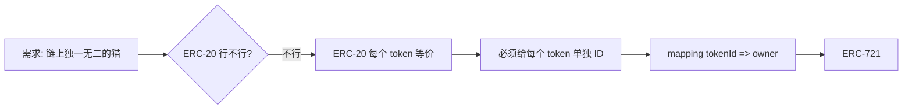
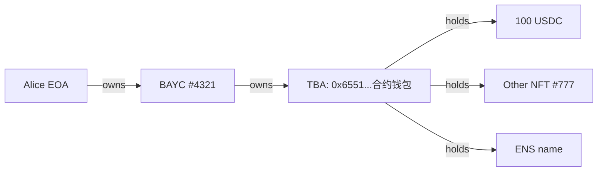
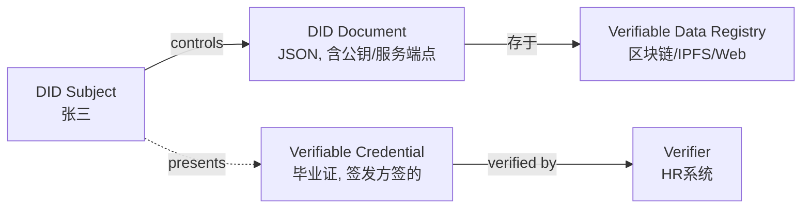
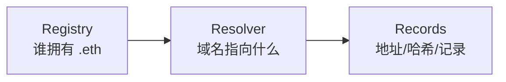
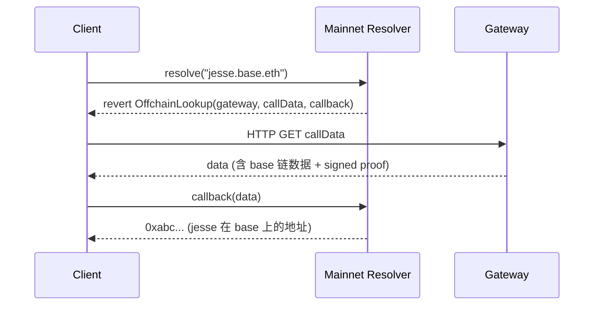
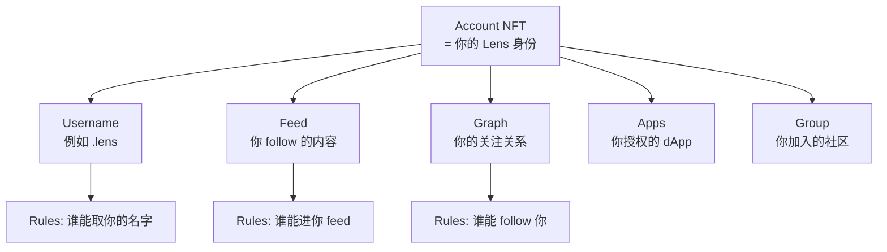
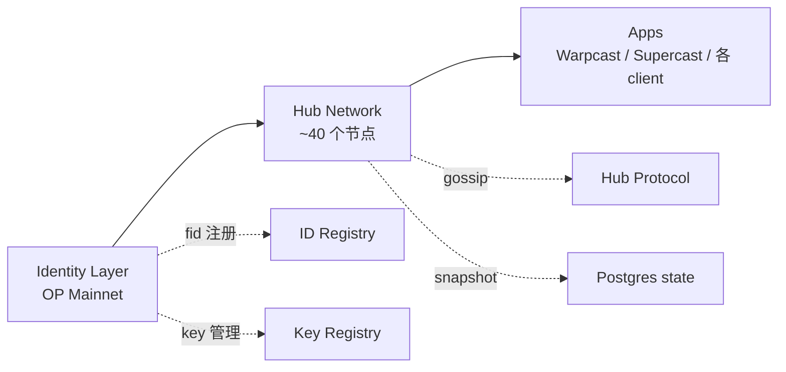
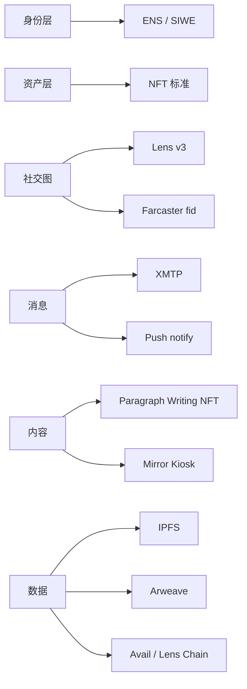

# 模块 13：NFT / 身份 / 社交

> 本模块定位：把"链上唯一性"这件事的全部工程谱系讲清楚——从 NFT 资产标准（ERC-721 / 1155 / 6551 / 5192）到去中心化身份（DID / SIWE / ENS / EAS），再到链上社交（Lens / Farcaster / XMTP）。
>
> 阅读对象：完成模块 04（Solidity 开发）的工程师。你应该已经会写 ERC-20、读得懂 OZ v5 源码、跑得起 Foundry 测试。
>
> 前置：上一模块 12（AI × Web3）讲了 AI agent 怎么持有钱包、调合约。本模块给出 agent 真正想绑定的"身份资产"——NFT、DID、社交图。后续模块 14（去中心化存储）补上本模块第 9 章只起头的 IPFS / Arweave 协议本身。
>
> 完成标志：能独立部署一个支持 royalty + rental + soulbound 的 NFT 合约族；能把 SIWE 接入任何 Web2 后端；能写一个完整的 Farcaster Mini App 并解释它和 Lens v3 的工程权衡。

---

## 工具链锚点（全模块统一，所有依赖均 pin 到具体 tag / commit）

| 组件 | 版本 | 验证日期 | 备注 |
|---|---|---|---|
| Solidity | `0.8.28`（默认 EVM = `cancun`） | 2026-04 | 与模块 04 保持一致 |
| forge-std | `v1.9.5` | 2026-04 | |
| OpenZeppelin Contracts | `v5.5.0` | 2026-04 | 含 ERC721 / ERC1155 / ERC2981 / AccessControl |
| ERC-721A (chiru-labs) | `v4.3.0` | 2026-04 | Azuki 团队维护 |
| ERC-6551 reference | `0.3.1` | 2026-04 | tokenbound.org 维护 |
| EAS SDK | `eas-sdk@2.7.0` | 2026-04 | 链上 attestation |
| siwe (TypeScript) | `siwe@2.3.2` | 2026-04 | Spruce 维护 |
| viem | `2.43.3` | 2026-04 | 与模块 03/10/11 一致 |
| Next.js | `15.2.x` | 2026-04 | Mini App / Frame demo |
| @farcaster/frame-sdk | `0.1.x` | 2026-04 | Mini App SDK |
| @lens-protocol/client | `3.x` | 2026-04 | Lens Chain 已主网 |

> ⚠️ **关于 Sismo Vault**：原 Sismo 团队 2024 年将精力转向新项目。本模块讲它的**设计思想**（ZK Vault + Data Sources）但不在实战章节使用其 SDK，避免你抄到死链。我们用 EAS + Self.xyz 完成等价的"匿名身份证明"实战。

> ⚠️ **关于 Polygon ID**：2024-06 已从 Polygon Labs 拆分为 **Privado ID** 独立运营（来源：The Block, 2024-06；检索 2026-04）。本模块称呼以 Privado ID 为准，但合约层仍兼容老 iden3 协议。

---

## 模块路径图

```mermaid
flowchart TD
    A[第 1 章 概览：唯一性、可验证身份、社交图] --> B[NFT 标准谱系]
    B --> B1[第 2 章 ERC-721 经典]
    B1 --> B2[第 3 章 ERC-721A 批量优化]
    B2 --> B3[第 4 章 ERC-1155 多代币]
    B3 --> B4[第 5 章 ERC-2981 + Royalty 战争]
    B4 --> B5[第 6 章 ERC-4907 NFT 租赁]
    B5 --> B6[第 7 章 ERC-6551 Token-Bound Account]
    B6 --> B7[第 8 章 ERC-5192 Soulbound]
    B7 --> B8[第 9 章 Metadata 与存储：IPFS/Arweave/on-chain SVG]
    B8 --> B9[第 10 章 跨生态：Metaplex/Sui Kiosk/Aptos DA]
    B9 --> B10[第 11 章 市场协议：Seaport/Blur/Reservoir 兴衰]
    B10 --> B11[第 12 章 真实事故复盘]

    B11 --> C[去中心化身份]
    C --> C1[第 13 章 W3C DID 标准]
    C1 --> C2[第 14 章 SIWE EIP-4361]
    C2 --> C3[第 15 章 ENS 与 CCIP-Read]
    C3 --> C4[第 16 章 EAS Attestation]
    C4 --> C5[第 17 章 ZK 身份：Sismo/Self/Anon Aadhaar/Privado ID]
    C5 --> C6[第 18 章 Worldcoin 与人格证明争议]
    C6 --> C7[第 19 章 监管张力：MiCA/Travel Rule]

    C7 --> D[Web3 社交]
    D --> D1[第 20 章 Lens Protocol v3]
    D1 --> D2[第 21 章 Farcaster 协议架构]
    D2 --> D3[第 22 章 Frames v2 / Mini Apps]
    D3 --> D4[第 23 章 XMTP messaging]
    D4 --> D5[第 24 章 Mirror→Paragraph 与 Push]

    D5 --> E[实战与习题]
    E --> E1[第 25 章 实战 1：完整 NFT 合约族]
    E1 --> E2[第 26 章 实战 2：SIWE + EAS 身份后端]
    E2 --> E3[第 27 章 实战 3：Farcaster Mini App]
    E3 --> E4[第 28 章 实战 4：Seaport-style mini-marketplace]
    E4 --> F[第 29 章 习题与答案]
    F --> G[第 30 章 自审查清单]
```



读完本模块你应该能：

1. **NFT 工程师视角**：拿到一个项目需求（PFP / 游戏道具 / 票务 / 会员），能 30 秒选对标准（721 / 721A / 1155 / 6551 / 5192）并解释为什么；
2. **身份工程师视角**：解释 DID 文档、Verifiable Credential、Attestation 三者关系，并能用 EAS 一天内搭出可生产的"链上证书"系统；
3. **社交工程师视角**：解释 Lens 把社交图放链上 vs Farcaster 把社交图放 Hub 的工程权衡，并写出可运行的 Mini App；
4. **风险工程师视角**：识别 phishing signature、Wyvern 残余漏洞、royalty bypass 这些经典攻击面，写出加固方案。

---

## 第 1 章 三件套：唯一性 / 可验证身份 / 社交图

### 1.1 是什么

我们这门模块要回答三个问题：

- **唯一性怎么上链？** → NFT 标准谱系
- **"我是我"怎么不靠中心化机构？** → DID / Attestation
- **关注、点赞、消息这些社交动作怎么去中心化？** → Lens / Farcaster / XMTP

### 1.2 为什么这三件事放一起

它们的底层都是同一件事：**给一个 256 位 token ID 或 address，绑定一段语义**。

- NFT：`tokenId → 资产权属`
- DID：`did:ethr:0xabc → 身份文档`
- 社交图：`fid 12345 → 我的所有 cast`

差异只在「这段语义谁去验证、存哪、谁能改」。

### 1.3 类比

把链上世界类比成一个城市：

| 现实世界 | 链上对应 | 这个模块讲什么 |
|---|---|---|
| 房产证 | NFT (ERC-721) | 怎么发、怎么交易、怎么收版税 |
| 身份证 | DID + Attestation | 怎么不让政府发也能证明"我是我" |
| 微信好友列表 | 社交图（Lens / Farcaster）| 怎么让平台倒了你的关系还在 |
| 微信群消息 | XMTP / Push | 怎么端到端加密发链上消息 |
| 派出所盖章 | EAS Attestation | 怎么让任何人/合约都能"开证明" |

> 💡 **为什么 NFT 要单独成模块？** 因为它是 ERC-20 之外**第二大主流标准家族**，且变体多到爆炸（721 / 721A / 1155 / 2981 / 4907 / 5192 / 6551 / 721C）。每个变体都对应一个真实的工程痛点。读完本模块你不再是「随便 fork 一个 OZ ERC721」的水平。

### 1.4 本模块跟其他模块的边界

| 跟谁可能搞混 | 边界划法 |
|---|---|
| 模块 04 Solidity | 04 讲**怎么写合约**，本模块讲**有哪些标准合约** |
| 模块 05 安全 | 05 讲通用安全，本模块只讲 NFT/身份/社交**特有**的攻击面（royalty bypass / signature phishing / replay） |
| 模块 06 DeFi | 06 是 ERC-20 世界，本模块是非同质化世界 |
| 模块 14 去中心化存储 | 14 讲 IPFS/Arweave 协议本身，本模块只讲**怎么把它们当 NFT metadata 存储** |

> 🤔 **思考题**：一个用户钱包里既有 USDC（ERC-20），又有 BAYC（ERC-721），又有 ENS（也是 ERC-721），又有他的 Farcaster fid（不是 ERC-标准）。这四样东西在「可转移性」这个维度上有什么本质区别？（答案在第 21 章）

---

## 第 2 章 ERC-721 经典：从 EIP 文本到 OZ v5 实现

### 2.1 是什么

ERC-721 是 2018 年 1 月 finalize 的 NFT 鼻祖标准（EIP 作者 William Entriken 等，来源：[eips.ethereum.org/EIPS/eip-721](https://eips.ethereum.org/EIPS/eip-721)，检索 2026-04）。它定义了「不可分割、有唯一 ID」的 token：

```
ERC-20: balanceOf(addr) -> uint256                  // "你有多少"
ERC-721: ownerOf(tokenId) -> address                // "这个东西归谁"
```

从「有多少」到「归谁」——这一字之差是 NFT 整套世界的起点。

### 2.2 为什么这样设计



ERC-721 的核心存储就一行：

```solidity
mapping(uint256 tokenId => address owner) private _owners;
```

其他全是辅助：approve（单 token 授权）、setApprovalForAll（全集合授权）、transferFrom（转移）、safeTransferFrom（安全转移，会检查 receiver 是否能处理 NFT）、tokenURI（元数据指针）。

### 2.3 类比

| ERC-20 | ERC-721 | 现实类比 |
|---|---|---|
| `balanceOf(alice) = 100 USDC` | `ownerOf(721) = alice` | USDC = 现金；NFT = 房产证 |
| `transfer(bob, 50)` | `transferFrom(alice, bob, 721)` | 撕一半钱给你 vs 把房子过户给你 |
| `approve(spender, 100)` | `approve(spender, 721)` 或 `setApprovalForAll(spender, true)` | 授权一个额度 vs 授权一栋房子 / 我所有房子 |

### 2.4 OZ v5.5.0 ERC721.sol 完整 walkthrough

OZ v5.5.0 是 2025-Q4 的稳定版。先看核心函数（来源：[github.com/OpenZeppelin/openzeppelin-contracts/blob/v5.5.0/contracts/token/ERC721/ERC721.sol](https://github.com/OpenZeppelin/openzeppelin-contracts)，检索 2026-04）。

```solidity
// SPDX-License-Identifier: MIT
pragma solidity ^0.8.20;

abstract contract ERC721 is Context, ERC165, IERC721, IERC721Metadata, IERC721Errors {
    // -------- 存储四件套 --------
    mapping(uint256 tokenId => address) private _owners;
    // why: 每个 tokenId 归谁。slot 写一次就是一个 NFT 的 home

    mapping(address owner => uint256) private _balances;
    // why: 谁有多少 NFT。冗余字段——其实 _owners 遍历能算出来，
    //      但 balanceOf 必须 O(1)，所以用空间换时间

    mapping(uint256 tokenId => address) private _tokenApprovals;
    // why: 单个 tokenId 的授权对象（OpenSea 上架时会写这里）

    mapping(address owner => mapping(address operator => bool)) private _operatorApprovals;
    // why: 全集合授权（"我所有 BAYC 都让你管"）。setApprovalForAll 写这里
}
```

> 💡 **为什么有两层授权？** 因为用户行为天然分两层：
> - "我把这只 #1234 上架给 OpenSea 卖" → 单 token approve
> - "我授权 OpenSea 管理我所有 BAYC，未来不用每次签" → setApprovalForAll
>
> 第二层是 95% 的 phishing 攻击的温床。下文 1.2 节专门讲。

#### 2.4.1 `_update` 是 v5 的关键创新

OZ v5 把 mint / burn / transfer **三种状态变化都收敛到一个内部 hook**：`_update(to, tokenId, auth)`。这是相对 v4 的最大改动。

```solidity
function _update(address to, uint256 tokenId, address auth)
    internal virtual returns (address)
{
    address from = _ownerOf(tokenId);
    // why: 先取出旧 owner。如果 tokenId 不存在则 from == address(0)

    if (auth != address(0)) {
        _checkAuthorized(from, auth, tokenId);
        // why: auth 不是 0 时验证调用方有没有权限
        // 如果 auth == 0 表示「内部强制操作」（比如 _mint）跳过校验
    }

    if (from != address(0)) {
        _approve(address(0), tokenId, address(0), false);
        // why: 转出时清空单 token 授权（重要！否则旧主授权的人能继续操作新主的 NFT）
        unchecked { _balances[from] -= 1; }
        // why: unchecked 因为 from 拥有此 token 时 balance 一定 >= 1
    }

    if (to != address(0)) {
        unchecked { _balances[to] += 1; }
        // why: unchecked 因为 uint256 不可能溢出（NFT 总量永远 <2^256）
    }

    _owners[tokenId] = to;
    // why: 实际 owner 写入。to == 0 等价于 burn

    emit Transfer(from, to, tokenId);
    // why: 三种动作都触发 Transfer：
    //   mint:    Transfer(0, to, tokenId)
    //   burn:    Transfer(from, 0, tokenId)
    //   transfer: Transfer(from, to, tokenId)
    //   这是为什么 indexer 只监听一个 event 就能重建全部历史

    return from;
}
```

> ⚠️ **v4→v5 升级踩坑**：v4 是 `_beforeTokenTransfer` + `_afterTokenTransfer` 两个钩子，扩展合约（ERC721Enumerable / Pausable / Votes）都 override 这两个。v5 全改为 override `_update`。如果你 fork v4 老合约，迁移时这是改动量最大的一处。

#### 2.4.2 `safeTransferFrom` 与 ERC721Receiver

```solidity
function safeTransferFrom(address from, address to, uint256 tokenId, bytes memory data)
    public virtual
{
    transferFrom(from, to, tokenId);
    _checkOnERC721Received(from, to, tokenId, data);
    // why: 如果 to 是合约，要求它实现 onERC721Received 并返回 magic value。
    //      否则 NFT 会卡死在不会处理它的合约里——无数项目踩过这个坑
}
```

magic value 是 `IERC721Receiver.onERC721Received.selector`，即 `bytes4(keccak256("onERC721Received(address,address,uint256,bytes)"))`。

#### 2.4.3 完整最小 ERC-721 例子

```solidity
// SPDX-License-Identifier: MIT
pragma solidity 0.8.28;

import {ERC721} from "@openzeppelin/contracts/token/ERC721/ERC721.sol";
import {ERC721URIStorage} from "@openzeppelin/contracts/token/ERC721/extensions/ERC721URIStorage.sol";
import {Ownable} from "@openzeppelin/contracts/access/Ownable.sol";

contract MyNFT is ERC721URIStorage, Ownable {
    uint256 private _nextId;
    // why: 自增 ID。比 keccak256(...) 当 ID 简单，且对人类友好（#1, #2, #3）

    constructor(address owner_) ERC721("MyNFT", "MNFT") Ownable(owner_) {}

    function mint(address to, string calldata uri) external onlyOwner returns (uint256 id) {
        id = _nextId++;
        // why: 先取再 ++，所以第一个 mint 的 id 是 0
        _safeMint(to, id);
        // why: safeMint 内部会调 _checkOnERC721Received，避免转给「黑洞合约」
        _setTokenURI(id, uri);
        // why: ERC721URIStorage 提供了 per-token URI 存储；
        //      默认 ERC721 的 tokenURI 是 baseURI + tokenId（更省 gas 但每个 token 不能独立改 metadata）
    }
}
```

### 2.5 ERC-721 的几个隐藏坑

**坑 1：tokenId 不一定连续**。EIP 允许任意 uint256 当 tokenId。CryptoPunks 用 0-9999，BAYC 也用 0-9999，但有些 NFT 用 `keccak256(name)` 当 ID。如果你的 indexer 假设 ID 连续会爆炸。

**坑 2：`balanceOf` 可能撒谎（如果合约重写过）**。ERC721A 这类优化方案会重写 balanceOf 的语义，不一定每次都是从存储读。

**坑 3：`tokenURI` 可以是空字符串**。EIP 没强制要求。某些 lazy mint 实现 reveal 前都返回 `""`。

**坑 4：`approve` 给 EOA vs 合约的差异**。给 EOA 没事，给恶意合约就是 phishing 入口。这就是 Inferno Drainer / 各种 wallet drainer 的核心。

> 🤔 **思考题**：`approve(0x0, tokenId)` 是合法操作吗？它相当于什么？  
> 答：合法。等价于「撤销当前授权」。这就是为什么 `_update` 里转移时 `_approve(address(0), tokenId, address(0), false)`——转给新主前先撤销旧授权。

### 2.6 EIP-165 接口检测

ERC-721 强制要求实现 EIP-165 的 `supportsInterface(bytes4)`。市场（OpenSea / Blur）就是靠这个 4 字节 selector 判断你的合约是不是 NFT：

| Interface | bytes4 ID |
|---|---|
| ERC-165 | `0x01ffc9a7` |
| ERC-721 | `0x80ac58cd` |
| ERC-721 Metadata | `0x5b5e139f` |
| ERC-721 Enumerable | `0x780e9d63` |
| ERC-2981 (Royalty) | `0x2a55205a` |
| ERC-5192 (Soulbound) | `0xb45a3c0e` |
| ERC-4906 (Metadata Update) | `0x49064906` |

OZ v5 的 ERC721 已经默认实现 `supportsInterface(0x80ac58cd)` 和 `supportsInterface(0x5b5e139f)`。你扩展时只需要 super 调用并加上自己的 ID：

```solidity
function supportsInterface(bytes4 id) public view virtual override(ERC721, IERC165) returns (bool) {
    return id == 0x2a55205a /* ERC-2981 */ || super.supportsInterface(id);
}
```

---

## 第 3 章 ERC-721A：Azuki 的批量 mint 优化

### 3.1 是什么

ERC-721A 是 Chiru Labs（Azuki 团队）2022 年开源的 ERC-721 替代实现。**接口完全兼容 ERC-721**（市场不需要改），但 storage layout 和 mint 逻辑完全重写，目标是把 batch mint 的成本压到接近单个 mint。

来源：[github.com/chiru-labs/ERC721A](https://github.com/chiru-labs/ERC721A)（最新 v4.3.0），[azuki.com/erc721a](https://www.azuki.com/erc721a)，检索 2026-04。

### 3.2 为什么需要它

考虑一个 mint 场景：用户花 0.1 ETH 一次买 5 张 NFT。OZ 经典 ERC-721 怎么走？

```text
mint #100 -> _owners[100] = alice  (SSTORE 一次)
mint #101 -> _owners[101] = alice  (SSTORE 一次)
mint #102 -> _owners[102] = alice  (SSTORE 一次)
mint #103 -> _owners[103] = alice  (SSTORE 一次)
mint #104 -> _owners[104] = alice  (SSTORE 一次)
_balances[alice] += 5              (SSTORE 一次)

总计 6 次 SSTORE，约 6 × 20k = 120k gas（首次写 cold slot）
```

公开数据（来源：[alchemy.com/blog/erc721-vs-erc721a-batch-minting-nfts](https://www.alchemy.com/blog/erc721-vs-erc721a-batch-minting-nfts)，检索 2026-04）：

| 数量 | OZ ERC-721 gas | ERC-721A gas | 节省 |
|---|---|---|---|
| 1 | 154,814 | 76,690 | 50% |
| 5 | 616,914 | 85,206 | 86% |
| 10 | 1,221,614 | 95,896 | 92% |

用户的体验差异：100 ETH gas 上限里能 mint 多少张：从 80 张变成 1000+ 张。

### 3.3 类比

OZ ERC-721 像写 100 张实体房产证，每张都要单独盖章。ERC-721A 像写一份「#100 至 #199 这一批房子归 Alice」的批文，再单独写一份「Bob 在第 137 号那栋住了一周后买走了」。**只在所有权变化时才单独写小条**。

### 3.4 核心算法：lazy initialization + ownership inference

ERC-721A 的核心存储变化：

```solidity
// OZ 经典：每个 tokenId 都写
mapping(uint256 => address) _owners;

// ERC-721A：只在 ownership 「变化点」写
struct TokenOwnership {
    address addr;
    uint64 startTimestamp;
    bool burned;
    uint24 extraData;
}
mapping(uint256 => TokenOwnership) _packedOwnerships;
// 几个字段打包进同一个 storage slot（256 bits 装下 160+64+8+24 = 256）
```

#### 3.4.1 mint(5) 的实际写入

```text
mint(alice, 5)：
  _packedOwnerships[100] = {addr: alice, startTimestamp: now, ...}
  _packedOwnerships[101] = 空（不写！）
  _packedOwnerships[102] = 空
  _packedOwnerships[103] = 空
  _packedOwnerships[104] = 空
  _packedOwnerships[105] = 空（边界标记）

  _packedAddressData[alice] += 5
```

只写 1+1 = 2 个 slot（外加 balance）。用 5 张 NFT 时省的就是 4 个 SSTORE。

#### 3.4.2 ownerOf(102) 怎么查？

```solidity
function _ownershipOf(uint256 tokenId) internal view returns (TokenOwnership memory) {
    uint256 cur = tokenId;
    while (true) {
        TokenOwnership memory o = _packedOwnerships[cur];
        if (o.addr != address(0) && !o.burned) return o;
        // why: 找到一个有 addr 的"锚点"，它就是 102 的当前所有者
        if (cur == 0) revert OwnerQueryForNonexistentToken();
        unchecked { --cur; }
        // why: 往前回溯，直到找到锚点或越界
    }
}
```

读取 `ownerOf(102)`：
1. `_packedOwnerships[102]` → 空
2. `_packedOwnerships[101]` → 空
3. `_packedOwnerships[100]` → `{alice, ...}` → 命中！

**代价**：ownerOf 从 O(1) 变成 O(k)，k 是回溯距离。最坏情况一次 ownerOf 要 SLOAD k 次（每次 ~2.1k gas after Berlin）。

#### 3.4.3 transfer(102) 时怎么办？

```text
转移前：
  _packedOwnerships[100] = {alice, ...}
  101-104 为空

alice 把 #102 转给 bob：
  _packedOwnerships[102] = {bob, ...}    // 新主写入
  _packedOwnerships[103] = {alice, ...}  // 关键！alice 那一段必须重新"定锚"
                                          // 否则 ownerOf(103) 会回溯到 102 看到 bob
```

> 💡 **这是 ERC-721A 最巧妙的地方**：每次中段转移触发额外一次 SSTORE，但只发生在「转移那一刻」。绝大多数 NFT 的 mint 阶段拥挤，转移阶段稀疏，所以净 gas 是负的。

### 3.5 ERC721A 完整最小例子

```solidity
// SPDX-License-Identifier: MIT
pragma solidity 0.8.28;

import "erc721a/contracts/ERC721A.sol";
// pin: erc721a v4.3.0

contract Azuki is ERC721A {
    uint256 public constant MAX_SUPPLY = 10000;
    uint256 public constant PRICE = 0.05 ether;

    constructor() ERC721A("Azuki", "AZ") {}

    function mint(uint256 quantity) external payable {
        require(quantity > 0 && quantity <= 10, "qty");
        // why: 限制单次 batch，避免某个用户的 mint 把 ownerOf 的回溯距离拉到爆

        require(_totalMinted() + quantity <= MAX_SUPPLY, "supply");
        // why: ERC-721A 有 _totalMinted()（包含已 burn 的），
        //      也有 _totalSupply()（不含已 burn）。这里要用前者锁总量

        require(msg.value >= PRICE * quantity, "underpaid");

        _safeMint(msg.sender, quantity);
        // why: ERC-721A 的 _safeMint 第二个参数是 quantity 不是 tokenId！
        //      和 OZ 经典完全不一样
    }

    function _startTokenId() internal pure override returns (uint256) {
        return 1;
        // why: 默认从 0 开始，但人类喜欢从 1 编号
    }
}
```

### 3.6 ERC-721A 的三个陷阱

**陷阱 1：批量太大会让 ownerOf 变贵**。Azuki 自己设了 5 个 per-tx 上限。如果你允许 1000 个 batch，恶意用户能让某些 tokenId 的 ownerOf 烧 50k+ gas。修复：v4 引入 `_setOwnersExplicit(uint256 quantity)` 让你能后续 batch 写入锚点。

**陷阱 2：`burn` 后回溯逻辑改变**。被 burn 的 token 会在 packed 里设 burned 标志，回溯时跳过。如果你自己重写 burn 逻辑，要小心维护这个不变量。

**陷阱 3：跟 ERC721Enumerable 不兼容**。ERC-721A 故意不实现 Enumerable。如果你确实需要 `tokenOfOwnerByIndex(addr, i)`，要么用 ERC721A 的兄弟扩展 `ERC721AQueryable`，要么改回 OZ。

> ⚠️ **生产建议**：
> - PFP / 大批量 mint 项目（Azuki / Doodles 风格）：用 ERC-721A。
> - 单件高价值 NFT（Art Blocks、稀有 1/1）：用 OZ ERC-721 经典。
> - 需要 Enumerable / 大量 per-token 自定义状态：用 OZ ERC-721 经典。

### 3.7 ERC-2309：超大 batch 的事件优化

ERC-2309（"Consecutive Transfer Extension"）允许在 contract creation 时只 emit 一个 `ConsecutiveTransfer(fromTokenId, toTokenId, fromAddress, toAddress)` 事件代替 N 个 `Transfer` 事件。OpenSea 在 2022 后逐步支持。ERC-721A 的 `_mintERC2309` 用这个。

> 💡 **为什么只能在 constructor 用？** 因为 indexer（OpenSea / Alchemy）默认对 contract-creation 时的 batch 事件信任。如果允许任何时候 emit，可以伪造 ownership 历史。

---

## 第 4 章 ERC-1155：多代币标准

### 4.1 是什么

ERC-1155 由 Enjin 团队 2018 年提出，2019 年 finalize（来源：[eips.ethereum.org/EIPS/eip-1155](https://eips.ethereum.org/EIPS/eip-1155)，检索 2026-04）。它在一个合约里同时管理**任意多个 token ID**，每个 ID 可以是 fungible（可分割）或 non-fungible（唯一）。

### 4.2 为什么需要它

考虑游戏场景：一款 RPG 有 1000 种装备（每种很多份）+ 100 种唯一传奇装备。用 ERC-20 + ERC-721 怎么搞？

```
方案 A: 1000 个 ERC-20 合约 + 100 个 ERC-721 合约
       => 部署烧死你，转账是噩梦（每种道具单独 gas）

方案 B: 一个 ERC-1155 合约
       => safeBatchTransferFrom 一笔 tx 转 50 种道具 100 个
```

ERC-1155 的核心 API 是**批量优先**：

```solidity
function balanceOf(address account, uint256 id) external view returns (uint256);
function balanceOfBatch(address[] calldata accounts, uint256[] calldata ids)
    external view returns (uint256[] memory);

function safeTransferFrom(address from, address to, uint256 id, uint256 amount, bytes calldata data) external;
function safeBatchTransferFrom(
    address from, address to,
    uint256[] calldata ids, uint256[] calldata amounts,
    bytes calldata data
) external;
```

### 4.3 类比

| 标准 | 类比 |
|---|---|
| ERC-20 | 单一种类硬币的钱包（只有 USDC） |
| ERC-721 | 房产证册（每张唯一） |
| ERC-1155 | 集装箱仓库：每个 ID 是一个货架，货架上有 N 个相同物品（N=1 时退化为 NFT） |

### 4.4 OZ v5 ERC1155 walkthrough

```solidity
mapping(uint256 id => mapping(address account => uint256)) private _balances;
// why: id × account → amount。一个 mapping 同时容纳一切

mapping(address account => mapping(address operator => bool)) private _operatorApprovals;
// why: 跟 ERC-721 一样，全集合授权
```

注意 ERC-1155 **没有 per-id 的 approve**——这是和 ERC-721 的最大设计差异。原因：你的钱包里可能有几千种 token，per-id approve 的 UI 不可行。

#### 4.4.1 mint 与 burn

```solidity
function _mint(address to, uint256 id, uint256 value, bytes memory data) internal {
    require(to != address(0), "ERC1155InvalidReceiver");
    _update(address(0), to, _asSingletonArrays(id), _asSingletonArrays(value));
    _doSafeTransferAcceptanceCheck(_msgSender(), address(0), to, id, value, data);
}
```

#### 4.4.2 完整最小例子：游戏道具

```solidity
// SPDX-License-Identifier: MIT
pragma solidity 0.8.28;

import {ERC1155} from "@openzeppelin/contracts/token/ERC1155/ERC1155.sol";
import {ERC1155Supply} from "@openzeppelin/contracts/token/ERC1155/extensions/ERC1155Supply.sol";
import {AccessControl} from "@openzeppelin/contracts/access/AccessControl.sol";

contract GameItems is ERC1155, ERC1155Supply, AccessControl {
    bytes32 public constant MINTER_ROLE = keccak256("MINTER_ROLE");

    uint256 public constant GOLD       = 0;  // fungible
    uint256 public constant SWORD      = 1;  // fungible（很多人有）
    uint256 public constant LEGENDARY  = 2;  // NFT（只 1 个）

    constructor(address admin)
        ERC1155("https://api.game.com/items/{id}.json")
        // why: ERC1155 的 URI 是个模板，{id} 在客户端被 token id 的 64 位 hex 替换
    {
        _grantRole(DEFAULT_ADMIN_ROLE, admin);
        _grantRole(MINTER_ROLE, admin);
    }

    function mintGold(address to, uint256 amount) external onlyRole(MINTER_ROLE) {
        _mint(to, GOLD, amount, "");
    }

    function mintLegendary(address to) external onlyRole(MINTER_ROLE) {
        require(totalSupply(LEGENDARY) == 0, "already minted");
        // why: 强制 LEGENDARY 只有一份，用业务逻辑当 NFT 用；totalSupply 来自 ERC1155Supply
        _mint(to, LEGENDARY, 1, "");
    }

    // OZ 5.x：菱形继承下必须 override 二者共同的 _update
    function _update(address from, address to, uint256[] memory ids, uint256[] memory values)
        internal override(ERC1155, ERC1155Supply)
    {
        super._update(from, to, ids, values);
    }

    function supportsInterface(bytes4 id)
        public view override(ERC1155, AccessControl) returns (bool)
    {
        return super.supportsInterface(id);
    }
}
```

> 💡 **{id} 模板的 hex 长度是 64**：tokenId=0 显示为 `0000000000000000000000000000000000000000000000000000000000000000.json`。客户端必须自己 padding。OpenSea / Magic Eden 都遵守这个约定。

### 4.5 ERC-1155 的三个隐藏坑

**坑 1：单笔 batch 不能太大**。每个 element 一次 `_balances` 写入。一笔 batch 转 1000 个 ID 直接撞 block gas limit。生产建议 batch ≤ 50。

**坑 2：跟 ERC-721 不能同时实现**。它俩的 transfer signature 完全不同。如果你想要「一些 token 是 NFT、一些是 FT」，要么纯用 ERC-1155 把 NFT 当 supply=1 用，要么开两个合约。

**坑 3：ERC-1155 的 metadata 没有 name/symbol**。EIP 没规定。OZ 给了 `ERC1155Supply` 扩展提供 totalSupply，但 name/symbol 你自己加。OpenSea 现在认 `name()` 和 `symbol()` 但不强制。

### 4.6 何时选 ERC-1155 vs ERC-721

| 场景 | 选 ERC-721 | 选 ERC-1155 |
|---|---|---|
| PFP 头像（10000 张全唯一）| ✅（用 721A）| ❌ 浪费 |
| 游戏道具（多种、可堆叠）| ❌ 部署爆炸 | ✅ |
| 票务（一种票卖很多张）| ❌ | ✅ |
| 艺术 1/1 收藏 | ✅ | ❌（少数市场不支持 1155 全套） |
| 会员卡（同等级很多人）| 看场景 | ✅ |

---

## 第 5 章 ERC-2981：版税标准与"版税战争"

### 5.1 是什么

ERC-2981（来源：[eips.ethereum.org/EIPS/eip-2981](https://eips.ethereum.org/EIPS/eip-2981)，检索 2026-04）只定义**一个**接口：

```solidity
interface IERC2981 {
    function royaltyInfo(uint256 tokenId, uint256 salePrice)
        external view returns (address receiver, uint256 royaltyAmount);
}
```

市场（OpenSea / Blur）调用这个函数得到「这个 NFT 在这个价位卖应该给谁多少版税」。

### 5.2 为什么标准只有读、没有写？

这是 ERC-2981 的最大特点也是它最被诟病的地方：**它只规定如何查询版税，不规定谁去支付**。

EIP 原文（检索 2026-04）：

> This standard does not specify when payment must be made.

市场可以选择忽略——这埋下了 2022-2024 年「版税战争」的伏笔。

### 5.3 版税战争时间线

| 时间 | 事件 |
|---|---|
| 2020-09 | EIP-2981 finalize |
| 2022-08 | Sudoswap 上线，AMM 模型，**默认无版税** |
| 2022-10 | X2Y2 把版税改成可选，OpenSea 反击 |
| 2022-11 | OpenSea 推出 **Operator Filter**，黑名单不尊重版税的市场 |
| 2023-02 | Blur 反击，激励交易者绕过 OpenSea Operator Filter |
| 2023-08 | OpenSea 投降：宣布 sunset Operator Filter，新藏品版税变可选（[The Block, 2023-08-17](https://www.theblock.co/post/246095/opensea-disables-royalty-enforcement-tool-makes-creator-fees-optional)） |
| 2024-04 | OpenSea 转向支持 LimitBreak 的 ERC721-C，2024-04-02 后部署的合约可以选择强制版税（来源：[opensea.io/blog/articles/creator-earnings-erc721-c-compatibility-on-opensea](https://opensea.io/blog/articles/creator-earnings-erc721-c-compatibility-on-opensea)） |
| 2025-2026 | 形成"分裂宇宙"：OpenSea 主流市场默认 0.5% 平台费 + 可选版税；Blur 主流交易者市场 0% 平台费 + 普遍忽略版税 |

### 5.4 类比

ERC-2981 像「物业费收据模板」：物业写明 5% 给开发商；但执行不执行得看小区物业自己。OpenSea 当过尽职物业，被住户（专业交易者）抗议后退让。

### 5.5 ERC721-C：版税强制执行的"合约级"方案

LimitBreak 团队 2023 提出 ERC721-C（C = Creator），核心思路：**transfer hook 检查调用方是否在白名单合约里**：

```solidity
// 简化版逻辑
function _beforeTokenTransfer(...) internal override {
    if (!_isOnAllowList(msg.sender)) revert ForbiddenMarketplace();
}
```

只有支付了版税的「Payment Processor」类市场被加入白名单。Magic Eden / OpenSea 都加入了。Blur 没加。

> ⚠️ **副作用**：ERC721-C 同时也限制了所有 P2P 转账（普通 transferFrom 也不行）。这违背了部分用户的"NFT 应当无许可转移"信念。

### 5.6 OZ v5 的 ERC721Royalty

OZ 提供 `ERC721Royalty.sol`（继承 `ERC2981`）让你 5 行代码加版税：

```solidity
// SPDX-License-Identifier: MIT
pragma solidity 0.8.28;

import {ERC721} from "@openzeppelin/contracts/token/ERC721/ERC721.sol";
import {ERC2981} from "@openzeppelin/contracts/token/common/ERC2981.sol";
import {Ownable} from "@openzeppelin/contracts/access/Ownable.sol";

contract MyArt is ERC721, ERC2981, Ownable {
    constructor(address creator) ERC721("MyArt", "ART") Ownable(creator) {
        _setDefaultRoyalty(creator, 500);
        // why: 500 / 10000 = 5%。这是市场调用 royaltyInfo 时返回的金额
    }

    function setRoyalty(address receiver, uint96 feeNumerator) external onlyOwner {
        require(feeNumerator <= 1000, "max 10%");
        // why: ERC-2981 没限制上限，但市场普遍拒绝 >10% 的版税。自己加 cap
        _setDefaultRoyalty(receiver, feeNumerator);
    }

    function setTokenRoyalty(uint256 id, address receiver, uint96 feeNumerator)
        external onlyOwner
    {
        _setTokenRoyalty(id, receiver, feeNumerator);
        // why: per-token 版税，覆盖 default。比如某张 1/1 给艺术家更高比例
    }

    function supportsInterface(bytes4 id)
        public view override(ERC721, ERC2981) returns (bool)
    {
        return super.supportsInterface(id);
    }
}
```

> 🤔 **思考题**：你部署一个 ERC721 + ERC2981 合约，royalty 设了 5%。一个用户在 P2P 直接 transferFrom 给朋友（没经过任何市场），合约里的版税逻辑会执行吗？  
> 答：不会。ERC-2981 只是查询接口，不在 transfer 路径上。这就是为什么 P2P 转账永远绕过版税。

---

## 第 6 章 ERC-4907：NFT 租赁

### 6.1 是什么

ERC-4907（来源：[eips.ethereum.org/EIPS/eip-4907](https://eips.ethereum.org/EIPS/eip-4907)，检索 2026-04）在 ERC-721 之上加了一个**user 角色**和**到期时间**：

```solidity
interface IERC4907 {
    event UpdateUser(uint256 indexed tokenId, address indexed user, uint64 expires);
    function setUser(uint256 tokenId, address user, uint64 expires) external;
    function userOf(uint256 tokenId) external view returns (address);
    function userExpires(uint256 tokenId) external view returns (uint256);
}
```

### 6.2 为什么需要它

NFT 早期一个尴尬：你拥有一个 BAYC，但不想卖也不能"出租"。Web2 世界很自然——网游账号租赁是上百亿美元市场。NFT 直接 transfer 给租户太危险（万一不还）。ERC-4907 把"所有权"和"使用权"在标准层面分开。

### 6.3 类比

| ERC-721 | ERC-4907 |
|---|---|
| 房产证 = ownership | 房产证 = ownership |
| —— | 租约 = user role + expires |
| transfer 才能换主 | setUser 不换主，只换租户 |

### 6.4 实现细节

```solidity
// 完整 ERC-4907 reference 实现（pragma 0.8.28，pin OZ v5.5.0）
import {ERC721} from "@openzeppelin/contracts/token/ERC721/ERC721.sol";

abstract contract ERC4907 is ERC721 {
    struct UserInfo {
        address user;
        uint64 expires;
    }
    mapping(uint256 => UserInfo) internal _users;

    event UpdateUser(uint256 indexed tokenId, address indexed user, uint64 expires);

    function setUser(uint256 tokenId, address user, uint64 expires) public virtual {
        require(_isAuthorized(_ownerOf(tokenId), msg.sender, tokenId), "not authorized");
        // why: 必须是 owner 或被授权才能设租户
        UserInfo storage info = _users[tokenId];
        info.user = user;
        info.expires = expires;
        emit UpdateUser(tokenId, user, expires);
    }

    function userOf(uint256 tokenId) public view virtual returns (address) {
        if (uint256(_users[tokenId].expires) >= block.timestamp) {
            return _users[tokenId].user;
        }
        return address(0);
        // why: 过期自动失效，不需要额外清理 storage
    }

    function userExpires(uint256 tokenId) public view virtual returns (uint256) {
        return _users[tokenId].expires;
    }

    function _update(address to, uint256 tokenId, address auth)
        internal virtual override returns (address)
    {
        address from = super._update(to, tokenId, auth);
        if (from != to && _users[tokenId].user != address(0)) {
            delete _users[tokenId];
            emit UpdateUser(tokenId, address(0), 0);
        }
        // why: 转让所有权时清空租户。否则 Alice 把租出的 NFT 卖给 Bob，Bob 接手时
        //      还有个素未谋面的租户在使用——不合直觉
        return from;
    }
}
```

### 6.5 实际生产用例

- **元宇宙土地租赁**：The Sandbox / Decentraland 早期内置了类似机制；后来 PlayerOne 等项目正式采用 ERC-4907（来源：[onekey.so/blog/ecosystem/erc-4907](https://onekey.so/blog/ecosystem/erc-4907-the-standard-for-nft-rentals-and-ownership-separation/)，检索 2026-04）。
- **游戏装备日租**：让小白玩家以 0.01 ETH/天租用昂贵装备试玩。
- **VIP 会员临时授权**：把会员 NFT 临时让渡给朋友进群。

> 💡 **ERC-4907 是 ERC-721 的扩展，不是替代**。所有 ERC-721 的市场操作都还在；rental 是叠加。

> ⚠️ **gas 副作用**：每次 transfer 多一次 storage delete（5k gas）。对高频转移场景需要权衡。Reservoir 类聚合器调用 transferFrom 时不知道这个细节会"惊喜地"多烧一点 gas。

### 6.6 ERC-5006（ERC-1155 版本）

ERC-5006 是 ERC-4907 在 ERC-1155 上的对应，思路一样但支持「同一个 ID 有多份在租」。生产采用率较低，仅在游戏多副本道具租赁场景出现。

---

## 第 7 章 ERC-6551：Token-Bound Account（NFT 当账户）

### 7.1 是什么

ERC-6551（来源：[eips.ethereum.org/EIPS/eip-6551](https://eips.ethereum.org/EIPS/eip-6551)，检索 2026-04）让每个 ERC-721 NFT **拥有自己的账户**——一个 smart contract wallet，由 NFT 的 owner 间接控制。



Alice 卖掉 BAYC #4321 给 Bob，整个 TBA 里的资产**自动跟着转移**——因为控制权只跟 owner 走。

### 7.2 为什么需要它

之前 NFT 是"叶子节点"：一个 NFT 就一个 NFT，不能持有别的资产。游戏 NFT 想让一个角色「带装备」很别扭。ERC-6551 把 NFT 升级成"内部账户"，可以持币、持其他 NFT、调合约。

### 7.3 类比

| 没 ERC-6551 | 有 ERC-6551 |
|---|---|
| 把游戏角色卖给别人时，要单独 transfer 装备 | 卖角色，装备自动跟着走 |
| BAYC 想加点"说明文档" → 没办法 | BAYC 拥有自己的金库，想存什么存什么 |
| 钱包是用户的，NFT 是用户的 → 平级 | 钱包是 NFT 的，NFT 是用户的 → 嵌套 |

### 7.4 架构：Registry + Account Implementation

```solidity
// ERC-6551 的核心 Registry（singleton，每个链同一个地址 0x000000006551...）
interface IERC6551Registry {
    function createAccount(
        address implementation,  // 账户合约的实现地址
        bytes32 salt,
        uint256 chainId,
        address tokenContract,
        uint256 tokenId
    ) external returns (address account);

    function account(
        address implementation,
        bytes32 salt,
        uint256 chainId,
        address tokenContract,
        uint256 tokenId
    ) external view returns (address account);
}
```

地址通过 CREATE2 deterministic 算出（不需要 NFT 触发 createAccount 也能预知地址）：

```text
account_address = create2(
    registry,
    salt,
    keccak256(initCode(implementation, chainId, tokenContract, tokenId))
)
```

### 7.5 Account Implementation 简化版

```solidity
// SPDX-License-Identifier: MIT
pragma solidity 0.8.28;

import {IERC721} from "@openzeppelin/contracts/token/ERC721/IERC721.sol";

contract SimpleERC6551Account {
    uint256 public state;
    // why: 每次 execute 后 state++，作为 nonce 防 replay

    receive() external payable {}

    function token()
        public view returns (uint256 chainId, address tokenContract, uint256 tokenId)
    {
        bytes memory footer = new bytes(0x60);
        assembly {
            extcodecopy(address(), add(footer, 0x20), 0x4d, 0x60)
            // why: ERC-6551 把 (chainId, tokenContract, tokenId) 写在 proxy bytecode 末尾
            //      runtime 时 extcodecopy 读自己 → 拿到绑定的 NFT
        }
        return abi.decode(footer, (uint256, address, uint256));
    }

    function owner() public view returns (address) {
        (uint256 chainId, address tokenContract, uint256 tokenId) = token();
        if (chainId != block.chainid) return address(0);
        return IERC721(tokenContract).ownerOf(tokenId);
        // why: TBA 的 owner = 它绑定的 NFT 的 owner
    }

    function execute(address to, uint256 value, bytes calldata data, uint8 operation)
        external payable returns (bytes memory result)
    {
        require(msg.sender == owner(), "not nft owner");
        require(operation == 0, "only call");
        // why: ERC-6551 留了 operation=1 的 delegatecall 接口，但绝大多数生产实现关掉

        ++state;
        bool success;
        (success, result) = to.call{value: value}(data);
        if (!success) {
            assembly { revert(add(result, 0x20), mload(result)) }
        }
    }
}
```

### 7.6 一个完整 demo：BAYC 持有 ENS

```ts
// 用 viem 调用 ERC-6551 registry
import { createPublicClient, http, parseAbi } from 'viem'
import { mainnet } from 'viem/chains'

const REGISTRY = '0x000000006551c19487814612e58FE06813775758'
const IMPL = '0x55266d75D1a14E4572138116aF39863Ed6596E7F'  // tokenbound v0.3.1

const client = createPublicClient({ chain: mainnet, transport: http() })

const tba = await client.readContract({
  address: REGISTRY,
  abi: parseAbi(['function account(address,bytes32,uint256,address,uint256) view returns (address)']),
  functionName: 'account',
  args: [IMPL, '0x' + '00'.repeat(32), 1n, BAYC_CONTRACT, 4321n],
})
// tba = "0xabc..." 这个地址就是 BAYC #4321 的 token-bound account
// 可以往这个地址转 USDC、转 ENS，谁拥有 BAYC #4321 谁就能控制
```

### 7.7 ERC-6551 在 2026 的现状

来源：[medium.com/@seaflux ERC-6551 guide 2026-02](https://medium.com/@seaflux/what-are-token-bound-accounts-a-guide-to-erc-6551-and-functional-nfts-b9659c9f3f3c)，检索 2026-04。

- **完全向后兼容**：任何已存在的 ERC-721（甚至 CryptoPunks 这种非标准合约也行，只要有 ownerOf）都能创建 TBA。
- **Sapienz / Mocaverse / Pudgy Penguins**：游戏与 PFP 项目主要采用者。
- **真实痛点**：UX 还不成熟。普通用户搞不清"我钱包" vs "我 NFT 的钱包"。
- **安全坑**：TBA 的 owner 是 dynamic 的，跨链场景下可能存在 owner 不一致（NFT 在 L1，TBA 在 L2，跨链时 ownerOf 失同步）。

> ⚠️ **生产警示**：把高价值资产存进 TBA 前，确认这条链上**真有** Registry 部署。Registry 是 cross-chain 同地址，但每条链都需要单独部署一次（用相同的 salt + bytecode 即得到相同地址）。

---

## 第 8 章 ERC-5192：Soulbound（不可转让）

### 8.1 是什么

ERC-5192（来源：[eips.ethereum.org/EIPS/eip-5192](https://eips.ethereum.org/EIPS/eip-5192)，2022-09 finalize，检索 2026-04）是 Soulbound Token (SBT) 的最小实现：在 ERC-721 之上加一个 `locked(tokenId)` 视图函数。

```solidity
interface IERC5192 {
    event Locked(uint256 tokenId);
    event Unlocked(uint256 tokenId);
    function locked(uint256 tokenId) external view returns (bool);
}
```

### 8.2 为什么是「最小」

EIP 故意只规定**怎么查询是否可转让**，不规定**怎么阻止转让**。原因：阻止逻辑有十种写法（`revert`、burn 后重 mint、转入 vault 假死...），EIP 不想限制。

实际生产实现：transfer 时直接 revert。

### 8.3 类比

ERC-5192 = 房产证上盖了「不得转让」的章。任何想让你过户的人看到章就放弃。但盖不盖章是房产局自己决定的。

### 8.4 完整最小实现

```solidity
// SPDX-License-Identifier: MIT
pragma solidity 0.8.28;

import {ERC721} from "@openzeppelin/contracts/token/ERC721/ERC721.sol";
import {IERC165} from "@openzeppelin/contracts/utils/introspection/IERC165.sol";

interface IERC5192 {
    event Locked(uint256 tokenId);
    event Unlocked(uint256 tokenId);
    function locked(uint256 tokenId) external view returns (bool);
}

contract Soulbound is ERC721, IERC5192 {
    constructor() ERC721("Diploma", "DIP") {}

    function mint(address to, uint256 id) external {
        _safeMint(to, id);
        emit Locked(id);
        // why: mint 立刻 emit Locked，让 indexer 知道"这是 SBT"
    }

    function locked(uint256) public pure override returns (bool) {
        return true;
        // why: 全部不可转让。如果想让某些 token 可转让，改成 mapping
    }

    function _update(address to, uint256 tokenId, address auth)
        internal override returns (address)
    {
        address from = _ownerOf(tokenId);
        if (from != address(0) && to != address(0)) {
            revert("Soulbound: cannot transfer");
            // why: from=0 是 mint，to=0 是 burn，两者放行
            //      只阻止 from!=0 且 to!=0 的真实转让
        }
        return super._update(to, tokenId, auth);
    }

    function supportsInterface(bytes4 id)
        public view override(ERC721, IERC165) returns (bool)
    {
        return id == 0xb45a3c0e /* ERC-5192 */ || super.supportsInterface(id);
    }
}
```

### 8.5 现实生产用例

- **Binance Account Bound (BAB)**：2022-10 Binance 发的 KYC 证明，第一个大规模 SBT（来源：搜索 [cube.exchange/what-is/soulbound-token](https://www.cube.exchange/what-is/soulbound-token)，检索 2026-04）。
- **Optimism Citizen House Badge**：链上治理身份。
- **GitCoin Passport**：早期版本用 SBT 累积"反女巫"分数，后来转 EAS attestation。
- **学历证书 / 大学毕业证**：Stanford / MIT 都试过。

### 8.6 SBT 的设计陷阱

**陷阱 1：错发了怎么办？** 用户填错地址，token 永远卡在那。生产实现一般留个 `revoke(tokenId)` 给发行方。

**陷阱 2：钱包丢失 = 身份丢失**。Vitalik 在 SBT 论文里讨论了 "social recovery"，但标准没规定。生产建议把 SBT 发到 ERC-6551 TBA 上，TBA owner 用智能钱包，丢钱包能恢复。

**陷阱 3：SBT 不能换钱包**。用户换主钱包要把所有 SBT 都迁移——但 SBT 不可转让。Vitalik 建议未来加 `recover(oldAddr, newAddr)` 接口，但目前不是标准的一部分。

> 🤔 **思考题**：能不能用 ERC-5192 + ERC-2981 做一个"不能卖但又收版税"的 NFT？  
> 答：技术上能写，但 royaltyInfo 永远不会被调到——不能 transfer 哪来的销售。所以这是个空壳组合。SBT 的语义和 royalty 在概念层就互斥。

---

## 第 9 章 Metadata 与存储：tokenURI 设计的全部坑

### 9.1 tokenURI 是什么

ERC-721 Metadata 扩展定义了：

```solidity
function tokenURI(uint256 tokenId) external view returns (string memory);
```

返回一个 URL，URL 指向一个 JSON：

```json
{
  "name": "Bored Ape #4321",
  "description": "...",
  "image": "ipfs://Qm.../4321.png",
  "attributes": [
    {"trait_type": "Background", "value": "Blue"},
    {"trait_type": "Hat", "value": "Crown"}
  ]
}
```

### 9.2 存储方案对比

| 方案 | 抗审查 | 永续性 | 修改性 | 成本 | 何时用 |
|---|---|---|---|---|---|
| HTTPS（中心化）| 最差 | 最差（项目方关站就没了）| 最易改 | 最便宜 | demo / 测试 |
| IPFS pin（Pinata 等）| 中 | 取决于 pin 服务 | 不易改（CID 哈希）| 低 | 主流方案 |
| IPFS + Filecoin | 高 | 高（合约保证 deal）| 不可改 | 中 | 严肃项目 |
| Arweave | 最高 | 200 年理论 | 不可改 | 一次性高 | 永久收藏 |
| On-chain SVG | 最高 | 跟链一样 | 完全不可改（除非合约可升级）| 极高 | 1/1 艺术、Loot |

### 9.3 IPFS 元数据完整 demo

```solidity
contract IPFSCompliantNFT is ERC721 {
    string private _baseTokenURI;
    // 比如 "ipfs://QmHash/" 注意结尾的斜杠

    constructor(string memory baseURI_) ERC721("X", "X") {
        _baseTokenURI = baseURI_;
    }

    function _baseURI() internal view override returns (string memory) {
        return _baseTokenURI;
    }
    // why: ERC721 默认 tokenURI = baseURI() + tokenId.toString()
    //      所以 token 1 → "ipfs://QmHash/1"，token 2 → "ipfs://QmHash/2"
}
```

IPFS 上对应的目录结构：

```
QmHash/
  ├── 1.json          # {"name":"#1","image":"ipfs://QmImage1"}
  ├── 2.json
  ├── ...
  └── 10000.json
```

### 9.4 On-chain SVG：把图画进合约

经典案例：Loot（Dom Hofmann 2021）。tokenURI 在合约里现场拼装 base64 编码的 SVG：

```solidity
function tokenURI(uint256 tokenId) public view override returns (string memory) {
    string memory svg = string(abi.encodePacked(
        '<svg xmlns="http://www.w3.org/2000/svg" viewBox="0 0 350 350">',
        '<style>.base { fill: white; font-family: serif; font-size: 14px; }</style>',
        '<rect width="100%" height="100%" fill="black" />',
        '<text x="10" y="20" class="base">', getWeapon(tokenId), '</text>',
        // ... 其他装备
        '</svg>'
    ));

    string memory json = Base64.encode(bytes(string(abi.encodePacked(
        '{"name": "Bag #', tokenId.toString(),
        '", "description": "Loot is randomized adventurer gear", ',
        '"image": "data:image/svg+xml;base64,', Base64.encode(bytes(svg)), '"}'
    ))));

    return string(abi.encodePacked("data:application/json;base64,", json));
}
```

返回值类似：`data:application/json;base64,eyJuYW1lIjoiQmFnICMxIi...`

钱包 / OpenSea 直接解析 base64 拿到 JSON，再解析 image 字段拿到 SVG。**完全不依赖任何外部存储**。

> 💡 **on-chain SVG 的 gas 成本**：tokenURI 是 view 函数，不烧 gas。但 mint 时如果生成的字符串大（>10kb），call 也会变慢。生产做法：把固定字符串放 SSTORE2 / immutable bytes。

### 9.5 ERC-4906：metadata 更新通知

NFT metadata 更新（reveal、game state change）后，OpenSea 怎么知道？

ERC-4906 加了两个事件：

```solidity
event MetadataUpdate(uint256 _tokenId);
event BatchMetadataUpdate(uint256 _fromTokenId, uint256 _toTokenId);
```

合约 reveal 时：

```solidity
function reveal() external onlyOwner {
    _baseTokenURI = "ipfs://QmRealHash/";
    emit BatchMetadataUpdate(0, totalSupply() - 1);
    // why: OpenSea / Magic Eden 监听这个事件，立即重新拉 metadata
}
```

> ⚠️ **interfaceId 检测**：ERC-4906 的 `0x49064906`。市场只对实现了这个接口的合约信任 metadata 变更。

---

## 第 10 章 跨生态：Metaplex Core / Sui Kiosk / Aptos Digital Asset

### 10.1 为什么不能照搬 EVM 的标准

EVM 上 NFT 是「合约 + tokenId」二元组。Solana / Sui / Aptos 的 runtime 模型完全不同：

- **Solana**：没有合约存储，账户即数据。每个 NFT 是一个 account，不是一个 mapping entry。
- **Sui**：Object 模型。每个 NFT 是一个 object，object 有它自己的 owner address。
- **Aptos**：资源模型（继承自 Diem）。NFT 是一个资源 type 在某个 account 下。

直接搬 ERC-721 的 mapping 设计，到这些链上不仅低效，甚至语义不通。

### 10.2 Metaplex Core（Solana）

Metaplex 是 Solana NFT 的事实标准（来源：[metaplex.com/blog/articles/metaplex-foundation-launches-metaplex-core](https://www.metaplex.com/blog/articles/metaplex-foundation-launches-metaplex-core-next-generation-of-solana-nft-standard)，检索 2026-04）。

历史：
- **Metaplex Token Metadata**（v1，2021）：每个 NFT = 1 个 mint account + 1 个 metadata account + 1 个 master edition account。3 个 account 用 SPL Token 程序联动。
- **Metaplex Core**（v2，2024）：单 account 设计，把 metadata + ownership 合一。

Core 的优势（2025 数据，[metaplex.com/blog/articles/metaplex-june-round-up-2025](https://www.metaplex.com/blog/articles/metaplex-june-round-up-2025)）：

- 单 account 比 v1 减少 80%+ mint 成本
- 内置 plugin 系统：royalty / freeze / oracle / app data 都是 plugin
- 2025-06 累计 mint 接近 300 万，单月 19 万

```rust
// Metaplex Core mint 简化代码（伪 Rust，实际用 mpl-core SDK）
use mpl_core::{accounts::BaseAssetV1, instructions::CreateV2Builder};

let create_ix = CreateV2Builder::new()
    .asset(asset_pda)         // 新 NFT 的 PDA
    .collection(collection)   // 所属 collection
    .authority(creator)
    .name("My NFT".into())
    .uri("https://...".into())
    .plugins(vec![
        Plugin::Royalties { basis_points: 500, creators: vec![...] },
        // why: royalty 是 plugin，不是核心字段
    ])
    .instruction();
```

**对 EVM 工程师的关键差异**：
- 没有「合约地址」概念，每个 NFT 是独立 PDA
- transfer 是 SPL token program 的 instruction，不是合约 method call
- 程序级 royalty enforcement 比 EVM 强（runtime 可以拦截）

### 10.3 Sui Kiosk（Sui）

Sui 的 NFT 不是标准——任何 object 都可以当 NFT。但「怎么交易」需要标准，这就是 Kiosk（来源：[docs.sui.io/guides/developer/nft/nft-rental](https://docs.sui.io/guides/developer/nft/nft-rental)，检索 2026-04）。

**Kiosk 是个 object，存放 NFT 列表 + 交易策略**：

```move
// Move 简化伪代码
public struct Kiosk has key {
    id: UID,
    profits: Balance<SUI>,
    owner: address,
    item_count: u32,
    allow_extensions: bool,
}

public fun list<T: key + store>(
    kiosk: &mut Kiosk,
    cap: &KioskOwnerCap,
    item_id: ID,
    price: u64,
) { /* 上架 */ }

public fun purchase<T: key + store>(
    kiosk: &mut Kiosk,
    item_id: ID,
    payment: Coin<SUI>,
): (T, TransferRequest<T>) {
    // 关键: 返回 TransferRequest，必须 resolve 才能完成转账
    // 这是 royalty enforcement 的入口——TransferPolicy 决定是否盖章
}
```

**核心机制 TransferPolicy**：每个 NFT type 的创建者部署一个 policy；交易必须 policy 盖章才生效。policy 里写 royalty 规则，跑 royalty 时自动从 payment 扣 → 这是**runtime-level enforced royalty**，比 EVM 的 ERC-2981 强很多。

### 10.4 Aptos Digital Asset Standard

Aptos DA 标准（来源：[aptos.dev/build/smart-contracts/digital-asset](https://aptos.dev/build/smart-contracts/digital-asset)，检索 2026-04）基于 Aptos Object 模型，**对象组合性**是核心卖点。

```move
// Aptos Move 简化
struct Token has key {
    collection: Object<Collection>,
    description: String,
    name: String,
    uri: String,
    mutator_ref: Option<MutatorRef>,
}
```

特性：
- NFT 可以被 freeze / soulbind / burn 通过 ref 系统
- collection 可以无限 extend
- 一个 NFT 可以「拥有」其他 NFT（天然 ERC-6551 等价）

> 💡 **2026 现实**：跨链 NFT 桥接（EVM ↔ Solana ↔ Sui）的工具链还很碎。LayerZero / Wormhole 的 NFT 桥支持有限，**生产建议是双链分别 mint，链下保证身份对齐**。

### 10.5 对比表

| 维度 | EVM (ERC-721) | Solana (Metaplex Core) | Sui (Kiosk) | Aptos (DA) |
|---|---|---|---|---|
| 数据模型 | mapping in contract | 独立 PDA account | object | resource on account |
| Royalty 强制 | 需合约级（ERC721-C）| 程序级 | runtime + TransferPolicy | resource ref |
| Soulbound | EIP-5192 | freeze plugin | non-transferable policy | 不可 transfer 的 ref |
| 6551 等价 | EIP-6551 | program-derived 账户 | object 自然包含 | object 自然包含 |
| 元数据 | tokenURI → off-chain | data URI / off-chain | object 字段 | resource 字段 |

> 🤔 **思考题**：为什么 EVM 的 royalty enforcement 这么难，而 Sui 反而是默认的？  
> 答：EVM 的 transfer 是合约自由实现的字节码，无法在 protocol 层强制。Sui 的 transfer 必须经过 TransferPolicy，policy 是 protocol-level primitive，royalty 写在 policy 里就跑不掉。这是底层 runtime 设计差异，不是「市场愿不愿意」。

---

## 第 11 章 NFT 市场协议：Seaport / Blur Bid Pool / Reservoir 兴衰

### 11.1 Wyvern v2 → Seaport 演进史

OpenSea 早期用 Wyvern Protocol（Project Wyvern 2018）。它是个通用「数字资产交换」合约，复杂度高、攻击面大。2022-02 因 Wyvern bug + 用户 phishing 损失 $1.7M（来源：[heimdalsecurity.com/blog/1-7-million-stolen-in-opensea-phishing-attack](https://heimdalsecurity.com/blog/1-7-million-stolen-in-opensea-phishing-attack/)；[The Fashion Law](https://www.thefashionlaw.com/opensea-named-in-lawsuit-after-a-bored-ape-nft-was-stolen-in-hack/)，检索 2026-04）。

OpenSea 2022-06 推出 **Seaport**，至 2026 已是 v2.0（来源：[opensea.io/blog](https://opensea.io)，检索 2026-04）：

- 任何 ERC-20 / ERC-721 / ERC-1155 之间组合交换
- gas 比 Wyvern 减 35%
- Zone hooks 让市场可定制规则（如 royalty 强制）

### 11.2 Seaport 订单结构

Seaport 的核心数据结构 `Order`：

```solidity
struct OrderParameters {
    address offerer;            // 卖方
    address zone;               // 0x0 或 zone 合约（royalty 强制等）
    OfferItem[] offer;          // 我提供：这个 NFT
    ConsiderationItem[] consideration;  // 我要：1 ETH + 0.025 ETH 给 OpenSea + 0.05 ETH 给创作者
    OrderType orderType;
    uint256 startTime;
    uint256 endTime;
    bytes32 zoneHash;
    uint256 salt;
    bytes32 conduitKey;
    uint256 totalOriginalConsiderationItems;
}
```

订单不上链，链下签名 → indexer 收集 → 买家凑齐资金后 fulfillBasicOrder 一笔搞定。

**为什么这么设计**：上架不烧 gas，撮合时才烧。整个市场的「订单簿」其实在 OpenSea / Reservoir 的服务器里。

### 11.3 Blur Bid Pool

Blur 2022-10 上线，专攻交易者市场：

- **Bid Pool**：卖家把 NFT 集合的所有持有者都 list 进 pool；买家 bid 一个价位，最高价即时成交。
- **Loyalty Points**：早期空投激励让 wash trading 量爆炸增长。
- **零平台费**：Blur 不收手续费，吃 token 激励 + 未来路径。

到 2026，OpenSea / Blur 总成交量分别约 $39.5B / $2.8B（来源：[techgolly.com/top-5-nft-marketplace-platform-companies-in-2026](https://techgolly.com/top-5-nft-marketplace-platform-companies-in-2026)，检索 2026-04）——OpenSea 重夺主导。

### 11.4 Reservoir 的兴衰

Reservoir 是 NFT 行业的「订单聚合器 + indexer」，给 Coinbase Wallet / MetaMask 的 NFT 模块供电。2025-04 宣布 sunset NFT 服务（来源：[crypto.news/reservoir-infra-provider-for-coinbase-and-metamask-shuts-down-nft-services](https://crypto.news/reservoir-infra-provider-for-coinbase-and-metamask-shuts-down-nft-services/)，检索 2026-04），2025-10-15 关停。原因：NFT 市场低迷，转向新产品 Relay（跨链 swap）。

> ⚠️ **工程教训**：依赖第三方 NFT API 的应用必须做好「provider 切换 abstraction」。Reservoir 关停后，Alchemy NFT API、Sequence API 是主要替代。

### 11.5 简化版 Seaport-like 撮合逻辑

```solidity
// 极简版，仅展示 Seaport 的核心思想
contract MiniSeaport {
    using ECDSA for bytes32;

    struct Order {
        address seller;
        address nft;
        uint256 tokenId;
        uint256 price;
        uint256 nonce;
        uint256 deadline;
    }

    mapping(address => mapping(uint256 => bool)) public usedNonces;

    function fulfill(Order calldata o, bytes calldata sig) external payable {
        require(block.timestamp <= o.deadline, "expired");
        require(msg.value == o.price, "wrong price");
        require(!usedNonces[o.seller][o.nonce], "nonce used");

        bytes32 digest = keccak256(abi.encode(o));
        address signer = digest.toEthSignedMessageHash().recover(sig);
        require(signer == o.seller, "bad sig");
        // why: 离线签名验证。订单从未上链，经过节点的只是这一笔成交

        usedNonces[o.seller][o.nonce] = true;
        IERC721(o.nft).transferFrom(o.seller, msg.sender, o.tokenId);
        (bool ok, ) = o.seller.call{value: o.price}("");
        require(ok, "pay fail");
    }
}
```

> 💡 这里没写 royalty 逻辑——真实的 Seaport 通过 zone 合约调用 ERC-2981 自动计算 split。

---

## 第 12 章 真实事故复盘

### 12.1 OpenSea Wyvern Bug（2022-02-19/20）

**损失**：$1.7M（254 NFT，包含 Bored Ape #3475 等）  
**机制**：攻击者发送有效但「半填」的 Wyvern 订单。受害者只签了订单签名（看似无害），攻击者后续填上 calldata 把 NFT 转出（来源：[medium.com/@CryptoSavingExpert exploit on the old OpenSea contract](https://medium.com/@CryptoSavingExpert/exploit-on-the-old-opensea-contract-4f1b0ca9f132)；[heimdalsecurity.com](https://heimdalsecurity.com/blog/1-7-million-stolen-in-opensea-phishing-attack/)，检索 2026-04）。  
**根因**：Wyvern v2 允许在订单创建后修改 calldata。  
**修复**：Seaport 把 calldata 进 hash，防修改。

**工程教训**：用户**永远不能签他看不懂的 typed data**。EIP-712 + 钱包侧 message preview 是必备。

### 12.2 Inferno Drainer（2022-2023, 2024-2025 复活）

**损失（累计）**：原版 2022-2023 约 $80M / 137K 受害者；2024-09 至 2025-03 复活版又造成 $9M / 30K+ 钱包（来源：[research.checkpoint.com/2025/inferno-drainer-reloaded](https://research.checkpoint.com/2025/inferno-drainer-reloaded-deep-dive-into-the-return-of-the-most-sophisticated-crypto-drainer/)；[moonlock.com/wallet-drainer-crypto-theft-2024](https://moonlock.com/wallet-drainer-crypto-theft-2024)，检索 2026-04）。  
**机制**：scam-as-a-service。攻击者租用 Inferno 模板搭钓鱼站，诱导用户签 `setApprovalForAll(drainer, true)`。Discord 服务器伪造、Twitter 帐号 takeover 是主要分发渠道。  
**核心攻击面**：`setApprovalForAll` 一次签名授权全集合 NFT。

**工程教训**：钱包 UX 必须高亮 `setApprovalForAll`。Rabby / Rainbow / MetaMask Snap 已实装。开发者侧的对应：**永远不主动让用户签 setApprovalForAll**，改成 EIP-4494 permit（ERC-721 版 permit）+ 单笔授权 + 即时撤销。

### 12.3 Premint NFT 钓鱼（2022-07）

**损失**：约 320 ETH（约 $400K 当时）。  
**机制**：Premint（NFT 候选名单管理平台）网站被植入恶意 JS，访问者无声 trigger 转 NFT 的 tx。  
**工程教训**：第三方 widget / supply chain 攻击是 NFT 项目最薄弱环节。CSP / SRI 是基础。

### 12.4 BAYC Discord 接管（2022-04, 2022-05, 2022-06）

BAYC 官方 Discord 被多次接管，发送虚假 mint 链接。每次都有钱包受损（最大单次 $250K+）。**工程教训**：Discord 不是身份认证系统。重要公告必须**链上签名**或多渠道交叉验证。

### 12.5 整体 2024 数据

来源 [moonlock.com/wallet-drainer-crypto-theft-2024](https://moonlock.com/wallet-drainer-crypto-theft-2024)（检索 2026-04）：
- 2024 全年 wallet drainer 损失 ~$494M
- 全年 phishing signature 损失累计 $790M
- 单笔最大 $55.48M

> ⚠️ **复盘清单（项目方必备）**：
> 1. 永远不在前端使用 `setApprovalForAll`
> 2. EIP-712 typed data 必须人类可读
> 3. 第三方 widget（Discord、Premint、Galxe）走最严 CSP
> 4. 项目官方公告渠道必须有「链上签名验证」入口
> 5. mint 站使用与官网不同子域，避免 cookie 共享 phishing

---

## 第 13 章 W3C DID：去中心化身份的标准

### 13.1 是什么

W3C DID（Decentralized Identifier）是 W3C 在 2022 finalize 的 v1.0 标准，2026-03 进入 v1.1 Candidate Recommendation（来源：[w3.org/TR/did-1.1/](https://www.w3.org/TR/did-1.1/)；[biometricupdate.com 2026-03](https://www.biometricupdate.com/202603/w3c-releases-updated-decentralized-identifiers-spec-for-comment)；[w3.org/news/2026/w3c-invites-implementations-of-decentralized-identifiers-dids-v1-1](https://www.w3.org/news/2026/w3c-invites-implementations-of-decentralized-identifiers-dids-v1-1/)，检索 2026-04）。

DID 是一个 URI 字符串：

```
did:method:method-specific-id

例：
did:ethr:0xb9c5714089478a327f09197987f16f9e5d936e8a
did:web:example.com
did:key:z6MkpTHR8VNsBxYAAWHut2Geadd9jSrueBd...
did:ion:EiClkZMDxPKqC9c-umQfTkR8vvZ9JPhl_xLDI9Nfk38w5w
```

### 13.2 为什么需要它

之前身份要么靠中心化（Google 登录、政府签发），要么靠 PKI（X.509 证书也是中心化 CA）。Web3 给身份系统加了「公钥 = 身份」的可能性。但每条链的方案都不一样，需要一个 abstraction。DID 做的就是这层 abstraction。

### 13.3 三件套



| 角色 | 现实类比 |
|---|---|
| DID Subject | 你 |
| DID Document | 你的「公钥黄页」 |
| Verifiable Credential (VC) | 学校发的毕业证 |
| Issuer | 学校 |
| Verifier | 招聘单位 |
| Verifiable Data Registry | 学信网（但去中心化） |

### 13.4 DID Document 长什么样

```json
{
  "@context": "https://www.w3.org/ns/did/v1",
  "id": "did:ethr:0xb9c5714089478a327f09197987f16f9e5d936e8a",
  "verificationMethod": [{
    "id": "did:ethr:0xb9c5714089478a327f09197987f16f9e5d936e8a#controller",
    "type": "EcdsaSecp256k1RecoveryMethod2020",
    "controller": "did:ethr:0xb9c5714089478a327f09197987f16f9e5d936e8a",
    "blockchainAccountId": "eip155:1:0xb9c5714089478a327f09197987f16f9e5d936e8a"
  }],
  "authentication": ["did:ethr:0xb9c5714089478a327f09197987f16f9e5d936e8a#controller"],
  "service": [{
    "id": "did:ethr:0xb9c5714089478a327f09197987f16f9e5d936e8a#hub",
    "type": "MessagingService",
    "serviceEndpoint": "https://hub.example.com"
  }]
}
```

### 13.5 DID Method 实战分类

| Method | 注册位置 | 适合场景 |
|---|---|---|
| `did:ethr` | 以太坊（任意链）| 链上原生身份 |
| `did:key` | 不需要注册（method-id 就是公钥）| 一次性身份 |
| `did:web` | DNS + HTTPS | 企业、网站 |
| `did:ion` | 比特币 + IPFS（Sidetree）| 大规模、抗审查 |
| `did:pkh` | 任何链的公钥 hash | 通用 wallet 身份 |

### 13.6 DID 跟 Web3 钱包的关系

`did:pkh:eip155:1:0xabc...` = 你的以太坊钱包地址。**任何 Web3 用户已经隐式有了 DID**。SIWE（下一章）就是给 `did:pkh` 加的认证流程。

> 🤔 **思考题**：DID 的本质优势是什么？  
> 答：把身份的「控制权」（私钥）和「数据」（DID Document）从平台分离。Google 登录里 Google 同时控制了你的私钥（你登录靠 cookie）和你的数据（绑定的资料）。DID 让你只控制私钥，DID Document 别人改不了，平台只是「服务提供商」。

---

## 第 14 章 SIWE：Sign-In with Ethereum (EIP-4361)

### 14.1 是什么

SIWE 把「钱包签名」标准化成 Web 通用登录协议（来源：[eips.ethereum.org/EIPS/eip-4361](https://eips.ethereum.org/EIPS/eip-4361)；[docs.login.xyz](https://docs.login.xyz/general-information/siwe-overview/eip-4361)，检索 2026-04）。一句话：把 OAuth 里的「Google」换成「你的钱包」。

### 14.2 标准消息格式

```
example.com wants you to sign in with your Ethereum account:
0xb9c5714089478a327f09197987f16f9e5d936e8a

I accept the ExampleApp Terms of Service: https://example.com/tos

URI: https://example.com/login
Version: 1
Chain ID: 1
Nonce: 32891756
Issued At: 2026-04-28T12:00:00.000Z
Expiration Time: 2026-04-28T13:00:00.000Z
Resources:
- ipfs://Qm.../tos.txt
```

### 14.3 为什么要这么严格

早期 NFT mint 站让用户随便签 `welcome to xxx`。这导致两个问题：

1. **无法跨域复用 → phishing**：A 站签的「welcome」可能在 B 站也通过。
2. **没有过期、没有 chain-id → replay**：拿走旧签名仍可登录。

SIWE 的字段每个都解决一个具体攻击：

| 字段 | 防什么攻击 |
|---|---|
| `domain` | 跨域 phishing |
| `nonce` | replay |
| `chainId` | 把 mainnet 签名拿去 testnet 用 |
| `issuedAt + expirationTime` | 长效 session 滥用 |
| `URI` | 把签名拿去签别的页面 |

### 14.4 完整后端实现（TypeScript）

```ts
// pin: siwe@2.3.2
import { SiweMessage, generateNonce } from 'siwe'
import express from 'express'
import session from 'express-session'

const app = express()
app.use(session({ secret: 'pin-real-secret', saveUninitialized: true, resave: false }))
app.use(express.json())

// 1. 给前端一个 nonce
app.get('/auth/nonce', (req, res) => {
  const nonce = generateNonce()
  // why: 32 字节熵的随机字符串，存在 session 防 replay
  ;(req.session as any).nonce = nonce
  res.send(nonce)
})

// 2. 接收前端签好的消息
app.post('/auth/verify', async (req, res) => {
  const { message, signature } = req.body
  const siwe = new SiweMessage(message)

  try {
    const { data, success } = await siwe.verify({
      signature,
      nonce: (req.session as any).nonce,
      domain: 'example.com',
      // why: SIWE 会校验 message 里的 domain == 这里传的 domain
    })

    if (!success) throw new Error('verification failed')

    ;(req.session as any).siwe = data
    ;(req.session as any).address = data.address
    // 此后这个 session 即可视为已认证

    res.json({ ok: true, address: data.address })
  } catch (e) {
    res.status(401).json({ error: String(e) })
  }
})

// 3. 受保护的 API
app.get('/me', (req, res) => {
  if (!(req.session as any).address) return res.status(401).end()
  res.json({ address: (req.session as any).address })
})
```

### 14.5 前端配套（viem + wagmi 风格）

```ts
import { createSiweMessage } from 'viem/siwe'
import { useSignMessage, useAccount } from 'wagmi'

const { signMessageAsync } = useSignMessage()
const { address } = useAccount()

async function login() {
  const nonce = await fetch('/auth/nonce').then(r => r.text())

  const message = createSiweMessage({
    domain: 'example.com',
    address: address!,
    statement: 'I accept the ExampleApp ToS',
    uri: 'https://example.com/login',
    version: '1',
    chainId: 1,
    nonce,
    issuedAt: new Date(),
    expirationTime: new Date(Date.now() + 60 * 60 * 1000),
  })

  const signature = await signMessageAsync({ message })

  await fetch('/auth/verify', {
    method: 'POST',
    headers: { 'content-type': 'application/json' },
    body: JSON.stringify({ message, signature }),
  })
}
```

### 14.6 SIWE 的几个常见错误

**错误 1：复用同一个 nonce**。每次必须新生。否则 replay 即过。

**错误 2：信任 message 里的 domain**。`SiweMessage.verify` 已校验 domain，但你传错 domain 参数也白搭。**始终把后端 hostname 硬编码进 verify 调用**。

**错误 3：把签名当长效 token**。SIWE 签名是「拿到 session」的换取，不是 session 本身。session 用普通 JWT/cookie 维持，签名一次即丢。

**错误 4：合约钱包验证**。Smart wallet（Safe / 4337）签名不是 EIP-191/712 直接 verify，要用 EIP-1271 `isValidSignature`。`siwe.verify` 默认走 EIP-1271，但你必须给它一个 provider/chain（默认 mainnet）。多链场景必须显式传 `provider`。

> 💡 **2026 趋势**：SIWE 已经是 ConnectKit / RainbowKit / Reown (WalletConnect) 内置流程。99% 场景不需要自己写——但你必须懂底下做了什么，才能 debug 那 1% 出错的场景。

---

## 第 15 章 ENS：以太坊命名服务 + CCIP-Read

### 15.1 是什么

ENS（Ethereum Name Service）把可读名字（`vitalik.eth`）映射到以太坊地址、IPFS 哈希、DNS 记录、社交账号等等。

```
"vitalik.eth" → 0xd8da6bf26964af9d7eed9e03e53415d37aa96045
              → ipfs://Qm... (avatar)
              → @vitalikbuterin (twitter)
```

### 15.2 ENS v2 与 Namechain 戏剧

历史关键节点：
- 2024 ENS Labs 宣布 ENSv2 + Namechain（自有 L2）
- **2026-02-06 ENS Labs 取消 Namechain**，ENSv2 直接部署回 Ethereum mainnet（来源：[coindesk.com 2026-02-06](https://www.coindesk.com/tech/2026/02/06/ethereum-s-ens-identity-system-scraps-planned-rollup-amid-vitalik-s-warning-about-layer-2-networks)；[The Block 2026-02-06](https://www.theblock.co/post/388932/ens-labs-scraps-namechain-l2-shifts-ensv2-fully-ethereum-mainnet)，检索 2026-04）
- 原因：Ethereum L1 gas 大幅下降（~99%），L2 必要性消失
- ENSv2 仍按 2026 内 release 计划

ENSv2 关键变化：
- 重写 registry 架构
- 原生支持 60+ 链解析（含 Bitcoin / Solana）
- 大幅降低 register / renew gas

### 15.3 架构：ENS 三层



- **Registry**：单例合约。`vitalik.eth` 谁拥有？
- **Resolver**：每个名字可以指向不同的 Resolver。Resolver 知道这个名字的具体记录。
- **Records**：Resolver 内的 mapping。`addr.eth` → 0xabc，`avatar` → ipfs://...

### 15.4 反向解析

地址 → 名字怎么走？通过 `addr.reverse` 这个 namespace：

```
0xb9c5714089478a327f09197987f16f9e5d936e8a
反向命名空间为：b9c5714089478a327f09197987f16f9e5d936e8a.addr.reverse
```

resolver 上的 `name(node)` 返回反向解析。**反向解析必须自己设置**——默认是空的。

```ts
import { getEnsName } from 'viem/ens'
import { createPublicClient, http } from 'viem'
import { mainnet } from 'viem/chains'

const client = createPublicClient({ chain: mainnet, transport: http() })
const name = await client.getEnsName({ address: '0xd8da6bf...' })
// name = "vitalik.eth"
```

### 15.5 CCIP-Read（EIP-3668）：链下解析

ENS 现在的子域名爆炸：`jesse.base.eth` 在 Base L2，不在 Ethereum 主网。怎么解析？答案是 **CCIP-Read**（来源：[eips.ethereum.org/EIPS/eip-3668](https://eips.ethereum.org/EIPS/eip-3668)；[docs.ens.domains/resolvers/ccip-read/](https://docs.ens.domains/resolvers/ccip-read/)，检索 2026-04）。

流程：



关键：客户端拿到的数据**不能盲信**——proof 由 trusted signer 签名（gateway 不能造假），或由 storage proof 证明（来自 L2 state root）。

### 15.6 CCIP-Read Resolver 简化代码

```solidity
contract OffchainResolver {
    string[] public urls;
    address public signer;

    error OffchainLookup(
        address sender,
        string[] urls,
        bytes callData,
        bytes4 callbackFunction,
        bytes extraData
    );

    function resolve(bytes calldata name, bytes calldata data)
        external view returns (bytes memory)
    {
        revert OffchainLookup(
            address(this),
            urls,
            data,
            this.resolveWithProof.selector,
            data
            // why: client 拿到 OffchainLookup 后会 fetch urls，把回调结果传 resolveWithProof
        );
    }

    function resolveWithProof(bytes calldata response, bytes calldata extraData)
        external view returns (bytes memory)
    {
        (bytes memory result, uint64 expires, bytes memory sig) =
            abi.decode(response, (bytes, uint64, bytes));
        require(block.timestamp < expires, "expired");
        bytes32 hash = keccak256(abi.encodePacked(extraData, result));
        require(hash.recover(sig) == signer, "bad sig");
        // why: 验证 signer 签了这个解析结果，gateway 不能伪造
        return result;
    }
}
```

> 💡 **CCIP-Read 不只为 ENS**。任何「链下数据 + 链上信任」的场景都可以用——比如订单簿、链下声誉系统。

---

## 第 16 章 EAS：Ethereum Attestation Service

### 16.1 是什么

EAS（来源：[attest.org](https://attest.org/)；[docs.attest.org](https://docs.attest.org/)；GitHub [ethereum-attestation-service/eas-contracts](https://github.com/ethereum-attestation-service/eas-contracts)，检索 2026-04）是一个**通用 attestation 协议**——任何人/合约可以「为任何事盖章」。EAS 不规定章是什么意思，只提供「盖章」这个动作的标准合约。

### 16.2 为什么需要它

DID 解决「我是谁」，VC 解决「学校说我毕业了」。但 VC 太重——需要复杂 JSON-LD、签名格式、撤销机制。EAS 是 VC 的轻量化链上版本：

```
schema: "address recipient, uint8 score, string reason"
attest: by alice, recipient=0xbob, score=95, reason="great PR review"
```

任何人可以基于 schema 盖一个章。任何人可以查询。只要查询者信任 attester（Alice），他就可以信这条章。

### 16.3 三件套

| EAS 概念 | 类比 |
|---|---|
| Schema | 表单模板 |
| Attestation | 填好的表单 |
| Resolver | 表单提交时的额外校验/动作 |

### 16.4 完整流程：发一个「我审过这份代码」证书

#### Step 1：定义 Schema

```ts
// pin: @ethereum-attestation-service/eas-sdk@2.7.0
import { SchemaRegistry } from '@ethereum-attestation-service/eas-sdk'

const registry = new SchemaRegistry(SCHEMA_REGISTRY_ADDRESS)
registry.connect(signer)

const tx = await registry.register({
  schema: 'address pr_author, string repo, uint64 pr_number, uint8 quality_score',
  resolverAddress: ZERO_ADDRESS,
  revocable: true,
})
const schemaUID = await tx.wait()
// schemaUID 是 32 字节 hash
```

#### Step 2：发起 Attestation

```ts
import { EAS, SchemaEncoder } from '@ethereum-attestation-service/eas-sdk'

const eas = new EAS(EAS_ADDRESS)
eas.connect(signer)

const encoder = new SchemaEncoder('address pr_author, string repo, uint64 pr_number, uint8 quality_score')
const data = encoder.encodeData([
  { name: 'pr_author', value: '0xbob...', type: 'address' },
  { name: 'repo', value: 'foo/bar', type: 'string' },
  { name: 'pr_number', value: 1234n, type: 'uint64' },
  { name: 'quality_score', value: 95, type: 'uint8' },
])

const tx = await eas.attest({
  schema: schemaUID,
  data: {
    recipient: '0xbob...',
    expirationTime: 0n,
    revocable: true,
    data,
  },
})
const attestationUID = await tx.wait()
```

#### Step 3：链上验证

```solidity
import {IEAS} from "@ethereum-attestation-service/eas-contracts/contracts/IEAS.sol";

contract ReputationGate {
    IEAS public immutable eas;
    bytes32 public immutable schemaUID;

    function checkApproved(address user, address attester) external view returns (bool) {
        // 简化版：实际要查所有针对 user 的 attestation
        // EAS 提供 getAttestation(uid) 查单个
        // 索引由 indexer (EAS Scan) 提供
    }
}
```

### 16.5 EAS 的核心优势

1. **链下也能用（off-chain attestation）**：签名后存 IPFS，省 gas。验证一样可信。
2. **可被组合**：attestation 自身可以 reference 其他 attestation 形成图谱。
3. **抗 Sybil 在 Optimism 治理已经用上**：Citizens House 投票需要一组 EAS attestation。

### 16.6 跟传统 SBT 的对比

| 维度 | SBT (ERC-5192) | EAS |
|---|---|---|
| 数据形态 | NFT（每条一个 tokenId） | attestation（每条一个 UID） |
| 任何人能发吗？ | 合约决定 | 合约决定（Resolver） |
| 撤销 | 自己实现 | 标准内置 `revoke` |
| 元数据 | tokenURI → off-chain | schema 强类型 |
| 适合粒度 | 大颗粒（毕业证）| 细颗粒（每个 PR review） |

> 💡 **2026 现实**：EAS 已部署到 30+ 条链（Mainnet / Base / Optimism / Arbitrum / Linea / Scroll / Polygon 等），是当前最事实标准的"链上声誉"基础设施。EAS Scan（[easscan.org](https://easscan.org/)）是它的 Etherscan-equivalent。

---

## 第 17 章 ZK 身份：Sismo / Self / Anon Aadhaar / Privado ID

### 17.1 为什么需要 ZK

EAS / SBT 都是**明文公开**——任何 attestation 全世界看得到。但很多场景需要"我证明我有但不告诉你具体是什么"：

- 我证明我满 18 岁，但不告诉你生日
- 我证明我是中国大陆公民，但不告诉你身份证号
- 我证明我是 BAYC 持有者，但不告诉你哪只

ZK proof 是这类场景的标准答案。

### 17.2 Sismo（已转向）

Sismo 团队 2022-2024 探索过 "ZK Vault + Data Sources" 模型：用户把 GitHub / Twitter / NFT 持有等"data source"汇总进 ZK vault，再生成"我有 100+ stars"这类匿名证明。

**2024 后期 Sismo 团队转向新项目**（来源：[Sismo Twitter / GitHub activity](https://github.com/sismo-core)，检索 2026-04 显示主仓库已半年无更新）。本模块讲它的**思想**——这个思想被后续 Self / Privado ID 继承。

### 17.3 Self.xyz（Celo 收购 OpenPassport）

Self（[docs.self.xyz](https://docs.self.xyz)，[blog.celo.org self-protocol launch](https://blog.celo.org/self-protocol-a-sybil-resistant-identity-primitive-for-real-people-launches-following-acquisition-74fd3461a428)，检索 2026-04）：

- 2025-02 Celo 收购 OpenPassport，重新发布为 Self Protocol
- 用户用手机 NFC 扫描护照芯片 / Aadhaar / 国民身份证
- 客户端生成 ZK proof，证明文件合法 + 个别属性（年龄/国籍/性别）
- 链上 verifier 验证 proof

2025-12 数据：7M+ 用户、174 个国家。Google Cloud Web3 Portal 集成 Self ZK proof。

```
用户流程：
  1. App 扫护照 NFC（包含 RSA 签名的 PII）
  2. App 本地跑电路：证明 (a) 签名合法，(b) 暴露的属性满足 predicate
  3. 把 proof 发到链上 verifier
  4. Verifier check → mint SBT 或盖 EAS attestation
```

### 17.4 Anon Aadhaar

印度 Aadhaar 是世界最大单一身份系统（14 亿人）。Anon Aadhaar（来源：[anon-aadhaar.pse.dev](https://anon-aadhaar.pse.dev/learn)；[github.com/anon-aadhaar/anon-aadhaar](https://github.com/anon-aadhaar/anon-aadhaar)，检索 2026-04）由以太坊基金会 PSE 团队维护，用 Circom Groth16 实现「Aadhaar QR 签名的 ZK 验证」。

应用场景：
- ETHIndia 2024 用 Anon Aadhaar 做反女巫投票
- 印度 stablecoin 发行的 KYC 替代

### 17.5 Privado ID（原 Polygon ID）

Polygon ID 2024-06 从 Polygon Labs 拆分成立独立公司 Privado ID（来源：[The Block 2024-06](https://www.theblock.co/post/299898/polygon-id-spins-out-from-polygon-labs-as-privado-id)，检索 2026-04）。底层 iden3 协议（早期由 Jordi Baylina 等创立）继续维护。

特色：
- 完整的 Verifiable Credential issuer / verifier 工具链
- 支持多种 ZK 电路（Circom / Halo2）
- 企业版 KYC 替代

### 17.6 三家对比

| 项目 | 数据源 | ZK 方案 | 主链 | 合规性 |
|---|---|---|---|---|
| Self | 护照 / 国民 ID | Groth16 | Celo / 多链 | 中（绑实物 ID）|
| Anon Aadhaar | Aadhaar QR | Groth16 | Ethereum | 高（PSE / EF 出品）|
| Privado ID | 任何 VC | 多种 | Polygon / 多链 | 企业级 |

> ⚠️ **隐私警示**：ZK 身份不是绝对匿名。每生成一次 proof 链上多一条记录，**链上行为模式**仍可关联。Tornado Cash 案例已经证明这点。

---

## 第 18 章 Worldcoin / World ID：人格证明的争议

### 18.1 是什么

Worldcoin（2025 改名 World）：Sam Altman 2019 创立，目标是「为每个真人发一个 World ID」。技术上靠 **Orb**（虹膜扫描设备）确认「这是一个真人，且这个人之前没注册过」。

数据（来源：[techcrunch.com 2026-04-17](https://techcrunch.com/2026/04/17/sam-altmans-project-world-looks-to-scale-its-human-verification-empire-first-stop-tinder/)；[forrester.com Worldcoin Orb Identity Verification](https://www.forrester.com/blogs/worldcoin-orb-identity-verification-device-faces-headwinds-in-mass-adoption/)；[en.wikipedia.org/wiki/World_(blockchain)](https://en.wikipedia.org/wiki/World_(blockchain))，检索 2026-04）：

- 2026-04：26M+ App 注册用户，12M+ Orb-verified World ID
- 2025-Q4 至 2026-Q1 月新增 350-400K
- 2026-04 与 Tinder / Zoom / Docusign 签署集成

### 18.2 工程视角的 World ID

World ID 是一个 ZK proof 系统：

```
1. Orb 扫虹膜 → 生成 IrisHash
2. Orb signed message: "this iris hashed to X is unique to me"
3. 链上 Semaphore 合约 insert(IrisHashCommitment) 进 Merkle tree
4. 用户用本地 secret 生成 ZK proof "我是 tree 里某叶子" + nullifier
5. dApp verify proof + 比对 nullifier 防双花
```

设计要点：
- 链上没人知道你的 IrisHash
- nullifier 让"投票"等场景一人一票
- Orb 集中签名 → 半中心化（World 公司控制 Orb 信任根）

### 18.3 三大争议

**争议 1：生物特征上链**。即使是 hash，未来量子 / 算法突破能不能反推？西班牙 / 葡萄牙 / 肯尼亚等国监管机构已经下令暂停 Orb 运营。

**争议 2：World 公司控制信任根**。Orb 的私钥握在 World Foundation。如果他们恶意大量发证，Sybil resistance 立刻塌。

**争议 3：经济激励扭曲**。早期 Orb 注册送 WLD 代币，发展中国家"虹膜换钱"现象普遍。

### 18.4 替代方案对比

| 方案 | 反女巫机制 | 用户流程 | 集中度 |
|---|---|---|---|
| World ID | Orb 虹膜扫描 | 找到 Orb 站点 | 中（Orb 信任根） |
| BrightID | 视频会议 + Web of trust | 半小时面试 | 低 |
| Gitcoin Passport | 累积多源 attestation | 多步骤聚合 | 低 |
| Self Protocol | 政府身份 NFC | NFC 扫护照 | 中（绑国家） |
| Civic Pass | 中心化 KYC | 标准 KYC | 高 |

> 🤔 **思考题**：World ID 用 ZK 隐藏了 IrisHash，但 World Foundation 服务器记录了「哪个 Orb / 何时 / 哪个验证」。这算"去中心化身份"吗？  
> 答：不算完整的。它是「ZK 友好但有可信第三方」的混合系统。真正的 trustless 人格证明仍是开放问题。

---

## 第 19 章 监管张力：MiCA / Travel Rule 与去中心化身份

### 19.1 大局

2024-2026 是欧盟 MiCA + FATF Travel Rule 全面落地期：

- **MiCA**（Markets in Crypto-Assets Regulation）：2024-12-30 全面生效；2025-12-31 各成员国转写入国内法；2026-07-01 是 CASP 授权 deadline（来源：[ciat.org CARF, MiCA, DAC 8](https://www.ciat.org/carf-mica-dac-8-the-travel-rule-move-towards-greater-transparency-in-the-crypto-asset-market/?lang=en)；[notabene.id/world/eu](https://notabene.id/world/eu)，检索 2026-04）。
- **Travel Rule**（FATF Recommendation 16 加密版）：2024 年起逐步在各 VASP 落地。85/117 司法辖区已在执行（数据：[hacken.io/discover/crypto-travel-rule](https://hacken.io/discover/crypto-travel-rule/)，检索 2026-04）。

### 19.2 跟 DID / EAS 的张力

监管要求：CASP 必须知道交易双方的 KYC 信息。  
DID 哲学：用户控制自己的身份，无许可身份。

**这是直接冲突的**。但工程上正在出现"妥协方案"：

| 方向 | 方案 | 例子 |
|---|---|---|
| ZK KYC | 用户做完 KYC，issuer 签 attestation；用户用 ZK 在使用时只暴露需要的属性 | Privado ID + iden3 |
| Travel Rule on-chain | DeFi 协议在用户连接时检查 EAS attestation（"我的 OFAC 通过"） | Notabene + Coinbase |
| 隐私池 | 用户在 mixer 里证明"我的资金合规" | Privacy Pools (Vitalik 2023) |
| 选择性披露 | VC 携带可选字段，验证方只能看到允许的 | W3C VC + BBS+ 签名 |

### 19.3 工程师注脚

如果你的产品在欧盟 / 受 FATF 影响的地区运营：

- **NFT marketplace**：MiCA 不直接管 NFT，但 utility token 算 ART/EMT 要授权
- **社交协议**：本身不是 CASP，但收 token 转账就触发
- **身份钱包**：算 wallet provider，不强制但建议 KYC 上游集成

> ⚠️ **2026-2027 的预期**：FATF 会进一步压缩 self-hosted wallet 的便利性。Travel Rule 在 P2P 转账场景的执行细节会成为下一波焦点。Web3 身份层（DID + EAS + ZK）是技术上唯一能"既隐私又合规"的路径。

---

## 第 20 章 Lens Protocol v3 与 Lens Chain

### 20.1 是什么

Lens 是 Aave 创始人 Stani Kulechov 2022 推出的 Web3 社交协议。设计哲学：**社交图（关注、点赞、内容）放链上**，让社交关系可以跨应用迁移。

历史关键节点（来源：[lens.xyz/news/migrating-the-lens-ecosystem-to-lens-chain](https://lens.xyz/news/migrating-the-lens-ecosystem-to-lens-chain)；[blockworks.co lens-mainnet-l2-socialfi-launch](https://blockworks.co/news/lens-mainnet-l2-socialfi-launch)；[blog.availproject.org/lens-chain-goes-live-scaling-socialfi-with-avail-and-zksync/](https://blog.availproject.org/lens-chain-goes-live-scaling-socialfi-with-avail-and-zksync/)；[lens.xyz/news/mask-network-to-steward-the-next-chapter-of-lens](https://lens.xyz/news/mask-network-to-steward-the-next-chapter-of-lens)，检索 2026-04）：

- 2022-05 Lens v1 launch on Polygon
- 2024-11 Lens v3 testnet on Lens Chain（基于 zkSync stack + Avail DA）
- 2025-04-04 **Lens Chain 主网启动**，迁移 125GB 数据 + 65 万 profile + 2800 万 follow + 1600 万 post
- 2026 Q1 Mask Network 接手 stewardship

### 20.2 v3 数据模型



v3 跟 v2 最大的差别：**所有 primitives 都是模块化的**。Username / Feed / Graph / Group 是独立合约，每个挂自己的 Rules（gating logic）。

### 20.3 Account = NFT

每个 Lens account 本身是一个 ERC-721 NFT。这意味着：

- 你能把你的 Lens 账号转给别人（很少这么做）
- 账号能装 ERC-6551 TBA 持其他资产
- 账号有标准 metadata（昵称、头像、bio）

```ts
// pin: @lens-protocol/client@3.x
import { LensClient, mainnet } from '@lens-protocol/client'

const client = LensClient.create({ environment: mainnet })

const profile = await client.profile.fetch({ forHandle: 'lens/stani' })
console.log(profile.address, profile.handle)
```

### 20.4 Post / Comment / Mirror / Quote

Lens 把社交动作分为四种 publication：

| 类型 | 含义 | 链上是什么 |
|---|---|---|
| Post | 原创发文 | 一条新 publication |
| Comment | 回复一条 publication | 引用 parent + 自己的内容 |
| Mirror | 转发（不加内容）| 引用 only |
| Quote | 引用转发（加自己内容）| 引用 + 内容 |

每条 publication 是 Account NFT 内的一条 record，可以挂 ERC-2981 风格的 royalty / collect 逻辑（"打赏 mint"）。

### 20.5 Lens Chain 工程要点

- **zkSync stack**：zkVM 兼容 EVM，但用 ZK 证明出 valid state
- **Avail DA**：data availability 在 Avail，便宜 + 抗审查
- **gasless**：内置 paymaster + 用 GHO（Aave 稳定币）支付 gas
- **finality**：~10 分钟到 Ethereum，秒级 soft finality

### 20.6 跟 Farcaster 的本质区别

```
Lens：所有社交数据上链 (on-chain social)
  + 跨应用可移植
  + 内容自带 NFT 收藏
  - 链上贵（即使 L2）
  - 性能受限于链 TPS

Farcaster：链下 Hub 网络 (off-chain social with crypto identity)
  + 性能像 Web2
  + 经济模型简单
  - 数据不在链上，跨应用迁移弱
  - Hub 信任问题
```

---

## 第 21 章 Farcaster 协议架构

### 21.1 是什么

Farcaster 由 Coinbase 前员工 Dan Romero / Varun Srinivasan 创立。设计哲学：**身份上链，数据链下**。

数据规模（来源：[blockeden.xyz/blog/2025/10/28/farcaster-in-2025-the-protocol-paradox](https://blockeden.xyz/blog/2025/10/28/farcaster-in-2025-the-protocol-paradox/)；[blockeden.xyz/blog/2026/01/15/decentralized-socialfi-farcaster-lens-protocol-web3-social-graph/](https://blockeden.xyz/blog/2026/01/15/decentralized-socialfi-farcaster-lens-protocol-web3-social-graph/)；[theblock.co/data/decentralized-finance/social-decentralized-finance/farcaster-daily-users](https://www.theblock.co/data/decentralized-finance/social-decentralized-finance/farcaster-daily-users)，检索 2026-04）：

- 2024-07 峰值 DAU ~100K
- 2025-10 DAU 降至 40K-60K，DAU/MAU ~0.2
- Power Badge（活跃账号）真实 DAU 约 4.4K
- 2026-Q1 在低位横盘，主要靠 Mini Apps 拉留存

### 21.2 三层架构



### 21.3 fid：Farcaster ID

每个用户在 OP Mainnet 上注册一个 `fid`（uint32）。fid 跟你的 Ethereum 地址绑定。fid 是 cast / follow 等所有动作的主键。

`fname`（人类可读名字）通过中心化 service 颁发。这是 Farcaster 故意保留的中心化部分——可读名字不需要去中心化。

### 21.4 Hub：链下数据网络

- 每个 Hub 是个 Postgres + Rust 守护进程
- Hubs 之间通过 gossip 同步消息
- 消息有四类：CastAdd / CastRemove / ReactionAdd / FollowAdd
- 消息靠 fid 私钥签名，Hub 验证签名后接受

**关键设计**：链下消息 + 链上身份。这避免了 Lens 的 on-chain 性能瓶颈，但也意味着「数据完整性」靠 Hub 网络的诚实多数。

### 21.5 写一条 cast

```ts
// pin: @farcaster/hub-nodejs@latest
import { makeCastAdd, NobleEd25519Signer, FarcasterNetwork } from '@farcaster/hub-nodejs'

const signer = new NobleEd25519Signer(myEd25519PrivateKey)
const cast = await makeCastAdd(
  {
    text: 'Hello Farcaster',
    embeds: [],
    embedsDeprecated: [],
    mentions: [],
    mentionsPositions: [],
    parentUrl: undefined,
  },
  { fid: myFid, network: FarcasterNetwork.MAINNET },
  signer,
)

// 把 cast 推到任何 Hub
await hubClient.submitMessage(cast.value)
```

### 21.6 Frames v2（rebrand 为 Mini Apps）

Frames 是 Farcaster 2024-01 推出的「在 cast 里嵌入交互式应用」机制，2025 年初**重命名为 Mini Apps**（来源：[docs.farcaster.xyz/reference/frames-redirect](https://docs.farcaster.xyz/reference/frames-redirect)；[miniapps.farcaster.xyz/docs/specification](https://miniapps.farcaster.xyz/docs/specification)，检索 2026-04）。

Frames v1（已 deprecated 2025-Q1）：基于 OG meta tags 的 server-rendered frames。  
Frames v2 / Mini Apps：直接嵌一个 in-app browser，加载任意 web app。完整代码见第 22 章。

Mini Apps 内置：
- 用户身份（fid + verified eth address）
- 钱包连接（即时签 tx）
- Cast context（用户从哪条 cast 进来的）
- Notification permission

### 21.7 思考题答案

> 思考题（第 1 章末尾遗留）：USDC（ERC-20）/ BAYC（ERC-721）/ ENS（ERC-721）/ Farcaster fid 在「可转移性」上的本质区别？  
> 答：USDC 任意分割转、BAYC 整体转、ENS 整体转（registry 定）但实际通过反向解析与个人地址绑定，迁移要重新设置；Farcaster fid 在 ID Registry 是 NFT 风格但带 social signal——你转 fid 给别人，全网 follow 跟着走，这是社交语义独有的"路径依赖"。这就是为什么 Farcaster 用户极少 transfer fid。

---

## 第 22 章 Frames v2 / Mini Apps 实战导引

### 22.1 Mini App 的开发范式

Mini App = Web App + 三件套：
- 在 HTML head 放 `fc:miniapp` meta tag
- 安装 `@farcaster/frame-sdk`（client lib）
- 后端不需要任何特殊适配

### 22.2 最小可运行 Mini App（Next.js 15）

```tsx
// app/page.tsx
'use client'
import { useEffect, useState } from 'react'
import { sdk } from '@farcaster/frame-sdk'

export default function Page() {
  const [user, setUser] = useState<{ fid: number; username: string } | null>(null)

  useEffect(() => {
    async function init() {
      const ctx = await sdk.context
      // why: ctx.user 包含当前打开 Mini App 的用户 fid + username
      setUser({ fid: ctx.user.fid, username: ctx.user.username ?? '' })
      await sdk.actions.ready()
      // why: 通知 host 加载完成，host 隐藏 splash screen
    }
    init()
  }, [])

  if (!user) return <div>Loading…</div>
  return (
    <div>
      <h1>Hello @{user.username}</h1>
      <p>Your fid: {user.fid}</p>
    </div>
  )
}
```

```tsx
// app/layout.tsx —— 嵌入 manifest
export default function RootLayout({ children }: { children: React.ReactNode }) {
  return (
    <html>
      <head>
        <meta name="fc:miniapp" content={JSON.stringify({
          version: 'next',
          imageUrl: 'https://my.app/cover.png',
          button: {
            title: 'Open my app',
            action: {
              type: 'launch_miniapp',
              url: 'https://my.app',
              name: 'MyApp',
              splashImageUrl: 'https://my.app/splash.png',
              splashBackgroundColor: '#000000',
            },
          },
        })} />
      </head>
      <body>{children}</body>
    </html>
  )
}
```

### 22.3 在 Mini App 内发起 tx

```tsx
import { sdk } from '@farcaster/frame-sdk'
import { encodeFunctionData, parseAbi } from 'viem'

async function mintNFT() {
  const data = encodeFunctionData({
    abi: parseAbi(['function mint() payable']),
    functionName: 'mint',
  })

  const tx = await sdk.wallet.ethProvider.request({
    method: 'eth_sendTransaction',
    params: [{
      to: '0xMyNftContract...',
      data,
      value: '0x' + (50000000000000000n).toString(16), // 0.05 ETH
    }],
  })
  // why: 通过 Mini App 内嵌 ethProvider 直接调用用户已连接的钱包，弹签名，无需用户跳出
  //      链由用户当前钱包决定；如需切链先调 wallet_switchEthereumChain
}
```

### 22.4 Mini App vs Web App 的差异

| 维度 | Mini App | 普通 Web App |
|---|---|---|
| 身份 | 自动拿到 fid | 要走 SIWE / OAuth |
| 钱包 | 自动连接 | 要选 connector |
| Cast context | 知道用户从哪进来 | 没有 |
| 通知 | 可推 push | 没有 |
| 启动延迟 | splash screen 需手动 ready | 浏览器原生 |

### 22.5 Frames v1 残留警告

如果你看到老博客在讲 `fc:frame` meta tag、按钮从 server 返回 image、`/api/frames` 等模式——那是 v1。**v1 已 deprecated 2025-Q1**。新项目一定用 v2 / Mini Apps。

---

## 第 23 章 XMTP：去中心化加密消息

### 23.1 是什么

XMTP（Extensible Message Transport Protocol，[xmtp.org](https://xmtp.org/)）是钱包到钱包的 E2E 加密消息协议。任何持有以太坊地址的人之间可以发消息，**地址 = 收件箱**。

数据（来源：[blog.xmtp.org/xmtps-decentralization-update-jan-2026/](https://blog.xmtp.org/xmtps-decentralization-update-jan-2026/)；[cryptoadventure.com/xmtp-review-2026-decentralized-messaging-mls-group-chats-and-the-mainnet-transition/](https://cryptoadventure.com/xmtp-review-2026-decentralized-messaging-mls-group-chats-and-the-mainnet-transition/)，检索 2026-04）：

- v3 launch 2025-06
- 2026-01 累计 228M 消息（103M 聊天 + 15M 身份注册 + 110M 系统）
- 2026-03 计划 mainnet（去中心化）launch
- migration 后有 60 天迁移窗口，30 分钟停机

### 23.2 工程模型

```
1. 用户用 EVM 钱包签名生成 XMTP keys（一次性）
2. Keys 上传 XMTP 网络（v3 单 cluster，mainnet 后多节点）
3. 发消息：发件人用收件人公钥 E2E 加密 → 推到节点
4. 收件人客户端 fetch → 用自己私钥解
```

### 23.3 v3 的 MLS group chat

XMTP v3 引入 IETF MLS（Messaging Layer Security）作为群聊加密协议。MLS 的优势：

- 完美前向安全（一次密钥泄漏不影响历史）
- 大群（1000+ 成员）性能 OK
- 跨平台标准（Signal / WhatsApp 也在迁）

### 23.4 集成代码

```ts
// pin: @xmtp/browser-sdk@latest
import { Client } from '@xmtp/browser-sdk'
import { ethers } from 'ethers'

const wallet = new ethers.Wallet(myPrivateKey)
const client = await Client.create(wallet, { env: 'production' })

// 发消息
const conversation = await client.conversations.newDm('0xbob...')
await conversation.send('Hello bob')

// 收消息
for await (const msg of await conversation.streamMessages()) {
  console.log(`${msg.senderAddress}: ${msg.content}`)
}
```

### 23.5 跟传统 IM 的对比

| 维度 | XMTP | Signal | Telegram |
|---|---|---|---|
| 身份 | 钱包地址 | 手机号 | 手机号 |
| E2E | ✅ MLS | ✅ Signal Protocol | 部分（Secret Chat） |
| 元数据隐私 | 钱包地址公开（链上） | 签名上的电话 | 中心化记录 |
| 抗审查 | 节点网络 | 单中心 | 单中心 |
| 跨应用兼容 | ✅ 协议层 | ❌ | ❌ |

> ⚠️ **元数据泄露**：你的 ETH 地址公开后，链上行为全曝光。如果消息隐私是核心需求，要用专门的隐私钱包（Tornado / Aztec）+ XMTP 组合。

---

## 第 24 章 Mirror→Paragraph 与 Push Protocol

### 24.1 Mirror→Paragraph 整合

Mirror 是 2020 年早期的 Web3 写作平台，开创"Writing NFT"——文章可以铸成 NFT 收藏。

时间线（来源：[coindesk.com 2024-05 mirror-paragraph-pivots-kiosk](https://www.coindesk.com/tech/2024/05/02/web3-publishing-platform-mirror-sells-to-paragraph-pivots-to-social-app-kiosk)；[dev.mirror.xyz/_JH3B2prRmU23wmzFMncy9UOmYT7mHj5wdiQVUolT3o](https://dev.mirror.xyz/_JH3B2prRmU23wmzFMncy9UOmYT7mHj5wdiQVUolT3o)，检索 2026-04）：

- 2020 Mirror v1 launch
- 2024-05 Mirror 卖给 Paragraph，Mirror 创始人转去做 Kiosk
- 2025-11 Mirror → Paragraph 数据迁移完成
- 现状：所有 Writing NFT 在 Paragraph 平台延续

### 24.2 Writing NFT 工程

每篇文章 = 一个 ERC-1155 collection。读者 collect 即 mint 一份（"open edition"）。作者收 mint 费 - 平台抽成。

```solidity
// 简化逻辑
contract WritingNFT is ERC1155 {
    struct Article {
        address author;
        uint256 mintPrice;
        uint64 startTime;
        uint64 endTime;
        string contentURI;  // IPFS / Arweave
    }
    mapping(uint256 => Article) public articles;

    function collect(uint256 articleId) external payable {
        Article memory a = articles[articleId];
        require(block.timestamp >= a.startTime && block.timestamp <= a.endTime);
        require(msg.value == a.mintPrice);
        _mint(msg.sender, articleId, 1, "");
        // royalty split 留给 Paragraph 内部 splitter
    }
}
```

### 24.3 Push Protocol（原 EPNS）

Push（[push.org](https://push.org/)，前身 EPNS）是 Web3 通知层。任何 dApp / 合约可以给「订阅了我的钱包」发通知。

历史（来源：[cryptoslate.com epns-rebrands-to-push-protocol](https://cryptoslate.com/epns-rebrands-to-push-protocol-as-it-moves-to-a-multi-chain-future/)；[push.org](https://push.org/)，检索 2026-04）：

- 2020 EPNS launch on Ethereum
- 2023 改名 Push Protocol，多链支持
- 2024-2025 推 **Push Chain**（应用链，统一 chain abstraction）
- 累计 100M+ 通知，240K+ 订阅

```ts
// pin: @pushprotocol/restapi@latest
import * as PushAPI from '@pushprotocol/restapi'

await PushAPI.payloads.sendNotification({
  signer,
  type: 1,  // 1=broadcast 给所有订阅者，3=指定地址
  identityType: 2,
  notification: {
    title: 'Liquidation warning',
    body: 'Your CDP health factor < 1.1',
  },
  payload: {
    title: 'Liquidation warning',
    body: '',
    cta: 'https://app.example.com/repay',
    img: '',
  },
  channel: 'eip155:1:0xMyChannelOwner',
  env: 'prod',
})
```

### 24.4 链上社交全景图



> 💡 **2026 现实**：Web3 社交的所有协议在「单点性能」上比 Web2 差一个数量级，但在「可组合 + 用户拥有数据」上是质变。生产应用的常见模式是「Web2 性能层 + Web3 身份/资产层 + 链下索引」。

---

## 第 25 章 实战 1：完整 NFT 合约族

目标：用 Foundry 部署一个支持 royalty + rental + soulbound 选择性切换的 NFT 集合。

### 25.1 项目结构

```
13-NFT身份与社交/code/
  ├── nft-suite/
  │   ├── foundry.toml
  │   ├── src/
  │   │   ├── MyNFT.sol           # 主合约：ERC-721 + ERC-2981 + ERC-4907 + ERC-5192
  │   │   ├── ERC4907.sol         # Rental extension
  │   │   └── ISoulbound.sol      # 5192 interface
  │   ├── script/Deploy.s.sol
  │   └── test/MyNFT.t.sol
  ├── eas-attestation/             # 实战 2
  ├── farcaster-miniapp/           # 实战 3
  └── mini-marketplace/            # 实战 4
```

### 25.2 主合约

完整代码在 `code/nft-suite/src/MyNFT.sol`，这里贴关键部分：

```solidity
// SPDX-License-Identifier: MIT
pragma solidity 0.8.28;

import {ERC721} from "@openzeppelin/contracts/token/ERC721/ERC721.sol";
import {ERC721URIStorage} from "@openzeppelin/contracts/token/ERC721/extensions/ERC721URIStorage.sol";
import {ERC2981} from "@openzeppelin/contracts/token/common/ERC2981.sol";
import {AccessControl} from "@openzeppelin/contracts/access/AccessControl.sol";
import {ERC4907} from "./ERC4907.sol";

interface IERC5192 {
    event Locked(uint256 tokenId);
    event Unlocked(uint256 tokenId);
    function locked(uint256 tokenId) external view returns (bool);
}

contract MyNFT is ERC721URIStorage, ERC4907, ERC2981, AccessControl, IERC5192 {
    bytes32 public constant MINTER_ROLE = keccak256("MINTER_ROLE");

    uint256 private _nextId;
    mapping(uint256 => bool) private _locked;
    // why: per-token soulbound flag。可以 mint 时决定某些 token 是 SBT，某些是普通 NFT

    constructor(address admin) ERC721("MyNFT", "MNFT") {
        _grantRole(DEFAULT_ADMIN_ROLE, admin);
        _grantRole(MINTER_ROLE, admin);
        _setDefaultRoyalty(admin, 500);
        // why: 默认 5%，admin 收
    }

    function mint(address to, string calldata uri, bool isSoulbound)
        external onlyRole(MINTER_ROLE) returns (uint256 id)
    {
        id = _nextId++;
        _safeMint(to, id);
        _setTokenURI(id, uri);
        if (isSoulbound) {
            _locked[id] = true;
            emit Locked(id);
        }
    }

    function locked(uint256 id) external view returns (bool) {
        return _locked[id];
    }

    function _update(address to, uint256 id, address auth)
        internal override(ERC721, ERC4907) returns (address)
    {
        address from = _ownerOf(id);
        if (_locked[id] && from != address(0) && to != address(0)) {
            revert("Soulbound");
            // why: locked token 禁止 P2P transfer，但允许 mint(from=0) 和 burn(to=0)
        }
        return super._update(to, id, auth);
    }

    // 解决多重继承的 supportsInterface 冲突
    function supportsInterface(bytes4 id)
        public view override(ERC721URIStorage, ERC2981, AccessControl) returns (bool)
    {
        return id == 0xb45a3c0e /* ERC-5192 */
            || id == 0xad092b5c /* ERC-4907 */
            || super.supportsInterface(id);
    }
}
```

### 25.3 完整测试

```solidity
// test/MyNFT.t.sol
pragma solidity 0.8.28;

import {Test} from "forge-std/Test.sol";
import {MyNFT} from "../src/MyNFT.sol";

contract MyNFTTest is Test {
    MyNFT nft;
    address admin = makeAddr("admin");
    address alice = makeAddr("alice");
    address bob = makeAddr("bob");

    function setUp() public {
        nft = new MyNFT(admin);
    }

    function test_normalMintAndTransfer() public {
        vm.prank(admin);
        uint256 id = nft.mint(alice, "ipfs://x", false);

        vm.prank(alice);
        nft.transferFrom(alice, bob, id);
        assertEq(nft.ownerOf(id), bob);
    }

    function test_soulboundCannotTransfer() public {
        vm.prank(admin);
        uint256 id = nft.mint(alice, "ipfs://x", true);

        vm.prank(alice);
        vm.expectRevert("Soulbound");
        nft.transferFrom(alice, bob, id);
    }

    function test_rental() public {
        vm.prank(admin);
        uint256 id = nft.mint(alice, "ipfs://x", false);

        vm.prank(alice);
        nft.setUser(id, bob, uint64(block.timestamp + 1 days));

        assertEq(nft.userOf(id), bob);
        vm.warp(block.timestamp + 2 days);
        assertEq(nft.userOf(id), address(0));
        // why: 过期自动失效
    }

    function test_royalty() public {
        vm.prank(admin);
        uint256 id = nft.mint(alice, "ipfs://x", false);

        (address recv, uint256 amt) = nft.royaltyInfo(id, 1 ether);
        assertEq(recv, admin);
        assertEq(amt, 0.05 ether); // 5%
    }
}
```

### 25.4 部署脚本

```solidity
// script/Deploy.s.sol
pragma solidity 0.8.28;

import {Script, console} from "forge-std/Script.sol";
import {MyNFT} from "../src/MyNFT.sol";

contract Deploy is Script {
    function run() external {
        uint256 pk = vm.envUint("PRIVATE_KEY");
        address admin = vm.envAddress("ADMIN");
        vm.startBroadcast(pk);
        MyNFT nft = new MyNFT(admin);
        console.log("Deployed:", address(nft));
        vm.stopBroadcast();
    }
}
```

部署：

```bash
forge script script/Deploy.s.sol --rpc-url $RPC_URL --broadcast --verify
```

---

## 第 26 章 实战 2：SIWE + EAS 完整身份后端

目标：搭一个最小可用的「认证 + 链上声誉」服务。

### 26.1 stack

- Next.js 15 API routes
- siwe@2.3.2
- @ethereum-attestation-service/eas-sdk@2.7.0
- viem@2.43.3

### 26.2 SIWE 路由

完整代码在 `code/eas-attestation/`。核心 API：

```ts
// app/api/auth/nonce/route.ts
import { generateNonce } from 'siwe'
import { cookies } from 'next/headers'

export async function GET() {
  const nonce = generateNonce()
  cookies().set('siwe_nonce', nonce, { httpOnly: true, secure: true, sameSite: 'lax', maxAge: 600 })
  return new Response(nonce)
}
```

```ts
// app/api/auth/verify/route.ts
import { SiweMessage } from 'siwe'
import { cookies } from 'next/headers'

export async function POST(req: Request) {
  const { message, signature } = await req.json()
  const siwe = new SiweMessage(message)
  const nonce = cookies().get('siwe_nonce')?.value
  if (!nonce) return Response.json({ error: 'no nonce' }, { status: 400 })

  try {
    const { data } = await siwe.verify({
      signature, nonce, domain: 'localhost:3000',
    })
    cookies().set('user', data.address, { httpOnly: true, secure: true, sameSite: 'lax' })
    return Response.json({ ok: true, address: data.address })
  } catch (e) {
    return Response.json({ error: String(e) }, { status: 401 })
  }
}
```

### 26.3 颁发 EAS Attestation

```ts
// app/api/attest/route.ts
import { EAS, SchemaEncoder } from '@ethereum-attestation-service/eas-sdk'
import { ethers } from 'ethers'
import { cookies } from 'next/headers'

const EAS_ADDRESS = '0xC2679fBD37d54388Ce493F1DB75320D236e1815e' // mainnet
const SCHEMA_UID = process.env.EAS_SCHEMA_UID!

export async function POST(req: Request) {
  const userAddress = cookies().get('user')?.value
  if (!userAddress) return new Response('unauthenticated', { status: 401 })

  const { score, reason } = await req.json()

  const provider = new ethers.JsonRpcProvider(process.env.RPC_URL)
  const signer = new ethers.Wallet(process.env.ATTESTER_PK!, provider)
  const eas = new EAS(EAS_ADDRESS)
  eas.connect(signer)

  const encoder = new SchemaEncoder('uint8 score, string reason')
  const data = encoder.encodeData([
    { name: 'score', value: score, type: 'uint8' },
    { name: 'reason', value: reason, type: 'string' },
  ])

  const tx = await eas.attest({
    schema: SCHEMA_UID,
    data: { recipient: userAddress, expirationTime: 0n, revocable: true, data },
  })
  const uid = await tx.wait()
  return Response.json({ uid })
}
```

### 26.4 链下查询 Attestation（带签名验证）

```ts
import { Offchain } from '@ethereum-attestation-service/eas-sdk'

const off = new Offchain({
  address: EAS_ADDRESS,
  version: '1.2.0',
  chainId: 1n,
}, 1, eas)

const isValid = off.verifyOffchainAttestationSignature(attesterAddr, signedAttestation)
// why: 链下 attestation 也能验签，省 gas
```

---

## 第 27 章 实战 3：Farcaster Mini App（NFT 收藏 dApp）

目标：用户在 Warpcast 看到 cast → 点 Mini App 按钮 → 进入应用 → mint NFT。

### 27.1 项目骨架

```
code/farcaster-miniapp/
  ├── package.json   # next 15.2 + @farcaster/frame-sdk
  ├── app/
  │   ├── layout.tsx       # 设 fc:miniapp meta tag
  │   ├── page.tsx         # 主界面
  │   └── api/og/route.ts  # 动态生成 cover image
  ├── lib/
  │   └── nft.ts           # viem 调合约
  └── public/.well-known/farcaster.json  # Mini App manifest
```

### 27.2 manifest

```json
// public/.well-known/farcaster.json
{
  "accountAssociation": {
    "header": "...",
    "payload": "...",
    "signature": "..."
  },
  "miniapp": {
    "version": "next",
    "name": "MyNFT Collector",
    "iconUrl": "https://my.app/icon.png",
    "homeUrl": "https://my.app",
    "imageUrl": "https://my.app/cover.png",
    "buttonTitle": "Collect NFT"
  }
}
```

### 27.3 主页

```tsx
// app/page.tsx
'use client'
import { useEffect, useState } from 'react'
import { sdk } from '@farcaster/frame-sdk'
import { encodeFunctionData, parseAbi } from 'viem'

const ABI = parseAbi(['function mint() payable'])
const NFT = '0xMyNftContract'

export default function Page() {
  const [user, setUser] = useState<{ fid: number; username: string } | null>(null)

  useEffect(() => {
    (async () => {
      const ctx = await sdk.context
      setUser({ fid: ctx.user.fid, username: ctx.user.username ?? '' })
      await sdk.actions.ready()
    })()
  }, [])

  async function mint() {
    const data = encodeFunctionData({ abi: ABI, functionName: 'mint' })
    const result = await sdk.wallet.ethProvider.request({
      method: 'eth_sendTransaction',
      params: [{ to: NFT, data, value: '0x' + (5n * 10n ** 16n).toString(16) }],
    })
    alert('tx: ' + result)
  }

  if (!user) return <div>Loading…</div>
  return (
    <main className="p-4">
      <h1>Hi @{user.username}</h1>
      <button onClick={mint}>Mint for 0.05 ETH</button>
    </main>
  )
}
```

### 27.4 cover image OG 动态生成

```ts
// app/api/og/route.ts
import { ImageResponse } from 'next/og'

export async function GET(req: Request) {
  return new ImageResponse(
    (
      <div style={{
        height: '100%', width: '100%', display: 'flex',
        flexDirection: 'column', alignItems: 'center', justifyContent: 'center',
        background: 'black', color: 'white', fontSize: 64,
      }}>
        Mint MyNFT
      </div>
    ),
    { width: 1200, height: 630 },
  )
}
```

### 27.5 把它喂给 Farcaster

1. Deploy 到 Vercel
2. Cast 一条 cast 含 `https://my.app/`，Warpcast 的 unfurler 抓到 `fc:miniapp` meta tag
3. 在 cast 下方显示按钮，点击进入 Mini App

---

## 第 28 章 实战 4：Seaport-style Mini Marketplace

目标：实现一个最小撮合合约 + 离线签名上架 + 链上成交。

### 28.1 合约

```solidity
// SPDX-License-Identifier: MIT
pragma solidity 0.8.28;

import {ECDSA} from "@openzeppelin/contracts/utils/cryptography/ECDSA.sol";
import {EIP712} from "@openzeppelin/contracts/utils/cryptography/EIP712.sol";
import {IERC721} from "@openzeppelin/contracts/token/ERC721/IERC721.sol";
import {IERC2981} from "@openzeppelin/contracts/interfaces/IERC2981.sol";

contract MiniMarket is EIP712 {
    using ECDSA for bytes32;

    struct Order {
        address seller;
        address nft;
        uint256 tokenId;
        uint256 price;
        uint256 nonce;
        uint64 deadline;
    }

    bytes32 public constant ORDER_TYPEHASH = keccak256(
        "Order(address seller,address nft,uint256 tokenId,uint256 price,uint256 nonce,uint64 deadline)"
    );

    mapping(address => mapping(uint256 => bool)) public used;

    constructor() EIP712("MiniMarket", "1") {}

    function fulfill(Order calldata o, bytes calldata sig) external payable {
        require(block.timestamp <= o.deadline, "expired");
        require(msg.value == o.price, "wrong price");
        require(!used[o.seller][o.nonce], "nonce");

        bytes32 digest = _hashTypedDataV4(keccak256(abi.encode(
            ORDER_TYPEHASH, o.seller, o.nft, o.tokenId, o.price, o.nonce, o.deadline
        )));
        require(digest.recover(sig) == o.seller, "bad sig");

        used[o.seller][o.nonce] = true;

        // 1. 计算 royalty
        uint256 royaltyAmt;
        address royaltyRecv;
        try IERC2981(o.nft).royaltyInfo(o.tokenId, o.price) returns (address r, uint256 a) {
            royaltyRecv = r;
            royaltyAmt = a;
        } catch {}

        // 2. 转 NFT
        IERC721(o.nft).transferFrom(o.seller, msg.sender, o.tokenId);

        // 3. 分账
        if (royaltyAmt > 0 && royaltyRecv != address(0)) {
            (bool ok1, ) = royaltyRecv.call{value: royaltyAmt}("");
            require(ok1, "royalty");
        }
        (bool ok2, ) = o.seller.call{value: o.price - royaltyAmt}("");
        require(ok2, "seller");
    }
}
```

### 28.2 前端签名上架

```ts
import { signTypedData } from 'viem/actions'

const order = {
  seller: address,
  nft: NFT_CONTRACT,
  tokenId: 1234n,
  price: 1n * 10n ** 18n,
  nonce: BigInt(Date.now()),
  deadline: BigInt(Math.floor(Date.now() / 1000) + 3600),
}

const sig = await walletClient.signTypedData({
  account: address,
  domain: { name: 'MiniMarket', version: '1', chainId: 1, verifyingContract: MARKET_ADDR },
  types: {
    Order: [
      { name: 'seller', type: 'address' },
      { name: 'nft', type: 'address' },
      { name: 'tokenId', type: 'uint256' },
      { name: 'price', type: 'uint256' },
      { name: 'nonce', type: 'uint256' },
      { name: 'deadline', type: 'uint64' },
    ],
  },
  primaryType: 'Order',
  message: order,
})

// 上架 = 把 (order, sig) POST 到撮合服务器，永远不上链
```

### 28.3 测试

```solidity
function test_fulfillWithRoyalty() public {
    // 部署 NFT (5% royalty), seller mint, 签订单
    // buyer fulfill, 检查三方分账正确
    uint256 sellerBefore = seller.balance;
    uint256 royaltyBefore = creator.balance;

    vm.prank(buyer);
    market.fulfill{value: 1 ether}(order, sig);

    assertEq(creator.balance - royaltyBefore, 0.05 ether);
    assertEq(seller.balance - sellerBefore, 0.95 ether);
    assertEq(nft.ownerOf(tokenId), buyer);
}
```

### 28.4 真实 Seaport 多出的部分

我们的 Mini Marketplace 省掉了：
- 多 offer / consideration（Seaport 一笔可换 N 种资产）
- Zone hooks（royalty 强制 / 白名单）
- Conduit 框架（多市场共享 approval）
- Counter（批量取消）

理解我们这版后可以直接看真 Seaport 源码（[github.com/ProjectOpenSea/seaport](https://github.com/ProjectOpenSea/seaport)）。

---

## 第 29 章 习题（含答案）

### 题 1：标准选择题

**场景**：你接到一个游戏项目需求——
- 道具系统：500 种装备，每种有 1-10 万份
- 角色系统：每个角色唯一
- 角色 + 装备需要绑定（角色有"背包"概念）
- 角色卖出时背包跟着走

请给出 NFT 标准组合方案。

<details>
<summary>答案</summary>

- 道具：**ERC-1155**（500 种 ID，每种 supply 多）
- 角色：**ERC-721A**（如果发行量大批量 mint）或 **ERC-721 经典**（小量）
- 角色 + 装备绑定：**ERC-6551 TBA**——每个角色 NFT 创建一个 TBA，装备（ERC-1155）转进 TBA
- 角色卖出 → TBA 跟着 → 装备自动跟着

ERC-2981 royalty 加在角色 NFT 上即可。

</details>

### 题 2：Royalty 强制

**问**：你想做一个艺术家集合，想强制 5% 版税不被任何市场绕过。下面三个方案哪个能成？

A. ERC-2981 + 部署后呼吁市场遵守  
B. ERC-721-C（LimitBreak 提供）  
C. 部署到 Sui 用 Kiosk + TransferPolicy

<details>
<summary>答案</summary>

- A：不能。ERC-2981 只是查询接口，市场可以无视。
- B：**部分能**。ERC-721-C 让支持的市场（OpenSea、Magic Eden）强制；但 Blur 等不支持的市场会拒绝交易，等于强制了，但可能损失流动性。P2P transfer 也被禁，可能用户不爽。
- C：能。Sui Kiosk 的 TransferPolicy 是 runtime-level，所有交易必须 policy 盖章。这是最强的。

工程现实：90% 项目选 ERC-2981 + 接受可绕过；要强制就上 ERC-721-C；牺牲跨链就上 Sui。

</details>

### 题 3：SIWE 安全审查

下面这段后端代码有什么安全问题？

```ts
app.post('/login', async (req, res) => {
  const { message, signature, address } = req.body
  const siwe = new SiweMessage(message)
  const { success } = await siwe.verify({ signature })
  if (success && siwe.address === address) {
    res.cookie('user', address)
    res.json({ ok: true })
  }
})
```

<details>
<summary>答案</summary>

至少四个问题：

1. **没传 nonce**：可重放任何之前签过的消息。修复：`siwe.verify({ signature, nonce: storedNonce })`，nonce 从 session 读。
2. **没传 domain**：跨域 phishing。修复：`siwe.verify({ signature, nonce, domain: 'mysite.com' })`。
3. **信任客户端 address**：直接用 `req.body.address` 是错的，应该用 verify 后的 `data.address`。
4. **cookie 没设安全标志**：应该 `httpOnly: true, secure: true, sameSite: 'lax'`。

</details>

### 题 4：Farcaster vs Lens 决策

**场景**：你要做一个面向 Web3 用户的"链上简历"产品——用户能展示自己的链上成就（NFT、attestation、社交关系），别的产品能消费这份简历。

底层社交协议你选 Lens 还是 Farcaster？为什么？

<details>
<summary>答案</summary>

更可能选 **Lens**，原因：

1. Lens 的所有数据上链——简历需要"任何人能验证"，链上数据天然可验证
2. Lens 的 social graph 跨应用可移植——简历产品是消费方，希望用户的 follow 关系在自己产品也能体现
3. Lens 集成 EAS / NFT 等链上数据更原生

但如果产品对**性能**要求极高（实时刷新、海量内容）或更看重**用户量级**（北美市场），Farcaster 更合适。

最佳实战：身份/资产层用 Lens + EAS，社交分发层用 Farcaster Mini App，两边互通。

</details>

### 题 5：ERC-6551 安全分析

你做了一个游戏 NFT，每个角色有 ERC-6551 TBA 持有装备。一个用户报告：他卖了角色给 Bob，但 TBA 里的装备**没跟着走**。

可能的根因有哪些？

<details>
<summary>答案</summary>

可能性（按概率排序）：

1. **TBA owner 没刷新**：`ownerOf` 是查 NFT 合约的，理论上自动跟着 NFT。检查 TBA implementation 有没有缓存 owner（错误设计）。
2. **TBA 在错的链上**：用户的角色在 Polygon，TBA 在以太坊。ERC-6551 的 chainId 校验失败 → ownerOf 返回 0，谁都不能控制 TBA 资产 → 装备永久卡住。
3. **TBA 装备来自不同 token contract，被某个 token contract 的「approve revoked on transfer」hook 卡住**。
4. **CREATE2 地址未部署**：Bob 想控制 TBA 但之前 alice 没 createAccount。Bob 自己 create 后能控制——这其实不算 bug。

修复：游戏前端在角色 transfer 后引导 Bob 主动检查 TBA 状态。架构上避免跨链 NFT。

</details>

### 题 6：版税战争应对

**问**：你是 NFT 创作者，2026-04 部署一个 PFP 项目，想最大化版税收入。请排一个工程优先级。

<details>
<summary>答案</summary>

按 ROI 排：

1. **首选 ERC-721-C + LimitBreak Payment Processor**：在 OpenSea / Magic Eden 强制 5%。损失 Blur 流动性但版税稳定。
2. **次选**：ERC-2981 + 多平台监控 + 主动跟非合作市场协商。这是 95% 项目的现实选择。
3. **不要**：自己写 transfer hook 黑名单——会被 fork 绕过，又没生态支持。
4. **可选叠加**：把项目部署到 Sui / Aptos 让 runtime 强制 royalty。但用户群体小。

补充策略：把版税收入放在 0x splitter 合约里自动分给团队，避免人工纠纷。

</details>

### 题 7：Seaport 攻击面

下面哪个**不是** Seaport 设计上的优势？

A. 订单不上链，挂单免 gas  
B. 一笔 tx 可同时 fulfill 多个订单  
C. 自动强制 ERC-2981 royalty 不可绕过  
D. EIP-712 typed data，钱包能展示人类可读签名

<details>
<summary>答案</summary>

**C 是错的**。Seaport 不强制 royalty——它是「按订单 consideration 字段执行」。如果上架时不写 royalty 进 consideration，市场就不会自动加。OpenSea 的 royalty 是**前端层** insert 进 consideration 的，可被绕过（这就是 Blur 切入的口子）。

A、B、D 都是真正的优势。

</details>

### 题 8：EAS 设计

你想做一个 GitHub 贡献者声誉系统——每个 PR review 完后自动盖一个 EAS attestation 给 reviewer。schema 应该怎么设计？

<details>
<summary>答案</summary>

至少包含：

```
address pr_author      // 被 review 的 PR 作者
address reviewer       // 即 attestation 的 attester
string repo            // 例如 "ethereum/go-ethereum"
uint64 pr_number       
uint8 quality_score    // 1-100
string review_url      // GitHub PR review 链接
```

**但 Resolver 必须验证**：调用方有权代表 reviewer 盖章（不能让 alice 替 bob 盖章自夸）。Resolver 的 attest hook 里 require `msg.sender == reviewer`。

更进阶：用 ZK 证明 GitHub OAuth 而不是直接信任 reviewer 私钥（防 reviewer 被盗）。

</details>

### 题 9：思考题 - 攻击向量

为什么 `setApprovalForAll(operator, true)` 是 NFT 钓鱼第一大攻击面？

<details>
<summary>答案</summary>

四个叠加：

1. **范围广**：一次签名授权用户**当前和未来**的所有该集合 NFT。
2. **不可见性**：钱包早期不会高亮这是「全集合授权」，UI 只显示一个看似无害的 transaction。
3. **永久性**：除非用户主动 revoke，授权永远有效。
4. **生态需要**：每个市场（OpenSea / Blur）都要这个，用户已经习惯点确认。

修复方向（钱包层 + 应用层）：

- 钱包高亮警告（Rabby、MetaMask 已实装）
- 应用层用 EIP-2612 permit 替代（可惜 ERC-721 没原生 permit，要 EIP-4494）
- 或一次性授权 + 立即 revoke

</details>

### 题 10：合规挑战

**问**：你做一个 NFT marketplace 在欧盟运营。MiCA 要求所有 CASP 知道交易双方 KYC 信息。技术架构上你怎么平衡用户隐私 + 合规？

<details>
<summary>答案</summary>

可行架构：

1. **链下 KYC，链上 attestation**：用户找 KYC partner（Sumsub / Onfido）做实人验证，partner 用 EAS / Privado ID 给用户钱包盖一条 attestation"我已 KYC，level=2"。
2. **平台只检查 attestation 存在 + 信任的 attester**：不需要看用户具体身份。
3. **超过阈值时 trigger Travel Rule**：仅在金额 > €1000 时（FATF 阈值）才需要双方 KYC 信息交换。这部分用 IVMS 101 协议（Travel Rule 标准格式）传输，链下点对点。
4. **黑名单地址自动 block**：Chainalysis / TRM 的 OFAC 列表查询。

这是 2026 主流方案。绝大多数欧盟 NFT 市场都在走这条。完全无 KYC 的 NFT 市场（如 Blur 早期）会逐步退出欧盟。

</details>

---

## 第 30 章 自审查清单

### 30.1 工程师离场前自检

- [ ] 我的 NFT 合约通过 `supportsInterface` 检测了正确的 interfaceId
- [ ] tokenURI 返回的 metadata 在 IPFS pin 服务上做了冗余
- [ ] royalty 用 ERC-2981 默认实现，并明确告知是否强制（ERC-721-C / Sui Kiosk）
- [ ] 任何「批量」操作都有上限（防 gas grief）
- [ ] EIP-712 typed data 在所有签名场景使用，不用 `personal_sign` 签结构化数据
- [ ] SIWE 实现含 nonce / domain / expiration 全字段
- [ ] EAS schema 设计前先列出所有 verifier 用例，避免后续改 schema
- [ ] Mini App / Frame 使用 v2 specification（不是已弃用的 v1）
- [ ] 跟用户解释清楚「钱包 vs TBA」的区别
- [ ] 反 phishing：不要求用户 setApprovalForAll，改用 single-token approve 或 EIP-2612 permit

### 30.2 安全自检

- [ ] 验证所有 royalty 路径不能被 P2P transfer 绕过（除非用 ERC-721-C）
- [ ] 检查所有 onERC721Received / onERC1155Received 是否处理 reentrancy
- [ ] ERC-4907 setUser 鉴权正确（owner 或被 approved）
- [ ] Soulbound NFT 是否允许 burn（避免误发卡死）
- [ ] EAS Resolver 的 hook 不会回调 attest 形成循环

### 30.3 文档与沟通

- [ ] README 写明：用了哪些 EIP，每个 EIP 链接到原文
- [ ] 用户首次连接时清楚提示"我们要求授权"含义
- [ ] 错误信息不暴露内部 storage 细节
- [ ] mint 站使用与官网不同子域，前端 CSP 严格

### 30.4 升级与迁移路径

- [ ] 合约可升级时（OZ Proxy），明确 storage layout 文档
- [ ] 不可升级时，metadata 设计为可换 baseURI（emit 4906）
- [ ] 跨生态迁移（EVM ↔ Solana）保留 immutable 锚点信息

---

## 延伸阅读（按章节顺序）

| 主题 | 来源 | 检索日 |
|---|---|---|
| ERC-721 EIP 原文 | [eips.ethereum.org/EIPS/eip-721](https://eips.ethereum.org/EIPS/eip-721) | 2026-04 |
| OZ v5.5.0 release | [github.com/OpenZeppelin/openzeppelin-contracts/releases](https://github.com/OpenZeppelin/openzeppelin-contracts/releases) | 2026-04 |
| ERC-721A 算法解析 | [www.azuki.com/erc721a](https://www.azuki.com/erc721a) | 2026-04 |
| ERC-1155 EIP | [eips.ethereum.org/EIPS/eip-1155](https://eips.ethereum.org/EIPS/eip-1155) | 2026-04 |
| ERC-2981 EIP | [eips.ethereum.org/EIPS/eip-2981](https://eips.ethereum.org/EIPS/eip-2981) | 2026-04 |
| OpenSea Royalties saga | [thedefiant.io/news/nfts-and-web3/opensea-royalties-existing-collections](https://thedefiant.io/news/nfts-and-web3/opensea-royalties-existing-collections) | 2026-04 |
| ERC-4907 EIP | [eips.ethereum.org/EIPS/eip-4907](https://eips.ethereum.org/EIPS/eip-4907) | 2026-04 |
| ERC-6551 EIP | [eips.ethereum.org/EIPS/eip-6551](https://eips.ethereum.org/EIPS/eip-6551) | 2026-04 |
| ERC-5192 EIP | [eips.ethereum.org/EIPS/eip-5192](https://eips.ethereum.org/EIPS/eip-5192) | 2026-04 |
| Metaplex Core | [developers.metaplex.com/core](https://developers.metaplex.com/core) | 2026-04 |
| Sui Kiosk | [docs.sui.io/guides/developer/nft/nft-rental](https://docs.sui.io/guides/developer/nft/nft-rental) | 2026-04 |
| Aptos DA | [aptos.dev/standards/digital-asset](https://aptos.dev/standards/digital-asset/) | 2026-04 |
| Seaport spec | [github.com/ProjectOpenSea/seaport](https://github.com/ProjectOpenSea/seaport) | 2026-04 |
| Inferno Drainer 复盘 | [research.checkpoint.com/2025/inferno-drainer-reloaded](https://research.checkpoint.com/2025/inferno-drainer-reloaded-deep-dive-into-the-return-of-the-most-sophisticated-crypto-drainer/) | 2026-04 |
| W3C DID v1.1 | [w3.org/TR/did-1.1](https://www.w3.org/TR/did-1.1/) | 2026-04 |
| SIWE EIP-4361 | [eips.ethereum.org/EIPS/eip-4361](https://eips.ethereum.org/EIPS/eip-4361) | 2026-04 |
| ENSv2 / Namechain 取消 | [theblock.co/post/388932/ens-labs-scraps-namechain-l2-shifts-ensv2-fully-ethereum-mainnet](https://www.theblock.co/post/388932/ens-labs-scraps-namechain-l2-shifts-ensv2-fully-ethereum-mainnet) | 2026-04 |
| CCIP-Read EIP-3668 | [eips.ethereum.org/EIPS/eip-3668](https://eips.ethereum.org/EIPS/eip-3668) | 2026-04 |
| EAS docs | [docs.attest.org](https://docs.attest.org/) | 2026-04 |
| Self Protocol | [docs.self.xyz](https://docs.self.xyz) | 2026-04 |
| Anon Aadhaar | [anon-aadhaar.pse.dev](https://anon-aadhaar.pse.dev/learn) | 2026-04 |
| Privado ID | [theblock.co/post/299898/polygon-id-spins-out-from-polygon-labs-as-privado-id](https://www.theblock.co/post/299898/polygon-id-spins-out-from-polygon-labs-as-privado-id) | 2026-04 |
| Worldcoin / World ID | [techcrunch.com 2026-04](https://techcrunch.com/2026/04/17/sam-altmans-project-world-looks-to-scale-its-human-verification-empire-first-stop-tinder/) | 2026-04 |
| MiCA + Travel Rule | [hacken.io/discover/crypto-travel-rule](https://hacken.io/discover/crypto-travel-rule/) | 2026-04 |
| Lens v3 / Lens Chain | [lens.xyz/news/migrating-the-lens-ecosystem-to-lens-chain](https://lens.xyz/news/migrating-the-lens-ecosystem-to-lens-chain) | 2026-04 |
| Farcaster Mini Apps spec | [miniapps.farcaster.xyz/docs/specification](https://miniapps.farcaster.xyz/docs/specification) | 2026-04 |
| XMTP v3 / mainnet | [blog.xmtp.org/xmtps-decentralization-update-jan-2026/](https://blog.xmtp.org/xmtps-decentralization-update-jan-2026/) | 2026-04 |
| Mirror → Paragraph | [coindesk.com mirror-paragraph-pivots-kiosk](https://www.coindesk.com/tech/2024/05/02/web3-publishing-platform-mirror-sells-to-paragraph-pivots-to-social-app-kiosk) | 2026-04 |
| Push Protocol | [push.org](https://push.org/) | 2026-04 |

---

## 下一步

本模块第 9 章把 tokenURI 与 IPFS / Arweave / on-chain SVG 几种存储方案做了选型对比，但只把 IPFS 当成"黑盒"用。**模块 14（去中心化存储）** 会把这个黑盒打开：CID v1 编码、bitswap、pin service 经济模型、Arweave 的 endowment 数学、Filecoin / Walrus / EthStorage 的工程取舍。读完后你再回头看本模块的 NFT metadata 设计，会知道每个选择背后的真实成本曲线。

回到 [项目 README](../README.md) ｜ 进入 [模块 14：去中心化存储](../14-去中心化存储/README.md)。
