# 模块 14：去中心化存储

> 风格说明：本模块仿《Hello 算法》（hello-algo.com），概念优先 / 图解优先 / 代码后置 / 逐行注释 / 章节小 / 配套提示框。
> 读者画像：已读完 03 EVM、04 Solidity 的工程师；写过链上读写但从未把 1 GB 视频放到链下分布式网络；想搞清楚 IPFS / Filecoin / Arweave / Walrus / 0G / Swarm 等到底哪个适合自己的项目。
> 前置模块：13 NFT 身份与社交——本模块要解决的第一个具体问题就是"NFT 元数据该放哪"，把 13 里悬而未决的 `tokenURI` 落地到工程方案。
> 验证日期：2026-04。所有外链、价格、版本号均以此快照为准；半年后请重新搜索。

---

## 学习目标

读完本模块，你应该能够回答以下问题：

1. 为什么 NFT 的 `tokenURI` 不能直接放 `https://my-server.com/nft/1.json`？AWS us-east-1 一年挂几次会怎样？
2. 内容寻址（Content Addressing）和位置寻址（Location Addressing）到底差在哪？CID 这一长串字符里每一段是干嘛的？
3. Filecoin 怎么证明矿工真的存了你的数据？PoRep 和 PoSt 哪个慢哪个快？
4. IPFS 是协议还是网络？我把文件 `ipfs add` 之后过一周还能找到吗？
5. Pinata / Web3.Storage / Filebase / Lighthouse / NFT.Storage / 4everland 这六个 pinning 服务，2026-04 的真实价格、SLA、免费额度是多少？哪个 2024 年关停了哪个产品线？
6. Arweave 一次付费永久存储是个庞氏吗？200 年的捐赠基金模型怎么算的？
7. Irys（前身 Bundlr）的 ANS-104 bundle 解决了什么问题？为什么 NFT 项目都用它而不是直接打到 Arweave？
8. Walrus 用 RedStuff 二维纠删码声称比 Filecoin / Arweave 便宜 100 倍，原理是什么？4-5× 复制因子怎么做到的？
9. 0G 的"DA + 存储 + 计算"三层为什么对 AI Agent 重要？50 Gbps 吞吐和以太坊 DA 比是什么概念？
10. Swarm 的 Postage Stamp、BNB Greenfield 的对象存储、EthStorage 的 L2 存储、Codex 的 zk 友好存储——这四个谁更适合 EVM 智能合约直接读？
11. 写一个 ERC-721，metadata 放在 IPFS 还是 Arweave 还是 Walrus？三种方案的成本、可用性、迁移难度怎么算？
12. 给定一个项目（NFT / DeFi 协议日志 / DAO 投票档案 / AI 训练数据），怎么走选型决策树？
13. 多平台冗余怎么实现？真出事了（NFT.Storage Classic 关停那种级别）有没有 playbook？

---

## 章节地图

```mermaid
flowchart TD
    Start[开始] --> P1[第一部分: 基础与历史]
    P1 --> CH1[1. 为什么需要去中心化存储]
    CH1 --> CH2[2. 内容寻址 vs 位置寻址]
    CH2 --> CH3[3. 存储证明三件套]

    CH3 --> P2[第二部分: IPFS 生态]
    P2 --> CH4[4. IPFS 协议骨架]
    CH4 --> CH5[5. IPLD 数据结构]
    CH5 --> CH6[6. Pinning 服务全谱系]
    CH6 --> CH7[7. 网关与寻址]
    CH7 --> CH8[8. IPNS 与 DNSLink]

    CH8 --> P3[第三部分: Filecoin]
    P3 --> CH9[9. Filecoin 经济模型]
    CH9 --> CH10[10. 矿工类型与生命周期]
    CH10 --> CH11[11. FVM 与 EVM 兼容]
    CH11 --> CH12[12. Filecoin Plus 与 SaaS]

    CH12 --> P4[第四部分: Arweave]
    P4 --> CH13[13. 永久存储经济]
    CH13 --> CH14[14. Bundlr / Irys / Turbo]
    CH14 --> CH15[15. ANS-104 与 AR.IO]

    CH15 --> P5[第五部分: 新一代存储]
    P5 --> CH16[16. Walrus + RedStuff]
    CH16 --> CH17[17. 0G 三层架构]
    CH17 --> CH18[18. Swarm / Storj / 其他]

    CH18 --> P6[第六部分: 实战]
    P6 --> CH19[19. 上传 IPFS / Arweave / Walrus]
    CH19 --> CH20[20. ERC-721 NFT 元数据 dApp]
    CH20 --> CH21[21. 五平台成本对比表]

    CH21 --> P7[第七部分: 选型与陷阱]
    P7 --> CH22[22. 选型决策树]
    CH22 --> CH23[23. 真实事故复盘]
    CH23 --> CH24[24. 长期保存 playbook]
    CH24 --> CH25[25. 习题]
```

---

# 第一部分：基础与历史

## 1. 为什么需要去中心化存储

### 1.1 一个真实的 NFT 翻车现场

2021 年某个百万美元成交的 NFT 项目，`tokenURI` 返回了 `https://api.coolnfts.xyz/metadata/1234.json`。两年后域名被 squat、AWS 账户欠费被关闭。链上 ERC-721 还在，但 OpenSea 显示空白图片，二级市场地板价 -90%。

**问题不在合约，而在那条 https URL**：

- 域名是租的（一年到期）
- 服务器是租的（账单逾期就关）
- DNS 解析路径是中心化的（CA / Registry 都可能挂）
- 即使你保留所有权，也无法证明 5 年后的 JSON 和今天的是同一份（无内容校验）

> 💡 工程师注脚：链上数据是 immutable 的，但链下数据是 mortal 的。NFT 元数据放 https 这件事，本质上是把一个永生的账本和一具会死的躯壳焊在一起。

### 1.2 中心化存储的四种死法

| 死法 | 真实案例 | 影响 |
|---|---|---|
| 硬件故障级联 | AWS us-east-1 2021-12-07 / 2023-06-13 / 2025-10-20 多次大规模故障 | 全球大量 dApp 停摆数小时；Coinbase / OpenSea 不可用 |
| 商业决定关停 | Google Cloud 关停 IoT Core / Stadia；Heroku 砍免费 dyno；NFT.Storage Classic Free Tier 2024-06-30 关停 | 客户 30-90 天迁移窗口；很多小项目直接死 |
| 法律 / 监管移除 | 2022 OFAC 制裁地址后多家 RPC / 前端封禁；区域性 IP 屏蔽 | 协议方功能可用、用户访问不了 |
| 账号丢失 / 黑客入侵 | 单点 SSO / API key 泄漏，整个 bucket 被删 | 恢复成本高甚至不可恢复 |

### 1.3 去中心化存储的承诺

- **持久性（durability）**：多副本 / 纠删码 / 经济激励，让数据不依赖单一服务商
- **可寻址性（addressability）**：用内容哈希作为地址，永远能验证"我拿到的就是当初存的"
- **抗审查（censorship-resistance）**：任何单一节点关停都不会抹掉数据
- **经济模型对齐**：付了钱就有人有动机维持数据

> ⚠️ 注意：去中心化存储**不**自动等于永久存储。IPFS 默认是 best-effort 缓存，不 pin 就会被 gc。Filecoin 是定期合约（默认 180 天起），合约到期不续就消失。只有 Arweave 是显式宣称"永久"，且有 200 年捐赠基金模型支撑。

> ⚠️ **持久性 vs 可达性的混淆**：IPFS 的 CID 只是"内容指纹"——它不保证"任何节点持有这份字节"。一个广为流传的误解是"我 ipfs add 之后内容就在 IPFS 网络里"——错。`ipfs add` 只是把内容加到你本地节点的 blockstore；如果没有 pin（自己 pin 或第三方 pin 服务），节点 GC 后内容就只在曾 fetch 过它的网关缓存里继续存在几小时到几天。Pinata 2024 缩水免费层、NFT.Storage Classic 2024-06-30 关停的事故都是这个失败模式：项目方以为"上 IPFS 就稳了"，实际上 pinning 服务才是数据存活的"持有者"，**pinning 服务的 SLA 不等于 IPFS 协议的承诺**。生产实践：3 家以上 pinning 冗余 + Filecoin/Arweave 长期备份 + 链上 hash registry 自证。

### 1.4 历史脉络（一张图看懂）

```mermaid
flowchart LR
    A[2014: IPFS 白皮书<br/>Juan Benet] --> B[2017: Filecoin ICO<br/>Protocol Labs 募 2.57 亿]
    B --> C[2018: Arweave 主网<br/>blockweave + SPoRA]
    C --> D[2020-10: Filecoin 主网]
    D --> E[2021: Bundlr 上线<br/>Arweave 批量打包]
    E --> F[2022: Storj DCS / Swarm 主网]
    F --> G[2023-03: FVM 上线<br/>Filecoin EVM 兼容]
    G --> H[2024-06: NFT.Storage Classic 关停]
    H --> I[2025-02: AR.IO 主网<br/>Arweave 网关代币化]
    I --> J[2025-03: Walrus 主网<br/>Sui RedStuff]
    J --> K[2025-09: 0G Aristotle 主网<br/>AI 专用存储/DA/计算]
    K --> L[2026-01: Filecoin Onchain Cloud 主网]
```

来源：
- IPFS 白皮书 https://ipfs.io/ipfs/QmR7GSQM93Cx5eAg6a6yRzNde1FQv7uL6X1o4k7zrJa3LX/ipfs.draft3.pdf （检索 2026-04）
- Filecoin 主网时间 https://docs.filecoin.io/basics/what-is-filecoin/history （检索 2026-04）
- Walrus 主网时间 https://www.luganodes.com/blog/walrus-decentralized-storage （检索 2026-04）
- 0G Aristotle 主网 https://www.0gfoundation.ai/ （检索 2026-04）

---

## 2. 内容寻址 vs 位置寻址

### 2.1 两种寻址的本质对比

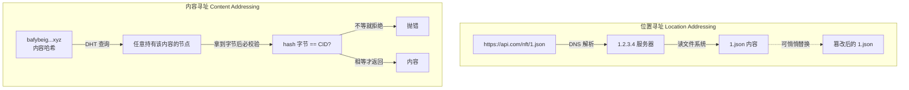

**核心区别**：
- 位置寻址：**先信任路径，再获取内容**，无法验证内容没被改
- 内容寻址：**先指定内容指纹，再去任意位置取**，自动验证

> 💡 类比：位置寻址像"我家在朝阳区 xx 路 5 号"，内容寻址像"我是身份证号 110101199001011234 的那个人"。前者一搬家就找不到，后者无论你跑哪儿别人都能验明正身。

### 2.2 CID 的解剖图

一个典型的 CIDv1：`bafybeibwzifw52ttrkqlikfzext5akxu7w4aa3pyr7xkx4r4w6z6t4ehuy`

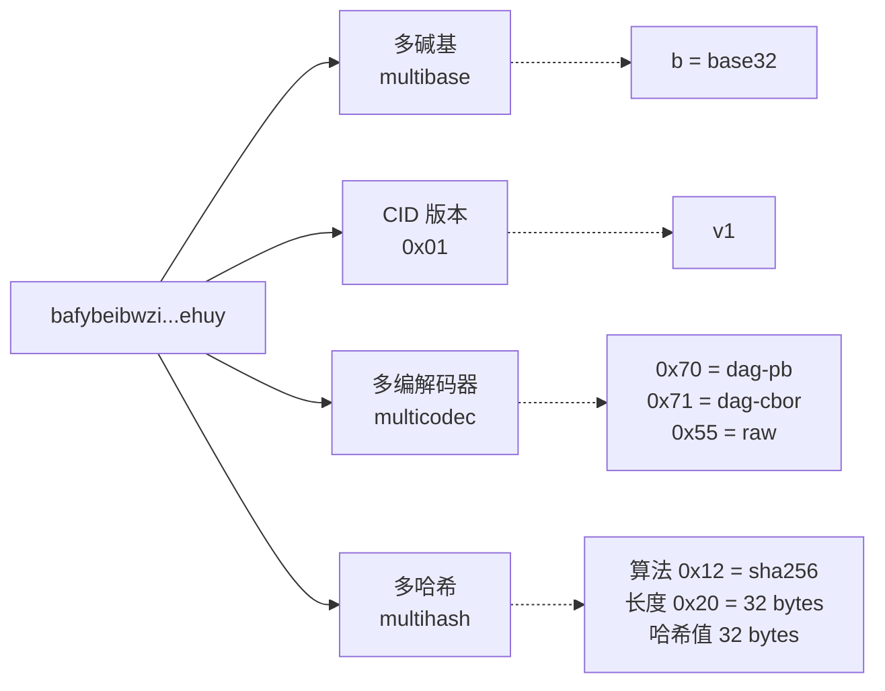

**CIDv0 vs CIDv1**：

| 属性 | CIDv0 | CIDv1 |
|---|---|---|
| 前缀 | `Qm...`（46 字符） | `bafy...`（59 字符 base32） |
| 编码 | 仅 base58btc | multibase（任意） |
| codec | 仅 dag-pb | 任意（raw / dag-cbor / dag-json...） |
| 哈希 | 仅 sha256 | 任意（blake2b / blake3 / ...） |
| 用例 | 旧 IPFS 兼容 | 现代 IPFS / Filecoin / IPLD |

来源：https://docs.ipfs.tech/concepts/content-addressing/ （检索 2026-04）

### 2.3 Multihash / Multicodec / Multibase

Multiformats 是一组 self-describing 格式标准：

- **Multihash**：`<hash-fn-code><digest-size><digest-bytes>`，前两字节告诉你算法和长度
- **Multicodec**：1-2 字节的整数，标识"哈希后的内容怎么解析"
- **Multibase**：1 字符前缀，标识字符串编码方式（b=base32, z=base58btc, m=base64...）

> 🤔 思考：为什么不直接用 sha256(content)？答：协议升级时（比如 sha256 被破），不带算法标识就只能强制全网迁移；带了之后新旧并存，平滑过渡。

来源：https://github.com/multiformats/cid （检索 2026-04）

### 2.4 实际计算一个 CID

```javascript
// 计算 "Hello, decentralized world" 的 CIDv1（dag-pb + sha256 + base32）
import { sha256 } from 'multiformats/hashes/sha2';
import * as raw from 'multiformats/codecs/raw';
import { CID } from 'multiformats/cid';

const bytes = new TextEncoder().encode('Hello, decentralized world');
const hash = await sha256.digest(bytes);
// raw codec = 0x55，原始字节流
const cid = CID.create(1, raw.code, hash);
console.log(cid.toString());
// 输出形如：bafkreih7w...（每次内容相同 → CID 相同）
```

> 💡 关键点：相同内容 → 相同 CID（confluence），不同内容 → 几乎肯定不同 CID（哈希碰撞概率 ≈ 0）。这就是去重的物理基础——全球只需要存一份。

---

## 3. 存储证明三件套

### 3.1 问题：怎么证明矿工没骗你？

矿工说："你给我钱，我给你存。"

你打 1 TB 数据过去。一个月后你怀疑矿工把硬盘删了，问他："还在不在？" 他说："在，你信我。"

这不行。需要密码学证明。Filecoin 是迄今最严肃地解决这个问题的网络，提出了三层证明：

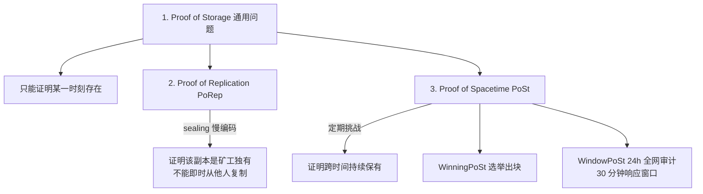

### 3.2 PoRep（Proof of Replication）

**做了什么**：矿工拿到原始数据后，必须经历一段慢加密过程（sealing），把数据变成"独一无二的副本"，并提交一份 zk-SNARK 证明。

**关键性质**：
- sealing 慢到无法即时复制（CPU + 大内存 + 数小时级别）
- 即使两个矿工存同一份数据，他们的 seal 后副本不同
- 攻击者不能临时找别人借数据来骗证明

来源：https://docs.filecoin.io/basics/the-blockchain/proofs （检索 2026-04）

### 3.3 PoSt（Proof of Spacetime）

**WinningPoSt**：每个 epoch（30 秒）随机选出一些矿工，他们必须立刻为自己存的某个 sector 出证明，并打包新区块。

**WindowPoSt**：把 24 小时切成多个窗口，每个矿工的 sectors 被分到不同窗口。窗口到点矿工有 30 分钟提交 zk-SNARK 证明，否则被 slash（罚没抵押）。

> ⚠️ 工程师注脚：Filecoin 矿工不是"存了就完"，每天都在做密码学证明。一台 64 TiB 矿机一年仅证明计算的电费就是个数字。这反过来意味着 Filecoin 的存储价格不能太低——价格低于证明成本时矿工会逃。

### 3.4 其他网络的证明思路

| 网络 | 证明机制 | 副本数 | 备注 |
|---|---|---|---|
| Filecoin | PoRep + PoSt（zk-SNARK） | 矿工自决（FIL+ 数据通常 ≥ 5） | 最严谨 |
| Arweave | SPoRA → SPoRes（随机访问证明） | 全网激励，不固定 | 经济模型驱动而非合约 |
| Walrus | RedStuff 2D 纠删码 + 抽样挑战 | 4-5× | 不是全副本 |
| Swarm | Proof of Entitlement（合约罚没） | 邻域复制 | postage stamp |
| Storj | 审计 + 修复机制（不公链） | 80 碎片中 29 即可恢复 | 中心化 satellite |

来源：
- Arweave SPoRA https://www.arweave.org/files/arweave-yellow-paper.pdf （检索 2026-04）
- Walrus paper https://arxiv.org/abs/2505.05370 （检索 2026-04）

### 3.5 习题（第一部分）

**Q1**：朋友说"我把 NFT 图片存 IPFS 就稳了"，请用三句话指出他的误解。

<details><summary>答案</summary>

1. IPFS 默认 best-effort，不 pin 就会被 gc，单纯 `ipfs add` 不等于"存了"。
2. CID 永远指向相同内容，但你需要至少有一个节点持续 hosting，否则用户根本拉不到。
3. 想要"稳"必须叠加 Pinning 服务（多家冗余）+ 备份到 Filecoin / Arweave 实现长期持久。
</details>

**Q2**：CIDv0 是 `QmYwAPJzv5CZsnA625s3Xf2nemtYgPpHdWEz79ojWnPbdG`，请按照 multiformats 规则解释为什么是 46 字符且开头是 `Qm`。

<details><summary>答案</summary>

CIDv0 = base58btc(multihash(sha256, 32, digest))。multihash 头两字节是 `0x12 0x20`（sha256, 32 字节），加上 32 字节摘要 = 34 字节。base58btc 编码 34 字节 ≈ 46 字符；前两字节固定为 `0x12 0x20`，base58 编码后总以 `Qm` 开头。
</details>

**Q3**：为什么 Filecoin 选择 PoRep 而不是简单"挑战时让你返回某个偏移量的数据"？

<details><summary>答案</summary>

简单挑战返回数据可以被矿工"按需向他人复制"绕过——同一份数据多家矿工共享一份硬盘存储，链上声称多副本。PoRep 通过 sealing 慢编码绑定矿工身份与时间，使副本即时复用变得不可行；矿工要骗，必须为每次挑战重新做几小时的 sealing，经济上不划算。
</details>

**Q4**：你想为一个 DAO 投票档案选择存储方案，要求"任何人 50 年后能验证文件未被篡改"，你最担心位置寻址的什么具体属性？

<details><summary>答案</summary>

最担心**可变性**——位置寻址下，URL 背后的服务器内容可被悄悄替换或被 CA / DNS / 监管层重定向，50 年后无法证明今天读到的文件是 50 年前那一份。内容寻址的 CID 是密码学指纹，只要原 CID 写进了链上不可变记录（链上只需 32 字节），50 年后任何拿到字节的人都能 hash 一遍 → 比较 CID → 自证。
</details>

---

# 第二部分：IPFS 生态

## 4. IPFS 协议骨架

### 4.1 IPFS 不是网络是协议栈

很多人以为 IPFS 是"一个网络"，错。IPFS 是**协议栈**，由几个独立模块拼起来：

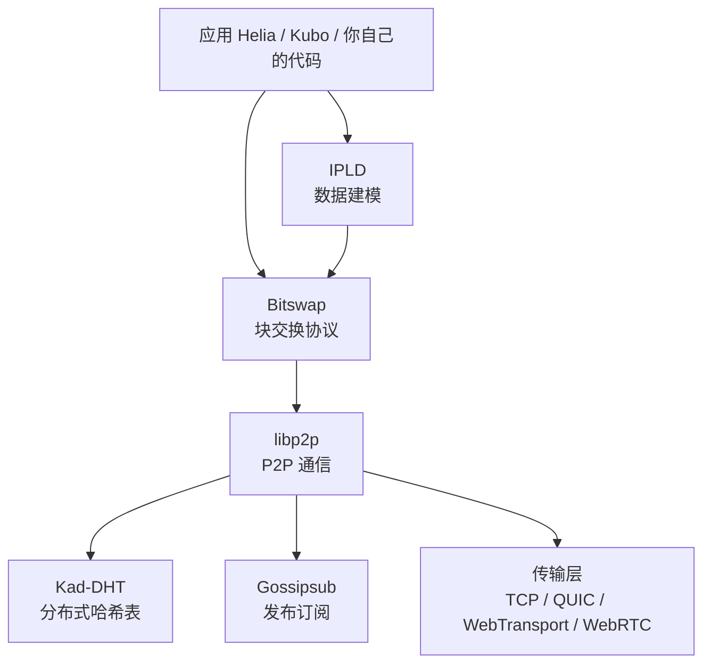

**四个核心模块**：

1. **libp2p**：底层 P2P 通信（连接、加密、路由）。可独立用于其他项目（filecoin、ethereum 共识层 lighthouse 都用 libp2p）。
2. **Bitswap**：块级交换协议——你想要某个 CID，向邻居广播"WANT-HAVE"，对方有就发"HAVE"，你再"WANT-BLOCK"。
3. **DHT (Kademlia)**：分布式提供者发现——给定 CID，找到全网谁有这个块。
4. **IPLD**：数据建模层（下一章详述）。

### 4.2 Kademlia DHT 简述

DHT 解决一个问题：**给定 CID，去哪里找？**

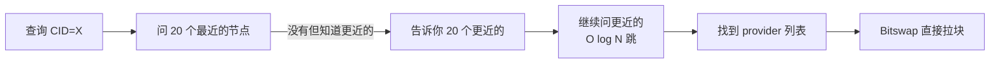

**XOR 距离**：节点 ID 和 CID 都是 256 位，距离 = ID XOR CID。每跳至少把距离减一半（k-bucket 路由），所以 N 个节点中找一个 provider 只需 O(log N) 跳。

> 💡 工程师注脚：DHT 查询慢是 IPFS 体验差的最大单一原因。第一次拉一个冷门 CID 经常 5-30 秒，热门 CID（已被网关缓存）几百毫秒。这就是为什么生产 dApp 几乎都直接用网关 + pin 服务，绕开自己跑 DHT。

来源：https://docs.ipfs.tech/concepts/dht/ （检索 2026-04）

### 4.3 Helia：现代 JS 实现

js-ipfs 已被官方淘汰，**Helia** 是 2023 起的现代 TypeScript 实现：

- 模块化（按需引入 unixfs / dag-cbor / 等）
- 浏览器原生（WebTransport / WebRTC 直连）
- 与 Kubo（Go 实现）和 rust-ipfs 互通

```javascript
// 最小 Helia 上手
import { createHelia } from 'helia';
import { unixfs } from '@helia/unixfs';

const helia = await createHelia();
const fs = unixfs(helia);

const cid = await fs.addBytes(new TextEncoder().encode('Hello'));
console.log(cid.toString());  // bafkrei...

// 读回来
const decoder = new TextDecoder();
let text = '';
for await (const chunk of fs.cat(cid)) {
  text += decoder.decode(chunk, { stream: true });
}
console.log(text);  // Hello
```

来源：https://github.com/ipfs/helia （检索 2026-04）

---

## 5. IPLD 数据结构

### 5.1 为什么需要 IPLD

CID 只指向"一个块"。但实际数据经常是嵌套结构：

- 一个目录有很多文件
- 一个 NFT metadata 引用一张图片
- 一个区块链区块引用前一个区块

IPLD（InterPlanetary Linked Data）是**跨 CID 链接**的数据模型：节点之间通过 CID 互相指向，形成 Merkle DAG。

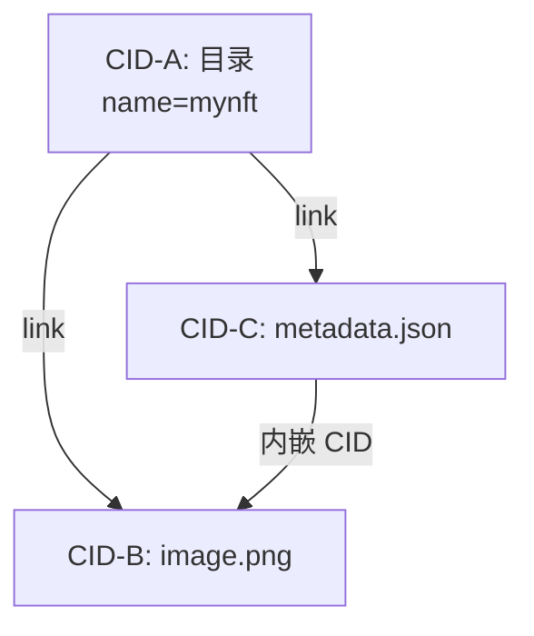

> 💡 关键性质：DAG（有向无环图），任何子节点变化 → 父节点 CID 必变。这就是 git 和区块链共用的 Merkle 根性质。

### 5.2 codec 与 schema

IPLD 数据可以用不同 codec 存：

| codec | 用途 | 例子 |
|---|---|---|
| `dag-pb` | UnixFS 文件/目录（IPFS 默认） | NFT 图片 |
| `dag-cbor` | 二进制结构化（紧凑、含链接） | Filecoin 区块、CAR 文件元数据 |
| `dag-json` | JSON + CID 链接（人类可读） | 调试 |
| `raw` | 单纯字节流（无解释） | 大文件 chunk |

### 5.3 CAR 文件（Content Archive）

CAR = 一组 IPLD 块的串行化打包格式，是 IPFS / Filecoin / Web3.Storage 之间传输的标准格式：

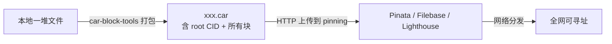

> ⚠️ 实战要点：超过 100 MB 的内容**不要**用 `addBytes` 一次性传，而要先打 CAR 再上传，否则 HTTP 超时 / 内存爆。

---

## 6. Pinning 服务全谱系

### 6.1 为什么需要 pinning

`ipfs add` 只是把内容加进本地节点，过段时间会被 GC 清掉。**Pinning** = 显式声明"这块内容必须永久保留"。

但如果你只 pin 在自己的节点上，节点关机内容就找不到。所以**生产环境用第三方 pinning 服务**，让专业团队保证 24/7 在线。

### 6.2 六大主流服务对比（2026-04 实测）

| 服务 | 免费额度 | 付费起价 | 特点 | 状态 |
|---|---|---|---|---|
| **Pinata** | 1 GB / 1000 文件 | $20/月 起 50 GB | 行业标杆，NFT 主流；2026 起免费额度缩水 | 活跃 |
| **Web3.Storage (Storacha)** | "Starter" 免费层 5 GB / 月，包含上传 + 网关读 + 1 个 Space；超出按 Lite ($10/月 100 GB) / Business ($100/月 2 TB) 阶梯计费，详见 [storacha.network/pricing](https://storacha.network/pricing)（检索 2026-04） | Lite $10/月、Business $100/月 | Protocol Labs 系，2024 旧 web3.storage API 已迁移到 Storacha 平台；旧 SDK (`@web3-storage/w3up-client`) 仍兼容但 endpoint 已切换 | 活跃但模式变了：免费层从早期"无限"收紧到 5 GB |
| **Filebase** | 5 GB | $20/月 起含 1 TB 存储（约 $0.02/GB/月，超量按 $0.005/GB 计） | S3 兼容 API，最低存储单价 | 活跃 |
| **Lighthouse** | 5 GB | 一次付费永久存（$2.4/GB 估算）或月付 | 内置加密、Filecoin Deal 自动化 | 活跃 |
| **NFT.Storage** | Classic 已 2024-06-30 关停；Long-Term 仍可用 | 企业付费 | PL Filecoin Impact Fund 接管 | 限制使用 |
| **4everland** | 5 GB | $5/月 起 100 GB | 集成多链 / EVM 友好 / IPFS 网关 | 活跃 |

来源：
- Pinata 价格 https://pinata.cloud/pricing （检索 2026-04）
- Filebase 价格 https://filebase.com/pricing （检索 2026-04）
- NFT.Storage 状态 https://nft.storage/blog/nft-storage-operation-transitions-in-2025 （检索 2026-04）
- Web3.Storage 转 Storacha https://storacha.network/ （检索 2026-04）

### 6.3 选型快速口诀

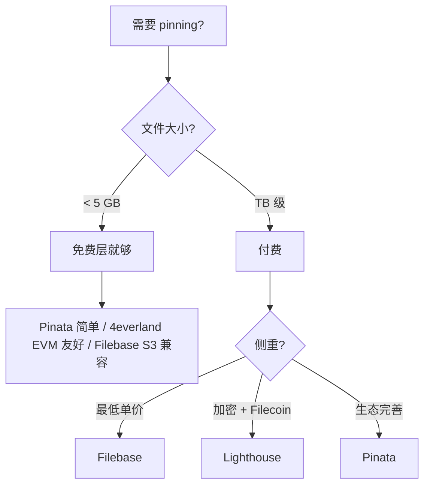

### 6.4 上传到 Pinata 的最小例子

```javascript
// pinata-upload.mjs
// 依赖：npm i pinata
import { PinataSDK } from 'pinata';
import fs from 'node:fs';

const pinata = new PinataSDK({
  pinataJwt: process.env.PINATA_JWT,        // 从 https://app.pinata.cloud 获取
  pinataGateway: 'gateway.pinata.cloud',
});

async function main() {
  // 上传单文件
  const blob = new Blob([fs.readFileSync('./my-nft.png')]);
  const file = new File([blob], 'my-nft.png', { type: 'image/png' });
  const upload = await pinata.upload.file(file);
  console.log('CID:', upload.cid);

  // CID 形如 bafkreig...，永远定位这张图
  // 通过任意 IPFS 网关都能访问：
  //   https://gateway.pinata.cloud/ipfs/<CID>
  //   https://ipfs.io/ipfs/<CID>
  //   https://dweb.link/ipfs/<CID>
}
main();
```

---

## 7. 网关与寻址

### 7.1 网关是什么

普通浏览器不会说 IPFS 协议，所以需要 HTTP → IPFS 桥梁，叫 **gateway**：

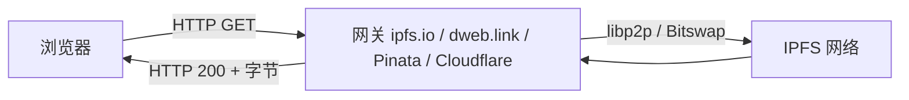

### 7.2 主流公共网关

| 网关 | 维护方 | 特性 | 限速 |
|---|---|---|---|
| `https://ipfs.io/ipfs/<CID>` | IPFS Foundation | 官方、最知名、容易被 rate-limit | 严格 |
| `https://dweb.link/ipfs/<CID>` | IPFS Foundation | 子域名隔离（防 same-origin 攻击） | 中等 |
| `https://cloudflare-ipfs.com/ipfs/<CID>` | Cloudflare | 全球 CDN、最快；2024 起部分功能调整 | 宽松 |
| `https://gateway.pinata.cloud/ipfs/<CID>` | Pinata | 仅供自己用户；私网快 | 客户专属 |
| `https://<CID>.ipfs.4everland.io` | 4everland | 子域名风格 | 中等 |

> ⚠️ 工程师注脚：**永远不要前端硬编码单一网关**。任何一家挂了你的 NFT 图片就显示不出来。生产实践：客户端列表轮询（race the gateways），第一个 200 的就用。

### 7.3 子域名 vs 路径寻址

```
路径风格（旧）: https://dweb.link/ipfs/bafy.../image.png
子域名风格（新）: https://bafy....ipfs.dweb.link/image.png
```

**为什么后者好**：
- Same-origin policy 把不同 CID 的内容隔离到不同 origin（防 XSS）
- Service Worker 可挂在 CID 子域上，做客户端验证

来源：https://docs.ipfs.tech/concepts/public-utilities/ （检索 2026-04）

---

## 8. IPNS 与 DNSLink

### 8.1 问题：CID 是不可变的，怎么发布"最新版本"？

CID 内容变就变 CID，但你的网站需要一个稳定的入口，比如 `mydao.eth`。

三种方案：

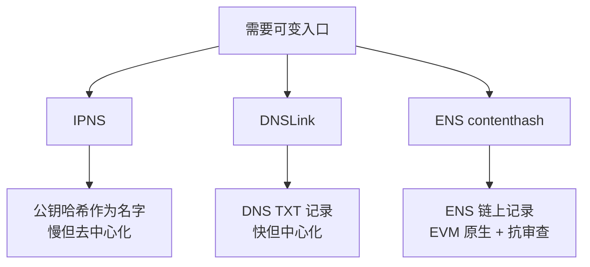

### 8.2 IPNS

- 名字 = `/ipns/<公钥哈希>` 或 `/ipns/k51qzi5...`（base36 编码的 ed25519 公钥）
- 内容 = 一条签名记录，含目标 CID + 序号 + TTL
- 全网通过 DHT 存储和发布
- **慢**：一次发布通常 30-60 秒生效，查询亦然

### 8.3 DNSLink

DNS TXT 记录指向 IPFS：

```
$ dig +short TXT _dnslink.docs.ipfs.tech
"dnslink=/ipfs/bafybei..."
```

- **快**：DNS 缓存秒级
- **代价**：依赖中心化 DNS（不过 DNS 已经是 web 既有信任根）

### 8.4 ENS contenthash

最适合 EVM 项目：

```solidity
// 通过 ENS PublicResolver 设置
resolver.setContenthash(node, hex"e30101701220...");
// 浏览器（如 Brave / MetaMask）解析 mydao.eth → 直接走 IPFS
```

> 💡 生产推荐：DAO / dApp 前端 → ENS contenthash + IPFS pinning，用户输入 `mydao.eth` 即可访问；CI/CD 每次部署更新 contenthash。Uniswap、ENS 自身、Aave 都是这套。

### 8.5 习题（第二部分）

**Q1**：为什么生产环境不应该硬编码 `https://ipfs.io/ipfs/<CID>` 作为 NFT 图片地址？给出 3 个理由。

<details><summary>答案</summary>

1. ipfs.io 网关有 rate-limit，热门 NFT 系列高峰期会被限流。
2. 任何单一网关都可能被法律 / 监管要求屏蔽某 CID（虽然内容仍在 IPFS 网络）。
3. 子域名风格 `<CID>.ipfs.dweb.link` 自带 same-origin 隔离，路径风格不行。
</details>

**Q2**：用一句话区分 IPNS 和 DNSLink 的信任模型。

<details><summary>答案</summary>

IPNS 用密码学公钥签名（信任根 = 私钥持有者）；DNSLink 用 DNS TXT 记录（信任根 = 域名 registrar 和 DNS 服务商）。
</details>

**Q3**：你做了一个 dApp 前端，每次部署都生成新 CID。怎么保证用户输入 `mydao.eth` 总是访问最新版？

<details><summary>答案</summary>

CI/CD 部署完成后调用 ENS PublicResolver 的 `setContenthash`，把新 CID 写入 ENS 记录。支持 ENS 的浏览器（Brave、MetaMask、Opera）会自动解析；不支持的可以用 `mydao.eth.limo` 或 `mydao.eth.link` 网关代理。
</details>

**Q4**：解释为什么 IPFS 中"删除"非常困难。

<details><summary>答案</summary>

CID 由内容决定，全网任意节点只要持有该字节就能复活该 CID。你能控制的只有"自己节点不再 pin / 自己网关不再 serve"，无法阻止他人节点继续 hosting。这是抗审查的代价：发布前要做好"上链即永恒"的心理准备。
</details>

---

# 第三部分：Filecoin

## 9. Filecoin 经济模型

### 9.1 一句话总结

Filecoin = IPFS 的**经济激励层**。IPFS 解决了"怎么用 CID 找内容"，但没解决"谁有动力一直 hosting"。Filecoin 通过代币激励 + 密码学证明 + 罚没机制让矿工持续保有数据。

### 9.2 三个市场

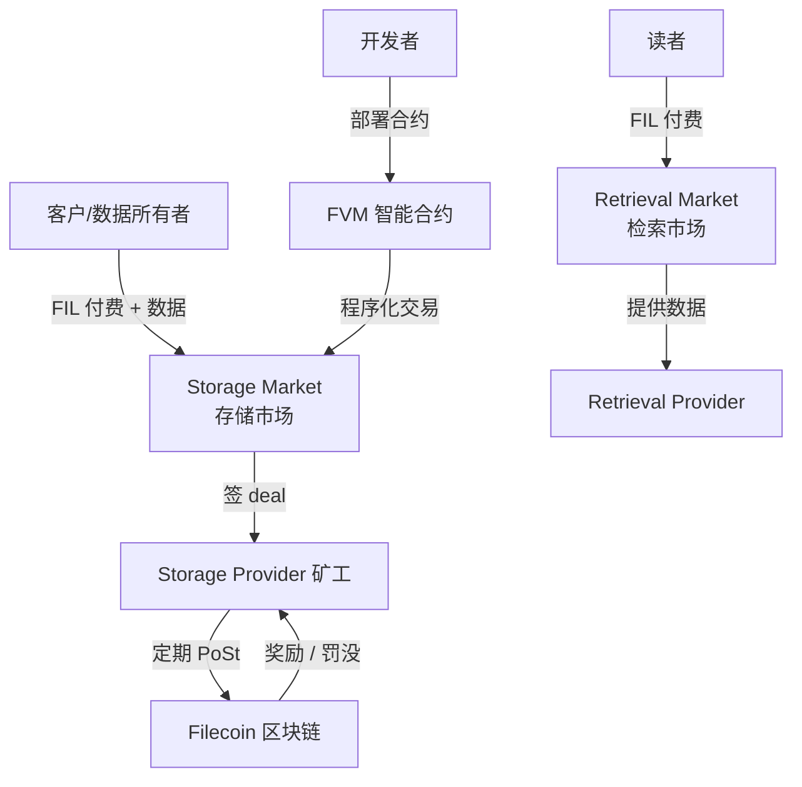

- **Storage Market**：存储成交，长期 deal（默认 ≥ 180 天，最长 540 天，可程序化续期）
- **Retrieval Market**：按字节计费的快速读取（理论上独立于存储）
- **Smart Contract Layer (FVM)**：让 Solidity 合约能直接发起 storage deal

### 9.3 抵押与罚没

矿工进入网络要锁定 FIL 抵押（initial pledge），并按 sector 数量持续锁定 storage pledge。如果：

- 漏 WindowPoSt → 罚一部分（fault fee）
- 永久丢数据 → 罚全部 sector 抵押（termination penalty）

> 💡 工程师注脚：这就是为什么 Filecoin 矿工不敢"假装存"。一台矿机抵押动辄百万 FIL，丢一个 sector 罚到肉痛。

### 9.4 FIL 经济关键参数（2026-04 快照）

| 参数 | 当前值 | 说明 |
|---|---|---|
| 区块时间 | 30 秒 | 一个 epoch |
| 每 epoch 出块 | 平均 5-7 个区块（tipset） | 随机选举 |
| 总供应量 | 20 亿 FIL（hard cap） | |
| 网络存力 | ≈ 25 EiB（2026-04） | 历史峰值 30+ EiB |
| 实际利用率 | ≈ 30%-40% | 大部分仍是 CC（Committed Capacity）空 sector |
| Onchain Cloud 主网 | 2026-01 上线 | 验证存储 + 链上付费 |

来源：
- Filecoin docs https://docs.filecoin.io/basics/what-is-filecoin/blockchain （检索 2026-04）
- 网络数据 https://filfox.info/ （检索 2026-04）
- v26 Gas 优化 https://coinmarketcap.com/cmc-ai/filecoin/latest-updates/ （检索 2026-04）

---

## 10. 矿工类型与生命周期

### 10.1 矿工分类

| 类型 | 工作 | 收入来源 |
|---|---|---|
| **Storage Provider (SP)** | 存数据 + 出 PoSt 证明 | block reward + storage fee + FIL+ datacap multiplier |
| **Retrieval Provider** | 提供快速读取 | retrieval fee（按字节） |
| **Repair Provider** | 数据丢失时从冗余恢复 | 修复奖励（实验中） |

> ⚠️ 注意：很多 SP 同时是 Retrieval Provider；但纯检索矿工目前不多——经济不划算。所以 Filecoin 的"读"实际上经常通过 IPFS 网关或专门的 SaaS（Web3.Storage / Lighthouse）解决。

### 10.2 一笔 Storage Deal 的完整生命周期

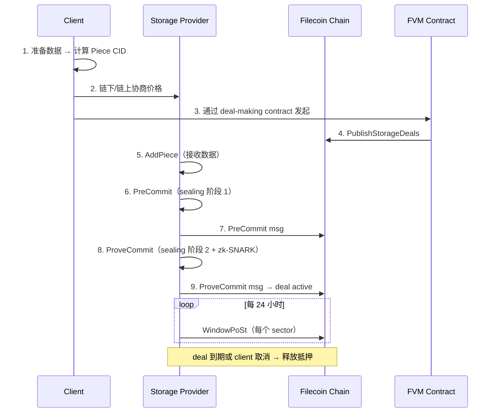

### 10.3 sealing 是个慢活

一台 64 GiB sector 完整 sealing 需要：

- **PreCommit Phase 1 (PC1)**：CPU 密集，~ 3.5 小时（大量内存访问）
- **PreCommit Phase 2 (PC2)**：GPU 加速 zk-SNARK，~ 30 分钟
- **WaitSeed**：等链上随机数（150 个 epoch ≈ 75 分钟）
- **Commit Phase 1 (C1)**：组装 proof 数据
- **Commit Phase 2 (C2)**：GPU SNARK 证明，~ 30 分钟

总耗时 ≈ 5-6 小时 / sector，硬件门槛 = 高端 CPU（多核多 RAM）+ NVIDIA GPU。

来源：https://lotus.filecoin.io/storage-providers/operate/sector-sealing/ （检索 2026-04）

---

## 11. FVM 与 EVM 兼容

### 11.1 FVM 是什么

FVM = **Filecoin Virtual Machine**，2023-03 上线，让 Solidity 合约能跑在 Filecoin 链上，并能直接和**存储系统**交互。

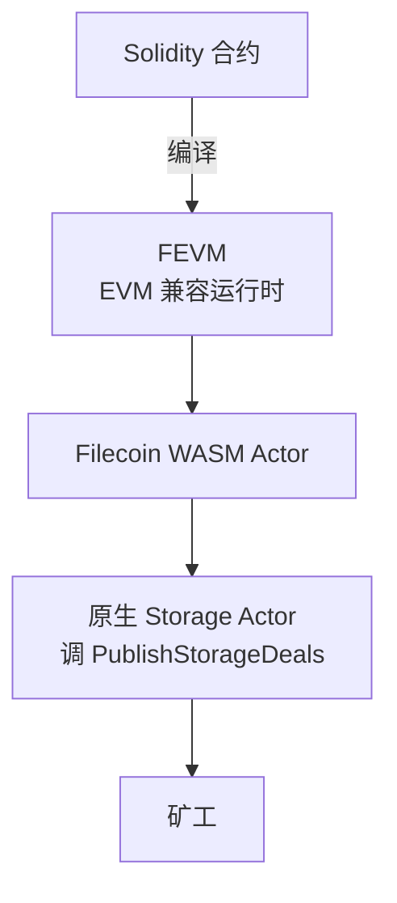

**关键点**：
- Solidity / Hardhat / Foundry / MetaMask 都能用
- 合约可以直接发起 storage deal（前所未有）
- 跨链桥到 Ethereum / Polygon

### 11.2 一个最小 FVM 合约：链上发起 storage deal

```solidity
// SPDX-License-Identifier: MIT
pragma solidity 0.8.28;

// 引用 Filecoin 官方 actor 接口
// import "@zondax/filecoin-solidity/contracts/v0.8/MarketAPI.sol";

contract DealMaker {
    event DealProposed(uint64 dealId, bytes pieceCid);

    /// 发起一笔 storage deal
    /// @param pieceCid 数据的 Piece CID（IPFS CID 经过 padding 后的形式）
    /// @param pieceSize 数据大小（字节，必须是 2 的幂）
    /// @param startEpoch deal 开始时间
    /// @param endEpoch deal 结束时间
    function proposeDeal(
        bytes calldata pieceCid,
        uint64 pieceSize,
        int64 startEpoch,
        int64 endEpoch
    ) external payable {
        // 实际实现需调用 MarketAPI.publishStorageDeals
        // 此处展示概念
        emit DealProposed(0, pieceCid);
    }
}
```

> 🤔 思考：为什么链上发起 deal 是个大事？因为以前你必须用 Lotus CLI / SaaS API 让某个矿工接单，整个流程脱离链上规则。现在 DAO 可以投票决定"我们要存这个数据集"，合约自动选矿工 + 续约 + 替换。

来源：https://docs.filecoin.io/smart-contracts/fundamentals/the-fvm （检索 2026-04）

### 11.3 FVM vs EVM 的差异

| 维度 | EVM | FVM (FEVM) |
|---|---|---|
| Gas 模型 | gas units × gasPrice | gas + 存储费 |
| 区块时间 | 12 秒 (Eth) | 30 秒 |
| 状态最终性 | 12-15 区块（Eth post-Merge） | 900 epochs ≈ 7.5 小时 |
| 原生能力 | 仅计算 | 计算 + 存储 + 检索 |
| 工具兼容 | 100% Hardhat / Foundry | 99%（个别 precompile 不同） |

> ⚠️ 工程师注脚：Filecoin 最终性极慢（数小时），不适合需要秒级 finality 的 DeFi。它的甜点是：DAO 数据存档、AI 训练集、长尾媒体内容。

---

## 12. Filecoin Plus 与 SaaS 层

### 12.1 Filecoin Plus（FIL+）是什么

为了激励矿工存"真实有用的数据"，Filecoin 引入了 **Datacap** 机制：

- 社会化审核员（Notaries）发放 Datacap 给客户
- 客户用 Datacap 找矿工存 → 矿工获得 **10× block reward multiplier**
- 客户花的还是普通 FIL，但矿工愿意打折甚至免费收（因为奖励翻倍）

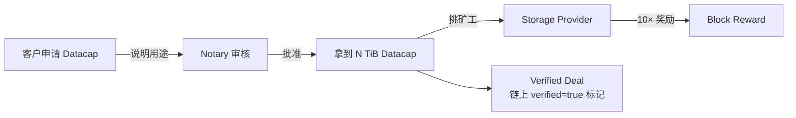

### 12.2 SaaS 层：为什么需要

直接和矿工对接太复杂（要懂 Lotus、要管 deal 续期、要监控 fault）。所以出现了 SaaS 抽象层：

| SaaS | 功能 | 状态 |
|---|---|---|
| **Web3.Storage（Storacha）** | 类似 S3 SDK，自动 IPFS pinning + Filecoin deal | 活跃，已转 Storacha 品牌 |
| **Lighthouse** | 一次付费永久存（自动跨多 SP + 续 deal）+ 加密 | 活跃 |
| **Estuary** | 类似 Web3.Storage 的开源替代 | **已关停**（2023-07 停服，2024-04 网站下线） |
| **NFT.Storage Classic** | NFT 元数据免费 pinning | **已关停**（2024-06-30） |
| **NFT.Storage Long-Term** | 付费长期存储，PL Filecoin Impact Fund 接管 | 限制使用 |

来源：
- Estuary 关停 https://docs.estuary.tech/ （检索 2026-04，已重定向）
- NFT.Storage 转换 https://nft.storage/blog/nft-storage-operation-transitions-in-2025 （检索 2026-04）

### 12.3 Lighthouse 上传示例

```javascript
// lighthouse-upload.mjs
// 依赖：npm i @lighthouse-web3/sdk
import lighthouse from '@lighthouse-web3/sdk';

const apiKey = process.env.LIGHTHOUSE_API_KEY;  // 在 https://files.lighthouse.storage 申请

async function main() {
  // 上传文件，自动 IPFS + Filecoin 双备份
  const response = await lighthouse.upload(
    './my-dao-archive.tar.gz',
    apiKey,
  );
  console.log('CID:', response.data.Hash);
  console.log('Filecoin Deals:', response.data.Deals);
  // Deals 是后台异步建立的，不等待
}
main();
```

### 12.4 习题（第三部分）

**Q1**：为什么 Filecoin 主网刚上线时存力很大但实际利用率只有 5-10%？

<details><summary>答案</summary>

矿工挖矿需要质押 FIL，质押要求和 sector 大小成正比。早期 FIL 价格高 + 矿工想拿 block reward，于是用 CC（Committed Capacity）模式封装空 sector 进网络——本质是"占地不存数据"。后来 FIL+ 机制（10× 倍数）才真正激励矿工去接真实数据 deal。
</details>

**Q2**：你的 DAO 想存 1 TB 投票档案，预计长期保留 5 年，要写在合约里"自动续期"。请描述技术栈。

<details><summary>答案</summary>

1. 数据先打 CAR，得到 root CID + Piece CID。
2. 部署一个 FVM Solidity 合约，含：申请 Datacap（如已申请到）、调用 `MarketAPI.publishStorageDeals` 发起 verified deal、监听 `DealActive` 事件、计时器（每 6 个月）触发新一轮 deal。
3. 合约持有 FIL 抵押用于支付未来 deal。
4. 备份策略：同时上传到 Pinata 和 Lighthouse 做冗余。
</details>

**Q3**：FVM 和 EVM 在最终性上差几个数量级，这意味着什么样的应用不该选 FVM？

<details><summary>答案</summary>

最终性 7.5 小时意味着 DEX、清算、闪贷等需要秒级最终性的 DeFi 完全不可用——价格波动 7 小时足够操纵。FVM 适合：长期数据归档、缓慢的 DAO 治理（投票期本来就长）、AI 训练 dataset 管理、archival NFT。
</details>

**Q4**：解释为什么很多 NFT 项目即使用 Filecoin 也要先 IPFS pin，再异步 Filecoin deal？

<details><summary>答案</summary>

Filecoin 的 retrieval 不像 IPFS 那么实时——经常需要矿工"unsealing"sector 才能读，慢的几分钟，快的几秒，但都不适合 NFT marketplace 加载图片。所以工程实践是：IPFS pin 服务保证热数据快速访问 + Filecoin deal 保证长期持久。两层各司其职。
</details>

---

# 第四部分：Arweave

## 13. 永久存储经济

### 13.1 Arweave 的"一次付费永久存"

Filecoin 是 deal-based（按时间付费、到期续约）；Arweave 走完全不同路线：**一次付费，承诺永久**。

听起来像庞氏。但其经济模型基于一个简单观察：**存储成本指数级下降**（Kryder's law）。每 18 个月单位存储价格腰斩。

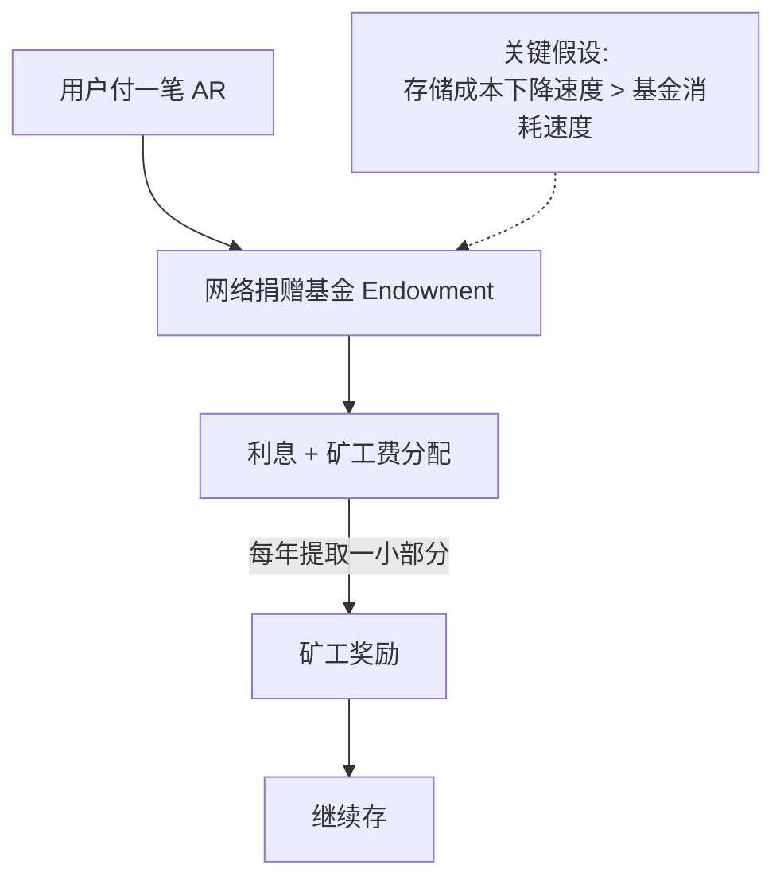

**模型核心**：基金按当前存储 200 年的成本预收，假设每 18 个月成本腰斩，这笔钱够用很久很久。

> 🤔 思考：如果有一天存储成本反而上升（量子加密反而更贵之类）？答：模型有保守边界（按 200 年定价），且基金多余收益再投资，能扛一定波动。但理论上不能扛"成本永久反向"。

### 13.2 区块链结构：blockweave

Arweave 不是普通区块链，是 **blockweave**——每个新区块同时引用前一块和**随机一个历史块**：

```mermaid
flowchart RL
    B1[Block 1] <--prev-- B2[Block 2]
    B2 <--prev-- B3[Block 3]
    B3 <--prev-- B4[Block 4]
    B4 -.recall.-> B1
    B3 -.recall.-> B1
    B2 -.recall.-> B1
```

矿工要出块必须有那个 recall 块的数据 → 激励全网保留**完整历史**而非只存最新。

### 13.3 SPoRA（Succinct Proofs of Random Access）

矿工用 SPoRA 共识：

1. 拿到候选 chunk index（链上随机出来）
2. 必须在本地真实读出该 chunk 才能算 PoW hash
3. 如果硬盘没那一段就算不出 hash → 不能出块

这把"持有数据"和"出块概率"绑在一起，硬盘越多块越多→ 自然激励矿工存历史。

来源：https://www.arweave.org/files/arweave-yellow-paper.pdf （检索 2026-04）

---

## 14. Bundlr / Irys / Turbo

### 14.1 直接打 Arweave 的痛点

直接上链要：

- 持有 AR 代币
- 等区块确认（30+ 秒）
- 每个文件一笔交易（小文件 fee 不划算）

### 14.2 ANS-104 与 Bundle

社区提出 **ANS-104** 标准：把 N 个 data item 打包成一笔 Arweave 交易，外面套一层 bundler 服务。

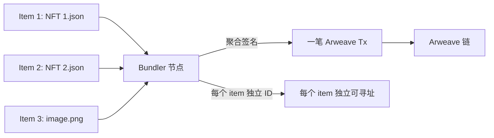

**好处**：
- 单 item 几秒内确认（bundler 即时签收据，链上随后批量上）
- 用户可以用 ETH / SOL / MATIC / USDC 等支付（bundler 内部换 AR）
- 适合海量小文件（NFT mint）

### 14.3 Bundlr → Irys → Turbo

历史演变：
- **Bundlr Network**（2021 起）：第一个生产级 bundler
- **Irys**（2024 改名）：原 Bundlr，扩展为"可编程 datachain"概念
- **Turbo**（ArDrive 出品）：替代 bundler，整合到 ArDrive / AR.IO 生态

2026-04 状态：Irys 推出 IrysVM（EVM 兼容 datachain）；Turbo 提供 Turbo Credits（用各种代币购买上传额度）。

来源：
- Irys https://irys.xyz/ （检索 2026-04）
- Turbo https://docs.ardrive.io/docs/turbo/turbo.html （检索 2026-04）

### 14.4 用 Irys SDK 上传

```javascript
// irys-upload.mjs
// 依赖：npm i @irys/sdk
import Irys from '@irys/sdk';

async function main() {
  // 用 Ethereum 私钥支付（自动换 AR）
  const irys = new Irys({
    url: 'https://node1.irys.xyz',
    token: 'ethereum',
    key: process.env.PRIVATE_KEY,
  });

  // 充值（仅首次/余额不足时）
  // await irys.fund(irys.utils.toAtomic(0.05));

  // 上传
  const data = JSON.stringify({
    name: 'My NFT #1',
    description: 'A permanent NFT metadata',
    image: 'ar://QHnHs8BHQ.../image.png',
  });

  const tags = [
    { name: 'Content-Type', value: 'application/json' },
    { name: 'App-Name', value: 'MyNFT-Project' },
  ];

  const receipt = await irys.upload(data, { tags });
  console.log('Arweave tx ID:', receipt.id);
  console.log('Permaweb URL:', `https://gateway.irys.xyz/${receipt.id}`);
  // 永久 URL：https://arweave.net/<tx-id>
}
main();
```

---

## 15. ANS-104 与 AR.IO

### 15.1 AR.IO 是什么

Arweave 的网关一直是"谁愿意跑就跑"，但需要资金 + 高可用。**AR.IO**（2025-02 主网）是网关代币化的协议层：

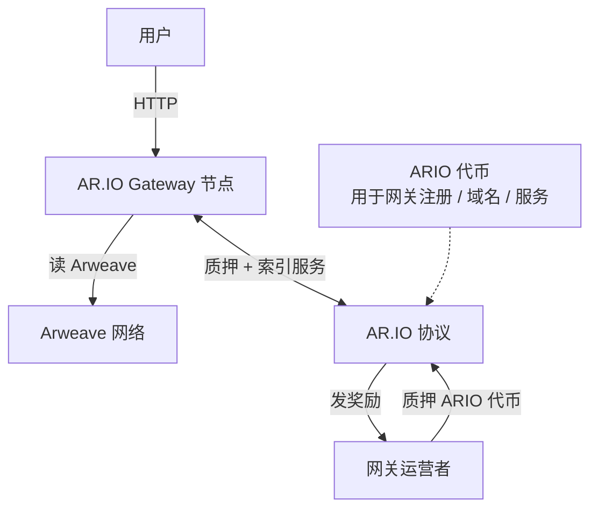

**核心服务**：
- 数据上传 / 下载
- ArNS（Arweave 域名系统，类似 ENS）
- GraphQL 索引

来源：https://ar.io/ （检索 2026-04）

### 15.2 主流 Arweave 应用

| 应用 | 用途 | 备注 |
|---|---|---|
| **Mirror** | 去中心化博客 / Newsletter | 文章上 Arweave，permaweb URL |
| **Paragraph** | 类似 Mirror，订阅 + NFT | 2024 收购 Mirror |
| **Lens Protocol** | 社交图谱（部分数据） | 长内容 / 历史归档 |
| **Glacier / SnapShot** | 区块链历史快照 | 链下 archive |
| **ArDrive** | 文件管理类似 Dropbox | 终端用户 GUI |

### 15.3 ar:// 协议

新版浏览器（Brave）和 ar.io 网关支持 `ar://` 协议：

```
ar://abcdefg-tx-id          → 直接定位某条 Arweave 交易
ar://my-blog                → 通过 ArNS 解析到目标 tx
```

### 15.4 习题（第四部分）

**Q1**：为什么 Arweave 的"永久"不是骗局？给出经济模型的两个核心假设。

<details><summary>答案</summary>

1. **存储成本下降假设**：单位存储成本每 18 个月减半（Kryder's law 历史经验），所以一笔 200 年估值的预付费在长期看够用。
2. **基金再投资假设**：endowment 部分进入投资 / 滚利，超额收益转入未来矿工奖励，对冲短期成本波动。
反例：如果存储成本永久止跌或反向上升，模型会撑不住——但这从未发生过。
</details>

**Q2**：直接 Arweave 上传一个 1 KB 文件 vs 通过 Irys bundle 上传，分别要多久确认？

<details><summary>答案</summary>

直接：等 Arweave 出块（约 2 分钟）+ 多个区块确认（10+ 分钟稳妥）。
Irys：bundler 即时签收据（< 1 秒，承诺会上链），链上批量上 1-3 小时内完成；用户体验上"立即可用"。
</details>

**Q3**：NFT 项目 mint 时为什么几乎都用 Irys/Bundlr 而不是直接 Arweave？

<details><summary>答案</summary>

1. 用户用 ETH 钱包付 mint 费就能间接付存储费，不用让用户买 AR。
2. 一次 mint 数千个 NFT 元数据，bundle 把数千个文件打成一笔交易，gas / 链上空间利用率最优。
3. 即时确认避免 mint 后等 30 秒才能看到图片的尴尬体验。
</details>

**Q4**：AR.IO 引入网关代币的根本原因是什么？

<details><summary>答案</summary>

Arweave 数据本身在链上永久，但**对外服务**（HTTP 网关、ArNS、索引）需要服务器、带宽、运维。这些原本由 Permagate / arweave.net 等公益运营，长期不可持续。AR.IO 通过 ARIO 代币质押激励 + 服务收费让网关层经济上自洽。
</details>

---

# 第五部分：新一代存储

> 过渡：IPFS / Filecoin / Arweave 三家解决了"能存"和"长期存"，但都在某个维度上有取舍——Filecoin retrieval 慢、Arweave 不可删、IPFS 需要叠加 pinning。本部分看 2024-2026 涌现的新一代存储如何重新切分这些权衡：Walrus 砍复制因子、0G 做 AI 专用层、Swarm/Greenfield/EthStorage/Codex 各打一类细分场景。

## 16. Walrus + RedStuff

### 16.1 Walrus 是什么

**Walrus**（Sui 团队，2025-03 主网）专为大文件 / 二进制 blob 设计的去中心化存储协议。代币 $WAL，主网 100 个存储节点分布 19 个国家。

**核心创新**：用 **RedStuff 二维纠删码** 把数据切碎，单文件复制因子只需 4-5×（vs Filecoin 通常 10×+，Arweave 全副本）。

```mermaid
flowchart TB
    File[1 GB 文件] --> Slice[切成 N 个主片<br/>纵轴]
    Slice --> Encode[每个主片再纠删编码<br/>横轴]
    Encode --> Distribute[分发到 100 节点]
    Distribute -.->|2/3 节点丢失也能恢复| Recover[恢复完整文件]
```

### 16.2 RedStuff 工作原理（简化）

经典 Reed-Solomon 纠删码：n 个数据块 + k 个校验块，丢任意 k 个还能恢复。Walrus 在二维上做：

- **纵向**：把文件切成 sliver，每个 sliver 又是一组 symbol
- **横向**：每个 sliver 内部再做 Reed-Solomon
- **结果**：复制因子 4-5×，但容错相当于 10× 全副本

### 16.3 经济与定价

- 用户预付 WAL → 锁定到指定存储 epoch 数
- 存储节点按持有的 sliver 比例分配奖励
- 团队声称比 Filecoin / Arweave **便宜 ≈ 100×**（实际取决于市场）

来源：
- Walrus 论文 https://arxiv.org/abs/2505.05370 （检索 2026-04）
- Walrus 主网 https://www.walrus.xyz/ （检索 2026-04）

### 16.4 上传到 Walrus 示例

```javascript
// walrus-upload.mjs
// 当前需要 Sui CLI + walrus 客户端；后续 SDK 完善后可直接用 TS
import { execSync } from 'node:child_process';

const file = './my-large-video.mp4';

// 通过 walrus CLI 上传，需要先：
//   1. 安装 sui CLI 和 walrus client
//   2. 配置 sui keystore（存有 SUI 和 WAL 余额）
const result = execSync(
  `walrus store ${file} --epochs 10`,
  { encoding: 'utf-8' },
);
// 输出形如：
//   Blob ID: 0xabc123...
//   Stored until epoch: <N>
//   Cost: 0.05 WAL
console.log(result);

// 读取：
//   walrus read <blob-id> --out ./output.mp4
//   或 HTTP 网关：https://aggregator.walrus-testnet.walrus.space/v1/<blob-id>
```

### 16.5 Walrus 的甜点应用

- 大型 NFT 媒体（4K 视频、3D 模型）
- AI 模型权重分发
- DePIN 项目数据层
- 区块链历史归档

> 🚨 **EVM 项目接入警告（请放在选型决策最前面）**
>
> **Walrus 与 Sui 紧耦合**：blob registration、epoch 续费、metadata、支付（$WAL）全部走 Sui 链。EVM 项目要用 Walrus，**只有两条路**：
>
> 1. **跨链桥接 $WAL 到 Sui，再用 Sui wallet 调用 Walrus**——意味着你的 EVM dApp 后端要维护 Sui 私钥 + Sui RPC + 跨链桥逻辑；
> 2. **走中心化 SaaS 包装**（如某些 Walrus 网关代付服务）——回到信任单点，丧失"去中心化存储"的初衷。
>
> ⚠️ **跨链桥本身风险极大**：Wormhole（2022-02 被盗 $325M）、Ronin（2022-03 $625M）、Nomad（2022-08 $190M）、Multichain（2023-07 $130M 团队跑路且至今未恢复）——**桥是 Web3 历史上被盗最多的基础设施类别**。把"长期存储 + 经常续费"的工作流挂在跨链桥上，相当于给资产持续暴露在桥的攻击面下。
>
> **务实建议**：EVM 原生项目存大文件，**优先 Filecoin（FVM 同 EVM 兼容）/ Arweave / IPFS+Pinata**；只在确实需要"4K 视频 + 极低单价 + 可接受 Sui 依赖"且团队有 Sui 工程能力时才选 Walrus。

---

## 17. 0G 三层架构

### 17.1 0G 是什么

**0G（Zero Gravity）**，2025-09 Aristotle 主网，定位"AI 专用基础设施"。三层：

```mermaid
flowchart TB
    AI[AI Agent / 大模型应用]
    AI --> DA[0G DA<br/>数据可用性层]
    AI --> Storage[0G Storage<br/>大块持久存储]
    AI --> Compute[0G Compute<br/>GPU 推理 / 训练]
    DA -.50000× faster than ETH DA.-> Note1
    Storage -.up to 2 GB/s 吞吐.-> Note2
    Compute -.Sealed Inference 2026-03.-> Note3
```

**关键数据**（来源 0G 官方）：
- DA 层吞吐：50 Gbps
- 存储层吞吐：每节点最高 2 GB/s
- DA 成本：以太坊 DA 的 1/100
- Sealed Inference：2026-03 上线，加密推理

来源：https://www.0gfoundation.ai/ （检索 2026-04）

### 17.2 为什么 AI 需要专门的存储

传统 Filecoin / Arweave 不适合 AI：
- AI 训练要随机读取小块（IO pattern 接近内存）
- 模型权重几十到几百 GB，要快速分发到训练节点
- 推理日志需要海量小写入 + DA 上链做审计

### 17.3 与其他网络对比

| 维度 | Ethereum DA (Blob) | Celestia | 0G DA |
|---|---|---|---|
| 吞吐 | ≈ 1 MB/s | ≈ 2-8 MB/s | 50 Gbps |
| 单 GB 成本 | $$$$ | $$ | $ |
| Finality | 12 分钟 | 15 秒 | < 1 秒 |
| 用例 | rollup data | rollup data | AI workload |

> 💡 工程师注脚：0G 不是要替换 Ethereum DA（rollup 仍主用 EIP-4844 blob 或 Celestia），而是开辟"AI 专用 DA + 存储 + 计算"赛道。如果你做 AI 项目，把训练数据 / 推理日志放 0G 比放 Filecoin 顺手得多。

---

## 18. Swarm / Storj / EthStorage / Greenfield / Codex / Aleph.im

### 18.1 Swarm（以太坊原生）

- 以太坊基金会孵化（2015 起）
- BZZ 代币、Postage Stamps 经济
- 客户端 Bee（Go 实现）
- 数据按 chunk 分布到 neighborhood，节点间用 PSS（私密信令服务）通信
- **Postage Stamps**：预付 BZZ 购买 stamp batch，按数据大小 + 存储时长定价；价格由 oracle 合约动态调整

```mermaid
flowchart LR
    User[用户] -->|买 stamp batch| Smart[Stamp 合约]
    Smart --> Stamp[Stamp Batch<br/>覆盖 N 个 chunk]
    User -->|附 stamp 上传 chunk| Bee[Bee 节点]
    Bee --> Neighborhood[邻域复制]
    Smart -->|过期未续 → 数据可被 gc| Bee
```

来源：https://docs.ethswarm.org/docs/concepts/incentives/postage-stamps/ （检索 2026-04）

### 18.2 Storj DCS

- 不上链；S3 兼容 API
- "satellite" 集中协调 + "storage node" 分布
- 数据切 80 片，29 片即可恢复（Reed-Solomon）
- 加密在客户端做（zero-knowledge）
- 价格 $4/TB/月 + 出口流量 $7/TB
- **本质**：去中心化的"S3 替代"，不是公链

来源：https://www.storj.io/pricing （检索 2026-04）

### 18.3 EthStorage

- L2 风格的存储扩容方案，建在以太坊之上
- 用 EIP-4844 blob 临时数据 + 自家 storage rollup 做长期持久
- Solidity 合约可直接写入 / 读取大文件（key-value 存储）
- 适合：链上原生大文件需求（动态 NFT、社交协议）

来源：https://docs.ethstorage.io/ （检索 2026-04）

### 18.4 BNB Greenfield

- BNB Chain 出品，2023-10 主网
- 对象存储为主，类似 S3 + 链上权限控制
- "对象"就是合约里的 first-class 资产，可被 NFT 化、可设权限
- 适合：BSC 生态、企业数据上链
- 集成 dApp：CodexField（代码资产化）

来源：https://greenfield.bnbchain.org/ （检索 2026-04）

### 18.5 Codex（zk 友好存储）

- Status / Logos 团队孵化
- 设计目标：**zkVM / zkRollup 友好**——证明数据可用性时低开销
- 用 erasure coding + sampling 证明
- 2026-04 仍在 testnet 阶段

来源：https://codex.storage/ （检索 2026-04）

### 18.6 Aleph.im

- 去中心化云：存储 + 数据库 + 无服务器计算
- 跨链支持（ETH / Solana / Tezos / Cosmos）
- 适合：dApp 后端 / 索引 / 配置数据

### 18.7 主流平台一表速查

| 平台 | 主网年份 | 经济模型 | 复制 / 容错 | 甜点应用 | EVM 友好? |
|---|---|---|---|---|---|
| IPFS + Pin | N/A（best-effort） | 中心化 SaaS | 视服务而定 | 通用 | ✅ |
| Filecoin | 2020 | deal-based + FIL+ | ≥ 5 副本 | 大数据归档 | ✅ FVM |
| Arweave | 2018 | 一次付费永久 | 全网激励冗余 | 永久内容 | ❌（间接） |
| Walrus | 2025-03 | 预付 epoch | 4-5× 纠删码 | 大型 NFT 媒体 | ❌（Sui） |
| 0G | 2025-09 | DA + 存储 + 计算 | 高吞吐 | AI workload | ✅ |
| Swarm | 2022 | postage stamp | 邻域复制 | EVM 项目内嵌 | ✅ |
| Storj DCS | 2020 | $/GB 月费 | 29/80 erasure | 企业 S3 替代 | N/A |
| EthStorage | 2024+ | EIP-4844 + L2 | rollup 安全 | 链上大数据 | ✅ 原生 |
| Greenfield | 2023-10 | BNB | 链上对象 | BSC 生态 | ✅ |
| Codex | testnet | 实验中 | sampling | zk dApp | ✅（计划） |
| Aleph.im | 2020 | 跨链 | 多副本 | dApp 后端 | ✅ |

### 18.8 习题（第五部分）

**Q1**：Walrus 的 RedStuff 复制因子 4-5× 但容错可比 10× 全副本，怎么做到的？

<details><summary>答案</summary>

二维 erasure coding：行向纠删（每个 sliver 内部）+ 列向纠删（不同 sliver 之间）。任何节点丢失只是丢一个 sliver 的一个 symbol，可由同行其他 symbol 恢复；连一整行丢失可由其他行恢复。比简单全副本复制效率高得多。
</details>

**Q2**：你做了一个 AI Agent，需要存推理日志（小写入 + 高频）+ 模型权重（大文件 + 偶尔读）。怎么搭？

<details><summary>答案</summary>

- 推理日志 → 0G DA（高频小写入，DA 层适合）
- 模型权重 → 0G Storage 或 Walrus（大文件持久存）
- 训练数据集 → Filecoin（FIL+ 拿 datacap 免费存）+ IPFS 热缓存
关键索引可以同时打到链上（合约存 root CID），保证可重现。
</details>

**Q3**：BNB Greenfield 把"对象"做成链上 first-class 资产，相比 S3 多了什么能力？

<details><summary>答案</summary>

1. 对象本身可 NFT 化（一个文件就是 ERC-721/1155）
2. 链上权限：可写 Solidity 合约控制谁能读 / 改 / 删
3. 支付一体化：访问权可被代币购买、租赁、拍卖
4. 跨 dApp 组合：一个 DAO 投票合约可以直接操作存储桶
S3 这些都需要应用层自建。
</details>

**Q4**：Storj 不上链为什么还能算"去中心化"？真的去中心吗？

<details><summary>答案</summary>

Storj 用 satellite（中心化协调）+ 分布式存储节点。客户端加密让 satellite 看不到内容（zero-knowledge），存储分布是真分布的，但 satellite 仍是单点（虽然可切换 satellite 提供商）。**部分去中心化**：抗物理攻击/单点硬盘故障是真去中心，但对协议层信任仍依赖 satellite 运营方。常被归为"分布式存储"而非严格"去中心化存储"。
</details>

---

# 第六部分：实战

## 19. 上传到 IPFS / Arweave / Walrus 完整流程

### 19.1 实战项目结构

`14-去中心化存储/code/` 目录下的完整可运行项目：

```
code/
├── package.json
├── .env.example
├── 01-helia-local-cid.mjs         # 本地计算 CID 不联网
├── 02-pinata-upload.mjs            # 上传到 Pinata
├── 03-lighthouse-upload.mjs        # 上传到 Lighthouse（IPFS+Filecoin）
├── 04-irys-upload.mjs              # 上传到 Arweave via Irys
├── 05-walrus-upload.sh             # 上传到 Walrus（CLI 包装）
├── 06-cid-verify.mjs               # 任意网关读取 + CID 校验
├── 07-multi-platform-redundancy.mjs # 多平台冗余上传
├── nft-dapp/                       # 完整 ERC-721 + IPFS dApp
│   ├── contracts/MyNFT.sol
│   ├── script/Deploy.s.sol
│   └── frontend/
└── README.md
```

### 19.2 步骤一：上传文件到 IPFS

完整 Helia + Pinata 双路上传（核心代码见 `code/02-pinata-upload.mjs`）：

```javascript
// 通用模式：本地先算 CID（与上传服务无关），上传后比对返回的 CID 验证
import { createHelia } from 'helia';
import { unixfs } from '@helia/unixfs';
import { PinataSDK } from 'pinata';
import fs from 'node:fs';

async function uploadToIPFS(filePath) {
  // 1. 本地预先计算 CID（这一步纯密码学，不需联网）
  const helia = await createHelia({ start: false });
  const fs1 = unixfs(helia);
  const bytes = fs.readFileSync(filePath);
  const localCid = await fs1.addBytes(bytes);
  console.log('本地计算的 CID:', localCid.toString());

  // 2. 上传到 Pinata
  const pinata = new PinataSDK({
    pinataJwt: process.env.PINATA_JWT,
    pinataGateway: 'gateway.pinata.cloud',
  });
  const file = new File([bytes], filePath.split('/').pop());
  const upload = await pinata.upload.file(file);
  console.log('Pinata 返回的 CID:', upload.cid);

  // 3. 校验：两个 CID 必须一致（不一致说明出了 bug）
  if (localCid.toString() !== upload.cid) {
    throw new Error('CID 不匹配！可能 Pinata 用了不同的 chunking 策略');
  }
  return upload.cid;
}
```

> ⚠️ **CID 不匹配的真实原因**：不同实现的 chunking 策略和叶子节点编码可能不同（典型差异：raw leaves vs dag-pb leaves，256 KB vs 1 MB chunk size）。如果你需要本地预算 CID 与 Pinata / Web3.Storage 返回的 CID 一致，必须显式对齐参数（如 `unixfs(helia, { rawLeaves: true, chunker: 'fixed' })`），并用相同 chunk size。这是上传 bug 排查的高频点。

### 19.3 步骤二：上传到 Arweave (via Irys)

```javascript
// code/04-irys-upload.mjs（节选）
import Irys from '@irys/sdk';

async function uploadToArweave(data, contentType = 'application/json') {
  const irys = new Irys({
    url: 'https://node1.irys.xyz',
    token: 'ethereum',
    key: process.env.PRIVATE_KEY,
  });

  // 检查余额
  const balance = await irys.getLoadedBalance();
  console.log('当前余额（atomic）:', balance.toString());

  // 估算上传成本
  const size = Buffer.byteLength(data);
  const price = await irys.getPrice(size);
  console.log(`上传 ${size} 字节估算: ${irys.utils.fromAtomic(price)} ETH`);

  if (balance.lt(price)) {
    console.log('余额不足，自动充值...');
    await irys.fund(price.minus(balance));
  }

  const tags = [
    { name: 'Content-Type', value: contentType },
    { name: 'App-Name', value: 'Web3-Engineer-Guide' },
    { name: 'App-Version', value: '1.0' },
  ];

  const receipt = await irys.upload(data, { tags });
  return {
    txId: receipt.id,
    permaUrl: `https://arweave.net/${receipt.id}`,
    gatewayUrl: `https://gateway.irys.xyz/${receipt.id}`,
  };
}
```

### 19.4 步骤三：上传到 Walrus

```bash
#!/bin/bash
# code/05-walrus-upload.sh

set -e
FILE=$1
EPOCHS=${2:-10}

# 前置：sui CLI + walrus client 已装，已有 SUI 和 WAL 余额
walrus store "$FILE" --epochs "$EPOCHS" | tee upload-receipt.txt

BLOB_ID=$(grep "Blob ID:" upload-receipt.txt | awk '{print $3}')
echo "Walrus Blob ID: $BLOB_ID"
echo "HTTP 网关 URL: https://aggregator.walrus-mainnet.walrus.space/v1/$BLOB_ID"
```

### 19.5 步骤四：跨网关 CID 校验

```javascript
// code/06-cid-verify.mjs
import { CID } from 'multiformats/cid';
import { sha256 } from 'multiformats/hashes/sha2';

const GATEWAYS = [
  'https://ipfs.io/ipfs/',
  'https://dweb.link/ipfs/',
  'https://cloudflare-ipfs.com/ipfs/',
  'https://gateway.pinata.cloud/ipfs/',
  'https://4everland.io/ipfs/',
];

/**
 * 从多个网关并行获取，第一个返回的就用；任何返回内容必校验 CID
 */
export async function fetchWithCidVerify(cidStr, timeoutMs = 10000) {
  const cid = CID.parse(cidStr);
  const promises = GATEWAYS.map(async (gw) => {
    const res = await fetch(`${gw}${cidStr}`, {
      signal: AbortSignal.timeout(timeoutMs),
    });
    if (!res.ok) throw new Error(`${gw} ${res.status}`);
    const bytes = new Uint8Array(await res.arrayBuffer());

    // 校验：实际内容的 hash 必须 == CID 中编码的 hash
    const hash = await sha256.digest(bytes);
    const expected = cid.multihash.digest;
    if (!arraysEqual(hash.digest, expected)) {
      throw new Error(`${gw} 返回内容与 CID 不匹配（可能被篡改）！`);
    }
    return { gateway: gw, bytes };
  });
  return Promise.any(promises);  // 最快的胜出
}

function arraysEqual(a, b) {
  if (a.length !== b.length) return false;
  return a.every((v, i) => v === b[i]);
}
```

> 💡 这是去中心化存储相对中心化 CDN 的本质优势：你**不需要信任**任何单一网关，因为字节级别的篡改会被 CID 不匹配立即发现。

---

## 20. ERC-721 + IPFS 完整 NFT dApp

### 20.1 设计目标

一个最小可用的 NFT 项目：

- 合约：ERC-721 with `tokenURI` 指向 IPFS
- 上传脚本：批量打包元数据 + 图片到 IPFS（Pinata + Lighthouse 双备份）
- 部署脚本：Foundry 部署合约，把 base URI 设为 IPFS CID

### 20.2 合约（`code/nft-dapp/contracts/MyNFT.sol`）

```solidity
// SPDX-License-Identifier: MIT
pragma solidity 0.8.28;

import "@openzeppelin/contracts/token/ERC721/ERC721.sol";
import "@openzeppelin/contracts/access/Ownable.sol";

contract MyNFT is ERC721, Ownable {
    /// IPFS base URI，形如 ipfs://bafy.../
    /// Solidity 不支持 string immutable，所以用 private storage + 不暴露 setter
    /// 来实现"事实上不可变"——这是真去中心化的关键
    string private _baseTokenURI;
    /// 构造时计算的 hash，外部可读取并校验链下数据完整性（替代 string immutable 的语义）
    bytes32 public immutable BASE_URI_HASH;

    uint256 private _nextTokenId;
    uint256 public constant MAX_SUPPLY = 10000;

    constructor(string memory baseURI_, address owner_)
        ERC721("Web3 Engineer NFT", "W3ENG")
        Ownable(owner_)
    {
        _baseTokenURI = baseURI_;
        BASE_URI_HASH = keccak256(bytes(baseURI_));
    }

    function mint(address to) external onlyOwner returns (uint256) {
        uint256 tokenId = _nextTokenId++;
        require(tokenId < MAX_SUPPLY, "Max supply reached");
        _safeMint(to, tokenId);
        return tokenId;
    }

    function _baseURI() internal view override returns (string memory) {
        return _baseTokenURI;
    }

    /// 完整 tokenURI 形如 ipfs://bafy.../1.json
    function tokenURI(uint256 tokenId)
        public
        view
        override
        returns (string memory)
    {
        require(_ownerOf(tokenId) != address(0), "Nonexistent token");
        return string(abi.encodePacked(_baseURI(), _toString(tokenId), ".json"));
    }

    function _toString(uint256 v) internal pure returns (string memory) {
        if (v == 0) return "0";
        uint256 temp = v;
        uint256 digits;
        while (temp != 0) { digits++; temp /= 10; }
        bytes memory buffer = new bytes(digits);
        while (v != 0) { digits--; buffer[digits] = bytes1(uint8(48 + v % 10)); v /= 10; }
        return string(buffer);
    }
}
```

### 20.3 元数据规范

每个 `<id>.json`：

```json
{
  "name": "Web3 Engineer NFT #1",
  "description": "A learning NFT for the Web3 Engineer Guide",
  "image": "ipfs://bafkrei.../1.png",
  "attributes": [
    { "trait_type": "Module", "value": "14-decentralized-storage" },
    { "trait_type": "Rarity", "value": "Common" }
  ]
}
```

### 20.4 上传脚本（`code/nft-dapp/upload-metadata.mjs`）

```javascript
// 批量上传一个目录（含 N 个 png + N 个 json）到 IPFS，返回 base CID
import { PinataSDK } from 'pinata';
import lighthouse from '@lighthouse-web3/sdk';
import fs from 'node:fs/promises';
import path from 'node:path';

const META_DIR = './metadata';
const IMAGES_DIR = './images';

async function uploadDirectory() {
  // 1. 上传图片目录到 Pinata
  const pinata = new PinataSDK({ pinataJwt: process.env.PINATA_JWT });
  const imageFiles = await fs.readdir(IMAGES_DIR);
  const fileArray = await Promise.all(
    imageFiles.map(async (n) => {
      const buf = await fs.readFile(path.join(IMAGES_DIR, n));
      return new File([buf], n);
    }),
  );
  const imageUpload = await pinata.upload.fileArray(fileArray);
  console.log('Image base CID:', imageUpload.cid);

  // 2. 重写 metadata.json 把 image 字段改为 ipfs://<CID>/<n>.png
  for (const f of imageFiles) {
    const id = f.replace('.png', '');
    const metaPath = path.join(META_DIR, `${id}.json`);
    const meta = JSON.parse(await fs.readFile(metaPath, 'utf-8'));
    meta.image = `ipfs://${imageUpload.cid}/${f}`;
    await fs.writeFile(metaPath, JSON.stringify(meta, null, 2));
  }

  // 3. 上传 metadata 目录
  const metaFiles = await fs.readdir(META_DIR);
  const metaArray = await Promise.all(
    metaFiles.map(async (n) => {
      const buf = await fs.readFile(path.join(META_DIR, n));
      return new File([buf], n);
    }),
  );
  const metaUpload = await pinata.upload.fileArray(metaArray);
  console.log('Metadata base CID:', metaUpload.cid);

  // 4. 同步备份到 Lighthouse（Filecoin deal）
  const lhKey = process.env.LIGHTHOUSE_API_KEY;
  await lighthouse.uploadFolder(META_DIR, lhKey);
  console.log('Lighthouse 备份完成');

  return metaUpload.cid;
}

uploadDirectory().then((cid) => {
  console.log(`合约 baseURI 设置为: ipfs://${cid}/`);
});
```

### 20.5 部署（`code/nft-dapp/script/Deploy.s.sol`）

```solidity
// SPDX-License-Identifier: MIT
pragma solidity 0.8.28;

import "forge-std/Script.sol";
import {MyNFT} from "../contracts/MyNFT.sol";

contract Deploy is Script {
    function run() external returns (MyNFT) {
        // baseURI 是上传脚本输出的 CID
        string memory baseURI = vm.envString("BASE_URI");  // ipfs://bafy.../
        address owner = vm.envAddress("OWNER");

        vm.startBroadcast();
        MyNFT nft = new MyNFT(baseURI, owner);
        vm.stopBroadcast();

        console.log("Deployed at:", address(nft));
        console.log("Base URI hash:", uint256(nft.BASE_URI_HASH()));
        return nft;
    }
}
```

### 20.6 关键工程决策

| 决策点 | 推荐 | 反例 |
|---|---|---|
| baseURI 用 ipfs:// 还是 https:// | ✅ ipfs:// | https:// 网关一挂全空白 |
| baseURI 是否可改 | ✅ 不可改（immutable） | 可改的 baseURI 等于"NFT 不可变"承诺破产 |
| 元数据是否打 hash 上链 | ✅ 至少存 base CID hash 验证 | 不存 → 无法验证元数据完整性 |
| 是否多平台冗余 | ✅ Pinata + Lighthouse + 自建 IPFS 节点 | 单一 pinning → 关停就死 |
| 大图存哪里 | 视成本：Pinata for 中等；Walrus / Arweave for 永久 | 没规划 → 后期迁移痛苦 |

---

## 21. 五平台成本对比表（2026-04 实测）

### 21.1 单一文件场景：1 GB 视频，存 1 年

| 平台 | 一次性费用 | 月费 | 1 年总成本 | 出口流量 | 备注 |
|---|---|---|---|---|---|
| Pinata | 0 | $20+ | ~$240 | 部分计入 | 免费层 1 GB 不够 |
| Filebase | 0 | 1 GB × $0.005 = $0.005 | $0.06 | $0.07/GB | 最便宜的 IPFS 单价 |
| Lighthouse 永久 | 约 $2.4（一次） | 0 | $2.4 | 内含 | 一次付清永久 |
| Web3.Storage / Storacha | 视套餐 | 企业版定价 | 视套餐 | 视套餐 | 已转企业模式 |
| 4everland | 0 | $5 套餐 100GB | $60 | 内含 | 中小项目划算 |
| Filecoin (Lighthouse SaaS) | < $1/年 估算 | - | < $1 | 通过 IPFS 网关 | 需配套 IPFS |
| Arweave (via Irys) | 1 次约 $4-8 | 0 | 永久 | 永久 | 永久存 |
| Walrus | 视 epoch | epoch 计费 | < $0.05 | 网关附带 | 团队声称比 FIL/AR 便宜 100× |
| Storj DCS | 0 | $4/TB→ $0.004/GB | $0.05 | $0.007/GB | S3 替代 |
| BNB Greenfield | gas + storage | 视 SP | 估算 < $1 | gas | BSC 生态 |

> 💡 价格仅供 2026-04 参考，所有数字请以官方页面为准。链上经济极易随币价波动。

### 21.2 真实场景：1 万张 NFT（图 5 GB + 元数据 50 MB），需永久 + 高频读

**推荐组合**：

```mermaid
flowchart LR
    Mint[Mint 阶段] -->|每个 image| Irys[Irys 永久 ~$30]
    Mint -->|metadata 目录| Pinata[Pinata pin ~$20/mo]
    Mint -->|metadata 目录| Lighthouse[Lighthouse 备份 ~$0.5]
    Read[读取阶段] -->|client 多网关| GW[ipfs.io / dweb.link / Pinata gateway]
    Read -.永久兜底.-> Irys
```

**逻辑**：图片体积大 → Arweave/Irys 一次性 ~$30 永久；元数据小 + 频繁更新链上 baseURI → IPFS pinning 即可；冗余备份避免 NFT.Storage 那种关停事故。

---

# 第七部分：选型与陷阱

## 22. 选型决策树

### 22.1 主决策图

```mermaid
flowchart TD
    Start{什么数据?} -->|NFT 元数据/图片| NFT[路径 A]
    Start -->|DAO 投票/治理记录| DAO[路径 B]
    Start -->|协议长期日志/索引| LOG[路径 C]
    Start -->|AI 训练数据/模型| AI[路径 D]
    Start -->|大型媒体 4K 视频| MEDIA[路径 E]
    Start -->|动态 dApp 后端数据| BE[路径 F]

    NFT --> NFT1[图片 → Arweave/Irys 永久<br/>元数据 → IPFS pin 多平台<br/>合约 baseURI 不可变]
    DAO --> DAO1[关键决议 → Arweave 永久<br/>讨论日志 → Filecoin via Lighthouse<br/>实时投票数据 → IPFS pin]
    LOG --> LOG1[The Graph / Subsquid 索引<br/>历史归档 → Filecoin FIL+ datacap<br/>近期热数据 → 自建 archive node]
    AI --> AI1[训练集 → Filecoin FIL+ 免费<br/>权重分发 → Walrus / 0G Storage<br/>推理日志 → 0G DA]
    MEDIA --> MEDIA1[Walrus 4-5× 复制因子<br/>或 Filecoin 大 sector deal]
    BE --> BE1[Aleph.im / Storj S3 兼容<br/>需 EVM 集成 → Greenfield]
```

### 22.2 三个核心决策维度

| 维度 | 问题 | 极端选项 |
|---|---|---|
| 持久性 | 1 年？10 年？永久？ | 月付 pin → Filecoin → Arweave |
| 读取 pattern | 一次写多次读 / 频繁更新 / 几乎不读 | 高频 → IPFS + CDN；低频归档 → Filecoin |
| EVM 原生需求 | 合约要直接读吗？ | 需要 → EthStorage / Greenfield；不需要 → 任何 |

### 22.3 反模式清单

❌ NFT 元数据用 https URL  
❌ 单一 pinning 服务（NFT.Storage 关停教训）  
❌ baseURI 用 mutable IPNS（用户难以验证）  
❌ 把高频读小数据放 Filecoin（retrieval 慢）  
❌ 用 Arweave 存"明天可能要删"的数据（删不掉）  
❌ 没有备份 root CID 到链上 → 无法做完整性证明  

---

## 23. 真实事故复盘

### 23.1 事故一：NFT.Storage Classic Free Tier 关停（2024-06-30）

**背景**：NFT.Storage 由 Protocol Labs 推出，承诺"NFT 元数据永久免费 pin"。2021-2023 大量 NFT 项目把元数据全部存在那里。

**事件**：2024-06-30 Classic 上传通道关闭。已存在的数据继续保留，但**新上传不再可用**，且公告称"长期 latency 和可用性可能下降"。

**影响**：
- 老 NFT 项目元数据仍可读，但加载慢、不稳定
- 大量小项目陷入"该不该迁移、迁哪里"的纠结
- 行业对单一免费基础设施的依赖警觉性大增

**后续**：2025 年 PL Filecoin Impact Fund 接管，Classic 仍保留，Long-Term Storage 推出付费版本。

**教训**：**永远不要把项目存活依赖于单一免费服务**。免费即不可问责，关停只需公告 90 天。

来源：https://nft.storage/blog/nft-storage-operation-transitions-in-2025 （检索 2026-04）

### 23.2 事故二：Estuary 关停（2023-07）

**背景**：Estuary 是 Web3.Storage 的开源替代，做 IPFS + Filecoin 自动 deal。

**事件**：2023-07 公告停止运营，2024-04 网站下线。用户必须自行迁出数据，Filecoin deals 仍按合约条款执行直到到期，但元数据 / 索引服务不再维护。

**影响**：依赖 Estuary 的项目要么自建相同栈，要么迁到 Web3.Storage / Lighthouse。

**教训**：开源不等于可持续——背后还是要有收入或捐赠基金养。

### 23.3 事故三：Pinata 节点缩水 + 价格调整（2024-2026）

**背景**：Pinata 是 IPFS pinning 行业标杆，免费层一度 1 GB / 1000 文件。

**事件**：2024 起多次缩减免费层；2026 价格上调；部分客户报告偏远地区网关延迟增加。

**影响**：小项目体感越来越差，多地区跨网关测试发现某些 CID 在某些网关失败率上升。

**教训**：单平台的可观测性不够；生产环境必须自动化跨网关健康检查。

### 23.4 事故四：AWS us-east-1 多次大规模故障

**背景**：AWS us-east-1 是全球最大 region，Web3 大量 indexer / RPC / 前端跑在上面。

**事件**：2021-12-07、2023-06-13、2025-10-20 等多次 region 级故障，OpenSea / Coinbase / 多个 dApp 前端不可用数小时。

**影响**：用户对"去中心化协议为什么因为 AWS 挂了就用不了"产生根本质疑，推动了真去中心化前端（IPFS hosting + ENS）的采用。

**教训**：智能合约去中心 ≠ dApp 去中心。前端、RPC、indexer 任何一层中心化都会成为瓶颈。

来源：AWS post-mortem 公告（2021-12 / 2023-06 / 2025-10）

### 23.5 事故五：Helium / Storj 等"商业化去中心化"模型的可持续性质疑

部分 DePIN / 去中心化存储项目早期靠代币激励快速扩节点，后期代币奖励减半 / 价格下跌时节点流失。这不是"事故"但是行业反复出现的模式。

**教训**：评估时关注**经济稳态**而非启动期数据。问"节点 5 年后还有动力跑吗？"

---

## 24. 长期保存 playbook

### 24.1 三层冗余原则

```mermaid
flowchart TB
    Data[关键数据]
    Data --> L1[Layer 1<br/>热: IPFS pin × 3 家]
    Data --> L2[Layer 2<br/>温: Filecoin via FIL+]
    Data --> L3[Layer 3<br/>冷: Arweave 永久]
    L1 -.-> Note1[即时访问 / 3-5 ms 延迟]
    L2 -.-> Note2[低成本批量 / 数秒延迟]
    L3 -.-> Note3[最终保险 / 不可变]
```

**规则**：
- **3 家 pinning**：Pinata + Filebase + 4everland 任意组合（不同公司、不同基础设施）
- **Filecoin** via Lighthouse 拿 FIL+ datacap，5 副本起
- **Arweave** 备份关键 CID 列表（即使图片不上 Arweave，至少 metadata + 索引上）

### 24.2 自动化健康检查

```javascript
// code/health-check.mjs
import { fetchWithCidVerify } from './06-cid-verify.mjs';

const CRITICAL_CIDS = [
  'bafybeig.../nft-base',
  'bafybeih.../dao-archive',
];

async function dailyHealth() {
  const results = [];
  for (const cid of CRITICAL_CIDS) {
    try {
      const start = Date.now();
      await fetchWithCidVerify(cid, 30000);
      results.push({ cid, ok: true, latencyMs: Date.now() - start });
    } catch (e) {
      results.push({ cid, ok: false, error: e.message });
    }
  }
  // 任何失败 → 立刻发告警（PagerDuty / Slack / Tg）
  const failed = results.filter((r) => !r.ok);
  if (failed.length) await notify(failed);
}
```

### 24.3 链上自证清单

把"哪个 CID 是项目方官方"写进合约：

```solidity
contract DataRegistry {
    mapping(string => bytes32) public officialCidHash;
    event OfficialDataPublished(string label, string cid, bytes32 cidHash);

    function publish(string calldata label, string calldata cid) external onlyOwner {
        bytes32 h = keccak256(bytes(cid));
        officialCidHash[label] = h;
        emit OfficialDataPublished(label, cid, h);
    }
}
```

任何用户拉到数据后可以：1) 算 CID → 2) 比对 `officialCidHash[label]` → 3) 自证"这是项目方真实数据"。

### 24.4 迁移 playbook

如果某天 Pinata / Lighthouse / 其他平台关停：

1. **冷静期**：通常关停公告 → 实际关停有 90 天窗口
2. **盘点**：列出所有依赖该平台的 CID（应有 registry）
3. **批量迁出**：用 CAR 文件导出 → 上传到新平台
4. **校验**：每个 CID 在新平台 fetch + 校验 hash
5. **更新链上**：如有 contenthash / baseURI 引用，更新指向（如 baseURI 是 immutable，靠 CID 本身的去中心化保证仍找得到）

> 💡 关键：**只要至少有一家 pinning 还在 hosting，CID 就还有效**。这就是内容寻址的力量——迁移过程中数据从未真的"丢失"。

---

## 25. 习题（综合）

**Q1**：你被任命设计某 NFT 项目的存储方案，PFP 系列 10000 个，每个图 200 KB。预算 $100。给出完整方案与成本估算。

<details><summary>答案</summary>

总数据量：10000 × 200 KB = 2 GB（图片）+ 10000 × 1 KB = 10 MB（元数据）

方案：
1. **图片** → Irys 永久上传，2 GB × $4-8/GB ≈ $10-16 一次性
2. **元数据** → 10 MB 远在 Pinata / Filebase / 4everland 免费层之内（5 GB 起），多家并 pin 即可，$0
3. **冗余** → Lighthouse 一次付费永久存元数据 + 关键 CID 列表，10 MB × $2.4/GB ≈ $0.03 一次性（实际取最小计费单位）
4. **链上** → ERC-721 baseURI = `ipfs://<metadata-cid>/`，用 immutable

总：约 $10-20 范围内，剩余预算用于初期监控告警、年度 health check 与突发迁移成本预留。
</details>

**Q2**：解释为什么"删除 NFT 元数据"在内容寻址下几乎不可能，而在中心化存储下很容易。

<details><summary>答案</summary>

**中心化**：URL 指向某服务器某文件，删除 = 改 db / 删文件，立即生效。

**内容寻址**：CID 由内容 hash 决定，全网任意节点持有该字节就能 serve。你能撤销自己的 pin，但不能阻止他人节点继续 hosting。即使你强行下架自己的所有副本，只要任何爬虫 / 归档者保留了字节，CID 依然有效。

**这是设计上的特性而非 bug**：抗审查的代价是"上链即永恒"。所以发布前一定要谨慎。
</details>

**Q3**：给定一个 DAO 投票合约，每月一次投票，希望"任何人 50 年后能验证投票结果未被改"。设计存储方案。

<details><summary>答案</summary>

1. **每次投票快照** → 序列化为 JSON（含投票项、提案、投票者地址、链上区块号）
2. 上传到 **Arweave**（一次付费永久）+ Filecoin via Lighthouse（双保险）
3. 链上写入合约：
   ```solidity
   mapping(uint256 => bytes32) public voteSnapshotHash;
   event VoteFinalized(uint256 indexed proposalId, string arweaveTxId, bytes32 contentHash);
   ```
4. 用户在 50 年后：拿 proposalId → 读 `voteSnapshotHash` → 从 `arweave.net/<txId>` 拉数据 → hash 比对
5. 关键：**hash 写在链上**，不是只在 Arweave。这样即便 Arweave 数据可读但被人为伪造也能识破。
</details>

**Q4**：你的 dApp 前端选 ENS contenthash + IPFS 部署。每次 CI 构建产出新 CID。怎么设计部署流水线？

<details><summary>答案</summary>

```
1. Build：next.js / vite build → out/
2. CAR 化：把 out/ 打成 CAR 文件，得到 root CID
3. 多平台 pin：并行上传到 Pinata + Filebase + 4everland
4. 校验：从每个网关 fetch root → CID 比对一致
5. 更新 ENS：调用 PublicResolver.setContenthash(node, encoded_cid)
6. 监控：1 小时内多次跨网关 health check
7. 回滚：保留前 N 个 CID 列表，必要时一键回滚 ENS contenthash
```

CI 工具：GitHub Actions + 一个自定义 action 封装上述步骤。生产实践参考 ENS 自身、Uniswap、Aave 的前端部署。
</details>

**Q5**：你的项目同时用 IPFS（NFT 元数据）+ Arweave（重要文档）+ Walrus（视频）。某天 IPFS pinning 服务全部出问题（极端假设）。你能恢复吗？

<details><summary>答案</summary>

**可以恢复但要看准备**：

**好情况**：你之前把所有 CID + 数据 hash 写进了链上 registry。可以：
1. 从 Arweave 备份读出 metadata.json（CID 形式表达）
2. 从 Walrus 读视频（Walrus 不依赖 IPFS）
3. 找任何还存有 IPFS 数据的归档者 / 自建节点恢复

**坏情况**：你只 pin 在 SaaS，没自建节点也没链上索引。
→ 数据可能找不回（除非有第三方爬虫缓存）。

**结论**：定期把 IPFS root CID + 内容 hash 备份到 Arweave + 链上 registry，是最稳的保险策略。
</details>

**Q6**：解释为什么 Walrus 用 RedStuff 4-5× 复制因子能保证容错，比 Filecoin 10× 全副本更高效？

<details><summary>答案</summary>

**全副本 N×**：每份数据存在 N 个独立位置，任意 N-1 挂掉仍可恢复。但浪费 N-1 倍空间。

**纠删码**：把数据切 k 块 + 编码 m 校验块（共 n=k+m），任意 k 个就能恢复。空间利用率 k/n 而非 1/N。

**RedStuff 二维**：在两个维度（行和列）都做纠删码，使得局部性故障（一整行或一整列丢失）也能恢复。在 100 节点网络中达到与 10× 全副本相当的容错，但实际占用只有 4-5× 空间。

数学上：RedStuff 的复制因子 ≈ 2D Reed-Solomon 的 (n²)/(k²) 系数，远小于 N。
</details>

**Q7**：什么场景下你**不应该**用去中心化存储而该用中心化 S3？

<details><summary>答案</summary>

1. **个人/团队私有数据**：不需要抗审查，需要严格访问控制（去中心化加密虽可做但开发成本高）
2. **GDPR/合规要求"被遗忘权"**：去中心化删不掉，违反法律
3. **极高频读写**（毫秒级实时）：去中心化网关延迟通常 100ms+
4. **企业内部 BI 数据**：完全无去中心需求，S3 性价比无敌
5. **临时缓存**：用 IPFS 也行但 S3/CDN 更省心

去中心化存储的本质优势是**抗审查 + 自证完整性**，没这两个需求就别强上。
</details>

**Q8**：给一个简单架构图：把 IPFS / Filecoin / Arweave 三者画成"互补关系"而非"竞争关系"。

<details><summary>答案</summary>

```mermaid
flowchart LR
    Data[数据]
    Data -->|发布 CID 和热路径| IPFS[IPFS<br/>内容寻址 + 快速分发]
    IPFS -->|长期持久背书| Filecoin[Filecoin<br/>定期合约 + PoSt 证明]
    IPFS -->|关键数据永久备份| Arweave[Arweave<br/>一次付费 + blockweave]
    User[用户] -->|默认走 IPFS 网关| IPFS
    User -.->|找不到时回退 Filecoin/Arweave| Filecoin
    User -.->|找不到时回退| Arweave
```

**关系总结**：
- IPFS 是"地址协议"，提供 CID 寻址和 P2P 分发
- Filecoin 是"经济激励层"，让 IPFS 有持久性
- Arweave 是"永久保险层"，独立于 IPFS 也能用，但许多项目把 Arweave 作为最终归档

三者协同 = 热缓存 / 长期合约 / 永久归档三层，与传统 IT 的"内存 / SSD / 磁带"分层一致。
</details>

---

## 延伸阅读

**协议规范 / 白皮书**：
- IPFS 论文 https://github.com/ipfs/papers
- Filecoin 白皮书 https://filecoin.io/filecoin.pdf
- Arweave 黄皮书 https://www.arweave.org/files/arweave-yellow-paper.pdf
- Walrus 论文 https://arxiv.org/abs/2505.05370
- AR.IO 白皮书 https://whitepaper.ar.io/

**官方文档**：
- IPFS Docs https://docs.ipfs.tech/
- Filecoin Docs https://docs.filecoin.io/
- Helia https://github.com/ipfs/helia
- Irys https://docs.irys.xyz/
- Walrus https://docs.walrus.site/
- 0G https://docs.0g.ai/
- Swarm https://docs.ethswarm.org/

**SaaS API 文档**：
- Pinata https://docs.pinata.cloud/
- Lighthouse https://docs.lighthouse.storage/
- Filebase https://docs.filebase.com/
- 4everland https://docs.4everland.org/

**进阶主题**：
- Multiformats 完整规范 https://multiformats.io/
- libp2p 文档 https://docs.libp2p.io/
- IPLD 数据模型 https://ipld.io/

**事故归档**：
- NFT.Storage 转型公告 https://nft.storage/blog/nft-storage-operation-transitions-in-2025
- AWS us-east-1 history https://aws.amazon.com/premiumsupport/technology/pes/

---

## 自审查清单

完成本模块后，对照检查：

- [ ] 我能区分内容寻址和位置寻址，能解释 CIDv1 的 4 段结构
- [ ] 我理解 IPFS 不是网络是协议栈，能列出 libp2p / Bitswap / DHT / IPLD 各自职责
- [ ] 我知道 6 大 pinning 服务的免费额度、价格、关停状态（NFT.Storage Classic / Estuary 已关停）
- [ ] 我能解释 PoRep 与 PoSt 的区别，知道 sealing 为什么慢
- [ ] 我理解 FVM 让 Solidity 合约能直接发起 storage deal
- [ ] 我能对比 Filecoin（定期付费）vs Arweave（一次永久）的经济模型
- [ ] 我了解 Walrus / 0G / Swarm / Greenfield / Codex / Aleph.im 各自的甜点应用
- [ ] 我能写出完整的 ERC-721 + IPFS 元数据 dApp，知道 baseURI 必须 immutable
- [ ] 我能用 5 平台成本对比表做项目选型决策
- [ ] 我有"多平台冗余 + 链上 hash 自证 + 跨网关健康检查"的长期保存 playbook
- [ ] 我能识别"该用 vs 不该用去中心化存储"的边界

---

## 下一站推荐

- 模块 15 DAO 治理（**强烈推荐**）：本模块给出的"DAO 投票档案 → Arweave 永久 + Filecoin 冗余"只是技术选型；治理提案、投票合约、参数升级如何用 DAO 形式管理存储协议自身（Filecoin / Arweave / Walrus 的链上治理），是模块 15 的核心议题。
- 模块 11 基础设施与工具（把 IPFS 节点 / pinning 监控放进 reth+lighthouse 节点旁边）
- 模块 13 NFT 身份与社交（回看本模块的方案如何嵌入完整 NFT 项目）

---

> 验证日期：2026-04-28。所有 URL 与价格请按此快照对比；半年后请重新搜索并更新。
> 工具链锚点：Helia 4.x / Pinata SDK 2.x / Irys SDK 0.2.x / Solidity 0.8.28 / Foundry stable。

