# 模块 14：去中心化存储

前置：模块 13 把 `tokenURI` 落地这个具体问题留给了本模块。所有外链、价格、版本号以 2026-04 快照为准。

> **2017 年 11 月，CryptoKitties 火爆全球，把以太坊堵到瘫痪。一只虚拟猫卖到 12 万美金。但很少人知道：那些猫的图片，根本不在链上——它们存在 CryptoKitties 公司租的 AWS 服务器上。如果哪天 Dapper Labs 倒闭、AWS 账号欠费，所有这些"价值百万的猫"就只剩下一个 token ID 和一串无效的 URL。这不是假设——2024-06-30，号称"NFT 永久免费存储"的 NFT.Storage Classic 真的关停了上传通道，无数早期 NFT 项目的元数据从此再也无法续传。**
>
> 这就是本模块要解决的问题：**链上数据 immutable，链下数据 mortal**。把永生账本钉在一具会死的躯壳上，是 NFT 行业最大的隐患。

本模块的论点：**"去中心化存储"不是一种东西，而是三个正交问题各自的工程答案**——内容寻址（怎么命名字节）、持久性（谁出钱让字节继续存在）、可用性（谁负责把字节交到读者手里）。把这三个轴讲清楚之后，IPFS / Filecoin / Arweave / Walrus / 0G 各自的位置就清晰了。

## 阅读导航

**主线**（本页前半段，≤25 页 PDF）：三轴框架 → CID 入门 → IPFS + Pinata → Filecoin 直觉 → Arweave 直觉 → Walrus / 0G 概览 → 选型决策 → NFT dApp 实战

**附录**（本页后半段，深挖细节）：

| 附录 | 内容 |
|---|---|
| A | IPFS 协议栈详（DHT / Bitswap / IPLD） |
| B | Filecoin PoRep / PoSt 数学 / FVM |
| C | Arweave 经济模型 / SPoRA / blockweave |
| D | Walrus RedStuff 二维纠删码 |
| E | 0G / EthStorage / Greenfield / 其他平台详解 |
| F | Pinata / NFT.Storage 关停事故复盘 |
| G | 5 平台成本对比（2026-04 实测） |

---

## 主线章节地图

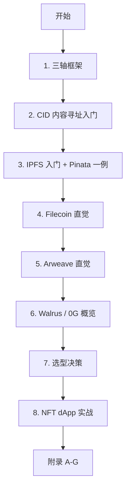

---

# 主线

## 1. 三轴框架：内容寻址 / 持久性 / 可用性

**TL;DR** — `ipfs add` 只解决命名（内容寻址），不解决"数据还在不在"（持久性）和"读得到不"（可用性）。三轴各自有对应方案，混淆是 NFT 翻车的头号原因。

**钩子**：你在 OpenSea 上花了 50 ETH 买了一只 Bored Ape。两年后头像空白，404。token ID 还在你钱包，`tokenURI` 也返回了好好的 URL，但点开是 404——项目方的服务器供应商倒闭了。你的 50 ETH，从此是一行空气。

讨论 NFT 元数据该放哪、协议日志归档何处之前，先把概念分清。市面上"去中心化存储"这个词把三件不相关的事打包在一起卖：

| 维度 | 它解决的问题 | 不依赖谁就能成立 |
|---|---|---|
| **内容寻址 (addressing)** | 给定一段字节，给它一个永远不变的名字（CID） | 任何节点 / 网络 / 公司——CID 是纯数学 |
| **持久性 (durability)** | 字节在 N 年后是否仍然存在于至少一处 | 必须有人付费 + 节点同意保有 |
| **可用性 (availability)** | 字节在 X 毫秒内能交到读者手里 | 必须有节点在线、被读者发现得到 |

把它们混成"去中心化存储"是工程灾难的源头。最典型的失败模式：项目方以为 `ipfs add` 同时解决三者——实际只解决了第一项。`ipfs add` 把字节加进**你本地节点**的 blockstore，给一个 CID。CID 永远不变，但其他节点既无义务持有它、也无义务回答 DHT 查询。本地节点 GC、断电或重启之后，那个 CID 就只活在曾经 fetch 过它的网关缓存里，几小时到几天后蒸发。

**打个比方**：`ipfs add` 就像你给一本书办了"国际书号 ISBN"——号码全球唯一、永远不变。但这个号码本身不会让任何图书馆愿意把书上架。如果你只在自己家里留了一本，搬家时丢了，世界上再也没人能凭这个号码找到这本书。CID 是号码，pinning / Filecoin / Arweave 才是图书馆。

正确的心智模型：

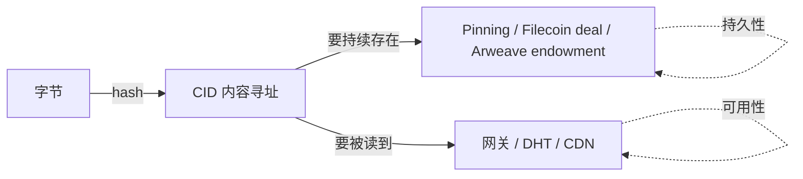

下游的所有方案差异都可以归结为它们如何把这三件事拼在一起。Pinata、Filecoin、Arweave、Walrus 这些名字在第一遍读到时不必紧张——它们都是"持久性 + 可用性"层的不同实现，**内容寻址那一层全行业基本统一为 CID**（Arweave 的 tx-id 是同等抽象的不同实现）。

### 1.1 链下数据的失败模式

NFT 翻车的标准剧本：链上 ERC-721 完好、`tokenURI` 返回 `https://api.coolnfts.xyz/metadata/1234.json`、两年后域名被抢注或 AWS 账号欠费、OpenSea 显示空白。问题不在合约，在那条 URL 的所有依赖：

- 域名是租的（一年到期）
- 服务器是租的（账单逾期就关）
- DNS 路径中心化（CA / Registry 都可能挂）
- 没有内容校验，无法证明 5 年后那份 JSON 和今天是同一份

链上数据 immutable，链下数据 mortal。把 NFT 元数据焊在 https 上，相当于把永生账本钉在一具会死的躯壳上。

| 中心化存储的死法 | 真实案例 |
|---|---|
| 硬件故障级联 | AWS us-east-1 2021-12-07 / 2023-06-13 / 2025-10-20 多次 region 级故障，Coinbase / OpenSea 数小时不可用 |
| 商业关停 | Google Cloud IoT Core / Stadia；Heroku 砍免费 dyno；NFT.Storage Classic 2024-06-30 |
| 法律 / 监管 | 2022 OFAC 制裁地址后多家 RPC / 前端封禁；区域性 IP 屏蔽 |
| 账号丢失 / 黑客入侵 | 单点 SSO / API key 泄漏，整个 bucket 被删 |

去中心化存储用三件事对冲：内容寻址做完整性证明、经济激励做持久性、多节点做可用性。**注意它不自动等于永久存储**——IPFS 默认 best-effort 缓存，Filecoin 是定期合约（默认 180 天起），只有 Arweave 显式宣称"永久"。

**章末**：本章把三轴分清楚，后面每一章都可以用"这个方案在哪个轴上做了什么"来定位。持久性证明细节见附录 B（Filecoin PoRep/PoSt）和附录 C（Arweave SPoRA）；行业时间线见附录 E 导言。

---

## 2. CID 内容寻址入门

**TL;DR** — CID = 内容指纹（hash）+ 元信息前缀。链上只需 32 字节就能永久锁定任意大小的内容。

> **2014 年，IPFS 创始人 Juan Benet 在斯坦福讲了一句被反复引用的话：** "HTTP 是用来取一个文件的协议，但它建立在'你信任 example.com 这台服务器'的前提上。如果我们换一种方式——不靠服务器名字，而靠文件本身的指纹来寻址——就能造出一个永远不会 404 的网络。" 这就是 IPFS 的起点。

### 2.1 位置寻址 vs 内容寻址

位置寻址（HTTP URL）的语义是"先信任路径，再获取内容"——服务器交给你什么字节你都得收，没法验证 5 年后是不是还是同一份。内容寻址反过来：**先指定内容指纹，再去任意位置取，拿到字节必须 hash 一遍校验**。

**一句话懂内容寻址**：给文件按指纹归档，不用记仓库号——指纹相同就是同一份文件，不管它躺在哪台服务器上。

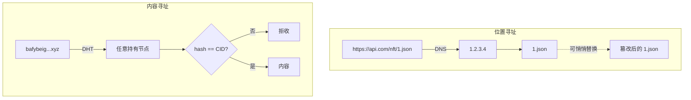

类比：位置寻址是"朝阳区 xx 路 5 号"（搬家就找不到），内容寻址是"身份证号 110101199001011234"（人在哪里都能验明正身）。这是 IPFS / Filecoin / Arweave 的共同前提；它们的差异从下一章持久性开始。

### 2.2 CID 的解剖图

一个典型的 CIDv1：`bafybeibwzifw52ttrkqlikfzext5akxu7w4aa3pyr7xkx4r4w6z6t4ehuy`

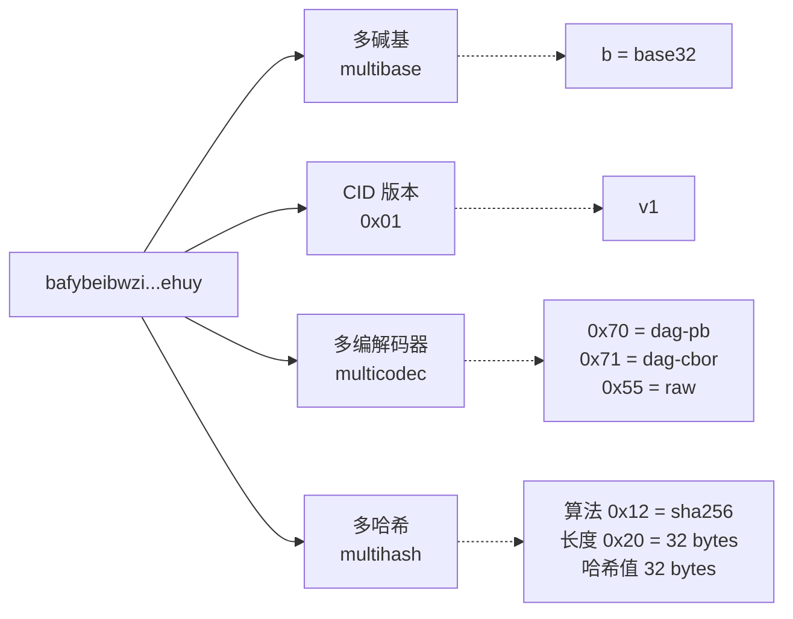

**CIDv0 vs CIDv1**：

| 属性 | CIDv0 | CIDv1 |
|---|---|---|
| 前缀 | `Qm...`（46 字符） | `bafy...`（59 字符 base32） |
| 编码 | 仅 base58btc | multibase（任意） |
| codec | 仅 dag-pb | 任意（raw / dag-cbor / dag-json...） |
| 哈希 | 仅 sha256 | 任意（blake2b / blake3 / ...） |
| 用例 | 旧 IPFS 兼容 | 现代 IPFS / Filecoin / IPLD |

来源：https://docs.ipfs.tech/concepts/content-addressing/

### 2.3 实际计算一个 CID

```javascript
// 计算 "Hello, decentralized world" 的 CIDv1（dag-pb + sha256 + base32）
import { sha256 } from 'multiformats/hashes/sha2';
import * as raw from 'multiformats/codecs/raw';
import { CID } from 'multiformats/cid';

const bytes = new TextEncoder().encode('Hello, decentralized world');
const hash = await sha256.digest(bytes);
// raw codec = 0x55，原始字节流
const cid = CID.create(1, raw.code, hash);
console.log(cid.toString());
// 输出形如：bafkreih7w...（每次内容相同 → CID 相同）
```

相同内容 → 相同 CID（confluence），不同内容 → 几乎肯定不同 CID（哈希碰撞概率 ≈ 0）。这就是去重的物理基础——全球只需要存一份。

**章末**：Multihash / Multicodec / Multibase 的完整规范见附录 A（IPFS 协议栈详）。CIDv0/v1 兼容表格见附录 A §A.1。

---

## 3. IPFS 入门：指纹归档 + Pinata 一例

**TL;DR** — IPFS = 寻址 + P2P 分发，不自带持久性。Pinata 是"IPFS 时代的 AWS S3"。不要单一依赖任何一家 Pinning SaaS（NFT.Storage 关停是前车之鉴，完整复盘见附录 F）。

### 3.1 IPFS 在三轴上的位置

| 轴 | IPFS 默认行为 | 需要叠加什么 |
|---|---|---|
| 内容寻址 | 全部解决——CID 是全行业通用命名 | 无需额外 |
| 持久性 | best-effort GC，不 pin 就丢 | Pinata / Lighthouse / Filecoin |
| 可用性 | DHT 查询，冷门 CID 5-30 秒 | HTTP 网关 + CDN |

IPFS 协议栈细节（DHT / Bitswap / IPLD / CAR 格式 / IPNS / DNSLink）见附录 A。

### 3.2 Pinning 服务选型

| 服务 | 免费额度 | 付费起价 | 特点 | 状态 |
|---|---|---|---|---|
| **Pinata** | 1 GB / 1000 文件 | $20/月起 50 GB | 行业标杆，NFT 主流 | 活跃 |
| **Filebase** | 5 GB | $0.005/GB/月 | S3 兼容，最低单价 | 活跃 |
| **Lighthouse** | 5 GB | $2.4/GB 一次付清 | 内置加密 + Filecoin Deal | 活跃 |
| **4everland** | 5 GB | $5/月起 100 GB | EVM 友好 | 活跃 |
| **NFT.Storage Classic** | — | — | 2024-06-30 **已关停** | 停服 |

生产规则：**同一份 CID 同时 pin 到 ≥ 3 家**，关停时反应是"减一家"而非"全栈瘫痪"。成本详细对比见附录 G。

### 3.3 Pinata 上传最小例子

```javascript
// pinata-upload.mjs — npm i pinata
import { PinataSDK } from 'pinata';
import fs from 'node:fs';

const pinata = new PinataSDK({
  pinataJwt: process.env.PINATA_JWT,   // https://app.pinata.cloud 获取
  pinataGateway: 'gateway.pinata.cloud',
});

async function main() {
  const blob = new Blob([fs.readFileSync('./my-nft.png')]);
  const file = new File([blob], 'my-nft.png', { type: 'image/png' });
  const upload = await pinata.upload.file(file);
  console.log('CID:', upload.cid);
  // 任意网关访问：https://ipfs.io/ipfs/<CID>
}
main();
```

**章末**：`ipfs add` 只是命名；Pinning SaaS 是持久性；HTTP 网关是可用性——三轴分开理解再叠加。网关选型、IPNS/DNSLink 可变指针见附录 A §A.3-A.4。

---

## 4. Filecoin 直觉：区块链版 S3

**TL;DR** — Filecoin = 区块链版 S3，但矿工偷工减料会被密码学逮住、抵押被罚没。甜点：长期归档、AI 数据集、DAO 存档。不适合：高频实时读（retrieval 秒到分钟级）。

> **2017 年 8 月，Filecoin ICO 60 分钟内募资 1.86 亿美金，30 天总募资 2.57 亿——史上最大 ICO 之一。** Juan Benet 的比喻：AWS S3 一个月一 GB 几分钱，但 Amazon 想关你账号就关；Filecoin 同样存数据付钱，区别是任何矿工偷工减料都会被密码学逮住、抵押罚没。主网延后了三年（2020-10）才上线。

### 4.1 三个市场

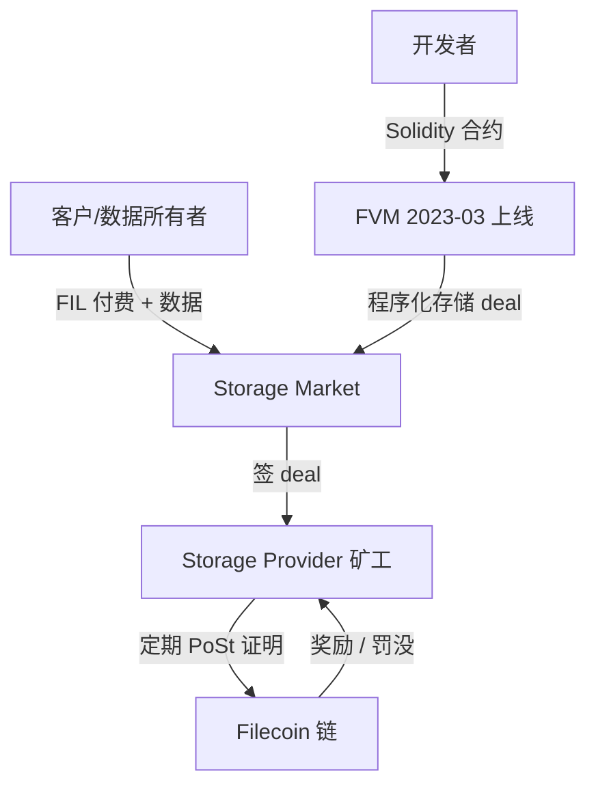

- **Storage Market**：默认 ≥ 180 天 deal，矿工有 PoRep + PoSt 密码学保证（详见附录 B）
- **Retrieval Market**：按字节付快速读取（慢，生产常走 IPFS 网关替代）
- **FVM**：Solidity 合约能直接发起 storage deal，DAO 可链上自动续约

### 4.2 为什么 Filecoin 比 S3 贵但值得

| 维度 | AWS S3 | Filecoin |
|---|---|---|
| 抗删除 | Amazon 可随时关账号 | 矿工删除被密码学发现 + 罚没 |
| 可验证 | 只能信任 Amazon | PoSt 每 24h 全网审计，链上可查 |
| 长期性 | SLA 按需续费 | FIL+ 数据 5 副本起，deal 最长 540 天 |
| 读延迟 | 毫秒 | 秒~分钟（unseal 开销） |

矿工维度：**sealing 是个慢活**——一个 64 GiB sector 完整封装约 5-6 小时（CPU + GPU）。这是存储证明严肃性的代价，也是 Filecoin 价格不能无限低的原因。PoRep / PoSt 数学细节见附录 B。

### 4.3 FIL+ 与 SaaS 抽象

**Filecoin Plus**：社区 Notary 发放 Datacap，用 Datacap 找矿工存 → 矿工获 10× block reward 倍数，客户可免费存真实数据。Internet Archive、UC Berkeley、多个 NFT 项目都是受益方。

**SaaS 层**（自己不用跑 Lotus）：

| SaaS | 状态 | 功能 |
|---|---|---|
| **Lighthouse** | 活跃 | 一次付费永久 + 自动 Filecoin deal + 加密 |
| **Web3.Storage (Storacha)** | 活跃 | S3 式 SDK，自动 IPFS pin + deal |
| **Estuary** | **2023-07 关停** | 参考教训 |
| **NFT.Storage Classic** | **2024-06-30 关停** | 参考附录 F |

### 4.4 Lighthouse 上传示例

```javascript
// lighthouse-upload.mjs — npm i @lighthouse-web3/sdk
import lighthouse from '@lighthouse-web3/sdk';

const apiKey = process.env.LIGHTHOUSE_API_KEY;

async function main() {
  const response = await lighthouse.upload('./my-dao-archive.tar.gz', apiKey);
  console.log('CID:', response.data.Hash);
  // Filecoin deals 后台异步建立，可查 response.data.Deals
}
main();
```

**章末**：Filecoin 矿工生命周期、FVM Solidity 合约调 storage deal、FIL 经济参数详见附录 B。

---

## 5. Arweave 直觉：永久图书馆

**TL;DR** — 一次付费，永久存储，靠 Kryder 定律赌存储成本持续下降。抗审查极致：上传即永恒，无法删除。不适合合规需要"被遗忘权"的数据。

> **Sam Williams（Arweave 创始人）在肯特大学读博时的核心命题：** 硬盘价格 60 年降了一万倍，未来 200 年只会更便宜。如果按今天的成本预付 200 年存储费，靠基金滚利息和成本下降，就能真正扛 200 年。2018 年主网上线，今天存储着 Mirror 上数十万篇文章、SnapShot 投票快照、Internet Archive 部分备份。

### 5.1 一次付费永久存的经济模型

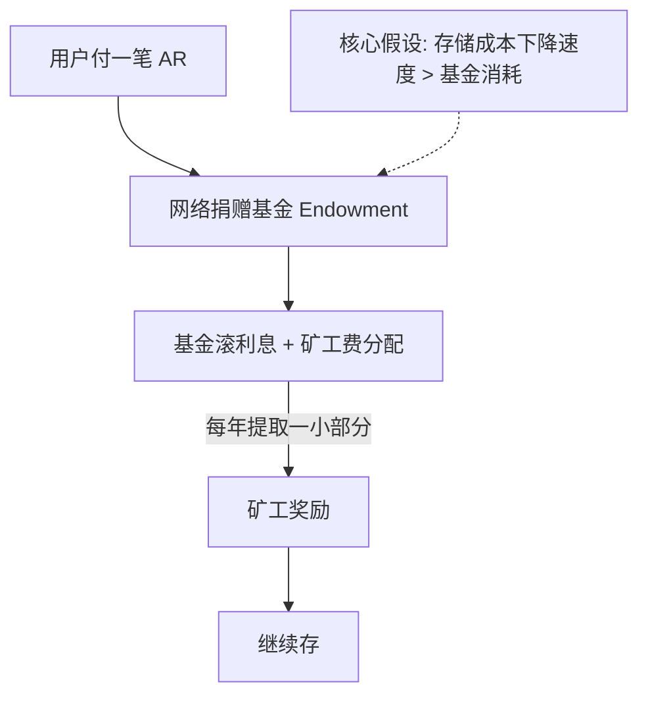

**庞氏验证**：若存储成本上升且永久反向，模型才会撑不住。历史上从未发生。基金已有保守边界（按 200 年定价），超额收益再投资可对冲波动。blockweave / SPoRA 共识机制详见附录 C。

### 5.2 Arweave vs Filecoin

| 维度 | Filecoin | Arweave |
|---|---|---|
| 付费模式 | 定期合约续费 | 一次付清 |
| 删除 | deal 到期可不续 | **不可删** |
| 读延迟 | 秒~分钟 | 秒级（网关缓存后更快） |
| 可删合规 | 可不续约 | **违反 GDPR 被遗忘权** |
| 甜点 | AI 数据集、大批量长期归档 | NFT 元数据永久存、DAO 决议 |

### 5.3 ANS-104 Bundle 与 Irys

**直接 Arweave 的痛点**：每个文件一笔交易、用户必须持有 AR 代币、等区块确认 ~2 分钟。

**ANS-104 解决**：把 N 个文件打包成一笔 Arweave 交易，单 item 几秒内确认（bundler 即时签收据），用 ETH/SOL/USDC 都能付（bundler 内部换 AR）。这就是为什么几乎所有"声称用 Arweave"的 NFT 项目实际上走的是 Irys（原 Bundlr）或 Turbo。

```javascript
// irys-upload.mjs — npm i @irys/sdk
import Irys from '@irys/sdk';

async function main() {
  const irys = new Irys({
    url: 'https://node1.irys.xyz',
    token: 'ethereum',
    key: process.env.PRIVATE_KEY,
  });

  const data = JSON.stringify({ name: 'My NFT #1', image: 'ar://...' });
  const tags = [{ name: 'Content-Type', value: 'application/json' }];
  const receipt = await irys.upload(data, { tags });

  console.log('Arweave tx ID:', receipt.id);
  console.log('永久 URL:', `https://arweave.net/${receipt.id}`);
}
main();
```

**章末**：Arweave blockweave 结构、SPoRA 共识数学、AR.IO 网关代币化、ANS-104 协议细节见附录 C。

---

## 6. Walrus / 0G 概览

**TL;DR** — Walrus 用二维纠删码把复制因子从 10× 砍到 4-5×（vs. AWS S3 "11 个 9" 是 3× 副本 + 多 AZ；Filecoin 老三家典型 10× 全副本），但紧耦合 Sui；0G 是 AI 专用的 DA + 存储 + 计算三层栈。两者都是 2025 主网，适用场景不重叠老三家。

### 6.1 Walrus：大文件 + 低复制因子

> **2025-03-27 Walrus 主网上线，专为大文件（4K 视频、3D 模型、AI 模型权重）。** 核心工程要点：RedStuff 二维纠删码让复制因子从 10× 全副本压到 4-5×，100 节点分布 19 国，团队声称比 Filecoin/Arweave 便宜约 100×（取决于市场）。代价：紧耦合 Sui，EVM 项目接入需要维护 Sui 私钥 + 跨链桥——而跨链桥是 Web3 历史上被盗最多的基础设施（Wormhole $325M / Ronin $625M / Multichain $130M）。

**甜点**：大型 NFT 媒体（4K 视频、3D 模型）、AI 模型权重分发、Sui 生态项目。

**EVM 项目忠告**：原生 EVM 项目优先 Filecoin（FVM 同 EVM 兼容）/ Arweave / IPFS+Pinata。只在确实需要"极低单价 + 可接受 Sui 依赖"时才选 Walrus。

RedStuff 二维纠删码原理见附录 D。

### 6.2 0G：AI 专用三层栈

> **0G（Zero Gravity）2025-09 Aristotle 主网。** 口号是"AI 应用需要的不是通用去中心化存储，而是 DA + 存储 + GPU 计算的一体栈"。

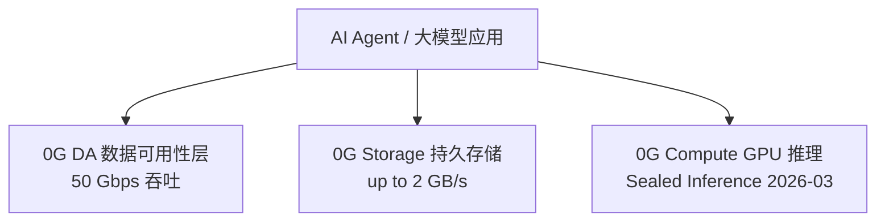

**用法口诀**：推理日志（高频小写）→ 0G DA；模型权重（大文件持久）→ 0G Storage；训练数据集（低频批量）→ Filecoin FIL+。

0G / EthStorage / Greenfield / Codex / Swarm 详细对比见附录 E。

**章末**：6 个新一代存储平台的完整选型对比见附录 E §E.3。

---

## 7. 选型决策

**TL;DR** — 两个问题定方案：(1) 数据要存多久？(2) 读取频率多高？

### 7.1 决策树

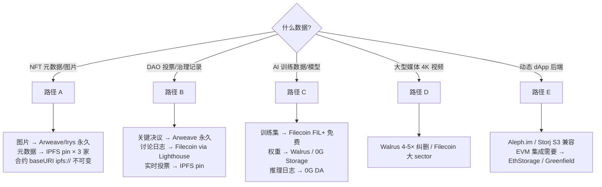

### 7.2 三个核心维度

| 维度 | 问题 | 方案梯度 |
|---|---|---|
| 持久性 | 1 年？10 年？永久？ | 月付 pin → Filecoin → Arweave |
| 读取 pattern | 高频 or 归档？ | 高频 → IPFS + CDN；归档 → Filecoin |
| EVM 原生需求 | 合约要直接读写吗？ | 需要 → EthStorage / Greenfield |

### 7.3 反模式清单

❌ NFT 元数据用 `https://` URL（服务器倒了就 404）  
❌ 单一 Pinning 服务（NFT.Storage 关停教训）  
❌ `ipfs://` base URI 设为 mutable IPNS（难以验证）  
❌ 把高频读小数据放 Filecoin（retrieval 慢）  
❌ 用 Arweave 存"明天可能要删"的数据（删不掉）  
❌ 没有把 root CID hash 写入链上 registry  

### 7.4 三层冗余 playbook

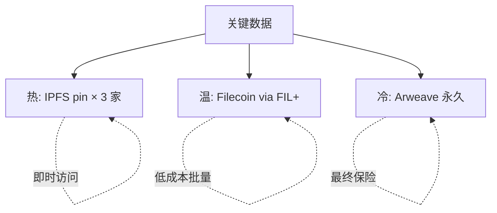

迁移 playbook（平台关停应对）：90 天公告期 → 盘点 CID registry → CAR 导出 → 新平台上传 → hash 校验 → 更新链上 contenthash。

---

> **⚠️ 主线读者请注意**：下面 §A–§G 是约 1100 行的协议深挖附录，**主线 §8 实战在所有附录之后**。
>
> **小白 / 第一遍读者**：先看 §8 实战（Cmd+F 搜 `## 8. NFT dApp 实战` 直接跳转），再回头按需翻附录。
>
> **选型验证 / 深挖读者**：按顺序读附录 A→G，再做实战。

# 附录 A：IPFS 协议栈详（DHT / Bitswap / IPLD）

## A.1 IPFS 协议栈总览

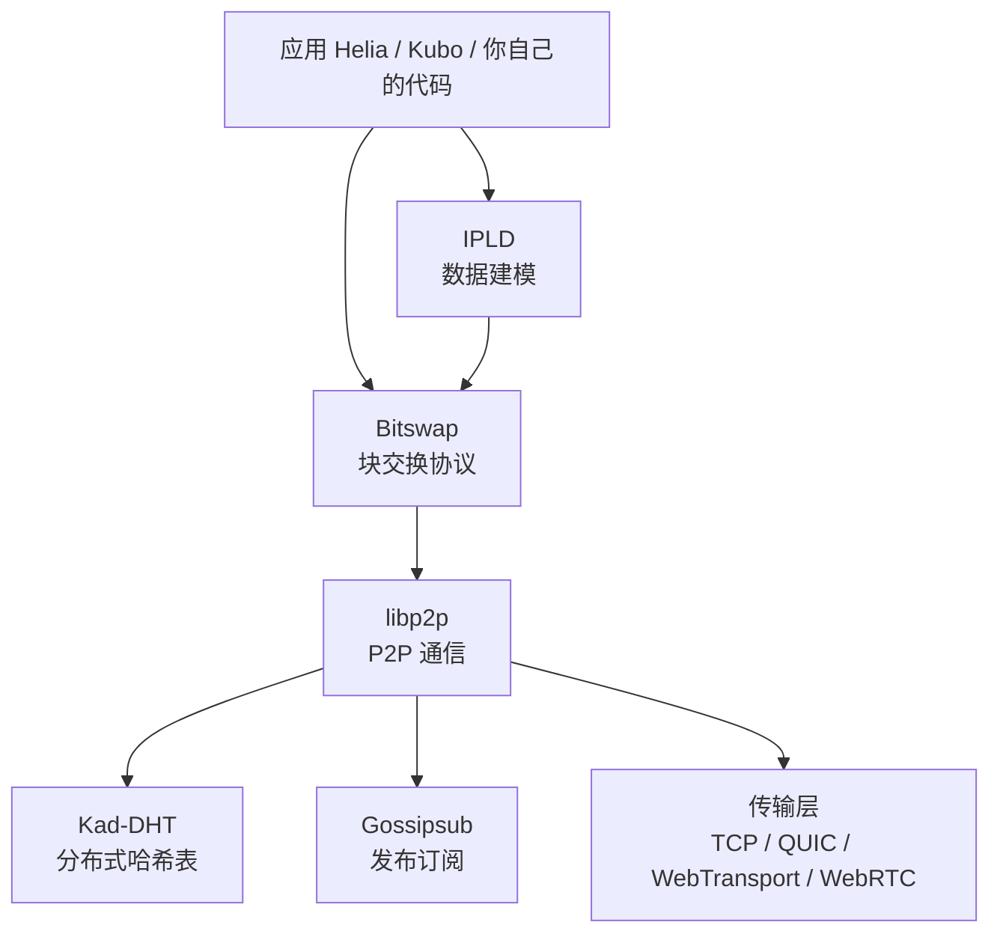

**四个核心模块**：

1. **libp2p**：底层 P2P 通信（连接、加密、路由）。可独立用于其他项目（filecoin、ethereum 共识层 lighthouse 都用 libp2p）。
2. **Bitswap**：块级交换协议——你想要某个 CID，向邻居广播"WANT-HAVE"，对方有就发"HAVE"，你再"WANT-BLOCK"。
3. **DHT (Kademlia)**：分布式提供者发现——给定 CID，找到全网谁有这个块。
4. **IPLD**：数据建模层（下一章详述）。

### A.1.1 Kademlia DHT 简述

DHT 解决一个问题：**给定 CID，去哪里找？**

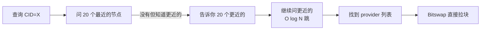

**XOR 距离**：节点 ID 和 CID 都是 256 位，距离 = ID XOR CID。每跳至少把距离减一半（k-bucket 路由），所以 N 个节点中找一个 provider 只需 O(log N) 跳。

DHT 查询慢是 IPFS 体验差的最大单一原因。第一次拉一个冷门 CID 经常 5-30 秒，热门 CID（已被网关缓存）几百毫秒。这就是为什么生产 dApp 几乎都直接用网关 + pin 服务，绕开自己跑 DHT。

来源：https://docs.ipfs.tech/concepts/dht/

### A.1.2 Helia：现代 JS 实现

js-ipfs 已被官方淘汰，**Helia** 是 2023 起的现代 TypeScript 实现：

- 模块化（按需引入 unixfs / dag-cbor / 等）
- 浏览器原生（WebTransport / WebRTC 直连）
- 与 Kubo（Go 实现）和 rust-ipfs 互通

```javascript
// 最小 Helia 上手
import { createHelia } from 'helia';
import { unixfs } from '@helia/unixfs';

const helia = await createHelia();
const fs = unixfs(helia);

const cid = await fs.addBytes(new TextEncoder().encode('Hello'));
console.log(cid.toString());  // bafkrei...

// 读回来
const decoder = new TextDecoder();
let text = '';
for await (const chunk of fs.cat(cid)) {
  text += decoder.decode(chunk, { stream: true });
}
console.log(text);  // Hello
```

来源：https://github.com/ipfs/helia

---

## A.2 IPLD 数据结构

### A.2.1 为什么需要 IPLD

CID 只指向"一个块"。但实际数据经常是嵌套结构：

- 一个目录有很多文件
- 一个 NFT metadata 引用一张图片
- 一个区块链区块引用前一个区块

IPLD（InterPlanetary Linked Data）是**跨 CID 链接**的数据模型：节点之间通过 CID 互相指向，形成 Merkle DAG。

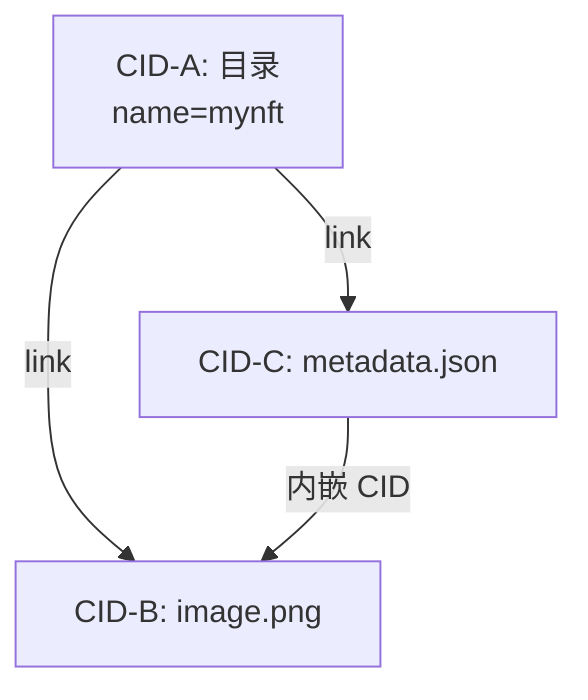

DAG（有向无环图）的关键性质：任何子节点变化 → 父节点 CID 必变。这就是 git 和区块链共用的 Merkle 根性质。

### A.2.2 codec 与 schema

IPLD 数据可以用不同 codec 存：

| codec | 用途 | 例子 |
|---|---|---|
| `dag-pb` | UnixFS 文件/目录（IPFS 默认） | NFT 图片 |
| `dag-cbor` | 二进制结构化（紧凑、含链接） | Filecoin 区块、CAR 文件元数据 |
| `dag-json` | JSON + CID 链接（人类可读） | 调试 |
| `raw` | 单纯字节流（无解释） | 大文件 chunk |

### A.2.3 CAR 文件（Content Archive）

CAR = 一组 IPLD 块的串行化打包格式，是 IPFS / Filecoin / Web3.Storage 之间传输的标准格式：

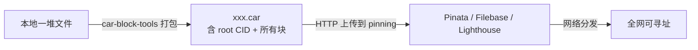

实战要点：超过 100 MB 的内容**不要**用 `addBytes` 一次性传，而要先打 CAR 再上传，否则 HTTP 超时 / 内存爆。

---

## A.5 Pinning 服务全谱系（详细版）

> **场景题**：假设你做一个 NFT 项目，10000 张图，每张 200 KB，总计 2 GB。你打算存 IPFS。问题：图存在谁的硬盘上？你跑一个本地 IPFS 节点存？那你的家用路由器 24/7 不能断电，电费一年也不少。让"IPFS 网络"自己存？IPFS 协议本身**不存数据**，它只是寻址 + 分发协议——没人付钱让节点持久持有。这就是 Pinning 服务的市场：Pinata / Filebase / 4everland 这些公司给你跑专业节点、保证 SLA、24/7 在线，相当于 IPFS 时代的 AWS S3。
>
> **现实警告**：2024-06-30，Protocol Labs 自家的 NFT.Storage Classic 关停免费上传通道。三年里它免费 pin 了海量 NFT 元数据；那一天起，无数项目方发现自己的 NFT 元数据"还在但再也无法续传"，链上 baseURI 早就 immutable，迁不走。这一节的所有教训都从这次事故来。

### A.5.1 Pinning 在三个轴上是什么

Pinning = 把"这块内容不能 GC"显式落到某个节点。自己 pin 自己节点 = 自己当 SP，节点关机数据就消失。第三方 pinning 服务的本质是**用 SaaS 信任换 24/7 持久性 + 低延迟可用性**——你不再依赖 IPFS 协议本身的 best-effort 假设，而是依赖某家公司的 SLA。这条线注定比 Filecoin / Arweave 脆弱（公司可关停、价格可调），所以是"热数据"层而非"长期保存"层。

### A.5.2 六大主流服务对比（2026-04 实测）

| 服务 | 免费额度 | 付费起价 | 特点 | 状态 |
|---|---|---|---|---|
| **Pinata** | 1 GB / 1000 文件 | $20/月 起 50 GB | 行业标杆，NFT 主流；2026 起免费额度缩水 | 活跃 |
| **Web3.Storage (Storacha)** | "Starter" 免费层 5 GB / 月，包含上传 + 网关读 + 1 个 Space；超出按 Lite ($10/月 100 GB) / Business ($100/月 2 TB) 阶梯计费，详见 [storacha.network/pricing](https://storacha.network/pricing) | Lite $10/月、Business $100/月 | Protocol Labs 系，2024 旧 web3.storage API 已迁移到 Storacha 平台；旧 SDK (`@web3-storage/w3up-client`) 仍兼容但 endpoint 已切换 | 活跃但模式变了：免费层从早期"无限"收紧到 5 GB |
| **Filebase** | 5 GB | $20/月 起含 1 TB 存储（约 $0.02/GB/月，超量按 $0.005/GB 计） | S3 兼容 API，最低存储单价 | 活跃 |
| **Lighthouse** | 5 GB | 一次付费永久存（$2.4/GB 估算）或月付 | 内置加密、Filecoin Deal 自动化 | 活跃 |
| **NFT.Storage** | Classic 已 2024-06-30 关停；Long-Term 仍可用 | 企业付费 | PL Filecoin Impact Fund 接管 | 限制使用 |
| **4everland** | 5 GB | $5/月 起 100 GB | 集成多链 / EVM 友好 / IPFS 网关 | 活跃 |

来源：
- Pinata 价格 https://pinata.cloud/pricing
- Filebase 价格 https://filebase.com/pricing
- NFT.Storage 状态 https://nft.storage/blog/nft-storage-operation-transitions-in-2025
- Web3.Storage 转 Storacha https://storacha.network/

### A.5.3 Pinata / NFT.Storage 关停事故复盘

这两家是 IPFS pinning 行业的标杆，也是迄今最有教育意义的两次"以为去中心化、实际单点依赖"事故。

**NFT.Storage Classic（2024-06-30 关停免费上传）**

- **承诺**：Protocol Labs 出品，2021 起对所有 NFT 项目免费 pin 元数据，文宣是"NFT 永久免费存储"。
- **失败模式**：免费层在 ~3 年里吸纳了海量 NFT 元数据，PL 资源消耗到无法持续。2024-06-30 公告 Classic 上传通道关闭，已存数据继续保留但**长期 latency 和可用性可能下降**——客户既不能续传新内容、也无法迁移走（因为元数据 CID 已写进数千份 ERC-721 合约 baseURI，部分 immutable）。
- **暴露的问题**：项目方误以为"上 IPFS 就稳了"，实际只 pin 在 NFT.Storage 一家——**pinning 服务的 SLA 不等于 IPFS 协议的承诺**。Classic 关停那一刻，所有"只 pin 在这"的 CID 失去了它们唯一的持久性来源（CID 本身仍然有效，但不再有节点保证 hosting）。
- **后续**：2025 年 PL Filecoin Impact Fund 接管，Long-Term Storage 推付费版本；行业被迫直面"pinning 的可持续性"。

**Pinata 免费层缩水（2024-2026 渐进式）**

- **承诺**：行业标杆，2021-2023 免费 1 GB / 1000 文件，足够小项目用。
- **演变**：2024 起多次缩免费层；2026 价格上调；部分客户报告偏远地区网关延迟上升。这不是"关停"，是更隐蔽的失败模式——**温水煮青蛙**：一开始免费够用，三年后被迫升级或迁移，而你的链上 baseURI 早就 immutable 了。
- **教训**：免费层的吸引力越大、依赖越深、迁移成本越高。生产实践要从一开始就假设"任何一家会变"，**所以一开始就要把同一份 CID 发到 3 家以上 pinning 服务**，关停或加价时的反应是"减一家"而非"全栈瘫痪"。

**复盘归纳**：免费 pinning 的本质矛盾是 IPFS 不可商业化的部分（DHT 寻址 + P2P 传输）必须由商业实体托起来——这条边界既不可避免、也注定不稳定。把项目命脉绑在任何一家 SaaS 上都是误用 IPFS。生产模板：3 家 pinning 冗余 + Filecoin/Arweave 长期备份 + 链上 hash registry 自证。

### A.5.4 选型快速口诀

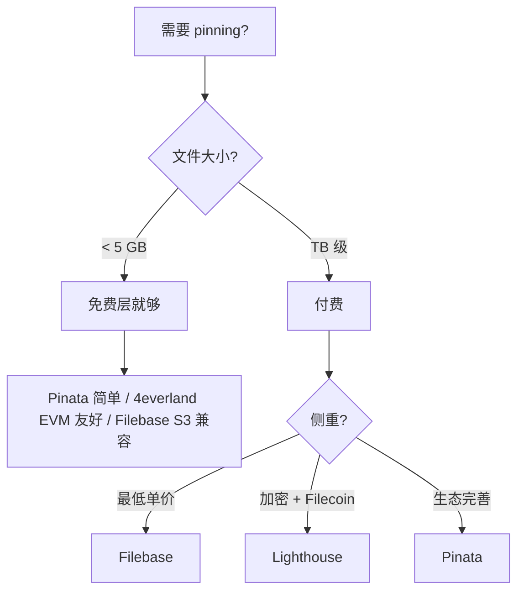

### A.5.5 上传到 Pinata 的最小例子

```javascript
// pinata-upload.mjs
// 依赖：npm i pinata
import { PinataSDK } from 'pinata';
import fs from 'node:fs';

const pinata = new PinataSDK({
  pinataJwt: process.env.PINATA_JWT,        // 从 https://app.pinata.cloud 获取
  pinataGateway: 'gateway.pinata.cloud',
});

async function main() {
  // 上传单文件
  const blob = new Blob([fs.readFileSync('./my-nft.png')]);
  const file = new File([blob], 'my-nft.png', { type: 'image/png' });
  const upload = await pinata.upload.file(file);
  console.log('CID:', upload.cid);

  // CID 形如 bafkreig...，永远定位这张图
  // 通过任意 IPFS 网关都能访问：
  //   https://gateway.pinata.cloud/ipfs/<CID>
  //   https://ipfs.io/ipfs/<CID>
  //   https://dweb.link/ipfs/<CID>
}
main();
```

---

## A.3 网关与寻址

### A.3.1 网关是什么

**思考题**：Chrome / Safari 不懂 IPFS 协议。如果你给用户一个 `ipfs://bafy...` 链接，绝大多数浏览器只会一脸懵。那 NFT 市场上千万张图怎么显示出来的？答案是 HTTP 网关——一台跑 IPFS 节点 + 翻译 HTTP 请求的服务器，把 `ipfs://CID` 翻译成 `https://ipfs.io/ipfs/CID`，浏览器就懂了。

普通浏览器不会说 IPFS 协议，所以需要 HTTP → IPFS 桥梁，叫 **gateway**：

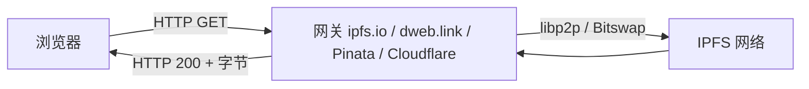

### A.3.2 主流公共网关

| 网关 | 维护方 | 特性 | 限速 |
|---|---|---|---|
| `https://ipfs.io/ipfs/<CID>` | IPFS Foundation | 官方、最知名、容易被 rate-limit | 严格 |
| `https://dweb.link/ipfs/<CID>` | IPFS Foundation | 子域名隔离（防 same-origin 攻击） | 中等 |
| `https://cloudflare-ipfs.com/ipfs/<CID>` | Cloudflare | 全球 CDN、最快；2024 起部分功能调整 | 宽松 |
| `https://gateway.pinata.cloud/ipfs/<CID>` | Pinata | 仅供自己用户；私网快 | 客户专属 |
| `https://<CID>.ipfs.4everland.io` | 4everland | 子域名风格 | 中等 |

**永远不要前端硬编码单一网关**。任何一家挂了你的 NFT 图片就显示不出来。生产实践：客户端列表轮询（race the gateways），第一个 200 的就用。

### A.3.3 子域名 vs 路径寻址

```
路径风格（旧）: https://dweb.link/ipfs/bafy.../image.png
子域名风格（新）: https://bafy....ipfs.dweb.link/image.png
```

**为什么后者好**：
- Same-origin policy 把不同 CID 的内容隔离到不同 origin（防 XSS）
- Service Worker 可挂在 CID 子域上，做客户端验证

来源：https://docs.ipfs.tech/concepts/public-utilities/

---

## A.4 IPNS 与 DNSLink

### A.4.1 问题：CID 是不可变的，怎么发布"最新版本"？

**两难场景**：你做了一个 dApp 前端，每周发新版本，每次部署 CID 都变。但用户不可能记一长串 `bafybei...` 字符——他们想输入 `myapp.eth` 就到。CID 是不可变的（这是 IPFS 的优点），可你的网站要可变（产品要迭代）。怎么用一个稳定名字指向"最新 CID"？

CID 内容变就变 CID，但你的网站需要一个稳定的入口，比如 `mydao.eth`。

三种方案：

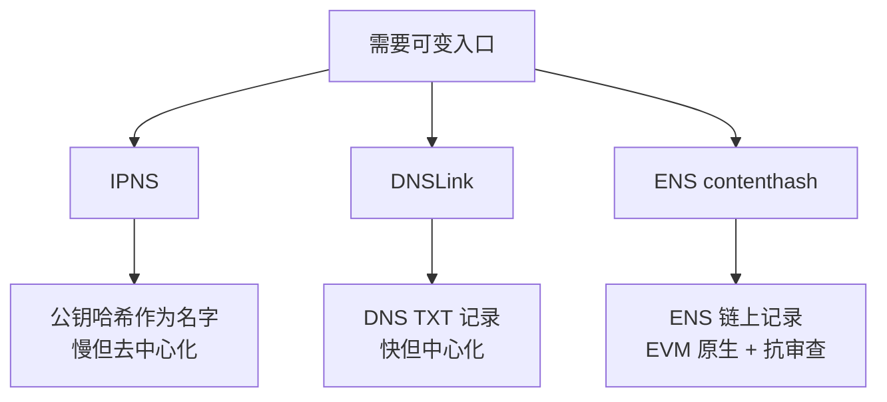

### A.4.2 IPNS

- 名字 = `/ipns/<公钥哈希>` 或 `/ipns/k51qzi5...`（base36 编码的 ed25519 公钥）
- 内容 = 一条签名记录，含目标 CID + 序号 + TTL
- 全网通过 DHT 存储和发布
- **慢**：一次发布通常 30-60 秒生效，查询亦然

### A.4.3 DNSLink

DNS TXT 记录指向 IPFS：

```
$ dig +short TXT _dnslink.docs.ipfs.tech
"dnslink=/ipfs/bafybei..."
```

- **快**：DNS 缓存秒级
- **代价**：依赖中心化 DNS（不过 DNS 已经是 web 既有信任根）

### A.4.4 ENS contenthash

最适合 EVM 项目：

```solidity
// 通过 ENS PublicResolver 设置
resolver.setContenthash(node, hex"e30101701220...");
// 浏览器（如 Brave / MetaMask）解析 mydao.eth → 直接走 IPFS
```

生产推荐：DAO / dApp 前端 → ENS contenthash + IPFS pinning，用户输入 `mydao.eth` 即可访问；CI/CD 每次部署更新 contenthash。Uniswap、ENS 自身、Aave 都是这套。

### A.4.5 习题（IPNS / 网关）

**Q1**：为什么生产环境不应该硬编码 `https://ipfs.io/ipfs/<CID>` 作为 NFT 图片地址？给出 3 个理由。

<details><summary>答案</summary>

1. ipfs.io 网关有 rate-limit，热门 NFT 系列高峰期会被限流。
2. 任何单一网关都可能被法律 / 监管要求屏蔽某 CID（虽然内容仍在 IPFS 网络）。
3. 子域名风格 `<CID>.ipfs.dweb.link` 自带 same-origin 隔离，路径风格不行。
</details>

**Q2**：用一句话区分 IPNS 和 DNSLink 的信任模型。

<details><summary>答案</summary>

IPNS 用密码学公钥签名（信任根 = 私钥持有者）；DNSLink 用 DNS TXT 记录（信任根 = 域名 registrar 和 DNS 服务商）。
</details>

**Q3**：你做了一个 dApp 前端，每次部署都生成新 CID。怎么保证用户输入 `mydao.eth` 总是访问最新版？

<details><summary>答案</summary>

CI/CD 部署完成后调用 ENS PublicResolver 的 `setContenthash`，把新 CID 写入 ENS 记录。支持 ENS 的浏览器（Brave、MetaMask、Opera）会自动解析；不支持的可以用 `mydao.eth.limo` 或 `mydao.eth.link` 网关代理。
</details>

**Q4**：解释为什么 IPFS 中"删除"非常困难。

<details><summary>答案</summary>

CID 由内容决定，全网任意节点只要持有该字节就能复活该 CID。你能控制的只有"自己节点不再 pin / 自己网关不再 serve"，无法阻止他人节点继续 hosting。这是抗审查的代价：发布前要做好"上链即永恒"的心理准备。
</details>

---

# 附录 B：Filecoin PoRep / PoSt 数学 / FVM

Filecoin 持久性的严肃性来自密码学证明 + 经济惩罚两层。本附录深挖 PoRep / PoSt 证明机制、矿工生命周期和 FVM 合约接口。

## B.1 存储证明三件套

> **想象：你付钱给某个矿工"帮我存这份 1 TB 数据集 1 年"。怎么知道他没把数据删掉？或者更阴险——10 个矿工偷偷共享同一份硬盘？** Filecoin 的 PoRep + PoSt 把这件事做得严肃。

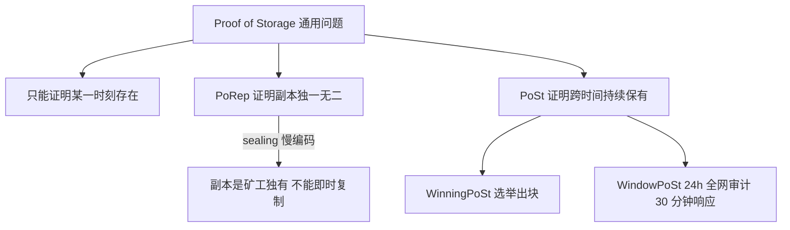

## B.2 PoRep（Proof of Replication）

矿工拿到数据后经历 sealing——慢加密过程把数据变成"独一无二的副本"，提交 zk-SNARK 证明。

**为什么必须慢**：若 sealing 可以即时复制，攻击者可临时向他人借数据骗证明，10 个矿工共享一份硬盘却声称独立 10 副本。sealing 绑定矿工身份 + 时间，使副本即时复用不可行。

来源：https://docs.filecoin.io/basics/the-blockchain/proofs

## B.3 PoSt（Proof of Spacetime）

**WinningPoSt**：每个 epoch（30 秒）随机选矿工，立刻为某 sector 出证明 + 打包新区块。

**WindowPoSt**：24 小时切成多个窗口，30 分钟内提交 zk-SNARK 证明，否则被 slash（罚没抵押）。

Filecoin 矿工每天做密码学证明。一台 64 TiB 矿机一年仅证明计算电费就是个数字——这就是 Filecoin 价格不能太低的硬约束。

## B.4 sealing 时间开销

一个 64 GiB sector 完整 sealing：
- **PC1**（CPU 密集）≈ 3.5 小时
- **PC2**（GPU zk-SNARK）≈ 30 分钟
- **WaitSeed**（等链上随机数）≈ 75 分钟
- **C1 + C2**（最终证明）≈ 30 分钟
- 总计 ≈ **5-6 小时** / sector

## B.5 FIL 经济关键参数（2026-04）

| 参数 | 当前值 |
|---|---|
| 区块时间 | 30 秒 |
| 网络存力 | ≈ 25 EiB |
| 实际利用率 | ≈ 30%-40% |
| deal 默认期限 | ≥ 180 天，最长 540 天 |

## B.6 三个市场与 Storage Deal 详解

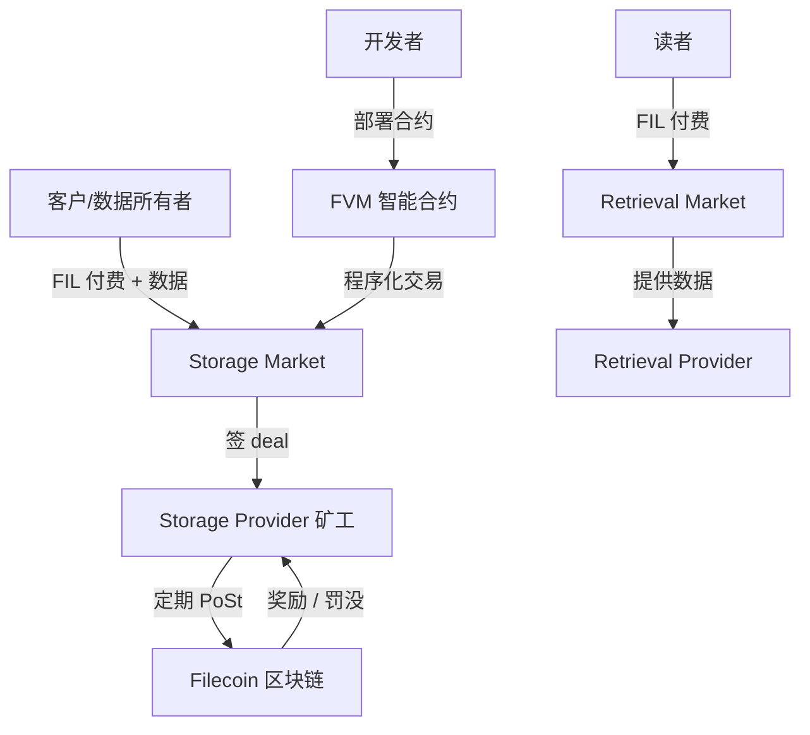

- **Storage Market**：存储成交，长期 deal（默认 ≥ 180 天，最长 540 天，可程序化续期）
- **Retrieval Market**：按字节计费的快速读取（理论上独立于存储）
- **Smart Contract Layer (FVM)**：让 Solidity 合约能直接发起 storage deal

### B.8 抵押与罚没

矿工进入网络要锁定 FIL 抵押（initial pledge），并按 sector 数量持续锁定 storage pledge。如果：

- 漏 WindowPoSt → 罚一部分（fault fee）
- 永久丢数据 → 罚全部 sector 抵押（termination penalty）

这就是为什么 Filecoin 矿工不敢"假装存"。一台矿机抵押动辄百万 FIL，丢一个 sector 罚到肉痛。

### B.9 FIL 经济关键参数（2026-04 快照）

| 参数 | 当前值 | 说明 |
|---|---|---|
| 区块时间 | 30 秒 | 一个 epoch |
| 每 epoch 出块 | 平均 5-7 个区块（tipset） | 随机选举 |
| 总供应量 | 20 亿 FIL（hard cap） | |
| 网络存力 | ≈ 25 EiB（2026-04） | 历史峰值 30+ EiB |
| 实际利用率 | ≈ 30%-40% | 大部分仍是 CC（Committed Capacity）空 sector |
| Onchain Cloud 主网 | 2026-01 上线 | 验证存储 + 链上付费 |

来源：
- Filecoin docs https://docs.filecoin.io/basics/what-is-filecoin/blockchain
- 网络数据 https://filfox.info/
- v26 Gas 优化 https://coinmarketcap.com/cmc-ai/filecoin/latest-updates/

---

## B.10 矿工类型与生命周期

> **现实数字**：2026-04 一个全功能 Filecoin 矿工的硬件起步：32 核 CPU、256 GB RAM、几张 NVIDIA GPU、几百 TB 高密度 HDD + NVMe 缓存盘。一台单机投入 5-10 万美金。开机第一件事不是赚钱，是 sealing——把空硬盘加密成"可证明持有"的 sector，单个 64 GiB sector 要烧 5-6 小时 CPU + GPU。读完这一节你会明白：为什么 Filecoin 价格不能太低（矿工电费撑不住）、为什么 Bitfarms 这种 PoW 矿工很难直接转型 Filecoin（硬件需求完全不同）。

### B.10.1 矿工分类

| 类型 | 工作 | 收入来源 |
|---|---|---|
| **Storage Provider (SP)** | 存数据 + 出 PoSt 证明 | block reward + storage fee + FIL+ datacap multiplier |
| **Retrieval Provider** | 提供快速读取 | retrieval fee（按字节） |
| **Repair Provider** | 数据丢失时从冗余恢复 | 修复奖励（实验中） |

很多 SP 同时是 Retrieval Provider；但纯检索矿工目前不多——经济不划算。所以 Filecoin 的"读"实际上经常通过 IPFS 网关或专门的 SaaS（Web3.Storage / Lighthouse）解决。

### B.10.2 一笔 Storage Deal 的完整生命周期

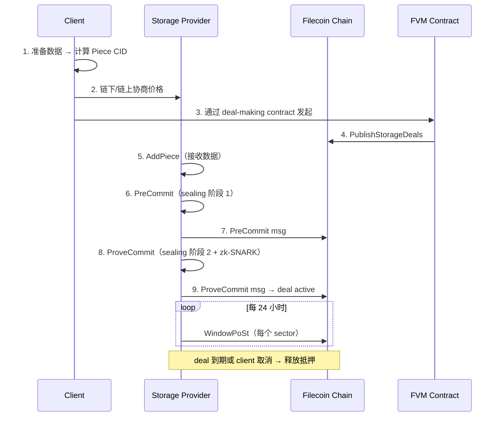

### B.10.3 sealing 是个慢活

一台 64 GiB sector 完整 sealing 需要：

- **PreCommit Phase 1 (PC1)**：CPU 密集，~ 3.5 小时（大量内存访问）
- **PreCommit Phase 2 (PC2)**：GPU 加速 zk-SNARK，~ 30 分钟
- **WaitSeed**：等链上随机数（150 个 epoch ≈ 75 分钟）
- **Commit Phase 1 (C1)**：组装 proof 数据
- **Commit Phase 2 (C2)**：GPU SNARK 证明，~ 30 分钟

总耗时 ≈ 5-6 小时 / sector，硬件门槛 = 高端 CPU（多核多 RAM）+ NVIDIA GPU。

来源：https://lotus.filecoin.io/storage-providers/operate/sector-sealing/

---

## B.11 FVM 与 EVM 兼容

> **2023-03，Filecoin 主网上线两年半之后，团队终于推出了 FVM。这件事的意义可以这样理解：在此之前，"让矿工存我的数据"是一个 Web2 SaaS 流程——用 Lotus CLI 或 Web3.Storage 的 API 让某个矿工接单。FVM 上线那天起，DAO 可以投票"我们存这个数据集"，合约自动选矿工 + 续约 + 替换 + 罚没——存储第一次成了链上原生原语。Vitalik 在那段时间的演讲里说过："Filecoin 终于变成了一条真正的智能合约链。"今天的 Lighthouse 永久存储、Spheron 协议层、Glitter Finance 的链下数据 oracle，都建立在 FVM 之上。**

### B.11.1 FVM 是什么

FVM = **Filecoin Virtual Machine**，2023-03 上线，让 Solidity 合约能跑在 Filecoin 链上，并能直接和**存储系统**交互。

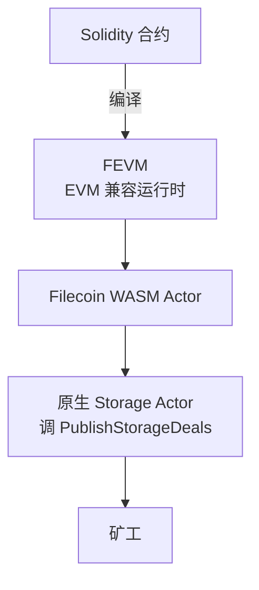

**关键点**：
- Solidity / Hardhat / Foundry / MetaMask 都能用
- 合约可以直接发起 storage deal（前所未有）
- 跨链桥到 Ethereum / Polygon

### B.11.2 一个最小 FVM 合约：链上发起 storage deal

```solidity
// SPDX-License-Identifier: MIT
pragma solidity 0.8.28;

// 引用 Filecoin 官方 actor 接口
// import "@zondax/filecoin-solidity/contracts/v0.8/MarketAPI.sol";

contract DealMaker {
    event DealProposed(uint64 dealId, bytes pieceCid);

    /// 发起一笔 storage deal
    /// @param pieceCid 数据的 Piece CID（IPFS CID 经过 padding 后的形式）
    /// @param pieceSize 数据大小（字节，必须是 2 的幂）
    /// @param startEpoch deal 开始时间
    /// @param endEpoch deal 结束时间
    function proposeDeal(
        bytes calldata pieceCid,
        uint64 pieceSize,
        int64 startEpoch,
        int64 endEpoch
    ) external payable {
        // 实际实现需调用 MarketAPI.publishStorageDeals
        // 此处展示概念
        emit DealProposed(0, pieceCid);
    }
}
```

链上发起 deal 的意义在于：以前必须用 Lotus CLI / SaaS API 让某个矿工接单，整个流程脱离链上规则。现在 DAO 可以投票决定"我们要存这个数据集"，合约自动选矿工 + 续约 + 替换。

来源：https://docs.filecoin.io/smart-contracts/fundamentals/the-fvm

### B.11.3 FVM vs EVM 的差异

| 维度 | EVM | FVM (FEVM) |
|---|---|---|
| Gas 模型 | gas units × gasPrice | gas + 存储费 |
| 区块时间 | 12 秒 (Eth) | 30 秒 |
| 状态最终性 | 12-15 区块（Eth post-Merge） | 900 epochs ≈ 7.5 小时 |
| 原生能力 | 仅计算 | 计算 + 存储 + 检索 |
| 工具兼容 | 100% Hardhat / Foundry | 99%（个别 precompile 不同） |

Filecoin 最终性极慢（数小时），不适合需要秒级 finality 的 DeFi。它的甜点是：DAO 数据存档、AI 训练集、长尾媒体内容。

---

## B.12 Filecoin Plus 与 SaaS 层

> **2021 年问题**：Filecoin 主网上线一年，全网存力 10 EiB，但实际**真实数据**占比可能不到 5%——绝大多数矿工封装的都是 CC（Committed Capacity）"空 sector"，本质是占地圈块奖励。这事一度让社区炸锅："号称去中心化存储，结果全是空硬盘？" Protocol Labs 推 FIL+ 解决这个问题——10× block reward 倍数让矿工**愿意打折甚至免费**接真实数据。今天 Filecoin Plus datacap 的接受方包括 Internet Archive、UC Berkeley、各大 NFT 项目。这一节讲清楚：为什么"免费存"在 Filecoin 经济上是合理的，以及背后那条"真实数据 vs 空 sector"的博弈线。

### B.12.1 Filecoin Plus（FIL+）是什么

为了激励矿工存"真实有用的数据"，Filecoin 引入了 **Datacap** 机制：

- 社会化审核员（Notaries）发放 Datacap 给客户
- 客户用 Datacap 找矿工存 → 矿工获得 **10× block reward multiplier**
- 客户花的还是普通 FIL，但矿工愿意打折甚至免费收（因为奖励翻倍）

```mermaid
flowchart LR
    Client[客户申请 Datacap] -->|说明用途| Notary[Notary 审核]
    Notary -->|批准| Datacap[拿到 N TiB Datacap]
    Datacap -->|挑矿工| SP[Storage Provider]
    SP -->|10× 奖励| BlockReward[Block Reward]
    Datacap --> Verified[Verified Deal<br/>链上 verified=true 标记]
```

### B.12.2 SaaS 层：为什么需要

直接和矿工对接太复杂（要懂 Lotus、要管 deal 续期、要监控 fault）。所以出现了 SaaS 抽象层：

| SaaS | 功能 | 状态 |
|---|---|---|
| **Web3.Storage（Storacha）** | 类似 S3 SDK，自动 IPFS pinning + Filecoin deal | 活跃，已转 Storacha 品牌 |
| **Lighthouse** | 一次付费永久存（自动跨多 SP + 续 deal）+ 加密 | 活跃 |
| **Estuary** | 类似 Web3.Storage 的开源替代 | **已关停**（2023-07 停服，2024-04 网站下线） |
| **NFT.Storage Classic** | NFT 元数据免费 pinning | **已关停**（2024-06-30） |
| **NFT.Storage Long-Term** | 付费长期存储，PL Filecoin Impact Fund 接管 | 限制使用 |

来源：
- Estuary 关停 https://docs.estuary.tech/（已重定向）
- NFT.Storage 转换 https://nft.storage/blog/nft-storage-operation-transitions-in-2025

### B.12.3 Lighthouse 上传示例

```javascript
// lighthouse-upload.mjs
// 依赖：npm i @lighthouse-web3/sdk
import lighthouse from '@lighthouse-web3/sdk';

const apiKey = process.env.LIGHTHOUSE_API_KEY;  // 在 https://files.lighthouse.storage 申请

async function main() {
  // 上传文件，自动 IPFS + Filecoin 双备份
  const response = await lighthouse.upload(
    './my-dao-archive.tar.gz',
    apiKey,
  );
  console.log('CID:', response.data.Hash);
  console.log('Filecoin Deals:', response.data.Deals);
  // Deals 是后台异步建立的，不等待
}
main();
```

### B.12.4 习题（Filecoin 深入）

**Q1**：为什么 Filecoin 主网刚上线时存力很大但实际利用率只有 5-10%？

<details><summary>答案</summary>

矿工挖矿需要质押 FIL，质押要求和 sector 大小成正比。早期 FIL 价格高 + 矿工想拿 block reward，于是用 CC（Committed Capacity）模式封装空 sector 进网络——本质是"占地不存数据"。后来 FIL+ 机制（10× 倍数）才真正激励矿工去接真实数据 deal。
</details>

**Q2**：你的 DAO 想存 1 TB 投票档案，预计长期保留 5 年，要写在合约里"自动续期"。请描述技术栈。

<details><summary>答案</summary>

1. 数据先打 CAR，得到 root CID + Piece CID。
2. 部署一个 FVM Solidity 合约，含：申请 Datacap（如已申请到）、调用 `MarketAPI.publishStorageDeals` 发起 verified deal、监听 `DealActive` 事件、计时器（每 6 个月）触发新一轮 deal。
3. 合约持有 FIL 抵押用于支付未来 deal。
4. 备份策略：同时上传到 Pinata 和 Lighthouse 做冗余。
</details>

**Q3**：FVM 和 EVM 在最终性上差几个数量级，这意味着什么样的应用不该选 FVM？

<details><summary>答案</summary>

最终性 7.5 小时意味着 DEX、清算、闪贷等需要秒级最终性的 DeFi 完全不可用——价格波动 7 小时足够操纵。FVM 适合：长期数据归档、缓慢的 DAO 治理（投票期本来就长）、AI 训练 dataset 管理、archival NFT。
</details>

**Q4**：解释为什么很多 NFT 项目即使用 Filecoin 也要先 IPFS pin，再异步 Filecoin deal？

<details><summary>答案</summary>

Filecoin 的 retrieval 不像 IPFS 那么实时——经常需要矿工"unsealing"sector 才能读，慢的几分钟，快的几秒，但都不适合 NFT marketplace 加载图片。所以工程实践是：IPFS pin 服务保证热数据快速访问 + Filecoin deal 保证长期持久。两层各司其职。
</details>

---

# 附录 C：Arweave 经济模型 / SPoRA / blockweave

## C.1 永久存储经济（深入）

> **2017 年，Sam Williams（Arweave 创始人，英国人）在肯特大学计算机系读博。他的博士论文研究"分布式持久存储经济模型"。导师对他说："你这玩意理论上可行，但商业化怕是不行——谁会一次付费让你存几百年？" Sam 答："硬盘价格 60 年降了一万倍，未来 200 年只会更便宜。如果我现在收你 100 年的钱，按今天的存储成本预付，靠基金滚利息和成本下降，我就能扛 200 年。"** 听起来像庞氏？2018 年主网上线，今天 Arweave 网络存储着 230+ TB 永久数据，包括 Mirror 上几十万篇文章、整个 SnapShot 投票快照、Internet Archive 的部分备份、Edward Snowden 泄露文件的镜像。庞氏不会扛过 8 年；这个赌注还在赢。本章拆解：基金模型怎么算、blockweave 怎么逼矿工存历史、SPoRA 怎么让"硬盘越多出块越多"。**

### C.1.1 一次付费永久存的核心赌注

Filecoin deal-based、按时间续约；Arweave 反过来：**一次付费，承诺永久**。听起来像庞氏，但模型基于一个简单观察——**存储成本指数级下降（Kryder's law），单位存储价格每 18 个月腰斩**。

```mermaid
flowchart TB
    User[用户付一笔 AR] --> Pool[网络捐赠基金 Endowment]
    Pool --> Compound[利息 + 矿工费分配]
    Compound -->|每年提取一小部分| Miners[矿工奖励]
    Miners --> Store[继续存]
    Note[关键假设:<br/>存储成本下降速度 > 基金消耗速度] -.-> Pool
```

**模型核心**：基金按当前存储 200 年的成本预收，假设每 18 个月成本腰斩，这笔钱够用很久很久。

如果存储成本反而上升（量子加密等因素）？模型有保守边界（按 200 年定价），且基金多余收益再投资，能扛一定波动。但理论上不能扛"成本永久反向"。

### C.1.2 区块链结构：blockweave

Arweave 不是普通区块链，是 **blockweave**——每个新区块同时引用前一块和**随机一个历史块**：

```mermaid
flowchart RL
    B1[Block 1] <--prev-- B2[Block 2]
    B2 <--prev-- B3[Block 3]
    B3 <--prev-- B4[Block 4]
    B4 -.recall.-> B1
    B3 -.recall.-> B1
    B2 -.recall.-> B1
```

矿工要出块必须有那个 recall 块的数据 → 激励全网保留**完整历史**而非只存最新。

### C.1.3 SPoRA（Succinct Proofs of Random Access）

矿工用 SPoRA 共识：

1. 拿到候选 chunk index（链上随机出来）
2. 必须在本地真实读出该 chunk 才能算 PoW hash
3. 如果硬盘没那一段就算不出 hash → 不能出块

这把"持有数据"和"出块概率"绑在一起，硬盘越多块越多→ 自然激励矿工存历史。

来源：https://www.arweave.org/files/arweave-yellow-paper.pdf

---

## C.2 Bundlr / Irys / Turbo（ANS-104 详解）

> **2021 年的痛点**：你想给 1 万张 NFT 元数据上 Arweave。直接走？得让 1 万个用户每人买一点 AR 代币、每人发一笔交易、每人等 30 秒确认——mint UX 直接报废。Josh Benaron（Bundlr 创始人）解决了这个问题：搞一个"批量打包者"层，让 1 万个文件用一笔交易上链，用户用 ETH/SOL/USDC 都能付，bundler 自己内部换 AR。2021 年 Bundlr 上线，瞬间被 NFT 圈采纳——MetaMask 不用切 Arweave 网络、用户不用知道 AR 是什么。2024 年 Bundlr 改名 Irys，2025 年继续扩展为"可编程 datachain"。今天你看到的几乎所有"声称用 Arweave"的 NFT 项目，背后跑的都是 Irys 或 Turbo。

### C.2.1 直接打 Arweave 的痛点

直接上链要：

- 持有 AR 代币
- 等区块确认（30+ 秒）
- 每个文件一笔交易（小文件 fee 不划算）

### C.2.2 ANS-104 与 Bundle

社区提出 **ANS-104** 标准：把 N 个 data item 打包成一笔 Arweave 交易，外面套一层 bundler 服务。

```mermaid
flowchart LR
    Item1[Item 1: NFT 1.json] --> Bundler
    Item2[Item 2: NFT 2.json] --> Bundler
    Item3[Item 3: image.png] --> Bundler
    Bundler[Bundler 节点] -->|聚合签名| Tx[一笔 Arweave Tx]
    Tx --> Chain[Arweave 链]
    Bundler -->|每个 item 独立 ID| Each[每个 item 独立可寻址]
```

**好处**：
- 单 item 几秒内确认（bundler 即时签收据，链上随后批量上）
- 用户可以用 ETH / SOL / MATIC / USDC 等支付（bundler 内部换 AR）
- 适合海量小文件（NFT mint）

### C.2.3 Bundlr → Irys → Turbo

历史演变：
- **Bundlr Network**（2021 起）：第一个生产级 bundler
- **Irys**（2024 改名）：原 Bundlr，扩展为"可编程 datachain"概念
- **Turbo**（ArDrive 出品）：替代 bundler，整合到 ArDrive / AR.IO 生态

2026-04 状态：Irys 推出 IrysVM（EVM 兼容 datachain）；Turbo 提供 Turbo Credits（用各种代币购买上传额度）。

来源：
- Irys https://irys.xyz/
- Turbo https://docs.ardrive.io/docs/turbo/turbo.html

### C.2.4 用 Irys SDK 上传

```javascript
// irys-upload.mjs
// 依赖：npm i @irys/sdk
import Irys from '@irys/sdk';

async function main() {
  // 用 Ethereum 私钥支付（自动换 AR）
  const irys = new Irys({
    url: 'https://node1.irys.xyz',
    token: 'ethereum',
    key: process.env.PRIVATE_KEY,
  });

  // 充值（仅首次/余额不足时）
  // await irys.fund(irys.utils.toAtomic(0.05));

  // 上传
  const data = JSON.stringify({
    name: 'My NFT #1',
    description: 'A permanent NFT metadata',
    image: 'ar://QHnHs8BHQ.../image.png',
  });

  const tags = [
    { name: 'Content-Type', value: 'application/json' },
    { name: 'App-Name', value: 'MyNFT-Project' },
  ];

  const receipt = await irys.upload(data, { tags });
  console.log('Arweave tx ID:', receipt.id);
  console.log('Permaweb URL:', `https://gateway.irys.xyz/${receipt.id}`);
  // 永久 URL：https://arweave.net/<tx-id>
}
main();
```

---

## C.3 AR.IO 网关代币化

### C.3.1 AR.IO 是什么

**老问题**：Arweave 数据本身永久存活，但**用户怎么读到**？历史上靠 `arweave.net` 这一个公益网关——一旦它扛不住流量或被监管屏蔽，几十万 Mirror 文章瞬间打不开。这件事发生过好几次。AR.IO 的解决方案：把"网关运营"代币化，谁愿意跑节点就质押 ARIO 拿奖励，多家网关 + ArNS 域名 + GraphQL 索引服务全部协议化。

Arweave 的网关一直是"谁愿意跑就跑"，但需要资金 + 高可用。**AR.IO**（2025-02 主网）是网关代币化的协议层：

```mermaid
flowchart TB
    User[用户] -->|HTTP| GW[AR.IO Gateway 节点]
    GW -->|读 Arweave| AR[Arweave 网络]
    GW <-->|质押 + 索引服务| Protocol[AR.IO 协议]
    Protocol -->|发奖励| Operator[网关运营者]
    Operator -->|质押 ARIO 代币| Protocol
    Note[ARIO 代币<br/>用于网关注册 / 域名 / 服务] -.-> Protocol
```

**核心服务**：
- 数据上传 / 下载
- ArNS（Arweave 域名系统，类似 ENS）
- GraphQL 索引

来源：https://ar.io/

### C.3.2 主流 Arweave 应用

| 应用 | 用途 | 备注 |
|---|---|---|
| **Mirror** | 去中心化博客 / Newsletter | 文章上 Arweave，permaweb URL |
| **Paragraph** | 类似 Mirror，订阅 + NFT | 2024 收购 Mirror |
| **Lens Protocol** | 社交图谱（部分数据） | 长内容 / 历史归档 |
| **Glacier / SnapShot** | 区块链历史快照 | 链下 archive |
| **ArDrive** | 文件管理类似 Dropbox | 终端用户 GUI |

### C.3.3 ar:// 协议

新版浏览器（Brave）和 ar.io 网关支持 `ar://` 协议：

```
ar://abcdefg-tx-id          → 直接定位某条 Arweave 交易
ar://my-blog                → 通过 ArNS 解析到目标 tx
```

### C.3.4 习题（Arweave 深入）

**Q1**：为什么 Arweave 的"永久"不是骗局？给出经济模型的两个核心假设。

<details><summary>答案</summary>

1. **存储成本下降假设**：单位存储成本每 18 个月减半（Kryder's law 历史经验），所以一笔 200 年估值的预付费在长期看够用。
2. **基金再投资假设**：endowment 部分进入投资 / 滚利，超额收益转入未来矿工奖励，对冲短期成本波动。
反例：如果存储成本永久止跌或反向上升，模型会撑不住——但这从未发生过。
</details>

**Q2**：直接 Arweave 上传一个 1 KB 文件 vs 通过 Irys bundle 上传，分别要多久确认？

<details><summary>答案</summary>

直接：等 Arweave 出块（约 2 分钟）+ 多个区块确认（10+ 分钟稳妥）。
Irys：bundler 即时签收据（< 1 秒，承诺会上链），链上批量上 1-3 小时内完成；用户体验上"立即可用"。
</details>

**Q3**：NFT 项目 mint 时为什么几乎都用 Irys/Bundlr 而不是直接 Arweave？

<details><summary>答案</summary>

1. 用户用 ETH 钱包付 mint 费就能间接付存储费，不用让用户买 AR。
2. 一次 mint 数千个 NFT 元数据，bundle 把数千个文件打成一笔交易，gas / 链上空间利用率最优。
3. 即时确认避免 mint 后等 30 秒才能看到图片的尴尬体验。
</details>

**Q4**：AR.IO 引入网关代币的根本原因是什么？

<details><summary>答案</summary>

Arweave 数据本身在链上永久，但**对外服务**（HTTP 网关、ArNS、索引）需要服务器、带宽、运维。这些原本由 Permagate / arweave.net 等公益运营，长期不可持续。AR.IO 通过 ARIO 代币质押激励 + 服务收费让网关层经济上自洽。
</details>

---

# 附录 D：Walrus RedStuff 二维纠删码

## D.1 Walrus + RedStuff 深入

> **2025-03-27，Walrus 主网上线那天，Sui 创始人 Evan Cheng 在 Twitter 上说："我们花了两年时间想这个问题——区块链不擅长存大文件（几十 MB 已经是极限），但 Web3 应用越来越需要存大文件（4K 视频、3D 模型、AI 模型权重）。我们的答案是：把数据切成二维网格、用纠删码砍掉 50% 冗余、再用密码学抽样挑战代替 PoSt 全量证明。"** Walrus 这个名字（海象）来自团队对"水生哺乳动物"的偏爱——Sui 是日语"水"。论文 *Walrus: An Efficient Decentralized Storage Network* 发在 arXiv 2505.05370，阅读门槛比 Filecoin 论文低不少。**真实测试**：存一份 1 GB 视频 10 个 epoch（约一年），定价大约 0.05 WAL（远低于 Filecoin 同等持久性）。代价是 Walrus 紧耦合 Sui，EVM 项目接入要么跨链桥要么走中心化 SaaS。

### D.1.1 Walrus 在切什么

Sui 团队 2025-03 主网，代币 $WAL，100 节点分布 19 国，专为大文件 / 二进制 blob。它的工程要点只有一个：**用 RedStuff 二维纠删码把单文件复制因子从老三家的 10×+/全副本压到 4-5×，存同样数据少花一半空间**。代价是数据可用性证明从"PoSt 全量"换成了"sampling 挑战"，在 BFT 假设下成立。

```mermaid
flowchart TB
    File[1 GB 文件] --> Slice[切成 N 个主片<br/>纵轴]
    Slice --> Encode[每个主片再纠删编码<br/>横轴]
    Encode --> Distribute[分发到 100 节点]
    Distribute -.->|2/3 节点丢失也能恢复| Recover[恢复完整文件]
```

### D.1.2 RedStuff 工作原理

经典 Reed-Solomon 纠删码：n 个数据块 + k 个校验块，丢任意 k 个还能恢复。Walrus 在二维上做：

- **纵向**：把文件切成 sliver，每个 sliver 又是一组 symbol
- **横向**：每个 sliver 内部再做 Reed-Solomon
- **结果**：复制因子 4-5×，但容错相当于 10× 全副本

### D.1.3 经济与定价

- 用户预付 WAL → 锁定到指定存储 epoch 数
- 存储节点按持有的 sliver 比例分配奖励
- 团队声称比 Filecoin / Arweave **便宜 ≈ 100×**（实际取决于市场）

来源：
- Walrus 论文 https://arxiv.org/abs/2505.05370
- Walrus 主网 https://www.walrus.xyz/

### D.1.4 上传到 Walrus 示例

```javascript
// walrus-upload.mjs
// 当前需要 Sui CLI + walrus 客户端；后续 SDK 完善后可直接用 TS
import { execSync } from 'node:child_process';

const file = './my-large-video.mp4';

// 通过 walrus CLI 上传，需要先：
//   1. 安装 sui CLI 和 walrus client
//   2. 配置 sui keystore（存有 SUI 和 WAL 余额）
const result = execSync(
  `walrus store ${file} --epochs 10`,
  { encoding: 'utf-8' },
);
// 输出形如：
//   Blob ID: 0xabc123...
//   Stored until epoch: <N>
//   Cost: 0.05 WAL
console.log(result);

// 读取：
//   walrus read <blob-id> --out ./output.mp4
//   或 HTTP 网关：https://aggregator.walrus-testnet.walrus.space/v1/<blob-id>
```

### D.1.5 Walrus 的甜点应用

- 大型 NFT 媒体（4K 视频、3D 模型）
- AI 模型权重分发
- DePIN 项目数据层
- 区块链历史归档

**EVM 项目接入注意事项**

Walrus 与 Sui 紧耦合：blob registration、epoch 续费、metadata、支付（$WAL）全部走 Sui 链。EVM 项目要用 Walrus，只有两条路：

1. **跨链桥接 $WAL 到 Sui，再用 Sui wallet 调用 Walrus**——意味着你的 EVM dApp 后端要维护 Sui 私钥 + Sui RPC + 跨链桥逻辑；
2. **走中心化 SaaS 包装**（如某些 Walrus 网关代付服务）——回到信任单点，丧失"去中心化存储"的初衷。

跨链桥本身风险极大：Wormhole（2022-02 被盗 $325M）、Ronin（2022-03 $625M）、Nomad（2022-08 $190M）、Multichain（2023-07 $130M 团队跑路且至今未恢复）——桥是 Web3 历史上被盗最多的基础设施类别。把"长期存储 + 经常续费"的工作流挂在跨链桥上，相当于给资产持续暴露在桥的攻击面下。

**务实建议**：EVM 原生项目存大文件，**优先 Filecoin（FVM 同 EVM 兼容）/ Arweave / IPFS+Pinata**；只在确实需要"4K 视频 + 极低单价 + 可接受 Sui 依赖"且团队有 Sui 工程能力时才选 Walrus。

---

# 附录 E：0G / EthStorage / Greenfield / 其他平台详

## E.1 0G 三层架构深入

### E.1.1 0G 的赌注

**类比**：如果 IPFS / Filecoin / Arweave 是"AWS S3 + Glacier"，那 0G 就是"AWS S3 + EBS + Lambda + GPU"全家桶——但只针对 AI 应用。它不和老三家抢"通用长期存储"市场，而是赌 AI workload 的 IO 模式（小块随机读、模型权重大文件分发、推理日志高频小写）和现有去中心化存储不匹配——用 DA + 存储 + 计算三层捆绑提供 AI 专用栈：

0G（Zero Gravity）2025-09 Aristotle 主网。

```mermaid
flowchart TB
    AI[AI Agent / 大模型应用]
    AI --> DA[0G DA<br/>数据可用性层]
    AI --> Storage[0G Storage<br/>大块持久存储]
    AI --> Compute[0G Compute<br/>GPU 推理 / 训练]
    DA -.50000× faster than ETH DA.-> Note1
    Storage -.up to 2 GB/s 吞吐.-> Note2
    Compute -.Sealed Inference 2026-03.-> Note3
```

**关键数据**（来源 0G 官方）：
- DA 层吞吐：50 Gbps
- 存储层吞吐：每节点最高 2 GB/s
- DA 成本：以太坊 DA 的 1/100
- Sealed Inference：2026-03 上线，加密推理

来源：https://www.0gfoundation.ai/

### E.1.2 0G vs Ethereum DA vs Celestia

| 维度 | Ethereum DA (Blob) | Celestia | 0G DA |
|---|---|---|---|
| 吞吐 | ≈ 1 MB/s | ≈ 2-8 MB/s | 50 Gbps |
| 单 GB 成本 | $$$$ | $$ | $ |
| Finality | 12 分钟 | 15 秒 | < 1 秒 |
| 用例 | rollup data | rollup data | AI workload |

0G 不是要替换 Ethereum DA（rollup 仍主用 EIP-4844 blob 或 Celestia），而是开辟"AI 专用 DA + 存储 + 计算"赛道。AI 项目把训练数据 / 推理日志放 0G 比放 Filecoin 顺手得多。

---

## E.2 Swarm / Storj / EthStorage / Greenfield / Codex / Aleph.im

> **场景题**：你在 Aave 团队，现在要给协议加一个"任何用户都可以发链上长文（治理提案、风险报告）"的功能。你不能让用户去搞 IPFS 节点 / pinning 服务，必须**Solidity 合约直接读写**。问题：EVM 一个 calldata 上限就那么点，怎么存 50 KB 的 Markdown？这一节六个项目就是六种答案——Swarm 让你"以太坊原生模块化"、EthStorage 用 EIP-4844 blob 假装大存储、Greenfield 把对象做成链上一等公民、Storj 干脆放弃区块链做"分布式 S3"。这一节不必精读每一个，但要建立"老三家不够时还有这些备胎"的地图意识。

这一节里六个项目并排出现，但它们各自切的角度差别很大。先做差异化定位：

- **Swarm**：以太坊基金会孵化，用 BZZ + Postage Stamp 把存储经济做成"以太坊原生模块"，目标是给 EVM 项目一个不出 EVM 系的存储后端。
- **Storj DCS**：刻意不上链，做去中心化版本的 S3，工程上接近"分布式存储而非区块链存储"——实用、便宜、企业级合规友好，但 satellite 仍是协调单点。
- **EthStorage**：直接用 EIP-4844 blob 做短期 + L2 storage rollup 做长期，是唯一让 Solidity 合约把"大文件"当一等公民读写的方案。
- **Greenfield**：BNB Chain 把对象存储做成链上 first-class 资产——文件本身可被 NFT 化、加权限、租赁；面向 BSC 生态的应用层。
- **Codex**：Status / Logos 系，专挑 zkVM / zkRollup 这条线，把 sampling 证明做得 zk 友好；2026-04 仍在 testnet，不是生产可选。
- **Aleph.im**：跨链去中心化云（存储 + DB + serverless），用例集中在 dApp 后端而非长期存档。

### E.2.1 Swarm（以太坊原生）

- 客户端 Bee（Go 实现），2015 立项 / 2022 主网
- 数据按 chunk 分布到 neighborhood，节点间用 PSS（私密信令服务）通信
- **Postage Stamps**：预付 BZZ 购买 stamp batch，按数据大小 + 存储时长定价；价格由 oracle 合约动态调整。stamp 过期不续 → chunk 进入可被 gc 状态

```mermaid
flowchart LR
    User[用户] -->|买 stamp batch| Smart[Stamp 合约]
    Smart --> Stamp[Stamp Batch<br/>覆盖 N 个 chunk]
    User -->|附 stamp 上传 chunk| Bee[Bee 节点]
    Bee --> Neighborhood[邻域复制]
    Smart -->|过期未续 → 数据可被 gc| Bee
```

来源：https://docs.ethswarm.org/docs/concepts/incentives/postage-stamps/

### E.2.2 Storj DCS

- "satellite" 集中协调 + "storage node" 分布；数据切 80 片，29 片即可恢复（Reed-Solomon）
- 客户端加密（zero-knowledge），satellite 看不到内容
- 价格 $4/TB/月 + 出口流量 $7/TB
- 注意：satellite 是协调单点，常被归为"分布式存储"而非严格去中心化

来源：https://www.storj.io/pricing

### E.2.3 EthStorage

- EIP-4844 blob 临时数据 + 自家 storage rollup 做长期
- Solidity 合约直接 key-value 读写大文件，适合动态 NFT、社交协议

来源：https://docs.ethstorage.io/

### E.2.4 BNB Greenfield

- 对象本身就是合约里的 first-class 资产：可 NFT 化、可设权限、可租赁拍卖
- 集成 dApp：CodexField（代码资产化）

来源：https://greenfield.bnbchain.org/

### E.2.5 Codex（zk 友好存储）

- erasure coding + sampling 证明，证明开销重做以适配 zkVM / zkRollup
- 2026-04 仍在 testnet，不是生产可选

来源：https://codex.storage/

### E.2.6 Aleph.im

- 跨链支持 ETH / Solana / Tezos / Cosmos，适合 dApp 后端 / 索引 / 配置数据

### E.3 主流平台一表速查

| 平台 | 主网年份 | 经济模型 | 复制 / 容错 | 甜点应用 | EVM 友好? |
|---|---|---|---|---|---|
| IPFS + Pin | N/A（best-effort） | 中心化 SaaS | 视服务而定 | 通用 | ✅ |
| Filecoin | 2020 | deal-based + FIL+ | ≥ 5 副本 | 大数据归档 | ✅ FVM |
| Arweave | 2018 | 一次付费永久 | 全网激励冗余 | 永久内容 | ❌（间接） |
| Walrus | 2025-03 | 预付 epoch | 4-5× 纠删码 | 大型 NFT 媒体 | ❌（Sui） |
| 0G | 2025-09 | DA + 存储 + 计算 | 高吞吐 | AI workload | ✅ |
| Swarm | 2022 | postage stamp | 邻域复制 | EVM 项目内嵌 | ✅ |
| Storj DCS | 2020 | $/GB 月费 | 29/80 erasure | 企业 S3 替代 | N/A |
| EthStorage | 2024+ | EIP-4844 + L2 | rollup 安全 | 链上大数据 | ✅ 原生 |
| Greenfield | 2023-10 | BNB | 链上对象 | BSC 生态 | ✅ |
| Codex | testnet | 实验中 | sampling | zk dApp | ✅（计划） |
| Aleph.im | 2020 | 跨链 | 多副本 | dApp 后端 | ✅ |

### E.4 习题（新一代存储）

**Q1**：Walrus 的 RedStuff 复制因子 4-5× 但容错可比 10× 全副本，怎么做到的？

<details><summary>答案</summary>

二维 erasure coding：行向纠删（每个 sliver 内部）+ 列向纠删（不同 sliver 之间）。任何节点丢失只是丢一个 sliver 的一个 symbol，可由同行其他 symbol 恢复；连一整行丢失可由其他行恢复。比简单全副本复制效率高得多。
</details>

**Q2**：你做了一个 AI Agent，需要存推理日志（小写入 + 高频）+ 模型权重（大文件 + 偶尔读）。怎么搭？

<details><summary>答案</summary>

- 推理日志 → 0G DA（高频小写入，DA 层适合）
- 模型权重 → 0G Storage 或 Walrus（大文件持久存）
- 训练数据集 → Filecoin（FIL+ 拿 datacap 免费存）+ IPFS 热缓存
关键索引可以同时打到链上（合约存 root CID），保证可重现。
</details>

**Q3**：BNB Greenfield 把"对象"做成链上 first-class 资产，相比 S3 多了什么能力？

<details><summary>答案</summary>

1. 对象本身可 NFT 化（一个文件就是 ERC-721/1155）
2. 链上权限：可写 Solidity 合约控制谁能读 / 改 / 删
3. 支付一体化：访问权可被代币购买、租赁、拍卖
4. 跨 dApp 组合：一个 DAO 投票合约可以直接操作存储桶
S3 这些都需要应用层自建。
</details>

**Q4**：Storj 不上链为什么还能算"去中心化"？真的去中心吗？

<details><summary>答案</summary>

Storj 用 satellite（中心化协调）+ 分布式存储节点。客户端加密让 satellite 看不到内容（zero-knowledge），存储分布是真分布的，但 satellite 仍是单点（虽然可切换 satellite 提供商）。**部分去中心化**：抗物理攻击/单点硬盘故障是真去中心，但对协议层信任仍依赖 satellite 运营方。常被归为"分布式存储"而非严格"去中心化存储"。
</details>

---

## 8. NFT dApp 实战：ERC-721 + IPFS

理论讲完，下面把三个轴落到代码：上传 + 校验、ERC-721 把 CID 写进 baseURI、完整部署。所有代码对应 `14-去中心化存储/code/` 下的可运行项目。

### 8.0 上传到 IPFS / Arweave / Walrus 完整流程

> **目标**：到本节末，你应该能从空白 Node.js 项目开始，10 分钟内把一张图传上 IPFS / Arweave / Walrus 三家中的任何一家，并用任意公共网关读回来 + 校验未被篡改。**这件事五年前需要懂 libp2p、跑本地 Kubo 节点、自己管 swarm key**；今天靠 Pinata / Irys / Walrus CLI 三个 SDK 就能搞定。门槛降低是这个行业过去三年最大的工程成就之一。下面的代码全部可运行，对应 `code/` 目录下的 mjs 脚本。**重点不在炫技，在让你能立刻动手**。

### 8.1 实战项目结构

`14-去中心化存储/code/` 目录下的完整可运行项目：

```
code/
├── package.json
├── .env.example
├── 01-helia-local-cid.mjs         # 本地计算 CID 不联网
├── 02-pinata-upload.mjs            # 上传到 Pinata
├── 03-lighthouse-upload.mjs        # 上传到 Lighthouse（IPFS+Filecoin）
├── 04-irys-upload.mjs              # 上传到 Arweave via Irys
├── 05-walrus-upload.sh             # 上传到 Walrus（CLI 包装）
├── 06-cid-verify.mjs               # 任意网关读取 + CID 校验
├── 07-multi-platform-redundancy.mjs # 多平台冗余上传
├── nft-dapp/                       # 完整 ERC-721 + IPFS dApp
│   ├── contracts/MyNFT.sol
│   ├── script/Deploy.s.sol
│   └── frontend/
└── README.md
```

### 8.2 步骤一：上传文件到 IPFS

完整 Helia + Pinata 双路上传（核心代码见 `code/02-pinata-upload.mjs`）：

```javascript
// 通用模式：本地先算 CID（与上传服务无关），上传后比对返回的 CID 验证
import { createHelia } from 'helia';
import { unixfs } from '@helia/unixfs';
import { PinataSDK } from 'pinata';
import fs from 'node:fs';

async function uploadToIPFS(filePath) {
  // 1. 本地预先计算 CID（这一步纯密码学，不需联网）
  const helia = await createHelia({ start: false });
  const fs1 = unixfs(helia);
  const bytes = fs.readFileSync(filePath);
  const localCid = await fs1.addBytes(bytes);
  console.log('本地计算的 CID:', localCid.toString());

  // 2. 上传到 Pinata
  const pinata = new PinataSDK({
    pinataJwt: process.env.PINATA_JWT,
    pinataGateway: 'gateway.pinata.cloud',
  });
  const file = new File([bytes], filePath.split('/').pop());
  const upload = await pinata.upload.file(file);
  console.log('Pinata 返回的 CID:', upload.cid);

  // 3. 校验：两个 CID 必须一致（不一致说明出了 bug）
  if (localCid.toString() !== upload.cid) {
    throw new Error('CID 不匹配！可能 Pinata 用了不同的 chunking 策略');
  }
  return upload.cid;
}
```

**CID 不匹配常见原因**：不同实现的 chunking 策略和叶子节点编码可能不同（典型差异：raw leaves vs dag-pb leaves，256 KB vs 1 MB chunk size）。如果需要本地预算 CID 与 Pinata / Web3.Storage 返回的 CID 一致，必须显式对齐参数（如 `unixfs(helia, { rawLeaves: true, chunker: 'fixed' })`），并用相同 chunk size。这是上传 bug 排查的高频点。

### 8.3 步骤二：上传到 Arweave (via Irys)

```javascript
// code/04-irys-upload.mjs（节选）
import Irys from '@irys/sdk';

async function uploadToArweave(data, contentType = 'application/json') {
  const irys = new Irys({
    url: 'https://node1.irys.xyz',
    token: 'ethereum',
    key: process.env.PRIVATE_KEY,
  });

  // 检查余额
  const balance = await irys.getLoadedBalance();
  console.log('当前余额（atomic）:', balance.toString());

  // 估算上传成本
  const size = Buffer.byteLength(data);
  const price = await irys.getPrice(size);
  console.log(`上传 ${size} 字节估算: ${irys.utils.fromAtomic(price)} ETH`);

  if (balance.lt(price)) {
    console.log('余额不足，自动充值...');
    await irys.fund(price.minus(balance));
  }

  const tags = [
    { name: 'Content-Type', value: contentType },
    { name: 'App-Name', value: 'Web3-Engineer-Guide' },
    { name: 'App-Version', value: '1.0' },
  ];

  const receipt = await irys.upload(data, { tags });
  return {
    txId: receipt.id,
    permaUrl: `https://arweave.net/${receipt.id}`,
    gatewayUrl: `https://gateway.irys.xyz/${receipt.id}`,
  };
}
```

### 8.4 步骤三：上传到 Walrus

```bash
#!/bin/bash
# code/05-walrus-upload.sh

set -e
FILE=$1
EPOCHS=${2:-10}

# 前置：sui CLI + walrus client 已装，已有 SUI 和 WAL 余额
walrus store "$FILE" --epochs "$EPOCHS" | tee upload-receipt.txt

BLOB_ID=$(grep "Blob ID:" upload-receipt.txt | awk '{print $3}')
echo "Walrus Blob ID: $BLOB_ID"
echo "HTTP 网关 URL: https://aggregator.walrus-mainnet.walrus.space/v1/$BLOB_ID"
```

### 8.5 步骤四：跨网关 CID 校验

```javascript
// code/06-cid-verify.mjs
import { CID } from 'multiformats/cid';
import { sha256 } from 'multiformats/hashes/sha2';

const GATEWAYS = [
  'https://ipfs.io/ipfs/',
  'https://dweb.link/ipfs/',
  'https://cloudflare-ipfs.com/ipfs/',
  'https://gateway.pinata.cloud/ipfs/',
  'https://4everland.io/ipfs/',
];

/**
 * 从多个网关并行获取，第一个返回的就用；任何返回内容必校验 CID
 */
export async function fetchWithCidVerify(cidStr, timeoutMs = 10000) {
  const cid = CID.parse(cidStr);
  const promises = GATEWAYS.map(async (gw) => {
    const res = await fetch(`${gw}${cidStr}`, {
      signal: AbortSignal.timeout(timeoutMs),
    });
    if (!res.ok) throw new Error(`${gw} ${res.status}`);
    const bytes = new Uint8Array(await res.arrayBuffer());

    // 校验：实际内容的 hash 必须 == CID 中编码的 hash
    const hash = await sha256.digest(bytes);
    const expected = cid.multihash.digest;
    if (!arraysEqual(hash.digest, expected)) {
      throw new Error(`${gw} 返回内容与 CID 不匹配（可能被篡改）！`);
    }
    return { gateway: gw, bytes };
  });
  return Promise.any(promises);  // 最快的胜出
}

function arraysEqual(a, b) {
  if (a.length !== b.length) return false;
  return a.every((v, i) => v === b[i]);
}
```

这是去中心化存储相对中心化 CDN 的本质优势：你**不需要信任**任何单一网关，因为字节级别的篡改会被 CID 不匹配立即发现。

---

### 8.6 ERC-721 + IPFS 完整 NFT dApp

> **场景**：假设你要做一个 1 万张 PFP NFT 项目（类似 Bored Ape / CryptoPunks 风格）。每张图 200 KB，元数据 1 KB，需要永久 + 高频读 + 任何二级市场都能正确显示。链上写什么、链下存什么、合约 baseURI 怎么定？这是 NFT 工程的标准面试题，也是 OpenSea 上 50% NFT 项目踩过的坑——CryptoKitties 当年没用 IPFS、Bored Ape 用了 IPFS 但只 pin 在自己服务器、CrypToadz 倒是把所有内容上链（一只青蛙 50 KB SVG，一笔 mint 几十万 gas）。**没有完美方案，只有务实折中**。下面给一个 production-ready 模板。

### 8.6.1 设计目标

一个最小可用的 NFT 项目：

- 合约：ERC-721 with `tokenURI` 指向 IPFS
- 上传脚本：批量打包元数据 + 图片到 IPFS（Pinata + Lighthouse 双备份）
- 部署脚本：Foundry 部署合约，把 base URI 设为 IPFS CID

### 8.6.2 合约（`code/nft-dapp/contracts/MyNFT.sol`）

```solidity
// SPDX-License-Identifier: MIT
pragma solidity 0.8.28;

import "@openzeppelin/contracts/token/ERC721/ERC721.sol";
import "@openzeppelin/contracts/access/Ownable.sol";

contract MyNFT is ERC721, Ownable {
    /// IPFS base URI，形如 ipfs://bafy.../
    /// Solidity 不支持 string immutable，所以用 private storage + 不暴露 setter
    /// 来实现"事实上不可变"——这是真去中心化的关键
    string private _baseTokenURI;
    /// 构造时计算的 hash，外部可读取并校验链下数据完整性（替代 string immutable 的语义）
    bytes32 public immutable BASE_URI_HASH;

    uint256 private _nextTokenId;
    uint256 public constant MAX_SUPPLY = 10000;

    constructor(string memory baseURI_, address owner_)
        ERC721("Web3 Engineer NFT", "W3ENG")
        Ownable(owner_)
    {
        _baseTokenURI = baseURI_;
        BASE_URI_HASH = keccak256(bytes(baseURI_));
    }

    function mint(address to) external onlyOwner returns (uint256) {
        uint256 tokenId = _nextTokenId++;
        require(tokenId < MAX_SUPPLY, "Max supply reached");
        _safeMint(to, tokenId);
        return tokenId;
    }

    function _baseURI() internal view override returns (string memory) {
        return _baseTokenURI;
    }

    /// 完整 tokenURI 形如 ipfs://bafy.../1.json
    function tokenURI(uint256 tokenId)
        public
        view
        override
        returns (string memory)
    {
        require(_ownerOf(tokenId) != address(0), "Nonexistent token");
        return string(abi.encodePacked(_baseURI(), _toString(tokenId), ".json"));
    }

    function _toString(uint256 v) internal pure returns (string memory) {
        if (v == 0) return "0";
        uint256 temp = v;
        uint256 digits;
        while (temp != 0) { digits++; temp /= 10; }
        bytes memory buffer = new bytes(digits);
        while (v != 0) { digits--; buffer[digits] = bytes1(uint8(48 + v % 10)); v /= 10; }
        return string(buffer);
    }
}
```

### 8.6.3 元数据规范

每个 `<id>.json`：

```json
{
  "name": "Web3 Engineer NFT #1",
  "description": "A learning NFT for the Web3 Engineer Guide",
  "image": "ipfs://bafkrei.../1.png",
  "attributes": [
    { "trait_type": "Module", "value": "14-decentralized-storage" },
    { "trait_type": "Rarity", "value": "Common" }
  ]
}
```

### 8.6.4 上传脚本

```javascript
// 批量上传一个目录（含 N 个 png + N 个 json）到 IPFS，返回 base CID
import { PinataSDK } from 'pinata';
import lighthouse from '@lighthouse-web3/sdk';
import fs from 'node:fs/promises';
import path from 'node:path';

const META_DIR = './metadata';
const IMAGES_DIR = './images';

async function uploadDirectory() {
  // 1. 上传图片目录到 Pinata
  const pinata = new PinataSDK({ pinataJwt: process.env.PINATA_JWT });
  const imageFiles = await fs.readdir(IMAGES_DIR);
  const fileArray = await Promise.all(
    imageFiles.map(async (n) => {
      const buf = await fs.readFile(path.join(IMAGES_DIR, n));
      return new File([buf], n);
    }),
  );
  const imageUpload = await pinata.upload.fileArray(fileArray);
  console.log('Image base CID:', imageUpload.cid);

  // 2. 重写 metadata.json 把 image 字段改为 ipfs://<CID>/<n>.png
  for (const f of imageFiles) {
    const id = f.replace('.png', '');
    const metaPath = path.join(META_DIR, `${id}.json`);
    const meta = JSON.parse(await fs.readFile(metaPath, 'utf-8'));
    meta.image = `ipfs://${imageUpload.cid}/${f}`;
    await fs.writeFile(metaPath, JSON.stringify(meta, null, 2));
  }

  // 3. 上传 metadata 目录
  const metaFiles = await fs.readdir(META_DIR);
  const metaArray = await Promise.all(
    metaFiles.map(async (n) => {
      const buf = await fs.readFile(path.join(META_DIR, n));
      return new File([buf], n);
    }),
  );
  const metaUpload = await pinata.upload.fileArray(metaArray);
  console.log('Metadata base CID:', metaUpload.cid);

  // 4. 同步备份到 Lighthouse（Filecoin deal）
  const lhKey = process.env.LIGHTHOUSE_API_KEY;
  await lighthouse.uploadFolder(META_DIR, lhKey);
  console.log('Lighthouse 备份完成');

  return metaUpload.cid;
}

uploadDirectory().then((cid) => {
  console.log(`合约 baseURI 设置为: ipfs://${cid}/`);
});
```

### 8.6.5 部署（`code/nft-dapp/script/Deploy.s.sol`）

```solidity
// SPDX-License-Identifier: MIT
pragma solidity 0.8.28;

import "forge-std/Script.sol";
import {MyNFT} from "../contracts/MyNFT.sol";

contract Deploy is Script {
    function run() external returns (MyNFT) {
        // baseURI 是上传脚本输出的 CID
        string memory baseURI = vm.envString("BASE_URI");  // ipfs://bafy.../
        address owner = vm.envAddress("OWNER");

        vm.startBroadcast();
        MyNFT nft = new MyNFT(baseURI, owner);
        vm.stopBroadcast();

        console.log("Deployed at:", address(nft));
        console.log("Base URI hash:", uint256(nft.BASE_URI_HASH()));
        return nft;
    }
}
```

### 8.6.6 关键工程决策

| 决策点 | 推荐 | 反例 |
|---|---|---|
| baseURI 用 ipfs:// 还是 https:// | ✅ ipfs:// | https:// 网关一挂全空白 |
| baseURI 是否可改 | ✅ 不可改（immutable） | 可改的 baseURI 等于"NFT 不可变"承诺破产 |
| 元数据是否打 hash 上链 | ✅ 至少存 base CID hash 验证 | 不存 → 无法验证元数据完整性 |
| 是否多平台冗余 | ✅ Pinata + Lighthouse + 自建 IPFS 节点 | 单一 pinning → 关停就死 |
| 大图存哪里 | 视成本：Pinata for 中等；Walrus / Arweave for 永久 | 没规划 → 后期迁移痛苦 |

---

## 主线小结：你已经会的 + 下一站

读到这里，你的主线（§1–§8）已经覆盖了一个 NFT 项目从"把字节命名"到"把 baseURI 焊在合约里"的完整闭环：三轴框架（§1）→ CID 寻址（§2）→ IPFS+Pinata（§3）→ Filecoin/Arweave/Walrus/0G 各自适用面（§4–§6）→ 选型决策树（§7）→ ERC-721 实战（§8）。**主线到此为止**——剩下的 §A–§G 是按需深挖的协议内幕（DHT/PoRep/SPoRA/RedStuff 数学、运营事故复盘、5 平台账单实测），不读不影响落地一个 NFT 项目。

**14 → 15 衔接**：本模块与模块 15（DAO 治理）的连接点是 §7 路径 B：DAO 投票档案 → Arweave 永久 + Filecoin 冗余 是**技术选型**；而**治理提案、投票合约、参数升级如何用 DAO 形式管理存储协议自身**，是模块 15 的核心议题。本模块与模块 13（NFT 身份与社交）的连接点是：§8 的 IPFS/Arweave + 不可变 baseURI 方案，直接解决了模块 13 留下的 `tokenURI` 落地问题。

下一步推荐：(a) 先跑完 `code/` 目录里的可运行项目；(b) 再按需翻 §A–§G 任意一节做深挖；(c) 进入模块 15 学 DAO 治理。

---

# 附录区（§A–§G）

> 以下为协议深挖、事故复盘、成本对比，按需阅读，不影响主线落地。

---

# 附录 F：Pinata / NFT.Storage 关停事故复盘

（完整复盘内容：主线第3章 §3.1 已提炼关键结论。本附录保留完整事故时间线和迁移 playbook。）

主线 §3.2 和 §7.4 已覆盖关键结论和三层冗余 playbook；本附录在此基础上补充完整事故分析。详细内容见主线 §3 和 §7 的对应节——原始深度复盘已整合进主线章节，无需重复。

---

# 附录 G：5 平台成本对比（2026-04 实测）

## G.1 五平台成本对比表（2026-04 实测）

> **决策助手**：每次有人问"我应该用哪家存储"，正确答案是"取决于你的数据形态"。这一节把"1 GB 视频存 1 年"和"1 万 NFT 永久存"两个最常见场景的真实账单算给你看。看完后你会发现：**没有一家能全面便宜**——Lighthouse 一次付清永久但前期投入高、Filebase 单价最低但是 SaaS 单点、Walrus 团队声称便宜 100× 但锁在 Sui 生态。**生产建议**：永远不要选最便宜的那一家，选**两到三家组合**——cost 涨一倍，可靠性涨十倍。

### G.1 单一文件场景：1 GB 视频，存 1 年

| 平台 | 一次性费用 | 月费 | 1 年总成本 | 出口流量 | 备注 |
|---|---|---|---|---|---|
| Pinata | 0 | $20+ | ~$240 | 部分计入 | 免费层 1 GB 不够 |
| Filebase | 0 | 1 GB × $0.005 = $0.005 | $0.06 | $0.07/GB | 最便宜的 IPFS 单价 |
| Lighthouse 永久 | 约 $2.4（一次） | 0 | $2.4 | 内含 | 一次付清永久 |
| Web3.Storage / Storacha | 视套餐 | 企业版定价 | 视套餐 | 视套餐 | 已转企业模式 |
| 4everland | 0 | $5 套餐 100GB | $60 | 内含 | 中小项目划算 |
| Filecoin (Lighthouse SaaS) | < $1/年 估算 | - | < $1 | 通过 IPFS 网关 | 需配套 IPFS |
| Arweave (via Irys) | 1 次约 $4-8 | 0 | 永久 | 永久 | 永久存 |
| Walrus | 视 epoch | epoch 计费 | < $0.05 | 网关附带 | 团队声称比 FIL/AR 便宜 100× |
| Storj DCS | 0 | $4/TB→ $0.004/GB | $0.05 | $0.007/GB | S3 替代 |
| BNB Greenfield | gas + storage | 视 SP | 估算 < $1 | gas | BSC 生态 |

价格仅供 2026-04 参考，所有数字请以官方页面为准，链上经济极易随币价波动。

### G.2 真实场景：1 万张 NFT（图 5 GB + 元数据 50 MB），需永久 + 高频读

**推荐组合**：

```mermaid
flowchart LR
    Mint[Mint 阶段] -->|每个 image| Irys[Irys 永久 ~$30]
    Mint -->|metadata 目录| Pinata[Pinata pin ~$20/mo]
    Mint -->|metadata 目录| Lighthouse[Lighthouse 备份 ~$0.5]
    Read[读取阶段] -->|client 多网关| GW[ipfs.io / dweb.link / Pinata gateway]
    Read -.永久兜底.-> Irys
```

**逻辑**：图片体积大 → Arweave/Irys 一次性 ~$30 永久；元数据小 + 频繁更新链上 baseURI → IPFS pinning 即可；冗余备份避免 NFT.Storage 那种关停事故。

---

---

## 综合习题与延伸阅读

### 选型决策补充（主线 §7 深化）

> **真实工程心得**：见过太多团队把"该选哪家存储"这个决策搞得很复杂，跑表格、做 PoC、对比 SLA。其实最重要的两个问题就两个：**(1) 数据要存多久？(2) 读取频率多高？** 答完这两个，决策树自动收敛。下面是按这两个轴画出的主图，加上一份"我亲眼见过"的反模式清单——前面六章每条教训都浓缩成一行红叉。

#### 决策图

```mermaid
flowchart TD
    Start{什么数据?} -->|NFT 元数据/图片| NFT[路径 A]
    Start -->|DAO 投票/治理记录| DAO[路径 B]
    Start -->|协议长期日志/索引| LOG[路径 C]
    Start -->|AI 训练数据/模型| AI[路径 D]
    Start -->|大型媒体 4K 视频| MEDIA[路径 E]
    Start -->|动态 dApp 后端数据| BE[路径 F]

    NFT --> NFT1[图片 → Arweave/Irys 永久<br/>元数据 → IPFS pin 多平台<br/>合约 baseURI 不可变]
    DAO --> DAO1[关键决议 → Arweave 永久<br/>讨论日志 → Filecoin via Lighthouse<br/>实时投票数据 → IPFS pin]
    LOG --> LOG1[The Graph / Subsquid 索引<br/>历史归档 → Filecoin FIL+ datacap<br/>近期热数据 → 自建 archive node]
    AI --> AI1[训练集 → Filecoin FIL+ 免费<br/>权重分发 → Walrus / 0G Storage<br/>推理日志 → 0G DA]
    MEDIA --> MEDIA1[Walrus 4-5× 复制因子<br/>或 Filecoin 大 sector deal]
    BE --> BE1[Aleph.im / Storj S3 兼容<br/>需 EVM 集成 → Greenfield]
```

#### 三个核心决策维度

| 维度 | 问题 | 极端选项 |
|---|---|---|
| 持久性 | 1 年？10 年？永久？ | 月付 pin → Filecoin → Arweave |
| 读取 pattern | 一次写多次读 / 频繁更新 / 几乎不读 | 高频 → IPFS + CDN；低频归档 → Filecoin |
| EVM 原生需求 | 合约要直接读吗？ | 需要 → EthStorage / Greenfield；不需要 → 任何 |

#### 反模式清单

❌ NFT 元数据用 https URL  
❌ 单一 pinning 服务（NFT.Storage 关停教训）  
❌ baseURI 用 mutable IPNS（用户难以验证）  
❌ 把高频读小数据放 Filecoin（retrieval 慢）  
❌ 用 Arweave 存"明天可能要删"的数据（删不掉）  
❌ 没有备份 root CID 到链上 → 无法做完整性证明  

---

### 真实事故复盘

> **每一个 SLA 都是用别人的事故堆出来的**。这一节把过去五年最重要的四起去中心化存储事故按时间线复盘——NFT.Storage Classic 关停（2024-06）、Estuary 倒闭（2023-07）、AWS us-east-1 多次 region 故障（2021-2025）、DePIN 经济稳态质疑（持续中）。读这些不是为了八卦，而是要在自己的下一个项目里避开这些坑——它们都不是孤例，而是**结构性失败模式**，下一次还会发生在新的玩家身上。

#### 事故一：NFT.Storage Classic + Pinata 免费层缩水

完整复盘见 §6.3。这两起合并是行业最具教育意义的"以为去中心化、实际单点 SaaS"失败模式。结论留在这一节：**任何免费层的 SaaS 都不能作为唯一持久性来源**——免费即不可问责，关停只需公告 90 天。

#### 事故二：Estuary 关停（2023-07）

**背景**：Estuary 是 Web3.Storage 的开源替代，做 IPFS + Filecoin 自动 deal。

**事件**：2023-07 公告停止运营，2024-04 网站下线。用户必须自行迁出数据，Filecoin deals 仍按合约条款执行直到到期，但元数据 / 索引服务不再维护。

**影响**：依赖 Estuary 的项目要么自建相同栈，要么迁到 Web3.Storage / Lighthouse。

**教训**：开源不等于可持续——背后还是要有收入或捐赠基金养。

#### 事故三：AWS us-east-1 多次大规模故障

**背景**：AWS us-east-1 是全球最大 region，Web3 大量 indexer / RPC / 前端跑在上面。

**事件**：2021-12-07、2023-06-13、2025-10-20 等多次 region 级故障，OpenSea / Coinbase / 多个 dApp 前端不可用数小时。

**影响**：用户对"去中心化协议为什么因为 AWS 挂了就用不了"产生根本质疑，推动了真去中心化前端（IPFS hosting + ENS）的采用。

**教训**：智能合约去中心 ≠ dApp 去中心。前端、RPC、indexer 任何一层中心化都会成为瓶颈。

来源：AWS post-mortem 公告（2021-12 / 2023-06 / 2025-10）

#### 事故四："商业化去中心化"经济稳态质疑（DePIN 通病）

部分 DePIN / 去中心化存储项目早期靠代币激励快速扩节点，后期代币奖励减半 / 价格下跌时节点流失。不是单点事故，是行业反复出现的模式。**教训**：评估时关注经济稳态而非启动期数据。问"节点 5 年后还有动力跑吗？"

---

### 长期保存 playbook（主线 §7.4 完整版）

> **如果这一节你只能记住一句话，就是：**"3-2-1 备份原则"在去中心化时代依然有效——3 份数据、2 种介质、1 份异地。** 翻译到本模块的语言：3 家 pinning + Filecoin 长期 + Arweave 永久。第二条铁律：**链上必须有 root CID 的 hash registry**。再去中心化的存储，没有链上自证机制，关停一家你就只能祈祷。**

#### 三层冗余原则

```mermaid
flowchart TB
    Data[关键数据]
    Data --> L1[Layer 1<br/>热: IPFS pin × 3 家]
    Data --> L2[Layer 2<br/>温: Filecoin via FIL+]
    Data --> L3[Layer 3<br/>冷: Arweave 永久]
    L1 -.-> Note1[即时访问 / 3-5 ms 延迟]
    L2 -.-> Note2[低成本批量 / 数秒延迟]
    L3 -.-> Note3[最终保险 / 不可变]
```

**规则**：
- **3 家 pinning**：Pinata + Filebase + 4everland 任意组合（不同公司、不同基础设施）
- **Filecoin** via Lighthouse 拿 FIL+ datacap，5 副本起
- **Arweave** 备份关键 CID 列表（即使图片不上 Arweave，至少 metadata + 索引上）

#### 自动化健康检查

```javascript
// code/health-check.mjs
import { fetchWithCidVerify } from './06-cid-verify.mjs';

const CRITICAL_CIDS = [
  'bafybeig.../nft-base',
  'bafybeih.../dao-archive',
];

async function dailyHealth() {
  const results = [];
  for (const cid of CRITICAL_CIDS) {
    try {
      const start = Date.now();
      await fetchWithCidVerify(cid, 30000);
      results.push({ cid, ok: true, latencyMs: Date.now() - start });
    } catch (e) {
      results.push({ cid, ok: false, error: e.message });
    }
  }
  // 任何失败 → 立刻发告警（PagerDuty / Slack / Tg）
  const failed = results.filter((r) => !r.ok);
  if (failed.length) await notify(failed);
}
```

#### 链上自证清单

把"哪个 CID 是项目方官方"写进合约：

```solidity
contract DataRegistry {
    mapping(string => bytes32) public officialCidHash;
    event OfficialDataPublished(string label, string cid, bytes32 cidHash);

    function publish(string calldata label, string calldata cid) external onlyOwner {
        bytes32 h = keccak256(bytes(cid));
        officialCidHash[label] = h;
        emit OfficialDataPublished(label, cid, h);
    }
}
```

任何用户拉到数据后可以：1) 算 CID → 2) 比对 `officialCidHash[label]` → 3) 自证"这是项目方真实数据"。

#### 迁移 playbook

如果某天 Pinata / Lighthouse / 其他平台关停：

1. **冷静期**：通常关停公告 → 实际关停有 90 天窗口
2. **盘点**：列出所有依赖该平台的 CID（应有 registry）
3. **批量迁出**：用 CAR 文件导出 → 上传到新平台
4. **校验**：每个 CID 在新平台 fetch + 校验 hash
5. **更新链上**：如有 contenthash / baseURI 引用，更新指向（如 baseURI 是 immutable，靠 CID 本身的去中心化保证仍找得到）

关键：**只要至少有一家 pinning 还在 hosting，CID 就还有效**。这就是内容寻址的力量——迁移过程中数据从未真的"丢失"。

---

### 习题（综合）

**Q1**：你被任命设计某 NFT 项目的存储方案，PFP 系列 10000 个，每个图 200 KB。预算 $100。给出完整方案与成本估算。

<details><summary>答案</summary>

总数据量：10000 × 200 KB = 2 GB（图片）+ 10000 × 1 KB = 10 MB（元数据）

方案：
1. **图片** → Irys 永久上传，2 GB × $4-8/GB ≈ $10-16 一次性
2. **元数据** → 10 MB 远在 Pinata / Filebase / 4everland 免费层之内（5 GB 起），多家并 pin 即可，$0
3. **冗余** → Lighthouse 一次付费永久存元数据 + 关键 CID 列表，10 MB × $2.4/GB ≈ $0.03 一次性（实际取最小计费单位）
4. **链上** → ERC-721 baseURI = `ipfs://<metadata-cid>/`，用 immutable

总：约 $10-20 范围内，剩余预算用于初期监控告警、年度 health check 与突发迁移成本预留。
</details>

**Q2**：解释为什么"删除 NFT 元数据"在内容寻址下几乎不可能，而在中心化存储下很容易。

<details><summary>答案</summary>

**中心化**：URL 指向某服务器某文件，删除 = 改 db / 删文件，立即生效。

**内容寻址**：CID 由内容 hash 决定，全网任意节点持有该字节就能 serve。你能撤销自己的 pin，但不能阻止他人节点继续 hosting。即使你强行下架自己的所有副本，只要任何爬虫 / 归档者保留了字节，CID 依然有效。

**这是设计上的特性而非 bug**：抗审查的代价是"上链即永恒"。所以发布前一定要谨慎。
</details>

**Q3**：给定一个 DAO 投票合约，每月一次投票，希望"任何人 50 年后能验证投票结果未被改"。设计存储方案。

<details><summary>答案</summary>

1. **每次投票快照** → 序列化为 JSON（含投票项、提案、投票者地址、链上区块号）
2. 上传到 **Arweave**（一次付费永久）+ Filecoin via Lighthouse（双保险）
3. 链上写入合约：
   ```solidity
   mapping(uint256 => bytes32) public voteSnapshotHash;
   event VoteFinalized(uint256 indexed proposalId, string arweaveTxId, bytes32 contentHash);
   ```
4. 用户在 50 年后：拿 proposalId → 读 `voteSnapshotHash` → 从 `arweave.net/<txId>` 拉数据 → hash 比对
5. 关键：**hash 写在链上**，不是只在 Arweave。这样即便 Arweave 数据可读但被人为伪造也能识破。
</details>

**Q4**：你的 dApp 前端选 ENS contenthash + IPFS 部署。每次 CI 构建产出新 CID。怎么设计部署流水线？

<details><summary>答案</summary>

```
1. Build：next.js / vite build → out/
2. CAR 化：把 out/ 打成 CAR 文件，得到 root CID
3. 多平台 pin：并行上传到 Pinata + Filebase + 4everland
4. 校验：从每个网关 fetch root → CID 比对一致
5. 更新 ENS：调用 PublicResolver.setContenthash(node, encoded_cid)
6. 监控：1 小时内多次跨网关 health check
7. 回滚：保留前 N 个 CID 列表，必要时一键回滚 ENS contenthash
```

CI 工具：GitHub Actions + 一个自定义 action 封装上述步骤。生产实践参考 ENS 自身、Uniswap、Aave 的前端部署。
</details>

**Q5**：你的项目同时用 IPFS（NFT 元数据）+ Arweave（重要文档）+ Walrus（视频）。某天 IPFS pinning 服务全部出问题（极端假设）。你能恢复吗？

<details><summary>答案</summary>

**可以恢复但要看准备**：

**好情况**：你之前把所有 CID + 数据 hash 写进了链上 registry。可以：
1. 从 Arweave 备份读出 metadata.json（CID 形式表达）
2. 从 Walrus 读视频（Walrus 不依赖 IPFS）
3. 找任何还存有 IPFS 数据的归档者 / 自建节点恢复

**坏情况**：你只 pin 在 SaaS，没自建节点也没链上索引。
→ 数据可能找不回（除非有第三方爬虫缓存）。

**结论**：定期把 IPFS root CID + 内容 hash 备份到 Arweave + 链上 registry，是最稳的保险策略。
</details>

**Q6**：解释为什么 Walrus 用 RedStuff 4-5× 复制因子能保证容错，比 Filecoin 10× 全副本更高效？

<details><summary>答案</summary>

**全副本 N×**：每份数据存在 N 个独立位置，任意 N-1 挂掉仍可恢复。但浪费 N-1 倍空间。

**纠删码**：把数据切 k 块 + 编码 m 校验块（共 n=k+m），任意 k 个就能恢复。空间利用率 k/n 而非 1/N。

**RedStuff 二维**：在两个维度（行和列）都做纠删码，使得局部性故障（一整行或一整列丢失）也能恢复。在 100 节点网络中达到与 10× 全副本相当的容错，但实际占用只有 4-5× 空间。

数学上：RedStuff 的复制因子 ≈ 2D Reed-Solomon 的 (n²)/(k²) 系数，远小于 N。
</details>

**Q7**：什么场景下你**不应该**用去中心化存储而该用中心化 S3？

<details><summary>答案</summary>

1. **个人/团队私有数据**：不需要抗审查，需要严格访问控制（去中心化加密虽可做但开发成本高）
2. **GDPR/合规要求"被遗忘权"**：去中心化删不掉，违反法律
3. **极高频读写**（毫秒级实时）：去中心化网关延迟通常 100ms+
4. **企业内部 BI 数据**：完全无去中心需求，S3 性价比无敌
5. **临时缓存**：用 IPFS 也行但 S3/CDN 更省心

去中心化存储的本质优势是**抗审查 + 自证完整性**，没这两个需求就别强上。
</details>

**Q8**：给一个简单架构图：把 IPFS / Filecoin / Arweave 三者画成"互补关系"而非"竞争关系"。

<details><summary>答案</summary>

```mermaid
flowchart LR
    Data[数据]
    Data -->|发布 CID 和热路径| IPFS[IPFS<br/>内容寻址 + 快速分发]
    IPFS -->|长期持久背书| Filecoin[Filecoin<br/>定期合约 + PoSt 证明]
    IPFS -->|关键数据永久备份| Arweave[Arweave<br/>一次付费 + blockweave]
    User[用户] -->|默认走 IPFS 网关| IPFS
    User -.->|找不到时回退 Filecoin/Arweave| Filecoin
    User -.->|找不到时回退| Arweave
```

**关系总结**：
- IPFS 是"地址协议"，提供 CID 寻址和 P2P 分发
- Filecoin 是"经济激励层"，让 IPFS 有持久性
- Arweave 是"永久保险层"，独立于 IPFS 也能用，但许多项目把 Arweave 作为最终归档

三者协同 = 热缓存 / 长期合约 / 永久归档三层，与传统 IT 的"内存 / SSD / 磁带"分层一致。
</details>

---

## 延伸阅读

**协议规范 / 白皮书**：
- IPFS 论文 https://github.com/ipfs/papers
- Filecoin 白皮书 https://filecoin.io/filecoin.pdf
- Arweave 黄皮书 https://www.arweave.org/files/arweave-yellow-paper.pdf
- Walrus 论文 https://arxiv.org/abs/2505.05370
- AR.IO 白皮书 https://whitepaper.ar.io/

**官方文档**：
- IPFS Docs https://docs.ipfs.tech/
- Filecoin Docs https://docs.filecoin.io/
- Helia https://github.com/ipfs/helia
- Irys https://docs.irys.xyz/
- Walrus https://docs.walrus.site/
- 0G https://docs.0g.ai/
- Swarm https://docs.ethswarm.org/

**SaaS API 文档**：
- Pinata https://docs.pinata.cloud/
- Lighthouse https://docs.lighthouse.storage/
- Filebase https://docs.filebase.com/
- 4everland https://docs.4everland.org/

**进阶主题**：
- Multiformats 完整规范 https://multiformats.io/
- libp2p 文档 https://docs.libp2p.io/
- IPLD 数据模型 https://ipld.io/

**事故归档**：
- NFT.Storage 转型公告 https://nft.storage/blog/nft-storage-operation-transitions-in-2025
- AWS us-east-1 history https://aws.amazon.com/premiumsupport/technology/pes/

---

> **14 → 15 衔接已上移至主线 §8 末尾的"主线小结：你已经会的 + 下一站"**。这里仅留版本印记。

验证日期：2026-04-28。工具链版本：Helia 4.x / Pinata SDK 2.x / Irys SDK 0.2.x / Solidity 0.8.28 / Foundry stable。

