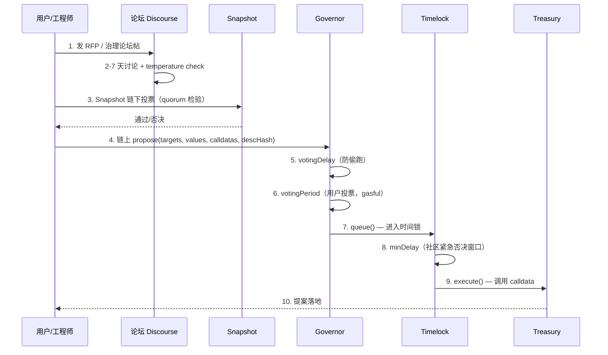
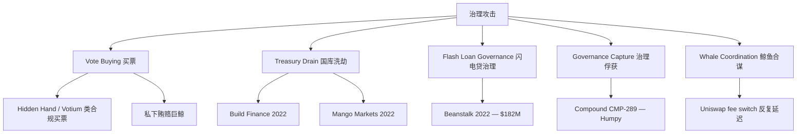
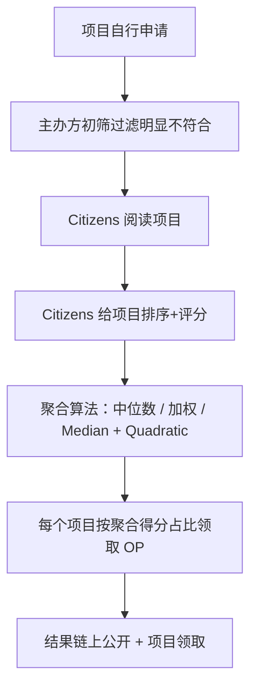
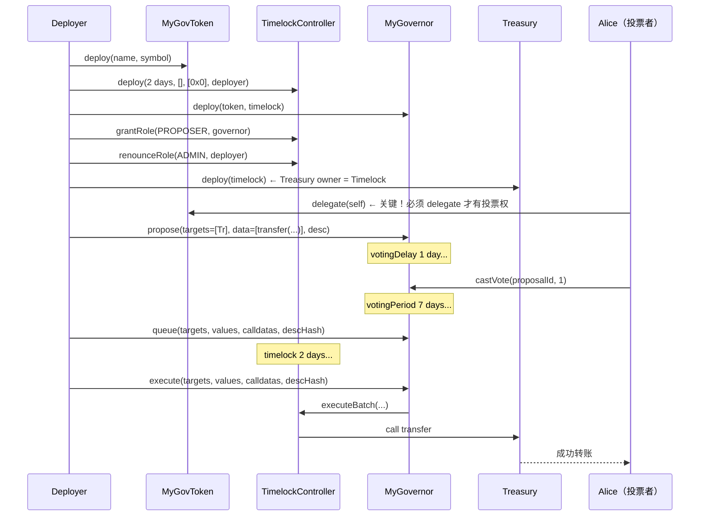

# 模块 15：DAO 治理 + Tokenomics + RWA

> 当一群陌生人用代码替代律师、用代币替代股权、用预测市场替代董事会时，会发生什么？这一模块研究"协议如何治理协议"。

## 阅读说明

每章**概念 → 图解 → 数学手推 → 代码注释 → 事故复盘 → 思考题**。前置依赖：模块 04 Solidity、05 安全、06 DeFi、14 去中心化存储（Snapshot 提案数据存 IPFS）。

阅读路径：
- **入门**：1-2 章 → 5 章（攻击）→ 8-10 章（Snapshot + OZ Governor）→ 16 章（代币分发）→ 22 章（RWA）
- **工程师**：通读 1-15 章 → 9 / 11 / 27 章读合约源码 → 跑 `code/` → 完成 `exercises/` 5 道题
- **研究者**：12-15 章（mechanism design）+ 24-26 章（Treasury & Wars）+ 延伸阅读

> **数据时效**：所有协议状态、TVL、监管时间表均检索于 **2026 年 4 月**。机制本身不变，市场数据当快照读。

---

## 章节路径图

```mermaid
graph TD
    A[第1章 DAO 起源 The DAO 2016] --> B[第2章 治理原理 token vs person]
    B --> C[第3章 链上 vs 链下]
    C --> D[第4章 治理生命周期]
    D --> E[第5章 治理攻击向量]
    E --> F[第6章 Snapshot v2 / Snapshot X]
    F --> G[第7章 Tally / Boardroom]
    G --> H[第8章 OZ Governor + Bravo + Timelock]
    H --> I[第9章 Aragon OSx / Llama / Hats]
    I --> J[第10章 Safe / Squads 多签]
    J --> K[第11章 真实 DAO 解剖：Optimism / Arbitrum / Uniswap / Sky]
    K --> L[第12章 QF / QV]
    L --> M[第13章 Conviction / Holographic / Futarchy]
    M --> N[第14章 RPGF]
    N --> O[第15章 ve-tokenomics: Curve / Velo / Aero]
    O --> P[第16章 代币分发模型]
    P --> Q[第17章 真实 vesting 案例]
    Q --> R[第18章 ve-token 实战合约]
    R --> S[第19章 Bonding curves / TCR]
    S --> T[第20章 法律风险：Howey / MiCA]
    T --> U[第21章 RWA 全景与历史]
    U --> V[第22章 ERC-3643 / 1400 / 1404]
    V --> W[第23章 Ondo / BUIDL / 私募信贷]
    W --> X[第24章 Treasury 管理]
    X --> Y[第25章 Curve War / Pendle War]
    Y --> Z[第26章 Bribe 经济]
    Z --> AA[第27章 完整 Governor + ve-token 部署实战]
    AA --> AB[第28章 ERC-3643 + QF 计算实战]
    AB --> AC[第29章 综合习题]
    AC --> AD[第30章 延伸阅读]
    AD --> AE[第31章 自审查清单]
```



---

# 第一部分：DAO 工作原理

## 第 1 章：DAO 是什么——从 The DAO 2016 讲起

### 1.1 DAO 定义

**DAO**（Decentralized Autonomous Organization）：用代码替代公司章程、链上投票替代董事会决议、`timelock.execute()` 替代法律强制力。独特能力：

- **可组合**：一份提案可同时调用 Aave、Uniswap、Lido 三个合约。
- **无许可投票**：买 1 个 UNI 即有投票权，无需 KYC 或股东名册。
- **24/7 治理**：提案随时发起，无休市期。
- **资金即代码**：国库是合约余额，无人能擅自动用。

### 1.2 起源：The DAO（2016）

**The DAO** 是 2016 年 4 月上线的去中心化风险投资基金（Slock.it 编写），28 天众筹吸纳约 1150 万 ETH（~1.5 亿美元，占 ETH 总流通量 14%）。来源：[The DAO Wikipedia](https://en.wikipedia.org/wiki/The_DAO)（检索 2026-04）。

**致命漏洞**：`splitDAO()` 先发送 ETH 再更新余额——典型**重入漏洞**（详见模块 05 第 2 章）。

```solidity
// The DAO 的 splitDAO 简化伪代码（带漏洞）
function splitDAO(uint256 proposalId) public {
    uint256 amount = balances[msg.sender];
    // 缺陷 1：先转账（recipient.call.value 触发对方 fallback）
    msg.sender.call.value(amount)("");
    // 缺陷 2：转账成功后才清零
    balances[msg.sender] = 0;
}
```

攻击者的恶意合约在 `fallback` 中递归调用 `splitDAO()` 约 30 次，抽走约 360 万 ETH（~5000 万美元）。

**社区分裂**：
- **回滚派**（Vitalik、基金会）：不还钱则以太坊价值结算可信度崩盘。
- **不回滚派**（"Code is Law"）：回滚 = 中心化干预 = 摧毁不可篡改性。

最终 2016-07-20 block 1,920,000 硬分叉回滚，少数派延续原链成为 **Ethereum Classic（ETC）**。来源：[CoinDesk](https://www.coindesk.com/consensus-magazine/2023/05/09/coindesk-turns-10-how-the-dao-hack-changed-ethereum-and-crypto)、[Gemini](https://www.gemini.com/cryptopedia/the-dao-hack-makerdao)（检索 2026-04）。

> **教训**：① 任何 ETH 转账合约必须加 reentrancy guard；② 治理合法性在社区共识，硬分叉在极端情况下会发生；③ 代币 + 投票 ≠ 治理——缺时间锁和紧急刹车就是自动化赌场。

### 1.3 现代 DAO 时间线

| 年份 | 事件 | 教训 |
|------|------|------|
| 2016 | The DAO 上线、被黑、ETH/ETC 分叉 | reentrancy 真实代价 |
| 2018 | MolochDAO 诞生（极简治理 + ragequit）| 简单 = 安全 |
| 2019-2020 | Maker、Compound、Uniswap 推出代币治理 | "把协议交给代币持有者" |
| 2021 | Curve War 爆发，veCRV bribes 兴起 | 治理权 = 经济权 |
| 2022 | Build Finance 治理被收购 / Beanstalk flash loan 攻击 | 链上即时投票 + 闪电贷 = 灾难 |
| 2023 | Optimism Citizens House RPGF 启动 | 治理可以二院制 |
| 2024 | MakerDAO → Sky、Compound CMP-289 鲸鱼"governance attack" | 巨鲸投票合法性危机 |
| 2025 | EigenLayer slashing 上线 / Optimism Futarchy 试验 | 预测市场进入治理 |
| 2026 | Tally 关停，DAO 工具基础设施洗牌 | 监管+市场结构演变 |

来源：[CoinDesk](https://www.coindesk.com/markets/2026/03/17/gensler-and-biden-were-just-better-for-crypto-says-tally-ceo-as-dao-governance-platform-shuts-down)（检索 2026-04）。

### 1.4 DAO 最小骨架

```
┌──────────────────────────────────────────────────────────────┐
│  社区层（Discourse / Discord / 论坛）                         │
│   - 提案讨论、温度测试（temperature check）                    │
├──────────────────────────────────────────────────────────────┤
│  投票层（Snapshot / Snapshot X / 链下签名）                   │
│   - 用户用 ERC-20 余额签名表达意愿，gas 免费                  │
├──────────────────────────────────────────────────────────────┤
│  执行层（Governor.sol + Timelock.sol）                       │
│   - 链上提交完整 calldata，多数票通过后进入时间锁              │
├──────────────────────────────────────────────────────────────┤
│  资金层（Treasury / Safe / Timelock）                        │
│   - 国库由 Timelock/Safe 持有，调用须经投票或多签             │
└──────────────────────────────────────────────────────────────┘
```

读 DAO 源码时永远先问：**这个权限属于哪一层？谁能调用它？被谁限制？**

### 1.5 思考题

1. The DAO 攻击者只动用了一个名为 `splitDAO()` 的函数，按代码规则它的行为合法。如果你是 2016 年 7 月的核心开发者，你会投票支持硬分叉还是反对？写出你的两个最强论点。
2. 现代 DAO 普遍使用 Timelock（提案通过后强制延迟 2-7 天再执行）。为什么？给出至少两个理由。
3. 找一个你认识的传统公司（比如苹果），列出它的"治理流程"（董事会、股东会、CEO 提案权限）。如果把它"DAO 化"，每一步分别对应到什么链上原语？

---

## 第 2 章：治理原理——一票一币 vs 一人一票

### 2.1 投票权的两种来源

**一票一币（1T1V）**：投票权 = 代币数量。Uniswap、Compound、Aave、Sky 均用此模型。优点：经济利益对齐；缺点：51% 代币 = 100% 控制权，鲸鱼可买票。

**一人一票（1P1V）**：每个验证身份的自然人一票。Optimism Citizens House、Gitcoin Passport QF rounds 用此模型。优点：抗女巫；缺点：身份验证昂贵且中心化。

### 2.2 数学对比

设代币总量 N，富裕用户持有 αN（0 < α ≤ 1），其余 (1-α)N 平均分给 K 个普通用户。

| 模型 | 富裕用户得票 | 普通用户合计得票 | 富者翻盘门槛 |
|------|------------|----------------|------------|
| 1T1V | αN | (1-α)N | α > 0.5 即胜 |
| 1P1V | 1 | K | 富者只需买通 K/2+1 个身份 |
| QV（二次方投票） | √(αN) | K·√((1-α)N/K) = √(K(1-α)N) | α/(1-α) > K 才能胜（即 α > K/(K+1)）|

QV 详见第 12 章。直觉：二次方让大户边际投票成本陡升，小户话语权更等比例。

### 2.3 委托（Delegation）

**委托机制**让代币持有者把投票权交给信任的"代议士"。Uniswap、Compound、Sky 均支持。

```solidity
// 简化的 ERC20Votes（OpenZeppelin）委托接口
interface IERC20Votes {
    function delegate(address delegatee) external;
    function getVotes(address account) external view returns (uint256);
    function getPastVotes(address account, uint256 blockNumber) external view returns (uint256);
}
```

注意：**`getPastVotes` 取的是历史快照**——这是防止"提案发起后立刻买票"的关键设计（snapshot block）。

> **委托的悖论**：Uniswap 10 个最大委托人控制约 60% 投票权，多为 a16z / Paradigm / Pantera 等 VC。"去中心化治理"在统计上接近"风投常委制"——这是 1T1V + delegation 的内生均衡，不是 bug。

### 2.4 思考题

1. 写出 1T1V 和 QV 在 N=1000、α=0.5、K=100 时的得票数。哪种制度下，普通用户合计能否击败富裕用户？
2. 为什么 ERC20Votes 必须用 `getPastVotes(blockNumber)` 而不是 `getVotes(account)`？给出一个具体攻击场景。

---

## 第 3 章：链上 vs 链下治理

### 3.1 定义

**链下治理**：投票签名 + IPFS 存储，多签手动执行（代表：Snapshot v1）。
**链上治理**：投票交易上链，calldata 自动执行（代表：GovernorBravo、OZ Governor）。

### 3.2 对比表

| 维度 | 链下治理（Snapshot v1） | 链上治理（OZ Governor） | 混合（Snapshot X / MultiGov） |
|------|----------------------|----------------------|---------------------------|
| Gas 成本 | 0（签名免费）| 投票交易要 gas（约 $1-5） | 投票链下、执行链上 |
| 执行 | 多签手动 | 自动 `execute()` | 跨链证明 + 自动 |
| 抗审查 | 弱（IPFS 可下线）| 强（链上不可删）| 中等 |
| 抗女巫 | 弱（同 1T1V）| 同 1T1V | 同 1T1V |
| 适合场景 | 温度测试、链下决策 | 国库执行、合约升级 | 跨链 DAO（如 Wormhole、Compound）|

### 3.3 Snapshot X

Snapshot X（Snapshot Labs + Starknet，2024-09）是混合方案：

- **投票 L2 化**（gasless 或极低 gas）
- **结果链上自动执行**（storage proofs 验证 L1 余额）
- **跨链投票**（代币在 L1，投票在 L2，执行在另一条链）

来源：[Snapshot X Overview](https://docs.snapshot.box/snapshot-x/overview)、[Snapshot X Starknet](https://www.starknet.io/blog/snapshot-x-onchain-voting/)（检索 2026-04）。

> **storage proofs**：证明"L1 某 slot 在某 block 时的值是 X"的密码学证明（基于以太坊 Merkle Patricia Trie + stateRoot），让 L2 合约无需预言机即可读 L1 状态。

### 3.4 思考题

1. 一个治理投票纯链下做、执行靠多签，这种模式有哪两个失败模式？最近哪个真实案例验证了？
2. Snapshot X 的 storage proofs 让 L2 投票可以读 L1 余额。如果攻击者想在 snapshot block 被锁定后增发 L1 代币，会成功吗？为什么？

---

## 第 4 章：治理生命周期

### 4.1 完整流程



### 4.2 各阶段关键参数

| 参数 | OZ Governor 默认 | Compound | Uniswap | 含义 |
|------|----------------|---------|---------|-----|
| votingDelay | 1 day | 13140 blocks (~2 days) | 13140 blocks | 提案发起到投票开始的延迟，防快照前买票 |
| votingPeriod | 1 week | 17280 blocks (~3 days) | 40320 blocks (~7 days) | 投票持续时间 |
| proposalThreshold | 0 | 25k COMP | 2.5M UNI (0.25%) | 提案者最低代币门槛 |
| quorumNumerator | 4% | 400k COMP | 40M UNI (4%) | 通过提案的最低参与率 |
| timelock minDelay | 2 days | 2 days | 2 days | 排队后到执行的延迟 |

来源：[OpenZeppelin Governor 文档](https://docs.openzeppelin.com/contracts/5.x/governance)、[Tally Governance Frameworks 文档](https://docs.tally.xyz/user-guides/governance-frameworks/openzeppelin-governor)（检索 2026-04）。

### 4.3 提案状态机

OZ Governor `ProposalState` enum：

```
Pending → Active → Succeeded ─→ Queued → Executed
   ↓        ↓                       ↓
Canceled  Defeated               Canceled / Expired
```

工程师常犯错：忘记 `Queued` 之后还要再等 timelock 延迟才能 `execute`。

### 4.4 思考题

1. 为什么 OZ Governor 把 votingDelay 默认设成 1 day？把它设成 0 会发生什么？
2. Sky / Uniswap 的 quorum 都是 4%。为什么不是 50%？想想现实中代币持有者真实参与率。

---

## 第 5 章：治理攻击向量

### 5.1 五种主要攻击



### 5.2 案例 A：Beanstalk Governance Attack（2022 年 4 月，损失 $182M）

**协议**：Beanstalk，链上即时投票的稳定币协议。

**漏洞**：`emergencyCommit` 允许凑齐 2/3 投票权的提案立刻执行，且投票权 = 当前 LP token 余额（无 snapshot）。

**攻击步骤**：
1. 攻击者从 Aave 闪电贷 10 亿 USD（DAI/USDC/USDT）。
2. 把闪电贷资金存入 Curve、SushiSwap，得到 BEAN+3CRV LP token、LUSD 等。
3. 把 LP token 存入 Beanstalk Silo 获得 Stalk + Seeds（投票权）。
4. 调用 `emergencyCommit` 执行 BIP-18（已经预先发布的"善意"提案，实际 calldata 把整个国库转给攻击者）。
5. BIP-19 顺便转 25 万美元到乌克兰（道德烟雾弹）。
6. 拆掉 LP，还闪电贷，跑路。

**全过程在一个区块内完成**。来源：[Halborn](https://www.halborn.com/blog/post/explained-the-beanstalk-hack-april-2022)、[Immunefi](https://medium.com/immunefi/hack-analysis-beanstalk-governance-attack-april-2022-f42788fc821e)（检索 2026-04）。

**根因**：① 无投票快照，投票权 = 当前余额；② 投票 / 执行同区块。修复后 Beanstalk 改用社区多签。

> **工程师注脚**：你的 Governor 必须满足两个不变量：
> 1. **快照在提案发起时锁定**（OZ Governor 用 ERC20Votes 的 `getPastVotes(snapshotBlock)`）。
> 2. **投票期 + timelock 延迟之和远大于一笔闪电贷的最大持续时间**（闪电贷必须同区块还清，所以 ≥1 block 即足够，但实际要 ≥2 days 给社区时间反应）。

### 5.3 案例 B：Build Finance Hostile Takeover（2022 年 2 月，损失 ~$470k）

**协议**：Build Finance DAO（代币 BUILD）。攻击者 Suho.eth（DAO 成员）。

**步骤**：
1. 在 quorum ≈ 0 时囤积大量代币。
2. 提交转让"铸造权 + 国库控制权"的提案 → 被发现后 cancel。
3. 换地址重发 → 通过。
4. 获得 mint 权，铸 1.1M BUILD 砸盘，再铸 10 亿 BUILD（实质无穷大）。
5. 通过 Tornado Cash 洗走约 160 ETH。

来源：[The Block](https://www.theblock.co/post/134180/build-finance-dao-suffers-hostile-governance-takeover-loses-470000)、[Wikipedia](https://en.wikipedia.org/wiki/Build_Finance_DAO)（检索 2026-04）。

**根因**：极低 quorum + 代币流通量小 + 无人监控。

> **工程师注脚**：**ProposalThreshold ≥ 1% 流通量、quorum ≥ 4-10%、敏感操作（mint/暂停）必须有独立 emergency multisig**。

### 5.4 案例 C：Compound CMP-289（2024 年 7 月）

**协议**：Compound（GovernorBravo）。攻击者 Humpy（曾在 Balancer 用同套路）。

**步骤**：Humpy 控制约 13% COMP → 周末发起 CMP-289（把 49.9 万 COMP / $24M 转给其控制的"Golden Boys"协议）→ 682k vs 633k 险胜，社区未察觉 → 事后谈判：撤 CMP-289 换 Compound 上线 30% 储备 staking。

来源：[The Block](https://www.theblock.co/post/307943/24-million-compound-finance-proposal-passed-by-whale-over-dao-objections)、[Protos](https://protos.com/compound-dao-asleep-at-the-wheel-as-25m-governance-attack-passes/)（检索 2026-04）。

**核心争议**：Humpy 用合规买入的代币投合规通过的提案——1T1V 的本质问题：**投票合法性 ≠ 治理合理性**。

### 5.5 案例 D：Mango Markets Governance Drain（2022 年 10 月）

攻击者 Avraham Eisenberg 操纵 MNGO 价格暴涨 → 借走国库 1.1 亿美元 → 用赚到的 MNGO 投票通过"豁免攻击者 + 支付 6700 万白帽奖励"提案。2024 年 Eisenberg 被判**市场操纵罪**成立——首次 DeFi 治理攻击刑事定罪。

### 5.6 防御 checklist

```
✅ ERC20Votes 快照（snapshot block）
✅ votingDelay ≥ 1 day（防提案-投票同区块）
✅ votingPeriod ≥ 3-7 days
✅ Timelock minDelay ≥ 2 days
✅ proposalThreshold ≥ 0.5-1% 流通量
✅ quorum ≥ 4%
✅ 敏感操作（mint / 升级 / treasury 大额）需要 supermajority（≥ 60-67%）
✅ Emergency multisig pause 权限（5-of-9 或 7-of-13）
✅ 治理监控（Tally / Boardroom alerts，关键提案 24 小时内通知社区）
✅ 链下温度测试（Snapshot）+ 链上正式表决（Governor）双层
```

### 5.7 思考题

1. Beanstalk 的攻击发生在一个区块内。给出三种"工程层修改"使同样攻击下次不可能成功（不许引入新代币）。
2. CMP-289 算"攻击"还是"合法治理"？你怎么定义两者的边界？写出至少一个可量化的判据。
3. Build Finance 的攻击者用了 Tornado Cash 洗钱。如果你是该 DAO 的合约设计者，你会在合约层加什么"前置审查"吗？讨论这是否破坏了"无许可"原则。

---

# 第二部分：治理工具全景

## 第 6 章：链下投票——Snapshot v2 / Snapshot X

### 6.1 Snapshot 是什么

**Snapshot** 是 DAO 链下投票事实标准（Uniswap、Aave、Sky、ENS、Lido、Optimism 等）：用户 EIP-712 签名 → 签名 + 提案数据存 IPFS → 按投票时 block number 验证链上余额得到权重。不上链，是链下可验证的意愿统计层。

### 6.2 Snapshot v2 升级（2024-2025）

Snapshot v2（2024-2025）新增：Snapshot X（Starknet + EVM 链上投票）、内嵌 Discussions、Delegation dashboard、提案 Timeline、提案 metadata（含执行 calldata）。

来源：[Snapshot Docs](https://docs.snapshot.box/)（检索 2026-04）。

### 6.3 投票策略（Voting Strategies）

Snapshot 的核心设计是**可组合策略**。

```javascript
// Snapshot space 配置示例（uniswap.eth）
{
  "name": "Uniswap",
  "symbol": "UNI",
  "strategies": [
    {
      "name": "erc20-balance-of",
      "params": { "address": "0x1f9840a85d5aF5bf1D1762F925BDADdC4201F984", "decimals": 18 }
    },
    {
      "name": "delegation",
      "params": { "symbol": "UNI (delegated)", "strategies": [...] }
    }
  ],
  "voting": { "type": "single-choice", "quorum": 40000000 }
}
```

常用策略：`erc20-balance-of`（ERC-20 余额）、`erc721-balance-of`（NFT 数量）、`delegation`（委托加和）、`whitelist`（Citizens House 风格）、`uni-with-delegation`（Uniswap 组合）、`quadratic`（二次方）。

### 6.4 Snapshot 投票示例（`code/snapshot-vote.ts`）

```typescript
// 简化的 Snapshot 投票（snapshot.js SDK）
import snapshot from "@snapshot-labs/snapshot.js";

const hub = "https://hub.snapshot.org"; // 主网 hub
const client = new snapshot.Client712(hub);

await client.vote(signer, voterAddress, {
  space: "uniswap",        // DAO 的 ENS / space ID
  proposal: "0xabc...",    // 提案 ID
  type: "single-choice",
  choice: 1,                // 选项 1 = For
  reason: "I support this fee switch proposal",
  app: "snapshot",
});
```

不需要 ETH——只签 typed data，Snapshot 打包到 IPFS。

### 6.5 思考题

1. Snapshot 是链下的，那"投票通过后怎么把决定执行到链上"？写出三种可行方案。
2. 如果某个攻击者在 snapshot block 之后一秒钟买入大量代币、再投票，他能影响结果吗？为什么？
3. Snapshot X 在 Starknet 上跑投票，Starknet 是 ZK rollup。这件事让"投票隐私"变成了可能吗？

---

## 第 7 章：链上执行界面——Tally / Boardroom

### 7.1 Tally（已关停）

Tally 曾是 OZ Governor / GovernorBravo 系 DAO 的链上执行界面（500+ DAO），**2026 年 3 月关停**。

CEO Nazarov 的解释：监管缓和、"被迫 DAO 化"需求消失，协议开始自建治理逻辑。来源：[CoinDesk](https://www.coindesk.com/markets/2026/03/17/gensler-and-biden-were-just-better-for-crypto-says-tally-ceo-as-dao-governance-platform-shuts-down)（检索 2026-04）。代码 OSS 保留：提案/投票界面、委托管理、OZ Governor / Bravo / Aragon 对接、多链聚合。

### 7.2 Boardroom

Boardroom.io 聚合跨 DAO 治理数据（提案历史、委托人排名、国库追踪），定位偏分析而非执行。

### 7.3 替代方案（Tally 关停后）

- **Agora**（Optimism、Uniswap、ENS 已用）
- **Karma GAP**（DAO 项目 OKR / 责任追踪）
- **协议自建 UI**（Sky、Aave）

### 7.4 思考题

1. Tally 关停说明 DAO 工具市场不可持续。你认为根本原因是哪一个：(a) 协议都自己做前端、(b) 监管缓和，(c) DAO 数量不够？
2. 如果你是新 DAO 的发起者，你会用现成 UI 还是自建？给出两个考量维度的判断。

---

## 第 8 章：治理框架——OpenZeppelin Governor + GovernorBravo + Timelock

### 8.1 GovernorBravo

**GovernorBravo**（Compound 2021，继 GovernorAlpha）核心改进：
- **可升级**（proxy + storage layout 兼容）。
- **proposalThreshold 可治理调整**。
- **结构化 receipt**（追踪每个 voter 的投票详情）。
- **支持 against / for / abstain 三选一**。

Compound、Uniswap、ENS、Hop 等用 Bravo 直系或 fork。

### 8.2 OpenZeppelin Governor

**OZ Governor**（v4.4+）模块化重写，功能拆成 mixin：

```
Governor.sol（核心抽象）
 ├── GovernorSettings（votingDelay/Period/proposalThreshold）
 ├── GovernorCountingSimple / GovernorCountingFractional（投票计数策略）
 ├── GovernorVotes / GovernorVotesQuorumFraction（投票权来源 + 法定人数）
 ├── GovernorTimelockControl / GovernorTimelockCompound（时间锁集成）
 └── GovernorPreventLateQuorum（防最后一刻 quorum 偷袭）
```

来源：[OpenZeppelin Governor 文档](https://docs.openzeppelin.com/contracts/5.x/governance)、[OZ Governor.sol 源码](https://github.com/OpenZeppelin/openzeppelin-contracts/blob/master/contracts/governance/Governor.sol)（检索 2026-04）。

### 8.3 一份最小可用的 Governor 合约

```solidity
// SPDX-License-Identifier: MIT
pragma solidity 0.8.28;

import "@openzeppelin/contracts/governance/Governor.sol";
import "@openzeppelin/contracts/governance/extensions/GovernorSettings.sol";
import "@openzeppelin/contracts/governance/extensions/GovernorCountingSimple.sol";
import "@openzeppelin/contracts/governance/extensions/GovernorVotes.sol";
import "@openzeppelin/contracts/governance/extensions/GovernorVotesQuorumFraction.sol";
import "@openzeppelin/contracts/governance/extensions/GovernorTimelockControl.sol";
import "@openzeppelin/contracts/governance/utils/IVotes.sol";
import "@openzeppelin/contracts/governance/TimelockController.sol";

contract MyGovernor is
    Governor,
    GovernorSettings,
    GovernorCountingSimple,
    GovernorVotes,
    GovernorVotesQuorumFraction,
    GovernorTimelockControl
{
    constructor(IVotes _token, TimelockController _timelock)
        Governor("MyGovernor")
        GovernorSettings(
            7200,    // votingDelay: 1 day（块时 12s × 7200 = 86400s）
            50400,   // votingPeriod: 7 days
            0        // proposalThreshold: 0（生产应设为代币总量 0.5-1%）
        )
        GovernorVotes(_token)
        GovernorVotesQuorumFraction(4)  // quorum: 4%
        GovernorTimelockControl(_timelock)
    {}

    // 必须 override 解决多重继承
    function state(uint256 proposalId)
        public view override(Governor, GovernorTimelockControl)
        returns (ProposalState)
    {
        return super.state(proposalId);
    }

    function _executeOperations(
        uint256 proposalId,
        address[] memory targets,
        uint256[] memory values,
        bytes[] memory calldatas,
        bytes32 descriptionHash
    ) internal override(Governor, GovernorTimelockControl) {
        super._executeOperations(proposalId, targets, values, calldatas, descriptionHash);
    }
    // ... 其他 override 略
}
```

> **OZ 5.x 注意**：v5 中函数名从 `_execute` 改成 `_executeOperations`，`_cancel` 仍同名但 hook 签名不同（参数列表与 v4 不一致）。如果你看老教程报错，先确认你的 OZ 版本。

### 8.4 Timelock 设计

`TimelockController` 是独立合约，真正持有国库——Governor 只是提议者。

```solidity
// 三个角色
// PROPOSER_ROLE: 谁能 schedule（通常 = Governor）
// EXECUTOR_ROLE: 谁能 execute（通常 = address(0) 表示任何人）
// CANCELLER_ROLE: 谁能 cancel（通常 = Governor + emergency multisig）
TimelockController timelock = new TimelockController(
    minDelay,                  // 例如 2 days
    proposers,                 // [governor.address]
    executors,                 // [address(0)]（开放）
    admin                      // 部署后立刻 renounce 角色
);
```

> **关键安全：admin renounce**。部署后 admin 必须放弃 `DEFAULT_ADMIN_ROLE`（OZ v4 旧名 `TIMELOCK_ADMIN_ROLE`），否则 admin 可以绕过整个治理流程。

### 8.5 完整部署脚本（Foundry）

```solidity
// script/DeployDAO.s.sol（精简版）
import "forge-std/Script.sol";
import "@openzeppelin/contracts/governance/TimelockController.sol";
import {MyGovernor} from "../src/MyGovernor.sol";
import {MyGovToken} from "../src/MyGovToken.sol";

contract DeployDAO is Script {
    function run() public {
        vm.startBroadcast();

        // 1. 部署治理代币（ERC20Votes）
        MyGovToken token = new MyGovToken("MyDAO", "MYD");

        // 2. 部署 Timelock，最短 2 天
        address[] memory proposers = new address[](0);  // 先空，后授权
        address[] memory executors = new address[](1);
        executors[0] = address(0);  // 开放执行
        TimelockController timelock = new TimelockController(
            2 days,
            proposers,
            executors,
            msg.sender  // 临时 admin
        );

        // 3. 部署 Governor
        MyGovernor governor = new MyGovernor(token, timelock);

        // 4. 把 Governor 加为 Timelock 的 proposer
        timelock.grantRole(timelock.PROPOSER_ROLE(), address(governor));
        // 5. 收回部署者权限
        timelock.renounceRole(timelock.DEFAULT_ADMIN_ROLE(), msg.sender);

        vm.stopBroadcast();
    }
}
```

完整代码在 `code/governor-foundry/script/DeployDAO.s.sol`。

### 8.6 一次完整提案流程（脚本演示）

代码 `code/governor-foundry/script/Propose.s.sol`：

```solidity
// 提案：从 Treasury 转 1000 个 MYD 给某个项目
address[] memory targets = new address[](1);
targets[0] = address(token);
uint256[] memory values = new uint256[](1);
values[0] = 0;
bytes[] memory calldatas = new bytes[](1);
calldatas[0] = abi.encodeWithSelector(IERC20.transfer.selector, recipient, 1000e18);
string memory desc = "Grant 1000 MYD to Project X";

uint256 proposalId = governor.propose(targets, values, calldatas, desc);

// 等 votingDelay → 投票 → 等 votingPeriod → queue → 等 timelock → execute
governor.queue(targets, values, calldatas, keccak256(bytes(desc)));
governor.execute(targets, values, calldatas, keccak256(bytes(desc)));
```

### 8.7 思考题

1. 为什么 OZ Governor 把 proposalId 设计成 `keccak256(targets, values, calldatas, descHash)` 而不是递增整数？给出至少两个工程理由（Hint：链上存储成本 vs 索引）。
2. Timelock 的 `executors = [address(0)]` 让任何地址都能执行——这有什么风险？为什么仍然是默认推荐？
3. 写出"提案进入 Queued 但没人 execute"会导致什么后果。OZ 用什么机制处理？

---

## 第 9 章：其它治理框架——Aragon OSx / Llama / DAOhaus / Hats Protocol

### 9.1 Aragon OSx

**Aragon OSx**（v2，2023）：模块化 DAO 框架，**所有治理逻辑都是可插拔 Plugin**。

```
DAO（核心合约：拥有资金 + 权限注册表）
 ├── Plugin: TokenVoting（OZ Governor 风格）
 ├── Plugin: Multisig
 ├── Plugin: Admin（紧急刹车）
 ├── Plugin: Optimistic Voting（默认通过、反对才否决）
 └── Plugin: Custom（你写的任何逻辑）
```

Plugin 通过 `PluginSetupProcessor` 安装/卸载，DAO ACL 管理权限。2026 年状态：10,000+ 项目，治理 350 亿美元资产。来源：[Aragon OSx 文档](https://docs.aragon.org/osx-contracts/1.x/index.html)、[CTO 访谈](https://www.aragon.org/how-to/building-a-dao-framework-interview-with-aragons-cto)（检索 2026-04）。

### 9.2 Llama

**Llama**（DAO 角色权限公司，非 Meta Llama）：按金额分层授权——$50 万以下由 roles 多签批；$50-500 万代币投票；$500 万以上 supermajority + 7 天 timelock。客户：Uniswap、Optimism、Aave、GMX 等。

### 9.3 DAOhaus（Moloch v3）

**DAOhaus**：Moloch v3 框架现代化界面。核心：shares（有投票权）+ loot（无投票权可分国库）+ **ragequit**（少数派拿回 share 对应国库份额退出）+ Guild Kick。适合"小而美、对内信任高"的工会型 DAO（公会、研究小组、捐赠俱乐部）。

### 9.4 Hats Protocol

**Hats Protocol**：**链上角色协议**——把"角色"tokenize 成 ERC-1155 NFT（"hat"）。戴上"安全官" hat 就有暂停权限，戴上"财务官" hat 就能动用 100 万以下国库。每个 hat 由上层 admin hat 颁发/撤销。

**Hats Tree**：
```
Top Hat（DAO 自己持有）
 ├── 治理委员会 Hat
 │    ├── 安全官 Hat
 │    └── 财务官 Hat
 ├── 工程委员会 Hat
 │    ├── 核心开发 Hat
 │    └── 审计协调 Hat
 └── 社区 Hat
      └── 论坛版主 Hat
```

来源：[Hats Protocol 文档](https://docs.hatsprotocol.xyz/)、[GitHub](https://github.com/Hats-Protocol/hats-protocol)（检索 2026-04）。

50+ DAO 在使用 Hats，包括 Optimism、Gitcoin、ENS。

### 9.5 框架对比表

| 框架 | 适合 | 治理风格 | 特色 |
|------|------|---------|------|
| OZ Governor | 大型代币 DAO | 1T1V + Timelock | 标准、安全、与 Tally 兼容 |
| GovernorBravo | Compound 系 fork | 1T1V + Timelock | 老协议自然继承 |
| Aragon OSx | 模块化定制 | 任意（Plugin 化） | Plugin 生态最丰富 |
| Llama | 大 DAO 子分权 | role-based | 灵活的金额阈值 |
| DAOhaus / Moloch v3 | 小工会型 | shares + ragequit | 退出权 = 防多数压迫 |
| Hats Protocol | 角色注册 | 不是治理本身 | 与 OZ/Aragon 组合用 |

### 9.6 思考题

1. 为什么 Moloch 的 ragequit 是"小型 DAO 的杀手特性"？想想"不能投票但可以拿钱走"对议事博弈的影响。
2. 如果你设计一个 50 人核心 + 5000 人代币持有的 DAO，你会怎么组合 OZ Governor + Hats + Llama？画出权限路径图。

---

## 第 10 章：多签——Safe（Gnosis Safe）/ Squads

### 10.1 多签的本质

**多签（Multisig）**：N 人共管资产，M 人签名才能转账。DAO 三个场景：
1. **紧急刹车**：治理 7-10 天，黑客 1 小时，多签是 timelock 之外最快防御层。
2. **小额日常运营**：小拨款不值得走完整治理流程。
3. **国库持有者**：grant 接收方往往是 multisig（如 Optimism Foundation 5/7）。

### 10.2 Safe（Gnosis Safe）

**Safe**（前 Gnosis Safe）：EVM 事实标准，跨 30+ 链托管 $1000 亿+。来源：[Safe](https://safe.global/)、[The Block](https://www.theblock.co/post/388098/crypto-wallet-safe-reports-fivefold-revenue-jump-2025-not-break-even-profitability)（检索 2026-04）。

架构：
```
Safe 本身是个 proxy 合约
 ├── Singleton（实际逻辑合约，可升级）
 ├── Owners[]：所有 owner 地址
 ├── threshold：需要多少签名（如 5/9）
 ├── Modules[]：扩展模块（spending limit、allowance、recovery）
 └── Guards[]：执行前后的钩子（rate limit、whitelist）
```

执行流程：
1. 任意 owner 创建 transaction proposal（链下，存 Safe Transaction Service）。
2. 其它 owner 用钱包签名（EIP-712）。
3. 凑够 threshold 个签名后，最后一个 signer（或任何 relayer）调用 `execTransaction()` 上链。

```solidity
// Safe 核心 execTransaction 简化逻辑
function execTransaction(
    address to,
    uint256 value,
    bytes calldata data,
    Operation operation,        // CALL / DELEGATECALL
    uint256 safeTxGas,
    uint256 baseGas,
    uint256 gasPrice,
    address gasToken,
    address payable refundReceiver,
    bytes memory signatures      // 拼接的多签签名
) public payable returns (bool success) {
    // 1. 计算 transaction hash（EIP-712）
    bytes32 txHash = keccak256(abi.encode(/* ... */));
    // 2. 校验签名数量 ≥ threshold
    checkSignatures(txHash, signatures);
    // 3. 执行 call 或 delegatecall
    success = execute(to, value, data, operation, safeTxGas);
}
```

### 10.3 Safe 模块体系

Safe 扩展模块：**Allowance**（日限额）、**Recovery**（owner 失踪时 guardians 接管）、**Roles**（Zodiac，函数 + 参数级权限）、**Reality**（Zodiac，连接 Snapshot 投票自动执行）。**Zodiac** 把 Safe 变成完整 DAO 工具集。

### 10.4 Squads（Solana 多签）

**Squads**：Solana 事实标准多签，托管 $100 亿+（Helium、Jito、Pyth）。来源：[Squads](https://squads.xyz/)（检索 2026-04）。

V4 (2024-2025)：time locks、spending limits、roles + sub-accounts、多方支付 / lookup tables。

> **Solana 多签差异**：无 `delegatecall`，多签控制的"账户"是 PDA（Program Derived Address）。

### 10.5 Safe 实操（Foundry fork 模拟）

```solidity
// test/SafeFork.t.sol
import "forge-std/Test.sol";
import {Safe} from "@safe/contracts/Safe.sol";

contract SafeForkTest is Test {
    Safe safe;
    address[] owners = [alice, bob, charlie];
    uint256 threshold = 2;

    function setUp() public {
        // fork 主网某个块
        vm.createSelectFork(vm.envString("RPC_URL"), 19_000_000);
        // 直接拿一个已部署 Safe
        safe = Safe(payable(0x...));
    }

    function test_simulateExecute() public {
        // 模拟 alice 和 bob 签名
        bytes memory sig = _buildMultisig(owners, threshold);
        vm.prank(charlie);
        safe.execTransaction(/* ... */);
    }
}
```

完整代码 `code/safe-foundry-fork/`。

### 10.6 思考题

1. Safe 的 `delegatecall` Operation 是其安全模型最危险的点——为什么？给一个具体攻击。
2. 一个 DAO 国库由 OZ Timelock 持有 vs 由 Safe 5/9 持有，从"抗黑天鹅"角度比较。哪种更安全？

---

## 第 11 章：真实 DAO 解剖（2026 Q1 数据）

### 11.1 Uniswap Governance

- **代币**：UNI（10 亿初始供给，2020 年 9 月空投）。
- **框架**：GovernorBravo（fork from Compound）+ Timelock。
- **关键参数**：
  - Quorum：40M UNI（4%）。
  - Proposal threshold：2.5M UNI（0.25%）。
  - Voting period：7 days。
  - Timelock：2 days。
- **2026**：v4 上线 + fee switch 通过，UNI 获得现金流。来源：[Bitget Academy](https://www.bitget.com/academy/successful-dao-case)（检索 2026-04）。
- **争议**：a16z 等 VC 控制 60M+ UNI 委托，重要提案 VC 投票高度一致，被批"实质 VC 控制"。

### 11.2 Optimism Collective（双院制）

- **Token House**：OP 持有者投票，治理协议参数 + 国库分配。
- **Citizens House**：验证身份的"公民"投票，专做 RPGF。
- **RPGF Round 6**（2024 Q4）：2.4M OP，78/102 公民 + 60/76 客座投票者参与。来源：[RetroPGF Round 6](https://community.optimism.io/citizens-house/rounds/retropgf-6)、[Retro Funding 2025](https://www.optimism.io/blog/retro-funding-2025)（检索 2026-04）。
- **2025**：Retro Funding 改名 "Missions"（Dev Tooling、Onchain Builders、OP Stack Contributions）。

### 11.3 Arbitrum DAO

- **代币**：ARB（100 亿总量，2023 年 3 月空投）。
- **国库**：35 亿 ARB（约 35-50 亿美元，取决于价格）。
- **关键计划**：
  - **STIP（Short-Term Incentive Program）**：5000 万 ARB 分给 56 个项目，激励 DEX/借贷/perp 流动性。
  - **LTIPP（Long-Term Incentive Pilot Program）**：2287 万 ARB 后续。
  - **Sub-DAO**：2025 年成立 grants、教育、治理研究三个 Sub-DAO。
- **教训**：激励停则 TVL 走。来源：[Arbitrum Hub](https://www.arbitrumhub.io/incentive-programs/)、[Messari STIP](https://messari.io/report/arbitrum-stip-allocations)（检索 2026-04）。

### 11.4 Sky（前 MakerDAO）的 Endgame

2024-08 "Endgame"：MakerDAO → Sky，MKR → SKY（1:24000），DAI → USDS（1:1）。拆成多个 **SubDAO（"Sky Stars"）**，各有独立代币/治理。首个 Star：**Spark**（借贷，TVL $30 亿+，SPK）。来源：[Blockworks](https://blockworks.com/news/maker-rebrands-as-sky-dai-will-be-changed-to-usds)（检索 2026-04）。

> **争议**：改名投票中四个实体占绝大多数票，重大转型实际由巨鲸决定。来源：[The Block](https://www.theblock.co/post/325096/just-four-entities-account-for-nearly-all-the-votes-to-keep-makerdaos-rebranding-to-sky)（检索 2026-04）。

### 11.5 Compound

- **代币**：COMP。
- **框架**：GovernorBravo（原创）+ Timelock。
- **2024 年 7 月 CMP-289 风波**（第 5 章已讲）：Humpy 几乎抢走 5% 国库。
- **2025-2026 反应**：上线 30% 储备的 staking 模块给 COMP holder + 加强提案审查 + emergency multisig。

### 11.6 思考题

1. 比较 Uniswap（纯 1T1V）和 Optimism（双院制），哪种制度更难被巨鲸俘获？给出至少两个机制理由。
2. Sky Endgame 把 MakerDAO 拆成多个 SubDAO，每个都有独立代币。这是"分权"还是"稀释治理"？写出两边各一个论点。
3. Arbitrum 用治理代币砸钱补贴流动性，结果是"激励完用户走"。如果你是 Arbitrum DAO 顾问，你会怎么改 LTIPP 设计？

---

# 第三部分：Mechanism Design

## 第 12 章：Quadratic Funding 与 Quadratic Voting

### 12.1 直觉

A 项目：1000 人各 $1（共 $1000）；B 项目：1 鲸鱼 $10000。QF 答案：**匹配 A 远多于 B**——QF 以"多少独立的人愿意付费支持"作为公共物品价值的代理指标。

### 12.2 Quadratic Funding 公式

QF 由 Vitalik Buterin、Zoë Hitzig、Glen Weyl 等人在 [Liberal Radicalism](https://papers.ssrn.com/sol3/papers.cfm?abstract_id=3243656) 论文中提出。

设项目 p 收到 N 个用户的捐款 c_1, c_2, ..., c_N。则**匹配金额**：

$$
M_p = \left( \sum_{i=1}^{N} \sqrt{c_i} \right)^2 - \sum_{i=1}^{N} c_i
$$

第一项是"平方根之和的平方"（QF score），第二项减去原始捐款总额（因为这部分用户已经直接给了）。

**直觉**：鲸鱼捐 100 → score = 100；100 人各捐 1 → score = 10000（放大 100 倍）——QF 把"参与人数"二次方放大，"金额"线性折损。

### 12.3 Gitcoin 实战

Gitcoin Grants 是 QF 的最大实践场：自 2018 年起办了 20+ 轮，累计分发 5000 万美元+ 给以太坊公共物品。来源：[WTF is Quadratic Funding](https://qf.gitcoin.co/)、[Gitcoin Quadratic Funding 文档](https://support.gitcoin.co/gitcoin-knowledge-base/gitcoin-grants-program/mechanisms/quadratic-funding)（检索 2026-04）。

QF 致命弱点：**女巫攻击**——伪造 100 个身份各捐 $1 即可绕过。Gitcoin 对策：
1. **Gitcoin Passport**：聚合 Twitter / GitHub / ENS / Bright ID 等身份证明，score 阈值以上才进入 QF 计算。
2. **COCM**（Vitalik 提出）：对"总是一起出现"的捐款人给折扣，抑制女巫团伙。

QF 的 TypeScript 计算实现在 `code/quadratic-funding/qf.ts`，包括女巫折扣逻辑。

### 12.4 Quadratic Voting

QV 是同源思想的投票变体：每个投票者有"voice credit"预算 V，给某个选项投 k 票要花 k² credit。

设你有 100 credits：
- 投 1 项目 10 票 = 100 credit（用尽）。
- 投 4 项目 5 票 = 100 credit（25×4）。
- 投 100 项目 1 票 = 100 credit。

**效果**：你愿意为最 care 的事多投，但成本陡增；你愿意分散一些资源给多个事，因为前几票"性价比"很高。

QV 应用：RxC 社区（2019+多次试验）、科罗拉多州民主党议会（2019 年预算优先级）、Optimism Citizens House（RPGF Round 4-6 实验性 QV 变体）。

### 12.5 QF/QV 与女巫的永恒斗争

> 所有 QF/QV 系统的核心问题：**"什么是一个独立的人？"** 以太坊地址 → 女巫击穿；KYC → 失去抗审查；POH/Worldcoin → 身份层依赖。**最稳健工程做法**：分层 score（Gitcoin Passport），由下游协议自设阈值。

### 12.6 思考题

1. 用 QF 公式手算：项目 A 有 4 个捐款 [4, 4, 4, 4]，项目 B 有 16 个捐款 [1, 1, ..., 1]。它们的 QF 匹配各是多少？
2. 如果一个攻击者控制 100 个 Sybil 身份，每个捐 0.01 美元，他能从 1M 美元的匹配池中拿走多少（假设无身份过滤）？给出公式 + 数字。
3. QV 中"voice credit"如何分发？如果用代币购买（卖给富人），是否退化成 1T1V？

---

## 第 13 章：Conviction Voting / Holographic Consensus / Futarchy

这三种机制是"传统投票之外"的实验性设计，被各大 DAO 在小规模试用。

### 13.1 Conviction Voting（信念投票）

**Conviction Voting** 由 Michael Zargham（BlockScience）2019 设计，1Hive 在 Aragon 上首次实现。来源：[1Hive Conviction Voting cadCAD](https://github.com/1Hive/conviction-voting-cadcad)（检索 2026-04）。

**Conviction**（信念/坚持）：不是投一次票，而是持续把代币质押在提案上，时间越久权重越大。Conviction 按指数曲线累积，达到阈值（依提案金额而定）后自动通过。

**核心公式**：
```
y_t = α · y_{t-1} + x_t
```
其中 y_t 是 t 时刻该提案的 conviction，α 是衰减系数（默认 0.9，对应 conviction 半衰期约 48 小时），x_t 是当下质押的代币数。

**机制好处**：无需固定投票期（无人支持的提案自然不通过）、抗短期合谋（买票后需持续锁仓）、无 quorum 危机。

**机制坏处**：紧急提案无法即时执行（需累积 conviction）；用户须持续质押代币（流动性损失）。

### 13.2 Holographic Consensus（全息共识）

**Holographic Consensus** 是 DAOstack 的 Genesis Protocol，由 Matan Field 2018 提出。来源：[DAOstack Medium - Holographic Consensus part 1](https://medium.com/daostack/holographic-consensus-part-1-116a73ba1e1c)（检索 2026-04）。

解决痛点：大型 DAO 中绝对多数 quorum（50%+）根本无法达到。

**Holographic 设计**：提案默认需要绝对多数；任何人可质押 GEN "boost" 一个提案（预测它会通过）；质押达阈值后进入 boosted 模式，只需相对多数；预测正确获利，错误罚没。

**直觉**：把提案置信度变成预测市场，过滤出"值得社区注意的提案"快速 boost 到决策。实践中 DAOstack 生态未起飞，但思想被广泛借鉴。

### 13.3 Futarchy（基于预测市场的治理）

**Futarchy** 由经济学家 Robin Hanson 2000 年提出："**vote on values, bet on beliefs**"——用民主决定"我们想要什么（价值）"，用预测市场决定"用哪种方法达到（手段）"。

**经典流程**：
1. DAO 选定**福利度量函数**（如"30 天 TVL"或"6 月代币价格"）。
2. 对任意提案 P，建两个条件预测市场：Market_P_yes（通过后的福利）和 Market_P_no（不通过后的福利）。
3. 市场运行后，若 Market_P_yes 期望 > Market_P_no 期望，自动通过 P。

**Vitalik 在 2024 年 11 月写了 [From prediction markets to info finance](https://vitalik.eth.limo/general/2024/11/09/infofinance.html)**，把 Futarchy 列为"应用于 DAO 治理的高度可期方向"。来源：[Vitalik infofinance](https://vitalik.eth.limo/general/2024/11/09/infofinance.html)（检索 2026-04）。

**真实实验**：
- **Optimism 在 2025 年 3 月做了 21 天 Futarchy 试验**，分发 50 万 OP 测试预测市场治理。来源：[Frontiers - Futarchy in DeSci](https://www.frontiersin.org/journals/blockchain/articles/10.3389/fbloc.2025.1650188/full)（检索 2026-04）。
- **MetaDAO**（Solana 上的项目）从 2024 起所有治理决定都跑 Futarchy。

**难点**：① 福利度量函数可被操纵（TVL 可刷量）；② 预测市场需要足够流动性，小池子易被大户操纵；③ 条件市场 UX 复杂，普通用户难理解。

### 13.4 三者对比表

| 机制 | 核心创新 | 优 | 劣 | 真实使用 |
|------|---------|---|---|---------|
| Conviction Voting | 时间加权投票 | 抗买票、低 quorum 风险 | 紧急提案慢 | 1Hive、Aragon Plugin |
| Holographic Consensus | 预测+绝对/相对多数切换 | 可扩展到大社区 | 复杂 | DAOstack、若干 fork |
| Futarchy | 预测市场决定政策 | 强迫"用结果说话" | 度量函数易操纵 | Optimism、MetaDAO |

### 13.5 思考题

1. 用 Conviction Voting 做"紧急安全暂停"提案合适吗？为什么？
2. Futarchy 用"6 个月后代币价格"做福利度量，会激发什么 perverse incentive（扭曲激励）？给一个具体策略。
3. Holographic Consensus 的 GEN 质押是 mechanism design 的"皮肉"。如果 GEN 没有价格波动（稳定币计价），mechanism 还成立吗？

---

## 第 14 章：Retroactive Public Goods Funding（追溯式公共物品资助）

### 14.1 思想

**RPGF**（Retroactive Public Goods Funding）由 Vitalik 在 2021-07 提出（[原文](https://medium.com/ethereum-optimism/retroactive-public-goods-funding-33c9b7d00f0c)）。

核心思想：**"判断已经做出的事的价值，比判断将要做的事的价值容易。"** 传统前瞻式 grants 依赖计划书、鸡生蛋困境；RPGF 反过来——**先做事，再按已发生的影响给奖励**。

### 14.2 Optimism Citizens House RPGF

Optimism 是 RPGF 最大的实践者。从 2022 年的 RPGF Round 1（100 万 OP）到 2024 Q4 的 Round 6（240 万 OP），每轮主题不同：

| Round | 时间 | 总额 | 主题 |
|-------|------|------|------|
| Round 1 | 2022 Q4 | 100 万 OP | "对 OP Stack / 以太坊 / Optimism 有贡献"的开源工具 |
| Round 2 | 2023 Q1 | 1000 万 OP | 同上扩展 |
| Round 3 | 2023 Q4 | 3000 万 OP | OP Stack / 协议合作 / 工具 / 教育 |
| Round 4 | 2024 Q2 | 1000 万 OP | Onchain Builders |
| Round 5 | 2024 Q3 | 800 万 OP | OP Stack contributions（含以太坊核心开发） |
| Round 6 | 2024 Q4 | 240 万 OP | Governance |

来源：[Optimism RetroPGF Round 6](https://community.optimism.io/citizens-house/rounds/retropgf-6)、[Optimism Retro Funding 2025](https://www.optimism.io/blog/retro-funding-2025)（检索 2026-04）。

### 14.3 RPGF 投票流程



聚合算法：中位数（抗操纵但分布僵硬）、均值（易被极端扭曲）、修剪均值（去头尾 10-20%）、二次方变体（放大多人小分的信号）。

### 14.4 RPGF 的成败

**好处**：鼓励 builder 先 ship 再拿钱；评估者面对已发生的事，无需预测；开源代码 / 文档 / 工具有了可持续资助路径。

**问题**：
- "影响"的度量仍主观（比如 EIP 提案的影响）。
- 一些项目"为 RPGF 而做"，工艺品味劣化。
- Citizens 选择本身是政治问题——谁来认证？

**Round 6 的具体数据**：78/102 Citizens 投票 + 60/76 Guest Voters 投票，1:1 加权。Guest Voters 是被邀请的特邀投票人，扩大了"集体智慧"的输入。

### 14.5 思考题

1. RPGF 与 QF 的根本区别是什么？什么类型的项目更适合 RPGF、什么更适合 QF？
2. 如果你是 Optimism 的 Citizen 设计者，"如何选 Citizen"是关键。给出三种可行方案，并讨论各自的利弊。
3. "为 RPGF 做" 的项目可能优化什么 metric 而非真实价值？给一个具体例子。

---

## 第 15 章：ve-Tokenomics 详解——Curve / Velodrome / Aerodrome

ve（vote-escrow）是 DeFi 工程师必懂的代币模型。它由 Curve 在 2020 年 9 月发明，至今仍然是最有效的"协议-用户长期对齐"机制之一。

### 15.1 veCRV 的设计

**ve**（vote-escrow，投票托管）：把 CRV 锁仓 1 周到 4 年，获得 veCRV。锁越长 → veCRV 越多 → 投票权 + 分红 + LP boost 越多。

**核心公式**：
```
veCRV = CRV_locked × (lock_duration / max_lock)
```
其中 max_lock = 4 年。

锁 4 年的 1 CRV 给你 1 veCRV，锁 1 年的 1 CRV 给你 0.25 veCRV。

veCRV **不可转让**（NFT-like），且**线性衰减**——锁仓时间逐日减少 → veCRV 也逐日减少 → 你必须不断"延锁"才能保持权重。

来源：[Curve veCRV 文档](https://curve.readthedocs.io/dao-vecrv.html)、[Nansen 报告](https://research.nansen.ai/articles/curve-finance-and-vecrv-tokenomics)（检索 2026-04）。

### 15.2 三个权益绑定

**veCRV 持有者获得三件事**：

1. **治理权**：决定每个 Curve pool 的 **gauge weight**——即下一周 CRV 的发行（emissions）按什么比例分给哪些 pool。
2. **协议费分成**：50% 的 Curve swap fee 通过 3CRV LP token 分给 veCRV 持有者。
3. **LP boost**：作为某 pool 的 LP，根据你的 veCRV 占比，CRV 奖励可放大最多 **2.5×**。

第三条把治理权与流动性提供用经济激励绑定：LP + 锁足量 CRV → 年化 = base APR × 2.5；不锁 → base APR。长期 LP 的最优策略是先囤 CRV。

### 15.3 ve 的二阶效应：Curve War

veCRV 控制 emissions → pool 流动性深度 → 稳定币大额兑换成本 → DeFi "可信美元"地位。**谁控制 veCRV 投票，谁控制 DeFi 稳定币流动性命脉**（详见第 25 章 Curve War）。

### 15.4 Velodrome / Aerodrome 的 ve(3,3)

2022 年初 Andre Cronje 发布 **Solidly**，把 ve 模型与 Olympus DAO 的 (3,3) 博弈论结合，做出 **ve(3,3)**：

**(3,3)**（Olympus DAO 博弈矩阵）：所有人 stake → 收益最大；不 stake 者被通胀稀释。

**ve(3,3) 的核心创新**（相对 veCRV）：
1. **vote 收 100% swap fee**（vs Curve 50%）——投票权直接变成"该 pool 的所有手续费收入"。
2. **没有 LP boost**——简化博弈，让 LP 决策只看 emissions，不看自己的 ve 持仓。
3. **Reward incentive 经济学**：Bribers 直接给 voters 钱，让他们投自己想要 emissions 的 pool。

Solidly 自己因为运营和 emissions schedule 设计错误失败，但 fork **Velodrome**（Optimism）和 **Aerodrome**（Base）成为最大的 fork 衍生：
- **Aerodrome** 在 Base 上 2024-2026 年捕获 60% Base 链 DEX 交易量，每月分配约 690 万美元手续费给 veAERO 持有者。来源：[Tokenomics.com - Aerodrome](https://tokenomics.com/articles/aerodrome-tokenomics-how-aerodrome-captures-100-of-protocol-fees)（检索 2026-04）。
- **Velodrome 在 2026 年与 Aerodrome 计划合并** 成统一 cross-chain DEX "Aero"。

### 15.5 ve 模型 vs xCRV / xveCRV 的"流动性 wrapper"

ve 模型最大痛点：**锁仓 = 流动性损失**。社区涌现 "liquid wrapper"：Convex（cvxCRV 永久存 + 可交易）、Yearn（yveCRV/yCRV）、StakeDAO（sdCRV）。这些 wrapper 自身持有大量 veCRV，控制 Curve gauge 投票权，才是 Curve War 真正的玩家。

### 15.6 Pendle 的 vePENDLE → sPENDLE 转向

Pendle（yield trading 协议）原本也用 vePENDLE，2024-2025 年改成 **sPENDLE**：

**sPENDLE**（staked PENDLE）：无需长期锁，随时 stake / unstake（unstake 有 cooldown）。治理权 + 收益分成仍需 stake。

来源：[CryptoAdventure Pendle Review 2026](https://cryptoadventure.com/pendle-review-2026-yield-trading-pt-and-yt-mechanics-fixed-yield-and-spendle/)（检索 2026-04）。

**Pendle 的判断**：长期锁的"流动性损失"成本太高，sPENDLE 用 cooldown + 经济激励代替"硬锁"。这是 ve 模型的一种"软化"。

### 15.7 思考题

1. 用 ve 公式手算：你有 1000 CRV，分两种锁仓策略：(a) 全部锁 4 年；(b) 锁 2 年并 6 个月后续锁 2 年。第 6 个月时两个策略的 veCRV 余额各是多少？
2. ve(3,3) 没有 LP boost，从博弈论看，"做 LP" 和 "锁 ve" 这两个角色的激励对齐方式发生了什么变化？
3. 为什么 Pendle 从 vePENDLE 改成 sPENDLE，反映了 ve 模型的什么"使用周期"问题？

---

# 第四部分：Tokenomics 实施

## 第 16 章：代币分发模型——VC / fair launch / airdrop / TGE / vesting

### 16.1 五种主流分发方式

**1. VC 轮**：种子 / A / B 轮，给机构 / 天使。折扣 50-90%，1-3 年 cliff + 3-5 年线性 vesting。典型：Solana、Aptos、EigenLayer。

**2. Fair launch**：无预挖无 VC 分配，代币靠 LP / 挖矿 / 公开购买获得。优势：抗砸盘、SEC 风险低；劣势：缺长期资金、易被女巫抢光。示例：YFI（100% fair）、OHM、HYPE（2024，含小量团队份额）。

**3. Airdrop**：给早期用户一次性空投，标准为使用次数 / 交互深度 / NFT 持有。典型：Uniswap（400 UNI/地址）、Optimism（4 轮）、Arbitrum（10 亿 ARB）、ENS、EigenLayer。

**4. TGE（Token Generation Event）**：代币首次产生 + 流通的事件，包括 IDO / IEO / Public Sale / Liquidity Bootstrapping Pool。

**5. Vesting + Cliff**：Cliff = N 月内 0 代币，第 N+1 月首次解锁；Linear = 每天/月线性释放；典型组合：12 月 cliff + 36 月 linear。

### 16.2 设计模板（一份现代代币模型示例）

```
总量 1,000,000,000 TOKEN

分配：
├── 团队 + 早期员工        15%   1 年 cliff + 3 年 linear
├── 投资人（多轮）          18%   1 年 cliff + 2-3 年 linear
├── DAO 国库                30%   无 cliff，由 governance 控制释放
├── 社区激励 / mining       20%   逐步发放 4-8 年
├── 空投                    5-7%  TGE 立即流通（部分锁仓）
├── 流动性 + 做市商          5%    部分立即可用
└── 顾问 / partnership      5-7%  1 年 cliff + 2 年 linear
```

### 16.3 unfair launch 红旗

**红旗清单**：
- 团队 + 投资人 > 50%（典型 Sam Altman Worldcoin / Aptos / Sui 模型）。
- TGE 流通比 < 5%（高 FDV / 低流通陷阱，价格易操纵）。
- 没有 cliff（团队可立刻砸盘）。
- vesting 期 < 2 年（短期主义）。
- DAO 国库 < 10%（治理无钱可花）。

> **2024 高 FDV / 低流通陷阱**：VC 链上线 FDV $5-10B、流通 < 10%，空投后开盘暴跌，社区称为 "low float / high FDV scam pattern"。Vitalik 多次写文批评。

### 16.4 思考题

1. 为什么 SEC 监管语境下，"fair launch + 永远不与发起团队接触" 比"团队预挖 + 后期分发" 更安全？想想 Howey Test 的 4 个要素。
2. 如果你设计一个新协议代币：30% 国库、20% 空投、20% 团队 + 投资人（5 年 vesting + 1 年 cliff）、20% 流动性挖矿、10% 做市商。你最该担心哪个分配？

---

## 第 17 章：真实 Vesting 案例对比

### 17.1 Optimism (OP)

- **总量**：4,294,967,296 OP（fixed，2³² 致敬经典）。
- **分配**：
  - Ecosystem Fund: 25%
  - Retroactive Public Goods Funding: 20%
  - Core Contributors: 19%（团队）
  - Investors: 17%
  - User Airdrops: 19%（4 轮）
- **Investor / Core 解锁**：1 年 cliff + 3 年 linear（从 2022 年 5 月 TGE 起）。
- **2025 年 5 月**：第一波核心 + 投资人解锁结束的"超大解锁峰值"。
- **2026-2029**：剩余 vesting 在按月线性流。

来源：[Tokenomist Optimism](https://tokenomist.ai/optimism)（检索 2026-04）。

### 17.2 Arbitrum (ARB)

- **总量**：10,000,000,000 ARB。
- **分配**：
  - DAO Treasury: 35.27%
  - Team / Future: 26.94%（4 年 vesting）
  - Investors: 17.53%（4 年 vesting）
  - Airdrop to Users: 11.5%
  - Airdrop to DAOs: 1.13%
  - Foundation: 7.5%（含 1.5% 立即解锁）
- **Team / Investor 解锁**：1 年 cliff（2024 年 3 月开始）+ 36 月 linear。
- **2026 年至今**：每月解锁 ~92M ARB（团队+投资人合计）。

来源：[Tokenomist Arbitrum](https://tokenomist.ai/arbitrum)、[Arbitrum Foundation](https://arbitrum.foundation/grants)（检索 2026-04）。

### 17.3 EigenLayer (EIGEN)

- **总量**：1,673,646,668 EIGEN。
- **特点**：投资人轮 cliff 解锁——到某天突然全部解锁，市场冲击集中。
- **分配**：
  - Investors: 29.5%
  - Early Contributors: 25.5%
  - Future Community Initiatives: 15%
  - Stakedrops: 15%（已分配给 staking 用户）
  - R&D + Ecosystem: 15%
- **2024 年 10 月 TGE → 2025 年 9 月 cliff**：投资人 + 早期贡献者整体一次性解锁。
- **市场观察**：cliff 模型的代币在解锁日通常有显著抛压。

来源：[Tokenomist EigenLayer](https://tokenomist.ai/eigenlayer)（检索 2026-04）。

### 17.4 Aptos / Sui 反面教材

Aptos / Sui 典型 "VC 链"：Aptos TGE 流通约 13%，FDV 曾近 $50B；团队 + 投资人 + 基金会 51% 锁仓 4-10 年。结果：永续解锁压力。

### 17.5 Vesting 工程：Sablier / Hedgey / Llamapay

链上 vesting 标准：**Sablier**（按秒流式）、**Hedgey**（cliff + linear + revocable，EigenLayer / Optimism 在用）、**Llamapay**（薪资 streaming）、**OZ VestingWallet**（教学用，简单 cliff + linear）。

代码 `code/vesting/MinimalVesting.sol` 实现了一个 cliff + linear vesting，并加上 governance 委托（让 vested 但未解锁的代币也能投票）。

### 17.6 思考题

1. EigenLayer 的 cliff vesting vs Arbitrum 的 linear vesting，从"市场冲击"角度看，哪种更友好？给出量化论证。
2. 如果你是 OP 团队成员，2025 年 5 月解锁了 100 万 OP，你会怎么操作（持有/卖出/再质押）？讨论"内部人 vesting 后行为"对其他持有者意味着什么。

---

## 第 18 章：ve-Token 实战合约

理论第 15 章讲过，本章我们手撕 veToken 简化合约。完整版 `code/ve-token/VeToken.sol`，本章节选关键部分讲解。

### 18.1 数据结构

```solidity
// SPDX-License-Identifier: MIT
pragma solidity 0.8.28;

import "@openzeppelin/contracts/token/ERC20/IERC20.sol";

/// @notice 简化的 veToken（参考 Curve VotingEscrow）
contract VeToken {
    IERC20 public immutable lockToken;            // 被锁的代币（CRV）
    uint256 public constant MAX_LOCK = 4 * 365 days;  // 最长 4 年
    uint256 public constant WEEK = 7 days;        // 时间步长

    struct Lock {
        uint256 amount;     // 锁了多少 CRV
        uint256 endTime;    // 锁仓结束时间（向下取整到 WEEK）
    }

    mapping(address => Lock) public locks;

    // 全局 supply 与历史 epoch
    uint256 public globalEpoch;
    mapping(uint256 => Point) public globalPointHistory;

    struct Point {
        int128 bias;       // veCRV 余额（在某时间）
        int128 slope;      // 每秒衰减速度
        uint256 ts;        // timestamp
        uint256 blk;       // block number
    }

    constructor(address _lockToken) {
        lockToken = IERC20(_lockToken);
        globalPointHistory[0] = Point({bias: 0, slope: 0, ts: block.timestamp, blk: block.number});
    }
    // ...
}
```

> **bias / slope**：`balance(t) = bias - slope × (t - t0)`。锁 4 年 1 CRV：bias = 1，slope = 1/MAX_LOCK；锁 2 年：bias = 0.5，slope = 0.5/(2y)。

### 18.2 创建锁仓

```solidity
function createLock(uint256 amount, uint256 unlockTime) external {
    require(locks[msg.sender].amount == 0, "Already locked");
    require(amount > 0, "Zero amount");

    // 把 unlockTime 向下取整到 WEEK 边界（Curve 设计）
    uint256 unlock = (unlockTime / WEEK) * WEEK;
    require(unlock > block.timestamp, "Must lock in future");
    require(unlock <= block.timestamp + MAX_LOCK, "Max 4 years");

    locks[msg.sender] = Lock({amount: amount, endTime: unlock});
    lockToken.transferFrom(msg.sender, address(this), amount);

    _checkpoint(msg.sender, locks[msg.sender]);  // 记录全局/局部点
    emit Locked(msg.sender, amount, unlock);
}
```

### 18.3 当前余额计算

```solidity
function balanceOf(address user) public view returns (uint256) {
    Lock memory l = locks[user];
    if (block.timestamp >= l.endTime) return 0;

    // ve 余额 = amount × (剩余时间 / MAX_LOCK)
    uint256 remaining = l.endTime - block.timestamp;
    return (l.amount * remaining) / MAX_LOCK;
}
```

### 18.4 历史快照

要做"防快照后买票"，veToken 必须支持 `balanceOfAt(user, block)`。Curve 的实现用 **checkpoint history**——每次用户操作时记录一个 Point，查询时二分查找最近的 checkpoint，再线性外推到目标时间。

完整实现 `code/ve-token/VeToken.sol`，约 250 行（已加注释）。

### 18.5 工程注意

1. **MAX_LOCK 边界**：unlock 取整到 WEEK，使全局供应量可线性聚合。
2. **不可转账**：`transfer` / `transferFrom` 直接 revert。
3. **延锁**：`increaseUnlockTime` / `increaseAmount` 常用操作。
4. **取出**：`withdraw` 只能在 endTime 之后。
5. **Smart wallet 白名单**：Curve 早期禁止合约持有 veCRV（Convex 等 wrapper 后来获批准入）。

### 18.6 思考题

1. 为什么 ve 余额必须线性衰减而不是 step function（突然到期清零）？写出至少两个 mechanism design 理由。
2. veToken 不可转账。如果允许转账，会发生什么？给两个具体攻击向量。

---

## 第 19 章：Bonding Curves 与 Token-Curated Registries

### 19.1 Bonding Curves

**Bonding Curve**：合约锁定 reserve token（ETH / DAI），买代币 → 按曲线收 reserve + 铸造；卖代币 → 销毁 + 退还 reserve。`price(supply) = f(supply)`，常见形式：linear、polynomial、exponential、logarithmic。

**线性 bonding curve**：
```
price = m × supply + b
```

**Bancor 公式**（最知名）：
```
ContinuousTokenPrice = ReserveBalance / (Supply × ReserveRatio)
```
其中 ReserveRatio ∈ (0, 1] 是固定参数。当 ReserveRatio = 0.5，曲线是 x²。

来源：[Bonding Curves Explained](https://yos.io/2018/11/10/bonding-curves/)、[Bancor formula 简介](https://billyrennekamp.medium.com/converting-between-bancor-and-bonding-curve-price-formulas-9c11309062f5)（检索 2026-04）。

**用例**：Aavegotchi GHST（Bancor curve）、Friend.tech keys（≈ x²）、Pump.fun（Solana memecoin，curve 满额后"毕业"到 Raydium）、Drift / Mean Finance（流动性引导）。

**优点**：即时流动性（无需做市商）、可预测发行 / 销毁经济。**缺点**：早期买家天然套利；reserve ratio < 1 时，理论上最后买家无法足额兑现。

### 19.2 Token-Curated Registries（TCR）

**TCR** 是 Mike Goldin 2017 年提出的"用代币质押 curate 列表"机制。

**核心流程**：
1. 我想加入这个列表（如"可信的 KOL"、"白名单稳定币"），质押 X 个 token。
2. 24-72 小时挑战期，任何人可以质押同等代币挑战："这个项目不应该在列表里"。
3. 如果有挑战，进入 token holder 投票期（用代币加权）。
4. 多数派获胜：败方代币没收，部分给胜方做奖励。
5. 没人挑战 → 自动入列。

来源：[TCR 1.0 - Mike Goldin](https://medium.com/@ilovebagels/token-curated-registries-1-0-61a232f8dac7)、[TCR 1.1/2.0 更新](https://medium.com/@ilovebagels/token-curated-registries-1-1-2-0-tcrs-new-theory-and-dev-updates-34c9f079f33d)（检索 2026-04）。

**实际部署**：AdChain（早期实验，已停用）、Kleros（仲裁市场）、Civil（新闻白名单）、UMA Optimistic Oracle（"Optimistic TCR"现代化变体：任意声明，挑战才进争议）。

**TCR 局限**：早期质押者承担挑战风险激励不足；票权 = 财富（同 1T1V）；投票期长，更新慢。

### 19.3 流动性挖矿 vs 真实使用

**流动性挖矿**：协议印代币奖励 LP，吸引流动性，但产生**雇佣兵 LP**——激励减少即撤出。**真实手续费分成**（veCRV 50%、veAERO 100%、COMP fee switch）才是稳健需求来源。

> **工程师注脚**：流动性挖矿是"双刃剑"——上线时吸引流量必要，但长期持续的"印钱发钱"是死亡螺旋。**好的代币模型必须在 18-24 个月内从"流动性挖矿"过渡到"真实手续费分成"**。

### 19.4 思考题

1. 用 Bancor 公式计算：reserve = 100 ETH，supply = 1000 token，ReserveRatio = 0.5。当前价格是？再买 100 token 后价格是？
2. TCR 的"挑战 - 投票"机制和 Optimism Optimistic Rollup 的 fraud proof 有什么相似性？给出至少 3 点对比。
3. 如果一个新协议的 emissions 100% 给 LP，没有手续费分成。从你做工程的角度，你会推荐什么 18 个月内的过渡方案？

---

## 第 20 章：法律风险——Howey Test / SEC / MiCA

> **CRITICAL**：本节不构成法律建议。如你确实要发币，找律师。本节只讲工程上你应该知道的边界。

### 20.1 Howey Test

美国 1946 年最高法院 *SEC v. W. J. Howey Co.* 案确立的"投资合同"判定 4 要件：

1. **资金投入**（an investment of money）。
2. **共同企业**（in a common enterprise）。
3. **合理盈利预期**（with a reasonable expectation of profits）。
4. **盈利来自他人的努力**（derived from the efforts of others）。

四个全部满足 = 是 securities = 受 SEC 管。

**对 DeFi 治理代币**：(1)(2)(3) 几乎必然满足；关键在 (4)——若协议完全去中心化、无创始团队实质控制，用户盈利不依赖特定团队努力，则可能豁免。

### 20.2 2025-2026 SEC 立场转变

**2025-2026 SEC（Trump 第二任期）** 立场显著缓和：
- 2025-01：撤销 Coinbase / Uniswap Labs / ConsenSys 等调查。
- 2025-08：推出"Project Crypto"，承诺为发币提供清晰路径。
- 2026-03-17：SEC + CFTC 联合发布五类代币分类指导，明确将 "blockchain-native tokens / gaming tokens / stablecoins" 排除在 securities 之外。

来源：[SEC Project Crypto 演讲](https://www.sec.gov/newsroom/speeches-statements/atkins-111225-secs-approach-digital-assets-inside-project-crypto)、[Ballard Spahr - SEC CFTC March 2026](https://www.ballardspahr.com/insights/alerts-and-articles/2026/03/sec-and-cftc-clarify-when-digital-assets-are-and-are-not-securities)（检索 2026-04）。

**但 Howey 仍然适用**：
- **Skadden 警告**："Howey 还在这里"——SEC 仍可起诉具有"明确发起团队 + 收益依赖团队努力" 特征的代币。来源：[Skadden Howey's Still Here](https://www.skadden.com/insights/publications/2025/08/howeys-still-here)（检索 2026-04）。

### 20.3 MiCA（欧盟 Markets in Crypto-Assets）

MiCA 是欧盟 2024 年生效、2026 年 7 月 1 日全面执行的统一加密资产监管框架。

**关键时间表**：2024-06-30 稳定币条款生效（ART / EMT）；2024-12-30 CASP 注册要求生效；**2026-07-01** 过渡期结束，无 MiCA 牌照不得服务欧盟客户。

来源：[ESMA MiCA](https://www.esma.europa.eu/esmas-activities/digital-finance-and-innovation/markets-crypto-assets-regulation-mica)、[Hacken MiCA Guide 2026](https://hacken.io/discover/mica-regulation/)（检索 2026-04）。

### 20.4 MiCA 对 DAO 的影响

MiCA 对 DAO / DeFi 的态度：

**MiCA 第 2(4) 条**：完全通过智能合约 + 去中心化技术运行、无法人实体作为 counterparty 的服务不受 MiCA 管。真正去中心化的 DAO 可能豁免，但须证明这一点。

**MiCA 明确禁止**：
- 算法稳定币（不被认作 ART，因为没有显式储备）→ 事实上禁止 UST 风格代币。

### 20.5 ESG 与 governance token 的法律风险

SEC / 欧盟关注点：① 代币 securities + 欧盟用户 → 双重合规；② 国库 USDT（无完整审计 / 无欧盟许可）在 MiCA 下理论上受限；③ 投票权委托给员工 / 投资人 → 可能触发"集中控制"判定。

### 20.6 工程合规 checklist

```
✅ 团队代币 + 投资人代币 ≥ 1 年 cliff + 至少 3 年 vesting
✅ 治理代币的"分红 / 收益分成" 仔细评估 Howey 影响（fee switch 是高风险）
✅ DAO 国库 ≥ 30%，且 governance 实质独立运行
✅ 早期投资人不持有 supermajority
✅ MiCA：在欧盟提供服务的协议，2026 年 7 月前评估牌照路径
✅ 算法稳定币远离 MiCA-regulated entity
✅ 有"协议发起团队 → DAO" 的 progressive decentralization roadmap
```

### 20.7 思考题

1. 如果一个 DAO 的代币让持有者收到协议手续费分成，按 Howey 第 4 条会有问题吗？为什么？给出 SEC 可能的论点和 DAO 律师可能的反驳。
2. MiCA 禁止算法稳定币。Ethena 的 USDe 是 "delta-neutral 永续对冲"——它算法吗？还是抵押？讨论一下分类的灰区。
3. 如果你是中国境内开发者，目标用户是欧盟，2026 年 7 月后你如何架构 DAO 让自己合规但不丧失"去中心化" 卖点？

---

# 第五部分：RWA（真实世界资产）

## 第 21 章：RWA 全景与历史

### 21.1 RWA 是什么

**RWA**（Real World Assets）：把链下有形/法律资产（国债、房地产、私募信贷、股票、商品）代币化——链上 token 代表对该资产的法律所有权或经济权益。

RWA 解决 DeFi 两个痛点：① DeFi 收益率长期低于美国短期国债的 4-5%；② DeFi 缺乏非加密抵押品（传统金融用国债、房产、应收账款）。

### 21.2 RWA 历史

| 阶段 | 时间 | 代表 | 特征 |
|------|------|------|------|
| **第一波（2018-2020）** | 大多失败 | Polymath、Securitize 早期 | "Security Token Offering" 概念，但缺乏链上 DeFi 配套 |
| **第二波（2020-2022）** | 实验性 | Centrifuge、Maple Finance、Goldfinch | 链上"私募信贷"——把发票、商业贷款代币化 |
| **第三波（2023-2024）** | 机构入场 | Ondo、BlackRock BUIDL、Franklin Templeton FOBXX | 美国国债代币化，BlackRock 等真金入场 |
| **第四波（2025-2026）** | 整合 + 多链 | BUIDL 上线 9 条链 / Sky USDS RWA Vault / Aave RWA 抵押品 | RWA 进入 DeFi 主线，被作为抵押品 / 收益策略 |

来源：[Blocklr - RWA Tokenization in 2026](https://blocklr.com/news/rwa-tokenization-2026-guide/)、[Investax - RWA Guide 2026](https://investax.io/blog/what-is-real-world-asset-rwa-tokenization)（检索 2026-04）。

### 21.3 RWA 市场规模（2026-04）

总 RWA 市值约 $120 亿（不含稳定币）。细分：国债 $58 亿、私募信贷 $32 亿、大宗商品 $8 亿（PAXG/XAUT）、股票 $2 亿（早期）、房地产 $1 亿。来源：[Blocklr](https://blocklr.com/news/rwa-tokenization-2026-guide/)（检索 2026-04）。

### 21.4 RWA 的工程挑战

**信任锚问题**：托管方风险（类 USDC）；法律持有关系（国债 → SPV → token holder 为 SPV beneficiary）；链上转账 ≠ 法律所有权转移（须配 KYC + 法律框架）。**Oracle 风险**：NAV 由链下托管方单点报告。

### 21.5 思考题

1. RWA 的 token 持有者实际持有什么——具体的资产、SPV 的份额、还是仅仅信仰？以 BlackRock BUIDL 为例分析。
2. 为什么 2018-2020 年的 STO（Security Token Offering）热潮失败，而 2023-2024 年这一波成功？至少给两个结构性原因。

---

## 第 22 章：RWA 标准——ERC-3643 / ERC-1400 / ERC-1404

代币化的代币不能是普通 ERC-20——它需要**许可型转账**，即合约层面校验"接收方是否合规"。这就是下面三个 ERC 标准的目的。

### 22.1 ERC-3643（T-REX）

**ERC-3643**（也叫 T-REX，Token for Regulated EXchanges）由 Tokeny 团队 2018 起开发，2023 年正式 ERC 化。

每次 transfer 前查询 **Identity Registry**（双方是否通过 KYC）和 **Compliance Module**（金额 / 司法辖区限制），任何校验失败即 revert。合规逻辑内嵌合约，无法绕过。

**核心架构**：
```
ERC3643Token
  ├── transfer / transferFrom 总是先调 _beforeTokenTransfer
  ├── _beforeTokenTransfer 调用：
  │     ├── IdentityRegistry.isVerified(to)   ← 接收方有 KYC？
  │     └── Compliance.canTransfer(from, to, amount)  ← 满足业务规则？
  └── 如果任一失败 → revert
```

**ONCHAINID**：T-REX 体系里的去中心化身份系统（每个 verified 用户在合约里有一个 identity contract）。

**采用情况**：截至 2026 年 4 月，已有超过 320 亿美元资产在 T-REX 协议上 tokenize（基金、股权、债务、商品、现金）。来源：[T-REX 官网](https://www.t-rex.network/)、[Chainalysis ERC-3643 介绍](https://www.chainalysis.com/blog/introduction-to-erc-3643-ethereum-rwa-token-standard/)（检索 2026-04）。

### 22.2 ERC-1400（Polymath）

**ERC-1400** 是 Polymath 早期提出的 security token 标准集合，包括 ERC-1410（部分可分割）、ERC-1594（核心转账校验）、ERC-1643（文档管理）、ERC-1644（强制转移）。

ERC-1400 早于 3643，但模块化复杂、采纳率低。ERC-3643 是其精炼版。

### 22.3 ERC-1404（Simple Restricted Token）

**ERC-1404** 是更简单的"限制转账" token：
```solidity
function detectTransferRestriction(address from, address to, uint256 value)
    external view returns (uint8);
function messageForTransferRestriction(uint8 restrictionCode)
    external view returns (string memory);
```

如果 `detectTransferRestriction` 返回非零，转账被禁止，UI 用 message 解释为什么。

**用例**：simple legend tokens（合伙企业份额、SAFTs）。比 3643 轻量但功能也少。

### 22.4 三者对比

| 标准 | 复杂度 | 合规深度 | 适合场景 |
|------|-------|---------|---------|
| ERC-1404 | 低 | 浅（只 yes/no） | SAFT、简单 cap table |
| ERC-1400 | 高（多个 sub-EIP） | 中等 | 有完整 STO 流程的早期实验 |
| ERC-3643 | 中等 | 深（KYC + Compliance + ONCHAINID） | RWA、监管资产代币化的事实标准 |

### 22.5 思考题

1. ERC-3643 的 `IdentityRegistry` 是中心化组件——其作恶可能性比 USDC freeze 权限大还是小？讨论。
2. 零售投资者以为买到普通 ERC-20，实为 ERC-3643 转账失败——前端如何提前提示？讨论 Wallet UX。

---

## 第 23 章：主要 RWA 协议——Ondo / BlackRock / Sky / Centrifuge / Maple / Goldfinch / Provenance

### 23.1 Ondo Finance（USDY、OUSG）

**Ondo** 是 RWA 第三波（2023-）的代表。它在 2026 Q1 拥有 ~$2.75B TVL，主导代币化国债市场。

**两个旗舰产品**：
- **OUSG**（Ondo Short-Term US Government Bond Fund）：代币化短期国债。3.49% APY（2026 年 1 月）。$692M TVL。投资组合分散在 BUIDL、Franklin Templeton FOBXX、Fidelity FYHXX、WisdomTree WTGXX、Wellington 等。
- **USDY**（Ondo US Dollar Yield Token）：面向个人 / 海外投资者的 yield-bearing 代币。3.55% APY（2026 年 1 月）。$1.4B TVL。两种格式：
  - **USDY accumulating**：$1.12（2026 年 1 月）——价格随收益上涨。
  - **rUSDY rebasing**：$1（保持 $1 价格，余额每天增加，类 stETH）。

来源：[Ondo USDY 文档](https://ondo.finance/usdy)、[Ondo OUSG 文档](https://ondo.finance/ousg)、[CCN Ondo Finance 详解](https://www.ccn.com/education/crypto/ondo-finance-tokenized-us-treasuries-ousg-usdy/)（检索 2026-04）。

**2026 年 1 月**：State Street + Galaxy 投资 $200M 给 Ondo 的新产品 **SWEEP**（即将上线的代币化基金）。

### 23.2 BlackRock BUIDL

**BUIDL**（BlackRock USD Institutional Digital Liquidity Fund）由 BlackRock 与 Securitize 合作，2024 年 3 月在以太坊上线。

**2026 年 4 月数据**：
- AUM：**$2.5B+**（2025 年 11 月数据）。
- 多链部署：**9 条链**——Ethereum、Arbitrum、Aptos、Avalanche、BNB Chain、Optimism、Polygon、Solana 等。
- 新里程碑：**2026 年 2 月 11 日，BUIDL 在 Uniswap 上市**（白名单 KYC 用户可与做市商交易）。
- 2025 年 11 月在 BNB Chain 上线后，被 **Binance 接受作为交易抵押品**。

来源：[BlackRock BUIDL CoinDesk](https://www.coindesk.com/business/2025/11/14/blackrock-s-usd2-5b-tokenized-fund-gets-listed-as-collateral-on-binance-expands-to-bnb-chain)、[CCN BUIDL 解析](https://www.ccn.com/education/crypto/blackrock-buidl-fund-tokenized-money-markets-explained/)、[Securitize BUIDL launch](https://securitize.io/learn/press/blackrock-launches-first-tokenized-fund-buidl-on-the-ethereum-network)（检索 2026-04）。

**机制**：BUIDL 是许可型 ERC-20（接近 ERC-3643），仅限 Securitize 白名单机构投资者持有；每天 redemption window，赎回换 USDC（Circle 合作）。

### 23.3 Sky / MakerDAO RWA Vaults

Sky（前 MakerDAO）是 RWA 的早期践行者：

- **Monetalis Clydesdale**：MakerDAO 把 $5 亿美元 USDC → 代币化美国国债（通过 RWA Vault）。
- **BlockTower Andromeda**：另一个数十亿美元的国债 vault。
- **Spark RWA**：Spark（Sky 的借贷子项目）2024 年起把流动性配置到代币化国债，年化加成约 4-5%。

Sky Endgame 后，部分 RWA 通过 Spark 的子 DAO 重组管理。

### 23.4 私募信贷：Centrifuge / Maple / Goldfinch

这三个协议代表**链上私募信贷**——把链下贷款（应收账款、SME 贷款、商业贷款）代币化卖给链上 LP。

**Centrifuge**：
- 已发起 11 亿美元+ 在 active loans（2026 年 3 月数据）。
- 收益 8-12%（视风险等级）。
- **2026 年 1 月通过 Lista DAO 在 BNB Chain 提供 Treasury + CLO 收益**（3.65-4.71% APY）。

**Maple Finance**：
- 7.8 亿美元 active loans。
- 主要借给 crypto 交易公司、fintech。
- **2026 年 1 月在 Coinbase Base 链上线 syrupUSDC**（yield-bearing stablecoin），目标 Aave V3 上市。

**Goldfinch**：
- 主营无抵押 SME 贷款（新兴市场）。
- **2026 年 Q1 推出 Goldfinch Prime Expansion**——增加 private credit 基金。

来源：[Fensory - Private Credit RWA February 2026](https://fensory.com/intelligence/rwa/private-credit-rwa-tokenization-analysis-february-2026)、[RWA.xyz Private Credit](https://app.rwa.xyz/private-credit)、[RWA.xyz Centrifuge](https://app.rwa.xyz/platforms/centrifuge)（检索 2026-04）。

> **风险**：高收益（8-15%）的代价是真实违约风险——2022 年 Goldfinch Stratos pool 违约，LP 损失本金。RWA 不是无风险，只是把"crypto 市场风险"换成"链下信用风险"。

### 23.5 Provenance / Securitize / Tokeny

这三个是 **infrastructure 层**：

**Provenance Blockchain**：金融机构专用 layer-1（Cosmos SDK），主要服务美国机构（Figure Lending）。
**Securitize**：BlackRock BUIDL 的链上 issuer，FINRA 注册的 transfer agent。
**Tokeny**：T-REX / ERC-3643 的最大 issuer，主营欧洲市场。

### 23.6 思考题

1. BUIDL（机构白名单）vs USDY（零售可持有），你认为哪种 RWA 模式更可能在 2027 年成为主流？给出至少两个理由。
2. 链上私募信贷的"违约处理"路径——如果借款方违约，链上 LP 怎么追偿？这是不是把 DeFi "无许可" 卖点削弱了？

---

# 第六部分：Treasury 管理与经济战争

## 第 24 章：Treasury 管理

### 24.1 DAO 国库的核心问题

Arbitrum: $30-50亿，Optimism: $10亿+，Sky: $20亿+，Uniswap: $30亿+。四大问题：
1. **多元化**：全持本币 + USDC 在黑天鹅时双跌。
2. **收益化**：闲置 USDC 放 Aave / Compound 还是投国债 RWA？
3. **支付实操**：grant 按月发、team vesting 按线性发的链上实现。
4. **透明度**：国库变化实时可查。

### 24.2 主要 Treasury 管理服务商

**Karpatkey**：
- DAO 国库管理 AUM 第一。
- 客户：ENS（Endowment Fund）、Gnosis、Lido（部分）。
- 服务：策略设计 + 执行 + 报告。

**Steakhouse Financial**：
- 客户：Lido（财务报告 + Treasury 操作 $322k/year）、ENS（与 Karpatkey 合作做财务报告）。
- 偏数据 + 财务，不直接管资金。

**Avantgarde**：
- 客户：Nexus Mutual、Enzyme、Ambire。
- 特色：DAO 保留 100% custody，Avantgarde 只做策略 + 执行建议。

来源：[The Defiant - DAO Treasury Pain Points](https://thedefiant.io/solving-dao-treasury-pain-points-step-by-step)、[ENS DAO Endowment 提案](https://discuss.ens.domains/t/updated-endowment-proposal-karpatkey-steakhouse-financial/14799)、[Gnosis GIP-20 Karpatkey](https://forum.gnosis.io/t/gip-20-karpatkey-dao-treasury-management/2233)（检索 2026-04）。

### 24.3 Stablecoin Reserve 设计

DAO 国库典型分配（参考 ENS、Optimism、Aave）：
```
30-50%  本币（治理代币，用于继续 grant + governance）
20-40%  ETH / WETH（"crypto-native blue chip"）
10-30%  USDC + USDT + DAI/USDS 多元
5-15%   RWA（Ondo OUSG / BUIDL，赚 4-5%）
0-10%   其它策略（Aave 借贷 / sDAI / Aave GHO 之类的"DeFi 安全收益"）
```

**Sky 协议自己国库** 大头是 RWA Vault，因为它本身就发行稳定币，需要 USD 资产做"反向抵押"。

### 24.4 一份典型 DAO Treasury 决议格式

```
EP-XX：将 5% USDC（500 万美元）部署到 Aave V3 Prime Stablecoin Market

背景：
- 当前 DAO 国库中 1500 万 USDC 闲置无收益。
- Aave V3 Prime market（机构许可）当前 4.2% APY，风险评级 AAA。
- 提议先用 5% 进行 90 天测试。

执行 calldata：
target: 0xAaveV3Pool
function: supply(asset=USDC, amount=5e12, onBehalfOf=Treasury, referralCode=0)

风险：
- 若 Aave 出现安全事件，500 万美元面临部分损失风险。
- 缓解：设 emergency multisig 可一票紧急 withdraw。

成功度量：
- 90 天后 APY ≥ 3.8%。
- 期间无任何安全事件。
- 90 天后回顾决定是否扩大。
```

ENS / Optimism / Lido 均采用此结构化决议格式。

### 24.5 思考题

1. 如果你是 DAO Treasury Lead，你的国库 50% 是本币 + 50% USDC。市场暴跌 50% 后，你的国库实际购买力剩多少？讨论"多元化"必要性。
2. 把闲置 USDC 放到 Aave 借贷 vs 放 Ondo OUSG（国债），哪个更安全？哪个更便利？

---

## 第 25 章：DAO 战争——Curve War / Velodrome War / Pendle War

### 25.1 Curve War 起源

2021 年 Q3-Q4，Frax、UST、MIM 等稳定币项目发现：谁 pool 拿到更多 CRV emissions，谁的流动性更深，谁的稳定币更可信。

**第一轮 Curve War**：
- Frax 团队大量囤 CRV → 锁成 veCRV → 投票把 CRV emissions 投给 FRAX/3CRV pool。
- 其它项目跟进。
- 一段时间后大家发现："我们都在花钱买 CRV、锁 4 年——这有点贵。"

**第二轮（Convex 入场）**：
- Convex 提供"我帮你永久锁 CRV，给你 cvxCRV（可交易）"——抽象掉 4 年锁仓。
- 用户选择把 CRV 永久存 Convex 而不是自己锁 → Convex 累积到约 47% 的全网 veCRV。
- 现在不是"谁多 veCRV"了，是"**谁能让 Convex 投我的 pool**"。

**第三轮（Bribe 经济）**：
- Convex 发自己代币 CVX，CVX 锁 16 周成 vlCVX，vlCVX 持有者决定 Convex 怎么投。
- 项目方现在不直接买 CRV，而是**贿赂 vlCVX 持有者**：" 投我的 pool，我每周给你发奖励。"
- **Votium** 平台诞生：自动化 vlCVX 贿赂市场。每两周一轮，项目存 token，vlCVX 持有者投谁就拿钱。
- **Hidden Hand**（Redacted Cartel）：扩展到 Balancer / Frax / 多协议。

来源：[Tokenbrice CRV Wars](https://tokenbrice.xyz/crv-wars/)、[CoinGecko Curve Wars 研究](https://www.coingecko.com/research/publications/the-curve-wars-will-there-be-any-survivors)、[Mitosis veTokenomics & Bribe Markets](https://university.mitosis.org/vetokenomics-bribe-markets-gauge-voting-incentives-and-curve-wars-mechanics/)（检索 2026-04）。

### 25.2 Curve War 的数学

典型 bribe ROI：$1 bribe → $4 CRV emissions（ROI 4×）→ 吸引 LP → 提升流动性 → 稳定币更可信。

**Frax 某轮（2022-03）单轮花了 $6.5M**（占总 bribe 40%），但 Frax 自身也持有大量 vlCVX，bribe 部分被自己赚回——自循环让 Frax 成为最持续的 bribe 玩家。

### 25.3 Velodrome War / Aerodrome War

2022 年 Velodrome 在 Optimism 上线，2024 年 Aerodrome 在 Base 上线，分别在自己的 L2 复制 Curve War。

**Aerodrome**：捕获 Base 链 60% DEX 交易量，成为 Base 生态 emissions 中央银行——任何想在 Base 上获得流动性的项目都须做 veAERO bribe，Aerodrome War 自然形成。

### 25.4 Pendle War

Pendle 自身有 vePENDLE → 决定 PENDLE emissions 流向哪些 yield pool（PT/YT pool）。

**Pendle War 特点**：
- 战场是"哪个 LST/LRT 项目能吸引到 PENDLE 激励"。
- ether.fi、Renzo、Puffer 等 LRT 协议 2024 年 Q1-Q2 大量 bribe vePENDLE，争夺 emissions。
- Penpie / Equilibria 是 Pendle 的"Convex"——抽象掉 vePENDLE 锁仓。

2024-2025 年 Pendle 转 sPENDLE 后，War 模型从长锁仓战转为 staking 战。

### 25.5 War 的副作用

- LP 享短期高 APY，War 结束后 emissions 分散、LP 撤退。
- 协议自我消耗：长期 bribes = 永续印钱。
- 对协议本身（Curve / Pendle）极有利：捕获大量交易量 + 治理代币需求。

> **工程师注脚**：War 是 ve 模型成功的副产品，也是它最大的风险——**长期持续的 bribes 在数学上是 emissions 稀释速度快于 demand 增长的零和博弈，最终某一方撑不住**。Curve War 的 Convex / vlCVX 经济在 2023-2024 年下半场显著降温（ROI 从 4× 降到 1.5-2×），Frax 等大玩家逐步退出。

### 25.6 思考题

1. Convex 控制约 47% 的 veCRV。这是不是"Curve 治理被中心化俘获"？给出两边各一个论点。
2. 如果 ve 模型不可避免地导致 War 形成，是否说明这个机制设计本身有 systemic 缺陷？讨论替代方案。

---

## 第 26 章：Bribe 经济与治理外包

### 26.1 Votium

**Votium**（2021）：项目方存 token → vlCVX 持有者按比例投票 → 每两周按 voting share 结算 bribes。Votium 抽 ~4% 手续费。

### 26.2 Hidden Hand（Redacted Cartel）

**Hidden Hand**（Redacted Cartel）：支持多协议（Curve、Balancer、Frax、Aura、Pendle），自动选 bribe ROI 最高的 votes，4% 手续费分给 BTRFLY lockers。

来源：[Multifarm Hidden Hand 解析](https://medium.com/@multifarm_fi/hidden-hand-by-redacted-cartel-516ba4b5ebc8)、[Saddle 接入 Hidden Hand](https://blog.saddle.finance/hidden-hand/)（检索 2026-04）。

### 26.3 Convex / Aura（Balancer）

**Aura** = Balancer 版 Convex，给 BAL 持有者永久锁仓 wrapper，累积约 30% veBAL。

### 26.4 Bribe 平台的 take rate / ROI 经济学

历史 Curve bribe 数据（年化）：
- 2021 Q4：1 美元 bribe → 5-6 美元 emissions（ROI 5-6×）。
- 2022 全年：ROI 约 3-4×。
- 2023 后半：ROI 1.5-2×（市场降温）。
- 2024-2026：ROI 1.2-1.8×（接近"无套利"）。

ROI 趋近 1× 时，bribe 玩家退出 → War 自然降温。

### 26.5 思考题

1. Bribe 经济是否本质上是"贿赂代议士"——这与传统民主中"利益集团游说"有什么伦理 / 机制差别？
2. 如果一个 DAO 想阻止 bribe 经济在自己的代币上形成，可以从合约层做什么？给出至少两种工程做法。

---

# 第七部分：实战

## 第 27 章：完整 OZ Governor + ve-Token 部署实战

本章把第 8、15、18 章的合约串成一个**可在 Foundry / Anvil 跑的完整 DAO**。完整代码在 `code/governor-foundry/` 和 `code/ve-token/`。

### 27.1 项目结构

```
code/governor-foundry/
├── foundry.toml
├── src/
│   ├── MyGovernor.sol           # OZ Governor + Settings + Counting + Votes + Quorum + Timelock
│   ├── MyGovToken.sol           # ERC20Votes 治理代币
│   └── Treasury.sol             # 极简国库（持有 ETH + ERC20）
├── script/
│   ├── DeployDAO.s.sol          # 部署 token + timelock + governor + treasury
│   ├── Propose.s.sol            # 创建提案
│   ├── Vote.s.sol               # 投票
│   └── Execute.s.sol            # queue + execute
└── test/
    ├── Governor.t.sol           # 完整生命周期测试
    └── FlashAttack.t.sol        # 模拟 Beanstalk 风格闪电贷攻击（应该失败）
```

### 27.2 完整流程一张图



### 27.3 关键 gotcha

1. **`delegate(self)` 必须做**：ERC20Votes 默认无投票权，需显式 delegate（给自己也行）——新人调试最常卡这里。
2. **`encodeWithSelector` vs `encodeCall`**：OZ 5.x 推荐 `abi.encodeCall`（类型安全）。
3. **`descriptionHash`**：execute 时 description 必须字节级等于 propose 时字符串（含空格）。
4. **timelock 必须放弃 admin**：否则 admin 可绕过整个治理流程。

### 27.4 Foundry 测试样例（关键片段）

```solidity
// test/Governor.t.sol
function test_FullCycle() public {
    // 1. Alice delegate
    vm.prank(alice);
    token.delegate(alice);

    // 2. Propose
    bytes memory data = abi.encodeCall(IERC20.transfer, (recipient, 1000e18));
    address[] memory targets = _array(address(token));
    uint256[] memory values = _array(uint256(0));
    bytes[] memory calldatas = _array(data);
    string memory desc = "Transfer 1000 tokens";

    vm.prank(alice);
    uint256 pid = governor.propose(targets, values, calldatas, desc);

    // 3. Skip votingDelay（单位是 block，必须用 vm.roll）
    vm.roll(block.number + governor.votingDelay() + 1);

    // 4. Vote
    vm.prank(alice);
    governor.castVote(pid, 1);  // For

    // 5. Skip votingPeriod（单位是 block）
    vm.roll(block.number + governor.votingPeriod() + 1);

    // 6. Queue
    bytes32 descHash = keccak256(bytes(desc));
    governor.queue(targets, values, calldatas, descHash);

    // 7. Skip timelock minDelay
    vm.warp(block.timestamp + 2 days + 1);

    // 8. Execute
    governor.execute(targets, values, calldatas, descHash);

    // 9. Verify
    assertEq(token.balanceOf(recipient), 1000e18);
}
```

### 27.5 模拟 Beanstalk-style 攻击（应该失败）

```solidity
// test/FlashAttack.t.sol — 模拟攻击者用闪电贷尝试 governance attack
function test_FlashLoanAttackFails() public {
    // 攻击者尝试在同一区块完成 propose → vote → execute
    address attacker = makeAddr("attacker");

    // 闪电贷 1B token（直接 mint 到 attacker 模拟）
    deal(address(token), attacker, 1_000_000_000e18);
    vm.prank(attacker);
    token.delegate(attacker);

    // 但是 ERC20Votes 的 getPastVotes 取的是 snapshotBlock
    // 而 snapshotBlock = block.number + votingDelay
    // 在 propose 当时区块 attacker 余额 = 0（delegate 是异步生效的吗？）
    // 实际：delegate 立即生效，但 propose() 用当前 block 作为 snapshot 起点
    // OZ Governor: proposalSnapshot = current block + votingDelay
    // 所以 attacker 在 snapshotBlock 之前必须已经 delegate

    vm.prank(attacker);
    bytes memory data = abi.encodeCall(IERC20.transfer, (attacker, 1e30));
    uint256 pid = governor.propose(_arr(address(token)), _arr(0), _arr(data), "drain");

    // 立即尝试投票：被 votingDelay 阻止
    vm.expectRevert(); // Governor: vote not currently active
    vm.prank(attacker);
    governor.castVote(pid, 1);

    // 即便等到 votingDelay 后，攻击者已经无法在同一闪电贷生命周期内
    // 完成 votingPeriod (7 days) + timelock (2 days) = 9 days
    // 闪电贷必须同区块还清 → 攻击失败
}
```

> OZ Governor + Timelock 安全性来自三层时间锁叠加：votingDelay (1 day) + votingPeriod (3-7 days) + timelock minDelay (2 days)——闪电贷必须同区块还清，无法跨越这 9+ 天。这正是 Beanstalk `emergencyCommit`（投票/执行同区块）是致命错误的原因。

### 27.6 思考题

1. 我把 votingDelay 设成 0 但 timelock minDelay 设成 7 days。这对闪电贷攻击仍然安全吗？为什么？
2. 我的 DAO 国库放在 Safe 5/9 而不是 Timelock。governance 投票通过的提案如何执行到 Safe 上？给至少两种集成方案。

---

## 第 28 章：ERC-3643 简化版 + Quadratic Funding 计算实战

### 28.1 ERC-3643 简化版

完整代码 `code/erc3643-simple/SimpleERC3643.sol`。本章节选关键部分。

```solidity
// SPDX-License-Identifier: MIT
pragma solidity 0.8.28;

import "@openzeppelin/contracts/token/ERC20/ERC20.sol";

/// @notice 极简 ERC-3643：transfer 必须双方都通过 KYC
contract SimpleERC3643 is ERC20 {
    address public agent;  // 协议运营方（可加 / 移除 KYC）
    mapping(address => bool) public verified;

    event AgentChanged(address indexed newAgent);
    event Verified(address indexed user, bool status);

    modifier onlyAgent() {
        require(msg.sender == agent, "Not agent");
        _;
    }

    constructor(string memory name, string memory symbol, address _agent)
        ERC20(name, symbol)
    {
        agent = _agent;
        verified[_agent] = true;  // agent 自己可持有
    }

    function setVerified(address user, bool status) external onlyAgent {
        verified[user] = status;
        emit Verified(user, status);
    }

    /// @dev OZ 5.x 用 _update（4.x 是 _beforeTokenTransfer）
    function _update(address from, address to, uint256 amount) internal override {
        // mint (from = 0) 和 burn (to = 0) 跳过验证
        if (from != address(0) && to != address(0)) {
            require(verified[from], "Sender not verified");
            require(verified[to], "Recipient not verified");
        }
        super._update(from, to, amount);
    }

    /// @dev 监管强制收回（Sky / Securitize 都有这个权限）
    function forcedTransfer(address from, address to, uint256 amount) external onlyAgent {
        require(verified[to], "Recipient not verified");
        _update(from, to, amount);
    }
}
```

> **真实 ERC-3643 vs 简化版**：真版本有 `IdentityRegistry`、`Compliance` 模块、`ONCHAINID`。本简化版只演示"许可型转账"核心。生产用建议直接 fork [Tokeny T-REX 库](https://github.com/TokenySolutions/T-REX)。

### 28.2 Quadratic Funding 计算实战

完整代码 `code/quadratic-funding/qf.ts`。

```typescript
// QF 主算法（TypeScript）
interface Donation {
  donor: string;     // 捐款人地址
  amount: number;    // 美元
}

interface Project {
  id: string;
  donations: Donation[];
}

/// @notice 计算项目 p 的 QF score（不带女巫折扣）
export function qfScore(donations: Donation[]): number {
  const sumOfRoots = donations.reduce(
    (acc, d) => acc + Math.sqrt(d.amount),
    0
  );
  return sumOfRoots * sumOfRoots;
}

/// @notice 计算所有项目的匹配池分配
export function distributeMatching(
  projects: Project[],
  matchingPool: number
): Map<string, number> {
  const scores = projects.map((p) => ({
    id: p.id,
    score: qfScore(p.donations),
    raw: p.donations.reduce((acc, d) => acc + d.amount, 0),
  }));
  const totalScore = scores.reduce((acc, s) => acc + s.score, 0);

  const result = new Map<string, number>();
  for (const s of scores) {
    // 每个项目得到 (score / totalScore) 比例的池 - 减去自身已经收到的
    const matched = Math.max(
      0,
      (s.score / totalScore) * matchingPool - s.raw
    );
    result.set(s.id, matched);
  }
  return result;
}

/// @notice 加 Sybil 折扣：连接相似度高的捐款人按比例减权
export function qfScoreWithSybilDiscount(
  donations: Donation[],
  trustScores: Map<string, number>  // 0-1，1 = 完全可信
): number {
  const sumOfRoots = donations.reduce((acc, d) => {
    const trust = trustScores.get(d.donor) ?? 0;
    return acc + Math.sqrt(d.amount * trust);
  }, 0);
  return sumOfRoots * sumOfRoots;
}
```

### 28.3 单元测试

完整代码 `code/quadratic-funding/qf.test.ts`。关键 case：

```typescript
test("QF favors many small donors over one whale", () => {
  const projectA = { id: "A", donations: Array(100).fill({ donor: "anon", amount: 1 }) };
  const projectB = { id: "B", donations: [{ donor: "whale", amount: 100 }] };

  const matching = distributeMatching([projectA, projectB], 10000);
  expect(matching.get("A")).toBeGreaterThan(matching.get("B")! * 50);
});

test("Sybil discount halves attack effectiveness", () => {
  // 100 个 sybil 捐 0.01 美元
  const donations = Array(100).fill({ donor: "sybil", amount: 0.01 });
  const cleanScore = qfScore(donations);

  const sybilDiscounted = qfScoreWithSybilDiscount(
    donations,
    new Map([["sybil", 0.1]])  // 信任度 0.1
  );
  expect(sybilDiscounted).toBeLessThan(cleanScore * 0.2);
});
```

### 28.4 思考题

1. 真实 Gitcoin 用 ~1M 美元匹配池，往往配 200-300 项目。如果每个项目平均 100 个捐款人、平均捐 5 美元，写出哪些项目获益最大、哪些最少。
2. SimpleERC3643 的 agent 是单一地址。如果 agent 私钥被盗，灾难有多大？给出至少两种工程缓解方案。

---

# 第八部分：习题 + 延伸阅读 + 自审

## 第 29 章：综合习题（含完整解答）

### 习题 1：DAO 设计题

**题**：你要为一个 50 人的研究 DAO 设计治理。每月预算 50 万美元，资金来自捐赠。要求：(a) 重大方向（年度策略）由全体投票；(b) 月度小拨款（< 5 万美元）快速通过；(c) 紧急安全暂停 1 小时内可执行；(d) 任何人不爽可以"愤而退出" 拿走自己份额。

**解答骨架**：
- **基础层**：DAOhaus / Moloch v3——天然支持 ragequit。
- **代币**：每个成员 1 share = 1 vote（1P1V），另发 loot token 给资助者（无投票权但可分国库）。
- **预算分层**：
  - 重大决策走 Moloch shares 投票（quorum 40%、投票期 5 天）。
  - 月度小拨款走 Llama 风格 sub-treasury，3/5 multisig 批准 < 5 万美元。
- **紧急刹车**：Hats Protocol "Security Hat"——3 名持 hat 者任 1 人可暂停合约（pauser role）。
- **退出**：Moloch v3 内置 ragequit，按 share 比例拿国库份额。

### 习题 2：投票权计算

**题**：用 OZ Governor + ERC20Votes。当前流通 1000 代币，分布：
- Alice: 500，已 delegate 给自己。
- Bob: 300，未 delegate。
- Carol: 200，delegate 给 Alice。

某提案被 propose 时：
1. Alice 的 votes 是？
2. Bob 的 votes 是？
3. Carol 自己尝试投票，会发生什么？

**解答**：
1. Alice = 500（自己）+ 200（Carol 委托）= **700**。
2. Bob = **0**（未 delegate）。
3. Carol castVote 时 `getVotes(carol) = 0`（已委托给别人），投票成功但权重为 0，不影响结果。

### 习题 3：QF 数学

**题**：matching pool = 10000 美元。两个项目：
- A: 4 个捐款，每个 100 美元。
- B: 100 个捐款，每个 4 美元。

(a) 计算 A 和 B 的 QF score。
(b) 按比例计算各拿多少匹配。
(c) 从中能观察到什么 mechanism design 启示？

**解答**：
(a)
- A: (4 × √100)² = (4 × 10)² = **1600**。
- B: (100 × √4)² = (100 × 2)² = **40000**。

(b) totalScore = 41600。
- A 拿：(1600/41600) × 10000 - 400 = 384.6 - 400 = **0**（截断）。
- B 拿：(40000/41600) × 10000 - 400 = 9615.4 - 400 = **9215.4 美元**。

(c) **同样 400 美元的"原始募捐"，B 因为分散到 100 人变得显著更被匹配池青睐**——QF 用平方根 + 平方数学放大了"参与人数"信号。这正是 Vitalik 设计 QF 的初衷：让小捐款人的"集体注意" 比单个鲸鱼更有分量。

### 习题 4：治理攻击复盘

**题**：列出 Beanstalk 2022 攻击中**至少 4 个独立的设计错误**，并给出每个错误的"工程修复"。

**解答**：

| 设计错误 | 工程修复 |
|---------|---------|
| 1. 投票权 = 当前余额（无 snapshot） | ERC20Votes + getPastVotes(snapshotBlock) |
| 2. emergencyCommit 让投票/执行同区块 | 强制 timelock minDelay ≥ 2 days |
| 3. 治理代币 = LP 代币（可 flash mint） | 治理代币与 LP 代币分离 |
| 4. 没有 emergency pause（一旦提案过就执行） | Emergency multisig 7-of-13 可 pause governance |
| 5. 提案不透明（calldata 可隐藏 malicious 转账） | UI 强制 decode + 显示真实转账目的地 / 金额 |

### 习题 5：ve-Token 设计判断

**题**：你在为新 DEX 设计代币模型。三选一：
- (a) 纯 veToken（4 年最长锁，类 Curve）。
- (b) ve(3,3)（类 Velodrome，100% fee 给 voter）。
- (c) sToken + cooldown（类 Pendle 2025+）。

写出你的选择 + 给主要论点 + 给反对者论点。

**解答骨架**：选 (b) ve(3,3)，理由：
- 100% fee → 直接价值绑定，避免治理代币"无现金流"问题。
- 已有 Velodrome / Aerodrome 大规模验证（Aerodrome 在 Base 占 60% DEX 量）。

反对者会说：
- (b) 的 emissions schedule 设计很难——Solidly 自己就是失败案例。
- 4 年锁让流动性损失大，可能阻挡早期用户参与。

→ 折中方案：(b) + 提供官方 wrapper（类 Convex）让用户可以"软退出"。

### 习题 6：RWA 工程

**题**：你被一家想发"代币化美国短期国债"的金融科技公司聘请。技术目标：(a) ERC-3643 兼容；(b) 在 Ethereum + Base 双链发；(c) 与 Aave 集成作为抵押品。请列出至少 5 个工程设计决定。

**解答骨架**：
1. **Identity Registry 单 source-of-truth**：选 OnchainID（T-REX 标准）部署到 Ethereum，跨链通过 LayerZero / CCIP 同步。
2. **Compliance Module**：转账上限（每天每人 100 万美元）、地理限制（IP / KYC 国家）。
3. **Oracle**：每日 NAV 由托管方（State Street / BNY 等）签名上链，链下储备金证明 + Chronicle 验证层（参考 BUIDL）。
4. **赎回机制**：T+1 赎回（持有者 → 协议 → 托管方）。链上协议提供 "instant redeem to USDC" 流动性，限额 / 滑点保护。
5. **Aave 集成**：在 Aave V3 走"isolated mode"上线，LTV 50%，liquidation threshold 70%（保守，因为 RWA 流动性比 ETH 差）。
6. **紧急 pauser**：监管要求时立刻冻结。多签 5/7 以核心团队 + 法律顾问 + 托管方 + 审计共组。
7. **审计**：合约审计 + 法律意见书 + SPV 结构 + 月度持仓报告（透明度）。

---

## 第 30 章：延伸阅读

### 必读论文 / 原始文章

- **Vitalik Buterin**: [Liberal Radicalism: A Flexible Design For Philanthropic Matching Funds](https://papers.ssrn.com/sol3/papers.cfm?abstract_id=3243656)（QF 原论文）
- **Vitalik Buterin**: [Retroactive Public Goods Funding](https://medium.com/ethereum-optimism/retroactive-public-goods-funding-33c9b7d00f0c)（RPGF 起源）
- **Vitalik Buterin**: [From prediction markets to info finance](https://vitalik.eth.limo/general/2024/11/09/infofinance.html)（2024 年 11 月，futarchy / 信息金融）
- **Robin Hanson**: [Futarchy: Vote Values, But Bet Beliefs](https://mason.gmu.edu/~rhanson/futarchy.html)（2000 年原始论文）
- **Mike Goldin**: [Token-Curated Registries 1.0](https://medium.com/@ilovebagels/token-curated-registries-1-0-61a232f8dac7)
- **Michael Zargham**: [Social Sensor Fusion / Conviction Voting](https://github.com/1Hive/conviction-voting-cadcad)
- **Curve Finance**: [Beyond Burn: Why veCRV Unlocks Sustainable Tokenomics](https://news.curve.finance/beyond-burn-why-vecrv-unlocks-sustainable-tokenomics-for-curve/)

### 关键文档

- [OpenZeppelin Governor 文档](https://docs.openzeppelin.com/contracts/5.x/governance)
- [Snapshot Docs](https://docs.snapshot.box/)
- [Aragon OSx Developer Portal](https://devs.aragon.org/)
- [Hats Protocol Docs](https://docs.hatsprotocol.xyz/)
- [Safe Docs](https://docs.safe.global/)
- [Curve veCRV Docs](https://curve.readthedocs.io/dao-vecrv.html)
- [ERC-3643 / T-REX 标准](https://www.erc3643.org/)
- [Ondo Finance](https://ondo.finance/)
- [BlackRock BUIDL via Securitize](https://securitize.io/learn/press/blackrock-launches-first-tokenized-fund-buidl-on-the-ethereum-network)

### 重要事故复盘

- [The DAO Hack (CoinDesk)](https://www.coindesk.com/consensus-magazine/2023/05/09/coindesk-turns-10-how-the-dao-hack-changed-ethereum-and-crypto)
- [Beanstalk Governance Attack (Halborn)](https://www.halborn.com/blog/post/explained-the-beanstalk-hack-april-2022)
- [Beanstalk Hack Analysis (Immunefi)](https://medium.com/immunefi/hack-analysis-beanstalk-governance-attack-april-2022-f42788fc821e)
- [Build Finance Hostile Takeover](https://www.theblock.co/post/134180/build-finance-dao-suffers-hostile-governance-takeover-loses-470000)
- [Compound CMP-289（The Block）](https://www.theblock.co/post/307943/24-million-compound-finance-proposal-passed-by-whale-over-dao-objections)

### 政策 / 监管

- [SEC Project Crypto 演讲（2025-11）](https://www.sec.gov/newsroom/speeches-statements/atkins-111225-secs-approach-digital-assets-inside-project-crypto)
- [SEC + CFTC 数字资产联合声明（2026-03）](https://www.ballardspahr.com/insights/alerts-and-articles/2026/03/sec-and-cftc-clarify-when-digital-assets-are-and-are-not-securities)
- [ESMA MiCA 主页](https://www.esma.europa.eu/esmas-activities/digital-finance-and-innovation/markets-crypto-assets-regulation-mica)
- [Hacken MiCA Guide 2026](https://hacken.io/discover/mica-regulation/)

### 行业数据

- [DefiLlama RWA Tab](https://defillama.com/protocols/RWA)
- [RWA.xyz](https://app.rwa.xyz/)
- [Tokenomist](https://tokenomist.ai/)（vesting + token unlock 数据）
- [Boardroom](https://boardroom.io/)
- [DAOmasters](https://www.daomasters.xyz/)（DAO 工具索引）

---

## 第 31 章：自审查清单

读完整模块后，请逐项确认：

```
基础认知
□ 我能讲出 The DAO 2016 攻击的来龙去脉（漏洞、社区辩论、ETH/ETC 分裂）
□ 我能区分 1T1V / 1P1V / QV / QF 的数学和语境
□ 我能列出至少 4 种 DAO 治理攻击向量及其工程对策

工具熟悉度
□ 我能在 Snapshot 上发起一个测试 space 的提案
□ 我能用 OZ Governor + Timelock 部署一个最小 DAO（看了 code/governor-foundry）
□ 我能解释 Safe 的 execTransaction 签名 + 模块体系
□ 我知道 Hats Protocol 在什么场景比单独多签更合适

机制设计
□ 我能手算 QF 公式
□ 我能解释 Conviction Voting 的指数累积曲线为什么"能"过滤短期合谋
□ 我能给出 Futarchy 的"福利度量函数易被操纵" 的具体例子
□ 我能分辨 ve / ve(3,3) / sToken 的差别

代币与 RWA
□ 我能审查一份新代币模型并指出至少 3 个红旗
□ 我能对照 Optimism / Arbitrum / EigenLayer 的 vesting，分析每种对市场的影响
□ 我知道 ERC-3643 的"许可型转账" 的合约层是怎么实现的（_update + IdentityRegistry）
□ 我能区分 Ondo OUSG / BlackRock BUIDL / Sky 的 RWA Vault / Centrifuge 私募信贷

战争 + 经济
□ 我能讲出 Curve War 的三轮演进（直接囤 CRV → Convex → Bribe markets）
□ 我能解释 Bribe ROI 4× 的数学
□ 我能讨论"治理外包"（Convex / Hidden Hand）对 DeFi 中心化的伦理意涵

法律
□ 我知道 Howey Test 4 个要件，能针对一个新代币逐条评估
□ 我知道 MiCA 2026 年 7 月的截止日期，知道 DAO 何时可豁免

实战验证
□ 我跑通了 code/governor-foundry 的全 lifecycle 测试
□ 我跑通了 code/quadratic-funding 的 QF 计算 + Sybil 折扣测试
□ 我能解释 SimpleERC3643 的 _update hook 为什么必须先校验
□ 我做了至少 3 道习题
```

---

## 章末——也是整个学习指南的终点

本模块是 15 个模块的最后一站。从模块 01 的密码学原语，到 04 Solidity、05 安全、06 DeFi，再到 11 基础设施、14 去中心化存储，最后落到本模块的"协议如何治理协议"——你已经走完了一个 Web3 工程师的核心知识闭环。

**下一步（按优先级）**：
- **实践**：找一个你关心的 DAO（Optimism / Sky / ENS / Arbitrum），完成一次端到端参与——读论坛 → Snapshot 投票 → 链上 castVote → 跟踪 timelock 执行。把流程写成 case study。
- **贡献**：跑通本模块 `code/governor-foundry` 与 `code/quadratic-funding`，挑一个 OSS DAO 工具（Tally fork、Hats、Snapshot strategies）提一次 PR；或申请 Optimism RPGF / Gitcoin Grants。
- **就业**：把本指南 1-15 模块的 `code/` 目录打包成 portfolio，针对协议工程（DeFi / Governor）、安全审计、RWA 合规三条路径挑一条投简历。
- **回头复盘**：本模块第 31 章自审清单 + 各模块自审清单逐条过一遍，把仍打勾不下的条目列成下一阶段学习 backlog。

> DAO 是**用代码把人类协调的部分外包给确定性机器、把不能外包的部分留给社区博弈**的尝试。它既失败（The DAO、Beanstalk、Build Finance）也成功（Sky / Uniswap / Optimism / Arbitrum 治理几十亿资金多年未爆雷）。你是工程师，你的代码就是它的血肉。指南到此结束，链上的工作才刚刚开始。

