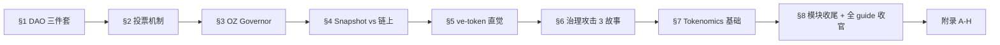
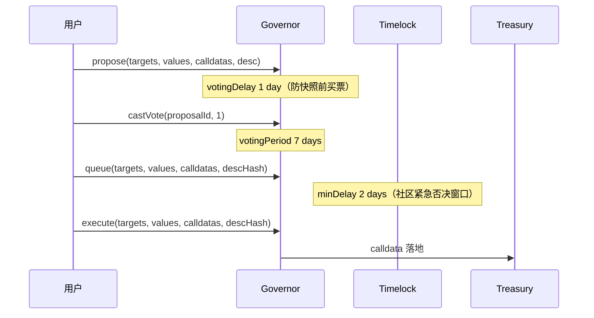
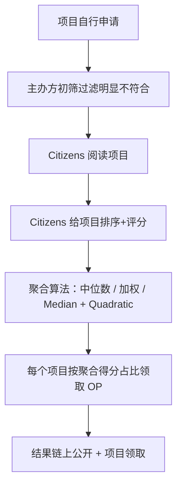
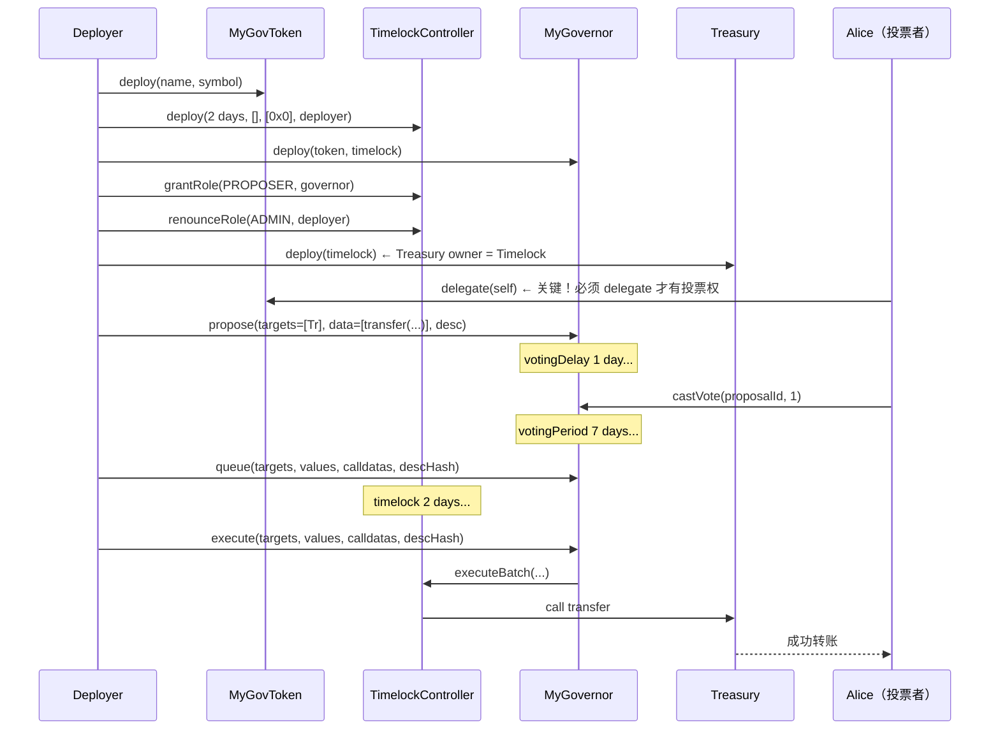

# 模块 15：DAO 治理 + Tokenomics

> 2016 年 6 月某个凌晨，一名攻击者把 The DAO 抽走 360 万 ETH。按合约规则他完全合法。然后以太坊基金会硬分叉了。十年后，"DAO 治理"是 350 亿美元资产、几十亿美元闪电贷攻击、以及 Beanstalk 那十三秒里蒸发的 1.82 亿美元的工程现实。

治理决议本身要永久归档——14 的 Arweave + Filecoin 给了答案。本模块站在那层存储之上，看 DAO 怎么发起、投票、执行决议。

**读者画像**：写过 ERC-20 的工程师。目标：能写出 Governor 合约 + 设计基本 tokenomics。

前置：模块 04 Solidity、05 安全、06 DeFi。数据快照：2026-04。

---

## 阅读地图



---

# 主线

## §1 DAO 是什么——合约 + 代币 + 时间锁

**TL;DR**：DAO = 一组合约 + 一个代币 + 一个时间锁。提案即 calldata，章程即字节码，国库 = `address(this).balance`。

> 2016 年 4 月，一群以太坊老兵开了个"链上风投基金"叫 The DAO。28 天内，1.5 亿美元 ETH 砸进去——占当时全部 ETH 流通量的 14%。两个月后这行代码崩了，整个以太坊撕裂成两条链。

### 1.1 三件套类比

| 组件 | 传统公司类比 | 链上原语 |
|------|-----------|--------|
| 代币 | 股权 | ERC20Votes（可委托、可快照） |
| Governor | 股东大会 + 董事会投票机器 | `propose / vote / queue / execute` |
| Timelock | 保险柜延时锁 | `TimelockController`（最短延迟 2 天） |

**三者缺一不可**：没有代币 = 谁投票？没有 Governor = 提案怎么过？没有 Timelock = 通过即执行，和给黑客开了 API 一样。

### 1.2 The DAO 教训（1 分钟版）

`splitDAO()` 先发 ETH 再更新余额——ATM 先吐钱后扣账，攻击者在吐钱和扣账之间反复按。360 万 ETH 流走，社区硬分叉，Ethereum Classic 诞生。

三条铁律：① transfer 必须 checks-effects-interactions；② 极端情况社会共识会覆盖"code is law"；③ 没有 Timelock 的 DAO = 自动化赌场。

### 1.3 现代 DAO 四层栈

```
社区层    Discourse / Discord        温度测试，无链上效力
投票层    Snapshot / Snapshot X      EIP-712 签名 + IPFS，gasless
执行层    Governor + Timelock        链上 calldata，多数通过 → 排队 → 执行
资金层    Treasury / Safe            合约持有，调用须票或多签
```

读 DAO 源码先问三件事：**权限挂在哪一层？谁有 role？被谁约束？**

### 章末

能回答以下问题则继续：Timelock 的 `PROPOSER_ROLE` 应该给谁？部署者的 `DEFAULT_ADMIN_ROLE` 何时 renounce？

---

## §2 投票机制——1T1V / 1P1V / QV / QF 直觉

**TL;DR**：1T1V = 股东大会；1P1V = 大选；QV = 小户加杠杆；QF = 分散捐款的乘法器。四种机制选型，每种都有命门。

> "为什么 Uniswap 治理里 a16z 一票顶一万人？" 因为投票权 = 代币余额 = 钱。

### 2.1 四种权重来源

| 模型 | 权重 | 用例 | 命门 |
|------|------|------|------|
| 1T1V | 代币余额 | Uniswap、Compound、Aave | 51% 代币 = 100% 控制 |
| 1P1V | 验证身份 | Optimism Citizens House | 身份层中心化 |
| QV | √代币（边际成本陡升） | Gitcoin、CO 议会 | 依赖身份层抗女巫 |
| QF | ∑√捐款 的平方 | Gitcoin Grants | 女巫攻击成本低 |

**QV 直觉**：100 个 voice credit，投 10 票花 100 分（全用完），投 5 票花 25 分，投 1 票花 1 分。钱多也得咬着牙选最在乎的事重仓。

**QF 直觉**："给小额捐款人加杠杆"——100 人各捐 $1 的 QF score = (100×√1)² = 10000；1 人捐 $100 的 score = 100。同样的钱，分散捐款的信号被放大 100 倍。

### 2.2 委托（Delegation）

ERC20Votes 让代币持有者把投票权委托给代议士——像美国大选投 elector。关键：**`getPastVotes(blockNumber)`** 取历史快照，防"提案发起后买票"。

```solidity
// 必须先 delegate，否则投票权永远 = 0
token.delegate(msg.sender);  // 委托给自己
// 或委托给信任的地址
token.delegate(delegatee);
```

**新人最常卡的坑**：忘了 `delegate(self)`，`getVotes()` 永远返回 0。

### 章末

QF 和 QV 的详细数学在附录 C。主线只需记住直觉：QF 放大"分散信号"，QV 抑制"集中押注"。

---

## §3 OZ Governor 入门——propose / vote / queue / execute

**TL;DR**：OZ Governor 是 DAO 的 Linux kernel，99% 的现代协议直接 import。真正持钱的是 TimelockController，Governor 只能"提议执行"。

> 如果说 Solidity 是 EVM 的 C 语言，OZ Governor 就是 DAO 的 Linux kernel。但它只是个空壳——真正持有钱的是 TimelockController，中间隔着 2 天延迟。如果你看到一个明显恶意的提案通过了，社区有 48 小时去 fork、去骂、去推动 emergency multisig 取消。

### 3.1 最小可用合约（30 行）

先看一个能跑的最小骨架——不必读懂每行，先抓 propose / vote / execute 三个动词的位置。

```solidity
// SPDX-License-Identifier: MIT
pragma solidity 0.8.28;

import "@openzeppelin/contracts/governance/Governor.sol";
import "@openzeppelin/contracts/governance/extensions/GovernorSettings.sol";
import "@openzeppelin/contracts/governance/extensions/GovernorCountingSimple.sol";
import "@openzeppelin/contracts/governance/extensions/GovernorVotes.sol";
import "@openzeppelin/contracts/governance/extensions/GovernorVotesQuorumFraction.sol";
import "@openzeppelin/contracts/governance/extensions/GovernorTimelockControl.sol";

contract MyGovernor is Governor, GovernorSettings, GovernorCountingSimple,
    GovernorVotes, GovernorVotesQuorumFraction, GovernorTimelockControl
{
    constructor(IVotes _token, TimelockController _timelock)
        Governor("MyGovernor")
        GovernorSettings(7200, 50400, 0)   // delay 1d, period 7d, threshold 0
        GovernorVotes(_token)
        GovernorVotesQuorumFraction(4)     // 4% quorum
        GovernorTimelockControl(_timelock)
    {}

    function state(uint256 id) public view
        override(Governor, GovernorTimelockControl) returns (ProposalState)
    { return super.state(id); }

    function _executeOperations(uint256 id, address[] memory targets,
        uint256[] memory values, bytes[] memory calldatas, bytes32 descHash)
        internal override(Governor, GovernorTimelockControl)
    { super._executeOperations(id, targets, values, calldatas, descHash); }
}
```

### 3.2 一次完整提案流程



**Solidity 调用片段**：

```solidity
// 1. 提案：从国库转 1000 TOKEN 给项目
bytes memory data = abi.encodeCall(IERC20.transfer, (recipient, 1000e18));
uint256 pid = governor.propose(
    _arr(address(token)), _arr(0), _arr(data), "Grant 1000 to Project X"
);
// 2. 等 votingDelay → 投票
governor.castVote(pid, 1);  // 1 = For
// 3. 等 votingPeriod → queue → 等 timelock → execute
bytes32 dh = keccak256(bytes("Grant 1000 to Project X"));
governor.queue(_arr(address(token)), _arr(0), _arr(data), dh);
governor.execute(_arr(address(token)), _arr(0), _arr(data), dh);
```

### 3.3 Timelock 部署（关键安全）

```solidity
TimelockController timelock = new TimelockController(
    2 days,           // minDelay
    proposers,        // [governor.address]
    executors,        // [address(0)] = 任何人可 execute
    msg.sender        // 临时 admin
);
// 部署后必须 renounce，否则 admin 可绕过整个治理
timelock.grantRole(timelock.PROPOSER_ROLE(), address(governor));
timelock.renounceRole(timelock.DEFAULT_ADMIN_ROLE(), msg.sender);
```

### 3.4 关键参数对比

| 参数 | OZ 默认 | Compound | Uniswap |
|------|---------|---------|---------|
| votingDelay | 1 day | ~2 days | ~2 days |
| votingPeriod | 1 week | ~3 days | ~7 days |
| proposalThreshold | 0 | 25k COMP | 2.5M UNI |
| quorum | 4% | 400k COMP | 4% |
| timelock minDelay | 2 days | 2 days | 2 days |

### 3.5 4 个新人陷阱

1. **忘了 `delegate(self)`**：ERC20Votes 默认投票权 = 0，必须显式委托。
2. **`descriptionHash` 字节级匹配**：execute 时 description 必须与 propose 时完全一致（含空格）。
3. **OZ v5 函数名改了**：`_execute` → `_executeOperations`，老教程报错先检查版本。
4. **Timelock 忘了 renounce admin**：admin 可以绕过整个治理流程。

### 章末

能写出上面 30 行合约 + 完成 propose/vote/queue/execute 一次完整循环，则本节过关。

---

## §4 Snapshot vs 链上投票——选型

**TL;DR**：Snapshot = 温度计（gasless，无法自动执行）；OZ Governor = 表决机（自动执行，每票有 gas）；Snapshot X = 中间路线（L2 投票 + storage proofs 自动执行）。

| 维度 | Snapshot（链下） | OZ Governor（链上） | Snapshot X（混合） |
|------|-----------------|---------------------|------------------|
| Gas | 0（EIP-712 签名）| 每票 ~$1-5 | 投票链下，执行链上 |
| 执行 | 多签手动 | 自动 `execute()` | storage proof 自动 |
| 抗审查 | 弱（IPFS 可下线）| 强 | 中 |
| 选型场景 | 温度测试 | 国库执行 / 合约升级 | 跨链 DAO |

**选型决策树**：

```
只投票不动钱？→ Snapshot
标准 ERC20Votes + 自动执行？→ OZ Governor
多算法并存（大额 token + 小额 multisig）？→ Aragon OSx（见附录 A）
跨链或 L2 投票？→ Snapshot X
```

**Snapshot 投票（TypeScript 片段）**：

```typescript
import snapshot from "@snapshot-labs/snapshot.js";
const client = new snapshot.Client712("https://hub.snapshot.org");
await client.vote(signer, voter, {
  space: "uniswap", proposal: "0xabc...",
  type: "single-choice", choice: 1,
});
// gasless——签 EIP-712 typed data，结果存 IPFS
```

**委托瞬移攻击**：votingDelay 锁代币余额快照，但不锁委托关系。攻击者可在 propose 前最后一刻把分散代币集中委托给单一地址（CMP-289 前车之鉴）。防御：委托变更触发 N 天 cooldown 才计票。

### 章末

Snapshot 工具详细配置在附录 B。选型心法：用 Snapshot 做意见收集，用 Governor 做钱的决策。

---

## §5 ve-token 直觉——投票权 IRA

**TL;DR**：把 ve-token 想成"投票权 IRA 账户"——锁得越久，发给你的 veCRV 越多，投票权 + 协议费分成同步上升。它把"治理权"和"时间偏好"硬挂钩。

> 把 veCRV 想成一张"承诺书 NFT"——你承诺把 CRV 锁 N 年不动，协议给你一张随时间逐日缩水的投票卡。锁 4 年的人投票权是锁 1 年的人 4 倍。

### 5.1 veCRV 核心公式

```
veCRV = CRV_locked × (lock_duration / max_lock)
```

max_lock = 4 年。锁 4 年的 1 CRV → 1 veCRV；锁 1 年 → 0.25 veCRV。

veCRV **不可转让**，且**线性衰减**——你必须不断"延锁"才能保持权重。

### 5.2 三个权益绑定

1. **治理权**：决定每个 Curve pool 的 gauge weight（下周 CRV emissions 怎么分）。
2. **协议费分成**：50% 的 Curve swap fee 分给 veCRV 持有者。
3. **LP boost**：作为 LP，根据 veCRV 占比，CRV 奖励最多放大 **2.5×**。

**二阶效应**：控制 veCRV → 控制 gauge → 控制 emissions → 控制稳定币流动性深度。这是 Curve War 的根源（详见附录 D）。

### 5.3 ve(3,3) 和 Aerodrome

ve(3,3) 在 veCRV 基础上：vote 收 100% swap fee（而非 50%），没有 LP boost（简化博弈）。Aerodrome（Base 链）用此模型捕获 Base 链 60% DEX 交易量。

### 5.4 ve 的最大痛点与软化

锁仓 = 流动性损失。Convex 用 cvxCRV（可交易的永久锁仓收据）解决，Pendle 直接退回 sPENDLE（随时 stake/unstake + cooldown）——这是"硬锁"到"软锁"的演进。

### 章末

ve 数学（bias/slope 线性衰减、历史快照）和 VeToken.sol 实现在附录 C。主线只需记住：ve = 投票权 IRA，锁得久权重高，协议费跟着走。

---

## §6 治理攻击——三个故事

**TL;DR**：三种不同攻击向量：The DAO（重入漏洞）、Beanstalk（闪电贷 + 无 snapshot）、Humpy（合法买入 + 合规投票）。防御 checklist 在本节末尾。

---

### 故事一：The DAO（2016）——凌晨的 ATM

> 2016 年 6 月某个凌晨，攻击者的合约正在不停地按一台永不扣账的 ATM。`splitDAO()` 先发 ETH 再更新余额，攻击者在 fallback 里递归调用约 30 次，抽走 360 万 ETH。

**根因**：违反 checks-effects-interactions。修复：`balances[msg.sender] = 0` 必须在 transfer 之前。

**历史后果**：以太坊硬分叉，Ethereum Classic 诞生，"code is law"第一次在现实中被否决。

---

### 故事二：Beanstalk（2022-04，$182M）——13 秒，一个区块

> 周四下午，Twitter 上一条消息："Beanstalk 刚刚被清空了，$182M。" 链上数据显示：一笔交易，13 秒，Aave 闪电贷 10 亿美元，投票，执行，还款。全程没有人能介入——因为没有 Timelock，没有 snapshot。

**攻击链路**：

```
1. Aave 闪电贷 10 亿 USD
2. 买 BEAN+3CRV LP → 存 Silo → 获得投票权
3. emergencyCommit(BIP-18)  ← calldata = "把国库转给 0xattacker"
4. BIP-19 转 25 万给乌克兰（道德烟雾弹）
5. 拆 LP，还闪电贷
                              ← 全程一个区块，13 秒
```

**根因**：① 投票权 = 当前余额（无 snapshot）；② `emergencyCommit` 允许投票/执行同区块。

**防御**：
- `getPastVotes(snapshotBlock)` — 闪电贷同区块归还，snapshot 永远拿不到它的票
- `votingDelay ≥ 1 day` — 任何 ≥1 block 的延迟都能挡住同区块执行

---

### 故事三：Compound CMP-289（2024-07，Humpy）——完全合法的抢劫

> 这次攻击的诡异之处：**它完全合法**。Humpy 没有闪电贷、没有重入——他只是在周末、交易量最低的时候，用合规买入的 13% COMP 发了一个提案，转 2400 万美元到自己的钱包。682k vs 633k，提案通过。

**攻击链路**：买 13% COMP → 多钱包集中委托 → 周末发提案 → 低关注度通过。

**根因**：1T1V + 委托 + 无大额提案超级多数要求 = 结构性寡头政治漏洞。

**防御**：
- 大额转账要求 supermajority（≥60-67%）
- 提案监控告警（关键提案 24 小时内通知社区）
- 委托变更触发 N 天 cooldown

---

### 防御 checklist

```
✅ ERC20Votes snapshot（getPastVotes）
✅ votingDelay ≥ 1 day
✅ votingPeriod ≥ 3-7 days
✅ Timelock minDelay ≥ 2 days
✅ proposalThreshold ≥ 0.5-1% 流通量
✅ quorum ≥ 4%
✅ 大额操作 supermajority（≥ 60-67%）
✅ Emergency multisig pause（5/9 或 7/13）
✅ 治理监控告警（Snapshot + Governor 双层）
```

更多攻击案例（Build Finance / Mango Markets / Sky 等）在附录 F。

### 章末

能说出"为什么 Beanstalk 的 timelock=0 是致命的"，以及"为什么 Humpy 的攻击 timelock 挡不住"，则本节过关。

代币是治理的弹药——讲完攻击怎么发生，下一节看怎么分弹药、防止集中。

---

## §7 Tokenomics 基础——分发 / 解锁 / 通胀

**TL;DR**：代币模型决定项目能不能走过 4 年。分发比例、cliff、vesting 节奏，是比合约审计更重要的设计决策。

> 2024 年 BeInCrypto 反复提到一个词："low float / high FDV scam pattern"——VC 项目上线 FDV 50-100 亿美元，流通 5%，散户接盘，团队和投资人 1 年 cliff 后开始 vesting，价格瀑布式下跌。Aptos、Sui 是范本。Vitalik 称之为"有毒分发"。

### 7.1 标准分配模板

```
总量 1,000,000,000 TOKEN

├── 团队 + 早期员工        15%   1 年 cliff + 3 年 linear
├── 投资人（多轮）          18%   1 年 cliff + 2-3 年 linear
├── DAO 国库                30%   无 cliff，由 governance 控制释放
├── 社区激励 / mining       20%   逐步发放 4-8 年
├── 空投                    5-7%  TGE 立即流通（部分锁仓）
├── 流动性 + 做市商          5%    部分立即可用
└── 顾问 / partnership      5-7%  1 年 cliff + 2 年 linear
```

### 7.2 三种主流分发方式对比

| 方式 | 优势 | 风险 |
|------|------|------|
| VC 轮 | 资金充足，机构背书 | cliff 后集中解锁砸盘 |
| Fair launch | 无预挖，Howey 风险低 | 缺长期资金，易女巫抢光 |
| Airdrop | 快速分发，激励早期用户 | 女巫、用完即走 |

### 7.3 红旗清单

```
⛳ 团队 + 投资人 > 50%          ← "有毒分发"信号
⛳ TGE 流通比 < 5%              ← 高 FDV / 低流通陷阱
⛳ 没有 cliff                   ← 团队可立刻砸盘
⛳ vesting 期 < 2 年             ← 短期主义
⛳ DAO 国库 < 10%               ← 治理无钱可花
```

### 7.4 解锁节奏与市场冲击

**Cliff vesting**：某天突然全解锁，市场冲击集中（EigenLayer 2025 年 9 月投资人 cliff）。

**Linear vesting**：每月线性解锁，冲击分散（Arbitrum 每月 ~92M ARB 解锁）。

从"市场友好"角度：linear > cliff。但 cliff 保护了早期团队不被过早流动性诱惑离开。

### 7.5 链上 vesting 工具

```
Sablier        — 按秒流式解锁
Hedgey         — cliff + linear + revocable（EigenLayer / OP 在用）
Llamapay       — 薪资 streaming
OZ VestingWallet — 教学用，简单 cliff + linear
```

### 7.6 通胀设计

健康代币模型的演进路径：

```
阶段 1（0-18 月）：高 emissions 吸引流动性（雇佣兵 LP）
阶段 2（18-36 月）：emissions 逐步减少，引入手续费分成
阶段 3（36 月+）：手续费分成成为主要收益来源
```

**死亡螺旋**：emissions 稀释速度 > 协议真实用量增长 → 代币持续贬值 → LP 撤离 → 流动性枯竭。出口只有两条：活到阶段 3，或停止 emissions 接受短期价格冲击。

### 章末

能设计出一份"团队/投资人不超 35%、DAO 国库 30%、18 月后 fee switch 开启"的代币模型，则本节过关。

详细 vesting 案例（OP / ARB / EIGEN / APT / SUI）和 ve-token 实战合约代码在附录 C。

---

## §8 模块 15 收尾 + 全 guide 收官

**模块 15 主线小结**：

- DAO 不是"民主软件"，是"代币 + Governor + Timelock"三件套——三者缺一就是赌场。
- 投票机制选型决定权力分布：1T1V 适合协议金库，QV/QF 适合公共物品，1P1V 必须先解决身份层。
- OZ Governor 是事实标准，但真正持钱的是 Timelock；Governor 只是"提议执行者"，48 小时延迟是社区最后的撤销窗口。
- 三种治理攻击命门各异：The DAO 是 reentrancy + 没 Timelock，Beanstalk 是 timelock=0 + 闪电贷，Humpy 是"完全合法"——quorum 太低，supermajority 没设。
- Tokenomics 比合约审计更决定项目命运。团队 + 投资人 > 50% / TGE 流通 < 5% / 没有 cliff，三个红旗见一即跑。

**全 guide 收官**：

恭喜——你读完了约 190 万字、528 章、横跨 16 个模块的全部内容。从模块 00 的"什么是区块链"，到模块 15 的"DAO 怎么不被掏空"，你走完了从 EOA 私钥到 zkEVM、从 ERC-20 到 ve(3,3)、从 P2P 节点到 Filecoin 永久存储、从 Solidity 语法到 Tokenomics 设计的完整路径。这条路本来就没有"读完"那一刻——协议每周升级，攻击每月翻新，工具每季度换代。这份 guide 给的是地图和指北针，不是终点。

**下一步建议（挑 2-3 条立刻做）**：

1. 建一份公开的 portfolio：GitHub 上放 3-5 个能跑的合约项目（一个 ERC-20、一个 NFT、一个 DeFi mini、一个 Governor、一个 zk demo）。
2. 跟一条 L2 跟到底：选 Optimism / Arbitrum / Base 之一，订阅其 governance forum，每周看一份提案，三个月后你会比 90% 的从业者更懂这条链。
3. 写一份合约审计报告：选一个已被审计过的开源协议，在不看 audit 报告的前提下自己审一遍，再对照 Trail of Bits / OZ / Spearbit 的报告，找差距。
4. 跑一遍 zkML / TEE / FHE 的 hello world：选一个方向深入，2026 年这三条赛道会决定下一波叙事。
5. 参与一次真实治理：在任意 DAO 里投一次票，写一次 Snapshot 提案，哪怕只是修改一个参数——亲手按一次按钮和读一百篇文章不是一回事。
6. 加入一次黑客松：ETHGlobal / ETHIndia / Encode 任选其一，48 小时内交一份能用的 demo，比读半年文档收获大。
7. 把这份 guide 中你最有共鸣的一章重写一遍：用你自己的话、自己的代码、自己的故事——能讲清楚才是真懂。

**致谢 + 反馈**：

这份 guide 是公共物品，MIT License，欢迎 fork、欢迎纠错、欢迎补充案例。每一个 issue 和 PR 都会被认真对待。链上见。

---

# 主线完毕——以下为附录

> 附录独立阅读，可单独查阅。按字母索引：
> - **附录 A**：OZ Governor 字段级 + Bravo / Aragon OSx 详 + 完整部署实战
> - **附录 B**：Snapshot / Tally / 多签 / Hats / Aragon 工具详
> - **附录 C**：ve / QV / QF / Conviction / Futarchy 数学 + ve-Token 实战合约 + vesting 案例
> - **附录 D**：Curve War 三轮详 + Treasury 管理
> - **附录 E**：RWA / ERC-3643 详
> - **附录 F**：全部治理攻击案例（Beanstalk / Build Finance / CMP-289 / Mango / Sky 等）
> - **附录 G**：法律 / MiCA / Howey
> - **附录 H**：真实 DAO 解剖（Uniswap / Aave / MakerDAO / Optimism）

---

---

## 附录 A：OZ Governor 字段级详解 + GovernorBravo / Aragon OSx

### A.1 OZ Governor 各字段语义

| 字段 | 含义 | 工程注意 |
|------|------|---------|
| `votingDelay` | propose → 投票开始的延迟（blocks）| 必须 ≥ 1 day，snapshot 在此期间锁定 |
| `votingPeriod` | 投票持续时间（blocks）| 生产建议 3-7 days |
| `proposalThreshold` | 发起提案最低代币数 | 0 = 任何人可发，生产建议 0.5-1% 流通量 |
| `quorumNumerator` | 法定人数比例（分母 100）| 4% 是行业默认 |
| `ProposalState` | 状态机枚举 | Pending→Active→Succeeded→Queued→Executed |
| `proposalId` | `keccak256(targets,values,calldatas,descHash)` | 非递增整数，链上免存储，但需保存原始参数 |

**OZ v5 破坏性改动**：`_execute` 改为 `_executeOperations`，`_cancel` 参数签名变化。老教程报错先检查版本。

### A.2 GovernorBravo 与 OZ Governor 区别

| 维度 | OZ Governor | GovernorBravo |
|------|-------------|---------------|
| 升级 | 不可升级（非 proxy）| proxy + storage 兼容 |
| 提案 ID | keccak256 hash | 递增整数 |
| 投票选项 | For/Against/Abstain | For/Against/Abstain |
| 主要用户 | ENS、新协议默认 | Compound、Uniswap（老版）|

### A.3 Aragon OSx 架构

Aragon OSx = DAO 空壳 + Plugin 商店。与 OZ Governor"一份合约管全部"不同，Aragon 允许同时跑多个 Plugin：

```
DAO（核心：持有资金 + Permission Manager）
 ├── Plugin: TokenVoting（OZ Governor 风格，大额）
 ├── Plugin: Multisig（小额日常）
 ├── Plugin: Admin（紧急刹车）
 └── Plugin: Optimistic（默认通过，N 天反对窗口）
```

最小 Plugin 骨架（Solidity）：

```solidity
import {PluginUUPSUpgradeable, IDAO} from "@aragon/osx/core/plugin/PluginUUPSUpgradeable.sol";

contract MyVotingPlugin is PluginUUPSUpgradeable {
    function execute(uint256 id) external {
        // Plugin 不直接动钱，回调 DAO.execute
        dao().execute(bytes32(id), proposals[id].actions, 0);
    }
}
```

2026 年状态：10,000+ 项目，治理 ~350 亿美元资产。

---

## 附录 B：Snapshot / Tally / 多签 / Hats / Aragon 工具详

### B.1 链上执行界面——Tally / Boardroom / Agora

> **2026 年 3 月 17 日，Tally 关停**——这个曾经服务 500+ DAO、几乎是 OZ Governor 标配前端的工具。CEO 在告别信里写了句让所有人愣住的话："Gensler 和 Biden 时代对加密反而更友好——监管压力让协议被迫认真做去中心化基础设施。监管缓和后，协议都自建 UI 了，独立工具失去了空间。" 这是 DAO 工具市场的一个时代缩影。

| 工具 | 状态 | 定位 |
|------|------|------|
| **Tally** | 2026-03 关停（OSS 保留）| 曾是 OZ Governor/Bravo 通用前端，500+ DAO 接入；CEO 解释为监管缓和后协议自建 UI（[CoinDesk](https://www.coindesk.com/markets/2026/03/17/gensler-and-biden-were-just-better-for-crypto-says-tally-ceo-as-dao-governance-platform-shuts-down)）|
| **Boardroom** | 运营 | 跨 DAO 数据聚合（提案、委托、国库），偏分析非执行 |
| **Agora** | 运营 | Optimism、Uniswap、ENS 现行前端 |
| **Karma GAP** | 运营 | grantee OKR + 交付追踪 |
| **协议自建 UI** | — | Sky、Aave、Compound 已自建 |

### 7.4 思考题

1. Tally 关停说明 DAO 工具市场不可持续。你认为根本原因是哪一个：(a) 协议都自己做前端、(b) 监管缓和，(c) DAO 数量不够？
2. 如果你是新 DAO 的发起者，你会用现成 UI 还是自建？给出两个考量维度的判断。

---

### B.2 OZ Governor + GovernorBravo + Timelock（完整）

> **如果说 Solidity 是 EVM 的 C 语言，那 OZ Governor 就是 DAO 的 Linux kernel——99% 的现代 DAO 直接 import 它**。但它只是个空壳，真正持有钱的是 TimelockController。这是工程上的精妙设计：**Governor 只能"提议执行"，Timelock 才能"实际执行"，中间隔着一个 2 天延迟**——如果你看到一个明显恶意的提案通过了，社区有 48 小时去 fork、去骂、去推动 emergency multisig 取消。这一章给你一份能跑的 Foundry 部署脚本，以及"为什么忘了 `timelock.renounceRole(ADMIN)` 你的 DAO 等于裸奔"的工程教训。

### 8.1 GovernorBravo

Compound 2021 接替 GovernorAlpha，四点关键差异：可升级（proxy + storage 兼容）、proposalThreshold 可治理调整、结构化 receipt 追踪每个 voter、支持 for/against/abstain 三选项。Compound、Uniswap、ENS、Hop 直接 fork。

### 8.2 OpenZeppelin Governor

OZ Governor（v4.4+）模块化重写，扩展拆成 mixin：

```
Governor.sol（核心抽象）
 ├── GovernorSettings（votingDelay/Period/proposalThreshold）
 ├── GovernorCountingSimple / GovernorCountingFractional（投票计数策略）
 ├── GovernorVotes / GovernorVotesQuorumFraction（投票权来源 + 法定人数）
 ├── GovernorTimelockControl / GovernorTimelockCompound（时间锁集成）
 └── GovernorPreventLateQuorum（防最后一刻 quorum 偷袭）
```

来源：[OpenZeppelin Governor 文档](https://docs.openzeppelin.com/contracts/5.x/governance)、[OZ Governor.sol 源码](https://github.com/OpenZeppelin/openzeppelin-contracts/blob/master/contracts/governance/Governor.sol)。

### 8.3 一份最小可用的 Governor 合约

```solidity
// SPDX-License-Identifier: MIT
pragma solidity 0.8.28;

import "@openzeppelin/contracts/governance/Governor.sol";
import "@openzeppelin/contracts/governance/extensions/GovernorSettings.sol";
import "@openzeppelin/contracts/governance/extensions/GovernorCountingSimple.sol";
import "@openzeppelin/contracts/governance/extensions/GovernorVotes.sol";
import "@openzeppelin/contracts/governance/extensions/GovernorVotesQuorumFraction.sol";
import "@openzeppelin/contracts/governance/extensions/GovernorTimelockControl.sol";
import "@openzeppelin/contracts/governance/utils/IVotes.sol";
import "@openzeppelin/contracts/governance/TimelockController.sol";

contract MyGovernor is
    Governor,
    GovernorSettings,
    GovernorCountingSimple,
    GovernorVotes,
    GovernorVotesQuorumFraction,
    GovernorTimelockControl
{
    constructor(IVotes _token, TimelockController _timelock)
        Governor("MyGovernor")
        GovernorSettings(
            7200,    // votingDelay: 1 day（块时 12s × 7200 = 86400s）
            50400,   // votingPeriod: 7 days
            0        // proposalThreshold: 0（生产应设为代币总量 0.5-1%）
        )
        GovernorVotes(_token)
        GovernorVotesQuorumFraction(4)  // quorum: 4%
        GovernorTimelockControl(_timelock)
    {}

    // 必须 override 解决多重继承
    function state(uint256 proposalId)
        public view override(Governor, GovernorTimelockControl)
        returns (ProposalState)
    {
        return super.state(proposalId);
    }

    function _executeOperations(
        uint256 proposalId,
        address[] memory targets,
        uint256[] memory values,
        bytes[] memory calldatas,
        bytes32 descriptionHash
    ) internal override(Governor, GovernorTimelockControl) {
        super._executeOperations(proposalId, targets, values, calldatas, descriptionHash);
    }
    // ... 其他 override 略
}
```

**OZ 5.x 注意**：v5 中函数名从 `_execute` 改成 `_executeOperations`，`_cancel` 仍同名但 hook 签名不同（参数列表与 v4 不一致）。如果你看老教程报错，先确认你的 OZ 版本。

### 8.4 Timelock 设计

`TimelockController` 是独立合约，真正持有国库——Governor 只是提议者。

```solidity
// 三个角色
// PROPOSER_ROLE: 谁能 schedule（通常 = Governor）
// EXECUTOR_ROLE: 谁能 execute（通常 = address(0) 表示任何人）
// CANCELLER_ROLE: 谁能 cancel（通常 = Governor + emergency multisig）
TimelockController timelock = new TimelockController(
    minDelay,                  // 例如 2 days
    proposers,                 // [governor.address]
    executors,                 // [address(0)]（开放）
    admin                      // 部署后立刻 renounce 角色
);
```

**关键安全**：部署后 admin 必须放弃 `DEFAULT_ADMIN_ROLE`（OZ v4 旧名 `TIMELOCK_ADMIN_ROLE`），否则 admin 可以绕过整个治理流程。

### 8.5 完整部署脚本（Foundry）

```solidity
// script/DeployDAO.s.sol（精简版）
import "forge-std/Script.sol";
import "@openzeppelin/contracts/governance/TimelockController.sol";
import {MyGovernor} from "../src/MyGovernor.sol";
import {MyGovToken} from "../src/MyGovToken.sol";

contract DeployDAO is Script {
    function run() public {
        vm.startBroadcast();

        // 1. 部署治理代币（ERC20Votes）
        MyGovToken token = new MyGovToken("MyDAO", "MYD");

        // 2. 部署 Timelock，最短 2 天
        address[] memory proposers = new address[](0);  // 先空，后授权
        address[] memory executors = new address[](1);
        executors[0] = address(0);  // 开放执行
        TimelockController timelock = new TimelockController(
            2 days,
            proposers,
            executors,
            msg.sender  // 临时 admin
        );

        // 3. 部署 Governor
        MyGovernor governor = new MyGovernor(token, timelock);

        // 4. 把 Governor 加为 Timelock 的 proposer
        timelock.grantRole(timelock.PROPOSER_ROLE(), address(governor));
        // 5. 收回部署者权限
        timelock.renounceRole(timelock.DEFAULT_ADMIN_ROLE(), msg.sender);

        vm.stopBroadcast();
    }
}
```

完整代码在 `code/governor-foundry/script/DeployDAO.s.sol`。

### 8.6 一次完整提案流程（脚本演示）

代码 `code/governor-foundry/script/Propose.s.sol`：

```solidity
// 提案：从 Treasury 转 1000 个 MYD 给某个项目
address[] memory targets = new address[](1);
targets[0] = address(token);
uint256[] memory values = new uint256[](1);
values[0] = 0;
bytes[] memory calldatas = new bytes[](1);
calldatas[0] = abi.encodeWithSelector(IERC20.transfer.selector, recipient, 1000e18);
string memory desc = "Grant 1000 MYD to Project X";

uint256 proposalId = governor.propose(targets, values, calldatas, desc);

// 等 votingDelay → 投票 → 等 votingPeriod → queue → 等 timelock → execute
governor.queue(targets, values, calldatas, keccak256(bytes(desc)));
governor.execute(targets, values, calldatas, keccak256(bytes(desc)));
```

### 8.7 思考题

1. 为什么 OZ Governor 把 proposalId 设计成 `keccak256(targets, values, calldatas, descHash)` 而不是递增整数？给出至少两个工程理由（Hint：链上存储成本 vs 索引）。
2. Timelock 的 `executors = [address(0)]` 让任何地址都能执行——这有什么风险？为什么仍然是默认推荐？
3. 写出"提案进入 Queued 但没人 execute"会导致什么后果。OZ 用什么机制处理？

---

### B.3 Aragon OSx / Llama / DAOhaus / Hats Protocol

> **OZ Governor 是"一份合约管全部"**——简单但僵硬。**Aragon OSx 是"插件商店"**——你的 DAO 是空壳，可以同时跑大额 token 投票 + 小额 multisig + 默认通过的 optimistic voting，互不冲突。**Hats Protocol 是"角色 NFT"**——把"安全官"、"财务官"、"版主"做成 ERC-1155，谁戴上谁有权限。**DAOhaus / Moloch v3 是"小工会"**——支持 ragequit（少数派愤而退出还能拿走自己份额，这是其它框架做不到的事）。这一章告诉你什么场景选什么。

### 9.1 Aragon OSx

Aragon OSx（v2，2023）：DAO 是空壳，所有治理逻辑插拔 Plugin。

```
DAO（核心合约：拥有资金 + 权限注册表）
 ├── Plugin: TokenVoting（OZ Governor 风格）
 ├── Plugin: Multisig
 ├── Plugin: Admin（紧急刹车）
 ├── Plugin: Optimistic Voting（默认通过、反对才否决）
 └── Plugin: Custom（你写的任何逻辑）
```

Plugin 通过 `PluginSetupProcessor` 安装/卸载，DAO ACL 管理权限。2026 年状态：10,000+ 项目，治理 350 亿美元资产。来源：[Aragon OSx 文档](https://docs.aragon.org/osx-contracts/1.x/index.html)、[CTO 访谈](https://www.aragon.org/how-to/building-a-dao-framework-interview-with-aragons-cto)。

#### Aragon OSx Plugin 系统简介

OSx 把 DAO 拆成两层：**核心 DAO 合约**（持有资金 + Permission Manager + execute 入口）和**任意多个 Plugin**（提供具体的提案/投票/执行能力）。Plugin 之间可以共存，分别管不同金额阈值或不同提案类型。

**核心三件套**（合约层）：

| 合约 | 角色 | 关键方法 |
|------|------|---------|
| `DAO.sol` | 资金持有 + 权限根 | `execute(callId, actions[], allowFailureMap)` 唯一执行入口；所有 Plugin 想动钱必须通过 DAO |
| `PluginSetupProcessor` (PSP) | Plugin 安装/卸载/升级 | `prepareInstallation` → DAO 投票批准 → `applyInstallation` 真正授权 |
| Permission Manager | DAO 内部 ACL | `grant(where, who, permissionId)` / `revoke` / `grantWithCondition`（可挂条件合约） |

**最小 Plugin 骨架**（Solidity）：

```solidity
// SPDX-License-Identifier: AGPL-3.0-or-later
pragma solidity ^0.8.17;

import {PluginUUPSUpgradeable, IDAO} from "@aragon/osx/core/plugin/PluginUUPSUpgradeable.sol";

contract MyVotingPlugin is PluginUUPSUpgradeable {
    bytes32 public constant EXECUTE_PERMISSION_ID = keccak256("EXECUTE_PERMISSION");

    struct Proposal { uint256 yes; uint256 no; bool executed; IDAO.Action[] actions; }
    mapping(uint256 => Proposal) public proposals;

    function initialize(IDAO _dao) external initializer {
        __PluginUUPSUpgradeable_init(_dao);
    }

    function propose(IDAO.Action[] calldata _actions) external returns (uint256 id) {
        // why: 任何人可发，权重在 vote() 里检查；OSx 推荐 Plugin 自己定门槛
        id = ++_lastId;
        for (uint i; i < _actions.length; ++i) proposals[id].actions.push(_actions[i]);
    }

    function execute(uint256 id) external {
        Proposal storage p = proposals[id];
        require(p.yes > p.no && !p.executed, "fail");
        p.executed = true;
        // why: Plugin 不直接动钱，而是回调 DAO.execute；DAO 验证 Plugin 持有 EXECUTE_PERMISSION
        dao().execute(bytes32(id), p.actions, 0);
    }
}
```

**安装流程**（链上 + Aragon SDK）：

1. `PluginRepo` 发布 Plugin 版本（构建号 + setup 合约）；
2. DAO 治理通过提案调用 `PSP.prepareInstallation(dao, repo, params)` → 返回 `permissions[]` 列表；
3. DAO 第二次提案 `PSP.applyInstallation(dao, plugin, permissions)` 真正写入 ACL；
4. 卸载/升级走对称的 `prepare/applyUninstallation`、`prepareUpdate`，保证可回滚。

**与 OZ Governor 的本质差异**：

- OZ Governor = "一份合约管全部"，要换投票算法等于换 DAO；
- Aragon OSx = "DAO 是空壳 + Plugin 任意叠加"，可以同时跑 TokenVoting（大额）+ Multisig（小额）+ Optimistic（默认通过、N 天反对窗口），互不冲突。

**示例代码 / 学习路径**：
- 官方模板：[`aragon/osx-plugin-template-hardhat`](https://github.com/aragon/osx-plugin-template-hardhat)（含 Plugin、PluginSetup、单测、部署脚本）；
- TokenVoting 参考实现：[`aragon/osx/packages/contracts/src/plugins/governance/majority-voting/token`](https://github.com/aragon/osx/tree/main/packages/contracts/src/plugins/governance/majority-voting/token)；
- TypeScript SDK 示例：[`@aragon/sdk-client` 的 `TokenVotingClient`](https://devs.aragon.org/docs/sdk) 用 ~30 行代码创建带 TokenVoting 的 DAO；
- Plugin 教程：[Aragon OSx Build a Plugin](https://devs.aragon.org/docs/osx/how-to-guides/plugin-development/upgradeable-plugin/initialization)。

### 9.2 Llama

**Llama**（DAO 角色权限公司，非 Meta Llama）：按金额分层授权——$50 万以下由 roles 多签批；$50-500 万代币投票；$500 万以上 supermajority + 7 天 timelock。客户：Uniswap、Optimism、Aave、GMX 等。

### 9.3 DAOhaus（Moloch v3）

**DAOhaus**：Moloch v3 框架现代化界面。核心：shares（有投票权）+ loot（无投票权可分国库）+ **ragequit**（少数派拿回 share 对应国库份额退出）+ Guild Kick。适合"小而美、对内信任高"的工会型 DAO（公会、研究小组、捐赠俱乐部）。

### 9.4 Hats Protocol

**Hats Protocol**：**链上角色协议**——把"角色"tokenize 成 ERC-1155 NFT（"hat"）。戴上"安全官" hat 就有暂停权限，戴上"财务官" hat 就能动用 100 万以下国库。每个 hat 由上层 admin hat 颁发/撤销。

**Hats Tree**：
```
Top Hat（DAO 自己持有）
 ├── 治理委员会 Hat
 │    ├── 安全官 Hat
 │    └── 财务官 Hat
 ├── 工程委员会 Hat
 │    ├── 核心开发 Hat
 │    └── 审计协调 Hat
 └── 社区 Hat
      └── 论坛版主 Hat
```

来源：[Hats Protocol 文档](https://docs.hatsprotocol.xyz/)、[GitHub](https://github.com/Hats-Protocol/hats-protocol)。

50+ DAO 在使用 Hats，包括 Optimism、Gitcoin、ENS。

### 9.5 框架对比表

| 框架 | 适合 | 治理风格 | 特色 |
|------|------|---------|------|
| OZ Governor | 大型代币 DAO | 1T1V + Timelock | 标准、安全、与 Tally 兼容 |
| GovernorBravo | Compound 系 fork | 1T1V + Timelock | 老协议自然继承 |
| Aragon OSx | 模块化定制 | 任意（Plugin 化） | Plugin 生态最丰富 |
| Llama | 大 DAO 子分权 | role-based | 灵活的金额阈值 |
| DAOhaus / Moloch v3 | 小工会型 | shares + ragequit | 退出权 = 防多数压迫 |
| Hats Protocol | 角色注册 | 不是治理本身 | 与 OZ/Aragon 组合用 |

### 9.6 思考题

1. 为什么 Moloch 的 ragequit 是"小型 DAO 的杀手特性"？想想"不能投票但可以拿钱走"对议事博弈的影响。
2. 如果你设计一个 50 人核心 + 5000 人代币持有的 DAO，你会怎么组合 OZ Governor + Hats + Llama？画出权限路径图。

---

### B.4 多签——Safe（Gnosis Safe）/ Squads

> **Safe 在 EVM 链上托管 1000 亿美元——比许多国家的外汇储备还多**。它是 DAO 工具栈里最不起眼但最关键的一层：treasure 多签、紧急 pauser、grantee 收款地址，背后几乎都是一个 Safe。Solana 那边对应的是 Squads（100 亿美元）。理解 Safe 的 `delegatecall` 危险性、modules / guards 扩展点、以及它和 Timelock 的"职责分工"，是任何 DAO 架构师的必修课。

### 10.1 DAO 中的三种多签角色

① **紧急刹车**：治理 7-10 天 vs 黑客 1 小时，timelock 之外最快防御；② **小额日常运营**：grant 拨款不必走完整治理；③ **资金接收**：grantee 通常是 multisig（如 Optimism Foundation 5/7）。

### 10.2 Safe（Gnosis Safe）

**Safe**（前 Gnosis Safe）：EVM 事实标准，跨 30+ 链托管 $1000 亿+。来源：[Safe](https://safe.global/)、[The Block](https://www.theblock.co/post/388098/crypto-wallet-safe-reports-fivefold-revenue-jump-2025-not-break-even-profitability)。

架构：
```
Safe 本身是个 proxy 合约
 ├── Singleton（实际逻辑合约，可升级）
 ├── Owners[]：所有 owner 地址
 ├── threshold：需要多少签名（如 5/9）
 ├── Modules[]：扩展模块（spending limit、allowance、recovery）
 └── Guards[]：执行前后的钩子（rate limit、whitelist）
```

执行流程：
1. 任意 owner 创建 transaction proposal（链下，存 Safe Transaction Service）。
2. 其它 owner 用钱包签名（EIP-712）。
3. 凑够 threshold 个签名后，最后一个 signer（或任何 relayer）调用 `execTransaction()` 上链。

```solidity
// Safe 核心 execTransaction 简化逻辑
function execTransaction(
    address to,
    uint256 value,
    bytes calldata data,
    Operation operation,        // CALL / DELEGATECALL
    uint256 safeTxGas,
    uint256 baseGas,
    uint256 gasPrice,
    address gasToken,
    address payable refundReceiver,
    bytes memory signatures      // 拼接的多签签名
) public payable returns (bool success) {
    // 1. 计算 transaction hash（EIP-712）
    bytes32 txHash = keccak256(abi.encode(/* ... */));
    // 2. 校验签名数量 ≥ threshold
    checkSignatures(txHash, signatures);
    // 3. 执行 call 或 delegatecall
    success = execute(to, value, data, operation, safeTxGas);
}
```

### 10.3 Safe 模块体系

Safe 扩展模块：**Allowance**（日限额）、**Recovery**（owner 失踪时 guardians 接管）、**Roles**（Zodiac，函数 + 参数级权限）、**Reality**（Zodiac，连接 Snapshot 投票自动执行）。**Zodiac** 把 Safe 变成完整 DAO 工具集。

### 10.4 Squads（Solana 多签）

**Squads**：Solana 事实标准多签，托管 $100 亿+（Helium、Jito、Pyth）。来源：[Squads](https://squads.xyz/)。

V4 (2024-2025)：time locks、spending limits、roles + sub-accounts、多方支付 / lookup tables。

**Solana 多签差异**：无 `delegatecall`，多签控制的"账户"是 PDA（Program Derived Address）。

### 10.5 Safe 实操（Foundry fork 模拟）

```solidity
// test/SafeFork.t.sol
import "forge-std/Test.sol";
import {Safe} from "@safe/contracts/Safe.sol";

contract SafeForkTest is Test {
    Safe safe;
    address[] owners = [alice, bob, charlie];
    uint256 threshold = 2;

    function setUp() public {
        // fork 主网某个块
        vm.createSelectFork(vm.envString("RPC_URL"), 19_000_000);
        // 直接拿一个已部署 Safe
        safe = Safe(payable(0x...));
    }

    function test_simulateExecute() public {
        // 模拟 alice 和 bob 签名
        bytes memory sig = _buildMultisig(owners, threshold);
        vm.prank(charlie);
        safe.execTransaction(/* ... */);
    }
}
```

完整代码 `code/safe-foundry-fork/`。

### 10.6 思考题

1. Safe 的 `delegatecall` Operation 是其安全模型最危险的点——为什么？给一个具体攻击。
2. 一个 DAO 国库由 OZ Timelock 持有 vs 由 Safe 5/9 持有，从"抗黑天鹅"角度比较。哪种更安全？

---

---

---

## 附录 H：真实 DAO 解剖（Uniswap / Aave / MakerDAO / Optimism）

> 注：附录 C-G 见后续各节。

> **理论是干净的，现实是肮脏的。** 这一章把前面所有概念扔进真实 DAO 的"肠道"里看会变成什么——Uniswap 的 a16z 委托堆叠、Optimism 的双院制实验、Arbitrum 把 5000 万 ARB 砸进流动性激励然后看着钱跑光、Sky 改名时四个钱包决定一切、Compound 在 CMP-289 之后给所有 COMP 持有者发 staking 奖励来"补偿"差点被抢的损失。读完这一章你会看清：**没有完美治理，只有不同失败模式的选择。**

### 11.1 Uniswap Governance

- **代币**：UNI（10 亿初始供给，2020 年 9 月空投）。
- **框架**：GovernorBravo（fork from Compound）+ Timelock。
- **关键参数**：
  - Quorum：40M UNI（4%）。
  - Proposal threshold：2.5M UNI（0.25%）。
  - Voting period：7 days。
  - Timelock：2 days。
- **2026**：v4 上线 + fee switch 通过，UNI 获得现金流。来源：[Bitget Academy](https://www.bitget.com/academy/successful-dao-case)。
- **争议**：a16z 等 VC 控制 60M+ UNI 委托，重要提案 VC 投票高度一致，被批"实质 VC 控制"。

### 11.2 Optimism Collective（双院制）

- **Token House**：OP 持有者投票，治理协议参数 + 国库分配。
- **Citizens House**：验证身份的"公民"投票，专做 RPGF。
- **RPGF Round 6**（2024 Q4）：2.4M OP，78/102 公民 + 60/76 客座投票者参与。来源：[RetroPGF Round 6](https://community.optimism.io/citizens-house/rounds/retropgf-6)、[Retro Funding 2025](https://www.optimism.io/blog/retro-funding-2025)。
- **2025**：Retro Funding 改名 "Missions"（Dev Tooling、Onchain Builders、OP Stack Contributions）。

### 11.3 Arbitrum DAO

- **代币**：ARB（100 亿总量，2023 年 3 月空投）。
- **国库**：35 亿 ARB（约 35-50 亿美元，取决于价格）。
- **关键计划**：
  - **STIP（Short-Term Incentive Program）**：5000 万 ARB 分给 56 个项目，激励 DEX/借贷/perp 流动性。
  - **LTIPP（Long-Term Incentive Pilot Program）**：2287 万 ARB 后续。
  - **Sub-DAO**：2025 年成立 grants、教育、治理研究三个 Sub-DAO。
- **教训**：激励停则 TVL 走。来源：[Arbitrum Hub](https://www.arbitrumhub.io/incentive-programs/)、[Messari STIP](https://messari.io/report/arbitrum-stip-allocations)。

### 11.4 Sky（前 MakerDAO）的 Endgame

> **2024 年 8 月，MakerDAO 改名为 Sky**——这不是品牌重塑，这是 Rune Christensen 写了几万字白皮书要把"DeFi 蓝筹"重构成多个"星辰"子 DAO 的 Endgame。社区辩了两年。投票当天，The Block 翻链上数据发现：**支持改名票数中 90% 来自四个钱包**。Vitalik 的 DAO 民主梦在这里露出底裤——重大方向其实由几张大鲸鱼脸决定。

2024-08 "Endgame"：MakerDAO → Sky，MKR → SKY（1:24000），DAI → USDS（1:1）。拆成多个 **SubDAO（"Sky Stars"）**，各有独立代币/治理。首个 Star：**Spark**（借贷，TVL $30 亿+，SPK）。来源：[Blockworks](https://blockworks.com/news/maker-rebrands-as-sky-dai-will-be-changed-to-usds)。

改名投票中四个实体占绝大多数票，重大转型实际由巨鲸决定。来源：[The Block](https://www.theblock.co/post/325096/just-four-entities-account-for-nearly-all-the-votes-to-keep-makerdaos-rebranding-to-sky)。

### 11.5 Compound

- **代币**：COMP。
- **框架**：GovernorBravo（原创）+ Timelock。
- **2024 年 7 月 CMP-289 风波**（第 5 章已讲）：Humpy 几乎抢走 5% 国库。
- **2025-2026 反应**：上线 30% 储备的 staking 模块给 COMP holder + 加强提案审查 + emergency multisig。

### 11.6 思考题

1. 比较 Uniswap（纯 1T1V）和 Optimism（双院制），哪种制度更难被巨鲸俘获？给出至少两个机制理由。
2. Sky Endgame 把 MakerDAO 拆成多个 SubDAO，每个都有独立代币。这是"分权"还是"稀释治理"？写出两边各一个论点。
3. Arbitrum 用治理代币砸钱补贴流动性，结果是"激励完用户走"。如果你是 Arbitrum DAO 顾问，你会怎么改 LTIPP 设计？

---

---

## 附录 C：ve / QV / QF / Conviction / Futarchy 数学

### C.1 Quadratic Funding 与 Quadratic Voting

> 把 QF 想成"给小额捐款人加杠杆"：**1 个人捐 100 块**，匹配池给项目加 100 分；**100 个人各捐 1 块**，匹配池给项目加 10000 分——同样的钱，分散到一百个真实用户身上，机制把它放大一百倍。这正是 Vitalik、Hitzig、Glen Weyl 在 *Liberal Radicalism*（2018）里要解决的核心问题：**怎么让公共物品资助不再被首富一票决定？** Gitcoin Grants 用这个机制分了 5000 万美元给开源；Optimism Citizens House 用它的变体分了几千万 OP。它的最大敌人叫 Sybil——一个人伪装成一百个，公式立刻崩溃。

QF/QV 用平方根抑制金额、放大参与人数信号，用于公共物品分配。Buterin/Hitzig/Weyl 在 [Liberal Radicalism](https://papers.ssrn.com/sol3/papers.cfm?abstract_id=3243656) 中给出闭式解。

### 12.1 QF 公式

项目 p 收到捐款 $c_1, ..., c_N$，匹配池补贴：

$$
M_p = \left( \sum_{i=1}^{N} \sqrt{c_i} \right)^2 - \sum_{i=1}^{N} c_i
$$

第一项 = QF score；减原始捐款是因为这部分用户已直接付。

**算例**：1 人捐 $100 → score = 100；100 人各捐 $1 → score = 10000，放大 100×。

### 12.2 Gitcoin 实战

Gitcoin Grants 自 2018 起 20+ 轮，分发 $5000 万+。来源：[WTF is QF](https://qf.gitcoin.co/) / [Gitcoin Docs](https://support.gitcoin.co/gitcoin-knowledge-base/gitcoin-grants-program/mechanisms/quadratic-funding)。

**女巫风险**：N 个伪身份各捐 $1 → score = N²，攻击成本仅 $N。两层防御：① **Gitcoin Passport** 聚合 Twitter/GitHub/ENS/Bright ID stamps，阈值以上才计入；② **COCM**（Vitalik，Connection-Oriented Cluster Match）对"总同时出现"的捐款人簇打折扣。代码参考 `code/quadratic-funding/qf.ts`。

### 12.3 Quadratic Voting

每人有 voice credit V，投 k 票成本 k²。100 credit 可拆为：1 议题 10 票 / 4 议题 5 票 / 100 议题 1 票。强度可表达，边际成本陡升。落地：RxC 社区（2019+）、Colorado 州议会（2019 预算）、Optimism Citizens House（RPGF R4-R6 变体）。

### 12.4 抗女巫的本质难题

身份层是根权衡：以太坊地址可女巫；KYC 牺牲抗审查；POH/Worldcoin 引入信任锚。工程最稳做法 = 分层 stamp（Gitcoin Passport），下游协议自设阈值。

### 12.6 思考题

1. 用 QF 公式手算：项目 A 有 4 个捐款 [4, 4, 4, 4]，项目 B 有 16 个捐款 [1, 1, ..., 1]。它们的 QF 匹配各是多少？
2. 如果一个攻击者控制 100 个 Sybil 身份，每个捐 0.01 美元，他能从 1M 美元的匹配池中拿走多少（假设无身份过滤）？给出公式 + 数字。
3. QV 中"voice credit"如何分发？如果用代币购买（卖给富人），是否退化成 1T1V？

---

### C.2 Conviction Voting / Holographic Consensus / Futarchy

> **如果"代币 + 投票"是民主，那 Futarchy 就是技术官僚专政。** 经济学家 Robin Hanson 在 2000 年提出："让民主决定目标（GDP、TVL、福利），让预测市场决定手段（哪个政策能最大化目标）。" 听起来荒谬，但 2024 年 Vitalik 写文力推、Optimism 真的搞了 21 天试验、MetaDAO 的所有治理都跑在 Futarchy 上。本章三种机制——Conviction Voting（时间换权重）、Holographic Consensus（押注换关注）、Futarchy（预测换决策）——都是对"1T1V 不够好"的不同方向的逃逸。它们大多没成功，但失败本身值得读。

### 13.1 Conviction Voting

Zargham（BlockScience）2019 设计，1Hive 在 Aragon 上首次部署（[cadCAD 仿真](https://github.com/1Hive/conviction-voting-cadcad)）。代币持续质押在提案上，按指数曲线累积权重，达阈值自动通过。

$$y_t = \alpha \cdot y_{t-1} + x_t$$

α 默认 0.9（半衰期 ~48h），$x_t$ 是当前质押。**取舍**：抗短期合谋（必须长期锁），但紧急提案慢、用户流动性损失。

### 13.2 Holographic Consensus

DAOstack Genesis Protocol（Matan Field 2018，[part 1](https://medium.com/daostack/holographic-consensus-part-1-116a73ba1e1c)）。解决大型 DAO 50% quorum 不可达问题：默认绝对多数；任意人质押 GEN "boost" 提案（押注会通过）；boost 后阈值降为相对多数，预测对获利、错没收。**结果**：DAOstack 未起飞，思想被借鉴。

### 13.3 Futarchy

Hanson 2000 年提出的"**vote on values, bet on beliefs**"——民主选福利度量，预测市场选手段。

**流程**：① 选福利函数 W（30d TVL、6m 代币价格、…）；② 对提案 P 建两个条件市场 W|P=yes、W|P=no；③ 若 E[W|yes] > E[W|no]，自动通过。

实战：Vitalik 2024-11 [From prediction markets to info finance](https://vitalik.eth.limo/general/2024/11/09/infofinance.html) 列为高期望方向；Optimism 2025-03 做 21 天 Futarchy 试验分发 50 万 OP（[Frontiers 论文](https://www.frontiersin.org/journals/blockchain/articles/10.3389/fbloc.2025.1650188/full)）；MetaDAO（Solana）2024 起所有治理走 Futarchy。

**三大坑**：福利函数可刷（TVL wash trade）、预测市场流动性不足易被操纵、条件市场 UX 复杂。

### 13.4 三者对比表

| 机制 | 核心创新 | 优 | 劣 | 真实使用 |
|------|---------|---|---|---------|
| Conviction Voting | 时间加权投票 | 抗买票、低 quorum 风险 | 紧急提案慢 | 1Hive、Aragon Plugin |
| Holographic Consensus | 预测+绝对/相对多数切换 | 可扩展到大社区 | 复杂 | DAOstack、若干 fork |
| Futarchy | 预测市场决定政策 | 强迫"用结果说话" | 度量函数易操纵 | Optimism、MetaDAO |

### 13.5 思考题

1. 用 Conviction Voting 做"紧急安全暂停"提案合适吗？为什么？
2. Futarchy 用"6 个月后代币价格"做福利度量，会激发什么 perverse incentive（扭曲激励）？给一个具体策略。
3. Holographic Consensus 的 GEN 质押是 mechanism design 的"皮肉"。如果 GEN 没有价格波动（稳定币计价），mechanism 还成立吗？

---

### C.3 Retroactive Public Goods Funding（RPGF）

> **传统 grant 是"我有个想法，给我钱"**——Web3 早期烧了几亿美元给 PPT 项目。**RPGF 是"我已经做了，回头看值不值"**——以太坊客户端、libp2p 库、那些没人想资助但所有人在用的开源工具，终于有了报酬。Optimism 把 Vitalik 这个 idea 落地成 Citizens House，2022 至 2024 年分了 6 轮、超过 5000 万美元的 OP。这套机制最大的问题不是数学，是**谁来当 Citizen**——这是个政治问题，不是工程问题。

**核心命题**（Vitalik 2021-07，[原文](https://medium.com/ethereum-optimism/retroactive-public-goods-funding-33c9b7d00f0c)）：判断已发生的影响比预测未来事容易，所以反转 grant 流程——先做、再评、再发钱。

### 14.2 Optimism Citizens House RPGF

Optimism 是 RPGF 最大的实践者。从 2022 年的 RPGF Round 1（100 万 OP）到 2024 Q4 的 Round 6（240 万 OP），每轮主题不同：

| Round | 时间 | 总额 | 主题 |
|-------|------|------|------|
| Round 1 | 2022 Q4 | 100 万 OP | "对 OP Stack / 以太坊 / Optimism 有贡献"的开源工具 |
| Round 2 | 2023 Q1 | 1000 万 OP | 同上扩展 |
| Round 3 | 2023 Q4 | 3000 万 OP | OP Stack / 协议合作 / 工具 / 教育 |
| Round 4 | 2024 Q2 | 1000 万 OP | Onchain Builders |
| Round 5 | 2024 Q3 | 800 万 OP | OP Stack contributions（含以太坊核心开发） |
| Round 6 | 2024 Q4 | 240 万 OP | Governance |

来源：[Optimism RetroPGF Round 6](https://community.optimism.io/citizens-house/rounds/retropgf-6)、[Optimism Retro Funding 2025](https://www.optimism.io/blog/retro-funding-2025)。

### 14.3 RPGF 投票流程



聚合算法：中位数（抗操纵但分布僵硬）、均值（易被极端扭曲）、修剪均值（去头尾 10-20%）、二次方变体（放大多人小分的信号）。

### 14.4 RPGF 的成败

**好处**：鼓励 builder 先 ship 再拿钱；评估者面对已发生的事，无需预测；开源代码 / 文档 / 工具有了可持续资助路径。

**问题**：
- "影响"的度量仍主观（比如 EIP 提案的影响）。
- 一些项目"为 RPGF 而做"，工艺品味劣化。
- Citizens 选择本身是政治问题——谁来认证？

**Round 6 的具体数据**：78/102 Citizens 投票 + 60/76 Guest Voters 投票，1:1 加权。Guest Voters 是被邀请的特邀投票人，扩大了"集体智慧"的输入。

### 14.5 思考题

1. RPGF 与 QF 的根本区别是什么？什么类型的项目更适合 RPGF、什么更适合 QF？
2. 如果你是 Optimism 的 Citizen 设计者，"如何选 Citizen"是关键。给出三种可行方案，并讨论各自的利弊。
3. "为 RPGF 做" 的项目可能优化什么 metric 而非真实价值？给一个具体例子。

---

### C.4 ve-Tokenomics 详解——Curve / Velodrome / Aerodrome

> **把 ve-token 想成"投票权 IRA 账户"**：你把 CRV 锁进去，最长 4 年；锁得越久，发给你的 veCRV 越多，能投的票、能分的协议费、LP 收益的乘数都越大。它是 Curve 在 2020 年丢出的一颗手榴弹——把"治理权"和"时间偏好"硬挂钩。三年后，整个 DeFi 都在抄它：Frax 抄、Convex 抄、Velodrome 抄、Aerodrome 抄、Pendle 抄完又退回 sPENDLE。这一章讲清楚 veCRV 的数学、它如何引爆 Curve War（第 25 章）、以及为什么 Pendle 在 2025 年说"算了，我软化它"。

ve（vote-escrow）由 Curve 2020-09 发明，把治理权与时间偏好挂钩——锁得越久权重越大。

### 15.1 veCRV 设计

直觉先行：**veCRV 像一张"承诺书 NFT"**——你承诺把 CRV 锁 N 年不动，协议给你一张随时间逐日缩水的投票卡。锁 4 年的人投票权是锁 1 年的人 4 倍，是不锁的人无穷大。这种设计逼出三件事：①投机者不会玩（他们不愿意被锁），②长期主义者天然胜出，③"控制 Curve 让自己稳定币流动性更深"成了一门生意。

CRV 锁仓 1 周到 4 年 → 得到 veCRV。锁越长，veCRV 越多，投票权 + 协议分红 + LP boost 同步上升。

**核心公式**：
```
veCRV = CRV_locked × (lock_duration / max_lock)
```
其中 max_lock = 4 年。

锁 4 年的 1 CRV 给你 1 veCRV，锁 1 年的 1 CRV 给你 0.25 veCRV。

veCRV **不可转让**（NFT-like），且**线性衰减**——锁仓时间逐日减少 → veCRV 也逐日减少 → 你必须不断"延锁"才能保持权重。

来源：[Curve veCRV 文档](https://curve.readthedocs.io/dao-vecrv.html)、[Nansen 报告](https://research.nansen.ai/articles/curve-finance-and-vecrv-tokenomics)。

### 15.2 三个权益绑定

**veCRV 持有者获得三件事**：

1. **治理权**：决定每个 Curve pool 的 **gauge weight**——即下一周 CRV 的发行（emissions）按什么比例分给哪些 pool。
2. **协议费分成**：50% 的 Curve swap fee 通过 3CRV LP token 分给 veCRV 持有者。
3. **LP boost**：作为某 pool 的 LP，根据你的 veCRV 占比，CRV 奖励可放大最多 **2.5×**。

第三条把治理权与流动性提供用经济激励绑定：LP + 锁足量 CRV → 年化 = base APR × 2.5；不锁 → base APR。长期 LP 的最优策略是先囤 CRV。

### 15.3 ve 的二阶效应

控制 veCRV → 控制 gauge → 控制 emissions → 控制稳定币流动性深度。详见第 25 章 Curve War。

### 15.4 Velodrome / Aerodrome 的 ve(3,3)

2022 年初 Andre Cronje 发布 **Solidly**，把 ve 模型与 Olympus DAO 的 (3,3) 博弈论结合，做出 **ve(3,3)**：

**(3,3)**（Olympus DAO 博弈矩阵）：所有人 stake → 收益最大；不 stake 者被通胀稀释。

**ve(3,3) 的核心创新**（相对 veCRV）：
1. **vote 收 100% swap fee**（vs Curve 50%）——投票权直接变成"该 pool 的所有手续费收入"。
2. **没有 LP boost**——简化博弈，让 LP 决策只看 emissions，不看自己的 ve 持仓。
3. **Reward incentive 经济学**：Bribers 直接给 voters 钱，让他们投自己想要 emissions 的 pool。

Solidly 自己因为运营和 emissions schedule 设计错误失败，但 fork **Velodrome**（Optimism）和 **Aerodrome**（Base）成为最大的 fork 衍生：
- **Aerodrome** 在 Base 上 2024-2026 年捕获 60% Base 链 DEX 交易量，每月分配约 690 万美元手续费给 veAERO 持有者。来源：[Tokenomics.com - Aerodrome](https://tokenomics.com/articles/aerodrome-tokenomics-how-aerodrome-captures-100-of-protocol-fees)。
- **Velodrome 在 2026 年与 Aerodrome 计划合并** 成统一 cross-chain DEX "Aero"。

### 15.5 ve 模型 vs xCRV / xveCRV 的"流动性 wrapper"

ve 模型最大痛点：**锁仓 = 流动性损失**。社区涌现 "liquid wrapper"：Convex（cvxCRV 永久存 + 可交易）、Yearn（yveCRV/yCRV）、StakeDAO（sdCRV）。这些 wrapper 自身持有大量 veCRV，控制 Curve gauge 投票权，才是 Curve War 真正的玩家。

### 15.6 Pendle 的 vePENDLE → sPENDLE 转向

Pendle（yield trading 协议）原本也用 vePENDLE，2024-2025 年改成 **sPENDLE**：

**sPENDLE**（staked PENDLE）：无需长期锁，随时 stake / unstake（unstake 有 cooldown）。治理权 + 收益分成仍需 stake。

来源：[CryptoAdventure Pendle Review 2026](https://cryptoadventure.com/pendle-review-2026-yield-trading-pt-and-yt-mechanics-fixed-yield-and-spendle/)。

**Pendle 的判断**：长期锁的"流动性损失"成本太高，sPENDLE 用 cooldown + 经济激励代替"硬锁"。这是 ve 模型的一种"软化"。

### 15.7 思考题

1. 用 ve 公式手算：你有 1000 CRV，分两种锁仓策略：(a) 全部锁 4 年；(b) 锁 2 年并 6 个月后续锁 2 年。第 6 个月时两个策略的 veCRV 余额各是多少？
2. ve(3,3) 没有 LP boost，从博弈论看，"做 LP" 和 "锁 ve" 这两个角色的激励对齐方式发生了什么变化？
3. 为什么 Pendle 从 vePENDLE 改成 sPENDLE，反映了 ve 模型的什么"使用周期"问题？

---

---

## 附录 C（续）：ve-Token 实战合约 + vesting 案例

### C.5 代币分发模型——VC / fair launch / airdrop / TGE / vesting（详）

> **2024 年 BeInCrypto / The Defiant 反复讨论一个词：「low float / high FDV scam pattern」**——VC 项目上线 FDV 50-100 亿美元，流通比 5%，散户接盘，团队和投资人在 1 年 cliff 后开始 vesting，价格瀑布式下跌。Aptos、Sui、Worldcoin 是范本。Vitalik 多次撰文批评这个设计选择，称之为"有毒分发"。**作为工程师你可能不写这部分代码，但你的代币模型决定了项目能不能走过 4 年——比合约审计还重要。** 这一章给你一份"红旗清单"和现代代币分发的工程模板。

### 16.1 五种主流分发方式

**1. VC 轮**：种子 / A / B 轮，给机构 / 天使。折扣 50-90%，1-3 年 cliff + 3-5 年线性 vesting。典型：Solana、Aptos、EigenLayer。

**2. Fair launch**：无预挖无 VC 分配，代币靠 LP / 挖矿 / 公开购买获得。优势：抗砸盘、SEC 风险低；劣势：缺长期资金、易被女巫抢光。示例：YFI（100% fair）、OHM、HYPE（2024，含小量团队份额）。

**3. Airdrop**：给早期用户一次性空投，标准为使用次数 / 交互深度 / NFT 持有。典型：Uniswap（400 UNI/地址）、Optimism（4 轮）、Arbitrum（10 亿 ARB）、ENS、EigenLayer。

**4. TGE（Token Generation Event）**：代币首次产生 + 流通的事件，包括 IDO / IEO / Public Sale / Liquidity Bootstrapping Pool。

**5. Vesting + Cliff**：Cliff = N 月内 0 代币，第 N+1 月首次解锁；Linear = 每天/月线性释放；典型组合：12 月 cliff + 36 月 linear。

### 16.2 设计模板（一份现代代币模型示例）

```
总量 1,000,000,000 TOKEN

分配：
├── 团队 + 早期员工        15%   1 年 cliff + 3 年 linear
├── 投资人（多轮）          18%   1 年 cliff + 2-3 年 linear
├── DAO 国库                30%   无 cliff，由 governance 控制释放
├── 社区激励 / mining       20%   逐步发放 4-8 年
├── 空投                    5-7%  TGE 立即流通（部分锁仓）
├── 流动性 + 做市商          5%    部分立即可用
└── 顾问 / partnership      5-7%  1 年 cliff + 2 年 linear
```

### 16.3 unfair launch 红旗

**红旗清单**：
- 团队 + 投资人 > 50%（典型 Sam Altman Worldcoin / Aptos / Sui 模型）。
- TGE 流通比 < 5%（高 FDV / 低流通陷阱，价格易操纵）。
- 没有 cliff（团队可立刻砸盘）。
- vesting 期 < 2 年（短期主义）。
- DAO 国库 < 10%（治理无钱可花）。

**2024 高 FDV / 低流通陷阱**：VC 链上线 FDV $5-10B、流通 < 10%，空投后开盘暴跌，社区称为 "low float / high FDV scam pattern"，Vitalik 多次写文批评。

### 16.4 思考题

1. 为什么 SEC 监管语境下，"fair launch + 永远不与发起团队接触" 比"团队预挖 + 后期分发" 更安全？想想 Howey Test 的 4 个要素。
2. 如果你设计一个新协议代币：30% 国库、20% 空投、20% 团队 + 投资人（5 年 vesting + 1 年 cliff）、20% 流动性挖矿、10% 做市商。你最该担心哪个分配？

---

### C.6 真实 Vesting 案例对比（OP / ARB / EIGEN / APT / SUI）

> **场景**：你是 Optimism 的早期员工，2022 年 5 月入职，分到 100 万 OP。一年 cliff（2023 年 5 月解锁第一笔），三年线性。**2025 年 5 月你刚刚解锁了完整的 100 万 OP——市场也刚刚迎来"OP 团队 + 投资人解锁峰值"。** 你怎么操作？卖一半？质押锁仓？做 LP？这一章把 OP / ARB / EIGEN / APT / SUI 五种 vesting 模型摆在一起，让你看懂"内部人解锁日"对市场的真实冲击。

### 17.1 Optimism (OP)

- **总量**：4,294,967,296 OP（fixed，2³² 致敬经典）。
- **分配**：
  - Ecosystem Fund: 25%
  - Retroactive Public Goods Funding: 20%
  - Core Contributors: 19%（团队）
  - Investors: 17%
  - User Airdrops: 19%（4 轮）
- **Investor / Core 解锁**：1 年 cliff + 3 年 linear（从 2022 年 5 月 TGE 起）。
- **2025 年 5 月**：第一波核心 + 投资人解锁结束的"超大解锁峰值"。
- **2026-2029**：剩余 vesting 在按月线性流。

来源：[Tokenomist Optimism](https://tokenomist.ai/optimism)。

### 17.2 Arbitrum (ARB)

- **总量**：10,000,000,000 ARB。
- **分配**：
  - DAO Treasury: 35.27%
  - Team / Future: 26.94%（4 年 vesting）
  - Investors: 17.53%（4 年 vesting）
  - Airdrop to Users: 11.5%
  - Airdrop to DAOs: 1.13%
  - Foundation: 7.5%（含 1.5% 立即解锁）
- **Team / Investor 解锁**：1 年 cliff（2024 年 3 月开始）+ 36 月 linear。
- **2026 年至今**：每月解锁 ~92M ARB（团队+投资人合计）。

来源：[Tokenomist Arbitrum](https://tokenomist.ai/arbitrum)、[Arbitrum Foundation](https://arbitrum.foundation/grants)。

### 17.3 EigenLayer (EIGEN)

- **总量**：1,673,646,668 EIGEN。
- **特点**：投资人轮 cliff 解锁——到某天突然全部解锁，市场冲击集中。
- **分配**：
  - Investors: 29.5%
  - Early Contributors: 25.5%
  - Future Community Initiatives: 15%
  - Stakedrops: 15%（已分配给 staking 用户）
  - R&D + Ecosystem: 15%
- **2024 年 10 月 TGE → 2025 年 9 月 cliff**：投资人 + 早期贡献者整体一次性解锁。
- **市场观察**：cliff 模型的代币在解锁日通常有显著抛压。

来源：[Tokenomist EigenLayer](https://tokenomist.ai/eigenlayer)。

### 17.4 Aptos / Sui 反面教材

Aptos / Sui 典型 "VC 链"：Aptos TGE 流通约 13%，FDV 曾近 $50B；团队 + 投资人 + 基金会 51% 锁仓 4-10 年。结果：永续解锁压力。

### 17.5 Vesting 工程：Sablier / Hedgey / Llamapay

链上 vesting 标准：**Sablier**（按秒流式）、**Hedgey**（cliff + linear + revocable，EigenLayer / Optimism 在用）、**Llamapay**（薪资 streaming）、**OZ VestingWallet**（教学用，简单 cliff + linear）。

代码 `code/vesting/MinimalVesting.sol` 实现了一个 cliff + linear vesting，并加上 governance 委托（让 vested 但未解锁的代币也能投票）。

### 17.6 思考题

1. EigenLayer 的 cliff vesting vs Arbitrum 的 linear vesting，从"市场冲击"角度看，哪种更友好？给出量化论证。
2. 如果你是 OP 团队成员，2025 年 5 月解锁了 100 万 OP，你会怎么操作（持有/卖出/再质押）？讨论"内部人 vesting 后行为"对其他持有者意味着什么。

---

### C.7 ve-Token 实战合约（VeToken.sol 250 行）

> **第 15 章讲了 ve 是什么、为什么；这一章告诉你怎么写出来。** Curve VotingEscrow 大约 600 行 Vyper，这里我们给一个 250 行 Solidity 的精简版，覆盖 95% 的工程场景。最容易踩的坑：**`bias` / `slope` 是一对线性函数参数**——很多人写到第三十行才意识到，"原来 ve 余额不是状态变量，是一条衰减直线"。理解这点，整个合约的 checkpoint 系统就不再玄学。

第 15 章讲过 ve 数学，这里给最小可编译实现。完整版 `code/ve-token/VeToken.sol`，本节摘核心。

### 18.1 数据结构

```solidity
// SPDX-License-Identifier: MIT
pragma solidity 0.8.28;

import "@openzeppelin/contracts/token/ERC20/IERC20.sol";

/// @notice 简化的 veToken（参考 Curve VotingEscrow）
contract VeToken {
    IERC20 public immutable lockToken;            // 被锁的代币（CRV）
    uint256 public constant MAX_LOCK = 4 * 365 days;  // 最长 4 年
    uint256 public constant WEEK = 7 days;        // 时间步长

    struct Lock {
        uint256 amount;     // 锁了多少 CRV
        uint256 endTime;    // 锁仓结束时间（向下取整到 WEEK）
    }

    mapping(address => Lock) public locks;

    // 全局 supply 与历史 epoch
    uint256 public globalEpoch;
    mapping(uint256 => Point) public globalPointHistory;

    struct Point {
        int128 bias;       // veCRV 余额（在某时间）
        int128 slope;      // 每秒衰减速度
        uint256 ts;        // timestamp
        uint256 blk;       // block number
    }

    constructor(address _lockToken) {
        lockToken = IERC20(_lockToken);
        globalPointHistory[0] = Point({bias: 0, slope: 0, ts: block.timestamp, blk: block.number});
    }
    // ...
}
```

**bias / slope**：`balance(t) = bias - slope × (t - t0)`。锁 4 年 1 CRV：bias = 1，slope = 1/MAX_LOCK；锁 2 年：bias = 0.5，slope = 0.5/(2y)。

### 18.2 创建锁仓

```solidity
function createLock(uint256 amount, uint256 unlockTime) external {
    require(locks[msg.sender].amount == 0, "Already locked");
    require(amount > 0, "Zero amount");

    // 把 unlockTime 向下取整到 WEEK 边界（Curve 设计）
    uint256 unlock = (unlockTime / WEEK) * WEEK;
    require(unlock > block.timestamp, "Must lock in future");
    require(unlock <= block.timestamp + MAX_LOCK, "Max 4 years");

    locks[msg.sender] = Lock({amount: amount, endTime: unlock});
    lockToken.transferFrom(msg.sender, address(this), amount);

    _checkpoint(msg.sender, locks[msg.sender]);  // 记录全局/局部点
    emit Locked(msg.sender, amount, unlock);
}
```

### 18.3 当前余额计算

```solidity
function balanceOf(address user) public view returns (uint256) {
    Lock memory l = locks[user];
    if (block.timestamp >= l.endTime) return 0;

    // ve 余额 = amount × (剩余时间 / MAX_LOCK)
    uint256 remaining = l.endTime - block.timestamp;
    return (l.amount * remaining) / MAX_LOCK;
}
```

### 18.4 历史快照

要做"防快照后买票"，veToken 必须支持 `balanceOfAt(user, block)`。Curve 的实现用 **checkpoint history**——每次用户操作时记录一个 Point，查询时二分查找最近的 checkpoint，再线性外推到目标时间。

完整实现 `code/ve-token/VeToken.sol`，约 250 行（已加注释）。

### 18.5 工程注意

1. **MAX_LOCK 边界**：unlock 取整到 WEEK，使全局供应量可线性聚合。
2. **不可转账**：`transfer` / `transferFrom` 直接 revert。
3. **延锁**：`increaseUnlockTime` / `increaseAmount` 常用操作。
4. **取出**：`withdraw` 只能在 endTime 之后。
5. **Smart wallet 白名单**：Curve 早期禁止合约持有 veCRV（Convex 等 wrapper 后来获批准入）。

### 18.6 思考题

1. 为什么 ve 余额必须线性衰减而不是 step function（突然到期清零）？写出至少两个 mechanism design 理由。
2. veToken 不可转账。如果允许转账，会发生什么？给两个具体攻击向量。

---

### C.8 Bonding Curves 与 Token-Curated Registries

> **Bonding curve 是"自动做市商之前的自动做市商"**——2017 年 Bancor 用一条数学曲线让代币能够即时买卖，无需流动性提供者。Friend.tech 的 keys、Pump.fun 的 memecoin "毕业"机制、Aavegotchi GHST，都是它的衍生。**TCR 则是"链上白名单战争"**——质押代币把项目写进列表，挑战者质押同等代币说"它不该在"，然后社区投票，败方代币没收。这两个机制都没成为主流，但它们的失败留下了关键设计原语，仍在 UMA Optimistic Oracle、Kleros 仲裁市场里活着。

### 19.1 Bonding Curves

合约锁 reserve token（ETH/DAI）；买代币 → 按曲线收 reserve + mint；卖 → burn + 退 reserve。`price = f(supply)`，常见 linear / polynomial / exponential / logarithmic。

**线性 bonding curve**：
```
price = m × supply + b
```

**Bancor 公式**（最知名）：
```
ContinuousTokenPrice = ReserveBalance / (Supply × ReserveRatio)
```
其中 ReserveRatio ∈ (0, 1] 是固定参数。当 ReserveRatio = 0.5，曲线是 x²。

来源：[Bonding Curves Explained](https://yos.io/2018/11/10/bonding-curves/)、[Bancor formula 简介](https://billyrennekamp.medium.com/converting-between-bancor-and-bonding-curve-price-formulas-9c11309062f5)。

**用例**：Aavegotchi GHST（Bancor curve）、Friend.tech keys（≈ x²）、Pump.fun（Solana memecoin，curve 满额后"毕业"到 Raydium）、Drift / Mean Finance（流动性引导）。

**优点**：即时流动性（无需做市商）、可预测发行 / 销毁经济。**缺点**：早期买家天然套利；reserve ratio < 1 时，理论上最后买家无法足额兑现。

### 19.2 Token-Curated Registries（TCR）

Mike Goldin 2017 提出，用代币质押 curate 白名单。流程：
1. 我想加入这个列表（如"可信的 KOL"、"白名单稳定币"），质押 X 个 token。
2. 24-72 小时挑战期，任何人可以质押同等代币挑战："这个项目不应该在列表里"。
3. 如果有挑战，进入 token holder 投票期（用代币加权）。
4. 多数派获胜：败方代币没收，部分给胜方做奖励。
5. 没人挑战 → 自动入列。

来源：[TCR 1.0 - Mike Goldin](https://medium.com/@ilovebagels/token-curated-registries-1-0-61a232f8dac7)、[TCR 1.1/2.0 更新](https://medium.com/@ilovebagels/token-curated-registries-1-1-2-0-tcrs-new-theory-and-dev-updates-34c9f079f33d)。

**实际部署**：AdChain（早期实验，已停用）、Kleros（仲裁市场）、Civil（新闻白名单）、UMA Optimistic Oracle（"Optimistic TCR"现代化变体：任意声明，挑战才进争议）。

**TCR 局限**：早期质押者承担挑战风险激励不足；票权 = 财富（同 1T1V）；投票期长，更新慢。

### 19.3 流动性挖矿 vs 真实使用

印代币奖励 LP 吸引短期流动性，但产生雇佣兵 LP——激励一退即撤。稳健需求来自手续费分成（veCRV 50%、veAERO 100%、COMP fee switch）。健康代币模型必须在 18-24 个月内从挖矿过渡到 fee split，否则进入印钱稀释的死亡螺旋。

### 19.4 思考题

1. 用 Bancor 公式计算：reserve = 100 ETH，supply = 1000 token，ReserveRatio = 0.5。当前价格是？再买 100 token 后价格是？
2. TCR 的"挑战 - 投票"机制和 Optimism Optimistic Rollup 的 fraud proof 有什么相似性？给出至少 3 点对比。
3. 如果一个新协议的 emissions 100% 给 LP，没有手续费分成。从你做工程的角度，你会推荐什么 18 个月内的过渡方案？

---

---

## 附录 G：法律 / MiCA / Howey

### G.1 法律风险——Howey Test / SEC / MiCA

> **2025 年 1 月 20 日**，Trump 上任，SEC 撤掉对 Coinbase / Uniswap Labs / ConsenSys 的所有调查；2025 年 8 月 SEC 推出 "Project Crypto"；2026 年 3 月 SEC + CFTC 联合发文为代币分类松绑。Tally 关停时 CEO 说："Gensler 时代对加密反而更好——监管压力让协议被迫认真做去中心化。" 现在路径清晰了，但 Howey Test（1946 年的判例）仍然在那儿盯着你的 fee switch、你的 vesting schedule、你的 DAO 国库。**作为工程师你不写法律意见书，但你的代币设计 14% 的概率会触发 SEC 起诉**。这一章给你一份合规 checklist 和踩雷案例。

本节不是法律建议。工程师只需识别边界：哪些设计选择会显著增加证券化判定风险。

### 20.1 Howey Test

*SEC v. W. J. Howey Co.*（1946）四要件：

1. **资金投入**（an investment of money）。
2. **共同企业**（in a common enterprise）。
3. **合理盈利预期**（with a reasonable expectation of profits）。
4. **盈利来自他人的努力**（derived from the efforts of others）。

四个全部满足 = 是 securities = 受 SEC 管。

**对 DeFi 治理代币**：(1)(2)(3) 几乎必然满足；关键在 (4)——若协议完全去中心化、无创始团队实质控制，用户盈利不依赖特定团队努力，则可能豁免。

### 20.2 2025-2026 SEC 立场转变

**2025-2026 SEC（Trump 第二任期）** 立场显著缓和：
- 2025-01：撤销 Coinbase / Uniswap Labs / ConsenSys 等调查。
- 2025-08：推出"Project Crypto"，承诺为发币提供清晰路径。
- 2026-03-17：SEC + CFTC 联合发布五类代币分类指导，明确将 "blockchain-native tokens / gaming tokens / stablecoins" 排除在 securities 之外。

来源：[SEC Project Crypto 演讲](https://www.sec.gov/newsroom/speeches-statements/atkins-111225-secs-approach-digital-assets-inside-project-crypto)、[Ballard Spahr - SEC CFTC March 2026](https://www.ballardspahr.com/insights/alerts-and-articles/2026/03/sec-and-cftc-clarify-when-digital-assets-are-and-are-not-securities)。

**但 Howey 仍然适用**：
- **Skadden 警告**："Howey 还在这里"——SEC 仍可起诉具有"明确发起团队 + 收益依赖团队努力" 特征的代币。来源：[Skadden Howey's Still Here](https://www.skadden.com/insights/publications/2025/08/howeys-still-here)。

### 20.3 MiCA（欧盟 Markets in Crypto-Assets）

MiCA 是欧盟 2024 年生效、2026 年 7 月 1 日全面执行的统一加密资产监管框架。

**关键时间表**：2024-06-30 稳定币条款生效（ART / EMT）；2024-12-30 CASP 注册要求生效；**2026-07-01** 过渡期结束，无 MiCA 牌照不得服务欧盟客户。

来源：[ESMA MiCA](https://www.esma.europa.eu/esmas-activities/digital-finance-and-innovation/markets-crypto-assets-regulation-mica)、[Hacken MiCA Guide 2026](https://hacken.io/discover/mica-regulation/)。

### 20.4 MiCA 对 DAO 的影响

MiCA 对 DAO / DeFi 的态度：

**MiCA 第 2(4) 条**：完全通过智能合约 + 去中心化技术运行、无法人实体作为 counterparty 的服务不受 MiCA 管。真正去中心化的 DAO 可能豁免，但须证明这一点。

**MiCA 明确禁止**：
- 算法稳定币（不被认作 ART，因为没有显式储备）→ 事实上禁止 UST 风格代币。

### 20.5 ESG 与 governance token 的法律风险

SEC / 欧盟关注点：① 代币 securities + 欧盟用户 → 双重合规；② 国库 USDT（无完整审计 / 无欧盟许可）在 MiCA 下理论上受限；③ 投票权委托给员工 / 投资人 → 可能触发"集中控制"判定。

### 20.6 工程合规 checklist

```
✅ 团队代币 + 投资人代币 ≥ 1 年 cliff + 至少 3 年 vesting
✅ 治理代币的"分红 / 收益分成" 仔细评估 Howey 影响（fee switch 是高风险）
✅ DAO 国库 ≥ 30%，且 governance 实质独立运行
✅ 早期投资人不持有 supermajority
✅ MiCA：在欧盟提供服务的协议，2026 年 7 月前评估牌照路径
✅ 算法稳定币远离 MiCA-regulated entity
✅ 有"协议发起团队 → DAO" 的 progressive decentralization roadmap
```

### 20.7 思考题

1. 如果一个 DAO 的代币让持有者收到协议手续费分成，按 Howey 第 4 条会有问题吗？为什么？给出 SEC 可能的论点和 DAO 律师可能的反驳。
2. MiCA 禁止算法稳定币。Ethena 的 USDe 是 "delta-neutral 永续对冲"——它算法吗？还是抵押？讨论一下分类的灰区。
3. 如果你是中国境内开发者，目标用户是欧盟，2026 年 7 月后你如何架构 DAO 让自己合规但不丧失"去中心化" 卖点？

---

---

## 附录 E：RWA / ERC-3643 详

### E.1 RWA 全景与历史

> **想象 BlackRock 的 Larry Fink 走进 SEC，说："我要把 25 亿美元的美国国债基金搬到以太坊上。" 2024 年 3 月这件事真的发生了——产品叫 BUIDL。** RWA（Real World Assets）是 DeFi 的"长大成人"：不再只是 ETH 和 stETH 互相套娃，而是真有美国国债、私募信贷、黄金、商业地产被代币化进入 DeFi 流动性。截至 2026 年 4 月，链上 RWA 市值 120 亿美元（不含稳定币）。这一节给你时代背景：第一波（STO 时代）为什么死了，第二波（私募信贷）为什么半生不死，第三波（机构国债）为什么真的成了。

### 21.1 RWA 是什么

**RWA**（Real World Assets）：把链下法律资产（国债、房地产、私募信贷、股票、商品）代币化，链上 token 代表底层资产的所有权或受益权。解决 DeFi 两个空缺：原生收益率长期低于美短债 4-5%、缺乏非加密抵押品。

### 21.2 RWA 历史

| 阶段 | 时间 | 代表 | 特征 |
|------|------|------|------|
| **第一波（2018-2020）** | 大多失败 | Polymath、Securitize 早期 | "Security Token Offering" 概念，但缺乏链上 DeFi 配套 |
| **第二波（2020-2022）** | 实验性 | Centrifuge、Maple Finance、Goldfinch | 链上"私募信贷"——把发票、商业贷款代币化 |
| **第三波（2023-2024）** | 机构入场 | Ondo、BlackRock BUIDL、Franklin Templeton FOBXX | 美国国债代币化，BlackRock 等真金入场 |
| **第四波（2025-2026）** | 整合 + 多链 | BUIDL 上线 9 条链 / Sky USDS RWA Vault / Aave RWA 抵押品 | RWA 进入 DeFi 主线，被作为抵押品 / 收益策略 |

来源：[Blocklr - RWA Tokenization in 2026](https://blocklr.com/news/rwa-tokenization-2026-guide/)、[Investax - RWA Guide 2026](https://investax.io/blog/what-is-real-world-asset-rwa-tokenization)。

### 21.3 RWA 市场规模（2026-04）

总 RWA 市值约 $120 亿（不含稳定币）。细分：国债 $58 亿、私募信贷 $32 亿、大宗商品 $8 亿（PAXG/XAUT）、股票 $2 亿（早期）、房地产 $1 亿。来源：[Blocklr](https://blocklr.com/news/rwa-tokenization-2026-guide/)。

### 21.4 RWA 的工程挑战

**信任锚问题**：托管方风险（类 USDC）；法律持有关系（国债 → SPV → token holder 为 SPV beneficiary）；链上转账 ≠ 法律所有权转移（须配 KYC + 法律框架）。**Oracle 风险**：NAV 由链下托管方单点报告。

### 21.5 思考题

1. RWA 的 token 持有者实际持有什么——具体的资产、SPV 的份额、还是仅仅信仰？以 BlackRock BUIDL 为例分析。
2. 为什么 2018-2020 年的 STO（Security Token Offering）热潮失败，而 2023-2024 年这一波成功？至少给两个结构性原因。

---

### E.2 RWA 标准——ERC-3643 / ERC-1400 / ERC-1404

> **想象你是 BlackRock 的合约工程师，要把美国国债基金搬上链。** 你不能用普通 ERC-20——SEC 第一天就来敲门。你需要 transfer 函数在每次执行前问三个问题：**接收方通过 KYC 了吗？金额超过日限额了吗？接收方在被制裁国家吗？** 任何一个 No 就 revert。这就是 ERC-3643 的全部哲学。它的前身 ERC-1400 太复杂没人用，简化版 ERC-1404 又太弱。三者之间的"K线"是工程演化故事的范本：模块化没人买账，最简化能跑就行，中间路线胜出。

RWA 资产代币不能是普通 ERC-20，需要在 transfer 层做合规校验（KYC、辖区、限额）。三个标准沿这条主线演化。

### 22.1 ERC-3643（T-REX）

**ERC-3643**（也叫 T-REX，Token for Regulated EXchanges）由 Tokeny 团队 2018 起开发，2023 年正式 ERC 化。

每次 transfer 前查询 **Identity Registry**（双方是否通过 KYC）和 **Compliance Module**（金额 / 司法辖区限制），任何校验失败即 revert。合规逻辑内嵌合约，无法绕过。

**核心架构**：
```
ERC3643Token
  ├── transfer / transferFrom 总是先调 _beforeTokenTransfer
  ├── _beforeTokenTransfer 调用：
  │     ├── IdentityRegistry.isVerified(to)   ← 接收方有 KYC？
  │     └── Compliance.canTransfer(from, to, amount)  ← 满足业务规则？
  └── 如果任一失败 → revert
```

**ONCHAINID**：T-REX 体系里的去中心化身份系统（每个 verified 用户在合约里有一个 identity contract）。

**采用情况**：截至 2026 年 4 月，已有超过 320 亿美元资产在 T-REX 协议上 tokenize（基金、股权、债务、商品、现金）。来源：[T-REX 官网](https://www.t-rex.network/)、[Chainalysis ERC-3643 介绍](https://www.chainalysis.com/blog/introduction-to-erc-3643-ethereum-rwa-token-standard/)。

### 22.2 ERC-1400（Polymath）

**ERC-1400** 是 Polymath 早期提出的 security token 标准集合，包括 ERC-1410（部分可分割）、ERC-1594（核心转账校验）、ERC-1643（文档管理）、ERC-1644（强制转移）。

ERC-1400 早于 3643，但模块化复杂、采纳率低。ERC-3643 是其精炼版。

### 22.3 ERC-1404（Simple Restricted Token）

**ERC-1404** 是更简单的"限制转账" token：
```solidity
function detectTransferRestriction(address from, address to, uint256 value)
    external view returns (uint8);
function messageForTransferRestriction(uint8 restrictionCode)
    external view returns (string memory);
```

如果 `detectTransferRestriction` 返回非零，转账被禁止，UI 用 message 解释为什么。

**用例**：simple legend tokens（合伙企业份额、SAFTs）。比 3643 轻量但功能也少。

### 22.4 三者对比

| 标准 | 复杂度 | 合规深度 | 适合场景 |
|------|-------|---------|---------|
| ERC-1404 | 低 | 浅（只 yes/no） | SAFT、简单 cap table |
| ERC-1400 | 高（多个 sub-EIP） | 中等 | 有完整 STO 流程的早期实验 |
| ERC-3643 | 中等 | 深（KYC + Compliance + ONCHAINID） | RWA、监管资产代币化的事实标准 |

### 22.5 思考题

1. ERC-3643 的 `IdentityRegistry` 是中心化组件——其作恶可能性比 USDC freeze 权限大还是小？讨论。
2. 零售投资者以为买到普通 ERC-20，实为 ERC-3643 转账失败——前端如何提前提示？讨论 Wallet UX。

---

### E.3 主要 RWA 协议——Ondo / BlackRock / Sky / Centrifuge / Maple / Goldfinch

> **2026 年 2 月 11 日，BUIDL 在 Uniswap 上市**——一个 BlackRock 发的、SEC 监管的、KYC 白名单的代币化国债基金，和 ETH/USDC 一起在 Uniswap 上交易（限白名单地址）。这件事放在 2020 年的 DeFi summer 是无法想象的。这一章带你看 RWA 三个赛道的真实玩家：**国债（Ondo $2.7B、BUIDL $2.5B）**、**Sky 国库 RWA Vault**、**私募信贷（Centrifuge / Maple / Goldfinch）**。后者是高收益高风险的"链上次贷"——Goldfinch 在 2022 年的 Stratos pool 违约让 LP 真的损失本金。**RWA 不是无风险，只是把"crypto 市场风险"换成"链下信用风险"。**

### 23.1 Ondo Finance（USDY、OUSG）

Ondo 是 RWA 第三波代表，2026 Q1 ~$2.75B TVL，代币化国债市场龙头。两个旗舰产品：
- **OUSG**（Ondo Short-Term US Government Bond Fund）：代币化短期国债。3.49% APY（2026 年 1 月）。$692M TVL。投资组合分散在 BUIDL、Franklin Templeton FOBXX、Fidelity FYHXX、WisdomTree WTGXX、Wellington 等。
- **USDY**（Ondo US Dollar Yield Token）：面向个人 / 海外投资者的 yield-bearing 代币。3.55% APY（2026 年 1 月）。$1.4B TVL。两种格式：
  - **USDY accumulating**：$1.12（2026 年 1 月）——价格随收益上涨。
  - **rUSDY rebasing**：$1（保持 $1 价格，余额每天增加，类 stETH）。

来源：[Ondo USDY 文档](https://ondo.finance/usdy)、[Ondo OUSG 文档](https://ondo.finance/ousg)、[CCN Ondo Finance 详解](https://www.ccn.com/education/crypto/ondo-finance-tokenized-us-treasuries-ousg-usdy/)。

**2026 年 1 月**：State Street + Galaxy 投资 $200M 给 Ondo 的新产品 **SWEEP**（即将上线的代币化基金）。

### 23.2 BlackRock BUIDL

**BUIDL**（BlackRock USD Institutional Digital Liquidity Fund）由 BlackRock 与 Securitize 合作，2024 年 3 月在以太坊上线。

**2026 年 4 月数据**：
- AUM：**$2.5B+**（2025 年 11 月数据）。
- 多链部署：**9 条链**——Ethereum、Arbitrum、Aptos、Avalanche、BNB Chain、Optimism、Polygon、Solana 等。
- 新里程碑：**2026 年 2 月 11 日，BUIDL 在 Uniswap 上市**（白名单 KYC 用户可与做市商交易）。
- 2025 年 11 月在 BNB Chain 上线后，被 **Binance 接受作为交易抵押品**。

来源：[BlackRock BUIDL CoinDesk](https://www.coindesk.com/business/2025/11/14/blackrock-s-usd2-5b-tokenized-fund-gets-listed-as-collateral-on-binance-expands-to-bnb-chain)、[CCN BUIDL 解析](https://www.ccn.com/education/crypto/blackrock-buidl-fund-tokenized-money-markets-explained/)、[Securitize BUIDL launch](https://securitize.io/learn/press/blackrock-launches-first-tokenized-fund-buidl-on-the-ethereum-network)。

**机制**：BUIDL 是许可型 ERC-20（接近 ERC-3643），仅限 Securitize 白名单机构投资者持有；每天 redemption window，赎回换 USDC（Circle 合作）。

### 23.3 Sky / MakerDAO RWA Vaults

Sky（前 MakerDAO）是 RWA 的早期践行者：

- **Monetalis Clydesdale**：MakerDAO 把 $5 亿美元 USDC → 代币化美国国债（通过 RWA Vault）。
- **BlockTower Andromeda**：另一个数十亿美元的国债 vault。
- **Spark RWA**：Spark（Sky 的借贷子项目）2024 年起把流动性配置到代币化国债，年化加成约 4-5%。

Sky Endgame 后，部分 RWA 通过 Spark 的子 DAO 重组管理。

### 23.4 私募信贷：Centrifuge / Maple / Goldfinch

这三个协议代表**链上私募信贷**——把链下贷款（应收账款、SME 贷款、商业贷款）代币化卖给链上 LP。

**Centrifuge**：
- 已发起 11 亿美元+ 在 active loans（2026 年 3 月数据）。
- 收益 8-12%（视风险等级）。
- **2026 年 1 月通过 Lista DAO 在 BNB Chain 提供 Treasury + CLO 收益**（3.65-4.71% APY）。

**Maple Finance**：
- 7.8 亿美元 active loans。
- 主要借给 crypto 交易公司、fintech。
- **2026 年 1 月在 Coinbase Base 链上线 syrupUSDC**（yield-bearing stablecoin），目标 Aave V3 上市。

**Goldfinch**：
- 主营无抵押 SME 贷款（新兴市场）。
- **2026 年 Q1 推出 Goldfinch Prime Expansion**——增加 private credit 基金。

来源：[Fensory - Private Credit RWA February 2026](https://fensory.com/intelligence/rwa/private-credit-rwa-tokenization-analysis-february-2026)、[RWA.xyz Private Credit](https://app.rwa.xyz/private-credit)、[RWA.xyz Centrifuge](https://app.rwa.xyz/platforms/centrifuge)。

**风险**：高收益（8-15%）的代价是真实违约风险——2022 年 Goldfinch Stratos pool 违约，LP 损失本金。RWA 不是无风险，只是把"crypto 市场风险"换成"链下信用风险"。

### 23.5 Provenance / Securitize / Tokeny

这三个是 **infrastructure 层**：

**Provenance Blockchain**：金融机构专用 layer-1（Cosmos SDK），主要服务美国机构（Figure Lending）。
**Securitize**：BlackRock BUIDL 的链上 issuer，FINRA 注册的 transfer agent。
**Tokeny**：T-REX / ERC-3643 的最大 issuer，主营欧洲市场。

### 23.6 思考题

1. BUIDL（机构白名单）vs USDY（零售可持有），你认为哪种 RWA 模式更可能在 2027 年成为主流？给出至少两个理由。
2. 链上私募信贷的"违约处理"路径——如果借款方违约，链上 LP 怎么追偿？这是不是把 DeFi "无许可" 卖点削弱了？

---

---

## 附录 D：Curve War 三轮详

### D.1 Treasury 管理（背景）

> **场景**：你刚被任命为某个 DAO 的"财务负责人"。国库 1 亿美元，60% 是本币，40% 是 USDC。Twitter 上有人喊"为什么我们的钱躺在 Coinbase 不去 Aave 赚 4%"，论坛有人喊"为什么我们的本币占比这么高，这是赌博"，VC 委托人后台私信问"能不能把 USDC 换成 OUSG 多赚 1.5%"。**这不是技术问题，是组合问题——你要在收益、流动性、监管、品牌之间做权衡，并且每一笔操作的 calldata 都要发到论坛公示 7 天。** 这一章讲 ENS、Lido、Gnosis 这些大 DAO 真实做的事，以及 Karpatkey、Steakhouse 这些"DAO 财政顾问"的服务模式。

### 24.1 DAO 国库四问

主要 DAO 量级：Arbitrum ~$30-50亿、Sky ~$20亿+、Uniswap ~$30亿+、Optimism ~$10亿+。工程关心的四个问题：① 多元化（避免本币 + USDC 双跌）；② 收益化（USDC 放 Aave 还是 Ondo OUSG？）；③ 支付实操（grant 月付、team vesting 线性流的链上实现）；④ 透明度（变动实时可查）。

### 24.2 主要 Treasury 管理服务商

**Karpatkey**：
- DAO 国库管理 AUM 第一。
- 客户：ENS（Endowment Fund）、Gnosis、Lido（部分）。
- 服务：策略设计 + 执行 + 报告。

**Steakhouse Financial**：
- 客户：Lido（财务报告 + Treasury 操作 $322k/year）、ENS（与 Karpatkey 合作做财务报告）。
- 偏数据 + 财务，不直接管资金。

**Avantgarde**：
- 客户：Nexus Mutual、Enzyme、Ambire。
- 特色：DAO 保留 100% custody，Avantgarde 只做策略 + 执行建议。

来源：[The Defiant - DAO Treasury Pain Points](https://thedefiant.io/solving-dao-treasury-pain-points-step-by-step)、[ENS DAO Endowment 提案](https://discuss.ens.domains/t/updated-endowment-proposal-karpatkey-steakhouse-financial/14799)、[Gnosis GIP-20 Karpatkey](https://forum.gnosis.io/t/gip-20-karpatkey-dao-treasury-management/2233)。

### 24.3 Stablecoin Reserve 设计

DAO 国库典型分配（参考 ENS、Optimism、Aave）：
```
30-50%  本币（治理代币，用于继续 grant + governance）
20-40%  ETH / WETH（"crypto-native blue chip"）
10-30%  USDC + USDT + DAI/USDS 多元
5-15%   RWA（Ondo OUSG / BUIDL，赚 4-5%）
0-10%   其它策略（Aave 借贷 / sDAI / Aave GHO 之类的"DeFi 安全收益"）
```

**Sky 协议自己国库** 大头是 RWA Vault，因为它本身就发行稳定币，需要 USD 资产做"反向抵押"。

### 24.4 一份典型 DAO Treasury 决议格式

```
EP-XX：将 5% USDC（500 万美元）部署到 Aave V3 Prime Stablecoin Market

背景：
- 当前 DAO 国库中 1500 万 USDC 闲置无收益。
- Aave V3 Prime market（机构许可）当前 4.2% APY，风险评级 AAA。
- 提议先用 5% 进行 90 天测试。

执行 calldata：
target: 0xAaveV3Pool
function: supply(asset=USDC, amount=5e12, onBehalfOf=Treasury, referralCode=0)

风险：
- 若 Aave 出现安全事件，500 万美元面临部分损失风险。
- 缓解：设 emergency multisig 可一票紧急 withdraw。

成功度量：
- 90 天后 APY ≥ 3.8%。
- 期间无任何安全事件。
- 90 天后回顾决定是否扩大。
```

ENS / Optimism / Lido 均采用此结构化决议格式。

### 24.5 思考题

1. 如果你是 DAO Treasury Lead，你的国库 50% 是本币 + 50% USDC。市场暴跌 50% 后，你的国库实际购买力剩多少？讨论"多元化"必要性。
2. 把闲置 USDC 放到 Aave 借贷 vs 放 Ondo OUSG（国债），哪个更安全？哪个更便利？

---

### D.2 Curve War / Velodrome War / Pendle War（三轮详）

> Curve War 是 DeFi 最戏剧化的连续剧。**第一幕**（2021 Q3）：Frax、UST（对，那个后来归零的 UST）、MIM 各自买几亿美元的 CRV 锁仓，争夺谁的稳定币能在 Curve 池里得到最深流动性——因为深流动性 = 用户更敢用 = 协议存活。**第二幕**（2022 Q1）：Convex 横空出世，"我帮你永久锁 CRV，给你发 cvxCRV，可交易"——一夜之间 47% 的 veCRV 被它吸走，战场转移到"贿赂 vlCVX 持有者"。**第三幕**（2022 至今）：Hidden Hand、Votium 把贿赂标准化成市场，1 美元 bribe 换 4 美元 emissions，ROI 公开透明。Bankless / Dose of DeFi 把这场仗写成了 DeFi 的"罗马帝国史"。读懂它你才懂为什么 ve-token 不是技术问题，是政治经济学问题。

### 25.1 Curve War 三轮演化

| 轮 | 时间 | 玩家结构 | 关键资产 |
|---|------|---------|---------|
| **R1 直接囤 CRV** | 2021 Q3-Q4 | Frax/UST/MIM 各自买 CRV → 锁 veCRV → 投自己 pool | veCRV |
| **R2 Convex 抽象层** | 2022 Q1+ | Convex 永久锁 + 发 cvxCRV，吸纳 ~47% veCRV，战场转为"让 Convex 投我" | vlCVX |
| **R3 Bribe 市场** | 2022 至今 | 项目方不再囤 CRV，直接 bribe vlCVX 持有者；Votium / Hidden Hand 标准化 | bribe ROI |

来源：[Tokenbrice CRV Wars](https://tokenbrice.xyz/crv-wars/) / [CoinGecko 研究](https://www.coingecko.com/research/publications/the-curve-wars-will-there-be-any-survivors) / [Mitosis Bribe Markets](https://university.mitosis.org/vetokenomics-bribe-markets-gauge-voting-incentives-and-curve-wars-mechanics/)。

### 25.2 Curve War 的数学

典型 bribe ROI：$1 bribe → $4 CRV emissions（ROI 4×）→ 吸引 LP → 提升流动性 → 稳定币更可信。

**Frax 某轮（2022-03）单轮花了 $6.5M**（占总 bribe 40%），但 Frax 自身也持有大量 vlCVX，bribe 部分被自己赚回——自循环让 Frax 成为最持续的 bribe 玩家。

### 25.3 Velodrome War / Aerodrome War

2022 年 Velodrome 在 Optimism 上线，2024 年 Aerodrome 在 Base 上线，分别在自己的 L2 复制 Curve War。

**Aerodrome**：捕获 Base 链 60% DEX 交易量，成为 Base 生态 emissions 中央银行——任何想在 Base 上获得流动性的项目都须做 veAERO bribe，Aerodrome War 自然形成。

### 25.4 Pendle War

Pendle 自身有 vePENDLE → 决定 PENDLE emissions 流向哪些 yield pool（PT/YT pool）。

**Pendle War 特点**：
- 战场是"哪个 LST/LRT 项目能吸引到 PENDLE 激励"。
- ether.fi、Renzo、Puffer 等 LRT 协议 2024 年 Q1-Q2 大量 bribe vePENDLE，争夺 emissions。
- Penpie / Equilibria 是 Pendle 的"Convex"——抽象掉 vePENDLE 锁仓。

2024-2025 年 Pendle 转 sPENDLE 后，War 模型从长锁仓战转为 staking 战。

### 25.5 War 的副作用

- LP 享短期高 APY；War 退潮后 emissions 分散、LP 撤离。
- 协议方持续 bribe = 永续印钱稀释代币。
- 中央协议（Curve/Pendle）单边受益：交易量 + 治理代币需求暴涨。

数学结构：emissions 稀释 > 用量增长时是零和博弈。2023-2024 ROI 从 4× 降至 1.5-2×，Frax 等大玩家退出，Curve War 进入降温阶段。

### 25.6 思考题

1. Convex 控制约 47% 的 veCRV。这是不是"Curve 治理被中心化俘获"？给出两边各一个论点。
2. 如果 ve 模型不可避免地导致 War 形成，是否说明这个机制设计本身有 systemic 缺陷？讨论替代方案。

---

### D.3 Bribe 经济与治理外包

> **"Bribe"在传统语境里是负面词——贿赂。在 Curve 经济里它是中性的市场机制。** Hidden Hand、Votium 是公开透明的 bribe 交易所——你要 emissions 流到自己的池子里？挂个 bribe，让 vlCVX 持有者投你的票，他们拿钱、你拿流动性，所有人皆大欢喜。这听起来很合理直到你想起：**这不就是钱直接买治理结果吗？** 这一章讨论的不是技术，是伦理边界——以及为什么所有最严肃的治理设计者（Vitalik、Glen Weyl）都在思考"怎么阻止合法贿赂市场在自己的代币上形成"。

### 26.1 三大 Bribe 平台

| 平台 | 协议范围 | 抽成 | 关键代币 |
|------|---------|------|---------|
| **Votium**（2021）| Curve（vlCVX） | ~4% | vlCVX |
| **Hidden Hand**（Redacted Cartel）| Curve、Balancer、Frax、Aura、Pendle 多协议 | 4%，分给 BTRFLY lockers | BTRFLY |
| **Aura** | Balancer | — | auraBAL（占 ~30% veBAL）|

来源：[Multifarm Hidden Hand](https://medium.com/@multifarm_fi/hidden-hand-by-redacted-cartel-516ba4b5ebc8)、[Saddle 接入 Hidden Hand](https://blog.saddle.finance/hidden-hand/)。

### 26.4 Bribe 平台的 take rate / ROI 经济学

历史 Curve bribe 数据（年化）：
- 2021 Q4：1 美元 bribe → 5-6 美元 emissions（ROI 5-6×）。
- 2022 全年：ROI 约 3-4×。
- 2023 后半：ROI 1.5-2×（市场降温）。
- 2024-2026：ROI 1.2-1.8×（接近"无套利"）。

ROI 趋近 1× 时，bribe 玩家退出 → War 自然降温。

### 26.5 思考题

1. Bribe 经济是否本质上是"贿赂代议士"——这与传统民主中"利益集团游说"有什么伦理 / 机制差别？
2. 如果一个 DAO 想阻止 bribe 经济在自己的代币上形成，可以从合约层做什么？给出至少两种工程做法。

---

---

## 附录 F：全部治理攻击案例

> Build Finance / Beanstalk / CMP-289 / Mango / Sky 已在主线 §6 故事化。以下补充更多案例和技术细节。

---

## 附录 A（续）：完整 OZ Governor + ve-Token 部署实战

### A.4 完整部署实战（Foundry）

> **理论讲完了。现在打开终端、`forge init`、写第一行代码。** 这一章的目标：让你在 Anvil 本地链上完整跑通"部署代币 → 部署 Timelock → 部署 Governor → propose → vote → queue → execute"——并且模拟一次 Beanstalk 风格的闪电贷攻击，验证你的 DAO 能挡住。读完之后你会发现 95% 的工程坑是**忘了 `delegate(self)`**——ERC20Votes 是个伏笔，没 delegate 你的票数永远是 0，新人在这里卡过的小时数加起来够建一座金字塔。

把第 8、15、18 章合约串成一个 Foundry/Anvil 可跑的完整 DAO。代码在 `code/governor-foundry/` 与 `code/ve-token/`。

### 27.1 项目结构

```
code/governor-foundry/
├── foundry.toml
├── src/
│   ├── MyGovernor.sol           # OZ Governor + Settings + Counting + Votes + Quorum + Timelock
│   ├── MyGovToken.sol           # ERC20Votes 治理代币
│   └── Treasury.sol             # 极简国库（持有 ETH + ERC20）
├── script/
│   ├── DeployDAO.s.sol          # 部署 token + timelock + governor + treasury
│   ├── Propose.s.sol            # 创建提案
│   ├── Vote.s.sol               # 投票
│   └── Execute.s.sol            # queue + execute
└── test/
    ├── Governor.t.sol           # 完整生命周期测试
    └── FlashAttack.t.sol        # 模拟 Beanstalk 风格闪电贷攻击（应该失败）
```

### 27.2 完整流程一张图



### 27.3 关键 gotcha

1. **`delegate(self)` 必须做**：ERC20Votes 默认无投票权，需显式 delegate（给自己也行）——新人调试最常卡这里。
2. **`encodeWithSelector` vs `encodeCall`**：OZ 5.x 推荐 `abi.encodeCall`（类型安全）。
3. **`descriptionHash`**：execute 时 description 必须字节级等于 propose 时字符串（含空格）。
4. **timelock 必须放弃 admin**：否则 admin 可绕过整个治理流程。

### 27.4 Foundry 测试样例（关键片段）

```solidity
// test/Governor.t.sol
function test_FullCycle() public {
    // 1. Alice delegate
    vm.prank(alice);
    token.delegate(alice);

    // 2. Propose
    bytes memory data = abi.encodeCall(IERC20.transfer, (recipient, 1000e18));
    address[] memory targets = _array(address(token));
    uint256[] memory values = _array(uint256(0));
    bytes[] memory calldatas = _array(data);
    string memory desc = "Transfer 1000 tokens";

    vm.prank(alice);
    uint256 pid = governor.propose(targets, values, calldatas, desc);

    // 3. Skip votingDelay（单位是 block，必须用 vm.roll）
    vm.roll(block.number + governor.votingDelay() + 1);

    // 4. Vote
    vm.prank(alice);
    governor.castVote(pid, 1);  // For

    // 5. Skip votingPeriod（单位是 block）
    vm.roll(block.number + governor.votingPeriod() + 1);

    // 6. Queue
    bytes32 descHash = keccak256(bytes(desc));
    governor.queue(targets, values, calldatas, descHash);

    // 7. Skip timelock minDelay
    vm.warp(block.timestamp + 2 days + 1);

    // 8. Execute
    governor.execute(targets, values, calldatas, descHash);

    // 9. Verify
    assertEq(token.balanceOf(recipient), 1000e18);
}
```

### 27.5 模拟 Beanstalk-style 攻击（应该失败）

```solidity
// test/FlashAttack.t.sol — 模拟攻击者用闪电贷尝试 governance attack
function test_FlashLoanAttackFails() public {
    // 攻击者尝试在同一区块完成 propose → vote → execute
    address attacker = makeAddr("attacker");

    // 闪电贷 1B token（直接 mint 到 attacker 模拟）
    deal(address(token), attacker, 1_000_000_000e18);
    vm.prank(attacker);
    token.delegate(attacker);

    // 但是 ERC20Votes 的 getPastVotes 取的是 snapshotBlock
    // 而 snapshotBlock = block.number + votingDelay
    // 在 propose 当时区块 attacker 余额 = 0（delegate 是异步生效的吗？）
    // 实际：delegate 立即生效，但 propose() 用当前 block 作为 snapshot 起点
    // OZ Governor: proposalSnapshot = current block + votingDelay
    // 所以 attacker 在 snapshotBlock 之前必须已经 delegate

    vm.prank(attacker);
    bytes memory data = abi.encodeCall(IERC20.transfer, (attacker, 1e30));
    uint256 pid = governor.propose(_arr(address(token)), _arr(0), _arr(data), "drain");

    // 立即尝试投票：被 votingDelay 阻止
    vm.expectRevert(); // Governor: vote not currently active
    vm.prank(attacker);
    governor.castVote(pid, 1);

    // 即便等到 votingDelay 后，攻击者已经无法在同一闪电贷生命周期内
    // 完成 votingPeriod (7 days) + timelock (2 days) = 9 days
    // 闪电贷必须同区块还清 → 攻击失败
}
```

OZ Governor + Timelock 安全性来自三层时间锁叠加：votingDelay (1 day) + votingPeriod (3-7 days) + timelock minDelay (2 days)——闪电贷必须同区块还清，无法跨越这 9+ 天。这正是 Beanstalk `emergencyCommit`（投票/执行同区块）是致命错误的原因。

**Timelock 不是万能保险**：时间锁防的是"闪电贷 + 同区块投票/执行"型攻击；它不防：(1) 委托代币瞬移——委托是即时操作，攻击者可在 propose 前把代币从 N 个钱包瞬间委托给一个地址（CMP-289 Humpy 攻击）；(2) social engineering / front-end 钓鱼——攻击者诱骗大户委托给恶意地址，timelock 形同虚设；(3) 合规买票 + 鲸鱼合谋——纯链上看是"合法治理"，timelock 不会撤销；(4) timelock 期间的提案"埋雷"——calldata decode 后看似无害但 delegate call 到恶意合约。"OZ Governor 是安全的"这个判断必须配合：emergency multisig pause、敏感操作 supermajority、calldata decoder UI 强制人审，以及对委托权移动的实时监控。

### 27.6 思考题

1. 我把 votingDelay 设成 0 但 timelock minDelay 设成 7 days。这对闪电贷攻击仍然安全吗？为什么？

**解答**：不安全。OZ Governor 的 `propose()` 把 `proposalSnapshot = block.number + votingDelay` 作为权重快照基准。当 `votingDelay = 0` 时，snapshot 就是 propose 当前区块——攻击者可以在 block N 同一笔交易里：闪电贷借出大量代币 → `delegate(self)` → `propose(...)`；snapshot 锁在 block N，借来的票数被完整记入；闪电贷必须同区块还清，但攻击者只需要在 snapshot 那一刻持票，归还后投票权重已经定格；等 votingPeriod 结束投票通过后，timelock 7 天虽然延后了执行，但提案已合法通过，7 天后照常 execute。timelock 只防"同区块发现-投票-执行"，不防"snapshot 被闪电贷污染"。OZ 默认 `votingDelay = 7200 blocks (≈1 day)` 正是为了让 snapshot 落在未来区块，攻击者无法在一笔 atomic tx 里完成"借票 + 让 snapshot 拍到自己"。生产配置务必坚持 `votingDelay ≥ 1 day`。


2. 我的 DAO 国库放在 Safe 5/9 而不是 Timelock。governance 投票通过的提案如何执行到 Safe 上？给至少两种集成方案。

---

### A.5 ERC-3643 简化版 + Quadratic Funding 计算实战

> **本章是双合一收官**：用 250 行 Solidity 写一个能用的 ERC-3643（KYC 强制 + 监管强制收回），再用 30 行 TypeScript 写一个能跑测试的 QF 算法（带 Sybil 折扣）。读完之后你可以做两件事：在 Foundry 测试网上 mint 自己的"许可型"代币、跑一遍 Gitcoin 风格的资助分配模拟。

### 28.1 ERC-3643 简化版

完整代码 `code/erc3643-simple/SimpleERC3643.sol`，关键摘录：

```solidity
// SPDX-License-Identifier: MIT
pragma solidity 0.8.28;

import "@openzeppelin/contracts/token/ERC20/ERC20.sol";

/// @notice 极简 ERC-3643：transfer 必须双方都通过 KYC
contract SimpleERC3643 is ERC20 {
    address public agent;  // 协议运营方（可加 / 移除 KYC）
    mapping(address => bool) public verified;

    event AgentChanged(address indexed newAgent);
    event Verified(address indexed user, bool status);

    modifier onlyAgent() {
        require(msg.sender == agent, "Not agent");
        _;
    }

    constructor(string memory name, string memory symbol, address _agent)
        ERC20(name, symbol)
    {
        agent = _agent;
        verified[_agent] = true;  // agent 自己可持有
    }

    function setVerified(address user, bool status) external onlyAgent {
        verified[user] = status;
        emit Verified(user, status);
    }

    /// @dev OZ 5.x 用 _update（4.x 是 _beforeTokenTransfer）
    function _update(address from, address to, uint256 amount) internal override {
        // mint (from = 0) 和 burn (to = 0) 跳过验证
        if (from != address(0) && to != address(0)) {
            require(verified[from], "Sender not verified");
            require(verified[to], "Recipient not verified");
        }
        super._update(from, to, amount);
    }

    /// @dev 监管强制收回（Sky / Securitize 都有这个权限）
    function forcedTransfer(address from, address to, uint256 amount) external onlyAgent {
        require(verified[to], "Recipient not verified");
        _update(from, to, amount);
    }
}
```

真实 ERC-3643 有 `IdentityRegistry`、`Compliance` 模块、`ONCHAINID`。本简化版只演示"许可型转账"核心。生产环境建议直接 fork [Tokeny T-REX 库](https://github.com/TokenySolutions/T-REX)。

### 28.2 Quadratic Funding 计算实战

完整代码 `code/quadratic-funding/qf.ts`。

```typescript
// QF 主算法（TypeScript）
interface Donation {
  donor: string;     // 捐款人地址
  amount: number;    // 美元
}

interface Project {
  id: string;
  donations: Donation[];
}

/// @notice 计算项目 p 的 QF score（不带女巫折扣）
export function qfScore(donations: Donation[]): number {
  const sumOfRoots = donations.reduce(
    (acc, d) => acc + Math.sqrt(d.amount),
    0
  );
  return sumOfRoots * sumOfRoots;
}

/// @notice 计算所有项目的匹配池分配
export function distributeMatching(
  projects: Project[],
  matchingPool: number
): Map<string, number> {
  const scores = projects.map((p) => ({
    id: p.id,
    score: qfScore(p.donations),
    raw: p.donations.reduce((acc, d) => acc + d.amount, 0),
  }));
  const totalScore = scores.reduce((acc, s) => acc + s.score, 0);

  const result = new Map<string, number>();
  for (const s of scores) {
    // 每个项目得到 (score / totalScore) 比例的池 - 减去自身已经收到的
    const matched = Math.max(
      0,
      (s.score / totalScore) * matchingPool - s.raw
    );
    result.set(s.id, matched);
  }
  return result;
}

/// @notice 加 Sybil 折扣：连接相似度高的捐款人按比例减权
export function qfScoreWithSybilDiscount(
  donations: Donation[],
  trustScores: Map<string, number>  // 0-1，1 = 完全可信
): number {
  const sumOfRoots = donations.reduce((acc, d) => {
    const trust = trustScores.get(d.donor) ?? 0;
    return acc + Math.sqrt(d.amount * trust);
  }, 0);
  return sumOfRoots * sumOfRoots;
}
```

### 28.3 单元测试

完整代码 `code/quadratic-funding/qf.test.ts`。关键 case：

```typescript
test("QF favors many small donors over one whale", () => {
  const projectA = { id: "A", donations: Array(100).fill({ donor: "anon", amount: 1 }) };
  const projectB = { id: "B", donations: [{ donor: "whale", amount: 100 }] };

  const matching = distributeMatching([projectA, projectB], 10000);
  expect(matching.get("A")).toBeGreaterThan(matching.get("B")! * 50);
});

test("Sybil discount halves attack effectiveness", () => {
  // 100 个 sybil 捐 0.01 美元
  const donations = Array(100).fill({ donor: "sybil", amount: 0.01 });
  const cleanScore = qfScore(donations);

  const sybilDiscounted = qfScoreWithSybilDiscount(
    donations,
    new Map([["sybil", 0.1]])  // 信任度 0.1
  );
  expect(sybilDiscounted).toBeLessThan(cleanScore * 0.2);
});
```

### 28.4 思考题

1. 真实 Gitcoin 用 ~1M 美元匹配池，往往配 200-300 项目。如果每个项目平均 100 个捐款人、平均捐 5 美元，写出哪些项目获益最大、哪些最少。
2. SimpleERC3643 的 agent 是单一地址。如果 agent 私钥被盗，灾难有多大？给出至少两种工程缓解方案。

---

---

## 综合习题与延伸阅读

### 习题（综合）

### 习题 1：DAO 设计题

**题**：你要为一个 50 人的研究 DAO 设计治理。每月预算 50 万美元，资金来自捐赠。要求：(a) 重大方向（年度策略）由全体投票；(b) 月度小拨款（< 5 万美元）快速通过；(c) 紧急安全暂停 1 小时内可执行；(d) 任何人不爽可以"愤而退出" 拿走自己份额。

**解答骨架**：
- **基础层**：DAOhaus / Moloch v3——天然支持 ragequit。
- **代币**：每个成员 1 share = 1 vote（1P1V），另发 loot token 给资助者（无投票权但可分国库）。
- **预算分层**：
  - 重大决策走 Moloch shares 投票（quorum 40%、投票期 5 天）。
  - 月度小拨款走 Llama 风格 sub-treasury，3/5 multisig 批准 < 5 万美元。
- **紧急刹车**：Hats Protocol "Security Hat"——3 名持 hat 者任 1 人可暂停合约（pauser role）。
- **退出**：Moloch v3 内置 ragequit，按 share 比例拿国库份额。

### 习题 2：投票权计算

**题**：用 OZ Governor + ERC20Votes。当前流通 1000 代币，分布：
- Alice: 500，已 delegate 给自己。
- Bob: 300，未 delegate。
- Carol: 200，delegate 给 Alice。

某提案被 propose 时：
1. Alice 的 votes 是？
2. Bob 的 votes 是？
3. Carol 自己尝试投票，会发生什么？

**解答**：
1. Alice = 500（自己）+ 200（Carol 委托）= **700**。
2. Bob = **0**（未 delegate）。
3. Carol castVote 时 `getVotes(carol) = 0`（已委托给别人），投票成功但权重为 0，不影响结果。

### 习题 3：QF 数学

**题**：matching pool = 10000 美元。两个项目：
- A: 4 个捐款，每个 100 美元。
- B: 100 个捐款，每个 4 美元。

(a) 计算 A 和 B 的 QF score。
(b) 按比例计算各拿多少匹配。
(c) 从中能观察到什么 mechanism design 启示？

**解答**：
(a)
- A: (4 × √100)² = (4 × 10)² = **1600**。
- B: (100 × √4)² = (100 × 2)² = **40000**。

(b) totalScore = 41600。
- A 拿：(1600/41600) × 10000 - 400 = 384.6 - 400 = **0**（截断）。
- B 拿：(40000/41600) × 10000 - 400 = 9615.4 - 400 = **9215.4 美元**。

(c) **同样 400 美元的"原始募捐"，B 因为分散到 100 人变得显著更被匹配池青睐**——QF 用平方根 + 平方数学放大了"参与人数"信号。这正是 Vitalik 设计 QF 的初衷：让小捐款人的"集体注意" 比单个鲸鱼更有分量。

### 习题 4：治理攻击复盘

**题**：列出 Beanstalk 2022 攻击中**至少 4 个独立的设计错误**，并给出每个错误的"工程修复"。

**解答**：

| 设计错误 | 工程修复 |
|---------|---------|
| 1. 投票权 = 当前余额（无 snapshot） | ERC20Votes + getPastVotes(snapshotBlock) |
| 2. emergencyCommit 让投票/执行同区块 | 强制 timelock minDelay ≥ 2 days |
| 3. 治理代币 = LP 代币（可 flash mint） | 治理代币与 LP 代币分离 |
| 4. 没有 emergency pause（一旦提案过就执行） | Emergency multisig 7-of-13 可 pause governance |
| 5. 提案不透明（calldata 可隐藏 malicious 转账） | UI 强制 decode + 显示真实转账目的地 / 金额 |

### 习题 5：ve-Token 设计判断

**题**：你在为新 DEX 设计代币模型。三选一：
- (a) 纯 veToken（4 年最长锁，类 Curve）。
- (b) ve(3,3)（类 Velodrome，100% fee 给 voter）。
- (c) sToken + cooldown（类 Pendle 2025+）。

写出你的选择 + 给主要论点 + 给反对者论点。

**解答骨架**：选 (b) ve(3,3)，理由：
- 100% fee → 直接价值绑定，避免治理代币"无现金流"问题。
- 已有 Velodrome / Aerodrome 大规模验证（Aerodrome 在 Base 占 60% DEX 量）。

反对者会说：
- (b) 的 emissions schedule 设计很难——Solidly 自己就是失败案例。
- 4 年锁让流动性损失大，可能阻挡早期用户参与。

→ 折中方案：(b) + 提供官方 wrapper（类 Convex）让用户可以"软退出"。

### 习题 6：RWA 工程

**题**：你被一家想发"代币化美国短期国债"的金融科技公司聘请。技术目标：(a) ERC-3643 兼容；(b) 在 Ethereum + Base 双链发；(c) 与 Aave 集成作为抵押品。请列出至少 5 个工程设计决定。

**解答骨架**：
1. **Identity Registry 单 source-of-truth**：选 OnchainID（T-REX 标准）部署到 Ethereum，跨链通过 LayerZero / CCIP 同步。
2. **Compliance Module**：转账上限（每天每人 100 万美元）、地理限制（IP / KYC 国家）。
3. **Oracle**：每日 NAV 由托管方（State Street / BNY 等）签名上链，链下储备金证明 + Chronicle 验证层（参考 BUIDL）。
4. **赎回机制**：T+1 赎回（持有者 → 协议 → 托管方）。链上协议提供 "instant redeem to USDC" 流动性，限额 / 滑点保护。
5. **Aave 集成**：在 Aave V3 走"isolated mode"上线，LTV 50%，liquidation threshold 70%（保守，因为 RWA 流动性比 ETH 差）。
6. **紧急 pauser**：监管要求时立刻冻结。多签 5/7 以核心团队 + 法律顾问 + 托管方 + 审计共组。
7. **审计**：合约审计 + 法律意见书 + SPV 结构 + 月度持仓报告（透明度）。

---

### 延伸阅读

### 必读论文 / 原始文章

- **Vitalik Buterin**: [Liberal Radicalism: A Flexible Design For Philanthropic Matching Funds](https://papers.ssrn.com/sol3/papers.cfm?abstract_id=3243656)（QF 原论文）
- **Vitalik Buterin**: [Retroactive Public Goods Funding](https://medium.com/ethereum-optimism/retroactive-public-goods-funding-33c9b7d00f0c)（RPGF 起源）
- **Vitalik Buterin**: [From prediction markets to info finance](https://vitalik.eth.limo/general/2024/11/09/infofinance.html)（2024 年 11 月，futarchy / 信息金融）
- **Robin Hanson**: [Futarchy: Vote Values, But Bet Beliefs](https://mason.gmu.edu/~rhanson/futarchy.html)（2000 年原始论文）
- **Mike Goldin**: [Token-Curated Registries 1.0](https://medium.com/@ilovebagels/token-curated-registries-1-0-61a232f8dac7)
- **Michael Zargham**: [Social Sensor Fusion / Conviction Voting](https://github.com/1Hive/conviction-voting-cadcad)
- **Curve Finance**: [Beyond Burn: Why veCRV Unlocks Sustainable Tokenomics](https://news.curve.finance/beyond-burn-why-vecrv-unlocks-sustainable-tokenomics-for-curve/)

### 关键文档

- [OpenZeppelin Governor 文档](https://docs.openzeppelin.com/contracts/5.x/governance)
- [Snapshot Docs](https://docs.snapshot.box/)
- [Aragon OSx Developer Portal](https://devs.aragon.org/)
- [Hats Protocol Docs](https://docs.hatsprotocol.xyz/)
- [Safe Docs](https://docs.safe.global/)
- [Curve veCRV Docs](https://curve.readthedocs.io/dao-vecrv.html)
- [ERC-3643 / T-REX 标准](https://www.erc3643.org/)
- [Ondo Finance](https://ondo.finance/)
- [BlackRock BUIDL via Securitize](https://securitize.io/learn/press/blackrock-launches-first-tokenized-fund-buidl-on-the-ethereum-network)

### 重要事故复盘

- [The DAO Hack (CoinDesk)](https://www.coindesk.com/consensus-magazine/2023/05/09/coindesk-turns-10-how-the-dao-hack-changed-ethereum-and-crypto)
- [Beanstalk Governance Attack (Halborn)](https://www.halborn.com/blog/post/explained-the-beanstalk-hack-april-2022)
- [Beanstalk Hack Analysis (Immunefi)](https://medium.com/immunefi/hack-analysis-beanstalk-governance-attack-april-2022-f42788fc821e)
- [Build Finance Hostile Takeover](https://www.theblock.co/post/134180/build-finance-dao-suffers-hostile-governance-takeover-loses-470000)
- [Compound CMP-289（The Block）](https://www.theblock.co/post/307943/24-million-compound-finance-proposal-passed-by-whale-over-dao-objections)

### 政策 / 监管

- [SEC Project Crypto 演讲（2025-11）](https://www.sec.gov/newsroom/speeches-statements/atkins-111225-secs-approach-digital-assets-inside-project-crypto)
- [SEC + CFTC 数字资产联合声明（2026-03）](https://www.ballardspahr.com/insights/alerts-and-articles/2026/03/sec-and-cftc-clarify-when-digital-assets-are-and-are-not-securities)
- [ESMA MiCA 主页](https://www.esma.europa.eu/esmas-activities/digital-finance-and-innovation/markets-crypto-assets-regulation-mica)
- [Hacken MiCA Guide 2026](https://hacken.io/discover/mica-regulation/)

### 行业数据

- [DefiLlama RWA Tab](https://defillama.com/protocols/RWA)
- [RWA.xyz](https://app.rwa.xyz/)
- [Tokenomist](https://tokenomist.ai/)（vesting + token unlock 数据）
- [Boardroom](https://boardroom.io/)
- [DAOmasters](https://www.daomasters.xyz/)（DAO 工具索引）

---


