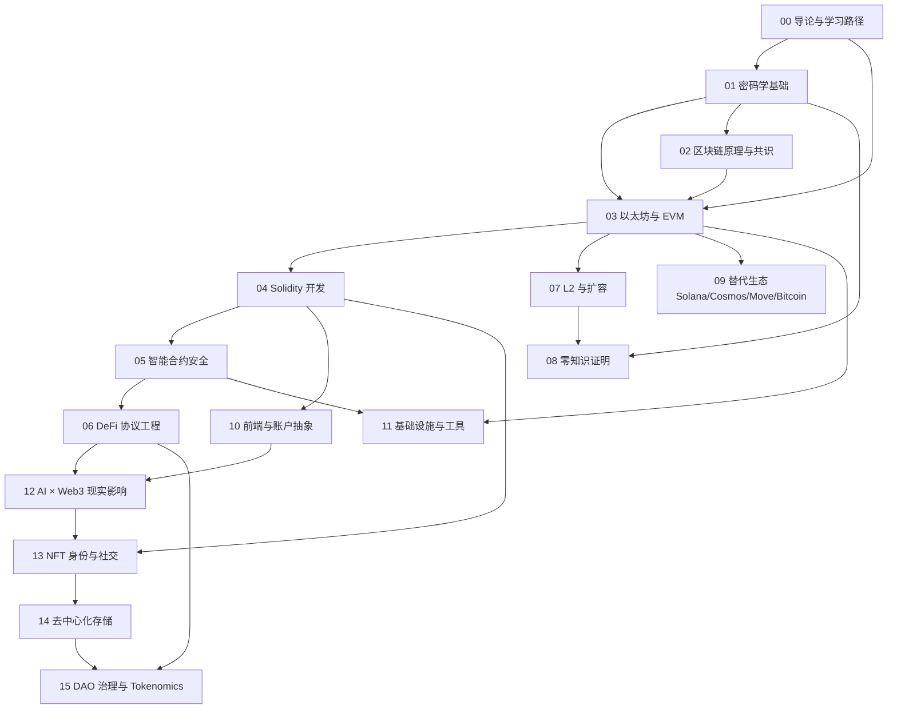

# Web3 工程师完整学习指南

> 一本为已有 1+ 年软件工程经验、想系统进入 Web3 的开发者写的中文教科书。
>
> 16 个模块 · 约 190 万中文字 · Hello-Algo 风格 · 全部代码可运行 · 引用全部附 2026-04 检索日期。
>
> 不是手册、不是 cheatsheet —— 是一本能从零教到能上线、能审计、能面试的学习书。

---

## 0. 它是什么

这是一份按"教科书"标准编写的 Web3 工程师学习材料。每个模块都按以下八段式展开：

```
学习目标 → 直觉与历史 → 核心概念（含图） → 数学/原理（含手推）
       → 工程实现（runnable code 带逐行注释） → 真实事故复盘
       → AI 对本模块的现实影响 → 习题（含完整解答）+ 自测清单
```

风格基准：[Hello 算法](https://www.hello-algo.com/zh/)。**先讲直觉、再讲数学、最后才上代码**；每个新名词都有"是什么 + 为什么需要 + 类比"三件套。

读者画像：

- 已经会 Git、Linux 基本操作、HTTP / SQL / JSON
- 至少熟悉一门主语言（JS / Python / Go / Rust 任一）
- 第一次系统性接触区块链 / Web3 / 智能合约 / DeFi
- 想在 12 个月内具备资深 Web3 工程师的工作能力

如果你已经是资深 Web3 工程师 —— 这本书也能帮你查漏补缺，特别是 ZK、L2、AI×Web3 这些 2024-2026 才成熟的章节。

---

## 1. 16 个模块 · 你应该按什么顺序读



**最短路径（12 周入门）**：
00 → 01 → 03 → 04 → 05 → 06 → 10。
这条路径让你成为一个能写、能审、能上链的 Solidity 工程师。

**深路径（24 周精通）**：
全部 16 模块。02 / 07 / 08 / 09 / 11 / 12 让你升级为协议研发 / 安全研究员 / 跨链工程师；13 / 14 / 15 让你具备身份社交、存储经济、DAO 治理与 tokenomics 设计的产品视角。

详见 [00-导论与学习路径](./00-导论与学习路径/README.md)。

---

## 2. 模块索引

| # | 模块 | 体量 | 你学完会做什么 |
|---|---|---|---|
| 00 | [导论与学习路径](./00-导论与学习路径/) | 79k 字 / 19 章 | 选定路径、配好环境、能继续往下读 |
| 01 | [密码学基础](./01-密码学基础/) | 95k 字 / 23 章 | 手算 ECDSA、写 Merkle 证明、看懂 BLS 聚合签名、掌握 PQC/FHE/MPC 原理 |
| 02 | [区块链原理与共识](./02-区块链原理与共识/) | 131k 字 / 55 章 | 读懂 19 种共识协议、自己写最小 PoW + PBFT |
| 03 | [以太坊与 EVM](./03-以太坊与EVM/) | 103k 字 / 32 章 | 看 EVM 字节码、手构造 Type 4 交易、跟踪 trace |
| 04 | [Solidity 开发](./04-Solidity开发/) | 124k 字 / 20 章 | 写出可被审计的合约、跑 invariant 测试、用 Yul 优化 gas |
| 05 | [智能合约安全](./05-智能合约安全/) | 125k 字 / 42 章 | 识别 12 类漏洞、用 Slither / Halmos 审计、参加 Code4rena |
| 06 | [DeFi 协议工程](./06-DeFi协议工程/) | 167k 字 / 36 章 | 推导 AMM 不变量、复盘 17+ 真实事故、写清算 bot |
| 07 | [L2 与扩容](./07-L2与扩容/) | 131k 字 / 29 章 | 读懂 L2BEAT stage 评级、估桥风险、部署 OP Stack |
| 08 | [零知识证明](./08-零知识证明/) | 133k 字 / 40 章 | 写 Circom / Noir 电路、跑 SP1 / Risc0、理解 zkML |
| 09 | [替代生态（Solana/Cosmos/Move/Bitcoin）](./09-替代生态/) | 154k 字 / 57 章 | 4 个非 EVM 生态各跑通 hello-world、看懂账户/对象/UTXO 心智差异 |
| 10 | [前端与账户抽象](./10-前端与账户抽象/) | 116k 字 / 40 章 | 用 viem + wagmi + Pimlico 做 4337 dApp、防钓鱼签名 |
| 11 | [基础设施与工具](./11-基础设施与工具/) | 109k 字 / 22 章 | 跑 reth + lighthouse、Ponder indexer、Tenderly 告警、CI/CD |
| 12 | [AI × Web3 现实影响](./12-AI×Web3/) | 103k 字 / 15 章 | 客观评估 AI 工具能/不能、跑 EZKL zkML、写 on-chain LLM agent |
| 13 | [NFT 身份与社交](./13-NFT身份与社交/) | 133k 字 / 34 章 | ERC-721/1155/6551 实现、ENS/EAS/SIWE 集成、Farcaster/Lens v3 协议 |
| 14 | [去中心化存储](./14-去中心化存储/) | 86k 字 / 30 章 | IPFS/Filecoin/Arweave/Walrus/0G 选型、PoRep/PoSt 证明机制 |
| 15 | [DAO 治理与 Tokenomics](./15-DAO治理与Tokenomics/) | 113k 字 / 34 章 | OZ Governor 部署、ve-tokenomics 数学、QF/QV、ERC-3643 RWA、防御治理攻击 |

每个模块目录里都有：

- `README.md` —— 主教科书
- `code/` —— 可运行的代码（pin 版本，附 README + foundry.toml / package.json / requirements.txt）
- `exercises/` —— 至少 3 道习题（多数带完整解答）

---

## 3. 怎么用这本书

### 边读边写边验

每章读完不要立刻翻下一章。打开终端：

1. **打**：把代码逐字敲一遍（不许复制粘贴）。手指肌肉记忆比眼睛重要。
2. **跑**：跑通示例，看输出。和书里截图比对。
3. **改**：故意改一个参数，看会不会出错。错误信息也要读。
4. **写**：合上书，从空白文件开始重写一遍。

### 章节内三件套

每个新名词第一次出现时，会有：

- **是什么**：一句话定义
- **为什么需要**：解决什么问题
- **类比**：用 CS 基础或日常事物类比

举例：

> **nonce** 是什么：账户的发送计数器（每发一笔 +1）。
> 为什么需要：防止重放攻击 —— 同一笔签名只能用一次。
> 类比：银行流水号。每张支票都有唯一编号，盖过章就作废。

### 提示框

```text
> 💡 提示：补充入门信息
> ⚠️ 注意：踩坑警告
> 🤔 想一想：留给读者的反思（不一定有答案）
```

### 习题

每章末尾给习题。**先自己想，再翻答案**。直接看答案是把书读"过"了，不是"懂"了。

---

## 4. 环境配置（macOS / Linux）

每个模块的 `code/` 目录里有具体的 `requirements.txt` / `package.json` / `foundry.toml` / `docker-compose.yml`。下面是底层工具链一键安装。

```bash
# 1. 包管理（macOS 跳过 apt 行）
# brew install ...    # macOS
# sudo apt install -y build-essential git curl ...   # Linux

# 2. Node.js（用 fnm 管多版本）
curl -fsSL https://fnm.vercel.app/install | bash
fnm install 22 && fnm use 22

# 3. pnpm（推荐）
npm install -g pnpm@9.15.0

# 4. Python（用 uv 或 pyenv）
curl -LsSf https://astral.sh/uv/install.sh | sh
uv python install 3.12

# 5. Rust（很多 Web3 工具是 Rust 写的）
curl --proto '=https' --tlsv1.2 -sSf https://sh.rustup.rs | sh -s -- -y
source "$HOME/.cargo/env"
rustup default stable

# 6. Foundry（合约开发主力）
curl -L https://foundry.paradigm.xyz | bash
foundryup

# 7. Solana CLI（注：2025 起搬到 anza.xyz）
sh -c "$(curl -sSfL https://release.anza.xyz/v3.1.10/install)"

# 8. Sui / Aptos CLI（按需）
brew install sui    # 或参考 09-替代生态/code/move/README.md

# 9. Bitcoin Core（按需，仅模块 09 桌面节点）
brew install bitcoin    # macOS

# 10. Docker（基础设施模块用）
# https://docs.docker.com/desktop/install/  按平台装
```

每个版本号都对齐 2026-04 实测。如果半年后某个工具有大版本升级，请优先看模块 README 顶部的"工具链锚点"表。

---

## 5. 跨模块速查

### 5.1 EIP / ERC 速查（最常引用的）

| 编号 | 名字 | 哪里讲 |
|---|---|---|
| EIP-1559 | Type 2 交易 / base fee | 03-EVM §3 |
| EIP-712 | Typed-data signing | 01-密码学 §10 / 04-Solidity §5 |
| EIP-2098 | Compact signature | 01-密码学 §10 |
| EIP-2612 | ERC20 Permit | 04-Solidity §9.6 |
| EIP-4337 | Account Abstraction | 10-前端 §15-16 |
| EIP-4844 | Blob transactions | 03-EVM §3 / 07-L2 §5 |
| EIP-7702 | EOA 升级（Pectra） | 04-Solidity §9.8 / 10-前端 §15A |
| EIP-7579 | 模块化 Smart Account | 10-前端 §15A |
| EIP-7521 | Generic intents | 06-DeFi §5 / 10-前端 §16F |
| ERC-4626 | Tokenized vault | 04-Solidity §6 / 06-DeFi §3 |
| ERC-2535 | Diamond proxy | 04-Solidity §9.9 |

### 5.2 真实事故（金额 ≥$50M）速查

| 年份 | 事件 | 损失 | 哪里讲 |
|---|---|---|---|
| 2014-02 | Mt. Gox | $480M | 02-共识 §31 |
| 2016-06 | The DAO | $60M | 05-安全 §1 / 02-共识 §32 |
| 2020-04 | dForce | $25M | 05-安全 §2.5 |
| 2021-08 | Poly Network | $611M | 05-安全 §11 |
| 2022-02 | Wormhole | $326M | 07-L2 §11.2 / 05-安全 §11 |
| 2022-03 | Ronin | $625M | 07-L2 §11.3 / 05-安全 §11 |
| 2022-08 | Nomad | $190M | 07-L2 §11.4 |
| 2022-10 | Mango Markets | $114M | 06-DeFi §6 / 05-安全 §3 |
| 2023-03 | Euler V1 | $197M | 06-DeFi §6 / 05-安全 §6 |
| 2023-07 | Curve（Vyper bug）| $73M | 04-Solidity §13.3 / 06-DeFi §6 |
| 2023-11 | KyberSwap | $48M | 06-DeFi §6 |
| 2024-03 | Munchables | $62M（追回）| 06-DeFi §6 / 05-安全 §4 |
| 2024-09 | Penpie | $27M | 05-安全 §2.5 |
| 2024-10 | Radiant Capital | $52M | 05-安全 §10 |
| 2025-02 | Bybit | $1.46B | 05-安全 §4 |

### 5.3 工具链锚点（2026-04 验证）

| 工具 | 推荐版本 | 用在 |
|---|---|---|
| Solidity | 0.8.28 (default `cancun`) | 04 / 05 / 06 |
| Foundry | nightly @ 2026-04 | 04 / 05 / 06 / 11 |
| OpenZeppelin Contracts | v5.5.0 | 04 / 05 |
| viem | 2.43.x | 03 / 10 / 11 / 12 |
| wagmi | v2.18.x | 10 |
| Next.js | 15.x | 10 |
| reth | v2.0+ | 11 |
| lighthouse | v8.1+ | 11 |
| Anchor | 1.0.x | 09 |
| @mysten/sui | 1.x | 09 |

详细 commit hash / pinning 见各模块顶部"工具链锚点"表。

---

## 6. AI 对本书读者的现实影响

AI 工具（Cursor / Claude Code / Aider / Copilot）在 Web3 开发中正在做什么、不做什么 —— 见 [12-AI×Web3](./12-AI×Web3/README.md)。简短结论：

✅ **AI 已能可靠帮你做的**：

- ERC20 / 4626 / 4337 boilerplate 脚手架
- 文档/审计报告写作辅助
- ABI / calldata 解码
- Subgraph / Ponder schema 草稿
- 学习路径辅导（解释 ZK 论文段落、debug 编译错误）

⚠️ **AI 在做但需要你审视的**：

- 智能合约审计（漏报率 30-50%、误报率 30-50%，详见 12 §2.1.8）
- 模糊测试 seed / invariant 生成
- ZK 电路调试（约束漏洞代价极高）

❌ **AI 短期内不会替代你的**：

- 共识协议设计、新颖密码学
- DeFi 经济建模、博弈论
- 跨合约不变量推导
- 协议安全的最终责任

> 💡 一句话：用 AI 加速实现，自己掌控设计与验证。

---

## 7. 风格与编辑约定

为后续续写者 / Pull Request 提交者，所有 16 模块均遵循以下约定：

- **中文为主，技术术语保留英文**（ECDSA / EVM / KZG / Solidity 不翻）
- **每个外部链接都附"检索日 2026-04"**。半年以上未复测的链接需要 PR 重测
- **代码必须可运行**，不接受 pseudo-code（除非用作教学示意，且明确标注）
- **每个版本号都 pin 到具体 tag 或 commit hash**
- **Mermaid 图能放就放**（流程图、状态图、序列图都好）
- **不写"由于篇幅所限" / "略" / "类似 X，不再赘述"**。该展开的展开
- **每章末尾给"我们刚学到了什么"过渡段**，不写孤立 bullet 收尾
- **习题给完整解答**（除非该题是开放探索题）

---

## 8. 已知遗漏（不在本书范围）

16 个模块覆盖了从密码学到 DAO 治理的完整链路。以下话题有意识地不放进现有模块——如果你需要，请单独立项：

- 法律合规深度（具体司法辖区的 KYC / AML / MiCA / 美国证券法落地，仅 15 §11 / 13 §17 浅触）
- VC term sheet / 谈判技巧（15 §13 讲了代币分发，但不展开融资条款）
- NFT 艺术经济与创作社群（13 讲了协议层，不讲艺术市场运营）
- 中心化交易所内部架构
- Web3 营销 / KOL / mining 推广
- 链上量化交易策略（06 §25 讲了 MEV 工程，不展开因子模型）

---

## 9. 致谢与来源

本书每个模块的"延伸阅读"小节列出 30-100+ 条权威来源（论文 / 官方文档 / 知名工程师博客）。横向高频引用：

- **Vitalik Buterin** 博客：vitalik.eth.limo（共识、ZK、AI×Crypto 章节）
- **Ethereum Yellow Paper**（03 EVM 全章）
- **Mastering Ethereum 2nd Ed.** (Andreas Antonopoulos & Gavin Wood, 2025-11) —— 最权威的入门书
- **Cyfrin Updraft** updraft.cyfrin.io —— 免费 Solidity / 安全 / DeFi 课程
- **Speedrun Ethereum** speedrunethereum.com —— 最受欢迎的 Foundry 实战
- **L2BEAT** l2beat.com —— L2 stage 评级权威
- **Defillama** defillama.com —— DeFi TVL 与协议元数据
- **Code4rena / Sherlock / Cantina** —— 安全竞赛报告库
- **a16z crypto / Paradigm** —— 协议研究博客
- **Patrick Collins / Owen Thurm** —— YouTube 教学视频
- **Hello 算法** hello-algo.com —— 本书的写作风格基准

---

## 10. 给后续合并/审查者的注意点

参见 `_merge_notes.md`（架构师在 v3 阶段留下的跨模块一致性清单）：

- Solidity 版本归一（建议统一到 0.8.28）
- 依赖版本归一（viem 统一到 2.43.x）
- 跨模块前置依赖检查
- 代码运行验证：建议在 CI 跑 `forge test` 与 `pnpm tsc`

---

## 许可

本书所有文字、图、代码以 [MIT License](https://opensource.org/license/mit) 发布。
代码示例引用的第三方库版权归各自作者所有。
事故复盘小节引用的官方报告 / Rekt News / Twitter 链接都附原文，本书仅做整理与解读。

---

> "记得比活着更深。"
>
> 学完这本书，你应该可以：读得懂任何主流协议的源码、写得出可被审计的合约、辨得清营销话术与真实工程、决定得了自己下一个 12 个月该投资什么技能。
>
> 如果不能，是这本书没写好。请提 issue 告诉我哪一章卡住了，我们再迭代。
